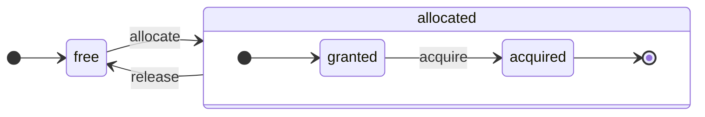
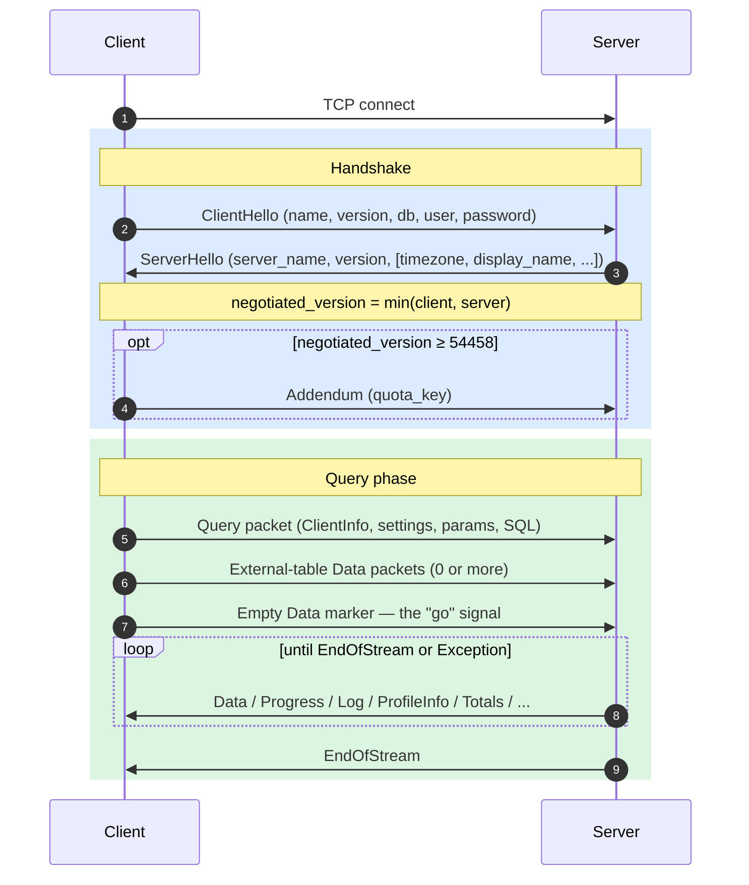
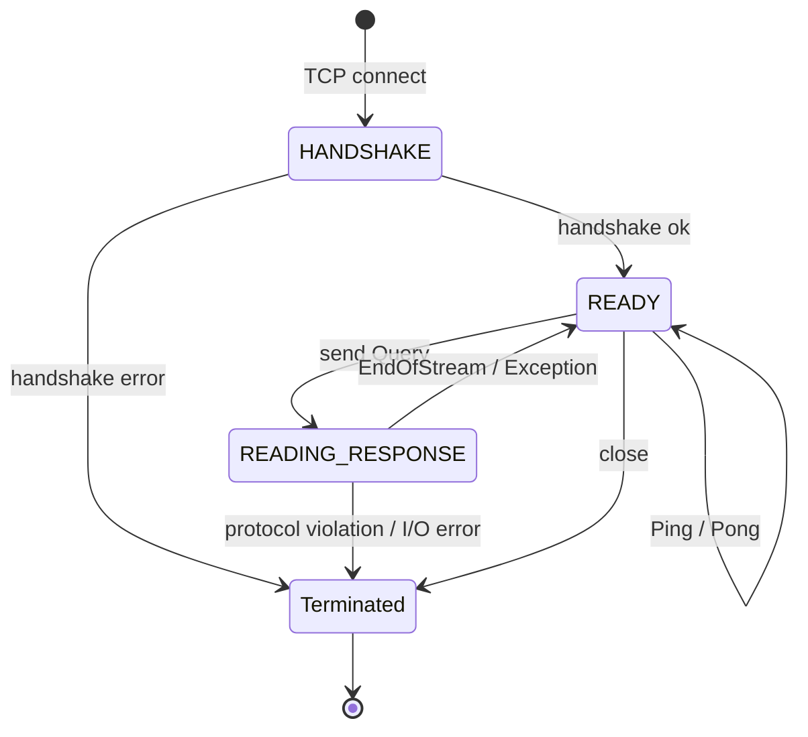
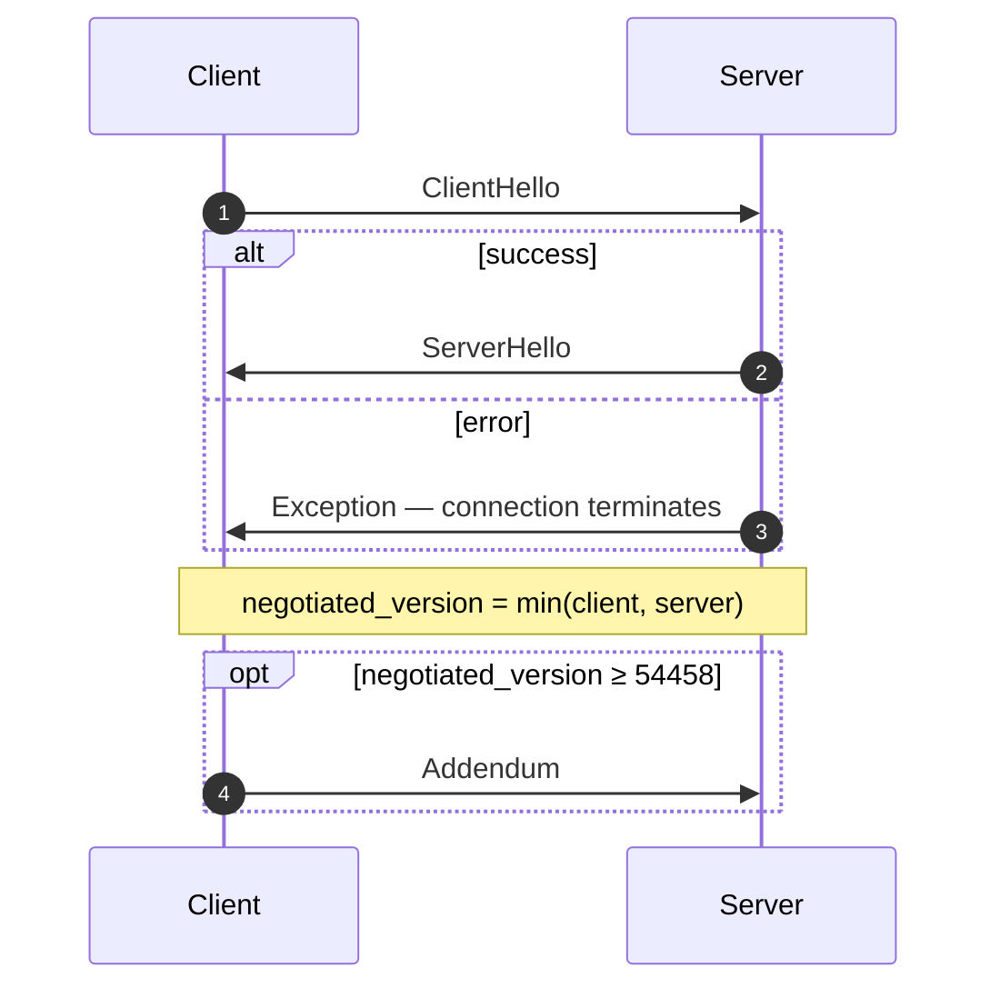
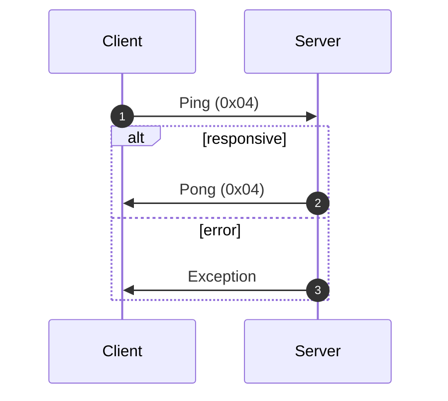
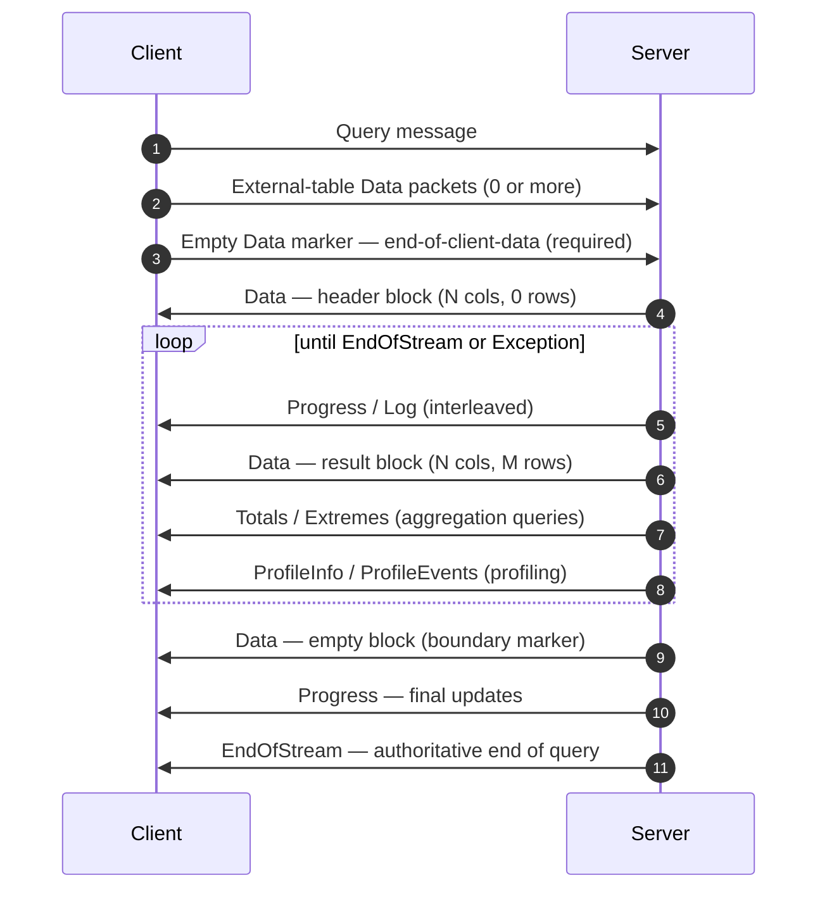
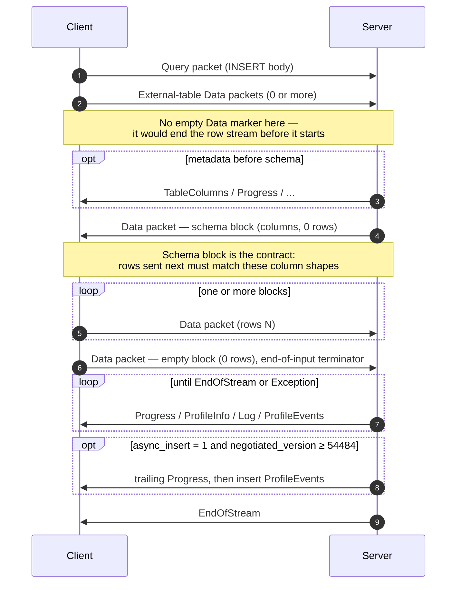
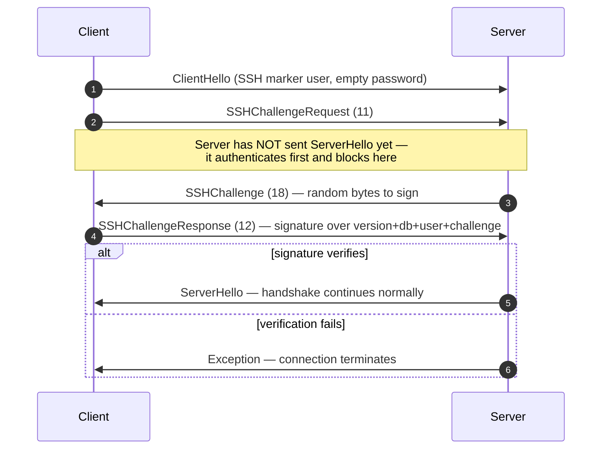

<a id="doc-c7ff413df2837da5f3b2c79f"></a>

# ClickHouse/ClickHouse / docs/pt-BR/resources/changelogs/oss/2024.mdx

Upstream: https://github.com/ClickHouse/ClickHouse/blob/28dc98b1fc057c08396c95e495b9327754a10b04/docs/pt-BR/resources/changelogs/oss/2024.mdx

Commit: `28dc98b1fc057c08396c95e495b9327754a10b04`

Retrieved: 2026-10-01T15:20:10.316397+00:00

Kind: official-document

Raw SHA256: `d7bcb78f235e7f1ed919218843d3d6b5d53e386876ca31313cf46289d982b2e8`

Source text below is untrusted reference content. Acquisition does not verify technical claims.

License status: UPSTREAM_NOTICES_CAPTURED_PER_FILE_REVIEW_REQUIRED. See this repository's captured license files.

---

---
slug: /whats-new/changelog/2024
sidebarTitle: '2024'
title: 'Changelog de 2024'
description: 'Changelog de 2024'
keywords: ['ClickHouse 2024', 'changelog 2024', 'notas de versão', 'histórico de versões', 'novos recursos']
doc_type: 'changelog'
---

<div id="table-of-contents">
  ### Sumário
</div>

**[lançamento do ClickHouse v24.12, 2024-12-19](/pt-BR/resources/changelogs/oss/2024#a-id2412a-clickhouse-release-2412-2024-12-19)**<br />
**[lançamento do ClickHouse v24.11, 2024-11-26](/pt-BR/resources/changelogs/oss/2024#a-id2411a-clickhouse-release-2411-2024-11-26)**<br />
**[lançamento do ClickHouse v24.10, 2024-10-31](/pt-BR/resources/changelogs/oss/2024#a-id2410a-clickhouse-release-2410-2024-10-31)**<br />
**[lançamento do ClickHouse v24.9, 2024-09-26](/pt-BR/resources/changelogs/oss/2024#a-id249a-clickhouse-release-249-2024-09-26)**<br />
**[lançamento do ClickHouse v24.8 LTS, 2024-08-20](/pt-BR/resources/changelogs/oss/2024#a-id248a-clickhouse-release-248-lts-2024-08-20)**<br />
**[lançamento do ClickHouse v24.7, 2024-07-30](/pt-BR/resources/changelogs/oss/2024#a-id247a-clickhouse-release-247-2024-07-30)**<br />
**[lançamento do ClickHouse v24.6, 2024-07-01](/pt-BR/resources/changelogs/oss/2024#a-id246a-clickhouse-release-246-2024-07-01)**<br />
**[lançamento do ClickHouse v24.5, 2024-05-30](/pt-BR/resources/changelogs/oss/2024#a-id245a-clickhouse-release-245-2024-05-30)**<br />
**[lançamento do ClickHouse v24.4, 2024-04-30](/pt-BR/resources/changelogs/oss/2024#a-id244a-clickhouse-release-244-2024-04-30)**<br />
**[lançamento do ClickHouse v24.3 LTS, 2024-03-26](/pt-BR/resources/changelogs/oss/2024#a-id243a-clickhouse-release-243-lts-2024-03-27)**<br />
**[lançamento do ClickHouse v24.2, 2024-02-29](/pt-BR/resources/changelogs/oss/2024#a-id242a-clickhouse-release-242-2024-02-29)**<br />
**[lançamento do ClickHouse v24.1, 2024-01-30](/pt-BR/resources/changelogs/oss/2024#a-id241a-clickhouse-release-241-2024-01-30)**<br />
**[Changelog de 2023](/pt-BR/resources/changelogs/oss/2023)**<br />

### <a id="2412" /> Lançamento do ClickHouse 24.12, 2024-12-19. [Apresentação](https://presentations.clickhouse.com/2024-release-24.12/), [Vídeo](https://www.youtube.com/watch?v=bv-ut-Q6vnc)

<Frame>
  <iframe src="https://www.youtube.com/embed/bv-ut-Q6vnc" frameborder="0" allow="accelerometer; autoplay; clipboard-write; encrypted-media; gyroscope; picture-in-picture" allowfullscreen />
</Frame>

<div id="backward-incompatible-change">
  #### Alteração incompatível com versões anteriores
</div>

* As funções `greatest` e `least` agora passam a ignorar valores de entrada NULL, enquanto antes retornavam NULL se um dos argumentos fosse NULL. Por exemplo, `SELECT greatest(1, 2, NULL)` agora retorna 2. Isso torna o comportamento compatível com o PostgreSQL, mas, ao mesmo tempo, quebra a compatibilidade com o MySQL, que retorna NULL. Para manter o comportamento anterior, defina a configuração `least_greatest_legacy_null_behavior` (padrão: `false`) como `true`. [#65519](https://github.com/ClickHouse/ClickHouse/pull/65519) [#73344](https://github.com/ClickHouse/ClickHouse/pull/73344) ([kevinyhzou](https://github.com/KevinyhZou)).
* Uma nova integração com o MongoDB agora é a padrão. Usuários que preferirem usar o driver legado do MongoDB (baseado no driver Poco) podem habilitar a configuração do servidor `use_legacy_mongodb_integration`. [#73359](https://github.com/ClickHouse/ClickHouse/pull/73359) ([Kirill Nikiforov](https://github.com/allmazz).

<div id="new-feature">
  #### Novo recurso
</div>

* Tipos `JSON`/`Dynamic`/`Variant` passam de recursos experimentais para beta. [#72294](https://github.com/ClickHouse/ClickHouse/pull/72294) ([Pavel Kruglov](https://github.com/Avogar)). Também fizemos o backport de todas as correções, bem como dessa alteração, para a 24.11.
* A evolução de esquema para o formato de [armazenamento de dados Iceberg](https://iceberg.apache.org/spec/#file-system-operations) oferece ao usuário amplas opções para modificar o esquema da tabela. A ordem das colunas, os nomes das colunas e extensões simples de tipos podem ser alterados internamente. [#69445](https://github.com/ClickHouse/ClickHouse/pull/69445) ([Daniil Ivanik](https://github.com/divanik)).
* Integração com o Iceberg REST Catalog: um novo mecanismo de banco de dados, chamado Iceberg, que integra todo o catálogo ao ClickHouse. [#71542](https://github.com/ClickHouse/ClickHouse/pull/71542) ([Kseniia Sumarokova](https://github.com/kssenii)).
* Adicionado cache do índice primário para tabelas `MergeTree` (pode ser habilitado pela configuração da tabela `use_primary_key_cache`). Se o carregamento sob demanda e o cache estiverem habilitados para o índice primário, ele será carregado no cache conforme necessário (semelhante ao mark cache), em vez de ficar em memória o tempo todo. Adicionado o pré-aquecimento do índice primário em inserts/merges/fetches de partes de dados e nas reinicializações da tabela (pode ser habilitado pela configuração `prewarm_primary_key_cache`). Isso reduz o uso de memória em tabelas enormes em armazenamento compartilhado, e testamos isso em tabelas com mais de um quatrilhão de registros. [#72102](https://github.com/ClickHouse/ClickHouse/pull/72102) ([Anton Popov](https://github.com/CurtizJ)). [#72750](https://github.com/ClickHouse/ClickHouse/pull/72750) ([Alexander Gololobov](https://github.com/davenger)).
* Implementado o comando `SYSTEM LOAD PRIMARY KEY` para carregar os índices primários de todas as partes de uma tabela especificada ou de todas as tabelas, se nenhuma tabela for especificada. Isso será útil em benchmarks e para evitar latência adicional durante a execução de consultas. [#66252](https://github.com/ClickHouse/ClickHouse/pull/66252) [#67733](https://github.com/ClickHouse/ClickHouse/pull/67733) ([ZAWA&#95;ll](https://github.com/Zawa-ll)).
* Adicionada uma consulta para anexar tabelas `MergeTree` como `ReplicatedMergeTree` e vice-versa: `ATTACH TABLE ... AS REPLICATED` e `ATTACH TABLE ... AS NOT REPLICATED`. [#65401](https://github.com/ClickHouse/ClickHouse/pull/65401) ([Kirill](https://github.com/kirillgarbar)).
* Uma nova configuração, `http_response_headers`, que permite personalizar os cabeçalhos de resposta HTTP. Por exemplo, você pode instruir o navegador a exibir uma imagem armazenada no banco de dados. Isso fecha [#59620](https://github.com/ClickHouse/ClickHouse/issues/59620). [#72656](https://github.com/ClickHouse/ClickHouse/pull/72656) ([Alexey Milovidov](https://github.com/alexey-milovidov)).
* Adiciona a função `toUnixTimestamp64Second`, que converte um `DateTime64` em um valor `Int64` com precisão fixa de segundos, permitindo retornar um valor negativo se a data for anterior à epoch Unix. [#70597](https://github.com/ClickHouse/ClickHouse/pull/70597) ([zhanglistar](https://github.com/zhanglistar)). [#73146](https://github.com/ClickHouse/ClickHouse/pull/73146) ([Robert Schulze](https://github.com/rschu1ze)).
* Adiciona a nova configuração `enforce_index_structure_match_on_partition_manipulation` para permitir o attach quando o conjunto de projeções e índices secundários da tabela de origem for um subconjunto dos da tabela de destino. Fecha [#70602](https://github.com/ClickHouse/ClickHouse/issues/70602). [#70603](https://github.com/ClickHouse/ClickHouse/pull/70603) ([zwy991114](https://github.com/zwy991114)).
* Foi adicionada a sintaxe ALTER USER `{ADD|MODIFY|DROP SETTING}`, ALTER USER `{ADD|DROP PROFILE}`, e o mesmo para ALTER ROLE e ALTER PROFILE. Assim, em vez de substituir todo o conjunto de configurações, você pode modificá-lo. [#72050](https://github.com/ClickHouse/ClickHouse/pull/72050) ([pufit](https://github.com/pufit)).
* Adicionada a função `arrayPRAUC`, que calcula a AUC (Área Sob a Curva) da curva de Precisão-Recall. [#72073](https://github.com/ClickHouse/ClickHouse/pull/72073) ([Emmanuel](https://github.com/emmanuelsdias)).
* Adiciona a função `indexOfAssumeSorted` para tipos de array. Otimiza a busca no caso de um array ordenado em ordem não decrescente. O efeito é perceptível em arrays muito grandes (mais de 100.000 elementos). [#72517](https://github.com/ClickHouse/ClickHouse/pull/72517) ([Eric Kurbanov](https://github.com/erickurbanov)).
* Permite usar um delimitador como segundo argumento opcional da função de agregação `groupConcat`. [#72540](https://github.com/ClickHouse/ClickHouse/pull/72540) ([Yarik Briukhovetskyi](https://github.com/yariks5s)).
* A função `translate` agora permite excluir caracteres se o argumento `from` contiver mais caracteres do que o argumento `to`. Exemplo: `SELECT translate('clickhouse', 'clickhouse', 'CLICK')` agora retorna `CLICK`. [#71441](https://github.com/ClickHouse/ClickHouse/pull/71441) ([shuai.xu](https://github.com/shuai-xu)).

<div id="experimental-features">
  #### Recursos experimentais
</div>

* Uma nova configuração do MergeTree, `allow_experimental_reverse_key`, que habilita o suporte à ordem de classificação decrescente nas chaves de ordenação do MergeTree. Isso é útil para análise de séries temporais, especialmente para consultas TopN. Exemplo de uso: `ENGINE = MergeTree ORDER BY (time DESC, key)` - ordem decrescente para o campo `time`. [#71095](https://github.com/ClickHouse/ClickHouse/pull/71095) ([Amos Bird](https://github.com/amosbird)).

<div id="performance-improvement">
  #### Melhoria de desempenho
</div>

* Reordenação de JOIN. Foi adicionada uma opção para selecionar o lado do join que atuará como tabela interna (build) no plano de consulta. Isso é controlado por `query_plan_join_swap_table`, que pode ser definido como `auto`. Nesse modo, o ClickHouse tentará escolher a tabela com o menor número de linhas. [#71577](https://github.com/ClickHouse/ClickHouse/pull/71577) ([Vladimir Cherkasov](https://github.com/vdimir)).
* Agora, o algoritmo `parallel_hash` será usado (quando aplicável) quando a configuração `join_algorithm` estiver definida como `default`. As duas alternativas anteriores (`direct` e `hash`) ainda serão consideradas quando não for possível usar `parallel_hash`. [#70788](https://github.com/ClickHouse/ClickHouse/pull/70788) ([Nikita Taranov](https://github.com/nickitat)).
* Adiciona a opção de extrair expressões comuns de expressões `WHERE` e `ON` para reduzir o número de tabelas hash usadas durante junções. Isso faz sentido quando a condição `JOIN ON` tem partes em comum dentro de `AND` em diferentes partes de `OR`. Pode ser habilitado com `optimize_extract_common_expressions = 1`. [#71537](https://github.com/ClickHouse/ClickHouse/pull/71537) ([János Benjamin Antal](https://github.com/antaljanosbenjamin)).
* Permite usar índices em `SELECT` quando uma coluna indexada é convertida com CAST para `LowCardinality(String)`, o que pode ocorrer quando uma consulta é executada em uma tabela Merge com algumas tabelas usando `String` e outras `LowCardinality(String)`. [#71598](https://github.com/ClickHouse/ClickHouse/pull/71598) ([Yarik Briukhovetskyi](https://github.com/yariks5s)).
* Durante a execução da consulta com réplicas paralelas e plano local ativado, não faça análise de índice nos workers. O coordenador escolherá os intervalos que os workers devem ler com base na análise de índice feita do seu lado (no iniciador da consulta). Isso faz com que consultas curtas com réplicas paralelas tenham latência tão baixa quanto a de consultas em um único nó. [#72109](https://github.com/ClickHouse/ClickHouse/pull/72109) ([Igor Nikonov](https://github.com/devcrafter)).
* O uso de memória de `clickhouse disks remove --recursive` foi reduzido em discos de armazenamento de objetos. [#67323](https://github.com/ClickHouse/ClickHouse/pull/67323) ([Kirill](https://github.com/kirillgarbar)).
* Traz de volta a otimização para a leitura de subcolunas de uma única coluna em partes compactas de [#57631](https://github.com/ClickHouse/ClickHouse/pull/57631). Ela foi removida acidentalmente. [#72285](https://github.com/ClickHouse/ClickHouse/pull/72285) ([Pavel Kruglov](https://github.com/Avogar)).
* Aceleração da ordenação de colunas `LowCardinality(String)` com a desvirtualização de chamadas no comparador. [#72337](https://github.com/ClickHouse/ClickHouse/pull/72337) ([Alexander Gololobov](https://github.com/davenger)).
* Otimização da função `argMin`/`argMax` para alguns tipos de dados simples. [#72350](https://github.com/ClickHouse/ClickHouse/pull/72350) ([alesapin](https://github.com/alesapin)).
* Otimiza o bloqueio no rastreador de memória com bloqueios compartilhados para reduzir a contenção, melhorando o desempenho em sistemas com um número muito alto de CPUs. [#72375](https://github.com/ClickHouse/ClickHouse/pull/72375) ([Jiebin Sun](https://github.com/jiebinn)).
* Adicionada uma nova configuração, `use_async_executor_for_materialized_views`. Permite usar execução assíncrona e, potencialmente, multithread da consulta da visão materializada; isso pode acelerar o processamento das visões durante INSERT, mas também consome mais memória. [#72497](https://github.com/ClickHouse/ClickHouse/pull/72497) ([alesapin](https://github.com/alesapin)).
* Melhorado o desempenho da deserialização dos estados de funções de agregação (no tipo de dado `AggregateFunction` e em consultas distribuídas). Melhorado ligeiramente o desempenho do parsing do formato `RowBinary`. [#72818](https://github.com/ClickHouse/ClickHouse/pull/72818) ([Anton Popov](https://github.com/CurtizJ)).
* Divisão de intervalos durante a leitura com réplicas paralelas, na ordem da chave da tabela, para consumir menos memória durante a leitura. [#72173](https://github.com/ClickHouse/ClickHouse/pull/72173) ([JIaQi](https://github.com/JiaQiTang98)).
* Acelera as inserções no MergeTree quando há um único valor de chave de partição no lote inserido. [#72348](https://github.com/ClickHouse/ClickHouse/pull/72348) ([alesapin](https://github.com/alesapin)).
* Implementada a criação paralela de tabelas durante a restauração de um backup. Antes deste PR, o comando `RESTORE` sempre criava tabelas em uma thread, o que podia ser lento no caso de backups com muitas tabelas. [#72427](https://github.com/ClickHouse/ClickHouse/pull/72427) ([Vitaly Baranov](https://github.com/vitlibar)).
* Descartar o mark cache pode levar um tempo considerável se ele for grande. Se mantivermos o mutex do Context durante esse processo, isso bloqueará muitas outras atividades; nem mesmo novas conexões de cliente poderão ser estabelecidas até que ele seja liberado. Além disso, manter esse mutex não é realmente necessário para sincronização: basta ter uma referência local ao cache via shared ptr. [#72749](https://github.com/ClickHouse/ClickHouse/pull/72749) ([Alexander Gololobov](https://github.com/davenger)).

<div id="improvement">
  #### Melhoria
</div>

* Removida a configuração `allow_experimental_join_condition`, permitindo condições não equi por padrão. [#69910](https://github.com/ClickHouse/ClickHouse/pull/69910) ([Vladimir Cherkasov](https://github.com/vdimir)).
* As configurações da config do servidor (users.xml) agora também se aplicam ao cliente. Útil para configurações de formato, por exemplo, `date_time_output_format`. [#71178](https://github.com/ClickHouse/ClickHouse/pull/71178) ([Michael Kolupaev](https://github.com/al13n321)).
* Uso automático de disco para `GROUP BY`/`ORDER BY`, com base no uso de memória do servidor/usuário. Controlado pelas configurações de consulta `max_bytes_ratio_before_external_group_by`/`max_bytes_ratio_before_external_sort`. [#71406](https://github.com/ClickHouse/ClickHouse/pull/71406) ([Azat Khuzhin](https://github.com/azat)).
* Adicionada uma nova lógica de cancelamento: `CancellationChecker` verifica os timeouts de cada consulta iniciada e as interrompe quando o timeout é atingido. [#69880](https://github.com/ClickHouse/ClickHouse/pull/69880) ([Yarik Briukhovetskyi](https://github.com/yariks5s)).
* Suporte a ALTER de `Object` para `JSON`, o que significa que agora é possível migrar facilmente do tipo Object, que está obsoleto. [#71784](https://github.com/ClickHouse/ClickHouse/pull/71784) ([Pavel Kruglov](https://github.com/Avogar)).
* Permite valores desconhecidos em Set que não estejam presentes em Enum. Corrige [#72662](https://github.com/ClickHouse/ClickHouse/issues/72662). [#72686](https://github.com/ClickHouse/ClickHouse/pull/72686) ([zhanglistar](https://github.com/zhanglistar)).
* Adiciona suporte ao operador de busca em strings (por exemplo, LIKE) para o tipo de dado `Enum`, implementando [#72661](https://github.com/ClickHouse/ClickHouse/issues/72661). [#72732](https://github.com/ClickHouse/ClickHouse/pull/72732) ([zhanglistar](https://github.com/zhanglistar)).
* Algumas consultas ALTER USER inválidas foram aceitas. Corrige [#71227](https://github.com/ClickHouse/ClickHouse/issues/71227). [#71286](https://github.com/ClickHouse/ClickHouse/pull/71286) ([Arthur Passos](https://github.com/arthurpassos)).
* Respeita `prefer_locahost_replica` ao montar o plano para `INSERT ... SELECT` distribuído. [#72190](https://github.com/ClickHouse/ClickHouse/pull/72190) ([filimonov](https://github.com/filimonov)).
* O Azure violou a especificação do Iceberg, rotulando incorretamente o Iceberg v1 como Iceberg v2. O problema é [descrito aqui](https://github.com/ClickHouse/ClickHouse/issues/72091). O Azure Iceberg Writer cria arquivos de metadados do Iceberg (assim como arquivos de manifesto) que violam a especificação. Agora tentamos ler metadados no formato Iceberg v1 com o leitor v2 (porque eles os gravam dessa forma) e adicionamos um erro para quando eles não criam os campos correspondentes em um arquivo de manifesto. [#72277](https://github.com/ClickHouse/ClickHouse/pull/72277) ([Daniil Ivanik](https://github.com/divanik)).
* Agora é permitido usar `CREATE MATERIALIZED VIEW` com `UNION [ALL]` na consulta. O comportamento é o mesmo de uma visão materializada com `JOIN`: apenas a primeira tabela na expressão `SELECT` funcionará como gatilho para insert; todas as outras tabelas serão ignoradas. No entanto, se houver várias referências à primeira tabela (por exemplo, UNION com ela mesma), todas elas serão processadas como o bloco de dados inserido. [#72347](https://github.com/ClickHouse/ClickHouse/pull/72347) ([alesapin](https://github.com/alesapin)).
* Adicionada a validação da consulta de origem quando o ClickHouse é usado como origem para um dicionário. [#72548](https://github.com/ClickHouse/ClickHouse/pull/72548) ([Alexey Katsman](https://github.com/alexkats)).
* Garanta que o ClickHouse detecte as alterações do ZooKeeper ao recarregar a configuração. [#72593](https://github.com/ClickHouse/ClickHouse/pull/72593) ([Azat Khuzhin](https://github.com/azat)).
* Melhor aproximação do uso de memória das marcas armazenadas em cache para reduzir o uso total de memória do cache. [#72630](https://github.com/ClickHouse/ClickHouse/pull/72630) ([Antonio Andelic](https://github.com/antonio2368)).
* Adicionada uma nova métrica `StartupScriptsExecutionState`. A métrica pode ter três valores: 0 = os scripts de inicialização ainda não terminaram, 1 = os scripts de inicialização foram executados com sucesso, 2 = os scripts de inicialização falharam. Precisamos dessa métrica para saber se os scripts de inicialização estão sendo executados com sucesso na nuvem, especialmente após releases das configurações de base. [#72637](https://github.com/ClickHouse/ClickHouse/pull/72637) ([Miсhael Stetsyuk](https://github.com/mstetsyuk)).
* Adicione a nova métrica `MergeTreeIndexGranularityInternalArraysTotalSize` ao `system.metrics`. Essa métrica é necessária para encontrar as instâncias com conjuntos de dados muito grandes suscetíveis à alta
* Adiciona retentativas na criação de uma tabela replicada. [#72682](https://github.com/ClickHouse/ClickHouse/pull/72682) ([Vitaly Baranov](https://github.com/vitlibar)).
* Adicionar `total_bytes_with_inactive` à `system.tables` para contabilizar o total de bytes das partes inativas. [#72690](https://github.com/ClickHouse/ClickHouse/pull/72690) ([Kai Zhu](https://github.com/nauu)).
* Adicionadas configurações do MergeTree em `system.settings_changes`. [#72694](https://github.com/ClickHouse/ClickHouse/pull/72694) ([Raúl Marín](https://github.com/Algunenano)).
* Suporte para o tipo JSON na função `notEmpty`. [#72741](https://github.com/ClickHouse/ClickHouse/pull/72741) ([Pavel Kruglov](https://github.com/Avogar)).
* Suporte ao parsing do erro GCS S3 `AuthenticationRequired`. [#72753](https://github.com/ClickHouse/ClickHouse/pull/72753) ([Vitaly Baranov](https://github.com/vitlibar)).
* Adicionado suporte ao tipo `Dynamic` nas funções `ifNull` e `coalesce`. [#72772](https://github.com/ClickHouse/ClickHouse/pull/72772) ([Pavel Kruglov](https://github.com/Avogar)).
* Suporte a `Dynamic` em funções `toFloat64`/`touInt32`/etc. [#72989](https://github.com/ClickHouse/ClickHouse/pull/72989) ([Pavel Kruglov](https://github.com/Avogar)).
* Adicionar as configurações de requisição do S3 `http_max_fields`, `http_max_field_name_size`, `http_max_field_value_size` e usá-las ao processar respostas da API do S3 durante a criação de backup ou a restauração. [#72778](https://github.com/ClickHouse/ClickHouse/pull/72778) ([Vitaly Baranov](https://github.com/vitlibar)).
* Excluir os metadados da tabela no Keeper em Storage S3(Azure)Queue somente após a remoção da última tabela que usa esses metadados. [#72810](https://github.com/ClickHouse/ClickHouse/pull/72810) ([Kseniia Sumarokova](https://github.com/kssenii)).
* Foram adicionados os eventos de perfil `JoinBuildTableRowCount`/`JoinProbeTableRowCount/JoinResultRowCount`. [#72842](https://github.com/ClickHouse/ClickHouse/pull/72842) ([Vladimir Cherkasov](https://github.com/vdimir)).
* Suporte a subcolunas na chave de ordenação do MergeTree e nos índices de salto. [#72644](https://github.com/ClickHouse/ClickHouse/pull/72644) ([Pavel Kruglov](https://github.com/Avogar)).

<div id="bug-fix-user-visible-misbehavior-in-an-official-stable-release">
  #### Correção de bug (comportamento incorreto perceptível ao usuário em uma versão estável oficial)
</div>

* Corrige possíveis partes que se sobrepõem no MergeTree (após a falha de uma operação de mover uma parte para o diretório detached, possivelmente devido a uma operação no armazenamento de objetos). [#70476](https://github.com/ClickHouse/ClickHouse/pull/70476) ([Azat Khuzhin](https://github.com/azat)).
* Corrige a detecção de erro quando um nome de tabela é longo demais. Fornece um diagnóstico informando o comprimento máximo permitido. Adiciona uma nova função `getMaxTableNameLengthForDatabase`. [#70810](https://github.com/ClickHouse/ClickHouse/pull/70810) ([Yarik Briukhovetskyi](https://github.com/yariks5s)).
* Corrigidos processos zumbis após a falha do `clickhouse-library-bridge` (este programa permite executar bibliotecas não seguras). [#71301](https://github.com/ClickHouse/ClickHouse/pull/71301) ([MikhailBurdukov](https://github.com/MikhailBurdukov)).
* Corrige o erro NoSuchKey durante o rollback da transação quando a criação de um diretório falha no disco `plain_rewritable`. [#71439](https://github.com/ClickHouse/ClickHouse/pull/71439) ([Julia Kartseva](https://github.com/jkartseva)).
* Corrigida a serialização de valores `Dynamic` nos formatos JSON `Pretty`. [#71923](https://github.com/ClickHouse/ClickHouse/pull/71923) ([Pavel Kruglov](https://github.com/Avogar)).
* Adicionar o nome do formato inferido à consulta CREATE nos motores `File`/`S3`/`URL`/`HDFS`/`Azure`. Antes, o nome do formato era inferido toda vez que o servidor era reiniciado e, se os arquivos de dados especificados fossem removidos, isso causava erros durante a inicialização do servidor. [#72108](https://github.com/ClickHouse/ClickHouse/pull/72108) ([Pavel Kruglov](https://github.com/Avogar)).
* Corrige bugs ao usar uma UDF na expressão JOIN ON com o analisador antigo. [#72179](https://github.com/ClickHouse/ClickHouse/pull/72179) ([Raúl Marín](https://github.com/Algunenano)).
* Corrige alguns bugs menores em `StorageObjectStorage`. É preciso habilitar `use_hive_partitioning` por padrão. [#72185](https://github.com/ClickHouse/ClickHouse/pull/72185) ([Yarik Briukhovetskyi](https://github.com/yariks5s)).
* Corrige um bug em que `min_age_to_force_merge_on_partition_only` ficava travado tentando mesclar repetidamente a mesma partição, que já havia sido mesclada em uma única parte, e deixava de mesclar partições com múltiplas partes. [#72209](https://github.com/ClickHouse/ClickHouse/pull/72209) ([Christoph Wurm](https://github.com/cwurm)).
* Corrigido um travamento em `SimpleSquashingChunksTransform` que ocorria em casos raros ao processar colunas esparsas. [#72226](https://github.com/ClickHouse/ClickHouse/pull/72226) ([Vladimir Cherkasov](https://github.com/vdimir)).
* Corrigida uma condição de corrida em `GraceHashJoin`, o que podia fazer com que algumas linhas ficassem ausentes na saída do join. [#72233](https://github.com/ClickHouse/ClickHouse/pull/72233) ([Nikita Taranov](https://github.com/nickitat)).
* Corrigidas as consultas `ALTER DELETE` com a coluna `_block_number` materializada (se a configuração `enable_block_number_column` estiver habilitada). [#72261](https://github.com/ClickHouse/ClickHouse/pull/72261) ([Anton Popov](https://github.com/CurtizJ)).
* Corrigida uma corrida de dados quando `ColumnDynamic::dumpStructure()` é chamado concorrentemente, por exemplo, no construtor de `ConcurrentHashJoin`. [#72278](https://github.com/ClickHouse/ClickHouse/pull/72278) ([Nikita Taranov](https://github.com/nickitat)).
* Corrige um possível `LOGICAL_ERROR` com colunas duplicadas em `ORDER BY ... WITH FILL`. [#72387](https://github.com/ClickHouse/ClickHouse/pull/72387) ([Vladimir Cherkasov](https://github.com/vdimir)).
* Corrigidos problemas de incompatibilidade de tipos em vários casos após aplicar `optimize_functions_to_subcolumns`. [#72394](https://github.com/ClickHouse/ClickHouse/pull/72394) ([Anton Popov](https://github.com/CurtizJ)).
* Use `AWS_CONTAINER_AUTHORIZATION_TOKEN_FILE` em vez de `AWS_CONTAINER_AUTHORIZATION_TOKEN_PATH`. Corrigido [#71074](https://github.com/ClickHouse/ClickHouse/issues/71074). [#72397](https://github.com/ClickHouse/ClickHouse/pull/72397) ([Konstantin Bogdanov](https://github.com/thevar1able)).
* Corrige falha ao analisar consultas `BACKUP DATABASE db EXCEPT TABLES db.table`. [#72429](https://github.com/ClickHouse/ClickHouse/pull/72429) ([Konstantin Bogdanov](https://github.com/thevar1able)).
* Impedir a criação de `Variant` vazio. [#72454](https://github.com/ClickHouse/ClickHouse/pull/72454) ([Pavel Kruglov](https://github.com/Avogar)).
* Corrigida a formatação inválida de `result_part_path` em `system.merges`. [#72567](https://github.com/ClickHouse/ClickHouse/pull/72567) ([Konstantin Bogdanov](https://github.com/thevar1able)).
* Corrige o parsing de um glob com um elemento (como `{file}`). [#72572](https://github.com/ClickHouse/ClickHouse/pull/72572) ([Konstantin Bogdanov](https://github.com/thevar1able)).
* Corrige a geração da consulta para o servidor seguidor em caso de consulta distribuída com `ARRAY JOIN`. Corrige [#69276](https://github.com/ClickHouse/ClickHouse/issues/69276). [#72608](https://github.com/ClickHouse/ClickHouse/pull/72608) ([Dmitry Novik](https://github.com/novikd)).
* Corrigido um bug em que `DateTime64 IN DateTime64` não retornava nenhum resultado. [#72640](https://github.com/ClickHouse/ClickHouse/pull/72640) ([Yarik Briukhovetskyi](https://github.com/yariks5s)).
* Corrigidos metadados inconsistentes ao adicionar uma nova réplica a um banco de dados Replicated com uma tabela criada com `flatten_nested=0`. [#72685](https://github.com/ClickHouse/ClickHouse/pull/72685) ([Alexander Tokmakov](https://github.com/tavplubix)).
* Corrige a configuração avançada de SSL na comunicação interna do Keeper. [#72730](https://github.com/ClickHouse/ClickHouse/pull/72730) ([Antonio Andelic](https://github.com/antonio2368)).
* Corrigido o erro &quot;No such key&quot; no modo não ordenado do S3Queue quando a configuração `tracked_files_limit` é menor do que a taxa de surgimento de arquivos no S3. [#72738](https://github.com/ClickHouse/ClickHouse/pull/72738) ([Kseniia Sumarokova](https://github.com/kssenii)).
* Corrige a exceção lançada no RemoteQueryExecutor quando um usuário não existe localmente. [#72759](https://github.com/ClickHouse/ClickHouse/pull/72759) ([Andrey Zvonov](https://github.com/zvonand)).
* Corrigidas as mutações com a coluna `_block_number` materializada (se a configuração `enable_block_number_column` estiver habilitada). [#72854](https://github.com/ClickHouse/ClickHouse/pull/72854) ([Anton Popov](https://github.com/CurtizJ)).
* Corrige backup/restauração com disco regravável simples quando há arquivos vazios no backup. [#72858](https://github.com/ClickHouse/ClickHouse/pull/72858) ([Kseniia Sumarokova](https://github.com/kssenii)).
* Cancela corretamente inserts em DistributedAsyncInsertDirectoryQueue. [#72885](https://github.com/ClickHouse/ClickHouse/pull/72885) ([Antonio Andelic](https://github.com/antonio2368)).
* Corrigida falha ao analisar dados incorretos em colunas esparsas (isso pode acontecer com a configuração `enable_parsing_to_custom_serialization` habilitada). [#72891](https://github.com/ClickHouse/ClickHouse/pull/72891) ([Anton Popov](https://github.com/CurtizJ)).
* Corrige uma possível falha durante a restauração de backup. [#72947](https://github.com/ClickHouse/ClickHouse/pull/72947) ([Kseniia Sumarokova](https://github.com/kssenii)).
* Corrigido um bug no método JOIN `parallel_hash` que podia ocorrer quando a consulta tem uma condição complexa na cláusula `ON` com filtros de desigualdade. [#72993](https://github.com/ClickHouse/ClickHouse/pull/72993) ([Nikita Taranov](https://github.com/nickitat)).
* Use as configurações padrão do formato durante o parsing de JSON para evitar falhas na desserialização. [#73043](https://github.com/ClickHouse/ClickHouse/pull/73043) ([Pavel Kruglov](https://github.com/Avogar)).
* Corrige travamento em transações com armazenamento sem suporte. [#73045](https://github.com/ClickHouse/ClickHouse/pull/73045) ([Raúl Marín](https://github.com/Algunenano)).
* Corrige uma possível superestimação no rastreamento de memória (quando a diferença entre `MemoryTracking` e `MemoryResident` seguia aumentando). [#73081](https://github.com/ClickHouse/ClickHouse/pull/73081) ([Azat Khuzhin](https://github.com/azat)).
* Verificação de chaves JSON duplicadas durante o parsing de Tuple. Antes, isso podia causar o erro lógico `Invalid number of rows in Chunk` durante o parsing. [#73082](https://github.com/ClickHouse/ClickHouse/pull/73082) ([Pavel Kruglov](https://github.com/Avogar)).

<div id="buildtestingpackaging-improvement">
  #### Melhoria em Compilação/Testes/Empacotamento
</div>

* Todos os pequenos utilitários anteriormente armazenados na pasta `/utils` e que exigiam compilação manual a partir do código-fonte agora fazem parte do pacote principal do ClickHouse. Isso fecha: [#72404](https://github.com/ClickHouse/ClickHouse/issues/72404). [#72426](https://github.com/ClickHouse/ClickHouse/pull/72426) ([Nikita Mikhaylov](https://github.com/nikitamikhaylov)).
* Reverte a remoção de `/etc/systemd/system/clickhouse-server.service` introduzida na versão 22.3 [#39323](https://github.com/ClickHouse/ClickHouse/issues/39323). [#72259](https://github.com/ClickHouse/ClickHouse/pull/72259) ([Mikhail f. Shiryaev](https://github.com/Felixoid)).
* Divide grandes unidades de tradução para evitar falhas de compilação devido a limitações de memória/CPU. [#72352](https://github.com/ClickHouse/ClickHouse/pull/72352) ([Yakov Olkhovskiy](https://github.com/yakov-olkhovskiy)).
* OSX: Compilação com suporte a ICU, o que habilita collations, conversões de conjunto de caracteres e outros recursos de localização. [#73083](https://github.com/ClickHouse/ClickHouse/pull/73083) ([Raúl Marín](https://github.com/Algunenano)).

### <a id="2411" /> Lançamento do ClickHouse 24.11, 2024-11-26. [Apresentação](https://presentations.clickhouse.com/2024-release-24.11/), [Vídeo](https://www.youtube.com/watch?v=0hpTvtq__4g)

<Frame>
  <iframe src="https://www.youtube.com/embed/0hpTvtq__4g" frameborder="0" allow="accelerometer; autoplay; clipboard-write; encrypted-media; gyroscope; picture-in-picture" allowfullscreen />
</Frame>

<div id="backward-incompatible-change">
  #### Alteração incompatível com versões anteriores
</div>

* Removidas as tabelas de sistema `generate_series` e `generateSeries`. Elas foram adicionadas por engano aqui: [#59390](https://github.com/ClickHouse/ClickHouse/issues/59390). [#71091](https://github.com/ClickHouse/ClickHouse/pull/71091) ([Alexey Milovidov](https://github.com/alexey-milovidov)).
* Removido `StorageExternalDistributed`. Fecha [#70600](https://github.com/ClickHouse/ClickHouse/issues/70600). [#71176](https://github.com/ClickHouse/ClickHouse/pull/71176) ([flynn](https://github.com/ucasfl)).
* Os motores de tabela Kafka, NATS e RabbitMQ agora são cobertos por grants próprios na hierarquia `SOURCES`. Adicione grants a todos os usuários de banco de dados não padrão que criem tabelas com esses tipos de engine. [#71250](https://github.com/ClickHouse/ClickHouse/pull/71250) ([Christoph Wurm](https://github.com/cwurm)).
* Verifique a consulta de mutação completa antes de executá-la (incluindo subconsultas). Isso evita a execução acidental de uma consulta inválida e o acúmulo de mutações mortas que bloqueiam mutações válidas. [#71300](https://github.com/ClickHouse/ClickHouse/pull/71300) ([Christoph Wurm](https://github.com/cwurm)).
* Renomeada a configuração do cache do filesystem `skip_download_if_exceeds_query_cache` para `filesystem_cache_skip_download_if_exceeds_per_query_cache_write_limit`. [#71578](https://github.com/ClickHouse/ClickHouse/pull/71578) ([Kseniia Sumarokova](https://github.com/kssenii)).
* Removido o suporte a argumentos `Enum`, bem como `UInt128` e `UInt256`, em `deltaSumTimestamp`. Removido o suporte a `Int8`, `UInt8`, `Int16` e `UInt16` no segundo argumento (&quot;timestamp&quot;) de `deltaSumTimestamp`. [#71790](https://github.com/ClickHouse/ClickHouse/pull/71790) ([Alexey Milovidov](https://github.com/alexey-milovidov)).
* Ao recuperar dados diretamente de um dicionário usando o armazenamento Dictionary, a table function de dicionário ou um `SELECT` direto no próprio dicionário, agora basta ter a permissão `SELECT` ou a permissão `dictGet` para o dicionário. Isso está alinhado com tentativas anteriores de evitar contornos de ACL: https://github.com/ClickHouse/ClickHouse/pull/57362 e https://github.com/ClickHouse/ClickHouse/pull/65359. Isso também torna a segunda delas retrocompatível. [#72051](https://github.com/ClickHouse/ClickHouse/pull/72051) ([Nikita Mikhaylov](https://github.com/nikitamikhaylov)).

<div id="experimental-feature">
  #### Recurso experimental
</div>

* Implementa `allow_feature_tier` como um mecanismo global para desabilitar todos os recursos experimentais / beta. [#71841](https://github.com/ClickHouse/ClickHouse/pull/71841) [#71145](https://github.com/ClickHouse/ClickHouse/pull/71145) ([Raúl Marín](https://github.com/Algunenano)).
* Corrige o possível erro `No such file or directory` devido a símbolos especiais não escapados em arquivos de subcolunas JSON. [#71182](https://github.com/ClickHouse/ClickHouse/pull/71182) ([Pavel Kruglov](https://github.com/Avogar)).
* Adiciona suporte a ALTER de String para JSON. Este PR também altera a serialização dos tipos JSON e Dynamic para a nova versão V2. A versão antiga V1 ainda pode ser usada ao habilitar a configuração `merge_tree_use_v1_object_and_dynamic_serialization` (ela pode ser usada durante a atualização para permitir reverter a versão sem problemas). [#70442](https://github.com/ClickHouse/ClickHouse/pull/70442) ([Pavel Kruglov](https://github.com/Avogar)).
* Implementa um CAST simples de Map/Tuple/Object para o novo JSON por meio de serialização/desserialização a partir de uma string JSON. [#71320](https://github.com/ClickHouse/ClickHouse/pull/71320) ([Pavel Kruglov](https://github.com/Avogar)).
* Não permite tipos Variant/Dynamic em ORDER BY/GROUP BY/PARTITION BY/PRIMARY KEY por padrão, porque isso pode levar a resultados inesperados. [#69731](https://github.com/ClickHouse/ClickHouse/pull/69731) ([Pavel Kruglov](https://github.com/Avogar)).
* Proíbe tipos Dynamic/Variant em funções min/max para evitar confusão. [#71761](https://github.com/ClickHouse/ClickHouse/pull/71761) ([Pavel Kruglov](https://github.com/Avogar)).

<div id="new-feature">
  #### Novo recurso
</div>

* Adicionada sintaxe SQL para descrever workload e gerenciamento de recursos. https://clickhouse.com/docs/operations/workload-scheduling. [#69187](https://github.com/ClickHouse/ClickHouse/pull/69187) ([Sergei Trifonov](https://github.com/serxa)).
* Um novo tipo de dado, `BFloat16`, representa números de ponto flutuante de 16 bits, com expoente de 8 bits, sinal e mantissa de 7 bits. Isso encerra [#44206](https://github.com/ClickHouse/ClickHouse/issues/44206). Isso encerra [#49937](https://github.com/ClickHouse/ClickHouse/issues/49937). [#64712](https://github.com/ClickHouse/ClickHouse/pull/64712) ([Alexey Milovidov](https://github.com/alexey-milovidov)).
* Adicionada a consulta `CHECK GRANT` para verificar se o usuário/role atual recebeu o privilégio específico e se a tabela/coluna correspondente existe na memória. [#68885](https://github.com/ClickHouse/ClickHouse/pull/68885) ([Unalian](https://github.com/Unalian)).
* Adicionadas as funções de tabela `iceberg[S3;HDFS;Azure]Cluster`, `deltaLakeCluster`, `hudiCluster`. [#72045](https://github.com/ClickHouse/ClickHouse/pull/72045) ([Mikhail Artemenko](https://github.com/Michicosun)).
* Adicionada a capacidade de definir usuário/senha em http&#95;handlers (para `dynamic_query_handler`/`predefined_query_handler`). [#70725](https://github.com/ClickHouse/ClickHouse/pull/70725) ([Azat Khuzhin](https://github.com/azat)).
* Adicionado suporte à cláusula de staleness no operador ORDER BY WITH FILL. [#71151](https://github.com/ClickHouse/ClickHouse/pull/71151) ([Mikhail Artemenko](https://github.com/Michicosun)).
* Permite que cada método de autenticação tenha sua própria data de expiração, removendo essa configuração da entidade de usuário. [#70090](https://github.com/ClickHouse/ClickHouse/pull/70090) ([Arthur Passos](https://github.com/arthurpassos)).
* Adicionadas as novas funções `parseDateTime64`, `parseDateTime64OrNull` e `parseDateTime64OrZero`. Em comparação com a função existente `parseDateTime` (e variantes), elas retornam um valor do tipo `DateTime64` em vez de `DateTime`. [#71581](https://github.com/ClickHouse/ClickHouse/pull/71581) ([kevinyhzou](https://github.com/KevinyhZou)).

<div id="performance-improvement-1">
  #### Melhorias de desempenho
</div>

* Uso de memória otimizado para os valores da granularidade do índice quando a granularidade é constante para a parte. Foi adicionada a capacidade de sempre selecionar granularidade constante para a parte (configuração `use_const_adaptive_granularity`), o que ajuda a garantir que ela permaneça sempre otimizada em memória. Isso ajuda, em workloads grandes (trilhões de linhas em armazenamento compartilhado), a evitar o crescimento constante do uso de memória pelos metadados (valores da granularidade do índice) das partes de dados. [#71786](https://github.com/ClickHouse/ClickHouse/pull/71786) ([Anton Popov](https://github.com/CurtizJ)).
* Agora, as colunas dos blocos de entrada não são copiadas para `join_algorithm = 'parallel_hash'` ao distribuí-las entre threads para processamento paralelo. [#67782](https://github.com/ClickHouse/ClickHouse/pull/67782) ([Nikita Taranov](https://github.com/nickitat)).
* Algoritmo de mesclagem `Replacing` otimizado para partes sem sobreposição. [#70977](https://github.com/ClickHouse/ClickHouse/pull/70977) ([Anton Popov](https://github.com/CurtizJ)).
* Não listar partes detached em discos somente leitura e de gravação única nas métricas e em system.detached&#95;parts. [#71086](https://github.com/ClickHouse/ClickHouse/pull/71086) ([Alexey Milovidov](https://github.com/alexey-milovidov)).
* Não calcule métricas assíncronas pesadas por padrão. A funcionalidade foi introduzida em [#40332](https://github.com/ClickHouse/ClickHouse/issues/40332), mas não é adequado ter um job pesado em segundo plano necessário para apenas um único cliente. [#71087](https://github.com/ClickHouse/ClickHouse/pull/71087) ([Alexey Milovidov](https://github.com/alexey-milovidov)).
* Para os discos `plain_rewritable`: não faça chamadas à API de armazenamento de objetos ao listar diretórios, pois isso pode ser pouco eficiente em termos de custo. Em vez disso, armazene a lista de nomes de arquivo em memória. As desvantagens são o aumento no tempo de carga inicial e na memória necessária para armazenar os nomes de arquivo. [#70823](https://github.com/ClickHouse/ClickHouse/pull/70823) ([Julia Kartseva](https://github.com/jkartseva)).
* Melhore o desempenho e a precisão do intervalo de coleta de `system.query_metric_log` reduzindo a seção crítica. [#71473](https://github.com/ClickHouse/ClickHouse/pull/71473) ([Pablo Marcos](https://github.com/pamarcos)).
* Otimização da leitura em ordem por meio da geração de linhas virtuais, de modo que menos dados sejam lidos durante o merge sort, especialmente útil quando há várias partes. [#62125](https://github.com/ClickHouse/ClickHouse/pull/62125) ([Shichao Jin](https://github.com/jsc0218)).
* Adicionada a configuração no servidor `async_load_system_database`, que permite que o servidor seja iniciado com o banco de dados do sistema sem estar totalmente carregado. Isso ajuda a iniciar o ClickHouse mais rapidamente se houver muitas tabelas do sistema. [#69847](https://github.com/ClickHouse/ClickHouse/pull/69847) ([Sergei Trifonov](https://github.com/serxa)).
* Adicionado o parâmetro `--threads` ao `clickhouse-compressor`, o que permite compactar dados em paralelo. [#70860](https://github.com/ClickHouse/ClickHouse/pull/70860) ([Alexey Milovidov](https://github.com/alexey-milovidov)).
* Adicionada uma configuração `prewarm_mark_cache` que permite carregar marcas no cache de marcas em inserts, merges, fetches de partes e na inicialização da tabela. [#71053](https://github.com/ClickHouse/ClickHouse/pull/71053) ([Anton Popov](https://github.com/CurtizJ)).
* Ajusta o array index&#95;granularity na memória ao tamanho necessário para reduzir o consumo de memória da família de motores de tabela MergeTree. [#71595](https://github.com/ClickHouse/ClickHouse/pull/71595) ([alesapin](https://github.com/alesapin)).
* Desativa a configuração `boundary_alignment` do cache do sistema de arquivos para leituras sem disco, o que melhora o desempenho da leitura de arquivos remotos independentes com cache. [#71827](https://github.com/ClickHouse/ClickHouse/pull/71827) ([Kseniia Sumarokova](https://github.com/kssenii)).
* Consultas como `SELECT * FROM table LIMIT ...` costumavam carregar os índices das partes, embora eles não fossem usados. [#71866](https://github.com/ClickHouse/ClickHouse/pull/71866) ([Alexander Gololobov](https://github.com/davenger)).
* Habilite `parallel_replicas_local_plan` por padrão. Criar um plano local completo no nó iniciador da consulta melhora o desempenho das réplicas paralelas com menor consumo de recursos e cria oportunidades para aplicar mais otimizações de consulta. [#70171](https://github.com/ClickHouse/ClickHouse/pull/70171) ([Igor Nikonov](https://github.com/devcrafter)).

<div id="improvement">
  #### Melhoria
</div>

* Permitir usar o clickhouse com um argumento de arquivo, como `ch queries.sql`. [#71589](https://github.com/ClickHouse/ClickHouse/pull/71589) ([Raúl Marín](https://github.com/Algunenano)).
* O formato `Vertical` (que também é ativado quando você termina sua consulta com `\G`) passa a contar com os recursos dos formatos Pretty, como: - destaque dos separadores de milhar em números; - exibição de uma dica numérica de fácil leitura. [#71630](https://github.com/ClickHouse/ClickHouse/pull/71630) ([Alexey Milovidov](https://github.com/alexey-milovidov)).
* Propaga roles de usuários externos do nó de origem da consulta para outros nós do cluster. Útil quando apenas o nó de origem tem acesso ao autenticador externo (como LDAP). [#70332](https://github.com/ClickHouse/ClickHouse/pull/70332) ([Andrey Zvonov](https://github.com/zvonand)).
* Foram adicionados os aliases `anyRespectNulls`, `firstValueRespectNulls` e `anyValueRespectNulls` para a função de agregação `any`. Também foram adicionados os aliases `anyLastRespectNulls` e `lastValueRespectNulls` para a função de agregação `anyLast`. Isso permite usar uma sintaxe mais natural somente com camel case, em vez de uma sintaxe mista de camel case e underscore, por exemplo: `SELECT anyLastRespectNullsStateIf` em vez de `anyLast_respect_nullsStateIf`. [#71403](https://github.com/ClickHouse/ClickHouse/pull/71403) ([Peter Nguyen](https://github.com/petern48)).
* Adicionado o parâmetro de configuração `date_time_utc`, permitindo que a formatação de logs em JSON ofereça suporte a data e hora em UTC no formato RFC 3339/ISO8601. [#71560](https://github.com/ClickHouse/ClickHouse/pull/71560) ([Ali](https://github.com/xogoodnow)).
* Adicionado um novo tipo de cabeçalho para endpoints S3 para autenticação de usuário (`access_header`). Isso permite obter um cabeçalho de acesso com a menor prioridade, que será substituído por `access_key_id` de qualquer outra fonte (por exemplo, um esquema de tabela ou uma coleção nomeada). [#71011](https://github.com/ClickHouse/ClickHouse/pull/71011) ([MikhailBurdukov](https://github.com/MikhailBurdukov)).
* Funções de ordem superior com arrays constantes e argumentos capturados constantes retornarão valores constantes. [#58400](https://github.com/ClickHouse/ClickHouse/pull/58400) ([Alexey Milovidov](https://github.com/alexey-milovidov)).
* Os nomes das etapas do plano de consulta (`EXPLAIN PLAN json=1`) e os nomes dos processadores do pipeline (`EXPLAIN PIPELINE compact=0,graph=1`) agora têm um ID exclusivo como sufixo. Isso permite correlacionar a saída do Profiler dos processadores e os traces do OpenTelemetry com a saída do EXPLAIN. [#63518](https://github.com/ClickHouse/ClickHouse/pull/63518) ([qhsong](https://github.com/qhsong)).
* Adicionada a opção de verificar se o objeto existe após ser gravado no Azure Blob Storage; isso é controlado pela configuração `check_objects_after_upload`. [#64847](https://github.com/ClickHouse/ClickHouse/pull/64847) ([Smita Kulkarni](https://github.com/SmitaRKulkarni)).
* Usa o banco de dados `Atomic` por padrão no `clickhouse-local`. Resolve os itens 1 e 5 de [#50647](https://github.com/ClickHouse/ClickHouse/issues/50647). Fecha [#44817](https://github.com/ClickHouse/ClickHouse/issues/44817). [#68024](https://github.com/ClickHouse/ClickHouse/pull/68024) ([Alexey Milovidov](https://github.com/alexey-milovidov)).
* As exceções interrompem o protocolo HTTP para informar o cliente sobre o erro. [#68800](https://github.com/ClickHouse/ClickHouse/pull/68800) ([Sema Checherinda](https://github.com/CheSema)).
* Passa a informar os hosts que executam consultas de DDL distribuído ao criar replica&#95;dir e marca as réplicas como ativas no DDLWorker. [#69658](https://github.com/ClickHouse/ClickHouse/pull/69658) ([tuanpach](https://github.com/tuanpach)).
* Aguarde apenas réplicas ativas nas consultas de banco de dados ON CLUSTER se distributed&#95;ddl&#95;output&#95;mode estiver definido como *&#95;only&#95;active. [#69660](https://github.com/ClickHouse/ClickHouse/pull/69660) ([tuanpach](https://github.com/tuanpach)).
* Melhoria no tratamento de erros e no cancelamento de backups e restaurações `ON CLUSTER`: - Se um backup ou uma restauração falhar em um host, será cancelado automaticamente nos outros hosts - Nenhum erro estranho deve ser gerado quando alguns hosts falharem enquanto outros continuarem o processamento - Se um backup ou uma restauração for cancelado em um host, será cancelado automaticamente nos outros hosts - Correção de problemas com `test_disallow_concurrency` - agora a desativação da concorrência deve funcionar melhor - Backups e restaurações agora são muito mais resistentes a desconexões do ZooKeeper. [#70027](https://github.com/ClickHouse/ClickHouse/pull/70027) ([Vitaly Baranov](https://github.com/vitlibar)).
* Adiciona suporte a `ALTER TABLE ... MODIFY/RESET SETTING ...` para determinadas configurações no armazenamento S3Queue. [#70811](https://github.com/ClickHouse/ClickHouse/pull/70811) ([Kseniia Sumarokova](https://github.com/kssenii)).
* Adicionada a possibilidade de recarregar certificados de cliente da mesma forma que no procedimento de recarga dos certificados do servidor. [#70997](https://github.com/ClickHouse/ClickHouse/pull/70997) ([Roman Antonov](https://github.com/Romeo58rus)).
* Permita configurar o tamanho do histórico do cliente e aumente o tamanho padrão. [#71014](https://github.com/ClickHouse/ClickHouse/pull/71014) ([Jiří Kozlovský](https://github.com/jirislav)).
* Suporte a tipos booleanos no leitor nativo de Parquet. [#71055](https://github.com/ClickHouse/ClickHouse/pull/71055) ([Arthur Passos](https://github.com/arthurpassos)).
* Repetir a tentativa em mais erros ao interagir com o S3, como &quot;Malformed message&quot;. [#71088](https://github.com/ClickHouse/ClickHouse/pull/71088) ([Alexey Milovidov](https://github.com/alexey-milovidov)).
* Redução do nível de log de algumas mensagens sobre S3. [#71090](https://github.com/ClickHouse/ClickHouse/pull/71090) ([Alexey Milovidov](https://github.com/alexey-milovidov)).
* Suporte para gravar arquivos HDFS com espaços. [#71105](https://github.com/ClickHouse/ClickHouse/pull/71105) ([exmy](https://github.com/exmy)).
* Adicionadas configurações para limitar o número de tabelas replicadas, dicionários e views. [#71179](https://github.com/ClickHouse/ClickHouse/pull/71179) ([Kirill](https://github.com/kirillgarbar)).
* Use `AWS_CONTAINER_AUTHORIZATION_TOKEN_FILE` em vez de `AWS_CONTAINER_AUTHORIZATION_TOKEN` se ele estiver disponível. Corrige [#71074](https://github.com/ClickHouse/ClickHouse/issues/71074). [#71269](https://github.com/ClickHouse/ClickHouse/pull/71269) ([Konstantin Bogdanov](https://github.com/thevar1able)).
* Remove a criação do nó metadata&#95;version no ZooKeeper da thread de reinicialização do ReplicatedMergeTree. O único cenário em que precisamos criar esse nó é quando o usuário atualiza de uma versão anterior à 20.4 diretamente para uma posterior à 24.10. O ClickHouse não oferece suporte a atualizações que abrangem mais de um ano, portanto devemos lançar uma exceção e pedir ao usuário que atualize gradualmente, em vez de criar o nó. [#71385](https://github.com/ClickHouse/ClickHouse/pull/71385) ([Miсhael Stetsyuk](https://github.com/mstetsyuk)).
* Adiciona ao dashboard avançado os dashboards por host `Overview (host)` e `Cloud overview (host)`. [#71422](https://github.com/ClickHouse/ClickHouse/pull/71422) ([alesapin](https://github.com/alesapin)).
* `clickhouse-local` usa `SELECT` implícito por padrão, o que permite utilizá-lo como calculadora. Melhorado o realce de sintaxe para o modo de `SELECT` implícito. [#71620](https://github.com/ClickHouse/ClickHouse/pull/71620) ([Alexey Milovidov](https://github.com/alexey-milovidov)).
* Os aplicativos de linha de comando destacarão a sintaxe mesmo em múltiplas instruções. [#71622](https://github.com/ClickHouse/ClickHouse/pull/71622) ([Alexey Milovidov](https://github.com/alexey-milovidov)).
* Aplicações de linha de comando retornarão códigos de saída diferentes de zero em caso de erro. Em versões anteriores, a aplicação `disks` retornava zero em caso de erro, e outras aplicações retornavam zero para os erros 256 (`PARTITION_ALREADY_EXISTS`) e 512 (`SET_NON_GRANTED_ROLE`). [#71623](https://github.com/ClickHouse/ClickHouse/pull/71623) ([Alexey Milovidov](https://github.com/alexey-milovidov)).
* Quando o usuário/grupo é informado como ID, o `clickhouse su` falha. Este patch corrige isso para também aceitar `UID:GID`. [#71626](https://github.com/ClickHouse/ClickHouse/pull/71626) ([Mikhail f. Shiryaev](https://github.com/Felixoid)).
* Permite desativar o aumento do buffer de memória para o cache do sistema de arquivos por meio da configuração `filesystem_cache_prefer_bigger_buffer_size`. [#71640](https://github.com/ClickHouse/ClickHouse/pull/71640) ([Kseniia Sumarokova](https://github.com/kssenii)).
* Adicionada uma configuração separada `background_download_max_file_segment_size` para definir o tamanho máximo do segmento de arquivo em downloads em segundo plano no cache do sistema de arquivos. [#71648](https://github.com/ClickHouse/ClickHouse/pull/71648) ([Kseniia Sumarokova](https://github.com/kssenii)).
* Melhoria sutil no parsing do tipo JSON: se o bloco atual para o caminho JSON contiver valores de vários tipos, tente escolher o tipo mais adequado testando os tipos em uma ordem especial de melhor esforço. [#71785](https://github.com/ClickHouse/ClickHouse/pull/71785) ([Pavel Kruglov](https://github.com/Avogar)).
* Antes, ler de `system.asynchronous_metrics` fazia com que fosse necessário aguardar a conclusão da atualização concorrente. Isso pode levar muito tempo se o sistema estiver sob alta carga. Com essa mudança, os valores coletados anteriormente sempre podem ser lidos. [#71798](https://github.com/ClickHouse/ClickHouse/pull/71798) ([Alexander Gololobov](https://github.com/davenger)).
* S3Queue e AzureQueue: defina `polling_max_timeout_ms` como 10 minutos e `polling_backoff_ms` como 30 segundos. [#71817](https://github.com/ClickHouse/ClickHouse/pull/71817) ([Kseniia Sumarokova](https://github.com/kssenii)).
* Atualiza `HostResolver` três vezes durante um período de `history`. [#71863](https://github.com/ClickHouse/ClickHouse/pull/71863) ([Sema Checherinda](https://github.com/CheSema)).
* Na página HTML do Advanced dashboard, foi adicionado um seletor suspenso para escolher o dashboard a partir da tabela `system.dashboards`. [#72081](https://github.com/ClickHouse/ClickHouse/pull/72081) ([Sergei Trifonov](https://github.com/serxa)).
* Verifique se o banco de dados padrão está disponível após a autorização. Corrige [#71097](https://github.com/ClickHouse/ClickHouse/issues/71097). [#71140](https://github.com/ClickHouse/ClickHouse/pull/71140) ([Konstantin Bogdanov](https://github.com/thevar1able)).

<div id="bug-fix-user-visible-misbehavior-in-an-official-stable-release">
  #### Correção de bug (comportamento incorreto perceptível ao usuário em uma versão estável oficial)
</div>

* As partes deduplicadas durante a consulta `ATTACH PART` não ficam mais com o prefixo `attaching_`. [#65636](https://github.com/ClickHouse/ClickHouse/pull/65636) ([Kirill](https://github.com/kirillgarbar)).
* Correção de um bug em que o DateTime64 perdia precisão na função `IN`. [#67230](https://github.com/ClickHouse/ClickHouse/pull/67230) ([Yarik Briukhovetskyi](https://github.com/yariks5s)).
* Corrige um possível erro lógico ao usar funções com `IGNORE/RESPECT NULLS` em `ORDER BY ... WITH FILL`; fecha [#57609](https://github.com/ClickHouse/ClickHouse/issues/57609). [#68234](https://github.com/ClickHouse/ClickHouse/pull/68234) ([Vladimir Cherkasov](https://github.com/vdimir)).
* Corrigidos erros lógicos raros em inserções assíncronas com o formato `Native` quando o limite de memória é atingido. [#68965](https://github.com/ClickHouse/ClickHouse/pull/68965) ([Anton Popov](https://github.com/CurtizJ)).
* Corrigido COMMENT em CREATE TABLE para coluna EPHEMERAL. [#70458](https://github.com/ClickHouse/ClickHouse/pull/70458) ([Yakov Olkhovskiy](https://github.com/yakov-olkhovskiy)).
* Corrige um erro lógico em JSONExtract com LowCardinality(Nullable). [#70549](https://github.com/ClickHouse/ClickHouse/pull/70549) ([Pavel Kruglov](https://github.com/Avogar)).
* Permitir system drop replica zkpath quando houver outra réplica com o mesmo caminho no zk. [#70642](https://github.com/ClickHouse/ClickHouse/pull/70642) ([MikhailBurdukov](https://github.com/MikhailBurdukov)).
* Corrige um crash e um vazamento de memória em AggregateFunctionGroupArraySorted. [#70820](https://github.com/ClickHouse/ClickHouse/pull/70820) ([Michael Kolupaev](https://github.com/al13n321)).
* Adicionada a capacidade de substituir o Content-Type por meio de cabeçalhos do usuário no engine URL. [#70859](https://github.com/ClickHouse/ClickHouse/pull/70859) ([Artem Iurin](https://github.com/ortyomka)).
* Corrigido erro lógico em `StorageS3Queue` &quot;Não é possível criar um nó persistente em /processed porque ele já existe&quot;. [#70984](https://github.com/ClickHouse/ClickHouse/pull/70984) ([Kseniia Sumarokova](https://github.com/kssenii)).
* Corrigido o problema em que sessões nomeadas não eram encerradas e permaneciam travadas indefinidamente em determinadas circunstâncias. [#70998](https://github.com/ClickHouse/ClickHouse/pull/70998) ([Márcio Martins](https://github.com/marcio-absmartly)).
* Corrige o bug que não levava em conta a coluna &#95;row&#95;exists na opção de reconstrução da exclusão leve de projeções. [#71089](https://github.com/ClickHouse/ClickHouse/pull/71089) ([Shichao Jin](https://github.com/jsc0218)).
* Corrige o problema `AT_* is out of range` ao rodar no Oracle Linux UEK 6.10. [#71109](https://github.com/ClickHouse/ClickHouse/pull/71109) ([Örjan Fors](https://github.com/op)).
* Corrige valor incorreto no system.query&#95;metric&#95;log devido a uma condição de corrida inesperada. [#71124](https://github.com/ClickHouse/ClickHouse/pull/71124) ([Pablo Marcos](https://github.com/pamarcos)).
* Corrige o nome incorreto da função de agregação quantileExactWeightedInterpolated. O bug foi introduzido em https://github.com/ClickHouse/ClickHouse/pull/69619. cc @Algunenano. [#71168](https://github.com/ClickHouse/ClickHouse/pull/71168) ([李扬](https://github.com/taiyang-li)).
* Corrigida a exceção bad&#95;weak&#95;ptr com Dynamic na comparação de funções. [#71183](https://github.com/ClickHouse/ClickHouse/pull/71183) ([Pavel Kruglov](https://github.com/Avogar)).
* Verifica se o arquivo 7z lido está na máquina local. [#71184](https://github.com/ClickHouse/ClickHouse/pull/71184) ([Daniil Ivanik](https://github.com/divanik)).
* Corrigido problema em que as configurações de formato eram ignoradas no Native format via HTTP e em Async Inserts. [#71193](https://github.com/ClickHouse/ClickHouse/pull/71193) ([Pavel Kruglov](https://github.com/Avogar)).
* Consultas SELECT executadas com a configuração `use_query_cache = 1` não são mais rejeitadas se o nome de uma tabela de sistema aparecer como literal; por exemplo, `SELECT * FROM users WHERE name = 'system.metrics' SETTINGS use_query_cache = true;` agora funciona. [#71254](https://github.com/ClickHouse/ClickHouse/pull/71254) ([Robert Schulze](https://github.com/rschu1ze)).
* Corrige o bug de aumento no uso de memória quando enable&#95;filesystem&#95;cache=1 está habilitado, mas o disco na configuração de armazenamento não tem nenhuma configuração de cache. [#71261](https://github.com/ClickHouse/ClickHouse/pull/71261) ([Kseniia Sumarokova](https://github.com/kssenii)).
* Corrige o possível erro &quot;Cannot read all data&quot; durante a desserialização do Dicionário LowCardinality da coluna Dynamic. [#71299](https://github.com/ClickHouse/ClickHouse/pull/71299) ([Pavel Kruglov](https://github.com/Avogar)).
* Corrigida a limpeza incompleta do formato de saída paralelo no cliente. [#71304](https://github.com/ClickHouse/ClickHouse/pull/71304) ([Raúl Marín](https://github.com/Algunenano)).
* Adicionada a desescapagem que faltava em named collections. Sem essa correção, o clickhouse-server não consegue iniciar. [#71308](https://github.com/ClickHouse/ClickHouse/pull/71308) ([MikhailBurdukov](https://github.com/MikhailBurdukov)).
* Corrige inserts assíncronos com blocos vazios via protocolo nativo. [#71312](https://github.com/ClickHouse/ClickHouse/pull/71312) ([Anton Popov](https://github.com/CurtizJ)).
* Corrige a formatação inconsistente da AST ao conceder privilégios curingas incorretos [#71309](https://github.com/ClickHouse/ClickHouse/issues/71309). [#71332](https://github.com/ClickHouse/ClickHouse/pull/71332) ([pufit](https://github.com/pufit)).
* Adiciona try/catch aos destrutores das partes de dados para evitar `std::terminate`. [#71364](https://github.com/ClickHouse/ClickHouse/pull/71364) ([alesapin](https://github.com/alesapin)).
* Verificação de tipos suspeitos e experimentais nas indicações de tipo em JSON. [#71369](https://github.com/ClickHouse/ClickHouse/pull/71369) ([Pavel Kruglov](https://github.com/Avogar)).
* Inicia também a thread worker de memória em sistemas operacionais que não sejam Linux (corrige [#71051](https://github.com/ClickHouse/ClickHouse/issues/71051)). [#71384](https://github.com/ClickHouse/ClickHouse/pull/71384) ([Alexandre Snarskii](https://github.com/snar)).
* Corrige o erro Invalid number of rows in Chunk na coluna Variant. [#71388](https://github.com/ClickHouse/ClickHouse/pull/71388) ([Pavel Kruglov](https://github.com/Avogar)).
* Corrige o erro de coluna &quot;attgenerated&quot; inexistente em versões mais antigas do PostgreSQL; corrige [#60651](https://github.com/ClickHouse/ClickHouse/issues/60651). [#71396](https://github.com/ClickHouse/ClickHouse/pull/71396) ([0xMihalich](https://github.com/0xMihalich)).
* Para evitar poluir os logs do servidor, as tentativas de autenticação malsucedidas agora são registradas no nível `DEBUG` em vez de `ERROR`. [#71405](https://github.com/ClickHouse/ClickHouse/pull/71405) ([Robert Schulze](https://github.com/rschu1ze)).
* Corrigido crash na função de tabela `mongodb` ao passar argumentos incorretos (por exemplo, `NULL`). [#71426](https://github.com/ClickHouse/ClickHouse/pull/71426) ([Vladimir Cherkasov](https://github.com/vdimir)).
* Corrigida falha com optimize&#95;rewrite&#95;array&#95;exists&#95;to&#95;has. [#71432](https://github.com/ClickHouse/ClickHouse/pull/71432) ([Raúl Marín](https://github.com/Algunenano)).
* Corrigido o uso da configuração `max_insert_delayed_streams_for_parallel_write` em inserções. Antes, ela funcionava de forma incorreta, o que podia levar a alto uso de memória em inserções que gravam dados em várias partições. [#71474](https://github.com/ClickHouse/ClickHouse/pull/71474) ([Anton Popov](https://github.com/CurtizJ)).
* Corrige um possível erro `Argument for function must be constant` (analisador antigo) no caso em que `arrayJoin` aparentemente pode aparecer na condição `WHERE`. Regressão após https://github.com/ClickHouse/ClickHouse/pull/65414. [#71476](https://github.com/ClickHouse/ClickHouse/pull/71476) ([Nikolai Kochetov](https://github.com/KochetovNicolai)).
* Evita falha no SortCursor com 0 colunas (analisador antigo). [#71494](https://github.com/ClickHouse/ClickHouse/pull/71494) ([Raúl Marín](https://github.com/Algunenano)).
* Corrige `Date32` fora do intervalo causado por dados ORC não inicializados. Para mais detalhes, consulte https://github.com/apache/incubator-gluten/issues/7823. [#71500](https://github.com/ClickHouse/ClickHouse/pull/71500) ([李扬](https://github.com/taiyang-li)).
* Corrige a contagem do tamanho da coluna na parte wide para os tipos Dynamic e JSON. [#71526](https://github.com/ClickHouse/ClickHouse/pull/71526) ([Pavel Kruglov](https://github.com/Avogar)).
* Correção no analisador quando a consulta em uma visão materializada usa IN com CTE. Fecha [#65598](https://github.com/ClickHouse/ClickHouse/issues/65598). [#71538](https://github.com/ClickHouse/ClickHouse/pull/71538) ([Maksim Kita](https://github.com/kitaisreal)).
* Evita travamento ao usar uma UDF em uma restrição. [#71541](https://github.com/ClickHouse/ClickHouse/pull/71541) ([Raúl Marín](https://github.com/Algunenano)).
* Retorna 0 ou o caractere padrão em vez de gerar um erro nas funções bitShift em caso de acesso fora dos limites. [#71580](https://github.com/ClickHouse/ClickHouse/pull/71580) ([Pablo Marcos](https://github.com/pamarcos)).
* Corrigidas falhas no servidor ao usar visão materializada com certos motores. [#71593](https://github.com/ClickHouse/ClickHouse/pull/71593) ([Pervakov Grigorii](https://github.com/GrigoryPervakov)).
* Array join com uma estrutura de dados aninhada que contém um alias para um array constante estava causando uma desreferenciação de ponteiro nulo. Isso encerra [#71677](https://github.com/ClickHouse/ClickHouse/issues/71677). [#71678](https://github.com/ClickHouse/ClickHouse/pull/71678) ([Alexey Milovidov](https://github.com/alexey-milovidov)).
* Corrige LOGICAL&#95;ERROR ao executar ALTER com uma tupla vazia. Isso corrige [#71647](https://github.com/ClickHouse/ClickHouse/issues/71647). [#71679](https://github.com/ClickHouse/ClickHouse/pull/71679) ([Amos Bird](https://github.com/amosbird)).
* Não transforme um conjunto constante em predicados sobre colunas de partição no caso do operador NOT IN. [#71695](https://github.com/ClickHouse/ClickHouse/pull/71695) ([Eduard Karacharov](https://github.com/korowa)).
* Corrige a mensagem de log de falha do script de inicialização do Docker para ficar mais clara. [#71734](https://github.com/ClickHouse/ClickHouse/pull/71734) ([Андрей](https://github.com/andreineustroev)).
* Corrige CAST de LowCardinality(Nullable) para Dynamic. Antes, isso podia causar o erro `Bad cast from type DB::ColumnVector<int> to DB::ColumnNullable`. [#71742](https://github.com/ClickHouse/ClickHouse/pull/71742) ([Pavel Kruglov](https://github.com/Avogar)).
* Corrigida a exceção em `toDayOfWeek` na cláusula `WHERE` com chave primária do tipo DateTime64. [#71849](https://github.com/ClickHouse/ClickHouse/pull/71849) ([Yakov Olkhovskiy](https://github.com/yakov-olkhovskiy)).
* Corrigido o preenchimento de valores padrão após o parsing para colunas esparsas. [#71854](https://github.com/ClickHouse/ClickHouse/pull/71854) ([Anton Popov](https://github.com/CurtizJ)).
* Corrige erro na função GROUPING quando a entrada é um ALIAS em tabela distribuída, fecha [#68602](https://github.com/ClickHouse/ClickHouse/issues/68602). [#71855](https://github.com/ClickHouse/ClickHouse/pull/71855) ([Vladimir Cherkasov](https://github.com/vdimir)).
* Corrige possível travamento ao usar `allow_experimental_join_condition`, fecha [#71693](https://github.com/ClickHouse/ClickHouse/issues/71693). [#71857](https://github.com/ClickHouse/ClickHouse/pull/71857) ([Vladimir Cherkasov](https://github.com/vdimir)).
* Corrigidas instruções SELECT que usam a cláusula `WITH TIES` e podem não retornar linhas suficientes. [#71886](https://github.com/ClickHouse/ClickHouse/pull/71886) ([wxybear](https://github.com/wxybear)).
* Corrige a exceção TOO&#95;LARGE&#95;ARRAY&#95;SIZE causada quando uma coluna resultante da avaliação de arrayWithConstant é erroneamente considerada como excedendo o limite de tamanho do array. [#71894](https://github.com/ClickHouse/ClickHouse/pull/71894) ([Udi](https://github.com/udiz)).
* `clickhouse-benchmark` apresentou métricas incorretas para consultas que demoravam mais de um segundo. [#71898](https://github.com/ClickHouse/ClickHouse/pull/71898) ([Alexey Milovidov](https://github.com/alexey-milovidov)).
* Corrige a corrida de dados entre o indicador de progresso e a tabela de progresso no clickhouse-client. Esse problema fica visível quando `FROM INFILE` é usado. Intercepta teclas pressionadas durante consultas `INSERT` para alternar a exibição da tabela de progresso. [#71901](https://github.com/ClickHouse/ClickHouse/pull/71901) ([Julia Kartseva](https://github.com/jkartseva)).
* Use Keepers auxiliares para a autodescoberta de clusters. [#71911](https://github.com/ClickHouse/ClickHouse/pull/71911) ([Anton Ivashkin](https://github.com/ianton-ru)).
* Corrigida a coluna rows&#95;processed em system.s3/azure&#95;queue&#95;log, que estava com problema na versão 24.6. Fecha [#69975](https://github.com/ClickHouse/ClickHouse/issues/69975). [#71946](https://github.com/ClickHouse/ClickHouse/pull/71946) ([Kseniia Sumarokova](https://github.com/kssenii)).
* Corrigido o caso em que as funções `s3`/`s3Cluster` podiam retornar um resultado incompleto ou lançar uma exceção. Isso ocorria ao usar um glob pattern na URI do S3 (como `pattern/*`) e quando existia um objeto vazio com a chave `pattern/` (esses objetos são criados automaticamente pelo S3 Console). Além disso, o valor padrão da configuração `s3_skip_empty_files` mudou de `false` para `true`. [#71947](https://github.com/ClickHouse/ClickHouse/pull/71947) ([Nikita Taranov](https://github.com/nickitat)).
* Corrige um travamento no realce de sintaxe do `clickhouse-client`. Fecha [#71864](https://github.com/ClickHouse/ClickHouse/issues/71864). [#71949](https://github.com/ClickHouse/ClickHouse/pull/71949) ([Nikolay Degterinsky](https://github.com/evillique)).
* Corrige o erro `Illegal type` em tabelas `MergeTree` com função monotônica binária em `ORDER BY` quando o primeiro argumento é constante. Corrige [#71941](https://github.com/ClickHouse/ClickHouse/issues/71941). [#71966](https://github.com/ClickHouse/ClickHouse/pull/71966) ([Nikolai Kochetov](https://github.com/KochetovNicolai)).
* Permitir apenas consultas SELECT em EXPLAIN AST quando usado dentro de subconsulta. Outros tipos de consultas levam ao erro lógico: &#39;Bad cast from type DB::ASTCreateQuery to DB::ASTSelectWithUnionQuery&#39; ou `Inconsistent AST formatting`. [#71982](https://github.com/ClickHouse/ClickHouse/pull/71982) ([Pavel Kruglov](https://github.com/Avogar)).
* Ao inserir um registro com `clickhouse-client`, o cliente lê as descrições das colunas do servidor. Mas havia um bug: gravávamos as descrições na ordem errada; o correto é [statistics, ttl, settings]. [#71991](https://github.com/ClickHouse/ClickHouse/pull/71991) ([Han Fei](https://github.com/hanfei1991)).
* Corrige a formatação dos comandos ALTER `MOVE PARTITION ... TO TABLE ...` quando `format_alter_commands_with_parentheses` está habilitado. [#72080](https://github.com/ClickHouse/ClickHouse/pull/72080) ([János Benjamin Antal](https://github.com/antaljanosbenjamin)).
* Corrige junções RIGHT / FULL em consultas com réplicas paralelas. Agora, junções RIGHT podem ser executadas com réplicas paralelas (a leitura da tabela à direita é distribuída). Junções FULL n&#39;ão podem ser paralelizadas entre os nós e são executadas localmente. [#71162](https://github.com/ClickHouse/ClickHouse/pull/71162) ([Igor Nikonov](https://github.com/devcrafter)).
* Corrige o problema em que o ClickHouse em contêineres Docker escrevia &quot;get&#95;mempolicy: Operation not permitted&quot; na stderr devido a chamadas de sistema restritas. [#70900](https://github.com/ClickHouse/ClickHouse/pull/70900) ([filimonov](https://github.com/filimonov)).
* Corrige o registro metadata&#95;version no ZooKeeper na thread de reinicialização, em vez da thread de attach. [#70297](https://github.com/ClickHouse/ClickHouse/pull/70297) ([Miсhael Stetsyuk](https://github.com/mstetsyuk)).
* Esta é uma correção para a replicação &quot;zero-copy&quot;, que não tem suporte e será removida por completo. Não exclua um blob quando houver nós usando esse blob no ReplicatedMergeTree com replicação &quot;zero-copy&quot;. [#71186](https://github.com/ClickHouse/ClickHouse/pull/71186) ([Antonio Andelic](https://github.com/antonio2368)).
* Esta é uma correção para a replicação &quot;zero-copy&quot;, que não é compatível e será removida por completo. Aquisição de um bloqueio compartilhado zero-copy antes de mover uma parte para um disco zero-copy, para evitar possível perda de dados se o Keeper estiver indisponível. [#71845](https://github.com/ClickHouse/ClickHouse/pull/71845) ([Aleksei Filatov](https://github.com/aalexfvk)).

### <a id="2410" /> Lançamento do ClickHouse 24.10, 2024-10-31. [Apresentação](https://presentations.clickhouse.com/2024-release-24.10/), [Vídeo](https://www.youtube.com/watch?v=AamIAjURp4U)

<Frame>
  <iframe src="https://www.youtube.com/embed/AamIAjURp4U" frameborder="0" allow="accelerometer; autoplay; clipboard-write; encrypted-media; gyroscope; picture-in-picture" allowfullscreen />
</Frame>

<div id="backward-incompatible-change-2">
  #### alteração incompatível com versões anteriores
</div>

* Agora é possível escrever `SETTINGS` antes de `FORMAT` em uma cadeia de consultas com `UNION` quando as subconsultas estiverem entre parênteses. Isso fecha [#39712](https://github.com/ClickHouse/ClickHouse/issues/39712). O comportamento também muda quando uma consulta tem a cláusula SETTINGS especificada duas vezes em sequência. A cláusula SETTINGS mais próxima terá preferência para a subconsulta correspondente. Nas versões anteriores, a cláusula SETTINGS mais externa podia ter preferência sobre a interna. [#68614](https://github.com/ClickHouse/ClickHouse/pull/68614) ([Alexey Milovidov](https://github.com/alexey-milovidov)).
* A reordenação das condições de filtro da cláusula `[PRE]WHERE` agora é permitida por padrão. Isso pode ser desativado definindo `allow_reorder_prewhere_conditions` como `false`. [#70657](https://github.com/ClickHouse/ClickHouse/pull/70657) ([Nikita Taranov](https://github.com/nickitat)).
* Remove a biblioteca `idxd-config`, que tem uma licença incompatível. Isso também remove o codec Intel DeflateQPL experimental. [#70987](https://github.com/ClickHouse/ClickHouse/pull/70987) ([Alexey Milovidov](https://github.com/alexey-milovidov)).

<div id="new-feature">
  #### Novo recurso
</div>

* Permite conceder acesso a prefixos com caractere curinga. `GRANT SELECT ON db.table_pefix_* TO user`. [#65311](https://github.com/ClickHouse/ClickHouse/pull/65311) ([pufit](https://github.com/pufit)).
* Se você pressionar a barra de espaço durante a execução da consulta, o cliente exibirá uma tabela em tempo real com métricas detalhadas. Você pode habilitá-la globalmente com a nova opção `--progress-table` no clickhouse-client; a nova opção `--enable-progress-table-toggle` está associada à opção `--progress-table` e alterna a exibição da tabela de progresso ao pressionar a tecla de controle (Space). [#63689](https://github.com/ClickHouse/ClickHouse/pull/63689) ([Maria Khristenko](https://github.com/mariaKhr)), [#70423](https://github.com/ClickHouse/ClickHouse/pull/70423) ([Julia Kartseva](https://github.com/jkartseva)).
* Permite usar cache para arquivos lidos em motores de tabela com armazenamento de objetos e lagos de dados, usando o hash de ETag + caminho do arquivo como chave de cache. [#70135](https://github.com/ClickHouse/ClickHouse/pull/70135) ([Kseniia Sumarokova](https://github.com/kssenii)).
* Suporte à criação de uma tabela com uma consulta: `CREATE TABLE ... CLONE AS ...`. Isso clona o esquema da tabela de origem e depois anexa todas as partições à tabela recém-criada. Esse recurso é compatível apenas com tabelas da família `MergeTree`. Fecha [#65015](https://github.com/ClickHouse/ClickHouse/issues/65015). [#69091](https://github.com/ClickHouse/ClickHouse/pull/69091) ([tuanpach](https://github.com/tuanpach)).
* Adiciona uma nova tabela de sistema, `system.query_metric_log`, que contém o histórico dos valores de memória e de métricas da tabela `system.events` para consultas individuais, gravados em disco periodicamente. [#66532](https://github.com/ClickHouse/ClickHouse/pull/66532) ([Pablo Marcos](https://github.com/pamarcos)).
* Uma consulta SELECT simples pode ser escrita usando SELECT implícito para permitir expressões em estilo de calculadora, por exemplo, `ch "1 + 2"`. Isso é controlado por uma nova configuração, `implicit_select`. [#68502](https://github.com/ClickHouse/ClickHouse/pull/68502) ([Alexey Milovidov](https://github.com/alexey-milovidov)).
* Suporte ao modo `--copy` no clickhouse local como atalho para conversão de formato [#68503](https://github.com/ClickHouse/ClickHouse/issues/68503). [#68583](https://github.com/ClickHouse/ClickHouse/pull/68583) ([Denis Hananein](https://github.com/denis-hananein)).
* Adiciona uma página HTML integrada para visualizar merges, disponível no caminho `/merges`. [#70821](https://github.com/ClickHouse/ClickHouse/pull/70821) ([Alexey Milovidov](https://github.com/alexey-milovidov)).
* Adicionado suporte à função `arrayUnion`. [#68989](https://github.com/ClickHouse/ClickHouse/pull/68989) ([Peter Nguyen](https://github.com/petern48)).
* Permitir aliases SQL com parâmetros. [#50665](https://github.com/ClickHouse/ClickHouse/pull/50665) ([Anton Kozlov](https://github.com/tonickkozlov)).
* Uma nova função de agregação `quantileExactWeightedInterpolated`, que é uma versão interpolada baseada em `quantileExactWeighted`. Algumas pessoas podem se perguntar por que precisamos de uma nova `quantileExactWeightedInterpolated`, já que já temos `quantileExactInterpolatedWeighted`. O motivo é que a nova é mais precisa que a antiga. Isso é para compatibilidade com o Spark. [#69619](https://github.com/ClickHouse/ClickHouse/pull/69619) ([李扬](https://github.com/taiyang-li)).
* Uma nova função `arrayElementOrNull`. Ela retorna `NULL` se o índice do array estiver fora do intervalo ou se uma chave do map não for encontrada. [#69646](https://github.com/ClickHouse/ClickHouse/pull/69646) ([李扬](https://github.com/taiyang-li)).
* Permite que os usuários especifiquem expressões regulares por meio dos novos campos `message_regexp` e `message_regexp_negative` no arquivo `config.xml` para filtrar o logging. O logging é aplicado ao texto formatado sem cores para proporcionar uma experiência mais intuitiva aos desenvolvedores. [#69657](https://github.com/ClickHouse/ClickHouse/pull/69657) ([Peter Nguyen](https://github.com/petern48)).
* Adicionada a função `RIPEMD160`, que calcula o hash criptográfico RIPEMD-160 de uma string. Exemplo: `SELECT HEX(RIPEMD160('The quick brown fox jumps over the lazy dog'))` retorna `37F332F68DB77BD9D7EDD4969571AD671CF9DD3B`. [#70087](https://github.com/ClickHouse/ClickHouse/pull/70087) ([Dergousov Maxim](https://github.com/m7kss1)).
* Suporte à leitura de tabelas `Iceberg` em `HDFS`. [#70268](https://github.com/ClickHouse/ClickHouse/pull/70268) ([flynn](https://github.com/ucasfl)).
* Suporte a CTE no formato `WITH ... INSERT`, já que anteriormente só havia suporte para `INSERT ... WITH ...`. [#70593](https://github.com/ClickHouse/ClickHouse/pull/70593) ([Shichao Jin](https://github.com/jsc0218)).
* Integração com MongoDB: suporte a todos os tipos do MongoDB, às instruções WHERE e ORDER BY no lado do MongoDB, com restrição para expressões não suportadas pelo MongoDB. Observe que a nova integração está desabilitada por padrão; para usá-la, defina `<use_legacy_mongodb_integration>` como `false` na configuração do servidor. [#63279](https://github.com/ClickHouse/ClickHouse/pull/63279) ([Kirill Nikiforov](https://github.com/allmazz)).
* Uma nova função `getSettingOrDefault` foi adicionada para retornar o valor padrão e evitar uma exceção caso uma configuração personalizada não seja encontrada no perfil atual. [#69917](https://github.com/ClickHouse/ClickHouse/pull/69917) ([Shankar](https://github.com/shiyer7474)).

<div id="experimental-feature">
  #### Recurso experimental
</div>

* Views materializadas atualizáveis estão prontas para produção. [#70550](https://github.com/ClickHouse/ClickHouse/pull/70550) ([Michael Kolupaev](https://github.com/al13n321)). Views materializadas atualizáveis agora têm suporte em bancos de dados Replicated. [#60669](https://github.com/ClickHouse/ClickHouse/pull/60669) ([Michael Kolupaev](https://github.com/al13n321)).
* Réplicas paralelas passaram de experimental para beta. As configurações que controlam o comportamento dos algoritmos de réplicas paralelas foram reformuladas. Resumindo: o ClickHouse tem quatro algoritmos diferentes para leitura paralela envolvendo várias réplicas, o que se reflete na configuração `parallel_replicas_mode`; o valor padrão é `read_tasks`. Além disso, foi adicionada a configuração de alternância `enable_parallel_replicas`. [#63151](https://github.com/ClickHouse/ClickHouse/pull/63151) ([Alexey Milovidov](https://github.com/alexey-milovidov)), ([Nikita Mikhaylov](https://github.com/nikitamikhaylov)).
* Suporte ao tipo `Dynamic` na maioria das funções, executando-as sobre tipos internos dentro de `Dynamic`. [#69691](https://github.com/ClickHouse/ClickHouse/pull/69691) ([Pavel Kruglov](https://github.com/Avogar)).
* Permite ler/gravar o tipo `JSON` como uma string binária no formato `RowBinary` com as configurações `input_format_binary_read_json_as_string/output_format_binary_write_json_as_string`. [#70288](https://github.com/ClickHouse/ClickHouse/pull/70288) ([Pavel Kruglov](https://github.com/Avogar)).
* Permite serializar/desserializar a coluna `JSON` como uma única coluna String no Native format. Para saída, use a configuração `output_format_native_write_json_as_string`. Para entrada, use a versão de serialização `1` antes dos dados da coluna. [#70312](https://github.com/ClickHouse/ClickHouse/pull/70312) ([Pavel Kruglov](https://github.com/Avogar)).
* Foi introduzido um modo especial (experimental) de merge selector para tabelas MergeTree, que o torna mais agressivo para partições próximas do limite de número de partes. Ele é controlado pela configuração em nível de MergeTree `merge_selector_use_blurry_base`. [#70645](https://github.com/ClickHouse/ClickHouse/pull/70645) ([Nikita Mikhaylov](https://github.com/nikitamikhaylov)).
* Implementa ser/de genérico entre os tipos `Union` do Avro e `Variant` do ClickHouse. Resolve [#69713](https://github.com/ClickHouse/ClickHouse/issues/69713). [#69712](https://github.com/ClickHouse/ClickHouse/pull/69712) ([Jiří Kozlovský](https://github.com/jirislav)).

<div id="performance-improvement-1">
  #### Melhorias de desempenho
</div>

* Refatoração de `IDisk` e `IObjectStorage` para melhorar o desempenho. As tabelas dos armazenamentos de objetos `plain` e `plain_rewritable` serão inicializadas mais rapidamente. [#68146](https://github.com/ClickHouse/ClickHouse/pull/68146) ([Alexey Milovidov](https://github.com/alexey-milovidov), [Julia Kartseva](https://github.com/jkartseva)). A API LIST do armazenamento de objetos não é mais chamada ao determinar se um arquivo ou diretório existe no disco plain&#95;rewritable, pois isso pode gerar custos desnecessários. [#70852](https://github.com/ClickHouse/ClickHouse/pull/70852) ([Julia Kartseva](https://github.com/jkartseva)). Redução do número de requisições à API HEAD do armazenamento de objetos no disco plain&#95;rewritable. [#70915](https://github.com/ClickHouse/ClickHouse/pull/70915) ([Julia Kartseva](https://github.com/jkartseva)).
* Adicionada a capacidade de interpretar dados diretamente em colunas esparsas. [#69828](https://github.com/ClickHouse/ClickHouse/pull/69828) ([Anton Popov](https://github.com/CurtizJ)).
* Melhorado o desempenho do parsing de formatos com um grande número de valores ausentes (por exemplo, `JSONEachRow`). [#69875](https://github.com/ClickHouse/ClickHouse/pull/69875) ([Anton Popov](https://github.com/CurtizJ)).
* Oferece suporte à leitura paralela de grupos de linhas do Parquet e ao pré-carregamento de grupos de linhas no modo de execução com uma única thread. [#69862](https://github.com/ClickHouse/ClickHouse/pull/69862) ([LiuNeng](https://github.com/liuneng1994)).
* Adicionado suporte ao índice minmax para `pointInPolygon`. [#62085](https://github.com/ClickHouse/ClickHouse/pull/62085) ([JackyWoo](https://github.com/JackyWoo)).
* Usa filtros de Bloom na leitura de arquivos Parquet. [#62966](https://github.com/ClickHouse/ClickHouse/pull/62966) ([Arthur Passos](https://github.com/arthurpassos)).
* Renomeação sem bloqueio das partes para evitar que `INSERT` afete `SELECT` (devido ao bloqueio das partes) (em condições normais com `fsync_part_directory`, o QPS de `SELECT` com `INSERT` em paralelo aumentou 2x; sob carga elevada, o efeito é ainda maior). Observe que, por enquanto, isso se aplica apenas a `ReplicatedMergeTree`. [#64955](https://github.com/ClickHouse/ClickHouse/pull/64955) ([Azat Khuzhin](https://github.com/azat)).
* Passa a respeitar `ttl_only_drop_parts` em `materialize ttl`; lê apenas as colunas necessárias para recalcular o TTL e remove as partes substituindo-as por uma vazia. [#65488](https://github.com/ClickHouse/ClickHouse/pull/65488) ([Andrey Zvonov](https://github.com/zvonand)).
* Otimizada a criação de threads no ThreadPool para minimizar a contenção em locks. A criação de threads agora é feita fora da seção crítica para evitar atrasos no agendamento de tarefas e no gerenciamento de threads em cenários de alta carga. Isso deixa o ClickHouse muito mais responsivo sob alta carga concorrente. [#68694](https://github.com/ClickHouse/ClickHouse/pull/68694) ([filimonov](https://github.com/filimonov)).
* Habilita a leitura de colunas de texto `LowCardinality` a partir de `ORC`. [#69481](https://github.com/ClickHouse/ClickHouse/pull/69481) ([李扬](https://github.com/taiyang-li)).
* Use `LowCardinality` para `ProfileEvents` em logs do sistema, como `part_log`, `query_views_log`, `filesystem_cache_log`. [#70152](https://github.com/ClickHouse/ClickHouse/pull/70152) ([Alexey Milovidov](https://github.com/alexey-milovidov)).
* Melhora no desempenho das funções `fromUnixTimestamp`/`toUnixTimestamp`. [#71042](https://github.com/ClickHouse/ClickHouse/pull/71042) ([kevinyhzou](https://github.com/KevinyhZou)).
* Não desative a leitura não bloqueante do cache de páginas para o servidor inteiro ao ler a partir de uma E/S bloqueante. Isso causava piora no desempenho quando um único sistema de arquivos (por exemplo, tmpfs) não oferecia suporte à syscall `preadv2`, enquanto outros ofereciam. [#70299](https://github.com/ClickHouse/ClickHouse/pull/70299) ([Antonio Andelic](https://github.com/antonio2368)).
* `ALTER TABLE .. REPLACE PARTITION` não espera mais por mutações/merges que ocorram em outras partições. [#59138](https://github.com/ClickHouse/ClickHouse/pull/59138) ([Vasily Nemkov](https://github.com/Enmk)).
* Não validar as ACLs ao sincronizá-las do Keeper. A validação já é feita durante a criação. Isso não deve fazer tanta diferença, mas há instalações com dezenas de milhares ou até mais usuários criados, e a validação desnecessária de hash pode levar muito tempo para ser concluída durante a inicialização do servidor (ele sincroniza tudo do Keeper). [#70644](https://github.com/ClickHouse/ClickHouse/pull/70644) ([Raúl Marín](https://github.com/Algunenano)).

<div id="improvement">
  #### Melhoria
</div>

* `CREATE TABLE AS` copiará a `PRIMARY KEY`, `ORDER BY` e cláusulas semelhantes (de tabelas `MergeTree`). [#69739](https://github.com/ClickHouse/ClickHouse/pull/69739) ([sakulali](https://github.com/sakulali)).
* Suporte a XID de 64 bits no Keeper. Isso pode ser habilitado com o valor de configuração `use_xid_64`. [#69908](https://github.com/ClickHouse/ClickHouse/pull/69908) ([Antonio Andelic](https://github.com/antonio2368)).
* Argumentos de linha de comando para configurações Bool passam a ser definidos como true quando nenhum valor é fornecido para o argumento (por exemplo, `clickhouse-client --optimize_aggregation_in_order --query "SELECT 1"`). [#70459](https://github.com/ClickHouse/ClickHouse/pull/70459) ([davidtsuk](https://github.com/davidtsuk)).
* Adicionadas configurações no nível do usuário `min_free_disk_bytes_to_perform_insert` e `min_free_disk_perform_to_throw_insert` para evitar inserções em discos quase cheios. [#69755](https://github.com/ClickHouse/ClickHouse/pull/69755) ([Marco Vilas Boas](https://github.com/marco-vb)).
* A documentação embutida das configurações será muito mais detalhada e completa do que a documentação no site. Este é o primeiro passo para que a documentação do site passe a ser sempre gerada automaticamente a partir do código-fonte. Isso tem implicações duradouras: - ficará garantido que todas as configurações estejam incluídas; - não haverá risco de os valores padrão ficarem obsoletos; - poderemos gerar essa documentação para cada versão do ClickHouse; - a documentação poderá ser exibida pelo próprio servidor mesmo sem acesso à Internet. Gerar a documentação do site a partir do código-fonte. [#70289](https://github.com/ClickHouse/ClickHouse/pull/70289) ([Alexey Milovidov](https://github.com/alexey-milovidov)).
* Permitir `needle` vazio na função `replace`, com o mesmo comportamento do PostgreSQL. [#69918](https://github.com/ClickHouse/ClickHouse/pull/69918) ([zhanglistar](https://github.com/zhanglistar)).
* Permitir `needle` vazio nas funções `replaceRegexp*`. [#70053](https://github.com/ClickHouse/ClickHouse/pull/70053) ([zhanglistar](https://github.com/zhanglistar)).
* Links simbólicos para tabelas no diretório `data/database_name/` passam a ser criados para os caminhos reais dos dados da tabela, de acordo com a política de armazenamento, em vez do diretório `store/...` no disco padrão. [#61777](https://github.com/ClickHouse/ClickHouse/pull/61777) ([Kirill](https://github.com/kirillgarbar)).
* Ao fazer o parsing de um campo `Enum` de `JSON`, uma string que contém um inteiro será interpretada como o elemento `Enum` correspondente. Isso fecha [#65119](https://github.com/ClickHouse/ClickHouse/issues/65119). [#66801](https://github.com/ClickHouse/ClickHouse/pull/66801) ([scanhex12](https://github.com/scanhex12)).
* Permite usar `TRIM` com string vazia em `LEADING` ou `TRAILING` sem efeito. Fecha [#67792](https://github.com/ClickHouse/ClickHouse/issues/67792). [#68455](https://github.com/ClickHouse/ClickHouse/pull/68455) ([Peter Nguyen](https://github.com/petern48)).
* Melhorada a compatibilidade de `cast(timestamp as String)` com o Spark. [#69179](https://github.com/ClickHouse/ClickHouse/pull/69179) ([Wenzheng Liu](https://github.com/lwz9103)).
* Sempre use o novo analisador para calcular expressões constantes quando `enable_analyzer` estiver definido como `true`. Suporte para calcular argumentos da função de tabela `executable` sem usar a consulta `SELECT` para expressões constantes. [#69292](https://github.com/ClickHouse/ClickHouse/pull/69292) ([Dmitry Novik](https://github.com/novikd)).
* Adiciona a configuração `enable_secure_identifiers` para impedir identificadores com caracteres especiais. [#69411](https://github.com/ClickHouse/ClickHouse/pull/69411) ([tuanpach](https://github.com/tuanpach)).
* Adiciona `show_create_query_identifier_quoting_rule` para definir o comportamento de aspas em identificadores no resultado da consulta `SHOW CREATE TABLE`. Valores possíveis: - `user_display`: Quando os identificadores forem palavras-chave. - `when_necessary`: Quando os identificadores forem um de `{"distinct", "all", "table"}` e quando isso puder gerar ambiguidade: nomes de coluna, nomes de atributos de Dicionário. - `always`: Sempre colocar aspas nos identificadores. [#69448](https://github.com/ClickHouse/ClickHouse/pull/69448) ([tuanpach](https://github.com/tuanpach)).
* Melhora na restauração das dependências das entidades de acesso [#69563](https://github.com/ClickHouse/ClickHouse/pull/69563) ([Vitaly Baranov](https://github.com/vitlibar)).
* Se você executar o `clickhouse-client` ou outro aplicativo de CLI, e ele demorar para iniciar devido a um servidor sobrecarregado, e você começar a digitar sua consulta, como `SELECT`, as versões anteriores exibirão o restante do conteúdo do terminal ecoado antes de imprimir a mensagem de saudação, como `SELECTClickHouse local version 24.10.1.1.` em vez de `ClickHouse local version 24.10.1.1.`. Agora isso foi corrigido. Isso encerra [#31696](https://github.com/ClickHouse/ClickHouse/issues/31696). [#69856](https://github.com/ClickHouse/ClickHouse/pull/69856) ([Alexey Milovidov](https://github.com/alexey-milovidov)).
* Adicionada a nova coluna `readonly_duration` à tabela `system.replicas`. Necessária para distinguir réplicas realmente em somente leitura das réplicas sentinela nos alertas. [#69871](https://github.com/ClickHouse/ClickHouse/pull/69871) ([Miсhael Stetsyuk](https://github.com/mstetsyuk)).
* Altere o tipo da configuração `join_output_by_rowlist_perkey_rows_threshold` para um inteiro sem sinal. [#69886](https://github.com/ClickHouse/ClickHouse/pull/69886) ([kevinyhzou](https://github.com/KevinyhZou)).
* Melhora o logging de spans do OpenTelemetry para incluir as configurações da consulta. [#70011](https://github.com/ClickHouse/ClickHouse/pull/70011) ([sharathks118](https://github.com/sharathks118)).
* Adicionar informações de diagnóstico sobre funções de array de ordem superior quando o tipo de resultado da lambda for inesperado. [#70093](https://github.com/ClickHouse/ClickHouse/pull/70093) ([ttanay](https://github.com/ttanay)).
* Melhoria no Keeper: menos bloqueios durante alterações no cluster. [#70275](https://github.com/ClickHouse/ClickHouse/pull/70275) ([Antonio Andelic](https://github.com/antonio2368)).
* Adicionadas as palavras-chave `WITH IMPLICIT` e `FINAL` ao comando `SHOW GRANTS`. Corrigido um pequeno bug relacionado a privilégios implícitos: [#70094](https://github.com/ClickHouse/ClickHouse/issues/70094). [#70293](https://github.com/ClickHouse/ClickHouse/pull/70293) ([pufit](https://github.com/pufit)).
* Passa a respeitar `compatibility` nas configurações do MergeTree. O valor de `compatibility` é obtido do perfil `default` na inicialização do servidor, e as configurações padrão do MergeTree são ajustadas de acordo. Alterações posteriores na configuração `compatibility` não afetam as configurações do MergeTree. [#70322](https://github.com/ClickHouse/ClickHouse/pull/70322) ([Nikolai Kochetov](https://github.com/KochetovNicolai)).
* Evite encher os logs com corpos grandes de resposta HTTP em caso de erros durante a comunicação entre servidores. [#70487](https://github.com/ClickHouse/ClickHouse/pull/70487) ([Vladimir Cherkasov](https://github.com/vdimir)).
* Foi adicionada uma nova configuração `max_parts_to_move` para controlar o número máximo de partes que podem ser movidas de uma vez. [#70520](https://github.com/ClickHouse/ClickHouse/pull/70520) ([Vladimir Cherkasov](https://github.com/vdimir)).
* Limita a frequência de determinadas mensagens de log. [#70601](https://github.com/ClickHouse/ClickHouse/pull/70601) ([Alexey Milovidov](https://github.com/alexey-milovidov)).
* `CHECK TABLE` com o modificador `PART` foi formatado incorretamente no cliente. [#70660](https://github.com/ClickHouse/ClickHouse/pull/70660) ([Alexey Milovidov](https://github.com/alexey-milovidov)).
* Suporte à gravação do índice de coluna e do índice de deslocamento usando o gravador nativo do Parquet. [#70669](https://github.com/ClickHouse/ClickHouse/pull/70669) ([LiuNeng](https://github.com/liuneng1994)).
* Suporte ao parsing de `DateTime64` com microssegundos e fuso horário na sintaxe Joda (&quot;joda&quot; é uma biblioteca Java popular para data e hora, e a &quot;sintaxe Joda&quot; é o estilo dessa biblioteca). [#70737](https://github.com/ClickHouse/ClickHouse/pull/70737) ([kevinyhzou](https://github.com/KevinyhZou)).
* Foi alterada a forma de determinar se um armazenamento em nuvem oferece suporte à [exclusão em lote](https://docs.aws.amazon.com/AmazonS3/latest/API/API_DeleteObjects.html) ou não. [#70786](https://github.com/ClickHouse/ClickHouse/pull/70786) ([Vitaly Baranov](https://github.com/vitlibar)).
* Suporte à página v2 do Parquet no leitor nativo. [#70807](https://github.com/ClickHouse/ClickHouse/pull/70807) ([Arthur Passos](https://github.com/arthurpassos)).
* Uma verificação para conferir se a tabela tem `storage_policy` e `disk` definidos. Foi adicionada uma verificação para conferir se uma nova política de armazenamento é compatível com a anterior ao usar a configuração `disk`. [#70839](https://github.com/ClickHouse/ClickHouse/pull/70839) ([Kirill](https://github.com/kirillgarbar)).
* Adicionados `system.s3_queue_settings` e `system.azure_queue_settings`. [#70841](https://github.com/ClickHouse/ClickHouse/pull/70841) ([Kseniia Sumarokova](https://github.com/kssenii)).
* As funções `base58Encode` e `base58Decode` agora aceitam argumentos do tipo `FixedString`. Exemplo: `SELECT base58Encode(toFixedString('plaintext', 9));`. [#70846](https://github.com/ClickHouse/ClickHouse/pull/70846) ([Faizan Patel](https://github.com/faizan2786)).
* Adiciona a coluna `partition` a todos os tipos de entrada do log de partes. Anteriormente, ela era preenchida apenas para algumas entradas. Isso fecha [#70819](https://github.com/ClickHouse/ClickHouse/issues/70819). [#70848](https://github.com/ClickHouse/ClickHouse/pull/70848) ([Alexey Milovidov](https://github.com/alexey-milovidov)).
* Adiciona os eventos `MergeStart` e `MutateStart` ao `system.part_log`, o que ajuda na análise e na visualização de merges. [#70850](https://github.com/ClickHouse/ClickHouse/pull/70850) ([Alexey Milovidov](https://github.com/alexey-milovidov)).
* Adicionado um evento de perfil sobre o número de partes de origem mescladas. Isso permite monitorar o fanout da MergeTree em produção. [#70908](https://github.com/ClickHouse/ClickHouse/pull/70908) ([Alexey Milovidov](https://github.com/alexey-milovidov)).
* Os downloads em segundo plano para o cache do sistema de arquivos foram habilitados novamente. [#70929](https://github.com/ClickHouse/ClickHouse/pull/70929) ([Nikita Taranov](https://github.com/nickitat)).
* Adiciona um novo algoritmo seletor de merge, chamado `Trivial`, apenas para uso profissional. Ele é inferior ao seletor de merge `Simple`. [#70969](https://github.com/ClickHouse/ClickHouse/pull/70969) ([Alexey Milovidov](https://github.com/alexey-milovidov)).
* Suporte a `CREATE OR REPLACE VIEW` atômico. [#70536](https://github.com/ClickHouse/ClickHouse/pull/70536) ([tuanpach](https://github.com/tuanpach))
* Adicionado o modo `strict_once` à função de agregação `windowFunnel` para evitar contar o mesmo evento várias vezes caso ele corresponda a várias condições, resolvendo [#21835](https://github.com/ClickHouse/ClickHouse/issues/21835). [#69738](https://github.com/ClickHouse/ClickHouse/pull/69738) ([Vladimir Cherkasov](https://github.com/vdimir)).

<div id="bug-fix-user-visible-misbehavior-in-an-official-stable-release-2">
  #### Correção de bug (comportamento incorreto visível ao usuário em uma versão estável oficial)
</div>

* Aplicar atualizações de configuração ao objeto de contexto global. Isso corrige problemas como o [#62308](https://github.com/ClickHouse/ClickHouse/issues/62308). [#62944](https://github.com/ClickHouse/ClickHouse/pull/62944) ([Amos Bird](https://github.com/amosbird)).
* Correção de `ReadSettings`, que não usava os valores definidos pelo usuário, pois apenas os valores padrão eram usados. [#65625](https://github.com/ClickHouse/ClickHouse/pull/65625) ([Kseniia Sumarokova](https://github.com/kssenii)).
* Corrige a incompatibilidade de tipos em `sumMapFiltered` ao usar argumentos com sinal. [#58408](https://github.com/ClickHouse/ClickHouse/pull/58408) ([Chen768959](https://github.com/Chen768959)).
* Correção na monotonicidade de funções de conversão como toHour quando um argumento opcional de fuso horário é fornecido. [#60264](https://github.com/ClickHouse/ClickHouse/pull/60264) ([Amos Bird](https://github.com/amosbird)).
* Verificação `supportsPrewhere` flexibilizada para tabelas `Merge`. Isso corrige [#61064](https://github.com/ClickHouse/ClickHouse/issues/61064). Ela havia sido reforçada desnecessariamente em [#60082](https://github.com/ClickHouse/ClickHouse/issues/60082). [#61091](https://github.com/ClickHouse/ClickHouse/pull/61091) ([Amos Bird](https://github.com/amosbird)).
* Corrige o tratamento da configuração `use_concurrency_control` para garantir a aplicação correta do limite `concurrent_threads_soft_limit_num`. Isso ativa o controle de concorrência por padrão, porque antes ele não funcionava corretamente. [#61473](https://github.com/ClickHouse/ClickHouse/pull/61473) ([Sergei Trifonov](https://github.com/serxa)).
* Corrige a otimização incorreta da cláusula `JOIN ON` no caso de verificação de `IS NULL` sob qualquer outra função (como `NOT`), o que pode levar a resultados incorretos. Fecha [#67915](https://github.com/ClickHouse/ClickHouse/issues/67915). [#68049](https://github.com/ClickHouse/ClickHouse/pull/68049) ([Vladimir Cherkasov](https://github.com/vdimir)).
* Impedir consultas `ALTER` que invalidariam a consulta `CREATE` das tabelas. [#68574](https://github.com/ClickHouse/ClickHouse/pull/68574) ([János Benjamin Antal](https://github.com/antaljanosbenjamin)).
* Corrige a formatação inconsistente da AST para as funções `negate` (`-`) e `NOT` com tuplas e arrays. [#68600](https://github.com/ClickHouse/ClickHouse/pull/68600) ([Vladimir Cherkasov](https://github.com/vdimir)).
* Corrige a inserção de um tipo incompleto em `Dynamic` durante a desserialização. Isso pode levar a erros `Parameter out of bound`. [#69291](https://github.com/ClickHouse/ClickHouse/pull/69291) ([Pavel Kruglov](https://github.com/Avogar)).
* Replicação zero-copy, que é experimental e não deve ser usada em produção: corrige loop infinito após `restore replica` na MergeTree replicada com zero-copy. [#69293](https://github.com/CljmnickHouse/ClickHouse/pull/69293) ([MikhailBurdukov](https://github.com/MikhailBurdukov)).
* Restaura o valor padrão de `processing_threads_num` para o número de núcleos da CPU no armazenamento `S3Queue`. [#69384](https://github.com/ClickHouse/ClickHouse/pull/69384) ([Kseniia Sumarokova](https://github.com/kssenii)).
* Contorna o fluxo de `try/catch` ao de/serializar protobuf aninhado repetido em colunas aninhadas (corrige [#41971](https://github.com/ClickHouse/ClickHouse/issues/41971)). [#69556](https://github.com/ClickHouse/ClickHouse/pull/69556) ([Eliot Hautefeuille](https://github.com/hileef)).
* Corrigida uma falha ao inserir em uma coluna FixedString no mecanismo PostgreSQL. [#69584](https://github.com/ClickHouse/ClickHouse/pull/69584) ([Pavel Kruglov](https://github.com/Avogar)).
* Corrigida a falha ao executar `create view t as (with recursive 42 as ttt select ttt);`. [#69676](https://github.com/ClickHouse/ClickHouse/pull/69676) ([Han Fei](https://github.com/hanfei1991)).
* Corrigido `maxMapState`, que gerava &#39;Bad get&#39; quando o tipo do valor era DateTime64. [#69787](https://github.com/ClickHouse/ClickHouse/pull/69787) ([Michael Kolupaev](https://github.com/al13n321)).
* Corrige `getSubcolumn` em colunas `LowCardinality`, sobrescrevendo `useDefaultImplementationForLowCardinalityColumns` para retornar `true`. [#69831](https://github.com/ClickHouse/ClickHouse/pull/69831) ([Miсhael Stetsyuk](https://github.com/mstetsyuk)).
* Corrigido o bloqueio permanente de envios distribuídos caso um DROP de tabela distribuída falhasse. [#69843](https://github.com/ClickHouse/ClickHouse/pull/69843) ([Azat Khuzhin](https://github.com/azat)).
* Corrige consultas não canceláveis com WITH FILL e chaves NaN. Isso fecha [#69261](https://github.com/ClickHouse/ClickHouse/issues/69261). [#69845](https://github.com/ClickHouse/ClickHouse/pull/69845) ([Alexey Milovidov](https://github.com/alexey-milovidov)).
* Ajusta o valor padrão do analyzer para o valor de compatibilidade antigo. [#69895](https://github.com/ClickHouse/ClickHouse/pull/69895) ([Raúl Marín](https://github.com/Algunenano)).
* Não verificar dependências durante CREATE OR REPLACE VIEW ao executar DROP da tabela antiga. Antes, a consulta CREATE OR REPLACE falhava quando havia tabelas dependentes da view recriada. [#69907](https://github.com/ClickHouse/ClickHouse/pull/69907) ([Pavel Kruglov](https://github.com/Avogar)).
* Ajuste para Decimal. Corrige [#69730](https://github.com/ClickHouse/ClickHouse/issues/69730). [#69978](https://github.com/ClickHouse/ClickHouse/pull/69978) ([Arthur Passos](https://github.com/arthurpassos)).
* Agora, DEFINER/INVOKER passarão a funcionar com views parametrizadas. [#69984](https://github.com/ClickHouse/ClickHouse/pull/69984) ([pufit](https://github.com/pufit)).
* Corrige o parsing dos definidores de view. [#69985](https://github.com/ClickHouse/ClickHouse/pull/69985) ([pufit](https://github.com/pufit)).
* Corrigido um bug em que o fuso horário podia alterar o resultado da consulta com argumentos do tipo `Date` ou `Date32`. [#70036](https://github.com/ClickHouse/ClickHouse/pull/70036) ([Yarik Briukhovetskyi](https://github.com/yariks5s)).
* Corrige `Block structure mismatch` em consultas com views aninhadas e cláusula `WHERE`. Corrige [#66209](https://github.com/ClickHouse/ClickHouse/issues/66209). [#70054](https://github.com/ClickHouse/ClickHouse/pull/70054) ([Nikolai Kochetov](https://github.com/KochetovNicolai)).
* Evite reutilizar colunas em diferentes tuplas nomeadas ao avaliar funções `tuple`. Isso corrige [#70022](https://github.com/ClickHouse/ClickHouse/issues/70022). [#70103](https://github.com/ClickHouse/ClickHouse/pull/70103) ([Amos Bird](https://github.com/amosbird)).
* Correção de LOGICAL&#95;ERROR incorreto ao substituir literais em intervalos. [#70122](https://github.com/ClickHouse/ClickHouse/pull/70122) ([Pablo Marcos](https://github.com/pamarcos)).
* Verificação do tipo Nullable(Nothing) em ALTER TABLE MODIFY COLUMN/QUERY para evitar tabelas com esse tipo de dado. [#70123](https://github.com/ClickHouse/ClickHouse/pull/70123) ([Pavel Kruglov](https://github.com/Avogar)).
* Mensagem de erro apropriada para a consulta ilegal `JOIN ... ON *` , fecha [#68650](https://github.com/ClickHouse/ClickHouse/issues/68650). [#70124](https://github.com/ClickHouse/ClickHouse/pull/70124) ([Vladimir Cherkasov](https://github.com/vdimir)).
* Corrigido resultado incorreto com índice de skipping. [#70127](https://github.com/ClickHouse/ClickHouse/pull/70127) ([Raúl Marín](https://github.com/Algunenano)).
* Corrigida uma condição de corrida no método de descompressão de ColumnObject/ColumnTuple que poderia levar ao uso de memória heap após a liberação. [#70137](https://github.com/ClickHouse/ClickHouse/pull/70137) ([Pavel Kruglov](https://github.com/Avogar)).
* Corrige possível travamento no ALTER COLUMN com o tipo Dynamic. [#70144](https://github.com/ClickHouse/ClickHouse/pull/70144) ([Pavel Kruglov](https://github.com/Avogar)).
* Agora, o ClickHouse passará a considerar mais erros como passíveis de nova tentativa e não marcará as partes de dados como corrompidas em caso de erros desse tipo. [#70145](https://github.com/ClickHouse/ClickHouse/pull/70145) ([alesapin](https://github.com/alesapin)).
* Use o parâmetro `max_types` adequado ao criar o tipo Dynamic para a subcoluna JSON. [#70147](https://github.com/ClickHouse/ClickHouse/pull/70147) ([Pavel Kruglov](https://github.com/Avogar)).
* Corrigido o problema de exibição da senha em `system.query_log` para usuários com método de autenticação por senha bcrypt. [#70148](https://github.com/ClickHouse/ClickHouse/pull/70148) ([Nikolay Degterinsky](https://github.com/evillique)).
* Corrigido o contador de eventos da interface nativa (InterfaceNativeSendBytes). [#70153](https://github.com/ClickHouse/ClickHouse/pull/70153) ([Yakov Olkhovskiy](https://github.com/yakov-olkhovskiy)).
* Corrige possível travamento relacionado a colunas JSON. [#70172](https://github.com/ClickHouse/ClickHouse/pull/70172) ([Pavel Kruglov](https://github.com/Avogar)).
* Corrige diversos problemas no arrayMin e no arrayMax. [#70207](https://github.com/ClickHouse/ClickHouse/pull/70207) ([Raúl Marín](https://github.com/Algunenano)).
* Respeita a configuração allow&#95;simdjson no parser do tipo JSON. [#70218](https://github.com/ClickHouse/ClickHouse/pull/70218) ([Pavel Kruglov](https://github.com/Avogar)).
* Corrige uma desreferenciação de ponteiro nulo ao criar uma visão materializada com dois `SELECT`s e um `INTERSECT`, por exemplo `CREATE MATERIALIZED VIEW v0 AS (SELECT 1) INTERSECT (SELECT 1);`. [#70264](https://github.com/ClickHouse/ClickHouse/pull/70264) ([Konstantin Bogdanov](https://github.com/thevar1able)).
* Não modifique as configurações globais com scripts de inicialização. Antes, alterar uma configuração em um script de inicialização fazia com que ela fosse alterada globalmente. [#70310](https://github.com/ClickHouse/ClickHouse/pull/70310) ([Antonio Andelic](https://github.com/antonio2368)).
* Corrige o ALTER do tipo `Dynamic` ao reduzir o parâmetro max&#95;types, o que poderia causar uma falha no servidor. [#70328](https://github.com/ClickHouse/ClickHouse/pull/70328) ([Pavel Kruglov](https://github.com/Avogar)).
* Corrige uma falha ao usar `WITH FILL` incorretamente. [#70338](https://github.com/ClickHouse/ClickHouse/pull/70338) ([Raúl Marín](https://github.com/Algunenano)).
* Corrige um possível use-after-free em `SYSTEM DROP FORMAT SCHEMA CACHE FOR Protobuf`. [#70358](https://github.com/ClickHouse/ClickHouse/pull/70358) ([Azat Khuzhin](https://github.com/azat)).
* Corrigido travamento durante GROUP BY de subcoluna de subobjeto JSON. [#70374](https://github.com/ClickHouse/ClickHouse/pull/70374) ([Pavel Kruglov](https://github.com/Avogar)).
* Não faça o pré-carregamento de partes para mesclagens verticais se a parte não tiver linhas. [#70452](https://github.com/ClickHouse/ClickHouse/pull/70452) ([Antonio Andelic](https://github.com/antonio2368)).
* Corrigida falha em `WHERE` com funções lambda. [#70464](https://github.com/ClickHouse/ClickHouse/pull/70464) ([Raúl Marín](https://github.com/Algunenano)).
* Corrigida a criação de tabelas com `CREATE ... AS table_function(...)` em banco de dados `Replicated`, quando a fonte da função de tabela está indisponível na réplica secundária. [#70511](https://github.com/ClickHouse/ClickHouse/pull/70511) ([Kseniia Sumarokova](https://github.com/kssenii)).
* Ignore toda a saída do async insert com `wait_for_async_insert=1`. Fecha [#62644](https://github.com/ClickHouse/ClickHouse/issues/62644). [#70530](https://github.com/ClickHouse/ClickHouse/pull/70530) ([Konstantin Bogdanov](https://github.com/thevar1able)).
* Ignora frozen&#95;metadata.txt ao percorrer o diretório shadow em system.remote&#95;data&#95;paths. [#70590](https://github.com/ClickHouse/ClickHouse/pull/70590) ([Aleksei Filatov](https://github.com/aalexfvk)).
* Corrigida a criação de funções de janela com estado em memória desalinhada. [#70631](https://github.com/ClickHouse/ClickHouse/pull/70631) ([Raúl Marín](https://github.com/Algunenano)).
* Corrigidas falhas raras em `SELECT`-s e merges após adicionar uma coluna do tipo `Array` com expressão padrão não vazia. [#70695](https://github.com/ClickHouse/ClickHouse/pull/70695) ([Anton Popov](https://github.com/CurtizJ)).
* A inserção na função de tabela s3 respeitará as configurações da consulta. [#70696](https://github.com/ClickHouse/ClickHouse/pull/70696) ([Vladimir Cherkasov](https://github.com/vdimir)).
* Corrige a recursão infinita ao inferir o esquema protobuf quando a opção de ignorar campos sem suporte está habilitada. [#70697](https://github.com/ClickHouse/ClickHouse/pull/70697) ([Raúl Marín](https://github.com/Algunenano)).
* Desativa enable&#95;named&#95;columns&#95;in&#95;function&#95;tuple por padrão. [#70833](https://github.com/ClickHouse/ClickHouse/pull/70833) ([Raúl Marín](https://github.com/Algunenano)).
* Corrige a configuração processing&#95;threads&#95;num do engine de tabela S3Queue, que não surtia efeito quando era inferida a partir do número de núcleos de CPU no servidor. [#70837](https://github.com/ClickHouse/ClickHouse/pull/70837) ([Kseniia Sumarokova](https://github.com/kssenii)).
* Normaliza argumentos de tupla nomeada em estados de agregação. Isso corrige [#69732](https://github.com/ClickHouse/ClickHouse/issues/69732). [#70853](https://github.com/ClickHouse/ClickHouse/pull/70853) ([Amos Bird](https://github.com/amosbird)).
* Corrige um erro lógico causado por zeros negativos na tabela hash de dois níveis. Isso fecha [#70973](https://github.com/ClickHouse/ClickHouse/issues/70973). [#70979](https://github.com/ClickHouse/ClickHouse/pull/70979) ([Alexey Milovidov](https://github.com/alexey-milovidov)).
* Corrige `limit by` e `limit with ties` em ambientes distribuídos e com réplicas paralelas. [#70880](https://github.com/ClickHouse/ClickHouse/pull/70880) ([Nikita Taranov](https://github.com/nickitat)).

### <a id="249" /> Lançamento do ClickHouse 24.9, 2024-09-26. [Apresentação](https://presentations.clickhouse.com/2024-release-24.9/), [Vídeo](https://www.youtube.com/watch?v=ray6wJGCHbs)

<Frame>
  <iframe src="https://www.youtube.com/embed/ray6wJGCHbs" frameborder="0" allow="accelerometer; autoplay; clipboard-write; encrypted-media; gyroscope; picture-in-picture" allowfullscreen />
</Frame>

<div id="backward-incompatible-change">
  #### Alteração incompatível com versões anteriores
</div>

* Expressões como `a[b].c` agora são suportadas para tuplas nomeadas, assim como subscritos nomeados em expressões arbitrárias, por exemplo, `expr().name`. Isso é útil para processar JSON. Isso fecha [#54965](https://github.com/ClickHouse/ClickHouse/issues/54965). Em versões anteriores, uma expressão na forma `expr().name` era interpretada como `tupleElement(expr(), name)`, e o analisador de consultas procurava uma coluna `name` em vez do elemento de tupla correspondente; na nova versão, isso foi alterado para `tupleElement(expr(), 'name')`. Na maioria dos casos, a versão anterior não funcionava, mas é possível imaginar um cenário bastante incomum em que essa alteração poderia causar incompatibilidade: se você armazenasse nomes de elementos de tupla em uma coluna ou alias com um nome diferente do nome do elemento da tupla: `SELECT 'b' AS a, CAST([tuple(123)] AS 'Array(Tuple(b UInt8))') AS t, t[1].a`. É muito improvável que você tenha usado consultas desse tipo, mas ainda assim precisamos marcar essa alteração como potencialmente incompatível com versões anteriores. [#68435](https://github.com/ClickHouse/ClickHouse/pull/68435) ([Alexey Milovidov](https://github.com/alexey-milovidov)).
* Quando a configuração `print_pretty_type_names` está habilitada, ela imprime o tipo de dado `Tuple` em uma forma Pretty nas Instruções `SHOW CREATE TABLE`, na função `formatQuery` e no modo interativo do `clickhouse-client` e do `clickhouse-local`. Em versões anteriores, essa configuração era aplicada apenas a consultas `DESCRIBE` e a `toTypeName`. Isso fecha [#65753](https://github.com/ClickHouse/ClickHouse/issues/65753). [#68492](https://github.com/ClickHouse/ClickHouse/pull/68492) ([Alexey Milovidov](https://github.com/alexey-milovidov)).
* Não permitir a especificação explícita de UUID ao criar uma tabela em bancos de dados `Replicated`. Além disso, não permitir a especificação explícita do caminho do Keeper e do nome da réplica para tabelas *MergeTree em bancos de dados `Replicated`. Isso introduz uma nova configuração `database_replicated_allow_explicit_uuid` e altera o tipo de `database_replicated_allow_replicated_engine_arguments` de Bool para UInt64 [#66104](https://github.com/ClickHouse/ClickHouse/pull/66104) ([Alexander Tokmakov](https://github.com/tavplubix)).

<div id="new-feature">
  #### Novo recurso
</div>

* Permite que um usuário tenha vários métodos de autenticação, em vez de apenas um. Permite redefinir os métodos de autenticação para o método adicionado mais recentemente. Se você quiser executar instâncias na versão 24.8 e uma na 24.9 por algum tempo, é melhor definir `max_authentication_methods_per_user` = 1 nesse período para evitar possíveis incompatibilidades. [#65277](https://github.com/ClickHouse/ClickHouse/pull/65277) ([Arthur Passos](https://github.com/arthurpassos)).
* Adicionado suporte a `ATTACH PARTITION ALL FROM`. [#61987](https://github.com/ClickHouse/ClickHouse/pull/61987) ([Kirill Nikiforov](https://github.com/allmazz)).
* Adiciona a configuração `input_format_json_empty_as_default`, que, quando habilitada, trata campos vazios em entradas JSON como valores padrão. Fecha [#59339](https://github.com/ClickHouse/ClickHouse/issues/59339). [#66782](https://github.com/ClickHouse/ClickHouse/pull/66782) ([Alexis Arnaud](https://github.com/a-a-f)).
* Adicionadas as funções `overlay` e `overlayUTF8`, que substituem trechos de uma string por outra. Exemplo: `SELECT overlay('Hello New York', 'Jersey', 11)` retorna `Hello New Jersey`. [#66933](https://github.com/ClickHouse/ClickHouse/pull/66933) ([李扬](https://github.com/taiyang-li)).
* Adicionar suporte a exclusões leves em partições `DELETE FROM [db.]table [ON CLUSTER cluster] [IN PARTITION partition_expr] WHERE expr; ` [#67805](https://github.com/ClickHouse/ClickHouse/pull/67805) ([sunny](https://github.com/sunny19930321)).
* Implementada a comparação de valores do tipo de dado `Interval` de diferentes domínios (como segundos e minutos), que agora são convertidos para o menor supertipo comum. [#68057](https://github.com/ClickHouse/ClickHouse/pull/68057) ([Yarik Briukhovetskyi](https://github.com/yariks5s)).
* Adiciona a configuração `create_if_not_exists` para adotar por padrão o comportamento `IF NOT EXISTS` em instruções CREATE. [#68164](https://github.com/ClickHouse/ClickHouse/pull/68164) ([Peter Nguyen](https://github.com/petern48)).
* Agora é possível ler tabelas `Iceberg` no Azure e localmente. [#68210](https://github.com/ClickHouse/ClickHouse/pull/68210) ([Daniil Ivanik](https://github.com/divanik)).
* Agora é possível remover entradas do cache de consultas por tag. Por exemplo, a entrada do cache de consultas criada por `SELECT 1 SETTINGS use_query_cache = true, query_cache_tag = 'abc'` agora pode ser removida com `SYSTEM DROP QUERY CACHE TAG 'abc'`. [#68477](https://github.com/ClickHouse/ClickHouse/pull/68477) ([Michał Tabaszewski](https://github.com/pinsvin00)).
* Adicionada criptografia de armazenamento para named collections. [#68615](https://github.com/ClickHouse/ClickHouse/pull/68615) ([Pablo Marcos](https://github.com/pamarcos)).
* Adicionada a coluna virtual `_headers` ao mecanismo de tabela `URL`. Fecha [#65026](https://github.com/ClickHouse/ClickHouse/issues/65026). [#68867](https://github.com/ClickHouse/ClickHouse/pull/68867) ([flynn](https://github.com/ucasfl)).
* Adicionada a tabela `system.projections` para acompanhar as projeções disponíveis. [#68901](https://github.com/ClickHouse/ClickHouse/pull/68901) ([Jordi Villar](https://github.com/jrdi)).
* Adiciona a nova função `arrayZipUnaligned` para compatibilidade com o Spark (onde ela se chama `arrays_zip`), permitindo arrays não alinhados com base na `arrayZip` original. [#69030](https://github.com/ClickHouse/ClickHouse/pull/69030) ([李扬](https://github.com/taiyang-li)).
* Adicionados os comandos `cp`/`mv` ao aplicativo de linha de comando do cliente Keeper, para copiar/mover nós atomicamente. [#69034](https://github.com/ClickHouse/ClickHouse/pull/69034) ([Mikhail Artemenko](https://github.com/Michicosun)).
* Adiciona o argumento `scale` (padrão: `true`) à função `arrayAUC`, o que permite pular a etapa de normalização (issue [#69609](https://github.com/ClickHouse/ClickHouse/issues/69609)). [#69717](https://github.com/ClickHouse/ClickHouse/pull/69717) ([gabrielmcg44](https://github.com/gabrielmcg44)).

<div id="experimental-feature-2">
  #### Funcionalidade experimental
</div>

* Adiciona a configuração `input_format_try_infer_variants`, que permite inferir o tipo `Variant` durante a inferência de esquema para formatos de texto quando há mais de um tipo possível para elementos de coluna/array. [#63798](https://github.com/ClickHouse/ClickHouse/pull/63798) ([Shaun Struwig](https://github.com/Blargian)).
* Adiciona as funções agregadas `distinctDynamicTypes`/`distinctJSONPaths`/`distinctJSONPathsAndTypes` para melhor introspecção do conteúdo do tipo de coluna JSON. [#68463](https://github.com/ClickHouse/ClickHouse/pull/68463) ([Kruglov Pavel](https://github.com/Avogar)).
* Novo algoritmo para determinar a unidade de distribuição de marcas entre réplicas paralelas por meio de um hash consistente. Quantidades diferentes de marcas são escolhidas para diferentes padrões de leitura para melhorar o desempenho. [#68424](https://github.com/ClickHouse/ClickHouse/pull/68424) ([Nikita Taranov](https://github.com/nickitat)).
* Anteriormente, a complexidade algorítmica da lógica de desduplicação de partes no processamento de anúncios de réplicas paralelas era O(n^2), o que podia levar um tempo considerável em tabelas com muitas partes (ou partições). Esta alteração reduz a complexidade para O(n*log(n)). [#69596](https://github.com/ClickHouse/ClickHouse/pull/69596) ([Alexander Gololobov](https://github.com/davenger)).
* Melhorias em view materializada atualizável: modo append (`... REFRESH EVERY 1 MINUTE APPEND ...`) para adicionar linhas à tabela existente em vez de sobrescrever a tabela inteira, novas tentativas (desabilitadas por padrão, configuradas na seção SETTINGS da consulta), consulta `SYSTEM WAIT VIEW <name>` que aguarda a atualização em execução no momento, além de algumas correções. [#58934](https://github.com/ClickHouse/ClickHouse/pull/58934) ([Michael Kolupaev](https://github.com/al13n321)).
* Adicionado `min_max` como um novo tipo de estatística (experimental). Ele oferece suporte à estimativa de predicados de intervalo em colunas numéricas, por exemplo `x < 100`. [#67013](https://github.com/ClickHouse/ClickHouse/pull/67013) ([JackyWoo](https://github.com/JackyWoo)).
* Melhora o `castOrDefault` em colunas Variant/Dynamic para que funcione quando os tipos internos não forem conversíveis de forma alguma. [#67150](https://github.com/ClickHouse/ClickHouse/pull/67150) ([Kruglov Pavel](https://github.com/Avogar)).
* A replicação de um subconjunto de colunas agora está disponível por meio do MaterializedPostgreSQL. Fecha [#33748](https://github.com/ClickHouse/ClickHouse/issues/33748). [#69092](https://github.com/ClickHouse/ClickHouse/pull/69092) ([Kruglov Kirill](https://github.com/1on)).

<div id="performance-improvement">
  #### Melhoria de desempenho
</div>

* Implementada a leitura apenas dos arquivos necessários para o particionamento Hive. [#68963](https://github.com/ClickHouse/ClickHouse/pull/68963) ([Yarik Briukhovetskyi](https://github.com/yariks5s)).
* Melhora o desempenho de JOIN reorganizando a tabela da direita pelas chaves quando as chaves da tabela são densas em hash joins LEFT ou INNER. [#60341](https://github.com/ClickHouse/ClickHouse/pull/60341) ([kevinyhzou](https://github.com/KevinyhZou)).
* Melhora o desempenho de ALL JOIN ao acrescentar a lista de linhas de forma lazy. [#63677](https://github.com/ClickHouse/ClickHouse/pull/63677) ([kevinyhzou](https://github.com/KevinyhZou)).
* Carrega os metadados do cache do sistema de arquivos de forma assíncrona durante a inicialização, para tornar as reinicializações mais rápidas (controlado pela configuração `load_metadata_asynchronously`). [#65736](https://github.com/ClickHouse/ClickHouse/pull/65736) ([Daniel Pozo Escalona](https://github.com/danipozo)).
* As funções `array` e `map` foram otimizadas para processar certos casos comuns muito mais rapidamente. [#67707](https://github.com/ClickHouse/ClickHouse/pull/67707) ([李扬](https://github.com/taiyang-li)).
* Otimização simples na leitura de strings ORC, especialmente quando uma coluna não contém NULLs. [#67794](https://github.com/ClickHouse/ClickHouse/pull/67794) ([李扬](https://github.com/taiyang-li)).
* Melhorado o desempenho geral das mesclagens ao reduzir a sobrecarga do agendamento de suas etapas. [#68016](https://github.com/ClickHouse/ClickHouse/pull/68016) ([Anton Popov](https://github.com/CurtizJ)).
* Acelera as solicitações ao S3 quando nenhum profile está definido, as credenciais não estão definidas e o IMDS não está disponível (por exemplo, quando você está consultando um bucket público em uma máquina fora da Cloud). Isso fecha [#52771](https://github.com/ClickHouse/ClickHouse/issues/52771). [#68082](https://github.com/ClickHouse/ClickHouse/pull/68082) ([Alexey Milovidov](https://github.com/alexey-milovidov)).
* Desvirtualiza o leitor de formato em `RowInputFormatWithNamesAndTypes` para obter algum ganho de desempenho. [#68437](https://github.com/ClickHouse/ClickHouse/pull/68437) ([李扬](https://github.com/taiyang-li)).
* Adiciona a mesclagem paralela para a função de agregação `uniq` ao agregar com GROUP BY por chave, para maximizar a utilização da CPU. [#68441](https://github.com/ClickHouse/ClickHouse/pull/68441) ([Jiebin Sun](https://github.com/jiebinn)).
* Adiciona a configuração `output_format_orc_dictionary_key_size_threshold` para permitir que o usuário habilite a codificação por dicionário para colunas string no formato de saída `ORC`. Isso ajuda a reduzir significativamente o tamanho do arquivo `ORC` de saída e a melhorar o desempenho de leitura. [#68591](https://github.com/ClickHouse/ClickHouse/pull/68591) ([李扬](https://github.com/taiyang-li)).
* Introduz a nova requisição RemoveRecursive do Keeper, que remove um nó com toda a sua subárvore. [#69332](https://github.com/ClickHouse/ClickHouse/pull/69332) ([Mikhail Artemenko](https://github.com/Michicosun)).
* Acelera o desempenho de inserção em uma tabela com índice de similaridade vetorial ao adicionar dados ao índice vetorial em paralelo. [#69493](https://github.com/ClickHouse/ClickHouse/pull/69493) ([flynn](https://github.com/ucasfl)).
* Reduz o uso de memória de inserções em JSON usando um tamanho adaptativo para o buffer de escrita. Muitos arquivos criados por uma coluna JSON em uma parte wide contêm pouca quantidade de dados, e não faz sentido alocar um buffer de 1 MB para eles. [#69272](https://github.com/ClickHouse/ClickHouse/pull/69272) ([Kruglov Pavel](https://github.com/Avogar)).
* Evita devolver uma thread ao thread pool da junção hash concorrente, para evitar que a consulta crie threads em excesso. [#69406](https://github.com/ClickHouse/ClickHouse/pull/69406) ([Duc Canh Le](https://github.com/canhld94)).

<div id="improvement">
  #### Melhoria
</div>

* CREATE TABLE AS agora também copia PRIMARY KEY, ORDER BY e cláusulas semelhantes. No momento, isso é compatível apenas com a família MergeTree de motores de tabela. [#69076](https://github.com/ClickHouse/ClickHouse/pull/69076) ([sakulali](https://github.com/sakulali)).
* Foram reforçadas as partes do código relacionadas à análise sintática de pequenas entidades. Os seguintes bugs (menores) foram encontrados e corrigidos: - se uma tabela `DeltaLake` estiver particionada por Bool, o valor da partição será sempre interpretado como false; - a tabela `ExternalDistributed` estava usando apenas um shard entre os endereços fornecidos; o valor da configuração `max_threads` e de configurações semelhantes era impresso como `'auto(N)'` em vez de `auto(N)`. [#52503](https://github.com/ClickHouse/ClickHouse/pull/52503) ([Alexey Milovidov](https://github.com/alexey-milovidov)).
* Use métricas específicas de cgroup para contabilizar o uso de CPU, em vez de métricas de todo o sistema. [#62003](https://github.com/ClickHouse/ClickHouse/pull/62003) ([Nikita Taranov](https://github.com/nickitat)).
* O agendamento de E/S para discos S3 remotos agora é feito no nível dos fluxos dos sockets HTTP (em vez de requisições S3 inteiras) para resolver problemas de throttling com `bandwidth_limit`. [#65182](https://github.com/ClickHouse/ClickHouse/pull/65182) ([Sergei Trifonov](https://github.com/serxa)).
* As funções `upperUTF8` e `lowerUTF8` anteriormente só conseguiam converter caracteres cirílicos para maiúsculas / minúsculas. Essa limitação foi removida, e agora caracteres de qualquer idioma são convertidos para maiúsculas/minúsculas. Exemplo: `SELECT upperUTF8('Süden')` agora retorna `SÜDEN`. [#65761](https://github.com/ClickHouse/ClickHouse/pull/65761) ([李扬](https://github.com/taiyang-li)).
* Quando ocorre uma exclusão leve em uma tabela com projeção(ões), embora os usuários possam optar por gerar uma exceção (por padrão) ou descartar a projeção quando a exclusão leve ocorrer, agora há uma terceira opção: manter a exclusão leve e depois reconstruir a(s) projeção(ões). [#66169](https://github.com/ClickHouse/ClickHouse/pull/66169) ([jsc0218](https://github.com/jsc0218)).
* Duas opções (`dns_allow_resolve_names_to_ipv4` e `dns_allow_resolve_names_to_ipv6`) foram adicionadas para permitir o bloqueio de conexões por família de IP. [#66895](https://github.com/ClickHouse/ClickHouse/pull/66895) ([MikhailBurdukov](https://github.com/MikhailBurdukov)).
* Tornar configurável a opção de ignorar Ctrl-Z (ignore&#95;shell&#95;suspend) no clickhouse-client. [#67134](https://github.com/ClickHouse/ClickHouse/pull/67134) ([Azat Khuzhin](https://github.com/azat)).
* Aprimora a validação de UTF-8 em formatos JSON de saída. Garante que JSON válido seja gerado em caso de determinadas sequências de bytes nos dados de resultado. [#67938](https://github.com/ClickHouse/ClickHouse/pull/67938) ([mwoenker](https://github.com/mwoenker)).
* Adicionados eventos de perfil para merges e mutações, melhorando a introspecção. [#68015](https://github.com/ClickHouse/ClickHouse/pull/68015) ([Anton Popov](https://github.com/CurtizJ)).
* ODBC: obter http&#95;max&#95;tries a partir da configuração do servidor. [#68128](https://github.com/ClickHouse/ClickHouse/pull/68128) ([Rodolphe Dugé de Bernonville](https://github.com/RodolpheDuge)).
* Adicionado suporte a curingas para identificação de usuários na extensão SubjectAltName do X.509. [#68236](https://github.com/ClickHouse/ClickHouse/pull/68236) ([Marco Vilas Boas](https://github.com/marco-vb)).
* Aprimorada a inferência de esquema para datas e horas. Agora, `DateTime64` é usado apenas quando a data e hora têm parte fracionária; caso contrário, é usado o `DateTime` normal. A inferência de `Date`/`DateTime` agora está mais rigorosa, especialmente quando `date_time_input_format='best_effort'`, para evitar inferir datas e horas a partir de strings em casos limítrofes. [#68382](https://github.com/ClickHouse/ClickHouse/pull/68382) ([Kruglov Pavel](https://github.com/Avogar)).
* Removido o código antigo de named collections de dictionaries e substituído pelo novo, que permite usar named collections criadas com DDL em dictionaries. Fecha [#60936](https://github.com/ClickHouse/ClickHouse/issues/60936), fecha [#36890](https://github.com/ClickHouse/ClickHouse/issues/36890). [#68412](https://github.com/ClickHouse/ClickHouse/pull/68412) ([Kseniia Sumarokova](https://github.com/kssenii)).
* Use HTTP/1.1 em vez de HTTP/1.0 (padrão) para autenticadores HTTP externos. [#68456](https://github.com/ClickHouse/ClickHouse/pull/68456) ([Aleksei Filatov](https://github.com/aalexfvk)).
* Adicionado um novo conjunto de métricas para introspecção do pool de threads, oferecendo informações mais detalhadas sobre o desempenho e o comportamento desse pool de threads. [#68674](https://github.com/ClickHouse/ClickHouse/pull/68674) ([filimonov](https://github.com/filimonov)).
* Adicionado suporte a parâmetros de consulta em inserts assíncronos com o formato `Values`. [#68741](https://github.com/ClickHouse/ClickHouse/pull/68741) ([Anton Popov](https://github.com/CurtizJ)).
* Suporte para `Date32` em `dateTrunc` e `toStartOfInterval`. [#68874](https://github.com/ClickHouse/ClickHouse/pull/68874) ([LiuNeng](https://github.com/liuneng1994)).
* Adicionar as colunas `plan_step_name` e `plan_step_description` à `system.processors_profile_log`. [#68954](https://github.com/ClickHouse/ClickHouse/pull/68954) ([Alexander Gololobov](https://github.com/davenger)).
* Suporte ao idioma espanhol nos dicionários embutidos. [#69035](https://github.com/ClickHouse/ClickHouse/pull/69035) ([Vasily Okunev](https://github.com/VOkunev)).
* Adiciona a arquitetura da CPU à mensagem curta com informações sobre falha. [#69037](https://github.com/ClickHouse/ClickHouse/pull/69037) ([Konstantin Bogdanov](https://github.com/thevar1able)).
* As consultas falharão mais rapidamente se não for possível estabelecer uma nova conexão com o Keeper durante as tentativas. [#69148](https://github.com/ClickHouse/ClickHouse/pull/69148) ([Raúl Marín](https://github.com/Algunenano)).
* Atualizar o Database Factory para permitir que motores de banco de dados definidos pelo usuário tenham argumentos, configurações e sobrescritas de tabela (semelhante ao StorageFactory). [#69201](https://github.com/ClickHouse/ClickHouse/pull/69201) ([NikBarykin](https://github.com/NikBarykin)).
* O modo de restauração que substitui todos os motores de tabela externos e funções pelo motor `Null` (configurações `restore_replace_external_engines_to_null`, `restore_replace_external_table_functions_to_null`) falhava se a tabela tivesse SETTINGS. Agora, nesse caso, ele remove os SETTINGS da definição da tabela e permite restaurar essas tabelas. [#69253](https://github.com/ClickHouse/ClickHouse/pull/69253) ([Ilya Yatsishin](https://github.com/qoega)).
* CLICKHOUSE&#95;PASSWORD está corretamente escapado para XML no entrypoint da imagem do ClickHouse. [#69301](https://github.com/ClickHouse/ClickHouse/pull/69301) ([aohoyd](https://github.com/aohoyd)).
* Permitir argumentos vazios para `arrayZip`/`arrayZipUnaligned`, como já ocorreu com concat em https://github.com/ClickHouse/ClickHouse/pull/65887. Isso serve para compatibilidade com o Spark no backend CH do Gluten. [#69576](https://github.com/ClickHouse/ClickHouse/pull/69576) ([李扬](https://github.com/taiyang-li)).
* Suporte a opções de SSL mais avançadas para a comunicação interna do Keeper (por exemplo, chaves privadas protegidas por senha). [#69582](https://github.com/ClickHouse/ClickHouse/pull/69582) ([Antonio Andelic](https://github.com/antonio2368)).
* A análise de índices pode levar um tempo considerável em tabelas grandes com muitas partes ou partições. Essa mudança deve possibilitar interromper uma consulta pesada nessa etapa. [#69606](https://github.com/ClickHouse/ClickHouse/pull/69606) ([Alexander Gololobov](https://github.com/davenger)).
* Mascaramento de informações sensíveis na função de tabela `gcs`. [#69611](https://github.com/ClickHouse/ClickHouse/pull/69611) ([Vitaly Baranov](https://github.com/vitlibar)).
* Reconstrução da projeção para mesclagens que reduzem o número de linhas. [#62364](https://github.com/ClickHouse/ClickHouse/pull/62364) ([cangyin](https://github.com/cangyin)).

<div id="bug-fix-user-visible-misbehavior-in-an-official-stable-release-3">
  #### Correção de bug (mau funcionamento perceptível ao usuário em uma release estável oficial)
</div>

* Corrige a anexação de tabela quando o `dbname` do PostgreSQL contém &quot;-&quot; no engine MaterializedPostgreSQL, que é experimental e sem suporte. [#62730](https://github.com/ClickHouse/ClickHouse/pull/62730) ([takakawa](https://github.com/takakawa)).
* Corrigido erro em colunas geradas no engine MaterializedPostgreSQL experimental e totalmente sem suporte quando a ordenação de adnum está quebrada [#63161](https://github.com/ClickHouse/ClickHouse/issues/63161). Corrigido erro na coluna id com a expressão nextval como padrão no MaterializedPostgreSQL experimental e totalmente sem suporte quando há colunas geradas na tabela. Corrigido erro ao remover a publication com símbolos fora de [a-z1-9-]. [#67664](https://github.com/ClickHouse/ClickHouse/pull/67664) ([Kruglov Kirill](https://github.com/1on)).
* Storage Join com suporte a colunas Nullable na tabela da esquerda, corrige [#61247](https://github.com/ClickHouse/ClickHouse/issues/61247). [#66926](https://github.com/ClickHouse/ClickHouse/pull/66926) ([vdimir](https://github.com/vdimir)).
* Resultado incorreto de consulta com réplicas paralelas (também ao distribuir consultas) quando o operador `IN` contém conversão para Decimal(). O bug foi introduzido com o novo analisador. [#67234](https://github.com/ClickHouse/ClickHouse/pull/67234) ([Igor Nikonov](https://github.com/devcrafter)).
* Corrige o problema em que `alter modify order by` gera metadados inconsistentes. [#67436](https://github.com/ClickHouse/ClickHouse/pull/67436) ([iceFireser](https://github.com/iceFireser)).
* Corrige o limite superior da função `fromModifiedJulianDay`. O valor correto deveria ser `9999-12-31`, mas foi definido incorretamente como `9999-01-01`. [#67583](https://github.com/ClickHouse/ClickHouse/pull/67583) ([PHO](https://github.com/depressed-pho)).
* Correção de um problema em que o índice não estava no início da tupla durante a consulta `IN`. [#67626](https://github.com/ClickHouse/ClickHouse/pull/67626) ([Yarik Briukhovetskyi](https://github.com/yariks5s)).
* Corrigida a expiração no `RoleCache`. [#67748](https://github.com/ClickHouse/ClickHouse/pull/67748) ([Vitaly Baranov](https://github.com/vitlibar)).
* Corrige blocos ausentes na window view devido à lentidão ao gravar na view. [#67983](https://github.com/ClickHouse/ClickHouse/pull/67983) ([Raúl Marín](https://github.com/Algunenano)).
* Corrige um problema no MSan causado por um formato de data incorreto. [#68105](https://github.com/ClickHouse/ClickHouse/pull/68105) ([JackyWoo](https://github.com/JackyWoo)).
* Corrigida uma falha na filtragem de Parquet quando os tipos de dados no arquivo diferem substancialmente dos tipos solicitados (por exemplo, `... FROM file('a.parquet', Parquet, 'x String')`, mas o arquivo contém `x Int64`). Sem essa correção, use `input_format_parquet_filter_push_down = 0` como solução alternativa. [#68131](https://github.com/ClickHouse/ClickHouse/pull/68131) ([Michael Kolupaev](https://github.com/al13n321)).
* Corrige travamento em `lag`/`lead` introduzido em [#67091](https://github.com/ClickHouse/ClickHouse/issues/67091). [#68262](https://github.com/ClickHouse/ClickHouse/pull/68262) ([lgbo](https://github.com/lgbo-ustc)).
* Tentativa de corrigir falha no Postgres quando a consulta é cancelada. [#68288](https://github.com/ClickHouse/ClickHouse/pull/68288) ([Kseniia Sumarokova](https://github.com/kssenii)).
* Após https://github.com/ClickHouse/ClickHouse/pull/61984, `schema_inference_make_columns_nullable=0` ainda pode fazer com que colunas se tornem `Nullable` nos formatos Parquet/Arrow. A mudança não era compatível com versões anteriores, e os usuários notaram as alterações no comportamento. Este PR faz com que `schema_inference_make_columns_nullable=0` volte a funcionar como antes (nenhuma coluna `Nullable` será inferida) e introduz o novo valor `auto` para essa configuração, que fará com que as colunas sejam `Nullable` apenas se os dados contiverem informações sobre nulabilidade. [#68298](https://github.com/ClickHouse/ClickHouse/pull/68298) ([Kruglov Pavel](https://github.com/Avogar)).
* Corrige [#50868](https://github.com/ClickHouse/ClickHouse/issues/50868). Pequenos valores constantes de DateTime64 retornados por uma subconsulta aninhada em uma consulta distribuída eram incorretamente convertidos em NULL, causando erros e possivelmente resultados incorretos de consulta. [#68323](https://github.com/ClickHouse/ClickHouse/pull/68323) ([Shankar](https://github.com/shiyer7474)).
* Corrige a falta do modo de sincronização de réplica na consulta `SYSTEM SYNC REPLICA`. [#68326](https://github.com/ClickHouse/ClickHouse/pull/68326) ([Duc Canh Le](https://github.com/canhld94)).
* Corrige um erro na condição de chave. [#68354](https://github.com/ClickHouse/ClickHouse/pull/68354) ([Han Fei](https://github.com/hanfei1991)).
* Corrige falha ao remover ou renomear uma role usada no diretório externo de usuários LDAP. [#68355](https://github.com/ClickHouse/ClickHouse/pull/68355) ([Andrey Zvonov](https://github.com/zvonand)).
* Corrige o valor da coluna Progress de system.view&#95;refreshes quando maior que 1 [#68377](https://github.com/ClickHouse/ClickHouse/issues/68377). [#68378](https://github.com/ClickHouse/ClickHouse/pull/68378) ([megao](https://github.com/jetgm)).
* Processar corretamente as flags de regexp. [#68389](https://github.com/ClickHouse/ClickHouse/pull/68389) ([Han Fei](https://github.com/hanfei1991)).
* O operador de conversão de tipo no estilo PostgreSQL (`::`) funciona corretamente até mesmo com literais hexadecimais e de strings binárias no estilo SQL (por exemplo, `SELECT x'414243'::String`). Isso corrige [#68324](https://github.com/ClickHouse/ClickHouse/issues/68324). [#68482](https://github.com/ClickHouse/ClickHouse/pull/68482) ([Alexey Milovidov](https://github.com/alexey-milovidov)).
* Pequena correção para https://github.com/ClickHouse/ClickHouse/pull/68131. [#68494](https://github.com/ClickHouse/ClickHouse/pull/68494) ([Chang chen](https://github.com/baibaichen)).
* Corrige [#68239](https://github.com/ClickHouse/ClickHouse/issues/68239) SAMPLE n, em que n é um inteiro. [#68499](https://github.com/ClickHouse/ClickHouse/pull/68499) ([Denis Hananein](https://github.com/denis-hananein)).
* Corrigido um bug em mann-whitney-utest quando os tamanhos de duas distribuições não são iguais. [#68556](https://github.com/ClickHouse/ClickHouse/pull/68556) ([Han Fei](https://github.com/hanfei1991)).
* Após uma reinicialização inesperada, a replicação do ReplicatedMergeTree não inicia devido ao tratamento anormal da parte marcada como covered-by-broken. [#68584](https://github.com/ClickHouse/ClickHouse/pull/68584) ([baolin](https://github.com/baolinhuang)).
* Corrige `LOGICAL_ERROR`s quando as funções `sipHash64Keyed`, `sipHash128Keyed` ou `sipHash128ReferenceKeyed` são aplicadas a arrays ou tuplas vazios. [#68630](https://github.com/ClickHouse/ClickHouse/pull/68630) ([Robert Schulze](https://github.com/rschu1ze)).
* O índice de texto completo pode filtrar colunas incorretas ao indexar várias colunas, pois não redefinia o row&#95;id entre colunas diferentes; o procedimento para reproduzir o problema está em tests/queries/0&#95;stateless/03228&#95;full&#95;text&#95;with&#95;multi&#95;col.sql. Sem isso. [#68644](https://github.com/ClickHouse/ClickHouse/pull/68644) ([siyuan](https://github.com/linkwk7)).
* Corrige os caracteres inválidos &#39;\t&#39; e &#39;\n&#39; em replica&#95;name ao criar uma tabela Replicated, o que causa a interpretação incorreta de &#39;réplica de origem&#39; em LogEntry. Mencionado na issue [#68640](https://github.com/ClickHouse/ClickHouse/issues/68640). [#68645](https://github.com/ClickHouse/ClickHouse/pull/68645) ([Zhigao Hong](https://github.com/zghong)).
* Adicionadas novamente as colunas virtuais ` _table` e `_database` às tabelas distribuídas. Elas estavam disponíveis até a versão 24.3. [#68672](https://github.com/ClickHouse/ClickHouse/pull/68672) ([Anton Popov](https://github.com/CurtizJ)).
* Corrige possível erro `Size of permutation (0) is less than required (...)` durante a permutação da coluna Variant. [#68681](https://github.com/ClickHouse/ClickHouse/pull/68681) ([Kruglov Pavel](https://github.com/Avogar)).
* Corrige possível erro `DB::Exception: Block structure mismatch in joined block stream: different columns:` com a nova coluna JSON. [#68686](https://github.com/ClickHouse/ClickHouse/pull/68686) ([Kruglov Pavel](https://github.com/Avogar)).
* Corrige um problema com chaves constantes materializadas ao calcular o hash de maps com arrays como chaves nas funções `sipHash(64/128)Keyed`. [#68731](https://github.com/ClickHouse/ClickHouse/pull/68731) ([Salvatore Mesoraca](https://github.com/aiven-sal)).
* Faça com que `ColumnsDescription::toString` formate cada coluna usando o mesmo objeto `IAST::FormatState`. Isso resulta na gravação, em disco e no ZooKeeper, de metadados de colunas uniformes. [#68733](https://github.com/ClickHouse/ClickHouse/pull/68733) ([Miсhael Stetsyuk](https://github.com/mstetsyuk)).
* Corrige a mesclagem de dados agregados em `grouping sets`. [#68744](https://github.com/ClickHouse/ClickHouse/pull/68744) ([Nikolai Kochetov](https://github.com/KochetovNicolai)).
* Corrige um erro lógico ao criar uma MergeTree replicada, alterar uma coluna e depois executar MODIFY STATISTICS. [#68820](https://github.com/ClickHouse/ClickHouse/pull/68820) ([Han Fei](https://github.com/hanfei1991)).
* Corrigida a resolução de subcolunas dinâmicas de subconsultas no analisador. [#68824](https://github.com/ClickHouse/ClickHouse/pull/68824) ([Kruglov Pavel](https://github.com/Avogar)).
* Corrige o parsing dos metadados de tipos complexos no DeltaLake. Fecha [#68739](https://github.com/ClickHouse/ClickHouse/issues/68739). [#68836](https://github.com/ClickHouse/ClickHouse/pull/68836) ([Kseniia Sumarokova](https://github.com/kssenii)).
* Corrigidas as inserções assíncronas nos casos em que os metadados da tabela são alterados (por consultas `ALTER ADD/MODIFY COLUMN`) após a inserção, mas antes de serem gravadas na tabela. [#68837](https://github.com/ClickHouse/ClickHouse/pull/68837) ([Anton Popov](https://github.com/CurtizJ)).
* Corrige uma exceção inesperada ao passar uma tupla vazia para um array. Isso corrige [#68618](https://github.com/ClickHouse/ClickHouse/issues/68618). [#68848](https://github.com/ClickHouse/ClickHouse/pull/68848) ([Amos Bird](https://github.com/amosbird)).
* Corrigido o parsing de comandos de mutações que afetam apenas metadados. [#68935](https://github.com/ClickHouse/ClickHouse/pull/68935) ([János Benjamin Antal](https://github.com/antaljanosbenjamin)).
* Corrige um possível resultado incorreto durante a mesclagem do estado anyHeavy. [#68950](https://github.com/ClickHouse/ClickHouse/pull/68950) ([Raúl Marín](https://github.com/Algunenano)).
* Corrigida a escrita em visões materializadas com a configuração `optimize_functions_to_subcolumns` habilitada. [#68951](https://github.com/ClickHouse/ClickHouse/pull/68951) ([Anton Popov](https://github.com/CurtizJ)).
* Não use o cache de serializações em métodos const da coluna Dynamic. Isso poderia levar ao uso de um valor não inicializado ou até mesmo a uma condição de corrida durante agregações. [#68953](https://github.com/ClickHouse/ClickHouse/pull/68953) ([Kruglov Pavel](https://github.com/Avogar)).
* Corrigido erro de parsing em que NULL deveria ser inserido como valor padrão em alguns casos durante o parsing do tipo JSON. [#68955](https://github.com/ClickHouse/ClickHouse/pull/68955) ([Kruglov Pavel](https://github.com/Avogar)).
* Correção de `Content-Encoding`, que não era enviado em algumas respostas compactadas. [#64802](https://github.com/ClickHouse/ClickHouse/issues/64802). [#68975](https://github.com/ClickHouse/ClickHouse/pull/68975) ([Konstantin Bogdanov](https://github.com/thevar1able)).
* Houve casos em que o caminho era concatenado incorretamente e continha a parte `//`; esse problema foi resolvido com a normalização do caminho. [#69066](https://github.com/ClickHouse/ClickHouse/pull/69066) ([Yarik Briukhovetskyi](https://github.com/yariks5s)).
* Corrigido erro lógico quando há async insert vazio. [#69080](https://github.com/ClickHouse/ClickHouse/pull/69080) ([Han Fei](https://github.com/hanfei1991)).
* Corrigida uma condição de corrida na exibição do progresso no clickhouse-client durante o cancelamento da consulta. [#69081](https://github.com/ClickHouse/ClickHouse/pull/69081) ([Sergei Trifonov](https://github.com/serxa)).
* Corrige um bug em que o índice de similaridade vetorial (atualmente experimental) não era utilizado ao usar a distância de cosseno como função de distância. [#69090](https://github.com/ClickHouse/ClickHouse/pull/69090) ([flynn](https://github.com/ucasfl)).
* Esta alteração corrige um problema em que tentar criar novamente um banco de dados Replicated após uma falha do servidor durante o processo inicial de criação podia resultar em erro. [#69102](https://github.com/ClickHouse/ClickHouse/pull/69102) ([Miсhael Stetsyuk](https://github.com/mstetsyuk)).
* Não inferir o tipo Bool a partir de String em CSV quando `input_format_csv_try_infer_numbers_from_strings = 1`, porque não permitimos a leitura de valores bool a partir de strings. [#69109](https://github.com/ClickHouse/ClickHouse/pull/69109) ([Kruglov Pavel](https://github.com/Avogar)).
* Corrige erros de análise sintática no cliente ao processar consultas EXPLAIN AST INSERT quando `--multiquery` está habilitado. [#69123](https://github.com/ClickHouse/ClickHouse/pull/69123) ([wxybear](https://github.com/wxybear)).
* A cláusula `UNION` em subconsultas não era tratada corretamente em consultas com réplicas paralelas e causava o LOGICAL&#95;ERROR `Duplicate announcement received for replica`. [#69146](https://github.com/ClickHouse/ClickHouse/pull/69146) ([Igor Nikonov](https://github.com/devcrafter)).
* Corrigida a propagação do argumento de estrutura no s3Cluster. Anteriormente, a expressão `DEFAULT` da coluna podia se perder ao enviar a consulta para as réplicas no s3Cluster. [#69147](https://github.com/ClickHouse/ClickHouse/pull/69147) ([Kruglov Pavel](https://github.com/Avogar)).
* Respeitar as configurações do formato Values durante a conversão de uma expressão para o tipo de destino. [#69149](https://github.com/ClickHouse/ClickHouse/pull/69149) ([Kruglov Pavel](https://github.com/Avogar)).
* Corrige o `clickhouse-client --queries-file` para usuários com acesso somente leitura (antes falhava com `Cannot modify 'log_comment' setting in readonly mode`). [#69175](https://github.com/ClickHouse/ClickHouse/pull/69175) ([Azat Khuzhin](https://github.com/azat)).
* Corrigida uma condição de corrida no clickhouse-client quando ele é redirecionado via pipe para um processo que termina antecipadamente. [#69186](https://github.com/ClickHouse/ClickHouse/pull/69186) ([vdimir](https://github.com/vdimir)).
* Corrige resultados incorretos de uniq e GROUP BY para tipos JSON/Dynamic. [#69203](https://github.com/ClickHouse/ClickHouse/pull/69203) ([Kruglov Pavel](https://github.com/Avogar)).
* Corrigida a detecção do formato no INFILE para inserts assíncronos. Se o formato não for explicitamente definido na cláusula FORMAT, ele poderá ser detectado pela extensão do arquivo INFILE. [#69237](https://github.com/ClickHouse/ClickHouse/pull/69237) ([Julia Kartseva](https://github.com/jkartseva)).
* Após [este problema](https://github.com/ClickHouse/ClickHouse/pull/59946#issuecomment-1943653197), há várias réplicas de tabelas em produção em que o valor do nó `metadata_version` é igual a `0` e, ao mesmo tempo, difere da versão do nó `metadata` da respectiva tabela. Isso faz com que consultas `alter` falhem nessas réplicas. [#69274](https://github.com/ClickHouse/ClickHouse/pull/69274) ([Miсhael Stetsyuk](https://github.com/mstetsyuk)).
* Marcar o tipo Dynamic como um tipo não seguro para chave primária, para evitar problemas com Fields. [#69311](https://github.com/ClickHouse/ClickHouse/pull/69311) ([Kruglov Pavel](https://github.com/Avogar)).
* Melhora a restauração das dependências de entidades de acesso. [#69346](https://github.com/ClickHouse/ClickHouse/pull/69346) ([Vitaly Baranov](https://github.com/vitlibar)).
* Corrige o comportamento indefinido quando falham todas as tentativas de obter uma conexão para inserções. [#69390](https://github.com/ClickHouse/ClickHouse/pull/69390) ([Pablo Marcos](https://github.com/pamarcos)).
* Fecha [#69135](https://github.com/ClickHouse/ClickHouse/issues/69135). Se tentarmos reutilizar dados de join para `cross` join, isso não é possível no ClickHouse no momento. É melhor manter `have_compressed` em `reuseJoinedData`. [#69404](https://github.com/ClickHouse/ClickHouse/pull/69404) ([lgbo](https://github.com/lgbo-ustc)).
* Faz a função `materialize()` retornar uma coluna completa quando o parâmetro é uma coluna esparsa. [#69429](https://github.com/ClickHouse/ClickHouse/pull/69429) ([Alexander Gololobov](https://github.com/davenger)).
* Corrigido o `LOGICAL_ERROR` na função `sqidDecode` ([#69450](https://github.com/ClickHouse/ClickHouse/issues/69450)). [#69451](https://github.com/ClickHouse/ClickHouse/pull/69451) ([Robert Schulze](https://github.com/rschu1ze)).
* Correção rápida para o problema do s3queue no 24.6 ou para consulta CREATE com banco de dados replicado. [#69454](https://github.com/ClickHouse/ClickHouse/pull/69454) ([Kseniia Sumarokova](https://github.com/kssenii)).
* Corrigido um caso em que o consumo de memória ficava excessivamente alto devido ao squashing em consultas `INSERT INTO ... SELECT` ou `CREATE TABLE AS SELECT`. [#69469](https://github.com/ClickHouse/ClickHouse/pull/69469) ([Yarik Briukhovetskyi](https://github.com/yariks5s)).
* As instruções `SHOW COLUMNS` e `SHOW INDEX` agora funcionam corretamente caso a tabela tenha pontos no nome. [#69514](https://github.com/ClickHouse/ClickHouse/pull/69514) ([Salvatore Mesoraca](https://github.com/aiven-sal)).
* O uso do cache de consultas para consultas com modo de overflow != &#39;throw&#39; agora é proibido. Isso evita situações em que resultados de consulta potencialmente truncados e incorretos poderiam ser armazenados no cache de consultas. (issue [#67476](https://github.com/ClickHouse/ClickHouse/issues/67476)). [#69549](https://github.com/ClickHouse/ClickHouse/pull/69549) ([Robert Schulze](https://github.com/rschu1ze)).
* Mantenha a ordem original das condições ao movê-las para prewhere. Anteriormente, a ordem podia mudar, o que podia levar à falha de consultas quando ela é importante. [#69560](https://github.com/ClickHouse/ClickHouse/pull/69560) ([Kruglov Pavel](https://github.com/Avogar)).
* Corrige o pré-processamento de várias solicitações do Keeper após o erro ZNOAUTH. [#69627](https://github.com/ClickHouse/ClickHouse/pull/69627) ([Antonio Andelic](https://github.com/antonio2368)).
* Corrige o METADATA&#95;MISMATCH que pode ter ocorrido devido a TTL com cláusula WHERE em DatabaseReplicated ao criar uma nova réplica. [#69736](https://github.com/ClickHouse/ClickHouse/pull/69736) ([Nikolay Degterinsky](https://github.com/evillique)).
* Corrigidas as configurações `tracked_file_ttl_sec` de `StorageS3(Azure)Queue`. Ela era gravada no Keeper com a chave `tracked_file_ttl_sec`, mas lida como `tracked_files_ttl_sec`, o que era um erro de digitação. [#69742](https://github.com/ClickHouse/ClickHouse/pull/69742) ([Kseniia Sumarokova](https://github.com/kssenii)).
* Use tryconvertfieldtotype em gethyperrectangleforrowgroup. [#69745](https://github.com/ClickHouse/ClickHouse/pull/69745) ([Miсhael Stetsyuk](https://github.com/mstetsyuk)).
* Reverte &quot;Corrigir prewhere sem colunas e sem granularidade adaptativa do índice (quase sem nada)&quot;&#39;. Devido a essa reversão, alguns erros podem ocorrer ao ler partes de dados produzidas por versões antigas do CH (provavelmente de 2021 ou anteriores). [#68897](https://github.com/ClickHouse/ClickHouse/pull/68897) ([Alexander Gololobov](https://github.com/davenger)).

### <a id="248" /> Lançamento do ClickHouse 24.8 LTS, 2024-08-20. [Apresentação](https://presentations.clickhouse.com/2024-release-24.8/), [Vídeo](https://www.youtube.com/watch?v=AeLmp2jc51k)

<Frame>
  <iframe src="https://www.youtube.com/embed/AeLmp2jc51k" frameborder="0" allow="accelerometer; autoplay; clipboard-write; encrypted-media; gyroscope; picture-in-picture" allowfullscreen />
</Frame>

<div id="backward-incompatible-change">
  #### Alteração incompatível com versões anteriores
</div>

* `clickhouse-client` e `clickhouse-local` agora usam por padrão o modo de múltiplas consultas (em vez do modo de consulta única). Por exemplo, `clickhouse-client -q "SELECT 1; SELECT 2"` agora funciona, enquanto antes os usuários precisavam adicionar `--multiquery` (ou `-n`). A opção `--multiquery/-n` tornou-se obsoleta. Consultas INSERT em instruções com múltiplas consultas recebem tratamento especial com base na cláusula FORMAT: se o FORMAT for `VALUES` (o caso mais comum), o fim da instrução INSERT é representado por um ponto e vírgula `;` ao final da consulta. Para todos os outros FORMATs (por exemplo, `CSV` ou `JSONEachRow`), o fim da instrução INSERT é representado por duas quebras de linha `\n\n` ao final da consulta. [#63898](https://github.com/ClickHouse/ClickHouse/pull/63898) ([FFish](https://github.com/wxybear)).
* Em versões anteriores, era possível usar uma sintaxe alternativa para os tipos de dados `LowCardinality`, acrescentando `WithDictionary` ao nome do tipo de dado. Era uma implementação funcional inicial, e nunca foi documentada nem exposta ao público. Agora, ela está obsoleta. Se você usou essa sintaxe, precisa executar ALTER em suas tabelas e renomear os tipos de dados para `LowCardinality`. [#66842](https://github.com/ClickHouse/ClickHouse/pull/66842) ([Alexey Milovidov](https://github.com/alexey-milovidov)).
* Corrige erros lógicos no armazenamento `Buffer` usado com tabela de destino distribuída. Esta é uma alteração incompatível com versões anteriores: consultas que usam `Buffer` com uma tabela de destino distribuída podem deixar de funcionar se a tabela aparecer mais de uma vez na consulta (por exemplo, em um self-join). [#67015](https://github.com/ClickHouse/ClickHouse/pull/67015) ([vdimir](https://github.com/vdimir)).
* Em versões anteriores, chamar funções para distribuições aleatórias baseadas na função gama (como Chi-Squared, Student e Fisher) com argumentos negativos próximos de zero levava a um tempo de computação muito longo ou a um loop infinito. Na nova versão, chamar essas funções com argumentos nulos ou negativos produzirá uma exceção. Isto encerra [#67297](https://github.com/ClickHouse/ClickHouse/issues/67297). [#67326](https://github.com/ClickHouse/ClickHouse/pull/67326) ([Alexey Milovidov](https://github.com/alexey-milovidov)).
* A tabela de sistema `text_log` está habilitada por padrão. Isso é totalmente compatível com versões anteriores, mas você pode notar um aumento sutil no uso do disco local (essa tabela de sistema ocupa uma quantidade mínima de espaço em disco). [#67428](https://github.com/ClickHouse/ClickHouse/pull/67428) ([Alexey Milovidov](https://github.com/alexey-milovidov)).
* Em versões anteriores, `arrayWithConstant` podia ser lenta quando solicitada a gerar arrays muito grandes. Na nova versão, ela está limitada a 1 GB por array. Isto encerra [#32754](https://github.com/ClickHouse/ClickHouse/issues/32754). [#67741](https://github.com/ClickHouse/ClickHouse/pull/67741) ([Alexey Milovidov](https://github.com/alexey-milovidov)).
* Corrige a formatação do modificador REPLACE (proíbe omitir os parênteses). [#67774](https://github.com/ClickHouse/ClickHouse/pull/67774) ([Azat Khuzhin](https://github.com/azat)).
* Backport em [#68349](https://github.com/ClickHouse/ClickHouse/issues/68349): reimplementa o tipo `Dynamic`. Agora, quando o limite de tipos de dados dinâmicos é atingido, novos tipos não são convertidos para String, mas armazenados em uma estrutura de dados especial em formato binário, com o tipo de dado codificado em binário. Agora, qualquer tipo já inserido na coluna `Dynamic` pode ser lido dela como subcoluna. [#68132](https://github.com/ClickHouse/ClickHouse/pull/68132) ([Kruglov Pavel](https://github.com/Avogar)).

<div id="new-feature">
  #### Novo recurso
</div>

* Adicionada uma nova configuração do `MergeTree`, `deduplicate_merge_projection_mode`, para controlar as projeções durante as mesclagens (para motores específicos) e a consulta `OPTIMIZE DEDUPLICATE`. Opções compatíveis: `throw` (gera uma exceção caso a projeção não tenha suporte completo para o motor *MergeTree), `drop` (remove a projeção durante a mesclagem se ela própria não puder ser mesclada de forma consistente) e `rebuild` (reconstrói a projeção do zero, o que é uma operação pesada). [#66672](https://github.com/ClickHouse/ClickHouse/pull/66672) ([jsc0218](https://github.com/jsc0218)).
* Adiciona a coluna virtual `_etag` ao mecanismo de tabela S3. Corrige [#65312](https://github.com/ClickHouse/ClickHouse/issues/65312). [#65386](https://github.com/ClickHouse/ClickHouse/pull/65386) ([skyoct](https://github.com/skyoct)).
* Foi adicionado um mecanismo de marcação (`namespace`) ao cache de consultas. As mesmas consultas com tags diferentes são consideradas distintas pelo cache de consultas. Exemplo: `SELECT 1 SETTINGS use_query_cache = 1, query_cache_tag = 'abc'` e `SELECT 1 SETTINGS use_query_cache = 1, query_cache_tag = 'def'` agora criam entradas distintas no cache de consultas. [#68235](https://github.com/ClickHouse/ClickHouse/pull/68235) ([sakulali](https://github.com/sakulali)).
* Agora há suporte a mais variantes de strictness de JOIN (`LEFT/RIGHT SEMI/ANTI/ANY JOIN`) com condições de desigualdade que envolvem colunas das tabelas da esquerda e da direita. Ex.: `t1.y < t2.y` (consulte a configuração `allow_experimental_join_condition`). [#64281](https://github.com/ClickHouse/ClickHouse/pull/64281) ([lgbo](https://github.com/lgbo-ustc)).
* Interpretar o particionamento no estilo Hive para diferentes motores (`File`, `URL`, `S3`, `AzureBlobStorage`, `HDFS`). O particionamento no estilo Hive organiza os dados em subdiretórios particionados, tornando mais eficiente consultar e gerenciar grandes volumes de dados. Atualmente, ele cria apenas colunas virtuais com o nome e os dados correspondentes. O próximo PR introduzirá a filtragem de dados adequada (ganho de desempenho). [#65997](https://github.com/ClickHouse/ClickHouse/pull/65997) ([Yarik Briukhovetskyi](https://github.com/yariks5s)).
* Adicionada a função `printf` para compatibilidade com o Spark (mas você pode usar a função `format` já existente). [#66257](https://github.com/ClickHouse/ClickHouse/pull/66257) ([李扬](https://github.com/taiyang-li)).
* Adicionadas as opções `restore_replace_external_engines_to_null` e `restore_replace_external_table_functions_to_null` para substituir motores externos e table&#95;engines pelo motor `Null`, o que pode ser útil para testes. Deve funcionar com RESTORE e com a criação explícita de tabelas. [#66536](https://github.com/ClickHouse/ClickHouse/pull/66536) ([Ilya Yatsishin](https://github.com/qoega)).
* Adicionado suporte à leitura da geometria `MULTILINESTRING` no formato `WKT` usando a função `readWKTLineString`. [#67647](https://github.com/ClickHouse/ClickHouse/pull/67647) ([Jacob Reckhard](https://github.com/jacobrec)).
* Adiciona uma nova função de tabela `fuzzQuery`. Essa função permite modificar uma string de consulta específica com variações aleatórias. Exemplo: `SELECT query FROM fuzzQuery('SELECT 1') LIMIT 5;`. [#67655](https://github.com/ClickHouse/ClickHouse/pull/67655) ([pufit](https://github.com/pufit)).
* Adiciona a consulta `ALTER TABLE ... DROP DETACHED PARTITION ALL` para remover todas as partições em estado detached. [#67885](https://github.com/ClickHouse/ClickHouse/pull/67885) ([Duc Canh Le](https://github.com/canhld94)).
* Adiciona a estatística `rows_before_aggregation_at_least` à resposta da consulta quando uma nova configuração, `rows_before_aggregation`, está habilitada. Essa estatística representa o número de linhas lidas antes da agregação. No contexto de uma consulta distribuída, ao usar `group by` ou a função de agregação `max` sem um `limit`, `rows_before_aggregation_at_least` pode refletir o número de linhas acessadas pela consulta. [#66084](https://github.com/ClickHouse/ClickHouse/pull/66084) ([morning-color](https://github.com/morning-color)).
* Suporte à consulta `OPTIMIZE` em tabelas `Join` para reduzir o uso de memória. [#67883](https://github.com/ClickHouse/ClickHouse/pull/67883) ([Duc Canh Le](https://github.com/canhld94)).
* Permite executar a consulta instantaneamente no play ao adicionar `&run=1` à URL [#66457](https://github.com/ClickHouse/ClickHouse/pull/66457) ([Aleksandr Musorin](https://github.com/AVMusorin)).

<div id="experimental-feature">
  #### Recurso experimental
</div>

* Implementado um novo tipo de dado `JSON`. [#66444](https://github.com/ClickHouse/ClickHouse/pull/66444) ([Kruglov Pavel](https://github.com/Avogar)).
* Adicionado o novo engine de tabela `TimeSeries`. [#64183](https://github.com/ClickHouse/ClickHouse/pull/64183) ([Vitaly Baranov](https://github.com/vitlibar)).
* Adicionado um novo engine de armazenamento experimental `Kafka` para armazenar offsets no Keeper em vez de depender do commit deles no Kafka. Isso torna atômico o commit nas tabelas do ClickHouse em relação ao consumo da fila. [#57625](https://github.com/ClickHouse/ClickHouse/pull/57625) ([János Benjamin Antal](https://github.com/antaljanosbenjamin)).
* Passa a usar um método adaptativo para calcular o tamanho da tarefa de leitura (adaptativo significa que ele depende dos tamanhos das colunas lidas) para réplicas paralelas. [#60377](https://github.com/ClickHouse/ClickHouse/pull/60377) ([Nikita Taranov](https://github.com/nickitat)).
* Adicionado o tipo de estatística `count_min` (count-min sketches), que fornece estimativas de seletividade para predicados de igualdade, como `col = 'val'`. Os tipos de dados compatíveis são string, date, datetime e tipos numéricos. [#65521](https://github.com/ClickHouse/ClickHouse/pull/65521) ([JackyWoo](https://github.com/JackyWoo)).

<div id="performance-improvement">
  #### Melhoria de desempenho
</div>

* A configuração `optimize_functions_to_subcolumns` vem habilitada por padrão. [#68053](https://github.com/ClickHouse/ClickHouse/pull/68053) ([Anton Popov](https://github.com/CurtizJ)).
* Armazena os metadados do diretório de disco `plain_rewritable` no layout `__meta`, separadamente dos dados do MergeTree no armazenamento de objetos. Move o disco `plain_rewritable` para uma estrutura plana de diretórios. [#65751](https://github.com/ClickHouse/ClickHouse/pull/65751) ([Julia Kartseva](https://github.com/jkartseva)).
* Melhora o squashing de colunas (uma operação que ocorre em consultas INSERT) para os tipos `String`/`Array`/`Map`/`Variant`/`Dynamic`, reservando antecipadamente a memória necessária para todas as subcolunas. [#67043](https://github.com/ClickHouse/ClickHouse/pull/67043) ([Kruglov Pavel](https://github.com/Avogar)).
* Acelera `SYSTEM FLUSH LOGS` e faz flush dos logs no desligamento. [#67472](https://github.com/ClickHouse/ClickHouse/pull/67472) ([Sema Checherinda](https://github.com/CheSema)).
* Melhora o desempenho geral das merges ao reduzir a sobrecarga das etapas de agendamento. [#68016](https://github.com/ClickHouse/ClickHouse/pull/68016) ([Anton Popov](https://github.com/CurtizJ)).
* Acelera a remoção de tabelas na consulta `DROP DATABASE`, aumentando o valor padrão de `database_catalog_drop_table_concurrency` para 16. [#67228](https://github.com/ClickHouse/ClickHouse/pull/67228) ([Nikita Mikhaylov](https://github.com/nikitamikhaylov)).
* Evita alocar capacidade excessiva para a coluna de array ao gravar em ORC. O desempenho aumenta em 15% para uma coluna Array. [#67879](https://github.com/ClickHouse/ClickHouse/pull/67879) ([李扬](https://github.com/taiyang-li)).
* Acelera significativamente as mutações em MergeTree não replicado [#66911](https://github.com/ClickHouse/ClickHouse/pull/66911) [#66909](https://github.com/ClickHouse/ClickHouse/pull/66909) ([Alexey Milovidov](https://github.com/alexey-milovidov)).

<div id="improvement">
  #### Melhoria
</div>

* A configuração `allow_experimental_analyzer` foi renomeada para `enable_analyzer`. O nome antigo é mantido como um alias. Isso significa que o Analyzer não está mais em beta e foi oficialmente promovido para produção. [#66438](https://github.com/ClickHouse/ClickHouse/pull/66438) ([Nikita Mikhaylov](https://github.com/nikitamikhaylov)).
* Melhoria na inferência de esquema de valores de data e hora. Agora, `DateTime64` é usado apenas quando a data e hora tem parte fracionária; caso contrário, usa-se o `DateTime` comum. A inferência de `Date`/`DateTime` agora está mais rigorosa, especialmente quando `date_time_input_format='best_effort'`, para evitar inferir valores de data e hora a partir de strings em casos-limite. [#68382](https://github.com/ClickHouse/ClickHouse/pull/68382) ([Kruglov Pavel](https://github.com/Avogar)).
* O servidor ClickHouse agora oferece suporte à nova configuração `max_keep_alive_requests`. Para conexões HTTP keep-alive com o servidor, ela funciona em conjunto com `keep_alive_timeout` — se o tempo limite de inatividade não tiver expirado, mas já tiverem sido feitas mais de `max_keep_alive_requests` solicitações por essa conexão, ela será fechada pelo servidor. [#61793](https://github.com/ClickHouse/ClickHouse/pull/61793) ([Nikita Taranov](https://github.com/nickitat)).
* Várias melhorias no dashboard avançado. Fecha [#67697](https://github.com/ClickHouse/ClickHouse/issues/67697). Fecha [#63407](https://github.com/ClickHouse/ClickHouse/issues/63407). Fecha [#51129](https://github.com/ClickHouse/ClickHouse/issues/51129). Fecha [#61204](https://github.com/ClickHouse/ClickHouse/issues/61204). [#67701](https://github.com/ClickHouse/ClickHouse/pull/67701) ([Alexey Milovidov](https://github.com/alexey-milovidov)).
* Não exigir privilégio para REMOTE ao criar uma tabela distribuída: basta um privilégio para o mecanismo Distributed. [#65419](https://github.com/ClickHouse/ClickHouse/pull/65419) ([jsc0218](https://github.com/jsc0218)).
* Não inclua explicitamente os logs do Keeper na imagem Docker, para permitir sobrescrita. [#65564](https://github.com/ClickHouse/ClickHouse/pull/65564) ([Azat Khuzhin](https://github.com/azat)).
* Foi introduzida a configuração `use_same_password_for_base_backup` para as consultas `BACKUP` e `RESTORE`, permitindo criar e restaurar backups incrementais em/de arquivos protegidos por senha. [#66214](https://github.com/ClickHouse/ClickHouse/pull/66214) ([Samuele](https://github.com/sguerrini97)).
* Ignora `async_load_databases` para a consulta `ATTACH` (anteriormente, era possível que ATTACH retornasse antes que as tabelas fossem anexadas). [#66240](https://github.com/ClickHouse/ClickHouse/pull/66240) ([Azat Khuzhin](https://github.com/azat)).
* Adicionados logs e métricas para conexões recusadas (quando não há recursos suficientes). [#66410](https://github.com/ClickHouse/ClickHouse/pull/66410) ([Alexander Tokmakov](https://github.com/tavplubix)).
* Suporte adequado ao tipo `UUID` para o engine MongoDB. [#66671](https://github.com/ClickHouse/ClickHouse/pull/66671) ([Azat Khuzhin](https://github.com/azat)).
* Adicionadas métricas de latência de replicação e de tempo de recuperação. [#66703](https://github.com/ClickHouse/ClickHouse/pull/66703) ([Miсhael Stetsyuk](https://github.com/mstetsyuk)).
* Adicionada a métrica `DiskS3NoSuchKeyErrors`. [#66704](https://github.com/ClickHouse/ClickHouse/pull/66704) ([Miсhael Stetsyuk](https://github.com/mstetsyuk)).
* Garante que a cláusula `COMMENT` funcione em todos os motores de tabela. [#66832](https://github.com/ClickHouse/ClickHouse/pull/66832) ([Joe Lynch](https://github.com/joelynch)).
* A função `mapFromArrays` agora aceita `Map(K, V)` como primeiro argumento. Por exemplo, `SELECT mapFromArrays(map('a', 4, 'b', 4), ['aa', 'bb'])` agora funciona e retorna `{('a',4):'aa',('b',4):'bb'}`. Além disso, se o 1º argumento for um Array, ele agora também pode ser do tipo `Array(Nullable(T))` ou `Array(LowCardinality(Nullable(T)))`, desde que os valores reais do array não sejam `NULL`. [#67103](https://github.com/ClickHouse/ClickHouse/pull/67103) ([李扬](https://github.com/taiyang-li)).
* Passa a ler a configuração do `clickhouse-local` a partir de `~/.clickhouse-local`. [#67135](https://github.com/ClickHouse/ClickHouse/pull/67135) ([Azat Khuzhin](https://github.com/azat)).
* Renomeie a configuração `input_format_orc_read_use_writer_time_zone` para `input_format_orc_reader_timezone` e permita que o usuário defina o fuso horário do leitor. [#67175](https://github.com/ClickHouse/ClickHouse/pull/67175) ([kevinyhzou](https://github.com/KevinyhZou)).
* Reduzido o nível do erro `Socket is not connected` quando a conexão HTTP é imediatamente resetada pela outra ponta após ser estabelecida, fecha [#34218](https://github.com/ClickHouse/ClickHouse/issues/34218). [#67177](https://github.com/ClickHouse/ClickHouse/pull/67177) ([vdimir](https://github.com/vdimir)).
* Adicionada a capacidade de carregar dashboards de `system.dashboards` a partir da configuração (uma vez definidos, eles substituem o conjunto padrão de dashboards). [#67232](https://github.com/ClickHouse/ClickHouse/pull/67232) ([Azat Khuzhin](https://github.com/azat)).
* As window functions em SQL tradicionalmente usam snake case. O ClickHouse usa `camelCase`, então foram criados novos aliases: `denseRank()` e `percentRank()`. Essas novas funções podem ser chamadas exatamente da mesma forma que as funções originais `dense_rank()` e `percent_rank()`. Tanto a sintaxe em snake case quanto a em camelCase continuam disponíveis. Um novo teste para cada uma dessas funções também foi adicionado. Isso fecha [#67042](https://github.com/ClickHouse/ClickHouse/issues/67042). [#67334](https://github.com/ClickHouse/ClickHouse/pull/67334) ([Peter Nguyen](https://github.com/petern48)).
* Detecta automaticamente o formato do arquivo de configuração se ele não for `.xml`, `.yml` ou `.yaml`. Se o arquivo começar com &lt;, pode ser XML; caso contrário, pode ser YAML. Isso é útil ao fornecer um arquivo de configuração por um pipe: `clickhouse-server --config-file <(echo "hello: world")`. [#67391](https://github.com/ClickHouse/ClickHouse/pull/67391) ([sakulali](https://github.com/sakulali)).
* As funções `formatDateTime` e `formatDateTimeInJodaSyntax` agora consideram o parâmetro de formato opcional. Se ele não for especificado, assumem-se as strings de formato `%Y-%m-%d %H:%i:%s` e `yyyy-MM-dd HH:mm:ss`. Exemplo: `SELECT parseDateTime('2021-01-04 23:12:34')` agora retorna o valor DateTime `2021-01-04 23:12:34` (antes, isso gerava uma exceção). [#67399](https://github.com/ClickHouse/ClickHouse/pull/67399) ([Robert Schulze](https://github.com/rschu1ze)).
* Repetir automaticamente as solicitações ao Keeper no KeeperMap quando falharem por timeout ou perda de conexão. [#67448](https://github.com/ClickHouse/ClickHouse/pull/67448) ([Antonio Andelic](https://github.com/antonio2368)).
* Adicionado `-no-pie` às compilações do Linux Aarch64 para permitir a introspecção adequada e a simbolização dos stacktraces após a reinicialização do ClickHouse. [#67916](https://github.com/ClickHouse/ClickHouse/pull/67916) ([filimonov](https://github.com/filimonov)).
* Adicionados eventos de perfil para merges e mutações, para facilitar a introspecção. [#68015](https://github.com/ClickHouse/ClickHouse/pull/68015) ([Anton Popov](https://github.com/CurtizJ)).
* Remoção de logs desnecessários para `MergeTree` não replicado. [#68238](https://github.com/ClickHouse/ClickHouse/pull/68238) ([Daniil Ivanik](https://github.com/divanik)).

<div id="buildtestingpackaging-improvement-1">
  #### Melhoria em Build/Testes/Empacotamento
</div>

* A verificação de instabilidade dos testes de integração não executará cada caso de teste várias vezes para encontrar mais problemas nos testes e torná-los mais confiáveis. Ela usa a biblioteca `pytest-repeat` para executar o caso de teste várias vezes no mesmo ambiente. É importante limpar tabelas e outras entidades ao final de um caso de teste para que ele seja aprovado. A repetição é muito mais rápida do que várias execuções do pytest, pois inicia os contêineres necessários apenas uma vez. [#66986](https://github.com/ClickHouse/ClickHouse/pull/66986) ([Ilya Yatsishin](https://github.com/qoega)).
* Desbloqueado o uso do CLion com ClickHouse. Em versões anteriores, o CLion congelava por um minuto a cada tecla pressionada. Isso fecha [#66994](https://github.com/ClickHouse/ClickHouse/issues/66994). [#66995](https://github.com/ClickHouse/ClickHouse/pull/66995) ([Alexey Milovidov](https://github.com/alexey-milovidov)).
* getauxval: evita uma falha durante um re-exec do sanitizer devido à alta entropia de ASLR em kernels Linux mais recentes. [#67081](https://github.com/ClickHouse/ClickHouse/pull/67081) ([Raúl Marín](https://github.com/Algunenano)).
* Algumas partes do código do cliente foram extraídas para um único arquivo, e o nível mais alto possível de otimização é aplicado a elas mesmo em builds de depuração. Isso fecha: [#65745](https://github.com/ClickHouse/ClickHouse/issues/65745). [#67215](https://github.com/ClickHouse/ClickHouse/pull/67215) ([Nikita Mikhaylov](https://github.com/nikitamikhaylov)).

<div id="bug-fix">
  #### correção de bug
</div>

* Aplicável apenas ao tipo de dados Variant experimental. Corrige falha com o tipo Variant + AggregateFunction. [#67122](https://github.com/ClickHouse/ClickHouse/pull/67122) ([Kruglov Pavel](https://github.com/Avogar)).
* Corrige travamento no DistributedAsyncInsert quando a conexão está vazia. [#67219](https://github.com/ClickHouse/ClickHouse/pull/67219) ([Pablo Marcos](https://github.com/pamarcos)).
* Corrige o travamento de `uniq` e `uniqTheta ` com o argumento `tuple()`. Fecha [#67303](https://github.com/ClickHouse/ClickHouse/issues/67303). [#67306](https://github.com/ClickHouse/ClickHouse/pull/67306) ([flynn](https://github.com/ucasfl)).
* Corrige [#66026](https://github.com/ClickHouse/ClickHouse/issues/66026). Evita percorrer argumentos não resolvidos de função de tabela em `ReplaceTableNodeToDummyVisitor`. [#67522](https://github.com/ClickHouse/ClickHouse/pull/67522) ([Dmitry Novik](https://github.com/novikd)).
* Corrigido um possível estouro de pilha na função `JSONMergePatch`. Essa função foi renomeada de `jsonMergePatch` para `JSONMergePatch` porque o nome anterior estava incorreto. O nome anterior ainda é mantido por compatibilidade. Melhorado o diagnóstico de erros na função. Isso encerra [#67304](https://github.com/ClickHouse/ClickHouse/issues/67304). [#67756](https://github.com/ClickHouse/ClickHouse/pull/67756) ([Alexey Milovidov](https://github.com/alexey-milovidov)).
* Corrigida uma desreferenciação de ponteiro NULL, acionada por uma consulta especialmente elaborada, que derrubava o servidor por meio de hopEnd, hopStart, tumbleEnd e tumbleStart. [#68098](https://github.com/ClickHouse/ClickHouse/pull/68098) ([Salvatore Mesoraca](https://github.com/aiven-sal)).
* Corrigido `Not-ready Set` em algumas tabelas de sistema ao aplicar filtros com subconsultas. [#66018](https://github.com/ClickHouse/ClickHouse/pull/66018) ([Michael Kolupaev](https://github.com/al13n321)).
* Corrigida a leitura das subcolunas após a consulta `ALTER ADD COLUMN`. [#66243](https://github.com/ClickHouse/ClickHouse/pull/66243) ([Anton Popov](https://github.com/CurtizJ)).
* Corrige literais booleanos na consulta enviada para o banco de dados externo (para motores como `PostgreSQL`). [#66282](https://github.com/ClickHouse/ClickHouse/pull/66282) ([vdimir](https://github.com/vdimir)).
* Corrige a formatação da consulta com expressão `JOIN ON` com alias, por exemplo, `... JOIN t2 ON (x = y) AS e ORDER BY x` deve ser formatada como `... JOIN t2 ON ((x = y) AS e) ORDER BY x`. [#66312](https://github.com/ClickHouse/ClickHouse/pull/66312) ([vdimir](https://github.com/vdimir)).
* Corrigido `cluster()` para o segredo entre servidores (preserva o usuário inicial como antes). [#66364](https://github.com/ClickHouse/ClickHouse/pull/66364) ([Azat Khuzhin](https://github.com/azat)).
* Corrige um possível erro em tempo de execução ao converter um campo Array com valores nulos para Array(Variant). [#66727](https://github.com/ClickHouse/ClickHouse/pull/66727) ([Kruglov Pavel](https://github.com/Avogar)).
* Correção de deadlock ocasional em Context::getDDLWorker. [#66843](https://github.com/ClickHouse/ClickHouse/pull/66843) ([Alexander Gololobov](https://github.com/davenger)).
* Corrige a criação da tabela KeeperMap após um drop incompleto. [#66865](https://github.com/ClickHouse/ClickHouse/pull/66865) ([Antonio Andelic](https://github.com/antonio2368)).
* Corrigido o erro de parte corrompida ao restaurar para um disco `s3_plain_rewritable`. [#66881](https://github.com/ClickHouse/ClickHouse/pull/66881) ([Vitaly Baranov](https://github.com/vitlibar)).
* Em casos raros, o ClickHouse podia considerar as partes corrompidas devido a algumas projeções inesperadas no disco. Agora isso foi corrigido. [#66898](https://github.com/ClickHouse/ClickHouse/pull/66898) ([alesapin](https://github.com/alesapin)).
* Corrige a detecção incorreta de formato na inferência de esquema, que poderia levar ao erro lógico Format {} doesn&#39;t support schema inference. [#66899](https://github.com/ClickHouse/ClickHouse/pull/66899) ([Kruglov Pavel](https://github.com/Avogar)).
* Corrige um possível deadlock ao cancelar uma consulta com réplicas paralelas. [#66905](https://github.com/ClickHouse/ClickHouse/pull/66905) ([Nikita Taranov](https://github.com/nickitat)).
* Proíbe `create as select` mesmo quando `database_replicated_allow_heavy_create` está definido. Isso foi proibido incondicionalmente na 23.12 e acidentalmente permitido por essa configuração na 24.7, que não chegou a ser lançada. [#66980](https://github.com/ClickHouse/ClickHouse/pull/66980) ([vdimir](https://github.com/vdimir)).
* A leitura de `numbers` podia, incorretamente, gerar uma exceção quando o limite `max_rows_to_read` estava definido. Isso fecha [#66992](https://github.com/ClickHouse/ClickHouse/issues/66992). [#66996](https://github.com/ClickHouse/ClickHouse/pull/66996) ([Alexey Milovidov](https://github.com/alexey-milovidov)).
* Adicionada a conversão adequada de tipos às funções de janela lagInFrame e leadInFrame - corrige o teste do msan. [#67091](https://github.com/ClickHouse/ClickHouse/pull/67091) ([Yakov Olkhovskiy](https://github.com/yakov-olkhovskiy)).
* TRUNCATE DATABASE era usado para interromper a replicação como se fosse uma consulta DROP DATABASE; isso foi corrigido. [#67129](https://github.com/ClickHouse/ClickHouse/pull/67129) ([Alexander Tokmakov](https://github.com/tavplubix)).
* Use um contexto de cliente separado em `clickhouse-local`. [#67133](https://github.com/ClickHouse/ClickHouse/pull/67133) ([Vitaly Baranov](https://github.com/vitlibar)).
* Corrigido o erro `Cannot convert column because it is non constant in source stream but must be constant in result.` em uma consulta que lê da tabela `Merge` sobre a tabela `Distriburted` com um shard. [#67146](https://github.com/ClickHouse/ClickHouse/pull/67146) ([Nikolai Kochetov](https://github.com/KochetovNicolai)).
* Funcionamento correto de `ORDER BY all` com `enable_order_by_all` desabilitado e réplicas paralelas (inclusive em consultas distribuídas). [#67153](https://github.com/ClickHouse/ClickHouse/pull/67153) ([Igor Nikonov](https://github.com/devcrafter)).
* Corrige o uso incorreto de input&#95;format&#95;max&#95;bytes&#95;to&#95;read&#95;for&#95;schema&#95;inference no cache de schema. [#67157](https://github.com/ClickHouse/ClickHouse/pull/67157) ([Kruglov Pavel](https://github.com/Avogar)).
* Corrigido o vazamento de memória em count distinct quando uma exceção era gerada durante o group by com uma única chave Nullable. [#67171](https://github.com/ClickHouse/ClickHouse/pull/67171) ([Jet He](https://github.com/compasses)).
* Corrige um erro na otimização que converte `OUTER JOIN` em `INNER JOIN`. Isso encerra [#67156](https://github.com/ClickHouse/ClickHouse/issues/67156). Isso encerra [#66447](https://github.com/ClickHouse/ClickHouse/issues/66447). O bug foi introduzido em https://github.com/ClickHouse/ClickHouse/pull/62907. [#67178](https://github.com/ClickHouse/ClickHouse/pull/67178) ([Maksim Kita](https://github.com/kitaisreal)).
* Corrige o erro `Conversion from AggregateFunction(name, Type) to AggregateFunction(name, Nullable(Type)) is not supported`. O problema era causado pela otimização `optimize_rewrite_aggregate_function_with_if`. Corrige [#67112](https://github.com/ClickHouse/ClickHouse/issues/67112). [#67229](https://github.com/ClickHouse/ClickHouse/pull/67229) ([Nikolai Kochetov](https://github.com/KochetovNicolai)).
* Corrige o travamento de consulta ao usar tupla vazia como lhs da função IN. [#67295](https://github.com/ClickHouse/ClickHouse/pull/67295) ([Duc Canh Le](https://github.com/canhld94)).
* Era possível criar um JSON com aninhamento muito profundo que acionava um estouro de pilha ao ignorar campos desconhecidos. Isso encerra [#67292](https://github.com/ClickHouse/ClickHouse/issues/67292). [#67324](https://github.com/ClickHouse/ClickHouse/pull/67324) ([Alexey Milovidov](https://github.com/alexey-milovidov)).
* Corrigido o problema ao anexar a tabela ReplicatedMergeTree após uma exceção durante a inicialização. [#67360](https://github.com/ClickHouse/ClickHouse/pull/67360) ([Antonio Andelic](https://github.com/antonio2368)).
* Corrige falha de segmentação causada por desvinculação incorreta do grupo de threads em `Aggregator`. [#67385](https://github.com/ClickHouse/ClickHouse/pull/67385) ([Antonio Andelic](https://github.com/antonio2368)).
* Corrigido mais um caso em que uma função não determinística é especificada na PK. [#67395](https://github.com/ClickHouse/ClickHouse/pull/67395) ([Nikolai Kochetov](https://github.com/KochetovNicolai)).
* Corrigido um problema em que o índice `bloom_filter` quebrava consultas com condições um pouco incomuns, como `(k=2)=(k=2)` ou `has([1,2,3], k)`. [#67423](https://github.com/ClickHouse/ClickHouse/pull/67423) ([Michael Kolupaev](https://github.com/al13n321)).
* Interpretar corretamente o nome de arquivo/URI que contém `::` se não for um arquivo compactado. [#67433](https://github.com/ClickHouse/ClickHouse/pull/67433) ([Antonio Andelic](https://github.com/antonio2368)).
* Corrigida a espera pelas tarefas em `~WriteBufferFromS3` caso `WriteBuffer` fosse cancelado. [#67459](https://github.com/ClickHouse/ClickHouse/pull/67459) ([Kseniia Sumarokova](https://github.com/kssenii)).
* Proteção dos diretórios temporários das partes contra remoção durante o RESTORE. [#67491](https://github.com/ClickHouse/ClickHouse/pull/67491) ([Vitaly Baranov](https://github.com/vitlibar)).
* Corrigida a execução de funções aninhadas com curto-circuito. [#67520](https://github.com/ClickHouse/ClickHouse/pull/67520) ([Kruglov Pavel](https://github.com/Avogar)).
* Corrigido `Logical error: Expected the argument №N of type T to have X rows, but it has 0`. O erro podia ocorrer em uma consulta remota com expressão constante em `GROUP BY` (com o novo analisador). [#67536](https://github.com/ClickHouse/ClickHouse/pull/67536) ([Nikolai Kochetov](https://github.com/KochetovNicolai)).
* Correção de join em tupla com `NULL`s: algumas consultas com o novo analisador e `NULL` dentro da tupla na cláusula `JOIN ON` retornavam resultados incorretos. [#67538](https://github.com/ClickHouse/ClickHouse/pull/67538) ([vdimir](https://github.com/vdimir)).
* Corrigido o reagendamento redundante de FileCache::freeSpaceRatioKeepingThreadFunc() no caso de cache cheio e sem possibilidade de evicção. [#67540](https://github.com/ClickHouse/ClickHouse/pull/67540) ([Kseniia Sumarokova](https://github.com/kssenii)).
* Corrige a inserção em motores do tipo stream (Kafka, RabbitMQ, NATS) por meio da interface HTTP. [#67554](https://github.com/ClickHouse/ClickHouse/pull/67554) ([János Benjamin Antal](https://github.com/antaljanosbenjamin)).
* Correção da função `toStartOfWeek`, que retornava um resultado incorreto com um valor pequeno de `DateTime64`. [#67558](https://github.com/ClickHouse/ClickHouse/pull/67558) ([Yarik Briukhovetskyi](https://github.com/yariks5s)).
* Corrigida a criação de view com CTE recursiva. [#67587](https://github.com/ClickHouse/ClickHouse/pull/67587) ([Yakov Olkhovskiy](https://github.com/yakov-olkhovskiy)).
* Corrige `Logical error: 'file_offset_of_buffer_end <= read_until_position'` no cache do filesystem. Fecha [#57508](https://github.com/ClickHouse/ClickHouse/issues/57508). [#67623](https://github.com/ClickHouse/ClickHouse/pull/67623) ([Kseniia Sumarokova](https://github.com/kssenii)).
* Corrige [#62282](https://github.com/ClickHouse/ClickHouse/issues/62282). A chamada para `convertFieldToString()` foi removida, e foi adicionado código de serialização específico para cada tipo de dado. A substituição em view parametrizada não funcionava para vários tipos de dados quando o valor do parâmetro era uma função ou expressão que retornava uma instância de tipo de dado. [#67654](https://github.com/ClickHouse/ClickHouse/pull/67654) ([Shankar](https://github.com/shiyer7474)).
* Corrige travamento em `percent_rank`. O tipo de frame padrão de `percent_rank` foi alterado para `range unbounded preceding and unbounded following`. O frame de janela padrão de `IWindowFunction` passa a ser considerado, e agora funções de janela sem definição de frame de janela em SQL podem ser corretamente alocadas em diferentes `WindowTransfomer`s. [#67661](https://github.com/ClickHouse/ClickHouse/pull/67661) ([lgbo](https://github.com/lgbo-ustc)).
* Corrigido o recarregamento de UDFs SQL com UNION. Antes, reiniciar o servidor podia invalidar uma UDF. [#67665](https://github.com/ClickHouse/ClickHouse/pull/67665) ([Antonio Andelic](https://github.com/antonio2368)).
* Corrige um possível erro lógico &quot;Unexpected return type from if&quot; com o tipo Variant experimental e com a configuração `use_variant_as_common_type ` habilitada na função if com Tuples e Maps. [#67687](https://github.com/ClickHouse/ClickHouse/pull/67687) ([Kruglov Pavel](https://github.com/Avogar)).
* Devido a um bug no kernel do Linux, uma consulta pode travar em `TimerDescriptor::drain`. Isso fecha [#37686](https://github.com/ClickHouse/ClickHouse/issues/37686). [#67702](https://github.com/ClickHouse/ClickHouse/pull/67702) ([Alexey Milovidov](https://github.com/alexey-milovidov)).
* Corrigida a finalização do comando `RESTORE ON CLUSTER`. [#67720](https://github.com/ClickHouse/ClickHouse/pull/67720) ([Vitaly Baranov](https://github.com/vitlibar)).
* Corrige o travamento do dicionário em caso de CANNOT&#95;SCHEDULE&#95;TASK durante o carregamento. [#67751](https://github.com/ClickHouse/ClickHouse/pull/67751) ([Azat Khuzhin](https://github.com/azat)).
* Consultas como `SELECT count() FROM t WHERE cast(c = 1 or c = 9999 AS Bool) SETTINGS use_skip_indexes=1`, com índices de filtro de Bloom em `c`, agora funcionam corretamente. [#67781](https://github.com/ClickHouse/ClickHouse/pull/67781) ([jsc0218](https://github.com/jsc0218)).
* Corrige um resultado de agregação incorreto em algumas consultas com agregação sem chaves e com filtro, fecha [#67419](https://github.com/ClickHouse/ClickHouse/issues/67419). [#67804](https://github.com/ClickHouse/ClickHouse/pull/67804) ([vdimir](https://github.com/vdimir)).
* Validar tipos de dados experimentais/suspeitos em ALTER ADD/MODIFY COLUMN. [#67911](https://github.com/ClickHouse/ClickHouse/pull/67911) ([Kruglov Pavel](https://github.com/Avogar)).
* Corrige o parsing de DateTime64 após constant folding em consultas distribuídas; fecha [#66773](https://github.com/ClickHouse/ClickHouse/issues/66773). [#67920](https://github.com/ClickHouse/ClickHouse/pull/67920) ([vdimir](https://github.com/vdimir)).
* Corrige o resultado incorreto de `count()` quando há uma função não determinística no predicado. [#67922](https://github.com/ClickHouse/ClickHouse/pull/67922) ([János Benjamin Antal](https://github.com/antaljanosbenjamin)).
* Corrigido o cálculo do soft limit máximo de threads em ambientes containerizados em que o número de CPUs utilizáveis é limitado. [#67963](https://github.com/ClickHouse/ClickHouse/pull/67963) ([Robert Schulze](https://github.com/rschu1ze)).
* Agora, o ClickHouse não considera a part corrompida se a projeção não existir em disco, mas existir em `checksums.txt`. [#68003](https://github.com/ClickHouse/ClickHouse/pull/68003) ([alesapin](https://github.com/alesapin)).
* Corrigido o ignoramento de partes não afetadas em mutações com o novo analisador. Antes, com o analisador habilitado, os dados em uma parte podiam ser reescritos por uma mutação, mesmo que ela não afetasse essa parte de acordo com o predicado. [#68052](https://github.com/ClickHouse/ClickHouse/pull/68052) ([Anton Popov](https://github.com/CurtizJ)).
* Remove uma otimização incorreta de eliminação da ordenação em subconsultas que usam `OFFSET`. Corrige [#67906](https://github.com/ClickHouse/ClickHouse/issues/67906). [#68099](https://github.com/ClickHouse/ClickHouse/pull/68099) ([Graham Campbell](https://github.com/GrahamCampbell)).
* Tentativa de corrigir `Block structure mismatch in AggregatingStep stream: different types` na otimização de projeções agregadas. [#68107](https://github.com/ClickHouse/ClickHouse/pull/68107) ([Nikolai Kochetov](https://github.com/KochetovNicolai)).
* Tentativa de corrigir falha do postgres quando a consulta é cancelada. [#68288](https://github.com/ClickHouse/ClickHouse/pull/68288) ([Kseniia Sumarokova](https://github.com/kssenii)).
* Corrige a ausência do modo de sincronização de réplica na consulta `SYSTEM SYNC REPLICA`. [#68326](https://github.com/ClickHouse/ClickHouse/pull/68326) ([Duc Canh Le](https://github.com/canhld94)).

### <a id="247" /> Lançamento do ClickHouse 24.7, 2024-07-30. [Apresentação](https://presentations.clickhouse.com/2024-release-24.7/), [Vídeo](https://www.youtube.com/watch?v=GerQFdJCk7A)

<Frame>
  <iframe src="https://www.youtube.com/embed/GerQFdJCk7A" frameborder="0" allow="accelerometer; autoplay; clipboard-write; encrypted-media; gyroscope; picture-in-picture" allowfullscreen />
</Frame>

<div id="backward-incompatible-change">
  #### Alteração incompatível com versões anteriores
</div>

* Proibir `CRATE MATERIALIZED VIEW ... ENGINE Replicated*MergeTree POPULATE AS SELECT ...` com bancos de dados Replicated. [#63963](https://github.com/ClickHouse/ClickHouse/pull/63963) ([vdimir](https://github.com/vdimir)).
* `clickhouse-keeper-client` aceitará apenas caminhos em literais de string, como `ls '/hello/world'`, e não strings sem aspas, como `ls /hello/world`. [#65494](https://github.com/ClickHouse/ClickHouse/pull/65494) ([Alexey Milovidov](https://github.com/alexey-milovidov)).
* A métrica `KeeperOutstandingRequets` foi renomeada para `KeeperOutstandingRequests`. [#66206](https://github.com/ClickHouse/ClickHouse/pull/66206) ([Robert Schulze](https://github.com/rschu1ze)).
* Remove o campo `is_deterministic` da tabela `system.functions`. [#66630](https://github.com/ClickHouse/ClickHouse/pull/66630) ([Alexey Milovidov](https://github.com/alexey-milovidov)).
* A função `tuple` agora tentará construir tuplas nomeadas na consulta (controlado por `enable_named_columns_in_function_tuple`). Introduz a função `tupleNames` para extrair nomes de tuplas. [#54881](https://github.com/ClickHouse/ClickHouse/pull/54881) ([Amos Bird](https://github.com/amosbird)).
* Altera a forma como a desduplicação de visões materializadas funciona. Corrige vários casos, como: - na tabela de destino: os dados são divididos em 2 ou mais blocos, e esses blocos são considerados duplicados quando são inseridos em paralelo. - na tabela de destino da MV: blocos iguais são desduplicados; isso acontece quando a MV frequentemente produz dados iguais como resultado de dados de entrada diferentes devido à agregação. - na tabela de destino da MV: blocos iguais vindos de MVs diferentes são desduplicados. [#61601](https://github.com/ClickHouse/ClickHouse/pull/61601) ([Sema Checherinda](https://github.com/CheSema)).
* As funções `bitShiftLeft` e `bitShitfRight` retornam um erro para posições de shift fora dos limites. [#65838](https://github.com/ClickHouse/ClickHouse/pull/65838) ([Pablo Marcos](https://github.com/pamarcos)).

<div id="new-feature">
  #### Novo recurso
</div>

* Adiciona suporte a `ASOF JOIN` para o algoritmo `full_sorting_join`. [#55051](https://github.com/ClickHouse/ClickHouse/pull/55051) ([vdimir](https://github.com/vdimir)).
* Adiciona suporte à autenticação JWT no `clickhouse-client` (estará disponível apenas no ClickHouse Cloud). [#62829](https://github.com/ClickHouse/ClickHouse/pull/62829) ([Konstantin Bogdanov](https://github.com/thevar1able)).
* Adiciona as funções SQL `changeYear`, `changeMonth`, `changeDay`, `changeHour`, `changeMinute`, `changeSecond`. Por exemplo, `SELECT changeMonth(toDate('2024-06-14'), 7)` retorna a data `2024-07-14`. [#63186](https://github.com/ClickHouse/ClickHouse/pull/63186) ([cucumber95](https://github.com/cucumber95)).
* Introduz scripts de inicialização, que permitem executar consultas pré-configuradas na etapa de inicialização. [#64889](https://github.com/ClickHouse/ClickHouse/pull/64889) ([pufit](https://github.com/pufit)).
* Adiciona suporte a `accept_invalid_certificate` na configuração do cliente para permitir que ele se conecte via TCP seguro a um servidor em execução com certificado autoassinado — pode ser usado como forma abreviada das configurações correspondentes do cliente `openSSL`: `verificationMode=none` + `invalidCertificateHandler.name=AcceptCertificateHandler`. [#65238](https://github.com/ClickHouse/ClickHouse/pull/65238) ([peacewalker122](https://github.com/peacewalker122)).
* Adiciona `system.error_log`, que contém o histórico de valores de erro da tabela `system.errors`, gravados periodicamente em disco. [#65381](https://github.com/ClickHouse/ClickHouse/pull/65381) ([Pablo Marcos](https://github.com/pamarcos)).
* Adiciona a função de agregação `groupConcat`. É praticamente igual a `arrayStringConcat( groupArray(column), ',')`. Pode receber 2 parâmetros: um delimitador de string e o número de elementos a serem processados. [#65451](https://github.com/ClickHouse/ClickHouse/pull/65451) ([Yarik Briukhovetskyi](https://github.com/yariks5s)).
* Adiciona o armazenamento AzureQueue. [#65458](https://github.com/ClickHouse/ClickHouse/pull/65458) ([Kseniia Sumarokova](https://github.com/kssenii)).
* Adiciona uma nova configuração para desabilitar/habilitar a gravação do índice de página em arquivos Parquet. [#65475](https://github.com/ClickHouse/ClickHouse/pull/65475) ([lgbo](https://github.com/lgbo-ustc)).
* Introduz a configuração do servidor `logger.console_log_level` para controlar o nível de log no console (se habilitado). [#65559](https://github.com/ClickHouse/ClickHouse/pull/65559) ([Azat Khuzhin](https://github.com/azat)).
* Anexa automaticamente um caractere curinga `*` ao final de um caminho de diretório com a função de tabela `file`. [#66019](https://github.com/ClickHouse/ClickHouse/pull/66019) ([Zhidong (David) Guo](https://github.com/Gun9niR)).
* Adiciona a opção `--memory-usage` ao cliente no modo não interativo. [#66393](https://github.com/ClickHouse/ClickHouse/pull/66393) ([vdimir](https://github.com/vdimir)).
* Torna o `clickhouse-disks` um cliente interativo e adiciona disco local a partir do diretório local. [#64446](https://github.com/ClickHouse/ClickHouse/pull/64446) ([Daniil Ivanik](https://github.com/divanik)).
* Quando ocorre uma exclusão leve em uma tabela com projeção(ões), os usuários podem optar por lançar uma exceção (padrão) ou remover a projeção [#65594](https://github.com/ClickHouse/ClickHouse/pull/65594) ([jsc0218](https://github.com/jsc0218)).
* Adiciona tabelas de sistema com as principais informações sobre todas as tabelas detached. [#65400](https://github.com/ClickHouse/ClickHouse/pull/65400) ([Konstantin Morozov](https://github.com/k-morozov)).

<div id="experimental-feature-4">
  #### Recurso Experimental
</div>

* Altera a serialização binária do tipo de dado `Variant`: adiciona o modo `compact` para evitar gravar o mesmo discriminador várias vezes em grânulos com uma única variante ou apenas valores NULL. Adiciona a configuração do MergeTree `use_compact_variant_discriminators_serialization`, habilitada por padrão. Observe que o tipo Variant ainda é experimental, e uma mudança incompatível com versões anteriores na serialização é aceitável. [#62774](https://github.com/ClickHouse/ClickHouse/pull/62774) ([Kruglov Pavel](https://github.com/Avogar)).
* Adiciona suporte a armazenamento backend em disco para o clickhouse-keeper. [#56626](https://github.com/ClickHouse/ClickHouse/pull/56626) ([Han Fei](https://github.com/hanfei1991)).
* Refatora as funções JSONExtract, com suporte a mais tipos, incluindo o tipo Dynamic experimental. [#66046](https://github.com/ClickHouse/ClickHouse/pull/66046) ([Kruglov Pavel](https://github.com/Avogar)).
* Adiciona suporte a subcoluna `map` nula para subcolunas `Variant` e `Dynamic`. [#66178](https://github.com/ClickHouse/ClickHouse/pull/66178) ([Kruglov Pavel](https://github.com/Avogar)).
* Corrige a leitura de subcolunas `Dynamic` de uma tabela `Memory` alterada. Antes, se o parâmetro `max_types` de um tipo Dynamic fosse alterado na tabela Memory via alter, leituras subsequentes das subcolunas poderiam retornar resultados incorretos. [#66066](https://github.com/ClickHouse/ClickHouse/pull/66066) ([Kruglov Pavel](https://github.com/Avogar)).
* Adiciona suporte a `cluster_for_parallel_replicas` ao usar réplicas paralelas com chave personalizada. Isso permite usar réplicas paralelas com chave personalizada em tabelas MergeTree. [#65453](https://github.com/ClickHouse/ClickHouse/pull/65453) ([Antonio Andelic](https://github.com/antonio2368)).

<div id="performance-improvement">
  #### Melhoria de desempenho
</div>

* Substituído o algoritmo de conversão de int para string por uma versão mais rápida (de um amdn/itoa modificado para um jeaiii/itoa modificado). [#61661](https://github.com/ClickHouse/ClickHouse/pull/61661) ([Raúl Marín](https://github.com/Algunenano)).
* Os tamanhos das tabelas hash criadas por join (algoritmo `parallel_hash`) agora são coletados e armazenados em cache. Essas informações serão usadas para pré-alocar espaço nas tabelas hash em execuções subsequentes de consultas e economizar tempo com redimensionamentos de tabela hash. [#64553](https://github.com/ClickHouse/ClickHouse/pull/64553) ([Nikita Taranov](https://github.com/nickitat)).
* Otimizadas consultas com `ORDER BY` na chave primária e `WHERE` com condição de alta seletividade usando buffering. Isso é controlado pela configuração `read_in_order_use_buffering` (habilitada por padrão) e pode aumentar o uso de memória da consulta. [#64607](https://github.com/ClickHouse/ClickHouse/pull/64607) ([Anton Popov](https://github.com/CurtizJ)).
* Melhorado o desempenho do carregamento de metadados `plain_rewritable`. [#65634](https://github.com/ClickHouse/ClickHouse/pull/65634) ([Alexey Milovidov](https://github.com/alexey-milovidov)).
* O Attach de tabelas em discos read-only usará menos recursos por não carregar partes desatualizadas. [#65635](https://github.com/ClickHouse/ClickHouse/pull/65635) ([Alexey Milovidov](https://github.com/alexey-milovidov)).
* Suporte a hiperetângulo minmax para índices Set. [#65676](https://github.com/ClickHouse/ClickHouse/pull/65676) ([AntiTopQuark](https://github.com/AntiTopQuark)).
* Descarrega o índice primário de partes desatualizadas para reduzir o uso total de memória. [#65852](https://github.com/ClickHouse/ClickHouse/pull/65852) ([Anton Popov](https://github.com/CurtizJ)).
* As funções `replaceRegexpAll` e `replaceRegexpOne` agora são significativamente mais rápidas quando o pattern é trivial, ou seja, não contém metacaracteres, classes de padrão, flags, caracteres de agrupamento etc. (Agradecimentos a Taiyang Li). [#66185](https://github.com/ClickHouse/ClickHouse/pull/66185) ([Robert Schulze](https://github.com/rschu1ze)).
* Requisições ao S3: redução do tempo de retry para consultas e aumento da quantidade de retries para backups. 8,5 minutos e 100 retries para consultas; 1,2 horas e 1000 retries para restore de backup. [#65232](https://github.com/ClickHouse/ClickHouse/pull/65232) ([Sema Checherinda](https://github.com/CheSema)).
* Suporte à otimização de LIMIT no plano de consulta. Suporte a pushdown de LIMIT para o mecanismo PostgreSQL e table function. [#65454](https://github.com/ClickHouse/ClickHouse/pull/65454) ([Maksim Kita](https://github.com/kitaisreal)).
* Melhorado o balanceamento de carga do ZooKeeper. A sessão atual não expira até que os nós ideais fiquem disponíveis, apesar de `fallback_session_lifetime`. Adicionado suporte a balanceamento com reconhecimento de AZ. [#65570](https://github.com/ClickHouse/ClickHouse/pull/65570) ([Alexander Tokmakov](https://github.com/tavplubix)).
* O DatabaseCatalog remove tabelas mais rapidamente usando até `database_catalog_drop_table_concurrency` threads. [#66065](https://github.com/ClickHouse/ClickHouse/pull/66065) ([Sema Checherinda](https://github.com/CheSema)).

<div id="improvement">
  #### Melhoria
</div>

* Balanceamento de carga do ZooKeeper aprimorado. A sessão atual não expira até que os nós ideais voltem a ficar disponíveis, apesar de `fallback_session_lifetime`. Adicionado suporte a balanceamento com reconhecimento de zonas de disponibilidade (AZ). [#65570](https://github.com/ClickHouse/ClickHouse/pull/65570) ([Alexander Tokmakov](https://github.com/tavplubix)).
* A configuração `optimize_trivial_insert_select` é desabilitada por padrão. Na maioria dos casos, isso deve ser vantajoso. Ainda assim, se você estiver observando um `INSERT SELECT` mais lento ou aumento no uso de memória, poderá reabilitá-la ou usar `SET compatibility = '24.6'`. [#58970](https://github.com/ClickHouse/ClickHouse/pull/58970) ([Alexey Milovidov](https://github.com/alexey-milovidov)).
* Imprimir o stack trace e informações de diagnóstico se `clickhouse-client` ou `clickhouse-local` travar. [#61109](https://github.com/ClickHouse/ClickHouse/pull/61109) ([Alexander Tokmakov](https://github.com/tavplubix)).
* O resultado de `SHOW INDEX | INDEXES | INDICES | KEYS` era anteriormente ordenado pelos nomes das colunas da chave primária. Como isso não era intuitivo, agora o resultado é ordenado pela posição das colunas dentro da chave primária. [#61131](https://github.com/ClickHouse/ClickHouse/pull/61131) ([Robert Schulze](https://github.com/rschu1ze)).
* Altera a forma como a desduplicação em visões materializadas funciona. Foram corrigidos vários casos, como: - na tabela de destino: os dados são divididos em 2 ou mais blocos, e esses blocos são considerados duplicados quando são inseridos em paralelo. - na tabela de destino da MV: blocos iguais são desduplicados; isso acontece quando a MV frequentemente produz dados iguais como resultado de dados de entrada diferentes devido à agregação. - na tabela de destino da MV: blocos iguais provenientes de MVs diferentes são desduplicados. [#61601](https://github.com/ClickHouse/ClickHouse/pull/61601) ([Sema Checherinda](https://github.com/CheSema)).
* Suporte à leitura de dados DeltaLake particionados. Inferência do esquema do DeltaLake pela leitura dos metadados, em vez dos dados. [#63201](https://github.com/ClickHouse/ClickHouse/pull/63201) ([Kseniia Sumarokova](https://github.com/kssenii)).
* Na camada TLS dos protocolos composáveis, apenas os parâmetros `certificateFile` e `privateKeyFile` eram aceitos. https://clickhouse.com/docs/operations/settings/composable-protocols. [#63985](https://github.com/ClickHouse/ClickHouse/pull/63985) ([Anton Ivashkin](https://github.com/ianton-ru)).
* Adicionado o evento de perfil `SelectQueriesWithPrimaryKeyUsage`, que indica quantas consultas SELECT usam a chave primária para avaliar a cláusula WHERE. [#64492](https://github.com/ClickHouse/ClickHouse/pull/64492) ([0x01f](https://github.com/0xfei)).
* Correções e melhorias relacionadas ao `StorageS3Queue`. Determinar o valor padrão de `s3queue_processing_threads_num` com base no número de núcleos físicos de CPU no servidor (em vez do valor padrão anterior, que era 1). Definir o valor padrão de `s3queue_loading_retries` como 10. Corrigir a possível exceção vaga &quot;Uncaught exception&quot; na coluna de exceção de `system.s3queue`. Não incrementar o contador de tentativas na exceção `MEMORY_LIMIT_EXCEEDED`. Mover o commit dos arquivos para uma etapa posterior à conclusão total da inserção na tabela, para evitar que arquivos sejam comitados sem terem sido inseridos. Adicionar as configurações `s3queue_max_processed_files_before_commit`, `s3queue_max_processed_rows_before_commit`, `s3queue_max_processed_bytes_before_commit`, `s3queue_max_processing_time_sec_before_commit` para controlar melhor o commit e o tempo de flush. [#65046](https://github.com/ClickHouse/ClickHouse/pull/65046) ([Kseniia Sumarokova](https://github.com/kssenii)).
* Suporte a aliases em funções de views parametrizadas (apenas no novo analisador). [#65190](https://github.com/ClickHouse/ClickHouse/pull/65190) ([Kseniia Sumarokova](https://github.com/kssenii)).
* Atualizado para mascarar a chave da conta nos logs do azureBlobStorage. [#65273](https://github.com/ClickHouse/ClickHouse/pull/65273) ([SmitaRKulkarni](https://github.com/SmitaRKulkarni)).
* Poda de partições em predicados `IN` quando a expressão de filtro faz parte da expressão `PARTITION BY`. [#65335](https://github.com/ClickHouse/ClickHouse/pull/65335) ([Eduard Karacharov](https://github.com/korowa)).
* `arrayMin`/`arrayMax` podem ser aplicados a todos os tipos de dados comparáveis. [#65455](https://github.com/ClickHouse/ClickHouse/pull/65455) ([pn](https://github.com/chloro-pn)).
* Melhorada a contabilização de memória para cgroups v2 para excluir a parcela ocupada pelo cache de páginas. [#65470](https://github.com/ClickHouse/ClickHouse/pull/65470) ([Nikita Taranov](https://github.com/nickitat)).
* Não crie configurações de formato para cada linha ao serializar fragmentos para inserção na tabela EmbeddedRocksDB. [#65474](https://github.com/ClickHouse/ClickHouse/pull/65474) ([Duc Canh Le](https://github.com/canhld94)).
* Reduza o prompt do `clickhouse-local` para apenas `:)`. `getFQDNOrHostName()` demora muito no macOS e, de qualquer forma, não queremos um hostname no prompt do `clickhouse-local`. [#65510](https://github.com/ClickHouse/ClickHouse/pull/65510) ([Konstantin Bogdanov](https://github.com/thevar1able)).
* Evita a exibição de uma mensagem do jemalloc sobre arenas por CPU em máquinas virtuais de baixo desempenho. [#65532](https://github.com/ClickHouse/ClickHouse/pull/65532) ([Alexey Milovidov](https://github.com/alexey-milovidov)).
* Desativa o download em segundo plano do cache do sistema de arquivos por padrão. Ele será reativado quando corrigirmos o problema do possível &quot;Memory limit exceeded&quot;, porque a desalocação de memória é feita fora do contexto da consulta (enquanto o buffer é alocado dentro do contexto da consulta) se usarmos threads de download em segundo plano. Além disso, precisamos adicionar uma configuração separada para definir o tamanho máximo de download para os workers em segundo plano (atualmente, ele é limitado por max&#95;file&#95;segment&#95;size, que pode ser grande demais). [#65534](https://github.com/ClickHouse/ClickHouse/pull/65534) ([Kseniia Sumarokova](https://github.com/kssenii)).
* Adicionada uma nova opção à configuração `<config_reload_interval_ms>`, que permite especificar com que frequência o ClickHouse recarregará a configuração. [#65545](https://github.com/ClickHouse/ClickHouse/pull/65545) ([alesapin](https://github.com/alesapin)).
* Implemente a codificação binária para os tipos de dados do ClickHouse e adicione sua especificação à documentação. Use-a na serialização binária de Dynamic e permita seu uso nos formatos RowBinaryWithNamesAndTypes e Native por meio de configurações. [#65546](https://github.com/ClickHouse/ClickHouse/pull/65546) ([Kruglov Pavel](https://github.com/Avogar)).
* As configurações de servidor `compiled_expression_cache_size` e `compiled_expression_cache_elements_size` agora são exibidas em `system.server_settings`. [#65584](https://github.com/ClickHouse/ClickHouse/pull/65584) ([Robert Schulze](https://github.com/rschu1ze)).
* Adicionado suporte à identificação de usuários com base na extensão SubjectAltName do x509. [#65626](https://github.com/ClickHouse/ClickHouse/pull/65626) ([Anton Kozlov](https://github.com/tonickkozlov)).
* `clickhouse-local` respeitará `max_server_memory_usage` e `max_server_memory_usage_to_ram_ratio` do arquivo de configuração. Ele também definirá, por padrão, o uso máximo de memória como 90% da memória do sistema, assim como o `clickhouse-server`. [#65697](https://github.com/ClickHouse/ClickHouse/pull/65697) ([Alexey Milovidov](https://github.com/alexey-milovidov)).
* Adicione um script para fazer backup dos seus arquivos no ClickHouse. [#65699](https://github.com/ClickHouse/ClickHouse/pull/65699) ([Alexey Milovidov](https://github.com/alexey-milovidov)).
* Origem PostgreSQL com suporte a cancelamento de consultas. [#65722](https://github.com/ClickHouse/ClickHouse/pull/65722) ([Maksim Kita](https://github.com/kitaisreal)).
* Faz com que `allow_experimental_analyzer` seja controlado pelo nó iniciador nas consultas distribuídas. Isso garante compatibilidade e comportamento correto durante operações em clusters com versões mistas. [#65777](https://github.com/ClickHouse/ClickHouse/pull/65777) ([Nikita Mikhaylov](https://github.com/nikitamikhaylov)).
* Respeita o limite de CPU do cgroup no Keeper. [#65819](https://github.com/ClickHouse/ClickHouse/pull/65819) ([Antonio Andelic](https://github.com/antonio2368)).
* Permite o uso da função `concat` com argumentos vazios `:) select concat();`. [#65887](https://github.com/ClickHouse/ClickHouse/pull/65887) ([李扬](https://github.com/taiyang-li)).
* Permite controlar as named collections no `clickhouse-local`. [#65973](https://github.com/ClickHouse/ClickHouse/pull/65973) ([Alexey Milovidov](https://github.com/alexey-milovidov)).
* Melhora nos eventos de perfil relacionados ao Azure. [#65999](https://github.com/ClickHouse/ClickHouse/pull/65999) ([alesapin](https://github.com/alesapin)).
* Suporte à leitura de arquivos ORC com base no fuso horário do gravador. [#66025](https://github.com/ClickHouse/ClickHouse/pull/66025) ([kevinyhzou](https://github.com/KevinyhZou)).
* Adiciona configurações para controlar as conexões com o PostgreSQL. A configuração `postgresql_connection_attempt_timeout` especifica o valor passado para o parâmetro `connect_timeout` da URL de conexão. A configuração `postgresql_connection_pool_retries` especifica o número de tentativas para estabelecer uma conexão com o endpoint do PostgreSQL. [#66232](https://github.com/ClickHouse/ClickHouse/pull/66232) ([Dmitry Novik](https://github.com/novikd)).
* Reduz a imprecisão de `input_wait_elapsed_us`/`elapsed_us` em `system.processors_profile_log`. [#66239](https://github.com/ClickHouse/ClickHouse/pull/66239) ([Azat Khuzhin](https://github.com/azat)).
* Aprimora os ProfileEvents do cache do sistema de arquivos. [#66249](https://github.com/ClickHouse/ClickHouse/pull/66249) ([zhukai](https://github.com/nauu)).
* Adicionadas configurações para ignorar a cláusula `ON CLUSTER` nas consultas de gerenciamento de coleção nomeada com armazenamento replicado. [#66288](https://github.com/ClickHouse/ClickHouse/pull/66288) ([MikhailBurdukov](https://github.com/MikhailBurdukov)).
* A função `generateSnowflakeID` agora permite especificar um ID de máquina como parâmetro para evitar colisões em clusters de grande porte. [#66374](https://github.com/ClickHouse/ClickHouse/pull/66374) ([ZAWA&#95;ll](https://github.com/Zawa-ll)).
* Desabilitar a suspensão com `Ctrl+Z` no modo interativo. Essa é uma armadilha comum e não é o comportamento esperado para quase nenhum usuário. Imagino que apenas alguns usuários avançados mais extremos possam achar útil suspender aplicativos de terminal em segundo plano, mas não conheço nenhum. [#66511](https://github.com/ClickHouse/ClickHouse/pull/66511) ([Alexey Milovidov](https://github.com/alexey-milovidov)).
* Adicionada uma opção para validar o tipo da chave primária em Dictionaries. Sem essa opção, em layouts simples, qualquer tipo de coluna será convertido implicitamente para UInt64. [#66595](https://github.com/ClickHouse/ClickHouse/pull/66595) ([MikhailBurdukov](https://github.com/MikhailBurdukov)).

<div id="bug-fix-user-visible-misbehavior-in-an-official-stable-release-4">
  #### Correção de bug (mau funcionamento perceptível ao usuário em uma versão estável oficial)
</div>

* Verifica dependências cíclicas em consultas CREATE/REPLACE/RENAME/EXCHANGE e lança uma exceção se houver dependência cíclica. Antes, essas dependências cíclicas podiam causar um deadlock durante a inicialização do servidor. Também corrige alguns bugs na criação de dependências. [#65405](https://github.com/ClickHouse/ClickHouse/pull/65405) ([Kruglov Pavel](https://github.com/Avogar)).
* Corrige tamanhos inesperados em colunas `LowCardinality` em chamadas de função. [#65298](https://github.com/ClickHouse/ClickHouse/pull/65298) ([Raúl Marín](https://github.com/Algunenano)).
* Corrige um travamento em maxIntersections. [#65689](https://github.com/ClickHouse/ClickHouse/pull/65689) ([Raúl Marín](https://github.com/Algunenano)).
* Corrigido o problema em que a cláusula `VALID UNTIL` na definição do usuário era redefinida após uma reinicialização. [#66409](https://github.com/ClickHouse/ClickHouse/pull/66409) ([Nikolay Degterinsky](https://github.com/evillique)).
* Corrigida a coluna de tempo restante em `SHOW MERGES`. [#66735](https://github.com/ClickHouse/ClickHouse/pull/66735) ([Alexey Milovidov](https://github.com/alexey-milovidov)).
* `Query was cancelled` pode ter sido impresso duas vezes no clickhouse-client. Esse comportamento foi corrigido. [#66005](https://github.com/ClickHouse/ClickHouse/pull/66005) ([Nikita Mikhaylov](https://github.com/nikitamikhaylov)).
* Corrigido um travamento ao usar `MaterializedMySQL` (que é um recurso experimental sem suporte) com TABLE OVERRIDE que mapeia um campo MySQL NULL para um campo ClickHouse NOT NULL. [#54649](https://github.com/ClickHouse/ClickHouse/pull/54649) ([Filipp Ozinov](https://github.com/bakwc)).
* Corrigido erro lógico quando a expressão `PREWHERE` não lê nenhuma coluna e a tabela não tem granularidade adaptativa de índice (tabela muito antiga). [#59173](https://github.com/ClickHouse/ClickHouse/pull/59173) ([Alexander Gololobov](https://github.com/davenger)).
* Corrigido bug no buffer de cancelamento ao cancelar uma consulta. [#64478](https://github.com/ClickHouse/ClickHouse/pull/64478) ([Sema Checherinda](https://github.com/CheSema)).
* Corrigido o preenchimento das colunas das partes a partir dos metadados (quando `columns.txt` não existe). [#64757](https://github.com/ClickHouse/ClickHouse/pull/64757) ([Azat Khuzhin](https://github.com/azat)).
* Corrige falha em `ALTER TABLE ... ON CLUSTER ... MODIFY SQL SECURITY`. [#64957](https://github.com/ClickHouse/ClickHouse/pull/64957) ([pufit](https://github.com/pufit)).
* Corrige falha ao destruir o AccessControl: adiciona encerramento explícito. [#64993](https://github.com/ClickHouse/ClickHouse/pull/64993) ([Vitaly Baranov](https://github.com/vitlibar)).
* Eliminar recursivamente funções injetivas nos argumentos das funções `uniq*`. Isso costumava funcionar corretamente, mas foi quebrado no novo analisador. [#65140](https://github.com/ClickHouse/ClickHouse/pull/65140) ([Duc Canh Le](https://github.com/canhld94)).
* Corrige nome de projeção inesperado em consulta com CTE. [#65267](https://github.com/ClickHouse/ClickHouse/pull/65267) ([wudidapaopao](https://github.com/wudidapaopao)).
* Exigir o privilégio `dictGet` para acessar dicionários por consulta direta ou pelo mecanismo de tabela `Dictionary`. [#65359](https://github.com/ClickHouse/ClickHouse/pull/65359) ([Joe Lynch](https://github.com/joelynch)).
* Corrige a autenticação do S3 por usuário com backups incrementais. [#65481](https://github.com/ClickHouse/ClickHouse/pull/65481) ([Antonio Andelic](https://github.com/antonio2368)).
* Desabilite a otimização `non-intersecting-parts` para consultas com `FINAL` caso a otimização `read-in-order` esteja habilitada. Isso pode levar a um resultado incorreto da consulta. Como solução alternativa, desabilite `do_not_merge_across_partitions_select_final` e `split_parts_ranges_into_intersecting_and_non_intersecting_final` antes que essa correção seja incorporada. [#65505](https://github.com/ClickHouse/ClickHouse/pull/65505) ([Nikolai Kochetov](https://github.com/KochetovNicolai)).
* Corrigida a ocorrência da exceção `Index out of bound for blob metadata` caso todos os arquivos do lote da lista fossem filtrados. [#65523](https://github.com/ClickHouse/ClickHouse/pull/65523) ([Kseniia Sumarokova](https://github.com/kssenii)).
* Corrige NOT&#95;FOUND&#95;COLUMN&#95;IN&#95;BLOCK no merge de desduplicação de projeção. [#65573](https://github.com/ClickHouse/ClickHouse/pull/65573) ([Yakov Olkhovskiy](https://github.com/yakov-olkhovskiy)).
* Corrigido um bug no MergeJoin. Uma coluna na serialização esparsa poderia ser tratada como uma coluna do seu tipo aninhado, embora a conversão necessária não fosse realizada. [#65632](https://github.com/ClickHouse/ClickHouse/pull/65632) ([Nikita Taranov](https://github.com/nickitat)).
* Corrigido um bug que impedia a aplicação correta do nível de compatibilidade &#39;23.4&#39;. [#65737](https://github.com/ClickHouse/ClickHouse/pull/65737) ([cw5121](https://github.com/cw5121)).
* Corrige a tabela ODBC com campos Nullable. [#65738](https://github.com/ClickHouse/ClickHouse/pull/65738) ([Rodolphe Dugé de Bernonville](https://github.com/RodolpheDuge)).
* Corrige uma condição de corrida em `TCPHandler`, que poderia ocorrer em caso de erro fatal. [#65744](https://github.com/ClickHouse/ClickHouse/pull/65744) ([Kseniia Sumarokova](https://github.com/kssenii)).
* Corrigidas exceções incorretas na função `parseDateTime` com os placeholders `%F` e `%D`. [#65768](https://github.com/ClickHouse/ClickHouse/pull/65768) ([Antonio Andelic](https://github.com/antonio2368)).
* Para consultas que leem do `PostgreSQL`, cancele a consulta interna no `PostgreSQL` se a consulta do `ClickHouse` já tiver sido concluída. Caso contrário, a consulta do `ClickHouse` não poderá ser cancelada até que a consulta interna no `PostgreSQL` seja concluída. [#65771](https://github.com/ClickHouse/ClickHouse/pull/65771) ([Maksim Kita](https://github.com/kitaisreal)).
* Corrige um bug na lógica de curto-circuito quando são usados o analisador antigo e `dictGetOrDefault`. [#65802](https://github.com/ClickHouse/ClickHouse/pull/65802) ([jsc0218](https://github.com/jsc0218)).
* Corrige um bug que fazia com que o EmbeddedRocksDB com escrita TTL corrompesse arquivos SST. [#65816](https://github.com/ClickHouse/ClickHouse/pull/65816) ([Duc Canh Le](https://github.com/canhld94)).
* As funções `bitTest`, `bitTestAll` e `bitTestAny` agora retornam um erro se o índice de bit especificado estiver fora do intervalo válido [#65818](https://github.com/ClickHouse/ClickHouse/pull/65818) ([Pablo Marcos](https://github.com/pamarcos)).
* A configuração `join_any_take_last_row` é compatível com qualquer consulta que use hash join. [#65820](https://github.com/ClickHouse/ClickHouse/pull/65820) ([vdimir](https://github.com/vdimir)).
* Melhor tratamento de condições de join que envolvem verificações `IS NULL` (por exemplo, `ON (a = b AND (a IS NOT NULL) AND (b IS NOT NULL) ) OR ( (a IS NULL) AND (b IS NULL) )` é reescrita como `ON a <=> b`), corrigindo a otimização incorreta quando há condições diferentes de `IS NULL`. [#65835](https://github.com/ClickHouse/ClickHouse/pull/65835) ([vdimir](https://github.com/vdimir)).
* Corrigido o aumento do uso de memória no S3Queue. [#65839](https://github.com/ClickHouse/ClickHouse/pull/65839) ([Kseniia Sumarokova](https://github.com/kssenii)).
* Corrigido o tratamento de empates em `arrayAUC` para corresponder ao sklearn. [#65840](https://github.com/ClickHouse/ClickHouse/pull/65840) ([gabrielmcg44](https://github.com/gabrielmcg44)).
* Corrige possíveis problemas nas conexões TLS do protocolo de servidor MySQL. [#65917](https://github.com/ClickHouse/ClickHouse/pull/65917) ([Azat Khuzhin](https://github.com/azat)).
* Corrige possíveis problemas nas conexões TLS do protocolo de cliente MySQL. [#65938](https://github.com/ClickHouse/ClickHouse/pull/65938) ([Azat Khuzhin](https://github.com/azat)).
* Corrigido o tratamento de `SSL_ERROR_WANT_READ`/`SSL_ERROR_WANT_WRITE` com timeout zero. [#65941](https://github.com/ClickHouse/ClickHouse/pull/65941) ([Azat Khuzhin](https://github.com/azat)).
* Adiciona as configurações ausentes `input_format_csv_skip_first_lines/input_format_tsv_skip_first_lines/input_format_csv_try_infer_numbers_from_strings/input_format_csv_try_infer_strings_from_quoted_tuples` ao cache de inferência de esquema, pois elas podem alterar o esquema resultante. Isso evita resultados incorretos da inferência de esquema quando essas configurações são alteradas. [#65980](https://github.com/ClickHouse/ClickHouse/pull/65980) ([Kruglov Pavel](https://github.com/Avogar)).
* A coluna &#95;size no engine S3 e na função de tabela S3 indica o tamanho de um arquivo dentro do arquivo compactado, não o tamanho do próprio arquivo compactado. [#65993](https://github.com/ClickHouse/ClickHouse/pull/65993) ([Daniil Ivanik](https://github.com/divanik)).
* Corrigida a resolução de subcolunas dinâmicas no analisador, evitando a leitura da coluna inteira ao ler subcolunas dinâmicas. [#66004](https://github.com/ClickHouse/ClickHouse/pull/66004) ([Kruglov Pavel](https://github.com/Avogar)).
* Corrige a mesclagem de configurações do from&#95;env com sobrescritas de replace. [#66034](https://github.com/ClickHouse/ClickHouse/pull/66034) ([Azat Khuzhin](https://github.com/azat)).
* Corrige um possível travamento no `GRPCServer` durante o desligamento. [#66061](https://github.com/ClickHouse/ClickHouse/pull/66061) ([Vitaly Baranov](https://github.com/vitlibar)).
* Foram corrigidos vários casos na função `has` com argumentos `LowCardinality` não constantes. [#66088](https://github.com/ClickHouse/ClickHouse/pull/66088) ([Anton Popov](https://github.com/CurtizJ)).
* Correção para `groupArrayIntersect`. Havia um comportamento incorreto na função `merge()`. Além disso, foi corrigido o comportamento em `deserialise()` para dados numéricos e dados em geral. [#66103](https://github.com/ClickHouse/ClickHouse/pull/66103) ([Yarik Briukhovetskyi](https://github.com/yariks5s)).
* Corrigido bug de overflow de buffer na implementação de `unbin`/`unhex`. [#66106](https://github.com/ClickHouse/ClickHouse/pull/66106) ([Nikita Taranov](https://github.com/nickitat)).
* Desabilita a otimização `merge-filters`, introduzida em [#64760](https://github.com/ClickHouse/ClickHouse/issues/64760). Ela pode causar uma exceção se a otimização mesclar duas expressões de filtro sem aplicar avaliação de curto-circuito. [#66126](https://github.com/ClickHouse/ClickHouse/pull/66126) ([Nikolai Kochetov](https://github.com/KochetovNicolai)).
* Corrigido o problema em que o servidor não conseguia interpretar arquivos Avro com arrays codificados com bloco de tamanho negativo, o que agora é permitido pela especificação do Avro. [#66130](https://github.com/ClickHouse/ClickHouse/pull/66130) ([Serge Klochkov](https://github.com/slvrtrn)).
* Corrigido um bug no cliente ZooKeeper: uma sessão podia ficar travada em um estado inutilizável após receber um erro de hardware do ZooKeeper. Por exemplo, isso podia acontecer devido ao &quot;soft memory limit&quot; no ClickHouse Keeper. [#66140](https://github.com/ClickHouse/ClickHouse/pull/66140) ([Alexander Tokmakov](https://github.com/tavplubix)).
* Corrigido problema no SumIfToCountIfVisitor e em inteiros com sinal. [#66146](https://github.com/ClickHouse/ClickHouse/pull/66146) ([Raúl Marín](https://github.com/Algunenano)).
* Corrige um caso raro de ausência de dados no resultado de uma consulta distribuída. [#66174](https://github.com/ClickHouse/ClickHouse/pull/66174) ([vdimir](https://github.com/vdimir)).
* Corrigida a ordem de parsing dos campos de metadados no StorageDeltaLake. [#66211](https://github.com/ClickHouse/ClickHouse/pull/66211) ([Kseniia Sumarokova](https://github.com/kssenii)).
* Não gere `TIMEOUT_EXCEEDED` para o modo `none_only_active` de `distributed_ddl_output_mode`. [#66218](https://github.com/ClickHouse/ClickHouse/pull/66218) ([Alexander Tokmakov](https://github.com/tavplubix)).
* Corrigido o tratamento do limite em `system.numbers_mt` quando nenhum índice pode ser usado. [#66231](https://github.com/ClickHouse/ClickHouse/pull/66231) ([János Benjamin Antal](https://github.com/antaljanosbenjamin)).
* Corrigida a forma como o servidor ClickHouse detecta o número máximo de núcleos de CPU utilizáveis, conforme especificado pelo cgroups v2, quando o servidor é executado em um contêiner, como o Docker. Mais especificamente, os contêineres frequentemente executam seus processos no cgroup raiz, que tem um nome vazio. Nesse caso, o ClickHouse ignorava os limites de CPU definidos pelo cgroups v2. [#66237](https://github.com/ClickHouse/ClickHouse/pull/66237) ([filimonov](https://github.com/filimonov)).
* Corrige o erro `Not-ready set` ao usar uma subconsulta com `IN` na restrição. [#66261](https://github.com/ClickHouse/ClickHouse/pull/66261) ([Nikolai Kochetov](https://github.com/KochetovNicolai)).
* Corrige o reporte de erros durante a cópia para S3 ou AzureBlobStorage. [#66295](https://github.com/ClickHouse/ClickHouse/pull/66295) ([Vitaly Baranov](https://github.com/vitlibar)).
* Impedir que o watchdog mantenha descritores de arquivos de log já desvinculados (rotacionados). [#66334](https://github.com/ClickHouse/ClickHouse/pull/66334) ([Aleksei Filatov](https://github.com/aalexfvk)).
* Corrige o bug em que o logicalexpressionoptimizerpass perdia o tipo lógico de uma constante. [#66344](https://github.com/ClickHouse/ClickHouse/pull/66344) ([pn](https://github.com/chloro-pn)).
* Corrige o erro `Column identifier is already registered` ao usar `group_by_use_nulls=true` e o novo analisador. [#66400](https://github.com/ClickHouse/ClickHouse/pull/66400) ([Nikolai Kochetov](https://github.com/KochetovNicolai)).
* Corrige possíveis resultados incorretos em consultas que fazem join e filtram tabelas com engine externa (como PostgreSQL), devido a um pushdown de filtro excessivamente agressivo. A partir de agora, as condições da seção WHERE não serão enviadas ao banco de dados externo no caso de outer join com tabela externa. [#66402](https://github.com/ClickHouse/ClickHouse/pull/66402) ([vdimir](https://github.com/vdimir)).
* Adicionada a materialização da coluna ausente para CROSS JOIN. [#66413](https://github.com/ClickHouse/ClickHouse/pull/66413) ([lgbo](https://github.com/lgbo-ustc)).
* Corrige o erro `Cannot find column` em consultas com expressão constante na chave `GROUP BY` e com o novo analisador ativado. [#66433](https://github.com/ClickHouse/ClickHouse/pull/66433) ([Nikolai Kochetov](https://github.com/KochetovNicolai)).
* Evita um possível erro lógico na importação do formato Npy em caso de nível incorreto de aninhamento de array e corrige os testes para outros tipos de erro. [#66461](https://github.com/ClickHouse/ClickHouse/pull/66461) ([Yarik Briukhovetskyi](https://github.com/yariks5s)).
* Corrige o resultado incorreto de count() quando há uma função não determinística no predicado. [#66510](https://github.com/ClickHouse/ClickHouse/pull/66510) ([Duc Canh Le](https://github.com/canhld94)).
* Rastrear corretamente o uso de memória em `Allocator::realloc`. [#66548](https://github.com/ClickHouse/ClickHouse/pull/66548) ([Antonio Andelic](https://github.com/antonio2368)).
* Corrige a leitura de memória não inicializada ao calcular o hash de tuplas vazias. [#66562](https://github.com/ClickHouse/ClickHouse/pull/66562) ([Alexey Milovidov](https://github.com/alexey-milovidov)).
* Corrige um resultado inválido em consultas com `WINDOW`. Isso podia acontecer quando as colunas de `PARTITION` têm serialização esparsa e funções de janela são executadas em paralelo. [#66579](https://github.com/ClickHouse/ClickHouse/pull/66579) ([Nikolai Kochetov](https://github.com/KochetovNicolai)).
* Correção na remoção de coleções nomeadas do armazenamento local. [#66599](https://github.com/ClickHouse/ClickHouse/pull/66599) ([János Benjamin Antal](https://github.com/antaljanosbenjamin)).
* Corrigido: `column_length` não é atualizado em `ColumnTuple::insertManyFrom`. [#66626](https://github.com/ClickHouse/ClickHouse/pull/66626) ([lgbo](https://github.com/lgbo-ustc)).
* Corrige os erros `Unknown identifier` e `Column is not under aggregate function` em consultas com a expressão `(column IS NULL).` O bug era acionado apenas por [#65088](https://github.com/ClickHouse/ClickHouse/issues/65088), com o analisador desativado. [#66654](https://github.com/ClickHouse/ClickHouse/pull/66654) ([Nikolai Kochetov](https://github.com/KochetovNicolai)).
* Corrige o erro `Method getResultType is not supported for QUERY query node` quando uma subconsulta escalar era usada como primeiro argumento de IN (com o novo analisador). [#66655](https://github.com/ClickHouse/ClickHouse/pull/66655) ([Nikolai Kochetov](https://github.com/KochetovNicolai)).
* Corrige possível erro PARAMETER&#95;OUT&#95;OF&#95;BOUND ao ler a subcoluna Variant. [#66659](https://github.com/ClickHouse/ClickHouse/pull/66659) ([Kruglov Pavel](https://github.com/Avogar)).
* Corrige um caso raro em que o merge fica travado após excluir uma coluna. [#66707](https://github.com/ClickHouse/ClickHouse/pull/66707) ([Raúl Marín](https://github.com/Algunenano)).
* Corrigida a asserção `isUniqTypes` ao fazer insert select a partir de fontes remotas. [#66722](https://github.com/ClickHouse/ClickHouse/pull/66722) ([Sema Checherinda](https://github.com/CheSema)).
* Corrigido um erro lógico em PrometheusRequestHandler. [#66621](https://github.com/ClickHouse/ClickHouse/pull/66621) ([Vitaly Baranov](https://github.com/vitlibar)).
* Corrige um caso na função `indexHint` encontrado pelo fuzzer. [#66286](https://github.com/ClickHouse/ClickHouse/pull/66286) ([Anton Popov](https://github.com/CurtizJ)).
* Corrigida a formatação da AST de &#39;create table b empty as a&#39;. [#64951](https://github.com/ClickHouse/ClickHouse/pull/64951) ([Michael Kolupaev](https://github.com/al13n321)).

### <a id="246" /> lançamento do ClickHouse 24.6, 2024-07-01. [Apresentação](https://presentations.clickhouse.com/2024-release-24.6/), [Vídeo](https://www.youtube.com/watch?v=BK-x8lpvOQw)

<Frame>
  <iframe src="https://www.youtube.com/embed/BK-x8lpvOQw" frameborder="0" allow="accelerometer; autoplay; clipboard-write; encrypted-media; gyroscope; picture-in-picture" allowfullscreen />
</Frame>

<div id="backward-incompatible-change">
  #### Alteração incompatível com versões anteriores
</div>

* Habilita o carregamento assíncrono de bancos de dados e tabelas por padrão. Veja `async_load_databases` em config.xml. Embora essa alteração seja totalmente compatível, ela pode introduzir uma diferença de comportamento. Quando `async_load_databases` é false, como nas versões anteriores, o servidor não aceitará conexões até que todas as tabelas sejam carregadas. Quando `async_load_databases` é true, como na nova versão, o servidor pode aceitar conexões antes que todas as tabelas sejam carregadas. Se uma consulta for feita a uma tabela que ainda não foi carregada, ela aguardará o carregamento da tabela, o que pode levar um tempo considerável. Isso pode alterar o comportamento do servidor se ele fizer parte de um grande sistema distribuído atrás de um balanceador de carga. No primeiro caso, o balanceador de carga pode receber uma recusa de conexão e fazer failover rapidamente para outro servidor. No segundo caso, o balanceador de carga pode se conectar a um servidor que ainda está carregando as tabelas, e a consulta terá latência maior. Além disso, se muitas consultas se acumularem no estado de espera, isso pode levar a um problema de &quot;thundering herd&quot; quando começarem a ser processadas simultaneamente. Isso só pode fazer diferença para backends distribuídos com alta carga. Você pode definir o valor de `async_load_databases` como false para evitar esse problema. [#57695](https://github.com/ClickHouse/ClickHouse/pull/57695) ([Alexey Milovidov](https://github.com/alexey-milovidov)).
* A setting `replace_long_file_name_to_hash` é habilitada por padrão para tabelas `MergeTree`. [#64457](https://github.com/ClickHouse/ClickHouse/pull/64457) ([Anton Popov](https://github.com/CurtizJ)). Essa setting é totalmente compatível, e nenhuma ação é necessária durante a atualização. O novo formato de dados é suportado por todas as versões a partir da 23.9. Depois de habilitar essa setting, você não poderá mais fazer downgrade para a versão 23.8 ou anterior.
* Algumas consultas inválidas falharão mais cedo durante o parsing. Observação: foi desabilitado o suporte a expressões KQL inline (a linguagem Kusto experimental) quando elas são colocadas em uma table function `kql` sem um literal de string, por exemplo `kql(garbage | trash)` em vez de `kql('garbage | trash')` ou `kql($$garbage | trash$$)`. Esse recurso foi introduzido sem intenção e não deveria existir. [#61500](https://github.com/ClickHouse/ClickHouse/pull/61500) ([Alexey Milovidov](https://github.com/alexey-milovidov)).
* Reformula o processamento paralelo no modo `Ordered` do armazenamento `S3Queue`. Este PR é incompatível com versões anteriores para o modo `Ordered` se você usava as settings `s3queue_processing_threads_num` ou `s3queue_total_shards_num`. A setting `s3queue_total_shards_num` foi removida; anteriormente, era permitido usá-la apenas com `s3queue_allow_experimental_sharded_mode`, que agora está deprecated. Uma nova setting foi adicionada - `s3queue_buckets`. [#64349](https://github.com/ClickHouse/ClickHouse/pull/64349) ([Kseniia Sumarokova](https://github.com/kssenii)).
* Foram adicionadas novas funções `snowflakeIDToDateTime`, `snowflakeIDToDateTime64`, `dateTimeToSnowflakeID` e `dateTime64ToSnowflakeID`. Diferentemente das funções existentes `snowflakeToDateTime`, `snowflakeToDateTime64`, `dateTimeToSnowflake` e `dateTime64ToSnowflake`, as novas funções são compatíveis com a função `generateSnowflakeID`, ou seja, aceitam os Snowflake ID gerados por `generateSnowflakeID` e produzem Snowflake ID do mesmo tipo que `generateSnowflakeID` (isto é, `UInt64`). Além disso, as novas funções usam por padrão a epoch UNIX (isto é, 1970-01-01), assim como `generateSnowflakeID`. Se necessário, uma epoch diferente, por exemplo a epoch do Twitter/X de 2010-11-04, também conhecida como 1288834974657 msec desde a epoch UNIX, pode ser informada. As antigas funções de conversão estão deprecated e serão removidas após um período de transição: para usá-las mesmo assim, habilite a setting `allow_deprecated_snowflake_conversion_functions`. [#64948](https://github.com/ClickHouse/ClickHouse/pull/64948) ([Robert Schulze](https://github.com/rschu1ze)).

<div id="new-feature">
  #### Novo recurso
</div>

* Permite armazenar coleções nomeadas no ClickHouse Keeper. [#64574](https://github.com/ClickHouse/ClickHouse/pull/64574) ([Kseniia Sumarokova](https://github.com/kssenii)).
* Adicionado suporte a tuplas vazias. [#55061](https://github.com/ClickHouse/ClickHouse/pull/55061) ([Amos Bird](https://github.com/amosbird)).
* Adicionadas funções de codificação e decodificação da curva de Hilbert. [#60156](https://github.com/ClickHouse/ClickHouse/pull/60156) ([Artem Mustafin](https://github.com/Artemmm91)).
* Adicionar suporte à análise de índice com `hilbertEncode`. [#64662](https://github.com/ClickHouse/ClickHouse/pull/64662) ([Artem Mustafin](https://github.com/Artemmm91)).
* Adicionado suporte à leitura da geometria `LINESTRING` no formato WKT usando a função `readWKTLineString`. [#62519](https://github.com/ClickHouse/ClickHouse/pull/62519) ([Nikita Mikhaylov](https://github.com/nikitamikhaylov)).
* Permite anexar partes de um disco diferente. [#63087](https://github.com/ClickHouse/ClickHouse/pull/63087) ([Unalian](https://github.com/Unalian)).
* Adicionadas novas funções SQL `generateSnowflakeID` para gerar IDs Snowflake no estilo do Twitter. [#63577](https://github.com/ClickHouse/ClickHouse/pull/63577) ([Danila Puzov](https://github.com/kazalika)).
* Adicionadas as configurações `merge_workload` e `mutation_workload` para regular como os recursos são utilizados e compartilhados entre operações de merge, mutações e outras cargas de trabalho. [#64061](https://github.com/ClickHouse/ClickHouse/pull/64061) ([Sergei Trifonov](https://github.com/serxa)).
* Adicionado suporte à comparação entre os tipos `IPv4` e `IPv6` usando o operador `=`. [#64292](https://github.com/ClickHouse/ClickHouse/pull/64292) ([Francisco J. Jurado Moreno](https://github.com/Beetelbrox)).
* Suporte a argumentos do tipo Decimal em funções matemáticas binárias (`pow`, `atan2`, `max2`, `min2`, `hypot`). [#64582](https://github.com/ClickHouse/ClickHouse/pull/64582) ([Mikhail Gorshkov](https://github.com/mgorshkov)).
* Adicionadas as funções SQL `parseReadableSize` (bem como as variantes `OrNull` e `OrZero`). [#64742](https://github.com/ClickHouse/ClickHouse/pull/64742) ([Francisco J. Jurado Moreno](https://github.com/Beetelbrox)).
* Adiciona as configurações de servidor `max_table_num_to_throw` e `max_database_num_to_throw` para limitar o número de bancos de dados ou de tabelas em consultas `CREATE`. [#64781](https://github.com/ClickHouse/ClickHouse/pull/64781) ([Xu Jia](https://github.com/XuJia0210)).
* Adicionada a coluna virtual `_time` a armazenamentos do tipo arquivo (s3/file/hdfs/url/azureBlobStorage). [#64947](https://github.com/ClickHouse/ClickHouse/pull/64947) ([Ilya Golshtein](https://github.com/ilejn)).
* Adicionadas as novas funções `base64URLEncode`, `base64URLDecode` e `tryBase64URLDecode`. [#64991](https://github.com/ClickHouse/ClickHouse/pull/64991) ([Mikhail Gorshkov](https://github.com/mgorshkov)).
* Adiciona a nova função `editDistanceUTF8`, que calcula a [distância de edição](https://en.wikipedia.org/wiki/Edit_distance) entre duas strings UTF-8. [#65269](https://github.com/ClickHouse/ClickHouse/pull/65269) ([LiuNeng](https://github.com/liuneng1994)).
* Adiciona a configuração `http_response_headers` para dar suporte a cabeçalhos de resposta personalizados em handlers HTTP personalizados. [#63562](https://github.com/ClickHouse/ClickHouse/pull/63562) ([Grigorii](https://github.com/GSokol)).
* Adicionada uma nova função de tabela `loop` para permitir o retorno dos resultados da consulta em loop infinito. [#63452](https://github.com/ClickHouse/ClickHouse/pull/63452) ([Sariel](https://github.com/sarielwxm)). Isso é útil para testes.
* Foram adicionadas duas colunas ao `system.query_log`: `used_privileges` e `missing_privileges`. `used_privileges` é preenchida com os privilégios verificados durante a execução da consulta, e `missing_privileges` contém os privilégios obrigatórios que estão faltando. [#64597](https://github.com/ClickHouse/ClickHouse/pull/64597) ([Alexey Katsman](https://github.com/alexkats)).
* Foi adicionada a configuração `output_format_pretty_display_footer_column_names` que, quando habilitada, exibe os nomes das colunas no rodapé da tabela em tabelas longas (50 linhas por padrão), com o limite mínimo de linhas controlado por `output_format_pretty_display_footer_column_names_min_rows`. [#65144](https://github.com/ClickHouse/ClickHouse/pull/65144) ([Shaun Struwig](https://github.com/Blargian)).

<div id="experimental-feature-5">
  #### Funcionalidade Experimental
</div>

* Adiciona estatísticas do tipo &quot;número de valores distintos&quot;. [#59357](https://github.com/ClickHouse/ClickHouse/pull/59357) ([Han Fei](https://github.com/hanfei1991)).
* Adiciona suporte a estatísticas com ReplicatedMergeTree. [#64934](https://github.com/ClickHouse/ClickHouse/pull/64934) ([Han Fei](https://github.com/hanfei1991)).
* Se &quot;grupo de réplicas&quot; estiver configurado para um banco de dados `Replicated`, cria automaticamente um cluster que inclui réplicas de todos os grupos. [#64312](https://github.com/ClickHouse/ClickHouse/pull/64312) ([Alexander Tokmakov](https://github.com/tavplubix)).
* Adiciona as configurações `parallel_replicas_custom_key_range_lower` e `parallel_replicas_custom_key_range_upper` para controlar como as réplicas paralelas com shards dinâmicos paralelizam as consultas ao usar um filtro de intervalo. [#64604](https://github.com/ClickHouse/ClickHouse/pull/64604) ([josh-hildred](https://github.com/josh-hildred)).

<div id="performance-improvement-1">
  #### Melhorias de desempenho
</div>

* Adiciona a possibilidade de reordenar linhas durante a inserção para otimizar o tamanho sem violar a ordem definida pela `PRIMARY KEY`. Isso é controlado pela configuração `optimize_row_order` (desativada por padrão). [#63578](https://github.com/ClickHouse/ClickHouse/pull/63578) ([Igor Markelov](https://github.com/ElderlyPassionFruit)).
* Adiciona um leitor nativo de Parquet, capaz de ler dados binários em Parquet diretamente em colunas do ClickHouse. Ele é controlado pela configuração `input_format_parquet_use_native_reader` (desabilitada por padrão). [#60361](https://github.com/ClickHouse/ClickHouse/pull/60361) ([ZhiHong Zhang](https://github.com/copperybean)).
* Suporte à otimização parcial da contagem trivial quando o filtro da consulta consegue selecionar intervalos exatos em tabelas MergeTree. [#60463](https://github.com/ClickHouse/ClickHouse/pull/60463) ([Amos Bird](https://github.com/amosbird)).
* Reduz o pico de uso de memória de `INSERT`s multithread ao reunir fragmentos de várias threads em uma única transformação. [#61047](https://github.com/ClickHouse/ClickHouse/pull/61047) ([Yarik Briukhovetskyi](https://github.com/yariks5s)).
* Reduz o uso de memória ao usar o armazenamento de objetos do Azure com alocação fixa de memória, evitando a alocação de um buffer extra. [#63160](https://github.com/ClickHouse/ClickHouse/pull/63160) ([SmitaRKulkarni](https://github.com/SmitaRKulkarni)).
* Reduz o número de chamadas de função virtual em `ColumnNullable::size`. [#60556](https://github.com/ClickHouse/ClickHouse/pull/60556) ([HappenLee](https://github.com/HappenLee)).
* Otimização do `splitByRegexp` quando o argumento de expressão regular é um único caractere. [#62696](https://github.com/ClickHouse/ClickHouse/pull/62696) ([Robert Schulze](https://github.com/rschu1ze)).
* Acelera a agregação por chaves de 8 e 16 bits ao manter o controle das chaves mínima e máxima utilizadas. Isso permite reduzir o número de células que precisam ser verificadas. [#62746](https://github.com/ClickHouse/ClickHouse/pull/62746) ([Jiebin Sun](https://github.com/jiebinn)).
* Otimiza o operador IN quando o lado esquerdo é `LowCardinality` e o lado direito é um conjunto de constantes. [#64060](https://github.com/ClickHouse/ClickHouse/pull/64060) ([Zhiguo Zhou](https://github.com/ZhiguoZh)).
* Use um pool de threads para inicializar e destruir tabelas hash no `ConcurrentHashJoin`. [#64241](https://github.com/ClickHouse/ClickHouse/pull/64241) ([Nikita Taranov](https://github.com/nickitat)).
* Mesclagens verticais otimizadas em tabelas com colunas esparsas. [#64311](https://github.com/ClickHouse/ClickHouse/pull/64311) ([Anton Popov](https://github.com/CurtizJ)).
* Foi habilitado o pré-carregamento de dados do sistema de arquivos remoto durante mesclagens verticais. Isso melhora a latência das mesclagens verticais em tabelas com dados armazenados em sistema de arquivos remoto. [#64314](https://github.com/ClickHouse/ClickHouse/pull/64314) ([Anton Popov](https://github.com/CurtizJ)).
* Redução de chamadas redundantes a `isDefault` em `ColumnSparse::filter` para melhorar o desempenho. [#64426](https://github.com/ClickHouse/ClickHouse/pull/64426) ([Jiebin Sun](https://github.com/jiebinn)).
* Aumento de velocidade dos comandos `find_super_nodes` e `find_big_family` do keeper-client ao fazer várias solicitações assíncronas de getChildren. [#64628](https://github.com/ClickHouse/ClickHouse/pull/64628) ([Alexander Gololobov](https://github.com/davenger)).
* Melhoria na função `least`/`greatest` para argumentos numéricos Nullable. [#64668](https://github.com/ClickHouse/ClickHouse/pull/64668) ([KevinyhZou](https://github.com/KevinyhZou)).
* Permite mesclar duas etapas consecutivas de filtragem de um plano de consulta. Isso melhora a otimização de `filter-push-down` se a condição de filtro puder ser propagada da etapa pai para baixo. [#64760](https://github.com/ClickHouse/ClickHouse/pull/64760) ([Nikolai Kochetov](https://github.com/KochetovNicolai)).
* Remova a otimização problemática na implementação vertical do FINAL e reative o algoritmo vertical do FINAL por padrão. [#64783](https://github.com/ClickHouse/ClickHouse/pull/64783) ([Duc Canh Le](https://github.com/canhld94)).
* Remova os nós ALIAS da expressão de filtro. Isso melhora ligeiramente o desempenho de consultas que usam `PREWHERE` (com o novo analisador). [#64793](https://github.com/ClickHouse/ClickHouse/pull/64793) ([Nikolai Kochetov](https://github.com/KochetovNicolai)).
* Reativado o cache de sessão do OpenSSL. [#65111](https://github.com/ClickHouse/ClickHouse/pull/65111) ([Robert Schulze](https://github.com/rschu1ze)).
* Adicionadas configurações para desabilitar a materialização de skip indexes e estatísticas durante as inserções (`materialize_skip_indexes_on_insert` e `materialize_statistics_on_insert`). [#64391](https://github.com/ClickHouse/ClickHouse/pull/64391) ([Anton Popov](https://github.com/CurtizJ)).
* Use o tamanho da memória alocada para calcular o tamanho do grupo de linhas e reduzir o pico de memória do gravador de Parquet no modo de thread única. [#64424](https://github.com/ClickHouse/ClickHouse/pull/64424) ([LiuNeng](https://github.com/liuneng1994)).
* Melhora o iterador da coluna esparsa para reduzir as chamadas a `size`. [#64497](https://github.com/ClickHouse/ClickHouse/pull/64497) ([Jiebin Sun](https://github.com/jiebinn)).
* Atualizada a condição para usar cópia do lado do servidor para backups no Azure Blob Storage. [#64518](https://github.com/ClickHouse/ClickHouse/pull/64518) ([SmitaRKulkarni](https://github.com/SmitaRKulkarni)).
* Uso de memória das mesclagens verticais otimizado para tabelas com um grande número de skip indexes. [#64580](https://github.com/ClickHouse/ClickHouse/pull/64580) ([Anton Popov](https://github.com/CurtizJ)).

<div id="improvement">
  #### Melhoria
</div>

* `SHOW CREATE TABLE` executado em tabelas de sistema agora mostrará o comentário, extremamente útil e exclusivo de cada tabela, que explicará por que essa tabela é necessária. [#63788](https://github.com/ClickHouse/ClickHouse/pull/63788) ([Nikita Mikhaylov](https://github.com/nikitamikhaylov)).
* O segundo argumento (escala) das funções `round()`, `roundBankers()`, `floor()`, `ceil()` e `trunc()` agora pode ser não constante. [#64798](https://github.com/ClickHouse/ClickHouse/pull/64798) ([Mikhail Gorshkov](https://github.com/mgorshkov)).
* Recarregamento a quente da política de armazenamento para tabelas `Distributed` ao adicionar um novo disco. [#58285](https://github.com/ClickHouse/ClickHouse/pull/58285) ([Duc Canh Le](https://github.com/canhld94)).
* Evita um possível deadlock durante a análise de índices do MergeTree ao agendar threads em um serviço sobrecarregado. [#59427](https://github.com/ClickHouse/ClickHouse/pull/59427) ([Sean Haynes](https://github.com/seandhaynes)).
* Várias pequenas correções em casos extremos no suporte a proxy S3 &amp; tunelamento. [#63427](https://github.com/ClickHouse/ClickHouse/pull/63427) ([Arthur Passos](https://github.com/arthurpassos)).
* Melhora a visibilidade dos reenvios do io&#95;uring. Renomeia o evento de perfil `IOUringSQEsResubmits` -&gt; `IOUringSQEsResubmitsAsync` e adiciona um novo, `IOUringSQEsResubmitsSync`. [#63699](https://github.com/ClickHouse/ClickHouse/pull/63699) ([Tomer Shafir](https://github.com/tomershafir)).
* Adicionada uma nova configuração, `metadata_keep_free_space_bytes`, para manter espaço livre no disco de armazenamento de metadados. [#64128](https://github.com/ClickHouse/ClickHouse/pull/64128) ([MikhailBurdukov](https://github.com/MikhailBurdukov)).
* Adiciona métricas para acompanhar o número de diretórios criados e removidos pelo armazenamento de metadados `plain_rewritable`, e o número de entradas no mapa em memória de local para remoto. [#64175](https://github.com/ClickHouse/ClickHouse/pull/64175) ([Julia Kartseva](https://github.com/jkartseva)).
* O cache de consultas agora considera consultas idênticas com configurações diferentes como sendo distintas. Isso aumenta a robustez nos casos em que configurações diferentes (por exemplo, `limit` ou `additional_table_filters`) afetam o resultado da consulta. [#64205](https://github.com/ClickHouse/ClickHouse/pull/64205) ([Robert Schulze](https://github.com/rschu1ze)).
* Suporte ao código de erro não padrão `QpsLimitExceeded` no armazenamento de objetos como erro passível de repetição. [#64225](https://github.com/ClickHouse/ClickHouse/pull/64225) ([Sema Checherinda](https://github.com/CheSema)).
* Impedir a conversão de uma tabela MergeTree em replicada se o caminho do ZooKeeper dessa tabela já existir. [#64244](https://github.com/ClickHouse/ClickHouse/pull/64244) ([Kirill](https://github.com/kirillgarbar)).
* Foi adicionada uma nova configuração `input_format_parquet_prefer_block_bytes` para controlar a média de bytes dos blocos de saída, e o valor padrão de `input_format_parquet_max_block_size` foi alterado para 65409. [#64427](https://github.com/ClickHouse/ClickHouse/pull/64427) ([LiuNeng](https://github.com/liuneng1994)).
* Permitir ignorar o proxy para hosts especificados na variável de ambiente `no_proxy` e na configuração de proxy do ClickHouse. [#63314](https://github.com/ClickHouse/ClickHouse/pull/63314) ([Arthur Passos](https://github.com/arthurpassos)).
* Sempre inicie o Keeper com uma quantidade suficiente de threads no pool global de threads. [#64444](https://github.com/ClickHouse/ClickHouse/pull/64444) ([Duc Canh Le](https://github.com/canhld94)).
* As configurações definidas no arquivo de configuração do usuário não afetam os merges e as mutações do `MergeTree` com armazenamento de objetos. [#64456](https://github.com/ClickHouse/ClickHouse/pull/64456) ([alesapin](https://github.com/alesapin)).
* Suporte ao código de erro não padrão `TotalQpsLimitExceeded` no armazenamento de objetos como erro passível de nova tentativa. [#64520](https://github.com/ClickHouse/ClickHouse/pull/64520) ([Sema Checherinda](https://github.com/CheSema)).
* Dashboard Avançado atualizado nas versões open-source e ClickHouse Cloud para incluir um gráfico de &#39;Número máximo de conexões de rede simultâneas&#39;. [#64610](https://github.com/ClickHouse/ClickHouse/pull/64610) ([Thom O&#39;Connor](https://github.com/thomoco)).
* Melhorado o relatório de progresso em `zeros_mt` e `generateRandom`. [#64804](https://github.com/ClickHouse/ClickHouse/pull/64804) ([Raúl Marín](https://github.com/Algunenano)).
* Adiciona uma métrica assíncrona `jemalloc.profile.active` para indicar se a amostragem está ativa no momento. Este é um mecanismo de ativação adicional ao `prof.active`; ambos devem estar ativos para que a thread chamadora faça a amostragem. [#64842](https://github.com/ClickHouse/ClickHouse/pull/64842) ([Unalian](https://github.com/Unalian)).
* Removida a marcação de `allow_experimental_join_condition` como importante. Essa marcação pode ter impedido a execução bem-sucedida de consultas distribuídas em um cluster com versões mistas. [#65008](https://github.com/ClickHouse/ClickHouse/pull/65008) ([Nikita Mikhaylov](https://github.com/nikitamikhaylov)).
* Adicionadas métricas assíncronas do servidor `DiskGetObjectThrottler*` e `DiskGetObjectThrottler*`, que refletem o limite de taxa de solicitações por segundo definido pelas configurações de disco `s3_max_get_rps` e `s3_max_put_rps`, bem como a quantidade de solicitações atualmente disponível que ainda pode ser enviada sem atingir o limite de throttling do disco. As métricas são definidas para cada disco com um limite configurado. [#65050](https://github.com/ClickHouse/ClickHouse/pull/65050) ([Sergei Trifonov](https://github.com/serxa)).
* Inicializado o coletor global de traces para `Poco::ThreadPool` (necessário para Keeper, etc.). [#65239](https://github.com/ClickHouse/ClickHouse/pull/65239) ([Kseniia Sumarokova](https://github.com/kssenii)).
* Adicionada uma validação ao criar um usuário com `bcrypt_hash`. [#65242](https://github.com/ClickHouse/ClickHouse/pull/65242) ([Raúl Marín](https://github.com/Algunenano)).
* Adiciona eventos de profile para o número de linhas lidas durante/após `PREWHERE`. [#64198](https://github.com/ClickHouse/ClickHouse/pull/64198) ([Nikita Taranov](https://github.com/nickitat)).
* Exibe a consulta no `EXPLAIN PLAN` com réplicas paralelas. [#64298](https://github.com/ClickHouse/ClickHouse/pull/64298) ([vdimir](https://github.com/vdimir)).
* Renomeado `allow_deprecated_functions` para `allow_deprecated_error_prone_window_functions`. [#64358](https://github.com/ClickHouse/ClickHouse/pull/64358) ([Raúl Marín](https://github.com/Algunenano)).
* Respeitar a configuração `max_read_buffer_size` também para descritores de arquivo na função de tabela `file`. [#64532](https://github.com/ClickHouse/ClickHouse/pull/64532) ([Azat Khuzhin](https://github.com/azat)).
* Desabilita transações para mecanismos de armazenamento sem suporte, mesmo para visões materializadas. [#64918](https://github.com/ClickHouse/ClickHouse/pull/64918) ([alesapin](https://github.com/alesapin)).
* Proibir a cláusula `QUALIFY` no analisador antigo. Como o analisador antigo ignorava `QUALIFY`, isso podia levar à remoção inesperada de dados em mutações. [#65356](https://github.com/ClickHouse/ClickHouse/pull/65356) ([Dmitry Novik](https://github.com/novikd)).

<div id="bug-fix-user-visible-misbehavior-in-an-official-stable-release">
  #### Correção de bug (comportamento incorreto perceptível ao usuário em uma versão estável oficial)
</div>

* Um bug na biblioteca Apache ORC foi corrigido: corrigido o cálculo das estatísticas do ORC durante a gravação para tipos sem sinal em todas as plataformas e para Int8 em ARM. [#64563](https://github.com/ClickHouse/ClickHouse/pull/64563) ([Michael Kolupaev](https://github.com/al13n321)).
* Restaurado o comportamento original de como o ClickHouse funciona e interpreta Tuples no formato CSV. Essa mudança efetivamente reverte https://github.com/ClickHouse/ClickHouse/pull/60994 e o disponibiliza apenas sob algumas configurações: `output_format_csv_serialize_tuple_into_separate_columns`, `input_format_csv_deserialize_separate_columns_into_tuple` e `input_format_csv_try_infer_strings_from_quoted_tuples`. [#65170](https://github.com/ClickHouse/ClickHouse/pull/65170) ([Nikita Mikhaylov](https://github.com/nikitamikhaylov)).
* Corrige um erro de permissão em que, em uma situação específica, um usuário pode elevar seus privilégios no banco de dados padrão sem as grants necessárias. [#64769](https://github.com/ClickHouse/ClickHouse/pull/64769) ([pufit](https://github.com/pufit)).
* Corrigida falha com UniqInjectiveFunctionsEliminationPass e uniqCombined. [#65188](https://github.com/ClickHouse/ClickHouse/pull/65188) ([Raúl Marín](https://github.com/Algunenano)).
* Corrige um bug no ClickHouse Keeper que causa divergência de digest durante o encerramento da sessão. [#65198](https://github.com/ClickHouse/ClickHouse/pull/65198) ([Aleksei Filatov](https://github.com/aalexfvk)).
* Use o alinhamento de memória correto para o combinator Distinct. Antes, podia ocorrer uma falha devido a uma alocação de memória inválida quando o combinator era usado. [#65379](https://github.com/ClickHouse/ClickHouse/pull/65379) ([Antonio Andelic](https://github.com/antonio2368)).
* Corrigida falha ao usar `DISTINCT` e funções de janela. [#64767](https://github.com/ClickHouse/ClickHouse/pull/64767) ([Igor Nikonov](https://github.com/devcrafter)).
* Corrigido o problema em que o índice de omissão &#39;set&#39; não funcionava com IN e indexHint(). [#62083](https://github.com/ClickHouse/ClickHouse/pull/62083) ([Michael Kolupaev](https://github.com/al13n321)).
* Adicionado suporte à execução de funções ao atribuir valores a views parametrizadas. [#63502](https://github.com/ClickHouse/ClickHouse/pull/63502) ([SmitaRKulkarni](https://github.com/SmitaRKulkarni)).
* Corrigido o rastreamento de memória do Parquet. [#63584](https://github.com/ClickHouse/ClickHouse/pull/63584) ([Michael Kolupaev](https://github.com/al13n321)).
* Corrigida a leitura de colunas do tipo `Tuple(Map(LowCardinality(String), String), ...)`. [#63956](https://github.com/ClickHouse/ClickHouse/pull/63956) ([Anton Popov](https://github.com/CurtizJ)).
* Corrige o erro `Cyclic aliases` em aliases cíclicos de tipos diferentes (expressão e função). [#63993](https://github.com/ClickHouse/ClickHouse/pull/63993) ([Nikolai Kochetov](https://github.com/KochetovNicolai)).
* Essa correção usará um contexto redefinido corretamente, com o definidor adequado para cada view individual no pipeline da consulta. [#64079](https://github.com/ClickHouse/ClickHouse/pull/64079) ([pufit](https://github.com/pufit)).
* Correção no analyzer: o erro &quot;coluna não encontrada&quot; ao usar INTERPOLATE foi corrigido. [#64096](https://github.com/ClickHouse/ClickHouse/pull/64096) ([Yakov Olkhovskiy](https://github.com/yakov-olkhovskiy)).
* Corrige a criação de backups em buckets do S3 com credenciais diferentes das usadas no disco que contém o arquivo. [#64153](https://github.com/ClickHouse/ClickHouse/pull/64153) ([Antonio Andelic](https://github.com/antonio2368)).
* O cache de consultas agora considera duas consultas idênticas em bancos de dados diferentes como distintas. O comportamento anterior podia ser usado para contornar a ausência de privilégios para ler de uma tabela. [#64199](https://github.com/ClickHouse/ClickHouse/pull/64199) ([Robert Schulze](https://github.com/rschu1ze)).
* Corrige uma possível interrupção causada por uma exceção não capturada em ~WriteBufferFromFileDescriptor no StatusFile. [#64206](https://github.com/ClickHouse/ClickHouse/pull/64206) ([Kruglov Pavel](https://github.com/Avogar)).
* Corrige o erro `duplicate alias` em consultas distribuídas com `ARRAY JOIN`. [#64226](https://github.com/ClickHouse/ClickHouse/pull/64226) ([Nikolai Kochetov](https://github.com/KochetovNicolai)).
* Corrige o `accurateCast` inesperado de string para inteiro. [#64255](https://github.com/ClickHouse/ClickHouse/pull/64255) ([wudidapaopao](https://github.com/wudidapaopao)).
* Corrigida a simplificação de CNF quando algum grupo OR contém átomos mutuamente exclusivos. [#64256](https://github.com/ClickHouse/ClickHouse/pull/64256) ([Eduard Karacharov](https://github.com/korowa)).
* Corrigida a validação do tamanho da Query Tree. [#64377](https://github.com/ClickHouse/ClickHouse/pull/64377) ([Dmitry Novik](https://github.com/novikd)).
* Corrigido o `Logical error: Bad cast` na tabela `Buffer` com `PREWHERE`. [#64388](https://github.com/ClickHouse/ClickHouse/pull/64388) ([Nikolai Kochetov](https://github.com/KochetovNicolai)).
* Evitar logging recursivo em `blob_storage_log` quando armazenado em armazenamento de objetos. [#64393](https://github.com/ClickHouse/ClickHouse/pull/64393) ([vdimir](https://github.com/vdimir)).
* Corrigidas as consultas `CREATE TABLE AS` para tabelas com expressões padrão. [#64455](https://github.com/ClickHouse/ClickHouse/pull/64455) ([Anton Popov](https://github.com/CurtizJ)).
* Corrigido o comportamento de `optimize_read_in_order` para ORDER BY ... NULLS FIRST / LAST em tabelas com chaves Nullable. [#64483](https://github.com/ClickHouse/ClickHouse/pull/64483) ([Eduard Karacharov](https://github.com/korowa)).
* Corrige os erros `Expression nodes list expected 1 projection names` e `Unknown expression or identifier` em consultas que usam aliases para `GLOBAL IN.`. [#64517](https://github.com/ClickHouse/ClickHouse/pull/64517) ([Nikolai Kochetov](https://github.com/KochetovNicolai)).
* Corrige um erro `Cannot find column` em consultas distribuídas com CTE constante na chave de `GROUP BY`. [#64519](https://github.com/ClickHouse/ClickHouse/pull/64519) ([Nikolai Kochetov](https://github.com/KochetovNicolai)).
* Corrigido o loop de falhas quando a restauração de backup é bloqueada pela criação de uma MV com um definidor que ainda não foi restaurado. [#64595](https://github.com/ClickHouse/ClickHouse/pull/64595) ([pufit](https://github.com/pufit)).
* Corrige a saída da função `formatDateTimeInJodaSyntax` quando um formatter gera uma quantidade ímpar de caracteres e o último caractere é `0`. Por exemplo, `SELECT formatDateTimeInJodaSyntax(toDate('2012-05-29'), 'D')` agora retorna corretamente `150`, em vez de `15` como antes. [#64614](https://github.com/ClickHouse/ClickHouse/pull/64614) ([LiuNeng](https://github.com/liuneng1994)).
* Não reescreva a agregação se o combinador `-If` já estiver sendo usado. [#64638](https://github.com/ClickHouse/ClickHouse/pull/64638) ([Dmitry Novik](https://github.com/novikd)).
* Corrige a inferência de tipo de float (no caso de buffer pequeno, ou seja, `--max_read_buffer_size 1`). [#64641](https://github.com/ClickHouse/ClickHouse/pull/64641) ([Azat Khuzhin](https://github.com/azat)).
* Corrigido um bug que poderia fazer com que TTLs com expressões deixassem de funcionar. [#64694](https://github.com/ClickHouse/ClickHouse/pull/64694) ([alesapin](https://github.com/alesapin)).
* Corrigida a remoção das expressões `WHERE` e `PREWHERE` que são sempre verdadeiras (no novo analisador). [#64695](https://github.com/ClickHouse/ClickHouse/pull/64695) ([Nikolai Kochetov](https://github.com/KochetovNicolai)).
* Corrigida a eliminação excessiva de partes causada por índices de texto baseados em tokens (`ngrambf` , `full_text`) ao filtrar com base no resultado de `startsWith`, `endsWith`, `match`, `multiSearchAny`. [#64720](https://github.com/ClickHouse/ClickHouse/pull/64720) ([Eduard Karacharov](https://github.com/korowa)).
* Corrige o comportamento incorreto no escapamento ANSI CSI na função `UTF8::computeWidth`. [#64756](https://github.com/ClickHouse/ClickHouse/pull/64756) ([Shaun Struwig](https://github.com/Blargian)).
* Corrige um caso de remoção indevida de `ORDER BY` / `LIMIT BY` em subconsultas. [#64766](https://github.com/ClickHouse/ClickHouse/pull/64766) ([Raúl Marín](https://github.com/Algunenano)).
* Correção (experimental) de JOIN desigual com subconsultas para conjuntos presentes nas condições mistas de JOIN. [#64775](https://github.com/ClickHouse/ClickHouse/pull/64775) ([lgbo](https://github.com/lgbo-ustc)).
* Corrige um travamento em um cache local no disco `plain_rewritable`. [#64778](https://github.com/ClickHouse/ClickHouse/pull/64778) ([Julia Kartseva](https://github.com/jkartseva)).
* Correção no Keeper: retorna o valor correto para `zk_latest_snapshot_size` no comando `mntr`. [#64784](https://github.com/ClickHouse/ClickHouse/pull/64784) ([Antonio Andelic](https://github.com/antonio2368)).
* Corrigido `Cannot find column` em consulta distribuída com `ARRAY JOIN` ao usar a coluna `Nested`. Corrige [#64755](https://github.com/ClickHouse/ClickHouse/issues/64755). [#64801](https://github.com/ClickHouse/ClickHouse/pull/64801) ([Nikolai Kochetov](https://github.com/KochetovNicolai)).
* Corrigido um vazamento de memória na política de cache SLRU. [#64803](https://github.com/ClickHouse/ClickHouse/pull/64803) ([Kseniia Sumarokova](https://github.com/kssenii)).
* Corrigida uma possível contabilização incorreta de memória em vários tipos de consultas: consultas que leem dados do S3, consultas via protocolo HTTP, inserts assíncronos. [#64844](https://github.com/ClickHouse/ClickHouse/pull/64844) ([Anton Popov](https://github.com/CurtizJ)).
* Corrige o erro `Block structure mismatch` em consultas que leem da visão materializada com `PREWHERE` quando a visão materializada tem colunas de tipos diferentes da tabela de origem. Corrige [#64611](https://github.com/ClickHouse/ClickHouse/issues/64611). [#64855](https://github.com/ClickHouse/ClickHouse/pull/64855) ([Nikolai Kochetov](https://github.com/KochetovNicolai)).
* Corrige um travamento raro quando a tabela tem TTL com subconsulta + banco de dados replicado + réplicas paralelas + analyzer. É realmente muito raro, mas, por favor, não use TTLs com subconsultas. [#64858](https://github.com/ClickHouse/ClickHouse/pull/64858) ([alesapin](https://github.com/alesapin)).
* Corrige a duplicação de eventos `Delete` em `blob_storage_log` no caso de um lote grande de exclusão. [#64924](https://github.com/ClickHouse/ClickHouse/pull/64924) ([vdimir](https://github.com/vdimir)).
* Corrigido o erro `Session moved to another server` do [Zoo]Keeper, que podia ocorrer após a inicialização do servidor quando a configuração continha includes do [Zoo]Keeper. [#64986](https://github.com/ClickHouse/ClickHouse/pull/64986) ([Alexander Tokmakov](https://github.com/tavplubix)).
* Corrige a consulta `ALTER MODIFY COMMENT`, que estava com problema em VIEWs parametrizadas, em https://github.com/ClickHouse/ClickHouse/pull/54211. [#65031](https://github.com/ClickHouse/ClickHouse/pull/65031) ([Nikolay Degterinsky](https://github.com/evillique)).
* Corrige o `host_id` no DatabaseReplicated quando o parâmetro `cluster_secure_connection` está habilitado. Antes, todas as conexões dentro do cluster criadas pelo DatabaseReplicated não eram seguras, mesmo com o parâmetro habilitado. [#65054](https://github.com/ClickHouse/ClickHouse/pull/65054) ([Nikolay Degterinsky](https://github.com/evillique)).
* Correção do erro `Not-ready Set` após a otimização `PREWHERE` no StorageMerge. [#65057](https://github.com/ClickHouse/ClickHouse/pull/65057) ([Nikolai Kochetov](https://github.com/KochetovNicolai)).
* Evite gravar em um buffer já finalizado em armazenamentos do tipo File. [#65063](https://github.com/ClickHouse/ClickHouse/pull/65063) ([Kruglov Pavel](https://github.com/Avogar)).
* Corrige a possível duração infinita de consulta no caso de aliases cíclicos. Corrige [#64849](https://github.com/ClickHouse/ClickHouse/issues/64849). [#65081](https://github.com/ClickHouse/ClickHouse/pull/65081) ([Nikolai Kochetov](https://github.com/KochetovNicolai)).
* Corrige o erro `Unknown expression identifier` em consultas remotas com `INTERPOLATE (alias)` (novo analisador). Corrige [#64636](https://github.com/ClickHouse/ClickHouse/issues/64636). [#65090](https://github.com/ClickHouse/ClickHouse/pull/65090) ([Nikolai Kochetov](https://github.com/KochetovNicolai)).
* Corrigido o problema ao mover operações aritméticas para fora da agregação. No novo analisador, a otimização era aplicada apenas uma vez. [#65104](https://github.com/ClickHouse/ClickHouse/pull/65104) ([Dmitry Novik](https://github.com/novikd)).
* Corrigida a reescrita do nome da função de agregação no novo analisador. [#65110](https://github.com/ClickHouse/ClickHouse/pull/65110) ([Dmitry Novik](https://github.com/novikd)).
* Responder com 5xx em vez de 200 OK em caso de timeout de recebimento ao ler (partes de) o corpo da solicitação do socket do cliente. [#65118](https://github.com/ClickHouse/ClickHouse/pull/65118) ([Julian Maicher](https://github.com/jmaicher)).
* Corrige possível travamento em requisições hedged. [#65206](https://github.com/ClickHouse/ClickHouse/pull/65206) ([Azat Khuzhin](https://github.com/azat)).
* Corrige o bug na avaliação de curto-circuito dos dicionários Hashed e Hashed&#95;Array, que pode ler um número não inicializado e causar vários erros. [#65256](https://github.com/ClickHouse/ClickHouse/pull/65256) ([jsc0218](https://github.com/jsc0218)).
* Este PR garante que o tipo da constante (o segundo parâmetro do operador IN) permaneça sempre visível durante o processo de conversão de tipos do operador IN. Caso contrário, a perda de informações de tipo pode fazer com que algumas conversões falhem, como a conversão de DateTime para Date. Isso corrige ([#64487](https://github.com/ClickHouse/ClickHouse/issues/64487)). [#65315](https://github.com/ClickHouse/ClickHouse/pull/65315) ([pn](https://github.com/chloro-pn)).

<div id="buildtestingpackaging-improvement-2">
  #### melhoria em compilação/testes/empacotamento
</div>

* Adicionado suporte ao LLVM XRay. [#64592](https://github.com/ClickHouse/ClickHouse/pull/64592) [#64837](https://github.com/ClickHouse/ClickHouse/pull/64837) ([Tomer Shafir](https://github.com/tomershafir)).
* Unificadas as implementações de armazenamento s3/hdfs/azure em uma única classe que funciona com IObjectStorage. O mesmo vale para os armazenamentos *Cluster, lago de dados e Queue. [#59767](https://github.com/ClickHouse/ClickHouse/pull/59767) ([Kseniia Sumarokova](https://github.com/kssenii)).
* Refatorado o gravador de data part para remover dependências de MergeTreeData e DataPart. [#63620](https://github.com/ClickHouse/ClickHouse/pull/63620) ([Alexander Gololobov](https://github.com/davenger)).
* Refatorados `KeyCondition` e a análise de key para melhorar o PartitionPruner e a otimização de contagem trivial. Isso foi separado de [#60463](https://github.com/ClickHouse/ClickHouse/issues/60463). [#61459](https://github.com/ClickHouse/ClickHouse/pull/61459) ([Amos Bird](https://github.com/amosbird)).
* Introduzidas asserções para verificar se todas as funções são chamadas com colunas do tamanho correto. [#63723](https://github.com/ClickHouse/ClickHouse/pull/63723) ([Raúl Marín](https://github.com/Algunenano)).
* O serviço `network` passa a ser obrigatório ao usar o script de init `rc` para iniciar o daemon do servidor ClickHouse. [#60650](https://github.com/ClickHouse/ClickHouse/pull/60650) ([Chun-Sheng, Li](https://github.com/peter279k)).
* Reduzido o tamanho de alguns testes lentos. [#64387](https://github.com/ClickHouse/ClickHouse/pull/64387) [#64452](https://github.com/ClickHouse/ClickHouse/pull/64452) ([Raúl Marín](https://github.com/Algunenano)).
* Reprodução de logs do ZooKeeper usando keeper-bench. [#62481](https://github.com/ClickHouse/ClickHouse/pull/62481) ([Antonio Andelic](https://github.com/antonio2368)).

### <a id="245" /> lançamento do ClickHouse 24.5, 2024-05-30. [Apresentação](https://presentations.clickhouse.com/2024-release-24.5/), [Vídeo](https://www.youtube.com/watch?v=dURnKjLuZLg)

<Frame>
  <iframe src="https://www.youtube.com/embed/dURnKjLuZLg" frameborder="0" allow="accelerometer; autoplay; clipboard-write; encrypted-media; gyroscope; picture-in-picture" allowfullscreen />
</Frame>

<div id="backward-incompatible-change">
  #### Alteração incompatível com versões anteriores
</div>

* &quot;inverted indexes&quot; foram renomeados para &quot;full-text indexes&quot;, um nome menos técnico e mais amigável para o usuário. Isso também altera os metadados internos da tabela e torna incompatíveis as tabelas com inverted indexes (experimentais) já existentes. Certifique-se de remover esses índices antes da atualização e recriá-los após a atualização. [#62884](https://github.com/ClickHouse/ClickHouse/pull/62884) ([Robert Schulze](https://github.com/rschu1ze)).
* O uso das funções `neighbor`, `runningAccumulate`, `runningDifferenceStartingWithFirstValue` e `runningDifference` foi descontinuado (por ser propenso a erros). Em vez disso, devem ser usadas window functions adequadas. Para reativá-las, defina `allow_deprecated_error_prone_window_functions = 1` ou `compatibility = '24.4'` ou inferior. [#63132](https://github.com/ClickHouse/ClickHouse/pull/63132) ([Nikita Taranov](https://github.com/nickitat)).
* As consultas em `system.columns` funcionarão mais rapidamente quando houver um grande número de colunas, mas muitos bancos de dados ou tabelas não tiverem a permissão `SHOW TABLES` concedida. Observe que, em versões anteriores, se você concedesse `SHOW COLUMNS` a colunas individuais sem conceder `SHOW TABLES` às tabelas correspondentes, a tabela `system.columns` mostraria essas colunas; na nova versão, porém, ela ignorará a tabela por completo. Também foram removidas as mensagens de log de trace &quot;Access granted&quot; e &quot;Access denied&quot;, que deixavam as consultas mais lentas. [#63439](https://github.com/ClickHouse/ClickHouse/pull/63439) ([Alexey Milovidov](https://github.com/alexey-milovidov)).

<div id="new-feature">
  #### Novo recurso
</div>

* Adiciona o formato `Form` para ler e gravar um único registro no formato `application/x-www-form-urlencoded`. [#60199](https://github.com/ClickHouse/ClickHouse/pull/60199) ([Shaun Struwig](https://github.com/Blargian)).
* Adicionada a possibilidade de usar compressão em CROSS JOIN. [#60459](https://github.com/ClickHouse/ClickHouse/pull/60459) ([p1rattttt](https://github.com/p1rattttt)).
* Adicionada a possibilidade de fazer `CROSS JOIN` usando arquivos temporários se o tamanho exceder os limites. [#63432](https://github.com/ClickHouse/ClickHouse/pull/63432) ([p1rattttt](https://github.com/p1rattttt)).
* Suporte a `join` com condições de desigualdade envolvendo colunas tanto da tabela à esquerda quanto da tabela à direita. Ex.: `t1.y < t2.y`. Para habilitar, `SET allow_experimental_join_condition = 1`. [#60920](https://github.com/ClickHouse/ClickHouse/pull/60920) ([lgbo](https://github.com/lgbo-ustc)).
* Maps agora podem usar `Float32`, `Float64`, `Array(T)`, `Map(K, V)` e `Tuple(T1, T2, ...)` como chaves. Fecha [#54537](https://github.com/ClickHouse/ClickHouse/issues/54537). [#59318](https://github.com/ClickHouse/ClickHouse/pull/59318) ([李扬](https://github.com/taiyang-li)).
* Introduz o carregamento em massa no `EmbeddedRocksDB` por meio da criação e ingestão de arquivo SST, em vez de depender da memtable interna do rocksdb. Isso ajuda a aumentar a velocidade de importação, especialmente para consultas insert de longa duração em tabelas StorageEmbeddedRocksDB. Além disso, adiciona configurações de tabela para o `EmbeddedRocksDB`. [#59163](https://github.com/ClickHouse/ClickHouse/pull/59163) [#63324](https://github.com/ClickHouse/ClickHouse/pull/63324) ([Duc Canh Le](https://github.com/canhld94)).
* Agora, é possível processar CRLF no formato TSV usando a configuração `input_format_tsv_crlf_end_of_line`. Fecha [#56257](https://github.com/ClickHouse/ClickHouse/issues/56257). [#59747](https://github.com/ClickHouse/ClickHouse/pull/59747) ([Shaun Struwig](https://github.com/Blargian)).
* Uma nova configuração `input_format_force_null_for_omitted_fields` que força valores NULL para campos ausentes. [#60887](https://github.com/ClickHouse/ClickHouse/pull/60887) ([Constantine Peresypkin](https://github.com/pkit)).
* Antes, nosso armazenamento S3 e a função de tabela S3 não ofereciam suporte à seleção a partir de arquivos compactados, como tarballs, zip e 7z. Agora, eles permitem iterar pelos arquivos dentro desses arquivos no S3. [#62259](https://github.com/ClickHouse/ClickHouse/pull/62259) ([Daniil Ivanik](https://github.com/divanik)).
* Suporte à função condicional `clamp`. [#62377](https://github.com/ClickHouse/ClickHouse/pull/62377) ([skyoct](https://github.com/skyoct)).
* Adicionado o formato de saída `NPy`. [#62430](https://github.com/ClickHouse/ClickHouse/pull/62430) ([豪肥肥](https://github.com/HowePa)).
* Formato `Raw` como sinônimo de `TSVRaw`. [#63394](https://github.com/ClickHouse/ClickHouse/pull/63394) ([Unalian](https://github.com/Unalian)).
* Adicionada uma nova função SQL `generateUUIDv7` para gerar UUIDs versão 7, também conhecidos como UUIDs baseados em timestamp com componente aleatório. Também foi adicionada a função `UUIDToNum` para extrair bytes de um UUID e a função `UUIDv7ToDateTime` para extrair o componente de timestamp de um UUID versão 7. [#62852](https://github.com/ClickHouse/ClickHouse/pull/62852) ([Alexey Petrunyaka](https://github.com/pet74alex)).
* No Linux e no MacOS, se o programa tiver o stdout redirecionado para um arquivo com uma extensão de compressão, use o método de compressão correspondente em vez de não usar nenhum (fazendo com que ele se comporte de forma semelhante a `INTO OUTFILE`). [#63662](https://github.com/ClickHouse/ClickHouse/pull/63662) ([v01dXYZ](https://github.com/v01dXYZ)).
* Alterado o aviso para um alto número de tabelas anexadas, a fim de diferenciar tabelas, views e dicionários. [#64180](https://github.com/ClickHouse/ClickHouse/pull/64180) ([Francisco J. Jurado Moreno](https://github.com/Beetelbrox)).
* Adiciona suporte à função `azureBlobStorage` no servidor ClickHouse para usar o Azure Workload Identity na autenticação com o Azure blob storage. Se o parâmetro `use_workload_identity` estiver definido na configuração, a [Workload Identity](https://github.com/Azure/azure-sdk-for-cpp/tree/main/sdk/identity/azure-identity#authenticate-azure-hosted-applications) será usada para autenticação. [#57881](https://github.com/ClickHouse/ClickHouse/pull/57881) ([Vinay Suryadevara](https://github.com/vinay92-ch)).
* Adiciona informações de TTL à tabela `system.parts_columns`. [#63200](https://github.com/ClickHouse/ClickHouse/pull/63200) ([litlig](https://github.com/litlig)).

<div id="experimental-features">
  #### Recursos experimentais
</div>

* Implementado o tipo de dados `Dynamic`, que permite armazenar valores de qualquer tipo sem conhecê-los todos antecipadamente. O tipo `Dynamic` está disponível na configuração `allow_experimental_dynamic_type`. Referência: [#54864](https://github.com/ClickHouse/ClickHouse/issues/54864). [#63058](https://github.com/ClickHouse/ClickHouse/pull/63058) ([Kruglov Pavel](https://github.com/Avogar)).
* Passou a ser permitido criar um banco de dados `MaterializedMySQL` sem conexão com o MySQL. [#63397](https://github.com/ClickHouse/ClickHouse/pull/63397) ([Kirill](https://github.com/kirillgarbar)).
* Uma réplica de um banco de dados `Replicated` passa a ser marcada automaticamente como perdida, e a recuperação é iniciada se alguma tarefa DDL falhar mais de `max_retries_before_automatic_recovery` (100 por padrão) vezes seguidas com o mesmo erro. Além disso, foi corrigido um bug que podia fazer com que entradas DDL fossem ignoradas quando uma exceção é lançada em um estágio inicial da execução da entrada. [#63549](https://github.com/ClickHouse/ClickHouse/pull/63549) ([Alexander Tokmakov](https://github.com/tavplubix)).
* Passam a ser considerados arquivos com falha em `s3queue_tracked_file_ttl_sec` e `s3queue_traked_files_limit` para `StorageS3Queue`. [#63638](https://github.com/ClickHouse/ClickHouse/pull/63638) ([Kseniia Sumarokova](https://github.com/kssenii)).

<div id="performance-improvement">
  #### Melhoria de desempenho
</div>

* Menos contenção no cache do sistema de arquivos (parte 4). Permite manter o cache do sistema de arquivos sem preenchê-lo até o limite, fazendo descarte adicional em segundo plano (controlado por `keep_free_space_size(elements)_ratio`). Isso ajuda a aliviar a pressão da reserva de espaço para consultas (no método `tryReserve`). Além disso, isso é feito de forma lock-free sempre que possível, ou seja, sem bloquear o uso normal do cache. [#61250](https://github.com/ClickHouse/ClickHouse/pull/61250) ([Kseniia Sumarokova](https://github.com/kssenii)).
* Ignora a mesclagem de blocos de projeção recém-criados durante `INSERT`-s. [#59405](https://github.com/ClickHouse/ClickHouse/pull/59405) ([Nikita Taranov](https://github.com/nickitat)).
* Processa funções de string `...UTF8` de forma ASCII quando as strings de entrada contêm apenas caracteres ASCII. Inspirado em https://github.com/apache/doris/pull/29799. Ganho geral de desempenho de 1.07x~1.62x. Observe que o pico de uso de memória diminuiu em alguns casos. [#61632](https://github.com/ClickHouse/ClickHouse/pull/61632) ([李扬](https://github.com/taiyang-li)).
* Desempenho aprimorado dos globs de seleção (`{}`) no StorageS3. [#62120](https://github.com/ClickHouse/ClickHouse/pull/62120) ([Andrey Zvonov](https://github.com/zvonand)).
* O HostResolver contém cada endereço IP várias vezes. Se o host remoto tiver vários IPs e, por algum motivo (regras de firewall, por exemplo), o acesso a alguns IPs for permitido e a outros proibido, então apenas o primeiro registro dos IPs proibidos será marcado como com falha, e, a cada tentativa, esses IPs poderão ser escolhidos novamente (e falhar de novo). Mesmo com essa correção, a cada 120 segundos o cache de DNS é descartado, e os IPs podem voltar a ser escolhidos. [#62652](https://github.com/ClickHouse/ClickHouse/pull/62652) ([Anton Ivashkin](https://github.com/ianton-ru)).
* Adiciona uma nova configuração `prefer_merge_sort_block_bytes` para controlar o uso de memória e dobrar a velocidade da ordenação durante a mesclagem quando há muitas colunas. [#62904](https://github.com/ClickHouse/ClickHouse/pull/62904) ([LiuNeng](https://github.com/liuneng1994)).
* `clickhouse-local` iniciará mais rápido. Em versões anteriores, por engano, ele não excluía diretórios temporários. Agora, vai excluí-los. Isso fecha [#62941](https://github.com/ClickHouse/ClickHouse/issues/62941). [#63074](https://github.com/ClickHouse/ClickHouse/pull/63074) ([Alexey Milovidov](https://github.com/alexey-milovidov)).
* Micro-otimizações para o novo analisador. [#63429](https://github.com/ClickHouse/ClickHouse/pull/63429) ([Raúl Marín](https://github.com/Algunenano)).
* A análise de índices passará a funcionar quando `DateTime` for comparado com `DateTime64`. Isso fecha [#63441](https://github.com/ClickHouse/ClickHouse/issues/63441). [#63443](https://github.com/ClickHouse/ClickHouse/pull/63443) [#63532](https://github.com/ClickHouse/ClickHouse/pull/63532) ([Alexey Milovidov](https://github.com/alexey-milovidov)).
* Acelera um pouco os índices do tipo `set` (cerca de 1,5 vez) removendo lixo. [#64098](https://github.com/ClickHouse/ClickHouse/pull/64098) ([Alexey Milovidov](https://github.com/alexey-milovidov)).
* Remove a cópia de dados ao gravar no cache do sistema de arquivos. [#63401](https://github.com/ClickHouse/ClickHouse/pull/63401) ([Kseniia Sumarokova](https://github.com/kssenii)).
* Agora os backups com Azure blob storage usarão multicopy. [#64116](https://github.com/ClickHouse/ClickHouse/pull/64116) ([alesapin](https://github.com/alesapin)).
* Permite usar cópia nativa no Azure mesmo com containers diferentes. [#64154](https://github.com/ClickHouse/ClickHouse/pull/64154) ([alesapin](https://github.com/alesapin)).
* Finalmente habilita a cópia nativa no Azure. [#64182](https://github.com/ClickHouse/ClickHouse/pull/64182) ([alesapin](https://github.com/alesapin)).

<div id="improvement">
  #### Melhoria
</div>

* Permite usar `clickhouse-local` e seus atalhos `clickhouse` e `ch` com uma consulta ou um arquivo de consultas como argumento posicional. Exemplos: `ch "SELECT 1"`, `ch --param_test Hello "SELECT {test:String}"`, `ch query.sql`. Isso resolve [#62361](https://github.com/ClickHouse/ClickHouse/issues/62361). [#63081](https://github.com/ClickHouse/ClickHouse/pull/63081) ([Alexey Milovidov](https://github.com/alexey-milovidov)).
* Habilitar metadados plain&#95;rewritable para armazenamentos de objetos locais e do Azure (azure&#95;blob&#95;storage). [#63365](https://github.com/ClickHouse/ClickHouse/pull/63365) ([Julia Kartseva](https://github.com/jkartseva)).
* Suporte a aspas Unicode no estilo do inglês, por exemplo, “Hello”, &#39;world&#39;. Isso é questionável em geral, mas útil quando você digita sua consulta em um editor de texto, como o Google Docs. Isso encerra [#58634](https://github.com/ClickHouse/ClickHouse/issues/58634). [#63381](https://github.com/ClickHouse/ClickHouse/pull/63381) ([Alexey Milovidov](https://github.com/alexey-milovidov)).
* Permitir vírgulas finais na lista de colunas da consulta INSERT. Por exemplo, `INSERT INTO test (a, b, c, ) VALUES ...`. [#63803](https://github.com/ClickHouse/ClickHouse/pull/63803) ([Alexey Milovidov](https://github.com/alexey-milovidov)).
* Mensagens de exceção melhores para o formato `Regexp`. [#63804](https://github.com/ClickHouse/ClickHouse/pull/63804) ([Alexey Milovidov](https://github.com/alexey-milovidov)).
* Permite vírgulas à direita no formato `Values`. Por exemplo, esta consulta é permitida: `INSERT INTO test (a, b, c) VALUES (4, 5, 6,);`. [#63810](https://github.com/ClickHouse/ClickHouse/pull/63810) ([Alexey Milovidov](https://github.com/alexey-milovidov)).
* Faz com que o RabbitMQ aplique nack a mensagens corrompidas. Fecha [#45350](https://github.com/ClickHouse/ClickHouse/issues/45350). [#60312](https://github.com/ClickHouse/ClickHouse/pull/60312) ([Kseniia Sumarokova](https://github.com/kssenii)).
* Corrige um travamento no desenrolamento assíncrono da pilha (como ao usar o profiler de consulta por amostragem) durante a interpretação de informações de depuração. Isso fecha [#60460](https://github.com/ClickHouse/ClickHouse/issues/60460). [#60468](https://github.com/ClickHouse/ClickHouse/pull/60468) ([Alexey Milovidov](https://github.com/alexey-milovidov)).
* Mensagens distintas para o erro do S3 &#39;no key&#39; nos casos de disco e de armazenamento. [#61108](https://github.com/ClickHouse/ClickHouse/pull/61108) ([Sema Checherinda](https://github.com/CheSema)).
* A barra de progresso passará a funcionar para queries triviais com LIMIT de `system.zeros`, `system.zeros_mt` (ela já funciona para `system.numbers` e `system.numbers_mt`) e para a table function `generateRandom`. Como bônus, se o número total de registros for maior que o limite `max_rows_to_read`, ela lançará uma exceção mais cedo. Isso fecha [#58183](https://github.com/ClickHouse/ClickHouse/issues/58183). [#61823](https://github.com/ClickHouse/ClickHouse/pull/61823) ([Alexey Milovidov](https://github.com/alexey-milovidov)).
* Suporte a &quot;Merge Key&quot; em configurações YAML (este é um recurso estranho do YAML, por favor, desconsidere). [#62685](https://github.com/ClickHouse/ClickHouse/pull/62685) ([Azat Khuzhin](https://github.com/azat)).
* Melhora a mensagem de erro quando uma função não determinística é usada com a origem Replicated. [#62896](https://github.com/ClickHouse/ClickHouse/pull/62896) ([Grégoire Pineau](https://github.com/lyrixx)).
* Corrige o segredo entre servidores para Distributed sobre Distributed a partir de `remote`. [#63013](https://github.com/ClickHouse/ClickHouse/pull/63013) ([Azat Khuzhin](https://github.com/azat)).
* Suporte a `include_from` para arquivos YAML. No entanto, é preferível usar `config.d` [#63106](https://github.com/ClickHouse/ClickHouse/pull/63106) ([Eduard Karacharov](https://github.com/korowa)).
* Manter os dados anteriores no terminal após escolher uma das sugestões do skim. [#63261](https://github.com/ClickHouse/ClickHouse/pull/63261) ([FlameFactory](https://github.com/FlameFactory)).
* A largura dos campos (nos formatos Pretty ou na função `visibleWidth`) agora passa a ignorar corretamente as sequências de escape ANSI. [#63270](https://github.com/ClickHouse/ClickHouse/pull/63270) ([Shaun Struwig](https://github.com/Blargian)).
* Atualizado o uso do código de erro `NUMBER_OF_ARGUMENTS_DOESNT_MATCH` para códigos de erro mais precisos, quando apropriado. [#63406](https://github.com/ClickHouse/ClickHouse/pull/63406) ([Yohann Jardin](https://github.com/yohannj)).
* `os_user` e `client_hostname` agora são configurados corretamente para consultas usadas nas sugestões de linha de comando no clickhouse-client. Isso fecha [#63430](https://github.com/ClickHouse/ClickHouse/issues/63430). [#63433](https://github.com/ClickHouse/ClickHouse/pull/63433) ([Alexey Milovidov](https://github.com/alexey-milovidov)).
* Corrige automaticamente `max_block_size` para o valor padrão caso seja zero. [#63587](https://github.com/ClickHouse/ClickHouse/pull/63587) ([Antonio Andelic](https://github.com/antonio2368)).
* Adiciona uma coluna build&#95;id ALIAS a trace&#95;log para facilitar a renomeação automática ao detectar alterações no binário. Isso visa corrigir [#52086](https://github.com/ClickHouse/ClickHouse/issues/52086). [#63656](https://github.com/ClickHouse/ClickHouse/pull/63656) ([Zimu Li](https://github.com/woodlzm)).
* Habilitada a operação TRUNCATE para discos de armazenamento de objetos. [#63693](https://github.com/ClickHouse/ClickHouse/pull/63693) ([MikhailBurdukov](https://github.com/MikhailBurdukov)).
* O carregamento da lista de palavras-chave agora depende da revisão do servidor e será desabilitado para versões mais antigas do servidor ClickHouse. CC @azat. [#63786](https://github.com/ClickHouse/ClickHouse/pull/63786) ([Nikita Mikhaylov](https://github.com/nikitamikhaylov)).
* Os discos do ClickHouse precisam ler a configuração do servidor para obter a versão efetiva do formato dos metadados. [#63831](https://github.com/ClickHouse/ClickHouse/pull/63831) ([Sema Checherinda](https://github.com/CheSema)).
* Desabilite as restrições do formato Pretty (`output_format_pretty_max_rows`/`output_format_pretty_max_value_width`) quando `stdout` não for TTY. [#63942](https://github.com/ClickHouse/ClickHouse/pull/63942) ([Azat Khuzhin](https://github.com/azat)).
* O tratamento de exceções agora funciona quando o ClickHouse é usado no AWS Lambda. Autor: [Alexey Coolnev](https://github.com/acoolnev). [#64014](https://github.com/ClickHouse/ClickHouse/pull/64014) ([Alexey Milovidov](https://github.com/alexey-milovidov)).
* Lançar `CANNOT_DECOMPRESS` em vez de `CORRUPTED_DATA` quando dados compactados inválidos forem enviados via HTTP. [#64036](https://github.com/ClickHouse/ClickHouse/pull/64036) ([vdimir](https://github.com/vdimir)).
* Uma dica para um único número grande nos formatos Pretty agora funciona com Nullable e LowCardinality. Isso encerra [#61993](https://github.com/ClickHouse/ClickHouse/issues/61993). [#64084](https://github.com/ClickHouse/ClickHouse/pull/64084) ([Alexey Milovidov](https://github.com/alexey-milovidov)).
* Adicionadas métricas, logs e nomes de thread na filtragem de partes com índices. [#64130](https://github.com/ClickHouse/ClickHouse/pull/64130) ([Alexey Milovidov](https://github.com/alexey-milovidov)).
* Ignorar `allow_suspicious_primary_key` no `ATTACH` e verificar no `ALTER`. [#64202](https://github.com/ClickHouse/ClickHouse/pull/64202) ([Azat Khuzhin](https://github.com/azat)).

<div id="buildtestingpackaging-improvement-2">
  #### melhoria em compilação/testes/empacotamento
</div>

* ClickHouse é compilado com clang-18. Muitas novas verificações do clang-tidy-18 foram habilitadas. [#60469](https://github.com/ClickHouse/ClickHouse/pull/60469) ([Alexey Milovidov](https://github.com/alexey-milovidov)).
* Suporte experimental ao loongarch64 como nova plataforma para o ClickHouse. [#63733](https://github.com/ClickHouse/ClickHouse/pull/63733) ([qiangxuhui](https://github.com/qiangxuhui)).
* O Dockerfile foi revisado pela biblioteca oficial do Docker em https://github.com/docker-library/official-images/pull/15846. [#63400](https://github.com/ClickHouse/ClickHouse/pull/63400) ([Mikhail f. Shiryaev](https://github.com/Felixoid)).
* Informações sobre cada símbolo em cada unidade de tradução serão coletadas no banco de dados de CI para cada build no CI. Isso fecha [#63494](https://github.com/ClickHouse/ClickHouse/issues/63494). [#63495](https://github.com/ClickHouse/ClickHouse/pull/63495) ([Alexey Milovidov](https://github.com/alexey-milovidov)).
* Atualiza a biblioteca Apache Datasketches. Isso resolve [#63858](https://github.com/ClickHouse/ClickHouse/issues/63858). [#63923](https://github.com/ClickHouse/ClickHouse/pull/63923) ([Alexey Milovidov](https://github.com/alexey-milovidov)).
* Habilita suporte a gRPC para Linux aarch64 durante a compilação cruzada do binário. [#64072](https://github.com/ClickHouse/ClickHouse/pull/64072) ([alesapin](https://github.com/alesapin)).
* Corrige o unwind em SIGSEGV no aarch64 (devido à pilha pequena para o sinal). [#64058](https://github.com/ClickHouse/ClickHouse/pull/64058) ([Azat Khuzhin](https://github.com/azat)).

<div id="bug-fix-1">
  #### Correção de erro
</div>

* A configuração `enable_vertical_final` foi desativada por padrão. Esse recurso não deve ser usado porque contém um bug: [#64543](https://github.com/ClickHouse/ClickHouse/issues/64543). [#64544](https://github.com/ClickHouse/ClickHouse/pull/64544) ([Alexander Tokmakov](https://github.com/tavplubix)).
* Corrigida a criação de backup ao usar vários shards [#57684](https://github.com/ClickHouse/ClickHouse/pull/57684) ([Vitaly Baranov](https://github.com/vitlibar)).
* Corrigida a transferência de projeções/índices/chave primária da lista de colunas da consulta CREATE para a tabela interna da MV [#59183](https://github.com/ClickHouse/ClickHouse/pull/59183) ([Azat Khuzhin](https://github.com/azat)).
* Corrige o merge incorreto de boundRatio [#60532](https://github.com/ClickHouse/ClickHouse/pull/60532) ([Tao Wang](https://github.com/wangtZJU)).
* Corrigido travamento ao chamar algumas funções em colunas const de baixa cardinalidade [#61966](https://github.com/ClickHouse/ClickHouse/pull/61966) ([Michael Kolupaev](https://github.com/al13n321)).
* Corrige consultas com FINAL que retornavam resultados incorretos quando a tabela não usava granularidade adaptativa [#62432](https://github.com/ClickHouse/ClickHouse/pull/62432) ([Duc Canh Le](https://github.com/canhld94)).
* Melhorada a detecção de suporte a cgroups v2 para controladores de memória [#62903](https://github.com/ClickHouse/ClickHouse/pull/62903) ([Robert Schulze](https://github.com/rschu1ze)).
* Corrigido o uso subsequente de tabelas externas no cliente [#62964](https://github.com/ClickHouse/ClickHouse/pull/62964) ([Azat Khuzhin](https://github.com/azat)).
* Corrige um travamento com untuple e lambda não resolvida [#63131](https://github.com/ClickHouse/ClickHouse/pull/63131) ([Raúl Marín](https://github.com/Algunenano)).
* Corrige o servidor começar a aceitar conexões prematuramente [#63181](https://github.com/ClickHouse/ClickHouse/pull/63181) ([alesapin](https://github.com/alesapin)).
* Corrige o problema de partes sobrepostas ao reiniciar após um comando DROP PART [#63202](https://github.com/ClickHouse/ClickHouse/pull/63202) ([Han Fei](https://github.com/hanfei1991)).
* Carregar corretamente os valores padrão de SQL security durante a inicialização [#63209](https://github.com/ClickHouse/ClickHouse/pull/63209) ([pufit](https://github.com/pufit)).
* Correção no push down de filtro de JOIN [#63234](https://github.com/ClickHouse/ClickHouse/pull/63234) ([Maksim Kita](https://github.com/kitaisreal)).
* Corrigido loop infinito em AzureObjectStorage::listObjects [#63257](https://github.com/ClickHouse/ClickHouse/pull/63257) ([Julia Kartseva](https://github.com/jkartseva)).
* CROSS join ignora a configuração join&#95;algorithm [#63273](https://github.com/ClickHouse/ClickHouse/pull/63273) ([vdimir](https://github.com/vdimir)).
* Corrige a finalização de WriteBufferToFileSegment e StatusFile [#63346](https://github.com/ClickHouse/ClickHouse/pull/63346) ([vdimir](https://github.com/vdimir)).
* Corrige erro lógico durante consulta SELECT após ALTER em casos raros [#63353](https://github.com/ClickHouse/ClickHouse/pull/63353) ([alesapin](https://github.com/alesapin)).
* Corrigido o cabeçalho `X-ClickHouse-Timezone` com `session_timezone` [#63377](https://github.com/ClickHouse/ClickHouse/pull/63377) ([Andrey Zvonov](https://github.com/zvonand)).
* Correção de assert de depuração ao usar agrupamento WITH ROLLUP e tipos LowCardinality  [#63398](https://github.com/ClickHouse/ClickHouse/pull/63398) ([Raúl Marín](https://github.com/Algunenano)).
* Pequenas correções em group&#95;by&#95;use&#95;nulls [#63405](https://github.com/ClickHouse/ClickHouse/pull/63405) ([vdimir](https://github.com/vdimir)).
* Corrige o backup/restauração da parte de projeção caso a projeção tenha sido removida dos metadados da tabela, mas a parte ainda contenha a projeção [#63426](https://github.com/ClickHouse/ClickHouse/pull/63426) ([Kseniia Sumarokova](https://github.com/kssenii)).
* Corrigida a fonte do dicionário MySQL [#63481](https://github.com/ClickHouse/ClickHouse/pull/63481) ([vdimir](https://github.com/vdimir)).
* Inserção de QueryFinish em AsyncInsertFlush sem dados [#63483](https://github.com/ClickHouse/ClickHouse/pull/63483) ([Raúl Marín](https://github.com/Algunenano)).
* Correção: `used_dictionaries` vazio no `system.query_log` [#63487](https://github.com/ClickHouse/ClickHouse/pull/63487) ([Eduard Karacharov](https://github.com/korowa)).
* Deixar `MergeTreePrefetchedReadPool` mais seguro [#63513](https://github.com/ClickHouse/ClickHouse/pull/63513) ([Antonio Andelic](https://github.com/antonio2368)).
* Corrigido travamento ao encerrar com o sentry habilitado (porque o OpenSSL era destruído antes do sentry) [#63548](https://github.com/ClickHouse/ClickHouse/pull/63548) ([Azat Khuzhin](https://github.com/azat)).
* Corrige o suporte a Array e map com hashing por chave [#63628](https://github.com/ClickHouse/ClickHouse/pull/63628) ([Salvatore Mesoraca](https://github.com/aiven-sal)).
* Corrigido o pushdown de filtro no Parquet e talvez no StorageMerge [#63642](https://github.com/ClickHouse/ClickHouse/pull/63642) ([Michael Kolupaev](https://github.com/al13n321)).
* Evita a conversão para Replicated se o caminho do ZooKeeper já existir [#63670](https://github.com/ClickHouse/ClickHouse/pull/63670) ([Kirill](https://github.com/kirillgarbar)).
* Analisador: views leem somente as colunas necessárias [#63688](https://github.com/ClickHouse/ClickHouse/pull/63688) ([Maksim Kita](https://github.com/kitaisreal)).
* Analisador: proibir a redefinição de WINDOW [#63694](https://github.com/ClickHouse/ClickHouse/pull/63694) ([Dmitry Novik](https://github.com/novikd)).
* flatten&#95;nested não funcionava com o banco de dados experimental Replicated. [#63695](https://github.com/ClickHouse/ClickHouse/pull/63695) ([Nikolai Kochetov](https://github.com/KochetovNicolai)).
* Correção de [#63653](https://github.com/ClickHouse/ClickHouse/issues/63653) [#63722](https://github.com/ClickHouse/ClickHouse/pull/63722) ([Nikolai Kochetov](https://github.com/KochetovNicolai)).
* Permitir cast de Array(Nothing) para Map(Nothing, Nothing) [#63753](https://github.com/ClickHouse/ClickHouse/pull/63753) ([Nikolai Kochetov](https://github.com/KochetovNicolai)).
* Corrigido ILLEGAL&#95;COLUMN em join partial&#95;merge [#63755](https://github.com/ClickHouse/ClickHouse/pull/63755) ([vdimir](https://github.com/vdimir)).
* Correção: remover DISTINCT redundante em funções de janela [#63776](https://github.com/ClickHouse/ClickHouse/pull/63776) ([Igor Nikonov](https://github.com/devcrafter)).
* Corrige possível travamento ao usar SYSTEM UNLOAD PRIMARY KEY [#63778](https://github.com/ClickHouse/ClickHouse/pull/63778) ([Raúl Marín](https://github.com/Algunenano)).
* Corrigida uma consulta com alias cíclico duplicado. [#63791](https://github.com/ClickHouse/ClickHouse/pull/63791) ([Nikolai Kochetov](https://github.com/KochetovNicolai)).
* Tornar `TokenIterator` lazy, como deveria ser [#63801](https://github.com/ClickHouse/ClickHouse/pull/63801) ([Alexey Milovidov](https://github.com/alexey-milovidov)).
* Adicionar a configuração `endpoint_subpath` do URI do S3 [#63806](https://github.com/ClickHouse/ClickHouse/pull/63806) ([Julia Kartseva](https://github.com/jkartseva)).
* Corrigido deadlock em `ParallelReadBuffer` [#63814](https://github.com/ClickHouse/ClickHouse/pull/63814) ([Antonio Andelic](https://github.com/antonio2368)).
* Correção do push down de filtro de JOIN em colunas equivalentes [#63819](https://github.com/ClickHouse/ClickHouse/pull/63819) ([Maksim Kita](https://github.com/kitaisreal)).
* Remoção de dados de todos os discos após DROP com o banco de dados Lazy. [#63848](https://github.com/ClickHouse/ClickHouse/pull/63848) ([MikhailBurdukov](https://github.com/MikhailBurdukov)).
* Corrige resultado incorreto na leitura de MV com réplicas paralelas e o novo analisador [#63861](https://github.com/ClickHouse/ClickHouse/pull/63861) ([Nikita Taranov](https://github.com/nickitat)).
* Correções nos comandos `find_super_nodes` e `find_big_family` do keeper-client [#63862](https://github.com/ClickHouse/ClickHouse/pull/63862) ([Alexander Gololobov](https://github.com/davenger)).
* Atualizado o nome de execução da lambda [#63864](https://github.com/ClickHouse/ClickHouse/pull/63864) ([Nikolai Kochetov](https://github.com/KochetovNicolai)).
* Correção de SIGSEGV causado pelo profiler de CPU/tempo real [#63865](https://github.com/ClickHouse/ClickHouse/pull/63865) ([Azat Khuzhin](https://github.com/azat)).
* Corrigida a consulta `EXPLAIN CURRENT TRANSACTION` [#63926](https://github.com/ClickHouse/ClickHouse/pull/63926) ([Anton Popov](https://github.com/CurtizJ)).
* Corrige o analyzer: tartarugas até o fim... [#63930](https://github.com/ClickHouse/ClickHouse/pull/63930) ([Yakov Olkhovskiy](https://github.com/yakov-olkhovskiy)).
* Permite determinados comandos `ALTER TABLE` para o disco `plain_rewritable` [#63933](https://github.com/ClickHouse/ClickHouse/pull/63933) ([Julia Kartseva](https://github.com/jkartseva)).
* Correção para CTE recursiva distribuída [#63939](https://github.com/ClickHouse/ClickHouse/pull/63939) ([Maksim Kita](https://github.com/kitaisreal)).
* Analisador: corrige a resolução de COLUMNS [#63962](https://github.com/ClickHouse/ClickHouse/pull/63962) ([Dmitry Novik](https://github.com/novikd)).
* LIMIT BY e skip&#95;unused&#95;shards no analisador [#63983](https://github.com/ClickHouse/ClickHouse/pull/63983) ([Nikolai Kochetov](https://github.com/KochetovNicolai)).
* Uma correção para alguns resquícios (Kusto experimental) [#63992](https://github.com/ClickHouse/ClickHouse/pull/63992) ([Yong Wang](https://github.com/kashwy)).
* Desserialize entradas binárias não confiáveis com mais segurança [#64024](https://github.com/ClickHouse/ClickHouse/pull/64024) ([Robert Schulze](https://github.com/rschu1ze)).
* Corrige a análise de consultas com a configuração `final` = 1 para tabelas Distributed sobre tabelas que não são da família MergeTree. [#64037](https://github.com/ClickHouse/ClickHouse/pull/64037) ([Nikolai Kochetov](https://github.com/KochetovNicolai)).
* Adiciona as configurações ausentes ao `recoverLostReplica` [#64040](https://github.com/ClickHouse/ClickHouse/pull/64040) ([Raúl Marín](https://github.com/Algunenano)).
* Corrige as verificações de acesso do SQL security com o analisador [#64079](https://github.com/ClickHouse/ClickHouse/pull/64079) ([pufit](https://github.com/pufit)).
* Corrigido o analisador: para DAG, apenas a expressão `interpolate` deve ser usada [#64096](https://github.com/ClickHouse/ClickHouse/pull/64096) ([Yakov Olkhovskiy](https://github.com/yakov-olkhovskiy)).
* Corrige a gravação multipart em backups do Azure usando blocos de 1 MiB (tamanho do buffer de leitura) em vez de `max_upload_part_size` (no caso de cópia não nativa) [#64117](https://github.com/ClickHouse/ClickHouse/pull/64117) ([Kseniia Sumarokova](https://github.com/kssenii)).
* Executa o fallback corretamente durante a cópia do backup [#64153](https://github.com/ClickHouse/ClickHouse/pull/64153) ([Antonio Andelic](https://github.com/antonio2368)).
* Evitar LOGICAL&#95;ERROR ao usar CREATE TABLE como visão materializada [#64174](https://github.com/ClickHouse/ClickHouse/pull/64174) ([Raúl Marín](https://github.com/Algunenano)).
* Cache de consultas: considerar consultas idênticas em bancos de dados diferentes como distintas [#64199](https://github.com/ClickHouse/ClickHouse/pull/64199) ([Robert Schulze](https://github.com/rschu1ze)).
* Ignorar `text_log` no Keeper [#64218](https://github.com/ClickHouse/ClickHouse/pull/64218) ([Antonio Andelic](https://github.com/antonio2368)).
* Corrigido erro lógico: CAST inválido para tabela Buffer com prewhere. [#64388](https://github.com/ClickHouse/ClickHouse/pull/64388) ([Nikolai Kochetov](https://github.com/KochetovNicolai)).

### <a id="244" /> Lançamento do ClickHouse 24.4, 2024-04-30. [Apresentação](https://presentations.clickhouse.com/2024-release-24.4/), [Vídeo](https://www.youtube.com/watch?v=dtUqgcfOGmE)

<Frame>
  <iframe src="https://www.youtube.com/embed/dtUqgcfOGmE" frameborder="0" allow="accelerometer; autoplay; clipboard-write; encrypted-media; gyroscope; picture-in-picture" allowfullscreen />
</Frame>

<div id="upgrade-notes">
  #### Notas de atualização
</div>

* `clickhouse-odbc-bridge` e `clickhouse-library-bridge` agora são pacotes separados. Isso corrige [#61677](https://github.com/ClickHouse/ClickHouse/issues/61677). [#62114](https://github.com/ClickHouse/ClickHouse/pull/62114) ([Alexey Milovidov](https://github.com/alexey-milovidov)).
* Não é mais permitido definir max&#95;parallel&#95;replicas (para a leitura paralela experimental a partir de réplicas) como `0`, pois isso não faz sentido. Corrige [#60140](https://github.com/ClickHouse/ClickHouse/issues/60140). [#61201](https://github.com/ClickHouse/ClickHouse/pull/61201) ([Kruglov Pavel](https://github.com/Avogar)).
* Removido o suporte à consulta `INSERT WATCH` (parte do recurso `LIVE VIEW`, agora descontinuado). [#62382](https://github.com/ClickHouse/ClickHouse/pull/62382) ([Alexey Milovidov](https://github.com/alexey-milovidov)).
* Removida a configuração `optimize_monotonous_functions_in_order_by`. [#63004](https://github.com/ClickHouse/ClickHouse/pull/63004) ([Raúl Marín](https://github.com/Algunenano)).
* A tag experimental foi removida do engine de banco de dados `Replicated`. Agora ele está em Beta. [#62937](https://github.com/ClickHouse/ClickHouse/pull/62937) ([Justin de Guzman](https://github.com/justindeguzman)).

<div id="new-feature">
  #### Novo recurso
</div>

* Suporte a CTEs recursivas. [#62074](https://github.com/ClickHouse/ClickHouse/pull/62074) ([Maksim Kita](https://github.com/kitaisreal)).
* Suporte à cláusula `QUALIFY`. Fecha [#47819](https://github.com/ClickHouse/ClickHouse/issues/47819). [#62619](https://github.com/ClickHouse/ClickHouse/pull/62619) ([Maksim Kita](https://github.com/kitaisreal)).
* Agora é possível conceder grants em motores de tabela, sem afetar o comportamento dos usuários existentes. [#60117](https://github.com/ClickHouse/ClickHouse/pull/60117) ([jsc0218](https://github.com/jsc0218)).
* Foi adicionado um disco S3 regravável com suporte a operações `INSERT` e que não requer metadados armazenados localmente. [#61116](https://github.com/ClickHouse/ClickHouse/pull/61116) ([Julia Kartseva](https://github.com/jkartseva)). O principal caso de uso é para tabelas de sistema.
* O realce de sintaxe durante a digitação no cliente passará a funcionar no nível da sintaxe (antes, funcionava no nível do lexer). [#62123](https://github.com/ClickHouse/ClickHouse/pull/62123) ([Alexey Milovidov](https://github.com/alexey-milovidov)).
* Passa a ser possível remover várias tabelas ao mesmo tempo, como em `DROP TABLE a, b, c`;. [#58705](https://github.com/ClickHouse/ClickHouse/pull/58705) ([zhongyuankai](https://github.com/zhongyuankai)).
* Agora há suporte para modificar as configurações da tabela Memory por meio de `ALTER MODIFY SETTING`. Exemplo: `ALTER TABLE memory MODIFY SETTING min_rows_to_keep = 100, max_rows_to_keep = 1000;`. [#62039](https://github.com/ClickHouse/ClickHouse/pull/62039) ([zhongyuankai](https://github.com/zhongyuankai)).
* Foi adicionado o parâmetro de consulta `role` à interface HTTP. Ele funciona de forma semelhante a `SET ROLE x`, aplicando a role antes de a instrução ser executada. Isso permite contornar uma limitação da interface HTTP, já que múltiplas instruções não são permitidas e não é possível enviar `SET ROLE x` e a própria instrução ao mesmo tempo. Também é possível definir várias roles dessa forma, por exemplo, `?role=x&role=y`, o que equivale a `SET ROLE x, y`. [#62669](https://github.com/ClickHouse/ClickHouse/pull/62669) ([Serge Klochkov](https://github.com/slvrtrn)).
* Adiciona `SYSTEM UNLOAD PRIMARY KEY` para liberar memória usada pela chave primária de uma tabela. [#62738](https://github.com/ClickHouse/ClickHouse/pull/62738) ([Pablo Marcos](https://github.com/pamarcos)).
* Foram adicionadas as colunas `value1`, `value2`, ..., `value10` a `system.text_log`. Essas colunas contêm os valores usados para formatar a mensagem. [#59619](https://github.com/ClickHouse/ClickHouse/pull/59619) ([Alexey Katsman](https://github.com/alexkats)).
* Foi adicionada a coluna virtual persistente `_block_offset`, que armazena o número original da linha no bloco atribuído no momento do insert. A persistência da coluna `_block_offset` pode ser habilitada pela configuração do MergeTree `enable_block_offset_column`. Foi adicionada a coluna virtual `_part_data_version`, que contém o número mínimo do bloco ou a versão de mutação da parte. A coluna virtual persistente `_block_number` não é mais considerada experimental. [#60676](https://github.com/ClickHouse/ClickHouse/pull/60676) ([Anton Popov](https://github.com/CurtizJ)).
* Adiciona a configuração `input_format_json_throw_on_bad_escape_sequence`; desabilitá-la permite salvar sequências de escape inválidas em formatos de entrada JSON. [#61889](https://github.com/ClickHouse/ClickHouse/pull/61889) ([Kruglov Pavel](https://github.com/Avogar)).

<div id="performance-improvement-1">
  #### Melhorias de desempenho
</div>

* Melhorias no pushdown de filtros em JOIN usando conjuntos equivalentes. [#61216](https://github.com/ClickHouse/ClickHouse/pull/61216) ([Maksim Kita](https://github.com/kitaisreal)).
* Otimização que converte OUTER JOIN em INNER JOIN se o filtro após o JOIN sempre filtrar valores padrão. A otimização pode ser controlada pela configuração `query_plan_convert_outer_join_to_inner_join`, ativada por padrão. [#62907](https://github.com/ClickHouse/ClickHouse/pull/62907) ([Maksim Kita](https://github.com/kitaisreal)).
* Melhoria para AWS S3. O cliente precisa enviar o cabeçalho &#39;Keep-Alive: timeout=X&#39; ao servidor. Se o cliente receber uma resposta do servidor com esse cabeçalho, deverá usar o valor fornecido pelo servidor. Além disso, é melhor que o cliente não use uma conexão prestes a expirar, para evitar uma condição de corrida no fechamento da conexão. [#62249](https://github.com/ClickHouse/ClickHouse/pull/62249) ([Sema Checherinda](https://github.com/CheSema)).
* Reduz a sobrecarga das mutações em SELECTs (v2). [#60856](https://github.com/ClickHouse/ClickHouse/pull/60856) ([Azat Khuzhin](https://github.com/azat)).
* As funções mais frequentemente invocadas em PODArray agora passam por inline forçado. [#61144](https://github.com/ClickHouse/ClickHouse/pull/61144) ([李扬](https://github.com/taiyang-li)).
* Acelera o parsing de JSON ao ignorar o restante do objeto quando todas as colunas necessárias já tiverem sido lidas. [#62210](https://github.com/ClickHouse/ClickHouse/pull/62210) ([lgbo](https://github.com/lgbo-ustc)).
* Melhora o insert select trivial de arquivos usando as table functions file/s3/hdfs/url/.... Adiciona a configuração separada max&#95;parsing&#95;threads para controlar o número de threads usadas no parsing paralelo. [#62404](https://github.com/ClickHouse/ClickHouse/pull/62404) ([Kruglov Pavel](https://github.com/Avogar)).
* As funções `to_utc_timestamp` e `from_utc_timestamp` agora são cerca de 2x mais rápidas. [#62583](https://github.com/ClickHouse/ClickHouse/pull/62583) ([KevinyhZou](https://github.com/KevinyhZou)).
* As funções `parseDateTimeOrNull`, `parseDateTimeOrZero`, `parseDateTimeInJodaSyntaxOrNull` e `parseDateTimeInJodaSyntaxOrZero` agora executam significativamente mais rápido (10x - 1000x) quando a entrada contém principalmente valores que não podem ser interpretados. [#62634](https://github.com/ClickHouse/ClickHouse/pull/62634) ([LiuNeng](https://github.com/liuneng1994)).
* As consultas `SELECT` em `system.query_cache` agora estão visivelmente mais rápidas quando o cache de consultas contém muitas entradas (por exemplo, mais de 100.000). [#62671](https://github.com/ClickHouse/ClickHouse/pull/62671) ([Robert Schulze](https://github.com/rschu1ze)).
* Menos contenção no cache do sistema de arquivos (parte 3): executar a remoção no sistema de arquivos sem bloqueio na tentativa de reserva de espaço. [#61163](https://github.com/ClickHouse/ClickHouse/pull/61163) ([Kseniia Sumarokova](https://github.com/kssenii)).
* Acelera o redimensionamento dinâmico do cache do sistema de arquivos. [#61723](https://github.com/ClickHouse/ClickHouse/pull/61723) ([Kseniia Sumarokova](https://github.com/kssenii)).
* A fonte do dicionário com `INVALIDATE_QUERY` não é recarregada duas vezes na inicialização. [#62050](https://github.com/ClickHouse/ClickHouse/pull/62050) ([vdimir](https://github.com/vdimir)).
* Corrige um problema em que, quando um `= 1` ou `= 0` redundante é adicionado após uma expressão booleana envolvendo a chave primária, o índice primário deixa de ser usado. Por exemplo, tanto `SELECT * FROM <table> WHERE <primary-key> IN (<value>) = 1` quanto `SELECT * FROM <table> WHERE <primary-key> NOT IN (<value>) = 0` acabam fazendo uma varredura completa da tabela, embora o índice primário pudesse ser usado. [#62142](https://github.com/ClickHouse/ClickHouse/pull/62142) ([josh-hildred](https://github.com/josh-hildred)).
* Retorna um fluxo de fragmentos de `system.remote_data_paths` em vez de acumular todo o resultado em um único fragmento grande. Isso permite consumir menos memória, mostrar o progresso intermediário e cancelar a consulta. [#62613](https://github.com/ClickHouse/ClickHouse/pull/62613) ([Alexander Gololobov](https://github.com/davenger)).

<div id="experimental-feature-5">
  #### Funcionalidade Experimental
</div>

* Suporte a buffer de gravação paralelo para o Azure Blob Storage, controlado pela configuração `azure_allow_parallel_part_upload`. [#62534](https://github.com/ClickHouse/ClickHouse/pull/62534) ([SmitaRKulkarni](https://github.com/SmitaRKulkarni)).
* O cache de páginas em espaço de usuário agora funciona com armazenamento web estático (`disk(type = web)`). Use a configuração do cliente `use_page_cache_for_disks_without_file_cache=1` para habilitar. [#61911](https://github.com/ClickHouse/ClickHouse/pull/61911) ([Michael Kolupaev](https://github.com/al13n321)).
* Não tratar Bool e variantes numéricas como suspeitos no tipo `Variant`. [#61999](https://github.com/ClickHouse/ClickHouse/pull/61999) ([Kruglov Pavel](https://github.com/Avogar)).
* Implementar uma conversão aprimorada de String para `Variant` usando parsing. [#62005](https://github.com/ClickHouse/ClickHouse/pull/62005) ([Kruglov Pavel](https://github.com/Avogar)).
* Suporte a `Variant` nas funções JSONExtract. [#62014](https://github.com/ClickHouse/ClickHouse/pull/62014) ([Kruglov Pavel](https://github.com/Avogar)).
* Marcar o tipo `Variant` como comparável para que possa ser usado na chave primária. [#62693](https://github.com/ClickHouse/ClickHouse/pull/62693) ([Kruglov Pavel](https://github.com/Avogar)).

<div id="improvement">
  #### Melhoria
</div>

* Por conveniência, `SELECT * FROM numbers() `funcionará da mesma forma que `SELECT * FROM system.numbers` — sem limite. [#61969](https://github.com/ClickHouse/ClickHouse/pull/61969) ([YenchangChan](https://github.com/YenchangChan)).
* Introduz tags separadas para consumer e producer na configuração do Kafka. Isso evita avisos do librdkafka (uma biblioteca C ruim, com muitos bugs) de que propriedades de consumer foram especificadas para instâncias de producer e vice-versa (por exemplo, `Configuration property session.timeout.ms is a consumer property and will be ignored by this producer instance`). Fecha: [#58983](https://github.com/ClickHouse/ClickHouse/issues/58983). [#58956](https://github.com/ClickHouse/ClickHouse/pull/58956) ([Aleksandr Musorin](https://github.com/AVMusorin)).
* As funções `date_diff` e `age` agora calculam seus resultados com precisão de nanossegundos em vez de microssegundos. Elas também passam a oferecer `nanosecond` (ou `nanoseconds` ou `ns`) como um valor possível para o parâmetro `unit`. [#61409](https://github.com/ClickHouse/ClickHouse/pull/61409) ([Austin Kothig](https://github.com/kothiga)).
* Adicionadas as unidades de nano-, micro- e milissegundos para `date_trunc`. [#62335](https://github.com/ClickHouse/ClickHouse/pull/62335) ([Misz606](https://github.com/Misz606)).
* Recarrega a cadeia de certificados ao recarregar o certificado. [#61671](https://github.com/ClickHouse/ClickHouse/pull/61671) ([Pervakov Grigorii](https://github.com/GrigoryPervakov)).
* Tentar evitar o erro [#60432](https://github.com/ClickHouse/ClickHouse/issues/60432) impedindo que uma tabela seja anexada caso exista uma réplica ativa para esse caminho da réplica. [#61876](https://github.com/ClickHouse/ClickHouse/pull/61876) ([Arthur Passos](https://github.com/arthurpassos)).
* Adicionado suporte a `input` para `clickhouse-local`. [#61923](https://github.com/ClickHouse/ClickHouse/pull/61923) ([Azat Khuzhin](https://github.com/azat)).
* O mecanismo de tabela `Join` com strictness `ANY` passa a ser consistente após a recarga. Quando várias linhas com a mesma chave são inseridas, a primeira terá maior prioridade (antes, ela era escolhida aleatoriamente durante o carregamento da tabela). fecha [#51027](https://github.com/ClickHouse/ClickHouse/issues/51027). [#61972](https://github.com/ClickHouse/ClickHouse/pull/61972) ([vdimir](https://github.com/vdimir)).
* Inferência automática de tipos de coluna Nullable a partir do esquema do Apache Arrow. [#61984](https://github.com/ClickHouse/ClickHouse/pull/61984) ([Maksim Kita](https://github.com/kitaisreal)).
* Permite cancelar a mesclagem paralela de estados de agregação durante a agregação. Exemplo: `uniqExact`. [#61992](https://github.com/ClickHouse/ClickHouse/pull/61992) ([Maksim Kita](https://github.com/kitaisreal)).
* Use `system.keywords` para preencher as sugestões e também para usá-las internamente em todos os lugares. [#62000](https://github.com/ClickHouse/ClickHouse/pull/62000) ([Nikita Mikhaylov](https://github.com/nikitamikhaylov)).
* `OPTIMIZE FINAL` para `ReplicatedMergeTree` agora aguardará a conclusão das mesclagens atualmente ativas e, em seguida, tentará novamente agendar uma mesclagem final. Isso o deixará mais alinhado ao comportamento padrão do `MergeTree`. [#62067](https://github.com/ClickHouse/ClickHouse/pull/62067) ([Nikita Taranov](https://github.com/nickitat)).
* Ao ler dados de um arquivo de texto do Hive, era usada a primeira linha do arquivo para ajustar a quantidade de campos de entrada, e às vezes a quantidade de campos da primeira linha não correspondia ao que estava definido na tabela Hive. Por exemplo, a tabela Hive é definida com 3 colunas, como `test_tbl(a Int32, b Int32, c Int32)`, mas a primeira linha do arquivo de texto tem apenas 2 campos. Nessa situação, os campos de entrada são ajustados para 2 e, se a próxima linha do arquivo de texto tiver 3 campos, o terceiro campo não poderá ser lido e receberá o valor padrão 0, o que está incorreto. [#62086](https://github.com/ClickHouse/ClickHouse/pull/62086) ([KevinyhZou](https://github.com/KevinyhZou)).
* `CREATE AS` copia o comentário da tabela. [#62117](https://github.com/ClickHouse/ClickHouse/pull/62117) ([Pablo Marcos](https://github.com/pamarcos)).
* Adicionar progresso da consulta à tabela zookeeper. [#62152](https://github.com/ClickHouse/ClickHouse/pull/62152) ([JackyWoo](https://github.com/JackyWoo)).
* Adicionada a capacidade de ativar o coletor de traces (Real e CPU) no servidor inteiro. [#62189](https://github.com/ClickHouse/ClickHouse/pull/62189) ([alesapin](https://github.com/alesapin)).
* Adicionada a configuração `lightweight_deletes_sync` (valor padrão: 2 - aguarda todas as réplicas de forma síncrona). Ela é semelhante à configuração `mutations_sync`, mas afeta apenas o comportamento das exclusões leves. [#62195](https://github.com/ClickHouse/ClickHouse/pull/62195) ([Anton Popov](https://github.com/CurtizJ)).
* Diferencia booleanos de inteiros ao analisar valores para configurações personalizadas: `SET custom_a = true; SET custom_b = 1;`. [#62206](https://github.com/ClickHouse/ClickHouse/pull/62206) ([Vitaly Baranov](https://github.com/vitlibar)).
* Adiciona suporte ao acesso ao S3 por meio de endpoints de interface do AWS Private Link. Fecha [#60021](https://github.com/ClickHouse/ClickHouse/issues/60021), [#31074](https://github.com/ClickHouse/ClickHouse/issues/31074) e [#53761](https://github.com/ClickHouse/ClickHouse/issues/53761). [#62208](https://github.com/ClickHouse/ClickHouse/pull/62208) ([Arthur Passos](https://github.com/arthurpassos)).
* Não crie um diretório para UDF no clickhouse-client se ele não existir. Isso resolve [#59597](https://github.com/ClickHouse/ClickHouse/issues/59597). [#62366](https://github.com/ClickHouse/ClickHouse/pull/62366) ([Alexey Milovidov](https://github.com/alexey-milovidov)).
* O cache de consultas agora não armazena mais os resultados de consultas em tabelas de sistema (`system.*`, `information_schema.*`, `INFORMATION_SCHEMA.*`). [#62376](https://github.com/ClickHouse/ClickHouse/pull/62376) ([Robert Schulze](https://github.com/rschu1ze)).
* A consulta `MOVE PARTITION TO TABLE` pode ser atrasada ou lançar a exceção `TOO_MANY_PARTS` para evitar exceder os limites para a contagem de partes. Aplicam-se as mesmas configurações e limites da consulta `INSERT` (consulte as configurações `max_parts_in_total`, `parts_to_delay_insert`, `parts_to_throw_insert`, `inactive_parts_to_throw_insert`, `inactive_parts_to_delay_insert`, `max_avg_part_size_for_too_many_parts`, `min_delay_to_insert_ms` e `max_delay_to_insert`). [#62420](https://github.com/ClickHouse/ClickHouse/pull/62420) ([Sergei Trifonov](https://github.com/serxa)).
* O diretório de instalação padrão no macOS foi alterado de `/usr/bin` para `/usr/local/bin`. Isso é necessário porque a Proteção de Integridade do Sistema da Apple, introduzida com o macOS El Capitan (2015), impede a gravação em `/usr/bin`, mesmo com `sudo`. [#62489](https://github.com/ClickHouse/ClickHouse/pull/62489) ([haohang](https://github.com/yokofly)).
* Faz com que `transform` sempre retorne a primeira correspondência. [#62518](https://github.com/ClickHouse/ClickHouse/pull/62518) ([Raúl Marín](https://github.com/Algunenano)).
* Adicionada a coluna `hostname` que faltava na tabela de sistema `blob_storage_log`. [#62456](https://github.com/ClickHouse/ClickHouse/pull/62456) ([Jayme Bird](https://github.com/jaymebrd)).
* Para manter a consistência com outras tabelas do sistema, `system.backup_log` agora tem uma coluna `event_time`. [#62541](https://github.com/ClickHouse/ClickHouse/pull/62541) ([Jayme Bird](https://github.com/jaymebrd)).
* A tabela `system.backup_log` agora usa a chave de ordenação &quot;padrão&quot;, `event_date, event_time`, a mesma dos demais motores de tabela `_log`. [#62667](https://github.com/ClickHouse/ClickHouse/pull/62667) ([Nikita Mikhaylov](https://github.com/nikitamikhaylov)).
* Evita a avaliação de expressões DEFAULT de tabelas durante a execução de `RESTORE`. [#62601](https://github.com/ClickHouse/ClickHouse/pull/62601) ([Vitaly Baranov](https://github.com/vitlibar)).
* O armazenamento S3 e os backups também precisam das mesmas configurações padrão de keep alive usadas no disco S3. [#62648](https://github.com/ClickHouse/ClickHouse/pull/62648) ([Sema Checherinda](https://github.com/CheSema)).
* Adiciona o identificador do cliente do librdkafka (aquela infame biblioteca em C, que tem muitos bugs) às mensagens de log para permitir diferenciar as mensagens de log de diferentes consumidores de uma única tabela. [#62813](https://github.com/ClickHouse/ClickHouse/pull/62813) ([János Benjamin Antal](https://github.com/antaljanosbenjamin)).
* Permitir macros especiais `{uuid}` e `{database}` em um caminho do ZooKeeper para um banco de dados Replicated. [#62818](https://github.com/ClickHouse/ClickHouse/pull/62818) ([Vitaly Baranov](https://github.com/vitlibar)).
* Permitir que a chave de quota use um esquema de autenticação diferente em requisições HTTP. [#62842](https://github.com/ClickHouse/ClickHouse/pull/62842) ([Kseniia Sumarokova](https://github.com/kssenii)).
* Reduza a verbosidade da saída do argumento de linha de comando `--help` no `clickhouse client` e no `clickhouse local`. A saída anterior agora é gerada por `--help --verbose`. [#62973](https://github.com/ClickHouse/ClickHouse/pull/62973) ([Yarik Briukhovetskyi](https://github.com/yariks5s)).
* `log_bin_use_v1_row_events` foi removido no MySQL 8.3, e ajustamos o mecanismo experimental `MaterializedMySQL` para essa mudança [#60479](https://github.com/ClickHouse/ClickHouse/issues/60479). [#63101](https://github.com/ClickHouse/ClickHouse/pull/63101) ([Eugene Klimov](https://github.com/Slach)). Autor: Nikolay Yankin.

<div id="buildtestingpackaging-improvement-4">
  #### Melhorias em compilação/testes/empacotamento
</div>

* As dependências do Rust foram incorporadas, para que o código em Rust (que usamos para recursos menores por hype e zoeira) possa ser compilado de maneira organizada, de forma semelhante ao C++. [#62297](https://github.com/ClickHouse/ClickHouse/pull/62297) ([Raúl Marín](https://github.com/Algunenano)).
* O ClickHouse agora usa OpenSSL 3.2 em vez de BoringSSL. [#59870](https://github.com/ClickHouse/ClickHouse/pull/59870) ([Robert Schulze](https://github.com/rschu1ze)). Observe que, em geral, o OpenSSL tem uma cultura de engenharia inferior (como um número não nulo de relatórios de sanitizer, que tivemos de corrigir, um sistema de build complexo com arquivos gerados etc.), mas oferece melhor compatibilidade.
* Ignorar consultas DROP em testes de estresse com probabilidade de 1/2; usar TRUNCATE em vez de ignorar DROP na verificação de upgrade para tabelas Memory/JOIN. [#61476](https://github.com/ClickHouse/ClickHouse/pull/61476) ([Kruglov Pavel](https://github.com/Avogar)).
* Remova, da imagem Docker do Keeper, os volumes em /etc/clickhouse-keeper e /var/log/clickhouse-keeper. [#61683](https://github.com/ClickHouse/ClickHouse/pull/61683) ([Tristan](https://github.com/Tristan971)).
* Adiciona testes para todos os problemas que deixaram de ser relevantes com o analyzer habilitado por padrão. Closes: [#55794](https://github.com/ClickHouse/ClickHouse/issues/55794) Closes: [#49472](https://github.com/ClickHouse/ClickHouse/issues/49472) Closes: [#44414](https://github.com/ClickHouse/ClickHouse/issues/44414) Closes: [#13843](https://github.com/ClickHouse/ClickHouse/issues/13843) Closes: [#55803](https://github.com/ClickHouse/ClickHouse/issues/55803) Closes: [#48308](https://github.com/ClickHouse/ClickHouse/issues/48308) Closes: [#45535](https://github.com/ClickHouse/ClickHouse/issues/45535) Closes: [#44365](https://github.com/ClickHouse/ClickHouse/issues/44365) Closes: [#44153](https://github.com/ClickHouse/ClickHouse/issues/44153) Closes: [#42399](https://github.com/ClickHouse/ClickHouse/issues/42399) Closes: [#27115](https://github.com/ClickHouse/ClickHouse/issues/27115) Closes: [#23162](https://github.com/ClickHouse/ClickHouse/issues/23162) Closes: [#15395](https://github.com/ClickHouse/ClickHouse/issues/15395) Closes: [#15411](https://github.com/ClickHouse/ClickHouse/issues/15411) Closes: [#14978](https://github.com/ClickHouse/ClickHouse/issues/14978) Closes: [#17319](https://github.com/ClickHouse/ClickHouse/issues/17319) Closes: [#11813](https://github.com/ClickHouse/ClickHouse/issues/11813) Closes: [#13210](https://github.com/ClickHouse/ClickHouse/issues/13210) Closes: [#23053](https://github.com/ClickHouse/ClickHouse/issues/23053) Closes: [#37729](https://github.com/ClickHouse/ClickHouse/issues/37729) Closes: [#32639](https://github.com/ClickHouse/ClickHouse/issues/32639) Closes: [#9954](https://github.com/ClickHouse/ClickHouse/issues/9954) Closes: [#41964](https://github.com/ClickHouse/ClickHouse/issues/41964) Closes: [#54317](https://github.com/ClickHouse/ClickHouse/issues/54317) Closes: [#7520](https://github.com/ClickHouse/ClickHouse/issues/7520) Closes: [#36973](https://github.com/ClickHouse/ClickHouse/issues/36973) Closes: [#40955](https://github.com/ClickHouse/ClickHouse/issues/40955) Closes: [#19687](https://github.com/ClickHouse/ClickHouse/issues/19687) Closes: [#23104](https://github.com/ClickHouse/ClickHouse/issues/23104) Closes: [#21584](https://github.com/ClickHouse/ClickHouse/issues/21584) Closes: [#23344](https://github.com/ClickHouse/ClickHouse/issues/23344) Closes: [#22627](https://github.com/ClickHouse/ClickHouse/issues/22627) Closes: [#10276](https://github.com/ClickHouse/ClickHouse/issues/10276) Closes: [#19687](https://github.com/ClickHouse/ClickHouse/issues/19687) Closes: [#4567](https://github.com/ClickHouse/ClickHouse/issues/4567) Closes: [#17710](https://github.com/ClickHouse/ClickHouse/issues/17710) Closes: [#11068](https://github.com/ClickHouse/ClickHouse/issues/11068) Closes: [#24395](https://github.com/ClickHouse/ClickHouse/issues/24395) Closes: [#23416](https://github.com/ClickHouse/ClickHouse/issues/23416) Closes: [#23162](https://github.com/ClickHouse/ClickHouse/issues/23162) Closes: [#25655](https://github.com/ClickHouse/ClickHouse/issues/25655) Closes: [#11757](https://github.com/ClickHouse/ClickHouse/issues/11757) Closes: [#6571](https://github.com/ClickHouse/ClickHouse/issues/6571) Closes: [#4432](https://github.com/ClickHouse/ClickHouse/issues/4432) Closes: [#8259](https://github.com/ClickHouse/ClickHouse/issues/8259) Closes: [#9233](https://github.com/ClickHouse/ClickHouse/issues/9233) Closes: [#14699](https://github.com/ClickHouse/ClickHouse/issues/14699) Closes: [#27068](https://github.com/ClickHouse/ClickHouse/issues/27068) Closes: [#28687](https://github.com/ClickHouse/ClickHouse/issues/28687) Closes: [#28777](https://github.com/ClickHouse/ClickHouse/issues/28777) Closes: [#29734](https://github.com/ClickHouse/ClickHouse/issues/29734) Closes: [#61238](https://github.com/ClickHouse/ClickHouse/issues/61238) Closes: [#33825](https://github.com/ClickHouse/ClickHouse/issues/33825) Closes: [#35608](https://github.com/ClickHouse/ClickHouse/issues/35608) Closes: [#29838](https://github.com/ClickHouse/ClickHouse/issues/29838) Closes: [#35652](https://github.com/ClickHouse/ClickHouse/issues/35652) Closes: [#36189](https://github.com/ClickHouse/ClickHouse/issues/36189) Closes: [#39634](https://github.com/ClickHouse/ClickHouse/issues/39634) Closes: [#47432](https://github.com/ClickHouse/ClickHouse/issues/47432) Closes: [#54910](https://github.com/ClickHouse/ClickHouse/issues/54910) Closes: [#57321](https://github.com/ClickHouse/ClickHouse/issues/57321) Closes: [#59154](https://github.com/ClickHouse/ClickHouse/issues/59154) Closes: [#61014](https://github.com/ClickHouse/ClickHouse/issues/61014) Closes: [#61950](https://github.com/ClickHouse/ClickHouse/issues/61950) Closes: [#55647](https://github.com/ClickHouse/ClickHouse/issues/55647) Closes: [#61947](https://github.com/ClickHouse/ClickHouse/issues/61947). [#62185](https://github.com/ClickHouse/ClickHouse/pull/62185) ([Nikita Mikhaylov](https://github.com/nikitamikhaylov)).
* Adiciona mais testes de issues que deixaram de ser relevantes ou foram corrigidas pelo analyzer. Fecha: [#58985](https://github.com/ClickHouse/ClickHouse/issues/58985) Fecha: [#59549](https://github.com/ClickHouse/ClickHouse/issues/59549) Fecha: [#36963](https://github.com/ClickHouse/ClickHouse/issues/36963) Fecha: [#39453](https://github.com/ClickHouse/ClickHouse/issues/39453) Fecha: [#56521](https://github.com/ClickHouse/ClickHouse/issues/56521) Fecha: [#47552](https://github.com/ClickHouse/ClickHouse/issues/47552) Fecha: [#56503](https://github.com/ClickHouse/ClickHouse/issues/56503) Fecha: [#59101](https://github.com/ClickHouse/ClickHouse/issues/59101) Fecha: [#50271](https://github.com/ClickHouse/ClickHouse/issues/50271) Fecha: [#54954](https://github.com/ClickHouse/ClickHouse/issues/54954) Fecha: [#56466](https://github.com/ClickHouse/ClickHouse/issues/56466) Fecha: [#11000](https://github.com/ClickHouse/ClickHouse/issues/11000) Fecha: [#10894](https://github.com/ClickHouse/ClickHouse/issues/10894) Fecha: https://github.com/ClickHouse/ClickHouse/issues/448 Fecha: [#8030](https://github.com/ClickHouse/ClickHouse/issues/8030) Fecha: [#32139](https://github.com/ClickHouse/ClickHouse/issues/32139) Fecha: [#47288](https://github.com/ClickHouse/ClickHouse/issues/47288) Fecha: [#50705](https://github.com/ClickHouse/ClickHouse/issues/50705) Fecha: [#54511](https://github.com/ClickHouse/ClickHouse/issues/54511) Fecha: [#55466](https://github.com/ClickHouse/ClickHouse/issues/55466) Fecha: [#58500](https://github.com/ClickHouse/ClickHouse/issues/58500) Fecha: [#39923](https://github.com/ClickHouse/ClickHouse/issues/39923) Fecha: [#39855](https://github.com/ClickHouse/ClickHouse/issues/39855) Fecha: [#4596](https://github.com/ClickHouse/ClickHouse/issues/4596) Fecha: [#47422](https://github.com/ClickHouse/ClickHouse/issues/47422) Fecha: [#33000](https://github.com/ClickHouse/ClickHouse/issues/33000) Fecha: [#14739](https://github.com/ClickHouse/ClickHouse/issues/14739) Fecha: [#44039](https://github.com/ClickHouse/ClickHouse/issues/44039) Fecha: [#8547](https://github.com/ClickHouse/ClickHouse/issues/8547) Fecha: [#22923](https://github.com/ClickHouse/ClickHouse/issues/22923) Fecha: [#23865](https://github.com/ClickHouse/ClickHouse/issues/23865) Fecha: [#29748](https://github.com/ClickHouse/ClickHouse/issues/29748) Fecha: [#4222](https://github.com/ClickHouse/ClickHouse/issues/4222). [#62457](https://github.com/ClickHouse/ClickHouse/pull/62457) ([Nikita Mikhaylov](https://github.com/nikitamikhaylov)).
* Correção de erros de compilação quando o OpenSSL é vinculado dinamicamente (observação: isso geralmente não tem suporte e é necessário apenas para as plataformas s390x da IBM). [#62888](https://github.com/ClickHouse/ClickHouse/pull/62888) ([Harry Lee](https://github.com/HarryLeeIBM)).

<div id="bug-fix-user-visible-misbehavior-in-an-official-stable-release-6">
  #### correção de bug (comportamento incorreto perceptível ao usuário em uma versão estável oficial)
</div>

* Corrigido erro lógico ao reverter a transação de insert com quorum. [#61953](https://github.com/ClickHouse/ClickHouse/pull/61953) ([Han Fei](https://github.com/hanfei1991)).
* Corrigido erro do parser ao usar COUNT(*) com a cláusula FILTER [#61357](https://github.com/ClickHouse/ClickHouse/pull/61357) ([Duc Canh Le](https://github.com/canhld94)).
* Corrigido erro lógico em `group_by_use_nulls` + grouping sets + analyzer + materialize/constant [#61567](https://github.com/ClickHouse/ClickHouse/pull/61567) ([Kruglov Pavel](https://github.com/Avogar)).
* Cancelar merges antes de remover partes movidas [#61610](https://github.com/ClickHouse/ClickHouse/pull/61610) ([János Benjamin Antal](https://github.com/antaljanosbenjamin)).
* Corrige erro de abort no Apache Arrow [#61720](https://github.com/ClickHouse/ClickHouse/pull/61720) ([Kruglov Pavel](https://github.com/Avogar)).
* Buscar a flag `convert_to_replicated` no caminho correto correspondente ao disco específico [#61769](https://github.com/ClickHouse/ClickHouse/pull/61769) ([Kirill](https://github.com/kirillgarbar)).
* Corrige uma possível condição de corrida nas conexões para distributed&#95;foreground&#95;insert/distributed&#95;background&#95;insert&#95;batch [#61867](https://github.com/ClickHouse/ClickHouse/pull/61867) ([Azat Khuzhin](https://github.com/azat)).
* Marcar o erro CANNOT&#95;PARSE&#95;ESCAPE&#95;SEQUENCE como erro de parsing para que seja possível ignorá-lo em formatos de entrada por linha [#61883](https://github.com/ClickHouse/ClickHouse/pull/61883) ([Kruglov Pavel](https://github.com/Avogar)).
* Corrigida a escrita da mensagem de exceção no formato de saída via HTTP quando http&#95;wait&#95;end&#95;of&#95;query é usado [#61951](https://github.com/ClickHouse/ClickHouse/pull/61951) ([Kruglov Pavel](https://github.com/Avogar)).
* Correção apropriada do LowCardinality em conjunto com as funções JSONExtact [#61957](https://github.com/ClickHouse/ClickHouse/pull/61957) ([Nikita Mikhaylov](https://github.com/nikitamikhaylov)).
* Falha no Engine Merge se a Row Policy não tiver uma expressão [#61971](https://github.com/ClickHouse/ClickHouse/pull/61971) ([Ilya Golshtein](https://github.com/ilejn)).
* Corrigida exceção não tratada no destrutor do WriteBufferAzureBlobStorage [#61988](https://github.com/ClickHouse/ClickHouse/pull/61988) ([SmitaRKulkarni](https://github.com/SmitaRKulkarni)).
* Corrigido o CREATE TABLE sem definição de colunas para ReplicatedMergeTree [#62040](https://github.com/ClickHouse/ClickHouse/pull/62040) ([Azat Khuzhin](https://github.com/azat)).
* Correção do optimize&#95;skip&#95;unused&#95;shards&#95;rewrite&#95;in para chave de sharding composta [#62047](https://github.com/ClickHouse/ClickHouse/pull/62047) ([Azat Khuzhin](https://github.com/azat)).
* ReadWriteBufferFromHTTP define o cabeçalho Host correto ao ser redirecionado [#62068](https://github.com/ClickHouse/ClickHouse/pull/62068) ([Sema Checherinda](https://github.com/CheSema)).
* Correção de erro em que a tabela externa não conseguia interpretar o tipo de dado Bool [#62115](https://github.com/ClickHouse/ClickHouse/pull/62115) ([Duc Canh Le](https://github.com/canhld94)).
* Analisador: corrige a resolução de parâmetros de consulta [#62186](https://github.com/ClickHouse/ClickHouse/pull/62186) ([Dmitry Novik](https://github.com/novikd)).
* Corrigida a restauração de partes em modo somente leitura [#62207](https://github.com/ClickHouse/ClickHouse/pull/62207) ([Vitaly Baranov](https://github.com/vitlibar)).
* Corrigido travamento na definição de índice contendo SQL UDF [#62225](https://github.com/ClickHouse/ClickHouse/pull/62225) ([vdimir](https://github.com/vdimir)).
* Correção da semente aleatória NULL no generateRandom com o analisador. [#62248](https://github.com/ClickHouse/ClickHouse/pull/62248) ([Nikolai Kochetov](https://github.com/KochetovNicolai)).
* Lidar corretamente com colunas const em Distinct Transfom [#62250](https://github.com/ClickHouse/ClickHouse/pull/62250) ([Antonio Andelic](https://github.com/antonio2368)).
* Corrigido o Parts Splitter em consultas com o modificador FINAL [#62268](https://github.com/ClickHouse/ClickHouse/pull/62268) ([Nikita Taranov](https://github.com/nickitat)).
* Analisador: corrige a resolução de alias para view parametrizada [#62274](https://github.com/ClickHouse/ClickHouse/pull/62274) ([Dmitry Novik](https://github.com/novikd)).
* Analisador: corrige a resolução de nomes em escopos pai [#62281](https://github.com/ClickHouse/ClickHouse/pull/62281) ([Dmitry Novik](https://github.com/novikd)).
* Corrige o argMax com coluna numérica não nativa Nullable [#62285](https://github.com/ClickHouse/ClickHouse/pull/62285) ([Raúl Marín](https://github.com/Algunenano)).
* Corrige o BACKUP e o RESTORE de uma visão materializada no banco de dados Ordinary [#62295](https://github.com/ClickHouse/ClickHouse/pull/62295) ([Vitaly Baranov](https://github.com/vitlibar)).
* Corrige condição de corrida em escalares no Context [#62305](https://github.com/ClickHouse/ClickHouse/pull/62305) ([Kruglov Pavel](https://github.com/Avogar)).
* Corrigida a chave primária em visão materializada [#62319](https://github.com/ClickHouse/ClickHouse/pull/62319) ([Murat Khairulin](https://github.com/mxwell)).
* Não criar pipeline multithread de `insert` para tabelas sem suporte [#62333](https://github.com/ClickHouse/ClickHouse/pull/62333) ([vdimir](https://github.com/vdimir)).
* Corrigido o analisador com argumentos posicionais em consulta distribuída [#62362](https://github.com/ClickHouse/ClickHouse/pull/62362) ([flynn](https://github.com/ucasfl)).
* Corrige o pushdown de filtro de additional&#95;table&#95;filters no engine Merge no analyzer [#62398](https://github.com/ClickHouse/ClickHouse/pull/62398) ([Kruglov Pavel](https://github.com/Avogar)).
* Corrigidas consultas de tabela com `GLOBAL IN` no analisador. [#62409](https://github.com/ClickHouse/ClickHouse/pull/62409) ([Nikolai Kochetov](https://github.com/KochetovNicolai)).
* Respeitar as configurações truncate&#95;on&#95;insert/create&#95;new&#95;file&#95;on&#95;insert nos motores s3/hdfs/azure durante a escrita particionada [#62425](https://github.com/ClickHouse/ClickHouse/pull/62425) ([Kruglov Pavel](https://github.com/Avogar)).
* Corrige o caminho de restauração de backup para o AzureBlobStorage [#62447](https://github.com/ClickHouse/ClickHouse/pull/62447) ([SmitaRKulkarni](https://github.com/SmitaRKulkarni)).
* Corrigido o SimpleSquashingChunksTransform [#62451](https://github.com/ClickHouse/ClickHouse/pull/62451) ([Nikita Taranov](https://github.com/nickitat)).
* Corrigida a captura em lambda aninhada. [#62462](https://github.com/ClickHouse/ClickHouse/pull/62462) ([Nikolai Kochetov](https://github.com/KochetovNicolai)).
* Evita travamento ao ler protobuf com tipos recursivos [#62506](https://github.com/ClickHouse/ClickHouse/pull/62506) ([Raúl Marín](https://github.com/Algunenano)).
* Corrige um bug ao mover uma partição para ela mesma [#62524](https://github.com/ClickHouse/ClickHouse/pull/62524) ([helifu](https://github.com/helifu)).
* Correção de subconsulta escalar em LIMIT [#62567](https://github.com/ClickHouse/ClickHouse/pull/62567) ([Nikolai Kochetov](https://github.com/KochetovNicolai)).
* Corrige um `segfault` no engine Hive experimental e sem suporte, de que nem gostamos mesmo [#62578](https://github.com/ClickHouse/ClickHouse/pull/62578) ([Nikolay Degterinsky](https://github.com/evillique)).
* Corrigido vazamento de memória em groupArraySorted [#62597](https://github.com/ClickHouse/ClickHouse/pull/62597) ([Antonio Andelic](https://github.com/antonio2368)).
* Corrigida falha em largestTriangleThreeBuckets [#62646](https://github.com/ClickHouse/ClickHouse/pull/62646) ([Raúl Marín](https://github.com/Algunenano)).
* Corrige `tumble[Start,End]` e `hop[Start,End]` em resoluções maiores [#62705](https://github.com/ClickHouse/ClickHouse/pull/62705) ([Jordi Villar](https://github.com/jrdi)).
* Corrige o estado do combinador argMin/argMax [#62708](https://github.com/ClickHouse/ClickHouse/pull/62708) ([Raúl Marín](https://github.com/Algunenano)).
* Corrige a falha de dados temporários no cache causada pela otimização da contenção de bloqueio do cache [#62715](https://github.com/ClickHouse/ClickHouse/pull/62715) ([Kseniia Sumarokova](https://github.com/kssenii)).
* Corrigida falha na função `mergeTreeIndex` [#62762](https://github.com/ClickHouse/ClickHouse/pull/62762) ([Anton Popov](https://github.com/CurtizJ)).
* correção: atualização: colunas materializadas aninhadas: correções na verificação de tamanho [#62773](https://github.com/ClickHouse/ClickHouse/pull/62773) ([Eliot Hautefeuille](https://github.com/hileef)).
* Correção do problema em que o modificador FINAL não é respeitado em CTE com o analisador [#62811](https://github.com/ClickHouse/ClickHouse/pull/62811) ([Duc Canh Le](https://github.com/canhld94)).
* Corrige travamento na função `formatRow` com o formato `JSON` e a interface HTTP [#62840](https://github.com/ClickHouse/ClickHouse/pull/62840) ([Anton Popov](https://github.com/CurtizJ)).
* Azure: corrigida a geração da URL final a partir do objeto endpoint [#62850](https://github.com/ClickHouse/ClickHouse/pull/62850) ([Daniel Pozo Escalona](https://github.com/danipozo)).
* Corrigido o codec GCD [#62853](https://github.com/ClickHouse/ClickHouse/pull/62853) ([Nikita Taranov](https://github.com/nickitat)).
* Corrigida a chave LowCardinality(Nullable) em hiperretângulo [#62866](https://github.com/ClickHouse/ClickHouse/pull/62866) ([Amos Bird](https://github.com/amosbird)).
* Corrigido o `fromUnixtimestamp` na sintaxe Joda quando o valor de entrada ultrapassa `UInt32` [#62901](https://github.com/ClickHouse/ClickHouse/pull/62901) ([KevinyhZou](https://github.com/KevinyhZou)).
* Desativa optimize&#95;rewrite&#95;aggregate&#95;function&#95;with&#95;if para sum(nullable) [#62912](https://github.com/ClickHouse/ClickHouse/pull/62912) ([Raúl Marín](https://github.com/Algunenano)).
* Corrige o PREWHERE no StorageBuffer quando a tabela de origem tem tipos de coluna diferentes. [#62916](https://github.com/ClickHouse/ClickHouse/pull/62916) ([Nikolai Kochetov](https://github.com/KochetovNicolai)).
* Corrige dados temporários no cache quando a falha na criação do diretório da chave de cache é processada incorretamente [#62925](https://github.com/ClickHouse/ClickHouse/pull/62925) ([Kseniia Sumarokova](https://github.com/kssenii)).
* gRPC: corrige falha em conexão IPv6 entre pares [#62978](https://github.com/ClickHouse/ClickHouse/pull/62978) ([Konstantin Bogdanov](https://github.com/thevar1able)).
* Corrige possíveis CHECKSUM&#95;DOESNT&#95;MATCH (e outros) durante fetches de réplicas [#62987](https://github.com/ClickHouse/ClickHouse/pull/62987) ([Azat Khuzhin](https://github.com/azat)).
* Corrigido o encerramento causado por exceção não tratada em dados temporários no cache [#62998](https://github.com/ClickHouse/ClickHouse/pull/62998) ([Kseniia Sumarokova](https://github.com/kssenii)).
* Correção do cast implícito em optimize&#95;rewrite&#95;aggregate&#95;function&#95;with&#95;if [#62999](https://github.com/ClickHouse/ClickHouse/pull/62999) ([Raúl Marín](https://github.com/Algunenano)).
* Corrigida exceção não tratada no ~RestorerFromBackup [#63040](https://github.com/ClickHouse/ClickHouse/pull/63040) ([Vitaly Baranov](https://github.com/vitlibar)).
* Não remova constantes do servidor da chave do GROUP BY na consulta secundária. [#63047](https://github.com/ClickHouse/ClickHouse/pull/63047) ([Nikolai Kochetov](https://github.com/KochetovNicolai)).
* Correção da avaliação incorreta da monotonicidade da função abs [#63097](https://github.com/ClickHouse/ClickHouse/pull/63097) ([Duc Canh Le](https://github.com/canhld94)).
* Definir o nome do servidor para o handshake SSL no mecanismo MongoDB [#63122](https://github.com/ClickHouse/ClickHouse/pull/63122) ([Alexander Gololobov](https://github.com/davenger)).
* Use o banco de dados especificado pelo usuário em vez de &quot;config&quot; para verificar a versão do protocolo wire do MongoDB [#63126](https://github.com/ClickHouse/ClickHouse/pull/63126) ([Alexander Gololobov](https://github.com/davenger)).

### <a id="243" /> Lançamento do ClickHouse 24.3 LTS, 2024-03-27. [Apresentação](https://presentations.clickhouse.com/2024-release-24.3/), [Vídeo](https://www.youtube.com/watch?v=FGhdXXXTuTg)

<Frame>
  <iframe src="https://www.youtube.com/embed/FGhdXXXTuTg" frameborder="0" allow="accelerometer; autoplay; clipboard-write; encrypted-media; gyroscope; picture-in-picture" allowfullscreen />
</Frame>

<div id="upgrade-notes-1">
  #### Notas da atualização
</div>

* A configuração `allow_experimental_analyzer` está habilitada por padrão e muda a análise de consultas para uma nova implementação, com melhor compatibilidade e maior cobertura de recursos. O recurso &quot;analyzer&quot; agora é considerado beta, em vez de experimental. Você pode restaurar o comportamento antigo definindo `compatibility` como `24.2` ou desabilitando a configuração `allow_experimental_analyzer`. Assista ao [vídeo no YouTube](https://www.youtube.com/watch?v=zhrOYQpgvkk).
* O ClickHouse permite dados binários arbitrários no tipo de dado String, que normalmente é UTF-8. Strings em Parquet/ORC/Arrow aceitam apenas UTF-8. Por isso, você pode escolher qual tipo de dado do Arrow usar para o tipo de dado String do ClickHouse: String ou Binary. Isso é controlado pelas configurações `output_format_parquet_string_as_string`, `output_format_orc_string_as_string`, `output_format_arrow_string_as_string`. Embora Binary seja mais correto e compatível, usar String por padrão atende às expectativas dos usuários na maioria dos casos. Parquet/ORC/Arrow oferece suporte a muitos métodos de compressão, incluindo lz4 e zstd. O ClickHouse oferece suporte a todos os métodos de compressão. Algumas ferramentas menos robustas não oferecem suporte ao método de compressão `lz4`, que é mais rápido; por isso, definimos `zstd` como padrão. Isso é controlado pelas configurações `output_format_parquet_compression_method`, `output_format_orc_compression_method` e `output_format_arrow_compression_method`. Alteramos o padrão para `zstd` em Parquet e ORC, mas não em Arrow (que é mais voltado a usos de baixo nível). [#61817](https://github.com/ClickHouse/ClickHouse/pull/61817) ([Alexey Milovidov](https://github.com/alexey-milovidov)).
* Na nova versão do ClickHouse, as funções `geoDistance`, `greatCircleDistance` e `greatCircleAngle` usarão o tipo de dados de ponto flutuante de dupla precisão de 64 bits para cálculos internos e como tipo de retorno se todos os argumentos forem Float64. Isso corrige [#58476](https://github.com/ClickHouse/ClickHouse/issues/58476). Em versões anteriores, a função sempre usava Float32. Você pode voltar ao comportamento antigo definindo `geo_distance_returns_float64_on_float64_arguments` como `false` ou `compatibility` como `24.2` ou anterior. [#61848](https://github.com/ClickHouse/ClickHouse/pull/61848) ([Alexey Milovidov](https://github.com/alexey-milovidov)). Em coautoria com [Geet Patel](https://github.com/geetptl).
* As partes de dados em memória obsoletas foram descontinuadas desde a versão 23.5 e não são mais compatíveis desde a versão 23.10. Agora, o código restante foi removido. Continuação de [#55186](https://github.com/ClickHouse/ClickHouse/issues/55186) e [#45409](https://github.com/ClickHouse/ClickHouse/issues/45409). É improvável que você tenha usado partes de dados em memória, porque elas estavam disponíveis apenas antes da versão 23.5 e somente quando eram habilitadas manualmente por meio da especificação dos `SETTINGS` correspondentes para uma tabela MergeTree. Para verificar se você tem partes de dados em memória, execute a seguinte consulta: `SELECT part_type, count() FROM system.parts GROUP BY part_type ORDER BY part_type`. Para desabilitar o uso de partes de dados em memória, execute `ALTER TABLE ... MODIFY SETTING min_bytes_for_compact_part = DEFAULT, min_rows_for_compact_part = DEFAULT`. Antes de atualizar a partir de versões antigas do ClickHouse, primeiro verifique se você não tem partes de dados em memória. Se houver partes de dados em memória, primeiro desabilite-as, depois aguarde até que não haja mais partes de dados em memória e prossiga com a atualização. [#61127](https://github.com/ClickHouse/ClickHouse/pull/61127) ([Alexey Milovidov](https://github.com/alexey-milovidov)).
* Alterado o nome da coluna de `duration_ms` para `duration_microseconds` na tabela `system.zookeeper` para refletir o fato de que a duração está em microssegundos. [#60774](https://github.com/ClickHouse/ClickHouse/pull/60774) ([Duc Canh Le](https://github.com/canhld94)).
* Rejeitar consultas INSERT recebidas quando as configurações no nível da consulta `async_insert` e `deduplicate_blocks_in_dependent_materialized_views` estiverem ativadas ao mesmo tempo. Esse comportamento é controlado pela configuração `throw_if_deduplication_in_dependent_materialized_views_enabled_with_async_insert` e é ativado por padrão. Esta é uma continuação de https://github.com/ClickHouse/ClickHouse/pull/59699 necessária para desbloquear https://github.com/ClickHouse/ClickHouse/pull/59915. [#60888](https://github.com/ClickHouse/ClickHouse/pull/60888) ([Nikita Mikhaylov](https://github.com/nikitamikhaylov)).
* O utilitário `clickhouse-copier` foi movido para um repositório separado no GitHub: https://github.com/ClickHouse/copier. Ele não faz mais parte do pacote, mas ainda está disponível para download separadamente. Isso fecha: [#60734](https://github.com/ClickHouse/ClickHouse/issues/60734) Isso fecha: [#60540](https://github.com/ClickHouse/ClickHouse/issues/60540) Isso fecha: [#60250](https://github.com/ClickHouse/ClickHouse/issues/60250) Isso fecha: [#52917](https://github.com/ClickHouse/ClickHouse/issues/52917) Isso fecha: [#51140](https://github.com/ClickHouse/ClickHouse/issues/51140) Isso fecha: [#47517](https://github.com/ClickHouse/ClickHouse/issues/47517) Isso fecha: [#47189](https://github.com/ClickHouse/ClickHouse/issues/47189) Isso fecha: [#46598](https://github.com/ClickHouse/ClickHouse/issues/46598) Isso fecha: [#40257](https://github.com/ClickHouse/ClickHouse/issues/40257) Isso fecha: [#36504](https://github.com/ClickHouse/ClickHouse/issues/36504) Isso fecha: [#35485](https://github.com/ClickHouse/ClickHouse/issues/35485) Isso fecha: [#33702](https://github.com/ClickHouse/ClickHouse/issues/33702) Isso fecha: [#26702](https://github.com/ClickHouse/ClickHouse/issues/26702).
* Para aumentar a compatibilidade com o MySQL, o alias de compatibilidade `locate` agora aceita, por padrão, os argumentos `(needle, haystack[, start_pos])`. O comportamento anterior `(haystack, needle, [, start_pos])` pode ser restaurado ao definir `function_locate_has_mysql_compatible_argument_order = 0`. [#61092](https://github.com/ClickHouse/ClickHouse/pull/61092) ([Robert Schulze](https://github.com/rschu1ze)).
* Proibir `SimpleAggregateFunction` no `ORDER BY` de tabelas `MergeTree` (assim como `AggregateFunction`, elas são proibidas por não serem comparáveis) por padrão (use `allow_suspicious_primary_key` para permiti-las). [#61399](https://github.com/ClickHouse/ClickHouse/pull/61399) ([Azat Khuzhin](https://github.com/azat)).
* O engine de banco de dados `Ordinary` está obsoleto. Você receberá um aviso no clickhouse-client se o seu servidor estiver usando esse engine. Isso encerra [#52229](https://github.com/ClickHouse/ClickHouse/issues/52229). [#56942](https://github.com/ClickHouse/ClickHouse/pull/56942) ([shabroo](https://github.com/shabroo)).

<div id="new-feature">
  #### Novo recurso
</div>

* Suporte à leitura e gravação de backups no formato `tar` (além de `zip`). [#59535](https://github.com/ClickHouse/ClickHouse/pull/59535) ([josh-hildred](https://github.com/josh-hildred)).
* Adicionado suporte a buckets S3 Express. [#59965](https://github.com/ClickHouse/ClickHouse/pull/59965) ([Nikita Taranov](https://github.com/nickitat)).
* Permite anexar partes de um disco diferente (usando cópia em vez de link físico). [#60112](https://github.com/ClickHouse/ClickHouse/pull/60112) ([Unalian](https://github.com/Unalian)).
* Tabelas `Memory` com tamanho limitado: controladas pelas configurações `min_bytes_to_keep, max_bytes_to_keep, min_rows_to_keep` e `max_rows_to_keep`. [#60612](https://github.com/ClickHouse/ClickHouse/pull/60612) ([Jake Bamrah](https://github.com/JakeBamrah)).
* Limites separados para o número de consultas em espera e em execução. Foi adicionada a nova configuração de servidor `max_waiting_queries`, que limita o número de consultas em espera devido a `async_load_databases`. Os limites existentes para o número de consultas em execução não contam mais as consultas em espera. [#61053](https://github.com/ClickHouse/ClickHouse/pull/61053) ([Sergei Trifonov](https://github.com/serxa)).
* Foi adicionada uma tabela `system.keywords` que contém todas as palavras-chave do parser. Ela é necessária principalmente para melhorar o fuzzing e o realce de sintaxe. [#51808](https://github.com/ClickHouse/ClickHouse/pull/51808) ([Nikita Mikhaylov](https://github.com/nikitamikhaylov)).
* Adicionado suporte a `ATTACH PARTITION ALL`. [#61107](https://github.com/ClickHouse/ClickHouse/pull/61107) ([Kirill Nikiforov](https://github.com/allmazz)).
* Adicionada uma nova função, `getClientHTTPHeader`. Isso resolve [#54665](https://github.com/ClickHouse/ClickHouse/issues/54665). Em coautoria com @lingtaolf. [#61820](https://github.com/ClickHouse/ClickHouse/pull/61820) ([Alexey Milovidov](https://github.com/alexey-milovidov)).
* Adicionado `generate_series` como função de tabela (alias de compatibilidade com PostgreSQL para a função `numbers` já existente). Essa função gera uma tabela com uma progressão aritmética de números naturais. [#59390](https://github.com/ClickHouse/ClickHouse/pull/59390) ([divanik](https://github.com/divanik)).
* Adicionado um modo de suporte para `topK`/`topkWeighed`, que retorna a contagem dos valores e seu erro. [#54508](https://github.com/ClickHouse/ClickHouse/pull/54508) ([UnamedRus](https://github.com/UnamedRus)).
* Adicionada a função `toMillisecond`, que retorna o componente de milissegundos para valores do tipo `DateTime` ou `DateTime64`. [#60281](https://github.com/ClickHouse/ClickHouse/pull/60281) ([Shaun Struwig](https://github.com/Blargian)).
* Permite configurar handlers de redirecionamento HTTP para o clickhouse-server. Por exemplo, você pode fazer com que `/` redirecione para a UI do Play. [#60390](https://github.com/ClickHouse/ClickHouse/pull/60390) ([Alexey Milovidov](https://github.com/alexey-milovidov)).

<div id="performance-improvement">
  #### Melhoria de desempenho
</div>

* Função `dotProduct` otimizada para eliminar cópias de memória desnecessárias e custosas. [#60928](https://github.com/ClickHouse/ClickHouse/pull/60928) ([Robert Schulze](https://github.com/rschu1ze)).
* Impressão 30x mais rápida de inteiros de 256 bits. [#61100](https://github.com/ClickHouse/ClickHouse/pull/61100) ([Raúl Marín](https://github.com/Algunenano)).
* Se a chave primária da tabela contiver colunas em sua maioria inúteis, não as mantenha na memória. Isso é controlado por uma nova configuração `primary_key_ratio_of_unique_prefix_values_to_skip_suffix_columns`, com o valor `0.9` por padrão, o que significa: para uma chave primária composta, se uma coluna mudar de valor em pelo menos 90% das vezes, as colunas seguintes não serão carregadas. [#60255](https://github.com/ClickHouse/ClickHouse/pull/60255) ([Alexey Milovidov](https://github.com/alexey-milovidov)).
* Melhora o desempenho de métodos de agregação serializados ao envolver várias colunas `Nullable`. [#55809](https://github.com/ClickHouse/ClickHouse/pull/55809) ([Amos Bird](https://github.com/amosbird)).
* Passa a gerar a saída JSON sob demanda para melhorar o desempenho do ALL JOIN. [#58278](https://github.com/ClickHouse/ClickHouse/pull/58278) ([LiuNeng](https://github.com/liuneng1994)).
* Torna reutilizáveis, para todos os casos de uso, as conexões HTTP/HTTPS com serviços externos, como o S3 da AWS. Mesmo quando a resposta é 3xx ou 4xx. [#58845](https://github.com/ClickHouse/ClickHouse/pull/58845) ([Sema Checherinda](https://github.com/CheSema)).
* Melhorias nas funções de agregação `argMin` / `argMax` / `any` / `anyLast` / `anyHeavy`, bem como em consultas com `ORDER BY {u8/u16/u32/u64/i8/i16/u32/i64) LIMIT 1`. [#58640](https://github.com/ClickHouse/ClickHouse/pull/58640) ([Raúl Marín](https://github.com/Algunenano)).
* Otimização trivial para o filtro de coluna. O pico de memória pode ser reduzido para 44% do original em alguns casos. [#59698](https://github.com/ClickHouse/ClickHouse/pull/59698) ([李扬](https://github.com/taiyang-li)).
* Executa a função `multiIf` de forma colunar quando o tipo subjacente do resultado é numérico. [#60384](https://github.com/ClickHouse/ClickHouse/pull/60384) ([李扬](https://github.com/taiyang-li)).
* Mutexes mais rápidos (quase 2x). [#60823](https://github.com/ClickHouse/ClickHouse/pull/60823) ([Azat Khuzhin](https://github.com/azat)).
* Esvaziar várias conexões em paralelo ao finalizar uma consulta distribuída. [#60845](https://github.com/ClickHouse/ClickHouse/pull/60845) ([lizhuoyu5](https://github.com/lzydmxy)).
* Otimizada a movimentação de dados entre colunas de um número Nullable ou de uma string Nullable, o que melhora alguns microbenchmarks. [#60846](https://github.com/ClickHouse/ClickHouse/pull/60846) ([李扬](https://github.com/taiyang-li)).
* As operações com o cache do sistema de arquivos sofrerão menos com a disputa por bloqueios. [#61066](https://github.com/ClickHouse/ClickHouse/pull/61066) ([Alexey Milovidov](https://github.com/alexey-milovidov)).
* Otimize o array join e outras junções, evitando uma otimização incorreta do compilador. Fecha [#61074](https://github.com/ClickHouse/ClickHouse/issues/61074).  [#61075](https://github.com/ClickHouse/ClickHouse/pull/61075) ([李扬](https://github.com/taiyang-li)).
* Se uma consulta com erro de sintaxe continha o matcher `COLUMNS` com uma expressão regular, a expressão regular era compilada a cada vez durante o backtracking do parser, em vez de ser compilada apenas uma vez. Isso era um erro fundamental. A regexp compilada era colocada na AST. Mas a letra A em AST significa &quot;abstrata&quot;, o que quer dizer que ela não deve conter objetos pesados. Partes da AST podem ser criadas e descartadas durante o parsing, inclusive com um grande número de backtrackings. Isso causa lentidão no parsing e, consequentemente, permite DoS por um usuário com permissão somente leitura. Mas o principal problema é que isso impede o progresso dos fuzzers. [#61543](https://github.com/ClickHouse/ClickHouse/pull/61543) ([Alexey Milovidov](https://github.com/alexey-milovidov)).
* Adicionada uma nova etapa do analisador para otimizar o operador IN para um único valor. [#61564](https://github.com/ClickHouse/ClickHouse/pull/61564) ([LiuNeng](https://github.com/liuneng1994)).
* DNSResolver embaralha o conjunto de IPs resolvidos, o que é necessário para distribuir uniformemente o uso de múltiplos endpoints do S3 da AWS. [#60965](https://github.com/ClickHouse/ClickHouse/pull/60965) ([Sema Checherinda](https://github.com/CheSema)).

<div id="experimental-feature-5">
  #### Funcionalidade Experimental
</div>

* Adiciona suporte à leitura paralela no Azure Blob Storage. Isso melhora o desempenho do armazenamento de objetos experimental no Azure. [#61503](https://github.com/ClickHouse/ClickHouse/pull/61503) ([SmitaRKulkarni](https://github.com/SmitaRKulkarni)).
* Adiciona um `WriteBuffer` assíncrono para o Azure Blob Storage, semelhante ao S3. Isso melhora o desempenho do armazenamento de objetos experimental no Azure. [#59929](https://github.com/ClickHouse/ClickHouse/pull/59929) ([SmitaRKulkarni](https://github.com/SmitaRKulkarni)).
* Usa identidade gerenciada para a E/S de backups ao usar o Azure Blob Storage. Adiciona uma configuração para impedir que o ClickHouse tente criar um contêiner inexistente, o que exige permissões no nível da conta de armazenamento. [#61785](https://github.com/ClickHouse/ClickHouse/pull/61785) ([Daniel Pozo Escalona](https://github.com/danipozo)).
* Adiciona a configuração `parallel_replicas_allow_in_with_subquery = 1`, que permite usar subconsultas com IN em réplicas paralelas. [#60950](https://github.com/ClickHouse/ClickHouse/pull/60950) ([Nikolai Kochetov](https://github.com/KochetovNicolai)).
* Uma alteração na replicação &quot;zero-copy&quot;: todos os bloqueios zero-copy relacionados a uma tabela precisam ser removidos quando a tabela é removida. O diretório que contém esses bloqueios também precisa ser removido. [#57575](https://github.com/ClickHouse/ClickHouse/pull/57575) ([Sema Checherinda](https://github.com/CheSema)).

<div id="improvement">
  #### Melhoria
</div>

* Use `MergeTree` como engine de tabela padrão. [#60524](https://github.com/ClickHouse/ClickHouse/pull/60524) ([Alexey Milovidov](https://github.com/alexey-milovidov))
* Ativa `output_format_pretty_row_numbers` por padrão. Isso melhora a usabilidade. [#61791](https://github.com/ClickHouse/ClickHouse/pull/61791) ([Alexey Milovidov](https://github.com/alexey-milovidov)).
* Na versão anterior, alguns números nos formatos Pretty não estavam bonitos o suficiente. [#61794](https://github.com/ClickHouse/ClickHouse/pull/61794) ([Alexey Milovidov](https://github.com/alexey-milovidov)).
* Um valor longo nos formatos Pretty não será truncado se for o único valor no conjunto de resultados, como no resultado da consulta `SHOW CREATE TABLE`. [#61795](https://github.com/ClickHouse/ClickHouse/pull/61795) ([Alexey Milovidov](https://github.com/alexey-milovidov)).
* Assim como `clickhouse-local`, `clickhouse-client` passa a aceitar a opção `--output-format` como sinônimo da opção `--format`. Isso fecha [#59848](https://github.com/ClickHouse/ClickHouse/issues/59848). [#61797](https://github.com/ClickHouse/ClickHouse/pull/61797) ([Alexey Milovidov](https://github.com/alexey-milovidov)).
* Se `stdout` for um terminal e o formato de saída não for especificado, `clickhouse-client` e ferramentas semelhantes usarão `PrettyCompact` por padrão, assim como no modo interativo. `clickhouse-client` e `clickhouse-local` tratarão os argumentos de linha de comando para os formatos de entrada e saída de forma unificada. Isso fecha [#61272](https://github.com/ClickHouse/ClickHouse/issues/61272). [#61800](https://github.com/ClickHouse/ClickHouse/pull/61800) ([Alexey Milovidov](https://github.com/alexey-milovidov)).
* Agrupamento de dígitos com sublinhados nos formatos Pretty para melhor legibilidade. Isso é controlado por uma nova configuração, `output_format_pretty_highlight_digit_groups`. [#61802](https://github.com/ClickHouse/ClickHouse/pull/61802) ([Alexey Milovidov](https://github.com/alexey-milovidov)).
* Adicionada a possibilidade de sobrescrever as configurações iniciais de INSERT via `SYSTEM FLUSH DISTRIBUTED`. [#61832](https://github.com/ClickHouse/ClickHouse/pull/61832) ([Azat Khuzhin](https://github.com/azat)).
* Ativa, por padrão, o profiling dos processors (tempo gasto e bytes de entrada/saída em ordenação, agregação, ...). [#61096](https://github.com/ClickHouse/ClickHouse/pull/61096) ([Azat Khuzhin](https://github.com/azat)).
* Suporte para arquivos sem extensão de formato no banco de dados Filesystem. [#60795](https://github.com/ClickHouse/ClickHouse/pull/60795) ([Kruglov Pavel](https://github.com/Avogar)).
* Torne todos os nomes de formato insensíveis a maiúsculas e minúsculas, como Tsv, TSV, tsv ou até rowbinary. [#60420](https://github.com/ClickHouse/ClickHouse/pull/60420) ([豪肥肥](https://github.com/HowePa)). Agradeço se você continuar escrevendo-os corretamente, por exemplo, `JSON` 😇, e não `Json` 🤮, mas não nos importamos se você preferir escrevê-los do seu jeito.
* Foi adicionado o modo `none_only_active` à configuração `distributed_ddl_output_mode`. [#60340](https://github.com/ClickHouse/ClickHouse/pull/60340) ([Alexander Tokmakov](https://github.com/tavplubix)).
* O dashboard avançado tem cores um pouco melhores para gráficos com várias linhas. [#60391](https://github.com/ClickHouse/ClickHouse/pull/60391) ([Alexey Milovidov](https://github.com/alexey-milovidov)).
* O dashboard Advanced agora mantém os controles sempre visíveis durante a rolagem. Isso permite adicionar um novo gráfico sem precisar rolar para cima. [#60692](https://github.com/ClickHouse/ClickHouse/pull/60692) ([Alexey Milovidov](https://github.com/alexey-milovidov)).
* Ao executar a consulta `MODIFY COLUMN` em visões materializadas, verifique a estrutura da tabela interna para garantir que todas as colunas existam. [#47427](https://github.com/ClickHouse/ClickHouse/pull/47427) ([sunny](https://github.com/sunny19930321)).
* Tipos String e enums podem ser usados no mesmo contexto, como em: arrays, consultas UNION e expressões condicionais. Isso encerra [#60726](https://github.com/ClickHouse/ClickHouse/issues/60726). [#60727](https://github.com/ClickHouse/ClickHouse/pull/60727) ([Alexey Milovidov](https://github.com/alexey-milovidov)).
* Permite declarar Enums na estrutura de dados externos para o processamento de consultas (ou seja, uma tabela temporária imediata que você pode fornecer na sua consulta). [#57857](https://github.com/ClickHouse/ClickHouse/pull/57857) ([Duc Canh Le](https://github.com/canhld94)).
* Leve em conta as linhas excluídas por exclusão leve ao selecionar as partes para mesclagem, para que o tamanho em disco da parte resultante seja estimado com mais precisão. [#58223](https://github.com/ClickHouse/ClickHouse/pull/58223) ([Zhuo Qiu](https://github.com/jewelzqiu)).
* Adicionados comentários para colunas em mais tabelas do sistema. Continuação de https://github.com/ClickHouse/ClickHouse/pull/58356. [#59016](https://github.com/ClickHouse/ClickHouse/pull/59016) ([Nikita Mikhaylov](https://github.com/nikitamikhaylov)).
* Agora podemos usar colunas virtuais em `PREWHERE`. Isso é útil para colunas virtuais não constantes, como `_part_offset`. [#59033](https://github.com/ClickHouse/ClickHouse/pull/59033) ([Amos Bird](https://github.com/amosbird)). Melhorou a usabilidade geral das colunas virtuais. Agora é permitido usar colunas virtuais em `PREWHERE` (isso é útil para colunas virtuais não constantes, como `_part_offset`). Agora há documentação interna disponível para colunas virtuais como comentário da coluna na consulta `DESCRIBE`, com a configuração `describe_include_virtual_columns` habilitada. [#60205](https://github.com/ClickHouse/ClickHouse/pull/60205) ([Anton Popov](https://github.com/CurtizJ)).
* Em vez de usar uma chave constante, o armazenamento de objetos agora gera uma chave para determinar a permissão de remover objetos. [#59495](https://github.com/ClickHouse/ClickHouse/pull/59495) ([Sema Checherinda](https://github.com/CheSema)).
* Permitir &quot;local&quot; como tipo de armazenamento de objetos, em vez de &quot;local&#95;blob&#95;storage&quot;. [#60165](https://github.com/ClickHouse/ClickHouse/pull/60165) ([Kseniia Sumarokova](https://github.com/kssenii)).
* Flush paralelo dos blocos de INSERT pendentes do mecanismo Distributed em `DETACH`/desligamento do servidor e `SYSTEM FLUSH DISTRIBUTED` (o paralelismo só funcionará se você tiver uma política de múltiplos discos para uma tabela, como tudo no mecanismo Distributed atualmente). [#60225](https://github.com/ClickHouse/ClickHouse/pull/60225) ([Azat Khuzhin](https://github.com/azat)).
* Adiciona uma configuração para forçar o uso de cache read-through em operações de merge. [#60308](https://github.com/ClickHouse/ClickHouse/pull/60308) ([Kseniia Sumarokova](https://github.com/kssenii)).
* Uma melhoria para o protocolo de compatibilidade com MySQL. A issue [#57598](https://github.com/ClickHouse/ClickHouse/issues/57598) menciona um comportamento diferente em relação ao gerenciamento de transações. A execução de COMMIT/ROLLBACK quando nenhuma transação está ativa é reportada como erro, ao contrário do comportamento do MySQL. [#60338](https://github.com/ClickHouse/ClickHouse/pull/60338) ([PapaToemmsn](https://github.com/PapaToemmsn)).
* A função `substring` agora tem o alias `byteSlice`. [#60494](https://github.com/ClickHouse/ClickHouse/pull/60494) ([Robert Schulze](https://github.com/rschu1ze)).
* O nome da configuração do servidor `dns_cache_max_size` foi alterado para `dns_cache_max_entries` para reduzir a ambiguidade. [#60500](https://github.com/ClickHouse/ClickHouse/pull/60500) ([Kirill Nikiforov](https://github.com/allmazz)).
* `SHOW INDEX | INDEXES | INDICES | KEYS` não é mais ordenado pelas colunas da chave primária (o que era pouco intuitivo). [#60514](https://github.com/ClickHouse/ClickHouse/pull/60514) ([Robert Schulze](https://github.com/rschu1ze)).
* Melhoria no Keeper: interromper a inicialização se um snapshot inválido for detectado, para evitar perda de dados. [#60537](https://github.com/ClickHouse/ClickHouse/pull/60537) ([Antonio Andelic](https://github.com/antonio2368)).
* Atualize o tzdata para 2024a. [#60768](https://github.com/ClickHouse/ClickHouse/pull/60768) ([Raúl Marín](https://github.com/Algunenano)).
* Melhoria no Keeper: suporte a `leadership_expiry_ms` nas configurações do Keeper. [#60806](https://github.com/ClickHouse/ClickHouse/pull/60806) ([Brokenice0415](https://github.com/Brokenice0415)).
* Sempre infira números em notação exponencial em formatos JSON, independentemente da configuração `input_format_try_infer_exponent_floats`. Adicionada a configuração `input_format_json_use_string_type_for_ambiguous_paths_in_named_tuples_inference_from_objects`, que permite usar o tipo String para caminhos ambíguos, em vez de gerar uma exceção durante a inferência de Tuples nomeadas a partir de objetos JSON. [#60808](https://github.com/ClickHouse/ClickHouse/pull/60808) ([Kruglov Pavel](https://github.com/Avogar)).
* Adiciona suporte à sintaxe `START TRANSACTION`, normalmente usada no MySQL, resolvendo https://github.com/ClickHouse/ClickHouse/discussions/60865. [#60886](https://github.com/ClickHouse/ClickHouse/pull/60886) ([Zach Naimon](https://github.com/ArctypeZach)).
* Adiciona uma flag para o algoritmo de merge join com ordenação completa tratar NULL como o maior/menor valor. Assim, o comportamento pode ficar compatível com outros sistemas SQL, como o Apache Spark. [#60896](https://github.com/ClickHouse/ClickHouse/pull/60896) ([loudongfeng](https://github.com/loudongfeng)).
* Suporte à detecção do formato de saída pela extensão do arquivo em `clickhouse-client` e `clickhouse-local`. [#61036](https://github.com/ClickHouse/ClickHouse/pull/61036) ([豪肥肥](https://github.com/HowePa)).
* Atualizado o limite de memória em runtime quando o valor de CGroups no Linux é alterado. [#61049](https://github.com/ClickHouse/ClickHouse/pull/61049) ([Han Fei](https://github.com/hanfei1991)).
* Adiciona a função `toUInt128OrZero`, que havia sido omitida por engano (o erro está relacionado a https://github.com/ClickHouse/ClickHouse/pull/945). Os aliases de compatibilidade `FROM_UNIXTIME` e `DATE_FORMAT` (não são nativos do ClickHouse e existem apenas para compatibilidade com MySQL) agora não diferenciam maiúsculas de minúsculas, como esperado para aliases de compatibilidade com SQL. [#61114](https://github.com/ClickHouse/ClickHouse/pull/61114) ([Alexey Milovidov](https://github.com/alexey-milovidov)).
* Melhorias nas verificações de acesso, permitindo revogar privilégios não concedidos caso o usuário de destino também não tenha os privilégios para revogá-los. Exemplo: `GRANT SELECT ON *.* TO user1; REVOKE SELECT ON system.* FROM user1;`. [#61115](https://github.com/ClickHouse/ClickHouse/pull/61115) ([pufit](https://github.com/pufit)).
* Corrige a função `has()` ao usar coluna `Nullable` (corrige [#60214](https://github.com/ClickHouse/ClickHouse/issues/60214)). [#61249](https://github.com/ClickHouse/ClickHouse/pull/61249) ([Mikhail Koviazin](https://github.com/mkmkme)).
* Agora é possível especificar o atributo `merge="true"` em substituições de configuração para subárvores `<include from_zk="/path" merge="true">`. Se esse atributo for especificado, o ClickHouse mesclará a subárvore com a configuração existente; caso contrário, o comportamento padrão será anexar novo conteúdo à configuração. [#61299](https://github.com/ClickHouse/ClickHouse/pull/61299) ([alesapin](https://github.com/alesapin)).
* Adiciona métricas assíncronas para mapeamentos de memória virtual: `VMMaxMapCount` &amp; `VMNumMaps`. Fecha [#60662](https://github.com/ClickHouse/ClickHouse/issues/60662). [#61354](https://github.com/ClickHouse/ClickHouse/pull/61354) ([Tuan Pham Anh](https://github.com/tuanpavn)).
* Use a configuração `temporary_files_codec` em todos os casos em que criamos dados temporários, por exemplo, na ordenação com memória externa e no GROUP BY com memória externa. Antes, isso funcionava apenas no algoritmo de JOIN `partial_merge`. [#61456](https://github.com/ClickHouse/ClickHouse/pull/61456) ([Maksim Kita](https://github.com/kitaisreal)).
* Adicionada a nova configuração `max_parser_backtracks`, que permite limitar a complexidade da análise de consultas. [#61502](https://github.com/ClickHouse/ClickHouse/pull/61502) ([Alexey Milovidov](https://github.com/alexey-milovidov)).
* Menor contenção durante o redimensionamento dinâmico do cache do sistema de arquivos. [#61524](https://github.com/ClickHouse/ClickHouse/pull/61524) ([Kseniia Sumarokova](https://github.com/kssenii)).
* Modo com shards da fila StorageS3 desabilitado, pois ela será reescrita. [#61537](https://github.com/ClickHouse/ClickHouse/pull/61537) ([Kseniia Sumarokova](https://github.com/kssenii)).
* Corrigido um erro de digitação: de `use_leagcy_max_level` para `use_legacy_max_level`. [#61545](https://github.com/ClickHouse/ClickHouse/pull/61545) ([William Schoeffel](https://github.com/wiledusc)).
* Removidas algumas entradas duplicadas em `system.blob_storage_log`. [#61622](https://github.com/ClickHouse/ClickHouse/pull/61622) ([YenchangChan](https://github.com/YenchangChan)).
* Adicionada a função `current_user` como um alias de compatibilidade com o MySQL. [#61770](https://github.com/ClickHouse/ClickHouse/pull/61770) ([Yarik Briukhovetskyi](https://github.com/yariks5s)).
* Corrige estados inconsistentes de funções de agregação de ponto flutuante em clusters mistos x86-64 / ARM [#60610](https://github.com/ClickHouse/ClickHouse/pull/60610) ([Harry Lee](https://github.com/HarryLeeIBM)).

<div id="buildtestingpackaging-improvement-5">
  #### Melhoria de Build/Testes/Empacotamento
</div>

* O profiler de consultas em tempo real agora funciona em AArch64. Em versões anteriores, ele só funcionava quando o programa não passava tempo dentro de uma syscall. [#60807](https://github.com/ClickHouse/ClickHouse/pull/60807) ([Alexey Milovidov](https://github.com/alexey-milovidov)).
* A versão do ClickHouse foi adicionada às labels do Docker. Fecha [#54224](https://github.com/ClickHouse/ClickHouse/issues/54224). [#60949](https://github.com/ClickHouse/ClickHouse/pull/60949) ([Nikolay Monkov](https://github.com/nikmonkov)).
* Atualização do `prqlc` para 0.11.3. [#60616](https://github.com/ClickHouse/ClickHouse/pull/60616) ([Maximilian Roos](https://github.com/max-sixty)).
* Adicionado um fuzzer genérico de texto de consulta ao `clickhouse-local`. [#61508](https://github.com/ClickHouse/ClickHouse/pull/61508) ([Alexey Milovidov](https://github.com/alexey-milovidov)).

<div id="bug-fix-user-visible-misbehavior-in-an-official-stable-release-7">
  #### Correção de bug
</div>

* Corrigido finished&#95;mutations&#95;to&#95;keep=0 no MergeTree (como a documentação diz que 0 mantém tudo) [#60031](https://github.com/ClickHouse/ClickHouse/pull/60031) ([Azat Khuzhin](https://github.com/azat)).
* Havia um problema com a otimização FINAL; o autor a descreve assim: &quot;PartsSplitter invalid ranges for the same part&quot;. [#60041](https://github.com/ClickHouse/ClickHouse/pull/60041) ([Maksim Kita](https://github.com/kitaisreal)).
* Havia um problema com o Apache Hive, que é experimental e não tem suporte. [#60262](https://github.com/ClickHouse/ClickHouse/pull/60262) ([shanfengp](https://github.com/Aed-p)).
* Uma melhoria para réplicas paralelas experimentais: forçar a reanálise caso as réplicas paralelas tenham mudado [#60362](https://github.com/ClickHouse/ClickHouse/pull/60362) ([Raúl Marín](https://github.com/Algunenano)).
* Corrige o uso do tipo de metadados plain com a nova opção de configuração de discos [#60396](https://github.com/ClickHouse/ClickHouse/pull/60396) ([Kseniia Sumarokova](https://github.com/kssenii)).
* Tentativa de corrigir o erro lógico &#39;Não é possível capturar a coluna porque ela tem um tipo incompatível&#39; em mapContainsKeyLike [#60451](https://github.com/ClickHouse/ClickHouse/pull/60451) ([Kruglov Pavel](https://github.com/Avogar)).
* Evitar o cálculo de subconsultas escalares para CREATE TABLE. [#60464](https://github.com/ClickHouse/ClickHouse/pull/60464) ([Nikolai Kochetov](https://github.com/KochetovNicolai)).
* Corrige deadlock no parsing paralelo quando muitas linhas são ignoradas devido a erros [#60516](https://github.com/ClickHouse/ClickHouse/pull/60516) ([Kruglov Pavel](https://github.com/Avogar)).
* Havia um problema com o suporte experimental ao KQL (Kusto): correção de `max_query_size_for_kql_compound_operator`: [#60534](https://github.com/ClickHouse/ClickHouse/pull/60534) ([Yong Wang](https://github.com/kashwy)).
* Correção no Keeper: adiciona timeouts ao aguardar logs de commit [#60544](https://github.com/ClickHouse/ClickHouse/pull/60544) ([Antonio Andelic](https://github.com/antonio2368)).
* Não mostrar dicas numéricas para tipos de data [#60577](https://github.com/ClickHouse/ClickHouse/pull/60577) ([Raúl Marín](https://github.com/Algunenano)).
* Corrigida a leitura do MergeTree quando há funções não determinísticas no filtro [#60586](https://github.com/ClickHouse/ClickHouse/pull/60586) ([Kruglov Pavel](https://github.com/Avogar)).
* Corrigido erro lógico em tipo de valor inválido na configuração de compatibilidade [#60596](https://github.com/ClickHouse/ClickHouse/pull/60596) ([Kruglov Pavel](https://github.com/Avogar)).
* fix(prql): Manipulador robusto de panic [#60615](https://github.com/ClickHouse/ClickHouse/pull/60615) ([Maximilian Roos](https://github.com/max-sixty)).
* Corrigido `intDiv` para argumentos decimais e de data [#60672](https://github.com/ClickHouse/ClickHouse/pull/60672) ([Yarik Briukhovetskyi](https://github.com/yariks5s)).
* Correção: expandir CTE na consulta ALTER MODIFY [#60682](https://github.com/ClickHouse/ClickHouse/pull/60682) ([Yakov Olkhovskiy](https://github.com/yakov-olkhovskiy)).
* Corrige `system.parts` para bancos de dados com engine não Atomic/Ordinary (ou seja, Memory) [#60689](https://github.com/ClickHouse/ClickHouse/pull/60689) ([Azat Khuzhin](https://github.com/azat)).
* Corrige &quot;Invalid storage definition in metadata file&quot; em views parametrizadas [#60708](https://github.com/ClickHouse/ClickHouse/pull/60708) ([Azat Khuzhin](https://github.com/azat)).
* Corrigido estouro de buffer em CompressionCodecMultiple [#60731](https://github.com/ClickHouse/ClickHouse/pull/60731) ([Alexey Milovidov](https://github.com/alexey-milovidov)).
* Remover problemas no SQL/JSON [#60738](https://github.com/ClickHouse/ClickHouse/pull/60738) ([Alexey Milovidov](https://github.com/alexey-milovidov)).
* Removida a asserção incorreta na função de agregação quantileGK [#60740](https://github.com/ClickHouse/ClickHouse/pull/60740) ([李扬](https://github.com/taiyang-li)).
* Corrige o erro de insert-select + insert&#95;deduplication&#95;token ao definir streams como 1 [#60745](https://github.com/ClickHouse/ClickHouse/pull/60745) ([Jordi Villar](https://github.com/jrdi)).
* Impedir a configuração de cabeçalhos de metadados personalizados em operações de upload multipart não suportadas [#60748](https://github.com/ClickHouse/ClickHouse/pull/60748) ([Francisco J. Jurado Moreno](https://github.com/Beetelbrox)).
* Correção de toStartOfInterval [#60763](https://github.com/ClickHouse/ClickHouse/pull/60763) ([Andrey Zvonov](https://github.com/zvonand)).
* Corrigido travamento no arrayEnumerateRanked [#60764](https://github.com/ClickHouse/ClickHouse/pull/60764) ([Raúl Marín](https://github.com/Algunenano)).
* Corrige travamento ao usar input() em INSERT SELECT JOIN [#60765](https://github.com/ClickHouse/ClickHouse/pull/60765) ([Kruglov Pavel](https://github.com/Avogar)).
* Corrigido travamento com um valor diferente de allow&#95;experimental&#95;analyzer em subconsultas [#60770](https://github.com/ClickHouse/ClickHouse/pull/60770) ([Dmitry Novik](https://github.com/novikd)).
* Removida a recursão na leitura do S3 [#60849](https://github.com/ClickHouse/ClickHouse/pull/60849) ([Antonio Andelic](https://github.com/antonio2368)).
* Corrigido um possível travamento em caso de erro no HashedDictionaryParallelLoader [#60926](https://github.com/ClickHouse/ClickHouse/pull/60926) ([vdimir](https://github.com/vdimir)).
* Corrigido o RESTORE assíncrono com banco de dados Replicated (funcionalidade experimental) [#60934](https://github.com/ClickHouse/ClickHouse/pull/60934) ([Antonio Andelic](https://github.com/antonio2368)).
* Correção de deadlock em inserts assíncronos em tabelas `Log` via protocolo nativo [#61055](https://github.com/ClickHouse/ClickHouse/pull/61055) ([Anton Popov](https://github.com/CurtizJ)).
* Corrige a avaliação preguiçosa do argumento padrão em dictGetOrDefault para RangeHashedDictionary [#61196](https://github.com/ClickHouse/ClickHouse/pull/61196) ([Kruglov Pavel](https://github.com/Avogar)).
* Corrige diversos bugs em groupArraySorted [#61203](https://github.com/ClickHouse/ClickHouse/pull/61203) ([Raúl Marín](https://github.com/Algunenano)).
* Correção da reconfiguração do Keeper para o binário standalone [#61233](https://github.com/ClickHouse/ClickHouse/pull/61233) ([Antonio Andelic](https://github.com/antonio2368)).
* Corrigido o uso de session&#95;token no engine S3 [#61234](https://github.com/ClickHouse/ClickHouse/pull/61234) ([Kruglov Pavel](https://github.com/Avogar)).
* Corrige um possível resultado incorreto da função de agregação `uniqExact` [#61257](https://github.com/ClickHouse/ClickHouse/pull/61257) ([Anton Popov](https://github.com/CurtizJ)).
* Corrige erros em show database [#61269](https://github.com/ClickHouse/ClickHouse/pull/61269) ([Raúl Marín](https://github.com/Algunenano)).
* Corrigir erro lógico no armazenamento do RabbitMQ com colunas MATERIALIZED [#61320](https://github.com/ClickHouse/ClickHouse/pull/61320) ([vdimir](https://github.com/vdimir)).
* Corrigido CREATE OR REPLACE DICTIONARY [#61356](https://github.com/ClickHouse/ClickHouse/pull/61356) ([Vitaly Baranov](https://github.com/vitlibar)).
* Corrigida consulta ATTACH com ON CLUSTER externo [#61365](https://github.com/ClickHouse/ClickHouse/pull/61365) ([Nikolay Degterinsky](https://github.com/evillique)).
* Corrige a otimização para chaves consecutivas em chaves Nullable [#61393](https://github.com/ClickHouse/ClickHouse/pull/61393) ([Anton Popov](https://github.com/CurtizJ)).
* corrige problema na divisão do DAG de actions [#61458](https://github.com/ClickHouse/ClickHouse/pull/61458) ([Raúl Marín](https://github.com/Algunenano)).
* Correção da finalização de um RESTORE que falhou [#61466](https://github.com/ClickHouse/ClickHouse/pull/61466) ([Vitaly Baranov](https://github.com/vitlibar)).
* Desabilita corretamente async&#95;insert&#95;use&#95;adaptive&#95;busy&#95;timeout com as configurações de compatibilidade [#61468](https://github.com/ClickHouse/ClickHouse/pull/61468) ([Raúl Marín](https://github.com/Algunenano)).
* Permitir o enfileiramento no pool de restauração [#61475](https://github.com/ClickHouse/ClickHouse/pull/61475) ([Nikita Taranov](https://github.com/nickitat)).
* Corrige uma inconsistência na leitura de `system.parts` usando UUID. [#61479](https://github.com/ClickHouse/ClickHouse/pull/61479) ([Dan Wu](https://github.com/wudanzy)).
* Corrigido ALTER QUERY MODIFY SQL SECURITY [#61480](https://github.com/ClickHouse/ClickHouse/pull/61480) ([pufit](https://github.com/pufit)).
* Corrigido um travamento em window view (funcionalidade experimental) [#61526](https://github.com/ClickHouse/ClickHouse/pull/61526) ([Alexey Milovidov](https://github.com/alexey-milovidov)).
* Corrigido `repeat` para inteiros não nativos [#61527](https://github.com/ClickHouse/ClickHouse/pull/61527) ([Antonio Andelic](https://github.com/antonio2368)).
* Corrigido o argumento `-s` do cliente [#61530](https://github.com/ClickHouse/ClickHouse/pull/61530) ([Mikhail f. Shiryaev](https://github.com/Felixoid)).
* Corrigida falha em `arrayPartialReverseSort` [#61539](https://github.com/ClickHouse/ClickHouse/pull/61539) ([Raúl Marín](https://github.com/Algunenano)).
* Corrige a busca por strings com posição constante [#61547](https://github.com/ClickHouse/ClickHouse/pull/61547) ([Antonio Andelic](https://github.com/antonio2368)).
* Corrige um erro causado por `addDays` ao usar `DateTime64` [#61561](https://github.com/ClickHouse/ClickHouse/pull/61561) ([Shuai li](https://github.com/loneylee)).
* Não permitir o tipo de entrada LowCardinality no JSONExtract [#61617](https://github.com/ClickHouse/ClickHouse/pull/61617) ([Julia Kartseva](https://github.com/jkartseva)).
* Correção de `system.part_log` para async insert com desduplicação [#61620](https://github.com/ClickHouse/ClickHouse/pull/61620) ([Antonio Andelic](https://github.com/antonio2368)).
* Corrigida a exceção `Non-ready set` em system.parts. [#61666](https://github.com/ClickHouse/ClickHouse/pull/61666) ([Nikolai Kochetov](https://github.com/KochetovNicolai)).
* Corrigido actual&#95;part&#95;name para REPLACE&#95;RANGE (`Entry actual part isn't empty yet`) [#61675](https://github.com/ClickHouse/ClickHouse/pull/61675) ([Alexander Tokmakov](https://github.com/tavplubix)).
* Corrige um alerta do sanitizer em `multiSearchAllPositionsCaseInsensitiveUTF8` para UTF-8 inválido [#61749](https://github.com/ClickHouse/ClickHouse/pull/61749) ([pufit](https://github.com/pufit)).
* Corrige o problema de o frame RANGE não ser compatível com colunas Nullable. [#61766](https://github.com/ClickHouse/ClickHouse/pull/61766) ([YuanLiu](https://github.com/ditgittube)).

### <a id="242" /> Lançamento do ClickHouse 24.2, 2024-02-29. [Apresentação](https://presentations.clickhouse.com/2024-release-24.2/), [Vídeo](https://www.youtube.com/watch?v=iN2y-TK8f3A)

<Frame>
  <iframe src="https://www.youtube.com/embed/iN2y-TK8f3A" frameborder="0" allow="accelerometer; autoplay; clipboard-write; encrypted-media; gyroscope; picture-in-picture" allowfullscreen />
</Frame>

<div id="backward-incompatible-change">
  #### Alteração incompatível com versões anteriores
</div>

* Validar tipos suspeitos/experimentais em tipos aninhados. Antes, esses tipos (exceto JSON) não eram validados em tipos aninhados, como Array/Tuple/Map. [#59385](https://github.com/ClickHouse/ClickHouse/pull/59385) ([Kruglov Pavel](https://github.com/Avogar)).
* Adicionar uma verificação de consistência para o número de threads e os tamanhos de bloco. [#60138](https://github.com/ClickHouse/ClickHouse/pull/60138) ([Raúl Marín](https://github.com/Algunenano)).
* Não inferir números de ponto flutuante em notação exponencial por padrão. Adiciona a configuração `input_format_try_infer_exponent_floats`, que restaura o comportamento anterior (desabilitada por padrão). Fecha [#59476](https://github.com/ClickHouse/ClickHouse/issues/59476). [#59500](https://github.com/ClickHouse/ClickHouse/pull/59500) ([Kruglov Pavel](https://github.com/Avogar)).
* Permitir que operações ALTER sejam envolvidas por parênteses. A inclusão de parênteses pode ser controlada pela configuração `format_alter_operations_with_parentheses`. Por padrão, em consultas formatadas, os parênteses são incluídos, já que armazenamos operações ALTER formatadas em alguns locais como metadados (por exemplo: mutações). A nova sintaxe deixa mais claras algumas consultas em que as operações ALTER terminam em uma lista. Por exemplo: `ALTER TABLE x MODIFY TTL date GROUP BY a, b, DROP COLUMN c` não pode ser analisada corretamente com a sintaxe antiga. Na nova sintaxe, a consulta `ALTER TABLE x (MODIFY TTL date GROUP BY a, b), (DROP COLUMN c)` fica inequívoca. Versões antigas não conseguem ler a nova sintaxe; portanto, usá-la pode causar problemas se versões mais novas e mais antigas do ClickHouse estiverem misturadas em um único cluster. [#59532](https://github.com/ClickHouse/ClickHouse/pull/59532) ([János Benjamin Antal](https://github.com/antaljanosbenjamin)).
* Correção do problema de segurança da visão materializada, que permitia a um usuário inserir em uma tabela sem os grants necessários para isso. A correção valida que o usuário tem permissão para inserir não apenas em uma visão materializada, mas também em todas as tabelas subjacentes. Isso significa que algumas consultas que funcionavam antes agora podem falhar com `Not enough privileges`. Para resolver esse problema, esta versão introduz um novo recurso de SQL security para views https://clickhouse.com/docs/sql-reference/statements/create/view#sql&#95;security. [#54901](https://github.com/ClickHouse/ClickHouse/pull/54901) [#60439](https://github.com/ClickHouse/ClickHouse/pull/60439) ([pufit](https://github.com/pufit)).

<div id="new-feature-10">
  #### recurso
</div>

* Adicionada uma nova sintaxe que permite especificar o usuário definidor em view/visão materializada. Isso permite executar consultas/inserções a partir de views sem permissões explícitas para as tabelas subjacentes. Assim, uma view encapsulará as permissões. [#54901](https://github.com/ClickHouse/ClickHouse/pull/54901) [#60439](https://github.com/ClickHouse/ClickHouse/pull/60439) ([pufit](https://github.com/pufit)).
* Detectar automaticamente o formato de arquivo durante a inferência de esquema quando ele for desconhecido nos motores `file/s3/hdfs/url/azureBlobStorage`. Fecha [#50576](https://github.com/ClickHouse/ClickHouse/issues/50576). [#59092](https://github.com/ClickHouse/ClickHouse/pull/59092) ([Kruglov Pavel](https://github.com/Avogar)).
* Implementado o ajuste automático dos timeouts de inserção assíncrona. As seguintes configurações foram introduzidas: async&#95;insert&#95;poll&#95;timeout&#95;ms, async&#95;insert&#95;use&#95;adaptive&#95;busy&#95;timeout, async&#95;insert&#95;busy&#95;timeout&#95;min&#95;ms, async&#95;insert&#95;busy&#95;timeout&#95;max&#95;ms, async&#95;insert&#95;busy&#95;timeout&#95;increase&#95;rate, async&#95;insert&#95;busy&#95;timeout&#95;decrease&#95;rate. [#58486](https://github.com/ClickHouse/ClickHouse/pull/58486) ([Julia Kartseva](https://github.com/jkartseva)).
* Permite definir uma cota para o número máximo de falhas consecutivas de login. [#54737](https://github.com/ClickHouse/ClickHouse/pull/54737) ([Alexey Gerasimchuck](https://github.com/Demilivor)).
* Uma nova função agregada `groupArrayIntersect`. Em seguimento a: [#49862](https://github.com/ClickHouse/ClickHouse/issues/49862). [#59598](https://github.com/ClickHouse/ClickHouse/pull/59598) ([Yarik Briukhovetskyi](https://github.com/yariks5s)).
* Suporte a backup e restauração para `AzureBlobStorage`. Resolve [#50747](https://github.com/ClickHouse/ClickHouse/issues/50747). [#56988](https://github.com/ClickHouse/ClickHouse/pull/56988) ([SmitaRKulkarni](https://github.com/SmitaRKulkarni)).
* Agora, o usuário pode especificar diretamente na consulta a string do template usando `format_schema_rows_template` como alternativa a `format_template_row`. Fecha [#31363](https://github.com/ClickHouse/ClickHouse/issues/31363). [#59088](https://github.com/ClickHouse/ClickHouse/pull/59088) ([Shaun Struwig](https://github.com/Blargian)).
* Implementada a conversão automática de tabelas MergeTree de diferentes tipos para o engine Replicated. Crie um arquivo vazio `convert_to_replicated` no diretório de dados da tabela (`/clickhouse/store/xxx/xxxyyyyy-yyyy-yyyy-yyyy-yyyyyyyyyyyy/`), e a tabela será convertida automaticamente na próxima inicialização do servidor. [#57798](https://github.com/ClickHouse/ClickHouse/pull/57798) ([Kirill](https://github.com/kirillgarbar)).
* Foi adicionada a consulta `ALTER TABLE table FORGET PARTITION partition`, que remove nós do ZooKeeper relacionados a uma partição vazia. [#59507](https://github.com/ClickHouse/ClickHouse/pull/59507) ([Sergei Trifonov](https://github.com/serxa)). Este é um recurso para especialistas.
* Suporte a arquivo de credenciais JWT para o mecanismo de tabela NATS. [#59543](https://github.com/ClickHouse/ClickHouse/pull/59543) ([Nickolaj Jepsen](https://github.com/nickolaj-jepsen)).
* Implementada a tabela `system.dns_cache`, que pode ser útil para depurar problemas de DNS. [#59856](https://github.com/ClickHouse/ClickHouse/pull/59856) ([Kirill Nikiforov](https://github.com/allmazz)).
* O codec `LZ4HC` aceitará um novo nível 2, que é mais rápido do que o nível mínimo anterior, 3, em troca de menor compressão. Em versões anteriores, `LZ4HC(2)` e níveis inferiores eram equivalentes a `LZ4HC(3)`. Autor: [Cyan4973](https://github.com/Cyan4973). [#60090](https://github.com/ClickHouse/ClickHouse/pull/60090) ([Alexey Milovidov](https://github.com/alexey-milovidov)).
* Implementada a tabela `system.dns_cache`, que pode ser útil para solucionar problemas de DNS. Nova configuração do servidor dns&#95;cache&#95;max&#95;size. [#60257](https://github.com/ClickHouse/ClickHouse/pull/60257) ([Kirill Nikiforov](https://github.com/allmazz)).
* Adicionar suporte à versão com um único argumento da função de tabela `merge`, como `merge(['db_name', ] 'tables_regexp')`. [#60372](https://github.com/ClickHouse/ClickHouse/pull/60372) ([豪肥肥](https://github.com/HowePa)).
* Adiciona suporte a argumentos posicionais negativos. Fecha [#57736](https://github.com/ClickHouse/ClickHouse/issues/57736). [#58292](https://github.com/ClickHouse/ClickHouse/pull/58292) ([flynn](https://github.com/ucasfl)).
* Suporte para especificar, na configuração, um conjunto de usuários permitidos para configurações específicas do S3 usando a chave `user`. [#60144](https://github.com/ClickHouse/ClickHouse/pull/60144) ([Antonio Andelic](https://github.com/antonio2368)).
* Adicionada a função de tabela `mergeTreeIndex`. Ela representa o conteúdo dos arquivos de índice e de marcas das tabelas `MergeTree`. Pode ser usada para introspecção. Sintaxe: `mergeTreeIndex(database, table, [with_marks = true])`, em que `database.table` é uma tabela existente com engine `MergeTree`. [#58140](https://github.com/ClickHouse/ClickHouse/pull/58140) ([Anton Popov](https://github.com/CurtizJ)).

<div id="experimental-feature-5">
  #### Funcionalidade Experimental
</div>

* Adicionada a função `seriesOutliersDetectTukey` para detectar outliers em séries de dados usando o algoritmo de cercas de Tukey. [#58632](https://github.com/ClickHouse/ClickHouse/pull/58632) ([Bhavna Jindal](https://github.com/bhavnajindal)). Tenha em mente que esse comportamento será alterado na próxima versão de patch.
* Adicionada a função `variantType`, que retorna um Enum com o nome do tipo variante para cada linha. [#59398](https://github.com/ClickHouse/ClickHouse/pull/59398) ([Kruglov Pavel](https://github.com/Avogar)).
* Suporte a `LEFT JOIN`, `ALL INNER JOIN` e subconsultas simples para réplicas paralelas (apenas com o analisador). A nova configuração `parallel_replicas_prefer_local_join` escolhe entre a execução local de `JOIN` (padrão) e `GLOBAL JOIN`. Todas as tabelas devem existir em cada réplica de `cluster_for_parallel_replicas`. As novas configurações `min_external_table_block_size_rows` e `min_external_table_block_size_bytes` são usadas para agrupar blocos pequenos enviados para tabelas temporárias (apenas com o analisador). [#58916](https://github.com/ClickHouse/ClickHouse/pull/58916) ([Nikolai Kochetov](https://github.com/KochetovNicolai)).
* Permite a criação simultânea de tabelas no banco de dados `Replicated` durante a adição ou recuperação de uma nova réplica. [#59277](https://github.com/ClickHouse/ClickHouse/pull/59277) ([Konstantin Bogdanov](https://github.com/thevar1able)).
* Implementado operador de comparação para valores `Variant` e inserção correta de Field na coluna `Variant`. Por padrão, não é permitido criar o tipo `Variant` com tipos variantes semelhantes (permitido com a configuração `allow_suspicious_variant_types`). Fecha [#59996](https://github.com/ClickHouse/ClickHouse/issues/59996). Fecha [#59850](https://github.com/ClickHouse/ClickHouse/issues/59850). [#60198](https://github.com/ClickHouse/ClickHouse/pull/60198) ([Kruglov Pavel](https://github.com/Avogar)).
* Desabilita `JOIN` de réplicas paralelas com CTE (sem analisador). [#59239](https://github.com/ClickHouse/ClickHouse/pull/59239) ([Raúl Marín](https://github.com/Algunenano)).

<div id="performance-improvement">
  #### Melhoria de desempenho
</div>

* A chave primária usará menos memória. [#60049](https://github.com/ClickHouse/ClickHouse/pull/60049) ([Alexey Milovidov](https://github.com/alexey-milovidov)).
* Melhorado o uso de memória da chave primária e de algumas outras operações. [#60050](https://github.com/ClickHouse/ClickHouse/pull/60050) ([Alexey Milovidov](https://github.com/alexey-milovidov)).
* As chaves primárias das tabelas serão carregadas na memória sob demanda, no primeiro acesso. Isso é controlado pela nova configuração do MergeTree `primary_key_lazy_load`, que fica ativada por padrão. Isso oferece várias vantagens: - ela não será carregada para tabelas que não forem usadas; - se não houver memória suficiente, uma exceção será lançada no primeiro uso em vez de na inicialização do servidor. Isso também traz várias desvantagens: - o custo de latência do carregamento da chave primária ocorrerá na primeira consulta, em vez de antes de aceitar conexões; isso, em teoria, pode introduzir um problema de thundering herd. Isso fecha [#11188](https://github.com/ClickHouse/ClickHouse/issues/11188). [#60093](https://github.com/ClickHouse/ClickHouse/pull/60093) ([Alexey Milovidov](https://github.com/alexey-milovidov)).
* Funções vetorizadas de distância usadas na busca vetorial. [#58866](https://github.com/ClickHouse/ClickHouse/pull/58866) ([Robert Schulze](https://github.com/rschu1ze)).
* Função vetorizada `dotProduct`, útil para busca vetorial. [#60202](https://github.com/ClickHouse/ClickHouse/pull/60202) ([Robert Schulze](https://github.com/rschu1ze)).
* Adicionar suporte a curto-circuito para a função `dictGetOrDefault`. Fecha [#52098](https://github.com/ClickHouse/ClickHouse/issues/52098). [#57767](https://github.com/ClickHouse/ClickHouse/pull/57767) ([jsc0218](https://github.com/jsc0218)).
* Melhoria no Keeper: armazenar em cache na memória apenas uma certa quantidade de logs, controlada por `latest_logs_cache_size_threshold` e `commit_logs_cache_size_threshold`. [#59460](https://github.com/ClickHouse/ClickHouse/pull/59460) ([Antonio Andelic](https://github.com/antonio2368)).
* Melhoria no Keeper: reduzir ainda mais o tamanho do nó de dados. [#59592](https://github.com/ClickHouse/ClickHouse/pull/59592) ([Antonio Andelic](https://github.com/antonio2368)).
* Continue otimizando falhas de predição de desvio da função `if` quando o tipo de resultado é `Float*/Decimal*/*Int*`, em continuação a https://github.com/ClickHouse/ClickHouse/pull/57885. [#59148](https://github.com/ClickHouse/ClickHouse/pull/59148) ([李扬](https://github.com/taiyang-li)).
* Otimizada a função `if` quando o tipo de entrada é `Map`, com aceleração de até ~10x. [#59413](https://github.com/ClickHouse/ClickHouse/pull/59413) ([李扬](https://github.com/taiyang-li)).
* Melhorado o desempenho do tipo `Int8` com a implementação de aliasing estrito (isso já existe para `UInt8` e todos os outros tipos inteiros). [#59485](https://github.com/ClickHouse/ClickHouse/pull/59485) ([Raúl Marín](https://github.com/Algunenano)).
* Otimize o desempenho condicional de `sum`/`avg` para tipos bigint e decimal de alta precisão, reduzindo falhas de predição de desvio. [#59504](https://github.com/ClickHouse/ClickHouse/pull/59504) ([李扬](https://github.com/taiyang-li)).
* Melhora de desempenho em `SELECT`s com mutações ativas. [#59531](https://github.com/ClickHouse/ClickHouse/pull/59531) ([Azat Khuzhin](https://github.com/azat)).
* Otimizada a função `isNotNull` com AVX2. [#59621](https://github.com/ClickHouse/ClickHouse/pull/59621) ([李扬](https://github.com/taiyang-li)).
* Melhora o desempenho do ASOF JOIN para dados ordenados ou quase ordenados. [#59731](https://github.com/ClickHouse/ClickHouse/pull/59731) ([Maksim Kita](https://github.com/kitaisreal)).
* O valor padrão anterior de 1 MB para `async_insert_max_data_size` parecia ser pequeno demais. O novo valor será de 10 MiB. [#59536](https://github.com/ClickHouse/ClickHouse/pull/59536) ([Nikita Mikhaylov](https://github.com/nikitamikhaylov)).
* Use múltiplas threads para ler os metadados das tabelas de um backup durante a execução do comando RESTORE. [#60040](https://github.com/ClickHouse/ClickHouse/pull/60040) ([Vitaly Baranov](https://github.com/vitlibar)).
* Agora, se `StorageBuffer` tiver mais de 1 shard (`num_layers` &gt; 1), o flush em segundo plano ocorrerá simultaneamente para todos os shards em várias threads. [#60111](https://github.com/ClickHouse/ClickHouse/pull/60111) ([alesapin](https://github.com/alesapin)).

<div id="improvement">
  #### Melhoria
</div>

* Quando o output format é `Pretty` e um bloco consiste em um único valor numérico superior a um milhão, um número legível será exibido à direita da tabela. [#60379](https://github.com/ClickHouse/ClickHouse/pull/60379) ([rogeryk](https://github.com/rogeryk)).
* Foram adicionadas as configurações `split_parts_ranges_into_intersecting_and_non_intersecting_final` e `split_intersecting_parts_ranges_into_layers_final`. Essas configurações são necessárias para desativar otimizações em consultas com `FINAL` e devem ser usadas apenas para depuração. [#59705](https://github.com/ClickHouse/ClickHouse/pull/59705) ([Maksim Kita](https://github.com/kitaisreal)). Na verdade, não só para isso — elas também podem reduzir o uso de memória em troca de desempenho.
* Renomeie a configuração `extract_kvp_max_pairs_per_row` para `extract_key_value_pairs_max_pairs_per_row`. O problema (abreviação desnecessária no nome da configuração) foi introduzido em https://github.com/ClickHouse/ClickHouse/pull/43606. Corrija a documentação dessa configuração. [#59683](https://github.com/ClickHouse/ClickHouse/pull/59683) ([Alexey Milovidov](https://github.com/alexey-milovidov)). [#59960](https://github.com/ClickHouse/ClickHouse/pull/59960) ([jsc0218](https://github.com/jsc0218)).
* A execução de `ALTER COLUMN MATERIALIZE` em uma coluna com expressão `DEFAULT` ou `MATERIALIZED` agora segue precisamente a semântica. [#58023](https://github.com/ClickHouse/ClickHouse/pull/58023) ([Duc Canh Le](https://github.com/canhld94)).
* Foi implementada uma lógica de backoff exponencial para erros durante mutações. Isso reduzirá o uso de CPU e de memória, além do tamanho dos arquivos de log. [#58036](https://github.com/ClickHouse/ClickHouse/pull/58036) ([MikhailBurdukov](https://github.com/MikhailBurdukov)).
* Adicionada melhoria para contabilizar o evento de Profile `InitialQuery`. [#58195](https://github.com/ClickHouse/ClickHouse/pull/58195) ([Unalian](https://github.com/Unalian)).
* Permite definir `volume_priority` na `storage_configuration`. [#58533](https://github.com/ClickHouse/ClickHouse/pull/58533) ([Andrey Zvonov](https://github.com/zvonand)).
* Adicionado suporte para o tipo `Date32` no codec `T64`. [#58738](https://github.com/ClickHouse/ClickHouse/pull/58738) ([Hongbin Ma](https://github.com/binmahone)).
* Permite vírgulas finais em tipos com vários itens. [#59119](https://github.com/ClickHouse/ClickHouse/pull/59119) ([Aleksandr Musorin](https://github.com/AVMusorin)).
* As configurações do mecanismo de tabela Distributed agora podem ser definidas no arquivo de configuração do servidor (de forma semelhante às configurações do MergeTree), por exemplo, `<distributed> <flush_on_detach>false</flush_on_detach> </distributed>`. [#59291](https://github.com/ClickHouse/ClickHouse/pull/59291) ([Azat Khuzhin](https://github.com/azat)).
* Tentar novamente em caso de desconexões e sessões expiradas ao ler `system.zookeeper`. Isso é útil ao ler muitas linhas da tabela `system.zookeeper`, especialmente na presença de desconexões induzidas por falhas. [#59388](https://github.com/ClickHouse/ClickHouse/pull/59388) ([Alexander Gololobov](https://github.com/davenger)).
* Não interprete como octais os números com zeros à esquerda quando `input_format_values_interpret_expressions=0`. [#59403](https://github.com/ClickHouse/ClickHouse/pull/59403) ([Joanna Hulboj](https://github.com/jh0x)).
* Na inicialização e sempre que os arquivos de configuração são alterados, o ClickHouse atualiza os limites rígidos de memória do seu memory tracker total. Esses limites são calculados com base em várias configurações do servidor e nos limites de cgroups (no Linux). Anteriormente, o valor de `/sys/fs/cgroup/memory.max` (para cgroups v2) era fixado no código. Como resultado, os limites de memória do cgroup v2 configurados para grupos aninhados (hierarquias), por exemplo `/sys/fs/cgroup/my/nested/group/memory.max`, eram ignorados. Isso foi corrigido. O comportamento dos limites de memória v1 permanece inalterado. [#59435](https://github.com/ClickHouse/ClickHouse/pull/59435) ([Robert Schulze](https://github.com/rschu1ze)).
* Novos eventos de perfil foram adicionados para observar o tempo gasto no cálculo de PK/projeções/índices secundários durante operações de `INSERT`. [#59436](https://github.com/ClickHouse/ClickHouse/pull/59436) ([Nikita Taranov](https://github.com/nickitat)).
* Permite definir um ponto de partida para o S3Queue no modo Ordered durante a criação usando a configuração `s3queue_last_processed_path`. [#59446](https://github.com/ClickHouse/ClickHouse/pull/59446) ([Kseniia Sumarokova](https://github.com/kssenii)).
* Os comentários das tabelas de sistema também passaram a ficar disponíveis em `system.tables` no `clickhouse-local`. [#59493](https://github.com/ClickHouse/ClickHouse/pull/59493) ([Nikita Mikhaylov](https://github.com/nikitamikhaylov)).
* Tabela `system.zookeeper`: anteriormente, todo o resultado era acumulado na memória e retornado como um único fragmento grande. Essa alteração deve ajudar a reduzir o consumo de memória ao ler muitas linhas de `system.zookeeper`, permitir a exibição do progresso intermediário (quantas linhas já foram lidas até o momento) e evitar exceder o tempo limite da conexão quando o conjunto de resultados for grande. [#59545](https://github.com/ClickHouse/ClickHouse/pull/59545) ([Alexander Gololobov](https://github.com/davenger)).
* Agora o painel reconhece tanto o estado compactado quanto o não compactado do #hash da URL (retrocompatibilidade). Continuação de [#59124](https://github.com/ClickHouse/ClickHouse/issues/59124) . [#59548](https://github.com/ClickHouse/ClickHouse/pull/59548) ([Amos Bird](https://github.com/amosbird)).
* Atualizado o Intel QPL (usado pelo codec `DEFLATE_QPL`) da v1.3.1 para a v1.4.0. Também foi corrigido um bug no mecanismo de polling de timeout, pois observamos que, em alguns casos, o timeout não funcionava corretamente; se ocorrer um timeout, o IAA e a CPU podem processar o buffer de forma concorrente. Por enquanto, é melhor garantir que o status do codec IAA não seja QPL&#95;STS&#95;BEING&#95;PROCESSED e, então, recorrer ao codec de software como fallback. [#59551](https://github.com/ClickHouse/ClickHouse/pull/59551) ([jasperzhu](https://github.com/jinjunzh)).
* Não exiba um aviso sobre a versão do servidor no ClickHouse Cloud, pois o ClickHouse Cloud gerencia automaticamente atualizações contínuas. [#59657](https://github.com/ClickHouse/ClickHouse/pull/59657) ([Alexey Milovidov](https://github.com/alexey-milovidov)).
* Após a autoextração, o binário temporário é movido em vez de ser copiado. [#59661](https://github.com/ClickHouse/ClickHouse/pull/59661) ([Yakov Olkhovskiy](https://github.com/yakov-olkhovskiy)).
* Corrige o desenrolamento da pilha no Apple macOS. Isso fecha [#53653](https://github.com/ClickHouse/ClickHouse/issues/53653). [#59690](https://github.com/ClickHouse/ClickHouse/pull/59690) ([Nikita Mikhaylov](https://github.com/nikitamikhaylov)).
* Verificação de estouro de pilha nos parsers, mesmo que o usuário tenha configurado incorretamente a configuração `max_parser_depth` com um valor muito alto. Isso corrige [#59622](https://github.com/ClickHouse/ClickHouse/issues/59622). [#59697](https://github.com/ClickHouse/ClickHouse/pull/59697) ([Alexey Milovidov](https://github.com/alexey-milovidov)). [#60434](https://github.com/ClickHouse/ClickHouse/pull/60434)
* Unificar o comportamento das coleções nomeadas criadas em XML e em SQL no armazenamento Kafka. [#59710](https://github.com/ClickHouse/ClickHouse/pull/59710) ([Pervakov Grigorii](https://github.com/GrigoryPervakov)).
* No caso de `merge_max_block_size_bytes` ser pequeno o suficiente e as tabelas conterem linhas extensas (strings ou tuplas), as mesclagens em segundo plano podem ficar presas em um loop infinito. Esse comportamento foi corrigido. Complemento de https://github.com/ClickHouse/ClickHouse/pull/59340. [#59812](https://github.com/ClickHouse/ClickHouse/pull/59812) ([Nikita Mikhaylov](https://github.com/nikitamikhaylov)).
* Permitir `uuid` em replica&#95;path se ele estiver explicitamente em CREATE TABLE. [#59908](https://github.com/ClickHouse/ClickHouse/pull/59908) ([Azat Khuzhin](https://github.com/azat)).
* Adicionada a coluna `metadata_version` da tabela ReplicatedMergeTree à tabela de sistema `system.tables`. [#59942](https://github.com/ClickHouse/ClickHouse/pull/59942) ([Maksim Kita](https://github.com/kitaisreal)).
* Melhoria no Keeper: enviar apenas métricas/eventos relacionados ao Keeper para o Prometheus. [#59945](https://github.com/ClickHouse/ClickHouse/pull/59945) ([Antonio Andelic](https://github.com/antonio2368)).
* O dashboard exibirá métricas em diferentes versões do ClickHouse, mesmo que a estrutura das tabelas de sistema tenha mudado após a atualização. [#59967](https://github.com/ClickHouse/ClickHouse/pull/59967) ([Alexey Milovidov](https://github.com/alexey-milovidov)).
* Permite carregar informações de AZ de um arquivo. [#59976](https://github.com/ClickHouse/ClickHouse/pull/59976) ([Konstantin Bogdanov](https://github.com/thevar1able)).
* Melhoria no Keeper: adicionar novas tentativas em caso de falha nas operações relacionadas ao Disk. [#59980](https://github.com/ClickHouse/ClickHouse/pull/59980) ([Antonio Andelic](https://github.com/antonio2368)).
* Adicionada a nova configuração `backups.remove_backup_files_after_failure`: `<clickhouse> <backups> <remove_backup_files_after_failure>true</remove_backup_files_after_failure> </backups> </clickhouse>`. [#60002](https://github.com/ClickHouse/ClickHouse/pull/60002) ([Vitaly Baranov](https://github.com/vitlibar)).
* Usar cópia em buffer como fallback para cópia de arquivos S3 do GCP caso o GCP retorne `Internal Error` com o código de erro HTTP `GATEWAY_TIMEOUT`. [#60164](https://github.com/ClickHouse/ClickHouse/pull/60164) ([Maksim Kita](https://github.com/kitaisreal)).
* Execução com curto-circuito para `ULIDStringToDateTime`. [#60211](https://github.com/ClickHouse/ClickHouse/pull/60211) ([Juan Madurga](https://github.com/jlmadurga)).
* Adicionada a coluna `query_id` às tabelas `system.backups` e `system.backup_log`. Adicionada a stack trace do erro à coluna `error`. [#60220](https://github.com/ClickHouse/ClickHouse/pull/60220) ([Maksim Kita](https://github.com/kitaisreal)).
* As conexões pela porta MySQL agora são executadas automaticamente com a configuração `prefer_column_name_to_alias = 1` para oferecer suporte pronto para uso ao QuickSight. Além disso, as configurações `mysql_map_string_to_text_in_show_columns` e `mysql_map_fixed_string_to_text_in_show_columns` agora vêm habilitadas por padrão, afetando apenas as conexões MySQL. Isso aumenta a compatibilidade com mais ferramentas de BI. [#60365](https://github.com/ClickHouse/ClickHouse/pull/60365) ([Robert Schulze](https://github.com/rschu1ze)).
* Corrige uma condição de corrida no código JavaScript que fazia gráficos duplicados serem exibidos sobrepostos. [#60392](https://github.com/ClickHouse/ClickHouse/pull/60392) ([Alexey Milovidov](https://github.com/alexey-milovidov)).

<div id="buildtestingpackaging-improvement-5">
  #### Melhoria de Build/Testes/Empacotamento
</div>

* Adicionados builds e testes com coleta de cobertura e introspecção. Continuação de [#56102](https://github.com/ClickHouse/ClickHouse/issues/56102). [#58792](https://github.com/ClickHouse/ClickHouse/pull/58792) ([Alexey Milovidov](https://github.com/alexey-milovidov)).
* Atualizada a toolchain do Rust em `corrosion-cmake` quando a variável da toolchain de compilação cruzada do CMake está definida. [#59309](https://github.com/ClickHouse/ClickHouse/pull/59309) ([Aris Tritas](https://github.com/aris-aiven)).
* Adicionado fuzzing para ASTLiterals. [#59383](https://github.com/ClickHouse/ClickHouse/pull/59383) ([Raúl Marín](https://github.com/Algunenano)).
* Se você quiser executar scripts do initdb sempre que o contêiner do ClickHouse for iniciado, deverá definir a variável de ambiente CLICKHOUSE&#95;ALWAYS&#95;RUN&#95;INITDB&#95;SCRIPTS. [#59808](https://github.com/ClickHouse/ClickHouse/pull/59808) ([Alexander Nikolaev](https://github.com/AlexNik)).
* Removida a capacidade de desabilitar componentes genéricos do ClickHouse (como servidor/cliente/...), mas mantidos alguns que exigem bibliotecas extras (como ODBC ou Keeper). [#59857](https://github.com/ClickHouse/ClickHouse/pull/59857) ([Azat Khuzhin](https://github.com/azat)).
* O fuzzer de consultas fará fuzzing de SETTINGS dentro das consultas. [#60087](https://github.com/ClickHouse/ClickHouse/pull/60087) ([Alexey Milovidov](https://github.com/alexey-milovidov)).
* Adicionado suporte para compilar o ClickHouse com clang-19 (master). [#60448](https://github.com/ClickHouse/ClickHouse/pull/60448) ([Alexey Milovidov](https://github.com/alexey-milovidov)).

<div id="bug-fix-user-visible-misbehavior-in-an-official-stable-release-4">
  #### Correção de bug (mau funcionamento perceptível ao usuário em uma versão estável oficial)
</div>

* Corrige um erro de &quot;Set não pronto&quot; em TTL WHERE. [#57430](https://github.com/ClickHouse/ClickHouse/pull/57430) ([Nikolai Kochetov](https://github.com/KochetovNicolai)).
* Corrigido um bug na função `quantilesGK` [#58216](https://github.com/ClickHouse/ClickHouse/pull/58216) ([李扬](https://github.com/taiyang-li)).
* Corrige um comportamento incorreto do `intDiv` com argumentos Decimal [#59243](https://github.com/ClickHouse/ClickHouse/pull/59243) ([Yarik Briukhovetskyi](https://github.com/yariks5s)).
* Corrigido `translate` com entrada FixedString [#59356](https://github.com/ClickHouse/ClickHouse/pull/59356) ([Raúl Marín](https://github.com/Algunenano)).
* Corrige o cálculo do digest no Keeper [#59439](https://github.com/ClickHouse/ClickHouse/pull/59439) ([Antonio Andelic](https://github.com/antonio2368)).
* Corrige stacktraces de binários sem símbolos de depuração [#59444](https://github.com/ClickHouse/ClickHouse/pull/59444) ([Azat Khuzhin](https://github.com/azat)).
* Corrige `ASTAlterCommand::formatImpl` no caso de configurações específicas da coluna... [#59445](https://github.com/ClickHouse/ClickHouse/pull/59445) ([János Benjamin Antal](https://github.com/antaljanosbenjamin)).
* Correção de `SELECT * FROM [...] ORDER BY ALL` com o analisador [#59462](https://github.com/ClickHouse/ClickHouse/pull/59462) ([zhongyuankai](https://github.com/zhongyuankai)).
* Corrige uma possível exceção não tratada durante o cancelamento de consulta distribuída [#59487](https://github.com/ClickHouse/ClickHouse/pull/59487) ([Azat Khuzhin](https://github.com/azat)).
* Faça o MAX usar as mesmas regras da permutação para tipos complexos [#59498](https://github.com/ClickHouse/ClickHouse/pull/59498) ([Raúl Marín](https://github.com/Algunenano)).
* Corrige um caso específico ao passar `update_insert_deduplication_token_in_dependent_materialized_views` [#59544](https://github.com/ClickHouse/ClickHouse/pull/59544) ([Jordi Villar](https://github.com/jrdi)).
* Corrigido o resultado incorreto de arrayElement / map com valor vazio [#59594](https://github.com/ClickHouse/ClickHouse/pull/59594) ([Raúl Marín](https://github.com/Algunenano)).
* Corrige falha em topK ao mesclar estados vazios [#59603](https://github.com/ClickHouse/ClickHouse/pull/59603) ([Raúl Marín](https://github.com/Algunenano)).
* Corrigida tabela distribuída com uma chave de sharding constante [#59606](https://github.com/ClickHouse/ClickHouse/pull/59606) ([Vitaly Baranov](https://github.com/vitlibar)).
* Corrigir o problema de KQL encontrado pelo WingFuzz [#59626](https://github.com/ClickHouse/ClickHouse/pull/59626) ([Yong Wang](https://github.com/kashwy)).
* Corrigido o erro &quot;Read beyond last offset&quot; no AsynchronousBoundedReadBuffer [#59630](https://github.com/ClickHouse/ClickHouse/pull/59630) ([Vitaly Baranov](https://github.com/vitlibar)).
* Preservar o alias da função em RewriteSumFunctionWithSumAndCountVisitor [#59658](https://github.com/ClickHouse/ClickHouse/pull/59658) ([Raúl Marín](https://github.com/Algunenano)).
* Corrige o horário de início de consultas não iniciais [#59662](https://github.com/ClickHouse/ClickHouse/pull/59662) ([Raúl Marín](https://github.com/Algunenano)).
* Validar os tipos de argumentos do índice de skipping `minmax` [#59733](https://github.com/ClickHouse/ClickHouse/pull/59733) ([Anton Popov](https://github.com/CurtizJ)).
* Corrige a função leftPad / rightPad com entrada do tipo FixedString [#59739](https://github.com/ClickHouse/ClickHouse/pull/59739) ([Raúl Marín](https://github.com/Algunenano)).
* Corrige problema identificado pelo AST fuzzer na função `countMatches` [#59752](https://github.com/ClickHouse/ClickHouse/pull/59752) ([Robert Schulze](https://github.com/rschu1ze)).
* RabbitMQ: correção do caso em que não havia mensagens com ack nem com nack [#59775](https://github.com/ClickHouse/ClickHouse/pull/59775) ([Kseniia Sumarokova](https://github.com/kssenii)).
* Corrige o StorageURL, que executava parte da consulta em uma única thread [#59833](https://github.com/ClickHouse/ClickHouse/pull/59833) ([Michael Kolupaev](https://github.com/al13n321)).
* S3Queue: corrige valor não inicializado [#59897](https://github.com/ClickHouse/ClickHouse/pull/59897) ([Kseniia Sumarokova](https://github.com/kssenii)).
* Corrigida a análise sintática de expressões de partição entre parênteses [#59901](https://github.com/ClickHouse/ClickHouse/pull/59901) ([János Benjamin Antal](https://github.com/antaljanosbenjamin)).
* Corrige falha no formato JSONColumnsWithMetadata via HTTP [#59925](https://github.com/ClickHouse/ClickHouse/pull/59925) ([Kruglov Pavel](https://github.com/Avogar)).
* Não reescreva `sum` como `count` se o valor de retorno for diferente no Analyzer [#59926](https://github.com/ClickHouse/ClickHouse/pull/59926) ([Azat Khuzhin](https://github.com/azat)).
* Correção de falha na leitura do UniqExactSet [#59928](https://github.com/ClickHouse/ClickHouse/pull/59928) ([Maksim Kita](https://github.com/kitaisreal)).
* Correção de metadata&#95;version inválida no ReplicatedMergeTree [#59946](https://github.com/ClickHouse/ClickHouse/pull/59946) ([Maksim Kita](https://github.com/kitaisreal)).
* Corrigida uma condição de corrida em `StorageDistributed` [#59987](https://github.com/ClickHouse/ClickHouse/pull/59987) ([Nikita Taranov](https://github.com/nickitat)).
* Docker: executar scripts de inicialização quando a opção estiver ativada, e não desativada [#59991](https://github.com/ClickHouse/ClickHouse/pull/59991) ([jktng](https://github.com/jktng)).
* Corrige INSERT no `SQLite` com aspas simples (escapando aspas simples com aspas, em vez de barra invertida) [#60015](https://github.com/ClickHouse/ClickHouse/pull/60015) ([Azat Khuzhin](https://github.com/azat)).
* Corrigidos vários erros lógicos no `arrayFold` [#60022](https://github.com/ClickHouse/ClickHouse/pull/60022) ([Raúl Marín](https://github.com/Algunenano)).
* Corrige o optimize&#95;uniq&#95;to&#95;count ao remover o alias da coluna [#60026](https://github.com/ClickHouse/ClickHouse/pull/60026) ([Raúl Marín](https://github.com/Algunenano)).
* Corrige possível exceção na tabela S3Queue ao executar DROP [#60036](https://github.com/ClickHouse/ClickHouse/pull/60036) ([Kseniia Sumarokova](https://github.com/kssenii)).
* Corrige a formatação de NOT com literais isolados [#60042](https://github.com/ClickHouse/ClickHouse/pull/60042) ([Raúl Marín](https://github.com/Algunenano)).
* Usar max&#95;query&#95;size do contexto em DDLLogEntry em vez do valor fixo 4096 [#60083](https://github.com/ClickHouse/ClickHouse/pull/60083) ([Kruglov Pavel](https://github.com/Avogar)).
* Corrige a formatação inconsistente de consultas que contêm tabelas chamadas `table`. Corrige a formatação incorreta de consultas com `UNION ALL`, `INTERSECT` e `EXCEPT` quando a estrutura delas não era linear. Isso fecha #52349. Corrige a formatação incorreta de consultas `SYSTEM`, incluindo `SYSTEM ... DROP FILESYSTEM CACHE`, `SYSTEM ... REFRESH/START/STOP/CANCEL/TEST VIEW` e `SYSTEM ENABLE/DISABLE FAILPOINT`. Corrige a formatação de consultas DDL parametrizadas. Corrige a formatação da consulta `DESCRIBE FILESYSTEM CACHE`. Corrige a formatação incorreta de `SET param_...` (uma consulta que define um parâmetro). Corrige a formatação incorreta de consultas `CREATE INDEX`. Corrige a formatação inconsistente de `CREATE USER` e consultas semelhantes. Corrige a formatação inconsistente de `CREATE SETTINGS PROFILE`. Corrige a formatação incorreta de `ALTER ... MODIFY REFRESH`. Corrige a formatação inconsistente de funções de janela quando os offsets do frame eram expressões. Corrige a formatação inconsistente de `RESPECT NULLS` e `IGNORE NULLS` quando usados após uma função que implementa um operador (como `plus`). Corrige a formatação absurda de `SYSTEM SYNC REPLICA ... LIGHTWEIGHT FROM ...`. Corrige a formatação inconsistente de consultas inválidas com `GROUP BY GROUPING SETS ... WITH ROLLUP/CUBE/TOTALS`. Corrige a formatação inconsistente de `GRANT CURRENT GRANTS`. Corrige a formatação inconsistente de `CREATE TABLE (... COLLATE)`. Além disso, corrigi a formatação incorreta de `EXPLAIN` em subconsultas (#60102). Corrigida a formatação incorreta de funções lambda (#60012). Adicionada uma verificação para evitar que essas aberrações passem despercebidas no futuro. [#60095](https://github.com/ClickHouse/ClickHouse/pull/60095) ([Alexey Milovidov](https://github.com/alexey-milovidov)).
* Corrigida a formatação inconsistente do explain em subconsultas [#60102](https://github.com/ClickHouse/ClickHouse/pull/60102) ([Alexey Milovidov](https://github.com/alexey-milovidov)).
* Corrige travamento de `cosineDistance` com Nullable [#60150](https://github.com/ClickHouse/ClickHouse/pull/60150) ([Raúl Marín](https://github.com/Algunenano)).
* Permite converter bools em formato de string para bools reais [#60160](https://github.com/ClickHouse/ClickHouse/pull/60160) ([Robert Schulze](https://github.com/rschu1ze)).
* Corrigido `system.s3queue_log` [#60166](https://github.com/ClickHouse/ClickHouse/pull/60166) ([Kseniia Sumarokova](https://github.com/kssenii)).
* Corrige arrayReduce com nome de função de agregação Nullable [#60188](https://github.com/ClickHouse/ClickHouse/pull/60188) ([Raúl Marín](https://github.com/Algunenano)).
* Oculta informações sensíveis para `S3Queue` [#60233](https://github.com/ClickHouse/ClickHouse/pull/60233) ([Kseniia Sumarokova](https://github.com/kssenii)).
* Corrigidos os códigos de exceção HTTP. [#60252](https://github.com/ClickHouse/ClickHouse/pull/60252) ([Austin Kothig](https://github.com/kothiga)).
* S3Queue: corrige um erro (também corrige o teste instável test&#95;storage&#95;s3&#95;queue/test.py::test&#95;shards&#95;distributed) [#60282](https://github.com/ClickHouse/ClickHouse/pull/60282) ([Kseniia Sumarokova](https://github.com/kssenii)).
* Corrige o uso de valor não inicializado e resultado inválido em funções de hash com IPv6 [#60359](https://github.com/ClickHouse/ClickHouse/pull/60359) ([Kruglov Pavel](https://github.com/Avogar)).
* Corrige o OptimizeDateOrDateTimeConverterWithPreimageVisitor com argumentos nulos [#60453](https://github.com/ClickHouse/ClickHouse/pull/60453) ([Raúl Marín](https://github.com/Algunenano)).
* Corrigido um pequeno bug que impedia a execução, em réplicas, de consultas de tabelas distribuídas enviadas por clientes dos dialetos KQL ou PRQL. [#59674](https://github.com/ClickHouse/ClickHouse/issues/59674). [#60470](https://github.com/ClickHouse/ClickHouse/pull/60470) ([Alexey Milovidov](https://github.com/alexey-milovidov)) [#59674](https://github.com/ClickHouse/ClickHouse/pull/59674) ([Austin Kothig](https://github.com/kothiga)).

### <a id="241" /> Lançamento do ClickHouse 24.1, 2024-01-30. [Apresentação](https://presentations.clickhouse.com/2024-release-24.1/), [Vídeo](https://www.youtube.com/watch?v=pBF9g0wGAGs)

<Frame>
  <iframe src="https://www.youtube.com/embed/pBF9g0wGAGs" frameborder="0" allow="accelerometer; autoplay; clipboard-write; encrypted-media; gyroscope; picture-in-picture" allowfullscreen />
</Frame>

<div id="backward-incompatible-change">
  #### Alteração incompatível com versões anteriores
</div>

* A configuração `print_pretty_type_names` agora vem ativada por padrão. Você pode desativá-la para manter o comportamento antigo ou usar `SET compatibility = '23.12'`. [#57726](https://github.com/ClickHouse/ClickHouse/pull/57726) ([Alexey Milovidov](https://github.com/alexey-milovidov)).
* A configuração do MergeTree `clean_deleted_rows` foi descontinuada e não tem mais efeito. A palavra-chave `CLEANUP` para `OPTIMIZE` não é permitida por padrão (a menos que `allow_experimental_replacing_merge_with_cleanup` esteja ativada). [#58316](https://github.com/ClickHouse/ClickHouse/pull/58316) ([Alexander Tokmakov](https://github.com/tavplubix)).
* A função `reverseDNSQuery` não está mais disponível. Isso encerra [#58368](https://github.com/ClickHouse/ClickHouse/issues/58368). [#58369](https://github.com/ClickHouse/ClickHouse/pull/58369) ([Alexey Milovidov](https://github.com/alexey-milovidov)).
* Ative várias mudanças para melhorar o controle de acesso no arquivo de configuração. Essas mudanças afetam o comportamento, e você deve verificar o `config.xml` na seção `access_control_improvements`. Caso não tenha certeza, mantenha os valores no arquivo de configuração como estavam na versão anterior. [#58584](https://github.com/ClickHouse/ClickHouse/pull/58584) ([Alexey Milovidov](https://github.com/alexey-milovidov)).
* Melhora o funcionamento de `sumMapFiltered` com valores NaN. Os valores NaN agora são colocados no final (em vez de aleatoriamente) e considerados diferentes de quaisquer outros valores. `-0` agora também é tratado como igual a `0`; como valores 0 são descartados, valores `-0` também são descartados. [#58959](https://github.com/ClickHouse/ClickHouse/pull/58959) ([Raúl Marín](https://github.com/Algunenano)).
* A função `visibleWidth` passará a se comportar de acordo com a documentação. Em versões anteriores, ela simplesmente contava pontos de código após a serialização da string, como a função `lengthUTF8`, mas não considerava caracteres de largura zero e caracteres combinantes, caracteres de largura total, tabulações e caracteres de exclusão. Agora, o comportamento foi alterado em conformidade. Se você quiser manter o comportamento antigo, defina `function_visible_width_behavior` como `0` ou `compatibility` como `23.12` ou inferior. [#59022](https://github.com/ClickHouse/ClickHouse/pull/59022) ([Alexey Milovidov](https://github.com/alexey-milovidov)).
* O dialeto `Kusto` está desativado até que estes dois bugs sejam corrigidos: [#59037](https://github.com/ClickHouse/ClickHouse/issues/59037) e [#59036](https://github.com/ClickHouse/ClickHouse/issues/59036). [#59305](https://github.com/ClickHouse/ClickHouse/pull/59305) ([Alexey Milovidov](https://github.com/alexey-milovidov)). Qualquer tentativa de usar `Kusto` resultará em uma exceção.
* Uma implementação mais eficiente do modificador `FINAL` não garante mais a preservação da ordem, mesmo se `max_threads = 1`. Se você dependia do comportamento anterior, defina `enable_vertical_final` como 0 ou `compatibility` como `23.12`.

<div id="new-feature">
  #### Novo recurso
</div>

* Implementa o tipo de dado Variant, que representa uma união de outros tipos de dados. O tipo `Variant(T1, T2, ..., TN)` significa que cada linha desse tipo tem um valor do tipo `T1`, `T2`, ... ou `TN`, ou nenhum deles (valor `NULL`). O tipo Variant está disponível com a configuração `allow_experimental_variant_type`. Referência: [#54864](https://github.com/ClickHouse/ClickHouse/issues/54864). [#58047](https://github.com/ClickHouse/ClickHouse/pull/58047) ([Kruglov Pavel](https://github.com/Avogar)).
* Agora, determinadas configurações (atualmente `min_compress_block_size` e `max_compress_block_size`) podem ser especificadas no nível da coluna, onde têm prioridade sobre a configuração correspondente no nível da tabela. Exemplo: `CREATE TABLE tab (col String SETTINGS (min_compress_block_size = 81920, max_compress_block_size = 163840)) ENGINE = MergeTree ORDER BY tuple();`. [#55201](https://github.com/ClickHouse/ClickHouse/pull/55201) ([Duc Canh Le](https://github.com/canhld94)).
* Adiciona a função de agregação `quantileDD`, bem como as correspondentes `quantilesDD` e `medianDD`. Ela se baseia no DDSketch https://www.vldb.org/pvldb/vol12/p2195-masson.pdf. ### Item da documentação para alterações voltadas ao usuário. [#56342](https://github.com/ClickHouse/ClickHouse/pull/56342) ([Srikanth Chekuri](https://github.com/srikanthccv)).
* Permite configurar qualquer tipo de armazenamento de objetos com qualquer tipo de metadado. [#58357](https://github.com/ClickHouse/ClickHouse/pull/58357) ([Kseniia Sumarokova](https://github.com/kssenii)).
* Adicionados os modos `null_status_on_timeout_only_active` e `throw_only_active` para `distributed_ddl_output_mode`, que permitem não esperar por réplicas inativas. [#58350](https://github.com/ClickHouse/ClickHouse/pull/58350) ([Alexander Tokmakov](https://github.com/tavplubix)).
* Adicionar a função `arrayShingles` para gerar subarrays; por exemplo, `arrayShingles([1, 2, 3, 4, 5], 3)` retorna `[[1,2,3],[2,3,4],[3,4,5]]`. [#58396](https://github.com/ClickHouse/ClickHouse/pull/58396) ([Zheng Miao](https://github.com/zenmiao7)).
* Foram adicionadas as funções `punycodeEncode`, `punycodeDecode`, `idnaEncode` e `idnaDecode`, úteis para converter nomes de domínio internacionalizados em uma representação ASCII de acordo com o padrão IDNA. [#58454](https://github.com/ClickHouse/ClickHouse/pull/58454) ([Robert Schulze](https://github.com/rschu1ze)).
* Adicionadas as funções de similaridade entre strings `dramerauLevenshteinDistance`, `jaroSimilarity` e `jaroWinklerSimilarity`. [#58531](https://github.com/ClickHouse/ClickHouse/pull/58531) ([Robert Schulze](https://github.com/rschu1ze)).
* Adiciona duas configurações: `output_format_compression_level`, para alterar o nível de compressão de saída, e `output_format_compression_zstd_window_log`, para definir explicitamente o tamanho da janela de compressão e habilitar o modo de longo alcance para a compressão zstd, caso o método de compressão de saída seja `zstd`. Aplicado a `INTO OUTFILE` e à gravação em table functions `file`, `url`, `hdfs`, `s3` e `azureBlobStorage`. [#58539](https://github.com/ClickHouse/ClickHouse/pull/58539) ([Duc Canh Le](https://github.com/canhld94)).
* Desabilita automaticamente as sequências de escape ANSI nos formatos Pretty quando a saída não é um terminal. Adiciona o novo modo `auto` à configuração `output_format_pretty_color`. [#58614](https://github.com/ClickHouse/ClickHouse/pull/58614) ([Shaun Struwig](https://github.com/Blargian)).
* Adicionada a função `sqidDecode`, que decodifica [Sqids](https://sqids.org/). [#58544](https://github.com/ClickHouse/ClickHouse/pull/58544) ([Robert Schulze](https://github.com/rschu1ze)).
* Permite ler valores Bool como String em formatos de entrada JSON. Isso é feito com a configuração `input_format_json_read_bools_as_strings`, que vem habilitada por padrão. [#58561](https://github.com/ClickHouse/ClickHouse/pull/58561) ([Kruglov Pavel](https://github.com/Avogar)).
* Adicionada a função `seriesDecomposeSTL`, que decompõe uma série temporal em sazonalidade, tendência e um componente residual. [#57078](https://github.com/ClickHouse/ClickHouse/pull/57078) ([Bhavna Jindal](https://github.com/bhavnajindal)).
* Adicionado o cliente MySQL Binlog para MaterializedMySQL: uma conexão de binlog para vários bancos de dados. [#57323](https://github.com/ClickHouse/ClickHouse/pull/57323) ([Val Doroshchuk](https://github.com/valbok)).
* A Intel QuickAssist Technology (QAT) fornece compressão e criptografia aceleradas por hardware. O ClickHouse recebeu um novo codec de compressão `ZSTD_QAT`, que utiliza QAT para compressão zstd. O codec usa a [QATlib da Intel](https://github.com/intel/qatlib) e o [plugin QAT ZSTD da Intel](https://github.com/intel/QAT-ZSTD-Plugin). No momento, apenas a compressão pode ser acelerada por hardware (um fallback para software entra em ação caso o QAT não possa ser inicializado); a descompressão sempre é executada por software. [#57509](https://github.com/ClickHouse/ClickHouse/pull/57509) ([jasperzhu](https://github.com/jinjunzh)).
* Implementação de uma nova forma de gerar as chaves do armazenamento de objetos para discos S3. Agora, o formato pode ser definido com a sintaxe de regex `re2`, usando a opção `key_template` na descrição do disco. [#57663](https://github.com/ClickHouse/ClickHouse/pull/57663) ([Sema Checherinda](https://github.com/CheSema)).
* A tabela system.dropped&#95;tables&#95;parts contém partes das tabelas system.dropped&#95;tables (tabelas descartadas, mas ainda não removidas). [#58038](https://github.com/ClickHouse/ClickHouse/pull/58038) ([Yakov Olkhovskiy](https://github.com/yakov-olkhovskiy)).
* Adicionada a configuração `max_materialized_views_size_for_table` para limitar o número de visões materializadas vinculadas a uma tabela. [#58068](https://github.com/ClickHouse/ClickHouse/pull/58068) ([zhongyuankai](https://github.com/zhongyuankai)).
* Melhorias no `clickhouse-format`: suporte a consultas INSERT com `VALUES`; suporte a comentários (use `--comments` para exibi-los); suporte à opção `--max_line_length` para formatar apenas consultas longas em várias linhas. [#58246](https://github.com/ClickHouse/ClickHouse/pull/58246) ([vdimir](https://github.com/vdimir)).
* Anexa todas as tabelas do sistema no `clickhouse-local`, incluindo `system.parts`. Fecha [#58312](https://github.com/ClickHouse/ClickHouse/issues/58312). [#58359](https://github.com/ClickHouse/ClickHouse/pull/58359) ([Alexey Milovidov](https://github.com/alexey-milovidov)).
* Suporte a tipos de dados `Enum` na função `transform`. Isso fecha [#58241](https://github.com/ClickHouse/ClickHouse/issues/58241). [#58360](https://github.com/ClickHouse/ClickHouse/pull/58360) ([Alexey Milovidov](https://github.com/alexey-milovidov)).
* Adicionada a tabela `system.database_engines`. [#58390](https://github.com/ClickHouse/ClickHouse/pull/58390) ([Bharat Nallan](https://github.com/bharatnc)). Permite registrar motores de banco de dados independentemente no código-base. [#58365](https://github.com/ClickHouse/ClickHouse/pull/58365) ([Bharat Nallan](https://github.com/bharatnc)). Permite registrar interpretadores de forma independente. [#58443](https://github.com/ClickHouse/ClickHouse/pull/58443) ([Bharat Nallan](https://github.com/bharatnc)).
* Adicionado o modificador `FROM <Replicas>` à consulta `SYSTEM SYNC REPLICA LIGHTWEIGHT`. Com o modificador `FROM`, garantimos que aguardamos fetches e drop-ranges apenas das réplicas de origem especificadas, bem como de qualquer réplica que não esteja no zookeeper ou com source&#95;replica vazio. [#58393](https://github.com/ClickHouse/ClickHouse/pull/58393) ([Jayme Bird](https://github.com/jaymebrd)).
* Adicionada a configuração `update_insert_deduplication_token_in_dependent_materialized_views`. Essa configuração permite atualizar o token de desduplicação de insert com o identificador da tabela durante o insert em visões materializadas dependentes. Corrige [#59165](https://github.com/ClickHouse/ClickHouse/issues/59165). [#59238](https://github.com/ClickHouse/ClickHouse/pull/59238) ([Maksim Kita](https://github.com/kitaisreal)).
* Adicionada a instrução `SYSTEM RELOAD ASYNCHRONOUS METRICS`, que atualiza as métricas assíncronas. Útil principalmente para testes e desenvolvimento. [#53710](https://github.com/ClickHouse/ClickHouse/pull/53710) ([Robert Schulze](https://github.com/rschu1ze)).

<div id="performance-improvement">
  #### Melhoria de desempenho
</div>

* A coordenação para réplicas paralelas foi reescrita para proporcionar melhor paralelismo e melhor localidade de cache. Ela foi testada quanto à escalabilidade linear em centenas de réplicas. Também passou a oferecer suporte à leitura em ordem. [#57968](https://github.com/ClickHouse/ClickHouse/pull/57968) ([Nikita Taranov](https://github.com/nickitat)).
* Substitua o buffer de saída HTTP pelos buffers nativos do ClickHouse. Adicione métricas de contagem de bytes para as interfaces. [#56064](https://github.com/ClickHouse/ClickHouse/pull/56064) ([Yakov Olkhovskiy](https://github.com/yakov-olkhovskiy)).
* Grandes estados de agregação de `uniqExact` passarão a ser mesclados em paralelo em consultas distribuídas. [#59009](https://github.com/ClickHouse/ClickHouse/pull/59009) ([Nikita Taranov](https://github.com/nickitat)).
* Menor uso de memória após a leitura de tabelas `MergeTree`. [#59290](https://github.com/ClickHouse/ClickHouse/pull/59290) ([Anton Popov](https://github.com/CurtizJ)).
* Menor consumo de memória nas mesclagens verticais. [#59340](https://github.com/ClickHouse/ClickHouse/pull/59340) ([Anton Popov](https://github.com/CurtizJ)).
* Evite consumo excessivo de memória durante a inicialização do Keeper em mais situações. [#58455](https://github.com/ClickHouse/ClickHouse/pull/58455) ([Antonio Andelic](https://github.com/antonio2368)).
* Melhoria no Keeper: redução do uso de memória do Keeper para nós armazenados. [#59002](https://github.com/ClickHouse/ClickHouse/pull/59002) ([Antonio Andelic](https://github.com/antonio2368)).
* Implementação de `FINAL` mais amigável ao cache. Observação sobre a mudança de comportamento: anteriormente, consultas com o modificador `FINAL` que liam com um único stream (por exemplo, `max_threads = 1`) produziam saída ordenada sem uma cláusula `ORDER BY` explicitamente especificada. Isso não é mais garantido quando `enable_vertical_final = true` (e esse é o padrão). [#54366](https://github.com/ClickHouse/ClickHouse/pull/54366) ([Duc Canh Le](https://github.com/canhld94)).
* Evita cópia extra em `ReadBufferFromIStream`, que é usado, por exemplo, para leitura do S3. [#56961](https://github.com/ClickHouse/ClickHouse/pull/56961) ([Nikita Taranov](https://github.com/nickitat)).
* Otimização da função de elemento de array quando a entrada é Array(Map)/Array(Array(Num)/Array(Array(String))/Array(BigInt)/Array(Decimal). As implementações anteriores faziam mais alocações do que o necessário. O ganho de desempenho com a otimização chega a ~6x, especialmente quando o tipo de entrada é Array(Map). [#56403](https://github.com/ClickHouse/ClickHouse/pull/56403) ([李扬](https://github.com/taiyang-li)).
* Ler a coluna uma única vez ao ler mais de uma subcoluna dela em partes compactas. [#57631](https://github.com/ClickHouse/ClickHouse/pull/57631) ([Kruglov Pavel](https://github.com/Avogar)).
* Reescrita da AST da função `sum(column + constant)`. Isso está disponível como uma etapa de otimização do Analisador [#57853](https://github.com/ClickHouse/ClickHouse/pull/57853) ([Jiebin Sun](https://github.com/jiebinn)).
* A função `match` agora é avaliada usando os índices de skipping `ngrambf_v1` e `tokenbf_v1`. [#57882](https://github.com/ClickHouse/ClickHouse/pull/57882) ([凌涛](https://github.com/lingtaolf)).
* A avaliação da função `match` agora usa índices invertidos. [#58284](https://github.com/ClickHouse/ClickHouse/pull/58284) ([凌涛](https://github.com/lingtaolf)).
* O `FINAL` do MergeTree não compara linhas de uma mesma parte não L0. [#58142](https://github.com/ClickHouse/ClickHouse/pull/58142) ([Duc Canh Le](https://github.com/canhld94)).
* Acelerar chamadas de iota (preenchimento de array com números consecutivos). [#58271](https://github.com/ClickHouse/ClickHouse/pull/58271) ([Raúl Marín](https://github.com/Algunenano)).
* Melhoria de desempenho de MIN/MAX para tipos não numéricos. [#58334](https://github.com/ClickHouse/ClickHouse/pull/58334) ([Raúl Marín](https://github.com/Algunenano)).
* Otimize a combinação de filtros (como em PREWHERE em múltiplos estágios) com intrínsecos BMI2/SSE [#58800](https://github.com/ClickHouse/ClickHouse/pull/58800) ([Zhiguo Zhou](https://github.com/ZhiguoZh)).
* Use uma thread a menos no `clickhouse-local`. [#58968](https://github.com/ClickHouse/ClickHouse/pull/58968) ([Alexey Milovidov](https://github.com/alexey-milovidov)).
* Melhora no desempenho da função `multiIf` quando o tipo é Nullable. [#57745](https://github.com/ClickHouse/ClickHouse/pull/57745) ([KevinyhZou](https://github.com/KevinyhZou)).
* Adiciona `SYSTEM JEMALLOC PURGE` para liberar páginas jemalloc não utilizadas, `SYSTEM JEMALLOC [ ENABLE | DISABLE | FLUSH ] PROFILE` para controlar o perfil do jemalloc se o profiler estiver habilitado. Adiciona comandos 4LW relacionados ao jemalloc no Keeper: `jmst` para gerar um dump das estatísticas do jemalloc, `jmfp`, `jmep`, `jmdp` para controlar o perfil do jemalloc se o profiler estiver habilitado. [#58665](https://github.com/ClickHouse/ClickHouse/pull/58665) ([Antonio Andelic](https://github.com/antonio2368)).
* Menor consumo de memória nos backups para S3. [#58962](https://github.com/ClickHouse/ClickHouse/pull/58962) ([Vitaly Baranov](https://github.com/vitlibar)).

<div id="improvement">
  #### Melhoria
</div>

* Adicionados comentários (breves descrições) a todas as colunas das tabelas de sistema. Há vários motivos para isso: - Usamos bastante as tabelas de sistema, e às vezes pode ser muito difícil para o desenvolvedor entender a finalidade e o significado de uma determinada coluna. - Alteramos com frequência as tabelas de sistema (adicionando novas ou modificando as existentes), e a documentação delas está sempre desatualizada. Por exemplo, dê uma olhada na página de documentação de [`system.parts`](/pt-BR/reference/system-tables/parts). Faltam muitas colunas - Gostaríamos, no futuro, de gerar a documentação diretamente do ClickHouse. [#58356](https://github.com/ClickHouse/ClickHouse/pull/58356) ([Nikita Mikhaylov](https://github.com/nikitamikhaylov)).
* Permite consultas sem alias para subconsultas no `PASTE JOIN`. [#58654](https://github.com/ClickHouse/ClickHouse/pull/58654) ([Yarik Briukhovetskyi](https://github.com/yariks5s)).
* Ativa a integração de `MySQL`/`MariaDB` no macOS. Fecha [#21191](https://github.com/ClickHouse/ClickHouse/issues/21191). [#46316](https://github.com/ClickHouse/ClickHouse/pull/46316) ([Alexey Milovidov](https://github.com/alexey-milovidov)) ([Robert Schulze](https://github.com/rschu1ze)).
* Desabilitado `max_rows_in_set_to_optimize_join` por padrão. [#56396](https://github.com/ClickHouse/ClickHouse/pull/56396) ([vdimir](https://github.com/vdimir)).
* Adicionado o parâmetro de configuração `<host_name>`, que permite evitar resolver nomes de host em consultas DDL com ON CLUSTER e em motores de banco de dados Replicated. Isso reduz a possibilidade de a fila ficar travada em caso de alteração na definição do cluster. Fecha [#57573](https://github.com/ClickHouse/ClickHouse/issues/57573). [#57603](https://github.com/ClickHouse/ClickHouse/pull/57603) ([Nikolay Degterinsky](https://github.com/evillique)).
* Aumente `load_metadata_threads` para 16 no cache do sistema de arquivos. Isso fará o servidor iniciar mais rápido. [#57732](https://github.com/ClickHouse/ClickHouse/pull/57732) ([Alexey Milovidov](https://github.com/alexey-milovidov)).
* Adicionada a capacidade de limitar a taxa de merges/mutações (`max_mutations_bandwidth_for_server`/`max_merges_bandwidth_for_server`). [#57877](https://github.com/ClickHouse/ClickHouse/pull/57877) ([Azat Khuzhin](https://github.com/azat)).
* Substituiu a coluna não documentada (booleana) `is_hot_reloadable` na tabela de sistema `system.server_settings` pela coluna (Enum8) `changeable_without_restart`, com os valores possíveis `No`, `Yes`, `IncreaseOnly` e `DecreaseOnly`. A coluna também foi documentada. [#58029](https://github.com/ClickHouse/ClickHouse/pull/58029) ([skyoct](https://github.com/skyoct)).
* A descoberta de cluster permite definir nome de usuário e senha, fecha [#58063](https://github.com/ClickHouse/ClickHouse/issues/58063). [#58123](https://github.com/ClickHouse/ClickHouse/pull/58123) ([vdimir](https://github.com/vdimir)).
* Suporte para parâmetros de consulta em `ALTER TABLE ... PART`. [#58297](https://github.com/ClickHouse/ClickHouse/pull/58297) ([Azat Khuzhin](https://github.com/azat)).
* Criar consumidores para tabelas do Kafka sob demanda (mas mantê-los por algum tempo — `kafka_consumers_pool_ttl_ms`, desde o último uso); isso deve corrigir o problema com as estatísticas de `system.kafka_consumers` (que não eram atualizadas quando ninguém lia da tabela do Kafka, o que levava a um vazamento contínuo de memória e à lentidão ao desanexar a tabela) e também faz com que este PR volte a habilitar, por padrão, as estatísticas de `system.kafka_consumers`. [#58310](https://github.com/ClickHouse/ClickHouse/pull/58310) ([Azat Khuzhin](https://github.com/azat)).
* `sparkBar` como alias de `sparkbar`. [#58335](https://github.com/ClickHouse/ClickHouse/pull/58335) ([凌涛](https://github.com/lingtaolf)).
* Evite enviar solicitações `ComposeObject` depois do upload para o `GCS`. [#58343](https://github.com/ClickHouse/ClickHouse/pull/58343) ([Azat Khuzhin](https://github.com/azat)).
* Lida corretamente com chaves com ponto no nome em arquivos XML de configuração. [#58354](https://github.com/ClickHouse/ClickHouse/pull/58354) ([Azat Khuzhin](https://github.com/azat)).
* Faz a função `format` retornar uma constante quando recebe argumentos constantes. Isso encerra [#58355](https://github.com/ClickHouse/ClickHouse/issues/58355). [#58358](https://github.com/ClickHouse/ClickHouse/pull/58358) ([Alexey Milovidov](https://github.com/alexey-milovidov)).
* Adicionada a configuração `max_estimated_execution_time` para separar `max_execution_time` de `max_estimated_execution_time`. [#58402](https://github.com/ClickHouse/ClickHouse/pull/58402) ([Zhang Yifan](https://github.com/zhangyifan27)).
* Exibe uma dica quando um nome inválido de mecanismo de banco de dados é usado. [#58444](https://github.com/ClickHouse/ClickHouse/pull/58444) ([Bharat Nallan](https://github.com/bharatnc)).
* Adiciona configurações para um melhor controle do tipo de índices no dicionário Arrow. Usa, por padrão, o tipo inteiro com sinal para índices, como recomendado pelo Arrow. Fecha [#57401](https://github.com/ClickHouse/ClickHouse/issues/57401). [#58519](https://github.com/ClickHouse/ClickHouse/pull/58519) ([Kruglov Pavel](https://github.com/Avogar)).
* Implementado [#58575](https://github.com/ClickHouse/ClickHouse/issues/58575) suporte à variável de ambiente `CLICKHOUSE_PASSWORD_FILE ` na execução da imagem Docker. [#58583](https://github.com/ClickHouse/ClickHouse/pull/58583) ([Eyal Halpern Shalev](https://github.com/Eyal-Shalev)).
* Ao executar algumas consultas que exigem muitos streams para ler dados, antes era gerado o erro `"Paste JOIN requires sorted tables only"`. Agora, o número de streams é ajustado para 1 nesse caso. [#58608](https://github.com/ClickHouse/ClickHouse/pull/58608) ([Yarik Briukhovetskyi](https://github.com/yariks5s)).
* Mensagem de erro melhor para INVALID&#95;IDENTIFIER. [#58703](https://github.com/ClickHouse/ClickHouse/pull/58703) ([Yakov Olkhovskiy](https://github.com/yakov-olkhovskiy)).
* Tratamento aprimorado de literais numéricos com sinal em normalizeQuery. [#58710](https://github.com/ClickHouse/ClickHouse/pull/58710) ([Salvatore Mesoraca](https://github.com/aiven-sal)).
* Suporte ao tipo de dado Point para MySQL. [#58721](https://github.com/ClickHouse/ClickHouse/pull/58721) ([Kseniia Sumarokova](https://github.com/kssenii)).
* Ao comparar uma coluna Float32 com uma string constante, leia a string como Float32 (em vez de Float64). [#58724](https://github.com/ClickHouse/ClickHouse/pull/58724) ([Raúl Marín](https://github.com/Algunenano)).
* Melhorada a compatibilidade com S3, com adição de suporte ao armazenamento ECloud EOS. [#58786](https://github.com/ClickHouse/ClickHouse/pull/58786) ([xleoken](https://github.com/xleoken)).
* Permite que `KILL QUERY` cancele backups / restaurações. Este PR também torna visíveis em `system.processes` os backups e as restaurações em execução. Além disso, agora há uma nova configuração na configuração do servidor: `shutdown_wait_backups_and_restores` (default=true), que faz com que o servidor, ao ser desligado, espere a conclusão de todos os backups e restaurações em execução ou simplesmente os cancele. [#58804](https://github.com/ClickHouse/ClickHouse/pull/58804) ([Vitaly Baranov](https://github.com/vitlibar)).
* Formato Avro com suporte ao codec ZSTD. Corrige [#58735](https://github.com/ClickHouse/ClickHouse/issues/58735). [#58805](https://github.com/ClickHouse/ClickHouse/pull/58805) ([flynn](https://github.com/ucasfl)).
* A interface MySQL ganhou suporte às configurações `net_write_timeout` e `net_read_timeout`. `net_write_timeout` é mapeada para a configuração nativa `send_timeout` do ClickHouse e, da mesma forma, `net_read_timeout` para `receive_timeout`. Foi corrigido um problema em que só era possível definir a configuração MySQL `sql_select_limit` se toda a instrução estivesse em letras maiúsculas. [#58835](https://github.com/ClickHouse/ClickHouse/pull/58835) ([Serge Klochkov](https://github.com/slvrtrn)).
* Uma mensagem de exceção melhor em caso de conflito ao criar Dicionário e tabela com o mesmo nome. [#58841](https://github.com/ClickHouse/ClickHouse/pull/58841) ([Yarik Briukhovetskyi](https://github.com/yariks5s)).
* Certifique-se de que, para discos personalizados (criados a partir de SQL), `filesystem_caches_path` (um prefixo de diretório comum para todos os caches do filesystem) ou `custom_cached_disks_base_directory` (um prefixo de diretório comum apenas para caches do filesystem criados a partir de discos personalizados) esteja especificado na configuração do servidor. `custom_cached_disks_base_directory` tem prioridade maior para discos personalizados em relação a `filesystem_caches_path`, que é usado se o primeiro não estiver presente. A configuração `path` do filesystem cache deve estar dentro desse diretório; caso contrário, será lançada uma exceção, impedindo a criação do disco. Isso não afetará discos criados em uma versão mais antiga cujo servidor tenha sido atualizado — nesse caso, a exceção não será lançada para permitir que o servidor seja iniciado com sucesso. `custom_cached_disks_base_directory` foi adicionado à configuração padrão do servidor como `/var/lib/clickhouse/caches/`. Fecha [#57825](https://github.com/ClickHouse/ClickHouse/issues/57825). [#58869](https://github.com/ClickHouse/ClickHouse/pull/58869) ([Kseniia Sumarokova](https://github.com/kssenii)).
* A interface do MySQL passou a ser compatível com as consultas `SHOW WARNINGS`/`SHOW COUNT(*) WARNINGS`, embora o resultado retornado seja sempre um conjunto vazio. [#58929](https://github.com/ClickHouse/ClickHouse/pull/58929) ([Serge Klochkov](https://github.com/slvrtrn)).
* Ignorar réplicas indisponíveis ao executar `INSERT SELECT` distribuído em paralelo. [#58931](https://github.com/ClickHouse/ClickHouse/pull/58931) ([Alexander Tokmakov](https://github.com/tavplubix)).
* Exibe o nível de log com descrição textual ao habilitar a formatação estruturada de logs em JSON. [#58936](https://github.com/ClickHouse/ClickHouse/pull/58936) ([Tim Liou](https://github.com/wheatdog)).
* A interface MySQL passou a oferecer suporte às instruções `CAST(x AS SIGNED)` e `CAST(x AS UNSIGNED)` por meio de aliases de tipos de dados: `SIGNED` para Int64 e `UNSIGNED` para UInt64. Isso melhora a compatibilidade com ferramentas de BI, como o Looker Studio. [#58954](https://github.com/ClickHouse/ClickHouse/pull/58954) ([Serge Klochkov](https://github.com/slvrtrn)).
* Diretório de trabalho alterado para o caminho de dados no contêiner Docker. [#58975](https://github.com/ClickHouse/ClickHouse/pull/58975) ([cangyin](https://github.com/cangyin)).
* Adicionada a configuração para Azure Blob Storage `azure_max_unexpected_write_error_retries`, que também pode ser definida no arquivo de configuração, na seção azure. [#59001](https://github.com/ClickHouse/ClickHouse/pull/59001) ([SmitaRKulkarni](https://github.com/SmitaRKulkarni)).
* Permitir que o servidor inicie com uma tabela de lago de dados corrompida. Fecha [#58625](https://github.com/ClickHouse/ClickHouse/issues/58625). [#59080](https://github.com/ClickHouse/ClickHouse/pull/59080) ([Kseniia Sumarokova](https://github.com/kssenii)).
* Permite ignorar a evolução do schema no engine de tabela `Iceberg` e ler todos os dados usando o schema especificado pelo usuário na criação da tabela ou o schema mais recente analisado a partir dos metadados no momento da criação da tabela. Isso é feito por meio da configuração `iceberg_engine_ignore_schema_evolution`, que vem desabilitada por padrão. Observe que habilitar essa configuração pode levar a resultados incorretos, pois, em caso de evolução do schema, todos os data files serão lidos usando o mesmo schema. [#59133](https://github.com/ClickHouse/ClickHouse/pull/59133) ([Kruglov Pavel](https://github.com/Avogar)).
* Proíba operações mutáveis (`INSERT`/`ALTER`/`OPTIMIZE`/...) em armazenamentos somente leitura/de gravação única com o erro `TABLE_IS_READ_ONLY` apropriado (para evitar sobras). Evite deixar sobras em discos de gravação única (`format_version.txt`) em `CREATE`/`ATTACH`. Ignore `DROP` para `ReplicatedMergeTree` (assim como para `MergeTree`). Corrija a iteração em `s3_plain` (`MetadataStorageFromPlainObjectStorage::iterateDirectory`). Observe que somente leitura corresponde ao disco `web`, e gravação única, a `s3_plain`. [#59170](https://github.com/ClickHouse/ClickHouse/pull/59170) ([Azat Khuzhin](https://github.com/azat)).
* Corrige um erro na coluna experimental `_block_number` que poderia causar um erro lógico durante uma combinação complexa de `ALTER`s e `merge`s. Corrige [#56202](https://github.com/ClickHouse/ClickHouse/issues/56202). Substitui [#58601](https://github.com/ClickHouse/ClickHouse/issues/58601). [#59295](https://github.com/ClickHouse/ClickHouse/pull/59295) ([alesapin](https://github.com/alesapin)).
* A UI Play reconhece quando uma exceção é retornada em JSON. Ajuste para [#52853](https://github.com/ClickHouse/ClickHouse/issues/52853). [#59303](https://github.com/ClickHouse/ClickHouse/pull/59303) ([Alexey Milovidov](https://github.com/alexey-milovidov)).
* O handler HTTP `/binary` permite especificar usuário, host e, opcionalmente, senha na query string. [#59311](https://github.com/ClickHouse/ClickHouse/pull/59311) ([Alexey Milovidov](https://github.com/alexey-milovidov)).
* Adiciona suporte a backups para tabelas compactadas em memória. Isso fecha [#57893](https://github.com/ClickHouse/ClickHouse/issues/57893). [#59315](https://github.com/ClickHouse/ClickHouse/pull/59315) ([Alexey Milovidov](https://github.com/alexey-milovidov)).
* Suporte à cláusula `FORMAT` em consultas `BACKUP` e `RESTORE`. [#59338](https://github.com/ClickHouse/ClickHouse/pull/59338) ([Vitaly Baranov](https://github.com/vitlibar)).
* A função `concatWithSeparator` agora aceita tipos de argumento arbitrários (em vez de apenas argumentos `String` e `FixedString`). Por exemplo, `SELECT concatWithSeparator('.', 'number', 1)` agora retorna `number.1`. [#59341](https://github.com/ClickHouse/ClickHouse/pull/59341) ([Robert Schulze](https://github.com/rschu1ze)).

<div id="buildtestingpackaging-improvement-7">
  #### Melhoria de build/testes/empacotamento
</div>

* Melhora os aliases do binário `clickhouse` (agora `ch`/`clickhouse` é `clickhouse-local` ou `clickhouse`, dependendo dos argumentos) e adiciona autocompletar no bash para os novos aliases. [#58344](https://github.com/ClickHouse/ClickHouse/pull/58344) ([Azat Khuzhin](https://github.com/azat)).
* Adiciona ao CI uma verificação de alterações em settings para garantir que todas as mudanças em settings sejam refletidas no histórico de alterações de settings. [#58555](https://github.com/ClickHouse/ClickHouse/pull/58555) ([Kruglov Pavel](https://github.com/Avogar)).
* Usa tabelas anexadas diretamente do S3 em testes stateful. [#58791](https://github.com/ClickHouse/ClickHouse/pull/58791) ([Alexey Milovidov](https://github.com/alexey-milovidov)).
* Salva todo o `fuzzer.log` como um arquivo, em vez de apenas as últimas 100 mil linhas. `tail -n 100000` frequentemente remove linhas com definições de tabelas. Exemplo:. [#58821](https://github.com/ClickHouse/ClickHouse/pull/58821) ([Dmitry Novik](https://github.com/novikd)).
* Habilita Rust no macOS com Aarch64 (isso vai adicionar busca difusa no cliente com skim e a linguagem PRQL, embora eu ache que quase ninguém hospede o ClickHouse no darwin, então eu diria que isso serve principalmente para a busca difusa no cliente). [#59272](https://github.com/ClickHouse/ClickHouse/pull/59272) ([Azat Khuzhin](https://github.com/azat)).
* Corrige um problema de aggregation em clusters mistos x86&#95;64 e ARM [#59132](https://github.com/ClickHouse/ClickHouse/pull/59132) ([Harry Lee](https://github.com/HarryLeeIBM)).

<div id="bug-fix-user-visible-misbehavior-in-an-official-stable-release-9">
  #### Correção de bug (mau funcionamento visível para o usuário em uma versão estável oficial)
</div>

* Adicionada a conversão das chaves de junção para `LowCardinality` aninhado [#51550](https://github.com/ClickHouse/ClickHouse/pull/51550) ([vdimir](https://github.com/vdimir)).
* Achatar apenas o tipo Nested de fato quando flatten&#95;nested=1, não todos os Array(Tuple) [#56132](https://github.com/ClickHouse/ClickHouse/pull/56132) ([Kruglov Pavel](https://github.com/Avogar)).
* Corrige um bug em projeções e na configuração `aggregate_functions_null_for_empty` durante a inserção. [#56944](https://github.com/ClickHouse/ClickHouse/pull/56944) ([Amos Bird](https://github.com/amosbird)).
* Corrigida uma possível exceção devido a um UUID de perfil desatualizado [#57263](https://github.com/ClickHouse/ClickHouse/pull/57263) ([Vasily Nemkov](https://github.com/Enmk)).
* Correção do funcionamento com buffers de leitura no StreamingFormatExecutor [#57438](https://github.com/ClickHouse/ClickHouse/pull/57438) ([Kruglov Pavel](https://github.com/Avogar)).
* Ignorar MVs com tabela de destino removida ao enviar para views [#57520](https://github.com/ClickHouse/ClickHouse/pull/57520) ([Kruglov Pavel](https://github.com/Avogar)).
* Elimina uma possível condição de corrida entre ALTER&#95;METADATA e MERGE&#95;PARTS [#57755](https://github.com/ClickHouse/ClickHouse/pull/57755) ([Azat Khuzhin](https://github.com/azat)).
* Corrige o bug na ordem das expressões no group by com rollup [#57786](https://github.com/ClickHouse/ClickHouse/pull/57786) ([Chen768959](https://github.com/Chen768959)).
* Uma correção para o recurso obsoleto de replicação &quot;zero-copy&quot;: corrige blobs perdidos após excluir uma réplica com partes desanexadas corrompidas [#58333](https://github.com/ClickHouse/ClickHouse/pull/58333) ([Alexander Tokmakov](https://github.com/tavplubix)).
* Permitir que os usuários usem links simbólicos em user&#95;files&#95;path [#58447](https://github.com/ClickHouse/ClickHouse/pull/58447) ([Duc Canh Le](https://github.com/canhld94)).
* Corrige um travamento quando a tabela graphite não possui uma função agg [#58453](https://github.com/ClickHouse/ClickHouse/pull/58453) ([Duc Canh Le](https://github.com/canhld94)).
* Adiar a leitura de StorageKafka para permitir múltiplas leituras em visões materializadas [#58477](https://github.com/ClickHouse/ClickHouse/pull/58477) ([János Benjamin Antal](https://github.com/antaljanosbenjamin)).
* Corrige um caso absurdo de partes sobrepostas [#58482](https://github.com/ClickHouse/ClickHouse/pull/58482) ([Alexander Tokmakov](https://github.com/tavplubix)).
* Desabilitado o MergeTreePrefetchedReadPool para consultas somente com LIMIT [#58505](https://github.com/ClickHouse/ClickHouse/pull/58505) ([Maksim Kita](https://github.com/kitaisreal)).
* Habilita bancos de dados comuns durante a restauração [#58520](https://github.com/ClickHouse/ClickHouse/pull/58520) ([Jihyuk Bok](https://github.com/tomahawk28)).
* Corrige a leitura do threadpool do Apache Hive para ORC/Parquet/... [#58537](https://github.com/ClickHouse/ClickHouse/pull/58537) ([sunny](https://github.com/sunny19930321)).
* Ocultar credenciais na coluna `base_backup_name` de `system.backup_log` [#58550](https://github.com/ClickHouse/ClickHouse/pull/58550) ([Daniel Pozo Escalona](https://github.com/danipozo)).
* `toStartOfInterval` para arredondamento de valores em milissegundos e microssegundos [#58557](https://github.com/ClickHouse/ClickHouse/pull/58557) ([Yarik Briukhovetskyi](https://github.com/yariks5s)).
* Desativado `max_joined_block_rows` no ConcurrentHashJoin [#58595](https://github.com/ClickHouse/ClickHouse/pull/58595) ([vdimir](https://github.com/vdimir)).
* Corrigido o join usando Nullable no analyzer antigo [#58596](https://github.com/ClickHouse/ClickHouse/pull/58596) ([vdimir](https://github.com/vdimir)).
* `makeDateTime64`: Permite argumento de fração não constante [#58597](https://github.com/ClickHouse/ClickHouse/pull/58597) ([Robert Schulze](https://github.com/rschu1ze)).
* Corrige possível desreferenciamento de NULL ao simbolizar frames inline [#58607](https://github.com/ClickHouse/ClickHouse/pull/58607) ([Azat Khuzhin](https://github.com/azat)).
* Melhora no isolamento das entradas do cache de consultas em usuários recriados ou em trocas de função [#58611](https://github.com/ClickHouse/ClickHouse/pull/58611) ([Robert Schulze](https://github.com/rschu1ze)).
* Corrige a falha na análise da chave de partição ao fazer a otimização de projeção [#58638](https://github.com/ClickHouse/ClickHouse/pull/58638) ([Amos Bird](https://github.com/amosbird)).
* Cache de consultas: correção da cota por usuário [#58731](https://github.com/ClickHouse/ClickHouse/pull/58731) ([Robert Schulze](https://github.com/rschu1ze)).
* Corrigido o particionamento de streams em funções de janela paralelas [#58739](https://github.com/ClickHouse/ClickHouse/pull/58739) ([Dmitry Novik](https://github.com/novikd)).
* Corrige a chamada duplicada de `destroy` ao lançar uma exceção em addBatchLookupTable8 [#58745](https://github.com/ClickHouse/ClickHouse/pull/58745) ([Raúl Marín](https://github.com/Algunenano)).
* Não processar requisições no Keeper durante o desligamento [#58765](https://github.com/ClickHouse/ClickHouse/pull/58765) ([Antonio Andelic](https://github.com/antonio2368)).
* Corrigida uma desreferenciação de ponteiro nulo em `SlabsPolygonIndex::find` [#58771](https://github.com/ClickHouse/ClickHouse/pull/58771) ([Yarik Briukhovetskyi](https://github.com/yariks5s)).
* Correção da função JSONExtract para colunas LowCardinality(Nullable) [#58808](https://github.com/ClickHouse/ClickHouse/pull/58808) ([vdimir](https://github.com/vdimir)).
* Uma correção para o acúmulo inesperado de consumo de memória ao criar um grande número de tabelas com CREATE e DROP. [#58831](https://github.com/ClickHouse/ClickHouse/pull/58831) ([Maksim Kita](https://github.com/kitaisreal)).
* Armazenamento de log de arquivo com múltiplas leituras em mv [#58877](https://github.com/ClickHouse/ClickHouse/pull/58877) ([János Benjamin Antal](https://github.com/antaljanosbenjamin)).
* Restrição do ID da chave de acesso do S3. [#58900](https://github.com/ClickHouse/ClickHouse/pull/58900) ([MikhailBurdukov](https://github.com/MikhailBurdukov)).
* Corrige uma possível queda no clickhouse-local durante o carregamento de sugestões [#58907](https://github.com/ClickHouse/ClickHouse/pull/58907) ([Kruglov Pavel](https://github.com/Avogar)).
* Corrige travamento ao usar `indexHint` [#58911](https://github.com/ClickHouse/ClickHouse/pull/58911) ([Dmitry Novik](https://github.com/novikd)).
* Corrige o problema de o StorageURL esquecer os cabeçalhos ao reiniciar o servidor [#58933](https://github.com/ClickHouse/ClickHouse/pull/58933) ([Michael Kolupaev](https://github.com/al13n321)).
* Analisador: corrige a substituição do armazenamento pelo bloco de inserção [#58958](https://github.com/ClickHouse/ClickHouse/pull/58958) ([Yakov Olkhovskiy](https://github.com/yakov-olkhovskiy)).
* Corrigida a operação de seek no ReadBufferFromZipArchive [#58966](https://github.com/ClickHouse/ClickHouse/pull/58966) ([Michael Kolupaev](https://github.com/al13n321)).
* Correção para índices invertidos experimentais (não use em produção): `DROP INDEX` de índice invertido agora remove todos os arquivos relevantes do armazenamento persistente [#59040](https://github.com/ClickHouse/ClickHouse/pull/59040) ([mochi](https://github.com/MochiXu)).
* Corrige uma condição de corrida em query&#95;factories&#95;info [#59049](https://github.com/ClickHouse/ClickHouse/pull/59049) ([Kseniia Sumarokova](https://github.com/kssenii)).
* Desabilitar nova tentativa para o erro &quot;Too many redirects&quot; [#59099](https://github.com/ClickHouse/ClickHouse/pull/59099) ([skyoct](https://github.com/skyoct)).
* Corrigido deadlock ao encerrar banco de dados que não foi iniciado [#59137](https://github.com/ClickHouse/ClickHouse/pull/59137) ([Sergei Trifonov](https://github.com/serxa)).
* Correção: LIMIT BY e LIMIT em consulta distribuída [#59153](https://github.com/ClickHouse/ClickHouse/pull/59153) ([Igor Nikonov](https://github.com/devcrafter)).
* Corrige travamento com fuso horário Nullable em `toString` [#59190](https://github.com/ClickHouse/ClickHouse/pull/59190) ([Yarik Briukhovetskyi](https://github.com/yariks5s)).
* Corrige falha nos metadados do Iceberg causada por caminhos de arquivo inválidos [#59275](https://github.com/ClickHouse/ClickHouse/pull/59275) ([Kruglov Pavel](https://github.com/Avogar)).
* Corrigido o nome da arquitetura na seleção do alvo Rust [#59307](https://github.com/ClickHouse/ClickHouse/pull/59307) ([p1rattttt](https://github.com/p1rattttt)).
* Corrige um erro lógico relacionado ao &quot;not-ready set&quot; ao consultar `system.tables` com uma subconsulta na cláusula IN. [#59351](https://github.com/ClickHouse/ClickHouse/pull/59351) ([Nikolai Kochetov](https://github.com/KochetovNicolai)).

<div id="changelog-for-2023">
  ## [Changelog de 2023](/pt-BR/resources/changelogs/oss/2023)
</div>


<a id="doc-021b76e8628e3a327bc3be34"></a>

# ClickHouse/ClickHouse / docs/pt-BR/resources/changelogs/oss/2025.mdx

Upstream: https://github.com/ClickHouse/ClickHouse/blob/28dc98b1fc057c08396c95e495b9327754a10b04/docs/pt-BR/resources/changelogs/oss/2025.mdx

Commit: `28dc98b1fc057c08396c95e495b9327754a10b04`

Retrieved: 2026-10-01T15:20:10.316397+00:00

Kind: official-document

Raw SHA256: `c7d3e2ed6eea119b29c229182415a1cff2db091fb8b1be2e948705871f99863f`

Source text below is untrusted reference content. Acquisition does not verify technical claims.

License status: UPSTREAM_NOTICES_CAPTURED_PER_FILE_REVIEW_REQUIRED. See this repository's captured license files.

---

---
slug: /whats-new/changelog/2025
sidebarTitle: '2025'
title: 'Changelog de 2025'
description: 'Changelog de 2025'
keywords: ['ClickHouse 2025', 'changelog 2025', 'notas de lançamento', 'histórico de versões', 'novos recursos']
doc_type: 'changelog'
---

<div id="table-of-contents">
  ### Índice
</div>

**[Lançamento do ClickHouse v25.12, 2025-12-18](#2512)**<br />
**[Lançamento do ClickHouse v25.11, 2025-11-27](#2511)**<br />
**[Lançamento do ClickHouse v25.10, 2025-10-30](#2510)**<br />
**[Lançamento do ClickHouse v25.9, 2025-09-25](#259)**<br />
**[Lançamento do ClickHouse v25.8 LTS, 2025-08-28](#258)**<br />
**[Lançamento do ClickHouse v25.7, 2025-07-24](#257)**<br />
**[Lançamento do ClickHouse v25.6, 2025-06-26](#256)**<br />
**[Lançamento do ClickHouse v25.5, 2025-05-22](#255)**<br />
**[Lançamento do ClickHouse v25.4, 2025-04-22](#254)**<br />
**[Lançamento do ClickHouse v25.3 LTS, 2025-03-20](#253)**<br />
**[Lançamento do ClickHouse v25.2, 2025-02-27](#252)**<br />
**[Lançamento do ClickHouse v25.1, 2025-01-28](#251)**<br />
**[Changelog de 2024](/pt-BR/resources/changelogs/oss/2024)**<br />
**[Changelog de 2023](/pt-BR/resources/changelogs/oss/2023)**<br />
**[Changelog de 2022](/pt-BR/resources/changelogs/oss/2022)**<br />
**[Changelog de 2021](/pt-BR/resources/changelogs/oss/2021)**<br />
**[Changelog de 2020](/pt-BR/resources/changelogs/oss/2020)**<br />
**[Changelog de 2019](/pt-BR/resources/changelogs/oss/2019)**<br />
**[Changelog de 2018](/pt-BR/resources/changelogs/oss/2018)**<br />
**[Changelog de 2017](/pt-BR/resources/changelogs/oss/2017)**<br />

<div id="2512">
  ### Lançamento do ClickHouse 25.12, 2025-12-18
</div>

<div id="backward-incompatible-change">
  #### alteração incompatível com versões anteriores
</div>

* ALTER MODIFY COLUMN agora exige um DEFAULT explícito ao converter colunas Nullable em tipos não anuláveis. Antes, esses ALTERs podiam travar com erros de cannot convert null to not null; agora, os NULLs são substituídos pela expressão padrão da coluna. Resolve [#5985](https://github.com/ClickHouse/ClickHouse/issues/5985). [#84770](https://github.com/ClickHouse/ClickHouse/pull/84770) ([Vladimir Cherkasov](https://github.com/vdimir)).
* O tokenizer ngram não retornará mais ngrams menores do que o tamanho N com o qual foi configurado. A pesquisa de texto não retornará linhas quando os tokens de busca estiverem vazios. [#89757](https://github.com/ClickHouse/ClickHouse/pull/89757) ([George Larionov](https://github.com/george-larionov)).
* Ao alterar uma coluna de `String` para `Nullable(String)`, não faremos mutação nos dados. Mas, para a função de agregação `uniq`, ela usa uma estrutura de dados diferente: para uma coluna Nullable, usará `AggregateFunctionNull` com um agregador `uniq` aninhado. A `AggregateFunctionNull` serializará uma flag bool extra. Isso tornará o arquivo de estatísticas incompatível. A correção é adicionar uma flag para registrar se é uma coluna Nullable durante a serialização. O formato das estatísticas mudou, e o servidor pode falhar se tivermos estatísticas no formato antigo. Este PR [#90904](https://github.com/ClickHouse/ClickHouse/pull/90904) corrigirá a falha e gerará uma exceção quando as estatísticas existentes usarem o formato legado. Para evitar a exceção, devemos executar `ALTER TABLE table MATERIALIZE STATISTICS ALL` para regenerar as estatísticas e corrigir isso. [#90311](https://github.com/ClickHouse/ClickHouse/pull/90311) ([Han Fei](https://github.com/hanfei1991)).
* Remova as configurações `allow_not_comparable_types_in_order_by`/`allow_not_comparable_types_in_comparison_functions`. Permitir tipos não comparáveis em ORDER BY ou em funções de comparação pode levar a erros lógicos e a resultados inesperados. Resolve [#90028](https://github.com/ClickHouse/ClickHouse/issues/90028). [#90527](https://github.com/ClickHouse/ClickHouse/pull/90527) ([Pavel Kruglov](https://github.com/Avogar)).
* O valor padrão da configuração `check_query_single_value_result` foi alterado de `true` para `false`. Isso faz com que `CHECK TABLE` retorne resultados detalhados para cada parte, em vez de um resultado agregado (1 = ok, 0 = erros encontrados). Em comparação com o comportamento anterior, isso provavelmente está mais alinhado com o que o usuário deseja. [#91009](https://github.com/ClickHouse/ClickHouse/pull/91009) ([Robert Schulze](https://github.com/rschu1ze)).
* Várias correções relacionadas a índices implícitos. O esquema exibido ou armazenado (metadados do Keeper) não incluirá índices implícitos, como os criados pelas configurações `add_minmax_index_for_numeric_columns` ou `add_minmax_index_for_string_columns`. Isso pode causar erros de metadados quando uma tabela ReplicatedMergeTree é criada ou atualizada em uma versão mais recente, enquanto há uma réplica em um lançamento anterior. Nesses casos, envie os DDLs para a réplica antiga até que o cluster seja totalmente atualizado. [#91429](https://github.com/ClickHouse/ClickHouse/pull/91429) ([Raúl Marín](https://github.com/Algunenano)).
* Atualizado o clickhouse-client para retornar um código de saída diferente de zero (159 - TIMEOUT&#95;EXCEEDED) quando uma consulta atinge o timeout devido a `receive_timeout`. Anteriormente, os timeouts retornavam o código de saída 0 (sucesso), o que dificultava que scripts e automações detectassem falhas por timeout. [#91432](https://github.com/ClickHouse/ClickHouse/pull/91432) ([Sav](https://github.com/sberss)).
* Agora é proibido criar tabelas `MergeTree` especiais (como `ReplacingMergeTree`, `CollapsingMergeTree` etc.) com uma chave `ORDER BY` vazia, já que o comportamento de merge nessas tabelas não é definido. Se você ainda precisar criar uma tabela desse tipo, habilite a configuração `allow_suspicious_primary_key`. [#91569](https://github.com/ClickHouse/ClickHouse/pull/91569) ([Anton Popov](https://github.com/CurtizJ)).
* Corrigidas as funções `bitShiftLeft` e `bitShiftRight` para retornarem 0 ou um valor vazio quando o deslocamento for exatamente do tamanho do tipo. [#91943](https://github.com/ClickHouse/ClickHouse/pull/91943) ([Pablo Marcos](https://github.com/pamarcos)).
* Em continuidade a [#88380](https://github.com/ClickHouse/ClickHouse/pull/88380). Este PR classifica a desativação de argumentos posicionais nas projeções como uma alteração incompatível com versões anteriores. Além disso, ele introduz a configuração `enable_positional_arguments_for_projections` para permitir uma atualização segura de um cluster do ClickHouse quando houver argumentos posicionais nas projeções. [#92007](https://github.com/ClickHouse/ClickHouse/pull/92007) ([Dmitry Novik](https://github.com/novikd)).
* Habilita dados compartilhados avançados para JSON por padrão. Após essa alteração, não será mais possível fazer downgrade para versões anteriores à 25.8, porque essas versões não conseguirão ler novas partes de dados com coluna JSON. Para upgrades seguros, recomenda-se definir a configuração `compatibility` para a versão anterior ou as configurações do MergeTree `dynamic_serialization_version='v2', object_serialization_version='v2'`. [#92511](https://github.com/ClickHouse/ClickHouse/pull/92511) ([Pavel Kruglov](https://github.com/Avogar)).

<div id="new-feature">
  #### Novo recurso
</div>

* Agora, os usuários podem configurar tabelas S3/Azure Queue para mover ou adicionar tags aos arquivos processados, além das opções anteriores de manter ou remover arquivos. Resolve [#72944](https://github.com/ClickHouse/ClickHouse/issues/72944). [#86907](https://github.com/ClickHouse/ClickHouse/pull/86907) ([Murat Khairulin](https://github.com/mxwell)).
* No armazenamento S3/Azure Queue, adicionada a configuração `commit_on_select` (para definir se os dados processados precisam ser confirmados e se a ação `after_processing` deve ser aplicada). O valor padrão é `false`; corrigida a verificação de mv anexada durante `select`. [#91450](https://github.com/ClickHouse/ClickHouse/pull/91450) ([Kseniia Sumarokova](https://github.com/kssenii)).
* Adicione instrumentação em tempo de execução com o XRay para depurar problemas em produção e fazer profiling de forma determinística. Resolve [#74249](https://github.com/ClickHouse/ClickHouse/issues/74249). [#89173](https://github.com/ClickHouse/ClickHouse/pull/89173) ([Pablo Marcos](https://github.com/pamarcos)).
* Permite usar segundos argumentos não constantes em `IN`. Também oferece suporte a uma tupla como segundo argumento. [#77906](https://github.com/ClickHouse/ClickHouse/pull/77906) ([Yarik Briukhovetskyi](https://github.com/yariks5s)).
* Funções para calcular a área e o perímetro do tipo Geometry. [#89047](https://github.com/ClickHouse/ClickHouse/pull/89047) ([Konstantin Vedernikov](https://github.com/scanhex12)).
* Implementada a função `dictGetKeys`, que retorna a(s) chave(s) do dicionário cujo atributo é igual ao valor especificado. Ela usa um cache de lookup reverso por consulta, ajustado pela configuração `max_reverse_dictionary_lookup_cache_size_bytes`, para acelerar lookups repetidos. [#89197](https://github.com/ClickHouse/ClickHouse/pull/89197) ([Nihal Z. Miaji](https://github.com/nihalzp)).
* Adiciona a configuração `type_json_skip_invalid_typed_paths` para desabilitar exceções em inserções/conversões de tipo para o tipo JSON quando o JSON de entrada não puder ser convertido em caminhos explicitamente tipados no tipo JSON. Nesses casos, usa o valor null/zero do caminho tipado. [#89886](https://github.com/ClickHouse/ClickHouse/pull/89886) ([Max Justus Spransy](https://github.com/maxjustus)).
* Adicionado suporte ao join `direct` (loop aninhado) para tabelas MergeTree. Para usá-lo, especifique-o como a única opção na configuração: `join_algorithm = 'direct'`. [#89920](https://github.com/ClickHouse/ClickHouse/pull/89920) ([Vladimir Cherkasov](https://github.com/vdimir)).
* Suporte a `ORDER BY` na operação `CREATE` para iceberg + ordenação em `INSERT`. Resolve [#89916](https://github.com/ClickHouse/ClickHouse/issues/89916). [#90141](https://github.com/ClickHouse/ClickHouse/pull/90141) ([Konstantin Vedernikov](https://github.com/scanhex12)).
* Introduz configurações no nível da projeção, expostas por meio da nova cláusula `WITH SETTINGS` em `ALTER TABLE ... ADD PROJECTION`. Essas configurações permitem que as projeções substituam determinados parâmetros de armazenamento do MergeTree (por exemplo, `index_granularity`, `index_granularity_bytes`) individualmente. [#90158](https://github.com/ClickHouse/ClickHouse/pull/90158) ([Amos Bird](https://github.com/amosbird)).
* Adicionada a função SQL `HMAC(algorithm, message, key)` como parte de [#73900](https://github.com/ClickHouse/ClickHouse/issues/73900) e [#38775](https://github.com/ClickHouse/ClickHouse/issues/38775). [#90837](https://github.com/ClickHouse/ClickHouse/pull/90837) ([Mikhail f. Shiryaev](https://github.com/Felixoid)).
* Adiciona suporte ao uso da chave primária e de data skipping indexes pela função `has` quando o primeiro argumento é um array constante. Fecha [#90980](https://github.com/ClickHouse/ClickHouse/issues/90980). [#91023](https://github.com/ClickHouse/ClickHouse/pull/91023) ([Nihal Z. Miaji](https://github.com/nihalzp)).
* Implementado o novo formato de entrada e saída `Buffers`. Esse formato é semelhante a `Native`; no entanto, diferentemente de `Native`, ele não armazena nomes de colunas, tipos de colunas nem metadados extras. Fecha [#84017](https://github.com/ClickHouse/ClickHouse/issues/84017). [#91156](https://github.com/ClickHouse/ClickHouse/pull/91156) ([Nihal Z. Miaji](https://github.com/nihalzp)).
* Adiciona a configuração `max_streams_for_files_processing_in_cluster_functions` para controlar o número de streams para leitura paralela de arquivos em funções de tabela cluster. Fecha [#90223](https://github.com/ClickHouse/ClickHouse/issues/90223). [#91323](https://github.com/ClickHouse/ClickHouse/pull/91323) ([Pavel Kruglov](https://github.com/Avogar)).
* Mascaramento de dados para segurança em nível de linha (disponível apenas no ClickHouse Cloud). Adiciona um parser de política de mascaramento de dados para dar suporte a isso no clickhouse-client. [#90552](https://github.com/ClickHouse/ClickHouse/pull/90552) ([pufit](https://github.com/pufit)).
* Adicionar a opção `allow_reentry` à função agregadora `windowFunnel`. Quando habilitada com strict&#95;order, ela ignora eventos que violam a ordem em vez de interromper a análise do funil. Isso permite lidar com jornadas de usuário com recarregamentos (A-&gt;A-&gt;B) ou navegação de retorno (A-&gt;B-&gt;A-&gt;C) sem subestimar as taxas de conversão. [#86916](https://github.com/ClickHouse/ClickHouse/pull/86916) ([Lee ChaeRok](https://github.com/LeeChaeRok)).
* Compatibilidade do Keeper com o ZooKeeper: CREATE com STATISTICS. [#88797](https://github.com/ClickHouse/ClickHouse/pull/88797) ([Konstantin Vedernikov](https://github.com/scanhex12)).
* Suporte a watches persistentes do ZooKeeper no ClickHouse Keeper. Continuação, parte 2: https://github.com/ClickHouse/ClickHouse/pull/78207. [#88813](https://github.com/ClickHouse/ClickHouse/pull/88813) ([Konstantin Vedernikov](https://github.com/scanhex12)).
* Adiciona a configuração do MergeTree `alter_column_secondary_index_mode` para controlar o que fazer com os índices durante as mutações. Valores possíveis: throw, drop, rebuild e compatibility. Fecha [#77797](https://github.com/ClickHouse/ClickHouse/issues/77797). [#89335](https://github.com/ClickHouse/ClickHouse/pull/89335) ([Raúl Marín](https://github.com/Algunenano)).
* Como os tipos de dados `Time` e `Time64` já estão prontos para uso em produção, a configuração `enable_time_time64_type` agora vem habilitada por padrão. [#89345](https://github.com/ClickHouse/ClickHouse/pull/89345) ([Yarik Briukhovetskyi](https://github.com/yariks5s)).
* Suporte à leitura do CDF do DeltaLake por meio da função de tabela `deltaLake` com as configurações `delta_lake_snapshot_start_version`, `delta_lake_snapshot_end_version`. O CDF (Change Data Feed, um recurso que permite capturar e consultar automaticamente alterações de dados no nível da linha — como inserções, atualizações e exclusões — entre versões de uma tabela Delta) é habilitado no DeltaLake por meio de `delta.enableChangeDataFeed`. As colunas fornecidas com os dados são `_change_type`, `_commit_version`, `_commit_timestamp`. [#90431](https://github.com/ClickHouse/ClickHouse/pull/90431) ([Kseniia Sumarokova](https://github.com/kssenii)).
* Adiciona suporte a índices negativos para acessar elementos de tupla (por exemplo, `tuple.-1`). [#91665](https://github.com/ClickHouse/ClickHouse/pull/91665) ([Amos Bird](https://github.com/amosbird)).

#### recurso experimental

* Introduz o formato de índice de texto v3 e o promove ao status Beta.
* Foi introduzida uma nova lógica para executar automaticamente consultas usando réplicas paralelas, controlada pela configuração `automatic_parallel_replicas_mode`. Durante a execução normal em um único nó, o ClickHouse coleta estatísticas que depois serão consideradas na etapa de planejamento. Se essas estatísticas indicarem que o uso de réplicas paralelas provavelmente será benéfico, o ClickHouse executará automaticamente a consulta em questão com réplicas paralelas. O conjunto de consultas compatíveis ainda é bastante limitado no momento. [#87541](https://github.com/ClickHouse/ClickHouse/pull/87541) ([Nikita Taranov](https://github.com/nickitat)).
* Acesse instâncias do ClickHouse Cloud com credenciais do Cloud usando --login. [#89261](https://github.com/ClickHouse/ClickHouse/pull/89261) ([Krishna Mannem](https://github.com/kcmannem)).
* Adiciona a configuração de nível de sessão `aggregate_function_input_format` para melhorar consultas `INSERT` em tabelas com colunas `AggregateFunction`, permitindo inserir dados como estado serializado, valores brutos ou arrays. [#88088](https://github.com/ClickHouse/ClickHouse/pull/88088) ([Punith Nandyappa Subashchandra](https://github.com/punithns97)).

#### Melhoria de desempenho

* Otimize consultas `ORDER BY...LIMIT N` usando skip index e filtro de limiar dinâmico para reduzir significativamente as linhas processadas. [#89835](https://github.com/ClickHouse/ClickHouse/pull/89835) ([Shankar Iyer](https://github.com/shankar-iyer)).
* O ClickHouse agora usa skip indexes para realizar a análise de índices em cláusulas `WHERE` com condições de filtro conectadas por `AND` e `OR`. Anteriormente, a cláusula `WHERE` precisava ser uma conjunção (`AND`) de condições de filtro para utilizar skip indexes. Uma nova configuração `use_skip_indexes_for_disjunctions` (padrão: ativado) controla esse recurso. (issue [#75228](https://github.com/ClickHouse/ClickHouse/issues/75228)). [#87781](https://github.com/ClickHouse/ClickHouse/pull/87781) ([Shankar Iyer](https://github.com/shankar-iyer)).
* Suporte à manutenção da leitura em ordem a partir da tabela à esquerda em operações LEFT/INNER JOIN, o que pode ser aproveitado por etapas subsequentes. Pode ser desabilitado com a configuração `query_plan_read_in_order_through_join`. Suporte à otimização de linha virtual durante a leitura (consulte a configuração `read_in_order_use_virtual_row`) para LEFT/INNER JOINs. [#89815](https://github.com/ClickHouse/ClickHouse/pull/89815) ([Vladimir Cherkasov](https://github.com/vdimir)).
* Melhora o desempenho das colunas materializadas sob demanda com um limite maior. [#90309](https://github.com/ClickHouse/ClickHouse/pull/90309) ([Nikolai Kochetov](https://github.com/KochetovNicolai)).
* Os usuários devem notar menor latência na análise de índices na presença de grandes índices `minmax` (milhões de grânulos). [#90428](https://github.com/ClickHouse/ClickHouse/pull/90428) ([Shankar Iyer](https://github.com/shankar-iyer)).
* Implementado um algoritmo simples de reordenação de junções DPsize para INNER JOINs. Uma nova configuração experimental controla quais algoritmos são usados e em que ordem; por exemplo, `query_plan_optimize_join_order_algorithm='dpsize,greedy'` significa que o DPsize é tentado primeiro, com fallback para greedy. [#91002](https://github.com/ClickHouse/ClickHouse/pull/91002) ([Alexander Gololobov](https://github.com/davenger)).
* Falha imediata quando as consultas atingem o limite de linhas. Resolve [#61872](https://github.com/ClickHouse/ClickHouse/issues/61872). [#62804](https://github.com/ClickHouse/ClickHouse/pull/62804) ([Sean Haynes](https://github.com/seandhaynes)).
* [#84477](https://github.com/clickhouse/clickhouse/pull/84477) adicionou restrições às consultas `select` que podem ser usadas em consultas `insert select from s3Cluster(...)` para execução distribuída paralela. Essa mudança permite usar `where`, o que já era possível anteriormente. [#84611](https://github.com/ClickHouse/ClickHouse/pull/84611) ([Igor Nikonov](https://github.com/devcrafter)).
* Fazer prefetch das chaves durante a iteração da tabela hash para minimizar cache misses. [#84708](https://github.com/ClickHouse/ClickHouse/pull/84708) ([lgbo](https://github.com/lgbo-ustc)).
* Otimize a função de agregação `histogram`, ordenando apenas a cauda do array de pontos e ignorando a ordenação para entradas monotônicas, obtendo um ganho de desempenho de ~10%. [#85760](https://github.com/ClickHouse/ClickHouse/pull/85760) ([MakarDev](https://github.com/MakarDev)).
* Melhor desempenho de filtragem para predicados com funções como `like`, `equals`, `has` e outras, aproveitando um filtro preliminar adicional criado a partir do índice de texto. Essa otimização é habilitada pela configuração `query_plan_text_index_add_hint`. Melhorado o uso do índice de texto para colunas do tipo de dado `Map`. [#88550](https://github.com/ClickHouse/ClickHouse/pull/88550) ([Anton Popov](https://github.com/CurtizJ)).
* Otimize buscas inversas repetidas em Dicionário ao fazer buscas mais rápidas em um conjunto pré-calculado de possíveis valores de chave. Fecha [#7968](https://github.com/ClickHouse/ClickHouse/issues/7968). [#88971](https://github.com/ClickHouse/ClickHouse/pull/88971) ([Nihal Z. Miaji](https://github.com/nihalzp)).
* Aprimora o desempenho e o comportamento da função agregada `topK`. [#90091](https://github.com/ClickHouse/ClickHouse/pull/90091) ([Raúl Marín](https://github.com/Algunenano)).
* Desempenho aprimorado das operações de comparação de `Decimal`. Resolve [#28192](https://github.com/ClickHouse/ClickHouse/issues/28192). [#90153](https://github.com/ClickHouse/ClickHouse/pull/90153) ([Konstantin Bogdanov](https://github.com/thevar1able)).
* Adicionar suporte a partition pruning para funções do Apache Paimon, em continuidade a https://github.com/ClickHouse/ClickHouse/pull/84423. [#90253](https://github.com/ClickHouse/ClickHouse/pull/90253) ([JIaQi](https://github.com/JiaQiTang98)).
* Usa operações SIMD avançadas para funções lógicas por meio de despacho dinâmico. [#90432](https://github.com/ClickHouse/ClickHouse/pull/90432) ([Raúl Marín](https://github.com/Algunenano)).
* Melhora o desempenho da função JIT ao evitar inicializar desnecessariamente a coluna de resultado com zero. [#90449](https://github.com/ClickHouse/ClickHouse/pull/90449) ([Raúl Marín](https://github.com/Algunenano)).
* Acelera a descompressão de `T64` com despacho dinâmico. [#90610](https://github.com/ClickHouse/ClickHouse/pull/90610) ([Raúl Marín](https://github.com/Algunenano)).
* Otimiza a filtragem in-place no leitor MergeTree. Resolve [#87119](https://github.com/ClickHouse/ClickHouse/issues/87119). [#90630](https://github.com/ClickHouse/ClickHouse/pull/90630) ([Xiaozhe Yu](https://github.com/wudidapaopao)).
* Introduz uma heurística adicional para reduzir a amplitude das opções de merge selecionadas. Executar merges menores aumentará a amplificação de gravação, mas, ao mesmo tempo, pode ajudar a evitar erros `TOO_MANY_PARTS`. [#91163](https://github.com/ClickHouse/ClickHouse/pull/91163) ([Mikhail Artemenko](https://github.com/Michicosun)).
* Melhora o desempenho de consultas em tabelas S3 criadas com padrão glob ao aplicar os valores do filtro `_path`, o que evita operações de listagem no S3. Controlado pela configuração `s3_path_filter_limit`. [#91165](https://github.com/ClickHouse/ClickHouse/pull/91165) ([Eduard Karacharov](https://github.com/korowa)).
* Acelera a conversão de colunas para bool (em cláusulas WHERE) usando despacho dinâmico. [#91203](https://github.com/ClickHouse/ClickHouse/pull/91203) ([Raúl Marín](https://github.com/Algunenano)).
* Acelera a ordenação de um único bloco numérico com despacho dinâmico. [#91213](https://github.com/ClickHouse/ClickHouse/pull/91213) ([Raúl Marín](https://github.com/Algunenano)).
* Adiciona uma otimização para remover colunas não utilizadas em planos de consulta. Resolve [#75152](https://github.com/ClickHouse/ClickHouse/issues/75152). [#76487](https://github.com/ClickHouse/ClickHouse/pull/76487) ([János Benjamin Antal](https://github.com/antaljanosbenjamin)).
* O valor padrão de `query_plan_optimize_join_order_limit` foi alterado para `10`. [#89312](https://github.com/ClickHouse/ClickHouse/pull/89312) ([Alexey Milovidov](https://github.com/alexey-milovidov)).
* Ative por padrão a configuração `allow_statistics_optimize`, para que o otimizador de junções use estatísticas de coluna. [#89332](https://github.com/ClickHouse/ClickHouse/pull/89332) ([Alexey Milovidov](https://github.com/alexey-milovidov)).
* Adiciona suporte a filtros de runtime para `ANTI` JOINs. Além disso, refatora a implementação dos filtros de runtime para reduzir a contenção de locks. [#89710](https://github.com/ClickHouse/ClickHouse/pull/89710) ([Dmitry Novik](https://github.com/novikd)).
* Reduz o uso de memória durante as operações de merge na tabela `system.metric_log` (habilitada por padrão), definindo `min_bytes_for_wide_part` e `vertical_merge_algorithm_min_bytes_to_activate` como 128MB. [#89811](https://github.com/ClickHouse/ClickHouse/pull/89811) ([filimonov](https://github.com/filimonov)).
* Permite usar índice invertido em PREWHERE. Resolve [#89975](https://github.com/ClickHouse/ClickHouse/issues/89975). [#89977](https://github.com/ClickHouse/ClickHouse/pull/89977) ([Peng Jian](https://github.com/fastio)).
* Não adicione provedores S3 ao usar OAuth do GCP, que melhora o desempenho no GCS. [#91706](https://github.com/ClickHouse/ClickHouse/pull/91706) ([Antonio Andelic](https://github.com/antonio2368)).

<div id="improvement">
  #### Aprimoramento
</div>

* Adicionada a nova configuração `apply_row_policy_after_final`, que permite que a consulta aplique a política de linha somente após o FINAL, o que torna mais correto o comportamento do ReplacingMergeTree com políticas de linha. Corrige [#90986](https://github.com/ClickHouse/ClickHouse/issues/90986). [#91065](https://github.com/ClickHouse/ClickHouse/pull/91065) ([Yarik Briukhovetskyi](https://github.com/yariks5s)).
* No formato `Pretty`, tuplas nomeadas agora são exibidas no formato Pretty JSON. Isso resolve [#65022](https://github.com/ClickHouse/ClickHouse/issues/65022). [#91779](https://github.com/ClickHouse/ClickHouse/pull/91779) ([Mostafa Mohamed Salah](https://github.com/Sasao4o)).
* Adicionados os campos `last_error_time`, `last_error_message`, `last_error_query_id` e `last_error_trace` à tabela `system.error_log`. [#89879](https://github.com/ClickHouse/ClickHouse/pull/89879) ([Narasimha Pakeer](https://github.com/npakeer)).
* O cliente CLI agora pode suprimir a mensagem &#39;A versão do ClickHouse server é mais antiga que a do ClickHouse client. Isso pode indicar que o servidor está desatualizado e pode ser atualizado&#39; ao usar `--no-server-client-version-message` ou `false`. [#87784](https://github.com/ClickHouse/ClickHouse/pull/87784) ([Larry Snizek](https://github.com/larry-cdn77)).
* Adicionada mensagem de erro informando que a parte foi deduplicada. [#80264](https://github.com/ClickHouse/ClickHouse/pull/80264) ([Aleksandr Musorin](https://github.com/AVMusorin)).
* Adicionadas as colunas `dependencies` e `missing_dependencies` a `system.kafka_consumers` para indicar as tabelas de destino de visões materializadas de tabelas Kafka. Adicionado o contador `KafkaMVNotReady`. [#85346](https://github.com/ClickHouse/ClickHouse/pull/85346) ([Ilya Golshtein](https://github.com/ilejn)).
* Agora, as expressões padrão da tabela funcionam corretamente com inserções via remote e pelo protocolo nativo. Fecha [#87972](https://github.com/ClickHouse/ClickHouse/issues/87972). [#88540](https://github.com/ClickHouse/ClickHouse/pull/88540) ([Pervakov Grigorii](https://github.com/GrigoryPervakov)).
* Permite desativar a coleta assíncrona de métricas `PSI_*_*`. [#88557](https://github.com/ClickHouse/ClickHouse/pull/88557) ([MikhailBurdukov](https://github.com/MikhailBurdukov)).
* Adicionado suporte à serialização esparsa para colunas do tipo `Nullable`. Esta é uma continuação de [#44539](https://github.com/ClickHouse/ClickHouse/issues/44539). [#88999](https://github.com/ClickHouse/ClickHouse/pull/88999) ([Amos Bird](https://github.com/amosbird)).
* O disco `plain-rewritable` tem implementação e layout próprios. Não vamos mais baseá-lo em discos `plain` regulares. [#89807](https://github.com/ClickHouse/ClickHouse/pull/89807) ([Mikhail Artemenko](https://github.com/Michicosun)).
* Qualquer exceção em HTTP nunca deve conter o fragmento final de tamanho zero. [#89998](https://github.com/ClickHouse/ClickHouse/pull/89998) ([Kaviraj Kanagaraj](https://github.com/kavirajk)).
* Adiciona uma verificação no lado do servidor do Keeper durante o handshake para rejeitar clientes quando `last_zxid_seen (provided by the client) > last_processed_zxid`. Isso evita leituras desatualizadas quando os clientes se reconectam a réplicas com atraso. [#90016](https://github.com/ClickHouse/ClickHouse/pull/90016) ([Miсhael Stetsyuk](https://github.com/mstetsyuk)).
* Adiciona `kafka_consumer_reschedule_ms` como uma configuração ajustável do engine de tabela `Kafka` para definir por quanto tempo os consumidores aguardam novos dados. Resolve [#89204](https://github.com/ClickHouse/ClickHouse/issues/89204). [#90112](https://github.com/ClickHouse/ClickHouse/pull/90112) ([Jeremy Aguilon](https://github.com/JerAguilon)).
* Adiciona uma nova coluna `parts_in_progress_names` a `system.mutations` para aprimorar o diagnóstico. [#90155](https://github.com/ClickHouse/ClickHouse/pull/90155) ([Shaohua Wang](https://github.com/tiandiwonder)).
* Tentar novamente em caso de erros de rede quando a biblioteca S3 analisa uma resposta XML. [#90216](https://github.com/ClickHouse/ClickHouse/pull/90216) ([Sema Checherinda](https://github.com/CheSema)).
* Queremos executar as instâncias do Keeper em processos separados do servidor e, para evitar sobrecarregar o Prometheus em regiões grandes, devemos continuar expondo apenas as métricas relacionadas ao Keeper. [#90244](https://github.com/ClickHouse/ClickHouse/pull/90244) ([Miсhael Stetsyuk](https://github.com/mstetsyuk)).
* Adiciona suporte para carregar a configuração do ClickHouse Client dos caminhos do XDG Base Directory (por exemplo, `~/.config/clickhouse/config.xml`), além do local legado `~/.clickhouse-client/`. Resolve [#89882](https://github.com/ClickHouse/ClickHouse/issues/89882). [#90306](https://github.com/ClickHouse/ClickHouse/pull/90306) ([Wujun Jiang](https://github.com/rainac1)).
* Adicionado limite de tamanho em bytes para o lote de requisições de append no Keeper. O limite é controlado por `keeper_server.coordination_settings.max_requests_append_bytes_size`. [#90342](https://github.com/ClickHouse/ClickHouse/pull/90342) ([Antonio Andelic](https://github.com/antonio2368)).
* Adiciona uma configuração para o Iceberg para evitar um número excessivo de partições. [#90365](https://github.com/ClickHouse/ClickHouse/pull/90365) ([Konstantin Vedernikov](https://github.com/scanhex12)).
* Atualiza as mensagens de aviso ao se aproximar dos limites de guardrail: mostra os valores atual e `throw`. [#90438](https://github.com/ClickHouse/ClickHouse/pull/90438) ([Nikita Fomichev](https://github.com/fm4v)).
* Fazer streaming de fragmentos na tabela `system.filesystem_cache` em vez de criar um único fragmento com todo o estado do cache. A leitura do estado do cache do sistema de arquivos pode demorar bastante em caches grandes e consumir muita memória, portanto fazer streaming dele é indispensável para implantações de grande porte. [#90508](https://github.com/ClickHouse/ClickHouse/pull/90508) ([Kseniia Sumarokova](https://github.com/kssenii)).
* Corrige a mensagem de exceção incorreta no particionamento do Hive: faltava um espaço. [#90685](https://github.com/ClickHouse/ClickHouse/pull/90685) ([Alexey Milovidov](https://github.com/alexey-milovidov)).
* As entradas no cache de índice de similaridade vetorial agora são removidas quando partes da tabela são excluídas ou substituídas por partes mais recentes. Antes disso, elas só eram removidas de forma preguiçosa por evicção de cache. [#90750](https://github.com/ClickHouse/ClickHouse/pull/90750) ([Shankar Iyer](https://github.com/shankar-iyer)).
* Atualiza o chdig (uma ferramenta de diagnóstico do ClickHouse via linha de comando) para [v25.12.1](https://github.com/azat/chdig/releases/tag/v25.12.1). [#91394](https://github.com/ClickHouse/ClickHouse/pull/91394) ([Azat Khuzhin](https://github.com/azat)).
* Agora, URLs pré-assinadas passam a funcionar com S3. Fecha [#65032](https://github.com/ClickHouse/ClickHouse/issues/65032). [#90827](https://github.com/ClickHouse/ClickHouse/pull/90827) ([Yarik Briukhovetskyi](https://github.com/yariks5s)).
* O índice de texto agora funciona com tabelas `ReplacingMergeTree`. [#90908](https://github.com/ClickHouse/ClickHouse/pull/90908) ([Elmi Ahmadov](https://github.com/ahmadov)).
* Evite expor a versão do servidor ClickHouse em respostas de erro HTTP retornadas antes da autenticação. [#91003](https://github.com/ClickHouse/ClickHouse/pull/91003) ([filimonov](https://github.com/filimonov)).
* Agora, a exceção `HTTP_CONNECTION_LIMIT_REACHED` será lançada quando o `hard_limit` para a conexão de clientes HTTP for atingido. Esse limite está definido como `20000` para as conexões de disco. [#91016](https://github.com/ClickHouse/ClickHouse/pull/91016) ([Sema Checherinda](https://github.com/CheSema)).
* Adiciona `system.background_schedule_pool{,_log}` para melhorar a introspecção dos jobs em segundo plano. [#91157](https://github.com/ClickHouse/ClickHouse/pull/91157) ([Azat Khuzhin](https://github.com/azat)).
* Agora você pode comentar ou descomentar rapidamente as linhas atualmente selecionadas no editor de consultas da interface web usando `Ctrl+/` (ou `Cmd+/` no Mac), facilitando desativar temporariamente partes da sua consulta durante os testes. [#91160](https://github.com/ClickHouse/ClickHouse/pull/91160) ([Samuel K.](https://github.com/OpenGLShaders)).
* Adicionada `system.completions` à lista de tabelas sempre acessíveis. [#91166](https://github.com/ClickHouse/ClickHouse/pull/91166) ([Yakov Olkhovskiy](https://github.com/yakov-olkhovskiy)).
* Adicionados os eventos de perfil `FailedInitialQuery` e `FailedInitialSelectQuery`. [#91172](https://github.com/ClickHouse/ClickHouse/pull/91172) ([RinChanNOW](https://github.com/RinChanNOWWW)).
* Corrigido um possível esgotamento do pool de threads ao ler amostras de coluna em colunas JSON com muitas subcolunas, respeitando a configuração `merge_tree_use_prefixes_deserialization_thread_pool` em vez de usar o pool de threads incondicionalmente. [#91208](https://github.com/ClickHouse/ClickHouse/pull/91208) ([Raufs Dunamalijevs](https://github.com/rienath)).
* Suporte para o tipo `JSON` em `tupleElement`. Fecha [#81630](https://github.com/ClickHouse/ClickHouse/issues/81630). [#91327](https://github.com/ClickHouse/ClickHouse/pull/91327) ([Pavel Kruglov](https://github.com/Avogar)).
* Corrigidos erros espúrios de limite de memória quando o cache de páginas em userspace está ativado. [#91361](https://github.com/ClickHouse/ClickHouse/pull/91361) ([Michael Kolupaev](https://github.com/al13n321)).
* O tokenizer de ngrams agora pode ser configurado com ngram&#95;length = 1. [#91529](https://github.com/ClickHouse/ClickHouse/pull/91529) ([George Larionov](https://github.com/george-larionov)).
* Adiciona suporte a configurações de armazenamento dentro de funções em `INSERT INTO FUNCTION`, de forma semelhante ao suporte já existente em `SELECT`. Fecha [#89386](https://github.com/ClickHouse/ClickHouse/issues/89386). [#91707](https://github.com/ClickHouse/ClickHouse/pull/91707) ([Kseniia Sumarokova](https://github.com/kssenii)).
* Gerar &quot;não implementado&quot; para a consulta TRUNCATE em lagos de dados, em vez de simplesmente não fazer nada. Fecha [#86604](https://github.com/ClickHouse/ClickHouse/issues/86604). [#91713](https://github.com/ClickHouse/ClickHouse/pull/91713) ([Kseniia Sumarokova](https://github.com/kssenii)).
* Defina o tamanho máximo da mensagem no leitor Parquet v3 para evitar o erro `DB::Exception: apache::thrift::transport::TTransportException: MaxMessageSize reached`. [#91737](https://github.com/ClickHouse/ClickHouse/pull/91737) ([Arthur Passos](https://github.com/arthurpassos)).
* Adiciona uma configuração `insert_select_deduplicate`. Isso deixa mais claro como lidamos com a desduplicação em inserções com `INSERT SELECT`. Em geral, não é possível fazer desduplicação para essas consultas, mas, se a tabela não for alterada e o resultado estiver ordenado, é possível fazer a desduplicação em uma nova tentativa. Não conseguíamos rastrear se a origem era a mesma. Mas poderíamos verificar se o resultado da consulta `SELECT` está ordenado. Na verdade, descobriu-se que, no caso geral, é realmente difícil verificar isso, mas o caso simples com `ORDER BY ALL` é fácil. No momento, a lógica aqui está quebrada. Tentamos desduplicar, mas, na maioria dos casos, ela simplesmente não detecta duplicatas entre os blocos porque o `SELECT` retorna dados diferentes. [#91830](https://github.com/ClickHouse/ClickHouse/pull/91830) ([Sema Checherinda](https://github.com/CheSema)).
* Permite conversão implícita de tipos ao converter `Array` em `QBit`. Arrays de inteiros e de ponto flutuante agora podem ser inseridos diretamente em colunas `QBit` sem conversões explícitas de tipo. [#91846](https://github.com/ClickHouse/ClickHouse/pull/91846) ([Raufs Dunamalijevs](https://github.com/rienath)).
* Adicionado um limite para o tamanho de mensagens `CapnProto`. Ele pode ser alterado com `format_capn_proto_max_message_size`. [#91888](https://github.com/ClickHouse/ClickHouse/pull/91888) ([Antonio Andelic](https://github.com/antonio2368)).
* Refinar as métricas do mark cache para rastrear apenas consultas (após [#83415](https://github.com/ClickHouse/ClickHouse/issues/83415), `MarkCacheHits`/`MarkCacheMisses` também foram atualizados para merges; este PR reverterá esse comportamento). [#91910](https://github.com/ClickHouse/ClickHouse/pull/91910) ([Azat Khuzhin](https://github.com/azat)).
* Correção do fato de `client_info.interface` ser definido como `TCP` em conexões locais. [#91933](https://github.com/ClickHouse/ClickHouse/pull/91933) ([Konstantin Bogdanov](https://github.com/thevar1able)).
* O parâmetro `refresh_certificates_task_interval` na configuração do cliente ACME agora passa a esperar um valor em segundos. [#92211](https://github.com/ClickHouse/ClickHouse/pull/92211) ([Konstantin Bogdanov](https://github.com/thevar1able)).
* Eventos de partes agora são registrados em `system.part_log` para `system.*_log`. [#92217](https://github.com/ClickHouse/ClickHouse/pull/92217) ([Azat Khuzhin](https://github.com/azat)).

#### Correção de bug (mau funcionamento perceptível ao usuário em um lançamento estável oficial)

* Corrige alguns bugs no PREWHERE relacionados a supertipos dos tipos de dados `Time` e `Time64`. Resolve [#84544](https://github.com/ClickHouse/ClickHouse/issues/84544). [#84715](https://github.com/ClickHouse/ClickHouse/pull/84715) ([Yarik Briukhovetskyi](https://github.com/yariks5s)).
* Inicializa `DNSResolver` antes do uso para respeitar configurações personalizadas. Corrige [#76296](https://github.com/ClickHouse/ClickHouse/issues/76296). [#81302](https://github.com/ClickHouse/ClickHouse/pull/81302) ([Zhigao Hong](https://github.com/zghong)).
* Corrige, em alguns casos, a leitura de subcolunas a partir de uma coluna com ponto no nome. Resolve [#81261](https://github.com/ClickHouse/ClickHouse/issues/81261), [#82058](https://github.com/ClickHouse/ClickHouse/issues/82058), [#88169](https://github.com/ClickHouse/ClickHouse/issues/88169). [#87205](https://github.com/ClickHouse/ClickHouse/pull/87205) ([Pavel Kruglov](https://github.com/Avogar)).
* Corrige o travamento do engine GenerateRandom com parâmetros não literais: retorna BAD&#95;ARGUMENTS com uma mensagem clara em vez de LOGICAL&#95;ERROR. [#88157](https://github.com/ClickHouse/ClickHouse/pull/88157) ([Shafi Ahmed](https://github.com/ita004)).
* Corrige a remoção de colunas de projeção não utilizadas quando há `UNION`. Corrige [#88180](https://github.com/ClickHouse/ClickHouse/issues/88180). [#88350](https://github.com/ClickHouse/ClickHouse/pull/88350) ([Sema Checherinda](https://github.com/CheSema)).
* Corrigido o sharding incorreto na otimização de `JOIN` quando a chave primária está ordenada em ordem decrescente. Corrige [#88512](https://github.com/ClickHouse/ClickHouse/issues/88512). [#88794](https://github.com/ClickHouse/ClickHouse/pull/88794) ([Amos Bird](https://github.com/amosbird)).
* Reativa s3queue&#95;keeper&#95;fault&#95;injection&#95;probablility, corrige problemas. [#88800](https://github.com/ClickHouse/ClickHouse/pull/88800) ([Kseniia Sumarokova](https://github.com/kssenii)).
* Corrigidos vários problemas causados pela remoção prematura de colunas no TTL. Resolve [#88002](https://github.com/ClickHouse/ClickHouse/issues/88002). [#88860](https://github.com/ClickHouse/ClickHouse/pull/88860) ([Amos Bird](https://github.com/amosbird)).
* Lança uma exceção quando temporary&#95;files&#95;buffer&#95;size é definido como 0. Resolve [#88900](https://github.com/ClickHouse/ClickHouse/issues/88900). [#88917](https://github.com/ClickHouse/ClickHouse/pull/88917) ([Vladimir Cherkasov](https://github.com/vdimir)).
* Corrige o erro `Bad get` que ocorria durante a análise do índice `Set` quando o predicado continha a constante `NULL`. Corrige [#84856](https://github.com/ClickHouse/ClickHouse/issues/84856) e [#82974](https://github.com/ClickHouse/ClickHouse/issues/82974). [#89429](https://github.com/ClickHouse/ClickHouse/pull/89429) ([Nikolai Kochetov](https://github.com/KochetovNicolai)).
* Corrige `Cannot add subcolumn X.Y: column with this name already exists`. Corrige [#89599](https://github.com/ClickHouse/ClickHouse/issues/89599). [#89602](https://github.com/ClickHouse/ClickHouse/pull/89602) ([Azat Khuzhin](https://github.com/azat)).
* Corrige bugs nas funções `theilsU` e `contingency` que causavam resultados incorretos. [#89760](https://github.com/ClickHouse/ClickHouse/pull/89760) ([Nihal Z. Miaji](https://github.com/nihalzp)).
* Corrige problemas de estabilidade de aliases: corrige StrictnessLevel com SharedDatabaseCatalog, impede que o destino também seja um alias e implementa interfaces adicionais (getSerializationHints, supportsReplication, getStoragePolicy, totalBytesUncompressed, lifetimeRows, lifetimeBytes, storesDataOnDisk, tryLockForShare, lockForShare). Resolve [#89106](https://github.com/ClickHouse/ClickHouse/issues/89106). [#89812](https://github.com/ClickHouse/ClickHouse/pull/89812) ([Kai Zhu](https://github.com/nauu)).
* Corrige um possível travamento durante uma consulta remota com `ARRAY JOIN` dentro de `IN` e a configuração `enable_lazy_columns_replication` habilitada. Resolve [#90361](https://github.com/ClickHouse/ClickHouse/issues/90361). [#89997](https://github.com/ClickHouse/ClickHouse/pull/89997) ([Pavel Kruglov](https://github.com/Avogar)).
* Corrige um possível erro de lógica ao usar `analyzer_compatibility_join_using_top_level_identifier` com várias junções. [#90010](https://github.com/ClickHouse/ClickHouse/pull/90010) ([Vladimir Cherkasov](https://github.com/vdimir)).
* Corrige, em alguns casos, a inferência de valores DateTime64 inválidos a partir de Strings em formatos de texto. Resolve [#89368](https://github.com/ClickHouse/ClickHouse/issues/89368). [#90013](https://github.com/ClickHouse/ClickHouse/pull/90013) ([Pavel Kruglov](https://github.com/Avogar)).
* Realiza verificações de tamanho durante a desserialização de dados de estados de agregação e de outras fontes. [#90031](https://github.com/ClickHouse/ClickHouse/pull/90031) ([Raúl Marín](https://github.com/Algunenano)).
* Dividir os intervalos das partes por características de volume para habilitar merges de descarte por TTL para volumes frios. Após este patch, as partes com TTL máximo &lt; now serão removidas do armazenamento frio. O algoritmo agendará apenas **descartes de uma única parte**. [#90059](https://github.com/ClickHouse/ClickHouse/pull/90059) ([Mikhail Artemenko](https://github.com/Michicosun)).
* No caso de uma tabela Kafka ter sido criada com a configuração `kafka_handle_error_mode = 'dead_letter_queue'` e a tabela `system.dead_letter_queue` não estivesse configurada, o servidor poderia travar. Esse comportamento foi corrigido. Resolve [#87573](https://github.com/ClickHouse/ClickHouse/issues/87573). [#90064](https://github.com/ClickHouse/ClickHouse/pull/90064) ([Nikita Mikhaylov](https://github.com/nikitamikhaylov)).
* Corrige um possível erro `Column with Array type is not represented by ColumnArray column: Replicated` durante a inserção ao usar `ARRAY JOIN` com a configuração `enable_lazy_columns_replication` habilitada. [#90066](https://github.com/ClickHouse/ClickHouse/pull/90066) ([Pavel Kruglov](https://github.com/Avogar)).
* Corrigido um travamento durante o encerramento normal do servidor devido à ordem incorreta de destruição. Resolve [#82420](https://github.com/ClickHouse/ClickHouse/issues/82420). [#90076](https://github.com/ClickHouse/ClickHouse/pull/90076) ([Nikita Mikhaylov](https://github.com/nikitamikhaylov)).
* Corrige erro lógico e bug de módulo na tabela de sistema `numbers` quando se usa um passo grande. Fecha [#83398](https://github.com/ClickHouse/ClickHouse/issues/83398). [#90123](https://github.com/ClickHouse/ClickHouse/pull/90123) ([Nihal Z. Miaji](https://github.com/nihalzp)).
* Corrige a gravação em Parquet que não preservava a ordem original ao usar o gravador nativo com uma única thread. Reverte parcialmente https://github.com/ClickHouse/ClickHouse/pull/64424/files. [#90126](https://github.com/ClickHouse/ClickHouse/pull/90126) ([Arthur Passos](https://github.com/arthurpassos)).
* Não aplique a otimização de nó constante à expressão LIMIT/OFFSET. Corrige [#89607](https://github.com/ClickHouse/ClickHouse/issues/89607). [#90156](https://github.com/ClickHouse/ClickHouse/pull/90156) ([Yakov Olkhovskiy](https://github.com/yakov-olkhovskiy)).
* Corrige a incompatibilidade no particionamento Hive que impedia uma atualização tranquila na versão 25.8 (corrige o erro `All hive partitioning columns must be present in the schema` durante a atualização). [#90202](https://github.com/ClickHouse/ClickHouse/pull/90202) ([Kseniia Sumarokova](https://github.com/kssenii)).
* Corrige a exceção JSON em tabela Iceberg com coluna timestamp ao usar o catálogo Glue. Resolve [#90210](https://github.com/ClickHouse/ClickHouse/issues/90210). [#90209](https://github.com/ClickHouse/ClickHouse/pull/90209) ([Alsu Giliazova](https://github.com/alsugiliazova)).
* Corrige uma divergência na contagem de linhas em MergeTreeReaderIndex quando a única parte tem menos linhas do que index&#95;granularity. Resolve [#89691](https://github.com/ClickHouse/ClickHouse/issues/89691). [#90254](https://github.com/ClickHouse/ClickHouse/pull/90254) ([Peng Jian](https://github.com/fastio)).
* Corrige consulta `WITH FILL` infinita com `nan`/`inf`. Resolve [#69261](https://github.com/ClickHouse/ClickHouse/issues/69261). [#90255](https://github.com/ClickHouse/ClickHouse/pull/90255) ([Konstantin Bogdanov](https://github.com/thevar1able)).
* Corrige o erro &#39;coluna não encontrada&#39; com query&#95;plan&#95;use&#95;logical&#95;join&#95;step=0 e condição residual na cláusula JOIN ON. Resolve [#88635](https://github.com/ClickHouse/ClickHouse/issues/88635). [#90279](https://github.com/ClickHouse/ClickHouse/pull/90279) ([Vladimir Cherkasov](https://github.com/vdimir)).
* Corrige algumas consultas com a otimização de projeções agregadas. [#90288](https://github.com/ClickHouse/ClickHouse/pull/90288) ([János Benjamin Antal](https://github.com/antaljanosbenjamin)).
* Corrige um bug na leitura de subcolunas de JSON em partes compactas que poderia levar ao erro `CANNOT_READ_ALL_DATA`. Resolve [#90264](https://github.com/ClickHouse/ClickHouse/issues/90264). [#90302](https://github.com/ClickHouse/ClickHouse/pull/90302) ([Pavel Kruglov](https://github.com/Avogar)).
* Agora o ClickHouse não usará a otimização de leitura em ordem para Iceberg se a ordem de classificação não estiver especificada nos arquivos de manifesto (ou for diferente da default&#95;sort&#95;order da tabela). Corrige [#89178](https://github.com/ClickHouse/ClickHouse/issues/89178). [#90304](https://github.com/ClickHouse/ClickHouse/pull/90304) ([alesapin](https://github.com/alesapin)).
* Time e Time64 agora devem respeitar corretamente os fusos horários ao converter de DateTime e DateTime64 (devem mostrar a hora no mesmo fuso horário em que ela é mostrada ao usuário como DateTime[64]). Fecha [#89896](https://github.com/ClickHouse/ClickHouse/issues/89896). [#90310](https://github.com/ClickHouse/ClickHouse/pull/90310) ([Yarik Briukhovetskyi](https://github.com/yariks5s)).
* Corrige um bug em que `SELECT CAST(CAST(now(), 'Time'), 'Time64')` produzia um resultado incorreto. Fecha [#88349](https://github.com/ClickHouse/ClickHouse/issues/88349). [#90324](https://github.com/ClickHouse/ClickHouse/pull/90324) ([Yarik Briukhovetskyi](https://github.com/yariks5s)).
* Corrigido um travamento causado por overflow de inteiro em randomStringUTF8. [#90326](https://github.com/ClickHouse/ClickHouse/pull/90326) ([Michael Kolupaev](https://github.com/al13n321)).
* Corrigidas as atualizações de descoberta de cluster em configurações multicluster com `multicluster_root_path` para evitar atrasos e perda de atualizações do ZooKeeper. [#90341](https://github.com/ClickHouse/ClickHouse/pull/90341) ([RinChanNOW](https://github.com/RinChanNOWWW)).
* Corrige um possível erro lógico no prewhere em um caminho JSON inexistente com index&#95;granularity&#95;bytes=0. Resolve [#86924](https://github.com/ClickHouse/ClickHouse/issues/86924). [#90375](https://github.com/ClickHouse/ClickHouse/pull/90375) ([Pavel Kruglov](https://github.com/Avogar)).
* Corrigido um bug em `L2DistanceTransposed` que causava falhas quando o argumento precision excedia o intervalo válido. Resolve [#90401](https://github.com/ClickHouse/ClickHouse/issues/90401). [#90405](https://github.com/ClickHouse/ClickHouse/pull/90405) ([Raufs Dunamalijevs](https://github.com/rienath)).
* Corrige um possível erro lógico em `arrayUnion` com o argumento `Array(Dynamic)`. Resolve [#90270](https://github.com/ClickHouse/ClickHouse/issues/90270). [#90409](https://github.com/ClickHouse/ClickHouse/pull/90409) ([Pavel Kruglov](https://github.com/Avogar)).
* Corrige um possível erro lógico ao renomear e modificar a mesma coluna Nested em um mesmo ALTER. Resolve [#90406](https://github.com/ClickHouse/ClickHouse/issues/90406). [#90412](https://github.com/ClickHouse/ClickHouse/pull/90412) ([Pavel Kruglov](https://github.com/Avogar)).
* Corrige o parsing de valores JSON/Dynamic/Variant a partir de parâmetros HTTP. Resolve [#88925](https://github.com/ClickHouse/ClickHouse/issues/88925). [#90430](https://github.com/ClickHouse/ClickHouse/pull/90430) ([Pavel Kruglov](https://github.com/Avogar)).
* Foi corrigida uma condição de corrida no particionamento do Hive, em que um `KeyValuePairExtractor` estático causava corrupção de dados ou travamentos durante leituras concorrentes de arquivos. [#90474](https://github.com/ClickHouse/ClickHouse/pull/90474) ([Paresh Joshi](https://github.com/pareshjoshij)).
* Corrigidos cálculos incorretos de distância em `L2DistanceTransposed` ao usar vetores de referência do tipo array (que, por padrão, são `Array(Float64))`) com colunas `QBit` cujos tipos de elemento não são `Float64` (`Float32`, `BFloat16`). A função agora faz automaticamente o cast do vetor de referência para corresponder ao tipo de elemento de `QBit`. Resolve [#89976](https://github.com/ClickHouse/ClickHouse/issues/89976). [#90485](https://github.com/ClickHouse/ClickHouse/pull/90485) ([Raufs Dunamalijevs](https://github.com/rienath)).
* Corrige um bug em que `toDateTimeOrNull`, ao receber um argumento negativo, retorna NULL. [#90490](https://github.com/ClickHouse/ClickHouse/pull/90490) ([Yarik Briukhovetskyi](https://github.com/yariks5s)).
* Corrige um possível erro lógico na saída de `LowCardinality(Bool/Date32)` no formato `Arrow`. Resolve [#83883](https://github.com/ClickHouse/ClickHouse/issues/83883). [#90505](https://github.com/ClickHouse/ClickHouse/pull/90505) ([Pavel Kruglov](https://github.com/Avogar)).
* Corrigidas as funções de parsing de IPv4 (por exemplo, `IPv4StringToNumOrDefault`) que retornavam valores incorretos para algumas entradas inválidas. Resolve [#90544](https://github.com/ClickHouse/ClickHouse/issues/90544). Resolve [#87583](https://github.com/ClickHouse/ClickHouse/issues/87583). [#90545](https://github.com/ClickHouse/ClickHouse/pull/90545) ([Michael Kolupaev](https://github.com/al13n321)).
* Repetir a tentativa de markReplicasActive quando não for possível resolver o endereço durante a verificação do host local: registrar um aviso no log se houver uma exceção durante a verificação do próprio host em DDLTask. Em DDLWorker::markReplicasActive, lançar uma exceção para tentar novamente se nenhum host local for encontrado e houver IDs de host em clusters. [#90556](https://github.com/ClickHouse/ClickHouse/pull/90556) ([Tuan Pham Anh](https://github.com/tuanpach)).
* Corrige um erro lógico causado por um caso raro na função `equals`. Fecha [#88142](https://github.com/ClickHouse/ClickHouse/issues/88142). [#90557](https://github.com/ClickHouse/ClickHouse/pull/90557) ([Nihal Z. Miaji](https://github.com/nihalzp)).
* Espera-se que isso corrija falhas do sanitizador de thread em `test_ssh/test.py::test_paramiko_password`. [#90612](https://github.com/ClickHouse/ClickHouse/pull/90612) ([Govind R Nair](https://github.com/Revertionist)).
* Corrige erro lógico na função `concatWithSeparator` ao usar uma coluna constante que não é do tipo string. Fecha [#90596](https://github.com/ClickHouse/ClickHouse/issues/90596). [#90655](https://github.com/ClickHouse/ClickHouse/pull/90655) ([Nihal Z. Miaji](https://github.com/nihalzp)).
* Corrige a formatação de `INTO OUTFILE`. Corrige [#90207](https://github.com/ClickHouse/ClickHouse/issues/90207). [#90656](https://github.com/ClickHouse/ClickHouse/pull/90656) ([Azat Khuzhin](https://github.com/azat)).
* Corrige um possível travamento ao executar mutações com subconsultas e `allow_statistics_optimize=1`. Resolve [#90626](https://github.com/ClickHouse/ClickHouse/issues/90626). [#90664](https://github.com/ClickHouse/ClickHouse/pull/90664) ([Azat Khuzhin](https://github.com/azat)).
* Corrigida a validação do analisador para `LIMIT BY` com `GROUP BY`, para que gere o erro `NOT_AN_AGGREGATE` correto em vez de `NOT_FOUND_COLUMN_IN_BLOCK` quando `LIMIT BY` usa colunas que não estão em `GROUP BY`. Fecha [#89713](https://github.com/ClickHouse/ClickHouse/issues/89713). [#90665](https://github.com/ClickHouse/ClickHouse/pull/90665) ([xiaohuanlin](https://github.com/xiaohuanlin)).
* Corrige erros de conversão de tipo ao usar colunas `LowCardinality` como chaves de partição. Fecha [#89412](https://github.com/ClickHouse/ClickHouse/issues/89412). [#90666](https://github.com/ClickHouse/ClickHouse/pull/90666) ([xiaohuanlin](https://github.com/xiaohuanlin)).
* Corrige um problema em que consultas com predicados de filtro contendo constantes geradas a partir da simplificação de funções não determinísticas (por exemplo, `shardNum()`) podiam usar incorretamente o cache de condições da consulta. [#90692](https://github.com/ClickHouse/ClickHouse/pull/90692) ([Eduard Karacharov](https://github.com/korowa)).
* Corrige segfault em consulta com a função EXISTS na cláusula JOIN ON. Agora a consulta simplesmente retorna o erro `INVALID_JOIN_ON_EXPRESSION`. Fecha [#90698](https://github.com/ClickHouse/ClickHouse/issues/90698). [#90719](https://github.com/ClickHouse/ClickHouse/pull/90719) ([Vladimir Cherkasov](https://github.com/vdimir)).
* Corrigido o erro lógico: &#39;Inconsistent AST formatting&#39; em AccessRightsElement ao usar o banco de dados padrão sem nenhuma tabela. [#90742](https://github.com/ClickHouse/ClickHouse/pull/90742) ([Pablo Marcos](https://github.com/pamarcos)).
* Corrige a validação de acesso para consultas `ALTER UPDATE` quando a função de tabela `remote` é usada com `localhost` como host de destino. [#90761](https://github.com/ClickHouse/ClickHouse/pull/90761) ([pufit](https://github.com/pufit)).
* Corrige os Secrets ocultos em named collections para que dependam de `display_secrets_in_show_and_select` e `format_display_secrets_in_show_and_select`. [#90765](https://github.com/ClickHouse/ClickHouse/pull/90765) ([Pablo Marcos](https://github.com/pamarcos)).
* Desative `enable_shared_storage_snapshot_in_query` (causa vazamentos de memória). [#90770](https://github.com/ClickHouse/ClickHouse/pull/90770) ([Azat Khuzhin](https://github.com/azat)).
* Corrige o problema de duplicação de dados em RIGHT JOIN com tabela distribuída quando réplicas paralelas estão habilitadas. [#90806](https://github.com/ClickHouse/ClickHouse/pull/90806) ([zoomxi](https://github.com/zoomxi)).
* Corrige um possível estado inconsistente de dados compartilhados e caminhos dinâmicos em JSON, que poderia levar a erros lógicos e resultados inesperados. [#90816](https://github.com/ClickHouse/ClickHouse/pull/90816) ([Pavel Kruglov](https://github.com/Avogar)).
* Corrigido o ALTER MODIFY QUERY com dictGet() e o nome do dicionário em CSE para SharedCatalog (recurso disponível apenas na nuvem). [#90860](https://github.com/ClickHouse/ClickHouse/pull/90860) ([Azat Khuzhin](https://github.com/azat)).
* Corrige a compatibilidade da serialização em memória do estado de agregação de String. Uma serialização diferente poderia levar a resultados duplicados se a consulta de agregação fosse executada em instâncias com versões diferentes. A nova serialização pode ser habilitada com `serialize_string_in_memory_with_zero_byte`. [#90880](https://github.com/ClickHouse/ClickHouse/pull/90880) ([Antonio Andelic](https://github.com/antonio2368)).
* Corrigido o flush em segundo plano do Buffer no caso de INSERTs frequentes. [#90892](https://github.com/ClickHouse/ClickHouse/pull/90892) ([Azat Khuzhin](https://github.com/azat)).
* Não listar o diretório pai de contrib/ em system.licenses. [#90901](https://github.com/ClickHouse/ClickHouse/pull/90901) ([Raúl Marín](https://github.com/Algunenano)).
* Corrigido o alto uso de memória durante a leitura de colunas JSON/Dynamic/Variant. [#90907](https://github.com/ClickHouse/ClickHouse/pull/90907) ([Pavel Kruglov](https://github.com/Avogar)).
* Corrigida a alocação de buffer na função base58Decode. [#90909](https://github.com/ClickHouse/ClickHouse/pull/90909) ([Antonio Andelic](https://github.com/antonio2368)).
* Corrige um possível erro lógico ao receber outra solicitação de leitura de uma réplica após o envio de uma resposta com a flag `finish=true`. Isso era possível devido a uma condição de corrida lógica em `MergeTreeReadPoolParallelReplicas`, embora fosse muito improvável que ocorresse. [#90921](https://github.com/ClickHouse/ClickHouse/pull/90921) ([Nikita Taranov](https://github.com/nickitat)).
* Corrigida a verificação de grants com curinga para REVOKE parcial. Adicionados mais testes. [#90922](https://github.com/ClickHouse/ClickHouse/pull/90922) ([pufit](https://github.com/pufit)).
* Corrige a agregação de `SummingMergeTree` em colunas `Nested` `LowCardinality`. [#90927](https://github.com/ClickHouse/ClickHouse/pull/90927) ([Ivan Babrou](https://github.com/bobrik)).
* Corrige o tratamento de privilégios globais em revogações com curinga Corrige o problema em que a revogação de um privilégio com curinga pode, acidentalmente, revogar alguns privilégios de nível global, como `CREATE USER`. [#90928](https://github.com/ClickHouse/ClickHouse/pull/90928) ([pufit](https://github.com/pufit)).
* Corrige um possível loop infinito ao listar blobs no Azure. [#90947](https://github.com/ClickHouse/ClickHouse/pull/90947) ([Julia Kartseva](https://github.com/jkartseva)).
* Corrige flushes excessivos do Buffer (consomem CPU e geram muitos logs). [#91000](https://github.com/ClickHouse/ClickHouse/pull/91000) ([Azat Khuzhin](https://github.com/azat)).
* ... Não permitir definir adaptive&#95;write&#95;buffer&#95;initial&#95;size como 0. [#91001](https://github.com/ClickHouse/ClickHouse/pull/91001) ([Pedro Ferreira](https://github.com/PedroTadim)).
* Corrige um erro no JSON quando o caminho pode estar tanto nos dados compartilhados quanto nos caminhos dinâmicos durante a leitura de subobjetos em partes compactas com `write_marks_for_substreams_in_compact_parts` desativado. [#91014](https://github.com/ClickHouse/ClickHouse/pull/91014) ([Pavel Kruglov](https://github.com/Avogar)).
* Corrige std::out&#95;of&#95;range em CTE com dictGet sem argumentos. Fecha [#91027](https://github.com/ClickHouse/ClickHouse/issues/91027). [#91022](https://github.com/ClickHouse/ClickHouse/pull/91022) ([Pavel Kruglov](https://github.com/Avogar)).
* Corrige a leitura de subcolunas dinâmicas de colunas materializadas em mutações. Fecha [#90653](https://github.com/ClickHouse/ClickHouse/issues/90653). [#91040](https://github.com/ClickHouse/ClickHouse/pull/91040) ([Pavel Kruglov](https://github.com/Avogar)).
* Corrigida a função `arrayFilter`, que não funcionava ao usar um array vazio e a função `isNull`. Fecha [#73849](https://github.com/ClickHouse/ClickHouse/issues/73849). [#91105](https://github.com/ClickHouse/ClickHouse/pull/91105) ([Nihal Z. Miaji](https://github.com/nihalzp)).
* Corrige um erro lógico em `ARRAY JOIN` quando uma das colunas da tabela é do tipo tupla vazia. Fecha [#90801](https://github.com/ClickHouse/ClickHouse/issues/90801). [#91123](https://github.com/ClickHouse/ClickHouse/pull/91123) ([Nihal Z. Miaji](https://github.com/nihalzp)).
* Corrige a materialização tardia de uma coluna adicionada por meio de alter add column em partes antigas. [#91142](https://github.com/ClickHouse/ClickHouse/pull/91142) ([Pavel Kruglov](https://github.com/Avogar)).
* Corrige a mesclagem de colunas JSON em Summing/Aggregating/Coalescing MergeTree. Antes, isso podia levar a caminhos dinâmicos inesperados ao gravar em partes de dados. [#91151](https://github.com/ClickHouse/ClickHouse/pull/91151) ([Pavel Kruglov](https://github.com/Avogar)).
* Corrige uma possível inconsistência na estrutura dinâmica durante a escrita em partes compactas que poderia levar a segfault. [#91152](https://github.com/ClickHouse/ClickHouse/pull/91152) ([Pavel Kruglov](https://github.com/Avogar)).
* Corrige o parsing de valores `float` subnormais em notação científica. Fecha [#78903](https://github.com/ClickHouse/ClickHouse/issues/78903). [#91162](https://github.com/ClickHouse/ClickHouse/pull/91162) ([Nihal Z. Miaji](https://github.com/nihalzp)).
* Corrige a inferência de esquema incorreta em INSERT SELECT a partir de uma subconsulta com uma fonte de esquema implícito. [#91204](https://github.com/ClickHouse/ClickHouse/pull/91204) ([Pervakov Grigorii](https://github.com/GrigoryPervakov)).
* Corrige https://github.com/clickhouse/clickhouse/issues/91206: quando criamos uma tabela com estatísticas, gravamos algo e removemos uma das estatísticas, o sistema falha ao lê-la novamente, porque assumimos que a serialização e a desserialização terão os mesmos tipos de estatísticas. Nesta correção, verificamos se os metadados atuais contêm as estatísticas serializadas; caso contrário, criamos uma estatística simulada e desserializamos apenas para ignorá-la. [#91227](https://github.com/ClickHouse/ClickHouse/pull/91227) ([Han Fei](https://github.com/hanfei1991)).
* Corrige a inserção em uma coluna CoalescingMergeTree com Tuple de JSON/Dynamic e LowCardinality. Fecha [#91215](https://github.com/ClickHouse/ClickHouse/issues/91215). [#91270](https://github.com/ClickHouse/ClickHouse/pull/91270) ([Pavel Kruglov](https://github.com/Avogar)).
* Correção no SYSTEM DROP FILESYSTEM CACHE ON CLUSTER. [#91304](https://github.com/ClickHouse/ClickHouse/pull/91304) ([Anton Ivashkin](https://github.com/ianton-ru)).
* Corrige um possível erro lógico &quot;Bad cast from type DB::ColumnSparse to DB::ColumnNullable&quot;. Fecha [#91284](https://github.com/ClickHouse/ClickHouse/issues/91284). [#91309](https://github.com/ClickHouse/ClickHouse/pull/91309) ([Pavel Kruglov](https://github.com/Avogar)).
* Corrige uma falha ao desserializar fluxos de bytes criados de forma maliciosa em tipos QBit aninhados, algo que deveria ser impossível, mas que poderia ser explorado para derrubar o servidor. [#91313](https://github.com/ClickHouse/ClickHouse/pull/91313) ([Raufs Dunamalijevs](https://github.com/rienath)).
* Corrigida a tabela de alias com argumentos vazios no banco de dados Replicated. Resolvido [#91378](https://github.com/ClickHouse/ClickHouse/issues/91378). [#91382](https://github.com/ClickHouse/ClickHouse/pull/91382) ([Kai Zhu](https://github.com/nauu)).
* Atualmente, a configuração está definida como false, então, quando a fila de async insert é descarregada em um servidor remoto, os inserts são sempre síncronos, mesmo que a configuração esteja como True para um usuário. [#91386](https://github.com/ClickHouse/ClickHouse/pull/91386) ([Mikhail f. Shiryaev](https://github.com/Felixoid)).
* Remove colunas esparsas do cabeçalho nos algoritmos de merge. Fecha [#91377](https://github.com/ClickHouse/ClickHouse/issues/91377). [#91396](https://github.com/ClickHouse/ClickHouse/pull/91396) ([Pavel Kruglov](https://github.com/Avogar)).
* Corrige um bug de particionamento Hive na versão 25.8 que pode levar ao lançamento incorreto da exceção `A hive partitioned file can't contain only partition columns`. [#91403](https://github.com/ClickHouse/ClickHouse/pull/91403) ([Kseniia Sumarokova](https://github.com/kssenii)).
* Corrige falha em `dictGetDescendants` causada por `NULL` quando o tipo de Dicionário oferece suporte a Hierarchy, mas nenhuma coluna é `HIERARCHICAL`. Fecha [#92026](https://github.com/ClickHouse/ClickHouse/issues/92026). Fecha [#92121](https://github.com/ClickHouse/ClickHouse/issues/92121). [#91420](https://github.com/ClickHouse/ClickHouse/pull/91420) ([Nihal Z. Miaji](https://github.com/nihalzp)).
* Corrige travamento na função `IN` quando são usados argumentos lambda e argumentos de tupla não constantes. Fecha [#91379](https://github.com/ClickHouse/ClickHouse/issues/91379). [#91446](https://github.com/ClickHouse/ClickHouse/pull/91446) ([Nihal Z. Miaji](https://github.com/nihalzp)).
* Corrigidas escritas paralelas acionadas por inserções em MaterializedView em mecanismos de armazenamento que não oferecem suporte a elas. [#91449](https://github.com/ClickHouse/ClickHouse/pull/91449) ([Pervakov Grigorii](https://github.com/GrigoryPervakov)).
* Tratamento de valores NULL em dicionários XML do Ytsaurus. [#91465](https://github.com/ClickHouse/ClickHouse/pull/91465) ([MikhailBurdukov](https://github.com/MikhailBurdukov)).
* Corrigida a falha do tipo `QBit` ao usar parâmetros de consulta como `SET param_q=[1,2,3,4]; SELECT {q:QBit(Float32,4)}`. [#91488](https://github.com/ClickHouse/ClickHouse/pull/91488) ([Raufs Dunamalijevs](https://github.com/rienath)).
* Corrigido LOGICAL&#95;ERROR quando untuple é usado em uma expressão constante. [#91507](https://github.com/ClickHouse/ClickHouse/pull/91507) ([Pervakov Grigorii](https://github.com/GrigoryPervakov)).
* Corrige uma possível condição de corrida no `librdkafka`. [#91521](https://github.com/ClickHouse/ClickHouse/pull/91521) ([János Benjamin Antal](https://github.com/antaljanosbenjamin)).
* Corrige erro lógico causado pelo argumento com asteriscos na função `remote`. Fecha [#90568](https://github.com/ClickHouse/ClickHouse/issues/90568). [#91524](https://github.com/ClickHouse/ClickHouse/pull/91524) ([Nihal Z. Miaji](https://github.com/nihalzp)).
* Corrige um overflow ao ler o formato ORC para os tipos Date e DateTime64. Fecha [#70976](https://github.com/ClickHouse/ClickHouse/issues/70976). [#91572](https://github.com/ClickHouse/ClickHouse/pull/91572) ([Yarik Briukhovetskyi](https://github.com/yariks5s)).
* Desabilite ALTERs para motores de tabela com armazenamento de objetos. Por exemplo, ALTER ADD PROJECTION poderia impossibilitar a reinicialização do servidor, já que motores com armazenamento de objetos não oferecem suporte a projeções. [#91573](https://github.com/ClickHouse/ClickHouse/pull/91573) ([Nikolay Degterinsky](https://github.com/evillique)).
* Corrigido problema em que [`L2DistanceTransposed`](/pt-BR/reference/functions/regular-functions/distance-functions#L2DistanceTransposed) retornava resultados incorretos ao usar vetores de referência não constantes (por exemplo, de uma tabela). [#91517](https://github.com/ClickHouse/ClickHouse/issues/91517). [#91593](https://github.com/ClickHouse/ClickHouse/pull/91593) ([Raufs Dunamalijevs](https://github.com/rienath)).
* Corrige um bug em JOINs com condições FALSE que retornavam `LOGICAL_ERROR` durante a fase de dispatch. Fecha [#91173](https://github.com/ClickHouse/ClickHouse/issues/91173). [#91598](https://github.com/ClickHouse/ClickHouse/pull/91598) ([Yarik Briukhovetskyi](https://github.com/yariks5s)).
* Corrige o aumento no uso de memória em join com &quot;filtro adicional&quot;, fecha [#91011](https://github.com/ClickHouse/ClickHouse/issues/91011). [#91664](https://github.com/ClickHouse/ClickHouse/pull/91664) ([Vladimir Cherkasov](https://github.com/vdimir)).
* Corrige consultas com JOIN envolvendo view e réplicas paralelas habilitadas. [#91813](https://github.com/ClickHouse/ClickHouse/pull/91813) ([Igor Nikonov](https://github.com/devcrafter)).
* Corrige a configuração do delta lake `delta_lake_snapshot_version`, que podia produzir um resultado incorreto quando usada com o mecanismo de tabela (não a função de tabela) e com o valor -1 (desabilitado), após uma versão de snapshot ter sido usada anteriormente. Fecha [#87676](https://github.com/ClickHouse/ClickHouse/issues/87676). [#91818](https://github.com/ClickHouse/ClickHouse/pull/91818) ([Kseniia Sumarokova](https://github.com/kssenii)).
* Corrige o LOGICAL&#95;ERROR no RecursiveCTEChunkGenerator. [#91827](https://github.com/ClickHouse/ClickHouse/pull/91827) ([Pablo Marcos](https://github.com/pamarcos)).
* Corrige incompatibilidade da estrutura de blocos em consultas que usam FINAL e PREWHERE. [#91847](https://github.com/ClickHouse/ClickHouse/pull/91847) ([Antonio Andelic](https://github.com/antonio2368)).
* Corrigido erro lógico com `join_use_nulls` e múltiplas junções, juntamente com junção cruzada. [#91853](https://github.com/ClickHouse/ClickHouse/pull/91853) ([Vladimir Cherkasov](https://github.com/vdimir)).
* Adicionar mecanismo de reparo para JSON com caminho duplicado em dados compartilhados e caminhos dinâmicos, que podem ocorrer devido ao bug corrigido em https://github.com/ClickHouse/ClickHouse/pull/90816. [#91886](https://github.com/ClickHouse/ClickHouse/pull/91886) ([Pavel Kruglov](https://github.com/Avogar)).
* Corrigido o bug no leitor ORC ao ler colunas do tipo string codificadas com DICTIONARY&#95;V2 e que contêm apenas valores NULL. [#91889](https://github.com/ClickHouse/ClickHouse/pull/91889) ([Peng Jian](https://github.com/fastio)).
* Corrige uma inconsistência de serialização entre substreams esparsos e Nullable em colunas Tuple que poderia levar a partes corrompidas ou falhas durante a leitura. Isso corrige https://github.com/ClickHouse/ClickHouse/pull/91851. @Algunenano Você poderia, por favor, ajudar a verificar se isso pode corrigir o teste de estresse no repositório privado? @CurtizJ Você também poderia dar uma olhada, por favor? Obrigado! [#91932](https://github.com/ClickHouse/ClickHouse/pull/91932) ([Amos Bird](https://github.com/amosbird)).
* Corrigido `Directory '{}' does not exist (LOGICAL_ERROR)` ao criar backups em discos regraváveis simples. [#91935](https://github.com/ClickHouse/ClickHouse/pull/91935) ([Julia Kartseva](https://github.com/jkartseva)).
* Evita travamento ao conectar ao MongoDB com coleções nomeadas. [#91959](https://github.com/ClickHouse/ClickHouse/pull/91959) ([Antonio Andelic](https://github.com/antonio2368)).
* Corrige o erro &quot;TOO&#95;MANY&#95;MARKS&quot;, que poderia ocorrer após algumas consultas `ALTER` em partes compactas. [#91980](https://github.com/ClickHouse/ClickHouse/pull/91980) ([alesapin](https://github.com/alesapin)).
* Fecha https://github.com/clickhouse/clickhouse/issues/87417 o schema de escrita do formato v1 tem um erro: o tipo de &quot;added&#95;snapshot&#95;id&quot; deve ser &quot;long&quot;, e não &quot;null, long&quot;, porque ele é obrigatório. isso é um bug porque não é compatível com outros sistemas, como o Spark. quando misturamos esses manifest files, o bug ocorre. [#92078](https://github.com/ClickHouse/ClickHouse/pull/92078) ([Han Fei](https://github.com/hanfei1991)).
* Corrige os nomes incorretos de `readWKT` e `readWKB`, que estavam com o estilo errado nas versões anteriores. [#92094](https://github.com/ClickHouse/ClickHouse/pull/92094) ([Alexey Milovidov](https://github.com/alexey-milovidov)).
* Corrige numerosos erros lógicos, erros de overflow e bugs funcionais na função `midpoint`. Fecha [#91816](https://github.com/ClickHouse/ClickHouse/issues/91816). [#92102](https://github.com/ClickHouse/ClickHouse/pull/92102) ([Nihal Z. Miaji](https://github.com/nihalzp)).
* Corrige resultados incorretos que poderiam ocorrer ao ler determinadas subcolunas (por exemplo, o tamanho da string) com codificação esparsa. [#92156](https://github.com/ClickHouse/ClickHouse/pull/92156) ([Pavel Kruglov](https://github.com/Avogar)).
* Corrigido `system.view_refreshes`, que falhava com o erro `No macro 'replica' in config`. [#92203](https://github.com/ClickHouse/ClickHouse/pull/92203) ([Michael Kolupaev](https://github.com/al13n321)).
* Corrigido o replace de UDF em format. [#92210](https://github.com/ClickHouse/ClickHouse/pull/92210) ([Raúl Marín](https://github.com/Algunenano)).
* Em `ddlworker::markreplicasactive`, se nenhum host ativo for encontrado e `remote_servers` tiver alguns host&#95;ids, registramos um aviso no log em vez de lançar uma exceção. [#92223](https://github.com/ClickHouse/ClickHouse/pull/92223) ([Tuan Pham Anh](https://github.com/tuanpach)).
* Coloque os operadores `IN`, `NOT IN` entre parênteses. Corrige [#85075](https://github.com/ClickHouse/ClickHouse/issues/85075). [#92225](https://github.com/ClickHouse/ClickHouse/pull/92225) ([Mikhail f. Shiryaev](https://github.com/Felixoid)).
* Corrigido o backup de tabelas KeeperMap e Memory. Criar backup de tabelas usando um desses dois motores com `max_compress_block_size` definido como `0` podia causar um travamento. [#92237](https://github.com/ClickHouse/ClickHouse/pull/92237) ([Antonio Andelic](https://github.com/antonio2368)).
* Corrige falha ao ler dados String e a subcoluna .size do engine Log. Isso corrige [#89909](https://github.com/ClickHouse/ClickHouse/issues/89909). Isso inclui alguns commits de [#92290](https://github.com/ClickHouse/ClickHouse/issues/92290). [#92341](https://github.com/ClickHouse/ClickHouse/pull/92341) ([Amos Bird](https://github.com/amosbird)).
* Corrige o erro lógico causado pelo uso do tipo `Nothing` em argumentos da função `caseWithExpression` . Fecha [#85354](https://github.com/ClickHouse/ClickHouse/issues/85354). [#92351](https://github.com/ClickHouse/ClickHouse/pull/92351) ([Nihal Z. Miaji](https://github.com/nihalzp)).
* Corrige possível travamento em funções de agregação após MEMORY&#95;LIMIT&#95;EXCEEDED. [#92390](https://github.com/ClickHouse/ClickHouse/pull/92390) ([Azat Khuzhin](https://github.com/azat)).

<div id="buildtestingpackaging-improvement">
  #### Melhorias de compilação/testes/empacotamento
</div>

* Use `clang-21` na CI. [#87074](https://github.com/ClickHouse/ClickHouse/pull/87074) ([Konstantin Bogdanov](https://github.com/thevar1able)).
* Evite downloads pelo CMake ao fazer compilação cruzada. [#90506](https://github.com/ClickHouse/ClickHouse/pull/90506) ([Raúl Marín](https://github.com/Algunenano)).

<div id="2511">
  ### Lançamento do ClickHouse 25.11, 2025-11-27
</div>

<div id="backward-incompatible-change">
  #### alteração incompatível com versões anteriores
</div>

* Remoção do tipo obsoleto `Object`. [#85718](https://github.com/ClickHouse/ClickHouse/pull/85718) ([Pavel Kruglov](https://github.com/Avogar)).
* Remoção do recurso obsoleto `LIVE VIEW`. Se você usa `LIVE VIEW`, não será possível atualizar para a nova versão. [#88706](https://github.com/ClickHouse/ClickHouse/pull/88706) ([Alexey Milovidov](https://github.com/alexey-milovidov)).
* Nas versões anteriores, o tipo `Geometry` era um alias de `String`, mas agora é um tipo com funcionalidade completa. [#83344](https://github.com/ClickHouse/ClickHouse/pull/83344) ([scanhex12](https://github.com/scanhex12)).
* Aplica escape aos nomes de arquivo criados para as subcolunas do tipo `Variant` em data parts Wide de tabelas MergeTree. Essa alteração quebra a compatibilidade com tabelas antigas com tipos de dados Variant/Dynamic/JSON. Ela corrige o armazenamento de tipos com símbolos especiais dentro de Variant (como DateTime com um timezone específico que contém `\`). O escape pode ser desativado alterando a configuração do MergeTree `escape_variant_subcolumn_filenames` (para manter a compatibilidade, desative essa configuração no MergeTree ou defina a configuração `compatibility` para a versão anterior antes da atualização). Resolve [#69590](https://github.com/ClickHouse/ClickHouse/issues/69590). [#87300](https://github.com/ClickHouse/ClickHouse/pull/87300) ([Pavel Kruglov](https://github.com/Avogar)).
* Habilita por padrão o formato de serialização `with_size_stream` para o tipo de dado `String`. Essa alteração é compatível com versões anteriores, mas o novo formato de serialização é suportado apenas a partir da versão 25.10, o que significa que não será possível fazer downgrade para versões anteriores à 25.10. Se você quiser manter a possibilidade de fazer downgrade para a 25.9 e anteriores, configure `serialization_info_version` como `basic` e `string_serialization_version` como `single_stream` na seção `merge_tree` da configuração do servidor. [#89329](https://github.com/ClickHouse/ClickHouse/pull/89329) ([Alexey Milovidov](https://github.com/alexey-milovidov)).
* Adiciona suporte à marcação de exceções na resposta de resultados HTTP, permitindo que os clientes processem exceções com mais confiabilidade. Resolve [#75175](https://github.com/ClickHouse/ClickHouse/issues/75175). A configuração `http_write_exception_in_output_format` vem desativada por padrão para manter a consistência entre formatos. [#88818](https://github.com/ClickHouse/ClickHouse/pull/88818) ([Kaviraj Kanagaraj](https://github.com/kavirajk)). Embora isso não deva quebrar nenhum comportamento existente (no pior caso, uma string estranha será adicionada à mensagem de exceção), ainda faz sentido usar &quot;alteração incompatível com versões anteriores&quot; como categoria do changelog por precaução (porque nunca se sabe como alguns scripts malfeitos podem interpretar a mensagem de exceção).
* Proíbe a criação de vários discos `plain-rewritable` sobre o caminho compartilhado do armazenamento de objetos, pois isso pode levar a comportamento indefinido durante colisões entre diferentes transações de armazenamento de metadados. [#89038](https://github.com/ClickHouse/ClickHouse/pull/89038) ([Mikhail Artemenko](https://github.com/Michicosun)).
* Corrige a precedência das configurações SASL do armazenamento Kafka. As configurações SASL no nível da tabela especificadas em consultas CREATE TABLE agora substituem corretamente as configurações específicas de consumer/producer definidas nos arquivos de configuração. [#89401](https://github.com/ClickHouse/ClickHouse/pull/89401) ([János Benjamin Antal](https://github.com/antaljanosbenjamin)).
* Timestamps do Parquet sem timezone (isAdjustedToUTC=false) agora são lidos como DateTime64(..., &#39;UTC&#39;) em vez de DateTime64(...). Isso é menos incorreto, pois converter esse timestamp UTC em string produz uma representação do horário local correto. Use `input_format_parquet_local_time_as_utc = 0` para obter o comportamento antigo. Resolve [#87469](https://github.com/ClickHouse/ClickHouse/issues/87469). [#87872](https://github.com/ClickHouse/ClickHouse/pull/87872) ([Michael Kolupaev](https://github.com/al13n321)).
* Uma pequena melhoria no codec `T64`: ele não aceita mais tipos de dados desalinhados com o tamanho do elemento de compressão, o que antes acionava um bug. Resolve [#89282](https://github.com/ClickHouse/ClickHouse/issues/89282). [#89432](https://github.com/ClickHouse/ClickHouse/pull/89432) ([yanglongwei](https://github.com/ylw510)).

<div id="new-feature">
  #### Novo recurso
</div>

* Introduz o tipo `Geometry`. Adiciona suporte à leitura dos formatos `WKB` e `WKT` para esse tipo. Em versões anteriores, o tipo `Geometry` era um alias de `String`, mas agora é um tipo completo. [#83344](https://github.com/ClickHouse/ClickHouse/pull/83344) ([scanhex12](https://github.com/scanhex12)).
* Foi adicionada a instrução SQL `EXECUTE AS` para dar suporte à impersonação de usuário. Resolve [#39048](https://github.com/ClickHouse/ClickHouse/issues/39048). [#70775](https://github.com/ClickHouse/ClickHouse/pull/70775) ([Shankar](https://github.com/shiyer7474)).
* Adiciona a função `naiveBayesClassifier` para classificar texto usando Naive Bayes com base em ngrams. [#88677](https://github.com/ClickHouse/ClickHouse/pull/88677) ([Nihal Z. Miaji](https://github.com/nihalzp)).
* Adiciona suporte a `LIMIT` e `OFFSET` fracionários para selecionar uma fração de uma tabela. Fecha [#81892](https://github.com/ClickHouse/ClickHouse/issues/81892). [#88755](https://github.com/ClickHouse/ClickHouse/pull/88755) ([Ahmed Gouda](https://github.com/0xgouda)).
* Subsistema do ClickHouse para o catálogo Microsoft OneLake. [#89366](https://github.com/ClickHouse/ClickHouse/pull/89366) ([scanhex12](https://github.com/scanhex12)).
* Adiciona a função `flipCoordinates`, que expõe o número necessário de dimensões em um array e troca os ponteiros dentro da coluna Tuple. Resolve [#79469](https://github.com/ClickHouse/ClickHouse/issues/79469). [#79634](https://github.com/ClickHouse/ClickHouse/pull/79634) ([Sachin Kumar Singh](https://github.com/sachinkumarsingh092)).
* Inclui a tabela `system.unicode`, contendo uma lista de caracteres Unicode e suas propriedades. Fecha [#80055](https://github.com/ClickHouse/ClickHouse/issues/80055). [#80857](https://github.com/ClickHouse/ClickHouse/pull/80857) ([wxybear](https://github.com/wxybear)).
* Adiciona uma nova configuração do MergeTree `merge_max_dynamic_subcolumns_in_wide_part`, que permite limitar o número de subcolunas dinâmicas na parte Wide após a mesclagem, independentemente dos parâmetros especificados no tipo de dados. [#87646](https://github.com/ClickHouse/ClickHouse/pull/87646) ([Pavel Kruglov](https://github.com/Avogar)).
* Adicionado suporte à função de janela `cume_dist`. Corrige [#86920](https://github.com/ClickHouse/ClickHouse/issues/86920). [#88102](https://github.com/ClickHouse/ClickHouse/pull/88102) ([Manuel](https://github.com/raimannma)).
* Agora, o usuário pode adicionar um novo argumento `preprocessor` à criação de índice de texto. O argumento é uma expressão arbitrária que transforma cada documento antes da tokenização. [#88272](https://github.com/ClickHouse/ClickHouse/pull/88272) ([Jimmy Aguilar Mena](https://github.com/Ergus)).
* Adiciona um campo `memory_usage` a `X-ClickHouse-Progress` e `X-ClickHouse-Summary`. Isso pode ser usado para coletar, no lado do cliente, o uso de memória das consultas em tempo real. [#88393](https://github.com/ClickHouse/ClickHouse/pull/88393) ([Christoph Wurm](https://github.com/cwurm)).
* Adiciona a configuração `into_outfile_create_parent_directories` para criar automaticamente os diretórios pai de `INTO OUTFILE`, evitando erros quando os caminhos de saída não existem. Isso simplifica fluxos de trabalho em que as consultas gravam resultados em diretórios aninhados. Resolve [#88610](https://github.com/ClickHouse/ClickHouse/issues/88610). [#88795](https://github.com/ClickHouse/ClickHouse/pull/88795) ([Saksham](https://github.com/Saksham10-11)).
* Adiciona suporte à sintaxe `CREATE OR REPLACE` para tabelas temporárias. Fecha [#35888](https://github.com/ClickHouse/ClickHouse/issues/35888). [#89450](https://github.com/ClickHouse/ClickHouse/pull/89450) ([Aleksandr Musorin](https://github.com/AVMusorin)).
* Suporte a `arrayRemove` para remover todos os elementos iguais a `elem` do array `arr`. Isso é necessário apenas para compatibilidade com o Postgres, já que o ClickHouse já tem uma função muito mais poderosa, `arrayFilter`. Resolve [#52099](https://github.com/ClickHouse/ClickHouse/issues/52099). [#89585](https://github.com/ClickHouse/ClickHouse/pull/89585) ([tiwarysaurav](https://github.com/tiwarysaurav)).
* Introduz a função escalar `midpoint`, que calcula a média. Resolve [#89029](https://github.com/ClickHouse/ClickHouse/issues/89029). [#89679](https://github.com/ClickHouse/ClickHouse/pull/89679) ([simonmichal](https://github.com/simonmichal)).
* A interface web agora conta com um botão de download. Ele baixa o resultado completo, mesmo que a interface exiba apenas parte dele. [#89768](https://github.com/ClickHouse/ClickHouse/pull/89768) ([Alexey Milovidov](https://github.com/alexey-milovidov)).
* Adiciona a configuração `arrow_flight_request_descriptor_type` para oferecer suporte ao Dremio e a outros servidores Arrow Flight que exigem descritores no formato de comando. Implementa [#89523](https://github.com/ClickHouse/ClickHouse/issues/89523). [#89826](https://github.com/ClickHouse/ClickHouse/pull/89826) ([Shreyas Ganesh](https://github.com/shreyasganesh0)).
* Novas funções de agregação `argAndMin` e `argAndMax` que retornam o argumento e o respectivo valor extremo. Em versões anteriores, isso também era possível usando uma tupla como argumento. [#89884](https://github.com/ClickHouse/ClickHouse/pull/89884) ([AbdAlRahman Gad](https://github.com/AbdAlRahmanGad)).
* Configurações para gravar e verificar checksums do Parquet. [#79012](https://github.com/ClickHouse/ClickHouse/pull/79012) ([Michael Kolupaev](https://github.com/al13n321)).
* Adicionada a configuração `kafka_schema_registry_skip_bytes` ao engine de tabela Kafka para ignorar bytes do cabeçalho do envelope (por exemplo, o prefixo de 19 bytes do AWS Glue Schema Registry) antes de fazer o parsing da carga útil da mensagem. Isso permite que o ClickHouse consuma mensagens de serviços de registro de esquema que adicionam cabeçalhos de metadados. [#89621](https://github.com/ClickHouse/ClickHouse/pull/89621) ([Taras Polishchuk](https://github.com/wake-up-neo)).
* Adicionada a função `h3PolygonToCells`, que pode preencher uma geometria com hexágonos H3. Resolve [#33991](https://github.com/ClickHouse/ClickHouse/issues/33991). [#66262](https://github.com/ClickHouse/ClickHouse/pull/66262) ([Zacharias Knudsen](https://github.com/zachasme)).
* Adiciona a coluna virtual `_tags` (`Map(String, String)`) com todas as tags associadas ao blob no S3 (Observação: se o blob não tiver nenhuma tag, nenhuma requisição adicional será feita). Resolve [#72945](https://github.com/ClickHouse/ClickHouse/issues/72945). [#77773](https://github.com/ClickHouse/ClickHouse/pull/77773) ([Zicong Qu](https://github.com/zicongleoqu)).

#### recurso experimental

* Suporte à obtenção de certificados TLS de provedores ACME, [RFC 8555](https://datatracker.ietf.org/doc/html/rfc8555), como o Let&#39;s Encrypt. Isso permite a configuração automática de TLS em clusters distribuídos. [#66315](https://github.com/ClickHouse/ClickHouse/pull/66315) ([Konstantin Bogdanov](https://github.com/thevar1able)).
* Suporte parcial à API HTTP de consulta do Prometheus. Para habilitá-la, adicione uma regra com o tipo `query_api` na seção `<prometheus>` do arquivo de configuração. Os handlers compatíveis são `/api/v1/query_range` e `/api/v1/query`. [#86132](https://github.com/ClickHouse/ClickHouse/pull/86132) ([Nikita Mikhaylov](https://github.com/nikitamikhaylov)).
* A busca de texto completo agora está em beta (antes, estava em estágio experimental). [#88928](https://github.com/ClickHouse/ClickHouse/pull/88928) ([Robert Schulze](https://github.com/rschu1ze)).
* `Alias` passou para experimental e pode ser habilitado com `allow_experimental_alias_table_engine = 1`. [#89712](https://github.com/ClickHouse/ClickHouse/pull/89712) ([Kai Zhu](https://github.com/nauu)).

#### Melhoria de desempenho

* O leitor de Parquet v3 vem habilitado por padrão. [#88827](https://github.com/ClickHouse/ClickHouse/pull/88827) ([Michael Kolupaev](https://github.com/al13n321)).
* Execução distribuída: melhor divisão das tarefas por IDs dos grupos de linhas, e não por arquivos. [#87508](https://github.com/ClickHouse/ClickHouse/pull/87508) ([scanhex12](https://github.com/scanhex12)).
* `RIGHT` e `FULL` JOINs agora usam ConcurrentHashJoin; isso significa que esses tipos de junção agora são executados com um grau mais alto de paralelismo. Melhora diversos casos de `RIGHT` e `FULL` JOINs em até duas vezes. Resolve [#78027](https://github.com/ClickHouse/ClickHouse/issues/78027). [#78462](https://github.com/ClickHouse/ClickHouse/pull/78462) ([Yarik Briukhovetskyi](https://github.com/yariks5s)).
* Otimização para valores elevados de expressões constantes em consultas. Fecha [#72880](https://github.com/ClickHouse/ClickHouse/issues/72880). [#81104](https://github.com/ClickHouse/ClickHouse/pull/81104) ([Yakov Olkhovskiy](https://github.com/yakov-olkhovskiy)).
* Consultas `SELECT` até 8x mais rápidas com forte pruning de partições em tabelas com 10K+ partes. [#85535](https://github.com/ClickHouse/ClickHouse/pull/85535) ([James Morrison](https://github.com/jawm)).
* Quando uma consulta usa um mapa hash fixo para o estado de agregação (group by em um inteiro pequeno), o ClickHouse mescla o estado de agregação em paralelo para acelerar a consulta. [#87366](https://github.com/ClickHouse/ClickHouse/pull/87366) ([Jianfei Hu](https://github.com/incfly)).
* Permite usar projeções (que usam `SELECT` de `_part_offset` e um `ORDER BY` diferente) como índice secundário. Quando ativado, determinados predicados da consulta podem ser usados para ler dados de partes de projeção e gerar bitmaps para filtrar linhas com eficiência durante a etapa de PREWHERE. Este é o terceiro passo para implementar o índice de projeção, após [#80343](https://github.com/ClickHouse/ClickHouse/issues/80343). [#81021](https://github.com/ClickHouse/ClickHouse/pull/81021) ([Amos Bird](https://github.com/amosbird)).
* Corrige o VDSO em sistemas Aarch64 raros e possivelmente em outras combinações de arquitetura/kernel. [#86096](https://github.com/ClickHouse/ClickHouse/pull/86096) ([Tomas Hulata](https://github.com/tombokombo)).
* Melhora a velocidade de descompressão do LZ4 ao simplificar o código e ajustar o [algoritmo de seleção](https://clickhouse.com/blog/lz4-compression-in-clickhouse#how-to-choose-the-best-algorithm). [#88360](https://github.com/ClickHouse/ClickHouse/pull/88360) ([Raúl Marín](https://github.com/Algunenano)).
* O S3 particiona objetos internamente com base em prefixos do nome da chave e se ajusta automaticamente a altas taxas de requisições por partição. Essa mudança introduz duas novas configurações de BACKUP: data&#95;file&#95;name&#95;generator e data&#95;file&#95;name&#95;prefix&#95;length. Quando data&#95;file&#95;name&#95;generator=checksum, os arquivos de dados do backup recebem nomes com base em um hash do seu conteúdo. Exemplo: para um checksum = `abcd1234ef567890abcd1234ef567890` e `data_file_name_prefix_length = 3`, o caminho resultante será: `abc/d1234ef567890abcd1234ef567890`. A distribuição resultante das chaves melhora o balanceamento de carga entre as partições do S3 e reduz o risco de throttling. [#88418](https://github.com/ClickHouse/ClickHouse/pull/88418) ([Julia Kartseva](https://github.com/jkartseva)).
* Desempenho do índice de texto aprimorado com cache de blocos de dicionário e uso de tabelas hash para buscas por token em vez de busca binária. [#88786](https://github.com/ClickHouse/ClickHouse/pull/88786) ([Elmi Ahmadov](https://github.com/ahmadov)).
* As consultas agora podem se beneficiar simultaneamente de `optimize_read_in_order` e `query_plan_optimize_lazy_materialization`. Resolve [#88767](https://github.com/ClickHouse/ClickHouse/issues/88767). [#88866](https://github.com/ClickHouse/ClickHouse/pull/88866) ([Manuel](https://github.com/raimannma)).
* Use projeção agregada em consultas com `DISTINCT`. Fecha [#86925](https://github.com/ClickHouse/ClickHouse/issues/86925). [#88894](https://github.com/ClickHouse/ClickHouse/pull/88894) ([Nihal Z. Miaji](https://github.com/nihalzp)).
* Cache de posting lists para melhorar o desempenho em execuções consecutivas. [#88912](https://github.com/ClickHouse/ClickHouse/pull/88912) ([Elmi Ahmadov](https://github.com/ahmadov)).
* Executa a transformação LIMIT BY em streaming quando a ordem de ordenação da entrada corresponde às chaves do LIMIT BY. [#88969](https://github.com/ClickHouse/ClickHouse/pull/88969) ([Eduard Karacharov](https://github.com/korowa)).
* Permite reescrever `ANY LEFT JOIN` ou `ANY RIGHT JOIN` como `ALL INNER JOIN` em alguns casos. [#89403](https://github.com/ClickHouse/ClickHouse/pull/89403) ([Dmitry Novik](https://github.com/novikd)).
* Reduza a sobrecarga do logging: use menos operações atômicas por registro. [#89651](https://github.com/ClickHouse/ClickHouse/pull/89651) ([Sergei Trifonov](https://github.com/serxa)).
* Quando os filtros em tempo de execução estiverem habilitados em uma consulta com múltiplas junções e vários filtros em tempo de execução forem adicionados, aplique em cascata as etapas de pushdown dos filtros recém-adicionados. [#89725](https://github.com/ClickHouse/ClickHouse/pull/89725) ([Alexander Gololobov](https://github.com/davenger)).
* Acelerar ligeiramente algumas operações `uniqExact` reduzindo a sobrecarga da fusão de tabelas hash. [#89727](https://github.com/ClickHouse/ClickHouse/pull/89727) ([Raúl Marín](https://github.com/Algunenano)).
* Aumento do limite de linhas para lazy materialization de 10 para 100. [#89772](https://github.com/ClickHouse/ClickHouse/pull/89772) ([Alexey Milovidov](https://github.com/alexey-milovidov)).
* Habilita a configuração `allow_special_serialization_kinds_in_output_formats` por padrão. Isso resultará em menor uso de memória e melhorará a velocidade das consultas ao gerar a saída de colunas Sparse/Replicated em alguns formatos de saída por linha. [#89402](https://github.com/ClickHouse/ClickHouse/pull/89402) ([Pavel Kruglov](https://github.com/Avogar)).
* Adicionado paralelismo às consultas `ALTER TABLE ... FREEZE`. [#71743](https://github.com/ClickHouse/ClickHouse/pull/71743) ([Kirill](https://github.com/kirillgarbar)).
* Adiciona cache para autenticação com bcrypt. [#87115](https://github.com/ClickHouse/ClickHouse/pull/87115) ([Nikolay Degterinsky](https://github.com/evillique)).
* Se um skip index usado em uma consulta com `FINAL` estiver em uma coluna que faz parte da chave primária, a etapa adicional de verificar a interseção da chave primária em outras partes é desnecessária e agora não é mais executada. Resolve [#85897](https://github.com/ClickHouse/ClickHouse/issues/85897). [#88368](https://github.com/ClickHouse/ClickHouse/pull/88368) ([Shankar Iyer](https://github.com/shankar-iyer)).
* A otimização `enable_lazy_columns_replication` agora é o padrão, o que reduzirá o uso de memória em junções. [#89316](https://github.com/ClickHouse/ClickHouse/pull/89316) ([Alexey Milovidov](https://github.com/alexey-milovidov)).
* Adiciona um cache por tabela de `ColumnsDescription` para partes, reduzindo o uso de memória quando as tabelas contêm muitas partes e muitas colunas. [#89352](https://github.com/ClickHouse/ClickHouse/pull/89352) ([Azat Khuzhin](https://github.com/azat)).
* Foi introduzido um cache para o cabeçalho desserializado do índice de texto, para reduzir I/O e melhorar o desempenho das consultas. O cache pode ser configurado por meio das novas configurações do servidor: - `text_index_header_cache_policy` - `text_index_header_cache_size` - `text_index_header_cache_max_entries` - `text_index_header_cache_size_ratio`. [#89513](https://github.com/ClickHouse/ClickHouse/pull/89513) ([Elmi Ahmadov](https://github.com/ahmadov)).

<div id="improvement">
  #### Aprimoramento
</div>

* UNION deve unificar os tipos com `Variant`, se necessário, quando `use_variant_as_common_type` estiver definido. Corrige [#82772](https://github.com/ClickHouse/ClickHouse/issues/82772). [#83246](https://github.com/ClickHouse/ClickHouse/pull/83246) ([Mithun p](https://github.com/mithunputhusseri)).
* Roles definidos em SQL agora podem ser concedidos a usuários definidos em `users.xml`. [#88139](https://github.com/ClickHouse/ClickHouse/pull/88139) ([c-end](https://github.com/c-end)).
* Registrar consultas internas (como as executadas internamente por dicionários, views materializadas atualizáveis etc.) e adicionar a nova coluna `is_internal` a `system.query_log`. [#83277](https://github.com/ClickHouse/ClickHouse/pull/83277) ([Miсhael Stetsyuk](https://github.com/mstetsyuk)).
* Operador `IS NOT DISTINCT FROM` (`<=>`) aprimorado: adicionado suporte ao inverso `IS DISTINCT FROM` e a operandos numéricos compatíveis de tipos diferentes (por exemplo, `Nullable(UInt32)` e `Nullable(Int64)`). Resolve [#86763](https://github.com/ClickHouse/ClickHouse/issues/86763). [#87581](https://github.com/ClickHouse/ClickHouse/pull/87581) ([yanglongwei](https://github.com/ylw510)).
* `clickhouse-client` e `clickhouse-local`, no modo interativo, destacarão na linha de comando os identificadores que tenham o mesmo nome do identificador atual sob o cursor. [#89689](https://github.com/ClickHouse/ClickHouse/pull/89689) ([Alexey Milovidov](https://github.com/alexey-milovidov)).
* As configurações relacionadas ao formato de saída agora não afetam o cache de consultas. Além disso, o cache de consultas passará a ignorar a configuração `http_response_headers`. Isso é necessário para permitir a implementação de funcionalidades como baixar o resultado do cache na interface web. [#89756](https://github.com/ClickHouse/ClickHouse/pull/89756) ([Alexey Milovidov](https://github.com/alexey-milovidov)).
* A interface HTTP fornecerá os cabeçalhos `Age` e `Expires` quando o cache de resultados de consulta for usado. A presença do cabeçalho `Age` indica se o resultado vem do cache, enquanto `Expires` também é definido na primeira gravação. Introduz novos eventos de perfil: `QueryCacheAgeSeconds`, `QueryCacheReadRows`, `QueryCacheReadBytes`, `QueryCacheWrittenRows`, `QueryCacheWrittenBytes`. [#89759](https://github.com/ClickHouse/ClickHouse/pull/89759) ([Alexey Milovidov](https://github.com/alexey-milovidov)).
* Permitir inserções em tabelas remotas e de lago de dados quando `disable_insertion_and_mutation` estiver habilitado (isto é, warehouses somente leitura no ClickHouse Cloud). [#88549](https://github.com/ClickHouse/ClickHouse/pull/88549) ([Alexander Tokmakov](https://github.com/tavplubix)).
* Adicionada a consulta `SYSTEM DROP TEXT INDEX CACHES`. [#90287](https://github.com/ClickHouse/ClickHouse/pull/90287) ([Anton Popov](https://github.com/CurtizJ)).
* Habilite `enable_shared_storage_snapshot_in_query` por padrão para obter melhores garantias de consistência. Não deve haver desvantagens. [#82634](https://github.com/ClickHouse/ClickHouse/pull/82634) ([Alexey Milovidov](https://github.com/alexey-milovidov)).
* Adicionada a configuração `send_profile_events`, que permite aos clientes reduzir o tráfego de rede quando os eventos de perfil não são utilizados. [#89588](https://github.com/ClickHouse/ClickHouse/pull/89588) ([Kaviraj Kanagaraj](https://github.com/kavirajk)).
* Permite desativar o download em segundo plano de segmentos próximos por consulta. Corrige [#89524](https://github.com/ClickHouse/ClickHouse/issues/89524). [#89668](https://github.com/ClickHouse/ClickHouse/pull/89668) ([tanner-bruce](https://github.com/tanner-bruce)).
* Permitir `FETCH PARTITION` quando houver discos com falha em tabelas MergeTree replicadas. [#58663](https://github.com/ClickHouse/ClickHouse/pull/58663) ([Duc Canh Le](https://github.com/canhld94)).
* Corrigida exceção não tratada ao obter o schema da tabela MySQL no engine de banco de dados MySQL. [#69358](https://github.com/ClickHouse/ClickHouse/pull/69358) ([Duc Canh Le](https://github.com/canhld94)).
* Todas as consultas DDL `ON CLUSTER` agora são executadas no contexto do usuário original da consulta para uma validação de acesso melhor. [#71334](https://github.com/ClickHouse/ClickHouse/pull/71334) ([pufit](https://github.com/pufit)).
* Adicionado suporte a `UUID` em `Parquet` quando representado por `FixedString(16)` com o tipo lógico `UUID`. [#74484](https://github.com/ClickHouse/ClickHouse/pull/74484) ([alekseev-maksim](https://github.com/alekseev-maksim)).
* Desabilita o ThreadFuzzer por padrão em binários que não são do servidor. [#89115](https://github.com/ClickHouse/ClickHouse/pull/89115) ([Raúl Marín](https://github.com/Algunenano)).
* Tornar as otimizações do plano de consulta visíveis ao subplano de entrada da subconsulta correlacionada, adiando sua materialização. Parte de [#79890](https://github.com/ClickHouse/ClickHouse/issues/79890). [#85455](https://github.com/ClickHouse/ClickHouse/pull/85455) ([Dmitry Novik](https://github.com/novikd)).
* Você pode ver uma barra de progresso, logs e estatísticas de desempenho para consultas `CREATE OR REPLACE TABLE` com `SELECT` no clickhouse-client. Essa consulta não resultará mais em timeout, mesmo que o `SELECT` demore bastante. Resolve [#38416](https://github.com/ClickHouse/ClickHouse/issues/38416). [#87247](https://github.com/ClickHouse/ClickHouse/pull/87247) ([Diskein](https://github.com/Diskein)).
* Suporte aos tipos `JSON` e `Dynamic` nas funções de hash. Resolve [#87734](https://github.com/ClickHouse/ClickHouse/issues/87734). [#87791](https://github.com/ClickHouse/ClickHouse/pull/87791) ([Pavel Kruglov](https://github.com/Avogar)).
* Implementadas as partes ausentes do servidor ArrowFlight. [#88013](https://github.com/ClickHouse/ClickHouse/pull/88013) ([Vitaly Baranov](https://github.com/vitlibar)).
* Adiciona várias métricas de histograma para o servidor e o Keeper para instrumentar a duração das etapas de execução das requisições do Keeper. As seguintes métricas serão adicionadas ao servidor: `keeper_client_queue_duration_milliseconds`, `keeper_client_send_duration_milliseconds`, `keeper_client_roundtrip_duration_milliseconds`. As seguintes métricas serão adicionadas ao Keeper: `keeper_server_preprocess_request_duration_milliseconds`, `keeper_server_process_request_duration_milliseconds`, `keeper_server_queue_duration_milliseconds`, `keeper_server_send_duration_milliseconds`. [#88158](https://github.com/ClickHouse/ClickHouse/pull/88158) ([Miсhael Stetsyuk](https://github.com/mstetsyuk)).
* Adiciona a opção `input_headers` à consulta `EXPLAIN` para incluir cabeçalhos de entrada nas etapas. [#88311](https://github.com/ClickHouse/ClickHouse/pull/88311) ([János Benjamin Antal](https://github.com/antaljanosbenjamin)).
* Adiciona eventos de perfil para contar o número de requisições ao S3 e ao AzureBlobStorage atrasadas por throttlers. Corrige a inconsistência entre os eventos de perfil ThrottlerCount relacionados a disk e os não relacionados a disk. Agora, as requisições HTTP DELETE do AzureBlobStorage não sofrem limitação. [#88535](https://github.com/ClickHouse/ClickHouse/pull/88535) ([Sergei Trifonov](https://github.com/serxa)).
* Armazena em cache as estatísticas em nível de tabela e adiciona duas configurações: a configuração do MergeTree `refresh_statistics_interval` define o intervalo de atualização do cache de estatísticas; 0 significa que nenhum cache será criado. A configuração de sessão `use_statistics_cache` define se as estatísticas em nível de tabela devem ser usadas em uma consulta. Às vezes, queremos estatísticas melhores, então optamos por ignorar esse cache. [#88670](https://github.com/ClickHouse/ClickHouse/pull/88670) ([Han Fei](https://github.com/hanfei1991)).
* Corrigida a deserialização binária de `Array` e `Map` para usar a configuração `max_binary_array_size` em vez de `max_binary_string_size` na validação dos limites de tamanho. Isso garante que os limites corretos sejam aplicados na leitura no formato `RowBinary`. [#88744](https://github.com/ClickHouse/ClickHouse/pull/88744) ([Raufs Dunamalijevs](https://github.com/rienath)).
* Foi introduzida a classe `LockGuardWithStopWatch` e ela passou a ser usada no background pool para executar merges. Se um mutex permanecer retido por um segundo, ou se alguma thread demorar mais de um segundo para obtê-lo, uma mensagem de aviso será exibida. O código mais pesado foi movido do destrutor de `MergeMutateSelectedEntry` para o método `finalize` para evitar reter o lock no executor `MergeTreeBackground` por tempo demais. [#88898](https://github.com/ClickHouse/ClickHouse/pull/88898) ([Nikita Mikhaylov](https://github.com/nikitamikhaylov)).
* Permite usar automaticamente regiões opt-in da AWS para o S3 quando a região não é especificada no endpoint. Referência: [regiões opt-in da AWS](https://docs.aws.amazon.com/global-infrastructure/latest/regions/aws-regions.html). [#88930](https://github.com/ClickHouse/ClickHouse/pull/88930) ([Andrey Zvonov](https://github.com/zvonand)).
* Agora é possível cancelar a consulta no clickhouse-client pressionando Ctrl-C enquanto o pager estiver em execução. Resolve [#80778](https://github.com/ClickHouse/ClickHouse/issues/80778). [#88935](https://github.com/ClickHouse/ClickHouse/pull/88935) ([Grigorii](https://github.com/GSokol)).
* A interface web exibirá barras na tabela mesmo quando os valores forem negativos. Assim, ela poderá exibir um gráfico de barras bilateral, com cores diferentes nos lados negativo e positivo. [#89016](https://github.com/ClickHouse/ClickHouse/pull/89016) ([Alexey Milovidov](https://github.com/alexey-milovidov)).
* Desative `shared_merge_tree_create_per_replica_metadata_nodes` para reduzir a quantidade de metadados armazenados pelo `SharedMergeTree` no Keeper. [#89036](https://github.com/ClickHouse/ClickHouse/pull/89036) ([Alexander Tokmakov](https://github.com/tavplubix)).
* Fazer o `S3Queue` respeitar a configuração do servidor `disable_insertion_and_mutation`. [#89048](https://github.com/ClickHouse/ClickHouse/pull/89048) ([Raúl Marín](https://github.com/Algunenano)).
* Definir `s3_retry_attempts` com valor padrão de 500 na versão 25.6 para garantir que os backups sejam concluídos com sucesso quando houver um reparticionamento no S3 e o S3 responder com erros `SlowDown` por mais de 10 minutos. [#89051](https://github.com/ClickHouse/ClickHouse/pull/89051) ([Nikita Mikhaylov](https://github.com/nikitamikhaylov)).
* As configurações `kafka_compression_codec` e `kafka_compression_level` agora podem ser usadas para especificar a compressão de produtores do Kafka em ambos os motores Kafka. [#89073](https://github.com/ClickHouse/ClickHouse/pull/89073) ([János Benjamin Antal](https://github.com/antaljanosbenjamin)).
* Adiciona uma nova coluna `statistics` em `system.columns`, indicando os tipos de estatísticas criadas para esta tabela. Se um tipo de estatística for criado automaticamente, ele será exibido como (auto) no sufixo. [#89086](https://github.com/ClickHouse/ClickHouse/pull/89086) ([Han Fei](https://github.com/hanfei1991)).
* Melhorada a mensagem de erro quando uma expansão genérica é passada em vez do nome do cluster para uma função de tabela `*Cluster`. [#89093](https://github.com/ClickHouse/ClickHouse/pull/89093) ([Konstantin Bogdanov](https://github.com/thevar1able)).
* YTsaurus: permitir o uso de uma replicated&#95;table como fonte de dados. [#89107](https://github.com/ClickHouse/ClickHouse/pull/89107) ([MikhailBurdukov](https://github.com/MikhailBurdukov)).
* Consultas iniciadas com espaços em branco não são mais salvas no histórico da CLI. [#89116](https://github.com/ClickHouse/ClickHouse/pull/89116) ([Konstantin Bogdanov](https://github.com/thevar1able)).
* Suporte para Array de String como entrada nas funções `hasAnyTokens` ou `hasAllTokens`. [#89124](https://github.com/ClickHouse/ClickHouse/pull/89124) ([Elmi Ahmadov](https://github.com/ahmadov)).
* Modificar a forma como os discos plain-rewritable armazenam seus metadados em memória, corrigindo inúmeros bugs relacionados ao aninhamento de diretórios e afins. [#89125](https://github.com/ClickHouse/ClickHouse/pull/89125) ([Mikhail Artemenko](https://github.com/Michicosun)).
* As subconsultas que fazem parte de expressões `IN` ao consultar uma tabela Iceberg serão pré-calculadas corretamente antes da análise de partition pruning. [#89177](https://github.com/ClickHouse/ClickHouse/pull/89177) ([Daniil Ivanik](https://github.com/divanik)).
* Ativado `create_table_empty_primary_key_by_default` por padrão. Isso melhora a usabilidade. [#89333](https://github.com/ClickHouse/ClickHouse/pull/89333) ([Alexey Milovidov](https://github.com/alexey-milovidov)).
* Corrige um erro no código do engine de banco de dados `Backup`, que podia gerar uma consulta inválida com `SHOW CREATE DATABASE` ou ao consultar `engine_full` em `system.databases`. Fecha [#89477](https://github.com/ClickHouse/ClickHouse/issues/89477). [#89341](https://github.com/ClickHouse/ClickHouse/pull/89341) ([Alexey Milovidov](https://github.com/alexey-milovidov)).
* Nas versões anteriores, a configuração `create_table_empty_primary_key_by_default` não surtia efeito quando você não especificava o engine da tabela na consulta CREATE TABLE. [#89342](https://github.com/ClickHouse/ClickHouse/pull/89342) ([Alexey Milovidov](https://github.com/alexey-milovidov)).
* Atualiza `chdig` para v25.11.1 - inclui melhorias significativas no logging e vários outros aprimoramentos ([notas de lançamento da versão 25.11](https://github.com/azat/chdig/releases/tag/v25.11.1)). [#89957](https://github.com/ClickHouse/ClickHouse/pull/89957) ([Azat Khuzhin](https://github.com/azat)). ([notas de lançamento da versão 25.10](https://github.com/azat/chdig/releases/tag/v25.10.1)). [#89452](https://github.com/ClickHouse/ClickHouse/pull/89452) ([Azat Khuzhin](https://github.com/azat)).
* Faz com que o redimensionador da área de texto da consulta na interface web ocupe toda a largura, o que o torna um pouco mais prático. Além disso, o redimensionador nativo do navegador não estava disponível no Safari no iPad e, após essa alteração, pelo menos é possível arrastar a borda inferior da área de texto, se você souber disso. [#89457](https://github.com/ClickHouse/ClickHouse/pull/89457) ([Alexey Milovidov](https://github.com/alexey-milovidov)).
* Melhorado o rastreamento de memória na geração de resultados de junções hash. Antes, as alocações temporárias durante a geração do resultado da junção não eram rastreadas adequadamente, o que podia levar ao estouro do limite de memória. [#89560](https://github.com/ClickHouse/ClickHouse/pull/89560) ([Azat Khuzhin](https://github.com/azat)).
* Log assíncrono do servidor: descarregar mais cedo e aumentar o tamanho padrão da fila. [#89597](https://github.com/ClickHouse/ClickHouse/pull/89597) ([Raúl Marín](https://github.com/Algunenano)).
* Corrige valores incorretos de `FilesystemCacheBytes` (e outros) em `system.asynchronous_metrics`. Executa consultas `SYSTEM` nos caches do sistema de arquivos apenas uma vez. Visão atômica para caches que apontam para o mesmo caminho em `system.filesystem_caches`. [#89640](https://github.com/ClickHouse/ClickHouse/pull/89640) ([Azat Khuzhin](https://github.com/azat)).
* Foi esclarecida a descrição de algumas colunas em `system.view_refreshes`. [#89701](https://github.com/ClickHouse/ClickHouse/pull/89701) ([Tuan Pham Anh](https://github.com/tuanpach)).
* Armazena em cache as credenciais do S3 usadas ao interagir com o endpoint STS, para que possam ser reutilizadas em diferentes chamadas de função. A quantidade de credenciais em cache pode ser controlada com `s3_credentials_provider_max_cache_size`. [#89734](https://github.com/ClickHouse/ClickHouse/pull/89734) ([Antonio Andelic](https://github.com/antonio2368)).
* Corrige o pushdown de filtro em tempo de execução quando há várias etapas de expressão abaixo dele. [#89741](https://github.com/ClickHouse/ClickHouse/pull/89741) ([Alexander Gololobov](https://github.com/davenger)).
* Se a memória do sistema for inferior a 5GB, não aplique `mlock` ao executável por padrão. [#89751](https://github.com/ClickHouse/ClickHouse/pull/89751) ([Alexey Milovidov](https://github.com/alexey-milovidov)).
* As type hints na interface web não invadem mais o cabeçalho da tabela. A exibição das tooltips também foi corrigida — elas não ficam mais atrás do cabeçalho da tabela. [#89753](https://github.com/ClickHouse/ClickHouse/pull/89753) ([Alexey Milovidov](https://github.com/alexey-milovidov)).
* Exibir propriedades da tabela na interface web. Ao clicar no número de linhas ou de bytes, será aberta uma consulta a partir de `system.tables`. Ao clicar no engine da tabela, será exibido `SHOW TABLES`. [#89771](https://github.com/ClickHouse/ClickHouse/pull/89771) ([Alexey Milovidov](https://github.com/alexey-milovidov)).
* Suporte a `non_replicated_deduplication_window` para tabelas com um disco que não implementa gravação por append. Resolve [#87281](https://github.com/ClickHouse/ClickHouse/issues/87281). [#89796](https://github.com/ClickHouse/ClickHouse/pull/89796) ([Tuan Pham Anh](https://github.com/tuanpach)).
* Adicionada a possibilidade de especificar uma lista de tabelas para fazer flush no comando `SYSTEM FLUSH ASYNC INSERT QUEUE`. [#89915](https://github.com/ClickHouse/ClickHouse/pull/89915) ([Sema Checherinda](https://github.com/CheSema)).
* Armazena os IDs dos blocos de desduplicação no `system.part_log`. [#89928](https://github.com/ClickHouse/ClickHouse/pull/89928) ([Sema Checherinda](https://github.com/CheSema)).
* Alterado o valor padrão da configuração de cache do sistema de arquivos `keep_free_space_remove_batch` de 10 para 100, por ser mais eficiente. [#90030](https://github.com/ClickHouse/ClickHouse/pull/90030) ([Kseniia Sumarokova](https://github.com/kssenii)).
* Introduza o tipo de merge TTL DROP e não atualize o próximo agendamento de merge TTL de exclusão após esse tipo de merge. [#90077](https://github.com/ClickHouse/ClickHouse/pull/90077) ([Mikhail Artemenko](https://github.com/Michicosun)).
* Reduz o limite de nós na solicitação RemoveRecursive do Keeper durante a limpeza do S3Queue. [#90201](https://github.com/ClickHouse/ClickHouse/pull/90201) ([Antonio Andelic](https://github.com/antonio2368)).
* A consulta `SYSTEM FLUSH LOGS` passa a aguardar a criação da tabela mesmo quando os logs estão vazios. [#89408](https://github.com/ClickHouse/ClickHouse/pull/89408) ([János Benjamin Antal](https://github.com/antaljanosbenjamin)).
* Corrige `rows_before_limit_at_least` incorreto quando vários shards remotos estão envolvidos em uma agregação distribuída com merging ou quando há subconsultas em cláusulas IN. Isso corrige [#63280](https://github.com/ClickHouse/ClickHouse/issues/63280). [#63511](https://github.com/ClickHouse/ClickHouse/pull/63511) ([Amos Bird](https://github.com/amosbird)).
* Corrigida a exibição de `0 rows in set` após a consulta `INSERT INTO ... SELECT`. Fecha [#47800](https://github.com/ClickHouse/ClickHouse/issues/47800). [#79462](https://github.com/ClickHouse/ClickHouse/pull/79462) ([Engel Danila](https://github.com/aaaengel)).

<div id="bug-fix-user-visible-misbehavior-in-an-official-stable-release">
  #### Correção de bug (comportamento incorreto perceptível ao usuário em um lançamento estável oficial)
</div>

* Corrige `multiIf` com argumentos constantes e avaliação de curto-circuito. Fecha [#72714](https://github.com/ClickHouse/ClickHouse/issues/72714). [#84546](https://github.com/ClickHouse/ClickHouse/pull/84546) ([Yakov Olkhovskiy](https://github.com/yakov-olkhovskiy)).
* Corrige erro lógico ao selecionar de uma tabela com uma restrição com subconsulta. Resolve [#84190](https://github.com/ClickHouse/ClickHouse/issues/84190). [#85575](https://github.com/ClickHouse/ClickHouse/pull/85575) ([Pervakov Grigorii](https://github.com/GrigoryPervakov)).
* Foi corrigido um bug em consultas especiais que usam uma URI com pontos de interrogação. [#85663](https://github.com/ClickHouse/ClickHouse/pull/85663) ([Yarik Briukhovetskyi](https://github.com/yariks5s)).
* Corrigido problema em que às vezes faltavam colunas na saída de `EXPLAIN indexes = 1`. Resolve [#86696](https://github.com/ClickHouse/ClickHouse/issues/86696). [#87083](https://github.com/ClickHouse/ClickHouse/pull/87083) ([Michael Kolupaev](https://github.com/al13n321)).
* Corrige o possível erro &quot;Cannot add subcolumn with parallel replicas&quot;. Fecha [#84888](https://github.com/ClickHouse/ClickHouse/issues/84888). [#87514](https://github.com/ClickHouse/ClickHouse/pull/87514) ([Pavel Kruglov](https://github.com/Avogar)).
* No gravador Parquet, emitir a string `created_by` no formato correto, por exemplo `ClickHouse version 25.10.1 (build 5b1dfb14925db8901a4e9202cd5d63c11ecfbb9f)` em vez de `ClickHouse v25.9.1.1-testing`. Corrigida a compatibilidade do leitor Parquet com arquivos inválidos gravados por versões antigas do parquet-mr. [#87735](https://github.com/ClickHouse/ClickHouse/pull/87735) ([Michael Kolupaev](https://github.com/al13n321)).
* Corrige o cálculo do phi-quadrado, que causava resultados incorretos em `cramersV`, `cramersVBiasCorrected`, `theilsU` e `contingency`. [#87831](https://github.com/ClickHouse/ClickHouse/pull/87831) ([Nihal Z. Miaji](https://github.com/nihalzp)).
* Corrige a leitura de um array misto de Floats e Bools em JSON. Anteriormente, a inserção desses dados resultava em uma exceção. [#88008](https://github.com/ClickHouse/ClickHouse/pull/88008) ([Pavel Kruglov](https://github.com/Avogar)).
* Uso de shared&#95;ptr para QueryState no TCPHandler para detectar se o estado é inválido em setProgressCallback, setFileProgressCallback e setBlockMarshallingCallback. [#88201](https://github.com/ClickHouse/ClickHouse/pull/88201) ([Tuan Pham Anh](https://github.com/tuanpach)).
* Corrige erro lógico na reordenação do cross join quando query&#95;plan&#95;optimize&#95;join&#95;order&#95;limit &gt; 1, fecha [#89409](https://github.com/ClickHouse/ClickHouse/issues/89409). [#88286](https://github.com/ClickHouse/ClickHouse/pull/88286) ([Vladimir Cherkasov](https://github.com/vdimir)).
* Corrige [#88426](https://github.com/ClickHouse/ClickHouse/issues/88426) 1. Não permite definições explícitas de colunas em Alias, e as colunas são carregadas automaticamente da tabela de destino. Isso garante que o alias sempre corresponda ao schema da tabela de destino. 2. Encaminha mais métodos de IStorage. [#88552](https://github.com/ClickHouse/ClickHouse/pull/88552) ([Kai Zhu](https://github.com/nauu)).
* Após a recuperação, uma réplica de um banco de dados Replicated podia ficar travada por muito tempo, exibindo mensagens como `Failed to marked query-0004647339 as finished (finished=No node, synced=No node)`; isso foi corrigido. [#88671](https://github.com/ClickHouse/ClickHouse/pull/88671) ([Alexander Tokmakov](https://github.com/tavplubix)).
* Corrige o possível erro &quot;Context has expired&quot; no novo analisador ao usar subconsultas. [#88694](https://github.com/ClickHouse/ClickHouse/pull/88694) ([Azat Khuzhin](https://github.com/azat)).
* Corrigida uma falha de segmentação no leitor de Parquet quando input&#95;format&#95;parquet&#95;local&#95;file&#95;min&#95;bytes&#95;for&#95;seek é definido como 0. Corrige [#78456](https://github.com/ClickHouse/ClickHouse/issues/78456). [#88784](https://github.com/ClickHouse/ClickHouse/pull/88784) ([Animesh](https://github.com/anibilthare)).
* Corrige o resultado incorreto de min(PK)/max(PK) quando a PK está em ordem reversa. Isso corrige [#83619](https://github.com/ClickHouse/ClickHouse/issues/83619). [#88796](https://github.com/ClickHouse/ClickHouse/pull/88796) ([Amos Bird](https://github.com/amosbird)).
* Corrige a propagação das restrições de tamanho definidas pelas configurações max&#95;table&#95;size&#95;to&#95;drop e max&#95;partition&#95;size&#95;to&#95;drop na operação DROP de tabelas internas. [#88812](https://github.com/ClickHouse/ClickHouse/pull/88812) ([Nikolay Degterinsky](https://github.com/evillique)).
* Corrige o `top_k` para respeitar o parâmetro `threshold` quando chamado com um único argumento. Fecha [#88757](https://github.com/ClickHouse/ClickHouse/issues/88757). [#88867](https://github.com/ClickHouse/ClickHouse/pull/88867) ([Manuel](https://github.com/raimannma)).
* Fontes de endpoint do ArrowFlight que exigiam uma conexão SSL (como as que ficam atrás de um AWS ALB) agora podem solicitar corretamente um conjunto de dados específico. [#88868](https://github.com/ClickHouse/ClickHouse/pull/88868) ([alex-shchetkov](https://github.com/alex-shchetkov)).
* Corrige o tratamento de `Nested(Tuple(...))` não materializado (adicionado via `ALTER`). Corrige [#83133](https://github.com/ClickHouse/ClickHouse/issues/83133). [#88879](https://github.com/ClickHouse/ClickHouse/pull/88879) ([Azat Khuzhin](https://github.com/azat)).
* Corrige um bug na função `reverseUTF8`. Em versões anteriores, ela invertia por engano os bytes de pontos de código UTF-8 com comprimento 4. Isso corrige [#88913](https://github.com/ClickHouse/ClickHouse/issues/88913). [#88914](https://github.com/ClickHouse/ClickHouse/pull/88914) ([Alexey Milovidov](https://github.com/alexey-milovidov)).
* Corrige o protocolo do icebergS3Cluster. Adiciona suporte à evolução de esquema e a exclusões posicionais e por igualdade na função de cluster iceberg. Resolve [#88287](https://github.com/ClickHouse/ClickHouse/issues/88287). [#88919](https://github.com/ClickHouse/ClickHouse/pull/88919) ([Yang Jiang](https://github.com/Ted-Jiang)).
* Desativa parallel&#95;replicas&#95;support&#95;projection para consultas com réplicas paralelas em tabelas distribuídas. Fecha [#88899](https://github.com/ClickHouse/ClickHouse/issues/88899). [#88922](https://github.com/ClickHouse/ClickHouse/pull/88922) ([zoomxi](https://github.com/zoomxi)).
* Propagação de contexto em casts internos. Corrige vários problemas em que as configurações de cast não eram propagadas. Fecha [#88873](https://github.com/ClickHouse/ClickHouse/issues/88873). Fecha [#78025](https://github.com/ClickHouse/ClickHouse/issues/78025). [#88929](https://github.com/ClickHouse/ClickHouse/pull/88929) ([Manuel](https://github.com/raimannma)).
* Corrige a detecção do formato de arquivo a partir de globs na função `file()`. Resolve [#88920](https://github.com/ClickHouse/ClickHouse/issues/88920). [#88947](https://github.com/ClickHouse/ClickHouse/pull/88947) ([Vitaly Baranov](https://github.com/vitlibar)).
* Não verificar a permissão de acesso `SET DEFINER <current_user>:definer` ao criar uma view com SQL SECURITY DEFINER. [#88968](https://github.com/ClickHouse/ClickHouse/pull/88968) ([pufit](https://github.com/pufit)).
* Corrigido o `LOGICAL_ERROR` em `L2DistanceTransposed(vec1, vec2, p)`, no qual a otimização para leitura parcial de `QBit` removia incorretamente `Nullable` do tipo de retorno quando `p` era `Nullable`. [#88974](https://github.com/ClickHouse/ClickHouse/pull/88974) ([Raufs Dunamalijevs](https://github.com/rienath)).
* Corrige travamento em tipo de catálogo desconhecido. Resolve [#88819](https://github.com/ClickHouse/ClickHouse/issues/88819). [#88987](https://github.com/ClickHouse/ClickHouse/pull/88987) ([scanhex12](https://github.com/scanhex12)).
* Isso fecha [#88081](https://github.com/ClickHouse/ClickHouse/issues/88081). [#88988](https://github.com/ClickHouse/ClickHouse/pull/88988) ([scanhex12](https://github.com/scanhex12)).
* Corrigida a degradação de desempenho na análise de índices de skipping. [#89004](https://github.com/ClickHouse/ClickHouse/pull/89004) ([Anton Popov](https://github.com/CurtizJ)).
* Corrige o erro ACCESS&#95;ENTITY&#95;NOT&#95;FOUND ao tentar executar `clusterAllReplicas` por um usuário com uma função inexistente. Resolve [#87670](https://github.com/ClickHouse/ClickHouse/issues/87670). [#89068](https://github.com/ClickHouse/ClickHouse/pull/89068) ([pufit](https://github.com/pufit)).
* Corrige o processamento de colunas esparsas por restrição CHECK. Fecha [#88637](https://github.com/ClickHouse/ClickHouse/issues/88637). [#89076](https://github.com/ClickHouse/ClickHouse/pull/89076) ([Eduard Karacharov](https://github.com/korowa)).
* Corrigida a contagem incorreta de linhas ao preencher as colunas virtuais em MergeTreeReaderTextIndex, o que causava um travamento com LOGICAL&#95;ERROR. [#89095](https://github.com/ClickHouse/ClickHouse/pull/89095) ([Peng Jian](https://github.com/fastio)).
* Evita vazamentos no contador de merge de TTL quando ocorrem exceções na preparação do merge. Resolve [#89019](https://github.com/ClickHouse/ClickHouse/issues/89019). [#89127](https://github.com/ClickHouse/ClickHouse/pull/89127) ([save-my-heart](https://github.com/save-my-heart)).
* Corrigido o cálculo do tamanho do buffer necessário para operações de codificação e decodificação em base32/base58. [#89133](https://github.com/ClickHouse/ClickHouse/pull/89133) ([Antonio Andelic](https://github.com/antonio2368)).
* Corrige `use-after-free` em Distributed devido a uma condição de corrida entre o encerramento e INSERTs em segundo plano. Resolve [#88640](https://github.com/ClickHouse/ClickHouse/issues/88640). [#89136](https://github.com/ClickHouse/ClickHouse/pull/89136) ([Azat Khuzhin](https://github.com/azat)).
* Evita possíveis condições de corrida devido a exceções mutáveis durante o parsing de Parquet. Corrige [#88385](https://github.com/ClickHouse/ClickHouse/issues/88385). [#89174](https://github.com/ClickHouse/ClickHouse/pull/89174) ([Azat Khuzhin](https://github.com/azat)).
* View materializada atualizável: corrigida uma rara falha do servidor quando a tabela de origem era removida por completo durante uma atualização. [#89203](https://github.com/ClickHouse/ClickHouse/pull/89203) ([Michael Kolupaev](https://github.com/al13n321)).
* Esvazia os buffers ao enviar um erro no meio de um fluxo comprimido na interface HTTP. [#89256](https://github.com/ClickHouse/ClickHouse/pull/89256) ([Alexander Tokmakov](https://github.com/tavplubix)).
* Evita que regras de mascaramento de consultas sejam aplicadas incorretamente a instruções DDL. [#89272](https://github.com/ClickHouse/ClickHouse/pull/89272) ([MikhailBurdukov](https://github.com/MikhailBurdukov)).
* Corrigida a contagem incorreta de linhas ao preencher colunas virtuais em MergeTreeReaderTextIndex, o que causava uma falha com LOGICAL&#95;ERROR. Reabre [#89095](https://github.com/ClickHouse/ClickHouse/issues/89095). [#89303](https://github.com/ClickHouse/ClickHouse/pull/89303) ([Jimmy Aguilar Mena](https://github.com/Ergus)).
* Corrigido: Statistics countmin não oferece suporte à estimativa do tipo de dado LowCardinality(Nullable(String)) LOGICAL&#95;ERROR. [#89343](https://github.com/ClickHouse/ClickHouse/pull/89343) ([Han Fei](https://github.com/hanfei1991)).
* Possível falha/comportamento indefinido na função IN quando os tipos das colunas da chave primária são diferentes dos tipos das colunas no lado direito da função IN. Exemplo: SELECT string&#95;column, int&#95;column FROM test&#95;table WHERE (string&#95;column, int&#95;column) IN (SELECT &#39;5&#39;, &#39;not a number&#39;). Ocorre se muitas linhas forem selecionadas e houver linhas com tipos incompatíveis. [#89367](https://github.com/ClickHouse/ClickHouse/pull/89367) ([Ilya Golshtein](https://github.com/ilejn)).
* Corrige o truncamento dos argumentos de `countIf(*)`. Fecha [#89372](https://github.com/ClickHouse/ClickHouse/issues/89372). [#89373](https://github.com/ClickHouse/ClickHouse/pull/89373) ([Manuel](https://github.com/raimannma)).
* Evite perder checksums não compactados nas estatísticas de mutações. [#89381](https://github.com/ClickHouse/ClickHouse/pull/89381) ([Azat Khuzhin](https://github.com/azat)).
* Corrige LOGICAL&#95;ERROR em L2DistanceTransposed(vec1, vec2, p), em que a otimização para leitura parcial de QBit removia incorretamente o Nullable do tipo de retorno quando p era LowCardinality(Nullable(T)). Resolve [#88362](https://github.com/ClickHouse/ClickHouse/issues/88362). [#89397](https://github.com/ClickHouse/ClickHouse/pull/89397) ([Raufs Dunamalijevs](https://github.com/rienath)).
* Corrige o carregamento de tabelas com serialização esparsa incorreta na própria tupla (gravada por versões mais antigas do ClickHouse). [#89405](https://github.com/ClickHouse/ClickHouse/pull/89405) ([Azat Khuzhin](https://github.com/azat)).
* Corrigido o tratamento incorreto da mesclagem de partes esvaziadas pelo TTL com projeções não vazias ao usar `deduplicate_merge_projection_mode='ignore'`. Resolve [#89430](https://github.com/ClickHouse/ClickHouse/issues/89430). [#89458](https://github.com/ClickHouse/ClickHouse/pull/89458) ([Amos Bird](https://github.com/amosbird)).
* Corrige um erro lógico no join full&#95;sorting&#95;merge com colunas duplicadas. Resolve [#86957](https://github.com/ClickHouse/ClickHouse/issues/86957). [#89495](https://github.com/ClickHouse/ClickHouse/pull/89495) ([Vladimir Cherkasov](https://github.com/vdimir)).
* Corrigida a leitura dos changelogs durante a inicialização do Keeper em casos em que um changelog não foi renomeado corretamente durante a rotação. [#89496](https://github.com/ClickHouse/ClickHouse/pull/89496) ([Antonio Andelic](https://github.com/antonio2368)).
* Corrige resultados incorretos de JOIN ao usar condições OR com chaves únicas na tabela à direita. Resolve [#89391](https://github.com/ClickHouse/ClickHouse/issues/89391). [#89512](https://github.com/ClickHouse/ClickHouse/pull/89512) ([Vladimir Cherkasov](https://github.com/vdimir)).
* Corrige possível &quot;Context has expired&quot; com o analyzer e PK IN (subconsulta) (v2). Corrige [#89433](https://github.com/ClickHouse/ClickHouse/issues/89433). [#89527](https://github.com/ClickHouse/ClickHouse/pull/89527) ([Azat Khuzhin](https://github.com/azat)).
* Corrige a replicação do MaterializedPostgreSQL para tabelas com nomes de colunas configurados em maiúsculas. Resolve [#72363](https://github.com/ClickHouse/ClickHouse/issues/72363). [#89530](https://github.com/ClickHouse/ClickHouse/pull/89530) ([Danylo Osipchuk](https://github.com/Lenivaya)).
* Corrige uma falha caso o estado de uma função de agregação contenha um valor serializado de uma coluna do tipo LowCardinality(String). [#89550](https://github.com/ClickHouse/ClickHouse/pull/89550) ([Pavel Kruglov](https://github.com/Avogar)).
* Corrigida a falha ao usar `ARRAY JOIN` no lado direito de um JOIN com a configuração `enable_lazy_columns_replication` habilitada. [#89551](https://github.com/ClickHouse/ClickHouse/pull/89551) ([Pavel Kruglov](https://github.com/Avogar)).
* Corrige um erro lógico em query&#95;plan&#95;convert&#95;join&#95;to&#95;in. Resolve [#89066](https://github.com/ClickHouse/ClickHouse/issues/89066). [#89554](https://github.com/ClickHouse/ClickHouse/pull/89554) ([Vladimir Cherkasov](https://github.com/vdimir)).
* Corrigida uma exceção no estimador de estatísticas ao tentar estimar condições com tipos incompatíveis entre coluna e constante que não podem ser convertidos. [#89596](https://github.com/ClickHouse/ClickHouse/pull/89596) ([Han Fei](https://github.com/hanfei1991)).
* Adiciona filtros em tempo de execução apenas para algoritmos de junção compatíveis, ou seja, junções por hash. Um filtro só pode ser criado quando o algoritmo de junção primeiro lê totalmente o lado direito e depois lê o lado esquerdo, mas o FullSortingMergeJoin, por exemplo, lê ambos os lados simultaneamente. Corrige [#89220](https://github.com/ClickHouse/ClickHouse/issues/89220). [#89652](https://github.com/ClickHouse/ClickHouse/pull/89652) ([Alexander Gololobov](https://github.com/davenger)).
* Corrige a execução concorrente das funções `hasAnyTokens`, `hasAllTokens` e `tokens` com o tokenizer `sparseGrams`. Resolve [#89605](https://github.com/ClickHouse/ClickHouse/issues/89605). [#89665](https://github.com/ClickHouse/ClickHouse/pull/89665) ([Elmi Ahmadov](https://github.com/ahmadov)).
* Corrige erro lógico/travamento com `runtime filter` de `join` em alguns casos. Corrige [#89062](https://github.com/ClickHouse/ClickHouse/issues/89062). [#89666](https://github.com/ClickHouse/ClickHouse/pull/89666) ([Alexander Gololobov](https://github.com/davenger)).
* Corrige um possível erro lógico durante `ARRAY JOIN` na coluna map com `enable_lazy_columns_replication` habilitado. Fecha [#89705](https://github.com/ClickHouse/ClickHouse/issues/89705). [#89717](https://github.com/ClickHouse/ClickHouse/pull/89717) ([Pavel Kruglov](https://github.com/Avogar)).
* Evita travamento causado pela leitura do servidor remoto após a desconexão em consultas remotas durante o cancelamento. Resolve [#89468](https://github.com/ClickHouse/ClickHouse/issues/89468). [#89740](https://github.com/ClickHouse/ClickHouse/pull/89740) ([Azat Khuzhin](https://github.com/azat)).
* Corrige uma condição de corrida no fluxo de leitura do índice de projeção. Resolve [#89497](https://github.com/ClickHouse/ClickHouse/issues/89497). [#89762](https://github.com/ClickHouse/ClickHouse/pull/89762) ([Peng Jian](https://github.com/fastio)).
* Corrige um bug na leitura do índice de projeção que poderia causar condições de corrida. Resolve [#89497](https://github.com/ClickHouse/ClickHouse/issues/89497). [#89775](https://github.com/ClickHouse/ClickHouse/pull/89775) ([Amos Bird](https://github.com/amosbird)).
* Corrigido o tratamento da table function Paimon para tabelas sem partição. Resolve [#89690](https://github.com/ClickHouse/ClickHouse/issues/89690). [#89793](https://github.com/ClickHouse/ClickHouse/pull/89793) ([JIaQi](https://github.com/JiaQiTang98)).
* Corrige um possível erro lógico ao ler caminhos e suas subcolunas na serialização avançada de dados compartilhados em JSON. Fecha [#89805](https://github.com/ClickHouse/ClickHouse/issues/89805). [#89819](https://github.com/ClickHouse/ClickHouse/pull/89819) ([Pavel Kruglov](https://github.com/Avogar)).
* Corrige um possível estouro de pilha na desserialização binária de tipos de dados. Fecha [#88710](https://github.com/ClickHouse/ClickHouse/issues/88710). [#89822](https://github.com/ClickHouse/ClickHouse/pull/89822) ([Pavel Kruglov](https://github.com/Avogar)).
* Corrige erro lógico com tupla vazia na função `IN`. Fecha [#88343](https://github.com/ClickHouse/ClickHouse/issues/88343). [#89850](https://github.com/ClickHouse/ClickHouse/pull/89850) ([Nihal Z. Miaji](https://github.com/nihalzp)).
* Remove funções injetivas de `GROUP BY`, independentemente de `optimize_injective_functions_in_group_by`, no analisador antigo, por compatibilidade. Resolve [#89854](https://github.com/ClickHouse/ClickHouse/issues/89854). [#89870](https://github.com/ClickHouse/ClickHouse/pull/89870) ([Raufs Dunamalijevs](https://github.com/rienath)).
* Se a mesclagem foi interrompida por, por exemplo, um limite de memória, o executor em segundo plano de merge mutate chamará `cancel` na tarefa de mesclagem sem adquirir um bloqueio, mas, nesse caso, a parte resultante criada parcialmente não será removida (já que não foi concluída e, neste estágio, não estava visível). Depois disso, a tarefa de mesclagem será destruída, o que acionará a destruição da parte resultante. Isso reverterá a transação de disco e fará com que os dados sejam removidos do S3. Ao final, essa limpeza de lixo foi executada sob o bloqueio do executor em segundo plano de merge mutate. [#89875](https://github.com/ClickHouse/ClickHouse/pull/89875) ([Mikhail Artemenko](https://github.com/Michicosun)).
* Corrigido erro lógico com tupla vazia na função `reverse` e em `CAST`. Fecha [#89137](https://github.com/ClickHouse/ClickHouse/issues/89137). [#89908](https://github.com/ClickHouse/ClickHouse/pull/89908) ([Nihal Z. Miaji](https://github.com/nihalzp)).
* Agora, por padrão, o ClickHouse exibirá o banco de dados do catálogo do lago de dados na consulta `SHOW DATABASES`. [#89914](https://github.com/ClickHouse/ClickHouse/pull/89914) ([alesapin](https://github.com/alesapin)).
* Corrigido o uso da cópia nativa no GCS para backups. Devido à clonagem incorreta do cliente, a cópia nativa do GCS sempre falhava e recorria a uma abordagem menos eficiente, com leitura e gravação manuais dos dados. [#89923](https://github.com/ClickHouse/ClickHouse/pull/89923) ([Antonio Andelic](https://github.com/antonio2368)).
* Corrige o cálculo do tamanho do buffer para `base32Encode`. Calcular `base32Encode` para uma coluna de strings com tamanho menor que 5 poderia causar falhas. Resolve [#89911](https://github.com/ClickHouse/ClickHouse/issues/89911). [#89929](https://github.com/ClickHouse/ClickHouse/pull/89929) ([Antonio Andelic](https://github.com/antonio2368)).
* Corrige o escape incorreto nas consultas `SHOW COLUMNS` e `SHOW FUNCTIONS`. [#89942](https://github.com/ClickHouse/ClickHouse/pull/89942) ([alesapin](https://github.com/alesapin)).
* Corrige a validação de URL no engine do MongoDB quando o nome de usuário contém o caractere &#39;@&#39;. Antes, nomes de usuário com &#39;@&#39; causavam um error devido à codificação incorreta. [#89970](https://github.com/ClickHouse/ClickHouse/pull/89970) ([Kai Zhu](https://github.com/nauu)).
* Retroportado em [#90592](https://github.com/ClickHouse/ClickHouse/issues/90592): corrige uma possível falha durante uma consulta remota com `ARRAY JOIN` dentro de `IN` e com a configuração `enable_lazy_columns_replication` habilitada. Resolve [#90361](https://github.com/ClickHouse/ClickHouse/issues/90361). [#89997](https://github.com/ClickHouse/ClickHouse/pull/89997) ([Pavel Kruglov](https://github.com/Avogar)).
* Retroportado em [#90448](https://github.com/ClickHouse/ClickHouse/issues/90448): corrige, em alguns casos, a inferência de valores DateTime64 inválidos a partir de Strings em formatos de texto. Resolve [#89368](https://github.com/ClickHouse/ClickHouse/issues/89368). [#90013](https://github.com/ClickHouse/ClickHouse/pull/90013) ([Pavel Kruglov](https://github.com/Avogar)).
* Corrige erro lógico causado por uma coluna de tupla vazia em `BSONEachRow` e `MsgPack`. Fecha [#89814](https://github.com/ClickHouse/ClickHouse/issues/89814). Fecha [#71536](https://github.com/ClickHouse/ClickHouse/issues/71536). [#90018](https://github.com/ClickHouse/ClickHouse/pull/90018) ([Nihal Z. Miaji](https://github.com/nihalzp)).
* Backportado em [#90457](https://github.com/ClickHouse/ClickHouse/issues/90457): realizar verificações de tamanho ao desserializar dados de estados de agregação e outras fontes. [#90031](https://github.com/ClickHouse/ClickHouse/pull/90031) ([Raúl Marín](https://github.com/Algunenano)).
* Corrige um possível erro &#39;Invalid number of rows in Chunk&#39; em JOIN com colunas duplicadas. Resolve [#89411](https://github.com/ClickHouse/ClickHouse/issues/89411). [#90053](https://github.com/ClickHouse/ClickHouse/pull/90053) ([Vladimir Cherkasov](https://github.com/vdimir)).
* Backport em [#90588](https://github.com/ClickHouse/ClickHouse/issues/90588): corrige o possível erro `Column with Array type is not represented by ColumnArray column: Replicated` durante a inserção com uso de `ARRAY JOIN` e com a configuração `enable_lazy_columns_replication` habilitada. [#90066](https://github.com/ClickHouse/ClickHouse/pull/90066) ([Pavel Kruglov](https://github.com/Avogar)).
* Permite arquivos iniciados por ponto em user&#95;files. Fecha [#89662](https://github.com/ClickHouse/ClickHouse/issues/89662). [#90079](https://github.com/ClickHouse/ClickHouse/pull/90079) ([Raúl Marín](https://github.com/Algunenano)).
* Backportado em [#90647](https://github.com/ClickHouse/ClickHouse/issues/90647): corrige erro lógico e erro no operador módulo na tabela de sistema `numbers` quando é usado um passo grande. Fecha [#83398](https://github.com/ClickHouse/ClickHouse/issues/83398). [#90123](https://github.com/ClickHouse/ClickHouse/pull/90123) ([Nihal Z. Miaji](https://github.com/nihalzp)).
* Corrige overflow de inteiro na análise dos argumentos de Dicionário. Fecha [#78506](https://github.com/ClickHouse/ClickHouse/issues/78506). [#90171](https://github.com/ClickHouse/ClickHouse/pull/90171) ([Raúl Marín](https://github.com/Algunenano)).
* Backport em [#90468](https://github.com/ClickHouse/ClickHouse/issues/90468): corrige incompatibilidade no particionamento do Hive que impedia uma atualização sem problemas para a versão 25.8 (corrige o erro `All hive partitioning columns must be present in the schema` durante a atualização). [#90202](https://github.com/ClickHouse/ClickHouse/pull/90202) ([Kseniia Sumarokova](https://github.com/kssenii)).
* Corrigidos possíveis resultados incorretos em consultas `SELECT` após atualizações leves, com o cache de condições de consulta habilitado. Corrige [#90176](https://github.com/ClickHouse/ClickHouse/issues/90176). Corrige [#90054](https://github.com/ClickHouse/ClickHouse/issues/90054). [#90204](https://github.com/ClickHouse/ClickHouse/pull/90204) ([Anton Popov](https://github.com/CurtizJ)).
* Corrige falha no StorageDistributed ao processar nomes malformados de diretórios de shard. [#90243](https://github.com/ClickHouse/ClickHouse/pull/90243) ([Aleksandr Musorin](https://github.com/AVMusorin)).
* Trata a conversão implícita de string para inteiro ou booleano em `LogicalExpressionOptimizerPass`. Resolve [#89803](https://github.com/ClickHouse/ClickHouse/issues/89803). [#90245](https://github.com/ClickHouse/ClickHouse/pull/90245) ([Elmi Ahmadov](https://github.com/ahmadov)).
* Corrige a formatação incorreta de certos índices de salto na definição da tabela, que causava `METADATA_MISMATCH` e impedia a criação de novas réplicas no Replicated Database. [#90251](https://github.com/ClickHouse/ClickHouse/pull/90251) ([Nikolay Degterinsky](https://github.com/evillique)).
* Backport em [#90381](https://github.com/ClickHouse/ClickHouse/issues/90381): corrige uma divergência na contagem de linhas em MergeTreeReaderIndex quando a única part tem menos linhas do que index&#95;granularity. Resolve [#89691](https://github.com/ClickHouse/ClickHouse/issues/89691). [#90254](https://github.com/ClickHouse/ClickHouse/pull/90254) ([Peng Jian](https://github.com/fastio)).
* Backport aplicado em [#90608](https://github.com/ClickHouse/ClickHouse/issues/90608): corrige um bug na leitura de subcolunas de JSON em partes compactas que podia levar ao erro `CANNOT_READ_ALL_DATA`. Resolve [#90264](https://github.com/ClickHouse/ClickHouse/issues/90264). [#90302](https://github.com/ClickHouse/ClickHouse/pull/90302) ([Pavel Kruglov](https://github.com/Avogar)).
* Corrigidas as funções `trim`, `ltrim` e `rtrim`, que não funcionavam com dois argumentos. Fecha [#90170](https://github.com/ClickHouse/ClickHouse/issues/90170). [#90305](https://github.com/ClickHouse/ClickHouse/pull/90305) ([Nihal Z. Miaji](https://github.com/nihalzp)).
* Backport aplicado em [#90625](https://github.com/ClickHouse/ClickHouse/issues/90625): corrige um possível erro lógico em prewhere em um caminho JSON inexistente com index&#95;granularity&#95;bytes=0. Resolve [#86924](https://github.com/ClickHouse/ClickHouse/issues/86924). [#90375](https://github.com/ClickHouse/ClickHouse/pull/90375) ([Pavel Kruglov](https://github.com/Avogar)).
* Retroportado em [#90484](https://github.com/ClickHouse/ClickHouse/issues/90484): corrigido um bug em `L2DistanceTransposed` que provocava travamentos quando o argumento de precisão excedia o intervalo válido. Fecha [#90401](https://github.com/ClickHouse/ClickHouse/issues/90401). [#90405](https://github.com/ClickHouse/ClickHouse/pull/90405) ([Raufs Dunamalijevs](https://github.com/rienath)).
* Retroportado em [#90577](https://github.com/ClickHouse/ClickHouse/issues/90577): corrigidos cálculos incorretos de distância em `L2DistanceTransposed` ao usar vetores de referência do tipo array (que, por padrão, são `Array(Float64))`) com colunas `QBit` de tipos de elemento diferentes de `Float64` (`Float32`, `BFloat16`). A função agora converte automaticamente o vetor de referência para que corresponda ao tipo de elemento de `QBit`. Resolve [#89976](https://github.com/ClickHouse/ClickHouse/issues/89976). [#90485](https://github.com/ClickHouse/ClickHouse/pull/90485) ([Raufs Dunamalijevs](https://github.com/rienath)).
* Retroportado em [#90601](https://github.com/ClickHouse/ClickHouse/issues/90601): corrige um erro lógico causado por um caso raro na função `equals`. Fecha [#88142](https://github.com/ClickHouse/ClickHouse/issues/88142). [#90557](https://github.com/ClickHouse/ClickHouse/pull/90557) ([Nihal Z. Miaji](https://github.com/nihalzp)).
* Corrigido o `CoalescingMergeTree` para tipos `Tuple`. [#88828](https://github.com/ClickHouse/ClickHouse/pull/88828) ([scanhex12](https://github.com/scanhex12)).

#### Melhoria de compilação/testes/empacotamento

* Corrige o erro `Connection refused` ao executar o ClickHouse no Docker com scripts SQL de initdb e porta TCP alterada. [#88042](https://github.com/ClickHouse/ClickHouse/pull/88042) ([Grigorii](https://github.com/GSokol)).
* Adiciona suporte experimental ao e2k como nova plataforma do ClickHouse. [#90159](https://github.com/ClickHouse/ClickHouse/pull/90159) ([Ramil Sattarov](https://github.com/r-a-sattarov)).
* Remove o uso remanescente de `FindPackage` do CMake. As compilações não devem depender dos pacotes do sistema. [#89380](https://github.com/ClickHouse/ClickHouse/pull/89380) ([Alexey Milovidov](https://github.com/alexey-milovidov)).
* Usa cache do compilador nas compilações durante a configuração do CMake (por exemplo, `protoc`). [#89613](https://github.com/ClickHouse/ClickHouse/pull/89613) ([Konstantin Bogdanov](https://github.com/thevar1able)).
* Usa o sysroot do FreeBSD 13.4. [#89617](https://github.com/ClickHouse/ClickHouse/pull/89617) ([Konstantin Bogdanov](https://github.com/thevar1able)).

<div id="2510">
  ### Lançamento do ClickHouse 25.10, 2025-10-31
</div>

#### Alteração incompatível com versões anteriores

* A configuração padrão `schema_inference_make_columns_nullable` foi alterada para respeitar as informações sobre `Nullable` das colunas nos metadados do Parquet/ORC/Arrow, em vez de tornar tudo Nullable. Sem alterações para formatos de texto. [#71499](https://github.com/ClickHouse/ClickHouse/pull/71499) ([Michael Kolupaev](https://github.com/al13n321)).
* O cache de resultados de consultas ignorará a configuração `log_comment`, de modo que alterar apenas o `log_comment` em uma consulta não resultará mais em cache miss. Há uma pequena chance de que os usuários tenham segmentado intencionalmente seu cache variando o `log_comment`. Essa mudança altera esse comportamento e, portanto, é incompatível com versões anteriores. Use a configuração `query_cache_tag` para essa finalidade. [#79878](https://github.com/ClickHouse/ClickHouse/pull/79878) ([filimonov](https://github.com/filimonov)).
* Em versões anteriores, consultas com funções de tabela com o mesmo nome das funções de implementação de operadores eram formatadas de forma inconsistente. Fecha [#81601](https://github.com/ClickHouse/ClickHouse/issues/81601). Fecha [#81977](https://github.com/ClickHouse/ClickHouse/issues/81977). Fecha [#82834](https://github.com/ClickHouse/ClickHouse/issues/82834). Fecha [#82835](https://github.com/ClickHouse/ClickHouse/issues/82835). As consultas `EXPLAIN SYNTAX` nem sempre formatarão os operadores — o novo comportamento reflete melhor o propósito de explicar a sintaxe. `clickhouse-format`, `formatQuery` e similares não formatarão funções como operadores se a consulta as contiver na forma funcional. [#82825](https://github.com/ClickHouse/ClickHouse/pull/82825) ([Alexey Milovidov](https://github.com/alexey-milovidov)).
* Proíbe o uso do tipo `Dynamic` em chaves de `JOIN`. Isso pode levar a resultados inesperados quando um valor do tipo `Dynamic` é comparado com um tipo que não seja `Dynamic`. É melhor converter a coluna `Dynamic` para o tipo necessário. [#86358](https://github.com/ClickHouse/ClickHouse/pull/86358) ([Pavel Kruglov](https://github.com/Avogar)).
* A opção do servidor `storage_metadata_write_full_object_key` agora vem ativada por padrão e não pode mais ser desativada. Esta é uma alteração retrocompatível. Este é apenas um aviso. Esta alteração tem compatibilidade futura apenas com lançamentos 25.x. Isso significa que você só poderá fazer downgrade para algum lançamento 25.x caso precise reverter o novo lançamento. [#87335](https://github.com/ClickHouse/ClickHouse/pull/87335) ([Sema Checherinda](https://github.com/CheSema)).
* Reduza `replicated_deduplication_window_seconds` de uma semana para uma hora, a fim de armazenar menos znodes no ZooKeeper quando a taxa de inserção for baixa. [#87414](https://github.com/ClickHouse/ClickHouse/pull/87414) ([Sema Checherinda](https://github.com/CheSema)).
* Renomeada a configuração `query_plan_use_new_logical_join_step` para `query_plan_use_logical_join_step`. [#87679](https://github.com/ClickHouse/ClickHouse/pull/87679) ([Vladimir Cherkasov](https://github.com/vdimir)).
* A nova sintaxe permite uma configuração mais expressiva do parâmetro `tokenizer` do índice de texto. [#87997](https://github.com/ClickHouse/ClickHouse/pull/87997) ([Elmi Ahmadov](https://github.com/ahmadov)).
* Funções `searchAny` e `searchAll` renomeadas para `hasAnyTokens` e `hasAllTokens` para maior consistência com a função existente `hasToken`. [#88109](https://github.com/ClickHouse/ClickHouse/pull/88109) ([Robert Schulze](https://github.com/rschu1ze)).
* Remova `cache_hits_threshold` do cache do sistema de arquivos. Esse recurso foi adicionado por um colaborador externo antes de termos a política de cache SLRU e, agora que a temos, não faz sentido oferecer suporte às duas. [#88344](https://github.com/ClickHouse/ClickHouse/pull/88344) ([Kseniia Sumarokova](https://github.com/kssenii)).
* Duas pequenas mudanças na forma como as configurações `min_free_disk_ratio_to_perform_insert` e `min_free_disk_bytes_to_perform_insert` funcionam: - usar bytes não reservados em vez de bytes disponíveis para determinar se uma inserção deve ser rejeitada. Isso provavelmente não é crucial se as reservas para merges em segundo plano e mutações forem pequenas em relação aos limites configurados, mas parece mais correto. - Não aplicar essas configurações a tabelas de sistema. A justificativa é que ainda queremos que tabelas como `query_log` continuem sendo atualizadas. Isso ajuda bastante na depuração. Os dados gravados em tabelas de sistema geralmente são pequenos em comparação com os dados reais, então elas devem conseguir continuar por muito mais tempo com um limite razoável de `min_free_disk_ratio_to_perform_insert`. [#88468](https://github.com/ClickHouse/ClickHouse/pull/88468) ([c-end](https://github.com/c-end)).
* Ativa o modo assíncrono para a replicação interna do Keeper. O Keeper manterá o mesmo comportamento de antes, com possíveis melhorias de desempenho. Se você estiver atualizando a partir de uma versão anterior à 23.9, precisará atualizar primeiro para 23.9+ e depois para 25.10+. Você também pode definir `keeper_server.coordination_settings.async_replication` como 0 antes da atualização e ativá-lo depois que ela for concluída. [#88515](https://github.com/ClickHouse/ClickHouse/pull/88515) ([Antonio Andelic](https://github.com/antonio2368)).

#### novo recurso

* Adiciona suporte a `LIMIT` e `OFFSET` negativos. Fecha [#28913](https://github.com/ClickHouse/ClickHouse/issues/28913). [#88411](https://github.com/ClickHouse/ClickHouse/pull/88411) ([Nihal Z. Miaji](https://github.com/nihalzp)).
* O mecanismo `Alias` cria um proxy para outra tabela. Todas as operações de leitura e escrita são encaminhadas para a tabela de destino, enquanto o próprio alias não armazena dados e apenas mantém uma referência à tabela de destino. [#87965](https://github.com/ClickHouse/ClickHouse/pull/87965) ([Kai Zhu](https://github.com/nauu)).
* Suporte completo ao operador `IS NOT DISTINCT FROM` (`<=>`). [#88155](https://github.com/ClickHouse/ClickHouse/pull/88155) ([simonmichal](https://github.com/simonmichal)).
* Adicionada a capacidade de criar automaticamente estatísticas em todas as colunas apropriadas de tabelas `MergeTree`. Também foi adicionada a configuração de nível de tabela `auto_statistics_types`, que armazena, separadas por vírgulas, os tipos de estatísticas a serem criadas (por exemplo, `auto_statistics_types = 'minmax, uniq, countmin'`). [#87241](https://github.com/ClickHouse/ClickHouse/pull/87241) ([Anton Popov](https://github.com/CurtizJ)).
* Um novo índice de filtro de Bloom para texto, `sparse_gram`. [#79985](https://github.com/ClickHouse/ClickHouse/pull/79985) ([scanhex12](https://github.com/scanhex12)).
* Uma nova função `conv` para converter números entre bases; no momento, ela oferece suporte a bases de `2-36`. [#83058](https://github.com/ClickHouse/ClickHouse/pull/83058) ([hp](https://github.com/hp77-creator)).
* Adicionado suporte à sintaxe `LIMIT BY ALL`. Assim como `GROUP BY ALL` e `ORDER BY ALL`, `LIMIT BY ALL` é expandido automaticamente para usar todas as expressões não agregadas da cláusula SELECT como chaves do LIMIT BY. Por exemplo, `SELECT id, name, count(*) FROM table GROUP BY id LIMIT 1 BY ALL` é equivalente a `SELECT id, name, count(*) FROM table GROUP BY id LIMIT 1 BY id, name`. Esse recurso simplifica as consultas quando você quiser aplicar LIMIT BY a todas as colunas não agregadas selecionadas sem precisar listá-las explicitamente. Fecha [#59152](https://github.com/ClickHouse/ClickHouse/issues/59152). [#84079](https://github.com/ClickHouse/ClickHouse/pull/84079) ([Surya Kant Ranjan](https://github.com/iit2009046)).
* Adiciona suporte para consultar o Apache Paimon no ClickHouse. Essa integração permitirá que os usuários do ClickHouse interajam diretamente com o lago de dados do Paimon. [#84423](https://github.com/ClickHouse/ClickHouse/pull/84423) ([JIaQi](https://github.com/JiaQiTang98)).
* Adicionada a aggregate function `studentTTestOneSample`. [#85436](https://github.com/ClickHouse/ClickHouse/pull/85436) ([Dylan](https://github.com/DylanBlakemore)).
* Função de agregação `quantilePrometheusHistogram`, que aceita os limites superiores e os valores cumulativos dos buckets do histograma como argumentos e realiza uma interpolação linear entre os limites superior e inferior do bucket em que se encontra a posição do quantil. Tem comportamento semelhante ao da função `histogram_quantile` do PromQL em histogramas clássicos. [#86294](https://github.com/ClickHouse/ClickHouse/pull/86294) ([Stephen Chi](https://github.com/stephchi0)).
* Uma nova tabela de sistema para arquivos de metadados do Delta Lake. [#87263](https://github.com/ClickHouse/ClickHouse/pull/87263) ([scanhex12](https://github.com/scanhex12)).
* Adiciona `ALTER TABLE REWRITE PARTS` - reescreve as partes da tabela do zero usando todas as novas configurações (já que algumas delas, como `use_const_adaptive_granularity`, serão aplicadas apenas às novas partes). [#87774](https://github.com/ClickHouse/ClickHouse/pull/87774) ([Azat Khuzhin](https://github.com/azat)).
* Adicionado o comando `SYSTEM RECONNECT ZOOKEEPER` para forçar a desconexão e a reconexão do ZooKeeper (https://github.com/ClickHouse/ClickHouse/issues/87317). [#87318](https://github.com/ClickHouse/ClickHouse/pull/87318) ([Pradeep Chhetri](https://github.com/chhetripradeep)).
* Limita o número de coleções nomeadas por meio das configurações `max_named_collection_num_to_warn` e `max_named_collection_num_to_throw`. Adiciona a nova métrica `NamedCollection` e o erro `TOO_MANY_NAMED_COLLECTIONS`. [#87343](https://github.com/ClickHouse/ClickHouse/pull/87343) ([Pablo Marcos](https://github.com/pamarcos)).
* Adicionadas variantes otimizadas sem distinção entre maiúsculas e minúsculas das funções `startsWith` e `endsWith`: `startsWithCaseInsensitive`, `endsWithCaseInsensitive`, `startsWithCaseInsensitiveUTF8` e `endsWithCaseInsensitiveUTF8`. [#87374](https://github.com/ClickHouse/ClickHouse/pull/87374) ([Guang Zhao](https://github.com/zheguang)).
* Adiciona uma forma de definir `WORKLOAD` e `RESOURCE` em SQL usando a seção de configuração do servidor &quot;resources&#95;and&#95;workloads&quot;. [#87430](https://github.com/ClickHouse/ClickHouse/pull/87430) ([Sergei Trifonov](https://github.com/serxa)).
* Adiciona uma nova configuração de tabela `min_level_for_wide_part` que permite especificar o nível mínimo para que uma parte seja criada como parte wide. [#88179](https://github.com/ClickHouse/ClickHouse/pull/88179) ([Christoph Wurm](https://github.com/cwurm)).
* Adicionadas variantes recursivas dos comandos `cp`-`cpr` e `mv`-`mvr` no cliente Keeper. [#88570](https://github.com/ClickHouse/ClickHouse/pull/88570) ([Mikhail Artemenko](https://github.com/Michicosun)).
* Adicionada uma configuração de sessão para excluir uma lista de skip indexes da materialização durante inserções (`exclude_materialize_skip_indexes_on_insert`). Adicionada uma configuração de tabela MergeTree para excluir uma lista de skip indexes da materialização durante a mesclagem (`exclude_materialize_skip_indexes_on_merge`). [#87252](https://github.com/ClickHouse/ClickHouse/pull/87252) ([George Larionov](https://github.com/george-larionov)).

#### recurso experimental

* Implementado o tipo de dado `QBit`, que armazena vetores em formato bit-sliced, e a função `L2DistanceTransposed`, que permite busca vetorial aproximada em que o equilíbrio entre precisão e velocidade é controlado por um parâmetro. [#87922](https://github.com/ClickHouse/ClickHouse/pull/87922) ([Raufs Dunamalijevs](https://github.com/rienath)).
* As funções `searchAll` e `searchAny` agora também funcionam com colunas sem texto. Nesses casos, elas usam o tokenizador padrão. [#87722](https://github.com/ClickHouse/ClickHouse/pull/87722) ([Jimmy Aguilar Mena](https://github.com/Ergus)).

#### Melhoria de desempenho

* Implementa a replicação sob demanda de colunas em JOIN e ARRAY JOIN. Evita converter representações especiais de colunas, como Sparse e Replicated, em colunas completas em alguns formatos de saída. Isso evita cópias desnecessárias de dados na memória. [#88752](https://github.com/ClickHouse/ClickHouse/pull/88752) ([Pavel Kruglov](https://github.com/Avogar)).
* Adiciona a serialização opcional da subcoluna `.size` para colunas String no nível superior em tabelas MergeTree, para melhorar a compressão e permitir acesso eficiente a subcolunas. Introduz novas configurações do MergeTree para controlar a versão de serialização e otimizar expressões para strings vazias. [#82850](https://github.com/ClickHouse/ClickHouse/pull/82850) ([Amos Bird](https://github.com/amosbird)).
* Suporte à leitura in order para Iceberg. [#88454](https://github.com/ClickHouse/ClickHouse/pull/88454) ([scanhex12](https://github.com/scanhex12)).
* Acelera algumas consultas com `JOIN` ao criar um filtro de Bloom a partir da subárvore da direita durante a execução e passar esse filtro para a varredura da subárvore da esquerda. Isso pode ser benéfico para consultas como `SELECT avg(o_totalprice) FROM orders, customer, nation WHERE c_custkey = o_custkey AND c_nationkey=n_nationkey AND n_name = 'FRANCE'`. [#84772](https://github.com/ClickHouse/ClickHouse/pull/84772) ([Alexander Gololobov](https://github.com/davenger)).
* Desempenho das consultas aprimorado com a refatoração da ordem e da integração do Query Condition Cache (QCC) com a análise de índices. A filtragem do QCC agora é aplicada antes da análise da chave primária e do índice de salto, reduzindo o processamento desnecessário de índices. A análise de índices foi estendida para oferecer suporte a vários filtros de intervalo, e seus resultados de filtragem agora são gravados novamente no QCC. Isso acelera significativamente as consultas em que a análise de índices domina o tempo de execução — especialmente as que dependem de índices de salto (por exemplo, índices vetoriais ou índices invertidos). [#82380](https://github.com/ClickHouse/ClickHouse/pull/82380) ([Amos Bird](https://github.com/amosbird)).
* Diversas micro-otimizações para acelerar consultas pequenas. [#83096](https://github.com/ClickHouse/ClickHouse/pull/83096) ([Raúl Marín](https://github.com/Algunenano)).
* Comprima logs e eventos de perfil no protocolo nativo. Em clusters com mais de 100 réplicas, eventos de perfil não compactados consomem de 1 a 10 MB/s, e a barra de progresso fica lenta em conexões de internet mais lentas. Isso encerra [#82533](https://github.com/ClickHouse/ClickHouse/issues/82533). [#83586](https://github.com/ClickHouse/ClickHouse/pull/83586) ([Alexey Milovidov](https://github.com/alexey-milovidov)).
* Melhore o desempenho da pesquisa em strings com diferenciação entre maiúsculas e minúsculas (operações como filtragem, por exemplo, `WHERE URL LIKE '%google%'`) usando a biblioteca [StringZilla](https://github.com/ashvardanian/StringZilla), com instruções SIMD da CPU quando disponíveis. [#84161](https://github.com/ClickHouse/ClickHouse/pull/84161) ([Raúl Marín](https://github.com/Algunenano)).
* Reduz a alocação e a cópia de memória ao consultar uma tabela AggregatingMergeTree com FINAL quando a tabela tem colunas do tipo `SimpleAggregateFunction(anyLast)`. [#84428](https://github.com/ClickHouse/ClickHouse/pull/84428) ([Duc Canh Le](https://github.com/canhld94)).
* Fornece uma lógica para aplicar pushdown aos predicados de disjunção do JOIN. Exemplo: no TPC-H Q7, para uma condição em 2 tabelas, n1 e n2, como `(n1.n_name = 'FRANCE' AND n2.n_name = 'GERMANY') OR (n1.n_name = 'GERMANY' AND n2.n_name = 'FRANCE')`, extraímos filtros parciais separados para cada tabela: `n1.n_name = 'FRANCE' OR n1.n_name = 'GERMANY'` para n1 e `n2.n_name = 'GERMANY' OR n2.n_name = 'FRANCE'` para n2. [#84735](https://github.com/ClickHouse/ClickHouse/pull/84735) ([Yarik Briukhovetskyi](https://github.com/yariks5s)).
* Melhora o desempenho do `LIKE` com prefixo ou sufixo usando a nova configuração padrão `optimize_rewrite_like_perfect_affix`. [#85920](https://github.com/ClickHouse/ClickHouse/pull/85920) ([Guang Zhao](https://github.com/zheguang)).
* Corrige a degradação de desempenho causada por uma chave serializada grande ao agrupar por várias colunas de string e número. É um desdobramento de [#83884](https://github.com/ClickHouse/ClickHouse/pull/83884). [#85924](https://github.com/ClickHouse/ClickHouse/pull/85924) ([李扬](https://github.com/taiyang-li)).
* Adiciona a nova configuração `joined_block_split_single_row` para reduzir o uso de memória em junções hash com muitas correspondências por chave. Isso permite que os resultados da junção hash sejam divididos em fragmentos até mesmo dentro das correspondências de uma única linha da tabela à esquerda, o que é particularmente útil quando uma linha da tabela à esquerda corresponde a milhares ou milhões de linhas da tabela à direita. Antes, todas as correspondências precisavam ser materializadas de uma só vez na memória. Isso reduz o pico de uso de memória, mas pode aumentar o uso de CPU. [#87913](https://github.com/ClickHouse/ClickHouse/pull/87913) ([Vladimir Cherkasov](https://github.com/vdimir)).
* Melhorias no SharedMutex (melhoram o desempenho com um grande número de queries simultâneas). [#87491](https://github.com/ClickHouse/ClickHouse/pull/87491) ([Raúl Marín](https://github.com/Algunenano)).
* Melhorado o desempenho na criação de índice de texto para documentos que contêm principalmente tokens pouco frequentes. [#87546](https://github.com/ClickHouse/ClickHouse/pull/87546) ([Anton Popov](https://github.com/CurtizJ)).
* Acelera o caso mais comum do destrutor de Field (melhorando o desempenho com um grande número de consultas pequenas). [#87631](https://github.com/ClickHouse/ClickHouse/pull/87631) ([Raúl Marín](https://github.com/Algunenano)).
* Ignora o recálculo das estatísticas da tabela hash em tempo de execução durante a otimização de JOIN (melhora o desempenho de todas as consultas com JOINs). Adicionados novos eventos de perfil `JoinOptimizeMicroseconds` e `QueryPlanOptimizeMicroseconds`. [#87683](https://github.com/ClickHouse/ClickHouse/pull/87683) ([Vladimir Cherkasov](https://github.com/vdimir)).
* Foi habilitado o salvamento de marcas em cache e evitado o I/O direto no leitor MergeTreeLazy. Isso melhora o desempenho de consultas com ORDER BY e LIMIT pequeno. [#87989](https://github.com/ClickHouse/ClickHouse/pull/87989) ([Nikita Taranov](https://github.com/nickitat)).
* A consulta SELECT com a cláusula `FINAL` em uma tabela `ReplacingMergeTree` com a coluna `is_deleted` agora é executada mais rapidamente graças à paralelização aprimorada de duas otimizações existentes: 1. otimização `do_not_merge_across_partitions_select_final` para partições da tabela que têm apenas um único `part`; 2. divisão de outros intervalos selecionados da tabela em `intersecting / non-intersecting`, e apenas os intervalos `intersecting` precisam passar pela transformação de mesclagem FINAL. [#88090](https://github.com/ClickHouse/ClickHouse/pull/88090) ([Shankar Iyer](https://github.com/shankar-iyer)).
* Reduz o impacto da ausência de fail points (o caminho de código padrão quando a depuração não está ativa). [#88196](https://github.com/ClickHouse/ClickHouse/pull/88196) ([Raúl Marín](https://github.com/Algunenano)).
* Evita a varredura completa de `system.tables` ao filtrar por `uuid` (Pode ser útil se você tiver apenas o UUID dos logs ou do caminho do ZooKeeper). [#88379](https://github.com/ClickHouse/ClickHouse/pull/88379) ([Azat Khuzhin](https://github.com/azat)).
* Desempenho aprimorado das funções `tokens`, `hasAllTokens`, `hasAnyTokens`. [#88416](https://github.com/ClickHouse/ClickHouse/pull/88416) ([Anton Popov](https://github.com/CurtizJ)).
* Aplicado inline a `AddedColumns::appendFromBlock` para melhorar ligeiramente o desempenho de JOIN em alguns casos. [#88455](https://github.com/ClickHouse/ClickHouse/pull/88455) ([Nikita Taranov](https://github.com/nickitat)).
* O preenchimento automático do cliente está mais rápido e mais consistente ao usar `system.completions` em vez de executar várias consultas às tabelas do sistema. [#84694](https://github.com/ClickHouse/ClickHouse/pull/84694) ([|2ustam](https://github.com/RuS2m)).
* Adiciona o novo parâmetro `dictionary_block_frontcoding_compression` do índice de texto para controlar a compressão do dicionário. Por padrão, ele vem habilitado para usar a compressão `front-coding`. [#87175](https://github.com/ClickHouse/ClickHouse/pull/87175) ([Elmi Ahmadov](https://github.com/ahmadov)).
* Consolida os dados de todas as threads antes de inserir em visões materializadas, de acordo com as configurações `min_insert_block_size_rows_for_materialized_views` e `min_insert_block_size_bytes_for_materialized_views`. Anteriormente, se `parallel_view_processing` estivesse ativado, cada thread que inserisse em uma visão materializada específica consolidaria a inserção de forma independente, o que poderia levar a um número maior de partes geradas. [#87280](https://github.com/ClickHouse/ClickHouse/pull/87280) ([Antonio Andelic](https://github.com/antonio2368)).
* Adicionada a configuração `temporary_files_buffer_size` para controlar o tamanho do buffer dos gravadores de arquivos temporários. * Otimizado o consumo de memória da operação `scatter` (usada, por exemplo, em grace hash join) para colunas `LowCardinality`. [#88237](https://github.com/ClickHouse/ClickHouse/pull/88237) ([Vladimir Cherkasov](https://github.com/vdimir)).
* Adicionado suporte à leitura direta de índices de texto com réplicas paralelas. Melhorado o desempenho da leitura de índices de texto no armazenamento de objetos. [#88262](https://github.com/ClickHouse/ClickHouse/pull/88262) ([Anton Popov](https://github.com/CurtizJ)).
* Consultas que usam tabelas de catálogos de lago de dados usarão réplicas paralelas para processamento distribuído. [#88273](https://github.com/ClickHouse/ClickHouse/pull/88273) ([scanhex12](https://github.com/scanhex12)).
* A heurística interna de ajuste do algoritmo de mesclagens em segundo plano, chamada &quot;to&#95;remove&#95;small&#95;parts&#95;at&#95;right&quot;, será executada antes do cálculo da pontuação da faixa de merge. Antes disso, o seletor de merge escolhia o merge wide e, em seguida, filtrava seu sufixo. Correções: [#85374](https://github.com/ClickHouse/ClickHouse/issues/85374). [#88736](https://github.com/ClickHouse/ClickHouse/pull/88736) ([Mikhail Artemenko](https://github.com/Michicosun)).

#### aprimoramento

* Agora, a função `generateSerialID` oferece suporte a um argumento não constante com o nome da série. Fecha [#83750](https://github.com/ClickHouse/ClickHouse/issues/83750). [#88270](https://github.com/ClickHouse/ClickHouse/pull/88270) ([Alexey Milovidov](https://github.com/alexey-milovidov)).
* Adicionado o parâmetro opcional `start_value` à função `generateSerialID` para definir valores iniciais personalizados para novas séries. [#88085](https://github.com/ClickHouse/ClickHouse/pull/88085) ([Manuel](https://github.com/raimannma)).
* Adicionada a opção `--semicolons_inline` em `clickhouse-format` para formatar consultas de modo que os pontos e vírgulas fiquem na última linha, em vez de em uma nova linha. [#88018](https://github.com/ClickHouse/ClickHouse/pull/88018) ([Jan Rada](https://github.com/ZelvaMan)).
* Permite configurar o throttling no nível do servidor quando a configuração é substituída no Keeper. Fecha [#73964](https://github.com/ClickHouse/ClickHouse/issues/73964). [#74066](https://github.com/ClickHouse/ClickHouse/pull/74066) ([JIaQi](https://github.com/JiaQiTang98)).
* `mannWhitneyUTest` não lança mais exceção quando ambas as amostras contêm apenas valores idênticos. Agora, retorna um resultado válido, consistente com o SciPy. Isso fecha: [#79814](https://github.com/ClickHouse/ClickHouse/issues/79814). [#80009](https://github.com/ClickHouse/ClickHouse/pull/80009) ([DeanNeaht](https://github.com/DeanNeaht)).
* A reescrita da transação de armazenamento de objetos do disco remove blobs remotos anteriores se a transação de metadados for confirmada. [#81787](https://github.com/ClickHouse/ClickHouse/pull/81787) ([Sema Checherinda](https://github.com/CheSema)).
* Corrigida a etapa de otimização para uma expressão de igualdade redundante quando `LowCardinality` do tipo resultante difere antes e depois da otimização. [#82651](https://github.com/ClickHouse/ClickHouse/pull/82651) ([Yakov Olkhovskiy](https://github.com/yakov-olkhovskiy)).
* Quando clientes HTTP definem o header `X-ClickHouse-100-Continue: defer`, além de `Expect: 100-continue`, o ClickHouse não envia uma resposta `100 Continue` ao cliente até que a validação da QUOTA seja concluída com sucesso, evitando o desperdício de largura de banda da rede com a transmissão de corpos da requisição que acabariam sendo descartados de qualquer forma. Isso é relevante para consultas INSERT, em que a consulta pode ser enviada na query string da URL e os dados são enviados no corpo da requisição. Interromper uma requisição sem enviar o corpo completo impede a reutilização da conexão com HTTP/1.1, mas a latência adicional introduzida pela abertura de novas conexões normalmente é insignificante em comparação com a duração total do INSERT ao lidar com grandes volumes de dados. [#84304](https://github.com/ClickHouse/ClickHouse/pull/84304) ([c-end](https://github.com/c-end)).
* Mascarar credenciais do S3 nos logs ao usar DATABASE ENGINE = Backup com armazenamento S3. [#85336](https://github.com/ClickHouse/ClickHouse/pull/85336) ([Kenny Sun](https://github.com/hwabis)).
* Tornar visíveis ao subplano de entrada da subconsulta correlacionada as otimizações do plano de consulta ao adiar sua materialização. Parte de [#79890](https://github.com/ClickHouse/ClickHouse/issues/79890). [#85455](https://github.com/ClickHouse/ClickHouse/pull/85455) ([Dmitry Novik](https://github.com/novikd)).
* Uma alteração em SYSTEM DROP DATABASE REPLICA: - Ao remover junto com o banco de dados ou remover a réplica inteira: também remove a réplica de cada tabela do banco de dados - Se &#39;WITH TABLES&#39; for especificado, remove a réplica de cada armazenamento - Caso contrário, a lógica permanece inalterada: remove a réplica apenas dos bancos de dados - Ao remover uma réplica de banco de dados com o caminho do Keeper: - Se &#39;WITH TABLES&#39; for especificado: - Restaurar o banco de dados como Atomic - Restaurar tabelas RMT a partir da instrução no Keeper - Remover o banco de dados (as tabelas restauradas também são removidas) - Caso contrário, apenas remove a réplica no caminho do Keeper fornecido. [#85637](https://github.com/ClickHouse/ClickHouse/pull/85637) ([Tuan Pham Anh](https://github.com/tuanpach)).
* Corrige a inconsistência na formatação do TTL quando ele contém a função `materialize`. Fecha [#82828](https://github.com/ClickHouse/ClickHouse/issues/82828). [#85749](https://github.com/ClickHouse/ClickHouse/pull/85749) ([Alexey Milovidov](https://github.com/alexey-milovidov)).
* O estado da tabela Iceberg não é mais armazenado em um objeto de armazenamento. Isso deve tornar o Iceberg no ClickHouse compatível com consultas concorrentes. [#86062](https://github.com/ClickHouse/ClickHouse/pull/86062) ([Daniil Ivanik](https://github.com/divanik)).
* Tornar persistente o bloqueio de bucket no modo ordenado do S3Queue, de forma semelhante aos nós de processamento no caso de `use_persistent_processing_nodes = 1`. Adicionar injeção de falhas do Keeper nos testes. [#86628](https://github.com/ClickHouse/ClickHouse/pull/86628) ([Kseniia Sumarokova](https://github.com/kssenii)).
* Exibe sugestões quando um usuário comete um erro de digitação no nome do formato. Fecha [#86761](https://github.com/ClickHouse/ClickHouse/issues/86761). [#87092](https://github.com/ClickHouse/ClickHouse/pull/87092) ([flynn](https://github.com/ucasfl)).
* As réplicas remotas passarão a ignorar a análise de índices quando não houver projeções. [#87096](https://github.com/ClickHouse/ClickHouse/pull/87096) ([zoomxi](https://github.com/zoomxi)).
* Permite desativar a codificação UTF-8 para a tabela do YTsaurus. [#87150](https://github.com/ClickHouse/ClickHouse/pull/87150) ([MikhailBurdukov](https://github.com/MikhailBurdukov)).
* Desabilitado `s3_slow_all_threads_after_retryable_error` por padrão. [#87198](https://github.com/ClickHouse/ClickHouse/pull/87198) ([Nikita Mikhaylov](https://github.com/nikitamikhaylov)).
* Renomeada a função de tabela `arrowflight` para `arrowFlight`. [#87249](https://github.com/ClickHouse/ClickHouse/pull/87249) ([Vitaly Baranov](https://github.com/vitlibar)).
* Atualizado o `clickhouse-benchmark` para aceitar `-` em vez de `_` nas flags de CLI. [#87251](https://github.com/ClickHouse/ClickHouse/pull/87251) ([Ahmed Gouda](https://github.com/0xgouda)).
* Torna síncrona a gravação em `system.crash_log` durante o tratamento de sinais. [#87253](https://github.com/ClickHouse/ClickHouse/pull/87253) ([Miсhael Stetsyuk](https://github.com/mstetsyuk)).
* Foi adicionada a configuração `inject_random_order_for_select_without_order_by`, que insere `ORDER BY rand()` em consultas `SELECT` de nível superior sem a cláusula `ORDER BY`. [#87261](https://github.com/ClickHouse/ClickHouse/pull/87261) ([Rui Zhang](https://github.com/zhangruiddn)).
* Aprimora a mensagem de erro de `joinGet` para que ela indique corretamente que o número de `join_keys` não é igual ao número de `right_table_keys`. [#87279](https://github.com/ClickHouse/ClickHouse/pull/87279) ([Isak Ellmer](https://github.com/spinojara)).
* Adicionada a capacidade de verificar o stat de um nó arbitrário do Keeper durante a transação de escrita. Isso pode ajudar a detectar o problema ABA. [#87282](https://github.com/ClickHouse/ClickHouse/pull/87282) ([Mikhail Artemenko](https://github.com/Michicosun)).
* Redirecionar solicitações pesadas do ytsaurus para proxies de alta carga. [#87342](https://github.com/ClickHouse/ClickHouse/pull/87342) ([MikhailBurdukov](https://github.com/MikhailBurdukov)).
* Corrige reversões de operações `unlink`/`rename`/`removeRecursive`/`removeDirectory`/etc., bem como a contagem de hardlinks em quaisquer cargas de trabalho possíveis para metadados de transações em disk, além de simplificar as interfaces para torná-las mais genéricas, de modo que possam ser reutilizadas em outros armazenamentos de metadados. [#87358](https://github.com/ClickHouse/ClickHouse/pull/87358) ([Mikhail Artemenko](https://github.com/Michicosun)).
* Adicionado o parâmetro de configuração `keeper_server.tcp_nodelay`, que permite desativar `TCP_NODELAY` para o Keeper. [#87363](https://github.com/ClickHouse/ClickHouse/pull/87363) (Copilot).
* Adicionado suporte a `--connection` em `clickhouse-benchmarks`. Ele funciona da mesma forma que no `clickhouse-client`: você pode especificar conexões predefinidas no `config.xml`/`config.yaml` do cliente, no caminho `connections_credentials`, para evitar informar explicitamente usuário/senha via argumentos de linha de comando. Adicionado suporte a `--accept-invalid-certificate` no `clickhouse-benchmark`. [#87370](https://github.com/ClickHouse/ClickHouse/pull/87370) ([Azat Khuzhin](https://github.com/azat)).
* Agora, `max_insert_threads` passa a ter efeito em tabelas Iceberg. [#87407](https://github.com/ClickHouse/ClickHouse/pull/87407) ([alesapin](https://github.com/alesapin)).
* Adiciona histograma e métricas dimensionais ao `PrometheusMetricsWriter`. Dessa forma, o handler `PrometheusRequestHandler` terá todas as métricas essenciais e poderá ser usado para coleta de métricas confiável e com baixa sobrecarga em ambientes de nuvem. [#87521](https://github.com/ClickHouse/ClickHouse/pull/87521) ([Miсhael Stetsyuk](https://github.com/mstetsyuk)).
* A função `hasToken` agora retorna zero correspondências para o token vazio (antes, isso gerava uma exceção). [#87564](https://github.com/ClickHouse/ClickHouse/pull/87564) ([Jimmy Aguilar Mena](https://github.com/Ergus)).
* Adicionado suporte a índice de texto para valores de `Array` e `Map` (`mapKeys` e `mapValues`). As funções compatíveis são `mapContainsKey` e `has`. [#87602](https://github.com/ClickHouse/ClickHouse/pull/87602) ([Elmi Ahmadov](https://github.com/ahmadov)).
* Adiciona uma nova métrica `ZooKeeperSessionExpired`, que indica o número de sessões globais expiradas do ZooKeeper. [#87613](https://github.com/ClickHouse/ClickHouse/pull/87613) ([Miсhael Stetsyuk](https://github.com/mstetsyuk)).
* Use o cliente de armazenamento S3 com configurações específicas para backup (por exemplo, backup&#95;slow&#95;all&#95;threads&#95;after&#95;retryable&#95;s3&#95;error) para cópia no lado do servidor (nativa) para um destino de backup. Marque s3&#95;slow&#95;all&#95;threads&#95;after&#95;retryable&#95;error como obsoleto. [#87660](https://github.com/ClickHouse/ClickHouse/pull/87660) ([Julia Kartseva](https://github.com/jkartseva)).
* Corrige o tratamento incorreto das configurações `max_joined_block_size_rows` e `max_joined_block_size_bytes` na serialização do plano de consulta com `make_distributed_plan` experimental. [#87675](https://github.com/ClickHouse/ClickHouse/pull/87675) ([Vladimir Cherkasov](https://github.com/vdimir)).
* A configuração `enable_http_compression` agora é o padrão. Isso significa que, se um cliente aceitar compressão HTTP, o servidor a usará. No entanto, essa mudança tem algumas desvantagens. O cliente pode solicitar um método de compressão mais pesado, como `bzip2`, o que não é razoável e aumentará o consumo de recursos do servidor (mas isso só ficará visível quando resultados grandes forem transferidos). O cliente pode solicitar `gzip`, o que não é tão ruim, mas é menos eficiente que `zstd`. Fecha [#71591](https://github.com/ClickHouse/ClickHouse/issues/71591). [#87703](https://github.com/ClickHouse/ClickHouse/pull/87703) ([Alexey Milovidov](https://github.com/alexey-milovidov)).
* Adicionada uma nova entrada em `system.server_settings`, `keeper_hosts`, que expõe a lista de hosts do [Zoo]Keeper aos quais ClickHouse pode se conectar. [#87718](https://github.com/ClickHouse/ClickHouse/pull/87718) ([Nikita Mikhaylov](https://github.com/nikitamikhaylov)).
* Adicione os valores `from` e `to` aos dashboards do sistema para facilitar investigações históricas. [#87823](https://github.com/ClickHouse/ClickHouse/pull/87823) ([Mikhail f. Shiryaev](https://github.com/Felixoid)).
* Adiciona mais informações para monitoramento de desempenho em SELECTs do Iceberg. [#87903](https://github.com/ClickHouse/ClickHouse/pull/87903) ([Daniil Ivanik](https://github.com/divanik)).
* Melhoria no cache do sistema de arquivos: reutilização do iterador de prioridade do cache entre threads que reservam espaço no cache simultaneamente. [#87914](https://github.com/ClickHouse/ClickHouse/pull/87914) ([Kseniia Sumarokova](https://github.com/kssenii)).
* Adicionada a capacidade de limitar solicitações no `Keeper` (configuração `max_request_size`, igual a `jute.maxbuffer` no `ZooKeeper`, DESATIVADA por padrão por retrocompatibilidade, será ativada nos próximos lançamentos). [#87952](https://github.com/ClickHouse/ClickHouse/pull/87952) ([Azat Khuzhin](https://github.com/azat)).
* Faz com que `clickhouse-benchmark` deixe de incluir stacktraces em mensagens de erro por padrão. [#87954](https://github.com/ClickHouse/ClickHouse/pull/87954) ([Ahmed Gouda](https://github.com/0xgouda)).
* Evite usar o carregamento assíncrono de marcas no pool de threads (`load_marks_asynchronously=1`) quando as marcas estiverem em cache (pois o pool pode estar sobrecarregado, e as consultas sofrerão uma penalidade por isso, mesmo que as marcas já estejam em cache). [#87967](https://github.com/ClickHouse/ClickHouse/pull/87967) ([Azat Khuzhin](https://github.com/azat)).
* Ytsaurus: permitir a criação de tabelas/funções de tabela/dicionários com um subconjunto de colunas. [#87982](https://github.com/ClickHouse/ClickHouse/pull/87982) ([MikhailBurdukov](https://github.com/MikhailBurdukov)).
* A partir de agora, `system.zookeeper_connection_log` está habilitado por padrão e pode ser usado para obter informações sobre as sessões do Keeper. [#88011](https://github.com/ClickHouse/ClickHouse/pull/88011) ([János Benjamin Antal](https://github.com/antaljanosbenjamin)).
* Padroniza o comportamento de TCP e HTTP ao passar tabelas externas duplicadas. O HTTP permite que uma tabela temporária seja passada várias vezes. [#88032](https://github.com/ClickHouse/ClickHouse/pull/88032) ([Sema Checherinda](https://github.com/CheSema)).
* Remova os `MemoryPools` personalizados para leitura de Arrow/ORC/Parquet. Este componente parece ser desnecessário após [#84082](https://github.com/ClickHouse/ClickHouse/pull/84082), já que agora rastreamos todas as alocações de qualquer maneira. [#88035](https://github.com/ClickHouse/ClickHouse/pull/88035) ([Nikita Mikhaylov](https://github.com/nikitamikhaylov)).
* Permite criar o banco de dados `Replicated` sem argumentos. [#88044](https://github.com/ClickHouse/ClickHouse/pull/88044) ([Pervakov Grigorii](https://github.com/GrigoryPervakov)).
* `clickhouse-keeper-client`: Adicionado suporte para conexão à porta TLS do clickhouse-keeper, mantendo os nomes das flags iguais aos do clickhouse-client. [#88065](https://github.com/ClickHouse/ClickHouse/pull/88065) ([Pradeep Chhetri](https://github.com/chhetripradeep)).
* Adicionado um novo evento de perfil para acompanhar o número de vezes que uma mesclagem em segundo plano foi rejeitada por exceder os limites de memória. [#88084](https://github.com/ClickHouse/ClickHouse/pull/88084) ([Grant Holly](https://github.com/grantholly-clickhouse)).
* Habilita o analisador para validar expressões padrão de coluna em CREATE/ALTER TABLE. [#88087](https://github.com/ClickHouse/ClickHouse/pull/88087) ([Max Justus Spransy](https://github.com/maxjustus)).
* Melhoria interna no planejamento de consultas: usar JoinStepLogical para `CROSS JOIN`. [#88151](https://github.com/ClickHouse/ClickHouse/pull/88151) ([Vladimir Cherkasov](https://github.com/vdimir)).
* Adicionado um alias para as funções `hasAnyTokens` (`hasAnyToken`) e `hasAllTokens` (`hasAllToken`). [#88162](https://github.com/ClickHouse/ClickHouse/pull/88162) ([George Larionov](https://github.com/george-larionov)).
* Habilitar, por padrão, o profiler global de amostragem (ou seja, inclusive para threads do servidor não relacionadas a consultas): coletar stacktraces de todas as threads a cada 10 segundos de tempo de CPU e de tempo real. [#88209](https://github.com/ClickHouse/ClickHouse/pull/88209) ([Alexander Tokmakov](https://github.com/tavplubix)).
* Atualização do SDK do Azure para incluir a correção de &#39;Content-Length&#39; observada nas funcionalidades de cópia e criação de contêineres. [#88278](https://github.com/ClickHouse/ClickHouse/pull/88278) ([Smita Kulkarni](https://github.com/SmitaRKulkarni)).
* Tornar a função `lag` case insensitive para compatibilidade com o MySQL. [#88322](https://github.com/ClickHouse/ClickHouse/pull/88322) ([Lonny Kapelushnik](https://github.com/lonnylot)).
* Permite iniciar o `clickhouse-local` a partir do diretório `clickhouse-server`. Em versões anteriores, isso gerava o erro `Cannot parse UUID: .` Agora você pode iniciar o `clickhouse-local` e manipular os bancos de dados do servidor sem iniciar o servidor. [#88383](https://github.com/ClickHouse/ClickHouse/pull/88383) ([Alexey Milovidov](https://github.com/alexey-milovidov)).
* Adiciona a configuração `keeper_server.coordination_settings.check_node_acl_on_remove`. Se estiver habilitada, antes de cada exclusão de um nó, serão verificadas as ACLs do próprio nó e do nó pai. Caso contrário, será verificada apenas a ACL do nó pai. [#88513](https://github.com/ClickHouse/ClickHouse/pull/88513) ([Antonio Andelic](https://github.com/antonio2368)).
* As colunas `JSON` agora são formatadas de maneira legível ao usar o formato `Vertical`. Fecha [#81794](https://github.com/ClickHouse/ClickHouse/issues/81794). [#88524](https://github.com/ClickHouse/ClickHouse/pull/88524) ([Frank Rosner](https://github.com/FRosner)).
* Armazena os arquivos do `clickhouse-client` (por exemplo, o histórico de consultas) nos locais descritos pela especificação [XDG Base Directories](https://specifications.freedesktop.org/basedir-spec/latest/index.html), em vez de na raiz do diretório home. `~/.clickhouse-client-history` ainda será usado se já existir. [#88538](https://github.com/ClickHouse/ClickHouse/pull/88538) ([Konstantin Bogdanov](https://github.com/thevar1able)).
* Corrige um vazamento de memória causado por `GLOBAL IN` (https://github.com/ClickHouse/ClickHouse/issues/88615). [#88617](https://github.com/ClickHouse/ClickHouse/pull/88617) ([pranavmehta94](https://github.com/pranavmehta94)).
* Adicionada sobrecarga a hasAny/hasAllTokens para aceitar uma string como entrada. [#88679](https://github.com/ClickHouse/ClickHouse/pull/88679) ([George Larionov](https://github.com/george-larionov)).
* Adicionada uma etapa ao script de pós-instalação do `clickhouse-keeper` para permitir a inicialização automática com o sistema. [#88746](https://github.com/ClickHouse/ClickHouse/pull/88746) ([YenchangChan](https://github.com/YenchangChan)).
* Verificar as credenciais na interface web apenas ao colá-las, em vez de a cada tecla pressionada. Isso evita um problema com servidores LDAP configurados incorretamente. Isso encerra [#85777](https://github.com/ClickHouse/ClickHouse/issues/85777). [#88769](https://github.com/ClickHouse/ClickHouse/pull/88769) ([Alexey Milovidov](https://github.com/alexey-milovidov)).
* Limita o tamanho da mensagem de exceção quando uma restrição é violada. Em versões anteriores, você podia receber uma mensagem de exceção muito longa quando uma string muito longa era inserida, e ela acabava sendo registrada no query&#95;log. Fecha [#87032](https://github.com/ClickHouse/ClickHouse/issues/87032). [#88801](https://github.com/ClickHouse/ClickHouse/pull/88801) ([Alexey Milovidov](https://github.com/alexey-milovidov)).
* Correção ao solicitar a estrutura de um conjunto de dados ao servidor ArrowFlight durante a criação de uma tabela. [#87542](https://github.com/ClickHouse/ClickHouse/pull/87542) ([Vitaly Baranov](https://github.com/vitlibar)).

#### Correção de bug (mau funcionamento visível ao usuário em um lançamento estável oficial)

* Corrigido um problema no GeoParquet que causava erros no protocolo do cliente. [#84020](https://github.com/ClickHouse/ClickHouse/pull/84020) ([Michael Kolupaev](https://github.com/al13n321)).
* Correção na resolução de funções dependentes do host, como `shardNum()`, em subconsultas no nó iniciador. [#84409](https://github.com/ClickHouse/ClickHouse/pull/84409) ([Eduard Karacharov](https://github.com/korowa)).
* Corrigido o tratamento incorreto de datas anteriores ao `epoch` com segundos fracionários em várias funções relacionadas a data e hora, como `parseDateTime64BestEffort`, `change{Year,Month,Day}` e `makeDateTime64`. Antes, a parte fracionária dos segundos era subtraída dos segundos em vez de ser somada a eles. Por exemplo, `parseDateTime64BestEffort('1969-01-01 00:00:00.468')` retornava `1968-12-31 23:59:59.532` em vez de `1969-01-01 00:00:00.468`. [#85396](https://github.com/ClickHouse/ClickHouse/pull/85396) ([xiaohuanlin](https://github.com/xiaohuanlin)).
* Corrigido o problema em que comandos ALTER COLUMN IF EXISTS falhavam quando o estado da coluna mudava dentro da mesma instrução ALTER. Comandos como DROP COLUMN IF EXISTS, MODIFY COLUMN IF EXISTS, COMMENT COLUMN IF EXISTS e RENAME COLUMN IF EXISTS agora tratam corretamente os casos em que uma coluna é excluída por um comando anterior na mesma instrução. [#86046](https://github.com/ClickHouse/ClickHouse/pull/86046) ([xiaohuanlin](https://github.com/xiaohuanlin)).
* Correção da inferência de Date/DateTime/DateTime64 para datas fora do intervalo suportado. [#86184](https://github.com/ClickHouse/ClickHouse/pull/86184) ([Pavel Kruglov](https://github.com/Avogar)).
* Corrige um travamento em que alguns dados válidos enviados por usuários para uma coluna `AggregateFunction(quantileDD)` podiam fazer com que as mesclagens entrassem em recursão infinita. [#86560](https://github.com/ClickHouse/ClickHouse/pull/86560) ([Raphaël Thériault](https://github.com/raphael-theriault-swi)).
* Suporte aos tipos JSON/Dynamic em tabelas criadas com a função de tabela `cluster`. [#86821](https://github.com/ClickHouse/ClickHouse/pull/86821) ([Pavel Kruglov](https://github.com/Avogar)).
* Corrigido o problema em que o resultado da função calculada na CTE era não determinístico na consulta. [#86967](https://github.com/ClickHouse/ClickHouse/pull/86967) ([Yakov Olkhovskiy](https://github.com/yakov-olkhovskiy)).
* Corrige LOGICAL&#95;ERROR no EXPLAIN com pointInPolygon em colunas de chave primária. [#86971](https://github.com/ClickHouse/ClickHouse/pull/86971) ([Michael Kolupaev](https://github.com/al13n321)).
* Corrige tabelas de lago de dados com uma sequência com codificação percentual no nome. Fecha [#86626](https://github.com/ClickHouse/ClickHouse/issues/86626). [#87020](https://github.com/ClickHouse/ClickHouse/pull/87020) ([Anton Ivashkin](https://github.com/ianton-ru)).
* Corrige o comportamento incorreto de `IS NULL` em colunas Nullable no `OUTER JOIN` com `optimize_functions_to_subcolumns`, fecha [#78625](https://github.com/ClickHouse/ClickHouse/issues/78625). [#87058](https://github.com/ClickHouse/ClickHouse/pull/87058) ([Vladimir Cherkasov](https://github.com/vdimir)).
* Corrigida a contabilização incorreta da liberação de dados temporários no controle do limite `max_temporary_data_on_disk_size`, corrige [#87118](https://github.com/ClickHouse/ClickHouse/issues/87118). [#87140](https://github.com/ClickHouse/ClickHouse/pull/87140) ([JIaQi](https://github.com/JiaQiTang98)).
* A função `checkHeaders` agora valida corretamente os cabeçalhos fornecidos e rejeita os cabeçalhos proibidos. Autor original: Michael Anastasakis (@michael-anastasakis). [#87172](https://github.com/ClickHouse/ClickHouse/pull/87172) ([Raúl Marín](https://github.com/Algunenano)).
* Uniformiza o comportamento de `toDate` e `toDate32` em todos os tipos numéricos. Corrige a verificação de underflow de Date32 durante o cast de int16. [#87176](https://github.com/ClickHouse/ClickHouse/pull/87176) ([Pervakov Grigorii](https://github.com/GrigoryPervakov)).
* Corrige erro lógico em réplicas paralelas em consultas com múltiplos JOINs, especialmente com RIGHT JOIN após LEFT/INNER JOIN. [#87178](https://github.com/ClickHouse/ClickHouse/pull/87178) ([Igor Nikonov](https://github.com/devcrafter)).
* Passa a respeitar a configuração `input_format_try_infer_variants` no cache de inferência de esquema. [#87180](https://github.com/ClickHouse/ClickHouse/pull/87180) ([Pavel Kruglov](https://github.com/Avogar)).
* Faça com que pathStartsWith corresponda apenas a caminhos dentro do prefixo. [#87181](https://github.com/ClickHouse/ClickHouse/pull/87181) ([Raúl Marín](https://github.com/Algunenano)).
* Corrigidos erros lógicos na coluna virtual `_row_number` e nas exclusões por posição do Iceberg. [#87220](https://github.com/ClickHouse/ClickHouse/pull/87220) ([Michael Kolupaev](https://github.com/al13n321)).
* Corrige o `LOGICAL_ERROR` &quot;Too large size passed to allocator&quot; em `JOIN` causado pela mistura de blocos const e non-const. [#87231](https://github.com/ClickHouse/ClickHouse/pull/87231) ([Azat Khuzhin](https://github.com/azat)).
* Corrigidas as atualizações leves com subconsultas que leem de outras tabelas `MergeTree`. [#87285](https://github.com/ClickHouse/ClickHouse/pull/87285) ([Anton Popov](https://github.com/CurtizJ)).
* Corrigida a otimização `move-to-prewhere`, que não funcionava na presença de uma política de linha. Continuação de [#85118](https://github.com/ClickHouse/ClickHouse/issues/85118). Fecha [#69777](https://github.com/ClickHouse/ClickHouse/issues/69777). Fecha [#83748](https://github.com/ClickHouse/ClickHouse/issues/83748). [#87303](https://github.com/ClickHouse/ClickHouse/pull/87303) ([Nikolai Kochetov](https://github.com/KochetovNicolai)).
* Corrigida a aplicação de patches em colunas com expressão padrão ausentes nas partes de dados. [#87347](https://github.com/ClickHouse/ClickHouse/pull/87347) ([Anton Popov](https://github.com/CurtizJ)).
* Corrigida uma falha de segmentação ao usar nomes de campos de partição duplicados em tabelas MergeTree. [#87365](https://github.com/ClickHouse/ClickHouse/pull/87365) ([xiaohuanlin](https://github.com/xiaohuanlin)).
* Corrigida a atualização do EmbeddedRocksDB. [#87392](https://github.com/ClickHouse/ClickHouse/pull/87392) ([Raúl Marín](https://github.com/Algunenano)).
* Corrigida a leitura direta a partir do índice de texto em armazenamento de objetos. [#87399](https://github.com/ClickHouse/ClickHouse/pull/87399) ([Anton Popov](https://github.com/CurtizJ)).
* Impedir a criação de um privilégio com `engine` inexistente. [#87419](https://github.com/ClickHouse/ClickHouse/pull/87419) ([Jitendra](https://github.com/jitendra1411)).
* Ignore apenas erros do tipo `not found` para `s3_plain_rewritable` (o que pode levar a todo tipo de problemas). [#87426](https://github.com/ClickHouse/ClickHouse/pull/87426) ([Azat Khuzhin](https://github.com/azat)).
* Corrigidos dicionários com fonte YTSaurus e layouts *range&#95;hashed*. [#87490](https://github.com/ClickHouse/ClickHouse/pull/87490) ([MikhailBurdukov](https://github.com/MikhailBurdukov)).
* Corrige a criação de um array de tuples vazias. [#87520](https://github.com/ClickHouse/ClickHouse/pull/87520) ([Pavel Kruglov](https://github.com/Avogar)).
* Verificação de colunas inválidas durante a criação de tabelas temporárias. [#87524](https://github.com/ClickHouse/ClickHouse/pull/87524) ([Pavel Kruglov](https://github.com/Avogar)).
* Nunca inclua as colunas de partição do Hive no cabeçalho do formato. Corrige [#87515](https://github.com/ClickHouse/ClickHouse/issues/87515). [#87528](https://github.com/ClickHouse/ClickHouse/pull/87528) ([Arthur Passos](https://github.com/arthurpassos)).
* Corrigida a preparação da leitura a partir de um format no DeltaLake quando um formato de texto é usado. [#87529](https://github.com/ClickHouse/ClickHouse/pull/87529) ([Pavel Kruglov](https://github.com/Avogar)).
* Corrige a validação de acesso para select e insert em tabelas Buffer. [#87545](https://github.com/ClickHouse/ClickHouse/pull/87545) ([pufit](https://github.com/pufit)).
* Impedir a criação de índice de data skipping em tabela S3. [#87554](https://github.com/ClickHouse/ClickHouse/pull/87554) ([Bharat Nallan](https://github.com/bharatnc)).
* Evita o vazamento da memória rastreada no `logging` assíncrono (pode haver um desvio significativo em 10 horas, ~100GiB) e no text&#95;log (um desvio quase igual também é possível). [#87584](https://github.com/ClickHouse/ClickHouse/pull/87584) ([Azat Khuzhin](https://github.com/azat)).
* Corrigido um bug que poderia levar à sobrescrita das configurações globais do servidor pelas configurações SELECT de uma View ou visão materializada, caso essa visão fosse removida de forma assíncrona e o servidor fosse reiniciado antes da conclusão da limpeza em segundo plano. [#87603](https://github.com/ClickHouse/ClickHouse/pull/87603) ([Alexander Tokmakov](https://github.com/tavplubix)).
* Excluir os bytes do userspace page cache (se possível) ao calcular o aviso de excesso de memória. [#87610](https://github.com/ClickHouse/ClickHouse/pull/87610) ([Bharat Nallan](https://github.com/bharatnc)).
* Corrige um bug em que a ordem incorreta dos tipos durante a desserialização de CSV causava `LOGICAL_ERROR`. [#87622](https://github.com/ClickHouse/ClickHouse/pull/87622) ([Yarik Briukhovetskyi](https://github.com/yariks5s)).
* Corrigido o tratamento incorreto de `command_read_timeout` para dicionários executáveis. [#87627](https://github.com/ClickHouse/ClickHouse/pull/87627) ([Azat Khuzhin](https://github.com/azat)).
* Corrigido o comportamento incorreto de SELECT * REPLACE na cláusula WHERE com o novo analisador ao filtrar colunas substituídas. [#87630](https://github.com/ClickHouse/ClickHouse/pull/87630) ([xiaohuanlin](https://github.com/xiaohuanlin)).
* Corrigida a agregação em dois níveis ao usar `Merge` com `Distributed`. [#87687](https://github.com/ClickHouse/ClickHouse/pull/87687) ([c-end](https://github.com/c-end)).
* Corrige a geração do bloco de saída no algoritmo HashJoin quando a lista de linhas à direita não é usada. Corrige [#87401](https://github.com/ClickHouse/ClickHouse/issues/87401). [#87699](https://github.com/ClickHouse/ClickHouse/pull/87699) ([Dmitry Novik](https://github.com/novikd)).
* O modo de leitura com réplicas paralelas podia ser selecionado incorretamente se não houvesse dados para leitura após a análise de índice. Fecha [#87653](https://github.com/ClickHouse/ClickHouse/issues/87653). [#87700](https://github.com/ClickHouse/ClickHouse/pull/87700) ([zoomxi](https://github.com/zoomxi)).
* Corrige o tratamento de colunas `timestamp` / `timestamptz` no Glue. [#87733](https://github.com/ClickHouse/ClickHouse/pull/87733) ([Andrey Zvonov](https://github.com/zvonand)).
* Isso fecha [#86587](https://github.com/ClickHouse/ClickHouse/issues/86587). [#87761](https://github.com/ClickHouse/ClickHouse/pull/87761) ([scanhex12](https://github.com/scanhex12)).
* Corrigida a escrita de valores booleanos na interface PostgreSQL. [#87762](https://github.com/ClickHouse/ClickHouse/pull/87762) ([Artem Yurov](https://github.com/ArtemYurov)).
* Corrigido erro de tabela desconhecida em consulta INSERT SELECT com CTE, [#85368](https://github.com/ClickHouse/ClickHouse/issues/85368). [#87789](https://github.com/ClickHouse/ClickHouse/pull/87789) ([Guang Zhao](https://github.com/zheguang)).
* Corrige a leitura da subcoluna nula de map em Variants, que não podem estar dentro de Nullable. [#87798](https://github.com/ClickHouse/ClickHouse/pull/87798) ([Pavel Kruglov](https://github.com/Avogar)).
* Corrigido o tratamento de erro quando não é possível remover completamente o banco de dados no cluster no nó secundário. [#87802](https://github.com/ClickHouse/ClickHouse/pull/87802) ([Tuan Pham Anh](https://github.com/tuanpach)).
* Corrige vários bugs em índices de salto. [#87817](https://github.com/ClickHouse/ClickHouse/pull/87817) ([Raúl Marín](https://github.com/Algunenano)).
* No AzureBlobStorage, foi alterado para tentar primeiro a cópia nativa e recorrer à leitura &amp; gravação em caso de erro &#39;Unauthorized&#39; (no AzureBlobStorage, se as contas de armazenamento da origem &amp; do destino forem diferentes, recebemos o erro &#39;Unauthorized&#39;). E corrige a aplicação de &quot;use&#95;native&#95;copy&quot; quando o endpoint é definido na configuração. [#87826](https://github.com/ClickHouse/ClickHouse/pull/87826) ([Smita Kulkarni](https://github.com/SmitaRKulkarni)).
* ClickHouse falha se o arquivo ArrowStream tiver um dicionário não único. [#87863](https://github.com/ClickHouse/ClickHouse/pull/87863) ([Ilya Golshtein](https://github.com/ilejn)).
* Corrigido erro fatal ao usar approx&#95;top&#95;k e finalizeAggregation. [#87892](https://github.com/ClickHouse/ClickHouse/pull/87892) ([Jitendra](https://github.com/jitendra1411)).
* Corrigida a mesclagem com projeções quando o último bloco está vazio. [#87928](https://github.com/ClickHouse/ClickHouse/pull/87928) ([Raúl Marín](https://github.com/Algunenano)).
* Não remova funções injetivas de GROUP BY se os tipos dos argumentos não forem permitidos em GROUP BY. [#87958](https://github.com/ClickHouse/ClickHouse/pull/87958) ([Pavel Kruglov](https://github.com/Avogar)).
* Correção para a eliminação incorreta de grânulos/partições em chaves baseadas em DateTime, ao usar a configuração `session_timezone` em consultas. [#87987](https://github.com/ClickHouse/ClickHouse/pull/87987) ([Eduard Karacharov](https://github.com/korowa)).
* Retorna o número de linhas afetadas após a consulta na interface PostgreSQL. [#87990](https://github.com/ClickHouse/ClickHouse/pull/87990) ([Artem Yurov](https://github.com/ArtemYurov)).
* Restringe o uso de pushdown de filtro no PASTE JOIN, pois isso pode causar resultados incorretos. [#88078](https://github.com/ClickHouse/ClickHouse/pull/88078) ([Yarik Briukhovetskyi](https://github.com/yariks5s)).
* Aplica a normalização de URI antes da avaliação da checagem de grants introduzida por https://github.com/ClickHouse/ClickHouse/pull/84503. [#88089](https://github.com/ClickHouse/ClickHouse/pull/88089) ([pufit](https://github.com/pufit)).
* Corrige erro lógico quando ARRAY JOIN COLUMNS() não encontra nenhuma coluna no novo analisador. [#88091](https://github.com/ClickHouse/ClickHouse/pull/88091) ([xiaohuanlin](https://github.com/xiaohuanlin)).
* Corrigido o aviso &quot;High ClickHouse memory usage&quot; (excluindo o cache de páginas). [#88092](https://github.com/ClickHouse/ClickHouse/pull/88092) ([Azat Khuzhin](https://github.com/azat)).
* Corrigida uma possível corrupção de dados em tabelas `MergeTree` com `TTL` de coluna configurado. [#88095](https://github.com/ClickHouse/ClickHouse/pull/88095) ([Anton Popov](https://github.com/CurtizJ)).
* Corrige uma possível exceção não tratada ao ler `system.tables` com tabelas inválidas em bancos de dados externos (`PostgreSQL`/`SQLite`/...) vinculados. [#88105](https://github.com/ClickHouse/ClickHouse/pull/88105) ([Azat Khuzhin](https://github.com/azat)).
* Corrigido travamento nas funções `mortonEncode` e `hilbertEncode` quando chamadas com argumento de tupla vazio. [#88110](https://github.com/ClickHouse/ClickHouse/pull/88110) ([xiaohuanlin](https://github.com/xiaohuanlin)).
* Agora, as consultas `ON CLUSTER` levarão menos tempo quando houver réplicas inativas no cluster. [#88153](https://github.com/ClickHouse/ClickHouse/pull/88153) ([alesapin](https://github.com/alesapin)).
* Agora, o worker de DDL remove hosts desatualizados do conjunto de réplicas. Isso reduzirá a quantidade de metadados armazenados no ZooKeeper. [#88154](https://github.com/ClickHouse/ClickHouse/pull/88154) ([alesapin](https://github.com/alesapin)).
* Corrigido o funcionamento do ClickHouse sem cgroups (acidentalmente, cgroups passaram a ser um requisito para métricas assíncronas). [#88164](https://github.com/ClickHouse/ClickHouse/pull/88164) ([Azat Khuzhin](https://github.com/azat)).
* Reverta corretamente a operação de mover diretório em caso de erro. Precisamos reescrever todos os objetos `prefix.path` alterados durante a execução, não apenas o objeto raiz. [#88198](https://github.com/ClickHouse/ClickHouse/pull/88198) ([Mikhail Artemenko](https://github.com/Michicosun)).
* Corrigida a propagação da flag `is_shared` em `ColumnLowCardinality`. Isso pode levar a um resultado incorreto em group-by se um novo valor for inserido em uma coluna depois que os valores de hash já tiverem sido pré-calculados e armazenados em cache no `ReverseIndex`. [#88213](https://github.com/ClickHouse/ClickHouse/pull/88213) ([Nikita Taranov](https://github.com/nickitat)).
* Corrige a configuração de workload `max_cpu_share`. Agora, ela pode ser usada sem que a configuração de workload `max_cpus` esteja definida. [#88217](https://github.com/ClickHouse/ClickHouse/pull/88217) ([Neerav](https://github.com/neeravsalaria)).
* Corrige um bug em que mutações muito pesadas com subconsultas podiam travar no estágio de preparação. Agora é possível interromper essas mutações com `SYSTEM STOP MERGES`. [#88241](https://github.com/ClickHouse/ClickHouse/pull/88241) ([alesapin](https://github.com/alesapin)).
* Agora, subconsultas correlacionadas funcionarão com armazenamento de objetos. [#88290](https://github.com/ClickHouse/ClickHouse/pull/88290) ([alesapin](https://github.com/alesapin)).
* Evite tentar inicializar bancos de dados do DataLake ao acessar `system.projections` e `system.data_skipping_indices`. [#88330](https://github.com/ClickHouse/ClickHouse/pull/88330) ([Azat Khuzhin](https://github.com/azat)).
* Agora, os catálogos de data lake só serão exibidos nas tabelas de introspecção do sistema se `show_data_lake_catalogs_in_system_tables` estiver explicitamente habilitado. [#88341](https://github.com/ClickHouse/ClickHouse/pull/88341) ([alesapin](https://github.com/alesapin)).
* Corrigido o DatabaseReplicated para que respeite a configuração `interserver_http_host`. [#88378](https://github.com/ClickHouse/ClickHouse/pull/88378) ([xiaohuanlin](https://github.com/xiaohuanlin)).
* Os argumentos posicionais agora estão explicitamente desabilitados no contexto da definição de projeções, pois não fazem sentido nessa etapa interna da consulta. Isso corrige [#48604](https://github.com/ClickHouse/ClickHouse/issues/48604). [#88380](https://github.com/ClickHouse/ClickHouse/pull/88380) ([Amos Bird](https://github.com/amosbird)).
* Corrigida a complexidade quadrática na função `countMatches`. Fecha [#88400](https://github.com/ClickHouse/ClickHouse/issues/88400). [#88401](https://github.com/ClickHouse/ClickHouse/pull/88401) ([Alexey Milovidov](https://github.com/alexey-milovidov)).
* Faz com que os comandos `ALTER COLUMN ... COMMENT` de tabelas KeeperMap sejam replicados, para que sejam gravados nos metadados do banco de dados Replicated e propagados para todas as réplicas. Fecha [#88077](https://github.com/ClickHouse/ClickHouse/issues/88077). [#88408](https://github.com/ClickHouse/ClickHouse/pull/88408) ([Eduard Karacharov](https://github.com/korowa)).
* Corrige um caso de dependência cíclica falsa com visões materializadas no Database Replicated, que impedia adicionar novas réplicas ao banco de dados. [#88423](https://github.com/ClickHouse/ClickHouse/pull/88423) ([Nikolay Degterinsky](https://github.com/evillique)).
* Corrige a agregação de colunas esparsas quando `group_by_overflow_mode` está definido como `any`. [#88440](https://github.com/ClickHouse/ClickHouse/pull/88440) ([Eduard Karacharov](https://github.com/korowa)).
* Corrige o erro &quot;column not found&quot; ao usar `query_plan_use_logical_join_step=0` com várias cláusulas FULL JOIN USING. Fecha [#88103](https://github.com/ClickHouse/ClickHouse/issues/88103). [#88473](https://github.com/ClickHouse/ClickHouse/pull/88473) ([Vladimir Cherkasov](https://github.com/vdimir)).
* Clusters grandes com número de nós &gt; 10 têm alta probabilidade de falhar na restauração com o erro `[941] 67c45db4-4df4-4879-87c5-25b8d1e0d414 <Trace>: RestoreCoordinationOnCluster The version of node /clickhouse/backups/restore-7c551a77-bd76-404c-bad0-3213618ac58e/stage/num_hosts changed (attempt #9), will try again`. O nó `num_hosts` é sobrescrito por vários hosts ao mesmo tempo. A correção torna dinâmica a configuração que controla o número de tentativas. Fecha [#87721](https://github.com/ClickHouse/ClickHouse/issues/87721). [#88484](https://github.com/ClickHouse/ClickHouse/pull/88484) ([Mikhail f. Shiryaev](https://github.com/Felixoid)).
* Este PR é apenas para garantir compatibilidade com a 23.8 e versões anteriores. Esse problema de compatibilidade foi introduzido por este PR: https://github.com/ClickHouse/ClickHouse/pull/54240 Este SQL falhará com `enable_analyzer=0` (antes da 23.8, estava ok). [#88491](https://github.com/ClickHouse/ClickHouse/pull/88491) ([JIaQi](https://github.com/JiaQiTang98)).
* Corrigido o overflow de inteiro detectado pelo UBSAN na mensagem de erro de `accurateCast` ao converter valores grandes para DateTime. [#88520](https://github.com/ClickHouse/ClickHouse/pull/88520) ([xiaohuanlin](https://github.com/xiaohuanlin)).
* Corrige o CoalescingMergeTree para tipos Tuple. Isso encerra [#88469](https://github.com/ClickHouse/ClickHouse/issues/88469). [#88526](https://github.com/ClickHouse/ClickHouse/pull/88526) ([scanhex12](https://github.com/scanhex12)).
* Impedir exclusões para `iceberg_format_version=1`. Isso fecha [#88444](https://github.com/ClickHouse/ClickHouse/issues/88444). [#88532](https://github.com/ClickHouse/ClickHouse/pull/88532) ([scanhex12](https://github.com/scanhex12)).
* Este patch corrige a operação de movimentação em discos `plain-rewritable` para pastas com profundidade arbitrária. [#88586](https://github.com/ClickHouse/ClickHouse/pull/88586) ([Mikhail Artemenko](https://github.com/Michicosun)).
* Corrigido o SQL SECURITY DEFINER com funções *cluster. [#88588](https://github.com/ClickHouse/ClickHouse/pull/88588) ([Julian Maicher](https://github.com/jmaicher)).
* Corrige um possível travamento causado por mutação concorrente das colunas const subjacentes do PREWHERE. [#88605](https://github.com/ClickHouse/ClickHouse/pull/88605) ([Azat Khuzhin](https://github.com/azat)).
* Corrigida a leitura no índice de texto e habilitado o cache de condições de consulta (com as configurações `use_skip_indexes_on_data_read` e `use_query_condition_cache` ativadas). [#88660](https://github.com/ClickHouse/ClickHouse/pull/88660) ([Anton Popov](https://github.com/CurtizJ)).
* Uma exceção `Poco::TimeoutException` lançada por `Poco::Net::HTTPChunkedStreamBuf::readFromDevice` causa uma falha com SIGABRT. [#88668](https://github.com/ClickHouse/ClickHouse/pull/88668) ([Miсhael Stetsyuk](https://github.com/mstetsyuk)).
* Backport aplicado em [#88910](https://github.com/ClickHouse/ClickHouse/issues/88910): após a recuperação, uma réplica de um banco de dados Replicated podia ficar travada por muito tempo, exibindo mensagens como `Failed to marked query-0004647339 as finished (finished=No node, synced=No node)`; isso foi corrigido. [#88671](https://github.com/ClickHouse/ClickHouse/pull/88671) ([Alexander Tokmakov](https://github.com/tavplubix)).
* Corrige a adição em `system.zookeeper_connection_log` caso o ClickHouse se conecte pela primeira vez após a recarga da configuração. [#88728](https://github.com/ClickHouse/ClickHouse/pull/88728) ([Antonio Andelic](https://github.com/antonio2368)).
* Corrigido um bug em que a conversão de DateTime64 para Date com `date_time_overflow_behavior = 'saturate'` podia gerar resultados incorretos para valores fora do intervalo ao lidar com fusos horários. [#88737](https://github.com/ClickHouse/ClickHouse/pull/88737) ([Manuel](https://github.com/raimannma)).
* Mais uma tentativa de corrigir o erro &quot;having zero bytes error&quot; no engine de tabela S3 com cache habilitado. [#88740](https://github.com/ClickHouse/ClickHouse/pull/88740) ([Kseniia Sumarokova](https://github.com/kssenii)).
* Corrige a validação de acesso no SELECT para a função de tabela `loop`. [#88802](https://github.com/ClickHouse/ClickHouse/pull/88802) ([pufit](https://github.com/pufit)).
* Capture exceções quando o logging assíncrono falhar para evitar que o programa seja abortado. [#88814](https://github.com/ClickHouse/ClickHouse/pull/88814) ([Raúl Marín](https://github.com/Algunenano)).
* Retroportado em [#89060](https://github.com/ClickHouse/ClickHouse/issues/89060): corrige `top_k` para respeitar o parâmetro de limiar quando chamado com um único argumento. Fecha [#88757](https://github.com/ClickHouse/ClickHouse/issues/88757). [#88867](https://github.com/ClickHouse/ClickHouse/pull/88867) ([Manuel](https://github.com/raimannma)).
* Backportado em [#88944](https://github.com/ClickHouse/ClickHouse/issues/88944): Corrige um bug na função `reverseUTF8`. Em versões anteriores, ela invertia erroneamente os bytes de pontos de código UTF-8 de 4 bytes. Isso fecha [#88913](https://github.com/ClickHouse/ClickHouse/issues/88913). [#88914](https://github.com/ClickHouse/ClickHouse/pull/88914) ([Alexey Milovidov](https://github.com/alexey-milovidov)).
* Retroportado em [#88980](https://github.com/ClickHouse/ClickHouse/issues/88980): Não verificar o acesso a `SET DEFINER <current_user>:definer` ao criar uma view com SQL SECURITY DEFINER. [#88968](https://github.com/ClickHouse/ClickHouse/pull/88968) ([pufit](https://github.com/pufit)).
* Retroportado em [#89058](https://github.com/ClickHouse/ClickHouse/issues/89058): corrigido `LOGICAL_ERROR` em `L2DistanceTransposed(vec1, vec2, p)`, em que a otimização para leitura parcial de `QBit` removia incorretamente `Nullable` do tipo de retorno quando `p` era `Nullable`. [#88974](https://github.com/ClickHouse/ClickHouse/pull/88974) ([Raufs Dunamalijevs](https://github.com/rienath)).
* Backportado em [#89167](https://github.com/ClickHouse/ClickHouse/issues/89167): corrige falha em um tipo de catálogo desconhecido. Resolve [#88819](https://github.com/ClickHouse/ClickHouse/issues/88819). [#88987](https://github.com/ClickHouse/ClickHouse/pull/88987) ([scanhex12](https://github.com/scanhex12)).
* Retroportado em [#89028](https://github.com/ClickHouse/ClickHouse/issues/89028): corrigida a degradação de desempenho na análise de índices de skipping. [#89004](https://github.com/ClickHouse/ClickHouse/pull/89004) ([Anton Popov](https://github.com/CurtizJ)).

#### Melhorias de Compilação/Testes/Empacotamento

* Atualiza a biblioteca `postgres` para a versão 18.0. [#87647](https://github.com/ClickHouse/ClickHouse/pull/87647) ([Konstantin Bogdanov](https://github.com/thevar1able)).
* Habilita ICU no FreeBSD. [#87891](https://github.com/ClickHouse/ClickHouse/pull/87891) ([Raúl Marín](https://github.com/Algunenano)).
* Usa SSE 4.2 quando o despacho dinâmico é para SSE 4.2, e não para SSE 4. [#88029](https://github.com/ClickHouse/ClickHouse/pull/88029) ([Raúl Marín](https://github.com/Algunenano)).
* Não exige a flag `NO_ARMV81_OR_HIGHER` caso `Speculative Store Bypass Safe` não esteja disponível. [#88051](https://github.com/ClickHouse/ClickHouse/pull/88051) ([Konstantin Bogdanov](https://github.com/thevar1able)).
* Quando o ClickHouse é compilado com `ENABLE_LIBFIU=OFF`, as funções relacionadas a failpoint tornam-se no-ops e deixam de impactar o desempenho. Nesse caso, as consultas `SYSTEM ENABLE/DISABLE FAILPOINT` retornam o erro `SUPPORT_IS_DISABLED`. [#88184](https://github.com/ClickHouse/ClickHouse/pull/88184) ([c-end](https://github.com/c-end)).

<div id="259">
  ### Lançamento do ClickHouse 25.9, 2025-09-25
</div>

#### Alteração incompatível com versões anteriores

* Desabilita operações binárias sem sentido com IPv4/IPv6: soma/subtração de um IPv4/IPv6 com um tipo não inteiro passa a ser desabilitada. Antes, isso permitia operações com tipos de ponto flutuante e gerava erros lógicos com alguns outros tipos (como DateTime). [#86336](https://github.com/ClickHouse/ClickHouse/pull/86336) ([Raúl Marín](https://github.com/Algunenano)).
* Descontinua a configuração `allow_dynamic_metadata_for_data_lakes`. Agora, todas as tabelas Iceberg tentam obter o schema atualizado da tabela no armazenamento antes da execução de cada consulta. [#86366](https://github.com/ClickHouse/ClickHouse/pull/86366) ([Daniil Ivanik](https://github.com/divanik)).
* A resolução da coluna coalescida da cláusula `OUTER JOIN ... USING` foi alterada para ser mais consistente: anteriormente, ao selecionar tanto a coluna de USING quanto colunas qualificadas (`a, t1.a, t2.a`) em um OUTER JOIN, a coluna de USING era incorretamente resolvida como `t1.a`, mostrando 0/NULL para linhas da tabela da direita sem correspondência à esquerda. Agora, os identificadores da cláusula USING são sempre resolvidos para a coluna coalescida, enquanto os identificadores qualificados são resolvidos para as colunas não coalescidas, independentemente de quais outros identificadores estejam presentes na consulta. Por exemplo: &#96;&#96;&#96;sql SELECT a, t1.a, t2.a FROM (SELECT 1 as a WHERE 0) t1 FULL JOIN (SELECT 2 as a) t2 USING (a) -- Antes: a=0, t1.a=0, t2.a=2 (incorreto - &#39;a&#39; resolvido como t1.a) -- Depois: a=2, t1.a=0, t2.a=2 (correto - &#39;a&#39; é coalescida). [#80848](https://github.com/ClickHouse/ClickHouse/pull/80848) ([Vladimir Cherkasov](https://github.com/vdimir)).
* Aumenta a janela de desduplicação replicada para até 10000. Isso é totalmente compatível, mas é possível imaginar cenários em que essa mudança leve a um alto consumo de recursos na presença de um grande número de tabelas. [#86820](https://github.com/ClickHouse/ClickHouse/pull/86820) ([Sema Checherinda](https://github.com/CheSema)).

#### novo recurso

* Agora você pode usar o NATS JetStream para consumir mensagens ao especificar as novas configurações `nats_stream` e `nats_consumer` para a engine NATS. [#84799](https://github.com/ClickHouse/ClickHouse/pull/84799) ([Dmitry Novikov](https://github.com/dmitry-sles-novikov)).
* Adicionado suporte à autenticação e SSL na função de tabela `arrowFlight`. [#87120](https://github.com/ClickHouse/ClickHouse/pull/87120) ([Vitaly Baranov](https://github.com/vitlibar)).
* Adicionado um novo parâmetro ao mecanismo de tabela `S3` e à função de tabela `s3`, chamado `storage_class_name`, que permite especificar a classe de armazenamento Intelligent-Tiering compatível com a AWS. Compatível tanto com o formato chave-valor quanto com o formato posicional (obsoleto). [#87122](https://github.com/ClickHouse/ClickHouse/pull/87122) ([alesapin](https://github.com/alesapin)).
* `ALTER UPDATE` na engine de tabela Iceberg. [#86059](https://github.com/ClickHouse/ClickHouse/pull/86059) ([scanhex12](https://github.com/scanhex12)).
* Adicionar a tabela de sistema `iceberg_metadata_log` para obter arquivos de metadados do Iceberg durante instruções SELECT. [#86152](https://github.com/ClickHouse/ClickHouse/pull/86152) ([scanhex12](https://github.com/scanhex12)).
* As tabelas `Iceberg` e `DeltaLake` oferecem suporte à configuração personalizada de disco por meio da opção `disk` no nível de armazenamento. [#86778](https://github.com/ClickHouse/ClickHouse/pull/86778) ([scanhex12](https://github.com/scanhex12)).
* Suporte a discos de lago de dados no Azure. [#87173](https://github.com/ClickHouse/ClickHouse/pull/87173) ([scanhex12](https://github.com/scanhex12)).
* Compatibilidade com o catálogo `Unity` no Azure blob storage. [#80013](https://github.com/ClickHouse/ClickHouse/pull/80013) ([Smita Kulkarni](https://github.com/SmitaRKulkarni)).
* Suporte a mais formatos (`ORC`, `Avro`) para gravações em `Iceberg`. Isso fecha [#86179](https://github.com/ClickHouse/ClickHouse/issues/86179). [#87277](https://github.com/ClickHouse/ClickHouse/pull/87277) ([scanhex12](https://github.com/scanhex12)).
* Adicionada uma nova system table `database_replicas` com informações sobre réplicas de banco de dados. [#83408](https://github.com/ClickHouse/ClickHouse/pull/83408) ([Konstantin Morozov](https://github.com/k-morozov)).
* Adicionada a função `arrayExcept`, que subtrai um array de outro, tratando-os como conjuntos. [#82368](https://github.com/ClickHouse/ClickHouse/pull/82368) ([Joanna Hulboj](https://github.com/jh0x)).
* Adiciona uma nova tabela `system.aggregated_zookeeper_log`. A tabela contém estatísticas (por exemplo, número de operações, latência média, erros) de operações do ZooKeeper agrupadas por ID de sessão, caminho pai e tipo de operação, e gravadas periodicamente em disco. [#85102](https://github.com/ClickHouse/ClickHouse/pull/85102) [#87208](https://github.com/ClickHouse/ClickHouse/pull/87208) ([Miсhael Stetsyuk](https://github.com/mstetsyuk)).
* Uma nova função, `isValidASCII`. Retorna 1 se a string de entrada ou FixedString contiver apenas bytes ASCII (0x00–0x7F); caso contrário, 0. Fecha [#85377](https://github.com/ClickHouse/ClickHouse/issues/85377). ... [#85786](https://github.com/ClickHouse/ClickHouse/pull/85786) ([rajat mohan](https://github.com/rajatmohan22)).
* Configurações booleanas podem ser especificadas sem argumentos, por exemplo, `SET use_query_cache;`, o que equivale a defini-las como `true`. [#85800](https://github.com/ClickHouse/ClickHouse/pull/85800) ([thraeka](https://github.com/thraeka)).
* Novas opções de configuração: `logger.startupLevel` &amp; `logger.shutdownLevel` permitem substituir, respectivamente, o nível de log durante a inicialização &amp; o desligamento do ClickHouse. [#85967](https://github.com/ClickHouse/ClickHouse/pull/85967) ([Lennard Eijsackers](https://github.com/Blokje5)).
* Funções agregadas `timeSeriesChangesToGrid` e `timeSeriesResetsToGrid`. Comportam-se de forma semelhante a `timeSeriesRateToGrid`, aceitando parâmetros para timestamp inicial, timestamp final, passo e janela retroativa, bem como dois argumentos para os timestamps e valores, mas exigindo pelo menos 1 amostra por janela em vez de 2. Calcula um `changes`/`resets` do PromQL, contando o número de vezes que o valor da amostra muda ou diminui na janela especificada para cada timestamp na grade temporal definida pelos parâmetros. O tipo de retorno é `Array(Nullable(Float64))`. [#86010](https://github.com/ClickHouse/ClickHouse/pull/86010) ([Stephen Chi](https://github.com/stephchi0)).
* Permite que os usuários criem views temporárias com sintaxe semelhante à das tabelas temporárias (`CREATE TEMPORARY VIEW`). [#86432](https://github.com/ClickHouse/ClickHouse/pull/86432) ([Aly Kafoury](https://github.com/AlyHKafoury)).
* Adiciona avisos de uso de CPU e memória à tabela `system.warnings`. [#86838](https://github.com/ClickHouse/ClickHouse/pull/86838) ([Bharat Nallan](https://github.com/bharatnc)).
* Suporte ao indicador `oneof` em entradas `Protobuf`. Uma coluna especial pode ser usada para indicar a presença de uma parte de `oneof`. Se uma mensagem contiver [oneof](https://protobuf.dev/programming-guides/proto3/#oneof) e `input_format_protobuf_oneof_presence` estiver definido, o ClickHouse preenche a coluna que indica qual campo do `oneof` foi encontrado. [#82885](https://github.com/ClickHouse/ClickHouse/pull/82885) ([Ilya Golshtein](https://github.com/ilejn)).
* Melhoria no profiling de alocação com base nas ferramentas internas do jemalloc. O Profiler global do jemalloc agora pode ser habilitado com a configuração `jemalloc_enable_global_profiler`. As alocações e desalocações globais amostradas agora podem ser armazenadas em `system.trace_log` com o tipo `JemallocSample` ao habilitar a configuração `jemalloc_collect_global_profile_samples_in_trace_log`. O profiling do jemalloc agora pode ser habilitado independentemente para cada consulta usando a configuração `jemalloc_enable_profiler`. O armazenamento de amostras em `system.trace_log` pode ser controlado por consulta usando a configuração `jemalloc_collect_profile_samples_in_trace_log`. Atualizado o jemalloc para uma versão mais recente. [#85438](https://github.com/ClickHouse/ClickHouse/pull/85438) ([Antonio Andelic](https://github.com/antonio2368)).
* Uma nova configuração para excluir arquivos ao excluir tabelas Iceberg. Isso fecha [#86211](https://github.com/ClickHouse/ClickHouse/issues/86211). [#86501](https://github.com/ClickHouse/ClickHouse/pull/86501) ([scanhex12](https://github.com/scanhex12)).

#### recurso experimental

* O índice de texto invertido foi refeito do zero para ser escalável em conjuntos de dados que não cabem na RAM. [#86485](https://github.com/ClickHouse/ClickHouse/pull/86485) ([Anton Popov](https://github.com/CurtizJ)).
* A reordenação de joins agora usa estatísticas. A funcionalidade pode ser habilitada definindo `allow_statistics_optimize = 1` e `query_plan_optimize_join_order_limit = 10`. [#86822](https://github.com/ClickHouse/ClickHouse/pull/86822) ([Han Fei](https://github.com/hanfei1991)).
* O suporte a `alter table ... materialize statistics all` permitirá materializar todas as estatísticas de uma tabela. [#87197](https://github.com/ClickHouse/ClickHouse/pull/87197) ([Han Fei](https://github.com/hanfei1991)).

<div id="performance-improvement">
  #### Melhorias de desempenho
</div>

* Suporta a filtragem de partes de dados usando skip indexes durante a leitura para reduzir leituras desnecessárias de índices. Isso é controlado pela nova configuração `use_skip_indexes_on_data_read` (desabilitada por padrão). Isso corrige [#75774](https://github.com/ClickHouse/ClickHouse/issues/75774). Isso inclui algum trabalho de base em comum com [#81021](https://github.com/ClickHouse/ClickHouse/issues/81021). [#81526](https://github.com/ClickHouse/ClickHouse/pull/81526) ([Amos Bird](https://github.com/amosbird)).
* Adicionada a otimização da ordem de JOIN, que pode reordenar automaticamente junções para melhorar o desempenho (controlada pela configuração `query_plan_optimize_join_order_limit`). Observe que a otimização da ordem de join atualmente tem suporte limitado a estatísticas e depende principalmente de estimativas de contagem de linhas dos motores de armazenamento — coleta de estatísticas mais sofisticada e estimativa de cardinalidade serão adicionadas em lançamentos futuros. **Se você encontrar problemas com consultas JOIN após a atualização**, poderá desativar temporariamente a nova implementação definindo `SET query_plan_use_new_logical_join_step = 0` e relatar o problema para investigação. **Observação sobre a resolução de identificadores da cláusula USING**: A resolução da coluna coalescida da cláusula `OUTER JOIN ... USING` foi alterada para ficar mais consistente: anteriormente, ao selecionar tanto a coluna do USING quanto colunas qualificadas (`a, t1.a, t2.a`) em um OUTER JOIN, a coluna do USING era incorretamente resolvida como `t1.a`, exibindo 0/NULL para linhas da tabela da direita sem correspondência na esquerda. Agora, os identificadores da cláusula USING são sempre resolvidos para a coluna coalescida, enquanto os identificadores qualificados são resolvidos para as colunas não coalescidas, independentemente de quais outros identificadores estejam presentes na consulta. Por exemplo: &#96;&#96;&#96;sql SELECT a, t1.a, t2.a FROM (SELECT 1 as a WHERE 0) t1 FULL JOIN (SELECT 2 as a) t2 USING (a) -- Antes: a=0, t1.a=0, t2.a=2 (incorreto - &#39;a&#39; era resolvido como t1.a) -- Depois: a=2, t1.a=0, t2.a=2 (correto - &#39;a&#39; é coalescido). [#80848](https://github.com/ClickHouse/ClickHouse/pull/80848) ([Vladimir Cherkasov](https://github.com/vdimir)).
* `INSERT SELECT` distribuído em lagos de dados. [#86783](https://github.com/ClickHouse/ClickHouse/pull/86783) ([scanhex12](https://github.com/scanhex12)).
* Aprimora a otimização de PREWHERE para condições como `func(primary_column) = 'xx'` e `column in (xxx)`. [#85529](https://github.com/ClickHouse/ClickHouse/pull/85529) ([李扬](https://github.com/taiyang-li)).
* Implementada a reescrita de JOIN: 1. Converter `LEFT ANY JOIN` e `RIGHT ANY JOIN` em JOIN `SEMI`/`ANTI` se a condição de filtro for sempre falsa para linhas com correspondência ou sem correspondência. Essa otimização é controlada por uma nova configuração, `query_plan_convert_any_join_to_semi_or_anti_join`. 2. Converter `FULL ALL JOIN` em `LEFT ALL` ou `RIGHT ALL JOIN` se a condição de filtro for sempre falsa para linhas sem correspondência de um dos lados. [#86028](https://github.com/ClickHouse/ClickHouse/pull/86028) ([Dmitry Novik](https://github.com/novikd)).
* Desempenho aprimorado das mesclagens verticais após a execução de uma exclusão leve. [#86169](https://github.com/ClickHouse/ClickHouse/pull/86169) ([Anton Popov](https://github.com/CurtizJ)).
* O desempenho de `HashJoin` foi ligeiramente otimizado em casos de `LEFT/RIGHT` join com muitas linhas sem correspondência. [#86312](https://github.com/ClickHouse/ClickHouse/pull/86312) ([Nikita Taranov](https://github.com/nickitat)).
* Radix sort: ajuda o compilador a usar SIMD e a fazer um prefetching melhor. Usa despacho dinâmico para usar prefetching por software apenas em CPUs Intel. Dá continuidade ao trabalho de @taiyang-li em https://github.com/ClickHouse/ClickHouse/pull/77029. [#86378](https://github.com/ClickHouse/ClickHouse/pull/86378) ([Raúl Marín](https://github.com/Algunenano)).
* Melhora o desempenho de consultas curtas com muitas partes nas tabelas (ao otimizar `MarkRanges` com `devector` em vez de `deque`). [#86933](https://github.com/ClickHouse/ClickHouse/pull/86933) ([Azat Khuzhin](https://github.com/azat)).
* Melhorado o desempenho ao aplicar patch parts no modo join. [#87094](https://github.com/ClickHouse/ClickHouse/pull/87094) ([Anton Popov](https://github.com/CurtizJ)).
* Adicionada a configuração `query_condition_cache_selectivity_threshold` (valor padrão: 1.0), que exclui da inserção no cache de condições de consulta os resultados de varredura de predicados com baixa seletividade. Isso permite reduzir o consumo de memória do cache de condições de consulta, em troca de uma taxa de acerto pior. [#86076](https://github.com/ClickHouse/ClickHouse/pull/86076) ([zhongyuankai](https://github.com/zhongyuankai)).
* Reduz o uso de memória em gravações no Iceberg. [#86544](https://github.com/ClickHouse/ClickHouse/pull/86544) ([scanhex12](https://github.com/scanhex12)).

<div id="improvement">
  #### Aprimoramento
</div>

* Suporte à gravação de vários arquivos de dados no Iceberg em uma única inserção. Adiciona novas configurações, `iceberg_insert_max_rows_in_data_file` e `iceberg_insert_max_bytes_in_data_file`, para definir esses limites. [#86275](https://github.com/ClickHouse/ClickHouse/pull/86275) ([scanhex12](https://github.com/scanhex12)).
* Adiciona limite de linhas/bytes para arquivos de dados inseridos no delta lake. Controlado pelas configurações `delta_lake_insert_max_rows_in_data_file` e `delta_lake_insert_max_bytes_in_data_file`. [#86357](https://github.com/ClickHouse/ClickHouse/pull/86357) ([Kseniia Sumarokova](https://github.com/kssenii)).
* Adiciona suporte a mais tipos de partição em gravações no Iceberg. Isso encerra [#86206](https://github.com/ClickHouse/ClickHouse/issues/86206). [#86298](https://github.com/ClickHouse/ClickHouse/pull/86298) ([scanhex12](https://github.com/scanhex12)).
* Tornar configurável a estratégia de nova tentativa do S3 e permitir que as configurações do disco S3 sejam recarregadas a quente ao alterar o arquivo XML de configuração. [#82642](https://github.com/ClickHouse/ClickHouse/pull/82642) ([RinChanNOW](https://github.com/RinChanNOWWW)).
* Aprimorado o mecanismo de tabela S3(Azure)Queue para permitir que ele resista à perda de conexão com o ZooKeeper sem gerar possíveis duplicatas. Requer a ativação da configuração do S3Queue `use_persistent_processing_nodes` (alterável por `ALTER TABLE MODIFY SETTING`). [#85995](https://github.com/ClickHouse/ClickHouse/pull/85995) ([Kseniia Sumarokova](https://github.com/kssenii)).
* Você pode usar parâmetros de consulta após `TO` ao criar uma visão materializada. Por exemplo: `CREATE MATERIALIZED VIEW mv TO {to_table:Identifier} AS SELECT * FROM src_table`. [#84899](https://github.com/ClickHouse/ClickHouse/pull/84899) ([Diskein](https://github.com/Diskein)).
* Fornecer instruções mais claras aos usuários quando configurações incorretas forem especificadas para o mecanismo de tabela `Kafka2`. [#83701](https://github.com/ClickHouse/ClickHouse/pull/83701) ([János Benjamin Antal](https://github.com/antaljanosbenjamin)).
* Não é mais possível especificar fusos horários para o tipo `Time` (o que não fazia sentido). [#84689](https://github.com/ClickHouse/ClickHouse/pull/84689) ([Yarik Briukhovetskyi](https://github.com/yariks5s)).
* Simplificada (e com alguns bugs evitados) a lógica relacionada ao parsing de Time/Time64 no modo `best_effort`. [#84730](https://github.com/ClickHouse/ClickHouse/pull/84730) ([Yarik Briukhovetskyi](https://github.com/yariks5s)).
* Adicionada a função `deltaLakeAzureCluster` (semelhante à `deltaLakeAzure` para o modo cluster) e a função `deltaLakeS3Cluster` (alias de `deltaLakeCluster`). Resolve [#85358](https://github.com/ClickHouse/ClickHouse/issues/85358). [#85547](https://github.com/ClickHouse/ClickHouse/pull/85547) ([Smita Kulkarni](https://github.com/SmitaRKulkarni)).
* Aplique a configuração `azure_max_single_part_copy_size` às operações normais de cópia, da mesma forma que no backup. [#85767](https://github.com/ClickHouse/ClickHouse/pull/85767) ([Ilya Golshtein](https://github.com/ilejn)).
* Desacelera as threads do cliente S3 em caso de erros recuperáveis no armazenamento de objetos S3. Isso estende a configuração anterior `backup_slow_all_threads_after_retryable_s3_error` para discos S3 e a renomeia para a forma mais geral `s3_slow_all_threads_after_retryable_error`. [#85918](https://github.com/ClickHouse/ClickHouse/pull/85918) ([Julia Kartseva](https://github.com/jkartseva)).
* Marque as configurações allow&#95;experimental&#95;variant/dynamic/json e enable&#95;variant/dynamic/json como obsoletas. Agora, os três tipos estão habilitados incondicionalmente. [#85934](https://github.com/ClickHouse/ClickHouse/pull/85934) ([Pavel Kruglov](https://github.com/Avogar)).
* Suporte à filtragem pela URL completa (diretiva `full_url`) em `http_handlers` (incluindo esquema e host:port). [#86155](https://github.com/ClickHouse/ClickHouse/pull/86155) ([Azat Khuzhin](https://github.com/azat)).
* Adicionada uma nova configuração, `allow_experimental_delta_lake_writes`. [#86180](https://github.com/ClickHouse/ClickHouse/pull/86180) ([Kseniia Sumarokova](https://github.com/kssenii)).
* Corrigida a detecção do systemd no script init.d (corrige a verificação &quot;Instalar pacotes&quot;). [#86187](https://github.com/ClickHouse/ClickHouse/pull/86187) ([Azat Khuzhin](https://github.com/azat)).
* Adiciona uma nova métrica dimensional `startup_scripts_failure_reason`. Essa métrica é necessária para diferenciar os vários tipos de erro que levam à falha dos scripts de inicialização. Em particular, para fins de alerta, precisamos distinguir entre erros transitórios (por exemplo, `MEMORY_LIMIT_EXCEEDED` ou `KEEPER_EXCEPTION`) e erros não transitórios. [#86202](https://github.com/ClickHouse/ClickHouse/pull/86202) ([Miсhael Stetsyuk](https://github.com/mstetsyuk)).
* Permite omitir a função `identity` na partição de tabelas Iceberg. [#86314](https://github.com/ClickHouse/ClickHouse/pull/86314) ([scanhex12](https://github.com/scanhex12)).
* Adiciona a possibilidade de habilitar o logging JSON apenas para um canal específico; para isso, defina `logger.formatting.channel` como um entre `syslog`/`console`/`errorlog`/`log`. [#86331](https://github.com/ClickHouse/ClickHouse/pull/86331) ([Azat Khuzhin](https://github.com/azat)).
* Permite usar números nativos em `WHERE`. Eles já são permitidos como argumentos de funções lógicas. Isso simplifica as otimizações de pushdown de filtros e move-to-prewhere. [#86390](https://github.com/ClickHouse/ClickHouse/pull/86390) ([Nikolai Kochetov](https://github.com/KochetovNicolai)).
* Corrigido erro ao executar `SYSTEM DROP REPLICA` em um Catálogo com metadados corrompidos. [#86391](https://github.com/ClickHouse/ClickHouse/pull/86391) ([Nikita Mikhaylov](https://github.com/nikitamikhaylov)).
* Adiciona tentativas extras à verificação de acesso ao disco (`skip_access_check = 0`) no Azure, porque o provisionamento do acesso pode levar bastante tempo. [#86419](https://github.com/ClickHouse/ClickHouse/pull/86419) ([Alexander Tokmakov](https://github.com/tavplubix)).
* Torna a janela de obsolescência nas funções `timeSeries*()` aberta à esquerda e fechada à direita. [#86588](https://github.com/ClickHouse/ClickHouse/pull/86588) ([Vitaly Baranov](https://github.com/vitlibar)).
* Adiciona os eventos de perfil `FailedInternal*Query`. [#86627](https://github.com/ClickHouse/ClickHouse/pull/86627) ([Shane Andrade](https://github.com/mauidude)).
* Corrige o tratamento de usuários com ponto no nome quando adicionados por meio de arquivo de configuração. [#86633](https://github.com/ClickHouse/ClickHouse/pull/86633) ([Mikhail Koviazin](https://github.com/mkmkme)).
* Adicionar métrica assíncrona para uso de memória nas consultas (`QueriesMemoryUsage` e `QueriesPeakMemoryUsage`). [#86669](https://github.com/ClickHouse/ClickHouse/pull/86669) ([Azat Khuzhin](https://github.com/azat)).
* Você pode usar a flag `clickhouse-benchmark --precise` para obter relatórios mais precisos de QPS e de outras métricas por intervalo. Isso ajuda a manter um QPS consistente quando a duração das consultas é comparável ao intervalo de geração de relatórios `--delay D`. [#86684](https://github.com/ClickHouse/ClickHouse/pull/86684) ([Sergei Trifonov](https://github.com/serxa)).
* Permitir configurar os valores `nice` das threads do Linux para atribuir prioridades mais altas ou mais baixas a algumas delas (merge/mutate, consulta, visão materializada, cliente do ZooKeeper). [#86703](https://github.com/ClickHouse/ClickHouse/pull/86703) ([Miсhael Stetsyuk](https://github.com/mstetsyuk)).
* Corrige o erro enganoso “o upload especificado não existe”, que ocorre quando a exceção original se perde em um multipart upload devido a uma condição de corrida. [#86725](https://github.com/ClickHouse/ClickHouse/pull/86725) ([Julia Kartseva](https://github.com/jkartseva)).
* Limita a descrição do plano da consulta na consulta `EXPLAIN`. Não calcula a descrição para consultas que não sejam `EXPLAIN`. Foi adicionada a configuração `query_plan_max_step_description_length`. [#86741](https://github.com/ClickHouse/ClickHouse/pull/86741) ([Nikolai Kochetov](https://github.com/KochetovNicolai)).
* Adiciona a possibilidade de ajustar os sinais pendentes na tentativa de contornar `CANNOT&#95;CREATE&#95;TIMER` (para os profilers de consulta, `query_profiler_real_time_period_ns`/`query_profiler_cpu_time_period_ns`). Também coleta `SigQ` de `/proc/self/status` para introspecção (se `ProcessSignalQueueSize` estiver próximo de `ProcessSignalQueueLimit`, é provável que você receba erros `CANNOT_CREATE_TIMER`). [#86760](https://github.com/ClickHouse/ClickHouse/pull/86760) ([Azat Khuzhin](https://github.com/azat)).
* Melhoria no desempenho da solicitação `RemoveRecursive` no Keeper. [#86789](https://github.com/ClickHouse/ClickHouse/pull/86789) ([Antonio Andelic](https://github.com/antonio2368)).
* Remover espaços em branco extras em `PrettyJSONEachRow` na saída do tipo JSON. [#86819](https://github.com/ClickHouse/ClickHouse/pull/86819) ([Pavel Kruglov](https://github.com/Avogar)).
* Agora registramos os tamanhos dos blobs de `prefix.path` quando o diretório é removido em um disco regravável simples. [#86908](https://github.com/ClickHouse/ClickHouse/pull/86908) ([alesapin](https://github.com/alesapin)).
* Suporte para testes de desempenho em instâncias remotas do ClickHouse, incluindo o ClickHouse Cloud. Exemplo de uso: `tests/performance/scripts/perf.py tests/performance/math.xml --runs 10 --user <username> --password <password> --host <hostname> --port <port> --secure`. [#86995](https://github.com/ClickHouse/ClickHouse/pull/86995) ([Raufs Dunamalijevs](https://github.com/rienath)).
* Respeita os limites de memória em alguns pontos conhecidos por alocar uma quantidade significativa de memória (&gt;16MiB) (ordenação, async inserts, File, Log). [#87035](https://github.com/ClickHouse/ClickHouse/pull/87035) ([Azat Khuzhin](https://github.com/azat)).
* Lançar uma exceção se a configuração `network_compression_method` não for um codec genérico suportado. [#87097](https://github.com/ClickHouse/ClickHouse/pull/87097) ([Robert Schulze](https://github.com/rschu1ze)).
* A tabela de sistema `system.query_cache` agora retorna *todas* as entradas do cache de resultados de consultas, enquanto antes retornava apenas entradas compartilhadas ou entradas não compartilhadas do mesmo usuário e função. Isso é aceitável, pois as entradas não compartilhadas não devem revelar *resultados de consultas*, enquanto `system.query_cache` retorna *os textos das consultas*. Isso torna o comportamento da tabela de sistema mais semelhante ao de `system.query_log`. [#87104](https://github.com/ClickHouse/ClickHouse/pull/87104) ([Robert Schulze](https://github.com/rschu1ze)).
* Habilitada a avaliação de curto-circuito para a função `parseDateTime`. [#87184](https://github.com/ClickHouse/ClickHouse/pull/87184) ([Pavel Kruglov](https://github.com/Avogar)).
* Adicionada uma nova coluna `statistics` em `system.parts_columns`. [#87259](https://github.com/ClickHouse/ClickHouse/pull/87259) ([Han Fei](https://github.com/hanfei1991)).

#### Correção de bug (mau funcionamento perceptível ao usuário em um lançamento estável oficial)

* Os resultados de consultas `alter` são validados apenas no nó iniciador para bancos de dados replicados e tabelas com replicação interna. Isso corrige situações em que uma consulta `alter` já efetivada poderia ficar travada em outros nós. [#83849](https://github.com/ClickHouse/ClickHouse/pull/83849) ([János Benjamin Antal](https://github.com/antaljanosbenjamin)).
* Limita o número de tarefas de cada tipo em `BackgroundSchedulePool`. Evita situações em que todos os slots são ocupados por tarefas de um único tipo, enquanto outras tarefas ficam sem recursos. Também evita deadlocks quando as tarefas ficam esperando umas pelas outras. Isso é controlado pela configuração do servidor `background_schedule_pool_max_parallel_tasks_per_type_ratio`. [#84008](https://github.com/ClickHouse/ClickHouse/pull/84008) ([Alexander Tokmakov](https://github.com/tavplubix)).
* Desligue corretamente as tabelas ao recuperar a réplica do banco de dados. Um desligamento inadequado causaria LOGICAL&#95;ERROR em alguns motores de tabela durante a recuperação da réplica do banco de dados. [#84744](https://github.com/ClickHouse/ClickHouse/pull/84744) ([Antonio Andelic](https://github.com/antonio2368)).
* Verificação das permissões de acesso durante a geração de sugestões de correção de erros de digitação para o nome do banco de dados. [#85371](https://github.com/ClickHouse/ClickHouse/pull/85371) ([Dmitry Novik](https://github.com/novikd)).
* 1. LowCardinality para colunas do Hive 2. Preencher colunas do Hive antes das colunas virtuais (necessário para https://github.com/ClickHouse/ClickHouse/pull/81040) 3. LOGICAL&#95;ERROR com formato vazio para o Hive [#85528](https://github.com/ClickHouse/ClickHouse/issues/85528) 4. Corrigir a verificação quando as colunas de partição do Hive são as únicas colunas 5. Verificar que todas as colunas do Hive estejam especificadas no esquema 6. Correção parcial para parallel&#95;replicas&#95;cluster com o Hive 7. Usar contêiner ordenado em extractkeyValuePairs para utilitários do Hive (necessário para https://github.com/ClickHouse/ClickHouse/pull/81040). [#85538](https://github.com/ClickHouse/ClickHouse/pull/85538) ([Arthur Passos](https://github.com/arthurpassos)).
* Evita a otimização desnecessária do primeiro argumento das funções `IN`, que às vezes resultava em erro ao usar mapeamento de array. [#85546](https://github.com/ClickHouse/ClickHouse/pull/85546) ([Yakov Olkhovskiy](https://github.com/yakov-olkhovskiy)).
* O mapeamento entre IDs de origem do Iceberg e nomes do Parquet não era ajustado ao schema quando o arquivo Parquet era gravado. Este PR processa o schema relevante para cada arquivo de dados do Iceberg, e não o atual. [#85829](https://github.com/ClickHouse/ClickHouse/pull/85829) ([Daniil Ivanik](https://github.com/divanik)).
* Corrigida a leitura do tamanho do arquivo separadamente da sua abertura. Relaciona-se a https://github.com/ClickHouse/ClickHouse/pull/33372, que foi introduzido em resposta a um bug em kernels do Linux anteriores ao lançamento `5.10`. [#85837](https://github.com/ClickHouse/ClickHouse/pull/85837) ([Konstantin Bogdanov](https://github.com/thevar1able)).
* O ClickHouse Keeper não deixa mais de iniciar em sistemas em que o IPv6 está desabilitado no nível do kernel (por exemplo, RHEL com ipv6.disable=1). Agora, ele tenta usar um listener IPv4 como alternativa se o listener IPv6 inicial falhar. [#85901](https://github.com/ClickHouse/ClickHouse/pull/85901) ([jskong1124](https://github.com/jskong1124)).
* Este PR fecha [#77990](https://github.com/ClickHouse/ClickHouse/issues/77990). Adiciona suporte a TableFunctionRemote para réplicas paralelas em globalJoin. [#85929](https://github.com/ClickHouse/ClickHouse/pull/85929) ([zoomxi](https://github.com/zoomxi)).
* Corrige ponteiro nulo em orcschemareader::initializeifneeded(). este PR trata do seguinte problema: [#85292](https://github.com/ClickHouse/ClickHouse/issues/85292) ### entrada de documentação para alterações visíveis ao usuário. [#85951](https://github.com/ClickHouse/ClickHouse/pull/85951) ([yanglongwei](https://github.com/ylw510)).
* Adicionada uma verificação para permitir subconsultas correlacionadas na cláusula FROM somente se usarem colunas da consulta externa. Corrige [#85469](https://github.com/ClickHouse/ClickHouse/issues/85469). Corrige [#85402](https://github.com/ClickHouse/ClickHouse/issues/85402). [#85966](https://github.com/ClickHouse/ClickHouse/pull/85966) ([Dmitry Novik](https://github.com/novikd)).
* Corrige o `alter update` de uma coluna com uma subcoluna usada na expressão materializada de outra coluna. Antes, a coluna materializada com uma subcoluna em sua expressão não era atualizada corretamente. [#85985](https://github.com/ClickHouse/ClickHouse/pull/85985) ([Pavel Kruglov](https://github.com/Avogar)).
* Proibir a alteração de colunas cujas subcolunas são usadas na PK ou na expressão de partição. [#86005](https://github.com/ClickHouse/ClickHouse/pull/86005) ([Pavel Kruglov](https://github.com/Avogar)).
* Corrigida a leitura de subcolunas ao usar o modo de mapeamento de colunas não padrão no armazenamento DeltaLake. [#86064](https://github.com/ClickHouse/ClickHouse/pull/86064) ([Kseniia Sumarokova](https://github.com/kssenii)).
* Corrige o uso de valores padrão incorretos para caminhos com hint Enum em JSON. [#86065](https://github.com/ClickHouse/ClickHouse/pull/86065) ([Pavel Kruglov](https://github.com/Avogar)).
* Análise da URL do catálogo Hive do DataLake com sanitização de entrada. Fecha [#86018](https://github.com/ClickHouse/ClickHouse/issues/86018). [#86092](https://github.com/ClickHouse/ClickHouse/pull/86092) ([rajat mohan](https://github.com/rajatmohan22)).
* Corrigido erro lógico durante o redimensionamento dinâmico do cache do sistema de arquivos. Fecha [#86122](https://github.com/ClickHouse/ClickHouse/issues/86122). Fecha https://github.com/ClickHouse/clickhouse-core-incidents/issues/473. [#86130](https://github.com/ClickHouse/ClickHouse/pull/86130) ([Kseniia Sumarokova](https://github.com/kssenii)).
* Use `NonZeroUInt64` para `logs_to_keep` em DatabaseReplicatedSettings. [#86142](https://github.com/ClickHouse/ClickHouse/pull/86142) ([Tuan Pham Anh](https://github.com/tuanpach)).
* Uma exceção era gerada por uma consulta `FINAL` com skip index se a tabela (por exemplo, `ReplacingMergeTree`) tivesse sido criada com a configuração `index_granularity_bytes = 0`. Essa exceção já foi corrigida. [#86147](https://github.com/ClickHouse/ClickHouse/pull/86147) ([Shankar Iyer](https://github.com/shankar-iyer)).
* Remove UB e corrige problemas no parsing da expressão de partição do Iceberg. [#86166](https://github.com/ClickHouse/ClickHouse/pull/86166) ([Daniil Ivanik](https://github.com/divanik)).
* Corrige travamento no caso de blocos const e non-const em um mesmo INSERT. [#86230](https://github.com/ClickHouse/ClickHouse/pull/86230) ([Azat Khuzhin](https://github.com/azat)).
* Processa inclusões de `/etc/metrika.xml` por padrão ao criar discos via SQL. [#86232](https://github.com/ClickHouse/ClickHouse/pull/86232) ([alekar](https://github.com/alekar)).
* Corrigida a conversão de String para JSON em accurateCastOrNull/accurateCastOrDefault. [#86240](https://github.com/ClickHouse/ClickHouse/pull/86240) ([Pavel Kruglov](https://github.com/Avogar)).
* Suporte a diretórios sem &#39;/&#39; no engine Iceberg. [#86249](https://github.com/ClickHouse/ClickHouse/pull/86249) ([scanhex12](https://github.com/scanhex12)).
* Corrige falha com replaceRegex, um haystack do tipo FixedString e uma needle vazia. [#86270](https://github.com/ClickHouse/ClickHouse/pull/86270) ([Raúl Marín](https://github.com/Algunenano)).
* Corrige travamento durante ALTER UPDATE Nullable(JSON). [#86281](https://github.com/ClickHouse/ClickHouse/pull/86281) ([Pavel Kruglov](https://github.com/Avogar)).
* Corrige a ausência do definidor de coluna em system.tables. [#86295](https://github.com/ClickHouse/ClickHouse/pull/86295) ([Raúl Marín](https://github.com/Algunenano)).
* Corrigido o cast de LowCardinality(Nullable(T)) para Dynamic. [#86365](https://github.com/ClickHouse/ClickHouse/pull/86365) ([Pavel Kruglov](https://github.com/Avogar)).
* Corrige um erro lógico durante gravações no DeltaLake. Fecha [#86175](https://github.com/ClickHouse/ClickHouse/issues/86175). [#86367](https://github.com/ClickHouse/ClickHouse/pull/86367) ([Kseniia Sumarokova](https://github.com/kssenii)).
* Corrige `416 The range specified is invalid for the current size of the resource. The range specified is invalid for the current size of the resource` ao ler blobs vazios do Azure blob storage no disco plain&#95;rewritable. [#86400](https://github.com/ClickHouse/ClickHouse/pull/86400) ([Julia Kartseva](https://github.com/jkartseva)).
* Corrigido GROUP BY Nullable(JSON). [#86410](https://github.com/ClickHouse/ClickHouse/pull/86410) ([Pavel Kruglov](https://github.com/Avogar)).
* Corrigido um bug em visões materializadas: uma MV podia não funcionar se fosse criada, excluída e depois recriada com o mesmo nome. [#86413](https://github.com/ClickHouse/ClickHouse/pull/86413) ([Alexander Tokmakov](https://github.com/tavplubix)).
* Gerar falha se todas as réplicas estiverem indisponíveis ao ler de funções *cluster. [#86414](https://github.com/ClickHouse/ClickHouse/pull/86414) ([Julian Maicher](https://github.com/jmaicher)).
* Corrige o vazamento de `MergesMutationsMemoryTracking` causado por tabelas `Buffer` e corrige `query_views_log` no streaming a partir de `Kafka` (e outros). [#86422](https://github.com/ClickHouse/ClickHouse/pull/86422) ([Azat Khuzhin](https://github.com/azat)).
* Corrige o show tables após a remoção da tabela de referência do armazenamento de alias. [#86433](https://github.com/ClickHouse/ClickHouse/pull/86433) ([RinChanNOW](https://github.com/RinChanNOWWW)).
* Corrige o cabeçalho de fragmento ausente quando send&#95;chunk&#95;header está habilitado e a UDF é invocada via protocolo HTTP. [#86469](https://github.com/ClickHouse/ClickHouse/pull/86469) ([Vladimir Cherkasov](https://github.com/vdimir)).
* Corrige um possível deadlock quando os flushes do perfil do jemalloc estão habilitados. [#86473](https://github.com/ClickHouse/ClickHouse/pull/86473) ([Azat Khuzhin](https://github.com/azat)).
* Corrigida a leitura de subcolunas no engine de tabela DeltaLake. Fecha [#86204](https://github.com/ClickHouse/ClickHouse/issues/86204). [#86477](https://github.com/ClickHouse/ClickHouse/pull/86477) ([Kseniia Sumarokova](https://github.com/kssenii)).
* Tratamento correto do ID do host de loopback para evitar colisão ao processar tarefas de DDL:. [#86479](https://github.com/ClickHouse/ClickHouse/pull/86479) ([Tuan Pham Anh](https://github.com/tuanpach)).
* Corrige detach/attach em tabelas do mecanismo de banco de dados Postgres com colunas numéricas/decimais. [#86480](https://github.com/ClickHouse/ClickHouse/pull/86480) ([Julian Maicher](https://github.com/jmaicher)).
* Corrigido o uso de memória não inicializada no getSubcolumnType. [#86498](https://github.com/ClickHouse/ClickHouse/pull/86498) ([Raúl Marín](https://github.com/Algunenano)).
* As funções `searchAny` e `searchAll`, quando chamadas com padrões de busca vazios, agora retornam `true` (ou seja, &quot;correspondem a tudo&quot;). Antes, retornavam `false`. (issue [#86300](https://github.com/ClickHouse/ClickHouse/issues/86300)). [#86500](https://github.com/ClickHouse/ClickHouse/pull/86500) ([Elmi Ahmadov](https://github.com/ahmadov)).
* Corrigida a função `timeSeriesResampleToGridWithStaleness()` quando o primeiro intervalo não tem valor. [#86507](https://github.com/ClickHouse/ClickHouse/pull/86507) ([Vitaly Baranov](https://github.com/vitlibar)).
* Corrige falha causada por `merge_tree_min_read_task_size` ser definido como 0. [#86527](https://github.com/ClickHouse/ClickHouse/pull/86527) ([yanglongwei](https://github.com/ylw510)).
* Durante a leitura, o formato de cada arquivo de dados é obtido a partir dos metadados do Iceberg (antes, era obtido dos argumentos da tabela). [#86529](https://github.com/ClickHouse/ClickHouse/pull/86529) ([Daniil Ivanik](https://github.com/divanik)).
* Ignora exceções durante a gravação do log ao encerrar e torna o encerramento mais seguro (para evitar SIGSEGV). [#86546](https://github.com/ClickHouse/ClickHouse/pull/86546) ([Azat Khuzhin](https://github.com/azat)).
* Corrige o mecanismo de banco de dados Backup que gerava exceção em consultas com arquivos de partes de tamanho zero. [#86563](https://github.com/ClickHouse/ClickHouse/pull/86563) ([Max Justus Spransy](https://github.com/maxjustus)).
* Corrige a ausência do cabeçalho de fragmento quando send&#95;chunk&#95;header está habilitado e a UDF é invocada pelo protocolo HTTP. [#86606](https://github.com/ClickHouse/ClickHouse/pull/86606) ([Vladimir Cherkasov](https://github.com/vdimir)).
* Corrige o erro lógico no S3Queue &quot;Expected current processor {} to be equal to {}&quot;, causado pela expiração da sessão do Keeper. [#86615](https://github.com/ClickHouse/ClickHouse/pull/86615) ([Kseniia Sumarokova](https://github.com/kssenii)).
* Problemas de nulabilidade em insert e pruning. Isso encerra [#86407](https://github.com/ClickHouse/ClickHouse/issues/86407). [#86630](https://github.com/ClickHouse/ClickHouse/pull/86630) ([scanhex12](https://github.com/scanhex12)).
* Não desative o cache do sistema de arquivos se o cache de metadados do Iceberg estiver desabilitado. [#86635](https://github.com/ClickHouse/ClickHouse/pull/86635) ([Daniil Ivanik](https://github.com/divanik)).
* Corrigido o erro &#39;Deadlock in Parquet::ReadManager (single-threaded)&#39; no leitor de Parquet v3. [#86644](https://github.com/ClickHouse/ClickHouse/pull/86644) ([Michael Kolupaev](https://github.com/al13n321)).
* Corrigido o suporte a IPv6 em `listen_host` para o ArrowFlight. [#86664](https://github.com/ClickHouse/ClickHouse/pull/86664) ([Vitaly Baranov](https://github.com/vitlibar)).
* Corrige o encerramento do handler `ArrowFlight`. Este PR corrige [#86596](https://github.com/ClickHouse/ClickHouse/issues/86596). [#86665](https://github.com/ClickHouse/ClickHouse/pull/86665) ([Vitaly Baranov](https://github.com/vitlibar)).
* Corrige consultas distribuídas com `describe_compact_output=1`. [#86676](https://github.com/ClickHouse/ClickHouse/pull/86676) ([Azat Khuzhin](https://github.com/azat)).
* Corrige a análise da definição de janela e a aplicação dos parâmetros de consulta. [#86720](https://github.com/ClickHouse/ClickHouse/pull/86720) ([Azat Khuzhin](https://github.com/azat)).
* Corrige a exceção `Partition strategy wildcard can not be used without a '_partition_id' wildcard.` ao criar uma tabela com `PARTITION BY`, mas sem usar curinga de partição, o que costumava funcionar em versões anteriores à 25.8. Fecha https://github.com/ClickHouse/clickhouse-private/issues/37567. [#86748](https://github.com/ClickHouse/ClickHouse/pull/86748) ([Kseniia Sumarokova](https://github.com/kssenii)).
* Corrigido o LogicalError quando consultas paralelas tentam adquirir o mesmo bloqueio. [#86751](https://github.com/ClickHouse/ClickHouse/pull/86751) ([Pervakov Grigorii](https://github.com/GrigoryPervakov)).
* Corrige a escrita de NULL nos dados compartilhados em JSON no formato de entrada RowBinary e adiciona algumas validações extras em ColumnObject. [#86812](https://github.com/ClickHouse/ClickHouse/pull/86812) ([Pavel Kruglov](https://github.com/Avogar)).
* Corrigida a permutação vazia de Tuple com limite. [#86828](https://github.com/ClickHouse/ClickHouse/pull/86828) ([Pavel Kruglov](https://github.com/Avogar)).
* Não use um nó Keeper separado para nós de processamento persistentes. Correção para https://github.com/ClickHouse/ClickHouse/pull/85995. Fecha [#86406](https://github.com/ClickHouse/ClickHouse/issues/86406). [#86841](https://github.com/ClickHouse/ClickHouse/pull/86841) ([Kseniia Sumarokova](https://github.com/kssenii)).
* Corrige uma tabela com engine TimeSeries que impedia a criação de uma nova réplica em um banco de dados Replicated. [#86845](https://github.com/ClickHouse/ClickHouse/pull/86845) ([Nikolay Degterinsky](https://github.com/evillique)).
* Corrige a consulta a `system.distributed_ddl_queue` nos casos em que faltam determinados nós do Keeper em tarefas. [#86848](https://github.com/ClickHouse/ClickHouse/pull/86848) ([Antonio Andelic](https://github.com/antonio2368)).
* Corrige o reposicionamento de leitura no final do bloco descomprimido. [#86906](https://github.com/ClickHouse/ClickHouse/pull/86906) ([Pavel Kruglov](https://github.com/Avogar)).
* Processar a exceção lançada durante a execução assíncrona do Iceberg Iterator. [#86932](https://github.com/ClickHouse/ClickHouse/pull/86932) ([Daniil Ivanik](https://github.com/divanik)).
* Corrigido o salvamento de configurações XML pré-processadas grandes. [#86934](https://github.com/ClickHouse/ClickHouse/pull/86934) ([c-end](https://github.com/c-end)).
* Corrige o preenchimento do campo de data na tabela system.iceberg&#95;metadata&#95;log. [#86961](https://github.com/ClickHouse/ClickHouse/pull/86961) ([Daniil Ivanik](https://github.com/divanik)).
* Corrigido o recálculo infinito de `TTL` com `WHERE`. [#86965](https://github.com/ClickHouse/ClickHouse/pull/86965) ([Anton Popov](https://github.com/CurtizJ)).
* Corrigido um possível resultado incorreto da função `uniqExact` com os modificadores `ROLLUP` e `CUBE`. [#87014](https://github.com/ClickHouse/ClickHouse/pull/87014) ([Nikita Taranov](https://github.com/nickitat)).
* Corrige a resolução do esquema da tabela com a table function `url()` quando a configuração `parallel_replicas_for_cluster_functions` é definida como 1. [#87029](https://github.com/ClickHouse/ClickHouse/pull/87029) ([Konstantin Bogdanov](https://github.com/thevar1able)).
* Corrige o cast da saída de PREWHERE após sua divisão em múltiplas etapas. [#87040](https://github.com/ClickHouse/ClickHouse/pull/87040) ([Antonio Andelic](https://github.com/antonio2368)).
* Corrigido o suporte a atualizações leves com a cláusula `ON CLUSTER`. [#87043](https://github.com/ClickHouse/ClickHouse/pull/87043) ([Anton Popov](https://github.com/CurtizJ)).
* Corrigida a compatibilidade de alguns estados de funções de agregação com o argumento String. [#87049](https://github.com/ClickHouse/ClickHouse/pull/87049) ([Pavel Kruglov](https://github.com/Avogar)).
* Corrige um problema em que o nome do modelo da OpenAI não era transmitido. [#87100](https://github.com/ClickHouse/ClickHouse/pull/87100) ([Kaushik Iska](https://github.com/iskakaushik)).
* EmbeddedRocksDB: O caminho deve ficar dentro de user&#95;files. [#87109](https://github.com/ClickHouse/ClickHouse/pull/87109) ([Raúl Marín](https://github.com/Algunenano)).
* Corrige tabelas KeeperMap criadas antes da versão 25.1, que deixavam dados no ZooKeeper após o comando DROP. [#87112](https://github.com/ClickHouse/ClickHouse/pull/87112) ([Nikolay Degterinsky](https://github.com/evillique)).
* Corrige a leitura dos IDs de campo de maps e arrays no Parquet. [#87136](https://github.com/ClickHouse/ClickHouse/pull/87136) ([scanhex12](https://github.com/scanhex12)).
* Corrigida a leitura de Array com a subcoluna de tamanhos de array na materialização tardia. [#87139](https://github.com/ClickHouse/ClickHouse/pull/87139) ([Pavel Kruglov](https://github.com/Avogar)).
* Corrigida a função CASE com argumentos Dynamic. [#87177](https://github.com/ClickHouse/ClickHouse/pull/87177) ([Pavel Kruglov](https://github.com/Avogar)).
* Corrige a leitura de um array vazio a partir de uma string vazia em CSV. [#87182](https://github.com/ClickHouse/ClickHouse/pull/87182) ([Pavel Kruglov](https://github.com/Avogar)).
* Corrige um possível resultado incorreto de `EXISTS` não correlacionado. O problema ocorria com `execute_exists_as_scalar_subquery=1`, introduzido em https://github.com/ClickHouse/ClickHouse/pull/85481, e afeta a versão `25.8`. Corrige [#86415](https://github.com/ClickHouse/ClickHouse/issues/86415). [#87207](https://github.com/ClickHouse/ClickHouse/pull/87207) ([Nikolai Kochetov](https://github.com/KochetovNicolai)).
* Gera um erro se `iceberg_metadata_log` não estiver configurado, mas o usuário tentar obter informações de depuração sobre os metadados do Iceberg. Corrige o acesso a `nullptr`. [#87250](https://github.com/ClickHouse/ClickHouse/pull/87250) ([Daniil Ivanik](https://github.com/divanik)).

#### Melhorias de Compilação/Testes/Empacotamento

* Corrige a compatibilidade com o abseil-cpp 20250814.0, https://github.com/abseil/abseil-cpp/issues/1923. [#85970](https://github.com/ClickHouse/ClickHouse/pull/85970) ([Yuriy Chernyshov](https://github.com/georgthegreat)).
* Passa a controlar a compilação do lexer WASM independente por uma flag. [#86505](https://github.com/ClickHouse/ClickHouse/pull/86505) ([Konstantin Bogdanov](https://github.com/thevar1able)).
* Corrige a compilação do crc32c em CPUs ARM mais antigas sem suporte à instrução `vmull_p64`. [#86521](https://github.com/ClickHouse/ClickHouse/pull/86521) ([Pablo Marcos](https://github.com/pamarcos)).
* Usa `openldap` 2.6.10. [#86623](https://github.com/ClickHouse/ClickHouse/pull/86623) ([Konstantin Bogdanov](https://github.com/thevar1able)).
* Não tenta interceptar `memalign` no Darwin. [#86769](https://github.com/ClickHouse/ClickHouse/pull/86769) ([Konstantin Bogdanov](https://github.com/thevar1able)).
* Usa `krb5` 1.22.1-final. [#86836](https://github.com/ClickHouse/ClickHouse/pull/86836) ([Konstantin Bogdanov](https://github.com/thevar1able)).
* Corrige a extração dos nomes de crates Rust em `list-licenses.sh`. [#87305](https://github.com/ClickHouse/ClickHouse/pull/87305) ([Konstantin Bogdanov](https://github.com/thevar1able)).

<div id="258">
  ### Lançamento do ClickHouse 25.8 LTS, 2025-08-28
</div>

#### Alteração incompatível com versões anteriores

* Inferir `Array(Dynamic)` em vez de `Tuple` sem nome para arrays de valores com tipos diferentes em JSON. Para usar o comportamento anterior, desative a configuração `input_format_json_infer_array_of_dynamic_from_array_of_different_types`. [#80859](https://github.com/ClickHouse/ClickHouse/pull/80859) ([Pavel Kruglov](https://github.com/Avogar)).
* Mover as métricas de latência do S3 para histogramas, por homogeneidade e simplicidade. [#82305](https://github.com/ClickHouse/ClickHouse/pull/82305) ([Miсhael Stetsyuk](https://github.com/mstetsyuk)).
* Exigir backticks ao redor de identificadores com pontos em expressões default para evitar que sejam interpretados como identificadores compostos. [#83162](https://github.com/ClickHouse/ClickHouse/pull/83162) ([Pervakov Grigorii](https://github.com/GrigoryPervakov)).
* A lazy materialization é habilitada apenas com o analyzer (que é o padrão), para evitar a manutenção sem analyzer — que, pela nossa experiência, apresenta alguns problemas (por exemplo, ao usar `indexHint()` em condições). [#83791](https://github.com/ClickHouse/ClickHouse/pull/83791) ([Igor Nikonov](https://github.com/devcrafter)).
* Gravar valores do tipo `Enum` como `BYTE_ARRAY` com tipo lógico `ENUM` no formato de saída Parquet por padrão. [#84169](https://github.com/ClickHouse/ClickHouse/pull/84169) ([Pavel Kruglov](https://github.com/Avogar)).
* Habilitar a configuração do MergeTree `write_marks_for_substreams_in_compact_parts` por padrão. Isso melhora significativamente o desempenho da leitura de subcolunas de Compact parts recém-criadas. Servidores com versão inferior à 25.5 não conseguirão ler as novas Compact parts. [#84171](https://github.com/ClickHouse/ClickHouse/pull/84171) ([Pavel Kruglov](https://github.com/Avogar)).
* O valor padrão anterior de `concurrent_threads_scheduler` era `round_robin`, o que se mostrou injusto na presença de um grande número de consultas com uma única thread (por exemplo, INSERTs). Esta alteração torna `fair_round_robin`, uma alternativa mais segura, o agendador padrão. [#84747](https://github.com/ClickHouse/ClickHouse/pull/84747) ([Sergei Trifonov](https://github.com/serxa)).
* O ClickHouse oferece suporte à sintaxe heredoc no estilo do PostgreSQL: `$tag$ string contents... $tag$`, também conhecida como literais de string delimitadas por cifrão. Em versões anteriores, havia menos restrições para tags: elas podiam conter caracteres arbitrários, incluindo pontuação e espaços em branco. Isso introduz ambiguidade de parsing com identificadores que também podem começar com o caractere cifrão. Ao mesmo tempo, o PostgreSQL permite apenas caracteres de palavra nas tags. Para resolver o problema, agora restringimos as tags de heredoc para conter apenas caracteres de palavra. Fecha [#84731](https://github.com/ClickHouse/ClickHouse/issues/84731). [#84846](https://github.com/ClickHouse/ClickHouse/pull/84846) ([Alexey Milovidov](https://github.com/alexey-milovidov)).
* As funções `azureBlobStorage`, `deltaLakeAzure` e `icebergAzure` foram atualizadas para validar corretamente as permissões `AZURE`. Todas as funções na variante de cluster (funções `-Cluster`) agora verificam permissões em relação às respectivas versões sem cluster. Além disso, as funções `icebergLocal` e `deltaLakeLocal` agora aplicam verificações da permissão `FILE`. [#84938](https://github.com/ClickHouse/ClickHouse/pull/84938) ([Nikita Mikhaylov](https://github.com/nikitamikhaylov)).
* Habilita a configuração `allow_dynamic_metadata_for_data_lakes` (configuração no nível de Table Engine) por padrão. [#85044](https://github.com/ClickHouse/ClickHouse/pull/85044) ([Daniil Ivanik](https://github.com/divanik)).
* Desabilitar por padrão o uso de aspas em inteiros de 64 bits nos formatos JSON. [#74079](https://github.com/ClickHouse/ClickHouse/pull/74079) ([Pavel Kruglov](https://github.com/Avogar))

#### novo recurso

* Foi adicionado suporte básico ao dialeto PromQL. Para usá-lo, defina `dialect='promql'` no clickhouse-client, aponte-o para a tabela TimeSeries usando a configuração `promql_table_name='X'` e execute consultas como `rate(ClickHouseProfileEvents_ReadCompressedBytes[1m])[5m:1m]`. Além disso, você pode envolver a consulta PromQL em SQL: `SELECT * FROM prometheusQuery('up', ...);`. Até o momento, apenas as funções `rate`, `delta` e `increase` são suportadas. Sem suporte a operadores unários/binários. Sem API HTTP. [#75036](https://github.com/ClickHouse/ClickHouse/pull/75036) ([Vitaly Baranov](https://github.com/vitlibar)).
* A geração de SQL com IA agora pode inferir as variáveis de ambiente ANTHROPIC&#95;API&#95;KEY e OPENAI&#95;API&#95;KEY, se estiverem disponíveis, permitindo oferecer uma opção sem configuração para usar esse recurso. [#83787](https://github.com/ClickHouse/ClickHouse/pull/83787) ([Kaushik Iska](https://github.com/iskakaushik)).
* Implementa suporte ao protocolo [ArrowFlight RPC](https://arrow.apache.org/docs/format/Flight.html) com a adição de: - nova função de tabela `arrowflight`. [#74184](https://github.com/ClickHouse/ClickHouse/pull/74184) ([zakr600](https://github.com/zakr600)).
* Agora todas as tabelas passaram a oferecer suporte à coluna virtual `_table` (não apenas as tabelas com o mecanismo `Merge`), o que é especialmente útil para consultas com UNION ALL. [#63665](https://github.com/ClickHouse/ClickHouse/pull/63665) ([Xiaozhe Yu](https://github.com/wudidapaopao)).
* Permite o uso de qualquer política de armazenamento (ou seja, de armazenamento de objetos, como S3) para agregação/ordenação externas. [#84734](https://github.com/ClickHouse/ClickHouse/pull/84734) ([Azat Khuzhin](https://github.com/azat)).
* Implemente a autenticação do AWS S3 com um IAM role fornecido explicitamente. Implemente OAuth para GCS. Esses recursos até recentemente só estavam disponíveis no ClickHouse Cloud e agora são open source. Sincronize algumas interfaces, como a serialização dos parâmetros de conexão para armazenamento de objetos. [#84011](https://github.com/ClickHouse/ClickHouse/pull/84011) ([Alexey Milovidov](https://github.com/alexey-milovidov)).
* Adicionado suporte a exclusões por posição no TableEngine do Iceberg. [#83094](https://github.com/ClickHouse/ClickHouse/pull/83094) ([Daniil Ivanik](https://github.com/divanik)).
* Suporte a Equality Deletes do Iceberg. [#85843](https://github.com/ClickHouse/ClickHouse/pull/85843) ([Han Fei](https://github.com/hanfei1991)).
* Gravações do Iceberg para CREATE. Fecha [#83927](https://github.com/ClickHouse/ClickHouse/issues/83927). [#83983](https://github.com/ClickHouse/ClickHouse/pull/83983) ([Konstantin Vedernikov](https://github.com/scanhex12)).
* Catálogos Glue para operações de gravação. [#84136](https://github.com/ClickHouse/ClickHouse/pull/84136) ([Konstantin Vedernikov](https://github.com/scanhex12)).
* Catálogos REST do Iceberg para gravação. [#84684](https://github.com/ClickHouse/ClickHouse/pull/84684) ([Konstantin Vedernikov](https://github.com/scanhex12)).
* Combina todos os arquivos de exclusão por posição do Iceberg em arquivos de dados. Isso reduzirá a quantidade e o tamanho dos arquivos Parquet no armazenamento Iceberg. Sintaxe: `OPTIMIZE TABLE table_name`. [#85250](https://github.com/ClickHouse/ClickHouse/pull/85250) ([Konstantin Vedernikov](https://github.com/scanhex12)).
* Suporte ao `drop table` no Iceberg (remoção dos catálogos REST/Glue + remoção dos metadados da tabela). [#85395](https://github.com/ClickHouse/ClickHouse/pull/85395) ([Konstantin Vedernikov](https://github.com/scanhex12)).
* Adicionar suporte a mutações de exclusão ALTER DELETE para Iceberg no formato merge-on-read. [#85549](https://github.com/ClickHouse/ClickHouse/pull/85549) ([Konstantin Vedernikov](https://github.com/scanhex12)).
* Adiciona suporte à escrita no DeltaLake. Fecha [#79603](https://github.com/ClickHouse/ClickHouse/issues/79603). [#85564](https://github.com/ClickHouse/ClickHouse/pull/85564) ([Kseniia Sumarokova](https://github.com/kssenii)).
* Adicionada a configuração `delta_lake_snapshot_version` para permitir a leitura de uma versão específica de snapshot no mecanismo de tabela `DeltaLake`. [#85295](https://github.com/ClickHouse/ClickHouse/pull/85295) ([Kseniia Sumarokova](https://github.com/kssenii)).
* Grava mais estatísticas do Iceberg (tamanhos de colunas, limites inferiores e superiores) nos metadados (entradas de manifesto) para poda min-max. [#85746](https://github.com/ClickHouse/ClickHouse/pull/85746) ([Konstantin Vedernikov](https://github.com/scanhex12)).
* Suporte à adição/remoção/modificação de colunas no Iceberg para tipos simples. [#85769](https://github.com/ClickHouse/ClickHouse/pull/85769) ([Konstantin Vedernikov](https://github.com/scanhex12)).
* Iceberg: suporte à gravação do arquivo version-hint. Isso encerra [#85097](https://github.com/ClickHouse/ClickHouse/issues/85097). [#85130](https://github.com/ClickHouse/ClickHouse/pull/85130) ([Konstantin Vedernikov](https://github.com/scanhex12)).
* Views, criadas por usuários efêmeros, agora armazenarão uma cópia de um usuário real e não serão mais invalidadas após o usuário efêmero ser excluído. [#84763](https://github.com/ClickHouse/ClickHouse/pull/84763) ([pufit](https://github.com/pufit)).
* O índice de similaridade de vetores agora oferece suporte à quantização binária. A quantização binária reduz significativamente o consumo de memória e acelera o processo de criação de um índice vetorial (devido ao cálculo de distância mais rápido). Além disso, a configuração existente `vector_search_postfilter_multiplier `foi descontinuada e substituída por uma configuração mais geral: `vector_search_index_fetch_multiplier`. [#85024](https://github.com/ClickHouse/ClickHouse/pull/85024) ([Shankar Iyer](https://github.com/shankar-iyer)).
* Permite argumentos de chave-valor em `s3` ou na função/no mecanismo de tabela `s3Cluster`, por exemplo `s3('url', CSV, structure = 'a Int32', compression_method = 'gzip')`. [#85134](https://github.com/ClickHouse/ClickHouse/pull/85134) ([Kseniia Sumarokova](https://github.com/kssenii)).
* Uma nova tabela de sistema para armazenar mensagens de entrada com erro de motores como o Kafka (&quot;dead letter queue&quot;). [#68873](https://github.com/ClickHouse/ClickHouse/pull/68873) ([Ilya Golshtein](https://github.com/ilejn)).
* O novo SYSTEM RESTORE DATABASE REPLICA para bancos de dados Replicated, semelhante à funcionalidade de restauração já existente no ReplicatedMergeTree. [#73100](https://github.com/ClickHouse/ClickHouse/pull/73100) ([Konstantin Morozov](https://github.com/k-morozov)).
* O protocolo PostgreSQL agora é compatível com o comando `COPY`. [#74344](https://github.com/ClickHouse/ClickHouse/pull/74344) ([Konstantin Vedernikov](https://github.com/scanhex12)).
* Adiciona suporte ao cliente C# para o protocolo MySQL. Isso fecha [#83992](https://github.com/ClickHouse/ClickHouse/issues/83992). [#84397](https://github.com/ClickHouse/ClickHouse/pull/84397) ([Konstantin Vedernikov](https://github.com/scanhex12)).
* Adicionado suporte a leituras e gravações no estilo de partição do Hive. [#76802](https://github.com/ClickHouse/ClickHouse/pull/76802) ([Arthur Passos](https://github.com/arthurpassos)).
* Adiciona a tabela de sistema `zookeeper_connection_log` para armazenar informações históricas sobre conexões com o ZooKeeper. [#79494](https://github.com/ClickHouse/ClickHouse/pull/79494) ([János Benjamin Antal](https://github.com/antaljanosbenjamin)).
* A configuração do servidor `cpu_slot_preemption` habilita o escalonamento preemptivo de CPU para workloads e garante a alocação max-min justa do tempo de CPU entre os workloads. Foram adicionadas novas configurações de workload para limitação de CPU: `max_cpus`, `max_cpu_share` e `max_burst_cpu_seconds`. Mais detalhes: https://clickhouse.com/docs/operations/workload-scheduling#cpu&#95;scheduling. [#80879](https://github.com/ClickHouse/ClickHouse/pull/80879) ([Sergei Trifonov](https://github.com/serxa)).
* Encerra a conexão TCP após um número configurado de consultas ou um limite de tempo. Isso é útil para uma distribuição mais uniforme das conexões entre os nós do cluster por trás de um balanceador de carga. Resolve [#68000](https://github.com/ClickHouse/ClickHouse/issues/68000). [#81472](https://github.com/ClickHouse/ClickHouse/pull/81472) ([Kenny Sun](https://github.com/hwabis)).
* Réplicas paralelas agora oferecem suporte ao uso de projeções em consultas. [#82659](https://github.com/ClickHouse/ClickHouse/issues/82659). [#82807](https://github.com/ClickHouse/ClickHouse/pull/82807) ([zoomxi](https://github.com/zoomxi)).
* Suporte a DESCRIBE SELECT, além de DESCRIBE (SELECT ...). [#82947](https://github.com/ClickHouse/ClickHouse/pull/82947) ([Yarik Briukhovetskyi](https://github.com/yariks5s)).
* Exigir conexão segura para mysql&#95;port e postgresql&#95;port. [#82962](https://github.com/ClickHouse/ClickHouse/pull/82962) ([tiandiwonder](https://github.com/tiandiwonder)).
* Agora você pode fazer buscas por chaves JSON sem diferenciar maiúsculas de minúsculas usando `JSONExtractCaseInsensitive` (e outras variantes de `JSONExtract`). [#83770](https://github.com/ClickHouse/ClickHouse/pull/83770) ([Alistair Evans](https://github.com/alistairjevans)).
* Adição da tabela `system.completions`. Fecha [#81889](https://github.com/ClickHouse/ClickHouse/issues/81889). [#83833](https://github.com/ClickHouse/ClickHouse/pull/83833) ([|2ustam](https://github.com/RuS2m)).
* Foi adicionada uma nova função `nowInBlock64`. Exemplo de uso: `SELECT nowInBlock64(6)` retorna `2025-07-29 17:09:37.775725`. [#84178](https://github.com/ClickHouse/ClickHouse/pull/84178) ([Halersson Paris](https://github.com/halersson)).
* Adiciona `extra_credentials` ao AzureBlobStorage para autenticação com `client_id` e `tenant_id`. [#84235](https://github.com/ClickHouse/ClickHouse/pull/84235) ([Pablo Marcos](https://github.com/pamarcos)).
* Adicionada a função `dateTimeToUUIDv7` para converter um valor do tipo DateTime em um UUIDv7. Exemplo de uso: `SELECT dateTimeToUUIDv7(toDateTime('2025-08-15 18:57:56'))` retorna `0198af18-8320-7a7d-abd3-358db23b9d5c`. [#84319](https://github.com/ClickHouse/ClickHouse/pull/84319) ([samradovich](https://github.com/samradovich)).
* `timeSeriesDerivToGrid` e `timeSeriesPredictLinearToGrid`, funções de agregação para reamostrar dados em uma grade temporal definida pelo timestamp inicial, timestamp final e passo especificados; calculam `deriv` e `predict_linear` de forma semelhante ao PromQL, respectivamente. [#84328](https://github.com/ClickHouse/ClickHouse/pull/84328) ([Stephen Chi](https://github.com/stephchi0)).
* Adicionadas duas novas funções TimeSeries: - `timeSeriesRange(start_timestamp, end_timestamp, step)`, - `timeSeriesFromGrid(start_timestamp, end_timestamp, step, values)`,. [#85435](https://github.com/ClickHouse/ClickHouse/pull/85435) ([Vitaly Baranov](https://github.com/vitlibar)).
* Adicionada nova sintaxe: `GRANT READ ON S3('s3://foo/.*') TO user`. [#84503](https://github.com/ClickHouse/ClickHouse/pull/84503) ([pufit](https://github.com/pufit)).
* Adicionado `Hash` como um novo formato de saída. Ele calcula um único valor de hash para todas as colunas e linhas do resultado. Isso é útil para calcular uma &quot;impressão digital&quot; do resultado, por exemplo, em casos em que a transferência de dados é um gargalo. Exemplo: `SELECT arrayJoin(['abc', 'def']), 42 FORMAT Hash` retorna `e5f9e676db098fdb9530d2059d8c23ef`. [#84607](https://github.com/ClickHouse/ClickHouse/pull/84607) ([Robert Schulze](https://github.com/rschu1ze)).
* Adiciona suporte à configuração de watches arbitrários em consultas Multi do Keeper. [#84964](https://github.com/ClickHouse/ClickHouse/pull/84964) ([Mikhail Artemenko](https://github.com/Michicosun)).
* Adiciona a opção `--max-concurrency` à ferramenta `clickhouse-benchmark`, que habilita um modo com aumento gradual no número de consultas paralelas. [#85623](https://github.com/ClickHouse/ClickHouse/pull/85623) ([Sergei Trifonov](https://github.com/serxa)).
* Suporte para métricas parcialmente agregadas. [#85328](https://github.com/ClickHouse/ClickHouse/pull/85328) ([Mikhail Artemenko](https://github.com/Michicosun)).

#### Recurso experimental

* O suporte a subconsultas correlacionadas passa a ser habilitado por padrão; elas não são mais experimentais. [#85107](https://github.com/ClickHouse/ClickHouse/pull/85107) ([Dmitry Novik](https://github.com/novikd)).
* Os catálogos de lago de dados Unity, Glue, Rest e Hive Metastore passaram de experimental para beta. [#85848](https://github.com/ClickHouse/ClickHouse/pull/85848) ([Melvyn Peignon](https://github.com/melvynator)).
* Atualizações leves e exclusões passaram de experimental para beta.
* A busca vetorial aproximada com índices de similaridade vetorial agora está em GA. [#85888](https://github.com/ClickHouse/ClickHouse/pull/85888) ([Robert Schulze](https://github.com/rschu1ze)).
* Mecanismo de tabela e função de tabela Ytsaurus. [#77606](https://github.com/ClickHouse/ClickHouse/pull/77606) ([MikhailBurdukov](https://github.com/MikhailBurdukov)).
* Anteriormente, os dados do índice de texto eram separados em vários segmentos (o tamanho padrão de cada segmento era 256 MiB). Isso podia reduzir o consumo de memória ao criar o índice de texto; no entanto, aumentava o espaço necessário em disco e o tempo de resposta da consulta. [#84590](https://github.com/ClickHouse/ClickHouse/pull/84590) ([Elmi Ahmadov](https://github.com/ahmadov)).

#### Melhoria de desempenho

* Nova implementação do leitor de Parquet. Em geral, é mais rápida e oferece suporte a pushdown de filtro no nível da página e a PREWHERE. Atualmente, é experimental. Use a configuração `input_format_parquet_use_native_reader_v3` para habilitá-la. [#82789](https://github.com/ClickHouse/ClickHouse/pull/82789) ([Michael Kolupaev](https://github.com/al13n321)).
* Substituímos o transporte HTTP oficial da biblioteca do Azure pela nossa própria implementação de cliente HTTP para Azure Blob Storage. Introduzimos várias configurações para esses clientes, espelhando configurações do S3. Também introduzimos timeouts de conexão agressivos tanto para o Azure quanto para o S3. Melhoramos a introspecção dos profile events e das métricas do Azure. O novo cliente vem habilitado por padrão e oferece latências muito melhores para consultas frias no Azure Blob Storage. É possível voltar a usar o cliente `Curl` antigo definindo `azure_sdk_use_native_client=false`. [#83294](https://github.com/ClickHouse/ClickHouse/pull/83294) ([alesapin](https://github.com/alesapin)). A implementação oficial anterior do cliente do Azure era inadequada para produção devido a picos de latência terríveis, que variavam de cinco segundos a vários minutos. Abandonamos essa implementação horrível e temos muito orgulho disso.
* Processa os índices em ordem crescente de tamanho de arquivo. A ordenação geral dos índices prioriza os índices minmax e vetoriais (devido, respectivamente, à simplicidade e à seletividade), seguidos pelos índices menores. Entre os índices minmax/vetoriais, os menores também têm preferência. [#84094](https://github.com/ClickHouse/ClickHouse/pull/84094) ([Maruth Goyal](https://github.com/maruthgoyal)).
* Ativa por padrão a configuração do MergeTree `write_marks_for_substreams_in_compact_parts`. Isso melhora significativamente o desempenho da leitura de subcolunas em novas partes Compact. Servidores com versão inferior à 25.5 não poderão ler novas partes Compact. [#84171](https://github.com/ClickHouse/ClickHouse/pull/84171) ([Pavel Kruglov](https://github.com/Avogar)).
* `azureBlobStorage` table engine: armazena em cache e reutiliza, quando possível, tokens de autenticação de identidade gerenciada para evitar limitação de taxa. [#79860](https://github.com/ClickHouse/ClickHouse/pull/79860) ([Nick Blakely](https://github.com/niblak)).
* As junções `ALL` `LEFT/INNER` serão convertidas automaticamente para `RightAny` se o lado direito for funcionalmente determinado pelas colunas da chave de junção (todas as linhas têm valores exclusivos de chave de junção). [#84010](https://github.com/ClickHouse/ClickHouse/pull/84010) ([Nikita Taranov](https://github.com/nickitat)).
* Adiciona `max_joined_block_size_bytes`, além de `max_joined_block_size_rows`, para limitar o uso de memória de JOINs com colunas grandes. [#83869](https://github.com/ClickHouse/ClickHouse/pull/83869) ([Nikolai Kochetov](https://github.com/KochetovNicolai)).
* Foi adicionada uma nova lógica (controlada pela configuração `enable_producing_buckets_out_of_order_in_aggregation`, ativada por padrão) que permite enviar alguns buckets fora de ordem durante a agregação com uso eficiente de memória. Quando alguns buckets de agregação levam significativamente mais tempo para serem mesclados do que outros, isso melhora o desempenho ao permitir que o nó iniciador mescle, nesse meio-tempo, buckets com IDs mais altos. A desvantagem é um uso de memória potencialmente maior (não deve ser significativo). [#80179](https://github.com/ClickHouse/ClickHouse/pull/80179) ([Nikita Taranov](https://github.com/nickitat)).
* Foi introduzida a configuração `optimize_rewrite_regexp_functions` (ativada por padrão), que permite ao otimizador reescrever determinadas chamadas de `replaceRegexpAll`, `replaceRegexpOne` e `extract` para formas mais simples e eficientes quando detecta padrões específicos de expressão regular. (issue [#81981](https://github.com/ClickHouse/ClickHouse/issues/81981)). [#81992](https://github.com/ClickHouse/ClickHouse/pull/81992) ([Amos Bird](https://github.com/amosbird)).
* Processamento de `max_joined_block_rows` fora do loop principal do hash JOIN. Desempenho ligeiramente melhor para ALL JOIN. [#83216](https://github.com/ClickHouse/ClickHouse/pull/83216) ([Nikolai Kochetov](https://github.com/KochetovNicolai)).
* Processe primeiro os índices min-max de maior granularidade. Fecha [#75381](https://github.com/ClickHouse/ClickHouse/issues/75381). [#83798](https://github.com/ClickHouse/ClickHouse/pull/83798) ([Maruth Goyal](https://github.com/maruthgoyal)).
* Permite que agregações de janela `DISTINCT` sejam executadas em tempo linear e corrige um bug em `sumDistinct`. Fecha [#79792](https://github.com/ClickHouse/ClickHouse/issues/79792). Fecha [#52253](https://github.com/ClickHouse/ClickHouse/issues/52253). [#79859](https://github.com/ClickHouse/ClickHouse/pull/79859) ([Nihal Z. Miaji](https://github.com/nihalzp)).
* As consultas de busca vetorial que usam um índice de similaridade vetorial têm menor latência devido à redução das leituras de armazenamento e do uso de CPU. [#83803](https://github.com/ClickHouse/ClickHouse/pull/83803) ([Shankar Iyer](https://github.com/shankar-iyer)).
* Hash de rendezvous para melhorar a localidade do cache na distribuição de workload entre réplicas paralelas. [#82511](https://github.com/ClickHouse/ClickHouse/pull/82511) ([Anton Ivashkin](https://github.com/ianton-ru)).
* Implementado o addManyDefaults para combinadores If, de modo que agora as funções de agregação com combinadores If funcionem mais rapidamente. [#83870](https://github.com/ClickHouse/ClickHouse/pull/83870) ([Raúl Marín](https://github.com/Algunenano)).
* Calcula a chave serializada de forma colunar ao agrupar por várias colunas do tipo string ou numéricas. [#83884](https://github.com/ClickHouse/ClickHouse/pull/83884) ([李扬](https://github.com/taiyang-li)).
* Eliminadas as varreduras completas nos casos em que a análise de índice resulta em intervalos vazios na leitura com réplicas paralelas. [#84971](https://github.com/ClickHouse/ClickHouse/pull/84971) ([Eduard Karacharov](https://github.com/korowa)).
* Tente `-falign-functions=64` para obter testes de desempenho mais estáveis. [#83920](https://github.com/ClickHouse/ClickHouse/pull/83920) ([Azat Khuzhin](https://github.com/azat)).
* O índice de filtro de Bloom agora também é usado em condições como `has([c1, c2, ...], column)`, em que `column` não é do tipo `Array`. Isso melhora o desempenho dessas consultas, tornando-as tão eficientes quanto o operador `IN`. [#83945](https://github.com/ClickHouse/ClickHouse/pull/83945) ([Doron David](https://github.com/dorki)).
* Reduz as chamadas desnecessárias de memcpy em CompressedReadBufferBase::readCompressedData. [#83986](https://github.com/ClickHouse/ClickHouse/pull/83986) ([Raúl Marín](https://github.com/Algunenano)).
* Otimize `largestTriangleThreeBuckets` removendo os dados temporários. [#84479](https://github.com/ClickHouse/ClickHouse/pull/84479) ([Alexey Milovidov](https://github.com/alexey-milovidov)).
* Otimize a desserialização de strings ao simplificar o código. Fecha [#38564](https://github.com/ClickHouse/ClickHouse/issues/38564). [#84561](https://github.com/ClickHouse/ClickHouse/pull/84561) ([Alexey Milovidov](https://github.com/alexey-milovidov)).
* Corrigido o cálculo do tamanho mínimo da tarefa para réplicas paralelas. [#84752](https://github.com/ClickHouse/ClickHouse/pull/84752) ([Nikita Taranov](https://github.com/nickitat)).
* Desempenho aprimorado na aplicação de partes de patch no modo `Join`. [#85040](https://github.com/ClickHouse/ClickHouse/pull/85040) ([Anton Popov](https://github.com/CurtizJ)).
* Removido o byte zero. Fecha [#85062](https://github.com/ClickHouse/ClickHouse/issues/85062). Alguns bugs menores foram corrigidos. As funções `structureToProtobufSchema` e `structureToCapnProtoSchema` não inseriam corretamente um byte nulo terminador e usavam uma quebra de linha no lugar dele. Isso fazia com que faltasse uma quebra de linha na saída e podia causar overflows de buffer ao usar outras funções que dependem do byte zero (como `logTrace`, `demangle`, `extractURLParameter`, `toStringCutToZero` e `encrypt`/`decrypt`). O layout de dicionário `regexp_tree` não suportava o processamento de strings com bytes zero. A função `formatRowNoNewline`, quando chamada com o formato `Values` ou com qualquer outro format sem quebra de linha no fim das linhas, cortava erroneamente o último caractere da saída. A função `stem` continha um erro de segurança de exceção que podia levar a um vazamento de memória em um cenário muito raro. A função `initcap` funcionava incorretamente para argumentos `FixedString`: não reconhecia o início da palavra no começo da string se a string anterior em um block terminasse com um caractere de palavra. Foi corrigida uma vulnerabilidade de segurança no format Apache `ORC`, que podia levar à exposição de memória não inicializada. O comportamento da função `replaceRegexpAll` e do alias correspondente, `REGEXP_REPLACE`, foi alterado: agora ela pode fazer uma correspondência vazia no fim da string mesmo se a correspondência anterior tiver processado a string inteira, como no caso de `^a*|a*$` ou `^|.*` — isso corresponde à semântica de JavaScript, Perl, Python, PHP e Ruby, mas difere da semântica do PostgreSQL. A implementação de muitas funções foi simplificada e otimizada. A documentação de várias funções estava incorreta e agora foi corrigida. Tenha em mente que a saída de `byteSize` para colunas String e tipos complexos compostos por colunas String mudou (de 9 bytes por string vazia para 8 bytes por string vazia), e isso é normal. [#85063](https://github.com/ClickHouse/ClickHouse/pull/85063) ([Alexey Milovidov](https://github.com/alexey-milovidov)).
* Otimize a materialização de constantes nos casos em que essa materialização é feita apenas para retornar uma única linha. [#85071](https://github.com/ClickHouse/ClickHouse/pull/85071) ([Alexey Milovidov](https://github.com/alexey-milovidov)).
* Melhorado o processamento paralelo de arquivos com o backend delta-kernel-rs. [#85642](https://github.com/ClickHouse/ClickHouse/pull/85642) ([Azat Khuzhin](https://github.com/azat)).
* Uma nova configuração, enable&#95;add&#95;distinct&#95;to&#95;in&#95;subqueries, foi adicionada. Quando habilitada, o ClickHouse adicionará automaticamente DISTINCT às subconsultas em cláusulas IN para consultas distribuídas. Isso pode reduzir significativamente o tamanho das tabelas temporárias transferidas entre shards e melhorar a eficiência de rede. Observação: isso envolve um trade-off — embora a transferência pela rede seja reduzida, cada nó precisa realizar trabalho adicional de merging (desduplicação). Habilite essa configuração quando a transferência pela rede for um gargalo e o custo de merging for aceitável. [#81908](https://github.com/ClickHouse/ClickHouse/pull/81908) ([fhw12345](https://github.com/fhw12345)).
* Reduz a sobrecarga do rastreamento de memória de consultas para funções definidas pelo usuário executáveis. [#83929](https://github.com/ClickHouse/ClickHouse/pull/83929) ([Eduard Karacharov](https://github.com/korowa)).
* Implementa a filtragem interna do `delta-kernel-rs` (estatísticas e poda de partições) no armazenamento `DeltaLake`. [#84006](https://github.com/ClickHouse/ClickHouse/pull/84006) ([Kseniia Sumarokova](https://github.com/kssenii)).
* Desabilitação mais granular dos índices de skipping que dependem de colunas atualizadas on the fly ou por partes de patch. Agora, os índices de skipping não são usados apenas nas partes afetadas por mutações on-the-fly ou partes de patch; anteriormente, esses índices eram desabilitados para todas as partes. [#84241](https://github.com/ClickHouse/ClickHouse/pull/84241) ([Anton Popov](https://github.com/CurtizJ)).
* Alocar a quantidade mínima de memória necessária para encrypted&#95;buffer em named collections criptografadas. [#84432](https://github.com/ClickHouse/ClickHouse/pull/84432) ([Pablo Marcos](https://github.com/pamarcos)).
* Suporte aprimorado para que índices de filtro de Bloom (regular, ngram e token) sejam usados quando o primeiro argumento é um Array constante (o conjunto) e o segundo é a coluna indexada (o subconjunto), permitindo uma execução de consultas mais eficiente. [#84700](https://github.com/ClickHouse/ClickHouse/pull/84700) ([Doron David](https://github.com/dorki)).
* Reduz a contenção causada pelo bloqueio de armazenamento no Keeper. [#84732](https://github.com/ClickHouse/ClickHouse/pull/84732) ([Antonio Andelic](https://github.com/antonio2368)).
* Adicionado o suporte que faltava a `read_in_order_use_virtual_row` no `WHERE`. Isso permite evitar a leitura de mais partes em consultas com filtros que não foram totalmente enviados para `PREWHERE`. [#84835](https://github.com/ClickHouse/ClickHouse/pull/84835) ([Nikolai Kochetov](https://github.com/KochetovNicolai)).
* Permite iterar assincronamente sobre objetos de uma tabela Iceberg sem armazenar explicitamente objetos para cada arquivo de dados. [#85369](https://github.com/ClickHouse/ClickHouse/pull/85369) ([Daniil Ivanik](https://github.com/divanik)).
* Execute `EXISTS` não correlacionado como uma subconsulta escalar. Isso permite usar um cache de subconsultas escalares e aplicar constant folding ao resultado, o que é útil para índices. Para compatibilidade, foi adicionada a nova configuração `execute_exists_as_scalar_subquery=1`. [#85481](https://github.com/ClickHouse/ClickHouse/pull/85481) ([Nikolai Kochetov](https://github.com/KochetovNicolai)).

<div id="improvement">
  #### Aprimoramento
</div>

* Adiciona configurações `database_replicated` que definem os valores padrão de DatabaseReplicatedSettings. Se a configuração não estiver presente na consulta CREATE do banco de dados Replicated, o valor dessa configuração será usado. [#85127](https://github.com/ClickHouse/ClickHouse/pull/85127) ([Tuan Pham Anh](https://github.com/tuanpach)).
* As colunas da tabela na interface web (play) agora podem ser redimensionadas. [#84012](https://github.com/ClickHouse/ClickHouse/pull/84012) ([Doron David](https://github.com/dorki)).
* Suporte a arquivo `.metadata.json` compactado por meio da configuração `iceberg_metadata_compression_method`. Compatível com todos os métodos de compressão do ClickHouse. Isso fecha [#84895](https://github.com/ClickHouse/ClickHouse/issues/84895). [#85196](https://github.com/ClickHouse/ClickHouse/pull/85196) ([Konstantin Vedernikov](https://github.com/scanhex12)).
* Exibe o número de intervalos a serem lidos na saída de `EXPLAIN indexes = 1`. [#79938](https://github.com/ClickHouse/ClickHouse/pull/79938) ([Christoph Wurm](https://github.com/cwurm)).
* Adiciona configurações para definir o tamanho do bloco de compressão do ORC e atualiza o valor padrão de 64KB para 256KB, para manter a consistência com o Spark e o Hive. [#80602](https://github.com/ClickHouse/ClickHouse/pull/80602) ([李扬](https://github.com/taiyang-li)).
* Adiciona o arquivo `columns_substreams.txt` à parte Wide para rastrear todos os substreams armazenados nela. Isso ajuda a rastrear streams dinâmicos nos tipos JSON e Dynamic e, assim, evita a leitura de uma amostra dessas colunas para obter a lista de streams dinâmicos (por exemplo, para calcular os tamanhos das colunas). Além disso, agora todos os streams dinâmicos passam a ser refletidos em `system.parts_columns`. [#81091](https://github.com/ClickHouse/ClickHouse/pull/81091) ([Pavel Kruglov](https://github.com/Avogar)).
* Adiciona a flag de CLI --show&#95;secrets ao clickhouse format para ocultar dados sensíveis por padrão. [#81524](https://github.com/ClickHouse/ClickHouse/pull/81524) ([Nikolai Ryzhov](https://github.com/Dolaxom)).
* As solicitações de leitura e gravação no S3 passam a ter limitação de taxa no nível do socket HTTP (em vez de no nível das solicitações S3 como um todo), para evitar problemas com o throttling de `max_remote_read_network_bandwidth_for_server` e `max_remote_write_network_bandwidth_for_server`. [#81837](https://github.com/ClickHouse/ClickHouse/pull/81837) ([Sergei Trifonov](https://github.com/serxa)).
* Permite misturar diferentes collations na mesma coluna em janelas diferentes (em funções de janela). [#82877](https://github.com/ClickHouse/ClickHouse/pull/82877) ([Yakov Olkhovskiy](https://github.com/yakov-olkhovskiy)).
* Adiciona uma ferramenta para simular, visualizar e comparar seletores de merge. [#71496](https://github.com/ClickHouse/ClickHouse/pull/71496) ([Sergei Trifonov](https://github.com/serxa)).
* Adiciona suporte às funções de tabela `remote*` com réplicas paralelas caso um cluster seja fornecido no argumento `address_expression`. Além disso, corrige [#73295](https://github.com/ClickHouse/ClickHouse/issues/73295). [#82904](https://github.com/ClickHouse/ClickHouse/pull/82904) ([Igor Nikonov](https://github.com/devcrafter)).
* Defina como TRACE todas as mensagens de log relacionadas à gravação de arquivos de backup. [#82907](https://github.com/ClickHouse/ClickHouse/pull/82907) ([Hans Krutzer](https://github.com/hkrutzer)).
* Funções Definidas pelo Usuário com nomes incomuns e codecs podem ser formatados de maneira inconsistente pelo formatador de SQL. Isso fecha [#83092](https://github.com/ClickHouse/ClickHouse/issues/83092). [#83644](https://github.com/ClickHouse/ClickHouse/pull/83644) ([Alexey Milovidov](https://github.com/alexey-milovidov)).
* Agora é possível usar os tipos Time e Time64 no tipo JSON. [#83784](https://github.com/ClickHouse/ClickHouse/pull/83784) ([Yarik Briukhovetskyi](https://github.com/yariks5s)).
* As junções com réplicas paralelas agora usam a etapa lógica de join. Em caso de qualquer problema com consultas com junções usando réplicas paralelas, tente `SET query_plan_use_new_logical_join_step=0` e relate o problema. [#83801](https://github.com/ClickHouse/ClickHouse/pull/83801) ([Vladimir Cherkasov](https://github.com/vdimir)).
* Corrige a compatibilidade de cluster&#95;function&#95;process&#95;archive&#95;on&#95;multiple&#95;nodes. [#83968](https://github.com/ClickHouse/ClickHouse/pull/83968) ([Kseniia Sumarokova](https://github.com/kssenii)).
* Suporte à alteração das configurações de `insert` de mv no nível da tabela `S3Queue`. Foram adicionadas novas configurações no nível de `S3Queue`: `min_insert_block_size_rows_for_materialized_views` e `min_insert_block_size_bytes_for_materialized_views`. Por padrão, serão usadas as configurações no nível de profile, e as configurações no nível de `S3Queue` vão substituí-las. [#83971](https://github.com/ClickHouse/ClickHouse/pull/83971) ([Kseniia Sumarokova](https://github.com/kssenii)).
* Adicionado o evento de perfil `MutationAffectedRowsUpperBound`, que mostra o número de linhas afetadas por uma mutação (por exemplo, o número total de linhas que atendem à condição na consulta `ALTER UPDATE` ou `ALTER DELETE`. [#83978](https://github.com/ClickHouse/ClickHouse/pull/83978) ([Anton Popov](https://github.com/CurtizJ)).
* Use informações do cgroup (se aplicável, ou seja, se `memory_worker_use_cgroup` e cgroups estiverem disponíveis) para ajustar o rastreador de memória (`memory_worker_correct_memory_tracker`). [#83981](https://github.com/ClickHouse/ClickHouse/pull/83981) ([Azat Khuzhin](https://github.com/azat)).
* MongoDB: conversão implícita de strings em tipos numéricos. Antes, se um valor em string fosse recebido de uma origem do MongoDB para uma coluna numérica em uma tabela do ClickHouse, uma exceção era lançada. Agora, o mecanismo tenta interpretar automaticamente o valor numérico contido na string. Fecha [#81167](https://github.com/ClickHouse/ClickHouse/issues/81167). [#84069](https://github.com/ClickHouse/ClickHouse/pull/84069) ([Kirill Nikiforov](https://github.com/allmazz)).
* Destacar agrupamentos de dígitos nos formatos `Pretty` para números `Nullable`. [#84070](https://github.com/ClickHouse/ClickHouse/pull/84070) ([Alexey Milovidov](https://github.com/alexey-milovidov)).
* Painel: o tooltip não ultrapassará o contêiner superior. [#84072](https://github.com/ClickHouse/ClickHouse/pull/84072) ([Alexey Milovidov](https://github.com/alexey-milovidov)).
* Pontos com visual um pouco melhor no dashboard. [#84074](https://github.com/ClickHouse/ClickHouse/pull/84074) ([Alexey Milovidov](https://github.com/alexey-milovidov)).
* O Dashboard agora tem um favicon ligeiramente melhor. [#84076](https://github.com/ClickHouse/ClickHouse/pull/84076) ([Alexey Milovidov](https://github.com/alexey-milovidov)).
* Interface web: dê aos navegadores a chance de salvar a senha. Além disso, os valores de URL também serão lembrados. [#84087](https://github.com/ClickHouse/ClickHouse/pull/84087) ([Alexey Milovidov](https://github.com/alexey-milovidov)).
* Adiciona suporte à aplicação de ACL extra em nós específicos do Keeper usando a configuração `apply_to_children`. [#84137](https://github.com/ClickHouse/ClickHouse/pull/84137) ([Antonio Andelic](https://github.com/antonio2368)).
* Corrige o uso da serialização &quot;compact&quot; dos discriminadores de Variant no MergeTree. Anteriormente, ela não era usada em alguns casos em que poderia ser aplicada. [#84141](https://github.com/ClickHouse/ClickHouse/pull/84141) ([Pavel Kruglov](https://github.com/Avogar)).
* Foi adicionada às configurações de bancos de dados replicados uma configuração do servidor, `logs_to_keep`, que permite alterar o parâmetro padrão `logs_to_keep` para bancos de dados replicados. Valores menores reduzem o número de ZNodes (especialmente se houver muitos bancos de dados), enquanto valores maiores permitem que uma réplica ausente se recupere após um período mais longo. [#84183](https://github.com/ClickHouse/ClickHouse/pull/84183) ([Alexey Khatskevich](https://github.com/Khatskevich)).
* Adiciona a configuração `json_type_escape_dots_in_keys` para escapar os pontos nas chaves JSON durante a análise do tipo JSON. A configuração fica desativada por padrão. [#84207](https://github.com/ClickHouse/ClickHouse/pull/84207) ([Pavel Kruglov](https://github.com/Avogar)).
* Verifique se a conexão foi cancelada antes de verificar o EOF para evitar a leitura em uma conexão fechada. Corrige [#83893](https://github.com/ClickHouse/ClickHouse/issues/83893). [#84227](https://github.com/ClickHouse/ClickHouse/pull/84227) ([Raufs Dunamalijevs](https://github.com/rienath)).
* Melhoria sutil nas cores da seleção de texto na interface web. A diferença é significativa apenas para células de tabela selecionadas no modo escuro. Nas versões anteriores, não havia contraste suficiente entre o texto e o fundo da seleção. [#84258](https://github.com/ClickHouse/ClickHouse/pull/84258) ([Alexey Milovidov](https://github.com/alexey-milovidov)).
* Melhorado o tratamento do desligamento do servidor para as conexões dos clientes, com a simplificação das verificações internas. [#84312](https://github.com/ClickHouse/ClickHouse/pull/84312) ([Raufs Dunamalijevs](https://github.com/rienath)).
* Foi adicionada uma configuração `delta_lake_enable_expression_visitor_logging` para desativar os logs do visitor de expressões, pois eles podem ser verbosos demais até mesmo no nível de log de teste durante a depuração. [#84315](https://github.com/ClickHouse/ClickHouse/pull/84315) ([Kseniia Sumarokova](https://github.com/kssenii)).
* As métricas em nível de cgroup e de todo o sistema agora são reportadas em conjunto. As métricas em nível de cgroup têm nomes `CGroup<Metric>` e as métricas em nível de SO (coletadas do procfs) têm nomes `OS<Metric>`. [#84317](https://github.com/ClickHouse/ClickHouse/pull/84317) ([Nikita Taranov](https://github.com/nickitat)).
* Gráficos ligeiramente melhores na interface web. Não muito, mas melhores. [#84326](https://github.com/ClickHouse/ClickHouse/pull/84326) ([Alexey Milovidov](https://github.com/alexey-milovidov)).
* Altere o valor padrão da configuração `max_retries_before_automatic_recovery` do banco de dados Replicated para 10, para que ele se recupere mais rapidamente em alguns casos. [#84369](https://github.com/ClickHouse/ClickHouse/pull/84369) ([Alexander Tokmakov](https://github.com/tavplubix)).
* Corrigida a formatação do CREATE USER com parâmetros de consulta (ou seja, `CREATE USER {username:Identifier} IDENTIFIED WITH no_password`). [#84376](https://github.com/ClickHouse/ClickHouse/pull/84376) ([Azat Khuzhin](https://github.com/azat)).
* Introduz `backup_restore_s3_retry_initial_backoff_ms`, `backup_restore_s3_retry_max_backoff_ms`, `backup_restore_s3_retry_jitter_factor` para configurar a estratégia de backoff de tentativas do S3 usada durante operações de backup e restauração. [#84421](https://github.com/ClickHouse/ClickHouse/pull/84421) ([Julia Kartseva](https://github.com/jkartseva)).
* Correção no modo ordenado do S3Queue: encerrar antes caso o desligamento tenha sido solicitado. [#84463](https://github.com/ClickHouse/ClickHouse/pull/84463) ([Kseniia Sumarokova](https://github.com/kssenii)).
* Suporte a gravações no Iceberg para leitura pelo pyiceberg. [#84466](https://github.com/ClickHouse/ClickHouse/pull/84466) ([Konstantin Vedernikov](https://github.com/scanhex12)).
* Permitir a conversão de tipo dos valores de conjunto ao aplicar pushdown de filtros `IN` / `GLOBAL IN` sobre as chaves primárias do armazenamento KeyValue (por exemplo, EmbeddedRocksDB, KeeperMap). [#84515](https://github.com/ClickHouse/ClickHouse/pull/84515) ([Eduard Karacharov](https://github.com/korowa)).
* Atualização do chdig para [25.7.1](https://github.com/azat/chdig/releases/tag/v25.7.1). [#84521](https://github.com/ClickHouse/ClickHouse/pull/84521) ([Azat Khuzhin](https://github.com/azat)).
* Erros de baixo nível durante a execução de UDF agora falham com o código de erro `UDF_EXECUTION_FAILED`, enquanto anteriormente podiam ser retornados códigos de erro diferentes. [#84547](https://github.com/ClickHouse/ClickHouse/pull/84547) ([Xu Jia](https://github.com/XuJia0210)).
* Adicionado o comando `get_acl` ao KeeperClient. [#84641](https://github.com/ClickHouse/ClickHouse/pull/84641) ([Antonio Andelic](https://github.com/antonio2368)).
* Adiciona versão de snapshot aos motores de tabela para lago de dados. [#84659](https://github.com/ClickHouse/ClickHouse/pull/84659) ([Pete Hampton](https://github.com/pjhampton)).
* Adiciona uma métrica com dimensões para o tamanho de `ConcurrentBoundedQueue`, identificada pelo tipo de fila (isto é, para que a fila serve) e pelo id da fila (isto é, um id gerado aleatoriamente para a instância atual da fila). [#84675](https://github.com/ClickHouse/ClickHouse/pull/84675) ([Miсhael Stetsyuk](https://github.com/mstetsyuk)).
* A tabela `system.columns` agora disponibiliza `column` como alias da coluna `name` existente. [#84695](https://github.com/ClickHouse/ClickHouse/pull/84695) ([Yunchi Pang](https://github.com/yunchipang)).
* Nova configuração do MergeTree `search_orphaned_parts_drives` para limitar o escopo da busca por partes órfãs, por exemplo, a discos com metadados locais. [#84710](https://github.com/ClickHouse/ClickHouse/pull/84710) ([Ilya Golshtein](https://github.com/ilejn)).
* Adiciona o 4LW `lgrq` ao Keeper para ativar/desativar o logging das requisições recebidas. [#84719](https://github.com/ClickHouse/ClickHouse/pull/84719) ([Antonio Andelic](https://github.com/antonio2368)).
* Fazer a correspondência dos forward&#95;headers de autenticação externa sem diferenciar maiúsculas de minúsculas. [#84737](https://github.com/ClickHouse/ClickHouse/pull/84737) ([ingodwerust](https://github.com/ingodwerust)).
* A ferramenta `encrypt_decrypt` agora oferece suporte a conexões criptografadas com o ZooKeeper. [#84764](https://github.com/ClickHouse/ClickHouse/pull/84764) ([Roman Vasin](https://github.com/rvasin)).
* Adicionar a coluna de format string a `system.errors`. Essa coluna é necessária para agrupar o mesmo tipo de erro nas regras de alerta. [#84776](https://github.com/ClickHouse/ClickHouse/pull/84776) ([Miсhael Stetsyuk](https://github.com/mstetsyuk)).
* Atualizado o `clickhouse-format` para aceitar `--highlight` como um alias de `--hilite`. - Atualizado o `clickhouse-client` para aceitar `--hilite` como um alias de `--highlight`. - Atualizada a documentação do `clickhouse-format` para refletir essa mudança. [#84806](https://github.com/ClickHouse/ClickHouse/pull/84806) ([Rishabh Bhardwaj](https://github.com/rishabh1815769)).
* Corrige a leitura do Iceberg por IDs de campo em tipos complexos. [#84821](https://github.com/ClickHouse/ClickHouse/pull/84821) ([Konstantin Vedernikov](https://github.com/scanhex12)).
* Introduz uma nova configuração `backup_slow_all_threads_after_retryable_s3_error` para reduzir a pressão sobre o S3 durante tempestades de novas tentativas causadas por erros como `SlowDown`, desacelerando todas as threads assim que for detectado um único erro passível de nova tentativa. [#84854](https://github.com/ClickHouse/ClickHouse/pull/84854) ([Julia Kartseva](https://github.com/jkartseva)).
* Ignorar a criação e a renomeação da antiga tabela temporária de DDLs RMV sem append em DBs Replicated. [#84858](https://github.com/ClickHouse/ClickHouse/pull/84858) ([Tuan Pham Anh](https://github.com/tuanpach)).
* Limita o tamanho do cache de entradas de log do Keeper com base no número de entradas, usando `keeper_server.coordination_settings.latest_logs_cache_entry_count_threshold` e `keeper_server.coordination_settings.commit_logs_cache_entry_count_threshold`. [#84877](https://github.com/ClickHouse/ClickHouse/pull/84877) ([Antonio Andelic](https://github.com/antonio2368)).
* Permite usar `simdjson` em arquiteturas não compatíveis (antes, isso levava a erros `CANNOT_ALLOCATE_MEMORY`). [#84966](https://github.com/ClickHouse/ClickHouse/pull/84966) ([Azat Khuzhin](https://github.com/azat)).
* Logging assíncrono: tornar os limites ajustáveis e adicionar introspecção. [#85105](https://github.com/ClickHouse/ClickHouse/pull/85105) ([Raúl Marín](https://github.com/Algunenano)).
* Reúne todos os objetos removidos para executar uma única operação de remoção no armazenamento de objetos. [#85316](https://github.com/ClickHouse/ClickHouse/pull/85316) ([Mikhail Artemenko](https://github.com/Michicosun)).
* A implementação atual do Iceberg para arquivos de exclusão posicional mantém todos os dados em RAM. Isso pode sair bastante caro se os arquivos de exclusão posicional forem grandes, o que costuma acontecer. Minha implementação mantém apenas o último grupo de linhas dos arquivos de exclusão Parquet em RAM, o que é significativamente mais barato. [#85329](https://github.com/ClickHouse/ClickHouse/pull/85329) ([Konstantin Vedernikov](https://github.com/scanhex12)).
* chdig: corrige artefatos na tela, corrige falha após editar consulta no editor, busca por `editor` em `path`, atualiza para [25.8.1](https://github.com/azat/chdig/releases/tag/v25.8.1). [#85341](https://github.com/ClickHouse/ClickHouse/pull/85341) ([Azat Khuzhin](https://github.com/azat)).
* Adiciona `partition_columns_in_data_file` que faltava à configuração do azure. [#85373](https://github.com/ClickHouse/ClickHouse/pull/85373) ([Arthur Passos](https://github.com/arthurpassos)).
* Permitir passo zero nas funções `timeSeries*ToGrid`. Isso faz parte de [#75036](https://github.com/ClickHouse/ClickHouse/pull/75036). [#85390](https://github.com/ClickHouse/ClickHouse/pull/85390) ([Vitaly Baranov](https://github.com/vitlibar)).
* Adicionada a flag show&#95;data&#95;lake&#95;catalogs&#95;in&#95;system&#95;tables para controlar a adição de tabelas de lago de dados em system.tables. Resolve [#85384](https://github.com/ClickHouse/ClickHouse/issues/85384). [#85411](https://github.com/ClickHouse/ClickHouse/pull/85411) ([Smita Kulkarni](https://github.com/SmitaRKulkarni)).
* Adicionado suporte à expansão de macros em `remote_fs_zero_copy_zookeeper_path`. [#85437](https://github.com/ClickHouse/ClickHouse/pull/85437) ([Mikhail Koviazin](https://github.com/mkmkme)).
* A IA no clickhouse-client ficará um pouco melhor. [#85447](https://github.com/ClickHouse/ClickHouse/pull/85447) ([Alexey Milovidov](https://github.com/alexey-milovidov)).
* Habilite trace&#95;log.symbolize por padrão em implantações antigas. [#85456](https://github.com/ClickHouse/ClickHouse/pull/85456) ([Azat Khuzhin](https://github.com/azat)).
* Amplia o suporte à resolução de identificadores compostos em mais casos. Em particular, melhora a compatibilidade de `ARRAY JOIN` com o analyzer antigo. Introduz uma nova configuração, `analyzer_compatibility_allow_compound_identifiers_in_unflatten_nested`, para manter o comportamento antigo. [#85492](https://github.com/ClickHouse/ClickHouse/pull/85492) ([Nikolai Kochetov](https://github.com/KochetovNicolai)).
* Ignorar UNKNOWN&#95;DATABASE ao obter os tamanhos das colunas de tabelas em system.columns. [#85632](https://github.com/ClickHouse/ClickHouse/pull/85632) ([Azat Khuzhin](https://github.com/azat)).
* Foi adicionado um limite (configuração da tabela `max_uncompressed_bytes_in_patches`) para o total de bytes descompactados em partes de patch. Isso evita lentidões significativas em consultas SELECT após atualizações leves e também previne possíveis usos indevidos dessas atualizações. [#85641](https://github.com/ClickHouse/ClickHouse/pull/85641) ([Anton Popov](https://github.com/CurtizJ)).
* Adicionar uma coluna `parameter` a `system.grants` para determinar o tipo de origem em `GRANT READ/WRITE` e o engine da tabela em `GRANT TABLE ENGINE`. [#85643](https://github.com/ClickHouse/ClickHouse/pull/85643) ([MikhailBurdukov](https://github.com/MikhailBurdukov)).
* Corrige o processamento da vírgula final nas colunas da consulta CREATE DICTIONARY após uma coluna com parâmetros, por exemplo, Decimal(8). Fecha [#85586](https://github.com/ClickHouse/ClickHouse/issues/85586). [#85653](https://github.com/ClickHouse/ClickHouse/pull/85653) ([Nikolay Degterinsky](https://github.com/evillique)).
* Adicionado suporte a arrays internos na função `nested`. [#85719](https://github.com/ClickHouse/ClickHouse/pull/85719) ([Nikolai Kochetov](https://github.com/KochetovNicolai)).
* Todas as alocações feitas por bibliotecas externas agora ficam visíveis para o memory tracker do ClickHouse e são contabilizadas corretamente. Isso pode resultar em um uso de memória reportado &quot;mais alto&quot; para determinadas consultas ou em falhas com `MEMORY_LIMIT_EXCEEDED`. [#84082](https://github.com/ClickHouse/ClickHouse/pull/84082) ([Nikita Mikhaylov](https://github.com/nikitamikhaylov)).

#### Correção de bug (mau funcionamento perceptível ao usuário em um lançamento estável oficial)

* Este PR corrige a resolução dos metadados ao consultar tabelas Iceberg por meio do catálogo REST. ... [#80562](https://github.com/ClickHouse/ClickHouse/pull/80562) ([Saurabh Kumar Ojha](https://github.com/saurabhojha)).
* Corrigido markReplicasActive no DDLWorker e no DatabaseReplicatedDDLWorker. [#81395](https://github.com/ClickHouse/ClickHouse/pull/81395) ([Tuan Pham Anh](https://github.com/tuanpach)).
* Corrigida a reversão da coluna Dynamic em caso de falha de parsing. [#82169](https://github.com/ClickHouse/ClickHouse/pull/82169) ([Pavel Kruglov](https://github.com/Avogar)).
* A função `trim`, quando chamada com entradas totalmente constantes, agora produz uma string de saída constante. (Bug [#78796](https://github.com/ClickHouse/ClickHouse/issues/78796)). [#82900](https://github.com/ClickHouse/ClickHouse/pull/82900) ([Robert Schulze](https://github.com/rschu1ze)).
* Corrige erro lógico com subconsultas duplicadas quando `optimize_syntax_fuse_functions` está habilitado, fecha [#75511](https://github.com/ClickHouse/ClickHouse/issues/75511). [#83300](https://github.com/ClickHouse/ClickHouse/pull/83300) ([Vladimir Cherkasov](https://github.com/vdimir)).
* Corrigido o resultado incorreto em consultas com a cláusula `WHERE ... IN (<subquery>)` e com o cache de condições de consulta habilitado (configuração `use_query_condition_cache`). [#83445](https://github.com/ClickHouse/ClickHouse/pull/83445) ([LB7666](https://github.com/acking-you)).
* Historicamente, a função `gcs` não exigia nenhuma permissão de acesso para ser usada. Agora, ela verificará a permissão `GRANT READ ON S3` para seu uso. Fecha [#70567](https://github.com/ClickHouse/ClickHouse/issues/70567). [#83503](https://github.com/ClickHouse/ClickHouse/pull/83503) ([pufit](https://github.com/pufit)).
* Ignorar nós indisponíveis durante INSERT SELECT de s3Cluster() em MergeTree replicado. [#83676](https://github.com/ClickHouse/ClickHouse/pull/83676) ([Igor Nikonov](https://github.com/devcrafter)).
* Corrigida a gravação com append (no MergeTree, usado para transações experimentais) com os tipos de metadados `plain_rewritable`/`plain`, que antes eram simplesmente ignorados. [#83695](https://github.com/ClickHouse/ClickHouse/pull/83695) ([Tuan Pham Anh](https://github.com/tuanpach)).
* Oculta os detalhes de autenticação do schema registry do Avro para que não fiquem visíveis ao usuário nem nos logs. [#83713](https://github.com/ClickHouse/ClickHouse/pull/83713) ([János Benjamin Antal](https://github.com/antaljanosbenjamin)).
* Corrige o problema em que, se uma tabela MergeTree é criada com `add_minmax_index_for_numeric_columns=1` ou `add_minmax_index_for_string_columns=1`, o índice é materializado posteriormente durante uma operação ALTER, o que impede a inicialização correta do banco de dados Replicated em uma nova réplica. [#83751](https://github.com/ClickHouse/ClickHouse/pull/83751) ([Nikolay Degterinsky](https://github.com/evillique)).
* Corrigida a saída do gravador Parquet, que gerava estatísticas incorretas (min/max) para tipos Decimal. [#83754](https://github.com/ClickHouse/ClickHouse/pull/83754) ([Michael Kolupaev](https://github.com/al13n321)).
* Corrigida a ordenação de valores NaN no tipo `LowCardinality(Float32|Float64|BFloat16)`. [#83786](https://github.com/ClickHouse/ClickHouse/pull/83786) ([Pervakov Grigorii](https://github.com/GrigoryPervakov)).
* Ao restaurar a partir de um backup, o usuário definidor pode não ter sido incluído no backup, o que pode inutilizar todo o backup. Para corrigir isso, postergamos a verificação das permissões na criação da tabela de destino durante a restauração e passamos a verificá-las apenas em tempo de execução. [#83818](https://github.com/ClickHouse/ClickHouse/pull/83818) ([pufit](https://github.com/pufit)).
* Corrigida falha no cliente devido a uma conexão que permaneceu em estado desconectado após um `INSERT` inválido. [#83842](https://github.com/ClickHouse/ClickHouse/pull/83842) ([Azat Khuzhin](https://github.com/azat)).
* Permite fazer referência a qualquer tabela no argumento `view(...)` da função de tabela `remote` com o analisador habilitado. Corrige [#78717](https://github.com/ClickHouse/ClickHouse/issues/78717). Corrige [#79377](https://github.com/ClickHouse/ClickHouse/issues/79377). [#83844](https://github.com/ClickHouse/ClickHouse/pull/83844) ([Dmitry Novik](https://github.com/novikd)).
* A chamada `Onprogress` em `jsoneachrowwithprogress` foi sincronizada com a finalização. [#83879](https://github.com/ClickHouse/ClickHouse/pull/83879) ([Sema Checherinda](https://github.com/CheSema)).
* Fecha [#81303](https://github.com/ClickHouse/ClickHouse/issues/81303). [#83892](https://github.com/ClickHouse/ClickHouse/pull/83892) ([Konstantin Vedernikov](https://github.com/scanhex12)).
* Corrigido colorSRGBToOKLCH/colorOKLCHToSRGB para casos com mistura de argumentos const e não const. [#83906](https://github.com/ClickHouse/ClickHouse/pull/83906) ([Azat Khuzhin](https://github.com/azat)).
* Corrigida a escrita de caminhos JSON com valores NULL no formato RowBinary. [#83923](https://github.com/ClickHouse/ClickHouse/pull/83923) ([Pavel Kruglov](https://github.com/Avogar)).
* O problema de overflow com valores grandes (&gt;2106-02-07) ao converter de Date para DateTime64 foi corrigido. [#83982](https://github.com/ClickHouse/ClickHouse/pull/83982) ([Yarik Briukhovetskyi](https://github.com/yariks5s)).
* Sempre aplique `filesystem_prefetches_limit` (não apenas no `MergeTreePrefetchedReadPool`). [#83999](https://github.com/ClickHouse/ClickHouse/pull/83999) ([Azat Khuzhin](https://github.com/azat)).
* Corrige um erro raro em que a consulta `MATERIALIZE COLUMN` podia resultar em arquivos inesperados em `checksums.txt` e, eventualmente, em partes de dados desanexadas. [#84007](https://github.com/ClickHouse/ClickHouse/pull/84007) ([alesapin](https://github.com/alesapin)).
* Corrige o erro lógico `Expected single dictionary argument for function` ao executar JOIN com uma condição de desigualdade quando uma das colunas é `LowCardinality` e a outra é uma constante. Fecha [#81779](https://github.com/ClickHouse/ClickHouse/issues/81779). [#84019](https://github.com/ClickHouse/ClickHouse/pull/84019) ([Alexey Milovidov](https://github.com/alexey-milovidov)).
* Corrigido travamento no ClickHouse client quando usado no modo interativo com realce de sintaxe. [#84025](https://github.com/ClickHouse/ClickHouse/pull/84025) ([Bharat Nallan](https://github.com/bharatnc)).
* Corrigidos resultados incorretos quando o cache de condições de consulta é usado em conjunto com CTEs recursivas (problema [#81506](https://github.com/ClickHouse/ClickHouse/issues/81506)). [#84026](https://github.com/ClickHouse/ClickHouse/pull/84026) ([zhongyuankai](https://github.com/zhongyuankai)).
* Trate adequadamente as exceções na atualização periódica de partes. [#84083](https://github.com/ClickHouse/ClickHouse/pull/84083) ([Azat Khuzhin](https://github.com/azat)).
* Corrige a incorporação do filtro à condição de JOIN nos casos em que os operandos de igualdade têm tipos diferentes ou fazem referência a constantes. Corrige [#83432](https://github.com/ClickHouse/ClickHouse/issues/83432). [#84145](https://github.com/ClickHouse/ClickHouse/pull/84145) ([Dmitry Novik](https://github.com/novikd)).
* Corrige um travamento raro do ClickHouse quando a tabela tem projeção, `lightweight_mutation_projection_mode = 'rebuild'` e o usuário executa um lightweight delete que exclui TODAS as linhas de qualquer bloco da tabela. [#84158](https://github.com/ClickHouse/ClickHouse/pull/84158) ([alesapin](https://github.com/alesapin)).
* Corrige deadlock causado pela thread em segundo plano de verificação de cancelamento. [#84203](https://github.com/ClickHouse/ClickHouse/pull/84203) ([Antonio Andelic](https://github.com/antonio2368)).
* Corrige a análise recursiva infinita causada por definições inválidas de `WINDOW`. Corrige [#83131](https://github.com/ClickHouse/ClickHouse/issues/83131). [#84242](https://github.com/ClickHouse/ClickHouse/pull/84242) ([Dmitry Novik](https://github.com/novikd)).
* Corrigido um bug que causava codificação e decodificação incorretas em Bech32. O bug não foi detectado inicialmente porque uma implementação online do algoritmo usada nos testes tinha o mesmo problema. [#84257](https://github.com/ClickHouse/ClickHouse/pull/84257) ([George Larionov](https://github.com/george-larionov)).
* Corrigida a construção incorreta de tuplas vazias na função `array()`. Isso corrige o problema [#84202](https://github.com/ClickHouse/ClickHouse/issues/84202). [#84297](https://github.com/ClickHouse/ClickHouse/pull/84297) ([Amos Bird](https://github.com/amosbird)).
* Corrigido `LOGICAL_ERROR` em consultas com réplicas paralelas e múltiplas junções INNER seguidas por uma junção RIGHT. Não use réplicas paralelas nessas consultas. [#84299](https://github.com/ClickHouse/ClickHouse/pull/84299) ([Vladimir Cherkasov](https://github.com/vdimir)).
* Anteriormente, os índices `set` não consideravam colunas `Nullable` ao verificar se os grânulos passavam no filtro (problema [#75485](https://github.com/ClickHouse/ClickHouse/issues/75485)). [#84305](https://github.com/ClickHouse/ClickHouse/pull/84305) ([Elmi Ahmadov](https://github.com/ahmadov)).
* Agora o ClickHouse consegue ler tabelas do Glue Catalog quando o tipo de tabela é especificado em minúsculas. [#84316](https://github.com/ClickHouse/ClickHouse/pull/84316) ([alesapin](https://github.com/alesapin)).
* Não tente substituir funções de tabela por sua alternativa em cluster quando houver um JOIN ou uma subconsulta. [#84335](https://github.com/ClickHouse/ClickHouse/pull/84335) ([Konstantin Bogdanov](https://github.com/thevar1able)).
* Correção do uso do logger em `IAccessStorage`. [#84365](https://github.com/ClickHouse/ClickHouse/pull/84365) ([Konstantin Bogdanov](https://github.com/thevar1able)).
* Corrigido um erro lógico em atualizações leves que atualizam todas as colunas da tabela. [#84380](https://github.com/ClickHouse/ClickHouse/pull/84380) ([Anton Popov](https://github.com/CurtizJ)).
* O codec `DoubleDelta` agora só pode ser aplicado a colunas de tipo numérico. Em particular, colunas `FixedString` não podem mais ser compactadas com `DoubleDelta`. (corrige [#80220](https://github.com/ClickHouse/ClickHouse/issues/80220)). [#84383](https://github.com/ClickHouse/ClickHouse/pull/84383) ([Jimmy Aguilar Mena](https://github.com/Ergus)).
* A comparação com o valor nan não estava usando os intervalos corretos durante a avaliação do índice `MinMax`. [#84386](https://github.com/ClickHouse/ClickHouse/pull/84386) ([Elmi Ahmadov](https://github.com/ahmadov)).
* Corrigida a leitura de coluna Variant com materialização tardia. [#84400](https://github.com/ClickHouse/ClickHouse/pull/84400) ([Pavel Kruglov](https://github.com/Avogar)).
* Classifique `zoutofmemory` como erro de hardware; caso contrário, ele gerará um erro lógico. Veja https://github.com/clickhouse/clickhouse-core-incidents/issues/877. [#84420](https://github.com/ClickHouse/ClickHouse/pull/84420) ([Han Fei](https://github.com/hanfei1991)).
* Corrigido um travamento do servidor quando um usuário criado com `no_password` tenta fazer login após a configuração do servidor `allow_no_password` ser alterada para 0. [#84426](https://github.com/ClickHouse/ClickHouse/pull/84426) ([Shankar Iyer](https://github.com/shankar-iyer)).
* Corrige gravações fora de ordem no changelog do Keeper. Antes, era possível haver gravações em andamento no changelog, mas um rollback podia causar uma alteração simultânea no arquivo de destino. Isso levava a logs inconsistentes e a uma possível perda de dados. [#84434](https://github.com/ClickHouse/ClickHouse/pull/84434) ([Antonio Andelic](https://github.com/antonio2368)).
* Agora, se todos os TTL forem removidos da tabela, o MergeTree não fará nada relacionado ao TTL. [#84441](https://github.com/ClickHouse/ClickHouse/pull/84441) ([alesapin](https://github.com/alesapin)).
* Era permitido usar INSERT SELECT distribuído em paralelo com LIMIT, o que é incorreto, pois isso leva à duplicação de dados na tabela de destino. [#84477](https://github.com/ClickHouse/ClickHouse/pull/84477) ([Igor Nikonov](https://github.com/devcrafter)).
* Corrige o pruning de arquivos por coluna virtual em lagos de dados. [#84520](https://github.com/ClickHouse/ClickHouse/pull/84520) ([Kseniia Sumarokova](https://github.com/kssenii)).
* Corrige vazamentos no Keeper com armazenamento RocksDB (os iteradores não eram destruídos). [#84523](https://github.com/ClickHouse/ClickHouse/pull/84523) ([Azat Khuzhin](https://github.com/azat)).
* Corrige a falta de validação de colunas TTL em chaves de ordenação no `ALTER MODIFY ORDER BY`. As colunas TTL agora são rejeitadas corretamente quando usadas em cláusulas `ORDER BY` durante operações `ALTER`, evitando possível corrupção da tabela. [#84536](https://github.com/ClickHouse/ClickHouse/pull/84536) ([xiaohuanlin](https://github.com/xiaohuanlin)).
* Altera o valor anterior à versão 25.5 de `allow_experimental_delta_kernel_rs` para `false` por compatibilidade. [#84587](https://github.com/ClickHouse/ClickHouse/pull/84587) ([Kseniia Sumarokova](https://github.com/kssenii)).
* Deixa de obter o schema dos arquivos manifest, mas armazena os schemas relevantes de cada snapshot de forma independente. Infere o schema relevante de cada arquivo de dados a partir do snapshot correspondente. O comportamento anterior violava a especificação do Iceberg para entradas de arquivos manifest com status existente. [#84588](https://github.com/ClickHouse/ClickHouse/pull/84588) ([Daniil Ivanik](https://github.com/divanik)).
* Corrigido o problema em que a configuração do Keeper `rotate_log_storage_interval = 0` fazia o ClickHouse travar. (issue [#83975](https://github.com/ClickHouse/ClickHouse/issues/83975)). [#84637](https://github.com/ClickHouse/ClickHouse/pull/84637) ([George Larionov](https://github.com/george-larionov)).
* Corrige o erro lógico do S3Queue &quot;A tabela já está registrada&quot;. Fecha [#84433](https://github.com/ClickHouse/ClickHouse/issues/84433). Quebrou após https://github.com/ClickHouse/ClickHouse/pull/83530. [#84677](https://github.com/ClickHouse/ClickHouse/pull/84677) ([Kseniia Sumarokova](https://github.com/kssenii)).
* Bloqueia o &#39;mutex&#39; ao obter o zookeeper da &#39;view&#39; em RefreshTask. [#84699](https://github.com/ClickHouse/ClickHouse/pull/84699) ([Tuan Pham Anh](https://github.com/tuanpach)).
* Corrige o erro `CORRUPTED_DATA` ao usar colunas lazy com ordenação externa. [#84738](https://github.com/ClickHouse/ClickHouse/pull/84738) ([János Benjamin Antal](https://github.com/antaljanosbenjamin)).
* Corrige a poda de colunas com delta-kernel no armazenamento `DeltaLake`. Fecha [#84543](https://github.com/ClickHouse/ClickHouse/issues/84543). [#84745](https://github.com/ClickHouse/ClickHouse/pull/84745) ([Kseniia Sumarokova](https://github.com/kssenii)).
* Atualiza as credenciais no delta-kernel do armazenamento DeltaLake. [#84751](https://github.com/ClickHouse/ClickHouse/pull/84751) ([Kseniia Sumarokova](https://github.com/kssenii)).
* Corrige o acionamento indevido de backups internos após problemas de conexão. [#84755](https://github.com/ClickHouse/ClickHouse/pull/84755) ([Vitaly Baranov](https://github.com/vitlibar)).
* Corrigido um problema em que consultar uma fonte remota lenta podia resultar em vector out of bounds. [#84820](https://github.com/ClickHouse/ClickHouse/pull/84820) ([George Larionov](https://github.com/george-larionov)).
* Os tokenizadores `ngram` e `no_op` não causam mais falha no índice de texto (experimental) quando há tokens de entrada vazios. [#84849](https://github.com/ClickHouse/ClickHouse/pull/84849) ([Robert Schulze](https://github.com/rschu1ze)).
* Corrigidas atualizações leves em tabelas com os motores `ReplacingMergeTree` e `CollapsingMergeTree`. [#84851](https://github.com/ClickHouse/ClickHouse/pull/84851) ([Anton Popov](https://github.com/CurtizJ)).
* Armazena corretamente todas as configurações nos metadados da tabela para tabelas que usam o engine de fila de objetos. [#84860](https://github.com/ClickHouse/ClickHouse/pull/84860) ([Antonio Andelic](https://github.com/antonio2368)).
* Corrigida a contagem total de watches retornada pelo Keeper. [#84890](https://github.com/ClickHouse/ClickHouse/pull/84890) ([Antonio Andelic](https://github.com/antonio2368)).
* Corrigidas as atualizações leves em tabelas com o mecanismo `ReplicatedMergeTree` criadas em servidores com versão inferior à 25.7. [#84933](https://github.com/ClickHouse/ClickHouse/pull/84933) ([Anton Popov](https://github.com/CurtizJ)).
* Corrigidas as atualizações leves em tabelas com engine `MergeTree` não replicado após a execução da consulta `ALTER TABLE ... REPLACE PARTITION`. [#84941](https://github.com/ClickHouse/ClickHouse/pull/84941) ([Anton Popov](https://github.com/CurtizJ)).
* Corrige a geração de nomes de coluna para literais booleanos, passando a usar &quot;true&quot;/&quot;false&quot; em vez de &quot;1&quot;/&quot;0&quot;, o que evita conflitos de nomes de coluna entre literais booleanos e inteiros em consultas. [#84945](https://github.com/ClickHouse/ClickHouse/pull/84945) ([xiaohuanlin](https://github.com/xiaohuanlin)).
* Corrige o desvio no rastreamento de memória no pool de agendamento em segundo plano e no executor. [#84946](https://github.com/ClickHouse/ClickHouse/pull/84946) ([Azat Khuzhin](https://github.com/azat)).
* Corrige possíveis problemas de ordenação incorreta no mecanismo de tabela Merge. [#85025](https://github.com/ClickHouse/ClickHouse/pull/85025) ([Xiaozhe Yu](https://github.com/wudidapaopao)).
* Implementa APIs ausentes para DiskEncrypted. [#85028](https://github.com/ClickHouse/ClickHouse/pull/85028) ([Azat Khuzhin](https://github.com/azat)).
* Adiciona uma verificação caso uma subconsulta correlacionada seja usada em um contexto distribuído, para evitar uma falha. Corrige [#82205](https://github.com/ClickHouse/ClickHouse/issues/82205). [#85030](https://github.com/ClickHouse/ClickHouse/pull/85030) ([Dmitry Novik](https://github.com/novikd)).
* Agora, o Iceberg não tenta mais armazenar em cache a versão relevante do snapshot entre consultas `select` e sempre tenta resolver o snapshot diretamente. A tentativa anterior de armazenar em cache o snapshot do Iceberg levou a problemas no uso da tabela Iceberg com time travel. [#85038](https://github.com/ClickHouse/ClickHouse/pull/85038) ([Daniil Ivanik](https://github.com/divanik)).
* Corrigido o double-free em `AzureIteratorAsync`. [#85064](https://github.com/ClickHouse/ClickHouse/pull/85064) ([Nikita Taranov](https://github.com/nickitat)).
* Melhoria na mensagem de erro ao tentar criar um usuário identificado com JWT. [#85072](https://github.com/ClickHouse/ClickHouse/pull/85072) ([Konstantin Bogdanov](https://github.com/thevar1able)).
* Corrigida a limpeza de `patch parts` no `ReplicatedMergeTree`. Anteriormente, o resultado de uma atualização leve podia ficar temporariamente invisível na réplica até que a parte mesclada ou mutada que materializa as `patch parts` fosse baixada de outra réplica. [#85121](https://github.com/ClickHouse/ClickHouse/pull/85121) ([Anton Popov](https://github.com/CurtizJ)).
* Correção de illegal&#95;type&#95;of&#95;argument em mv quando os tipos são diferentes. [#85135](https://github.com/ClickHouse/ClickHouse/pull/85135) ([Sema Checherinda](https://github.com/CheSema)).
* Corrige um erro de segmentação na implementação do delta-kernel. [#85160](https://github.com/ClickHouse/ClickHouse/pull/85160) ([Kseniia Sumarokova](https://github.com/kssenii)).
* Corrige a recuperação de bancos de dados replicados quando a movimentação do arquivo de metadados demora muito. [#85177](https://github.com/ClickHouse/ClickHouse/pull/85177) ([Tuan Pham Anh](https://github.com/tuanpach)).
* Corrigido o `Not-ready Set` em `IN (subquery)` dentro da configuração de expressão `additional_table_filters`. [#85210](https://github.com/ClickHouse/ClickHouse/pull/85210) ([Nikolai Kochetov](https://github.com/KochetovNicolai)).
* Remove chamadas desnecessárias de `getStatus()` nas consultas SYSTEM DROP REPLICA. Corrige o caso em que uma tabela é excluída em segundo plano e a exceção `Shutdown for storage is called` é lançada. [#85220](https://github.com/ClickHouse/ClickHouse/pull/85220) ([Nikolay Degterinsky](https://github.com/evillique)).
* Corrigida condição de corrida na implementação delta-kernel do engine `DeltaLake`. [#85221](https://github.com/ClickHouse/ClickHouse/pull/85221) ([Kseniia Sumarokova](https://github.com/kssenii)).
* Corrige a leitura de dados particionados com o delta-kernel desativado no mecanismo `DeltaLake`. Isso estava com falha na versão 25.7 (https://github.com/ClickHouse/ClickHouse/pull/81136). [#85223](https://github.com/ClickHouse/ClickHouse/pull/85223) ([Kseniia Sumarokova](https://github.com/kssenii)).
* Adicionadas verificações de comprimento do nome da tabela que faltavam nas consultas CREATE OR REPLACE e RENAME. [#85326](https://github.com/ClickHouse/ClickHouse/pull/85326) ([Michael Kolupaev](https://github.com/al13n321)).
* Corrigida a criação de RMV em uma nova réplica do banco de dados Replicated caso o DEFINER seja removido. [#85327](https://github.com/ClickHouse/ClickHouse/pull/85327) ([Nikolay Degterinsky](https://github.com/evillique)).
* Corrige a gravação no Iceberg de tipos complexos. [#85330](https://github.com/ClickHouse/ClickHouse/pull/85330) ([Konstantin Vedernikov](https://github.com/scanhex12)).
* Não há suporte à gravação de limites inferior e superior para tipos complexos. [#85332](https://github.com/ClickHouse/ClickHouse/pull/85332) ([Konstantin Vedernikov](https://github.com/scanhex12)).
* Corrige erro lógico ao ler a partir de funções de armazenamento de objetos por meio da tabela Distributed ou da função de tabela remote. Corrige: [#84658](https://github.com/ClickHouse/ClickHouse/issues/84658), Corrige [#85173](https://github.com/ClickHouse/ClickHouse/issues/85173), Corrige [#52022](https://github.com/ClickHouse/ClickHouse/issues/52022). [#85359](https://github.com/ClickHouse/ClickHouse/pull/85359) ([alesapin](https://github.com/alesapin)).
* Corrige o backup de partes com projeções corrompidas. [#85362](https://github.com/ClickHouse/ClickHouse/pull/85362) ([Antonio Andelic](https://github.com/antonio2368)).
* Proibir o uso da coluna `_part_offset` em projeções nos lançamentos até que ela seja estabilizada. [#85372](https://github.com/ClickHouse/ClickHouse/pull/85372) ([Sema Checherinda](https://github.com/CheSema)).
* Corrige travamento e corrupção de dados durante ALTER UPDATE para JSON. [#85383](https://github.com/ClickHouse/ClickHouse/pull/85383) ([Pavel Kruglov](https://github.com/Avogar)).
* Consultas com réplicas paralelas que usam a otimização de leitura reversa em ordem podem produzir resultados incorretos. [#85406](https://github.com/ClickHouse/ClickHouse/pull/85406) ([Igor Nikonov](https://github.com/devcrafter)).
* Corrige possível UB (travamentos) no caso de MEMORY&#95;LIMIT&#95;EXCEEDED durante a desserialização de String. [#85440](https://github.com/ClickHouse/ClickHouse/pull/85440) ([Azat Khuzhin](https://github.com/azat)).
* Corrigidas as métricas incorretas KafkaAssignedPartitions e KafkaConsumersWithAssignment. [#85494](https://github.com/ClickHouse/ClickHouse/pull/85494) ([Ilya Golshtein](https://github.com/ilejn)).
* Corrigida a subestimação da métrica de bytes processados quando PREWHERE (explícito ou automático) é usado. [#85495](https://github.com/ClickHouse/ClickHouse/pull/85495) ([Michael Kolupaev](https://github.com/al13n321)).
* Corrige a condição de retorno antecipado para a desaceleração da taxa de solicitações ao S3: passa a exigir que s3&#95;slow&#95;all&#95;threads&#95;after&#95;network&#95;error ou backup&#95;slow&#95;all&#95;threads&#95;after&#95;retryable&#95;s3&#95;error seja verdadeiro para ativar o comportamento de desaceleração quando todas as threads estiverem pausadas devido a um erro passível de nova tentativa, em vez de exigir que ambos sejam verdadeiros. [#85505](https://github.com/ClickHouse/ClickHouse/pull/85505) ([Julia Kartseva](https://github.com/jkartseva)).
* Este PR corrige a resolução dos metadados ao consultar tabelas Iceberg por meio do catálogo REST. ... [#85531](https://github.com/ClickHouse/ClickHouse/pull/85531) ([Saurabh Kumar Ojha](https://github.com/saurabhojha)).
* Corrigido um travamento raro em inserções assíncronas ao alterar as configurações `log_comment` ou `insert_deduplication_token`. [#85540](https://github.com/ClickHouse/ClickHouse/pull/85540) ([Anton Popov](https://github.com/CurtizJ)).
* Parâmetros como date&#95;time&#95;input&#95;format foram ignorados ao usar HTTP com multipart/form-data. [#85570](https://github.com/ClickHouse/ClickHouse/pull/85570) ([Sema Checherinda](https://github.com/CheSema)).
* Corrigido o mascaramento de segredos nas funções de tabela icebergS3Cluster e icebergAzureCluster. [#85658](https://github.com/ClickHouse/ClickHouse/pull/85658) ([MikhailBurdukov](https://github.com/MikhailBurdukov)).
* Corrige a perda de precisão em `JSONExtract` ao converter números em JSON para tipos Decimal. Agora, os valores numéricos em JSON preservam sua representação decimal exata, evitando erros de arredondamento de ponto flutuante. [#85665](https://github.com/ClickHouse/ClickHouse/pull/85665) ([ssive7b](https://github.com/ssive7b)).
* Corrigido `LOGICAL_ERROR` ao usar `COMMENT COLUMN IF EXISTS` na mesma instrução `ALTER` após `DROP COLUMN`. A cláusula `IF EXISTS` agora ignora corretamente a operação de comentário caso a coluna tenha sido removida na mesma instrução. [#85688](https://github.com/ClickHouse/ClickHouse/pull/85688) ([xiaohuanlin](https://github.com/xiaohuanlin)).
* Corrigida a contagem de leituras do cache para Delta Lake. [#85704](https://github.com/ClickHouse/ClickHouse/pull/85704) ([Kseniia Sumarokova](https://github.com/kssenii)).
* Corrige falha de segmentação no coalescing merge tree com strings grandes. Isso fecha [#84582](https://github.com/ClickHouse/ClickHouse/issues/84582). [#85709](https://github.com/ClickHouse/ClickHouse/pull/85709) ([Konstantin Vedernikov](https://github.com/scanhex12)).
* Atualiza o timestamp dos metadados nas gravações do Iceberg. [#85711](https://github.com/ClickHouse/ClickHouse/pull/85711) ([Konstantin Vedernikov](https://github.com/scanhex12)).
* O uso de `distributed_depth` como indicador da *função Cluster* estava incorreto e pode levar à duplicação de dados; em vez disso, use `client_info.collaborate_with_initiator`. [#85734](https://github.com/ClickHouse/ClickHouse/pull/85734) ([Konstantin Bogdanov](https://github.com/thevar1able)).
* O Spark não consegue ler arquivos de exclusão por posição. [#85762](https://github.com/ClickHouse/ClickHouse/pull/85762) ([Konstantin Vedernikov](https://github.com/scanhex12)).
* Corrige send&#95;logs&#95;source&#95;regexp (após a refatoração do logging assíncrono em [#85105](https://github.com/ClickHouse/ClickHouse/issues/85105)). [#85797](https://github.com/ClickHouse/ClickHouse/pull/85797) ([Azat Khuzhin](https://github.com/azat)).
* Corrige uma possível inconsistência em dicionários com update&#95;field em erros MEMORY&#95;LIMIT&#95;EXCEEDED. [#85807](https://github.com/ClickHouse/ClickHouse/pull/85807) ([Azat Khuzhin](https://github.com/azat)).
* Adicionado suporte a constantes globais da instrução `WITH` no `INSERT SELECT` distribuído em paralelo com a tabela de destino `Distributed`. Antes, a consulta podia gerar o erro `Unknown expression identifier`. [#85811](https://github.com/ClickHouse/ClickHouse/pull/85811) ([Nikolai Kochetov](https://github.com/KochetovNicolai)).
* Mascaramento de credenciais para `deltaLakeAzure`, `deltaLakeCluster`, `icebergS3Cluster` e `icebergAzureCluster`. [#85889](https://github.com/ClickHouse/ClickHouse/pull/85889) ([Julian Maicher](https://github.com/jmaicher)).
* Corrige um erro lógico ao tentar `CREATE ... AS (SELECT * FROM s3Cluster(...))` com `DatabaseReplicated`. [#85904](https://github.com/ClickHouse/ClickHouse/pull/85904) ([Konstantin Bogdanov](https://github.com/thevar1able)).
* Corrige requisições HTTP feitas pela função de tabela `url()` para incluir corretamente os números de porta no header Host ao acessar portas não padrão. Isso resolve falhas de authentication ao usar URLs pré-assinadas com serviços compatíveis com S3, como o MinIO, em execução em portas personalizadas, o que é comum em ambientes de desenvolvimento. (Corrige [#85898](https://github.com/ClickHouse/ClickHouse/issues/85898)). [#85921](https://github.com/ClickHouse/ClickHouse/pull/85921) ([Tom Quist](https://github.com/tomquist)).
* Agora, o Unity Catalog ignorará esquemas com tipos de dados incomuns em tabelas não Delta. Corrige [#85699](https://github.com/ClickHouse/ClickHouse/issues/85699). [#85950](https://github.com/ClickHouse/ClickHouse/pull/85950) ([alesapin](https://github.com/alesapin)).
* Corrige a nulabilidade dos campos no Iceberg. [#85977](https://github.com/ClickHouse/ClickHouse/pull/85977) ([Konstantin Vedernikov](https://github.com/scanhex12)).
* Corrigido um bug na recuperação do banco de dados `Replicated`: se o nome de uma tabela contivesse o símbolo `%`, ela poderia ser recriada com um nome diferente durante a recuperação. [#85987](https://github.com/ClickHouse/ClickHouse/pull/85987) ([Alexander Tokmakov](https://github.com/tavplubix)).
* Corrige falhas em restaurações de backup devido ao erro `BACKUP_ENTRY_NOT_FOUND` ao restaurar uma tabela `Memory` vazia. [#86012](https://github.com/ClickHouse/ClickHouse/pull/86012) ([Julia Kartseva](https://github.com/jkartseva)).
* Adicionar verificações para `sharding&#95;key` durante o ALTER da tabela Distributed. Antes, um ALTER incorreto podia corromper a definição da tabela e impedir a reinicialização do servidor. [#86015](https://github.com/ClickHouse/ClickHouse/pull/86015) ([Nikolay Degterinsky](https://github.com/evillique)).
* Evita criar um arquivo de exclusão vazio do Iceberg. [#86061](https://github.com/ClickHouse/ClickHouse/pull/86061) ([Konstantin Vedernikov](https://github.com/scanhex12)).
* Corrige valores altos de configuração que quebravam tabelas S3Queue e a reinicialização de réplica. [#86074](https://github.com/ClickHouse/ClickHouse/pull/86074) ([Nikolay Degterinsky](https://github.com/evillique)).

#### Melhoria de compilação/testes/empacotamento

* Discos criptografados passaram a ser usados por padrão em testes com S3. [#59898](https://github.com/ClickHouse/ClickHouse/pull/59898) ([Nikita Mikhaylov](https://github.com/nikitamikhaylov)).
* O binário `clickhouse` passou a ser usado em testes de integração para obter símbolos de depuração completos. [#83779](https://github.com/ClickHouse/ClickHouse/pull/83779) ([Mikhail f. Shiryaev](https://github.com/Felixoid)).
* A libxml2 interna foi atualizada de 2.14.4 para 2.14.5. [#84230](https://github.com/ClickHouse/ClickHouse/pull/84230) ([Robert Schulze](https://github.com/rschu1ze)).
* O curl interno foi atualizado de 8.14.0 para 8.15.0. [#84231](https://github.com/ClickHouse/ClickHouse/pull/84231) ([Robert Schulze](https://github.com/rschu1ze)).
* Agora usamos menos memória para caches na CI e temos testes melhores de evicção. [#84676](https://github.com/ClickHouse/ClickHouse/pull/84676) ([alesapin](https://github.com/alesapin)).

<div id="257">
  ### Lançamento do ClickHouse 25.7, 2025-07-24
</div>

#### Alteração incompatível com versões anteriores

* Alterações na função `extractKeyValuePairs`: foi introduzido um novo argumento, `unexpected_quoting_character_strategy`, que controla o que acontece quando um `quoting_character` é encontrado inesperadamente durante a leitura de uma chave ou valor sem aspas. O valor pode ser um destes: `invalid`, `accept` ou `promote`. `invalid` descartará a chave e retornará ao estado de espera por chave. `accept` a tratará como parte da chave. `promote` descartará o caractere anterior e iniciará o parsing como uma chave entre aspas. Além disso, após fazer o parsing de um valor entre aspas, a próxima chave só será processada se for encontrado um delimitador de par. [#80657](https://github.com/ClickHouse/ClickHouse/pull/80657) ([Arthur Passos](https://github.com/arthurpassos)).
* Suporte a correspondência de zero byte na função `countMatches`. Usuários que quiserem manter o comportamento antigo podem habilitar a configuração `count_matches_stop_at_empty_match`. [#81676](https://github.com/ClickHouse/ClickHouse/pull/81676) ([Elmi Ahmadov](https://github.com/ahmadov)).
* Usa throttlers de todo o servidor para operações locais (`max_local_read_bandwidth_for_server` e `max_local_write_bandwidth_for_server`) e remotas (`max_remote_read_network_bandwidth_for_server` e `max_remote_write_network_bandwidth_for_server`) ao gerar BACKUPs, além das configurações dedicadas do servidor (`max_backup_bandwidth_for_server`, `max_mutations_bandwidth_for_server` e `max_merges_bandwidth_for_server`). [#81753](https://github.com/ClickHouse/ClickHouse/pull/81753) ([Sergei Trifonov](https://github.com/serxa)).
* Proíbe a criação de uma tabela sem colunas nas quais seja possível fazer insert. [#81835](https://github.com/ClickHouse/ClickHouse/pull/81835) ([Pervakov Grigorii](https://github.com/GrigoryPervakov)).
* Paraleliza as funções de cluster por arquivo dentro de arquivos compactados. Em versões anteriores, o arquivo compactado inteiro (como zip, tar ou 7z) era uma unidade de trabalho. Foi adicionada uma nova configuração, `cluster_function_process_archive_on_multiple_nodes`, com valor padrão `true`. Se definida como `true`, aumenta o desempenho do processamento de arquivos compactados em funções de cluster. Deve ser definida como `false` por compatibilidade e para evitar erros durante a atualização para 25.7+ se você estiver usando funções de cluster com arquivos compactados em versões anteriores. [#82355](https://github.com/ClickHouse/ClickHouse/pull/82355) ([Kseniia Sumarokova](https://github.com/kssenii)).
* A consulta `SYSTEM RESTART REPLICAS` fazia com que tabelas no banco de dados Lazy fossem ativadas, mesmo sem acesso a esse banco de dados, e isso acontecia enquanto essas tabelas estavam sendo removidas de forma concorrente. Observação: agora `SYSTEM RESTART REPLICAS` reiniciará apenas as réplicas nos bancos de dados em que você tiver permissão para `SHOW TABLES`, o que é o comportamento natural. [#83321](https://github.com/ClickHouse/ClickHouse/pull/83321) ([Alexey Milovidov](https://github.com/alexey-milovidov)).

<div id="new-feature">
  #### Novo recurso
</div>

* Adicionado suporte a atualizações leves em tabelas da família `MergeTree`. As atualizações leves podem ser usadas com a nova sintaxe: `UPDATE <table> SET col1 = val1, col2 = val2, ... WHERE <condition>`. Adicionada a implementação de exclusões leves por meio de atualizações leves. Isso pode ser habilitado definindo `lightweight_delete_mode = 'lightweight_update'`. [#82004](https://github.com/ClickHouse/ClickHouse/pull/82004) ([Anton Popov](https://github.com/CurtizJ)).
* Suporte a tipos complexos na evolução do schema do Iceberg. [#73714](https://github.com/ClickHouse/ClickHouse/pull/73714) ([Konstantin Vedernikov](https://github.com/scanhex12)).
* Adiciona suporte a INSERTs em tabelas Iceberg. [#82692](https://github.com/ClickHouse/ClickHouse/pull/82692) ([Konstantin Vedernikov](https://github.com/scanhex12)).
* Leia os arquivos de dados do Iceberg por IDs de campo. Isso melhora a compatibilidade com o Iceberg: os campos podem ser renomeados nos metadados, enquanto são mapeados para nomes diferentes nos arquivos Parquet subjacentes. Isso corrige [#83065](https://github.com/ClickHouse/ClickHouse/issues/83065). [#83653](https://github.com/ClickHouse/ClickHouse/pull/83653) ([Konstantin Vedernikov](https://github.com/scanhex12)).
* Agora, o ClickHouse oferece suporte a arquivos `metadata.json` compactados para o Iceberg. Corrige [#70874](https://github.com/ClickHouse/ClickHouse/issues/70874). [#81451](https://github.com/ClickHouse/ClickHouse/pull/81451) ([alesapin](https://github.com/alesapin)).
* Suporte a `TimestampTZ` no Glue catalog. Fecha [#81654](https://github.com/ClickHouse/ClickHouse/issues/81654). [#83132](https://github.com/ClickHouse/ClickHouse/pull/83132) ([Konstantin Vedernikov](https://github.com/scanhex12)).
* Adicionada a geração de SQL com IA ao cliente do ClickHouse. Agora você pode gerar consultas SQL a partir de descrições em linguagem natural basta adicionar `??` no início da consulta. Compatível com os provedores OpenAI e Anthropic, com descoberta automática de schema. [#83314](https://github.com/ClickHouse/ClickHouse/pull/83314) ([Kaushik Iska](https://github.com/iskakaushik)).
* Adicionada uma função para gravar tipos Geo no formato WKB. [#82935](https://github.com/ClickHouse/ClickHouse/pull/82935) ([Konstantin Vedernikov](https://github.com/scanhex12)).
* Introduz dois novos tipos de acesso, `READ` e `WRITE`, para Sources e descontinua todos os tipos de acesso anteriores relacionados a Sources. Antes: `GRANT S3 ON *.* TO user`; agora: `GRANT READ, WRITE ON S3 TO user`. Isso também permite separar as permissões `READ` e `WRITE` para Sources, por exemplo: `GRANT READ ON * TO user`, `GRANT WRITE ON S3 TO user`. O recurso é controlado pela configuração `access_control_improvements.enable_read_write_grants` e fica desabilitado por padrão. [#73659](https://github.com/ClickHouse/ClickHouse/pull/73659) ([pufit](https://github.com/pufit)).
* NumericIndexedVector: nova estrutura de dados vetorial baseada em compressão bitmap Roaring com fatias de bits, juntamente com mais de 20 funções para criação, análise e aritmética ponto a ponto. Pode reduzir o armazenamento e acelerar junções, filtros e agregações em dados esparsos. Implementa [#70582](https://github.com/ClickHouse/ClickHouse/issues/70582) e o artigo [“Large-Scale Metric Computation in Online Controlled Experiment Platform”](https://arxiv.org/abs/2405.08411), de T. Xiong e Y. Wang, da VLDB 2024. [#74193](https://github.com/ClickHouse/ClickHouse/pull/74193) ([FriendLey](https://github.com/FriendLey)).
* A configuração de workload `max_waiting_queries` agora é suportada. Ela pode ser usada para limitar o tamanho da fila de consultas. Se o limite for atingido, todas as consultas subsequentes serão interrompidas com o erro `SERVER_OVERLOADED`. [#81250](https://github.com/ClickHouse/ClickHouse/pull/81250) ([Oleg Doronin](https://github.com/dorooleg)).
* Adicionadas funções financeiras: `financialInternalRateOfReturnExtended` (`XIRR`), `financialInternalRateOfReturn` (`IRR`), `financialNetPresentValueExtended` (`XNPV`), `financialNetPresentValue` (`NPV`). [#81599](https://github.com/ClickHouse/ClickHouse/pull/81599) ([Joanna Hulboj](https://github.com/jh0x)).
* Adiciona as funções geoespaciais `polygonsIntersectCartesian` e `polygonsIntersectSpherical` para verificar se há interseção entre dois polígonos. [#81882](https://github.com/ClickHouse/ClickHouse/pull/81882) ([Paul Lamb](https://github.com/plamb)).
* Suporte à coluna virtual `_part_granule_offset` em tabelas da família MergeTree. Essa coluna indica o índice de base zero do grânulo/mark ao qual cada linha pertence dentro da respectiva parte de dados. Isso resolve [#79572](https://github.com/ClickHouse/ClickHouse/issues/79572). [#82341](https://github.com/ClickHouse/ClickHouse/pull/82341) ([Amos Bird](https://github.com/amosbird)). [#82341](https://github.com/ClickHouse/ClickHouse/pull/82341) ([Amos Bird](https://github.com/amosbird))
* Adicionadas as funções SQL `colorSRGBToOkLCH` e `colorOkLCHToSRGB` para converter cores entre os espaços de cor sRGB e OkLCH. [#83679](https://github.com/ClickHouse/ClickHouse/pull/83679) ([Fgrtue](https://github.com/Fgrtue)).
* Permitir o uso de parâmetros em consultas `CREATE USER` para nomes de usuário. [#81387](https://github.com/ClickHouse/ClickHouse/pull/81387) ([Diskein](https://github.com/Diskein)).
* A tabela `system.formats` agora contém informações adicionais sobre os formatos, como o tipo de conteúdo HTTP, os recursos de inferência de esquema etc. [#81505](https://github.com/ClickHouse/ClickHouse/pull/81505) ([Alexey Milovidov](https://github.com/alexey-milovidov)).

#### Recurso Experimental

* Adicionadas as funções `searchAny` e `searchAll`, que são ferramentas de uso geral para pesquisar em índices de texto. [#80641](https://github.com/ClickHouse/ClickHouse/pull/80641) ([Elmi Ahmadov](https://github.com/ahmadov)).
* O índice de texto agora oferece suporte ao novo tokenizer `split`. [#81752](https://github.com/ClickHouse/ClickHouse/pull/81752) ([Elmi Ahmadov](https://github.com/ahmadov)).
* O valor padrão da granularidade do índice para índices `text` foi alterado para 64. Isso melhora o desempenho esperado da consulta média de teste em benchmarks internos. [#82162](https://github.com/ClickHouse/ClickHouse/pull/82162) ([Jimmy Aguilar Mena](https://github.com/Ergus)).
* O bitmap de 256 bits armazena em ordem os labels de saída de um estado, mas os estados de saída são salvos em disco na ordem em que aparecem na tabela hash. Portanto, durante a leitura em disco, um label poderia apontar para o próximo estado errado. [#82783](https://github.com/ClickHouse/ClickHouse/pull/82783) ([Elmi Ahmadov](https://github.com/ahmadov)).
* Habilitada a compressão zstd para o blob da árvore FST em índices de texto. [#83093](https://github.com/ClickHouse/ClickHouse/pull/83093) ([Elmi Ahmadov](https://github.com/ahmadov)).
* O índice de similaridade vetorial foi promovido a beta. Foi introduzida a configuração de alias `enable_vector_similarity_index`, que deve ser habilitada para usar o índice de similaridade vetorial. [#83459](https://github.com/ClickHouse/ClickHouse/pull/83459) ([Robert Schulze](https://github.com/rschu1ze)).
* Removida a lógica experimental `send_metadata` relacionada à replicação zero-copy experimental. Ela nunca chegou a ser usada, e ninguém dá suporte a esse código. Como nem sequer havia testes relacionados a isso, há uma grande chance de que ele esteja quebrado há muito tempo. [#82508](https://github.com/ClickHouse/ClickHouse/pull/82508) ([alesapin](https://github.com/alesapin)).
* Integrado o `StorageKafka2` ao `system.kafka_consumers`. [#82652](https://github.com/ClickHouse/ClickHouse/pull/82652) ([János Benjamin Antal](https://github.com/antaljanosbenjamin)).
* Passou a estimar CNF/DNF complexas, por exemplo, `(a < 1 and a > 0) or b = 3`, com base em estatísticas. [#82663](https://github.com/ClickHouse/ClickHouse/pull/82663) ([Han Fei](https://github.com/hanfei1991)).

#### Melhoria de desempenho

* Introduz logging assíncrono. Quando os logs são gravados em um dispositivo lento, isso não atrasa mais as consultas. [#82516](https://github.com/ClickHouse/ClickHouse/pull/82516) ([Raúl Marín](https://github.com/Algunenano)). Limita o número máximo de entradas mantidas na fila. [#83214](https://github.com/ClickHouse/ClickHouse/pull/83214) ([Raúl Marín](https://github.com/Algunenano)).
* O INSERT SELECT distribuído em paralelo fica ativado por padrão no modo em que o INSERT SELECT é executado independentemente em cada shard; consulte a configuração `parallel_distributed_insert_select`. [#83040](https://github.com/ClickHouse/ClickHouse/pull/83040) ([Igor Nikonov](https://github.com/devcrafter)).
* Quando a consulta de agregação contém apenas uma única função `count()` em uma coluna que não é `Nullable`, a lógica de agregação é totalmente incorporada durante a sondagem da tabela hash. Isso evita alocar e manter qualquer estado de agregação, reduzindo significativamente o uso de memória e a sobrecarga de CPU. Isso aborda parcialmente [#81982](https://github.com/ClickHouse/ClickHouse/issues/81982). [#82104](https://github.com/ClickHouse/ClickHouse/pull/82104) ([Amos Bird](https://github.com/amosbird)).
* O desempenho de `HashJoin` foi otimizado com a remoção do loop adicional sobre tabelas hash no caso típico de haver apenas uma coluna de chave; além disso, as verificações de `null_map` e `join_mask` também são eliminadas quando são sempre `true`/`false`. [#82308](https://github.com/ClickHouse/ClickHouse/pull/82308) ([Nikita Taranov](https://github.com/nickitat)).
* Otimização trivial para o combinador `-If`. [#78454](https://github.com/ClickHouse/ClickHouse/pull/78454) ([李扬](https://github.com/taiyang-li)).
* Consultas de busca vetorial que usam um índice de similaridade vetorial são executadas com menor latência devido à redução das leituras de armazenamento e do uso de CPU. [#79103](https://github.com/ClickHouse/ClickHouse/pull/79103) ([Shankar Iyer](https://github.com/shankar-iyer)).
* Passa a respeitar `merge_tree_min_{rows,bytes}_for_seek` em `filterPartsByQueryConditionCache`, alinhando-o a outros métodos que filtram por índices. [#80312](https://github.com/ClickHouse/ClickHouse/pull/80312) ([李扬](https://github.com/taiyang-li)).
* Torne multithread o pipeline após a etapa `TOTALS`. [#80331](https://github.com/ClickHouse/ClickHouse/pull/80331) ([UnamedRus](https://github.com/UnamedRus)).
* Corrigido o filtro por chave para os armazenamentos `Redis` e `KeeperMap`. [#81833](https://github.com/ClickHouse/ClickHouse/pull/81833) ([Pervakov Grigorii](https://github.com/GrigoryPervakov)).
* Adiciona a nova configuração `min_joined_block_size_rows` (análoga a `min_joined_block_size_bytes`; o valor padrão é 65409) para controlar o tamanho mínimo do bloco (em linhas) dos blocos de entrada e saída de JOIN (se o algoritmo de JOIN oferecer suporte). Blocos pequenos serão combinados. [#81886](https://github.com/ClickHouse/ClickHouse/pull/81886) ([Nikita Taranov](https://github.com/nickitat)).
* `ATTACH PARTITION` não causa mais a remoção de todos os caches. [#82377](https://github.com/ClickHouse/ClickHouse/pull/82377) ([Alexey Milovidov](https://github.com/alexey-milovidov)).
* Otimize o plano gerado para subconsultas correlacionadas removendo operações JOIN redundantes por meio de classes de equivalência. Se houver expressões equivalentes para todas as colunas correlacionadas, `CROSS JOIN` não será gerado se a configuração `query_plan_correlated_subqueries_use_substitution` estiver habilitada. [#82435](https://github.com/ClickHouse/ClickHouse/pull/82435) ([Dmitry Novik](https://github.com/novikd)).
* Ler apenas as colunas necessárias na subconsulta correlacionada quando ela for usada como argumento da função `EXISTS`. [#82443](https://github.com/ClickHouse/ClickHouse/pull/82443) ([Dmitry Novik](https://github.com/novikd)).
* As comparações entre árvores de consulta durante a análise da consulta ficaram um pouco mais rápidas. [#82617](https://github.com/ClickHouse/ClickHouse/pull/82617) ([Nikolai Kochetov](https://github.com/KochetovNicolai)).
* Adicionado alinhamento ao Counter de ProfileEvents para reduzir o falso compartilhamento. [#82697](https://github.com/ClickHouse/ClickHouse/pull/82697) ([Jiebin Sun](https://github.com/jiebinn)).
* As otimizações para `null_map` e `JoinMask` de [#82308](https://github.com/ClickHouse/ClickHouse/issues/82308) foram aplicadas ao caso de JOIN com múltiplas cláusulas disjuntivas. Além disso, a estrutura de dados `KnownRowsHolder` foi otimizada. [#83041](https://github.com/ClickHouse/ClickHouse/pull/83041) ([Nikita Taranov](https://github.com/nickitat)).
* Um `std::vector<std::atomic_bool>` simples é usado para flags de join, evitando o cálculo de um hash a cada acesso às flags. [#83043](https://github.com/ClickHouse/ClickHouse/pull/83043) ([Nikita Taranov](https://github.com/nickitat)).
* Não fazer a pré-alocação de memória para as colunas de resultado quando `HashJoin` usa o modo de saída `lazy`. Isso não é ideal, especialmente quando o número de correspondências é baixo. Além disso, sabemos a quantidade exata de correspondências depois que a junção é concluída, então podemos fazer uma pré-alocação mais precisa. [#83304](https://github.com/ClickHouse/ClickHouse/pull/83304) ([Nikita Taranov](https://github.com/nickitat)).
* Minimize a cópia de memória em cabeçalhos de porta durante a construção do pipeline. [PR](https://github.com/ClickHouse/ClickHouse/pull/70105) original de [heymind](https://github.com/heymind). [#83381](https://github.com/ClickHouse/ClickHouse/pull/83381) ([Raúl Marín](https://github.com/Algunenano)).
* Melhoria na inicialização do clickhouse-keeper ao usar armazenamento RocksDB. [#83390](https://github.com/ClickHouse/ClickHouse/pull/83390) ([Antonio Andelic](https://github.com/antonio2368)).
* Evite manter o lock durante a criação dos dados do snapshot de armazenamento para reduzir a contenção no lock em cenários de alta carga concorrente. [#83510](https://github.com/ClickHouse/ClickHouse/pull/83510) ([Duc Canh Le](https://github.com/canhld94)).
* Melhorado o desempenho do formato de entrada `ProtobufSingle` com a reutilização do serializador quando não ocorrem erros de parsing. [#83613](https://github.com/ClickHouse/ClickHouse/pull/83613) ([Eduard Karacharov](https://github.com/korowa)).
* Melhoria no desempenho da construção do pipeline, acelerando consultas curtas. [#83631](https://github.com/ClickHouse/ClickHouse/pull/83631) ([Raúl Marín](https://github.com/Algunenano)).
* Otimização de `MergeTreeReadersChain::getSampleBlock`, o que acelera consultas curtas. [#83875](https://github.com/ClickHouse/ClickHouse/pull/83875) ([Raúl Marín](https://github.com/Algunenano)).
* Listagem de tabelas em catálogos de dados acelerada por meio de solicitações assíncronas. [#81084](https://github.com/ClickHouse/ClickHouse/pull/81084) ([alesapin](https://github.com/alesapin)).
* Adiciona jitter ao mecanismo de retry do S3 quando a configuração `s3_slow_all_threads_after_network_error` está habilitada. [#81849](https://github.com/ClickHouse/ClickHouse/pull/81849) ([zoomxi](https://github.com/zoomxi)).

<div id="improvement">
  #### Aprimoramento
</div>

* Colorir os parênteses com várias cores para melhorar a legibilidade. [#82538](https://github.com/ClickHouse/ClickHouse/pull/82538) ([Konstantin Bogdanov](https://github.com/thevar1able)).
* Destaca metacaracteres em padrões LIKE/REGEXP enquanto você digita. Já tínhamos isso no `clickhouse-format` e no echo do `clickhouse-client`, mas agora isso também é feito no prompt de comando. [#82871](https://github.com/ClickHouse/ClickHouse/pull/82871) ([Alexey Milovidov](https://github.com/alexey-milovidov)).
* O realce em `clickhouse-format` e no eco do cliente funcionarão da mesma forma que o realce no prompt da linha de comando. [#82874](https://github.com/ClickHouse/ClickHouse/pull/82874) ([Alexey Milovidov](https://github.com/alexey-milovidov)).
* Agora, os discos `plain_rewritable` são permitidos para metadados de banco de dados. Implemente os métodos `moveFile` e `replaceFile` em `plain_rewritable` para dar suporte a ele como disco de banco de dados. [#79424](https://github.com/ClickHouse/ClickHouse/pull/79424) ([Tuan Pham Anh](https://github.com/tuanpach)).
* Permitir backups de bancos de dados `PostgreSQL`, `MySQL` e `DataLake`. Um backup desse tipo de banco de dados salvaria apenas a definição, e não os dados armazenados nele. [#79982](https://github.com/ClickHouse/ClickHouse/pull/79982) ([Nikolay Degterinsky](https://github.com/evillique)).
* A configuração `allow_experimental_join_condition` foi marcada como obsoleta, pois agora ela é sempre permitida. [#80566](https://github.com/ClickHouse/ClickHouse/pull/80566) ([Vladimir Cherkasov](https://github.com/vdimir)).
* Adiciona métricas de pressão às métricas assíncronas do ClickHouse. [#80779](https://github.com/ClickHouse/ClickHouse/pull/80779) ([Xander Garbett](https://github.com/Garbett1)).
* Adicionadas as métricas `MarkCacheEvictedBytes`, `MarkCacheEvictedMarks`, `MarkCacheEvictedFiles` para acompanhar as evicções no cache de marcas. (issue [#60989](https://github.com/ClickHouse/ClickHouse/issues/60989)). [#80799](https://github.com/ClickHouse/ClickHouse/pull/80799) ([Shivji Kumar Jha](https://github.com/shiv4289)).
* Suporte à gravação de `enum` do Parquet como array de bytes, conforme determina a [especificação](https://github.com/apache/parquet-format/blob/master/LogicalTypes.md#enum). [#81090](https://github.com/ClickHouse/ClickHouse/pull/81090) ([Arthur Passos](https://github.com/arthurpassos)).
* Uma melhoria para o engine de tabela `DeltaLake`: o delta-kernel-rs tem a API `ExpressionVisitor`, que foi implementada neste PR e aplicada à transformação de expressões de colunas de partição (ela substituirá uma abordagem antiga e obsoleta do delta-kernel-rs, usada anteriormente no nosso código). No futuro, esse `ExpressionVisitor` também permitirá implementar pruning com base em estatísticas e alguns recursos proprietários do `DeltaLake`. Além disso, o objetivo desta mudança é dar suporte a partition pruning no engine de tabela `DeltaLakeCluster` (o resultado de uma expressão analisada — ActionsDAG — será serializado e enviado pelo iniciador junto com o caminho dos dados, porque esse tipo de informação, necessário para o pruning, está disponível apenas como metainformação na listagem de arquivos de dados, que é feita somente pelo iniciador, mas precisa ser aplicada aos dados em cada servidor de leitura). [#81136](https://github.com/ClickHouse/ClickHouse/pull/81136) ([Kseniia Sumarokova](https://github.com/kssenii)).
* Mantém os nomes dos elementos ao derivar supertipos para tuplas nomeadas. [#81345](https://github.com/ClickHouse/ClickHouse/pull/81345) ([lgbo](https://github.com/lgbo-ustc)).
* Contar manualmente o número de mensagens consumidas para evitar depender do offset confirmado anteriormente no StorageKafka2. [#81662](https://github.com/ClickHouse/ClickHouse/pull/81662) ([János Benjamin Antal](https://github.com/antaljanosbenjamin)).
* Adicionado o `clickhouse-keeper-utils`, uma nova ferramenta de linha de comando para gerenciar e analisar dados do ClickHouse Keeper. A ferramenta oferece suporte à geração de dumps de estado a partir de snapshots e changelogs, à análise de arquivos de changelog e à extração de intervalos específicos de logs. [#81677](https://github.com/ClickHouse/ClickHouse/pull/81677) ([Antonio Andelic](https://github.com/antonio2368)).
* Os limitadores de largura de banda de rede globais e por usuário nunca são reiniciados, o que garante que os limites `max_network_bandwidth_for_all_users` e `max_network_bandwidth_for_all_users` nunca sejam excedidos. [#81729](https://github.com/ClickHouse/ClickHouse/pull/81729) ([Sergei Trifonov](https://github.com/serxa)).
* Suporte à gravação de geoparquets como formato de saída. [#81784](https://github.com/ClickHouse/ClickHouse/pull/81784) ([Konstantin Vedernikov](https://github.com/scanhex12)).
* Impedir o início da mutação ALTER `RENAME COLUMN` se ela renomear alguma coluna que, no momento, esteja afetada por uma mutação de dados incompleta. [#81823](https://github.com/ClickHouse/ClickHouse/pull/81823) ([Mikhail Artemenko](https://github.com/Michicosun)).
* O cabeçalho Connection é enviado por último entre os cabeçalhos. Quando sabemos disso, a conexão deve ser preservada. [#81951](https://github.com/ClickHouse/ClickHouse/pull/81951) ([Sema Checherinda](https://github.com/CheSema)).
* Ajuste da fila dos servidores TCP (64 por padrão) com base em listen&#95;backlog (4096 por padrão). [#82045](https://github.com/ClickHouse/ClickHouse/pull/82045) ([Azat Khuzhin](https://github.com/azat)).
* Adicionada a capacidade de recarregar `max_local_read_bandwidth_for_server` e `max_local_write_bandwidth_for_server` dinamicamente, sem reiniciar o servidor. [#82083](https://github.com/ClickHouse/ClickHouse/pull/82083) ([Kai Zhu](https://github.com/nauu)).
* Adicionado suporte para limpar todos os avisos da tabela `system.warnings` usando `TRUNCATE TABLE system.warnings`. [#82087](https://github.com/ClickHouse/ClickHouse/pull/82087) ([Vladimir Cherkasov](https://github.com/vdimir)).
* Corrige a eliminação de partições em funções de cluster de lago de dados. [#82131](https://github.com/ClickHouse/ClickHouse/pull/82131) ([Kseniia Sumarokova](https://github.com/kssenii)).
* Corrige a leitura de dados particionados na table function DeltaLakeCluster. Neste PR, a versão do protocolo das funções de cluster foi aumentada, permitindo enviar informações extras do iniciador para as réplicas. Essas informações extras contêm a expressão de transformação do delta-kernel, necessária para fazer o parse das colunas de partição (e de outras coisas no futuro, como colunas geradas etc.). [#82132](https://github.com/ClickHouse/ClickHouse/pull/82132) ([Kseniia Sumarokova](https://github.com/kssenii)).
* A função `reinterpret` agora oferece suporte à conversão para `Array(T)`, em que `T` é um Data type de tamanho fixo (issue [#82621](https://github.com/ClickHouse/ClickHouse/issues/82621)). [#83399](https://github.com/ClickHouse/ClickHouse/pull/83399) ([Shankar Iyer](https://github.com/shankar-iyer)).
* Agora o banco de dados Datalake passa a gerar uma exceção mais apropriada. Corrige [#81211](https://github.com/ClickHouse/ClickHouse/issues/81211). [#82304](https://github.com/ClickHouse/ClickHouse/pull/82304) ([alesapin](https://github.com/alesapin)).
* Melhoria no CROSS JOIN ao retornar false de `HashJoin::needUsedFlagsForPerRightTableRow`. [#82379](https://github.com/ClickHouse/ClickHouse/pull/82379) ([lgbo](https://github.com/lgbo-ustc)).
* Permite gravar e ler colunas map como Array de Tuples. [#82408](https://github.com/ClickHouse/ClickHouse/pull/82408) ([MikhailBurdukov](https://github.com/MikhailBurdukov)).
* Lista as licenças dos crates do [Rust](https://clickhouse.com/blog/rust) em `system.licenses`. [#82440](https://github.com/ClickHouse/ClickHouse/pull/82440) ([Raúl Marín](https://github.com/Algunenano)).
* Macros como `{uuid}` agora podem ser usadas na configuração `keeper_path` do mecanismo de tabela S3Queue. [#82463](https://github.com/ClickHouse/ClickHouse/pull/82463) ([Nikolay Degterinsky](https://github.com/evillique)).
* Melhoria no Keeper: mover arquivos de changelog entre discos em uma thread em segundo plano. Antes, mover o changelog para outro disco bloqueava o Keeper como um todo até a movimentação ser concluída. Isso causava degradação de desempenho quando a movimentação era uma operação demorada (por exemplo, para um disco S3). [#82485](https://github.com/ClickHouse/ClickHouse/pull/82485) ([Antonio Andelic](https://github.com/antonio2368)).
* Melhoria no Keeper: adicionada a nova configuração `keeper_server.cleanup_old_and_ignore_new_acl`. Se estiver habilitada, todos os nós terão suas ACLs removidas, enquanto a ACL de novas solicitações será ignorada. Se o objetivo for remover completamente a ACL dos nós, é importante manter a configuração habilitada até que um novo snapshot seja criado. [#82496](https://github.com/ClickHouse/ClickHouse/pull/82496) ([Antonio Andelic](https://github.com/antonio2368)).
* Adicionada uma nova configuração de servidor `s3queue_disable_streaming`, que desativa o streaming em tabelas com o mecanismo de tabela S3Queue. Essa configuração pode ser alterada sem reiniciar o servidor. [#82515](https://github.com/ClickHouse/ClickHouse/pull/82515) ([Kseniia Sumarokova](https://github.com/kssenii)).
* Refatorado o recurso de redimensionamento dinâmico do cache do sistema de arquivos. Adicionados mais logs para introspecção. [#82556](https://github.com/ClickHouse/ClickHouse/pull/82556) ([Kseniia Sumarokova](https://github.com/kssenii)).
* `clickhouse-server` sem arquivo de configuração também escutará a porta 9005 do PostgreSQL, como na configuração padrão. [#82633](https://github.com/ClickHouse/ClickHouse/pull/82633) ([Alexey Milovidov](https://github.com/alexey-milovidov)).
* Em `ReplicatedMergeTree::executeMetadataAlter`, obtemos o StorageID e, sem adquirir o DDLGuard, tentamos chamar `IDatabase::alterTable`. Nesse intervalo, tecnicamente poderíamos ter feito um EXCHANGE da tabela em questão com outra tabela; assim, quando obtivéssemos a definição, ela poderia ser a errada. Para evitar isso, adicionamos uma verificação separada para garantir que os UUIDs correspondam ao tentar chamar `IDatabase::alterTable`. [#82666](https://github.com/ClickHouse/ClickHouse/pull/82666) ([Nikolay Degterinsky](https://github.com/evillique)).
* Ao anexar um banco de dados com um disco remoto em modo somente leitura, adicione manualmente os UUIDs das tabelas ao DatabaseCatalog. [#82670](https://github.com/ClickHouse/ClickHouse/pull/82670) ([Tuan Pham Anh](https://github.com/tuanpach)).
* Impede que o usuário use `nan` e `inf` com `NumericIndexedVector`. Corrige [#82239](https://github.com/ClickHouse/ClickHouse/issues/82239) e mais algumas coisas. [#82681](https://github.com/ClickHouse/ClickHouse/pull/82681) ([Raufs Dunamalijevs](https://github.com/rienath)).
* Não omita os valores zero nos formatos de cabeçalho `X-ClickHouse-Progress` e `X-ClickHouse-Summary`. [#82727](https://github.com/ClickHouse/ClickHouse/pull/82727) ([Nikita Mikhaylov](https://github.com/nikitamikhaylov)).
* Melhoria do Keeper: suporte a permissões específicas para a ACL world:anyone. [#82755](https://github.com/ClickHouse/ClickHouse/pull/82755) ([Antonio Andelic](https://github.com/antonio2368)).
* Não permitir `RENAME COLUMN` nem `DROP COLUMN` que envolvam colunas explicitamente listadas para soma no SummingMergeTree. Fecha [#81836](https://github.com/ClickHouse/ClickHouse/issues/81836). [#82821](https://github.com/ClickHouse/ClickHouse/pull/82821) ([Alexey Milovidov](https://github.com/alexey-milovidov)).
* Aprimora a precisão da conversão de `Decimal` para `Float32`. Implementa a conversão de `Decimal` para `BFloat16`. Fecha [#82660](https://github.com/ClickHouse/ClickHouse/issues/82660). [#82823](https://github.com/ClickHouse/ClickHouse/pull/82823) ([Alexey Milovidov](https://github.com/alexey-milovidov)).
* As barras de rolagem na interface web terão uma aparência um pouco melhor. [#82869](https://github.com/ClickHouse/ClickHouse/pull/82869) ([Alexey Milovidov](https://github.com/alexey-milovidov)).
* `clickhouse-server` com configuração embutida permitirá usar a interface web ao retornar uma resposta HTTP OPTIONS. [#82870](https://github.com/ClickHouse/ClickHouse/pull/82870) ([Alexey Milovidov](https://github.com/alexey-milovidov)).
* Adiciona suporte para especificar ACLs adicionais do Keeper para paths na configuração. Se quiser adicionar ACLs adicionais para um path específico, defina isso na configuração em `zookeeper.path_acls`. [#82898](https://github.com/ClickHouse/ClickHouse/pull/82898) ([Antonio Andelic](https://github.com/antonio2368)).
* Agora, o snapshot de mutações será criado a partir do snapshot das partes visíveis. Além disso, os contadores de mutação usados no snapshot serão recalculados com base nas mutações incluídas. [#82945](https://github.com/ClickHouse/ClickHouse/pull/82945) ([Mikhail Artemenko](https://github.com/Michicosun)).
* Adiciona `ProfileEvent` quando o Keeper rejeita uma gravação por causa do limite flexível de memória. [#82963](https://github.com/ClickHouse/ClickHouse/pull/82963) ([Xander Garbett](https://github.com/Garbett1)).
* Adicionar as colunas `commit_time`, `commit_id` em `system.s3queue_log`. [#83016](https://github.com/ClickHouse/ClickHouse/pull/83016) ([Kseniia Sumarokova](https://github.com/kssenii)).
* Em alguns casos, precisamos ter múltiplas dimensões em nossas métricas. Por exemplo, contar merges ou mutações com falha por código de erro, em vez de usar um único contador. Foi introduzida a `system.dimensional_metrics`, que faz exatamente isso e adiciona a primeira métrica dimensional, chamada `failed_merges`. [#83030](https://github.com/ClickHouse/ClickHouse/pull/83030) ([Miсhael Stetsyuk](https://github.com/mstetsyuk)).
* Consolidar os avisos sobre configurações desconhecidas no clickhouse client e registrá-los de forma resumida. [#83042](https://github.com/ClickHouse/ClickHouse/pull/83042) ([Bharat Nallan](https://github.com/bharatnc)).
* O clickhouse client agora passa a informar a porta local quando ocorre um erro de conexão. [#83050](https://github.com/ClickHouse/ClickHouse/pull/83050) ([Jianfei Hu](https://github.com/incfly)).
* Tratamento de erros um pouco melhor em `AsynchronousMetrics`. Se o diretório `/sys/block` existir, mas não estiver acessível, o servidor será iniciado sem monitorar os dispositivos de bloco. Fecha [#79229](https://github.com/ClickHouse/ClickHouse/issues/79229). [#83115](https://github.com/ClickHouse/ClickHouse/pull/83115) ([Alexey Milovidov](https://github.com/alexey-milovidov)).
* Desligar o SystemLogs após as tabelas comuns (e antes das tabelas de sistema, em vez de antes das comuns). [#83134](https://github.com/ClickHouse/ClickHouse/pull/83134) ([Kseniia Sumarokova](https://github.com/kssenii)).
* Adiciona logs ao processo de desligamento do `S3Queue`. [#83163](https://github.com/ClickHouse/ClickHouse/pull/83163) ([Kseniia Sumarokova](https://github.com/kssenii)).
* Suporte à interpretação de `Time` e `Time64` como `MM:SS`, `M:SS`, `SS` ou `S`. [#83299](https://github.com/ClickHouse/ClickHouse/pull/83299) ([Yarik Briukhovetskyi](https://github.com/yariks5s)).
* Quando `distributed_ddl_output_mode='*_only_active'`, não espere por réplicas novas ou recuperadas com atraso de replicação maior que `max_replication_lag_to_enqueue`. Isso deve ajudar a evitar `DDL task is not finished on some hosts` quando uma nova réplica se torna ativa após concluir a inicialização ou a recuperação, mas acumulou um grande log de replicação durante a inicialização. Além disso, foi implementada a consulta `SYSTEM SYNC DATABASE REPLICA STRICT`, que aguarda até que o log de replicação fique abaixo de `max_replication_lag_to_enqueue`. [#83302](https://github.com/ClickHouse/ClickHouse/pull/83302) ([Alexander Tokmakov](https://github.com/tavplubix)).
* Não exiba descrições longas demais de ações de expressão em mensagens de exceção. Fecha [#83164](https://github.com/ClickHouse/ClickHouse/issues/83164). [#83350](https://github.com/ClickHouse/ClickHouse/pull/83350) ([Alexey Milovidov](https://github.com/alexey-milovidov)).
* Adicionada a capacidade de analisar o prefixo e o sufixo da parte, além de verificar a cobertura de colunas não constantes. [#83377](https://github.com/ClickHouse/ClickHouse/pull/83377) ([Mikhail Artemenko](https://github.com/Michicosun)).
* Padronizar os nomes dos parâmetros em ODBC e JDBC ao usar coleções nomeadas. [#83410](https://github.com/ClickHouse/ClickHouse/pull/83410) ([Andrey Zvonov](https://github.com/zvonand)).
* Quando o armazenamento está sendo desligado, `getStatus` lança uma exceção `ErrorCodes::ABORTED`. Anteriormente, isso fazia a consulta SELECT falhar. Agora, capturamos as exceções `ErrorCodes::ABORTED` e as ignoramos intencionalmente. [#83435](https://github.com/ClickHouse/ClickHouse/pull/83435) ([Miсhael Stetsyuk](https://github.com/mstetsyuk)).
* Adiciona métricas de recursos de processo (como `UserTimeMicroseconds`, `SystemTimeMicroseconds`, `RealTimeMicroseconds`) aos eventos de perfil do `part&#95;log` nas entradas `MergeParts`. [#83460](https://github.com/ClickHouse/ClickHouse/pull/83460) ([Vladimir Cherkasov](https://github.com/vdimir)).
* Ativa, por padrão, as feature flags `create_if_not_exists`, `check_not_exists` e `remove_recursive` no Keeper, o que habilita novos tipos de requisições. [#83488](https://github.com/ClickHouse/ClickHouse/pull/83488) ([Antonio Andelic](https://github.com/antonio2368)).
* Encerrar o streaming de S3(Azure/etc)Queue antes de desligar quaisquer tabelas ao desligar o servidor. [#83530](https://github.com/ClickHouse/ClickHouse/pull/83530) ([Kseniia Sumarokova](https://github.com/kssenii)).
* Habilitado o uso de `Date`/`Date32` como inteiros em formatos de entrada `JSON`. [#83597](https://github.com/ClickHouse/ClickHouse/pull/83597) ([MikhailBurdukov](https://github.com/MikhailBurdukov)).
* Facilitou a leitura das mensagens de exceção em determinadas situações de carregamento e adição de projeções. [#83728](https://github.com/ClickHouse/ClickHouse/pull/83728) ([Robert Schulze](https://github.com/rschu1ze)).
* Introduz uma opção de configuração para ignorar as verificações de integridade do checksum do binário do `clickhouse-server`. Resolve [#83637](https://github.com/ClickHouse/ClickHouse/issues/83637). [#83749](https://github.com/ClickHouse/ClickHouse/pull/83749) ([Rafael Roquetto](https://github.com/rafaelroquetto)).

<div id="bug-fix-user-visible-misbehavior-in-an-official-stable-release">
  #### Correção de bug (comportamento incorreto perceptível ao usuário em um lançamento estável oficial)
</div>

* Corrige o valor padrão incorreto da opção `--reconnect` em `clickhouse-benchmark`. Ele foi alterado por engano em [#79465](https://github.com/ClickHouse/ClickHouse/issues/79465). [#82677](https://github.com/ClickHouse/ClickHouse/pull/82677) ([Alexey Milovidov](https://github.com/alexey-milovidov)).
* Corrige a inconsistência na formatação de `CREATE DICTIONARY`. Fecha [#82105](https://github.com/ClickHouse/ClickHouse/issues/82105). [#82829](https://github.com/ClickHouse/ClickHouse/pull/82829) ([Alexey Milovidov](https://github.com/alexey-milovidov)).
* Corrige a formatação inconsistente de TTL quando contém uma função `materialize`. Fecha [#82828](https://github.com/ClickHouse/ClickHouse/issues/82828). [#82831](https://github.com/ClickHouse/ClickHouse/pull/82831) ([Alexey Milovidov](https://github.com/alexey-milovidov)).
* Corrige a inconsistência na formatação de EXPLAIN AST em uma subconsulta quando ela contém opções de saída, como INTO OUTFILE. Fecha [#82826](https://github.com/ClickHouse/ClickHouse/issues/82826). [#82840](https://github.com/ClickHouse/ClickHouse/pull/82840) ([Alexey Milovidov](https://github.com/alexey-milovidov)).
* Corrige a formatação inconsistente de expressões entre parênteses com aliases no contexto em que nenhum alias é permitido. Fecha [#82836](https://github.com/ClickHouse/ClickHouse/issues/82836). Fecha [#82837](https://github.com/ClickHouse/ClickHouse/issues/82837). [#82867](https://github.com/ClickHouse/ClickHouse/pull/82867) ([Alexey Milovidov](https://github.com/alexey-milovidov)).
* Use o código de erro correto ao multiplicar um estado de função de agregação por um IPv4. Fecha [#82817](https://github.com/ClickHouse/ClickHouse/issues/82817). [#82818](https://github.com/ClickHouse/ClickHouse/pull/82818) ([Alexey Milovidov](https://github.com/alexey-milovidov)).
* Corrige erro lógico no cache do sistema de arquivos: &quot;Tem zero bytes, mas o intervalo ainda não terminou&quot;. [#81868](https://github.com/ClickHouse/ClickHouse/pull/81868) ([Kseniia Sumarokova](https://github.com/kssenii)).
* Recalcule o índice min-max quando o TTL reduzir o número de linhas para garantir a correção dos algoritmos que dependem dele, como `minmax_count_projection`. Isso resolve [#77091](https://github.com/ClickHouse/ClickHouse/issues/77091). [#77166](https://github.com/ClickHouse/ClickHouse/pull/77166) ([Amos Bird](https://github.com/amosbird)).
* Para consultas com a combinação de `ORDER BY ... LIMIT BY ... LIMIT N`, quando `ORDER BY` é executado como PartialSorting, o contador `rows_before_limit_at_least` agora reflete o número de linhas consumidas pela cláusula LIMIT, em vez do número de linhas consumidas pela etapa de ordenação. [#78999](https://github.com/ClickHouse/ClickHouse/pull/78999) ([Eduard Karacharov](https://github.com/korowa)).
* Corrige o excesso de salto de grânulos na filtragem em índices token/ngram com regexp que contém alternância e uma primeira alternativa não literal. [#79373](https://github.com/ClickHouse/ClickHouse/pull/79373) ([Eduard Karacharov](https://github.com/korowa)).
* Corrigido um erro lógico com o operador `<=>` e o armazenamento Join; agora a consulta retorna o código de erro correto. [#80165](https://github.com/ClickHouse/ClickHouse/pull/80165) ([Vladimir Cherkasov](https://github.com/vdimir)).
* Corrige uma falha na função `loop` quando usada com a família de funções `remote`. Garante que a cláusula LIMIT seja respeitada em `loop(remote(...))`. [#80299](https://github.com/ClickHouse/ClickHouse/pull/80299) ([Julia Kartseva](https://github.com/jkartseva)).
* Corrige o comportamento incorreto das funções `to_utc_timestamp` e `from_utc_timestamp` ao processar datas anteriores à epoch Unix (1970-01-01) e posteriores à data máxima (2106-02-07 06:28:15). Agora, essas funções limitam corretamente os valores ao início da epoch e à data máxima, respectivamente. [#80498](https://github.com/ClickHouse/ClickHouse/pull/80498) ([Surya Kant Ranjan](https://github.com/iit2009046)).
* Para algumas consultas executadas com réplicas paralelas, a(s) otimização(ões) de leitura em ordem poderia(m) ser aplicada(s) no nó iniciador, enquanto não poderia(m) ser aplicada(s) nos nós remotos. Isso leva a modos de leitura diferentes usados pelo coordenador de réplicas paralelas (no nó iniciador) e pelos nós remotos, o que é um erro lógico. [#80652](https://github.com/ClickHouse/ClickHouse/pull/80652) ([Igor Nikonov](https://github.com/devcrafter)).
* Corrigido erro lógico ao materializar a projeção quando o tipo da coluna foi alterado para Nullable. [#80741](https://github.com/ClickHouse/ClickHouse/pull/80741) ([Pavel Kruglov](https://github.com/Avogar)).
* Corrigido o recálculo incorreto de TTL em TTL GROUP BY ao atualizar o TTL. [#81222](https://github.com/ClickHouse/ClickHouse/pull/81222) ([Evgeniy Ulasik](https://github.com/H0uston)).
* Corrigido o filtro de Bloom do Parquet, que aplicava incorretamente uma condição como `WHERE function(key) IN (...)` como se fosse `WHERE key IN (...)`. [#81255](https://github.com/ClickHouse/ClickHouse/pull/81255) ([Michael Kolupaev](https://github.com/al13n321)).
* Corrigido um possível travamento no `Aggregator` em caso de exceção durante o merge. [#81450](https://github.com/ClickHouse/ClickHouse/pull/81450) ([Nikita Taranov](https://github.com/nickitat)).
* Corrigido `InterpreterInsertQuery::extendQueryLogElemImpl` para adicionar crases aos nomes do banco de dados e da tabela quando necessário (por exemplo, quando os nomes contêm caracteres especiais como `-`). [#81528](https://github.com/ClickHouse/ClickHouse/pull/81528) ([Ilia Shvyrialkin](https://github.com/Harzu)).
* Corrige a execução de `IN` com `transform_null_in=1` quando há `NULL` no argumento à esquerda e o resultado da subconsulta não é Nullable. [#81584](https://github.com/ClickHouse/ClickHouse/pull/81584) ([Pavel Kruglov](https://github.com/Avogar)).
* Não valide tipos experimentais/suspeitos na execução de expressões default/materialize ao ler de uma tabela existente. [#81618](https://github.com/ClickHouse/ClickHouse/pull/81618) ([Pavel Kruglov](https://github.com/Avogar)).
* Corrige &quot;Context has expired&quot; durante operações de merge quando `dict` é usado em uma expressão TTL. [#81690](https://github.com/ClickHouse/ClickHouse/pull/81690) ([Azat Khuzhin](https://github.com/azat)).
* Corrige a monotonicidade da função CAST. [#81722](https://github.com/ClickHouse/ClickHouse/pull/81722) ([zoomxi](https://github.com/zoomxi)).
* Corrige o problema em que as colunas necessárias não são lidas durante o processamento de subconsulta escalar correlacionada. Corrige [#81716](https://github.com/ClickHouse/ClickHouse/issues/81716). [#81805](https://github.com/ClickHouse/ClickHouse/pull/81805) ([Dmitry Novik](https://github.com/novikd)).
* Em versões anteriores, o servidor retornava conteúdo em excesso para solicitações a `/js`. Isso resolve [#61890](https://github.com/ClickHouse/ClickHouse/issues/61890). [#81895](https://github.com/ClickHouse/ClickHouse/pull/81895) ([Alexey Milovidov](https://github.com/alexey-milovidov)).
* Anteriormente, as definições do table engine `MongoDB` podiam incluir um componente de caminho no argumento `host:port`, que era ignorado silenciosamente. A integração com MongoDB se recusa a carregar essas tabelas. Com esta correção, *passamos a permitir o carregamento dessas tabelas e a ignorar o componente de caminho* se o engine `MongoDB` tiver cinco argumentos, usando o nome do banco de dados fornecido nos argumentos. *Observação:* A correção não é aplicada a tabelas recém-criadas nem a consultas com a table function `mongo`, assim como a fontes de dicionário e coleções nomeadas. [#81942](https://github.com/ClickHouse/ClickHouse/pull/81942) ([Vladimir Cherkasov](https://github.com/vdimir)).
* Corrigida uma possível falha no `Aggregator` em caso de exceção durante a mesclagem. [#82022](https://github.com/ClickHouse/ClickHouse/pull/82022) ([Nikita Taranov](https://github.com/nickitat)).
* Corrige a análise de filtro quando a consulta usa apenas uma coluna de alias constante. Corrige [#79448](https://github.com/ClickHouse/ClickHouse/issues/79448). [#82037](https://github.com/ClickHouse/ClickHouse/pull/82037) ([Dmitry Novik](https://github.com/novikd)).
* Corrige LOGICAL&#95;ERROR e o travamento subsequente ao usar a mesma coluna no TTL para GROUP BY e SET. [#82054](https://github.com/ClickHouse/ClickHouse/pull/82054) ([Pablo Marcos](https://github.com/pamarcos)).
* Corrige a validação dos argumentos da função de tabela S3 no mascaramento de segredos, evitando um possível `LOGICAL_ERROR`, e fecha [#80620](https://github.com/ClickHouse/ClickHouse/issues/80620). [#82056](https://github.com/ClickHouse/ClickHouse/pull/82056) ([Vladimir Cherkasov](https://github.com/vdimir)).
* Corrige condições de corrida no Iceberg. [#82088](https://github.com/ClickHouse/ClickHouse/pull/82088) ([Azat Khuzhin](https://github.com/azat)).
* Corrigido `DatabaseReplicated::getClusterImpl`. Se o primeiro elemento (ou elementos) de `hosts` tiver `id == DROPPED_MARK` e não houver outros elementos no mesmo shard, o primeiro elemento de `shards` será um vetor vazio, o que leva a `std::out_of_range`. [#82093](https://github.com/ClickHouse/ClickHouse/pull/82093) ([Miсhael Stetsyuk](https://github.com/mstetsyuk)).
* Correção de um erro de copiar e colar em arraySimilarity, impedindo o uso de pesos UInt32 e Int32. Atualização dos testes e da documentação. [#82103](https://github.com/ClickHouse/ClickHouse/pull/82103) ([Mikhail f. Shiryaev](https://github.com/Felixoid)).
* Corrigido o erro `Not found column` em consultas com `arrayJoin` na condição `WHERE` e `IndexSet`. [#82113](https://github.com/ClickHouse/ClickHouse/pull/82113) ([Nikolai Kochetov](https://github.com/KochetovNicolai)).
* Corrigido um bug na integração com o Glue catalog. Agora o ClickHouse consegue ler tabelas com tipos de dados aninhados em que algumas subcolunas contêm valores decimais, por exemplo: `map<string, decimal(9, 2)>`. Corrige [#81301](https://github.com/ClickHouse/ClickHouse/issues/81301). [#82114](https://github.com/ClickHouse/ClickHouse/pull/82114) ([alesapin](https://github.com/alesapin)).
* Corrige a degradação de desempenho no SummingMergeTree introduzida na versão 25.5 em https://github.com/ClickHouse/ClickHouse/pull/79051. [#82130](https://github.com/ClickHouse/ClickHouse/pull/82130) ([Pavel Kruglov](https://github.com/Avogar)).
* Ao passar configurações pela URI, considera-se o último valor. [#82137](https://github.com/ClickHouse/ClickHouse/pull/82137) ([Sema Checherinda](https://github.com/CheSema)).
* Corrige o erro &quot;Context has expired&quot; no Iceberg. [#82146](https://github.com/ClickHouse/ClickHouse/pull/82146) ([Azat Khuzhin](https://github.com/azat)).
* Corrige um possível deadlock em consultas remotas quando o servidor está com a memória sob pressão. [#82160](https://github.com/ClickHouse/ClickHouse/pull/82160) ([Kirill](https://github.com/kirillgarbar)).
* Corrige overflow nas funções `numericIndexedVectorPointwiseAdd`, `numericIndexedVectorPointwiseSubtract`, `numericIndexedVectorPointwiseMultiply`, `numericIndexedVectorPointwiseDivide` que ocorria ao aplicá-las a números grandes. [#82165](https://github.com/ClickHouse/ClickHouse/pull/82165) ([Raufs Dunamalijevs](https://github.com/rienath)).
* Corrige um bug nas dependências de tabelas que fazia com que visões materializadas não processassem consultas INSERT. [#82222](https://github.com/ClickHouse/ClickHouse/pull/82222) ([Nikolay Degterinsky](https://github.com/evillique)).
* Corrige uma possível condição de corrida de dados entre a thread de sugestão e a thread principal do cliente. [#82233](https://github.com/ClickHouse/ClickHouse/pull/82233) ([Azat Khuzhin](https://github.com/azat)).
* Agora o ClickHouse pode ler tabelas Iceberg do catálogo Glue após a evolução do esquema. Corrige [#81272](https://github.com/ClickHouse/ClickHouse/issues/81272). [#82301](https://github.com/ClickHouse/ClickHouse/pull/82301) ([alesapin](https://github.com/alesapin)).
* Corrigida a validação das configurações de métricas assíncronas `asynchronous_metrics_update_period_s` e `asynchronous_heavy_metrics_update_period_s`. [#82310](https://github.com/ClickHouse/ClickHouse/pull/82310) ([Bharat Nallan](https://github.com/bharatnc)).
* Corrige um erro lógico ao resolver o matcher em uma consulta com vários JOINs, fecha [#81969](https://github.com/ClickHouse/ClickHouse/issues/81969). [#82421](https://github.com/ClickHouse/ClickHouse/pull/82421) ([Vladimir Cherkasov](https://github.com/vdimir)).
* Adicionar validade ao token do AWS ECS para que ele possa ser recarregado. [#82422](https://github.com/ClickHouse/ClickHouse/pull/82422) ([Konstantin Bogdanov](https://github.com/thevar1able)).
* Corrige um bug relacionado a argumentos `NULL` na função `CASE`. [#82436](https://github.com/ClickHouse/ClickHouse/pull/82436) ([Yarik Briukhovetskyi](https://github.com/yariks5s)).
* Corrige condições de corrida no cliente (ao não usar o contexto global) e sobrescritas de `session_timezone` (antes, se `session_timezone` fosse definido, por exemplo, em `users.xml`/nas opções do cliente como não vazio e, no contexto da consulta, como vazio, o valor de `users.xml` era usado, o que está incorreto; agora, o contexto da consulta sempre terá prioridade sobre o contexto global). [#82444](https://github.com/ClickHouse/ClickHouse/pull/82444) ([Azat Khuzhin](https://github.com/azat)).
* Corrigida a desativação do alinhamento de borda para o buffer em cache nos motores de tabela externa. Isso foi quebrado em https://github.com/ClickHouse/ClickHouse/pull/81868. [#82493](https://github.com/ClickHouse/ClickHouse/pull/82493) ([Kseniia Sumarokova](https://github.com/kssenii)).
* Corrige a falha quando o armazenamento key-value é usado em um JOIN com uma chave com CAST de tipo. [#82497](https://github.com/ClickHouse/ClickHouse/pull/82497) ([Pervakov Grigorii](https://github.com/GrigoryPervakov)).
* Corrigida a ocultação de valores de coleção nomeada em logs/query&#95;log. Fecha [#82405](https://github.com/ClickHouse/ClickHouse/issues/82405). [#82510](https://github.com/ClickHouse/ClickHouse/pull/82510) ([Kseniia Sumarokova](https://github.com/kssenii)).
* Corrige um possível travamento no logging ao encerrar uma sessão, pois o user&#95;id às vezes pode ficar vazio. [#82513](https://github.com/ClickHouse/ClickHouse/pull/82513) ([Bharat Nallan](https://github.com/bharatnc)).
* Corrige casos em que o parsing de Time podia causar problemas com o msan. Isso corrige: [#82477](https://github.com/ClickHouse/ClickHouse/issues/82477). [#82514](https://github.com/ClickHouse/ClickHouse/pull/82514) ([Yarik Briukhovetskyi](https://github.com/yariks5s)).
* Impedir que `threadpool_writer_pool_size` seja definido como zero para garantir que as operações do servidor não travem. [#82532](https://github.com/ClickHouse/ClickHouse/pull/82532) ([Bharat Nallan](https://github.com/bharatnc)).
* Corrigido `LOGICAL_ERROR` durante a análise da expressão da política de linhas para colunas correlacionadas. [#82618](https://github.com/ClickHouse/ClickHouse/pull/82618) ([Dmitry Novik](https://github.com/novikd)).
* Corrige o uso incorreto dos metadados do objeto pai na função de tabela `mergeTreeProjection` quando `enable_shared_storage_snapshot_in_query = 1`. Relacionado a [#82634](https://github.com/ClickHouse/ClickHouse/issues/82634). [#82638](https://github.com/ClickHouse/ClickHouse/pull/82638) ([Amos Bird](https://github.com/amosbird)).
* As funções `trim{Left,Right,Both}` agora oferecem suporte a strings de entrada do tipo &quot;FixedString(N)&quot;. Por exemplo, `SELECT trimBoth(toFixedString('abc', 3), 'ac')` agora passa a funcionar. [#82691](https://github.com/ClickHouse/ClickHouse/pull/82691) ([Robert Schulze](https://github.com/rschu1ze)).
* No AzureBlobStorage, para cópia nativa, comparamos os métodos de autenticação; se ocorrer uma exceção durante esse processo, o código foi atualizado para usar leitura e cópia como fallback (ou seja, cópia não nativa). [#82693](https://github.com/ClickHouse/ClickHouse/pull/82693) ([Smita Kulkarni](https://github.com/SmitaRKulkarni)).
* Corrige a desserialização de `groupArraySample`/`groupArrayLast` no caso de elementos vazios (a desserialização podia ignorar parte dos dados binários se a entrada estivesse vazia, o que pode levar à corrupção durante a leitura dos dados e a UNKNOWN&#95;PACKET&#95;FROM&#95;SERVER no protocolo TCP). Isso não afeta tipos numéricos nem tipos de data e hora. [#82763](https://github.com/ClickHouse/ClickHouse/pull/82763) ([Pedro Ferreira](https://github.com/PedroTadim)).
* Corrigido um problema no backup de uma tabela `Memory` vazia, que fazia a restauração do backup falhar com o erro `BACKUP_ENTRY_NOT_FOUND`. [#82791](https://github.com/ClickHouse/ClickHouse/pull/82791) ([Julia Kartseva](https://github.com/jkartseva)).
* Corrige a segurança em caso de exceção na reescrita de union/intersect/except&#95;default&#95;mode. Fecha [#82664](https://github.com/ClickHouse/ClickHouse/issues/82664). [#82820](https://github.com/ClickHouse/ClickHouse/pull/82820) ([Alexey Milovidov](https://github.com/alexey-milovidov)).
* Monitore o número de jobs assíncronos de carregamento de tabelas. Se houver jobs em execução, não atualize `tail_ptr` em `TransactionLog::removeOldEntries`. [#82824](https://github.com/ClickHouse/ClickHouse/pull/82824) ([Tuan Pham Anh](https://github.com/tuanpach)).
* Corrigidas condições de corrida no Iceberg. [#82841](https://github.com/ClickHouse/ClickHouse/pull/82841) ([Azat Khuzhin](https://github.com/azat)).
* A otimização da configuração `use_skip_indexes_if_final_exact_mode` (introduzida na versão 25.6) podia falhar ao selecionar um intervalo candidato relevante, dependendo das configurações da engine `MergeTree` / da distribuição dos dados. Isso já foi corrigido. [#82879](https://github.com/ClickHouse/ClickHouse/pull/82879) ([Shankar Iyer](https://github.com/shankar-iyer)).
* Define o salt dos dados de autenticação ao fazer o parsing a partir da AST com o tipo SCRAM&#95;SHA256&#95;PASSWORD. [#82888](https://github.com/ClickHouse/ClickHouse/pull/82888) ([Tuan Pham Anh](https://github.com/tuanpach)).
* Ao usar uma implementação de Database que não usa cache, os metadados da tabela correspondente são excluídos depois que as colunas são retornadas e a referência é invalidada. [#82939](https://github.com/ClickHouse/ClickHouse/pull/82939) ([buyval01](https://github.com/buyval01)).
* Corrige a modificação de filtro em consultas com uma expressão JOIN envolvendo uma tabela com armazenamento `Merge`. Corrige [#82092](https://github.com/ClickHouse/ClickHouse/issues/82092). [#82950](https://github.com/ClickHouse/ClickHouse/pull/82950) ([Dmitry Novik](https://github.com/novikd)).
* Corrige o LOGICAL&#95;ERROR em QueryMetricLog: mutex não pode ser NULL. [#82979](https://github.com/ClickHouse/ClickHouse/pull/82979) ([Pablo Marcos](https://github.com/pamarcos)).
* Corrigida a saída incorreta da função `formatDateTime` quando o especificador `%f` é usado junto com especificadores de tamanho variável (por exemplo, `%M`). [#83020](https://github.com/ClickHouse/ClickHouse/pull/83020) ([Robert Schulze](https://github.com/rschu1ze)).
* Corrige a degradação de desempenho causada pelo analisador habilitado quando consultas secundárias sempre leem todas as colunas das VIEWs. Corrige [#81718](https://github.com/ClickHouse/ClickHouse/issues/81718). [#83036](https://github.com/ClickHouse/ClickHouse/pull/83036) ([Dmitry Novik](https://github.com/novikd)).
* Corrige mensagem de erro enganosa ao restaurar um backup em disco somente leitura. [#83051](https://github.com/ClickHouse/ClickHouse/pull/83051) ([Julia Kartseva](https://github.com/jkartseva)).
* Não verificar dependências cíclicas ao criar tabelas sem dependências. Corrige a degradação de desempenho em casos de uso com a criação de milhares de tabelas, introduzida em https://github.com/ClickHouse/ClickHouse/pull/65405. [#83077](https://github.com/ClickHouse/ClickHouse/pull/83077) ([Pavel Kruglov](https://github.com/Avogar)).
* Corrige um problema na leitura implícita de valores negativos de Time na tabela e deixa a documentação mais clara. [#83091](https://github.com/ClickHouse/ClickHouse/pull/83091) ([Yarik Briukhovetskyi](https://github.com/yariks5s)).
* Não use partes não relacionadas de um Dicionário compartilhado na função `lowCardinalityKeys`. [#83118](https://github.com/ClickHouse/ClickHouse/pull/83118) ([Alexey Milovidov](https://github.com/alexey-milovidov)).
* Corrige a regressão no uso de subcolunas com visões materializadas. Corrige: [#82784](https://github.com/ClickHouse/ClickHouse/issues/82784). [#83221](https://github.com/ClickHouse/ClickHouse/pull/83221) ([Nikita Mikhaylov](https://github.com/nikitamikhaylov)).
* Corrige uma falha no cliente devido à conexão permanecer em estado desconectado após um INSERT inválido. [#83253](https://github.com/ClickHouse/ClickHouse/pull/83253) ([Azat Khuzhin](https://github.com/azat)).
* Corrigido um travamento ao calcular o tamanho de um bloco com colunas vazias. [#83271](https://github.com/ClickHouse/ClickHouse/pull/83271) ([Raúl Marín](https://github.com/Algunenano)).
* Corrigida uma possível falha no tipo Variant no UNION. [#83295](https://github.com/ClickHouse/ClickHouse/pull/83295) ([Pavel Kruglov](https://github.com/Avogar)).
* Corrige LOGICAL&#95;ERROR no clickhouse-local para consultas SYSTEM sem suporte. [#83333](https://github.com/ClickHouse/ClickHouse/pull/83333) ([Surya Kant Ranjan](https://github.com/iit2009046)).
* Corrige o `no_sign_request` para o cliente S3. Ele pode ser usado para evitar explicitamente a assinatura de solicitações ao S3. Também pode ser definido para endpoints específicos usando configurações baseadas em endpoint. [#83379](https://github.com/ClickHouse/ClickHouse/pull/83379) ([Antonio Andelic](https://github.com/antonio2368)).
* Corrige um travamento que pode ocorrer em uma consulta com a configuração &#39;max&#95;threads=1&#39; quando executada sob carga com o escalonamento de CPU habilitado. [#83387](https://github.com/ClickHouse/ClickHouse/pull/83387) ([Fan Ziqi](https://github.com/f2quantum)).
* Corrige a exceção `TOO_DEEP_SUBQUERIES` quando a definição de CTE faz referência a outra expressão de tabela de mesmo nome. [#83413](https://github.com/ClickHouse/ClickHouse/pull/83413) ([Dmitry Novik](https://github.com/novikd)).
* Corrige o comportamento incorreto em que a execução de `REVOKE S3 ON system.*` revoga permissões de S3 para `*.*`. Isso corrige [#83417](https://github.com/ClickHouse/ClickHouse/issues/83417). [#83420](https://github.com/ClickHouse/ClickHouse/pull/83420) ([pufit](https://github.com/pufit)).
* Não compartilhe async&#95;read&#95;counters entre consultas. [#83423](https://github.com/ClickHouse/ClickHouse/pull/83423) ([Azat Khuzhin](https://github.com/azat)).
* Desabilita réplicas paralelas quando uma subconsulta contém FINAL. [#83455](https://github.com/ClickHouse/ClickHouse/pull/83455) ([zoomxi](https://github.com/zoomxi)).
* Corrige um pequeno overflow de inteiro na configuração da opção `role_cache_expiration_time_seconds` (issue [#83374](https://github.com/ClickHouse/ClickHouse/issues/83374)). [#83461](https://github.com/ClickHouse/ClickHouse/pull/83461) ([wushap](https://github.com/wushap)).
* Corrige um bug introduzido em https://github.com/ClickHouse/ClickHouse/pull/79963. Ao inserir em uma MV com um definer, a verificação de permissões deve usar os privilégios do definer. Isso corrige [#79951](https://github.com/ClickHouse/ClickHouse/issues/79951). [#83502](https://github.com/ClickHouse/ClickHouse/pull/83502) ([pufit](https://github.com/pufit)).
* Desabilitada a poda de arquivos com base em limites para elementos de array do Iceberg e valores de map do Iceberg, incluindo todos os respectivos subcampos aninhados. [#83520](https://github.com/ClickHouse/ClickHouse/pull/83520) ([Daniil Ivanik](https://github.com/divanik)).
* Corrige possíveis erros de cache de arquivos não inicializado ao ser usado como armazenamento temporário de dados. [#83539](https://github.com/ClickHouse/ClickHouse/pull/83539) ([Bharat Nallan](https://github.com/bharatnc)).
* Correção no Keeper: atualizar corretamente a contagem total de watches quando nós efêmeros são excluídos ao encerrar a sessão. [#83583](https://github.com/ClickHouse/ClickHouse/pull/83583) ([Antonio Andelic](https://github.com/antonio2368)).
* Corrige a contabilização incorreta de memória relacionada a max&#95;untracked&#95;memory. [#83607](https://github.com/ClickHouse/ClickHouse/pull/83607) ([Azat Khuzhin](https://github.com/azat)).
* INSERT SELECT com UNION ALL poderia levar à desreferenciação de um ponteiro nulo em um caso específico. Isso encerra [#83618](https://github.com/ClickHouse/ClickHouse/issues/83618). [#83643](https://github.com/ClickHouse/ClickHouse/pull/83643) ([Alexey Milovidov](https://github.com/alexey-milovidov)).
* Não permitir o valor zero para max&#95;insert&#95;block&#95;size, pois isso pode causar erro lógico. [#83688](https://github.com/ClickHouse/ClickHouse/pull/83688) ([Bharat Nallan](https://github.com/bharatnc)).
* Corrigido loop infinito em estimateCompressionRatio() com block&#95;size&#95;bytes=0. [#83704](https://github.com/ClickHouse/ClickHouse/pull/83704) ([Azat Khuzhin](https://github.com/azat)).
* Corrige as métricas `IndexUncompressedCacheBytes`/`IndexUncompressedCacheCells`/`IndexMarkCacheBytes`/`IndexMarkCacheFiles` (anteriormente, elas eram incluídas na métrica sem o prefixo `Cache`). [#83730](https://github.com/ClickHouse/ClickHouse/pull/83730) ([Azat Khuzhin](https://github.com/azat)).
* Corrige um possível abort (devido ao `join` das threads da tarefa) e, possivelmente, travamentos (em testes unitários) durante o desligamento de `BackgroundSchedulePool`. [#83769](https://github.com/ClickHouse/ClickHouse/pull/83769) ([Azat Khuzhin](https://github.com/azat)).
* Introduz uma configuração de compatibilidade com versões anteriores para permitir que o novo analisador referencie um alias externo na cláusula WITH em caso de conflitos de nomes. Corrige [#82700](https://github.com/ClickHouse/ClickHouse/issues/82700). [#83797](https://github.com/ClickHouse/ClickHouse/pull/83797) ([Dmitry Novik](https://github.com/novikd)).
* Corrige o deadlock no desligamento causado pelo bloqueio recursivo do contexto durante a limpeza da bridge de biblioteca. [#83824](https://github.com/ClickHouse/ClickHouse/pull/83824) ([Azat Khuzhin](https://github.com/azat)).

#### Melhoria em compilação/testes/empacotamento

* Compilação de uma biblioteca C mínima (10 KB) para o lexer do ClickHouse. Isso é necessário para [#80977](https://github.com/ClickHouse/ClickHouse/issues/80977). [#81347](https://github.com/ClickHouse/ClickHouse/pull/81347) ([Alexey Milovidov](https://github.com/alexey-milovidov)). Adiciona um teste para o lexer standalone e a tag de teste `fasttest-only`. [#82472](https://github.com/ClickHouse/ClickHouse/pull/82472) ([Yakov Olkhovskiy](https://github.com/yakov-olkhovskiy)).
* Adiciona uma verificação para as entradas do submodule do Nix. [#81691](https://github.com/ClickHouse/ClickHouse/pull/81691) ([Konstantin Bogdanov](https://github.com/thevar1able)).
* Corrige uma série de problemas que podem ocorrer ao tentar executar testes de integração em localhost. [#82135](https://github.com/ClickHouse/ClickHouse/pull/82135) ([Oleg Doronin](https://github.com/dorooleg)).
* Compila o SymbolIndex no Mac e no FreeBSD. (Mas ele funcionará apenas em sistemas ELF, Linux e FreeBSD). [#82347](https://github.com/ClickHouse/ClickHouse/pull/82347) ([Alexey Milovidov](https://github.com/alexey-milovidov)).
* Azure SDK atualizado para v1.15.0. [#82747](https://github.com/ClickHouse/ClickHouse/pull/82747) ([Smita Kulkarni](https://github.com/SmitaRKulkarni)).
* Adiciona o módulo de armazenamento do google-cloud-cpp ao sistema de compilação. [#82881](https://github.com/ClickHouse/ClickHouse/pull/82881) ([Pablo Marcos](https://github.com/pamarcos)).
* Altera o `Dockerfile.ubuntu` do clickhouse-server para atender aos requisitos da Docker Official Library. [#83039](https://github.com/ClickHouse/ClickHouse/pull/83039) ([Mikhail f. Shiryaev](https://github.com/Felixoid)).
* Complemento de [#83158](https://github.com/ClickHouse/ClickHouse/issues/83158) para corrigir o upload de builds para `curl clickhouse.com`. [#83463](https://github.com/ClickHouse/ClickHouse/pull/83463) ([Mikhail f. Shiryaev](https://github.com/Felixoid)).
* Adiciona o binário `busybox` e ferramentas de instalação em `clickhouse/clickhouse-server` e nas imagens oficiais `clickhouse`. [#83735](https://github.com/ClickHouse/ClickHouse/pull/83735) ([Mikhail f. Shiryaev](https://github.com/Felixoid)).
* Adicionado suporte à variável de ambiente `CLICKHOUSE_HOST` para especificar o host do servidor ClickHouse, alinhando-se às variáveis de ambiente existentes `CLICKHOUSE_USER` e `CLICKHOUSE_PASSWORD`. Isso permite uma configuração mais simples sem modificar diretamente o cliente ou os arquivos de configuração. [#83659](https://github.com/ClickHouse/ClickHouse/pull/83659) ([Doron David](https://github.com/dorki)).

<div id="256">
  ### Lançamento do ClickHouse 25.6, 2025-06-26
</div>

#### Alteração incompatível com versões anteriores

* Anteriormente, a função `countMatches` interrompia a contagem na primeira correspondência vazia, mesmo que o padrão a aceitasse. Para corrigir esse problema, `countMatches` agora continua a execução avançando um único caractere quando ocorre uma correspondência vazia. Os usuários que quiserem manter o comportamento antigo podem ativar a configuração `count_matches_stop_at_empty_match`. [#81676](https://github.com/ClickHouse/ClickHouse/pull/81676) ([Elmi Ahmadov](https://github.com/ahmadov)).
* Menor: força as configurações de servidor `backup_threads` e `restore_threads` a serem diferentes de zero. [#80224](https://github.com/ClickHouse/ClickHouse/pull/80224) ([Raúl Marín](https://github.com/Algunenano)).
* Menor: corrige `bitNot` para `String`, que retornará uma string terminada em zero na representação interna em memória. Isso não deve afetar nenhum comportamento visível ao usuário; no entanto, o autor quis destacar essa mudança. [#80791](https://github.com/ClickHouse/ClickHouse/pull/80791) ([Azat Khuzhin](https://github.com/azat)).

<div id="new-feature">
  #### Novo recurso
</div>

* Novos tipos de dados: `Time` ([H]HH:MM:SS) e `Time64` ([H]HH:MM:SS[.fractional]), além de algumas funções básicas de conversão de tipo e funções para interagir com outros tipos de dados. Foram adicionadas configurações para compatibilidade com a função existente `toTime`. A configuração `use_legacy_to_time` está definida para manter o comportamento antigo por enquanto. [#81217](https://github.com/ClickHouse/ClickHouse/pull/81217) ([Yarik Briukhovetskyi](https://github.com/yariks5s)). Suporte para comparação entre Time/Time64. [#80327](https://github.com/ClickHouse/ClickHouse/pull/80327) ([Yarik Briukhovetskyi](https://github.com/yariks5s)).
* Uma nova ferramenta de linha de comando, [`chdig`](https://github.com/azat/chdig/) - interface TUI para o ClickHouse (semelhante ao top), incluída no ClickHouse. [#79666](https://github.com/ClickHouse/ClickHouse/pull/79666) ([Azat Khuzhin](https://github.com/azat)).
* Suporte à configuração `disk` nos motores de banco de dados `Atomic` e `Ordinary`, especificando o disco em que os arquivos de metadados das tabelas serão armazenados. [#80546](https://github.com/ClickHouse/ClickHouse/pull/80546) ([Tuan Pham Anh](https://github.com/tuanpach)). Isso permite anexar bancos de dados de fontes externas.
* Um novo tipo de MergeTree, `CoalescingMergeTree` - o engine usa o primeiro valor não nulo durante os merges em segundo plano. Isso fecha [#78869](https://github.com/ClickHouse/ClickHouse/issues/78869). [#79344](https://github.com/ClickHouse/ClickHouse/pull/79344) ([scanhex12](https://github.com/scanhex12)).
* Funções de suporte para leitura de WKB (&quot;Well-Known Binary&quot; é um formato de codificação binária de vários tipos de geometria, usado em aplicações de GIS). Veja [#43941](https://github.com/ClickHouse/ClickHouse/issues/43941). [#80139](https://github.com/ClickHouse/ClickHouse/pull/80139) ([scanhex12](https://github.com/scanhex12)).
* Adicionado o agendamento de slots de consulta para cargas de trabalho; consulte [agendamento de cargas de trabalho](/pt-BR/concepts/features/configuration/server-config/workload-scheduling#query_scheduling) para obter mais detalhes. [#78415](https://github.com/ClickHouse/ClickHouse/pull/78415) ([Sergei Trifonov](https://github.com/serxa)).
* Funções auxiliares `timeSeries*` para acelerar alguns casos de uso ao trabalhar com dados de séries temporais: - reamostrar os dados em uma grade de tempo com `timestamp` inicial, `timestamp` final e passo especificados - calcular `delta`, `rate`, `idelta` e `irate` no estilo do PromQL. [#80590](https://github.com/ClickHouse/ClickHouse/pull/80590) ([Alexander Gololobov](https://github.com/davenger)).
* Adicionar as funções `mapContainsValuesLike`/`mapContainsValues`/`mapExtractValuesLike` para filtrar por valores em map e o suporte delas em índices baseados em filtro de Bloom. [#78171](https://github.com/ClickHouse/ClickHouse/pull/78171) ([UnamedRus](https://github.com/UnamedRus)).
* Agora, as restrições de configuração podem especificar um conjunto de valores proibidos. [#78499](https://github.com/ClickHouse/ClickHouse/pull/78499) ([Bharat Nallan](https://github.com/bharatnc)).
* Foi adicionada a configuração `enable_shared_storage_snapshot_in_query` para permitir o uso compartilhado do mesmo snapshot de armazenamento em todas as subconsultas de uma única consulta. Isso garante leituras consistentes da mesma tabela, mesmo quando ela é referenciada várias vezes na consulta. [#79471](https://github.com/ClickHouse/ClickHouse/pull/79471) ([Amos Bird](https://github.com/amosbird)).
* Suporte à gravação de colunas `JSON` em `Parquet` e à leitura direta de colunas `JSON` de `Parquet`. [#79649](https://github.com/ClickHouse/ClickHouse/pull/79649) ([Nihal Z. Miaji](https://github.com/nihalzp)).
* Adicionado suporte a `MultiPolygon` em `pointInPolygon`. [#79773](https://github.com/ClickHouse/ClickHouse/pull/79773) ([Nihal Z. Miaji](https://github.com/nihalzp)).
* Adicionado suporte para consultar tabelas Delta montadas em um sistema de arquivos local via a função de tabela `deltaLakeLocal`. [#79781](https://github.com/ClickHouse/ClickHouse/pull/79781) ([roykim98](https://github.com/roykim98)).
* Adicionada a nova configuração `cast_string_to_date_time_mode`, que permite escolher o modo de parsing de DateTime durante o cast de String. [#80210](https://github.com/ClickHouse/ClickHouse/pull/80210) ([Pavel Kruglov](https://github.com/Avogar)). Por exemplo, você pode defini-la para o modo best effort.
* Adicionadas as funções `bech32Encode` e `bech32Decode` para trabalhar com o algoritmo Bech do Bitcoin (issue [#40381](https://github.com/ClickHouse/ClickHouse/issues/40381)). [#80239](https://github.com/ClickHouse/ClickHouse/pull/80239) ([George Larionov](https://github.com/glarik)).
* Adicionar funções SQL para analisar os nomes das partes do MergeTree. [#80573](https://github.com/ClickHouse/ClickHouse/pull/80573) ([Mikhail Artemenko](https://github.com/Michicosun)).
* Permite filtrar as partes selecionadas para a consulta com base no disco em que residem, introduzindo uma nova coluna virtual, `_disk_name`. [#80650](https://github.com/ClickHouse/ClickHouse/pull/80650) ([tanner-bruce](https://github.com/tanner-bruce)).
* Adiciona uma página inicial com a lista de ferramentas web incorporadas. Ela será aberta quando for solicitada por um user agent do tipo navegador. [#81129](https://github.com/ClickHouse/ClickHouse/pull/81129) ([Alexey Milovidov](https://github.com/alexey-milovidov)).
* As funções `arrayFirst`, `arrayFirstIndex`, `arrayLast` e `arrayLastIndex` passarão a filtrar os valores NULL retornados pela expressão de filtro. Em versões anteriores, resultados de filtro do tipo Nullable não eram compatíveis. Corrige [#81113](https://github.com/ClickHouse/ClickHouse/issues/81113). [#81197](https://github.com/ClickHouse/ClickHouse/pull/81197) ([Lennard Eijsackers](https://github.com/Blokje5)).
* Agora também é possível escrever `USE DATABASE name` em vez de `USE name`. [#81307](https://github.com/ClickHouse/ClickHouse/pull/81307) ([Yarik Briukhovetskyi](https://github.com/yariks5s)).
* Adicionada uma nova tabela do sistema `system.codecs` para inspecionar os codecs disponíveis. (issue [#81525](https://github.com/ClickHouse/ClickHouse/issues/81525)). [#81600](https://github.com/ClickHouse/ClickHouse/pull/81600) ([Jimmy Aguilar Mena](https://github.com/Ergus)).
* Suporte às funções de janela `lag` e `lead`. Fecha [#9887](https://github.com/ClickHouse/ClickHouse/issues/9887). [#82108](https://github.com/ClickHouse/ClickHouse/pull/82108) ([Dmitry Novik](https://github.com/novikd)).
* A função `tokens` agora oferece suporte a um novo tokenizer, chamado `split`, que é adequado para logs. [#80195](https://github.com/ClickHouse/ClickHouse/pull/80195) ([Robert Schulze](https://github.com/rschu1ze)).
* Adicionado suporte ao argumento `--database` no `clickhouse-local`. Agora é possível alternar para um banco de dados criado anteriormente. Isso encerra [#44115](https://github.com/ClickHouse/ClickHouse/issues/44115). [#81465](https://github.com/ClickHouse/ClickHouse/pull/81465) ([Alexey Milovidov](https://github.com/alexey-milovidov)).

<div id="experimental-feature">
  #### Funcionalidade experimental
</div>

* Implementa uma lógica semelhante à de rebalance do Kafka para `Kafka2` usando ClickHouse Keeper. Para cada réplica, há suporte a dois tipos de bloqueios de partição: bloqueios permanentes e bloqueios temporários. A réplica tenta manter os bloqueios permanentes pelo maior tempo possível; em qualquer momento, não há mais do que `all_topic_partitions / active_replicas_count` (em que `all_topic_partitions` é o número total de partições e `active_replicas_count` é o número de réplicas ativas) bloqueios permanentes na réplica; se houver mais, a réplica libera algumas partições. Algumas partições ficam temporariamente retidas pela réplica. O número máximo de bloqueios temporários em uma réplica muda dinamicamente para dar a outras réplicas a chance de assumir algumas partições com bloqueios permanentes. Ao atualizar os bloqueios temporários, a réplica libera todos eles e tenta adquirir alguns outros novamente. [#78726](https://github.com/ClickHouse/ClickHouse/pull/78726) ([Daria Fomina](https://github.com/sinfillo)).
* Uma melhoria no índice de texto experimental: agora há suporte a parâmetros explícitos por meio de pares chave-valor. Atualmente, os parâmetros compatíveis são um `tokenizer` obrigatório e dois opcionais: `max_rows_per_postings_list` e `ngram_size`. [#80262](https://github.com/ClickHouse/ClickHouse/pull/80262) ([Elmi Ahmadov](https://github.com/ahmadov)).
* Antes, o armazenamento `packed` não era compatível com o índice full-text, porque o ID do segmento era atualizado em tempo real por meio da leitura e gravação do arquivo (`.gin_sid`) em disco. No caso do armazenamento `packed`, não havia suporte para ler um valor do arquivo não confirmado, e isso levava a um problema. Agora isso foi corrigido. [#80852](https://github.com/ClickHouse/ClickHouse/pull/80852) ([Elmi Ahmadov](https://github.com/ahmadov)).
* Índices experimentais do tipo `gin` (de que eu não gosto, porque é uma piada interna entre hackers do PostgreSQL) foram renomeados para `text`. Índices existentes do tipo `gin` continuam podendo ser carregados, mas lançarão uma exceção (sugerindo índices `text` em vez deles) quando alguém tentar usá-los em buscas. [#80855](https://github.com/ClickHouse/ClickHouse/pull/80855) ([Robert Schulze](https://github.com/rschu1ze)).

#### Melhoria de desempenho

* Habilita o suporte à filtragem com múltiplas projeções, permitindo o uso de mais de uma projeção na filtragem em nível de parte. Isso resolve [#55525](https://github.com/ClickHouse/ClickHouse/issues/55525). Este é o segundo passo para implementar o índice de projeção, na sequência de [#78429](https://github.com/ClickHouse/ClickHouse/issues/78429). [#80343](https://github.com/ClickHouse/ClickHouse/pull/80343) ([Amos Bird](https://github.com/amosbird)).
* Usar, por padrão, a política de cache `SLRU` no cache do sistema de arquivos. [#75072](https://github.com/ClickHouse/ClickHouse/pull/75072) ([Kseniia Sumarokova](https://github.com/kssenii)).
* Remove a contenção na etapa Resize do pipeline de consulta. [#77562](https://github.com/ClickHouse/ClickHouse/pull/77562) ([Zhiguo Zhou](https://github.com/ZhiguoZh)).
* Introduzida uma opção para transferir a (des)compressão e a (des)serialização de blocos para threads do pipeline, em vez de usar uma única thread associada a uma conexão de rede. Controlada pela configuração `enable_parallel_blocks_marshalling`. Isso deve acelerar consultas distribuídas que transferem quantidades significativas de dados entre o nó iniciador e os nós remotos. [#78694](https://github.com/ClickHouse/ClickHouse/pull/78694) ([Nikita Taranov](https://github.com/nickitat)).
* Melhorias de desempenho em todos os tipos de filtros de Bloom. [Vídeo da conferência OpenHouse](https://www.youtube.com/watch?v=yIVz0NKwQvA\&pp=ygUQb3BlbmhvdXNlIG9wZW5haQ%3D%3D) [#79800](https://github.com/ClickHouse/ClickHouse/pull/79800) ([Delyan Kratunov](https://github.com/dkratunov)).
* Introduziu-se um caminho rápido em `UniqExactSet::merge` quando um dos conjuntos está vazio. Além disso, agora, se o conjunto LHS for de dois níveis e o RHS for de um nível, não será feita a conversão do RHS para dois níveis. [#79971](https://github.com/ClickHouse/ClickHouse/pull/79971) ([Nikita Taranov](https://github.com/nickitat)).
* Aprimorada a eficiência da reutilização de memória e reduzidas as falhas de página ao usar tabelas hash de dois níveis. Isso deve acelerar o `GROUP BY`. [#80245](https://github.com/ClickHouse/ClickHouse/pull/80245) ([Jiebin Sun](https://github.com/jiebinn)).
* Evite atualizações desnecessárias e reduza a contenção por bloqueios no cache de condições de consulta. [#80247](https://github.com/ClickHouse/ClickHouse/pull/80247) ([Jiebin Sun](https://github.com/jiebinn)).
* Otimização trivial para `concatenateBlocks`. Há boas chances de isso beneficiar o `hash join` paralelo. [#80328](https://github.com/ClickHouse/ClickHouse/pull/80328) ([李扬](https://github.com/taiyang-li)).
* Ao selecionar intervalos de marca a partir do intervalo da chave primária, a busca binária não pode ser usada se a chave primária estiver envolvida em funções. Este PR melhora essa limitação: a busca binária ainda pode ser aplicada quando a chave primária está envolvida em uma cadeia de funções sempre monotônica ou quando a RPN contém um elemento que é sempre verdadeiro. Fecha [#45536](https://github.com/ClickHouse/ClickHouse/issues/45536). [#80597](https://github.com/ClickHouse/ClickHouse/pull/80597) ([zoomxi](https://github.com/zoomxi)).
* Melhora a velocidade de desligamento do engine `Kafka` (remove o atraso extra de 3 segundos no caso de várias tabelas `Kafka`). [#80796](https://github.com/ClickHouse/ClickHouse/pull/80796) ([Azat Khuzhin](https://github.com/azat)).
* Async inserts: reduzem o uso de memória e melhoram o desempenho das consultas de inserção. [#80972](https://github.com/ClickHouse/ClickHouse/pull/80972) ([Raúl Marín](https://github.com/Algunenano)).
* Não gere perfis dos processors se a tabela de log estiver desabilitada. [#81256](https://github.com/ClickHouse/ClickHouse/pull/81256) ([Raúl Marín](https://github.com/Algunenano)). Isso acelera consultas muito curtas.
* Acelera `toFixedString` quando a entrada é exatamente a solicitada. [#81257](https://github.com/ClickHouse/ClickHouse/pull/81257) ([Raúl Marín](https://github.com/Algunenano)).
* Não processe os valores de cota quando o usuário não tiver limites. [#81549](https://github.com/ClickHouse/ClickHouse/pull/81549) ([Raúl Marín](https://github.com/Algunenano)). Isso acelera consultas muito curtas.
* Corrigida uma regressão de desempenho no rastreamento de memória. [#81694](https://github.com/ClickHouse/ClickHouse/pull/81694) ([Michael Kolupaev](https://github.com/al13n321)).
* Melhoria na otimização da chave de sharding em consultas distribuídas. [#78452](https://github.com/ClickHouse/ClickHouse/pull/78452) ([fhw12345](https://github.com/fhw12345)).
* Réplicas paralelas: evite aguardar réplicas lentas não utilizadas se todas as tarefas de leitura já tiverem sido atribuídas a outras réplicas. [#80199](https://github.com/ClickHouse/ClickHouse/pull/80199) ([Igor Nikonov](https://github.com/devcrafter)).
* Réplicas paralelas usam um `timeout` de conexão próprio; veja a configuração `parallel_replicas_connect_timeout_ms`. Antes, as configurações `connect_timeout_with_failover_ms`/`connect_timeout_with_failover_secure_ms` eram usadas como valores de `timeout` de conexão para consultas com réplicas paralelas (1 segundo por padrão). [#80421](https://github.com/ClickHouse/ClickHouse/pull/80421) ([Igor Nikonov](https://github.com/devcrafter)).
* Em sistemas de arquivos com journal, `mkdir` é registrado no journal do sistema de arquivos, que é persistido em disco. Em caso de disco lento, isso pode demorar bastante. Mova isso para fora do escopo do bloqueio de reserva. [#81371](https://github.com/ClickHouse/ClickHouse/pull/81371) ([Kseniia Sumarokova](https://github.com/kssenii)).
* Leitura dos arquivos de manifesto do Iceberg adiada até a primeira consulta de leitura. [#81619](https://github.com/ClickHouse/ClickHouse/pull/81619) ([Daniil Ivanik](https://github.com/divanik)).
* Permite mover o predicado `GLOBAL [NOT] IN` para a cláusula `PREWHERE`, quando aplicável. [#79996](https://github.com/ClickHouse/ClickHouse/pull/79996) ([Eduard Karacharov](https://github.com/korowa)).

<div id="improvement">
  #### Aprimoramento
</div>

* `EXPLAIN SYNTAX` agora usa um novo analisador. Ele retorna a AST construída a partir da árvore de consulta. Foi adicionada a opção `query_tree_passes` para controlar o número de etapas executadas antes de converter a árvore de consulta em AST. [#74536](https://github.com/ClickHouse/ClickHouse/pull/74536) ([Vladimir Cherkasov](https://github.com/vdimir)).
* Implementada a serialização achatada para Dynamic e JSON no formato Native, que permite serializar/desserializar dados de Dynamic e JSON sem estruturas especiais, como shared variant para Dynamic e dados compartilhados para JSON. Essa serialização pode ser habilitada definindo `output_format_native_use_flattened_dynamic_and_json_serialization`. Essa serialização pode ser usada para facilitar o suporte a Dynamic e JSON no protocolo TCP em clientes escritos em diferentes linguagens. [#80499](https://github.com/ClickHouse/ClickHouse/pull/80499) ([Pavel Kruglov](https://github.com/Avogar)).
* Atualiza as credenciais do `S3` após o erro `AuthenticationRequired`. [#77353](https://github.com/ClickHouse/ClickHouse/pull/77353) ([Vitaly Baranov](https://github.com/vitlibar)).
* Adicionadas métricas de dicionários a `system.asynchronous_metrics` - `DictionaryMaxUpdateDelay` - o atraso máximo (em segundos) na atualização do dicionário. - `DictionaryTotalFailedUpdates` - o número de erros desde o último carregamento bem-sucedido em todos os dicionários. [#78175](https://github.com/ClickHouse/ClickHouse/pull/78175) ([Vlad](https://github.com/codeworse)).
* Adiciona um aviso sobre bancos de dados possivelmente criados para salvar tabelas corrompidas. [#78841](https://github.com/ClickHouse/ClickHouse/pull/78841) ([János Benjamin Antal](https://github.com/antaljanosbenjamin)).
* Adicionada a coluna virtual `_time` aos mecanismos `S3Queue` e `AzureQueue`. [#78926](https://github.com/ClickHouse/ClickHouse/pull/78926) ([Anton Ivashkin](https://github.com/ianton-ru)).
* Tornar recarregáveis a quente as configurações que controlam o encerramento de conexões quando a CPU está sobrecarregada. [#79052](https://github.com/ClickHouse/ClickHouse/pull/79052) ([Alexey Katsman](https://github.com/alexkats)).
* Adiciona o prefixo do contêiner aos caminhos de dados exibidos em system.tables para discos simples no Azure Blob Storage, tornando a exibição consistente com S3 e GCP. [#79241](https://github.com/ClickHouse/ClickHouse/pull/79241) ([Julia Kartseva](https://github.com/jkartseva)).
* Agora, `clickhouse-client` e `local` também aceitam parâmetros de consulta no formato `param-<name>` (hífen), além de `param_<name>` (sublinhado). Isso corrige a [#63093](https://github.com/ClickHouse/ClickHouse/issues/63093). [#79429](https://github.com/ClickHouse/ClickHouse/pull/79429) ([Engel Danila](https://github.com/aaaengel)).
* Mensagem de aviso detalhada sobre economia de largura de banda ao copiar dados do S3 local para o remoto com checksum habilitado. [#79464](https://github.com/ClickHouse/ClickHouse/pull/79464) ([VicoWu](https://github.com/VicoWu)).
* Anteriormente, quando `input_format_parquet_max_block_size = 0` (um valor inválido), o ClickHouse travava. Agora, esse comportamento foi corrigido. Isso fecha [#79394](https://github.com/ClickHouse/ClickHouse/issues/79394). [#79601](https://github.com/ClickHouse/ClickHouse/pull/79601) ([abashkeev](https://github.com/abashkeev)).
* Adicionada a configuração `throw_on_error` para `startup_scripts`: quando `throw_on_error` é verdadeiro, o servidor não inicia a menos que todas as consultas sejam concluídas com sucesso. Por padrão, `throw_on_error` é falso, preservando o comportamento anterior. [#79732](https://github.com/ClickHouse/ClickHouse/pull/79732) ([Aleksandr Musorin](https://github.com/AVMusorin)).
* Permite adicionar `http_response_headers` a `http_handlers` de qualquer tipo. [#79975](https://github.com/ClickHouse/ClickHouse/pull/79975) ([Andrey Zvonov](https://github.com/zvonand)).
* A função `reverse` agora oferece suporte ao tipo de dado `Tuple`. Fecha [#80053](https://github.com/ClickHouse/ClickHouse/issues/80053). [#80083](https://github.com/ClickHouse/ClickHouse/pull/80083) ([flynn](https://github.com/ucasfl)).
* Resolve [#75817](https://github.com/ClickHouse/ClickHouse/issues/75817): permite obter dados de `auxiliary_zookeepers` na tabela `system.zookeeper`. [#80146](https://github.com/ClickHouse/ClickHouse/pull/80146) ([Nikolay Govorov](https://github.com/mrdimidium)).
* Adiciona métricas assíncronas para os sockets TCP do servidor. Isso melhora a observabilidade. Fecha [#80187](https://github.com/ClickHouse/ClickHouse/issues/80187). [#80188](https://github.com/ClickHouse/ClickHouse/pull/80188) ([Alexey Milovidov](https://github.com/alexey-milovidov)).
* Suporte a `anyLast_respect_nulls` e `any_respect_nulls` como `SimpleAggregateFunction`. [#80219](https://github.com/ClickHouse/ClickHouse/pull/80219) ([Diskein](https://github.com/Diskein)).
* Remover a chamada desnecessária de `adjustCreateQueryForBackup` para bancos de dados Replicated. [#80282](https://github.com/ClickHouse/ClickHouse/pull/80282) ([Vitaly Baranov](https://github.com/vitlibar)).
* Permitir opções adicionais (após `--`, como em `-- --config.value='abc'`) no `clickhouse-local` sem o sinal de igual. Fecha [#80292](https://github.com/ClickHouse/ClickHouse/issues/80292). [#80293](https://github.com/ClickHouse/ClickHouse/pull/80293) ([Alexey Milovidov](https://github.com/alexey-milovidov)).
* Destaca metacaracteres em consultas `SHOW ... LIKE`. Isso fecha [#80275](https://github.com/ClickHouse/ClickHouse/issues/80275). [#80297](https://github.com/ClickHouse/ClickHouse/pull/80297) ([Alexey Milovidov](https://github.com/alexey-milovidov)).
* Torna a UDF SQL persistente no `clickhouse-local`. A função criada anteriormente será carregada na inicialização. Isso fecha [#80085](https://github.com/ClickHouse/ClickHouse/issues/80085). [#80300](https://github.com/ClickHouse/ClickHouse/pull/80300) ([Alexey Milovidov](https://github.com/alexey-milovidov)).
* Corrige a descrição no plano EXPLAIN da etapa preliminar de DISTINCT. [#80330](https://github.com/ClickHouse/ClickHouse/pull/80330) ([UnamedRus](https://github.com/UnamedRus)).
* Permite usar named collections em ODBC/JDBC. [#80334](https://github.com/ClickHouse/ClickHouse/pull/80334) ([Andrey Zvonov](https://github.com/zvonand)).
* Métricas sobre a quantidade de discos somente leitura e com falha. O indicador registra em log quando `DiskLocalCheckThread` é iniciada. [#80391](https://github.com/ClickHouse/ClickHouse/pull/80391) ([VicoWu](https://github.com/VicoWu)).
* Adicionado suporte ao armazenamento `s3_plain_rewritable` com projeções. Em versões anteriores, objetos de metadados no S3 que referenciavam projeções não eram atualizados quando eram movidos. Fecha [#70258](https://github.com/ClickHouse/ClickHouse/issues/70258). [#80393](https://github.com/ClickHouse/ClickHouse/pull/80393) ([Sav](https://github.com/sberss)).
* O comando `SYSTEM UNFREEZE` não tentará buscar partes em discos somente leitura e de gravação única. Isso fecha [#80430](https://github.com/ClickHouse/ClickHouse/issues/80430). [#80432](https://github.com/ClickHouse/ClickHouse/pull/80432) ([Alexey Milovidov](https://github.com/alexey-milovidov)).
* Reduzido o nível de log das mensagens sobre partes mescladas. [#80476](https://github.com/ClickHouse/ClickHouse/pull/80476) ([Hans Krutzer](https://github.com/hkrutzer)).
* Altera o comportamento padrão da poda de partições nas tabelas Iceberg. [#80583](https://github.com/ClickHouse/ClickHouse/pull/80583) ([Melvyn Peignon](https://github.com/melvynator)).
* Adiciona dois novos `ProfileEvents` para observabilidade dos algoritmos de busca de índice: `IndexBinarySearchAlgorithm` e `IndexGenericExclusionSearchAlgorithm`. [#80679](https://github.com/ClickHouse/ClickHouse/pull/80679) ([Pablo Marcos](https://github.com/pamarcos)).
* Não emitir reclamações sobre `MADV_POPULATE_WRITE` sem suporte em kernels mais antigos nos logs (para evitar poluição dos logs). [#80704](https://github.com/ClickHouse/ClickHouse/pull/80704) ([Robert Schulze](https://github.com/rschu1ze)).
* Adicionado suporte a `Date32` e `DateTime64` em expressões de `TTL`. [#80710](https://github.com/ClickHouse/ClickHouse/pull/80710) ([Andrey Zvonov](https://github.com/zvonand)).
* Ajusta os valores de compatibilidade de `max_merge_delayed_streams_for_parallel_write`. [#80760](https://github.com/ClickHouse/ClickHouse/pull/80760) ([Azat Khuzhin](https://github.com/azat)).
* Corrigido um travamento: se uma exceção for gerada ao tentar remover um arquivo temporário (eles são usados para gravar dados temporários em disco) no destrutor, o programa pode terminar. [#80776](https://github.com/ClickHouse/ClickHouse/pull/80776) ([Alexey Milovidov](https://github.com/alexey-milovidov)).
* Adicionado o modificador `IF EXISTS` a `SYSTEM SYNC REPLICA`. [#80810](https://github.com/ClickHouse/ClickHouse/pull/80810) ([Raúl Marín](https://github.com/Algunenano)).
* Expandir a mensagem de exceção sobre &quot;Having zero bytes, but read range is not finished...&quot;, adicionar a coluna finished&#95;download&#95;time a `system.filesystem_cache`. [#80849](https://github.com/ClickHouse/ClickHouse/pull/80849) ([Kseniia Sumarokova](https://github.com/kssenii)).
* Adiciona a seção de algoritmo de busca à saída do `EXPLAIN` ao usá-lo com índices = 1. Ela mostra &quot;busca binária&quot; ou &quot;busca genérica por exclusão&quot;. [#80881](https://github.com/ClickHouse/ClickHouse/pull/80881) ([Pablo Marcos](https://github.com/pamarcos)).
* No início de 2024, `prefer_column_name_to_alias` foi fixado diretamente no código como true para o handler do MySQL porque o novo analisador não estava habilitado por padrão. Agora, isso pode deixar de ficar fixado no código. [#80916](https://github.com/ClickHouse/ClickHouse/pull/80916) ([Yarik Briukhovetskyi](https://github.com/yariks5s)).
* Agora, `system.iceberg_history` mostra o histórico de bancos de dados de catálogos, como Glue ou Iceberg REST. Além disso, as colunas `table_name` e `database_name` foram renomeadas para `table` e `database` em `system.iceberg_history` por consistência. [#80975](https://github.com/ClickHouse/ClickHouse/pull/80975) ([alesapin](https://github.com/alesapin)).
* Permitir o modo somente leitura para a função de tabela `merge`, para que o privilégio `CREATE TEMPORARY TABLE` não seja exigido para usá-la. [#80981](https://github.com/ClickHouse/ClickHouse/pull/80981) ([Miсhael Stetsyuk](https://github.com/mstetsyuk)).
* Introspecção aprimorada dos caches em memória (com exposição de informações sobre os caches em `system.metrics` em vez do incompleto `system.asynchronouse_metrics`). Adicionado o tamanho dos caches em memória (em bytes) ao `dashboard.html`. `VectorSimilarityIndexCacheSize`/`IcebergMetadataFilesCacheSize` foram renomeados para `VectorSimilarityIndexCacheBytes`/`IcebergMetadataFilesCacheBytes`. [#81023](https://github.com/ClickHouse/ClickHouse/pull/81023) ([Azat Khuzhin](https://github.com/azat)).
* Ignora bancos de dados com motores que não podem conter tabelas `RocksDB` ao ler de `system.rocksdb`. [#81083](https://github.com/ClickHouse/ClickHouse/pull/81083) ([Pervakov Grigorii](https://github.com/GrigoryPervakov)).
* Permitir o uso de `filesystem_caches` e `named_collections` no arquivo de configuração do `clickhouse-local`. [#81105](https://github.com/ClickHouse/ClickHouse/pull/81105) ([Alexey Milovidov](https://github.com/alexey-milovidov)).
* Corrige o destaque de `PARTITION BY` nas instruções `INSERT`. Em versões anteriores, `PARTITION BY` não era destacado como palavra-chave. [#81106](https://github.com/ClickHouse/ClickHouse/pull/81106) ([Alexey Milovidov](https://github.com/alexey-milovidov)).
* Duas pequenas melhorias na interface web: - tratar corretamente consultas sem retorno, como `CREATE`, `INSERT` (até pouco tempo, essas consultas exibiam um spinner infinito); - ao clicar duas vezes em uma tabela, rolar para o topo. [#81131](https://github.com/ClickHouse/ClickHouse/pull/81131) ([Alexey Milovidov](https://github.com/alexey-milovidov)).
* A métrica `MemoryResidentWithoutPageCache` informa a quantidade de memória física usada pelo processo do servidor, excluindo o cache de páginas em userspace, em bytes. Isso oferece uma visão mais precisa do uso real de memória quando o cache de páginas em userspace está em uso. Quando o cache de páginas em userspace está desativado, esse valor é igual a `MemoryResident`. [#81233](https://github.com/ClickHouse/ClickHouse/pull/81233) ([Jayme Bird](https://github.com/jaymebrd)).
* Marque como registradas as exceções registradas manualmente no cliente, no servidor local, no cliente Keeper e no aplicativo disks, para que não sejam registradas duas vezes. [#81271](https://github.com/ClickHouse/ClickHouse/pull/81271) ([Miсhael Stetsyuk](https://github.com/mstetsyuk)).
* As configurações `use_skip_indexes_if_final` e `use_skip_indexes_if_final_exact_mode` agora têm `True` como valor padrão. Consultas com a cláusula `FINAL` agora usarão índices de omissão (quando aplicável) para selecionar os grânulos relevantes e também ler quaisquer grânulos adicionais correspondentes aos intervalos de chave primária correspondentes. Usuários que precisarem do comportamento anterior, com resultados aproximados/imprecisos, podem definir `use_skip_indexes_if_final_exact_mode` como FALSE após uma avaliação criteriosa. [#81331](https://github.com/ClickHouse/ClickHouse/pull/81331) ([Shankar Iyer](https://github.com/shankar-iyer)).
* Quando você tiver várias consultas na interface web, ela executará a que estiver sob o cursor. Continuação de [#80977](https://github.com/ClickHouse/ClickHouse/issues/80977). [#81354](https://github.com/ClickHouse/ClickHouse/pull/81354) ([Alexey Milovidov](https://github.com/alexey-milovidov)).
* Este PR corrige problemas na implementação de `is_strict` nas verificações de monotonicidade das funções de conversão. Atualmente, algumas funções de conversão, como `toFloat64(UInt32)` e `toDate(UInt8)`, retornam incorretamente false para `is_strict`, quando deveriam retornar true. [#81359](https://github.com/ClickHouse/ClickHouse/pull/81359) ([zoomxi](https://github.com/zoomxi)).
* Ao verificar se uma `KeyCondition` corresponde a um intervalo contínuo, se a chave estiver envolvida por uma cadeia de funções não estrita, um `Constraint::POINT` pode precisar ser convertido em `Constraint::RANGE`. Por exemplo: `toDate(event_time) = '2025-06-03'` implica um intervalo para `event_time`: [&#39;2025-06-03 00:00:00&#39;, &#39;2025-06-04 00:00:00&#39;). Este PR corrige esse comportamento. [#81400](https://github.com/ClickHouse/ClickHouse/pull/81400) ([zoomxi](https://github.com/zoomxi)).
* Os aliases `clickhouse`/`ch` invocarão `clickhouse-client` em vez de `clickhouse-local` se `--host` ou `--port` forem especificados. Continuação de [#79422](https://github.com/ClickHouse/ClickHouse/issues/79422). Corrige [#65252](https://github.com/ClickHouse/ClickHouse/issues/65252). [#81509](https://github.com/ClickHouse/ClickHouse/pull/81509) ([Alexey Milovidov](https://github.com/alexey-milovidov)).
* Agora que temos os dados sobre a distribuição do tempo de resposta do Keeper, podemos ajustar os buckets do histograma para métricas. [#81516](https://github.com/ClickHouse/ClickHouse/pull/81516) ([Miсhael Stetsyuk](https://github.com/mstetsyuk)).
* Adicionado o evento de perfil `PageCacheReadBytes`. [#81742](https://github.com/ClickHouse/ClickHouse/pull/81742) ([Kseniia Sumarokova](https://github.com/kssenii)).
* Corrigido erro lógico no cache do sistema de arquivos: &quot;Há zero bytes, mas o intervalo não foi concluído&quot;. [#81868](https://github.com/ClickHouse/ClickHouse/pull/81868) ([Kseniia Sumarokova](https://github.com/kssenii)).

#### Correção de bug (mau funcionamento perceptível ao usuário em um lançamento estável oficial)

* Corrige view parametrizada com a consulta SELECT EXCEPT. Fecha [#49447](https://github.com/ClickHouse/ClickHouse/issues/49447). [#57380](https://github.com/ClickHouse/ClickHouse/pull/57380) ([Nikolay Degterinsky](https://github.com/evillique)).
* Analisador: corrige o nome da projeção da coluna após a promoção do tipo da coluna em join. Fecha [#63345](https://github.com/ClickHouse/ClickHouse/issues/63345). [#63519](https://github.com/ClickHouse/ClickHouse/pull/63519) ([Dmitry Novik](https://github.com/novikd)).
* Corrigido um erro lógico em casos de colisão de nomes de colunas quando analyzer&#95;compatibility&#95;join&#95;using&#95;top&#95;level&#95;identifier está habilitado. [#75676](https://github.com/ClickHouse/ClickHouse/pull/75676) ([Vladimir Cherkasov](https://github.com/vdimir)).
* Corrige o uso de CTE em predicados com pushdown quando `allow_push_predicate_ast_for_distributed_subqueries` está habilitado. Corrige [#75647](https://github.com/ClickHouse/ClickHouse/issues/75647). Corrige [#79672](https://github.com/ClickHouse/ClickHouse/issues/79672). [#77316](https://github.com/ClickHouse/ClickHouse/pull/77316) ([Dmitry Novik](https://github.com/novikd)).
* Corrige um problema em que SYSTEM SYNC REPLICA LIGHTWEIGHT &#39;foo&#39; indicava sucesso mesmo quando a réplica especificada não existia. O comando agora valida corretamente se a réplica existe no Keeper antes de tentar a sincronização. [#78405](https://github.com/ClickHouse/ClickHouse/pull/78405) ([Jayme Bird](https://github.com/jaymebrd)).
* Corrige uma falha em uma situação muito específica, quando a função `currentDatabase` era usada em seções `CONSTRAINT` de consultas `ON CLUSTER`. Fecha [#78100](https://github.com/ClickHouse/ClickHouse/issues/78100). [#79070](https://github.com/ClickHouse/ClickHouse/pull/79070) ([pufit](https://github.com/pufit)).
* Corrigida a passagem de roles externas em consultas entre servidores. [#79099](https://github.com/ClickHouse/ClickHouse/pull/79099) ([Andrey Zvonov](https://github.com/zvonand)).
* Tente usar IColumn em vez de Field em SingleValueDataGeneric. Isso corrige valores de retorno incorretos de algumas funções de agregação, como `argMax`, para os tipos `Dynamic/Variant/JSON`. [#79166](https://github.com/ClickHouse/ClickHouse/pull/79166) ([Pavel Kruglov](https://github.com/Avogar)).
* Corrige a aplicação das configurações use&#95;native&#95;copy e allow&#95;azure&#95;native&#95;copy para o Azure Blob Storage e passa a usar cópia nativa apenas quando as credenciais coincidem, resolvendo [#78964](https://github.com/ClickHouse/ClickHouse/issues/78964). [#79561](https://github.com/ClickHouse/ClickHouse/pull/79561) ([Smita Kulkarni](https://github.com/SmitaRKulkarni)).
* Corrige erros lógicos relacionados ao escopo de origem desconhecida de uma coluna gerados ao verificar se essa coluna está correlacionada. Corrige [#78183](https://github.com/ClickHouse/ClickHouse/issues/78183). Corrige [#79451](https://github.com/ClickHouse/ClickHouse/issues/79451). [#79727](https://github.com/ClickHouse/ClickHouse/pull/79727) ([Dmitry Novik](https://github.com/novikd)).
* Corrige resultados incorretos em grouping sets com ColumnConst e Analyzer. [#79743](https://github.com/ClickHouse/ClickHouse/pull/79743) ([Andrey Zvonov](https://github.com/zvonand)).
* Corrige a duplicação de resultados do shard local ao ler de uma tabela distribuída quando a réplica local está desatualizada. [#79761](https://github.com/ClickHouse/ClickHouse/pull/79761) ([Eduard Karacharov](https://github.com/korowa)).
* Corrige a ordenação de NaNs com bit de sinal negativo. [#79847](https://github.com/ClickHouse/ClickHouse/pull/79847) ([Pervakov Grigorii](https://github.com/GrigoryPervakov)).
* Agora, GROUP BY ALL não considera a parte GROUPING. [#79915](https://github.com/ClickHouse/ClickHouse/pull/79915) ([Yarik Briukhovetskyi](https://github.com/yariks5s)).
* Corrigida a mesclagem incorreta de estados nas funções `TopK` / `TopKWeighted`, que causava valores de erro excessivos mesmo quando a capacidade não havia se esgotado. [#79939](https://github.com/ClickHouse/ClickHouse/pull/79939) ([Joel Höner](https://github.com/athre0z)).
* Passa a respeitar a configuração `readonly` no armazenamento de objetos `azure_blob_storage`. [#79954](https://github.com/ClickHouse/ClickHouse/pull/79954) ([Julia Kartseva](https://github.com/jkartseva)).
* Corrigidos resultados incorretos de consultas e falhas por falta de memória ao usar `match(column, '^…')` com caracteres escapados com barra invertida. [#79969](https://github.com/ClickHouse/ClickHouse/pull/79969) ([filimonov](https://github.com/filimonov)).
* Desativação do particionamento Hive para data lakes aborda parcialmente https://github.com/issues/assigned?issue=ClickHouse%7CClickHouse%7C79937. [#80005](https://github.com/ClickHouse/ClickHouse/pull/80005) ([Daniil Ivanik](https://github.com/divanik)).
* Índices de salto com expressões lambda não podiam ser aplicados. Corrige o caso em que funções de alto nível na definição do índice correspondem exatamente à função da consulta. [#80025](https://github.com/ClickHouse/ClickHouse/pull/80025) ([Nikolai Kochetov](https://github.com/KochetovNicolai)).
* Corrige a versão dos metadados durante o ATTACH da parte na réplica que executa o comando ATTACH&#95;PART a partir do log de replicação. [#80038](https://github.com/ClickHouse/ClickHouse/pull/80038) ([Aleksei Filatov](https://github.com/aalexfvk)).
* Os nomes de Executable User Defined Functions (eUDF) não são adicionados à coluna `used_functions` da tabela `system.query_log`, diferentemente de outras funções. Este PR implementa a inclusão do nome da eUDF caso ela tenha sido usada na consulta. [#80073](https://github.com/ClickHouse/ClickHouse/pull/80073) ([Kyamran](https://github.com/nibblerenush)).
* Corrigido erro lógico no formato Arrow com LowCardinality(FixedString). [#80156](https://github.com/ClickHouse/ClickHouse/pull/80156) ([Pavel Kruglov](https://github.com/Avogar)).
* Corrigida a leitura de subcolunas no mecanismo Merge. [#80158](https://github.com/ClickHouse/ClickHouse/pull/80158) ([Pavel Kruglov](https://github.com/Avogar)).
* Corrigido um bug na comparação entre tipos numéricos em `KeyCondition`. [#80207](https://github.com/ClickHouse/ClickHouse/pull/80207) ([Yarik Briukhovetskyi](https://github.com/yariks5s)).
* Corrige AMBIGUOUS&#95;COLUMN&#95;NAME quando a materialização tardia é aplicada a uma tabela com projeções. [#80251](https://github.com/ClickHouse/ClickHouse/pull/80251) ([Igor Nikonov](https://github.com/devcrafter)).
* Corrige a otimização incorreta da contagem para filtros de prefixo em strings, como LIKE &#39;ab&#95;c%&#39;, ao usar projeções implícitas. Isso corrige [#80250](https://github.com/ClickHouse/ClickHouse/issues/80250). [#80261](https://github.com/ClickHouse/ClickHouse/pull/80261) ([Amos Bird](https://github.com/amosbird)).
* Corrige a serialização incorreta de campos numéricos aninhados como strings em documentos do MongoDB. Remove o limite máximo de profundidade dos documentos do MongoDB. [#80289](https://github.com/ClickHouse/ClickHouse/pull/80289) ([Kirill Nikiforov](https://github.com/allmazz)).
* Realiza verificações de metadados menos rigorosas para RMT no banco de dados Replicated. Fecha [#80296](https://github.com/ClickHouse/ClickHouse/issues/80296). [#80298](https://github.com/ClickHouse/ClickHouse/pull/80298) ([Nikolay Degterinsky](https://github.com/evillique)).
* Corrige a representação em texto de DateTime e DateTime64 para o armazenamento no Postgres. [#80301](https://github.com/ClickHouse/ClickHouse/pull/80301) ([Yakov Olkhovskiy](https://github.com/yakov-olkhovskiy)).
* Permitir `DateTime` com fuso horário nas tabelas `StripeLog`. Isso fecha [#44120](https://github.com/ClickHouse/ClickHouse/issues/44120). [#80304](https://github.com/ClickHouse/ClickHouse/pull/80304) ([Alexey Milovidov](https://github.com/alexey-milovidov)).
* Desativa o push-down de filtro para o predicado com uma função não determinística quando a etapa do plano de consulta altera o número de linhas. Corrige [#40273](https://github.com/ClickHouse/ClickHouse/issues/40273). [#80329](https://github.com/ClickHouse/ClickHouse/pull/80329) ([Nikolai Kochetov](https://github.com/KochetovNicolai)).
* Corrige possíveis erros lógicos e travamentos em projeções com subcolunas. [#80333](https://github.com/ClickHouse/ClickHouse/pull/80333) ([Pavel Kruglov](https://github.com/Avogar)).
* Corrige o erro `NOT_FOUND_COLUMN_IN_BLOCK` causado pela otimização de filter-push-down no sep lógico do JOIN quando a expressão `ON` não é uma igualdade trivial. Corrige [#79647](https://github.com/ClickHouse/ClickHouse/issues/79647) Corrige [#77848](https://github.com/ClickHouse/ClickHouse/issues/77848). [#80360](https://github.com/ClickHouse/ClickHouse/pull/80360) ([Nikolai Kochetov](https://github.com/KochetovNicolai)).
* Corrige resultados incorretos ao ler chaves em ordem inversa em tabelas particionadas. Isso corrige [#79987](https://github.com/ClickHouse/ClickHouse/issues/79987). [#80448](https://github.com/ClickHouse/ClickHouse/pull/80448) ([Amos Bird](https://github.com/amosbird)).
* Corrigida a ordenação incorreta em tabelas com uma chave Nullable e o optimize&#95;read&#95;in&#95;order habilitado. [#80515](https://github.com/ClickHouse/ClickHouse/pull/80515) ([Pervakov Grigorii](https://github.com/GrigoryPervakov)).
* Corrigido o travamento do DROP de view materializada atualizável quando a view havia sido pausada usando SYSTEM STOP REPLICATED VIEW. [#80543](https://github.com/ClickHouse/ClickHouse/pull/80543) ([Michael Kolupaev](https://github.com/al13n321)).
* Corrige &#39;Cannot find column&#39; em consulta distribuída com uma tupla constante. [#80596](https://github.com/ClickHouse/ClickHouse/pull/80596) ([Yakov Olkhovskiy](https://github.com/yakov-olkhovskiy)).
* Corrige a função `shardNum` nas tabelas Distributed com `join_use_nulls`. [#80612](https://github.com/ClickHouse/ClickHouse/pull/80612) ([János Benjamin Antal](https://github.com/antaljanosbenjamin)).
* Corrige um resultado incorreto ao ler uma coluna que existe em um subconjunto de tabelas no engine Merge. [#80643](https://github.com/ClickHouse/ClickHouse/pull/80643) ([Pavel Kruglov](https://github.com/Avogar)).
* Corrige um possível problema no protocolo SSH (devido a travamento no replxx). [#80688](https://github.com/ClickHouse/ClickHouse/pull/80688) ([Azat Khuzhin](https://github.com/azat)).
* O timestamp na tabela iceberg&#95;history agora deve estar correto. [#80711](https://github.com/ClickHouse/ClickHouse/pull/80711) ([Melvyn Peignon](https://github.com/melvynator)).
* Corrige possível falha em caso de erro no registro de dicionário (quando `CREATE DICTIONARY` falhava com `CANNOT_SCHEDULE_TASK`, era possível deixar um ponteiro pendente no registro de dicionários, o que depois levava a uma falha). [#80714](https://github.com/ClickHouse/ClickHouse/pull/80714) ([Azat Khuzhin](https://github.com/azat)).
* Corrige o tratamento de globs enum com um único elemento em funções de tabela de armazenamento de objetos. [#80716](https://github.com/ClickHouse/ClickHouse/pull/80716) ([Konstantin Bogdanov](https://github.com/thevar1able)).
* Corrige o tipo de resultado incorreto das funções de comparação com Tuple(Dynamic) e String, o que levava a um erro lógico. [#80728](https://github.com/ClickHouse/ClickHouse/pull/80728) ([Pavel Kruglov](https://github.com/Avogar)).
* Adiciona suporte ao tipo de dado `timestamp_ntz`, que estava ausente, no Unity Catalog. Corrige [#79535](https://github.com/ClickHouse/ClickHouse/issues/79535), corrige [#79875](https://github.com/ClickHouse/ClickHouse/issues/79875). [#80740](https://github.com/ClickHouse/ClickHouse/pull/80740) ([alesapin](https://github.com/alesapin)).
* Corrige o erro `THERE_IS_NO_COLUMN` para consultas distribuídas com `IN cte`. Corrige [#75032](https://github.com/ClickHouse/ClickHouse/issues/75032). [#80757](https://github.com/ClickHouse/ClickHouse/pull/80757) ([Nikolai Kochetov](https://github.com/KochetovNicolai)).
* Corrigido o problema de número excessivo de arquivos (que leva ao uso excessivo de memória) no `ORDER BY` externo. [#80777](https://github.com/ClickHouse/ClickHouse/pull/80777) ([Azat Khuzhin](https://github.com/azat)).
* Este PR pode fechar [#80742](https://github.com/ClickHouse/ClickHouse/issues/80742). [#80783](https://github.com/ClickHouse/ClickHouse/pull/80783) ([zoomxi](https://github.com/zoomxi)).
* Corrige falha no Kafka porque `get_member_id()` estava criando `std::string` a partir de NULL (provavelmente era um problema apenas quando a conexão com o broker falhava). [#80793](https://github.com/ClickHouse/ClickHouse/pull/80793) ([Azat Khuzhin](https://github.com/azat)).
* Aguardar corretamente os consumidores antes de desligar o engine Kafka (consumidores ativos após o desligamento podem acionar várias asserções de depuração e também ler dados dos brokers em segundo plano depois que a tabela tiver sido excluída/desanexada). [#80795](https://github.com/ClickHouse/ClickHouse/pull/80795) ([Azat Khuzhin](https://github.com/azat)).
* Corrige `NOT_FOUND_COLUMN_IN_BLOCK`, causado pela otimização `predicate-push-down`. Corrige [#80443](https://github.com/ClickHouse/ClickHouse/issues/80443). [#80834](https://github.com/ClickHouse/ClickHouse/pull/80834) ([Nikolai Kochetov](https://github.com/KochetovNicolai)).
* Corrige erro lógico ao resolver o curinga de asterisco (*) em função de tabela em JOIN com USING. [#80894](https://github.com/ClickHouse/ClickHouse/pull/80894) ([Vladimir Cherkasov](https://github.com/vdimir)).
* Corrige a contabilização de memória do cache de arquivos de metadados do Iceberg. [#80904](https://github.com/ClickHouse/ClickHouse/pull/80904) ([Azat Khuzhin](https://github.com/azat)).
* Corrige o particionamento incorreto ao usar chave de partição Nullable. [#80913](https://github.com/ClickHouse/ClickHouse/pull/80913) ([Pervakov Grigorii](https://github.com/GrigoryPervakov)).
* Corrige o erro `Table does not exist` em consultas distribuídas com predicate pushdown (`allow_push_predicate_ast_for_distributed_subqueries=1`) quando a tabela de origem não existe no nó iniciador. Corrige [#77281](https://github.com/ClickHouse/ClickHouse/issues/77281). [#80915](https://github.com/ClickHouse/ClickHouse/pull/80915) ([Nikolai Kochetov](https://github.com/KochetovNicolai)).
* Corrige o erro lógico em funções aninhadas com janelas nomeadas. [#80926](https://github.com/ClickHouse/ClickHouse/pull/80926) ([Pervakov Grigorii](https://github.com/GrigoryPervakov)).
* Corrigidos os extremos em colunas anuláveis e de ponto flutuante. [#80970](https://github.com/ClickHouse/ClickHouse/pull/80970) ([Pervakov Grigorii](https://github.com/GrigoryPervakov)).
* Corrige possível falha ao consultar system.tables (provavelmente em situações de pressão de memória). [#80976](https://github.com/ClickHouse/ClickHouse/pull/80976) ([Azat Khuzhin](https://github.com/azat)).
* Corrige a renomeação atômica com TRUNCATE de arquivos cuja compressão é inferida pela extensão do arquivo. [#80979](https://github.com/ClickHouse/ClickHouse/pull/80979) ([Pablo Marcos](https://github.com/pamarcos)).
* Corrigido `ErrorCodes::getName`. [#81032](https://github.com/ClickHouse/ClickHouse/pull/81032) ([RinChanNOW](https://github.com/RinChanNOWWW)).
* Corrigido um bug em que o usuário não conseguia listar tabelas no Unity Catalog sem ter permissões para todas elas. Agora, todas as tabelas são listadas corretamente; uma tentativa de leitura de uma tabela restrita lançará uma exceção. [#81044](https://github.com/ClickHouse/ClickHouse/pull/81044) ([alesapin](https://github.com/alesapin)).
* Agora o ClickHouse ignorará erros e respostas inesperadas nos catálogos de lago de dados na consulta `SHOW TABLES`. Corrige [#79725](https://github.com/ClickHouse/ClickHouse/issues/79725). [#81046](https://github.com/ClickHouse/ClickHouse/pull/81046) ([alesapin](https://github.com/alesapin)).
* Corrige o processamento de DateTime64 a partir de inteiros em JSONExtract e no processamento do tipo JSON. [#81050](https://github.com/ClickHouse/ClickHouse/pull/81050) ([Pavel Kruglov](https://github.com/Avogar)).
* A configuração date&#95;time&#95;input&#95;format passa a ser refletida no cache de inferência de esquema. [#81052](https://github.com/ClickHouse/ClickHouse/pull/81052) ([Pavel Kruglov](https://github.com/Avogar)).
* Corrige falha em INSERT se a tabela tiver sofrido DROP após o início da consulta, mas antes do envio das colunas. [#81053](https://github.com/ClickHouse/ClickHouse/pull/81053) ([Azat Khuzhin](https://github.com/azat)).
* Corrigido o uso de valor não inicializado em quantileDeterministic. [#81062](https://github.com/ClickHouse/ClickHouse/pull/81062) ([Azat Khuzhin](https://github.com/azat)).
* Corrige o gerenciamento da contagem de hardlinks nas transações do disk metadatastoragefromdisk. adiciona testes. [#81066](https://github.com/ClickHouse/ClickHouse/pull/81066) ([Sema Checherinda](https://github.com/CheSema)).
* Os nomes das funções definidas pelo usuário (UDF) não são adicionados à tabela `system.query_log`, ao contrário das demais funções. Este PR implementa a adição do nome da UDF a uma das duas colunas `used_executable_user_defined_functions` ou `used_sql_user_defined_functions` caso a UDF tenha sido usada na requisição. [#81101](https://github.com/ClickHouse/ClickHouse/pull/81101) ([Kyamran](https://github.com/nibblerenush)).
* Corrigidos erros `Too large size ... passed to allocator` e possíveis travamentos em inserções via protocolo HTTP com formatos de texto (`JSON`, `Values`, ...) e campos `Enum` omitidos. [#81145](https://github.com/ClickHouse/ClickHouse/pull/81145) ([Anton Popov](https://github.com/CurtizJ)).
* Correção de LOGICAL&#95;ERROR no caso de coluna esparsa em um bloco de INSERT enviado para MV não MT. [#81161](https://github.com/ClickHouse/ClickHouse/pull/81161) ([Azat Khuzhin](https://github.com/azat)).
* Corrigido `Unknown table expression identifier` em `distributed_product_mode_local=local` com replicação cruzada. [#81162](https://github.com/ClickHouse/ClickHouse/pull/81162) ([Nikolai Kochetov](https://github.com/KochetovNicolai)).
* Corrigido o armazenamento em cache incorreto do número de linhas em arquivos Parquet após a filtragem. [#81184](https://github.com/ClickHouse/ClickHouse/pull/81184) ([Michael Kolupaev](https://github.com/al13n321)).
* Corrige a configuração max&#95;size&#95;to&#95;total&#95;space do cache fs quando usada com um caminho de cache relativo. [#81237](https://github.com/ClickHouse/ClickHouse/pull/81237) ([Kseniia Sumarokova](https://github.com/kssenii)).
* Corrigido o travamento do clickhouse-local ao gerar saída de tuplas constantes ou maps no formato Parquet. [#81249](https://github.com/ClickHouse/ClickHouse/pull/81249) ([Michael Kolupaev](https://github.com/al13n321)).
* Verifique os offsets de array recebidos pela rede. [#81269](https://github.com/ClickHouse/ClickHouse/pull/81269) ([Azat Khuzhin](https://github.com/azat)).
* Corrige um caso específico em uma consulta que faz junções entre tabelas vazias e usa funções de janela. O bug leva a um crescimento explosivo no número de streams paralelos, o que causa OOMs. [#81299](https://github.com/ClickHouse/ClickHouse/pull/81299) ([Alexander Gololobov](https://github.com/davenger)).
* Correções para funções Cluster de lago de dados (`deltaLakeCluster`, `icebergCluster` etc.): (1) corrige um possível segfault em `DataLakeConfiguration` ao usar a função `Cluster` com o analisador antigo; (2) remove atualizações duplicadas dos metadados do lago de dados (requisições extras ao armazenamento de objetos); (3) corrige a listagem redundante no armazenamento de objetos quando o formato não é especificado explicitamente (o que já havia sido feito para motores de lago de dados sem cluster). [#81300](https://github.com/ClickHouse/ClickHouse/pull/81300) ([Kseniia Sumarokova](https://github.com/kssenii)).
* Faz com que a flag force&#95;restore&#95;data recupere metadados perdidos do Keeper. [#81324](https://github.com/ClickHouse/ClickHouse/pull/81324) ([Raúl Marín](https://github.com/Algunenano)).
* Corrige erro de região no delta-kernel. Corrige [#79914](https://github.com/ClickHouse/ClickHouse/issues/79914). [#81353](https://github.com/ClickHouse/ClickHouse/pull/81353) ([Kseniia Sumarokova](https://github.com/kssenii)).
* Desativado o JIT incorreto para divideOrNull. [#81370](https://github.com/ClickHouse/ClickHouse/pull/81370) ([Raúl Marín](https://github.com/Algunenano)).
* Corrige erro de inserção quando uma tabela MergeTree tem um nome longo da coluna de partição. [#81390](https://github.com/ClickHouse/ClickHouse/pull/81390) ([hy123q](https://github.com/haoyangqian)).
* Incluído via backport em [#81957](https://github.com/ClickHouse/ClickHouse/issues/81957): corrigido um possível travamento no `Aggregator` em caso de exceção durante a mesclagem. [#81450](https://github.com/ClickHouse/ClickHouse/pull/81450) ([Nikita Taranov](https://github.com/nickitat)).
* Não armazene na memória o conteúdo de vários arquivos manifest. [#81470](https://github.com/ClickHouse/ClickHouse/pull/81470) ([Daniil Ivanik](https://github.com/divanik)).
* Corrige possível travamento ao encerrar os pools em segundo plano (`background_.*pool_size`). [#81473](https://github.com/ClickHouse/ClickHouse/pull/81473) ([Azat Khuzhin](https://github.com/azat)).
* Corrige uma leitura fora dos limites no formato `Npy` que ocorria ao gravar em uma tabela com o engine `URL`. Isso fecha [#81356](https://github.com/ClickHouse/ClickHouse/issues/81356). [#81502](https://github.com/ClickHouse/ClickHouse/pull/81502) ([Alexey Milovidov](https://github.com/alexey-milovidov)).
* Existe a possibilidade de que a interface web exiba `NaN%` (problemas típicos de JavaScript). [#81507](https://github.com/ClickHouse/ClickHouse/pull/81507) ([Alexey Milovidov](https://github.com/alexey-milovidov)).
* Corrigido `DatabaseReplicated` para `database_replicated_enforce_synchronous_settings=1`. [#81564](https://github.com/ClickHouse/ClickHouse/pull/81564) ([Azat Khuzhin](https://github.com/azat)).
* Corrigida a ordenação de tipos LowCardinality(Nullable(...)). [#81583](https://github.com/ClickHouse/ClickHouse/pull/81583) ([Pervakov Grigorii](https://github.com/GrigoryPervakov)).
* O servidor não deve manter uma conexão HTTP se a solicitação não tiver sido lida completamente do socket. [#81595](https://github.com/ClickHouse/ClickHouse/pull/81595) ([Sema Checherinda](https://github.com/CheSema)).
* Faz com que subconsultas correlacionadas escalares retornem um resultado Nullable para a expressão de projeção. Corrige o caso em que uma subconsulta correlacionada produz um conjunto de resultados vazio. [#81632](https://github.com/ClickHouse/ClickHouse/pull/81632) ([Dmitry Novik](https://github.com/novikd)).
* Correção de `Unexpected relative path for a deduplicated part` durante `ATTACH` em `ReplicatedMergeTree`. [#81647](https://github.com/ClickHouse/ClickHouse/pull/81647) ([Azat Khuzhin](https://github.com/azat)).
* As configurações de consulta `use_iceberg_partition_pruning` não terão efeito para o armazenamento Iceberg, porque ele usa o contexto global em vez do contexto da consulta. Isso não é crítico, porque o valor padrão é `true`. Este PR pode corrigir isso. [#81673](https://github.com/ClickHouse/ClickHouse/pull/81673) ([Han Fei](https://github.com/hanfei1991)).
* Retroportado em [#82128](https://github.com/ClickHouse/ClickHouse/issues/82128): corrige &quot;Context has expired&quot; durante operações de merge quando `dict` é usado em uma expressão de TTL. [#81690](https://github.com/ClickHouse/ClickHouse/pull/81690) ([Azat Khuzhin](https://github.com/azat)).
* Adiciona validação para a configuração do MergeTree `merge_max_block_size` para garantir que ela não seja zero. [#81693](https://github.com/ClickHouse/ClickHouse/pull/81693) ([Bharat Nallan](https://github.com/bharatnc)).
* Corrige problemas no `clickhouse-local` relacionados a consultas `DROP VIEW ` que ficavam travadas. [#81705](https://github.com/ClickHouse/ClickHouse/pull/81705) ([Bharat Nallan](https://github.com/bharatnc)).
* Corrige o join do StorageRedis em alguns casos. [#81736](https://github.com/ClickHouse/ClickHouse/pull/81736) ([Pervakov Grigorii](https://github.com/GrigoryPervakov)).
* Corrige um travamento em `ConcurrentHashJoin` com `USING ()` vazio e o analisador antigo habilitado. [#81754](https://github.com/ClickHouse/ClickHouse/pull/81754) ([Nikita Taranov](https://github.com/nickitat)).
* Correção no Keeper: bloqueia commits de novos logs se houver uma entrada inválida nos logs. Antes, se o líder aplicasse alguns logs incorretamente, ele continuava fazendo commit de novos logs, embora o seguidor detectasse uma divergência no digest e abortasse. [#81780](https://github.com/ClickHouse/ClickHouse/pull/81780) ([Antonio Andelic](https://github.com/antonio2368)).
* Corrige o problema em que as colunas necessárias não são lidas durante o processamento de subconsulta correlacionada escalar. Corrige [#81716](https://github.com/ClickHouse/ClickHouse/issues/81716). [#81805](https://github.com/ClickHouse/ClickHouse/pull/81805) ([Dmitry Novik](https://github.com/novikd)).
* Alguém espalhou Kusto pelo nosso código. Limpamos tudo. Isso encerra [#81643](https://github.com/ClickHouse/ClickHouse/issues/81643). [#81885](https://github.com/ClickHouse/ClickHouse/pull/81885) ([Alexey Milovidov](https://github.com/alexey-milovidov)).
* Em versões anteriores, o servidor retornava conteúdo excessivo para solicitações a `/js`. Isso corrige [#61890](https://github.com/ClickHouse/ClickHouse/issues/61890). [#81895](https://github.com/ClickHouse/ClickHouse/pull/81895) ([Alexey Milovidov](https://github.com/alexey-milovidov)).
* Anteriormente, definições do `table engine` `MongoDB` podiam incluir um componente de caminho no argumento `host:port`, que era ignorado silenciosamente. A integração com o MongoDB se recusava a carregar essas tabelas. Com esta correção, *passamos a permitir o carregamento dessas tabelas e a ignorar o componente de caminho* se o `engine` `MongoDB` tiver cinco argumentos, usando o nome do banco de dados informado nos argumentos. *Observação:* A correção não se aplica a tabelas recém-criadas nem a consultas com a `table function` `mongo`, nem a fontes de dicionário e coleções nomeadas. [#81942](https://github.com/ClickHouse/ClickHouse/pull/81942) ([Vladimir Cherkasov](https://github.com/vdimir)).
* Corrigida uma possível falha no `Aggregator` em caso de exceção durante o merge. [#82022](https://github.com/ClickHouse/ClickHouse/pull/82022) ([Nikita Taranov](https://github.com/nickitat)).
* Correção de um erro de copiar e colar em `arraySimilarity`, passando a proibir o uso de pesos `UInt32` e `Int32`. Atualização dos testes e da documentação. [#82103](https://github.com/ClickHouse/ClickHouse/pull/82103) ([Mikhail f. Shiryaev](https://github.com/Felixoid)).
* Corrige uma possível condição de corrida entre a thread de sugestões e a thread principal do cliente. [#82233](https://github.com/ClickHouse/ClickHouse/pull/82233) ([Azat Khuzhin](https://github.com/azat)).

#### Melhorias em compilação/testes/empacotamento

* Use `postgres` 16.9. [#81437](https://github.com/ClickHouse/ClickHouse/pull/81437) ([Konstantin Bogdanov](https://github.com/thevar1able)).
* Use `openssl` 3.2.4. [#81438](https://github.com/ClickHouse/ClickHouse/pull/81438) ([Konstantin Bogdanov](https://github.com/thevar1able)).
* Usa `abseil-cpp` 2025-01-27. [#81440](https://github.com/ClickHouse/ClickHouse/pull/81440) ([Konstantin Bogdanov](https://github.com/thevar1able)).
* Usa `mongo-c-driver` 1.30.4. [#81449](https://github.com/ClickHouse/ClickHouse/pull/81449) ([Konstantin Bogdanov](https://github.com/thevar1able)).
* Use `krb5` 1.21.3-final. [#81453](https://github.com/ClickHouse/ClickHouse/pull/81453) ([Konstantin Bogdanov](https://github.com/thevar1able)).
* Use `orc` 2.1.2. [#81455](https://github.com/ClickHouse/ClickHouse/pull/81455) ([Konstantin Bogdanov](https://github.com/thevar1able)).
* Use `grpc` 1.73.0. [#81629](https://github.com/ClickHouse/ClickHouse/pull/81629) ([Konstantin Bogdanov](https://github.com/thevar1able)).
* Use `delta-kernel-rs` v0.12.1. [#81707](https://github.com/ClickHouse/ClickHouse/pull/81707) ([Konstantin Bogdanov](https://github.com/thevar1able)).
* Atualizado `c-ares` para `v1.34.5`. [#81159](https://github.com/ClickHouse/ClickHouse/pull/81159) ([Konstantin Bogdanov](https://github.com/thevar1able)).
* Atualização do `curl` para a versão 8.14 para corrigir as CVE-2025-5025 e CVE-2025-4947. [#81171](https://github.com/ClickHouse/ClickHouse/pull/81171) ([larryluogit](https://github.com/larryluogit)).
* Atualize o `libarchive` para a versão 3.7.9 para corrigir: CVE-2024-20696 CVE-2025-25724 CVE-2024-48958 CVE-2024-57970 CVE-2025-1632 CVE-2024-48957 CVE-2024-48615. [#81174](https://github.com/ClickHouse/ClickHouse/pull/81174) ([larryluogit](https://github.com/larryluogit)).
* Atualize o `libxml2` para 2.14.3. [#81187](https://github.com/ClickHouse/ClickHouse/pull/81187) ([larryluogit](https://github.com/larryluogit)).
* Evite copiar o código-fonte vendorizado do Rust para `CARGO_HOME`. [#79560](https://github.com/ClickHouse/ClickHouse/pull/79560) ([Konstantin Bogdanov](https://github.com/thevar1able)).
* Remova a dependência da biblioteca Sentry, substituindo-a pelo nosso próprio endpoint. [#80236](https://github.com/ClickHouse/ClickHouse/pull/80236) ([Alexey Milovidov](https://github.com/alexey-milovidov)).
* Atualizadas as dependências do Python nas imagens de CI para resolver alertas do Dependabot. [#80658](https://github.com/ClickHouse/ClickHouse/pull/80658) ([Raúl Marín](https://github.com/Algunenano)).
* Tentar novamente ler a flag de parada de DDL replicado do Keeper na inicialização para tornar os testes mais robustos quando a injeção de falhas estiver habilitada no Keeper. [#80964](https://github.com/ClickHouse/ClickHouse/pull/80964) ([Alexander Gololobov](https://github.com/davenger)).
* Use HTTPS para a URL do repositório do Ubuntu. [#81016](https://github.com/ClickHouse/ClickHouse/pull/81016) ([Raúl Marín](https://github.com/Algunenano)).
* Atualiza as dependências de Python nas imagens de teste. [#81042](https://github.com/ClickHouse/ClickHouse/pull/81042) ([dependabot[bot]](https://github.com/apps/dependabot)).
* Adiciona `flake.nix` para compilações com Nix. [#81463](https://github.com/ClickHouse/ClickHouse/pull/81463) ([Konstantin Bogdanov](https://github.com/thevar1able)).
* Corrige o `delta-kernel-rs`, que exigia acesso à rede durante a compilação. Fecha [#80609](https://github.com/ClickHouse/ClickHouse/issues/80609). [#81602](https://github.com/ClickHouse/ClickHouse/pull/81602) ([Konstantin Bogdanov](https://github.com/thevar1able)). Leia o artigo [A Year of Rust in ClickHouse](https://clickhouse.com/blog/rust).

<div id="255">
  ### Lançamento do ClickHouse 25.5, 2025-05-22
</div>

#### Alteração incompatível com versões anteriores

* A função `geoToH3` agora aceita a entrada na ordem (lat, lon, res) (o que é comum em outras funções geométricas). Os usuários que desejarem manter a ordem de resultado anterior (lon, lat, res) podem definir a configuração `geotoh3_argument_order = 'lon_lat'`. [#78852](https://github.com/ClickHouse/ClickHouse/pull/78852) ([Pratima Patel](https://github.com/pratimapatel2008)).
* Adiciona a configuração de cache do sistema de arquivos `allow_dynamic_cache_resize`, com valor padrão `false`, para permitir o redimensionamento dinâmico do cache do sistema de arquivos. Motivo: em certos ambientes (ClickHouse Cloud), todos os eventos de scaling ocorrem por meio da reinicialização do processo, e queremos que esse recurso fique explicitamente desabilitado para ter mais controle sobre o comportamento, além de servir como medida de segurança. Este PR está marcado como incompatível com versões anteriores porque, em versões mais antigas, o redimensionamento dinâmico do cache funcionava por padrão sem uma configuração específica. [#79148](https://github.com/ClickHouse/ClickHouse/pull/79148) ([Kseniia Sumarokova](https://github.com/kssenii)).
* Removido o suporte aos tipos legados de índice `annoy` e `usearch`. Ambos são stubs há muito tempo, ou seja, qualquer tentativa de usar os índices legados retornava um erro de qualquer forma. Se você ainda tiver índices `annoy` e `usearch`, remova-os. [#79802](https://github.com/ClickHouse/ClickHouse/pull/79802) ([Robert Schulze](https://github.com/rschu1ze)).
* Remove a configuração do servidor `format_alter_commands_with_parentheses`. A configuração foi introduzida e desabilitada por padrão na versão 24.2. Ela foi habilitada por padrão na versão 25.2. Como não há versões LTS sem suporte ao novo formato, podemos remover a configuração. [#79970](https://github.com/ClickHouse/ClickHouse/pull/79970) ([János Benjamin Antal](https://github.com/antaljanosbenjamin)).
* Habilita por padrão a implementação `delta-kernel-rs` do armazenamento `DeltaLake`. [#79541](https://github.com/ClickHouse/ClickHouse/pull/79541) ([Kseniia Sumarokova](https://github.com/kssenii)).
* Se a leitura de um `URL` envolver vários redirecionamentos, a configuração `enable_url_encoding` será aplicada corretamente em todos os redirecionamentos da cadeia. [#79563](https://github.com/ClickHouse/ClickHouse/pull/79563) ([Shankar Iyer](https://github.com/shankar-iyer)). O valor padrão de `enble_url_encoding` agora é `false`. [#80088](https://github.com/ClickHouse/ClickHouse/pull/80088) ([Shankar Iyer](https://github.com/shankar-iyer)).

<div id="new-feature">
  #### Novo recurso
</div>

* Adicionado suporte a subconsultas correlacionadas escalares na cláusula WHERE. Fecha [#6697](https://github.com/ClickHouse/ClickHouse/issues/6697). [#79600](https://github.com/ClickHouse/ClickHouse/pull/79600) ([Dmitry Novik](https://github.com/novikd)). Adicionado suporte a subconsultas correlacionadas na lista de projeção em casos simples. [#79925](https://github.com/ClickHouse/ClickHouse/pull/79925) ([Dmitry Novik](https://github.com/novikd)). [#76078](https://github.com/ClickHouse/ClickHouse/pull/76078) ([Dmitry Novik](https://github.com/novikd)). Agora cobre 100% da suíte de testes TPC-H.
* A busca vetorial usando o índice de similaridade vetorial agora está em beta (antes, experimental). [#80164](https://github.com/ClickHouse/ClickHouse/pull/80164) ([Robert Schulze](https://github.com/rschu1ze)).
* Suporte a tipos geoespaciais no formato `Parquet`. Isso encerra [#75317](https://github.com/ClickHouse/ClickHouse/issues/75317). [#79777](https://github.com/ClickHouse/ClickHouse/pull/79777) ([scanhex12](https://github.com/scanhex12)).
* Novas funções `sparseGrams`, `sparseGramsHashes`, `sparseGramsHashesUTF8`, `sparseGramsUTF8` para o cálculo de &quot;n-grams esparsos&quot; — um algoritmo robusto para extrair substrings para indexação e busca. [#79517](https://github.com/ClickHouse/ClickHouse/pull/79517) ([scanhex12](https://github.com/scanhex12)).
* `clickhouse-local` (e seu alias abreviado, `ch`) agora usa um `FROM table` implícito quando há dados de entrada para processar. Isso corrige [#65023](https://github.com/ClickHouse/ClickHouse/issues/65023). A inferência de formato também foi habilitada no clickhouse-local se `--input-format` não for especificado e ele estiver processando um arquivo comum. [#79085](https://github.com/ClickHouse/ClickHouse/pull/79085) ([Alexey Milovidov](https://github.com/alexey-milovidov)).
* Adicionadas as funções `stringBytesUniq` e `stringBytesEntropy` para identificar dados possivelmente aleatórios ou criptografados. [#79350](https://github.com/ClickHouse/ClickHouse/pull/79350) ([Sachin Kumar Singh](https://github.com/sachinkumarsingh092)).
* Adicionadas funções de codificação e decodificação em base32. [#79809](https://github.com/ClickHouse/ClickHouse/pull/79809) ([Joanna Hulboj](https://github.com/jh0x)).
* Adiciona as funções `getServerSetting` e `getMergeTreeSetting`. Fecha #78318. [#78439](https://github.com/ClickHouse/ClickHouse/pull/78439) ([NamNguyenHoai](https://github.com/NamHoaiNguyen)).
* Adicionada a nova configuração `iceberg_enable_version_hint` para usar o arquivo `version-hint.text`. [#78594](https://github.com/ClickHouse/ClickHouse/pull/78594) ([Arnaud Briche](https://github.com/arnaudbriche)).
* Passa a permitir truncar tabelas específicas de um banco de dados, filtradas pela palavra-chave `LIKE`. [#78597](https://github.com/ClickHouse/ClickHouse/pull/78597) ([Yarik Briukhovetskyi](https://github.com/yariks5s)).
* Suporte à coluna virtual `_part_starting_offset` em tabelas da família `MergeTree`. Essa coluna representa a contagem cumulativa de linhas de todas as partes anteriores, calculada em tempo de consulta com base na lista atual de partes. Os valores cumulativos são mantidos durante toda a execução da consulta e continuam válidos mesmo após a poda de partes. A lógica interna relacionada foi refatorada para dar suporte a esse comportamento. [#79417](https://github.com/ClickHouse/ClickHouse/pull/79417) ([Amos Bird](https://github.com/amosbird)).
* Adiciona as funções `divideOrNull`,`moduloOrNull`, `intDivOrNull`,`positiveModuloOrNull` para retornar NULL quando o argumento à direita for zero. [#78276](https://github.com/ClickHouse/ClickHouse/pull/78276) ([kevinyhzou](https://github.com/KevinyhZou)).
* A busca vetorial do ClickHouse agora oferece suporte à pré-filtragem e à pós-filtragem, além de fornecer configurações relacionadas para um controle mais preciso. (issue [#78161](https://github.com/ClickHouse/ClickHouse/issues/78161)). [#79854](https://github.com/ClickHouse/ClickHouse/pull/79854) ([Shankar Iyer](https://github.com/shankar-iyer)).
* Adicionadas as funções [`icebergHash`](https://iceberg.apache.org/spec/#appendix-b-32-bit-hash-requirements) e [`icebergBucket`](https://iceberg.apache.org/spec/#bucket-transform-details). Suporte ao pruning de arquivos de dados em tabelas `Iceberg` particionadas com a [`transformação bucket`](https://iceberg.apache.org/spec/#partitioning). [#79262](https://github.com/ClickHouse/ClickHouse/pull/79262) ([Daniil Ivanik](https://github.com/divanik)).

<div id="experimental-feature">
  #### Funcionalidade experimental
</div>

* Novos tipos de dados `Time`/`Time64`: `Time` (HHH:MM:SS) e `Time64` (HHH:MM:SS.`<fractional>`), além de algumas funções básicas de cast e funções para interagir com outros tipos de dados. Além disso, o nome da função existente foi alterado de toTime para toTimeWithFixedDate, porque a função toTime é necessária para a função de cast. [#75735](https://github.com/ClickHouse/ClickHouse/pull/75735) ([Yarik Briukhovetskyi](https://github.com/yariks5s)).
  72459).
* Catálogo do metastore do Hive para o datalake Iceberg. [#77677](https://github.com/ClickHouse/ClickHouse/pull/77677) ([scanhex12](https://github.com/scanhex12)).
* Índices do tipo `full_text` foram renomeados para `gin`. Isso segue a terminologia mais familiar do PostgreSQL e de outros bancos de dados. Os índices existentes do tipo `full_text` continuam podendo ser carregados, mas lançarão uma exceção (sugerindo índices `gin`) quando se tentar usá-los em buscas. [#79024](https://github.com/ClickHouse/ClickHouse/pull/79024) ([Robert Schulze](https://github.com/rschu1ze)).

<div id="performance-improvement">
  #### Melhorias de desempenho
</div>

* Altera o formato de parte compacta para salvar marcas de cada subfluxo, permitindo a leitura de subcolunas individuais. O formato Compact antigo continua sendo compatível com leituras e pode ser habilitado para gravações usando a configuração do MergeTree `write_marks_for_substreams_in_compact_parts`. Ele vem desabilitado por padrão para tornar as atualizações mais seguras, pois altera o armazenamento das partes compactas. Será habilitado por padrão em um dos próximos lançamentos. [#77940](https://github.com/ClickHouse/ClickHouse/pull/77940) ([Pavel Kruglov](https://github.com/Avogar)).
* Permite mover condições com subcolunas para prewhere. [#79489](https://github.com/ClickHouse/ClickHouse/pull/79489) ([Pavel Kruglov](https://github.com/Avogar)).
* Acelera os índices secundários ao avaliar suas expressões em vários grânulos de uma só vez. [#64109](https://github.com/ClickHouse/ClickHouse/pull/64109) ([Alexey Milovidov](https://github.com/alexey-milovidov)).
* Habilita `compile_expressions` (compilador JIT para fragmentos de expressões comuns) por padrão. Isso fecha [#51264](https://github.com/ClickHouse/ClickHouse/issues/51264), [#56386](https://github.com/ClickHouse/ClickHouse/issues/56386) e [#66486](https://github.com/ClickHouse/ClickHouse/issues/66486). [#79907](https://github.com/ClickHouse/ClickHouse/pull/79907) ([Alexey Milovidov](https://github.com/alexey-milovidov)).
* Nova configuração introduzida: `use_skip_indexes_in_final_exact_mode`. Se uma consulta em uma tabela `ReplacingMergeTree` tiver a cláusula FINAL, ler apenas intervalos da tabela com base em índices de salto pode produzir resultados incorretos. Essa configuração pode garantir o retorno de resultados corretos ao varrer partes mais recentes que se sobrepõem aos intervalos de chave primária retornados pelo índice de salto. Defina como 0 para desabilitar e 1 para habilitar. [#78350](https://github.com/ClickHouse/ClickHouse/pull/78350) ([Shankar Iyer](https://github.com/shankar-iyer)).
* As funções de tabela de cluster para armazenamento de objetos (por exemplo, `s3Cluster`) agora atribuirão arquivos às réplicas para leitura com base em hash consistente, para melhorar a localidade do cache. [#77326](https://github.com/ClickHouse/ClickHouse/pull/77326) ([Andrej Hoos](https://github.com/adikus)).
* Melhora o desempenho de `S3Queue`/`AzureQueue` ao permitir `INSERT`s de dados em paralelo (isso pode ser habilitado com a configuração de queue `parallel_inserts=true`). Anteriormente, `S3Queue`/`AzureQueue` só conseguiam executar em paralelo a primeira parte do pipeline (download e parsing); o `INSERT` era executado em uma única thread. E os `INSERT`s quase sempre são o gargalo. Agora, a escalabilidade será quase linear com `processing_threads_num`. [#77671](https://github.com/ClickHouse/ClickHouse/pull/77671) ([Azat Khuzhin](https://github.com/azat)). `max&#95;processed&#95;files&#95;before&#95;commit` mais equilibrado em `S3Queue`/`AzureQueue`. [#79363](https://github.com/ClickHouse/ClickHouse/pull/79363) ([Azat Khuzhin](https://github.com/azat)).
* Introduzido um limiar (controlado pela configuração `parallel_hash_join_threshold`) para voltar ao algoritmo `hash` quando o tamanho da tabela da direita estiver abaixo desse limiar. [#76185](https://github.com/ClickHouse/ClickHouse/pull/76185) ([Nikita Taranov](https://github.com/nickitat)).
* Agora usamos o número de réplicas para determinar o tamanho da tarefa de leitura quando as réplicas paralelas estão ativadas. Isso proporciona uma melhor distribuição do trabalho entre as réplicas quando o volume de dados a ser lido não é muito grande. [#78695](https://github.com/ClickHouse/ClickHouse/pull/78695) ([Nikita Taranov](https://github.com/nickitat)).
* Permite a mesclagem paralela dos estados `uniqExact` na etapa final da agregação distribuída. [#78703](https://github.com/ClickHouse/ClickHouse/pull/78703) ([Nikita Taranov](https://github.com/nickitat)).
* Corrige uma possível degradação de desempenho na mesclagem paralela de estados `uniqExact` em agregações por chave. [#78724](https://github.com/ClickHouse/ClickHouse/pull/78724) ([Nikita Taranov](https://github.com/nickitat)).
* Redução do número de chamadas à API List Blobs no Azure Storage. [#78860](https://github.com/ClickHouse/ClickHouse/pull/78860) ([Julia Kartseva](https://github.com/jkartseva)).
* Corrige o desempenho do INSERT SELECT distribuído com réplicas paralelas. [#79441](https://github.com/ClickHouse/ClickHouse/pull/79441) ([Azat Khuzhin](https://github.com/azat)).
* Evita que `LogSeriesLimiter` faça a limpeza a cada instanciação, evitando contenção por bloqueios e regressões de desempenho em cenários de alta concorrência. [#79864](https://github.com/ClickHouse/ClickHouse/pull/79864) ([filimonov](https://github.com/filimonov)).
* Acelera consultas com a otimização de contagem trivial. [#79945](https://github.com/ClickHouse/ClickHouse/pull/79945) ([Raúl Marín](https://github.com/Algunenano)).
* Melhoria na inlining de algumas operações com `Decimal`. [#79999](https://github.com/ClickHouse/ClickHouse/pull/79999) ([Konstantin Bogdanov](https://github.com/thevar1able)).
* Defina `input_format_parquet_bloom_filter_push_down` como true por padrão. Além disso, corrija um erro no histórico de alterações das configurações. [#80058](https://github.com/ClickHouse/ClickHouse/pull/80058) ([Alexey Milovidov](https://github.com/alexey-milovidov)).
* Otimizadas as mutações `ALTER ... DELETE` para partes em que todas as linhas devem ser excluídas. Agora, nesses casos, uma parte vazia é criada no lugar da original, sem executar uma mutação. [#79307](https://github.com/ClickHouse/ClickHouse/pull/79307) ([Anton Popov](https://github.com/CurtizJ)).
* Evita cópias extras do block durante a inserção em compact part, quando possível. [#79536](https://github.com/ClickHouse/ClickHouse/pull/79536) ([Pavel Kruglov](https://github.com/Avogar)).
* Adiciona a configuração `input_format_max_block_size_bytes` para limitar, em bytes, os blocos criados nos formatos de entrada. Isso pode ajudar a evitar o uso excessivo de memória durante a importação de dados quando as linhas contêm valores grandes. [#79495](https://github.com/ClickHouse/ClickHouse/pull/79495) ([Pavel Kruglov](https://github.com/Avogar)).
* Remova as páginas de guarda de threads e async&#95;socket&#95;for&#95;remote/use&#95;hedge&#95;requests. Altere o método de alocação em `FiberStack` de `mmap` para `aligned_alloc`, já que isso divide as VMAs e, sob carga intensa, o limite de `vm.max&#95;map&#95;count` pode ser atingido. [#79147](https://github.com/ClickHouse/ClickHouse/pull/79147) ([Sema Checherinda](https://github.com/CheSema)).
* Materialização tardia com réplicas paralelas. [#79401](https://github.com/ClickHouse/ClickHouse/pull/79401) ([Igor Nikonov](https://github.com/devcrafter)).

<div id="improvement">
  #### Aprimoramento
</div>

* Adicionada a capacidade de aplicar exclusões leves em tempo real (com as configurações `lightweight_deletes_sync = 0`, `apply_mutations_on_fly = 1`. [#79281](https://github.com/ClickHouse/ClickHouse/pull/79281) ([Anton Popov](https://github.com/CurtizJ)).
* Se os dados no formato Pretty forem exibidos no terminal e um bloco subsequente tiver as mesmas larguras de coluna, ele poderá continuar a partir do bloco anterior, sendo unido a ele ao mover o cursor para cima. Isso resolve [#79333](https://github.com/ClickHouse/ClickHouse/issues/79333). O recurso é controlado pela nova configuração `output_format_pretty_glue_chunks`. [#79339](https://github.com/ClickHouse/ClickHouse/pull/79339) ([Alexey Milovidov](https://github.com/alexey-milovidov)).
* Estende a função `isIPAddressInRange` aos tipos de dados `String`, `IPv4`, `IPv6`, `Nullable(String)`, `Nullable(IPv4)` e `Nullable(IPv6)`. [#78364](https://github.com/ClickHouse/ClickHouse/pull/78364) ([YjyJeff](https://github.com/YjyJeff)).
* Permite alterar dinamicamente as configurações do pool de conexões do engine `PostgreSQL`. [#78414](https://github.com/ClickHouse/ClickHouse/pull/78414) ([Samay Sharma](https://github.com/samay-sharma)).
* Permite especificar `_part_offset` em uma projeção normal. Este é o primeiro passo para criar um índice de projeção. Pode ser usado com [#58224](https://github.com/ClickHouse/ClickHouse/issues/58224) e pode ajudar a melhorar #63207. [#78429](https://github.com/ClickHouse/ClickHouse/pull/78429) ([Amos Bird](https://github.com/amosbird)).
* Adicionadas novas colunas (`create_query` e `source`) em `system.named_collections`. Fecha [#78179](https://github.com/ClickHouse/ClickHouse/issues/78179). [#78582](https://github.com/ClickHouse/ClickHouse/pull/78582) ([MikhailBurdukov](https://github.com/MikhailBurdukov)).
* Adicionado um novo campo `condition` à tabela de sistema `system.query_condition_cache`. Ele armazena a condição em texto simples cujo hash é usado como chave no cache de condições de consulta. [#78671](https://github.com/ClickHouse/ClickHouse/pull/78671) ([Robert Schulze](https://github.com/rschu1ze)).
* Agora é possível criar índices de similaridade vetorial em colunas `BFloat16`. [#78850](https://github.com/ClickHouse/ClickHouse/pull/78850) ([Robert Schulze](https://github.com/rschu1ze)).
* Suporte a timestamps Unix com parte fracionária na análise `DateTime64` em modo best effort. [#78908](https://github.com/ClickHouse/ClickHouse/pull/78908) ([Pavel Kruglov](https://github.com/Avogar)).
* Na implementação delta-kernel do armazenamento `DeltaLake`, correção no modo de mapeamento de coluna e adição de testes para evolução de schema. [#78921](https://github.com/ClickHouse/ClickHouse/pull/78921) ([Kseniia Sumarokova](https://github.com/kssenii)).
* Melhora a inserção na coluna `Variant` no formato Values com uma conversão de valores mais eficiente. [#78923](https://github.com/ClickHouse/ClickHouse/pull/78923) ([Pavel Kruglov](https://github.com/Avogar)).
* A função `tokens` foi estendida para aceitar um argumento adicional &quot;tokenizer&quot;, além de outros argumentos específicos do tokenizer. [#79001](https://github.com/ClickHouse/ClickHouse/pull/79001) ([Elmi Ahmadov](https://github.com/ahmadov)).
* A instrução `SHOW CLUSTER` agora expande macros (se houver) no seu argumento. [#79006](https://github.com/ClickHouse/ClickHouse/pull/79006) ([arf42](https://github.com/arf42)).
* As funções hash agora oferecem suporte a `NULL`s em arrays, tuplas e maps. (issues [#48365](https://github.com/ClickHouse/ClickHouse/issues/48365) e [#48623](https://github.com/ClickHouse/ClickHouse/issues/48623)). [#79008](https://github.com/ClickHouse/ClickHouse/pull/79008) ([Michael Kolupaev](https://github.com/al13n321)).
* Atualizado o cctz para 2025a. [#79043](https://github.com/ClickHouse/ClickHouse/pull/79043) ([Raúl Marín](https://github.com/Algunenano)).
* Altere o processamento padrão de stderr das UDFs para &quot;log&#95;last&quot;. Isso melhora a usabilidade. [#79066](https://github.com/ClickHouse/ClickHouse/pull/79066) ([Alexey Milovidov](https://github.com/alexey-milovidov)).
* Adicionar a possibilidade de desfazer ações nas abas na interface web. Isso fecha [#71284](https://github.com/ClickHouse/ClickHouse/issues/71284). [#79084](https://github.com/ClickHouse/ClickHouse/pull/79084) ([Alexey Milovidov](https://github.com/alexey-milovidov)).
* Removidas as configurações durante `recoverLostReplica`, da mesma forma que foi feito em: https://github.com/ClickHouse/ClickHouse/pull/78637. [#79113](https://github.com/ClickHouse/ClickHouse/pull/79113) ([Nikita Mikhaylov](https://github.com/nikitamikhaylov)).
* Adiciona eventos de perfil: `ParquetReadRowGroups` e `ParquetPrunedRowGroups` para analisar a poda de índice do Parquet. [#79180](https://github.com/ClickHouse/ClickHouse/pull/79180) ([flynn](https://github.com/ucasfl)).
* Suporte a `ALTER` em banco de dados no cluster. [#79242](https://github.com/ClickHouse/ClickHouse/pull/79242) ([Tuan Pham Anh](https://github.com/tuanpach)).
* Ignorar explicitamente as execuções perdidas da coleta de estatísticas para QueryMetricLog; caso contrário, o log levará muito tempo para alcançar o horário atual. [#79257](https://github.com/ClickHouse/ClickHouse/pull/79257) ([Mikhail Artemenko](https://github.com/Michicosun)).
* Algumas pequenas otimizações na leitura de formatos baseados em `Arrow`. [#79308](https://github.com/ClickHouse/ClickHouse/pull/79308) ([Bharat Nallan](https://github.com/bharatnc)).
* A configuração `allow_archive_path_syntax` foi marcada como experimental por engano. Adiciona um teste para evitar que configurações experimentais sejam habilitadas por padrão. [#79320](https://github.com/ClickHouse/ClickHouse/pull/79320) ([Alexey Milovidov](https://github.com/alexey-milovidov)).
* Tornou as configurações do page cache ajustáveis por consulta. Isso é necessário para experimentação mais rápida e para possibilitar o ajuste fino de consultas de alta vazão e baixa latência. [#79337](https://github.com/ClickHouse/ClickHouse/pull/79337) ([Alexey Milovidov](https://github.com/alexey-milovidov)).
* Não exiba dicas para números nos formatos Pretty em números que se pareçam com a maioria dos hashes de 64 bits. Isso fecha [#79334](https://github.com/ClickHouse/ClickHouse/issues/79334). [#79338](https://github.com/ClickHouse/ClickHouse/pull/79338) ([Alexey Milovidov](https://github.com/alexey-milovidov)).
* As cores dos gráficos nos dashboards avançados serão calculadas com base no hash da consulta correspondente. Isso facilita lembrar e localizar um gráfico ao navegar pelo dashboard. [#79341](https://github.com/ClickHouse/ClickHouse/pull/79341) ([Alexey Milovidov](https://github.com/alexey-milovidov)).
* Adicionada a métrica assíncrona `FilesystemCacheCapacity` - capacidade total no filesystem virtual `cache`. Isso é útil para o monitoramento global da infraestrutura. [#79348](https://github.com/ClickHouse/ClickHouse/pull/79348) ([Alexey Milovidov](https://github.com/alexey-milovidov)).
* Otimize o acesso a system.parts (o tamanho de colunas/índices é lido somente quando solicitado). [#79352](https://github.com/ClickHouse/ClickHouse/pull/79352) ([Azat Khuzhin](https://github.com/azat)).
* Calcula os campos relevantes para a consulta `'SHOW CLUSTER <name>'` em vez de todos os campos. [#79368](https://github.com/ClickHouse/ClickHouse/pull/79368) ([Tuan Pham Anh](https://github.com/tuanpach)).
* Permite definir configurações de armazenamento para `DatabaseCatalog`. [#79407](https://github.com/ClickHouse/ClickHouse/pull/79407) ([Kseniia Sumarokova](https://github.com/kssenii)).
* Adicionado suporte a armazenamento local no `DeltaLake`. [#79416](https://github.com/ClickHouse/ClickHouse/pull/79416) ([Kseniia Sumarokova](https://github.com/kssenii)).
* Adicionada uma configuração em nível de consulta para habilitar o delta-kernel-rs: `allow_experimental_delta_kernel_rs`. [#79418](https://github.com/ClickHouse/ClickHouse/pull/79418) ([Kseniia Sumarokova](https://github.com/kssenii)).
* Corrige um possível loop infinito ao listar blobs do armazenamento de blobs do Azure/S3. [#79425](https://github.com/ClickHouse/ClickHouse/pull/79425) ([Alexander Gololobov](https://github.com/davenger)).
* Adicionada a configuração `max_size_ratio_to_total_space` para o cache do sistema de arquivos. [#79460](https://github.com/ClickHouse/ClickHouse/pull/79460) ([Kseniia Sumarokova](https://github.com/kssenii)).
* No `clickhouse-benchmark`, reconfigure a opção `reconnect` para aceitar 0, 1 ou N como valores para reconexão, conforme o caso. [#79465](https://github.com/ClickHouse/ClickHouse/pull/79465) ([Sachin Kumar Singh](https://github.com/sachinkumarsingh092)).
* Permite `ALTER TABLE ... MOVE|REPLACE PARTITION` para tabelas em discos `plain_rewritable` diferentes. [#79566](https://github.com/ClickHouse/ClickHouse/pull/79566) ([Julia Kartseva](https://github.com/jkartseva)).
* O índice de similaridade vetorial agora também é usado quando o vetor de referência é do tipo `Array(BFloat16)`. [#79745](https://github.com/ClickHouse/ClickHouse/pull/79745) ([Shankar Iyer](https://github.com/shankar-iyer)).
* Adicionar last&#95;error&#95;message, last&#95;error&#95;trace e query&#95;id à tabela system.error&#95;log. Issue relacionada [#75816](https://github.com/ClickHouse/ClickHouse/issues/75816). [#79836](https://github.com/ClickHouse/ClickHouse/pull/79836) ([Andrei Tinikov](https://github.com/Dolso)).
* Ativado o envio de relatórios de falhas por padrão. Isso pode ser desativado no arquivo de configuração do servidor. [#79838](https://github.com/ClickHouse/ClickHouse/pull/79838) ([Alexey Milovidov](https://github.com/alexey-milovidov)).
* A tabela de sistema `system.functions` agora mostra em qual versão do ClickHouse as funções foram introduzidas. [#79839](https://github.com/ClickHouse/ClickHouse/pull/79839) ([Robert Schulze](https://github.com/rschu1ze)).
* Adicionada a configuração `access_control_improvements.enable_user_name_access_type`. Essa configuração permite ativar/desativar grants precisos para usuários/funções, introduzida em https://github.com/ClickHouse/ClickHouse/pull/72246. Talvez seja recomendável desativar essa configuração caso você tenha um cluster com réplicas anteriores à versão 25.1. [#79842](https://github.com/ClickHouse/ClickHouse/pull/79842) ([pufit](https://github.com/pufit)).
* A implementação adequada do método `ASTSelectWithUnionQuery::clone()` agora também leva em consideração o campo `is_normalized`. Isso pode ajudar a resolver [#77569](https://github.com/ClickHouse/ClickHouse/issues/77569). [#79909](https://github.com/ClickHouse/ClickHouse/pull/79909) ([Nikita Mikhaylov](https://github.com/nikitamikhaylov)).
* Corrige a formatação inconsistente de determinadas consultas com o operador EXCEPT. Se o lado esquerdo do operador EXCEPT terminar com `*`, a consulta formatada perde os parênteses e passa a ser interpretada como um `*` com o modificador `EXCEPT`. Essas consultas são encontradas pelo fuzzer e dificilmente ocorrerão na prática. Isso fecha [#79950](https://github.com/ClickHouse/ClickHouse/issues/79950). [#79952](https://github.com/ClickHouse/ClickHouse/pull/79952) ([Alexey Milovidov](https://github.com/alexey-milovidov)).
* Pequena melhoria no parsing do tipo `JSON` usando o cache da ordem de desserialização de variantes. [#79984](https://github.com/ClickHouse/ClickHouse/pull/79984) ([Pavel Kruglov](https://github.com/Avogar)).
* Adiciona a configuração `s3_slow_all_threads_after_network_error`. [#80035](https://github.com/ClickHouse/ClickHouse/pull/80035) ([Vitaly Baranov](https://github.com/vitlibar)).
* O nível de logging das partes selecionadas para merge estava incorreto (Information). Fecha [#80061](https://github.com/ClickHouse/ClickHouse/issues/80061). [#80062](https://github.com/ClickHouse/ClickHouse/pull/80062) ([Alexey Milovidov](https://github.com/alexey-milovidov)).
* trace-visualizer: adiciona runtime/share em tooltips e mensagens de status. [#79040](https://github.com/ClickHouse/ClickHouse/pull/79040) ([Sergei Trifonov](https://github.com/serxa)).
* trace-visualizer: carregar dados do servidor ClickHouse. [#79042](https://github.com/ClickHouse/ClickHouse/pull/79042) ([Sergei Trifonov](https://github.com/serxa)).
* Adicionar métricas para merges com falha. [#79228](https://github.com/ClickHouse/ClickHouse/pull/79228) ([Miсhael Stetsyuk](https://github.com/mstetsyuk)).
* `clickhouse-benchmark` exibirá a porcentagem com base no número máximo de iterações, se especificado. [#79346](https://github.com/ClickHouse/ClickHouse/pull/79346) ([Alexey Milovidov](https://github.com/alexey-milovidov)).
* Adiciona um visualizador para a tabela system.parts. [#79437](https://github.com/ClickHouse/ClickHouse/pull/79437) ([Sergei Trifonov](https://github.com/serxa)).
* Adicionada ferramenta para análise da latência de consultas. [#79978](https://github.com/ClickHouse/ClickHouse/pull/79978) ([Sergei Trifonov](https://github.com/serxa)).

#### Correção de bug (mau funcionamento perceptível ao usuário em um lançamento estável oficial)

* Corrige renomeações de colunas ausentes em uma parte de dados. [#76346](https://github.com/ClickHouse/ClickHouse/pull/76346) ([Anton Popov](https://github.com/CurtizJ)).
* Uma visão materializada pode ser iniciada tarde demais, por exemplo, depois da tabela Kafka que a alimenta por streaming. [#72123](https://github.com/ClickHouse/ClickHouse/pull/72123) ([Ilya Golshtein](https://github.com/ilejn)).
* Corrige a reescrita de consultas `SELECT` durante a criação de `VIEW` com o analisador habilitado. Fecha [#75956](https://github.com/ClickHouse/ClickHouse/issues/75956). [#76356](https://github.com/ClickHouse/ClickHouse/pull/76356) ([Dmitry Novik](https://github.com/novikd)).
* Corrigida a aplicação de `async_insert` pelo servidor (via `apply_settings_from_server`) (antes, isso levava a erros `Unknown packet 11 from server` no cliente). [#77578](https://github.com/ClickHouse/ClickHouse/pull/77578) ([Azat Khuzhin](https://github.com/azat)).
* Corrigido um problema em que a view materializada atualizável no banco de dados Replicated não funcionava em réplicas adicionadas recentemente. [#77774](https://github.com/ClickHouse/ClickHouse/pull/77774) ([Michael Kolupaev](https://github.com/al13n321)).
* Corrigido problema em views materializadas atualizáveis que comprometia os backups. [#77893](https://github.com/ClickHouse/ClickHouse/pull/77893) ([Michael Kolupaev](https://github.com/al13n321)).
* Corrigido um erro lógico antigo que era acionado em `transform`. [#78247](https://github.com/ClickHouse/ClickHouse/pull/78247) ([Yarik Briukhovetskyi](https://github.com/yariks5s)).
* Corrige alguns casos em que o índice secundário não era aplicado com o analisador. Corrige [#65607](https://github.com/ClickHouse/ClickHouse/issues/65607), corrige [#69373](https://github.com/ClickHouse/ClickHouse/issues/69373). [#78485](https://github.com/ClickHouse/ClickHouse/pull/78485) ([Nikolai Kochetov](https://github.com/KochetovNicolai)).
* Corrigido o despejo de eventos de perfil (`NetworkSendElapsedMicroseconds`/`NetworkSendBytes`) para o protocolo HTTP com compressão habilitada (o erro não deve ser maior que o tamanho do buffer, geralmente em torno de 1MiB). [#78516](https://github.com/ClickHouse/ClickHouse/pull/78516) ([Azat Khuzhin](https://github.com/azat)).
* Corrige o analisador, que produzia LOGICAL&#95;ERROR quando JOIN ... USING envolvia uma coluna ALIAS; agora deve gerar o erro adequado. [#78618](https://github.com/ClickHouse/ClickHouse/pull/78618) ([Yakov Olkhovskiy](https://github.com/yakov-olkhovskiy)).
* Corrigido o analisador: CREATE VIEW ... ON CLUSTER falha quando o SELECT contém argumentos posicionais. [#78663](https://github.com/ClickHouse/ClickHouse/pull/78663) ([Yakov Olkhovskiy](https://github.com/yakov-olkhovskiy)).
* Corrigido o erro `Block structure mismatch` no caso de `INSERT SELECT` em uma função de tabela com inferência de esquema, se o `SELECT` tiver subconsultas escalares. [#78677](https://github.com/ClickHouse/ClickHouse/pull/78677) ([Pervakov Grigorii](https://github.com/GrigoryPervakov)).
* Correção no analisador: com prefer&#95;global&#95;in&#95;and&#95;join=1, em uma tabela Distributed, a função `in` na consulta SELECT deve ser substituída por `globalIn`. [#78749](https://github.com/ClickHouse/ClickHouse/pull/78749) ([Yakov Olkhovskiy](https://github.com/yakov-olkhovskiy)).
* Corrigidos vários tipos de consultas `SELECT` que leem de tabelas com engine `MongoDB` ou da função de tabela `mongodb`: consultas com conversão implícita de valor constante na cláusula `WHERE` (por exemplo, `WHERE datetime = '2025-03-10 00:00:00'`) ; consultas com `LIMIT` e `GROUP BY`. Antes, elas podiam retornar resultados incorretos. [#78777](https://github.com/ClickHouse/ClickHouse/pull/78777) ([Anton Popov](https://github.com/CurtizJ)).
* Corrige a conversão entre diferentes tipos JSON. Agora ela é feita por meio de um CAST simples, com conversão para String e de volta. É menos eficaz, mas 100% precisa. [#78807](https://github.com/ClickHouse/ClickHouse/pull/78807) ([Pavel Kruglov](https://github.com/Avogar)).
* Corrigido erro lógico na conversão do tipo Dynamic para Interval. [#78813](https://github.com/ClickHouse/ClickHouse/pull/78813) ([Pavel Kruglov](https://github.com/Avogar)).
* Corrigida a reversão da coluna em caso de erro de parsing de JSON. [#78836](https://github.com/ClickHouse/ClickHouse/pull/78836) ([Pavel Kruglov](https://github.com/Avogar)).
* Corrige o erro &#39;bad cast&#39; ao usar join com uma coluna de alias constante. [#78848](https://github.com/ClickHouse/ClickHouse/pull/78848) ([Vladimir Cherkasov](https://github.com/vdimir)).
* Não permitir o uso de `prewhere` em visão materializada em colunas com tipos diferentes na visão e na tabela de destino. [#78889](https://github.com/ClickHouse/ClickHouse/pull/78889) ([Pavel Kruglov](https://github.com/Avogar)).
* Corrigido erro lógico no parsing de dados binários inválidos de uma coluna Variant. [#78982](https://github.com/ClickHouse/ClickHouse/pull/78982) ([Pavel Kruglov](https://github.com/Avogar)).
* Gera uma exceção quando o tamanho do lote do Parquet é definido como 0. Anteriormente, quando output&#95;format&#95;parquet&#95;batch&#95;size = 0, o ClickHouse travava. Agora, esse comportamento foi corrigido. [#78991](https://github.com/ClickHouse/ClickHouse/pull/78991) ([daryawessely](https://github.com/daryawessely)).
* Corrige a desserialização dos discriminadores de Variant no formato basic em partes compactas. Foi introduzido em https://github.com/ClickHouse/ClickHouse/pull/55518. [#79000](https://github.com/ClickHouse/ClickHouse/pull/79000) ([Pavel Kruglov](https://github.com/Avogar)).
* Dicionários do tipo `complex_key_ssd_cache` agora rejeitam os parâmetros `block_size` e `write_buffer_size` quando são zero ou negativos (problema [#78314](https://github.com/ClickHouse/ClickHouse/issues/78314)). [#79028](https://github.com/ClickHouse/ClickHouse/pull/79028) ([Elmi Ahmadov](https://github.com/ahmadov)).
* Evite usar Field em colunas não agregadas no SummingMergeTree. Isso pode causar erros inesperados com os tipos Dynamic/Variant usados no SummingMergeTree. [#79051](https://github.com/ClickHouse/ClickHouse/pull/79051) ([Pavel Kruglov](https://github.com/Avogar)).
* Corrige a leitura de visão materializada com tabela de destino Distributed e cabeçalho diferente no analyzer. [#79059](https://github.com/ClickHouse/ClickHouse/pull/79059) ([Pavel Kruglov](https://github.com/Avogar)).
* Corrige um bug em que `arrayUnion()` retornava valores extras (incorretos) em tabelas com inserções em lote. Corrige [#75057](https://github.com/ClickHouse/ClickHouse/issues/75057). [#79079](https://github.com/ClickHouse/ClickHouse/pull/79079) ([Peter Nguyen](https://github.com/petern48)).
* Corrigida falha de segmentação em `OpenSSLInitializer`. Fecha [#79092](https://github.com/ClickHouse/ClickHouse/issues/79092). [#79097](https://github.com/ClickHouse/ClickHouse/pull/79097) ([Konstantin Bogdanov](https://github.com/thevar1able)).
* Sempre defina um prefixo para o ListObject do S3. [#79114](https://github.com/ClickHouse/ClickHouse/pull/79114) ([Azat Khuzhin](https://github.com/azat)).
* Corrige um bug em que arrayUnion() retornava valores extras (incorretos) em tabelas com inserts em lote. Corrige [#79157](https://github.com/ClickHouse/ClickHouse/issues/79157). [#79158](https://github.com/ClickHouse/ClickHouse/pull/79158) ([Peter Nguyen](https://github.com/petern48)).
* Corrigido erro lógico após o pushdown do filtro. [#79164](https://github.com/ClickHouse/ClickHouse/pull/79164) ([Pervakov Grigorii](https://github.com/GrigoryPervakov)).
* Corrigido o engine de tabela DeltaLake ao usar a implementação delta-kernel com endpoints baseados em HTTP; corrigido o NOSIGN. Fecha [#78124](https://github.com/ClickHouse/ClickHouse/issues/78124). [#79203](https://github.com/ClickHouse/ClickHouse/pull/79203) ([Kseniia Sumarokova](https://github.com/kssenii)).
* Correção no Keeper: evitar acionar watches em requisições múltiplas com falha. [#79247](https://github.com/ClickHouse/ClickHouse/pull/79247) ([Antonio Andelic](https://github.com/antonio2368)).
* Proibir os tipos Dynamic e JSON em `IN`. Com a implementação atual de `IN`, isso pode levar a resultados incorretos. O suporte adequado a esses tipos em `IN` é complexo e pode ser feito no futuro. [#79282](https://github.com/ClickHouse/ClickHouse/pull/79282) ([Pavel Kruglov](https://github.com/Avogar)).
* Corrige a verificação de caminhos duplicados durante o parsing do tipo JSON. [#79317](https://github.com/ClickHouse/ClickHouse/pull/79317) ([Pavel Kruglov](https://github.com/Avogar)).
* Corrige problemas de conexão com o SecureStreamSocket. [#79383](https://github.com/ClickHouse/ClickHouse/pull/79383) ([Konstantin Bogdanov](https://github.com/thevar1able)).
* Corrigido o carregamento de discos plain&#95;rewritable que contêm dados. [#79439](https://github.com/ClickHouse/ClickHouse/pull/79439) ([Julia Kartseva](https://github.com/jkartseva)).
* Corrige travamento na descoberta dinâmica de subcolunas em partes Wide do MergeTree. [#79466](https://github.com/ClickHouse/ClickHouse/pull/79466) ([Pavel Kruglov](https://github.com/Avogar)).
* Verifique o comprimento do nome da tabela apenas nas consultas CREATE iniciais. Não faça essa verificação para consultas CREATE secundárias, a fim de evitar problemas de compatibilidade com versões anteriores. [#79488](https://github.com/ClickHouse/ClickHouse/pull/79488) ([Miсhael Stetsyuk](https://github.com/mstetsyuk)).
* Corrigido o erro `Block structure mismatch` em vários casos envolvendo tabelas com colunas esparsas. [#79491](https://github.com/ClickHouse/ClickHouse/pull/79491) ([Anton Popov](https://github.com/CurtizJ)).
* Corrigidos dois casos de &quot;Logical Error: Can&#39;t set alias of * of Asterisk on alias&quot;. [#79505](https://github.com/ClickHouse/ClickHouse/pull/79505) ([Raúl Marín](https://github.com/Algunenano)).
* Corrige o uso de caminhos incorretos ao renomear um banco de dados Atomic. [#79569](https://github.com/ClickHouse/ClickHouse/pull/79569) ([Tuan Pham Anh](https://github.com/tuanpach)).
* Corrigido o ORDER BY usando coluna JSON com outras colunas. [#79591](https://github.com/ClickHouse/ClickHouse/pull/79591) ([Pavel Kruglov](https://github.com/Avogar)).
* Corrigida a duplicação de resultados ao ler de um servidor remoto com `use_hedged_requests` e `allow_experimental_parallel_reading_from_replicas` desabilitados. [#79599](https://github.com/ClickHouse/ClickHouse/pull/79599) ([Eduard Karacharov](https://github.com/korowa)).
* Corrige um travamento na implementação do delta-kernel ao usar o Unity Catalog. [#79677](https://github.com/ClickHouse/ClickHouse/pull/79677) ([Kseniia Sumarokova](https://github.com/kssenii)).
* Corrige a resolução de macros para clusters com autodescoberta. [#79696](https://github.com/ClickHouse/ClickHouse/pull/79696) ([Anton Ivashkin](https://github.com/ianton-ru)).
* Lidar adequadamente com `page&#95;cache&#95;limits` configurado incorretamente. [#79805](https://github.com/ClickHouse/ClickHouse/pull/79805) ([Bharat Nallan](https://github.com/bharatnc)).
* Corrige o resultado da função SQL `formatDateTime` se um formatador de tamanho variável (por exemplo, `%W`, ou seja, o dia da semana `Monday` `Tuesday` etc.) for seguido por um formatador composto (um formatador que imprime vários componentes de uma só vez, por exemplo, `%D`, ou seja, a data americana `05/04/25`). [#79835](https://github.com/ClickHouse/ClickHouse/pull/79835) ([Robert Schulze](https://github.com/rschu1ze)).
* IcebergS3 oferece suporte à otimização de contagem, mas o IcebergS3Cluster não. Como resultado, o valor retornado por count() no modo cluster pode ser um múltiplo do número de réplicas. [#79844](https://github.com/ClickHouse/ClickHouse/pull/79844) ([wxybear](https://github.com/wxybear)).
* Corrige o erro AMBIGUOUS&#95;COLUMN&#95;NAME com materialização preguiçosa quando nenhuma coluna é usada na execução da consulta antes da projeção. Exemplo: SELECT * FROM t ORDER BY rand() LIMIT 5. [#79926](https://github.com/ClickHouse/ClickHouse/pull/79926) ([Igor Nikonov](https://github.com/devcrafter)).
* Ocultar a senha na consulta `CREATE DATABASE datalake ENGINE = DataLakeCatalog(\'http://catalog:8181\', \'admin\', \'password\')`. [#79941](https://github.com/ClickHouse/ClickHouse/pull/79941) ([Han Fei](https://github.com/hanfei1991)).
* Permite especificar um alias em JOIN USING. Especifique esse alias se a coluna tiver sido renomeada (por exemplo, por causa de ARRAY JOIN). Corrige [#73707](https://github.com/ClickHouse/ClickHouse/issues/73707). [#79942](https://github.com/ClickHouse/ClickHouse/pull/79942) ([Nikolai Kochetov](https://github.com/KochetovNicolai)).
* Permitir que visões materializadas com UNION funcionem corretamente em novas réplicas. [#80037](https://github.com/ClickHouse/ClickHouse/pull/80037) ([Samay Sharma](https://github.com/samay-sharma)).
* O especificador de formato `%e` na função SQL `parseDateTime` agora reconhece dias com um único dígito (por exemplo, `3`), enquanto antes exigia preenchimento com espaço (por exemplo, ` 3`). Isso torna seu comportamento compatível com o MySQL. Para manter o comportamento anterior, defina a configuração `parsedatetime_e_requires_space_padding = 1`. (problema [#78243](https://github.com/ClickHouse/ClickHouse/issues/78243)). [#80057](https://github.com/ClickHouse/ClickHouse/pull/80057) ([Robert Schulze](https://github.com/rschu1ze)).
* Corrige os avisos `Cannot find 'kernel' in '[...]/memory.stat'` no log do ClickHouse (issue [#77410](https://github.com/ClickHouse/ClickHouse/issues/77410)). [#80129](https://github.com/ClickHouse/ClickHouse/pull/80129) ([Robert Schulze](https://github.com/rschu1ze)).
* Verifica o tamanho da pilha em FunctionComparison para evitar falha por estouro de pilha. [#78208](https://github.com/ClickHouse/ClickHouse/pull/78208) ([Julia Kartseva](https://github.com/jkartseva)).
* Corrige condição de corrida durante `SELECT` em `system.workloads`. [#78743](https://github.com/ClickHouse/ClickHouse/pull/78743) ([Sergei Trifonov](https://github.com/serxa)).
* Correção: materialização tardia em consultas distribuídas. [#78815](https://github.com/ClickHouse/ClickHouse/pull/78815) ([Igor Nikonov](https://github.com/devcrafter)).
* Corrigida a conversão de `Array(Bool)` para `Array(FixedString)`. [#78863](https://github.com/ClickHouse/ClickHouse/pull/78863) ([Nikita Taranov](https://github.com/nickitat)).
* Simplificar a seleção da versão do Parquet. [#78818](https://github.com/ClickHouse/ClickHouse/pull/78818) ([Michael Kolupaev](https://github.com/al13n321)).
* Corrige a automesclagem do `ReservoirSampler`. [#79031](https://github.com/ClickHouse/ClickHouse/pull/79031) ([Nikita Taranov](https://github.com/nickitat)).
* Corrigido o armazenamento da tabela de destino da inserção no contexto do cliente. [#79046](https://github.com/ClickHouse/ClickHouse/pull/79046) ([Pervakov Grigorii](https://github.com/GrigoryPervakov)).
* Corrige a ordem de destruição dos membros de dados de `AggregatingSortedAlgorithm` e `SummingSortedAlgorithm`. [#79056](https://github.com/ClickHouse/ClickHouse/pull/79056) ([Nikita Taranov](https://github.com/nickitat)).
* `enable_user_name_access_type` não deve afetar o tipo de acesso `DEFINER`. [#80026](https://github.com/ClickHouse/ClickHouse/pull/80026) ([pufit](https://github.com/pufit)).
* Consulta ao banco de dados system pode travar se os metadados do banco de dados system estiverem no Keeper. [#79304](https://github.com/ClickHouse/ClickHouse/pull/79304) ([Mikhail Artemenko](https://github.com/Michicosun)).

#### Melhoria em Compilação/Testes/Empacotamento

* Permite reutilizar o binário `chcache` já compilado, em vez de recompilá-lo sempre. [#78851](https://github.com/ClickHouse/ClickHouse/pull/78851) ([János Benjamin Antal](https://github.com/antaljanosbenjamin)).
* Adiciona espera por pausa do NATS. [#78987](https://github.com/ClickHouse/ClickHouse/pull/78987) ([Dmitry Novikov](https://github.com/dmitry-sles-novikov)).
* Corrige a publicação incorreta de compilação ARM como amd64compat. [#79122](https://github.com/ClickHouse/ClickHouse/pull/79122) ([Alexander Gololobov](https://github.com/davenger)).
* Usa código assembly gerado antecipadamente para o OpenSSL. [#79386](https://github.com/ClickHouse/ClickHouse/pull/79386) ([Konstantin Bogdanov](https://github.com/thevar1able)).
* Correções para permitir a compilação com `clang20`. [#79588](https://github.com/ClickHouse/ClickHouse/pull/79588) ([Konstantin Bogdanov](https://github.com/thevar1able)).
* `chcache`: suporte a cache em Rust. [#78691](https://github.com/ClickHouse/ClickHouse/pull/78691) ([Konstantin Bogdanov](https://github.com/thevar1able)).
* Adiciona informações de unwind para arquivos assembly do `zstd`. [#79288](https://github.com/ClickHouse/ClickHouse/pull/79288) ([Michael Kolupaev](https://github.com/al13n321)).

<div id="254">
  ### Lançamento do ClickHouse 25.4, 2025-04-22
</div>

#### Alteração incompatível com versões anteriores

* Verifica se todas as colunas de uma visão materializada correspondem à tabela de destino quando `allow_materialized_view_with_bad_select` é `false`. [#74481](https://github.com/ClickHouse/ClickHouse/pull/74481) ([Christoph Wurm](https://github.com/cwurm)).
* Corrige casos em que `dateTrunc` é usado com argumentos Date/DateTime negativos. [#77622](https://github.com/ClickHouse/ClickHouse/pull/77622) ([Yarik Briukhovetskyi](https://github.com/yariks5s)).
* A integração legada do `MongoDB` foi removida. A configuração do servidor `use_legacy_mongodb_integration` tornou-se obsoleta e não tem mais efeito. [#77895](https://github.com/ClickHouse/ClickHouse/pull/77895) ([Robert Schulze](https://github.com/rschu1ze)).
* Aprimora a validação de `SummingMergeTree` para ignorar a agregação em colunas usadas como chaves de partição ou de ordenação. [#78022](https://github.com/ClickHouse/ClickHouse/pull/78022) ([Pervakov Grigorii](https://github.com/GrigoryPervakov)).

<div id="new-feature">
  #### Novo recurso
</div>

* Adicionado o escalonamento de slots de CPU para cargas de trabalho; consulte [a documentação](/pt-BR/concepts/features/configuration/server-config/workload-scheduling#cpu_scheduling) para obter mais detalhes. [#77595](https://github.com/ClickHouse/ClickHouse/pull/77595) ([Sergei Trifonov](https://github.com/serxa)).
* `clickhouse-local` manterá seus bancos de dados após a reinicialização se você especificar o argumento de linha de comando `--path`. Isso corrige [#50647](https://github.com/ClickHouse/ClickHouse/issues/50647). Isso corrige [#49947](https://github.com/ClickHouse/ClickHouse/issues/49947). [#71722](https://github.com/ClickHouse/ClickHouse/pull/71722) ([Alexey Milovidov](https://github.com/alexey-milovidov)).
* Rejeita consultas quando o servidor está sobrecarregado. A decisão é tomada com base na razão entre o tempo de espera (`OSCPUWaitMicroseconds`) e o tempo de processamento (`OSCPUVirtualTimeMicroseconds`). A consulta é rejeitada com certa probabilidade quando essa razão fica entre `min_os_cpu_wait_time_ratio_to_throw` e `max_os_cpu_wait_time_ratio_to_throw` (essas são configurações no nível da consulta). [#63206](https://github.com/ClickHouse/ClickHouse/pull/63206) ([Alexey Katsman](https://github.com/alexkats)).
* Time travel no `Iceberg`: adiciona uma configuração para consultar tabelas `Iceberg` em um timestamp específico. [#71072](https://github.com/ClickHouse/ClickHouse/pull/71072) ([Brett Hoerner](https://github.com/bretthoerner)). [#77439](https://github.com/ClickHouse/ClickHouse/pull/77439) ([Daniil Ivanik](https://github.com/divanik)).
* Um cache em memória para metadados do `Iceberg`, que armazena arquivos de manifesto/lista de manifestos e `metadata.json` para acelerar as consultas. [#77156](https://github.com/ClickHouse/ClickHouse/pull/77156) ([Han Fei](https://github.com/hanfei1991)).
* Suporte ao mecanismo de tabela `DeltaLake` para Azure Blob Storage. Corrige [#68043](https://github.com/ClickHouse/ClickHouse/issues/68043). [#74541](https://github.com/ClickHouse/ClickHouse/pull/74541) ([Smita Kulkarni](https://github.com/SmitaRKulkarni)).
* Adicionado um cache em memória para índices de similaridade vetorial desserializados. Isso deve acelerar consultas repetidas de busca aproximada de vizinhos mais próximos (ANN). O tamanho do novo cache é controlado pelas configurações do servidor `vector_similarity_index_cache_size` e `vector_similarity_index_cache_max_entries`. Este recurso substitui a funcionalidade de cache do índice de skipping de lançamentos anteriores. [#77905](https://github.com/ClickHouse/ClickHouse/pull/77905) ([Shankar Iyer](https://github.com/shankar-iyer)).
* Adiciona suporte à poda de partições no DeltaLake. [#78486](https://github.com/ClickHouse/ClickHouse/pull/78486) ([Kseniia Sumarokova](https://github.com/kssenii)).
* Suporte à atualização em segundo plano em tabelas `MergeTree` somente leitura, o que permite consultar tabelas atualizáveis com um número infinito de leitores distribuídos (lago de dados nativo do ClickHouse). [#76467](https://github.com/ClickHouse/ClickHouse/pull/76467) ([Alexey Milovidov](https://github.com/alexey-milovidov)).
* Suporte ao uso de discos personalizados para armazenar arquivos de metadados de bancos de dados. Atualmente, isso só pode ser configurado no nível global do servidor. [#77365](https://github.com/ClickHouse/ClickHouse/pull/77365) ([Tuan Pham Anh](https://github.com/tuanpach)).
* Suporte para ALTER TABLE ... ATTACH|DETACH|MOVE|REPLACE PARTITION no disco plain&#95;rewritable. [#77406](https://github.com/ClickHouse/ClickHouse/pull/77406) ([Julia Kartseva](https://github.com/jkartseva)).
* Adiciona configurações de tabela para `SASL` e credenciais ao engine de tabela `Kafka`. Isso permite configurar a autenticação baseada em SASL para Kafka e sistemas compatíveis com Kafka diretamente na instrução CREATE TABLE, em vez de precisar usar arquivos de configuração ou coleções nomeadas. [#78810](https://github.com/ClickHouse/ClickHouse/pull/78810) ([Christoph Wurm](https://github.com/cwurm)).
* Permite definir `default_compression_codec` para tabelas MergeTree: ele é usado quando a consulta CREATE não define explicitamente um codec para as colunas especificadas. Isso resolve [#42005](https://github.com/ClickHouse/ClickHouse/issues/42005). [#66394](https://github.com/ClickHouse/ClickHouse/pull/66394) ([gvoelfin](https://github.com/gvoelfin)).
* Adiciona a configuração `bind_host` à configuração de clusters para que o ClickHouse possa usar uma rede específica em conexões distribuídas. [#74741](https://github.com/ClickHouse/ClickHouse/pull/74741) ([Todd Yocum](https://github.com/toddyocum)).
* Adiciona uma nova coluna, `parametrized_view_parameters`, em `system.tables`. Fecha https://github.com/clickhouse/clickhouse/issues/66756. [#75112](https://github.com/ClickHouse/ClickHouse/pull/75112) ([NamNguyenHoai](https://github.com/NamHoaiNguyen)).
* Permite alterar um comentário de banco de dados. Fecha [#73351](https://github.com/ClickHouse/ClickHouse/issues/73351) ### Item de documentação para alterações voltadas ao usuário. [#75622](https://github.com/ClickHouse/ClickHouse/pull/75622) ([NamNguyenHoai](https://github.com/NamHoaiNguyen)).
* Suporte à autenticação `SCRAM-SHA-256` no protocolo de compatibilidade do PostgreSQL. [#76839](https://github.com/ClickHouse/ClickHouse/pull/76839) ([scanhex12](https://github.com/scanhex12)).
* Adicionadas as funções `arrayLevenshteinDistance`, `arrayLevenshteinDistanceWeighted` e `arraySimilarity`. [#77187](https://github.com/ClickHouse/ClickHouse/pull/77187) ([Mikhail f. Shiryaev](https://github.com/Felixoid)).
* A configuração `parallel_distributed_insert_select` passa a surtir efeito em `INSERT SELECT` para `ReplicatedMergeTree` (anteriormente, exigia tabelas `Distributed`). [#78041](https://github.com/ClickHouse/ClickHouse/pull/78041) ([Igor Nikonov](https://github.com/devcrafter)).
* Introduz a função `toInterval`. Essa função aceita 2 argumentos (value e unit) e converte o valor em um tipo `Interval` específico. [#78723](https://github.com/ClickHouse/ClickHouse/pull/78723) ([Andrew Davis](https://github.com/pulpdrew)).
* Adiciona várias formas práticas de resolver o arquivo raiz `metadata.json` em uma função de tabela e no engine Iceberg. Fecha [#78455](https://github.com/ClickHouse/ClickHouse/issues/78455). [#78475](https://github.com/ClickHouse/ClickHouse/pull/78475) ([Daniil Ivanik](https://github.com/divanik)).
* Suporte a autenticação por senha no protocolo SSH no ClickHouse. [#78586](https://github.com/ClickHouse/ClickHouse/pull/78586) ([Nikita Mikhaylov](https://github.com/nikitamikhaylov)).

<div id="experimental-feature">
  #### Funcionalidade experimental
</div>

* Suporte a subconsultas correlacionadas como argumento da expressão `EXISTS` na cláusula `WHERE`. Fecha [#72459](https://github.com/ClickHouse/ClickHouse/issues/72459). [#76078](https://github.com/ClickHouse/ClickHouse/pull/76078) ([Dmitry Novik](https://github.com/novikd)).
* Adicionadas as funções `sparseGrams` e `sparseGramsHashes`, com versões ASCII e UTF8. Autor: [scanhex12](https://github.com/scanhex12). [#78176](https://github.com/ClickHouse/ClickHouse/pull/78176) ([Pervakov Grigorii](https://github.com/GrigoryPervakov)). Não as use: a implementação mudará nas próximas versões.

#### Melhoria de desempenho

* Otimize o desempenho com colunas lazy, que leem os dados após ORDER BY e LIMIT. [#55518](https://github.com/ClickHouse/ClickHouse/pull/55518) ([Xiaozhe Yu](https://github.com/wudidapaopao)).
* O cache de condições de consulta foi habilitado por padrão. [#79080](https://github.com/ClickHouse/ClickHouse/pull/79080) ([Alexey Milovidov](https://github.com/alexey-milovidov)).
* Acelera a geração do resultado de JOIN ao desvirtualizar chamadas para `col->insertFrom()`. [#77350](https://github.com/ClickHouse/ClickHouse/pull/77350) ([Alexander Gololobov](https://github.com/davenger)).
* Mescla as condições de igualdade da etapa de filtro do plano de consulta à condição de JOIN, quando possível, para permitir usá-las como chaves da tabela hash. [#78877](https://github.com/ClickHouse/ClickHouse/pull/78877) ([Dmitry Novik](https://github.com/novikd)).
* Use sharding dinâmico em JOIN se a chave de junção for um prefixo da PK em ambas as partes. Essa otimização é habilitada pela configuração `query_plan_join_shard_by_pk_ranges` (desativada por padrão). [#74733](https://github.com/ClickHouse/ClickHouse/pull/74733) ([Nikolai Kochetov](https://github.com/KochetovNicolai)).
* Adiciona suporte à poda de dados do `Iceberg` com base nos valores de limite inferior e superior das colunas. Corrige [#77638](https://github.com/ClickHouse/ClickHouse/issues/77638). [#78242](https://github.com/ClickHouse/ClickHouse/pull/78242) ([alesapin](https://github.com/alesapin)).
* Implementa a otimização de contagem trivial para `Iceberg`. Agora, consultas com `count()` e sem filtros devem ser mais rápidas. Fecha [#77639](https://github.com/ClickHouse/ClickHouse/issues/77639). [#78090](https://github.com/ClickHouse/ClickHouse/pull/78090) ([alesapin](https://github.com/alesapin)).
* Adiciona a possibilidade de configurar o número de colunas que as mesclagens podem gravar em paralelo usando `max_merge_delayed_streams_for_parallel_write` (isso deve reduzir o uso de memória das mesclagens verticais para o S3 em cerca de 25x). [#77922](https://github.com/ClickHouse/ClickHouse/pull/77922) ([Azat Khuzhin](https://github.com/azat)).
* Desative `filesystem_cache_prefer_bigger_buffer_size` quando o cache for usado de forma passiva, como em merges. Isso reduz o consumo de memória durante os merges. [#77898](https://github.com/ClickHouse/ClickHouse/pull/77898) ([Kseniia Sumarokova](https://github.com/kssenii)).
* Agora usamos o número de réplicas para determinar o tamanho da tarefa de leitura com parallel replicas habilitado. Isso proporciona uma melhor distribuição da carga de trabalho entre as réplicas quando o volume de dados a ser lido não é muito grande. [#78695](https://github.com/ClickHouse/ClickHouse/pull/78695) ([Nikita Taranov](https://github.com/nickitat)).
* Suporte à pré-busca assíncrona de E/S para o formato `ORC`, melhorando o desempenho geral ao ocultar a latência de E/S remota. [#70534](https://github.com/ClickHouse/ClickHouse/pull/70534) ([李扬](https://github.com/taiyang-li)).
* Pré-aloque a memória usada por inserções assíncronas para melhorar o desempenho. [#74945](https://github.com/ClickHouse/ClickHouse/pull/74945) ([Ilya Golshtein](https://github.com/ilejn)).
* Reduza a quantidade de solicitações ao Keeper eliminando o uso de solicitações `get` individuais, que poderiam causar uma carga significativa no Keeper com o aumento do número de réplicas, nos casos em que `multiRead` está disponível. [#56862](https://github.com/ClickHouse/ClickHouse/pull/56862) ([Nikolay Degterinsky](https://github.com/evillique)).
* Uma pequena otimização para executar funções com argumentos Nullable. [#76489](https://github.com/ClickHouse/ClickHouse/pull/76489) ([李扬](https://github.com/taiyang-li)).
* Otimizado `arraySort`. [#76850](https://github.com/ClickHouse/ClickHouse/pull/76850) ([李扬](https://github.com/taiyang-li)).
* Mescle as marcas da mesma parte e grave-as no cache de condições de consulta de uma só vez para reduzir o uso de locks. [#77377](https://github.com/ClickHouse/ClickHouse/pull/77377) ([zhongyuankai](https://github.com/zhongyuankai)).
* Otimize o desempenho de `s3Cluster` para consultas com uma única expansão entre colchetes. [#77686](https://github.com/ClickHouse/ClickHouse/pull/77686) ([Tomáš Hromada](https://github.com/gyfis)).
* Otimização da ordenação por uma única coluna Nullable ou LowCardinality. [#77789](https://github.com/ClickHouse/ClickHouse/pull/77789) ([李扬](https://github.com/taiyang-li)).
* Otimize o consumo de memória do formato `Native`. [#78442](https://github.com/ClickHouse/ClickHouse/pull/78442) ([Azat Khuzhin](https://github.com/azat)).
* Otimização trivial: não reescrever `count(if(...))` como `countIf` se for necessária uma conversão de tipo. Fecha [#78564](https://github.com/ClickHouse/ClickHouse/issues/78564). [#78565](https://github.com/ClickHouse/ClickHouse/pull/78565) ([李扬](https://github.com/taiyang-li)).
* A função `hasAll` agora pode aproveitar os índices de skipping de texto completo `tokenbf_v1` e `ngrambf_v1`. [#77662](https://github.com/ClickHouse/ClickHouse/pull/77662) ([UnamedRus](https://github.com/UnamedRus)).
* O índice de similaridade vetorial podia alocar até 2x mais memória principal do que o necessário. Esta correção reformula a estratégia de alocação de memória, reduzindo o consumo de memória e melhorando a eficácia do cache do índice de similaridade vetorial. (problema [#78056](https://github.com/ClickHouse/ClickHouse/issues/78056)). [#78394](https://github.com/ClickHouse/ClickHouse/pull/78394) ([Shankar Iyer](https://github.com/shankar-iyer)).
* Introduz uma configuração `schema_type` para a tabela `system.metric_log` com o tipo de esquema. Há três esquemas permitidos: `wide` -- esquema atual, cada métrica/evento em uma coluna separada (mais eficaz para leituras de colunas separadas), `transposed` -- semelhante a `system.asynchronous_metric_log`, métricas/eventos são armazenados como linhas, e o mais interessante, `transposed_with_wide_view` -- cria a tabela subjacente com esquema `transposed`, mas também introduz uma view com esquema `wide` que traduz consultas para a tabela subjacente. Em `transposed_with_wide_view`, não há suporte a resolução em subsegundos para a view; `event_time_microseconds` é apenas um alias para retrocompatibilidade. [#78412](https://github.com/ClickHouse/ClickHouse/pull/78412) ([alesapin](https://github.com/alesapin)).

<div id="improvement">
  #### Aprimoramento
</div>

* Serialização do plano de consulta para consultas `Distributed`. Foi adicionada a nova configuração `serialize_query_plan`. Quando ativada, as consultas da tabela `Distributed` usarão um plano de consulta serializado para a execução remota de consultas. Isso introduz um novo tipo de pacote no protocolo TCP; `<process_query_plan_packet>true</process_query_plan_packet>` deve ser adicionado à configuração do servidor para permitir o processamento desse pacote. [#69652](https://github.com/ClickHouse/ClickHouse/pull/69652) ([Nikolai Kochetov](https://github.com/KochetovNicolai)).
* Suporte ao tipo `JSON` e à leitura de subcolunas em views. [#76903](https://github.com/ClickHouse/ClickHouse/pull/76903) ([Pavel Kruglov](https://github.com/Avogar)).
* Adicionado suporte a ALTER DATABASE ... ON CLUSTER. [#79242](https://github.com/ClickHouse/ClickHouse/pull/79242) ([Tuan Pham Anh](https://github.com/tuanpach)).
* As atualizações de views materializadas atualizáveis agora aparecem em `system.query_log`. [#71333](https://github.com/ClickHouse/ClickHouse/pull/71333) ([Michael Kolupaev](https://github.com/al13n321)).
* As Funções Definidas pelo Usuário (UDFs) agora podem ser marcadas como determinísticas por meio de uma nova opção em sua configuração. Além disso, o cache de consultas agora verifica se as UDFs chamadas em uma consulta são determinísticas. Se for esse o caso, ele armazena em cache o resultado da consulta. (Issue [#59988](https://github.com/ClickHouse/ClickHouse/issues/59988)). [#77769](https://github.com/ClickHouse/ClickHouse/pull/77769) ([Jimmy Aguilar Mena](https://github.com/Ergus)).
* Foi implementada uma lógica de backoff para todos os tipos de tarefas replicadas. Isso permite reduzir o uso de CPU, o uso de memória e o tamanho dos arquivos de log. Foram adicionadas as novas configurações `max_postpone_time_for_failed_replicated_fetches_ms`, `max_postpone_time_for_failed_replicated_merges_ms` e `max_postpone_time_for_failed_replicated_tasks_ms`, que são semelhantes a `max_postpone_time_for_failed_mutations_ms`. [#74576](https://github.com/ClickHouse/ClickHouse/pull/74576) ([MikhailBurdukov](https://github.com/MikhailBurdukov)).
* Adiciona `query_id` ao `system.errors`. Fecha [#75815](https://github.com/ClickHouse/ClickHouse/issues/75815). [#76581](https://github.com/ClickHouse/ClickHouse/pull/76581) ([Vladimir Baikov](https://github.com/bkvvldmr)).
* Adicionado suporte para conversão de `UInt128` em `IPv6`. Isso permite a operação `bitAnd` e operações aritméticas com `IPv6`, além da conversão de volta para `IPv6`. Fecha [#76752](https://github.com/ClickHouse/ClickHouse/issues/76752). Isso também permite que o resultado da operação `bitAnd` em `IPv6` seja convertido de volta para `IPv6`. Veja também [#57707](https://github.com/ClickHouse/ClickHouse/pull/57707). [#76928](https://github.com/ClickHouse/ClickHouse/pull/76928) ([Muzammil Abdul Rehman](https://github.com/muzammilar)).
* Não faz parse de valores especiais de `Bool` em formatos de texto dentro do tipo `Variant` por padrão. Isso pode ser habilitado com a configuração `allow_special_bool_values_inside_variant`. [#76974](https://github.com/ClickHouse/ClickHouse/pull/76974) ([Pavel Kruglov](https://github.com/Avogar)).
* Suporte à configuração, por tarefa, do tempo de espera para consultas de baixa `priority`, tanto no nível da sessão quanto no nível do servidor. [#77013](https://github.com/ClickHouse/ClickHouse/pull/77013) ([VicoWu](https://github.com/VicoWu)).
* Implementa a comparação de valores do tipo de dados JSON. Agora, objetos JSON podem ser comparados de forma semelhante a Maps. [#77397](https://github.com/ClickHouse/ClickHouse/pull/77397) ([Pavel Kruglov](https://github.com/Avogar)).
* Melhor suporte a permissões em `system.kafka_consumers`. Encaminha erros internos do `librdkafka` (vale notar que essa biblioteca é uma porcaria). [#77700](https://github.com/ClickHouse/ClickHouse/pull/77700) ([Ilya Golshtein](https://github.com/ilejn)).
* Adicionada validação para as configurações da engine de tabela Buffer. [#77840](https://github.com/ClickHouse/ClickHouse/pull/77840) ([Pervakov Grigorii](https://github.com/GrigoryPervakov)).
* Adicionada a configuração `enable_hdfs_pread` para habilitar ou desabilitar o `pread` no `HDFS`. [#77885](https://github.com/ClickHouse/ClickHouse/pull/77885) ([kevinyhzou](https://github.com/KevinyhZou)).
* Adiciona profile events para o número de solicitações `multi` de leitura e escrita do ZooKeeper. [#77888](https://github.com/ClickHouse/ClickHouse/pull/77888) ([JackyWoo](https://github.com/JackyWoo)).
* Permitir a criação de tabelas temporárias e a inserção nelas quando `disable_insertion_and_mutation` estiver ativado. [#77901](https://github.com/ClickHouse/ClickHouse/pull/77901) ([Xu Jia](https://github.com/XuJia0210)).
* Reduz `max_insert_delayed_streams_for_parallel_write` (para 100). [#77919](https://github.com/ClickHouse/ClickHouse/pull/77919) ([Azat Khuzhin](https://github.com/azat)).
* Corrige o parsing de ano na sintaxe Joda (isso vem do mundo Java, caso você esteja se perguntando), como `yyy`. [#77973](https://github.com/ClickHouse/ClickHouse/pull/77973) ([李扬](https://github.com/taiyang-li)).
* A operação de anexar partes de tabelas `MergeTree` será realizada na ordem dos blocos, o que é importante para algoritmos especiais de mesclagem, como `ReplacingMergeTree`. Isso encerra [#71009](https://github.com/ClickHouse/ClickHouse/issues/71009). [#77976](https://github.com/ClickHouse/ClickHouse/pull/77976) ([Alexey Milovidov](https://github.com/alexey-milovidov)).
* As regras de mascaramento de consultas agora podem lançar um `LOGICAL_ERROR` se houver correspondência. Isso ajudará a verificar se uma senha predefinida está vazando nos logs. [#78094](https://github.com/ClickHouse/ClickHouse/pull/78094) ([Nikita Mikhaylov](https://github.com/nikitamikhaylov)).
* Adicionada a coluna `index_length_column` em `information_schema.tables` para maior compatibilidade com o MySQL. [#78119](https://github.com/ClickHouse/ClickHouse/pull/78119) ([Paweł Zakrzewski](https://github.com/KrzaQ)).
* Introduz duas novas métricas: `TotalMergeFailures` e `NonAbortedMergeFailures`. Essas métricas são necessárias para detectar os casos em que muitas operações de merge falham em um curto período. [#78150](https://github.com/ClickHouse/ClickHouse/pull/78150) ([Miсhael Stetsyuk](https://github.com/mstetsyuk)).
* Corrige a análise incorreta da URL do S3 quando a chave não é especificada no estilo path. [#78185](https://github.com/ClickHouse/ClickHouse/pull/78185) ([Arthur Passos](https://github.com/arthurpassos)).
* Corrigidos os valores incorretos das métricas assíncronas `BlockActiveTime`, `BlockDiscardTime`, `BlockWriteTime`, `BlockQueueTime` e `BlockReadTime` (antes da alteração, 1 segundo era reportado incorretamente como 0,001). [#78211](https://github.com/ClickHouse/ClickHouse/pull/78211) ([filimonov](https://github.com/filimonov)).
* Respeita o limite de `loading_retries` para erros ao enviar para a visão materializada do StorageS3(Azure)Queue. Antes disso, esses erros eram tentados novamente indefinidamente. [#78313](https://github.com/ClickHouse/ClickHouse/pull/78313) ([Kseniia Sumarokova](https://github.com/kssenii)).
* No DeltaLake com a implementação `delta-kernel-rs`, corrige problemas de desempenho e da barra de progresso. [#78368](https://github.com/ClickHouse/ClickHouse/pull/78368) ([Kseniia Sumarokova](https://github.com/kssenii)).
* Suporte a `include`, `from_env` e `from_zk` para discos em runtime. Fecha [#78177](https://github.com/ClickHouse/ClickHouse/issues/78177). [#78470](https://github.com/ClickHouse/ClickHouse/pull/78470) ([Kseniia Sumarokova](https://github.com/kssenii)).
* Adicionado um aviso dinâmico à tabela `system.warnings` para mutações de longa duração. [#78658](https://github.com/ClickHouse/ClickHouse/pull/78658) ([Bharat Nallan](https://github.com/bharatnc)).
* Adicionado o campo `condition` à system table `system.query_condition_cache`. Ele armazena a condição em texto simples cujo hash é usado como chave no cache de condições de consulta. [#78671](https://github.com/ClickHouse/ClickHouse/pull/78671) ([Robert Schulze](https://github.com/rschu1ze)).
* Permite um valor vazio para o particionamento do Hive. [#78816](https://github.com/ClickHouse/ClickHouse/pull/78816) ([Arthur Passos](https://github.com/arthurpassos)).
* Corrige a coerção de tipo na cláusula `IN` para `BFloat16` (ou seja, `SELECT toBFloat16(1) IN [1, 2, 3];` agora retorna `1`). Fecha [#78754](https://github.com/ClickHouse/ClickHouse/issues/78754). [#78839](https://github.com/ClickHouse/ClickHouse/pull/78839) ([Raufs Dunamalijevs](https://github.com/rienath)).
* Não verificar partes em outros discos para `MergeTree` se `disk = ...` estiver definido. [#78855](https://github.com/ClickHouse/ClickHouse/pull/78855) ([Azat Khuzhin](https://github.com/azat)).
* Passar a registrar os tipos de dados em `used_data_type_families` de `system.query_log` com nomes canônicos. [#78972](https://github.com/ClickHouse/ClickHouse/pull/78972) ([Kseniia Sumarokova](https://github.com/kssenii)).
* Configurações de limpeza durante `recoverLostReplica`, assim como foi feito em: [#78637](https://github.com/ClickHouse/ClickHouse/pull/78637). [#79113](https://github.com/ClickHouse/ClickHouse/pull/79113) ([Nikita Mikhaylov](https://github.com/nikitamikhaylov)).
* Use colunas de inserção na inferência de esquema do INFILE. [#78490](https://github.com/ClickHouse/ClickHouse/pull/78490) ([Pervakov Grigorii](https://github.com/GrigoryPervakov)).

#### Correção de bug (mau funcionamento perceptível ao usuário em um lançamento estável oficial)

* Corrige a análise incorreta de projeções quando `count(Nullable)` é usado em projeções agregadas. Isso corrige [#74495](https://github.com/ClickHouse/ClickHouse/issues/74495). Este PR também adiciona alguns logs relacionados à análise de projeções para esclarecer por que uma projeção é usada — ou por que não. [#74498](https://github.com/ClickHouse/ClickHouse/pull/74498) ([Amos Bird](https://github.com/amosbird)).
* Corrigido `Part <...> does not contain in snapshot of previous virtual parts. (PART_IS_TEMPORARILY_LOCKED)` durante `DETACH PART`. [#76039](https://github.com/ClickHouse/ClickHouse/pull/76039) ([Aleksei Filatov](https://github.com/aalexfvk)).
* Corrige skip indexes com expressões que contêm literais e não funcionavam no analisador, e remove conversões de tipo triviais durante a análise de índices. [#77229](https://github.com/ClickHouse/ClickHouse/pull/77229) ([Pavel Kruglov](https://github.com/Avogar)).
* Corrige um bug em que o parâmetro de consulta `close_session` não surtia efeito, fazendo com que as sessões nomeadas fossem fechadas apenas após `session_timeout`. [#77336](https://github.com/ClickHouse/ClickHouse/pull/77336) ([Alexey Katsman](https://github.com/alexkats)).
* Corrigido o recebimento de mensagens do servidor NATS sem visões materializadas anexadas. [#77392](https://github.com/ClickHouse/ClickHouse/pull/77392) ([Dmitry Novikov](https://github.com/dmitry-sles-novikov)).
* Corrige erro lógico ao ler de um `FileLog` vazio usando a função de tabela `merge`, fecha [#75575](https://github.com/ClickHouse/ClickHouse/issues/75575). [#77441](https://github.com/ClickHouse/ClickHouse/pull/77441) ([Vladimir Cherkasov](https://github.com/vdimir)).
* Usa as configurações padrão de formato na serialização `Dynamic` da variante compartilhada. [#77572](https://github.com/ClickHouse/ClickHouse/pull/77572) ([Pavel Kruglov](https://github.com/Avogar)).
* Corrige a verificação da existência do caminho dos dados da tabela no disco local. [#77608](https://github.com/ClickHouse/ClickHouse/pull/77608) ([Tuan Pham Anh](https://github.com/tuanpach)).
* Corrige o envio de valores constantes ao servidor remoto para alguns tipos. [#77634](https://github.com/ClickHouse/ClickHouse/pull/77634) ([Pavel Kruglov](https://github.com/Avogar)).
* Corrige uma falha causada por contexto expirado em S3/AzureQueue. [#77720](https://github.com/ClickHouse/ClickHouse/pull/77720) ([Kseniia Sumarokova](https://github.com/kssenii)).
* Ocultar credenciais nos motores de tabela RabbitMQ, Nats, Redis e AzureQueue. [#77755](https://github.com/ClickHouse/ClickHouse/pull/77755) ([Kseniia Sumarokova](https://github.com/kssenii)).
* Corrigido comportamento indefinido na comparação com `NaN` em `argMin`/`argMax`. [#77756](https://github.com/ClickHouse/ClickHouse/pull/77756) ([Raúl Marín](https://github.com/Algunenano)).
* Verifique regularmente se merges e mutações foram cancelados, mesmo quando a operação não produz nenhum bloco para gravação. [#77766](https://github.com/ClickHouse/ClickHouse/pull/77766) ([János Benjamin Antal](https://github.com/antaljanosbenjamin)).
* Corrigido o problema em que a view materializada atualizável em banco de dados Replicated não funcionava em réplicas adicionadas recentemente. [#77774](https://github.com/ClickHouse/ClickHouse/pull/77774) ([Michael Kolupaev](https://github.com/al13n321)).
* Corrige uma possível falha quando ocorre o erro `NOT_FOUND_COLUMN_IN_BLOCK`. [#77854](https://github.com/ClickHouse/ClickHouse/pull/77854) ([Vladimir Cherkasov](https://github.com/vdimir)).
* Corrige a falha que ocorre no S3/AzureQueue durante o preenchimento de dados. [#77878](https://github.com/ClickHouse/ClickHouse/pull/77878) ([Bharat Nallan](https://github.com/bharatnc)).
* Desabilita a busca difusa no histórico do servidor SSH (já que exige a biblioteca skim). [#78002](https://github.com/ClickHouse/ClickHouse/pull/78002) ([Azat Khuzhin](https://github.com/azat)).
* Corrige um bug em que uma consulta de busca vetorial em uma coluna não indexada retornava resultados incorretos se houvesse outra coluna vetorial na tabela com um índice de similaridade vetorial definido. (Issue [#77978](https://github.com/ClickHouse/ClickHouse/issues/77978)). [#78069](https://github.com/ClickHouse/ClickHouse/pull/78069) ([Shankar Iyer](https://github.com/shankar-iyer)).
* Corrigido um pequeno erro na mensagem &quot;O formato de saída solicitado {} é binário... Deseja exibi-lo mesmo assim? [y/N]&quot;. [#78095](https://github.com/ClickHouse/ClickHouse/pull/78095) ([Azat Khuzhin](https://github.com/azat)).
* Correção de um bug quando `toStartOfInterval` usa um argumento de origem igual a zero. [#78096](https://github.com/ClickHouse/ClickHouse/pull/78096) ([Yarik Briukhovetskyi](https://github.com/yariks5s)).
* Proibir a especificação de um parâmetro de consulta `session_id` vazio na interface HTTP. [#78098](https://github.com/ClickHouse/ClickHouse/pull/78098) ([Alexey Katsman](https://github.com/alexkats)).
* Corrige a sobrescrita de metadados no banco de dados `Replicated`, que poderia ter ocorrido devido a uma consulta `RENAME` executada logo após uma consulta `ALTER`. [#78107](https://github.com/ClickHouse/ClickHouse/pull/78107) ([Nikolay Degterinsky](https://github.com/evillique)).
* Corrige uma falha no engine `NATS`. [#78108](https://github.com/ClickHouse/ClickHouse/pull/78108) ([Dmitry Novikov](https://github.com/dmitry-sles-novikov)).
* Não tente criar o history&#95;file no cliente embutido para SSH (nas versões anteriores, a criação sempre falhava, mas ainda assim era tentada). [#78112](https://github.com/ClickHouse/ClickHouse/pull/78112) ([Azat Khuzhin](https://github.com/azat)).
* Corrige a exibição de informações incorretas em `system.detached_tables` após consultas `RENAME DATABASE` ou `DROP TABLE`. [#78126](https://github.com/ClickHouse/ClickHouse/pull/78126) ([Nikolay Degterinsky](https://github.com/evillique)).
* Correção nas verificações de excesso de tabelas com o banco de dados `Replicated` após [#77274](https://github.com/ClickHouse/ClickHouse/pull/77274). Além disso, a verificação agora é feita antes de criar o storage para evitar a criação de nós não contabilizados no Keeper nos casos de `ReplicatedMergeTree` ou `KeeperMap`. [#78127](https://github.com/ClickHouse/ClickHouse/pull/78127) ([Nikolay Degterinsky](https://github.com/evillique)).
* Corrige possível travamento devido à inicialização concorrente dos metadados do `S3Queue`. [#78131](https://github.com/ClickHouse/ClickHouse/pull/78131) ([Azat Khuzhin](https://github.com/azat)).
* As funções `groupArray*` agora geram o erro `BAD_ARGUMENTS` para o valor 0 do tipo Int no argumento `max_size`, como já acontece para UInt, em vez de tentar executá-las com esse valor. [#78140](https://github.com/ClickHouse/ClickHouse/pull/78140) ([Eduard Karacharov](https://github.com/korowa)).
* Impede um travamento ao recuperar uma réplica perdida se a tabela local for removida antes de ser desanexada. [#78173](https://github.com/ClickHouse/ClickHouse/pull/78173) ([Raúl Marín](https://github.com/Algunenano)).
* Corrigido o problema em que a coluna &quot;alterable&quot; em `system.s3_queue_settings` sempre retornava `false`. [#78187](https://github.com/ClickHouse/ClickHouse/pull/78187) ([Kseniia Sumarokova](https://github.com/kssenii)).
* Oculte a assinatura de acesso do Azure para que ela não fique visível ao usuário nem nos logs. [#78189](https://github.com/ClickHouse/ClickHouse/pull/78189) ([Kseniia Sumarokova](https://github.com/kssenii)).
* Corrigido o pré-carregamento de subfluxos com prefixos em partes Wide. [#78205](https://github.com/ClickHouse/ClickHouse/pull/78205) ([Pavel Kruglov](https://github.com/Avogar)).
* Corrigidos travamentos / resultado incorreto para `mapFromArrays` no caso do tipo `LowCardinality(Nullable)` no array de chaves. [#78240](https://github.com/ClickHouse/ClickHouse/pull/78240) ([Eduard Karacharov](https://github.com/korowa)).
* Corrige as opções de autenticação do delta-kernel-rs. [#78255](https://github.com/ClickHouse/ClickHouse/pull/78255) ([Kseniia Sumarokova](https://github.com/kssenii)).
* Não agendar a tarefa de uma view materializada atualizável se `disable_insertion_and_mutation` de uma réplica for true. Uma tarefa é uma forma de inserção; ela falhará se `disable_insertion_and_mutation` for true. [#78277](https://github.com/ClickHouse/ClickHouse/pull/78277) ([Xu Jia](https://github.com/XuJia0210)).
* Validar o acesso às tabelas subjacentes do mecanismo `Merge`. [#78339](https://github.com/ClickHouse/ClickHouse/pull/78339) ([Pervakov Grigorii](https://github.com/GrigoryPervakov)).
* O modificador `FINAL` pode ser ignorado ao consultar uma tabela `Distributed`. [#78428](https://github.com/ClickHouse/ClickHouse/pull/78428) ([Yakov Olkhovskiy](https://github.com/yakov-olkhovskiy)).
* `bitmapMin` retorna uint32&#95;max quando o bitmap está vazio (e uint64&#95;max quando o tipo de entrada é maior), o que corresponde ao comportamento do valor mínimo de um roaring&#95;bitmap vazio. [#78444](https://github.com/ClickHouse/ClickHouse/pull/78444) ([wxybear](https://github.com/wxybear)).
* Desabilita a paralelização do processamento de consultas logo após a leitura de FROM quando `distributed_aggregation_memory_efficient` estiver habilitado, pois isso pode levar a um erro lógico. Fecha [#76934](https://github.com/ClickHouse/ClickHouse/issues/76934). [#78500](https://github.com/ClickHouse/ClickHouse/pull/78500) ([flynn](https://github.com/ucasfl)).
* Defina pelo menos um stream para leitura caso haja zero streams planejados após aplicar a configuração `max_streams_to_max_threads_ratio`. [#78505](https://github.com/ClickHouse/ClickHouse/pull/78505) ([Eduard Karacharov](https://github.com/korowa)).
* Corrigido erro lógico no armazenamento `S3Queue`: &quot;Não é possível remover o registro: o UUID da tabela não está registrado&quot;. Fecha [#78285](https://github.com/ClickHouse/ClickHouse/issues/78285). [#78541](https://github.com/ClickHouse/ClickHouse/pull/78541) ([Kseniia Sumarokova](https://github.com/kssenii)).
* Agora, o ClickHouse consegue identificar seu cgroup v2 em sistemas com cgroups v1 e v2 habilitados. [#78566](https://github.com/ClickHouse/ClickHouse/pull/78566) ([Grigory Korolev](https://github.com/gkorolev)).
* As funções de tabela `-Cluster` falhavam quando usadas com configurações em nível de tabela. [#78587](https://github.com/ClickHouse/ClickHouse/pull/78587) ([Daniil Ivanik](https://github.com/divanik)).
* Verificações aprimoradas quando transações não são compatíveis com o ReplicatedMergeTree no INSERT. [#78633](https://github.com/ClickHouse/ClickHouse/pull/78633) ([Azat Khuzhin](https://github.com/azat)).
* Limpeza das configurações de consulta ao fazer attach. [#78637](https://github.com/ClickHouse/ClickHouse/pull/78637) ([Raúl Marín](https://github.com/Algunenano)).
* Corrige um travamento quando um caminho inválido foi especificado em `iceberg_metadata_file_path`. [#78688](https://github.com/ClickHouse/ClickHouse/pull/78688) ([alesapin](https://github.com/alesapin)).
* No engine de tabela `DeltaLake` com implementação delta-kernel-s, corrige o caso em que o esquema de leitura é diferente do esquema da tabela e, ao mesmo tempo, há colunas de partição, o que leva a um erro de &quot;coluna não encontrada&quot;. [#78690](https://github.com/ClickHouse/ClickHouse/pull/78690) ([Kseniia Sumarokova](https://github.com/kssenii)).
* Corrige um problema em que, após o agendamento do fechamento de uma sessão nomeada (mas antes de o timeout expirar), a criação de uma nova sessão nomeada com o mesmo nome fazia com que ela fosse fechada no momento em que o fechamento da primeira sessão estava agendado. [#78698](https://github.com/ClickHouse/ClickHouse/pull/78698) ([Alexey Katsman](https://github.com/alexkats)).
* Corrigidos vários tipos de consultas `SELECT` que leem de tabelas com engine `MongoDB` ou da função de tabela `mongodb`: consultas com conversão implícita de um valor constante na cláusula `WHERE` (por exemplo, `WHERE datetime = '2025-03-10 00:00:00'`) ; consultas com `LIMIT` e `GROUP BY`. Antes, elas podiam retornar resultados incorretos. [#78777](https://github.com/ClickHouse/ClickHouse/pull/78777) ([Anton Popov](https://github.com/CurtizJ)).
* Não bloquear o encerramento da tabela durante a execução de `CHECK TABLE`. [#78782](https://github.com/ClickHouse/ClickHouse/pull/78782) ([Raúl Marín](https://github.com/Algunenano)).
* Correção no Keeper: corrige a contagem de elementos efêmeros em todos os casos. [#78799](https://github.com/ClickHouse/ClickHouse/pull/78799) ([Antonio Andelic](https://github.com/antonio2368)).
* Corrige erro de `cast` em `StorageDistributed` ao usar funções de tabela diferentes de `view`. Fecha [#78464](https://github.com/ClickHouse/ClickHouse/issues/78464). [#78828](https://github.com/ClickHouse/ClickHouse/pull/78828) ([Konstantin Bogdanov](https://github.com/thevar1able)).
* Corrige a inconsistência na formatação de `tupleElement(*, 1)`. Fecha [#78639](https://github.com/ClickHouse/ClickHouse/issues/78639). [#78832](https://github.com/ClickHouse/ClickHouse/pull/78832) ([Konstantin Bogdanov](https://github.com/thevar1able)).
* Dicionários do tipo `ssd_cache` agora rejeitam os parâmetros `block_size` e `write_buffer_size` quando são zero ou negativos (issue [#78314](https://github.com/ClickHouse/ClickHouse/issues/78314)). [#78854](https://github.com/ClickHouse/ClickHouse/pull/78854) ([Elmi Ahmadov](https://github.com/ahmadov)).
* Corrige travamento em view materializada atualizável no caso de ALTER após um encerramento incorreto. [#78858](https://github.com/ClickHouse/ClickHouse/pull/78858) ([Azat Khuzhin](https://github.com/azat)).
* Corrigido o parsing de valores `DateTime` inválidos no formato `CSV`. [#78919](https://github.com/ClickHouse/ClickHouse/pull/78919) ([Pavel Kruglov](https://github.com/Avogar)).
* Correção no Keeper: evitar disparar watches em requisições múltiplas com falha. [#79247](https://github.com/ClickHouse/ClickHouse/pull/79247) ([Antonio Andelic](https://github.com/antonio2368)).
* Corrige falha na leitura de tabela Iceberg quando o valor mínimo-máximo é especificado explicitamente, mas é `NULL`. Observou-se que a biblioteca Iceberg para Go gerava arquivos tão problemáticos. Fecha [#78740](https://github.com/ClickHouse/ClickHouse/issues/78740). [#78764](https://github.com/ClickHouse/ClickHouse/pull/78764) ([flynn](https://github.com/ucasfl)).

#### Melhoria em Compilação/Testes/Empacotamento

* Passa a respeitar os recursos de CPU de destino no Rust e a habilitar LTO em todos os crates. [#78590](https://github.com/ClickHouse/ClickHouse/pull/78590) ([Raúl Marín](https://github.com/Algunenano)).

<div id="253">
  ### Lançamento do ClickHouse 25.3 LTS, 2025-03-20
</div>

#### Alteração incompatível com versões anteriores

* Proíbe truncar bancos de dados Replicated. [#76651](https://github.com/ClickHouse/ClickHouse/pull/76651) ([Bharat Nallan](https://github.com/bharatnc)).
* Revertido o cache de índice de skipping. [#77447](https://github.com/ClickHouse/ClickHouse/pull/77447) ([Nikita Mikhaylov](https://github.com/nikitamikhaylov)).

<div id="new-feature">
  #### Novo recurso
</div>

* O tipo de dado `JSON` está pronto para uso em produção. Veja https://jsonbench.com/. Os tipos de dado `Dynamic` e `Variant` estão prontos para uso em produção. [#77785](https://github.com/ClickHouse/ClickHouse/pull/77785) ([Alexey Milovidov](https://github.com/alexey-milovidov)).
* Adiciona o protocolo SSH ao clickhouse-server. Agora, é possível se conectar ao ClickHouse usando qualquer cliente SSH. Isso resolve: [#74340](https://github.com/ClickHouse/ClickHouse/issues/74340). [#74989](https://github.com/ClickHouse/ClickHouse/pull/74989) ([George Gamezardashvili](https://github.com/Infjoker)).
* Substitua as funções de tabela por suas versões -Cluster se as réplicas paralelas estiverem ativadas. Corrige [#65024](https://github.com/ClickHouse/ClickHouse/issues/65024). [#70659](https://github.com/ClickHouse/ClickHouse/pull/70659) ([Konstantin Bogdanov](https://github.com/thevar1able)).
* Uma nova implementação do cache de páginas em espaço de usuário, que permite armazenar dados em cache na memória do próprio processo em vez de depender do cache de páginas do SO, o que é útil quando os dados são armazenados em um sistema de arquivos virtual remoto sem o respaldo do cache do sistema de arquivos local. [#70509](https://github.com/ClickHouse/ClickHouse/pull/70509) ([Michael Kolupaev](https://github.com/al13n321)).
* Adicionada a configuração do servidor `concurrent_threads_scheduler`, que controla como os slots de CPU são distribuídos entre consultas concorrentes. Pode ser definida como `round_robin` (comportamento anterior) ou `fair_round_robin` para resolver o problema da distribuição desigual de CPU entre INSERTs e SELECTs. [#75949](https://github.com/ClickHouse/ClickHouse/pull/75949) ([Sergei Trifonov](https://github.com/serxa)).
* Adiciona a função de agregação `estimateCompressionRatio` [#70801](https://github.com/ClickHouse/ClickHouse/issues/70801). [#76661](https://github.com/ClickHouse/ClickHouse/pull/76661) ([Tariq Almawash](https://github.com/talmawash)).
* Adicionada a função `arraySymmetricDifference`. Ela retorna todos os elementos de vários argumentos de array que não ocorrem em todos os argumentos. Exemplo: `SELECT arraySymmetricDifference([1, 2], [2, 3])` retorna `[1, 3]`. (issue [#61673](https://github.com/ClickHouse/ClickHouse/issues/61673)). [#76231](https://github.com/ClickHouse/ClickHouse/pull/76231) ([Filipp Abapolov](https://github.com/pheepa)).
* Permite especificar explicitamente o arquivo de metadados a ser lido pelo Iceberg com a configuração `iceberg_metadata_file_path` da storage/table function. Corrige [#47412](https://github.com/ClickHouse/ClickHouse/issues/47412). [#77318](https://github.com/ClickHouse/ClickHouse/pull/77318) ([alesapin](https://github.com/alesapin)).
* Adicionada a função de hash `keccak256`, comumente usada em implementações de blockchain, especialmente em sistemas baseados em EVM. [#76669](https://github.com/ClickHouse/ClickHouse/pull/76669) ([Arnaud Briche](https://github.com/arnaudbriche)).
* Adiciona três novas funções: `icebergTruncate`, de acordo com a especificação https://iceberg.apache.org/spec/#truncate-transform-details, `toYearNumSinceEpoch` e `toMonthNumSinceEpoch`. Adiciona suporte à transformação `truncate` na poda de partições do engine `Iceberg`. [#77403](https://github.com/ClickHouse/ClickHouse/pull/77403) ([alesapin](https://github.com/alesapin)).
* Suporte ao tipo de dado `LowCardinality(Decimal)` [#72256](https://github.com/ClickHouse/ClickHouse/issues/72256). [#72833](https://github.com/ClickHouse/ClickHouse/pull/72833) ([zhanglistar](https://github.com/zhanglistar)).
* Os profile events `FilterTransformPassedRows` e `FilterTransformPassedBytes` mostrarão o número de linhas e de bytes filtrados durante a execução da consulta. [#76662](https://github.com/ClickHouse/ClickHouse/pull/76662) ([Onkar Deshpande](https://github.com/onkar)).
* Suporte ao tipo de métrica de histograma. A interface é muito semelhante à do cliente Prometheus, em que basta chamar `observe(value)` para incrementar o contador do bucket correspondente ao valor. As métricas de histograma são expostas por meio de `system.histogram_metrics`. [#75736](https://github.com/ClickHouse/ClickHouse/pull/75736) ([Miсhael Stetsyuk](https://github.com/mstetsyuk)).
* Suporte a CASE não constante para seleção com base em valores explícitos. [#77399](https://github.com/ClickHouse/ClickHouse/pull/77399) ([Yarik Briukhovetskyi](https://github.com/yariks5s)).

<div id="experimental-feature">
  #### Funcionalidade experimental
</div>

* Adicionado suporte [ao Unity Catalog](https://www.databricks.com/product/unity-catalog) para tabelas DeltaLake sobre AWS S3 e sistema de arquivos local. [#76988](https://github.com/ClickHouse/ClickHouse/pull/76988) ([alesapin](https://github.com/alesapin)).
* Introduzida integração experimental com o catálogo de serviços AWS Glue para tabelas Iceberg. [#77257](https://github.com/ClickHouse/ClickHouse/pull/77257) ([alesapin](https://github.com/alesapin)).
* Adicionado suporte à autodescoberta dinâmica de clusters. Isso estende o recurso existente de autodescoberta de *nós*. O ClickHouse agora pode detectar e registrar automaticamente novos *clusters* em um caminho comum do ZooKeeper usando `<multicluster_root_path>`. [#76001](https://github.com/ClickHouse/ClickHouse/pull/76001) ([Anton Ivashkin](https://github.com/ianton-ru)).
* Permite a limpeza automática por merge de partições inteiras após um timeout configurável, com a nova configuração `enable_replacing_merge_with_cleanup_for_min_age_to_force_merge`. [#76440](https://github.com/ClickHouse/ClickHouse/pull/76440) ([Christoph Wurm](https://github.com/cwurm)).

#### Melhoria de desempenho

* Implementa o cache de condições de consulta para melhorar o desempenho de consultas com condições repetidas. O intervalo da porção de dados que não atende à condição é armazenado como um índice temporário em memória. As consultas subsequentes usarão esse índice. Fecha [#67768](https://github.com/ClickHouse/ClickHouse/issues/67768) [#69236](https://github.com/ClickHouse/ClickHouse/pull/69236) ([zhongyuankai](https://github.com/zhongyuankai)).
* Remove ativamente dados do cache quando partes são removidas. Impede que o cache cresça até o tamanho máximo se a quantidade de dados for menor. [#76641](https://github.com/ClickHouse/ClickHouse/pull/76641) ([Alexey Milovidov](https://github.com/alexey-milovidov)).
* Substitui Int256 e UInt256 pelo i256 builtin do clang em cálculos aritméticos, o que melhora o desempenho [#70502](https://github.com/ClickHouse/ClickHouse/issues/70502). [#73658](https://github.com/ClickHouse/ClickHouse/pull/73658) ([李扬](https://github.com/taiyang-li)).
* Em alguns casos (por exemplo, uma coluna array vazia), as partes de dados podem conter arquivos vazios. Podemos pular a gravação de blobs vazios no armazenamento de objetos e armazenar apenas os metadados desses arquivos quando a tabela reside em um disco com metadados e armazenamento de objetos separados. [#75860](https://github.com/ClickHouse/ClickHouse/pull/75860) ([Alexander Gololobov](https://github.com/davenger)).
* Melhora o desempenho de min/max para Decimal32/Decimal64/DateTime64. [#76570](https://github.com/ClickHouse/ClickHouse/pull/76570) ([李扬](https://github.com/taiyang-li)).
* A compilação de consultas (configuração `compile_expressions`) agora considera o tipo de máquina. Isso acelera essas consultas significativamente. [#76753](https://github.com/ClickHouse/ClickHouse/pull/76753) ([ZhangLiStar](https://github.com/zhanglistar)).
* Otimiza `arraySort`. [#76850](https://github.com/ClickHouse/ClickHouse/pull/76850) ([李扬](https://github.com/taiyang-li)).
* Desabilita `filesystem_cache_prefer_bigger_buffer_size` quando o cache é usado passivamente, como em merges. [#77898](https://github.com/ClickHouse/ClickHouse/pull/77898) ([Kseniia Sumarokova](https://github.com/kssenii)).
* Aplica o atributo `preserve_most` em alguns pontos do código, o que permite uma geração de código ligeiramente melhor. [#67778](https://github.com/ClickHouse/ClickHouse/pull/67778) ([Nikita Taranov](https://github.com/nickitat)).
* Encerramento mais rápido dos servidores ClickHouse (elimina o atraso de 2,5 s). [#76550](https://github.com/ClickHouse/ClickHouse/pull/76550) ([Azat Khuzhin](https://github.com/azat)).
* Evita alocação excessiva em ReadBufferFromS3 e outros buffers de leitura remota, reduzindo pela metade o consumo de memória deles. [#76692](https://github.com/ClickHouse/ClickHouse/pull/76692) ([Sema Checherinda](https://github.com/CheSema)).
* Atualiza o zstd da versão 1.5.5 para 1.5.7, o que pode levar a algumas [melhorias de desempenho](https://github.com/facebook/zstd/releases/tag/v1.5.7). [#77137](https://github.com/ClickHouse/ClickHouse/pull/77137) ([Pradeep Chhetri](https://github.com/chhetripradeep)).
* Reduz o uso de memória durante prefetches de coluna JSON em partes Wide. Isso é relevante quando o ClickHouse é usado sobre armazenamento compartilhado, como no ClickHouse Cloud. [#77640](https://github.com/ClickHouse/ClickHouse/pull/77640) ([Pavel Kruglov](https://github.com/Avogar)).

<div id="improvement">
  #### Aprimoramento
</div>

* Adiciona suporte à renomeação atômica quando `TRUNCATE` é usado com `INTO OUTFILE`. Resolve [#70323](https://github.com/ClickHouse/ClickHouse/issues/70323). [#77181](https://github.com/ClickHouse/ClickHouse/pull/77181) ([Onkar Deshpande](https://github.com/onkar)).
* Não é mais possível usar `NaN` ou `inf` como configurações para valores de ponto flutuante. Não que isso fizesse algum sentido antes. [#77546](https://github.com/ClickHouse/ClickHouse/pull/77546) ([Yarik Briukhovetskyi](https://github.com/yariks5s)).
* As réplicas paralelas são desabilitadas por padrão quando o analisador está desabilitado, independentemente da configuração `compatibility`. Ainda é possível alterar esse comportamento definindo explicitamente `parallel_replicas_only_with_analyzer` como `false`. [#77115](https://github.com/ClickHouse/ClickHouse/pull/77115) ([Igor Nikonov](https://github.com/devcrafter)).
* Adiciona a possibilidade de definir uma lista de cabeçalhos repassados dos cabeçalhos da requisição do cliente para o autenticador HTTP externo. [#77054](https://github.com/ClickHouse/ClickHouse/pull/77054) ([inv2004](https://github.com/inv2004)).
* Respeita a correspondência de colunas sem diferenciar maiúsculas de minúsculas para campos em colunas de tupla. Fecha https://github.com/apache/incubator-gluten/issues/8324. [#73780](https://github.com/ClickHouse/ClickHouse/pull/73780) ([李扬](https://github.com/taiyang-li)).
* Os parâmetros do codec Gorilla agora serão sempre salvos nos metadados da tabela, no arquivo .sql. Isso fecha: [#70072](https://github.com/ClickHouse/ClickHouse/issues/70072). [#74814](https://github.com/ClickHouse/ClickHouse/pull/74814) ([Nikita Mikhaylov](https://github.com/nikitamikhaylov)).
* Implementadas melhorias de parsing para determinados lagos de dados (parsing de Sequence ID: adicionada funcionalidade para fazer o parsing de identificadores de sequência em arquivos manifest E parsing de metadados Avro: o parser de metadados Avro foi reprojetado para ser facilmente extensível em futuras melhorias). [#75010](https://github.com/ClickHouse/ClickHouse/pull/75010) ([Daniil Ivanik](https://github.com/divanik)).
* Removido o trace&#95;id do ORDER BY padrão de `system.opentelemetry_span_log`. [#75907](https://github.com/ClickHouse/ClickHouse/pull/75907) ([Azat Khuzhin](https://github.com/azat)).
* A criptografia (atributo `encrypted_by`) agora pode ser aplicada a qualquer arquivo de configuração (config.xml, users.xml, arquivos de configuração aninhados). Antes, funcionava apenas no arquivo config.xml de nível superior. [#75911](https://github.com/ClickHouse/ClickHouse/pull/75911) ([Mikhail Gorshkov](https://github.com/mgorshkov)).
* Aprimora a tabela `system.warnings` e inclui algumas mensagens de aviso dinâmicas, que podem ser adicionadas, atualizadas ou removidas. [#76029](https://github.com/ClickHouse/ClickHouse/pull/76029) ([Bharat Nallan](https://github.com/bharatnc)).
* Este PR impossibilita a execução da consulta `ALTER USER user1 ADD PROFILES a, DROP ALL PROFILES`, porque todas as operações `DROP` devem vir primeiro. [#76242](https://github.com/ClickHouse/ClickHouse/pull/76242) ([pufit](https://github.com/pufit)).
* Vários aprimoramentos para SYNC REPLICA (mensagens de erro melhores, melhorias nos testes, verificações básicas de consistência). [#76307](https://github.com/ClickHouse/ClickHouse/pull/76307) ([Azat Khuzhin](https://github.com/azat)).
* Use o fallback adequado quando a cópia multipart para o S3 falhar durante o backup com erro de Access Denied. A cópia multipart pode gerar erro de Access Denied quando o backup é feito entre buckets com credenciais diferentes. [#76515](https://github.com/ClickHouse/ClickHouse/pull/76515) ([Antonio Andelic](https://github.com/antonio2368)).
* Atualizamos o librdkafka (que é uma porcaria) para a versão 2.8.0 (e continua sendo uma porcaria) e aprimoramos a sequência de desligamento das tabelas Kafka, reduzindo atrasos durante a remoção de tabelas e reinicializações do servidor. O `engine=Kafka` não sai mais explicitamente do consumer group quando uma tabela é removida. Em vez disso, o consumer permanece no grupo até ser removido automaticamente após `session_timeout_ms` (padrão: 45 segundos) de inatividade. [#76621](https://github.com/ClickHouse/ClickHouse/pull/76621) ([filimonov](https://github.com/filimonov)).
* Corrigida a validação das configurações de requisição do S3. [#76658](https://github.com/ClickHouse/ClickHouse/pull/76658) ([Vitaly Baranov](https://github.com/vitlibar)).
* Tabelas do sistema como `server_settings` ou `settings` têm uma coluna de valor `default`, o que é prático. Adicionadas a `merge_tree_settings` e `replicated_merge_tree_settings`. [#76942](https://github.com/ClickHouse/ClickHouse/pull/76942) ([Diego Nieto](https://github.com/lesandie)).
* Adicionado `ProfileEvents::QueryPreempted`, que tem lógica semelhante à de `CurrentMetrics::QueryPreempted`. [#77015](https://github.com/ClickHouse/ClickHouse/pull/77015) ([VicoWu](https://github.com/VicoWu)).
* Anteriormente, um banco de dados Replicated podia registrar nos logs credenciais especificadas em uma consulta. Esse comportamento foi corrigido. Fecha: [#77123](https://github.com/ClickHouse/ClickHouse/issues/77123). [#77133](https://github.com/ClickHouse/ClickHouse/pull/77133) ([Nikita Mikhaylov](https://github.com/nikitamikhaylov)).
* Permite ALTER TABLE DROP PARTITION para `plain_rewritable disk`. [#77138](https://github.com/ClickHouse/ClickHouse/pull/77138) ([Julia Kartseva](https://github.com/jkartseva)).
* A configuração de backup/restauração `allow_s3_native_copy` agora oferece suporte a três valores possíveis: - `False` - a cópia nativa do S3 não será usada; - `True` (padrão antigo) - o ClickHouse tentará primeiro a cópia nativa do S3; se falhar, poderá recorrer à abordagem de leitura+gravação; - `'auto'` (novo padrão) - o ClickHouse comparará primeiro as credenciais de origem e de destino. Se forem iguais, o ClickHouse tentará a cópia nativa do S3 e depois poderá recorrer à abordagem de leitura+gravação. Se forem diferentes, o ClickHouse irá diretamente para a abordagem de leitura+gravação. [#77401](https://github.com/ClickHouse/ClickHouse/pull/77401) ([Vitaly Baranov](https://github.com/vitlibar)).
* Suporte ao uso de token de sessão da AWS e de credenciais de ambiente no Delta Kernel para o mecanismo de tabela DeltaLake. [#77661](https://github.com/ClickHouse/ClickHouse/pull/77661) ([Kseniia Sumarokova](https://github.com/kssenii)).

#### Correção de bug (mau funcionamento perceptível ao usuário em um lançamento estável oficial)

* Corrige travamento ao processar o lote pendente de `INSERT` distribuído assíncrono (devido, por exemplo, a `No such file or directory`). [#72939](https://github.com/ClickHouse/ClickHouse/pull/72939) ([Azat Khuzhin](https://github.com/azat)).
* Aprimorada a conversão de datetime durante a análise de índice, com a aplicação de comportamento de saturação às conversões implícitas de Date para DateTime. Isso resolve possíveis imprecisões na análise de índice causadas por limitações no intervalo de datetime. Isso corrige [#73307](https://github.com/ClickHouse/ClickHouse/issues/73307). Também corrige a conversão explícita `toDateTime` quando `date_time_overflow_behavior = 'ignore'`, que é o valor padrão. [#73326](https://github.com/ClickHouse/ClickHouse/pull/73326) ([Amos Bird](https://github.com/amosbird)).
* Corrige todo tipo de bugs causados por condição de corrida entre UUIDs e nomes de tabelas (por exemplo, isso corrigirá a condição de corrida entre `RENAME` e `RESTART REPLICA`; no caso de `RENAME` concorrente com `SYSTEM RESTART REPLICA`, você pode acabar reiniciando a réplica errada e/ou deixando uma das tabelas no estado `Table X is being restarted`). [#76308](https://github.com/ClickHouse/ClickHouse/pull/76308) ([Azat Khuzhin](https://github.com/azat)).
* Corrige a perda de dados ao habilitar async insert e executar insert into ... from file ... com blocos de tamanhos diferentes; se o tamanho do primeiro bloco &lt; async&#95;max&#95;size, mas o segundo bloco &gt; async&#95;max&#95;size, o segundo bloco não é inserido. Esses dados ficam retidos em `squashing`. [#76343](https://github.com/ClickHouse/ClickHouse/pull/76343) ([Han Fei](https://github.com/hanfei1991)).
* Renomeado o campo &#39;marks&#39; para &#39;marks&#95;bytes&#39; em `system.data_skipping_indices`. [#76374](https://github.com/ClickHouse/ClickHouse/pull/76374) ([Robert Schulze](https://github.com/rschu1ze)).
* Corrige o tratamento de erros inesperados durante a evicção ao redimensionar dinamicamente o cache do sistema de arquivos. [#76466](https://github.com/ClickHouse/ClickHouse/pull/76466) ([Kseniia Sumarokova](https://github.com/kssenii)).
* Corrigida a inicialização de `used_flag` no hash paralelo. Pode causar um travamento do servidor. [#76580](https://github.com/ClickHouse/ClickHouse/pull/76580) ([Nikita Taranov](https://github.com/nickitat)).
* Corrigido um erro lógico ao chamar a função `defaultProfiles` em uma projeção. [#76627](https://github.com/ClickHouse/ClickHouse/pull/76627) ([pufit](https://github.com/pufit)).
* Não solicitar autenticação básica interativa no navegador na interface web. Fecha [#76319](https://github.com/ClickHouse/ClickHouse/issues/76319). [#76637](https://github.com/ClickHouse/ClickHouse/pull/76637) ([Alexey Milovidov](https://github.com/alexey-milovidov)).
* Corrigida a exceção THERE&#95;IS&#95;NO&#95;COLUMN ao selecionar um literal booleano em tabelas distribuídas. [#76656](https://github.com/ClickHouse/ClickHouse/pull/76656) ([Yakov Olkhovskiy](https://github.com/yakov-olkhovskiy)).
* O subcaminho dentro do diretório da tabela é escolhido de forma mais criteriosa. [#76681](https://github.com/ClickHouse/ClickHouse/pull/76681) ([Daniil Ivanik](https://github.com/divanik)).
* Corrige um erro `Not found column in block` após alterar uma tabela com uma subcoluna na PK. Após https://github.com/ClickHouse/ClickHouse/pull/72644, requer https://github.com/ClickHouse/ClickHouse/pull/74403. [#76686](https://github.com/ClickHouse/ClickHouse/pull/76686) ([Nikolai Kochetov](https://github.com/KochetovNicolai)).
* Adicionar testes de desempenho para short-circuit de NULL e corrigir bugs. [#76708](https://github.com/ClickHouse/ClickHouse/pull/76708) ([李扬](https://github.com/taiyang-li)).
* Descarrega os buffers de gravação de saída antes de finalizá-los. Corrige o `LOGICAL_ERROR` gerado durante a finalização de alguns formatos de saída, como `JSONEachRowWithProgressRowOutputFormat`. [#76726](https://github.com/ClickHouse/ClickHouse/pull/76726) ([Antonio Andelic](https://github.com/antonio2368)).
* Adicionado suporte ao UUID binário do MongoDB ([#74452](https://github.com/ClickHouse/ClickHouse/issues/74452)) - Corrigido o pushdown de WHERE para o MongoDB ao usar a função de tabela ([#72210](https://github.com/ClickHouse/ClickHouse/issues/72210)) - Alterado o mapeamento de tipos entre MongoDB e ClickHouse para que o UUID binário do MongoDB só possa ser interpretado como UUID do ClickHouse. Isso deve evitar ambiguidades e surpresas no futuro. - Corrigido o mapeamento de OID, preservando a compatibilidade com versões anteriores. [#76762](https://github.com/ClickHouse/ClickHouse/pull/76762) ([Kirill Nikiforov](https://github.com/allmazz)).
* Corrigido o tratamento de exceções na desserialização paralela de prefixos de subcolunas JSON. [#76809](https://github.com/ClickHouse/ClickHouse/pull/76809) ([Pavel Kruglov](https://github.com/Avogar)).
* Corrige o comportamento da função `lgamma` para inteiros negativos. [#76840](https://github.com/ClickHouse/ClickHouse/pull/76840) ([Ilya Kataev](https://github.com/IlyaKataev)).
* Corrige a análise de chave reversa para chaves primárias definidas explicitamente. Semelhante a [#76654](https://github.com/ClickHouse/ClickHouse/issues/76654). [#76846](https://github.com/ClickHouse/ClickHouse/pull/76846) ([Amos Bird](https://github.com/amosbird)).
* Corrigida a formatação pretty-print de valores Bool no formato JSON. [#76905](https://github.com/ClickHouse/ClickHouse/pull/76905) ([Pavel Kruglov](https://github.com/Avogar)).
* Corrigida uma possível falha causada por rollback incorreto da coluna JSON em caso de erro durante inserções assíncronas. [#76908](https://github.com/ClickHouse/ClickHouse/pull/76908) ([Pavel Kruglov](https://github.com/Avogar)).
* Anteriormente, `multiIf` podia retornar colunas de tipos diferentes durante o planejamento e a execução principal. Isso fazia com que o código produzisse comportamento indefinido do ponto de vista do C++. [#76914](https://github.com/ClickHouse/ClickHouse/pull/76914) ([Nikita Taranov](https://github.com/nickitat)).
* Corrigida a serialização incorreta de chaves constantes do tipo Nullable no MergeTree. Isso corrige [#76939](https://github.com/ClickHouse/ClickHouse/issues/76939). [#76985](https://github.com/ClickHouse/ClickHouse/pull/76985) ([Amos Bird](https://github.com/amosbird)).
* Corrigida a ordenação dos valores `BFloat16`. Fecha [#75487](https://github.com/ClickHouse/ClickHouse/issues/75487). Fecha [#75669](https://github.com/ClickHouse/ClickHouse/issues/75669). [#77000](https://github.com/ClickHouse/ClickHouse/pull/77000) ([Alexey Milovidov](https://github.com/alexey-milovidov)).
* Correção de bug em JSON com subcoluna Variant, adicionando uma verificação para ignorar subcolunas efêmeras na verificação de consistência da parte. [#72187](https://github.com/ClickHouse/ClickHouse/issues/72187). [#77034](https://github.com/ClickHouse/ClickHouse/pull/77034) ([Smita Kulkarni](https://github.com/SmitaRKulkarni)).
* Corrige travamento na análise de template no formato Values em caso de incompatibilidade de tipos. [#77071](https://github.com/ClickHouse/ClickHouse/pull/77071) ([Pavel Kruglov](https://github.com/Avogar)).
* Não permitir criar tabela EmbeddedRocksDB com subcoluna na chave primária. Anteriormente, essa tabela podia ser criada, mas as consultas `select` falhavam. [#77074](https://github.com/ClickHouse/ClickHouse/pull/77074) ([Pavel Kruglov](https://github.com/Avogar)).
* Corrige comparação inválida em consultas distribuídas porque o pushdown de predicados para nós remotos não respeita os tipos literais. [#77093](https://github.com/ClickHouse/ClickHouse/pull/77093) ([Duc Canh Le](https://github.com/canhld94)).
* Corrige travamento durante a criação de tabela Kafka com exceção. [#77121](https://github.com/ClickHouse/ClickHouse/pull/77121) ([Pavel Kruglov](https://github.com/Avogar)).
* Suporte a JSON e subcolunas nos motores Kafka e RabbitMQ. [#77122](https://github.com/ClickHouse/ClickHouse/pull/77122) ([Pavel Kruglov](https://github.com/Avogar)).
* Corrige o desenrolamento da pilha durante o tratamento de exceções no MacOS. [#77126](https://github.com/ClickHouse/ClickHouse/pull/77126) ([Eduard Karacharov](https://github.com/korowa)).
* Corrigida a leitura da subcoluna &#39;null&#39; na função getSubcolumn. [#77163](https://github.com/ClickHouse/ClickHouse/pull/77163) ([Pavel Kruglov](https://github.com/Avogar)).
* Corrige o índice de filtro de Bloom com `Array` e funções incompatíveis. [#77271](https://github.com/ClickHouse/ClickHouse/pull/77271) ([Pavel Kruglov](https://github.com/Avogar)).
* A restrição quanto ao número de tabelas deve ser verificada apenas durante a consulta CREATE inicial. [#77274](https://github.com/ClickHouse/ClickHouse/pull/77274) ([Nikolay Degterinsky](https://github.com/evillique)).
* Não é um bug: `SELECT toBFloat16(-0.0) == toBFloat16(0.0)` agora retorna corretamente `true` (antes retornava `false`). Isso torna o comportamento consistente com `Float32` e `Float64`. [#77290](https://github.com/ClickHouse/ClickHouse/pull/77290) ([Shankar Iyer](https://github.com/shankar-iyer)).
* Corrige uma possível referência incorreta à variável key&#95;index não inicializada, o que pode levar a travamento em compilações de depuração (essa referência não inicializada não causará problemas em compilações de lançamento porque o código subsequente provavelmente gerará erros.) ### item de documentação para mudanças visíveis ao usuário. [#77305](https://github.com/ClickHouse/ClickHouse/pull/77305) ([wxybear](https://github.com/wxybear)).
* Corrigido o nome da partição com valor Bool. Isso havia sido quebrado em https://github.com/ClickHouse/ClickHouse/pull/74533. [#77319](https://github.com/ClickHouse/ClickHouse/pull/77319) ([Pavel Kruglov](https://github.com/Avogar)).
* Corrige a comparação entre tuplas com elementos Nullable e strings. Como exemplo, antes da mudança, a comparação entre um Tuple `(1, null)` e uma String `'(1,null)'` resultava em um erro. Outro exemplo seria a comparação entre um Tuple `(1, a)`, em que `a` é uma coluna Nullable, e uma String `'(1, 2)'`. Esta mudança corrige esses problemas. [#77323](https://github.com/ClickHouse/ClickHouse/pull/77323) ([Alexey Katsman](https://github.com/alexkats)).
* Corrige falha em ObjectStorageQueueSource. O problema foi introduzido em https://github.com/ClickHouse/ClickHouse/pull/76358. [#77325](https://github.com/ClickHouse/ClickHouse/pull/77325) ([Pavel Kruglov](https://github.com/Avogar)).
* Correção de `async_insert` com `input`. [#77340](https://github.com/ClickHouse/ClickHouse/pull/77340) ([Azat Khuzhin](https://github.com/azat)).
* Correção: `WITH FILL` pode falhar com NOT&#95;FOUND&#95;COLUMN&#95;IN&#95;BLOCK quando a coluna de ordenação é removida pelo planejador. Problema semelhante relacionado ao cálculo de um DAG inconsistente para a expressão INTERPOLATE. [#77343](https://github.com/ClickHouse/ClickHouse/pull/77343) ([Yakov Olkhovskiy](https://github.com/yakov-olkhovskiy)).
* Corrigidos vários LOGICAL&#95;ERRORs relacionados à atribuição de alias a nós AST inválidos. [#77445](https://github.com/ClickHouse/ClickHouse/pull/77445) ([Raúl Marín](https://github.com/Algunenano)).
* Na implementação do cache do sistema de arquivos, foi corrigido o tratamento de erros durante a gravação de segmentos de arquivo. [#77471](https://github.com/ClickHouse/ClickHouse/pull/77471) ([Kseniia Sumarokova](https://github.com/kssenii)).
* Faz o DatabaseIceberg usar o arquivo de metadados correto fornecido pelo catálogo. Fecha [#75187](https://github.com/ClickHouse/ClickHouse/issues/75187). [#77486](https://github.com/ClickHouse/ClickHouse/pull/77486) ([Kseniia Sumarokova](https://github.com/kssenii)).
* O cache de consultas agora considera as UDFs não determinísticas. Assim, os resultados de consultas com UDFs não são mais armazenados em cache. Antes, os usuários podiam definir UDFs não determinísticas cujos resultados eram armazenados em cache por engano (issue [#77553](https://github.com/ClickHouse/ClickHouse/issues/77553)). [#77633](https://github.com/ClickHouse/ClickHouse/pull/77633) ([Jimmy Aguilar Mena](https://github.com/Ergus)).
* Corrigido o `system.filesystem&#95;cache&#95;log`, que funcionava apenas com a configuração `enable_filesystem_cache_log`. [#77650](https://github.com/ClickHouse/ClickHouse/pull/77650) ([Kseniia Sumarokova](https://github.com/kssenii)).
* Corrige um erro lógico ao chamar a função `defaultRoles` dentro de uma projeção. Continuação de [#76627](https://github.com/ClickHouse/ClickHouse/issues/76627). [#77667](https://github.com/ClickHouse/ClickHouse/pull/77667) ([pufit](https://github.com/pufit)).
* Segundos argumentos do tipo `Nullable` para a função `arrayResize` não são mais permitidos. Antes, o uso de `Nullable` como segundo argumento podia causar desde erros até resultados incorretos. (issue [#48398](https://github.com/ClickHouse/ClickHouse/issues/48398)). [#77724](https://github.com/ClickHouse/ClickHouse/pull/77724) ([Manish Gill](https://github.com/mgill25)).
* Verifique regularmente se os merges e as mutações foram cancelados, mesmo quando a operação não produz nenhum bloco para ser gravado. [#77766](https://github.com/ClickHouse/ClickHouse/pull/77766) ([János Benjamin Antal](https://github.com/antaljanosbenjamin)).

#### Melhoria em compilação/testes/empacotamento

* `clickhouse-odbc-bridge` e `clickhouse-library-bridge` foram movidos para um repositório separado, https://github.com/ClickHouse/odbc-bridge/. [#76225](https://github.com/ClickHouse/ClickHouse/pull/76225) ([Alexey Milovidov](https://github.com/alexey-milovidov)).
* Corrige a compilação cruzada em Rust e permite desativar o Rust completamente. [#76921](https://github.com/ClickHouse/ClickHouse/pull/76921) ([Raúl Marín](https://github.com/Algunenano)).

<div id="252">
  ### Lançamento do ClickHouse 25.2, 2025-02-27
</div>

#### Alteração incompatível com versões anteriores

* Habilita totalmente `async_load_databases` por padrão (mesmo para instalações que não atualizam o `config.xml`). [#74772](https://github.com/ClickHouse/ClickHouse/pull/74772) ([Azat Khuzhin](https://github.com/azat)).
* Adiciona os formatos `JSONCompactEachRowWithProgress` e `JSONCompactStringsEachRowWithProgress`. Continuação de [#69989](https://github.com/ClickHouse/ClickHouse/issues/69989). `JSONCompactWithNames` e `JSONCompactWithNamesAndTypes` não exibem mais &quot;totals&quot; — aparentemente, isso era um erro de implementação. [#75037](https://github.com/ClickHouse/ClickHouse/pull/75037) ([Alexey Milovidov](https://github.com/alexey-milovidov)).
* Altera o valor padrão de `format_alter_operations_with_parentheses` para true, para eliminar a ambiguidade na lista de comandos ALTER (consulte https://github.com/ClickHouse/ClickHouse/pull/59532). Isso quebra a replicação com clusters anteriores à 24.3. Se você estiver atualizando um cluster que usa lançamentos mais antigos, desative essa configuração na configuração do servidor ou atualize primeiro para a 24.3. [#75302](https://github.com/ClickHouse/ClickHouse/pull/75302) ([Raúl Marín](https://github.com/Algunenano)).
* Remove a possibilidade de filtrar mensagens de log usando expressões regulares. A implementação introduziu uma condição de corrida de dados, então precisou ser removida. [#75577](https://github.com/ClickHouse/ClickHouse/pull/75577) ([János Benjamin Antal](https://github.com/antaljanosbenjamin)).
* A configuração `min_chunk_bytes_for_parallel_parsing` não pode mais ser zero. Isso corrige: [#71110](https://github.com/ClickHouse/ClickHouse/issues/71110). [#75239](https://github.com/ClickHouse/ClickHouse/pull/75239) ([Nikita Mikhaylov](https://github.com/nikitamikhaylov)).
* Valida as configurações na configuração de cache. Configurações inexistentes antes eram ignoradas; agora, gerarão um erro e devem ser removidas. [#75452](https://github.com/ClickHouse/ClickHouse/pull/75452) ([Kseniia Sumarokova](https://github.com/kssenii)).

<div id="new-feature">
  #### Novo recurso
</div>

* Suporte ao tipo `Nullable(JSON)`. [#73556](https://github.com/ClickHouse/ClickHouse/pull/73556) ([Pavel Kruglov](https://github.com/Avogar)).
* Suporte a subcolunas nas expressões DEFAULT e MATERIALIZED. [#74403](https://github.com/ClickHouse/ClickHouse/pull/74403) ([Pavel Kruglov](https://github.com/Avogar)).
* Suporte à gravação de filtros de Bloom no Parquet usando a configuração `output_format_parquet_write_bloom_filter` (habilitada por padrão). [#71681](https://github.com/ClickHouse/ClickHouse/pull/71681) ([Michael Kolupaev](https://github.com/al13n321)).
* A interface web agora conta com navegação interativa pelo banco de dados. [#75777](https://github.com/ClickHouse/ClickHouse/pull/75777) ([Alexey Milovidov](https://github.com/alexey-milovidov)).
* Permite combinar discos read-only e read-write na política de armazenamento (como vários volumes ou vários discos). Isso permite ler dados de todo o volume, enquanto inserts darão preferência ao disco gravável (ou seja, política de armazenamento Copy-on-Write). [#75862](https://github.com/ClickHouse/ClickHouse/pull/75862) ([Azat Khuzhin](https://github.com/azat)).
* Adiciona um novo engine de banco de dados, `DatabaseBackup,` que permite fazer ATTACH instantaneamente de tabelas/bancos de dados a partir de backup. [#75725](https://github.com/ClickHouse/ClickHouse/pull/75725) ([Maksim Kita](https://github.com/kitaisreal)).
* Suporte a prepared statements no wire protocol do Postgres. [#75035](https://github.com/ClickHouse/ClickHouse/pull/75035) ([scanhex12](https://github.com/scanhex12)).
* Adiciona a capacidade de fazer ATTACH de tabelas sem uma camada de banco de dados, o que é útil para tabelas MergeTree localizadas na Web, S3 e sistemas de arquivos virtuais externos semelhantes. [#75788](https://github.com/ClickHouse/ClickHouse/pull/75788) ([Azat Khuzhin](https://github.com/azat)).
* Adiciona uma nova função de comparação de strings, `compareSubstrings`, para comparar partes de duas strings. Exemplo: `SELECT compareSubstrings('Saxony', 'Anglo-Saxon', 0, 6, 5) AS result` significa &quot;comparar lexicograficamente 6 bytes das strings &#39;Saxon&#39; e &#39;Anglo-Saxon&#39;, começando no offset 0 da primeira string e no offset 5 da segunda string&quot;. [#74070](https://github.com/ClickHouse/ClickHouse/pull/74070) ([lgbo](https://github.com/lgbo-ustc)).
* Foi adicionada uma nova função, `initialQueryStartTime`. Ela retorna o horário de início da consulta atual. O valor é o mesmo em todos os shards durante uma consulta distribuída. [#75087](https://github.com/ClickHouse/ClickHouse/pull/75087) ([Roman Lomonosov](https://github.com/lomik)).
* Adiciona suporte à autenticação SSL com coleções nomeadas para MySQL. Fecha [#59111](https://github.com/ClickHouse/ClickHouse/issues/59111). [#59452](https://github.com/ClickHouse/ClickHouse/pull/59452) ([Nikolay Degterinsky](https://github.com/evillique)).

<div id="experimental-features">
  #### Recursos experimentais
</div>

* Adiciona uma nova configuração, `enable_adaptive_memory_spill_scheduler`, que permite que várias Grace JOINs na mesma consulta monitorem seu uso de memória combinado e acionem o spilling para armazenamento externo de forma adaptativa, evitando `MEMORY_LIMIT_EXCEEDED`. [#72728](https://github.com/ClickHouse/ClickHouse/pull/72728) ([lgbo](https://github.com/lgbo-ustc)).
* Faz com que o novo engine de tabela experimental `Kafka` respeite integralmente as feature flags do Keeper. [#76004](https://github.com/ClickHouse/ClickHouse/pull/76004) ([János Benjamin Antal](https://github.com/antaljanosbenjamin)).
* Restaura o codec QPL (Intel), que havia sido removido na v24.10 devido a problemas de licenciamento. [#76021](https://github.com/ClickHouse/ClickHouse/pull/76021) ([Konstantin Bogdanov](https://github.com/thevar1able)).
* Na integração com HDFS, adiciona suporte à opção de configuração `dfs.client.use.datanode.hostname`. [#74635](https://github.com/ClickHouse/ClickHouse/pull/74635) ([Mikhail Tiukavkin](https://github.com/freshertm)).

#### Melhoria de desempenho

* Melhora o desempenho da leitura da coluna JSON completa em partes Wide no S3. Isso é feito com a adição de prefetches para a desserialização de prefixos de subcolunas, cache de prefixos desserializados e desserialização paralela de prefixos de subcolunas. Isso melhora em 4 vezes a leitura da coluna JSON no S3 em consultas como `SELECT data FROM table` e em cerca de 10 vezes em consultas como `SELECT data FROM table LIMIT 10`. [#74827](https://github.com/ClickHouse/ClickHouse/pull/74827) ([Pavel Kruglov](https://github.com/Avogar)).
* Corrige contenção desnecessária em `parallel_hash` quando `max_rows_in_join = max_bytes_in_join = 0`. [#75155](https://github.com/ClickHouse/ClickHouse/pull/75155) ([Nikita Taranov](https://github.com/nickitat)).
* Corrige pré-alocação dupla em `ConcurrentHashJoin` caso os lados do join sejam invertidos pelo otimizador. [#75149](https://github.com/ClickHouse/ClickHouse/pull/75149) ([Nikita Taranov](https://github.com/nickitat)).
* Pequena melhoria em alguns cenários de join: pré-calcula o número de linhas de saída e reserva memória para elas. [#75376](https://github.com/ClickHouse/ClickHouse/pull/75376) ([Alexander Gololobov](https://github.com/davenger)).
* Para consultas como `WHERE a < b AND b < c AND c < 5`, agora é possível inferir novas condições de comparação (`a < 5 AND b < 5`) para melhorar a capacidade de filtragem. [#73164](https://github.com/ClickHouse/ClickHouse/pull/73164) ([Shichao Jin](https://github.com/jsc0218)).
* Melhoria no Keeper: desabilita o cálculo de digest ao confirmar no armazenamento em memória para melhorar o desempenho. Isso pode ser habilitado com a configuração `keeper_server.digest_enabled_on_commit`. O digest ainda é calculado durante o pré-processamento das solicitações. [#75490](https://github.com/ClickHouse/ClickHouse/pull/75490) ([Antonio Andelic](https://github.com/antonio2368)).
* Faz push down da expressão de filtro de JOIN ON quando possível. [#75536](https://github.com/ClickHouse/ClickHouse/pull/75536) ([Vladimir Cherkasov](https://github.com/vdimir)).
* Calcula os tamanhos das colunas e dos índices de forma lazy no MergeTree. [#75938](https://github.com/ClickHouse/ClickHouse/pull/75938) ([Pavel Kruglov](https://github.com/Avogar)).
* Reintroduz o respeito a `ttl_only_drop_parts` em `MATERIALIZE TTL`; lê apenas as colunas necessárias para recalcular o TTL e remove partes substituindo-as por partes vazias. [#72751](https://github.com/ClickHouse/ClickHouse/pull/72751) ([Andrey Zvonov](https://github.com/zvonand)).
* Reduz o tamanho do buffer de escrita para arquivos de metadados plain&#95;rewritable [#75758](https://github.com/ClickHouse/ClickHouse/pull/75758) ([Julia Kartseva](https://github.com/jkartseva)).
* Reduz o uso de memória em algumas window functions. [#65647](https://github.com/ClickHouse/ClickHouse/pull/65647) ([lgbo](https://github.com/lgbo-ustc)).
* Avalia filtros de Bloom do Parquet e índices min/max em conjunto. Isso é necessário para dar suporte adequado a: `x = 3 or x > 5` onde data = [1, 2, 4, 5]. [#71383](https://github.com/ClickHouse/ClickHouse/pull/71383) ([Arthur Passos](https://github.com/arthurpassos)).
* Consultas passadas para o armazenamento `Executable` não ficam mais limitadas à execução em thread única. [#70084](https://github.com/ClickHouse/ClickHouse/pull/70084) ([yawnt](https://github.com/yawnt)).
* Busca partes em paralelo em ALTER TABLE FETCH PARTITION (o tamanho do thread pool é controlado por `max_fetch_partition_thread_pool_size`). [#74978](https://github.com/ClickHouse/ClickHouse/pull/74978) ([Azat Khuzhin](https://github.com/azat)).
* Permite mover predicados com a função `indexHint` para `PREWHERE`. [#74987](https://github.com/ClickHouse/ClickHouse/pull/74987) ([Anton Popov](https://github.com/CurtizJ)).

<div id="improvement">
  #### Aprimoramento
</div>

* Corrigido o cálculo do tamanho em memória para colunas `LowCardinality`. [#74688](https://github.com/ClickHouse/ClickHouse/pull/74688) ([Nikita Taranov](https://github.com/nickitat)).
* A tabela `processors_profile_log` agora tem uma configuração padrão com TTL de 30 dias. [#66139](https://github.com/ClickHouse/ClickHouse/pull/66139) ([Ilya Yatsishin](https://github.com/qoega)).
* Permite nomear shards na configuração do cluster. [#72276](https://github.com/ClickHouse/ClickHouse/pull/72276) ([MikhailBurdukov](https://github.com/MikhailBurdukov)).
* Alterado o status de sucesso da resposta de remote write do Prometheus de 200/OK para 204/NoContent. [#74170](https://github.com/ClickHouse/ClickHouse/pull/74170) ([Michael Dempsey](https://github.com/bluestealth)).
* Adiciona a possibilidade de recarregar `max_remote_read_network_bandwidth_for_serve` e `max_remote_write_network_bandwidth_for_server` em tempo real, sem reiniciar o servidor. [#74206](https://github.com/ClickHouse/ClickHouse/pull/74206) ([Kai Zhu](https://github.com/nauu)).
* Permitir o uso de caminhos de blob para calcular somas de verificação ao fazer backup. [#74729](https://github.com/ClickHouse/ClickHouse/pull/74729) ([Vitaly Baranov](https://github.com/vitlibar)).
* Adicionada uma coluna de ID de consulta a `system.query_cache` (fecha [#68205](https://github.com/ClickHouse/ClickHouse/issues/68205)). [#74982](https://github.com/ClickHouse/ClickHouse/pull/74982) ([NamHoaiNguyen](https://github.com/NamHoaiNguyen)).
* É permitido cancelar consultas `ALTER TABLE ... FREEZE ...` com `KILL QUERY` e automaticamente por timeout (`max_execution_time`). [#75016](https://github.com/ClickHouse/ClickHouse/pull/75016) ([Kirill](https://github.com/kirillgarbar)).
* Adicionado suporte a `groupUniqArrayArrayMap` como `SimpleAggregateFunction`. [#75034](https://github.com/ClickHouse/ClickHouse/pull/75034) ([Miel Donkers](https://github.com/mdonkers)).
* Oculta as configurações de credenciais do catálogo no mecanismo de banco de dados `Iceberg`. Fecha [#74559](https://github.com/ClickHouse/ClickHouse/issues/74559). [#75080](https://github.com/ClickHouse/ClickHouse/pull/75080) ([Kseniia Sumarokova](https://github.com/kssenii)).
* `intExp2` / `intExp10`: Definem o comportamento em casos indefinidos: retornam 0 para argumento muito pequeno, `18446744073709551615` para argumento muito grande e lançam exceção se for `nan`. [#75312](https://github.com/ClickHouse/ClickHouse/pull/75312) ([Vitaly Baranov](https://github.com/vitlibar)).
* Suporte nativo a `s3.endpoint` a partir da configuração do catálogo em `DatabaseIceberg`. Fecha [#74558](https://github.com/ClickHouse/ClickHouse/issues/74558). [#75375](https://github.com/ClickHouse/ClickHouse/pull/75375) ([Kseniia Sumarokova](https://github.com/kssenii)).
* Não falhar silenciosamente se um usuário que executa `SYSTEM DROP REPLICA` não tiver permissões suficientes. [#75377](https://github.com/ClickHouse/ClickHouse/pull/75377) ([Bharat Nallan](https://github.com/bharatnc)).
* Adiciona um ProfileEvent sobre o número de vezes em que algum dos logs do sistema falhou ao fazer flush. [#75466](https://github.com/ClickHouse/ClickHouse/pull/75466) ([Alexey Milovidov](https://github.com/alexey-milovidov)).
* Adiciona uma verificação e logs adicionais para descriptografar e descompactar. [#75471](https://github.com/ClickHouse/ClickHouse/pull/75471) ([Vitaly Baranov](https://github.com/vitlibar)).
* Adicionado suporte ao símbolo de micro (U+00B5) na função `parseTimeDelta`. Agora, tanto o símbolo de micro (U+00B5) quanto a letra grega mi (U+03BC) são reconhecidos como representações válidas de microssegundos, alinhando o comportamento do ClickHouse com a implementação do Go ([veja time.go](https://github.com/golang/go/blob/ad7b46ee4ac1cee5095d64b01e8cf7fcda8bee5e/src/time/time.go#L983C19-L983C20) e [time/format.go](https://github.com/golang/go/blob/ad7b46ee4ac1cee5095d64b01e8cf7fcda8bee5e/src/time/format.go#L1608-L1609)). [#75472](https://github.com/ClickHouse/ClickHouse/pull/75472) ([Vitaly Orlov](https://github.com/orloffv)).
* Substitua a configuração do servidor (`send_settings_to_client`) pela configuração do cliente (`apply_settings_from_server`), que controla se o código no lado do cliente (por exemplo, a análise de dados de INSERT e a formatação da saída da consulta) deve usar as configurações de `users.xml` e do perfil de usuário do servidor. Caso contrário, serão usadas apenas as configurações da linha de comando do cliente, da sessão e da consulta. Observe que isso se aplica apenas ao cliente nativo (não, por exemplo, ao HTTP) e não à maior parte do processamento de consultas (que ocorre no servidor). [#75478](https://github.com/ClickHouse/ClickHouse/pull/75478) ([Michael Kolupaev](https://github.com/al13n321)).
* Mensagens de erro de sintaxe mais claras. Anteriormente, se a consulta fosse muito grande e o token cujo comprimento excedesse o limite fosse um literal de string muito grande, a mensagem com o motivo se perdia entre dois exemplos desse token muito longo. Corrigido o problema em que uma consulta com UTF-8 era truncada incorretamente na mensagem de erro. Corrigido o uso excessivo de aspas em fragmentos de consulta. Isso fecha [#75473](https://github.com/ClickHouse/ClickHouse/issues/75473). [#75561](https://github.com/ClickHouse/ClickHouse/pull/75561) ([Alexey Milovidov](https://github.com/alexey-milovidov)).
* Adiciona eventos de perfil ao armazenamento `S3(Azure)Queue`. [#75618](https://github.com/ClickHouse/ClickHouse/pull/75618) ([Kseniia Sumarokova](https://github.com/kssenii)).
* Desativado o envio de configurações do servidor para o cliente (`send_settings_to_client=false`) por questões de compatibilidade (Esse recurso será reimplementado posteriormente como uma configuração do cliente para melhorar a usabilidade). [#75648](https://github.com/ClickHouse/ClickHouse/pull/75648) ([Michael Kolupaev](https://github.com/al13n321)).
* Adicionada a configuração `memory_worker_correct_memory_tracker` para habilitar a correção do memory tracker interno com informações de diferentes fontes, lidas periodicamente em uma thread em segundo plano. [#75714](https://github.com/ClickHouse/ClickHouse/pull/75714) ([Antonio Andelic](https://github.com/antonio2368)).
* Adicionar a coluna `normalized_query_hash` a `system.processes`. Observação: embora ela possa ser facilmente calculada dinamicamente com a função `normalizedQueryHash`, isso é necessário para preparar alterações subsequentes. [#75756](https://github.com/ClickHouse/ClickHouse/pull/75756) ([Alexey Milovidov](https://github.com/alexey-milovidov)).
* A consulta a `system.tables` não gerará exceção mesmo que exista uma tabela `Merge` criada sobre um banco de dados que não existe mais. O método `getTotalRows` foi removido das tabelas `Hive` porque não permitimos que ele execute operações complexas. [#75772](https://github.com/ClickHouse/ClickHouse/pull/75772) ([Alexey Milovidov](https://github.com/alexey-milovidov)).
* Armazena start&#95;time/end&#95;time de backups com microssegundos. [#75929](https://github.com/ClickHouse/ClickHouse/pull/75929) ([Aleksandr Musorin](https://github.com/AVMusorin)).
* Adicionada a métrica `MemoryTrackingUncorrected`, que mostra o valor do rastreador interno global de memória, não corrigido pelo RSS. [#75935](https://github.com/ClickHouse/ClickHouse/pull/75935) ([Antonio Andelic](https://github.com/antonio2368)).
* Permite analisar endpoints como `localhost:1234/handle` em funções de tabela `PostgreSQL` ou `MySQL`. Isso corrige uma regressão introduzida em https://github.com/ClickHouse/ClickHouse/pull/52503. [#75944](https://github.com/ClickHouse/ClickHouse/pull/75944) ([Nikita Mikhaylov](https://github.com/nikitamikhaylov)).
* Adicionada uma configuração no servidor `throw_on_unknown_workload` que permite escolher o comportamento de uma consulta com a configuração `workload` definida com um valor desconhecido: permitir acesso ilimitado (padrão) ou gerar um erro `RESOURCE_ACCESS_DENIED`. Isso é útil para forçar todas as consultas a usar o agendamento de workload. [#75999](https://github.com/ClickHouse/ClickHouse/pull/75999) ([Sergei Trifonov](https://github.com/serxa)).
* Não reescreva subcolunas como `getSubcolumn` em `ARRAY JOIN`, a menos que seja necessário. [#76018](https://github.com/ClickHouse/ClickHouse/pull/76018) ([Pavel Kruglov](https://github.com/Avogar)).
* Repetir tentativas em caso de erros de coordenação ao carregar tabelas. [#76020](https://github.com/ClickHouse/ClickHouse/pull/76020) ([Alexander Tokmakov](https://github.com/tavplubix)).
* Suporte ao flush individual de logs em `SYSTEM FLUSH LOGS`. [#76132](https://github.com/ClickHouse/ClickHouse/pull/76132) ([Raúl Marín](https://github.com/Algunenano)).
* Melhorada a página do servidor `/binary`. Uso da curva de Hilbert em vez da curva de Morton. Exibição de 512 MB de endereços no quadrado, o que o preenche melhor (nas versões anteriores, os endereços preenchiam apenas metade do quadrado). Coloração dos endereços mais próxima do nome da biblioteca do que do nome da função. Permite rolar um pouco mais para além da área. [#76192](https://github.com/ClickHouse/ClickHouse/pull/76192) ([Alexey Milovidov](https://github.com/alexey-milovidov)).
* Tentar novamente consultas ON CLUSTER em caso de TOO&#95;MANY&#95;SIMULTANEOUS&#95;QUERIES. [#76352](https://github.com/ClickHouse/ClickHouse/pull/76352) ([Patrick Galbraith](https://github.com/CaptTofu)).
* Adicionada a métrica assíncrona `CPUOverload`, que calcula o déficit relativo de CPU do servidor. [#76404](https://github.com/ClickHouse/ClickHouse/pull/76404) ([Alexey Milovidov](https://github.com/alexey-milovidov)).
* Alterado o valor padrão de `output_format_pretty_max_rows` de 10000 para 1000. Acho que isso melhora a usabilidade. [#76407](https://github.com/ClickHouse/ClickHouse/pull/76407) ([Alexey Milovidov](https://github.com/alexey-milovidov)).

#### Correção de bug (mau funcionamento perceptível ao usuário em um lançamento estável oficial)

* Corrige a formatação de exceções com um formato personalizado, caso elas ocorram durante a interpretação da consulta. Em versões anteriores, as exceções eram formatadas com o formato padrão, em vez do formato especificado na consulta. Isso corrige [#55422](https://github.com/ClickHouse/ClickHouse/issues/55422). [#74994](https://github.com/ClickHouse/ClickHouse/pull/74994) ([Alexey Milovidov](https://github.com/alexey-milovidov)).
* Corrige o mapeamento de tipos para o SQLite (tipos inteiros em `int64`, tipos de ponto flutuante em `float64`). [#73853](https://github.com/ClickHouse/ClickHouse/pull/73853) ([Joanna Hulboj](https://github.com/jh0x)).
* Corrige a resolução de identificadores em escopos superiores. Permite o uso de aliases para expressões na cláusula WITH. Corrige [#58994](https://github.com/ClickHouse/ClickHouse/issues/58994). Corrige [#62946](https://github.com/ClickHouse/ClickHouse/issues/62946). Corrige [#63239](https://github.com/ClickHouse/ClickHouse/issues/63239). Corrige [#65233](https://github.com/ClickHouse/ClickHouse/issues/65233). Corrige [#71659](https://github.com/ClickHouse/ClickHouse/issues/71659). Corrige [#71828](https://github.com/ClickHouse/ClickHouse/issues/71828). Corrige [#68749](https://github.com/ClickHouse/ClickHouse/issues/68749). [#66143](https://github.com/ClickHouse/ClickHouse/pull/66143) ([Dmitry Novik](https://github.com/novikd)).
* Corrigida a monotonicidade da função negate. Em versões anteriores, a consulta `select * from a where -x = -42;`, em que `x` é a chave primária, podia retornar um resultado incorreto. [#71440](https://github.com/ClickHouse/ClickHouse/pull/71440) ([Michael Kolupaev](https://github.com/al13n321)).
* Corrige o tratamento de tuplas vazias em arrayIntersect. Corrige [#72578](https://github.com/ClickHouse/ClickHouse/issues/72578). [#72581](https://github.com/ClickHouse/ClickHouse/pull/72581) ([Amos Bird](https://github.com/amosbird)).
* Corrigida a leitura de subcolunas de subobjetos JSON com prefixo incorreto. [#73182](https://github.com/ClickHouse/ClickHouse/pull/73182) ([Pavel Kruglov](https://github.com/Avogar)).
* Propagar corretamente as configurações do formato Native na comunicação cliente-servidor. [#73924](https://github.com/ClickHouse/ClickHouse/pull/73924) ([Pavel Kruglov](https://github.com/Avogar)).
* Verificação de tipos não suportados em alguns mecanismos de armazenamento. [#74218](https://github.com/ClickHouse/ClickHouse/pull/74218) ([Pavel Kruglov](https://github.com/Avogar)).
* Corrige travamento ao executar a consulta `INSERT INTO SELECT` pela interface PostgreSQL no macOS (problema [#72938](https://github.com/ClickHouse/ClickHouse/issues/72938)). [#74231](https://github.com/ClickHouse/ClickHouse/pull/74231) ([Artem Yurov](https://github.com/ArtemYurov)).
* Corrigido o `max&#95;log&#95;ptr` não inicializado no banco de dados replicado. [#74336](https://github.com/ClickHouse/ClickHouse/pull/74336) ([Konstantin Morozov](https://github.com/k-morozov)).
* Corrigido travamento ao inserir `interval` (problema [#74299](https://github.com/ClickHouse/ClickHouse/issues/74299)). [#74478](https://github.com/ClickHouse/ClickHouse/pull/74478) ([NamHoaiNguyen](https://github.com/NamHoaiNguyen)).
* Corrigida a formatação de literais JSON constantes. Antes, isso podia levar a erros de sintaxe durante o envio da consulta para outro servidor. [#74533](https://github.com/ClickHouse/ClickHouse/pull/74533) ([Pavel Kruglov](https://github.com/Avogar)).
* Corrige a consulta CREATE que falhava ao usar expressões de partição constantes com projeções implícitas habilitadas. Isso corrige [#74596](https://github.com/ClickHouse/ClickHouse/issues/74596) . [#74634](https://github.com/ClickHouse/ClickHouse/pull/74634) ([Amos Bird](https://github.com/amosbird)).
* Evite deixar a conexão em estado inconsistente após um INSERT terminar com exceção. [#74740](https://github.com/ClickHouse/ClickHouse/pull/74740) ([Azat Khuzhin](https://github.com/azat)).
* Evite reutilizar conexões que ficaram em estado intermediário. [#74749](https://github.com/ClickHouse/ClickHouse/pull/74749) ([Azat Khuzhin](https://github.com/azat)).
* Corrigido travamento durante o processamento da declaração do tipo JSON quando o nome do tipo não está em maiúsculas. [#74784](https://github.com/ClickHouse/ClickHouse/pull/74784) ([Pavel Kruglov](https://github.com/Avogar)).
* Keeper: corrige logical&#95;error quando a conexão era encerrada antes de ser estabelecida. [#74844](https://github.com/ClickHouse/ClickHouse/pull/74844) ([Michael Kolupaev](https://github.com/al13n321)).
* Corrige um problema em que o servidor não conseguia iniciar quando havia uma tabela usando `AzureBlobStorage`. As tabelas agora são carregadas sem fazer solicitações ao Azure. [#74880](https://github.com/ClickHouse/ClickHouse/pull/74880) ([Alexey Katsman](https://github.com/alexkats)).
* Corrige a ausência dos campos `used_privileges` e `missing_privileges` em `query_log` para operações de BACKUP e RESTORE. [#74887](https://github.com/ClickHouse/ClickHouse/pull/74887) ([Alexey Katsman](https://github.com/alexkats)).
* Renova o ticket krb do HDFS se ocorrer erro de sasl durante a solicitação de select no hdfs. [#74930](https://github.com/ClickHouse/ClickHouse/pull/74930) ([inv2004](https://github.com/inv2004)).
* Corrigidas consultas ao banco de dados Replicated em startup&#95;scripts. [#74942](https://github.com/ClickHouse/ClickHouse/pull/74942) ([Azat Khuzhin](https://github.com/azat)).
* Corrige problemas com expressões com alias de tipo na cláusula `JOIN ON` quando é usada uma comparação null-safe. [#74970](https://github.com/ClickHouse/ClickHouse/pull/74970) ([Vladimir Cherkasov](https://github.com/vdimir)).
* Reverte o estado da parte de deleting para outdated quando a operação de remoção falha. [#74985](https://github.com/ClickHouse/ClickHouse/pull/74985) ([Sema Checherinda](https://github.com/CheSema)).
* Em versões anteriores, quando havia uma subconsulta escalar, passamos a registrar o progresso (acumulado a partir do processamento da subconsulta) durante a inicialização do formato de dados, antes de os cabeçalhos HTTP serem gravados. Isso fazia com que cabeçalhos HTTP, como X-ClickHouse-QueryId e X-ClickHouse-Format, além de Content-Type, fossem perdidos. [#74991](https://github.com/ClickHouse/ClickHouse/pull/74991) ([Alexey Milovidov](https://github.com/alexey-milovidov)).
* Corrigidas consultas `CREATE TABLE AS...` para `database_replicated_allow_replicated_engine_arguments=0`. [#75000](https://github.com/ClickHouse/ClickHouse/pull/75000) ([Bharat Nallan](https://github.com/bharatnc)).
* Corrige problema que deixava a conexão no cliente em um estado inválido após exceções de INSERT. [#75030](https://github.com/ClickHouse/ClickHouse/pull/75030) ([Azat Khuzhin](https://github.com/azat)).
* Corrigida falha causada por exceção não tratada na replicação do PSQL. [#75062](https://github.com/ClickHouse/ClickHouse/pull/75062) ([Azat Khuzhin](https://github.com/azat)).
* O Sasl pode fazer com que qualquer chamada RPC falhe; a correção permite repetir a chamada caso o ticket do krb5 tenha expirado. [#75063](https://github.com/ClickHouse/ClickHouse/pull/75063) ([inv2004](https://github.com/inv2004)).
* Corrigido o uso de índices (primários e secundários) em colunas `Array`, `Map` e `Nullable(..)` com a configuração `optimize_function_to_subcolumns` habilitada. Antes, os índices dessas colunas podiam ser ignorados. [#75081](https://github.com/ClickHouse/ClickHouse/pull/75081) ([Anton Popov](https://github.com/CurtizJ)).
* Desative `flatten_nested` ao criar visões materializadas com tabelas internas, pois não será possível usar essas colunas niveladas. [#75085](https://github.com/ClickHouse/ClickHouse/pull/75085) ([Christoph Wurm](https://github.com/cwurm)).
* Correção para alguns endereços IPv6 (como ::ffff:1.1.1.1) no campo forwarded&#95;for que eram interpretados incorretamente, resultando na desconexão do cliente com uma exceção. [#75133](https://github.com/ClickHouse/ClickHouse/pull/75133) ([Yakov Olkhovskiy](https://github.com/yakov-olkhovskiy)).
* Corrige o tratamento de JOIN null-safe para o tipo de dados LowCardinality Nullable. Anteriormente, JOIN ON com comparação null-safe, como `IS NOT DISTINCT FROM`, `<=>` , `a IS NULL AND b IS NULL OR a == b`, não funcionava corretamente com colunas LowCardinality. [#75143](https://github.com/ClickHouse/ClickHouse/pull/75143) ([Vladimir Cherkasov](https://github.com/vdimir)).
* Verifica se key&#95;condition não é especificado ao contar total&#95;number&#95;of&#95;rows no NumRowsCache. [#75164](https://github.com/ClickHouse/ClickHouse/pull/75164) ([Daniil Ivanik](https://github.com/divanik)).
* Corrige consultas com interpolação não usada com o novo analisador. [#75173](https://github.com/ClickHouse/ClickHouse/pull/75173) ([János Benjamin Antal](https://github.com/antaljanosbenjamin)).
* Corrige a falha que causava travamento em CTE com Insert. [#75188](https://github.com/ClickHouse/ClickHouse/pull/75188) ([Shichao Jin](https://github.com/jsc0218)).
* Correção no Keeper: evitar gravar em changelogs corrompidos ao reverter logs. [#75197](https://github.com/ClickHouse/ClickHouse/pull/75197) ([Antonio Andelic](https://github.com/antonio2368)).
* Use `BFloat16` como supertipo, quando apropriado. Isso fecha: [#74404](https://github.com/ClickHouse/ClickHouse/issues/74404). [#75236](https://github.com/ClickHouse/ClickHouse/pull/75236) ([Nikita Mikhaylov](https://github.com/nikitamikhaylov)).
* Corrige valores padrão inesperados no resultado de JOIN com any&#95;join&#95;distinct&#95;right&#95;table&#95;keys e OR em JOIN ON. [#75262](https://github.com/ClickHouse/ClickHouse/pull/75262) ([Vladimir Cherkasov](https://github.com/vdimir)).
* Mascarar as credenciais do mecanismo de tabela azureblobstorage. [#75319](https://github.com/ClickHouse/ClickHouse/pull/75319) ([Garrett Thomas](https://github.com/garrettthomaskth)).
* Corrigido o comportamento em que o ClickHouse podia, por engano, fazer pushdown de filtro em um banco de dados externo, como PostgreSQL, MySQL ou SQLite. Isso fecha: [#71423](https://github.com/ClickHouse/ClickHouse/issues/71423). [#75320](https://github.com/ClickHouse/ClickHouse/pull/75320) ([Nikita Mikhaylov](https://github.com/nikitamikhaylov)).
* Corrige uma falha no cache de esquema Protobuf que pode ocorrer durante a saída no formato Protobuf e durante a execução paralela da consulta `SYSTEM DROP FORMAT SCHEMA CACHE`. [#75357](https://github.com/ClickHouse/ClickHouse/pull/75357) ([Pavel Kruglov](https://github.com/Avogar)).
* Corrige um possível erro lógico ou problema de memória não inicializada quando um filtro de `HAVING` é antecipado com réplicas paralelas. [#75363](https://github.com/ClickHouse/ClickHouse/pull/75363) ([Vladimir Cherkasov](https://github.com/vdimir)).
* Oculta informações sensíveis nas funções de tabela `icebergS3`, `icebergAzure` e nos motores de tabela. [#75378](https://github.com/ClickHouse/ClickHouse/pull/75378) ([Kseniia Sumarokova](https://github.com/kssenii)).
* A função `TRIM` com caracteres de remoção vazios calculados agora é tratada corretamente. Exemplo: `SELECT TRIM(LEADING concat('') FROM 'foo')` (problema [#69922](https://github.com/ClickHouse/ClickHouse/issues/69922)). [#75399](https://github.com/ClickHouse/ClickHouse/pull/75399) ([Manish Gill](https://github.com/mgill25)).
* Corrige condição de corrida em IOutputFormat. [#75448](https://github.com/ClickHouse/ClickHouse/pull/75448) ([Pavel Kruglov](https://github.com/Avogar)).
* Corrige um possível erro `Elements ... and ... of Nested data structure ... (Array columns) have different array sizes` quando subcolunas JSON do tipo Array são usadas em JOIN com tabelas distribuídas. [#75512](https://github.com/ClickHouse/ClickHouse/pull/75512) ([Pavel Kruglov](https://github.com/Avogar)).
* Corrige a corrupção de dados com `CODEC(ZSTD, DoubleDelta)`. Fecha [#70031](https://github.com/ClickHouse/ClickHouse/issues/70031). [#75548](https://github.com/ClickHouse/ClickHouse/pull/75548) ([Konstantin Bogdanov](https://github.com/thevar1able)).
* Corrige a interação entre allow&#95;feature&#95;tier e a configuração de compatibilidade do MergeTree. [#75635](https://github.com/ClickHouse/ClickHouse/pull/75635) ([Raúl Marín](https://github.com/Algunenano)).
* Corrige o valor incorreto de processed&#95;rows em system.s3queue&#95;log caso o arquivo tenha sido reprocessado. [#75666](https://github.com/ClickHouse/ClickHouse/pull/75666) ([Kseniia Sumarokova](https://github.com/kssenii)).
* Passa a respeitar `materialized_views_ignore_errors` quando uma visão materializada grava em um mecanismo URL e há um problema de conectividade. [#75679](https://github.com/ClickHouse/ClickHouse/pull/75679) ([Christoph Wurm](https://github.com/cwurm)).
* Corrigidos travamentos raros ao ler uma tabela `MergeTree` após várias consultas `RENAME` assíncronas (com `alter_sync = 0`) entre colunas de tipos diferentes. [#75693](https://github.com/ClickHouse/ClickHouse/pull/75693) ([Anton Popov](https://github.com/CurtizJ)).
* Corrigido o erro `Block structure mismatch in QueryPipeline stream` em algumas consultas com `UNION ALL`. [#75715](https://github.com/ClickHouse/ClickHouse/pull/75715) ([Nikolai Kochetov](https://github.com/KochetovNicolai)).
* Reconstrói a projeção ao executar ALTER MODIFY da coluna de PK dela. Antes, isso podia levar a erros `CANNOT_READ_ALL_DATA` durante SELECTs após o ALTER MODIFY da coluna usada na PK da projeção. [#75720](https://github.com/ClickHouse/ClickHouse/pull/75720) ([Pavel Kruglov](https://github.com/Avogar)).
* Corrige o resultado incorreto de `ARRAY JOIN` para subconsultas escalares (com analisador). [#75732](https://github.com/ClickHouse/ClickHouse/pull/75732) ([Nikolai Kochetov](https://github.com/KochetovNicolai)).
* Corrigida a desreferência de ponteiro nulo em `DistinctSortedStreamTransform`. [#75734](https://github.com/ClickHouse/ClickHouse/pull/75734) ([Nikita Taranov](https://github.com/nickitat)).
* Corrigido o comportamento de `allow_suspicious_ttl_expressions`. [#75771](https://github.com/ClickHouse/ClickHouse/pull/75771) ([Aleksei Filatov](https://github.com/aalexfvk)).
* Corrige a leitura de memória não inicializada na função `translate`. Fecha [#75592](https://github.com/ClickHouse/ClickHouse/issues/75592). [#75794](https://github.com/ClickHouse/ClickHouse/pull/75794) ([Alexey Milovidov](https://github.com/alexey-milovidov)).
* Propagar as configurações de formato para a formatação de JSON como string no Native format. [#75832](https://github.com/ClickHouse/ClickHouse/pull/75832) ([Pavel Kruglov](https://github.com/Avogar)).
* Foi registrado no histórico de alterações de Settings que o hash paralelo passou a ser o algoritmo de join padrão na v24.12. Isso significa que o ClickHouse continuará usando hash não paralelo para join se estiver configurado um nível de compatibilidade anterior à v24.12. [#75870](https://github.com/ClickHouse/ClickHouse/pull/75870) ([Robert Schulze](https://github.com/rschu1ze)).
* Corrigido um bug que impedia a cópia de tabelas com índices min-max adicionados implicitamente para uma nova tabela (issue [#75677](https://github.com/ClickHouse/ClickHouse/issues/75677)). [#75877](https://github.com/ClickHouse/ClickHouse/pull/75877) ([Smita Kulkarni](https://github.com/SmitaRKulkarni)).
* `clickhouse-library-bridge` permite abrir bibliotecas arbitrárias do sistema de arquivos, o que significa que só é seguro executá-lo em um ambiente isolado. Para evitar uma vulnerabilidade quando ele é executado próximo ao clickhouse-server, limitaremos os caminhos das bibliotecas a um local definido na configuração. Essa vulnerabilidade foi encontrada por **Arseniy Dugin** no [ClickHouse Bug Bounty Program](https://github.com/ClickHouse/ClickHouse/issues/38986). [#75954](https://github.com/ClickHouse/ClickHouse/pull/75954) ([Alexey Milovidov](https://github.com/alexey-milovidov)).
* Acabamos usando serialização JSON para alguns metadados, o que foi um erro, porque o JSON não oferece suporte a dados binários dentro de literais de string, incluindo bytes nulos. Consultas SQL podem conter dados binários e UTF-8 inválido, então também precisamos oferecer suporte a isso em nossos arquivos de metadados. Ao mesmo tempo, o `JSONEachRow` do ClickHouse e formatos semelhantes contornam isso ao se desviarem do padrão JSON em favor de um round-trip perfeito para os dados binários. Veja a motivação aqui: https://github.com/ClickHouse/ClickHouse/pull/73668#issuecomment-2560501790. A solução é tornar a biblioteca `Poco::JSON` consistente com a serialização do formato JSON no ClickHouse. Isso fecha [#73668](https://github.com/ClickHouse/ClickHouse/issues/73668). [#75963](https://github.com/ClickHouse/ClickHouse/pull/75963) ([Alexey Milovidov](https://github.com/alexey-milovidov)).
* Corrige a verificação dos limites de commit no armazenamento `S3Queue`. [#76104](https://github.com/ClickHouse/ClickHouse/pull/76104) ([Kseniia Sumarokova](https://github.com/kssenii)).
* Corrigido problema ao anexar tabelas MergeTree com índices automáticos (`add_minmax_index_for_numeric_columns`/`add_minmax_index_for_string_columns`). [#76139](https://github.com/ClickHouse/ClickHouse/pull/76139) ([Azat Khuzhin](https://github.com/azat)).
* Corrigido o problema em que os stack traces das threads pai de um job (configuração `enable_job_stack_trace`) não eram exibidos. Corrigido o problema em que a configuração `enable_job_stack_trace` não era propagada corretamente para as threads, fazendo com que o conteúdo do stack trace nem sempre respeitasse essa configuração. [#76191](https://github.com/ClickHouse/ClickHouse/pull/76191) ([Yakov Olkhovskiy](https://github.com/yakov-olkhovskiy)).
* Corrige a verificação incorreta de permissões, na qual `ALTER RENAME` exigia o privilégio `CREATE USER`. Fecha [#74372](https://github.com/ClickHouse/ClickHouse/issues/74372). [#76241](https://github.com/ClickHouse/ClickHouse/pull/76241) ([pufit](https://github.com/pufit)).
* Corrigido o `reinterpretAs` com `FixedString` em arquiteturas big-endian. [#76253](https://github.com/ClickHouse/ClickHouse/pull/76253) ([Azat Khuzhin](https://github.com/azat)).
* Corrigido erro lógico no S3Queue: &quot;Expected current processor {} to be equal to {} for bucket {}&quot;. [#76358](https://github.com/ClickHouse/ClickHouse/pull/76358) ([Kseniia Sumarokova](https://github.com/kssenii)).
* Corrigido um deadlock em `ALTER` com o banco de dados Memory. [#76359](https://github.com/ClickHouse/ClickHouse/pull/76359) ([Azat Khuzhin](https://github.com/azat)).
* Corrige erro lógico na análise de índice quando a condição em `WHERE` contém a função `pointInPolygon`. [#76360](https://github.com/ClickHouse/ClickHouse/pull/76360) ([Anton Popov](https://github.com/CurtizJ)).
* Corrige possível chamada insegura no manipulador de sinal. [#76549](https://github.com/ClickHouse/ClickHouse/pull/76549) ([Yakov Olkhovskiy](https://github.com/yakov-olkhovskiy)).
* Corrige o suporte a chave reversa no PartsSplitter. Isso corrige [#73400](https://github.com/ClickHouse/ClickHouse/issues/73400). [#73418](https://github.com/ClickHouse/ClickHouse/pull/73418) ([Amos Bird](https://github.com/amosbird)).

#### melhoria em compilação/testes/empacotamento

* Suporte à compilação do HDFS tanto em Macs ARM quanto Intel. [#74244](https://github.com/ClickHouse/ClickHouse/pull/74244) ([Yan Xin](https://github.com/yxheartipp)).
* Habilitação de ICU e GRPC na compilação cruzada para Darwin. [#75922](https://github.com/ClickHouse/ClickHouse/pull/75922) ([Raúl Marín](https://github.com/Algunenano)).
* Atualização para o LLVM 19 embutido. [#75148](https://github.com/ClickHouse/ClickHouse/pull/75148) ([Konstantin Bogdanov](https://github.com/thevar1able)).
* Desativação do acesso à rede para o usuário padrão na imagem Docker. [#75259](https://github.com/ClickHouse/ClickHouse/pull/75259) ([Mikhail f. Shiryaev](https://github.com/Felixoid)). Transforma todas as ações relacionadas ao clickhouse-server em uma função e as executa apenas ao iniciar o binário padrão em `entrypoint.sh`. Uma melhoria há muito adiada foi sugerida em [#50724](https://github.com/ClickHouse/ClickHouse/issues/50724). Adicionada a opção `--users` ao `clickhouse-extract-from-config` para obter valores do `users.xml`. [#75643](https://github.com/ClickHouse/ClickHouse/pull/75643) ([Mikhail f. Shiryaev](https://github.com/Felixoid)).
* Remove cerca de 20 MB de código morto do binário. [#76226](https://github.com/ClickHouse/ClickHouse/pull/76226) ([Alexey Milovidov](https://github.com/alexey-milovidov)).

<div id="251">
  ### Lançamento do ClickHouse 25.1, 2025-01-28
</div>

#### Alteração incompatível com versões anteriores

* `JSONEachRowWithProgress` gravará o progresso sempre que ele ocorrer. Nas versões anteriores, o progresso era mostrado apenas após cada bloco do resultado, o que o tornava inútil. A forma de exibição do progresso foi alterada: ele não mostrará valores zero. Isso fecha [#70800](https://github.com/ClickHouse/ClickHouse/issues/70800). [#73834](https://github.com/ClickHouse/ClickHouse/pull/73834) ([Alexey Milovidov](https://github.com/alexey-milovidov)).
* As tabelas `Merge` unificarão a estrutura das tabelas subjacentes usando uma união de suas colunas e derivando tipos comuns. Isso fecha [#64864](https://github.com/ClickHouse/ClickHouse/issues/64864). Em certos casos, essa alteração pode ser incompatível com versões anteriores. Um exemplo é quando não há um tipo comum entre as tabelas, mas a conversão para o tipo da primeira tabela ainda é possível, como no caso de UInt64 e Int64 ou de qualquer tipo numérico e String. Se você quiser retornar ao comportamento antigo, defina `merge_table_max_tables_to_look_for_schema_inference` como `1` ou defina `compatibility` como `24.12` ou anterior. [#73956](https://github.com/ClickHouse/ClickHouse/pull/73956) ([Alexey Milovidov](https://github.com/alexey-milovidov)).
* O formato de saída Parquet converte colunas Date e DateTime em tipos de data/hora compatíveis com Parquet, em vez de gravá-las como números brutos. `DateTime` passa a ser `DateTime64(3)` (antes: `UInt32`); a configuração `output_format_parquet_datetime_as_uint32` restaura o comportamento antigo. `Date` passa a ser `Date32` (antes: `UInt16`). [#70950](https://github.com/ClickHouse/ClickHouse/pull/70950) ([Michael Kolupaev](https://github.com/al13n321)).
* Por padrão, não permitir tipos não comparáveis (como `JSON`/`Object`/`AggregateFunction`) em `ORDER BY` e nas funções de comparação `less/greater/equal/etc`. [#73276](https://github.com/ClickHouse/ClickHouse/pull/73276) ([Pavel Kruglov](https://github.com/Avogar)).
* O mecanismo de banco de dados obsoleto `MaterializedMySQL` foi removido e não está mais disponível. [#73879](https://github.com/ClickHouse/ClickHouse/pull/73879) ([Alexey Milovidov](https://github.com/alexey-milovidov)).
* A fonte de dicionário `mysql` não executa mais a consulta `SHOW TABLE STATUS`, porque ela não fornece nenhum valor para tabelas InnoDB, assim como para quaisquer versões recentes do MySQL. Isso fecha [#72636](https://github.com/ClickHouse/ClickHouse/issues/72636). Essa alteração é compatível com versões anteriores, mas foi colocada nesta categoria para aumentar a chance de você notá-la. [#73914](https://github.com/ClickHouse/ClickHouse/pull/73914) ([Alexey Milovidov](https://github.com/alexey-milovidov)).
* As consultas `CHECK TABLE` agora exigem um privilégio `CHECK` separado. Nas versões anteriores, bastava ter o privilégio `SHOW TABLES` para executar essas consultas. Porém, uma consulta `CHECK TABLE` pode ser pesada, e os limites usuais de complexidade de consulta para consultas `SELECT` não se aplicam a ela. Isso criava um potencial de DoS. [#74471](https://github.com/ClickHouse/ClickHouse/pull/74471) ([Alexey Milovidov](https://github.com/alexey-milovidov)).
* A função `h3ToGeo()` agora retorna os resultados na ordem `(lat, lon)` (que é a ordem padrão para funções geométricas). Usuários que desejarem manter a ordem legada dos resultados `(lon, lat)` podem definir a configuração `h3togeo_lon_lat_result_order = true`. [#74719](https://github.com/ClickHouse/ClickHouse/pull/74719) ([Manish Gill](https://github.com/mgill25)).
* Um novo driver do MongoDB agora é o padrão. Usuários que quiserem continuar usando o driver legado podem definir a configuração do servidor `use_legacy_mongodb_integration` como true. [#73359](https://github.com/ClickHouse/ClickHouse/pull/73359) ([Robert Schulze](https://github.com/rschu1ze)).

<div id="new-feature">
  #### Novo recurso
</div>

* Adicionada a possibilidade de aplicar mutações não concluídas (não materializadas pelo processo em segundo plano) durante a execução de consultas `SELECT`, imediatamente após o envio. Isso pode ser habilitado definindo `apply_mutations_on_fly`. [#74877](https://github.com/ClickHouse/ClickHouse/pull/74877) ([Anton Popov](https://github.com/CurtizJ)).
* Implementa o pruning de partições em tabelas `Iceberg` para operações de transformação de partição relacionadas a tempo no Iceberg. [#72044](https://github.com/ClickHouse/ClickHouse/pull/72044) ([Daniil Ivanik](https://github.com/divanik)).
* Suporte a subcolunas na chave de ordenação do MergeTree e nos índices de salto. [#72644](https://github.com/ClickHouse/ClickHouse/pull/72644) ([Pavel Kruglov](https://github.com/Avogar)).
* Suporte para leitura de valores `HALF_FLOAT` de `Apache Arrow`/`Parquet`/`ORC` (eles são lidos como `Float32`). Isso encerra [#72960](https://github.com/ClickHouse/ClickHouse/issues/72960). Tenha em mente que o half float IEEE-754 não é o mesmo que `BFloat16`. Encerra [#73835](https://github.com/ClickHouse/ClickHouse/issues/73835). [#73836](https://github.com/ClickHouse/ClickHouse/pull/73836) ([Alexey Milovidov](https://github.com/alexey-milovidov)).
* A tabela `system.trace_log` conterá duas novas colunas, `symbols` e `lines`, com o stack trace simbolizado. Isso permite coletar e exportar facilmente informações de perfil. Isso é controlado pelo valor de configuração do servidor `symbolize` em `trace_log` e vem habilitado por padrão. [#73896](https://github.com/ClickHouse/ClickHouse/pull/73896) ([Alexey Milovidov](https://github.com/alexey-milovidov)).
* Adiciona uma nova função, `generateSerialID`, que pode ser usada para gerar números de incremento automático em tabelas. Continuação de [#64310](https://github.com/ClickHouse/ClickHouse/issues/64310) por [kazalika](https://github.com/kazalika). Isso fecha [#62485](https://github.com/ClickHouse/ClickHouse/issues/62485). [#73950](https://github.com/ClickHouse/ClickHouse/pull/73950) ([Alexey Milovidov](https://github.com/alexey-milovidov)).
* Adicionada a sintaxe `query1 PARALLEL WITH query2 PARALLEL WITH query3 ... PARALLEL WITH queryN` para consultas DDL. Isso significa que as subconsultas `{query1, query2, ... queryN}` podem ser executadas em paralelo entre si (e isso é preferível). [#73983](https://github.com/ClickHouse/ClickHouse/pull/73983) ([Vitaly Baranov](https://github.com/vitlibar)).
* Foi adicionado um cache em memória para grânulos desserializados de índices de skipping. Isso deve tornar mais rápidas as consultas repetidas que usam índices de skipping. O tamanho do novo cache é controlado pelas configurações do servidor `skipping_index_cache_size` e `skipping_index_cache_max_entries`. A motivação original para o cache foi os índices de similaridade vetorial, que agora ficaram muito mais rápidos. [#70102](https://github.com/ClickHouse/ClickHouse/pull/70102) ([Robert Schulze](https://github.com/rschu1ze)).
* Agora, a interface web incorporada tem uma barra de progresso durante a execução da consulta. Ela permite cancelar consultas. Exibe o número total de registros e informações detalhadas sobre a velocidade. A tabela pode ser renderizada de forma incremental assim que os dados chegam. Habilita a compressão HTTP. A renderização da tabela ficou mais rápida. O cabeçalho da tabela passou a ficar fixo. Ela permite selecionar células e navegar entre elas com as teclas de seta. Corrige o problema em que o contorno da célula selecionada a deixava menor. As células não se expandem mais ao passar o mouse, mas apenas quando selecionadas. O momento de parar de renderizar os dados recebidos é decidido no cliente, e não no lado do servidor. Destaca grupos de dígitos em números. O design geral foi atualizado e ficou mais marcante. Verifica se o servidor está acessível e se as credenciais estão corretas, e exibe a versão do servidor e o tempo de atividade. O ícone de nuvem é contornado em todas as fontes, inclusive no Safari. Inteiros grandes dentro de tipos de dados aninhados serão renderizados melhor. Exibirá `inf/nan` corretamente. Exibirá tipos de dados quando o mouse estiver sobre o cabeçalho de uma coluna. [#74204](https://github.com/ClickHouse/ClickHouse/pull/74204) ([Alexey Milovidov](https://github.com/alexey-milovidov)).
* Adiciona a capacidade de criar índices min-max (skipping) por padrão para colunas gerenciadas pelo MergeTree, usando as configurações `add_minmax_index_for_numeric_columns` (para colunas numéricas) e `add_minmax_index_for_string_columns` (para colunas de texto). Por enquanto, ambas as configurações estão desativadas, portanto ainda não há mudança de comportamento. [#74266](https://github.com/ClickHouse/ClickHouse/pull/74266) ([Smita Kulkarni](https://github.com/SmitaRKulkarni)).
* Adiciona os campos `script_query_number` e `script_line_number` a `system.query_log`, ao ClientInfo no protocolo nativo e aos logs do servidor. Isso fecha [#67542](https://github.com/ClickHouse/ClickHouse/issues/67542). Créditos a [pinsvin00](https://github.com/pinsvin00) por ter dado início a esse recurso anteriormente em [#68133](https://github.com/ClickHouse/ClickHouse/issues/68133). [#74477](https://github.com/ClickHouse/ClickHouse/pull/74477) ([Alexey Milovidov](https://github.com/alexey-milovidov)).
* Adicionada a função de agregação `sequenceMatchEvents`, que retorna os timestamps dos eventos correspondentes à cadeia de eventos mais longa no padrão. [#72349](https://github.com/ClickHouse/ClickHouse/pull/72349) ([UnamedRus](https://github.com/UnamedRus)).
* Adicionada a função `arrayNormalizedGini`. [#72823](https://github.com/ClickHouse/ClickHouse/pull/72823) ([flynn](https://github.com/ucasfl)).
* Adicionado suporte ao operador de subtração para `DateTime64`, permitindo a subtração entre valores `DateTime64` e também com `DateTime`. [#74482](https://github.com/ClickHouse/ClickHouse/pull/74482) ([Li Yin](https://github.com/liyinsg)).

<div id="experimental-features">
  #### Recursos experimentais
</div>

* O tipo de dado `BFloat16` está pronto para uso em produção. [#73840](https://github.com/ClickHouse/ClickHouse/pull/73840) ([Alexey Milovidov](https://github.com/alexey-milovidov)).

#### Melhoria de desempenho

* Função `indexHint` otimizada. Agora, colunas usadas apenas como argumentos da função `indexHint` não são lidas da tabela. [#74314](https://github.com/ClickHouse/ClickHouse/pull/74314) ([Anton Popov](https://github.com/CurtizJ)). Se a função `indexHint` for uma peça central da sua arquitetura de dados corporativa, essa otimização vai salvar sua vida.
* Contabilização mais precisa da configuração `max_joined_block_size_rows` para o algoritmo JOIN `parallel_hash`. Ajuda a evitar maior consumo de memória em comparação com o algoritmo `hash`. [#74630](https://github.com/ClickHouse/ClickHouse/pull/74630) ([Nikita Taranov](https://github.com/nickitat)).
* Adicionado suporte à otimização de pushdown de predicados no nível do plano de consulta para a etapa `MergingAggregated`. Isso melhora o desempenho de algumas consultas com o analyzer. [#74073](https://github.com/ClickHouse/ClickHouse/pull/74073) ([Nikolai Kochetov](https://github.com/KochetovNicolai)).
* A divisão por hash dos blocos da tabela da esquerda foi removida da fase de probe do algoritmo de JOIN `parallel_hash`. [#73089](https://github.com/ClickHouse/ClickHouse/pull/73089) ([Nikita Taranov](https://github.com/nickitat)).
* Otimizado o formato de entrada RowBinary. Fecha [#63805](https://github.com/ClickHouse/ClickHouse/issues/63805). [#65059](https://github.com/ClickHouse/ClickHouse/pull/65059) ([Pavel Kruglov](https://github.com/Avogar)).
* Grava partes no nível 1 se `optimize_on_insert` estiver habilitado. Isso permite usar várias otimizações de consultas com `FINAL` para partes recém-gravadas. [#73132](https://github.com/ClickHouse/ClickHouse/pull/73132) ([Anton Popov](https://github.com/CurtizJ)).
* A deserialização de strings ficou mais rápida graças a algumas otimizações de baixo nível. [#65948](https://github.com/ClickHouse/ClickHouse/pull/65948) ([Nikita Taranov](https://github.com/nickitat)).
* Ao executar uma comparação de igualdade entre registros, como durante operações de merge, as linhas passam a ser comparadas primeiro pelas colunas com maior probabilidade de serem diferentes. [#63780](https://github.com/ClickHouse/ClickHouse/pull/63780) ([UnamedRus](https://github.com/UnamedRus)).
* Melhora o desempenho do grace hash join ao reordenar a tabela à direita no join pelas chaves. [#72237](https://github.com/ClickHouse/ClickHouse/pull/72237) ([kevinyhzou](https://github.com/KevinyhZou)).
* Permite que `arrayROCAUC` e `arrayAUCPR` calculem áreas parciais da curva inteira, para que esse cálculo possa ser paralelizado em conjuntos de dados muito grandes. [#72904](https://github.com/ClickHouse/ClickHouse/pull/72904) ([Emmanuel](https://github.com/emmanuelsdias)).
* Evite criar threads ociosas em excesso. [#72920](https://github.com/ClickHouse/ClickHouse/pull/72920) ([Guo Wangyang](https://github.com/guowangy)).
* Não liste as chaves do armazenamento de blobs se houver apenas expansão entre chaves na função de tabela. Fecha [#73333](https://github.com/ClickHouse/ClickHouse/issues/73333). [#73518](https://github.com/ClickHouse/ClickHouse/pull/73518) ([Konstantin Bogdanov](https://github.com/thevar1able)).
* Otimização de curto-circuito para funções executadas em argumentos Nullable. [#73820](https://github.com/ClickHouse/ClickHouse/pull/73820) ([李扬](https://github.com/taiyang-li)).
* Não aplicar `maskedExecute` em colunas que não sejam de função melhora o desempenho da execução com curto-circuito. [#73965](https://github.com/ClickHouse/ClickHouse/pull/73965) ([lgbo](https://github.com/lgbo-ustc)).
* Desative a detecção automática de cabeçalhos nos formatos de entrada para `Kafka`/`NATS`/`RabbitMQ`/`FileLog` para melhorar o desempenho. [#74006](https://github.com/ClickHouse/ClickHouse/pull/74006) ([Azat Khuzhin](https://github.com/azat)).
* Executar o pipeline com maior grau de paralelismo após a agregação com grouping sets. [#74082](https://github.com/ClickHouse/ClickHouse/pull/74082) ([Nikita Taranov](https://github.com/nickitat)).
* Reduz a seção crítica no `MergeTreeReadPool`. [#74202](https://github.com/ClickHouse/ClickHouse/pull/74202) ([Guo Wangyang](https://github.com/guowangy)).
* Melhoria de desempenho de réplicas paralelas. A desserialização de pacotes no iniciador da consulta, para pacotes não relacionados ao protocolo de réplicas paralelas, agora sempre ocorre na thread do pipeline. Antes, isso podia ocorrer em uma thread responsável pelo agendamento do pipeline, o que podia tornar o iniciador menos responsivo e atrasar a execução do pipeline. [#74398](https://github.com/ClickHouse/ClickHouse/pull/74398) ([Igor Nikonov](https://github.com/devcrafter)).
* Melhora o desempenho de multirrequisições maiores no Keeper. [#74849](https://github.com/ClickHouse/ClickHouse/pull/74849) ([Antonio Andelic](https://github.com/antonio2368)).
* Use wrappers de log por valor e não os aloque no heap. [#74034](https://github.com/ClickHouse/ClickHouse/pull/74034) ([Mikhail Artemenko](https://github.com/Michicosun)).
* Restabelecer, em segundo plano, a conexão com as réplicas de dicionário do MySQL e do Postgres, para não atrasar as solicitações aos dicionários correspondentes. [#71101](https://github.com/ClickHouse/ClickHouse/pull/71101) ([Yakov Olkhovskiy](https://github.com/yakov-olkhovskiy)).
* As réplicas paralelas usavam informações históricas sobre a disponibilidade das réplicas para melhorar a seleção, mas não atualizavam a contagem de erros da réplica quando a conexão ficava indisponível. Este PR passa a atualizar a contagem de erros da réplica quando ela fica indisponível. [#72666](https://github.com/ClickHouse/ClickHouse/pull/72666) ([zoomxi](https://github.com/zoomxi)).
* Foi adicionada uma configuração do MergeTree, `materialize_skip_indexes_on_merge`, que suprime a criação de skip indexes durante o merge. Isso permite controlar explicitamente (via `ALTER TABLE [..] MATERIALIZE INDEX [...]`) quando os skip indexes são criados. Isso pode ser útil se os skip indexes tiverem alto custo de compilação (por exemplo, vector similarity indexes). [#74401](https://github.com/ClickHouse/ClickHouse/pull/74401) ([Robert Schulze](https://github.com/rschu1ze)).
* Otimizadas as solicitações ao Keeper em `Storage(S3/Azure)Queue`. [#74410](https://github.com/ClickHouse/ClickHouse/pull/74410) ([Kseniia Sumarokova](https://github.com/kssenii)). [#74538](https://github.com/ClickHouse/ClickHouse/pull/74538) ([Kseniia Sumarokova](https://github.com/kssenii)).
* Passa a usar até `1000` réplicas paralelas por padrão. [#74504](https://github.com/ClickHouse/ClickHouse/pull/74504) ([Konstantin Bogdanov](https://github.com/thevar1able)).
* Melhora a reutilização da sessão HTTP ao ler do disco S3 ([#72401](https://github.com/ClickHouse/ClickHouse/issues/72401)). [#74548](https://github.com/ClickHouse/ClickHouse/pull/74548) ([Julian Maicher](https://github.com/jmaicher)).

<div id="improvement">
  #### Aprimoramento
</div>

* Adiciona suporte a SETTINGS em uma consulta CREATE TABLE com ENGINE implícito e permite combinar configurações do engine e da consulta. [#73120](https://github.com/ClickHouse/ClickHouse/pull/73120) ([Raúl Marín](https://github.com/Algunenano)).
* Ativa `use_hive_partitioning` por padrão. [#71636](https://github.com/ClickHouse/ClickHouse/pull/71636) ([Yarik Briukhovetskyi](https://github.com/yariks5s)).
* Adicionado suporte a CAST e ALTER entre tipos JSON com parâmetros diferentes. [#72303](https://github.com/ClickHouse/ClickHouse/pull/72303) ([Pavel Kruglov](https://github.com/Avogar)).
* Suporte à comparação por igualdade para valores de coluna JSON. [#72991](https://github.com/ClickHouse/ClickHouse/pull/72991) ([Pavel Kruglov](https://github.com/Avogar)).
* Melhora a formatação de identificadores com subcolunas JSON para evitar backticks desnecessários. [#73085](https://github.com/ClickHouse/ClickHouse/pull/73085) ([Pavel Kruglov](https://github.com/Avogar)).
* Melhorias nas métricas interativas. Corrige o problema de métricas de réplicas paralelas não serem exibidas por completo. Exibe as métricas em ordem da atualização mais recente e, em seguida, em ordem lexicográfica por nome. Não exibe métricas desatualizadas. [#71631](https://github.com/ClickHouse/ClickHouse/pull/71631) ([Julia Kartseva](https://github.com/jkartseva)).
* Passa a formatar o formato de saída JSON por padrão. Adiciona a nova configuração `output_format_json_pretty_print` para controlar isso e a habilita por padrão. [#72148](https://github.com/ClickHouse/ClickHouse/pull/72148) ([Pavel Kruglov](https://github.com/Avogar)).
* Passa a permitir `LowCardinality(UUID)` por padrão. Isso se mostrou prático para clientes do ClickHouse Cloud. [#73826](https://github.com/ClickHouse/ClickHouse/pull/73826) ([Alexey Milovidov](https://github.com/alexey-milovidov)).
* Mensagem mais clara durante a instalação. [#73827](https://github.com/ClickHouse/ClickHouse/pull/73827) ([Alexey Milovidov](https://github.com/alexey-milovidov)).
* Mensagem melhorada sobre redefinição de senha para o ClickHouse Cloud. [#73831](https://github.com/ClickHouse/ClickHouse/pull/73831) ([Alexey Milovidov](https://github.com/alexey-milovidov)).
* Melhorada a mensagem de erro para uma tabela File que não pode acrescentar dados a um arquivo. [#73832](https://github.com/ClickHouse/ClickHouse/pull/73832) ([Alexey Milovidov](https://github.com/alexey-milovidov)).
* Solicitar confirmação quando um usuário pedir acidentalmente a saída em formato binário (como Native, Parquet, Avro) no terminal. Isso fecha [#59524](https://github.com/ClickHouse/ClickHouse/issues/59524). [#73833](https://github.com/ClickHouse/ClickHouse/pull/73833) ([Alexey Milovidov](https://github.com/alexey-milovidov)).
* Realce os espaços à direita nos formatos Pretty e Vertical no terminal para maior clareza. Isso é controlado pela configuração `output_format_pretty_highlight_trailing_spaces`. Implementação inicial por [Braden Burns](https://github.com/bradenburns) em [#72996](https://github.com/ClickHouse/ClickHouse/issues/72996). Fecha [#71590](https://github.com/ClickHouse/ClickHouse/issues/71590). [#73847](https://github.com/ClickHouse/ClickHouse/pull/73847) ([Alexey Milovidov](https://github.com/alexey-milovidov)).
* `clickhouse-client` e `clickhouse-local` detectarão automaticamente a compressão da stdin quando ela for redirecionada de um arquivo. Isso fecha [#70865](https://github.com/ClickHouse/ClickHouse/issues/70865). [#73848](https://github.com/ClickHouse/ClickHouse/pull/73848) ([Alexey Milovidov](https://github.com/alexey-milovidov)).
* Por padrão, corta nomes de colunas longos demais nos formatos Pretty. Isso é controlado pelas configurações `output_format_pretty_max_column_name_width_cut_to` e `output_format_pretty_max_column_name_width_min_chars_to_cut`. Esta é a continuação do trabalho de [tanmaydatta](https://github.com/tanmaydatta) em [#66502](https://github.com/ClickHouse/ClickHouse/issues/66502). Fecha [#65968](https://github.com/ClickHouse/ClickHouse/issues/65968). [#73851](https://github.com/ClickHouse/ClickHouse/pull/73851) ([Alexey Milovidov](https://github.com/alexey-milovidov)).
* Deixe os formatos `Pretty` ainda mais bonitos: compacte os blocos se não tiver passado muito tempo desde a saída do bloco anterior. Isso é controlado pelas novas configurações `output_format_pretty_squash_consecutive_ms` (50 ms por padrão) e `output_format_pretty_squash_max_wait_ms` (1000 ms por padrão). Continuação de [#49537](https://github.com/ClickHouse/ClickHouse/issues/49537). Isso encerra [#49153](https://github.com/ClickHouse/ClickHouse/issues/49153). [#73852](https://github.com/ClickHouse/ClickHouse/pull/73852) ([Alexey Milovidov](https://github.com/alexey-milovidov)).
* Adiciona uma métrica para o número de partes de origem atualmente em processo de mesclagem. Isso fecha [#70809](https://github.com/ClickHouse/ClickHouse/issues/70809). [#73868](https://github.com/ClickHouse/ClickHouse/pull/73868) ([Alexey Milovidov](https://github.com/alexey-milovidov)).
* Destaca colunas no formato `Vertical` quando a saída é enviada para um terminal. Isso pode ser desativado com a configuração `output_format_pretty_color`. [#73898](https://github.com/ClickHouse/ClickHouse/pull/73898) ([Alexey Milovidov](https://github.com/alexey-milovidov)).
* A compatibilidade com MySQL foi aprimorada a ponto de, agora, o `mysqlsh` (uma CLI avançada do MySQL da Oracle) conseguir se conectar ao ClickHouse. Isso é necessário para facilitar os testes. [#73912](https://github.com/ClickHouse/ClickHouse/pull/73912) ([Alexey Milovidov](https://github.com/alexey-milovidov)).
* Os formatos Pretty podem exibir campos com várias linhas dentro de uma célula da tabela, o que melhora a legibilidade. Isso vem habilitado por padrão e pode ser controlado pela configuração `output_format_pretty_multiline_fields`. Continuação do trabalho de [Volodyachan](https://github.com/Volodyachan) em [#64094](https://github.com/ClickHouse/ClickHouse/issues/64094). Isso encerra [#56912](https://github.com/ClickHouse/ClickHouse/issues/56912). [#74032](https://github.com/ClickHouse/ClickHouse/pull/74032) ([Alexey Milovidov](https://github.com/alexey-milovidov)).
* Expor os headers HTTP X-ClickHouse ao JavaScript no navegador. Isso torna o desenvolvimento de aplicações mais prático. [#74180](https://github.com/ClickHouse/ClickHouse/pull/74180) ([Alexey Milovidov](https://github.com/alexey-milovidov)).
* O formato `JSONEachRowWithProgress` incluirá eventos com metadados, bem como totais e extremos. Ele também inclui `rows_before_limit_at_least` e `rows_before_aggregation`. O formato imprime a exceção corretamente se ela chegar após resultados parciais. O progresso agora inclui os nanossegundos transcorridos. Um evento final de progresso é emitido ao fim. O progresso durante a execução da consulta não será impresso com frequência maior do que o valor da configuração `interactive_delay`. [#74181](https://github.com/ClickHouse/ClickHouse/pull/74181) ([Alexey Milovidov](https://github.com/alexey-milovidov)).
* A ampulheta girará suavemente na UI do Play. [#74182](https://github.com/ClickHouse/ClickHouse/pull/74182) ([Alexey Milovidov](https://github.com/alexey-milovidov)).
* Mesmo que a resposta HTTP esteja comprimida, envie os pacotes assim que forem recebidos. Isso permite que o navegador receba pacotes de progresso e dados comprimidos. [#74201](https://github.com/ClickHouse/ClickHouse/pull/74201) ([Alexey Milovidov](https://github.com/alexey-milovidov)).
* Se o número de registros de saída for maior que N = `output_format_pretty_max_rows`, em vez de exibir apenas as primeiras N linhas, a tabela de saída será cortada no meio, exibindo as N/2 primeiras linhas e as N/2 últimas linhas. Continuação de [#64200](https://github.com/ClickHouse/ClickHouse/issues/64200). Isso fecha [#59502](https://github.com/ClickHouse/ClickHouse/issues/59502). [#73929](https://github.com/ClickHouse/ClickHouse/pull/73929) ([Alexey Milovidov](https://github.com/alexey-milovidov)).
* Permitir um planejamento de join mais geral quando o algoritmo de hash join estiver habilitado. [#71926](https://github.com/ClickHouse/ClickHouse/pull/71926) ([János Benjamin Antal](https://github.com/antaljanosbenjamin)).
* Permite criar índice `bloom&#95;filter` em colunas com o tipo de dados `DateTime64`. [#66416](https://github.com/ClickHouse/ClickHouse/pull/66416) ([Yutong Xiao](https://github.com/YutSean)).
* Quando `min_age_to_force_merge_seconds` e `min_age_to_force_merge_on_partition_only` estiverem ambos habilitados, a mesclagem de partes ignorará o limite máximo de bytes. [#73656](https://github.com/ClickHouse/ClickHouse/pull/73656) ([Kai Zhu](https://github.com/nauu)).
* Adicionados cabeçalhos HTTP à tabela de logs de spans do OpenTelemetry para melhorar a rastreabilidade. [#70516](https://github.com/ClickHouse/ClickHouse/pull/70516) ([jonymohajanGmail](https://github.com/jonymohajanGmail)).
* Suporte para gravar arquivos `orc` com fuso horário personalizado, em vez de sempre usar o fuso horário `GMT`. [#70615](https://github.com/ClickHouse/ClickHouse/pull/70615) ([kevinyhzou](https://github.com/KevinyhZou)).
* Respeita as configurações de agendamento de E/S ao gravar backups em diferentes nuvens. [#71093](https://github.com/ClickHouse/ClickHouse/pull/71093) ([János Benjamin Antal](https://github.com/antaljanosbenjamin)).
* Adiciona o alias `name` para a coluna `metric` em `system.asynchronous_metrics`. [#71164](https://github.com/ClickHouse/ClickHouse/pull/71164) ([megao](https://github.com/jetgm)).
* Historicamente, por algum motivo, a consulta `ALTER TABLE MOVE PARTITION TO TABLE` verificava as permissões `SELECT` e `ALTER DELETE` em vez da permissão específica `ALTER_MOVE_PARTITION`. Este PR passa a usar esse tipo de acesso. Para compatibilidade, essa permissão também será concedida implicitamente se `SELECT` e `ALTER DELETE` forem concedidos, mas esse comportamento será removido em lançamentos futuros. Fecha [#16403](https://github.com/ClickHouse/ClickHouse/issues/16403). [#71632](https://github.com/ClickHouse/ClickHouse/pull/71632) ([pufit](https://github.com/pufit)).
* Lançar uma exceção ao tentar materializar uma coluna na chave de ordenação, em vez de permitir que isso quebre a ordenação. [#71891](https://github.com/ClickHouse/ClickHouse/pull/71891) ([Peter Nguyen](https://github.com/petern48)).
* Ocultar informações sensíveis em `EXPLAIN QUERY TREE`. [#72025](https://github.com/ClickHouse/ClickHouse/pull/72025) ([Yakov Olkhovskiy](https://github.com/yakov-olkhovskiy)).
* Suporte a tipos lógicos inteiros do Parquet no leitor &quot;nativo&quot;. [#72105](https://github.com/ClickHouse/ClickHouse/pull/72105) ([Arthur Passos](https://github.com/arthurpassos)).
* Solicita credenciais de forma interativa no navegador se o usuário padrão exigir uma senha. Em versões anteriores, o servidor retornava HTTP 403; agora, retorna HTTP 401. [#72198](https://github.com/ClickHouse/ClickHouse/pull/72198) ([Alexey Milovidov](https://github.com/alexey-milovidov)).
* Converta os tipos de acesso `CREATE_USER`, `ALTER_USER`, `DROP_USER`, `CREATE_ROLE`, `ALTER_ROLE`, `DROP_ROLE` de globais para parametrizados. Isso significa que agora você pode conceder privilégios de gerenciamento de acesso com mais precisão:. [#72246](https://github.com/ClickHouse/ClickHouse/pull/72246) ([pufit](https://github.com/pufit)).
* Adiciona a coluna `latest_fail_error_code_name` a `system.mutations`. Precisamos dessa coluna para introduzir uma nova métrica sobre mutações travadas e usá-la para criar gráficos dos erros encontrados na nuvem, bem como, opcionalmente, adicionar um novo alerta com menos ruído. [#72398](https://github.com/ClickHouse/ClickHouse/pull/72398) ([Miсhael Stetsyuk](https://github.com/mstetsyuk)).
* Reduz a quantidade de alocações na consulta `ATTACH PARTITION`. [#72583](https://github.com/ClickHouse/ClickHouse/pull/72583) ([Konstantin Morozov](https://github.com/k-morozov)).
* Faz com que o limite `max_bytes_before_external_sort` dependa do consumo total de memória da consulta (antes, era o número de bytes no bloco de ordenação de uma thread de ordenação; agora, tem o mesmo significado que `max_bytes_before_external_group_by` — é o limite total para toda a memória da consulta em todas as threads). Além disso, foi adicionada mais uma configuração para controlar o tamanho do bloco em disco: `min_external_sort_block_bytes`. [#72598](https://github.com/ClickHouse/ClickHouse/pull/72598) ([Azat Khuzhin](https://github.com/azat)).
* Ignorar as restrições de memória no collector de traces. [#72606](https://github.com/ClickHouse/ClickHouse/pull/72606) ([Azat Khuzhin](https://github.com/azat)).
* Adicionadas as configurações do servidor `dictionaries_lazy_load` e `wait_dictionaries_load_at_startup` a `system.server_settings`. [#72664](https://github.com/ClickHouse/ClickHouse/pull/72664) ([Christoph Wurm](https://github.com/cwurm)).
* Adiciona a configuração `max_backup_bandwidth` à lista de configurações que podem ser especificadas como parte das consultas `BACKUP`/`RESTORE`. [#72665](https://github.com/ClickHouse/ClickHouse/pull/72665) ([Christoph Wurm](https://github.com/cwurm)).
* Redução do nível de log para o surgimento de partes replicadas no mecanismo ReplicatedMergeTree, ajudando a minimizar o volume de logs gerados em um cluster replicado. [#72876](https://github.com/ClickHouse/ClickHouse/pull/72876) ([mor-akamai](https://github.com/morkalfon)).
* Melhora a extração de expressões comuns em disjunções. Permite simplificar a expressão de filtro resultante mesmo que não haja uma subexpressão comum a todas as disjunções. Continuação de [#71537](https://github.com/ClickHouse/ClickHouse/issues/71537). [#73271](https://github.com/ClickHouse/ClickHouse/pull/73271) ([Dmitry Novik](https://github.com/novikd)).
* No Storage `S3Queue`/`AzureQueue`, é possível adicionar configurações a tabelas criadas sem configurações. [#73283](https://github.com/ClickHouse/ClickHouse/pull/73283) ([Kseniia Sumarokova](https://github.com/kssenii)).
* Introduz a configuração `least_greatest_legacy_null_behavior` (padrão: `false`), que controla se as funções `least` e `greatest` tratam argumentos `NULL` retornando sempre `NULL` (se `true`) ou ignorando-os (se `false`). [#73344](https://github.com/ClickHouse/ClickHouse/pull/73344) ([Robert Schulze](https://github.com/rschu1ze)).
* Use múltiplas requisições do Keeper na thread de limpeza de ObjectStorageQueueMetadata. [#73357](https://github.com/ClickHouse/ClickHouse/pull/73357) ([Antonio Andelic](https://github.com/antonio2368)).
* Quando o ClickHouse é executado em um cgroup, ainda coletamos métricas assíncronas de todo o sistema relacionadas à carga do sistema, ao escalonamento de processos, à memória etc. Elas podem fornecer sinais úteis quando o ClickHouse é o único processo no host com alto consumo de recursos. [#73369](https://github.com/ClickHouse/ClickHouse/pull/73369) ([Nikita Taranov](https://github.com/nickitat)).
* No mecanismo de armazenamento `S3Queue`, passou a ser possível transferir tabelas ordenadas antigas criadas antes da versão 24.6 para a nova estrutura com buckets. [#73467](https://github.com/ClickHouse/ClickHouse/pull/73467) ([Kseniia Sumarokova](https://github.com/kssenii)).
* Adiciona `system.azure_queue`, de forma semelhante ao `system.s3queue` existente. [#73477](https://github.com/ClickHouse/ClickHouse/pull/73477) ([Kseniia Sumarokova](https://github.com/kssenii)).
* A função `parseDateTime64` (e suas variantes) agora produz resultados corretos para datas de entrada anteriores a 1970 ou posteriores a 2106. Exemplo: `SELECT parseDateTime64InJodaSyntax('2200-01-01 00:00:00.000', 'yyyy-MM-dd HH:mm:ss.SSS')`. [#73594](https://github.com/ClickHouse/ClickHouse/pull/73594) ([zhanglistar](https://github.com/zhanglistar)).
* Corrige alguns problemas de usabilidade do `clickhouse-disks` relatados pelos usuários. Fecha [#67136](https://github.com/ClickHouse/ClickHouse/issues/67136). [#73616](https://github.com/ClickHouse/ClickHouse/pull/73616) ([Daniil Ivanik](https://github.com/divanik)).
* Permite alterar as configurações de commit no armazenamento S3(Azure)Queue. (As configurações de commit são: `max_processed_files_before_commit`, `max_processed_rows_before_commit`, `max_processed_bytes_before_commit`, `max_processing_time_sec_before_commit`). [#73635](https://github.com/ClickHouse/ClickHouse/pull/73635) ([Kseniia Sumarokova](https://github.com/kssenii)).
* No armazenamento S3(Azure)Queue, o progresso entre as fontes é agregado para comparação com as configurações do limite de commit. [#73641](https://github.com/ClickHouse/ClickHouse/pull/73641) ([Kseniia Sumarokova](https://github.com/kssenii)).
* Adiciona suporte às configurações principais na consulta `BACKUP`/`RESTORE`. [#73650](https://github.com/ClickHouse/ClickHouse/pull/73650) ([Vitaly Baranov](https://github.com/vitlibar)).
* Considere o `output_format_compression_level` na saída em Parquet. [#73651](https://github.com/ClickHouse/ClickHouse/pull/73651) ([Arthur Passos](https://github.com/arthurpassos)).
* Adiciona a leitura de `fixed_size_list` do Apache Arrow como um `Array`, em vez de tratá-lo como um tipo não compatível. [#73654](https://github.com/ClickHouse/ClickHouse/pull/73654) ([Julian Meyers](https://github.com/J-Meyers)).
* Adicionados dois motores de backup: `Memory` (mantém os backups dentro da sessão atual do usuário) e `Null` (não mantém backups em lugar nenhum), para testes. [#73690](https://github.com/ClickHouse/ClickHouse/pull/73690) ([Vitaly Baranov](https://github.com/vitlibar)).
* `concurrent_threads_soft_limit_num` e `concurrent_threads_soft_limit_num_ratio_to_cores` passaram a poder ser alterados sem reiniciar o servidor. [#73713](https://github.com/ClickHouse/ClickHouse/pull/73713) ([Sergei Trifonov](https://github.com/serxa)).
* Adicionado suporte a tipos numéricos estendidos (`Decimal`, números inteiros grandes) nas funções `formatReadable`. [#73765](https://github.com/ClickHouse/ClickHouse/pull/73765) ([Raúl Marín](https://github.com/Algunenano)).
* Suporte a TLS para compatibilidade com o protocolo wire do Postgres. [#73812](https://github.com/ClickHouse/ClickHouse/pull/73812) ([scanhex12](https://github.com/scanhex12)).
* A função `isIPv4String` retornava true se um endereço IPv4 válido fosse seguido por um byte nulo, quando nesse caso deveria retornar false. Continuação de [#65387](https://github.com/ClickHouse/ClickHouse/issues/65387). [#73946](https://github.com/ClickHouse/ClickHouse/pull/73946) ([Alexey Milovidov](https://github.com/alexey-milovidov)).
* Torna o código de erro do MySQL wire protocol compatível com o MySQL. Continuação de [#56831](https://github.com/ClickHouse/ClickHouse/issues/56831). Fecha [#50957](https://github.com/ClickHouse/ClickHouse/issues/50957). [#73948](https://github.com/ClickHouse/ClickHouse/pull/73948) ([Alexey Milovidov](https://github.com/alexey-milovidov)).
* Adiciona a configuração `validate_enum_literals_in_opearators` para validar literais enum em operadores como `IN` e `NOT IN` em relação ao tipo enum e lançar uma exceção se o literal não for um valor enum válido. [#73985](https://github.com/ClickHouse/ClickHouse/pull/73985) ([Vladimir Cherkasov](https://github.com/vdimir)).
* No Storage `S3(Azure)Queue`, efetuar o commit de todos os arquivos (em um único lote definido pelas configurações de commit) em uma única transação do Keeper. [#73991](https://github.com/ClickHouse/ClickHouse/pull/73991) ([Kseniia Sumarokova](https://github.com/kssenii)).
* Desativa a detecção de cabeçalho para UDFs executáveis e dicionários (poderia levar a Function &#39;X&#39;: resultado incorreto, esperado Y linha(s), obtido Y-1). [#73992](https://github.com/ClickHouse/ClickHouse/pull/73992) ([Azat Khuzhin](https://github.com/azat)).
* Adicionada a opção `distributed` para `EXPLAIN PLAN.` Agora, `EXPLAIN distributed=1 ... ` anexa o plano remoto às etapas `ReadFromParallelRemote*`. [#73994](https://github.com/ClickHouse/ClickHouse/pull/73994) ([Nikolai Kochetov](https://github.com/KochetovNicolai)).
* Use o tipo de retorno correto para not/xor com argumentos Dynamic. [#74013](https://github.com/ClickHouse/ClickHouse/pull/74013) ([Pavel Kruglov](https://github.com/Avogar)).
* Permitir a alteração de `add_implicit_sign_column_constraint_for_collapsing_engine` após a criação da tabela. [#74014](https://github.com/ClickHouse/ClickHouse/pull/74014) ([Christoph Wurm](https://github.com/cwurm)).
* Suporte a subcolunas na consulta SELECT de uma visão materializada. [#74030](https://github.com/ClickHouse/ClickHouse/pull/74030) ([Pavel Kruglov](https://github.com/Avogar)).
* Agora há três maneiras simples de definir um prompt personalizado no `clickhouse-client`: 1. por meio do parâmetro de linha de comando `--prompt`, 2. no arquivo de configuração, por meio da definição `<prompt>[...]</prompt>`, e 3. também no arquivo de configuração, por meio de configurações específicas de cada conexão `<connections_credentials><prompt>[...]</prompt></connection_credentials>`. [#74168](https://github.com/ClickHouse/ClickHouse/pull/74168) ([Christoph Wurm](https://github.com/cwurm)).
* Detecta automaticamente uma conexão segura ao se conectar à porta 9440 no ClickHouse Client. [#74212](https://github.com/ClickHouse/ClickHouse/pull/74212) ([Christoph Wurm](https://github.com/cwurm)).
* Autenticação de usuários apenas com nome de usuário para http&#95;handlers (antes, também era necessário que o usuário informasse a senha). [#74221](https://github.com/ClickHouse/ClickHouse/pull/74221) ([Azat Khuzhin](https://github.com/azat)).
* O suporte às linguagens de consulta alternativas PRQL e KQL foi classificado como Experimental. Para usá-las, especifique as configurações `allow_experimental_prql_dialect = 1` e `allow_experimental_kusto_dialect = 1`. [#74224](https://github.com/ClickHouse/ClickHouse/pull/74224) ([Robert Schulze](https://github.com/rschu1ze)).
* Suporte ao retorno do tipo Enum padrão em mais funções de agregação. [#74272](https://github.com/ClickHouse/ClickHouse/pull/74272) ([Raúl Marín](https://github.com/Algunenano)).
* Em `OPTIMIZE TABLE`, agora também é possível especificar a palavra-chave `FORCE` como alternativa à palavra-chave `FINAL`. [#74342](https://github.com/ClickHouse/ClickHouse/pull/74342) ([Robert Schulze](https://github.com/rschu1ze)).
* Adiciona a métrica `IsServerShuttingDown`, necessária para disparar um alerta quando o desligamento do servidor demora mais do que o esperado. [#74429](https://github.com/ClickHouse/ClickHouse/pull/74429) ([Miсhael Stetsyuk](https://github.com/mstetsyuk)).
* Adicionados os nomes de tabelas Iceberg ao EXPLAIN. [#74485](https://github.com/ClickHouse/ClickHouse/pull/74485) ([alekseev-maksim](https://github.com/alekseev-maksim)).
* Melhora a mensagem de erro ao usar RECURSIVE CTE com o analisador antigo. [#74523](https://github.com/ClickHouse/ClickHouse/pull/74523) ([Raúl Marín](https://github.com/Algunenano)).
* Exibir mensagens de erro detalhadas em `system.errors`. [#74574](https://github.com/ClickHouse/ClickHouse/pull/74574) ([Vitaly Baranov](https://github.com/vitlibar)).
* Permite o uso de senha na comunicação do cliente com o clickhouse-keeper. Esse recurso não é muito útil se você especificar a configuração SSL adequada para o servidor e o cliente, mas ainda pode ser útil em alguns casos. A senha não pode ter mais de 16 caracteres. Não tem relação com o modelo de autenticação do Keeper. [#74673](https://github.com/ClickHouse/ClickHouse/pull/74673) ([alesapin](https://github.com/alesapin)).
* Adiciona um código de erro ao recarregador de configuração. [#74746](https://github.com/ClickHouse/ClickHouse/pull/74746) ([Garrett Thomas](https://github.com/garrettthomaskth)).
* Adicionado suporte a endereços IPv6 nas funções de tabela e nos motores do MySQL e do PostgreSQL. [#74796](https://github.com/ClickHouse/ClickHouse/pull/74796) ([Mikhail Koviazin](https://github.com/mkmkme)).
* Implementa a otimização de curto-circuito de `divideDecimal`. Corrige [#74280](https://github.com/ClickHouse/ClickHouse/issues/74280). [#74843](https://github.com/ClickHouse/ClickHouse/pull/74843) ([Kevin Mingtarja](https://github.com/kevinmingtarja)).
* Agora é possível especificar usuários nos scripts de inicialização. [#74894](https://github.com/ClickHouse/ClickHouse/pull/74894) ([pufit](https://github.com/pufit)).
* Adicionar suporte a tokens SAS do Azure. [#72959](https://github.com/ClickHouse/ClickHouse/pull/72959) ([Azat Khuzhin](https://github.com/azat)).

#### Correção de bug (mau funcionamento perceptível ao usuário em um lançamento estável oficial)

* Defina o nível de compressão do Parquet somente se o codec de compressão oferecer suporte. [#74659](https://github.com/ClickHouse/ClickHouse/pull/74659) ([Arthur Passos](https://github.com/arthurpassos)).
* Corrigida uma regressão em que o uso de locales de collation com modificadores causava erro. Por exemplo, `SELECT arrayJoin(['kk 50', 'KK 01', ' KK 2', ' KK 3', 'kk 1', 'x9y99', 'x9y100']) item ORDER BY item ASC COLLATE 'tr-u-kn-true-ka-shifted` agora funciona. [#73544](https://github.com/ClickHouse/ClickHouse/pull/73544) ([Robert Schulze](https://github.com/rschu1ze)).
* Correção para a impossibilidade de criar um nó SEQUENTIAL com o keeper-client. [#64177](https://github.com/ClickHouse/ClickHouse/pull/64177) ([Duc Canh Le](https://github.com/canhld94)).
* Corrige a contagem incorreta de caracteres nas funções `position`. [#71003](https://github.com/ClickHouse/ClickHouse/pull/71003) ([思维](https://github.com/heymind)).
* As operações `RESTORE` para entidades de acesso exigiam permissões além do necessário devido a revogações parciais não tratadas. Este PR corrige o problema. Fecha [#71853](https://github.com/ClickHouse/ClickHouse/issues/71853). [#71958](https://github.com/ClickHouse/ClickHouse/pull/71958) ([pufit](https://github.com/pufit)).
* Evita pausa após `ALTER TABLE REPLACE/MOVE PARTITION FROM/TO TABLE`. Obtém as configurações corretas para o agendamento de tarefas em segundo plano. [#72024](https://github.com/ClickHouse/ClickHouse/pull/72024) ([Aleksei Filatov](https://github.com/aalexfvk)).
* Corrigido o tratamento de tuplas vazias em alguns formatos de entrada e saída (por exemplo, Parquet, Arrow). [#72616](https://github.com/ClickHouse/ClickHouse/pull/72616) ([Michael Kolupaev](https://github.com/al13n321)).
* As instruções GRANT SELECT/INSERT no nível de coluna em bancos de dados/tabelas com curinga agora geram erro. [#72646](https://github.com/ClickHouse/ClickHouse/pull/72646) ([Johann Gan](https://github.com/johanngan)).
* Corrige o problema em que um usuário não consegue executar `REVOKE ALL ON *.*` devido a grants implícitos na entidade de acesso de destino. [#72872](https://github.com/ClickHouse/ClickHouse/pull/72872) ([pufit](https://github.com/pufit)).
* Corrige a formatação de fusos horários positivos da função escalar formatDateTime. [#73091](https://github.com/ClickHouse/ClickHouse/pull/73091) ([ollidraese](https://github.com/ollidraese)).
* Correção para refletir corretamente a porta de origem quando a conexão é feita por meio de PROXYv1 e `auth_use_forwarded_address` está definido — anteriormente, a porta do proxy era usada de forma incorreta. Adicionada a função `currentQueryID()`. [#73095](https://github.com/ClickHouse/ClickHouse/pull/73095) ([Yakov Olkhovskiy](https://github.com/yakov-olkhovskiy)).
* Propaga as configurações de formato para o NativeWriter no TCPHandler, para que configurações como `output_format_native_write_json_as_string` sejam aplicadas corretamente. [#73179](https://github.com/ClickHouse/ClickHouse/pull/73179) ([Pavel Kruglov](https://github.com/Avogar)).
* Corrige um travamento no StorageObjectStorageQueue. [#73274](https://github.com/ClickHouse/ClickHouse/pull/73274) ([Kseniia Sumarokova](https://github.com/kssenii)).
* Corrige uma falha rara em uma view materializada atualizável durante o desligamento do servidor. [#73323](https://github.com/ClickHouse/ClickHouse/pull/73323) ([Michael Kolupaev](https://github.com/al13n321)).
* O marcador `%f` da função `formatDateTime` agora gera incondicionalmente seis dígitos de fração de segundo. Isso torna o comportamento compatível com a função MySQL `DATE_FORMAT`. O comportamento anterior pode ser restaurado usando a configuração `formatdatetime_f_prints_scale_number_of_digits = 1`. [#73324](https://github.com/ClickHouse/ClickHouse/pull/73324) ([ollidraese](https://github.com/ollidraese)).
* Corrigida a filtragem pela coluna `_etag` ao ler do armazenamento `s3` e da função de tabela. [#73353](https://github.com/ClickHouse/ClickHouse/pull/73353) ([Anton Popov](https://github.com/CurtizJ)).
* Corrigido o erro `Not-ready Set is passed as the second argument for function 'in'` ao usar `IN (subquery)` na expressão `JOIN ON`, com o analisador antigo. [#73382](https://github.com/ClickHouse/ClickHouse/pull/73382) ([Nikolai Kochetov](https://github.com/KochetovNicolai)).
* Correção na preparação para squashing em colunas Dynamic e JSON. Anteriormente, em alguns casos, novos tipos podiam ser inseridos em Variant compartilhado/dados compartilhados mesmo quando o limite de tipos/caminhos ainda não havia sido atingido. [#73388](https://github.com/ClickHouse/ClickHouse/pull/73388) ([Pavel Kruglov](https://github.com/Avogar)).
* Verifica se há tamanhos corrompidos durante a decodificação binária de tipos para evitar alocações excessivamente grandes. [#73390](https://github.com/ClickHouse/ClickHouse/pull/73390) ([Pavel Kruglov](https://github.com/Avogar)).
* Corrigido um erro lógico ao ler de um cluster com réplica única e réplicas paralelas habilitadas. [#73403](https://github.com/ClickHouse/ClickHouse/pull/73403) ([Michael Kolupaev](https://github.com/al13n321)).
* Correção do ObjectStorageQueue com ZooKeeper e versões mais antigas do Keeper. [#73420](https://github.com/ClickHouse/ClickHouse/pull/73420) ([Antonio Andelic](https://github.com/antonio2368)).
* Implementa uma correção necessária para habilitar o particionamento Hive por padrão. [#73479](https://github.com/ClickHouse/ClickHouse/pull/73479) ([Yarik Briukhovetskyi](https://github.com/yariks5s)).
* Correção de condição de corrida ao criar índice de similaridade vetorial. [#73517](https://github.com/ClickHouse/ClickHouse/pull/73517) ([Antonio Andelic](https://github.com/antonio2368)).
* Corrige uma falha de segmentação quando a fonte do dicionário contém uma função com dados inválidos. [#73535](https://github.com/ClickHouse/ClickHouse/pull/73535) ([Yarik Briukhovetskyi](https://github.com/yariks5s)).
* Corrige as tentativas de repetição de `insert` com falha no armazenamento S3(Azure)Queue. Fecha [#70951](https://github.com/ClickHouse/ClickHouse/issues/70951). [#73546](https://github.com/ClickHouse/ClickHouse/pull/73546) ([Kseniia Sumarokova](https://github.com/kssenii)).
* Corrigido erro na função `tupleElement` que pode ocorrer em alguns casos para tuplas com elementos `LowCardinality` e com a configuração `optimize_functions_to_subcolumns` habilitada. [#73548](https://github.com/ClickHouse/ClickHouse/pull/73548) ([Anton Popov](https://github.com/CurtizJ)).
* Corrige o parsing de `enum` glob seguido por outro de intervalo. Corrige [#73473](https://github.com/ClickHouse/ClickHouse/issues/73473). [#73569](https://github.com/ClickHouse/ClickHouse/pull/73569) ([Konstantin Bogdanov](https://github.com/thevar1able)).
* Corrigido o problema em que parallel&#95;replicas&#95;for&#95;non&#95;replicated&#95;merge&#95;tree era ignorado em subconsultas de tabelas não replicadas. [#73584](https://github.com/ClickHouse/ClickHouse/pull/73584) ([Igor Nikonov](https://github.com/devcrafter)).
* Correção para std::logical&#95;error lançado quando a tarefa não pode ser agendada. Encontrado em testes de estresse. [#73629](https://github.com/ClickHouse/ClickHouse/pull/73629) ([Alexander Gololobov](https://github.com/davenger)).
* Não interpretar consultas em `EXPLAIN SYNTAX` para evitar erros lógicos decorrentes de um estágio de processamento incorreto em consultas distribuídas. Corrige [#65205](https://github.com/ClickHouse/ClickHouse/issues/65205). [#73634](https://github.com/ClickHouse/ClickHouse/pull/73634) ([Dmitry Novik](https://github.com/novikd)).
* Corrige uma possível inconsistência de dados na coluna Dynamic. Corrige um possível erro lógico: `Nested columns sizes are inconsistent with local_discriminators column size`. [#73644](https://github.com/ClickHouse/ClickHouse/pull/73644) ([Pavel Kruglov](https://github.com/Avogar)).
* Corrigido `NOT_FOUND_COLUMN_IN_BLOCK` em consultas com `FINAL` e `SAMPLE`. Corrigido um resultado incorreto em seleções com `FINAL` de `CollapsingMergeTree` e habilitadas as otimizações de `FINAL`. [#73682](https://github.com/ClickHouse/ClickHouse/pull/73682) ([Anton Popov](https://github.com/CurtizJ)).
* Corrigida falha em LIMIT BY COLUMNS. [#73686](https://github.com/ClickHouse/ClickHouse/pull/73686) ([Raúl Marín](https://github.com/Algunenano)).
* Corrige o bug quando se força o uso da projeção normal e a consulta é exatamente igual à projeção definida, mas a projeção não é selecionada e, assim, um erro é exibido. [#73700](https://github.com/ClickHouse/ClickHouse/pull/73700) ([Shichao Jin](https://github.com/jsc0218)).
* Corrige a desserialização da estrutura Dynamic/Object. Isso podia levar a exceções CANNOT&#95;READ&#95;ALL&#95;DATA. [#73767](https://github.com/ClickHouse/ClickHouse/pull/73767) ([Pavel Kruglov](https://github.com/Avogar)).
* Ignorar `metadata_version.txt` durante a restauração de partes de um backup. [#73768](https://github.com/ClickHouse/ClickHouse/pull/73768) ([Vitaly Baranov](https://github.com/vitlibar)).
* Corrige falha de segmentação ao converter com CAST para Enum usando LIKE. [#73775](https://github.com/ClickHouse/ClickHouse/pull/73775) ([zhanglistar](https://github.com/zhanglistar)).
* Correção para bucket do S3 Express que não funcionava como disco. [#73777](https://github.com/ClickHouse/ClickHouse/pull/73777) ([Sameer Tamsekar](https://github.com/stamsekar)).
* Permite mesclar linhas com valores inválidos na coluna de sinal em tabelas CollapsingMergeTree. [#73864](https://github.com/ClickHouse/ClickHouse/pull/73864) ([Christoph Wurm](https://github.com/cwurm)).
* Corrigido erro ao consultar DDL com réplica offline. [#73876](https://github.com/ClickHouse/ClickHouse/pull/73876) ([Tuan Pham Anh](https://github.com/tuanpach)).
* Corrige uma falha ocasional na comparação de tipos `map()`, devido à possibilidade de criar `Map` sem os nomes explícitos (&#39;keys&#39;,&#39;values&#39;) de sua tupla aninhada. [#73878](https://github.com/ClickHouse/ClickHouse/pull/73878) ([Yakov Olkhovskiy](https://github.com/yakov-olkhovskiy)).
* Ignora funções de janela na resolução da cláusula GROUP BY ALL. Corrige [#73501](https://github.com/ClickHouse/ClickHouse/issues/73501). [#73916](https://github.com/ClickHouse/ClickHouse/pull/73916) ([Dmitry Novik](https://github.com/novikd)).
* Corrige privilégios implícitos (antes funcionavam como um curinga). [#73932](https://github.com/ClickHouse/ClickHouse/pull/73932) ([Azat Khuzhin](https://github.com/azat)).
* Corrige o alto consumo de memória durante a criação de maps aninhados. [#73982](https://github.com/ClickHouse/ClickHouse/pull/73982) ([Pavel Kruglov](https://github.com/Avogar)).
* Corrige o parsing de JSON aninhado com chaves vazias. [#73993](https://github.com/ClickHouse/ClickHouse/pull/73993) ([Pavel Kruglov](https://github.com/Avogar)).
* Correção: o alias pode deixar de ser adicionado à projeção se for referenciado por outro alias e selecionado em ordem inversa. [#74033](https://github.com/ClickHouse/ClickHouse/pull/74033) ([Yakov Olkhovskiy](https://github.com/yakov-olkhovskiy)).
* Ignorar erros de objeto não encontrado no Azure durante a inicialização do disco plain&#95;rewritable. [#74059](https://github.com/ClickHouse/ClickHouse/pull/74059) ([Julia Kartseva](https://github.com/jkartseva)).
* Corrige o comportamento de `any` e `anyLast` com tipos enum e uma tabela vazia. [#74061](https://github.com/ClickHouse/ClickHouse/pull/74061) ([Joanna Hulboj](https://github.com/jh0x)).
* Corrige o caso em que o usuário especifica argumentos nomeados no engine de tabela Kafka. [#74064](https://github.com/ClickHouse/ClickHouse/pull/74064) ([Yarik Briukhovetskyi](https://github.com/yariks5s)).
* Corrige a alteração das configurações do Storage `S3Queue` de com o prefixo &quot;s3queue&#95;&quot; para sem ele, e vice-versa. [#74075](https://github.com/ClickHouse/ClickHouse/pull/74075) ([Kseniia Sumarokova](https://github.com/kssenii)).
* Adiciona a configuração `allow_push_predicate_ast_for_distributed_subqueries`. Isso adiciona pushdown de predicados baseado em AST para consultas distribuídas com o analyzer. Esta é uma solução temporária usada até haver suporte a consultas distribuídas com serialização do plano de consulta. Fecha [#66878](https://github.com/ClickHouse/ClickHouse/issues/66878) [#69472](https://github.com/ClickHouse/ClickHouse/issues/69472) [#65638](https://github.com/ClickHouse/ClickHouse/issues/65638) [#68030](https://github.com/ClickHouse/ClickHouse/issues/68030) [#73718](https://github.com/ClickHouse/ClickHouse/issues/73718). [#74085](https://github.com/ClickHouse/ClickHouse/pull/74085) ([Nikolai Kochetov](https://github.com/KochetovNicolai)).
* Corrige um problema em que, após [#73095](https://github.com/ClickHouse/ClickHouse/issues/73095), a porta pode estar presente no campo forwarded&#95;for, o que impede a resolução do nome do host quando a porta está incluída. [#74116](https://github.com/ClickHouse/ClickHouse/pull/74116) ([Yakov Olkhovskiy](https://github.com/yakov-olkhovskiy)).
* Corrigida a formatação incorreta de `ALTER TABLE (DROP STATISTICS ...) (DROP STATISTICS ...)`. [#74126](https://github.com/ClickHouse/ClickHouse/pull/74126) ([Han Fei](https://github.com/hanfei1991)).
* Correção do problema [#66112](https://github.com/ClickHouse/ClickHouse/issues/66112). [#74128](https://github.com/ClickHouse/ClickHouse/pull/74128) ([Anton Ivashkin](https://github.com/ianton-ru)).
* Não é mais possível usar `Loop` como engine de tabela em `CREATE TABLE`. Essa combinação antes causava falhas de segmentação. [#74137](https://github.com/ClickHouse/ClickHouse/pull/74137) ([Yarik Briukhovetskyi](https://github.com/yariks5s)).
* Corrige um problema de segurança para evitar injeção de SQL nas funções de tabela postgresql e sqlite. [#74144](https://github.com/ClickHouse/ClickHouse/pull/74144) ([Pablo Marcos](https://github.com/pamarcos)).
* Corrigido um travamento ao ler uma subcoluna de uma tabela compactada do engine Memory. Corrige [#74009](https://github.com/ClickHouse/ClickHouse/issues/74009). [#74161](https://github.com/ClickHouse/ClickHouse/pull/74161) ([Nikita Taranov](https://github.com/nickitat)).
* Corrigido um loop infinito que ocorria em consultas à system.detached&#95;tables. [#74190](https://github.com/ClickHouse/ClickHouse/pull/74190) ([Konstantin Morozov](https://github.com/k-morozov)).
* Corrige erro lógico no s3queue ao marcar o arquivo como falho. [#74216](https://github.com/ClickHouse/ClickHouse/pull/74216) ([Kseniia Sumarokova](https://github.com/kssenii)).
* Corrige as configurações de cópia nativa (`allow_s3_native_copy`/`allow_azure_native_copy`) para `RESTORE` a partir do backup de base. [#74286](https://github.com/ClickHouse/ClickHouse/pull/74286) ([Azat Khuzhin](https://github.com/azat)).
* Corrigido o problema em que o número de tabelas detached no banco de dados era um múltiplo de max&#95;block&#95;size. [#74289](https://github.com/ClickHouse/ClickHouse/pull/74289) ([Konstantin Morozov](https://github.com/k-morozov)).
* Corrigida a cópia via ObjectStorage (ou seja, S3) quando as credenciais de origem e destino diferem. [#74331](https://github.com/ClickHouse/ClickHouse/pull/74331) ([Azat Khuzhin](https://github.com/azat)).
* Corrigida a detecção de &quot;usar o método Rewrite na API JSON&quot; para cópia nativa no GCS. [#74338](https://github.com/ClickHouse/ClickHouse/pull/74338) ([Azat Khuzhin](https://github.com/azat)).
* Corrigido o cálculo incorreto de `BackgroundMergesAndMutationsPoolSize` (estava 2x acima do valor real). [#74509](https://github.com/ClickHouse/ClickHouse/pull/74509) ([alesapin](https://github.com/alesapin)).
* Corrige o bug de vazamento de watches no Keeper ao habilitar o Cluster Discovery. [#74521](https://github.com/ClickHouse/ClickHouse/pull/74521) ([RinChanNOW](https://github.com/RinChanNOWWW)).
* Corrigido problema de alinhamento de memória relatado pelo UBSan [#74512](https://github.com/ClickHouse/ClickHouse/issues/74512). [#74534](https://github.com/ClickHouse/ClickHouse/pull/74534) ([Arthur Passos](https://github.com/arthurpassos)).
* Corrigida a limpeza concorrente do KeeperMap durante a criação de tabelas. [#74568](https://github.com/ClickHouse/ClickHouse/pull/74568) ([Antonio Andelic](https://github.com/antonio2368)).
* Não remova colunas de projeção não utilizadas em subconsultas quando houver `EXCEPT` ou `INTERSECT`, para preservar o resultado correto da consulta. Corrige [#73930](https://github.com/ClickHouse/ClickHouse/issues/73930). Corrige [#66465](https://github.com/ClickHouse/ClickHouse/issues/66465). [#74577](https://github.com/ClickHouse/ClickHouse/pull/74577) ([Dmitry Novik](https://github.com/novikd)).
* Corrigidas consultas `INSERT SELECT` entre tabelas com colunas `Tuple`, e habilitada a serialização esparsa. [#74698](https://github.com/ClickHouse/ClickHouse/pull/74698) ([Anton Popov](https://github.com/CurtizJ)).
* A função `right` funciona incorretamente com deslocamento negativo constante. [#74701](https://github.com/ClickHouse/ClickHouse/pull/74701) ([Daniil Ivanik](https://github.com/divanik)).
* Corrigida uma falha que às vezes fazia a inserção de dados compactados com gzip falhar devido a uma descompressão defeituosa no lado do cliente. [#74707](https://github.com/ClickHouse/ClickHouse/pull/74707) ([siyuan](https://github.com/linkwk7)).
* Revogações parciais de grants com curinga podiam remover mais privilégios do que o esperado. Fecha [#74263](https://github.com/ClickHouse/ClickHouse/issues/74263). [#74751](https://github.com/ClickHouse/ClickHouse/pull/74751) ([pufit](https://github.com/pufit)).
* Correção no Keeper: corrige a leitura de registros de log do disco. [#74785](https://github.com/ClickHouse/ClickHouse/pull/74785) ([Antonio Andelic](https://github.com/antonio2368)).
* Corrigida a verificação de permissões para SYSTEM REFRESH/START/STOP VIEW; agora não é mais necessário ter essa permissão em `*.*` para executar uma consulta em uma view específica, apenas as permissões dessa view são necessárias. [#74789](https://github.com/ClickHouse/ClickHouse/pull/74789) ([Alexander Tokmakov](https://github.com/tavplubix)).
* A função `hasColumnInTable` não considera colunas alias. Corrigida para também funcionar com colunas alias. [#74841](https://github.com/ClickHouse/ClickHouse/pull/74841) ([Bharat Nallan](https://github.com/bharatnc)).
* Corrige o erro FILE&#95;DOESNT&#95;EXIST que ocorria durante a mesclagem de partes de dados em uma tabela com uma coluna vazia no Azure Blob Storage. [#74892](https://github.com/ClickHouse/ClickHouse/pull/74892) ([Julia Kartseva](https://github.com/jkartseva)).
* Corrige o nome da coluna da projeção ao fazer join em tabelas temporárias, fecha [#68872](https://github.com/ClickHouse/ClickHouse/issues/68872). [#74897](https://github.com/ClickHouse/ClickHouse/pull/74897) ([Vladimir Cherkasov](https://github.com/vdimir)).

#### Melhoria em Compilação/Testes/Empacotamento

* O script de instalação universal passará a oferecer a instalação até mesmo no macOS. [#74339](https://github.com/ClickHouse/ClickHouse/pull/74339) ([Alexey Milovidov](https://github.com/alexey-milovidov)).

<a id="doc-d8550052753d57e501d1e5f4"></a>

# ClickHouse/ClickHouse / docs/pt-BR/resources/changelogs/oss/2026.mdx

Upstream: https://github.com/ClickHouse/ClickHouse/blob/28dc98b1fc057c08396c95e495b9327754a10b04/docs/pt-BR/resources/changelogs/oss/2026.mdx

Commit: `28dc98b1fc057c08396c95e495b9327754a10b04`

Retrieved: 2026-10-01T15:20:10.316397+00:00

Kind: official-document

Raw SHA256: `51b1ecdeffb613ac03f371dc82eb0384edd5262d5323d8f0304d0686dcc588bd`

Source text below is untrusted reference content. Acquisition does not verify technical claims.

License status: UPSTREAM_NOTICES_CAPTURED_PER_FILE_REVIEW_REQUIRED. See this repository's captured license files.

---

---
description: 'Changelog de 2026'
note: 'Este arquivo é gerado com python3 _site/scripts/update_changelogs.py'
slug: /whats-new/changelog/
sidebarTitle: '2026'
title: 'Changelog 2026'
doc_type: 'changelog'
---

{/* Gerado a partir do CHANGELOG.md do repositório por
    _site/scripts/update_changelogs.py. */}

{/* AUTOGENERATED_START */}

### Lançamento do ClickHouse 26.8 LTS, 2026-08-27, FIXME (em andamento)

#### Alteração incompatível com versões anteriores

* O cabeçalho de requisição HTTP `X-ClickHouse-Format` agora seleciona explicitamente o formato da resposta: ele é um alias da configuração `output_format`, portanto substitui a cláusula `FORMAT` da consulta e a extensão do caminho. Em versões anteriores, ele definia apenas o padrão quando o formato de saída não era especificado, como o parâmetro `default_format`. Isso fornece uma opção &quot;fora de banda&quot; para solicitar dados no formato desejado. Ele nunca altera como o corpo da requisição de um `INSERT` é analisado — use `input_format` ou `format` para isso. [#105249](https://github.com/ClickHouse/ClickHouse/pull/105249) ([Alexey Milovidov](https://github.com/alexey-milovidov)).
* Números JSON sem aspas em colunas `DateTime` e `DateTime64` nos formatos `JSONEachRow` e semelhantes agora são interpretados como timestamps Unix com precisão opcional de subsegundos, em conformidade com `Values`, `CAST` e `toDateTime64`. Anteriormente, um número fracionário como `1703363853.035` era rejeitado, e um inteiro simples como `1703363853` era lido como o valor bruto escalonado de `DateTime64`, gerando um timestamp `1970-...`. Strings entre aspas e a saída JSON do próprio ClickHouse não são afetadas. [#108091](https://github.com/ClickHouse/ClickHouse/pull/108091) ([Alexey Milovidov](https://github.com/alexey-milovidov)).
* O valor padrão de `max_insert_threads` mudou de `1` para `auto`, que corresponde ao número de núcleos de CPU disponíveis para o servidor. Isso paraleliza `INSERT SELECT` por padrão, e `max_insert_threads` agora também pode paralelizar a etapa de gravação de um `INSERT` simples quando o caminho de gravação de destino puder ser dividido com segurança. Isso pode alterar o número de partes criadas por essas consultas e a ordem das linhas inseridas. Para restaurar o comportamento anterior, defina `max_insert_threads` como `1` ou `compatibility` como uma versão anterior à `26.8`. [#109000](https://github.com/ClickHouse/ClickHouse/pull/109000) ([Alexey Milovidov](https://github.com/alexey-milovidov)). [#109006](https://github.com/ClickHouse/ClickHouse/pull/109006) ([Alexey Milovidov](https://github.com/alexey-milovidov)).
* Os mecanismos de banco de dados `PostgreSQL` e `MaterializedPostgreSQL` agora respeitam `remote_url_allow_hosts`, assim como já fazem o mecanismo de tabela `PostgreSQL`, a função de tabela `postgresql` e os dicionários criados por DDL. Com `remote_url_allow_hosts` configurado, `CREATE DATABASE` e `ATTACH DATABASE` executado pelo usuário agora rejeitam bancos de dados `PostgreSQL` e `MaterializedPostgreSQL` que apontam para hosts não permitidos, com `UNACCEPTABLE_URL`. Os bancos de dados existentes continuam sendo carregados na inicialização do servidor. [#111135](https://github.com/ClickHouse/ClickHouse/pull/111135) ([Alexey Milovidov](https://github.com/alexey-milovidov)).
* O codec experimental `ALP(STD)` agora realiza a aritmética de escala de `Float32` em `Float64`. Isso melhora as taxas de compressão e elimina a compressão de dados decimais com muitas exceções, mas valores `Float32` gravados por versões anteriores podem agora ser decodificados com uma diferença de 1 ULP. [#111627](https://github.com/ClickHouse/ClickHouse/pull/111627) ([Raufs Dunamalijevs](https://github.com/rienath)).
* Removida a fonte de Dicionário `library`. `SOURCE(LIBRARY(...))` agora falha com `UNKNOWN_ELEMENT_IN_CONFIG`, e a configuração de servidor `dictionaries_lib_path` está obsoleta e não tem efeito. [#111980](https://github.com/ClickHouse/ClickHouse/pull/111980) ([Alexey Milovidov](https://github.com/alexey-milovidov)).
* Removidos o leitor e o gravador baseados na biblioteca Apache Arrow para os formatos `Arrow` e `ArrowStream`. A implementação nativa do ClickHouse, padrão desde a versão 26.7, agora é a única disponível. As configurações `input_format_arrow_use_native_reader` e `output_format_arrow_use_native_writer` estão obsoletas: ainda são aceitas, mas não têm efeito. Assim, uma consulta que as definia como `0` para forçar a implementação do Apache Arrow agora usa a implementação nativa. [#111996](https://github.com/ClickHouse/ClickHouse/pull/111996) ([Alexey Milovidov](https://github.com/alexey-milovidov)).
* Rejeitar valores de configuração de intervalo de tempo (milissegundos/segundos) que excedam o limite de microssegundos de Int64. Isso pode ser uma incompatibilidade somente quando você usou valores absurdamente grandes que excediam o limite. [#112757](https://github.com/ClickHouse/ClickHouse/pull/112757) ([Azat Khuzhin](https://github.com/azat)).
* As credenciais TLS de uma fonte `MySQL` (`ssl_ca`, `ssl_cert`, `ssl_key`) não podem mais ser especificadas como caminhos de arquivo em SQL, como em `CREATE NAMED COLLECTION`, argumentos de consulta ou `CREATE DICTIONARY`, pois o servidor abre esses arquivos com seus próprios privilégios. Os caminhos continuam sendo aceitos no arquivo de configuração do servidor. Em outros casos, forneça o conteúdo do certificado ou da chave nos novos parâmetros `ssl_ca_pem`, `ssl_cert_pem` e `ssl_key_pem`, que são mascarados em logs e em consultas `SHOW`, assim como as senhas. [#112070](https://github.com/ClickHouse/ClickHouse/pull/112070) ([Alexey Milovidov](https://github.com/alexey-milovidov)).
* As verificações de privilégios dos comandos `SYSTEM ... CACHE ON CLUSTER` agora usam o privilégio específico de cada comando, em vez do grupo de privilégios `SYSTEM DROP CACHE`. Isso permite que titulares de um único privilégio granular de cache executem o comando correspondente e impede que titulares do grupo executem `SYSTEM SYNC FILESYSTEM CACHE ON CLUSTER` sem `SYSTEM SYNC FILESYSTEM CACHE`. [#114042](https://github.com/ClickHouse/ClickHouse/pull/114042) ([Groene AI](https://github.com/groeneai)).
* Para views cujo corpo consiste em um `SELECT` simples sobre uma única tabela `Distributed`, toda a consulta externa agora é enviada aos shards (nova configuração `optimize_trivial_view_pushdown_to_distributed`, ativada por padrão). Isso altera o comportamento observável dessas views: `FINAL` e `SAMPLE` especificados na referência à view agora são propagados para a tabela local do shard, em vez de serem ignorados, e `extremes` não é informado em clusters de shard único. Defina `optimize_trivial_view_pushdown_to_distributed = 0` para restaurar o comportamento anterior. [#101791](https://github.com/ClickHouse/ClickHouse/pull/101791) ([simonmichal](https://github.com/simonmichal)).
* As partes de patch de `UPDATE` lightweight agora usam um novo formato v2 em disco, ordenado por (`sorting_key..., _block_number, _block_offset`), e são aplicadas com um novo algoritmo de mesclagem. O pico de memória é limitado pela maior sequência com a mesma chave de ordenação, em vez do patch completo, e atualizações que cruzam limites de mesclagem não recorrem mais à aplicação em memória via Join. As partes de patch no formato antigo continuam legíveis. Durante uma atualização gradual a partir de uma versão anterior à 26.8, mantenha `patch_parts_version = 'v1'` ou use a configuração `compatibility` até que todas as réplicas sejam atualizadas. [#103182](https://github.com/ClickHouse/ClickHouse/pull/103182) ([Anton Popov](https://github.com/CurtizJ)).
* Adicionada a cláusula `VALID FOR <interval>` a `CREATE USER` e `ALTER USER` como abreviação de `VALID UNTIL`. O prazo de expiração é calculado como a hora atual mais o intervalo fornecido no momento da execução da consulta e armazenado no formato `VALID UNTIL`. A coluna `valid_until` da tabela `system.users` agora tem o tipo `Array(DateTime64(0))` em vez de `Array(DateTime)`, para que prazos posteriores ao ano 2106 sejam representados com exatidão; as ferramentas que leem essa coluna devem ser compatíveis com o novo tipo. [#110171](https://github.com/ClickHouse/ClickHouse/pull/110171) ([Alexey Milovidov](https://github.com/alexey-milovidov)).
* `EXPLAIN SYNTAX` agora retorna a consulta reformatada como um único registro `String` (com quebras de linha incorporadas), em vez de um registro por linha, de modo que sua saída é uma única linha recuperável e diretamente utilizável (por exemplo, `SELECT count() FROM (EXPLAIN SYNTAX ...)` retorna `1`). Isso é controlado pela nova opção `single_record`, cujo valor padrão é `1`; defina `single_record = 0` para restaurar a saída histórica de um registro por linha. Outros tipos de `EXPLAIN` (`PLAN`/`PIPELINE`/`AST`) mantêm a saída em árvore por linha. [#110479](https://github.com/ClickHouse/ClickHouse/pull/110479) ([Alexey Milovidov](https://github.com/alexey-milovidov)).
* Ampliado o intervalo suportado de `Date32` de `[1900-01-01, 2299-12-31]` para `[0000-01-01, 9999-12-31]`, igualando-o ao de `DateTime64`. A análise e as conversões agora aceitam o intervalo estendido, em vez de limitá-lo silenciosamente aos limites anteriores. Notas sobre compatibilidade retroativa: na conversão numérica `toDate32(N)`, os valores em `[120530, 2932896]` agora são interpretados como números de dias (datas de `2300-01-01` a `9999-12-31`), em vez de timestamps Unix do início de 1970, seguindo a regra de que um número que se encaixa no intervalo de números de dias é um número de dias; números inferiores ao número de dias de `0000-01-01` e timestamps posteriores a `9999-12-31` são saturados nos novos limites. [#111534](https://github.com/ClickHouse/ClickHouse/pull/111534) ([Alexey Milovidov](https://github.com/alexey-milovidov)).
* `arrayIntersect` e `arraySymmetricDifference` não tratam mais um valor repetido dentro de um único argumento como se aparecesse em vários argumentos. Consultas que dependiam do comportamento anterior agora podem retornar resultados diferentes: `arrayIntersect([1], [2], [1, 1])` retorna `[]` em vez de `[1]`, `arrayIntersect([1, 2], [2], [1, 1, 2])` retorna `[2]` em vez de `[1, 2]` e `arraySymmetricDifference([1], [2], [1, 1])` retorna `[2, 1]` em vez de `[2]`. Para `arraySymmetricDifference`, dois argumentos já são suficientes: `arraySymmetricDifference([1], [2, 2])` retorna `[2, 1]` em vez de `[1]`. Agora, um valor é contado para um argumento somente quando estava presente em todos os argumentos anteriores, de modo que o resultado contém exatamente os valores presentes em todos os argumentos. Como parte da mesma alteração, `arrayIntersect` cria sua tabela hash a partir do menor argumento, em vez de todos eles, tornando-se até 1,85x mais rápida e usando um terço menos memória quando os argumentos têm tamanhos muito diferentes. `arrayUnion` não é afetada. [#113021](https://github.com/ClickHouse/ClickHouse/pull/113021) ([Alexey Milovidov](https://github.com/alexey-milovidov)).
* `disable_insertion_and_mutation` agora impede o consumo em segundo plano em tabelas `Kafka`, `RabbitMQ` e `NATS`, mas continua permitindo gravações diretas em armazenamento externo. Tabelas `Kafka2`, `NATS` e `RabbitMQ` bloqueadas não inicializam consumidores para `SELECT` direto. A configuração `message_queue_disable_insertion`, introduzida recentemente, agora exige a reinicialização do servidor. [#113660](https://github.com/ClickHouse/ClickHouse/pull/113660) ([Christoph Wurm](https://github.com/cwurm)).
* Um `PARTITION BY` ou `ORDER BY` de janela em uma coluna `AggregateFunction` agora é rejeitado com `ILLEGAL_COLUMN`, assim como já ocorria com `ORDER BY` de nível superior nessa coluna. Anteriormente, essa consulta era aceita por pelo menos um analisador, e o `PARTITION BY` de janela particionava de forma diferente dependendo de `max_threads`. A rejeição também abrange um estado aninhado em `Array`, `Tuple`, `Map`, `Variant` ou `SimpleAggregateFunction`. Um `SimpleAggregateFunction` sobre um tipo comum, `QBit`, bem como `GROUP BY` e `DISTINCT` sobre um estado, não são afetados. [#113878](https://github.com/ClickHouse/ClickHouse/pull/113878) ([Groene AI](https://github.com/groeneai)).
* A configuração `include_from` não usa mais `/etc/metrika.xml` como padrão. Anteriormente, esse arquivo era usado para substituições de configuração sempre que existia, mesmo que nada na configuração do ClickHouse se referisse a ele. Se você dependia desse arquivo implícito de substituições, adicione `<include_from>/etc/metrika.xml</include_from>` explicitamente a cada arquivo de configuração afetado; `users.xml`, carregado separadamente, e as configurações XML de Dicionário precisam de seu próprio elemento `include_from`. [#114161](https://github.com/ClickHouse/ClickHouse/pull/114161) ([Alexey Milovidov](https://github.com/alexey-milovidov)).
* O mecanismo de tabela `NATS` aceita credenciais inline na nova configuração `nats_credentials` (a mesma carga útil de um arquivo `.creds`) e não aceita mais `nats_credential_file` via SQL: o caminho faz referência a um arquivo no sistema de arquivos do servidor, que é aberto pelo servidor com seus próprios privilégios; portanto, ele só pode ser especificado em uma coleção nomeada definida no arquivo de configuração do servidor ou como `nats.credential_file` na própria configuração do servidor. Uma consulta pode substituir esse caminho configurado por `nats_credentials` inline, a menos que o operador o tenha fixado com `<nats_credential_file overridable="false">`. As tabelas criadas antes dessa restrição continuam funcionando após um upgrade. [#114644](https://github.com/ClickHouse/ClickHouse/pull/114644) ([Alexey Milovidov](https://github.com/alexey-milovidov)).
* As métricas assíncronas agora podem ter o tipo de dados `Map`, e as métricas por núcleo de CPU e por dispositivo foram convertidas em métricas chave-valor únicas: `OSUserTimeCPU0`, `OSUserTimeCPU1`, ... tornaram-se uma única métrica `OSUserTimeCPU` com um map que associa o número do núcleo de CPU ao valor (e o mesmo se aplica às outras métricas `OS*TimeCPU*`, `CPUFrequencyMHz_*`, `Temperature*`, `EDAC*`, `Block*_*`, `Network(Receive|Send)*_*`, `Disk*_*`, `*BlobsQueueEstimate` e `AsyncLogging*QueueSize`). `system.asynchronous_metrics` tem uma nova coluna `key_values Map(LowCardinality(String), Float64)` (a coluna `value` é `NaN` para essas métricas), `system.asynchronous_metric_log` as registra como uma linha por chave usando uma nova coluna `key`, o endpoint do Prometheus as exporta com um rótulo (por exemplo, `ClickHouseAsyncMetrics_BlockReadBytes{device="sda"}`), e o `MetricsTransmitter` do Graphite as envia como `<prefix>.<Metric>.<key>`. Se o seu monitoramento lê os nomes de métricas antigos, defina a nova configuração de servidor `asynchronous_metrics_key_values_mode` como `legacy_names` para publicar novamente cada chave como uma métrica escalar separada sob seu nome anterior, ou como `both` para publicar as duas formas simultaneamente durante a migração do monitoramento; a configuração é aplicada por `SYSTEM RELOAD CONFIG`, sem reinicialização. [#115333](https://github.com/ClickHouse/ClickHouse/pull/115333) ([Alexey Milovidov](https://github.com/alexey-milovidov)). [#116791](https://github.com/ClickHouse/ClickHouse/pull/116791) ([Alexey Milovidov](https://github.com/alexey-milovidov)).

#### Novo recurso

* Adicionadas as instruções `CREATE HANDLER`, `ALTER HANDLER` e `DROP HANDLER` para definir handlers HTTP personalizados em SQL, persistidos em armazenamento local ou no Keeper. Adicionadas as funções `currentHandler` e `currentRequestURL`, a tabela `system.handlers` e as colunas `http_handler_name` / `http_request_url` em `system.query_log`. [#106231](https://github.com/ClickHouse/ClickHouse/pull/106231) ([Alexey Milovidov](https://github.com/alexey-milovidov)).
* Adicionada uma forma de acessar tabelas e bancos de dados por caminhos de URL na interface HTTP (por exemplo, &#96;/database/table.format.gz?filter=a&gt;0&#96;), além de novas configurações (&#96;http&#95;allow&#95;database&#95;as&#95;path&#96;, &#96;http&#95;allow&#95;table&#95;as&#95;file&#96;, &#96;http&#95;allow&#95;filters&#95;as&#95;path&#96;, &#96;http&#95;allow&#95;filters&#95;as&#95;unrecognized&#95;url&#95;parameters&#96;, &#96;select&#96;, &#96;order&#96;, &#96;sort&#96;, &#96;filter&#96;, &#96;page&#96;, &#96;compression&#96;, &#96;format&#96;, &#96;input&#95;format&#96;, &#96;output&#95;format&#96;, &#96;default&#95;format&#96;, &#96;database&#96;) que podem ser combinadas entre si e com o parâmetro de URL &#96;query&#96; existente. [#105249](https://github.com/ClickHouse/ClickHouse/pull/105249) ([Alexey Milovidov](https://github.com/alexey-milovidov)).
* Adicionados formatos de framing, selecionados pela nova configuração `framing_output_format`: eles multiplexam diferentes partes da resposta da consulta em um único fluxo de resposta HTTP — blocos de dados, totais e extremos, pacotes de progresso, eventos de perfil, logs do servidor e exceções. Formatos de framing implementados: `None` (padrão; tudo funciona como antes), `EventStream` (eventos enviados pelo servidor HTTP), `JSONEachPacketBase64` e `JSONEachPacketString` (um objeto JSON por pacote com dados codificados em Base64 ou como string). [#110127](https://github.com/ClickHouse/ClickHouse/pull/110127) ([Alexey Milovidov](https://github.com/alexey-milovidov)).
* Adicionada a configuração de servidor `default_session_user`: o usuário para autenticação quando um cliente se conecta sem especificar um nome de usuário (antes, era fixado como `default`; os protocolos nativo, MySQL e PostgreSQL agora aceitam um nome de usuário vazio em vez de rejeitá-lo, e o Arrow Flight respeita a configuração em vez de usar seu próprio `default` fixo). Endpoints de protocolo componível na seção `protocols` podem substituí-la por endpoint com uma chave `default_session_user`, permitindo que diferentes portas de escuta atendam a diferentes usuários anônimos. Defini-la como uma string vazia proíbe conexões sem nome de usuário. Conexões entre servidores nunca usam o usuário de sessão padrão. [#110179](https://github.com/ClickHouse/ClickHouse/pull/110179) ([Alexey Milovidov](https://github.com/alexey-milovidov)).
* Suporte a operadores de pipe em consultas SQL: `FROM t |> WHERE x > 1 |> AGGREGATE count() AS c GROUP BY y |> ORDER BY c DESC |> LIMIT 10`, semelhante à sintaxe de pipe do GoogleSQL. Qualquer consulta `SELECT` pode ser seguida por uma cadeia de operadores `|>`, e cada operador encapsula a consulta anterior em uma subconsulta, de modo que a AST resultante é igual à da consulta equivalente com subconsultas aninhadas. Em uma consulta que começa com a cláusula `FROM`, a cláusula `SELECT` agora é opcional e, por padrão, é `SELECT *`. [#111151](https://github.com/ClickHouse/ClickHouse/pull/111151) ([Alexey Milovidov](https://github.com/alexey-milovidov)).
* Adicionadas as funções `parseQueryToJSON` e `formatQueryFromJSON` para serializar e desserializar ASTs como JSON, além do dialeto experimental `clickhouse_json`, habilitado por `enable_json_ast_dialect`. [#100412](https://github.com/ClickHouse/ClickHouse/pull/100412) ([Alexey Milovidov](https://github.com/alexey-milovidov)). [#113480](https://github.com/ClickHouse/ClickHouse/pull/113480) ([Nikita Fomichev](https://github.com/fm4v)).
* Nova configuração `run_query_in_background`. O servidor aceita a consulta, retorna imediatamente um resultado vazio e a executa até a conclusão, independentemente do que aconteça com a conexão. O resultado é descartado. Acompanhe a consulta pelo respectivo `query_id` em `system.processes` e `system.query_log`. Destinada a consultas longas, como `INSERT ... SELECT`, `CREATE TABLE … AS SELECT` ou `CREATE MATERIALIZED VIEW … POPULATE`, que não devem ser interrompidas caso a conexão seja perdida. [#112816](https://github.com/ClickHouse/ClickHouse/pull/112816) ([Miсhael Stetsyuk](https://github.com/mstetsyuk)).
* Adicionada uma nova tabela de sistema, `system.user_query_log`, que mostra a cada usuário seus próprios registros do log de consultas sem exigir acesso à tabela de log de consultas. A implementação original e a ideia são de Yue Ni (@niyue), [#104462](https://github.com/ClickHouse/ClickHouse/issues/104462). [#110156](https://github.com/ClickHouse/ClickHouse/pull/110156) ([Alexey Milovidov](https://github.com/alexey-milovidov)).
* Implementados os itens restantes da unificação de URLs (issue [#59617](https://github.com/ClickHouse/ClickHouse/issues/59617)). A nova configuração `s3_base` resolve URLs relativas na função de tabela `s3` e no mecanismo de tabela `S3` (e nas funções que compartilham a mesma configuração: `s3Cluster`, `gcs`, `oss`), de modo semelhante a `url_base`. O novo mecanismo de banco de dados `URL` trata nomes de tabelas como URLs, resolve-os em relação a uma URL base opcional e os encaminha de acordo com o esquema da URL, permitindo que arquivos, a web e o armazenamento de objetos sejam tratados de forma uniforme. Ele substitui `Filesystem` no banco de dados padrão (`Overlay`) do `clickhouse-local` por uma URL base `file://`, para que nomes de arquivos simples continuem funcionando e também seja possível escrever `SELECT * FROM 'https://example.com/data.csv'`. [#111512](https://github.com/ClickHouse/ClickHouse/pull/111512) ([Alexey Milovidov](https://github.com/alexey-milovidov)).
* Adicionadas a função de tabela `bigquery` e o mecanismo de tabela `BigQuery` para ler e gravar em tabelas do Google BigQuery, incluindo conjuntos de dados públicos. A estrutura da tabela é inferida do esquema da tabela do BigQuery. A autenticação oferece suporte a um token de acesso OAuth, uma chave de conta de serviço no formato `JSON` e um cliente OAuth com token de atualização. [#110166](https://github.com/ClickHouse/ClickHouse/pull/110166) ([Alexey Milovidov](https://github.com/alexey-milovidov)).
* `CREATE MATERIALIZED VIEW ... POPULATE` sem modificadores agora é atômico localmente: a visão é inscrita para receber novos inserts na tabela de origem, e os dados existentes são capturados em um snapshot sob um breve bloqueio exclusivo na origem. Assim, as linhas inseridas pelo mesmo servidor durante o preenchimento não são mais perdidas nem duplicadas (nova configuração `materialized_views_populate_atomically`, habilitada por padrão). A garantia abrange apenas o caminho de insert local; inserts que chegam a outra réplica ou por um caminho de gravação distribuído ficam fora desse escopo, e ela exige uma origem capaz de fornecer um snapshot fixado (a família `MergeTree` e `Memory`). Outras origens, bem como `CREATE OR REPLACE` / `REPLACE` e visões criadas em bancos de dados `Replicated`, mantêm o preenchimento não atômico legado. Agora, `POPULATE` também pode ser usado junto com `TO` para preencher retroativamente a tabela de destino. [#108715](https://github.com/ClickHouse/ClickHouse/pull/108715) ([Alexey Milovidov](https://github.com/alexey-milovidov)).
* Agora, o Keeper pode armazenar dados em disco em uma árvore LSM personalizada. Seu desempenho é semelhante ao do armazenamento anterior. Use a configuração de coordenação `use_lsmt_storage = true` para habilitá-la, `storage_memory_only = false` para armazenar arquivos em disco e adicione `data_storage_path` ou `data_storage_disk` à configuração para especificar onde os arquivos devem ser armazenados. Para gravar no S3, aponte `data_storage_disk` para um disco do tipo `s3_plain`. [#113903](https://github.com/ClickHouse/ClickHouse/pull/113903) ([Michael Kolupaev](https://github.com/al13n321)).
* O catálogo de mecanismos &quot;tabelas S3&quot; para lagos de dados, igual ao de [#103220](https://github.com/ClickHouse/ClickHouse/pull/103220), mas com `INSERT` funcional. [#113505](https://github.com/ClickHouse/ClickHouse/pull/113505) ([Konstantin Vedernikov](https://github.com/scanhex12)).
* Adicionado suporte ao Snowflake Horizon. Agora é possível consultar tabelas Iceberg por trás do catálogo Horizon e também gravar nelas por meio do catálogo. [#114547](https://github.com/ClickHouse/ClickHouse/pull/114547) ([Melvyn Peignon](https://github.com/melvynator)).
* Adicionado suporte ao formato de arquivo `Puffin`. Ele pode ser usado com as funções de tabela `file`, `url`, `s3` e similares. [#103936](https://github.com/ClickHouse/ClickHouse/pull/103936) ([Konstantin Vedernikov](https://github.com/scanhex12)).
* Adicionado suporte ao modo de frame `GROUPS` para funções de janela (SQL:2011), por exemplo, `any(price) OVER (PARTITION BY symbol ORDER BY ts GROUPS BETWEEN CURRENT ROW AND 1 FOLLOWING)`. Em um frame `GROUPS`, os limites consideram grupos de pares inteiros — conjuntos de linhas com valores iguais na chave `ORDER BY` —, portanto, `N PRECEDING`/`N FOLLOWING` significam `N` grupos de pares antes/depois do grupo de pares da linha atual, em vez de linhas físicas (`ROWS`) ou distâncias entre valores de `ORDER BY` (`RANGE`). [#108653](https://github.com/ClickHouse/ClickHouse/pull/108653) ([Nihal Z. Miaji](https://github.com/nihalzp)).
* Adicionada a função de tabela `mergeTreeCodecBlockCounts`, que informa, para cada parte, coluna e subfluxo de uma tabela `MergeTree`, quantos blocos comprimidos usam cada codec. [#109623](https://github.com/ClickHouse/ClickHouse/pull/109623) ([Raufs Dunamalijevs](https://github.com/rienath)).
* Adicionado o tipo de dados geoespaciais `MultiPoint`, armazenado como `Array(Point)` e incluído no tipo `Geometry`. [#109951](https://github.com/ClickHouse/ClickHouse/pull/109951) ([David Meng](https://github.com/davidmenggx)).
* Adicionada a coluna virtual `_etag` para o armazenamento `HDFS`. [#108255](https://github.com/ClickHouse/ClickHouse/pull/108255) ([Zhang Yifan](https://github.com/zhangyifan27)).
* O leitor nativo `ORC` e o formato de saída `ORC` agora oferecem suporte a `uniontype`, mapeando-o para o tipo `Variant` do ClickHouse. Anteriormente, a leitura dessas colunas falhava com `Unsupported ORC type`, e a gravação falhava com `ILLEGAL_COLUMN`. [#110078](https://github.com/ClickHouse/ClickHouse/pull/110078) ([Alexey Milovidov](https://github.com/alexey-milovidov)). [#110085](https://github.com/ClickHouse/ClickHouse/pull/110085) ([Alexey Milovidov](https://github.com/alexey-milovidov)).
* Adicionado um tokenizador `japanese` para índices de texto e as funções `tokens`, `hasAnyTokens` e `hasAllTokens`, usando o analisador morfológico MeCab. O dicionário é carregado em tempo de execução de um local definido na configuração do servidor e verificado em relação a um checksum SHA-256 antes do uso. [#111420](https://github.com/ClickHouse/ClickHouse/pull/111420) ([Jimmy Aguilar Mena](https://github.com/Ergus)).
* Adicionado um tokenizador `chinese` para a função `tokens` e índices de texto `MergeTree`. Ele segmenta texto chinês em palavras usando um dicionário e um modelo oculto de Markov (o algoritmo segue o [jieba](https://github.com/fxsjy/jieba)), com granularidades `coarse_grained` (padrão) e `fine_grained`. Dá continuidade a [#80174](https://github.com/ClickHouse/ClickHouse/issues/80174). [#89945](https://github.com/ClickHouse/ClickHouse/pull/89945) ([Amos Bird](https://github.com/amosbird)).
* Adicionado um novo tokenizador `icu` para índices de texto e as funções `tokens`, `hasAnyTokens` e `hasAllTokens`, que oferece segmentação de palavras Unicode sensível à localidade, incluindo segmentação baseada em dicionário para idiomas como chinês, japonês e tailandês. [#109940](https://github.com/ClickHouse/ClickHouse/pull/109940) ([Jimmy Aguilar Mena](https://github.com/Ergus)).
* Adicionado um tokenizer `splitByRegexp` para índices de texto e a função `tokens`. Ele divide a entrada em tokens usando uma expressão regular como separador, por exemplo `tokenizer = splitByRegexp('[^\p{L}\p{N}#+]+')`, permitindo preservar tokens que contêm caracteres especiais, como `C++` ou `C#`, que outros tokenizers separariam. [#110002](https://github.com/ClickHouse/ClickHouse/pull/110002) ([Jimmy Aguilar Mena](https://github.com/Ergus)).
* O painel HTTP do Keeper agora inclui uma aba Cluster que mostra os membros do Raft em um gráfico de topologia com cores indicativas de saúde, defasagem e prioridade, permitindo identificar quais nós estão íntegros, defasados ou inacessíveis e abrir diretamente o painel do líder. [#111655](https://github.com/ClickHouse/ClickHouse/pull/111655) ([yanglongwei](https://github.com/ylw510)).
* Uma nova seção de configuração do servidor, `create_union_system_log_tables`, solicita a criação e a manutenção automática de tabelas `all_...` (por exemplo, `system.all_query_log`) que consultam a união de uma tabela de log do sistema, suas versões rotacionadas e/ou as mesmas tabelas em todas as réplicas de um cluster. As funções de tabela `remote`, `remoteSecure`, `cluster` e `clusterAllReplicas` agora aceitam uma cláusula `SETTINGS` ao final, com as configurações do armazenamento `Distributed` que criam, por exemplo, `clusterAllReplicas('default', system.query_log, SETTINGS skip_unavailable_shards = 1)`. [#112670](https://github.com/ClickHouse/ClickHouse/pull/112670) ([Alexey Milovidov](https://github.com/alexey-milovidov)).
* Adicionada a configuração `nats_credentials` ao mecanismo de tabela NATS, permitindo que os usuários especifiquem credenciais do NATS embutidas como uma string (correspondente ao conteúdo de um arquivo `.creds`). [#110733](https://github.com/ClickHouse/ClickHouse/pull/110733) ([addshore](https://github.com/addshore)).
* Adicionado o algoritmo `IEJoin`, baseado em ordenação, para joins cuja cláusula `ON` contém duas comparações de desigualdade (`<`, `<=`, `>`, `>=`) entre as tabelas associadas, habilitado ao adicionar `ie_join` à configuração `join_algorithm`. Os tipos compatíveis são `ALL INNER/LEFT/RIGHT/FULL JOIN` e `SEMI`/`ANTI LEFT/RIGHT JOIN`. Anteriormente, essas consultas eram executadas como um `CROSS JOIN` com filtro (somente `INNER`), o que é muito mais lento em tabelas grandes. [#109920](https://github.com/ClickHouse/ClickHouse/pull/109920) ([Vladimir Cherkasov](https://github.com/vdimir)).
* Adicionada a função de agregação `gini`, que calcula o coeficiente de Gini de valores numéricos finitos e não negativos, inclusive em agregações agrupadas e distribuídas. [#112280](https://github.com/ClickHouse/ClickHouse/pull/112280) ([Amirreza Akhondi](https://github.com/amirreza1307)). [#114643](https://github.com/ClickHouse/ClickHouse/pull/114643) ([Groene AI](https://github.com/groeneai)).
* Adicionado o formato de saída `HiveText`, que grava texto `LazySimpleSerDe` do Apache Hive. Os campos são separados por `\x01`; as linhas, pela configuração `format_hive_text_rows_delimiter` (o padrão é `\n`); e valores aninhados `Array`, `Map` e `Tuple` usam a lista de separadores do Hive. A saída é destinada ao `LazySimpleSerDe` padrão do Hive e não é simétrica à entrada `HiveText` do ClickHouse para valores aninhados ou delimitadores de linha personalizados. [#107582](https://github.com/ClickHouse/ClickHouse/pull/107582) ([Alexey Milovidov](https://github.com/alexey-milovidov)).
* Adicionado suporte a labels constantes no endpoint de métricas do Prometheus: uma nova seção `<labels>` dentro de `<prometheus>` adiciona as labels configuradas a todas as métricas expostas, ajudando a distinguir vários clusters coletados pelo mesmo Prometheus. Os valores das labels oferecem suporte a substituições de configuração padrão, como `from_env`. Fecha [#85969](https://github.com/ClickHouse/ClickHouse/issues/85969). [#111672](https://github.com/ClickHouse/ClickHouse/pull/111672) ([Valery Petrov](https://github.com/valerypetrov)).
* Adicionada a configuração `always_fetch_mutated_part`. Quando habilitada, uma réplica pode baixar partes modificadas de outra réplica em vez de executar mutações localmente. [#113020](https://github.com/ClickHouse/ClickHouse/pull/113020) ([Rory Shanks](https://github.com/rorylshanks)).
* Adicionada a função de agregação `mergedJSONPatch` para agregação por merge patch no estilo RFC 7396 de valores `JSON`, com suporte à mesclagem de estados e uso com `AggregatingMergeTree`. É possível agregar uma coluna `JSON` usando um carimbo de data e hora ou outra coluna de ordenação como chave de classificação para calcular o estado mais recente. [#108349](https://github.com/ClickHouse/ClickHouse/pull/108349) ([larryluogit](https://github.com/larryluogit)).
* Adicionada a função `aiSimilarity`, que calcula a similaridade semântica entre dois textos usando um modelo de embedding. Ela retorna um `Nullable(Float32)` no intervalo `[-1, 1]`, em que `1` indica que os textos são idênticos, ou `NULL` se um operando for `NULL`/vazio ou se a geração de seu embedding falhar. [#110777](https://github.com/ClickHouse/ClickHouse/pull/110777) ([David Meng](https://github.com/davidmenggx)).
* Adicionadas as configurações de restauração `restore_table_data`, `restore_access_entities` e `restore_functions` para controle granular sobre o que é restaurado. Elas podem substituir `structure_only` para categorias específicas — por exemplo, `structure_only=true, restore_access_entities=true` restaura definições de tabela e entidades de acesso sem restaurar os dados das tabelas. [#102402](https://github.com/ClickHouse/ClickHouse/pull/102402) ([Nikita Fomichev](https://github.com/fm4v)).
* O operador de subscrito de array agora aceita um array de inteiros como índice: `arr[indexes]` retorna os elementos em todas as posições especificadas, de forma equivalente a `arrayMap(i -> arr[i], indexes)`. [#108371](https://github.com/ClickHouse/ClickHouse/pull/108371) ([folly](https://github.com/ucasfl)).
* Adicionada a função `notHas`, a negação de `has` para arrays, maps e JSON. Quando o conjunto pesquisado é um array constante, `notHas(constant_array, x)` é reescrito como `x NOT IN constant_array` por `optimize_rewrite_has_to_in` (habilitada por padrão), sendo executada por meio de uma consulta a um conjunto e podendo eliminar dados pelo índice de chave primária, como `NOT IN`. [#109926](https://github.com/ClickHouse/ClickHouse/pull/109926) ([Nihal Z. Miaji](https://github.com/nihalzp)).
* As funções `arrayElement` (o operador `vec[n]`) e `arraySlice` agora funcionam com o tipo de dados `QBit`: `qbit[n]` retorna o n-ésimo elemento do vetor em precisão total, e `arraySlice(qbit, offset, length)` retorna uma projeção para um subconjunto de dimensões. Ambas leem apenas os planos de bits dos grupos de stride necessários, e fatias alinhadas aos limites desses grupos reutilizam os streams armazenados sem cópia. Isso resolve [#109942](https://github.com/ClickHouse/ClickHouse/issues/109942). [#109953](https://github.com/ClickHouse/ClickHouse/pull/109953) ([Utkal Singh](https://github.com/Utkal059)).
* Suporte a PNG animado no formato de saída `PNG`. Uma coluna `t` transforma o resultado de uma consulta em animação, com a escala de tempo de `t` definida por `output_format_image_time_multiplier_seconds` e `output_format_image_time_divisor_seconds`; `output_format_image_streaming_animation` grava os quadros à medida que a consulta os produz, em vez de mantê-los em buffer na memória. [#112846](https://github.com/ClickHouse/ClickHouse/pull/112846) ([Alexey Milovidov](https://github.com/alexey-milovidov)).
* Nova função `aiRedact`, que detecta e mascara informações de identificação pessoal (PII) em texto usando um provedor de LLM. Especifique as categorias a mascarar (por exemplo, `['email', 'name']`) ou passe um array vazio para usar um conjunto padrão de categorias de PII. Os valores correspondentes são substituídos por um token (`[REDACTED]` por padrão). [#110464](https://github.com/ClickHouse/ClickHouse/pull/110464) ([David Meng](https://github.com/davidmenggx)).
* Adiciona a função `aiFilter`, que avalia uma condição em linguagem natural sobre um texto usando um LLM e retorna `UInt8` para uso em `WHERE`, `PREWHERE` e `JOIN ... ON`. [#110594](https://github.com/ClickHouse/ClickHouse/pull/110594) ([yanglongwei](https://github.com/ylw510)).
* Adiciona suporte a conexões TLS/SSL com PostgreSQL para o mecanismo de tabela `PostgreSQL`, a função de tabela `postgresql`, os mecanismos de banco de dados `PostgreSQL` e `MaterializedPostgreSQL` e os dicionários `PostgreSQL`: `sslmode`, além dos certificados e da chave, fornecidos como conteúdo literal (`sslrootcert_pem`, `sslcert_pem`, `sslkey_pem`; mascarados como senhas) ou como caminhos (`sslrootcert`, `sslcert`, `sslkey`; aceitos apenas de uma coleção nomeada definida no arquivo de configuração do servidor). [#110615](https://github.com/ClickHouse/ClickHouse/pull/110615) ([Alexey Milovidov](https://github.com/alexey-milovidov)).
* O servidor ClickHouse agora tem uma porta de introspecção. Trata-se de um listener TCP do protocolo nativo que é iniciado antes de o servidor começar a anexar tabelas e é interrompido somente após a conclusão do desanexamento das tabelas. Durante esses períodos, um operador pode se conectar a ela com `clickhouse client` e executar consultas como `SHOW PROCESSLIST`, `SELECT * FROM system.stack_trace` ou `SYSTEM INSTRUMENT ADD 'QueryMetricLog::startQuery' SLEEP ENTRY 0.5`. Além disso, o valor padrão da configuração do servidor `shutdown_wait_unfinished` aumenta de 5 para 120 segundos. O valor padrão anterior era menor que o intervalo de sondagem da conexão, portanto o servidor poderia ser encerrado à força durante o desligamento, em vez de aguardar a conclusão das conexões pendentes. [#110838](https://github.com/ClickHouse/ClickHouse/pull/110838) ([Miсhael Stetsyuk](https://github.com/mstetsyuk)).
* Introduz métricas ZooKeeper emuladas no comando `mntr` do Keeper: `zk_leader_uptime`, `zk_sum_election_time`, `zk_cnt_election_time`, `zk_sum_leader_unavailable_time`, `zk_cnt_leader_unavailable_time`; também introduz métricas relacionadas ao líder, exclusivas do Keeper: `KeeperLastLeaderElectionTime`, `KeeperLastLeaderUnavailableTime`. [#113334](https://github.com/ClickHouse/ClickHouse/pull/113334) ([Maxim Orlovsky](https://github.com/UberDever)).
* Adiciona suporte a ALTER TABLE ... MODIFY PROJECTION para alterar configurações no nível da projeção (por exemplo, index&#95;granularity) de uma projeção existente sem reconstruí-la. As novas configurações são aplicadas de forma gradual por meio de mesclagens. [#113343](https://github.com/ClickHouse/ClickHouse/pull/113343) ([Diego Gomes Tomé](https://github.com/diegomestre2)).
* Adiciona uma coluna `finish_time` a `system.mutations`, que registra quando uma mutação foi concluída. Mutações não concluídas e mutações cujo horário de conclusão é desconhecido informam zero. [#113474](https://github.com/ClickHouse/ClickHouse/pull/113474) ([Nikita Mikhaylov](https://github.com/nikitamikhaylov)).
* Adiciona um novo nível de funcionalidade de `private preview` entre `experimental` e `beta`, de modo que os níveis de funcionalidade agora são ordenados como `experimental < private preview < beta < production`. A configuração do servidor `allow_feature_tier` ganha um nível: `0` permite todos os níveis, `1` exclui funcionalidades experimentais, `2` também exclui `private preview` e `3` permite apenas configurações de produção. Configurações que antes definiam `allow_feature_tier = 2` para permitir apenas configurações de produção agora devem usar `3`. Fecha [#113481](https://github.com/ClickHouse/ClickHouse/issues/113481). [#113581](https://github.com/ClickHouse/ClickHouse/pull/113581) ([Groene AI](https://github.com/groeneai)).
* A UI Web SQL integrada (`/play`) agora permite ordenar um resultado por suas colunas, filtrá-lo por seus valores e paginá-lo sem editar a consulta. Setas de ordenação e um campo de filtro aparecem em cada cabeçalho de coluna; ao selecionar uma célula, são oferecidas comparações compatíveis com seu valor; e um paginador com tamanho de página ajustável aparece abaixo de resultados que não cabem em uma única tela. Tudo é processado pelo servidor, usando as configurações de construção de consulta `order`, `filter`, `limit` e `page`; assim, todo o resultado é definido, e não apenas as linhas exibidas. A ordenação, os filtros e a página selecionados são incluídos na URL da página, de modo que um link compartilhado reproduza o resultado. [#115540](https://github.com/ClickHouse/ClickHouse/pull/115540) ([Alexey Milovidov](https://github.com/alexey-milovidov)).
* `chdig` [v26.8.1](https://github.com/azat/chdig/releases/tag/v26.8.1): ratatui, painéis do tmux, sessões do tmuxinator, compartilhamento de logs coloridos, [visão geral dos recursos](https://github.com/azat/chdig/blob/v26.8.1/Documentation/Features.md). [#115216](https://github.com/ClickHouse/ClickHouse/pull/115216) ([Azat Khuzhin](https://github.com/azat)).

#### Funcionalidade experimental

* Adicionado um otimizador experimental Cascades baseado em custo para planos de consulta distribuídos, habilitado por `enable_cascades_optimizer = 1` junto com `make_distributed_plan = 1`. Ele escolhe, com base no custo estimado, entre estratégias de join com shuffle, broadcast, replicação e local; agregação em duas fases, com shuffle e local; top-N distribuído em dois estágios; e leituras paralelas e replicadas, inserindo operadores de exchange conforme necessário. [#86353](https://github.com/ClickHouse/ClickHouse/pull/86353) ([Alexander Gololobov](https://github.com/davenger)).
* Adicionada uma configuração experimental do `MergeTree`, `enable_adaptive_codec_selection`. Quando habilitada, merges e mutações escolhem, para cada bloco, o codec que gera a menor saída para colunas que usam o codec padrão. [#111834](https://github.com/ClickHouse/ClickHouse/pull/111834) ([Raufs Dunamalijevs](https://github.com/rienath)). * A seleção adaptativa de codecs agora comprime cada codec candidato no máximo uma vez por bloco, em vez de medir todos os candidatos e depois recomprimir com o vencedor. [#113511](https://github.com/ClickHouse/ClickHouse/pull/113511) ([Raufs Dunamalijevs](https://github.com/rienath)).
* O binário `clickhouse` é compilado para WebAssembly (`wasm64`, via Emscripten), e o `clickhouse local` executa consultas, incluindo tabelas `MergeTree`, no Node.js ≥ 24 e no navegador. Um novo job de CI, `Build (wasm64)`, fixa a compilação e o caminho de execução no Node.js (o caminho do navegador ainda não é coberto pela CI) e disponibiliza o módulo WebAssembly como artefato. [#113404](https://github.com/ClickHouse/ClickHouse/pull/113404) ([Alexey Milovidov](https://github.com/alexey-milovidov)).
* `parallel_replicas_plan_based` agora escolhe a fronteira entre processamento local e remoto ao otimizar o plano de consulta, pode paralelizar consultas em views com `UNION` sem `parallel_replicas_allow_view_over_mergetree`, recorre ao plano local para consultas `IN (subquery)` em vez de falhar e também distribui `JOIN`s elegíveis (`INNER`, `LEFT`, `RIGHT`, incluindo `SEMI`/`ANTI`). [#111063](https://github.com/ClickHouse/ClickHouse/pull/111063) ([Igor Nikonov](https://github.com/devcrafter)). [#112268](https://github.com/ClickHouse/ClickHouse/pull/112268) ([Igor Nikonov](https://github.com/devcrafter)). [#112443](https://github.com/ClickHouse/ClickHouse/pull/112443) ([Igor Nikonov](https://github.com/devcrafter)).
* Planos de consulta distribuídos (`make_distributed_plan`) agora também oferecem suporte a consultas cuja fonte, no momento do planejamento, é conhecida por não produzir linhas, como leituras de uma tabela `MergeTree` vazia. [#111941](https://github.com/ClickHouse/ClickHouse/pull/111941) ([Groene AI](https://github.com/groeneai)).
* Adicionada a configuração `use_projection_index_in_read_pools`, desabilitada por padrão. Quando habilitada, intervalos totalmente filtrados por uma projeção ou índice de salto são descartados nos pools de leitura do `MergeTree` antes da criação de tarefas de leitura, em vez de serem ignorados grânulo por grânulo durante a leitura. Isso evita criar tarefas de leitura e configurar leitores para dados que não serão lidos. [#110291](https://github.com/ClickHouse/ClickHouse/pull/110291) ([Nikolai Kochetov](https://github.com/KochetovNicolai)). [#112296](https://github.com/ClickHouse/ClickHouse/pull/112296) ([Anton Popov](https://github.com/CurtizJ)).
* PromQL: corrigidas operações em vetores instantâneos sem tags, por exemplo, `vector(1) + vector(2)`, `topk(1, vector(1))`, `label_replace(vector(1), ...)` e operadores binários com `on()`, que falhavam com erro de tipo. [#111872](https://github.com/ClickHouse/ClickHouse/pull/111872) ([Valery Petrov](https://github.com/valerypetrov)).
* PromQL: implementadas as funções `changes` e `resets`. [#112352](https://github.com/ClickHouse/ClickHouse/pull/112352) ([Valery Petrov](https://github.com/valerypetrov)).
* Reportado o erro que cancelou uma consulta distribuída (`make_distributed_plan = 1`) em vez de apenas `QUERY_WAS_CANCELLED`. Antes, o erro real de uma tarefa de worker com falha era visível apenas no log do servidor. [#112590](https://github.com/ClickHouse/ClickHouse/pull/112590) ([Alexander Gololobov](https://github.com/davenger)).
* Quando `make_distributed_plan = 1`, o ClickHouse agora desativa recursos ainda não compatíveis com planos de consulta distribuída, em vez de permitir que falhem posteriormente. Fecha [#109476](https://github.com/ClickHouse/ClickHouse/issues/109476). [#112463](https://github.com/ClickHouse/ClickHouse/pull/112463) ([alesapin](https://github.com/alesapin)).
* Os planos de consulta distribuída (`make_distributed_plan`) agora usam materialização tardia para consultas `ORDER BY ... LIMIT k`. [#113111](https://github.com/ClickHouse/ClickHouse/pull/113111) ([Shankar Iyer](https://github.com/shankar-iyer)).
* Adicionado suporte a funções de janela sem particionamento (`OVER (ORDER BY ...)`) em planos de consulta distribuída (`make_distributed_plan`). Antes, qualquer consulta com uma função de janela falhava porque `WindowStep` não podia ser serializado para execução remota; janelas com `PARTITION BY` continuam rejeitadas por enquanto. [#109802](https://github.com/ClickHouse/ClickHouse/pull/109802) ([Vighnesh Pathrikar](https://github.com/VighneshPath)).
* Adicionada a configuração `use_query_condition_cache_for_top_k`, que controla o cache de condições de consulta para consultas `ORDER BY ... LIMIT n` (TopK). [#111492](https://github.com/ClickHouse/ClickHouse/pull/111492) ([Alexey Milovidov](https://github.com/alexey-milovidov)). O [cache de condições de consulta](/pt-BR/operations/query-condition-cache) agora é ativado por padrão para consultas que usam a otimização `ORDER BY <column> LIMIT n` (TopK). Ele pode ser desativado novamente com a configuração `use_query_condition_cache_for_top_k`. [#114539](https://github.com/ClickHouse/ClickHouse/pull/114539) ([Alexey Milovidov](https://github.com/alexey-milovidov)).
* Adicionada afinidade estática entre partições e shards para `StorageKafka2` por meio das configurações `kafka_partition_shard_num` e `kafka_shard_count`, permitindo que vários shards do ClickHouse consumam, de forma determinística, subconjuntos distintos de partições do Kafka. [#108886](https://github.com/ClickHouse/ClickHouse/pull/108886) ([johnjing](https://github.com/JingYanchao)).
* Reforçadas as funções de IA experimentais: por padrão, endpoints (`http`) inseguros para hosts remotos são bloqueados (nova configuração `ai_function_allow_insecure_endpoint`), as chamadas de API de saída por consulta são limitadas (`ai_function_max_api_calls_per_query` agora tem o valor padrão `1000`) e as respostas de erro do provedor gravadas nos logs são sanitizadas. [#111286](https://github.com/ClickHouse/ClickHouse/pull/111286) ([George Larionov](https://github.com/george-larionov)).
* PromQL: `quantile` com nível de quantil fora do intervalo [0, 1] agora retorna -Inf/+Inf/NaN, como no Prometheus, em vez de gerar um erro, e `histogram_quantile` agora ignora séries de entrada cujo rótulo `le` está ausente ou não é analisável, como no Prometheus. [#111871](https://github.com/ClickHouse/ClickHouse/pull/111871) ([Valery Petrov](https://github.com/valerypetrov)).
* Adicionado suporte a identificadores com múltiplos componentes em tabelas TimeSeries. [#112799](https://github.com/ClickHouse/ClickHouse/pull/112799) ([Vitaly Baranov](https://github.com/vitlibar)).
* Adicionadas as configurações `samples_index_granularity` e `tags_inner_granularity` de `TimeSeries` para controlar a granularidade do índice das tabelas internas. [#113075](https://github.com/ClickHouse/ClickHouse/pull/113075) ([Vitaly Baranov](https://github.com/vitlibar)).
* PromQL: adicionada a função `deriv` e corrigido um erro em que sua função de agregação subjacente retornava valores 1000 vezes menores com timestamps com resolução de milissegundos. [#112360](https://github.com/ClickHouse/ClickHouse/pull/112360) ([Valery Petrov](https://github.com/valerypetrov)).
* PromQL: rejeita escapes inválidos entre delimitadores em strings e pontos de código substitutos Unicode inválidos. [#113587](https://github.com/ClickHouse/ClickHouse/pull/113587) ([Minh Vu](https://github.com/fallintoplace)). [#113203](https://github.com/ClickHouse/ClickHouse/pull/113203) ([Minh Vu](https://github.com/fallintoplace)).
* PromQL: preserva valores finitos ao usar o módulo com um divisor infinito. [#113746](https://github.com/ClickHouse/ClickHouse/pull/113746) ([Minh Vu](https://github.com/fallintoplace)).
* PromQL: as funções de data/hora `hour`, `minute`, `month`, `year`, `day_of_week`, `day_of_month`, `day_of_year` e `days_in_month` agora podem ser chamadas sem argumentos, usando `vector(time())` como padrão, assim como no Prometheus. [#111869](https://github.com/ClickHouse/ClickHouse/pull/111869) ([Valery Petrov](https://github.com/valerypetrov)).
* O PromQL agora oferece suporte ao parâmetro `lookback_delta` da Prometheus HTTP API para consultas instantâneas e por intervalo. [#113971](https://github.com/ClickHouse/ClickHouse/pull/113971) ([Minh Vu](https://github.com/fallintoplace)).
* Os planos de consulta distribuídos (`make_distributed_plan`) agora oferecem suporte a `IN (subquery)` sem reescrevê-lo como `JOIN`: o conjunto é criado uma vez no iniciador, e seus valores são enviados junto com as tarefas de trabalho. A substituição forçada `rewrite_in_to_join` foi removida; a reescrita continua disponível como uma configuração explícita. [#113826](https://github.com/ClickHouse/ClickHouse/pull/113826) ([Alexander Gololobov](https://github.com/davenger)).
* Consultas de streaming oferecem suporte a marcas-d&#39;água. [#106169](https://github.com/ClickHouse/ClickHouse/pull/106169) ([Mikhail Artemenko](https://github.com/Michicosun)).
* Adicionado um cache de sistema de arquivos read-through ao caminho de leitura experimental do `ReaderExecutor` (`use_reader_executor`, desabilitado por padrão). [#110029](https://github.com/ClickHouse/ClickHouse/pull/110029) ([Sema Checherinda](https://github.com/CheSema)).
* PromQL: implementadas as funções `clamp`, `clamp_min`, `clamp_max` e `round`. [#111870](https://github.com/ClickHouse/ClickHouse/pull/111870) ([Valery Petrov](https://github.com/valerypetrov)).
* Coleta corretamente estatísticas de inserção e consultas por meio do endpoint remote-write do Prometheus. [#112825](https://github.com/ClickHouse/ClickHouse/pull/112825) ([James Cunningham](https://github.com/JTCunning)).
* Os operadores de agregação do PromQL agora aceitam uma combinação de letras maiúsculas e minúsculas, assim como no Prometheus. [#114076](https://github.com/ClickHouse/ClickHouse/pull/114076) ([Minh Vu](https://github.com/fallintoplace)).
* TimeSeries: armazena todas as tags na coluna `tags`. [#114300](https://github.com/ClickHouse/ClickHouse/pull/114300) ([Vitaly Baranov](https://github.com/vitlibar)).
* Aplica a otimização de leitura em ordem a consultas `ORDER BY` quando `parallel_replicas_plan_based` está habilitado: a ordenação agora é enviada às réplicas e mesclada no iniciador, de modo que cada réplica lê na ordem da chave de ordenação. Também corrige `Unknown function __topKFilter` em `ORDER BY` sobre uma coluna que não faz parte da chave primária quando essa configuração está habilitada. [#114315](https://github.com/ClickHouse/ClickHouse/pull/114315) ([Igor Nikonov](https://github.com/devcrafter)).
* Rejeita quebras de linha literais em strings PromQL comuns entre aspas. [#114381](https://github.com/ClickHouse/ClickHouse/pull/114381) ([Minh Vu](https://github.com/fallintoplace)).
* Corrige chaves `GROUP BY` duplicadas na estratégia de agregação parcial de `make_distributed_plan` e permite essa estratégia para agregações em uma leitura distribuída. [#114523](https://github.com/ClickHouse/ClickHouse/pull/114523) ([Alexander Gololobov](https://github.com/davenger)).
* Gera uma exceção em caso de violação da lista de permissões de tipos de índice hipotético para WHATIF. [#114646](https://github.com/ClickHouse/ClickHouse/pull/114646) ([Yarik Briukhovetskyi](https://github.com/yariks5s)).
* Restaura a leitura de subcolunas quantizadas para busca vetorial (introduzida na versão 26.7). [#114763](https://github.com/ClickHouse/ClickHouse/pull/114763) ([Shankar Iyer](https://github.com/shankar-iyer)).
* O mecanismo de tabela experimental `TimeSeries` não aplica mais o codec `Gorilla` às colunas `value` criadas automaticamente na tabela interna de amostras; agora, elas usam `CODEC(ZSTD(1))` por padrão. As colunas declaradas explicitamente mantêm os codecs definidos pelo usuário. O padrão da coluna `timestamp` permanece inalterado (`CODEC(DoubleDelta, ZSTD(1))`). [#114790](https://github.com/ClickHouse/ClickHouse/pull/114790) ([Nikita Mikhaylov](https://github.com/nikitamikhaylov)).
* Uma consulta com plano distribuído (`make_distributed_plan`) agora interrompe os estágios anteriores quando um `LIMIT` é atingido, em vez de calcular e descartar o resultado completo. [#114806](https://github.com/ClickHouse/ClickHouse/pull/114806) ([Alexander Gololobov](https://github.com/davenger)).
* Adiciona uma camada de cache de páginas no espaço do usuário ao caminho de leitura do `ReaderExecutor` experimental (`use_reader_executor`, desativado por padrão). Em caso de falha no cache, o executor agora preenche o cache de páginas no espaço do usuário e atende leituras subsequentes a partir dele, sem cópia. [#114890](https://github.com/ClickHouse/ClickHouse/pull/114890) ([Sema Checherinda](https://github.com/CheSema)).
* Adiciona suporte a `ROLLUP`, `CUBE`, `GROUPING SETS` e à função `grouping` em consultas executadas com `make_distributed_plan = 1`. [#114950](https://github.com/ClickHouse/ClickHouse/pull/114950) ([Alexander Gololobov](https://github.com/davenger)).
* Corrige o erro `Illegal type Decimal(18, 0) of argument of function toIntervalNanosecond` quando uma consulta PromQL usa `offset` em um seletor de intervalo, por exemplo, `rate(m[2m] offset 5m)`. [#114997](https://github.com/ClickHouse/ClickHouse/pull/114997) ([Nikita Mikhaylov](https://github.com/nikitamikhaylov)).
* Um valor muito alto de `distributed_plan_workers_num` não faz mais o servidor abortar com `std::length_error` quando os recursos experimentais `make_distributed_plan` e `enable_cascades_optimizer` estão habilitados. Essa quantidade de nós agora é rejeitada com `INVALID_SETTING_VALUE`. [#115398](https://github.com/ClickHouse/ClickHouse/pull/115398) ([Groene AI](https://github.com/groeneai)).
* Adiciona suporte à agregação `GROUPING SETS` em planos distribuídos criados pelo otimizador Cascades (`make_distributed_plan = 1, enable_cascades_optimizer = 1`). [#115426](https://github.com/ClickHouse/ClickHouse/pull/115426) ([Alexander Gololobov](https://github.com/davenger)).
* As tabelas `TimeSeries` agora podem manter uma tabela de &quot;amostras recentes&quot;: quando a nova configuração do mecanismo `recent_samples_ttl_seconds` é diferente de zero, o mecanismo cria uma cópia da tabela de amostras com TTL (particionada por `recent_samples_partition_by`, diariamente por padrão), gravada a cada inserção. Consultas PromQL cujo intervalo de tempo se encaixa na janela de TTL leem automaticamente dessa cópia, tornando regras de alerta e gravação, bem como dashboards de curto intervalo, várias vezes mais rápidos em tabelas grandes. Essa preferência pode ser desativada com a nova configuração no nível da consulta `time_series_prefer_recent_samples_table`. [#115441](https://github.com/ClickHouse/ClickHouse/pull/115441) ([Nikita Mikhaylov](https://github.com/nikitamikhaylov)).
* Implementa consultas SELECT em TimeSeries. [#115622](https://github.com/ClickHouse/ClickHouse/pull/115622) ([Vitaly Baranov](https://github.com/vitlibar)).
* Implementa o endpoint `/api/v1/series` da API HTTP do Prometheus para tabelas `TimeSeries`: seletores de séries `match[]` (valores repetidos são unidos), um intervalo de tempo `start`/`end` opcional e um parâmetro `limit` opcional. [#115676](https://github.com/ClickHouse/ClickHouse/pull/115676) ([Nikita Mikhaylov](https://github.com/nikitamikhaylov)).
* Planos de consulta distribuídos (`make_distributed_plan`) agora interrompem prontamente estágios upstream ociosos após um `LIMIT` ser atingido: um sink de exchange ocioso lê `NoMoreDataNeeded` assim que o recebe, e uma source de exchange ociosa detecta que sua saída foi fechada e propaga a interrupção para upstream. Antes, esses estágios continuavam lendo e processando dados que ninguém consumia. [#115690](https://github.com/ClickHouse/ClickHouse/pull/115690) ([Alexander Gololobov](https://github.com/davenger)).
* Réplicas paralelas automáticas agora podem coletar estatísticas de runtime e habilitar réplicas paralelas para consultas compatíveis quando `parallel_replicas_plan_based` está habilitado. [#115788](https://github.com/ClickHouse/ClickHouse/pull/115788) ([Igor Nikonov](https://github.com/devcrafter)).
* Registra uma tabela externa de amostras recentes de uma tabela TimeSeries como dependência referencial. [#115944](https://github.com/ClickHouse/ClickHouse/pull/115944) ([Groene AI](https://github.com/groeneai)).

#### Melhoria de desempenho

* Novo algoritmo adaptativo para `GROUP BY` paralelo (controlado pela configuração `enable_adaptive_aggregator`, ativada por padrão): cada thread agrega em sua própria tabela hash até atingir `adaptive_aggregator_freeze_threshold` chaves e então a congela. Assim, chaves frequentes continuam sendo atualizadas em pequenas tabelas residentes em cache, sem necessidade de coordenação, enquanto chaves raras são encaminhadas pelo hash para filas pendentes por bucket e agregadas exatamente uma vez durante a mesclagem paralela por bucket. [#111459](https://github.com/ClickHouse/ClickHouse/pull/111459) ([Nihal Z. Miaji](https://github.com/nihalzp)).
* Redução do uso de memória de tabelas `MergeTree` com muitas partes de dados por meio do compartilhamento, entre as partes de uma tabela, dos metadados por parte derivados do esquema (lista de colunas, descrições de colunas, serializações e subfluxos de colunas), em vez de copiá-los para cada parte. O efeito é maior em tabelas largas com muitas partes pequenas. [#109816](https://github.com/ClickHouse/ClickHouse/pull/109816) ([Raúl Marín](https://github.com/Algunenano)).
* Otimização de consultas `GROUP BY ... ORDER BY ... LIMIT` e `GROUP BY ... LIMIT` por meio da manutenção de um heap limitado durante a agregação, para eliminar grupos que não podem aparecer no resultado, reduzindo significativamente o uso de memória e o tempo de execução em agrupamentos de alta cardinalidade. Controlada pela configuração `enable_group_by_top_k_optimization`. Baseada na implementação inicial de [Dmitriy Terenichev](https://github.com/Dmitry909) ([#78553](https://github.com/ClickHouse/ClickHouse/pull/78553)). [#96630](https://github.com/ClickHouse/ClickHouse/pull/96630) ([Konstantin Bogdanov](https://github.com/thevar1able)).
* Redução do tamanho das células da tabela hash para chaves de agregação formadas por uma única `String`, melhorando cargas de trabalho de `GROUP BY` com muitas strings. A nova configuração `enable_packed_string_keys_in_aggregation` é ativada por padrão; desativá-la ou definir `compatibility` abaixo de `26.8` restaura o método legado `StringHashTable`, que ainda pode ser mais rápido para agregações de cardinalidade muito baixa com chaves maiores que 11 bytes. [#110573](https://github.com/ClickHouse/ClickHouse/pull/110573) ([Harikrishnan Prabakaran](https://github.com/harikrishnan94)). [#112089](https://github.com/ClickHouse/ClickHouse/pull/112089) ([Harikrishnan Prabakaran](https://github.com/harikrishnan94)).
* Paralelização da mesclagem final de tabelas hash de agregação de nível único com a nova configuração `enable_parallel_single_level_merge`, ativada por padrão. Isso acelera consultas `GROUP BY` cujas tabelas hash por thread permanecem abaixo do limite de dois níveis, mas em que a mesclagem domina o tempo de execução. [#110395](https://github.com/ClickHouse/ClickHouse/pull/110395) ([Nihal Z. Miaji](https://github.com/nihalzp)).
* Melhoria do desempenho de `DISTINCT` quando o fluxo de entrada é ordenado por um prefixo das colunas distintas, por exemplo, `SELECT DISTINCT a, b FROM table ORDER BY a`. Essas consultas são executadas até 2,4 vezes mais rápido. [#110170](https://github.com/ClickHouse/ClickHouse/pull/110170) ([Nihal Z. Miaji](https://github.com/nihalzp)).
* Aceleração e redução do uso de memória de consultas `DISTINCT` em tabelas `MergeTree` particionadas ao manter as linhas de cada partição em um único fluxo, para que o `DISTINCT` preliminar de cada fluxo opere sobre um conjunto disjunto de chaves, em vez de o mesmo conjunto de chaves aparecer em vários `DISTINCT`s preliminares. Isso se aplica quando a expressão de partição é uma função determinística das colunas de `DISTINCT` e é condicionado por uma heurística de custo baseada na quantidade e na assimetria das partições, que pode ser ativada com a configuração `force_distinct_partitions_independently`, desativada por padrão. A mesma separação por partição é propagada pelas etapas `Expression`, `Filter` e `ARRAY JOIN` até os consumidores finais `DISTINCT`, `LIMIT BY` e `GROUP BY`, permitindo que eles também ignorem a mesclagem. Controlado pelas novas configurações `allow_distinct_partitions_independently` (ativada por padrão) e `max_number_of_partitions_for_independent_distinct`, para ajustar a heurística. [#108326](https://github.com/ClickHouse/ClickHouse/pull/108326) ([Nihal Z. Miaji](https://github.com/nihalzp)).
* Otimizadas as funções `uniq`, `uniqExact` e `uniqHLL12` em agregações sem chave. [#110150](https://github.com/ClickHouse/ClickHouse/pull/110150) ([Anton Popov](https://github.com/CurtizJ)).
* O leitor V3 de `Parquet` agora pode ignorar grupos de linhas inteiros usando a página de dicionário, além de estatísticas de mín./máx. e filtros de Bloom, em condições de igualdade e `IN` quando um fragmento de coluna é totalmente codificado por dicionário. Controlado pela nova configuração `input_format_parquet_dictionary_filter_push_down`. [#106952](https://github.com/ClickHouse/ClickHouse/pull/106952) ([Alexey Milovidov](https://github.com/alexey-milovidov)). [#110567](https://github.com/ClickHouse/ClickHouse/pull/110567) ([Alexey Milovidov](https://github.com/alexey-milovidov)).
* Materialização preguiçosa para leitura de arquivos `Parquet` do armazenamento de objetos, incluindo tabelas `Iceberg`: em consultas `ORDER BY ... LIMIT n`, as colunas desnecessárias para ordenação e filtragem são lidas apenas para as `n` linhas que passam pelo `LIMIT`. Em um arquivo `Parquet` de 200 MB no `S3`, `SELECT k, s ... ORDER BY k DESC LIMIT 10` lê 3,3 MB em vez de 171 MB (51x menos E/S, 8x mais rápido). Controlado pela nova configuração `query_plan_optimize_lazy_materialization_for_object_storage` (habilitada por padrão e que também requer `query_plan_optimize_lazy_materialization`). [#110970](https://github.com/ClickHouse/ClickHouse/pull/110970) ([Alexey Milovidov](https://github.com/alexey-milovidov)). * A materialização preguiçosa para consultas `ORDER BY ... LIMIT n` ([#110970](https://github.com/ClickHouse/ClickHouse/issues/110970)) agora também se aplica a arquivos Parquet locais lidos com a função de tabela `file` e o mecanismo de tabela `File`: as colunas desnecessárias para ordenação e filtragem são lidas apenas para as `n` linhas que passam pelo `LIMIT`. A segunda leitura de um arquivo que passou pelo `LIMIT` falha com o novo erro `FILE_CHANGED_DURING_READ` se o arquivo tiver sido modificado entre as duas passagens. Controlado pela nova configuração `query_plan_optimize_lazy_materialization_for_file` (habilitada por padrão). Também corrige uma falha na materialização preguiçosa para armazenamento de objetos com `Not found column or subcolumn ... in block` quando uma subcoluna solicitada (por exemplo, de uma coluna `JSON`) é adiada. [#114262](https://github.com/ClickHouse/ClickHouse/pull/114262) ([Alexey Milovidov](https://github.com/alexey-milovidov)).
* As estatísticas de colunas agora são materializadas em `INSERT` por padrão quando o tamanho ativo atual da tabela mais o tamanho do bloco gravado é igual ou inferior à nova configuração `materialize_statistics_on_insert_max_table_size` (padrão de 25 GiB); a verificação é feita para cada bloco gravado, portanto, uma primeira carga em massa em uma tabela vazia ainda pode materializar estatísticas para cada bloco gravado. Isso fornece ao otimizador de join baseado em custo estimativas precisas para tabelas de dimensão recém-carregadas e evita ordens de join patológicas (por exemplo, TPC-H Q5 e Q8 não expiram mais no fator de escala 40), enquanto grandes tabelas de fatos já estabelecidas continuam materializando estatísticas durante merges. [#109454](https://github.com/ClickHouse/ClickHouse/pull/109454) ([Alexey Milovidov](https://github.com/alexey-milovidov)).
* Acelera funções de janela em tabelas `MergeTree` particionadas ao ler cada partição por seu próprio fluxo e avaliar as janelas por partição, evitando a dispersão por hash que normalmente redistribui cada linha entre threads antes da ordenação da janela. Isso se aplica quando a expressão de partição da tabela é uma função determinística das colunas `PARTITION BY` da janela e é controlado pela mesma heurística de custo usada para `GROUP BY` / `DISTINCT` por partição (partições suficientes em relação a `max_threads`, sem partição dominante). Controlado pelas novas configurações `allow_window_partitions_independently` (habilitada por padrão), `force_window_partitions_independently` e `max_number_of_partitions_for_independent_window`. [#114783](https://github.com/ClickHouse/ClickHouse/pull/114783) ([Nihal Z. Miaji](https://github.com/nihalzp)).
* Reduz o uso de memória ao gravar partes compactadas, transmitindo o arquivo compactado final diretamente para o arquivo de destino, em vez de manter uma segunda cópia completa na memória durante a confirmação da parte. [#111995](https://github.com/ClickHouse/ClickHouse/pull/111995) ([Alexey Milovidov](https://github.com/alexey-milovidov)).
* Adicionado um novo valor de `join_algorithm`, `parallel_full_sorting_merge`: para junções de igualdade compatíveis com hash, ele divide uma junção merge com ordenação completa em junções merge independentes por shard, com base no hash das chaves de junção, executadas em todas as threads. Ele mantém o baixo uso de memória em streaming de uma junção merge enquanto a paraleliza (em um benchmark, ~2,4x mais rápido e com ~3,3x menos uso de memória que `parallel_hash`). Junções `ASOF` recorrem a um único `full_sorting_merge`; tipos de chave incompatíveis com hash (ponto flutuante, `JSON`, `Object`, `Dynamic`) ignoram apenas a reescrita de dispersão por hash e ainda podem ser particionados na origem por intervalos de chave primária quando `query_plan_join_shard_by_pk_ranges` está habilitado. O resultado não é ordenado. [#109005](https://github.com/ClickHouse/ClickHouse/pull/109005) ([Alexey Milovidov](https://github.com/alexey-milovidov)).
* Adicionada a eliminação espacial do GeoParquet nos níveis de grupo de linhas e página ao leitor `Parquet`. A eliminação de grupos de linhas ignora grupos de linhas inteiros cuja caixa delimitadora não se sobrepõe à geometria da consulta. A eliminação no nível de página usa o índice de coluna `covering.bbox` para ignorar páginas irrelevantes dentro dos grupos de linhas, e o pushdown de predicados espaciais agora também é aplicado durante a leitura de linhas do `Parquet`. [#104435](https://github.com/ClickHouse/ClickHouse/pull/104435) ([Vasily Chekalkin](https://github.com/bacek)).
* O pushdown de filtros do Parquet (eliminação de grupos de linhas e índice de coluna) oferece suporte a mais conversões de tipos: `DateTime64(x) <-> DateTime64(y)`, `Decimal(x) <-> Decimal(y)`, `Float32 <-> Float64`. [#110457](https://github.com/ClickHouse/ClickHouse/pull/110457) ([Michael Kolupaev](https://github.com/al13n321)).
* Reduzidas solicitações de leitura duplicadas em discos remotos quando os intervalos de marcas estão fragmentados, por exemplo, por índices primários ou índices de salto. [#113584](https://github.com/ClickHouse/ClickHouse/pull/113584) ([Anton Popov](https://github.com/CurtizJ)).
* Acelerada a execução de `IN` em colunas agrupadas (por exemplo, ordenadas pela chave primária), reutilizando o resultado da linha anterior para linhas consecutivas iguais. [#114853](https://github.com/ClickHouse/ClickHouse/pull/114853) ([Nikita Mikhaylov](https://github.com/nikitamikhaylov)).
* Uma agregação sem chaves `GROUP BY` não distribui mais sua saída de linha única entre fluxos `max_threads`, de modo que consultas cujo plano continua após essa agregação têm um pipeline muito menor (menos processadores para criar, agendar e analisar) sem perder paralelismo. [#115170](https://github.com/ClickHouse/ClickHouse/pull/115170) ([Nikita Mikhaylov](https://github.com/nikitamikhaylov)).
* O Keeper agora lê entradas de changelog com menos contenção de bloqueios: as leituras de catch-up são planejadas sob um bloqueio compartilhado e executam E/S de disco sem bloqueio; além disso, tanto o catch-up dos seguidores quanto o caminho de confirmação podem pré-decodificar entradas em um thread pool em segundo plano, reduzindo leituras redundantes de disco e a decodificação pela CPU no líder. [#108473](https://github.com/ClickHouse/ClickHouse/pull/108473) ([Antonio Andelic](https://github.com/antonio2368)).
* Acelerada a inicialização do Keeper pela leitura simultânea de vários arquivos de changelog, em vez de sequencialmente, controlada pelas novas configurações `log_startup_read_max_streams` e `log_startup_read_buffer_size`. [#109881](https://github.com/ClickHouse/ClickHouse/pull/109881) ([Antonio Andelic](https://github.com/antonio2368)).
* Adicionado um novo tipo de esquema `bucketed` para `system.metric_log`, que armazena todas as métricas em uma única coluna `Map(Enum16(...), Int64)` usando a serialização `Map` com buckets e 128 buckets, além de uma coluna `ALIAS` por métrica para compatibilidade: a tabela passa a ter poucas colunas em vez de milhares, valores zero não são armazenados, e a leitura de uma única métrica lê apenas um dos 128 buckets. Além disso, um `Map` com chaves `Enum` agora pode ser indexado pelo nome de string do valor enum, por exemplo, `map['name']`. [#115380](https://github.com/ClickHouse/ClickHouse/pull/115380) ([Alexey Milovidov](https://github.com/alexey-milovidov)).
* Adicionada uma otimização do plano de consulta que transfere funções de redução de volume (`length`, `lengthUTF8`, `empty`, `notEmpty`) para antes das etapas `Sorting` e `Filter`, substituindo o argumento amplo `String` / `FixedString` pelo resultado de tamanho fixo, evitando que seja armazenado em buffer pela ordenação ou copiado pelo filtro. Controlada pela nova configuração `query_plan_push_down_volume_reducing_functions`, habilitada por padrão. [#106199](https://github.com/ClickHouse/ClickHouse/pull/106199) ([Peng](https://github.com/fastio)).
* Habilita `read_in_order_use_virtual_row` por padrão. Ao ler na ordem da chave primária (por exemplo, `ORDER BY primary_key LIMIT n`) em uma tabela com muitas partes, apenas as partes que podem realmente contribuir para o resultado são lidas (além de uma janela de leitura antecipada de, no máximo, `max_threads` partes, que mantém a leitura paralela), reduzindo significativamente o pico de consumo de memória. [#106215](https://github.com/ClickHouse/ClickHouse/pull/106215) ([Alexey Milovidov](https://github.com/alexey-milovidov)).
* Consultas de agregação sem funções de agregação agora usam métodos baseados em `HashSet` em vez de `HashMap` (para tipos de chave compatíveis). Foram observados ganhos de desempenho de até 1,8x. [#108862](https://github.com/ClickHouse/ClickHouse/pull/108862) ([Nikita Taranov](https://github.com/nickitat)).
* Evita a sobrecarga do filtro de runtime de `JOIN` quando o lado de sondagem é estimado como pequeno. O limite é controlado pela nova configuração `join_runtime_filter_min_probe_rows` (padrão `1000`). [#104860](https://github.com/ClickHouse/ClickHouse/pull/104860) ([Vladimir Cherkasov](https://github.com/vdimir)).
* Consultas com predicados como `nullIf(key, sentinel) = const` agora podem usar poda por chave primária, partição e skip-index. [#107308](https://github.com/ClickHouse/ClickHouse/pull/107308) ([Aditya Kumar](https://github.com/adityaksolves)).
* Adicionada a configuração de servidor `jemalloc_merge_tree_arenas` para controlar arenas dedicadas do jemalloc para metadados de partes e tabelas `MergeTree`. Em servidores com muitos núcleos, um pool por CPU pode reduzir a contenção em bloqueios do alocador entre merges simultâneos, e a arena dedicada agora armazena apenas metadados de longa duração. [#109490](https://github.com/ClickHouse/ClickHouse/pull/109490) ([Raúl Marín](https://github.com/Algunenano)).
* Acelerada a descompressão ZSTD em `x86_64` para colunas com pequenos deslocamentos de correspondência, como colunas de inteiros de largura fixa, por meio da vetorização de cópias sobrepostas com deslocamentos curtos usando `pshufb` do SSSE3. Por exemplo, a descompressão de uma coluna `UInt64` é até ~1,2x mais rápida no AMD Zen 5. [#110909](https://github.com/ClickHouse/ClickHouse/pull/110909) ([Konstantin Bogdanov](https://github.com/thevar1able)).
* Acelera `groupUniqArray` para tipos numéricos em até 3x usando hash CRC32, como em `uniqExact`, e incorporando a inserção por linha. [#110917](https://github.com/ClickHouse/ClickHouse/pull/110917) ([Manuel](https://github.com/raimannma)).
* `estimateCompressionRatio` mais rápido com o codec `NONE`. [#111107](https://github.com/ClickHouse/ClickHouse/pull/111107) ([Raufs Dunamalijevs](https://github.com/rienath)).
* Reduzido o valor padrão de `max_snapshot_commit_thread_pool_size` para `16`, igualando-o a `backup_threads`, para reduzir o throttling do CFS ao fazer commit de snapshots de tabelas com muitas partes. [#111417](https://github.com/ClickHouse/ClickHouse/pull/111417) ([Han Fei](https://github.com/hanfei1991)).
* Reduz o uso de CPU ao fazer commit de snapshots de tabelas com um número muito grande de arquivos. [#112297](https://github.com/ClickHouse/ClickHouse/pull/112297) ([Han Fei](https://github.com/hanfei1991)).
* Ignora o pré-aquecimento de hashes de desduplicação de async-insert quando a desduplicação está desabilitada. [#111549](https://github.com/ClickHouse/ClickHouse/pull/111549) ([Sema Checherinda](https://github.com/CheSema)).
* Um `JOIN` cuja condição `ON` é sempre falsa, por exemplo, `ON 1 = 2`, `ON NULL` ou `a.t = 'A' AND a.t = 'B'`, não lê mais o lado que não contribui para o resultado. Controlado pela configuração `query_plan_short_circuit_constant_false_join` (ativada por padrão). [#110234](https://github.com/ClickHouse/ClickHouse/pull/110234) ([Groene AI](https://github.com/groeneai)).
* Acelera a leitura de tabelas `Iceberg` ao buscar antecipadamente o próximo arquivo de manifesto enquanto o atual é analisado, sobrepondo operações de E/S ao trabalho da CPU. [#108543](https://github.com/ClickHouse/ClickHouse/pull/108543) ([Asya Shneerson](https://github.com/asya-ch)).
* Consultas com `FINAL` que leem em ordem de chave primária com um `LIMIT` pequeno não usam mais `split_intersecting_parts_ranges_into_layers_final`. [#110431](https://github.com/ClickHouse/ClickHouse/pull/110431) ([Nikolai Kochetov](https://github.com/KochetovNicolai)).
* Melhora o desempenho de `RIGHT` e `FULL JOIN` com o algoritmo `parallel_hash` quando o lado direito contém chaves de join `NULL` ou linhas filtradas pela expressão `ON`, evitando a reconstrução do mapa de nulos. [#111258](https://github.com/ClickHouse/ClickHouse/pull/111258) ([Hechem Selmi](https://github.com/m-selmi)).
* Acelera `countSubstringsCaseInsensitiveUTF8` ao corrigir uma complexidade quadrática que poderia fazer a função levar minutos para processar uma string de busca de poucos megabytes com muitas correspondências. [#112003](https://github.com/ClickHouse/ClickHouse/pull/112003) ([Groene AI](https://github.com/groeneai)).
* A API de consultas do Prometheus (`/api/v1/query`, `/api/v1/query_range`) do mecanismo experimental `TimeSeries` agora executa consultas em paralelo, em vez de em uma única thread. [#112108](https://github.com/ClickHouse/ClickHouse/pull/112108) ([Nikita Mikhaylov](https://github.com/nikitamikhaylov)).
* As colunas `timestamp` e `value` criadas automaticamente na tabela interna de amostras de `TimeSeries` agora usam, respectivamente, `CODEC(DoubleDelta, ZSTD(1))` e `CODEC(Gorilla, ZSTD(1))` por padrão. [#112110](https://github.com/ClickHouse/ClickHouse/pull/112110) ([Nikita Mikhaylov](https://github.com/nikitamikhaylov)).
* Corrige uma regressão de desempenho na ingestão de `system.query_log`. A criação das colunas map `Settings` e `asynchronous_read_counters` estava cerca de seis vezes mais lenta do que antes, o que poderia fazer `SYSTEM FLUSH LOGS query_log` exceder o tempo limite de 180 segundos em servidores que registram muitas consultas com muitas configurações alteradas. Fecha [#112191](https://github.com/ClickHouse/ClickHouse/issues/112191). [#112210](https://github.com/ClickHouse/ClickHouse/pull/112210) ([Groene AI](https://github.com/groeneai)).
* Melhora o desempenho de JOINs hash RIGHT e FULL com múltiplas disjunções `OR` na cláusula ON e de JOINs RIGHT/FULL com condições residuais (de desigualdade). [#111590](https://github.com/ClickHouse/ClickHouse/pull/111590) ([Hechem Selmi](https://github.com/m-selmi)).
* Reduz o uso de memória de `UNLOCK SNAPSHOT` ao não carregar metadados das partes de dados que não são usados no processo de desbloqueio, evitando falta de memória em snapshots com um número muito grande de partes. [#111849](https://github.com/ClickHouse/ClickHouse/pull/111849) ([Julia Kartseva](https://github.com/jkartseva)).
* Restaura a pré-alocação de memória para caminhos dinâmicos de uma coluna `JSON` durante flushes assíncronos de `INSERT`, evitando realocações repetidas à medida que linhas em lote são adicionadas. [#112222](https://github.com/ClickHouse/ClickHouse/pull/112222) ([Groene AI](https://github.com/groeneai)).
* Reativa a otimização de chaves consecutivas para agregação `TTL ... GROUP BY` durante merges. Ela havia sido desativada acidentalmente nesse caminho, portanto os resultados continuavam corretos, mas os merges realizavam mais trabalho do que o necessário. [#112314](https://github.com/ClickHouse/ClickHouse/pull/112314) ([Groene AI](https://github.com/groeneai)).
* Acelera a leitura de colunas `Nested` de tipos codificados em binário, como `Native` e `RowBinary`, quando `input_format_binary_decode_types_in_binary_format` está habilitada, e passa a reportar nomes de tipos `Tuple` aninhados malformados como erro de sintaxe, em vez de gastar tempo exponencial para analisá-los. [#112560](https://github.com/ClickHouse/ClickHouse/pull/112560) ([Alexey Milovidov](https://github.com/alexey-milovidov)).
* Melhora o desempenho da compactação e da mesclagem de colunas `Dynamic` e `Object` com muitas variantes dinâmicas ou caminhos JSON. [#110583](https://github.com/ClickHouse/ClickHouse/pull/110583) ([Christoph Viebig](https://github.com/cv4g)).
* Acelera `min` e `max` em tipos de 128 e 256 bits (`Int128`, `UInt128`, `Int256`, `UInt256`, `Decimal128`, `Decimal256`). Até 1,8x mais rápido para inteiros de grande largura e até 3,4x mais rápido para decimais de grande largura. [#111965](https://github.com/ClickHouse/ClickHouse/pull/111965) ([Manuel](https://github.com/raimannma)).
* Habilita por padrão (e promove a beta) dois recursos em disco: 1) `packed_skip_index_max_bytes = '1M'`: subfluxos de índices de salto de até 1 MiB agora são gravados em um único arquivo `skp_idx.packed` por parte, reduzindo a quantidade de objetos e as solicitações de gravação no armazenamento de objetos. Compatibilidade: apenas partes recém-gravadas são afetadas e permanecem totalmente legíveis em versões mais antigas; versões anteriores à 26.6 simplesmente não usam os índices compactados para poda (eles são tratados como não materializados). Defina `packed_skip_index_max_bytes = 0` para manter o layout separado por arquivo. 2) `compute_exact_num_defaults_for_sparse_columns` e `optimize_trivial_count_with_sparsity_filter`: contadores exatos de `num_defaults` por coluna são persistidos e usados para responder a `SELECT count() FROM t WHERE <pred>` sem varrer os dados quando o predicado separa as linhas entre valores padrão e valores diferentes do padrão. Compatibilidade: a flag `exact_num_defaults` em `serialization.json` é ignorada por versões mais antigas, portanto as partes permanecem totalmente legíveis após um downgrade; a reescrita de `count` aplica-se apenas a partes com contadores exatos, portanto os resultados permanecem corretos em tabelas com partes mistas. [#111816](https://github.com/ClickHouse/ClickHouse/pull/111816) ([Raúl Marín](https://github.com/Algunenano)).
* Adiciona cache opcional para tokens ausentes em índices de texto. [#112742](https://github.com/ClickHouse/ClickHouse/pull/112742) ([Rory Shanks](https://github.com/rorylshanks)).
* Corrige a realocação quadrática ao replicar um `Array` cujos elementos contêm valores `JSON` em dados compartilhados, por exemplo, um `Array(JSON)` constante passado a uma função agregada. Essas consultas copiavam uma quantidade de bytes que crescia quadraticamente com o número de linhas. [#112897](https://github.com/ClickHouse/ClickHouse/pull/112897) ([Groene AI](https://github.com/groeneai)).
* Usa o índice de chave primária para `pointInPolygon` quando o argumento de ponto é uma coluna-chave inteira do tipo `Point` (ou outro `Tuple` de dois elementos numéricos), por exemplo, `pointInPolygon(coord, [...])` para uma tabela ordenada por `coord`. Antes, apenas a forma `pointInPolygon((x, y), [...])`, com duas colunas-chave escalares, era analisada. Fecha [#54805](https://github.com/ClickHouse/ClickHouse/issues/54805). [#112956](https://github.com/ClickHouse/ClickHouse/pull/112956) ([Alexey Milovidov](https://github.com/alexey-milovidov)).
* Ignora totalmente a etapa de leitura de dados em mesclagens `TTLDrop` para reduzir o uso de memória, especialmente dos buffers de leitura e pré-busca. Fecha [#105639](https://github.com/ClickHouse/ClickHouse/issues/105639). [#105859](https://github.com/ClickHouse/ClickHouse/pull/105859) ([Pavel Kruglov](https://github.com/Avogar)).
* Reduz as alocações de memória ao ler metadados de backup, movendo entradas de arquivos para mapas em memória em vez de copiá-las. [#111718](https://github.com/ClickHouse/ClickHouse/pull/111718) ([Julia Kartseva](https://github.com/jkartseva)).
* Use o índice de texto quando a expressão contiver uma comparação com string vazia, como `arrayFilter(s -> s != '', ...)`, mesmo quando `optimize_empty_string_comparisons = 1` a reescrever como `notEmpty`. Fecha [#111788](https://github.com/ClickHouse/ClickHouse/issues/111788). [#112115](https://github.com/ClickHouse/ClickHouse/pull/112115) ([Jimmy Aguilar Mena](https://github.com/Ergus)).
* Restaura a poda do cache de condições de consulta após um `lightweight DELETE`: consultas seletivas repetidas em uma tabela que já tenha sido afetada por um `lightweight DELETE` deixam de recorrer à leitura de todas as marcas. [#112947](https://github.com/ClickHouse/ClickHouse/pull/112947) ([Nikita Fomichev](https://github.com/fm4v)).
* Funções de ordem superior deixam de copiar fisicamente colunas capturadas para cada elemento do array quando `enable_lazy_columns_replication` está habilitado, reduzindo o uso de memória e o tempo de cópia de lambdas que capturam colunas grandes. [#111581](https://github.com/ClickHouse/ClickHouse/pull/111581) ([Diego Gomes Tomé](https://github.com/diegomestre2)).
* Corrige uma regressão de desempenho de cerca de 1,5x introduzida na versão 26.5 em `GROUP BY` com chaves `Dynamic` e subcolunas de caminhos `JSON`. [#112316](https://github.com/ClickHouse/ClickHouse/pull/112316) ([Utkal Singh](https://github.com/Utkal059)).
* `text_index_posting_list_apply_mode` agora usa `lazy` por padrão; assim, consultas de índice de texto decodificam listas de postings sob demanda, na granularidade de blocos compactados e com um cursor, em vez de materializá-las antecipadamente em bitmaps para índices de texto com `posting_list_codec` definido. [#113521](https://github.com/ClickHouse/ClickHouse/pull/113521) ([Anton Popov](https://github.com/CurtizJ)).
* Acelera consultas PromQL em tabelas `TimeSeries`: `timeSeriesIdToGroup` agora reutiliza o grupo da linha anterior quando linhas consecutivas têm o mesmo ID de série, evitando a serialização do ID e a busca de hash por linha. [#113580](https://github.com/ClickHouse/ClickHouse/pull/113580) ([Nikita Mikhaylov](https://github.com/nikitamikhaylov)).
* Os operadores de agregação PromQL `topk`, `bottomk` e `limitk` agora usam um plano de execução paralelo por streaming, com memória limitada, em vez de coletar todas as séries em uma única linha. Consultas em métricas de alta cardinalidade que antes falhavam com `MEMORY_LIMIT_EXCEEDED` agora são executadas com uso de memória limitado. [#113656](https://github.com/ClickHouse/ClickHouse/pull/113656) ([Nikita Mikhaylov](https://github.com/nikitamikhaylov)). [#114409](https://github.com/ClickHouse/ClickHouse/pull/114409) ([Alexey Milovidov](https://github.com/alexey-milovidov)).
* Acelera a divisão de inteiros de 256 bits (`Int256`, `UInt256` e `Decimal256`), afetando `intDiv`, `modulo`, a aritmética de `Decimal256` e a conversão desses tipos em texto. [#112477](https://github.com/ClickHouse/ClickHouse/pull/112477) ([Konstantin Bogdanov](https://github.com/thevar1able)).
* Melhora o desempenho de leitura do `MergeTree` para subcolunas `JSON` reutilizando metadados de subcolunas resolvidos durante as conversões necessárias. [#113008](https://github.com/ClickHouse/ClickHouse/pull/113008) ([Rory Shanks](https://github.com/rorylshanks)).
* Acelera a criação de índices de texto e índices de salto baseados em filtro Bloom com o tokenizador `sparseGrams`. [#110541](https://github.com/ClickHouse/ClickHouse/pull/110541) ([UnamedRus](https://github.com/UnamedRus)).
* A criação de snapshots agora usa um thread pool dedicado, evitando que um `BACKUP` pesado e concorrente o deixe sem recursos. [#113509](https://github.com/ClickHouse/ClickHouse/pull/113509) ([Han Fei](https://github.com/hanfei1991)).
* Avalie apenas uma vez, em vez de duas, subexpressões PromQL compartilhadas por várias etapas do plano (o operando de `topk`/`bottomk`/`limitk`, o lado esquerdo de `or`): o SQL gerado a partir do PromQL agora materializa subconsultas compartilhadas. Isso elimina uma varredura duplicada da tabela de amostras; `topk` sobre `rate` fica cerca de 2x mais rápido a frio, e as consultas de regras do kubernetes-mixin melhoram de 10 a 29%. [#113772](https://github.com/ClickHouse/ClickHouse/pull/113772) ([Nikita Mikhaylov](https://github.com/nikitamikhaylov)).
* Agora é possível ativar a redução antecipada por curto-circuito para os operadores integrados `and` e `or` durante a análise com a configuração `enable_function_early_short_circuit`. Isso pode evitar a execução de subconsultas escalares `count()` de linha única inativas, preservando a inferência de tipos e a validação semântica normais. Resolve [#83017](https://github.com/ClickHouse/ClickHouse/issues/83017). [#83505](https://github.com/ClickHouse/ClickHouse/pull/83505) ([fhw12345](https://github.com/fhw12345)).
* Combina o custo de E/S com a seletividade na ordenação das condições `PREWHERE`. Isso corrige uma regressão de desempenho na execução de `PREWHERE` em alguns casos, introduzida após [#101275](https://github.com/ClickHouse/ClickHouse/pull/101275). Parte de [#110462](https://github.com/ClickHouse/ClickHouse/issues/110462). [#110695](https://github.com/ClickHouse/ClickHouse/pull/110695) ([Pavel Kruglov](https://github.com/Avogar)).
* Melhorado o desempenho de `levenshteinDistance` (e `editDistance`) para strings de comprimento médio em ARM, evitando alocações de heap por linha no caminho de código Myers em blocos. [#108185](https://github.com/ClickHouse/ClickHouse/pull/108185) ([Groene AI](https://github.com/groeneai)).
* Adicionada a configuração `merge_use_batch_sorting_queue` do `MergeTree`, que permite usar opcionalmente a fila de ordenação em lote em mesclagens comuns do `MergeTree`, reduzindo o uso de CPU e o tempo decorrido em cargas de trabalho de mesclagem nas quais a mesclagem ordenada representa um custo significativo. [#108468](https://github.com/ClickHouse/ClickHouse/pull/108468) ([Rory Shanks](https://github.com/rorylshanks)).
* Adicionada a configuração `merge_tree_min_bytes_per_read_stream` para reduzir o excesso de fluxos de leitura e a sobrecarga do pipeline em varreduras locais, não ordenadas e de colunas estreitas do `MergeTree` em servidores com muitos núcleos. [#109035](https://github.com/ClickHouse/ClickHouse/pull/109035) ([Jiebin Sun](https://github.com/jiebinn)).
* Acelera a função `toStartOfInterval` (aliases `time_bucket`, `date_bin`) em até 5x para intervalos `SECOND`, `MINUTE` e `HOUR`. [#109729](https://github.com/ClickHouse/ClickHouse/pull/109729) ([Manuel](https://github.com/raimannma)).
* O protocolo nativo agora envia colunas `String` como um fluxo separado de offsets cumulativos de bytes (o mesmo layout usado por `Array` para seus offsets), seguido pelos dados concatenados, em vez de um prefixo de comprimento varint por valor, quando ambos os pares usam a revisão de protocolo 54489 ou mais recente. Assim, um cliente pode ler colunas `String` com pré-alocação exata de buffer e uma única cópia em massa, cerca de 4 vezes mais rápido do que no layout por valor. Clientes e servidores antigos não são afetados: o layout é negociado pela revisão do protocolo. O mesmo layout está disponível nos formatos `Native` e `Buffers` por meio das novas configurações `output_format_native_write_string_with_size_stream` / `input_format_native_read_string_with_size_stream` (desativadas por padrão, para manter os formatos portáveis). [#110320](https://github.com/ClickHouse/ClickHouse/pull/110320) ([vahid-sohrabloo](https://github.com/vahid-sohrabloo)).
* Evita a serialização antecipada em JSON de entradas de manifesto Iceberg quando iceberg&#95;metadata&#95;log&#95;level estiver abaixo do limite do local de chamada. [#110437](https://github.com/ClickHouse/ClickHouse/pull/110437) ([Andy Bradshaw](https://github.com/andybradshaw)).
* Melhora o desempenho da junção merge com ordenação completa em até 1,5 a 3x em cenários esparsos. [#111200](https://github.com/ClickHouse/ClickHouse/pull/111200) ([Vladimir Cherkasov](https://github.com/vdimir)).
* Melhora a eficiência das estatísticas minmax e básicas para colunas de ponto flutuante. [#111221](https://github.com/ClickHouse/ClickHouse/pull/111221) ([Christoph Viebig](https://github.com/cv4g)).
* Habilita `join_runtime_filter_from_fixed_hash_table` quando os tipos das chaves de junção de sondagem e compilação diferem (por exemplo, uma chave de sondagem Nullable e uma chave de compilação não Nullable). [#111244](https://github.com/ClickHouse/ClickHouse/pull/111244) ([Hechem Selmi](https://github.com/m-selmi)).
* Retorna consultas `COUNT()` diretamente dos metadados de cardinalidade do índice de texto. [#111494](https://github.com/ClickHouse/ClickHouse/pull/111494) ([Elmi Ahmadov](https://github.com/ahmadov)).
* Acelera o cálculo de hash linha a linha dos valores de colunas JSON/`Object` armazenados em dados compartilhados (usado, por exemplo, por `uniq`/`uniqExact` em uma coluna JSON e por chaves `GROUP BY`/`DISTINCT` com hash), evitando a reconstrução de `ColumnDynamic` para cada valor. Os valores de hash permanecem inalterados. [#111501](https://github.com/ClickHouse/ClickHouse/pull/111501) ([Valery Petrov](https://github.com/valerypetrov)).
* As funções `mapContainsKeyLike`, `mapContainsValueLike`, `mapExtractKeyLike` e `mapExtractValueLike` com um padrão não constante usam menos memória e tempo quando enable&#95;lazy&#95;columns&#95;replication está habilitado. O padrão deixa de ser copiado antecipadamente para cada entrada do map no momento da captura; a cópia é adiada para a execução da lambda interna e liberada mais cedo, de modo que há uma cópia expandida a menos do padrão no pico de uso. [#111749](https://github.com/ClickHouse/ClickHouse/pull/111749) ([Diego Gomes Tomé](https://github.com/diegomestre2)).
* Acelera a ordenação e outras operações baseadas em comparação em colunas `JSON` cujos caminhos são armazenados em dados compartilhados. Antes, cada comparação de valores materializava uma coluna `Dynamic` temporária e executava uma desserialização binária completa para ambos os lados, tornando o `ORDER BY` nessas colunas patologicamente lento. [#111894](https://github.com/ClickHouse/ClickHouse/pull/111894) ([Groene AI](https://github.com/groeneai)).
* `clickhouse-client` não faz mais ping no servidor antes de cada consulta, eliminando uma viagem de ida e volta pela rede por consulta. Também deixa de restabelecer a conexão — iniciando silenciosamente uma nova sessão e, com isso, perdendo tabelas temporárias, o banco de dados atual e as configurações de sessão — apenas porque o servidor demorou demais para responder a um ping. [#111990](https://github.com/ClickHouse/ClickHouse/pull/111990) ([Alexey Milovidov](https://github.com/alexey-milovidov)).
* Usa a otimização de condições transitivas de forma mais criteriosa: o filtro adicional criado pela transitividade agora é usado apenas na análise de índice, quando não é possível aplicar o filtro completo. Consulte a configuração `optimize_and_compare_chain`. [#112076](https://github.com/ClickHouse/ClickHouse/pull/112076) ([Yarik Briukhovetskyi](https://github.com/yariks5s)).
* Adiciona duas configurações, `shrink_over_allocated_columns_min_waste_ratio` e `shrink_over_allocated_columns_min_waste_bytes`, que fazem com que INSERTs reduzam colunas superalocadas (cuja memória reservada excede a memória usada devido ao crescimento em potências de dois das colunas de comprimento variável) para ajustá-las antes da materialização e da gravação de partes, reduzindo o pico de uso de memória. Desabilitado por padrão. [#112161](https://github.com/ClickHouse/ClickHouse/pull/112161) ([Pavel Kruglov](https://github.com/Avogar)).
* A replicação lazy de colunas para `ARRAY JOIN` não é mais perdida quando um plano de consulta é serializado. Com `serialize_query_plan = 1`, o nó que executava um fragmento remoto do plano ignorava `enable_lazy_columns_replication` e sempre materializava cada cópia replicada, embora essa configuração seja ativada por padrão. [#112330](https://github.com/ClickHouse/ClickHouse/pull/112330) ([Groene AI](https://github.com/groeneai)).
* A formatação de valores `Decimal` como texto está muito mais rápida — até 190 vezes mais rápida para um `Decimal256` com escala alta e cerca de 1,6 vez mais rápida para um `Decimal64`. Em processadores com AVX-512 IFMA, a conversão de inteiros de 64 bits em texto é cerca de 1,4 vez mais rápida. Também foi corrigido o arredondamento de `toDecimalString`, que perdia um transporte da parte fracionária: `toDecimalString(toDecimal64('9.995', 3), 2)` retornava `9.00` e agora retorna `10.00`. [#112457](https://github.com/ClickHouse/ClickHouse/pull/112457) ([Konstantin Bogdanov](https://github.com/thevar1able)).
* Uma condição de igualdade em `WHERE` agora é incorporada à condição de `JOIN` quando seus operandos têm tipos diferentes, mas um supertipo comum, como `Int32` e `Nullable(Int32)`. Isso permite converter um CROSS JOIN em um INNER JOIN. [#112630](https://github.com/ClickHouse/ClickHouse/pull/112630) ([Hechem Selmi](https://github.com/m-selmi)).
* Consultas em tabelas Iceberg com muitos arquivos de exclusão agora são iniciadas mais rapidamente. O ClickHouse lê e decodifica os arquivos de manifesto de exclusão de forma concorrente, em vez de um por vez, permitindo sobrepor as leituras de armazenamento. A nova configuração `iceberg_delete_manifest_decode_concurrency` (padrão `4`) controla quantos arquivos são decodificados simultaneamente. [#112679](https://github.com/ClickHouse/ClickHouse/pull/112679) ([Asya Shneerson](https://github.com/asya-ch)).
* O logging assíncrono agora usa uma fila limitada e sem bloqueios: as threads que gravam mensagens de log nunca ficam bloqueadas em um mutex nem ativam as threads de logging. [#112803](https://github.com/ClickHouse/ClickHouse/pull/112803) ([Alexey Milovidov](https://github.com/alexey-milovidov)).
* `randomHadamardTransform` em um vetor constante agora é avaliada uma única vez, em vez de uma vez por linha. Isso acelera consultas de busca vetorial que rotacionam o vetor de consulta com `randomHadamardTransform` antes de compará-lo a uma coluna `QBit`. [#112921](https://github.com/ClickHouse/ClickHouse/pull/112921) ([Alexey Milovidov](https://github.com/alexey-milovidov)).
* Restaurado o compartilhamento de conjuntos entre as tarefas de partes de uma mutação que filtra por `IN (subquery)` em uma coluna de chave primária. `enable_sharing_sets_for_mutations` é ativada por padrão, mas o conjunto criado para a análise da chave primária deixou de participar do cache compartilhado, fazendo com que uma tabela com N partes materializasse o mesmo conjunto N vezes. [#112941](https://github.com/ClickHouse/ClickHouse/pull/112941) ([Groene AI](https://github.com/groeneai)).
* Corrigida a complexidade cúbica do planejamento de consultas para um JOIN com uma tabela `Merge` sobre muitas tabelas com estruturas diferentes. Antes, essas consultas podiam passar minutos no planejamento sem respeitar `max_execution_time` nem `KILL QUERY`. [#113140](https://github.com/ClickHouse/ClickHouse/pull/113140) ([Alexey Milovidov](https://github.com/alexey-milovidov)).
* O cache de região do bucket do cliente `S3` agora também funciona para catálogos do lago de dados; antes, cada solicitação a esses catálogos resolvia a região novamente. [#113330](https://github.com/ClickHouse/ClickHouse/pull/113330) ([Konstantin Vedernikov](https://github.com/scanhex12)).
* Corrigida uma regressão de desempenho em que uma agregação sem chaves `GROUP BY` serializava toda a subárvore de entrada do plano, incluindo todo o conteúdo de literais reduzidos a constantes, a cada execução para calcular uma chave de cache de tamanho da tabela hash que nunca poderia usar. Uma consulta como `SELECT quantileMerge(arrayJoin(arrayMap(x -> state, range(5000000))))` gastava cerca de 63 ms por execução na otimização do plano de consulta e agora gasta 0,15 ms. [#113333](https://github.com/ClickHouse/ClickHouse/pull/113333) ([Groene AI](https://github.com/groeneai)).
* Adiciona a serialização opcional de UInt128/UInt256/Int128/Int256 em Parquet como DECIMAL para permitir a poda de grupos de linhas e páginas. [#113347](https://github.com/ClickHouse/ClickHouse/pull/113347) ([Ivan Babrou](https://github.com/bobrik)).
* Acelera o planejamento de consultas quando são usadas estatísticas de coluna `uniq_v2`. O número estimado de valores distintos agora é armazenado em cache, em vez de ser recalculado a cada solicitação, como ocorria várias vezes por consulta durante o planejamento. (issue [#113038](https://github.com/ClickHouse/ClickHouse/issues/113038)). [#113357](https://github.com/ClickHouse/ClickHouse/pull/113357) ([Groene AI](https://github.com/groeneai)).
* Não faz pré-busca de substreams desnecessários ao ler um caminho JSON completo de dados compartilhados avançados. [#113380](https://github.com/ClickHouse/ClickHouse/pull/113380) ([Pavel Kruglov](https://github.com/Avogar)).
* O pushdown de filtros agora funciona para subcolunas `Tuple` em arquivos Parquet e ORC. Um predicado como `WHERE tup.1 = 555555` em `file`, `s3` ou `url` agora elimina grupos de linhas e strides de índice de linhas usando as estatísticas do próprio elemento da tupla, em vez de ler o arquivo inteiro. [#113383](https://github.com/ClickHouse/ClickHouse/pull/113383) ([Groene AI](https://github.com/groeneai)).
* Substitui o map hash por bucket dentro das funções agregadas `timeSeries*ToGrid` por um array plano e ordenado de amostras: a ingestão de amostras passa a ser uma adição O(1) para entradas ordenadas (o caso mais comum), e elimina a cópia e ordenação por bucket na finalização. [#113681](https://github.com/ClickHouse/ClickHouse/pull/113681) ([Nikita Mikhaylov](https://github.com/nikitamikhaylov)).
* Melhora o desempenho de consultas PromQL no mecanismo TimeSeries: o SQL interno do seletor agora lê diretamente as colunas da chave primária da tabela de amostras (sem conversões sem efeito) e verifica o intervalo de timestamp antes do conjunto de IDs de séries, tornando consultas frias com uso intensivo de seletores 30–44% mais rápidas. [#113768](https://github.com/ClickHouse/ClickHouse/pull/113768) ([Nikita Mikhaylov](https://github.com/nikitamikhaylov)).
* Usa maps de ID tipados no collector de tags de séries temporais. [#113839](https://github.com/ClickHouse/ClickHouse/pull/113839) ([Vitaly Baranov](https://github.com/vitlibar)).
* Ignora a varredura redundante de ordenação ao gravar partes MergeTree cujas chaves de ordenação são todas constantes. [#113899](https://github.com/ClickHouse/ClickHouse/pull/113899) ([Perfloop Agent](https://github.com/perfloop-agent)).
* Seletores PromQL que correspondem a todas as séries de uma métrica agora filtram a tabela de amostras de uma tabela `TimeSeries` usando um intervalo contínuo da chave primária em `id` durante a análise de índices, em vez de uma grande condição `id IN <set>`, quando o layout de ID é uma tupla de dois componentes com o gerador de ID canônico. Elimina o custo dominante de thread única da análise de índices em consultas PromQL com uso intensivo de seletores: até −45% de latência a frio em consultas de dashboards e regras e −11% de média geométrica a frio em toda a suíte, em uma tabela com 62 bilhões de amostras. [#114131](https://github.com/ClickHouse/ClickHouse/pull/114131) ([Nikita Mikhaylov](https://github.com/nikitamikhaylov)).
* Acelera transformações vetorizadas de tags TimeSeries substituindo o remapeamento baseado em hash pela indexação direta quando os IDs de grupos de tags ocupam um intervalo compacto. [#114244](https://github.com/ClickHouse/ClickHouse/pull/114244) ([Minh Vu](https://github.com/fallintoplace)).
* Os endpoints da API HTTP do Prometheus `/api/v1/query` e `/api/v1/query_range` agora avaliam uma subconsulta PromQL compartilhada por várias etapas do plano apenas uma vez, como as funções de tabela `prometheusQuery` e `prometheusQueryRange` já faziam. Anteriormente, uma solicitação feita com `enable_analyzer = 0`, ou por um usuário cujo perfil define essa configuração, reexaminava a subconsulta compartilhada uma vez para cada etapa que a referenciava. [#114261](https://github.com/ClickHouse/ClickHouse/pull/114261) ([Groene AI](https://github.com/groeneai)).
* Limita o custo de estimar a seletividade de `col IN (...)` com base em estatísticas de coluna, que poderia acrescentar centenas de milissegundos ao planejamento de uma única consulta. O estimador não executa mais a subconsulta em `col IN (subquery)` para preencher um conjunto do qual precisa apenas de um valor de seletividade — em vez disso, um conjunto não construído é ignorado. Para conjuntos maiores que a nova configuração `statistics_max_set_size_for_exact_selectivity_estimation` (padrão: 10000), a seletividade agora é derivada do tamanho do conjunto e do intervalo que o delimita. [#114389](https://github.com/ClickHouse/ClickHouse/pull/114389) ([Nikita Taranov](https://github.com/nickitat)).
* Analisar uma requisição HTTP que contém muitos parâmetros de consulta ou cabeçalhos com o mesmo nome (por exemplo, milhares de parâmetros `role=` repetidos) não exige mais tempo quadrático. [#114410](https://github.com/ClickHouse/ClickHouse/pull/114410) ([James](https://github.com/sanjams2)).
* Corrige uma regressão na 26.7: em uma tabela `MergeTree` ordenada por `toUnixTimestamp` (ou outra conversão para inteiro) de uma coluna `DateTime64`, um filtro de intervalo simples nessa coluna deixava de usar a chave primária e lia todos os grânulos das partes correspondentes. Além disso, um filtro como `toInt64(ts) >= c` em uma tabela ordenada pela coluna `DateTime64` bruta agora usa a chave primária. [#114413](https://github.com/ClickHouse/ClickHouse/pull/114413) ([Alexey Milovidov](https://github.com/alexey-milovidov)).
* A verificação custosa de consistência em `ColumnArray` agora é realizada apenas em compilações de depuração. [#114469](https://github.com/ClickHouse/ClickHouse/pull/114469) ([Anton Popov](https://github.com/CurtizJ)).
* Não executa ordenação por mesclagem em uma coleta distribuída cuja descrição de ordenação seja composta apenas por constantes. [#114626](https://github.com/ClickHouse/ClickHouse/pull/114626) ([Groene AI](https://github.com/groeneai)).
* Acelera a criação de conjuntos para `IN (subquery)` em tabelas `MergeTree` particionadas ao manter as linhas de cada partição em um único fluxo e eliminar duplicatas de cada fluxo de forma independente, de modo que a única transformação de preenchimento de conjunto — que antes calculava o hash de cada linha serialmente — processe apenas linhas únicas. Isso se aplica quando a expressão de partição é uma função determinística das colunas de saída da subconsulta. A otimização não é aplicada quando a maior partição contém mais que o dobro das linhas da partição média; a nova configuração `force_creating_set_partitions_independently` (desabilitada por padrão) ignora essa verificação. Controlado pela nova configuração `allow_creating_set_partitions_independently` (habilitada por padrão). [#114645](https://github.com/ClickHouse/ClickHouse/pull/114645) ([Nihal Z. Miaji](https://github.com/nihalzp)).
* Paraleliza a conversão de nível único para dois níveis dos estados de agregação por thread antes da mesclagem. Isso corrige uma regressão de 2 a 3x em consultas `GROUP BY` curtas com estados de agregação pesados (por exemplo, `COUNT(DISTINCT ...)`, ClickBench Q10/Q11) em máquinas com muitos núcleos, introduzida nas compilações de desenvolvimento da 26.7 quando a contabilização de memória da agregação se tornou precisa. [#114691](https://github.com/ClickHouse/ClickHouse/pull/114691) ([Alexey Milovidov](https://github.com/alexey-milovidov)).
* Acelera as funções de agregação `timeSeries*ToGrid`: os cálculos de bucket por amostra agora evitam divisões Int128, e amostras consecutivas no mesmo bucket ignoram a busca no mapa de hash. [#114889](https://github.com/ClickHouse/ClickHouse/pull/114889) ([Nikita Mikhaylov](https://github.com/nikitamikhaylov)).
* Adicionar itens a uma fila de log do sistema não cria mais uma cópia profunda da fila inteira quando ela cresce. [#115030](https://github.com/ClickHouse/ClickHouse/pull/115030) ([Groene AI](https://github.com/groeneai)).
* Processa amostras das funções de agregação `timeSeries*ToGrid` em grupos de amostras consecutivas que caem em um mesmo bucket da grade, acelerando em 1,2 a 2x a etapa de ingestão de amostras de `timeSeriesRateToGrid` e funções relacionadas em dados de séries temporais ordenados. [#115041](https://github.com/ClickHouse/ClickHouse/pull/115041) ([Nikita Mikhaylov](https://github.com/nikitamikhaylov)).
* Use máscaras compactas de presença para operadores de conjunto do PromQL. [#115224](https://github.com/ClickHouse/ClickHouse/pull/115224) ([Minh Vu](https://github.com/fallintoplace)).
* Avaliação mais rápida de consultas instantâneas do PromQL: as funções de agregação `timeSeries*ToGrid` usam o caminho vetorizado de classificação de amostras para grades de ponto único, e `timeSeriesIdToGroup` preenche diretamente sua coluna de resultado. [#115267](https://github.com/ClickHouse/ClickHouse/pull/115267) ([Nikita Mikhaylov](https://github.com/nikitamikhaylov)).
* Um `JOIN` cuja seção `ON` contém várias igualdades unidas por `OR` não materializa mais as colunas-chave do lado direito que a consulta não seleciona. [#115465](https://github.com/ClickHouse/ClickHouse/pull/115465) ([Nikita Taranov](https://github.com/nickitat)).
* Nomear um tipo `DateTime` ou `DateTime64` não cria mais uma tabela de consulta de fuso horário UTC que não é usada, tornando mais rápida a construção desses tipos — e, consequentemente, a inicialização de `clickhouse local` e `clickhouse client`. [#115488](https://github.com/ClickHouse/ClickHouse/pull/115488) ([Konstantin Bogdanov](https://github.com/thevar1able)).
* Anexar tabelas de sistema não copia mais duas vezes os metadados de cada tabela, incluindo sua descrição completa de coluna, apenas para definir o comentário da tabela. [#115490](https://github.com/ClickHouse/ClickHouse/pull/115490) ([Konstantin Bogdanov](https://github.com/thevar1able)).
* O hostname do cliente agora é resolvido quando informado pela primeira vez, em vez de em cada invocação de `clickhouse client` e `clickhouse local`. [#115491](https://github.com/ClickHouse/ClickHouse/pull/115491) ([Konstantin Bogdanov](https://github.com/thevar1able)).
* Corrigido o tempo quadrático quando as funções `h3kRing`, `h3ToChildren`, `h3PolygonToCells` e `h3PolygonToCellsWithContainment` geram resultados para muitas linhas. Uma consulta em 196 000 linhas gastava 838 segundos copiando memória em uma execução de estresse de CI; agora leva cerca de 5 segundos. [#115773](https://github.com/ClickHouse/ClickHouse/pull/115773) ([Groene AI](https://github.com/groeneai)).
* Acelera as verificações de séries duplicadas para vetores de condição do PromQL compostos apenas por zeros. [#115822](https://github.com/ClickHouse/ClickHouse/pull/115822) ([Minh Vu](https://github.com/fallintoplace)).
* Acelera `GROUP BY` sem funções de agregação em chaves `String`, `FixedString` e `LowCardinality`: a consulta não reescreve mais um placeholder não utilizado na tabela hash para cada linha, apenas para as linhas que adicionam uma nova chave. [#115834](https://github.com/ClickHouse/ClickHouse/pull/115834) ([Nikita Taranov](https://github.com/nickitat)).
* Acelera `toUTCTimestamp`/`to_utc_timestamp` e `fromUTCTimestamp`/`from_utc_timestamp` para argumentos `DateTime64`, restaurando o throughput que tinham antes da correção de overflow em [#109738](https://github.com/ClickHouse/ClickHouse/issues/109738). Os resultados permanecem inalterados. Fecha [#115802](https://github.com/ClickHouse/ClickHouse/issues/115802). [#115838](https://github.com/ClickHouse/ClickHouse/pull/115838) ([Groene AI](https://github.com/groeneai)).
* Reduz o uso de memória e o tempo de otimização do plano de consulta para agregações por chave com grandes literais avaliados como constantes. A chave de cache das estatísticas da tabela hash de agregação agora recebe hash à medida que é serializada, em vez de ser primeiro acumulada na memória; assim, um plano que contém um literal grande não mantém mais uma cópia dele durante a otimização. Para um literal de 80 MB, o pico de memória cai cerca de 250 MB, e o tempo de otimização, cerca de 2,5x. A chave calculada permanece inalterada. [#115847](https://github.com/ClickHouse/ClickHouse/pull/115847) ([Groene AI](https://github.com/groeneai)).

#### Melhoria

* As requisições HTTP de saída no formato OpenAI agora são identificadas com o nome SQL da função de IA que as chamou, permitindo a identificação do endpoint upstream. [#110449](https://github.com/ClickHouse/ClickHouse/pull/110449) ([George Larionov](https://github.com/george-larionov)).
* Reduzida a latência de cancelamento para formas positivas de `LIMIT BY`: `KILL QUERY` e Ctrl+C agora interrompem em um único bloco, em vez de aguardar a conclusão de toda a etapa. [#106070](https://github.com/ClickHouse/ClickHouse/pull/106070) ([Roman Vasin](https://github.com/rvasin)).
* Quando um `INSERT` falha porque a tabela de destino `TO` de uma visão materializada rejeita a gravação durante a criação do pipeline de inserção, a mensagem de erro agora informa a visão materializada e sua tabela de destino, em vez de relatar apenas o erro de armazenamento. [#107234](https://github.com/ClickHouse/ClickHouse/pull/107234) ([Groene AI](https://github.com/groeneai)).
* Com `input_format_protobuf_oneof_presence`, o ClickHouse não exige mais que o enum de presença `oneof` liste exatamente as tags declaradas no esquema Protobuf: agora são permitidas tags extras sem colunas correspondentes na tabela de destino, facilitando alterações de esquema. [#109174](https://github.com/ClickHouse/ClickHouse/pull/109174) ([Ilya Golshtein](https://github.com/ilejn)).
* As funções de distância transpostas em `QBit` (`L2DistanceTransposed`, `cosineDistanceTransposed`, `dotProductTransposed` e suas variantes quantizadas) agora aceitam um vetor de referência maior que o número de dimensões pesquisadas, ignorando os elementos extras finais. Isso permite reutilizar um vetor de consulta de tamanho completo em uma busca Matryoshka de dimensão reduzida sem precisar fatiá-lo antes. [#109388](https://github.com/ClickHouse/ClickHouse/pull/109388) ([Alexey Milovidov](https://github.com/alexey-milovidov)).
* A subestatística `NullCount` das estatísticas `basic` foi renomeada para `DefaultCount` e agora conta linhas iguais ao valor padrão do tipo da coluna, não apenas linhas `NULL` de colunas `Nullable`. [#109977](https://github.com/ClickHouse/ClickHouse/pull/109977) ([Han Fei](https://github.com/hanfei1991)).
* Adicionado suporte a gravações simultâneas em tabelas `Iceberg` em disco local: `LocalObjectStorage` agora implementa gravações condicionais, de modo que a operação de comparação e troca que publica um novo snapshot por meio de `version-hint.text` funciona nesse ambiente, impedindo que gravadores simultâneos percam as atualizações uns dos outros. [#112556](https://github.com/ClickHouse/ClickHouse/pull/112556) ([Alexey Milovidov](https://github.com/alexey-milovidov)).
* `ALTER TABLE ... MOVE/REPLACE PARTITION` entre duas tabelas `MergeTree` com granularidade incompatível agora gera `BAD_ARGUMENTS` em vez de `LOGICAL_ERROR`. [#110535](https://github.com/ClickHouse/ClickHouse/pull/110535) ([Groene AI](https://github.com/groeneai)).
* O formato `Values` não registra mais falsos erros de análise em `system.errors` e `system.error_log` quando a análise em streaming recorre com sucesso à análise de expressões SQL. [#111141](https://github.com/ClickHouse/ClickHouse/pull/111141) ([Pablo Marcos](https://github.com/pamarcos)).
* Adicionado o `ProfileEvent` `DuplicationDataHashComputations`, que conta os cálculos de hash de dados por coluna realizados durante a desduplicação de blocos `INSERT` em tabelas `*MergeTree`. [#111173](https://github.com/ClickHouse/ClickHouse/pull/111173) ([Valery Petrov](https://github.com/valerypetrov)).
* Destacados os comandos `./clickhouse` e `sudo ./clickhouse install` na saída do script de instalação universal. [#111514](https://github.com/ClickHouse/ClickHouse/pull/111514) ([Alexey Milovidov](https://github.com/alexey-milovidov)).
* Junções cartesianas e junções com predicado constante planejadas pelo analyzer não falham mais devido a uma configuração incompatível de `join_algorithm` quando o analyzer é usado. [#108289](https://github.com/ClickHouse/ClickHouse/pull/108289) ([János Benjamin Antal](https://github.com/antaljanosbenjamin)).
* `bitmaskToArray` e `bitmaskToList` agora oferecem suporte a argumentos `Int128`, `UInt128`, `Int256` e `UInt256`. `bitPositionsToArray` também ficou mais rápida para argumentos de inteiros grandes, pois agora escala com o número de bits definidos, em vez da posição do bit definido mais alto. [#110743](https://github.com/ClickHouse/ClickHouse/pull/110743) ([Manuel](https://github.com/raimannma)).
* Corrigida uma falha em expressões compiladas por JIT em compilações nativas do macOS/aarch64 a partir do código-fonte, usando o triple de host LLVM correto para o SO do host. [#111591](https://github.com/ClickHouse/ClickHouse/pull/111591) ([Raúl Marín](https://github.com/Algunenano)).
* Corrigidos `JSON_EXISTS`, `JSON_VALUE` e `JSON_QUERY` em entradas `Dynamic` quando os argumentos de caminho de tupla contêm elementos `LowCardinality`, evitando exceções `LOGICAL_ERROR`. Fecha [#110345](https://github.com/ClickHouse/ClickHouse/issues/110345). [#109944](https://github.com/ClickHouse/ClickHouse/pull/109944) ([Groene AI](https://github.com/groeneai)).
* Arquivos `ORC` corrompidos cuja árvore de tipos declara mais colunas do que o rodapé da faixa agora falham na inferência de esquema com `CANNOT_EXTRACT_TABLE_STRUCTURE`, em vez de abortarem em compilações de depuração ou com sanitizer. [#110967](https://github.com/ClickHouse/ClickHouse/pull/110967) ([Groene AI](https://github.com/groeneai)).
* Tabelas de log do sistema rotacionadas, como `system.metric_log`, agora podem ser marcadas como `table_readonly` mesmo quando seus metadados excedem `max_query_size`, para que a rotação deixe de registrar `QUERY_IS_TOO_LARGE` e prossiga normalmente. [#111703](https://github.com/ClickHouse/ClickHouse/pull/111703) ([Alexey Milovidov](https://github.com/alexey-milovidov)).
* No Play, foi adicionado um botão para fechar todas as abas, exceto a atual. [#111835](https://github.com/ClickHouse/ClickHouse/pull/111835) ([Mikhail Artemenko](https://github.com/Michicosun)). Corrigido o foco do teclado após ativá-lo com Enter ou Espaço quando o botão se oculta. [#111899](https://github.com/ClickHouse/ClickHouse/pull/111899) ([Alexey Milovidov](https://github.com/alexey-milovidov)).
* No Play, manter `Ctrl` (`Cmd` no Mac) pressionado enquanto passa o cursor sobre uma célula de tabela cujo valor é uma URL de imagem agora exibe uma prévia da imagem. [#109347](https://github.com/ClickHouse/ClickHouse/pull/109347) ([Alexey Milovidov](https://github.com/alexey-milovidov)).
* No Linux, o ClickHouse agora adiciona uma entrada em `system.warnings` na inicialização quando `rseq` está indisponível, pois os contadores de perfil por CPU passam a usar o caminho alternativo mais lento `sched_getcpu`. [#109283](https://github.com/ClickHouse/ClickHouse/pull/109283) ([Azat Khuzhin](https://github.com/azat)).
* `COUNT(*)` sobre a função de tabela `file` não lança mais uma exceção quando a inferência de esquema envolve colunas em `Nullable`. Fecha [#102044](https://github.com/ClickHouse/ClickHouse/issues/102044). [#102509](https://github.com/ClickHouse/ClickHouse/pull/102509) ([Rory Shanks](https://github.com/rorylshanks)).
* As funções `L1Normalize`, `L2Normalize`, `LinfNormalize` e `LpNormalize` (e seus aliases) agora funcionam com argumentos `Array`, não apenas com argumentos `Tuple`, de forma consistente com `L2Norm` e as funções de distância. [#110052](https://github.com/ClickHouse/ClickHouse/pull/110052) ([Alexey Milovidov](https://github.com/alexey-milovidov)).
* Removido o leitor legado de `ORC` baseado em Apache Arrow. O formato de entrada `ORC` agora sempre usa o decodificador nativo do ClickHouse, que já era o padrão. A configuração `input_format_orc_use_fast_decoder` está obsoleta e não tem efeito. [#110074](https://github.com/ClickHouse/ClickHouse/pull/110074) ([Alexey Milovidov](https://github.com/alexey-milovidov)).
* Tornou configuráveis via XML argumentos frequentemente usados do `clickhouse-client` (`<hints/>`, `<highlight/>`, `<echo/>`, `<echo_query_id/>`, `<echo_formatted/>`, `<print-profile-events/>`) e preservou os valores da configuração do cliente quando as flags de CLI padrão correspondentes são omitidas, para configurações como `history_max_entries`, `suggestion_limit`, `progress`, `progress-table`, `enable_progress_table_toggle`, `print-memory-to-stderr`, `chime-threshold-seconds` e `profile-events-delay-ms`. [#110607](https://github.com/ClickHouse/ClickHouse/pull/110607) ([Larry Snizek](https://github.com/larry-cdn77)).
* Adicionou a configuração `analyzer_compatibility_apply_final_to_all_joined_tables` para restaurar o comportamento antigo, em que `FINAL` na tabela mais à esquerda de um `JOIN` também se aplica às demais tabelas associadas. A configuração é registrada no histórico de alterações das configurações, portanto, `compatibility` com versões anteriores à 26.6 restaura automaticamente a semântica antiga. [#111589](https://github.com/ClickHouse/ClickHouse/pull/111589) ([Nikita Fomichev](https://github.com/fm4v)).
* No Play, o botão `+` (nova aba) agora é renderizado na altura correta no Firefox. [#109524](https://github.com/ClickHouse/ClickHouse/pull/109524) ([Alexey Milovidov](https://github.com/alexey-milovidov)).
* Uma subconsulta `EXISTS` correlacionada e aninhada que referencia uma coluna de um escopo além da consulta externa imediata agora falha com `NOT_IMPLEMENTED`, em vez da exceção interna `NOT_FOUND_COLUMN_IN_BLOCK`. [#110310](https://github.com/ClickHouse/ClickHouse/pull/110310) ([Groene AI](https://github.com/groeneai)).
* A formatação de uma consulta `EXECUTE AS` após reescritas de AST não lança mais uma exceção no cliente, por exemplo, no AST fuzzer. [#111725](https://github.com/ClickHouse/ClickHouse/pull/111725) ([Groene AI](https://github.com/groeneai)).
* Melhorou o suporte a consultas `DESCRIBE` para views parametrizadas e passou a oferecer suporte a views parametrizadas em expressões escalares no novo analisador. Fecha [#66307](https://github.com/ClickHouse/ClickHouse/issues/66307). Fecha [#69598](https://github.com/ClickHouse/ClickHouse/issues/69598). [#68978](https://github.com/ClickHouse/ClickHouse/pull/68978) ([Dmitry Novik](https://github.com/novikd)).
* Expressões malformadas de `CREATE INDEX` e `CREATE HYPOTHETICAL INDEX` que não sobrevivem a um ciclo de formatação, análise e formatação agora geram uma exceção, em vez de causar o erro lógico `Inconsistent AST formatting` em compilações de depuração e com sanitizer. [#109175](https://github.com/ClickHouse/ClickHouse/pull/109175) ([Groene AI](https://github.com/groeneai)).
* Web UI: corrigido o problema em que o campo de usuário/senha permanecia vermelho mesmo quando as credenciais estavam corretas e o servidor era acessível. As credenciais também são verificadas novamente após editar a conexão, para que um valor correto fique verde. [#109414](https://github.com/ClickHouse/ClickHouse/pull/109414) ([Alexey Milovidov](https://github.com/alexey-milovidov)).
* Adicionou as configurações `text_index_max_processed_tokens_before_flush` e `text_index_max_memory_usage_before_flush` para controlar quando os construtores de índice de texto gravam segmentos temporários. [#111573](https://github.com/ClickHouse/ClickHouse/pull/111573) ([Rory Shanks](https://github.com/rorylshanks)).
* Adicionou a configuração `system_cache_extensions` para controlar quais extensões de arquivo são armazenadas no cache do sistema quando `use_split_cache` está habilitada. [#111575](https://github.com/ClickHouse/ClickHouse/pull/111575) ([Kirill](https://github.com/kirillgarbar)).
* As mensagens de erro em compilações baseadas em musl agora exibem texto `strerror` legível por humanos, em vez de um valor vazio ou numérico, como `strerror: 0`. [#111620](https://github.com/ClickHouse/ClickHouse/pull/111620) ([Konstantin Bogdanov](https://github.com/thevar1able)).
* O tipo efetivo de armazenamento das coleções nomeadas agora está disponível como `named_collections_storage.type` em `system.server_settings` e por meio de `getServerSetting('named_collections_storage_type')`. [#111806](https://github.com/ClickHouse/ClickHouse/pull/111806) ([Pablo Marcos](https://github.com/pamarcos)).
* Flexibiliza uma verificação excessivamente rigorosa do tamanho da permutação em `ColumnReplicated::permute` para que siga o contrato geral de `IColumn::permute`, que permite uma permutação menor que a coluna quando um limite é definido. [#109897](https://github.com/ClickHouse/ClickHouse/pull/109897) ([Groene AI](https://github.com/groeneai)).
* Melhora o planejamento de consultas de streaming ao unificar o plano interno de leitura de streaming, evitando a otimização duplicada de leituras diretas de índices de texto. [#111821](https://github.com/ClickHouse/ClickHouse/pull/111821) ([Mikhail Artemenko](https://github.com/Michicosun)).
* UI Web: o espaçamento entre os botões `Run one` e `Run all` agora corresponde à margem esquerda anterior ao primeiro botão. [#111988](https://github.com/ClickHouse/ClickHouse/pull/111988) ([Alexey Milovidov](https://github.com/alexey-milovidov)).
* O agendamento de reservas de memória (experimental) não remove mais uma alocação quando uma liberação de memória pendente liberaria o espaço necessário para aumentar uma reserva além do limite: a decisão de remoção agora aguarda a aplicação das reduções em andamento, evitando o encerramento desnecessário de consultas sob pressão de memória. [#112299](https://github.com/ClickHouse/ClickHouse/pull/112299) ([Sergei Trifonov](https://github.com/serxa)).
* O Iceberg v2 exige `sequence_number` em arquivos de manifesto, mas outros motores, como o BigQuery, podem gravar arquivos de manifesto sem ele. Agora o ClickHouse pode ler essas tabelas. [#112431](https://github.com/ClickHouse/ClickHouse/pull/112431) ([Konstantin Vedernikov](https://github.com/scanhex12)).
* Exibe um aviso quando faltam estatísticas para a reordenação de junções baseada em custo. [#107666](https://github.com/ClickHouse/ClickHouse/pull/107666) ([Vladimir Cherkasov](https://github.com/vdimir)).
* Adicionadas colunas de compatibilidade com MySQL às visualizações `INFORMATION_SCHEMA`: `SCHEMATA.DEFAULT_COLLATION_NAME` e `DEFAULT_ENCRYPTION`; `TABLES.ENGINE` e colunas MySQL relacionadas; e `COLUMNS.COLUMN_KEY`, `PRIVILEGES`, `GENERATION_EXPRESSION`, `SRS_ID`. Isso permite que clientes compatíveis com MySQL executem consultas de introspecção de catálogo sem encontrar `UNKNOWN_IDENTIFIER`. [#109351](https://github.com/ClickHouse/ClickHouse/pull/109351) ([Alexey Milovidov](https://github.com/alexey-milovidov)).
* Uma referência não qualificada a uma chave de `INNER JOIN` igualada na condição `ON` (por exemplo, `SELECT id FROM a INNER JOIN b ON a.id = b.id`) não é mais reportada como identificador ambíguo, pois é garantido que ambos os lados têm o mesmo valor. [#109366](https://github.com/ClickHouse/ClickHouse/pull/109366) ([Alexey Milovidov](https://github.com/alexey-milovidov)).
* Retorna o código HTTP `403 Forbidden` (em vez de `500 Internal Server Error`) para exceções `ACCESS_DENIED` na interface HTTP. [#111043](https://github.com/ClickHouse/ClickHouse/pull/111043) ([Schum](https://github.com/Schum-io)).
* Grava o SST do índice UNIQUE KEY diretamente no armazenamento da parte, em vez de prepará-lo em um arquivo temporário local, eliminando a dependência de um volume temporário local e evitando uma cópia adicional. [#111189](https://github.com/ClickHouse/ClickHouse/pull/111189) ([johnjing](https://github.com/JingYanchao)).
* `UTMToGeo` agora aceita como quarto argumento a letra da faixa de latitude MGRS retornada por `geoToUTM` (além do sinalizador inteiro de hemisfério), permitindo que o resultado de `geoToUTM` seja usado diretamente em `UTMToGeo`. [#111521](https://github.com/ClickHouse/ClickHouse/pull/111521) ([Alexey Milovidov](https://github.com/alexey-milovidov)).
* Corrige um `LOGICAL_ERROR` (&quot;O índice Min-Max de nível da parte foi construído a partir de um conjunto inesperado de colunas&quot;) que poderia interromper uma mesclagem em segundo plano em compilações de depuração/sanitizer após a redução de `part_minmax_index_columns` (por exemplo, de `with_block_number_offset` para `partition_key_only`). [#111511](https://github.com/ClickHouse/ClickHouse/pull/111511) ([Groene AI](https://github.com/groeneai)).
* Corrige a subnotificação, em `ProfileEvents['JoinResultRowCount']`, do tamanho do resultado de um `JOIN` com spill para disco. As linhas emitidas de buckets atrasados eram contabilizadas apenas em `JoinDelayedJoinedTransformRowCount` e não constavam no total. Os resultados da consulta sempre estiveram corretos; apenas o evento de perfil estava incorreto. [#112673](https://github.com/ClickHouse/ClickHouse/pull/112673) ([Groene AI](https://github.com/groeneai)).
* `SYSTEM DISABLE FAILPOINT` agora rejeita nomes de failpoint inexistentes, gerando `BAD_ARGUMENTS`, como `SYSTEM ENABLE FAILPOINT` já fazia. Antes, um nome digitado incorretamente era reportado como bem-sucedido, enquanto o failpoint pretendido permanecia habilitado, sem indicação de que nada havia sido desabilitado. [#112680](https://github.com/ClickHouse/ClickHouse/pull/112680) ([Groene AI](https://github.com/groeneai)).
* Adicionada uma nova coluna, `skipping_indices_types`, à tabela `system.tables`. Ela contém os tipos distintos de índices de skipping de dados definidos para cada tabela. [#106388](https://github.com/ClickHouse/ClickHouse/pull/106388) ([Anton Popov](https://github.com/CurtizJ)).
* Adicionada uma verificação para garantir que uma consulta distribuída sempre inclua uma versão conhecida do cliente, gerando um erro lógico em vez de encaminhar silenciosamente uma versão zero para shards remotos. Consultas iniciadas pelo servidor (flushes em segundo plano, consumidores de streaming, recarregamentos de dicionários e flushes de inserts assíncronos) agora informam a própria versão do servidor como versão do iniciador. [#109408](https://github.com/ClickHouse/ClickHouse/pull/109408) ([Alexey Milovidov](https://github.com/alexey-milovidov)).
* Reduzida a verbosidade dos diagnósticos de busca binária da chave primária por parte no `MergeTree`, passando do logging de trace para o logging de teste. [#110324](https://github.com/ClickHouse/ClickHouse/pull/110324) ([Alexey Milovidov](https://github.com/alexey-milovidov)).
* O caminho de exemplo do particionamento Hive para tabelas de armazenamento de objetos (por exemplo, `S3`) agora é resolvido no primeiro uso da tabela, em vez de em `CREATE`/`ATTACH`, para que um endpoint inacessível não bloqueie mais a criação de tabelas nem a inicialização do servidor. [#111842](https://github.com/ClickHouse/ClickHouse/pull/111842) ([Nikolay Degterinsky](https://github.com/evillique)).
* Corrigido `ReadBufferFromPocoSocketBase::setReceiveTimeout`, que interpretava seu argumento como segundos em vez de microssegundos, e corrigidas compilações configuradas com `-DENABLE_LIBFIU=OFF`, que falhavam. Em compilações sem libfiu, `SYSTEM ENABLE FAILPOINT` e comandos relacionados agora geram uma exceção em vez de não fazer nada silenciosamente. [#112767](https://github.com/ClickHouse/ClickHouse/pull/112767) ([Alexey Milovidov](https://github.com/alexey-milovidov)).
* Corrige o `clickhouse-local`, que subnotificava `rows_read` e os demais contadores de progresso nas `statistics` da saída `JSON`/`XML` e na barra de progresso: um incremento de progresso que chegava enquanto o pacote de progresso era montado era descartado. [#112958](https://github.com/ClickHouse/ClickHouse/pull/112958) ([Alexey Milovidov](https://github.com/alexey-milovidov)).
* Corrigido o erro reportado quando um `INSERT` assíncrono em uma tabela `Distributed` requer um diretório de fila cujo nome excede o limite de 255 bytes do sistema de arquivos (possível com `use_compact_format_in_distributed_parts_names = 0`). Era um `LOGICAL_ERROR` para um shard com `internal_replication` e um `Code: 1001. std::exception` sem atribuição nos demais casos; agora, ambos reportam `ARGUMENT_OUT_OF_BOUND`, indicando a tabela, o cluster e o limite. [#113083](https://github.com/ClickHouse/ClickHouse/pull/113083) ([Groene AI](https://github.com/groeneai)).
* Rejeita limites de cota `execution_time` fora do intervalo com `BAD_ARGUMENTS`, em vez de depender de comportamento indefinido ao escaloná-los para nanossegundos internos. [#113178](https://github.com/ClickHouse/ClickHouse/pull/113178) ([Alexey Milovidov](https://github.com/alexey-milovidov)).
* Réplicas paralelas automáticas agora oferecem suporte a consultas `JOIN`. [#106073](https://github.com/ClickHouse/ClickHouse/pull/106073) ([Nikita Taranov](https://github.com/nickitat)).
* Adicionado suporte à autenticação por token de atualização para o catálogo `OneLake`. [#110413](https://github.com/ClickHouse/ClickHouse/pull/110413) ([alesapin](https://github.com/alesapin)).
* A configuração do `Keeper` `write_snapshot_version` agora pode ser recarregada sem reinicialização. [#112150](https://github.com/ClickHouse/ClickHouse/pull/112150) ([alesapin](https://github.com/alesapin)).
* Paralelizado `SYSTEM DROP FILESYSTEM CACHE`. [#112532](https://github.com/ClickHouse/ClickHouse/pull/112532) ([Kseniia Sumarokova](https://github.com/kssenii)).
* O aninhamento não suportado de uma visão `SQL SECURITY DEFINER` ou `SQL SECURITY NONE` sobre `s3Cluster`, `urlCluster` ou `fileCluster` agora é rejeitado com um erro de consulta comum, em vez de gerar um `LOGICAL_ERROR` em builds de depuração e com sanitizer. [#113371](https://github.com/ClickHouse/ClickHouse/pull/113371) ([Groene AI](https://github.com/groeneai)).
* Adicionada a configuração `analyzer_compatibility_multiple_joins_qualify_column_names` (padrão `false`). Quando ativada e a cláusula `FROM` de uma consulta contém dois ou mais `JOIN`s, os nomes das colunas de resultado produzidos pelo analyzer imitam a reescrita de múltiplas junções do analyzer antigo: as colunas expandidas de `*` recebem o nome `<alias-or-table>.<column>`, e uma referência de coluna sem alias na lista `SELECT` mantém o nome exatamente como foi escrito. Isso faz com que consultas externas que referenciam esses nomes qualificados, como `SELECT ll.Date FROM (SELECT * FROM t AS ll JOIN t1 ON ... JOIN t2 ON ...)`, funcionem como funcionavam com o analyzer antigo. Também corrige a perda, pelo analyzer, dos nomes qualificados das colunas de resultado expandidas de `*` quando `group_by_use_nulls` é combinado com `ROLLUP`, `CUBE` ou `GROUPING SETS`, o que produzia nomes de colunas de resultado duplicados e quebrava referências externas a essas colunas. [#110746](https://github.com/ClickHouse/ClickHouse/pull/110746) ([Dmitry Novik](https://github.com/novikd)).
* Renomeada `allow_experimental_delta_kernel_rs` para `allow_delta_kernel_rs`. O nome antigo foi mantido como alias. [#113476](https://github.com/ClickHouse/ClickHouse/pull/113476) ([Kseniia Sumarokova](https://github.com/kssenii)).
* Quando as funções de tabela `remote`/`remoteSecure` ou os motores de tabela `Remote`/`RemoteSecure` recebem uma coleção nomeada inexistente junto com uma substituição `key = value`, o ClickHouse agora informa a ausência da coleção nomeada, em vez de reanalisar a chamada por posição e informar um erro não relacionado. [#113510](https://github.com/ClickHouse/ClickHouse/pull/113510) ([Groene AI](https://github.com/groeneai)).
* A inicialização do shell com a conclusão de `clickhouse-bootstrap` não exibe mais variáveis de ambiente quando a conclusão é carregada pelo hook de conclusão do usuário. [#113694](https://github.com/ClickHouse/ClickHouse/pull/113694) ([Azat Khuzhin](https://github.com/azat)).
* Adicionado o valor `sainte_lague` a `shared_merge_tree_merge_coordinator_distribution_algorithm`, que agora é o padrão em vez de `water_filling`. [#113442](https://github.com/ClickHouse/ClickHouse/pull/113442) ([Mikhail Artemenko](https://github.com/Michicosun)).
* Adicionada a configuração `filesystem_cache_wait_for_concurrent_download_timeout_milliseconds` para limitar o tempo que uma leitura aguarda o download, no cache do sistema de arquivos, de um único bloco (cerca de 1 MiB) por outra consulta, e não de um segmento de arquivo inteiro. [#113322](https://github.com/ClickHouse/ClickHouse/pull/113322) ([Kseniia Sumarokova](https://github.com/kssenii)).
* Adicionada a configuração do Keeper `min_time_between_fsyncs_ms` (padrão `5` ms), que agrupa inclusões no changelog que chegam logo após o flush anterior, em vez de iniciar imediatamente outro flush. [#113749](https://github.com/ClickHouse/ClickHouse/pull/113749) ([Michael Kolupaev](https://github.com/al13n321)).
* As tabelas Kafka com offsets armazenados no Keeper (`kafka_keeper_path`) agora geram `ABORTED` em vez de `LOGICAL_ERROR` quando se tornam inativas após a perda de uma sessão do Keeper, por exemplo, durante uma leitura direta ou o streaming de uma visão materializada. [#113913](https://github.com/ClickHouse/ClickHouse/pull/113913) ([Alexey Milovidov](https://github.com/alexey-milovidov)).
* Corrigida a formatação inconsistente da AST de `viewIfPermitted`: a forma de função de tabela não formata mais incorretamente operadores como `not` em seu ramo `ELSE`, e a forma de expressão `viewIfPermitted(...)` não recebe mais um `ELSE` espúrio. [#113652](https://github.com/ClickHouse/ClickHouse/pull/113652) ([Alexey Milovidov](https://github.com/alexey-milovidov)).
* Corrigido um erro espúrio `Failed to drop temporary table after refresh. Table ... is left behind and requires manual cleanup.` registrado quando a atualização de uma view materializada atualizável é cancelada (por exemplo, pelo desligamento do servidor) enquanto `database_atomic_wait_for_drop_and_detach_synchronously` está habilitado. A tabela temporária foi de fato removida, portanto não foi necessária nenhuma limpeza manual. [#113957](https://github.com/ClickHouse/ClickHouse/pull/113957) ([Groene AI](https://github.com/groeneai)).
* O servidor agora gera `UNKNOWN_ELEMENT_IN_CONFIG` para opções desconhecidas na configuração do servidor, ajudando a detectar antecipadamente erros de digitação e opções configuradas incorretamente. A verificação pode ser desabilitada com `<skip_check_for_incorrect_settings>`. [#100332](https://github.com/ClickHouse/ClickHouse/pull/100332) ([Alexey Milovidov](https://github.com/alexey-milovidov)).
* Na UI Web, o histórico do navegador e a URL não são mais atualizados a cada tecla pressionada; eles são registrados quando uma consulta é executada com sucesso ou quando se muda de aba. [#113596](https://github.com/ClickHouse/ClickHouse/pull/113596) ([Alexey Milovidov](https://github.com/alexey-milovidov)).
* O ClickHouse agora relata um estouro de pilha em vez de encerrar silenciosamente: os manipuladores de sinais fatais são executados em uma pilha de sinais alternativa, portanto `SIGSEGV`, `SIGABRT`, `SIGILL`, `SIGBUS`, `SIGSYS`, `SIGFPE` e `SIGTRAP` produzem um rastreamento de pilha mesmo quando a thread que sofreu a falha esgotou sua pilha. [#113927](https://github.com/ClickHouse/ClickHouse/pull/113927) ([Groene AI](https://github.com/groeneai)).
* `ALTER TABLE ... MODIFY COLUMN <col> Tuple(...)` em um `Tuple` nomeado agora é uma operação somente de metadados quando adiciona apenas subcampos, com a mesma velocidade de `ADD COLUMN` de nível superior. Controlado por `SET `allow&#95;metadata&#95;only&#95;named&#95;tuple&#95;alter` = 1`. [#107305](https://github.com/ClickHouse/ClickHouse/pull/107305) ([Amos Bird](https://github.com/amosbird)).
* Adicionada a configuração `input_format_json_max_object_size` para limitar o tamanho de objetos JSON durante a análise. Resolve [#106704](https://github.com/ClickHouse/ClickHouse/issues/106704). [#107669](https://github.com/ClickHouse/ClickHouse/pull/107669) ([Pavel Kruglov](https://github.com/Avogar)).
* Evitado o registro de `sasl.kerberos.kinit.cmd configuration parameter is ignored.` para configurações do mecanismo `Kafka` que não usam autenticação Kerberos com keytab. [#108235](https://github.com/ClickHouse/ClickHouse/pull/108235) ([Ivan Shelestov](https://github.com/Shelestov7)).
* Adicionado system.s3(azure)&#95;queue&#95;metadata. [#108522](https://github.com/ClickHouse/ClickHouse/pull/108522) ([Kseniia Sumarokova](https://github.com/kssenii)).
* Falhas de conexão toleradas com bancos de dados MySQL/PostgreSQL remotos agora são registradas como avisos em vez de erros. [#109472](https://github.com/ClickHouse/ClickHouse/pull/109472) ([Shaohua Wang](https://github.com/tiandiwonder)).
* Quando nem `port` nem `secure` são especificados, o `clickhouse-client` tenta simultaneamente a porta padrão 9000 e a porta segura 9440 e usa a que responder primeiro; assim, `clickhouse-client --host play.clickhouse.com --user play` se conecta via TLS sem `--secure`, embora a porta não segura desse servidor seja silenciosamente descartada em vez de recusada. Se a porta que respondeu acabar sendo inutilizável — por exemplo, uma porta segura com certificado não confiável — o cliente recorre à outra, pois o protocolo não foi solicitado explicitamente. [#110130](https://github.com/ClickHouse/ClickHouse/pull/110130) ([Alexey Milovidov](https://github.com/alexey-milovidov)).
* Clicar no logotipo da nuvem no Playground agora abre o site do ClickHouse em uma nova aba, para que você não perca o progresso enquanto as consultas estiverem em execução. [#110422](https://github.com/ClickHouse/ClickHouse/pull/110422) ([William Hatcher](https://github.com/williamhatcher)).
* Adicionado o modificador STREAM BOUNDED, que lê apenas o primeiro snapshot de uma consulta em streaming e então é concluído, em vez de assinar atualizações. [#110653](https://github.com/ClickHouse/ClickHouse/pull/110653) ([Smita Kulkarni](https://github.com/SmitaRKulkarni)).
* Adicionadas informações sobre o estado interno das junções ao `EXPLAIN ANALYZE`. [#110892](https://github.com/ClickHouse/ClickHouse/pull/110892) ([Kirill Kopnev](https://github.com/Fgrtue)).
* Quando uma asserção de reentrância de `RWLockImpl::getLock()` é acionada (`RWLock is already locked in exclusive mode` / `Cannot acquire exclusive lock while RWLock is already locked`), a mensagem de erro agora informa os outros `query_id`s que possuem o lock no momento e quantos locks o `query_id` solicitante já mantém, permitindo diagnosticar esses erros de ordenação de locks. [#110971](https://github.com/ClickHouse/ClickHouse/pull/110971) ([Groene AI](https://github.com/groeneai)).
* O ClickHouse Keeper agora registra o evento &quot;Client has not sent any data&quot; no nível `Information` em vez de `Warning`, em conformidade com o TCP handler do servidor. Isso evita avisos espúrios de probes TCP de verificação de integridade (por exemplo, probes de liveness `tcpSocket` do Kubernetes) que abrem e fecham imediatamente uma conexão com a porta de cliente do Keeper. [#111217](https://github.com/ClickHouse/ClickHouse/pull/111217) ([Zeynel](https://github.com/ZeynelKoca)).
* `MaterializedPostgreSQL` agora preserva valores `TOAST` inalterados do PostgreSQL durante atualizações, em vez de substituí-los por valores padrão. [#111552](https://github.com/ClickHouse/ClickHouse/pull/111552) ([OrpheusAgent](https://github.com/OrpheusAgent)).
* keeper: Aumentado o valor padrão de `write_snapshot_version` para 8 e permitido seu recarregamento dinâmico. [#111715](https://github.com/ClickHouse/ClickHouse/pull/111715) ([Michael Kolupaev](https://github.com/al13n321)).
* Adicionado o modificador STREAM UNORDERED: ignora a ordenação por ordem de commit de cada snapshot. [#111794](https://github.com/ClickHouse/ClickHouse/pull/111794) ([Smita Kulkarni](https://github.com/SmitaRKulkarni)).
* Adicionada uma nova configuração do MergeTree, `text_index_version`, que controla a versão do formato em disco dos índices de texto: `v0_initial`, `v1_with_codec` ou `v2_with_positions`. Durante uma atualização gradual ou antes de um downgrade, defina-a como uma versão mais antiga para que servidores mais novos continuem gravando partes de índices de texto em um formato que servidores mais antigos ainda possam ler; a configuração de compatibilidade a ajusta automaticamente. [#111803](https://github.com/ClickHouse/ClickHouse/pull/111803) ([Anton Popov](https://github.com/CurtizJ)).
* As funções de texto de IA (`aiGenerate`, `aiClassify`, `aiExtract`, `aiTranslate`) agora rejeitam respostas truncadas ou incompletas de provedores (por exemplo, quando o modelo atinge o limite de `max_tokens`) em vez de retornar silenciosamente uma saída parcial. O comportamento segue a configuração `ai_function_throw_on_error`. [#111830](https://github.com/ClickHouse/ClickHouse/pull/111830) ([George Larionov](https://github.com/george-larionov)).
* Aprimoradas as funções `L2DistanceTransposedQuantized`, `cosineDistanceTransposedQuantized` e `dotProductTransposedQuantized` de precisão reduzida, reconstruindo códigos `QBit(Int8)` com `p < 8` usando centroides de prefixo de média condicional gaussiana. A precisão total (`p = 8`) permanece exata em nível de bit; as distâncias aproximadas de precisão reduzida podem mudar, e os ganhos de recall/latência dependem da carga de trabalho. [#111867](https://github.com/ClickHouse/ClickHouse/pull/111867) ([Sergey Kuznetsov](https://github.com/skuznetsov)).
* Corrigido o problema de o *cache de condição de consulta* não ser preenchido para grânulos eliminados por qualquer conjunção, exceto a última, de uma cláusula `WHERE` com múltiplas condições `AND`. [#112083](https://github.com/ClickHouse/ClickHouse/pull/112083) ([Shankar Iyer](https://github.com/shankar-iyer)).
* Adicionada uma nova configuração `input_format_json_max_string_column_growth_step` que limita o crescimento em potências de dois dos buffers internos de String ao criar uma coluna JSON, reduzindo o pico de memória ao inserir documentos JSON grandes. Desativada por padrão. [#112159](https://github.com/ClickHouse/ClickHouse/pull/112159) ([Pavel Kruglov](https://github.com/Avogar)).
* Reduzido o pico de memória ao gravar colunas JSON com serialização de dados compartilhados em buckets (`map_with_buckets` e avançada), dividindo os dados compartilhados em buckets, um de cada vez, durante a gravação, em vez de materializar todos os buckets simultaneamente. Isso é especialmente benéfico para colunas Array(JSON): para JSON escalar, os dados compartilhados são divididos por grânulo (limitado por index&#95;granularity&#95;bytes), portanto a economia é pequena; já um único grânulo Array(JSON) pode conter muitas linhas aninhadas e, consequentemente, uma grande quantidade de dados compartilhados, para os quais a divisão de um bucket por vez reduz significativamente o pico de memória. [#112172](https://github.com/ClickHouse/ClickHouse/pull/112172) ([Pavel Kruglov](https://github.com/Avogar)).
* A documentação de uma configuração em `system.documentation` — exibida pela página integrada `/docs` e pelo comando `help` — agora inclui o histórico de alterações do valor padrão: a versão em que a configuração foi introduzida e cada alteração posterior de seu valor padrão, com o valor anterior, o novo valor e o motivo da alteração. [#112177](https://github.com/ClickHouse/ClickHouse/pull/112177) ([Alexey Milovidov](https://github.com/alexey-milovidov)).
* `EXPLAIN ANALYZE` agora funciona para consultas de streaming. [#112445](https://github.com/ClickHouse/ClickHouse/pull/112445) ([Kirill Kopnev](https://github.com/Fgrtue)).
* Os modificadores de uma declaração de coluna — `COMMENT`, `CODEC`, `STATISTICS`, `TTL`, `COLLATE`, `PRIMARY KEY` e `SETTINGS` por coluna — agora podem ser escritos em qualquer ordem em `CREATE TABLE`, e cada um deles pode aparecer no máximo uma vez. Anteriormente, apenas uma ordem fixa era aceita e, por exemplo, `x UInt64 CODEC(ZSTD) COMMENT 'text'` era um erro de sintaxe. Em `ALTER TABLE ... ADD COLUMN` / `MODIFY COLUMN`, os modificadores compatíveis — `COMMENT`, `CODEC`, `STATISTICS`, `TTL` e `SETTINGS` por coluna — também podem ser escritos em qualquer ordem; `SETTINGS` por coluna em `ADD COLUMN` e um `STATISTICS` declarado em `ADD COLUMN` / `MODIFY COLUMN` agora são aplicados em vez de serem descartados silenciosamente, e `COLLATE` e `PRIMARY KEY` nesses comandos `ALTER` agora lançam uma exceção em vez de serem ignorados silenciosamente. [#112788](https://github.com/ClickHouse/ClickHouse/pull/112788) ([Alexey Milovidov](https://github.com/alexey-milovidov)).
* O método de leitura `pread_threadpool` precisa da chamada de sistema `preadv2` com a flag `RWF_NOWAIT` para ler dados que já estão no cache de páginas sem encaminhar a leitura a um pool de threads. Agora, durante a inicialização, é verificado se essa chamada de sistema pode ser usada e, caso não possa — se o kernel Linux for anterior à versão 5.11 ou se um perfil `seccomp` de um runtime de contêiner rejeitar a chamada de sistema —, o valor padrão de `local_filesystem_read_method` é alterado para `pread`, e o motivo é informado no log do servidor. Anteriormente, cada leitura exigia o encaminhamento para um pool de threads nesses sistemas, e um perfil `seccomp` que respondia `EPERM` fazia as consultas falharem com `CANNOT_READ_FROM_FILE_DESCRIPTOR`. [#112945](https://github.com/ClickHouse/ClickHouse/pull/112945) ([Alexey Milovidov](https://github.com/alexey-milovidov)).
* Relatados metadados Thrift do Parquet malformados como INCORRECT&#95;DATA. [#113311](https://github.com/ClickHouse/ClickHouse/pull/113311) ([Groene AI](https://github.com/groeneai)).
* Corrigido o tratamento, pelo codec GCD, de valores assinados de largura fixa com números negativos. Anteriormente, ele calculava o divisor diretamente a partir de valores assinados, o que poderia não identificar o divisor comum e reduzir significativamente a eficiência de compressão para colunas de inteiros e decimais assinados. Agora, ele calcula o divisor a partir das magnitudes para tipos assinados, preservando o comportamento existente para tipos sem sinal e para a descompressão. [#113798](https://github.com/ClickHouse/ClickHouse/pull/113798) ([Kirill Shcherbatov](https://github.com/kshcherbatov)).
* Adiciona as configurações `enable_alp_codec`, `enable_sz3_codec`, `enable_zxc_codec` e `enable_quantized_codec` para ativar individualmente cada codec de compressão experimental. [#113824](https://github.com/ClickHouse/ClickHouse/pull/113824) ([Raufs Dunamalijevs](https://github.com/rienath)).
* Permite `ALTER TABLE ... MODIFY COLUMN` em uma coluna cujas subcolunas são usadas na chave primária ou de partição, desde que as subcolunas usadas na chave mantenham um tipo compatível em disco. Anteriormente, qualquer ALTER desse tipo era proibido. [#113862](https://github.com/ClickHouse/ClickHouse/pull/113862) ([Pavel Kruglov](https://github.com/Avogar)).
* Adiciona o dashboard `Filesystem cache` a `system.dashboards`. [#113884](https://github.com/ClickHouse/ClickHouse/pull/113884) ([Kseniia Sumarokova](https://github.com/kssenii)).
* Coloca os logs de cache de cada recarga de buffer sob o controle de `filesystem_cache_verbose_logging`. [#113885](https://github.com/ClickHouse/ClickHouse/pull/113885) ([Groene AI](https://github.com/groeneai)).
* Quando o tipo declarado de uma coluna e seus dados divergem durante uma leitura de `MergeTree` (origem de tipos mistos, por exemplo, após um `ALTER TABLE ... MODIFY COLUMN` cuja mutação ainda não foi concluída), o servidor agora informa uma exceção clara que identifica a coluna e ambas as estruturas, em vez de realizar uma conversão não verificada: anteriormente, compilações de depuração e com sanitizer eram interrompidas com um simples `Bad cast from type A to B`, sem indicar a coluna, e compilações de lançamento acessavam silenciosamente memória incompatível. [#114087](https://github.com/ClickHouse/ClickHouse/pull/114087) ([Alexey Milovidov](https://github.com/alexey-milovidov)).
* Uma função de janela com `PARTITION BY` agora funciona com `make_distributed_plan`. Quando a estrutura do plano permite, a janela é executada em paralelo entre buckets que recebem, cada um, partições completas. [#114111](https://github.com/ClickHouse/ClickHouse/pull/114111) ([Vighnesh Pathrikar](https://github.com/VighneshPath)).
* Interface web: o indicador de carregamento em forma de ampulheta no painel de bancos de dados voltou a ser animado. [#114187](https://github.com/ClickHouse/ClickHouse/pull/114187) ([Alexey Milovidov](https://github.com/alexey-milovidov)).
* Uma função hash de 64 bits agora é usada para métodos externos de agregação Nullable de largura fixa (evita colisões desastrosas em agregações de cardinalidade muito alta). [#114210](https://github.com/ClickHouse/ClickHouse/pull/114210) ([Nikita Taranov](https://github.com/nickitat)).
* As tabelas `Distributed` e `Buffer` que omitem sua lista de colunas agora sempre inferem a estrutura usando os direitos de acesso do usuário que as cria. [#114211](https://github.com/ClickHouse/ClickHouse/pull/114211) ([Pedro Ferreira](https://github.com/PedroTadim)).
* `x IN (subquery)` em uma coluna `LowCardinality` agora retorna `LowCardinality(UInt8)` — o mesmo tipo que `x IN (literal list)`. Anteriormente, as duas formas retornavam tipos diferentes, e planos distribuídos com esse `IN` precisavam de um caso especial na verificação de tipos do plano. [#114229](https://github.com/ClickHouse/ClickHouse/pull/114229) ([Alexander Gololobov](https://github.com/davenger)).
* Ativa `ie_join` por padrão: o valor padrão de `join_algorithm` agora é `direct,parallel_hash,hash,ie_join`. Um `JOIN` cuja seção `ON` tem apenas condições de desigualdade (duas comparações `<`, `<=`, `>`, `>=` entre expressões das tabelas da junção) agora é executado com o algoritmo IEJoin baseado em ordenação, em vez de um `CROSS JOIN` com filtro, e há suporte para junções `LEFT`/`RIGHT`/`FULL`/`SEMI`/`ANTI` com essas condições. Como `ie_join` é o último da lista, ele é usado somente quando os outros algoritmos não se aplicam. [#114327](https://github.com/ClickHouse/ClickHouse/pull/114327) ([Vladimir Cherkasov](https://github.com/vdimir)).
* Corrigidos os gráficos na interface web que exibiam, no balão ao passar o mouse, os dados de um ponto espelhado em resultados ordenados por `x` em ordem decrescente. Agora é possível plotar colunas `Date`, `Date32`, `DateTime` e `DateTime64`; anteriormente, apenas timestamps Unix inteiros funcionavam. As datas nos eixos e nos balões são renderizadas no formato ISO 8601, e as quantidades usam os sufixos `K`/`M`/`G`/..., como no Advanced dashboard. [#114349](https://github.com/ClickHouse/ClickHouse/pull/114349) ([Alexey Milovidov](https://github.com/alexey-milovidov)).
* Adicionado suporte à análise de inteiros que excedem o intervalo de 64 bits no tipo de dados `JSON`, em `JSONExtract` e em `isValidJSON`. Esses valores são lidos como tipos inteiros maiores, como `Int128`/`UInt256`, em vez de fazer com que todo o documento seja rejeitado. [#114379](https://github.com/ClickHouse/ClickHouse/pull/114379) ([Pavel Kruglov](https://github.com/Avogar)).
* As tabelas QueryRunner agora iniciam threads de trabalho sob demanda e as liberam quando ficam ociosas, em vez de mantê-las ocupadas durante todo o ciclo de vida da tabela. [#114522](https://github.com/ClickHouse/ClickHouse/pull/114522) ([Miсhael Stetsyuk](https://github.com/mstetsyuk)).
* Adicionada observabilidade às pilhas de fibras usadas para comunicação assíncrona com réplicas remotas: eventos de perfil `FiberStackAllocs`, `FiberStackAllocBytes`, `FiberStackAllocNanoseconds`, `FiberStackFreeNanoseconds` e métricas `FiberStacks`, `FiberStackBytes`. [#114541](https://github.com/ClickHouse/ClickHouse/pull/114541) ([Alexey Milovidov](https://github.com/alexey-milovidov)).
* PromQL: suporte aos modificadores de timestamp `@ start()` e `@ end()`. [#114558](https://github.com/ClickHouse/ClickHouse/pull/114558) ([Minh Vu](https://github.com/fallintoplace)).
* Propagado o contexto de rastreamento do OpenTelemetry para as fibras usadas no estabelecimento assíncrono de conexões e na execução de consultas remotas (solicitações hedged, `async_socket_for_remote`, `async_query_sending_for_remote`). Os spans de consultas remotas em uma consulta distribuída agora têm corretamente como pai o span `Connection::sendQuery` do iniciador, em vez de serem anexados diretamente ao contexto de rastreamento fornecido pelo cliente, e cada execução de tarefa assíncrona produz seu próprio span. [#114813](https://github.com/ClickHouse/ClickHouse/pull/114813) ([Diego Gomes Tomé](https://github.com/diegomestre2)).
* Com essa alteração, ao usar os índices WHATIF, a referência atendida por projeção informa `not_applicable` para cada candidato, em vez de a instrução falhar. [#114846](https://github.com/ClickHouse/ClickHouse/pull/114846) ([Yarik Briukhovetskyi](https://github.com/yariks5s)).
* `DROP DATABASE` agora remove tabelas na ordem topológica inversa das dependências de carregamento e referenciais (anteriormente, apenas as dependências de carregamento), de modo que uma falha no meio de `DROP DATABASE` não pode deixar uma tabela cujas dependências já tenham sido removidas. [#114952](https://github.com/ClickHouse/ClickHouse/pull/114952) ([Alexey Milovidov](https://github.com/alexey-milovidov)).
* Nos dashboards da interface web, a tela global de erro foi substituída por um aviso acima dos dashboards, de modo que a falha de um gráfico não oculta mais a página inteira. [#115019](https://github.com/ClickHouse/ClickHouse/pull/115019) ([Mikhail Artemenko](https://github.com/Michicosun)).
* Descarregadas para disco as tabelas da fase de aprendizado do agregador adaptativo sob pressão de memória. [#115038](https://github.com/ClickHouse/ClickHouse/pull/115038) ([Groene AI](https://github.com/groeneai)).
* `clickhouse-local` agora responde a solicitações de preflight CORS com os mesmos cabeçalhos permissivos que `clickhouse-server`, de modo que a interface HTTP aberta por `SYSTEM START LISTEN HTTP` pode ser usada em um navegador sem configuração adicional, incluindo a interface web aberta a partir de uma URL `file://`. [#115045](https://github.com/ClickHouse/ClickHouse/pull/115045) ([Alexey Milovidov](https://github.com/alexey-milovidov)).
* Adicionado suporte a operadores de correspondência de expressões regulares no estilo PostgreSQL: `~` (um alias da função `match`), `~*` (correspondência sem distinção entre maiúsculas e minúsculas), `!~` e `!~*` (negações). Os comandos `\d`, `\dt`, `\dv` do `psql` agora funcionam quando conectados ao ClickHouse pelo protocolo de compatibilidade PostgreSQL, e uma consulta com falha não encerra mais a conexão. [#115066](https://github.com/ClickHouse/ClickHouse/pull/115066) ([Alexey Milovidov](https://github.com/alexey-milovidov)).
* O `clickhouse-client` não exibe mais a mensagem `Connecting to ...` duas vezes ao solicitar uma senha interativamente. [#115081](https://github.com/ClickHouse/ClickHouse/pull/115081) ([Alexey Milovidov](https://github.com/alexey-milovidov)).
* `EXPLAIN WHATIF` agora informa por que a estimativa empírica foi ignorada, em uma nova linha `empirical_reason` exibida quando `empirical_status` é `unsupported`. [#115140](https://github.com/ClickHouse/ClickHouse/pull/115140) ([Yarik Briukhovetskyi](https://github.com/yariks5s)).
* Quando nenhum algoritmo de join habilitado pela configuração `join_algorithm` consegue executar um `JOIN`, a mensagem de erro agora informa os algoritmos tentados, bem como a strictness e o tipo do JOIN que falhou, em vez de apenas informar que nenhum deles funcionou. [#115226](https://github.com/ClickHouse/ClickHouse/pull/115226) ([Alexey Elkin](https://github.com/elkinal)).
* Consultas de busca vetorial agora podem usar o índice de similaridade vetorial quando o vetor de referência é um literal de array de inteiros, por exemplo, `ORDER BY L2Distance(vec, [1, 2])`. Antes, essas consultas recorriam silenciosamente a uma varredura por força bruta. [#115255](https://github.com/ClickHouse/ClickHouse/pull/115255) ([Robert Schulze](https://github.com/rschu1ze)).
* Falhas de rede do lado do cliente Azure (conexão redefinida/recusada, erros de DNS e TLS) agora são repetidas como erros de transporte, em vez de serem exibidas como um `500` sintético, alinhando-se ao cliente S3. [#115269](https://github.com/ClickHouse/ClickHouse/pull/115269) ([Arsen Muk](https://github.com/arsenmuk)).
* A documentação de todas as instruções SQL (por exemplo, nome, sintaxe, descrição e exemplos) agora pode ser recuperada da tabela de sistema `system.statements`. [#115341](https://github.com/ClickHouse/ClickHouse/pull/115341) ([Robert Schulze](https://github.com/rschu1ze)).
* `BACKUP` não deixa mais um arquivo de bloqueio no destino quando a tentativa que o criou falha antes de gravar qualquer conteúdo -- seja ao reivindicar o destino ou ao abrir um arquivo compactado. Nenhum backup posterior poderia corresponder a esse bloqueio, portanto, todas as novas tentativas no mesmo destino falhavam até que o arquivo fosse excluído manualmente. Backups em destinos `S3` e `Azure` também criam o bloqueio de forma exclusiva, e um bloqueio pertencente a outro backup é informado como um backup concorrente, em vez de qualquer erro retornado pelo armazenamento. [#115387](https://github.com/ClickHouse/ClickHouse/pull/115387) ([Julia Kartseva](https://github.com/jkartseva)).
* Adicionado suporte à autenticação por token bearer em BuilderRWBufferFromHTTP (tentativa 2). [#115400](https://github.com/ClickHouse/ClickHouse/pull/115400) ([Sergei Trifonov](https://github.com/serxa)).
* Adicionadas métricas dimensionais para S3Queue. [#115422](https://github.com/ClickHouse/ClickHouse/pull/115422) ([Bharat Nallan](https://github.com/bharatnc)).
* Adicionado `keyword` como alias do tokenizador `array` do índice de texto, melhorando a compatibilidade com OpenSearch, Elasticsearch, SolR e Lucene. [#115507](https://github.com/ClickHouse/ClickHouse/pull/115507) ([Robert Schulze](https://github.com/rschu1ze)).
* Permite criar tabelas S3 próprias. [#115652](https://github.com/ClickHouse/ClickHouse/pull/115652) ([Konstantin Vedernikov](https://github.com/scanhex12)).
* Não registra memória não rastreada por thread em erros MEMORY&#95;LIMIT&#95;EXCEEDED que não abrangem todo o servidor. [#115658](https://github.com/ClickHouse/ClickHouse/pull/115658) ([Azat Khuzhin](https://github.com/azat)).
* O protocolo remote-write do Prometheus agora oferece suporte a inserções assíncronas: os dados de várias solicitações remote-write simultâneas são agrupados antes da criação das partes, conforme a configuração `async_insert` (ativada por padrão; adicione `async_insert=0` à URL do handler para manter o comportamento síncrono). Uma solicitação é confirmada somente após os dados serem gravados em todas as tabelas internas da tabela `TimeSeries` de destino. [#115688](https://github.com/ClickHouse/ClickHouse/pull/115688) ([Nikita Mikhaylov](https://github.com/nikitamikhaylov)).
* Faz com que todas as funções de agregação `timeSeries*` tratem timestamps duplicados conforme uma única regra (o maior valor prevalece; NaN perde para qualquer outro valor), corrigindo resultados dependentes da ordem em `timeSeriesInstantRateToGrid`, `timeSeriesInstantDeltaToGrid`, `timeSeriesLastTwoSamples` e `timeSeriesResampleToGridWithStaleness` quando alguns valores com o mesmo timestamp são NaN. A regra agora está documentada e testada. [#115920](https://github.com/ClickHouse/ClickHouse/pull/115920) ([Vitaly Baranov](https://github.com/vitlibar)).

#### Correção de bug (comportamento incorreto perceptível ao usuário em uma versão estável oficial)

* Corrige a corrupção de nomes de colunas e exceções `BAD_ARGUMENTS` com `inject_random_order_for_select_without_order_by`: consultas `SELECT` com múltiplas colunas não falham mais, e os nomes das colunas de saída de `CREATE TABLE AS SELECT`, `CREATE VIEW AS SELECT` e formatos nomeados, como `JSONEachRow`, são preservados em vez de serem substituídos por aliases internos `__subquery_column_<UUID>`. Fecha [#102812](https://github.com/ClickHouse/ClickHouse/issues/102812). Fecha [#101107](https://github.com/ClickHouse/ClickHouse/issues/101107). [#105896](https://github.com/ClickHouse/ClickHouse/pull/105896) ([Groene AI](https://github.com/groeneai)).
* Corrige `NOT_FOUND_COLUMN_IN_BLOCK` no leitor nativo V3 de `Parquet` quando um `PREWHERE` tem conjunções que compartilham uma expressão intermediária comum. [#107059](https://github.com/ClickHouse/ClickHouse/pull/107059) ([Groene AI](https://github.com/groeneai)).
* Corrige `NOT_FOUND_COLUMN_IN_BLOCK` em consultas que usam as colunas virtuais `_part_starting_offset` ou `_part_offset` em `WHERE` junto com materialização tardia. [#108287](https://github.com/ClickHouse/ClickHouse/pull/108287) ([Vladimir Cherkasov](https://github.com/vdimir)).
* Corrige `Not found column or subcolumn c.null in block` ao executar `WHERE col IS NULL` ou `IS NOT NULL` em uma coluna `Iceberg` com evolução de esquema, adicionada após a gravação de arquivos de dados mais antigos, com `optimize_functions_to_subcolumns = 1` (o padrão). [#109515](https://github.com/ClickHouse/ClickHouse/pull/109515) ([Groene AI](https://github.com/groeneai)).
* Corrige erros falsos de `ICEBERG_SPECIFICATION_VIOLATION` ao ler uma tabela `Iceberg` cujo tipo decimal ou outro tipo primitivo parametrizado é serializado com espaços em branco diferentes entre arquivos de metadados, como `decimal(20,0)` nos metadados da tabela e `decimal(20, 0)` no manifesto. [#109676](https://github.com/ClickHouse/ClickHouse/pull/109676) ([Groene AI](https://github.com/groeneai)).
* Corrige o `PREWHERE` adiado com `optimize_move_to_prewhere = 1` quando `PREWHERE` é aplicado após `FINAL`: condições `WHERE` não são mais movidas antes de uma política de linha adiada, o que poderia alterar os resultados da consulta. [#109703](https://github.com/ClickHouse/ClickHouse/pull/109703) ([Yarik Briukhovetskyi](https://github.com/yariks5s)).
* Corrige `BAD_GET` ao comparar uma coluna `Array(String)` com um literal de array, como `arr = ['x']`, quando a coluna tem um índice de salto `text`, `tokenbf_v1` ou `ngrambf_v1`. Essas comparações agora recorrem a uma varredura completa, em vez de fazer a consulta falhar. [#110057](https://github.com/ClickHouse/ClickHouse/pull/110057) ([Groene AI](https://github.com/groeneai)).
* Corrige resultados incorretos para `has`, `mapContainsKey` e `mapContainsValue` com uma agulha vazia quando há um índice de texto. [#110246](https://github.com/ClickHouse/ClickHouse/pull/110246) ([Robert Schulze](https://github.com/rschu1ze)).
* Corrige `Host is empty in S3 URI` quando uma subconsulta escalar é usada como argumento de URL da função de tabela `s3`, ou como argumento de qualquer outra função de tabela, em consultas `CREATE TABLE ... AS SELECT`. [#110254](https://github.com/ClickHouse/ClickHouse/pull/110254) ([Sema Checherinda](https://github.com/CheSema)).
* Corrige verificações de privilégios `ON CLUSTER` para `SYSTEM STOP/START CLEANUP` e `SYSTEM STOP/START VIRTUAL PARTS UPDATE`: elas não exigem mais `SYSTEM PULLING REPLICATION LOG` e agora usam `SYSTEM CLEANUP` ou `SYSTEM VIRTUAL PARTS UPDATE`. [#110289](https://github.com/ClickHouse/ClickHouse/pull/110289) ([Groene AI](https://github.com/groeneai)).
* Corrigido o problema em que uma réplica de armazenamento de objetos somente leitura, com `read_only = true`, não descobria novas partes por meio de `refresh_parts_interval`, além da falha de `table_disk = true` nesse tipo de disco com `table_disk is not supported for non-ObjectStorage disks`. [#110460](https://github.com/ClickHouse/ClickHouse/pull/110460) ([Julia Kartseva](https://github.com/jkartseva)).
* Corrigida a gravação por meio de funções de tabela de data lake, como `INSERT INTO FUNCTION icebergS3(...)`, que produzia arquivos `Parquet` cujas colunas de string perdiam a anotação de tipo `String`, tornando os dados gravados ilegíveis para leitores externos, como o Spark. [#110465](https://github.com/ClickHouse/ClickHouse/pull/110465) ([Shaohua Wang](https://github.com/tiandiwonder)).
* Corrigida a falha na inferência de esquema com `Map cannot have a key of type LowCardinality(Nullable(String))` ao ler arquivos `ORC` cujas chaves de map são codificadas por dicionário, incluindo arquivos gravados pelo Spark e pelo próprio ClickHouse com `output_format_orc_dictionary_key_size_threshold` habilitado. [#110492](https://github.com/ClickHouse/ClickHouse/pull/110492) ([Shaohua Wang](https://github.com/tiandiwonder)).
* Corrigidos resultados incorretos de `IS NULL` / `IS NOT NULL` / `count()` com `optimize_functions_to_subcolumns` em uma coluna tornada `Nullable` por um `ALTER MODIFY COLUMN T` somente de metadados para `Nullable(T)`. Para partes gravadas antes da conversão, a subcoluna `.null` agora é derivada da coluna pai fisicamente presente, em vez do valor padrão do tipo de armazenamento. [#110584](https://github.com/ClickHouse/ClickHouse/pull/110584) ([Groene AI](https://github.com/groeneai)).
* Corrigidos resultados incorretos de consultas devido à otimização `optimize_and_compare_chain` quando condições transitivas misturam tipos com semânticas de comparação diferentes, como `Enum` com `String`, `Decimal` com `Float64` ou valores `FixedString` de larguras diferentes. [#110621](https://github.com/ClickHouse/ClickHouse/pull/110621) ([Yarik Briukhovetskyi](https://github.com/yariks5s)).
* Corrigidos resultados incorretos em algumas consultas de leitura em ordem quando o otimizador amplia o prefixo da chave de ordenação. [#110725](https://github.com/ClickHouse/ClickHouse/pull/110725) ([Groene AI](https://github.com/groeneai)).
* Corrigidas instruções `CREATE` com uma cláusula `COMMENT`, que agora geram um erro de sintaxe quando falta o literal de string do comentário, em vez de aceitarem silenciosamente uma consulta analisada incorretamente. Por exemplo, `CREATE VIEW v COMMENT AS SELECT 1` não cria mais uma view sem comentário. [#111159](https://github.com/ClickHouse/ClickHouse/pull/111159) ([Shaohua Wang](https://github.com/tiandiwonder)).
* Corrigidos resultados incorretos de `SummingMergeTree` e `CoalescingMergeTree` com `FINAL` quando `optimize_move_to_prewhere_if_final = 1` e a cláusula `WHERE` é uma condição booleana implícita em uma coluna da chave de ordenação, como `WHERE k`. [#111342](https://github.com/ClickHouse/ClickHouse/pull/111342) ([Groene AI](https://github.com/groeneai)).
* Corrigidas exceções espúrias de `Directory '...' was created concurrently with remote path '...'` em operações somente de metadados em bancos de dados e tabelas com armazenamento de objetos como backend, como `DROP DATABASE`. [#111353](https://github.com/ClickHouse/ClickHouse/pull/111353) ([Mikhail Artemenko](https://github.com/Michicosun)).
* Os catálogos REST de data lake agora reportam credenciais desatualizadas com a exceção apropriada, em vez de tratá-las silenciosamente como uma tabela inexistente ou retornar `UNKNOWN_TABLE`. [#111379](https://github.com/ClickHouse/ClickHouse/pull/111379) ([alesapin](https://github.com/alesapin)).
* Corrigido o problema em que `SQL SECURITY DEFINER` e `SQL SECURITY NONE` não eram respeitados em views parametrizadas quando o analisador estava desabilitado (`enable_analyzer = 0`). Anteriormente, selecionar dessa view como um usuário sem privilégios na tabela subjacente falhava com `ACCESS_DENIED`, embora a mesma view funcionasse com o analisador habilitado. [#111458](https://github.com/ClickHouse/ClickHouse/pull/111458) ([Groene AI](https://github.com/groeneai)).
* Rejeita uma coluna `Nullable(Nothing)` ou qualquer outro tipo não permitido em tabelas no momento do `CREATE TABLE`, quando o esquema é inferido do armazenamento — por exemplo, em uma tabela `remote`, `Remote` ou `Distributed` sem colunas baseada em uma view que executa `SELECT NULL` —, em vez de persistir metadados que não carregam na próxima reinicialização do servidor e bloqueiam o carregamento de tabelas não relacionadas. [#111487](https://github.com/ClickHouse/ClickHouse/pull/111487) ([Groene AI](https://github.com/groeneai)).
* Corrige `std::bad_variant_access` e a evolução incorreta do esquema `Iceberg` para colunas `Array(Map(...))` aninhadas cujo `Struct` interno é alterado. [#111489](https://github.com/ClickHouse/ClickHouse/pull/111489) ([Konstantin Vedernikov](https://github.com/scanhex12)).
* Corrige a falha de `ALTER MODIFY COLUMN` ao converter uma coluna `Nullable` para outro tipo com `DEFAULT`, por exemplo, de `Nullable(UInt8)` para `String`, `LowCardinality(String)` ou `Array(UInt8)`. [#102156](https://github.com/ClickHouse/ClickHouse/pull/102156) ([DQ](https://github.com/il9ue)).
* Corrige `BAD_ARGUMENTS` (`Dictionary not found`) de `dictGet` após a rejeição de `DETACH DICTIONARY ... PERMANENTLY` com `HAVE_DEPENDENT_OBJECTS`; o dicionário agora permanece utilizável quando o desanexamento é rejeitado. [#105259](https://github.com/ClickHouse/ClickHouse/pull/105259) ([Groene AI](https://github.com/groeneai)).
* Arquivos de dados gravados pelo ClickHouse para tabelas `Iceberg` agora incorporam IDs de campo do `Iceberg` em `Avro` e `ORC`; colunas `String` em `ORC` são gravadas como `string`, em vez de binário; e campos complexos opcionais em `ORC` (`Array`, `Map`, `Tuple`) agora preservam os metadados `iceberg.required` corretos. Isso corrige resultados `NULL` silenciosos após renomeações de colunas e restaura a compatibilidade com leitores em conformidade com a especificação, como Spark e `iceberg-java`. [#109994](https://github.com/ClickHouse/ClickHouse/pull/109994) ([Groene AI](https://github.com/groeneai)). [#111775](https://github.com/ClickHouse/ClickHouse/pull/111775) ([Groene AI](https://github.com/groeneai)).
* Corrige a leitura de arquivos em discos `plain_rewritable` após a regravação de um caminho existente com conteúdo de tamanho diferente: caso contrário, metadados desatualizados na memória poderiam disparar `UNEXPECTED_END_OF_FILE`. [#110304](https://github.com/ClickHouse/ClickHouse/pull/110304) ([Konstantin Bogdanov](https://github.com/thevar1able)).
* Corrige o desvio no rastreador de memória por usuário causado por registros de log do sistema, como `query_log` e `query_views_log`, que, caso contrário, poderiam disparar indevidamente o limite `max_memory_usage_for_user` para usuários com workloads contínuos. [#110708](https://github.com/ClickHouse/ClickHouse/pull/110708) ([Raúl Marín](https://github.com/Algunenano)).
* Corrige uma condição de corrida rara em que um `ALTER` que modifica apenas o comentário ou as configurações de uma tabela `ReplicatedMergeTree` poderia remover silenciosamente uma coluna adicionada por um `ALTER ... ADD COLUMN` concorrente, deixando uma réplica com metadados de tabela desatualizados. [#111029](https://github.com/ClickHouse/ClickHouse/pull/111029) ([Shaohua Wang](https://github.com/tiandiwonder)).
* Corrige a poda incorreta da chave primária em tabelas com um sufixo decrescente na chave de ordenação, como `ORDER BY (g, r DESC)`, que poderia descartar linhas correspondentes. [#111059](https://github.com/ClickHouse/ClickHouse/pull/111059) ([Nihal Z. Miaji](https://github.com/nihalzp)).
* Corrige um vazamento de memória do certificado do par a cada handshake TLS quando a verificação de certificados está ativada. [#111425](https://github.com/ClickHouse/ClickHouse/pull/111425) ([Konstantin Bogdanov](https://github.com/thevar1able)).
* Corrige mutações que usam um parâmetro de consulta como partição em `ALTER TABLE ... UPDATE/DELETE ... IN PARTITION {param:Type}`: o valor de partição serializado agora pode ser analisado corretamente, de modo que o `ALTER` não grava mais entradas de mutação que impedem o carregamento da tabela. [#111518](https://github.com/ClickHouse/ClickHouse/pull/111518) ([Michael Kolupaev](https://github.com/al13n321)).
* Corrige uma falha no macOS/aarch64 ao capturar um rastreamento de pilha em uma pilha de corrotina ou fiber, por exemplo, pelo profiler de memória. [#111656](https://github.com/ClickHouse/ClickHouse/pull/111656) ([Raúl Marín](https://github.com/Algunenano)).
* Corrige a falha do servidor ao ler dados `Protobuf` com `input_format_allow_errors_num > 0` quando uma mensagem válida precede, no mesmo bloco, uma mensagem inválida, mas que pode ser ignorada. [#107739](https://github.com/ClickHouse/ClickHouse/pull/107739) ([Andrey Tsarevskiy | Андрей Царевский ](https://github.com/atsarevskiy)).
* Corrige `NOT_FOUND_COLUMN_IN_BLOCK` quando uma consulta em uma tabela `Distributed` usa `_shard_num` ou `shardNum` que se torna `Nullable`, por exemplo, em um `FULL JOIN` com `join_use_nulls = 1`, junto com `ORDER BY` e o analyzer. [#109798](https://github.com/ClickHouse/ClickHouse/pull/109798) ([Groene AI](https://github.com/groeneai)).
* Corrige resultados incorretos e exceções `UNKNOWN_ELEMENT_OF_ENUM` em `LEFT`/`RIGHT`/`FULL`/`ASOF JOIN` com `join_algorithm = 'full_sorting_merge'`, nos quais linhas sem correspondência podiam ser preenchidas com `0` em vez do valor padrão do tipo da coluna. [#111197](https://github.com/ClickHouse/ClickHouse/pull/111197) ([Groene AI](https://github.com/groeneai)).
* Corrige uma exceção `LOGICAL_ERROR` quando o corpo lambda de uma função de ordem superior é um `if` ou `multiIf` com condição constante que mistura um ramo literal `Bool` com um ramo de comparação `UInt8`, por exemplo, `arrayFilter(p -> multiIf(false, true, p = 'ALL'), ['ALL'])`. [#111245](https://github.com/ClickHouse/ClickHouse/pull/111245) ([Groene AI](https://github.com/groeneai)).
* Um placeholder `{_partition_id}` no caminho de `S3`, `AzureBlobStorage`, `URL` e motores semelhantes a arquivos, sem uma `partition_strategy` explícita, agora volta a implicar a estratégia `wildcard`, restaurando a compatibilidade com DDLs anteriores à 26.6 que passaram a falhar com `BAD_ARGUMENTS`. [#111279](https://github.com/ClickHouse/ClickHouse/pull/111279) ([Nikita Fomichev](https://github.com/fm4v)).
* Corrige `NUMBER_OF_COLUMNS_DOESNT_MATCH` em consultas `GROUP BY` em uma tabela `Merge` que encapsula uma tabela `Distributed` quando a chave de agrupamento é uma função de uma coluna e um agregado lê essa mesma coluna. [#111334](https://github.com/ClickHouse/ClickHouse/pull/111334) ([Groene AI](https://github.com/groeneai)).
* `GRANT role TO role` para a mesma função agora é rejeitado com `BAD_ARGUMENTS`, em vez de criar silenciosamente uma entrada autorreferencial em `system.role_grants`. [#103315](https://github.com/ClickHouse/ClickHouse/pull/103315) ([zxuhan7](https://github.com/zxuhan)).
* Corrige gravações em tabelas `Iceberg` quando o arquivo de metadados não tem uma seção `refs`. [#106896](https://github.com/ClickHouse/ClickHouse/pull/106896) ([Aleksandr Musorin](https://github.com/AVMusorin)).
* Corrige o problema em que `system.session_log` se tornava ilegível após um login via Arrow Flight: a coluna `interface` é um `Enum8`, mas o valor `ArrowFlight` estava ausente da enumeração; assim, um login pelo protocolo Arrow Flight gravava o valor bruto `10`, e qualquer `SELECT` que lesse essa linha gerava a exceção `Unexpected value 10 in enum`. [#110758](https://github.com/ClickHouse/ClickHouse/pull/110758) ([Alexey Milovidov](https://github.com/alexey-milovidov)).
* Corrige um estouro de inteiro com sinal em `toStartOfInterval` com intervalos inferiores a um segundo: para valores `DateTime64` a menos de um intervalo do limite inferior de `Int64`, o resultado arredondado sofria wraparound silenciosamente para um valor positivo inválido; agora a função gera uma exceção `DECIMAL_OVERFLOW`. [#111370](https://github.com/ClickHouse/ClickHouse/pull/111370) ([Alexey Milovidov](https://github.com/alexey-milovidov)).
* Corrige `readWKTPoint` e `readWKT`, que retornavam coordenadas não inicializadas (escalares) ou da linha anterior (vetorizadas) para um ponto vazio com tag de dimensão, como `POINT M EMPTY`. Essas entradas agora são rejeitadas com `CANNOT_PARSE_TEXT`, de forma consistente com `POINT EMPTY`. [#111517](https://github.com/ClickHouse/ClickHouse/pull/111517) ([Groene AI](https://github.com/groeneai)).
* Corrige exceções `Unexpected number of columns in result sample block` em `RIGHT` e `FULL JOIN` quando o lado esquerdo contém uma coluna duplicada com o mesmo nome, por exemplo, `1 AS b, 1 AS b`, que é preservada por `UNION ALL`. [#111554](https://github.com/ClickHouse/ClickHouse/pull/111554) ([Groene AI](https://github.com/groeneai)).
* Corrige exceções `CANNOT_CONVERT_TYPE` e `LOGICAL_ERROR` em consultas distribuídas que usam o combinador `-Tuple` com o modificador `RESPECT NULLS` ou `IGNORE NULLS` sob combinadores aninhados, por exemplo, `anyRespectNullsStateTuple(...) IGNORE NULLS`. [#111570](https://github.com/ClickHouse/ClickHouse/pull/111570) ([Alexey Milovidov](https://github.com/alexey-milovidov)).
* Corrige o destaque de sintaxe SQL no Play em iPhones, onde o ajuste automático do tamanho do texto pelo Safari no iOS podia desalinhavar a sobreposição de destaque. [#111683](https://github.com/ClickHouse/ClickHouse/pull/111683) ([Alexey Milovidov](https://github.com/alexey-milovidov)).
* Corrige `UNKNOWN_QUERY_PARAMETER` quando uma visualização parametrizada é chamada com um argumento de subconsulta cujo tipo é `Array`, `Tuple` ou `LowCardinality`, por exemplo, `SELECT * FROM v(param = (SELECT groupArray(x) FROM t))`. [#111790](https://github.com/ClickHouse/ClickHouse/pull/111790) ([Groene AI](https://github.com/groeneai)).
* Corrige `TYPE_MISMATCH` (`Key type for complex key ... does not match`) quando um `JOIN` com um dicionário usa uma chave de junção `Nullable`, `LowCardinality` ou `LowCardinality(Nullable)`, enquanto a chave do dicionário não está encapsulada. A busca no dicionário para junções diretas agora normaliza a chave para o tipo de chave declarado do dicionário, como `dictGet` e `dictHas` já fazem, e uma chave `NULL` nunca encontra correspondência. [#111857](https://github.com/ClickHouse/ClickHouse/pull/111857) ([Groene AI](https://github.com/groeneai)).
* Com `fsync_part_directory = 1`, a renomeação de um diretório de parte do nome temporário para o nome final agora também se torna durável ao executar fsync no diretório pai e, em movimentações entre diretórios pais, também no pai de origem. Antes, o fsync era executado apenas no diretório movido; assim, uma perda de energia logo após o commit de uma parte podia fazer com que ela ficasse ausente do disco e linhas fossem perdidas, apesar de a configuração estar habilitada. [#111861](https://github.com/ClickHouse/ClickHouse/pull/111861) ([Groene AI](https://github.com/groeneai)).
* Corrige travamentos em `randChiSquared`, `randStudentT`, `randFisherF` e `randBinomial` com parâmetros extremos. Essas consultas não podiam ser interrompidas por `max_execution_time` ou `KILL QUERY`. Esses parâmetros agora são rejeitados mesmo quando `max_rand_distribution_parameter` ou `max_rand_distribution_trials` está definido como `0`, e `max_rand_distribution_trials` não pode mais ser aumentado acima do valor padrão de `10^9` para `randBinomial`. [#111909](https://github.com/ClickHouse/ClickHouse/pull/111909) ([Alexey Milovidov](https://github.com/alexey-milovidov)).
* Corrige resultados incorretos quando o analisador reescreve cadeias de comparações como `x = c1 OR x = c2 OR ...`, `x != c1 AND x != c2 AND ...` ou `has(const_array, x)` para `IN` e `NOT IN`. Também corrige exceções `Illegal type ... of argument of function in` em expressões com estrutura `Dynamic`, `Array(Dynamic)` ou `JSON`. [#111924](https://github.com/ClickHouse/ClickHouse/pull/111924) ([Groene AI](https://github.com/groeneai)).
* Corrigidos resultados incorretos e `LOGICAL_ERROR` ao selecionar uma coluna `Nullable(Tuple(...))` junto com uma de suas subcolunas de elementos que aceitam nulos (`Variant`, `Dynamic` ou `LowCardinality`) de uma tabela `MergeTree`. [#111949](https://github.com/ClickHouse/ClickHouse/pull/111949) ([Groene AI](https://github.com/groeneai)).
* Rejeitadas negociações iniciais do protocolo nativo que usam `USER_INTERSERVER_MARKER` para um cluster desconhecido ou configurado sem um elemento `<secret>`. Anteriormente, essas negociações podiam entrar no modo interserver antes da autenticação e ler informações sobre tabelas locais. [#99675](https://github.com/ClickHouse/ClickHouse/pull/99675) ([Dan Anderson](https://github.com/MillaFleurs)).
* Corrigido `JOIN` com tabelas `EmbeddedRocksDB`, `Redis` e `KeeperMap` que podia retornar silenciosamente zero linhas quando `DirectKeyValueJoin` é usado com chaves `String` ou `Nullable(String)`. [#105253](https://github.com/ClickHouse/ClickHouse/pull/105253) ([Vladimir Cherkasov](https://github.com/vdimir)).
* Corrigidas views materializadas atualizáveis coordenadas em um banco de dados `Replicated` que ficavam bloqueadas após serem reconectadas a um Keeper sem a flag de recurso `MULTI_READ`; agora, a view é interrompida corretamente com o status `Disabled`, em vez de registrar `Unexpected exception in refresh scheduling` indefinidamente. [#108890](https://github.com/ClickHouse/ClickHouse/pull/108890) ([Groene AI](https://github.com/groeneai)).
* Corrigido o cliente ZooKeeper que enviava um prefixo de tamanho `int32` com overflow para solicitações maiores que `INT32_MAX` bytes. Solicitações grandes demais agora são rejeitadas no lado do cliente. O limite pode ser configurado por meio de `max_request_size` em `<zookeeper>` ou, caso contrário, é obtido do Keeper. Fecha [#109165](https://github.com/ClickHouse/ClickHouse/issues/109165). [#109190](https://github.com/ClickHouse/ClickHouse/pull/109190) ([Arsen Muk](https://github.com/arsenmuk)).
* Corrigido o modo ordenado de `S3Queue`/`AzureQueue` com nós de processamento persistentes: os bloqueios de bucket agora são renovados durante o streaming, para que a limpeza de TTL controlada por `persistent_processing_node_ttl_seconds` não remova bloqueios de um processador ativo. Se a propriedade do bloqueio ainda assim for perdida, isso será detectado e informado, e o streaming será retomado com um novo iterador de arquivos. [#110292](https://github.com/ClickHouse/ClickHouse/pull/110292) ([Kseniia Sumarokova](https://github.com/kssenii)).
* Corrigidos dados incorretos e possíveis leituras fora dos limites ao ler colunas `String` com `string_serialization_version = 'with_size_stream'` após ignorar linhas iniciais, bem como ao ler subobjetos de colunas `JSON` armazenadas com `object_shared_data_serialization_version = 'map'`. [#110471](https://github.com/ClickHouse/ClickHouse/pull/110471) ([Alexey Milovidov](https://github.com/alexey-milovidov)).
* Corrigidos `CREATE TABLE` e `ALTER TABLE` quando o analisador aceitava uma expressão `DEFAULT` ou `MATERIALIZED` que referencia uma coluna virtual, como `_table` ou `_database`. Essas expressões agora são rejeitadas no momento da definição, em vez de falharem posteriormente durante a inserção com `NOT_FOUND_COLUMN_IN_BLOCK`. [#111776](https://github.com/ClickHouse/ClickHouse/pull/111776) ([Groene AI](https://github.com/groeneai)).
* Corrigida uma condição de corrida em UDFs executáveis, no mecanismo de tabela `executable` e em dicionários executáveis, em que um `fcntl` em um descritor de arquivo já fechado podia corromper um descritor não relacionado de uma consulta simultânea e fazer com que as consultas ficassem bloqueadas indefinidamente. [#111779](https://github.com/ClickHouse/ClickHouse/pull/111779) ([Raúl Marín](https://github.com/Algunenano)).
* A criação de estatísticas `minmax` obsoletas agora emite um aviso em vez de gerar uma exceção. [#111785](https://github.com/ClickHouse/ClickHouse/pull/111785) ([Han Fei](https://github.com/hanfei1991)).
* Corrigidas tabelas `Iceberg` gravadas pelo ClickHouse que não podiam ser lidas por leitores externos, como PyIceberg e Spark. Os esquemas `Avro` das listas de manifestos e dos manifestos agora incluem as propriedades obrigatórias `field-id` do `Iceberg`. [#111786](https://github.com/ClickHouse/ClickHouse/pull/111786) ([Groene AI](https://github.com/groeneai)).
* Regenere as colunas `block_number` e `block_offset` materializadas na parte durante operações de anexar/desanexar/mover/clonar partes, para que não fiquem desatualizadas após a manipulação das partes. [#111801](https://github.com/ClickHouse/ClickHouse/pull/111801) ([Mikhail Artemenko](https://github.com/Michicosun)).
* Corrija a otimização `query_plan_split_filter`, que deixava uma coluna interna `__split_filter` em uma ramificação de `INTERSECT` ou `UNION`, podendo causar a exceção `Block structure mismatch in IntersectOrExceptStep stream: different number of columns`. [#111930](https://github.com/ClickHouse/ClickHouse/pull/111930) ([Groene AI](https://github.com/groeneai)).
* Corrija `AMBIGUOUS_COLUMN_NAME` em consultas que repetem uma condição `JOIN ON` em `WHERE` com `join_use_nulls = 1`; essas consultas agora retornam resultados em vez de falhar. [#112007](https://github.com/ClickHouse/ClickHouse/pull/112007) ([Groene AI](https://github.com/groeneai)).
* Corrija a autenticação DLF no catálogo REST `Paimon`: as solicitações após a primeira não falham mais com HTTP 401, e as verificações de existência de tabelas agora detectam corretamente HTTP 404. [#112015](https://github.com/ClickHouse/ClickHouse/pull/112015) ([JIaQi Tang](https://github.com/JiaQiTang98)).
* Corrija `LOGICAL_ERROR` durante a limpeza concorrente de tabelas `Kafka` no Keeper; a criação ou remoção não falha mais se o caminho do Keeper da tabela desaparecer após a expiração da sessão. [#112078](https://github.com/ClickHouse/ClickHouse/pull/112078) ([Groene AI](https://github.com/groeneai)).
* Corrija mesclagens e mutações quando o índice min-max no nível da parte está habilitado para as colunas `_block_number` e `_block_offset`. [#109281](https://github.com/ClickHouse/ClickHouse/pull/109281) ([Mikhail Artemenko](https://github.com/Michicosun)).
* Corrija falhas de `INSERT` em tabelas `DeltaLakeLocal` ou `deltaLake` que deixavam um arquivo de dados não finalizado após o início da gravação. [#109328](https://github.com/ClickHouse/ClickHouse/pull/109328) ([Groene AI](https://github.com/groeneai)).
* Corrija vazamentos de credenciais em `SHOW CREATE`, `system.query_log`, logs do servidor e na saída de `EXPLAIN` para `s3`/`s3Cluster`, os motores baseados em `S3`, `BACKUP ... TO S3` e argumentos secretos das funções `encrypt`, `decrypt` e HMAC gerados por expressões ou UDFs SQL. [#109768](https://github.com/ClickHouse/ClickHouse/pull/109768) ([Raúl Marín](https://github.com/Algunenano)).
* Corrija a leitura de arquivos `Parquet` grandes em entradas zip `STORED` não comprimidas via `s3` e `file`. [#110495](https://github.com/ClickHouse/ClickHouse/pull/110495) ([Eva Wuuu](https://github.com/Gudauu)).
* Corrija o travamento de `EXPLAIN ANALYZE` em consultas com uma leitura de streaming `FROM ... STREAM` oculta em uma subconsulta, CTE ou visualização. Essas consultas agora são rejeitadas com `NOT_IMPLEMENTED`, assim como as leituras de streaming de nível superior. [#110935](https://github.com/ClickHouse/ClickHouse/pull/110935) ([Groene AI](https://github.com/groeneai)).
* Rejeite vetores cuja magnitude ao quadrado transborda para infinito ao usar um índice `vector_similarity` com quantização `i8`. Antes, esses vetores geravam resultados incorretos silenciosamente. [#111085](https://github.com/ClickHouse/ClickHouse/pull/111085) ([Groene AI](https://github.com/groeneai)).
* Execute fsync nos arquivos de índice de texto de uma parte mesclada ou materializada quando `min_rows_to_fsync_after_merge`, `min_compressed_bytes_to_fsync_after_merge` ou `fsync_part_directory` estiverem definidos. Antes, esses eram os únicos arquivos da parte que permaneciam sem sincronização; assim, uma queda de energia logo após uma mesclagem poderia deixar uma parte confirmada, porém corrompida, e causar perda de dados. [#111335](https://github.com/ClickHouse/ClickHouse/pull/111335) ([Groene AI](https://github.com/groeneai)).
* Corrija a validação de caminho para `user_files`. [#111442](https://github.com/ClickHouse/ClickHouse/pull/111442) ([Alexander Tokmakov](https://github.com/tavplubix)).
* Corrige falhas ocasionais do `SYSTEM REFRESH` em uma tabela `RabbitMQ` parada ao consumir o acúmulo de mensagens na fila. Agora, a operação de atualização aguarda o início do loop de entrega AMQP antes de usar seu único ciclo de streaming fora de ordem. [#111480](https://github.com/ClickHouse/ClickHouse/pull/111480) ([Groene AI](https://github.com/groeneai)).
* Restringe o acesso a objetos locais ao caminho `user_files`. [#111483](https://github.com/ClickHouse/ClickHouse/pull/111483) ([Konstantin Vedernikov](https://github.com/scanhex12)).
* Corrige um segfault causado por acesso à memória fora dos limites ao desserializar um estado malformado de função de agregação contendo um valor `String`. Esses estados agora são validados e rejeitados. [#111606](https://github.com/ClickHouse/ClickHouse/pull/111606) ([Miсhael Stetsyuk](https://github.com/mstetsyuk)).
* Corrige estouro de inteiro durante a análise de `system.zookeeper_info`. [#111629](https://github.com/ClickHouse/ClickHouse/pull/111629) ([Kseniia Sumarokova](https://github.com/kssenii)).
* Corrige `NOT_FOUND_COLUMN_IN_BLOCK` quando uma consulta `FINAL` filtra por uma coluna da chave de ordenação que não está na lista `SELECT` e o filtro é movido para `PREWHERE`, por exemplo, `SELECT s FROM t FINAL WHERE k GROUP BY s` com `optimize_move_to_prewhere_if_final = 1`. [#111721](https://github.com/ClickHouse/ClickHouse/pull/111721) ([Groene AI](https://github.com/groeneai)).
* Corrige a corrupção de valores de partição que contêm caracteres de caminho e a rejeição de valores de partição `NULL` em `INSERT` particionado no `DeltaLake` com `allow_experimental_delta_lake_writes = 1`. Os valores de partição agora são codificados por porcentagem em um único segmento de caminho, e valores `NULL` ou strings vazias são gravados como `__HIVE_DEFAULT_PARTITION__` com uma entrada `partitionValues` nula. [#111793](https://github.com/ClickHouse/ClickHouse/pull/111793) ([Groene AI](https://github.com/groeneai)).
* Corrige uma exceção e o descarte silencioso de dados ao ler uma subcoluna dinâmica por meio de uma tabela `Buffer`. [#111948](https://github.com/ClickHouse/ClickHouse/pull/111948) ([Alexey Milovidov](https://github.com/alexey-milovidov)).
* Corrige a perda do banco de dados atual pelo `clickhouse-client` após `USE {db:Identifier}`. Se o cliente precisasse se reconectar posteriormente, ele alternava silenciosamente a sessão para o banco de dados `default`. [#111982](https://github.com/ClickHouse/ClickHouse/pull/111982) ([Alexey Milovidov](https://github.com/alexey-milovidov)).
* Corrige uma exceção `LOGICAL_ERROR` (`Type mismatch when building statistics for column`) durante mutações de `MergeTree` após um `ALTER MODIFY COLUMN` somente de metadados alterar o tipo de uma coluna com estatísticas. As colunas efetivamente regravadas pela mutação agora têm suas estatísticas recalculadas, e as colunas inalteradas mantêm suas estatísticas existentes. [#112009](https://github.com/ClickHouse/ClickHouse/pull/112009) ([Groene AI](https://github.com/groeneai)).
* Corrige falhas na leitura de tabelas `Paimon` enquanto a indicação mutável `snapshot/LATEST` era substituída concorrentemente. Indicações inválidas ou obsoletas agora são ignoradas, e o snapshot é carregado do catálogo. [#112010](https://github.com/ClickHouse/ClickHouse/pull/112010) ([JIaQi Tang](https://github.com/JiaQiTang98)).
* Corrige a leitura de arquivos `GeoParquet`, `Arrow` e `ArrowStream` cuja coluna de geometria codificada em WKT usa uma palavra-chave de tipo em minúsculas, como `point(1 2)`, ou um contêiner vazio, como `LINESTRING EMPTY` ou `POLYGON()`. Isso também corrige a leitura de arquivos que armazenam a saída de `wkt` para uma geometria vazia. [#112020](https://github.com/ClickHouse/ClickHouse/pull/112020) ([Groene AI](https://github.com/groeneai)).
* Corrige a não aplicação de substituições de configurações no nível da consulta à cópia nativa do Azure. [#112037](https://github.com/ClickHouse/ClickHouse/pull/112037) ([Smita Kulkarni](https://github.com/SmitaRKulkarni)).
* Corrige `query_masking_rules` que reescrevia o tipo de uma coluna `EPHEMERAL`, o que poderia fazer com que `CREATE TABLE` armazenasse o tipo incorreto ou falhasse. [#112048](https://github.com/ClickHouse/ClickHouse/pull/112048) ([Alexey Milovidov](https://github.com/alexey-milovidov)).
* Os parâmetros de funções de tabela não aceitam mais estados de agregação, que antes acionavam um erro lógico, pois esses parâmetros não têm suporte. Fecha [#112085](https://github.com/ClickHouse/ClickHouse/issues/112085). [#112087](https://github.com/ClickHouse/ClickHouse/pull/112087) ([Pedro Ferreira](https://github.com/PedroTadim)).
* Corrige resultados incorretos em um `JOIN` cuja expressão `ON` contém uma conjunção constante, por exemplo, `ON l.id = r.id AND CAST(NULL AS Nullable(UInt8))`. [#112155](https://github.com/ClickHouse/ClickHouse/pull/112155) ([Vladimir Cherkasov](https://github.com/vdimir)).
* Corrige resultados incorretos para `hasAllTokens` e outras pesquisas de índice de texto com múltiplos tokens em builds que não usam `simdcomp`, como `aarch64`, quando `text_index_posting_list_apply_mode = 'lazy'`. [#112178](https://github.com/ClickHouse/ClickHouse/pull/112178) ([Groene AI](https://github.com/groeneai)).
* Corrige resultados incorretos quando uma visualização parametrizada é chamada com um argumento que não é uma atribuição `parameter = value`. Essas chamadas agora são rejeitadas com `UNKNOWN_QUERY_PARAMETER` em ambos os caminhos de execução. [#112194](https://github.com/ClickHouse/ClickHouse/pull/112194) ([Groene AI](https://github.com/groeneai)).
* Corrige visualizações parametrizadas cujo corpo `SELECT` usa `INTERSECT`, `EXCEPT` ou uma cadeia de `UNION` que mistura `UNION DISTINCT` e `UNION ALL`, classificadas incorretamente como visualizações comuns, o que impedia o carregamento de seus metadados. [#112211](https://github.com/ClickHouse/ClickHouse/pull/112211) ([Groene AI](https://github.com/groeneai)).
* Corrige a inferência de esquema da família `TSV`, que inferia `String` para valores decimais gravados com zero à esquerda, como `0.0` ou `0.5`, e tratava essa primeira linha como cabeçalho. Também corrige o `TSKV`, que inferia um tipo numérico para valores codificados com escape, como `x=1\x2E5`. Fecha [#112105](https://github.com/ClickHouse/ClickHouse/issues/112105). [#112226](https://github.com/ClickHouse/ClickHouse/pull/112226) ([Groene AI](https://github.com/groeneai)).
* Corrige `system.s3_queue_settings`, que reportava valores incorretos para `bucketing_mode`, `partitioning_mode`, `partition_regex` e `partition_component`. [#112300](https://github.com/ClickHouse/ClickHouse/pull/112300) ([Bharat Nallan](https://github.com/bharatnc)).
* Corrige resultados incorretos, saída de `ORDER BY` ordenada incorretamente e exceções `BAD_TYPE_OF_FIELD` quando a chave primária é um `Array` ou `Tuple` e a consulta aplica `plus`, `minus`, `multiply`, `divide` ou `intDiv` a ela. [#112339](https://github.com/ClickHouse/ClickHouse/pull/112339) ([Groene AI](https://github.com/groeneai)).
* Corrige a execução remota de consultas que contêm `PASTE JOIN`, por exemplo, por meio de uma tabela `Distributed` ou de uma função de tabela `*Cluster`. O ClickHouse não formata mais a consulta com a sintaxe inválida `ALL PASTE JOIN`. [#112404](https://github.com/ClickHouse/ClickHouse/pull/112404) ([Groene AI](https://github.com/groeneai)).
* Corrige um `LOGICAL_ERROR` (`Invalid number of rows in Chunk`) em `JoiningTransform` para um `LEFT JOIN` com chaves exclusivas à direita, uma condição `ON` mista e um `max_joined_block_size_rows` pequeno. [#106928](https://github.com/ClickHouse/ClickHouse/pull/106928) ([Groene AI](https://github.com/groeneai)).
* Corrigida a coluna virtual `_tags` do mecanismo de tabela `S3Queue`: ela era declarada, mas nunca preenchida, portanto `SELECT _tags` sempre retornava um mapa vazio. Agora, retorna as tags do objeto, assim como o mecanismo `S3` e a função de tabela `s3`. [#108676](https://github.com/ClickHouse/ClickHouse/pull/108676) ([Groene AI](https://github.com/groeneai)).
* Corrigida a perda de dados de uma coluna sem expressão padrão quando uma mesclagem ocorre simultaneamente com `ALTER TABLE... RENAME COLUMN`, ou quando os únicos valores da coluna vêm de um `UPDATE` lightweight. A coluna podia ser removida da parte mesclada, fazendo com que todos os seus valores fossem lidos como NULL. [#109356](https://github.com/ClickHouse/ClickHouse/pull/109356) ([Groene AI](https://github.com/groeneai)).
* Corrigida a remoção de índices de salto de uma parte de dados (ou a falha de `CHECK TABLE` com `UNEXPECTED_FILE_IN_DATA_PART`) após uma mutação que reescreve toda a parte, como `ALTER TABLE... DROP COLUMN` de uma coluna `MATERIALIZED`, em uma parte `Wide`. [#109616](https://github.com/ClickHouse/ClickHouse/pull/109616) ([Groene AI](https://github.com/groeneai)).
* Corrigidos dois bugs no processamento de `DateTime64` por `toUTCTimestamp`/`fromUTCTimestamp` (e seus aliases `to_utc_timestamp`/`from_utc_timestamp`) e `toTime64`. O primeiro era um overflow de inteiro com sinal próximo ao limite de `Int64` (agora calculado em `Int128` e limitado ao intervalo representável). O segundo era um resultado incorreto para valores fracionários negativos próximos a uma fronteira de deslocamento de fuso horário: a divisão dos segundos era truncada em direção a zero, de modo que `timezoneOffset()` inspecionava o segundo seguinte e podia escolher o lado incorreto de uma alteração de horário de verão/deslocamento. [#109738](https://github.com/ClickHouse/ClickHouse/pull/109738) ([Groene AI](https://github.com/groeneai)).
* Corrigido um erro lógico (&quot;Cannot determine row level filter; 0 columns deleted, 0 columns added&quot;) ao ler de uma tabela `Merge` cuja tabela filha tem uma política de linha com uma coluna existente simples como filtro (por exemplo, `CREATE ROW POLICY... USING flag`). [#109843](https://github.com/ClickHouse/ClickHouse/pull/109843) ([Groene AI](https://github.com/groeneai)).
* Corrigidos dois erros gerados quando uma consulta com `GROUP BY GROUPING SETS` (ou uma subconsulta escalar ou de mutação que o contenha) é executada com `force_aggregation_in_order = 1`: `Trying to get name of not a column: ExpressionList` no analyzer antigo (`enable_analyzer = 0`) e `Memory bound merging of aggregated results is not supported for grouping sets.` em uma consulta distribuída com `enable_memory_bound_merging_of_aggregation_results = 1` no analyzer. [#109862](https://github.com/ClickHouse/ClickHouse/pull/109862) ([Groene AI](https://github.com/groeneai)).
* Corrigida a interpretação de `1`/`0` numéricos como valores `Bool` em tipos contêiner (por exemplo, `Array(Bool)`, `Tuple(Bool,...)`). Anteriormente, `[1,0]` falhava com `CANNOT_READ_ARRAY_FROM_TEXT`, enquanto `[true,false]` funcionava. [#109976](https://github.com/ClickHouse/ClickHouse/pull/109976) ([Groene AI](https://github.com/groeneai)).
* Corrigido um erro `ILLEGAL_COLUMN` espúrio em `ALTER TABLE... ADD COLUMN IF NOT EXISTS` quando a coluna já existia no momento da aplicação. Isso ocorria quando a mesma coluna era adicionada duas vezes com `IF NOT EXISTS` em uma única instrução ou quando um `ALTER` simultâneo adicionava a coluna entre as fases de preparação e aplicação. [#110080](https://github.com/ClickHouse/ClickHouse/pull/110080) ([Groene AI](https://github.com/groeneai)).
* Corrigido um resultado incorreto em que `length` (e a dimensão QBit) de uma coluna `FixedString` retornava `0`, em vez do tamanho fixo `N`, com réplicas paralelas quando a consulta tinha um filtro seletivo. [#110427](https://github.com/ClickHouse/ClickHouse/pull/110427) ([Groene AI](https://github.com/groeneai)).
* Corrigida a perda do tipo `Geometry` por `flipCoordinates`: para um argumento `Geometry`, o resultado agora volta a ser tipado como `Geometry`, em vez do `Variant(...)` subjacente, podendo ser passado diretamente para funções como `areaCartesian`. [#110694](https://github.com/ClickHouse/ClickHouse/pull/110694) ([Groene AI](https://github.com/groeneai)).
* Corrigido o problema em que `optimize_injective_functions_in_group_by` alterava os resultados de consultas com `GROUP BY GROUPING SETS` e `GROUP BY... WITH TOTALS`. A configuração é documentada como preservando resultados, mas a eliminação de uma função injetiva de uma chave de agrupamento produzia um valor incorreto (ou descartava uma linha) para linhas em que essa chave está ausente do conjunto agregado (um conjunto não membro de `GROUPING SETS`) ou para a linha `WITH TOTALS`. O valor incorreto podia coincidir com um valor de chave válido, tornando uma linha de superagregação indistinguível de um grupo real no mesmo conjunto de resultados. [#110721](https://github.com/ClickHouse/ClickHouse/pull/110721) ([Groene AI](https://github.com/groeneai)).
* Valores numéricos `1`/`0` na análise de JSON `Bool` agora respeitam a configuração `allow_special_bool_values`. Anteriormente, uma entrada JSON como `{"v":1}` para `Variant(Bool, UInt32)` era lida como `Bool` mesmo com `allow_special_bool_values_inside_variant = 0`, porque os analisadores JSON de `Bool` ignoravam a configuração e `Bool` tem maior prioridade de desserialização em `Variant` do que os tipos inteiros. [#110835](https://github.com/ClickHouse/ClickHouse/pull/110835) ([Groene AI](https://github.com/groeneai)).
* Corrigido um erro lógico `block.rows() == getRows()` (uma leitura fora dos limites e desduplicação de inserção incorreta em compilações de produção) quando um `INSERT` passa por uma visão materializada dependente cujo destino é um `Alias` e cuja consulta interna altera o número de linhas, havendo uma tabela com desduplicação acessível após o alias. [#111103](https://github.com/ClickHouse/ClickHouse/pull/111103) ([Alexey Milovidov](https://github.com/alexey-milovidov)).
* Corrigidos um erro lógico `Block structure mismatch` (em compilações de depuração e com sanitizadores) e um erro `Illegal types of arguments` em operações de conjunto sobre colunas compatíveis de estado agregado (por exemplo, `quantileState` e `quantilesState(0.9)`) aninhadas em colunas contêiner como `Tuple`, `Array`, `Map`, `Nullable` ou `Variant`. [#111191](https://github.com/ClickHouse/ClickHouse/pull/111191) ([Alexey Milovidov](https://github.com/alexey-milovidov)).
* Corrigido o `DISTINCT` com `LIMIT`/`OFFSET` ordenado que retornava linhas incorretas quando a dica de limite para interrupção antecipada de DISTINCT não conseguia limitar o início do resultado: um `LIMIT` negativo (retornava o início em vez do fim), um `LIMIT`/`OFFSET` fracionário (a fração só é resolvida após a leitura completa) e um `OFFSET` sem `LIMIT` (o fim após o deslocamento era descartado). Por exemplo, `SELECT DISTINCT intDiv(x, 100) FROM t ORDER BY intDiv(x, 100) LIMIT -1` em uma tabela com várias partes retornava o menor valor distinto em vez do maior. [#111326](https://github.com/ClickHouse/ClickHouse/pull/111326) ([Groene AI](https://github.com/groeneai)).
* Corrigidos resultados incorretos quando uma consulta tem um índice de omissão `set` e um predicado no formato `(x AND <null-value>) OR y`, em que o NULL é produzido por uma função (por exemplo, `toInt64OrNull('x')`, `nullIf(1, 1)`, `CAST(NULL AS Nullable(Int64))`). Esse valor era encapsulado por `__bitWrapperFunc` e propagava `NULL` em vez da máscara &quot;unknown&quot;, de modo que o índice `set` podia eliminar grânulos que de fato correspondiam ao predicado, e a consulta retornava menos linhas do que deveria. [#111604](https://github.com/ClickHouse/ClickHouse/pull/111604) ([Groene AI](https://github.com/groeneai)).
* Corrigidos `DELETE`/`UPDATE` em uma tabela Iceberg que removiam silenciosamente as linhas erradas (ou geravam `NOT_FOUND_COLUMN_IN_BLOCK`) quando a tabela contém arquivos de dados gravados antes e depois de `ALTER TABLE... ADD COLUMN` e `optimize_move_to_prewhere` está habilitado. [#111693](https://github.com/ClickHouse/ClickHouse/pull/111693) ([Groene AI](https://github.com/groeneai)).
* Corrigido um `LOGICAL_ERROR` (&quot;Número inválido de linhas no Chunk&quot;) — e, em builds reforçadas, uma interrupção relacionada por acesso fora dos limites — em `ORDER BY ... WITH FILL ... INTERPOLATE` sobre uma tabela `Distributed` com dois ou mais shards, sobre `clusterAllReplicas` ou sobre réplicas paralelas com chave personalizada, inclusive para resultados vazios. `WITH FILL` agora é aplicado somente no nó que produz o resultado final, o que também corrige a duplicação das linhas de preenchimento geradas entre shards/réplicas. [#111919](https://github.com/ClickHouse/ClickHouse/pull/111919) ([Yakov Olkhovskiy](https://github.com/yakov-olkhovskiy)).
* Mantém `randBinomial` utilizável com as probabilidades degeneradas `0` e `1` para qualquer número de tentativas. [#112021](https://github.com/ClickHouse/ClickHouse/pull/112021) ([Alexey Milovidov](https://github.com/alexey-milovidov)).
* Corrige resultados incorretos causados por uma consulta de busca vetorial que contaminava o cache de condições de consulta. Uma consulta `SELECT... WHERE <condition> ORDER BY <distance function> LIMIT n` sobre uma tabela com um índice `vector_similarity` podia registrar grânulos como não correspondentes a `<condition>`, fazendo com que uma consulta comum posterior `SELECT... WHERE <condition>` na mesma tabela retornasse silenciosamente menos linhas. Leituras de busca vetorial não gravam mais no cache de condições de consulta. [#112086](https://github.com/ClickHouse/ClickHouse/pull/112086) ([Groene AI](https://github.com/groeneai)).
* Corrige um bug em que um `CREATE VIEW` ou `CREATE FUNCTION` cuja definição chama `substr`, `mid` ou `byteSlice` em uma forma que a gramática de `substring` não consegue reanalisar é aceito, mas os metadados gravados pelo ClickHouse não são SQL válido. A leitura posterior dessa definição falha com `SYNTAX_ERROR` e, na inicialização do servidor, interrompe o carregamento dos metadados, impedindo que o servidor seja iniciado. Essas definições agora podem ser convertidas de ida e volta, e arquivos de metadados existentes no formato `substring(x, a, b, c)` voltam a ser legíveis, permitindo que um servidor afetado seja iniciado sem intervenção manual. [#112195](https://github.com/ClickHouse/ClickHouse/pull/112195) ([Groene AI](https://github.com/groeneai)).
* Corrige uma tabela `TimeSeries` cujos metadados locais divergiam do Keeper, fazendo com que a recuperação de uma réplica em um banco de dados `Replicated` travasse permanentemente. Como consequência, a réplica nunca mais atendia o banco de dados e permanecia indisponível após reinicializações. As tabelas internas dessa tabela agora são removidas enquanto a transação de metadados de recuperação ainda está disponível, em vez de serem adiadas para uma tarefa em segundo plano que não conseguia executar o `DROP`. [#112218](https://github.com/ClickHouse/ClickHouse/pull/112218) ([Groene AI](https://github.com/groeneai)).
* Corrigida a leitura de uma subcoluna de uma coluna `Nullable(Tuple(...))` cujo elemento é um `LowCardinality(T)` não anulável quando a mesma consulta também lê a subcoluna pai. Em uma parte compacta, a subcoluna pai retornava valores incorretos, a consulta falhava com `Unexpected return type from assumeNotNull` ou o servidor era encerrado por uma asserção de reforço de `string_view`, porque a subcoluna extraída era desserializada em um buffer `LowCardinality(Nullable(T))` cujos subfluxos eram então compartilhados com a leitura da subcoluna pai. [#112232](https://github.com/ClickHouse/ClickHouse/pull/112232) ([Groene AI](https://github.com/groeneai)).
* Corrigido um travamento permanente do servidor no macOS causado pela perda de sinais de ativação pelo `pthread_rwlock` quando o profiler de consultas por amostragem está habilitado (bug Apple FB24027930): no Darwin, `pthread_rwlock` agora é substituído por uma implementação robusta a sinais. [#112267](https://github.com/ClickHouse/ClickHouse/pull/112267) ([Raúl Marín](https://github.com/Algunenano)).
* Corrige o fato de `max_execution_time` e `KILL QUERY` serem ignorados enquanto uma consulta avalia `geohashesInBox`, `arrayFold`, `sleep`, `base58Decode`, `h3PolygonToCells` ou `h3PolygonToCellsWithContainment`. Essas consultas podiam continuar em execução por minutos após o cancelamento. Isso agora também abrange avaliações dentro de expressões armazenadas nos metadados da tabela, como chaves de ordenação, índices de omissão e chaves `PARTITION BY`. [#112273](https://github.com/ClickHouse/ClickHouse/pull/112273) ([Groene AI](https://github.com/groeneai)). [#113456](https://github.com/ClickHouse/ClickHouse/pull/113456) ([Groene AI](https://github.com/groeneai)).
* Corrige um erro lógico `Cannot add step Expression to QueryPlan because it has incompatible header with root step JoinLazyColumnsStep` em uma consulta com `FINAL`, filtro `PREWHERE`, `LIMIT` pequeno e `make_distributed_plan = 1`, quando as colunas selecionadas são listadas em uma ordem diferente da ordem das colunas da tabela. A materialização lazy substituía um nó do plano sem preservar seu cabeçalho de saída, tornando o plano de consulta inconsistente. [#112303](https://github.com/ClickHouse/ClickHouse/pull/112303) ([Groene AI](https://github.com/groeneai)).
* Corrige a gravação de tabelas Iceberg cujo esquema contém uma tupla aninhada em outra tupla. Os metadados publicados da tabela substituíam os nomes dos campos da tupla interna por nomes posicionais `1`, `2`,..., de modo que, com o formato padrão `Parquet`, o `INSERT` falhava com `INCORRECT_DATA` e, com `Avro`, a coluna não podia ser lida novamente. [#112480](https://github.com/ClickHouse/ClickHouse/pull/112480) ([Groene AI](https://github.com/groeneai)).
* Corrige o erro `ATTEMPT_TO_READ_AFTER_EOF` ao mesclar partes com um índice de texto quando uma das partes mescladas estava vazia, por exemplo, após uma mutação que excluiu todas as linhas da parte. [#112490](https://github.com/ClickHouse/ClickHouse/pull/112490) ([Anton Popov](https://github.com/CurtizJ)).
* Corrige resultados incorretos e um erro lógico quando um argumento que deve ser constante, como a escala de `toDecimal32` ou o fuso horário de `toDateTime`, vem de uma subconsulta escalar e o analisador antigo é usado. Esse argumento era analisado como se seu valor fosse zero ou vazio; assim, o tipo de resultado declarado divergia do valor calculado, e `CREATE VIEW` e `CREATE MATERIALIZED VIEW` persistiam um tipo de coluna incorreto. [#112492](https://github.com/ClickHouse/ClickHouse/pull/112492) ([Groene AI](https://github.com/groeneai)).
* Corrige um `LOGICAL_ERROR` (&quot;Part... contains column... that is absent in table...&quot;) quando uma réplica `ReplicatedMergeTree` sofre mutação em uma parte obtida de outra réplica antes de aplicar seu próprio `ALTER... ADD COLUMN` pendente. Essa mutação agora é adiada até que a alteração de metadados seja aplicada. [#112510](https://github.com/ClickHouse/ClickHouse/pull/112510) ([Groene AI](https://github.com/groeneai)).
* Corrige resultados incorretos de consultas ao usar GROUP BY com ORDER BY e `arrayJoin` na projeção. [#101775](https://github.com/ClickHouse/ClickHouse/pull/101775) ([Yash ](https://github.com/Onyx2406)).
* Corrige uma falha do servidor (acesso fora dos limites) em `S3Queue`/`AzureQueue` com `enable_hash_ring_filtering = 1` quando um lote continha um arquivo não processável e a solicitação ao Keeper para marcar o lote como em processamento falhava ao mesmo tempo. [#108977](https://github.com/ClickHouse/ClickHouse/pull/108977) ([Groene AI](https://github.com/groeneai)).
* Corrige um erro lógico `Stream <col>.variant_discr... is not found` (interrupção do servidor em builds de depuração e com sanitizers) quando `ALTER TABLE... MODIFY COLUMN` altera uma coluna para um tipo com subcolunas dinâmicas (por exemplo, de `Variant` para `Dynamic`) em uma tabela com partes Wide, e a parte é posteriormente lida ou mesclada. [#110204](https://github.com/ClickHouse/ClickHouse/pull/110204) ([Groene AI](https://github.com/groeneai)).
* Corrige um estouro de inteiro com sinal (UBSan) ao converter um valor extremo de `DateTime64` (por exemplo, `INT64_MIN`) para `Time`/`Time64` em um fuso horário com deslocamento negativo. [#110451](https://github.com/ClickHouse/ClickHouse/pull/110451) ([Groene AI](https://github.com/groeneai)).
* Corrige o problema em que uma tabela MergeTree com uma projeção `_part_offset` ou de ordem de commit se tornava permanentemente impossível de anexar após `allow_part_offset_column_in_projections` ou `allow_commit_order_projection` ser desativada e a tabela ser desanexada ou o servidor reiniciado. Essas duas configurações são controles no momento do CREATE; portanto, não são mais verificadas no ATTACH. [#110570](https://github.com/ClickHouse/ClickHouse/pull/110570) ([Groene AI](https://github.com/groeneai)).
* Com `analyzer_compatibility_join_using_top_level_identifier = 1`, agora é possível resolver um identificador em `JOIN... USING` a partir de um alias definido em uma subexpressão na lista SELECT (por exemplo, `SELECT uniqExact(lower(x) AS id) FROM t1 JOIN t2 USING (id)`), reproduzindo o comportamento do analyzer antigo. Antes, apenas aliases de projeção de nível superior eram considerados, e essas consultas falhavam com uma exceção `UNKNOWN_IDENTIFIER`, mesmo com a configuração habilitada. A sugestão de erro referente à configuração agora também é exibida quando o alias correspondente está aninhado. [#110739](https://github.com/ClickHouse/ClickHouse/pull/110739) ([Dmitry Novik](https://github.com/novikd)).
* Corrige um problema em que solicitações não autenticadas podiam fazer com que o ClickHouse resolvesse hostnames fornecidos em headers encaminhados de endereço do cliente. O ClickHouse agora aceita apenas endereços IP numéricos desses headers. Valores inválidos são ignorados na atribuição de cota por endereço encaminhado, sem resolução de DNS. Quando `auth_use_forwarded_address` está habilitado, endereços encaminhados inválidos são rejeitados durante a autenticação. As rejeições são registradas no nível de depuração. [#111060](https://github.com/ClickHouse/ClickHouse/pull/111060) ([Dmitriy Borisenko](https://github.com/otselnik)).
* Corrige `NOT_FOUND_COLUMN_IN_BLOCK` quando uma ROW POLICY e `additional_table_filters` fazem referência à mesma coluna, que não é selecionada de outra forma pela consulta. [#111099](https://github.com/ClickHouse/ClickHouse/pull/111099) ([Groene AI](https://github.com/groeneai)).
* Corrige o erro `UNKNOWN_IDENTIFIER` para colunas qualificadas pelo nome da CTE (`cte_name.column`) em consultas armazenadas em views quando o analyzer está habilitado. [#111386](https://github.com/ClickHouse/ClickHouse/pull/111386) ([Dmitry Novik](https://github.com/novikd)).
* Corrige um `LOGICAL_ERROR` (`Got read request from replica N for unknown stream...`) que podia interromper o servidor ao fazer leituras com réplicas paralelas, quando a consulta era totalmente respondida no iniciador por uma otimização de PROJECTION (contagem exata, contagem minmax ou uma projeção agregada/normal armazenada que não seleciona intervalos). [#111689](https://github.com/ClickHouse/ClickHouse/pull/111689) ([Groene AI](https://github.com/groeneai)).
* Corrige um overflow de inteiro com sinal na sobrecarga de três argumentos de `toStartOfInterval`: para um argumento `origin` próximo ao limite inferior de `Int64`, a função retornava um valor com wraparound em vez de informar um erro. [#112045](https://github.com/ClickHouse/ClickHouse/pull/112045) ([Alexey Milovidov](https://github.com/alexey-milovidov)).
* Corrige uma exceção `LOGICAL_ERROR` (`Block structure mismatch in joined block stream`) em um join de várias tabelas cujos dois subjoins não produzem colunas de saída, por exemplo, `SELECT count() FROM t1, t2, t3, t4 WHERE (t1.b = t2.b) AND (t3.a = t4.a)` com `query_plan_optimize_join_order_limit` definido como `0` ou `1`. [#112205](https://github.com/ClickHouse/ClickHouse/pull/112205) ([Groene AI](https://github.com/groeneai)).
* Corrige a função de tabela `values`, que renderizava uma constante `Bool` não literal (por exemplo, `CAST(true, 'Nullable(Bool)')`) inserida em uma coluna `String`/textual como `1`/`0` em vez de `true`/`false`. [#112308](https://github.com/ClickHouse/ClickHouse/pull/112308) ([Yakov Olkhovskiy](https://github.com/yakov-olkhovskiy)).
* Corrige um `LOGICAL_ERROR` (`partitions_count > 0`) ao particionar data chunks de `Iceberg` esvaziados por exclusões por posição, por exemplo, durante a compactação de uma tabela `Iceberg` particionada com data files totalmente excluídos. [#112432](https://github.com/ClickHouse/ClickHouse/pull/112432) ([Pedro Ferreira](https://github.com/PedroTadim)).
* Corrige a inferência de esquema que propunha um tipo numérico para valores de texto que o analisador de valores não consegue interpretar. A inferência aceitava um expoente incompleto (`1e+`), uma mantissa ausente (`.`) ou um sinal repetido (`++inf`), mas `readFloatTextPrecise` os rejeitava com `CANNOT_PARSE_NUMBER` ao ler o esquema inferido; em uma coluna `Dynamic`, isso causava um erro durante o INSERT. A inferência agora valida o número usando o analisador que o leitor realmente utiliza. Isso também elimina um caso em que o tipo inferido dependia de `max_read_buffer_size` e permite que formas válidas de expoente com zero à esquerda, como `0e5`, infiram `Float64` em TSV, como já ocorre em CSV. Segue [#112226](https://github.com/ClickHouse/ClickHouse/issues/112226) e resolve a parte relacionada ao expoente de [#112105](https://github.com/ClickHouse/ClickHouse/issues/112105). [#112453](https://github.com/ClickHouse/ClickHouse/pull/112453) ([Groene AI](https://github.com/groeneai)).
* Informa a posição correta dos erros em consultas PromQL. [#112494](https://github.com/ClickHouse/ClickHouse/pull/112494) ([Minh Vu](https://github.com/fallintoplace)).
* Corrige um `LOGICAL_ERROR` (`Cannot add transform Resize to Pipes because it has no outputs`) quando uma consulta com agregação em um cluster é executada com `serialize_query_plan = 1` e réplicas paralelas baseadas em plano. O problema era causado pela etapa de mesclagem redimensionar o pipeline para zero fluxos. [#112506](https://github.com/ClickHouse/ClickHouse/pull/112506) ([Groene AI](https://github.com/groeneai)).
* Corrige um underflow sem sinal na verificação do comprimento do nome da tabela que permitia criar uma tabela que nunca poderia ser removida. Quando o nome do banco de dados escapado atingia 214 bytes, o limite calculado para o nome de arquivo `metadata_dropped` sofria wraparound, de modo que `CREATE TABLE` era aceito e o `DROP TABLE` ou `DROP DATABASE` subsequente falhava com `File name too long`. Esse nome agora é rejeitado com `ARGUMENT_OUT_OF_BOUND`, o mesmo erro que já era retornado logo abaixo desse limite. [#112527](https://github.com/ClickHouse/ClickHouse/pull/112527) ([Groene AI](https://github.com/groeneai)).
* Corrige a exceção `Context has expired` quando `getClientHTTPHeader` é usado dentro de uma subconsulta. [#112533](https://github.com/ClickHouse/ClickHouse/pull/112533) ([Alexey Milovidov](https://github.com/alexey-milovidov)).
* Corrige a rejeição incorreta, por `s3_allow_server_credentials_in_user_queries`, de uma `extra_credentials(role_arn = '...')` fornecida pela consulta. A assunção de função STS com uma função explícita agora é sempre permitida: ela não expõe as credenciais do próprio servidor à consulta e é a forma documentada de conceder acesso a um bucket do S3 privado. [#112603](https://github.com/ClickHouse/ClickHouse/pull/112603) ([Raúl Marín](https://github.com/Algunenano)).
* Corrige os contadores de leitura (`read_rows`, `read_bytes`, `ProfileEvents['SelectedRows']`, `ProfileEvents['SelectedBytes']`) e a cobrança excessiva das quotas `READ_ROWS` e `READ_BYTES` para consultas cujo `ORDER BY` faz spill para disco. Linhas relidas dos arquivos temporários da ordenação externa eram novamente contabilizadas como leituras da origem; assim, uma consulta com spill superestimava o que leu e podia ser rejeitada com `QUOTA_EXCEEDED`, embora permanecesse dentro de sua quota. [#112645](https://github.com/ClickHouse/ClickHouse/pull/112645) ([Groene AI](https://github.com/groeneai)).
* Corrige uma tabela Iceberg com formato de gravação `Avro` que serializava como obrigatório um campo declarado com `"required": false` e do tipo `list`, `map` ou `struct`, sem a união `["null", T]`. Com isso, o esquema do próprio arquivo de dados divergia dos metadados da tabela, e outros leitores Iceberg identificavam o campo como obrigatório. Esse campo agora é gravado como a união `["null", T]` que a especificação Iceberg usa para campos opcionais. [#112648](https://github.com/ClickHouse/ClickHouse/pull/112648) ([Groene AI](https://github.com/groeneai)).
* Corrige tabelas `DeltaLake` que retornavam menos linhas do que deveriam quando o predicado `WHERE` contém uma subexpressão que o tradutor de predicados do delta-kernel não consegue processar sob um `NOT`. Essa subexpressão agora é informada ao delta-kernel como um predicado explicitamente desconhecido, em vez de como o fim do iterador filho, o que antes truncava silenciosamente a conjunção externa. [#112652](https://github.com/ClickHouse/ClickHouse/pull/112652) ([Groene AI](https://github.com/groeneai)).
* Corrige corrupção de heap que poderia causar a falha do servidor durante o desligamento, provocada pelo método `const` `AccessRights::getFilters` modificar uma árvore de direitos de acesso compartilhada por consultas concorrentes. [#112692](https://github.com/ClickHouse/ClickHouse/pull/112692) ([Groene AI](https://github.com/groeneai)).
* Corrige um erro lógico na formatação de consultas quando uma cláusula `ARRAY JOIN` não contém expressões. Essa cláusula agora é rejeitada durante a análise sintática com `SYNTAX_ERROR`, como ocorre com um `USING` vazio, em vez de ser aceita e formatada como texto que não pode ser analisado novamente. [#112699](https://github.com/ClickHouse/ClickHouse/pull/112699) ([Groene AI](https://github.com/groeneai)).
* Corrige um travamento de consulta na execução local de planos de consulta distribuída (`distributed_plan_execute_locally = 1`): o leitor de intercâmbio em memória podia bloquear a única thread do pipeline antes do início das fontes que produzem seus dados. [#111762](https://github.com/ClickHouse/ClickHouse/pull/111762) ([Alexander Gololobov](https://github.com/davenger)).
* Corrige campos `Iceberg` declarados com `"required": false`, com tipo `list`, `map` ou `struct`, que eram gravados como `REQUIRED` no rodapé do `Parquet`. Esses campos agora são gravados como `OPTIONAL`, correspondendo ao esquema `Iceberg` publicado e a outros leitores. [#112669](https://github.com/ClickHouse/ClickHouse/pull/112669) ([Groene AI](https://github.com/groeneai)).
* Corrige um uso de heap após liberação no executor de pipeline que poderia causar a falha do servidor quando uma consulta remove processadores em tempo de execução (por exemplo, `FINAL` com leituras tardias ou ordenação externa), encontrado pelo AST fuzzer. [#111017](https://github.com/ClickHouse/ClickHouse/pull/111017) ([Groene AI](https://github.com/groeneai)).
* Corrige um uso após liberação (falha de segmentação) quando uma consulta com um snapshot de armazenamento compartilhado (configuração `enable_shared_storage_snapshot_in_query`) remove partes de dados do snapshot — por exemplo, uma subconsulta de streaming que lê a mesma tabela `MergeTree` que outra parte da consulta lê concorrentemente. [#111192](https://github.com/ClickHouse/ClickHouse/pull/111192) ([Alexey Milovidov](https://github.com/alexey-milovidov)).
* Rejeita, no momento de `CREATE TABLE`, usos sem suporte de colunas `AggregateFunction` em expressões TTL (por exemplo, `TTL toDateTime(state)`), em vez de falhar posteriormente durante a execução da TTL com `ILLEGAL_TYPE_OF_ARGUMENT`. Isso também abrange estados contidos em alternativas `Variant` e valores `Dynamic`. Consumidores válidos que reconhecem estados, como `finalizeAggregation`, continuam sendo aceitos. [#107366](https://github.com/ClickHouse/ClickHouse/pull/107366) ([Ria Khatoniar](https://github.com/Ria-K912)).
* Corrige um `LOGICAL_ERROR` (`CTE '...' does not have query tree, but was not planned yet`) quando uma CTE `MATERIALIZED` é referenciada em mais de uma posição na árvore de join (por exemplo, em duas subconsultas unidas ou em uma subconsulta unida e uma subconsulta escalar em `WHERE`) em uma consulta sobre uma tabela `Distributed`. A consulta agora é executada em vez de gerar a exceção (que abortava o servidor em compilações de depuração/sanitizer). [#108924](https://github.com/ClickHouse/ClickHouse/pull/108924) ([Groene AI](https://github.com/groeneai)).
* Preserva a ordem original das chaves na serialização de Map em buckets para corrigir operações de comparação que dependem dela. [#109178](https://github.com/ClickHouse/ClickHouse/pull/109178) ([Pavel Kruglov](https://github.com/Avogar)).
* Corrigido o problema em que `made_current_at` em `system.iceberg_history` se tornava `1970-01-01` para um snapshot retido após `ALTER TABLE... EXECUTE expire_snapshots` em uma tabela Iceberg. Também corrigido o problema em que `system.iceberg_history` não retornava linhas para uma tabela cujos metadados não contêm `snapshot-log`. [#111781](https://github.com/ClickHouse/ClickHouse/pull/111781) ([Groene AI](https://github.com/groeneai)).
* Corrige uma tentativa de análise de texto `FixedString` que deixa bytes parcialmente acrescentados à coluna quando a análise falha, o que pode causar o erro lógico `Sizes of nested column and null map of Nullable column are not equal` durante a serialização de colunas `Variant`/`Array`/`Nullable`, ou deslocar silenciosamente os bytes do resultado. [#111908](https://github.com/ClickHouse/ClickHouse/pull/111908) ([Groene AI](https://github.com/groeneai)).
* Corrige `replaceOne`, `replaceAll`, `replaceRegexpOne` e `replaceRegexpAll`, que ignoravam `max_execution_time` e `KILL QUERY`. Agora, uma única chamada verifica se houve cancelamento durante a execução, para que uma substituição longa em um valor grande ou em muitas linhas seja interrompida, em vez de manter uma thread do servidor ocupada até ser concluída. Essa chamada não tem resultado parcial para retornar; portanto, com `timeout_overflow_mode = 'break'`, o prazo excedido gera um erro: sempre durante a redução de constantes e, no pipeline, sempre que esse ponto de verificação for alcançado antes da verificação do executor entre blocos, que ainda interrompe a consulta silenciosamente. [#112483](https://github.com/ClickHouse/ClickHouse/pull/112483) ([Groene AI](https://github.com/groeneai)).
* Corrige um erro lógico e um registro de dependência incorreto quando o corpo de uma `VIEW` comum referencia uma tabela ou dicionário por meio de um parâmetro de consulta, como em `CREATE VIEW v AS SELECT x FROM {db:Identifier}.t`. Essa visualização deixa de registrar uma dependência referencial em uma tabela de mesmo nome no banco de dados atual, permitindo que tabelas não relacionadas sejam removidas novamente. [#112704](https://github.com/ClickHouse/ClickHouse/pull/112704) ([Groene AI](https://github.com/groeneai)).
* Corrige a leitura com tipo incorreto de uma subcoluna de elemento `Nested` cuja coluna foi removida e adicionada novamente. Selecionar essa subcoluna junto com sua coluna pai retornava o elemento inteiro no lugar da subcoluna, enquanto o bloco ainda declarava o tipo do elemento, produzindo valores arbitrários em compilações de lançamento e um erro lógico em compilações de depuração e com sanitizer. [#112769](https://github.com/ClickHouse/ClickHouse/pull/112769) ([Groene AI](https://github.com/groeneai)).
* Corrigido `Cannot read all data of type FixedString` ao ler a subcoluna `product_quantization_codebook` de uma coluna com o codec `Quantized('product',...)`. O livro de códigos de cada parte é gravado após os dados de todos os grânulos; portanto, não é delimitado por marcas, e uma leitura cujo intervalo de marcas terminava antes da marca final da parte podia lê-lo de forma incompleta. [#112818](https://github.com/ClickHouse/ClickHouse/pull/112818) ([Alexey Milovidov](https://github.com/alexey-milovidov)).
* Corrige uma falha de segmentação e corrupção silenciosa de dados quando um `INSERT` no mecanismo `File` ou na função de tabela `file` acrescenta dados a um arquivo não vazio em um formato que não oferece suporte a anexação, como `Avro`. A gravação por meio de um descritor de arquivo ou de um caminho particionado ignorava a verificação existente, de modo que o prefixo do formato era suprimido e um segundo cabeçalho era gravado após os bytes existentes, deixando o arquivo ilegível. Esse `INSERT` agora é rejeitado com `CANNOT_APPEND_TO_FILE`, como já ocorre para um caminho simples. [#112839](https://github.com/ClickHouse/ClickHouse/pull/112839) ([Groene AI](https://github.com/groeneai)).
* Corrige `connectionId` que gerava `Context has expired` quando usada em uma subconsulta, capturando o ID de conexão do cliente quando a função é criada. Fecha [#112533](https://github.com/ClickHouse/ClickHouse/issues/112533). [#112870](https://github.com/ClickHouse/ClickHouse/pull/112870) ([ClickGap AI Bot](https://github.com/clickgapai)).
* Corrigida a análise de inteiros que não cabem no tipo de destino em `Poco::NumberParser`, usado para ler números JSON. Esses números eram silenciosamente analisados como valores incorretos (por exemplo, `18446744073709551617` se tornava `1`) em vez de serem rejeitados, e um número `UInt64` acima do máximo de `Int64` não sobrevivia a uma conversão de ida e volta para JSON do AST. [#112904](https://github.com/ClickHouse/ClickHouse/pull/112904) ([Alexey Milovidov](https://github.com/alexey-milovidov)).
* Corrigido `IS DISTINCT FROM` para valores `Array` e `Map` comparados a `NULL`. Fecha [#103042](https://github.com/ClickHouse/ClickHouse/issues/103042). [#103162](https://github.com/ClickHouse/ClickHouse/pull/103162) ([yanglongwei](https://github.com/ylw510)).
* Impedido que tentativas esgotadas de DDL distribuído replicado executado pelo líder bloqueiem permanentemente consultas DDL `ON CLUSTER` subsequentes. [#108505](https://github.com/ClickHouse/ClickHouse/pull/108505) ([Ahaan Limaye](https://github.com/ahaanlimaye)).
* Corrigido um `LOGICAL_ERROR` (&quot;Tentativa de extrair um fragmento do ChunkBuffer antes de todas as entradas serem concluídas&quot;) quando uma operação de conjunto (`INTERSECT` / `UNION ALL` / `EXCEPT`) combina ramificações que usam subconsultas correlacionadas e `correlated_subqueries_default_join_kind = 'left'`. [#108554](https://github.com/ClickHouse/ClickHouse/pull/108554) ([Groene AI](https://github.com/groeneai)).
* A conversão de valores de ponto flutuante fora do intervalo (`BFloat16`, `Float32`, `Float64`) e de valores `UInt64` acima de `Int64::max()` para `DateTime` e `Time` agora satura de forma confiável nos limites do intervalo em todas as arquiteturas (anteriormente, o resultado de uma conversão fora do intervalo dependia da arquitetura e podia ocorrer overflow em x86-64), e valores não finitos (`NaN`, `inf`) agora lançam uma exceção em vez de produzir um resultado arbitrário. A mesma correção foi aplicada ao caminho de conversão de ponto flutuante para `Date` em `toDate` e às conversões de `UInt64` e inteiros largos (`(U)Int128`, `(U)Int256`) para `Date` e `Date32`, que podiam retornar um dia anterior à época em vez de saturar. A conversão de um número para `Time` agora satura no intervalo do tipo para todos os tipos de origem numéricos (anteriormente, valores de fontes inteiras estreitas sem sinal ou inteiras largas eram armazenados sem limitação e limitados apenas na impressão), e a conversão precisa para `Time` não rejeita mais os valores negativos compatíveis com `Time`, nem satura silenciosamente valores que não cabem nele. A conversão precisa de um número para `Date32` (`accurateCast`, `accurateCastOrNull`) não satura mais silenciosamente valores fora do intervalo ou não finitos, mas lança uma exceção ou retorna `NULL`, como já fazia para `Date` e `DateTime`, e as variantes `OrDefault` retornam o valor padrão de `Date32` para essas entradas. A conversão precisa de um número de ponto flutuante não integral para `Date`, `Date32`, `DateTime` ou `Time` agora é rejeitada em vez de ser silenciosamente truncada. Também foi corrigida a documentação da função `toDateTime32`, que erroneamente mostrava exemplos de `toDateTime64` e descrevia o intervalo de valores de `DateTime64`. [#110459](https://github.com/ClickHouse/ClickHouse/pull/110459) ([Alexey Milovidov](https://github.com/alexey-milovidov)).
* `ALTER TABLE... DETACH PARTITION/PART` agora executa fsync no clone criado em `detached/` (a subárvore da parte e a cadeia de diretórios até a raiz do disco) quando a configuração `fsync_part_directory` da tabela está habilitada, tanto para o armazenamento de partes Full (diretório) quanto Packed. Anteriormente, o clone nunca recebia fsync, enquanto a parte de cobertura vazia que remove as linhas do conjunto ativo recebia, de modo que uma queda de energia logo após a confirmação podia destruir os dados desanexados no btrfs (as entradas de diretório não sincronizadas do clone são revertidas, deixando `detached/` vazio e nada para `ATTACH`). Condicionado à configuração existente `fsync_part_directory`; o comportamento padrão permanece inalterado. [#111426](https://github.com/ClickHouse/ClickHouse/pull/111426) ([Groene AI](https://github.com/groeneai)).
* Corrige `CREATE OR REPLACE`, que deixava o objeto substituído sob um nome interno quando o chamador não tinha privilégio para excluí-lo. [#111466](https://github.com/ClickHouse/ClickHouse/pull/111466) ([Nikolay Degterinsky](https://github.com/evillique)).
* Corrigida uma falha ao executar uma leitura `STREAM` (`enable_streaming_queries = 1`) em uma tabela com mais de uma partição e uma política de linhas definida. Em compilações de depuração e com sanitizer, falhava com o erro lógico `Filter column... not found in DAG outputs`; em compilações de release, poderia causar uma falha de segmentação. [#111572](https://github.com/ClickHouse/ClickHouse/pull/111572) ([Groene AI](https://github.com/groeneai)).
* Corrige `count()` em tabelas Iceberg cujo resumo do snapshot é impreciso ou corrompido: a otimização trivial de contagem agora obtém contagens exatas de linhas dos arquivos de manifesto e recorre a uma varredura real quando exclusões em nível de linha tornam imprecisas as contagens dos metadados. Também corrige o `OPTIMIZE TABLE` do Iceberg, que gravava contagens e linhagem incorretas da lista de manifestos, e torna os metadados `totalBytes` robustos contra resumos corrompidos. [#111617](https://github.com/ClickHouse/ClickHouse/pull/111617) ([Melvyn Peignon](https://github.com/melvynator)).
* Corrige o preenchimento de uma coluna DEFAULT ausente em uma parte com o valor padrão do tipo, em vez da expressão DEFAULT, quando a condição PREWHERE era dividida em várias etapas de leitura. Fecha [#111757](https://github.com/ClickHouse/ClickHouse/issues/111757). [#111795](https://github.com/ClickHouse/ClickHouse/pull/111795) ([Yarik Briukhovetskyi](https://github.com/yariks5s)).
* Corrigidos os erros lógicos `Expected UInt64 column for __grouping_set, got BLOB` e `ColumnBLOB should be converted to a regular column before usage` em uma consulta distribuída executada em um fragmento com `enable_parallel_blocks_marshalling` (habilitado por padrão), por exemplo, com `GROUP BY GROUPING SETS` em um cluster com uma réplica local ou ao ler uma tabela `Merge` que abrange uma tabela local e uma tabela distribuída. `BlocksMarshallingStep` não é mais adicionado a planos cujos blocos são consumidos no mesmo processo. [#111997](https://github.com/ClickHouse/ClickHouse/pull/111997) ([Groene AI](https://github.com/groeneai)).
* As operações agora falham quando estatísticas MergeTree corrompidas são carregadas, em vez de ignorarem o erro. [#112201](https://github.com/ClickHouse/ClickHouse/pull/112201) ([Sergey Kuznetsov](https://github.com/skuznetsov-clickhouse)).
* Corrige um erro lógico ao usar PREWHERE em uma tabela Merge sobre outra tabela Merge ou uma visão materializada com tipo de coluna diferente. Também corrige o problema de uma política de linhas ser silenciosamente ignorada em tabelas que leem de servidores remotos (uma tabela Distributed ou uma tabela que a encapsula), o que poderia expor linhas que a política deveria ocultar; essas consultas agora são rejeitadas com um erro ILLEGAL&#95;PREWHERE. Em vez disso, defina essas políticas nas tabelas locais subjacentes em cada servidor remoto; observe que essa política ainda não é aplicada a leituras enviadas com `serialize_query_plan = 1`, o que é um bug separado e preexistente. [#112326](https://github.com/ClickHouse/ClickHouse/pull/112326) ([Pedro Ferreira](https://github.com/PedroTadim)).
* Corrige `connection_pool_max_wait_ms` para que seu valor documentado e padrão, `0`, signifique um timeout infinito. Uma consulta que encontrava o pool de conexões cheio repetia tentativas em um loop apertado, consumindo CPU e registrando `No free connections in pool. Waiting 0 ms.` a cada iteração. Agora, ela aguarda até que uma conexão seja devolvida ao pool. Fecha [#112053](https://github.com/ClickHouse/ClickHouse/issues/112053). [#112380](https://github.com/ClickHouse/ClickHouse/pull/112380) ([Groene AI](https://github.com/groeneai)).
* Corrige a perda silenciosa de gravações Iceberg confirmadas no HDFS: um commit do Iceberg publica cada novo arquivo de metadados com uma gravação condicional, mas `HDFSObjectStorage` descartava a condição e realizava uma sobrescrita simples, de modo que todos os gravadores simultâneos eram confirmados enquanto o snapshot de um deles se tornava inacessível. Agora, o HDFS recusa gravações condicionais; portanto, gravações Iceberg no HDFS gerenciadas pelo armazenamento, incluindo `CREATE TABLE... ENGINE = IcebergHDFS(...)` com uma lista explícita de colunas, agora falham. As leituras não são afetadas. [#112437](https://github.com/ClickHouse/ClickHouse/pull/112437) ([Groene AI](https://github.com/groeneai)).
* Corrige uma leitura fora dos limites (uma falha em compilações de lançamento) na desduplicação de inserções quando um `INSERT` passa por uma visão materializada cuja consulta interna altera o número de linhas e a tabela de destino da desduplicação é particionada. `DeduplicationInfo::filterToPartition` atribuía cada token de desduplicação às partições percorrendo o intervalo de linhas de origem do token em um seletor de partições dimensionado para o bloco de saída (menor) da visão, lendo além dos limites. Agora, mantém todos os tokens em todas as partições para qualquer destino de visão materializada — em que o mapeamento entre linhas de origem e partições deixa de existir após a alteração na contagem de linhas — em vez de fazer essa varredura fora dos limites (e de gerar o `NOT_IMPLEMENTED` que uma verificação posterior acionava para a mesma inserção). [#112649](https://github.com/ClickHouse/ClickHouse/pull/112649) ([Sema Checherinda](https://github.com/CheSema)).
* Corrige um erro lógico (que causa abortamento em compilações de depuração e com sanitizer) quando `finalizeAggregation` é aplicado a uma coluna cujos estados agregados vêm de funções diferentes que compartilham uma representação de estado, mas são finalizadas em tipos diferentes — por exemplo, `quantileState` e `quantilesState(0.9)` combinados por uma `UNION` ou produzidos via `arrayReduce`. Essas consultas agora geram um erro normal em vez de falhar. [#112662](https://github.com/ClickHouse/ClickHouse/pull/112662) ([Zain Ul Abidin](https://github.com/zainulabidin302)).
* Corrige o `DELETE` em tabelas `KeeperMap`, que excluía apenas as primeiras `max_block_size` linhas correspondentes, embora informasse que a mutação havia sido concluída com êxito. Também corrige o `DELETE` com `keeper_map_strict_mode = 1`, que não era atômico: ele podia recorrer a remoções sem versão e excluir linhas atualizadas simultaneamente, além de aplicar as linhas correspondentes bloco a bloco, de modo que um conflito poderia deixar a exclusão parcialmente aplicada. [#112777](https://github.com/ClickHouse/ClickHouse/pull/112777) ([Alexey Milovidov](https://github.com/alexey-milovidov)).
* Corrige a aplicação de `ALTER` em tabelas `MergeTree` enquanto uma mutação de alteração `RENAME COLUMN` incompleta ainda está em andamento. Isso poderia atualizar os metadados de armazenamento de forma incompatível e bloquear completamente mutações posteriores. [#112783](https://github.com/ClickHouse/ClickHouse/pull/112783) ([Mikhail Artemenko](https://github.com/Michicosun)).
* Corrige a falha na inicialização do servidor e em `ATTACH` com `WITH RECURSIVE is not supported with the old analyzer` para uma visão com uma CTE recursiva quando `enable_analyzer = 0` é o padrão do servidor. [#112784](https://github.com/ClickHouse/ClickHouse/pull/112784) ([Nikolay Degterinsky](https://github.com/evillique)).
* Corrige um erro lógico quando um mecanismo de tabela `Join` é usado no lado direito de um JOIN cuja seção `ON` contém uma condição que faz referência a colunas de ambas as tabelas, por exemplo, `ON (t.key = j.key) AND (t.a < j.a)`. Essa consulta agora é rejeitada com uma exceção clara, em vez de gerar `required columns:... but not found any in left table` ou `std::bad_variant_access`. [#112815](https://github.com/ClickHouse/ClickHouse/pull/112815) ([Groene AI](https://github.com/groeneai)).
* Corrige resultados incorretos em um `JOIN` cuja cláusula `ON` contém uma condição mista, ou seja, uma condição residual não equijoin entre os dois lados, como `ON (t1.key = t2.key) AND (t1.a * 10 < t2.a)`. Apenas a família hash avalia essa condição, mas `full_sorting_merge`, `partial_merge` e o join direto de chave-valor alegavam poder executar esses joins e então ignoravam silenciosamente a condição residual, retornando linhas extras. Agora, eles recusam a execução, para que um algoritmo hash seja usado em seu lugar. [#112831](https://github.com/ClickHouse/ClickHouse/pull/112831) ([Groene AI](https://github.com/groeneai)).
* Corrige o erro lógico `ReadBufferFromEncryptedFile: Wrong file position` ao ler uma parte `Compact` de um disco `encrypted` com E/S direta, que fazia as mesclagens ficarem travadas em `system.replication_queue`. [#112943](https://github.com/ClickHouse/ClickHouse/pull/112943) ([Alexey Milovidov](https://github.com/alexey-milovidov)).
* Corrige uma lentidão quadrática ao analisar uma consulta PromQL com uma longa sequência de caracteres não reconhecidos no final (por exemplo, um valor `FixedString` preenchido com bytes NUL): a análise de uma entrada inválida de um megabyte mantinha uma thread ocupada por dezenas de minutos e não podia ser cancelada, pois ocorria durante a análise da consulta. Agora, o analisador para no primeiro erro. [#112944](https://github.com/ClickHouse/ClickHouse/pull/112944) ([Alexey Milovidov](https://github.com/alexey-milovidov)).
* Rejeita durações PromQL cujas unidades se repetem ou não estão ordenadas da maior para a menor. [#112954](https://github.com/ClickHouse/ClickHouse/pull/112954) ([Minh Vu](https://github.com/fallintoplace)).
* Corrige um travamento ao gravar `Parquet` com `output_format_parquet_parallel_encoding` habilitado (o padrão) e `max_threads` maior que 1. Se o codificador não conseguisse agendar uma thread adicional, o contador de threads ativas sofria underflow, e a gravação podia deixar de progredir permanentemente, em vez de ser concluída ou reportar um erro. [#112959](https://github.com/ClickHouse/ClickHouse/pull/112959) ([Groene AI](https://github.com/groeneai)). [#113170](https://github.com/ClickHouse/ClickHouse/pull/113170) ([Alexey Milovidov](https://github.com/alexey-milovidov)).
* Corrige `geohashesInBox`, que consumia tempo ilimitado com uma caixa de área zero, como `geohashesInBox(0., 0., 180., 0., 12)`. Essa consulta retornava o único geohash correto, mas consumia aproximadamente 5e8 iterações vazias de loop por linha e ignorava tanto `max_execution_time` quanto `KILL QUERY`. [#112976](https://github.com/ClickHouse/ClickHouse/pull/112976) ([Groene AI](https://github.com/groeneai)).
* Corrige comportamento indefinido (ponteiro nulo passado para `memcpy`) em `replaceRegexpOne`/`replaceRegexpAll` quando a string de substituição referencia um grupo de captura que não participou da correspondência, por exemplo, `replaceRegexpAll('abc', '(a)|(b)', '\\2')`. [#113012](https://github.com/ClickHouse/ClickHouse/pull/113012) ([Alexey Milovidov](https://github.com/alexey-milovidov)).
* Rejeita uma alteração de `SETTINGS` marcada como gravada sem valor quando ela contém um valor diferente de `true` e nunca omite o valor dessa alteração ao formatar uma consulta. Anteriormente, um payload JSON de AST especialmente elaborado podia executar uma configuração `Bool` com `false`, enquanto `system.query_log` e `formatQueryFromJSON` exibiam a forma sem valor. [#113025](https://github.com/ClickHouse/ClickHouse/pull/113025) ([Alexey Milovidov](https://github.com/alexey-milovidov)).
* Corrige comportamento indefinido e um erro silencioso de agendamento quando uma tarefa em segundo plano é agendada com um atraso muito grande, por exemplo, por uma visão materializada atualizável com um período `REFRESH AFTER` enorme. Agora, os atrasos são limitados ao maior valor representável, em vez de sofrerem overflow. [#113041](https://github.com/ClickHouse/ClickHouse/pull/113041) ([Groene AI](https://github.com/groeneai)).
* Corrige uma gravação fora dos limites ao ler uma coluna `DECIMAL` de `Parquet` cujo tipo físico é mais amplo que o tipo ao qual sua precisão declarada é mapeada, por exemplo, `DECIMAL(9, 2)` armazenado fisicamente como `INT64`. Esses arquivos são `Parquet` válidos e outros gravadores os produzem, mas o leitor dimensionava a coluna de destino com base na precisão declarada, enquanto o decodificador gravava a largura física, corrompendo a memória. Agora, a leitura desse arquivo também gera `DECIMAL_OVERFLOW` quando um valor não cabe na precisão declarada, em vez de retornar dados corrompidos, e é feita sem perdas com uma dica de tipo que tenha pelo menos a largura do tipo físico. [#113046](https://github.com/ClickHouse/ClickHouse/pull/113046) ([Groene AI](https://github.com/groeneai)).
* Corrigido o `intDiv` em uma coluna não constante com divisor constante -1, que sofria overflow silencioso ao dividir o menor número com sinal (por exemplo, `intDiv(-9223372036854775808, -1)`) em vez de lançar a exceção `ILLEGAL_DIVISION`, como ocorre nos outros caminhos de execução. Esse overflow silencioso também podia produzir resultados incorretos de `ORDER BY`/`DISTINCT`, pois a otimização de leitura ordenada trata corretamente o `intDiv` por uma constante negativa como monotônico, mas o valor resultante do overflow violava a ordenação esperada. [#113048](https://github.com/ClickHouse/ClickHouse/pull/113048) ([Alexey Milovidov](https://github.com/alexey-milovidov)).
* Corrigida uma incompatibilidade que impedia o carregamento, em versões posteriores, de índices de texto criados no ClickHouse 26.3 com o tokenizer `unicode_word`. [#113061](https://github.com/ClickHouse/ClickHouse/pull/113061) ([Robert Schulze](https://github.com/rschu1ze)).
* Corrigido um erro lógico `Pipeline stuck` em consultas que distribuem dados por partição, como uma função de janela com `PARTITION BY` ou um join com `join_algorithm = 'parallel_full_sorting_merge'`, quando o processamento posterior de um shard era concluído enquanto um bloco ainda era distribuído parcialmente. [#113190](https://github.com/ClickHouse/ClickHouse/pull/113190) ([Groene AI](https://github.com/groeneai)).
* Corrigidos resultados incorretos quando um hash join tem uma única chave `LowCardinality` de tipo maior que 8 bytes (`UInt128`, `Int128`, `UInt256`, `Int256` e suas variantes `Nullable`). Esse join retornava silenciosamente linhas cujos valores de chave não eram iguais. [#113230](https://github.com/ClickHouse/ClickHouse/pull/113230) ([Groene AI](https://github.com/groeneai)).
* Corrigido um problema em `ALTER TABLE ... ADD PROJECTION` aplicado a uma coluna `ALIAS` de nível de tabela, que deixava a tabela inutilizável e fazia `INSERT` subsequentes falharem com `UNKNOWN_IDENTIFIER` (`Missing columns`) quando a sessão tinha `optimize_respect_aliases = 0`. [#109091](https://github.com/ClickHouse/ClickHouse/pull/109091) ([Groene AI](https://github.com/groeneai)).
* Corrigidas as exceções `NOT_FOUND_COLUMN_IN_BLOCK` e `LOGICAL_ERROR` em um `JOIN` `direct` sobre uma tabela `MergeTree` do lado direito, bem como abortos relacionados em compilações de depuração e com sanitizer. [#109932](https://github.com/ClickHouse/ClickHouse/pull/109932) ([Groene AI](https://github.com/groeneai)).
* Corrigidas comparações que anteriormente lançavam `ILLEGAL_TYPE_OF_ARGUMENT` quando os operandos não têm um menor supertipo comum. Arrays como `Array(Int64)` vs `Array(UInt64)` e `Array(Int256)` vs `Array(UInt256)` agora podem ser comparados lexicograficamente com `=`, `!=`, `<`, `<=`, `>`, `>=`, `IS DISTINCT FROM` e `IS NOT DISTINCT FROM`. `isDistinctFrom` e `isNotDistinctFrom` agora também comparam por valor pares numéricos e decimais compatíveis que não são Arrays, em vez de lançar uma exceção, e a comparação de igualdade para Arrays aninhados em `Tuple(Nullable(...))` também foi corrigida. Resolve [#33897](https://github.com/ClickHouse/ClickHouse/issues/33897). [#110245](https://github.com/ClickHouse/ClickHouse/pull/110245) ([Diego Gomes Tomé](https://github.com/diegomestre2)).
* Corrigido um `LOGICAL_ERROR` (`Bad cast from ColumnString to ColumnLowCardinality`) durante a análise do índice de chave primária quando uma coluna-chave `LowCardinality` é encapsulada em uma cadeia aninhada de `CAST` que reintroduz `LowCardinality`, por exemplo, `WHERE CAST(CAST(s, 'LowCardinality(String)'), 'String') < '5'`. Em compilações de depuração e com sanitizer, isso abortava o servidor; em compilações de release, fazia a consulta falhar. [#111050](https://github.com/ClickHouse/ClickHouse/pull/111050) ([Groene AI](https://github.com/groeneai)).
* Corrigidos resultados incorretos em um `FULL JOIN` em uma tabela com mecanismo `Join` usando `USING`, quando a chave à esquerda é `Nullable` e a chave de armazenamento não é: uma linha à esquerda sem correspondência, com chave `NULL`, retornava `0` em vez de `NULL`. [#111371](https://github.com/ClickHouse/ClickHouse/pull/111371) ([Groene AI](https://github.com/groeneai)).
* Corrige a visibilidade de versões obsoletas e excluídas de linhas quando um banco de dados `MaterializedPostgreSQL` é lido por meio de uma tabela `Merge`. Essas leituras agora passam pelo wrapper `MaterializedPostgreSQL`, com a mesma filtragem por `FINAL` e `_sign = 1` das leituras diretas. [#112382](https://github.com/ClickHouse/ClickHouse/pull/112382) ([Alexey Milovidov](https://github.com/alexey-milovidov)).
* Corrige `Bad cast from ColumnNullable to ColumnString` quando uma mutação que reescreve toda a parte é executada em uma parte cujo tipo de coluna é mais antigo que o definido nos metadados da tabela, por exemplo, após `ALTER TABLE ... MODIFY COLUMN` seguido de `ALTER TABLE ... MATERIALIZE PROJECTION`. [#112501](https://github.com/ClickHouse/ClickHouse/pull/112501) ([Alexey Milovidov](https://github.com/alexey-milovidov)).
* Corrige formatos de entrada baseados em linhas que ignoravam `KILL QUERY` e `max_execution_time` por vários minutos durante a análise de um bloco. Agora, eles verificam cancelamentos a cada 8192 linhas, para que um `INSERT` encerrado (incluindo uma descarga assíncrona em segundo plano de async-insert) seja interrompido prontamente, em vez de continuar até o fim do bloco. [#112646](https://github.com/ClickHouse/ClickHouse/pull/112646) ([Groene AI](https://github.com/groeneai)).
* Corrige `RENAME TABLE`, que verificava o comprimento máximo do nome da tabela em relação ao banco de dados de origem, em vez do banco de dados de destino. Renomear uma tabela para um banco de dados com nome longo podia produzir uma tabela que `DROP TABLE` não conseguia remover, e renomear uma tabela para fora desse banco de dados era incorretamente rejeitado. [#113019](https://github.com/ClickHouse/ClickHouse/pull/113019) ([Groene AI](https://github.com/groeneai)).
* Corrige `UNKNOWN_IDENTIFIER` ao selecionar de uma `VIEW` cujos tipos de coluna declarados diferem dos tipos produzidos por sua consulta interna, por exemplo, `SELECT sum(length(arr)) FROM v`, em que `v` declara `arr Array(UInt8)` sobre uma coluna `String`. Com o padrão `optimize_functions_to_subcolumns = 1`, o otimizador reescrevia `length(arr)` como uma leitura da subcoluna `arr.size0` e encaminhava esse nome para a consulta interna, que não possui essa subcoluna. [#113057](https://github.com/ClickHouse/ClickHouse/pull/113057) ([Groene AI](https://github.com/groeneai)).
* Corrige uma exceção (em builds de release, um erro que impede o servidor de iniciar) quando um predicado de mutação usa a função de tabela `merge` sem um nome de banco de dados explícito. Agora, é usado o banco de dados da tabela modificada, da mesma forma que para nomes de tabelas. [#113185](https://github.com/ClickHouse/ClickHouse/pull/113185) ([Alexey Milovidov](https://github.com/alexey-milovidov)).
* Corrige resultados incorretos e um `LOGICAL_ERROR` ao ler uma subcoluna de um membro `Nested` removido e adicionado novamente, junto com um membro existente do mesmo grupo, em uma tabela `MergeTree` com `share_nested_offsets = 1`. Os membros existentes retornavam valores de um bloco posterior sempre que a leitura abrangia mais de um bloco. [#113225](https://github.com/ClickHouse/ClickHouse/pull/113225) ([Groene AI](https://github.com/groeneai)).
* Corrige o travamento de instruções `ALTER`, `OPTIMIZE`, `TRUNCATE` e de manipulação de partições com `alter_sync = 2` em `ReplicatedMergeTree` quando a tabela começa a ser encerrada enquanto a instrução aguarda outra réplica, por exemplo, devido a um `DROP DATABASE ... SYNC` concorrente. Essa instrução agora falha com `UNFINISHED` e também respeita `max_execution_time` e `KILL QUERY`. [#113228](https://github.com/ClickHouse/ClickHouse/pull/113228) ([Groene AI](https://github.com/groeneai)).
* Não grava sequências de escape ANSI em `INTO OUTFILE` quando `stdout` é um TTY. [#113252](https://github.com/ClickHouse/ClickHouse/pull/113252) ([Azat Khuzhin](https://github.com/azat)).
* Corrige um raro uso após liberação de memória na fila de inserção assíncrona quando entradas diferentes têm prazos idênticos. [#113363](https://github.com/ClickHouse/ClickHouse/pull/113363) ([Miсhael Stetsyuk](https://github.com/mstetsyuk)).
* Corrige tabelas que ficavam silenciosamente vazias quando mais de um banco de dados com `ENGINE = Backup` é criado a partir do mesmo backup ou quando esse banco de dados é recriado com outro nome. A política de armazenamento que dá suporte a um banco de dados `Backup` agora é identificada por um nome que também inclui o nome do banco de dados local, garantindo que cada banco de dados receba o disco criado para seu próprio caminho de dados. [#113378](https://github.com/ClickHouse/ClickHouse/pull/113378) ([Groene AI](https://github.com/groeneai)).
* Corrige linhas que nunca eram excluídas quando uma tabela `MergeTree` tem duas ou mais regras `TTL ... DELETE WHERE` com a mesma expressão de tempo e que diferem apenas na condição `WHERE`. Após uma mesclagem de exclusão por TTL, o `rows_where_ttl_info` da parte era redefinido para zero; portanto, nenhuma outra mesclagem por TTL era agendada para ela, e as linhas expiradas eram retidas indefinidamente, sem erro ou mensagem de log. Fecha [#113116](https://github.com/ClickHouse/ClickHouse/issues/113116). [#113384](https://github.com/ClickHouse/ClickHouse/pull/113384) ([Groene AI](https://github.com/groeneai)).
* Uma consulta em uma tabela `Merge` (ou na função de tabela `merge`) que corresponde a muitas tabelas agora responde a `KILL QUERY` e `max_execution_time` enquanto os planos de consulta individuais são criados, em vez de apenas após a conclusão do planejamento de todas as tabelas filhas. Com `timeout_overflow_mode = 'break'`, ela também deixa de criar planos de consulta para as demais tabelas correspondentes e retorna o resultado parcial sem erro, conforme documentado para esse modo. [#113415](https://github.com/ClickHouse/ClickHouse/pull/113415) ([Alexey Milovidov](https://github.com/alexey-milovidov)). [#113642](https://github.com/ClickHouse/ClickHouse/pull/113642) ([Groene AI](https://github.com/groeneai)).
* Corrige o `clickhouse-client` que saía com o código `139` em vez de `0` após cancelar uma consulta com Ctrl+C ou após um `INSERT` que lê dados da entrada padrão. [#113431](https://github.com/ClickHouse/ClickHouse/pull/113431) ([Groene AI](https://github.com/groeneai)).
* Permite que as expressões `preprocessor` e `postprocessor` de um índice de texto façam referência a colunas `ALIAS`. [#110014](https://github.com/ClickHouse/ClickHouse/pull/110014) ([Jimmy Aguilar Mena](https://github.com/Ergus)).
* Corrige vários casos em que réplicas paralelas retornavam linhas duplicadas: `distributed_aggregation_memory_efficient` era ignorado por réplicas paralelas baseadas em plano, fazendo com que os buckets da mesclagem eficiente em memória chegassem fora de ordem e fossem mesclados duas vezes; além disso, um shard era lido de todas as réplicas mesmo quando os dados não estavam divididos entre elas, caso as réplicas paralelas não se aplicassem à consulta ou quando `parallel_replicas_mode` solicitava filtragem por chave personalizada sem `parallel_replicas_custom_key`. [#112942](https://github.com/ClickHouse/ClickHouse/pull/112942) ([Nikita Taranov](https://github.com/nickitat)).
* Corrige o caso em que `CREATE TABLE ... AS SELECT` se tornava impossível de interromper quando seu `SELECT` de preenchimento falhava e `database_atomic_wait_for_drop_and_detach_synchronously` estava habilitado: o `DROP` interno de limpeza da tabela temporária aguardava a fila de remoção em segundo plano e ignorava tanto `KILL QUERY` quanto `max_execution_time`. [#113504](https://github.com/ClickHouse/ClickHouse/pull/113504) ([Groene AI](https://github.com/groeneai)).
* Corrige `ALTER TABLE ... EXECUTE remove_orphan_files`, que excluía um arquivo `metadata/version-hint.text` em uso de uma tabela `Iceberg`. A entrada do conjunto de arquivos alcançáveis era criada por concatenação de strings, presumindo uma barra final em um valor que nunca a possui; assim, o arquivo de indicação real nunca era reconhecido como alcançável e era removido quando ficava mais antigo que o limite `older_than`. Com `iceberg_use_version_hint = 1`, a tabela passava a não conseguir ler nenhum dado. [#113548](https://github.com/ClickHouse/ClickHouse/pull/113548) ([Groene AI](https://github.com/groeneai)).
* Corrigida uma view parametrizada que perdia seu banco de dados quando uma consulta que a referenciava sem qualificação era enviada a um shard, fazendo com que o shard resolvesse o nome usando seu próprio banco de dados padrão. Dependendo do conteúdo desse banco de dados, a consulta falhava com `UNKNOWN_FUNCTION` ou retornava silenciosamente linhas de uma view diferente. Afeta `IN`, `JOIN` e `remote` por meio de uma tabela `Distributed`. [#113550](https://github.com/ClickHouse/ClickHouse/pull/113550) ([Groene AI](https://github.com/groeneai)).
* Corrigido um `LOGICAL_ERROR` quando uma consulta filtra `system.databases` pela coluna `name` com uma subconsulta dentro de `indexHint`, por exemplo `SELECT count() FROM system.databases WHERE indexHint(name IN (SELECT 'foo'))`. [#113556](https://github.com/ClickHouse/ClickHouse/pull/113556) ([Groene AI](https://github.com/groeneai)).
* Corrigido um loop infinito em mesclagens em segundo plano e no `OPTIMIZE` quando `merge_max_block_size_bytes` era definido abaixo do `byteSize()` de uma coluna vazia. Uma coluna `LowCardinality` vazia ainda mantém seu dicionário, portanto o limite de bytes podia ser atingido antes da mesclagem de uma única linha; a mesclagem então produzia blocos vazios indefinidamente, consumindo 100% de um núcleo de CPU e sem liberar sua vaga no pool em segundo plano. [#113585](https://github.com/ClickHouse/ClickHouse/pull/113585) ([Groene AI](https://github.com/groeneai)).
* Corrigida uma consulta em uma coluna `Variant` que ignorava `max_execution_time` e `KILL QUERY`. Chamar uma função com vários argumentos `Variant` resolvia a função uma vez para cada alternativa de cada argumento, e nenhum dos dois loops que realizavam esse trabalho verificava se havia cancelamento; portanto, essa consulta não podia ser interrompida até ser concluída. [#113612](https://github.com/ClickHouse/ClickHouse/pull/113612) ([Groene AI](https://github.com/groeneai)).
* Corrigido `Unknown compression method` para as indicações de compressão `auto` e `none` quando escritas em uma combinação de maiúsculas e minúsculas diferente de totalmente em minúsculas, por exemplo `file('data.csv.gz', 'CSV', 'x String', 'AUTO')`. Nomes de codec como `GZIP` já eram aceitos sem diferenciação entre maiúsculas e minúsculas; as duas indicações especiais agora se comportam da mesma forma. [#113631](https://github.com/ClickHouse/ClickHouse/pull/113631) ([Groene AI](https://github.com/groeneai)).
* Corrigido o constant folding no novo analisador, que alterava o tipo de um valor constante `Geometry`. `Geometry` é um `Variant` nomeado cujas alternativas podem compartilhar o mesmo layout de armazenamento (`LineString`/`Ring`, `MultiLineString`/`Polygon` e valores vazios), portanto duas constantes resultantes do constant folding que diferiam apenas na alternativa podiam se tornar uma só; por exemplo, `MULTIPOLYGON EMPTY` se tornava `LINESTRING()`. [#110709](https://github.com/ClickHouse/ClickHouse/pull/110709) ([Groene AI](https://github.com/groeneai)).
* Corrigida uma exceção (`Cannot calculate columns sizes when columns or checksums are not initialized`) durante a mesclagem de uma tabela `MergeTree` de coluna única, cuja única coluna tem um `TTL` que expira integralmente, com `min_bytes_for_wide_part = 1`. [#111169](https://github.com/ClickHouse/ClickHouse/pull/111169) ([Groene AI](https://github.com/groeneai)).
* A falha ao iniciar um pool de agendamento em segundo plano (por exemplo, o pool `iceberg` quando o pool global de threads está esgotado) não encerra mais o servidor: o erro agora é uma exceção recuperável. A leitura de `system.background_schedule_pool` também não cria mais esses pools como efeito colateral. [#111209](https://github.com/ClickHouse/ClickHouse/pull/111209) ([Groene AI](https://github.com/groeneai)).
* Corrigida uma leitura fora dos limites no protocolo nativo em dados de índice corrompidos. [#112331](https://github.com/ClickHouse/ClickHouse/pull/112331) ([Pavel Kruglov](https://github.com/Avogar)).
* Corrigido um deadlock que trava permanentemente um banco de dados `Filesystem` ou `HDFS` quando duas consultas resolvem o mesmo nome de tabela ao mesmo tempo. Todas as consultas posteriores a esse banco de dados ficam bloqueadas indefinidamente e não podem ser interrompidas, portanto é necessário reiniciar o servidor para recuperá-lo. [#112495](https://github.com/ClickHouse/ClickHouse/pull/112495) ([Groene AI](https://github.com/groeneai)).
* Corrige a ineficácia silenciosa de `max_execution_time` e `KILL QUERY` para uma consulta distribuída que está estabelecendo conexões com réplicas. Agora, essa consulta é interrompida na próxima tentativa de conexão, em vez de percorrer todas as réplicas e tentativas restantes. [#112689](https://github.com/ClickHouse/ClickHouse/pull/112689) ([Groene AI](https://github.com/groeneai)).
* Corrige o bloqueio de `DROP TABLE` e `SYSTEM STOP VIEW` quando uma view materializada atualizável fica bloqueada durante o planejamento da consulta de atualização. [#113188](https://github.com/ClickHouse/ClickHouse/pull/113188) ([Nikolay Degterinsky](https://github.com/evillique)).
* Corrige `CREATE TABLE` com `ENGINE = Distributed(...)` ou `ENGINE = Buffer(...)` sem lista de colunas que revelava a estrutura de uma tabela referenciada que o usuário criador não tem permissão para visualizar. Em um `CREATE` local, a estrutura agora é inferida no contexto do próprio usuário; portanto, é necessária permissão para executar `SHOW COLUMNS` na tabela referenciada. Um `CREATE` reproduzido da fila de DDL (`ON CLUSTER` ou dentro de um banco de dados `Replicated`) não é abrangido. [#113220](https://github.com/ClickHouse/ClickHouse/pull/113220) ([Groene AI](https://github.com/groeneai)). [#113372](https://github.com/ClickHouse/ClickHouse/pull/113372) ([Groene AI](https://github.com/groeneai)).
* Corrige a leitura do banco de dados interno `_temporary_and_external_tables` por meio da função de tabela `merge` e do mecanismo de tabela `Merge`, que permitia que uma sessão lesse as tabelas temporárias de outras sessões e usuários. Agora, uma expressão regular para bancos de dados ignora esse banco, e referenciá-lo explicitamente é negado, assim como o acesso direto a ele. [#113224](https://github.com/ClickHouse/ClickHouse/pull/113224) ([Alexey Milovidov](https://github.com/alexey-milovidov)).
* Corrige `countSubstrings`, `countSubstringsCaseInsensitive`, `countSubstringsCaseInsensitiveUTF8`, `countMatches` e `countMatchesCaseInsensitive` ignorando `KILL QUERY` e `max_execution_time`: uma chamada em muitas linhas, com muitas correspondências ou com um valor grande podia continuar em execução por minutos após o cancelamento da consulta. [#113369](https://github.com/ClickHouse/ClickHouse/pull/113369) ([Groene AI](https://github.com/groeneai)). [#113886](https://github.com/ClickHouse/ClickHouse/pull/113886) ([Groene AI](https://github.com/groeneai)).
* Corrige uma mutação de uma parte Compact que produzia resultados diferentes dependendo de as informações de serialização da parte ainda estarem na memória ou terem sido recarregadas de `serialization.json`, quando a tabela usa `serialization_info_version = 'basic'`. Em `ReplicatedMergeTree`, isso fazia com que duas réplicas com uma parte de origem idêntica byte a byte gravassem partes mutadas diferentes, e a mutação falhava com `CHECKSUM_DOESNT_MATCH`. Fecha [#113500](https://github.com/ClickHouse/ClickHouse/issues/113500). [#113588](https://github.com/ClickHouse/ClickHouse/pull/113588) ([Groene AI](https://github.com/groeneai)).
* Corrige `made_current_at` em `system.iceberg_history`, que informava o momento mais antigo em que um snapshot se tornou atual, em vez do mais recente, quando o mesmo `snapshot-id` aparece mais de uma vez no `snapshot-log` do `Iceberg` (como ocorre após uma reversão). [#113598](https://github.com/ClickHouse/ClickHouse/pull/113598) ([Groene AI](https://github.com/groeneai)).
* Corrige valores incorretos para colunas virtuais como `_table` ou `_database` selecionadas no lado direito de um `JOIN` com uma fonte de chave-valor, como `EmbeddedRocksDB`, `KeeperMap`, `Redis` ou um dicionário. A consulta podia retornar um valor de coluna de dados em seu lugar ou falhar com uma exceção `LOGICAL_ERROR`. [#113698](https://github.com/ClickHouse/ClickHouse/pull/113698) ([Groene AI](https://github.com/groeneai)).
* Corrige a falha de `EXPLAIN ANALYZE` em uma tabela `Merge` com vários filhos, um `PREWHERE` com uma coluna simples e um `WHERE` separado, com a mensagem `Required output position N is out of range for pass-through inputs`. Fecha [#113621](https://github.com/ClickHouse/ClickHouse/issues/113621). [#113725](https://github.com/ClickHouse/ClickHouse/pull/113725) ([Groene AI](https://github.com/groeneai)).
* Corrigida a falha de `clickhouse-disks move` ao mover um diretório, com `DIRECTORY_ALREADY_EXISTS`, em disks com `metadata_type = plain_rewritable` (por exemplo, `s3_plain_rewritable`), que também deixava um diretório de destino vazio. [#113727](https://github.com/ClickHouse/ClickHouse/pull/113727) ([Groene AI](https://github.com/groeneai)).
* Corrigidas falhas nas leituras de tabelas `Merge` com `No set is registered for key ...` quando uma tabela filha declara uma coluna `ALIAS` contendo `IN` e as tabelas filhas divergem quanto ao valor padrão dessa coluna. [#113757](https://github.com/ClickHouse/ClickHouse/pull/113757) ([Groene AI](https://github.com/groeneai)).
* Corrigido `UNKNOWN_IDENTIFIER` com `enable_analyzer = 0` quando uma cláusula `WHERE` se refere a uma coluna produzida por `untuple` dentro de uma subconsulta, por exemplo, `SELECT t.keys FROM (SELECT untuple(arrayJoin(m)) AS t FROM ...) WHERE t.values > 0`. A reescrita de `enable_optimize_predicate_expression` inseria esse predicado na subconsulta como um `HAVING`, onde o nome ainda não existe. [#113760](https://github.com/ClickHouse/ClickHouse/pull/113760) ([Groene AI](https://github.com/groeneai)).
* Corrigida a falha de `ALTER TABLE ... MODIFY COLUMN` com `Cannot specify codec for column type ALIAS` quando uma instrução transforma uma coluna `ALIAS` em uma coluna física (`DEFAULT` ou `MATERIALIZED`) e especifica um `CODEC`. Fecha [#113693](https://github.com/ClickHouse/ClickHouse/issues/113693). [#113853](https://github.com/ClickHouse/ClickHouse/pull/113853) ([Groene AI](https://github.com/groeneai)).
* Corrigidos `ORDER BY ALL` e `GROUP BY ALL` em uma tabela `Merge` associada sob o analisador antigo (`allow_experimental_analyzer = 0`). A consulta não falha mais com uma exceção interna, e builds de depuração e com sanitizer não são mais interrompidos. [#109139](https://github.com/ClickHouse/ClickHouse/pull/109139) ([Groene AI](https://github.com/groeneai)).
* Corrigida uma exceção esporádica `Cannot parse string ... as UInt64 ... While executing ValuesBlockInputFormat` que podia ocorrer ao inserir valores cujas expressões contêm uma conversão numérica, como `initializeAggregation('sumState', 0::UInt64)`. [#110637](https://github.com/ClickHouse/ClickHouse/pull/110637) ([Groene AI](https://github.com/groeneai)).
* Corrigida a verificação periódica de disco local que relatava falhas em um disco íntegro. Quando um servidor executa um Keeper incorporado junto com um disco `local`, duas threads de verificação podiam sondar o mesmo arquivo, registrar transitoriamente `FILE_DOESNT_EXIST`, `CANNOT_READ_ALL_DATA` ou `CANNOT_UNLINK` e contabilizar temporariamente o disco na métrica `BrokenDisks`. [#110773](https://github.com/ClickHouse/ClickHouse/pull/110773) ([Groene AI](https://github.com/groeneai)).
* Corrigidos resultados incorretos e um erro lógico `Cannot serialize FutureSetFromSubquery with no query plan` para consultas em tabelas `Merge` e na função de tabela `merge` quando réplicas paralelas baseadas em plano estavam habilitadas. [#112849](https://github.com/ClickHouse/ClickHouse/pull/112849) ([Alexey Milovidov](https://github.com/alexey-milovidov)).
* Uma tabela no mecanismo de banco de dados `URL` não revela mais a um usuário sem o privilégio de leitura da fonte se existe um arquivo local. Tanto `EXISTS TABLE`, que requer apenas o privilégio `SHOW TABLES`, quanto a resolução de nomes de tabelas agora aguardam a verificação do privilégio antes de sondar o sistema de arquivos. [#113029](https://github.com/ClickHouse/ClickHouse/pull/113029) ([Alexey Milovidov](https://github.com/alexey-milovidov)).
* Corrigida uma expressão TTL que se tornava inutilizável quando a otimização de constantes removia as colunas às quais ela se refere, por exemplo, `TTL d + INTERVAL 1 DAY DELETE WHERE isNull(x)` em um `x` não `Nullable`, o que fazia todo `INSERT` na tabela falhar com `Missing columns`. Também foi corrigida a falha do servidor ao iniciar quando uma tabela tinha uma expressão TTL em uma coluna `Variant` criada com `variant_throw_on_type_mismatch = 0`. [#113042](https://github.com/ClickHouse/ClickHouse/pull/113042) ([Alexey Milovidov](https://github.com/alexey-milovidov)).
* Corrigido o cancelamento da função de tabela `postgresql` e de leituras pelo mecanismo de tabela `PostgreSQL`. Cancelar enquanto a leitura ainda estava sendo iniciada podia causar uma condição de corrida no ponteiro da transação, fazendo com que o cancelamento fosse perdido e a consulta continuasse em execução até ser concluída pelo PostgreSQL. [#113150](https://github.com/ClickHouse/ClickHouse/pull/113150) ([Groene AI](https://github.com/groeneai)).
* Agora, `UNDROP TABLE` pode ser interrompido por `KILL QUERY` enquanto aguarda consultas em execução liberarem a tabela removida. [#113263](https://github.com/ClickHouse/ClickHouse/pull/113263) ([Alexey Milovidov](https://github.com/alexey-milovidov)).
* Corrigido um vazamento de memória de todo o analisador XML quando um manipulador XML do `Poco` lança uma exceção durante a análise, por exemplo, devido a um overflow de `Poco::XML::NamePool` ao analisar um documento com muitos nomes de elementos exclusivos. [#113348](https://github.com/ClickHouse/ClickHouse/pull/113348) ([Alexey Milovidov](https://github.com/alexey-milovidov)).
* Corrigidas as gravações no disco `HDFS`: elas não falham mais com `Parent directory doesn't exist` quando a chave de objeto gerada contém prefixos de diretórios aninhados, pois os diretórios pai ausentes agora são criados. [#113396](https://github.com/ClickHouse/ClickHouse/pull/113396) ([Alexey Milovidov](https://github.com/alexey-milovidov)).
* Corrigidos resultados incorretos e, em compilações com asserções ativadas, falhas de asserção em um `JOIN` com um dicionário cuja cláusula `ON` contém uma condição de não igualdade entre ambas as tabelas, como `ON (t.key = d.key) AND (t.a * 10 < d.a)`, quando `join_use_nulls` está ativado. [#113534](https://github.com/ClickHouse/ClickHouse/pull/113534) ([Alexey Milovidov](https://github.com/alexey-milovidov)).
* Corrigida uma consulta que podia ficar bloqueada por até `receive_timeout` segundos quando era concluída muito rapidamente no iniciador. [#113551](https://github.com/ClickHouse/ClickHouse/pull/113551) ([Nikita Taranov](https://github.com/nickitat)).
* Corrigido o `UPDATE` e o `DELETE` leve que liam as tabelas erradas quando o banco de dados da tabela atualizada diferia do banco de dados da sessão. Nomes de tabelas não qualificados e a função de tabela `merge` agora são resolvidos em relação ao banco de dados da tabela atualizada, para que a instrução não atualize nem exclua silenciosamente linhas selecionadas de outra tabela. [#113748](https://github.com/ClickHouse/ClickHouse/pull/113748) ([Groene AI](https://github.com/groeneai)).
* Corrigida uma rejeição indevida por `TOO_MANY_PARTS` de um `INSERT` paralelo: quando `max_insert_threads` paraleliza um `INSERT` simples, a consulta deixa de contar as partes confirmadas por seus próprios destinos irmãos. Fecha [#114015](https://github.com/ClickHouse/ClickHouse/issues/114015). [#114016](https://github.com/ClickHouse/ClickHouse/pull/114016) ([Alexey Milovidov](https://github.com/alexey-milovidov)).
* Corrigidos `NO_SUCH_COLUMN_IN_TABLE` quando uma consulta com réplicas paralelas seleciona uma coluna `ALIAS` de uma tabela enviada como tabela temporária `GLOBAL JOIN`, `MULTIPLE_EXPRESSIONS_FOR_ALIAS` quando ambos os lados de um `JOIN` distribuído declaram uma coluna `ALIAS` com o mesmo nome e `UNKNOWN_IDENTIFIER` quando uma tabela `Distributed` declara uma coluna `ALIAS` sobre outra coluna `ALIAS`, inclusive como chave de `JOIN USING`. [#107700](https://github.com/ClickHouse/ClickHouse/pull/107700) ([Yakov Olkhovskiy](https://github.com/yakov-olkhovskiy)).
* Corrigida a leitura de um `Tuple` em CSV cujo primeiro elemento é `NULL`. Com `input_format_csv_deserialize_separate_columns_into_tuple` e `input_format_null_as_default` habilitados, um `\N` inicial em uma linha como `\N,1` era interpretado como se toda a coluna fosse `NULL`, fazendo com que a linha fosse substituída por um valor padrão e as células dos elementos restantes causassem um erro de análise. Agora, o `NULL` inicial é tratado como o valor do primeiro elemento, e `input_format_null_as_default` é aplicado a esse elemento. Uma linha que fornece um único campo `\N` para um `Tuple` simples agora fica sem os elementos restantes e é rejeitada; defina `input_format_csv_deserialize_separate_columns_into_tuple = 0` para voltar a ler esse campo como a coluna inteira. [#109744](https://github.com/ClickHouse/ClickHouse/pull/109744) ([Groene AI](https://github.com/groeneai)).
* Corrigido um raro `Logical error: 'No more packets are available.'` em uma consulta distribuída válida com `LIMIT`. Em compilações de depuração e com sanitizadores, isso também encerrava o servidor. [#110334](https://github.com/ClickHouse/ClickHouse/pull/110334) ([Groene AI](https://github.com/groeneai)).
* Corrigido um erro lógico (`!part.empty()`) quando uma tabela `Distributed` definida com um nome de banco de dados remoto vazio é usada em um `JOIN` com `distributed_product_mode = 'local'`. [#110677](https://github.com/ClickHouse/ClickHouse/pull/110677) ([Groene AI](https://github.com/groeneai)).
* Corrigida a resolução de nomes de colunas totalmente qualificados, como `db.table.column`, no analisador para tabelas que têm o mesmo nome do banco de dados. Fecha [#82084](https://github.com/ClickHouse/ClickHouse/issues/82084). [#110976](https://github.com/ClickHouse/ClickHouse/pull/110976) ([Alexey Milovidov](https://github.com/alexey-milovidov)).
* Corrigidos hash joins que perdiam suas otimizações após a compilação (conversão para uma tabela hash fixa, filtro de tempo de execução compartilhado e reordenação da tabela à direita) sempre que era configurado um limite automático para spill em disco, padrão desde a versão 26.5. [#111972](https://github.com/ClickHouse/ClickHouse/pull/111972) ([Alexey Milovidov](https://github.com/alexey-milovidov)).
* Corrigido um bug em que `ALTER TABLE ... MODIFY COLUMN`, ao alterar uma indicação de tipo `JSON` (com `allow_experimental_json_lazy_type_hints` habilitado) em uma coluna cuja subcoluna é usada na chave primária/de ordenação, chave de partição ou em um índice de salto explícito, podia corromper a chave ou o índice em disco. Leituras comuns mascaravam o problema por meio da estrutura em cache, mas, após seu recarregamento (por exemplo, na reinicialização do servidor), as consultas falhavam com `CANNOT_READ_ALL_DATA` ou retornavam resultados incorretos. Esses `ALTER`s agora são rejeitados sempre que alteram o tipo em disco de uma subcoluna `JSON` referenciada. Alterações de indicação de tipo em colunas fora dessas estruturas, ou que não alteram o tipo em disco das subcolunas referenciadas (por exemplo, adicionar um caminho tipado não relacionado), continuam sendo somente de metadados. [#112302](https://github.com/ClickHouse/ClickHouse/pull/112302) ([Pavel Kruglov](https://github.com/Avogar)).
* Corrigidos resultados incorretos quando `query_plan_join_swap_table` troca um `ANY JOIN` enquanto `join_any_take_last_row = 1`: o ClickHouse agora mantém a ordem original dos lados do join para que `ANY JOIN` continue retornando a última linha correspondente. Fecha [#111645](https://github.com/ClickHouse/ClickHouse/issues/111645). [#112458](https://github.com/ClickHouse/ClickHouse/pull/112458) ([Vladimir Cherkasov](https://github.com/vdimir)).
* Corrigido o `listObjects` em um disco `AzureBlobStorage` com endpoint prefixado, que retornava nomes de blob incorretos em todas as páginas após a primeira, pois a paginação ignorava o wrapper do cliente que remove o prefixo do endpoint. A paginação agora passa novamente pelo wrapper via token de continuação, garantindo que os nomes de blob estejam corretos em todas as páginas. [#112872](https://github.com/ClickHouse/ClickHouse/pull/112872) ([Arsen Muk](https://github.com/arsenmuk)).
* Corrigida a alocação ilimitada de memória ao ler um arquivo `Parquet` cujos metadados Thrift declaram um tamanho de contêiner ou string maior que os próprios metadados. Esse tamanho agora é rejeitado em vez de ser alocado. [#113212](https://github.com/ClickHouse/ClickHouse/pull/113212) ([Groene AI](https://github.com/groeneai)).
* Corrigido `Cannot insert element into Set` (`NOT_IMPLEMENTED`) quando `read_in_order_use_virtual_row` está habilitado e uma consulta `MergeTree` com leitura em ordem combina `WITH FILL ... INTERPOLATE` com um filtro `IN` ou `has`. [#113264](https://github.com/ClickHouse/ClickHouse/pull/113264) ([Groene AI](https://github.com/groeneai)).
* Corrigido o problema de `optimize_read_in_order` ser silenciosamente ignorado em algumas consultas `ORDER BY`, incluindo consultas que usam uma linha virtual ou `toString`/`CAST(..., 'Nullable(String)')` em uma chave de ordenação `String`. Também corrigidos resultados incorretos em filtros ou `ORDER BY` sobre `toString` de valores `Time`, `Time64` ou `DateTime` em fusos horários com horário de verão. [#113291](https://github.com/ClickHouse/ClickHouse/pull/113291) ([Vladimir Cherkasov](https://github.com/vdimir)).
* Rejeitadas expressões `parallel_replicas_custom_key` inválidas, como `tuple()` ou `(x, y)`, com `ILLEGAL_TYPE_OF_COLUMN_FOR_FILTER`, em vez de ler além do fim da lista de tipos da chave personalizada. [#113359](https://github.com/ClickHouse/ClickHouse/pull/113359) ([Nikita Taranov](https://github.com/nickitat)).
* Corrigida uma falha ao reiniciar o servidor caso ele fosse encerrado durante um `DROP TABLE` de uma tabela que usa uma coleção nomeada: um `DROP NAMED COLLECTION` posterior podia ser bem-sucedido, deixando metadados de tabela que fazem referência a uma coleção nomeada inexistente e fazendo com que a próxima inicialização falhasse com `NAMED_COLLECTION_DOESNT_EXIST`. [#113524](https://github.com/ClickHouse/ClickHouse/pull/113524) ([Alexey Milovidov](https://github.com/alexey-milovidov)).
* Corrigidos dois casos em que um banco de dados AWS Glue `DataLakeCatalog` indicava incorretamente que uma tabela estava ausente, em vez de informar um erro. `SHOW TABLES` e `system.tables` não falham mais com `DATALAKE_DATABASE_ERROR` (&quot;Exception calling GetTables ... not found&quot;) quando um banco de dados Glue está ausente durante a listagem de suas tabelas, por exemplo, porque um banco de dados não relacionado na mesma conta AWS foi removido simultaneamente; esse banco de dados agora não contribui com tabelas, em vez de interromper a listagem. `EXISTS TABLE` não retorna mais `0` para uma tabela existente quando a chamada subjacente a `GetTable` falha por outro motivo que não seja a ausência da tabela, como uma falha de autenticação, DNS ou 5xx. Todos os outros erros do Glue continuam sendo propagados em ambos os caminhos. [#113591](https://github.com/ClickHouse/ClickHouse/pull/113591) ([Groene AI](https://github.com/groeneai)).
* Corrigido um bug de durabilidade do Keeper em que uma falha durante a persistência do arquivo de estado do Raft (que armazena `term` e `voted_for`) podia deixar o nó sem estado válido nem backup. Ao reiniciar, o nó podia ser redefinido para `term = 0` e conceder um voto que já havia concedido naquele termo, o que poderia resultar em dois líderes e perda de dados confirmados. O estado anterior agora é mantido até que o novo arquivo de estado seja totalmente gravado e sincronizado. [#113654](https://github.com/ClickHouse/ClickHouse/pull/113654) ([Alexey Bakharew](https://github.com/alexbakharew)).
* Corrigida uma condição de corrida quando uma tabela `MergeTree` é destruída enquanto suas tarefas em segundo plano de atualização de estatísticas, atualização de partes ou carregamento de partes desatualizadas/inesperadas ainda estão em execução. [#113722](https://github.com/ClickHouse/ClickHouse/pull/113722) ([Alexey Milovidov](https://github.com/alexey-milovidov)).
* Corrigidos `ORDER BY ALL` em uma `WINDOW VIEW` e erros `UNKNOWN_IDENTIFIER` para `INTERPOLATE`, `WINDOW` e `LIMIT BY` em uma consulta sobre uma tabela `Merge` ou `Distributed` com uma junção ao usar o analisador antigo. [#113759](https://github.com/ClickHouse/ClickHouse/pull/113759) ([Alexey Milovidov](https://github.com/alexey-milovidov)).
* Corrigido um vazamento de memória no codec de compressão experimental `SZ3`: quando a compressão de dados pouco compressíveis ou corrompidos falhava com uma exceção, buffers temporários permaneciam alocados. [#113916](https://github.com/ClickHouse/ClickHouse/pull/113916) ([Alexey Milovidov](https://github.com/alexey-milovidov)).
* Corrigida a complexidade quadrática na análise do argumento de endereço das funções de tabela `remote`, `mysql` e similares: um endereço muito longo (por exemplo, um `FixedString` de um megabyte preenchido com zeros) fazia a consulta travar durante a análise, sem poder ser cancelada. [#113918](https://github.com/ClickHouse/ClickHouse/pull/113918) ([Alexey Milovidov](https://github.com/alexey-milovidov)).
* Corrigida a falha de `OPTIMIZE TABLE` em uma tabela `Iceberg` com `Unsupported snapshot's operation type OVERWRITE` quando o histórico da tabela continha uma exclusão de linha que removia mais de uma linha por arquivo de exclusão por posição. Fecha [#113745](https://github.com/ClickHouse/ClickHouse/issues/113745). [#113964](https://github.com/ClickHouse/ClickHouse/pull/113964) ([Groene AI](https://github.com/groeneai)).
* Não replique `ALTER TABLE ATTACH PARTITION FROM` em bancos de dados replicados. [#94835](https://github.com/ClickHouse/ClickHouse/pull/94835) ([MikhailBurdukov](https://github.com/MikhailBurdukov)).
* Configurações inválidas de tamanho de upload no Azure (por exemplo, `azure_min_upload_part_size = 0` ou `azure_max_blocks_in_multipart_upload = 0`) agora são rejeitadas antecipadamente com uma mensagem de erro clara, em vez de acionarem uma exceção interna (`second_size > 0`) no processamento de gravação. Isso se aplica tanto às configurações de consulta quanto à configuração de disco do Azure. [#103394](https://github.com/ClickHouse/ClickHouse/pull/103394) ([Statxc](https://github.com/statxc)).
* Corrigido o escape incorreto de literais SQL em `StorageSQLite` e na função de tabela `sqlite()` ao enviar predicados `WHERE` ao SQLite: aspas simples e caracteres de controle (`\n`, `\r`, `\t`, `\`) eram escapados com barras invertidas, que o SQLite não interpreta, causando erros de sintaxe ou resultados de consulta incorretos. Também foi corrigido o escape de literais de string enviados ao PostgreSQL: strings aninhadas em listas `IN` mantinham o escape do ClickHouse, e caracteres de controle eram enviados como sequências de barra invertida que o PostgreSQL interpreta como bytes diferentes. [#104217](https://github.com/ClickHouse/ClickHouse/pull/104217) ([Shaohua Wang](https://github.com/tiandiwonder)).
* Corrigida a exceção `NOT_FOUND_COLUMN_IN_BLOCK` em consultas `INNER JOIN ... ON arrayJoin(...) = ...` quando `query_plan_convert_join_to_in` está habilitado e o SELECT faz referência à coluna de array de origem. [#104809](https://github.com/ClickHouse/ClickHouse/pull/104809) ([Shaohua Wang](https://github.com/tiandiwonder)).
* Corrigidas expressões IN e NOT IN com operandos não constantes do lado direito que fazem referência a colunas da linha atual, e alinhado o tratamento de tuplas no lado direito pelo novo analyzer à semântica IN existente do ClickHouse. No analyzer antigo, uma coluna de origem simples no lado direito (`x IN (arr)`) ainda é resolvida como nome de tabela e permanece fora do escopo. [#104993](https://github.com/ClickHouse/ClickHouse/pull/104993) ([Yue Ni](https://github.com/niyue)).
* Corrigido o erro `Cannot add column ...: column with this name already exists` em `INSERT SELECT` de uma função de tabela como `file`, `s3` ou `input`, quando a mesma coluna de origem é selecionada mais de uma vez. [#105982](https://github.com/ClickHouse/ClickHouse/pull/105982) ([etienne](https://github.com/crakjie)).
* Rejeitado `max_replication_lag_to_enqueue = 0` em bancos de dados `Replicated`. Esse valor fazia com que a verificação de falta de sincronização após a recuperação fosse trivialmente verdadeira e interrompia o servidor com `LOGICAL_ERROR` em compilações de depuração e com sanitizers. `0` agora é rejeitado durante a análise com `BAD_ARGUMENTS` em todas as origens (`CREATE DATABASE ... SETTINGS`, bloco de configuração do servidor `<database_replicated>`, reprodução de `ATTACH` e reprodução, durante a atualização, dos metadados existentes). O menor valor válido é `1`. Fecha [#98823](https://github.com/ClickHouse/ClickHouse/issues/98823). [#106006](https://github.com/ClickHouse/ClickHouse/pull/106006) ([Groene AI](https://github.com/groeneai)).
* Corrige o erro `Logical error: 'Pipeline stuck'` em consultas que usam `enable_sharding_aggregator = 1` junto com `UNION ALL` e `max_streams_for_union_step` menor que a largura do pipeline. `BufferedShardByHashTransform` agora finaliza as portas de saída de filas vazias assim que a entrada se esgota e continua consumindo a entrada quando uma porta vazia demandada não tem dados para drenar, mesmo que uma fila irmã tenha atingido o limite de contrapressão. [#106251](https://github.com/ClickHouse/ClickHouse/pull/106251) ([Groene AI](https://github.com/groeneai)).
* Corrigido um estouro de inteiro com sinal quando uma configuração de tempo limite de espera, como `interactive_delay`, era definida com um valor muito alto: a espera podia expirar imediatamente em vez de aguardar, e o servidor podia ser abortado pelo Undefined Behavior Sanitizer. [#106961](https://github.com/ClickHouse/ClickHouse/pull/106961) ([Groene AI](https://github.com/groeneai)).
* A exportação de valores `Time`/`Time64` fora de um horário válido (negativos ou `>= 24h`) para o formato `Arrow` agora é rejeitada com um erro claro, em vez de gravar dados `time32`/`time64` inválidos no Arrow. [#107179](https://github.com/ClickHouse/ClickHouse/pull/107179) ([Shaohua Wang](https://github.com/tiandiwonder)).
* Corrige resultados incorretos de `GROUP BY` em uma tabela `Distributed` com colunas `ALIAS` duplicadas que se expandem para a mesma expressão (por exemplo, duas colunas definidas como `toString(x)`) com agregação distribuída de dois níveis/eficiente em memória. As chaves duplicadas eram condensadas em uma nos shards, mas mescladas pelo conjunto completo de chaves no iniciador; assim, na agregação de dois níveis, grupos iguais de shards diferentes caíam em buckets distintos e não eram mesclados, retornando um grupo por shard com o `count()` dividido. [#108855](https://github.com/ClickHouse/ClickHouse/pull/108855) ([Groene AI](https://github.com/groeneai)).
* Corrigido um erro espúrio `Inconsistent AST formatting` para `ALTER TABLE ... MOVE PART ... TO SHARD '<path>'`. O formatador de consultas removia a palavra-chave `SHARD`, de modo que a consulta reformatada não podia ser analisada novamente, gerando um `LOGICAL_ERROR` (uma exceção tratada em compilações de lançamento, ou um abort em compilações de depuração e com sanitizers). [#109060](https://github.com/ClickHouse/ClickHouse/pull/109060) ([Groene AI](https://github.com/groeneai)).
* Rejeita offsets `Array` não monotônicos em todos os caminhos de leitura que os decodificam como valores absolutos, e não apenas no formato `Native`. Um grânulo corrompido do índice skip `set` antes passava sem verificação e era lido além dos limites. [#109212](https://github.com/ClickHouse/ClickHouse/pull/109212) ([Groene AI](https://github.com/groeneai)).
* `JSONExtract` agora respeita `cast_string_to_date_time_mode` ao converter valores JSON de string para `DateTime`/`DateTime64`, de forma consistente com `CAST`. Fecha [#109126](https://github.com/ClickHouse/ClickHouse/issues/109126). [#109252](https://github.com/ClickHouse/ClickHouse/pull/109252) ([Utkal Singh](https://github.com/Utkal059)).
* Corrige possível erro lógico &quot;Subfluxo inesperado ... para a coluna ...&quot; ao aumentar a configuração de compatibilidade. [#109496](https://github.com/ClickHouse/ClickHouse/pull/109496) ([Pavel Kruglov](https://github.com/Avogar)).
* Define o componente de coordenação ausente no cálculo do tamanho de system.detached&#95;parts. [#109553](https://github.com/ClickHouse/ClickHouse/pull/109553) ([Den Kalantaevskii](https://github.com/Diskein)).
* Corrigido o tempo limite de espera de bloco para inserções em streaming (`input_format_max_block_wait_ms`), que poderia nunca expirar enquanto o query profiler estivesse ativo: a sondagem do descritor de arquivo era reiniciada com o tempo limite completo após cada sinal do profiler, de modo que uma fonte de entrada paralisada podia atrasar indefinidamente o flush do bloco parcial, em vez de realizá-lo quando o limite de espera fosse atingido. [#109602](https://github.com/ClickHouse/ClickHouse/pull/109602) ([Shaohua Wang](https://github.com/tiandiwonder)).
* A simplificação de constantes durante o planejamento de consultas აღარ executa uma função cujo tipo de argumento difere daquele para o qual ela foi resolvida durante a análise. Essa incompatibilidade antes gerava um `LOGICAL_ERROR` durante o cálculo do cabeçalho de saída, o que corresponde a uma falha de asserção em compilações de depuração e com sanitizadores. Agora, a simplificação é ignorada, e uma consulta realmente inválida continua reportando um erro recuperável `ILLEGAL_TYPE_OF_ARGUMENT` pelo caminho normal de execução. [#109747](https://github.com/ClickHouse/ClickHouse/pull/109747) ([Groene AI](https://github.com/groeneai)).
* Corrige uma mutação que referencia a coluna virtual `_sample_factor` e falhava durante a execução com `Unexpected const virtual column: _sample_factor`, deixando a mutação travada. Agora, a mutação a lê como `1`, o mesmo valor retornado por uma consulta sem `SAMPLE`. [#109813](https://github.com/ClickHouse/ClickHouse/pull/109813) ([Groene AI](https://github.com/groeneai)).
* Corrige três problemas com `use_constant_folding_in_index_analysis`: um erro lógico `Invalid partition key size` que podia interromper um `SELECT` que usava uma projeção normal quando a tabela definia `part_minmax_index_columns = '`with&#95;block&#95;number&#95;offset`'`; resultados incorretos (linhas descartadas silenciosamente) em filtros sobre uma chave de partição por módulo, como `PARTITION BY id % 200`; e uma falha (data race) ao consultar, em muitas partições e com `max_threads > 1`, um índice `text` com tokenizador `sparseGrams` usando um predicado `LIKE`. [#109896](https://github.com/ClickHouse/ClickHouse/pull/109896) ([Groene AI](https://github.com/groeneai)).
* Corrige uma condição de corrida (e uma falha rara) quando um erro de análise sintática ou semântica é reportado durante a leitura de uma tabela em arquivo ou armazenamento de objetos. Um erro de análise sintática gerado durante a inicialização sob demanda de `KeyCondition` era compartilhado como um único objeto de exceção entre threads de leitura, e duas threads podiam acrescentar simultaneamente `(in file/uri ...)` à mensagem, causando uma condição de corrida na string da mensagem de exceção. [#109911](https://github.com/ClickHouse/ClickHouse/pull/109911) ([Groene AI](https://github.com/groeneai)).
* Corrige a propagação de configurações de consulta em `accurateCastOrDefault` e preserva valores `NULL` de origem codificados por `Dynamic` e `Variant`. Fecha [#109943](https://github.com/ClickHouse/ClickHouse/issues/109943). [#109946](https://github.com/ClickHouse/ClickHouse/pull/109946) ([Pavel Kruglov](https://github.com/Avogar)). [#114912](https://github.com/ClickHouse/ClickHouse/pull/114912) ([Alexey Milovidov](https://github.com/alexey-milovidov)).
* Corrige resultados incorretos de `subBitmap`, `bitmapSubsetInRange` e `bitmapSubsetLimit` para bitmaps ainda na representação pequena, incluindo valores de elementos `UInt64` e `Int64` acima de `2^32`, que eram truncados para 32 bits. As comparações em funções de bitmap com tipos de elementos com sinal agora usam consistentemente o valor sem sinal do tipo de elemento. Assim, em um bitmap `Int8`, o elemento `-1` é comparado como `255`, e não como `4294967295` com extensão de sinal; isso também corrige `bitmapMin`, `bitmapMax`, `bitmapContains` e `bitmapTransform` em bitmaps que ultrapassaram a representação pequena. As consultas que passavam limiares com extensão de sinal precisam ser ajustadas: em um bitmap `Int8`, `bitmapSubsetInRange(bm, 4294967168, 4294967296)` passa a ser `bitmapSubsetInRange(bm, 128, 256)`. Também corrige `groupNumericIndexedVector`, que retornava resultados diferentes para colunas de índice `Int8` e `Int16` em relação a tipos de índice mais amplos, e `numericIndexedVectorGetValue`, que retornava `0` para índices negativos. Corrige a documentação das funções de bitmap, incluindo as funções de subconjunto, descritas incorretamente como usando indexação baseada em 1, e o suporte a valores com sinal em `bitmapBuild` / `bitmapToArray`. [#110072](https://github.com/ClickHouse/ClickHouse/pull/110072) ([Rami Darwiche](https://github.com/RamiDarwiche)).
* Corrige o fato de `optimize_aggregation_in_order` ignorar o cancelamento de consultas. `AggregatingInOrderTransform` agora verifica se houve cancelamento durante a agregação de um fragmento, para que uma consulta interrompida por `KILL QUERY` ou por `max_execution_time` (no modo padrão `timeout_overflow_mode = 'throw'`) pare imediatamente, em vez de processar todo o fragmento. [#110104](https://github.com/ClickHouse/ClickHouse/pull/110104) ([Groene AI](https://github.com/groeneai)).
* Corrigida uma condição de corrida entre `KILL TRANSACTION` e `ALTER TABLE ... UPDATE/DELETE` executados dentro de uma transação: um rollback entre o registro da mutação na transação e seu registro na tabela deixava uma entrada de mutação órfã, gerando um erro lógico (`Cannot find transaction ... that has started mutation ...`) em tarefas em segundo plano e bloqueando todas as mutações subsequentes das partes afetadas até a reinicialização do servidor. [#110226](https://github.com/ClickHouse/ClickHouse/pull/110226) ([Shaohua Wang](https://github.com/tiandiwonder)).
* Corrige um `LOGICAL_ERROR` (`Left and right columns have same names`) no otimizador de ordem de joins que poderia ser acionado por um join separado por vírgula em uma view com várias tabelas quando `query_plan_merge_expression_into_join` está habilitado. [#110227](https://github.com/ClickHouse/ClickHouse/pull/110227) ([Groene AI](https://github.com/groeneai)).
* A estimativa de cardinalidade da ordem de joins agora combina estatísticas de colunas das partes que permanecem após a poda por partição/chave primária, em vez de todas as partes ativas. Antes, uma consulta podada para uma partição pequena era planejada com base em estatísticas de toda a tabela (foi observada uma superestimação de 2500x no número de linhas, invertendo o lado de construção do hash join), e desabilitar as estatísticas produzia, paradoxalmente, um plano melhor. Também corrigido: o FINAL preguiçoso era desabilitado silenciosamente para relações MergeTree em um JOIN porque o resultado em cache da análise de índice do otimizador de ordem de joins era confundido com uma projeção aplicada. [#110283](https://github.com/ClickHouse/ClickHouse/pull/110283) ([Sergey Kuznetsov](https://github.com/skuznetsov-clickhouse)).
* Corrigidos resultados incorretos de subconsultas escalares correlacionadas quando a consulta externa possui valores duplicados para a coluna correlacionada e a subconsulta é descorrelacionada pelo caminho de CROSS JOIN. Antes, agregados como `count()` e `sum()` eram multiplicados pela quantidade de duplicatas. Isso afeta o recurso experimental `allow_experimental_correlated_subqueries`. [#110311](https://github.com/ClickHouse/ClickHouse/pull/110311) ([Groene AI](https://github.com/groeneai)).
* Corrige um erro lógico (`Function node with name '...' is not resolved as ordinary function`) que poderia ocorrer com `optimize_or_like_chain` habilitado quando uma função agregada ou de janela aparecia no lado esquerdo de um `LIKE`/`ILIKE`/`match` em uma cadeia de `OR`. [#110641](https://github.com/ClickHouse/ClickHouse/pull/110641) ([Groene AI](https://github.com/groeneai)).
* Corrige um caso em que `TTL ... DELETE WHERE <cond>` nunca removia linhas que passavam a corresponder a `<cond>` devido a um `ALTER TABLE ... UPDATE` em uma coluna referenciada no `WHERE`. A mutação agora recalcula o TTL da linha, para que as linhas expiradas que passaram a corresponder à condição sejam excluídas, em vez de mantidas silenciosamente. [#110648](https://github.com/ClickHouse/ClickHouse/pull/110648) ([Groene AI](https://github.com/groeneai)).
* Corrige um vazamento de contabilização no rastreamento de memória: quando uma alocação era rejeitada por um memory tracker pai (por exemplo, o limite de memória de todo o servidor), os trackers de thread, consulta e usuário mantinham o valor rejeitado. O erro se acumulava ao longo do tempo, inflando `MemoryTracking` e o uso de memória por consulta/usuário, podendo resultar em erros espúrios de `MEMORY_LIMIT_EXCEEDED`. [#110784](https://github.com/ClickHouse/ClickHouse/pull/110784) ([Seva Potapov](https://github.com/seva-potapov)).
* Corrigida a serialização WKB não canônica de um polígono vazio: `wkb(POLYGON EMPTY)` agora emite `numRings = 0` em vez de um único anel espúrio com zero pontos, para que uma conversão de ida e volta em WKB de um polígono vazio padrão preserve a identidade. [#110796](https://github.com/ClickHouse/ClickHouse/pull/110796) ([Groene AI](https://github.com/groeneai)).
* Corrige um caso em que o uso de aliases de coluna em CTEs com consultas `INTERSECT` ou `EXCEPT`, por exemplo, `WITH t (a, b) AS (SELECT 1, 2 INTERSECT SELECT 1, 2) SELECT a, b FROM t`, fazia a consulta falhar com o erro UNKNOWN&#95;IDENTIFIER. Fecha [#104770](https://github.com/ClickHouse/ClickHouse/issues/104770). [#110885](https://github.com/ClickHouse/ClickHouse/pull/110885) ([Yarik Briukhovetskyi](https://github.com/yariks5s)).
* Corrigido um `std::length_error` (`LOGICAL_ERROR`) ao ler uma tabela MergeTree com um valor anômalo de `max_streams_for_merge_tree_reading` (próximo ao máximo de `UInt64`) junto com `allow_asynchronous_read_from_io_pool_for_merge_tree = 1`. A configuração agora é limitada ao mesmo valor máximo de `max_threads`. [#110936](https://github.com/ClickHouse/ClickHouse/pull/110936) ([Groene AI](https://github.com/groeneai)).
* Corrige uma falha (desreferenciamento de ponteiro nulo durante a análise da consulta) quando `getSubcolumn` é chamado em um argumento `JSON` com um nome de subcoluna de dica de tipo interna, isto é, iniciado por um marcador de tipo backtick. [#110940](https://github.com/ClickHouse/ClickHouse/pull/110940) ([Groene AI](https://github.com/groeneai)).
* Corrigido `Nested type LineString cannot be inside Nullable type (ILLEGAL_TYPE_OF_ARGUMENT)` ao ler uma coluna espacial anulável do MySQL (`LINESTRING`, `POLYGON`, `MULTILINESTRING`, `MULTIPOLYGON`, `MULTIPOINT` ou o tipo genérico `GEOMETRY`) por meio da função de tabela `mysql` ou dos mecanismos de tabela/banco de dados `MySQL`. Essas colunas agora usam `Nullable(String)`, contendo o valor conforme retornado pelo MySQL (um prefixo SRID de 4 bytes seguido pela carga WKB). `POINT` continua sendo mapeado para `Nullable(Point)`. [#110943](https://github.com/ClickHouse/ClickHouse/pull/110943) ([Groene AI](https://github.com/groeneai)).
* Corrige a serialização `Native` de wrappers `SimpleAggregateFunction` que contêm estados de agregação versionados para pares mais antigos. [#110997](https://github.com/ClickHouse/ClickHouse/pull/110997) ([Groene AI](https://github.com/groeneai)).
* Corrigido um `LOGICAL_ERROR: ReadBuffer is canceled. Can't read from it.` que poderia ocorrer em uma junção `grace_hash` quando a leitura de blocos transferidos para disco falhava durante a leitura, enquanto várias threads compartilhavam o leitor. [#111056](https://github.com/ClickHouse/ClickHouse/pull/111056) ([Groene AI](https://github.com/groeneai)).
* Agora, cada chave SSH conta individualmente para o limite `max_authentication_methods_per_user`, de modo que o limite é aplicado de forma consistente, independentemente da sintaxe. Anteriormente, várias chaves em um único método `ssh_key` contavam como uma. [#111181](https://github.com/ClickHouse/ClickHouse/pull/111181) ([Yecine Megdiche](https://github.com/TheMC47)).
* Corrige um `LOGICAL_ERROR` (`Reading from materialized CTE '...' before its materialization completed - DelayedPortsProcessor gate is missing in the query plan`) quando uma CTE materializada reutilizada (`enable_materialized_cte`) é lida em uma ramificação cuja saída de `WITH TOTALS` ou `extremes` é descartada, incluindo agregação externa, `INSERT ... SELECT`, operações de conjunto e `EXPLAIN ANALYZE`. [#111194](https://github.com/ClickHouse/ClickHouse/pull/111194) ([Groene AI](https://github.com/groeneai)).
* Corrigido `map[key]` retornando o valor de uma chave duplicada posterior em vez do da primeira. Quando uma coluna `Map` continha chaves duplicadas, o resultado de `map[key]` podia depender das linhas anteriores no mesmo bloco e da configuração `optimize_functions_to_subcolumns`, de modo que um `SELECT` e um `WHERE` na mesma linha podiam divergir. [#111246](https://github.com/ClickHouse/ClickHouse/pull/111246) ([Groene AI](https://github.com/groeneai)).
* Corrigido um erro lógico `!rhs_literal->getValue().isNull()` no otimizador de expressões lógicas quando uma cadeia de `AND` compara uma coluna a uma constante com valor NULL de tipo não `Nullable` (por exemplo, um `Variant` com valor NULL) com `use_variant_default_implementation_for_comparisons = 0`. [#111292](https://github.com/ClickHouse/ClickHouse/pull/111292) ([Groene AI](https://github.com/groeneai)).
* Corrigidos erros `NOT_FOUND_COLUMN_IN_BLOCK` / `THERE_IS_NO_COLUMN` (e, em alguns lançamentos, resultados incorretos sem indicação de erro) em um `RIGHT JOIN` quando `parallel_replicas_min_number_of_rows_per_replica` está definido e uma coluna da tabela à esquerda é projetada. [#111332](https://github.com/ClickHouse/ClickHouse/pull/111332) ([Groene AI](https://github.com/groeneai)).
* `RESTORE` agora executa fsync nos arquivos das partes restauradas quando a tabela de destino tem `fsync_after_insert` ativado, tornando uma parte restaurada tão resistente à perda de energia quanto uma parte inserida. Anteriormente, os arquivos restaurados eram apenas gravados e fechados (sem fsync), de modo que uma perda de energia logo após `RESTORE` retornar `RESTORED` podia deixar as partes incompletas e a tabela vazia. [#111378](https://github.com/ClickHouse/ClickHouse/pull/111378) ([Groene AI](https://github.com/groeneai)).
* Corrigida uma rara janela de perda de dados do Keeper em discos locais de snapshot: o caminho de gravação do snapshot agora executa fsync no diretório do snapshot após remover o marcador `tmp_`, de modo que uma perda de energia não possa mais remover o marcador enquanto preserva o conteúdo do snapshot. Anteriormente, tal falha fazia o Keeper tratar um snapshot válido e totalmente sincronizado como incompleto e excluí-lo na reinicialização, perdendo gravações confirmadas mesmo com `force_sync=true`. Discos de snapshot baseados em armazenamento de objetos não são abrangidos. [#111397](https://github.com/ClickHouse/ClickHouse/pull/111397) ([Groene AI](https://github.com/groeneai)).
* Corrigida uma leitura fora dos limites (lançamento) / erro lógico (debug) na otimização de materialização tardia e um erro lógico em `Pipe::unitePipes` para tabelas `Merge`, quando a otimização de leitura direta de índices de texto deixa uma coluna virtual de índice não utilizada no cabeçalho de leitura de uma tabela `MergeTree` com vários índices `text`. [#111467](https://github.com/ClickHouse/ClickHouse/pull/111467) ([Groene AI](https://github.com/groeneai)).
* Corrigida a coluna virtual `_time` das funções de tabela `url`/`urlCluster`, que sempre era `NULL` em compilações baseadas em musl devido à análise não portável do cabeçalho HTTP `Last-Modified`. [#111619](https://github.com/ClickHouse/ClickHouse/pull/111619) ([Konstantin Bogdanov](https://github.com/thevar1able)).
* Corrigido um `LOGICAL_ERROR` (`Cannot create part with type Compact and storage type Full because table does not support polymorphic parts`) gerado quando uma tabela `MergeTree` carrega uma parte `Compact` preexistente enquanto suas configurações atuais desativam partes polimórficas (granularidade não adaptativa). Isso podia ocorrer, por exemplo, quando uma tabela somente leitura compartilha um caminho em disco com outra tabela e recarrega suas partes por meio de `SYSTEM RESTART DISK` ou na inicialização do servidor. Em compilações de debug e com sanitizadores, a exceção interrompe o servidor. [#111626](https://github.com/ClickHouse/ClickHouse/pull/111626) ([Groene AI](https://github.com/groeneai)).
* Corrigida a falha de `CREATE TABLE ... ENGINE = KeeperMap` com `Coordination error: No node, path .../metadata/drop_lock_version` quando outra tabela no mesmo caminho do Keeper é removida simultaneamente. A criação agora trata a subárvore de metadados desaparecida como uma limpeza concluída e tenta novamente, como já faz para a mesma situação uma instrução depois. [#111966](https://github.com/ClickHouse/ClickHouse/pull/111966) ([Groene AI](https://github.com/groeneai)).
* Corrigida uma condição de corrida entre uma mutação `ReplicatedMergeTree` e a remoção de diretórios temporários antigos que podia publicar uma parte modificada sem alguns de seus arquivos, fazendo com que as leituras dessa parte e todas as mutações posteriores nela falhassem. [#111992](https://github.com/ClickHouse/ClickHouse/pull/111992) ([Alexey Milovidov](https://github.com/alexey-milovidov)).
* Corrige `quantileDeterministic`, `quantilesDeterministic` e `medianDeterministic`, que retornavam resultados diferentes para os mesmos dados a cada execução quando a consulta usava réplicas paralelas, uma tabela distribuída ou agregação externa, ou quando os estados eram armazenados em uma tabela (inclusive dentro de um valor `Dynamic`). Estados gravados antes desta versão com a grafia não versionada do tipo mantêm o comportamento anterior, pois seu layout não pode ser alterado. [#112052](https://github.com/ClickHouse/ClickHouse/pull/112052) ([Alexey Milovidov](https://github.com/alexey-milovidov)).
* Corrige a omissão de `serialize_string_in_memory_with_zero_byte` do plano de consulta serializado. Com `serialize_query_plan = 1`, um cluster executado com a configuração desabilitada poderia apresentar divergências na representação de string em memória entre o iniciador e o nó que executava o plano desserializado, pois a configuração era lida durante a desserialização, mas nunca gravada durante a serialização e, portanto, sempre assumia o valor padrão no nó executor. [#112131](https://github.com/ClickHouse/ClickHouse/pull/112131) ([Groene AI](https://github.com/groeneai)).
* Corrige a exibição de um frame de pilha como `?` em vez do nome da função em mensagens de log fatais e na coluna `trace_full` de `system.crash_log`. Isso afetava frames de funções comuns cujo código era atribuído a um cabeçalho `__functional` do libc++, algo comum em compilações de lançamento. [#112152](https://github.com/ClickHouse/ClickHouse/pull/112152) ([Alexey Milovidov](https://github.com/alexey-milovidov)).
* Corrige casos de linhas silenciosamente ausentes quando uma consulta filtra por `intDiv(constant, key)` ou `divide(constant, key)`. A análise da chave primária e da partição informava a direção incorreta de monotonicidade para uma constante dividida por uma coluna-chave; por isso, as granularidades correspondentes eram descartadas e a consulta retornava menos linhas sem gerar erro. Também corrige `intDiv` com um dividendo constante sem sinal cujo bit mais alto está definido, deixa de indicar monotonicidade quando um operando `Decimal` faz com que a divisão seja calculada na largura nativa do decimal e impede que a análise de chave gere `Cannot compare DB::IPv4 with long` para uma consulta válida que divide uma constante `IPv4`/`IPv6` por uma coluna-chave. [#112156](https://github.com/ClickHouse/ClickHouse/pull/112156) ([Groene AI](https://github.com/groeneai)).
* Corrige o bloqueio indefinido de `DROP TABLE ... SYNC` quando uma consulta em `system.replicas` havia sido encerrada antes que suas solicitações de status fossem processadas. [#112164](https://github.com/ClickHouse/ClickHouse/pull/112164) ([Nikolay Degterinsky](https://github.com/evillique)).
* Corrige um aborto do servidor (`SIGABRT`) quando uma WebAssembly UDF `BUFFERED_V1` retorna um buffer de resultado vazio; agora, a consulta falha com um `WASM_ERROR` capturável e o servidor permanece em execução. [#112182](https://github.com/ClickHouse/ClickHouse/pull/112182) ([Nikolai Ovchinnikov](https://github.com/kolsha)).
* Corrige um uso após liberação quando um `JOIN` com `join_algorithm = 'direct'` em um dicionário recebia uma chave de join armazenada com serialização esparsa. `getColumnVectorData` retornava uma referência a uma coluna temporária; assim, a busca no dicionário lia memória já liberada: compilações de lançamento podiam retornar resultados incorretos, e compilações de depuração ou com sanitizer eram abortadas. [#112327](https://github.com/ClickHouse/ClickHouse/pull/112327) ([Groene AI](https://github.com/groeneai)).
* Corrige casos em que a política de linhas não era usada para projeções MergeTree durante a execução de consultas. [#112329](https://github.com/ClickHouse/ClickHouse/pull/112329) ([Yarik Briukhovetskyi](https://github.com/yariks5s)).
* Corrigida a corrupção de dados ao inserir em uma tabela Iceberg acessada por meio de uma `MATERIALIZED VIEW`. O arquivo de dados era gravado usando os tipos de coluna do destino no momento do `CREATE`, em vez do schema Iceberg atual, fazendo com que um valor `DateTime` fosse armazenado como um `int` Avro simples e lido como microssegundos. Com `DateTime64(0)` ou `DateTime64(9)`, o arquivo sequer podia ser lido. Como consequência, `INSERT INTO <materialized view>` em um destino cujo schema Iceberg é mais amplo que as colunas declaradas da visão agora gera `TYPE_MISMATCH`, em vez de gravar uma linha corrompida. [#112359](https://github.com/ClickHouse/ClickHouse/pull/112359) ([Groene AI](https://github.com/groeneai)).
* O Keeper não recusa mais uma solicitação `Set` com dados vazios quando ela ultrapassa `max_memory_usage_soft_limit`. Essa solicitação não pode aumentar a quantidade de dados armazenados, e recusá-la impedia os clientes de restabelecer a sessão, o que poderia manter as tabelas como somente leitura durante todo o evento de memória do Keeper. [#112386](https://github.com/ClickHouse/ClickHouse/pull/112386) ([Shaohua Wang](https://github.com/tiandiwonder)).
* Corrigido o problema em que um seguidor do Keeper ficava fora do quórum por muito tempo, causando erros em massa de `Session expired`, após instalar com sucesso um snapshot grande: o líder descartava a confirmação do seguidor sempre que a aplicação do snapshot levava mais tempo que o timeout de instalação do snapshot e, então, retrocedia o índice de log desse seguidor uma entrada por ida e volta. Também foi adicionada a configuração do Keeper `nuraft_snapshot_sync_ctx_timeout_ms` para controlar esse timeout, que antes só podia ser alterado por meio de `raft_limits_response_limit`, o que também desacelerava a detecção de pares inativos. [#112405](https://github.com/ClickHouse/ClickHouse/pull/112405) ([Shaohua Wang](https://github.com/tiandiwonder)).
* Corrigidas condições de corrida de dados nos eventos de perfil e no rastreador de memória. [#112466](https://github.com/ClickHouse/ClickHouse/pull/112466) ([Miсhael Stetsyuk](https://github.com/mstetsyuk)).
* Correção de bug relacionado à segurança. [#112479](https://github.com/ClickHouse/ClickHouse/pull/112479) ([Kseniia Sumarokova](https://github.com/kssenii)).
* Corrigida a leitura de um índice secundário (de salto) obsoleto após uma alteração de tipo com `ALTER TABLE ... MODIFY COLUMN` cuja mutação nunca foi executada, por exemplo, porque `KILL MUTATION` a removeu: os grânulos no disco eram gravados com o tipo antigo, mas decodificados com o novo, gerando `LOGICAL_ERROR`, solicitando alocações de vários exabytes ou retornando silenciosamente um resultado incorreto. Também corrigido um resultado incorreto de um índice sobre uma expressão cujo significado muda enquanto todos os bytes armazenados permanecem idênticos, de modo que nenhuma mutação é criada: um `MODIFY COLUMN` que altera apenas o fuso horário de `DateTime` ou apenas um nome de tipo personalizado, como de `UInt8` para `Bool`. Esse índice agora é ignorado para a parte afetada. Fecha [#112213](https://github.com/ClickHouse/ClickHouse/issues/112213). [#112484](https://github.com/ClickHouse/ClickHouse/pull/112484) ([Groene AI](https://github.com/groeneai)).
* Corrigida uma falha ao ler um arquivo Parquet com metadados inconsistentes de filtro de Bloom. Esses arquivos também podiam retornar silenciosamente menos linhas do que deveriam. [#112498](https://github.com/ClickHouse/ClickHouse/pull/112498) ([Shaohua Wang](https://github.com/tiandiwonder)).
* Corrigida a condição de corrida de dados em `readBigAt` de AsynchronousBoundedReadBuffer. Fecha [#109678](https://github.com/ClickHouse/ClickHouse/issues/109678). [#112573](https://github.com/ClickHouse/ClickHouse/pull/112573) ([Kseniia Sumarokova](https://github.com/kssenii)).
* Corrigido o problema em que uma lista de aliases de coluna, como `(SELECT 1) AS t(x)` ou `WITH t(x) AS (SELECT 1)`, não ficava visível dentro da função de tabela `view`, fazendo com que uma referência a `t.x` falhasse com `UNKNOWN_IDENTIFIER`, embora a mesma construção funcione fora de `view`. [#112690](https://github.com/ClickHouse/ClickHouse/pull/112690) ([Groene AI](https://github.com/groeneai)).
* Corrigido o erro lógico `SortingAggregatedTransform already got bucket with number N`, que podia ocorrer em consultas `GROUP BY` distribuídas com várias camadas usando agregação em dois níveis. [#112794](https://github.com/ClickHouse/ClickHouse/pull/112794) ([Nikita Taranov](https://github.com/nickitat)).
* Corrigido o problema em que uma tabela `NATS` com `nats_stream` definido deixava silenciosamente de consumir dados após a reinicialização do servidor NATS. A assinatura do `JetStream` agora é restabelecida automaticamente, sem exigir `DETACH TABLE` e `ATTACH TABLE`. [#112828](https://github.com/ClickHouse/ClickHouse/pull/112828) ([Groene AI](https://github.com/groeneai)).
* Corrigida a classificação incorreta de um erro transitório do Azure Blob Storage no caminho de leitura ou merge — uma propagação de permissões RBAC com `403 Forbidden`, uma falha de autenticação de credencial ou um tempo limite de conexão retornado como `408` — como não passível de nova tentativa e sua comunicação como `POTENTIALLY_BROKEN_DATA_PART` (Código 740), gerando um alerta crítico falso para uma parte íntegra. Essas falhas transitórias agora são tratadas como passíveis de nova tentativa, e uma falha realmente persistente passa a ser exibida como um erro comum do Azure, em vez de uma parte de dados corrompida inexistente. [#112871](https://github.com/ClickHouse/ClickHouse/pull/112871) ([Arsen Muk](https://github.com/arsenmuk)).
* Corrigido o problema em que a exclusão em lote de objetos do Azure não registrava eventos Delete em `system.blob_storage_log` quando a própria solicitação em lote falhava, deixando todo o lote sem registro. Agora, um evento Delete é registrado para cada objeto em caso de falha no nível do lote. [#112873](https://github.com/ClickHouse/ClickHouse/pull/112873) ([Arsen Muk](https://github.com/arsenmuk)).
* Corrigida a perda do índice MinMax por parte em `_block_number` e `_block_offset` após o recarregamento de uma tabela, quando a parte era produzida por uma mutação que não reescreve a parte inteira. [#112878](https://github.com/ClickHouse/ClickHouse/pull/112878) ([Alexey Milovidov](https://github.com/alexey-milovidov)).
* Corrigidos um erro lógico e resultados incorretos quando uma condição não equijoin em `JOIN ON`, avaliada durante o join, contém `arrayJoin`. Um join `hash`, `parallel_hash` ou `grace_hash` agora rejeita essa condição com `INVALID_JOIN_ON_EXPRESSION`. Quando a expansão depender de apenas um lado, mova-a para um `ARRAY JOIN` em uma subconsulta antes do join; uma condição cujo argumento de `arrayJoin` lê colunas de ambos os lados precisa ser reestruturada. [#112889](https://github.com/ClickHouse/ClickHouse/pull/112889) ([Groene AI](https://github.com/groeneai)).
* Corrigidos resultados incorretos de `ORDER BY` ao ler de uma tabela `Merge` sobre tabelas `Distributed`: as linhas podiam ser retornadas fora de ordem, e linhas que deveriam constar no resultado podiam estar ausentes quando `LIMIT` era usado. [#112931](https://github.com/ClickHouse/ClickHouse/pull/112931) ([Alexey Milovidov](https://github.com/alexey-milovidov)).
* Corrigida a conversão de uma constante `Bool` no lado direito de `IN` em um lado esquerdo `String` como `'1'`/`'0'`, em vez da forma canônica `'true'`/`'false'` (agora consistente com `CAST` e a função de tabela `values`). [#113051](https://github.com/ClickHouse/ClickHouse/pull/113051) ([Yakov Olkhovskiy](https://github.com/yakov-olkhovskiy)).
* Corrigida a coluna `views` em `query_log` para inserções em uma tabela `Alias` cujo destino aciona visões materializadas, que permanecia sempre vazia. [#113076](https://github.com/ClickHouse/ClickHouse/pull/113076) ([Enric Calabuig](https://github.com/eclbg)).
* Corrigido `LOGICAL_ERROR` ao ler uma tabela com um índice de salto `set` definido em uma expressão, quando a consulta repete essa expressão com um operando `Nullable`, por exemplo, `WHERE intDiv(id, (SELECT 1000)) = 3` sobre `INDEX b_set intDiv(id, 1000) TYPE set(100)`. Uma subconsulta escalar é suficiente para acioná-lo, pois é tipada como `Nullable`. [#113244](https://github.com/ClickHouse/ClickHouse/pull/113244) ([George Larionov](https://github.com/george-larionov)).
* Corrige um erro lógico (exceção) `Chunk info was not set for chunk in MergingAggregatedTransform` quando a configuração `inject_random_order_for_select_without_order_by` está habilitada e uma consulta de agregação lê uma tabela `Merge` que contém uma tabela filha `Distributed`: o encapsulamento aleatório `ORDER BY rand()` deixa de ser injetado em consultas planejadas somente até um estágio intermediário. [#113266](https://github.com/ClickHouse/ClickHouse/pull/113266) ([Alexey Milovidov](https://github.com/alexey-milovidov)).
* Corrige uma paralisação na otimização do plano de consulta quando uma cláusula `WHERE` contém uma constante de string grande com muitos pontos e a tabela tem um índice de omissão `bloom_filter`, `tokenbf_v1`, `ngrambf_v1` ou `text`. A comparação de um nome de coluna de filtro com colunas de índice `JSONAllPaths(...)` enumerava todas as divisões do nome por ponto, tornando a construção da condição do índice de omissão quadrática em relação ao tamanho da constante. Fecha [#113003](https://github.com/ClickHouse/ClickHouse/issues/113003). [#113289](https://github.com/ClickHouse/ClickHouse/pull/113289) ([Groene AI](https://github.com/groeneai)).
* Corrige o `ATTACH` de uma tabela `Kafka` quando `kafka_num_consumers` excede o limite derivado do número de núcleos de CPU. [#113390](https://github.com/ClickHouse/ClickHouse/pull/113390) ([Nikolay Degterinsky](https://github.com/evillique)).
* Corrige um bloqueio permanente de `DROP TABLE` e um vazamento de memória após a falha de uma consulta que usa uma CTE materializada. A tabela permanecia presa na fila de remoção até que o servidor fosse reiniciado. [#113397](https://github.com/ClickHouse/ClickHouse/pull/113397) ([Shaohua Wang](https://github.com/tiandiwonder)).
* Corrige um erro lógico `IDENTIFIER is not a table expression` quando uma função de tabela da família remote com um argumento `view(...)` é usada no lado esquerdo de um `JOIN ... USING` cuja chave é um alias da lista `SELECT`, com `analyzer_compatibility_join_using_top_level_identifier = 1`. [#113400](https://github.com/ClickHouse/ClickHouse/pull/113400) ([Groene AI](https://github.com/groeneai)).
* Corrige a leitura de tabelas `Paimon` particionadas por uma coluna `TIMESTAMP` com precisão superior a milissegundos, que falhava com `scale 6 is not supported, only support scale <= 3`. Fecha [#112768](https://github.com/ClickHouse/ClickHouse/issues/112768). [#113401](https://github.com/ClickHouse/ClickHouse/pull/113401) ([JIaQi Tang](https://github.com/JiaQiTang98)).
* Corrige uma falha de segmentação e um `LOGICAL_ERROR` (`No host found for exchange stream final_result__0_0`) quando uma subconsulta define `distributed_plan_execute_locally` em sua própria cláusula `SETTINGS` com `make_distributed_plan`. O plano distribuído e o código que o executa liam a configuração de contextos diferentes e podiam divergir, fazendo com que o iniciador criasse um pipeline autocontraditório. [#113422](https://github.com/ClickHouse/ClickHouse/pull/113422) ([Groene AI](https://github.com/groeneai)).
* Corrige a leitura de tabelas Paimon que contêm uma coluna `ARRAY` ou `MAP` anulável. Essas tabelas não podiam ser lidas, pois o mapeador de esquema envolvia o tipo composto em `Nullable`, o que é proibido pelo ClickHouse; assim, tanto `DESC` quanto `SELECT` falhavam com `Nested type Array(Nullable(Int32)) cannot be inside Nullable type`. Uma coluna composta anulável agora é mapeada para um tipo composto não `Nullable`, e um valor `NULL` é lido como um valor vazio. Fecha [#113337](https://github.com/ClickHouse/ClickHouse/issues/113337). [#113450](https://github.com/ClickHouse/ClickHouse/pull/113450) ([Groene AI](https://github.com/groeneai)).
* Corrige a poda de partes e grânulos para uma condição `JOIN ON` que envolve colunas constantes do outro lado. [#113484](https://github.com/ClickHouse/ClickHouse/pull/113484) ([Vladimir Cherkasov](https://github.com/vdimir)).
* Interrompida a gravação de uma parte cujo layout de `Map` contradiz os próprios metadados, para um valor `Map` dentro de uma coluna `Dynamic`. Tabelas que diferiam apenas em `map_serialization_version` compartilhavam um objeto de serialização em cache, de modo que uma parte podia receber o layout `basic` de Map enquanto seus metadados declaravam `with_buckets`, e a leitura posterior falhava com `LOGICAL_ERROR: Stream ...buckets_info ... is not found`. Partes já gravadas dessa forma por uma versão anterior permanecem ilegíveis e precisam ser removidas. [#113514](https://github.com/ClickHouse/ClickHouse/pull/113514) ([Groene AI](https://github.com/groeneai)).
* Corrigido o tipo de coluna inferido que dependia da ordem das consultas anteriores para uma fonte cujo esquema está em cache. Configurações que alteram um tipo inferido não faziam parte da chave de cache da inferência de esquema, de modo que o valor da primeira consulta determinava o tipo visto por todas as consultas posteriores: `input_format_try_infer_exponent_floats`, `max_parser_depth`, `input_format_json_infer_array_of_dynamic_from_array_of_different_types` e, para `Parquet`, também `input_format_parquet_local_time_as_utc`, `input_format_parquet_allow_geoparquet_parser`, `input_format_parquet_skip_columns_with_unsupported_types_in_schema_inference` e `schema_inference_make_json_columns_nullable`. Também registra o getter ausente da chave de cache para `Form` e faz o getter de `Template` usar a regra de escape do próprio formato de linha. [#113533](https://github.com/ClickHouse/ClickHouse/pull/113533) ([Groene AI](https://github.com/groeneai)).
* Corrigida uma condição de corrida de dados teórica nos eventos de perfil ao usar a configuração `trace_profile_events_list` para gravar stack traces de determinados eventos de perfil em `system.trace_log`. [#113553](https://github.com/ClickHouse/ClickHouse/pull/113553) ([Miсhael Stetsyuk](https://github.com/mstetsyuk)).
* Corrigido o `RENAME DATABASE` que aceitava um nome de destino longo o suficiente para impossibilitar a remoção das tabelas do banco de dados. A verificação do comprimento do nome da tabela agora é executada independentemente de `check_table_dependencies` e também abrange tabelas desanexadas, que nunca eram verificadas e, portanto, eram afetadas até mesmo com as configurações padrão. Fecha [#101747](https://github.com/ClickHouse/ClickHouse/issues/101747). [#113557](https://github.com/ClickHouse/ClickHouse/pull/113557) ([Groene AI](https://github.com/groeneai)).
* Corrigido o `LOGICAL_ERROR` `Reading from materialized CTE '...' before its materialization completed - DelayedPortsProcessor gate is missing in the query plan` gerado quando uma tabela `Merge` com mais de um filho lê uma CTE materializada referenciada pela consulta externa. [#113558](https://github.com/ClickHouse/ClickHouse/pull/113558) ([Alexey Milovidov](https://github.com/alexey-milovidov)).
* Corrigida uma política de linha contendo uma subconsulta escalar que era avaliada apenas uma vez e depois reutilizada indefinidamente após a leitura da tabela por meio de uma tabela `Merge`. A condição de política analisada é armazenada em cache e compartilhada por todas as consultas, e sua leitura por meio de `Merge` reescrevia a expressão em cache no local, o que também causava uma condição de corrida de dados entre consultas simultâneas que usavam a mesma política. [#113563](https://github.com/ClickHouse/ClickHouse/pull/113563) ([Alexey Milovidov](https://github.com/alexey-milovidov)).
* Corrigido `Unsupported JOIN keys of type keys256 in StorageJoin` ao ler uma tabela do mecanismo `Join` cuja chave é composta (várias colunas) ou consiste em um único valor de 16/32 bytes, como `UUID`, `Int256` ou `FixedString(4)`. Essa tabela podia ser criada, gravada e usada em join, mas nunca lida novamente com `SELECT`. Fecha [#74362](https://github.com/ClickHouse/ClickHouse/issues/74362) e [#77394](https://github.com/ClickHouse/ClickHouse/issues/77394). [#113578](https://github.com/ClickHouse/ClickHouse/pull/113578) ([Groene AI](https://github.com/groeneai)).
* Na UI Web, abrir um link com `run=1` não faz mais com que as URLs de outras abas executem automaticamente suas consultas no próximo recarregamento da página. [#113595](https://github.com/ClickHouse/ClickHouse/pull/113595) ([Alexey Milovidov](https://github.com/alexey-milovidov)).
* Corrigido um erro lógico ao comparar arrays cujo tipo de elemento é Nothing. [#113609](https://github.com/ClickHouse/ClickHouse/pull/113609) ([Groene AI](https://github.com/groeneai)).
* Os backups agora informam o erro subjacente de acesso ao arquivo de bloqueio, em vez de relatarem incorretamente um backup simultâneo quando o armazenamento de destino não consegue ler o arquivo .lock. [#113637](https://github.com/ClickHouse/ClickHouse/pull/113637) ([Kirill Shokhin](https://github.com/kirillshokhin)).
* Corrige um erro lógico `Sending a distributed query with unknown (zero) client version` quando uma tabela `Distributed` sem estrutura em um shard remoto é anexada ou carregada de metadados gravados por uma versão mais antiga do servidor. [#113675](https://github.com/ClickHouse/ClickHouse/pull/113675) ([Alexey Milovidov](https://github.com/alexey-milovidov)).
* Trata um byte NUL como um literal comum em padrões de match(). [#113690](https://github.com/ClickHouse/ClickHouse/pull/113690) ([Vitaly Baranov](https://github.com/vitlibar)).
* Corrige `theilsU` em um frame de janela que retornava um valor arbitrário em vez de 0 quando o primeiro argumento era constante no frame. [#113691](https://github.com/ClickHouse/ClickHouse/pull/113691) ([Alexey Milovidov](https://github.com/alexey-milovidov)).
* Corrige `Logical error: Duplicate announcement received for replica number N` quando réplicas paralelas automáticas (`automatic_parallel_replicas_mode`) adotam um plano cuja variante de nó único foi particionada por `query_plan_join_shard_by_pk_ranges`. [#113730](https://github.com/ClickHouse/ClickHouse/pull/113730) ([Alexey Milovidov](https://github.com/alexey-milovidov)).
* Corrige `CANNOT_CONVERT_TYPE` e uma exceção em `GroupingAggregatedTransform` ao ler uma tabela `Merge` com uma tabela `Distributed` como filha usando réplicas paralelas com chave personalizada (`parallel_replicas_mode = '`custom&#95;key&#95;sampling`'` ou `'custom_key_range'`). Fecha [#113741](https://github.com/ClickHouse/ClickHouse/issues/113741). [#113742](https://github.com/ClickHouse/ClickHouse/pull/113742) ([Alexey Milovidov](https://github.com/alexey-milovidov)).
* Corrigido um `LOGICAL_ERROR` quando um `SELECT` usava o modificador `STREAM` em uma tabela nomeada junto com réplicas paralelas no modo de tarefas de leitura. Com uma CTE materializada usada como conjunto `IN` em `PREWHERE`, o servidor gerava `Reading from materialized CTE ... DelayedPortsProcessor gate is missing in the query plan` (um abortamento do servidor em compilações de depuração e com sanitizador). Uma tabela com `STREAM` agora é rejeitada quando são solicitadas réplicas paralelas: com `enable_parallel_replicas = 2`, a consulta falha com `SUPPORT_IS_DISABLED`; com `1`, é executada sem elas, exatamente como já ocorre com `FINAL`. [#113754](https://github.com/ClickHouse/ClickHouse/pull/113754) ([Groene AI](https://github.com/groeneai)).
* Corrigida uma falha do servidor ao fazer uma junção com uma expressão `ON` constante contra um lado direito que contém um `ARRAY JOIN`. A leitura de uma coluna no lado direito, replicada de forma preguiçosa, usava um `ColumnReplicated` já liberado. Fecha [#113859](https://github.com/ClickHouse/ClickHouse/issues/113859). [#113901](https://github.com/ClickHouse/ClickHouse/pull/113901) ([Groene AI](https://github.com/groeneai)).
* Corrige comportamento indefinido e resultados incorretos em `avg` sobre `Date`/`DateTime`/`DateTime64`/`Time`/`Time64`: a média agora é calculada exatamente no espaço de inteiros, corrigindo tanto o overflow no limite de `Int64` (UB, resultado incorreto em x86) quanto a perda de precisão de `Float64` acima de 2^53 (visível na escala de nanossegundos). [#113912](https://github.com/ClickHouse/ClickHouse/pull/113912) ([Alexey Milovidov](https://github.com/alexey-milovidov)).
* Corrige resultados incorretos em `JOIN` com `join_algorithm = 'partial_merge'` quando o lado direito contém totais: o lado direito podia permanecer sem mesclagem, fazendo com que junções `LEFT` substituíssem valores default por correspondências reais e junções `INNER`/`RIGHT` não retornassem nenhuma linha. No caminho sem junção de `RIGHT`/`FULL`, o mesmo estado desreferenciava um ponteiro nulo, causando uma falha do servidor. [#113936](https://github.com/ClickHouse/ClickHouse/pull/113936) ([Groene AI](https://github.com/groeneai)).
* Corrigido um defeito nas integrações `MySQL` em que a substituição de uma credencial TLS de uma coleção nomeada por um valor vazio de `ssl_ca_pem`/`ssl_cert_pem`/`ssl_key_pem` era aceita quando a coleção armazenava a credencial no formato de conteúdo, descartando silenciosamente a CA ou o certificado de cliente configurado, em vez de rejeitar a substituição. [#113947](https://github.com/ClickHouse/ClickHouse/pull/113947) ([Alexey Milovidov](https://github.com/alexey-milovidov)).
* Corrigida uma exceção `std::out_of_range` (`Logical error: 'std::exception. Code: 1001, type: std::out_of_range'`, que também interrompe o servidor em compilações de depuração e com sanitizers) no leitor Parquet v3 quando uma coluna necessária apenas para avaliar o filtro era agendada para decodificação depois que seu slot de saída já havia sido descartado. [#113956](https://github.com/ClickHouse/ClickHouse/pull/113956) ([Groene AI](https://github.com/groeneai)).
* Corrigido um erro lógico (`Unexpected return type`) quando um filtro em uma visualização cujo tipo de coluna difere do armazenamento subjacente (por exemplo, `information_schema.tables`, em que `engine` é `Nullable(String)`, sobre `system.tables`, em que é `String`) é encaminhado para o armazenamento. [#113984](https://github.com/ClickHouse/ClickHouse/pull/113984) ([Alexey Milovidov](https://github.com/alexey-milovidov)).
* Corrigido o problema que fazia o ClickHouse Keeper se recusar a iniciar com `CORRUPTED_DATA` após uma falha durante o truncamento entre segmentos do log Raft (`writeAt`), que poderia deixar uma entrada de log confirmada isolada atrás de segmentos obsoletos do changelog. [#114003](https://github.com/ClickHouse/ClickHouse/pull/114003) ([Nishant Agarwal](https://github.com/nishant-uxs)).
* Uma tabela ou banco de dados cujo nome é substituído em um caminho do ZooKeeper de `ReplicatedMergeTree` pelas macros `{database}` ou `{table}` agora é rejeitado se o nome não corresponder a um único componente seguro de caminho. Anteriormente, um nome contendo `/` era inserido sem escape, fazendo com que a tabela registrasse seus znodes na subárvore do Keeper de outra tabela e quebrasse permanentemente `ALTER` e `OPTIMIZE` nesse local. Componentes `.` ou `..`, caracteres de controle e sintaxe de macro também são rejeitados. As tabelas existentes continuam sendo carregadas e anexadas. [#114006](https://github.com/ClickHouse/ClickHouse/pull/114006) ([Groene AI](https://github.com/groeneai)).
* Corrigido um vazamento de memória com `optimize_aggregation_in_order = 1` quando a chave de ordenação da tabela é um prefixo estrito da chave `GROUP BY` e é usada uma função de agregação cujo estado aloca memória no heap, como `quantileDD`. A memória do servidor cresce a cada consulta desse tipo até a reinicialização. [#114010](https://github.com/ClickHouse/ClickHouse/pull/114010) ([Groene AI](https://github.com/groeneai)).
* Corrigido um erro lógico quando um plano de consulta distribuída contém uma função de janela que produz um estado de função de agregação, por exemplo, `theilsUState(a, b) OVER (ORDER BY a)` com `make_distributed_plan = 1`. Afeta as famílias `cramersV`, `cramersVBiasCorrected`, `theilsU` e `contingency`. [#114020](https://github.com/ClickHouse/ClickHouse/pull/114020) ([Groene AI](https://github.com/groeneai)).
* Corrigidos resultados incorretos para `SELECT DISTINCT` com um `LIMIT` que precisa ler toda a entrada: `LIMIT n WITH TIES` descartava linhas com empate, `exact_rows_before_limit = 1` informava um `rows_before_limit_at_least` truncado e `GROUP BY ... WITH TOTALS` calculava a linha de totais a partir de um prefixo do fluxo. [#114025](https://github.com/ClickHouse/ClickHouse/pull/114025) ([Groene AI](https://github.com/groeneai)).
* Corrigido `isProbablePrime` em `UInt128`/`UInt256`, que ignorava `max_execution_time` e `KILL QUERY`. Um bloco de valores de grande largura era executado até a conclusão dentro de uma única chamada de função, sem ponto de cancelamento, de modo que uma consulta podia continuar em execução por minutos após o prazo. [#114032](https://github.com/ClickHouse/ClickHouse/pull/114032) ([Groene AI](https://github.com/groeneai)).
* Corrige a ausência de uma linha em `system.query_views_log` para uma visão materializada que falha durante a coleta de suas dependências com `materialized_views_ignore_errors` habilitado. Em compilações de depuração e com sanitizer, isso também abortava o servidor com `std::out_of_range` em vez de registrar a visão. [#114064](https://github.com/ClickHouse/ClickHouse/pull/114064) ([Groene AI](https://github.com/groeneai)).
* Corrigido `Code: 46. DB::Exception: Unknown function exists. (UNKNOWN_FUNCTION)` lançado quando uma cláusula `PREWHERE` contém um predicado `IN (subquery)` e `rewrite_in_to_join = 1` (ou `make_distributed_plan = 1`, que o habilita forçadamente) está definido. A mesma consulta com `WHERE` funcionava corretamente. [#114067](https://github.com/ClickHouse/ClickHouse/pull/114067) ([RohithPariki](https://github.com/RohithPariki)).
* Corrigido `ORDER BY ... LIMIT` que retornava menos linhas do que o solicitado, possivelmente nenhuma, quando uma política de linhas era o único filtro da consulta e a coluna de ordenação tinha um índice de omissão `minmax`. A otimização top-K restringia a leitura antes da aplicação da política de linhas. [#114073](https://github.com/ClickHouse/ClickHouse/pull/114073) ([Alexey Milovidov](https://github.com/alexey-milovidov)).
* Corrige `hasAny`, `hasAll`, `has`, `indexOf`, `mapContainsKey`, `mapContainsValue` e `mapContains` que retornavam menos linhas do que deveriam ou falhavam com `TOO_LARGE_STRING_SIZE` quando um índice `bloom_filter` era consultado com uma constante `FixedString`. O índice calculava o hash da forma preenchida da constante, enquanto a função compara a forma não preenchida, fazendo com que uma granularidade correspondente fosse ignorada. [#114089](https://github.com/ClickHouse/ClickHouse/pull/114089) ([Alexey Milovidov](https://github.com/alexey-milovidov)).
* Corrigidos um `LOGICAL_ERROR` &quot;Not-ready Set is passed as the second argument for function `globalNullIn`&quot; e a perda da mensagem de erro real da consulta, que poderiam ocorrer quando a eliminação de partes por estatísticas executava especulativamente uma subconsulta `IN`/`GLOBAL IN` durante a análise de índice e essa subconsulta falhava. [#114121](https://github.com/ClickHouse/ClickHouse/pull/114121) ([Groene AI](https://github.com/groeneai)).
* Respeita a configuração `allow_calculating_subcolumns_sizes_for_merge_tree_reading` na otimização PREWHERE. [#114146](https://github.com/ClickHouse/ClickHouse/pull/114146) ([Pavel Kruglov](https://github.com/Avogar)).
* Rejeita um dicionário corrompido ou malicioso no qual `lcp` excede o token anterior ou `lcp + data_size` sofre overflow, antes da gravação no buffer. [#114155](https://github.com/ClickHouse/ClickHouse/pull/114155) ([Elmi Ahmadov](https://github.com/ahmadov)).
* Corrige `min` e `max` em colunas `DateTime64` que retornavam resultados incorretos após o agregado ser compilado por JIT, quando os dados continham timestamps anteriores a 1970. `is_signed` não era especializado para `DateTime64` e `Time64`, que derivam de `Decimal64`; por isso, o código gerado comparava contagens de ticks como inteiros sem sinal, e um timestamp anterior a 1970 vencia em `max` e perdia em `min`. [#114168](https://github.com/ClickHouse/ClickHouse/pull/114168) ([Groene AI](https://github.com/groeneai)).
* Corrigida uma exceção ao ler uma tabela `MergeTree` por camadas de intervalos de chave primária quando uma camada produzia um pipe vazio. [#114177](https://github.com/ClickHouse/ClickHouse/pull/114177) ([Alexey Milovidov](https://github.com/alexey-milovidov)).
* Corrigido o código de erro informado para algumas colunas serializadas como `Replicated` malformadas recebidas pelo protocolo nativo: agora elas são rejeitadas com `INCORRECT_DATA` em vez de `LOGICAL_ERROR` (que abortava o servidor em compilações de depuração e com sanitizer). [#114186](https://github.com/ClickHouse/ClickHouse/pull/114186) ([Pavel Kruglov](https://github.com/Avogar)).
* Corrigida a falha de `ATTACH PARTITION FROM`, `REPLACE PARTITION`, `MOVE PARTITION TO TABLE` e da adição de uma réplica `ReplicatedMergeTree` com `Tables have different ...`, `METADATA_MISMATCH` ou `INCOMPATIBLE_COLUMNS` em tabelas cujas definições foram gravadas com parênteses redundantes, como `PARTITION BY (a)`, `ORDER BY (b)`, `INDEX ix (b * c) TYPE minmax`, `PROJECTION p (SELECT (b) ...)`, `CONSTRAINT c CHECK (a > 0)`, `TTL (d + INTERVAL 10 YEAR)` ou `DEFAULT (a + 1)`. [#114188](https://github.com/ClickHouse/ClickHouse/pull/114188) ([Alexey Milovidov](https://github.com/alexey-milovidov)).
* Corrigida a omissão, por `ALP`, `FPC` e `GCD`, do parâmetro derivado do tipo no hash do codec. Em uma parte Compact, o gravador compartilha um fluxo comprimido para cada hash de codec distinto; assim, duas colunas com larguras de valor diferentes usando o mesmo codec entravam em conflito e compartilhavam um objeto de codec com largura incorreta. Isso rejeitava inserts válidos com `CANNOT_COMPRESS` quando as larguras divergiam e, caso contrário, comprimia uma das colunas pior do que deveria. [#114189](https://github.com/ClickHouse/ClickHouse/pull/114189) ([Groene AI](https://github.com/groeneai)).
* Corrigido `std::out_of_range: map::at: key not found` quando uma expressão de chave do `MergeTree` contém uma chamada a `mortonEncode` ou `hilbertEncode` que não é, por si só, uma coluna-chave, por exemplo, `ORDER BY mortonEncode(hilbertEncode(x, y), x, y)` ou `PARTITION BY mortonEncode(x, y) % 4`. [#114233](https://github.com/ClickHouse/ClickHouse/pull/114233) ([Groene AI](https://github.com/groeneai)).
* Removidos LIMIT/OFFSET simples da consulta de origem do backfill da visualização de janela. [#114247](https://github.com/ClickHouse/ClickHouse/pull/114247) ([Alexey Milovidov](https://github.com/alexey-milovidov)).
* Corrigido um `LOGICAL_ERROR` em `arrayAutocorrelation` quando o argumento é um array não vazio cujo tipo de elemento é `Nothing`, por exemplo, `SELECT arrayAutocorrelation([arrayMax([])])`. Esse argumento agora é rejeitado com `ILLEGAL_COLUMN`. O literal de array vazio `[]` continua retornando `[]`. [#114249](https://github.com/ClickHouse/ClickHouse/pull/114249) ([Groene AI](https://github.com/groeneai)).
* Corrigida a falha que impedia um servidor Keeper de ingressar no cluster quando `nuraft_use_bg_thread_for_snapshot_io` está habilitado: o lote de log enviado a um servidor que estava ingressando era descartado silenciosamente, de modo que a alteração de associação nunca era concluída. [#114275](https://github.com/ClickHouse/ClickHouse/pull/114275) ([Shaohua Wang](https://github.com/tiandiwonder)).
* Corrigida a leitura de `XDG_CACHE_HOME` a partir de `XDG_STATE_HOME`. [#114278](https://github.com/ClickHouse/ClickHouse/pull/114278) ([Alexey Milovidov](https://github.com/alexey-milovidov)).
* Registrado o espaço de nomes Iceberg no catálogo antes da gravação dos arquivos de tabela (necessário para SeaweedFS). [#114285](https://github.com/ClickHouse/ClickHouse/pull/114285) ([Azat Khuzhin](https://github.com/azat)).
* Corrigidos resultados inconsistentes quando um filtro em uma coluna que não é chave da tabela à direita era aplicado abaixo de um ANY INNER JOIN. [#114313](https://github.com/ClickHouse/ClickHouse/pull/114313) ([Kirill Shokhin](https://github.com/kirillshokhin)).
* Corrigido o preenchimento automático do Bash com bash-completion 2.12+ (&#95;comp&#95;get&#95;words). [#114339](https://github.com/ClickHouse/ClickHouse/pull/114339) ([Azat Khuzhin](https://github.com/azat)).
* Corrige uma falha ao ler uma tabela de lago de dados cujo esquema declara uma coluna com nome vazio. Metadados Iceberg malformados são rejeitados com `ICEBERG_SPECIFICATION_VIOLATION`; um esquema fornecido por um catálogo, Delta Lake ou Paimon é rejeitado com `AMBIGUOUS_COLUMN_NAME`. A verificação é incondicional; portanto, uma tabela Iceberg que apenas mantém um esquema histórico não utilizado com um nome de campo vazio também se torna ilegível assim que esse esquema é lido. [#114394](https://github.com/ClickHouse/ClickHouse/pull/114394) ([Groene AI](https://github.com/groeneai)).
* Corrige um erro em que um cliente que se conectava ao ClickHouse Keeper durante uma mudança de líder do Raft podia ficar retido durante todo o `session_timeout_ms` (30 segundos por padrão) antes de sua conexão ser rejeitada, em vez de ser rejeitada assim que a solicitação em andamento fosse descartada. Agora, o cliente pode se reconectar mais rapidamente a outra réplica. [#114401](https://github.com/ClickHouse/ClickHouse/pull/114401) ([Groene AI](https://github.com/groeneai)).
* `BACKUP`, `RESTORE` e `ENGINE = Backup` agora autorizam o local do backup com base nas concessões `SOURCES` do usuário, da mesma forma que `s3()`, `file()` e `azureBlobStorage()` fazem. Antes, um usuário com `BACKUP`, mas sem `SOURCES`, podia gravar um backup em qualquer local acessível pelo servidor e ler um backup de lá. Gravar um backup agora requer a permissão `WRITE` na origem do destino (`WRITE ON S3`, `WRITE ON AZURE`, `WRITE ON FILE`), e ler um requer `READ`; destinos `Disk(...)` permanecem restritos apenas por `backups.allowed_disk`. [#114405](https://github.com/ClickHouse/ClickHouse/pull/114405) ([Groene AI](https://github.com/groeneai)).
* Corrige o vazamento de uma tabela interna `_tmp_replace_*` por `CREATE OR REPLACE` e a falha de `CREATE OR REPLACE VIEW` com `NOT_IMPLEMENTED` quando `ignore_drop_queries_probability` está definido. Os DROPs emitidos internamente são etapas de uma única instrução do usuário, portanto a injeção de falhas em DROP não se aplica mais a eles. [#114420](https://github.com/ClickHouse/ClickHouse/pull/114420) ([Groene AI](https://github.com/groeneai)).
* Corrige um `LOGICAL_ERROR` (`Bad cast from type DB::ASTLiteral to DB::ASTPartition`) e SQL formatado que não podia ser analisado quando um comando `ALTER TABLE ... MOVE` desserializado de uma AST JSON (`dialect = clickhouse_json`) combinava a forma `PART` com `TO TABLE` ou a forma `PARTITION` com `TO SHARD`. Essas cargas úteis agora são rejeitadas com `BAD_ARGUMENTS`. [#114429](https://github.com/ClickHouse/ClickHouse/pull/114429) ([Groene AI](https://github.com/groeneai)).
* Não remova colunas quando forem referenciadas nas condições de filtro `PREWHERE` e `WHERE`, mesmo que sejam reescritas como uma coluna virtual de índice de texto. [#114460](https://github.com/ClickHouse/ClickHouse/pull/114460) ([Elmi Ahmadov](https://github.com/ahmadov)).
* Corrige o erro `Not-ready Set is passed as the second argument for function 'in'` quando uma mutação cujo predicado contém `IN (subquery)` é cancelada, por exemplo, por `KILL MUTATION` ou `DETACH DATABASE`, enquanto o conjunto da subconsulta ainda está sendo criado. Relacionado: [#107619](https://github.com/ClickHouse/ClickHouse/issues/107619). [#114463](https://github.com/ClickHouse/ClickHouse/pull/114463) ([Groene AI](https://github.com/groeneai)).
* `ALTER TABLE ... DROP COLUMN` de uma coluna usada na chave de ordenação, primária ou de partição agora falha com `ALTER_OF_COLUMN_IS_FORBIDDEN` e uma explicação, assim como `ALTER TABLE ... CLEAR COLUMN`. Antes, falhava com o confuso erro `UNKNOWN_IDENTIFIER: Missing columns`, decorrente do recálculo das expressões-chave. O mesmo se aplica à remoção ou limpeza de todo um grupo `Nested` pelo prefixo comum quando uma coluna do grupo é usada em uma chave; antes, isso podia destruir silenciosamente os dados do grupo ou deixar uma mutação que nunca termina. A remoção de uma coluna usada apenas em uma expressão `TTL` agora também informa qual expressão TTL é afetada. [#114468](https://github.com/ClickHouse/ClickHouse/pull/114468) ([Maksim Dergousov](https://github.com/m7kss1)).
* Corrigida a leitura de uma coluna `Tuple` cujo primeiro elemento é `NULL` nos formatos `CustomSeparated`, `Regexp` e `Template` com a regra de escape `CSV`. Um `Tuple` simples ocupa um campo por elemento nesses formatos; portanto, o campo `\N` inicial corresponde a esse elemento, e não à coluna inteira. Anteriormente, ele era consumido como a coluna inteira, deslocando os campos dos elementos restantes para as colunas seguintes, de modo que `CustomSeparated` não conseguia ler sua própria saída. Fecha [#114402](https://github.com/ClickHouse/ClickHouse/issues/114402). [#114471](https://github.com/ClickHouse/ClickHouse/pull/114471) ([Groene AI](https://github.com/groeneai)).
* Corrige `arrayExists(x -> x = needle, arr)` que retornava um resultado incorreto ou falhava com `TOO_LARGE_STRING_SIZE` quando o elemento do array e a agulha eram tipos de string diferentes (por exemplo, uma agulha `String` comparada a um elemento `Array(FixedString(N))`). A otimização `optimize_rewrite_array_exists_to_has`, habilitada por padrão, reescrevia essa chamada como `has`, que não compara valores preenchidos com zeros da mesma forma que `=`. [#114496](https://github.com/ClickHouse/ClickHouse/pull/114496) ([Groene AI](https://github.com/groeneai)).
* A leitura de uma tabela Iceberg cujos metadados descrevem uma evolução de esquema proibida pela especificação Iceberg não interrompe mais o servidor. Quatro violações da especificação em `IcebergSchemaProcessor` eram relatadas como `LOGICAL_ERROR`, tratado como uma asserção com falha, ou chegavam a uma asserção fatal sem serem verificadas; agora elas geram `ICEBERG_SPECIFICATION_VIOLATION`. [#114518](https://github.com/ClickHouse/ClickHouse/pull/114518) ([Groene AI](https://github.com/groeneai)).
* Corrigido o formato de entrada `Regexp`, que descartava silenciosamente a parte não analisada de um campo correspondente, armazenando um valor truncado ou incorreto em vez de relatar um erro: `v=-1` em `UInt64` era lido como `0`, e `v=2020-01-01junk` em `Date` era lido como `1975-07-14` sob a regra `JSON`. Campos malformados agora são rejeitados sob as regras `Escaped`, `CSV` e `JSON`, em conformidade com os formatos aos quais a documentação diz que essas regras se assemelham. Sob `Raw`, um campo correspondente contendo uma tabulação agora é lido por inteiro, em vez de ser truncado na tabulação. [#114520](https://github.com/ClickHouse/ClickHouse/pull/114520) ([Groene AI](https://github.com/groeneai)).
* Corrige `LOGICAL_ERROR` ao filtrar uma coluna Iceberg que `ALTER TABLE ... MODIFY COLUMN` tornou `Nullable`. Fecha [#85029](https://github.com/ClickHouse/ClickHouse/issues/85029). [#114521](https://github.com/ClickHouse/ClickHouse/pull/114521) ([Groene AI](https://github.com/groeneai)).
* `CREATE TABLE` e `ALTER TABLE` agora rejeitam codecs com perda de dados, como `SZ3`, em uma coluna usada na chave de ordenação. [#114531](https://github.com/ClickHouse/ClickHouse/pull/114531) ([Groene AI](https://github.com/groeneai)).
* Corrigido um `LOGICAL_ERROR` ao ler uma tabela Delta Lake cujo `metaData.partitionColumns` nomeia uma coluna não declarada em `metaData.schemaString`. Esses metadados agora são rejeitados com `BAD_ARGUMENTS` no leitor delta-kernel e `INCORRECT_DATA` no leitor legado sempre que a tabela ou seu esquema é lido de um snapshot, e não apenas quando a consulta contém um predicado. [#114538](https://github.com/ClickHouse/ClickHouse/pull/114538) ([Groene AI](https://github.com/groeneai)).
* Rejeita um Variant cujas ramificações ORC são lidas como um único tipo. [#114540](https://github.com/ClickHouse/ClickHouse/pull/114540) ([Groene AI](https://github.com/groeneai)).
* Corrige a avaliação do índice de texto do operador `LIKE/ILIKE` em contêineres Map ou JSON. [#114544](https://github.com/ClickHouse/ClickHouse/pull/114544) ([Elmi Ahmadov](https://github.com/ahmadov)).
* **Compatibilidade com nomes de rótulos entre aspas em modificadores de agrupamento do PromQL.** [#114545](https://github.com/ClickHouse/ClickHouse/pull/114545) ([Minh Vu](https://github.com/fallintoplace)).
* Corrige literais `Time64` incorretos, frequentemente com o sinal invertido, e constantes em listas `IN` produzidos quando o reescalonamento de um `Decimal64` de menor escala causava overflow de `Int64`. Essa conversão agora reporta `DECIMAL_OVERFLOW`, como no ramo `DateTime64` e no `CAST` explícito. [#114546](https://github.com/ClickHouse/ClickHouse/pull/114546) ([Groene AI](https://github.com/groeneai)).
* **Aceita vírgulas finais em listas de rótulos de agrupamento no PromQL.**. [#114548](https://github.com/ClickHouse/ClickHouse/pull/114548) ([Minh Vu](https://github.com/fallintoplace)).
* Oferece suporte a nomes de métricas e rótulos entre aspas em seletores do PromQL. [#114551](https://github.com/ClickHouse/ClickHouse/pull/114551) ([Minh Vu](https://github.com/fallintoplace)).
* Uma consulta podia ser cancelada até 1 ms antes de seu `max_execution_time` expirar, falhando com a mensagem autocontraditória `Timeout exceeded: elapsed 999.672 ms, maximum: 1000 ms`. [#114559](https://github.com/ClickHouse/ClickHouse/pull/114559) ([Alexey Milovidov](https://github.com/alexey-milovidov)).
* Corrige a leitura de uma tabela enquanto uma mutação está em andamento: uma coluna `MATERIALIZED` podia retornar um valor desatualizado, e selecioná-la junto com uma coluna atualizada podia resultar em erro. [#114561](https://github.com/ClickHouse/ClickHouse/pull/114561) ([Shaohua Wang](https://github.com/tiandiwonder)).
* Corrige o `clickhouse-local` que aceitava um `CREATE TABLE` cujo nome era longo demais para o `--default_database` configurado, produzindo uma tabela que não podia ser removida. `DatabaseOverlay` agora verifica o comprimento do nome da tabela como o banco de dados em disco no qual grava. [#114567](https://github.com/ClickHouse/ClickHouse/pull/114567) ([Groene AI](https://github.com/groeneai)).
* Corrige uma falha de RBAC no mecanismo de tabela `Alias` que permitia a usuários sem privilégios na tabela de destino revelar seu esquema, número de linhas, tamanho e existência. [#114596](https://github.com/ClickHouse/ClickHouse/pull/114596) ([Kai Zhu](https://github.com/nauu)).
* Corrige o problema em que estatísticas de tabelas hash — e, consequentemente, a pré-alocação de tabelas hash para agregação — eram desabilitadas silenciosa e permanentemente em todo o servidor quando uma consulta que usava a otimização lazy `FINAL` (`query_plan_optimize_lazy_final`) era a primeira agregação executada após a inicialização do servidor. [#114597](https://github.com/ClickHouse/ClickHouse/pull/114597) ([Alexey Milovidov](https://github.com/alexey-milovidov)).
* Corrige o problema em que uma coluna renomeada, removida e adicionada novamente em um único `ALTER` retornava os valores da coluna removida em vez de seu próprio valor padrão enquanto a mutação ainda estava pendente. [#114601](https://github.com/ClickHouse/ClickHouse/pull/114601) ([Shaohua Wang](https://github.com/tiandiwonder)).
* Corrige um loop infinito e não cancelável nas funções `hop` e `windowID` quando a duração, em segundos, de um argumento de intervalo é múltipla de 2^32 (por exemplo, `toIntervalDay(2147483648)`): a subtração com overflow contornava a verificação de overflow de tempo e, com argumentos constantes, o loop era executado durante a análise, quando a consulta sequer podia ser encerrada. O mesmo intervalo também podia fazer uma thread em segundo plano de uma `WINDOW VIEW` executar indefinidamente; essa window view agora é rejeitada durante a criação. [#114607](https://github.com/ClickHouse/ClickHouse/pull/114607) ([Alexey Milovidov](https://github.com/alexey-milovidov)).
* Corrige um bug em que uma entidade de acesso que contém uma configuração com valor `Map`, como um perfil de configurações com `http_response_headers` ou `additional_table_filters`, era armazenada de uma forma que o ClickHouse não conseguia reler, deixando a entidade permanentemente impossível de carregar após uma reinicialização. [#114620](https://github.com/ClickHouse/ClickHouse/pull/114620) ([Groene AI](https://github.com/groeneai)).
* Corrige uma view materializada atualizável que deixava de remover sua tabela de destino anterior quando `ignore_drop_queries_probability` estava habilitado. O `DROP` emitido por uma atualização para limpar o destino anterior é uma etapa da atualização, e não um `DROP` solicitado pelo usuário; portanto, a injeção de falha não se aplica mais a ele. [#114622](https://github.com/ClickHouse/ClickHouse/pull/114622) ([Groene AI](https://github.com/groeneai)).
* Corrige `has`, `indexOf`, `countEqual`, `mapContainsKey`, `mapContainsValue` e o operador de subscrito de `Map`, que retornavam &quot;não encontrado&quot; para uma chave `LowCardinality` constante igual ao valor padrão do tipo de elemento, como uma `String` vazia ou o número zero. [#114624](https://github.com/ClickHouse/ClickHouse/pull/114624) ([Groene AI](https://github.com/groeneai)).
* Corrigido o erro lógico `Multi-block postings must be compressed` em consultas a tabelas com índice de texto no modo de aplicação tardia da lista de postagens, quando a consulta era cancelada durante a leitura. [#114636](https://github.com/ClickHouse/ClickHouse/pull/114636) ([Anton Popov](https://github.com/CurtizJ)).
* Corrigida a formatação de um argumento de subconsulta das funções de tabela `view` e `viewIfPermitted` quando a consulta externa tem uma cláusula `SETTINGS` ao final. Essa consulta era formatada como `view((SELECT ...))`, que não pode ser analisada novamente; por isso, falhava na verificação interna de formatação-análise-formatação e gerava `Inconsistent AST formatting`. [#114658](https://github.com/ClickHouse/ClickHouse/pull/114658) ([Groene AI](https://github.com/groeneai)).
* Corrigida a corrupção de memória heap ao ler Parquet por meio de um formato de entrada que gerencia seu próprio buffer de leitura, por exemplo, um Dicionário com `SOURCE(FILE(... format 'Parquet'))`. Tarefas de pré-busca e decodificação em segundo plano ainda podiam ler e gravar no buffer após o pipeline liberá-lo, o que poderia interromper o servidor. [#114668](https://github.com/ClickHouse/ClickHouse/pull/114668) ([Groene AI](https://github.com/groeneai)).
* Corrige a leitura de uma subcoluna (`.size0`, `.null`, um elemento de tupla, `String.size`) por meio de uma tabela `Merge` quando a tabela subjacente declara a coluna pai como `ALIAS`. Essa leitura retornava o valor padrão do tipo e, quando a coluna pai era selecionada na mesma consulta, podia retornar o valor de uma coluna não relacionada. [#114673](https://github.com/ClickHouse/ClickHouse/pull/114673) ([Groene AI](https://github.com/groeneai)).
* Corrige `ANY RIGHT JOIN` e `SEMI RIGHT JOIN` com várias condições combinadas por `OR` na seção `ON`, que retornavam algumas linhas da tabela à direita duas vezes e perdiam as correspondências de outras. Um `ANY LEFT JOIN` explicitamente escrito também era afetado, pois o planejador pode trocar as tabelas e executá-lo como `ANY RIGHT JOIN`. [#114676](https://github.com/ClickHouse/ClickHouse/pull/114676) ([Vladimir Cherkasov](https://github.com/vdimir)).
* Corrigidos resultados incorretos da otimização trivial `GROUP BY ... LIMIT` (configuração `optimize_trivial_group_by_limit_query`) para consultas com `DISTINCT`, `QUALIFY`, funções de janela ou `arrayJoin` na projeção: esses elementos consomem ou filtram os grupos após a agregação; portanto, limitar a agregação a `LIMIT + OFFSET` chaves podia retornar poucas linhas ou valores incorretos. A otimização não se aplica mais a essas consultas. [#114695](https://github.com/ClickHouse/ClickHouse/pull/114695) ([Alexey Milovidov](https://github.com/alexey-milovidov)).
* Corrigidas linhas ausentes no resultado de um `SELECT` filtrado por `pointInPolygon` em uma chave primária MergeTree quando o argumento do polígono é um literal constante inválido e `validate_polygons = 0`. A análise da chave primária derivava a eliminação de grânulos de um polígono que nunca validava e descartava grânulos que continham linhas correspondentes. [#114710](https://github.com/ClickHouse/ClickHouse/pull/114710) ([Groene AI](https://github.com/groeneai)).
* Corrige uma falha do servidor que ocorre quando estados agregados dos combinadores `-OrNull` ou `-OrDefault` são mesclados com `group_by_overflow_mode = 'any'` e `max_rows_to_group_by` diferente de zero, por exemplo, quando uma consulta lê por meio de uma projeção agregada. [#114740](https://github.com/ClickHouse/ClickHouse/pull/114740) ([Groene AI](https://github.com/groeneai)).
* Corrigido um `LOGICAL_ERROR` (&quot;Unexpected number of kept output positions after removing unused columns from `ReadFromMergeTree`&quot;) gerado por um `SELECT ... FINAL` cujo `PREWHERE` usa uma coluna necessária para a mesclagem por `FINAL` (`ver`, `is_deleted`, `sign`) e que não seleciona essa coluna. [#114746](https://github.com/ClickHouse/ClickHouse/pull/114746) ([Groene AI](https://github.com/groeneai)).
* Corrige um erro lógico (`Block structure mismatch`) ao ler uma tabela `Merge` com `make_distributed_plan` habilitado em nós filhos com operações de conjunto internas. [#114753](https://github.com/ClickHouse/ClickHouse/pull/114753) ([Alexey Milovidov](https://github.com/alexey-milovidov)).
* Rejeita um `kafka_num_consumers` absurdamente grande com uma mensagem de erro clara, em vez de falhar durante uma alocação no motor de tabela `Kafka`. Antes, com `kafka_disable_num_consumers_limit` habilitado, esse valor gerava uma exceção `std::length_error`. [#114764](https://github.com/ClickHouse/ClickHouse/pull/114764) ([Alexey Milovidov](https://github.com/alexey-milovidov)).
* Corrige uma exceção `LOGICAL_ERROR: Context has expired` quando uma expressão armazenada contendo `accurateCastOrDefault` ou uma função `to<Type>OrDefault` é avaliada após o término da consulta que a criou, por exemplo, um valor padrão de coluna `MATERIALIZED` em um `INSERT` ou uma expressão de mutação. [#114769](https://github.com/ClickHouse/ClickHouse/pull/114769) ([Groene AI](https://github.com/groeneai)).
* Corrige um `LOGICAL_ERROR` (`Cannot find input column ... on its position in inputs of expression actions DAG`) quando uma consulta tem um `JOIN` sobre uma tabela cuja coluna indexada por texto é usada tanto por um predicado de pesquisa de texto em `PREWHERE` quanto em `WHERE`. [#114771](https://github.com/ClickHouse/ClickHouse/pull/114771) ([Groene AI](https://github.com/groeneai)).
* Corrige a perda de uma sinalização da thread de reinicialização durante a inicialização pela thread de anexação. [#114802](https://github.com/ClickHouse/ClickHouse/pull/114802) ([Azat Khuzhin](https://github.com/azat)).
* `OPTIMIZE TABLE` em uma tabela de armazenamento de objetos cujo motor não implementa compactação reportava sucesso sem realizar nenhuma ação. Agora, gera um erro, como ocorre com todos os outros motores que não oferecem suporte à instrução. Isso afeta `DeltaLake`, `Paimon`, `Hudi` e motores simples de armazenamento de objetos (`S3`, `GCS`, `COSN`, `OSS`, `AzureBlobStorage`, `HDFS` e `URL` com suporte de armazenamento de objetos); `Iceberg`, que implementa compactação, permanece inalterado. Fecha [#114765](https://github.com/ClickHouse/ClickHouse/issues/114765). [#114805](https://github.com/ClickHouse/ClickHouse/pull/114805) ([Groene AI](https://github.com/groeneai)).
* `timeSeriesRange` e `timeSeriesFromGrid` geravam um falso `DECIMAL_OVERFLOW` para timestamps anteriores a 1970 porque os timestamps de início e fim eram lidos como valores sem sinal. Além disso, para timestamps `DateTime`/`UInt32`, o passo era truncado silenciosamente para os 32 bits menos significativos. Agora, todos os cálculos são feitos em `Int64`. [#114815](https://github.com/ClickHouse/ClickHouse/pull/114815) ([Vitaly Baranov](https://github.com/vitlibar)).
* Corrige um aborto do servidor (`Logical error: Part patch-... doesn't exist`) quando um `DROP TABLE` é executado simultaneamente a um `UPDATE` lightweight em uma tabela `ReplicatedMergeTree`. A atualização agora mantém o bloqueio compartilhado da tabela até que sua patch part seja confirmada, fazendo com que o `DROP` aguarde em vez de removê-la. [#114826](https://github.com/ClickHouse/ClickHouse/pull/114826) ([Groene AI](https://github.com/groeneai)).
* Corrige alguns bugs em inserts assíncronos (possível falha quando algumas consultas falham com `MEMORY_LIMIT_EXCEEDED` e `async_insert_queue_flush_on_shutdown` nunca funcionava). [#114839](https://github.com/ClickHouse/ClickHouse/pull/114839) ([Azat Khuzhin](https://github.com/azat)).
* Corrigido `LOGICAL_ERROR: Unexpected return type from tuple. Expected Tuple(..., UInt8). Got Tuple(..., LowCardinality(UInt8))` quando uma coluna `LowCardinality` comparada com `IN (subquery)` é lida via `tuple(...)` além do limite de uma subconsulta, com `enable_analyzer = 0`. Com o analisador antigo, `x IN (subquery)` em uma coluna `LowCardinality` agora retorna `LowCardinality(UInt8)`, o mesmo tipo de `x IN (literal list)` e de quando `enable_analyzer = 1`. [#114856](https://github.com/ClickHouse/ClickHouse/pull/114856) ([Nikita Fomichev](https://github.com/fm4v)).
* As configurações de cota das funções de IA (`ai_function_max_api_calls_per_query`, `ai_function_max_input_tokens_per_query`, `ai_function_max_output_tokens_per_query`) eram aplicadas por bloco, em vez de por consulta, permitindo que uma consulta excedesse o limite configurado proporcionalmente ao número de blocos e threads processados. Agora, elas limitam a consulta inteira em cada servidor: o limite de chamadas de API é exato (com reserva atômica), e os limites de tokens são de melhor esforço. Uma consulta distribuída aplica os limites de forma independente em cada servidor/fragmento participante. [#114885](https://github.com/ClickHouse/ClickHouse/pull/114885) ([George Larionov](https://github.com/george-larionov)).
* Corrigido um abort do servidor que ocorre quando o pool global de threads fica momentaneamente saturado enquanto as tabelas ainda estão sendo carregadas. O `AsyncLoader` agora continua em execução se não puder iniciar um worker de carregamento adicional, desde que algum worker ainda possa processar os trabalhos enfileirados, em vez de chamar `std::terminate`. [#114897](https://github.com/ClickHouse/ClickHouse/pull/114897) ([Groene AI](https://github.com/groeneai)).
* Corrigidos comportamento indefinido e resultados incorretos nos limites em `quantile` e `quantiles` para valores `DateTime64` e `Decimal` de alta precisão. [#114919](https://github.com/ClickHouse/ClickHouse/pull/114919) ([Alexey Milovidov](https://github.com/alexey-milovidov)).
* Corrigido abort do servidor causado por um rodapé de stripe ORC corrompido. [#114924](https://github.com/ClickHouse/ClickHouse/pull/114924) ([Groene AI](https://github.com/groeneai)).
* Corrigido possível travamento devido ao uso de ThreadGroup após sua liberação (para INSERTs assíncronos/MVs/EXPLAIN ANALYZE). [#114940](https://github.com/ClickHouse/ClickHouse/pull/114940) ([Azat Khuzhin](https://github.com/azat)).
* Corrigido um travamento ao remover uma tabela `TimeSeries` cujo nome é ordenado lexicograficamente antes dos nomes de suas tabelas internas, por exemplo, `` DROP TABLE `-ts` ``, ou ao remover uma visão materializada declarada com `ENGINE = TimeSeries`. A operação de remoção entrava em deadlock consigo mesma no bloqueio DDL e não podia ser cancelada com `KILL QUERY`. [#114953](https://github.com/ClickHouse/ClickHouse/pull/114953) ([Groene AI](https://github.com/groeneai)).
* Corrigido `BAD_DATA_PART_NAME` (&quot;Trying to get part name in new format for old format version&quot;) em um `ReplicatedMergeTree` criado com a sintaxe posicional obsoleta sob `allow_deprecated_syntax_for_merge_tree`. Uma mutação poderia ser reportada como concluída em uma réplica que não a havia aplicado, e a tabela poderia permanecer readonly após uma reinicialização. [#114980](https://github.com/ClickHouse/ClickHouse/pull/114980) ([Groene AI](https://github.com/groeneai)).
* Corrigido o erro lógico `Not-ready Set is passed as the second argument for function 'in'` em uma consulta com uma subconsulta `IN` que lê de um cluster remoto: agora a consulta falha com o erro real da subconsulta, como uma falha de conexão. [#114983](https://github.com/ClickHouse/ClickHouse/pull/114983) ([Alexey Milovidov](https://github.com/alexey-milovidov)).
* Corrigido erro lógico para `IN` com uma tupla não constante idêntica em ambos os lados no analisador antigo. [#114988](https://github.com/ClickHouse/ClickHouse/pull/114988) ([Groene AI](https://github.com/groeneai)).
* Corrigida a leitura de um elemento de tupla por meio de uma dica posicional de estrutura `Tuple`. [#115000](https://github.com/ClickHouse/ClickHouse/pull/115000) ([Groene AI](https://github.com/groeneai)).
* Não crie aliases para estados de pré-agregação de um agregado de tamanho zero em arrayReduceInRanges. [#115008](https://github.com/ClickHouse/ClickHouse/pull/115008) ([Groene AI](https://github.com/groeneai)).
* Corrigido um `INSERT` em uma tabela `Log`, `TinyLog` ou `StripeLog` que falhava ao confirmar os tamanhos dos arquivos registrados. Esse insert podia manter suas linhas na tabela mesmo após reportar um erro ou deixar os arquivos de dados de uma coluna de array inconsistentes entre si. A leitura de uma tabela `Log` ou `TinyLog` cuja coluna de array não contém elementos, embora seus offsets indiquem alguns, agora gera um erro que identifica a coluna, em vez de ler além do fim dos elementos. Uma coluna de elementos parcialmente gravada já era rejeitada. [#115027](https://github.com/ClickHouse/ClickHouse/pull/115027) ([Groene AI](https://github.com/groeneai)).
* Corrigida uma interrupção do agregador adaptativo em colunas com replicação sob demanda. [#115034](https://github.com/ClickHouse/ClickHouse/pull/115034) ([Groene AI](https://github.com/groeneai)).
* Corrigida uma leitura fora dos limites em `pointInPolygon` com um polígono constante cuja caixa delimitadora é ilimitada, por exemplo, quando uma coordenada atinge `+-DBL_MAX`. Esse polígono agora é rejeitado com `BAD_ARGUMENTS`, e um polígono com um anel vazio é tratado como sem interior. Anteriormente, a consulta podia retornar um resultado incorreto ou interromper o servidor em builds com hardening ou sanitizers ativados. [#115035](https://github.com/ClickHouse/ClickHouse/pull/115035) ([Groene AI](https://github.com/groeneai)).
* Corrigida uma exceção `out_of_range` gerada como erro interno `Code: 1001` quando um padrão de `sequenceMatch`, `sequenceCount` ou `sequenceMatchEvents` contém o número de evento `0`, por exemplo, `sequenceMatch('(?0)')`. Esse padrão agora é rejeitado com `BAD_ARGUMENTS`. Uma condição temporal contendo um sinal isolado, como `sequenceMatch('(?1)(?t>+)(?2)')`, era silenciosamente tratada como `(?t>0)` e agora é rejeitada com `SYNTAX_ERROR`. [#115056](https://github.com/ClickHouse/ClickHouse/pull/115056) ([Groene AI](https://github.com/groeneai)).
* Corrigido `Found patch part ... that intersects mutation with version ...` (`LOGICAL_ERROR`) em tabelas com atualizações leves. A mesclagem de partes de patch podia produzir um patch cujo intervalo de versões de dados abrangia a versão de dados de uma parte existente; esse patch não podia ser aplicado nem ignorado, fazendo com que todas as operações subsequentes na partição falhassem e a fila de replicação ficasse parada. Essas mesclagens não são mais atribuídas. [#115064](https://github.com/ClickHouse/ClickHouse/pull/115064) ([Alexey Milovidov](https://github.com/alexey-milovidov)).
* Corrigido um `LOGICAL_ERROR` (`Cache file segment is in detached state`) ao ler por meio do cache do sistema de arquivos com a configuração experimental `use_reader_executor`. A regressão foi introduzida por [#110029](https://github.com/ClickHouse/ClickHouse/issues/110029) e não está presente em nenhuma versão; portanto, não requer retroport. [#115070](https://github.com/ClickHouse/ClickHouse/pull/115070) ([Groene AI](https://github.com/groeneai)).
* Servidor Arrow Flight: aceita credenciais de autenticação `Basic` codificadas em Base64 sem preenchimento, conforme enviadas por clientes Flight baseados em Go, como o driver ADBC Flight SQL, e retorna um erro de autenticação adequado, em vez de um `Unexpected error in RPC handling` genérico, quando o cabeçalho `authorization` está malformado. [#115085](https://github.com/ClickHouse/ClickHouse/pull/115085) ([Alexey Milovidov](https://github.com/alexey-milovidov)).
* Corrigido o autocompletar (dicas e conclusão com TAB de `system.completions`) no cliente integrado usado pela interface SSH e pelo terminal Web: as sugestões eram carregadas por uma conexão separada que se autenticava como o usuário `default` com uma senha vazia, o que falhava em servidores nos quais `default` tem uma senha e, caso contrário, expunha nomes de entidades às quais o usuário conectado não tem acesso. As sugestões agora são carregadas pela própria conexão da sessão. [#115086](https://github.com/ClickHouse/ClickHouse/pull/115086) ([Alexey Milovidov](https://github.com/alexey-milovidov)).
* Corrigido um problema que impedia o servidor de iniciar após a criação de uma tabela com `CREATE TABLE ... AS url('http://host/**/', ...)` enquanto `allow_experimental_url_wildcard_from_index_pages` estava habilitado. O carregamento dos metadados dessa tabela reavaliava a verificação experimental e falhava com `SUPPORT_IS_DISABLED`, interrompendo a inicialização. [#115095](https://github.com/ClickHouse/ClickHouse/pull/115095) ([Groene AI](https://github.com/groeneai)).
* Reescrita de bucketIndexForTimestamp com aritmética de 64 bits. [#115097](https://github.com/ClickHouse/ClickHouse/pull/115097) ([Vitaly Baranov](https://github.com/vitlibar)).
* Corrigida a formatação de `ALTER TABLE ... MATERIALIZE INDEX`, `MATERIALIZE STATISTICS` e `MATERIALIZE PROJECTION`, que removia a cláusula `IF EXISTS`, fazendo com que a consulta formatada fosse diferente da consulta analisada. Também foram rejeitados quatro payloads JSON de AST de `ALTER ... STATISTICS` que o analisador SQL não consegue produzir e que eram formatados como um comando diferente. [#115099](https://github.com/ClickHouse/ClickHouse/pull/115099) ([Groene AI](https://github.com/groeneai)).
* Corrigida uma exceção (`Block structure mismatch in Expression for FilterSortedStreamByRange`) em algumas consultas `SELECT ... FINAL` com `PREWHERE` em uma tabela cuja chave de ordenação é uma expressão. [#115113](https://github.com/ClickHouse/ClickHouse/pull/115113) ([Shaohua Wang](https://github.com/tiandiwonder)).
* Corrigidos os overrides de CORS da CLI do clickhouse-local. [#115129](https://github.com/ClickHouse/ClickHouse/pull/115129) ([Alexey Milovidov](https://github.com/alexey-milovidov)).
* Desabilitada a análise de índice distribuída com projeções (resultados incorretos). [#115132](https://github.com/ClickHouse/ClickHouse/pull/115132) ([Azat Khuzhin](https://github.com/azat)).
* Corrigido o retorno de um valor positivo grande, em vez de um negativo, por `if` e `multiIf` quando uma ramificação `Time` é combinada com `Time64`, `DateTime` ou `DateTime64` e a expressão é compilada por JIT. [#115146](https://github.com/ClickHouse/ClickHouse/pull/115146) ([Groene AI](https://github.com/groeneai)).
* Um terminal web embutido em outra página, como o SQL Console ou `play.html`, recebe suas credenciais dessa página e não abre mais uma conexão própria antes de recebê-las. Anteriormente, ele se conectava duas vezes — uma com uma senha vazia e outra com as credenciais reais — e exibia `Connecting...` duas vezes. [#115148](https://github.com/ClickHouse/ClickHouse/pull/115148) ([Alexey Milovidov](https://github.com/alexey-milovidov)).
* Corrigidos resultados incorretos quando uma cláusula `WHERE` continha uma expressão `NULL` sob um `NOT`, por exemplo, `SELECT count() FROM t WHERE NOT (id >= 20 AND NULL)`. A análise de índice tratava essa condição como comprovadamente verdadeira para todo o intervalo, ignorando o filtro: `count()` retornava linhas que a consulta rejeitava, e `ALTER TABLE ... DELETE` com essa condição removia linhas que deveria manter. [#115152](https://github.com/ClickHouse/ClickHouse/pull/115152) ([Groene AI](https://github.com/groeneai)).
* Corrigida a perda das estatísticas de join por `EXPLAIN ANALYZE` em uma visualização declarada como `SQL SECURITY DEFINER` ou `SQL SECURITY NONE` cujo corpo contém um JOIN. Em builds de depuração e com sanitizer, a consulta era interrompida com o erro lógico `JoinStep analyzed without the analyze mode`. [#115156](https://github.com/ClickHouse/ClickHouse/pull/115156) ([Groene AI](https://github.com/groeneai)).
* Corrigida uma leitura fora dos limites ao desserializar listas de postings corrompidas de um índice de texto. [#115222](https://github.com/ClickHouse/ClickHouse/pull/115222) ([Anton Popov](https://github.com/CurtizJ)).
* Corrigidos resultados incorretos para `SELECT count(arrayJoin(arr))` com o padrão `optimize_trivial_count_query = 1`. A contagem de linhas armazenada era retornada em vez do número de elementos do array, e, em `file()` e `url()`, a consulta retornava `0`. Fecha [#115123](https://github.com/ClickHouse/ClickHouse/issues/115123). [#115227](https://github.com/ClickHouse/ClickHouse/pull/115227) ([Groene AI](https://github.com/groeneai)).
* Corrige `NOT_FOUND_COLUMN_IN_BLOCK` em todos os `INSERT` em tabelas que declaram `STATISTICS(...)` em uma coluna `ALIAS` ou `EPHEMERAL`, o que tornava essas tabelas somente leitura. [#115231](https://github.com/ClickHouse/ClickHouse/pull/115231) ([Groene AI](https://github.com/groeneai)).
* Corrige a exibição das estatísticas finais de uma consulta concluída (`N rows in result`, `Read ... rows`) em uma cor invisível na interface Web. [#115245](https://github.com/ClickHouse/ClickHouse/pull/115245) ([Alexey Milovidov](https://github.com/alexey-milovidov)).
* Corrige resultados incorretos sem aviso e comportamento indefinido ao ler um estado `AggregateFunction(uniq, ...)` malformado. O campo `skip_degree` do estado serializado era usado como expoente de deslocamento sem validação; portanto, um valor fora do intervalo produzia uma cardinalidade arbitrária em vez de um erro. Esses estados agora são rejeitados com `INCORRECT_DATA`. [#115276](https://github.com/ClickHouse/ClickHouse/pull/115276) ([Groene AI](https://github.com/groeneai)).
* Corrige uma forma de contornar a política de linha em que a função de tabela mergeTreeIndex expunha valores da chave primária e do índice minmax de linhas ocultas por uma política de linha `SELECT` na tabela de origem; agora, a leitura de mergeTreeIndex em uma tabela com política de linha é negada. [#115304](https://github.com/ClickHouse/ClickHouse/pull/115304) ([Yarik Briukhovetskyi](https://github.com/yariks5s)).
* Corrige `CREATE QUOTA` e `ALTER QUOTA`, que descartavam silenciosamente todos os blocos `FOR INTERVAL`, exceto o último, quando a vírgula entre os intervalos era omitida. Essa instrução era executada com êxito sem aplicar nenhum dos limites anteriores. Os intervalos agora voltam a ser acumulados, como antes de 2020. Fecha [#115282](https://github.com/ClickHouse/ClickHouse/issues/115282). [#115320](https://github.com/ClickHouse/ClickHouse/pull/115320) ([Groene AI](https://github.com/groeneai)).
* Corrige resultados incorretos de `if`, `multiIf` e `CASE` quando uma ramificação é `Date` ou `Date32` e o tipo de resultado é `DateTime` ou `DateTime64`. Com `compile_expressions = 1` (o padrão), a expressão compilada copiava a contagem de dias da data para a coluna de timestamp sem converter dias em segundos; portanto, `if(cond, toDate32('1900-01-01'), toDateTime64('1970-01-01', 3))` retornava `1969-12-31 23:59:34.433`. Fecha [#115272](https://github.com/ClickHouse/ClickHouse/issues/115272). [#115325](https://github.com/ClickHouse/ClickHouse/pull/115325) ([Groene AI](https://github.com/groeneai)).
* Evita deixar metadados que fazem referência a uma coleção nomeada removida. [#115326](https://github.com/ClickHouse/ClickHouse/pull/115326) ([Groene AI](https://github.com/groeneai)).
* Corrige `timezoneOffset` (alias `timeZoneOffset`), que retornava um deslocamento incorreto de exatamente um dia para fusos horários cujo deslocamento UTC difere do deslocamento em 1970-01-01 por um dia inteiro, como `Pacific/Kiritimati` e `Pacific/Apia` após cruzarem a Linha Internacional de Data, além da maioria dos fusos antes de 1970. Isso também corrige `parseDateTime`, `parseDateTimeOrNull`, `parseDateTime64`, `parseDateTimeInJodaSyntax`, `EXTRACT(TIMEZONE_HOUR / TIMEZONE_MINUTE ...)`, `%z` de `formatDateTime`, `toUTCTimestamp` e `fromUTCTimestamp`, que usam esse deslocamento. Fecha [#115281](https://github.com/ClickHouse/ClickHouse/issues/115281). [#115332](https://github.com/ClickHouse/ClickHouse/pull/115332) ([Groene AI](https://github.com/groeneai)).
* Corrige uma forma de contornar restrições de configuração: `SET <name> = DEFAULT` redefinia uma configuração sem verificar as restrições do perfil do usuário; assim, uma restrição `MIN`/`MAX`/`CONST` podia ser contornada ao redefinir a configuração em vez de atribuir um valor a ela, e uma sessão podia sair do modo somente leitura com `SET readonly = DEFAULT`. [#115334](https://github.com/ClickHouse/ClickHouse/pull/115334) ([Alexey Milovidov](https://github.com/alexey-milovidov)).
* Servidor Arrow Flight: rejeita credenciais de autenticação básica malformadas que não contêm o separador entre nome de usuário e senha. [#115347](https://github.com/ClickHouse/ClickHouse/pull/115347) ([Alexey Milovidov](https://github.com/alexey-milovidov)).
* Corrigido um `LOGICAL_ERROR` (`Join is supported only for pipelines with one output port`) em um JOIN `full_sorting_merge` com `query_plan_join_shard_by_pk_ranges` habilitado quando um dos lados não tem nenhuma parte, seja devido à chave primária, às estatísticas de coluna ou porque a tabela está vazia. [#115352](https://github.com/ClickHouse/ClickHouse/pull/115352) ([Alexey Milovidov](https://github.com/alexey-milovidov)).
* Desabilita o cache de condições de consulta para filtros em &#95;part&#95;starting&#95;offset. [#115358](https://github.com/ClickHouse/ClickHouse/pull/115358) ([Azat Khuzhin](https://github.com/azat)).
* Corrigido `randConstant` retornando dois valores diferentes em uma consulta quando suas chamadas usam aliases diferentes. A documentação de `randConstant` estabelece que ele mantém um único valor para toda a consulta, e `SELECT randConstant() = randConstant()` já retornava `1`, mas adicionar aliases, como em `SELECT randConstant() AS a, randConstant() AS b`, produzia dois valores não relacionados. [#115384](https://github.com/ClickHouse/ClickHouse/pull/115384) ([Alexey Milovidov](https://github.com/alexey-milovidov)).
* Corrigido `uniq`, `uniqExact`, `uniqHLL12` e `uniqTheta` retornando um resultado incorreto para um argumento envolvido em uma função injetiva que oculta a nulidade, como `uniqExact(tuple(x))` em uma coluna `Nullable`. A otimização `optimize_injective_functions_inside_uniq` removia a função envolvente, fazendo com que linhas NULL fossem ignoradas em vez de contadas. [#115466](https://github.com/ClickHouse/ClickHouse/pull/115466) ([Vladimir Cherkasov](https://github.com/vdimir)).
* Corrigido `GroupingAggregatedTransform` produzindo blocos duplicados para o mesmo bucket. [#115487](https://github.com/ClickHouse/ClickHouse/pull/115487) ([Nikita Taranov](https://github.com/nickitat)).
* Corrigida a mensagem de erro de `geoToH3`, que indicava a posição e o tipo incorretos do argumento quando uma coordenada não é `Float64`. Com o padrão `geotoh3_argument_order = 'lat_lon'`, a mensagem apontava para o outro argumento e exibia seu tipo. Fecha [#101813](https://github.com/ClickHouse/ClickHouse/issues/101813). [#115503](https://github.com/ClickHouse/ClickHouse/pull/115503) ([Groene AI](https://github.com/groeneai)).
* Rejeita um retorno de carro isolado (`\r`), além de uma quebra de linha (`\n`), em nomes e valores de cabeçalhos HTTP que passam pelo filtro de cabeçalhos HTTP. Isso corrige uma brecha de injeção de cabeçalho HTTP (divisão de solicitação/resposta) em recursos que transmitem cabeçalhos fornecidos pelo usuário, como a função e o mecanismo de tabela `url`, dicionários HTTP e catálogos do lago de dados. [#115510](https://github.com/ClickHouse/ClickHouse/pull/115510) ([Sergei Trifonov](https://github.com/serxa)).
* Corrigidos caches configurados com um número máximo de entradas (política `SLRU`) que deixavam silenciosamente de admitir novas entradas depois que essa quantidade de entradas tivesse sido acessada pelo menos duas vezes. Os caches afetados incluem os caches de arquivos de metadados do Iceberg e do Paimon, o cache de metadados Parquet, os caches de índice de texto, o cache de índice de similaridade vetorial, o cache de expressões compiladas e o cache de status de arquivos do ObjectStorageQueue. [#115517](https://github.com/ClickHouse/ClickHouse/pull/115517) ([Groene AI](https://github.com/groeneai)).
* Corrigido um travamento de até uma hora em `BACKUP`/`RESTORE ... TO S3`, discos GCS e na função de tabela `s3` quando a coleção nomeada define `http_client = 'gcp_oauth'` e o endpoint de token OAuth2 do Google aceita a conexão, mas nunca responde. A solicitação de token bearer não herda mais o tempo limite da solicitação de transferência de dados do chamador; a espera pela resposta é limitada a 10 segundos, correspondendo ao limite da solicitação STS `AssumeRole`. [#115531](https://github.com/ClickHouse/ClickHouse/pull/115531) ([Groene AI](https://github.com/groeneai)).
* Corrige `dictGet` e suas variações em consultas distribuídas: um nome de dicionário não qualificado agora é vinculado ao banco de dados atual do iniciador, em vez de ser resolvido no banco de dados atual de cada shard, onde não era encontrado ou era resolvido para outro dicionário com o mesmo nome. [#115541](https://github.com/ClickHouse/ClickHouse/pull/115541) ([Alexey Milovidov](https://github.com/alexey-milovidov)).
* Corrige uma condição de corrida que poderia fazer uma consulta `STREAM BOUNDED` retornar menos linhas do que as confirmadas antes de seu início, geralmente nenhuma. [#115543](https://github.com/ClickHouse/ClickHouse/pull/115543) ([Alexey Milovidov](https://github.com/alexey-milovidov)).
* Corrigida a gravação de snapshots do Keeper como arquivos vazios quando `compress_snapshots_with_zstd_format` está desabilitado. O servidor registrava `Created persistent snapshot`, mas o arquivo de snapshot tinha 0 bytes, e o nó se recusava a iniciar com `CORRUPTED_DATA`. Fecha [#115388](https://github.com/ClickHouse/ClickHouse/issues/115388). [#115553](https://github.com/ClickHouse/ClickHouse/pull/115553) ([Groene AI](https://github.com/groeneai)).
* Corrige `read_rows`, `read_bytes`, `written_rows` e `written_bytes` em `system.query_thread_log`, que informavam um total acumulado ao longo da vida da thread em vez dos valores da consulta registrada. As linhas de threads de pool de longa duração, em particular a thread `HTTPHandler` que inicia a consulta, eram afetadas. [#115596](https://github.com/ClickHouse/ClickHouse/pull/115596) ([Groene AI](https://github.com/groeneai)).
* Corrigida uma leitura fora dos limites dos hashes de dicionário em cache ao agregar ou fazer join em uma chave `LowCardinality(String)` cujo dicionário cresce durante a agregação, acessível por meio de `TTL ... GROUP BY`. Isso poderia gerar um hash incorreto e um heap-buffer-overflow relatado em builds com sanitizer. [#115604](https://github.com/ClickHouse/ClickHouse/pull/115604) ([Groene AI](https://github.com/groeneai)).
* `CREATE TABLE` e `ALTER TABLE` agora rejeitam um codec com perdas, como `SZ3`, em uma coluna usada na chave de partição. [#115626](https://github.com/ClickHouse/ClickHouse/pull/115626) ([Groene AI](https://github.com/groeneai)).
* Corrige caracteres de escape de barra invertida inválidos nos índices text, tokenbf&#95;v1 e ngrambf&#95;v1. [#115634](https://github.com/ClickHouse/ClickHouse/pull/115634) ([Elmi Ahmadov](https://github.com/ahmadov)).
* Corrigido `removePartAndCoveredParts` quando chamado para uma parte presente no conjunto de partes de dados ativas. [#115640](https://github.com/ClickHouse/ClickHouse/pull/115640) ([Mikhail Artemenko](https://github.com/Michicosun)).
* Permite que leitores do KeeperMap aceitem metadados compartilhados quando chaves primárias equivalentes diferem apenas por parênteses externos redundantes. [#115642](https://github.com/ClickHouse/ClickHouse/pull/115642) ([Sergey Kuznetsov](https://github.com/skuznetsov-clickhouse)).
* Corrigido um bug em que a restauração de um banco de dados ou tabela com outro nome removia os aliases de tabela dos corpos de views armazenadas, fazendo com que a leitura de uma view restaurada falhasse com `UNKNOWN_IDENTIFIER`. Fecha [#115479](https://github.com/ClickHouse/ClickHouse/issues/115479). [#115645](https://github.com/ClickHouse/ClickHouse/pull/115645) ([Groene AI](https://github.com/groeneai)).
* Corrigido `Code: 349. Cannot convert NULL value to non-Nullable type` quando um predicado `has` ou `notHas` contém um elemento NULL de array e a chave primária é `String`, `Array(String)` ou `Map(String, String)`, além de resultados incorretos quando esse elemento é um `Dynamic` ou `Variant` que contém NULL. O NULL agora é removido do conjunto durante a análise da chave, como já ocorria para outros tipos de chave. [#115647](https://github.com/ClickHouse/ClickHouse/pull/115647) ([Groene AI](https://github.com/groeneai)).
* Corrigido um bug na função `formatRowNoNewline` que poderia produzir resultados incorretos ou um erro lógico quando uma linha é formatada como um resultado vazio. [#115669](https://github.com/ClickHouse/ClickHouse/pull/115669) ([Alexey Milovidov](https://github.com/alexey-milovidov)).
* Rejeita valores zero e negativos de `step` em consultas de intervalo de ponto único do Prometheus. [#115679](https://github.com/ClickHouse/ClickHouse/pull/115679) ([Minh Vu](https://github.com/fallintoplace)).
* Rejeita timestamps e durações do PromQL que excedam o intervalo de Int64. [#115682](https://github.com/ClickHouse/ClickHouse/pull/115682) ([Minh Vu](https://github.com/fallintoplace)).
* Corrige falhas do servidor causadas por entradas profundamente aninhadas em `readWKB`, `JSONMergePatch`, no analisador de endereços das funções de tabela `url`/`remote`/`cluster`/`mysql`/`postgresql`, no analisador da cláusula `CURSOR` e no analisador de esquema CapnProto. Corrige uma falha no analisador da instrução `EXECUTE` quando um argumento não é um literal. [#115700](https://github.com/ClickHouse/ClickHouse/pull/115700) ([Alexey Milovidov](https://github.com/alexey-milovidov)).
* Impede o retorno de memória não inicializada no resultado de um literal de string binária cujo comprimento não seja múltiplo de oito e pelo descompressor LZ4 quando um bloco comprimido não tiver corpo. [#115704](https://github.com/ClickHouse/ClickHouse/pull/115704) ([Alexey Milovidov](https://github.com/alexey-milovidov)).
* Limita o tamanho da mensagem de inicialização do protocolo de comunicação do PostgreSQL, lida antes da autenticação. [#115708](https://github.com/ClickHouse/ClickHouse/pull/115708) ([Alexey Milovidov](https://github.com/alexey-milovidov)).
* Corrige o erro `MULTIPLE_EXPRESSIONS_FOR_ALIAS` em consultas nas quais um alias de coluna coincide com o alias de uma expressão de tabela na seção `FROM` (uma regressão do analyzer na versão 25.2). [#115714](https://github.com/ClickHouse/ClickHouse/pull/115714) ([Alexey Milovidov](https://github.com/alexey-milovidov)).
* Corrige o encerramento de todo o processo pelo `clickhouse-local` quando um manipulador de conexão de um listener iniciado com `SYSTEM START LISTEN` lançava uma exceção, por exemplo, porque um cliente enviava um pacote malformado ou redefinia um socket keep-alive. Esse processo agora registra o erro e continua atendendo, como o `clickhouse-server`. [#115715](https://github.com/ClickHouse/ClickHouse/pull/115715) ([Groene AI](https://github.com/groeneai)).
* Corrige `LOGICAL_ERROR: No available columns` quando uma consulta não lê nenhuma coluna de uma expressão de tabela que não possui colunas, por exemplo, `SELECT count() FROM loop(db, tbl)`, em que `tbl` é uma tabela `Alias` cujo destino foi removido, ou uma visualização parametrizada. Essa consulta agora falha com `UNSUPPORTED_METHOD` em vez de abortar o servidor em builds de depuração e com sanitizer. [#115716](https://github.com/ClickHouse/ClickHouse/pull/115716) ([Groene AI](https://github.com/groeneai)).
* Corrige `LOGICAL_ERROR` &quot;Reading from materialized CTE &#39;X&#39; before its materialization completed - DelayedPortsProcessor gate is missing in the query plan&quot; quando uma CTE `MATERIALIZED` é lida dentro de uma subconsulta `IN` em uma tabela `Distributed`. Fecha [#113184](https://github.com/ClickHouse/ClickHouse/issues/113184). [#115740](https://github.com/ClickHouse/ClickHouse/pull/115740) ([Groene AI](https://github.com/groeneai)).
* Rejeita nomes inválidos de projeções e índices. [#115824](https://github.com/ClickHouse/ClickHouse/pull/115824) ([Alexander Tokmakov](https://github.com/tavplubix)).
* Rejeita modificadores de correspondência de vetores do PromQL quando um dos operandos é escalar. [#115828](https://github.com/ClickHouse/ClickHouse/pull/115828) ([Minh Vu](https://github.com/fallintoplace)).
* Corrige o fato de `cast_keep_nullable` não preservar a capacidade de aceitar NULL quando o tipo de destino é `LowCardinality`. A conversão de um valor que aceita NULL para `LowCardinality(T)` lançava `CANNOT_INSERT_NULL_IN_ORDINARY_COLUMN` em vez de produzir `LowCardinality(Nullable(T))`. Fecha [#103485](https://github.com/ClickHouse/ClickHouse/issues/103485). [#115851](https://github.com/ClickHouse/ClickHouse/pull/115851) ([Groene AI](https://github.com/groeneai)).
* Adiciona os caminhos de Objects ao hash de desduplicação, evitando desduplicações incorretas. [#115866](https://github.com/ClickHouse/ClickHouse/pull/115866) ([Mikhail f. Shiryaev](https://github.com/Felixoid)).
* Corrige `TYPE_MISMATCH` (&quot;CAST AS Array can only be performed between same-dimensional array types&quot;) em uma consulta com uma constante do tipo `Array(Map(...))`, como `has([map('k', 'v')], m)`, executada em uma tabela `Distributed` ou com réplicas paralelas. [#115883](https://github.com/ClickHouse/ClickHouse/pull/115883) ([Alexey Milovidov](https://github.com/alexey-milovidov)).
* Corrige `Unknown identifier` gerado durante a otimização do plano de consulta com `make_distributed_plan = 1`, quando a coluna de ordenação de uma consulta de janela passa por uma etapa `Expression` que não a menciona. Fecha [#115737](https://github.com/ClickHouse/ClickHouse/issues/115737). [#115890](https://github.com/ClickHouse/ClickHouse/pull/115890) ([Groene AI](https://github.com/groeneai)).
* Corrige `h3kRing`, `h3HexRing`, `h3Line` e `h3ToChildren`, que ignoravam `max_execution_time` e `KILL QUERY` ao expandir um bloco de linhas. [#115893](https://github.com/ClickHouse/ClickHouse/pull/115893) ([Alexey Milovidov](https://github.com/alexey-milovidov)).
* A leitura por meio de uma tabela `Merge` que corresponde a uma tabela `Alias` cujo destino é uma visão parametrizada não gera mais `LOGICAL_ERROR: Table has no columns.` (que encerra o servidor em compilações de depuração e com sanitizer). Essa tabela agora informa `STORAGE_REQUIRES_PARAMETER`, o mesmo erro informado pela própria visão parametrizada. Qualquer outra tabela correspondente que não possa fornecer colunas agora informa `UNSUPPORTED_METHOD` em vez de um erro interno. [#115896](https://github.com/ClickHouse/ClickHouse/pull/115896) ([Groene AI](https://github.com/groeneai)).
* Corrige a prévia dinâmica de uma mutação pendente cuja expressão referencia `_sample_factor`. Com `apply_mutations_on_fly = 1` e uma cláusula `SAMPLE`, a expressão era avaliada com o fator de amostragem da consulta de leitura em vez do valor persistido pela materialização em segundo plano. Como resultado, as linhas visualizadas divergiam do resultado materializado final, e um `ALTER TABLE t DELETE WHERE _sample_factor > 1` pendente podia fazer com que uma leitura `SAMPLE` não retornasse nenhuma linha. A própria coluna `_sample_factor` da consulta permanece inalterada. [#115906](https://github.com/ClickHouse/ClickHouse/pull/115906) ([Groene AI](https://github.com/groeneai)).
* Corrige um caso em que `ATTACH TABLE` com uma definição `ENGINE = URL(...)` não verificava a permissão `TABLE ENGINE` do engine para o qual o esquema de URL encaminha. Um usuário com apenas `TABLE ENGINE ON URL` podia anexar e então ler uma tabela baseada em `File`, `S3`, `AzureBlobStorage` ou `HDFS`, algo que `CREATE TABLE` rejeita corretamente. [#115914](https://github.com/ClickHouse/ClickHouse/pull/115914) ([Groene AI](https://github.com/groeneai)).
* Impede que um nó de metadados KeeperMap não analisável impeça a inicialização do servidor. [#115941](https://github.com/ClickHouse/ClickHouse/pull/115941) ([Groene AI](https://github.com/groeneai)).
* Corrige uma falha da função `showCertificate` em um servidor que obtém seu certificado TLS via ACME (Let&#39;s Encrypt). A função agora informa o certificado realmente servido, inclusive após o recarregamento do certificado. [#115976](https://github.com/ClickHouse/ClickHouse/pull/115976) ([Alexey Milovidov](https://github.com/alexey-milovidov)).
* Corrige o encerramento do servidor em compilações de depuração e com sanitizer ao inserir em uma visão materializada cujo destino `TO` é outra visão materializada. Essa inserção já falhava nas versões lançadas, com um `Code: 1001 STD_EXCEPTION` pouco informativo; agora informa `NOT_IMPLEMENTED`, identificando a visão problemática. [#115985](https://github.com/ClickHouse/ClickHouse/pull/115985) ([Groene AI](https://github.com/groeneai)).
* Arquivos de estatísticas no formato versão `V3` agora são lidos em vez de rejeitados com `ILLEGAL_STATISTICS`. Esses arquivos foram produzidos apenas por compilações de `master` em um período restrito, mas as partes que os continham eram totalmente ilegíveis e, em um disco readonly, `ALTER TABLE ... MATERIALIZE STATISTICS` não pode regenerá-los. [#116030](https://github.com/ClickHouse/ClickHouse/pull/116030) ([Alexey Milovidov](https://github.com/alexey-milovidov)).
* Corrigido `LOGICAL_ERROR: Index with name auto_minmax_index_<column> already exists` quando uma única instrução `ALTER TABLE` combinava `RENAME COLUMN` com outro comando, como `MODIFY SETTING`, em uma tabela com índices minmax implícitos (`add_minmax_index_for_numeric_columns` e similares). Renomear uma coluna comum também não faz mais com que um `DROP COLUMN` subsequente falhe com `UNKNOWN_IDENTIFIER`, nem deixa um `ADD COLUMN` subsequente sem seu índice implícito. [#116063](https://github.com/ClickHouse/ClickHouse/pull/116063) ([Groene AI](https://github.com/groeneai)).
* Corrigida falha de workers sem estado com armazenamento de objetos. [#116067](https://github.com/ClickHouse/ClickHouse/pull/116067) ([Konstantin Vedernikov](https://github.com/scanhex12)).

#### Melhoria na compilação, nos testes e no empacotamento

* Disponibilizados artefatos assinados para macOS. [#115169](https://github.com/ClickHouse/ClickHouse/pull/115169) ([Konstantin Bogdanov](https://github.com/thevar1able)).
* Corrigida a compilação a partir do código-fonte com clang 23. [#112288](https://github.com/ClickHouse/ClickHouse/pull/112288) ([Azat Khuzhin](https://github.com/azat)).
* Reduzidas as dependências e o tamanho do código do parser SQL, que agora pode ser compilado de forma independente — consulte `utils/wasm-parser` para uma compilação WebAssembly independente dele. As tabelas de palavras-chave SQL e tipos de acesso agora são geradas em tempo de compilação, em vez de a cada inicialização do servidor. [#112067](https://github.com/ClickHouse/ClickHouse/pull/112067) ([Alexey Milovidov](https://github.com/alexey-milovidov)).
* A compilação a partir do código-fonte agora falha durante a geração do CMake, em vez de corromper `StorageSystemLicenses.generated.cpp` quando a geração de licenças falha. [#111222](https://github.com/ClickHouse/ClickHouse/pull/111222) ([Mikhail Artemenko](https://github.com/Michicosun)).
* Atualizada a biblioteca Apache Thrift incluída para a versão 0.24.0. [#111278](https://github.com/ClickHouse/ClickHouse/pull/111278) ([Groene AI](https://github.com/groeneai)).
* Adicionada a `libucontext` para compilações com musl, habilitando o backend `ucontext` do `boost::context` usado por compilações com sanitizer. [#111437](https://github.com/ClickHouse/ClickHouse/pull/111437) ([Konstantin Bogdanov](https://github.com/thevar1able)).
* Corrigidos problemas de portabilidade no código-fonte ao compilar com musl. [#111631](https://github.com/ClickHouse/ClickHouse/pull/111631) ([Konstantin Bogdanov](https://github.com/thevar1able)).
* A edição de `Core/ProtocolDefines.h` não aciona mais uma recompilação quase completa ao compilar a partir do código-fonte: a inclusão foi removida de `BlockInfo.h` e adicionada apenas aos arquivos que usam suas constantes. [#111650](https://github.com/ClickHouse/ClickHouse/pull/111650) ([Alexander Gololobov](https://github.com/davenger)).
* Corrigido um abortamento na inicialização em compilações de depuração no macOS, desabilitando verificações de depuração do rastreador de memória para alocações feitas por bibliotecas do sistema. [#112080](https://github.com/ClickHouse/ClickHouse/pull/112080) ([Arsen Muk](https://github.com/arsenmuk)).
* Atualizada a `libarchive` incluída para a versão 3.8.9. [#112434](https://github.com/ClickHouse/ClickHouse/pull/112434) ([Konstantin Bogdanov](https://github.com/thevar1able)).
* Atualizado o `StringZilla` para a versão 5.0.5. [#112319](https://github.com/ClickHouse/ClickHouse/pull/112319) ([Konstantin Bogdanov](https://github.com/thevar1able)).
* Atualizado o `jwt-cpp` para v0.7.2. [#112595](https://github.com/ClickHouse/ClickHouse/pull/112595) ([Konstantin Bogdanov](https://github.com/thevar1able)).
* Atualizado o amalgamado SQLite incluído de 3.41.2 para 3.53.4. [#112599](https://github.com/ClickHouse/ClickHouse/pull/112599) ([Konstantin Bogdanov](https://github.com/thevar1able)).
* Atualizado o `aws-c-http` para a versão 0.11.0. [#112413](https://github.com/ClickHouse/ClickHouse/pull/112413) ([Govind R Nair](https://github.com/Revertionist)).
* Atualizado o `libcotp` para v4.2.1. [#112596](https://github.com/ClickHouse/ClickHouse/pull/112596) ([Konstantin Bogdanov](https://github.com/thevar1able)).
* Agora, o OpenSSL pode ser compilado a partir de seu código-fonte C portável em arquiteturas sem assembly escrito manualmente na descrição da compilação, em vez de falhar na etapa final de vinculação com símbolos indefinidos. A nova opção CMake `OPENSSL_NO_ASM` seleciona explicitamente o mesmo caminho. [#112863](https://github.com/ClickHouse/ClickHouse/pull/112863) ([Alexey Milovidov](https://github.com/alexey-milovidov)).
* Adicionada uma opção CMake `ENABLE_ORC` (ativada por padrão), para que uma compilação possa incluir Parquet sem ORC e sem o protobuf e o `protoc` trazidos pelo ORC. [#112864](https://github.com/ClickHouse/ClickHouse/pull/112864) ([Alexey Milovidov](https://github.com/alexey-milovidov)).
* `Common/Exception.cpp` não exige mais a libc++ corrigida do ClickHouse para compilar. Assim, uma compilação vinculada a uma biblioteca padrão C++ diferente passa a gerar exceções sem um stack trace do ponto de lançamento, em vez de falhar na compilação. [#112865](https://github.com/ClickHouse/ClickHouse/pull/112865) ([Alexey Milovidov](https://github.com/alexey-milovidov)).
* O desenrolamento de pilha em compilações musl para aarch64 agora continua através de frames de sinal e syscalls bloqueadas, em vez de parar no frame da libc, melhorando os stack traces do handler de erros fatais e do sampling query profiler. [#112592](https://github.com/ClickHouse/ClickHouse/pull/112592) ([Konstantin Bogdanov](https://github.com/thevar1able)).
* Atualizada a `libexpat` incluída para 2.8.2. [#112593](https://github.com/ClickHouse/ClickHouse/pull/112593) ([Konstantin Bogdanov](https://github.com/thevar1able)).
* Atualizado o `simdjson` para v4.6.5. [#112594](https://github.com/ClickHouse/ClickHouse/pull/112594) ([Konstantin Bogdanov](https://github.com/thevar1able)).
* Atualizados Apache Arrow para 25.0.0 e Apache ORC para 2.3.1. [#112604](https://github.com/ClickHouse/ClickHouse/pull/112604) ([Konstantin Bogdanov](https://github.com/thevar1able)).
* As compilações de cobertura (`WITH_COVERAGE`) agora vinculam o runtime de profiling compilado na árvore a partir das fontes LLVM incluídas, em vez do arquivo compactado incluído na cadeia de ferramentas clang do host. [#112607](https://github.com/ClickHouse/ClickHouse/pull/112607) ([Konstantin Bogdanov](https://github.com/thevar1able)).
* Atualizados Protocol Buffers para v35.1 e gRPC para v1.83.0. [#112614](https://github.com/ClickHouse/ClickHouse/pull/112614) ([Konstantin Bogdanov](https://github.com/thevar1able)).
* Adicionado um alvo experimental para WebAssembly (`wasm64`, via Emscripten): `emcmake cmake` agora configura a árvore, e as camadas inferiores são compiladas. Também corrigido `-DENABLE_LIBFIU=OFF`, que não compilava em nenhuma plataforma. [#112911](https://github.com/ClickHouse/ClickHouse/pull/112911) ([Alexey Milovidov](https://github.com/alexey-milovidov)).
* Corrigidos todos os casos de `-Wunique-object-duplication`: singletons mutáveis definidos em headers que teriam uma cópia por objeto compartilhado, em vez de uma por processo. Principalmente movendo a definição para um `.cpp`. [#112995](https://github.com/ClickHouse/ClickHouse/pull/112995) ([Alexey Milovidov](https://github.com/alexey-milovidov)).
* A instalação de um pacote `tgz` sobre um link simbólico pendente agora preserva a cadeia de links simbólicos e aplica as permissões e o proprietário do destino empacotado, em vez de permissões derivadas de `umask`. [#112766](https://github.com/ClickHouse/ClickHouse/pull/112766) ([Alexey Milovidov](https://github.com/alexey-milovidov)).
* Em compilações musl para `aarch64`, `memmove` agora usa a implementação em assembly de rotinas otimizadas para ARM (compartilhada com `memcpy`) em vez do loop C genérico que processa uma palavra por vez. [#113502](https://github.com/ClickHouse/ClickHouse/pull/113502) ([Konstantin Bogdanov](https://github.com/thevar1able)).
* Em compilações musl, `getaddrinfo` com `AI_ADDRCONFIG` agora segue a semântica da glibc. Assim, `localhost` deixa de ser resolvido primeiro como um `::1` inutilizável em ambientes somente IPv4, e `sysconf` retorna as indicações da glibc para tamanhos de buffer de `getpwuid_r`/`getgrgid_r`, em vez de -1, corrigindo o libhdfs3. [#113485](https://github.com/ClickHouse/ClickHouse/pull/113485) ([Konstantin Bogdanov](https://github.com/thevar1able)).
* Em compilações com musl, `sched_getcpu` agora é uma leitura rseq (~1ns), em vez de uma syscall, equiparando-se à glibc e eliminando a sobrecarga de tempo de sistema do `percpu_arena` do jemalloc em workloads com muitas alocações; o musl também registra rseq de forma imediata e exporta a ABI `__rseq_*` da glibc. [#113501](https://github.com/ClickHouse/ClickHouse/pull/113501) ([Konstantin Bogdanov](https://github.com/thevar1able)).
* Corrigida a compilação local (sem CI) de todo o código Rust fornecido (o codec `PCO`, leituras do Delta Lake via `delta-kernel-rs`, `prqlc`, `chdig`, `wasmtime` e a busca difusa no histórico do client via `skim`) com `opt-level = 0`. A variável CMake `SANITIZE` foi declarada com `option`, portanto seu valor padrão era o BOOL `OFF`, que não passava nas verificações `STREQUAL ""` de &quot;sem sanitizer&quot;; assim, todas as compilações configuradas sem um `-DSANITIZE=...` explícito seguiam o caminho alternativo para sanitizer, que desativa a otimização do Rust. [#114083](https://github.com/ClickHouse/ClickHouse/pull/114083) ([Alexey Milovidov](https://github.com/alexey-milovidov)).
* Enviar camadas de imagens Docker comprimidas com zstd. [#114342](https://github.com/ClickHouse/ClickHouse/pull/114342) ([Alexey Milovidov](https://github.com/alexey-milovidov)).
* Compilar pacotes Debian apenas para compilações de lançamento. [#114739](https://github.com/ClickHouse/ClickHouse/pull/114739) ([Alexey Milovidov](https://github.com/alexey-milovidov)).
* Corrigida a compilação de `unit_tests_dbms` em configurações sem o conjunto completo de bibliotecas (`ENABLE_LIBRARIES=0` ou `ENABLE_ROCKSDB=0`). [#115655](https://github.com/ClickHouse/ClickHouse/pull/115655) ([Alexey Milovidov](https://github.com/alexey-milovidov)).

### Lançamento do ClickHouse 26.7, 2026-07-22. [Apresentação](https://presentations.clickhouse.com/2026-release-26.7/), [Vídeo](https://www.youtube.com/watch?v=mKBNLaFOVDA)

#### alteração incompatível com versões anteriores

* O acesso ao S3 originado de SQL de usuário não resolve mais, por padrão, as credenciais de nuvem do próprio servidor (ambiente, IMDS/IRSA, perfil de instância, arquivos de configuração da AWS, STS baseado em `role_arn`, metadados OAuth do GCP); essa solicitação deve usar explicit credentials ou `NOSIGN`. As named collections agora usam `use_environment_credentials` = `0` por padrão. O comportamento anterior pode ser restaurado por solicitação com `use_environment_credentials = 1` (ou globalmente pela configuração `<s3>`), juntamente com a nova server setting `s3_allow_server_credentials_in_user_queries` (desabilitada por padrão). As credenciais de configuração fornecidas explicitamente e provisionadas pelo operador não são afetadas. Na inicialização do servidor ou em `RESTORE`, uma table persistente `S3`/`S3Queue`, um disk S3 dinâmico ou um `DataLakeCatalog` cuja definição resolva essas credenciais é carregado anonimamente (inacessível até receber novas credenciais), em vez de interromper a inicialização; isso é controlado pela nova server setting `s3_load_table_anonymously_if_credentials_restricted` (habilitada por padrão). [#106855](https://github.com/ClickHouse/ClickHouse/pull/106855) ([Raúl Marín](https://github.com/Algunenano)).
* O glob `**/` (qualquer número de diretórios) agora também corresponde ao próprio diretório. Antes, `**/` em glob patterns não era tratado como um caso especial, então `data/**/file.txt` não correspondia a `data/file.txt` (zero níveis de diretório). [#97676](https://github.com/ClickHouse/ClickHouse/pull/97676) ([Alexey Milovidov](https://github.com/alexey-milovidov)).
* Rejeita o formato de arquivo de backup `zip`/`zipx` para backups armazenados em armazenamento de objetos — destinos diretos `S3(...)`/`AzureBlobStorage(...)` e destinos `Disk(...)` backed by S3 ou Azure — tanto para `BACKUP` quanto para `RESTORE`. O Zip exige acesso aleatório para ler seu diretório central, o que é muito lento em armazenamento de objetos. Use um formato baseado em tar, como `tar.gz`, em vez disso. [#101770](https://github.com/ClickHouse/ClickHouse/pull/101770) ([Yash ](https://github.com/Onyx2406)).
* Ampliou o intervalo suportado de `DateTime64` de `[1900-01-01, 2299-12-31]` para `[0000-01-01, 9999-12-31]`. Valores fora do intervalo anterior agora são calculados corretamente (via cctz), em vez de serem limitados aos limites do intervalo. Com precision 8 ou 9, o intervalo continua mais estreito porque os ticks são armazenados como `Int64` (com precisão de nanossegundos, o máximo continua sendo `2262-04-11`). compatibilidade retroativa: se você usava date-times fora do intervalo antes, mas dependia das regras muito específicas de saturação dentro do intervalo antigo, tenha em mente que agora os resultados mudam para ficarem mais corretos. [#107907](https://github.com/ClickHouse/ClickHouse/pull/107907) ([Alexey Milovidov](https://github.com/alexey-milovidov)).
* `AggregatingMergeTree` agora rejeita, no momento da criação da table, esquemas em que uma coluna não faz parte da sorting key nem é uma medida de estado agregado (`AggregateFunction`/`SimpleAggregateFunction`). Essas colunas são colapsadas silenciosamente para um valor arbitrário durante os background merges, produzindo resultados incorretos para queries que fazem `GROUP BY` ou filtram por elas. Defina `allow_dimensions_outside_sorting_key = 1` para restaurar o comportamento anterior. Fecha [#751](https://github.com/ClickHouse/ClickHouse/issues/751). [#108087](https://github.com/ClickHouse/ClickHouse/pull/108087) ([Alexey Milovidov](https://github.com/alexey-milovidov)).
* Removeu a configuração de Workload scheduling baseada em config (as seções de configuração do servidor `resources` e `workload_classifiers`). Use queries `CREATE RESOURCE` e `CREATE WORKLOAD` em vez disso. As seções de configuração obsoletas são ignoradas com um aviso. [#108286](https://github.com/ClickHouse/ClickHouse/pull/108286) ([Sergei Trifonov](https://github.com/serxa)).
* O ClickHouse agora sempre usa o hash unificado de desduplicação de inserts tanto para inserts síncronos quanto assíncronos; os comportamentos legados de desduplicação por insert foram removidos. A configuração do servidor `insert_deduplication_version` é mantida como uma proteção de migração: o servidor se recusa a iniciar se ela estiver definida com um valor legado (`old_separate_hashes` ou `compatible_double_hashes`). Para atualizar a partir de uma versão que usava um valor legado, primeiro execute uma versão que ofereça suporte a `compatible_double_hashes` (que grava tanto os hashes legados quanto os unificados). Para tabelas replicadas, execute-a por pelo menos `replicated_deduplication_window_seconds` (uma hora por padrão; as janelas padrão retêm os hashes unificados de todos os inserts durante esse intervalo, o que é considerado suficiente para um loop de repetição de insert). Para tabelas não replicadas com `non_replicated_deduplication_window` &gt; 0, essa janela é baseada em contagem, e não em tempo, então execute `compatible_double_hashes` por pelo menos essa quantidade de inserts. Em seguida, remova a configuração (ou defina-a como `new_unified_hash`) antes de atualizar para esta versão. [#108361](https://github.com/ClickHouse/ClickHouse/pull/108361) ([Sema Checherinda](https://github.com/CheSema)). Se você nunca definiu `insert_deduplication_version`, pode ignorar este item.
* Foram removidas as funções há muito tempo obsoletas `snowflakeToDateTime`, `snowflakeToDateTime64`, `dateTimeToSnowflake` e `dateTime64ToSnowflake`. Elas foram descontinuadas ainda na v24.6 em favor de `snowflakeIDToDateTime`, `snowflakeIDToDateTime64`, `dateTimeToSnowflakeID` e `dateTime64ToSnowflakeID`, que devem ser usadas no lugar. A configuração `allow_deprecated_snowflake_conversion_functions` (que antes as reativava) agora está obsoleta e não tem efeito. [#108711](https://github.com/ClickHouse/ClickHouse/pull/108711) ([Alexey Milovidov](https://github.com/alexey-milovidov)).
* A configuração `use_legacy_to_time` agora é `0` por padrão, então `toTime` converte valores para o tipo de dado `Time` em vez de converter uma data com hora em uma data fixa. O comportamento legado ainda está disponível por meio da função `toTimeWithFixedDate` ou definindo `use_legacy_to_time = 1`. [#108729](https://github.com/ClickHouse/ClickHouse/pull/108729) ([Alexey Milovidov](https://github.com/alexey-milovidov)).
* Os modelos Naive Bayes (usados por `naiveBayesClassifier`) agora são configurados como um dicionário com o layout `NAIVE_BAYES`, criado no momento do carregamento a partir de uma tabela de contagens de n-gramas pré-agregadas por classe, em vez da configuração anterior no servidor (um arquivo de configuração XML que referencia arquivos de modelo `.bin` serializados), que não é mais compatível — os modelos existentes devem ser recriados como dicionários. Três novas funções foram adicionadas junto com `naiveBayesClassifier`: `naiveBayesClassifierWithProb` retorna a classe prevista junto com sua probabilidade, `naiveBayesClassifierWithAllProbs` retorna cada classe com sua probabilidade, e `naiveBayesNgrams` tokeniza o texto em n-gramas da mesma forma que o dicionário faz, para criar os dados de treinamento a partir de texto bruto rotulado. Além disso, várias otimizações de desempenho foram aplicadas: em um modelo de linguagem de trigramas de pontos de código de 9.7 MiB, ele usa ~49× menos memória (de 1.84 GiB para 38 MiB), carrega ~11× mais rápido e classifica ~11× mais rápido. [#108773](https://github.com/ClickHouse/ClickHouse/pull/108773) ([Nihal Z. Miaji](https://github.com/nihalzp)).
* A função `hasColumnInTable` não aceita mais os argumentos opcionais `hostname`, `username` e `password` para verificar uma coluna em um servidor remoto arbitrário; apenas a forma `hasColumnInTable(database, table, column)` permanece. O modo remoto removido era uma preocupação de segurança: ele permitia que qualquer usuário disparasse conexões de saída para hosts arbitrários e vazava credenciais para os logs de consultas, além de não ser controlado por nenhum privilégio. [#110881](https://github.com/ClickHouse/ClickHouse/pull/110881) ([Alexey Milovidov](https://github.com/alexey-milovidov)).

#### Novo recurso

* Adicionado `EXPLAIN ANALYZE` para examinar o desempenho da consulta: a consulta é executada, e as métricas reais de execução são apresentadas no formato familiar de plano de consulta. [#106586](https://github.com/ClickHouse/ClickHouse/pull/106586) ([Kirill Kopnev](https://github.com/Fgrtue)). [#110668](https://github.com/ClickHouse/ClickHouse/pull/110668) ([Kirill Kopnev](https://github.com/Fgrtue)).
* Adicionado suporte a cláusulas `WHERE` em definições de projeções. Projeções com `WHERE` materializam apenas as linhas que correspondem ao predicado, e o otimizador pode usá-las (com base em custo) quando o `WHERE` da consulta implica o `WHERE` da projeção. [#102347](https://github.com/ClickHouse/ClickHouse/pull/102347) ([S Bala Vignesh](https://github.com/SBALAVIGNESH123)).
* Adicionada a configuração `skip_unavailable_shards_mode` (também disponível como uma configuração da engine `Distributed`) para controlar quais exceções de um shard remoto são ignoradas silenciosamente quando `skip_unavailable_shards` está habilitado. [#79091](https://github.com/ClickHouse/ClickHouse/pull/79091) ([cjw](https://github.com/byte-sourcerer)).
* Adicionada a função de agregação `groupFormat`, que formata as linhas de cada grupo usando um formato de saída especificado e retorna o resultado como string. [#93201](https://github.com/ClickHouse/ClickHouse/pull/93201) ([Yang Hu](https://github.com/wandersofb)).
* Adicionado `AWS_MSK_IAM` como valor compatível para `kafka_sasl_mechanism`, permitindo que o ClickHouse se autentique no Amazon MSK usando IAM roles sem precisar gerenciar credenciais SASL/SCRAM. [#96100](https://github.com/ClickHouse/ClickHouse/pull/96100) ([kalavt](https://github.com/kalavt)).
* Adicionado o combinador de função de agregação `-Tuple`, que aplica a função de agregação subjacente a cada elemento de uma coluna `Tuple` independentemente e retorna uma `Tuple` com os resultados, preservando os nomes dos elementos: `sumTuple(t)` para `t = (a, b)` retorna `(sum(a), sum(b))`. Funções de agregação com vários argumentos recebem uma tupla por argumento, pareadas por posição: `corrTuple((a1, a2), (b1, b2))` retorna `(corr(a1, b1), corr(a2, b2))`. Diferentemente de `-ForEach` em arrays, os elementos podem ter tipos diferentes, e os tipos e nomes dos resultados por elemento são preservados. [#98190](https://github.com/ClickHouse/ClickHouse/pull/98190) ([RinChanNOW](https://github.com/RinChanNOWWW)).
* Índices de texto agora oferecem suporte a um argumento `postprocessor` — uma expressão arbitrária que transforma cada token após a tokenização (por exemplo, `lower`). [#98939](https://github.com/ClickHouse/ClickHouse/pull/98939) ([Jimmy Aguilar Mena](https://github.com/Ergus)). [#108606](https://github.com/ClickHouse/ClickHouse/pull/108606) ([Jimmy Aguilar Mena](https://github.com/Ergus)).
* Adicionada a tabela de sistema `system.stemmers`, que lista todos os idiomas que podem ser especificados para a função `stem`. [#100611](https://github.com/ClickHouse/ClickHouse/pull/100611) ([Jimmy Aguilar Mena](https://github.com/Ergus)).
* Adicionado suporte a `WITH TIES` para `LIMIT` negativo. [#100930](https://github.com/ClickHouse/ClickHouse/pull/100930) ([Nihal Z. Miaji](https://github.com/nihalzp)).
* Adicionado suporte aos operadores pós-fixos do SQL padrão `AT TIME ZONE` e `AT LOCAL` como açúcar sintático para `toTimeZone`. A expressão `expr AT TIME ZONE zone` agora é equivalente a `toTimeZone(expr, zone)`, e `expr AT LOCAL` é equivalente a `toTimeZone(expr, timeZone())`. [#106092](https://github.com/ClickHouse/ClickHouse/pull/106092) ([lizepeng](https://github.com/lvzhipin03)).
* O motor de tabela `URL` e a table function `url` agora fazem o encaminhamento para o backend apropriado com base no esquema da URL: `file://` é atendido pelo motor `File`, `s3://`/`gs://`/`gcs://`/`oss://` por `S3`, `az://`/`azure://`/`abfss://`/`abfs://` por `AzureBlobStorage`, `hdfs://` por `HDFS` e `http(s)://` pelo motor `URL`, como antes. A configuração `url_base` é aplicada antes do encaminhamento por esquema. Apenas os esquemas S3 resolvidos pelos `url_scheme_mappers` padrão são encaminhados; outros esquemas de fornecedores compatíveis com S3 (`cos`, `obs`, ...) não são e exigem o uso direto do motor/função `s3`. [#106093](https://github.com/ClickHouse/ClickHouse/pull/106093) ([Alexey Milovidov](https://github.com/alexey-milovidov)).
* Foram adicionados os motores de tabela `Remote` e `RemoteSecure`, as contrapartes persistentes das table functions `remote` e `remoteSecure`. `CREATE TABLE ... ENGINE = Remote('addresses', db, table, ...)` agora funciona além de `CREATE TABLE ... AS remote(...)`. [#106189](https://github.com/ClickHouse/ClickHouse/pull/106189) ([Alexey Milovidov](https://github.com/alexey-milovidov)).
* Foram adicionados os comandos `SYSTEM STOP`, `SYSTEM START`, `SYSTEM PAUSE`, `SYSTEM CANCEL` e `SYSTEM REFRESH`, independentes do motor, e suas formas `... ALL BACKGROUND` para todo o servidor, para controlar a atividade em segundo plano de tabelas `Kafka`, `RabbitMQ`, `NATS`, `S3Queue`/`AzureQueue` e views materializadas atualizáveis por meio de uma interface unificada. No caso de views materializadas atualizáveis, eles são aliases dos comandos `SYSTEM ... VIEW` já existentes. Como parte do suporte a esses controles no NATS, as tabelas JetStream agora confirmam mensagens apenas após um insert bem-sucedido (pelo menos uma vez; antes, as mensagens eram confirmadas automaticamente na entrega e podiam ser perdidas se o insert falhasse). Uma nova configuração `nats_wait_for_flush_interval` (padrão `false`, preservando o comportamento anterior de baixa latência) opcionalmente mantém um ciclo de consumption aberto durante todo o intervalo de flush, em vez de fazer flush assim que a fila se esvazia. Uma nova configuração `nats_commit_on_select` faz com que um `SELECT` direto em uma tabela JetStream consuma (confirme) as mensagens que lê. [#107476](https://github.com/ClickHouse/ClickHouse/pull/107476) ([Samuel Krempaský](https://github.com/NIKTONIKTO717)).
* Foi adicionado suporte para que as table functions e os motores de tabela `mysql`, `postgresql` e `sqlite` aceitem uma consulta do usuário (em vez de um nome de tabela) e a repassem ao banco de dados externo exatamente como foi escrita, seja como uma subconsulta `(SELECT ...)` ou como `query('SELECT ...')`. A estrutura da tabela resultante é inferida a partir do query result, e essa tabela é somente leitura. Fecha [#46758](https://github.com/ClickHouse/ClickHouse/issues/46758). Com base na implementação inicial de [Denis Vidiaev](https://github.com/the-devid) ([#79652](https://github.com/ClickHouse/ClickHouse/pull/79652)). [#107740](https://github.com/ClickHouse/ClickHouse/pull/107740) ([Alexey Milovidov](https://github.com/alexey-milovidov)).
* Foram adicionadas tabs à UI Web do ClickHouse (Play) para trabalhar com várias consultas ao mesmo tempo. As tabs, seus títulos, parâmetros, estado ativo e pequenos snapshots de resultados são persistidos entre recarregamentos (resultados grandes e imagens não são restaurados), integram-se ao histórico do navegador e à URL, e podem ser alternadas com a roda do mouse. [#107826](https://github.com/ClickHouse/ClickHouse/pull/107826) ([Alexey Milovidov](https://github.com/alexey-milovidov)).
* Foi introduzido o motor de tabela `QueryRunner`. Registros inserted em uma tabela `QueryRunner` representam consultas que o motor executa. O motor pode ser usado para query execution assíncrona, execução em lote de consultas geradas, direcionamento de consultas para clusters remotos, benchmarks, fuzzing e testes com tráfego espelho. [#107888](https://github.com/ClickHouse/ClickHouse/pull/107888) ([Miсhael Stetsyuk](https://github.com/mstetsyuk)).
* Adicionado o formato de saída `GeoJSON` para gravar documentos `FeatureCollection` do [GeoJSON](https://geojson.org/), produzindo uma feature por linha. A única coluna do tipo geo (`Point`, `LineString`, `MultiLineString`, `Polygon`, `MultiPolygon`, `Ring` ou `Geometry`) torna-se a `geometry` de cada feature; uma coluna chamada `id` torna-se o `id` da feature; e todas as demais colunas tornam-se as `properties` da feature, sendo que uma única coluna do tipo objeto chamada `properties` (um `JSON`, `Map` ou `Tuple` nomeado) é gravada diretamente como o objeto `properties`. Um `Ring` é gravado como um `Polygon` de anel único. A nova configuração `format_geojson_validate_geometry` (habilitada por padrão) controla se geometrias que não são formas GeoJSON válidas — como um `Polygon` com menos de quatro pontos ou um anel de `Polygon` não fechado — são rejeitadas na leitura e na gravação. Além disso, o formato de entrada `GeoJSON` agora infere a coluna `id` como `Nullable(String)` em vez de `String`, de modo que uma feature com o membro `"id": null` ausente ou explicitamente definido seja lida como `NULL` e permaneça distinta de uma string vazia `""`. Baseado na implementação inicial de [Mark Needham](https://github.com/mneedham) ([#98124](https://github.com/ClickHouse/ClickHouse/pull/98124)). [#108065](https://github.com/ClickHouse/ClickHouse/pull/108065) ([Nihal Z. Miaji](https://github.com/nihalzp)).
* Adicionada a função `dotProductTransposed` (alias `scalarProductTransposed`), que calcula o produto interno aproximado entre uma coluna `QBit` e um vetor de referência, complementando as funções existentes `L2DistanceTransposed` e `cosineDistanceTransposed`. [#108100](https://github.com/ClickHouse/ClickHouse/pull/108100) ([Alexey Milovidov](https://github.com/alexey-milovidov)). Também foram adicionadas as funções de distância transposta quantizada `cosineDistanceTransposedQuantized`, `L2DistanceTransposedQuantized` e `dotProductTransposedQuantized`, que operam sobre um `QBit(Int8)` de códigos Lloyd-Max de `quantizeBFloat16ToInt8`, desquantizando os códigos armazenados dinamicamente. Um vetor de referência de ponto flutuante é a consulta em precisão total, comparada com precisão `Float32` (uma consulta `Float64` é reduzida); uma referência `Array(Int8)` é ela própria desquantizada, para uma distância simétrica quantized-vs-quantized. [#109405](https://github.com/ClickHouse/ClickHouse/pull/109405) ([Alexey Milovidov](https://github.com/alexey-milovidov)).
* Adicionado um parâmetro opcional de stride ao tipo de dado `QBit` (`QBit(T, dimension, stride)`), que armazena grupos de dimensões em fluxos separados, para que uma busca vetorial possa ler com eficiência apenas as primeiras dimensões (por exemplo, para Matryoshka embeddings). As funções de distância transposta aceitam um quarto argumento opcional `used_dims` para ler um número reduzido de dimensões. [#108103](https://github.com/ClickHouse/ClickHouse/pull/108103) ([Alexey Milovidov](https://github.com/alexey-milovidov)).
* Adicionado suporte ao tipo de elemento `Int8` no tipo de dado `QBit`, permitindo armazenamento e busca vetorial por distância transposta (`L2DistanceTransposed`, `cosineDistanceTransposed`) sobre vetores inteiros quantizados de 8 bits. [#108105](https://github.com/ClickHouse/ClickHouse/pull/108105) ([Alexey Milovidov](https://github.com/alexey-milovidov)).
* Nova função `randomHadamardTransform(vector[, seed[, output_dims]])`: uma transformada Hadamard aleatória determinística de um vetor de ponto flutuante — uma rotação ortogonal que preserva a norma, útil para o pré-processamento de embeddings antes da quantização e, quando truncada, como projeção aleatória Johnson–Lindenstrauss / subsampled-randomized-Hadamard. [#108227](https://github.com/ClickHouse/ClickHouse/pull/108227) ([Alexey Milovidov](https://github.com/alexey-milovidov)).
* Suporte para configurar o carregamento lazy de dicionários individualmente com a configuração `dictionary_lazy_load` na definição do dicionário, substituindo a configuração global de servidor `dictionaries_lazy_load`, para que alguns dicionários possam ser carregados de forma lazy enquanto outros sejam carregados antecipadamente. [#108314](https://github.com/ClickHouse/ClickHouse/pull/108314) ([Miсhael Stetsyuk](https://github.com/mstetsyuk)).
* Adicionada uma página integrada de Busca na documentação, disponível no caminho `/docs` da interface HTTP, que oferece busca instantânea na tabela `system.documentation` e renderiza a documentação de referência (com realce de sintaxe, fórmulas matemáticas e links cruzados). [#108345](https://github.com/ClickHouse/ClickHouse/pull/108345) ([Alexey Milovidov](https://github.com/alexey-milovidov)).
* Adicionada a função `xxHash64Spark`, que calcula valores `xxHash64` compatíveis com o Spark para entradas `String` e `NULL` usando a seed `42` e retorna `Int64`. [#108436](https://github.com/ClickHouse/ClickHouse/pull/108436) ([Lalit Yadav](https://github.com/lalitium)).
* `ALTER USER`, `ALTER ROLE` e `ALTER SETTINGS PROFILE` agora aceitam `SET name = value` como alias de `MODIFY SETTING name = value`. Isso altera configurações individuais no local, preservando as demais, ao contrário da cláusula `SETTINGS` sem modificador, que substitui toda a lista de configurações. Com isso, fica menos provável apagar acidentalmente outras configurações de um usuário. [#108722](https://github.com/ClickHouse/ClickHouse/pull/108722) ([Groene AI](https://github.com/groeneai)).
* Suporte a `ALTER TABLE ... MODIFY CONSTRAINT [IF EXISTS] name CHECK expr` para alterar, no local, a expressão de uma restrição existente. [#108768](https://github.com/ClickHouse/ClickHouse/pull/108768) ([Alexey Milovidov](https://github.com/alexey-milovidov)).
* Web UI: adicionado um seletor de colorização por coluna (o ícone 🌈 no cabeçalho da coluna) para alternar entre barra, heatmap, categórica e nenhuma visualização. Os modos selecionados são mantidos na URL e no histórico do navegador. [#108873](https://github.com/ClickHouse/ClickHouse/pull/108873) ([Alexey Milovidov](https://github.com/alexey-milovidov)).
* `Keeper` agora trata corretamente o opcode `CreateContainer` (19) do `ZooKeeper`, controlado por uma nova feature flag opcional `create_container` (desabilitada por padrão, assim como `create_ttl`). Depois de habilitada após um upgrade completo do ensemble, clientes externos de `ZooKeeper` (por exemplo, `ZooKeeper` 3.9+ em Java) podem criar nós de contêiner no `Keeper` em vez de receber `ConnectionLoss`; os nós de contêiner reportam o valor sentinela `ephemeralOwner` esperado, e uma thread de GC em background no líder exclui automaticamente contêineres sem filhos. Uma requisição `Create` simples com a flag de modo de criação `CONTAINER`, sem o opcode 19, continua sendo rejeitada (`ZBADARGUMENTS`): nenhum cliente `ZooKeeper` conhecido emite essa combinação. Isso é apenas compatibilidade de protocolo server-side: o cliente `ZooKeeper` do próprio ClickHouse (`zkutil`) permanece inalterado e não tem API para criar nós de contêiner por conta própria. [#108908](https://github.com/ClickHouse/ClickHouse/pull/108908) ([unintended](https://github.com/unintended)).
* Adicionadas as funções `geoToUTM`, `UTMToGeo`, `geoToMGRS` e `MGRSToGeo` para converter entre coordenadas geográficas WGS84 e os sistemas de coordenadas UTM e MGRS. [#108939](https://github.com/ClickHouse/ClickHouse/pull/108939) ([Alexey Milovidov](https://github.com/alexey-milovidov)).
* Adicionada a função `digits(n, offset[, length])`, que retorna os dígitos de `n` a partir do `offset`, com indexação iniciada em 1, abrangendo `length` dígitos, ou até o fim do número se `length` for omitido. [#109012](https://github.com/ClickHouse/ClickHouse/pull/109012) ([Umang Agrawal](https://github.com/1000ms)).
* Adicionada a função aritmética `sqr` para calcular o quadrado de um número. [#109061](https://github.com/ClickHouse/ClickHouse/pull/109061) ([Lalit Yadav](https://github.com/lalitium)).
* Adicionada a nova função `dictGetRoot`, que retorna o ancestral mais alto (a raiz) de uma chave em um dicionário hierárquico. Ela é um equivalente prático de `dictGetHierarchy(dict_name, key)[-1]`. [#109459](https://github.com/ClickHouse/ClickHouse/pull/109459) ([Alexey Milovidov](https://github.com/alexey-milovidov)).
* Adicionados os comandos `SYSTEM UNLOAD DICTIONARY` e `SYSTEM UNLOAD DICTIONARIES` para liberar a memória do dicionário sem remover sua definição. Os dicionários serão recarregados sob demanda no próximo acesso. [#109639](https://github.com/ClickHouse/ClickHouse/pull/109639) ([Matheus Nerone](https://github.com/Manerone)).
* Adicionadas as funções `geometryIntersectCartesian` e `geometryIntersectSpherical`, que indicam se duas geometrias se intersectam. Diferentemente de `polygonsIntersectCartesian`/`polygonsIntersectSpherical`, elas aceitam qualquer tipo de geometria (`Point`, `LineString`, `MultiLineString`, `Ring`, `Polygon`, `MultiPolygon`), incluindo o tipo comum `Geometry`, e os dois argumentos podem ser de tipos diferentes. [#110062](https://github.com/ClickHouse/ClickHouse/pull/110062) ([Alexey Milovidov](https://github.com/alexey-milovidov)).
* Parâmetros de consulta (substituições `{name:Type}`) agora podem ser usados como valores de configuração, tanto na cláusula `SETTINGS` de uma consulta (como `SELECT` ou `INSERT`) quanto em consultas `SET` independentes, por exemplo, `SELECT ... SETTINGS max_threads = {threads:UInt64}` e `SET max_threads = {threads:UInt64}`. [#108760](https://github.com/ClickHouse/ClickHouse/pull/108760) ([Alexey Milovidov](https://github.com/alexey-milovidov)).

#### Funcionalidade experimental

* Expansão de curingas para a table function `url` e o table engine `URL`: os curingas no caminho da URL são expandidos listando páginas de índice HTTP (listagens de diretório em HTML ou plaintext) e extraindo as URLs correspondentes, com limites para o tamanho da página de índice e para o número de diretórios lidos. Habilitado pela configuração `allow_experimental_url_wildcard_from_index_pages`. [#95181](https://github.com/ClickHouse/ClickHouse/pull/95181) ([Yue Ni](https://github.com/niyue)).
* Os índices de texto agora podem armazenar posições de tokens (o argumento de índice `support_phrase_search`) para permitir correspondência exata de frases com leituras diretas na função `hasPhrase`. Requer a habilitação da configuração `allow_experimental_text_index_phrase_search` do `MergeTree`. [#103172](https://github.com/ClickHouse/ClickHouse/pull/103172) ([Elmi Ahmadov](https://github.com/ahmadov)). O argumento foi introduzido inicialmente com o nome `positions`. [#109900](https://github.com/ClickHouse/ClickHouse/pull/109900) ([Elmi Ahmadov](https://github.com/ahmadov)).
* Suporte à compactação de arquivos manifest para tabelas `Iceberg` via `OPTIMIZE TABLE ... MANIFEST` (controlado pela configuração `allow_experimental_iceberg_compaction`). Fecha [#95174](https://github.com/ClickHouse/ClickHouse/issues/95174). [#98178](https://github.com/ClickHouse/ClickHouse/pull/98178) ([Smita Kulkarni](https://github.com/SmitaRKulkarni)). Corrige `OPTIMIZE TABLE ... MANIFEST` para tabelas `Iceberg` quando as tuplas de partição do manifest não correspondem à respectiva especificação de partição. [#111368](https://github.com/ClickHouse/ClickHouse/pull/111368) ([Smita Kulkarni](https://github.com/SmitaRKulkarni)).
* Adiciona uma variante Real Doubles (RD) e um argumento opcional `ALP(AUTO|STD|RD)` ao codec experimental `ALP`. `ALP` sem argumentos agora seleciona automaticamente entre o esquema `STD` existente e `RD`, em vez de sempre usar `STD`. [#99654](https://github.com/ClickHouse/ClickHouse/pull/99654) ([Nazarii Piontko](https://github.com/nazarii-piontko)).
* Adiciona um cache SLRU em memória para arquivos de metadados `Paimon` desserializados (manifest lists e manifests). Quando habilitado pela configuração `use_paimon_metadata_files_cache`, consultas repetidas na mesma tabela `Paimon` evitam baixar novamente e reprocessar os metadados do armazenamento de objetos. [#104657](https://github.com/ClickHouse/ClickHouse/pull/104657) ([XiaoBinMu](https://github.com/Binnn-MX)).
* Adicionados &quot;drivers&quot; para Funções Definidas pelo Usuário executáveis. Um driver declarado em `<user_defined_executable_function_drivers_config>` pode ser usado em `CREATE FUNCTION name ARGUMENTS (...) RETURNS T ENGINE = DriverName(...) AS '...code...'` para compilar ou processar de outra forma um trecho de código do usuário no momento da criação da função e produzir uma UDF executável pronta para uso. A configuração resultante é armazenada em `<dynamic_user_defined_executable_functions_path>`, e a consulta de origem é persistida como `ATTACH FUNCTION` para que a função sobreviva a reinicializações do servidor. Um driver `c_function_body` de prova de conceito compila e executa corpos de função em C dentro de contêineres Docker isolados no modo `executable_pool`. Baseado na implementação inicial de [Daniil Timižev](https://github.com/dahbka-lis) ([#77128](https://github.com/ClickHouse/ClickHouse/pull/77128)). [#105131](https://github.com/ClickHouse/ClickHouse/pull/105131) ([Alexey Milovidov](https://github.com/alexey-milovidov)).
* Atende `SELECT count(*) FROM t WHERE col <op> default(col)` usando estatísticas de esparsidade por coluna em `serialization.json`, sem varredura de dados, quando o predicado particiona exatamente a coluna entre valores default e não default (sob a nova configuração experimental `optimize_trivial_count_with_sparsity_filter`, desabilitada por padrão). [#105890](https://github.com/ClickHouse/ClickHouse/pull/105890) ([Raúl Marín](https://github.com/Algunenano)).
* Requisições da Prometheus Query API para `/api/v1/query` e `/api/v1/query_range` agora são registradas em `system.query_log` com as métricas `read_rows` e `read_bytes`. [#106611](https://github.com/ClickHouse/ClickHouse/pull/106611) ([James Cunningham](https://github.com/JTCunning)).
* O caminho de leitura experimental do `ReaderExecutor` (`use_reader_executor`, desativado por padrão) agora pode manter aberta uma conexão remota com a fonte e reutilizá-la em leituras sequenciais, reduzindo o número de solicitações ao armazenamento de objetos durante varreduras. [#107735](https://github.com/ClickHouse/ClickHouse/pull/107735) ([Sema Checherinda](https://github.com/CheSema)). Agora ele também oferece suporte à leitura de arquivos criptografados, com um cache global de cabeçalhos de criptografia configurado pela server setting `encryption_header_cache_size` e limpo por `SYSTEM DROP ENCRYPTION HEADERS CACHE`. [#109702](https://github.com/ClickHouse/ClickHouse/pull/109702) ([Sema Checherinda](https://github.com/CheSema)).
* Suporte a leituras com plano de consulta distribuído para `SELECT ... FINAL` em tabelas da família `MergeTree` quando `make_distributed_plan` está habilitado. [#108148](https://github.com/ClickHouse/ClickHouse/pull/108148) ([Alexander Gololobov](https://github.com/davenger)).
* Adicionada execução experimental de réplicas paralelas baseada em plano para consultas `MergeTree`. [#108504](https://github.com/ClickHouse/ClickHouse/pull/108504) ([Igor Nikonov](https://github.com/devcrafter)).
* Adicionada a família experimental de codec vetorial `Quantize` e uma reescrita opcional de busca vetorial aproximada em dois estágios sobre streams complementares quantizados. [#108565](https://github.com/ClickHouse/ClickHouse/pull/108565) ([Shankar Iyer](https://github.com/shankar-iyer)).
* Reativado o codec experimental de compressão com perda `SZ3`, com erro limitado, para colunas `Float32`/`Float64` (e arrays delas), implementado originalmente por [Konstantin Vedernikov](https://github.com/scanhex12) ([#83088](https://github.com/ClickHouse/ClickHouse/pull/83088)). Ele requer `allow_experimental_codecs`. [#108788](https://github.com/ClickHouse/ClickHouse/pull/108788) ([Alexey Milovidov](https://github.com/alexey-milovidov)). Corrigida a leitura de dados comprimidos com `SZ3('ALGO_LORENZO_REG', ...)`, que antes falhava com `CORRUPTED_DATA`, e evitado comportamento indefinido ao comprimir valores de ponto flutuante não finitos (`NaN` e infinitos). [#110762](https://github.com/ClickHouse/ClickHouse/pull/110762) ([Alexey Milovidov](https://github.com/alexey-milovidov)).
* Adicionado o codec experimental `ZXC` — um codec LZ assimétrico com compressão lenta e descompressão muito rápida, com uma taxa de compressão entre `LZ4` e `ZSTD`. Ele requer `allow_experimental_codecs = 1`, e `system.compression_codecs` o informa como experimental. [#110620](https://github.com/ClickHouse/ClickHouse/pull/110620) ([Alexey Milovidov](https://github.com/alexey-milovidov)). [#111007](https://github.com/ClickHouse/ClickHouse/pull/111007) ([Alexey Milovidov](https://github.com/alexey-milovidov)).
* Agora você pode se autenticar no OneLake usando um bearer token obtido previamente por meio da configuração `onelake_bearer_token`, em vez de `onelake_client_id` e `onelake_client_secret`. Isso evita compartilhar um client secret de longa duração. O token não é renovado, então o banco de dados deve ser recriado quando ele expirar. [#109104](https://github.com/ClickHouse/ClickHouse/pull/109104) ([Asya Shneerson](https://github.com/asya-ch)).
* As funções de IA não usam mais a coleção nomeada como primeiro argumento posicional. As credenciais vêm das configurações `ai_function_text_default_credentials` / `ai_function_embedding_default_credentials` ou de uma chave `credentials` em um argumento opcional final `Map(String, String)`, que também carrega parâmetros ajustáveis (`model`, `max_tokens`, `temperature`, `system_prompt`, `instructions`, `dimensions`). [#109232](https://github.com/ClickHouse/ClickHouse/pull/109232) ([George Larionov](https://github.com/george-larionov)). A função `aiEmbed` agora recebe `model` como um argumento posicional obrigatório (`aiEmbed(text, model[, params])`) em vez de lê-lo da coleção nomeada, o que garante reprodutibilidade para embeddings. [#110619](https://github.com/ClickHouse/ClickHouse/pull/110619) ([George Larionov](https://github.com/george-larionov)).
* Corrigido `data_uncompressed_bytes` para índices de salto empacotados em `skp_idx.packed` (via `packed_skip_index_max_bytes`): o tamanho não comprimido reportado era, na verdade, o tamanho comprimido, o que também podia impedir a ativação de `distributed_index_analysis`. [#109272](https://github.com/ClickHouse/ClickHouse/pull/109272) ([Raúl Marín](https://github.com/Algunenano)).
* Adicionado armazenamento experimental de data part empacotada para tabelas `MergeTree`, que armazena a maioria dos arquivos de uma part em um único arquivo `data.packed`, em vez de um arquivo por stream (as projeções e alguns arquivos de serviço, como `txn_version.txt`, ainda são gravados separadamente). Ele é controlado pelas configurações `min_bytes_for_full_part_storage`, `min_rows_for_full_part_storage` e `min_level_for_full_part_storage` e fica desabilitado por padrão. Depois que uma tabela grava parts empacotadas, versões mais antigas do servidor não conseguem lê-las; portanto, habilitar esse formato impede o downgrade do servidor. [#108118](https://github.com/ClickHouse/ClickHouse/pull/108118) ([Raúl Marín](https://github.com/Algunenano)).
* Adicionada a table function experimental `eval`, que avalia uma expressão constante como uma string de consulta e executa a única consulta `SELECT` resultante. O recurso fica desabilitado por padrão e pode ser habilitado com a configuração `allow_experimental_eval_table_function`. Autor: [Yue Ni](https://github.com/niyue). [#110132](https://github.com/ClickHouse/ClickHouse/pull/110132) ([Alexey Milovidov](https://github.com/alexey-milovidov)).
* Adicionado suporte à compressão `zstd` ao handler HTTP experimental de remote-write v1 do Prometheus. [#110907](https://github.com/ClickHouse/ClickHouse/pull/110907) ([James Cunningham](https://github.com/JTCunning)).
* A gravação em tabelas `DeltaLake` (a configuração `allow_experimental_delta_lake_writes`) foi promovida a Beta. [#107034](https://github.com/ClickHouse/ClickHouse/pull/107034) ([Kseniia Sumarokova](https://github.com/kssenii)).
* Adicionados os `ProfileEvents` `DistributedPlanRemoteTasks`, `DistributedPlanLocalExecution` e `DistributedPlanHostsUsed` para observar a execução de planos de consulta distribuída experimentais (`make_distributed_plan`). [#107985](https://github.com/ClickHouse/ClickHouse/pull/107985) ([Shankar Iyer](https://github.com/shankar-iyer)).
* Removido o armazenamento experimental baseado em RocksDB no Keeper (`experimental_use_rocksdb`). Um armazenamento em disco novo e melhor estará disponível em breve. [#108000](https://github.com/ClickHouse/ClickHouse/pull/108000) ([Michael Kolupaev](https://github.com/al13n321)).
* A análise de índice distribuída (um recurso experimental controlado pela configuração `distributed_index_analysis`) agora envia grandes listas de nomes de data parts para servidores remotos como escalares, em vez de incorporá-las ao texto da consulta. Isso evita possíveis falhas devido aos limites `max_ast_elements` / `max_query_size` e elimina a sobrecarga de parsing da AST. [#110419](https://github.com/ClickHouse/ClickHouse/pull/110419) ([Azat Khuzhin](https://github.com/azat)).
* Otimizadas as funções experimentais de agregação `timeSeries*ToGrid`: os buckets agora são alinhados tanto ao passo quanto à window, e a agregação final é muito mais rápida quando a window é muito maior que o passo. O formato de serialização do estado de agregação foi alterado de forma incompatível (essas funções são experimentais). [#106724](https://github.com/ClickHouse/ClickHouse/pull/106724) ([Vitaly Baranov](https://github.com/vitlibar)).
* As target tables externas de uma tabela `TimeSeries` agora são registradas como dependências referenciais: assim como ocorre com visões materializadas, isso impede remover uma target table externa antes de remover a tabela `TimeSeries` que a referencia (se `check_referential_table_dependencies` estiver habilitado). [#108388](https://github.com/ClickHouse/ClickHouse/pull/108388) ([Vitaly Baranov](https://github.com/vitlibar)).
* Adicionada a função PromQL `increase`. [#111023](https://github.com/ClickHouse/ClickHouse/pull/111023) ([Vitaly Baranov](https://github.com/vitlibar)).

#### Melhorias de desempenho

* `JOIN`s agora podem usar o índice de chave primária ou skip indexes na tabela do lado esquerdo para podar grânulos. Controlado pela configuração `enable_join_runtime_filters_index_analysis`. [#109085](https://github.com/ClickHouse/ClickHouse/pull/109085) ([Shankar Iyer](https://github.com/shankar-iyer)).
* A serialização e a desserialização de vetores de tipos trivialmente serializáveis agora usam uma única chamada de E/S em buffer, em vez de processar elementos individualmente. [#89842](https://github.com/ClickHouse/ClickHouse/pull/89842) ([Jimmy Aguilar Mena](https://github.com/Ergus)).
* Otimiza buscas inversas em Dicionário: um predicado de igualdade constante como `WHERE dictGet(dict, attr, key_expr) = value` agora é simplificado diretamente para um filtro de chave (`key_expr = const`, `key_expr IN [...]` ou `WHERE 0`), em vez de ser reescrito como uma subconsulta `IN (SELECT ... FROM dictionary(...))`, e o caminho constante de `dictGetKeys` agora é executado em paralelo. [#91164](https://github.com/ClickHouse/ClickHouse/pull/91164) ([Nihal Z. Miaji](https://github.com/nihalzp)).
* Adiciona uma nova configuração `merge_tree_generic_exclusion_search_max_steps` que limita o número de passos que o algoritmo generic exclusion search gasta analisando o índice de chave primária de cada parte de dados. O orçamento é gasto primeiro nos maiores intervalos de chave restantes, de modo que mesmo um orçamento pequeno poda a maior parte dos dados; intervalos que não forem totalmente analisados são lidos por completo, de modo que os resultados da consulta permaneçam corretos, mas mais grânulos possam ser lidos. O limite é aplicado de forma flexível: ele pode ser excedido em no máximo `merge_tree_coarse_index_granularity` passos, mais um passo para cada intervalo em que a parte já esteja dividida (por exemplo, pelo cache de condição de consulta). O valor padrão 0 significa passos ilimitados. [#92779](https://github.com/ClickHouse/ClickHouse/pull/92779) ([Michael Jarrett](https://github.com/EmeraldShift)).
* Consultas com `ORDER BY` e `LIMIT` em views sobre tabelas `Distributed` agora usam a otimização merge-sorted-streams: o `ORDER BY`/`LIMIT` externo é enviado para a consulta interna de uma view simples, para que cada shard ordene seus dados localmente e o coordinator faça o merge de streams pré-ordenados, em vez de realizar uma ordenação completa. [#94102](https://github.com/ClickHouse/ClickHouse/pull/94102) ([matanper](https://github.com/matanper)).
* Habilita `optimize_or_like_chain` por padrão. Fecha [#87779](https://github.com/ClickHouse/ClickHouse/issues/87779). [#94517](https://github.com/ClickHouse/ClickHouse/pull/94517) ([Alexey Milovidov](https://github.com/alexey-milovidov)).
* Marca tabelas de log do sistema `MergeTree` rotacionadas e não replicadas sem TTL como `table_readonly` para evitar operações em segundo plano desnecessárias. A configuração `table_readonly` de `MergeTree` agora também suprime todo o trabalho em segundo plano em uma tabela `MergeTree` simples — merges regulares, de TTL (`DELETE`/`MOVE`/recompressão) e de recompressão, mutações em segundo plano e movimentações de partes em segundo plano — e rejeita os comandos de partição mutáveis (`ATTACH`/`MOVE`/`DROP`/`DROP DETACHED`/`FETCH`/`REPLACE PARTITION` e `MOVE PARTITION ... TO TABLE` para dentro da tabela), além dos inserts, mutações e `OPTIMIZE` que já rejeitava. Como resultado, uma tabela `table_readonly` com TTL deixa de remover seus dados expirados enquanto a configuração estiver habilitada. [#95079](https://github.com/ClickHouse/ClickHouse/pull/95079) ([Mathuranath Metivier](https://github.com/matt-metivier)).
* Melhora o desempenho da busca de um único registro de usuário em `system.users` quando o servidor tem muitos usuários. [#96699](https://github.com/ClickHouse/ClickHouse/pull/96699) ([Alistair Evans](https://github.com/alistairjevans)).
* A leitura ordenada com parallel replicas agora usa a mesma lógica da leitura local para dividir a tabela em `max_threads` partes, para melhor paralelismo. [#101434](https://github.com/ClickHouse/ClickHouse/pull/101434) ([Nikita Taranov](https://github.com/nickitat)).
* Use os limites do índice minmax da partição para fazer pruning de mais grânulos durante a análise da chave primária em tabelas `MergeTree`, quando uma coluna da chave primária também é uma coluna de entrada da chave de partição. Por exemplo, em uma tabela `MergeTree` com `ORDER BY (id, event_time)` e `PARTITION BY toYYYYMM(event_time)`, o ClickHouse usará o índice minmax da partição em `event_time` durante a análise do índice da chave primária para tomar decisões de pruning de grânulos mais precisas. Controlado pela nova configuração `use_partition_minmax_for_primary_key_pruning` (habilitada por padrão). [#103480](https://github.com/ClickHouse/ClickHouse/pull/103480) ([UnamedRus](https://github.com/UnamedRus)).
* Habilita o cache de condições da consulta para consultas que usam filtragem dinâmica Top-K (`ORDER BY ... LIMIT n`). A entrada do cache é particionada pelos parâmetros do plano Top-K, de modo que a mesma consulta reutiliza os resultados em cache do filtro `WHERE`, enquanto um `LIMIT`, uma coluna de ordenação ou uma direção de ordenação diferente gera uma nova entrada. [#104478](https://github.com/ClickHouse/ClickHouse/pull/104478) ([Alexey Milovidov](https://github.com/alexey-milovidov)).
* Adiciona a configuração `use_constant_folding_in_index_analysis` (desabilitada por padrão). Quando habilitada, a análise da chave primária, de `MinMax` e de índices de skip do `MergeTree` incorpora constantes no nível da partição ao predicado de filtro separadamente para cada part, melhorando o pruning para filtros cujos branches dependem de valores da partição, por exemplo `(a = 1 AND b >= 1) OR (a = 2 AND b > 10)` com `PARTITION BY a`. [#104582](https://github.com/ClickHouse/ClickHouse/pull/104582) ([Mikhail Artemenko](https://github.com/Michicosun)).
* Envia `LIMIT` para a agregação em ordem para permitir encerramento antecipado quando a chave `GROUP BY` corresponde à chave `ORDER BY` e à chave de ordenação da tabela, reduzindo significativamente o número de linhas lidas. [#104859](https://github.com/ClickHouse/ClickHouse/pull/104859) ([Konstantin Bogdanov](https://github.com/thevar1able)).
* A atualização de profile events agora é até 30 vezes mais rápida, usando operações atômicas por CPU para contadores de todo o servidor e por usuário. Controlado pela configuração no nível do servidor `user_profile_events_per_cpu` (ela usa cerca de 640 KiB por usuário em 64 núcleos, então, com um número muito grande de usuários, pode fazer sentido mantê-la desabilitada). [#105056](https://github.com/ClickHouse/ClickHouse/pull/105056) ([Azat Khuzhin](https://github.com/azat)).
* Habilita `allow_aggregate_partitions_independently` por padrão. Quando uma chave `GROUP BY` se adequa à chave de partição, o ClickHouse pode agregar cada partição de forma independente e pular a etapa de merge global. Heurísticas em tempo de execução ignoram automaticamente a otimização quando o layout das partições a tornaria desfavorável (partições demais ou de menos, ou tamanhos de partição significativamente desbalanceados). [#105128](https://github.com/ClickHouse/ClickHouse/pull/105128) ([Alexey Milovidov](https://github.com/alexey-milovidov)).
* Consultas de busca vetorial com rescoring (`vector_search_with_rescoring = 1`) agora calculam a distância exata apenas para as linhas retornadas pelo índice vetorial, aplicando um filtro exato por posição da linha em vez de rescoring por força bruta de linhas vizinhas do mesmo grânulo `MergeTree`. [#105591](https://github.com/ClickHouse/ClickHouse/pull/105591) ([Sergey Kuznetsov](https://github.com/skuznetsov)). [#108846](https://github.com/ClickHouse/ClickHouse/pull/108846) ([Sergey Kuznetsov](https://github.com/skuznetsov)).
* Melhora o desempenho do algoritmo de join `partial_merge` em chaves `FixedString` ao comparar sequências de valores de uma só vez, em vez de fazer uma chamada de comparação para cada valor. [#105737](https://github.com/ClickHouse/ClickHouse/pull/105737) ([Artem Zuikov](https://github.com/4ertus2)).
* `SHOW TABLES` e `system.tables` em catálogos de lago de dados (Iceberg REST, Glue, Unity, Hive, Paimon) agora fazem pushdown de predicados limitados ao espaço de nomes para o catálogo, evitando uma varredura completa. Fecha [#105022](https://github.com/ClickHouse/ClickHouse/issues/105022). [#106029](https://github.com/ClickHouse/ClickHouse/pull/106029) ([Smita Kulkarni](https://github.com/SmitaRKulkarni)).
* Limitou a memória não rastreada por CPU para evitar overcommit e erros de falta de memória (os limites são configurados com as configurações do servidor `max_per_cpu_untracked_memory` e `per_cpu_untracked_memory_thread_buffer`). [#106055](https://github.com/ClickHouse/ClickHouse/pull/106055) ([Azat Khuzhin](https://github.com/azat)).
* Acelerou os operadores que varrem um stream ordenado em busca de sequências de valores de chave iguais — `DISTINCT` in order, `LIMIT BY` in order, negative `LIMIT BY` in order e junções `full_sorting_merge` e `partial_merge`. [#106502](https://github.com/ClickHouse/ClickHouse/pull/106502) ([Nihal Z. Miaji](https://github.com/nihalzp)).
* Implementou um leitor e um gravador nativos para os formatos `Arrow` e `ArrowStream` que não usam a biblioteca Apache Arrow, evitando cópias e conversões extras de dados. Agora essa é a opção padrão (settings `input_format_arrow_use_native_reader` e `output_format_arrow_use_native_writer`) e ela é mais rápida tanto para leitura quanto para gravação. [#106522](https://github.com/ClickHouse/ClickHouse/pull/106522) ([Alexey Milovidov](https://github.com/alexey-milovidov)).
* Reativou o LTO para o jemalloc após corrigir uma corrupção no cache de threads que aparecia com LTO, o que melhora o desempenho. [#106898](https://github.com/ClickHouse/ClickHouse/pull/106898) ([Azat Khuzhin](https://github.com/azat)).
* Reduziu o uso de memória e melhorou o desempenho de `JOIN`s. O lado direito de uma hash join agora usa uma referência de linha compacta de 8 bytes baseada em índice, de modo que as entradas da tabela hash de junções `ALL` sejam tão pequenas quanto as de junções `ANY` para qualquer tipo de chave. Em benchmarks com consultas de join `parallel_hash` de grande porte — junções `INNER` e `ANY` de tabelas com 100 a 300 milhões de linhas em chaves `UInt64` e `String`, com chaves únicas e duplicadas — a consulta mediana ficou cerca de 12% mais rápida e usou cerca de 15% menos memória de pico, sem que nenhuma consulta tenha ficado mais lenta. As junções `INNER` com chaves `UInt64` tiveram o maior ganho (mediana de cerca de 21% mais rapidez com 38% menos memória). [#107189](https://github.com/ClickHouse/ClickHouse/pull/107189) ([Harikrishnan Prabakaran](https://github.com/harikrishnan94)).
* Chaves de junção `LowCardinality(String)` não `Nullable` de coluna única agora têm suporte nativo em hash join. [#107264](https://github.com/ClickHouse/ClickHouse/pull/107264) ([Nikita Taranov](https://github.com/nickitat)).
* Adicionou o algoritmo `dpsub` de enumeração de ordem de join (programação dinâmica sobre subconjuntos), fornecendo planos de join ideais com menor sobrecarga de otimização do que `dpsize` e suporte a junções não internas. [#107351](https://github.com/ClickHouse/ClickHouse/pull/107351) ([Fisnik Kastrati](https://github.com/fkastrati)).
* Acelerou o carregamento do cache do filesystem na inicialização ao codificar o tamanho de cada arquivo de cache no próprio nome (`<offset>_<size>`), evitando um `stat` por arquivo. O carregamento de arquivos de cache gravados por versões mais antigas continua sendo compatível. [#107415](https://github.com/ClickHouse/ClickHouse/pull/107415) ([Alexey Milovidov](https://github.com/alexey-milovidov)).
* Melhorou o desempenho de `arrayElement` em `Array(LowCardinality(String))` e das funções `LIKE` de map em `Map`s com chaves ou valores `LowCardinality(String)`, evitando a materialização desnecessária de strings. [#107450](https://github.com/ClickHouse/ClickHouse/pull/107450) ([Michael Jarrett](https://github.com/EmeraldShift)).
* Evitou converter aggregation de nível único em aggregation two-level quando o uso de memória é baixo, rastreando a memória do próprio aggregation state em vez da memória da consulta inteira. [#107490](https://github.com/ClickHouse/ClickHouse/pull/107490) ([Hechem Selmi](https://github.com/m-selmi)).
* Acelerou a análise de consultas com aggregation: a chave de cache para as estatísticas de tamanho da tabela hash de aggregation agora é calculada a partir do plano da consulta, em vez de construir a AST completa da consulta. [#107643](https://github.com/ClickHouse/ClickHouse/pull/107643) ([Dmitry Novik](https://github.com/novikd)).
* Melhora o desempenho de `INTERSECT ALL` e `EXCEPT ALL` (o modo padrão de `INTERSECT` e `EXCEPT`) em várias vezes, usando o valor da linha como chave do multiconjunto em vez de aplicar SipHash a cada linha. [#107649](https://github.com/ClickHouse/ClickHouse/pull/107649) ([Raúl Marín](https://github.com/Algunenano)).
* Recria filtros de ROW POLICY sem manter o bloqueio do cache, melhorando a escalabilidade das consultas durante operações concorrentes de `CREATE ROW POLICY` e `DROP ROW POLICY`. [#107917](https://github.com/ClickHouse/ClickHouse/pull/107917) ([Azat Khuzhin](https://github.com/azat)).
* Acelera as funções `match`, `extract`, `extractAll`, `replaceRegexpOne` e `replaceRegexpAll` para expressões regulares simples, compilando-as em código nativo com LLVM. Controlado pela nova configuração `compile_regular_expressions` (habilitada por padrão); padrões fora do subconjunto compatível recorrem de forma transparente ao mecanismo RE2. [#108004](https://github.com/ClickHouse/ClickHouse/pull/108004) ([Alexey Milovidov](https://github.com/alexey-milovidov)).
* Acelera a descompressão ZSTD em AArch64 (ARM) para colunas com offsets de correspondência pequenos, como colunas inteiras de largura fixa, vetorizando cópias sobrepostas de offset curto com NEON. Por exemplo, a descompressão de uma coluna `UInt64` fica até ~2,3x mais rápida no AWS Graviton 4. [#108049](https://github.com/ClickHouse/ClickHouse/pull/108049) ([Alexey Milovidov](https://github.com/alexey-milovidov)).
* Usa a biblioteca `libdeflate` para compressão e descompressão gzip/zlib/deflate, tornando-as mais rápidas (compressão ~1,15× com melhor razão, descompressão ~1,4–1,5×) para dados `.gz`/HTTP/`url`/`s3` e para o codec GZIP do Parquet. [#108074](https://github.com/ClickHouse/ClickHouse/pull/108074) ([Alexey Milovidov](https://github.com/alexey-milovidov)).
* Melhora o desempenho de consultas de busca textual combinadas com um filtro de chave primária. [#108114](https://github.com/ClickHouse/ClickHouse/pull/108114) ([Anton Popov](https://github.com/CurtizJ)).
* Usa estatísticas de runtime coletadas durante a primeira execução de uma consulta para otimizar execuções subsequentes: o algoritmo de join `hash` pode mudar automaticamente para `parallel_hash` com base nas estatísticas coletadas. [#108125](https://github.com/ClickHouse/ClickHouse/pull/108125) ([Hechem Selmi](https://github.com/m-selmi)). O tamanho dos filtros de runtime de join é otimizado usando o tamanho da tabela hash das estatísticas de join em runtime, controlado pela nova configuração `join_runtime_filter_size_from_hash_table_stats`. [#108313](https://github.com/ClickHouse/ClickHouse/pull/108313) ([Hechem Selmi](https://github.com/m-selmi)).
* Melhora a velocidade de descompressão LZ4 para colunas de tamanho fixo e baixa cardinalidade. [#108175](https://github.com/ClickHouse/ClickHouse/pull/108175) ([Nikita Taranov](https://github.com/nickitat)).
* Acelera as funções `trimLeft`/`trimRight`/`trimBoth` para espaços em branco padrão (e seus aliases `ltrim`/`rtrim`/`trim`): linhas consecutivas que não precisam de trim são copiadas em um único lote, e a varredura de espaços por linha é executada apenas nas linhas que realmente têm espaço no início ou no fim. [#108177](https://github.com/ClickHouse/ClickHouse/pull/108177) ([Groene AI](https://github.com/groeneai)).
* Melhora o desempenho de `replaceAll` e `replaceRegexpAll` quando o padrão é um único caractere e a substituição é um único caractere (por exemplo, `replaceRegexpAll(s, ' ', '_')`). Essas substituições não alteram mais o layout da string, então a coluna agora é copiada uma vez, e os bytes correspondentes são reescritos no local em vez de executar um loop de busca por correspondência. [#108178](https://github.com/ClickHouse/ClickHouse/pull/108178) ([Groene AI](https://github.com/groeneai)).
* Melhora o desempenho da função `pointInPolygon` com um polígono constante. O cache de polígonos pré-processados agora usa os argumentos constantes brutos como chave, de modo que um polígono constante é analisado apenas uma vez (em caso de cache miss), em vez de ser analisado novamente a cada bloco de entrada. [#108184](https://github.com/ClickHouse/ClickHouse/pull/108184) ([Groene AI](https://github.com/groeneai)).
* Acelera a análise da representação canônica de data e hora `YYYY-MM-DD hh:mm:ss` no modo best-effort (`date_time_input_format = 'best_effort'`, `cast_string_to_date_time_mode = 'best_effort'`), que é o padrão. Isso recupera uma regressão de desempenho na análise introduzida quando esses padrões foram alterados de `basic` para `best_effort`. [#108187](https://github.com/ClickHouse/ClickHouse/pull/108187) ([Groene AI](https://github.com/groeneai)).
* Evita manter os contadores de seletividade de `system.predicate_statistics_log` no caminho de leitura do `MergeTree` quando o recurso está desativado (`predicate_statistics_sample_rate = 0`, o padrão). Isso remove, de cada leitura, uma atualização atômica por grânulo e um `popcount` de filtro em `O(rows)`, recuperando uma regressão de desempenho mais visível em AArch64. [#108190](https://github.com/ClickHouse/ClickHouse/pull/108190) ([Groene AI](https://github.com/groeneai)).
* Acelera a análise de números de ponto flutuante a partir de texto com `precise_float_parsing = 1`, tornando-a tão rápida quanto ou mais rápida que o analisador padrão em quase todas as entradas. Também atualiza a biblioteca `fast_float` incluída para a v8.2.10. [#108205](https://github.com/ClickHouse/ClickHouse/pull/108205) ([Raúl Marín](https://github.com/Algunenano)).
* Usa a biblioteca `simdutf` nas funções de codificação e decodificação em base64, melhorando seu desempenho. [#108333](https://github.com/ClickHouse/ClickHouse/pull/108333) ([Konstantin Bogdanov](https://github.com/thevar1able)).
* Otimiza `DISTINCT` para chaves caras de alta cardinalidade. [#108366](https://github.com/ClickHouse/ClickHouse/pull/108366) ([Nihal Z. Miaji](https://github.com/nihalzp)).
* Em compilações que não são para Linux (macOS e FreeBSD), o jemalloc não remove mais dirty pages de forma agressiva (uma syscall `madvise` por `free`); agora, ele usa uma thread de limpeza em background com `dirty_decay_ms` finito, como no Linux. Isso acelera significativamente workloads com alta rotatividade de alocação, como CTEs recursivas (~2x em um benchmark de CTE recursiva no macOS), com impacto desprezível no RSS. [#108430](https://github.com/ClickHouse/ClickHouse/pull/108430) ([Alexey Milovidov](https://github.com/alexey-milovidov)).
* Acelera o planejamento de consultas no analisador para expressões que referenciam o mesmo alias `WITH` ou repetem a mesma subexpressão muitas vezes (por exemplo, cadeias `if`/`multiIf` profundamente aninhadas), evitando reconstruir subexpressões compartilhadas ao construir o DAG de ações. [#108523](https://github.com/ClickHouse/ClickHouse/pull/108523) ([Dmitry Novik](https://github.com/novikd)).
* Runtime filters agora são criados com base em chaves de igualdade mesmo quando a cláusula `ON` também contém predicados sem igualdade, reduzindo o número de linhas que entram no hash join em joins que misturam condições de igualdade e desigualdade. `LEFT ANTI JOIN` não é afetado. [#108579](https://github.com/ClickHouse/ClickHouse/pull/108579) ([Antonio Álvarez Caballero](https://github.com/29antonioac)).
* Habilita `-fno-math-errno` globalmente em todo o codebase, permitindo que o compilador otimize melhor as funções matemáticas. [#108628](https://github.com/ClickHouse/ClickHouse/pull/108628) ([Nikita Taranov](https://github.com/nickitat)).
* Reduz o limite de prefetch por software para tabelas hash de aggregation e join de `4 * L2 cache size` para `L2 cache size`, para que o prefetch seja habilitado assim que a tabela hash deixar de caber na L2. Isso recupera uma regressão em `GROUP BY` e `JOIN` sobre tabelas hash de tamanho médio (~1-8 MiB) em plataformas cujo L2 reportado é grande (por exemplo, AArch64 com L2 de 2 MiB). [#108655](https://github.com/ClickHouse/ClickHouse/pull/108655) ([Groene AI](https://github.com/groeneai)).
* Melhora o desempenho de window functions. Consultas com funções de janela em wide tables que incluem `SELECT *` agora usam significativamente menos memória e são executadas mais rapidamente. Agregações de janela, incluindo `quantile*`, `uniq*` e `groupArray`, ficaram mais rápidas com `OVER ()` e `OVER (ORDER BY ... RANGE ...)`. A função `cume_dist` também ficou mais rápida, e janelas que usam `PARTITION BY` ou `ORDER BY` agora têm melhor desempenho em colunas com muitos valores repetidos. [#108688](https://github.com/ClickHouse/ClickHouse/pull/108688) ([Nihal Z. Miaji](https://github.com/nihalzp)).
* A análise de consultas foi acelerada para consultas com muitas cadeias de comparações com `AND` ou cadeias de `AND` muito grandes: a otimização `optimize_and_compare_chain` agora é limitada por um orçamento de trabalho (nova configuração `optimize_and_compare_chain_max_hash_work`) em vez de calcular hash de uma grande fração da árvore da consulta, e a resolução de lambda não recalcula mais os hashes do corpo da lambda para proteção contra recursão. [#108757](https://github.com/ClickHouse/ClickHouse/pull/108757) ([Alexey Milovidov](https://github.com/alexey-milovidov)).
* Corrige uma regressão de desempenho ao ler colunas `JSON`/`Dynamic` com múltiplas threads: uma consulta por valor da configuração `input_format_binary_max_type_complexity` causava contenção na contagem de referências no contexto compartilhado da consulta, serializando leituras paralelas; o valor da configuração agora é armazenado em cache por thread. [#108797](https://github.com/ClickHouse/ClickHouse/pull/108797) ([Seva Potapov](https://github.com/seva-potapov)).
* Corrige uma regressão de desempenho (introduzida em [#71781](https://github.com/ClickHouse/ClickHouse/issues/71781)) em que a leitura de muitos arquivos pequenos do armazenamento de objetos por meio da table function `s3` e de outras table functions deixou de fazer prefetching e passou a recorrer a leituras síncronas, tornando significativamente mais lentas as leituras, com baixa concorrência ou de thread única, de muitos arquivos minúsculos. [#108872](https://github.com/ClickHouse/ClickHouse/pull/108872) ([Nikita Fomichev](https://github.com/fm4v)). O prefetch inicial de objetos pequenos agora também é disparado quando as leituras do armazenamento de objetos passam pelo cache do sistema de arquivos (`filesystem_cache_name`), de modo que leituras de muitos arquivos pequenos (por exemplo, ingestão do `S3Queue`) com o cache ativado não são mais síncronas nem limitadas pela latência. [#109478](https://github.com/ClickHouse/ClickHouse/pull/109478) ([Nikita Fomichev](https://github.com/fm4v)).
* Faz o parse de literais de array e tupla profundamente aninhados em tempo linear, em vez de quadrático. [#108892](https://github.com/ClickHouse/ClickHouse/pull/108892) ([Alexey Milovidov](https://github.com/alexey-milovidov)).
* Reduz a sobrecarga causada pela contenção de locks no algoritmo de join `parallel_hash`. [#108938](https://github.com/ClickHouse/ClickHouse/pull/108938) ([Hechem Selmi](https://github.com/m-selmi)).
* Acelera `estimateCompressionRatio` para colunas codificadas com `T64` ao calcular analiticamente o tamanho comprimido em vez de comprimir. [#109054](https://github.com/ClickHouse/ClickHouse/pull/109054) ([Raufs Dunamalijevs](https://github.com/rienath)).
* Remove um gargalo de thread única na etapa de embaralhamento de planos de consultas distribuídas: cada stream de entrada agora distribui suas linhas por bucket de destino de forma independente, em vez de fazer todo o stream de dados passar por uma única transformação. [#109206](https://github.com/ClickHouse/ClickHouse/pull/109206) ([Alexander Gololobov](https://github.com/davenger)).
* Reduz o uso de CPU ociosa do servidor Keeper. [#109255](https://github.com/ClickHouse/ClickHouse/pull/109255) ([Michael Kolupaev](https://github.com/al13n321)).
* Acelera a serialização e os merges de colunas `JSON` cujos dados compartilhados contêm muitos caminhos esparsos: ao achatar dados compartilhados em colunas por caminho, a varredura por linha em todas as colunas de caminho acumuladas é removida, e as lacunas são preenchidas em lote em vez de inserir valores padrão uma célula por vez. [#109341](https://github.com/ClickHouse/ClickHouse/pull/109341) ([Groene AI](https://github.com/groeneai)).
* Reduz a sobrecarga de CPU da avaliação de expressões em consultas com um grande número de colunas (por exemplo, busca vetorial em uma coluna `QBit` com stride pequeno, em que cada vetor se expande em centenas de subcolunas de planos de bits, todas passadas para uma única chamada `*DistanceTransposed`). [#109380](https://github.com/ClickHouse/ClickHouse/pull/109380) ([Alexey Milovidov](https://github.com/alexey-milovidov)).
* Melhora o desempenho das funções Geo do H3 (`h3ToGeoBoundary`, `h3ToGeo`, `h3CellAreaM2`/`h3CellAreaRads2`, `geoToH3`) ao calcular pares de seno/cosseno em conjunto e eliminar chamadas trigonométricas redundantes nas transformadas de coordenadas. Os resultados permanecem inalterados (idênticos bit a bit). [#109399](https://github.com/ClickHouse/ClickHouse/pull/109399) ([Alexey Milovidov](https://github.com/alexey-milovidov)).
* Melhora em até 7 vezes o desempenho de comparações (`<`, `>`, `<=`, `>=`) de tipos inteiros largos (`Int128`, `UInt128`, `Int256`, `UInt256` e tipos baseados neles, como `Decimal128`) e da conversão de inteiros com sinal para `Int256` (até 7 vezes em dados com sinais mistos), tornando o código de comparação e extensão de sinal livre de desvios condicionais. [#109474](https://github.com/ClickHouse/ClickHouse/pull/109474) ([Manuel](https://github.com/raimannma)).
* Otimizou `uniqCombined` (incluindo o caso de agregação sem chaves) e `uniqHLL12`. [#109794](https://github.com/ClickHouse/ClickHouse/pull/109794) ([Anton Popov](https://github.com/CurtizJ)). [#109831](https://github.com/ClickHouse/ClickHouse/pull/109831) ([Anton Popov](https://github.com/CurtizJ)).
* As funções `arraySort` e `arrayReverseSort` ficam várias vezes mais rápidas em arrays numéricos (incluindo `Decimal` e `DateTime64`) quando chamadas sem uma lambda. [#109832](https://github.com/ClickHouse/ClickHouse/pull/109832) ([Manuel](https://github.com/raimannma)).
* Acelera `addDays`, `addWeeks`, `subtractDays` e `subtractWeeks` em valores `DateTime` e `DateTime64` em fusos horários com deslocamento fixo (como UTC) ao usar um caminho aritmético rápido. [#109836](https://github.com/ClickHouse/ClickHouse/pull/109836) ([Manuel](https://github.com/raimannma)).
* Otimizou a análise do índice de texto. [#109886](https://github.com/ClickHouse/ClickHouse/pull/109886) ([Anton Popov](https://github.com/CurtizJ)).
* Paraleliza o processamento de linhas sem correspondência no algoritmo de join `parallel_hash` em mais dois casos: quando há um filtro residual e no caso de chaves de junção pequenas (mapa hash de nível único). [#110008](https://github.com/ClickHouse/ClickHouse/pull/110008) ([Hechem Selmi](https://github.com/m-selmi)).
* As respostas internas da interface web (a UI Play, os painéis e os manipuladores de arquivos estáticos) agora são comprimidas de acordo com o cabeçalho `Accept-Encoding` do cliente, usando zstd, gzip, deflate, brotli, lz4, xz, snappy ou bzip2. Por exemplo, a página `/play` passa de ~350 KB sem compressão para menos de 120 KB com zstd, reduzindo o tempo de carregamento em conexões lentas. Respostas já comprimidas permanecem intocadas, e `Vary: Accept-Encoding` é emitido para o particionamento correto de CDN e cache. [#110108](https://github.com/ClickHouse/ClickHouse/pull/110108) ([Sayantanu Dey](https://github.com/sayantanu-dey)).
* Empurra um filtro para baixo de uma função de janela ou de `LIMIT BY` quando isso é seguro: um predicado escrito acima deles (um `WHERE` externo em torno da subconsulta, ou uma conjunção em `QUALIFY`) que referencia apenas as colunas de `PARTITION BY` da janela, ou apenas as colunas-chave de `LIMIT BY` (para `LIMIT n BY` com `n >= 1` e sem `OFFSET`), agora chega ao armazenamento e habilita a poda por chave primária e por partição, skip indexes e projeções. Por exemplo, `SELECT ... row_number() OVER (PARTITION BY key ORDER BY ts) AS rn ... QUALIFY rn = 1 AND key = 'x'` não lê mais a tabela inteira nem calcula a janela sobre ela. [#110114](https://github.com/ClickHouse/ClickHouse/pull/110114) ([Groene AI](https://github.com/groeneai)). [#110116](https://github.com/ClickHouse/ClickHouse/pull/110116) ([Groene AI](https://github.com/groeneai)).
* Com `join_use_nulls = 1`, um `WHERE` que rejeita nulos e referencia colunas de ambos os lados de um outer join (por exemplo, `WHERE l.k = 42 AND r.k = 42`) agora converte o join em `INNER` (ou `LEFT`/`RIGHT`) e faz a poda da chave primária, da mesma forma que com `join_use_nulls = 0`. Antes, a conversão era ignorada nesse caso, e ambas as tabelas eram lidas por completo. [#110121](https://github.com/ClickHouse/ClickHouse/pull/110121) ([Groene AI](https://github.com/groeneai)).
* Funções com um único argumento `Nullable` não constante agora compartilham o mapa de nulos do argumento com o resultado, em vez de alocar e mesclar um novo. [#110151](https://github.com/ClickHouse/ClickHouse/pull/110151) ([Manuel](https://github.com/raimannma)).
* Evita uma alocação na heap por verificação de hiper-retângulo na análise do índice de chave primária, acelerando a filtragem de marcas em 5-26%, dependendo do formato da consulta. [#110153](https://github.com/ClickHouse/ClickHouse/pull/110153) ([Manuel](https://github.com/raimannma)).
* Melhora o desempenho das funções `arrayMin` e `arrayMax` em arrays numéricos em ~1,3-1,5x ao usar redução vetorizada em vez de um loop de comparação por elemento. [#110163](https://github.com/ClickHouse/ClickHouse/pull/110163) ([Manuel](https://github.com/raimannma)).
* Vetoriza a descompressão do codec `Delta`. A decodificação agora é de 1,5 a 5 vezes mais rápida para tipos de dados de 8/16/32 bits, tornando as varreduras de colunas comprimidas com `Delta` até 20% mais rápidas. [#110189](https://github.com/ClickHouse/ClickHouse/pull/110189) ([Manuel](https://github.com/raimannma)).
* Acelera as funções de busca em strings (`like`, `position`, `match`, `countSubstrings`, `hasToken` etc.) em colunas `Enum` com um padrão constante, buscando apenas os nomes distintos do enum e mapeando os resultados de volta para cada linha, em vez de buscar em todas as linhas. [#110325](https://github.com/ClickHouse/ClickHouse/pull/110325) ([Alexey Milovidov](https://github.com/alexey-milovidov)).
* Acelera as funções de agregação `groupBitOr`/`groupBitAnd`/`groupBitXor` e a família de variância (`varPop`, `varSamp`, `stddevPop`, `stddevSamp`, `skewPop`, `skewSamp`, `kurtPop`, `kurtSamp`, `covarPop`, `covarSamp`, `corr`) com processamento vetorizado em lote: até 4x mais rápidas com o combinador `-If` em condições imprevisíveis e até 3x mais rápidas para a família de variância sem ele. [#110461](https://github.com/ClickHouse/ClickHouse/pull/110461) ([Manuel](https://github.com/raimannma)).
* Acelera a análise do índice de texto (a etapa que seleciona quais grânulos ler): usa busca por exclusão em vez de iterar por todos os grânulos e evita criar um bitmap temporário para cada verificação de intervalo. [#110530](https://github.com/ClickHouse/ClickHouse/pull/110530) ([Anton Popov](https://github.com/CurtizJ)).
* Leva em conta o tamanho em disco das subcolunas de `Map` na otimização automática de `PREWHERE`. Isso corrige uma regressão de desempenho em `PREWHERE` introduzida em [#99200](https://github.com/ClickHouse/ClickHouse/pull/99200). Parte de [#110462](https://github.com/ClickHouse/ClickHouse/issues/110462). [#110623](https://github.com/ClickHouse/ClickHouse/pull/110623) ([Pavel Kruglov](https://github.com/Avogar)).
* Acelera a análise de valores `UUID` a partir de texto (por exemplo, `JSONExtract` em `LowCardinality(UUID)`, `toUUID`, `CAST AS UUID`) ao validar e converter dígitos hexadecimais em uma única passada, em vez de duas. [#110625](https://github.com/ClickHouse/ClickHouse/pull/110625) ([Groene AI](https://github.com/groeneai)).
* Melhora significativamente o desempenho das funções de agregação `timeSeries*ToGrid` usando implementações mais rápidas de ordenação e tabela hash. [#110875](https://github.com/ClickHouse/ClickHouse/pull/110875) ([Nikita Mikhaylov](https://github.com/nikitamikhaylov)).
* Consultas como `SELECT * FROM t WHERE id` agora usam o índice para ignorar blocos de dados na coluna `id`. Fecha [#89222](https://github.com/ClickHouse/ClickHouse/issues/89222). [#89603](https://github.com/ClickHouse/ClickHouse/pull/89603) ([Aditya Chopra](https://github.com/adityachopra29)).
* Adicionada a configuração `query_plan_merge_expression_into_join` (habilitada por padrão) para permitir a mesclagem de etapas de expressão em etapas de `JOIN` durante a otimização de reordenação de `JOIN`. Isso permite reordenar `JOIN`s entre subconsultas que encapsulam junções (por exemplo, quando um `JOIN` está dentro de uma subconsulta com colunas calculadas), resultando em uma otimização melhor de árvores complexas de `JOIN`. [#98533](https://github.com/ClickHouse/ClickHouse/pull/98533) ([Vladimir Cherkasov](https://github.com/vdimir)).
* Otimiza cadeias de `AND` com múltiplas condições de comparação sobre a mesma expressão: detecta contradições (por exemplo, `a < 3 AND a > 5` → `false`) e elimina condições redundantes (por exemplo, `a = 3 AND a < 5` → `a = 3`). [#99736](https://github.com/ClickHouse/ClickHouse/pull/99736) ([Xiaozhe Yu](https://github.com/wudidapaopao)).
* Materialized CTEs referenciadas por múltiplos branches de uma consulta `UNION` agora são materializadas uma única vez e compartilhadas entre todos os branches. Antes, cada branch recebia sua própria cópia da CTE, que era inline e avaliada separadamente. [#102107](https://github.com/ClickHouse/ClickHouse/pull/102107) ([Dmitry Novik](https://github.com/novikd)).
* Threads em `BackgroundSchedulePool` agora são criadas sob demanda, em vez de todas de uma vez na inicialização do servidor. Uma nova configuração de servidor, `background_schedule_pool_initial_size` (padrão `16`), controla quantos workers são pré-iniciados; o pool cresce até `background_schedule_pool_size` quando necessário. Isso reduz o número de threads ociosas em servidores com pouca carga. Fecha [#85265](https://github.com/ClickHouse/ClickHouse/issues/85265). [#105066](https://github.com/ClickHouse/ClickHouse/pull/105066) ([Alexey Milovidov](https://github.com/alexey-milovidov)).
* Evita carregamentos desnecessários de mark files para a serialização avançada de shared data do tipo `JSON`. [#107051](https://github.com/ClickHouse/ClickHouse/pull/107051) ([Pavel Kruglov](https://github.com/Avogar)).
* O cache de polígonos constantes pré-processados da função `pointInPolygon` agora é compartilhado entre consultas e threads e é limitado pela nova configuração de servidor `point_in_polygon_cache_size` (padrão de 256 MiB, `0` desabilita o cache, alterável em tempo de execução). Antes, o cache mantinha até `max_threads` cópias de cada polígono pré-processado, crescia sem limite entre polígonos distintos e nunca era liberado até o reinício do servidor. Ele pode ser limpo com `SYSTEM DROP POINT IN POLYGON CACHE`, e o uso atual é reportado em `system.metrics` como `PointInPolygonCacheBytes`, `PointInPolygonCacheCells` e `PointInPolygonCacheSizeLimit`. Fecha [#106393](https://github.com/ClickHouse/ClickHouse/issues/106393). [#107247](https://github.com/ClickHouse/ClickHouse/pull/107247) ([Nihal Z. Miaji](https://github.com/nihalzp)).
* O Keeper não mantém mais seu bloqueio interno de snapshots enquanto serializa e grava um snapshot em disco ou move snapshots entre discos, de modo que as transferências de snapshots para outros nós e o processamento do Raft não ficam mais paralisados pela criação local de snapshots. [#107595](https://github.com/ClickHouse/ClickHouse/pull/107595) ([Antonio Andelic](https://github.com/antonio2368)).
* Paraleliza a remoção em segundo plano do cache do sistema de arquivos (controlada pelas configurações `keep_free_space_ratio`). Foi adicionada uma nova configuração `keep_free_space_eviction_threads` para controlar o paralelismo, e o valor padrão de `keep_free_space_remove_batch` foi aumentado de `100` para `250`. [#108147](https://github.com/ClickHouse/ClickHouse/pull/108147) ([Kseniia Sumarokova](https://github.com/kssenii)).
* Limita o número de partes preparadas simultaneamente na cópia com leitura seguida de gravação do Azure Blob Storage (usada por backups quando a cópia nativa não está disponível) a `max_inflight_parts_for_one_file`, evitando uso excessivo de memória quando muitos arquivos grandes são copiados em paralelo. [#108232](https://github.com/ClickHouse/ClickHouse/pull/108232) ([Smita Kulkarni](https://github.com/SmitaRKulkarni)).
* Habilitou globalmente os três caches de índice de texto — antes, eles só eram habilitados dentro das consultas. Além disso, o tamanho do cache de posting lists agora é zero, o que o desabilita efetivamente de novo, porque posting lists são grandes e armazená-las em cache é custoso demais. [#108274](https://github.com/ClickHouse/ClickHouse/pull/108274) ([Robert Schulze](https://github.com/rschu1ze)).
* Adiciona compressão em fluxo das marcas em memória durante o carregamento das marcas para reduzir o pico de uso de memória. Fecha [#108285](https://github.com/ClickHouse/ClickHouse/issues/108285). [#108325](https://github.com/ClickHouse/ClickHouse/pull/108325) ([Pavel Kruglov](https://github.com/Avogar)).
* A nova configuração `reserve_granularity` do cache do sistema de arquivos (padrão de 4 MiB) reserva espaço antecipadamente em grânulos maiores, reduzindo a contenção de bloqueio no caminho crítico de reserva de espaço do cache do sistema de arquivos. [#108369](https://github.com/ClickHouse/ClickHouse/pull/108369) ([Kseniia Sumarokova](https://github.com/kssenii)).
* Reduz a quantidade de memória usada pelos metadados do cache do sistema de arquivos (por segmento de arquivo e por chave). [#108477](https://github.com/ClickHouse/ClickHouse/pull/108477) ([Kseniia Sumarokova](https://github.com/kssenii)).
* Consultas a `system.iceberg_history` com filtros `WHERE` nas colunas `database` e `table` agora acessam apenas os bancos de dados correspondentes, o que pode economizar tempo se você tiver muitos bancos de dados remotos não relacionados no servidor. [#108492](https://github.com/ClickHouse/ClickHouse/pull/108492) ([Den Kalantaevskii](https://github.com/Diskein)).
* Removeu bloqueios desnecessários no cache do sistema de arquivos para reduzir a contenção de bloqueio. [#108932](https://github.com/ClickHouse/ClickHouse/pull/108932) ([Kseniia Sumarokova](https://github.com/kssenii)).
* Reduzido o uso de memória no tratamento de metadados de `BACKUP` e `RESTORE`. Abrir um backup (para `RESTORE` ou como base de um `BACKUP` incremental) agora analisa os metadados `.backup` como fluxo, em vez de carregá-los em uma árvore XML DOM em memória, o que, no caso de backups grandes (especialmente incrementais), evita a alocação de uma árvore DOM de vários gigabytes. [#109107](https://github.com/ClickHouse/ClickHouse/pull/109107) ([Julia Kartseva](https://github.com/jkartseva)). A finalização de um `BACKUP` também não copia mais as informações de todos os arquivos para um vetor temporário, o que, em backups com milhões de arquivos, chegava a consumir vários gigabytes temporariamente. [#109861](https://github.com/ClickHouse/ClickHouse/pull/109861) ([Julia Kartseva](https://github.com/jkartseva)). A gravação de entradas de backup também não copia mais a lista de informações de arquivos do host atual. [#111162](https://github.com/ClickHouse/ClickHouse/pull/111162) ([Julia Kartseva](https://github.com/jkartseva)).
* Redução do consumo de memória no agregador. [#109224](https://github.com/ClickHouse/ClickHouse/pull/109224) ([Konstantin Vedernikov](https://github.com/scanhex12)).
* Suporte ao cache de condições de consulta para arquivos `Parquet` locais lidos pelo table engine `File` (antes compatível apenas com armazenamento de objetos e lagos de dados). [#109247](https://github.com/ClickHouse/ClickHouse/pull/109247) ([Alexey Milovidov](https://github.com/alexey-milovidov)).
* Reduzido em 2 a 2,5 vezes o uso de memória do cache de cabeçalhos do índice de texto. Com isso, mais cabeçalhos de partes de dados cabem no cache (configuração `text_index_header_cache_size`), reduzindo leituras em disco em consultas de busca textual. [#109332](https://github.com/ClickHouse/ClickHouse/pull/109332) ([Anton Popov](https://github.com/CurtizJ)).
* As funções transpostas de distância vetorial `L2DistanceTransposed`, `cosineDistanceTransposed` e `dotProductTransposed` agora aplicam a otimização de leitura parcial de bit planes a colunas `Nullable(QBit)`, lendo apenas os bit planes solicitados em vez da coluna inteira. [#109358](https://github.com/ClickHouse/ClickHouse/pull/109358) ([Alexey Milovidov](https://github.com/alexey-milovidov)).
* `IS NOT DISTINCT FROM` e `IS TRUE` agora usam a chave primária e índices MinMax para podar grânulos, assim como `=`. Antes, `k IS NOT DISTINCT FROM 42` e `(k = 42) IS TRUE` faziam varredura de todos os grânulos. [#110006](https://github.com/ClickHouse/ClickHouse/pull/110006) ([Groene AI](https://github.com/groeneai)).
* Conexões em pool não são mais verificadas com ping antes de cada uso. Isso elimina uma ida e volta `Ping`-`Pong` que era adicionada a cada conexão reutilizada, reduzindo a latência de consultas distribuídas e do `clickhouse-benchmark`. Uma conexão em pool obsoleta é detectada com um `poll` de timeout zero (uma verificação non-blocking que não adiciona ida e volta) e recuperada por meio de uma nova conexão. [#110068](https://github.com/ClickHouse/ClickHouse/pull/110068) ([Alexey Milovidov](https://github.com/alexey-milovidov)).
* Corrigidas reconexões espúrias de conexões HTTP keep-alive em pool via TLS (HTTPS, S3). A verificação de conexão obsoleta usava `poll` no socket, o que informava incorretamente como fechada uma conexão segura ativa que carregava um registro TLS pós-handshake ainda não lido (um ticket de sessão ou `KeyUpdate`); agora, ela usa `MSG_PEEK` non-blocking em sockets sem TLS e `SSL_peek`/`SSL_has_pending` em sockets TLS, o que também detecta corretamente um encerramento ordenado de TLS e um registro TLS que chegou apenas parcialmente. [#110402](https://github.com/ClickHouse/ClickHouse/pull/110402) ([Alexey Milovidov](https://github.com/alexey-milovidov)).
* Consultas aceleradas por filtragem dinâmica TopK (`ORDER BY ... LIMIT k`) agora fazem uso mais completo do cache de condições de consulta: o cache é populado mesmo quando `lazy materialization` é aplicada à consulta, e essas consultas podem reutilizar entradas gravadas anteriormente por uma consulta comum com o mesmo predicado `WHERE`. [#110507](https://github.com/ClickHouse/ClickHouse/pull/110507) ([Shankar Iyer](https://github.com/shankar-iyer)).
* Um padrão `LIKE`/`NOT LIKE` sem curingas (`%`, `_`) agora usa um intervalo exato da chave primária, de modo que lê o mesmo número de grânulos que o predicado `=`/`!=` equivalente, em vez de um intervalo de prefixo mais amplo. [#107077](https://github.com/ClickHouse/ClickHouse/pull/107077) ([Groene AI](https://github.com/groeneai)).
* Corrige a contenção redundante no bloqueio de segmentos de arquivo (uma regressão de desempenho introduzida na 26.1) ao ler dados pelo cache do sistema de arquivos. [#109577](https://github.com/ClickHouse/ClickHouse/pull/109577) ([Kseniia Sumarokova](https://github.com/kssenii)).
* Corrigido o problema em que skip indexes definidos em subcolunas `Tuple` não eram usados quando o campo era acessado via `tupleElement(t, 'name')`, `tupleElement(t, N)` ou `t.N`, enquanto a tupla completa também era lida na mesma consulta (por exemplo, `SELECT *`). Todas essas formas agora descartam grânulos da mesma forma que o acesso à subcoluna nomeada `t.name`. [#110056](https://github.com/ClickHouse/ClickHouse/pull/110056) ([Groene AI](https://github.com/groeneai)).
* Corrigidas consultas lentas com `ORDER BY ... LIMIT` em tabelas `Distributed` quando `prefer_localhost_replica` seleciona uma réplica local: o limite preliminar foi removido do plano do shard local, o que impedia a materialização lazy e a filtragem top-K dinâmica. [#110136](https://github.com/ClickHouse/ClickHouse/pull/110136) ([Michael Jarrett](https://github.com/EmeraldShift)).
* Corrigido o problema em que o índice de texto não era usado com o operador `ILIKE` quando o índice era definido sobre uma expressão, em vez de uma coluna simples (por exemplo, `assumeNotNull(col)` com um pré-processador `lower(...)`): essas consultas liam todos os grânulos em vez de usar o índice. Isto encerra [#110350](https://github.com/ClickHouse/ClickHouse/issues/110350). [#110595](https://github.com/ClickHouse/ClickHouse/pull/110595) ([Elmi Ahmadov](https://github.com/ahmadov)).
* Reduz a contenção de bloqueio no cache do sistema de arquivos: consultas que leem do cache não ficam mais bloqueadas no lock da fila de prioridade ao atualizar a prioridade LRU de uma entrada. [#109065](https://github.com/ClickHouse/ClickHouse/pull/109065) ([Antonio Andelic](https://github.com/antonio2368)).
* Consultas de índice de texto que usam uma expressão `postprocessor` apenas para filtragem (por exemplo, `if(..., '', token)`) agora descartam tokens vazios de antemão, em vez de materializá-los linha por linha, melhorando o desempenho. [#109049](https://github.com/ClickHouse/ClickHouse/pull/109049) ([Elmi Ahmadov](https://github.com/ahmadov)).
* Reduz a contenção de bloqueio nas filas de logs do sistema, diminuindo a latência de cauda das consultas em clusters sobrecarregados. [#110539](https://github.com/ClickHouse/ClickHouse/pull/110539) ([Sean Haynes](https://github.com/seandhaynes)).
* Melhorado o desempenho das funções de busca de substring (`position`, `countSubstrings`, `multiSearch*`, `replaceAll`, `replaceOne` e suas variantes case-insensitive e UTF-8) com uma agulha não constante em até 1,5x, usando buscadores de string com suporte a SIMD no caminho por linha em vez de uma implementação ingênua. [#110580](https://github.com/ClickHouse/ClickHouse/pull/110580) ([Raúl Marín](https://github.com/Algunenano)).
* A materialização lazy agora é aplicada a consultas `ReplacingMergeTree` com `FINAL`, um filtro e um `LIMIT` pequeno, mesmo sem `ORDER BY`. Colunas desnecessárias para o filtro e para o merge `FINAL` são buscadas apenas para as linhas que restam após o limite, o que torna essas consultas muito mais rápidas quando selecionam colunas largas com um filtro seletivo. Controlado por `query_plan_optimize_lazy_materialization` e `query_plan_max_limit_for_lazy_materialization`. [#110722](https://github.com/ClickHouse/ClickHouse/pull/110722) ([Nikolai Kochetov](https://github.com/KochetovNicolai)).
* Melhorado o desempenho de async insert quando a desduplicação está habilitada e um flush é dividido entre várias partições: o ClickHouse agora reutiliza os hashes de desduplicação calculados entre as partições, em vez de recalculá-los para cada uma. [#111150](https://github.com/ClickHouse/ClickHouse/pull/111150) ([Valery Petrov](https://github.com/valerypetrov)).

#### Melhoria

* Adicionada a configuração `input_format_csv_missing_nullable_as_empty_string` (desabilitada por padrão). Quando habilitada, um valor ausente em uma coluna `Nullable(String)` na entrada CSV é lido como uma `String` vazia em vez de `NULL`, independentemente de `input_format_csv_empty_as_default`. [#58225](https://github.com/ClickHouse/ClickHouse/pull/58225) ([kevinyhzou](https://github.com/KevinyhZou)). [#107577](https://github.com/ClickHouse/ClickHouse/pull/107577) ([Alexey Milovidov](https://github.com/alexey-milovidov)).
* As funções `toDateOrNull`, `toDateTimeOrNull` e `toDateTime64OrNull` agora aceitam argumentos inteiros de todos os tipos inteiros nativos (interpretados da mesma forma que em `toDate`, `toDateTime` e `toDateTime64`, com um argumento opcional de timezone), retornando `NULL` para valores fora do intervalo do tipo de resultado. Por exemplo, `toDateTimeOrNull(1583851242, 'Asia/Shanghai')` retorna `2020-03-10 22:40:42` e `toDateTimeOrNull(4294967296)` retorna `NULL`. [#79791](https://github.com/ClickHouse/ClickHouse/pull/79791) ([Jitendra](https://github.com/jitendra1411)).
* Adicionada uma coluna `is_wildcard` à tabela `system.grants` que indica se um grant usa correspondência de prefixo com curinga (por exemplo, `GRANT SELECT ON db*.*`). Antes, grants com curinga e grants exatos com o mesmo nome eram indistinguíveis em `system.grants`. Fecha [#92835](https://github.com/ClickHouse/ClickHouse/issues/92835). [#98577](https://github.com/ClickHouse/ClickHouse/pull/98577) ([DQ](https://github.com/il9ue)).
* Permite compactação Snappy na interface HTTP (`Accept-Encoding: snappy`) e adiciona a configuração `snappy_mode` para escolher entre o formato de bloco Hadoop Snappy e o formato de framing do Snappy para E/S genérica com snappy em `file`/`url`. [#100752](https://github.com/ClickHouse/ClickHouse/pull/100752) ([Alexey Milovidov](https://github.com/alexey-milovidov)).
* Adiciona suporte à compatibilidade com o analyzer antigo por meio da configuração `analyzer_compatibility_allow_non_aggregate_in_having`. Se habilitada, conjunções não agregadas são movidas de `HAVING` para `WHERE`. [#104232](https://github.com/ClickHouse/ClickHouse/pull/104232) ([Dmitry Novik](https://github.com/novikd)).
* Adicionada uma nova configuração de servidor `memory_worker_rss_speculative_reserve_ratio` (padrão `1.0`) que faz com que o memory tracker global reserve memória especulativamente além do RSS observado quando o crescimento do RSS supera o rastreamento do tracker entre as amostras. Com isso, as alocações recebem `MEMORY_LIMIT_EXCEEDED` mais cedo, e é menos provável que o OOM-killer do kernel seja acionado primeiro. Defina a razão como `0` para desabilitar a especulação. [#104976](https://github.com/ClickHouse/ClickHouse/pull/104976) ([Alexey Milovidov](https://github.com/alexey-milovidov)).
* Adicionadas métricas Prometheus opt-in para atividade de eviction do filesystem cache (`filesystem_cache_evictions_total`, `filesystem_cache_evicted_bytes_total`, `filesystem_cache_evicted_segment_hits`, `filesystem_cache_evicted_segment_size_bytes` e suas variantes por usuário rotuladas com `user_id`), expostas por cache via `system.dimensional_metrics`, `system.histogram_metrics` e o Prometheus endpoint. Elas são controladas pelas configurações do cache disk `expose_prometheus_eviction_metrics` e `expose_prometheus_eviction_metrics_per_user` (ambas desativadas por padrão), que podem ser alternadas em runtime via `SYSTEM RELOAD CONFIG`. [#105020](https://github.com/ClickHouse/ClickHouse/pull/105020) ([Sacheendra Talluri](https://github.com/sacheendra)).
* Define `EXPLAIN [PLAN] actions=1, compact=1, pretty=1` como padrão. [#105036](https://github.com/ClickHouse/ClickHouse/pull/105036) ([Kirill Kopnev](https://github.com/Fgrtue)).
* Atualiza `delta-kernel-rs` (a library por trás da integração `DeltaLake`) para a v0.23.0. [#105861](https://github.com/ClickHouse/ClickHouse/pull/105861) ([Smita Kulkarni](https://github.com/SmitaRKulkarni)).
* Adicionados os comandos `du` e `wc` ao `clickhouse-disks`. Eles, respectivamente, exibem o tamanho total em bytes de um determinado arquivo ou diretório e listam o número de bytes, linhas e palavras em um arquivo. [#106268](https://github.com/ClickHouse/ClickHouse/pull/106268) ([Asya Shneerson](https://github.com/asya-ch)).
* Adicionada uma nova métrica assíncrona `UntrackedMemory` (visível em `system.asynchronous_metrics`) que informa a memória já alocada por threads, mas ainda não contabilizada no contador global de rastreamento de memória: cada thread acumula pequenas alocações localmente e as reporta em lote. Isso ajuda a explicar discrepâncias entre `MemoryTracking` e o uso real de memória do processo. As mensagens de erro `MEMORY_LIMIT_EXCEEDED` agora também incluem a quantidade de memória não rastreada, facilitando entender por que uma consulta ou o servidor atingiu o limite de memória. [#106386](https://github.com/ClickHouse/ClickHouse/pull/106386) ([Miсhael Stetsyuk](https://github.com/mstetsyuk)).
* Upgrade do ClickStack (a interface de observabilidade) para a versão 2.28.0. [#106406](https://github.com/ClickHouse/ClickHouse/pull/106406) ([Aaron Knudtson](https://github.com/knudtty)).
* Adicionado suporte a `BFloat16` em `dotProduct` e melhorado seu desempenho com batching no caminho SIMD. [#106569](https://github.com/ClickHouse/ClickHouse/pull/106569) ([Nikita Taranov](https://github.com/nickitat)).
* As configurações `max_named_collection_num_to_throw`, `max_table_num_to_throw`, `max_replicated_table_num_to_throw`, `max_view_num_to_throw`, `max_dictionary_num_to_throw` e `max_database_num_to_throw` agora podem ser alteradas sem reiniciar o servidor. [#106821](https://github.com/ClickHouse/ClickHouse/pull/106821) ([Maxim Orlovsky](https://github.com/UberDever)).
* Adicionado suporte aos valores `REDUCED_REDUNDANCY`, `STANDARD_IA`, `ONEZONE_IA`, `GLACIER_IR` e `EXPRESS_ONEZONE` (além de `STANDARD` e `INTELLIGENT_TIERING`) na configuração `s3_storage_class_name`. [#107251](https://github.com/ClickHouse/ClickHouse/pull/107251) ([Aditya Kumar](https://github.com/adityaksolves)).
* Adicionada a configuração em tempo de criação `materialized_postgresql_use_extended_date_and_time_types` para o database engine `MaterializedPostgreSQL`. Por padrão (enabled), as colunas PostgreSQL `date`/`timestamp` são inferidas como `Date32`/`DateTime64`; ao defini-la como `0` no momento de `CREATE DATABASE`, são inferidos os tipos mais restritos `Date`/`DateTime`. A configuração não se aplica ao table engine `MaterializedPostgreSQL`. [#107428](https://github.com/ClickHouse/ClickHouse/pull/107428) ([Alexey Milovidov](https://github.com/alexey-milovidov)).
* O quantificador de Array `SOME` / `ALL` (`expr OP SOME(array)` / `expr OP ALL(array)`) agora também oferece suporte aos predicates de comparação por palavra-chave `IS DISTINCT FROM` e `IS NOT DISTINCT FROM`, e aos predicates de busca de strings `LIKE`, `ILIKE`, `NOT LIKE`, `NOT ILIKE` e `REGEXP`, reescritos como `arrayExists` / `arrayAll`. [#107454](https://github.com/ClickHouse/ClickHouse/pull/107454) ([Alexey Milovidov](https://github.com/alexey-milovidov)).
* Corrigido um vazamento de memória que ocorria quando a abertura de um database SQLite falhava (por exemplo, quando a table function `sqlite` ou o database engine `SQLite` recebe um path que não pode ser aberto). [#107807](https://github.com/ClickHouse/ClickHouse/pull/107807) ([Alexey Milovidov](https://github.com/alexey-milovidov)).
* Na interface web (`play.html`), a indicação do atalho de execução agora mostra `Cmd+Enter` no Mac e `Ctrl+Enter` em outras plataformas, em vez de sempre mostrar `Ctrl/Cmd+Enter`, e a parte `, +Shift to run all` da indicação é exibida apenas quando há várias consultas. [#107817](https://github.com/ClickHouse/ClickHouse/pull/107817) ([Alexey Milovidov](https://github.com/alexey-milovidov)). [#108957](https://github.com/ClickHouse/ClickHouse/pull/108957) ([Alexey Milovidov](https://github.com/alexey-milovidov)).
* O table engine `Alias` agora oferece suporte à leitura com réplicas paralelas quando a tabela de destino é da família `MergeTree`. [#107830](https://github.com/ClickHouse/ClickHouse/pull/107830) ([Kai Zhu](https://github.com/nauu)).
* Adicionado o tipo de estatísticas de coluna `uniq_v2` — uma alternativa leve às estatísticas `uniq`, baseada no sketch `uniqCombined64`. [#107863](https://github.com/ClickHouse/ClickHouse/pull/107863) ([Han Fei](https://github.com/hanfei1991)). O tipo de estatísticas de coluna `minmax` foi descontinuado, e o valor padrão de `auto_statistics_types` foi alterado para `basic, uniq_v2`. [#108680](https://github.com/ClickHouse/ClickHouse/pull/108680) ([Han Fei](https://github.com/hanfei1991)).
* As AI functions (`aiGenerate`, `aiEmbed`, `aiClassify`, `aiExtract`, `aiTranslate`) agora tentam novamente após falhas transitórias de rede (redefinições de conexão, falhas na conexão TLS, timeouts, endereços inacessíveis) quando `ai_function_max_retries` está definido, seguindo o comportamento de retry da table function `url`. Antes, apenas respostas de erro HTTP do lado do provider eram repetidas. [#107927](https://github.com/ClickHouse/ClickHouse/pull/107927) ([Alexey Milovidov](https://github.com/alexey-milovidov)).
* `INSERT` em uma tabela `MergeTree` agora respeita o cancelamento da consulta e `max_execution_time` ao gravar muitas parts, em vez de potencialmente continuar em execução por muito tempo após ser interrompido. [#107929](https://github.com/ClickHouse/ClickHouse/pull/107929) ([Michael Kolupaev](https://github.com/al13n321)).
* Na interface web (`play.html`), o ícone do Terminal Web agora pode ser aberto em uma nova guia do navegador com clique do botão do meio ou Ctrl/Cmd/Shift+clique. [#108006](https://github.com/ClickHouse/ClickHouse/pull/108006) ([Alexey Milovidov](https://github.com/alexey-milovidov)).
* A geração de SQL com IA no cliente não envia mais o parâmetro `temperature`, a menos que ele seja definido explicitamente por meio de `ai.temperature` na configuração. Isso corrige a geração de SQL com IA para modelos que rejeitam o parâmetro `temperature`. [#108014](https://github.com/ClickHouse/ClickHouse/pull/108014) ([Alexey Milovidov](https://github.com/alexey-milovidov)).
* Adicionadas a tabela `system.masking_policies` e a introspecção `SHOW MASKING POLICIES` às compilações de código aberto. As masking policies em si continuam sendo um recurso do ClickHouse Cloud, portanto a tabela fica vazia nas compilações de código aberto, mas as consultas de introspecção não falham mais com erro. [#108030](https://github.com/ClickHouse/ClickHouse/pull/108030) ([Alexey Milovidov](https://github.com/alexey-milovidov)).
* O consumer Kafka baseado em Keeper agora embaralha a ordem em que adquire locks temporários de partição entre as réplicas, melhorando a distribuição equilibrada das partições e reduzindo a contenção de lock. Antes, o embaralhamento pretendido não tinha efeito. [#108033](https://github.com/ClickHouse/ClickHouse/pull/108033) ([Alexey Milovidov](https://github.com/alexey-milovidov)).
* Adicionado autocompletar à interface web (`play.html`), com base em `system.completions` e no lexer SQL baseado em WASM. [#108059](https://github.com/ClickHouse/ClickHouse/pull/108059) ([Alexey Milovidov](https://github.com/alexey-milovidov)).
* `clickhouse-client` e `clickhouse-local` agora mostram sugestões de preenchimento automático à medida que você digita (texto &quot;fantasma&quot; em linha) com a melhor correspondência quando o cursor está no fim da entrada. As sugestões mais relevantes (usadas recentemente e identificadores já presentes na consulta) aparecem primeiro. Navegue com Up/Down (ou Ctrl-Up/Ctrl-Down); aceite uma sugestão única ou selecionada com Tab ou Right, e aceite uma sugestão selecionada com Enter; Tab também abre a lista clássica de preenchimento. Controlado pela nova opção `--hints` (ativada por padrão; requer `--highlight`). [#108070](https://github.com/ClickHouse/ClickHouse/pull/108070) ([Alexey Milovidov](https://github.com/alexey-milovidov)).
* Suporte à função `length` para o tipo de dados `QBit` — ela retorna a dimensão do vetor como uma constante. [#108071](https://github.com/ClickHouse/ClickHouse/pull/108071) ([Alexey Milovidov](https://github.com/alexey-milovidov)). Suporte a `CAST` de `QBit` para `Array`, reconstruindo o vetor original — o inverso da conversão existente de `Array` para `QBit`. [#108072](https://github.com/ClickHouse/ClickHouse/pull/108072) ([Alexey Milovidov](https://github.com/alexey-milovidov)).
* Requisições para catálogos REST de lago de dados (como OneLake) agora incluem um cabeçalho `User-Agent` do ClickHouse. [#108117](https://github.com/ClickHouse/ClickHouse/pull/108117) ([Konstantin Vedernikov](https://github.com/scanhex12)).
* `arrayFold` agora respeita o cancelamento de consulta e `max_execution_time`. Antes, uma redução sobre um array muito longo era executada inteiramente dentro de uma única chamada de função e não podia ser interrompida, então `KILL QUERY` e os limites de tempo eram ignorados até que a redução terminasse. [#108192](https://github.com/ClickHouse/ClickHouse/pull/108192) ([Groene AI](https://github.com/groeneai)).
* `MVTEncodeGeom` agora ajusta a geometria à grade de pixels inteiros antes do recorte e recorta polígonos com a biblioteca `wagyu`, para que a saída recortada seja válida (anéis com autointerseção são corrigidos) e alinhada às bordas, correspondendo ao PostGIS `ST_AsMVTGeom`. [#108248](https://github.com/ClickHouse/ClickHouse/pull/108248) ([Saarthak Gupta](https://github.com/saarthak2002)).
* Adiciona `ProfileEvents` de pré-execução de consulta por fase: `QueryParseMicroseconds`, `QueryAnalysisMicroseconds`, `QueryPlanBuildMicroseconds` e `QueryPipelineBuildMicroseconds`. Eles mostram onde o tempo é gasto antes da execução da consulta (parsing, análise, compilação do plano de consulta e compilação do pipeline) e estão disponíveis em `system.query_log` e `system.events`. [#108282](https://github.com/ClickHouse/ClickHouse/pull/108282) ([Jordi Villar](https://github.com/jrdi)).
* Operações `ALTER TABLE` que produziriam metadados da tabela acima de `max_query_size` agora são rejeitadas antecipadamente, evitando que tabelas se tornem impossíveis de carregar por componentes como a distribuição de DDL e a recuperação de réplica. [#108283](https://github.com/ClickHouse/ClickHouse/pull/108283) ([Andrew Kravchuk](https://github.com/lockie)).
* Adicionadas as colunas `settings` e `engine_settings` a `system.backups` e `system.backup_log`. `settings` expõe as configurações específicas de backup/restore solicitadas para uma operação (por exemplo, `allow_s3_native_copy`, `deduplicate_files`, `structure_only`), e `engine_settings` expõe as configurações efetivamente usadas pelo leitor e gravador do mecanismo de backup (por exemplo, as configurações de requisição S3, como `allow_native_copy`, que podem diferir do que foi solicitado após a mesclagem da configuração do endpoint). Isso torna possível ver com quais configurações uma operação `BACKUP`/`RESTORE` realmente foi executada. [#108334](https://github.com/ClickHouse/ClickHouse/pull/108334) ([Julia Kartseva](https://github.com/jkartseva)).
* Adicionada uma coluna `source` a `system.documentation` contendo o caminho do arquivo-fonte em que a documentação de cada entidade é definida. A tabela agora também documenta codecs de compressão, eventos de perfil, métricas atuais, métricas assíncronas e as próprias tabelas do sistema (com suas colunas), e a documentação das configurações agora inclui seu tipo e valor padrão. [#108346](https://github.com/ClickHouse/ClickHouse/pull/108346) ([Alexey Milovidov](https://github.com/alexey-milovidov)). Um valor padrão de configuração vazio agora é exibido como *string vazia* em vez de backticks vazios. [#108708](https://github.com/ClickHouse/ClickHouse/pull/108708) ([Alexey Milovidov](https://github.com/alexey-milovidov)).
* Suporte a leituras assíncronas de réplicas remotas (`async_socket_for_remote`) no macOS por meio da implementação dos primitivos de polling baseados em epoll sobre `kqueue`. Isso permite que consultas distribuídas leiam shards em paralelo no macOS, em vez de de forma serial. [#108403](https://github.com/ClickHouse/ClickHouse/pull/108403) ([Raúl Marín](https://github.com/Algunenano)).
* Suporte a `BFloat16` em funções matemáticas binárias. [#108442](https://github.com/ClickHouse/ClickHouse/pull/108442) ([Zhang Yifan](https://github.com/zhangyifan27)).
* `MergeTree` agora pode ler um fluxo comprimido cujos blocos usam codecs diferentes. Este é o pré-requisito do lado da leitura para a seleção adaptativa de codec ([#105404](https://github.com/ClickHouse/ClickHouse/issues/105404)). [#108592](https://github.com/ClickHouse/ClickHouse/pull/108592) ([Raufs Dunamalijevs](https://github.com/rienath)).
* O valor automático de `max_threads` e de configurações semelhantes agora é mostrado em `system.settings` como `auto(8)` em vez de `'auto(8)'`; as aspas simples ao redor eram um artefato antigo incorporado ao valor. A compatibilidade entre versões foi preservada: a forma legada com aspas ainda é aceita ao processar configurações recebidas de servidores mais antigos. [#108657](https://github.com/ClickHouse/ClickHouse/pull/108657) ([Alexey Milovidov](https://github.com/alexey-milovidov)).
* Várias correções de usabilidade para a UI web `/schema`: carregar o esquema ao pressionar Enter, barras de rolagem adaptadas ao tema, nomes de tabela legíveis, agrupamento consistente por banco de dados de tabelas independentes, sem seleção de texto ao arrastar e um formulário de autenticação no estilo `play` (Credential Management API, credenciais fornecidas por URL com remoção de senha e validação de credenciais em tempo real). [#108724](https://github.com/ClickHouse/ClickHouse/pull/108724) ([Alexey Milovidov](https://github.com/alexey-milovidov)).
* O modo lazy de aplicação da posting list do índice de texto não é mais experimental e pode ser selecionado com `text_index_posting_list_apply_mode = 'lazy'` sem `allow_experimental_text_index_lazy_apply`. A configuração de limite de densidade foi renomeada de `text_index_density_threshold` para `text_index_lazy_intersection_density_threshold`. [#108814](https://github.com/ClickHouse/ClickHouse/pull/108814) ([Anton Popov](https://github.com/CurtizJ)).
* Adicionado um novo tipo de catálogo `delta_sharing` ao `DataLakeCatalog` para o endpoint REST Iceberg do Databricks Delta Sharing, cujos espaços de nomes são planos e que ignora o filtro de listagem `parent`. Use-o em vez de `catalog_type = 'rest'` para esses endpoints, nos quais `SHOW TABLES` ficaria travado de outra forma. [#108865](https://github.com/ClickHouse/ClickHouse/pull/108865) ([Seva Potapov](https://github.com/seva-potapov)).
* Adicionada uma nova opção de `clickhouse-client`/`clickhouse-local`, `--echo-query-separator`, que imprime um separador personalizado antes da consulta formatada exibida em eco, facilitando distinguir a consulta digitada do eco reformatado. Desabilitada por padrão. [#108888](https://github.com/ClickHouse/ClickHouse/pull/108888) ([David Meng](https://github.com/davidmenggx)).
* Melhorias no painel de bancos de dados da interface web: o número de tabelas é exibido entre parênteses ao lado do nome do banco de dados quando ele é expandido. [#108891](https://github.com/ClickHouse/ClickHouse/pull/108891) ([Alexey Milovidov](https://github.com/alexey-milovidov)). Um botão de atualização ao lado de um banco de dados expandido recarrega sua lista de tabelas. [#108958](https://github.com/ClickHouse/ClickHouse/pull/108958) ([Alexey Milovidov](https://github.com/alexey-milovidov)). Ao reabrir o painel, os bancos de dados expandidos anteriormente são restaurados. [#108964](https://github.com/ClickHouse/ClickHouse/pull/108964) ([Alexey Milovidov](https://github.com/alexey-milovidov)).
* Permite calcular o benefício combinado do skip-index em `EXPLAIN WHATIF`: ele mostra a proporção de dados para a interseção de todos os índices hipotéticos adequados existentes. [#108934](https://github.com/ClickHouse/ClickHouse/pull/108934) ([Yarik Briukhovetskyi](https://github.com/yariks5s)).
* Corrigido o problema de a posição da rolagem horizontal da tabela de resultados ser redefinida na interface web ao clicar em um link em uma célula e voltar para a página. [#108941](https://github.com/ClickHouse/ClickHouse/pull/108941) ([Alexey Milovidov](https://github.com/alexey-milovidov)).
* O mecanismo de banco de dados `MySQL`, o mecanismo de tabela e a função de tabela agora mapeiam os tipos de coluna espaciais do MySQL (`LINESTRING`, `POLYGON`, `MULTILINESTRING`, `MULTIPOLYGON` e o genérico `GEOMETRY`) para os tipos geométricos correspondentes do ClickHouse, em vez de `String`. Isso é controlado pelo novo sinalizador `geometry` da configuração `mysql_datatypes_support_level`, habilitado por padrão. `POINT` ainda é sempre convertido para `Point`. A coluna genérica `GEOMETRY` é mapeada para o tipo abrangente `Geometry`; ler um valor cujo subtipo não tenha correspondente no ClickHouse (`MULTIPOINT`, `GEOMETRYCOLLECTION`) gera uma exceção no momento da leitura. [#108944](https://github.com/ClickHouse/ClickHouse/pull/108944) ([Alexey Milovidov](https://github.com/alexey-milovidov)).
* Interface web (`play.html`): navegação completa por teclado — navegação com as teclas de seta no painel de bancos de dados e na tabela de resultados, acesso por teclado aos botões da barra de ferramentas, ao seletor de tema e ao menu de download, além de contornos de foco visíveis. [#108972](https://github.com/ClickHouse/ClickHouse/pull/108972) ([Alexey Milovidov](https://github.com/alexey-milovidov)).
* interface HTTP: quando credenciais são fornecidas tanto por parâmetros de URL (`user`/`password`) quanto por um cabeçalho `Authorization`, os parâmetros de URL agora têm precedência, em vez de a solicitação ser rejeitada. Isso corrige a falha no download de resultados pela interface web (`play.html`) quando o navegador memorizou credenciais Basic, causando `AUTHENTICATION_FAILED` (erro 516). [#108980](https://github.com/ClickHouse/ClickHouse/pull/108980) ([Alexey Milovidov](https://github.com/alexey-milovidov)).
* Restaura `show_data_lake_catalogs_in_system_tables` como a configuração que controla apenas a visibilidade de `DataLakeCatalog` em `system.tables`, `system.columns` e `system.completions`. Adicionado `show_remote_databases_in_system_tables`, habilitado por padrão, para permitir que os usuários ocultem bancos de dados `MySQL` e `PostgreSQL` dessas tabelas de sistema separadamente. [#109082](https://github.com/ClickHouse/ClickHouse/pull/109082) ([Pablo Marcos](https://github.com/pamarcos)).
* Passa a usar por padrão o algoritmo preciso de parsing de ponto flutuante (o representável mais próximo) e aplica a configuração `precise_float_parsing` aos formatos de entrada (`CSV`, `TSV`, `JSON`, `VALUES`, ...) e a literais numéricos, não apenas a `toFloat*`/`CAST`. Defina `precise_float_parsing = 0` para voltar ao comportamento anterior, mais rápido em alguns casos, mas menos preciso. Fecha [#60146](https://github.com/ClickHouse/ClickHouse/issues/60146). Fecha [#74647](https://github.com/ClickHouse/ClickHouse/issues/74647). Fecha [#68914](https://github.com/ClickHouse/ClickHouse/issues/68914). [#109086](https://github.com/ClickHouse/ClickHouse/pull/109086) ([Raúl Marín](https://github.com/Algunenano)).
* Uma consulta com um único CTE agora é formatada com a mesma quebra de linha e o mesmo recuo de uma consulta com vários CTEs. Antes, `WITH a AS (...)` mantinha o CTE na mesma linha de `WITH`, enquanto dois ou mais CTEs colocavam `WITH` em uma linha própria, com cada CTE recuado. [#109092](https://github.com/ClickHouse/ClickHouse/pull/109092) ([Groene AI](https://github.com/groeneai)).
* Interface web: quando a conclusão destacada é igual à palavra já digitada, ou à mesma palavra com capitalização diferente (por exemplo, `HASH` sugerido para um `hash` digitado), pressionar Right/Tab/Enter não reescreve mais a palavra nem é interceptado pelo autocompletar — a tecla move o cursor ou insere uma nova linha como esperado. [#109106](https://github.com/ClickHouse/ClickHouse/pull/109106) ([Alexey Milovidov](https://github.com/alexey-milovidov)). [#109384](https://github.com/ClickHouse/ClickHouse/pull/109384) ([Alexey Milovidov](https://github.com/alexey-milovidov)).
* Adicionado à interface web (`play.html`) o destaque de parênteses coloridos, colchetes correspondentes, identificadores correspondentes e grupos de dígitos, assim como no `clickhouse-client`. [#109108](https://github.com/ClickHouse/ClickHouse/pull/109108) ([Alexey Milovidov](https://github.com/alexey-milovidov)).
* Na interface web, `Tab` e `Shift+Tab` agora aumentam e reduzem o recuo das linhas selecionadas em 4 espaços. [#109110](https://github.com/ClickHouse/ClickHouse/pull/109110) ([Alexey Milovidov](https://github.com/alexey-milovidov)).
* Interface web: a posição de um erro de sintaxe no editor de consultas passa a ser destacada com fundo vermelho. O destaque é removido assim que o usuário volta o foco ao editor. [#109112](https://github.com/ClickHouse/ClickHouse/pull/109112) ([Alexey Milovidov](https://github.com/alexey-milovidov)).
* `clickhouse-compressor --stat` e a detecção do codec padrão para partes antigas agora relatam cabeçalhos de bloco corrompidos como corrupção, em vez de um enganoso erro de fim de arquivo. [#109157](https://github.com/ClickHouse/ClickHouse/pull/109157) ([Raufs Dunamalijevs](https://github.com/rienath)).
* O ClickHouse Keeper agora respeita a configuração `os_collect_psi_metrics` e pula a coleta de métricas PSI quando ela está desabilitada. [#109179](https://github.com/ClickHouse/ClickHouse/pull/109179) ([Maxim Orlovsky](https://github.com/UberDever)).
* Na interface web, quando as abas de consulta são exibidas, os parâmetros de conexão (host, usuário, senha) ficam ocultos atrás de um ícone de chave no canto superior direito e são mostrados em um menu suspenso quando necessário. [#109243](https://github.com/ClickHouse/ClickHouse/pull/109243) ([Alexey Milovidov](https://github.com/alexey-milovidov)).
* Interface web: exibe um resultado com valor único (uma linha, uma coluna, por exemplo `SHOW CREATE TABLE`) com altura completa, em vez de limitá-lo a três linhas. [#109245](https://github.com/ClickHouse/ClickHouse/pull/109245) ([Alexey Milovidov](https://github.com/alexey-milovidov)).
* Na interface web, clicar em uma tabela no painel de bancos de dados com o botão do meio do mouse, com Shift ou com o modificador de nova aba da plataforma (Cmd no macOS, Ctrl em outros lugares) agora abre a consulta em uma nova aba da interface web. [#109246](https://github.com/ClickHouse/ClickHouse/pull/109246) ([Alexey Milovidov](https://github.com/alexey-milovidov)).
* O cache de condição de consulta para arquivos `Parquet` remotos em armazenamento de objetos agora usa o ETag, além do caminho, como chave, para que sobrescrever um objeto no mesmo local não sirva mais resultados em cache desatualizados. [#109310](https://github.com/ClickHouse/ClickHouse/pull/109310) ([Alexey Milovidov](https://github.com/alexey-milovidov)).
* Na interface web, strings vazias e NULLs não são mais colorizados no modo de coloração categórica. [#109342](https://github.com/ClickHouse/ClickHouse/pull/109342) ([Alexey Milovidov](https://github.com/alexey-milovidov)).
* Interface web: clicar no ícone de uma tabela no painel do banco de dados agora mostra a lista de colunas, com ícones de tipo, uma barra de tamanho proporcional ao tamanho comprimido e um tooltip com o tamanho comprimido/descomprimido e a razão de compressão. [#109346](https://github.com/ClickHouse/ClickHouse/pull/109346) ([Alexey Milovidov](https://github.com/alexey-milovidov)).
* Interface web: exibir o título completo da aba como tooltip ao passar o cursor quando ele estiver truncado. [#109354](https://github.com/ClickHouse/ClickHouse/pull/109354) ([Alexey Milovidov](https://github.com/alexey-milovidov)).
* Na interface web, clicar com o botão do meio no título de uma aba (ou Ctrl/Shift/Cmd+clique nela) agora duplica a aba. [#109357](https://github.com/ClickHouse/ClickHouse/pull/109357) ([Alexey Milovidov](https://github.com/alexey-milovidov)).
* Interface web: redimensionar uniformemente as áreas de progresso final e estatísticas da consulta para que não quebrem de forma estranha quando a janela do navegador estiver estreita. [#109363](https://github.com/ClickHouse/ClickHouse/pull/109363) ([Alexey Milovidov](https://github.com/alexey-milovidov)).
* Interface web: selecionar um banco de dados no painel de banco de dados agora o usa como banco de dados padrão para consultas executadas no editor. [#109372](https://github.com/ClickHouse/ClickHouse/pull/109372) ([Alexey Milovidov](https://github.com/alexey-milovidov)).
* Suporte a `reinterpret` de um `Array` de elementos de tamanho fixo como `String`, o inverso do `reinterpret` já existente de `String`/`FixedString` como `Array`. [#109383](https://github.com/ClickHouse/ClickHouse/pull/109383) ([Alexey Milovidov](https://github.com/alexey-milovidov)).
* Na interface web, não exibir os toggles de colorização por coluna quando o resultado tiver no máximo uma linha. [#109385](https://github.com/ClickHouse/ClickHouse/pull/109385) ([Alexey Milovidov](https://github.com/alexey-milovidov)).
* Permitir `CAST` entre tipos `QBit` que diferem no tipo de elemento e/ou no stride, desde que a dimensão permaneça a mesma (por exemplo, `CAST(x AS QBit(Float64, N))` a partir de um `QBit(Float32, N)`). Alterações apenas no stride não causam perda; alterações no tipo de elemento seguem a semântica de conversão correspondente de `Array` (por exemplo, `Float32` para `BFloat16` pode perder precisão, e `accurateCast` / `accurateCastOrNull` rejeitam linhas que não são exatamente representáveis). [#109387](https://github.com/ClickHouse/ClickHouse/pull/109387) ([Alexey Milovidov](https://github.com/alexey-milovidov)).
* As funções `quantizeBFloat16ToInt8` e `dequantizeInt8ToBFloat16` agora também aceitam argumentos `Array` e `QBit`, aplicando o codec Lloyd-Max ao vetor inteiro (retornando `Array`/`QBit` do tipo de elemento correspondente), além das sobrecargas escalares já existentes. [#109398](https://github.com/ClickHouse/ClickHouse/pull/109398) ([Alexey Milovidov](https://github.com/alexey-milovidov)).
* Interface web: o link `Documentation` agora inclui o nome do usuário atual na URL. [#109419](https://github.com/ClickHouse/ClickHouse/pull/109419) ([Alexey Milovidov](https://github.com/alexey-milovidov)).
* Suporte a `arraySum`, `arrayAvg` e `arrayProduct` para arrays de `BFloat16`. [#109420](https://github.com/ClickHouse/ClickHouse/pull/109420) ([Alexey Milovidov](https://github.com/alexey-milovidov)).
* O especificador de formato no estilo MySQL `%f` em `parseDateTime` / `parseDateTime64` (e suas variantes `OrZero` / `OrNull`) agora aceita entre 1 e 6 dígitos fracionários, interpretados como microssegundos alinhados à esquerda, como no `STR_TO_DATE` do MySQL, em vez de exigir exatamente 6. Também foram corrigidas tabelas `PrettyCompact` desalinhadas nos exemplos da documentação de funções integradas. [#109421](https://github.com/ClickHouse/ClickHouse/pull/109421) ([Alexey Milovidov](https://github.com/alexey-milovidov)).
* Interface web: as abas de consulta agora são persistentes — cada aba mantém o resultado renderizado (incluindo imagens e gráficos) e a consulta em execução quando você alterna para outra aba e volta, e consultas longas continuam sendo executadas em segundo plano. Os títulos das abas mostram um spinner, uma barra de progresso e uma marca de verificação de conclusão para a consulta. [#109425](https://github.com/ClickHouse/ClickHouse/pull/109425) ([Alexey Milovidov](https://github.com/alexey-milovidov)).
* Interface web: exibição correta de erro quando uma consulta falha depois que parte do resultado já foi transmitida via streaming, em vez de mostrar `SyntaxError: Unexpected end of JSON input` no lado do cliente (ou, com `http_write_exception_in_output_format`, marcar a consulta com falha como bem-sucedida). [#109430](https://github.com/ClickHouse/ClickHouse/pull/109430) ([Alexey Milovidov](https://github.com/alexey-milovidov)).
* Adicionadas colunas fixadas à interface web: uma coluna pode ser fixada pelo cabeçalho para permanecer visível (presa à borda) enquanto a tabela de resultados é rolada horizontalmente. [#109439](https://github.com/ClickHouse/ClickHouse/pull/109439) ([Alexey Milovidov](https://github.com/alexey-milovidov)).
* No dashboard avançado (`/dashboard`), gráficos de métricas específicas agora podem ser adicionados diretamente pelo nome da métrica, como aparece no código-fonte ou na documentação, o que facilita adicionar várias métricas durante sessões de depuração. [#109449](https://github.com/ClickHouse/ClickHouse/pull/109449) ([Mikhail Artemenko](https://github.com/Michicosun)).
* Interface web: corrigido o fechamento do menu suspenso de configurações de conexão ao selecionar texto com o mouse e arrastar além da borda. [#109451](https://github.com/ClickHouse/ClickHouse/pull/109451) ([Alexey Milovidov](https://github.com/alexey-milovidov)).
* Interface web: ao passar o cursor sobre o cabeçalho de uma coluna da tabela de resultados, agora são exibidos o nome completo da coluna e o tipo em uma dica de ferramenta, para que cabeçalhos truncados possam ser lidos por inteiro. [#109463](https://github.com/ClickHouse/ClickHouse/pull/109463) ([Alexey Milovidov](https://github.com/alexey-milovidov)). Corrigido o recorte dos títulos dos cabeçalhos de coluna com reticências mesmo quando a coluna era larga o suficiente para mostrar o título completo. [#110397](https://github.com/ClickHouse/ClickHouse/pull/110397) ([Alexey Milovidov](https://github.com/alexey-milovidov)).
* Adicionado suporte a dicionários de cache SSD (layout `SSD_CACHE`) e ao mecanismo de tabela `FileLog` em compilações para macOS. [#109493](https://github.com/ClickHouse/ClickHouse/pull/109493) ([Raúl Marín](https://github.com/Algunenano)).
* Interface web: não restaurar abas com consultas vazias ao abrir a página. [#109529](https://github.com/ClickHouse/ClickHouse/pull/109529) ([Alexey Milovidov](https://github.com/alexey-milovidov)).
* Corrigidas dicas de autocompletar ilegíveis durante a digitação e cores fortes no cliente interativo em terminais cujo `TERM` não contém `256` (por exemplo, Ghostty, kitty, Alacritty, foot): as cores fortes agora são emitidas incondicionalmente como códigos de cor brilhante aixterm, em vez de recorrer a negrito + cor escura, que terminais modernos renderizam como uma cor escura e difícil de ler em fundos escuros. [#109622](https://github.com/ClickHouse/ClickHouse/pull/109622) ([Alasdair Brown](https://github.com/sdairs)).
* Habilitadas arenas jemalloc por CPU e profiling de alocação em compilações para macOS. [#109684](https://github.com/ClickHouse/ClickHouse/pull/109684) ([Raúl Marín](https://github.com/Algunenano)).
* Permitida a alteração de algumas configurações de autenticação de um banco de dados de catálogo de lago de dados `OneLake` com `ALTER DATABASE ... MODIFY SETTING`. [#110019](https://github.com/ClickHouse/ClickHouse/pull/110019) ([alesapin](https://github.com/alesapin)).
* O engine `Hive` agora lê metadados de arquivos `ORC` (índices min/max, contagens de linhas) com o leitor nativo de `ORC` do ClickHouse, em vez do adaptador `ORC` do Apache Arrow. [#110086](https://github.com/ClickHouse/ClickHouse/pull/110086) ([Alexey Milovidov](https://github.com/alexey-milovidov)).
* Reduziu o tamanho do binário em ~10,5 MB ao executar operações de comparação e aritméticas em pares de tipos mistos raramente usados (`Decimal` vs. inteiro com largura diferente, e pares envolvendo `Int128`/`UInt128`/`Int256`/`UInt256`) por meio da conversão para um tipo comum, em vez de usar um kernel compilado dedicado para cada combinação de tipos. Pares do mesmo tipo, pares usados com frequência e as operações `plus`/`minus`/`multiply`, limitadas por memória, mantêm seus kernels dedicados; os resultados, os tipos de resultado e os casos excepcionais permanecem inalterados. [#110131](https://github.com/ClickHouse/ClickHouse/pull/110131) ([Alexey Milovidov](https://github.com/alexey-milovidov)).
* Uma subquery no lado direito de `IN`, cuja única coluna é um array com uma dimensão a mais que o argumento à esquerda, agora é interpretada como o conjunto dos elementos do array (como um literal de array ou uma função que retorna array), em vez de falhar com um erro confuso de incompatibilidade de tipos. Por exemplo, `x IN (SELECT groupArray(x) FROM ...)` agora funciona. [#110169](https://github.com/ClickHouse/ClickHouse/pull/110169) ([Alexey Milovidov](https://github.com/alexey-milovidov)).
* Ler de um table engine `SQLite` ou de uma table function `sqlite` não consome mais, em loop, um CPU core inteiro quando o banco de dados SQLite está bloqueado por outra conexão. A leitura agora fica ociosa enquanto aguarda o lock e continua podendo ser cancelada. [#110248](https://github.com/ClickHouse/ClickHouse/pull/110248) ([Groene AI](https://github.com/groeneai)).
* Arredonda valores de tempo decorrido, taxa e razão em mensagens de log e exceção para três dígitos, para que números como `1.345844286 sec.` não sejam mais exibidos com precisão total. [#110277](https://github.com/ClickHouse/ClickHouse/pull/110277) ([Alexey Milovidov](https://github.com/alexey-milovidov)).
* Na interface web (Play), `BFloat16` agora é reconhecido como um número de ponto flutuante, e suas colunas são alinhadas à direita e coloridas de acordo. [#110433](https://github.com/ClickHouse/ClickHouse/pull/110433) ([Alexey Milovidov](https://github.com/alexey-milovidov)).
* Adiciona suporte à cláusula `SETTINGS` para o table engine `PostgreSQL` e a table function `postgresql` (por exemplo, `SETTINGS postgresql_connection_pool_size = 50`), trazendo paridade de recursos com o engine `MySQL`. [#110614](https://github.com/ClickHouse/ClickHouse/pull/110614) ([Alexey Milovidov](https://github.com/alexey-milovidov)).
* `SHOW CREATE TABLE` (e `SHOW CREATE VIEW` / `SHOW CREATE DICTIONARY`) agora sugere uma tabela com nome semelhante na mensagem de erro quando a tabela solicitada não existe, da mesma forma que as queries `SELECT`. [#110633](https://github.com/ClickHouse/ClickHouse/pull/110633) ([Alexey Milovidov](https://github.com/alexey-milovidov)).
* Habilita a setting `merge_selector_enable_heuristic_to_lower_max_parts_to_merge_at_once` por padrão: o merge selector agora reduz automaticamente o número máximo de partes a mesclar de uma vez com base em quão cheia está a partição. Veja [#91163](https://github.com/ClickHouse/ClickHouse/pull/91163). [#110726](https://github.com/ClickHouse/ClickHouse/pull/110726) ([Mikhail Artemenko](https://github.com/Michicosun)).
* Aceita os comandos de limpeza do PostgreSQL `RESET`, `UNLISTEN` e `DISCARD` como no-ops no PostgreSQL wire protocol, em vez de falhar com erro de sintaxe. Isso melhora a compatibilidade com drivers como Skunk, que enviam `RESET ALL` e `UNLISTEN *` durante a configuração e a limpeza da conexão. [#110780](https://github.com/ClickHouse/ClickHouse/pull/110780) ([Alexey Milovidov](https://github.com/alexey-milovidov)).
* Altera o valor padrão da setting `auto_statistics_types` de `basic, uniq` para `basic, uniq_v2`. [#110878](https://github.com/ClickHouse/ClickHouse/pull/110878) ([Han Fei](https://github.com/hanfei1991)).
* `randomHadamardTransform` agora calcula uma transformada exata que preserva o comprimento para qualquer vetor cujo maior fator ímpar seja no máximo 64 (por exemplo, `3584 = 512 * 7`, comum em modelos de embedding), ampliando as famílias anteriores `2^N`, `2^k * {12, 20}` e `2^k * 9`. Uma transformada completa de um comprimento que não pode ser representado exatamente agora gera uma exceção, em vez de preencher silenciosamente com zeros até um vetor maior; passe `output_dims` para calcular uma projeção truncada com comprimento arbitrário. [#111006](https://github.com/ClickHouse/ClickHouse/pull/111006) ([Alexey Milovidov](https://github.com/alexey-milovidov)).
* Corrigida uma exceção `LOGICAL_ERROR` durante o backup de um banco de dados `Replicated` que está sendo removido e recriado de forma concorrente; esses backups agora falham de forma controlada com `CANNOT_GET_REPLICATED_DATABASE_SNAPSHOT`. [#100651](https://github.com/ClickHouse/ClickHouse/pull/100651) ([Alexey Milovidov](https://github.com/alexey-milovidov)).
* Agora exibe o erro real subjacente quando um arquivo zip não pode ser descompactado (por exemplo, quando o arquivo é lido do S3 e o read buffer recusa um seek). Antes, o erro real ficava oculto atrás da mensagem genérica `Couldn't unpack zip archive: Code = -100` / `Couldn't open zip archive`. [#105103](https://github.com/ClickHouse/ClickHouse/pull/105103) ([Groene AI](https://github.com/groeneai)).
* Corrige uma dica confusa &quot;Maybe you meant X?&quot; após uma reinicialização do servidor (ou `DETACH DATABASE`/`ATTACH DATABASE`): remover uma tabela já removida podia sugerir, como alternativa, o nome que acabara de ser removido. [#106238](https://github.com/ClickHouse/ClickHouse/pull/106238) ([Groene AI](https://github.com/groeneai)).
* Corrigido um erro lógico (`Logical error: 'removed'`, que abortava o servidor em compilações de debug) na fila em segundo plano de remoção de tabelas, acionado quando o mesmo UUID explícito é reutilizado em várias consultas `CREATE OR REPLACE TABLE`, o que enfileira mais de uma tabela removida com esse UUID. [#107031](https://github.com/ClickHouse/ClickHouse/pull/107031) ([Groene AI](https://github.com/groeneai)).
* Corrigido um erro lógico `Inconsistent AST formatting` que podia abortar o servidor em compilações de debug e com sanitizer quando uma lambda com alias era usada como operando de um operador de acesso (elemento de tupla `.N` ou elemento de array `[]`) em uma posição que não fosse a primeira em uma lista de expressões, por exemplo `SELECT 1, ((p0, p1) -> p0 AS a7).4[3] FROM t`. [#107092](https://github.com/ClickHouse/ClickHouse/pull/107092) ([Groene AI](https://github.com/groeneai)).
* Uma cluster table function (`urlCluster`, `fileCluster`, `s3Cluster`, ...) aninhada em outra consulta distribuída, como `clusterAllReplicas(..., urlCluster(...))`, agora é rejeitada com um erro `BAD_ARGUMENTS` em vez de falhar com um erro lógico (`Distributed task iterator is not initialized`). [#107107](https://github.com/ClickHouse/ClickHouse/pull/107107) ([Groene AI](https://github.com/groeneai)).
* `OPTIMIZE ... DRY RUN` interrompido por um timeout de consulta (`max_execution_time` com `timeout_overflow_mode = 'break'`) agora retorna `TIMEOUT_EXCEEDED` em vez de um erro lógico relacionado a `rows_sources` (que abortava o servidor em compilações de debug/sanitizer). [#107114](https://github.com/ClickHouse/ClickHouse/pull/107114) ([Groene AI](https://github.com/groeneai)).
* Deixa de registrar o erro benigno `Net Exception: Socket is not connected` durante a finalização da sessão do `ZooKeeper` no macOS. `clickhouse keeper-client` não imprime mais esse erro espúrio em stderr ao encerrar. [#107438](https://github.com/ClickHouse/ClickHouse/pull/107438) ([Groene AI](https://github.com/groeneai)).
* Corrigido um overflow de inteiro com sinal quando uma view materializada atualizável tenta novamente uma atualização com falha com `refresh_retries` definido como um valor muito alto (próximo ao máximo de `Int64`). O overflow podia abortar o servidor em compilações com o sanitizer de comportamento indefinido. [#108005](https://github.com/ClickHouse/ClickHouse/pull/108005) ([Groene AI](https://github.com/groeneai)).
* Corrige um `LOGICAL_ERROR` (aborto do servidor em compilações de debug/sanitizer) quando um `JOIN` usa o operador de comparação null-safe (`<=>` / `IS NOT DISTINCT FROM`) e uma das chaves é uma subconsulta escalar, por exemplo `... JOIN t2 ON (SELECT x FROM t1) <=> t2.k`, com o analyzer antigo (`enable_analyzer = 0`). Agora, essa consulta retorna um erro `NOT_FOUND_COLUMN_IN_BLOCK` normal em vez de um erro lógico. [#108123](https://github.com/ClickHouse/ClickHouse/pull/108123) ([Groene AI](https://github.com/groeneai)).
* Consultas de busca vetorial que selecionam a coluna `_distance` agora retornam um erro apropriado em vez de falharem com um erro lógico. [#108423](https://github.com/ClickHouse/ClickHouse/pull/108423) ([Robert Schulze](https://github.com/rschu1ze)).
* Corrige um `std::future_error` (`The associated promise has been destructed prior to the associated state becoming ready`) que podia ocorrer e abortar o servidor em compilações de debug e sanitizer quando falhava o agendamento da tarefa assíncrona final de conclusão do upload multipart para S3/Azure (por exemplo, em caso de esgotamento do pool de threads). Agora, o erro real de agendamento é reportado em seu lugar. [#108730](https://github.com/ClickHouse/ClickHouse/pull/108730) ([Groene AI](https://github.com/groeneai)).
* Evita saída excessiva no log do servidor e uma mensagem de erro grande demais ao compilar uma expressão regular muito grande (por exemplo, um padrão `LIKE` ou `match` com centenas de milhares de curingas); esses padrões agora falham com um erro `CANNOT_COMPILE_REGEXP` claro. [#108821](https://github.com/ClickHouse/ClickHouse/pull/108821) ([Raúl Marín](https://github.com/Algunenano)).
* Corrige comportamento indefinido ao converter em string um packet type de protocolo fora do intervalo (por exemplo, nas mensagens de erro `Unexpected packet from server` / `Received ... packet`) em uma conexão dessincronizada ou submetida a fuzzing. [#108885](https://github.com/ClickHouse/ClickHouse/pull/108885) ([Groene AI](https://github.com/groeneai)).
* Corrige um erro interno confuso (`Method getResultType is not supported for TABLE query tree node`) quando uma expressão de tabela era usada como argumento à esquerda do operador `IN`; essas consultas agora produzem uma mensagem de erro clara. [#109412](https://github.com/ClickHouse/ClickHouse/pull/109412) ([Alexey Milovidov](https://github.com/alexey-milovidov)).
* Corrige a leitura de uma tabela Iceberg com um arquivo de metadados cujo número da versão é composto apenas por dígitos, mas excede o intervalo de inteiro de 32 bits (por exemplo `v99999999999999999999.metadata.json`). Antes, esse nome produzia um `std::out_of_range` opaco (`STD_EXCEPTION`) em vez de um erro `BAD_ARGUMENTS` claro. [#109619](https://github.com/ClickHouse/ClickHouse/pull/109619) ([Groene AI](https://github.com/groeneai)).
* Corrige um possível `Logical error: 'ReadBuffer is canceled. Can't read from it.'` quando um formato de entrada baseado em linhas (por exemplo `TSV`/`CSV`) falhava ao analisar a entrada e a leitura subjacente já havia sido cancelada (por exemplo, um chunk HTTP malformado ou um corpo truncado). A geração dos diagnósticos detalhados de análise não lê mais a partir de um buffer cancelado. [#109708](https://github.com/ClickHouse/ClickHouse/pull/109708) ([Groene AI](https://github.com/groeneai)).
* Expressões de filtro de ROW POLICY que usam `arrayJoin` (ou seu alias `unnest`) agora são rejeitadas com um erro claro; anteriormente, essas policies geravam um erro lógico `column->size() == num_rows` no momento da consulta. [#109753](https://github.com/ClickHouse/ClickHouse/pull/109753) ([Raúl Marín](https://github.com/Algunenano)). [#109973](https://github.com/ClickHouse/ClickHouse/pull/109973) ([Raúl Marín](https://github.com/Algunenano)).
* Ler uma tabela Paimon cujo schema contém um tipo Nested sem suporte (por exemplo, um campo `ROW`) agora reporta um erro `BAD_ARGUMENTS` claro informando o tipo sem suporte, em vez de um simples `DB::Exception. (OK)` com código de erro 0 e sem mensagem. [#109762](https://github.com/ClickHouse/ClickHouse/pull/109762) ([Groene AI](https://github.com/groeneai)).
* Corrigido um `LOGICAL_ERROR` (`std::length_error`) quando uma consulta com a configuração experimental `make_distributed_plan = 1` usava um valor muito alto para `distributed_plan_default_reader_bucket_count` ou `distributed_plan_default_shuffle_join_bucket_count`. Esses valores agora são rejeitados com `INVALID_SETTING_VALUE`. [#109770](https://github.com/ClickHouse/ClickHouse/pull/109770) ([Groene AI](https://github.com/groeneai)).
* Corrigido um `LOGICAL_ERROR` (`query tree node does not have valid source node`) quando uma CTE recursiva resolvia um identificador de um escopo externo como coluna correlacionada (com `allow_experimental_correlated_subqueries = 1`). Essas consultas agora retornam um erro `UNSUPPORTED_METHOD` claro. [#109863](https://github.com/ClickHouse/ClickHouse/pull/109863) ([Groene AI](https://github.com/groeneai)).
* Corrigido um overflow de inteiro com sinal quando `ORDER BY ... WITH FILL` pula uma lacuna muito grande em uma coluna `Int64`/`UInt64` (por exemplo, um passo de 2 sobre uma lacuna próxima de 2^63). O overflow era um comportamento indefinido em builds com sanitizers e fazia wrap silenciosamente em builds de release. [#109937](https://github.com/ClickHouse/ClickHouse/pull/109937) ([Groene AI](https://github.com/groeneai)).
* Corrigido um erro lógico `Bad cast from type DB::FunctionNode to DB::ConstantNode` (aborto do servidor em builds de debug/sanitizer) ao executar `SELECT ... ORDER BY ... WITH FILL` em uma tabela `Distributed` com `optimize_const_name_size` baixo. [#109938](https://github.com/ClickHouse/ClickHouse/pull/109938) ([Groene AI](https://github.com/groeneai)).
* Corrigido um erro lógico `Invalid number of rows in Chunk` quando um destino `INTERPOLATE` é um alias de uma coluna `WITH FILL` com o analyzer antigo (`enable_analyzer = 0`). Essas consultas agora são rejeitadas com um erro `INVALID_WITH_FILL_EXPRESSION` claro. [#110103](https://github.com/ClickHouse/ClickHouse/pull/110103) ([Groene AI](https://github.com/groeneai)).
* Corrigido um erro lógico (aborto do servidor em builds de debug/sanitizer) quando as funções `indexHint`/`ignore`/`isZeroOrNull` recebem um argumento cujo tipo é resolvido como `Nothing`, por exemplo, em expressões como `indexHint(assumeNotNull(materialize(NULL)))`. [#110192](https://github.com/ClickHouse/ClickHouse/pull/110192) ([Groene AI](https://github.com/groeneai)).
* Corrigido um erro lógico `Too large size (...) passed to allocator` que podia ocorrer quando um valor fora do intervalo era definido para uma configuração de tamanho de read buffer, como `max_read_buffer_size` ou `max_read_buffer_size_local_fs`. Esses valores agora são limitados a 256 MiB pela verificação de sanidade das configurações e, adicionalmente, no ponto de consumo de `INSERT ... FROM INFILE`, que lê arquivos dentro do `clickhouse-client`, onde a verificação de sanidade não se aplica. [#110207](https://github.com/ClickHouse/ClickHouse/pull/110207) ([Alexey Milovidov](https://github.com/alexey-milovidov)).
* `CHECK TABLE` agora relata a corrupção real de uma projection part que falhou ao carregar seus metadados, em vez do erro enganoso `Columns doesn't match ... Expected: 0 columns`. [#110262](https://github.com/ClickHouse/ClickHouse/pull/110262) ([Raúl Marín](https://github.com/Algunenano)).
* Uma incompatibilidade de tipo ao ler um valor de uma source PostgreSQL (por exemplo, a table function `postgresql` ou o table engine `PostgreSQL`) que não pode ser convertido para o tipo de coluna declarado (por exemplo, uma coluna `text` declarada como `Int32`) agora é reportada como um erro de consulta apropriado; anteriormente, isso abortava o servidor em builds de debug e sanitizer. [#110264](https://github.com/ClickHouse/ClickHouse/pull/110264) ([Groene AI](https://github.com/groeneai)).
* Suporte ao query profiler, aos profilers de memória e de trace e à simbolização de `system.trace_log` no macOS. [#109825](https://github.com/ClickHouse/ClickHouse/pull/109825) ([Raúl Marín](https://github.com/Algunenano)).
* Atualiza o `chdig` para [v26.7.1](https://github.com/azat/chdig/releases/tag/v26.7.1): stack traces comprimidos para compartilhamento, padrões de consulta, suporte a memória com arena separada, melhorias no Perfetto e correções de compatibilidade. [#110938](https://github.com/ClickHouse/ClickHouse/pull/110938) ([Azat Khuzhin](https://github.com/azat)).
* Corrige a inferência incorreta de monotonicidade para `intDiv` em uma chave sem sinal dividida por uma constante com sinal, o que podia desativar a poda de índice da chave primária para predicados `IN`/`NOT IN` que cruzam o limite de sinal do tipo de resultado; compilações de depuração também encontravam um `LOGICAL_ERROR` `Invalid binary search result in MergeTreeSetIndex`. [#107586](https://github.com/ClickHouse/ClickHouse/pull/107586) ([Groene AI](https://github.com/groeneai)).
* Adiciona a configuração `allow_lossy_numeric_supertype` (desabilitada por padrão). Quando habilitada, `if`, `multiIf`, `coalesce`, `ifNull`, `array` e `map` com argumentos numéricos que não têm um tipo comum sem perda (por exemplo, `Decimal` e `Float64`, ou `Int64` e `Float64`) passam a resultar em `Float64` em vez de `Variant`, para que o resultado possa ser usado com funções de agregação como `sum`, `avg`, `min` e `max`. As mensagens de erro relevantes de funções de agregação agora mencionam a configuração pelo nome. Fecha [#106707](https://github.com/ClickHouse/ClickHouse/issues/106707). [#107236](https://github.com/ClickHouse/ClickHouse/pull/107236) ([Groene AI](https://github.com/groeneai)).
* Inicia o endpoint do Prometheus (para configurações somente de métricas) e a coleta assíncrona de métricas antes do carregamento das tabelas, para que as métricas fiquem visíveis durante a fase potencialmente longa de carregamento de metadados. [#108402](https://github.com/ClickHouse/ClickHouse/pull/108402) ([Christoph Wurm](https://github.com/cwurm)).

#### Correção de bug (comportamento incorreto perceptível ao usuário em uma versão estável oficial)

* Corrige falhas em `TRUNCATE TABLE` e `DROP PARTITION` em tabelas com muitos blocos de desduplicação, em que removê-los em uma única request do ZooKeeper podia exceder o limite padrão de 1 MB de `jute.maxbuffer`. [#105991](https://github.com/ClickHouse/ClickHouse/pull/105991) ([Clayton McClure](https://github.com/cmcclure-twilio)). Isso só afeta você se usar o Apache ZooKeeper (não recomendado) em vez do ClickHouse Keeper.
* Corrige o uso de nomes de coluna qualificados (`database.table.column`) na cláusula `WHERE` de mutações, como `DELETE FROM` e `ALTER TABLE ... UPDATE/DELETE`, em tabelas da família `MergeTree`; antes, essas consultas falhavam com um erro de colunas ausentes. Fecha [#71760](https://github.com/ClickHouse/ClickHouse/issues/71760). [#109491](https://github.com/ClickHouse/ClickHouse/pull/109491) ([Mikhail Artemenko](https://github.com/Michicosun)).
* Corrige o cache de resultado de consulta para consultas PromQL. O dialeto `promql` ignorava a verificação de funções não determinísticas e podia retornar resultados desatualizados ancorados em `now()`; a API HTTP do Prometheus (`/api/v1/query`, `/api/v1/query_range`) nem sequer armazenava entradas de cache. [#110887](https://github.com/ClickHouse/ClickHouse/pull/110887) ([Nikita Mikhaylov](https://github.com/nikitamikhaylov)).
* Corrige a falha na inicialização do servidor quando a variável de ambiente `TZ` está vazia. Fecha [#68920](https://github.com/ClickHouse/ClickHouse/issues/68920). [#68921](https://github.com/ClickHouse/ClickHouse/pull/68921) ([Ardenwick](https://github.com/ardenwick)).
* Corrige a falha na inicialização do servidor quando um database engine `Backup` faz referência a um backup que se tornou indisponível (por exemplo, quando seus arquivos foram excluídos ou o armazenamento subjacente está inacessível). O banco de dados agora é carregado sem tabelas, em vez de impedir a inicialização de todo o servidor. [#83188](https://github.com/ClickHouse/ClickHouse/pull/83188) ([Vitaly Orlov](https://github.com/orloffv)).
* Ao usar inserts em segundo plano em tabelas com o engine `Distributed`, os atrasos causados por erros repetidos no envio de dados para shards remotos agora diminuem quando os erros são resolvidos. Antes, o atraso só aumentava e nunca era redefinido. [#87378](https://github.com/ClickHouse/ClickHouse/pull/87378) ([Andrei Kochemirovskii](https://github.com/Blackmorse)).
* Corrige `broken_data_files` em `system.distribution_queue` e a métrica `BrokenDistributedFilesToInsert`, que sempre reportavam `0` para arquivos corrompidos descobertos ao varrer a fila de async-insert de `Distributed` na inicialização. [#92124](https://github.com/ClickHouse/ClickHouse/pull/92124) ([KG.Xu](https://github.com/squalfof)).
* Corrige a recuperação do logging após erro de disco cheio. Antes, quando o disco de log ficava cheio, o ClickHouse entrava em estado de falha e passava a enviar continuamente mensagens de erro para o syslog (potencialmente gravando mais de 100 GB/hora), sem nunca se recuperar, mesmo depois que espaço em disco fosse liberado. Agora, o sistema de logging se recupera automaticamente assim que há espaço em disco disponível, sem exigir reinicialização do servidor. [#93127](https://github.com/ClickHouse/ClickHouse/pull/93127) ([jaehanbyun](https://github.com/jaehanbyun)).
* Encaminha credenciais estáticas do S3 para leituras de tabelas `DataLakeCatalog` do Unity quando `vended_credentials` está desabilitado, evitando falhas de acesso anônimo ao armazenamento de objetos. [#96910](https://github.com/ClickHouse/ClickHouse/pull/96910) ([kgeg401](https://github.com/kgeg401)).
* Corrige uma falha no código de parsing de esquema do table engine `DeltaLake`. [#97112](https://github.com/ClickHouse/ClickHouse/pull/97112) ([Kseniia Sumarokova](https://github.com/kssenii)).
* Corrige um problema de segurança em que um cliente TCP não autenticado podia sondar a existência de tabelas e o status da replicação pela porta interserver. [#99854](https://github.com/ClickHouse/ClickHouse/pull/99854) ([Shaohua Wang](https://github.com/tiandiwonder)).
* Corrige um erro de sintaxe quando um alias vem após uma subconsulta em `DESCRIBE TABLE`. Corrige [#100031](https://github.com/ClickHouse/ClickHouse/issues/100031). [#100205](https://github.com/ClickHouse/ClickHouse/pull/100205) ([Yarik Briukhovetskyi](https://github.com/yariks5s)).
* Corrigida uma exceção em subconsultas correlacionadas quando colunas externas se tornam `Nullable` com `group_by_use_nulls` e `ROLLUP`/`CUBE`. [#100365](https://github.com/ClickHouse/ClickHouse/pull/100365) ([Alexey Milovidov](https://github.com/alexey-milovidov)).
* Corrigido um encerramento abrupto do servidor (em builds com sanitizer) e perda silenciosa de dados durante a inicialização da tabela quando uma part `MergeTree` transacional revertida intersecta uma part confirmada. [#100992](https://github.com/ClickHouse/ClickHouse/pull/100992) ([Tuan Pham Anh](https://github.com/tuanpach)).
* Corrigido o `indexOfAssumeSorted`, que retornava resultados incorretos para colunas `Array(LowCardinality(String))` em tabelas `MergeTree`. [#101771](https://github.com/ClickHouse/ClickHouse/pull/101771) ([Yash ](https://github.com/Onyx2406)).
* Corrige a pruning incorreta da chave primária quando a chave de ordenação de uma tabela envolve uma coluna `Date` em `toDateTime` (por exemplo, `ORDER BY toDateTime(date_column)`) e uma consulta filtra a coluna original com uma comparação como `WHERE date_column >= '...'`. `toDateTime(Date)` causa overflow para valores `Date` fora do intervalo de `DateTime` (após `2106-02-07`), então a chave armazenada deixa de ser monotônica; o ClickHouse não usa mais a pruning da chave primária para essa combinação de chave/predicado, porque isso poderia descartar grânulos que contêm linhas correspondentes. Fecha [#101744](https://github.com/ClickHouse/ClickHouse/issues/101744). [#101814](https://github.com/ClickHouse/ClickHouse/pull/101814) ([Nihal Z. Miaji](https://github.com/nihalzp)).
* Corrigidos `intDivOrNull`, `moduloOrNull` e `positiveModuloOrNull`, que retornavam `0` em vez de `NULL`, e `intDivOrNull` e `intDivOrZero`, que geravam uma exceção em vez de retornar `NULL` / `0`, quando a divisão levava a uma exceção de ponto flutuante (divisão por zero ou `INT_MIN / -1`), inclusive para argumentos mistos signed/unsigned. [#101976](https://github.com/ClickHouse/ClickHouse/pull/101976) ([Yarik Briukhovetskyi](https://github.com/yariks5s)).
* Corrige exceções `LOGICAL_ERROR` ao ler tabelas `Iceberg` ou `DeltaLake` em casos extremos, como atualizações simultâneas de metadados do `Iceberg` ou leituras pela função de tabela `merge` sobre tabelas `DeltaLake`. [#102033](https://github.com/ClickHouse/ClickHouse/pull/102033) ([Groene AI](https://github.com/groeneai)).
* Corrige falhas em requisições HTTP de saída (por exemplo, a função `aiGenerate`, a função de tabela `url`, S3) com `No route to host` em hosts que anunciam endereços IPv4 e IPv6 quando apenas uma das famílias de endereços é roteável. O pool de conexões HTTP agora passa a usar o próximo endereço resolvido quando o primeiro falha com um erro de rede, em vez de propagar o erro logo na primeira requisição. [#103786](https://github.com/ClickHouse/ClickHouse/pull/103786) ([Alexey Milovidov](https://github.com/alexey-milovidov)).
* Corrige um encerramento abrupto do servidor durante `RESTORE` de backups que contêm tabelas com dependências cíclicas. [#103824](https://github.com/ClickHouse/ClickHouse/pull/103824) ([Konstantin Bogdanov](https://github.com/thevar1able)).
* A inferência de esquema para colunas Arrow `time32`/`time64` (por exemplo, `SELECT * FROM file(..., 'Arrow')`) agora infere `Time64` em vez de `DateTime64`; qualquer componente downstream que dependa do tipo inferido antigo passará a observar o novo tipo após uma atualização. Além disso, valores `Time`/`Time64` agora podem ser exportados para Arrow com o tipo de tempo apropriado do Apache Arrow selecionado de acordo com a precisão. Corrige [#104038](https://github.com/ClickHouse/ClickHouse/issues/104038). [#104316](https://github.com/ClickHouse/ClickHouse/pull/104316) ([/bin/cat](https://github.com/Maoyao233)).
* Corrigida uma condição de corrida entre `ALTER TABLE ... RENAME COLUMN` e um `OPTIMIZE TABLE ... FINAL` concorrente (ou qualquer merge em segundo plano) em `MergeTree`, que podia substituir silenciosamente os dados da coluna renomeada por valores padrão. [#104822](https://github.com/ClickHouse/ClickHouse/pull/104822) ([Groene AI](https://github.com/groeneai)).
* Corrigido um erro lógico `Block structure mismatch` durante um `INSERT` concorrente enquanto um `ALTER TABLE ... RENAME COLUMN` está em andamento, em um banco de dados `Atomic` com `lazy_load_tables = 1`, após `DETACH DATABASE`/`ATTACH DATABASE`. [#104852](https://github.com/ClickHouse/ClickHouse/pull/104852) ([Groene AI](https://github.com/groeneai)).
* Corrigido `groupConcat` quando as formas paramétrica e de dois argumentos são misturadas, por exemplo, `groupConcat(',', 2)(x, '/')`: o parâmetro de limite de linhas era ignorado silenciosamente, então todas as linhas eram retornadas em vez da quantidade solicitada; o delimitador do segundo argumento agora substitui corretamente o parâmetro. [#104882](https://github.com/ClickHouse/ClickHouse/pull/104882) ([Yarik Briukhovetskyi](https://github.com/yariks5s)).
* Corrigido um `LOGICAL_ERROR` (`Expected one block from input stream`) lançado por `KILL QUERY`/`KILL MUTATION`/`KILL PART_MOVE_TO_SHARD`/`KILL TRANSACTION` quando a cláusula `WHERE` contém uma subconsulta por linha, ou quando `max_block_size` é pequeno o bastante para que o `SELECT` interno sobre a tabela `system.*` relevante emita mais de um bloco. [#104927](https://github.com/ClickHouse/ClickHouse/pull/104927) ([Groene AI](https://github.com/groeneai)).
* Corrigido `CAST` de unidades de interval menores para maiores que retornava resultados incorretos (por exemplo, `CAST(toIntervalSecond(60) AS IntervalMinute)` retornava `0` em vez de `1`). Fecha [#104986](https://github.com/ClickHouse/ClickHouse/issues/104986). [#105058](https://github.com/ClickHouse/ClickHouse/pull/105058) ([Yarik Briukhovetskyi](https://github.com/yariks5s)).
* Corrigido um erro lógico (`Assertion 'row < chunk.getNumRows()' failed`) em consultas `LIMIT ... WITH TIES` executadas com o pipeline de leitura em ordem (`optimize_read_in_order = 1` e `read_in_order_use_virtual_row_per_block = 1`). [#105102](https://github.com/ClickHouse/ClickHouse/pull/105102) ([Groene AI](https://github.com/groeneai)).
* Corrigido um vazamento em views materializadas atualizáveis (`MATERIALIZED VIEW ... REFRESH ...`): a tabela interna temporária que uma atualização removia por rotação via `EXCHANGE TABLES` não podia ser removida se fosse maior que `max_table_size_to_drop`, então cada atualização subsequente criava outra tabela interna temporária, fazendo o diretório de dados da view crescer até esgotar o disco. O drop interno da tarefa de atualização agora ignora `max_table_size_to_drop` e `max_partition_size_to_drop`; essas proteções continuam valendo para `DROP TABLE` da própria view emitido pelo usuário. Fecha [#104900](https://github.com/ClickHouse/ClickHouse/issues/104900). [#105106](https://github.com/ClickHouse/ClickHouse/pull/105106) ([Groene AI](https://github.com/groeneai)).
* Corrigido um erro inesperado `DATA_TYPE_CANNOT_BE_USED_IN_KEY` em consultas `ALTER` que não alteram a chave de ordenação (alteração de settings, comments, codecs, adição de uma coluna que não faz parte da chave etc.) em tabelas `MergeTree` que têm uma `SimpleAggregateFunction` (ou outro tipo permitido somente com `allow_suspicious_primary_key = 1`) na chave de ordenação. [#105111](https://github.com/ClickHouse/ClickHouse/pull/105111) ([Groene AI](https://github.com/groeneai)).
* Corrigido um uso após liberação ao consultar colunas de estado de réplica de `system.clusters` (como `is_active`, `unsynced_after_recovery`, `recovery_time`) enquanto um banco de dados `Replicated` está sendo removido ou desanexado. Além disso, exceções benignas do Keeper suprimidas nesse caminho de código (o banco de dados afetado é tratado como temporariamente indisponível e ignorado) agora são registradas no nível `Information`, em vez de `Error`, e por isso não chegam mais aos clientes com o padrão `send_logs_level = 'warning'`. [#105149](https://github.com/ClickHouse/ClickHouse/pull/105149) ([Groene AI](https://github.com/groeneai)).
* Corrigido um problema em que executar várias instruções em `clickhouse-local --ignore-error` fazia com que cada instrução subsequente fosse repetida na mensagem de erro para cada erro léxico ou de parênteses não correspondentes. [#105480](https://github.com/ClickHouse/ClickHouse/pull/105480) ([Groene AI](https://github.com/groeneai)).
* Corrigida uma falha rara do servidor quando views materializadas atualizáveis são removidas ou substituídas concorrentemente com seu agendamento de atualização. [#105588](https://github.com/ClickHouse/ClickHouse/pull/105588) ([Groene AI](https://github.com/groeneai)).
* Rejeita `ALTER TABLE ... DELETE` e `ALTER TABLE ... UPDATE` em tabelas `Iceberg` cujo formato de arquivo de dados não seja `Parquet`, com um erro `NOT_IMPLEMENTED` claro, em vez de derrubar o servidor ou corromper silenciosamente a tabela. [#105893](https://github.com/ClickHouse/ClickHouse/pull/105893) ([Groene AI](https://github.com/groeneai)).
* Corrige resultados incorretos de uma view definida com `EXCEPT` ou `INTERSECT` cujo operando é uma cadeia de `UNION`, após `DETACH`/`ATTACH` ou a reinicialização do servidor. No formatter, faltavam parênteses ao redor de filhos `UNION` de `INTERSECT`/`EXCEPT`, então o SQL armazenado era analisado novamente com precedência invertida. [#105935](https://github.com/ClickHouse/ClickHouse/pull/105935) ([Groene AI](https://github.com/groeneai)).
* Corrige dados `JSON` detectados incorretamente como `TSKV` durante a autodetecção de formato. Fecha [#100797](https://github.com/ClickHouse/ClickHouse/issues/100797). [#106009](https://github.com/ClickHouse/ClickHouse/pull/106009) ([Pavel Kruglov](https://github.com/Avogar)).
* Proíbe criar um índice de salto `minmax` diretamente em colunas `JSON` — isso podia fazer com que inserções falhassem mais tarde com uma exceção `NO_COMMON_TYPE` quando arrays de tipos mistos eram inseridos. Em vez disso, crie o índice em subcolunas tipadas (por exemplo, `INDEX idx json.field TYPE minmax`). [#106094](https://github.com/ClickHouse/ClickHouse/pull/106094) ([linhaojie](https://github.com/linhaojie)).
* Corrigido um erro lógico (`Parsed partition value ... doesn't match partition value for an existing part with the same partition ID`) gerado por `OPTIMIZE TABLE ... PARTITION ...` e outras consultas que resolvem um valor de partição, em tabelas com uma chave de partição do tipo `Time`. [#106202](https://github.com/ClickHouse/ClickHouse/pull/106202) ([Groene AI](https://github.com/groeneai)).
* Corrige um data part marcado incorretamente como tendo uma projeção corrompida depois que uma exclusão leve não deixa nenhum projection part — seja quando a projeção é reconstruída com zero linhas de saída, seja quando é removida (`lightweight_mutation_projection_mode = 'rebuild'`/`'drop'`). Esse estado corrompido antes desabilitava a otimização de projeção para consultas nesse part. [#106273](https://github.com/ClickHouse/ClickHouse/pull/106273) ([Shaohua Wang](https://github.com/tiandiwonder)).
* Corrigido `removeDirectory` em discos `plain` de armazenamento de objetos (como `s3_plain`), que removia todos os arquivos dentro de um diretório não vazio como se a remoção fosse recursiva; agora, remover um diretório não vazio falha com `CANNOT_RMDIR`, e a remoção recursiva lida explicitamente com o conteúdo. [#106281](https://github.com/ClickHouse/ClickHouse/pull/106281) ([RinChanNOW](https://github.com/RinChanNOWWW)).
* Corrigido um erro lógico (`Part ... doesn't exist`) que podia abortar o servidor durante a recuperação de um `INSERT` com quorum a partir de um erro de hardware do Keeper, quando o quorum era marcado concorrentemente como com falha. [#106424](https://github.com/ClickHouse/ClickHouse/pull/106424) ([Alexey Milovidov](https://github.com/alexey-milovidov)).
* Corrige uma exceção `LOGICAL_ERROR` sobre nomes de coluna duplicados ao aplicar políticas de linha. [#106438](https://github.com/ClickHouse/ClickHouse/pull/106438) ([János Benjamin Antal](https://github.com/antaljanosbenjamin)).
* Corrige `CREATE OR REPLACE TABLE` e `REPLACE TABLE`, que deixavam uma tabela `_tmp_replace_*` órfã no disco e substituíam a tabela original por uma vazia quando o destino existente excedia `max_table_size_to_drop`. A verificação de tamanho agora é executada antes da troca, para que a violação seja interrompida corretamente, com o nome da tabela visível ao usuário no erro. [#106782](https://github.com/ClickHouse/ClickHouse/pull/106782) ([Groene AI](https://github.com/groeneai)).
* Corrige `JSON_QUERY`/`JSON_VALUE`/`JSON_EXISTS` retornando `Dynamic` em vez de `String`/`UInt8` para argumentos `Dynamic`. Fecha [#106461](https://github.com/ClickHouse/ClickHouse/issues/106461). [#106877](https://github.com/ClickHouse/ClickHouse/pull/106877) ([Pavel Kruglov](https://github.com/Avogar)).
* Corrige resultados incorretos ao consultar uma tabela `ReplacingMergeTree` com `FINAL` e um filtro em um índice de texto enquanto `query_plan_optimize_lazy_final` estava habilitado. A otimização `FINAL` lazy criava etapas de leitura que não reproduziam a leitura direta do índice de texto, fazendo com que o filtro descartasse todas as linhas correspondentes. [#106894](https://github.com/ClickHouse/ClickHouse/pull/106894) ([Jimmy Aguilar Mena](https://github.com/Ergus)).
* Aplica `query_masking_rules` às mensagens anexadas a exceções, para que credenciais codificadas em URL em sufixos `(in file/uri ...)` de erros das funções de tabela `jdbc`/`odbc` não vazem quando regras de mascaramento estiverem configuradas. [#106916](https://github.com/ClickHouse/ClickHouse/pull/106916) ([Gaurav Dubey](https://github.com/gaurav0107)).
* Corrige partes sendo marcadas como corrompidas e desanexadas em qualquer recarga de parte (reinicialização do servidor, `DETACH`/`ATTACH`) para tabelas com uma coluna `LowCardinality(Nullable(...))` na chave de partição. Desde a 26.5, o arquivo de índice minmax por parte não era gravado quando o mínimo e o máximo dessa coluna eram `NULL`, enquanto a verificação de consistência da parte ainda exigia o arquivo. Partes gravadas por versões afetadas não têm o arquivo de índice minmax e ainda precisam ser reanexadas manualmente. Fecha [#106837](https://github.com/ClickHouse/ClickHouse/issues/106837). [#106945](https://github.com/ClickHouse/ClickHouse/pull/106945) ([Pedro Ferreira](https://github.com/PedroTadim)).
* Corrige um `LOGICAL_ERROR` (`Unexpected expression in JOIN ON section. Expected boolean (UInt8), got 'Nothing'`) quando um predicado não equi em `JOIN ... ON` faz referência a uma coluna tipada como `Nothing`, como uma produzida por `ARRAY JOIN []`. [#106981](https://github.com/ClickHouse/ClickHouse/pull/106981) ([Groene AI](https://github.com/groeneai)).
* Corrige um raro `LOGICAL_ERROR` (`Attempt to release query context that does not exist`) e o crash do servidor associado ao ler tabelas `MergeTree` por meio de um disco de cache do sistema de arquivos criado com `enable_filesystem_query_cache_limit = 1`. [#107028](https://github.com/ClickHouse/ClickHouse/pull/107028) ([Groene AI](https://github.com/groeneai)).
* Corrige um crash do servidor ao mover uma parte vazia para um disco `plain_rewritable` (por exemplo, com `ALTER TABLE ... MOVE PARTITION ... TO DISK` para uma parte vazia mantida por `remove_empty_parts = 0`). [#107040](https://github.com/ClickHouse/ClickHouse/pull/107040) ([Groene AI](https://github.com/groeneai)).
* Corrige a ordem incorreta das linhas em consultas `ORDER BY` sobre `UNION ALL` com `optimize_read_in_order` e `read_in_order_use_virtual_row` habilitados. Fecha [#106879](https://github.com/ClickHouse/ClickHouse/issues/106879). [#107053](https://github.com/ClickHouse/ClickHouse/pull/107053) ([Vladimir Cherkasov](https://github.com/vdimir)).
* Corrigido um `LOGICAL_ERROR` (`Unsupported argument types`) na função `geohashesInBox` quando seus argumentos de coordenadas misturavam valores constantes e não constantes, ou quando uma coordenada era `BFloat16`. Argumentos `Float32` mistos entre constantes e não constantes agora funcionam, e argumentos `BFloat16` são rejeitados com um erro claro. [#107063](https://github.com/ClickHouse/ClickHouse/pull/107063) ([Groene AI](https://github.com/groeneai)).
* Corrigidos resultados incorretos (linhas duplicadas) para `SELECT DISTINCT` sobre um `GROUP BY` com `WITH CUBE`, `WITH ROLLUP` ou `GROUPING SETS` nas mesmas chaves. A otimização `query_plan_remove_redundant_distinct` não remove mais o `DISTINCT` nesses casos, porque os modificadores de agrupamento emitem linhas extras com as colunas de chave preenchidas com o valor padrão, o que pode colidir com valores reais de grupos. [#107072](https://github.com/ClickHouse/ClickHouse/pull/107072) ([Groene AI](https://github.com/groeneai)).
* Corrigido um resultado incorreto em um `OUTER JOIN` quando o filtro `WHERE` é uma conjunção que contém um termo constante (por exemplo, `p AND 1`, ou `WHERE p QUALIFY NULL`, quando `QUALIFY NULL` é mesclado em `WHERE`). O termo constante podia ser empurrado para o lado não preservado do join e removido do filtro pós-join, fazendo com que o join produzisse linhas sem correspondência com as colunas desse lado preenchidas com o valor padrão, e essas linhas passassem incorretamente pelo filtro. [#107084](https://github.com/ClickHouse/ClickHouse/pull/107084) ([Groene AI](https://github.com/groeneai)).
* Corrigidas Funções Definidas pelo Usuário `executable_pool` configuradas com `<lifetime>` que não captavam alterações no script subjacente. Anteriormente, apenas `SYSTEM RELOAD FUNCTIONS` relia um script editado; as recargas periódicas de `<lifetime>` continuavam executando a versão antiga. [#107087](https://github.com/ClickHouse/ClickHouse/pull/107087) ([Groene AI](https://github.com/groeneai)).
* Corrigida uma exceção `LOGICAL_ERROR` (`Cannot find input column ... on its position in inputs of expression actions DAG`) para uma subconsulta escalar correlacionada sobre uma origem que projetava o mesmo identificador de coluna duas vezes (por exemplo, `SELECT number, *`) quando `correlated_subqueries_default_join_kind = 'left'`. [#107112](https://github.com/ClickHouse/ClickHouse/pull/107112) ([Groene AI](https://github.com/groeneai)).
* Corrigida uma condição de corrida no coletor global de traces do servidor entre uma worker thread iniciando seu profiler e o desligamento do servidor. [#107307](https://github.com/ClickHouse/ClickHouse/pull/107307) ([Groene AI](https://github.com/groeneai)).
* Backups incrementais não armazenam mais credenciais `S3` no localizador `<base_backup>` do arquivo de metadados `.backup`. Backups criados com `use_same_s3_credentials_for_base_backup = 1`, ou com credenciais explícitas do backup base correspondentes a este localizador de backup, armazenam um marcador sem segredo e são restaurados sem configurações extras no momento da restauração; para backups criados com credenciais explícitas diferentes para o backup base ou com argumentos extras de autenticação do backup base, passe-os para `RESTORE` com a configuração `base_backup`. Backups criados por versões antigas com credenciais incorporadas continuam podendo ser restaurados. [#107357](https://github.com/ClickHouse/ClickHouse/pull/107357) ([Pablo Marcos](https://github.com/pamarcos)).
* Corrigido o `header` de `CSVWithNames` e `CSVWithNamesAndTypes`, que tinha menos colunas do que os dados quando `output_format_csv_serialize_tuple_into_separate_columns` está habilitado (padrão). O cabeçalho (e a linha de tipos) agora expande colunas `Tuple` em seus campos folha com nomes pontilhados (por exemplo, `t.a`, `t.b`), para que a contagem de colunas do cabeçalho corresponda aos dados. Uma nova configuração, `output_format_csv_header_serialize_tuple_into_separate_columns` (padrão `1`), controla isso e pode ser definida como `0` para restaurar o cabeçalho anterior com um único nome. [#107371](https://github.com/ClickHouse/ClickHouse/pull/107371) ([Groene AI](https://github.com/groeneai)).
* Corrigida a leitura de tabelas `Iceberg` v3 cujos arquivos de dados `Parquet` contêm colunas reservadas de linhagem de linha (como `_row_id`); o leitor nativo de `Parquet` não gera mais `ICEBERG_SPECIFICATION_VIOLATION` para IDs de campo reservados que não fazem parte do esquema da tabela. [#107377](https://github.com/ClickHouse/ClickHouse/pull/107377) ([Greg Maher](https://github.com/gregakinman)).
* Corrigido um raro abortamento do servidor durante o desligamento (`std::future_error`: `The associated promise has been destructed prior to the associated state becoming ready`), causado pela remoção de uma tarefa agendada da fila de um thread pool antes de sua execução. [#107383](https://github.com/ClickHouse/ClickHouse/pull/107383) ([Groene AI](https://github.com/groeneai)).
* Corrigidos os engines de tabela e de banco de dados `MaterializedPostgreSQL` para permitir a replicação de uma única tabela ou banco de dados a partir de um schema não padrão do PostgreSQL (`materialized_postgresql_schema`), inclusive quando existem tabelas com o mesmo nome em vários schemas do mesmo banco de dados (antes, elas compartilhavam uma publication e um replication slot, causando interferência entre si). [#107425](https://github.com/ClickHouse/ClickHouse/pull/107425) ([Alexey Milovidov](https://github.com/alexey-milovidov)).
* Corrigida a interrupção da replicação de um banco de dados inteiro pelo `MaterializedPostgreSQL` (com `LOGICAL_ERROR: Columns number mismatch`) quando a structure de uma única tabela replicada era alterada enquanto o servidor estava fora do ar. Agora, apenas a tabela afetada é ignorada e pode ser recuperada com `DETACH`/`ATTACH`. [#107427](https://github.com/ClickHouse/ClickHouse/pull/107427) ([Alexey Milovidov](https://github.com/alexey-milovidov)).
* O `BACKUP` de um banco de dados `MaterializedPostgreSQL` não fica mais travado indefinidamente com `Table ... were created or changed its definition during scanning` e agora realmente faz backup dos dados da tabela (delegado ao `ReplacingMergeTree` subjacente), que pode ser restaurado como um `ReplacingMergeTree` standalone. [#107433](https://github.com/ClickHouse/ClickHouse/pull/107433) ([Alexey Milovidov](https://github.com/alexey-milovidov)).
* Corrigida uma regressão em que a configuração `compatibility = '26.6'` (que habilita implicitamente a partition strategy `hive`) aceitava silenciosamente `{_partition_id}` em caminhos de tabela S3/armazenamento de objetos, em vez de gerar `BAD_ARGUMENTS`. [#107437](https://github.com/ClickHouse/ClickHouse/pull/107437) ([Lefteris](https://github.com/LefterisXefteris)).
* Corrigido um vazamento de memória no `mongo-c-driver` incluído, que podia ocorrer ao ler do MongoDB (por exemplo, por meio de um Dicionário do MongoDB ou da table function `mongodb`) se um erro de leitura retryable fosse seguido por uma falha na seleção do servidor para a nova tentativa. [#107448](https://github.com/ClickHouse/ClickHouse/pull/107448) ([Groene AI](https://github.com/groeneai)).
* Corrigida uma exceção ao inserir em uma tabela `Iceberg` cujos metadados foram criados por um external engine e omitem os arrays opcionais `snapshots`, `metadata-log` ou `snapshot-log`. Essas inserções agora são concluídas com sucesso, em vez de falhar. [#107473](https://github.com/ClickHouse/ClickHouse/pull/107473) ([Shaohua Wang](https://github.com/tiandiwonder)).
* Corrigido o fato de `DELETE FROM` (exclusão leve) exigir o privilege `ALTER UPDATE` além de `ALTER DELETE`. Um usuário com apenas `ALTER DELETE` agora pode executar `DELETE FROM`, como documentado. [#107491](https://github.com/ClickHouse/ClickHouse/pull/107491) ([Shaohua Wang](https://github.com/tiandiwonder)).
* Corrigido `NOT_FOUND_COLUMN_IN_BLOCK` ao ler arquivos particionados por Hive com `use_hive_partitioning = 1` e uma cláusula `WHERE`/`PREWHERE` que filtra uma coluna real (não virtual), enquanto uma coluna de partição do Hive também é selecionada. [#107505](https://github.com/ClickHouse/ClickHouse/pull/107505) ([Groene AI](https://github.com/groeneai)).
* Corrigido um `LOGICAL_ERROR` (`Different order of columns in UNION subquery`) quando o analyzer antigo (`enable_analyzer = 0`) lê um subconjunto de colunas de uma subquery cujos filhos de `UNION` são set operations `INTERSECT`/`EXCEPT`. [#107511](https://github.com/ClickHouse/ClickHouse/pull/107511) ([Groene AI](https://github.com/groeneai)).
* Corrigida a conversão silenciosa de valores `NULL` em strings vazias ao inserir dados `Arrow`/`ORC` em uma coluna `LowCardinality(Nullable(...))`. Essa regressão foi introduzida na versão 26.5. [#107532](https://github.com/ClickHouse/ClickHouse/pull/107532) ([Jimmy Aguilar Mena](https://github.com/Ergus)).
* Corrige um erro lógico (`Stream ... variant_discr ... is not found`) que podia ocorrer ao mesclar ou ler uma part de `MergeTree` produzida por uma mutation de uma tabela com uma coluna `Dynamic`. [#107562](https://github.com/ClickHouse/ClickHouse/pull/107562) ([Alexey Milovidov](https://github.com/alexey-milovidov)).
* Corrigido um erro lógico (`WhichDataType(const_type).isArray()`) durante a análise da primary key quando `pointInPolygon` é chamado com um argumento de polígono constante de um tipo encapsulador, como `Variant` ou `Dynamic` (por exemplo, `pointInPolygon((x, y), if(c, [(0, 0), ...], NULL))`). [#107589](https://github.com/ClickHouse/ClickHouse/pull/107589) ([Groene AI](https://github.com/groeneai)).
* Corrigido um erro lógico (`Last stored last_written_position in meta file ... is bigger than current last_written_pos`) no engine `FileLog` que podia ocorrer quando um arquivo monitorado era excluído e recriado reutilizando o mesmo inode. [#107617](https://github.com/ClickHouse/ClickHouse/pull/107617) ([Groene AI](https://github.com/groeneai)).
* Corrige uma rara interrupção do servidor (`std::future_error`: `The associated promise has been destructed prior to the associated state becoming ready`) durante o processamento de requests do cliente ZooKeeper, quando uma Keeper request assíncrona era descartada enquanto estava sendo enviada, por exemplo sob pressão de memória. [#107647](https://github.com/ClickHouse/ClickHouse/pull/107647) ([Groene AI](https://github.com/groeneai)).
* Corrigido `RESTORE` para tabelas `ReplicatedMergeTree`, para que parts com conteúdo duplicado de um backup sejam preservadas em vez de serem deduplicadas silenciosamente. [#107652](https://github.com/ClickHouse/ClickHouse/pull/107652) ([Pablo Marcos](https://github.com/pamarcos)).
* Corrige um filtro de join em tempo de execução que produzia resultados incorretos para colunas `JSON`. Fecha [#107646](https://github.com/ClickHouse/ClickHouse/issues/107646). [#107663](https://github.com/ClickHouse/ClickHouse/pull/107663) ([Pavel Kruglov](https://github.com/Avogar)).
* Corrigidos resultados incorretos de consultas distribuídas que selecionavam colunas `ALIAS` que compartilhavam uma subexpressão comum: as colunas podiam ficar desalinhadas, e os valores eram retornados na coluna errada. [#107675](https://github.com/ClickHouse/ClickHouse/pull/107675) ([Vladimir Cherkasov](https://github.com/vdimir)).
* Cotas indexadas por `normalized_query_hash` agora contabilizam todos os recursos (`read_rows`, `read_bytes`, `result_rows`, `result_bytes`, `execution_time`, `written_bytes`, `errors`) por query pattern, como os counters de contagem de consultas, em vez de contabilizá-los em um único bucket compartilhado por usuário. [#107681](https://github.com/ClickHouse/ClickHouse/pull/107681) ([Alexey Milovidov](https://github.com/alexey-milovidov)).
* Corrigido um erro lógico `Block structure mismatch in UnionStep stream` (interrupção do servidor em builds de debug/sanitizer, `Code: 49` em builds de release) que ocorria quando branches irmãs de um `UNION`/`INTERSECT`/`EXCEPT` diferiam apenas no predicado `WHERE` e o predicado de uma das branches era constant-folded em uma coluna `Const`. [#107719](https://github.com/ClickHouse/ClickHouse/pull/107719) ([Groene AI](https://github.com/groeneai)).
* Corrige erros lógicos (`Bad cast`) causados pela remoção inconsistente de `LowCardinality` aninhado dentro de colunas `Variant` e `Dynamic`, por exemplo em `concat`, `format` e na análise de primary key. Fecha [#107598](https://github.com/ClickHouse/ClickHouse/issues/107598). [#107773](https://github.com/ClickHouse/ClickHouse/pull/107773) ([Pavel Kruglov](https://github.com/Avogar)).
* Corrigida uma grave distorção na distribuição de trabalho com parallel replicas quando o cluster contém replicas inativas (por exemplo, entradas obsoletas deixadas após o autoscaling). Essas replicas não são mais contabilizadas pelo coordinator de leitura, de modo que o trabalho é balanceado entre as replicas online em vez de se concentrar em uma única. [#107805](https://github.com/ClickHouse/ClickHouse/pull/107805) ([Alexey Milovidov](https://github.com/alexey-milovidov)).
* Corrige a exceção `Not-ready Set is passed as the second argument`, que podia ocorrer quando a construção de um conjunto de subconsulta `IN` durante a análise da chave primária falhava silenciosamente (por exemplo, por um timeout da subconsulta com `overflow_mode = 'break'`), deixando o conjunto permanentemente sem ser construído no pipeline da consulta. [#107924](https://github.com/ClickHouse/ClickHouse/pull/107924) ([Alexey Milovidov](https://github.com/alexey-milovidov)).
* Corrige uma falha do servidor no pushdown de predicado (`enable_optimize_predicate_expression`, analyzer legado) quando uma subconsulta `UNION` aparece dentro de uma condição `JOIN ... ON`. [#107930](https://github.com/ClickHouse/ClickHouse/pull/107930) ([Groene AI](https://github.com/groeneai)).
* Corrige erros espúrios de `CHECKSUM_DOESNT_MATCH` e de leitura de `Parquet` (e, para alguns formatos, resultados silenciosamente incorretos) quando um objeto do S3 ou compatível com S3 (por exemplo, GCS) é sobrescrito no mesmo local enquanto está sendo lido. Essas leituras agora falham com um erro claro, passível de nova tentativa, em vez de retornar dados costurados a partir de duas versões do objeto; isso é controlado pela nova configuração `s3_validate_etag_on_read` (ativada por padrão). [#107934](https://github.com/ClickHouse/ClickHouse/pull/107934) ([Shaohua Wang](https://github.com/tiandiwonder)).
* Corrige um `SELECT` que falhava com `NOT_FOUND_COLUMN_IN_BLOCK` em uma tabela com índice de data-skipping `set` quando uma política de linha a filtrava usando uma condição sempre verdadeira combinada com uma verificação em uma coluna não indexada. [#107971](https://github.com/ClickHouse/ClickHouse/pull/107971) ([Shaohua Wang](https://github.com/tiandiwonder)).
* Corrige o parsing dos parâmetros de comando de função definida pelo usuário executável para que placeholders com nomes vazios ou inválidos não sejam aceitos como parâmetros. [#107983](https://github.com/ClickHouse/ClickHouse/pull/107983) ([Goutam Adwant](https://github.com/goutamadwant)).
* Corrige uma regressão de desempenho em subcolunas de `Map` com `PREWHERE`. Fecha [#107912](https://github.com/ClickHouse/ClickHouse/issues/107912). Causado por [#99200](https://github.com/ClickHouse/ClickHouse/pull/99200). [#107988](https://github.com/ClickHouse/ClickHouse/pull/107988) ([Pavel Kruglov](https://github.com/Avogar)).
* Corrige uma gravação fora dos limites ao ler uma coluna `Variant` de um bloco `Native` malformado cujos discriminadores fazem referência a um índice de variante que não existe. [#107991](https://github.com/ClickHouse/ClickHouse/pull/107991) ([uwezkhan](https://github.com/uwezkhan)).
* Corrige resultados de consulta incorretos causados por poda incorreta da chave primária e da partição quando `toStartOfDay`, `toStartOfISOYear`, `toDaysSinceYearZero`, `toRelativeSecondNum`, `toRelativeMinuteNum`, `toRelativeHourNum`, `toRelativeWeekNum`, `toRelativeDayNum`, `toMonthNumSinceEpoch` ou `toYearNumSinceEpoch` é aplicado a uma coluna-chave `Date32` contendo datas fora do intervalo que a função consegue representar (em particular, datas anteriores a `1970-01-01`). Essas funções se declaram monotônicas para o índice primário, mas antes faziam wraparound para esses argumentos, de modo que o índice podia eliminar grânulos que na verdade continham linhas correspondentes; agora elas saturam nos limites do seu tipo de resultado e permanecem monotônicas em todo o intervalo de `Date32`. [#108018](https://github.com/ClickHouse/ClickHouse/pull/108018) ([Nihal Z. Miaji](https://github.com/nihalzp)).
* Corrige `accurateCastOrNull` de um `Tuple` cujo elemento é `Dynamic`/`Variant`: um `NULL` de origem real era tratado como falha de conversão. Para um elemento de destino `Nullable`, um `NULL` de origem agora permanece como um elemento `NULL` (em linha com uma origem simples `Tuple(Nullable(...))`); para um elemento de destino não `Nullable`, um `NULL` de origem agora torna `NULL` a tupla inteira, em vez de produzir o valor padrão do elemento; falhas de parse/overflow ainda tornam `NULL` a tupla inteira. [#108023](https://github.com/ClickHouse/ClickHouse/pull/108023) ([Groene AI](https://github.com/groeneai)). Também corrige um erro lógico ao converter uma coluna `Dynamic` ou `Variant` aninhada dentro de um `Tuple` para um tipo de elemento não `Nullable` com `accurateCastOrNull` ou `accurateCastOrDefault`. [#108061](https://github.com/ClickHouse/ClickHouse/pull/108061) ([Alexey Milovidov](https://github.com/alexey-milovidov)).
* Corrigido `numericIndexedVectorPointwiseMultiply`, que retornava um resultado vazio ao multiplicar por um vetor de uns com uma configuração de BSI (bit-sliced index) diferente. [#108027](https://github.com/ClickHouse/ClickHouse/pull/108027) ([Alexey Milovidov](https://github.com/alexey-milovidov)).
* Corrigido `toTime64` e `CAST(... AS Time64)`, que não restringiam valores fora do intervalo ao intervalo de `Time64` nos modos de overflow `saturate` e `ignore`, o que podia produzir valores exibidos de forma idêntica, mas comparados como diferentes. [#108028](https://github.com/ClickHouse/ClickHouse/pull/108028) ([Alexey Milovidov](https://github.com/alexey-milovidov)).
* `getClientHTTPHeader` agora é tratado corretamente como não determinístico, portanto seu resultado não é mais reutilizado incorretamente pelo cache de resultado da consulta. [#108029](https://github.com/ClickHouse/ClickHouse/pull/108029) ([Alexey Milovidov](https://github.com/alexey-milovidov)).
* `clickhouse-client --port 9440` volta a habilitar automaticamente uma conexão segura (TLS); isso havia sido quebrado por uma refatoração que deixou de passar a porta para a verificação de conexão segura. [#108032](https://github.com/ClickHouse/ClickHouse/pull/108032) ([Alexey Milovidov](https://github.com/alexey-milovidov)).
* Um erro transitório durante a atualização de partes de dados de uma tabela read-only não interrompe mais permanentemente a tarefa de atualização em segundo plano. [#108034](https://github.com/ClickHouse/ClickHouse/pull/108034) ([Alexey Milovidov](https://github.com/alexey-milovidov)).
* Corrigido o atraso de um ciclo nos avisos de sobrecarga de memória/CPU/mutation em `system.warnings` em relação ao ciclo de métricas assíncronas (além de sua ausência no primeiro ciclo). [#108035](https://github.com/ClickHouse/ClickHouse/pull/108035) ([Alexey Milovidov](https://github.com/alexey-milovidov)).
* A table function `mongodb` agora aceita `oid_columns` passado como argumento nomeado (por exemplo, `oid_columns='_id'`), em vez de rejeitá-lo com `BAD_ARGUMENTS`. [#108039](https://github.com/ClickHouse/ClickHouse/pull/108039) ([Alexey Milovidov](https://github.com/alexey-milovidov)).
* Corrige uma exceção `Bad cast from type DB::ColumnNullable to DB::ColumnVector<...>` (erro lógico) quando um asterisco qualificado (`t.*`) seleciona uma chave `JOIN USING` e esse join está aninhado sob um join `PASTE`/`CROSS`/por vírgula ou um join `ON` externo, com `join_use_nulls = 0`. [#108043](https://github.com/ClickHouse/ClickHouse/pull/108043) ([Groene AI](https://github.com/groeneai)).
* Corrigido o tratamento incorreto de asserções de largura zero (`\b`, `^`, `$`) nas funções regexp &quot;match all&quot; `extractAll`, `extractAllGroupsVertical`, `extractAllGroupsHorizontal`, `countMatches` e `splitByRegexp`. Por exemplo, `extractAll('new york is the greatest', '\b(\w)')` agora retorna corretamente a primeira letra de cada palavra, em vez de todas as letras. [#108047](https://github.com/ClickHouse/ClickHouse/pull/108047) ([Alexey Milovidov](https://github.com/alexey-milovidov)).
* Corrigido `CREATE TABLE ... AS SELECT` em bancos de dados `Atomic`, que deixava uma tabela vazia para trás quando a consulta falhava — por exemplo, quando o usuário não tem acesso a uma tabela referenciada em uma subconsulta. Anteriormente, uma nova tentativa informava que a tabela já existe em vez de retornar o erro original. A tabela agora é criada por meio de uma tabela temporária e se torna visível somente depois de ser totalmente populada. [#108048](https://github.com/ClickHouse/ClickHouse/pull/108048) ([Alexey Milovidov](https://github.com/alexey-milovidov)).
* Permite consultar um Dicionário `range_hashed` ou `complex_key_range_hashed` que usa um intervalo `DateTime64`, `Decimal` ou de ponto flutuante com um argumento correspondente para `dictGet`/`dictHas`. Anteriormente, essas consultas falhavam com `must be convertible to Int64`, e intervalos abertos de faixas `Decimal`/`DateTime64` retornavam incorretamente o valor padrão. [#108052](https://github.com/ClickHouse/ClickHouse/pull/108052) ([Alexey Milovidov](https://github.com/alexey-milovidov)).
* Corrigida uma exceção (`CANNOT_PARSE_TEXT`) ao carregar um Dicionário com uma chave composta cujas colunas-chave não são as primeiras colunas na definição do dicionário, com uma source local `ClickHouse` usando uma consulta explícita. As colunas de origem agora são associadas à estrutura do dicionário pelo nome em vez da posição. [#108053](https://github.com/ClickHouse/ClickHouse/pull/108053) ([Alexey Milovidov](https://github.com/alexey-milovidov)).
* Corrigida a falha da table function `values` com `ARGUMENT_OUT_OF_BOUND` quando é usado um literal decimal que não pode ser representado exatamente em uma coluna de ponto flutuante estreita (como `0.1` para uma coluna `Float32`), por exemplo, `SELECT * FROM values('x Float32', 0.1)`. Esses valores agora são aceitos e convertidos para o valor representável mais próximo, de forma consistente com `CAST` e `INSERT ... VALUES`. [#108055](https://github.com/ClickHouse/ClickHouse/pull/108055) ([Alexey Milovidov](https://github.com/alexey-milovidov)).
* Corrigido um `LOGICAL_ERROR` (`No available columns`) ao executar `SELECT count()` (ou outras consultas triviais) em uma tabela na qual o usuário recebeu acesso `SELECT` apenas a uma coluna `ALIAS`. [#108056](https://github.com/ClickHouse/ClickHouse/pull/108056) ([Alexey Milovidov](https://github.com/alexey-milovidov)).
* Corrigido `mapFilter`, `mapSort` (e suas variantes) e `mapConcat`, que removiam `LowCardinality` dos tipos de chave e valor de um `Map`. Anteriormente, `mapFilter` sobre uma coluna `Map(LowCardinality(String), String)` retornava `Map(String, String)`, o que podia corromper os metadados de uma tabela criada por `CREATE TABLE ... AS SELECT` e fazer `CHECK TABLE` falhar. [#108057](https://github.com/ClickHouse/ClickHouse/pull/108057) ([Alexey Milovidov](https://github.com/alexey-milovidov)).
* Corrige resultados incorretos ao usar `hasToken` em text indexes com um tokenizer diferente de `splitByNonAlpha`. [#108066](https://github.com/ClickHouse/ClickHouse/pull/108066) ([Robert Schulze](https://github.com/rschu1ze)).
* Corrigido um travamento de `SYSTEM RELOAD DICTIONARIES` (e `RELOAD DICTIONARY`) quando muitos dicionários MySQL definidos em XML compartilhavam um único pool de conexões por meio de `share_connection`. Esses pools agora respeitam `connection_pool_size` e `connection_wait_timeout` (padrão de 5 segundos) da configuração, em conformidade com dicionários definidos por named collections. [#108083](https://github.com/ClickHouse/ClickHouse/pull/108083) ([Alexey Milovidov](https://github.com/alexey-milovidov)).
* Permite `EXISTS <dictionary>` para um usuário que tem apenas o privilégio `SHOW DICTIONARIES` no dicionário (anteriormente exigia `SHOW TABLES`). [#108084](https://github.com/ClickHouse/ClickHouse/pull/108084) ([Alexey Milovidov](https://github.com/alexey-milovidov)).
* Corrigido o caso em que `CREATE TABLE dst AS src SETTINGS ...` (e variantes semelhantes com `ORDER BY`/`PARTITION BY`, mas sem um `ENGINE` explícito) descartava silenciosamente o engine, as cláusulas de armazenamento (como `TTL` da tabela e chaves) e as configurações da tabela de origem. O engine e as cláusulas de armazenamento não sobrescritas agora são herdados da tabela de origem, e as configurações especificadas são mescladas às configurações da tabela de origem. [#108085](https://github.com/ClickHouse/ClickHouse/pull/108085) ([Alexey Milovidov](https://github.com/alexey-milovidov)).
* Corrigida a falha de `INSERT` em tabelas `MergeTree` com `filesystem error: in rename: Permission denied` em sistemas de arquivos baseados em Windows (WSL, CIFS/SMB, montagens bind do Docker Desktop), causada pelo gravador de partes deixar descritores de arquivo abertos durante a renomeação do diretório da partição. [#108089](https://github.com/ClickHouse/ClickHouse/pull/108089) ([Alexey Milovidov](https://github.com/alexey-milovidov)).
* Corrigido um crash (desreferência de ponteiro nulo) ao executar uma consulta em uma tabela `Hive` sem cláusula `WHERE`, por exemplo `SELECT * FROM hive_table`. [#108094](https://github.com/ClickHouse/ClickHouse/pull/108094) ([Alexey Milovidov](https://github.com/alexey-milovidov)).
* Corrigido um `LOGICAL_ERROR` (&quot;Unexpected return type from if&quot;) ao ler uma coluna com `apply_mutations_on_fly = 1` após um `ALTER UPDATE col = ... WHERE <cond>` com uma condição não constante ou falsa, seguido de `ALTER MODIFY COLUMN col <new type>`. [#108128](https://github.com/ClickHouse/ClickHouse/pull/108128) ([Groene AI](https://github.com/groeneai)).
* Corrigidos `toStartOfInterval` e `dateTrunc`, que retornavam um valor arredondado em vez do início do intervalo correspondente quando a entrada tinha precisão mais fina do que a unidade do intervalo; por exemplo, `toStartOfInterval(toDateTime64('2023-10-09 10:11:12.000999', 6), INTERVAL 1 millisecond)` retornava `10:11:12.001` em vez de `10:11:12.000`. A sobrecarga com uma origem explícita também era afetada. Fecha [#103535](https://github.com/ClickHouse/ClickHouse/issues/103535). [#108186](https://github.com/ClickHouse/ClickHouse/pull/108186) ([Yarik Briukhovetskyi](https://github.com/yariks5s)).
* Oculta informações sensíveis na coluna `view_query` de `system.query_views_log`. [#108214](https://github.com/ClickHouse/ClickHouse/pull/108214) ([Valerii Mordovskii](https://github.com/Fidelaggio)).
* Corrigido um travamento em uma tabela `MergeTree` anexada com um skip index `hypothesis` legado (um tipo de índice removido mantido apenas para compatibilidade com `ATTACH`). Antes, um `DELETE` lightweight, `OPTIMIZE`, um `INSERT` simples ou um `SELECT` com filtro nessa tabela falhava com `ILLEGAL_INDEX` (&quot;Index of type &#39;hypothesis&#39; is no longer supported&quot;), e a mutação `DELETE` era repetida indefinidamente. O índice obsoleto agora é tratado como inerte: é mantido intacto durante merge/mutation, ignorado no insert e no planejamento da consulta, e ainda pode ser removido com `ALTER TABLE ... DROP INDEX`. [#108217](https://github.com/ClickHouse/ClickHouse/pull/108217) ([Groene AI](https://github.com/groeneai)).
* Corrigida a configuração `type_json_allow_duplicated_key_with_literal_and_nested_object`, que não funcionava com caminhos tipados em `JSON`. [#108218](https://github.com/ClickHouse/ClickHouse/pull/108218) ([Pavel Kruglov](https://github.com/Avogar)).
* Corrigido um `LOGICAL_ERROR` (`Different list of shards in child plans`) ao executar uma consulta com `make_distributed_plan = 1` em uma tabela `MergeTree` que tem uma projeção normal/agregada. [#108256](https://github.com/ClickHouse/ClickHouse/pull/108256) ([Groene AI](https://github.com/groeneai)).
* Corrigidos `replaceRegexpOne` e `replaceRegexpAll` para que `.` corresponda a caracteres de nova linha por padrão, de forma consistente com outras funções de expressão regular. [#108265](https://github.com/ClickHouse/ClickHouse/pull/108265) ([linjiayu1025-collab](https://github.com/linjiayu1025-collab)).
* Corrige um erro lógico ao converter um `Array(Dynamic)` ou `Array(Variant)` para `QBit` com `accurateCastOrNull`, por exemplo `accurateCastOrNull(CAST(range(114), 'Array(Dynamic)'), 'QBit(Float32, 114)')`. [#108288](https://github.com/ClickHouse/ClickHouse/pull/108288) ([Groene AI](https://github.com/groeneai)).
* `index_granularity_bytes` agora é respeitado para colunas de estado `AggregateFunction`. Antes, o limite de bytes do grânulo era ignorado para essas colunas (por exemplo, estados `uniqExact` em tabelas `AggregatingMergeTree` e projeções de agregação), produzindo grânulos muito maiores que o limite configurado e aumentando a amplificação de leitura e o uso de memória no momento da consulta. [#108297](https://github.com/ClickHouse/ClickHouse/pull/108297) ([Groene AI](https://github.com/groeneai)).
* Corrige a avaliação duplicada de condições de `UPDATE`/`DELETE` lightweight, o que poderia causar comportamento incorreto para condições não determinísticas e trabalho extra para as determinísticas. Fecha [#86032](https://github.com/ClickHouse/ClickHouse/issues/86032). [#108323](https://github.com/ClickHouse/ClickHouse/pull/108323) ([ofeliacode](https://github.com/ofeliacode)).
* Corrige uma exceção em um manipulador HTTP predefinido quando um cabeçalho cuja expressão regular `headers_regexp` permite um valor vazio está ausente da requisição. [#108324](https://github.com/ClickHouse/ClickHouse/pull/108324) ([Vitaly Baranov](https://github.com/vitlibar)).
* Corrige `arrayPartialSort` com um argumento `limit` não constante. [#108327](https://github.com/ClickHouse/ClickHouse/pull/108327) ([Vitaly Baranov](https://github.com/vitlibar)).
* Corrige um `INSERT` cancelado ou encerrado com `KILL` que continuava em execução por muito tempo ao construir um skip index (por exemplo, um índice `set(0)` sem limite em uma coluna de alta cardinalidade). A construção do índice agora é interrompida prontamente quando a consulta é cancelada. [#108351](https://github.com/ClickHouse/ClickHouse/pull/108351) ([Shaohua Wang](https://github.com/tiandiwonder)).
* Corrige um `SELECT` da função de tabela `primes` que não respondia ao cancelamento: com um `step` grande (ou `limit`), a consulta podia continuar em execução por muito tempo após `KILL QUERY` ou um timeout. Agora ela para prontamente. [#108353](https://github.com/ClickHouse/ClickHouse/pull/108353) ([Shaohua Wang](https://github.com/tiandiwonder)).
* Corrige a análise de nomes de tipos de dados que contêm a substring `INT` (por exemplo, um nome no estilo de função, como `quantileInterpolatedWeighted`, usado em uma posição de tipo de dado). Esses nomes eram confundidos com tipos inteiros do MySQL e tinham seu primeiro grupo de argumentos `(...)` silenciosamente consumido como modificador de largura de exibição, o que podia quebrar a ida e volta da formatação da consulta. [#108354](https://github.com/ClickHouse/ClickHouse/pull/108354) ([Groene AI](https://github.com/groeneai)).
* Corrige uma inconsistência em que um `ARRAY JOIN` malformado, seguido por uma vírgula e uma lista de tabelas entre parênteses, era interpretado incorretamente como um cross join, em vez de ser rejeitado. [#108365](https://github.com/ClickHouse/ClickHouse/pull/108365) ([Raúl Marín](https://github.com/Algunenano)).
* Oculta argumentos secretos de funções como `encrypt`, `decrypt` e `HMAC` na saída de `EXPLAIN actions`, `EXPLAIN header` e `EXPLAIN PIPELINE` quando `format_display_secrets_in_show_and_select` está desabilitado (o padrão). [#108386](https://github.com/ClickHouse/ClickHouse/pull/108386) ([Raúl Marín](https://github.com/Algunenano)).
* Corrige `CREATE OR REPLACE` de uma view materializada atualizável com um destino `TO`: ele era rejeitado incorretamente porque a tabela de destino já pertence à view que está sendo substituída. [#108392](https://github.com/ClickHouse/ClickHouse/pull/108392) ([Nikolay Degterinsky](https://github.com/evillique)).
* Corrigido um crash do servidor (`Received signal 4`, instrução ilegal) que podia ser provocado por um fluxo malformado ou dessincronizado do protocolo TCP nativo. O endereço inicial fornecido pelo cliente agora é validado para garantir que seja um `host:port` numérico antes de ser analisado, em vez de permitir que uma porta não numérica chegue à função libc `getservbyname`, que gerava o trap. [#108410](https://github.com/ClickHouse/ClickHouse/pull/108410) ([Groene AI](https://github.com/groeneai)).
* Corrigido um crash do servidor durante o desligamento quando o desligamento de um banco de dados lança uma exceção (por exemplo, quando o flush de uma tabela atinge um timeout do ZooKeeper). O restante da sequência de desligamento não é mais ignorado, de modo que os logs do sistema são descarregados e suas threads são finalizadas antes de o servidor encerrar. [#108417](https://github.com/ClickHouse/ClickHouse/pull/108417) ([Groene AI](https://github.com/groeneai)).
* Corrigidas funções de expressão regular (`match`, `extract`, `extractAll`, `replaceRegexpOne`, `replaceRegexpAll`, etc.) que retornavam resultados incorretos silenciosamente quando o padrão continha um byte NUL (`\0`). O NUL agora é tratado como um byte literal comum, em conformidade com o RE2. [#108427](https://github.com/ClickHouse/ClickHouse/pull/108427) ([Alexey Milovidov](https://github.com/alexey-milovidov)).
* Corrigido o `clickhouse-local`, que retornava uma resposta vazia a requisições HTTP `OPTIONS` quando nenhum `http_options_response` estava configurado, o que fazia a UI web (`/play`) mostrar a conexão como quebrada, embora as consultas funcionassem. [#108428](https://github.com/ClickHouse/ClickHouse/pull/108428) ([Alexey Milovidov](https://github.com/alexey-milovidov)).
* Corrigida uma exceção `LOGICAL_ERROR` (&quot;Invalid action query tree node ...&quot;) quando uma consulta distribuída tanto removia duplicatas de colunas `ALIAS` estruturalmente idênticas quanto referenciava uma função de tabela com um argumento de coleção nomeada `key = value` (por exemplo, `oss(s3_conn, filename = '...')`). [#108435](https://github.com/ClickHouse/ClickHouse/pull/108435) ([Groene AI](https://github.com/groeneai)).
* Corrigido um crash do servidor (`LOGICAL_ERROR: 'Unexpected exception in refresh scheduling'`) que podia acontecer na inicialização quando uma view materializada atualizável coordenada em um banco de dados `Replicated` era anexada a um Keeper que não oferece suporte à flag de recurso `MULTI_READ` (por exemplo, após um downgrade do Keeper). A view agora é interrompida de forma controlada em vez de abortar o servidor. [#108441](https://github.com/ClickHouse/ClickHouse/pull/108441) ([Groene AI](https://github.com/groeneai)).
* Corrigido o erro `NOT_FOUND_COLUMN_IN_BLOCK` (por exemplo, `Column _part not found`) ao selecionar colunas virtuais de uma tabela `MergeTree` com réplicas paralelas, incluindo via `SELECT *` com `asterisk_include_virtual_columns = 1`. [#108451](https://github.com/ClickHouse/ClickHouse/pull/108451) ([Groene AI](https://github.com/groeneai)).
* `SYSTEM RESET DDL WORKER` agora requer o novo privilégio `SYSTEM RESET DDL WORKER`. Antes, qualquer usuário autenticado (incluindo os `readonly`) podia executá-lo e redefinir repetidamente o estado do worker de DDL, bloqueando DDL `ON CLUSTER`. [#108460](https://github.com/ClickHouse/ClickHouse/pull/108460) ([Groene AI](https://github.com/groeneai)).
* Restrito o caminho do modelo de `catboostEvaluate` ao diretório `user_files`, assim como na função de tabela `file` e nas fontes de dicionário. Antes, a função aceitava um caminho arbitrário do sistema de arquivos sem verificação de contenção, o que permitia sondar a existência de arquivos fora de `user_files` e acionar leituras desses arquivos. Agora, os modelos devem estar localizados dentro de `user_files`. [#108463](https://github.com/ClickHouse/ClickHouse/pull/108463) ([Groene AI](https://github.com/groeneai)).
* A função `hasColumnInTable` agora requer o privilégio `SHOW COLUMNS` na tabela de destino, a mesma permissão exigida por `DESCRIBE` e `SHOW CREATE TABLE`. Antes, qualquer usuário podia chamar `hasColumnInTable` para sondar nomes de colunas e testar a existência de tabela e banco de dados sem qualquer verificação de acesso. [#108464](https://github.com/ClickHouse/ClickHouse/pull/108464) ([Groene AI](https://github.com/groeneai)).
* Corrigida a alocação excessiva de memória ao desserializar estados de funções de agregação especialmente construídos para `mannWhitneyUTest`, `rankCorr`, `largestTriangleThreeBuckets`, `quantileGK`, `sequenceMatch`/`sequenceCount` e `groupArrayIntersect`. Um estado malformado podia declarar uma quantidade enorme de elementos e fazer o servidor tentar alocar dezenas de gigabytes a partir de poucos bytes de entrada; esses estados agora são rejeitados com `TOO_LARGE_ARRAY_SIZE`. [#108465](https://github.com/ClickHouse/ClickHouse/pull/108465) ([Groene AI](https://github.com/groeneai)).
* Validado o destino do redirecionamento de uma resposta S3 `301 Moved Permanently` com base em `remote_url_allow_hosts` (`RemoteHostFilter`). Antes, o tratamento de 301 do AWS SDK seguia o endpoint fornecido pelo atacante na resposta (cabeçalho `Location` ou elemento `<Endpoint>`) sem verificar o host, de modo que um servidor compatível com S3 malicioso ou comprometido podia redirecionar o ClickHouse para um host arbitrário (SSRF). O caminho de redirecionamento 307 já fazia essa verificação; agora ambos os caminhos estão consistentes. [#108466](https://github.com/ClickHouse/ClickHouse/pull/108466) ([Groene AI](https://github.com/groeneai)).
* Corrigido um vazamento de credenciais em que as configurações legadas `storage_aws_access_key_id`, `storage_aws_secret_access_key`, `storage_catalog_credential` e `storage_auth_header` do mecanismo de banco de dados `DataLakeCatalog` eram exibidas em texto puro em `system.databases.engine_full` e `SHOW CREATE DATABASE`. Agora elas são ocultadas como `[HIDDEN]`. [#108470](https://github.com/ClickHouse/ClickHouse/pull/108470) ([Groene AI](https://github.com/groeneai)).
* Corrigida a identificação de usuário por `ssl_certificate` para que um único curinga `*` corresponda exatamente a um componente de nome (RFC 6125 6.4.3). Antes, um curinga em um sujeito SAN `CN` ou `DNS:` (por exemplo, `*.corp.example.com`) também correspondia a nomes com múltiplos rótulos, como `evil.deep.corp.example.com`, permitindo que o portador de um certificado para um subdomínio mais profundo se autenticassse como o usuário curinga. A correspondência de SAN `URI:` permanece inalterada. [#108472](https://github.com/ClickHouse/ClickHouse/pull/108472) ([Groene AI](https://github.com/groeneai)).
* Corrigida uma injeção de SQL no MySQL wire protocol: o argumento de `SHOW TABLE STATUS LIKE` e o valor de `SET <mysql_setting>` enviados pela MySQL interface (porta 9004) agora são analisados e colocados novamente entre aspas, em vez de serem concatenados literalmente na consulta reescrita. Também foi corrigido o fato de `KILL QUERY <id>` pela MySQL interface ignorar silenciosamente IDs de conexão com múltiplos dígitos. [#108474](https://github.com/ClickHouse/ClickHouse/pull/108474) ([Groene AI](https://github.com/groeneai)).
* Valores sensíveis passados como parâmetros da query string HTTP (por exemplo, o binding de parâmetro de consulta `param_*`, como `param_secret_key`/`param_aws_secret_access_key`, o parâmetro `password` ou parâmetros `signature` no estilo S3) não são mais gravados literalmente em `system.text_log` ou em spans do OpenTelemetry. A linha de log `Request URI` agora oculta os valores de parâmetros cujos nomes parecem sensíveis, substituindo-os por `[HIDDEN]`. [#108475](https://github.com/ClickHouse/ClickHouse/pull/108475) ([Groene AI](https://github.com/groeneai)).
* Passou a ser aplicada a configuração `http_forbid_headers` durante a inferência de esquema para a table function `url` e o motor de armazenamento `URL`. Antes, um header proibido ainda era enviado pela rede durante a inferência de esquema (por exemplo, com o formato `Regexp` ou `DESCRIBE`), e seu corpo da resposta podia ser refletido de volta em um erro de análise, vazando segredos. O filtro de header agora é verificado antes de qualquer acesso à rede no caminho de inferência, em conformidade com o comportamento já existente de `urlCluster`. [#108476](https://github.com/ClickHouse/ClickHouse/pull/108476) ([Groene AI](https://github.com/groeneai)).
* Corrigidos resultados incorretos ao usar `SELECT ... SAMPLE ...` junto com o cache de condições de consulta (configuração `use_query_condition_cache`, habilitada por padrão). [#108488](https://github.com/ClickHouse/ClickHouse/pull/108488) ([Groene AI](https://github.com/groeneai)).
* Corrigida uma falha do servidor (stack overflow) causada por expressões profundamente aninhadas, como `[[[ ... ]]]` ou `array(array( ... ))`, quando `max_parser_depth` é definido com um valor alto. [#108493](https://github.com/ClickHouse/ClickHouse/pull/108493) ([Raúl Marín](https://github.com/Algunenano)).
* Corrigido um problema em que o mecanismo de tabela `RabbitMQ` podia ficar bloqueado indefinidamente em `DROP TABLE` ou durante o desligamento do servidor quando o broker fechava a conexão AMQP devido à perda de heartbeats sem enviar um TCP RST. Agora, todas as chamadas bloqueantes do loop de eventos têm timeout de 30 segundos, para que o desligamento sempre seja concluído. [#108497](https://github.com/ClickHouse/ClickHouse/pull/108497) ([Aly Ayman](https://github.com/alyelmorsy-dataengineer)).
* Consultas secundárias executadas como parte de consultas internas agora serão registradas como consultas internas. [#108506](https://github.com/ClickHouse/ClickHouse/pull/108506) ([Miсhael Stetsyuk](https://github.com/mstetsyuk)).
* O mecanismo de tabela `ArrowFlight` e a função de tabela `arrowFlight` agora respeitam a lista de permissões `<remote_url_allow_hosts>`. Antes, o host e a porta da conexão não eram validados, então uma consulta podia alcançar hosts que não estavam na lista de permissões. [#108507](https://github.com/ClickHouse/ClickHouse/pull/108507) ([Groene AI](https://github.com/groeneai)).
* Os comandos do MySQL wire protocol `COM_FIELD_LIST` (`mysql_list_fields`) e `COM_INIT_DB` (`USE database`) agora aplicam o mesmo controle de acesso que seus equivalentes em SQL (`SHOW COLUMNS`/`DESCRIBE` e `USE`). Antes, eles podiam expor nomes de colunas de tabelas nas quais o usuário tinha apenas permissões parciais em colunas e trocar o banco de dados atual sem o privilégio `SHOW DATABASES`. [#108508](https://github.com/ClickHouse/ClickHouse/pull/108508) ([Groene AI](https://github.com/groeneai)).
* A correspondência de `http_forbid_headers` agora não diferencia maiúsculas de minúsculas. Nomes de HTTP header não diferenciam maiúsculas de minúsculas, então proibir `Authorization` agora também bloqueia `authorization`, `AUTHORIZATION` e outras variações de capitalização. Os padrões configurados de `header_regexp` agora são correspondidos sem diferenciar maiúsculas de minúsculas, sem necessidade de uma flag `(?i)` explícita. [#108509](https://github.com/ClickHouse/ClickHouse/pull/108509) ([Groene AI](https://github.com/groeneai)).
* Corrigida uma falha do servidor (falha de segmentação) que podia ocorrer quando uma consulta distribuída referenciava um CTE `MATERIALIZED` ainda não materializado como tabela externa e a origem remota era criada sob demanda. [#108547](https://github.com/ClickHouse/ClickHouse/pull/108547) ([Groene AI](https://github.com/groeneai)).
* Corrigidos resultados incorretos quando o cache de condições de consulta (`use_query_condition_cache = 1`) reutilizava uma exclusão de marcas derivada de skip index para uma consulta que executava um conjunto diferente de skip indexes, por exemplo com `use_skip_indexes = 0`, `ignore_data_skipping_indices` ou um modo diferente de `use_skip_indexes_for_disjunctions`. As entradas de cache derivadas de skip index agora são indexadas pelo conjunto efetivo de skip indexes executado. [#108548](https://github.com/ClickHouse/ClickHouse/pull/108548) ([Groene AI](https://github.com/groeneai)).
* Corrigidos vários bugs em `changeYear`, `changeMonth`, `changeDay`, `changeHour`, `changeMinute` e `changeSecond` com argumentos `DateTime64`: a coluna de resultado era criada com a escala padrão 3 codificada em vez da escala do argumento, o que levava a um `LOGICAL_ERROR` (`writeSlice expects same column types`) quando o resultado era passado para `arrayPushBack`/`arrayPushFront`/`arrayConcat`; entradas com precisão de nanossegundos (escala 9) geravam `DECIMAL_OVERFLOW`; e entradas subsegundo anteriores à epoch retornavam o segundo de calendário incorreto. Também foi corrigido o `timeSlots` sobre `DateTime64`, que ignorava a escala do argumento opcional `Size` em seu tipo de retorno declarado e retornava timestamps incorretos para a maior escala em `Size`. [#108551](https://github.com/ClickHouse/ClickHouse/pull/108551) ([Groene AI](https://github.com/groeneai)). [#108681](https://github.com/ClickHouse/ClickHouse/pull/108681) ([Takumi Hara](https://github.com/takumihara)). [#108994](https://github.com/ClickHouse/ClickHouse/pull/108994) ([Groene AI](https://github.com/groeneai)).
* Corrige o erro `NOT_FOUND_COLUMN_IN_BLOCK` quando um predicado composto recebe um alias em `GROUP BY` e é referenciado novamente, com `enable_identifier_resolve_cache` habilitado (padrão). [#108553](https://github.com/ClickHouse/ClickHouse/pull/108553) ([Groene AI](https://github.com/groeneai)).
* Corrige um erro lógico (`Equal values are not contiguous within the range assumed to be sorted`) ao executar `DISTINCT` em uma leitura `STREAM` (`SELECT DISTINCT ... FROM table STREAM`). As otimizações de leitura em ordem não são mais aplicadas a leituras `STREAM`, que produzem linhas na ordem de commit, e não na ordem da chave de ordenação. [#108568](https://github.com/ClickHouse/ClickHouse/pull/108568) ([Groene AI](https://github.com/groeneai)).
* Corrige projeções que retornavam o valor padrão do tipo de uma coluna (por exemplo, `0`) em vez do valor `DEFAULT` declarado (por exemplo, `-1`) em dois casos: ao ler uma coluna adicionada com `ALTER TABLE ... ADD COLUMN ... DEFAULT` após a criação da projeção (as leituras da tabela base já estavam corretas) e após o `TTL` da coluna expirar em uma Wide part. [#108569](https://github.com/ClickHouse/ClickHouse/pull/108569) ([Shaohua Wang](https://github.com/tiandiwonder)). [#109013](https://github.com/ClickHouse/ClickHouse/pull/109013) ([Shaohua Wang](https://github.com/tiandiwonder)).
* Corrige um erro `ReadBuffer is canceled. Can't read from it.` que podia ocorrer quando um upload para o S3 (por exemplo, de um backup) era repetido após um erro transitório de leitura. [#108573](https://github.com/ClickHouse/ClickHouse/pull/108573) ([Groene AI](https://github.com/groeneai)).
* Corrige `ATTACH PARTITION ... FROM` rejeitando tabelas cujas chaves primárias são equivalentes, mas declaradas de forma diferente (uma com `PRIMARY KEY` explícita, a outra implícita a partir de `ORDER BY`). [#108590](https://github.com/ClickHouse/ClickHouse/pull/108590) ([Jordi Orihuela](https://github.com/jordiori)).
* Corrige falha na leitura direta do índice de texto quando vários índices de texto estão parcialmente materializados. Corrige [#108530](https://github.com/ClickHouse/ClickHouse/issues/108530). [#108607](https://github.com/ClickHouse/ClickHouse/pull/108607) ([Anton Popov](https://github.com/CurtizJ)).
* Corrige uma exposição de metadados em que `DESCRIBE loop('db', 'table')` e `DESCRIBE loop(<inner table function>)` contornavam a verificação de acesso à origem / `SHOW COLUMNS`, permitindo que um usuário sem privilégios lesse o esquema de colunas de uma tabela. [#108624](https://github.com/ClickHouse/ClickHouse/pull/108624) ([Groene AI](https://github.com/groeneai)).
* Corrige a coluna virtual `_etag` dos motores de tabela `S3Queue` e `AzureQueue`: ela era declarada, mas nunca preenchida, então `SELECT _etag` sempre retornava uma string vazia. Agora, ela retorna o ETag do objeto, assim como o motor `S3` e a table function `s3`. [#108625](https://github.com/ClickHouse/ClickHouse/pull/108625) ([Groene AI](https://github.com/groeneai)).
* Corrige a leitura de arquivos `Arrow`, `ArrowStream` e `ORC` baseados em Arrow cuja coluna de timestamp usa um deslocamento UTC numérico fixo (por exemplo, `+05:30`, `-08:00`, `00:00`) ou o marcador não IANA `fixed` como timezone, o que antes falhava com `Cannot load time zone ...` (`BAD_ARGUMENTS`). [#108633](https://github.com/ClickHouse/ClickHouse/pull/108633) ([Groene AI](https://github.com/groeneai)).
* Corrige uma exceção (`LOGICAL_ERROR: Join is supported only for pipelines with one output port` ou `NOT_IMPLEMENTED: MergeJoinAlgorithm is not implemented for strictness Semi`) quando `join_algorithm = 'full_sorting_merge'` era usado para um join `SEMI`/`ANTI`, incluindo joins produzidos pela decorrelação de uma subconsulta correlacionada `EXISTS`. `full_sorting_merge` agora rejeita combinações de strictness/tipo que não consegue executar, para que o planejador recorra a outro algoritmo habilitado ou informe que o join não pode ser executado. [#108658](https://github.com/ClickHouse/ClickHouse/pull/108658) ([Groene AI](https://github.com/groeneai)).
* Corrigido um heap buffer overflow ao construir um índice de texto com `positions = 1` sobre muitos tokens curtos distintos. [#108659](https://github.com/ClickHouse/ClickHouse/pull/108659) ([Groene AI](https://github.com/groeneai)).
* Uma consulta que lê de ou grava em S3 e é cancelada (por exemplo, por `KILL QUERY`) enquanto uma solicitação ao S3 está em andamento agora é reportada como cancelada, em vez de retornar um erro de rede/S3 enganoso. Em particular, um backup ou restore para S3 cancelado agora reporta `BACKUP_CANCELLED`/`RESTORE_CANCELLED` em `system.backups`. [#108673](https://github.com/ClickHouse/ClickHouse/pull/108673) ([Julia Kartseva](https://github.com/jkartseva)).
* Corrigida uma falha de inicialização em que um database `DataLakeCatalog` criado por uma versão mais antiga (25.12 ou anterior) com um `auth_header` malformado não podia ser anexado após a atualização para 26.2 ou posterior, impedindo o servidor de iniciar. O `auth_header` agora é validado apenas em `CREATE`, e em `ATTACH` o catálogo passa a ser construído de forma lazy no primeiro uso, em vez de durante a inicialização, de modo que um único database de catálogo mal configurado ou inacessível não bloqueie mais a inicialização do servidor. [#108674](https://github.com/ClickHouse/ClickHouse/pull/108674) ([Groene AI](https://github.com/groeneai)).
* Corrigido um erro lógico (`Sort order of blocks violated`) durante uma mesclagem, além de leituras incorretas, quando um elemento `LowCardinality` não anulável de uma coluna `Nullable(Tuple(...))` é usado como subcoluna (por exemplo, como chave de ordenação). [#108679](https://github.com/ClickHouse/ClickHouse/pull/108679) ([Groene AI](https://github.com/groeneai)).
* Corrigida uma possível falha (use-after-free) quando `SYSTEM FLUSH DISTRIBUTED` é executado concorrentemente com `DROP TABLE` da mesma tabela `Distributed`. [#108684](https://github.com/ClickHouse/ClickHouse/pull/108684) ([Groene AI](https://github.com/groeneai)).
* Corrigida uma falha na decodificação em Base64 da chave da conta do Azure, acessível via `azureBlobStorage` (e funções de tabela e storages relacionadas do Azure) quando a chave não é um Base64 válido: um byte `>= 0x80` causava uma leitura fora dos limites, e qualquer byte inválido causava comportamento indefinido. Chaves inválidas agora são rejeitadas corretamente. [#108716](https://github.com/ClickHouse/ClickHouse/pull/108716) ([Groene AI](https://github.com/groeneai)).
* Corrigido o erro `NUMBER_OF_COLUMNS_DOESNT_MATCH` quando uma subconsulta sobre uma tabela `Distributed` lê duas ou mais colunas `ALIAS` que se expandem para a mesma expressão (por exemplo, `a1 String ALIAS toString(x), a2 String ALIAS toString(x)`) e a subconsulta alimenta uma consulta externa, por exemplo `SELECT count() FROM (SELECT a1, a2 FROM dist GROUP BY a1, a2)`. [#108725](https://github.com/ClickHouse/ClickHouse/pull/108725) ([Groene AI](https://github.com/groeneai)).
* Corrigido `CREATE OR REPLACE MATERIALIZED VIEW ... POPULATE`, que fazia com que a nova visão materializada ficasse sem se inscrever na tabela de origem, descartando silenciosamente todas as linhas inseridas após a substituição. [#108728](https://github.com/ClickHouse/ClickHouse/pull/108728) ([Alexey Milovidov](https://github.com/alexey-milovidov)).
* Corrigida uma exceção (`Cannot find sharding key column`, e em compilações de debug e com sanitizer um abort do servidor) quando a chave de sharding de uma tabela `Distributed` é uma expressão que o analyzer reduz a uma constante, por exemplo `if(1, toInt32(id), toInt32(id) + 1)`, com `optimize_skip_unused_shards = 1`. [#108737](https://github.com/ClickHouse/ClickHouse/pull/108737) ([Groene AI](https://github.com/groeneai)).
* Corrigido um erro lógico (`Bad cast from type DB::ColumnNullable to DB::ColumnString`) e possíveis resultados incorretos ao usar `group_by_use_nulls` com uma chave de agrupamento constante `LowCardinality` em `GROUPING SETS`/`ROLLUP`/`CUBE`. [#108771](https://github.com/ClickHouse/ClickHouse/pull/108771) ([Alexey Milovidov](https://github.com/alexey-milovidov)).
* Corrigida a desativação silenciosa da poda de partição e de chave primária quando uma coluna-chave `LowCardinality(FixedString)` (ou `LowCardinality(Nullable(FixedString))`) é encapsulada em uma função na chave, por exemplo `PARTITION BY sipHash64(k) % N` com `WHERE k = 'literal'`. Essas consultas examinavam todas as partições em vez de podá-las. [#108777](https://github.com/ClickHouse/ClickHouse/pull/108777) ([Groene AI](https://github.com/groeneai)).
* Corrigido um logical error (aborto do servidor em compilações de debug e sanitizer) quando um `INSERT ... SELECT` por meio de uma tabela `Alias`, ou em uma tabela `TimeSeries`, é cancelado sem exceção, por exemplo com `timeout_overflow_mode = 'break'`. [#108783](https://github.com/ClickHouse/ClickHouse/pull/108783) ([Groene AI](https://github.com/groeneai)). [#108796](https://github.com/ClickHouse/ClickHouse/pull/108796) ([Shaohua Wang](https://github.com/tiandiwonder)).
* Corrige um logical error `Bad cast from type DB::ColumnSparse to DB::ColumnString` (aborto do servidor em compilações de debug e sanitizer) quando `groupConcat` é aplicado a uma `Tuple` cujo elemento `String` é armazenado de forma esparsa. [#108790](https://github.com/ClickHouse/ClickHouse/pull/108790) ([Groene AI](https://github.com/groeneai)).
* Corrige `TYPE_MISMATCH` em `mapFilter`, `mapSort`, `mapReverseSort`, `mapPartialSort` e `mapConcat` quando um valor `Map` contém um `Map` aninhado com `LowCardinality`, por exemplo `mapFilter((k, v) -> 1, map('a'::LowCardinality(String), map('x'::LowCardinality(String), 'y')))`. [#108798](https://github.com/ClickHouse/ClickHouse/pull/108798) ([Groene AI](https://github.com/groeneai)).
* Corrigido o fato de `insert_quorum = 'auto'` não rejeitar inserts de imediato quando menos da maioria das réplicas estava ativa. Esses inserts agora falham imediatamente com `TOO_FEW_LIVE_REPLICAS` em vez de gravar uma partição local e depois expirar com `UNKNOWN_STATUS_OF_INSERT`. [#108800](https://github.com/ClickHouse/ClickHouse/pull/108800) ([Gagan Dhakrey](https://github.com/gagandhakrey)).
* Corrigido um bug em que a linha `WITH TOTALS` de um `JOIN` podia conter valores padrão (como `0`) em vez dos valores constantes vindos de uma subconsulta constante em um dos lados do join. O resultado incorreto aparecia apenas em algumas ordenações de join ou com a configuração `query_plan_join_swap_table`. [#108807](https://github.com/ClickHouse/ClickHouse/pull/108807) ([Vladimir Cherkasov](https://github.com/vdimir)).
* Corrigida uma falha de segmentação (desreferenciamento de ponteiro nulo) que podia ocorrer quando o desligamento do servidor acontecia concorrentemente com o desligamento de uma tabela `S3Queue`/`AzureQueue`. [#108810](https://github.com/ClickHouse/ClickHouse/pull/108810) ([Miсhael Stetsyuk](https://github.com/mstetsyuk)).
* Corrigido um aborto na inicialização (`Cannot allocate ThreadStack`, `EINVAL`) em compilações com glibc executadas em CPUs com pilha de sinal muito grande (por exemplo, Intel Sapphire Rapids / Granite Rapids com um kernel compatível com AMX), em que o tamanho da pilha alternativa de sinal não era arredondado para um múltiplo do tamanho da página. [#108813](https://github.com/ClickHouse/ClickHouse/pull/108813) ([Groene AI](https://github.com/groeneai)).
* Corrige consultas distribuídas que ocasionalmente falhavam com `UNEXPECTED_PACKET_FROM_SERVER` (`expected TablesStatusResponse, got ProfileInfo`) quando uma conexão deixada fora de sincronia por uma consulta cancelada anteriormente era reutilizada do pool. [#108854](https://github.com/ClickHouse/ClickHouse/pull/108854) ([Alexey Milovidov](https://github.com/alexey-milovidov)).
* Corrigido um erro lógico (uma exceção em compilações de release e um abortamento do servidor em compilações de debug e com sanitizer) que podia ocorrer em uma chamada de função com mais de um argumento `LowCardinality` em uma tabela distribuída, por exemplo `concatAssumeInjective((SELECT toLowCardinality('p')), s)` usado como chave de `GROUP BY` com a função de tabela `remote`. As mensagens eram `Default functions implementation for LowCardinality is supported only with a single LowCardinality argument` ou `Expected the argument ... to have N rows, but it has M`. [#108871](https://github.com/ClickHouse/ClickHouse/pull/108871) ([Groene AI](https://github.com/groeneai)).
* Corrigido `reinterpret(x, 'Decimal128(scale)')` (e destinos `Decimal32`/`Decimal64`/`Decimal256`/`DateTime64`), que produzia uma coluna de resultado cuja escala interna era a escala de origem, em vez da escala de destino solicitada, quando a origem e o destino tinham o mesmo tipo físico. Os valores estavam corretos, mas o objeto da coluna era estruturalmente inconsistente com seu tipo declarado. [#108878](https://github.com/ClickHouse/ClickHouse/pull/108878) ([Groene AI](https://github.com/groeneai)).
* Corrigido um `LOGICAL_ERROR` (`New empty part is about to materialize but the directory already exist`) que podia abortar o servidor em compilações de debug e com sanitizer quando um `DROP`/`DETACH`/`MOVE`/`REPLACE PARTITION` em uma tabela `MergeTree` era executado após uma operação anterior desse tipo ter sido interrompida (por exemplo, por uma transação revertida ou uma falha) e ter deixado para trás um diretório `tmp_empty_<part>` obsoleto. O diretório obsoleto agora é reaproveitado em vez de causar falha. [#108879](https://github.com/ClickHouse/ClickHouse/pull/108879) ([Groene AI](https://github.com/groeneai)).
* Corrigido o ClickHouse Keeper retornando `dataLength = 0` incorreto no `Stat` de respostas `Create2`, e o cliente ClickHouse ZooKeeper não desserializando o `Stat` das respostas `Create2`. [#108909](https://github.com/ClickHouse/ClickHouse/pull/108909) ([unintended](https://github.com/unintended)).
* Corrigido o `clickhouse-local`, que rejeitava um valor de opção vazio escrito junto de `=` (por exemplo `--format_csv_null_representation=''`); agora ele se comporta da mesma forma que `--format_csv_null_representation ""` e `SET format_csv_null_representation = ''`. [#108910](https://github.com/ClickHouse/ClickHouse/pull/108910) ([Vismay](https://github.com/vismaytiwari)).
* Corrigido um `LOGICAL_ERROR` (`Inconsistent AST formatting`) que abortava o servidor em compilações de debug e com sanitizer ao formatar um tipo de dado `Tuple` que mistura elementos nomeados e não nomeados (por exemplo `Tuple(a UInt8, UInt16)`). [#108915](https://github.com/ClickHouse/ClickHouse/pull/108915) ([Groene AI](https://github.com/groeneai)).
* Corrigida uma falha de segmentação ao mesclar aggregate states de `uniqExact` com `GROUPING SETS`, `ROLLUP` ou `CUBE` e `max_threads > 1`. [#108928](https://github.com/ClickHouse/ClickHouse/pull/108928) ([Raúl Marín](https://github.com/Algunenano)).
* Corrigidos possíveis resultados incorretos ou leituras fora dos limites quando um `INSERT` é revertido após um erro no meio do lote (por exemplo, em tabelas `Buffer`, inserções assíncronas ou nos engines `Kafka`/`RabbitMQ`/`FileLog`) enquanto a replicação lazy de colunas (`enable_lazy_columns_replication`) está em vigor. [#108935](https://github.com/ClickHouse/ClickHouse/pull/108935) ([Groene AI](https://github.com/groeneai)).
* `join_any_take_last_row` agora é respeitado por todos os caminhos de join baseados em hash compatíveis, incluindo joins que usam spilling automático para disco. [#108936](https://github.com/ClickHouse/ClickHouse/pull/108936) ([János Benjamin Antal](https://github.com/antaljanosbenjamin)).
* Corrigido um bug no analisador em que `FINAL` em uma tabela de um `JOIN` (por exemplo `FROM t1 FINAL JOIN t2`) era aplicado incorretamente também às outras tabelas do `JOIN`, o que podia tornar essas consultas mais lentas. [#108979](https://github.com/ClickHouse/ClickHouse/pull/108979) ([Vladimir Cherkasov](https://github.com/vdimir)).
* Corrige um `LOGICAL_ERROR` (&quot;Cannot find `__grouping_set` column in header of MergingAggregatedTransform with grouping sets&quot; ou &quot;Chunk info was not set for chunk in MergingAggregatedTransform&quot;) que podia ocorrer, com o analyzer desabilitado, em um `UNION ALL`/`INTERSECT`/`EXCEPT` no qual um ramo usa `GROUP BY GROUPING SETS` com réplicas em paralelo e outro usa `FINAL`. [#109003](https://github.com/ClickHouse/ClickHouse/pull/109003) ([Groene AI](https://github.com/groeneai)).
* Corrigido um `LOGICAL_ERROR` no planejador automático de réplicas em paralelo que podia ocorrer quando `automatic_parallel_replicas_mode` está habilitado junto com `parallel_replicas_min_number_of_rows_per_replica` maior que 0. [#109011](https://github.com/ClickHouse/ClickHouse/pull/109011) ([Groene AI](https://github.com/groeneai)).
* Corrigida uma alocação excessiva de memória durante a inferência de esquema do formato `MsgPack`: uma entrada corrompida cujo cabeçalho de array/mapa/string/binário declara uma quantidade enorme de elementos não provoca mais uma única alocação de vários gigabytes e passa a ser rejeitada como entrada malformada. Isso corrige uma condição de falta de memória em compilações de release (e um abort `allocation-size-too-big` com sanitizers). [#109019](https://github.com/ClickHouse/ClickHouse/pull/109019) ([Groene AI](https://github.com/groeneai)).
* Corrigido o fato de `use_client_time_zone` ser ignorado para literais de string `DateTime`/`DateTime64` interpretados no servidor (`INSERT` assíncrono, literais em `SELECT`). O client agora propaga seu fuso horário local como `session_timezone` quando `use_client_time_zone` está habilitado, para que a análise no servidor corresponda ao caminho síncrono de `INSERT`. [#109051](https://github.com/ClickHouse/ClickHouse/pull/109051) ([Groene AI](https://github.com/groeneai)).
* Corrige o erro `NOT_FOUND_COLUMN_IN_BLOCK` quando `query_plan_optimize_lazy_final` está habilitado junto com um filtro `WHERE` parcialmente enviado para `PREWHERE` (via `optimize_move_to_prewhere_if_final`). [#109073](https://github.com/ClickHouse/ClickHouse/pull/109073) ([Groene AI](https://github.com/groeneai)).
* Corrigido um erro ao usar um asterisco qualificado como `b.*` em uma consulta em que `b` é um alias de tabela (ou subconsulta/CTE) que compartilha o nome com uma coluna não composta de outra tabela. Essas consultas não falham mais e agora selecionam corretamente todas as colunas de `b`. [#109078](https://github.com/ClickHouse/ClickHouse/pull/109078) ([Vladimir Cherkasov](https://github.com/vdimir)).
* Corrige um erro lógico `Block structure mismatch in JoinStep` (um abort do servidor em compilações de debug e sanitizer) quando uma subconsulta correlacionada é descorrelacionada em um join e a relação de origem contém o mesmo nome de coluna mais de uma vez, por exemplo, `WITH t AS (SELECT number, * FROM numbers(3)) SELECT *, (SELECT t.number WHERE t.number >= 0) FROM t` com `correlated_subqueries_default_join_kind = 'right'`. [#109114](https://github.com/ClickHouse/ClickHouse/pull/109114) ([Groene AI](https://github.com/groeneai)).
* Corrigido um travamento em que uma consulta lendo por meio do filesystem cache podia continuar aguardando um download em andamento após ser cancelada com `KILL QUERY`, e em que remover ou executar `SYSTEM STOP VIEW` em uma view materializada atualizável cuja atualização estivesse presa nessa espera causava bloqueio. [#109116](https://github.com/ClickHouse/ClickHouse/pull/109116) ([Murphy](https://github.com/murphy-4o)).
* Corrigido o fato de a configuração `parallel_view_processing` ser ignorada ao inserir em uma tabela com visões materializadas — desde a 25.10, as views sempre eram executadas em paralelo, independentemente da configuração. [#109170](https://github.com/ClickHouse/ClickHouse/pull/109170) ([Antonio Andelic](https://github.com/antonio2368)).
* Corrigida uma inconsistência no parser em que uma lista de colunas de `INSERT` aceitava um correspondedor de colunas qualificado escrito como `t.* LIKE '<pattern>'` / `t.* ILIKE '<pattern>'`, mas rejeitava sua forma canônica `t.COLUMNS('<regexp>')`, quebrando o round-trip do formato da consulta (e abortando o servidor em compilações de debug e sanitizer). [#109176](https://github.com/ClickHouse/ClickHouse/pull/109176) ([Groene AI](https://github.com/groeneai)).
* Corrigidos incrementos não monotônicos de `ProfileEvents`: os contadores `NetworkReceiveBytes` e `AIOWriteBytes` podiam ser incrementados em uma quantidade negativa (fazendo wraparound para um valor enorme) em caso de timeout de socket ou falha de AIO, e `MemoryOvercommitWaitTimeMicroseconds` era medido com um relógio não monotônico. [#109180](https://github.com/ClickHouse/ClickHouse/pull/109180) ([Azat Khuzhin](https://github.com/azat)).
* Corrige a inferência de esquema nos formatos `Arrow`, `ArrowStream`, `Avro` e nos leitores legados de `ORC` e `Parquet`, que retornavam `Nullable(Tuple)` para colunas struct anuláveis, embora o tipo `Nullable(Tuple)` não seja permitido (`allow_experimental_nullable_tuple_type` está desabilitado). `DESCRIBE` retornava um tipo que `CREATE TABLE` rejeita, então a criação de tabelas ou a inserção de dados usando o esquema inferido falhava com o erro `Nullable Tuple type is not allowed`. [#109185](https://github.com/ClickHouse/ClickHouse/pull/109185) ([Nihal Z. Miaji](https://github.com/nihalzp)).
* Corrigido um resultado incorreto de `EXISTS` correlacionado e de subconsultas escalares quando a correlação aparece apenas na projeção da subconsulta, junto com uma cláusula `WHERE` não correlacionada (a subconsulta podia ser avaliada como false / `NULL` para todas as linhas). Corrige [#105760](https://github.com/ClickHouse/ClickHouse/issues/105760). [#109186](https://github.com/ClickHouse/ClickHouse/pull/109186) ([Dmitry Novik](https://github.com/novikd)).
* Corrigido `CREATE USER ... HOST LIKE 'a', 'b'` (e o `ALTER USER` equivalente), que silenciosamente mantinha apenas o primeiro pattern. Todos os patterns `HOST LIKE` especificados agora são armazenados na lista de hosts permitidos do usuário. [#109187](https://github.com/ClickHouse/ClickHouse/pull/109187) ([Groene AI](https://github.com/groeneai)).
* Corrigido um text index definido em `mapValues(map)` ou `mapKeys(map)` que silenciosamente deixava de ser usado quando uma tabela era consultada por meio de uma tabela com engine `Distributed` usando o analyzer. O índice era usado para a tabela local e via as table functions `cluster`/`remote`, mas uma consulta por meio de uma tabela com engine `Distributed` o ignorava (e falhava com `INDEX_NOT_USED` sob `force_data_skipping_indices`). [#109188](https://github.com/ClickHouse/ClickHouse/pull/109188) ([Groene AI](https://github.com/groeneai)).
* Corrigido um `LOGICAL_ERROR` falso (`There was an error on <host>: Cannot obtain error message (probably it's a bug)`) que podia abortar o servidor em builds de debug e sanitizer ao executar uma consulta DDL em um banco de dados `Replicated`, quando o nó de status `finished` por host no Keeper já havia sido limpo. [#109192](https://github.com/ClickHouse/ClickHouse/pull/109192) ([Groene AI](https://github.com/groeneai)).
* Corrige proporções de `SAMPLE` com um expoente cuja magnitude estoura `Int32` (por exemplo, `SAMPLE 1e-3000000000`) e que eram silenciosamente tratadas como `SAMPLE 1`. [#109197](https://github.com/ClickHouse/ClickHouse/pull/109197) ([Raúl Marín](https://github.com/Algunenano)).
* Corrige a verificação de acesso para `SYSTEM PREWARM PRIMARY INDEX CACHE ... ON CLUSTER`, que incorretamente exigia o privilégio `SYSTEM PREWARM MARK CACHE` em vez de `SYSTEM PREWARM PRIMARY INDEX CACHE`. [#109198](https://github.com/ClickHouse/ClickHouse/pull/109198) ([Raúl Marín](https://github.com/Algunenano)).
* Corrigidas falhas em consultas `ALTER` para tabelas `MergeTree` criadas com uma configuração `disk` personalizada (`SETTINGS disk = disk(...)`). Corrige [#63019](https://github.com/ClickHouse/ClickHouse/issues/63019). [#109199](https://github.com/ClickHouse/ClickHouse/pull/109199) ([Mikhail Artemenko](https://github.com/Michicosun)).
* Corrigida uma falha do servidor quando estados de funções de agregação `cramersV`, `cramersVBiasCorrected`, `contingency` ou `theilsU` de um contexto de janela (`OVER ()`) e de uma agregação simples são combinados por meio de operações de conjunto encadeadas (`EXCEPT`, `INTERSECT`) ou de `UNION ALL` aninhado e depois lidos, por exemplo, pelo combinador `-Merge`. [#109200](https://github.com/ClickHouse/ClickHouse/pull/109200) ([Groene AI](https://github.com/groeneai)).
* Corrige um resultado incorreto para `ANY JOIN` com uma condição `ON` constante (por exemplo, `t1 ANY INNER JOIN t2 ON 1`): a consulta retornava o produto cartesiano completo em vez do resultado de `ANY JOIN`. [#109207](https://github.com/ClickHouse/ClickHouse/pull/109207) ([Vladimir Cherkasov](https://github.com/vdimir)).
* Corrigida uma falha do servidor em insert assíncrono com desduplicação quando `optimize_on_insert` faz com que o bloco inserido fique vazio (por exemplo, linhas cuja soma é zero em `SummingMergeTree`). [#109229](https://github.com/ClickHouse/ClickHouse/pull/109229) ([Den Kalantaevskii](https://github.com/Diskein)).
* Corrige `SYSTEM DROP REPLICA` e `SYSTEM DROP DATABASE REPLICA ... FROM ZKPATH` para rejeitar caminhos do ZooKeeper vazios ou apenas com a raiz no momento da análise com `BAD_ARGUMENTS`, direcionar caminhos auxiliares do Keeper para o Keeper nomeado e canonizar caminhos do Keeper para que as verificações locais de autoproteção não apontem para a réplica errada nem contornem a réplica pretendida. [#109230](https://github.com/ClickHouse/ClickHouse/pull/109230) ([Groene AI](https://github.com/groeneai)).
* Corrige a prioridade das configurações de S3 para que um bloco de endpoint `<s3>` com escopo de URL tenha precedência sobre os padrões `<s3>` de nível superior. [#109251](https://github.com/ClickHouse/ClickHouse/pull/109251) ([Bharat Nallan](https://github.com/bharatnc)).
* Corrigido um bug em que valores `DEFAULT` de coluna não eram aplicados a `INSERT INTO TABLE FUNCTION` (por exemplo, `remote` ou `file`) com dados `VALUES` inline quando o servidor analisa os próprios dados inline (`send_table_structure_on_insert_with_inline_data = 0`). Um `NULL` explícito inserido em uma coluna não `Nullable` com `DEFAULT` passava a ser `0` em vez do valor padrão declarado. Agora, o comportamento é igual ao de um `INSERT` em tabela comum e ao do protocolo HTTP. [#109258](https://github.com/ClickHouse/ClickHouse/pull/109258) ([Groene AI](https://github.com/groeneai)).
* Corrige a falha de `CREATE TABLE ... AS SELECT` a partir de `s3Cluster` (e de outras cluster table functions, como `fileCluster`/`urlCluster`) com `NOT_FOUND_COLUMN_IN_BLOCK` dentro de um database `Replicated`. [#109266](https://github.com/ClickHouse/ClickHouse/pull/109266) ([Groene AI](https://github.com/groeneai)).
* Corrigido `SHOW TABLES` e `SELECT ... FROM system.tables` retornando resultados diferentes para databases do catálogo do lago de dados: tabelas que o ClickHouse não consegue ler agora são ocultadas de forma consistente em ambos. [#109273](https://github.com/ClickHouse/ClickHouse/pull/109273) ([Smita Kulkarni](https://github.com/SmitaRKulkarni)).
* Corrigido um bug em que a mesclagem de uma table `MergeTree` com projeções, enquanto a configuração `enable_block_number_column` ou `enable_block_offset_column` está habilitada, produzia projection parts contendo uma coluna `_block_number`/`_block_offset` espúria. A projection part mesclada então deixava de corresponder à definição da projeção e às projection parts produzidas por insert, de modo que `CHECK TABLE` e `OPTIMIZE ... DRY RUN` a reportavam como corrompida (`CORRUPTED_DATA`). [#109284](https://github.com/ClickHouse/ClickHouse/pull/109284) ([Groene AI](https://github.com/groeneai)).
* Permite ler um `array` Avro de registros `{key, value}` com dois campos em uma coluna `Map` do ClickHouse. Essa é a codificação que Iceberg e Spark produzem para um `MAP<K, V>` com uma key que não é string (maps nativos do Avro só oferecem suporte a keys string). Antes, esse arquivo podia ser lido como `Array(Tuple(key, value))`, mas não como `Map(K, V)`, o que falhava com `Type Map(...) is not compatible with Avro array`. [#109289](https://github.com/ClickHouse/ClickHouse/pull/109289) ([Groene AI](https://github.com/groeneai)).
* Corrigida uma falha do servidor em `CREATE HYPOTHETICAL INDEX ... TYPE set` (e `ngrambf_v1`/`tokenbf_v1`) quando o argumento de índice obrigatório é omitido. Essas instruções agora são rejeitadas com um erro claro. [#109294](https://github.com/ClickHouse/ClickHouse/pull/109294) ([Groene AI](https://github.com/groeneai)).
* Corrigido um `LOGICAL_ERROR` (`Current component is empty`) que podia ser gerado por operações de mutação, como `KILL MUTATION`, em uma tabela `MergeTree` que armazena seus metadados no Keeper, quando a configuração de servidor `enforce_keeper_component_tracking` está habilitada. [#109297](https://github.com/ClickHouse/ClickHouse/pull/109297) ([Groene AI](https://github.com/groeneai)).
* Corrigida a leitura de timestamps `ORC` além de aproximadamente o ano 2262 em uma coluna `DateTime64` com escala menor que 9. O leitor nativo de `ORC` costumava converter cada timestamp por meio de um intermediário fixo `DateTime64(9)`, o que causa overflow em `Int64` na escala de nanossegundos e rejeitava esses valores com `VALUE_IS_OUT_OF_RANGE_OF_DATA_TYPE`, mesmo quando a escala `DateTime64` solicitada (por exemplo, `DateTime64(6)`, como produzida pelo Iceberg) pode representar o valor. Os timestamps agora são lidos diretamente na escala solicitada, e `date_time_overflow_behavior` é respeitado mesmo quando nem a escala de destino consegue comportar o valor. [#109302](https://github.com/ClickHouse/ClickHouse/pull/109302) ([Groene AI](https://github.com/groeneai)).
* `clickhouse-local`, atuando como servidor (após `SYSTEM START LISTEN HTTP`), agora atende conexões HTTP usando o formato de saída padrão `TabSeparated`, em conformidade com `clickhouse-server`, em vez do padrão interativo `PrettyCompact`. Isso corrige a conexão ao `clickhouse-local` via HTTP com drivers como `clickhouse-connect`. A sessão interativa no terminal ainda renderiza os resultados como `PrettyCompact`. [#109362](https://github.com/ClickHouse/ClickHouse/pull/109362) ([Alexey Milovidov](https://github.com/alexey-milovidov)).
* Corrigida uma falha transitória `Code: 499 ... InvalidPart` (`S3_ERROR`) em uploads multipart no S3. O MinIO pode, por um breve período, relatar uma parte recém-enviada como ausente em `CompleteMultipartUpload`; esse erro agora é repetido, assim como o `NoSuchKey` já tratado, limitado por `s3_max_unexpected_write_error_retries`. [#109364](https://github.com/ClickHouse/ClickHouse/pull/109364) ([Groene AI](https://github.com/groeneai)).
* Corrigido o erro `UNKNOWN_IDENTIFIER` em `ALTER TABLE ... DROP COLUMN` quando outra coluna tem uma expressão `DEFAULT` ou `MATERIALIZED` que define e referencia um alias inline. [#109374](https://github.com/ClickHouse/ClickHouse/pull/109374) ([Alexey Milovidov](https://github.com/alexey-milovidov)).
* Corrigida uma condição de corrida (e a rara falha resultante) na mesclagem paralela de estados agregados de `uniqExact` com sets de dois níveis, o que podia ocorrer com `GROUPING SETS`, `ROLLUP` e `CUBE`. [#109389](https://github.com/ClickHouse/ClickHouse/pull/109389) ([Groene AI](https://github.com/groeneai)).
* Corrigido um erro (`NOT_FOUND_COLUMN_IN_BLOCK`, ou `std::bad_function_call` em versões mais antigas) ao executar `CREATE TABLE ... ON CLUSTER ... AS SELECT` lendo uma tabela `Distributed` em um cluster com dois ou mais shards. [#109407](https://github.com/ClickHouse/ClickHouse/pull/109407) ([Alexey Milovidov](https://github.com/alexey-milovidov)).
* Corrigidas as mesclagens para tabelas com `TTL ... GROUP BY` (rollup): partes que já estavam totalmente agregadas podiam ser reagendadas para mesclagem repetidamente, indefinidamente, e tabelas com colunas `MATERIALIZED` ou colunas virtuais persistentes habilitadas eram tratadas incorretamente — essas colunas agora são agregadas com `any`. Fecha [#105647](https://github.com/ClickHouse/ClickHouse/issues/105647). [#109410](https://github.com/ClickHouse/ClickHouse/pull/109410) ([Mikhail Artemenko](https://github.com/Michicosun)). [#109532](https://github.com/ClickHouse/ClickHouse/pull/109532) ([Mikhail Artemenko](https://github.com/Michicosun)).
* Corrigido o caso em que `IN` com uma coluna array simples no argumento da direita retornava silenciosamente um resultado incorreto (sempre falso) ou lançava uma exceção, de modo que `x IN arr` passe a se comportar como `has(arr, x)`. [#109416](https://github.com/ClickHouse/ClickHouse/pull/109416) ([Alexey Milovidov](https://github.com/alexey-milovidov)).
* Corrigidos erros `UNKNOWN_IDENTIFIER` em operações `ALTER TABLE` (`RENAME`/`ADD`/`MODIFY COLUMN` e `MATERIALIZE INDEX` em uma tabela com partes recém-inseridas) para tabelas `MergeTree` com um índice min-max implícito sobre as colunas virtuais persistentes `_block_number`/`_block_offset` (habilitado por `add_minmax_index_for_block_number_column`/`add_minmax_index_for_block_offset_column`). [#109428](https://github.com/ClickHouse/ClickHouse/pull/109428) ([Groene AI](https://github.com/groeneai)). [#110236](https://github.com/ClickHouse/ClickHouse/pull/110236) ([Groene AI](https://github.com/groeneai)).
* Corrigido um `LOGICAL_ERROR` em `arrayFold` sobre um argumento `Array(LowCardinality(T))` não constante (por exemplo, `arrayFold((acc, x) -> acc + x, materialize([1, 2, 3]::Array(LowCardinality(Int64))), toInt64(0))`), que falhava com `Arguments of 'plus' have incorrect data types` (fazendo o servidor abortar em builds de depuração e com sanitizer). [#109462](https://github.com/ClickHouse/ClickHouse/pull/109462) ([Groene AI](https://github.com/groeneai)).
* Corrigido o caso em que `CHECK TABLE` em uma tabela `ReplicatedMergeTree` relatava uma parte íntegra como corrompida quando ocorria um erro transitório e passível de retry do ZooKeeper (por exemplo, perda de conexão) durante a verificação; esses erros agora são exibidos como um erro de consulta passível de retry. [#109465](https://github.com/ClickHouse/ClickHouse/pull/109465) ([Alexey Milovidov](https://github.com/alexey-milovidov)).
* Corrigidos segfaults em `groupArrayLastMerge` e na função de agregação `largestTriangleThreeBuckets`: a desserialização de estados de funções de agregação agora é validada, para que um estado corrompido não leve a um acesso de memória fora dos limites. [#109485](https://github.com/ClickHouse/ClickHouse/pull/109485) ([Miсhael Stetsyuk](https://github.com/mstetsyuk)). [#109492](https://github.com/ClickHouse/ClickHouse/pull/109492) ([Miсhael Stetsyuk](https://github.com/mstetsyuk)).
* Corrigido o fato de o limite global `max_rows_in_join` / `max_bytes_in_join` não estar sendo aplicado ao algoritmo de join `parallel_hash`, situação em que uma consulta com `join_overflow_mode = 'throw'` podia ser concluída silenciosamente em vez de gerar `SET_SIZE_LIMIT_EXCEEDED`. [#109488](https://github.com/ClickHouse/ClickHouse/pull/109488) ([Hechem Selmi](https://github.com/m-selmi)).
* Corrigida a leitura de tabelas Paimon particionadas por uma coluna `BIGINT` cujo valor não cabe em `Int32`. Esses valores de partição eram truncados (por exemplo, `9223372036854775807` se tornava `-1`), o que produzia um caminho de partição incorreto e falhava com um erro de sistema de arquivos. [#109510](https://github.com/ClickHouse/ClickHouse/pull/109510) ([Groene AI](https://github.com/groeneai)).
* Corrigido um crash ao ler tabelas Iceberg com arquivos de exclusão por igualdade. Se uma coluna fosse anulável no arquivo de exclusão por igualdade, mas não anulável no esquema da tabela (ou vice-versa), os valores lidos do arquivo de exclusão eram inseridos em uma coluna de tipo diferente por meio de um cast sem verificação (uma confusão de tipos de coluna), corrompendo a coluna e derrubando o servidor. [#109551](https://github.com/ClickHouse/ClickHouse/pull/109551) ([Miсhael Stetsyuk](https://github.com/mstetsyuk)).
* Corrigido o fato de `connect_timeout` e os timeouts de leitura e gravação do MySQL não surtirem efeito: uma tentativa de conexão com um servidor MySQL sem resposta podia ficar travada por mais de dois minutos mesmo com `connect_timeout = 1`, porque os sinais periódicos do sampling query profiler continuavam redefinindo o prazo interno de poll do cliente MySQL. [#109592](https://github.com/ClickHouse/ClickHouse/pull/109592) ([Shaohua Wang](https://github.com/tiandiwonder)).
* Corrigido um `LOGICAL_ERROR` (`creation_csn is not set while removal_csn is set to 1`) que podia ocorrer quando um `TRUNCATE` não transacional era executado concorrentemente com uma transação não confirmada que havia feito insert na mesma tabela. Esse `TRUNCATE` não remove mais partes criadas por transações ainda não confirmadas. [#109598](https://github.com/ClickHouse/ClickHouse/pull/109598) ([Tuan Pham Anh](https://github.com/tuanpach)).
* Corrigidos erros `TYPE_MISMATCH` ao ler colunas struct de `Parquet` cuja nulabilidade física difere do tipo ClickHouse solicitado: um grupo `Parquet` não anulável agora pode ser lido como `Nullable(Tuple(...))`, e o leitor nativo de `Parquet` pode ler uma struct fisicamente anulável (um grupo `OPTIONAL` de `Parquet`) como `Nullable(Tuple(...))`. [#109615](https://github.com/ClickHouse/ClickHouse/pull/109615) ([Groene AI](https://github.com/groeneai)). [#109898](https://github.com/ClickHouse/ClickHouse/pull/109898) ([Groene AI](https://github.com/groeneai)).
* Corrigida perda silenciosa de dados quando um `INSERT ... VALUES` em um stream com múltiplas consultas é seguido por um comentário SQL no final (por exemplo, `VALUES (1) -- comment`) no caminho de parsing de insert inline no lado do servidor (`send_table_structure_on_insert_with_inline_data = 0`). O comentário final era interpretado como dados de linha após o `;` de término, fazendo com que as consultas seguintes no stream fossem ignoradas silenciosamente. [#109643](https://github.com/ClickHouse/ClickHouse/pull/109643) ([Groene AI](https://github.com/groeneai)).
* Corrigido um segfault quando uma consulta chega em uma breve janela durante o desligamento do servidor após um erro na inicialização. [#109675](https://github.com/ClickHouse/ClickHouse/pull/109675) ([Miсhael Stetsyuk](https://github.com/mstetsyuk)).
* Corrigidos índices de skipping obsoletos (`text`, `bloom_filter` etc.) e projeções após materializar atualizações leves com `ALTER TABLE ... APPLY PATCHES`. Antes, os arquivos de índice e projeção que dependiam de uma coluna atualizada por patch permaneciam inalterados, de modo que consultas que os usavam podiam retornar resultados incorretos (por exemplo, `hasToken` deixando de encontrar uma linha atualizada, ou uma projeção retornando agregações obsoletas depois que a patch part já consumida era removida). [#109709](https://github.com/ClickHouse/ClickHouse/pull/109709) ([Groene AI](https://github.com/groeneai)).
* Corrigido o `system.tables`, que ignorava silenciosamente bancos de dados para usuários com permissões por banco de dados quando a consulta lia apenas as colunas `name`/`database`. Introduzido na versão 26.2. [#109723](https://github.com/ClickHouse/ClickHouse/pull/109723) ([Samay Sharma](https://github.com/samay-sharma)).
* Corrigido um `LOGICAL_ERROR` ao gravar uma coluna `LowCardinality(Time)` no formato `Arrow` com `output_format_arrow_low_cardinality_as_dictionary = 1`. [#109730](https://github.com/ClickHouse/ClickHouse/pull/109730) ([Groene AI](https://github.com/groeneai)).
* Corrigido `ObjectStorageQueue`/`AzureQueue` (e a table function `azureBlobStorage`) ignorando silenciosamente objetos quando o armazenamento de objetos retorna uma página de listagem vazia junto com um token de continuação. O Azure Blob Storage faz isso (por exemplo, quando uma listagem cruza um limite interno de partição), e o iterador assíncrono de listagem tratava a página vazia como o fim da listagem e descartava o token. Agora ele segue o token de continuação. [#109761](https://github.com/ClickHouse/ClickHouse/pull/109761) ([Gal Ben Moshe](https://github.com/GalBenMoshe)).
* Corrigido o partition pruning, que não retornava nenhuma linha para Iceberg tables particionadas por uma coluna de timestamp (`DateTime64`). [#109764](https://github.com/ClickHouse/ClickHouse/pull/109764) ([Den Kalantaevskii](https://github.com/Diskein)).
* Corrigida uma exceção `ILLEGAL_COLUMN` na função `conv` para argumentos `FixedString`; agora eles são corretamente convertidos para `String`. Fecha [#109670](https://github.com/ClickHouse/ClickHouse/issues/109670). [#109771](https://github.com/ClickHouse/ClickHouse/pull/109771) ([hp](https://github.com/hp77-creator)).
* A função `getClientHTTPHeader` agora trata nomes de header como case-insensitive, de acordo com a [RFC 9110](https://www.rfc-editor.org/info/rfc9110/#section-5.1); em particular, o header `authorization` agora é filtrado independentemente de maiúsculas e minúsculas. Fecha [#103957](https://github.com/ClickHouse/ClickHouse/issues/103957). [#109791](https://github.com/ClickHouse/ClickHouse/pull/109791) ([Mikhail f. Shiryaev](https://github.com/Felixoid)).
* Corrige um problema em `max_execution_time` (com `timeout_overflow_mode = 'throw'`) que às vezes fazia uma consulta nunca ser cancelada: quando o monitor interno de timeout já estava aguardando uma consulta com um deadline posterior, uma consulta com um deadline anterior registrada depois podia passar completamente despercebida, permitindo que continuasse em execução muito além do limite de tempo. [#109792](https://github.com/ClickHouse/ClickHouse/pull/109792) ([Shaohua Wang](https://github.com/tiandiwonder)).
* Corrigido o nome do arquivo de metadados Iceberg comprimido com gzip. O ClickHouse o gravava como `v{N}.gzip.metadata.json` (o token HTTP `Content-Encoding`), enquanto a especificação do Iceberg espera a extensão `gz`, isto é, `v{N}.gz.metadata.json`. Como resultado, o Spark e outros leitores de catálogo Hadoop não conseguiam encontrar os metadados gravados pelo ClickHouse. O ClickHouse agora grava `v{N}.gz.metadata.json` e continua lendo o nome legado `gzip` para compatibilidade retroativa. [#109812](https://github.com/ClickHouse/ClickHouse/pull/109812) ([Groene AI](https://github.com/groeneai)).
* Corrigido o erro `NOT_IMPLEMENTED` (&quot;Method getDataAt is not supported for Nullable(String)&quot;) que podia ser gerado por um join com `enable_join_runtime_filters = 1` (ativado por padrão desde a versão 26.2) quando a chave de join do lado de build era `LowCardinality(Nullable(...))` com valores `NULL` e o runtime filter recorria ao seu filtro de Bloom. [#109824](https://github.com/ClickHouse/ClickHouse/pull/109824) ([Groene AI](https://github.com/groeneai)).
* Os database engines externos (por exemplo, `PostgreSQL`) não fazem mais pushdown de comparações de intervalo (`>=`, `>`, `<=`, `<`) em colunas `UUID`. O ClickHouse e os bancos de dados externos ordenam UUIDs de forma diferente, então esse pushdown removia linhas do resultado silenciosamente; esses predicates agora são avaliados pelo ClickHouse. [#109833](https://github.com/ClickHouse/ClickHouse/pull/109833) ([Vismay](https://github.com/vismaytiwari)).
* Corrigido um crash do servidor quando uma expressão lambda era passada onde uma higher-order function espera um valor concreto (por exemplo, o acumulador de `arrayFold`, como em `arrayFold(lambda, arr, another_lambda)`). Essas consultas agora são rejeitadas com `ILLEGAL_TYPE_OF_ARGUMENT` em vez de causar um crash quando `enable_analyzer = 0`. [#109840](https://github.com/ClickHouse/ClickHouse/pull/109840) ([Groene AI](https://github.com/groeneai)).
* Corrigidos a table function `icebergLocal` e o engine `IcebergLocal`, que declaravam `azure` em vez de `local` como tipo de armazenamento de objetos, o que fazia com que falhassem na verificação do tipo de disco (`Disk type doesn't match`) quando usados com um disco local via `SETTINGS disk = '...'`. [#109872](https://github.com/ClickHouse/ClickHouse/pull/109872) ([Pedro Ferreira](https://github.com/PedroTadim)).
* Corrige a leitura de tabelas Iceberg particionadas pela mesma coluna de origem mais de uma vez (por exemplo, `PARTITIONED BY (hours(ts), ts)`). Antes, essas tabelas falhavam com `Cannot add column ...: column with this name already exists (ILLEGAL_COLUMN)`. [#109895](https://github.com/ClickHouse/ClickHouse/pull/109895) ([Groene AI](https://github.com/groeneai)).
* Corrige resultados de consulta incorretos causados pelo primary key index, que fazia a poda de grânulos incorretamente em tabelas com uma coluna-chave invertida (`DESC`) quando as partes não têm marca final (granularidade não adaptativa, `index_granularity_bytes = 0`). [#109901](https://github.com/ClickHouse/ClickHouse/pull/109901) ([Nihal Z. Miaji](https://github.com/nihalzp)).
* Corrigido o `generateRandomStructure`, que ocasionalmente produzia uma string de estrutura inválida com dois tipos de dados concatenados (por exemplo, `Decimal32(7)IPv4`) quando o aninhamento de tipos excedia o limite interno de profundidade, o que tornava o resultado impossível de interpretar. [#109928](https://github.com/ClickHouse/ClickHouse/pull/109928) ([Groene AI](https://github.com/groeneai)).
* Corrigido o erro `NOT_IMPLEMENTED` (`Method getDataAt is not supported for Nullable(String) in case if value is NULL`) quando um índice `text` é criado em `Array(LowCardinality(Nullable(String)))` (incluindo campos `Nested` armazenados dessa forma) e um array indexado contém um elemento `NULL`. Elementos `NULL` em arrays agora são ignorados durante a construção do índice, em conformidade com `Array(Nullable(String))`. [#110055](https://github.com/ClickHouse/ClickHouse/pull/110055) ([Groene AI](https://github.com/groeneai)).
* Corrige resultados incorretos quando um índice de salto `minmax` é criado em uma coluna `LowCardinality(Nullable(...))`: predicados `WHERE`/`PREWHERE`/`HAVING ... IS NULL` enviados ao armazenamento antes descartavam todo granule e retornavam 0 linhas, mesmo quando a coluna continha valores `NULL`. [#110061](https://github.com/ClickHouse/ClickHouse/pull/110061) ([Groene AI](https://github.com/groeneai)).
* Corrige `distinct_overflow_mode = 'break'`: `DISTINCT` agora retorna o resultado parcial acumulado até o limite e para de ler a origem, como documentado. Antes, o fragmento que ultrapassava `max_rows_in_distinct` / `max_bytes_in_distinct` era descartado (resultados truncados ou vazios), e a consulta continuava lendo e inserindo no conjunto hash até o fim da entrada, o que podia terminar em `MEMORY_LIMIT_EXCEEDED`. [#110075](https://github.com/ClickHouse/ClickHouse/pull/110075) ([Sergey Kuznetsov](https://github.com/skuznetsov-clickhouse)).
* Corrigido um erro lógico `ChunkInfoRowNumbers does not exist` em `OPTIMIZE TABLE` de uma tabela Iceberg contendo um arquivo de dados em um formato que não é Parquet (por exemplo, `ORC`) mais recente do que todos os arquivos de exclusão por posição. [#110107](https://github.com/ClickHouse/ClickHouse/pull/110107) ([Alexey Milovidov](https://github.com/alexey-milovidov)).
* Corrige `max_bytes_in_distinct` e `max_bytes_in_set`: chaves string são armazenadas em uma arena que não era contabilizada pelas verificações de limite, portanto `DISTINCT` / `IN` sobre chaves string podiam usar memória acima do limite de bytes pelo payload completo da chave (sem limite para o comprimento da chave). Os limites agora contabilizam a arena, em conformidade com a documentação; consultas com chaves string próximas do limite de bytes agora podem atingi-lo mais cedo (corretamente). [#110120](https://github.com/ClickHouse/ClickHouse/pull/110120) ([Sergey Kuznetsov](https://github.com/skuznetsov-clickhouse)).
* Corrige um `LOGICAL_ERROR` (`Bad cast from type ColumnLowCardinality to ColumnString`) quando `identity` (ou o resultado de uma subconsulta escalar) encapsula um valor contendo um `LowCardinality` aninhado e a consulta usa `WITH TOTALS`/`WITH ROLLUP`. [#110138](https://github.com/ClickHouse/ClickHouse/pull/110138) ([Groene AI](https://github.com/groeneai)).
* Corrigida a leitura de arquivos `Npy` com dimensões internas de tamanho zero: o número de linhas materializadas e os resultados otimizados e não otimizados de `count` agora coincidem. [#110146](https://github.com/ClickHouse/ClickHouse/pull/110146) ([Yanjun Qiu](https://github.com/qiuyanjun888)).
* Corrigido um aumento para tempo quadrático (e falta de resposta a `max_execution_time`) em agregação in order ao agrupar por múltiplas chaves cuja ordenação é apenas um prefixo da chave de agrupamento. [#110159](https://github.com/ClickHouse/ClickHouse/pull/110159) ([Alexey Milovidov](https://github.com/alexey-milovidov)).
* Corrige um erro lógico (`Unexpected number of columns in result sample block`) quando um filtro contendo uma subconsulta correlacionada (por exemplo, `exists((SELECT ...))`) é otimizado com `convert_query_to_cnf` ou `optimize_and_compare_chain`. [#110187](https://github.com/ClickHouse/ClickHouse/pull/110187) ([Alexey Milovidov](https://github.com/alexey-milovidov)).
* Corrigida uma exceção (`UNION mode UNION_DEFAULT must be normalized`) quando uma mutação `DELETE` ou `ALTER UPDATE` usava uma operação de conjunto (`UNION`/`UNION ALL`/`UNION DISTINCT`/`EXCEPT`/`INTERSECT`) dentro de uma subquery em sua condição `WHERE` ou em uma atribuição de `UPDATE`. [#110196](https://github.com/ClickHouse/ClickHouse/pull/110196) ([Alexey Milovidov](https://github.com/alexey-milovidov)).
* Corrigido um logical error `ReadBuffer is canceled. Can't read from it.` (abort do servidor em compilações de debug/sanitizer) que podia ocorrer ao ler um arquivo zip (por exemplo, durante `RESTORE` de um backup zip) após uma leitura anterior do mesmo arquivo falhar no meio do fluxo. [#110197](https://github.com/ClickHouse/ClickHouse/pull/110197) ([Groene AI](https://github.com/groeneai)).
* Corrigidos o desligamento lento do servidor e a falta de resposta do `KILL MUTATION` quando uma mutation com `x IN (subquery)` estava construindo o conjunto da subquery durante a análise da chave primária; a construção do conjunto agora é cancelada prontamente. [#110198](https://github.com/ClickHouse/ClickHouse/pull/110198) ([Alexey Milovidov](https://github.com/alexey-milovidov)).
* O Keeper agora rejeita a definição das settings de coordination `max_requests_batch_size` e `max_requests_append_size` como `0`, em vez de ficar preso em um loop infinito de append-entries em uma configuração com vários nós. [#110200](https://github.com/ClickHouse/ClickHouse/pull/110200) ([Alexey Milovidov](https://github.com/alexey-milovidov)).
* Corrigido um error `NOT_FOUND_COLUMN_IN_BLOCK` ao usar `GROUP BY ALL` em uma expressão de tupla junto com `ORDER BY`. [#110206](https://github.com/ClickHouse/ClickHouse/pull/110206) ([Alexey Milovidov](https://github.com/alexey-milovidov)).
* Corrigido um error `NOT_FOUND_COLUMN_IN_BLOCK` em `INSERT` em uma table que tem uma restrição `CHECK` referenciando uma subcolumn (como `x.null` de uma coluna `Nullable` ou `arr.size0` de um `Array`). [#110208](https://github.com/ClickHouse/ClickHouse/pull/110208) ([Alexey Milovidov](https://github.com/alexey-milovidov)).
* Corrigida a leitura de Iceberg tables cuja ordenação padrão referencia uma coluna que precisa de aspas (por exemplo, `@timestamp`). Essas tables não podiam ser lidas porque o `ORDER BY` de armazenamento sintetizado era construído a partir do nome bruto da coluna e falhava na análise com `SYNTAX_ERROR`. [#110233](https://github.com/ClickHouse/ClickHouse/pull/110233) ([Groene AI](https://github.com/groeneai)).
* Corrigido o caso em que `system.tables` de um database `DataLakeCatalog` (Iceberg/Glue) abortava a consulta inteira ou removia tables silenciosamente quando os metadata de uma única table não podiam ser resolvidos. Essa table agora continua listada pelo nome, com valores padrão/NULL para as colunas que precisam do objeto de armazenamento aberto (`engine`, `total_rows`, etc.), independentemente de `database_datalake_require_metadata_access`. O acesso direto à table com problema ainda reporta o error. [#110242](https://github.com/ClickHouse/ClickHouse/pull/110242) ([Groene AI](https://github.com/groeneai)).
* Corrigida uma possível falha (heap-buffer-overflow) quando uma coluna de estado de função aggregate da família `quantileTDigest` era usada como chave de `GROUP BY` e serializada de forma concurrente por vários threads. [#110263](https://github.com/ClickHouse/ClickHouse/pull/110263) ([Groene AI](https://github.com/groeneai)).
* Corrigido o caso em que `INSERT` em uma table `DataLakeCatalog` do Microsoft Fabric / OneLake falhava com `IncorrectEndpointError` (HTTP 400), direcionando gravações ADLS Gen2 (DFS) para o host do endpoint `.dfs` em vez do host `.blob`. Observação: com `remote_url_allow_hosts`, tanto os hosts Fabric `.blob` (leitura) quanto `.dfs` (gravação) devem estar na allow-list para `INSERT`. [#110290](https://github.com/ClickHouse/ClickHouse/pull/110290) ([Mohammad Lareb Zafar](https://github.com/zlareb1)).
* Corrigido um abort do servidor ao analisar certas consultas PRQL (`SET dialect = 'prql'`). Um panic dentro do compilador `prqlc` fazia o processo ser abortado em vez de ser reportado como um erro de consulta. [#110316](https://github.com/ClickHouse/ClickHouse/pull/110316) ([Groene AI](https://github.com/groeneai)).
* Corrige resultados de consulta silenciosamente incorretos quando uma projection part gravada antes de o conjunto de colunas da projeção mudar (por exemplo, após uma atualização entre versões que materializam de forma diferente a origem de uma coluna `ALIAS`, ou após `ALTER TABLE ... MODIFY COLUMN` redirecionar uma coluna `ALIAS` usada por uma projeção) era lida por meio da projeção ou mesclada: a coluna ausente era preenchida com valores padrão em vez dos dados reais. Essas partes agora são lidas da tabela base, e as mesclagens recompõem a projeção a partir dos dados de base. [#110328](https://github.com/ClickHouse/ClickHouse/pull/110328) ([Shaohua Wang](https://github.com/tiandiwonder)).
* Corrigido o fato de `ORDER BY ... WITH FILL` não respeitar `max_execution_time` e demorar para ser cancelado ao gerar um grande intervalo de preenchimento (especialmente com `INTERPOLATE`). [#110332](https://github.com/ClickHouse/ClickHouse/pull/110332) ([Alexey Milovidov](https://github.com/alexey-milovidov)).
* Corrige um erro lógico (um abort do servidor em compilações de debug/sanitizer) quando um `ALTER` com vários comandos, como `UPDATE ..., DELETE ...`, era executado em uma tabela Iceberg. Essas mutações agora são rejeitadas com um erro `NOT_IMPLEMENTED` claro. [#110347](https://github.com/ClickHouse/ClickHouse/pull/110347) ([Groene AI](https://github.com/groeneai)).
* Corrigido um bug do parser em que `COMMENT` era incorretamente interpretado como um alias implícito quando uma consulta `SELECT` terminava logo após um identificador de tabela simples (por exemplo, `... FROM t COMMENT 'x'`), causando um erro de sintaxe enganoso em vez de aplicar o comentário à view/tabela. [#110372](https://github.com/ClickHouse/ClickHouse/pull/110372) ([Aditya Kumar](https://github.com/adityaksolves)).
* Corrigido um crash do servidor (stack overflow nativo) quando um literal `Array`/`Tuple`/`Map`/`Object` profundamente aninhado é copiado ou destruído, por exemplo, em uma consulta com um literal muito profundamente aninhado e `max_parser_depth` elevado. [#110393](https://github.com/ClickHouse/ClickHouse/pull/110393) ([Raúl Marín](https://github.com/Algunenano)).
* Corrigidos dois casos em que a busca vetorial podia retornar menos linhas do que o esperado: valores de `vector_search_index_fetch_multiplier` abaixo de 1.0 podiam truncar para zero a contagem de fetch calculada e produzir um resultado vazio (esses valores agora são rejeitados), e a otimização de busca vetorial agora é ignorada para consultas `LIMIT ... WITH TIES`, porque a otimização limita a busca a exatamente N candidatos e descartava linhas empatadas com a N-ésima linha. [#110452](https://github.com/ClickHouse/ClickHouse/pull/110452) ([Tamish Mhatre](https://github.com/tamish560)). [#110453](https://github.com/ClickHouse/ClickHouse/pull/110453) ([Tamish Mhatre](https://github.com/tamish560)).
* Corrige o erro lógico `Expected CommonSubplanReferenceStep to reference CommonSubplanStep`, o erro `Subplan cannot be used to build pipeline` e o erro lógico `Trying to extract chunk from ChunkBuffer before all inputs are finished` em `IN (subquery)` quando a subquery contém uma subquery correlacionada e o conjunto é criado durante a análise de índice. [#110491](https://github.com/ClickHouse/ClickHouse/pull/110491) ([Alexey Milovidov](https://github.com/alexey-milovidov)).
* Corrige a substituição de parâmetros de consulta dentro das definições de uma cláusula `WINDOW` nomeada. Antes, os parâmetros ali permaneciam silenciosamente sem substituição, e um parâmetro `Identifier` não definido podia levar à exceção `Logical error: '!part.empty()'` durante `EXPLAIN SYNTAX`. [#110506](https://github.com/ClickHouse/ClickHouse/pull/110506) ([Alexey Milovidov](https://github.com/alexey-milovidov)).
* Corrigida a falha na inicialização do servidor para tabelas `MergeTree` em object storage disks quando um arquivo residual `txn_version.txt.tmp` deixava corrompidos os metadados no nível do disco. [#110519](https://github.com/ClickHouse/ClickHouse/pull/110519) ([Alexey Milovidov](https://github.com/alexey-milovidov)).
* Corrige um erro lógico no filesystem cache (`Expected file ... not to exist`) que podia ocorrer quando um download de cache em segundo plano falhava com um erro que não era do filesystem (por exemplo, ao executar `OPTIMIZE` em uma Iceberg table), deixando para trás um arquivo de cache órfão vazio. [#110549](https://github.com/ClickHouse/ClickHouse/pull/110549) ([Groene AI](https://github.com/groeneai)).
* Corrigida a leitura de um stream corrompido no formato `Native` cuja contagem do tipo `Dynamic` ou a contagem de caminhos `JSON`/`Object` está próxima de `SIZE_MAX`: essa entrada malformada agora é rejeitada com um erro `INCORRECT_DATA` claro, em vez de um `std::length_error` não tratado. [#110590](https://github.com/ClickHouse/ClickHouse/pull/110590) ([Alexey Milovidov](https://github.com/alexey-milovidov)).
* Corrigido um crash do servidor no database engine `MaterializedPostgreSQL` que podia acontecer quando uma table era detached (ou tinha sua structure alterada) enquanto ainda estava na fila de sincronização. [#110596](https://github.com/ClickHouse/ClickHouse/pull/110596) ([Alexey Milovidov](https://github.com/alexey-milovidov)).
* Corrigido o comportamento incorreto de `SET param_<name>` no cliente (e das flags `--param_<name>`) quando o nome do parâmetro coincide com um setting name interno, como `limit`, `offset`, `max_threads` ou `log_comment`. Dependendo do setting em conflito, a consulta falhava com `CANNOT_PARSE_QUOTED_STRING`, o valor era normalizado silenciosamente (por exemplo, `max_threads=0` se tornava `auto(N)`), ou o nome de um alias de setting era perdido. Esse parâmetro também quebrava todos os `SET param_*` subsequentes na mesma sessão. [#110597](https://github.com/ClickHouse/ClickHouse/pull/110597) ([Raúl Marín](https://github.com/Algunenano)).
* Corrige a leitura de subcolumns de uma coluna que tem uma expression `DEFAULT` e não está materialized em uma part (por exemplo, após `ALTER TABLE ADD COLUMN` ou durante `ALTER TABLE MATERIALIZE COLUMN`): a subcolumn era preenchida com os valores padrão do tipo em vez da expression `DEFAULT` avaliada, e as Functions de distância vetorial transpostas (`cosineDistanceTransposed` e outras) nessas colunas `QBit` falhavam com o erro `SIZES_OF_ARRAYS_DONT_MATCH`. Isso fecha [#110634](https://github.com/ClickHouse/ClickHouse/issues/110634). [#110636](https://github.com/ClickHouse/ClickHouse/pull/110636) ([Alexey Milovidov](https://github.com/alexey-milovidov)).
* Corrigido um `LOGICAL_ERROR` `Invalid partition key size: 0` que podia fazer falhar um `INSERT` em uma table `MergeTree` particionada com `non_replicated_deduplication_window` habilitado, quando um lote de async insert era desduplicado apenas parcialmente (alguns valores de `insert_deduplication_token` eram duplicados e outros eram novos). [#110651](https://github.com/ClickHouse/ClickHouse/pull/110651) ([Groene AI](https://github.com/groeneai)).
* Um flush assíncrono de insert em segundo plano agora é interrompido prontamente quando finalizado com `KILL QUERY`; antes, o flush de uma carga útil grande em buffer continuava fazendo parsing até o fim e ignorava o cancelamento. [#110652](https://github.com/ClickHouse/ClickHouse/pull/110652) ([Shaohua Wang](https://github.com/tiandiwonder)).
* Corrigidos resultados incorretos de `GROUP BY` com `optimize_aggregation_in_order` e de `DISTINCT` com `optimize_distinct_in_order` aplicados sobre um JOIN `partial_merge`. A otimização de leitura em ordem era propagada pelo join partial-merge, que reordena sua entrada à esquerda pela chave de join e, portanto, não preserva a ordem original do stream à esquerda, fazendo com que as linhas fossem agrupadas incorretamente. [#110671](https://github.com/ClickHouse/ClickHouse/pull/110671) ([Groene AI](https://github.com/groeneai)).
* Corrigido um overflow de inteiro com sinal em `toStartOfInterval` com uma contagem extrema de intervalos `MONTH`, `WEEK` ou `DAY` em valores `Date`/`Date32`/`DateTime64`. [#110688](https://github.com/ClickHouse/ClickHouse/pull/110688) ([Groene AI](https://github.com/groeneai)).
* Corrige o erro `NOT_FOUND_COLUMN_IN_BLOCK` em consultas com subconsulta em `FROM` quando réplicas paralelas são executadas no modo `custom_key_sampling` / `custom_key_range`. Antes, essas consultas (por exemplo, `SELECT * FROM (SELECT id, k, v FROM t WHERE id < 20) ORDER BY k`) falhavam com `Not found column __table2.id in block ...`. [#110690](https://github.com/ClickHouse/ClickHouse/pull/110690) ([Groene AI](https://github.com/groeneai)).
* Corrigido o `readWKT`, que rejeitava strings WKT com espaço em branco no início (por exemplo, `readWKT(' POINT(1 2)')`), embora elas sejam aceitas pelos leitores tipados `readWKTPoint`/`readWKTPolygon`/... e pela gramática WKT. [#110706](https://github.com/ClickHouse/ClickHouse/pull/110706) ([Groene AI](https://github.com/groeneai)).
* Corrige um logical error (`Column ... already added for reading`, um aborto do servidor em compilações de debug/sanitizer) quando o mesmo predicado de índice de texto é usado tanto em `PREWHERE` quanto em `WHERE` de uma consulta sobre uma tabela `Merge` construída sobre uma tabela `Distributed`. [#110710](https://github.com/ClickHouse/ClickHouse/pull/110710) ([Groene AI](https://github.com/groeneai)).
* Corrige o erro `NOT_FOUND_COLUMN_IN_BLOCK` nas funções de distância transpostas sobre colunas `QBit` (como `cosineDistanceTransposed`) chamadas com uma subconsulta escalar ou um vetor de referência constante quando réplicas paralelas estão habilitadas. Isso fecha [#110719](https://github.com/ClickHouse/ClickHouse/issues/110719). [#110729](https://github.com/ClickHouse/ClickHouse/pull/110729) ([Alexey Milovidov](https://github.com/alexey-milovidov)).
* Corrige um `LOGICAL_ERROR` raro (`Unexpected number of parts to remove from parts_queue`; um aborto do servidor em compilações de debug/sanitizer) em `ReplicatedMergeTree` quando duas operações de partição (por exemplo, duas consultas `MOVE PARTITION`/`REPLACE PARTITION`, ou uma concorrendo com um `DROP_RANGE` em segundo plano) cancelavam ao mesmo tempo a verificação de parte em segundo plano em intervalos sobrepostos. [#110738](https://github.com/ClickHouse/ClickHouse/pull/110738) ([Groene AI](https://github.com/groeneai)).
* Corrigido um logical error `Hash is not set for serialization` que podia ocorrer quando uma coluna com codec `Quantized(...)` era encapsulada em outra serialização, por exemplo, em uma tabela `Merge` sobre fontes cuja coluna de mesmo nome tem tipos diferentes (mesclados em um `Variant`). [#110776](https://github.com/ClickHouse/ClickHouse/pull/110776) ([Groene AI](https://github.com/groeneai)).
* Corrige um travamento do servidor ao multiplicar o estado de uma aggregate function `median`/`quantile` por uma constante inteira enorme (por exemplo, `medianState(x) * 18446744073709551615`). A consulta deixava de responder ao cancelamento e podia ficar em execução indefinidamente. [#110779](https://github.com/ClickHouse/ClickHouse/pull/110779) ([Groene AI](https://github.com/groeneai)).
* Corrige uma falha do servidor (divisão inteira por zero) quando uma quota com um interval de duração zero (por exemplo, `CREATE QUOTA q FOR INTERVAL 0 SECOND MAX queries = 1000`) era consumida. Agora, uma duração de interval de quota não positiva é rejeitada na criação da quota. [#110846](https://github.com/ClickHouse/ClickHouse/pull/110846) ([Pedro Ferreira](https://github.com/PedroTadim)).
* Corrigido o `throwIf(notLike(col, pattern))` (e outros `throwIf` aplicados sobre uma função), que lançava exceção incondicionalmente quando `col` é `LowCardinality`. A implementação padrão de `LowCardinality` executava `throwIf` sobre o dicionário inteiro, que sempre contém o valor default reservado mesmo quando nenhuma linha o referencia; assim, um valor diferente de zero nessa posição não usada fazia o `throwIf` lançar exceção para dados que não satisfazem a condição. [#110864](https://github.com/ClickHouse/ClickHouse/pull/110864) ([Groene AI](https://github.com/groeneai)).
* Propaga as roles ativas de uma consulta (`SET ROLE` ou o parâmetro `role`) para nós remotos em leituras com réplicas paralelas e `Distributed` em um cluster protegido com um segredo interserver; anteriormente, os nós remotos recorriam às roles padrão do usuário, avaliando as políticas de linha de forma inconsistente em relação ao nó iniciador. [#110867](https://github.com/ClickHouse/ClickHouse/pull/110867) ([Nikolay Degterinsky](https://github.com/evillique)).
* Corrigido um problema em que tabelas Iceberg produziam IDs de campo duplicados após `ALTER TABLE ... ADD COLUMN` quando o schema inicial continha campos aninhados (`Tuple`/`Array`/`Map`). `last-column-id` agora registra o maior ID de campo atribuído, incluindo os filhos aninhados, para que uma coluna adicionada posteriormente não reutilize mais o ID de um campo aninhado e as leituras não falhem mais com `ICEBERG_SPECIFICATION_VIOLATION` (`Duplicate field id`). [#110884](https://github.com/ClickHouse/ClickHouse/pull/110884) ([Groene AI](https://github.com/groeneai)).
* Corrigida uma falha em compilações FIPS ao usar uma chave SSH Ed25519 (`CREATE USER ... IDENTIFIED WITH ssh_key ... TYPE 'ssh-ed25519'`, ou essa chave em `users.xml`). Ed25519 não é aprovado para FIPS; essas chaves agora são rejeitadas com um erro `LIBSSH_ERROR` claro. [#110891](https://github.com/ClickHouse/ClickHouse/pull/110891) ([Konstantin Bogdanov](https://github.com/thevar1able)).
* Corrige os resultados com precisão reduzida das funções de distância transpostas em colunas `QBit` (`cosineDistanceTransposed`, `L2DistanceTransposed`, `dotProductTransposed`). Valores truncados para `precision` planos de bits eram reconstruídos com os bits descartados preenchidos com zero, o que enviesava cada valor reconstruído em direção a zero e se tornava degenerado em baixa precisão: para `QBit(BFloat16)` com precisão 1, apenas o bit de sinal sobrevive, de modo que cada valor era reconstruído como `±0.0` e a distância era a mesma constante para toda linha, sem carregar informação de ordenação. Valores truncados agora são reconstruídos para um ponto médio limitado da célula de precisão restante (códigos `Int8` brutos para o centro de sua célula; zeros exatos e infinitos são preservados), de modo que uma `precision` menor troque exatidão por velocidade sem resultados fortemente enviesados. Os resultados com precisão total permanecem inalterados. Isso fecha [#110898](https://github.com/ClickHouse/ClickHouse/issues/110898). [#110911](https://github.com/ClickHouse/ClickHouse/pull/110911) ([Alexey Milovidov](https://github.com/alexey-milovidov)).
* Corrige uma falha do servidor (use-after-free) durante o desligamento gracioso após tabelas Iceberg serem consultadas em sessões que também usavam tabelas temporárias. [#110914](https://github.com/ClickHouse/ClickHouse/pull/110914) ([Miсhael Stetsyuk](https://github.com/mstetsyuk)).
* Corrigido um `LOGICAL_ERROR: Cannot sum Bools` (uma interrupção do servidor em compilações de debug/sanitizer) ao mesclar estados de agregação `sumMap`/`sumMapWithOverflow`/`sumMapFiltered` com valores `Bool` que foram serializados no formato antigo de estado (versão 0). A mesma correção também corrige dois casos silenciosos de resultado incorreto com estados `Bool` da versão 0: chaves de mapa do tipo `Bool` não eram deduplicadas entre estados, e a compactação de valores zero descartava as entradas erradas. [#110922](https://github.com/ClickHouse/ClickHouse/pull/110922) ([Groene AI](https://github.com/groeneai)).
* Corrigida uma falha quando uma função de agregação com o combinador `-Tuple` era usada com `RESPECT NULLS` e produzia um estado intermediário (`-State`, agregação distribuída, `WITH ROLLUP`/`WITH CUBE`). A função combinada recebia o nome da variante de estado errada, de modo que seu tipo `AggregateFunction` serializado era resolvido novamente, em um round-trip, para um layout em memória incompatível. [#110930](https://github.com/ClickHouse/ClickHouse/pull/110930) ([Groene AI](https://github.com/groeneai)).
* Corrige `PREWHERE` (e políticas em nível de linha) em uma coluna Iceberg que foi renomeada por schema evolution e retornava silenciosamente `0` linhas para arquivos de dados antigos. Essas consultas agora retornam as linhas corretas, em conformidade com `WHERE`. [#110941](https://github.com/ClickHouse/ClickHouse/pull/110941) ([Groene AI](https://github.com/groeneai)).
* Corrige um `LOGICAL_ERROR` (`LazyMaterializingTransform: Number of rows in lazy chunk N does not match number of offsets M`) que podia ocorrer em consultas de busca vetorial com `vector_search_with_rescoring = 1` combinadas com materialização lazy quando várias distâncias empatavam. [#111003](https://github.com/ClickHouse/ClickHouse/pull/111003) ([Groene AI](https://github.com/groeneai)).
* Corrigida a leitura de dados `Arrow`/`ArrowStream` com colunas aninhadas `Array`/`Map` vazias produzidas pelo Apache Arrow Java &lt; 19.0.0 (incluído no Apache Spark), que antes eram rejeitadas com um erro `INCORRECT_DATA` informando que o buffer de offsets era pequeno demais. [#111101](https://github.com/ClickHouse/ClickHouse/pull/111101) ([Raúl Marín](https://github.com/Algunenano)).
* Corrige leituras desatualizadas em discos `plain_rewritable` com o page cache habilitado. [#111105](https://github.com/ClickHouse/ClickHouse/pull/111105) ([Mikhail Artemenko](https://github.com/Michicosun)).
* Corrige o erro `CANNOT_CONVERT_TYPE` para constantes do tipo `Variant` (incluindo `Geometry`) em consultas distribuídas e consultas com réplicas paralelas. [#111136](https://github.com/ClickHouse/ClickHouse/pull/111136) ([Nikita Fomichev](https://github.com/fm4v)).
* Corrige um bug em que a leitura de arquivos grandes do HDFS podia falhar ou retornar dados incorretos quando uma única requisição de leitura excedia o limite de tamanho de 32 bits do `hdfsPread` (`INT_MAX`). [#98470](https://github.com/ClickHouse/ClickHouse/pull/98470) ([Arup Chauhan](https://github.com/arup-chauhan)).
* Corrige o uso incorreto do índice de texto em comparações de igualdade com uma needle vazia. [#108340](https://github.com/ClickHouse/ClickHouse/pull/108340) ([Robert Schulze](https://github.com/rschu1ze)).
* Corrigido um travamento em `SYSTEM SYNC MERGES` com o merge selector `Manual` quando um merge agendado não podia ser alocado em um background pool cheio. [#108770](https://github.com/ClickHouse/ClickHouse/pull/108770) ([Alexey Milovidov](https://github.com/alexey-milovidov)).
* Corrige `ATTACH TABLE ... AS REPLICATED` descartando dados confirmados e ressuscitando linhas anteriores à mutation quando um arquivo `txn_version.txt.tmp` desatualizado era deixado em uma data part. [#108772](https://github.com/ClickHouse/ClickHouse/pull/108772) ([Alexey Milovidov](https://github.com/alexey-milovidov)).
* Corrige uma possível race condition em `ALTER TABLE ... MOVE PARTITION TO TABLE` com tabelas `MergeTree` não replicadas que podia produzir data parts sobrepostas, porque o commit das partes movidas e a alocação do número de bloco não estavam sob o mesmo lock. [#108922](https://github.com/ClickHouse/ClickHouse/pull/108922) ([Mikhail Artemenko](https://github.com/Michicosun)).
* Corrige a leitura de tabelas `Iceberg` gravadas pelo Databricks UniForm, que grava um esquema placeholder degenerado (com uma lista de campos vazia) em arquivos de manifesto. [#108945](https://github.com/ClickHouse/ClickHouse/pull/108945) ([Konstantin Vedernikov](https://github.com/scanhex12)).
* Corrige um use-after-free ao ler uma tabela `Hive` não particionada com várias threads. [#109164](https://github.com/ClickHouse/ClickHouse/pull/109164) ([Alexey Milovidov](https://github.com/alexey-milovidov)).
* Corrige o fato de o log level do console não ser revertido após a inicialização do servidor quando `logger.startup_console_log_level` está definido: o nível era capturado da chave de configuração errada, então o console permanecia no Startup level elevado durante todo o ciclo de vida do servidor. Fecha [#103472](https://github.com/ClickHouse/ClickHouse/issues/103472). [#109858](https://github.com/ClickHouse/ClickHouse/pull/109858) ([Garrett Thomas](https://github.com/garrettthomaskth)).
* Corrige anomalias de isolamento de snapshot em transações de metadados do disco `plain_rewritable`. Corrige [#92055](https://github.com/ClickHouse/ClickHouse/issues/92055). [#110948](https://github.com/ClickHouse/ClickHouse/pull/110948) ([Mikhail Artemenko](https://github.com/Michicosun)).
* Corrige um abort (`front() called on an empty vector`) em `clickhouse-client --login` quando o host não era passado como um argumento `--host` explícito, por exemplo, quando vinha de `--connection`, do arquivo de configuração ou da variável de ambiente `CLICKHOUSE_HOST`. Fecha [#103603](https://github.com/ClickHouse/ClickHouse/issues/103603). [#110279](https://github.com/ClickHouse/ClickHouse/pull/110279) ([Christoph Wurm](https://github.com/cwurm)).
* Corrige um erro lógico (`!part.empty()`) quando um argumento lambda é um identificador entre crases cujo nome contém um ponto (por exemplo, `__table1.`). Antes, essa consulta gerava uma exceção tratada em compilações de release e abortava o servidor em compilações de debug e com sanitizer durante a formatação de uma mensagem de erro. [#108735](https://github.com/ClickHouse/ClickHouse/pull/108735) ([Groene AI](https://github.com/groeneai)).
* Corrige um `LOGICAL_ERROR` (`No set is registered for key`) em mutações `ALTER TABLE ... DROP COLUMN`, `ALTER TABLE ... DELETE`/`UPDATE` e em `DELETE FROM` lightweight, em tabelas que têm uma coluna `ALIAS` cuja expressão usa o operador `IN` (inclusive por meio de outra coluna `ALIAS`). [#111039](https://github.com/ClickHouse/ClickHouse/pull/111039) ([Pedro Ferreira](https://github.com/PedroTadim)).
* Corrige perda silenciosa de dados com async inserts e desduplicação (`async_insert=1`, `async_insert_deduplicate=1`). Quando várias entradas de async-insert com valores distintos de `insert_deduplication_token` eram agrupadas em um único flush que escrevia em partições disjuntas, cada token era registrado no log de desduplicação de todas as partições afetadas pelo flush, e não apenas na partição em que suas próprias linhas eram gravadas. Depois, um insert posterior que reutilizasse um desses tokens em uma partição na qual ele nunca havia escrito era silenciosamente desduplicado. Agora, os tokens são registrados apenas na partição em que suas linhas realmente foram gravadas. Fecha [#111031](https://github.com/ClickHouse/ClickHouse/issues/111031). [#111049](https://github.com/ClickHouse/ClickHouse/pull/111049) ([Groene AI](https://github.com/groeneai)).
* Corrige uma exceção `LOGICAL_ERROR` (`ScatterExchangeStep should have one source shard, got 8`) e linhas duplicadas ao consultar uma tabela `Merge` sobre tabelas ou views `Distributed` com a configuração experimental `make_distributed_plan = 1`. Fecha [#107946](https://github.com/ClickHouse/ClickHouse/issues/107946). [#108401](https://github.com/ClickHouse/ClickHouse/pull/108401) ([Groene AI](https://github.com/groeneai)).
* Serializa uma coluna `Nullable(Tuple(...))` como um único campo `CSV`, em vez de achatá-la em colunas separadas. Antes, um valor não nulo era escrito como vários campos `CSV`, enquanto `NULL` era um único `\N`, produzindo uma contagem de colunas dependente da linha, o que quebrava os cabeçalhos `CSVWithNames`/`CSVWithNamesAndTypes` e os round-trips. [#108959](https://github.com/ClickHouse/ClickHouse/pull/108959) ([Groene AI](https://github.com/groeneai)).
* Corrige um erro lógico (`KeyCondition uses PREWHERE output`) no leitor `Parquet` v3 quando uma condição de chave no nível do formato referencia uma coluna que não é lida do arquivo `Parquet`. [#109267](https://github.com/ClickHouse/ClickHouse/pull/109267) ([Groene AI](https://github.com/groeneai)).
* Corrige resultados incorretos em leituras por table function com `FINAL` ou `SAMPLE` sob `serialize_query_plan = 1`. Também corrige a chave de cache das estatísticas da tabela hash de agregação para table functions, para que diferentes table functions não compartilhem mais a mesma entrada de pré-alocação. [#109847](https://github.com/ClickHouse/ClickHouse/pull/109847) ([Azat Khuzhin](https://github.com/azat)).
* Corrige a limpeza de um `BACKUP ... TO Memory(...)` que falha antes da finalização: o backup com falha permanecia registrado, então seu nome não podia ser reutilizado. [#109947](https://github.com/ClickHouse/ClickHouse/pull/109947) ([Julia Kartseva](https://github.com/jkartseva)).
* Corrige a aritmética de intervalos extremos para `WITH FILL STEP` e as funções de intervalo de data/hora `add*` / `subtract*`: deltas fora do intervalo não dependem mais de overflow com sinal, e `WITH FILL` com um passo `YEAR` enorme não trava mais ao percorrer o calendário para trás. [#110158](https://github.com/ClickHouse/ClickHouse/pull/110158) ([Groene AI](https://github.com/groeneai)).
* Corrige erros `411 Length Required` de serviços do Azure: o transporte HTTP do Azure baseado em Poco agora define `Content-Length` a partir do corpo da requisição para clientes SDK que não o definem por conta própria, como o Azure Key Vault. [#110299](https://github.com/ClickHouse/ClickHouse/pull/110299) ([Konstantin Bogdanov](https://github.com/thevar1able)).
* A otimização lazy de `FINAL` (`query_plan_optimize_lazy_final`, desabilitada por padrão) não é mais aplicada quando a consulta lê na ordem da chave de ordenação, porque o plano de substituição não preserva essa ordem e pode retornar resultados em ordem incorreta. Ela também não é mais aplicada quando um `LIMIT` menor que o número de linhas a serem lidas se aplica diretamente à etapa de leitura, caso em que a passagem obrigatória de construção do conjunto impede a interrupção antecipada. [#110576](https://github.com/ClickHouse/ClickHouse/pull/110576) ([Nikolai Kochetov](https://github.com/KochetovNicolai)).
* Corrige `readWKT` e `readWKTPoint`, que retornavam coordenadas não inicializadas (escalares) ou reaproveitadas da linha anterior (vetorizadas) para `POINT EMPTY`. `POINT EMPTY` agora é rejeitado com `CANNOT_PARSE_TEXT`, já que `Point` no ClickHouse é uma `Tuple(Float64, Float64)` fixa, sem representação vazia. [#110692](https://github.com/ClickHouse/ClickHouse/pull/110692) ([Groene AI](https://github.com/groeneai)).
* Corrige o tratamento incorreto de timezone ao materializar colunas do lado direito em hash joins. Fecha [#111033](https://github.com/ClickHouse/ClickHouse/issues/111033). [#111074](https://github.com/ClickHouse/ClickHouse/pull/111074) ([Yarik Briukhovetskyi](https://github.com/yariks5s)).
* Corrige resultados incorretos de `count()` e linhas descartadas quando uma chave `String` (ou `FixedString` mais curta) ou um skip index minmax é filtrado por uma comparação com uma constante `FixedString` mais longa, por exemplo `toFixedString('abc', 257) = string_col`. A chave primária e o pruning minmax construíam o intervalo a partir da constante preenchida com NUL e ignoravam incorretamente grânulos correspondentes. [#111106](https://github.com/ClickHouse/ClickHouse/pull/111106) ([Groene AI](https://github.com/groeneai)).
* Corrige inserts assíncronos no formato `Native`, para que uma entrada em buffer que se torne incompatível após `ALTER ... MODIFY COLUMN` não faça mais o lote inteiro falhar. Fecha [#111064](https://github.com/ClickHouse/ClickHouse/issues/111064). [#111108](https://github.com/ClickHouse/ClickHouse/pull/111108) ([Mikhail f. Shiryaev](https://github.com/Felixoid)).
* Corrige `CREATE OR REPLACE` de um Dicionário com um objeto de outro tipo: a operação falhava com `CANNOT_DETACH_DICTIONARY_AS_TABLE` depois que a substituição já havia sido confirmada, deixando uma tabela `_tmp_replace_*` órfã. [#111142](https://github.com/ClickHouse/ClickHouse/pull/111142) ([Nikolay Degterinsky](https://github.com/evillique)).
* Corrige `INCOMPATIBLE_TYPE_OF_JOIN` para um join `ANY` em uma tabela do engine `Join` quando um filtro `WHERE` em uma coluna do lado direito permitia que o planner da consulta reescrevesse o join para `SEMI` ou `ANTI`. Uma tabela do engine `Join` tem uma strictness declarada fixa que não pode ser alterada, portanto essa conversão agora é recusada para essas tabelas. [#111362](https://github.com/ClickHouse/ClickHouse/pull/111362) ([Groene AI](https://github.com/groeneai)).
* Corrige a table function `format`, que não retornava colunas quando os dados de entrada eram convertidos em zero linhas (por exemplo, um documento JSON vazio ou uma `FeatureCollection` GeoJSON sem features). Agora ela retorna um resultado vazio com as colunas corretas em vez de lançar `NOT_FOUND_COLUMN_IN_BLOCK`. Fecha [#111390](https://github.com/ClickHouse/ClickHouse/issues/111390). [#111428](https://github.com/ClickHouse/ClickHouse/pull/111428) ([Groene AI](https://github.com/groeneai)).

#### melhorias em build, testes e empacotamento

* As compilações com sanitizer agora capturam o relatório do sanitizer no buffer global `sanitizer_report`, para que o analisador de core dump possa lê-lo a partir do próprio core dump. [#109333](https://github.com/ClickHouse/ClickHouse/pull/109333) ([Miсhael Stetsyuk](https://github.com/mstetsyuk)).
* Compile `musl` a partir do código-fonte em vez de usar binários vendorizados. [#97452](https://github.com/ClickHouse/ClickHouse/pull/97452) ([Konstantin Bogdanov](https://github.com/thevar1able)).
* Use implementações SIMD de `memcmp`/`memcpy`/`memmove`/`memset`/`bcmp`/`memmem` da LLVM-libc. [#107566](https://github.com/ClickHouse/ClickHouse/pull/107566) ([Konstantin Bogdanov](https://github.com/thevar1able)). Corrige corrupção silenciosa de `memmove` em compilações de Debug com `-O0` (`-DDEBUG_O_LEVEL=0`) em máquinas com AVX-512. [#110904](https://github.com/ClickHouse/ClickHouse/pull/110904) ([Konstantin Bogdanov](https://github.com/thevar1able)).
* Remove usos da biblioteca `curl` em toda a base de código e nas bibliotecas de terceiros incluídas. [#108296](https://github.com/ClickHouse/ClickHouse/pull/108296) ([Konstantin Bogdanov](https://github.com/thevar1able)).
* `mariadb-connector-c` foi atualizado para 3.4.9. [#108328](https://github.com/ClickHouse/ClickHouse/pull/108328) ([Konstantin Bogdanov](https://github.com/thevar1able)).
* Atualiza `libssh` para 0.12.0. [#108329](https://github.com/ClickHouse/ClickHouse/pull/108329) ([Konstantin Bogdanov](https://github.com/thevar1able)).
* Corrige um travamento no `COMMIT` de transações no macOS. [#108375](https://github.com/ClickHouse/ClickHouse/pull/108375) ([Raúl Marín](https://github.com/Algunenano)).
* Adicionada uma opção CMake `COMPRESS_DEBUG_SECTIONS` que comprime as seções de debug DWARF em arquivos objeto (`-gz`), habilitada automaticamente onde o compilador oferece suporte, para reduzir os diretórios de compilação de Debug; os binários finais não são comprimidos, portanto a simbolização de stack trace em tempo de execução não é afetada. [#109306](https://github.com/ClickHouse/ClickHouse/pull/109306) ([Murphy](https://github.com/murphy-4o)). A toolchain LLVM incluída agora é compilada com zlib, de modo que seu clang passou a oferecer suporte a `-gz=zlib`, e o symlink `clang++-21` ausente foi adicionado. [#109596](https://github.com/ClickHouse/ClickHouse/pull/109596) ([Murphy](https://github.com/murphy-4o)).
* As compilações de Debug agora compilam os crates Rust vendorizados com informações de debug reduzidas (`debug = 1`, nível `limited` do cargo) e sem cache incremental (`REDUCE_RUST_DEBUG_INFO`, ativado por padrão), reduzindo os artefatos de compilação do Rust (~12 → ~7 GB do zero) e evitando o crescimento ilimitado do cache do cargo entre recompilações. Defina `-DREDUCE_RUST_DEBUG_INFO=OFF` para restaurar o DWARF completo e a compilação incremental. [#109471](https://github.com/ClickHouse/ClickHouse/pull/109471) ([Murphy](https://github.com/murphy-4o)).
* Oferece suporte ao exchange de consultas distribuídas em streaming e a leituras `STREAM` no macOS. [#109769](https://github.com/ClickHouse/ClickHouse/pull/109769) ([Raúl Marín](https://github.com/Algunenano)).
* Atualiza `libarchive` de 3.8.7 para 3.8.8. [#109874](https://github.com/ClickHouse/ClickHouse/pull/109874) ([Robert Schulze](https://github.com/rschu1ze)).
* Atualiza `c-ares` de 1.34.6 para 1.34.8. [#109905](https://github.com/ClickHouse/ClickHouse/pull/109905) ([Robert Schulze](https://github.com/rschu1ze)).
* Atualiza `krb5` para corrigir CVE-2026-40355 e CVE-2026-40356. [#109910](https://github.com/ClickHouse/ClickHouse/pull/109910) ([Robert Schulze](https://github.com/rschu1ze)).
* Removida a dependência de terceiros `libpng`. `FORMAT PNG` agora usa um pequeno codificador PNG integrado (baseado no zlib incluído) em vez disso. [#110051](https://github.com/ClickHouse/ClickHouse/pull/110051) ([Alexey Milovidov](https://github.com/alexey-milovidov)).
* Agora, as alocações C diretas (que não passam por `operator new`) são rastreadas no memory tracker no macOS ao encapsular a malloc zone do jemalloc, para que os limites de memória sejam aplicados a elas. [#110370](https://github.com/ClickHouse/ClickHouse/pull/110370) ([Raúl Marín](https://github.com/Algunenano)).
* As imagens Docker `-distroless` de `clickhouse-server` e `clickhouse-keeper` agora são geradas a partir do estágio de produção sem shell; antes, eram geradas a partir do estágio de depuração e incluíam `/busybox/sh`. Corrige [#105677](https://github.com/ClickHouse/ClickHouse/issues/105677). [#105678](https://github.com/ClickHouse/ClickHouse/pull/105678) ([ashishch432](https://github.com/ashishch432)).
* Atualizado `abseil-cpp` para LTS `20260526.0`. [#108991](https://github.com/ClickHouse/ClickHouse/pull/108991) ([Konstantin Bogdanov](https://github.com/thevar1able)).

### Lançamento do ClickHouse 26.6, 2026-06-25. [Apresentação](https://presentations.clickhouse.com/2026-release-26.6/), [Vídeo](https://www.youtube.com/watch?v=-NmqMH9y4EY)

#### alteração incompatível com versões anteriores

* Esta alteração remove o recurso `allow_experimental_query_deduplication`. Esse recurso era experimental havia muito tempo, não tem testes e não terá suporte (os testes iniciais eram instáveis e foram removidos em [#49579](https://github.com/ClickHouse/ClickHouse/pull/49579)). [#99398](https://github.com/ClickHouse/ClickHouse/pull/99398) ([Igor Nikonov](https://github.com/devcrafter)).
* O recurso `SYSTEM INSTRUMENT`, baseado em XRay, agora usa `arguments` em vez de `parameters`: a coluna `system.instrumentation.parameters` foi renomeada para `arguments`, e a sintaxe `SYSTEM INSTRUMENT ADD ... HANDLER PARAMETERS ...` foi renomeada para `SYSTEM INSTRUMENT ADD ... HANDLER ARGUMENTS ...`. Consultas ou automações que usam a coluna ou a sintaxe antigas devem ser atualizadas para usar os novos nomes; os nomes antigos não são mais suportados. [#103854](https://github.com/ClickHouse/ClickHouse/pull/103854) ([Pablo Marcos](https://github.com/pamarcos)).
* A configuração `show_data_lake_catalogs_in_system_tables` foi renomeada para `show_remote_databases_in_system_tables` e teve seu escopo ampliado: quando seu valor é 0 (o padrão), os bancos de dados `MySQL` e `PostgreSQL` também ficam ocultos em `system.tables`, `system.columns` e `system.completions`, além dos catálogos do lago de dados. O nome antigo da configuração foi mantido como alias. [#104416](https://github.com/ClickHouse/ClickHouse/pull/104416) ([Pablo Marcos](https://github.com/pamarcos)).
* A compilação x86 padrão agora tem como destino x86-64-v3 (AVX2) em vez de x86-64-v2 (SSE4.2). Isso exige uma CPU com suporte a AVX2 (Intel Haswell ou posterior, AMD Excavator ou posterior). Se a sua CPU não oferecer suporte a AVX2, use a compilação `amd64compat`, que tem como destino o x86-64 básico. [#105019](https://github.com/ClickHouse/ClickHouse/pull/105019) ([Raúl Marín](https://github.com/Algunenano)).
* Rejeita `Dynamic`/`Variant` aninhados em agregações `min`/`max` e indexes `minmax`. Antes, apenas `Dynamic`/`Variant` de nível superior eram verificados. Fecha [#104747](https://github.com/ClickHouse/ClickHouse/issues/104747). [#105468](https://github.com/ClickHouse/ClickHouse/pull/105468) ([Pavel Kruglov](https://github.com/Avogar)).
* `icebergHash` e `icebergBucket` agora rejeitam argumentos `Int128`, `UInt128`, `Int256`, `UInt256` e `Decimal256` com um erro explícito. Antes, eles truncavam silenciosamente valores mais amplos e produziam hashes com colisões. A spec do Iceberg define hashing apenas para inteiros de 32/64 bits e decimals com precisão de até 38; faça cast para `Int64` ou `Decimal128` para manter o comportamento anterior nos valores que couberem. [#105866](https://github.com/ClickHouse/ClickHouse/pull/105866) ([Raúl Marín](https://github.com/Algunenano)).
* Foi adicionado controle granular sobre a exibição de consultas na CLI. A opção `--echo` agora aceita um valor booleano opcional e funciona tanto no modo interativo quanto no modo batch. As novas opções `--echo-formatted` e `--echo-query-id` controlam se as consultas exibidas são formatadas e se o `query_id` é impresso, respectivamente. A opção `--hilite`/`--highlight` agora também controla o realce das consultas exibidas. Como efeito colateral, `--echo` agora é uma opção com valor booleano, então uma consulta posicional logo após um `--echo` sem valor é tratada como seu valor; use `--echo --query "..."` ou `--echo=false` em vez disso. [#106191](https://github.com/ClickHouse/ClickHouse/pull/106191) ([Alexey Milovidov](https://github.com/alexey-milovidov)).
* Foram removidas as funções experimentais KQL (Kusto) `array_sort_asc` e `array_sort_desc`, bem como seus backends SQL `kql_array_sort_asc` e `kql_array_sort_desc`. Essas funções eram experimentais, tinham uma implementação de baixa qualidade e eram a origem de bugs de corretude e de parser. Consultas que usam esses nomes agora retornam `UNKNOWN_FUNCTION`. [#108101](https://github.com/ClickHouse/ClickHouse/pull/108101) ([Groene AI](https://github.com/groeneai)).
* `ALTER TABLE ... REPLACE PARTITION ... FROM ...` não remove mais silenciosamente os dados da partição de destino quando a tabela de origem não tem partes na partição solicitada. Antes, essa solicitação removia a partição de destino e não gravava nada no lugar — uma armadilha que podia causar perda de dados. Agora, ela é rejeitada com `BAD_ARGUMENTS` por padrão. Para restaurar o comportamento anterior de limpeza silenciosa, defina a nova configuração `allow_replace_partition_from_empty_source = 1` ou ajuste `compatibility` para `26.5` ou inferior; para remover explicitamente os dados de destino, use `ALTER TABLE ... DROP PARTITION`. [#104939](https://github.com/ClickHouse/ClickHouse/pull/104939) ([Groene AI](https://github.com/groeneai)).
* O valor padrão da configuração do servidor `insert_deduplication_version` mudou de `compatible_double_hashes` para `new_unified_hash`. A desduplicação de insert agora funciona sobre o bloco inserido inteiro (por insert), em vez de por parte/partição: uma nova tentativa do mesmo insert continua sendo desduplicada, mas dois inserts diferentes que produzem uma parte idêntica não são mais desduplicados entre si, e inserts reordenados das mesmas linhas não são mais desduplicados. Defina `insert_deduplication_version = compatible_double_hashes` para restaurar o comportamento anterior. Instâncias que fizerem upgrade diretamente de um lançamento cujo padrão era `old_separate_hashes` devem primeiro executar com `compatible_double_hashes` até que a maior janela de desduplicação relevante tenha decorrido, antes de passar a confiar em `new_unified_hash`. [#107886](https://github.com/ClickHouse/ClickHouse/pull/107886) ([Sema Checherinda](https://github.com/CheSema)).

#### Novo recurso

* Adicionado suporte a consultas contínuas em tabelas `MergeTree`, implementado por meio de uma série de leituras de snapshot. Este é um primeiro passo rumo ao suporte geral a consultas em streaming. [#105114](https://github.com/ClickHouse/ClickHouse/pull/105114) ([Mikhail Artemenko](https://github.com/Michicosun)).
* Adicionados skip indexes hipotéticos (what-if). Use `CREATE HYPOTHETICAL INDEX ... ON t (expr) TYPE ...` para definir um skip index virtual com escopo de sessão e, em seguida, `EXPLAIN WHATIF SELECT ...` para estimar sua taxa de descarte e custo sem materializá-lo. Os índices definidos ficam visíveis na nova tabela `system.hypothetical_indexes`. [#104608](https://github.com/ClickHouse/ClickHouse/pull/104608) ([Yarik Briukhovetskyi](https://github.com/yariks5s)).
* Adiciona uma interface web embutida em `/schema` no `clickhouse-server` que visualiza o grafo de dependências entre tabelas, visões materializadas, views materializadas atualizáveis, dicionários, tabelas distribuídas e views. [#105276](https://github.com/ClickHouse/ClickHouse/pull/105276) ([Nikita Mikhaylov](https://github.com/nikitamikhaylov)).
* Adicionado suporte ao formato de saída `PNG`, permitindo que os resultados de consultas sejam renderizados diretamente como imagens PNG. [#74691](https://github.com/ClickHouse/ClickHouse/pull/74691) ([Maksim Dergousov](https://github.com/m7kss1)).
* Adicionada a detecção do agente de IA para programação (Claude Code, Cursor, Codex, Gemini CLI, Goose etc.) que invocou `clickhouse-client` ou `clickhouse-local`, com base em variáveis de ambiente. O agente detectado é informado na nova coluna `client_agent` de `system.query_log`, `system.query_thread_log` e `system.processes`. [#106619](https://github.com/ClickHouse/ClickHouse/pull/106619) ([Alexey Milovidov](https://github.com/alexey-milovidov)).
* Adicionada uma nova tabela de sistema, `system.documentation`, que reúne em uma única tabela a documentação de referência embutida dos componentes uniformes do sistema (funções, motores de tabela, tipos de dados, configurações, formatos e outros), com a documentação renderizada em Markdown. [#107463](https://github.com/ClickHouse/ClickHouse/pull/107463) ([Alexey Milovidov](https://github.com/alexey-milovidov)).
* Adiciona o formato de entrada `GeoJSON` para leitura de documentos `FeatureCollection` do [GeoJSON](https://geojson.org/), produzindo uma linha por feature com colunas `id` (`String`), `geometry` (`Geometry`) e `properties` (`Nullable(JSON)`). As geometries `Point`, `LineString`, `MultiLineString`, `Polygon` e `MultiPolygon` são lidas no tipo `Geometry` nativo do ClickHouse. `GeometryCollection` e `MultiPoint`, que o tipo `Geometry` não consegue representar, geram uma exceção por padrão, ou podem ser armazenados como `NULL` por meio da configuração `input_format_geojson_unsupported_geometry_handling`. Contribui para [#91533](https://github.com/ClickHouse/ClickHouse/issues/91533). [#98124](https://github.com/ClickHouse/ClickHouse/pull/98124) ([Mark Needham](https://github.com/mneedham)).
* Adicionadas funções para servir Mapbox Vector Tiles diretamente via SQL: `MVTEncodeGeom` projeta uma geometria no espaço de pixels de um tile e a recorta, `MVTEncode` agrega as geometries projetadas de um grupo nos bytes binários de um tile de camada única, e `MVTBoundingBox` / `MVTBoundingBoxMercator` retornam a bounding box de um tile para restringir as linhas a ela. Há suporte para geometria de ponto, linha e polígono. Também disponível com os aliases PostGIS `ST_AsMVTGeom` e `ST_AsMVT`. [#106107](https://github.com/ClickHouse/ClickHouse/pull/106107) ([Saarthak Gupta](https://github.com/saarthak2002)).
* `clickhouse-local` agora oferece suporte às consultas `SYSTEM START LISTEN` e `SYSTEM STOP LISTEN`, permitindo que ele seja transformado em um servidor que aceita conexões TCP e HTTP. [#101143](https://github.com/ClickHouse/ClickHouse/pull/101143) ([Alexey Milovidov](https://github.com/alexey-milovidov)).
* Adicionado um comando interativo `help` ao `clickhouse-client` e ao `clickhouse-local`. Ao digitar `help <name>` (também `/help`, `man`, `/man`), é exibida a documentação de uma função, engine de tabela, tipo de dado, formato, configuração ou outro componente, renderizada a partir de Markdown no terminal com destaque de sintaxe para SQL. Quando a palavra é ambígua, todas as correspondências são mostradas; quando não é encontrada, nomes semelhantes são sugeridos. [#108042](https://github.com/ClickHouse/ClickHouse/pull/108042) ([Alexey Milovidov](https://github.com/alexey-milovidov)).
* Suporte para gravação no Azure Data Lake Storage Gen2. [#105406](https://github.com/ClickHouse/ClickHouse/pull/105406) ([Konstantin Vedernikov](https://github.com/scanhex12)).
* Adicionado o formato `RowBinaryWithNamesAndTypesAndDefaults` para oferecer melhor suporte à evolução de esquema. [#105736](https://github.com/ClickHouse/ClickHouse/pull/105736) ([Mark Zitnik](https://github.com/mzitnik)).
* Implementado `ADD ENUM VALUES` em consultas `ALTER TABLE` para simplificar a adição de novos valores a um tipo `Enum` existente, sem a necessidade de especificar novamente todos os valores atuais de `Enum`. [#93830](https://github.com/ClickHouse/ClickHouse/pull/93830) ([Ilya Golshtein](https://github.com/ilejn)).
* A view materializada atualizável agora oferece suporte a `REFRESH DEPENDS ON` para disparar atualizações com base nas atualizações de outra RMV, em vez de um agendamento baseado em tempo. (`REFRESH EVERY ... DEPENDS ON` já existia, mas não podia ser usado de forma confiável nesse caso de uso.) Consulte a documentação de `CREATE MATERIALIZED VIEW`. [#104440](https://github.com/ClickHouse/ClickHouse/pull/104440) ([Michael Kolupaev](https://github.com/al13n321)).
* Adicionado suporte para selecionar colunas por padrão de nome com `* LIKE '<pattern>'` e `* ILIKE '<pattern>'`, incluindo formas qualificadas como `table.* LIKE '<pattern>'` e `table.* ILIKE '<pattern>'`. `LIKE` faz correspondência com nomes de coluna diferenciando maiúsculas de minúsculas; `ILIKE`, sem diferenciar maiúsculas de minúsculas. [#104569](https://github.com/ClickHouse/ClickHouse/pull/104569) ([Yue Ni](https://github.com/niyue)).
* Adicionada a sintaxe `ESCAPE`, que define um caractere de escape personalizado em um padrão `LIKE`, permitindo tratar `%` e `_` como caracteres literais em vez de curingas. [#99774](https://github.com/ClickHouse/ClickHouse/pull/99774) ([Ilya Yatsishin](https://github.com/qoega)).
* Adicionadas as configurações de tabela do `MergeTree` `materialize_projections_on_insert` e `materialize_projections_on_merge`. Quando `materialize_projections_on_insert = 0`, os `INSERT`s deixam de criar projection parts, o que melhora a vazão de insert em tabelas com muitas projeções. Quando `materialize_projections_on_merge = 1`, um merge recria uma projeção ausente em todas as partes de origem, permitindo que projeções sejam criadas durante merges em vez de no insert. Os merges ainda combinam apenas partes que compartilham o mesmo conjunto de projeções. [#100993](https://github.com/ClickHouse/ClickHouse/pull/100993) ([Christoph Wurm](https://github.com/cwurm)).
* Adicionada uma nova configuração imutável do `MergeTree`, `allow_tuple_element_aggregation`, desabilitada por padrão. Quando habilitada, `SummingMergeTree`, `AggregatingMergeTree` e `CoalescingMergeTree` achatam recursivamente colunas `Tuple` e agregam cada elemento folha de forma independente durante os merges, exatamente como se fosse uma coluna de nível superior — o `SummingMergeTree` o soma, o `AggregatingMergeTree` faz o merge do estado da função de agregação e o `CoalescingMergeTree` mantém seu último valor não `NULL`. A configuração deve ser especificada no momento da criação da tabela e é ignorada silenciosamente por engines que não a suportam. [#98039](https://github.com/ClickHouse/ClickHouse/pull/98039) ([johnjing](https://github.com/JingYanchao)).
* Novas funções `quantizeBFloat16ToInt8` e `dequantizeInt8ToBFloat16`: um codec escalar que comprime componentes de embedding em 8 bits usando um quantizador gaussiano Lloyd-Max de 256 níveis, do qual códigos Int4/Int2/binários podem ser extraídos por truncamento de bits. [#108102](https://github.com/ClickHouse/ClickHouse/pull/108102) ([Alexey Milovidov](https://github.com/alexey-milovidov)).
* Adicionadas as funções `arrayTopK` e `arrayBottomK`: - `arrayTopK(k, array)` retorna os K maiores elementos em ordem decrescente - `arrayBottomK(k, array)` retorna os K menores elementos em ordem crescente. [#104563](https://github.com/ClickHouse/ClickHouse/pull/104563) ([Vitaly Baranov](https://github.com/vitlibar)).
* Adicionada uma nova tabela de sistema `system.iceberg_files`, que expõe os metadados por arquivo de tabelas `Iceberg`, com uma linha para cada arquivo de dados ou de exclusão no snapshot atual de cada tabela. Isso fecha [#98777](https://github.com/ClickHouse/ClickHouse/issues/98777). [#104415](https://github.com/ClickHouse/ClickHouse/pull/104415) ([Asya Shneerson](https://github.com/asya-ch)).
* Adicionada a tabela `system.constraints`, que fornece informações sobre todas as constraints `CHECK` e `ASSUME` em todas as tabelas, incluindo o nome, o tipo e a expressão da constraint. [#105337](https://github.com/ClickHouse/ClickHouse/pull/105337) ([Pedro Ferreira](https://github.com/PedroTadim)).
* Adicionada uma nova tabela `system.dictionary_layouts` que lista os layouts de dicionário disponíveis junto com a documentação embutida (`description`, `syntax`, `examples`, `introduced_in`, `related`). [#106182](https://github.com/ClickHouse/ClickHouse/pull/106182) ([Alexey Milovidov](https://github.com/alexey-milovidov)).
* Adicionada uma nova tabela `system.dictionary_sources` que lista as fontes de dicionário disponíveis junto com a documentação embutida (`description`, `syntax`, `examples`, `introduced_in`, `related`). [#106184](https://github.com/ClickHouse/ClickHouse/pull/106184) ([Alexey Milovidov](https://github.com/alexey-milovidov)).
* Adicionada uma nova tabela `system.data_skipping_index_types` que lista os tipos de índice de data skipping disponíveis junto com a documentação embutida (`description`, `syntax`, `examples`, `introduced_in`, `related`). [#106186](https://github.com/ClickHouse/ClickHouse/pull/106186) ([Alexey Milovidov](https://github.com/alexey-milovidov)).
* Adicionada uma nova tabela `system.disk_types` que lista os tipos de disco disponíveis junto com a documentação embutida (`description`, `syntax`, `examples`, `introduced_in`, `related`). [#106187](https://github.com/ClickHouse/ClickHouse/pull/106187) ([Alexey Milovidov](https://github.com/alexey-milovidov)).
* Implementado `SYSTEM RESTART DISK <name>`: agora ele recarrega os metadados em memória de um disco e faz uma nova varredura das partes de dados de tabelas com réplica readonly localizadas nele. Isso permite que uma réplica readonly de uma tabela em armazenamento compartilhado `plain_rewritable` veja, sob demanda, os dados gravados por outro servidor, sem esperar por `refresh_parts_interval` nem reiniciar o servidor. [#106645](https://github.com/ClickHouse/ClickHouse/pull/106645) ([Jordi Villar](https://github.com/jrdi)).
* O estilo PostgreSQL `expr OP SOME(array)` / `expr OP ALL(array)` (com lado direito que não é uma subquery) agora é compatível e reescrito para `has` / `NOT has` para `=`/`<>`, ou para lambdas `arrayExists` / `arrayAll` para outros operadores de comparação. `ANY` não é aceito para a forma com array porque `any` também é uma aggregate function; use `SOME` em vez disso. A forma com subquery de `ANY`/`SOME`/`ALL` continua sendo reduzida para `IN` / `NOT IN`. [#105129](https://github.com/ClickHouse/ClickHouse/pull/105129) ([Alexey Milovidov](https://github.com/alexey-milovidov)).
* Adicionadas duas novas estratégias de `load_balancing`, `hostname_longest_common_prefix` e `hostname_longest_common_suffix`, que preferem a réplica cujo hostname compartilha o prefixo comum mais longo (respectivamente, sufixo) com o hostname do initiator. Elas são úteis quando o data center é codificado como prefixo ou sufixo de hostnames cujos segmentos numéricos têm comprimento variável, situação em que as estratégias existentes `nearest_hostname` e `hostname_levenshtein_distance` escolhem a réplica errada. [#107360](https://github.com/ClickHouse/ClickHouse/pull/107360) ([Denny [DBA at Innervate]](https://github.com/den-crane)).
* Adicionadas informações do certificado TLS do cliente (subject, número de série, emissor e período de validade) à tabela `system.session_log` para melhorar a observabilidade da autenticação baseada em certificados. [#107679](https://github.com/ClickHouse/ClickHouse/pull/107679) ([Alexey Milovidov](https://github.com/alexey-milovidov)).
* Adiciona uma credencial opcional `external_id` para acesso baseado em funções no `S3`. [#106941](https://github.com/ClickHouse/ClickHouse/pull/106941) ([Elian Gidoni](https://github.com/eliangidoni)).
* Adicionada uma nova configuração do `S3Queue`, `after_processing_move_preserve_path`. Quando habilitada junto com `after_processing='move'` e `after_processing_move_prefix`, os objetos processados são movidos preservando todo o caminho de origem sob o prefixo de destino, em vez de serem reduzidos apenas ao nome do arquivo. [#105354](https://github.com/ClickHouse/ClickHouse/pull/105354) ([Asya Shneerson](https://github.com/asya-ch)).
* Adiciona a configuração do servidor `message_queue_disable_insertion` para desabilitar a inserção de motores de fila de mensagens (`Kafka`, `RabbitMQ`, `NATS`) em visões materializadas anexadas. Útil para cenários de réplica somente leitura. [#104911](https://github.com/ClickHouse/ClickHouse/pull/104911) ([JIaQi Tang](https://github.com/JiaQiTang98)).
* Adicionados `LOCALTIME` e `LOCALTIMESTAMP` (sintaxe padrão SQL / PostgreSQL). `LOCALTIMESTAMP` é um alias de `now()` (retorna `DateTime`); `LOCALTIME` retorna a hora atual do dia como um valor `Time`. [#106139](https://github.com/ClickHouse/ClickHouse/pull/106139) ([Thomas Cabral](https://github.com/thomas-cabral)).
* Adicionado `date_part('unit', expr)` como açúcar sintático para `EXTRACT(unit FROM expr)`. Todos os tipos de intervalos padrão e os extras do PostgreSQL (`epoch`, `dow`, `doy`, `isodow`, `isoyear`, `century`, `decade`, `millennium`) são suportados. [#105127](https://github.com/ClickHouse/ClickHouse/pull/105127) ([Alexey Milovidov](https://github.com/alexey-milovidov)).
* `EXTRACT(TIMEZONE_HOUR FROM dt)` e `EXTRACT(TIMEZONE_MINUTE FROM dt)` compatíveis com PostgreSQL para as partes de hora e minuto de um deslocamento de fuso horário, e `EXTRACT(<unit> FROM INTERVAL n <unit>)` / `date_part('<unit>', INTERVAL n <unit>)` para extrair o valor de um intervalo. [#106227](https://github.com/ClickHouse/ClickHouse/pull/106227) ([Vinayak Joshi](https://github.com/vinayakj592)).
* Adicionados aliases de agregação `min_by` e `max_by` para `argMin` e `argMax`. [#105712](https://github.com/ClickHouse/ClickHouse/pull/105712) ([Joey Yu](https://github.com/itsjoeoui)). Esses aliases são estúpidos; engenheiros de verdade usam os nomes originais do ClickHouse.
* Adicionado `REGEXP_SUBSTR` como um alias que não diferencia maiúsculas de minúsculas de `regexpExtract` para compatibilidade com Oracle/MySQL/Snowflake. [#105122](https://github.com/ClickHouse/ClickHouse/pull/105122) ([Alexey Milovidov](https://github.com/alexey-milovidov)).
* Adicionado `SESSION_USER` como um alias que não diferencia maiúsculas de minúsculas de `currentUser()` para compatibilidade com PostgreSQL / padrão SQL. [#106081](https://github.com/ClickHouse/ClickHouse/pull/106081) ([Takumi Hara](https://github.com/takumihara)).
* Suporte a um modificador `NULL` / `NOT NULL` no final de `ALTER TABLE ... ADD/MODIFY COLUMN`, espelhando `CREATE TABLE`. [#106150](https://github.com/ClickHouse/ClickHouse/pull/106150) ([Takumi Hara](https://github.com/takumihara)).
* Agora você pode usar a função `h3PolygonToCellsWithContainment` do h3 para aproveitar o novo algoritmo, que oferece suporte aos modos de contenção baseado no centro, totalmente contido e sobreposto. [#104455](https://github.com/ClickHouse/ClickHouse/pull/104455) ([Youssef Kadry](https://github.com/yousefQadry)).
* Adiciona as flags `IPV4_PREFIX_BITS and IPV6_PREFIX_BITS` quando a chave é definida por `IP_ADDRESS` ou `FORWARDED_IP_ADDRESS`. [#89270](https://github.com/ClickHouse/ClickHouse/pull/89270) ([Aditya Chopra](https://github.com/adityachopra29)).
* `formatReadableTimeDelta` agora aceita como entrada uma expressão `INTERVAL` de tipo diferente de `Month` e `Year`. [#64315](https://github.com/ClickHouse/ClickHouse/pull/64315) ([Francisco J. Jurado Moreno](https://github.com/Beetelbrox)).
* O usuário agora pode especificar um argumento de precisão opcional para as funções `formatReadableSize`, `formatReadableDecimalSize` e `formatReadableQuantity`, controlando o número de dígitos após o separador decimal. O padrão é 2, preservando o comportamento anterior. [#104648](https://github.com/ClickHouse/ClickHouse/pull/104648) ([Antonio Filipovic](https://github.com/antoniofilipovic)).
* Adiciona a configuração `output_format_float_precision` para controlar o número de dígitos decimais na saída de texto de ponto flutuante. [#99721](https://github.com/ClickHouse/ClickHouse/pull/99721) ([phulv94](https://github.com/phulv94)).
* Foi adicionada a configuração `output_format_always_write_decimal_point_in_float_and_decimal` para sempre imprimir um separador decimal para números de ponto flutuante e `Decimal` em formatos de texto, mesmo quando o valor for um número inteiro. Por exemplo, gerar `1.` em vez de `1`. Desabilitada por padrão. [#62614](https://github.com/ClickHouse/ClickHouse/pull/62614) ([Ilya Yatsishin](https://github.com/qoega)).
* Adiciona suporte a novos elementos de configuração de handlers HTTP `<url_prefix>` e `<full_url_prefix>` (correspondem a todos os paths sob um path base, úteis, por exemplo, para handlers do Prometheus), bem como `<url_regexp>`, `<full_url_regexp>` e `<headers_regexp>`. A forma antiga `<url>regex:...</url>` agora está obsoleta. [#107492](https://github.com/ClickHouse/ClickHouse/pull/107492) ([Vitaly Baranov](https://github.com/vitlibar)).
* Oferece suporte a estatísticas `basic`, uma estatística compacta por coluna que armazena min/max numérico, comprimento médio de string e contagens de NULL quando aplicável. [#106048](https://github.com/ClickHouse/ClickHouse/pull/106048) ([Han Fei](https://github.com/hanfei1991)).
* Oferece suporte a nós TTL no ClickHouse Keeper, com ativação opcional pela feature flag `create_ttl`. [#100397](https://github.com/ClickHouse/ClickHouse/pull/100397) ([Konstantin Vedernikov](https://github.com/scanhex12)).
* Introduz um recurso de reserva de memória para cargas de trabalho. Consulte a documentação de [agendamento de cargas de trabalho](https://clickhouse.com/docs/operations/workload-scheduling). [#82414](https://github.com/ClickHouse/ClickHouse/pull/82414) ([Sergei Trifonov](https://github.com/serxa)).

#### Funcionalidade experimental

* Execução de consultas distribuídas em vários estágios: o planejador divide o plano da consulta em estágios conectados por exchanges de scatter / broadcast / gather / shuffle e encaminha os fragmentos do plano para os nós worker. Os dados entre os estágios são transmitidos via TCP ou repassados por arquivos temporários em armazenamento de objetos compartilhado; esse fluxo oferece suporte a shuffle e broadcast hash joins distribuídos, agregação por shuffle e ordenação distribuída. O recurso é experimental e vem desabilitado por padrão. [#106020](https://github.com/ClickHouse/ClickHouse/pull/106020) ([Alexander Gololobov](https://github.com/davenger)). O mecanismo experimental de distributed query plan (`make_distributed_plan`) agora pode usar uma porta diferente para encaminhamento de tarefas e para streaming exchange por worker, configurada por réplica em `<remote_servers>` com `stateless_worker_port` e `streaming_exchange_port`. Quando não estiver definida, serão usadas as portas anteriores no nível do servidor (`stateless_worker_client.port` e `distributed_query.streaming_exchange_port`). Isso permite executar vários workers em um único host. [#107885](https://github.com/ClickHouse/ClickHouse/pull/107885) ([Alexander Gololobov](https://github.com/davenger)).
* Adicionado o algoritmo experimental de reordenação de join `dphyp` para junções internas como opção para a configuração `query_plan_optimize_join_order_algorithm`, além da configuração `query_plan_optimize_join_order_max_searched_plans`, que limita a busca da ordem de join e recorre ao próximo algoritmo da cadeia quando esse limite é excedido; defina-a como `0` para manter o comportamento anterior de busca sem limites. [#98798](https://github.com/ClickHouse/ClickHouse/pull/98798) ([Alexander Gololobov](https://github.com/davenger)).
* Adicionada a função `aiEmbed` para usar APIs de LLM a fim de gerar embeddings de dentro do ClickHouse. [#102922](https://github.com/ClickHouse/ClickHouse/pull/102922) ([George Larionov](https://github.com/george-larionov)).
* Adicionado um canário experimental do Linux OOM: um processo filho sacrificial que o Linux OOM killer alveja antes do processo principal do servidor. Quando habilitado com `oom_canary_enable`, ele reduz a pressão de memória limpando caches do alocador, cancelando consultas, cancelando merges e registrando um evento em `system.crash_log`. A resposta a OOM exige evidência de OOM-kill em `memory.events` do cgroup v2. [#101942](https://github.com/ClickHouse/ClickHouse/pull/101942) ([Peng](https://github.com/fastio)).
* A interface de terminal web em `/webterminal` agora é um recurso de produção e vem habilitada por padrão. Ela é controlada pela nova configuração de servidor `enable_webterminal`; a configuração antiga `allow_experimental_webterminal` está obsoleta, mas ainda é respeitada para compatibilidade retroativa. Para desabilitar o endpoint, defina `enable_webterminal` como `false`. [#106255](https://github.com/ClickHouse/ClickHouse/pull/106255) ([Alexey Milovidov](https://github.com/alexey-milovidov)).
* Os endpoints HTTP do PromQL agora oferecem suporte à especificação do banco de dados e da tabela por meio de parâmetros de consulta da URL (`database=`, `table=`, ou `table=db.table`). O fallback implícito anterior para a tabela `default.prometheus` foi removido: se nem a config do handler nem a URL especificarem uma tabela, o handler agora retorna `The time series table name is not set`. Para manter o comportamento anterior, configure `<table>default.prometheus</table>` ou passe `table=...` na URL. [#107553](https://github.com/ClickHouse/ClickHouse/pull/107553) ([Vitaly Baranov](https://github.com/vitlibar)).
* Adicionado suporte à função PromQL `histogram_quantile` nas table functions `prometheusQuery` e `prometheusQueryRange`. Isso permite calcular quantis sobre buckets de histogramas clássicos do Prometheus identificados pelo rótulo `le`. [#103477](https://github.com/ClickHouse/ClickHouse/pull/103477) ([Joe Smith](https://github.com/Yasumoto)).
* Adicionado o modo lazy de aplicação de posting list para o text index. Quando habilitado por `SET allow_experimental_text_index_lazy_apply = 1` e `SET text_index_posting_list_apply_mode = 'lazy'`, as posting lists são decodificadas sob demanda, na granularidade de blocos compactados, usando uma abordagem baseada em cursor, em vez de serem totalmente materializadas em Roaring Bitmaps, reduzindo o uso de memória e o tempo de CPU em consultas seletivas com text index. [#100035](https://github.com/ClickHouse/ClickHouse/pull/100035) ([Peng](https://github.com/fastio)).
* Adicionado suporte à ABI do [AssemblyScript](https://www.assemblyscript.org) para UDFs em WebAssembly. Você pode testar a ABI do AssemblyScript sem instalar o toolchain localmente usando o [playground](https://pastila.nl/?0009878e/b9768c4e2144d0c2f3dd512e7a1aaf69.html) no navegador, que compila código em AssemblyScript e carrega o módulo WebAssembly resultante no ClickHouse local. [#104606](https://github.com/ClickHouse/ClickHouse/pull/104606) ([Vladimir Cherkasov](https://github.com/vdimir)).
* Permite anexar handlers do Prometheus à porta HTTP principal com um prefixo opcional. [#104975](https://github.com/ClickHouse/ClickHouse/pull/104975) ([James Cunningham](https://github.com/JTCunning)).
* Adicionada a configuração experimental do `MergeTree` `packed_skip_index_max_bytes`, que agrupa pequenos subfluxos de índices de salto em um único arquivo `skp_idx.packed` por parte, reduzindo a pressão sobre inodes quando muitos índices de salto são definidos em uma tabela. A decisão é tomada por subfluxo no momento da gravação: subfluxos cujo tamanho serializado permanece abaixo do limite vão para o arquivo, enquanto os maiores mantêm o layout independente `skp_idx_<name>.idx2` / `.mrk2`. Uma única parte pode misturar layouts. Índices de texto completo não são suportados e são sempre armazenados por arquivo. O padrão é 0 (empacotamento desabilitado). [#105321](https://github.com/ClickHouse/ClickHouse/pull/105321) ([Raúl Marín](https://github.com/Algunenano)).
* Adicionado suporte à serialização `Buffers` para UDFs em WebAssembly usando `ABI BUFFERED_V1`, além da adição de `webassembly_udf_enable_fuel` como configuração persistida de função UDF em WASM. [#105574](https://github.com/ClickHouse/ClickHouse/pull/105574) ([Antonio Andelic](https://github.com/antonio2368)).
* Adicionada a configuração experimental `use_reader_executor` (desativada por padrão), que encaminha as leituras por um novo `ReaderExecutor` baseado em pipeline em vez da cadeia legada de buffers de leitura. [#106570](https://github.com/ClickHouse/ClickHouse/pull/106570) ([Sema Checherinda](https://github.com/CheSema)). Adicionadas métricas de observabilidade para o caminho de leitura experimental `use_reader_executor`, incluindo um KPI modelado de custo de leitura (`ReaderExecutorModeledCostMsPerRequestedMiB`). [#106968](https://github.com/ClickHouse/ClickHouse/pull/106968) ([Sema Checherinda](https://github.com/CheSema)). Introduzido o buffer `ChainedBuffers` no caminho de leitura experimental `use_reader_executor`, com a métrica `ReaderExecutorChainedBufferBytes`. [#107210](https://github.com/ClickHouse/ClickHouse/pull/107210) ([Sema Checherinda](https://github.com/CheSema)).
* A ordenação decrescente nas chaves de ordenação do `MergeTree` (por exemplo, `ORDER BY (time DESC, key)`) agora é sempre suportada e não exige mais a configuração experimental `allow_experimental_reverse_key`, que se tornou obsoleta. [#106440](https://github.com/ClickHouse/ClickHouse/pull/106440) ([Nikita Mikhaylov](https://github.com/nikitamikhaylov)).
* `Nullable(Tuple(...))` agora está em Beta. Desabilitado por padrão; defina `enable_nullable_tuple_type = 1` para usá-lo. [#107754](https://github.com/ClickHouse/ClickHouse/pull/107754) ([Nihal Z. Miaji](https://github.com/nihalzp)).

#### Melhorias de desempenho

* Várias mudanças no Keeper o deixaram cerca de 2x mais rápido no geral (melhor batching, pipeline de mensagens para o líder, pipeline de acréscimos ao log). [#101757](https://github.com/ClickHouse/ClickHouse/pull/101757) ([Michael Kolupaev](https://github.com/al13n321)).
* Reduz a sobrecarga por consulta em consultas `SELECT` simples (parsing, análise e planejamento). Por exemplo, `SELECT count() FROM hits` em uma única conexão fica aproximadamente 50% mais rápido. [#104513](https://github.com/ClickHouse/ClickHouse/pull/104513) ([Raúl Marín](https://github.com/Algunenano)).
* Otimiza a análise do índice de chave primária para chaves primárias longas e de alta cardinalidade. Para uma chave primária longa, o tempo de execução da análise de índice agora depende principalmente da complexidade do filtro da consulta (as colunas-chave que ela realmente usa), e não do comprimento da chave primária — portanto, estender a chave de ordenação adiciona uma sobrecarga praticamente desprezível à análise de índice em consultas que filtram apenas algumas de suas colunas. Para uma chave primária de alta cardinalidade, em que o ClickHouse mantém em memória apenas um prefixo seletivo das colunas-chave e não carrega as colunas finais, a análise de índice agora funciona apenas com esse prefixo em memória, em vez da chave inteira. A otimização vem habilitada por padrão e pode ser desativada com a nova configuração `use_lightweight_primary_key_index_analysis`. Fecha [#65103](https://github.com/ClickHouse/ClickHouse/issues/65103). [#91836](https://github.com/ClickHouse/ClickHouse/pull/91836) ([Nihal Z. Miaji](https://github.com/nihalzp)).
* A compilação x86 padrão agora tem como alvo x86-64-v3 (AVX2) em vez de x86-64-v2 (SSE4.2). Isso requer uma CPU com suporte a AVX2 (Intel Haswell ou posterior, AMD Excavator ou posterior). Se sua CPU não oferecer suporte a AVX2, use a compilação `amd64compat`, que tem como alvo x86-64 puro. [#105019](https://github.com/ClickHouse/ClickHouse/pull/105019) ([Raúl Marín](https://github.com/Algunenano)).
* Usa `ipnsort` e `driftsort` (ordenação estável) — portas em C++ das implementações de ordenação da biblioteca padrão do Rust — para ordenações por comparação de uso geral. Acelera `ORDER BY` em colunas não numéricas e ordenações estáveis, além de eliminar um pior caso em entradas ordenadas em ordem inversa. [#106650](https://github.com/ClickHouse/ClickHouse/pull/106650) ([Alexey Milovidov](https://github.com/alexey-milovidov)).
* Nova otimização de `GROUP BY` para chaves de alta cardinalidade distribuídas uniformemente, que distribui as linhas entre threads com base no hash da chave de agrupamento, de modo que cada thread agregue um subconjunto distinto de chaves sem uma fase de mesclagem. Defina `enable_sharding_aggregator = 1` para habilitá-la. [#104233](https://github.com/ClickHouse/ClickHouse/pull/104233) ([Nihal Z. Miaji](https://github.com/nihalzp)).
* Habilita prefetching de tabela hash para consultas `GROUP BY` com chave do tipo string, melhorando em ~8% o desempenho da agregação de strings de alta cardinalidade. [#101007](https://github.com/ClickHouse/ClickHouse/pull/101007) ([Le Zhang](https://github.com/damahua)).
* Reduz o pico de uso de memória ao mesclar resultados parciais de agregação em dois níveis com estados de agregação grandes (por exemplo, `groupArray`), liberando incrementalmente os estados de origem de cada bucket durante a mesclagem em vez de mantê-los todos ativos até sua conclusão. [#102330](https://github.com/ClickHouse/ClickHouse/pull/102330) ([Yuri Fedoseev](https://github.com/yurifedoseev)).
* A representação em memória de `Enum` `DataType` foi otimizada. A pegada de memória de tabelas que contêm o tipo `Enum` pode melhorar em até 10x para o componente `Enum`. O tempo para recuperar o nome a partir do valor (número) é semelhante ou menor. A busca por nome é um pouco mais lenta, mas essa forma de acesso é menos comum. [#95668](https://github.com/ClickHouse/ClickHouse/pull/95668) ([Ilya Yatsishin](https://github.com/qoega)).
* Adiciona cache de resolução de identificadores para evitar resolução duplicada de identificadores durante a análise da consulta. [#88043](https://github.com/ClickHouse/ClickHouse/pull/88043) ([Max Justus Spransy](https://github.com/maxjustus)).
* Melhora o desempenho da análise de consultas em tabelas com muitas colunas: evita calcular hashes de nós de coluna (que incluem toda a expressão da tabela de origem) quando isso não é necessário. A análise de subconsultas `SELECT *` aninhadas sobre uma tabela com ~1200 colunas agora está cerca de 50 vezes mais rápida. [#106957](https://github.com/ClickHouse/ClickHouse/pull/106957) ([Dmitry Novik](https://github.com/novikd)).
* Acelerou a análise de consultas com muitas chamadas de função ou com chamadas de função profundamente aninhadas ao remover um hash redundante da árvore de consultas do cache de resolução de funções. [#107516](https://github.com/ClickHouse/ClickHouse/pull/107516) ([Dmitry Novik](https://github.com/novikd)).
* Corrige longas pausas no login e na inicialização de consultas com armazenamento de acesso replicado quando muitas entidades de acesso (políticas de linha, papéis, cotas, perfis de configurações) mudam ao mesmo tempo. Agora, cada cache por entidade é recalculado uma vez por lote de notificações, em vez de uma vez por entidade alterada, eliminando trabalho quadrático que podia manter o bloqueio de acesso por minutos. [#107672](https://github.com/ClickHouse/ClickHouse/pull/107672) ([Azat Khuzhin](https://github.com/azat)).
* Compartilha o `FixedHashMap` do hash join como runtime filter do join no lado de probe. Quando a tabela hash do lado de build é (ou pode ser convertida em) um `FixedHashMap`, ela é publicada como runtime filter e substitui o `Set`/`BloomFilter` que `BuildRuntimeFilterStep` instalaria de outra forma. Controlado pela nova configuração `join_runtime_filter_from_fixed_hash_table` (padrão `true`). [#105640](https://github.com/ClickHouse/ClickHouse/pull/105640) ([Xiaozhe Yu](https://github.com/wudidapaopao)).
* Aplicação lazy de índices de seletor e de replicação no caso de `JOIN` seguido por um `LIMIT` seletivo, `TopN` ou outro `JOIN`. Para controlar o número de colunas de payload necessário para habilitar a indexação lazy de seletor, use a configuração `query_plan_min_columns_for_join_lazy_indexing` (0 significa que a otimização está desabilitada). Para controlar o `LIMIT` ao qual a otimização é aplicada, use a configuração `query_plan_max_limit_for_join_lazy_indexing`. [#106566](https://github.com/ClickHouse/ClickHouse/pull/106566) ([Hechem Selmi](https://github.com/m-selmi)).
* A reordenação de JOIN por DP (programação dinâmica) agora é permitida com réplicas paralelas. [#105889](https://github.com/ClickHouse/ClickHouse/pull/105889) ([Nikita Taranov](https://github.com/nickitat)).
* Melhora o plano de consulta quando o JOIN usa runtime filters (`enable_join_runtime_filters`, ativado por padrão): o modelo de custo de reordenação de joins agora enxerga através de `WindowTransform` (e de outras etapas do plano que preservam linhas) na subárvore da direita e usa a contagem de linhas subjacente e o NDV por coluna, em vez de ficar sem estatísticas. [#107229](https://github.com/ClickHouse/ClickHouse/pull/107229) ([UnamedRus](https://github.com/UnamedRus)).
* Remove a virtualização da emissão de linhas não associadas em joins RIGHT e FULL, processando-as em lote. [#105679](https://github.com/ClickHouse/ClickHouse/pull/105679) ([Hechem Selmi](https://github.com/m-selmi)).
* Adiciona suporte a métodos `keys32` e `keys64` packed em `HashJoin`. [#107202](https://github.com/ClickHouse/ClickHouse/pull/107202) ([Nikita Taranov](https://github.com/nickitat)).
* Adiciona suporte a métodos `keys32` e `keys64` packed em `Set`. [#107564](https://github.com/ClickHouse/ClickHouse/pull/107564) ([Nikita Taranov](https://github.com/nickitat)).
* Tratamento mais otimizado de colunas Nullable na agregação. [#106015](https://github.com/ClickHouse/ClickHouse/pull/106015) ([Nikita Taranov](https://github.com/nickitat)).
* Melhora o desempenho de consultas `LIMIT BY`. [#103349](https://github.com/ClickHouse/ClickHouse/pull/103349) ([Nihal Z. Miaji](https://github.com/nihalzp)).
* Acelera consultas `ORDER BY ... LIMIT BY` executando `LIMIT BY` dentro de cada stream ordenado em paralelo durante `Sort`, quando as colunas de `LIMIT BY` são um prefixo de `ORDER BY`. Isso reduz o número de linhas que passam pela mesclagem final da ordenação e por quaisquer etapas posteriores do pipeline. Essa otimização é controlada pela nova configuração `query_plan_push_limit_by_into_sort` (habilitada por padrão). [#104000](https://github.com/ClickHouse/ClickHouse/pull/104000) ([Nihal Z. Miaji](https://github.com/nihalzp)).
* Acelera consultas `SELECT ... LIMIT N BY <cols>` quando `<cols>` são um prefixo da chave de ordenação da tabela, ou passam a ser depois que `WHERE col = const` fixa as colunas iniciais. Com isso habilitado, o `MergeTree` lê os dados na ordem da chave primária, e `LIMIT BY` primeiro filtra em modo streaming com memória O(1) por stream ordenado, descartando a maior parte dos dados; em seguida, executa o `LIMIT BY` normal sobre o conjunto reduzido para obter o resultado final. Controlado pela nova configuração `optimize_limit_by_in_order` (habilitada por padrão). [#105135](https://github.com/ClickHouse/ClickHouse/pull/105135) ([Nihal Z. Miaji](https://github.com/nihalzp)).
* Acelera consultas `LIMIT BY` em tabelas `MergeTree` particionadas executando `LIMIT BY` dentro do stream de cada partição em paralelo, em vez de mesclar todos os streams em um só antes de aplicar o limite. Isso se aplica quando a expressão de partição é uma função determinística das colunas de `LIMIT BY`, de modo que nenhum grupo de `LIMIT BY` possa abranger duas partições. Controlado pela nova configuração `allow_limit_by_partitions_independently` (habilitada por padrão). [#105126](https://github.com/ClickHouse/ClickHouse/pull/105126) ([Nihal Z. Miaji](https://github.com/nihalzp)).
* Acelera consultas `LIMIT BY` removendo expressões-chave redundantes: uma chave que é uma função determinística das outras chaves é descartada (por exemplo, `LIMIT 5 BY x, f(x)` se torna `LIMIT 5 BY x`), e uma função injetiva de uma chave é substituída por seu argumento (por exemplo, `LIMIT 5 BY toString(x)` se torna `LIMIT 5 BY x`). Isso avalia menos expressões, e mais baratas, por linha. Controlado pelas novas configurações `optimize_limit_by_function_keys` e `optimize_injective_functions_in_limit_by`, ambas habilitadas por padrão. [#106818](https://github.com/ClickHouse/ClickHouse/pull/106818) ([Nihal Z. Miaji](https://github.com/nihalzp)).
* Acelera a agregação em shards, o bucketing de joins `grace_hash` e o particionamento de janelas em paralelo, substituindo o hashing de colunas por fragmento por um kernel que usa CRC32C por hardware. [#106538](https://github.com/ClickHouse/ClickHouse/pull/106538) ([Harikrishnan Prabakaran](https://github.com/harikrishnan94)).
* Otimiza `L1Distance`, `L2Distance`, `L2SquaredDistance`, `LinfDistance` e `cosineDistance` para argumentos de array com autovetorização multi-target em x86-64-v4/v3. Para argumentos de array não constantes, todos eles, exceto `LpDistance`, que usa `std::pow` com um expoente em tempo de execução, agora podem usar kernels vetorizados pelo compilador. Os caminhos rápidos existentes para argumentos constantes com AVX-512 e `BFloat16` em Sapphire Rapids para `L2Distance` e `cosineDistance` são preservados. [#101310](https://github.com/ClickHouse/ClickHouse/pull/101310) ([Peng](https://github.com/fastio)).
* Melhor desempenho das funções `{Norm}Distance` e `dotProduct`. [#106007](https://github.com/ClickHouse/ClickHouse/pull/106007) ([Nikita Taranov](https://github.com/nickitat)).
* Melhor desempenho da função `arrayNorm`. [#106211](https://github.com/ClickHouse/ClickHouse/pull/106211) ([Nikita Taranov](https://github.com/nickitat)).
* O desempenho de `dotProduct` melhorou em alguns casos. [#106210](https://github.com/ClickHouse/ClickHouse/pull/106210) ([Nikita Taranov](https://github.com/nickitat)).
* Melhorado o desempenho dos caminhos const-left em AVX-512 para `L2Distance` e `cosineDistance` em `Array(Float32)`, `Array(Float64)` e `Array(BFloat16)` quando o comprimento do array é exatamente divisível pela largura do processamento vetorizado. [#104625](https://github.com/ClickHouse/ClickHouse/pull/104625) ([Sergey Kuznetsov](https://github.com/skuznetsov)).
* Habilitada a geração de código AVX-512 para AMD e aprimorada a geração de código para `arrayDistance`. [#106505](https://github.com/ClickHouse/ClickHouse/pull/106505) ([Nikita Taranov](https://github.com/nickitat)).
* Melhorado o desempenho das funções `L2DistanceTransposed` e `cosineDistanceTransposed` para o tipo de dado `QBit`. [#106701](https://github.com/ClickHouse/ClickHouse/pull/106701) ([Raufs Dunamalijevs](https://github.com/rienath)).
* Melhorado o desempenho das funções `encrypt`, `decrypt`, `tryDecrypt`, `aes_encrypt_mysql` e `aes_decrypt_mysql` em até uma ordem de magnitude, recuperando o desempenho perdido na migração do BoringSSL para o OpenSSL 3.x (24.4). [#107339](https://github.com/ClickHouse/ClickHouse/pull/107339) ([Konstantin Bogdanov](https://github.com/thevar1able)).
* Melhorado o desempenho das funções `encrypt`, `decrypt` e `halfMD5` ao evitar lookups implícitos por linha de providers do OpenSSL no OpenSSL 3.x. [#99105](https://github.com/ClickHouse/ClickHouse/pull/99105) ([Konstantin Bogdanov](https://github.com/thevar1able)).
* Adicionada uma implementação SIMD de `SHA1` que calcula o hash de múltiplas entradas em paralelo usando AVX-512, melhorando a vazão. [#105459](https://github.com/ClickHouse/ClickHouse/pull/105459) ([Joanna Hulboj](https://github.com/jh0x)).
* Adicionado um backend AArch64 ASIMD/NEON para a implementação multi-buffer de `MD5`. [#105563](https://github.com/ClickHouse/ClickHouse/pull/105563) ([Venkata  Vineel ](https://github.com/vyalamar)).
* Compactados os blocos de origem antes de calcular a projeção durante `MATERIALIZE PROJECTION` para reduzir o número de partes temporárias da projeção e a sobrecarga de merge. ~3,4x mais rápido em uma tabela com 50 milhões de linhas. [#100047](https://github.com/ClickHouse/ClickHouse/pull/100047) ([Amos Bird](https://github.com/amosbird)).
* Reduzida a latência de `INSERT` em tabelas `MergeTree` com índices de salto em colunas `ORDER BY`, evitando permutações redundantes de colunas durante a escrita das partes (~17% em workloads com formato de traces). [#101101](https://github.com/ClickHouse/ClickHouse/pull/101101) ([Amos Bird](https://github.com/amosbird)).
* Habilitados os caminhos de código SIMD do Arrow (NEON em ARM, SSE4.2/AVX2/AVX512 em x86) e usados para acelerar a decodificação de colunas Parquet `FLOAT`/`DOUBLE` codificadas com `BYTE_STREAM_SPLIT`. [#106376](https://github.com/ClickHouse/ClickHouse/pull/106376) ([Raúl Marín](https://github.com/Algunenano)).
* Melhorado o desempenho de inserção em colunas `LowCardinality` com índices `bloom_filter`. [#106410](https://github.com/ClickHouse/ClickHouse/pull/106410) ([Michael Jarrett](https://github.com/EmeraldShift)).
* Paralelizadas as cópias de blobs em `DiskObjectStorageTransaction::copyFile` usando um pool de threads por disk. [#105089](https://github.com/ClickHouse/ClickHouse/pull/105089) ([Asya Shneerson](https://github.com/asya-ch)).
* Evitada a leitura do conteúdo dos arquivos ao usar o formato de entrada `One` com table functions semelhantes a arquivos, como `file` e `s3`. [#105157](https://github.com/ClickHouse/ClickHouse/pull/105157) ([Yue Ni](https://github.com/niyue)).
* Acelerada a inicialização do `clickhouse` no macOS em cerca de 3x ao não exportar símbolos dinâmicos, que, de outra forma, seriam processados pelo vinculador dinâmico a cada inicialização. [#107768](https://github.com/ClickHouse/ClickHouse/pull/107768) ([Raúl Marín](https://github.com/Algunenano)).
* Acelera o carregamento do cache do sistema de arquivos na inicialização ao evitar uma abertura redundante de diretório para cada chave de cache. [#107414](https://github.com/ClickHouse/ClickHouse/pull/107414) ([Alexey Milovidov](https://github.com/alexey-milovidov)).
* Acelera o carregamento do cache do sistema de arquivos na inicialização ao permitir que as threads de listagem de diretórios também ajudem a carregar os metadados do cache após o fim da listagem, em vez de deixar metade delas ociosas. [#107416](https://github.com/ClickHouse/ClickHouse/pull/107416) ([Alexey Milovidov](https://github.com/alexey-milovidov)).
* Reduz a sobrecarga de inicialização do processo `clickhouse` ao atualizar a biblioteca WasmEdge incluída, que não gera mais um segredo de hash aleatório em um inicializador global a cada inicialização. [#107869](https://github.com/ClickHouse/ClickHouse/pull/107869) ([Raúl Marín](https://github.com/Algunenano)).
* A chave primária do `MergeTree` e os skip indexes agora podem podar grânulos para filtros em que `ifNull` ou `coalesce` envolvem uma condição, como `ifNull(key = 0, 0)` ou `coalesce(key = 0, 0)`. Esses predicados — frequentemente emitidos por geradores de consultas para transformar uma comparação possivelmente `NULL` em um booleano definido — antes eram opacos à análise de índices e não conseguiam ignorar grânulos. Isso amplia a configuração `allow_key_condition_coalesce_rewrite` existente (habilitada por padrão). Fecha [#106264](https://github.com/ClickHouse/ClickHouse/issues/106264). [#106272](https://github.com/ClickHouse/ClickHouse/pull/106272) ([Andy Zhao](https://github.com/andyzzhao)).
* A avaliação de skip index em tipos `DateTime64` deve consumir menos CPU na versão 26.6. [#107707](https://github.com/ClickHouse/ClickHouse/pull/107707) ([Shankar Iyer](https://github.com/shankar-iyer)).
* Melhora o desempenho da análise de índice de texto em buscas com vários tokens ao otimizar o tratamento de tokens raros. [#98226](https://github.com/ClickHouse/ClickHouse/pull/98226) ([Anton Popov](https://github.com/CurtizJ)).
* Usa um cache para os segmentos comprimidos da lista de postings do índice de texto. [#106299](https://github.com/ClickHouse/ClickHouse/pull/106299) ([Anton Popov](https://github.com/CurtizJ)).
* Melhora o desempenho da busca genérica por exclusão para consultas que selecionam grandes intervalos consecutivos da tabela. [#93813](https://github.com/ClickHouse/ClickHouse/pull/93813) ([Michael Jarrett](https://github.com/EmeraldShift)).
* Clientes `S3` com o mesmo endpoint e bucket compartilham um cache, evitando descoberta duplicada de região. Fecha [#92482](https://github.com/ClickHouse/ClickHouse/issues/92482). [#96802](https://github.com/ClickHouse/ClickHouse/pull/96802) ([Andrey Zvonov](https://github.com/zvonand)).
* Se uma consulta contiver `has(<constant array>, <expr>)`, o analisador transformará o nó para usar uma implementação `in` mais rápida, se isso for viável. [#97341](https://github.com/ClickHouse/ClickHouse/pull/97341) ([Shankar Iyer](https://github.com/shankar-iyer)).
* Quando um novo job é agendado em `ThreadPool`, desperta a worker thread que ficou ociosa mais recentemente (LIFO), em vez de uma thread arbitrária. Isso reduz a fragmentação de memória causada pelos caches do allocator por thread. A ordem em que os jobs são processados não é alterada. [#100177](https://github.com/ClickHouse/ClickHouse/pull/100177) ([Alexey Milovidov](https://github.com/alexey-milovidov)).
* Melhora o desempenho de runtime filters aproximados e de índices de filtro de Bloom. [#100201](https://github.com/ClickHouse/ClickHouse/pull/100201) ([Christoph Viebig](https://github.com/cv4g)).
* Permite que `ASOF JOIN` use o algoritmo de join `parallel_hash`, paralelizando a construção entre valores distintos da chave de igualdade. Antes, `ASOF` era excluído incondicionalmente de `parallel_hash`. [#105375](https://github.com/ClickHouse/ClickHouse/pull/105375) ([Greg Maher](https://github.com/gregakinman)).
* Evita a leitura de entradas sem limite para consultas `INTERSECT` e `EXCEPT` quando uma entrada vazia já determina que o resultado será vazio. [#105393](https://github.com/ClickHouse/ClickHouse/pull/105393) ([Yue Ni](https://github.com/niyue)).
* Adiciona `constinit` para vários bloqueadores do `MemoryTracker`. [#105490](https://github.com/ClickHouse/ClickHouse/pull/105490) ([Azat Khuzhin](https://github.com/azat)).
* Melhora o desempenho de `bitmapContains` para estados `groupBitmap` diferentes de `UInt64`, evitando chamadas repetidas de `rb_max` durante as verificações de intervalo. [#105960](https://github.com/ClickHouse/ClickHouse/pull/105960) ([Yue Ni](https://github.com/niyue)).
* Consultas não contíguas mais rápidas para colunas `LowCardinality` baseadas em um único dicionário. [#103662](https://github.com/ClickHouse/ClickHouse/pull/103662) ([Ivan Babrou](https://github.com/bobrik)).
* Adiciona um caminho rápido para a sondagem de `HashJoin` quando o bloco tem uma única linha. [#106008](https://github.com/ClickHouse/ClickHouse/pull/106008) ([Nikita Taranov](https://github.com/nickitat)).
* Predicados de consultas como `SELECT ... FROM view(SELECT ... FROM remote(...)) WHERE ... ` agora são inseridos na consulta enviada ao shard remoto. Faltava à otimização `allow_push_predicate_ast_for_distributed_subqueries` um caso para table functions. [#105986](https://github.com/ClickHouse/ClickHouse/pull/105986) ([Nikolai Kochetov](https://github.com/KochetovNicolai)).
* Ativa `enable_join_transitive_predicates` por padrão. [#103724](https://github.com/ClickHouse/ClickHouse/pull/103724) ([Alexander Gololobov](https://github.com/davenger)).
* Adiciona suporte às funções `multiSearchAny`, `multiSearchAnyUTF8` e `multiMatchAny` em índices de texto. Também melhora a análise de índices de texto para a função `match`: agora, padrões com grupos alternativos podem ignorar mais grânulos. [#106279](https://github.com/ClickHouse/ClickHouse/pull/106279) ([Anton Popov](https://github.com/CurtizJ)).
* Permite que filtros introduzidos após a seleção inicial de PREWHERE (predicate pushdown, runtime filters ou PREWHERE explícito mais um WHERE definido pelo planejador) sejam mesclados ao PREWHERE existente em uma segunda passagem do otimizador, em vez de permanecerem como uma etapa `Filter` separada acima da leitura de `MergeTree`. [#105445](https://github.com/ClickHouse/ClickHouse/pull/105445) ([Yarik Briukhovetskyi](https://github.com/yariks5s)).
* O `QueryConditionCache` agora registra individualmente os grânulos filtrados, mesmo dentro de lotes de leitura que passam parcialmente pelo PREWHERE, reduzindo o número de marks relidos por consultas subsequentes com a mesma condição. [#105335](https://github.com/ClickHouse/ClickHouse/pull/105335) ([Han Fei](https://github.com/hanfei1991)).
* Adiciona a configuração do Keeper `nuraft_use_bg_thread_for_snapshot_io`, habilitada por padrão, para fazer com que o `NuRaft` leia objetos de snapshot em uma thread em segundo plano, em vez de usar worker threads do Raft. [#106285](https://github.com/ClickHouse/ClickHouse/pull/106285) ([Antonio Andelic](https://github.com/antonio2368)).
* Reduz o pico de uso de memória ao aplicar snapshots recebidos no ClickHouse Keeper com `KeeperMemoryStorage`. [#105851](https://github.com/ClickHouse/ClickHouse/pull/105851) ([Antonio Andelic](https://github.com/antonio2368)).
* Direciona alocações de LLVM/JIT para uma Arena dedicada do jemalloc. Reduz a fragmentação de RSS causada pela intercalação entre o bookkeeping de longa duração do JIT e as alocações de consultas de curta duração. Adiciona novas métricas assíncronas `jemalloc.jit_arena.active_bytes`, `jemalloc.jit_arena.dirty_bytes`, `CompiledExpressionCacheBytesMax` e `CompiledExpressionCacheCountMax` para observabilidade. `SYSTEM DROP COMPILED EXPRESSION CACHE` agora também remove as instâncias subjacentes do CHJIT e limpa a Arena do JIT. [#104113](https://github.com/ClickHouse/ClickHouse/pull/104113) ([Raúl Marín](https://github.com/Algunenano)).
* Corrige a reserva excessiva de memória ao ler colunas esparsas `Nullable(String)` codificadas por dicionário de `Parquet` com o leitor V3 nativo. [#102805](https://github.com/ClickHouse/ClickHouse/pull/102805) ([Francisco](https://github.com/Milias)).
* Corrigido o problema em `CREATE TABLE ... CLONE AS (and REPLACE / ATTACH PARTITION ... FROM)` em discos criptografados, que copiava os dados em vez de criar hard links. [#106731](https://github.com/ClickHouse/ClickHouse/pull/106731) ([Nikita Mikhaylov](https://github.com/nikitamikhaylov)).
* Melhorada a estimativa de cardinalidade no otimizador do plano de consulta: uma coluna produzida por uma função determinística de um único argumento (por exemplo, `toYear(date)`) agora herda, como limite superior, o número de valores distintos do argumento, em vez de ficar sem estatísticas, o que leva a uma reordenação de joins mais precisa. [#107757](https://github.com/ClickHouse/ClickHouse/pull/107757) ([Alexander Gololobov](https://github.com/davenger)).
* Reduzida a sobrecarga de CPU do logging assíncrono sob altas taxas de logs, notificando o consumidor de log apenas na transição da fila de vazia para não vazia, em vez de a cada mensagem. [#107352](https://github.com/ClickHouse/ClickHouse/pull/107352) ([Nikita Mikhaylov](https://github.com/nikitamikhaylov)).
* Removidos cálculos duplicados durante a execução da consulta em um número maior de cenários. [#106113](https://github.com/ClickHouse/ClickHouse/pull/106113) ([Yarik Briukhovetskyi](https://github.com/yariks5s)).
* Paralelizado o processamento do resultado de uma CTE recursiva: um `GROUP BY` ou outra operação sobre um grande resultado de `WITH RECURSIVE` não fica mais limitado a uma única thread. [#107694](https://github.com/ClickHouse/ClickHouse/pull/107694) ([Alexey Milovidov](https://github.com/alexey-milovidov)).
* Melhorado o desempenho da busca por substring sem diferenciar maiúsculas de minúsculas (`positionCaseInsensitiveUTF8`, `ILIKE`, `multiSearchAnyCaseInsensitiveUTF8` e funções relacionadas) com a adição de um caminho SIMD NEON em ARM e de um kernel AVX2 mais amplo em x86. [#107882](https://github.com/ClickHouse/ClickHouse/pull/107882) ([Raúl Marín](https://github.com/Algunenano)).
* Corrigida uma regressão de ~16% na vazão do codec de ponto flutuante `FPC` em ARM, introduzida quando suas tabelas preditoras passaram a usar `VectorWithMemoryTracking`. [#108182](https://github.com/ClickHouse/ClickHouse/pull/108182) ([Groene AI](https://github.com/groeneai)).

#### Melhoria

* O `MemoryWorker` em segundo plano agora atualiza periodicamente o limite rígido de memória do servidor com base no uso de memória atual e na quantidade de memória que o kernel informa como disponível, para que o ClickHouse deixe espaço para outros processos em execução no mesmo host. A fórmula é `(resident memory + system MemAvailable) * max_server_memory_usage_to_ram_ratio`. A mesma configuração do servidor `max_server_memory_usage_to_ram_ratio` controla tanto o limite na inicialização quanto o ajuste dinâmico; defina-a como `0` para desabilitar ambos. Para manter apenas o limite estático de inicialização/recarga (o comportamento das versões anteriores), defina a nova configuração do servidor `memory_worker_dynamic_hard_limit` como `0`. [#104964](https://github.com/ClickHouse/ClickHouse/pull/104964) ([Alexey Milovidov](https://github.com/alexey-milovidov)).
* Suporte a cliente PostgreSQL para C# no protocolo `PostgreSQL`. Isso fecha [#18611](https://github.com/ClickHouse/ClickHouse/issues/18611). [#80785](https://github.com/ClickHouse/ClickHouse/pull/80785) ([Konstantin Vedernikov](https://github.com/scanhex12)).
* As mutações agora usam o analyzer. [#98884](https://github.com/ClickHouse/ClickHouse/pull/98884) ([Nikolai Kochetov](https://github.com/KochetovNicolai)).
* Adicionado controle granular sobre a exibição de consultas na CLI. A opção `--echo` agora aceita um valor booleano opcional e funciona tanto no modo interativo quanto no modo batch. As novas opções `--echo-formatted` e `--echo-query-id` controlam se as consultas exibidas são formatadas e se o `query_id` é impresso, respectivamente. A opção `--hilite`/`--highlight` agora também controla o realce das consultas exibidas. Como efeito colateral, `--echo` agora é uma opção com valor booleano, então uma consulta posicional logo após um `--echo` sem valor é tratada como esse valor; use `--echo --query "..."` ou `--echo=false` em vez disso. [#106191](https://github.com/ClickHouse/ClickHouse/pull/106191) ([Alexey Milovidov](https://github.com/alexey-milovidov)).
* Suporte a evolução de esquema junto com verificações de consistência concorrentes para catálogos de lago de dados. [#106102](https://github.com/ClickHouse/ClickHouse/pull/106102) ([Konstantin Vedernikov](https://github.com/scanhex12)).
* Permite disco de cache para motores de tabela de data lake. [#102017](https://github.com/ClickHouse/ClickHouse/pull/102017) ([RinChanNOW](https://github.com/RinChanNOWWW)).
* Corrige bancos de dados `DataLakeCatalog` com `catalog_type = 'onelake'` para ler dados de tabela usando o endpoint Blob do OneLake (`.blob.fabric.microsoft.com`) por padrão. Defina `onelake_use_blob_endpoint = false` para manter o comportamento anterior do endpoint DFS (`.dfs.fabric.microsoft.com`). [#106843](https://github.com/ClickHouse/ClickHouse/pull/106843) ([Konstantin Vedernikov](https://github.com/scanhex12)).
* Atualiza o valor padrão da configuração `persistent_processing_node_ttl_seconds` de `S3(Azure)Queue` de `1 hour` para `6 hours` (o que representa o tempo de limpeza devido a reinicializações não limpas do serviço etc.). O valor padrão anterior era adequado para o TTL dos nós de processamento, mas também é usado para o TTL do bloqueio de bucket, que pode ser mantido por mais tempo; portanto, 1 hora não era suficiente. [#106838](https://github.com/ClickHouse/ClickHouse/pull/106838) ([Kseniia Sumarokova](https://github.com/kssenii)).
* Reduzido o tamanho padrão do cache de metadados de `Iceberg` de 1 GB para 128 MB. [#106492](https://github.com/ClickHouse/ClickHouse/pull/106492) ([Konstantin Vedernikov](https://github.com/scanhex12)).
* Propaga o `query_id` da tarefa de streaming `S3Queue` para inserções em tabelas dependentes. [#106494](https://github.com/ClickHouse/ClickHouse/pull/106494) ([Christoph Wurm](https://github.com/cwurm)).
* Preenche `used_storages` em `system.query_log` com o nome do motor de armazenamento ao consultar tabelas via `DataLakeCatalog`. [#100706](https://github.com/ClickHouse/ClickHouse/pull/100706) ([Melvyn Peignon](https://github.com/melvynator)).
* Você pode verificar quais `operation` e `summary` os snapshots do Iceberg têm. Útil para testes e depuração. [#106246](https://github.com/ClickHouse/ClickHouse/pull/106246) ([Den Kalantaevskii](https://github.com/Diskein)).
* Conclui a solicitação final de multipart upload do `S3` de forma assíncrona por meio do rastreador de tarefas, para que ela possa se sobrepor ao upload da última parte, em vez de ser executada em série na finalização. [#105487](https://github.com/ClickHouse/ClickHouse/pull/105487) ([Asya Shneerson](https://github.com/asya-ch)).
* Adicionadas quatro novas configurações de tabela do `MergeTree` para controlar os parâmetros padrão de índices de texto: `text_index_dictionary_block_size`, `text_index_dictionary_block_frontcoding_compression`, `text_index_posting_list_block_size` e `text_index_posting_list_codec`. Essas configurações permitem ajustar o comportamento do índice de texto no nível da tabela sem especificar parâmetros em cada definição de índice. Argumentos explícitos por índice ainda têm precedência. [#100626](https://github.com/ClickHouse/ClickHouse/pull/100626) ([Anton Popov](https://github.com/CurtizJ)).
* Permite que projeções substituam configurações adicionais do `MergeTree` (compressão, formato de part, serialização), além de apenas `index_granularity`, com uma lista de permissões de configurações permitidas e validação. [#101170](https://github.com/ClickHouse/ClickHouse/pull/101170) ([Amos Bird](https://github.com/amosbird)).
* Adiciona as colunas `current_projection`, `current_projection_progress`, `projections_completed` e `projections_remaining` a `system.merges` para expor o progresso da merge de projeções. [#102611](https://github.com/ClickHouse/ClickHouse/pull/102611) ([Amos Bird](https://github.com/amosbird)).
* Corrigido `PREWHERE` com subconsulta `IN` em colunas de chave primária que não usava o índice da chave primária para Granule pruning, causando full table scans em vez de ler apenas os granules relevantes. [#102570](https://github.com/ClickHouse/ClickHouse/pull/102570) ([Nikita Mikhaylov](https://github.com/nikitamikhaylov)).
* A função `h3PolygonToCells` agora aplica o tamanho máximo de array a todos os polígonos de um `MultiPolygon`, valida os códigos de retorno da biblioteca H3 subjacente e rejeita argumentos `MultiLineString` em vez de retornar silenciosamente um resultado vazio. [#106399](https://github.com/ClickHouse/ClickHouse/pull/106399) ([Raúl Marín](https://github.com/Algunenano)).
* Adiciona uma nova tabela somente do Keeper, `system.keeper_snapshots`, com informações sobre snapshots locais do ClickHouse Keeper. [#105571](https://github.com/ClickHouse/ClickHouse/pull/105571) ([Miсhael Stetsyuk](https://github.com/mstetsyuk)).
* Adiciona uma nova tabela somente do Keeper, `system.keeper_changelogs`, com informações sobre arquivos locais de changelog (log do Raft) do ClickHouse Keeper. [#105617](https://github.com/ClickHouse/ClickHouse/pull/105617) ([Miсhael Stetsyuk](https://github.com/mstetsyuk)).
* Adiciona uma tabela somente do Keeper, `system.keeper_cluster`. Contém uma linha por membro do cluster Raft, conforme visto pelo Keeper atual. [#105646](https://github.com/ClickHouse/ClickHouse/pull/105646) ([Miсhael Stetsyuk](https://github.com/mstetsyuk)).
* Adiciona mais eventos de perfil do Keeper (server-side + client-side) para watches. Fecha [#97703](https://github.com/ClickHouse/ClickHouse/issues/97703). [#105336](https://github.com/ClickHouse/ClickHouse/pull/105336) ([Konstantin Vedernikov](https://github.com/scanhex12)).
* Adicionadas `coordination_settings` do Keeper para limitar a admissão de entradas de log não confirmadas do `NuRaft` e fazer throttling de backward-probe de append-entries. [#106108](https://github.com/ClickHouse/ClickHouse/pull/106108) ([Antonio Andelic](https://github.com/antonio2368)).
* Adiciona a configuração `enable_compression` para a table function `mysql`, o table engine `MySQL`, o database engine `MySQL`, o Dicionário `SOURCE(MYSQL)` e named collections. Quando habilitada, o ClickHouse negocia compressão no nível do protocolo MySQL para todos os dados transferidos pela conexão. [#103229](https://github.com/ClickHouse/ClickHouse/pull/103229) ([Bernard Lim](https://github.com/bernardlim)).
* Reduzida a latência de cancelamento para consultas executadas pelo PostgreSQL wire protocol: `KILL QUERY` agora interrompe a serialização da saída dentro de um único fragmento, em vez de esperar que o fragmento inteiro seja enviado ao cliente. [#106535](https://github.com/ClickHouse/ClickHouse/pull/106535) ([Roman Vasin](https://github.com/rvasin)).
* Reduzida a latência de cancelamento para consultas executadas pelo MySQL wire protocol: `KILL QUERY` agora interrompe a serialização da saída dentro de um único fragmento, em vez de esperar que o fragmento inteiro seja enviado ao cliente. [#107228](https://github.com/ClickHouse/ClickHouse/pull/107228) ([Roman Vasin](https://github.com/rvasin)).
* Corrigida a leitura do comprimento de `auth_response` no handshake do MySQL, em que um byte de comprimento `>= 128` era interpretado como um valor de vários gigabytes porque era lido como um `char` com sinal. [#107384](https://github.com/ClickHouse/ClickHouse/pull/107384) ([uwezkhan](https://github.com/uwezkhan)).
* `MaterializedPostgreSQL` agora mapeia colunas PostgreSQL `numeric(p, 0)` com precisão maior que 76 (por exemplo, `numeric(78, 0)` usado para inteiros de 256 bits) para ClickHouse `Int256`, em vez de falhar com &quot;Precision too big&quot;. Valores que não cabem em `Int256` são rejeitados com uma mensagem de erro clara. [#107431](https://github.com/ClickHouse/ClickHouse/pull/107431) ([Alexey Milovidov](https://github.com/alexey-milovidov)).
* Envia uma exceção ao cliente quando a inicialização da conexão TCP falha. [#107317](https://github.com/ClickHouse/ClickHouse/pull/107317) ([Nikolai Kochetov](https://github.com/KochetovNicolai)).
* Agora os usuários podem inserir campos `Fixed` do `Avro` para variantes de inteiros de 8/16/32/64 bits. [#98139](https://github.com/ClickHouse/ClickHouse/pull/98139) ([Patrick Pichler](https://github.com/patrickpichler)).
* O format `AvroConfluent` agora faz novas tentativas no Confluent Schema Registry HTTP client em falhas transitórias (timeouts de transporte, conexão recusada, erros de DNS, HTTP `5xx`/`408`/`429`) com backoff exponencial, em vez de abortar o INSERT na primeira instabilidade de rede. As novas Settings `format_avro_schema_registry_max_retries` (padrão `5`) e `format_avro_schema_registry_retry_initial_backoff_ms` (padrão `100`) controlam essa política. Erros de validação de schema (HTTP `409`, Avro JSON malformado) continuam sendo fatais. [#106661](https://github.com/ClickHouse/ClickHouse/pull/106661) ([Groene AI](https://github.com/groeneai)).
* Registra privilégios em `system.query_log.used_privileges` para todas as verificações de acesso concedidas, incluindo as que passam pelo caminho sem exceção `isGranted` (`checkAccessWithFilter`). Antes, apenas os privilégios verificados por pontos de entrada que lançam exceção (`checkAccess` / `checkGrantOption`) eram registrados, o que deixava `READ ON FILE` / `READ ON S3` / `READ ON AZURE` / `READ ON URL` invisíveis no log de auditoria de `DESCRIBE`, `CREATE TABLE AS` e consultas semelhantes que usam table functions `file` / `s3` / `azure` / `url`. A aplicação do controle de acesso permanece inalterada. [#104693](https://github.com/ClickHouse/ClickHouse/pull/104693) ([Alexey Bakharew](https://github.com/alexbakharew)).
* Adicionadas as métricas assíncronas `TotalUncompressedBytesOfMergeTreeTables` e `TotalUncompressedBytesOfMergeTreeTablesSystem`, que informam o tamanho total não comprimido dos dados armazenados em tabelas da família MergeTree. [#106364](https://github.com/ClickHouse/ClickHouse/pull/106364) ([Alexey Milovidov](https://github.com/alexey-milovidov)).
* Adicionado o evento de perfil `GlobalMemoryLimitExceeded` para que operadores possam monitorar quando o limite global de memória do servidor é atingido. [#106466](https://github.com/ClickHouse/ClickHouse/pull/106466) ([Sacheendra Talluri](https://github.com/sacheendra)).
* Popula os contadores `ExecutableUserDefinedFunction*` de `ProfileEvents` para UDFs `executable_pool`. A contagem de invocações por chamada, o tempo total e o tempo de espera no pool, a CPU e a memória de pico dos processos filhos, além dos bytes de stdin/stdout, agora estão visíveis em `system.query_log.ProfileEvents`. [#105010](https://github.com/ClickHouse/ClickHouse/pull/105010) ([Xu Jia](https://github.com/XuJia0210)) [#105618](https://github.com/ClickHouse/ClickHouse/pull/105618) ([Ilya Andreev](https://github.com/andreev-io)).
* Adicionadas as métricas assíncronas `ExecutableUserDefinedFunctionMemoryResidentBytes` e `ExecutableUserDefinedFunctionProcesses`, que informam a memória residente (`VmRSS`) e o número de processos em execução de Funções Definidas pelo Usuário `executable` e `executable_pool`, incluindo processos descendentes e workers ociosos do pool. [#107300](https://github.com/ClickHouse/ClickHouse/pull/107300) ([Hanzi Jiang](https://github.com/HanziJiang)).
* Adicionadas três métricas async exclusivas do Linux — `MemoryThreadStacksCount`, `MemoryThreadStacksVirtual` e `MemoryThreadStacksResident` — que informam a memória de stack de pthread separadamente do restante da memória anônima. Habilitadas via `asynchronous_metrics_enable_heavy_metrics`. Requer Linux 5.17+ (`prctl(PR_SET_VMA_ANON_NAME)`) e `/proc/self/smaps` legível; caso contrário, as métricas ficam ausentes e a limitação é informada em `system.warnings`. [#106230](https://github.com/ClickHouse/ClickHouse/pull/106230) ([Raúl Marín](https://github.com/Algunenano)).
* Expõe as métricas assíncronas `MemoryThreadStacks*` (tamanho residente/virtual e contagem de stacks de threads) no macOS. [#107752](https://github.com/ClickHouse/ClickHouse/pull/107752) ([Raúl Marín](https://github.com/Algunenano)).
* Os motores de tabela agora incluem documentação embutida, inspecionável por meio das novas colunas `description`, `syntax`, `examples`, `introduced_in` e `related` da tabela `system.table_engines`. [#106177](https://github.com/ClickHouse/ClickHouse/pull/106177) ([Alexey Milovidov](https://github.com/alexey-milovidov)).
* Os motores de banco de dados agora incluem documentação embutida, inspecionável por meio das novas colunas `description`, `syntax`, `examples`, `introduced_in` e `related` da tabela `system.database_engines`. [#106178](https://github.com/ClickHouse/ClickHouse/pull/106178) ([Alexey Milovidov](https://github.com/alexey-milovidov)).
* Os tipos de dados agora incluem documentação embutida, inspecionável por meio das novas colunas `description`, `syntax`, `examples`, `introduced_in` e `related` da tabela `system.data_type_families`. [#106180](https://github.com/ClickHouse/ClickHouse/pull/106180) ([Alexey Milovidov](https://github.com/alexey-milovidov)).
* Os formatos de entrada/saída agora incluem documentação embutida, inspecionável por meio das novas colunas `description`, `examples`, `introduced_in` e `related` da tabela `system.formats`. [#106181](https://github.com/ClickHouse/ClickHouse/pull/106181) ([Alexey Milovidov](https://github.com/alexey-milovidov)).
* Os combinadores de função de agregação agora incluem documentação embutida, inspecionável por meio das novas colunas `description`, `syntax`, `examples`, `introduced_in` e `related` da tabela `system.aggregate_function_combinators`. [#106185](https://github.com/ClickHouse/ClickHouse/pull/106185) ([Alexey Milovidov](https://github.com/alexey-milovidov)).
* Adicionada a opção de linha de comando `--chime` ao `clickhouse-client`, `clickhouse-local` e ao client embutido. Quando uma consulta termina (com sucesso ou com erro) após ser executada por pelo menos N segundos, o client grava o caractere de controle ASCII `BEL` (`\x07`) em stderr. Os terminais decidem se devem emitir um som ou um alerta visual com base nas preferências do usuário. Habilitado por padrão com um limite de 5 segundos; passe `--chime N` para um limite personalizado ou `--chime 0` para desabilitar. Fecha [#92718](https://github.com/ClickHouse/ClickHouse/issues/92718). [#104545](https://github.com/ClickHouse/ClickHouse/pull/104545) ([Groene AI](https://github.com/groeneai)).
* No `clickhouse-client`, quando o terminal não oferece suporte a colagem entre colchetes, as quebras de linha embutidas em uma consulta multilinha colada agora são agrupadas no mesmo buffer de edição, em vez de alternar para o prompt de continuação a cada linha. A consulta colada permanece em um único prompt, e as teclas de seta permitem navegar entre suas linhas. Esta é uma melhoria de melhor esforço, que depende do comportamento típico de colagem com buffer de TTY. [#104299](https://github.com/ClickHouse/ClickHouse/pull/104299) ([Alexey Milovidov](https://github.com/alexey-milovidov)). Agora também funciona com o syntax highlighting desabilitado (`--highlight 0`). [#106665](https://github.com/ClickHouse/ClickHouse/pull/106665) ([Alexey Milovidov](https://github.com/alexey-milovidov)).
* Adiciona controle de pager em runtime no estilo do MySQL para `clickhouse-client`/`clickhouse-local`. [#105706](https://github.com/ClickHouse/ClickHouse/pull/105706) ([Azat Khuzhin](https://github.com/azat)).
* O `clickhouse-client` agora respeita terminais não UTF-8: quando a codificação de caracteres do terminal não é UTF-8 (por exemplo, com `LANG=C`), os formatos `Pretty` passam a usar bordas de grade ASCII em vez de imprimir caracteres Unicode de desenho de caixa que corromperiam o terminal. [#106213](https://github.com/ClickHouse/ClickHouse/pull/106213) ([Alexey Milovidov](https://github.com/alexey-milovidov)).
* Sanitiza as strings de exibição fornecidas pelo servidor no tratamento do pacote `Hello` do `clickhouse-client` (nome do servidor, time zone, nome de exibição, patterns e mensagens de regras de senha), para que um servidor malicioso não possa injetar bytes que o client renderize literalmente, e limita seu tamanho para evitar allocation sem limites. [#105243](https://github.com/ClickHouse/ClickHouse/pull/105243) ([Raúl Marín](https://github.com/Algunenano)).
* A interface web agora exibe o resultado como uma imagem quando uma consulta usa um output format de imagem, como `FORMAT PNG`, em vez de mostrar os raw bytes como tabela. [#107638](https://github.com/ClickHouse/ClickHouse/pull/107638) ([Alexey Milovidov](https://github.com/alexey-milovidov)).
* Adiciona a configuração `output_format_pretty_use_nbsp_for_padding` para renderizar o padding do layout de tabela nos formatos `Pretty` em estilo de tabela como `U+00A0` NO-BREAK SPACE quando `output_format_pretty_grid_charset` for `UTF-8`. Isso ajuda a saída `Pretty` copiada a manter o alinhamento da tabela em ferramentas que colapsam espaços comuns. A configuração vem desabilitada por padrão, e a saída com charset `ASCII` mantém espaços comuns. [#103559](https://github.com/ClickHouse/ClickHouse/pull/103559) ([Ashrith Bandla](https://github.com/ashrithb)).
* O script de instalação universal agora também instala `clickhousectl` em `~/.local/bin` no Linux e macOS, com um link simbólico `chctl`. Defina `CLICKHOUSE_ONLY=1` para pular isso. [#105399](https://github.com/ClickHouse/ClickHouse/pull/105399) ([Alasdair Brown](https://github.com/sdairs)).
* Corrigido um `Syntax error: Unterminated quoted string` espúrio que podia ocorrer intermitentemente ao instalar o ClickHouse via `curl https://clickhouse.com/ | sh` quando já existia um binary `clickhouse` no current directory. [#106417](https://github.com/ClickHouse/ClickHouse/pull/106417) ([Alexey Milovidov](https://github.com/alexey-milovidov)).
* Corrige a altura do painel esquerdo na página `play.html` quando o web terminal está aberto, para que o botão de toggle do terminal na parte inferior permaneça visível. [#105087](https://github.com/ClickHouse/ClickHouse/pull/105087) ([Alexey Milovidov](https://github.com/alexey-milovidov)).
* Evita selecionar a única consulta na interface web depois de executá-la. [#105711](https://github.com/ClickHouse/ClickHouse/pull/105711) ([Joey Yu](https://github.com/itsjoeoui)).
* A interface web SQL agora expande o editor de consultas quando uma consulta tem altura no máximo 30% maior que a altura atual do editor. [#105713](https://github.com/ClickHouse/ClickHouse/pull/105713) ([Joey Yu](https://github.com/itsjoeoui)).
* Na interface web, disponha os ícones do menu inferior (Terminal web e GitHub) horizontalmente quando o painel esquerdo estiver expandido, dando à lista de bancos de dados e tabelas mais espaço vertical. [#106427](https://github.com/ClickHouse/ClickHouse/pull/106427) ([Alexey Milovidov](https://github.com/alexey-milovidov)).
* Na interface web (`play.html`), pressionar `Escape` agora desativa a célula atualmente selecionada na tabela de resultados. [#107777](https://github.com/ClickHouse/ClickHouse/pull/107777) ([Alexey Milovidov](https://github.com/alexey-milovidov)).
* Melhorias no painel de bancos de dados da interface web SQL (Play): uma dica de ferramenta no ícone do banco de dados, um botão para ocultar o painel, nomes de bancos de dados/tabelas clicáveis em toda a largura e uma correção para a mudança na largura do painel quando a barra de rolagem aparece. [#108013](https://github.com/ClickHouse/ClickHouse/pull/108013) ([Alexey Milovidov](https://github.com/alexey-milovidov)).
* Adiciona uma configuração do servidor (`min_allocation_size_to_throw_on_memory_limit`) para permitir que qualquer alocação lance `MEMORY_LIMIT_EXCEEDED`; isso deve ajudar a evitar OOMs. [#105265](https://github.com/ClickHouse/ClickHouse/pull/105265) ([Azat Khuzhin](https://github.com/azat)).
* Permite autenticação `NONE` para SSH (evita pedir senha para usuários `no_password`). [#105476](https://github.com/ClickHouse/ClickHouse/pull/105476) ([Azat Khuzhin](https://github.com/azat)).
* Redefine a lista de grupos suplementares em `clickhouse su` antes de descartar privilégios, alinhando-se ao comportamento de `/bin/su` e `sudo`. Antes, o processo com privilégios descartados herdava os grupos suplementares de quem o invocava. [#105247](https://github.com/ClickHouse/ClickHouse/pull/105247) ([Raúl Marín](https://github.com/Algunenano)).
* Adiciona suporte a `BFloat16` para funções de predicado numérico (`isFinite`, `isNaN`). [#105391](https://github.com/ClickHouse/ClickHouse/pull/105391) ([Mohamed Hussain S](https://github.com/mohhddhassan)).
* Reduz o uso de memória dos dicionários de polígonos (`polygon_index_cell`, `polygon_index_each`) e faz com que `system.dictionaries.bytes_allocated` reflita corretamente o índice de busca que eles constroem. [#105431](https://github.com/ClickHouse/ClickHouse/pull/105431) ([Raúl Marín](https://github.com/Algunenano)).
* Corrige consumers do Kafka table engine que continuavam usando um intervalo de poll curto após a atribuição de partição, para que voltem ao `kafka_poll_timeout_ms` configurado e evitem polls vazios em excesso, partes inseridas menores e sobrecarga extra de merge após rebalances. [#100431](https://github.com/ClickHouse/ClickHouse/pull/100431) ([sugaf1204](https://github.com/sugaf1204)).
* Identifica colunas por posição (em vez de por nome) ao remover colunas não utilizadas no plano de consulta. Isso permite remover colunas não utilizadas quando há nomes de coluna duplicados. [#100586](https://github.com/ClickHouse/ClickHouse/pull/100586) ([János Benjamin Antal](https://github.com/antaljanosbenjamin)).
* O ClickHouse lança uma exceção apropriada para tentativas de usar `table_readonly` em engines replicados, com melhor tratamento de exceções para consultas DDL (e `DatabaseReplicated`) relacionadas a essa configuração. [#100950](https://github.com/ClickHouse/ClickHouse/pull/100950) ([alesapin](https://github.com/alesapin)). `OPTIMIZE TABLE ... ON CLUSTER` e outros DDL não ficam mais travados quando a tabela de destino tem `table_readonly = 1`. A configuração agora lança um novo código de erro dedicado, `TABLE_IS_PERMANENTLY_READ_ONLY`, que `DDLWorker` trata como não passível de nova tentativa (distinto do transitório `TABLE_IS_READ_ONLY`, que surge durante desconexões temporárias do ZooKeeper em `ReplicatedMergeTree`). A configuração `table_readonly` agora também é explicitamente rejeitada para `ReplicatedMergeTree`, tanto na criação quanto via `ALTER MODIFY SETTING`. Continuação de [#97652](https://github.com/ClickHouse/ClickHouse/issues/97652). [#105109](https://github.com/ClickHouse/ClickHouse/pull/105109) ([Alexey Milovidov](https://github.com/alexey-milovidov)).
* Corrigidas atualizações de views materializadas atualizáveis que podiam falhar com `UNKNOWN_TABLE` após a tabela de destino ter sido substituída (por exemplo, via `EXCHANGE TABLES` ou ao excluir e recriar): agora a atualização resolve a tabela de destino pelo nome, em vez de depender de um UUID obsoleto. [#102724](https://github.com/ClickHouse/ClickHouse/pull/102724) ([Seva Potapov](https://github.com/seva-potapov)).
* Adicionada a configuração `wait_for_part_commit_in_dependent_materialized_views` (padrão `false`). Quando o `SELECT` de uma visão materializada relê sua própria tabela de origem (por exemplo, via um `INNER JOIN` com a origem), a cascata podia não ver a linha que estava sendo inserida naquele momento, porque a part inserida só recebe commit depois que as views dependentes são executadas. Ao ativar essa configuração, a part recebe commit antes de as views dependentes serem acionadas, para que elas vejam a linha em trânsito, com o custo de menor paralelismo de insert. [#105943](https://github.com/ClickHouse/ClickHouse/pull/105943) ([Elmi Ahmadov](https://github.com/ahmadov)).
* Não suprimir erros fatais (por exemplo, `MEMORY_LIMIT_EXCEEDED`) em `tryDeserialize`. [#106808](https://github.com/ClickHouse/ClickHouse/pull/106808) ([Azat Khuzhin](https://github.com/azat)).
* Verificação sob demanda da permissão `CREATE TEMPORARY TABLE` em `InverseDictionaryLookupPass`. [#107098](https://github.com/ClickHouse/ClickHouse/pull/107098) ([Azat Khuzhin](https://github.com/azat)).
* Corrigido um erro `ILLEGAL_TYPE_OF_ARGUMENT` para consultas distribuídas com `serialize_query_plan = 1` que contêm uma lambda com um argumento constante (por exemplo, `arrayMap(t -> t.2, ...)`). As colunas constantes dos nós `INPUT` de `ActionsDAG` agora são preservadas durante a serialização do plano de consulta. [#107124](https://github.com/ClickHouse/ClickHouse/pull/107124) ([Alexey Milovidov](https://github.com/alexey-milovidov)).
* A desserialização dos estados das funções agregadas `contingency`, `cramersV`, `cramersVBiasCorrected` e `theilsU` agora valida que as contagens armazenadas formam uma tabela de contingência consistente e lança uma exceção `CORRUPTED_DATA` caso contrário. Fecha [#106899](https://github.com/ClickHouse/ClickHouse/issues/106899). [#107185](https://github.com/ClickHouse/ClickHouse/pull/107185) ([Nihal Z. Miaji](https://github.com/nihalzp)).
* Preservados os códigos de erro originais para exceções encapsuladas em `arrow::Status`. [#107267](https://github.com/ClickHouse/ClickHouse/pull/107267) ([Azat Khuzhin](https://github.com/azat)).
* Adicionado suporte a `keyed_by_normalized_query_hash` para quotas definidas na configuração estática do servidor (`users.xml`), em conformidade com a sintaxe DDL existente `CREATE QUOTA ... KEYED BY normalized_query_hash`. [#107654](https://github.com/ClickHouse/ClickHouse/pull/107654) ([Alexey Milovidov](https://github.com/alexey-milovidov)).
* A configuração de compatibilidade não aplica mais configurações obsoletas, portanto não as marca como alteradas nem gera avisos de configuração obsoleta. [#107737](https://github.com/ClickHouse/ClickHouse/pull/107737) ([Maxim Orlovsky](https://github.com/UberDever)).
* Os inserts assíncronos não registram mais a lista completa de `query_id`s no nível `trace`/`debug`, o que, desde a versão 26.2, podia inflar `text_log` em serviços com tráfego intenso de inserts assíncronos. As entradas detalhadas agora ficam no nível `test`. [#107852](https://github.com/ClickHouse/ClickHouse/pull/107852) ([Sema Checherinda](https://github.com/CheSema)).
* Melhoria no cache do sistema de arquivos: impedir que entradas de prioridade invalidadas mantenham `KeyMetadata` fixado. Continuação de [#106387](https://github.com/ClickHouse/ClickHouse/pull/106387). [#107903](https://github.com/ClickHouse/ClickHouse/pull/107903) ([Kseniia Sumarokova](https://github.com/kssenii)).
* Melhoria nas métricas de `FileCache`. [#106116](https://github.com/ClickHouse/ClickHouse/pull/106116) ([Kseniia Sumarokova](https://github.com/kssenii)).
* Não imprimir o preâmbulo &quot;Stack trace (when copying this message, always include the lines below):&quot; em mensagens de exceção quando o stack trace estiver de fato vazio. [#106524](https://github.com/ClickHouse/ClickHouse/pull/106524) ([Alexey Milovidov](https://github.com/alexey-milovidov)).
* Corrige um possível overflow em `roundUpToMultiple` ao calcular o alinhamento da fronteira do filesystem cache para offsets muito grandes. [#92579](https://github.com/ClickHouse/ClickHouse/pull/92579) ([Bharat Nallan](https://github.com/bharatnc)).
* `EXPLAIN SYNTAX` agora formata operadores como chamadas de função de maneira consistente na saída do explain (por exemplo, `plus(1, 2)` em vez de `1 + 2`). [#94681](https://github.com/ClickHouse/ClickHouse/pull/94681) ([Mohamed Abdelhalim ](https://github.com/1abdelhalim)).
* Melhoradas as sugestões de nomes de tabelas nas mensagens de erro: não sugere mais exatamente o mesmo nome e inclui o nome do banco de dados na sugestão (por exemplo, &quot;Maybe you meant `other_db.my_table`?&quot;). [#95116](https://github.com/ClickHouse/ClickHouse/pull/95116) ([Mathuranath Metivier](https://github.com/matt-metivier)).
* Melhorada a mensagem de erro para identificadores não resolvidos em consultas sem uma cláusula `FROM`, sugerindo adicionar uma. [#101769](https://github.com/ClickHouse/ClickHouse/pull/101769) ([Yash ](https://github.com/Onyx2406)).
* Adiciona a opção `EXPLAIN PIPELINE` para compactar cadeias repetidas de processadores. [#104662](https://github.com/ClickHouse/ClickHouse/pull/104662) ([Yue Ni](https://github.com/niyue)).
* Corrige uma leitura com heap-buffer-overflow na construção de mensagens de erro de sintaxe (`UTF8::computeWidthImpl` via `parseQuery.cpp`) que ocorria quando o parser retrocedia além do primeiro token de ponto e vírgula / fim de fluxo; nas compilações de lançamento, bytes da memória heap vizinha eram inseridos no erro exibido, enquanto compilações com ASan abortavam. [#105086](https://github.com/ClickHouse/ClickHouse/pull/105086) ([Groene AI](https://github.com/groeneai)).
* Torna a estratégia de partição hive o padrão na configuração de compatibilidade `file_like_engine_default_partition_strategy`. [#86746](https://github.com/ClickHouse/ClickHouse/pull/86746) ([Kseniia Sumarokova](https://github.com/kssenii)).
* Usa uma stack de thread maior (8 MiB) no macOS para corresponder ao padrão do Linux, corrigindo falhas raras do servidor por stack overflow durante a compilação JIT. [#107033](https://github.com/ClickHouse/ClickHouse/pull/107033) ([Raúl Marín](https://github.com/Algunenano)).
* O limite de tamanho do armazenamento temporário do `clickhouse-local` não é mais fixado em 1 GiB. O padrão foi aumentado para 1 TiB e pode ser configurado com a configuração do servidor `max_temporary_data_on_disk_size`. [#106689](https://github.com/ClickHouse/ClickHouse/pull/106689) ([Alexey Milovidov](https://github.com/alexey-milovidov)).
* Adiciona o comando `read-checksums` ao `clickhouse-disks`. Ele lê o arquivo `checksums.txt` de uma `MergeTreeDataPart` e o imprime como uma tabela legível por humanos, separada por tabulação. [#106901](https://github.com/ClickHouse/ClickHouse/pull/106901) ([Asya Shneerson](https://github.com/asya-ch)).
* Adiciona o comando `read-bitmap` ao `clickhouse-disks`. [#107834](https://github.com/ClickHouse/ClickHouse/pull/107834) ([murphy-4o](https://github.com/murphy-4o)).
* Chdig: habilita TLS para conexões seguras (antes, isso levava a &quot;unknown setting `skip_verify`&quot; ou &quot;connection reset by peer&quot;). [#105864](https://github.com/ClickHouse/ClickHouse/pull/105864) ([Azat Khuzhin](https://github.com/azat)).
* [`chdig` v26.5.1](https://github.com/azat/chdig/releases/tag/v26.5.1). [#105918](https://github.com/ClickHouse/ClickHouse/pull/105918) ([Azat Khuzhin](https://github.com/azat)).
* [`chdig` v26.6.1](https://github.com/azat/chdig/releases/v26.6.1) - `{asynchronous_,}metric_log`, padrões de consulta, mapas de calor, logs/traces armazenados em disco (antes podia consumir &gt;40GiB para 1 hora de traces). [#107678](https://github.com/ClickHouse/ClickHouse/pull/107678) ([Azat Khuzhin](https://github.com/azat)).
* A configuração do servidor (`programs/server/config.xml`) agora define `keep_alive_timeout` como 30 (antes, 10), alinhando-o ao valor padrão real documentado e implementado. [#107779](https://github.com/ClickHouse/ClickHouse/pull/107779) ([Dan Checkoway](https://github.com/dcheckoway)).
* O valor padrão da configuração do servidor `disk_connections_rcvbuf` mudou de `0` (autotuning de TCP do kernel) para `204800` (200 KB), limitando o buffer de recepção TCP por socket para conexões de disco com armazenamento de objetos (`S3`/`Azure`/`GCS`). [#107859](https://github.com/ClickHouse/ClickHouse/pull/107859) ([Sema Checherinda](https://github.com/CheSema)).
* O otimizador `PREWHERE` agora agrupa conjunções que fazem referência ao mesmo conjunto de colunas antes de estimar a seletividade, para que condições como `a > 2500 AND a < 2502` sejam avaliadas em conjunto como um intervalo combinado, em vez de dois predicados independentes, produzindo uma estimativa de seletividade mais precisa. [#106337](https://github.com/ClickHouse/ClickHouse/pull/106337) ([Han Fei](https://github.com/hanfei1991)).
* Adicionadas implementações de socket seguras e sem criptografia com suporte a silk fiber. [#107680](https://github.com/ClickHouse/ClickHouse/pull/107680) ([Miсhael Stetsyuk](https://github.com/mstetsyuk)).
* Corrigida uma mensagem de erro corrompida (argumentos invertidos) e um erro de digitação na função `nested`. [#108031](https://github.com/ClickHouse/ClickHouse/pull/108031) ([Alexey Milovidov](https://github.com/alexey-milovidov)).
* Adicionado um comando `sed` ao `clickhouse-disks` que aplica uma expressão sed a um caminho especificado, no próprio local. [#107131](https://github.com/ClickHouse/ClickHouse/pull/107131) ([Asya Shneerson](https://github.com/asya-ch)).
* Adicionada a configuração em tempo de criação `materialized_postgresql_use_extended_date_and_time_types` para o database engine `MaterializedPostgreSQL`. Por padrão (habilitada), as colunas `date`/`timestamp` do PostgreSQL são inferidas como `Date32`/`DateTime64`; ao defini-la como `0` no momento de `CREATE DATABASE`, são inferidos os tipos mais restritos `Date`/`DateTime`. [#107428](https://github.com/ClickHouse/ClickHouse/pull/107428) ([Alexey Milovidov](https://github.com/alexey-milovidov)).

#### Correção de bug (comportamento incorreto perceptível ao usuário em uma versão estável oficial)

* Passa a ser possível remover detached parts com o sufixo `tryN`. [#58957](https://github.com/ClickHouse/ClickHouse/pull/58957) ([János Benjamin Antal](https://github.com/antaljanosbenjamin)).
* Corrige uma exceção `MULTIPLE_EXPRESSIONS_FOR_ALIAS` em consultas com aliases de projeção duplicados (por exemplo, `SELECT *, day + 365 AS day`) dentro de subconsultas aninhadas ao executar com réplicas paralelas. [#80310](https://github.com/ClickHouse/ClickHouse/pull/80310) ([Alexey Milovidov](https://github.com/alexey-milovidov)).
* Corrige um bug em `splitMultipartQuery` que gerava o erro &quot;Empty query&quot; em consultas que terminam com comentário após o ponto e vírgula. [#85491](https://github.com/ClickHouse/ClickHouse/pull/85491) ([Yarik Briukhovetskyi](https://github.com/yariks5s)).
* Corrige uma exceção com `ARRAY JOIN`s: `Function writeSlice expects same column types for GenericArraySlice and GenericArraySink`, que ocorre quando são usados tipos numéricos `LowCardinality` (issue [#57243](https://github.com/ClickHouse/ClickHouse/issues/57243)). [#91784](https://github.com/ClickHouse/ClickHouse/pull/91784) ([Jimmy Aguilar Mena](https://github.com/Ergus)).
* Corrige a exceção `NOT_FOUND_COLUMN_IN_BLOCK` ao usar `LIMIT BY` com colunas constantes junto com `DISTINCT` e `ORDER BY` no novo analyzer. [#93195](https://github.com/ClickHouse/ClickHouse/pull/93195) ([Ashrith Bandla](https://github.com/ashrithb)).
* Corrige colunas `NOT NULL` sendo criadas silenciosamente como `Nullable` quando `data_type_default_nullable = 1` e a tabela é criada em um banco de dados `Replicated` ou via `ON CLUSTER`. [#97572](https://github.com/ClickHouse/ClickHouse/pull/97572) ([xiaohuanlin](https://github.com/xiaohuanlin)).
* Corrigida a estabilidade da conexão do HiveCatalog com a adição de um mecanismo de retry automático e lógica de reconexão para lidar com erros TTransportException na comunicação com o Hive Metastore. [#98471](https://github.com/ClickHouse/ClickHouse/pull/98471) ([Dmitriy Borisenko](https://github.com/otselnik)).
* Corrigida a função `nested` (usada internamente por `ARRAY JOIN`) que removia `LowCardinality` dos tipos de coluna, fazendo com que `Array(LowCardinality(String))` se tornasse `Array(String)` na saída. Fecha [#95582](https://github.com/ClickHouse/ClickHouse/issues/95582). [#98974](https://github.com/ClickHouse/ClickHouse/pull/98974) ([Yash ](https://github.com/Onyx2406)).
* Corrige a exceção &quot;Distributed task iterator is not initialized&quot; ao usar `url`, `s3` ou funções de tabela semelhantes em consultas com réplicas paralelas habilitadas. [#100146](https://github.com/ClickHouse/ClickHouse/pull/100146) ([Alexey Milovidov](https://github.com/alexey-milovidov)).
* Corrige uma exceção de erro lógico ao ler tabelas Iceberg cuja versão de formato foi atualizada por uma ferramenta externa (por exemplo, Spark). [#100407](https://github.com/ClickHouse/ClickHouse/pull/100407) ([Alexey Milovidov](https://github.com/alexey-milovidov)).
* As funções `like`, `ilike`, `notLike`, `notILike` e `match` agora oferecem suporte a haystack constante com needle não constante (por exemplo, `'foo' LIKE pattern_column`), o que antes gerava `ILLEGAL_COLUMN`. [#100479](https://github.com/ClickHouse/ClickHouse/pull/100479) ([Yash ](https://github.com/Onyx2406)).
* Corrigida a contagem incorreta de linhas retornada por uma consulta de `MaterializedView` com `query_plan_enable_optimizations = 0` quando a view mapeia uma coluna inteira para uma coluna `Bool`. [#100692](https://github.com/ClickHouse/ClickHouse/pull/100692) ([Maksim Moisiuk](https://github.com/Maximus5)).
* Corrige uma exceção (`LOGICAL_ERROR: 'PREWHERE passed to format that doesn't support it'`) ao ler tabelas Iceberg que contêm arquivos de dados ORC com a otimização PREWHERE habilitada. [#101206](https://github.com/ClickHouse/ClickHouse/pull/101206) ([Groene AI](https://github.com/groeneai)).
* Corrige uma condição de corrida no RestCatalog. [#101216](https://github.com/ClickHouse/ClickHouse/pull/101216) ([Smita Kulkarni](https://github.com/SmitaRKulkarni)).
* Corrige o erro `NOT_FOUND_COLUMN_IN_BLOCK` ao selecionar dados de uma VIEW sobre uma tabela com uma projeção normal. [#101218](https://github.com/ClickHouse/ClickHouse/pull/101218) ([Amos Bird](https://github.com/amosbird)).
* Corrige metadados desatualizados no FileLog quando um arquivo é excluído e recriado. [#101408](https://github.com/ClickHouse/ClickHouse/pull/101408) ([Azat Khuzhin](https://github.com/azat)).
* Corrige a reordenação de join, que descartava silenciosamente linhas sem correspondência de um `RIGHT`/`LEFT JOIN` quando ele era combinado por vírgula (cross) com outra tabela, por exemplo, `t1 RIGHT JOIN t2 ON t1.c = t2.c, t3`. Antes, a consulta retornava o resultado de um inner join em vez de um outer join. [#101684](https://github.com/ClickHouse/ClickHouse/pull/101684) ([Groene AI](https://github.com/groeneai)).
* Corrige o caso em que a cláusula `FORMAT` era consumida por `INSERT` em vez de ser aplicada à saída de `EXPLAIN` em `EXPLAIN INSERT INTO ... SELECT ... FORMAT ...`. [#101772](https://github.com/ClickHouse/ClickHouse/pull/101772) ([Yash ](https://github.com/Onyx2406)).
* Corrige a seleção incorreta do compression codec para partes `MergeTree` quando a configuração `default_compression_codec` no nível da tabela era definida explicitamente. As partes gravadas on insert, durante merges e para projeções usavam o codec padrão do servidor em vez da configuração no nível da tabela (a parte vazia produzida por uma mutação que exclui tudo agora também está coberta). [#101784](https://github.com/ClickHouse/ClickHouse/pull/101784) ([Yash ](https://github.com/Onyx2406)).
* Rejeita valores negativos de `Float64` (por exemplo, `-100.5`) em configurações de workload como `max_bytes_per_second`, `max_cpus` etc. Antes, apenas inteiros negativos eram validados, permitindo que floats negativos criassem silenciosamente nós de scheduler inválidos. Fecha [#101825](https://github.com/ClickHouse/ClickHouse/issues/101825). [#101842](https://github.com/ClickHouse/ClickHouse/pull/101842) ([Groene AI](https://github.com/groeneai)).
* Corrige um `LOGICAL_ERROR` (&quot;Port is not connected&quot;, código 49) que podia ocorrer ao executar consultas envolvendo uma VIEW com agregação dentro de um JOIN. [#102574](https://github.com/ClickHouse/ClickHouse/pull/102574) ([Jimmy Aguilar Mena](https://github.com/Ergus)).
* Corrige metadados inconsistentes de partes após mutações de colunas com serializações não padrão. [#102817](https://github.com/ClickHouse/ClickHouse/pull/102817) ([Eduard Karacharov](https://github.com/korowa)).
* Corrige a atualização dos metadados antes da execução da mutação, resolvendo [#96806](https://github.com/ClickHouse/ClickHouse/issues/96806). [#102882](https://github.com/ClickHouse/ClickHouse/pull/102882) ([Smita Kulkarni](https://github.com/SmitaRKulkarni)).
* Corrige consultas SELECT significativamente mais lentas quando `INSERT`s concorrentes estão em execução. Antes, um pipeline de `INSERT` reservava slots de CPU até `max_threads` no início da consulta, mesmo quando a maioria desses slots nunca era usada, prejudicando instrução SELECT concorrentes. A alocação de slots de CPU agora passa a ser orientada pela demanda: o pipeline só solicita slots à medida que realmente envia trabalho paralelizável. Isso se aplica tanto ao controle de concorrência quanto ao scheduler preemptivo de CPU para workloads. A nova configuração de servidor `concurrent_threads_lazy_allocation` (padrão `true`) funciona como uma alavanca de rollback. [#102928](https://github.com/ClickHouse/ClickHouse/pull/102928) ([Seva Potapov](https://github.com/seva-potapov)).
* Corrige a propagação de `NULL` ao ler subcolunas extraídas de colunas `Nullable(Tuple(...))`. Por exemplo, para `tup Nullable(Tuple(s Nullable(String)))`, `SELECT tup.s` agora retorna corretamente `NULL` nas linhas em que a tupla externa é `NULL`, em vez de valores lixo. Isso abrange todos os tipos de elemento que podem representar `NULL`: `Nullable`, `Dynamic`, `Variant` e `LowCardinality(Nullable(...))`. Fecha [#105356](https://github.com/ClickHouse/ClickHouse/issues/105356). [#102942](https://github.com/ClickHouse/ClickHouse/pull/102942) ([Nihal Z. Miaji](https://github.com/nihalzp)).
* Gera `INCORRECT_DATA` em vez de `LOGICAL_ERROR` quando os dados fornecidos pelo cliente no formato Native estão truncados ou malformados. [#102975](https://github.com/ClickHouse/ClickHouse/pull/102975) ([János Benjamin Antal](https://github.com/antaljanosbenjamin)).
* Adiciona verificação de cancelamento à operação de leitura de ObjectStorage. Fecha [#98165](https://github.com/ClickHouse/ClickHouse/issues/98165). [#103016](https://github.com/ClickHouse/ClickHouse/pull/103016) ([Smita Kulkarni](https://github.com/SmitaRKulkarni)).
* Passa a respeitar `input_format_binary_max_type_complexity` na decodificação de parâmetros de função de agregação. Fecha [#102903](https://github.com/ClickHouse/ClickHouse/issues/102903). [#103026](https://github.com/ClickHouse/ClickHouse/pull/103026) ([Pavel Kruglov](https://github.com/Avogar)).
* Corrige a inferência de nulabilidade para colunas geoespaciais no leitor de Parquet baseado em Arrow. Fecha [#101845](https://github.com/ClickHouse/ClickHouse/issues/101845). [#103032](https://github.com/ClickHouse/ClickHouse/pull/103032) ([Pavel Kruglov](https://github.com/Avogar)).
* Corrige o `recursiveRemoveLowCardinality`, que removia nomes personalizados de tipos de geometria (por exemplo, `LineString` vs `Ring`, `MultiLineString` vs `Polygon`), causando interpretação incorreta do tipo de geometria. Fecha [#103207](https://github.com/ClickHouse/ClickHouse/issues/103207). [#103041](https://github.com/ClickHouse/ClickHouse/pull/103041) ([Joanna Hulboj](https://github.com/jh0x)).
* Corrige o problema em que `input_format_max_block_size_bytes` era ignorado silenciosamente durante o parsing de `INSERT` quando `max_insert_block_size_bytes` é `0` (o padrão). A configuração agora limita corretamente o tamanho dos blocos produzidos por formatos de entrada orientados a linhas. [#103068](https://github.com/ClickHouse/ClickHouse/pull/103068) ([Kirill Kopnev](https://github.com/Fgrtue)).
* Corrige o problema em que o ClickHouse ocasionalmente produzia tokens GSSAPI inválidos devido à remoção incorreta de bytes nulos finais. [#103114](https://github.com/ClickHouse/ClickHouse/pull/103114) ([Michael Jarrett](https://github.com/EmeraldShift)).
* Corrige o constant folding em tempo de analyzer para funções de curto-circuito (`if`, `multiIf`, `and`, `or`, etc.), para que ramificações estaticamente inalcançáveis não gerem mais exceções no momento da análise. Por exemplo, `WITH 0 AS n SELECT multiIf(n = 0, 0, intDiv(100, n))` agora retorna corretamente `0` em vez de falhar com um erro de divisão por zero. [#103157](https://github.com/ClickHouse/ClickHouse/pull/103157) ([Peng](https://github.com/fastio)).
* `EXPLAIN SYNTAX` expande views parametrizadas. [#103263](https://github.com/ClickHouse/ClickHouse/pull/103263) ([Jordi Villar](https://github.com/jrdi)).
* Corrige a corrupção de dados ao gravar Parquet (e outros formatos com trailer, como ORC e Arrow) no HDFS via `INSERT INTO FUNCTION hdfs(...)`. Desde a versão 26.1, `WriteBufferFromHDFS` não fazia flush do buffer de trabalho em `finalize()`, então os últimos até `DBMS_DEFAULT_BUFFER_SIZE` bytes de cada arquivo eram perdidos silenciosamente, incluindo o rodapé `PAR1` do Parquet. A leitura desses arquivos retornava `Not a Parquet file (wrong magic bytes at the end of file)`. [#103268](https://github.com/ClickHouse/ClickHouse/pull/103268) ([Groene AI](https://github.com/groeneai)).
* Corrige resultados incorretos e um possível erro lógico em subconsultas correlacionadas quando um limite de tamanho de `join` (`max_rows_in_join` / `max_bytes_in_join`) é definido junto com `join_overflow_mode = 'break'`. O `join` criado internamente para avaliar uma subconsulta correlacionada agora ignora esses limites do usuário, portanto não pode mais parar antes do tempo e descartar linhas. [#103322](https://github.com/ClickHouse/ClickHouse/pull/103322) ([Groene AI](https://github.com/groeneai)).
* Corrige um bug em que `ALTER TABLE ... MODIFY SETTING` em uma tabela `EmbeddedRocksDB` podia persistir um valor de configuração inválido no arquivo de metadados da tabela, mesmo quando o servidor rejeitava a consulta. Na reinicialização seguinte do servidor, a tabela deixava de poder ser anexada com `CANNOT_PARSE_BOOL` (ou um erro de parsing semelhante) e, em bancos de dados em que falhas de carregamento são fatais, o servidor se recusava a iniciar. Valores de configuração inválidos agora são rejeitados antes que qualquer metadado seja gravado. [#103417](https://github.com/ClickHouse/ClickHouse/pull/103417) ([Groene AI](https://github.com/groeneai)).
* Corrige um abort do servidor ao criar uma tabela com um motor de armazenamento de objetos (`AzureBlobStorage`, `DeltaLakeAzure`, `S3`, `HDFS`) usando um número de argumentos sem suporte. O servidor agora retorna um erro `NUMBER_OF_ARGUMENTS_DOESNT_MATCH` claro, em vez de abortar em builds de debug/sanitizer. [#103544](https://github.com/ClickHouse/ClickHouse/pull/103544) ([Groene AI](https://github.com/groeneai)).
* Corrige uma falha do servidor no parsing de parâmetros dos tipos de dados `JSON` e `Dynamic` quando a árvore de sintaxe abstrata (AST) estava estruturalmente malformada (por exemplo, produzida pelo AST fuzzer): a expressão de parâmetro `equals(name, value)` podia ficar com menos de dois filhos, que `DataTypeObject` e `DataTypeDynamic` então desreferenciavam sem verificação de limites. [#103545](https://github.com/ClickHouse/ClickHouse/pull/103545) ([Groene AI](https://github.com/groeneai)).
* Corrige erros lógicos no analyzer com colisão de nomes de coluna em lambda usada em `PREWHERE`. Fecha [#103584](https://github.com/ClickHouse/ClickHouse/issues/103584). [#103627](https://github.com/ClickHouse/ClickHouse/pull/103627) ([Pavel Kruglov](https://github.com/Avogar)).
* Corrige o erro esporádico `Logical error: 'Database <name> not found'` de `DataLakeConfiguration::getCatalog` quando uma tabela com engine `Iceberg` é carregada dentro de um banco de dados comum durante o carregamento assíncrono de metadados. [#103775](https://github.com/ClickHouse/ClickHouse/pull/103775) ([Groene AI](https://github.com/groeneai)).
* Corrige erros `MULTIPLE_EXPRESSIONS_FOR_ALIAS` lançados por réplicas remotas ao executar consultas que referenciam aliases de projeção dentro de `PREWHERE` / `WHERE` / `HAVING` / `QUALIFY` (por exemplo, `SELECT x AS a, y AS b, (a AND b) AS c FROM t PREWHERE c`) ou `SELECT *` em autorjunções com nomes de coluna sobrepostos, com réplicas paralelas e `parallel_replicas_local_plan = 0`. Fecha [#74324](https://github.com/ClickHouse/ClickHouse/issues/74324). [#103806](https://github.com/ClickHouse/ClickHouse/pull/103806) ([Groene AI](https://github.com/groeneai)).
* Corrige um abort do servidor quando uma consulta usa comparações aninhadas de `coalesce`/`ifNull` (por exemplo, `WHERE coalesce(a, b, coalesce(c, d), e) = const`) em uma tabela `MergeTree` com vários skip indexes `minmax` e `use_skip_indexes_for_disjunctions = 1`. A reescrita de skip index de `<op>(coalesce(...), const)` agora é aplicada recursivamente aos argumentos internos de `coalesce`, para que a RPN de `KeyCondition` por índice corresponda à RPN do template, como o código de rastreamento de disjunção já pressupõe. [#103929](https://github.com/ClickHouse/ClickHouse/pull/103929) ([Groene AI](https://github.com/groeneai)).
* Corrige `max_rows_to_transfer` e `max_bytes_to_transfer`, que eram ignorados silenciosamente em consultas `GLOBAL IN` e `GLOBAL JOIN` no novo analyzer. As configurações agora geram `SET_SIZE_LIMIT_EXCEEDED` (ou interrompem a execução, dependendo de `transfer_overflow_mode`) quando a tabela external materializada excede o limite configurado, alinhando-se ao comportamento do analyzer antigo. Fecha [#103333](https://github.com/ClickHouse/ClickHouse/issues/103333). [#104119](https://github.com/ClickHouse/ClickHouse/pull/104119) ([Groene AI](https://github.com/groeneai)).
* Corrige leituras excessivas de metadata de catálogo/S3 quando um `INSERT` ou uma instrução DDL faz referência a uma tabela inexistente em um database de catálogo DataLake com `show_data_lake_catalogs_in_system_tables` habilitado. O caminho de sugestão para correção de erros de digitação carregava todos os metadata Iceberg por tabela de todo o catálogo, o que podia esgotar a memória em catálogos grandes. [#104124](https://github.com/ClickHouse/ClickHouse/pull/104124) ([DQ](https://github.com/il9ue)).
* Corrige uma falha (`LOGICAL_ERROR` &quot;Columns are assumed to be of identical types, but they are different in Nullable&quot; em compilações de depuração, um SIGSEGV por ponteiro nulo em `ColumnString::compareAt` em compilações de lançamento) e um resultado incorreto que podiam ocorrer em consultas usando `direct` `join_algorithm` com uma tabela `MergeTree` no lado direito quando o query plan reordenava colunas durante a otimização. As colunas do lado direito podiam acabar em slots com nomes incorretos, fazendo com que um filter ou uma comparação na chave de junção visse uma coluna do tipo errado. Detectado pelo AST fuzzer como STID 2139-5111 e reportado em [#107272](https://github.com/ClickHouse/ClickHouse/issues/107272). [#104174](https://github.com/ClickHouse/ClickHouse/pull/104174) ([Groene AI](https://github.com/groeneai)).
* Rejeita partition ID inteiro fora do intervalo para `Date`, em vez de causar overflow silencioso ou `LOGICAL_ERROR` em `ALTER`. [#104250](https://github.com/ClickHouse/ClickHouse/pull/104250) ([Azat Khuzhin](https://github.com/azat)).
* Desabilita `additional_table_filters` com réplicas paralelas e o analyzer sem serialização do query plan. Antes, isso podia levar a resultados incorretos. [#104296](https://github.com/ClickHouse/ClickHouse/pull/104296) ([Azat Khuzhin](https://github.com/azat)).
* Corrige `dictGetOrNull`, que sobrescrevia silenciosamente outras colunas na projeção `SELECT` com `NULL` quando chamada com uma coluna-chave `Nullable` cujos valores estão ausentes no Dicionário. A função estava modificando in place um mapa de nulos com alias da entrada; agora, ela faz uma cópia profunda da coluna de resultado antes da mutação. Fecha [#73633](https://github.com/ClickHouse/ClickHouse/issues/73633). [#104327](https://github.com/ClickHouse/ClickHouse/pull/104327) ([Groene AI](https://github.com/groeneai)).
* Corrige uma patch part corrompida após `ALTER TABLE ... DROP PARTITION ID 'patch-...'` seguido de `DETACH`/`ATTACH TABLE`. Antes, a parte de cobertura vazia era gravada sem `partition.dat` e `source_parts.dat`, o que levava a uma entrada `broken-on-start_patch-...` em `system.detached_parts` após o próximo attach ou a reinicialização do servidor. Fecha [#93132](https://github.com/ClickHouse/ClickHouse/issues/93132). Fecha [#102103](https://github.com/ClickHouse/ClickHouse/issues/102103). [#104353](https://github.com/ClickHouse/ClickHouse/pull/104353) ([Groene AI](https://github.com/groeneai)).
* Corrige `INSERT` em streaming com `input_format_max_block_wait_ms` para a interface `HTTP` e para `INSERT SELECT FROM input`, para que blocos de entrada parciais sejam gravados em disco antes do fim da request. [#104534](https://github.com/ClickHouse/ClickHouse/pull/104534) ([Alexey Milovidov](https://github.com/alexey-milovidov)).
* Corrige um bug em que consultas que combinavam `arrayJoin` com `ORDER BY ... LIMIT` após um `JOIN` podiam retornar zero linhas silenciosamente. A otimização do plano de consulta que move a avaliação de função para antes do `SortingStep` não se aplica mais quando a expressão movida contém `arrayJoin`, já que `arrayJoin` pode alterar o número de linhas. Fecha [#82279](https://github.com/ClickHouse/ClickHouse/issues/82279). [#104558](https://github.com/ClickHouse/ClickHouse/pull/104558) ([Groene AI](https://github.com/groeneai)).
* Corrige um raro aborto do servidor durante a destruição de uma tabela da família `MergeTree`. O aborto podia ocorrer quando `shutdown` lançava uma exceção antes que o scheduler de tarefas em segundo plano fosse totalmente interrompido: uma tarefa em segundo plano disparada nessa pequena janela faria o encaminhamento de uma chamada virtual por meio de um objeto de armazenamento parcialmente destruído e atingiria `__cxa_pure_virtual`. [#104561](https://github.com/ClickHouse/ClickHouse/pull/104561) ([Groene AI](https://github.com/groeneai)).
* Corrige resultado inconsistente em subcoluna combinada `JSON` com uma dica de tipo contendo valor nulo. [#104584](https://github.com/ClickHouse/ClickHouse/pull/104584) ([Pavel Kruglov](https://github.com/Avogar)).
* Corrige resultados incorretos ou projeção ignorada quando uma projeção agregada contém vários agregados `sumIf` com diferentes condições `IN (...)`. [#104765](https://github.com/ClickHouse/ClickHouse/pull/104765) ([Jimmy Aguilar Mena](https://github.com/Ergus)).
* Corrige contagem incorreta de linhas de `arrayJoin()` usado dentro de `JOIN ON`: o resultado era multiplicado pelo comprimento do array uma vez a mais. [#104785](https://github.com/ClickHouse/ClickHouse/pull/104785) ([Shaohua Wang](https://github.com/tiandiwonder)).
* Corrige `deltaSumTimestamp` retornando resultados incorretos para tipos inteiros com sinal que cruzam zero. Resolve [#104750](https://github.com/ClickHouse/ClickHouse/issues/104750). [#104830](https://github.com/ClickHouse/ClickHouse/pull/104830) ([Konstantin Bogdanov](https://github.com/thevar1able)).
* Corrige incompatibilidade na estrutura de blocos em UnionStep após push-down de filtro com constantes NULL. Fecha [#104821](https://github.com/ClickHouse/ClickHouse/issues/104821). [#104853](https://github.com/ClickHouse/ClickHouse/pull/104853) ([Pavel Kruglov](https://github.com/Avogar)).
* Corrige `Logical error: 'Metadata is not initialized'` gerado por `DELETE FROM` em uma tabela `Iceberg`, `DeltaLake` ou `Hudi` recém-attached cujo arquivo de metadados está corrompido ou não pode ser carregado. Em vez disso, é reportada uma exceção normal voltada ao usuário, e o servidor continua em execução. Fecha [#104891](https://github.com/ClickHouse/ClickHouse/issues/104891). [#104917](https://github.com/ClickHouse/ClickHouse/pull/104917) ([Groene AI](https://github.com/groeneai)).
* Corrige o fato de `max_memory_usage_soft_limit` não ser atualizado on-the-fly quando a configuração mudava. O soft memory limit era calculado uma vez na inicialização e armazenado em cache, portanto recarregamentos posteriores da configuração não tinham efeito. Após essa correção, o limite é recalculado e aplicado imediatamente a cada recarregamento da configuração, sem necessidade de reiniciar o Keeper. [#104940](https://github.com/ClickHouse/ClickHouse/pull/104940) ([Kai Zhu](https://github.com/nauu)).
* Corrige a resolução de símbolos JIT no macOS para que a compilação JIT de ordenação, expressão e agregação não falhe mais com `CANNOT_COMPILE_CODE: Could not find symbol _<name>`. [#104946](https://github.com/ClickHouse/ClickHouse/pull/104946) ([Alexei Fedotov](https://github.com/leshikus)).
* Corrige uma exceção (`Received signal 6 (abort)` no hardening de vetor, observável como `Tuple::back()` em um vetor vazio) ao executar uma consulta no formato `SELECT ... FROM <Distributed table> WHERE/HAVING/GROUP BY ... (sharding_key_column IN tuple())` com `optimize_skip_unused_shards_rewrite_in` habilitado sob o novo analisador. [#104966](https://github.com/ClickHouse/ClickHouse/pull/104966) ([Alexey Milovidov](https://github.com/alexey-milovidov)).
* Corrige uma interrupção do servidor com `Logical error: 'Inconsistent AST formatting'` (STID 1941-1bfa) em consultas como `CREATE TABLE t (c0 Int CODEC(not((not(materialize(1), materialize(2)))), ZSTD)) ENGINE = Memory` em compilações de debug / sanitiser. O formatador não emite mais parênteses externos redundantes em torno de uma chamada da função `tuple(...)` com vários argumentos dentro de listas de argumentos de `CODEC` / `STATISTICS` / `BACKUP_NAME` (onde a forma de operador `(a, b)` fica desabilitada), mantendo estável o round-trip de formatar-analisar-formatar. [#104991](https://github.com/ClickHouse/ClickHouse/pull/104991) ([Groene AI](https://github.com/groeneai)).
* Corrige `NOT_FOUND_COLUMN_IN_BLOCK` lançado por `ALTER TABLE ... MATERIALIZE INDEX` em partes criadas na 25.8 que contêm um skip index sobre uma coluna adicionada com um `ALTER TABLE ... ADD COLUMN` separado. A mutation agora lê corretamente cada coluna exigida por cada skip index e projeção preexistente na partição durante o recálculo forçado. Fecha [#104872](https://github.com/ClickHouse/ClickHouse/issues/104872). [#105039](https://github.com/ClickHouse/ClickHouse/pull/105039) ([Groene AI](https://github.com/groeneai)).
* Corrige dois casos de `LOGICAL_ERROR: Reading from materialized CTE 'X' before it has been materialized` lançados por consultas com `enable_materialized_cte`: (1) uma materialized CTE reutilizada e filtrada por `IN (subquery)` sobre outra materialized CTE; e (2) uma materialized CTE referenciada tanto diretamente quanto dentro de um filtro `WHERE ... IN (...)` que atinge uma chave primária do MergeTree por meio de uma subconsulta `IN` aninhada. O `EXPLAIN` dessas mesmas consultas também era afetado, porque os bugs eram disparados durante a otimização do plano. Fecha [#101940](https://github.com/ClickHouse/ClickHouse/issues/101940), fecha [#102320](https://github.com/ClickHouse/ClickHouse/issues/102320). [#105041](https://github.com/ClickHouse/ClickHouse/pull/105041) ([Dmitry Novik](https://github.com/novikd)).
* Corrige a estimativa de seletividade de `PREWHERE` nas estatísticas `countmin` para colunas `Float32`. Dois bugs faziam com que as estatísticas `countmin` produzissem silenciosamente estimativas incorretas para colunas `Float32`: `ConditionSelectivityEstimator` ignorava completamente as estatísticas quando o tipo da coluna (`Float32`) era mais estreito que o tipo do literal (`Float64`), recorrendo à seletividade padrão e ignorando o sketch; e `StatisticsCountMinSketch::estimateEqual` calculava o hash dos primeiros N bytes de um objeto `Field`, mas `Field` armazena `Float32` como `Float64` (`NearestFieldType<Float32>` = `Float64`), então o padrão de bytes usado no momento da consulta diferia dos bytes reais de `Float32` armazenados durante a compilação. [#105047](https://github.com/ClickHouse/ClickHouse/pull/105047) ([Han Fei](https://github.com/hanfei1991)).
* Consultas `ATTACH TABLE name <clauses>;` que fornecem cláusulas de armazenamento (`ORDER BY`, `PARTITION BY`, `PRIMARY KEY`, `SAMPLE BY`, `TTL`, `UNIQUE KEY` ou `SETTINGS` do engine) sem um `ENGINE` agora lançam `BAD_ARGUMENTS`, em vez de simplesmente reanexar a tabela com sua definição armazenada e descartar as cláusulas fornecidas pelo usuário. `SETTINGS` de sessão no nível da consulta (como `log_comment`) continuam sendo aplicados. Use `ATTACH TABLE t;` para reanexar usando os metadata armazenados, ou `ALTER TABLE t MODIFY SETTING ...` após `ATTACH` para alterar as configurações. [#105068](https://github.com/ClickHouse/ClickHouse/pull/105068) ([Groene AI](https://github.com/groeneai)).
* Corrige um use-after-free em `runningAccumulate` quando chamado em uma coluna cuja função aggregate retorna seu próprio state (por exemplo, `uniqStateOrDefaultState`, `sumStateOrDefaultState`, `uniqStateForEachState`). [#105085](https://github.com/ClickHouse/ClickHouse/pull/105085) ([János Benjamin Antal](https://github.com/antaljanosbenjamin)).
* Corrige um bug na UI Web (`play.html`): executar uma consulta enquanto o cursor estava após o único `;` final retornava &quot;consulta vazia&quot; em vez de executar a consulta. [#105107](https://github.com/ClickHouse/ClickHouse/pull/105107) ([Alexey Milovidov](https://github.com/alexey-milovidov)).
* Corrige `LOGICAL_ERROR: 'No user in current context, it's a bug'` quando um `CREATE TABLE ... AS SELECT` dentro de um banco de dados `Replicated` lê de `system.current_roles` ou `system.enabled_roles`. A consulta agora é executada com sucesso e retorna um conjunto de resultados vazio nesse contexto interno do worker de DDL. [#105150](https://github.com/ClickHouse/ClickHouse/pull/105150) ([Groene AI](https://github.com/groeneai)).
* Corrigido `ILLEGAL_TYPE_OF_ARGUMENT` ao mesclar estados agregados de `quantileExactWeightedInterpolated`, `quantileDD` ou `quantilePrometheusHistogram` com suas contrapartes no plural `quantilesXxxMerge` (e vice-versa). As variantes no singular e no plural dessas três famílias de quantile compartilham o mesmo estado agregado interno, mas não estavam listadas na tabela interna de mapeamento de nomes, por isso a mesclagem de estados entre funções — e a otimização de fusão de funções para essas famílias — era rejeitada. [#105189](https://github.com/ClickHouse/ClickHouse/pull/105189) ([Groene AI](https://github.com/groeneai)).
* Corrige resultados incorretos de `toStartOfWeek`, `toLastDayOfWeek`, `toMonday`, `toStartOfMonth`, `toLastDayOfMonth`, `toStartOfQuarter` e `toStartOfYear` para argumentos `Date32` e `DateTime64` cujo resultado fica fora do intervalo de `Date`: em vez de estourar para datas arbitrárias, os resultados anteriores a `1970-01-01` agora são limitados a `1970-01-01`, e os resultados posteriores a `2149-06-06` são limitados a `2149-06-06`. Isso também corrige resultados de consulta incorretos (partes e grânulos podados incorretamente) quando essas funções eram usadas em `WHERE` sobre uma chave `Date32` ou `DateTime64` contendo valores fora do intervalo. [#105244](https://github.com/ClickHouse/ClickHouse/pull/105244) ([Yarik Briukhovetskyi](https://github.com/yariks5s)).
* Corrige um logical error em `arrayRemove` quando o primeiro argumento é um array de `Variant` cujas alternativas são todas incompatíveis com o tipo do segundo argumento e `variant_throw_on_type_mismatch` está desabilitado. A função agora trata a comparação como &quot;nunca igual&quot; e retorna o array inalterado, em vez de acionar uma falha de `assertTypeEquality` no servidor. [#105248](https://github.com/ClickHouse/ClickHouse/pull/105248) ([Groene AI](https://github.com/groeneai)).
* A consulta pode ser executada com sucesso mesmo que `FileCache` não consiga criar algum diretório no disco para caching. [#105250](https://github.com/ClickHouse/ClickHouse/pull/105250) ([Den Kalantaevskii](https://github.com/Diskein)).
* Corrige a interrupção do servidor com `Assertion 'px != 0' failed` em `ExtremesTransform` quando uma consulta com `extremes = 1` encontra uma Exception (por exemplo, `MEMORY_LIMIT_EXCEEDED`) enquanto a transformação está montando suas colunas de extremos a partir do primeiro chunk. O cliente agora recebe a Exception original em vez de provocar a falha do servidor. [#105264](https://github.com/ClickHouse/ClickHouse/pull/105264) ([Groene AI](https://github.com/groeneai)).
* `LEFT ANTI JOIN` agora retorna corretamente a coluna da chave de junção do lado direito com valores padrão para linhas sem correspondência, em vez de duplicar o valor da chave da esquerda. Antes, `SELECT a.x AS l, b.x AS r FROM a LEFT ANTI JOIN b ON a.x = b.x` podia retornar `r = a.x` para as linhas sem correspondência, quando deveria retornar o valor padrão (`0` para `Int32`, `''` para `String`, `NULL` para `Nullable`). Apenas a coluna da chave de junção era afetada; as colunas não chave do lado direito já recebiam corretamente os valores padrão. O mesmo bug aparecia em `RIGHT ANTI JOIN` sempre que o otimizador invertia os lados. Fecha [#99959](https://github.com/ClickHouse/ClickHouse/issues/99959). [#105278](https://github.com/ClickHouse/ClickHouse/pull/105278) ([Groene AI](https://github.com/groeneai)).
* Corrige a perda de dados no `clickhouse-local` quando ele é iniciado repetidamente com um `--default_database` diferente de `default` (por exemplo, `clickhouse-local --path X -- --default_database=mydb`): a busca pelo UUID do banco de dados persistido estava fixada em `metadata/default`, então cada reinicialização gerava um novo UUID e as tabelas da execução anterior ficavam invisíveis. Fecha [#101831](https://github.com/ClickHouse/ClickHouse/issues/101831). [#105284](https://github.com/ClickHouse/ClickHouse/pull/105284) ([Groene AI](https://github.com/groeneai)).
* Corrige um erro lógico `Mutation of `Memory` table produced incomplete output` gerado ao executar `ALTER TABLE <memory_table> APPLY PATCHES` ou `ALTER TABLE <memory_table> APPLY DELETED MASK`. Tabelas `Memory` não possuem patch parts nem deletion masks, então ambos os comandos agora são corretamente tratados como no-ops. [#105286](https://github.com/ClickHouse/ClickHouse/pull/105286) ([Groene AI](https://github.com/groeneai)).
* Corrige consultas de longa duração com Unity Catalog ao passar um parâmetro `table_id` na solicitação da consulta. [#105303](https://github.com/ClickHouse/ClickHouse/pull/105303) ([Konstantin Vedernikov](https://github.com/scanhex12)).
* Corrige `CANNOT_CONVERT_TYPE` para `Merge` sobre `Merge` sobre `Distributed` com `distributed_group_by_no_merge=1`. [#105330](https://github.com/ClickHouse/ClickHouse/pull/105330) ([Azat Khuzhin](https://github.com/azat)).
* Corrige o caso em que `clickhouse local` e `clickhouse client` ignoravam silenciosamente `--query`/`-q` quando um argumento posicional de arquivo também era fornecido. Ambas as formas agora produzem `BAD_ARGUMENTS` de forma consistente. [#105334](https://github.com/ClickHouse/ClickHouse/pull/105334) ([Raúl Marín](https://github.com/Algunenano)).
* Corrige `REPLACE TEMPORARY TABLE`, que criava silenciosamente uma nova tabela quando o destino não existia. Agora ele gera `UNKNOWN_TABLE`, em conformidade com a semântica de `REPLACE TABLE`. Use `CREATE OR REPLACE TEMPORARY TABLE` para manter o comportamento de criar ou substituir. [#105373](https://github.com/ClickHouse/ClickHouse/pull/105373) ([Groene AI](https://github.com/groeneai)).
* Corrige falhas em leituras de longa duração (por exemplo, `INSERT ... SELECT`) de um banco de dados `DataLakeCatalog` com `catalog_type = 'glue'`, que passavam a falhar com um erro `ExpiredToken` quando as credentials de sessão do STS capturadas no momento do carregamento dos metadados da tabela expiravam. As credentials do AWS STS agora são atualizadas no meio da consulta, para que essas leituras continuem após a expiração do token. [#105381](https://github.com/ClickHouse/ClickHouse/pull/105381) ([Pratima Patel](https://github.com/pratimapatel2008)).
* Corrige erro lógico em `LIMIT BY` negativo em alguns casos quando usado com `ARRAY JOIN`. [#105403](https://github.com/ClickHouse/ClickHouse/pull/105403) ([Nihal Z. Miaji](https://github.com/nihalzp)).
* Corrige `read_bytes` inflado (e os bytes/s derivados mostrados em `system.query_log`, na barra de progresso etc.) ao ler arquivos Parquet. A implementação anterior informava o compressed size total do row group em cada chunk, então ler K de N colunas gerava uma supercontagem de `N / K`. Agora ele é somado apenas entre as colunas selecionadas. Também corrige o rastreamento de progresso no nível do arquivo para Iceberg tables, que antes nunca informava o tamanho do arquivo de dados. [#105413](https://github.com/ClickHouse/ClickHouse/pull/105413) ([Groene AI](https://github.com/groeneai)).
* Corrige um possível segfault do servidor em cluster table functions (`s3Cluster`, `urlCluster`, `fileCluster`, ...) quando o planner produz um `SELECT` com a flag `recursive_with` definida, mas sem expressão `WITH`. Fecha [#105370](https://github.com/ClickHouse/ClickHouse/issues/105370). [#105433](https://github.com/ClickHouse/ClickHouse/pull/105433) ([Groene AI](https://github.com/groeneai)).
* Corrige resultado incorreto de `countDistinct` / `uniqExact` em colunas `Nullable` quando `count_distinct_optimization = 1` (o grupo `NULL` era contado incorretamente). [#105439](https://github.com/ClickHouse/ClickHouse/pull/105439) ([Raúl Marín](https://github.com/Algunenano)).
* Corrigido um heap-buffer-overflow ao ler arquivos Arrow ou ArrowStream com offsets intermediários corrompidos em uma coluna binária ou de string, e uma desreferenciação de ponteiro nulo ao ler colunas Arrow com geotags. [#105449](https://github.com/ClickHouse/ClickHouse/pull/105449) ([Raúl Marín](https://github.com/Algunenano)).
* Valida tipos `Dynamic`/`Variant` em `PARTITION BY` de janela; isso não era verificado antes quando `allow_suspicious_types_in_group_by` está desabilitado. Fecha [#105028](https://github.com/ClickHouse/ClickHouse/issues/105028). [#105450](https://github.com/ClickHouse/ClickHouse/pull/105450) ([Pavel Kruglov](https://github.com/Avogar)).
* Corrige `input_format_json_empty_as_default`, que não funcionava nos formatos JSONStrings*. Fecha [#104913](https://github.com/ClickHouse/ClickHouse/issues/104913). [#105453](https://github.com/ClickHouse/ClickHouse/pull/105453) ([Pavel Kruglov](https://github.com/Avogar)).
* Corrige a inserção de `NULL` em coluna `Variant` via formato `VALUES` durante a análise de expressões. Fecha [#104909](https://github.com/ClickHouse/ClickHouse/issues/104909). [#105455](https://github.com/ClickHouse/ClickHouse/pull/105455) ([Pavel Kruglov](https://github.com/Avogar)).
* Corrige `dictGetOrDefault` lançando `CANNOT_INSERT_NULL_IN_ORDINARY_COLUMN` quando o argumento padrão é uma expressão `Nullable` e `short_circuit_function_evaluation` está habilitado, com uma mistura de chaves de dicionário encontradas e não encontradas. [#105461](https://github.com/ClickHouse/ClickHouse/pull/105461) ([Raúl Marín](https://github.com/Algunenano)).
* Corrige o truncamento silencioso de valor em colunas `Dynamic` quando o leitor de texto `Quoted` (Values) recorre a `String` para tipos inferidos incompletos, como `Map(Array(Nothing), ...)`. Antes, o fallback encapsulava o campo bruto com concatenação ingênua de `'...'`, então uma aspa simples interna (sempre presente nesses fallbacks) encerrava prematuramente a string entre aspas, e o restante do valor era perdido. [#105463](https://github.com/ClickHouse/ClickHouse/pull/105463) ([Groene AI](https://github.com/groeneai)).
* Corrige SIGSEGV ao ler subcolunas `Dynamic` de tabela `Memory` comprimida após `ALTER`. Fecha [#104901](https://github.com/ClickHouse/ClickHouse/issues/104901). [#105464](https://github.com/ClickHouse/ClickHouse/pull/105464) ([Pavel Kruglov](https://github.com/Avogar)).
* Corrige `toFloat64`/`toUInt32`/`toString`/etc. em `Dynamic`, que ignorava `cast_keep_nullable`. Fecha [#104789](https://github.com/ClickHouse/ClickHouse/issues/104789). [#105467](https://github.com/ClickHouse/ClickHouse/pull/105467) ([Pavel Kruglov](https://github.com/Avogar)).
* Inclui `skip_first_lines` na chave de cache de esquema para formatos `WithNames`. Fecha [#104527](https://github.com/ClickHouse/ClickHouse/issues/104527). [#105469](https://github.com/ClickHouse/ClickHouse/pull/105469) ([Pavel Kruglov](https://github.com/Avogar)).
* Corrige um segfault no servidor em `uniqStateOrNull` / `uniqStateOrDefault` / `uniqOrNullState` (e cadeias de combinadores semelhantes sobre `uniq`) quando usados com `GROUP BY ... WITH ROLLUP`, `WITH CUBE` ou `WITH TOTALS` e um argumento `Nullable`. [#105470](https://github.com/ClickHouse/ClickHouse/pull/105470) ([Groene AI](https://github.com/groeneai)).
* Corrige a exceção `NOT_FOUND_COLUMN_IN_BLOCK` ao combinar `ORDER BY ... WITH FILL INTERPOLATE` e `LIMIT N BY` com o analyzer habilitado. Fecha [#103474](https://github.com/ClickHouse/ClickHouse/issues/103474). [#105481](https://github.com/ClickHouse/ClickHouse/pull/105481) ([Yakov Olkhovskiy](https://github.com/yakov-olkhovskiy)).
* Corrige `toStartOfMillisecond` e `toStartOfMicrosecond`, que retornavam um resultado com erro de quase um segundo para valores negativos (anteriores à epoch) de `DateTime64`, e corrige o overflow de inteiro com sinal detectado pelo `UndefinedBehaviorSanitizer` em `toStartOfSecond`, `toStartOfMillisecond` e `toStartOfMicrosecond` para entradas `DateTime64` próximas de `INT64_MIN`. [#105482](https://github.com/ClickHouse/ClickHouse/pull/105482) ([Groene AI](https://github.com/groeneai)).
* Adiciona uma nova configuração de compatibilidade `analyzer_compatibility_prefer_alias_over_subcolumn` (desabilitada por padrão). Quando habilitada, o novo analisador passa a priorizar a interpretação de prefixo de alias em vez da correspondência com subcolunas de `Tuple` / colunas com ponto em identificadores de várias partes, restaurando o comportamento do interpretador anterior. Isso evita erros `AMBIGUOUS_IDENTIFIER` (e relacionados) quando uma consulta faz join com uma tabela cujo nome coincide com o de uma tabela interna de uma CTE/subconsulta que usa `SELECT *` sobre um join, situação em que colunas renomeadas pelo asterisco (por exemplo, `b.id`) poderiam, de outra forma, fazer com que identificadores da tabela interna vazassem para o escopo externo. [#105491](https://github.com/ClickHouse/ClickHouse/pull/105491) ([Vladimir Cherkasov](https://github.com/vdimir)).
* Uma consulta de busca vetorial executada com a optimization *index only* agora retorna o valor correto de `L2Distance()` se ela estiver na lista `SELECT`. A função estava retornando incorretamente o valor da distância *L2-squared*. Observe que a consulta de busca vetorial retornava os resultados na ordem correta; apenas aplicações que **recuperavam e interpretavam explicitamente** o valor de `L2Distance()` veriam o valor ao quadrado. [#105495](https://github.com/ClickHouse/ClickHouse/pull/105495) ([Shankar Iyer](https://github.com/shankar-iyer)).
* Corrige um problema raro no novo mecanismo de tabela Kafka, em que mensagens podiam ser tratadas incorretamente durante a reatribuição de partições do tópico, potencialmente levando ao pulo de mensagens após rollback de offset. [#105500](https://github.com/ClickHouse/ClickHouse/pull/105500) ([János Benjamin Antal](https://github.com/antaljanosbenjamin)).
* Corrige uma exceção (`Trying to execute PLACEHOLDER action` logical error) quando uma CTE `MATERIALIZED` cujo corpo é uma subconsulta correlacionada é usada no lado direito de `IN`. Essa CTE agora é rejeitada na fase de análise, de forma consistente com o fato de que o mesmo padrão já é rejeitado quando a CTE é referenciada diretamente em `FROM`. [#105518](https://github.com/ClickHouse/ClickHouse/pull/105518) ([Groene AI](https://github.com/groeneai)).
* Corrige a não aplicação da compressão em stdout/stdin quando o formato é especificado explicitamente. Fecha [#104441](https://github.com/ClickHouse/ClickHouse/issues/104441). [#105528](https://github.com/ClickHouse/ClickHouse/pull/105528) ([Pavel Kruglov](https://github.com/Avogar)).
* Corrige segfault na desserialização de `singleValueOrNull` para o tipo `JSON`. Fecha [#103630](https://github.com/ClickHouse/ClickHouse/issues/103630). [#105535](https://github.com/ClickHouse/ClickHouse/pull/105535) ([Pavel Kruglov](https://github.com/Avogar)).
* Corrige `clickhouse-format --backslash` removendo silenciosamente dados de `INSERT` `VALUES`. Fecha [#103533](https://github.com/ClickHouse/ClickHouse/issues/103533). [#105536](https://github.com/ClickHouse/ClickHouse/pull/105536) ([Pavel Kruglov](https://github.com/Avogar)).
* Corrige `variant_throw_on_type_mismatch/dynamic_throw_on_type_mismatch=false` não capturando exceções durante a execução da função. Fecha [#103484](https://github.com/ClickHouse/ClickHouse/issues/103484). [#105543](https://github.com/ClickHouse/ClickHouse/pull/105543) ([Pavel Kruglov](https://github.com/Avogar)).
* Corrige o fato de `input_format_try_infer_datetimes` ser ignorado durante a inserção em shared data em `JSON`. Fecha [#103221](https://github.com/ClickHouse/ClickHouse/issues/103221). [#105544](https://github.com/ClickHouse/ClickHouse/pull/105544) ([Pavel Kruglov](https://github.com/Avogar)).
* Correção de `histogram`, que produzia resultados incorretos para entradas pequenas não ordenadas. Fecha [#103109](https://github.com/ClickHouse/ClickHouse/issues/103109). [#105548](https://github.com/ClickHouse/ClickHouse/pull/105548) ([Pavel Kruglov](https://github.com/Avogar)).
* Correção de `DateTime`, que dava a volta para valores fora do intervalo em `JSONExtract` e em desserializações de texto. Fecha [#103094](https://github.com/ClickHouse/ClickHouse/issues/103094). [#105551](https://github.com/ClickHouse/ClickHouse/pull/105551) ([Pavel Kruglov](https://github.com/Avogar)).
* Correção do uso da insertion table em table functions quando `optimize_trivial_insert_select` está habilitado. Fecha [#103083](https://github.com/ClickHouse/ClickHouse/issues/103083). [#105555](https://github.com/ClickHouse/ClickHouse/pull/105555) ([Pavel Kruglov](https://github.com/Avogar)).
* Correção de `CASE` que retornava o branch `ELSE` em vez do `THEN` correspondente quando tanto a expression quanto um valor `WHEN` eram `NULL`. [#105556](https://github.com/ClickHouse/ClickHouse/pull/105556) ([Raúl Marín](https://github.com/Algunenano)).
* Corrigido um crash em `replxx` causado pelo limite `FD_SETSIZE` de `select` (agora substituído por `poll`). Antes, com SSH ou o terminal web habilitados, isso podia derrubar o servidor. [#105559](https://github.com/ClickHouse/ClickHouse/pull/105559) ([Azat Khuzhin](https://github.com/azat)).
* Materializa subcolumns em `executePartitionByExpression` antes de executar a expression. Fecha [#103057](https://github.com/ClickHouse/ClickHouse/issues/103057). [#105573](https://github.com/ClickHouse/ClickHouse/pull/105573) ([Pavel Kruglov](https://github.com/Avogar)).
* Correção da exceção `NOT_FOUND_COLUMN_IN_BLOCK` quando a expression `TTL` faz referência a uma subcolumn. [#105578](https://github.com/ClickHouse/ClickHouse/pull/105578) ([Pavel Kruglov](https://github.com/Avogar)).
* Correção de um crash do servidor (SIGSEGV) acessível a qualquer usuário com permissões de `CREATE TABLE` ao enviar `CREATE TABLE ... TO INNER UUID '...'` sem uma cláusula `ENGINE` por HTTP ou pelo native protocol. O mesmo bug também derrubava o client. O parser agora retorna um erro `BAD_ARGUMENTS` apropriado em vez de desreferenciar um ponteiro nulo. [#105579](https://github.com/ClickHouse/ClickHouse/pull/105579) ([Groene AI](https://github.com/groeneai)).
* Correção da window function `estimateCompressionRatio`, que perdia dados acumulados entre linhas. Fecha [#101738](https://github.com/ClickHouse/ClickHouse/issues/101738). [#105581](https://github.com/ClickHouse/ClickHouse/pull/105581) ([Pavel Kruglov](https://github.com/Avogar)).
* Correção de crash ao inserir tuples de tamanhos diferentes na mesma cláusula VALUES em uma coluna `String`. Fecha [#101727](https://github.com/ClickHouse/ClickHouse/issues/101727). [#105582](https://github.com/ClickHouse/ClickHouse/pull/105582) ([Pavel Kruglov](https://github.com/Avogar)).
* A extração do valor de partição do Hive agora respeita a configuração `cast_string_to_date_time_mode` e aceita timestamps ISO 8601 com sufixos de timezone (por exemplo, `+0000`, `+00:00`, `Z`) em partition keys por padrão. [#105584](https://github.com/ClickHouse/ClickHouse/pull/105584) ([Alexey Milovidov](https://github.com/alexey-milovidov)).
* Corrige o erro `NOT_IMPLEMENTED` em `toString` de `DateTime` com Timezone contendo valor `NULL`. Fecha [#103712](https://github.com/ClickHouse/ClickHouse/issues/103712). [#105587](https://github.com/ClickHouse/ClickHouse/pull/105587) ([Yarik Briukhovetskyi](https://github.com/yariks5s)).
* Correção de leitura fora dos limites na desserialização `Native` da coluna `Dynamic` achatada. [#105666](https://github.com/ClickHouse/ClickHouse/pull/105666) ([Pavel Kruglov](https://github.com/Avogar)).
* Corrige um `LOGICAL_ERROR` (`Unexpected return type from if`) gerado durante o planejamento da consulta para expressões `if` cujo tipo de resultado é `Variant` e cujo segundo ou terceiro ramo é um `if` com condição constante sobre um literal `UInt64` que cabe em `Int64`. Fecha [#105649](https://github.com/ClickHouse/ClickHouse/issues/105649). [#105680](https://github.com/ClickHouse/ClickHouse/pull/105680) ([Groene AI](https://github.com/groeneai)).
* Corrige resultados incorretos ao ler uma tabela Iceberg com `iceberg_use_version_hint = 1` depois que outro processo de gravação (como a função de tabela `icebergLocal`/`icebergS3`) sem essa configuração avança a tabela. Agora, `version-hint.text` é mantido sincronizado por todos os processos de gravação assim que o arquivo existe, de modo que leitores subsequentes que usam a indicação vejam o snapshot mais recente. [#105682](https://github.com/ClickHouse/ClickHouse/pull/105682) ([Groene AI](https://github.com/groeneai)).
* Corrigida uma subcontagem silenciosa em consultas `SELECT` quando `use_query_condition_cache = 1` (padrão). Uma consulta no formato `PREWHERE pk_prefix = X WHERE non_pk IN (...)` em uma coluna com um skip index de filtro Bloom corrompia o `QueryConditionCache` para o predicado `pk_prefix = X`, fazendo com que um `SELECT count() ... WHERE pk_prefix = X` subsequente e benigno retornasse um resultado incorreto, com contagem abaixo do real. Afetava todos os lançamentos 26.x. [#104781](https://github.com/ClickHouse/ClickHouse/issues/104781). [#105686](https://github.com/ClickHouse/ClickHouse/pull/105686) ([Groene AI](https://github.com/groeneai)).
* Corrige `singleValueOrNullMerge`, que retornava um valor concreto em vez de `NULL` ao fazer merge de um estado que já havia observado vários valores distintos. [#105734](https://github.com/ClickHouse/ClickHouse/pull/105734) ([Minh Vu](https://github.com/fallintoplace)).
* Corrige a recuperação de erro do formato de entrada `Template` após linhas malformadas. [#105735](https://github.com/ClickHouse/ClickHouse/pull/105735) ([Yue Ni](https://github.com/niyue)).
* Corrige uma falha na função de tabela `mongodb`, no armazenamento MongoDB e na fonte de dicionário do MongoDB quando o nome da collection está vazio ou contém bytes NUL. [#105776](https://github.com/ClickHouse/ClickHouse/pull/105776) ([Raúl Marín](https://github.com/Algunenano)).
* Corrige a limpeza de snapshots do `Keeper` após falhas de gravação, para que snapshots parciais sejam removidos com segurança e gravações com falha possam ser tentadas novamente sem avançar `latest_snapshot_meta`. [#105779](https://github.com/ClickHouse/ClickHouse/pull/105779) ([Antonio Andelic](https://github.com/antonio2368)).
* Corrige a rejeição de `ALTER TABLE ... CLEAR COLUMN` para colunas `columns_to_sum` explícitas de `SummingMergeTree` e `CoalescingMergeTree`. [#105785](https://github.com/ClickHouse/ClickHouse/pull/105785) ([Antonio Andelic](https://github.com/antonio2368)).
* Corrige uma asserção em `DatabaseCatalog::tryGetDatabase` (e o consequente erro `UNKNOWN_DATABASE` em builds de release) ao criar uma view parametrizada cujo nome do banco de dados é fornecido por meio de um parâmetro de consulta, por exemplo `CREATE VIEW {db:Identifier}.v AS SELECT {p:UInt64}`. Os parâmetros nas partes DDL da instrução `CREATE` agora são substituídos no momento da criação, enquanto os parâmetros no corpo do `SELECT` permanecem disponíveis para substituição no momento da chamada da view. [#105799](https://github.com/ClickHouse/ClickHouse/pull/105799) ([Groene AI](https://github.com/groeneai)).
* Corrige `Bad get: has Decimal32, requested Decimal128` em `sumMap` e `sumMapWithOverflow` sobre uma coluna `Nested(... Nullable(Decimal(P, S)))` quando o estado agregado é serializado (por exemplo, parallel replicas, `sumMapState` via um formatador de estado binário, external aggregation). [#105816](https://github.com/ClickHouse/ClickHouse/pull/105816) ([Groene AI](https://github.com/groeneai)).
* Corrige os erros `Expected ColumnLowCardinality, got String` / `Bad cast from type DB::ColumnString to DB::ColumnLowCardinality` quando `apply_mutations_on_fly = 1` é usado em uma tabela com mutações `UPDATE`/`DELETE` on-fly pendentes enfileiradas antes de uma mutação `ALTER MODIFY COLUMN ... LowCardinality(...)`. [#105847](https://github.com/ClickHouse/ClickHouse/pull/105847) ([Raúl Marín](https://github.com/Algunenano)).
* Gravações no Iceberg agora preservam valores NULL em colunas de partição `Nullable(T)`. Antes, um NULL gravado pelo ClickHouse aparecia como o valor padrão do tipo interno (`0` para `int`) quando era lido de volta pelo Spark ou por outros leitores Iceberg. Fecha [#105852](https://github.com/ClickHouse/ClickHouse/issues/105852). [#105862](https://github.com/ClickHouse/ClickHouse/pull/105862) ([Groene AI](https://github.com/groeneai)).
* Corrige o pushdown de filtro de `Parquet` e `ORC` para predicados `IN (subquery)`, permitindo que o pruning de row-group/page/bloom-filter funcione em leituras de `file`, `url`, `s3` e armazenamento de objetos. [#105863](https://github.com/ClickHouse/ClickHouse/pull/105863) ([Arsen Muk](https://github.com/arsenmuk)).
* Corrige a leitura em ordem para tabelas `Merge` (com um novo analisador). [#105867](https://github.com/ClickHouse/ClickHouse/pull/105867) ([Nikolai Kochetov](https://github.com/KochetovNicolai)).
* Corrige deletes posicionais merge-on-read do Iceberg v2 que retornavam linhas incorretas quando um único arquivo de delete referencia vários arquivos de dados e vários desses arquivos de delete se aplicam ao mesmo arquivo de dados. O leitor de streaming (`use_roaring_bitmap_iceberg_positional_deletes = 0`) agora filtra as linhas do arquivo de delete por `file_path` em C++, em vez de depender do pruning de row-group do Parquet, restaurando a invariante de posições crescentes. [#105888](https://github.com/ClickHouse/ClickHouse/pull/105888) ([Groene AI](https://github.com/groeneai)).
* Corrige o erro `Cannot find column` em consultas distribuídas com filtro `IN Array(...)` no novo analisador. [#105894](https://github.com/ClickHouse/ClickHouse/pull/105894) ([Nikolai Kochetov](https://github.com/KochetovNicolai)).
* Corrige um SIGSEGV em `ALTER TABLE ... MODIFY COLUMN ... Nullable(...)` em tabelas `MergeTree` quando uma coluna com `STATISTICS` é removida de forma concorrente por outro `ALTER`. Fecha [#105912](https://github.com/ClickHouse/ClickHouse/issues/105912). [#105917](https://github.com/ClickHouse/ClickHouse/pull/105917) ([Groene AI](https://github.com/groeneai)).
* Corrige uma falha do servidor que podia ocorrer quando uma consulta que lia do PostgreSQL — por meio da função de tabela postgresql, do table engine PostgreSQL ou de um dicionário com origem PostgreSQL — era cancelada (por exemplo, com KILL QUERY) e o cancelamento da consulta remota no PostgreSQL falhava. [#105949](https://github.com/ClickHouse/ClickHouse/pull/105949) ([Rory Shanks](https://github.com/rorylshanks)).
* Corrige a formatação de `SYSTEM INSTRUMENT ADD` para que os argumentos do handler sejam separados por um único espaço e rejeita listas inválidas de argumentos de instrumentação `SLEEP` com mais de dois valores ou um intervalo em que o mínimo é maior que o máximo. [#105984](https://github.com/ClickHouse/ClickHouse/pull/105984) ([Pablo Marcos](https://github.com/pamarcos)).
* Corrige resultados possivelmente incorretos para consultas que combinam uma outer join com uma inner join subsequente que referencia o lado da outer join que fornece NULLs. A reordenação de joins podia escolher um plano que movia condições da inner join para a cláusula ON da outer join. [#105992](https://github.com/ClickHouse/ClickHouse/pull/105992) ([Vladimir Cherkasov](https://github.com/vdimir)).
* Corrige uma possível falha causada por um literal de string grande demais enviado na consulta. [#105996](https://github.com/ClickHouse/ClickHouse/pull/105996) ([Nikita Taranov](https://github.com/nickitat)).
* Corrige a exceção `INVALID_WITH_FILL_EXPRESSION` ao usar `INTERPOLATE ()` (vazio) com um prefixo de ordenação em `ORDER BY` e `use_with_fill_by_sorting_prefix` habilitado. As colunas do prefixo de ordenação agora são corretamente excluídas do conjunto de interpolação implícita, em conformidade com o comportamento de `INTERPOLATE (col)` nomeado explicitamente. [#106001](https://github.com/ClickHouse/ClickHouse/pull/106001) ([Yakov Olkhovskiy](https://github.com/yakov-olkhovskiy)).
* Corrige operações de partição de `ALTER TABLE` que falhavam silenciosamente para chaves de partição `Bool`. Fecha [#101722](https://github.com/ClickHouse/ClickHouse/issues/101722). [#106004](https://github.com/ClickHouse/ClickHouse/pull/106004) ([Pavel Kruglov](https://github.com/Avogar)).
* Corrige `JSONExtractRaw` e `JSONHas` para caminhos `JSON` tipados com valores padrão. Fecha [#101721](https://github.com/ClickHouse/ClickHouse/issues/101721). [#106005](https://github.com/ClickHouse/ClickHouse/pull/106005) ([Pavel Kruglov](https://github.com/Avogar)).
* Corrige a adição incorreta do prefixo &#39;/&#39; em caminhos base vazios em configurações de lago de dados. Fecha [#105989](https://github.com/ClickHouse/ClickHouse/issues/105989). [#106013](https://github.com/ClickHouse/ClickHouse/pull/106013) ([thewisenerd](https://github.com/thewisenerd)).
* Corrige o mecanismo de tabela `IcebergLocal`, que passava a ficar em modo somente leitura após um ciclo de `DETACH` + `ATTACH` ou uma reinicialização do servidor, fazendo com que todo `INSERT` subsequente falhasse com `Local object storage Local is readonly. (READONLY)`. [#106016](https://github.com/ClickHouse/ClickHouse/pull/106016) ([Groene AI](https://github.com/groeneai)).
* Corrige falhas do `Keeper` durante a sincronização de catch-up de seguidor quando a nova fila de respostas do dispatcher de requisições podia encher antes de a thread de resposta ser iniciada. [#106049](https://github.com/ClickHouse/ClickHouse/pull/106049) ([Antonio Andelic](https://github.com/antonio2368)).
* Melhor compatibilidade com o analyzer antigo. Se a tabela tiver colunas como `x.a Array, x.b Array, x String`, agora dá preferência a arrays em `ARRAY JOIN x`. [#106069](https://github.com/ClickHouse/ClickHouse/pull/106069) ([Nikolai Kochetov](https://github.com/KochetovNicolai)).
* Corrige a desativação silenciosa do cache do sistema de arquivos para o Azure Blob Storage (por exemplo, tabelas Delta Lake no Azure), porque os metadados do objeto não incluíam o ETag do blob. [#106091](https://github.com/ClickHouse/ClickHouse/pull/106091) ([thewisenerd](https://github.com/thewisenerd)).
* Corrige `system.dictionaries` retornando 0 linhas com revogação parcial de `SHOW DICTIONARIES`. [#106105](https://github.com/ClickHouse/ClickHouse/pull/106105) ([Pavel Kruglov](https://github.com/Avogar)).
* Corrige uma falha do servidor ao consultar tabelas DeltaLake com `allow_experimental_delta_kernel_rs` habilitado e uma credencial ou opção contendo bytes inválidos (o Rust FFI entrou em pânico ao atravessar a fronteira `extern "C"`). [#106109](https://github.com/ClickHouse/ClickHouse/pull/106109) ([Raúl Marín](https://github.com/Algunenano)).
* Corrige resultados incorretos para queries em tabelas cujo `ORDER BY` contém uma função monotonicamente decrescente, como `(c0 / -42)` ou `intDiv(c0, -42)`. Predicados na coluna subjacente (por exemplo, `c0 < 0`) podiam eliminar grânulos incorretamente que continham linhas correspondentes, resultando em resultados ausentes. Fecha [#106084](https://github.com/ClickHouse/ClickHouse/issues/106084). Fecha [#106124](https://github.com/ClickHouse/ClickHouse/issues/106124). Fecha [#106080](https://github.com/ClickHouse/ClickHouse/issues/106080). [#106136](https://github.com/ClickHouse/ClickHouse/pull/106136) ([Nihal Z. Miaji](https://github.com/nihalzp)).
* Corrige o suporte ao uso de UDFs SQL `WASM` em definições de `MATERIALIZED VIEW`. [#106161](https://github.com/ClickHouse/ClickHouse/pull/106161) ([Yue Ni](https://github.com/niyue)).
* O Iceberg partition pruning agora lida corretamente com filtros `WHERE partition_col = (SELECT ... FROM ...)` em que o analyzer envolve o resultado da scalar subquery em um `_CAST(Const, 'TargetType')` interno com tipos de origem e de destino correspondentes. Antes, esses filtros desativavam o partition pruning e disparavam um full table scan. [#106204](https://github.com/ClickHouse/ClickHouse/pull/106204) ([Groene AI](https://github.com/groeneai)).
* Corrige o parâmetro `--query_id` do clickhouse local para permitir especificar um Query id personalizado. [#106205](https://github.com/ClickHouse/ClickHouse/pull/106205) ([Yue Ni](https://github.com/niyue)).
* Corrigido o problema em que a classe de armazenamento S3 (`s3_storage_class` / `s3_storage_class_name`) era ignorada para objetos gravados via multipart upload em disks `S3` e armazenamento de objetos, o que fazia com que objetos grandes fossem criados com a classe padrão `STANDARD`. O nome da opção agora é aceito tanto como `s3_storage_class` quanto como `s3_storage_class_name` para disks, armazenamento de objetos e backups. [#106214](https://github.com/ClickHouse/ClickHouse/pull/106214) ([Alexey Milovidov](https://github.com/alexey-milovidov)).
* Corrigido um problema em que o Keeper às vezes travava na inicialização quando a configuração `nuraft_max_log_gap_in_stream` era definida com um valor diferente do padrão (o padrão é 0, ou seja, desabilita o pipelining de requisições `append_entries`). [#106220](https://github.com/ClickHouse/ClickHouse/pull/106220) ([Michael Kolupaev](https://github.com/al13n321)).
* Valida o state corrompido da função agregada `DDSketch` (chaves de bin) na inserção, em vez de aceitar dados malformados. [#106236](https://github.com/ClickHouse/ClickHouse/pull/106236) ([Yarik Briukhovetskyi](https://github.com/yariks5s)).
* Corrigida a incompatibilidade de modo do coordinator quando subqueries substituem configurações in-order. [#106243](https://github.com/ClickHouse/ClickHouse/pull/106243) ([Nikita Taranov](https://github.com/nickitat)).
* Corrige o problema em que `optimize_skip_unused_shards` não era aplicado (e `force_optimize_skip_unused_shards` falhava incorretamente) quando uma tabela `Distributed` era consultada por meio de uma tabela `Merge` ou da table function `merge`, com o predicate aplicado acima dela. [#106250](https://github.com/ClickHouse/ClickHouse/pull/106250) ([Nikolai Kochetov](https://github.com/KochetovNicolai)).
* Corrige `INTERPOLATE ()` lançando `INVALID_WITH_FILL_EXPRESSION` quando colunas `ORDER BY` recebem alias na lista `SELECT` com o analyzer antigo. Fecha [#106248](https://github.com/ClickHouse/ClickHouse/issues/106248). [#106252](https://github.com/ClickHouse/ClickHouse/pull/106252) ([Yakov Olkhovskiy](https://github.com/yakov-olkhovskiy)).
* Corrigido um abort ao desserializar um state malformado de `AggregateFunction(uniqTheta, ...)` a partir de entrada `RowBinary` ou de um query parameter. A entrada inválida agora é rejeitada com `CORRUPTED_DATA` em vez de escapar como `std::exception` e abortar o processo via `abortOnFailedAssertion`. [#106260](https://github.com/ClickHouse/ClickHouse/pull/106260) ([Groene AI](https://github.com/groeneai)).
* Rejeita bytes `IntervalKind` fora do intervalo durante a decodificação de tipo de `RowBinaryWithNamesAndTypes` (`input_format_binary_decode_types_in_binary_format = 1`) com um erro `INCORRECT_DATA` claro, em vez de construir um `DataTypeInterval` com um kind inválido que poderia posteriormente disparar comportamento undefined em caminhos de hash. [#106261](https://github.com/ClickHouse/ClickHouse/pull/106261) ([Groene AI](https://github.com/groeneai)).
* Corrige o problema de rollback em caso de falha no downgrade de `SLRU` em `26.1+`. Corrige a prioridade da divisão de cache `System`/`Data` com o recurso `keep_free_space_ratio`. [#106286](https://github.com/ClickHouse/ClickHouse/pull/106286) ([Kseniia Sumarokova](https://github.com/kssenii)).
* Ler a subcoluna `null` como um caminho `JSON` em `Nullable(JSON)` em vez do mapa de nulos. Fecha [#106085](https://github.com/ClickHouse/ClickHouse/issues/106085). [#106295](https://github.com/ClickHouse/ClickHouse/pull/106295) ([Pavel Kruglov](https://github.com/Avogar)).
* Corrige `RestCatalog::empty`, que retornava um resultado incorreto quando um REST catalog do Iceberg continha tabelas. [#106301](https://github.com/ClickHouse/ClickHouse/pull/106301) ([Lefteris](https://github.com/LefterisXefteris)).
* Corrigida uma exceção em consultas `INNER JOIN` com uma table `MergeTree` à esquerda vazia quando `enable_parallel_replicas`, `query_plan_use_new_logical_join_step` e `query_plan_optimize_join_order_algorithm = 'greedy'` estão habilitados. [#106338](https://github.com/ClickHouse/ClickHouse/pull/106338) ([Nikolai Kochetov](https://github.com/KochetovNicolai)).
* Corrigida uma conversão incorreta de valores subnormais de `Float16` para `Float32` (por exemplo, ao lê-los de arquivos `.npy` do Numpy), causada por um deslocamento da mantissa em uma posição. [#106343](https://github.com/ClickHouse/ClickHouse/pull/106343) ([Joanna Hulboj](https://github.com/jh0x)).
* Corrige uma falha e um possível erro `NOT_FOUND_COLUMN_IN_BLOCK` quando a otimização baseada em constraints (`optimize_using_constraints`) é usada com subconsultas correlacionadas. [#106349](https://github.com/ClickHouse/ClickHouse/pull/106349) ([Raúl Marín](https://github.com/Algunenano)).
* Corrigidas leituras fora dos limites em `sipHash64Keyed`, `sipHash128Keyed` e `sipHash128ReferenceKeyed` ao calcular o hash de uma coluna cujos arrays estão todos vazios e cuja chave não é constante. [#106355](https://github.com/ClickHouse/ClickHouse/pull/106355) ([Raúl Marín](https://github.com/Algunenano)).
* Corrigido o descarte, por `SYSTEM RELOAD CONFIG`, das configurações por endpoint do Azure Blob Storage (como `use_native_copy`), o que fazia com que as configurações definidas para um disco fossem ignoradas em `BACKUP`/`RESTORE` até que o servidor fosse reiniciado. [#106357](https://github.com/ClickHouse/ClickHouse/pull/106357) ([Julia Kartseva](https://github.com/jkartseva)).
* Corrige `regexpExtract(haystack, pattern)` para que padrões sem grupo de captura retornem a correspondência completa em vez de gerar `INDEX_OF_POSITIONAL_ARGUMENT_IS_OUT_OF_RANGE`. [#106374](https://github.com/ClickHouse/ClickHouse/pull/106374) ([Groene AI](https://github.com/groeneai)).
* Corrige a exceção `LOGICAL_ERROR` durante o predownload do cache quando um objeto remoto no S3 é sobrescrito com conteúdo menor entre a listagem e a leitura. [#106375](https://github.com/ClickHouse/ClickHouse/pull/106375) ([Nikita Fomichev](https://github.com/fm4v)).
* Corrige o aumento do uso de memória no filesystem cache. [#106387](https://github.com/ClickHouse/ClickHouse/pull/106387) ([Kseniia Sumarokova](https://github.com/kssenii)).
* Corrige múltiplas leituras fora dos limites da heap no leitor do formato Arrow IPC (`ArrowColumnToCHColumn`). Um arquivo Arrow malformado podia declarar mais linhas do que seus buffers contêm, declarar comprimentos de filhos list/struct/map inconsistentes com o pai, fornecer offsets de lista não monotônicos ou truncar um bitmap de validade filho, causando leituras além do fim das alocações na heap. Isso pode ser explorado por qualquer usuário com privilégio `SELECT` via `file()`, `format()`, table functions ou entradas ArrowFlight. Agora, todos os buffers de dados, offsets, view-struct e bitmap de validade são validados antes de qualquer acesso bruto por ponteiro, e as formas e os offsets de list/struct/map são verificados quanto à consistência. [#106395](https://github.com/ClickHouse/ClickHouse/pull/106395) ([Raúl Marín](https://github.com/Algunenano)).
* Corrigida a falha de backups com `FILE_DOESNT_EXIST` quando o destino REPLACE de uma view materializada atualizável é coletado em um banco de dados Replicated ou Shared cuja visão materializada ainda não foi instanciada na réplica que iniciou o backup. [#106411](https://github.com/ClickHouse/ClickHouse/pull/106411) ([Julia Kartseva](https://github.com/jkartseva)).
* Corrige um erro lógico `Column identifier ... is already registered` quando um predicado de mutation (`DELETE`/`UPDATE`) contém uma subconsulta `IN`/`EXISTS` que lê de uma expressão de tabela padrão aninhada em outra subconsulta. [#106414](https://github.com/ClickHouse/ClickHouse/pull/106414) ([Alexey Milovidov](https://github.com/alexey-milovidov)).
* Corrige um erro lógico (`Left and right columns have same names`) no otimizador de ordem de join que podia ocorrer em joins executados com réplicas paralelas quando duas relações no grafo de joins compartilham nomes de coluna. [#106418](https://github.com/ClickHouse/ClickHouse/pull/106418) ([Alexey Milovidov](https://github.com/alexey-milovidov)).
* Corrige um erro lógico ao criar um dicionário de polígonos a partir de dados de origem que contêm coordenadas de ponto `NaN` ou infinitas. Agora, essas coordenadas são rejeitadas com uma mensagem de erro clara. [#106423](https://github.com/ClickHouse/ClickHouse/pull/106423) ([Alexey Milovidov](https://github.com/alexey-milovidov)).
* Corrige um bug em que as colunas `used_privileges` e `missing_privileges` de `system.query_log` podiam conter strings de privilégios vazadas de consultas anteriores não relacionadas, de outro usuário, banco de dados ou sessão. [#106425](https://github.com/ClickHouse/ClickHouse/pull/106425) ([Alexey Milovidov](https://github.com/alexey-milovidov)).
* As funções `base58Encode`, `base58Decode` e `tryBase58Decode` agora respeitam `max_execution_time` e o cancelamento de consulta em entradas grandes, e rejeitam entradas maiores que 10 KB em vez de ficarem executando por muito tempo. O limite é configurável pela nova configuração `function_base58_max_input_size` (`0` a desativa). [#106428](https://github.com/ClickHouse/ClickHouse/pull/106428) ([Alexey Milovidov](https://github.com/alexey-milovidov)).
* Corrige resultados incorretos esporádicos em consultas `ORDER BY ... DESC` ao ler wide parts em ordem reversa com `read_in_order_use_virtual_row_per_block = 1` e `max_block_size` pequeno. [#106429](https://github.com/ClickHouse/ClickHouse/pull/106429) ([Vladimir Cherkasov](https://github.com/vdimir)).
* Corrige uma exceção `NOT_FOUND_COLUMN_IN_BLOCK` ao consultar uma tabela Iceberg ou S3 com um `WHERE` composto contendo `IS NOT NULL` em uma coluna que não está na lista `SELECT`, usando o Native reader do Parquet V3. [#106443](https://github.com/ClickHouse/ClickHouse/pull/106443) ([Shaohua Wang](https://github.com/tiandiwonder)).
* Permite ao usuário especificar cabeçalhos para `HTTPDictionary` usando coleções nomeadas. [#106459](https://github.com/ClickHouse/ClickHouse/pull/106459) ([Jan Rada](https://github.com/ZelvaMan)).
* Corrige um caso em que uma worker thread podia permanecer associada a um grupo de threads obsoleto depois que `CurrentThread::attachToGroup` falhava no meio do processo, fazendo com que tarefas posteriores na mesma thread falhassem com `Thread is already attached to a group`. [#106462](https://github.com/ClickHouse/ClickHouse/pull/106462) ([Mikhail f. Shiryaev](https://github.com/Felixoid)).
* Corrige uma exceção quando uma consulta de busca vetorial usa um vector index e outro skip index, como `minmax`, com `use_skip_indexes_on_data_read = 1`. [#106473](https://github.com/ClickHouse/ClickHouse/pull/106473) ([Shankar Iyer](https://github.com/shankar-iyer)).
* Valores de enum `Avro` malformados agora são validados e rejeitados com um erro, em vez de causar uma leitura fora dos limites e interromper a execução ao desserializar dados `Avro` corrompidos. [#106476](https://github.com/ClickHouse/ClickHouse/pull/106476) ([Miсhael Stetsyuk](https://github.com/mstetsyuk)).
* Corrige relatórios de progresso inflados ao ler tabelas Iceberg com filtros `_file` ou `_path`. Antes, o progresso `total_bytes_to_read` incluía todos os arquivos do manifest independentemente da filtragem. [#106491](https://github.com/ClickHouse/ClickHouse/pull/106491) ([Pedro Ferreira](https://github.com/PedroTadim)).
* Corrigida uma `Bad cast exception` em dicionários Redis que usam `STORAGE_TYPE 'simple'` com layout `cache`/`direct` e uma única chave string (complexa); esses dicionários agora funcionam, e chaves compostas com armazenamento `simple` passam a retornar um erro claro. [#106501](https://github.com/ClickHouse/ClickHouse/pull/106501) ([Vladimir Cherkasov](https://github.com/vdimir)).
* Corrigido um bug de resultados incorretos em que `WHERE c0 = const` não retornava linhas para tabelas com `ORDER BY f(c0)` quando `f(const)` era avaliado como NaN, por exemplo, `ORDER BY sqrt(c0)` com uma constante negativa. A análise da chave primária descartava incorretamente todo grânulo e contaminava o query condition cache para consultas subsequentes. [#106507](https://github.com/ClickHouse/ClickHouse/pull/106507) ([Groene AI](https://github.com/groeneai)).
* Corrige `LIMIT WITH TIES` e `LIMIT WITH TIES` fracionário, que não respeitavam a collation de `ORDER BY ... COLLATE` ao determinar empates. Linhas consideradas iguais de acordo com a collation (por exemplo, `'1'` e `'01'` sob collation numérica) eram comparadas byte a byte, então algumas linhas empatadas eram removidas incorretamente do resultado. [#106539](https://github.com/ClickHouse/ClickHouse/pull/106539) ([Nihal Z. Miaji](https://github.com/nihalzp)).
* Corrige as otimizações `DISTINCT` in order e `LIMIT BY` in order (incluindo `LIMIT BY` negativo), que retornavam resultados incorretos quando a entrada era ordenada com uma collation (`ORDER BY ... COLLATE`). Linhas consideradas iguais de acordo com a collation (por exemplo, `'a'` e `'A'` sob uma collation sem diferenciar maiúsculas de minúsculas) são ordenadas pela chave de collation e não ficam adjacentes por valor; por isso, a otimização in order agora é ignorada quando um collator é usado. [#106564](https://github.com/ClickHouse/ClickHouse/pull/106564) ([Nihal Z. Miaji](https://github.com/nihalzp)).
* Corrigidos resultados incorretos para `SELECT c, count() FROM t WHERE c GROUP BY c` em tabelas com a `_minmax_count_projection` implícita, uma projeção agregada explícita ou uma projeção normal: antes, cada grupo colapsava em uma única linha com uma chave constante e a contagem total de linhas. [#106590](https://github.com/ClickHouse/ClickHouse/pull/106590) ([Groene AI](https://github.com/groeneai)).
* Corrige um bug em que os usuários não conseguiam usar subconsultas escalares no primeiro argumento de `IN` quando o segundo argumento era uma tupla não constante. [#106610](https://github.com/ClickHouse/ClickHouse/pull/106610) ([Yarik Briukhovetskyi](https://github.com/yariks5s)).
* Corrigida a exceção `Mutation of `Memory` table produced incomplete output`, gerada ao executar comandos `ALTER TABLE <memory_table>` que não têm efeito nos dados por linha em um engine `Memory`, especificamente `APPLY PATCHES`, `APPLY DELETED MASK`, `MATERIALIZE STATISTICS`, `MATERIALIZE INDEX`, `MATERIALIZE PROJECTION` e `REWRITE PARTS`. Tabelas `Memory` não possuem essas estruturas, então esses comandos agora são tratados como no-ops. [#106621](https://github.com/ClickHouse/ClickHouse/pull/106621) ([Groene AI](https://github.com/groeneai)).
* Corrige o problema de `session_timezone` ser ignorado ao serializar colunas `LowCardinality(DateTime)` para formatos de texto (CSV, TSV, JSONEachRow etc.). Antes, após a primeira gravação de uma coluna `LowCardinality(DateTime)` em um servidor, toda consulta subsequente que gravava esse tipo de coluna passava a formatar a string de horário local usando o primeiro fuso horário visto, independentemente de `session_timezone`. [#106634](https://github.com/ClickHouse/ClickHouse/pull/106634) ([Groene AI](https://github.com/groeneai)).
* Corrigido um `LOGICAL_ERROR` &quot;Trying to get name of not a column: `ExpressionList`&quot; gerado por consultas que passam um asterisco dentro de `multiIf` para um argumento de table function, por exemplo, `numbers(multiIf(*, ...), 2)`. A consulta agora rejeita o matcher não resolvível com `UNSUPPORTED_METHOD`. [#106647](https://github.com/ClickHouse/ClickHouse/pull/106647) ([Groene AI](https://github.com/groeneai)).
* Corrige a falha na inicialização do servidor com `Too many marks in file ...skp_idx_idx.cmrk4, marks expected 0 (bytes size 0)` quando uma tabela `MergeTree` tem uma parte de índice de salto com zero grânulos e um arquivo de marcas não vazio no disco. [#106675](https://github.com/ClickHouse/ClickHouse/pull/106675) ([Groene AI](https://github.com/groeneai)).
* Rejeita glob patterns patológicos de `file` que causariam recursão ilimitada na listagem de diretórios. Agora, é aplicado um limite máximo de profundidade de recursão de 1000; consultas que o excederem gerarão `TOO_DEEP_RECURSION` em vez de derrubar o servidor com stack overflow. [#106676](https://github.com/ClickHouse/ClickHouse/pull/106676) ([Groene AI](https://github.com/groeneai)).
* Corrige o abort do servidor `Bad cast from type DB::ColumnNothing to DB::ColumnVector<char8_t>` em `FunctionIf::executeForConstAndNullableCondition` quando a condição `if`/`multiIf` é reduzida a uma constante `Const(Nullable(Nothing))` (por exemplo, um subscrito fora do intervalo em um array vazio, como `arraySort(x -> x, [])[toNullable(1)]`). [#106678](https://github.com/ClickHouse/ClickHouse/pull/106678) ([Groene AI](https://github.com/groeneai)).
* Corrige a exceção `'Trying to read from input() twice.'` gerada quando a table function `input` é encapsulada em uma CTE não MATERIALIZED referenciada em mais de um ponto da consulta. Agora, a consulta é rejeitada com um erro claro `INVALID_USAGE_OF_INPUT` no momento do planejamento. `input` é um stream de client de uso único e só pode ser consumido por uma única source no plano da consulta. [#106682](https://github.com/ClickHouse/ClickHouse/pull/106682) ([Groene AI](https://github.com/groeneai)).
* Faz com que `FORMAT` também seja aplicado à saída de `EXPLAIN` em `EXPLAIN ... INSERT ... SELECT ... FORMAT ...` quando `SETTINGS` precede `FORMAT` ou quando o output format é `Values`. Continuação de [#101772](https://github.com/ClickHouse/ClickHouse/issues/101772). [#106686](https://github.com/ClickHouse/ClickHouse/pull/106686) ([Alexey Milovidov](https://github.com/alexey-milovidov)).
* Corrige um raro erro espúrio `RESOURCE_ACCESS_DENIED` (&quot;Scheduler queue with resource request is about to be destructed&quot;) para uma consulta à qual o acesso a um resource de workload havia, na verdade, sido concedido, causado por um objeto de request local à thread reutilizado que preservava a falha de uma request anterior. [#106690](https://github.com/ClickHouse/ClickHouse/pull/106690) ([Alexey Milovidov](https://github.com/alexey-milovidov)).
* Corrige uma race entre a destruição de objetos `INATSConsumer` e chamadas a `INATSConsumer::onMsg` nesses objetos por meio de callbacks na biblioteca NATS. [#106692](https://github.com/ClickHouse/ClickHouse/pull/106692) ([Miсhael Stetsyuk](https://github.com/mstetsyuk)).
* Corrige `match`, `extract`, `extractAll` e `countMatches`, que retornavam resultados incorretos para regular expressions contendo escapes hexadecimais ou octais. [#106709](https://github.com/ClickHouse/ClickHouse/pull/106709) ([ofeliacode](https://github.com/ofeliacode)).
* O TLS interno de Raft do Keeper agora respeita a configuração `openSSL.client.verificationMode`. Antes, a verificação de certificados de peer ficava sempre habilitada para a comunicação Raft entre instâncias do Keeper, independentemente dessa configuração, de modo que `none` era ignorado silenciosamente. Agora, `none` desabilita explicitamente a verificação de certificados de peer do Raft, enquanto a ausência da configuração mantém o comportamento anterior, seguro por padrão. Configurações que definem explicitamente `none` deixarão de verificar certificados de peer do Raft após o upgrade, em conformidade com a intenção configurada. [#106726](https://github.com/ClickHouse/ClickHouse/pull/106726) ([Antonio Andelic](https://github.com/antonio2368)).
* Corrige logical error em startup scripts em `SYSTEM RELOAD CONFIG`. Além disso, carrega startup scripts em `SYSTEM RELOAD CONFIG` (funcionalidade atualmente disponível apenas de forma privada). [#106727](https://github.com/ClickHouse/ClickHouse/pull/106727) ([Miсhael Stetsyuk](https://github.com/mstetsyuk)).
* Reverte uma alteração que fazia `sumMap` / o combinador `-Map` rejeitar tipos numéricos de valor com nomes personalizados (como `SimpleAggregateFunction(sum, T)` e `Bool`) com `ILLEGAL_TYPE_OF_ARGUMENT: Values for -Map cannot be summed`, quebrando agregações que antes funcionavam. [#106729](https://github.com/ClickHouse/ClickHouse/pull/106729) ([Nikita Fomichev](https://github.com/fm4v)).
* Corrigidos vários problemas de segurança de memória e esgotamento de recursos em leitores de formato acessíveis por entrada não confiável: uma leitura fora dos limites do heap no tratamento do comprimento dos níveis de definição/repetição de `DataPageV2` no leitor nativo de Parquet, um estouro de pilha em arquivos Parquet com esquemas profundamente aninhados e alocações que ignoravam `max_memory_usage` ao fazer parsing de geometria WKB/WKT do GeoParquet e de strings/bytes do Avro. [#106739](https://github.com/ClickHouse/ClickHouse/pull/106739) ([Raúl Marín](https://github.com/Algunenano)).
* Corrigido um heap buffer overflow (falha do servidor) em `decodeHTMLComponent` ao decodificar strings contendo as entidades HTML expansivas `&nGt;` ou `&nLt;`, explorável por qualquer usuário com um único `SELECT`. [#106741](https://github.com/ClickHouse/ClickHouse/pull/106741) ([Raúl Marín](https://github.com/Algunenano)).
* Rejeita `CREATE TABLE`, `ALTER TABLE ADD INDEX` e `CREATE INDEX` com `GRANULARITY 0` para skipping indexes com um erro `BAD_ARGUMENTS` claro. Antes, isso acionava uma exceção `Inconsistent AST formatting` em builds de debug. [#106783](https://github.com/ClickHouse/ClickHouse/pull/106783) ([Groene AI](https://github.com/groeneai)).
* Corrigido o problema em que Azure BACKUP/RESTORE ignorava as configurações de endpoint para discos `azure_blob_storage` no formato legado. [#106784](https://github.com/ClickHouse/ClickHouse/pull/106784) ([Julia Kartseva](https://github.com/jkartseva)).
* Corrigida uma exceção `Bad cast` ao podar partes com base em estatísticas `MinMax` quando uma coluna-chave é `LowCardinality` e a constante do predicado é `LowCardinality(Nullable(...))`. [#106793](https://github.com/ClickHouse/ClickHouse/pull/106793) ([Groene AI](https://github.com/groeneai)).
* Corrige colunas inconsistentes (o que depois leva a `LOGICAL_ERROR`) em caso de exceção (isto é, `MEMORY_LIMIT_EXCEEDED`) durante o parsing. [#106802](https://github.com/ClickHouse/ClickHouse/pull/106802) ([Azat Khuzhin](https://github.com/azat)).
* Corrige um problema em que, após configurar `keeper_server.http_control.secure_port`, o servidor retornava uma resposta HTTP ao receber solicitações de clientes HTTPS. [#106822](https://github.com/ClickHouse/ClickHouse/pull/106822) ([linjiayu1025-collab](https://github.com/linjiayu1025-collab)).
* Corrige erro lógico em `parseDateTime` com bytes de entrada não ASCII. [#106856](https://github.com/ClickHouse/ClickHouse/pull/106856) ([Pavel Kruglov](https://github.com/Avogar)).
* Corrige `SHOW CREATE ROW POLICY` emitindo `restrictive`/`permissive` em minúsculas em vez de maiúsculas, de forma inconsistente com outras palavras-chave. [#106865](https://github.com/ClickHouse/ClickHouse/pull/106865) ([Valery Petrov](https://github.com/valerypetrov)).
* Corrige o caso em que réplicas paralelas não eram aplicadas a uma view com `UNION` devido a uma tabela vazia no `UNION`. [#106900](https://github.com/ClickHouse/ClickHouse/pull/106900) ([Igor Nikonov](https://github.com/devcrafter)).
* Corrige falha do servidor (SIGSEGV) ao ler dados `Protobuf` truncados com `input_format_allow_errors_num > 0`. [#106905](https://github.com/ClickHouse/ClickHouse/pull/106905) ([Andrey Tsarevskiy | Андрей Царевский ](https://github.com/atsarevskiy)).
* Corrige a exceção `THERE_IS_NO_COLUMN` em consultas distribuídas que envolvem a otimização `optimize_rewrite_aggregate_function_with_if` quando o argumento da função de agregação exige um cast para o tipo `Nullable`. [#106908](https://github.com/ClickHouse/ClickHouse/pull/106908) ([Yakov Olkhovskiy](https://github.com/yakov-olkhovskiy)).
* Corrige uma exceção (`LOGICAL_ERROR`) no JOIN runtime filter quando a chave do join contém um tipo `Variant` ou `Dynamic` aninhado em um `Tuple`, `Array` ou `Map`, e o lado direito do join tem um único valor distinto. [#106931](https://github.com/ClickHouse/ClickHouse/pull/106931) ([Groene AI](https://github.com/groeneai)).
* Corrigido um overflow de inteiro com sinal (comportamento indefinido) em `arrayLevenshteinDistanceWeighted` e `arraySimilarity` quando os arrays de pesos contêm valores inteiros grandes. A distância ponderada agora é acumulada em um inteiro de maior largura para pesos integrais, de modo que pesos inteiros grandes não causam mais overflow e permanecem exatos. [#106934](https://github.com/ClickHouse/ClickHouse/pull/106934) ([Groene AI](https://github.com/groeneai)).
* Corrige uma falha do servidor (desreferência de ponteiro nulo) ao executar `TRUNCATE` ou `DROP` em uma tabela `EmbeddedRocksDB` cujo handle do RocksDB foi liberado, por exemplo, uma tabela `read_only` cujo diretório de dados foi esvaziado por um `TRUNCATE` anterior. [#106940](https://github.com/ClickHouse/ClickHouse/pull/106940) ([Groene AI](https://github.com/groeneai)).
* Corrige uma exceção (`std::length_error` reportado como `LOGICAL_ERROR`) ao ler de uma função de tabela `*Cluster`, como `urlCluster`, com uma configuração `max_streams_for_files_processing_in_cluster_functions` muito alta. O número de streams agora é limitado a um valor razoável. [#106946](https://github.com/ClickHouse/ClickHouse/pull/106946) ([Groene AI](https://github.com/groeneai)).
* Corrige uma falha do servidor (desreferência de ponteiro nulo de `DB::IConnections`) em `RemoteQueryExecutor` quando uma consulta distribuída é cancelada logo antes de ser enviada para um shard. [#106950](https://github.com/ClickHouse/ClickHouse/pull/106950) ([Groene AI](https://github.com/groeneai)).
* Corrigido o problema em que `elapsed_us` era sempre zero, e `read_rows`/`read_bytes` eram subestimados, em `system.processors_profile_log` e `system.query_log` para consultas de flush de insert assíncrono (`AsyncInsertFlush`). [#106982](https://github.com/ClickHouse/ClickHouse/pull/106982) ([Christoph Wurm](https://github.com/cwurm)).
* Corrige uma falha (`Source column is not Map` / `SIGSEGV`) ao mesclar blocos ordenados que contêm uma coluna `Variant` com uma variante `Map` cuja ordem de armazenamento local difere da ordem global. [#107011](https://github.com/ClickHouse/ClickHouse/pull/107011) ([Groene AI](https://github.com/groeneai)).
* Corrige um erro lógico `conflicted_part_name.has_value()` gerado durante um insert síncrono em uma tabela `ReplicatedMergeTree` quando o bloco inserido foi totalmente desduplicado e o nó de desduplicação da part conflitante já havia sido removido (por exemplo, por um `DROP PARTITION` concorrente). [#107026](https://github.com/ClickHouse/ClickHouse/pull/107026) ([Groene AI](https://github.com/groeneai)).
* Corrigida uma exceção (erro lógico `this->visited_views == right->visited_views`) em `INSERT` quando duas visões materializadas na mesma tabela de origem gravam na mesma tabela de destino, e uma visão dependente lê essa tabela de destino, com `materialized_views_squash_parallel_inserts` habilitado. [#107027](https://github.com/ClickHouse/ClickHouse/pull/107027) ([Groene AI](https://github.com/groeneai)).
* Corrigido um erro lógico `Block structure mismatch in UnionStep stream` (aborto do servidor em builds de debug/sanitizer, `Code: 49` em builds de lançamento) que ocorria quando um ramo de `UNION`/`INTERSECT`/`EXCEPT` lia uma coluna serializada como `Sparse`, enquanto o ramo irmão lia a mesma coluna como completa (por exemplo, ao enviar para uma visão materializada). [#107041](https://github.com/ClickHouse/ClickHouse/pull/107041) ([Groene AI](https://github.com/groeneai)).
* Corrigida uma exceção `LOGICAL_ERROR` ao inserir em uma tabela DeltaLake com colunas que não correspondem ao seu esquema de escrita (por exemplo, uma coluna `Nested` que é achatada em subcolunas, ou uma table function com um subconjunto explícito de colunas). Essas inserções agora falham com um erro `INCOMPATIBLE_COLUMNS` exibido ao usuário. Fecha [#87402](https://github.com/ClickHouse/ClickHouse/issues/87402). [#107058](https://github.com/ClickHouse/ClickHouse/pull/107058) ([Groene AI](https://github.com/groeneai)).
* Corrige o erro `TYPE_MISMATCH` (&quot;Cannot convert string ... to type ...&quot;) em consultas `ORDER BY <numeric column> ... LIMIT n` quando a lazy materialization colocava outra coluna antes da coluna de ordenação. O limiar top-K agora é lido da coluna de ordenação correta. [#107060](https://github.com/ClickHouse/ClickHouse/pull/107060) ([Groene AI](https://github.com/groeneai)).
* Corrigido um erro de sintaxe quando uma cláusula `FORMAT`, `SETTINGS` ou `INTO OUTFILE` vem após `SHOW ROW POLICIES` ou `SHOW MASKING POLICIES` (por exemplo, `SHOW ROW POLICIES FORMAT TabSeparated`). [#107061](https://github.com/ClickHouse/ClickHouse/pull/107061) ([Groene AI](https://github.com/groeneai)).
* Corrige um `ALTER TABLE ... RENAME COLUMN a TO b, RENAME COLUMN c TO a` composto que reutiliza um nome de coluna liberado (uma &quot;troca&quot;) entre colunas de tipos diferentes. A parte materializada registrava o tipo de coluna incorreto, então um `SELECT` posterior falhava com `Conversion between numeric types and IPv6 is not supported` (ou abortava ao carregar a parte em builds de debug). [#107064](https://github.com/ClickHouse/ClickHouse/pull/107064) ([Groene AI](https://github.com/groeneai)).
* Corrigidos resultados não determinísticos da função `roundDown` quando o array de fronteiras contém `NaN`. O mesmo valor de entrada podia retornar uma fronteira finita ou `NaN`, dependendo das linhas ao redor em um lote. As fronteiras `NaN` agora são ignoradas, então o resultado depende apenas das fronteiras finitas. [#107065](https://github.com/ClickHouse/ClickHouse/pull/107065) ([Groene AI](https://github.com/groeneai)).
* Corrigido o fato de `quantileTDigest` e `quantileTDigestWeighted` lançarem `DECIMAL_OVERFLOW` para argumentos `Date` e `DateTime` quando o quantil interpolado é fracionário, mas está dentro do intervalo (por exemplo, `quantileTDigestWeighted(date, weight)` em valores que cabem no tipo). O resultado fracionário agora é truncado para o tipo de resultado, em conformidade com `quantilesTDigestWeighted`; valores realmente fora do intervalo ainda geram erro. Fecha: [#106722](https://github.com/ClickHouse/ClickHouse/issues/106722). [#107066](https://github.com/ClickHouse/ClickHouse/pull/107066) ([Groene AI](https://github.com/groeneai)).
* Corrige `trimLeft`, `trimRight` e `trimBoth` (e os aliases `ltrim`, `rtrim`, `trim`) que lançavam `TOO_LARGE_STRING_SIZE` quando o conjunto de caracteres de trim personalizado tinha mais de 16 caracteres. Conjuntos de trim de qualquer tamanho agora voltam a ser compatíveis. [#107071](https://github.com/ClickHouse/ClickHouse/pull/107071) ([Nikita Fomichev](https://github.com/fm4v)).
* Corrigido o truncamento silencioso de valores inteiros fora do intervalo em definições de tipo `Enum8`/`Enum16`. `Enum8('a' = 200)` agora lança `ARGUMENT_OUT_OF_BOUND` em vez de criar silenciosamente `Enum8('a' = -56)`. [#107081](https://github.com/ClickHouse/ClickHouse/pull/107081) ([Groene AI](https://github.com/groeneai)).
* Corrige a ordem incorreta das linhas (e um `LOGICAL_ERROR` &quot;Rows are not sorted with permutation&quot; em builds de debug) em consultas `ORDER BY ... LIMIT` com várias colunas que ordenam por colunas `Nullable` quando várias linhas empatam nas colunas iniciais. [#107094](https://github.com/ClickHouse/ClickHouse/pull/107094) ([Groene AI](https://github.com/groeneai)).
* Corrige um `LOGICAL_ERROR` (`Expected the argument N to have X rows, but it has Y`) ao executar uma função sobre uma coluna `Dynamic` produzida por um JOIN sobre `Dynamic` (por exemplo, as linhas sem correspondência de um `RIGHT`/`FULL JOIN`, ou uma subconsulta `EXISTS` correlacionada transformada em um join). [#107095](https://github.com/ClickHouse/ClickHouse/pull/107095) ([Groene AI](https://github.com/groeneai)).
* Corrige a recriação espúria da sessão do ZooKeeper ao recarregar a configuração. [#107096](https://github.com/ClickHouse/ClickHouse/pull/107096) ([Azat Khuzhin](https://github.com/azat)).
* Não mantém o mutex durante leituras do ZooKeeper na atualização das entidades de acesso. [#107097](https://github.com/ClickHouse/ClickHouse/pull/107097) ([Azat Khuzhin](https://github.com/azat)).
* Corrige uma exceção `Logical error: Too large size passed to allocator` em `INSERT` em uma tabela `MergeTree` quando `adaptive_write_buffer_initial_size` é definido com um valor extremamente alto. O tamanho inicial adaptativo do buffer de escrita agora é limitado ao tamanho máximo do buffer. [#107104](https://github.com/ClickHouse/ClickHouse/pull/107104) ([Groene AI](https://github.com/groeneai)).
* Corrige `LOGICAL ERROR` (`Bad cast from type DB::ColumnString to DB::ColumnLowCardinality`) quando uma constante `Variant` que contém um membro `LowCardinality` é comparada a uma coluna-chave cuja expressão-chave é uma função determinística não monotônica (por exemplo, um skip index `minmax` sobre `sipHash64(col)`). [#107111](https://github.com/ClickHouse/ClickHouse/pull/107111) ([Groene AI](https://github.com/groeneai)).
* Corrige um erro lógico `Bad cast from type DB::IColumn const* to DB::ColumnNullable const*` quando um asterisco qualificado (`t.*`) sobre uma chave `JOIN ... USING` é passado para uma função de agregação e o outro lado de um outer JOIN tem uma chave `Nullable` (com `join_use_nulls = 0`). [#107129](https://github.com/ClickHouse/ClickHouse/pull/107129) ([Groene AI](https://github.com/groeneai)).
* Corrige lotes de `ALTER TABLE ... ON CLUSTER` que misturam `MODIFY SETTING`/`RESET SETTING` com uma alteração de comentário (por exemplo, `MODIFY COMMENT 'x', MODIFY SETTING old_parts_lifetime = 123`) e eram aplicados apenas na réplica líder, deixando as outras réplicas divergentes. Também corrige casos em que `MODIFY COLUMN ... COMMENT`, posicional ou por coluna com `SETTINGS`, era classificado incorretamente como uma alteração local de metadados apenas de comentário, o que deixava a reordenação da coluna fora dos metadados replicados e podia causar `INCOMPATIBLE_COLUMNS` ao reiniciar a réplica. [#107142](https://github.com/ClickHouse/ClickHouse/pull/107142) ([Groene AI](https://github.com/groeneai)).
* Corrige um `LOGICAL_ERROR` (&quot;Table expression ... data must be initialized&quot;) gerado quando um seletor de asterisco qualificado (por exemplo, `x.*`) referenciava uma CTE recursive pelo nome dentro do próprio termo recursivo. Esses seletores agora expandem as colunas da tabela recursiva, da mesma forma que uma coluna qualificada (`x.a`) ou um seletor não qualificado (`*`) já faz nessa posição. [#107144](https://github.com/ClickHouse/ClickHouse/pull/107144) ([Groene AI](https://github.com/groeneai)).
* Corrige resultados de consulta incorretos causados pelo cache de condições de consulta quando mutações on-fly (`apply_mutations_on_fly`) ou patch parts filtravam linhas antes de `PREWHERE`. Uma consulta executada com `apply_mutations_on_fly = 1` podia contaminar o cache, fazendo com que uma consulta posterior com `apply_mutations_on_fly = 0` e o mesmo predicado pulasse marcas que deveria ter lido e retornasse linhas de menos. A mesma correção também cobre políticas de segurança em nível de linha, que são adicionadas como filtro antes de `PREWHERE`: uma consulta executada sob uma row policy restritiva podia contaminar o cache para uma consulta posterior que usa o mesmo predicado sem essa policy. [#107145](https://github.com/ClickHouse/ClickHouse/pull/107145) ([Groene AI](https://github.com/groeneai)).
* Corrigido `BACKUP` para `AzureBlobStorage`: copiar um arquivo de dados dentro de um backup fazia com que o objeto de destino fosse gravado fora do diretório do backup. As verificações de existência de objetos de backup em destinos `S3` agora usam requisições `HeadObject` exatas em vez de listagem por prefixo, evitando correspondências falsas com chaves de prefixo semelhante. [#107153](https://github.com/ClickHouse/ClickHouse/pull/107153) ([Pablo Marcos](https://github.com/pamarcos)).
* Corrigido um overflow de inteiro com sinal em `quantileExactExclusive`, `quantilesExactExclusive`, `quantileExactInclusive` e `quantilesExactInclusive` que podia produzir resultados incorretos para entradas `Int64` cobrindo um intervalo amplo. [#107154](https://github.com/ClickHouse/ClickHouse/pull/107154) ([Groene AI](https://github.com/groeneai)).
* Corrigido um `LOGICAL_ERROR` (&quot;Unexpected exception in refresh scheduling&quot;) que podia colocar o servidor em um loop de falhas ao reiniciar quando uma view materializada atualizável tem uma dependência `REFRESH ... DEPENDS ON <name>` cujo nome não qualificado coincide com o nome de uma tabela temporária ou de uma CTE. [#107156](https://github.com/ClickHouse/ClickHouse/pull/107156) ([Groene AI](https://github.com/groeneai)).
* Garantido que scripts de inicialização não sejam executados ao recarregar a config, pois isso é semanticamente incorreto, inesperado para os usuários e já se mostrou propenso a erros. [#107187](https://github.com/ClickHouse/ClickHouse/pull/107187) ([Miсhael Stetsyuk](https://github.com/mstetsyuk)).
* Limitado o valor máximo de `queue_size` para pré-reserva. [#107205](https://github.com/ClickHouse/ClickHouse/pull/107205) ([Elian Gidoni](https://github.com/eliangidoni)).
* Corrigido o erro `Argument ... of GROUPING function is not a part of GROUP BY clause` para queries que usam a função `grouping` com a configuração `group_by_use_nulls` habilitada. [#107206](https://github.com/ClickHouse/ClickHouse/pull/107206) ([Nikolai Kochetov](https://github.com/KochetovNicolai)).
* Corrigida a ordem incorreta dos resultados em `ORDER BY` sobre `UNION ALL` com `optimize_read_in_order` habilitado quando o pipeline de union foi reduzido devido às configurações de `max_streams_for_union_step`; essa redução agora é ignorada quando o plano depende de stream de saída ordenados do UNION. Fecha [#106880](https://github.com/ClickHouse/ClickHouse/issues/106880). [#107208](https://github.com/ClickHouse/ClickHouse/pull/107208) ([Vladimir Cherkasov](https://github.com/vdimir)).
* Corrigida uma possível desreferenciação de ponteiro nulo ao resolver a configuração de proxy durante a fase final de desligamento do servidor. [#107231](https://github.com/ClickHouse/ClickHouse/pull/107231) ([Pedro Ferreira](https://github.com/PedroTadim)).
* Corrigidas queries `UPDATE` lightweight com parallel replicas legadas habilitadas para tabelas `MergeTree` não replicadas. [#107246](https://github.com/ClickHouse/ClickHouse/pull/107246) ([Groene AI](https://github.com/groeneai)).
* Corrigido um abort do servidor (erro lógico `std::out_of_range`) ao inserir em uma tabela `Iceberg` cujos nomes de colunas do bloco de escrita não correspondem aos IDs de campo do schema mais recente (por exemplo, depois que um gravador concorrente renomeia uma coluna dentro da janela `iceberg_metadata_staleness_ms`). A inserção agora falha com um erro de query claro em vez de derrubar o servidor. [#107279](https://github.com/ClickHouse/ClickHouse/pull/107279) ([Groene AI](https://github.com/groeneai)).
* Corrigido o bug de desligamento travado no servidor e no modo local devido a pools de threads estáticos manterem threads ociosas indefinidamente se `max_*_thread_pool_free_size > 0`. [#107291](https://github.com/ClickHouse/ClickHouse/pull/107291) ([Miсhael Stetsyuk](https://github.com/mstetsyuk)).
* Corrigida a `table function` `s3`, que ignorava silenciosamente um `partition_strategy` posicional em minúsculas (por exemplo, `hive`). [#107297](https://github.com/ClickHouse/ClickHouse/pull/107297) ([Julia Kartseva](https://github.com/jkartseva)).
* Corrigido o tratamento de `low_cardinality_allow_in_native_format=0` no empacotamento de blocos em paralelo. [#107319](https://github.com/ClickHouse/ClickHouse/pull/107319) ([Azat Khuzhin](https://github.com/azat)).
* Corrige resultados incorretos (muitas vezes vazios) de `ORDER BY <col> LIMIT n` quando a otimização `use_skip_indexes_for_top_k` está ativa e uma parte com um índice skip `minmax` na coluna de ordenação teve linhas removidas por um lightweight `DELETE`. A otimização não classifica mais o `minmax` desatualizado de partes com lightweight `DELETE` à frente das partes que contêm as linhas de topo ainda ativas. [#107320](https://github.com/ClickHouse/ClickHouse/pull/107320) ([Groene AI](https://github.com/groeneai)).
* Corrigido um bug no ClickHouse Keeper em que os metadados de snapshot reportados via `last_snapshot` (e `zk_latest_snapshot_size` em `mntr`) podiam regredir após a instalação de um snapshot desatualizado ou duplicado, o que também podia permitir que um snapshot local com o mesmo índice sobrescrevesse um arquivo de snapshot registrado no local enquanto ele ainda estava sendo transmitido para um peer ou enviado ao S3. [#107321](https://github.com/ClickHouse/ClickHouse/pull/107321) ([Antonio Andelic](https://github.com/antonio2368)).
* Corrigido um possível stack overflow no servidor (crash) ao ler um schema ou valor profundamente aninhado nos formatos `MsgPack`, `BSON`, `ORC`, `Parquet`, `JSON`, `DeltaLake`, `Iceberg` e `Paimon`. Esse input profundamente aninhado agora é rejeitado com uma exceção. [#107341](https://github.com/ClickHouse/ClickHouse/pull/107341) ([Raúl Marín](https://github.com/Algunenano)).
* Corrige um possível logical error em `SYSTEM SYNC DATABASE REPLICA ... STRICT` e faz com que o modificador `STRICT` realmente tenha efeito para réplicas de banco de dados. [#107344](https://github.com/ClickHouse/ClickHouse/pull/107344) ([Pedro Ferreira](https://github.com/PedroTadim)).
* Corrige uma interrupção do servidor em compilações de debug/sanitizer ao ler uma tabela `DeltaLake` cujo schema do ClickHouse nomeia uma coluna ausente do mapeamento de colunas do Delta, por exemplo, depois que uma coluna foi renomeada ou removida no log do Delta. Agora, a consulta falha com um erro `INCORRECT_DATA` capturável. [#107347](https://github.com/ClickHouse/ClickHouse/pull/107347) ([Groene AI](https://github.com/groeneai)).
* Corrige `ORDER BY ... WITH FILL` gerando linhas extras quando uma coluna de `ORDER BY` anterior à coluna de preenchimento usa uma collation `COLLATE`. As linhas agora são agrupadas pelo prefixo de ordenação usando essa collation, em conformidade com a ordenação. [#107365](https://github.com/ClickHouse/ClickHouse/pull/107365) ([Groene AI](https://github.com/groeneai)).
* Corrigido um crash (`LOGICAL_ERROR` em compilações de debug) e um bug silencioso de resultados incorretos (em compilações de lançamento) ao ler uma tabela Iceberg cujos metadados reatribuem um `schema-id` existente a um schema diferente entre versões de metadados. Esses metadados agora são rejeitados com `ICEBERG_SPECIFICATION_VIOLATION`. [#107370](https://github.com/ClickHouse/ClickHouse/pull/107370) ([Groene AI](https://github.com/groeneai)).
* Corrige um `LOGICAL_ERROR` (`Variant N (T) has size X, but expected Y`) quando uma função como `toString` ou `concat` é aplicada a uma coluna `Variant` ou `Dynamic` que contém uma única variante não vazia junto com NULLs, e a função retorna a coluna de entrada sem alterações. [#107374](https://github.com/ClickHouse/ClickHouse/pull/107374) ([Groene AI](https://github.com/groeneai)).
* Corrige `Logical error: 'Duplicate announcement received for replica number N'`, que podia ocorrer com réplicas paralelas quando uma scalar subquery continha subqueries aninhadas que liam a mesma tabela. [#107381](https://github.com/ClickHouse/ClickHouse/pull/107381) ([Groene AI](https://github.com/groeneai)).
* Corrige `getServerSetting` para retornar o valor efetivo em uso de server settings alteráveis em runtime (como `max_server_memory_usage`, `mark_cache_size`, `max_concurrent_queries`, tamanhos de thread pool etc.), em conformidade com o que `system.server_settings` reporta. [#107388](https://github.com/ClickHouse/ClickHouse/pull/107388) ([Alexey Milovidov](https://github.com/alexey-milovidov)).
* Corrige `arrayResize` com um argumento de tamanho `Decimal`: o tamanho agora é interpretado pelo seu valor real (por exemplo, `arrayResize([1, 2, 3], 1.5::Decimal(2, 1))` retorna um elemento) em vez da representação bruta não escalada. [#107389](https://github.com/ClickHouse/ClickHouse/pull/107389) ([Alexey Milovidov](https://github.com/alexey-milovidov)).
* Corrige um `LOGICAL_ERROR` (`block.rows() == getRows()`) gerado em um `INSERT` assíncrono em uma tabela `Alias` quando `use_strict_insert_block_limits` estava habilitado. [#107400](https://github.com/ClickHouse/ClickHouse/pull/107400) ([Groene AI](https://github.com/groeneai)).
* Corrige um erro lógico (`Unexpected return type from equals. Expected Nullable(UInt8). Got UInt8`) quando a otimização de push-down de disjunção (predicado parcial) aplica uma condição sobre uma chave `USING` cujo tipo é ampliado pelo JOIN. Também corrige uma falha do servidor (segmentation fault) no analisador ao resolver identificadores em consultas `JOIN ... USING` que contêm ramificações `if`/`multiIf` passíveis de constant folding que fazem referência a identificadores desconhecidos. [#107407](https://github.com/ClickHouse/ClickHouse/pull/107407) ([Groene AI](https://github.com/groeneai)).
* Corrigido um heap buffer overflow (falha do servidor) em `windowFunnel` ao finalizar um estado de função de agregação manipulado com um tipo de evento fora do intervalo, explorável por qualquer usuário com um único `SELECT`. [#107412](https://github.com/ClickHouse/ClickHouse/pull/107412) ([uwezkhan](https://github.com/uwezkhan)).
* Corrigido comportamento indefinido quando um valor de ponto flutuante não finito (como `nan` ou `inf`) é passado como argumento de timestamp/duração das table functions `prometheusQuery` / `prometheusQueryRange`. Esse argumento agora gera `BAD_ARGUMENTS` em vez de produzir um timestamp inválido. [#107417](https://github.com/ClickHouse/ClickHouse/pull/107417) ([Groene AI](https://github.com/groeneai)).
* Corrige um problema no `MaterializedPostgreSQL` que fazia a replicação de alterações parar silenciosamente quando o nome do banco de dados ou da tabela no PostgreSQL continha letras maiúsculas (o consumidor `pgoutput` solicitava um nome de publication sem aspas e em minúsculas que não correspondia à publication com preservação de maiúsculas e minúsculas). [#107423](https://github.com/ClickHouse/ClickHouse/pull/107423) ([Alexey Milovidov](https://github.com/alexey-milovidov)).
* Corrige uma exceção (`Logical error: Not-ready Set is passed as the second argument for function 'in'`) quando uma expressão-chave (`ORDER BY`, `PRIMARY KEY`, `PARTITION BY` ou um `INDEX` de skip) continha um operador `IN` com uma tabela no lado direito, por exemplo `ORDER BY (x IN some_table)`. Essas expressões-chave agora são rejeitadas no momento da criação da tabela. [#107424](https://github.com/ClickHouse/ClickHouse/pull/107424) ([Groene AI](https://github.com/groeneai)).
* Corrige resultados incorretos da otimização `optimize_rewrite_aggregate_function_with_if` para aggregate functions que preservam valores de payload `NULL` (a família `*_respect_nulls`: `anyRespectNulls`, `first_value_respect_nulls`, `anyLast_respect_nulls`, `last_value_respect_nulls`). A otimização não reescreve mais `f(if(cond, x, NULL))` para a forma `-If` nessas funções. [#107430](https://github.com/ClickHouse/ClickHouse/pull/107430) ([Groene AI](https://github.com/groeneai)).
* Corrige uma exceção espúria `filesystem error: in last_write_time: No such file or directory` ao listar um diretório de armazenamento de objetos em disco local (por exemplo, uma Iceberg table em um disk `local`) enquanto arquivos estão sendo substituídos de forma concorrente. Uma entrada removida concorrentemente agora é omitida da listagem em vez de interrompê-la. [#107432](https://github.com/ClickHouse/ClickHouse/pull/107432) ([Groene AI](https://github.com/groeneai)).
* Corrige o erro `THERE_IS_NO_COLUMN` quando `optimize_if_transform_strings_to_enum = 1` e a expressão otimizada `if`/`transform` sobre literais de string é uma chave `GROUP BY` ou `ORDER BY` em uma tabela Distributed ou em parallel replicas. [#107455](https://github.com/ClickHouse/ClickHouse/pull/107455) ([Groene AI](https://github.com/groeneai)).
* Corrigido um crash raro do servidor no processamento de `DISTINCT` que podia ocorrer quando uma alocação falhava (por exemplo, ao atingir um limite de memória) enquanto o conjunto de chaves distintas estava sendo inicializado. [#107467](https://github.com/ClickHouse/ClickHouse/pull/107467) ([Groene AI](https://github.com/groeneai)).
* Corrige `LOGICAL_ERROR: Unexpected return type from materialize` (e erros semelhantes de incompatibilidade de tipo) quando `apply_mutations_on_fly = 1` é usado em uma tabela com um `UPDATE` on-fly pendente cuja coluna de destino também é lida como entrada de função por um `UPDATE` on-fly anterior, antes de uma mutação `ALTER MODIFY COLUMN ... LowCardinality(...)`. [#107475](https://github.com/ClickHouse/ClickHouse/pull/107475) ([Groene AI](https://github.com/groeneai)).
* Corrigidas credenciais AWS STS obsoletas ao ler tabelas `DeltaLake` via `S3`: o engine agora mantém o cliente `S3` com credenciais atualizadas ao renovar seu snapshot, para que leituras de longa duração não falhem mais depois que o TTL do token STS expirar. O provedor de credenciais assume-role do STS agora também respeita a atualização de credenciais para qualquer acesso a `S3` usando STS. [#107480](https://github.com/ClickHouse/ClickHouse/pull/107480) ([Elmi Ahmadov](https://github.com/ahmadov)).
* Corrigido `SELECT ... FINAL` e `OPTIMIZE TABLE ... FINAL` retornando linhas duplicadas após `CREATE TABLE ... CLONE AS`, `ATTACH PARTITION ... FROM` ou `MOVE PARTITION ... TO TABLE` adotarem partes de um `MergeTree` simples em um `ReplacingMergeTree`, `SummingMergeTree` ou `AggregatingMergeTree`. O nível de merge da parte adotada agora é redefinido para 0 quando os engines de origem e destino diferem, para que o destino a deduplique no próximo merge. [#107481](https://github.com/ClickHouse/ClickHouse/pull/107481) ([Groene AI](https://github.com/groeneai)).
* Corrige um underflow de inteiro no parser do PostgreSQL wire protocol, em que uma mensagem com um campo de comprimento menor que 4 causava wraparound em `size - 4` e um `resize`/`ignore` excessivo. [#107485](https://github.com/ClickHouse/ClickHouse/pull/107485) ([uwezkhan](https://github.com/uwezkhan)).
* O cancelamento de consultas agora é rastreado com mais precisão enquanto aguarda o quorum no ReplicatedMergeTree. [#107513](https://github.com/ClickHouse/ClickHouse/pull/107513) ([Nikita Taranov](https://github.com/nickitat)).
* Corrigido `Not-ready Set is passed as the second argument for function 'in'` (`LOGICAL_ERROR`) ao consultar uma tabela com uma chave `PARTITION BY` e uma subconsulta `IN`/`NOT IN` envolvida em uma expressão maior, por exemplo `WHERE (c0 IN (SELECT ...)) != 0`. [#107515](https://github.com/ClickHouse/ClickHouse/pull/107515) ([Groene AI](https://github.com/groeneai)).
* Corrigido `currentUser()`, `user()`, `SESSION_USER` e `authenticatedUser()` sendo avaliados como uma string vazia no caminho de flush de insert assíncrono (com `async_insert = 1`). Isso afetava expressões de coluna `DEFAULT`/`MATERIALIZED` e visões materializadas que referenciam essas funções, que armazenavam silenciosamente uma string vazia em vez do usuário que estava inserindo. [#107541](https://github.com/ClickHouse/ClickHouse/pull/107541) ([Groene AI](https://github.com/groeneai)).
* Com `enable_analyzer = 1` (o padrão), consultar uma tabela pelo nome simples quando ela só existe em outro banco de dados agora sugere a tabela correta; por exemplo, `SELECT * FROM functions` informa `Maybe you meant system.functions?`. Antes, o novo analisador retornava o erro `Unknown table expression identifier` sem sugestão, enquanto o analisador antigo já produzia essa dica útil. [#107550](https://github.com/ClickHouse/ClickHouse/pull/107550) ([Groene AI](https://github.com/groeneai)).
* A memória usada pela biblioteca rapidjson (em `prettyPrintJSON`, `JSONMergePatch` e no parser JSON do rapidjson) agora é contabilizada no memory tracker, para que entradas patológicas sejam rejeitadas com `MEMORY_LIMIT_EXCEEDED` em vez de alocarem sem limite. [#107555](https://github.com/ClickHouse/ClickHouse/pull/107555) ([Raúl Marín](https://github.com/Algunenano)).
* Corrige um `LOGICAL_ERROR` (`updateFormatPrewhereInfo called more than once`) gerado ao consultar uma fonte `file()`, `url()` ou de armazenamento de objetos com um `PREWHERE` explícito e um `WHERE` enquanto `optimize_prewhere_after_pushdown` estava habilitado. [#107568](https://github.com/ClickHouse/ClickHouse/pull/107568) ([Groene AI](https://github.com/groeneai)).
* Corrige uma falha (desreferenciamento de ponteiro nulo) que podia ocorrer quando um plano de consulta distribuída era executado localmente (`make_distributed_plan` + `distributed_plan_execute_locally`) com `log_formatted_queries = 1`. [#107570](https://github.com/ClickHouse/ClickHouse/pull/107570) ([Groene AI](https://github.com/groeneai)).
* Corrige um abort do servidor (`std::terminate`, sinal 6) durante o encerramento de uma consulta com plano distribuído (`make_distributed_plan = 1`) quando uma verificação de status do worker não conseguia reagendar a próxima verificação (por exemplo, `CANNOT_SCHEDULE_TASK` durante o desligamento ou `MEMORY_LIMIT_EXCEEDED`). Agora, a consulta falha de forma limpa e o servidor continua em execução. [#107575](https://github.com/ClickHouse/ClickHouse/pull/107575) ([Groene AI](https://github.com/groeneai)).
* Adiciona verificações de limites ausentes na análise de ELF e DWARF. [#107579](https://github.com/ClickHouse/ClickHouse/pull/107579) ([Michael Kolupaev](https://github.com/al13n321)).
* Adiciona verificações de limites ausentes no leitor ORC. [#107580](https://github.com/ClickHouse/ClickHouse/pull/107580) ([Michael Kolupaev](https://github.com/al13n321)).
* Corrige uma exceção (erro lógico `Digest does not match`) que podia ocorrer em `RENAME TABLE`, `RENAME DATABASE` ou `CREATE OR REPLACE TABLE` envolvendo uma tabela `TimeSeries` dentro de um banco de dados `Replicated`. Renomear uma tabela `TimeSeries` agora é suportado. [#107583](https://github.com/ClickHouse/ClickHouse/pull/107583) ([Groene AI](https://github.com/groeneai)).
* Corrige uma negação de serviço não autenticada por exaustão de memória na porta do protocolo MySQL. [#107599](https://github.com/ClickHouse/ClickHouse/pull/107599) ([Shaohua Wang](https://github.com/tiandiwonder)).
* Corrige o `DROP TABLE` de uma tabela `TimeSeries` em um banco de dados `Replicated`, que antes vazava as tabelas internas e fazia a tarefa de remoção em segundo plano tentar novamente indefinidamente (`DROP TABLE ... SYNC` ficava travado). [#107604](https://github.com/ClickHouse/ClickHouse/pull/107604) ([Groene AI](https://github.com/groeneai)).
* Corrige dois problemas de path traversal no protocolo de busca de partes replicadas que podiam permitir que uma réplica maliciosa gravasse arquivos fora do diretório da part. [#107606](https://github.com/ClickHouse/ClickHouse/pull/107606) ([Antonio Andelic](https://github.com/antonio2368)).
* Corrige o erro &#39;Account must be specified error&#39; ao ler uma tabela Delta Lake no Azure. [#107620](https://github.com/ClickHouse/ClickHouse/pull/107620) ([Smita Kulkarni](https://github.com/SmitaRKulkarni)).
* Corrige o `ALTER TABLE ... REPLACE PARTITION` em uma tabela `MergeTree` simples, que após uma reinicialização do servidor fazia ressurgir as partes substituídas, fazendo a tabela retornar tanto as linhas de substituição quanto as linhas antigas substituídas. [#107623](https://github.com/ClickHouse/ClickHouse/pull/107623) ([Groene AI](https://github.com/groeneai)).
* Corrige uma falha do servidor ao ler uma visão materializada cujo destino é uma tabela `Distributed` enquanto a consulta é executada com `enable_analyzer = 0`. [#107653](https://github.com/ClickHouse/ClickHouse/pull/107653) ([Groene AI](https://github.com/groeneai)).
* Quando várias quotas são atribuídas ao mesmo usuário ou função, agora todas são aplicadas em conjunto (uma consulta é rejeitada se qualquer uma delas for excedida), em vez de apenas uma quota ser aplicada e escolhida de forma não determinística. `SHOW QUOTA` e `system.quota_usage` agora mostram todas as quotas aplicadas ao usuário atual. [#107664](https://github.com/ClickHouse/ClickHouse/pull/107664) ([Alexey Milovidov](https://github.com/alexey-milovidov)).
* Corrigidas `s3` e outras funções de tabela de armazenamento de objetos que lançavam `LOGICAL_ERROR` em vez de `BAD_ARGUMENTS` quando um argumento chave-valor era duplicado, por exemplo `s3('http://...', format = 'CSV', format = 'TSV')`. [#107670](https://github.com/ClickHouse/ClickHouse/pull/107670) ([Groene AI](https://github.com/groeneai)).
* Corrigida a interface MySQL, que ficava inutilizável com `MySQL Connector/J` 8.2.0 e versões mais recentes (incluindo 9.x). O campo `info` do pacote `OK` agora é codificado com comprimento, em conformidade com o servidor MySQL, para que o JDBC driver possa se conectar. [#107693](https://github.com/ClickHouse/ClickHouse/pull/107693) ([Alexey Milovidov](https://github.com/alexey-milovidov)).
* Corrigido um `LOGICAL_ERROR` (&quot;Input nodes size mismatch in dag&quot;) quando uma consulta com `make_distributed_plan = 1` fazia `join` usando uma chave encapsulada por função cujos dois lados não tinham um tipo em comum (por exemplo, `ON intDiv(-1, t1.key) = t2.key` com uma chave à direita `UInt64`). [#107701](https://github.com/ClickHouse/ClickHouse/pull/107701) ([Groene AI](https://github.com/groeneai)).
* A leitura de dados Arrow/ArrowStream com colunas `String`/`Binary` vazias produzidas por Apache Arrow Java &lt; 19.0.0 (incluindo Apache Spark) não lança mais `INCORRECT_DATA`. [#107764](https://github.com/ClickHouse/ClickHouse/pull/107764) ([Raúl Marín](https://github.com/Algunenano)).
* Corrigida uma exceção `BAD_GET` (&quot;Bad get: has String, requested UInt64&quot;) na estimativa de estatísticas de coluna `countmin` quando uma consulta compara uma coluna com um literal de tipo diferente que não é convertido previamente, como `numeric_col IN (SELECT '5')` ou `string_col IN (SELECT 5)`. [#107793](https://github.com/ClickHouse/ClickHouse/pull/107793) ([Groene AI](https://github.com/groeneai)).
* Corrigidas as funções de tabela `odbc` e `jdbc`, que ficavam travadas por minutos e ignoravam o cancelamento da consulta (`KILL QUERY`, `max_execution_time`) quando a bridge deixava de responder durante a inferência da estrutura da tabela remota. [#107809](https://github.com/ClickHouse/ClickHouse/pull/107809) ([Alexey Milovidov](https://github.com/alexey-milovidov)).
* Corrigida uma exceção (`Logical error: 'index >= result.start'`) ao formatar uma consulta malformada que mistura as formas posicional e nomeada de argumento secreto das funções de tabela `s3`/`gcs`, por exemplo `s3('url', 'a', 'b', secret_access_key = 'c')`. [#107818](https://github.com/ClickHouse/ClickHouse/pull/107818) ([Groene AI](https://github.com/groeneai)).
* Corrigida a falha em que o skip index `set` não fazia a poda de grânulos em colunas `LowCardinality`. [#107868](https://github.com/ClickHouse/ClickHouse/pull/107868) ([Konstantin Bogdanov](https://github.com/thevar1able)).
* Corrigida a desduplicação de inserções, que calculava hashes incorretos para colunas `String` e `Array` com a configuração do servidor `insert_deduplication_version = new_unified_hash`: inserções idênticas podiam não ser desduplicadas porque o hash de desduplicação dependia da posição da linha dentro do bloco inserido. [#107915](https://github.com/ClickHouse/ClickHouse/pull/107915) ([Sema Checherinda](https://github.com/CheSema)).
* Corrigidos resultados incorretos de `ORDER BY` em colunas `Nullable` com múltiplas chaves de ordenação no macOS (Apple Silicon), causados pela ausência de extensão de sinal no comparador de ordenação compilado com JIT. [#107973](https://github.com/ClickHouse/ClickHouse/pull/107973) ([Raúl Marín](https://github.com/Algunenano)).
* Corrigida a regressão de desempenho ao ler colunas `Dynamic` com múltiplas threads. Causada por [#100730](https://github.com/ClickHouse/ClickHouse/pull/100730). Fecha [#107942](https://github.com/ClickHouse/ClickHouse/issues/107942). [#107997](https://github.com/ClickHouse/ClickHouse/pull/107997) ([Pavel Kruglov](https://github.com/Avogar)).
* A configuração obsoleta de lago de dados `storage_catalog_url` agora é corretamente rejeitada pela proteção do catalog (antes, apenas `storage_catalog_type` e `storage_aws_access_key_id` eram verificados), e a mensagem de erro lista todas as configurações obsoletas. [#108040](https://github.com/ClickHouse/ClickHouse/pull/108040) ([Alexey Milovidov](https://github.com/alexey-milovidov)).
* Corrige um logical error `Bad cast from type DB::ColumnSparse to DB::ColumnVector<char8_t>` quando uma consulta `LIKE` lê de um índice `text` pelo caminho de fallback de leitura direta em uma coluna armazenada de forma esparsa. [#108068](https://github.com/ClickHouse/ClickHouse/pull/108068) ([Groene AI](https://github.com/groeneai)).
* Sempre executa os handlers de finalização de batch do cache de acesso, mesmo quando o batch está vazio. [#108124](https://github.com/ClickHouse/ClickHouse/pull/108124) ([Azat Khuzhin](https://github.com/azat)).
* Corrigido um `LOGICAL_ERROR` (`Column identifier is already registered`) em algumas consultas com `UNION ALL`. [#100770](https://github.com/ClickHouse/ClickHouse/pull/100770) ([Shaohua Wang](https://github.com/tiandiwonder)).
* Corrigido um uso após liberação do mutex de armazenamento de workload durante o desligamento do servidor. [#101447](https://github.com/ClickHouse/ClickHouse/pull/101447) ([Tuan Pham Anh](https://github.com/tuanpach)).
* Corrigido um deadlock em `ALTER DATABASE MODIFY COMMENT` com o catalog `Shared`. [#103683](https://github.com/ClickHouse/ClickHouse/pull/103683) ([Nikolay Degterinsky](https://github.com/evillique)).
* Um identificador Unicode vazio entre aspas agora gera `SYNTAX_ERROR` em vez de `CANNOT_PARSE_QUOTED_STRING`. [#104173](https://github.com/ClickHouse/ClickHouse/pull/104173) ([leonard9893](https://github.com/leonard9893)).
* Preserva os tipos de parâmetro originais das aggregate functions `timeSeries*` para que os tipos `AggregateFunction` façam round-trip corretamente entre a reanexação de tabelas e as réplicas paralelas. [#104812](https://github.com/ClickHouse/ClickHouse/pull/104812) ([Vitaly Baranov](https://github.com/vitlibar)).
* Corrigido um `LOGICAL_ERROR` para uma CTE materializada com `serialize_query_plan` e réplicas paralelas. [#104896](https://github.com/ClickHouse/ClickHouse/pull/104896) ([Igor Nikonov](https://github.com/devcrafter)).
* Corrigido overflow de inteiro com sinal nas funções `timeSeries*ToGrid` quando o parâmetro de staleness (window) está próximo de `INT64_MAX`. [#105319](https://github.com/ClickHouse/ClickHouse/pull/105319) ([Groene AI](https://github.com/groeneai)).
* Um valor da configuração `compatibility` não faz mais `apply_row_policy_after_final` voltar para `false`, então as row policies agora são sempre aplicadas corretamente com `FINAL`. [#105637](https://github.com/ClickHouse/ClickHouse/pull/105637) ([Yarik Briukhovetskyi](https://github.com/yariks5s)).
* Corrigido o `clickhouse chdig client` ao respeitar `SETPGROUP`/`RESETIDS`/`SETSIGDEF` no stub `posix_spawn`. [#105858](https://github.com/ClickHouse/ClickHouse/pull/105858) ([Azat Khuzhin](https://github.com/azat)).
* Corrigida uma exceção durante as verificações de consistência da merge-tree em projeções quando o executor de merge/mutate não havia sido inicializado. [#105919](https://github.com/ClickHouse/ClickHouse/pull/105919) ([Mikhail Artemenko](https://github.com/Michicosun)).
* Durante a análise de índice em projeções, o índice `minmax` agora é carregado da própria projeção, em vez da parte parent, produzindo resultados corretos. [#105940](https://github.com/ClickHouse/ClickHouse/pull/105940) ([Mikhail Artemenko](https://github.com/Michicosun)).
* Corrigida uma exceção em `addMonotonicChain` para `materialize(monotonic_chain(...))`. [#106050](https://github.com/ClickHouse/ClickHouse/pull/106050) ([Nikolai Kochetov](https://github.com/KochetovNicolai)).
* Corrigida a falha de `RESTORE` em backups que incluem dependências de `MASKING POLICY`. [#106086](https://github.com/ClickHouse/ClickHouse/pull/106086) ([Julia Kartseva](https://github.com/jkartseva)).
* Corrigida uma possível corrupção de memória ao expandir Funções Definidas pelo Usuário em SQL com `prefer_column_name_to_alias` habilitado. [#106121](https://github.com/ClickHouse/ClickHouse/pull/106121) ([Nikolai Kochetov](https://github.com/KochetovNicolai)).
* Um Dicionário que usa a conexão bridge agora é recarregado após a reinicialização do servidor, restabelecendo a conexão. Fecha [#106151](https://github.com/ClickHouse/ClickHouse/issues/106151). [#106152](https://github.com/ClickHouse/ClickHouse/pull/106152) ([Pedro Ferreira](https://github.com/PedroTadim)).
* Corrigido o cache do sistema de arquivos de `LocalObjectStorage`. [#106239](https://github.com/ClickHouse/ClickHouse/pull/106239) ([Kseniia Sumarokova](https://github.com/kssenii)).
* Corrigida a source remota lazy para funções de tabela com `use_delayed_remote_source`. [#106470](https://github.com/ClickHouse/ClickHouse/pull/106470) ([Nikolay Degterinsky](https://github.com/evillique)).
* Corrigido `timeSeriesLastToGrid` para timestamps anteriores ao início da grade e timestamps fora da janela. [#106504](https://github.com/ClickHouse/ClickHouse/pull/106504) ([Vitaly Baranov](https://github.com/vitlibar)). [#106577](https://github.com/ClickHouse/ClickHouse/pull/106577) ([Vitaly Baranov](https://github.com/vitlibar)).
* Corrigido um `LOGICAL_ERROR` (`Inconsistent AST formatting`) em um nome de função que continha parâmetros de consulta. [#106635](https://github.com/ClickHouse/ClickHouse/pull/106635) ([Vitaly Baranov](https://github.com/vitlibar)).
* Corrigido um erro lógico quando uma tabela é removida antes da desserialização da tarefa do plano distribuído. [#106944](https://github.com/ClickHouse/ClickHouse/pull/106944) ([Alexander Gololobov](https://github.com/davenger)).
* Usar comparação exata para chaves `Nullable` de `GROUP BY`. [#107050](https://github.com/ClickHouse/ClickHouse/pull/107050) ([Nikolai Kochetov](https://github.com/KochetovNicolai)).
* Corrigido um `LOGICAL_ERROR` (`Trying to get name of not a column`) gerado quando um argumento de função de tabela não era uma expressão de coluna (por exemplo, um matcher `*` não resolvido de `multiIf`/`CASE`). [#107411](https://github.com/ClickHouse/ClickHouse/pull/107411) ([Alexey Milovidov](https://github.com/alexey-milovidov)).
* Corrigido o crescimento descontrolado do cache de fuso horário (`DateLUT`) quando muitos nomes inválidos e distintos de fuso horário são processados. [#107464](https://github.com/ClickHouse/ClickHouse/pull/107464) ([Alexey Milovidov](https://github.com/alexey-milovidov)).
* Gravar a entrada `part_log` antes de marcar como concluída uma mutação simples de `MergeTree`. [#107741](https://github.com/ClickHouse/ClickHouse/pull/107741) ([Azat Khuzhin](https://github.com/azat)).
* `arrayFold` agora verifica a consistência do argumento de array para se proteger contra entradas malformadas. [#107932](https://github.com/ClickHouse/ClickHouse/pull/107932) ([Michael Kolupaev](https://github.com/al13n321)).
* Corrigidos uma rara data race e um possível use-after-free no leitor em cache do arquivo de índices de salto de uma part de `MergeTree`, o que poderia acontecer quando uma consulta lia índices de salto enquanto a part estava sendo movida ou renomeada. [#107995](https://github.com/ClickHouse/ClickHouse/pull/107995) ([Raúl Marín](https://github.com/Algunenano)).
* Corrigida a regressão de desempenho em subcolunas `Map` com `PREWHERE`. [#107988](https://github.com/ClickHouse/ClickHouse/pull/107988) ([Pavel Kruglov](https://github.com/Avogar)).
* Corrige `parseDateTimeBestEffort` com fuso horário que gerava `CANNOT_PARSE_DATETIME` em linhas NULL de `toString(Nullable(DateTime64))`. [#108310](https://github.com/ClickHouse/ClickHouse/pull/108310) ([Yarik Briukhovetskyi](https://github.com/yariks5s)).
* Corrigidos a table function e o engine `ArrowFlight`, que rejeitavam uma named collection sem a chave opcional `dataset`, com o erro `No such key 'dataset'`. [#108041](https://github.com/ClickHouse/ClickHouse/pull/108041) ([Alexey Milovidov](https://github.com/alexey-milovidov)).
* Corrigido um erro lógico `Inconsistent AST formatting` em uma window function sem argumentos dentro de uma declaração `CODEC` ou de engine (por exemplo, `CODEC(cume_dist() OVER (...))`); essa função agora mantém os parênteses para que a consulta sobreviva a um round-trip de formatação/parse. [#107806](https://github.com/ClickHouse/ClickHouse/pull/107806) ([Alexey Milovidov](https://github.com/alexey-milovidov)).
* Corrige `hasToken` com uma needle contendo separador, que retornava resultados silenciosamente por meio de um text index em vez de gerar `BAD_ARGUMENTS`. [#108189](https://github.com/ClickHouse/ClickHouse/pull/108189) ([Jimmy Aguilar Mena](https://github.com/Ergus)).
* A configuração `use_skip_indexes_on_data_read` agora pode ser revertida para o valor default anterior à 26.1 (`false`) por meio da configuração `compatibility`, oferecendo uma saída para uma regressão de desempenho em que o caminho on-data-read impede a poda de intervalos de marcas dos skip indexes `minmax`/`set`/`bloom_filter`. [#108330](https://github.com/ClickHouse/ClickHouse/pull/108330) ([egor romanov](https://github.com/egor-click)).
* Corrigido um possível crash (desreferenciamento de ponteiro nulo) quando a substituição de `database`/`db` de uma named collection passada para `remote`/`remoteSecure` não é um nome do banco de dados constante, por exemplo `remote(nc, database = (SELECT 1))`. A consulta agora falha com um erro claro em vez de causar crash. [#108271](https://github.com/ClickHouse/ClickHouse/pull/108271) ([Groene AI](https://github.com/groeneai)).
* Corrigido o travamento de uma view materializada atualizável se a conexão com o ZooKeeper for perdida no momento errado. [#108234](https://github.com/ClickHouse/ClickHouse/pull/108234) ([Michael Kolupaev](https://github.com/al13n321)).
* Corrige `Bad cast from type DB::ColumnVector<...> to DB::ColumnTuple` ao ler uma coluna `Array(Tuple(...))` cujo valor é preenchido com valores default, por exemplo após `ALTER TABLE ... ADD COLUMN` ou após uma mutação `ALTER TABLE ... CLEAR COLUMN` inacabada aplicada em tempo real. [#107232](https://github.com/ClickHouse/ClickHouse/pull/107232) ([Groene AI](https://github.com/groeneai)).
* Corrige um erro lógico `Bad cast from type DB::ColumnDynamic to DB::ColumnNullable` quando uma referência explícita a uma chave `JOIN ... USING` cujo common supertype é `Dynamic` é passada para uma aggregate function, por exemplo `count(t.key) IGNORE NULLS`. [#107289](https://github.com/ClickHouse/ClickHouse/pull/107289) ([Groene AI](https://github.com/groeneai)).
* Corrige perda silenciosa de dados em `MergeTree` simples (non-replicated) quando `REPLACE PARTITION`, `MOVE PARTITION`, `DETACH PARTITION` ou `DETACH PART` é executado em uma partição que ainda tem patches de lightweight `UPDATE` não aplicados. Essas operações agora rejeitam o comando, como `ReplicatedMergeTree` já faz. [#107386](https://github.com/ClickHouse/ClickHouse/pull/107386) ([Groene AI](https://github.com/groeneai)).
* Corrige um crash (SIGSEGV em builds de release, asserção de incompatibilidade de tipo em builds de debug) em `has` sobre um `Map` com chave `Dynamic` quando o argumento de busca é `LowCardinality`, por exemplo `has(map('a'::Dynamic, ...), toLowCardinality('b'))`. [#107956](https://github.com/ClickHouse/ClickHouse/pull/107956) ([Groene AI](https://github.com/groeneai)).
* Corrigido um `LOGICAL_ERROR` (&quot;Block structure mismatch ... between `ConvertingTransform` and `RemovingReplicatedColumnsTransform`&quot;) ao inserir em uma visão materializada cuja tabela de destino de `TO` declara uma coluna com um `Enum` mais amplo do que o produzido pelo `SELECT` da visão. O alargamento válido de `Enum` agora é aplicado. [#107648](https://github.com/ClickHouse/ClickHouse/pull/107648) ([Groene AI](https://github.com/groeneai)).
* Corrigido o erro `NUMBER_OF_COLUMNS_DOESNT_MATCH` ao consultar uma tabela `Distributed` (ou ao usar réplicas paralelas) que tem várias colunas `ALIAS` expandidas para a mesma expressão e ao referenciá-las junto com `ORDER BY`/`GROUP BY`/`HAVING`. [#107913](https://github.com/ClickHouse/ClickHouse/pull/107913) ([Yakov Olkhovskiy](https://github.com/yakov-olkhovskiy)).
* Corrigido um comportamento indefinido (ponteiro nulo passado para `memcpy`) nas funções `detectCharset` e `detectLanguageUnknown` quando a string de entrada é maior que 32768 bytes e nenhum conjunto de caracteres pode ser detectado. [#108250](https://github.com/ClickHouse/ClickHouse/pull/108250) ([Groene AI](https://github.com/groeneai)).
* Corrigido `signed integer overflow` (comportamento indefinido) em `dateDiff` com as unidades `hour` e `minute` em valores extremos de `DateTime64` próximos aos limites do intervalo de `Int64`. [#108229](https://github.com/ClickHouse/ClickHouse/pull/108229) ([Groene AI](https://github.com/groeneai)).
* Corrigido `Too many marks` em um text index em uma merged part vazia. [#106867](https://github.com/ClickHouse/ClickHouse/pull/106867) ([Azat Khuzhin](https://github.com/azat)).
* Corrigido um `LOGICAL_ERROR` (&quot;Unexpected return type from if&quot;) ao ler uma coluna com `apply_mutations_on_fly = 1` após um `ALTER UPDATE col = ... WHERE <cond>` com uma condição não constante ou falsa, seguido de `ALTER MODIFY COLUMN col <new type>`. [#108128](https://github.com/ClickHouse/ClickHouse/pull/108128) ([Groene AI](https://github.com/groeneai)).
* Corrigido um aborto do servidor (`Logical error` em `IColumn::insertFrom`) ao converter um `Array(Dynamic)` ou `Array(Variant)` para `QBit` com `accurateCastOrNull`, por exemplo `accurateCastOrNull(CAST(range(114), 'Array(Dynamic)'), 'QBit(Float32, 114)')`. [#108288](https://github.com/ClickHouse/ClickHouse/pull/108288) ([Groene AI](https://github.com/groeneai)).
* Corrigido um erro de sintaxe quando um alias aparece após uma subconsulta em `DESCRIBE TABLE (...) AS ...`. [#100205](https://github.com/ClickHouse/ClickHouse/pull/100205) ([Yarik Briukhovetskyi](https://github.com/yariks5s)).
* `getClientHTTPHeader` agora é tratado corretamente como não determinístico, portanto seu resultado não é mais reutilizado incorretamente pelo cache de resultados de consulta. [#108029](https://github.com/ClickHouse/ClickHouse/pull/108029) ([Alexey Milovidov](https://github.com/alexey-milovidov)).

#### melhorias em build, testes e empacotamento

* Compile `delta-kernel-rs` com a feature `default-engine-native-tls` para que seu próprio HTTP client (`reqwest`) possa reutilizar o OpenSSL ao qual o ClickHouse já faz link. Esta é apenas uma habilitação parcial de `native-tls`: `object_store` ainda força `reqwest/rustls-tls-native-roots`, então o `reqwest` acaba ficando com os backends `native-tls` e `rustls`. Por enquanto, `delta-kernel-rs` continua desabilitado com MSan porque `ring` ainda é compilado via `object_store` (tanto transitivamente por meio de `rustls` quanto diretamente para a assinatura HMAC de requisições AWS), e seu assembly escrito manualmente não gera os símbolos exigidos pelo MSan (rastreado no upstream em [arrow-rs-object-store#585](https://github.com/apache/arrow-rs-object-store/pull/585)). [#96856](https://github.com/ClickHouse/ClickHouse/pull/96856) ([Austin Bonander](https://github.com/abonander)).
* Adiciona otimização pós-link com PGO (Profile-Guided Optimization) e BOLT (Binary Optimization and Layout Tool) para o binário `clickhouse`. Os perfis são coletados a partir de workloads de CI e aplicados, na medida do possível, durante compilações de lançamento — ambos os estágios recorrem à saída não otimizada se um perfil estiver desatualizado ou incompatível. Até o momento, não há ganhos com PGO. [#100938](https://github.com/ClickHouse/ClickHouse/pull/100938) ([Alexey Milovidov](https://github.com/alexey-milovidov)).
* Adiciona o modo `--storage` ao `clickhouse keeper-bench`, que executa benchmarks de `KeeperStorage` no próprio processo (sem rede, sem raft, sem máquina de estados), usando as mesmas seções de configuração `setup`/`generator` do modo de rede. [#103081](https://github.com/ClickHouse/ClickHouse/pull/103081) ([Michael Kolupaev](https://github.com/al13n321)).
* Corrige a compilação com `ENABLE_AWS_S3=OFF`. [#105390](https://github.com/ClickHouse/ClickHouse/pull/105390) ([Yue Ni](https://github.com/niyue)).
* Atualiza `mongo-cxx-driver` para r4.3.0. [#105522](https://github.com/ClickHouse/ClickHouse/pull/105522) ([Konstantin Bogdanov](https://github.com/thevar1able)).
* Corrige a compilação com RapidJSON. [#105674](https://github.com/ClickHouse/ClickHouse/pull/105674) ([Ilya Golshtein](https://github.com/ilejn)).
* Acelera a compilação removendo includes transitivos de headers `base/` amplamente usados e eliminando código não utilizado do `Poco/Logger.h` vendorizado. [#105702](https://github.com/ClickHouse/ClickHouse/pull/105702) ([Raúl Marín](https://github.com/Algunenano)).
* Atualiza `libxml2` de 2.15.1 para 2.15.3. [#105985](https://github.com/ClickHouse/ClickHouse/pull/105985) ([Konstantin Bogdanov](https://github.com/thevar1able)).
* Usa `expat` 2.8.1 dentro do Poco. [#105988](https://github.com/ClickHouse/ClickHouse/pull/105988) ([Konstantin Bogdanov](https://github.com/thevar1able)).
* Atualiza `thrift` para `v0.23.0`. [#105993](https://github.com/ClickHouse/ClickHouse/pull/105993) ([Konstantin Bogdanov](https://github.com/thevar1able)).
* Usa a tag `REL_18_4` do `postgres`. [#105994](https://github.com/ClickHouse/ClickHouse/pull/105994) ([Konstantin Bogdanov](https://github.com/thevar1able)).
* Faz upgrade de `krb5` para 1.22.2. [#106076](https://github.com/ClickHouse/ClickHouse/pull/106076) ([Konstantin Bogdanov](https://github.com/thevar1able)).
* Atualiza o `curl` empacotado para 8.20.0. [#106077](https://github.com/ClickHouse/ClickHouse/pull/106077) ([Konstantin Bogdanov](https://github.com/thevar1able)).
* `mariadb-connector-c` atualizado para 3.1.29. Todos os patches relevantes para o ClickHouse foram preservados. [#106287](https://github.com/ClickHouse/ClickHouse/pull/106287) ([Nikita Mikhaylov](https://github.com/nikitamikhaylov)).
* Atualiza os digests da base image distroless para corrigir CVEs no libssl3t64. [#106360](https://github.com/ClickHouse/ClickHouse/pull/106360) ([Rahul Nair](https://github.com/motsc)).
* Usa `wasmtime` v45.0.1. [#106836](https://github.com/ClickHouse/ClickHouse/pull/106836) ([Konstantin Bogdanov](https://github.com/thevar1able)).
* Atualiza `openssl` para 3.5.7. [#106844](https://github.com/ClickHouse/ClickHouse/pull/106844) ([Konstantin Bogdanov](https://github.com/thevar1able)).
* A compilação Docker distroless agora também atualiza as tags flutuantes `:X.Y-distroless` e `:X.Y.Z-distroless`, e não apenas a tag da versão completa. [#106932](https://github.com/ClickHouse/ClickHouse/pull/106932) ([Rahul Nair](https://github.com/motsc)).
* Desabilita recursos não utilizados do `curl`, como autenticação NTLM, cookies, alt-svc, HSTS, DNS-over-HTTPS, netrc, MIME e AWS SigV4. [#107226](https://github.com/ClickHouse/ClickHouse/pull/107226) ([Konstantin Bogdanov](https://github.com/thevar1able)).
* `NuRaft` foi atualizado com uma correção para um livelock na instalação de snapshot que ocorria quando a E/S do snapshot era executada em uma thread em segundo plano. A configuração do Keeper `nuraft_use_bg_thread_for_snapshot_io` continua desabilitada por padrão; a CI agora a randomiza para cobrir ambos os modos. [#107338](https://github.com/ClickHouse/ClickHouse/pull/107338) ([Antonio Andelic](https://github.com/antonio2368)).
* Corrige a compilação de `abseil` quando o caminho do checkout do ClickHouse contém uma substring que corresponde a uma extensão de header. [#107349](https://github.com/ClickHouse/ClickHouse/pull/107349) ([zhiqiang](https://github.com/zhiqiang-hhhh)).
* Determina o tamanho do cache L2 a partir de `CPUID` em x86&#95;64, em vez do `sysconf(_SC_LEVEL2_CACHE_SIZE)` específico da glibc, que não está disponível no musl libc. [#107469](https://github.com/ClickHouse/ClickHouse/pull/107469) ([Konstantin Bogdanov](https://github.com/thevar1able)).
* Aumenta o tamanho da stack para compilações musl para 8 MiB, para dar suporte a consultas profundamente aninhadas. [#107470](https://github.com/ClickHouse/ClickHouse/pull/107470) ([Konstantin Bogdanov](https://github.com/thevar1able)).
* Deriva o conjunto de símbolos da biblioteca C localizados em bibliotecas estáticas Rust a partir das bibliotecas de referência reais, em vez de uma allowlist mantida manualmente, para que todos os builtins do compiler-rt e as funções de libm da plataforma sejam cobertos. [#107571](https://github.com/ClickHouse/ClickHouse/pull/107571) ([Raúl Marín](https://github.com/Algunenano)).
* Altera as images distroless do servidor e do Keeper para `gcr.io/distroless/base-nossl-debian13`, para que incluam apenas as bibliotecas às quais o ClickHouse realmente se vincula e deixem de incluir aquelas às quais já nos vinculamos estaticamente. [#107837](https://github.com/ClickHouse/ClickHouse/pull/107837) ([Rahul Nair](https://github.com/motsc)).
* Reabilita 50 testes sem estado no MacOS (`arm_darwin`) que estavam sendo ignorados por estarem desatualizados, e usa `fsync` em vez de `F_FULLFSYNC` para sincronização de diretório no MacOS. [#107887](https://github.com/ClickHouse/ClickHouse/pull/107887) ([Raúl Marín](https://github.com/Algunenano)).

### Lançamento do ClickHouse 26.5, 2026-05-21. [Apresentação](https://presentations.clickhouse.com/2026-release-26.5/), [Vídeo](https://www.youtube.com/watch?v=P1IDAvsi7p8)

#### alteração incompatível com versões anteriores

* Os valores padrão de `date_time_input_format` e `cast_string_to_date_time_mode` foram alterados de `basic` para `best_effort`. Consultas que antes não conseguiam interpretar strings de data/hora fora do formato básico (por exemplo, `2024 April 4`, `Apr 15, 2020 10:30:00`) agora podem passar por padrão. Para manter o comportamento antigo de parsing estrito, defina essas configurações como `basic` (ou use `compatibility`). [#89334](https://github.com/ClickHouse/ClickHouse/pull/89334) ([Alexey Milovidov](https://github.com/alexey-milovidov)).
* O nome `null` para elemento de Tuple agora é proibido, porque entra em conflito com o nome de subcoluna usado nos mapas de nulos de Nullable, causando resolução ambígua de subcoluna. [#98377](https://github.com/ClickHouse/ClickHouse/pull/98377) ([Alexey Milovidov](https://github.com/alexey-milovidov)).
* Foram adicionadas as configurações `dynamic_disk_allow_from_env`, `dynamic_disk_allow_from_zk` e `dynamic_disk_allow_include` para impedir o uso de `from_env`, `from_zk` e `include` em disks dinâmicos. Trata-se de uma mudança incompatível com versões anteriores, porque passa a proibir por padrão um comportamento que antes era permitido por padrão. [#99138](https://github.com/ClickHouse/ClickHouse/pull/99138) ([Kseniia Sumarokova](https://github.com/kssenii)).
* Não é mais possível usar o leitor e gravador Parquet obsoleto baseado em Arrow. A implementação nativa será usada no lugar dele. [#100949](https://github.com/ClickHouse/ClickHouse/pull/100949) ([Alexey Milovidov](https://github.com/alexey-milovidov)).
* `SHOW CREATE TABLE t` agora dá preferência à tabela temporária quando existem tanto uma tabela permanente quanto uma tabela temporária chamadas `t` e nenhum database é especificado, alinhando-se ao comportamento existente de `DESCRIBE TABLE`. Além disso, a sintaxe `DESCRIBE TEMPORARY TABLE` agora é suportada. [#100966](https://github.com/ClickHouse/ClickHouse/pull/100966) ([Alexey Milovidov](https://github.com/alexey-milovidov)).
* O valor padrão de `http_max_fields` foi reduzido de 1.000.000 para 1.000, e o de `http_max_field_name_size`, de 128 KB para 4 KB, para limitar o uso de memória antes da autenticação por conexões HTTP. Também foram adicionadas as configurações `http_max_request_header_size` e `http_headers_read_timeout`. Usuários que dependem dos limites mais altos anteriores podem restaurá-los por meio de configurações. [#103285](https://github.com/ClickHouse/ClickHouse/pull/103285) ([Sema Checherinda](https://github.com/CheSema)).
* Foi adicionada uma coluna Nested `histograms` a `system.metric_log`, que registra um snapshot de cada métrica de histograma registrada por linha, com uma nova configuração `system_metric_log_show_zero_values_in_histograms` para controlar a emissão de valores zero. Isso torna a tabela `system.histogram_metric_log` obsoleta. [#103770](https://github.com/ClickHouse/ClickHouse/pull/103770) ([Miсhael Stetsyuk](https://github.com/mstetsyuk)).
* `CAST` para `DateTime` ou `DateTime64` sem um fuso horário explícito agora preserva o fuso horário do argumento de origem (quando a origem é um `DateTime`/`DateTime64` com fuso horário explícito), alinhando-se ao comportamento das funções `toDateTime`/`toDateTime64`. Fecha [#55072](https://github.com/ClickHouse/ClickHouse/issues/55072). [#104433](https://github.com/ClickHouse/ClickHouse/pull/104433) ([Alexey Milovidov](https://github.com/alexey-milovidov)).
* A função de tabela `kql` foi removida. Use `SET dialect = 'kusto'` para executar consultas no dialeto KQL. [#105101](https://github.com/ClickHouse/ClickHouse/pull/105101) ([Alexey Milovidov](https://github.com/alexey-milovidov)).
* As funções de janela `RANK` e `DENSE_RANK` agora rejeitam argumentos e geram `NUMBER_OF_ARGUMENTS_DOESNT_MATCH`, em conformidade com o padrão SQL. Antes, consultas como `RANK(x) OVER (ORDER BY id)` eram aceitas silenciosamente, com o argumento sendo ignorado. Para restaurar o comportamento leniente anterior, defina `allow_rank_dense_rank_arguments = 1`. Fecha [#49526](https://github.com/ClickHouse/ClickHouse/issues/49526). [#104324](https://github.com/ClickHouse/ClickHouse/pull/104324) ([Groene AI](https://github.com/groeneai)).

#### Novo recurso

* Adiciona uma nova configuração `max_bytes_ratio_before_external_join`, espelhando `max_bytes_ratio_before_external_group_by` e `max_bytes_ratio_before_external_sort`. Ela define o limite para spill em disco em hash joins como uma fração da memória disponível; em conjunto com o limite absoluto `max_bytes_before_external_join`, aplica-se o menor dos dois valores resultantes. [#103862](https://github.com/ClickHouse/ClickHouse/pull/103862) ([Alexey Milovidov](https://github.com/alexey-milovidov)). A nova configuração `max_bytes_ratio_before_external_join` agora fica habilitada por padrão com o valor 0.5, espelhando `max_bytes_ratio_before_external_group_by` e `max_bytes_ratio_before_external_sort`. As hash joins passam automaticamente para grace hash join assim que os dados do lado direito excedem metade da memória disponível do sistema (quando há limites de memória configurados). [#104285](https://github.com/ClickHouse/ClickHouse/pull/104285) ([Alexey Milovidov](https://github.com/alexey-milovidov)).
* Adiciona a table function `filesystem`. Ela permite representar a estrutura de diretórios como uma tabela, para consultar com SQL os metadados e o conteúdo dos arquivos. Originalmente [#42039](https://github.com/ClickHouse/ClickHouse/pull/42039) por @perst20. Veja [#42039](https://github.com/ClickHouse/ClickHouse/issues/42039). Veja [#50208](https://github.com/ClickHouse/ClickHouse/issues/50208). [#53610](https://github.com/ClickHouse/ClickHouse/pull/53610) ([Alexey Milovidov](https://github.com/alexey-milovidov)).
* Permite passar nomes de função simples para funções de ordem superior, como `arrayMap`, `arrayFilter` etc. Por exemplo, `arrayMap(negate, [1, 2, 3])` agora é equivalente a `arrayMap(x -> negate(x), [1, 2, 3])`. [#101033](https://github.com/ClickHouse/ClickHouse/pull/101033) ([Alexey Milovidov](https://github.com/alexey-milovidov)).
* Adiciona a configuração `send_table_structure_on_insert_with_inline_data` e a opção `--inline-insert-data` do client para permitir que o servidor faça ele mesmo o parse de dados inline de INSERT pelo native protocol, evitando a ida e volta necessária para receber a estrutura da tabela e melhorando o desempenho de muitos inserts pequenos. [#101034](https://github.com/ClickHouse/ClickHouse/pull/101034) ([Alexey Milovidov](https://github.com/alexey-milovidov)).
* Adiciona as funções `tokenizeQuery` e `highlightQuery` para tokenização de consultas SQL e realce de sintaxe. `tokenizeQuery` retorna tokens do lexer com offsets em bytes e tipos de token; `highlightQuery` retorna intervalos de realce de sintaxe baseados no parser, com categorias de realce (palavra-chave, identificador, função, número, string etc.). [#101054](https://github.com/ClickHouse/ClickHouse/pull/101054) ([Alexey Milovidov](https://github.com/alexey-milovidov)).
* Adiciona a configuração `url_base` para resolver URLs relativas na table function `url` e no table engine `URL`, seguindo a semântica da RFC 3986. [#101113](https://github.com/ClickHouse/ClickHouse/pull/101113) ([Alexey Milovidov](https://github.com/alexey-milovidov)).
* Passa a oferecer suporte a valores negativos na cláusula `LIMIT BY` para selecionar linhas do *fim* de cada grupo, em vez do início. Por exemplo, `LIMIT -2 BY id` retorna as duas últimas linhas por `id`. Offsets negativos (`LIMIT -1 OFFSET -1 BY id`) e sinais mistos (`LIMIT -2 OFFSET 1 BY id`) também são compatíveis. [#103222](https://github.com/ClickHouse/ClickHouse/pull/103222) ([Nihal Z. Miaji](https://github.com/nihalzp)).
* Passa a oferecer suporte à função `json_value` para saída com `tuple` e `array`, a fim de melhorar o desempenho de múltiplas consultas JSON. [#78362](https://github.com/ClickHouse/ClickHouse/pull/78362) ([kevinyhzou](https://github.com/KevinyhZou)). Passa a oferecer suporte a argumento JSONPath `Tuple`/`Array` com múltiplos caminhos em `JSON_VALUE`, `JSON_EXISTS` e `JSON_QUERY`, por @KevinyhZou. [#101102](https://github.com/ClickHouse/ClickHouse/pull/101102) ([Alexey Milovidov](https://github.com/alexey-milovidov)).
* Um novo parâmetro `kafka_autodetect_client_rack` foi introduzido. Se definido, ele detecta a zona de disponibilidade por meio da infraestrutura da nuvem e a propaga como o parâmetro `client.rack` do `librdkafka`, para evitar comunicações entre zonas. [#81323](https://github.com/ClickHouse/ClickHouse/pull/81323) ([Ilya Golshtein](https://github.com/ilejn)).
* Adiciona o tipo de evento `Read` a `system.blob_storage_log` para rastrear operações de leitura em armazenamento de objetos, controlado pela nova configuração `enable_blob_storage_log_for_read_operations`. [#96867](https://github.com/ClickHouse/ClickHouse/pull/96867) ([Alexey Milovidov](https://github.com/alexey-milovidov)).
* Os usuários agora podem ver os watches do ZooKeeper emitidos por `clickhouse-server` usando a nova tabela `system.zookeeper_watches`. [#99277](https://github.com/ClickHouse/ClickHouse/pull/99277) ([Den Kalantaevskii](https://github.com/Diskein)).
* Adicionado o evento de perfil `Shards`, que conta o número de shards envolvidos em consultas distribuídas, somado entre todas as tabelas. [#99470](https://github.com/ClickHouse/ClickHouse/pull/99470) ([Alexey Milovidov](https://github.com/alexey-milovidov)).
* UDFs `WASM` podem ser declaradas como `DETERMINISTIC` e passam a ser elegíveis para constant folding. [#100005](https://github.com/ClickHouse/ClickHouse/pull/100005) ([Vasily Chekalkin](https://github.com/bacek)).
* Adiciona a configuração `parallel_replicas_prefer_local_replica`: quando desabilitada, as réplicas paralelas são selecionadas puramente pelo algoritmo de balanceamento de carga, permitindo que até consultas com `max_parallel_replicas = 1` sejam direcionadas a outro host. [#100139](https://github.com/ClickHouse/ClickHouse/pull/100139) ([Alexey Milovidov](https://github.com/alexey-milovidov)).
* Adiciona as configurações de servidor `{disk,storage,http}_connections_rcvbuf` e `{disk,storage,http}_connections_sndbuf` para controlar o tamanho dos buffers de socket TCP em conexões HTTP de saída, permitindo que operadores substituam o autotuning do kernel e limitem o uso de memória por conexão. [#100478](https://github.com/ClickHouse/ClickHouse/pull/100478) ([Sema Checherinda](https://github.com/CheSema)).
* Suporte a `CREATE OR REPLACE MATERIALIZED VIEW` com a mesma semântica de troca atômica de `CREATE OR REPLACE TABLE`. Funciona com tabelas internas, tabelas `TO`, `POPULATE`, `REFRESH` e `ON CLUSTER`. [#100539](https://github.com/ClickHouse/ClickHouse/pull/100539) ([DQ](https://github.com/il9ue)).
* Adiciona as métricas de histograma `s3_read_request_duration_microseconds` e `s3_read_request_bytes` para observar a duração da conexão das requisições GET ao S3 e os bytes consumidos, visíveis em `system.histogram_metrics` e no endpoint Prometheus. [#102058](https://github.com/ClickHouse/ClickHouse/pull/102058) ([Sema Checherinda](https://github.com/CheSema)).
* Adiciona os motores de tabela `Paimon`, `PaimonS3`, `PaimonAzure`, `PaimonHDFS` e `PaimonLocal` com suporte à leitura incremental, baseado no rastreamento do progresso de snapshots do Keeper. O modo incremental retorna apenas novas linhas desde o último snapshot confirmado. Leituras direcionadas de delta de snapshot estão disponíveis via `paimon_target_snapshot_id`, e limites de snapshots por consulta via `max_consume_snapshots`. A atualização de metadados em segundo plano é configurável com `paimon_metadata_refresh_interval_sec`. Controlado por `allow_experimental_paimon_storage_engine`. [#102343](https://github.com/ClickHouse/ClickHouse/pull/102343) ([XiaoBinMu](https://github.com/Binnn-MX)).
* Adicionada uma nova configuração de tabela Kafka `kafka_map_virtual_columns_on_write`. Quando habilitada, colunas chamadas `_key`, `_timestamp`, `_headers.name` e `_headers.value` no esquema da tabela Kafka são produzidas como a chave, o timestamp e os headers correspondentes da mensagem Kafka no `INSERT`, e são excluídas do payload da mensagem. [#103243](https://github.com/ClickHouse/ClickHouse/pull/103243) ([Alexey Milovidov](https://github.com/alexey-milovidov)).
* Adicionadas as consultas `SYSTEM PAUSE VIEW [db.]name` e `SYSTEM PAUSE VIEWS` para views materializadas atualizáveis. Diferentemente de `SYSTEM STOP VIEW`, `SYSTEM PAUSE VIEW` não interrompe a atualização atualmente em execução — a atualização em andamento pode ser concluída, e apenas as atualizações subsequentes são impedidas. Isso é revertido por `SYSTEM START VIEW` ou `SYSTEM START VIEWS`, que agora limpam de forma uniforme os estados de parada e pausa. [#103252](https://github.com/ClickHouse/ClickHouse/pull/103252) ([Nikita Mikhaylov](https://github.com/nikitamikhaylov)).
* Adicionada a função `regexpPosition` (com aliases compatíveis com PostgreSQL `regexpInstr` e `regexp_instr`) que retorna a posição em bytes da enésima correspondência de regex em uma string. Suporta deslocamento inicial, modo de retorno após a correspondência, flags de regex e seleção de grupo de captura. [#104172](https://github.com/ClickHouse/ClickHouse/pull/104172) ([Abhinav Agarwal](https://github.com/aagarwal-gtr)).
* Novas funções `isPrime` e `isProbablePrime` para verificações de primalidade. `isPrime` retorna um resultado exato para inteiros sem sinal de até `UInt64`. `isProbablePrime` também oferece suporte a `UInt128` e `UInt256`; para esses tipos maiores, `0` significa definitivamente composto e `1` significa provavelmente primo. O segundo argumento opcional de `isProbablePrime`, `rounds`, controla a confiança (limitada a `256`); o padrão de `25` rounds mantém a taxa de falso positivo para um composto aleatório abaixo de `10^-15`, e `isProbablePrime` pode ser cancelada. [#104234](https://github.com/ClickHouse/ClickHouse/pull/104234) ([Nihal Z. Miaji](https://github.com/nihalzp)). [#104639](https://github.com/ClickHouse/ClickHouse/pull/104639) ([Alexey Milovidov](https://github.com/alexey-milovidov)). [#104806](https://github.com/ClickHouse/ClickHouse/pull/104806) ([Nihal Z. Miaji](https://github.com/nihalzp)).
* `clear` e `/clear` agora limpam o terminal nas ferramentas de linha de comando do ClickHouse em vez de serem executados como uma consulta por engano. [#104318](https://github.com/ClickHouse/ClickHouse/pull/104318) ([Tyler Hannan](https://github.com/tylerhannan)).
* Permite que a função de tabela `file` aceite um `Array(String)` de caminhos em consultas `SELECT`. [#104442](https://github.com/ClickHouse/ClickHouse/pull/104442) ([Yue](https://github.com/niyue)).
* Adiciona as colunas `deterministic` e `higher_order` à tabela `system.functions`. [#104479](https://github.com/ClickHouse/ClickHouse/pull/104479) ([Pedro Ferreira](https://github.com/PedroTadim)).
* Adiciona um parâmetro opcional de variante de codificação a `bech32Encode` (`bech32` / `bech32m`) e um modo de decodificação bruta a `bech32Decode` para codificação de endereços não SegWit (por exemplo, Cosmos SDK, Injective, Osmosis). [#98986](https://github.com/ClickHouse/ClickHouse/pull/98986) ([Yash ](https://github.com/Onyx2406)).
* Agora você pode gravar dados no formato `AvroConfluent`, que antes era apenas de entrada. Isso permite produzir mensagens Avro enquadradas pelo Confluent Schema Registry diretamente do ClickHouse, por exemplo ao gravar no Kafka. O schema é registrado automaticamente no registry. Use a nova configuração `output_format_avro_confluent_subject` para especificar o nome do subject. [#101935](https://github.com/ClickHouse/ClickHouse/pull/101935) ([János Benjamin Antal](https://github.com/antaljanosbenjamin)).
* Adicionada a função `prettyPrintJSON` para formatar uma string JSON de forma legível para humanos. Útil para dashboards ou relatórios, em que antes formatar a saída exigia uma etapa extra no lado do cliente. Closes [#62523](https://github.com/ClickHouse/ClickHouse/issues/62523). [#102594](https://github.com/ClickHouse/ClickHouse/pull/102594) ([Dmitry Prokofyev](https://github.com/prokofyevDmitry)).
* Adicionado `STRING_AGG` como um alias de `groupConcat` que não diferencia maiúsculas de minúsculas, para compatibilidade com PostgreSQL / padrão SQL. [#105125](https://github.com/ClickHouse/ClickHouse/pull/105125) ([Alexey Milovidov](https://github.com/alexey-milovidov)).
* Os resultados de subconsultas individuais agora podem ser armazenados em cache de forma independente usando `SETTINGS use_query_cache = true` em subconsultas específicas, sem armazenar em cache toda a consulta externa. Uma nova configuração, `query_cache_for_subqueries = true`, permite propagar `use_query_cache` em massa para todas as subconsultas. Observação: `use_query_cache` na consulta externa não é mais propagado automaticamente para as subconsultas. [#99804](https://github.com/ClickHouse/ClickHouse/pull/99804) ([Vincent Voyer](https://github.com/vvo)).
* Adicionado realce de sintaxe baseado em lexer ao editor de consultas na interface web (`play.html`), inspirado nas cores do `clickhouse-client`. [#105105](https://github.com/ClickHouse/ClickHouse/pull/105105) ([Alexey Milovidov](https://github.com/alexey-milovidov)).

#### Funcionalidade experimental

* Adicionada uma interface experimental de terminal web em `/webterminal` que fornece uma sessão interativa do `clickhouse-client` no navegador via WebSocket. Desabilitada por padrão; habilite-a com a configuração de servidor `allow_experimental_webterminal`. Veja [aqui](https://play.clickhouse.com/webterminal?user=play). [#100277](https://github.com/ClickHouse/ClickHouse/pull/100277) ([Alexey Milovidov](https://github.com/alexey-milovidov)). [#105191](https://github.com/ClickHouse/ClickHouse/pull/105191) ([Alexey Milovidov](https://github.com/alexey-milovidov)). [#105059](https://github.com/ClickHouse/ClickHouse/pull/105059) ([Alexey Milovidov](https://github.com/alexey-milovidov)).
* O engine `Kafka2` (experimental, com armazenamento de offset baseado em Keeper) agora oferece suporte a consultas `SELECT` diretas e à configuração `kafka_commit_on_select`. [#100276](https://github.com/ClickHouse/ClickHouse/pull/100276) ([Alexey Milovidov](https://github.com/alexey-milovidov)).
* As UDFs `WASM` agora podem fazer coerção de mais tipos numéricos: de inteiros menores para inteiros mais amplos (por exemplo, `Int8` para `UInt64`) e de qualquer inteiro para ponto flutuante (por exemplo, `Int32` para `Float32`). [#100435](https://github.com/ClickHouse/ClickHouse/pull/100435) ([Vasily Chekalkin](https://github.com/bacek)).
* Adicionado suporte à função `LIKE` na consulta `DELETE FROM system.webassembly_modules`. [#104397](https://github.com/ClickHouse/ClickHouse/pull/104397) ([Vladimir Cherkasov](https://github.com/vdimir)).
* Adicionado suporte a tipos geo para `Iceberg`. [#103113](https://github.com/ClickHouse/ClickHouse/pull/103113) ([Konstantin Vedernikov](https://github.com/scanhex12)).
* Adicionada a funcionalidade de instruções preparadas ao servidor ArrowFlight SQL. [#103047](https://github.com/ClickHouse/ClickHouse/pull/103047) ([Yakov Olkhovskiy](https://github.com/yakov-olkhovskiy)).
* Melhorada a robustez do parser KQL (para suporte à linguagem Kusto) ao preservar a profundidade do parser e os contadores de backtracking entre os estágios do parser KQL, para que os limites do parser sejam acompanhados de forma consistente em consultas KQL complexas. [#103528](https://github.com/ClickHouse/ClickHouse/pull/103528) ([Yakov Olkhovskiy](https://github.com/yakov-olkhovskiy)).

#### Melhorias de desempenho

* Reutilize o cache de metadados do footer do Parquet ao ler arquivos Parquet locais pela table function `file` ou pelo mecanismo de tabela `File`. Antes, o cache era consultado apenas para backends de armazenamento de objetos. [#104260](https://github.com/ClickHouse/ClickHouse/pull/104260) ([Alexey Milovidov](https://github.com/alexey-milovidov)).
* Propague `ORDER BY ... LIMIT n` por junções `LEFT`/`RIGHT` quando a chave de ordenação fizer referência apenas a colunas do lado preservado pela junção, limitando quantas linhas a entrada desse lado precisa produzir antes da junção. Controlado pela nova configuração `query_plan_top_k_through_join` (habilitada por padrão). [#104268](https://github.com/ClickHouse/ClickHouse/pull/104268) ([Alexey Milovidov](https://github.com/alexey-milovidov)).
* Habilite por padrão as configurações `use_top_k_dynamic_filtering` e `use_skip_indexes_for_top_k` para melhorar o desempenho de consultas `ORDER BY ... LIMIT N`. [#99537](https://github.com/ClickHouse/ClickHouse/pull/99537) ([Alexey Milovidov](https://github.com/alexey-milovidov)). Restrinja `use_top_k_dynamic_filtering` por padrão a colunas de ordenação de comprimento fixo, evitando regressões em consultas `ORDER BY <var-length-column> LIMIT N` nas quais o custo da comparação do limite por linha excede a economia de E/S. O comportamento anterior continua disponível por meio da nova configuração `use_top_k_dynamic_filtering_for_variable_length_types`. [#104216](https://github.com/ClickHouse/ClickHouse/pull/104216) ([Alexey Milovidov](https://github.com/alexey-milovidov)).
* Use o recurso de arena superdimensionada do `jemalloc` para reduzir falhas de página. [#103958](https://github.com/ClickHouse/ClickHouse/pull/103958) ([Nikita Taranov](https://github.com/nickitat)).
* Limite os streams ativos simultaneamente em `UNION ALL` para reduzir o pico de uso de memória. [#100176](https://github.com/ClickHouse/ClickHouse/pull/100176) ([Alexey Milovidov](https://github.com/alexey-milovidov)).
* Otimize ligeiramente o cache de páginas em espaço do usuário. [#100300](https://github.com/ClickHouse/ClickHouse/pull/100300) ([Alexey Milovidov](https://github.com/alexey-milovidov)). Agora, o cache de páginas em espaço do usuário é sempre melhor que o cache de páginas do SO.
* Leituras frias de armazenamento de objetos por meio do cache de páginas em espaço do usuário (`use_page_cache_for_object_storage = 1`) agora são significativamente mais rápidas, porque falhas de cache consecutivas são agrupadas em uma única requisição HTTP, em vez de uma requisição por bloco `page_cache_block_size`. [#104230](https://github.com/ClickHouse/ClickHouse/pull/104230) ([Alexey Milovidov](https://github.com/alexey-milovidov)).
* Acelere a análise de índices que envolve conversão de tipos e aplicação de funções. Fecha [#55653](https://github.com/ClickHouse/ClickHouse/issues/55653). [#100366](https://github.com/ClickHouse/ClickHouse/pull/100366) ([Alexey Milovidov](https://github.com/alexey-milovidov)).
* Acelere consultas muito grandes em tabelas `Merge` sobre um grande número de tabelas subjacentes. Fecha [#32465](https://github.com/ClickHouse/ClickHouse/issues/32465). [#100369](https://github.com/ClickHouse/ClickHouse/pull/100369) ([Alexey Milovidov](https://github.com/alexey-milovidov)).
* Remova a vtable dos tipos de campo de configuração, reduzindo o tamanho da cópia de `Settings` em ~28x e melhorando a localidade de cache por meio de um layout de array tipado para todos os tipos de configuração. [#102269](https://github.com/ClickHouse/ClickHouse/pull/102269) ([Raúl Marín](https://github.com/Algunenano)).
* Adicione as configurações `max_threads_min_free_memory_per_thread` e `max_insert_threads_min_free_memory_per_thread` para reduzir automaticamente o paralelismo das consultas quando o servidor estiver com pouca memória livre. [#100383](https://github.com/ClickHouse/ClickHouse/pull/100383) ([Alexey Milovidov](https://github.com/alexey-milovidov)).
* Reduza o uso de memória em sistemas com pouca memória (&lt; 4 GiB). [#100389](https://github.com/ClickHouse/ClickHouse/pull/100389) ([Alexey Milovidov](https://github.com/alexey-milovidov)).
* Adicionado `OptimizeTrivialGroupByLimitPass`. Para consultas triviais `SELECT ... FROM t GROUP BY k LIMIT n` (sem `HAVING`, `ORDER BY` nem funções de janela), o analyzer agora define `max_rows_to_group_by = n + offset` com `group_by_overflow_mode = 'any'`, de modo que a agregação para assim que `n` chaves distintas forem produzidas, em vez de agrupar toda a entrada. Controlado pela nova configuração `optimize_trivial_group_by_limit_query` (habilitada por padrão). [#104473](https://github.com/ClickHouse/ClickHouse/pull/104473) ([Amos Bird](https://github.com/amosbird)) ([Alexey Milovidov](https://github.com/alexey-milovidov)).
* Índice min-max implícito em nível de grânulo para as colunas virtuais `_part_offset` e `_block_number`, inclusive para projeções. Permite a eliminação rápida de grânulos com base em predicados de colunas virtuais. [#103952](https://github.com/ClickHouse/ClickHouse/pull/103952) ([Mikhail Artemenko](https://github.com/Michicosun)). [#104746](https://github.com/ClickHouse/ClickHouse/pull/104746) ([Mikhail Artemenko](https://github.com/Michicosun)). [#105137](https://github.com/ClickHouse/ClickHouse/pull/105137) ([Mikhail Artemenko](https://github.com/Michicosun)).
* Para a família `prealloc_serialized` de métodos de agregação, pré-calcula hashes por linha durante a etapa de serialização em lote e os usa para (a) evitar recalcular o hash em `emplaceKey`/`findKey` e (b) fazer software prefetch do bucket da próxima linha. Isso acelera a agregação serializada/de strings com múltiplas chaves ao ocultar a latência de cache miss da tabela hash. [#104475](https://github.com/ClickHouse/ClickHouse/pull/104475) ([Amos Bird](https://github.com/amosbird)) ([Alexey Milovidov](https://github.com/alexey-milovidov)).
* Cache de condições de consulta para tabelas `Iceberg`. [#102115](https://github.com/ClickHouse/ClickHouse/pull/102115) ([Konstantin Vedernikov](https://github.com/scanhex12)).
* Otimiza `cramersV`, `cramersVBiasCorrected`, `theilsU` e `contingency` quando usados com funções de janela. Fecha [#83521](https://github.com/ClickHouse/ClickHouse/issues/83521). [#93384](https://github.com/ClickHouse/ClickHouse/pull/93384) ([Nihal Z. Miaji](https://github.com/nihalzp)).
* Adicionada uma otimização de consulta que reescreve `tupleElement(dictGet('dict', ('a', 'b', 'c'), key), N)` como `dictGet('dict', 'a', key)`, evitando buscar atributos de dicionário desnecessários. Controlado pela configuração `optimize_dictget_tuple_element` (habilitada por padrão). [#100186](https://github.com/ClickHouse/ClickHouse/pull/100186) ([Alexey Milovidov](https://github.com/alexey-milovidov)).
* Habilita bufferização para etapas de ordenação no iniciador em consultas distribuídas com ordenação. [#100661](https://github.com/ClickHouse/ClickHouse/pull/100661) ([Nikita Taranov](https://github.com/nickitat)).
* Melhoria de desempenho para `partial_merge` JOIN. [#100945](https://github.com/ClickHouse/ClickHouse/pull/100945) ([Artem Zuikov](https://github.com/4ertus2)).
* Reduz ligeiramente a superalocação de memória em `partial_merge` JOIN. [#100963](https://github.com/ClickHouse/ClickHouse/pull/100963) ([Artem Zuikov](https://github.com/4ertus2)).
* Otimiza allocations/deallocations armazenando em cache as configurações de sampling, em vez de percorrer toda a hierarquia do memory-tracker. [#101267](https://github.com/ClickHouse/ClickHouse/pull/101267) ([Azat Khuzhin](https://github.com/azat)).
* Reduz a sobrecarga de alocação de memória durante uploads multipart no S3 por meio da pré-alocação de contêineres internos de rastreamento. [#101799](https://github.com/ClickHouse/ClickHouse/pull/101799) ([Gagan Dhakrey](https://github.com/gagandhakrey)).
* Adiciona software prefetch na fase de probe do hash join para reduzir a latência de acesso à memória em tabelas hash grandes, controlado pela configuração `enable_software_prefetch_in_join`. [#102444](https://github.com/ClickHouse/ClickHouse/pull/102444) ([Xiaozhe Yu](https://github.com/wudidapaopao)).
* Otimiza o layout de `MemoryTracker`, melhorando seu desempenho em ~25%. [#103464](https://github.com/ClickHouse/ClickHouse/pull/103464) ([Azat Khuzhin](https://github.com/azat)).
* Reescreve os predicados `coalesce(a, b, ...) <op> const` e `ifNull(a, b) <op> const` antes da análise de índices, para que a chave primária por coluna e os skip indexes de cada argumento possam eliminar grânulos. Controlado pela nova configuração `allow_key_condition_coalesce_rewrite` (ativada por padrão). [#103468](https://github.com/ClickHouse/ClickHouse/pull/103468) ([Manuel](https://github.com/raimannma)).
* Melhorou significativamente o desempenho de consultas ao ler catálogos Iceberg com arquivos JSON de metadados grandes, otimizando o processamento de barras invertidas escapadas. [#103998](https://github.com/ClickHouse/ClickHouse/pull/103998) ([Mohaidoss](https://github.com/mohaidoss)).
* Evita a sobrecarga do cache não comprimido de índice quando ele está desabilitado (configuração do servidor `index_uncompressed_cache_size = 0`, que é o padrão). [#104063](https://github.com/ClickHouse/ClickHouse/pull/104063) ([Michael Kolupaev](https://github.com/al13n321)).
* Corrige consultas `ORDER BY ... LIMIT` com limite pequeno que liam grânulos em excesso quando combinadas com um filtro `WHERE` pouco seletivo. Antes, qualquer filtro acima de uma leitura em ordem desativava a divisão de tarefas por intervalo de marcas, então o pipeline não conseguia cancelar entre grânulos e lia a part inteira para cada stream. [#104112](https://github.com/ClickHouse/ClickHouse/pull/104112) ([Vladimir Cherkasov](https://github.com/vdimir)).
* Corrige a falta de reutilização do cache de tamanhos da tabela hash após reordenar os lados do JOIN. [#104131](https://github.com/ClickHouse/ClickHouse/pull/104131) ([Nikita Taranov](https://github.com/nickitat)).
* Quando `fsync_after_insert` está ativado, o fsync dos arquivos de part agora é executado em paralelo usando o IO thread pool, acelerando a finalização de insert em wide tables. A carga completa de `hits` do ClickBench fica cerca de 22% mais rápida. [#104137](https://github.com/ClickHouse/ClickHouse/pull/104137) ([Alexey Milovidov](https://github.com/alexey-milovidov)).
* Vetoriza `find_first_symbols`, `find_first_not_symbols`, `find_last_symbols_or_null`, `find_last_not_symbols_or_null` e `splitInto` em AArch64 usando NEON. Antes, esses helpers tinham um caminho SIMD apenas em x86 (SSE2 / SSE4.2) e acabavam caindo em um loop escalar no ARM. Acelera o parsing de TSV em ~2x, as funções de URL e `splitByChar` em ~1,3x no dataset `hits` do ClickBench; o parsing de JSON muito denso (cadência de campos abaixo de 16 bytes) sofre uma leve regressão, em linha com o trade-off já existente do SSE2. [#104228](https://github.com/ClickHouse/ClickHouse/pull/104228) ([Alexey Milovidov](https://github.com/alexey-milovidov)).
* A leitura de dados por meio de uma coluna `ALIAS` trivial (por exemplo, `some_alias['key']` onde `some_alias ALIAS m`) agora segue o mesmo caminho de leitura por subcoluna que a referência direta à coluna subjacente, restaurando uma grande economia de E/S para colunas com alias dos tipos `Map`, `Array`, `Tuple` e `Nullable`. [#104245](https://github.com/ClickHouse/ClickHouse/pull/104245) ([Raúl Marín](https://github.com/Algunenano)).
* Reduz a contenção de locks no caminho de leitura assíncrona de sistema de arquivos remoto ao tornar o `AsyncReadCounters` por consulta lock-free. [#104374](https://github.com/ClickHouse/ClickHouse/pull/104374) ([Nikita Mikhaylov](https://github.com/nikitamikhaylov)).
* Plano de consulta ligeiramente melhor para varreduras em ordem de projeções. [#103723](https://github.com/ClickHouse/ClickHouse/pull/103723) ([Mikhail Artemenko](https://github.com/Michicosun)).
* Estende `optimizeUseNormalProjections` para também lidar com um caso específico em que nada foi filtrado, mas a chave de ordenação da projeção pode remover a etapa de ordenação do plano de consulta. [#104680](https://github.com/ClickHouse/ClickHouse/pull/104680) ([Mikhail Artemenko](https://github.com/Michicosun)).
* Permitir que o açúcar sintático `json.path[]` e as dicas de tipo explícitas funcionem corretamente em `paths` `JSON` tipados. [#99179](https://github.com/ClickHouse/ClickHouse/pull/99179) ([Pavel Kruglov](https://github.com/Avogar)).
* Otimizar `json.path[N].nested.path` (que se expande para `tupleElement(tupleElement(json.path[N], 'nested'), 'path')`) para `json.path[].nested.path[N]`, que lê muito menos dados. [#99802](https://github.com/ClickHouse/ClickHouse/pull/99802) ([Pavel Kruglov](https://github.com/Avogar)).
* Otimizar as verificações de acesso de `SHOW TABLES` em `system.parts`, movendo as verificações de privilégio no nível do banco de dados para fora do loop por tabela. [#100860](https://github.com/ClickHouse/ClickHouse/pull/100860) ([Shaohua Wang](https://github.com/tiandiwonder)).
* Remover uma verificação redundante de acesso a `SHOW TABLES` por tabela no caminho rápido de `SELECT name` / `SELECT database, name` em `system.tables`. [#100881](https://github.com/ClickHouse/ClickHouse/pull/100881) ([Shaohua Wang](https://github.com/tiandiwonder)).
* Habilitar compilação JIT no macOS. [#100947](https://github.com/ClickHouse/ClickHouse/pull/100947) ([Alexey Milovidov](https://github.com/alexey-milovidov)).
* Ignorar o adiamento da política de linha após `FINAL` quando ela depende apenas de colunas da chave de ordenação e é determinística, e ignorar o adiamento correspondente de `PREWHERE` que a política de linha estava forçando nesse caso. [#102884](https://github.com/ClickHouse/ClickHouse/pull/102884) ([Yarik Briukhovetskyi](https://github.com/yariks5s)).
* Adicionado suporte a `hasAny` e `hasAll` como predicados de filtro em índices de texto. [#103266](https://github.com/ClickHouse/ClickHouse/pull/103266) ([Anton Popov](https://github.com/CurtizJ)).
* Direcionar o estado de heap de longa duração do MergeTree (metadados por parte e por tabela) para uma arena dedicada do jemalloc, exposta por meio das métricas assíncronas `jemalloc.mergetree_arena.*`. Isso reduz a fragmentação da arena padrão em estado estável e evita que sobreviventes por parte mantenham páginas presas que, de outra forma, poderiam decair. [#104136](https://github.com/ClickHouse/ClickHouse/pull/104136) ([Raúl Marín](https://github.com/Algunenano)).
* Melhorar o tratamento de timeout do cliente ZooKeeper sob alta carga quando muitas solicitações são colocadas em pipeline em uma única sessão. O cliente ZooKeeper agora usa um timeout baseado em progresso: enquanto qualquer dado for recebido do servidor dentro de `session_timeout_ms`, a espera é estendida. Um limite rígido de `3 * session_timeout_ms` por solicitação ainda limita a latência do chamador. Fecha [#100466](https://github.com/ClickHouse/ClickHouse/issues/100466). [#104351](https://github.com/ClickHouse/ClickHouse/pull/104351) ([Antonio Andelic](https://github.com/antonio2368)).
* Mover as flags de trace por evento para um array separado e alocá-las sob demanda, reduzindo a sobrecarga do tracing de `ProfileEvents`. [#105030](https://github.com/ClickHouse/ClickHouse/pull/105030) ([Azat Khuzhin](https://github.com/azat)).
* Adicionar `compareTrackAt` para `ColumnDecimal`, melhorando o desempenho de comparação para colunas `Decimal`. [#105110](https://github.com/ClickHouse/ClickHouse/pull/105110) ([Artem Zuikov](https://github.com/4ertus2)).
* Adicionada uma implementação SIMD de `MD5` (`AVX2` / `AVX512`) que calcula hashes de várias entradas em paralelo, melhorando o throughput. [#105161](https://github.com/ClickHouse/ClickHouse/pull/105161) ([Joanna Hulboj](https://github.com/jh0x)).

#### Melhoria

* Melhora a saída de ajuda de todos os aplicativos ClickHouse: `--help` agora retorna consistentemente o código de saída `0`, imprime em `stdout`, e `clickhouse --help`, no nível superior, lista todos os subcomandos. Adiciona a opção `--no-sudo` para `clickhouse start` / `restart` (útil no Docker) e o subcomando `clickhouse help`. Continuação de [#58244](https://github.com/ClickHouse/ClickHouse/issues/58244) por @qoega. [#98148](https://github.com/ClickHouse/ClickHouse/pull/98148) ([Alexey Milovidov](https://github.com/alexey-milovidov)).
* O valor padrão de `input_format_column_name_matching_mode` foi alterado de `match_case` para `auto`. Os formatos de entrada que fazem correspondência entre nomes de coluna de entrada e o schema da tabela (`JSONEachRow`, `CSVWithNames`, `JSONColumns`, `BSONEachRow`, `RowBinaryWithNames`, etc.) agora tentam primeiro uma correspondência case-sensitive e, se ela falhar, recorrem à correspondência case-insensitive. O comportamento estrito anterior é preservado em `compatibility`. [#104320](https://github.com/ClickHouse/ClickHouse/pull/104320) ([Alexey Milovidov](https://github.com/alexey-milovidov)).
* Adicionado `STDDEV` como alias case-insensitive de `stddevSamp` para compatibilidade com PostgreSQL/SQL padrão. [#105120](https://github.com/ClickHouse/ClickHouse/pull/105120) ([Alexey Milovidov](https://github.com/alexey-milovidov)).
* Adicionado `array_to_string` como alias case-insensitive de `arrayStringConcat` para compatibilidade com PostgreSQL. [#105121](https://github.com/ClickHouse/ClickHouse/pull/105121) ([Alexey Milovidov](https://github.com/alexey-milovidov)).
* Adicionado `unnest` como alias case-insensitive de `arrayJoin` para compatibilidade com PostgreSQL (na forma de chamada de função). [#105124](https://github.com/ClickHouse/ClickHouse/pull/105124) ([Alexey Milovidov](https://github.com/alexey-milovidov)).
* A barra de progresso no `clickhouse-client` agora mostra o uso de disco para dados temporários (por exemplo, em sort externo, aggregation ou JOIN) ao lado da RAM, incluindo um detalhamento por host para consultas distribuídas. [#105190](https://github.com/ClickHouse/ClickHouse/pull/105190) ([Alexey Milovidov](https://github.com/alexey-milovidov)).
* Adicionado `system.predicate_statistics_log`, um novo log amostrado da seletividade de filtros de predicate e do Granule pruning do índice MergeTree por consulta. Desabilitado por padrão; habilite-o por meio da server setting `predicate_statistics_sample_rate`. Necessário para recomendações automáticas de índice e projection. [#98727](https://github.com/ClickHouse/ClickHouse/pull/98727) ([Yarik Briukhovetskyi](https://github.com/yariks5s)).
* Permite ignorar o shard local com tabela ausente quando `skip_unavailable_shards` está habilitado. [#100141](https://github.com/ClickHouse/ClickHouse/pull/100141) ([Alexey Milovidov](https://github.com/alexey-milovidov)).
* Adiciona avisos na inicialização (visíveis em `system.warnings`) quando um array mdraid do Linux está sendo ressincronizado ou está em estado degradado, pois ambos podem afetar o desempenho de E/S de disco ou indicar falhas de disco. [#100941](https://github.com/ClickHouse/ClickHouse/pull/100941) ([Alexey Milovidov](https://github.com/alexey-milovidov)).
* As UDFs WASM agora aparecem em `system.functions` com `origin` correto (`WasmUserDefined`) e as colunas `syntax`, `arguments` e `returned_value` preenchidas com base nos metadados de tipo do ClickHouse. Antes, elas estavam ausentes ou apareciam listadas com `origin` incorreto como duplicatas. [#101053](https://github.com/ClickHouse/ClickHouse/pull/101053) ([Vasily Chekalkin](https://github.com/bacek)).
* A table function `generate_series` agora oferece suporte a valores negativos de passo para gerar sequências decrescentes, por exemplo `SELECT * FROM generate_series(99, 0, -1)`. [#101056](https://github.com/ClickHouse/ClickHouse/pull/101056) ([Alexey Milovidov](https://github.com/alexey-milovidov)).
* Corrige exceções `Context has expired` geradas por algumas funções (`dotProduct`, `formatRow`, `structureToCapnProtoSchema`/`structureToProtobufSchema`, funções definidas pelo usuário) quando usadas em caminhos de execução diferida, como expressões `DEFAULT`/`MATERIALIZED` e configurações de mecanismo de tabela, garantindo que essas funções mantenham um contexto forte quando necessário. [#101109](https://github.com/ClickHouse/ClickHouse/pull/101109) ([Alexey Milovidov](https://github.com/alexey-milovidov)).
* Corrige erros lógicos espúrios `Cache limits violated` em prioridades criadas com limites iguais a zero (como a prioridade de filesystem cache por consulta usada quando `enable_filesystem_query_cache_limit` está ativado). [#101428](https://github.com/ClickHouse/ClickHouse/pull/101428) ([Alexey Milovidov](https://github.com/alexey-milovidov)).
* Detecta automaticamente a região de endpoints `s3express`. [#101520](https://github.com/ClickHouse/ClickHouse/pull/101520) ([Pradeep Chhetri](https://github.com/chhetripradeep)).
* Adiciona suporte a IDs de campo para data files em gravações no `Iceberg`. Fecha [#102322](https://github.com/ClickHouse/ClickHouse/issues/102322). [#102362](https://github.com/ClickHouse/ClickHouse/pull/102362) ([Konstantin Vedernikov](https://github.com/scanhex12)).
* O painel esquerdo na interface web (`play.html`) agora rola de forma independente, permanece visível quando a página é rolada e, ao clicar em uma tabela, vai para a área da consulta. [#102498](https://github.com/ClickHouse/ClickHouse/pull/102498) ([Alexey Milovidov](https://github.com/alexey-milovidov)).
* Permite abrir a interface do Play em uma nova aba via Ctrl/Cmd/Shift+clique ou clique do meio no logo do ClickHouse no painel esquerdo. [#102501](https://github.com/ClickHouse/ClickHouse/pull/102501) ([Alexey Milovidov](https://github.com/alexey-milovidov)).
* Novas métricas para rastrear a memória usada por chaves primárias de projeções e pela granularidade de índice de projeções em todas as tabelas. [#102587](https://github.com/ClickHouse/ClickHouse/pull/102587) ([Narasimha Pakeer](https://github.com/npakeer)).
* Aplica `max_network_bandwidth_for_user` e `max_network_bandwidth_for_all_users` a leituras/gravações em sistemas de arquivos remotos. [#103080](https://github.com/ClickHouse/ClickHouse/pull/103080) ([Azat Khuzhin](https://github.com/azat)).
* Melhora a resiliência dos backups quando views materializadas atualizáveis são atualizadas constantemente, tomando decisões com base no estado das tabelas capturado no snapshot, em vez de um estado global. [#103384](https://github.com/ClickHouse/ClickHouse/pull/103384) ([Nikita Mikhaylov](https://github.com/nikitamikhaylov)).
* `SELECT * FROM system.databases` agora sempre lista bancos de dados do catálogo do lago de dados, independentemente da configuração `show_data_lake_catalogs_in_system_tables`. Antes, eles ficavam ocultos por padrão, o que era inconsistente com `SHOW DATABASES`, que sempre os mostrava. [#103444](https://github.com/ClickHouse/ClickHouse/pull/103444) ([Alsu Giliazova](https://github.com/alsugiliazova)).
* Alinha no código o valor padrão da configuração de servidor `concurrent_threads_soft_limit_ratio_to_cores` com o valor fornecido em `config.xml` (`2`), para que o scheduler padrão `max_min_fair` de threads concorrentes limite, por padrão, as threads de processamento de consultas a 2x o número de núcleos, mesmo quando o `config.xml` fornecido não é usado. [#103446](https://github.com/ClickHouse/ClickHouse/pull/103446) ([Alexey Milovidov](https://github.com/alexey-milovidov)).
* Aprimora a robustez do sanitizer em casos de borda no parser e em funções de string ao tratar entradas vazias em `getURLScheme`, evitar aritmética com ponteiro nulo nas verificações de `max_query_size` em `Lexer::nextToken` e interromper antecipadamente a avaliação de subsequências UTF-8 em haystacks vazios antes da decodificação. [#103489](https://github.com/ClickHouse/ClickHouse/pull/103489) ([Yakov Olkhovskiy](https://github.com/yakov-olkhovskiy)).
* Correção aprimorada da inferência de monotonicidade para `divide(0, x)` e `intDiv(0, x)`: anteriormente, as funções eram reportadas incondicionalmente como monotônicas, mas `0 / x` não é monotônica em qualquer intervalo que inclua 0, porque `0 / 0` é indefinido (`NaN`/`Inf` para `divide`, exceção de divisão por zero para `intDiv`). Essa suposição incorreta fazia com que `KeyCondition::applyMonotonicFunctionsChainToRange` produzisse intervalos com `left > right`, o que disparava um `LOGICAL_ERROR` `Invalid binary search result in MergeTreeSetIndex` em compilações de depuração quando uma expressão `IN` / `NOT IN` na chave primária envolvia a chave em `divide(0, key)` ou `intDiv(0, key)`. As compilações de lançamento não foram afetadas — a asserção é controlada por `#ifndef NDEBUG`. [#103621](https://github.com/ClickHouse/ClickHouse/pull/103621) ([Groene AI](https://github.com/groeneai)).
* Substitui as métricas assíncronas `HTTPConnectionPool*TCP{Rcv,Snd}BufBytes_{p50,p75,p90,p95}` por um histograma baseado em bucket, `http_pool_tcp_buf_bytes` (labels `group`, `direction`), em `system.histogram_metrics`. As métricas assíncronas totais por grupo foram preservadas. [#103704](https://github.com/ClickHouse/ClickHouse/pull/103704) ([Sema Checherinda](https://github.com/CheSema)).
* As server settings `{disk,storage,http}_connections_{rcvbuf,sndbuf}` agora são reportadas como alteráveis sem reinicialização em `system.server_settings`. Seus valores podem ser atualizados via `SYSTEM RELOAD CONFIG`; o caminho de aplicação em runtime já existia desde [#100478](https://github.com/ClickHouse/ClickHouse/issues/100478). [#103772](https://github.com/ClickHouse/ClickHouse/pull/103772) ([Sema Checherinda](https://github.com/CheSema)).
* Adiciona suporte a símbolos resolvidos (`Array(String)`) em `flameGraph`. [#103816](https://github.com/ClickHouse/ClickHouse/pull/103816) ([Azat Khuzhin](https://github.com/azat)).
* O client CLI agora pode especificar `<rainbow_parentheses>false</rainbow_parentheses>` na sua config em ambientes em que as cores do terminal conflitam com os parênteses (da mesma forma, `clickhouse format` agora tem `--no_rainbow_parentheses`). [#103851](https://github.com/ClickHouse/ClickHouse/pull/103851) ([Larry Snizek](https://github.com/larry-cdn77)).
* Corrige a busca UTF-8 case-insensitive de `MultiVolnitsky`, revertendo inserts parciais de `putNGram` em caso de falha e mudando needles com falha para searchers de fallback, evitando estado inconsistente. [#103864](https://github.com/ClickHouse/ClickHouse/pull/103864) ([Yakov Olkhovskiy](https://github.com/yakov-olkhovskiy)).
* Implementa `sched_getcpu` via TLS `rseq` em musl compatível com glibc. [#104016](https://github.com/ClickHouse/ClickHouse/pull/104016) ([Azat Khuzhin](https://github.com/azat)).
* A view materializada atualizável Replicated no modo APPEND não será mais atualizada duas vezes se a connection com o ZooKeeper for brevemente perdida durante a atualização. [#104051](https://github.com/ClickHouse/ClickHouse/pull/104051) ([Michael Kolupaev](https://github.com/al13n321)).
* Permite que tabelas Distributed sem uma lista explícita de colunas validem sharding keys com base na structure inferida da tabela remota. [#104111](https://github.com/ClickHouse/ClickHouse/pull/104111) ([Yue](https://github.com/niyue)).
* Corrige o REST catalog com path `Azure` `abfss`. [#104120](https://github.com/ClickHouse/ClickHouse/pull/104120) ([Konstantin Vedernikov](https://github.com/scanhex12)).
* Respeita as auth settings `role_arn` e `role_session_name` no client de snapshot S3 do Keeper, permitindo que uploads de snapshot usem authentication baseada em STS `AssumeRole`. [#104140](https://github.com/ClickHouse/ClickHouse/pull/104140) ([Alexey Milovidov](https://github.com/alexey-milovidov)).
* Corrige um vazamento de memória ao executar consultas com CTEs `MATERIALIZED`. [#104153](https://github.com/ClickHouse/ClickHouse/pull/104153) ([Alexey Milovidov](https://github.com/alexey-milovidov)).
* Corrige a exceção de `lowerUTF8` / `upperUTF8` ao processar grandes conjuntos de dados não ASCII (por exemplo, durante a compilação de índices de texto), quando o buffer de saída acumulado ultrapassaria 2 GiB; linhas individuais excessivamente longas agora são rejeitadas com um erro claro. [#104229](https://github.com/ClickHouse/ClickHouse/pull/104229) ([Shaohua Wang](https://github.com/tiandiwonder)).
* Torna o carregamento de estatísticas de coluna do MergeTree mais robusto contra falhas transitórias de E/S, para evitar a desativação permanente de otimizações baseadas em estatísticas nas partes afetadas. [#104372](https://github.com/ClickHouse/ClickHouse/pull/104372) ([zoomxi](https://github.com/zoomxi)).
* `INSERT INTO ... SELECT FROM input(...)` não exige mais o privilégio `CREATE TEMPORARY TABLE`. [#104470](https://github.com/ClickHouse/ClickHouse/pull/104470) ([Alexey Milovidov](https://github.com/alexey-milovidov)).
* Adiciona uma nova configuração do MergeTree, `concurrent_part_removal_threshold_for_remote_disk` (padrão `16`), usada no lugar de `concurrent_part_removal_threshold` quando pelo menos uma parte removida está armazenada em um disco remoto. O limite anterior de `100` podia fazer com que `DROP TABLE` e outras operações de remoção de partes em backends de armazenamento de objetos ficassem bloqueados por dezenas de segundos, porque as remoções eram realizadas em série, embora cada uma correspondesse a uma ida e volta de rede separada. A nova configuração faz com que o caminho de remoção paralela seja acionado muito mais cedo no armazenamento remoto, sem alterar o comportamento em disco local. [#104676](https://github.com/ClickHouse/ClickHouse/pull/104676) ([Groene AI](https://github.com/groeneai)).
* A nova configuração `defer_partition_pruning_after_final` (padrão `1`) torna desativável o comportamento introduzido na 26.3 de ignorar o partition pruning com `FINAL`. Defina-a como `0` para restaurar o partition pruning anterior à 26.3 — substancialmente mais rápido em workloads de logs de eventos em que linhas com a mesma PK não podem abranger partições. `compatibility = '26.2'` a altera para `0` automaticamente. [#104705](https://github.com/ClickHouse/ClickHouse/pull/104705) ([Nikita Fomichev](https://github.com/fm4v)).
* Corrige `intExp2`, que retornava resultados incorretos para entradas fora do intervalo (shifts `>= 64` com JIT e inteiros com magnitude maior que `INT_MAX` em ambos os caminhos de código). [#105054](https://github.com/ClickHouse/ClickHouse/pull/105054) ([Raúl Marín](https://github.com/Algunenano)).
* Coloca entre aspas argumentos de shell gerados a partir de opções de CLI e de entrada convertida em `clickhouse install` e `clickhouse git-import`, para que paths, nomes de usuário/grupo e hashes de commit que contenham espaços em branco ou metacaracteres de shell sejam tratados corretamente. [#105232](https://github.com/ClickHouse/ClickHouse/pull/105232) ([Raúl Marín](https://github.com/Algunenano)).
* O table engine `Alias` agora deixou de ser experimental e está disponível sem a configuração `allow_experimental_alias_table_engine`. [#103488](https://github.com/ClickHouse/ClickHouse/pull/103488) ([Alexey Milovidov](https://github.com/alexey-milovidov)).
* Adiciona a opção `--queries-format` ao `clickhouse-benchmark` para escolher entre o formato padrão de entrada, com uma consulta por linha e escapes de tabulação (`tsv`), e a análise da entrada padrão como um script com várias consultas separadas por `;` (`script`). [#99972](https://github.com/ClickHouse/ClickHouse/pull/99972) ([Aleksandr Musorin](https://github.com/AVMusorin)).
* Os operadores de Tuple elemento por elemento `tuplePlus`, `tupleMinus`, `tupleMultiply`, `tupleDivide`, `tupleModulo`, `tupleIntDiv` e `tupleIntDivOrZero` agora são variádicos e aceitam duas ou mais tuples do mesmo tamanho, aplicadas elemento por elemento como uma redução à esquerda. Antes, aceitavam exatamente dois argumentos. [#104659](https://github.com/ClickHouse/ClickHouse/pull/104659) ([Aruj Bansal](https://github.com/arujbansal)).
* Adicionada uma nova interface web integrada em `/processors-profile` que visualiza o pipeline de qualquer consulta `SELECT` anterior como um heatmap, com dados de `system.query_log` e `system.processors_profile_log`. Cada processor é colorido de acordo com seu `elapsed_us` e mostra estatísticas por processor (linhas, bytes, tempos de espera) ao passar o cursor. [#104614](https://github.com/ClickHouse/ClickHouse/pull/104614) ([Nikita Mikhaylov](https://github.com/nikitamikhaylov)).
* A configuração `query_plan_use_logical_join_step` (e seu alias `query_plan_use_new_logical_join_step`) agora está obsoleta e não tem efeito; a etapa lógica de join é sempre usada. [#104017](https://github.com/ClickHouse/ClickHouse/pull/104017) ([Vladimir Cherkasov](https://github.com/vdimir)).
* O campo `user` em `play.html` e nas outras páginas web integradas (`dashboard.html`, `jemalloc.html`, `merges.html`, `binary.html`, `webterminal.html`) não vem mais pré-preenchido com o texto literal `default`. Agora ele mostra uma dica de placeholder `user` e fica vazio por padrão. Quando deixado vazio, a página não envia um parâmetro de URL `user=` (e o JSON de autenticação do WebTerminal omite o field `user`), então o servidor aplica seu fallback usual para o usuário `default` — e credentials HTTP fornecidas por outros canais (`X-ClickHouse-User`, HTTP Basic, configuração `<handler><user>` por handler) não são mais sobrescritas. [#105254](https://github.com/ClickHouse/ClickHouse/pull/105254) ([Alexey Milovidov](https://github.com/alexey-milovidov)).
* Leitor `ORC`: desacopla a leitura baseada em offset (`readBigAt`) de `use_prefetch`, para que dados codificados com EC em `HDFS` possam ser lidos corretamente mesmo quando `use_prefetch = false` (por exemplo, pelo Gluten). [#103348](https://github.com/ClickHouse/ClickHouse/pull/103348) ([zhanglistar](https://github.com/zhanglistar)).
* Arquivos baixados de `play.html` com o format `CSVWithNames` agora usam a extensão `.csv`. [#103737](https://github.com/ClickHouse/ClickHouse/pull/103737) ([JackFielding](https://github.com/JackFielding)).
* Mais validação de entrada para o catálogo BigLake. [#105117](https://github.com/ClickHouse/ClickHouse/pull/105117) ([Konstantin Vedernikov](https://github.com/scanhex12)).

#### Correção de bug (comportamento incorreto perceptível ao usuário em uma versão estável oficial)

* Corrige a formatação inconsistente ao preservar a informação sobre uma expressão estar ou não entre parênteses. [#92340](https://github.com/ClickHouse/ClickHouse/pull/92340) ([Alexey Milovidov](https://github.com/alexey-milovidov)).
* Corrige a comparação correta entre os tipos Decimal e Float. [#94293](https://github.com/ClickHouse/ClickHouse/pull/94293) ([zoomxi](https://github.com/zoomxi)).
* Permite argumentos posicionais em consultas distribuídas. [#94359](https://github.com/ClickHouse/ClickHouse/pull/94359) ([simonmichal](https://github.com/simonmichal)).
* Corrige a falha de asserção em `DatabaseCatalog::updateDependencies` ao remover e recriar uma visão materializada com o mesmo nome; também corrige a perda silenciosa de dependências de views durante `RENAME TABLE` ou `EXCHANGE TABLES` quando as dependências referenciais estavam vazias. [#98779](https://github.com/ClickHouse/ClickHouse/pull/98779) ([Alexey Milovidov](https://github.com/alexey-milovidov)).
* Corrige um abort do servidor (falha de asserção em `DatabaseCatalog::getTableImpl`) que ocorria ao criar uma tabela via `ON CLUSTER` com um UUID idêntico ao UUID de um banco de dados existente. [#98861](https://github.com/ClickHouse/ClickHouse/pull/98861) ([xiaohuanlin](https://github.com/xiaohuanlin)).
* Corrige o uso de skip indexes na leitura de dados (com a configuração `use_skip_indexes_on_data_read` habilitada) e de patch parts existentes criadas por atualizações leves. [#99543](https://github.com/ClickHouse/ClickHouse/pull/99543) ([Alexey Milovidov](https://github.com/alexey-milovidov)).
* Corrige a exceção &quot;Not-ready Set&quot; quando um filtro com `IN (subquery)` é movido para PREWHERE pelo otimizador de consultas. [#100375](https://github.com/ClickHouse/ClickHouse/pull/100375) ([Alexey Milovidov](https://github.com/alexey-milovidov)).
* Corrige o erro &quot;Cannot find column&quot; ao combinar `ADD COLUMN` com `RENAME COLUMN` em uma única instrução `ALTER TABLE`. [#100387](https://github.com/ClickHouse/ClickHouse/pull/100387) ([Alexey Milovidov](https://github.com/alexey-milovidov)).
* Corrige views com operadores `UNION` e `INTERSECT`/`EXCEPT` misturados que retornavam resultados incorretos após `DETACH`/`ATTACH` ou a reinicialização do servidor. [#100390](https://github.com/ClickHouse/ClickHouse/pull/100390) ([Alexey Milovidov](https://github.com/alexey-milovidov)).
* Corrige a exceção &quot;Trying to execute PLACEHOLDER action&quot; que podia ocorrer durante testes de estresse com o AST fuzzer quando uma subconsulta correlacionada aparecia em uma cláusula IN. [#100398](https://github.com/ClickHouse/ClickHouse/pull/100398) ([Alexey Milovidov](https://github.com/alexey-milovidov)).
* Corrige a exceção de erro lógico ao inserir em uma tabela Iceberg com uma coluna `Date` particionada por transformações `year`, `month` ou `day`. [#100404](https://github.com/ClickHouse/ClickHouse/pull/100404) ([Alexey Milovidov](https://github.com/alexey-milovidov)).
* Corrige o uso de skip index com dados incompatíveis após `ALTER TABLE MODIFY COLUMN` alterar o tipo da coluna, o que podia causar falhas no servidor em builds com sanitizer ou resultados incorretos de consulta. [#100526](https://github.com/ClickHouse/ClickHouse/pull/100526) ([Alexey Milovidov](https://github.com/alexey-milovidov)).
* Corrige o vazamento de credenciais em `query_log` para as table functions `paimonCluster`, `paimonS3Cluster`, `paimonAzureCluster` e `deltaLakeS3`. [#100529](https://github.com/ClickHouse/ClickHouse/pull/100529) ([JIaQi Tang](https://github.com/JiaQiTang98)).
* Corrige o `DROP TABLE` em tabelas com motor Kafka, que podia ficar bloqueado indefinidamente devido a um deadlock em `rd_kafka_consumer_close`. [#100604](https://github.com/ClickHouse/ClickHouse/pull/100604) ([Alexey Milovidov](https://github.com/alexey-milovidov)).
* Substitui a lista `source_table_engines` codificada estaticamente por lookup em runtime via `StorageFactory` e `DatabaseFactory`. Adiciona `source_access_type` a `DatabaseFactory::EngineFeatures`, para que `CREATE DATABASE` com motores de origem (PostgreSQL, MySQL, S3 etc.) exija os mesmos grants de origem que `CREATE TABLE`. Corrige a falha de `GRANT TABLE ENGINE ON *` com `table_engines_require_grant=false`. Fecha [#71544](https://github.com/ClickHouse/ClickHouse/issues/71544). [#100746](https://github.com/ClickHouse/ClickHouse/pull/100746) ([pufit](https://github.com/pufit)).
* Corrige um crash do servidor ao ler de uma tabela cuja coluna `ALIAS` continha uma subquery correlacionada aninhada dentro de uma chamada de função (por exemplo, `ALIAS toString(intDivOrZero(x, (SELECT ...)))`). `CREATE TABLE` e `ALTER TABLE` agora rejeitam qualquer subquery, em qualquer nível de profundidade, em expressões de coluna `DEFAULT` / `ALIAS` / `MATERIALIZED`, com `THERE_IS_NO_DEFAULT_VALUE`. Anteriormente, a validação superficial aceitava subqueries aninhadas, então o caso correlacionado causava crash em tempo de leitura, e o caso aninhado não correlacionado parecia funcionar, mas podia levar a comportamento inesperado; ambos agora são rejeitados no momento do DDL. [#100753](https://github.com/ClickHouse/ClickHouse/pull/100753) ([Groene AI](https://github.com/groeneai)).
* Corrige um crash do servidor (`Logical error: Bad cast from type DB::FunctionNode to DB::ColumnNode`) que podia ocorrer ao usar consultas com subqueries correlacionadas em tabelas com definições `CONSTRAINT ... ASSUME`, quando as settings `optimize_substitute_columns` e `convert_query_to_cnf` estão habilitadas. [#100756](https://github.com/ClickHouse/ClickHouse/pull/100756) ([Groene AI](https://github.com/groeneai)).
* Corrige uma exceção que podia ocorrer ao inserir uma linha em uma coluna JSON em que a linha introduzia um novo campo dinâmico ao lado de um campo tipado com um valor incompatível, e a coluna era usada posteriormente como chave de GROUP BY. [#100758](https://github.com/ClickHouse/ClickHouse/pull/100758) ([Jimmy Aguilar Mena](https://github.com/Ergus)).
* Corrige o bypass silencioso do IO scheduling de workload para gravações em S3/armazenamento de objetos que passam pelo caminho `DiskObjectStorageTransaction` (usado por disks `s3_with_keeper` e explicitamente quando `use_fake_transaction=false`). Anteriormente, gravações de INSERT em MergeTree tables nesses disks ignoravam o throttling de `CREATE RESOURCE` / `CREATE WORKLOAD` porque o link do resource nunca era injetado em `WriteSettings` no caminho de gravação transacional. [#100777](https://github.com/ClickHouse/ClickHouse/pull/100777) ([JIaQi Tang](https://github.com/JiaQiTang98)).
* Corrige uma colisão de schema-cache compartilhado entre `Protobuf` e `ProtobufList`: ler uma mensagem primeiro como `FORMAT Protobuf` e depois como `FORMAT ProtobufList` podia falhar porque `ProtobufList` forçava o schema em cache para seu formato de envelope. `ProtobufList` agora recorre ao tipo de mensagem em cache quando nenhum schema de envelope está disponível. [#100849](https://github.com/ClickHouse/ClickHouse/pull/100849) ([Callum Cooper](https://github.com/callumc34)).
* Corrige heap-buffer-overflow na ponte Rust CXX devido a incompatibilidade de ABI de `std::exception`. [#100931](https://github.com/ClickHouse/ClickHouse/pull/100931) ([Azat Khuzhin](https://github.com/azat)).
* `FunctionVariantAdaptor` agora lança `ILLEGAL_TYPE_OF_ARGUMENT` quando todas as alternativas de `Variant` são incompatíveis com uma função, em vez de retornar silenciosamente `Nullable(Nothing)`. Anteriormente, um predicate `WHERE function(variant_col)` em que nenhum tipo alternativo era compatível retornava 0 linhas sem erro, enquanto o contexto `SELECT` equivalente já lançava corretamente. [#100939](https://github.com/ClickHouse/ClickHouse/pull/100939) ([Vasily Chekalkin](https://github.com/bacek)).
* `TRUNCATE ALL TABLES` não falha mais quando o database contém views. [#100943](https://github.com/ClickHouse/ClickHouse/pull/100943) ([Alexey Milovidov](https://github.com/alexey-milovidov)).
* Corrige a otimização `optimize_rewrite_array_exists_to_has` para lidar corretamente com casos com tipos incompatíveis (por exemplo, Date vs String) e a reativa por padrão. [#100944](https://github.com/ClickHouse/ClickHouse/pull/100944) ([Alexey Milovidov](https://github.com/alexey-milovidov)).
* Corrige a prioridade das configurações de S3 para que as configurações de disco em `storage_configuration` substituam a seção global `<s3>`, e as configurações em nível de usuário/profile/consulta substituam ambas. [#100975](https://github.com/ClickHouse/ClickHouse/pull/100975) ([Alexey Milovidov](https://github.com/alexey-milovidov)).
* Corrige a serialização esparsa que perdia o sinal de zero negativo (-0.0) em colunas BFloat16, Float32 e Float64. [#100983](https://github.com/ClickHouse/ClickHouse/pull/100983) ([Takumi Hara](https://github.com/takumihara)).
* Corrige dois bugs no parser de geometria WKT usado ao ler arquivos GeoParquet e Arrow codificados em WKT: geometrias `MULTILINESTRING` eram interpretadas incorretamente como `Polygon` (causando uma exceção para colunas tipadas e corrupção silenciosa de dados para colunas `Geometry` mistas), e uma string WKT malformada sem palavra-chave de tipo acionava comportamento indefinido em vez de um erro claro. [#100997](https://github.com/ClickHouse/ClickHouse/pull/100997) ([Vasily Chekalkin](https://github.com/bacek)).
* Corrige consultas `grouping`/`GROUPING SETS` em tabelas Distributed com um único shard que falhavam com &quot;Method executeImpl is not supported for &#39;grouping&#39; function&quot;. [#101030](https://github.com/ClickHouse/ClickHouse/pull/101030) ([Alexey Milovidov](https://github.com/alexey-milovidov)).
* Corrige `LOGICAL_ERROR` &quot;Column identifier is already registered&quot; no planner, que podia ocorrer quando a mesma expressão de tabela era processada várias vezes. [#101048](https://github.com/ClickHouse/ClickHouse/pull/101048) ([Alexey Milovidov](https://github.com/alexey-milovidov)).
* Corrige a exceção LOGICAL&#95;ERROR &quot;Column identifier is already registered&quot; quando a configuração `additional_result_filter` é usada com consultas UNION ou EXCEPT. [#101051](https://github.com/ClickHouse/ClickHouse/pull/101051) ([Alexey Milovidov](https://github.com/alexey-milovidov)).
* Corrige travamento do servidor (Logical error: Bad cast from ColumnVector to ColumnNullable) ao usar `* APPLY` com funções de agregação e `group_by_use_nulls=1` com GROUPING SETS, ROLLUP ou CUBE. [#101062](https://github.com/ClickHouse/ClickHouse/pull/101062) ([Groene AI](https://github.com/groeneai)).
* Corrige loop infinito quando `input_format_csv_skip_first_lines` ou `input_format_tsv_skip_first_lines` excede o número de linhas no arquivo. [#101111](https://github.com/ClickHouse/ClickHouse/pull/101111) ([Alexey Milovidov](https://github.com/alexey-milovidov)).
* Corrige acesso fora dos limites na otimização de materialização tardia que podia causar uma exceção em compilações de depuração. [#101144](https://github.com/ClickHouse/ClickHouse/pull/101144) ([Alexey Milovidov](https://github.com/alexey-milovidov)).
* Corrige a inferência de tipos em CTEs recursivas: os tipos de coluna agora são ampliados iterativamente via `getLeastSupertype` entre os lados não recursivo e recursivo do `UNION ALL` até convergirem, evitando estouro de inteiro em expressões como `x + 1`. [#101155](https://github.com/ClickHouse/ClickHouse/pull/101155) ([Alexey Milovidov](https://github.com/alexey-milovidov)).
* Limita as configurações de tamanho de bloco de compressão do MergeTree (max&#95;compress&#95;block&#95;size, min&#95;compress&#95;block&#95;size, marks&#95;compress&#95;block&#95;size, primary&#95;key&#95;compress&#95;block&#95;size) a 256 MiB para evitar travamento do servidor quando valores extremos são definidos via CREATE TABLE SETTINGS. [#101159](https://github.com/ClickHouse/ClickHouse/pull/101159) ([Groene AI](https://github.com/groeneai)).
* Corrige uma falha de LOGICAL&#95;ERROR em `QueryAnalyzer::resolve()` quando uma ROW POLICY usa uma subconsulta escalar na cláusula `USING` (por exemplo, `USING (SELECT 1)`). Fecha [#100695](https://github.com/ClickHouse/ClickHouse/issues/100695). [#101263](https://github.com/ClickHouse/ClickHouse/pull/101263) ([Groene AI](https://github.com/groeneai)).
* Corrige comportamento indefinido em `MergeTreeDataPartWriterCompact::cancel` quando a alocação de um stream falha. [#101292](https://github.com/ClickHouse/ClickHouse/pull/101292) ([Alexey Milovidov](https://github.com/alexey-milovidov)).
* Corrige um caso em que o timezone não era incluído durante a atribuição na instrução ALTER. Fecha [#101328](https://github.com/ClickHouse/ClickHouse/issues/101328). Relacionado a https://github.com/ClickHouse/ClickHouse/pull/100647. [#101403](https://github.com/ClickHouse/ClickHouse/pull/101403) ([Yarik Briukhovetskyi](https://github.com/yariks5s)).
* Corrige uma falha do servidor (LOGICAL&#95;ERROR) em consultas INSERT SELECT com ORDER BY ALL quando o pipeline de SELECT produz múltiplos streams. [#101443](https://github.com/ClickHouse/ClickHouse/pull/101443) ([Groene AI](https://github.com/groeneai)).
* Corrige resultados incorretos de consulta causados pela reordenação de join, que empurrava um filtro de INNER JOIN (referenciando apenas o lado preservado de um outer join) para a cláusula ON do outer join. [#101504](https://github.com/ClickHouse/ClickHouse/pull/101504) ([Vladimir Cherkasov](https://github.com/vdimir)).
* Evita aplicar lazy materialization a planos com arrayJoin, o que podia fazer com que o limite não fosse respeitado. Fecha [#101608](https://github.com/ClickHouse/ClickHouse/issues/101608). [#101644](https://github.com/ClickHouse/ClickHouse/pull/101644) ([Vladimir Cherkasov](https://github.com/vdimir)).
* Corrige resultados incorretos em consultas JOIN quando a otimização `mergeFilterIntoJoinCondition` descartava silenciosamente uma condição de igualdade na cláusula WHERE com tipos incompatíveis. [#101652](https://github.com/ClickHouse/ClickHouse/pull/101652) ([Xiaozhe Yu](https://github.com/wudidapaopao)).
* Corrige o não funcionamento da dica de teste `error` para erros de sintaxe/parsing — anteriormente, `-- { error SYNTAX_ERROR }` em uma consulta malformada falhava com &quot;Expected server error&quot; em vez de corresponder ao erro de parse no lado do cliente. [#101675](https://github.com/ClickHouse/ClickHouse/pull/101675) ([Groene AI](https://github.com/groeneai)).
* Corrige `INTO OUTFILE ... TRUNCATE`, que na prática não usava rename atômico — a gravação era feita diretamente no arquivo original em vez de em um arquivo temporário, então, em caso de falha da consulta, o conteúdo original era destruído. Agora, os dados são gravados em um arquivo temporário e renomeados apenas em caso de sucesso. [#101884](https://github.com/ClickHouse/ClickHouse/pull/101884) ([Pablo Marcos](https://github.com/pamarcos)).
* Corrige uma exceção `Unsupported DeltaLake type: varchar(n)` ao ler tabelas Delta Lake cujo esquema contém tipos de coluna varchar(n) ou char(n). Esses tipos agora são mapeados para String, em conformidade com a forma como o protocolo Delta Lake os armazena como arrays simples de bytes em Parquet. [#101973](https://github.com/ClickHouse/ClickHouse/pull/101973) ([Flavio Malavazi](https://github.com/flaviomalavazi)).
* Corrige perda silenciosa de dados ao ler arquivos tar do S3 com `schema_inference_mode=union` e esquemas Parquet heterogêneos — o parquet metadata cache reutilizava incorretamente os metadados do primeiro arquivo para todos os arquivos subsequentes no arquivo tar. [#101990](https://github.com/ClickHouse/ClickHouse/pull/101990) ([Ahaan Limaye](https://github.com/ahaanlimaye)).
* Corrige uma falha do servidor (LOGICAL&#95;ERROR) ao executar ALTER TABLE UPDATE/DELETE em tabelas Iceberg quando nenhum SELECT ou INSERT anterior havia sido feito na tabela durante o mesmo ciclo de vida do servidor. [#102113](https://github.com/ClickHouse/ClickHouse/pull/102113) ([Alexey Milovidov](https://github.com/alexey-milovidov)).
* Corrige um possível crash quando uma consulta ALTER é executada em tabelas de um banco de dados em memória (por exemplo, temporary tables). [#102360](https://github.com/ClickHouse/ClickHouse/pull/102360) ([Den Kalantaevskii](https://github.com/Diskein)).
* Corrige o `formatQuery`, que produzia grants duplicados como `GRANT FILE ON *.*, FILE ON *.* TO x` em vez de `GRANT FILE ON *.* TO x`, ao formatar grants READ/WRITE retrocompatíveis na mesma source. [#102411](https://github.com/ClickHouse/ClickHouse/pull/102411) ([Groene AI](https://github.com/groeneai)).
* Corrige perda de paralelismo na aggregation após consultas read-in-order quando `max_streams_to_max_threads_ratio` é maior que 1. [#102467](https://github.com/ClickHouse/ClickHouse/pull/102467) ([Alexey Milovidov](https://github.com/alexey-milovidov)).
* Corrige um crash (`LOGICAL_ERROR: Unknown virtual column`) ao selecionar subcolumns (como `.null` para Nullable, `.size0` para Array, elementos de Tuple ou chaves/valores de map) de uma Buffer table engine. [#102470](https://github.com/ClickHouse/ClickHouse/pull/102470) ([Groene AI](https://github.com/groeneai)).
* Corrige a Exception &quot;Cannot fold actions for projection&quot; na otimização de reordenação de join quando um LEFT/RIGHT JOIN com `join_use_nulls` é combinado com outras junções envolvendo mais de duas tabelas. [#102516](https://github.com/ClickHouse/ClickHouse/pull/102516) ([Alexey Milovidov](https://github.com/alexey-milovidov)).
* Corrige overflow silencioso em operações escalares pointwise em numericIndexedVector (por exemplo, `numericIndexedVectorPointwiseAdd`) quando o escalar está fora do intervalo. Essas entradas agora geram `INCORRECT_DATA` em vez de retornar valores corrompidos. [#102546](https://github.com/ClickHouse/ClickHouse/pull/102546) ([FriendLey](https://github.com/FriendLey)).
* Corrige formatação inconsistente de AST para INSERT com SAMPLE e OFFSET no nível da consulta. Fecha [#102523](https://github.com/ClickHouse/ClickHouse/issues/102523). [#102547](https://github.com/ClickHouse/ClickHouse/pull/102547) ([zoomxi](https://github.com/zoomxi)).
* Corrige a Exception `LOGICAL_ERROR` em `groupConcat` ao desserializar um estado malformado de aggregate function. [#102558](https://github.com/ClickHouse/ClickHouse/pull/102558) ([Christoph Wurm](https://github.com/cwurm)).
* Agora, não aceitamos conteúdo inválido no final de valores CSV de Time64 com `input_format_csv_use_default_on_bad_values=0`. Fecha [#102490](https://github.com/ClickHouse/ClickHouse/issues/102490). [#102596](https://github.com/ClickHouse/ClickHouse/pull/102596) ([Yarik Briukhovetskyi](https://github.com/yariks5s)).
* Corrige a Exception UNKNOWN&#95;ELEMENT&#95;OF&#95;ENUM ao inserir default value em JSON column com paths tipados como Enum. Fecha [#102359](https://github.com/ClickHouse/ClickHouse/issues/102359). [#102687](https://github.com/ClickHouse/ClickHouse/pull/102687) ([Pavel Kruglov](https://github.com/Avogar)).
* Corrige corrupção de columns&#95;substreams.txt durante a renomeação de coluna em alguns casos. Fecha [#102259](https://github.com/ClickHouse/ClickHouse/issues/102259). [#102689](https://github.com/ClickHouse/ClickHouse/pull/102689) ([Pavel Kruglov](https://github.com/Avogar)).
* Corrige a inserção no Data type Time durante o parsing de JSON. Fecha [#102016](https://github.com/ClickHouse/ClickHouse/issues/102016). [#102690](https://github.com/ClickHouse/ClickHouse/pull/102690) ([Pavel Kruglov](https://github.com/Avogar)).
* Corrige a codificação hexadecimal de content sample em nomes de arquivo de schema em cache. Fecha [#101904](https://github.com/ClickHouse/ClickHouse/issues/101904). [#102703](https://github.com/ClickHouse/ClickHouse/pull/102703) ([Pavel Kruglov](https://github.com/Avogar)).
* Corrigida uma violação da ordem de classificação (falha em debug, corrupção silenciosa de dados em release) durante o merge de `SummingMergeTree` quando a chave `ORDER BY` é uma expressão hash sobre uma coluna `Float32` contendo valores NaN de sinalização. [#102791](https://github.com/ClickHouse/ClickHouse/pull/102791) ([Groene AI](https://github.com/groeneai)).
* Tornados canceláveis via `KILL QUERY` o `DETACH DATABASE ... SYNC` e outras operações que chamam `waitDetachedTableNotInUse`, além de passarem a responder ao desligamento do servidor, evitando travamentos indefinidos quando uma consulta concorrente mantém uma referência à tabela. [#102804](https://github.com/ClickHouse/ClickHouse/pull/102804) ([Antonio Andelic](https://github.com/antonio2368)).
* Corrigido um possível resultado incorreto de `ANY RIGHT JOIN`. [#102893](https://github.com/ClickHouse/ClickHouse/pull/102893) ([Nikita Taranov](https://github.com/nickitat)).
* Corrigidas falhas em requisições S3 com `ios_base::clear: unspecified iostream_category error` em vez de serem repetidas, causadas pelo fato de `BufferedStreamBuf::flushBuffer` do Poco não tratar escritas curtas da camada de socket. [#102894](https://github.com/ClickHouse/ClickHouse/pull/102894) ([Sema Checherinda](https://github.com/CheSema)).
* Corrigida a falha da table function `input('auto')` pela interface HTTP em consultas INSERT SELECT. [#102902](https://github.com/ClickHouse/ClickHouse/pull/102902) ([Miсhael Stetsyuk](https://github.com/mstetsyuk)).
* Desabilitada a otimização trivial de LIMIT com row policies/additional&#95;table&#95;filters (para permitir análise paralela de índice). [#102921](https://github.com/ClickHouse/ClickHouse/pull/102921) ([Azat Khuzhin](https://github.com/azat)).
* Oculta a chave secreta na função SQL `HMAC`. Corrige [#102927](https://github.com/ClickHouse/ClickHouse/issues/102927). [#102997](https://github.com/ClickHouse/ClickHouse/pull/102997) ([Mikhail f. Shiryaev](https://github.com/Felixoid)).
* Corrigida a exceção `MULTIPLE_EXPRESSIONS_FOR_ALIAS` gerada em consultas distribuídas que referenciam a mesma chamada `quantile` várias vezes (por exemplo, em `SELECT`, `HAVING` e `ORDER BY`) com `optimize_syntax_fuse_functions` habilitado. [#103014](https://github.com/ClickHouse/ClickHouse/pull/103014) ([tanner-bruce](https://github.com/tanner-bruce)).
* Corrige um caso encontrado pela CI em que um set ainda não pronto era passado quando o filtro depende da coluna do lado esquerdo. Fecha [#102966](https://github.com/ClickHouse/ClickHouse/issues/102966). [#103029](https://github.com/ClickHouse/ClickHouse/pull/103029) ([Yarik Briukhovetskyi](https://github.com/yariks5s)).
* Corrige castOrNull para JSON em alguns casos. Fecha [#101818](https://github.com/ClickHouse/ClickHouse/issues/101818). [#103036](https://github.com/ClickHouse/ClickHouse/pull/103036) ([Pavel Kruglov](https://github.com/Avogar)).
* Corrige `SELECT DISTINCT` retornando silenciosamente resultados incompletos quando uma projeção agregada correspondia à consulta e algumas partes da tabela não tinham dados de projeção (por exemplo, a projeção foi adicionada a uma tabela que já continha dados, e `MATERIALIZE PROJECTION` não foi executado). Fecha [#102951](https://github.com/ClickHouse/ClickHouse/issues/102951). [#103052](https://github.com/ClickHouse/ClickHouse/pull/103052) ([Nihal Z. Miaji](https://github.com/nihalzp)).
* Corrige a exceção `TOO_FEW_ARGUMENTS_FOR_FUNCTION` quando um predicado `WHERE`, como `AND(OR(A, A), A)`, colapsa para um único argumento de nível superior durante a extração de expressões comuns no analyzer. [#103072](https://github.com/ClickHouse/ClickHouse/pull/103072) ([Peng](https://github.com/fastio)).
* Corrige um erro lógico `Function writeSlice expects same column types for GenericArraySlice and GenericArraySink` gerado ao avaliar `if`/`ifNull` sobre tuples, maps ou arrays contendo um elemento `QBit`. `ColumnQBit::structureEquals` comparava incorretamente a tuple interna de uma coluna `QBit` com o encapsulamento externo da outra, fazendo com que colunas `QBit` estruturalmente idênticas fossem consideradas diferentes. [#103084](https://github.com/ClickHouse/ClickHouse/pull/103084) ([Groene AI](https://github.com/groeneai)).
* Faz com que `DETACH DATABASE` com `database_atomic_wait_for_drop_and_detach_synchronously` respeite `KILL QUERY`, em vez de ficar travado indefinidamente quando houver uma referência de tabela em uso. [#103095](https://github.com/ClickHouse/ClickHouse/pull/103095) ([Alexey Milovidov](https://github.com/alexey-milovidov)).
* Corrige segfault ao excluir um módulo WASM usando um predicado que não seja um identificador (por exemplo, `WHERE 1=1`). [#103101](https://github.com/ClickHouse/ClickHouse/pull/103101) ([Joe Redfern](https://github.com/JosephRedfern)).
* Corrige uma regressão de compatibilidade com versões anteriores, em que clientes antigos falham com `UNEXPECTED_PACKET_FROM_SERVER` ao inserir em um servidor mais recente via `remote()` ou tabelas distribuídas, causada por `sendProgress` incondicional no fim de `processInsertQuery`. [#103148](https://github.com/ClickHouse/ClickHouse/pull/103148) ([Sema Checherinda](https://github.com/CheSema)).
* IN com segundo argumento tuple não constante não deve aplicar CAST aos elementos da tuple para o tipo do lado esquerdo, pois isso pode causar overflow. Fecha [#103055](https://github.com/ClickHouse/ClickHouse/issues/103055). [#103169](https://github.com/ClickHouse/ClickHouse/pull/103169) ([Yarik Briukhovetskyi](https://github.com/yariks5s)).
* Corrige o uso de valor não inicializado em uma função do protocolo. [#103187](https://github.com/ClickHouse/ClickHouse/pull/103187) ([Pavel Kruglov](https://github.com/Avogar)).
* Corrige `LOGICAL_ERROR` (`Bad cast … to ColumnLowCardinality`) durante a análise de índice do MergeTree quando uma cláusula `WHERE` compara uma coluna-chave `LowCardinality` com uma constante convertida para um tipo que contém `LowCardinality` aninhado (por exemplo, `Variant(LowCardinality(Date), String)`). [#103211](https://github.com/ClickHouse/ClickHouse/pull/103211) ([Groene AI](https://github.com/groeneai)).
* Corrige `Logical error: 'index < bucket_count'` na família de funções de agregação `timeSeries*ToGrid` (por exemplo, `timeSeriesResampleToGridWithStaleness`, `timeSeriesChangesToGrid`, `timeSeriesResetsToGrid`, `timeSeriesRateToGrid`) quando chamada com parâmetros de timestamp extremos que causariam overflow na aritmética com sinal de 64 bits no cálculo da contagem de buckets. Também limita o número total de buckets da grade a 16 milhões para evitar alocação acidental de muita memória por entradas maliciosas. [#103223](https://github.com/ClickHouse/ClickHouse/pull/103223) ([Groene AI](https://github.com/groeneai)).
* Corrige a exceção `Logical error: 'Port is already connected'` durante a expansão do pipeline no caminho lazy de `FINAL` para `ReplacingMergeTree`. O bug afetava consultas com `query_plan_optimize_lazy_final = 1` quando `ReadFromMergeTree::initializePipeline` inseria transformações internas (por exemplo, um `Resize`) que interligavam os processors do sub-pipeline, fazendo com que `LazyUnorderedReadFromMergeTreeSource::expandPipeline` tentasse conectar portas de saída que já estavam conectadas. [#103230](https://github.com/ClickHouse/ClickHouse/pull/103230) ([Groene AI](https://github.com/groeneai)).
* Corrige resultados incorretos de `LIMIT BY` e `DISTINCT` quando a entrada é um `UNION ALL` de subconsultas ordenadas. O otimizador do plano de consulta tratava incorretamente essa união como globalmente ordenada, fazendo com que linhas extras fossem retornadas. [#103231](https://github.com/ClickHouse/ClickHouse/pull/103231) ([Nihal Z. Miaji](https://github.com/nihalzp)).
* Corrige possível falha durante o cálculo de estatísticas no tipo Map com replicação lazy. Fecha [#102390](https://github.com/ClickHouse/ClickHouse/issues/102390). [#103273](https://github.com/ClickHouse/ClickHouse/pull/103273) ([Pavel Kruglov](https://github.com/Avogar)).
* Corrige uma condição de corrida em fontes de Dicionário ClickHouse, MySQL, PostgreSQL e XDBC, em que `clone() const` lê e `isModified() const` grava na mesma string `invalidate_query_response`. [#103277](https://github.com/ClickHouse/ClickHouse/pull/103277) ([Miсhael Stetsyuk](https://github.com/mstetsyuk)).
* Corrige a detecção incorreta de monotonicidade para `Date32`. Fecha [#101265](https://github.com/ClickHouse/ClickHouse/issues/101265). [#103283](https://github.com/ClickHouse/ClickHouse/pull/103283) ([Yarik Briukhovetskyi](https://github.com/yariks5s)).
* Limita as strings do pacote TCP Hello de pré-autenticação a 64 KB e adiciona a configuração do servidor `handshake_timeout_milliseconds` para limitar o tempo total de handshake, evitando que clientes não autenticados consumam memória em excesso ou mantenham threads ocupadas indefinidamente. [#103284](https://github.com/ClickHouse/ClickHouse/pull/103284) ([Sema Checherinda](https://github.com/CheSema)).
* Corrige `min&#95;value &gt; max&#95;value` nas estatísticas de Parquet ColumnIndex para colunas String. [#103334](https://github.com/ClickHouse/ClickHouse/pull/103334) ([Saurabh Kumar Ojha](https://github.com/saurabhojha)).
* Corrige o tratamento incorreto de linhas NULL para entradas `Nullable(Tuple(...))` em `flattenTuple` e `tupleToNameValuePairs`. `flattenTuple` agora preserva o mapa de null externo para que linhas NULL continuem NULL. `tupleToNameValuePairs` agora altera o tipo de valor do resultado para `Nullable(T)` quando possível, se a entrada for `Nullable(Tuple(...))`, para que linhas NULL produzam `[('a', NULL), ('b', NULL)]` em vez de `[('a', 0), ('b', 0)]`. Quando o element type não pode ser encapsulado em `Nullable` (por exemplo, `Array`), são usados valores padrão em vez de NULL. Fecha [#103312](https://github.com/ClickHouse/ClickHouse/issues/103312). [#103383](https://github.com/ClickHouse/ClickHouse/pull/103383) ([Nihal Z. Miaji](https://github.com/nihalzp)).
* Verifica dados Dynamic flattened malformados no Native format. [#103392](https://github.com/ClickHouse/ClickHouse/pull/103392) ([Pavel Kruglov](https://github.com/Avogar)).
* Corrige RPC obsoleto que causava paralisação da replicação após a sincronização do snapshot. [#103406](https://github.com/ClickHouse/ClickHouse/pull/103406) ([Seva Potapov](https://github.com/seva-potapov)).
* Corrige um `LOGICAL_ERROR` &quot;Cannot pop N rows from X&quot; que abortava o servidor (em compilações de debug / sanitizer) ao ler um documento BSON malformado contendo um valor cujo tipo BSON é incompatível com o tipo da coluna de destino dentro de uma coluna `Nullable(T)` ou `Array(Nullable(T))`. A linha malformada agora produz uma exceção `ILLEGAL_COLUMN` limpa, como pretendido. [#103418](https://github.com/ClickHouse/ClickHouse/pull/103418) ([Groene AI](https://github.com/groeneai)).
* Corrige um encerramento abrupto do servidor em `arrayFill` e `arrayReverseFill` quando aplicados a uma coluna `Array(String)` cuja primeira linha está vazia, junto com uma lambda sempre falsa. O loop de agregação / subarray causava underflow de um índice `size_t` para `SIZE_MAX`, o que então causava uma leitura fora dos limites dentro de `ColumnString::doInsertManyFrom`. É a mesma família de bugs de [#12263](https://github.com/ClickHouse/ClickHouse/issues/12263). [#103424](https://github.com/ClickHouse/ClickHouse/pull/103424) ([Groene AI](https://github.com/groeneai)).
* Corrige ACCESS&#95;DENIED / UNKNOWN&#95;TABLE em APPEND RMVs downstream com SQL SECURITY DEFINER quando o EXCHANGE de um REPLACE RMV upstream alterna a identidade do armazenamento de destino no meio da resolução. [#103427](https://github.com/ClickHouse/ClickHouse/pull/103427) ([Alexander Gololobov](https://github.com/davenger)).
* Preenche a coluna `_time` a partir da table function `url`. [#103437](https://github.com/ClickHouse/ClickHouse/pull/103437) ([Nikita Taranov](https://github.com/nickitat)).
* Corrige uma possível leitura fora dos limites no caminho de descompressão do codec `ALP` ao processar uma entrada malformada com largura de bits inválida. [#103457](https://github.com/ClickHouse/ClickHouse/pull/103457) ([Raufs Dunamalijevs](https://github.com/rienath)).
* Corrige um bug em que `SYSTEM SYNC FILESYSTEM CACHE '<name>' ON CLUSTER ...` podia perder o nome do cache ao formatar a consulta, fazendo com que nós remotos sincronizassem todos os caches do sistema de arquivos em vez de apenas o cache solicitado. [#103469](https://github.com/ClickHouse/ClickHouse/pull/103469) ([Asish Kumar](https://github.com/officialasishkumar)).
* Corrige o processamento de caminho codificado em URL em `deltaLakeAzure`. Fecha [#103509](https://github.com/ClickHouse/ClickHouse/issues/103509). [#103525](https://github.com/ClickHouse/ClickHouse/pull/103525) ([Smita Kulkarni](https://github.com/SmitaRKulkarni)).
* Corrige um heap-use-after-free ao multiplicar um estado `AggregateFunction` por um inteiro (por exemplo, `quantilesExactState(...) * N`). O loop de exponenciação por quadratura mesclava o estado com ele mesmo, o que é indefinido quando o `merge` da função de agregação realoca seu armazenamento interno. Fecha STID 0988-40af. [#103536](https://github.com/ClickHouse/ClickHouse/pull/103536) ([Groene AI](https://github.com/groeneai)).
* Corrige um raro `LOGICAL_ERROR` &quot;Part X intersects previous part Y&quot; gerado durante a inicialização de uma tabela `ReplicatedMergeTree`, quando duas partes vazias inesperadas em disco tinham intervalos de blocos sobrepostos, mas sem inclusão entre si. A exceção interrompia a thread de anexação da tabela e impedia que ela fosse iniciada. [#103537](https://github.com/ClickHouse/ClickHouse/pull/103537) ([Groene AI](https://github.com/groeneai)).
* Corrige `Logical error: Incorrect mark rows for part ...` (asserção apenas de depuração) que era acionado por mutações em tabelas `MergeTree` com granularidade de índice não adaptativa (`index_granularity_bytes = 0`) cuja última marca de dados estava incompleta (reproduzido com mais confiabilidade via `DETACH`/`ATTACH`, seguido de um `DELETE` leve). [#103538](https://github.com/ClickHouse/ClickHouse/pull/103538) ([Groene AI](https://github.com/groeneai)).
* Corrige o `clickhouse-local`, que retornava 0 linhas silenciosamente ao ler pseudoarquivos em `/proc` e `/sys` por meio da função de tabela `file()` (por exemplo, `SELECT * FROM file('/proc/cpuinfo', 'RawBLOB')`). [#103548](https://github.com/ClickHouse/ClickHouse/pull/103548) ([Ashrith Bandla](https://github.com/ashrithb)).
* Corrige o tratamento do argumento `max_string_length` para o engine de tabela `GenerateRandom`. [#103550](https://github.com/ClickHouse/ClickHouse/pull/103550) ([Alex Kuleshov](https://github.com/0xAX)).
* Corrige o mascaramento de credenciais aninhadas em logs. [#103552](https://github.com/ClickHouse/ClickHouse/pull/103552) ([Vitaly Baranov](https://github.com/vitlibar)).
* Corrige a detecção de SVE que usava instruções SVE quando elas não estavam disponíveis. [#103568](https://github.com/ClickHouse/ClickHouse/pull/103568) ([Raúl Marín](https://github.com/Algunenano)).
* Corrige a análise dos argumentos de armazenamento de `GenerateRandom`. [#103574](https://github.com/ClickHouse/ClickHouse/pull/103574) ([Konstantin Bogdanov](https://github.com/thevar1able)).
* Corrige um loop infinito em `WITH FILL` para dados que começam com ±inf. [#103580](https://github.com/ClickHouse/ClickHouse/pull/103580) ([Konstantin Bogdanov](https://github.com/thevar1able)).
* Corrige o `JSONExtract` em um tipo `Variant`, que truncava silenciosamente números JSON fracionários. Antes, `JSONExtract('{"x": 3.14}', 'x', 'Variant(Int64, Float64)')` retornava `Int64=3` e `JSONExtract('{"x": 3.14}', 'x', 'Variant(String, Int64)')` retornava `Int64=3`, descartando a parte fracionária. O valor fracionário agora é preservado sem perda: um membro `Float64`/`Decimal` o assume quando presente; caso contrário, um membro `String` captura o JSON original. Tipos `Variant` contendo apenas membros inteiros (por exemplo, `Variant(Int64, Int32)`) e a extração direta para inteiro (`JSONExtract(json, 'Int64')`, `JSONExtractInt`, etc.) permanecem inalterados. [#103620](https://github.com/ClickHouse/ClickHouse/pull/103620) ([Groene AI](https://github.com/groeneai)).
* Corrige `SYSTEM INSTRUMENT REMOVE` sem argumentos, que produzia `std::bad_optional_access` (código de erro 1001) em vez de `SYNTAX_ERROR` (código de erro 62). [#103622](https://github.com/ClickHouse/ClickHouse/pull/103622) ([Pablo Marcos](https://github.com/pamarcos)).
* Corrige erro lógico / comportamento indefinido em `windowID` e na window view `tumble` quando chamados com uma string de timezone como 3º argumento. [#103641](https://github.com/ClickHouse/ClickHouse/pull/103641) ([Alexey Milovidov](https://github.com/alexey-milovidov)).
* O logging do cliente S3 agora trata respostas HTTP 400 que incluem um header `x-amz-bucket-region` não vazio (região de assinatura SigV4 incorreta) como um caso informativo de região incorreta, com uma linha de log mais clara, em vez do caminho genérico com estilo de erro. O provider de credentials de identidade web do STS é adicionado à cadeia de credentials do S3 apenas quando a identidade web está configurada, o que reduz avisos espúrios em implantações que não a utilizam. Fecha [#99140](https://github.com/ClickHouse/ClickHouse/issues/99140). [#103673](https://github.com/ClickHouse/ClickHouse/pull/103673) ([MeltonSmith](https://github.com/MeltonSmith)).
* Corrige `SYSTEM SYNC REPLICA <db>.<tbl> IF EXISTS` para ter êxito silenciosamente quando o database não existe, em linha com o comportamento já existente para uma table ausente e com o precedente definido por `DROP TABLE IF EXISTS`. Antes, a consulta gerava `UNKNOWN_DATABASE` apesar de `IF EXISTS`. Fecha [#103629](https://github.com/ClickHouse/ClickHouse/issues/103629). [#103689](https://github.com/ClickHouse/ClickHouse/pull/103689) ([Groene AI](https://github.com/groeneai)).
* Corrige o logical error `Arguments of 'plus' have incorrect data types` gerado por `FunctionBinaryArithmetic::executeImpl2` quando uma table `MergeTree` tinha `Array(LowCardinality(...))` na chave de ordenação e uma cláusula `WHERE` usava `plus` / `minus` entre essa coluna e uma constante `Array` de outro tipo de elemento. `KeyCondition::getMonotonicityForRange` agora remove `LowCardinality` recursivamente antes de invocar o dispatch numérico interno. [#103701](https://github.com/ClickHouse/ClickHouse/pull/103701) ([Groene AI](https://github.com/groeneai)).
* Corrige uma condição de corrida no redimensionamento dinâmico de cache na 26.1+. [#103702](https://github.com/ClickHouse/ClickHouse/pull/103702) ([Kseniia Sumarokova](https://github.com/kssenii)).
* Corrigido um problema em que índices de omissão de texto e `bloom_filter` em colunas `ALIAS` cuja expressão continha um lambda com constantes capturadas (por exemplo, `arrayMap((k, v) -> concat(k, '=', v), mapKeys(m), mapValues(m)))`) eram ignorados silenciosamente. [#103708](https://github.com/ClickHouse/ClickHouse/pull/103708) ([Anton Popov](https://github.com/CurtizJ)).
* Corrige `position` e `positionCaseInsensitive` quando `start_pos` está próximo de `UINT64_MAX`, o que fazia a execução travar ou causar falha de segmentação devido a overflow na aritmética de ponteiros. [#103766](https://github.com/ClickHouse/ClickHouse/pull/103766) ([Raúl Marín](https://github.com/Algunenano)).
* Corrige comportamento indefinido ao fazer parsing de `dateTime` com uma parte fracionária duplicada. [#103773](https://github.com/ClickHouse/ClickHouse/pull/103773) ([Yarik Briukhovetskyi](https://github.com/yariks5s)).
* Corrigida uma regressão de integridade de dados na versão 26.x em que `if` e `multiIf` compilados com JIT, com tipo de resultado `Decimal` e um literal não `Decimal` (inteiro ou de ponto flutuante) em um dos ramos, retornavam silenciosamente um valor `10^scale` menor do que o correto. O caminho lento (sem JIT) não era afetado. Solução alternativa nas versões afetadas: `SET compile_expressions = 0`. [#103809](https://github.com/ClickHouse/ClickHouse/pull/103809) ([Groene AI](https://github.com/groeneai)).
* Corrige o encaminhamento do tokenizer do índice de texto para as funções compatíveis. [#103826](https://github.com/ClickHouse/ClickHouse/pull/103826) ([Elmi Ahmadov](https://github.com/ahmadov)).
* Corrige resultados incorretos de `numbers`, `generate_series` e fontes semelhantes que respeitam intervalos quando a cláusula `WHERE` usa `IN` ou `NOT IN` sobre uma tupla cujos elementos são deduplicados em uma única coluna-chave (por exemplo, `WHERE tuple(number, number) NOT IN (tuple(1, 2))`). Fecha [#103660](https://github.com/ClickHouse/ClickHouse/issues/103660). [#103835](https://github.com/ClickHouse/ClickHouse/pull/103835) ([Groene AI](https://github.com/groeneai)).
* Mantém o pico real de uso de memória do hash join com spilling automático abaixo de `max_bytes_before_external_join`. Antes, a pré-alocação orientada por estatísticas, a duplicação in-place da tabela hash e os buckets ilimitados em memória do `GraceHashJoin` podiam, cada um, fazer a consulta ultrapassar o limite configurado e acionar `MEMORY_LIMIT_EXCEEDED`. [#103838](https://github.com/ClickHouse/ClickHouse/pull/103838) ([Alexey Milovidov](https://github.com/alexey-milovidov)).
* Corrige um travamento no encerramento do `clickhouse-local` quando logs do sistema (como `text_log` ou `filesystem_cache_log`) estão configurados. `SystemLogs::flushImpl` chamava `BaseDaemon::instance().flushTextLogs()`, que lança `std::bad_cast` fora do `clickhouse-server` e deixava as threads de gravação em execução até que `pthread_cond_destroy` bloqueasse a destruição das filas de log do sistema. [#103874](https://github.com/ClickHouse/ClickHouse/pull/103874) ([Alexey Milovidov](https://github.com/alexey-milovidov)).
* Rejeita consultas CTE `MATERIALIZED` cujo corpo resulta em tipos de coluna inferidos diferentes em referências distintas, com um erro `TYPE_MISMATCH` claro, em vez de provocar uma falha no servidor com um `Bad cast` `LOGICAL_ERROR`. Isso acontecia anteriormente quando o corpo da CTE referenciava identificadores de um escopo externo (por exemplo, um alias da projeção da subconsulta chamadora) que eram inlineados como constantes diferentes para cada referência. [#103879](https://github.com/ClickHouse/ClickHouse/pull/103879) ([Groene AI](https://github.com/groeneai)).
* Corrige o uso de um valor não inicializado nos otimizadores de plano de consulta de conversão de JOIN (`tryConvertAnyOuterJoinToInnerJoin`, `tryConvertAnyJoinToSemiOrAntiJoin`) quando o filtro acima de um `ANY` `OUTER` `JOIN` contém uma função não determinística, como `rand`, `now` ou `rowNumberInAllBlocks`. O otimizador não tenta mais fazer constant folding desses filtros e deixa o JOIN inalterado, o que também evita conversões incorretas para `INNER`/`SEMI`/`ANTI JOIN` que poderiam descartar linhas silenciosamente. [#103880](https://github.com/ClickHouse/ClickHouse/pull/103880) ([Groene AI](https://github.com/groeneai)).
* Corrige um use-after-free em `StorageKafka2` que poderia causar falha no servidor quando uma sessão do Keeper é substituída enquanto o consumer mantém bloqueios efêmeros de tópico-partição. [#103890](https://github.com/ClickHouse/ClickHouse/pull/103890) ([Groene AI](https://github.com/groeneai)).
* Corrigido um `LOGICAL_ERROR` &quot;Primary key type mismatch&quot; lançado ao fazer join de uma tabela `EmbeddedRocksDB` via `JOIN ... USING (key)` com uma subconsulta cuja coluna-chave tem um tipo diferente (por exemplo, `Nullable(UInt64)`, `Int64`, `Decimal`) da chave primária do armazenamento. O planner agora recusa `DirectKeyValueJoin` em caso de incompatibilidade de tipos e recorre a `HashJoin`, que lida com a conversão de tipos. [#103928](https://github.com/ClickHouse/ClickHouse/pull/103928) ([Groene AI](https://github.com/groeneai)).
* `SET max_threads = DEFAULT` (e o mesmo para `max_final_threads` e `max_parsing_threads`) não perde mais o estado automático. Antes, após redefinir uma dessas configurações, `system.settings` mostrava a contagem de núcleos resolvida (por exemplo, `32`) em vez de `'auto(32)'`, e o servidor se comportava como se o valor tivesse sido definido explicitamente. [#103991](https://github.com/ClickHouse/ClickHouse/pull/103991) ([Groene AI](https://github.com/groeneai)).
* Corrige `SIZES_OF_ARRAYS_DONT_MATCH` ao ler colunas `AggregateFunction(topK(N), String)` cujo `alpha_size` persistido havia sido aumentado por um ciclo de deserialize+serialize anterior à versão 25.12. [#104002](https://github.com/ClickHouse/ClickHouse/pull/104002) ([Raúl Marín](https://github.com/Algunenano)).
* Corrigida uma vulnerabilidade de injeção de SQL em fontes de dicionário PostgreSQL, Cassandra e XDBC: chaves de string contendo aspas simples eram escapadas com `\'` (barra invertida), que esses backends tratam como uma barra invertida literal em vez de uma sequência de escape, permitindo a injeção de SQL arbitrário em consultas de lookup de dicionário. `ExternalQueryBuilder` agora gera o escape padrão SQL `''` para esses backends; fontes de dicionário ClickHouse e MySQL continuam usando escape com barra invertida. [#104009](https://github.com/ClickHouse/ClickHouse/pull/104009) ([Shaohua Wang](https://github.com/tiandiwonder)).
* Corrigida uma possível incompatibilidade de tipo na agregação quando o tipo de uma coluna era alterado para/de LowCardinality, e a projeção min-max não era reconstruída. [#104013](https://github.com/ClickHouse/ClickHouse/pull/104013) ([Nikita Taranov](https://github.com/nickitat)).
* Corrige um loop infinito de otimizações de consulta causado pela não propagação da prevenção de remoção de colunas não utilizadas ao mesclar expressões. [#104083](https://github.com/ClickHouse/ClickHouse/pull/104083) ([János Benjamin Antal](https://github.com/antaljanosbenjamin)).
* Corrige `LOGICAL_ERROR` em `StreamingStorageRegistry::renameTable` ao renomear em lote tabelas de streaming (S3Queue, Kafka, RabbitMQ) usando rastreamento de identidade baseado em UUID em vez de nome. [#104101](https://github.com/ClickHouse/ClickHouse/pull/104101) ([Nikita Taranov](https://github.com/nickitat)).
* Corrigidos resultados incorretos quando uma CTE construída com `UNION ALL` continha um ramo `SELECT DISTINCT` e a consulta externa projetava apenas um subconjunto das colunas da CTE. O `RemoveUnusedProjectionColumnsPass` do novo analyzer estava removendo incorretamente a coluna não referenciada da projeção interna `DISTINCT`, fazendo com que linhas que deveriam permanecer distintas (mesmo valor na coluna projetada, mas valor diferente na coluna removida) colapsassem em uma só. [#104114](https://github.com/ClickHouse/ClickHouse/pull/104114) ([Groene AI](https://github.com/groeneai)).
* Corrige vários problemas de corretude em casos extremos na configuração `optimize_inverse_dictionary_lookup`, em que a otimização podia descartar linhas silenciosamente ou suprimir exceções. Fecha [#103270](https://github.com/ClickHouse/ClickHouse/issues/103270). Fecha [#103085](https://github.com/ClickHouse/ClickHouse/issues/103085). [#104133](https://github.com/ClickHouse/ClickHouse/pull/104133) ([Nihal Z. Miaji](https://github.com/nihalzp)).
* Corrige escrita fora dos limites ao desserializar o estado `quantileTiming`. [#104141](https://github.com/ClickHouse/ClickHouse/pull/104141) ([Alexey Milovidov](https://github.com/alexey-milovidov)).
* Corrige comportamento indefinido quando um valor `Float64` fora do intervalo é convertido para um tipo inteiro amplo (`UInt64`, `Int64`, `Int128`, `UInt128`, `Int256`, `UInt256`). Antes, valores iguais a `Float64(numeric_limits<T>::max())` (que são arredondados para cima, para um valor acima do máximo real) contornavam a verificação de limites e produziam UB no cast subsequente. Isso afetava o parsing de parâmetros de funções de agregação (`topK`, `histogram`, `uniqUpTo`, `groupArrayInsertAt`, etc.) e configurações tipadas como inteiros via `SET <setting> = <Float64>`. Fecha [#103817](https://github.com/ClickHouse/ClickHouse/issues/103817). [#104154](https://github.com/ClickHouse/ClickHouse/pull/104154) ([Groene AI](https://github.com/groeneai)).
* Corrige a exceção `LOGICAL_ERROR` &quot;Unexpected return type from comparison. Expected `UInt8`. Got `Const(Nullable(UInt8))`&quot; ao comparar um `Tuple(Tuple(Nullable(...)))` aninhado (ou com aninhamento ainda mais profundo) com um literal `String`. O tipo de retorno da comparação agora é inferido corretamente como `Nullable(UInt8)`, em conformidade com o comportamento em tempo de execução. [#104171](https://github.com/ClickHouse/ClickHouse/pull/104171) ([Groene AI](https://github.com/groeneai)).
* Corrige um abort do servidor (`UndefinedBehaviorSanitizer: reference binding to null pointer`, segfault em builds de lançamento) em `SELECT ... FROM <ReplacingMergeTree(version, is_deleted)> FINAL PREWHERE is_deleted = <expr> AND <other column expr>` quando `query_plan_optimize_lazy_final = 1`. A etapa de leitura lazy-FINAL sem interseção perdeu a coluna `is_deleted` do cabeçalho de saída porque o PREWHERE a consumiu como entrada sem reexpô-la na saída. A etapa subsequente `addIsDeletedFilter` então desreferenciava um ponteiro nulo `ActionsDAG::Node`. [#104177](https://github.com/ClickHouse/ClickHouse/pull/104177) ([Groene AI](https://github.com/groeneai)).
* Ao chamar a tabela system.failpoints, era usado um failpoint, o que podia desativá-lo. [#104237](https://github.com/ClickHouse/ClickHouse/pull/104237) ([Pedro Ferreira](https://github.com/PedroTadim)).
* Corrige `MemorySanitizer: use-of-uninitialized-value` nas funções `detectLanguage*` quando a entrada contém um caractere UTF-8 terminando exatamente no limite do buffer. [#104257](https://github.com/ClickHouse/ClickHouse/pull/104257) ([Raúl Marín](https://github.com/Algunenano)).
* Corrige um erro lógico (`Bad cast from type DB::CachedObjectStorage to DB::S3ObjectStorage`) que abortava o parsing dos argumentos de table functions e motores de data lake (`icebergS3`, `deltaLakeS3`, etc.) quando chamados com `SETTINGS disk = '...'` em um disk cujo armazenamento de objetos subjacente é encapsulado por um decorador, como um cache de sistema de arquivos. Fecha [#89300](https://github.com/ClickHouse/ClickHouse/issues/89300). [#104258](https://github.com/ClickHouse/ClickHouse/pull/104258) ([Groene AI](https://github.com/groeneai)).
* Corrige o parsing de expressões de subscrito entre parênteses em colunas chamadas `values`, por exemplo `(values['a'])`, para que não sejam mais interpretadas como expressões de tabela `VALUES` padrão SQL. [#104312](https://github.com/ClickHouse/ClickHouse/pull/104312) ([Desel72](https://github.com/Desel72)).
* Corrige um abort do servidor/`LOGICAL_ERROR` na thread de eviction em background do cache de sistema de arquivos (`SLRUFileCachePriority::collectEvictionInfo`) que podia ser disparado quando `keep_free_space_size_ratio` ou `keep_free_space_elements_ratio` era alto o bastante para acionar a eviction enquanto todas as entradas de cache já haviam sido promovidas para a protected queue do SLRU (fila probationária vazia). [#104313](https://github.com/ClickHouse/ClickHouse/pull/104313) ([Groene AI](https://github.com/groeneai)).
* Corrige exceções (`NOT_FOUND_COLUMN_IN_BLOCK`, `LOGICAL_ERROR`, `AMBIGUOUS_COLUMN_NAME`) ao usar projeções com views `UNION ALL`, window functions ou colisões de nome entre alias e coluna. Regressão de [#88798](https://github.com/ClickHouse/ClickHouse/issues/88798). [#104317](https://github.com/ClickHouse/ClickHouse/pull/104317) ([Amos Bird](https://github.com/amosbird)).
* Corrige um possível underflow no parsing de arrays do Postgres. [#104322](https://github.com/ClickHouse/ClickHouse/pull/104322) ([Grant Holly](https://github.com/grantholly-clickhouse)).
* Funções que retornam um tipo não `Nullable` (como `Array`, `Tuple` ou `Map`) agora aceitam argumentos `Nullable`. As funções afetadas incluem `extractAll`, `extractAllGroups`, `extractAllGroupsHorizontal`, `extractAllGroupsVertical`, `extractGroups`, `splitByChar`, `splitByString`, `splitByRegexp`, `splitByWhitespace`, `splitByNonAlpha` e `alphaTokens`. Linhas de entrada com `NULL` produzem o valor padrão do tipo de resultado (por exemplo, um array vazio) em vez de gerar &quot;Nested type is not allowed inside Nullable type&quot;. [#104326](https://github.com/ClickHouse/ClickHouse/pull/104326) ([Alexey Milovidov](https://github.com/alexey-milovidov)).
* Corrige estatísticas do Iceberg em tabela particionada. Isso fecha [#104321](https://github.com/ClickHouse/ClickHouse/issues/104321). [#104329](https://github.com/ClickHouse/ClickHouse/pull/104329) ([Konstantin Vedernikov](https://github.com/scanhex12)).
* Corrige um logical error fatal na inicialização do servidor no macOS (e em compilações semelhantes com jemalloc), em que `Jemalloc::verifySetup` relatava incorretamente uma incompatibilidade em `jemalloc_enable_background_threads` porque os mallctls opcionais `background_thread` / `max_background_threads` não existem; a verificação é ignorada quando esses mallctls não estão disponíveis, e `getValue` não deixa mais a saída sem inicialização em caso de falha. Fecha [#102183](https://github.com/ClickHouse/ClickHouse/issues/102183). [#104330](https://github.com/ClickHouse/ClickHouse/pull/104330) ([SAYON DEEP](https://github.com/sayondeep)).
* Corrige uma regressão de corretude em que consultas `SELECT` com `max_rows_to_read_leaf` e `read_overflow_mode_leaf = 'throw'` podiam lançar `TOO_MANY_ROWS` incorretamente, mesmo quando um skip index reduziria a leitura para abaixo do limite do leaf. As configurações simétricas fora de leaf (`max_rows_to_read` / `read_overflow_mode`) já eram tratadas. [#104331](https://github.com/ClickHouse/ClickHouse/pull/104331) ([Groene AI](https://github.com/groeneai)).
* `toUUID`, `toUUIDOrNull`, `toUUIDOrZero`, `toUUIDOrDefault`, `CAST` para `UUID` e `Nullable(UUID)`, `accurateCastOrNull` para `UUID`, e os formatos de entrada que fazem parse de UUID a partir de texto (`Avro`, `MsgPack`, `JSONExtract`, ...) agora rejeitam strings com o comprimento correto, mas que contêm caracteres não hexadecimais. Antes, essas entradas eram silenciosamente convertidas em um UUID fabricado ao ultrapassar o fim da tabela de busca de dígitos hexadecimais; agora `toUUID` lança `CANNOT_PARSE_UUID`, e as variantes `Or*` retornam `NULL` / o UUID zero / o valor padrão fornecido. [#104370](https://github.com/ClickHouse/ClickHouse/pull/104370) ([Groene AI](https://github.com/groeneai)).
* Corrige `Bad cast` `LOGICAL_ERROR` em `caseWithExpression` (e em SQL `CASE expr WHEN ... THEN ... ELSE ...`) quando o supertype apenas dos THEN e o supertype de (THENs + ELSE) ficam em armazenamentos `ColumnDecimal` diferentes — por exemplo, valores THEN `(UInt16, Int8)` com um ELSE de `Decimal(9, 2)`. Fecha [#104335](https://github.com/ClickHouse/ClickHouse/issues/104335). [#104378](https://github.com/ClickHouse/ClickHouse/pull/104378) ([Groene AI](https://github.com/groeneai)).
* Falhas internas reportadas via `logExceptionBeforeStart` (flushes de asynchronous insert, refreshes de views materializadas, erros de parse gerados durante consultas internas) agora incrementam corretamente os ProfileEvents `FailedInternalQuery`, `FailedInternalSelectQuery` e `FailedInternalInsertQuery`, juntamente com os contadores visíveis ao usuário `FailedQuery`, `FailedSelectQuery` e `FailedInsertQuery`. Antes, esses contadores internos permaneciam em zero para falhas ocorridas antes do início da execução da consulta, subcontabilizando uma classe importante de falhas internas. [#104399](https://github.com/ClickHouse/ClickHouse/pull/104399) ([Groene AI](https://github.com/groeneai)).
* Corrige `Code: 36. BAD_ARGUMENTS Expected literal, got {name:Type}` gerado quando um parâmetro de consulta é usado na configuração `base_backup` de uma instrução `BACKUP` ou `RESTORE` (por exemplo, `BACKUP ... SETTINGS base_backup = S3({backup_name:String}, ...)`). A regressão foi introduzida na versão `26.1.5` pelo PR [#99205](https://github.com/ClickHouse/ClickHouse/issues/99205). Fecha [#103324](https://github.com/ClickHouse/ClickHouse/issues/103324). [#104413](https://github.com/ClickHouse/ClickHouse/pull/104413) ([Groene AI](https://github.com/groeneai)).
* Corrige uma interrupção do servidor em gravações no `IcebergLocal`/`IcebergS3` quando `ALTER TABLE ... DROP COLUMN` é seguido por um `INSERT` com `iceberg_metadata_staleness_ms` maior que zero. `ALTER` agora invalida o cache local dos arquivos de metadata do Iceberg para que leituras e gravações subsequentes usem o novo schema. [#104419](https://github.com/ClickHouse/ClickHouse/pull/104419) ([Groene AI](https://github.com/groeneai)).
* Corrige `DROP ROLE`, `DROP USER`, `DROP SETTINGS PROFILE`, `DROP ROW POLICY`, `DROP QUOTA` e `DROP MASKING POLICY` para remover referências à entidade removida de qualquer outra entidade de acesso que a referenciava (por exemplo, a lista `DEFAULT ROLE` de um usuário, a lista `TO` de um profile de configurações, ou os destinatários de uma row policy) e persistir essa limpeza em disco. Antes, o estado em memória parecia correto porque `SHOW CREATE` filtra UUIDs desconhecidos, mas os arquivos `.sql` em disco mantinham entradas `ID('<dropped-uuid>')` órfãs, e essas referências reapareciam na próxima reinicialização do servidor, gerando erros `ACCESS_ENTITY_NOT_FOUND` durante a execução distribuída de consultas. [#104427](https://github.com/ClickHouse/ClickHouse/pull/104427) ([Groene AI](https://github.com/groeneai)).
* Corrige uma interrupção do servidor acionada por `azureBlobStorage`, pelo engine `AzureBlobStorage` e por DeltaLake-on-Azure com uma connection string cuja URL `BlobEndpoint` tem uma porta vazia, não numérica ou fora do intervalo (por exemplo, `BlobEndpoint=http://host:abc/`). O servidor agora retorna um erro `BAD_ARGUMENTS` claro em vez de abortar em compilações de debug/sanitizer. [#104460](https://github.com/ClickHouse/ClickHouse/pull/104460) ([Groene AI](https://github.com/groeneai)).
* Permite usar um identificador sem aspas como nome de usuário nas table functions `remote` e `remoteSecure`, espelhando o comportamento dos argumentos de database e table, que aceitam identificadores sem aspas. Antes, essa consulta falhava com um erro de authentication enganoso, referindo-se ao usuário `default`. [#104465](https://github.com/ClickHouse/ClickHouse/pull/104465) ([Alexey Milovidov](https://github.com/alexey-milovidov)).
* Corrige `Logical error: Incorrect ASTSelectWithUnionQuery (modes: M, selects: N)` acionado quando o corpo de uma user-defined function SQL contém um `UNION ALL` interno entre parênteses (por exemplo, `CREATE FUNCTION f AS x -> (SELECT 1 UNION ALL (SELECT 1 UNION ALL SELECT 1))`). [#104477](https://github.com/ClickHouse/ClickHouse/pull/104477) ([Groene AI](https://github.com/groeneai)).
* Corrige `uniqThetaIntersect`, que retornava a cardinalidade do primeiro argumento em vez de `0` quando o segundo argumento é um estado `uniqTheta` vazio -- por exemplo, o resultado de `uniqThetaMergeStateIf(s, predicate)` quando o predicado exclui todas as linhas. [#104529](https://github.com/ClickHouse/ClickHouse/pull/104529) ([Groene AI](https://github.com/groeneai)).
* Corrige `SHOW TABLES` e `system.tables`, que truncavam silenciosamente a listagem de bancos de dados `DataLakeCatalog` baseados em catálogos REST do Iceberg (`iceberg-rest`, `onelake`, `biglake`). Quando o servidor de catálogo paginava a resposta de list-tables ou list-namespaces (por exemplo, no Microsoft Fabric / OneLake com mais de ~50 tabelas por espaço de nomes), as tabelas das páginas seguintes ficavam invisíveis para `SHOW TABLES` e `system.tables`, embora pudessem ser consultadas com `SELECT` direto. `RestCatalog` agora segue o token de continuação `next-page-token` definido pela especificação OpenAPI do Iceberg REST, alinhando-se ao comportamento já existente de `PaimonRestCatalog` e `UnityCatalog`. [#104531](https://github.com/ClickHouse/ClickHouse/pull/104531) ([Groene AI](https://github.com/groeneai)).
* A table function `input` agora infere sua estrutura a partir da cláusula `FORMAT` da consulta `INSERT` em que está inserida, quando esse format tem um schema fixo (`LineAsString`, `RawBLOB`, `JSONAsString` etc.), de modo que os usuários não precisam mais repetir a estrutura como em `input('line String')` para esses formatos. [#104532](https://github.com/ClickHouse/ClickHouse/issues/104532). [#104533](https://github.com/ClickHouse/ClickHouse/pull/104533) ([Groene AI](https://github.com/groeneai)).
* Atualizado o tipo de dado dos campos no histórico do Iceberg de `Int32` para `Int64`. Fecha [#94176](https://github.com/ClickHouse/ClickHouse/issues/94176). [#104579](https://github.com/ClickHouse/ClickHouse/pull/104579) ([Smita Kulkarni](https://github.com/SmitaRKulkarni)).
* Corrigido `Inconsistent AST formatting` `LOGICAL_ERROR` ao analisar uma chamada de função em que uma lambda vem após uma vírgula, por exemplo ``SELECT substring(x, `x` -> `x`)``. Antes, o parser mesclava silenciosamente os argumentos anteriores ao lado esquerdo da lambda, produzindo uma chamada com um único argumento que não podia ser analisada novamente para reconstruir a mesma AST. Agora ele preserva a aridade original da função. [#104626](https://github.com/ClickHouse/ClickHouse/pull/104626) ([Groene AI](https://github.com/groeneai)).
* `CHECK TABLE t` agora dá preferência a uma tabela `TEMPORARY` em vez de uma permanente com o mesmo nome quando nenhum qualificador de banco de dados é informado, alinhando-se à precedência já usada por `SHOW CREATE TABLE`, `DESCRIBE TABLE`, `OPTIMIZE TABLE` e `ALTER TABLE`. Antes, `CHECK TABLE t` ignorava completamente tabelas temporárias, por isso falhava com `UNKNOWN_TABLE` em uma tabela temporária `Log` ou `File`, embora esses motores suportem `CHECK`. Continuação de [#100966](https://github.com/ClickHouse/ClickHouse/pull/100966). [#104637](https://github.com/ClickHouse/ClickHouse/pull/104637) ([Groene AI](https://github.com/groeneai)).
* Corrige o loop de encerramento e reinicialização do Keeper quando `get /keeper/availability_zone` é enviado com `quorum_reads=true` para um Keeper sem `<placement>` configurado. [#104663](https://github.com/ClickHouse/ClickHouse/pull/104663) ([myeongjun](https://github.com/myeongjjun)).
* Corrige uma data race de TOCTOU em `FutureSetFromTuple::buildOrderedSetInplace` que resulta em um erro lógico. [#104673](https://github.com/ClickHouse/ClickHouse/pull/104673) ([Miсhael Stetsyuk](https://github.com/mstetsyuk)).
* Corrige várias funções que retornavam resultados diferentes para a mesma entrada, dependendo de os argumentos chegarem como colunas ou constantes: `bitRotateLeft` / `bitRotateRight` (contagens de deslocamento nos limites), `length(FixedString)` / `concatWithSeparator` com entradas `LowCardinality(Nullable)`, `roundDown` em NaN e `rightUTF8` em UTF-8 inválido. [#104710](https://github.com/ClickHouse/ClickHouse/pull/104710) ([Raúl Marín](https://github.com/Algunenano)).
* Corrigido `anyHeavy`, que retornava um valor não heavy quando o valor mais frequente era o valor padrão da coluna e os dados estavam distribuídos em várias partes `MergeTree` (caminho de leitura de coluna esparsa). [#104712](https://github.com/ClickHouse/ClickHouse/pull/104712) ([Raúl Marín](https://github.com/Algunenano)).
* Corrige vários defeitos no tratamento de restrições de configurações: restrições de `MergeTreeSettings` declaradas no nome canônico de uma configuração podiam ser contornadas ao gravar em um alias dessa configuração; a verificação da restrição `disallowed_values` lançava uma exceção em caminhos de clamp (consultas secundárias, workers `ON CLUSTER`, views `SQL SECURITY DEFINER`) em vez de descartar silenciosamente a alteração. [#104737](https://github.com/ClickHouse/ClickHouse/pull/104737) ([Raúl Marín](https://github.com/Algunenano)).
* Corrige uma exceção `LOGICAL_ERROR` (`Metadata is not initialized`) gerada por `OPTIMIZE TABLE`, `ALTER TABLE ... DELETE`, `ALTER TABLE ... ADD COLUMN` e outras variantes de ALTER em uma tabela `Iceberg` / `IcebergLocal` / `DeltaLake` / `Hudi` anexada sob demanda, cujos metadados ainda não haviam sido carregados (algo típico após uma reinicialização do servidor ou depois que uma gravação anterior de metadados falhou e deixou um arquivo de metadados corrompido no disco). Agora, a operação prossegue normalmente se os metadados forem carregados com sucesso, ou expõe a falha subjacente de carregamento como uma exceção comum visível ao usuário, em vez de abortar o servidor em builds de debug / sanitizer. [#104738](https://github.com/ClickHouse/ClickHouse/pull/104738) ([Groene AI](https://github.com/groeneai)).
* Corrige um segfault devido a um bug de use-after-free em `AvroConfluentRowInputFormat`. [#104751](https://github.com/ClickHouse/ClickHouse/pull/104751) ([Miсhael Stetsyuk](https://github.com/mstetsyuk)).
* Variantes escalares de `numericIndexedVectorPointwiseMultiply`, `numericIndexedVectorPointwiseDivide`, `numericIndexedVectorPointwiseEqual` e `numericIndexedVectorPointwiseNotEqual` agora geram `INCORRECT_DATA` quando chamadas com um escalar `UInt64` acima de `Int64::max`. [#104784](https://github.com/ClickHouse/ClickHouse/pull/104784) ([FriendLey](https://github.com/FriendLey)).
* Corrige um bug em que substituir manualmente uma configuração por meio de seu nome de alias (por exemplo, `SET enable_analyzer = 1` em vez de `SET allow_experimental_analyzer = 1`) após aplicar uma configuração de `compatibility` podia fazer com que essa substituição fosse revertida por uma alteração subsequente da configuração `compatibility`. [#104829](https://github.com/ClickHouse/ClickHouse/pull/104829) ([Raúl Marín](https://github.com/Algunenano)).
* Corrige a desativação do logger da AWS após https://github.com/ClickHouse/ClickHouse/commit/0e8ad4355c9d. [#104837](https://github.com/ClickHouse/ClickHouse/pull/104837) ([Konstantin Bogdanov](https://github.com/thevar1able)).
* Corrige mais três funções que retornavam resultados diferentes para a mesma entrada, dependendo de os argumentos serem passados como colunas ou constantes: `transform` (e `caseWithExpression` por meio dela) com um valor padrão constante `Date`/`Date32`/`Enum`/`FixedString`, operadores de comparação entre uma `String` e uma `FixedString` constante, e `if`/`ifNull`/`nullIf` com um ramo `FixedString` sob uma condição constante. [#104858](https://github.com/ClickHouse/ClickHouse/pull/104858) ([Raúl Marín](https://github.com/Algunenano)).
* Corrige o encerramento abrupto do servidor com `Bad cast from type DB::ColumnConst to DB::ColumnNullable` durante partition pruning para tabelas `MergeTree` quando a expressão de partição contém uma cadeia de funções que colapsa para um único valor constante (como `floor(NULL, toRelativeYearNum(...))`). [#104861](https://github.com/ClickHouse/ClickHouse/pull/104861) ([Groene AI](https://github.com/groeneai)).
* Corrige uma data race detectada pelo `ThreadSanitizer` no construtor de cópia de `ContextData`: `table_function_results` era copiado do objeto de origem sem adquirir `table_function_results_mutex`, de modo que uma execução concorrente de `Context::executeTableFunction` podia competir com a leitura não sincronizada no construtor de cópia. [#104879](https://github.com/ClickHouse/ClickHouse/pull/104879) ([Groene AI](https://github.com/groeneai)).
* Corrige verificações de consistência de data part para tipos com estrutura dinâmica e detecta `columns_substreams.txt` corrompido. Reenvio de https://github.com/ClickHouse/ClickHouse/pull/103858 com alterações adicionais. [#104888](https://github.com/ClickHouse/ClickHouse/pull/104888) ([Pavel Kruglov](https://github.com/Avogar)).
* Corrige a condição de corrida entre DROP e UNDROP no DatabaseCatalog. [#104915](https://github.com/ClickHouse/ClickHouse/pull/104915) ([Azat Khuzhin](https://github.com/azat)).
* Corrige o redimensionamento dinâmico do cache do sistema de arquivos com segmentos parcialmente baixados, incluindo a restauração da contabilização após uma evicção malsucedida. [#104921](https://github.com/ClickHouse/ClickHouse/pull/104921) ([Antonio Andelic](https://github.com/antonio2368)).
* `DETACH TABLE` em uma tabela temporária (sem a palavra-chave `TEMPORARY`) agora gera corretamente `SYNTAX_ERROR`, em conformidade com o comportamento de `DETACH TEMPORARY TABLE`. Antes, ele apenas definia silenciosamente uma flag interna `is_detached` e retornava sem erro. Para remover uma tabela temporária, use `DROP TEMPORARY TABLE` ou `DROP TABLE` (este último resolve a tabela temporária via `Context::ResolveExternal`). Fecha [#103475](https://github.com/ClickHouse/ClickHouse/issues/103475). [#104943](https://github.com/ClickHouse/ClickHouse/pull/104943) ([Groene AI](https://github.com/groeneai)).
* Faz com que a table function `filesystem` respeite `max_memory_usage` / `max_server_memory_usage` ao carregar o conteúdo do arquivo. Antes, leituras grandes ou numerosas de conteúdo em paralelo podiam ultrapassar o limite sem gerar `MEMORY_LIMIT_EXCEEDED` e acabar sendo encerradas por OOM. [#104956](https://github.com/ClickHouse/ClickHouse/pull/104956) ([Alexey Milovidov](https://github.com/alexey-milovidov)).
* Corrige um `LOGICAL_ERROR` gerado ao filtrar `system.detached_tables` por `uuid` (por exemplo, `SELECT count() FROM system.detached_tables WHERE uuid = '...'`). A consulta agora retorna o resultado esperado em vez de abortar o servidor. [#104979](https://github.com/ClickHouse/ClickHouse/pull/104979) ([Groene AI](https://github.com/groeneai)).
* `flattenTuple` não gera mais um `LOGICAL_ERROR` quando chamado em uma tupla cuja estrutura aninhada contém apenas folhas `Tuple()` vazias (por exemplo, `Tuple(c0 Array(Tuple()))` ou `Tuple(c0 Tuple())`). Essas entradas agora produzem uma exceção `ILLEGAL_TYPE_OF_ARGUMENT` visível para o usuário, explicando que o resultado do flatten seria uma tupla vazia. [#104989](https://github.com/ClickHouse/ClickHouse/pull/104989) ([Groene AI](https://github.com/groeneai)).
* Corrige um abort do servidor e um bug silencioso de resultado incorreto ao executar consultas em `loop(remote(...))` (ou qualquer `loop()` que envolva um storage capaz de adiar a agregação) com `GROUP BY`. O planner externo costumava adicionar `MergingAggregatedStep` com base no estágio de processamento informado pelo storage interno, mas `LoopSource` sempre materializa seu select interno com `QueryProcessingStage::Complete` e emite fragmentos simples de colunas, então `MergingAggregatedTransform` disparava um `LOGICAL_ERROR` (`Chunk info was not set for chunk in MergingAggregatedTransform`) com `enable_parallel_replicas = 1` e, caso contrário, descartava silenciosamente a agregação externa. [#105001](https://github.com/ClickHouse/ClickHouse/pull/105001) ([Groene AI](https://github.com/groeneai)).
* `clickhouse-benchmark --reconnect` (simples, sem valor) foi quebrado inadvertidamente na 25.4 por uma mudança que transformou `--reconnect` em uma opção inteira, exigindo um valor. A forma simples agora volta a funcionar e é equivalente a `--reconnect=1` (reconectar a cada consulta). [#105006](https://github.com/ClickHouse/ClickHouse/pull/105006) ([Groene AI](https://github.com/groeneai)).
* Corrige a saída JSON malformada para nomes de coluna terminados em sequências UTF-8 incompletas. [#105012](https://github.com/ClickHouse/ClickHouse/pull/105012) ([Pablo Marcos](https://github.com/pamarcos)).
* Corrige a perda silenciosa de dados após `EXCHANGE TABLES` ou `CREATE OR REPLACE TABLE` na tabela de origem de uma visão materializada. A aresta de dependência source-view da `MV` agora é mantida no nome original para que continue sendo acionada em inserts. Regressão introduzida por [#98779](https://github.com/ClickHouse/ClickHouse/issues/98779); restaura o comportamento anterior à regressão. [#105029](https://github.com/ClickHouse/ClickHouse/pull/105029) ([Sema Checherinda](https://github.com/CheSema)).
* Corrige `CANNOT_COMPILE_CODE Could not find symbol __fixunsdfti` ao compilar com JIT expressões que convertem `Float` em `UInt128`, como `toUInt128(<Float64 expression>)`. Os built-ins sem sinal do compiler-rt para conversão de float em inteiro de 128 bits estavam ausentes no resolvedor de símbolos do JIT. Fecha [#105031](https://github.com/ClickHouse/ClickHouse/issues/105031). [#105048](https://github.com/ClickHouse/ClickHouse/pull/105048) ([Raúl Marín](https://github.com/Algunenano)).
* Corrige o fato de o `clickhouse-local` não imprimir mensagens de log de uma consulta com falha quando `send_logs_level` está configurado. [#105067](https://github.com/ClickHouse/ClickHouse/pull/105067) ([Alexey Milovidov](https://github.com/alexey-milovidov)).
* Corrige resultados incorretos quando a mesma view parametrizada é referenciada mais de uma vez na mesma consulta com valores de argumento diferentes. Antes, o analisador colapsava as chamadas em uma só, descartando silenciosamente todos os filtros, exceto o primeiro. [#105170](https://github.com/ClickHouse/ClickHouse/pull/105170) ([Alexey Milovidov](https://github.com/alexey-milovidov)).
* Corrige a linha `TOTALS` sendo renderizada duas vezes na parte inferior da tabela de resultados na interface web `play.html`. [#103803](https://github.com/ClickHouse/ClickHouse/pull/103803) ([Alexey Milovidov](https://github.com/alexey-milovidov)).
* Rejeita vetores não finitos (`NaN`, `±Inf`) durante a busca vetorial (seja como vetores consultados ou como vetores de referência); antes, eles causavam comportamento indefinido no `usearch`. [#104079](https://github.com/ClickHouse/ClickHouse/pull/104079) ([Groene AI](https://github.com/groeneai)).
* PromQL: corrige o operador de agregação para vetores vazios. [#104425](https://github.com/ClickHouse/ClickHouse/pull/104425) ([Vitaly Baranov](https://github.com/vitlibar)).
* PromQL: corrige o tratamento de erros na API de consulta do Prometheus. [#104741](https://github.com/ClickHouse/ClickHouse/pull/104741) ([Vitaly Baranov](https://github.com/vitlibar)).
* Corrige uma condição de corrida em `MergeTreeTransaction::afterCommit` na qual, após uma perda de conexão entre a gravação do `CSN` de commit no ZooKeeper e a finalização da transação, a resposta `COMMIT` podia chegar ao cliente antes que o novo `creation_csn` / `removal_csn` ficasse visível em `system.parts`. [#104708](https://github.com/ClickHouse/ClickHouse/pull/104708) ([Tuan Pham Anh](https://github.com/tuanpach)).
* Corrige o crescimento exponencial do uso de memória no parser KQL ao converter indexação aninhada de array (`arr[arr[arr[...]]]`). [#105142](https://github.com/ClickHouse/ClickHouse/pull/105142) ([Alexey Milovidov](https://github.com/alexey-milovidov)).
* Corrige resultados incorretos para `RIGHT ANY JOIN` quando a tabela da direita tem várias linhas por chave e o bloco de saída é dividido devido a limites de tamanho. Fecha [#99431](https://github.com/ClickHouse/ClickHouse/issues/99431). [#102064](https://github.com/ClickHouse/ClickHouse/pull/102064) ([Vladimir Cherkasov](https://github.com/vdimir)).
* Verifica se há estouro de pilha no leitor `Avro` durante a desserialização de tipos aninhados. [#102417](https://github.com/ClickHouse/ClickHouse/pull/102417) ([Pavel Kruglov](https://github.com/Avogar)).
* Corrige linhas duplicadas em `system.completions` para configurações de `MergeTree` — cada nome de configuração aparecia duas vezes porque tanto `getMergeTreeSettings` quanto `getReplicatedMergeTreeSettings` eram listados, apesar de terem nomes de configuração idênticos. Fecha [#102013](https://github.com/ClickHouse/ClickHouse/issues/102013). [#102015](https://github.com/ClickHouse/ClickHouse/pull/102015) ([Groene AI](https://github.com/groeneai)).
* Corrige o `StorageObjectStorageQueue` (`S3Queue`, `AzureQueue`), que bloqueava o encerramento até que arquivos parcialmente processados fossem lidos por completo do armazenamento de objetos. A source agora aborta a leitura imediatamente durante o encerramento; a desduplicação garante que as linhas já enviadas para a tabela de destino antes do encerramento não sejam duplicadas quando o arquivo for tentado novamente na próxima inicialização. [#103126](https://github.com/ClickHouse/ClickHouse/pull/103126) ([Tuan Pham Anh](https://github.com/tuanpach)).
* Corrige inserts de múltiplos blocos no table engine `Alias` com `insert_deduplication_token`, para que todos os blocks sejam preservados. [#103246](https://github.com/ClickHouse/ClickHouse/pull/103246) ([Enric Calabuig](https://github.com/eclbg)).
* Corrige `JSONHas` e `JSONExtractBool` em colunas `JSON` nativas, que retornavam o valor extraído (convertido para `UInt8`) em vez de `0`/`1`. [#103313](https://github.com/ClickHouse/ClickHouse/pull/103313) ([zxuhan7](https://github.com/zxuhan)).
* Protege o input format `CustomSeparated` contra dados malformados ou maliciosos que omitem `format_custom_row_after_delimiter`. A detecção de header, a inferência de esquema e linhas com número variável de colunas antes acumulavam fields sem limite e podiam alocar muitos gigabytes de memória antes de falhar. As leituras agora falham com `INCORRECT_DATA` assim que uma única linha contiver mais de 1.000.000 de fields. [#103404](https://github.com/ClickHouse/ClickHouse/pull/103404) ([Groene AI](https://github.com/groeneai)).
* Corrige o `RESTORE` de tabelas `MergeTree` replicadas para que o anexo de parts restauradas use `backup_restore_keeper_max_retries` em vez do orçamento normal de tentativas do Keeper para insert. [#104610](https://github.com/ClickHouse/ClickHouse/pull/104610) ([Pablo Marcos](https://github.com/pamarcos)).
* Corrige resultados incorretos de `WHERE p AND <LowCardinality(Nullable(int)) constant>` em tabelas `MergeTree`. Antes, essas queries retornavam zero linhas porque o part pruning derivava um valor padrão `NULL` do tipo `LowCardinality(Nullable(...))` e sintetizava uma proteção `notEquals(x, NULL)`, eliminando toda partição. [#104767](https://github.com/ClickHouse/ClickHouse/pull/104767) ([Groene AI](https://github.com/groeneai)).
* Corrige resultado incorreto de aggregation ao agrupar por uma função não injetiva de uma coluna que também é a partition key (por exemplo, `PARTITION BY a` com `GROUP BY intDiv(a, 2)` ou `a % 2`). Valores de partições diferentes que eram mapeados para o mesmo grupo não eram merged, produzindo linhas de grupo duplicadas com `allow_aggregate_partitions_independently = 1`. [#104869](https://github.com/ClickHouse/ClickHouse/pull/104869) ([Nihal Z. Miaji](https://github.com/nihalzp)).
* Corrige uma condição de corrida na transferência de snapshot do `Keeper`, em que um snapshot podia ser removido ou movido enquanto era enviado para um seguidor em recuperação. [#104941](https://github.com/ClickHouse/ClickHouse/pull/104941) ([Antonio Andelic](https://github.com/antonio2368)).
* Corrige um bug silencioso de resultado incorreto em `hilbertEncode` e `mortonEncode`, no qual um primeiro argumento `Tuple` não constante (máscara de intervalo) usava os valores da linha 0 para orientar o deslocamento de bits de todas as linhas. As funções agora calculam os valores da máscara por linha, de modo que o resultado não depende mais de a entrada ser constante nem do tamanho do block. [#104992](https://github.com/ClickHouse/ClickHouse/pull/104992) ([Groene AI](https://github.com/groeneai)).
* Corrige o `clickhouse-local`, que ignorava silenciosamente a configuração no nível do usuário (`profiles`, `users`, `quotas`, configurações de controle de acesso) quando o configuration file era descoberto automaticamente em `./clickhouse-local.xml`, `~/.clickhouse-local/config.xml` ou `/etc/clickhouse-local/config.xml`. Antes, essas configurações eram aplicadas apenas quando `--config-file` era informado ou `./config.xml` existia no diretório atual; agora, todos os caminhos de discovery se comportam de forma consistente. [#105008](https://github.com/ClickHouse/ClickHouse/pull/105008) ([Groene AI](https://github.com/groeneai)).
* Corrige colunas `BFloat16` que retornavam silenciosamente zero correspondências quando comparadas com um literal de string (por exemplo, `WHERE bf16_col = '49.9'`). [#105042](https://github.com/ClickHouse/ClickHouse/pull/105042) ([Raúl Marín](https://github.com/Algunenano)).
* Corrige o tratamento de `CLEAR COLUMN` e TTL durante merges em `SummingMergeTree`, `AggregatingMergeTree` e `CoalescingMergeTree` quando as colunas necessárias para o merge estão ausentes ou expiradas. Fecha [#101953](https://github.com/ClickHouse/ClickHouse/issues/101953). [#105203](https://github.com/ClickHouse/ClickHouse/pull/105203) ([Antonio Andelic](https://github.com/antonio2368)).
* Corrige uma condição de corrida entre `DNSCacheUpdater::run` e `Context::reloadClusterConfig` com a adição de uma verificação explícita de nulo para `shared->clusters_config` antes de desreferenciá-lo. [#105220](https://github.com/ClickHouse/ClickHouse/pull/105220) ([Mikhail f. Shiryaev](https://github.com/Felixoid)).
* Corrige o parsing `best_effort` de data e hora para `toDateTime64` com precisão `ms` e `ns`. [#105233](https://github.com/ClickHouse/ClickHouse/pull/105233) ([Kaviraj Kanagaraj](https://github.com/kavirajk)).
* Corrige `OSIOWaitMicroseconds`, que reportava a espera de E/S ao longo do ciclo de vida da thread em vez da espera de E/S por consulta. [#105246](https://github.com/ClickHouse/ClickHouse/pull/105246) ([Mikhail f. Shiryaev](https://github.com/Felixoid)).
* O mecanismo de tabela `Hudi` agora gera `INCORRECT_DATA` (uma exceção normal no nível da consulta) em vez de `LOGICAL_ERROR` quando um arquivo Parquet no diretório da tabela não segue a convenção de nomenclatura do Hudi `[FileId]_[FileWriteToken]_[Timestamp].[extension]`. Antes, esses nomes de arquivo causavam uma exceção em compilações de depuração. [#105266](https://github.com/ClickHouse/ClickHouse/pull/105266) ([Groene AI](https://github.com/groeneai)).
* Corrige um deadlock em `ParallelFormattingOutputFormat` em caso de falha de agendamento: quando `scheduleFormatterThreadForUnitWithNumber` lança uma exceção (por exemplo, `CANNOT_SCHEDULE_TASK`), a unidade permanecia em `READY_TO_FORMAT` sem nenhuma thread de formatação para processá-la, levando a um travamento. A chamada de agendamento agora é encapsulada em `try`/`catch`, e qualquer falha é encaminhada para `onBackgroundException`, para que o coletor seja encerrado corretamente. [#105275](https://github.com/ClickHouse/ClickHouse/pull/105275) ([Azat Khuzhin](https://github.com/azat)).
* Corrige perda silenciosa de dados em async inserts de `Distributed` ao se recuperar de um desligamento anormal: se o último arquivo `.bin` em um batch salvo estivesse intacto, mas um arquivo intermediário estivesse corrompido, `DistributedAsyncInsertBatch::recoverBatch` validaria apenas o header do último arquivo, e então `sendBatch` marcaria o batch inteiro — incluindo os arquivos intactos — como corrompido, perdendo suas linhas. Agora, o header de cada arquivo é validado individualmente, para que apenas o arquivo realmente corrompido seja movido para `broken/` e as linhas restantes cheguem ao shard remoto. [#105281](https://github.com/ClickHouse/ClickHouse/pull/105281) ([Groene AI](https://github.com/groeneai)).
* Corrige uma regressão em `clickhouse extract-from-config --try`: quando a config usava atributos `from_env` e não tinha elemento `include_from` (ou tinha um apontando para um arquivo inexistente), todas as substitutions `from_env` eram silenciosamente descartadas e retornavam strings vazias. Isso quebrou a descoberta de porta do entrypoint do Docker na versão 26.2.5. Fecha [#101704](https://github.com/ClickHouse/ClickHouse/issues/101704). [#105283](https://github.com/ClickHouse/ClickHouse/pull/105283) ([Groene AI](https://github.com/groeneai)).
* Corrige a falha de `INSERT INTO` em uma tabela `SQLite`, com erro de sintaxe do SQLite, quando o valor inserido é um `Enum`, `JSON` ou `AggregateFunction` cuja representação textual contém aspas simples. A configuração `output_format_values_escape_quote_with_quote` agora é respeitada pelas serializações correspondentes (antes, apenas `String` e `FixedString` a respeitavam). [#105285](https://github.com/ClickHouse/ClickHouse/pull/105285) ([Groene AI](https://github.com/groeneai)).
* Corrige `Code: 44. ILLEGAL_COLUMN: Cannot add column ...: column with this name already exists`, gerado por consultas distribuídas com `allow_push_predicate_ast_for_distributed_subqueries = 1` (o padrão), quando uma tupla `GLOBAL IN` é comparada com uma subconsulta cuja projeção contém nomes de colunas duplicados, por exemplo `(x, y) GLOBAL IN (SELECT number, number FROM numbers(5))`. [#105290](https://github.com/ClickHouse/ClickHouse/pull/105290) ([Groene AI](https://github.com/groeneai)).
* Corrige `reinterpret` para `Array(LowCardinality(...))`, que retornava um erro `NOT_IMPLEMENTED` confuso em tempo de execução; agora retorna `ILLEGAL_TYPE_OF_ARGUMENT` durante a verificação de tipos. [#105301](https://github.com/ClickHouse/ClickHouse/pull/105301) ([Raúl Marín](https://github.com/Algunenano)).
* `minMap`/`maxMap` (forma de array) e `minMappedArrays`/`maxMappedArrays` agora tratam `NaN` de forma consistente com `ORDER BY`: `NaN` é tratado por último (retornado apenas quando todos os valores são `NaN`). Antes, os resultados dependiam da posição de `NaN` nos dados devido à semântica de comparação não ordenada do IEEE 754 e divergiam da forma com argumento `Map` de `minMap`/`maxMap`, corrigida em [#100448](https://github.com/ClickHouse/ClickHouse/pull/100448). [#105331](https://github.com/ClickHouse/ClickHouse/pull/105331) ([Raúl Marín](https://github.com/Algunenano)).
* Corrige um vazamento de memória no cache `ColumnsDescription` por tabela em tabelas da família `MergeTree` com colunas `Nested`. As entradas nunca eram removidas do cache ao longo de ciclos de `ALTER ADD COLUMN`/`DROP COLUMN` quando `share_nested_offsets = 1` (o padrão). [#105376](https://github.com/ClickHouse/ClickHouse/pull/105376) ([Groene AI](https://github.com/groeneai)).
* Corrige a exceção `BAD_ARGUMENTS` &quot;It&#39;s a bug! Only integer types are supported by `__bitWrapperFunc`&quot;, gerada quando um `SELECT` com um skip index `TYPE set(N)` tem um átomo em `WHERE` cujo tipo de resultado é `Float`, `BFloat16` ou qualquer outro tipo não inteiro (por exemplo `WHERE c0 + 0.1` ou `WHERE log(c0)`). Nesse caso, o skip index agora recorre ao caminho normal de filtro. [#105384](https://github.com/ClickHouse/ClickHouse/pull/105384) ([Groene AI](https://github.com/groeneai)).

#### melhorias em build, testes e empacotamento

* Parar de usar as bibliotecas e os cabeçalhos de sistema `compiler-rt`. Fecha [#91475](https://github.com/ClickHouse/ClickHouse/issues/91475). [#102857](https://github.com/ClickHouse/ClickHouse/pull/102857) ([Konstantin Bogdanov](https://github.com/thevar1able)).
* Atualizar a imagem base distroless do Docker para corrigir CVEs do OpenSSL em `libssl3t64`. [#103583](https://github.com/ClickHouse/ClickHouse/pull/103583) ([Rahul Nair](https://github.com/motsc)).
* Passar a receber a chave GPG de forma confiável durante os lançamentos, encadeando vários servidores de chaves do Ubuntu, em vez de expirar por tempo limite em `keyserver.ubuntu.com`. [#103834](https://github.com/ClickHouse/ClickHouse/pull/103834) ([Mikhail f. Shiryaev](https://github.com/Felixoid)).
* Remover e proibir verificações do `CMake` em tempo de compilação (`check_*`, `try_compile`, `try_run`). O compilador e o toolchain são fixos, portanto a detecção de recursos no momento da configuração é desnecessária e agora está bloqueada em todo o projeto; qualquer comportamento específico de versão deve ser condicionado explicitamente a `CMAKE_CXX_COMPILER_VERSION`. [#103980](https://github.com/ClickHouse/ClickHouse/pull/103980) ([Alexey Milovidov](https://github.com/alexey-milovidov)).
* Atualizar `libarchive` de 3.8.6 para 3.8.7. [#104047](https://github.com/ClickHouse/ClickHouse/pull/104047) ([Robert Schulze](https://github.com/rschu1ze)).
* Atualizar `mongo-c-driver` para 2.3.0. [#104300](https://github.com/ClickHouse/ClickHouse/pull/104300) ([Raúl Marín](https://github.com/Algunenano)).
* Atualizar as dependências do LLVM para 22.x. [#104381](https://github.com/ClickHouse/ClickHouse/pull/104381) ([Joshua Carp](https://github.com/jmcarp)).
* Permitir a compilação das classes de descritor PTY e embedded-client no macOS e no FreeBSD usando as funções POSIX portáveis `posix_openpt` / `grantpt` / `unlockpt` e removendo guardas `#if` exclusivos do Linux. [#104436](https://github.com/ClickHouse/ClickHouse/pull/104436) ([Alexey Milovidov](https://github.com/alexey-milovidov)).
* Atualizar `librdkafka` para a versão 2.14.1. [#105222](https://github.com/ClickHouse/ClickHouse/pull/105222) ([János Benjamin Antal](https://github.com/antaljanosbenjamin)).

### Lançamento do ClickHouse 26.4, 2026-04-30. [Apresentação](https://presentations.clickhouse.com/2026-release-26.4/), [Vídeo](https://www.youtube.com/watch?v=9lSVy7k2EoI)

#### Alteração incompatível com versões anteriores

* O operador `IN` agora usa semântica de valor exato para o tipo `Bool`: apenas os valores `0` e `1` no conjunto correspondem a valores `Bool`. Antes, valores numéricos maiores que `255` no conjunto `IN` eram incorretamente convertidos para true quando comparados com `Bool`, então `SELECT CAST(1, 'Bool') IN (256)` retornava 1. Agora, retorna corretamente `0`. Fecha [#92980](https://github.com/ClickHouse/ClickHouse/issues/92980). [#93115](https://github.com/ClickHouse/ClickHouse/pull/93115) ([Ashrith Bandla](https://github.com/ashrithb)).
* A biblioteca H3 foi atualizada para a v4, o que melhora a precisão dos cálculos de comprimento, área e outras métricas. Essa alteração é incompatível com versões anteriores porque os novos resultados diferem dos anteriores. [#100348](https://github.com/ClickHouse/ClickHouse/pull/100348) ([Alexey Milovidov](https://github.com/alexey-milovidov)).
* Não permite mais o uso de `SELECT` como identificador simples em um elemento da lista de expressões `WITH`. [#101059](https://github.com/ClickHouse/ClickHouse/pull/101059) ([Aruj Bansal](https://github.com/arujbansal)).
* Este patch altera a forma como a tabela merge lida com colunas virtuais. Se a tabela subjacente contiver `_table` ou `_database`, essas colunas serão lidas do armazenamento; caso contrário, serão preenchidas após a etapa de leitura usando a etapa de expressão. [#101742](https://github.com/ClickHouse/ClickHouse/pull/101742) ([Mikhail Artemenko](https://github.com/Michicosun)).
* O operador `IN` agora também rejeita conversões com perda de `Decimal` dentro de tipos compostos (`Tuple`, `Array`, `Map`), tornando seu comportamento consistente com comparações escalares de nível superior. Antes, as verificações de precisão eram aplicadas apenas a valores escalares de nível superior: por exemplo, `CAST('33.3', 'Decimal64(1)') IN (33.33)` retornava corretamente `0`, mas `CAST(['33.3'], 'Array(Decimal64(1))') IN ([33.33])` retornava incorretamente `1` porque a conversão com perda acontecia dentro de um `Array`. Agora, ambos os casos retornam corretamente `0`. [#101812](https://github.com/ClickHouse/ClickHouse/pull/101812) ([Nihal Z. Miaji](https://github.com/nihalzp)).
* Os valores padrão de `http_max_fields` foram reduzidos de 1,000,000 para 1,000 e os de `http_max_field_name_size`, de 128 KB para 4 KB, para limitar o uso de memória antes da autenticação por conexões HTTP. Foram adicionadas as configurações `http_max_request_header_size` e `http_headers_read_timeout`. Usuários que dependem dos limites mais altos anteriores podem restaurá-los por meio das configurações. [#103285](https://github.com/ClickHouse/ClickHouse/pull/103285) ([Sema Checherinda](https://github.com/CheSema)).

#### Novo recurso

* Adiciona spilling automático às junções hash e às junções hash paralelas, convertendo-as em grace hash join quando o limite de memória é atingido. Esse comportamento é controlado por `max_bytes_before_external_join`. [#97813](https://github.com/ClickHouse/ClickHouse/pull/97813) ([János Benjamin Antal](https://github.com/antaljanosbenjamin)).
* Adiciona suporte ao Arrow Flight SQL. [#91170](https://github.com/ClickHouse/ClickHouse/pull/91170) ([Yakov Olkhovskiy](https://github.com/yakov-olkhovskiy)).
* Adiciona suporte a leituras incrementais em motores de tabela `Paimon` com rastreamento do progresso de snapshot baseado no Keeper, incluindo leituras direcionadas de delta de snapshot via `paimon_target_snapshot_id`, e amplia a cobertura de testes para mapeamento de tipos, poda de partições e cenários de leitura incremental. [#93655](https://github.com/ClickHouse/ClickHouse/pull/93655) ([XiaoBinMu](https://github.com/Binnn-MX)).
* A função `stem` deixou de ser experimental (antes, era necessário habilitar a configuração `allow_experimental_nlp_functions`). [#102399](https://github.com/ClickHouse/ClickHouse/pull/102399) ([Jimmy Aguilar Mena](https://github.com/Ergus)). Agora, você pode aplicar stemming facilmente a todas as palavras/tokens nas colunas `String`, `FixedString`, `Array([Fixed]String)`, `Nullable`, `LowCardinality` e `Const` com a função `stem`. [#99137](https://github.com/ClickHouse/ClickHouse/pull/99137) ([Jimmy Aguilar Mena](https://github.com/Ergus)).
* Implementado o novo comportamento de `max_insert_block_size_rows`, `max_insert_block_size_bytes`, `min_insert_block_size_rows`, `min_insert_block_size_bytes` no processo de squashing, sob a configuração de compatibilidade `use_strict_insert_block_limits`. [#94207](https://github.com/ClickHouse/ClickHouse/pull/94207) ([Kirill Kopnev](https://github.com/Fgrtue)).
* Adiciona a função `arrayAutocorrelation(arr [, max_lag])`, que calcula a autocorrelação normalizada de um Array numérico para cada defasagem. Suporta Arrays de inteiros, ponto flutuante e decimais. [#94776](https://github.com/ClickHouse/ClickHouse/pull/94776) ([Wenyu Chen](https://github.com/wenyuchen96)).
* Função SQL `obfuscateQuery`. Fecha [#98010](https://github.com/ClickHouse/ClickHouse/issues/98010). [#98305](https://github.com/ClickHouse/ClickHouse/pull/98305) ([Xuewei Wang](https://github.com/Sallery-X)).
* Adicionado suporte aos tipos Map e JSON/Object como atributos de dicionários. Agora, os dicionários podem armazenar e recuperar tipos complexos, incluindo Map(String, String), Map(String, Array(String)), JSON e Nullable(JSON), tanto nos layouts FLAT quanto HASHED. [#98627](https://github.com/ClickHouse/ClickHouse/pull/98627) ([yanglongwei](https://github.com/ylw510)).
* Foram adicionadas duas novas configurações do MergeTree — `replicated_fetches_min_part_level` e `replicated_fetches_min_part_level_timeout_seconds` — que permitem que as réplicas deixem de buscar partes recém-inseridas (ainda não mescladas) de outras réplicas, reduzindo a sobrecarga da replicação durante períodos de ingestão intensa. [#98625](https://github.com/ClickHouse/ClickHouse/pull/98625) ([tanner-bruce](https://github.com/tanner-bruce)).
* Adiciona suporte a skip index do MergeTree para colunas JSON usando JSONAllPaths com os tipos de índice bloom&#95;filter, tokenbf&#95;v1, ngrambf&#95;v1 e text (invertido), permitindo ignorar grânulos com base no conjunto de caminhos JSON presentes em cada grânulo. [#98886](https://github.com/ClickHouse/ClickHouse/pull/98886) ([Pavel Kruglov](https://github.com/Avogar)).
* A função `printf` agora oferece suporte a strings de formato não constantes, permitindo usar diferentes padrões de formato por linha com base nos valores das colunas. [#98991](https://github.com/ClickHouse/ClickHouse/pull/98991) ([Yash ](https://github.com/Onyx2406)).
* Adiciona um novo índice de projeção, `commit_order`, que reorganiza os dados de acordo com a ordem de inserção. [#99004](https://github.com/ClickHouse/ClickHouse/pull/99004) ([Mikhail Artemenko](https://github.com/Michicosun)).
* Adiciona a função `highlight`, que envolve ocorrências de termos de pesquisa em uma string de texto com tags HTML (o padrão é `<em>`/`</em>`). Suporta correspondência ASCII sem diferenciar maiúsculas de minúsculas, mesclagem automática de correspondências sobrepostas e tags personalizadas de abertura/fechamento. [#99131](https://github.com/ClickHouse/ClickHouse/pull/99131) ([Peng](https://github.com/fastio)).
* Implemente cotas por hash normalizado da consulta para proteger serviços públicos do ClickHouse contra abuso. 1. Suporte a `NORMALIZED_QUERY_HASH` como tipo de chave de cota - buckets de cota separados para cada consulta normalizada exclusiva, para que `CREATE QUOTA q KEYED BY normalized_query_hash` acompanhe cada consulta distinta de forma independente. 2. Suporte a `QUERIES_PER_NORMALIZED_HASH` como tipo de recurso de cota -- limita o número máximo de execuções de qualquer consulta normalizada dentro de um intervalo, para que `MAX queries_per_normalized_hash = 100` impeça que um mesmo padrão de consulta seja executado mais de 100 vezes. [#99586](https://github.com/ClickHouse/ClickHouse/pull/99586) ([Alexey Milovidov](https://github.com/alexey-milovidov)).
* Agora, os usuários podem escrever consultas de join usando a sintaxe `NATURAL JOIN`, que faz a correspondência automática de todas as colunas com o mesmo nome e elimina a duplicação dessas colunas no resultado. [#99840](https://github.com/ClickHouse/ClickHouse/pull/99840) ([Peter Nguyen](https://github.com/petern48)).
* Suporte para `SET TIME ZONE 'tz'` como alias de `SET session_timezone`. [#99883](https://github.com/ClickHouse/ClickHouse/pull/99883) ([phulv94](https://github.com/phulv94)).
* Adicionado suporte a consultas parametrizadas na UI da Web (`play.html`): parâmetros de consulta como `{name:Type}` são detectados, e campos de entrada são exibidos para preencher seus valores. [#100041](https://github.com/ClickHouse/ClickHouse/pull/100041) ([Alexey Milovidov](https://github.com/alexey-milovidov)).
* Suporte à cláusula padrão SQL `VALUES` como expressão de tabela em `FROM`, por exemplo, `SELECT * FROM (VALUES (1, 'a'), (2, 'b')) AS t(id, val)`. [#100143](https://github.com/ClickHouse/ClickHouse/pull/100143) ([Desel72](https://github.com/Desel72)).
* Adicionadas unidades compatíveis com PostgreSQL ao operador `EXTRACT`: `EPOCH`, `DOW`, `DOY`, `ISODOW`, `ISOYEAR`, `WEEK`, `CENTURY`, `DECADE`, `MILLENNIUM`. Também foi corrigido `EXTRACT(WEEK FROM date)`, que anteriormente gerava um erro. [#100274](https://github.com/ClickHouse/ClickHouse/pull/100274) ([Alexey Milovidov](https://github.com/alexey-milovidov)).
* Adicionado suporte a literais compostos de intervalo no padrão SQL com qualificadores de faixa `TO`, por exemplo, `INTERVAL '1:30' HOUR TO MINUTE`. Internamente, eles são decompostos em somas de intervalos. [#100453](https://github.com/ClickHouse/ClickHouse/pull/100453) ([Desel72](https://github.com/Desel72)).
* Adicionar métricas assíncronas para a memória de buffer TCP de recebimento e envio do kernel (`sk_rmem_alloc`, `sk_wmem_alloc`) dos sockets do pool de conexões HTTP, reportadas como percentis p50/p75/p90/p95 e totais por grupo de conexões. [#100575](https://github.com/ClickHouse/ClickHouse/pull/100575) ([Sema Checherinda](https://github.com/CheSema)).
* Adicionada uma UI web para profiling do jemalloc no ClickHouse Keeper, disponível em `/jemalloc` na porta de controle HTTP. [#100606](https://github.com/ClickHouse/ClickHouse/pull/100606) ([murphy-4o](https://github.com/murphy-4o)).
* Implementado o comando `SYSTEM FLUSH OBJECT STORAGE QUEUE db.table PATH 'x'` para os modos ordenado e não ordenado. [#100709](https://github.com/ClickHouse/ClickHouse/pull/100709) ([Bharat Nallan](https://github.com/bharatnc)).
* Adicionada a função `JSONAllValues`, que retorna todos os valores de uma coluna `JSON` como `Array(String)`, com os valores serializados em formato textual e ordenados pelos nomes de seus caminhos. Adicionado suporte a índice de texto para a expressão `JSONAllValues` em colunas `JSON`. Quando um índice de texto é criado em `JSONAllValues(json_column)`, ele é usado automaticamente para filtrar consultas em subcolunas `JSON` (por exemplo, `json_column.key1 = 'value'`). [#100730](https://github.com/ClickHouse/ClickHouse/pull/100730) ([Anton Popov](https://github.com/CurtizJ)).
* Adiciona uma nova configuração `input_format_column_name_matching_mode` que permite diferentes tratamentos de maiúsculas e minúsculas nos formatos de entrada. [#99346](https://github.com/ClickHouse/ClickHouse/pull/99346) ([manerone](https://github.com/Manerone)).
* Adicionado o comando `watch` ao `clickhouse-keeper-client`, com suporte a watch nos comandos `get`, `exists` e `ls`. [#100834](https://github.com/ClickHouse/ClickHouse/pull/100834) ([Den Kalantaevskii](https://github.com/Diskein)).
* Foi adicionada a solicitação `getChildrenRecursive` (ListRecursive) ao ClickHouse Keeper e o comando `lsr` ao `clickhouse-keeper-client`. Isso fecha [#99916](https://github.com/ClickHouse/ClickHouse/issues/99916). [#100998](https://github.com/ClickHouse/ClickHouse/pull/100998) ([Konstantin Vedernikov](https://github.com/scanhex12)).
* Adiciona a nova função `arrayTranspose`, que recebe um array bidimensional (matriz) e o transpõe: `SELECT arrayTranspose([[1, 2, 3], [4, 5, 6]])`. [#101214](https://github.com/ClickHouse/ClickHouse/pull/101214) ([Vitaly Baranov](https://github.com/vitlibar)).
* A configuração `auto_statistics_types mergetree` tem como valor padrão `'minmax, uniq'` — as estatísticas minmax e uniq são criadas automaticamente para todas as colunas compatíveis em novas tabelas - `materialize_statistics_on_insert` agora tem como padrão false — as estatísticas agora são geradas durante as mesclagens, em vez de no momento da inserção, reduzindo a sobrecarga de inserção. use `SET materialize_statistics_on_insert = 1` para restaurar o comportamento anterior. [#101275](https://github.com/ClickHouse/ClickHouse/pull/101275) ([Han Fei](https://github.com/hanfei1991)).
* Adicionada a configuração de refresh `prefer_dependency_replica` para cadeias de dependência de visões materializadas, para reduzir a perda de dados causada pela latência de replicação entre réplicas. [#101591](https://github.com/ClickHouse/ClickHouse/pull/101591) ([Seva Potapov](https://github.com/seva-potapov)).
* Adiciona uma função `hasPhrase` (alias `matchPhrase`) para busca por frases (sequências contínuas de tokens). A busca é feita por força bruta, ou seja, o índice de texto ainda não oferece suporte a ela. [#101997](https://github.com/ClickHouse/ClickHouse/pull/101997) ([Elmi Ahmadov](https://github.com/ahmadov)).
* Adiciona as métricas de histograma `s3_read_request_duration_microseconds` e `s3_read_request_bytes` para observar a duração da conexão das solicitações GET ao S3 e os bytes consumidos, visíveis em `system.histogram_metrics` e no endpoint do Prometheus. [#102058](https://github.com/ClickHouse/ClickHouse/pull/102058) ([Sema Checherinda](https://github.com/CheSema)).
* `Date` e `Date32` agora podem ser somados a valores `Time` e `Time64` usando o operador `+`, produzindo um resultado `DateTime` ou `DateTime64`. Por exemplo, `SELECT toDate('2024-01-15') + toTime('14:30:25')` retorna `2024-01-15 14:30:25`. O resultado é calculado no fuso horário da sessão, e resultados fora do intervalo são tratados de acordo com a configuração `date_time_overflow_behavior`. Fecha [#95914](https://github.com/ClickHouse/ClickHouse/issues/95914). [#102421](https://github.com/ClickHouse/ClickHouse/pull/102421) ([Nihal Z. Miaji](https://github.com/nihalzp)).
* O índice de texto agora está em GA e permanece habilitado independentemente da configuração `compatibility`, evitando que seja desabilitado inesperadamente durante restaurações a partir de backup ou ao executar no modo de compatibilidade. [#101518](https://github.com/ClickHouse/ClickHouse/pull/101518) ([Nikita Fomichev](https://github.com/fm4v)).

#### funcionalidade experimental

* Adiciona `ALTER TABLE ... EXECUTE remove_orphan_files` para tabelas Iceberg, a fim de identificar e remover arquivos não referenciados do armazenamento de objetos. [#99127](https://github.com/ClickHouse/ClickHouse/pull/99127) ([murphy-4o](https://github.com/murphy-4o)).
* Adiciona a configuração `query_plan_optimize_join_order_randomize`, que randomiza as estatísticas usadas na reordenação de joins, útil para testes. [#100643](https://github.com/ClickHouse/ClickHouse/pull/100643) ([Vladimir Cherkasov](https://github.com/vdimir)).
* Adiciona suporte a função de IA no ClickHouse, permitindo que os usuários chamem endpoints da OpenAI e da Anthropic usando SQL. `aiGenerate` está incluída como a primeira função desse tipo. [#100831](https://github.com/ClickHouse/ClickHouse/pull/100831) ([George Larionov](https://github.com/george-larionov)).
* Adiciona funções de IA: `aiClassify`, `aiExtract` e `aiTranslate`, para usar APIs de LLM no ClickHouse. [#100832](https://github.com/ClickHouse/ClickHouse/pull/100832) ([George Larionov](https://github.com/george-larionov)).
* Adiciona `system.histogram_metric_log`, uma nova tabela de sistema que gera periodicamente snapshots de todas as métricas de histograma (por exemplo, latências de S3/Azure e durações dos estágios de processamento de requisições do Keeper). Além disso, a coluna `value` de `system.histogram_metrics` passa a ser `Float64`, por ser mais flexível e compatível com o modelo de dados do Prometheus. [#103046](https://github.com/ClickHouse/ClickHouse/pull/103046) ([Miсhael Stetsyuk](https://github.com/mstetsyuk)). É provável que a estrutura da tabela seja alterada em versões futuras.

#### Melhorias de desempenho

* O ClickHouse agora consegue descartar partes de dados inteiras em consultas SELECT com base em estatísticas de mín./máx. [#94140](https://github.com/ClickHouse/ClickHouse/pull/94140) ([zoomxi](https://github.com/zoomxi)).
* Reduz a contenção por bloqueios durante operações de somente leitura em tabelas ReplicatedMergeTree com mutações concluídas. [#95771](https://github.com/ClickHouse/ClickHouse/pull/95771) ([Eduard Karacharov](https://github.com/korowa)).
* Passa a respeitar `optimize_read_in_order` ao ler projeções. Fecha [#89453](https://github.com/ClickHouse/ClickHouse/issues/89453). [#95885](https://github.com/ClickHouse/ClickHouse/pull/95885) ([Andrey Zvonov](https://github.com/zvonand)).
* Pequenas melhorias no Hash Join e no Concurrent Hash Join. [#96663](https://github.com/ClickHouse/ClickHouse/pull/96663) ([Yarik Briukhovetskyi](https://github.com/yariks5s)).
* Otimiza a transformação `DISTINCT` desabilitando a otimização para colunas `LowCardinality` quando os dados de entrada são quase todos distintos. [#97113](https://github.com/ClickHouse/ClickHouse/pull/97113) ([Nihal Z. Miaji](https://github.com/nihalzp)).
* Otimização de desempenho para consultas com `LIKE` de [#97723](https://github.com/ClickHouse/ClickHouse/issues/97723). Agora, essas consultas podem usar índices de texto. [#98149](https://github.com/ClickHouse/ClickHouse/pull/98149) ([Elmi Ahmadov](https://github.com/ahmadov)).
* As funções matemáticas vetorizadas (`exp`, `log`, `sigmoid`, `tanh`) agora são aceleradas em AArch64 (usando NEON/SVE) e em FreeBSD/Darwin, onde antes recorriam a um fallback escalar mais lento. [#98230](https://github.com/ClickHouse/ClickHouse/pull/98230) ([Raúl Marín](https://github.com/Algunenano)).
* Consultas que filtram colunas de chave primária do `MergeTree` com alternâncias em expressões regulares baseadas em strings literais, como `^(abc-1|abc-2)`, agora podem usar a poda da chave primária quando as alternativas compartilham um prefixo comum. [#98988](https://github.com/ClickHouse/ClickHouse/pull/98988) ([Yash ](https://github.com/Onyx2406)).
* Generaliza a filtragem dinâmica top-k de `ORDER BY ... LIMIT` para dar suporte a `Nullable`, `String` e `COLLATE`. [#99033](https://github.com/ClickHouse/ClickHouse/pull/99033) ([murphy-4o](https://github.com/murphy-4o)).
* Acelera o hash join com chaves `Int32` e `Int64` de pequeno intervalo usando uma tabela hash com índice direto. [#99275](https://github.com/ClickHouse/ClickHouse/pull/99275) ([Hechem Selmi](https://github.com/m-selmi)).
* Consultas descontínuas mais rápidas em colunas `LowCardinality` com um único dicionário. [#99285](https://github.com/ClickHouse/ClickHouse/pull/99285) ([Ivan Babrou](https://github.com/bobrik)).
* Acelera as funções `var*Stable` e `stddev*Stable` para colunas `Float64` com a desvirtualização do loop interno. Observação: isso permite otimizações do compilador (FMA/registradores) que alteram os resultados de ponto flutuante no nível de ULP. [#99460](https://github.com/ClickHouse/ClickHouse/pull/99460) ([Riyane El Qoqui](https://github.com/riyaneel)).
* Usa a codificação base58 otimizada do Firedancer para entradas de 32/64 bytes (automática para `base58Encode`). Permite usar a decodificação base58 otimizada se o resultado da decodificação tiver 32/64 bytes (explicitamente com `base58Decode('...', 32)` ou equivalente). [#99461](https://github.com/ClickHouse/ClickHouse/pull/99461) ([Joanna Hulboj](https://github.com/jh0x)).
* Habilite otimizações baseadas em seções no linker (`-ffunction-sections`, `-fdata-sections`, `--icf=all`) para reduzir o tamanho do binário e melhorar o uso do cache de instruções. [#99474](https://github.com/ClickHouse/ClickHouse/pull/99474) ([Alexey Milovidov](https://github.com/alexey-milovidov)).
* Corrige o escalonamento negativo em consultas curtas com agregação em máquinas com muitos núcleos. Quando uma consulta lê poucas marcas, o pipeline deixa de se expandir até `max_threads` após a agregação, evitando a sobrecarga causada por fluxos quase vazios. [#99493](https://github.com/ClickHouse/ClickHouse/pull/99493) ([Alexey Milovidov](https://github.com/alexey-milovidov)).
* Melhore o desempenho das consultas com réplicas paralelas ao selecionar corretamente o tamanho da tarefa de leitura. [#99801](https://github.com/ClickHouse/ClickHouse/pull/99801) ([Nikita Taranov](https://github.com/nickitat)).
* Permitir prefetch ao ler um arquivo remoto pelo cache de páginas em userspace. [#99919](https://github.com/ClickHouse/ClickHouse/pull/99919) ([Alexey Milovidov](https://github.com/alexey-milovidov)).
* Evita o cálculo desnecessário da subcoluna `.size` de String durante a enumeração de subcolunas. [#99941](https://github.com/ClickHouse/ClickHouse/pull/99941) ([Pavel Kruglov](https://github.com/Avogar)).
* Torna a barra de progresso do clickhouse-client menos oscilante ao usá-lo de um hotel com clusters com um número muito grande de réplicas. [#100145](https://github.com/ClickHouse/ClickHouse/pull/100145) ([Alexey Milovidov](https://github.com/alexey-milovidov)).
* Inicie `MemoryWorker` no `clickhouse-local` quando o cache de páginas estiver habilitado, para que o cache de páginas em userspace possa realmente ser usado. [#100306](https://github.com/ClickHouse/ClickHouse/pull/100306) ([Alexey Milovidov](https://github.com/alexey-milovidov)).
* Otimize as consultas levando a cláusula `LIMIT` para dentro do `UNION ALL`. [#100364](https://github.com/ClickHouse/ClickHouse/pull/100364) ([Alexey Milovidov](https://github.com/alexey-milovidov)).
* Adiciona suporte à compilação JIT para comparações de colunas `String` e `FixedString` em `ORDER BY`, melhorando o desempenho da ordenação na fase de mesclagem em 6–17% para chaves de ordenação com muitas strings. Em coautoria com @lgbo-ustc. [#100577](https://github.com/ClickHouse/ClickHouse/pull/100577) ([Raúl Marín](https://github.com/Algunenano)).
* Quando `read_in_order_use_virtual_row` está habilitado junto com a nova configuração `read_in_order_use_virtual_row_per_block`, as informações de limite de linha virtual agora são emitidas após cada bloco lido de `MergeTree`, permitindo que a operação de merge repriorize as fontes no meio do fluxo para partes cujos dados são totalmente filtrados por `WHERE`/`PREWHERE`/`JOIN`. Fecha [#99945](https://github.com/ClickHouse/ClickHouse/issues/99945). [#100603](https://github.com/ClickHouse/ClickHouse/pull/100603) ([Vladimir Cherkasov](https://github.com/vdimir)).
* Conversão mais rápida de Float para String para valores inteiros grandes, com a extensão do caminho rápido de `itoa` com arredondamento compatível com dragonbox. [#100649](https://github.com/ClickHouse/ClickHouse/pull/100649) ([Raúl Marín](https://github.com/Algunenano)).
* Substitua `dragonbox` por `zmij` para uma conversão de Float em String 1,5x a 3x mais rápida. [#100650](https://github.com/ClickHouse/ClickHouse/pull/100650) ([Raúl Marín](https://github.com/Algunenano)).
* Conversão mais rápida de `Int128`/`UInt128` para string ao substituir a divisão por software pela redução de Barrett e pelo desenrolamento do loop de conversão. [#100671](https://github.com/ClickHouse/ClickHouse/pull/100671) ([Raúl Marín](https://github.com/Algunenano)).
* Evitar a criação de threads redundantes na mesclagem paralela de `uniqExact`. [#100686](https://github.com/ClickHouse/ClickHouse/pull/100686) ([Jiebin Sun](https://github.com/jiebinn)).
* Adiciona merge paralelo em lote para `uniqExact`. [#100687](https://github.com/ClickHouse/ClickHouse/pull/100687) ([Jiebin Sun](https://github.com/jiebinn)).
* Melhoria na paralelização de consultas com views simples (com tabela `MergeTree` subjacente) executadas com réplicas paralelas. [#100815](https://github.com/ClickHouse/ClickHouse/pull/100815) ([Igor Nikonov](https://github.com/devcrafter)).
* Implementa suporte a réplicas paralelas em views simples (incluindo views `UNION ALL` compatíveis sobre tabelas `MergeTree`) quando `parallel_replicas_allow_view_over_mergetree=1`. Isso permite paralelizar a consulta externa da view em vez da interna, aumentando a paralelização da consulta entre nós. [#100958](https://github.com/ClickHouse/ClickHouse/pull/100958) ([Igor Nikonov](https://github.com/devcrafter)).
* Otimiza a leitura seguindo a ordem da chave primária para `full_sorting_merge` quando há filtros com `IN` no plano de consulta. [#101261](https://github.com/ClickHouse/ClickHouse/pull/101261) ([Nikita Taranov](https://github.com/nickitat)).
* Otimização de alocações/desalocações ao usar cache para as configurações de amostragem, em vez de percorrer toda a hierarquia do rastreador de memória. [#101267](https://github.com/ClickHouse/ClickHouse/pull/101267) ([Azat Khuzhin](https://github.com/azat)).
* Corrige uma regressão significativa no desempenho de INSERT quando `deduplicate_insert = 'enable'` (padrão desde a versão 26.2), transferindo o cálculo do hash dos dados do squashing para o sink e usando hash de colunas em lote via `updateHashWithValueRange`, reduzindo a sobrecarga de ~2.5s para ~0.5s em 5M linhas com 22 colunas. [#101494](https://github.com/ClickHouse/ClickHouse/pull/101494) ([Sema Checherinda](https://github.com/CheSema)).
* Reduza a sobrecarga do profiling de locks usando `try_lock` para evitar medir o tempo de aquisições sem contenção e removendo a medição do tempo de retenção. [#101502](https://github.com/ClickHouse/ClickHouse/pull/101502) ([Antonio Andelic](https://github.com/antonio2368)).
* Intrínsecos AVX-512 escritos manualmente em `arrayDotProduct` foram substituídos por loops auto-vetorizáveis independentes de plataforma, com adição de suporte a AVX2 e ARM NEON. [#101571](https://github.com/ClickHouse/ClickHouse/pull/101571) ([Peng](https://github.com/fastio)).
* Melhora o desempenho de `INSERT VALUES` para colunas `Map`, `Array` e `Tuple` quando os valores são passados como strings escapadas (por exemplo, `'{\'key\':1}'`), evitando recorrer desnecessariamente ao analisador de expressões SQL. [#102119](https://github.com/ClickHouse/ClickHouse/pull/102119) ([Joanna Hulboj](https://github.com/jh0x)).
* Corrigido o uso excessivo de CPU do engine de tabela `RabbitMQ`. [#102711](https://github.com/ClickHouse/ClickHouse/pull/102711) ([Jaap Elst](https://github.com/jaapieaapie1)).
* O otimizador da ordem das junções agora infere predicados transitivos de equijunção a partir das condições de join existentes. Por exemplo, dado `A.x = B.x AND B.x = C.x`, a equivalência `A.x = C.x` é reconhecida, permitindo que o otimizador considere junções diretas entre tabelas conectadas transitivamente. Isso pode melhorar a qualidade do plano em esquemas star e snowflake, nos quais as tabelas de dimensão se conectam por meio de uma tabela de fatos compartilhada. O recurso é controlado pela nova configuração `enable_join_transitive_predicates` (desativada por padrão). [#98479](https://github.com/ClickHouse/ClickHouse/pull/98479) ([Alexander Gololobov](https://github.com/davenger)).
* Otimiza `TRUNCATE DATABASE TABLES LIKE` com o pré-cancelamento paralelo de merges. [#98597](https://github.com/ClickHouse/ClickHouse/pull/98597) ([Shaohua Wang](https://github.com/tiandiwonder)).
* Adicionado suporte à monotonicidade na multiplicação, permitindo a poda da chave primária em expressões `key * constant`. [#98983](https://github.com/ClickHouse/ClickHouse/pull/98983) ([Amos Bird](https://github.com/amosbird)).
* Os dicionários de cache não usam mais bloqueio exclusivo em `hasKeys`; isso reduz a contenção de bloqueios ao usar um bloqueio compartilhado para leituras do cache. [#100796](https://github.com/ClickHouse/ClickHouse/pull/100796) ([liuguangliang](https://github.com/sourcelliu)).
* Incorporação da subconsulta VIEW à árvore de consulta para permitir que mais otimizações sejam aplicadas à VIEW. [#100830](https://github.com/ClickHouse/ClickHouse/pull/100830) ([Dmitry Novik](https://github.com/novikd)).
* Otimiza o carregamento do cache na inicialização do servidor. [#101500](https://github.com/ClickHouse/ClickHouse/pull/101500) ([Kseniia Sumarokova](https://github.com/kssenii)).
* Implementa a materialização tardia de colunas para ReplacingMergeTree com FINAL, caso o predicado seja seletivo o suficiente. [#101647](https://github.com/ClickHouse/ClickHouse/pull/101647) ([Nikolai Kochetov](https://github.com/KochetovNicolai)).
* Reative a otimização `optimize_rewrite_array_exists_to_has` (desativada por padrão desde a versão 23.10). Ela reescreve `arrayExists(x -> x = elem, arr)` para o `has(arr, elem)`, que é muito mais rápido, e agora ignora corretamente a reescrita quando o tipo de elemento do array e `elem` não são compatíveis com `has` (por exemplo, `Date` vs `String`), de modo que as consultas que antes falhavam continuem funcionando. Fecha [#71431](https://github.com/ClickHouse/ClickHouse/issues/71431). [#100944](https://github.com/ClickHouse/ClickHouse/pull/100944) ([Alexey Milovidov](https://github.com/alexey-milovidov)).

#### Melhoria

* Saída aprimorada do EXPLAIN PLAN pretty=1: imprime as colunas de saída da consulta no nível superior, mostra rótulos/símbolos das relações de join com o número estimado de linhas no resultado e a localidade, e inclui colunas de saída por passo para etapas de join/origem. As alterações cobrem a parte de Information Deficit de [#98117](https://github.com/ClickHouse/ClickHouse/issues/98117). [#99462](https://github.com/ClickHouse/ClickHouse/pull/99462) ([Kirill Kopnev](https://github.com/Fgrtue)).
* Adiciona a configuração de tabela MergeTree `share_nested_offsets` (padrão `true`). Quando definida como `false`, colunas Array com nomes contendo pontos (por exemplo, `n.a`, `n.b`) são tratadas como colunas independentes, em vez de compartilharem arquivos de offset e validarem tamanhos iguais de array como parte da semântica legada de `Nested`. [#98416](https://github.com/ClickHouse/ClickHouse/pull/98416) ([Amos Bird](https://github.com/amosbird)).
* Agora, os usuários podem especificar vários métodos de autenticação na configuração users.xml/yaml (em SQL, isso sempre foi possível). [#91998](https://github.com/ClickHouse/ClickHouse/pull/91998) ([Flip-Liquid](https://github.com/Flip-Liquid)).
* Recarregamento automático das conexões TLS entre nós do Raft. [#93455](https://github.com/ClickHouse/ClickHouse/pull/93455) ([Evgeny](https://github.com/evkuzin)).
* Amplia `cast_keep_nullable` para funcionar com tipos Dynamic/JSON. Quando definido, a conversão de NULL de tipos que podem ser Nullable retorna NULL; caso contrário, NULL gera o erro `CANNOT_INSERT_NULL_IN_ORDINARY_COLUMN`. [#96504](https://github.com/ClickHouse/ClickHouse/pull/96504) ([Seva Potapov](https://github.com/seva-potapov)).
* Reduziu o consumo de memória das estruturas internas de dados (objetos `ISerialization`) com a introdução de um pool de objetos. [#96563](https://github.com/ClickHouse/ClickHouse/pull/96563) ([Nikita Mikhaylov](https://github.com/nikitamikhaylov)).
* Adicionado suporte aos campos `password` e `identity` na configuração XML do keeper-client. [#96800](https://github.com/ClickHouse/ClickHouse/pull/96800) ([Grigorii Sokolik](https://github.com/GSokol)).
* Melhora as escritas do `Iceberg` para o Unity Catalog. [#98162](https://github.com/ClickHouse/ClickHouse/pull/98162) ([Konstantin Vedernikov](https://github.com/scanhex12)).
* Adicionar a configuração `finalize_projection_parts_synchronously` para permitir a finalização síncrona das partes de projeção durante o INSERT, reduzindo o pico de uso de memória em tabelas com muitas projeções e preservando, por padrão, o comportamento assíncrono existente. [#98228](https://github.com/ClickHouse/ClickHouse/pull/98228) ([Amos Bird](https://github.com/amosbird)).
* Adicionar a coluna `projections_duration_ms` a `system.part_log`, que registra, em milissegundos, a duração da mesclagem/reconstrução de cada projeção. [#98292](https://github.com/ClickHouse/ClickHouse/pull/98292) ([Amos Bird](https://github.com/amosbird)).
* Melhoria no cancelamento de consultas usando ExpressionTransform e NumbersRangedSource com KILL QUERY e cancelamento de consulta (Ctrl+C) no clickhouse-client. [#98908](https://github.com/ClickHouse/ClickHouse/pull/98908) ([Roman Vasin](https://github.com/rvasin)).
* Substitua a lista `source_table_engines`, definida de forma estática, por uma consulta em tempo de execução via `StorageFactory::getAllStorages()`. Isso adiciona verificações de acesso para alguns motores de tabela que estavam faltando e fecha [#71544](https://github.com/ClickHouse/ClickHouse/issues/71544). [#98984](https://github.com/ClickHouse/ClickHouse/pull/98984) ([pufit](https://github.com/pufit)).
* Adiciona uma configuração para controlar o comportamento em caso de incompatibilidade de tipo em Variant e Dynamic (throw ou retornar null). [#99085](https://github.com/ClickHouse/ClickHouse/pull/99085) ([Bharat Nallan](https://github.com/bharatnc)).
* Melhorar a compatibilidade entre `Iceberg` e Spark: corrigir o tratamento inconsistente de caminhos causado pelo uso misto de caminhos de armazenamento e de metadados; garantir que as tabelas `Iceberg` gravem um local de tabela que seja uma URL ou um caminho absoluto; adicionar um fallback para a contagem do tamanho de arquivos no `Azure`, porque alguns leitores do ClickHouse não oferecem suporte à contagem de bytes após a travessia; tratar `version-hint.txt` de forma compatível com o Spark; introduzir abstrações em nível de tipo que dificultam a confusão entre tipos de caminho no futuro; adicionar testes para `Azure` e `Local` que verificam a interoperabilidade entre engines sem upload/download intermediário; corrigir o uso de exclusões por posição, que antes dependia de heurísticas de inferência de caminho, abordagem inadequada nesse caso. [#99163](https://github.com/ClickHouse/ClickHouse/pull/99163) ([Daniil Ivanik](https://github.com/divanik)). [#100420](https://github.com/ClickHouse/ClickHouse/pull/100420) ([Daniil Ivanik](https://github.com/divanik)).
* Corrige uma possível condição de corrida em `IPartitionStrategy::cached_result` introduzida por https://github.com/ClickHouse/ClickHouse/pull/92844. [#99400](https://github.com/ClickHouse/ClickHouse/pull/99400) ([Arthur Passos](https://github.com/arthurpassos)).
* Agora, os usuários podem escrever tipos de dados Interval do ClickHouse no formato Arrow. [#99519](https://github.com/ClickHouse/ClickHouse/pull/99519) ([Peter Nguyen](https://github.com/petern48)).
* Adiciona suporte nativo à importação e exportação de tipos de dados `UUID` nos formatos `Arrow` e `Parquet`. Agora, os usuários podem consultar e transferir dados UUID diretamente entre o ClickHouse e outras ferramentas de dados, sem precisar de conversões manuais para string nem de soluções alternativas. Inferência lógica automatizada para UUIDs de nível superior e suporte a dica de esquema explícita para UUIDs aninhados. [#99521](https://github.com/ClickHouse/ClickHouse/pull/99521) ([Ivan](https://github.com/ivanmantova)).
* Suporte a arquivos `7z` em armazenamento de objetos. Fecha [#70968](https://github.com/ClickHouse/ClickHouse/issues/70968). [#99600](https://github.com/ClickHouse/ClickHouse/pull/99600) ([Alexey Milovidov](https://github.com/alexey-milovidov)).
* Adiciona os ProfileEvents `ObjectStorageListedObjects`, `ObjectStorageGlobFilteredObjects`, `ObjectStoragePredicateFilteredObjects` e `ObjectStorageReadObjects` para introspecção do pipeline de listagem e leitura de arquivos em armazenamento de objetos (`S3`, `Azure` etc.). [#99778](https://github.com/ClickHouse/ClickHouse/pull/99778) ([Sema Checherinda](https://github.com/CheSema)).
* Corrige a falha da função de tabela `merge` com o erro `UNKNOWN_IDENTIFIER` ao consultar colunas que não estão presentes em todas as tabelas distribuídas/remotas subjacentes. [#99833](https://github.com/ClickHouse/ClickHouse/pull/99833) ([Alexey Milovidov](https://github.com/alexey-milovidov)).
* Agora incluímos o tempo de commit na métrica de tempo total de execução de mutação do ReplicatedMergeTree. Esse tempo havia sido perdido após [#96376](https://github.com/ClickHouse/ClickHouse/issues/96376). [#99936](https://github.com/ClickHouse/ClickHouse/pull/99936) ([alesapin](https://github.com/alesapin)).
* Adiciona um log write-ahead para objetos blob com remoção pendente em `MetadataStorageFromDisk`, melhorando a durabilidade e a consistência entre os metadados e o armazenamento remoto de objetos quando esses objetos são excluídos. [#100019](https://github.com/ClickHouse/ClickHouse/pull/100019) ([Maksim Kita](https://github.com/kitaisreal)).
* Desativada a geração de SQL por IA (comando `??`) no cliente embutido (protocolos SSH e WebSocket) para impedir o acesso às variáveis de ambiente do servidor. [#100290](https://github.com/ClickHouse/ClickHouse/pull/100290) ([Alexey Milovidov](https://github.com/alexey-milovidov)).
* Altera a interface dos inserts do Iceberg com o catálogo. Descontinua as configurações: `storage_catalog_type`, `storage_aws_access_key_id`, etc. [#100334](https://github.com/ClickHouse/ClickHouse/pull/100334) ([Konstantin Vedernikov](https://github.com/scanhex12)).
* Tratar tabulações como 4 espaços ao colar no clickhouse-client. Fecha [#100405](https://github.com/ClickHouse/ClickHouse/issues/100405). [#100416](https://github.com/ClickHouse/ClickHouse/pull/100416) ([Raúl Marín](https://github.com/Algunenano)).
* Evite varrer todo o catálogo remoto do lago de dados em busca de dicas de tabela “Talvez você tenha querido dizer …” quando `show_data_lake_catalogs_in_system_tables` estiver desabilitado. [#100452](https://github.com/ClickHouse/ClickHouse/pull/100452) ([Alsu Giliazova](https://github.com/alsugiliazova)).
* Aplicar `distributed_index_analysis_min_indexes_bytes_to_activate` após a poda de partições. [#100477](https://github.com/ClickHouse/ClickHouse/pull/100477) ([Azat Khuzhin](https://github.com/azat)).
* Corrige erro de asserção no pushdown do filtro de Bloom em Parquet ao usar cláusulas IN/NOT IN vazias. [#100543](https://github.com/ClickHouse/ClickHouse/pull/100543) ([zoomxi](https://github.com/zoomxi)).
* As estatísticas de coluna MinMax agora armazenam os valores mínimo e máximo como Field (tipado), em vez de Float64. O formato serializado inclui o nome do tipo da coluna junto com os valores. A versão do arquivo de estatísticas foi atualizada para V2; arquivos escritos por versões anteriores exigem re-materialização (ALTER TABLE … MATERIALIZE STATISTICS ALL). corrige [#53140](https://github.com/ClickHouse/clickhouse-private/issues/53140). [#100605](https://github.com/ClickHouse/ClickHouse/pull/100605) ([Han Fei](https://github.com/hanfei1991)).
* Atualiza `cppkafka` para incluir a correção do deadlock ao fechar o Consumer. [#100612](https://github.com/ClickHouse/ClickHouse/pull/100612) ([Azat Khuzhin](https://github.com/azat)).
* As informações do objeto usadas para o parsing de arquivos de dados no Iceberg agora incluem o número de linhas do arquivo e o tamanho do arquivo em bytes, extraídos do arquivo de manifesto. [#100645](https://github.com/ClickHouse/ClickHouse/pull/100645) ([Daniil Ivanik](https://github.com/divanik)).
* Adiciona o parâmetro de configuração `use_separate_cache_arena` para permitir controlar a separação da arena de memória do cache. [#100664](https://github.com/ClickHouse/ClickHouse/pull/100664) ([Seva Potapov](https://github.com/seva-potapov)).
* Adiciona suporte nativo para importar os tipos de dados `StringView` e `BinaryView` do Apache Arrow para colunas `String` do ClickHouse, melhorando a compatibilidade com a ingestão baseada em Arrow. [#100762](https://github.com/ClickHouse/ClickHouse/pull/100762) ([Ivan](https://github.com/ivanmantova)).
* Algumas configurações do servidor Keeper agora são recarregadas dinamicamente quando o arquivo de configuração é alterado em tempo de execução: max&#95;requests&#95;batch&#95;size, max&#95;requests&#95;batch&#95;bytes&#95;size, max&#95;request&#95;size, quorum&#95;reads. [#100773](https://github.com/ClickHouse/ClickHouse/pull/100773) ([Michael Kolupaev](https://github.com/al13n321)).
* Aumenta os eventos de perfil `MemoryAllocatedWithoutCheck/MemoryAllocatedWithoutCheckBytes` em build de release. [#100899](https://github.com/ClickHouse/ClickHouse/pull/100899) ([Pavel Kruglov](https://github.com/Avogar)).
* O rastreamento de memória do Cgroupv2 agora exclui `slab_reclaimable` da memória do kernel, oferecendo uma medida mais precisa do consumo de memória não recuperável. [#100901](https://github.com/ClickHouse/ClickHouse/pull/100901) ([Antonio Andelic](https://github.com/antonio2368)).
* `use_partition_pruning = 0` agora também desativa a poda do índice `MinMax` e a otimização de contagem nas colunas da chave de partição, além de desativar a poda com base nas chaves de partição. [#100904](https://github.com/ClickHouse/ClickHouse/pull/100904) ([Nihal Z. Miaji](https://github.com/nihalzp)).
* `pretty=1` em `EXPLAIN [PLAN]` agora imprime expressões em um formato legível para humanos. [#100927](https://github.com/ClickHouse/ClickHouse/pull/100927) ([Kirill Kopnev](https://github.com/Fgrtue)).
* `accurateCastOrNull` e `accurateCastOrDefault` agora oferecem suporte a tipos de destino `Tuple`, incluindo `Tuples` aninhadas com elementos `Nullable`. Anteriormente, essas funções rejeitavam tipos de destino `Tuple` porque `Tuple` não podia estar dentro de `Nullable`. Fecha [#100820](https://github.com/ClickHouse/ClickHouse/issues/100820). [#100942](https://github.com/ClickHouse/ClickHouse/pull/100942) ([Nihal Z. Miaji](https://github.com/nihalzp)).
* Corrige a duplicação de gráficos na UI do Play ao alternar entre os temas claro e escuro. [#101058](https://github.com/ClickHouse/ClickHouse/pull/101058) ([Alexey Milovidov](https://github.com/alexey-milovidov)).
* Atualização do chdig para [v26.3.1](https://github.com/azat/chdig/releases/tag/v26.3.1) (interface do Perfetto, sparklines no resumo de CPU/Memória/Merges/Consultas, system.warnings, busca por regexp nos logs). [#101092](https://github.com/ClickHouse/ClickHouse/pull/101092) ([Azat Khuzhin](https://github.com/azat)). Atualização do chdig para [v26.4.3](https://github.com/azat/chdig/releases/tag/v26.4.3) (melhorias no Perfetto, correções no compartilhamento via pastila.nl, diffs de flamegraph, alteração de configurações em tempo real). [#103145](https://github.com/ClickHouse/ClickHouse/pull/103145) ([Azat Khuzhin](https://github.com/azat)).
* Agora você pode ter uma vírgula final na cláusula `WITH` antes de uma consulta `SELECT`. [#101093](https://github.com/ClickHouse/ClickHouse/pull/101093) ([Aruj Bansal](https://github.com/arujbansal)).
* Adiciona a configuração MergeTree `compress_per_column_in_compact_parts` para controlar como os blocos comprimidos são organizados nas partes Compact. Quando `true` (padrão, preservando o comportamento atual), cada coluna inicia um novo bloco comprimido, permitindo descompressão seletiva. Quando `false`, todas as colunas dentro de um grânulo são agrupadas no mesmo bloco comprimido, melhorando a taxa de compressão e o desempenho de leitura para cargas de trabalho que sempre leem todas as colunas. [#101114](https://github.com/ClickHouse/ClickHouse/pull/101114) ([Amos Bird](https://github.com/amosbird)).
* Exibir o balão com informações da tabela na UI do Play apenas ao passar o cursor sobre o nome da tabela, e não sobre a linha inteira. [#101118](https://github.com/ClickHouse/ClickHouse/pull/101118) ([Alexey Milovidov](https://github.com/alexey-milovidov)).
* Adicionados ícones específicos por engine e melhorias na UX da lista de tabelas na barra lateral da UI do Play. [#101134](https://github.com/ClickHouse/ClickHouse/pull/101134) ([Alexey Milovidov](https://github.com/alexey-milovidov)).
* Suporte a `Nullable(Tuple)` nos formatos legados `Arrow`, `ArrowStream`, `ORC` e `Parquet`. [#101272](https://github.com/ClickHouse/ClickHouse/pull/101272) ([Nihal Z. Miaji](https://github.com/nihalzp)).
* Exibir a linha TOTALS no rodapé da tabela na interface web (play.html). [#101286](https://github.com/ClickHouse/ClickHouse/pull/101286) ([Alexey Milovidov](https://github.com/alexey-milovidov)).
* Suporte ao modo de múltiplas consultas na UI web (`play.html`): execute várias consultas de uma só vez, com execução paralela de consultas do tipo `SELECT` e exibição dos resultados por consulta. [#101290](https://github.com/ClickHouse/ClickHouse/pull/101290) ([Alexey Milovidov](https://github.com/alexey-milovidov)).
* Corrigido o redimensionamento de colunas na UI web do play.html após a refatoração da tabela de resultados em um componente web. [#101295](https://github.com/ClickHouse/ClickHouse/pull/101295) ([Alexey Milovidov](https://github.com/alexey-milovidov)).
* Adicionada a capacidade de limitar o número de flushes do perfil do jemalloc em MEMORY&#95;LIMIT&#95;EXCEEDED por intervalo de tempo. [#101396](https://github.com/ClickHouse/ClickHouse/pull/101396) ([Azat Khuzhin](https://github.com/azat)).
* Adicionadas as configurações do Keeper `nuraft_streaming_mode` (o padrão é `false`), `nuraft_max_log_gap_in_stream` e `nuraft_max_bytes_in_flight_in_stream`. Fecha [#90743](https://github.com/ClickHouse/ClickHouse/issues/90743). [#101427](https://github.com/ClickHouse/ClickHouse/pull/101427) ([Kseniia Sumarokova](https://github.com/kssenii)).
* Adicionada a métrica assíncrona `CGroupMemoryUsedWithoutPageCache`, que informa o uso de memória do cgroup excluindo tanto o page cache do kernel do SO quanto o userspace page cache do ClickHouse, em linha com `MemoryResidentWithoutPageCache`. Também foi esclarecida a descrição da métrica `CGroupMemoryUsed`. [#101513](https://github.com/ClickHouse/ClickHouse/pull/101513) ([Francesco Ciocchetti](https://github.com/primeroz)).
* Adicionar açúcar sintático no nível do parser para a sintaxe padrão SQL da função `OVERLAY`. A função `overlay` já existe; isso acrescenta suporte à forma baseada em palavras-chave, usando `PLACING`, `FROM` e `FOR` como separadores. [#101681](https://github.com/ClickHouse/ClickHouse/pull/101681) ([Desel72](https://github.com/Desel72)).
* Adicionado o alias de coluna `INDEX_LENGTH` à tabela de sistema `information_schema.tables`, em linha com os aliases existentes em maiúsculas nessa tabela. [#101705](https://github.com/ClickHouse/ClickHouse/pull/101705) ([Robert Schulze](https://github.com/rschu1ze)).
* Tabela de sistema `information_schema.tables` agora ignora partes inativas da tabela. Isso torna mais realistas os valores exibidos para o tamanho da tabela. [#101706](https://github.com/ClickHouse/ClickHouse/pull/101706) ([Robert Schulze](https://github.com/rschu1ze)).
* A função `ngrams` agora rejeita tamanhos de ngram inválidos. Exemplo: `SELECT ngrams('abc', 0)` agora retorna um erro. [#101922](https://github.com/ClickHouse/ClickHouse/pull/101922) ([Robert Schulze](https://github.com/rschu1ze)).
* Um complemento a [#91820](https://github.com/ClickHouse/ClickHouse/issues/91820) e [#90837](https://github.com/ClickHouse/ClickHouse/issues/90837): remover algoritmos não compatíveis da mensagem de erro; executar testes específicos de FIPS em builds FIPS. [#102067](https://github.com/ClickHouse/ClickHouse/pull/102067) ([Mikhail f. Shiryaev](https://github.com/Felixoid)).
* Limitar a altura das células a três linhas na Web UI (`play.html`), com expansão ao clique. [#102154](https://github.com/ClickHouse/ClickHouse/pull/102154) ([Alexey Milovidov](https://github.com/alexey-milovidov)).
* Adicionada uma nova opção que permite forçar o estilo (virtual/path) para endpoints do S3. Resolve [#82019](https://github.com/ClickHouse/ClickHouse/issues/82019); [#76007](https://github.com/ClickHouse/ClickHouse/issues/76007) Continuação de https://github.com/ClickHouse/ClickHouse/pull/83168. [#102378](https://github.com/ClickHouse/ClickHouse/pull/102378) ([Konstantin Vedernikov](https://github.com/scanhex12)).
* A configuração `restore_replace_external_engines_to_null` agora também deixa de restaurar bancos de dados com motores externos (por exemplo, `DataLakeCatalog`, `MySQL`, `PostgreSQL`, `S3`), em vez de falhar ou iniciar conexões externas. [#102400](https://github.com/ClickHouse/ClickHouse/pull/102400) ([Nikita Fomichev](https://github.com/fm4v)).
* Adicionado suporte à análise de índices de texto para a função `hasPhrase` no modo `HINT`. [#102438](https://github.com/ClickHouse/ClickHouse/pull/102438) ([Elmi Ahmadov](https://github.com/ahmadov)).
* Trata STATISTICS como somente leitura em ColumnDependency para corrigir LOGICAL&#95;ERROR durante MATERIALIZE STATISTICS ALL. [#102627](https://github.com/ClickHouse/ClickHouse/pull/102627) ([Konstantin Bogdanov](https://github.com/thevar1able)).
* Criar e preencher `system.asynchronous_metric_log` no modo keeper-as-server. [#102664](https://github.com/ClickHouse/ClickHouse/pull/102664) ([Miсhael Stetsyuk](https://github.com/mstetsyuk)).
* Adiciona a opção de configuração `default_system_log_flush_policy.skip_alias_columns` para permitir omitir colunas ALIAS das tabelas de log do sistema, corrigindo logs do sistema com backend em S3 que rejeitam colunas ALIAS. [#102669](https://github.com/ClickHouse/ClickHouse/pull/102669) ([Miсhael Stetsyuk](https://github.com/mstetsyuk)).
* N&#39;ao habilite estatísticas automáticas para tabelas de sistema. Elas raramente conseguem se beneficiar delas. [#102862](https://github.com/ClickHouse/ClickHouse/pull/102862) ([Han Fei](https://github.com/hanfei1991)).
* Suporte ao tokenizador `array` para a otimização de LIKE. [#102880](https://github.com/ClickHouse/ClickHouse/pull/102880) ([Elmi Ahmadov](https://github.com/ahmadov)).
* Enviar MemoryAllocatedWithoutCheck mesmo nas builds de release. [#103064](https://github.com/ClickHouse/ClickHouse/pull/103064) ([Azat Khuzhin](https://github.com/azat)).
* Exibe `untracked&#95;memory` por thread em `system.stack&#95;trace`. [#103065](https://github.com/ClickHouse/ClickHouse/pull/103065) ([Azat Khuzhin](https://github.com/azat)).

#### Correção de bug (comportamento incorreto perceptível ao usuário em uma versão estável oficial)

* Corrige o erro `Block structure mismatch in stream` causado por colunas desnecessárias retornadas pela materialização tardia. Corrige [#95191](https://github.com/ClickHouse/ClickHouse/issues/95191). [#96682](https://github.com/ClickHouse/ClickHouse/pull/96682) ([Nikolai Kochetov](https://github.com/KochetovNicolai)).
* Corrige um erro lógico em uma consulta com política de mascaramento de dados usando `ON CLUSTER`. [#97594](https://github.com/ClickHouse/ClickHouse/pull/97594) ([Bharat Nallan](https://github.com/bharatnc)).
* Corrige um bug ao usar o Unity Catalog sobre o GCS. [#98456](https://github.com/ClickHouse/ClickHouse/pull/98456) ([Melvyn Peignon](https://github.com/melvynator)).
* `DataLakeCatalog` agora respeita a configuração `http_forbid_headers` do servidor ao validar a definição `auth_header`. [#98827](https://github.com/ClickHouse/ClickHouse/pull/98827) ([Michael Anastasakis](https://github.com/michael-anastasakis)).
* Corrige chamadas N+1 de `HeadObject` em globs do S3 com expansão por chaves. [#99219](https://github.com/ClickHouse/ClickHouse/pull/99219) ([Konstantin Bogdanov](https://github.com/thevar1able)).
* Validar alterações de configurações em consultas CREATE quando o próprio engine também oferece suporte a configurações. [#99279](https://github.com/ClickHouse/ClickHouse/pull/99279) ([János Benjamin Antal](https://github.com/antaljanosbenjamin)).
* Corrigido o problema em que `ALTER TABLE UPDATE/DELETE` falhava com o erro `Missing columns` quando uma tabela tinha uma coluna MATERIALIZED cuja expressão dependia de uma coluna EPHEMERAL. [#99281](https://github.com/ClickHouse/ClickHouse/pull/99281) ([Yash ](https://github.com/Onyx2406)).
* As credenciais em strings de conexão JDBC, ODBC e NATS agora são mascaradas nos logs de consulta e na saída de `SHOW CREATE`, evitando a exposição acidental de informações sensíveis. Para strings de conexão no formato URI (por exemplo, `{scheme}://{user}:{password}@{host}`), apenas a parte da senha é mascarada, enquanto o restante permanece visível para facilitar a depuração. A configuração `nats_token` agora também é mascarada. [#99344](https://github.com/ClickHouse/ClickHouse/pull/99344) ([János Benjamin Antal](https://github.com/antaljanosbenjamin)).
* Corrige o `parseDateTimeBestEffort`, que analisava incorretamente palavras iniciadas por prefixos de mês no formato DD-month-YYYY. Fecha [#99345](https://github.com/ClickHouse/ClickHouse/issues/99345#event-23517658314). [#99350](https://github.com/ClickHouse/ClickHouse/pull/99350) ([Pavel Kruglov](https://github.com/Avogar)).
* Correção da ignorância de TABLE&#95;UUID&#95;MISMATCH quando o analyzer não é usado. [#99380](https://github.com/ClickHouse/ClickHouse/pull/99380) ([Azat Khuzhin](https://github.com/azat)).
* Corrige um bug em que configurações explícitas enviadas junto com `compatibility`, na mesma solicitação, podiam ser ignoradas silenciosamente quando seu valor correspondia ao padrão do servidor. [#99402](https://github.com/ClickHouse/ClickHouse/pull/99402) ([Raufs Dunamalijevs](https://github.com/rienath)).
* Corrige casos em que números com zeros à esquerda no caminho de particionamento do Hive causavam erros. Corrige [#98801](https://github.com/ClickHouse/ClickHouse/issues/98801). [#99458](https://github.com/ClickHouse/ClickHouse/pull/99458) ([Yarik Briukhovetskyi](https://github.com/yariks5s)).
* Corrige `heap-use-after-free` quando uma tabela é removida enquanto uma consulta de leitura está em execução (19 ocorrências no CI nos últimos 90 dias). [#99483](https://github.com/ClickHouse/ClickHouse/pull/99483) ([Alexey Milovidov](https://github.com/alexey-milovidov)).
* Corrigido um bug no Keeper em que uma solicitação de leitura podia travar (fazendo a sessão expirar) se outra sessão não relacionada no mesmo servidor fosse encerrada exatamente no momento errado. [#99484](https://github.com/ClickHouse/ClickHouse/pull/99484) ([Michael Kolupaev](https://github.com/al13n321)).
* Validar a estrutura da coluna antes de aplicar patches. [#99531](https://github.com/ClickHouse/ClickHouse/pull/99531) ([Seva Potapov](https://github.com/seva-potapov)).
* Corrige falha de asserção em `rows_sources` na mesclagem vertical quando `SYSTEM STOP/START MERGES` é alternado rapidamente durante a mesclagem de uma tabela com colunas `Dynamic`. [#99532](https://github.com/ClickHouse/ClickHouse/pull/99532) ([Alexey Milovidov](https://github.com/alexey-milovidov)).
* Corrige a poda incorreta de partições em `toWeek()`, que fazia consultas com `WHERE toWeek(date, mode) = N` retornarem resultados vazios para as semanas 49-52 em tabelas particionadas por `toYYYYMM(date)`. [#99542](https://github.com/ClickHouse/ClickHouse/pull/99542) ([Takumi Hara](https://github.com/takumihara)).
* Corrigida exceção em funções que operam sobre ColumnReplicated com linhas não referenciadas geradas por JOIN. [#99564](https://github.com/ClickHouse/ClickHouse/pull/99564) ([Hechem Selmi](https://github.com/m-selmi)).
* Corrige o problema em que `CLEAR COLUMN` não reconstruía projeções nem reavaliava colunas materializadas que dependem da coluna limpa, o que poderia causar exceções ou corrupção de dados durante mesclagens subsequentes. [#99565](https://github.com/ClickHouse/ClickHouse/pull/99565) ([Desel72](https://github.com/Desel72)).
* Foi corrigida uma exceção (`Bad get: has Tuple, actual type String`) em `ConditionSelectivityEstimator` quando uma consulta usa IN com um único parâmetro de consulta escalar (por exemplo, `WHERE col IN ({p:String})`) em uma tabela que tem estatísticas de coluna e com `use_statistics` habilitado. [#99614](https://github.com/ClickHouse/ClickHouse/pull/99614) ([Ilya Yatsishin](https://github.com/qoega)).
* Parte com projeções desconhecidas não deve ser marcada como permanentemente perdida. [#99623](https://github.com/ClickHouse/ClickHouse/pull/99623) ([Sema Checherinda](https://github.com/CheSema)).
* Corrige uma rara exceção de erro lógico durante a mesclagem vertical quando `SYSTEM STOP MERGES` e `SYSTEM START MERGES` são executados simultaneamente. [#99628](https://github.com/ClickHouse/ClickHouse/pull/99628) ([Desel72](https://github.com/Desel72)).
* Corrigida uma referência pendente em injectRequiredColumns que causava falha durante a mesclagem. [#99679](https://github.com/ClickHouse/ClickHouse/pull/99679) ([Tuan Pham Anh](https://github.com/tuanpach)).
* Corrigido o comportamento indefinido no leitor do formato Avro ao ler valores numéricos que causam overflow no tipo da coluna de destino. Agora, as consultas falham em caso de overflow, em vez de produzir silenciosamente valores incorretos. [#99697](https://github.com/ClickHouse/ClickHouse/pull/99697) ([asyablue22](https://github.com/asyablue22)).
* Corrige a interpretação de aspas no estilo shell nos argumentos da função de tabela `executable`. [#99794](https://github.com/ClickHouse/ClickHouse/pull/99794) ([Nikita Semenov](https://github.com/leftmain)).
* Corrige um falso positivo de abort em `NativeReader` ao desserializar um fluxo em formato Native com divergência na contagem de linhas: alterado de `LOGICAL_ERROR` para `INCORRECT_DATA` para que o erro seja tratado como erro de dados, em vez de acionar `abort()` em builds de sanitizer/depuração. [#99822](https://github.com/ClickHouse/ClickHouse/pull/99822) ([Rahul Nair](https://github.com/motsc)).
* Corrige o encerramento abrupto do processo na desserialização da coluna `Tuple` quando o tipo de serialização no fluxo binário é `DETACHED`. [#99823](https://github.com/ClickHouse/ClickHouse/pull/99823) ([Rahul Nair](https://github.com/motsc)).
* Corrige uma exceção `LOGICAL_ERROR` indevida durante o redimensionamento dinâmico do cache do filesystem, causada por uma condição de corrida na promoção da subfila SLRU. [#99850](https://github.com/ClickHouse/ClickHouse/pull/99850) ([Alexey Milovidov](https://github.com/alexey-milovidov)).
* Corrige consultas de async insert que reportavam zero em `written_rows`, `read_rows` e `result_rows` no `query_log` e na saída do cliente. [#99879](https://github.com/ClickHouse/ClickHouse/pull/99879) ([Sema Checherinda](https://github.com/CheSema)).
* Corrige a exceção &quot;Conversão inválida do tipo X para Y&quot; em `KILL QUERY` quando a consulta interna contra as tabelas de sistema retorna colunas encapsuladas em `ColumnConst`. [#99881](https://github.com/ClickHouse/ClickHouse/pull/99881) ([Alexey Milovidov](https://github.com/alexey-milovidov)).
* Corrige erro lógico em subconsulta correlacionada dentro do argumento untuple. [#99917](https://github.com/ClickHouse/ClickHouse/pull/99917) ([Vladimir Cherkasov](https://github.com/vdimir)).
* Corrige uma exceção ao chamar `right`, `rightUTF8` ou outras funções de substring com um comprimento de INT64&#95;MIN (-9223372036854775808), o que antes causava comportamento indefinido devido a overflow de inteiro. Agora, as funções reportam corretamente um erro ARGUMENT&#95;OUT&#95;OF&#95;BOUND. [#99934](https://github.com/ClickHouse/ClickHouse/pull/99934) ([Jimmy Aguilar Mena](https://github.com/Ergus)).
* Agora o ClickHouse deve lidar corretamente com tabelas no estilo Spark (em que temos o caminho absoluto completo de cada arquivo ou o caminho relativo em relação ao caminho comum da tabela). Corrige [#92348](https://github.com/ClickHouse/ClickHouse/issues/92348). [#99935](https://github.com/ClickHouse/ClickHouse/pull/99935) ([alesapin](https://github.com/alesapin)).
* Corrige a exceção &quot;Formatação inconsistente de AST&quot; em `ALTER TABLE ... MODIFY QUERY` com subconsultas aninhadas que contêm `SETTINGS` quando o próprio `ALTER` também tem `SETTINGS`. [#99938](https://github.com/ClickHouse/ClickHouse/pull/99938) ([Nikita Mikhaylov](https://github.com/nikitamikhaylov)).
* Reversão de [#97114](https://github.com/ClickHouse/ClickHouse/issues/97114) &quot;Mover a estimativa de linhas no passo de join antes da verificação de 1 filho&quot; devido à suspeita de regressão de desempenho. [#99957](https://github.com/ClickHouse/ClickHouse/pull/99957) ([Alexander Gololobov](https://github.com/davenger)).
* Corrige um bug em que o ClickHouse podia ignorar arquivos quando o cabeçalho `Content-Length` não estava presente na resposta à requisição HEAD correspondente (por exemplo, devido à transcodificação descompressiva no GCS). [#99971](https://github.com/ClickHouse/ClickHouse/pull/99971) ([Yarik Briukhovetskyi](https://github.com/yariks5s)).
* Corrige falha de asserção (exceção em builds de depuração, resultados incorretos em builds de release) ao multiplicar estados de agregação de `NumericIndexedVector` por uma constante inteira par, causada por XOR consigo mesmos em bitmaps Roaring com alias em `pointwiseAddInplace`. [#99976](https://github.com/ClickHouse/ClickHouse/pull/99976) ([Desel72](https://github.com/Desel72)).
* Evita a exceção `Unexpected return type` no pushdown de filtro legado em `JOIN USING` encadeado quando os tipos das chaves mudam após as conversões de join. [#99999](https://github.com/ClickHouse/ClickHouse/pull/99999) ([Alexey Milovidov](https://github.com/alexey-milovidov)).
* Corrige a exceção `LOGICAL_ERROR` &quot;Unexpected node type for table expression ... Actual IDENTIFIER&quot; quando uma subconsulta escalar é usada em um argumento não resolvido de função de tabela, por exemplo, `SELECT * FROM remote('localhost', view(SELECT 2 AS x), concat(x, (SELECT 1)))`. [#100014](https://github.com/ClickHouse/ClickHouse/pull/100014) ([Alexey Milovidov](https://github.com/alexey-milovidov)).
* Corrigida a falha no `INSERT` com `VALUES` quando os dados eram seguidos, na linha seguinte, por um comentário SQL no final (`--` ou `/* */`). O comentário agora é ignorado em vez de ser interpretado como outra linha. [#100016](https://github.com/ClickHouse/ClickHouse/pull/100016) ([Pratima Patel](https://github.com/pratimapatel2008)).
* Corrigida exceção no `arrayRemove` ao comparar tuplas com elementos NULL. [#100017](https://github.com/ClickHouse/ClickHouse/pull/100017) ([Alexey Milovidov](https://github.com/alexey-milovidov)).
* Corrige vazamento de dados entre usuários em `system.asynchronous_inserts`: qualquer usuário com `SELECT` na tabela podia ver entradas pendentes de insert assíncrono de outros usuários. As entradas agora são filtradas com base no usuário atual, a menos que o usuário tenha o privilégio `SHOW_USERS`. [#100024](https://github.com/ClickHouse/ClickHouse/pull/100024) ([Shaohua Wang](https://github.com/tiandiwonder)).
* Corrige o caso em que a conversão de Time64 para UInt64 podia limitar os valores a 24 horas. [#100025](https://github.com/ClickHouse/ClickHouse/pull/100025) ([Yarik Briukhovetskyi](https://github.com/yariks5s)).
* Corrige travamento do servidor local quando CREATE DICTIONARY tem uma definição com um valor de lista contendo uma função inexistente. [#100036](https://github.com/ClickHouse/ClickHouse/pull/100036) ([Yakov Olkhovskiy](https://github.com/yakov-olkhovskiy)).
* Corrige os formatos `CSV` e `MsgPack`, que não conseguiam interpretar `Nullable(Tuple)` corretamente. Fecha [#99753](https://github.com/ClickHouse/ClickHouse/issues/99753). [#100038](https://github.com/ClickHouse/ClickHouse/pull/100038) ([Nihal Z. Miaji](https://github.com/nihalzp)).
* Corrige a falha de `CREATE VIEW` com `UNKNOWN_IDENTIFIER` ao usar um alias de expressão de função em `WITH` (por exemplo, `tuple(...)`) como lado direito de `IN`. [#100042](https://github.com/ClickHouse/ClickHouse/pull/100042) ([Peng](https://github.com/fastio)).
* Corrige a falha de funções de agregação de séries temporais (por exemplo, `timeSeriesResampleToGridWithStaleness`) com `ILLEGAL_TYPE_OF_ARGUMENT` quando usadas com `initializeAggregation` ou `AggregatingMergeTree` sob réplicas paralelas. [#100053](https://github.com/ClickHouse/ClickHouse/pull/100053) ([Alexey Milovidov](https://github.com/alexey-milovidov)).
* Corrige o processamento de valores negativos em NumericIndexedVectorDataBSI. [#100086](https://github.com/ClickHouse/ClickHouse/pull/100086) ([Daniil Ivanik](https://github.com/divanik)).
* Correção das funções `accurateCastOrDefault` e `to*OrDefault`, que não preservavam o tipo de coluna Const em entradas constantes. [#100132](https://github.com/ClickHouse/ClickHouse/pull/100132) ([Alexey Milovidov](https://github.com/alexey-milovidov)).
* Parâmetros de consulta omitidos do tipo `LowCardinality(Nullable(T))` agora passam corretamente a ter NULL como valor padrão, assim como `Nullable(T)`. [#100144](https://github.com/ClickHouse/ClickHouse/pull/100144) ([Denys Melnyk](https://github.com/germiBest)).
* Corrige o uso de um valor não inicializado em StringSearcher.h. [#100225](https://github.com/ClickHouse/ClickHouse/pull/100225) ([Konstantin Bogdanov](https://github.com/thevar1able)).
* Passa a permitir o cancelamento de subconsultas escalares e de outros pipelines durante a análise via Ctrl+C. Antes, pressionar Ctrl+C durante a execução de uma subconsulta escalar demorada não surtia efeito até que a subconsulta fosse concluída. Também corrige a barra de progresso e as estatísticas em JSON para informar corretamente as linhas lidas durante a execução de subconsultas escalares, tanto no `clickhouse-client` quanto no `clickhouse-local`. Em coautoria com @YjyJeff. [#100230](https://github.com/ClickHouse/ClickHouse/pull/100230) ([Raúl Marín](https://github.com/Algunenano)).
* Corrigida uma exceção `LOGICAL_ERROR` em consultas que envolvem colunas `Dynamic` com junções cruzadas e filtros em tempo de execução, causada por `ColumnVariant::filter` compartilhar ponteiros para colunas Variant em vez de cloná-los no caminho de otimização `hasOnlyNulls`. Fecha https://github.com/ClickHouse/ClickHouse/pull/100147. [#100234](https://github.com/ClickHouse/ClickHouse/pull/100234) ([Pavel Kruglov](https://github.com/Avogar)).
* Corrigido um bug em Array de Variant que podia reinterpretar o tipo de dado ao chamar a função `arrayFirst`/`arrayLast`. Por exemplo, antes `Array(Variant(Date, Bool))` era convertido em `Bool` quando, na verdade, o tipo Variant subjacente era `Date`. [#100255](https://github.com/ClickHouse/ClickHouse/pull/100255) ([timothygk](https://github.com/timothygk)).
* Algumas pequenas alterações nas funções: as funções h3 agora validam melhor os limites; `readWKB` verifica os limites de tamanho (uma nova configuração, `max_wkb_geometry_elements`); as funções de geração aleatória limitam o número máximo de iterações em seus cálculos. Um desdobramento de [#93543](https://github.com/ClickHouse/ClickHouse/issues/93543). [#100270](https://github.com/ClickHouse/ClickHouse/pull/100270) ([Alexey Milovidov](https://github.com/alexey-milovidov)).
* Foi corrigido um problema em que `cutURLParameter` podia ignorar parâmetros indevidamente quando eles apareciam como substrings de outros parâmetros. [#100280](https://github.com/ClickHouse/ClickHouse/pull/100280) ([Nikita Semenov](https://github.com/leftmain)).
* Corrigida exceção quando a configuração do caminho do arquivo de metadados do Iceberg contém um byte nulo. [#100283](https://github.com/ClickHouse/ClickHouse/pull/100283) ([Alexey Milovidov](https://github.com/alexey-milovidov)).
* Corrigido o crescimento quadrático no número de consultas executadas quando `distributed_index_analysis` é usado com predicados que contêm subconsultas `IN`. [#100287](https://github.com/ClickHouse/ClickHouse/pull/100287) ([Anton Popov](https://github.com/CurtizJ)).
* Corrigida a exceção &quot;Block structure mismatch&quot; ao usar `GROUP BY ... WITH TOTALS HAVING` em combinação com `UNION DISTINCT` e expressões Nullable. [#100293](https://github.com/ClickHouse/ClickHouse/pull/100293) ([Alexey Milovidov](https://github.com/alexey-milovidov)).
* Correção da exceção LOGICAL&#95;ERROR em `estimateCompressionRatio` quando o parâmetro `block_size_bytes` é extremamente grande. [#100298](https://github.com/ClickHouse/ClickHouse/pull/100298) ([Alexey Milovidov](https://github.com/alexey-milovidov)).
* Corrige a exceção &quot;Inconsistent AST formatting&quot; em builds de depuração ao usar `GROUP BY CUBE(...) WITH ROLLUP` ou outras combinações semelhantes. [#100376](https://github.com/ClickHouse/ClickHouse/pull/100376) ([Alexey Milovidov](https://github.com/alexey-milovidov)).
* Corrigida a exceção ao criar uma view com aliases de colunas e consultas com `SELECT *` ou `EXCEPT`/`INTERSECT`. [#100386](https://github.com/ClickHouse/ClickHouse/pull/100386) ([Alexey Milovidov](https://github.com/alexey-milovidov)).
* Corrige o travamento indefinido de `DROP TABLE` em tabelas com engine Kafka quando os consumidores ficam presos em um rebalanceamento após um erro de heartbeat. [#100388](https://github.com/ClickHouse/ClickHouse/pull/100388) ([Alexey Milovidov](https://github.com/alexey-milovidov)).
* Corrigida a exceção `ReadBuffer is canceled. Can't read from it.` durante operações de backup/restauração com arquivos zip. [#100400](https://github.com/ClickHouse/ClickHouse/pull/100400) ([Alexey Milovidov](https://github.com/alexey-milovidov)).
* Corrigida a exceção `TOO_MANY_ROWS` em consultas `SELECT count()` com `max_rows_to_read` / `force_primary_key` quando os dados estão distribuídos em várias partes com limites de grânulos não alinhados. [#100408](https://github.com/ClickHouse/ClickHouse/pull/100408) ([Alexey Milovidov](https://github.com/alexey-milovidov)).
* Corrige `system.completions` para filtrar corretamente bancos de dados, tabelas e colunas por permissões de acesso em todas as combinações de grant: por tabela, por DB e revogação por coluna. [#100432](https://github.com/ClickHouse/ClickHouse/pull/100432) ([Shaohua Wang](https://github.com/tiandiwonder)).
* Corrige SEGFAULT no NuRaft causado por uma condição de corrida. [#100444](https://github.com/ClickHouse/ClickHouse/pull/100444) ([Pablo Marcos](https://github.com/pamarcos)).
* `min`/`max`/`argMin`/`argMax` agora tratam NaN de forma consistente com `ORDER BY`: NaN é sempre ignorado (só é retornado quando todos os valores são NaN). Antes, os resultados dependiam da posição de NaN nos dados devido à semântica de comparação não ordenada do IEEE 754. [#100448](https://github.com/ClickHouse/ClickHouse/pull/100448) ([Raúl Marín](https://github.com/Algunenano)).
* Corrigido um bug de copiar e colar em que `delta_lake_snapshot_end_version`, quando definido sem `delta_lake_snapshot_start_version`, era ignorado silenciosamente em vez de gerar um erro `BAD_ARGUMENTS`. [#100454](https://github.com/ClickHouse/ClickHouse/pull/100454) ([Mohammad Lareb Zafar](https://github.com/zlareb1)).
* `StorageRabbitMQ::shutdown` não é idempotente (acessa incondicionalmente ponteiros fracos e depois destrói os ponteiros compartilhados correspondentes), mas agora ele é chamado duas vezes: primeiro em `StreamingStorageRegistry` e depois em `DatabaseCatalog`. Esta correção torna o método idempotente e adiciona verificações defensivas contra nulo. [#100455](https://github.com/ClickHouse/ClickHouse/pull/100455) ([Miсhael Stetsyuk](https://github.com/mstetsyuk)).
* Corrigida a exceção `LOGICAL_ERROR` ao usar `accurateCastOrNull` com `QBit` como tipo de destino. [#100470](https://github.com/ClickHouse/ClickHouse/pull/100470) ([Raufs Dunamalijevs](https://github.com/rienath)).
* Corrige a exceção LOGICAL&#95;ERROR &quot;Stream ... not found&quot; ao inserir dados em uma tabela com colunas `Array(JSON)` aninhadas em partes wide com `optimize_on_insert=0`. [#100475](https://github.com/ClickHouse/ClickHouse/pull/100475) ([Pavel Kruglov](https://github.com/Avogar)).
* Validar os caminhos das entradas de arquivos nos metadados de backup para rejeitar travessia de diretórios, caminhos absolutos e nomes vazios durante `RESTORE`. [#100483](https://github.com/ClickHouse/ClickHouse/pull/100483) ([Pablo Marcos](https://github.com/pamarcos)).
* Corrigida a sintaxe `LIMIT m OFFSET n WITH TIES`, que não funcionava. Essa sintaxe é equivalente a `LIMIT n, m WITH TIES`, que já funcionava. [#100491](https://github.com/ClickHouse/ClickHouse/pull/100491) ([Nihal Z. Miaji](https://github.com/nihalzp)).
* Corrigida a exceção &quot;No set is registered for key&quot; ao usar `IN` com colunas `Nullable(Tuple)` que têm campos nomeados e elementos `LowCardinality`. [#100523](https://github.com/ClickHouse/ClickHouse/pull/100523) ([Alexey Milovidov](https://github.com/alexey-milovidov)).
* Corrige `heap-buffer-overflow` em usearch `sorted_buffer_gt::insert()`, que poderia causar travamento ou corromper a memória silenciosamente durante a busca por similaridade vetorial. [#100537](https://github.com/ClickHouse/ClickHouse/pull/100537) ([Dustin Healy](https://github.com/dustinhealy)).
* Corrige o fato de `EXECUTE AS` ignorar as cláusulas `FORMAT` e `INTO OUTFILE` especificadas na consulta. [#100538](https://github.com/ClickHouse/ClickHouse/pull/100538) ([pufit](https://github.com/pufit)).
* Corrige a formatação inconsistente da AST para SAMPLE com OFFSET no nível da consulta. Fecha [#100576](https://github.com/ClickHouse/ClickHouse/issues/100576). [#100579](https://github.com/ClickHouse/ClickHouse/pull/100579) ([Pavel Kruglov](https://github.com/Avogar)).
* Corrige o catálogo Polaris no Azure. Desde a versão 25.12, esse catálogo no Azure passou a adicionar o bucket no início do caminho. Por exemplo, `abfss://polaris-polaris@<some_url>.windows.net/polaris-polaris/<other-path>` em vez de `abfss://polaris-polaris@<some_url>.windows.net/<other-path>`. Este PR remove o bucket do caminho. [#100583](https://github.com/ClickHouse/ClickHouse/pull/100583) ([Konstantin Vedernikov](https://github.com/scanhex12)).
* Corrigida exceção de incompatibilidade de tipos em transform quando a coluna padrão é `const` em alguns blocos. Fecha [#100574](https://github.com/ClickHouse/ClickHouse/issues/100574). [#100616](https://github.com/ClickHouse/ClickHouse/pull/100616) ([Pavel Kruglov](https://github.com/Avogar)).
* Corrige casos de NOT&#95;FOUND&#95;COLUMN&#95;IN&#95;BLOCK em que a parte SELECT da projeção contém colunas que não existem na parte SELECT original da consulta. Fecha [#100194](https://github.com/ClickHouse/ClickHouse/issues/100194). [#100623](https://github.com/ClickHouse/ClickHouse/pull/100623) ([Yarik Briukhovetskyi](https://github.com/yariks5s)).
* Valida as dimensões do shape no formato Npy em relação ao tamanho do arquivo e aos limites de overflow para evitar negação de serviço causada por arquivos `.npy` maliciosamente criados com dimensões excessivamente grandes. Também rejeita shapes vazios e limita a memória por linha a 2 GiB. [#100625](https://github.com/ClickHouse/ClickHouse/pull/100625) ([Raúl Marín](https://github.com/Algunenano)).
* Correção do problema em que `session_timezone` era ignorado ao analisar valores `DateTime` durante inserts assíncronos (TCP) e todos os inserts via HTTP. [#100647](https://github.com/ClickHouse/ClickHouse/pull/100647) ([Sema Checherinda](https://github.com/CheSema)).
* Permite passar a chave de sharding para as funções de tabela `cluster()` e `clusterAllReplicas()` ao usar uma função de tabela como fonte (por exemplo, `cluster('name', view(...), sharding_key)`). [#100665](https://github.com/ClickHouse/ClickHouse/pull/100665) ([Sergey Veletskiy](https://github.com/velom)).
* Corrige uma falha do servidor (falha de asserção) ao usar funções agregadas paramétricas com o combinador Array e argumentos NULL, como `quantileIfArrayArray(0.5)([[NULL]], [[1]])`. [#100679](https://github.com/ClickHouse/ClickHouse/pull/100679) ([nerve-bot](https://github.com/nerve-bot)).
* Corrige uma exceção ao calcular o supertipo comum para tuplas vazias e não vazias com `use_variant_as_common_type` ativado. [#100699](https://github.com/ClickHouse/ClickHouse/pull/100699) ([Antonio Andelic](https://github.com/antonio2368)).
* O servidor não falha mais ao iniciar quando um disco do Azure Blob Storage está configurado, mas o endpoint está temporariamente inacessível (por exemplo, por falha de DNS). [#100701](https://github.com/ClickHouse/ClickHouse/pull/100701) ([Raúl Marín](https://github.com/Algunenano)).
* Corrige o comportamento indefinido em `positiveModulo` quando o divisor sem sinal não pode ser representado no tipo de resultado com sinal. [#100705](https://github.com/ClickHouse/ClickHouse/pull/100705) ([Raúl Marín](https://github.com/Algunenano)).
* Corrige falha no servidor (erro lógico &quot;Unexpected return type from &#95;&#95;topKFilter&quot;) quando `use_top_k_dynamic_filtering` está habilitado e a coluna `ORDER BY` tem tipo `Dynamic` ou `Variant`. [#100742](https://github.com/ClickHouse/ClickHouse/pull/100742) ([Groene AI](https://github.com/groeneai)).
* Corrige travamento do servidor ao usar a função `has()` com PREWHERE/WHERE em uma chave Tuple que contém elementos LowCardinality. [#100760](https://github.com/ClickHouse/ClickHouse/pull/100760) ([Groene AI](https://github.com/groeneai)).
* Corrigida a falha na asserção `file_offset_of_buffer_end <= getFileSize()` (exceção em builds de depuração) ao ler tabelas `Log` ou `StripeLog` no armazenamento de objetos S3 com gravações concorrentes. [#100763](https://github.com/ClickHouse/ClickHouse/pull/100763) ([Alexey Milovidov](https://github.com/alexey-milovidov)).
* Corrige uma exceção no estimador de seletividade das estatísticas quando uma cláusula WHERE contém uma expressão de função (por exemplo, toDecimal64(col, 3)) em uma tabela com estatísticas habilitadas. Agora, o estimador ignora esses predicados em vez de tentar uma conversão de tipo inválida. [#100764](https://github.com/ClickHouse/ClickHouse/pull/100764) ([Han Fei](https://github.com/hanfei1991)).
* Corrige um caso raro em que um `join` com reordenação pode gerar um resultado incorreto. [#100790](https://github.com/ClickHouse/ClickHouse/pull/100790) ([Yarik Briukhovetskyi](https://github.com/yariks5s)).
* Corrige tipos de argumento incorretos em `AggregateFunction` na otimização de contagem trivial, o que causava a exceção `NUMBER_OF_ARGUMENTS_DOESNT_MATCH` ao consultar expressões como `count(v0 + v1)` em tabelas distribuídas. [#100794](https://github.com/ClickHouse/ClickHouse/pull/100794) ([YjyJeff](https://github.com/YjyJeff)).
* Alguns catálogos podem exibir informações sensíveis na seção `SETTINGS` do resultado da consulta `select * from system.databases`. Este PR evita esse comportamento. [#100800](https://github.com/ClickHouse/ClickHouse/pull/100800) ([Konstantin Vedernikov](https://github.com/scanhex12)).
* Corrige comportamento indefinido (overflow de inteiro com sinal) em `toStartOfInterval` ao usar intervalos `Week`, `Quarter` ou `Year` com um argumento `origin` e valores de intervalo extremos. [#100817](https://github.com/ClickHouse/ClickHouse/pull/100817) ([Raúl Marín](https://github.com/Algunenano)).
* Corrige os combinadores de funções de agregação `If`, `Distinct`, `DistinctIf`, `IfState ` com tipo de retorno `Tuple` e um ou mais argumentos `Nullable`, que não conseguiam ler estados serializados antigos após a introdução de `Nullable(Tuple)`. Fecha [#98917](https://github.com/ClickHouse/ClickHouse/issues/98917). [#100826](https://github.com/ClickHouse/ClickHouse/pull/100826) ([Nihal Z. Miaji](https://github.com/nihalzp)).
* Corrige segfault em s3Cluster e consultas distribuídas devido a um use-after-free no pool de conexões. [#100837](https://github.com/ClickHouse/ClickHouse/pull/100837) ([Konstantin Bogdanov](https://github.com/thevar1able)).
* Corrige falha de segmentação causada por desreferência de ponteiro nulo ao carregar dicionários durante o desligamento do servidor. `Context::getUserDefinedSQLObjectsStorage` (desreferencia `user_defined_sql_objects_storage`) é chamado por threads de dicionário em paralelo à thread principal, que chama `Context::shutdown` (define `user_defined_sql_objects_storage` como nulo). Precisamos garantir que futuras atualizações no carregador de dicionários sejam desabilitadas, interromper as consultas de dicionário em execução e aguardar a finalização das threads de carregamento de dicionários — tudo isso antes de executar `Context::shutdown`. Semelhante ao que fazemos com consultas normais. [#100839](https://github.com/ClickHouse/ClickHouse/pull/100839) ([Miсhael Stetsyuk](https://github.com/mstetsyuk)).
* Corrigido estouro de buffer em `ULIDStringToDateTime` quando a entrada contém bytes não ASCII. [#100843](https://github.com/ClickHouse/ClickHouse/pull/100843) ([Konstantin Bogdanov](https://github.com/thevar1able)).
* Corrige falha (`LOGICAL_ERROR`) ao consultar uma tabela `Merge` (ou a função de tabela `merge()`) que engloba várias tabelas, incluindo uma tabela `Distributed`, com `distributed_group_by_no_merge=1` ativado. [#100859](https://github.com/ClickHouse/ClickHouse/pull/100859) ([Groene AI](https://github.com/groeneai)).
* Cast&#95;keep&#95;nullable, quando ativado, não gerará exceção ao converter NULL dinâmico em variant. [#100864](https://github.com/ClickHouse/ClickHouse/pull/100864) ([Seva Potapov](https://github.com/seva-potapov)).
* Corrige os comandos `get`, `exists` e `ls` do `clickhouse-keeper-client`, que exibiam mensagens de erro duplicadas de `watch_id` em stdout em vez de stderr. [#100893](https://github.com/ClickHouse/ClickHouse/pull/100893) ([Mohammad Lareb Zafar](https://github.com/zlareb1)).
* Corrige a exceção em `intDiv`/`intDivOrZero` em arrays de tuplas Nullable, por exemplo, `SELECT intDiv([divide((1, 2), ... AND NULL)], 2)`. [#100895](https://github.com/ClickHouse/ClickHouse/pull/100895) ([Raúl Marín](https://github.com/Algunenano)).
* Avalia os argumentos da engine `StorageAlias` antes de armazenar a definição, para que expressões como `currentDatabase()` sejam resolvidas como literais antes de serem salvas no banco de dados. [#100902](https://github.com/ClickHouse/ClickHouse/pull/100902) ([Nikolay Degterinsky](https://github.com/evillique)).
* Corrigido `processAndOptimizeTextIndexFunctions` quando `query_plan_merge_expressions = 0`, em que `ExpressionStep` fica diretamente acima de `ReadFromMergeTree`. Corrige [#100879](https://github.com/ClickHouse/ClickHouse/issues/100879). [#100909](https://github.com/ClickHouse/ClickHouse/pull/100909) ([Jimmy Aguilar Mena](https://github.com/Ergus)).
* Atualizado o replxx para incluir correção de acesso fora dos limites em do&#95;complete&#95;line. [#100925](https://github.com/ClickHouse/ClickHouse/pull/100925) ([Azat Khuzhin](https://github.com/azat)).
* Corrige resultados incorretos quando um JOIN com a otimização shard-by-PK usa o cache de condições da consulta e algumas partes são filtradas por condições armazenadas em cache. [#100926](https://github.com/ClickHouse/ClickHouse/pull/100926) ([Groene AI](https://github.com/groeneai)).
* Corrige o retorno de `ILLEGAL_DIVISION` por `divide` e `intDiv` quando usados em expressões de filtro durante a análise de índices, em alguns casos. [#100928](https://github.com/ClickHouse/ClickHouse/pull/100928) ([Nihal Z. Miaji](https://github.com/nihalzp)).
* Corrigidos erros &quot;A tabela de destino não existe&quot; em visões materializadas com tabelas internas durante a inicialização assíncrona, causados por uma ordem incorreta das dependências na inicialização. [#100946](https://github.com/ClickHouse/ClickHouse/pull/100946) ([Nikolay Degterinsky](https://github.com/evillique)).
* Corrige comportamento indefinido (overflow de inteiro assinado) em `parseDateTimeBestEffort` ao analisar strings de data e hora com mais de 18 dígitos na parte fracionária dos segundos. [#100948](https://github.com/ClickHouse/ClickHouse/pull/100948) ([Vasily Chekalkin](https://github.com/bacek)).
* Corrigida uma falha ao usar um índice de pesquisa textual com uma cláusula `IN` contendo uma subconsulta Tuple, por exemplo, `WHERE (id, str) IN (SELECT (id, str) FROM ...)`, ou quando o número de colunas da subconsulta não corresponde ao da tupla no lado esquerdo de `IN`. [#100959](https://github.com/ClickHouse/ClickHouse/pull/100959) ([Anton Popov](https://github.com/CurtizJ)).
* Corrigida uma falha ao criar um dicionário de polígonos a partir de uma tabela `MergeTree` que usa serialização esparsa de colunas. [#100964](https://github.com/ClickHouse/ClickHouse/pull/100964) ([Anton Popov](https://github.com/CurtizJ)).
* Corrigido o erro lógico &quot;Invalid action query tree node&quot; ao usar `INTERSECT ALL` / `UNION ALL` com expressões simplificadas para constantes. [#100977](https://github.com/ClickHouse/ClickHouse/pull/100977) ([Alexey Milovidov](https://github.com/alexey-milovidov)).
* Corrige a função de agregação `sumCountOrDefault` com um ou mais argumentos `Nullable` que não conseguiam ler estados serializados antigos após a introdução de `Nullable(Tuple)`. Fecha [#100882](https://github.com/ClickHouse/ClickHouse/issues/100882). [#101021](https://github.com/ClickHouse/ClickHouse/pull/101021) ([Nihal Z. Miaji](https://github.com/nihalzp)).
* Corrige falha (`Logical error: isConst/isSparse/isReplicated assertTypeEquality`) em algoritmos de merge quando a replicação preguiçosa de colunas (`enable_lazy_columns_replication`) produz colunas `ColumnReplicated` que entram em pipelines de merge-sort com entradas que chegam mais tarde. [#101036](https://github.com/ClickHouse/ClickHouse/pull/101036) ([Groene AI](https://github.com/groeneai)).
* Corrige o erro incorreto `UNKNOWN_IDENTIFIER` quando o mesmo alias é usado para várias expressões em `SELECT`; agora é reportado o erro correto `MULTIPLE_EXPRESSIONS_FOR_ALIAS`. [#101040](https://github.com/ClickHouse/ClickHouse/pull/101040) ([Alexey Milovidov](https://github.com/alexey-milovidov)).
* Corrige colunas ALIAS com tipos `DateTime`/`DateTime64` que não aplicavam a conversão de fuso horário quando o fuso horário declarado é diferente do fuso horário da expressão. [#101043](https://github.com/ClickHouse/ClickHouse/pull/101043) ([Alexey Milovidov](https://github.com/alexey-milovidov)).
* Corrige o problema de as políticas de linha não serem registradas em `query_log` para views, subconsultas e `INSERT ... SELECT`. Embora as políticas de linha fossem aplicadas durante o planejamento da consulta, elas não eram propagadas dos subplanejadores para o planejador pai para fins de registro. As políticas de linha (apenas para registro) agora são mantidas em `QueryAccessInfo`, para que tanto os planejadores quanto os subplanejadores possam preenchê-las. [#101044](https://github.com/ClickHouse/ClickHouse/pull/101044) ([Narasimha Pakeer](https://github.com/npakeer)).
* Corrige a exceção em `DirectJoinMergeTreeEntity` quando os blocos do pipeline contêm colunas `ColumnConst` mescladas com colunas regulares. [#101046](https://github.com/ClickHouse/ClickHouse/pull/101046) ([Alexey Milovidov](https://github.com/alexey-milovidov)).
* Corrige espaço indevido na formatação do alias de coluna na CTE (`WITH t (a, b)` → `WITH t(a, b)`). [#101049](https://github.com/ClickHouse/ClickHouse/pull/101049) ([Alexey Milovidov](https://github.com/alexey-milovidov)).
* Corrige a falha nas funções de tabela `remote`/`cluster` com funções de tabela aninhadas, como `merge`, quando o analisador está habilitado. [#101055](https://github.com/ClickHouse/ClickHouse/pull/101055) ([Alexey Milovidov](https://github.com/alexey-milovidov)).
* Corrige a aplicação do `OFFSET` em dobro em consultas distribuídas quando `prefer_localhost_replica=1`, resultando em menos linhas do que o esperado. [#101071](https://github.com/ClickHouse/ClickHouse/pull/101071) ([Nihal Z. Miaji](https://github.com/nihalzp)).
* Corrige uma falha ao usar o formato `Regexp` com uma expressão regular inválida na configuração `format_regexp`. [#101074](https://github.com/ClickHouse/ClickHouse/pull/101074) ([Nihal Z. Miaji](https://github.com/nihalzp)).
* Corrige o erro &quot;Illegal type Decimal64 of start parameter&quot; em funções de agregação de séries temporais ao usar `serialize_query_plan=1` com réplicas paralelas. [#101083](https://github.com/ClickHouse/ClickHouse/pull/101083) ([Groene AI](https://github.com/groeneai)).
* Corrigida uma exceção em `optimizeLazyMaterialization` quando uma projeção com PREWHERE é usada com `ORDER BY ... LIMIT`. [#101115](https://github.com/ClickHouse/ClickHouse/pull/101115) ([Anton Popov](https://github.com/CurtizJ)).
* Corrige falha do servidor (SIGABRT) ao usar funções de agregação com o combinador interno `Null` (por exemplo, `sumNull`, `avgNull`) e com a configuração `aggregate_functions_null_for_empty = 1` habilitada. [#101147](https://github.com/ClickHouse/ClickHouse/pull/101147) ([Groene AI](https://github.com/groeneai)).
* Corrige um erro de uso após liberação no caminho de escrita do cache do sistema de arquivos que poderia causar leituras de memória já liberada ao registrar no log segmentos de arquivo concluídos (detectado pelo MemorySanitizer no BuzzHouse). [#101161](https://github.com/ClickHouse/ClickHouse/pull/101161) ([Groene AI](https://github.com/groeneai)).
* Corrige uma falha do servidor com &quot;Trying to attach external table to a ready set without explicit elements&quot; quando a análise distribuída de índices encontra um predicado `GLOBAL IN` cujo Set foi criado sem elementos explícitos. [#101178](https://github.com/ClickHouse/ClickHouse/pull/101178) ([Groene AI](https://github.com/groeneai)).
* Corrige funções de agregação `MAX`/`MIN` em colunas `Decimal` que retornavam resultados incorretos quando a compilação JIT está ativada (após atingir o limite de compilação). [#101203](https://github.com/ClickHouse/ClickHouse/pull/101203) ([Raúl Marín](https://github.com/Algunenano)).
* Corrige a desativação permanente das otimizações de `minmax_count_projection` e de `COUNT(*)` trivial após uma exclusão leve, mesmo depois de todas as partes com marca de exclusão leve terem sido mescladas. [#101212](https://github.com/ClickHouse/ClickHouse/pull/101212) ([Anton Popov](https://github.com/CurtizJ)).
* Corrige um caso que pode levar ao erro lógico `Having zero bytes, ...` no cache, causado pela sobrescrita de um objeto remoto entre `list` e `read`, o que antes resultava em metadados de objeto obsoletos. [#101219](https://github.com/ClickHouse/ClickHouse/pull/101219) ([Kseniia Sumarokova](https://github.com/kssenii)).
* Corrige uma falha do servidor (LOGICAL&#95;ERROR: Bad cast from ColumnVector to ColumnLowCardinality) ao executar uma consulta em uma tabela MergeTree com `ORDER BY CAST(lc_column, 'Type')`, em que `lc_column` tem o tipo LowCardinality. [#101220](https://github.com/ClickHouse/ClickHouse/pull/101220) ([Groene AI](https://github.com/groeneai)).
* Corrigida a limpeza de nós de processamento obsoletos no `S3Queue`. [#101230](https://github.com/ClickHouse/ClickHouse/pull/101230) ([Kseniia Sumarokova](https://github.com/kssenii)).
* Corrigido UB em mergeTreeAnalyzeIndexes() em caso de argumento optimizations inválido. [#101253](https://github.com/ClickHouse/ClickHouse/pull/101253) ([Azat Khuzhin](https://github.com/azat)).
* Corrige a exceção `Logical error: 'partitions_count > 0'` ao executar `ALTER TABLE UPDATE` em sequência em uma tabela Iceberg particionada. [#101278](https://github.com/ClickHouse/ClickHouse/pull/101278) ([Desel72](https://github.com/Desel72)).
* Corrige resultados incorretos de consulta quando uma constante inteira grande (por exemplo, 256, 2147483648) é usada como predicado booleano em uma cláusula WHERE com AND em tabelas MergeTree. Por exemplo, `SELECT count() FROM t WHERE (2147483648 > b) AND 2147483648` retornava incorretamente 0 em vez de corresponder a todas as linhas. [#101287](https://github.com/ClickHouse/ClickHouse/pull/101287) ([Groene AI](https://github.com/groeneai)).
* Corrige insert-select em cluster Delta Lake com Replicated MergeTree. [#101299](https://github.com/ClickHouse/ClickHouse/pull/101299) ([Konstantin Vedernikov](https://github.com/scanhex12)).
* Corrigido travamento com &quot;Logical error: Reading from materialized CTE before materialization&quot; quando uma subconsulta escalar faz referência a uma cadeia de CTEs materializadas interdependentes. [#101305](https://github.com/ClickHouse/ClickHouse/pull/101305) ([Groene AI](https://github.com/groeneai)).
* Corrige uma condição de corrida no `storage_id` em `IStorage::getDependentViewsByColumn`. [#101385](https://github.com/ClickHouse/ClickHouse/pull/101385) ([Nikolay Degterinsky](https://github.com/evillique)).
* Corrige a formatação e a clonagem da AST de BACKUP FROM SNAPSHOT. [#101405](https://github.com/ClickHouse/ClickHouse/pull/101405) ([Pablo Marcos](https://github.com/pamarcos)).
* Corrige o crash de LOGICAL&#95;ERROR &quot;O componente atual está vazio&quot; ao consultar `system.part_moves_between_shards` com `enforce_keeper_component_tracking` habilitado. [#101462](https://github.com/ClickHouse/ClickHouse/pull/101462) ([Groene AI](https://github.com/groeneai)).
* Corrige uma falha de segmentação em DataTypeDynamic::create() quando o fuzzer gera uma AST malformada do tipo Dynamic. [#101464](https://github.com/ClickHouse/ClickHouse/pull/101464) ([Groene AI](https://github.com/groeneai)).
* Lançar um erro quando as configurações `delta_lake_snapshot_version` ou de versão do CDF forem usadas sem o DeltaKernel habilitado, em vez de retornar dados incorretos silenciosamente. [#101489](https://github.com/ClickHouse/ClickHouse/pull/101489) ([Desel72](https://github.com/Desel72)).
* Corrige a exceção `NOT_FOUND_COLUMN_IN_BLOCK` ao usar ARRAY JOIN com JOIN USING e com a configuração `analyzer_compatibility_join_using_top_level_identifier` habilitada. Fecha [#101240](https://github.com/ClickHouse/ClickHouse/issues/101240). [#101507](https://github.com/ClickHouse/ClickHouse/pull/101507) ([Vladimir Cherkasov](https://github.com/vdimir)).
* Corrige a falha no loop de retry de INSERT do Iceberg quando a tabela foi criada com `iceberg_metadata_file_path` e a versão de metadados de destino já existia. [#101548](https://github.com/ClickHouse/ClickHouse/pull/101548) ([Groene AI](https://github.com/groeneai)).
* Remover `Nullable` da coluna de resultado em `arrayIntersect` e funções relacionadas para evitar incompatibilidade de serialização/desserialização. [#101569](https://github.com/ClickHouse/ClickHouse/pull/101569) ([George Larionov](https://github.com/george-larionov)).
* Corrige travamento do servidor (LOGICAL&#95;ERROR) ao executar SELECT em uma visão materializada apoiada por uma tabela com mecanismo IcebergLocal. [#101577](https://github.com/ClickHouse/ClickHouse/pull/101577) ([Groene AI](https://github.com/groeneai)).
* Corrige a mensagem de erro incorreta ao chamar `intExp10` com o argumento NaN — ela indicava `intExp2` em vez de `intExp10`. [#101582](https://github.com/ClickHouse/ClickHouse/pull/101582) ([Krishna Chaitanya](https://github.com/Krishnachaitanyakc)).
* Correção de `allow_statistics=0`, que não bloqueava `ALTER TABLE ADD STATISTICS` e `ALTER TABLE DROP STATISTICS` após a refatoração em [#100288](https://github.com/ClickHouse/ClickHouse/issues/100288). [#101585](https://github.com/ClickHouse/ClickHouse/pull/101585) ([Krishna Chaitanya](https://github.com/Krishnachaitanyakc)).
* Corrige a falha do `CREATE TABLE` no `KeeperMap` com &quot;Cannot create metadata for table&quot; quando nós remanescentes do ZooKeeper de um drop parcial anterior à versão 25.1 não têm o nó `drop_lock_version`. [#101623](https://github.com/ClickHouse/ClickHouse/pull/101623) ([Antonio Andelic](https://github.com/antonio2368)).
* Corrige um possível erro lógico ao ler subcolunas de Map. Fecha [#100769](https://github.com/ClickHouse/ClickHouse/issues/100769). Fecha [#101336](https://github.com/ClickHouse/ClickHouse/issues/101336). [#101641](https://github.com/ClickHouse/ClickHouse/pull/101641) ([Pavel Kruglov](https://github.com/Avogar)).
* Corrige a prioridade da correspondência exata de subcoluna em relação à correspondência por prefixo em `getSubcolumnData` para evitar uma possível falha. Fecha [#101271](https://github.com/ClickHouse/ClickHouse/issues/101271). [#101645](https://github.com/ClickHouse/ClickHouse/pull/101645) ([Pavel Kruglov](https://github.com/Avogar)).
* Corrige o travamento (LOGICAL&#95;ERROR: &quot;ColumnUnique can&#39;t contain null values&quot;) ao comparar uma coluna `LowCardinality` com uma constante NULL `Variant` quando `use_variant_default_implementation_for_comparisons` está desabilitado. [#101690](https://github.com/ClickHouse/ClickHouse/pull/101690) ([Groene AI](https://github.com/groeneai)).
* O que: Adicionada uma verificação de stream vazio ao Bzip2ReadBuffer para que ele retorne EOF em vez de lançar UNEXPECTED&#95;END&#95;OF&#95;FILE quando o stream interno estiver vazio. [#101691](https://github.com/ClickHouse/ClickHouse/pull/101691) ([ClickGap AI Bot](https://github.com/clickgapai)).
* O quê: Corrigido o texto descritivo invertido da coluna `alterable` em `system.s3_queue_settings` e `system.azure_queue_settings` — os significados de `0` e `1` foram invertidos para corresponder ao comportamento real do código. [#101703](https://github.com/ClickHouse/ClickHouse/pull/101703) ([ClickGap AI Bot](https://github.com/clickgapai)).
* Corrige o positiveModulo(tuple, number), que estava sendo direcionado incorretamente para divisão em vez de módulo. [#101709](https://github.com/ClickHouse/ClickHouse/pull/101709) ([ClickGap AI Bot](https://github.com/clickgapai)).
* Corrige uma falha quando `thread_pool_size` é configurado em um disco com cache. Antes, `FileCacheSettings::loadFromConfig()` rejeitava `thread_pool_size` como uma configuração desconhecida, o que impedia a inicialização do servidor. A configuração é um parâmetro válido de `IDisk` que controla o número de threads usadas nas operações de cópia entre discos durante movimentações de partes em segundo plano. [#101712](https://github.com/ClickHouse/ClickHouse/pull/101712) ([Francisco](https://github.com/Milias)).
* Corrige a criação do dicionário `RANGE_HASHED`, que aceitava silenciosamente um atributo de intervalo `MAX` inexistente e usava a configuração de tipo incorreta quando os atributos de intervalo mínimo e máximo tinham tipos diferentes. O bug era um erro de copiar e colar em `buildRangeConfiguration`, que buscava `min_attr_name` em vez de `max_attr_name` para o atributo máximo. [#101732](https://github.com/ClickHouse/ClickHouse/pull/101732) ([Yakov Olkhovskiy](https://github.com/yakov-olkhovskiy)).
* Corrige uma falha de `use-after-free` no agendador de concessão de CPU quando o temporizador de espera sobrevive à thread de trabalho à qual seus `ProfileEvents::Counters` se referem. [#101761](https://github.com/ClickHouse/ClickHouse/pull/101761) ([Antonio Andelic](https://github.com/antonio2368)).
* Corrige um bug nas funções arrayLevenshteinDistanceWeighted e arraySimilarity. Fecha [#101725](https://github.com/ClickHouse/ClickHouse/issues/101725). [#101767](https://github.com/ClickHouse/ClickHouse/pull/101767) ([Mikhail f. Shiryaev](https://github.com/Felixoid)).
* Corrigida a API de consulta do Prometheus que ignorava corpos de formulário em POST. [#101794](https://github.com/ClickHouse/ClickHouse/pull/101794) ([James Cunningham](https://github.com/JTCunning)).
* Corrige a propagação de exceção no destrutor S3 `Client::~Client`, que causava o encerramento do servidor. [#101798](https://github.com/ClickHouse/ClickHouse/pull/101798) ([Gagan Dhakrey](https://github.com/gagandhakrey)).
* Corrige um erro de uso após o fim do escopo na desserialização paralela de caminhos dinâmicos do tipo `Object`, que podia causar travamentos ao ler tabelas com muitos caminhos dinâmicos. [#101823](https://github.com/ClickHouse/ClickHouse/pull/101823) ([Antonio Andelic](https://github.com/antonio2368)).
* Corrigida a saída incorreta da função `formatDateTime` com o formatador `%W` sob determinadas configurações de formatação (não padrão). [#101847](https://github.com/ClickHouse/ClickHouse/pull/101847) ([Robert Schulze](https://github.com/rschu1ze)).
* Corrigido falso negativo em `shouldPatchFunction` em `SYSTEM INSTRUMENT ADD` quando a string de busca aparece pela primeira vez dentro de um argumento de template do nome de símbolo desmanglado. [#101885](https://github.com/ClickHouse/ClickHouse/pull/101885) ([Pablo Marcos](https://github.com/pamarcos)).
* Corrige a perda do registro de UDF quando a sessão do ZooKeeper expira durante a atualização periódica — todas as funções definidas pelo usuário podiam ficar indisponíveis até que uma atualização completa fosse concluída com êxito. [#101891](https://github.com/ClickHouse/ClickHouse/pull/101891) ([Nikita Fomichev](https://github.com/fm4v)).
* Corrigida a descrição de `system.codecs` para `AES_256_GCM_SIV` para indicar `AES-256` em vez de `AES-128`. [#101917](https://github.com/ClickHouse/ClickHouse/pull/101917) ([Jimmy Aguilar Mena](https://github.com/Ergus)).
* Corrige o uso de extremos incorretos em índice min-max criado em coluna JSON, o que levava a um resultado incorreto de consulta. Fecha [#101700](https://github.com/ClickHouse/ClickHouse/issues/101700). [#101918](https://github.com/ClickHouse/ClickHouse/pull/101918) ([Pavel Kruglov](https://github.com/Avogar)).
* O tokenizador `splitByString` agora rejeita separadores de string vazios. [#101928](https://github.com/ClickHouse/ClickHouse/pull/101928) ([Robert Schulze](https://github.com/rschu1ze)).
* Corrigido `materialize_skip_indexes_on_merge=false`, que não estava suprimindo índices de texto (full-text) durante a mesclagem. Antes, apenas os skip indexes não textuais (minmax, set, bloom&#95;filter) eram suprimidos; os índices de texto continuavam a ser criados, desperdiçando CPU e E/S. [#101932](https://github.com/ClickHouse/ClickHouse/pull/101932) ([Groene AI](https://github.com/groeneai)).
* O tokenizer `sparseGrams` gerou tokens mais longos do que o comprimento máximo informado (isso ocorreu devido a um `+2` fixo na implementação). [#101934](https://github.com/ClickHouse/ClickHouse/pull/101934) ([Elmi Ahmadov](https://github.com/ahmadov)).
* Corrigido o SIGSEGV em `MergeTreeDataPartWriterWide::cancel` quando um construtor de stream lança uma exceção durante `addStreams`, deixando uma entrada nula em `column_streams`. [#101936](https://github.com/ClickHouse/ClickHouse/pull/101936) ([Antonio Andelic](https://github.com/antonio2368)).
* Corrige uma exceção ao consultar tabelas Merge ou Distributed com um índice de texto completo e condições de filtro combinadas que misturam `has*Tokens` com LIKE, quando `query_plan_direct_read_from_text_index` está habilitado. [#101939](https://github.com/ClickHouse/ClickHouse/pull/101939) ([Jimmy Aguilar Mena](https://github.com/Ergus)).
* Corrige comportamento indefinido ao analisar pacotes de consulta do protocolo nativo com valores inválidos de `QueryProcessingStage`. [#101972](https://github.com/ClickHouse/ClickHouse/pull/101972) ([Raúl Marín](https://github.com/Algunenano)).
* Feche a conexão TCP quando ocorrer uma exceção durante a análise inicial da consulta, para evitar a leitura de dados corrompidos de um fluxo dessincronizado. [#101989](https://github.com/ClickHouse/ClickHouse/pull/101989) ([Raúl Marín](https://github.com/Algunenano)).
* Corrige um bug de condição de corrida no SLRU do filesystem cache 26.1+, que pode levar a um erro lógico na reserva de espaço. Em uma compilação de depuração, também pode causar falha de `assert`: `'O estado anterior é Evicting, mas o estado esperado era Active ao definir a flag Evicting para 2c1e3484ecdc6b78a8978fa5b17c5097:0:339 (estado: Evicting)'.`. [#101991](https://github.com/ClickHouse/ClickHouse/pull/101991) ([Kseniia Sumarokova](https://github.com/kssenii)).
* Corrige a exceção ao converter uma string com dados residuais para o tipo vazio `Tuple()`. [#102011](https://github.com/ClickHouse/ClickHouse/pull/102011) ([Alexey Milovidov](https://github.com/alexey-milovidov)).
* Corrige a ordenação incorreta das linhas em consultas que usam ORDER BY com o algoritmo de join grace&#95;hash. As consultas afetadas podiam retornar resultados na ordem errada, gerando uma saída incorreta sem qualquer aviso. [#102036](https://github.com/ClickHouse/ClickHouse/pull/102036) ([János Benjamin Antal](https://github.com/antaljanosbenjamin)).
* Corrige um LOGICAL ERROR (Unexpected size of index type) que podia ocorrer em consultas com RIGHT JOIN e FULL JOIN quando a configuração `max_bytes_in_join` estava definida. [#102042](https://github.com/ClickHouse/ClickHouse/pull/102042) ([Jimmy Aguilar Mena](https://github.com/Ergus)).
* Corrige casos em que Time com valores negativos retornava um resultado incorreto ao ser comparado com DateTime. Fecha [#101670](https://github.com/ClickHouse/ClickHouse/issues/101670). [#102056](https://github.com/ClickHouse/ClickHouse/pull/102056) ([Yarik Briukhovetskyi](https://github.com/yariks5s)).
* Corrige uma falha na atualização de UDF causada por `ZooKeeperRetriesControl` ao repetir tentativas em uma sessão do ZooKeeper obsoleta (expirada) sem renová-la. [#102059](https://github.com/ClickHouse/ClickHouse/pull/102059) ([Nikita Fomichev](https://github.com/fm4v)).
* Corrige a falta de espaços ao formatar unlock snapshot. fecha https://github.com/clickhouse/clickhouse/issues/101723. [#102063](https://github.com/ClickHouse/ClickHouse/pull/102063) ([Han Fei](https://github.com/hanfei1991)).
* Corrige crash (SIGSEGV) ao executar uma consulta em uma view com cláusula WHERE quando a consulta interna produz colunas com tipos diferentes dos metadados da view (por exemplo, Nullable de LEFT JOIN com `join_use_nulls`). [#102085](https://github.com/ClickHouse/ClickHouse/pull/102085) ([Miсhael Stetsyuk](https://github.com/mstetsyuk)).
* Corrige entradas de `VectorSimilarityIndexCache` que nunca eram removidas do cache após a remoção da part devido a chaves de cache inconsistentes. [#102152](https://github.com/ClickHouse/ClickHouse/pull/102152) ([Seva Potapov](https://github.com/seva-potapov)).
* Aplicar NACK a mensagens corrompidas ao usar o armazenamento RabbitMQ. [#102157](https://github.com/ClickHouse/ClickHouse/pull/102157) ([Seva Potapov](https://github.com/seva-potapov)).
* Corrige erro lógico ao analisar uma string inválida de tupla vazia. [#102289](https://github.com/ClickHouse/ClickHouse/pull/102289) ([Nihal Z. Miaji](https://github.com/nihalzp)).
* Corrige resultados incorretos de agregação (linhas duplicadas) ao usar `optimize_aggregation_in_order=1` com colunas do GROUP BY em ordem diferente da chave de ordenação da tabela. [#102299](https://github.com/ClickHouse/ClickHouse/pull/102299) ([Groene AI](https://github.com/groeneai)).
* Corrige falha em `IcebergLocal` `ALTER TABLE ... UPDATE` ao usar o formato Avro, causada por os tipos encapsuladores `LowCardinality`/`Nullable` não serem desembrulhados antes da serialização. [#102337](https://github.com/ClickHouse/ClickHouse/pull/102337) ([Desel72](https://github.com/Desel72)).
* Corrigida uma falha de segmentação em mutações de colunas materializadas sem expressão. Fecha [#102185](https://github.com/ClickHouse/ClickHouse/issues/102185). [#102342](https://github.com/ClickHouse/ClickHouse/pull/102342) ([zoomxi](https://github.com/zoomxi)).
* Correção no CoalescingMergeTree para o tipo Array. Isso corrige [#89509](https://github.com/ClickHouse/ClickHouse/issues/89509). [#102384](https://github.com/ClickHouse/ClickHouse/pull/102384) ([Konstantin Vedernikov](https://github.com/scanhex12)).
* Corrige segfault (ou LOGICAL&#95;ERROR em builds de depuração) ao ler arquivos Parquet com o pushdown de filtro de Bloom habilitado e condições de igualdade/desigualdade na cláusula WHERE. A falha ocorria devido a um acesso de memória fora dos limites durante a recuperação de dados do filtro de Bloom no prefetcher do Parquet e também podia causar resultados de consulta incorretos e não determinísticos. [#102385](https://github.com/ClickHouse/ClickHouse/pull/102385) ([Groene AI](https://github.com/groeneai)).
* Corrige a interrupção com `LOGICAL_ERROR` durante o redimensionamento dinâmico do cache de sistema de arquivos SLRU, causada por estatísticas de evicção compartilhadas entre subfilas e por um caminho de recuperação incorreto para candidatos malsucedidos. [#102396](https://github.com/ClickHouse/ClickHouse/pull/102396) ([Antonio Andelic](https://github.com/antonio2368)).
* Corrige a falha de inicialização, em uma réplica nova, de tabelas alias sem tabela de destino no banco de dados Replicated. Fecha [#101320](https://github.com/ClickHouse/ClickHouse/issues/101320). [#102397](https://github.com/ClickHouse/ClickHouse/pull/102397) ([Nikolay Degterinsky](https://github.com/evillique)).
* Corrige leitura fora dos limites em funções de busca em strings (`countSubstrings`, `position` etc.) ao procurar uma sequência composta inteiramente por bytes nulos. [#102401](https://github.com/ClickHouse/ClickHouse/pull/102401) ([Raúl Marín](https://github.com/Algunenano)).
* As configurações de índice de texto completo (`enable_full_text_index`, `allow_experimental_full_text_index`, `use_skip_indexes_on_data_read`) não são mais desativadas quando a configuração `compatibility` aponta para uma versão anterior à 26.1. Antes, isso podia impedir o `SharedDatabaseCatalog` de criar tabelas com índices de texto. [#102422](https://github.com/ClickHouse/ClickHouse/pull/102422) ([Nikita Fomichev](https://github.com/fm4v)).
* Corrige leitura fora dos limites no `printf` com `%` ao final. [#102472](https://github.com/ClickHouse/ClickHouse/pull/102472) ([Raúl Marín](https://github.com/Algunenano)).
* Corrige uma exceção de chassert `ReadBuffer is canceled` em builds de depuração no AsynchronousMetrics, causada porque o rewind não redefine a flag de cancelamento do buffer. [#102524](https://github.com/ClickHouse/ClickHouse/pull/102524) ([Yuri Fedoseev](https://github.com/yurifedoseev)).
* Corrigido `hasToken` / `hasTokenOrNull` para padrões compostos apenas por separadores (por exemplo, `'()'`, `'!!!'`) em colunas com índice de texto: anteriormente, o índice ignorava silenciosamente todos os grânulos em vez de gerar `BAD_ARGUMENTS` (para `hasToken`) ou retornar `NULL` (para `hasTokenOrNull`). [#102544](https://github.com/ClickHouse/ClickHouse/pull/102544) ([Jimmy Aguilar Mena](https://github.com/Ergus)).
* Corrige OOMs em requisições multi enormes no Keeper. Para tracing com OpenTelemetry, alocamos incondicionalmente &gt;1 KiB para spans do OpenTelemetry em objetos `ZooKeeperRequest` — ou seja, para requisições multi realmente enormes, tentamos alocar &gt;10 GiB de memória adicional. Para corrigir isso, agora mantemos dados compartilhados em memória estática e usamos `std::unique_ptr` em vez de `std::optional` em `ZooKeeperOpentelemetrySpans`. [#102586](https://github.com/ClickHouse/ClickHouse/pull/102586) ([Miсhael Stetsyuk](https://github.com/mstetsyuk)).
* Corrige o aumento indevido de CurrentMetric de `NamedCollection` causado por `CREATE NAMED COLLECTION IF NOT EXISTS` em coleções existentes, além da falta de inicialização para coleções carregadas da configuração ou do armazenamento SQL na inicialização. Fecha [#102507](https://github.com/ClickHouse/ClickHouse/issues/102507). [#102598](https://github.com/ClickHouse/ClickHouse/pull/102598) ([Pablo Marcos](https://github.com/pamarcos)).
* Corrigida a exceção em `getStructureOfRemoteTable` quando o shard local retorna colunas vazias devido a DDL concorrente. [#102604](https://github.com/ClickHouse/ClickHouse/pull/102604) ([Alexey Milovidov](https://github.com/alexey-milovidov)).
* Corrige a exceção `LOGICAL_ERROR` quando várias consultas concorrentes `CREATE TABLE IF NOT EXISTS` apontam para a mesma tabela `S3Queue` em um banco de dados Shared. [#102610](https://github.com/ClickHouse/ClickHouse/pull/102610) ([Nikita Taranov](https://github.com/nickitat)).
* Corrige o crash de LOGICAL&#95;ERROR &quot;Unexpected number of rows in column subchunk&quot; no leitor nativo Parquet V3 ao ler colunas Nullable com um filtro WHERE. [#102628](https://github.com/ClickHouse/ClickHouse/pull/102628) ([Groene AI](https://github.com/groeneai)).
* Corrige a descrição do evento de profile `AzureWriteMicroseconds`, que dizia &quot;read&quot; em vez de &quot;write&quot;. [#102639](https://github.com/ClickHouse/ClickHouse/pull/102639) ([Miсhael Stetsyuk](https://github.com/mstetsyuk)).
* Falha na política de linha que gera a exceção &#39;Not found column in block&#39; em alguns casos especiais. [#102648](https://github.com/ClickHouse/ClickHouse/pull/102648) ([Yarik Briukhovetskyi](https://github.com/yariks5s)).
* Corrigida uma exceção do servidor no ClusterDiscovery quando um cluster estático (definido na configuração) ficava temporariamente sem nós ativos. [#102661](https://github.com/ClickHouse/ClickHouse/pull/102661) ([Kseniia Sumarokova](https://github.com/kssenii)).
* Corrige a inferência incorreta do tipo de dado de data em caso de overflow após o ajuste do fuso horário. Fecha [#102601](https://github.com/ClickHouse/ClickHouse/issues/102601). [#102674](https://github.com/ClickHouse/ClickHouse/pull/102674) ([Pavel Kruglov](https://github.com/Avogar)).
* Corrige um problema em que o `SYSTEM WAIT VIEW` ficava travado indefinidamente quando a view materializada atualizável era removida enquanto a espera estava em andamento. [#102681](https://github.com/ClickHouse/ClickHouse/pull/102681) ([Nikolay Degterinsky](https://github.com/evillique)).
* Corrigido o `CASE` com expressão Dynamic, que retornava `ELSE` para todas as linhas. Fecha [#102511](https://github.com/ClickHouse/ClickHouse/issues/102511). [#102684](https://github.com/ClickHouse/ClickHouse/pull/102684) ([Pavel Kruglov](https://github.com/Avogar)).
* Corrige a serialização do tipo Dynamic achatado usando tipos de dados codificados em binário. Fecha [#101911](https://github.com/ClickHouse/ClickHouse/issues/101911). [#102692](https://github.com/ClickHouse/ClickHouse/pull/102692) ([Pavel Kruglov](https://github.com/Avogar)).
* Corrige format&#95;schema&#95;source=&#39;query&#39; ignorando silenciosamente resultados com múltiplas linhas. Fecha [#101905](https://github.com/ClickHouse/ClickHouse/issues/101905). [#102698](https://github.com/ClickHouse/ClickHouse/pull/102698) ([Pavel Kruglov](https://github.com/Avogar)).
* Informa o código de saída real pelo cliente SSH, em vez de mapear todos os erros para `1`. Fecha [#101741](https://github.com/ClickHouse/ClickHouse/issues/101741). [#102700](https://github.com/ClickHouse/ClickHouse/pull/102700) ([Konstantin Bogdanov](https://github.com/thevar1able)).
* Corrige a perda de cabeçalhos HTTP em manipuladores de consulta dinâmicos/predefinidos. Fecha [#101846](https://github.com/ClickHouse/ClickHouse/issues/101846). [#102706](https://github.com/ClickHouse/ClickHouse/pull/102706) ([Konstantin Bogdanov](https://github.com/thevar1able)).
* Aplicada a correção de amostragem de Poisson a heap profiles colapsados do jemalloc para corresponder à saída do jeprof. Anteriormente, o formato colapsado subestimava os tamanhos reais de alocação por não levar em conta a probabilidade de amostragem. [#102759](https://github.com/ClickHouse/ClickHouse/pull/102759) ([Antonio Andelic](https://github.com/antonio2368)).
* Corrige o travamento na função `hasPhrase` com um argumento `NULL`. [#102802](https://github.com/ClickHouse/ClickHouse/pull/102802) ([Nikita Taranov](https://github.com/nickitat)).
* Corrige falha no servidor (SIGSEGV) ao ler arquivos Avro com esquemas recursivos que contêm referências cíclicas a tipos simbólicos. Agora, esses esquemas são detectados e rejeitados com uma mensagem de erro clara, em vez de provocar uma falha. [#102853](https://github.com/ClickHouse/ClickHouse/pull/102853) ([Groene AI](https://github.com/groeneai)).
* Corrige falha do servidor (asserção `LOGICAL&#95;ERROR`) quando uma função em uma coluna `Variant` atinge o limite de memória ou outra exceção que não seja de conversão de tipo durante o casting do resultado em `FunctionVariantAdaptor`. A exceção agora é propagada corretamente, em vez de ser classificada incorretamente como um erro interno. [#102855](https://github.com/ClickHouse/ClickHouse/pull/102855) ([Groene AI](https://github.com/groeneai)).
* Corrige falha do servidor em builds de depuração/com sanitizers quando `std::length_error` é lançada durante a inferência de esquema (por exemplo, por valores extremos de `input_format_msgpack_number_of_columns` ou dados de entrada malformados). [#102859](https://github.com/ClickHouse/ClickHouse/pull/102859) ([Groene AI](https://github.com/groeneai)).
* Fazer com que a representação de NULL na serialização de colunas replicadas e esparsas respeite as configurações (por exemplo, format&#95;tsv&#95;null&#95;representation). [#102888](https://github.com/ClickHouse/ClickHouse/pull/102888) ([Hechem Selmi](https://github.com/m-selmi)).
* Retroportado em [#103499](https://github.com/ClickHouse/ClickHouse/issues/103499): corrige um problema em que requisições ao S3 falhavam com `ios_base::clear: unspecified iostream_category error` em vez de serem repetidas, causado por `BufferedStreamBuf::flushBuffer` do Poco não tratar escritas curtas da camada de socket. [#102894](https://github.com/ClickHouse/ClickHouse/pull/102894) ([Sema Checherinda](https://github.com/CheSema)).
* Corrige as otimizações de `minmax_count_projection` e do `COUNT(*)` trivial, que permaneciam desabilitadas permanentemente após uma exclusão leve, mesmo depois de todas as partes com uma máscara de exclusão leve terem sido mescladas. [#102900](https://github.com/ClickHouse/ClickHouse/pull/102900) ([Anton Popov](https://github.com/CurtizJ)).
* Corrigidos travamentos aleatórios no jemalloc devido ao LTO. [#102913](https://github.com/ClickHouse/ClickHouse/pull/102913) ([Azat Khuzhin](https://github.com/azat)).
* Otimize cadeias com OR em políticas de linha para `IN` no novo analisador. [#102915](https://github.com/ClickHouse/ClickHouse/pull/102915) ([Azat Khuzhin](https://github.com/azat)).
* Corrige a corrupção de metadados do jemalloc causada pela liberação do cache de páginas com alinhamento incorreto, o que pode causar falhas. [#102918](https://github.com/ClickHouse/ClickHouse/pull/102918) ([Azat Khuzhin](https://github.com/azat)).
* INSERTs simples sem visões materializadas não solicitam mais slots do ConcurrencyControl e threads em excesso (`max_threads` em vez de `max_insert_threads`), evitando o esgotamento de slots de CC e a explosão no número de threads em clusters com alta taxa de INSERTs. [#102961](https://github.com/ClickHouse/ClickHouse/pull/102961) ([Sema Checherinda](https://github.com/CheSema)).
* Reintroduzido o ArrowMemoryPool para permitir lançar MEMORY&#95;LIMIT&#95;EXCEEDED e evitar OOM do kernel. [#102999](https://github.com/ClickHouse/ClickHouse/pull/102999) ([Azat Khuzhin](https://github.com/azat)).
* Corrige o problema em que `cast_string_to_date_time_mode` era ignorado em `CAST` para `Nullable(DateTime)`. Fecha [#101840](https://github.com/ClickHouse/ClickHouse/issues/101840). [#103035](https://github.com/ClickHouse/ClickHouse/pull/103035) ([Pavel Kruglov](https://github.com/Avogar)).
* Adicionado suporte a colunas `ALIAS` na otimização de leitura direta do índice de texto. [#103037](https://github.com/ClickHouse/ClickHouse/pull/103037) ([Anton Popov](https://github.com/CurtizJ)).
* Backport em [#103454](https://github.com/ClickHouse/ClickHouse/issues/103454): corrige o caso em que `SELECT DISTINCT` retornava silenciosamente resultados incompletos quando uma projeção de agregação correspondia à consulta e algumas partes da tabela não tinham dados de projeção (por exemplo, a projeção foi adicionada a uma tabela que já continha dados, e `MATERIALIZE PROJECTION` não foi executado). Fecha [#102951](https://github.com/ClickHouse/ClickHouse/issues/102951). [#103052](https://github.com/ClickHouse/ClickHouse/pull/103052) ([Nihal Z. Miaji](https://github.com/nihalzp)).
* Corrige resultados incorretos retornados por `WHERE x AND toNullable(N)` em tabelas `MergeTree` quando `N` é um inteiro com largura maior que `UInt8` (por exemplo, `256`, `65535`, `2147483648` ou qualquer inteiro negativo). O filtro descartava incorretamente todas as linhas porque `splitFilterNodeForAllowedInputs` usava um zero `NULL` ao converter para booleano o restante `Nullable` de um `AND` reduzido, fazendo com que a comparação se tornasse `NULL` sob a lógica de três valores. [#103077](https://github.com/ClickHouse/ClickHouse/pull/103077) ([Groene AI](https://github.com/groeneai)).
* Corrigido o tipo incorreto de argumento informado nas mensagens de erro das funções de busca em strings (por exemplo, `locate`, `position`) quando os argumentos são passados em ordem invertida (`locate(needle, haystack)` com `function_locate_has_mysql_compatible_argument_order = 1`). [#103102](https://github.com/ClickHouse/ClickHouse/pull/103102) ([Alex Kuleshov](https://github.com/0xAX)).
* Corrige o bloqueio indefinido de waitForPause quando disableFailPoint é chamado sem nenhuma thread pausada no failpoint. [#103119](https://github.com/ClickHouse/ClickHouse/pull/103119) ([Shaohua Wang](https://github.com/tiandiwonder)).
* Limita as strings do pacote TCP Hello de pré-autenticação a 64 KB e adiciona a configuração de servidor `handshake_timeout_milliseconds` para limitar o tempo total do handshake, evitando que clientes não autenticados consumam memória em excesso ou ocupem threads indefinidamente. [#103284](https://github.com/ClickHouse/ClickHouse/pull/103284) ([Sema Checherinda](https://github.com/CheSema)).
* Corrige estatísticas min&#95;value &gt; max&#95;value no ColumnIndex do Parquet para colunas String. [#103334](https://github.com/ClickHouse/ClickHouse/pull/103334) ([Saurabh Kumar Ojha](https://github.com/saurabhojha)).
* Verificação de dados Dynamic achatados malformados no formato Native. [#103392](https://github.com/ClickHouse/ClickHouse/pull/103392) ([Pavel Kruglov](https://github.com/Avogar)).
* Preenchimento da coluna `_time` a partir da função de tabela `url`. [#103437](https://github.com/ClickHouse/ClickHouse/pull/103437) ([Nikita Taranov](https://github.com/nickitat)).
* Corrige a detecção de SVE, que usava instruções SVE quando elas não estavam disponíveis. [#103568](https://github.com/ClickHouse/ClickHouse/pull/103568) ([Raúl Marín](https://github.com/Algunenano)).

#### melhorias em build, testes e empacotamento

* A dependência Libstemmer (Snowball) agora usa a nova versão v3.0.1. [#99256](https://github.com/ClickHouse/ClickHouse/pull/99256) ([Jimmy Aguilar Mena](https://github.com/Ergus)).
* Configurações aleatórias no clickhouse-test: `use_skip_indexes_for_top_k`, `use_top_k_dynamic_filtering`, `query_plan_max_limit_for_top_k_optimization`. [#91782](https://github.com/ClickHouse/ClickHouse/pull/91782) ([Nikita Fomichev](https://github.com/fm4v)).
* Implemente um teste de estresse para funções, verificando a consistência de suas diversas propriedades. [#93543](https://github.com/ClickHouse/ClickHouse/pull/93543) ([Michael Kolupaev](https://github.com/al13n321)).
* Fornece uma configuração própria do CMake para `llvm-project`, em vez de importar a configuração upstream. [#97453](https://github.com/ClickHouse/ClickHouse/pull/97453) ([Konstantin Bogdanov](https://github.com/thevar1able)).
* Randomizar mais configurações `optimize_*` na infraestrutura de testes para melhorar a cobertura das etapas de otimização de consultas. [#97547](https://github.com/ClickHouse/ClickHouse/pull/97547) ([Alexey Milovidov](https://github.com/alexey-milovidov)).
* Use a toolchain Rust nightly-2026-03-22. [#98602](https://github.com/ClickHouse/ClickHouse/pull/98602) ([Konstantin Bogdanov](https://github.com/thevar1able)).
* Usa `wasmtime` v42.0.1. [#98603](https://github.com/ClickHouse/ClickHouse/pull/98603) ([Konstantin Bogdanov](https://github.com/thevar1able)).
* Usar `llvm-project` 22.1.1. [#98882](https://github.com/ClickHouse/ClickHouse/pull/98882) ([Konstantin Bogdanov](https://github.com/thevar1able)).
* Substitua `SANITIZE_COVERAGE` (callbacks personalizados do sanitizer, granularidade no nível de símbolo) pela cobertura baseada no código-fonte do LLVM (`WITH_COVERAGE`, `-fprofile-instr-generate -fcoverage-mapping`) para o pipeline noturno de cobertura por teste. O servidor agora lê seu próprio mapeamento de cobertura a partir de seções ELF na inicialização e coleta tuplas `(file, line_start, line_end)` por teste por meio de um novo comando `SYSTEM SET COVERAGE TEST 'name'`. A seleção de testes em verificações de CI direcionadas usa consultas por intervalo de linhas em uma nova tabela `checks_coverage_lines` no CIDB e classifica os testes candidatos de acordo com quantas linhas alteradas no diff eles cobrem. [#99513](https://github.com/ClickHouse/ClickHouse/pull/99513) ([Nikita Fomichev](https://github.com/fm4v)).
* Corrige o erro de linkagem do llvm-libc em builds com -O0. [#100023](https://github.com/ClickHouse/ClickHouse/pull/100023) ([Zheguang Zhao](https://github.com/zheguang)).
* Corrigidas duas mensagens de erro na inicialização do contêiner caso a configuração não incluísse as definições `logger.log` e `logger.errorlog` (por exemplo, quando todas as mensagens de log devem ser enviadas para STDOUT/STDERR). [#100239](https://github.com/ClickHouse/ClickHouse/pull/100239) ([Simon](https://github.com/simonhammes)).
* Prefira `ld64.lld` ao `ld` da Apple (cctools-port ld64) para builds do macOS. Isso deve reduzir significativamente os tempos de link no Darwin, já que o ld64 do cctools-port é muito lento com `-ffunction-sections` e `-dead_strip`. Usa `ld` como fallback se `ld64.lld` não estiver disponível. [#100275](https://github.com/ClickHouse/ClickHouse/pull/100275) ([Alexey Milovidov](https://github.com/alexey-milovidov)).
* Testes para garantir que os diretórios não contenham nenhum segredo (REST + Glue). [#100307](https://github.com/ClickHouse/ClickHouse/pull/100307) ([Konstantin Vedernikov](https://github.com/scanhex12)).
* Reexecute os testes modificados recentemente com diferentes configurações aleatórias. [#100385](https://github.com/ClickHouse/ClickHouse/pull/100385) ([Alexey Milovidov](https://github.com/alexey-milovidov)).
* Rastreie as dependências de arquivos `#embed` no CMake e habilite o modo de dependência do ccache para recompilações corretas. [#100411](https://github.com/ClickHouse/ClickHouse/pull/100411) ([Alexey Milovidov](https://github.com/alexey-milovidov)).
* Adiciona testes de validação para consultas TPC-H. [#100580](https://github.com/ClickHouse/ClickHouse/pull/100580) ([Raufs Dunamalijevs](https://github.com/rienath)).
* Passa a usar `aws-sdk-cpp` 1.11.771. [#100582](https://github.com/ClickHouse/ClickHouse/pull/100582) ([Konstantin Bogdanov](https://github.com/thevar1able)).
* Permitir que XMLs de teste de desempenho façam referência a arquivos externos de consulta SQL e a configurações por meio do atributo file. [#100747](https://github.com/ClickHouse/ClickHouse/pull/100747) ([Raufs Dunamalijevs](https://github.com/rienath)).
* Corrige a compilação com `-march=x86-64-v4` ao adicionar o include ausente de `TargetSpecific.h` em `LowerUpperImpl.h`. [#100932](https://github.com/ClickHouse/ClickHouse/pull/100932) ([Alexey Milovidov](https://github.com/alexey-milovidov)).
* Corrige a compilação no Gentoo adicionando `--no-default-config` a `cxxflags`. [#100973](https://github.com/ClickHouse/ClickHouse/pull/100973) ([Isak Ellmer](https://github.com/spinojara)).
* Adicionado `utils/auto-bisect/` — um framework de bisseção baseado em shell que baixa binários de CI pré-compilados e executa um script de teste fornecido pelo usuário para encontrar o primeiro commit que introduziu uma regressão, sem exigir uma compilação local. [#100989](https://github.com/ClickHouse/ClickHouse/pull/100989) ([Nikita Fomichev](https://github.com/fm4v)).
* Desabilite o ThinLTO por padrão no CMake para que os builds locais de desenvolvedor não o ativem mais implicitamente. Os builds de release da CI não são afetados, pois passam explicitamente `-DENABLE_THINLTO=1`. [#101041](https://github.com/ClickHouse/ClickHouse/pull/101041) ([Alexey Milovidov](https://github.com/alexey-milovidov)).
* Adicionar o benchmark TPC-DS SF1 aos testes de desempenho. [#101209](https://github.com/ClickHouse/ClickHouse/pull/101209) ([Raufs Dunamalijevs](https://github.com/rienath)).
* Adicionados testes sem estado para exclusões leves no MergeTree, cobrindo: ciclo de vida da flag `has_lightweight_delete`, correção de `COUNT(*)` com `optimize_trivial_count_query`, integridade das colunas `MATERIALIZED`/`DEFAULT`, recuperação da flag no `ReplicatedMergeTree`, `read_in_order` com linhas excluídas, múltiplos ciclos de exclusão/merge, ocultação da coluna `_row_exists`, variedade de predicados e aplicação do RBAC em `ALTER DELETE`. [#101792](https://github.com/ClickHouse/ClickHouse/pull/101792) ([Nikita Fomichev](https://github.com/fm4v)).
* As imagens Docker distroless agora são publicadas nas variantes ubuntu e alpine para releases com tag. [#101941](https://github.com/ClickHouse/ClickHouse/pull/101941) ([Rahul Nair](https://github.com/motsc)).
* Os stack traces agora mostram paths relativos limpos e diretos (por exemplo, `src/Common/Exception.cpp`) em vez de paths poluídos com o diretório de build (por exemplo, `./ci/tmp/fast_build/./src/Common/Exception.cpp`). [#102000](https://github.com/ClickHouse/ClickHouse/pull/102000) ([Raúl Marín](https://github.com/Algunenano)).
* Adiciona uma verificação de estilo no CI que rejeita arquivos maiores que 5 MB commitados no repositório, com uma lista de permissões para dados de teste legítimos já existentes. Remove o `zookeeper_log.parquet` não utilizado de 14 MB. [#102080](https://github.com/ClickHouse/ClickHouse/pull/102080) ([Raúl Marín](https://github.com/Algunenano)).
* Remova cerca de 400 diretivas `#include` não utilizadas dos headers para reduzir o tempo de compilação. [#102585](https://github.com/ClickHouse/ClickHouse/pull/102585) ([Raúl Marín](https://github.com/Algunenano)).
* Passa a usar `wasmtime` v43.0.1. [#102603](https://github.com/ClickHouse/ClickHouse/pull/102603) ([Konstantin Bogdanov](https://github.com/thevar1able)).
* Usa o `openssl` 3.5.6. [#102606](https://github.com/ClickHouse/ClickHouse/pull/102606) ([Konstantin Bogdanov](https://github.com/thevar1able)).
* Use `xz` 5.8.3. [#102607](https://github.com/ClickHouse/ClickHouse/pull/102607) ([Konstantin Bogdanov](https://github.com/thevar1able)).
* Atualiza a base da imagem Docker distroless do Debian 12 (glibc 2.36, OpenSSL 3.0) para o Debian 13 (glibc 2.41, OpenSSL 3.5), reduzindo a superfície de CVEs a zero vulnerabilidades exploráveis. [#101678](https://github.com/ClickHouse/ClickHouse/pull/101678) ([Rahul Nair](https://github.com/motsc)).

### Lançamento do ClickHouse 26.3 LTS, 2026-03-26. [Apresentação](https://presentations.clickhouse.com/), [Vídeo](https://www.youtube.com/watch?v=_bY0ucNB1lQ)

#### alteração incompatível com versões anteriores

* Fazer downgrade após um upgrade pode causar perda de dados. Propaga as versões de serialização dos tipos de dados para tipos de dados aninhados. Por exemplo, a versão de serialização de String `with_size_stream` antes era aplicada apenas a colunas String de nível superior e a elementos de Tuple. Agora, ela é aplicada a qualquer tipo String dentro de qualquer tipo aninhado, como `Array`/`Map`/`Variant`/`JSON`/etc. Esse comportamento é controlado pela configuração do MergeTree `propagate_types_serialization_versions_to_nested_types`, que agora vem habilitada por padrão. Após essa mudança, partes de dados recém-criadas não podem ser lidas por versões mais antigas, mas partes antigas podem ser lidas na nova versão sem problemas. **O upgrade é seguro, mas o downgrade não — se você precisar reverter após fazer upgrade para a 26.3, os dados gravados pela 26.3 em colunas com tipos aninhados ficarão ilegíveis!** Veja [#101429](https://github.com/ClickHouse/ClickHouse/issues/101429) para mais detalhes. [#94859](https://github.com/ClickHouse/ClickHouse/pull/94859) ([Pavel Kruglov](https://github.com/Avogar)).
* Removido o tipo de skip index `hypothesis`. Era um recurso obscuro e experimental, com utilidade prática limitada. Criar tabelas com `INDEX ... TYPE hypothesis` agora produzirá um erro. [#96874](https://github.com/ClickHouse/ClickHouse/pull/96874) ([Alexey Milovidov](https://github.com/alexey-milovidov)).
* Removida a função experimental `detectProgrammingLanguage`. [#99567](https://github.com/ClickHouse/ClickHouse/pull/99567) ([Alexey Milovidov](https://github.com/alexey-milovidov)).
* Corrige a precedência do operador `NOT` para ficar de acordo com o padrão SQL: agora `NOT` tem precedência menor que `IS NULL`, `BETWEEN`, `LIKE` e os operadores aritméticos. Por exemplo, `NOT (x) IS NULL` agora é interpretado como `NOT (x IS NULL)` em vez de `(NOT x) IS NULL`. Isso pode alterar o resultado de consultas que dependiam do comportamento anterior (fora do padrão). [#97680](https://github.com/ClickHouse/ClickHouse/pull/97680) ([Alexey Milovidov](https://github.com/alexey-milovidov)).
* Corrige os metadados de projeções comuns para que projeções com chaves de ordenação de múltiplas colunas sejam reconhecidas corretamente. Com base em [#90429](https://github.com/ClickHouse/ClickHouse/issues/90429). [#91352](https://github.com/ClickHouse/ClickHouse/pull/91352) ([Amos Bird](https://github.com/amosbird)).
* Corrigidos os arquivos de índices de salto que não respeitavam a configuração replace&#95;long&#95;file&#95;name&#95;to&#95;hash, causando erros &quot;File name too long&quot; e comprometendo as leituras de índice de índices com nomes longos. Os nomes de arquivo dos índices de salto agora são transformados em hash quando excedem max&#95;file&#95;name&#95;length, de forma semelhante aos arquivos de coluna. Isso é retrocompatível (novos servidores leem partes antigas), mas fazer downgrade (ou usar servidores antigos durante uma atualização contínua) pode fazer com que índices com nomes longos sejam ignorados. [#97128](https://github.com/ClickHouse/ClickHouse/pull/97128) ([Raúl Marín](https://github.com/Algunenano)).
* Ative o async insert por padrão. O ClickHouse agora agrupará em lote todos os inserts pequenos por padrão. Essa configuração é definida em compatibility. Se você definir `compatibility=<version less than 26.2>`, o valor padrão será o anterior, `false`. Você pode desativar/ativar async inserts em vários níveis: na configuração dos perfis de usuários, na sessão, na consulta ou na tabela MergeTree. [#97590](https://github.com/ClickHouse/ClickHouse/pull/97590) ([Sema Checherinda](https://github.com/CheSema)).
* Altera o valor padrão de `mysql_datatypes_support_level` de vazio para `decimal,datetime64,date2Date32`, habilitando por padrão o mapeamento correto de `DATE` do MySQL para `Date32`, de `DECIMAL`/`NUMERIC` para `Decimal` e de `DATETIME`/`TIMESTAMP` com precisão para `DateTime64`. Anteriormente, as colunas `DATE` do MySQL eram mapeadas para `Date`, que não consegue representar datas anteriores a 1970-01-01, causando corrupção de dados. [#97716](https://github.com/ClickHouse/ClickHouse/pull/97716) ([Alexey Milovidov](https://github.com/alexey-milovidov)).
* Aceita array de nomes de partes em vez de regexp para `mergeTreeAnalyzeIndexes{,UUID}`, já que regexp é lento (*funcionalidade experimental*). [#98474](https://github.com/ClickHouse/ClickHouse/pull/98474) ([Azat Khuzhin](https://github.com/azat)).
* Altere o valor padrão de `stderr_reaction` de `throw` para `log_last` para UDFs executáveis. UDFs que gravam avisos em stderr não falham mais quando o código de saída é 0. As exceções de código de saída agora incluem o conteúdo de stderr. [#99232](https://github.com/ClickHouse/ClickHouse/pull/99232) ([Xu Jia](https://github.com/XuJia0210)).

#### Novo recurso

* Adicionada serialização com buckets para colunas map no MergeTree (`map_serialization_version = 'with_buckets'`). As chaves são divididas em buckets com base em hash, para que a leitura de uma única chave (`m['key']`) leia apenas um bucket em vez da coluna inteira, proporcionando aceleração de 2 a 49x nas lookups de chave única, dependendo do tamanho do map. O número de buckets e a estratégia de bucketização podem ser controlados pelas novas configurações do MergeTree: `map_serialization_version`, `max_buckets_in_map`, `map_buckets_strategy`, `map_buckets_coefficient` e `map_buckets_min_avg_size`. [#99200](https://github.com/ClickHouse/ClickHouse/pull/99200) ([Pavel Kruglov](https://github.com/Avogar)).
* Adiciona suporte a CTEs materializadas. Permite avaliar CTEs apenas uma vez durante a execução da consulta e armazenar seus resultados em tabelas temporárias. Fecha [#53449](https://github.com/ClickHouse/ClickHouse/issues/53449). [#94849](https://github.com/ClickHouse/ClickHouse/pull/94849) ([Dmitry Novik](https://github.com/novikd)).
* Permite determinadas funções padrão do SQL sem parênteses, por compatibilidade, como `NOW`. Fecha [#52102](https://github.com/ClickHouse/ClickHouse/issues/52102). [#95949](https://github.com/ClickHouse/ClickHouse/pull/95949) ([Aly Kafoury](https://github.com/AlyHKafoury)).
* Agora é possível usar a função de chave de ordenação natural como `naturalSortKey(s)`. [#90322](https://github.com/ClickHouse/ClickHouse/pull/90322) ([Nazarii Piontko](https://github.com/nazarii-piontko)).
* Agora você pode usar entrada nativa de JSON/Object para as funções JSONExtract. Fecha [#88370](https://github.com/ClickHouse/ClickHouse/issues/88370). [#96711](https://github.com/ClickHouse/ClickHouse/pull/96711) ([Fisnik Kastrati](https://github.com/fkastrati)).
* Se um parâmetro de consulta tiver tipo `Nullable` e não for especificado, vamos presumir que seu valor é `NULL`. [#93869](https://github.com/ClickHouse/ClickHouse/pull/93869) ([Vikash Kumar](https://github.com/vikashkumar2020)).
* Suporte a um ZooKeeper auxiliar para o banco de dados `Replicated`. [#95590](https://github.com/ClickHouse/ClickHouse/pull/95590) ([RinChanNOW](https://github.com/RinChanNOWWW)).
* Adicionado suporte à função `has` para o tipo JSON, para verificar a existência de um path, de forma semelhante ao Map. [#96927](https://github.com/ClickHouse/ClickHouse/pull/96927) ([DQ](https://github.com/il9ue)).
* Adicionada a função de tabela `mergeTreeTextIndex(database, table, index)`, que permite ler dados diretamente de um índice de texto. Essa função pode ser usada para introspecção ou para realizar agregações sobre os dados do índice de texto. [#97003](https://github.com/ClickHouse/ClickHouse/pull/97003) ([Anton Popov](https://github.com/CurtizJ)).
* Adicionada a configuração `table_readonly` do MergeTree para marcar tabelas como somente leitura, impedindo inserções e modificações. [#97652](https://github.com/ClickHouse/ClickHouse/pull/97652) ([Alexey Milovidov](https://github.com/alexey-milovidov)).
* Adiciona a nova configuração `use_partition_pruning` e o alias `use_partition_key`. Defina-a como `false` para desativar a poda de partições com base na chave de particionamento. [#97888](https://github.com/ClickHouse/ClickHouse/pull/97888) ([Nihal Z. Miaji](https://github.com/nihalzp)).
* Implementa `ALTER TABLE ... EXECUTE expire_snapshots('<timestamp>')` para tabelas do Iceberg. [#97904](https://github.com/ClickHouse/ClickHouse/pull/97904) ([murphy-4o](https://github.com/murphy-4o)). [#99130](https://github.com/ClickHouse/ClickHouse/pull/99130)
* Permite que cada entrada `type=http` em `<protocols>` especifique uma chave `<handlers>` personalizada apontando para uma seção de configuração `<http_handlers_*>` separada, permitindo regras diferentes de roteamento HTTP por porta. [#98414](https://github.com/ClickHouse/ClickHouse/pull/98414) ([Amos Bird](https://github.com/amosbird)).
* Adicione a opção `pretty=1` ao `EXPLAIN` para uma saída em árvore com recuo e `compact=1` para colapsar etapas `Expression`, tornando os planos de consulta mais legíveis. [#98500](https://github.com/ClickHouse/ClickHouse/pull/98500) ([Kirill Kopnev](https://github.com/Fgrtue)).
* Adiciona a configuração de servidor `restore_access_entities_with_current_grants`. Quando habilitada, os usuários/roles restaurados de backups têm seus grants limitados ao que o usuário que está restaurando tem permissão para conceder (com a mesma semântica de `GRANT CURRENT GRANTS`), em vez de falhar com `ACCESS_DENIED`. [#98795](https://github.com/ClickHouse/ClickHouse/pull/98795) ([pufit](https://github.com/pufit)).
* Adicionadas as funções `caseFoldUTF8` e `removeDiacriticsUTF8` para case folding em Unicode e remoção de diacríticos. [#98973](https://github.com/ClickHouse/ClickHouse/pull/98973) ([George Larionov](https://github.com/george-larionov)).
* Adiciona a função de string `normalizeUTF8NFKCCasefold` para normalização Unicode NFKC&#95;Casefold, que combina a normalização NFKC com o case folding. [#99276](https://github.com/ClickHouse/ClickHouse/pull/99276) ([George Larionov](https://github.com/george-larionov)).
* Adiciona o tokenizer `unicode_word` para índices de texto completo e a função `tokens`. Ele divide o texto com base nas regras de fronteira de palavras do Unicode: palavras ASCII são formadas por caracteres conectores (sublinhado, dois-pontos, ponto e aspas simples), enquanto caracteres Unicode não ASCII se tornam tokens de um único caractere. Observação: a versão 26.3 aceita esse tokenizer apenas com o nome `unicode_word`; ele foi renomeado para `asciiCJK` na versão 26.4. [#99357](https://github.com/ClickHouse/ClickHouse/pull/99357) ([Amos Bird](https://github.com/amosbird)).
* Adicionadas as configurações `max_skip_unavailable_shards_num` e `max_skip_unavailable_shards_ratio` para limitar quantos shards podem ser ignorados sem aviso quando `skip_unavailable_shards` está habilitado. Se o número ou a proporção de shards indisponíveis exceder o limite configurado, uma exceção é lançada em vez de retornar silenciosamente resultados incompletos. [#99369](https://github.com/ClickHouse/ClickHouse/pull/99369) ([Alexey Milovidov](https://github.com/alexey-milovidov)).
* Agora, os usuários podem usar a palavra-chave `SOME` em expressões de subconsulta. Ela se comporta exatamente como `ANY`. [#99842](https://github.com/ClickHouse/ClickHouse/pull/99842) ([Artem Kytkin](https://github.com/Vinceent)).
* Adicionada a configuração `output_format_trim_fixed_string` para remover bytes nulos no final de valores `FixedString` em formatos de saída de texto. [#97558](https://github.com/ClickHouse/ClickHouse/pull/97558) ([NeedmeFordev](https://github.com/spider-yamet)).
* Suporte a expressões de join entre tabelas entre parênteses na cláusula `FROM`, por exemplo, `SELECT * FROM (t1 CROSS JOIN t2)`. [#97650](https://github.com/ClickHouse/ClickHouse/pull/97650) ([Alexey Milovidov](https://github.com/alexey-milovidov)).
* Implementada a função `toDaysInMonth`: ela retorna o número de dias do mês da data especificada. [#99227](https://github.com/ClickHouse/ClickHouse/pull/99227) ([Vitaly Baranov](https://github.com/vitlibar)).

#### Funcionalidade Experimental

* Adiciona suporte experimental a Funções Definidas pelo Usuário (UDFs) baseadas em WebAssembly, permitindo implementar lógica de função personalizada em WebAssembly e executá-la no ClickHouse. Agradecimentos especiais a [Alexey Smirnov](https://github.com/lioshik) por contribuir com o suporte ao backend do Wasmtime. [#88747](https://github.com/ClickHouse/ClickHouse/pull/88747) ([Vladimir Cherkasov](https://github.com/vdimir)). Melhorias incrementais no suporte a UDFs WASM. [#99373](https://github.com/ClickHouse/ClickHouse/pull/99373) ([Vasily Chekalkin](https://github.com/bacek)).
* Adiciona suporte a dialetos SQL externos usando a biblioteca `polyglot`. [#99496](https://github.com/ClickHouse/ClickHouse/pull/99496) ([Alexey Milovidov](https://github.com/alexey-milovidov)).
* Adiciona o codec de compressão de ponto flutuante `ALP` (sem fallback ALP&#95;rd para valores double não compressíveis). [#91362](https://github.com/ClickHouse/ClickHouse/pull/91362) ([Nazarii Piontko](https://github.com/nazarii-piontko)).
* Adiciona suporte experimental a lazy type hints para colunas `JSON`. Quando habilitado por meio de `allow_experimental_json_lazy_type_hints`, `ALTER TABLE ... MODIFY COLUMN json JSON(path TypeName)` que apenas adiciona ou modifica type hints é concluído instantaneamente como uma operação somente de metadados, sem reescrever dados históricos. Os type hints são aplicados em tempo de consulta para partes antigas e materializados durante INSERTs e merges em segundo plano. [#97412](https://github.com/ClickHouse/ClickHouse/pull/97412) ([tanner-bruce](https://github.com/tanner-bruce)).
* Habilita leituras paralelas na table engine YTsaurus. [#97343](https://github.com/ClickHouse/ClickHouse/pull/97343) ([MikhailBurdukov](https://github.com/MikhailBurdukov)).

#### Melhorias de desempenho

* Melhora o desempenho de lagos de dados. Nas versões anteriores, a leitura no armazenamento de objetos não ajustava o pipeline ao número de threads de processamento. Isso traz melhorias de várias ordens de magnitude (~40x) em máquinas com vários núcleos. [#99548](https://github.com/ClickHouse/ClickHouse/pull/99548) ([Alexey Milovidov](https://github.com/alexey-milovidov)).
* Agora, a relação entre `enable_parallel_replicas` e `automatic_parallel_replicas_mode` é a seguinte. Uma consulta só pode usar réplicas paralelas se `enable_parallel_replicas > 0`. Além disso, se `automatic_parallel_replicas_mode=1`, a decisão de usar ou não réplicas paralelas é tomada durante o planejamento, com base nas estatísticas coletadas anteriormente. Se `automatic_parallel_replicas_mode=0`, réplicas paralelas serão usadas em todas as consultas compatíveis, independentemente de quaisquer estatísticas. Uma exceção importante é o insert-select distribuído com réplicas paralelas: nesse caso, as consultas sempre serão executadas como se `automatic_parallel_replicas_mode=0`. [#97517](https://github.com/ClickHouse/ClickHouse/pull/97517) ([Nikita Taranov](https://github.com/nickitat)).
* Permite a poda de partições quando o predicado contém qualquer operador de comparação (`=`, `<`, `>`, `!=`) e a chave de partição está envolvida em uma cadeia de funções determinísticas (por exemplo, `PARTITION BY x` e predicados como `cityHash64(x) % 5 > 2`, `toYYYYMM(x) < 2026`, `toYYYYMM(x) = 2026` ou `toYYYYMM(x) != 2026` usarão a chave de partição para poda). Fecha [#28800](https://github.com/ClickHouse/ClickHouse/issues/28800). [#98432](https://github.com/ClickHouse/ClickHouse/pull/98432) ([Nihal Z. Miaji](https://github.com/nihalzp)).
* Permite a otimização de leitura em ordem e a poda da chave primária quando o tipo de destino de `CAST` é `Nullable` e a conversão é monotônica; por exemplo, com `PRIMARY KEY x`, o ClickHouse pode usar a otimização de leitura em ordem para `ORDER BY x::Nullable(UInt64)` e aplicar a poda da chave primária a predicados como `WHERE x::Nullable(UInt64) > 500000`. [#98482](https://github.com/ClickHouse/ClickHouse/pull/98482) ([Nihal Z. Miaji](https://github.com/nihalzp)).
* Permite poda de índices e pushdown de filtros quando uma coluna de inteiros é comparada com um literal de ponto flutuante; por exemplo, predicados como `WHERE x < 10.5` agora podem usar a chave primária para poda, e filtros como `prime < 1e9` ou `number < 1e5` agora sofrem pushdown nas funções de tabela `primes()` e `numbers()`, em vez de causar execução sem limites. Fecha [#85167](https://github.com/ClickHouse/ClickHouse/issues/85167). [#98516](https://github.com/ClickHouse/ClickHouse/pull/98516) ([Nihal Z. Miaji](https://github.com/nihalzp)).
* Foi adicionado um novo cache SLRU para metadados do Parquet, melhorando o desempenho de leitura ao eliminar a necessidade de baixar os arquivos novamente apenas para ler os metadados. [#98140](https://github.com/ClickHouse/ClickHouse/pull/98140) ([Grant Holly](https://github.com/grantholly-clickhouse)).
* Suporte à inversão dos lados de junções ANTI, SEMI e FULL com base nas estatísticas do otimizador. [#97498](https://github.com/ClickHouse/ClickHouse/pull/97498) ([Hechem Selmi](https://github.com/m-selmi)).
* Otimizar o descarte de grânulos para `pointInPolygon` em polígonos grandes e corrigir a análise de índice de `pointInPolygon`, que gerava exceção durante a poda da chave primária. [#91633](https://github.com/ClickHouse/ClickHouse/pull/91633) ([Nihal Z. Miaji](https://github.com/nihalzp)).
* Melhora no desempenho da função `levenshteinDistance`. [#94543](https://github.com/ClickHouse/ClickHouse/pull/94543) ([Joanna Hulboj](https://github.com/jh0x)).
* Otimize as conversões em lote do tipo decimal, evitando chamadas de função por elemento. [#95923](https://github.com/ClickHouse/ClickHouse/pull/95923) ([Konstantin Bogdanov](https://github.com/thevar1able)).
* As tabelas Iceberg agora oferecem suporte à pré-busca assíncrona de metadados por meio da configuração de tabela `iceberg_metadata_async_prefetch_period_ms`, que preenche periodicamente o cache de metadados de forma antecipada. Além disso, a configuração de consulta `iceberg_metadata_staleness_ms` permite que consultas SELECT usem metadados em cache se eles estiverem mais atualizados do que o nível de obsolescência especificado, eliminando chamadas ao catálogo Iceberg durante o processamento da solicitação. [#96191](https://github.com/ClickHouse/ClickHouse/pull/96191) ([Arsen Muk](https://github.com/arsenmuk)).
* O modo ordenado do `S3Queue` usa S3 ListObjectsV2 StartAfter para evitar relistar todo o histórico do prefixo, reduzindo as chamadas ao ListObjects. [#96370](https://github.com/ClickHouse/ClickHouse/pull/96370) ([Venkata  Vineel ](https://github.com/vyalamar)).
* Menor consumo de memória na desduplicação de inserts. Em geral, o bloco original é necessário para a desduplicação, mas, no caso de sync insert, pudemos omiti-lo e economizar memória de vez. [#96661](https://github.com/ClickHouse/ClickHouse/pull/96661) ([Sema Checherinda](https://github.com/CheSema)).
* Use um valor específico da arquitetura para o tamanho da linha de cache, em vez de um valor fixo de 64. [#97357](https://github.com/ClickHouse/ClickHouse/pull/97357) ([Nikita Taranov](https://github.com/nickitat)).
* Leitura ligeiramente otimizada do dicionário do índice de texto, melhorando o desempenho geral da análise de índice de texto. [#97519](https://github.com/ClickHouse/ClickHouse/pull/97519) ([Anton Popov](https://github.com/CurtizJ)).
* Acelera a descompressão de blocos de 16 bytes com `LZ4` em ARM. [#97774](https://github.com/ClickHouse/ClickHouse/pull/97774) ([Raúl Marín](https://github.com/Algunenano)).
* Refatorada a tokenização para uma nova interface de alto desempenho, substituindo a antiga API em estilo de iterador para dar suporte a SIMD e tokenizadores com estado. Parte de [#90268](https://github.com/ClickHouse/ClickHouse/issues/90268). [#97871](https://github.com/ClickHouse/ClickHouse/pull/97871) ([Amos Bird](https://github.com/amosbird)).
* Desempenho aprimorado da análise de índice de texto para consultas com condições combinadas envolvendo colunas indexadas e não indexadas. Antes, a otimização de saída antecipada durante a análise de índice era desativada incorretamente nesses casos. [#98096](https://github.com/ClickHouse/ClickHouse/pull/98096) ([Anton Popov](https://github.com/CurtizJ)).
* Melhora o desempenho de consultas com expressões constantes que geram arrays ou maps muito longos. [#98287](https://github.com/ClickHouse/ClickHouse/pull/98287) ([Alexey Milovidov](https://github.com/alexey-milovidov)).
* Corrigida a análise da condição de chave para chaves primárias `DateTime64` comparadas com constantes inteiras, o que anteriormente impedia a poda de grânulos. [#98410](https://github.com/ClickHouse/ClickHouse/pull/98410) ([Amos Bird](https://github.com/amosbird)).
* A configuração `optimize_syntax_fuse_functions` vem habilitada por padrão. [#98424](https://github.com/ClickHouse/ClickHouse/pull/98424) ([Alexey Milovidov](https://github.com/alexey-milovidov)).
* Otimize a função de agregação `avgWeighted` usando acumuladores locais em vez de armazenar e encaminhar cada linha por meio do estado de agregação, melhorando o desempenho em até 27% para entradas Nullable. [#98793](https://github.com/ClickHouse/ClickHouse/pull/98793) ([Antonio Andelic](https://github.com/antonio2368)).
* Melhora o desempenho e reduz o uso de memória de funções de janela paralelas em determinados cenários e de cargas de trabalho com `arrayFold` em arrays grandes. Isso também pode reduzir a pressão de falhas de página e melhorar a estabilidade sob limites rígidos de memória para as consultas afetadas. [#98892](https://github.com/ClickHouse/ClickHouse/pull/98892) ([filimonov](https://github.com/filimonov)).
* Melhora o desempenho das mesclagens ordenadas. [#99013](https://github.com/ClickHouse/ClickHouse/pull/99013) ([Artem Zuikov](https://github.com/4ertus2)).
* Otimize `INTERSECT ALL` e `EXCEPT ALL`. [#99097](https://github.com/ClickHouse/ClickHouse/pull/99097) ([Raufs Dunamalijevs](https://github.com/rienath)).
* Suporte à otimização `read_in_order_use_virtual_row` para leituras em ordem inversa. [#99198](https://github.com/ClickHouse/ClickHouse/pull/99198) ([Vladimir Cherkasov](https://github.com/vdimir)).
* Reduza a contenção de cache em JOINs `RIGHT` e `FULL` verificando se JoinUsedFlags está definido antes de gravar. [#99274](https://github.com/ClickHouse/ClickHouse/pull/99274) ([Hechem Selmi](https://github.com/m-selmi)).
* Otimize `PrefetchingHelper::calcPrefetchLookAhead` substituindo os cálculos em ponto flutuante por aritmética inteiramente inteira, melhorando o layout do cache de instruções e reduzindo a sobrecarga de ciclos durante os loops de agregação. [#99327](https://github.com/ClickHouse/ClickHouse/pull/99327) ([Riyane El Qoqui](https://github.com/riyaneel)).
* Reduza o consumo de memória do Keeper substituindo `absl::flat_hash_set` por `CompactChildrenSet` para armazenar os filhos dos nós. O novo contêiner armazena de 0 a 1 filho inline, sem alocação no heap, o que cobre a maioria dos nós do Keeper. Isso reduz o tamanho de `KeeperMemNode` de 144 para 128 bytes. [#99860](https://github.com/ClickHouse/ClickHouse/pull/99860) ([Antonio Andelic](https://github.com/antonio2368)).
* As projeções de agregação agora são suportadas corretamente em views. Corrige [#32753](https://github.com/ClickHouse/ClickHouse/issues/32753). [#88798](https://github.com/ClickHouse/ClickHouse/pull/88798) ([Amos Bird](https://github.com/amosbird)).
* Suporte à otimização da conversão de join OUTER para INNER com `join_use_nulls`. Fecha [#90978](https://github.com/ClickHouse/ClickHouse/issues/90978). [#95968](https://github.com/ClickHouse/ClickHouse/pull/95968) ([Vladimir Cherkasov](https://github.com/vdimir)).
* Melhora a leitura de subcolunas com o cálculo correto dos tamanhos antes da leitura. Isso reduz o uso de memória e acelera a leitura das subcolunas. [#96251](https://github.com/ClickHouse/ClickHouse/pull/96251) ([Pavel Kruglov](https://github.com/Avogar)).
* Faz com que os caches de marks, de dados não compactados e de páginas usem uma arena separada do jemalloc para evitar a fragmentação de memória quando alocações de curta duração, isto é, para consultas e requisições, se misturam com alocações de maior duração dos caches. [#96812](https://github.com/ClickHouse/ClickHouse/pull/96812) ([Seva Potapov](https://github.com/seva-potapov)). [#98812](https://github.com/ClickHouse/ClickHouse/pull/98812). [#99021](https://github.com/ClickHouse/ClickHouse/pull/99021)
* Tabelas com regras `DELETE TTL` agora podem usar o algoritmo de mesclagem vertical. [#97332](https://github.com/ClickHouse/ClickHouse/pull/97332) ([murphy-4o](https://github.com/murphy-4o)).
* Aplica data skipping indexes durante a análise distribuída de índices. [#97767](https://github.com/ClickHouse/ClickHouse/pull/97767) ([Azat Khuzhin](https://github.com/azat)).
* As marcas dos índices secundários agora são pré-carregadas quando a configuração `prewarm_mark_cache` está habilitada (carregadas no cache de marcas do índice durante os fetches de data parts e na inicialização da tabela). [#97772](https://github.com/ClickHouse/ClickHouse/pull/97772) ([Anton Popov](https://github.com/CurtizJ)).
* Redução de bloqueios no controle de acesso. [#97894](https://github.com/ClickHouse/ClickHouse/pull/97894) ([Nikita Taranov](https://github.com/nickitat)).
* Quando apply&#95;row&#95;policy&#95;after&#95;final ou apply&#95;prewhere&#95;after&#95;final estiver habilitado, condições compostas com AND em políticas de linha e PREWHERE agora são decompostas para extrair átomos da chave de ordenação para a análise do índice da chave primária. Antes, se um filtro adiado contivesse uma mistura de predicados da chave de ordenação e de predicados que não pertenciam à chave de ordenação (por exemplo, x &gt; 1 AND y != &#39;foo&#39;), a expressão inteira era excluída da análise de índice. Agora, átomos da chave de ordenação (como x &gt; 1) são extraídos e usados para a poda de grânulos, mesmo em expressões AND aninhadas. [#98513](https://github.com/ClickHouse/ClickHouse/pull/98513) ([Yarik Briukhovetskyi](https://github.com/yariks5s)).
* Reduz a contenção de bloqueios no MergeTreeBackgroundExecutor, fazendo com que os recursos da tarefa sejam liberados sem adquirir o bloqueio. Fecha [#93620](https://github.com/ClickHouse/ClickHouse/issues/93620). [#98604](https://github.com/ClickHouse/ClickHouse/pull/98604) ([Dmitry Novik](https://github.com/novikd)).
* Corrige o uso excessivo de memória (~514 MiB) durante a autodetecção de formato ao ler dados não Arrow (por exemplo, JSON de `url` ou `file` sem formato explícito), causado pelo leitor ArrowStream interpretar incorretamente os primeiros bytes como um comprimento de metadados enorme. [#98893](https://github.com/ClickHouse/ClickHouse/pull/98893) ([Konstantin Bogdanov](https://github.com/thevar1able)).

#### Melhoria

* Permite analisar arquivos GeoParquet que contêm diferentes tipos Geo na mesma coluna. [#97851](https://github.com/ClickHouse/ClickHouse/pull/97851) ([Mark Needham](https://github.com/mneedham)).
* Adiciona a função SQL `tokensForLikePattern`, que tokeniza padrões LIKE respeitando a semântica dos curingas: `%` e `_` são tratados como curingas, curingas com escape (`\%`, `\_`) são tratados como literais, e tokens adjacentes a curingas sem escape são descartados. [#97872](https://github.com/ClickHouse/ClickHouse/pull/97872) ([Amos Bird](https://github.com/amosbird)).
* Adiciona um placeholder `{_schema_hash}` para o mecanismo de tabela S3, que insere um hash das definições das colunas da tabela no caminho no S3. [#98265](https://github.com/ClickHouse/ClickHouse/pull/98265) ([Miсhael Stetsyuk](https://github.com/mstetsyuk)).
* `SymbolIndex`, `addressToSymbol`, `system.symbols` e `buildId` agora funcionam no macOS ao analisar as tabelas de símbolos do Mach-O. [#99014](https://github.com/ClickHouse/ClickHouse/pull/99014) ([Alexey Milovidov](https://github.com/alexey-milovidov)).
* A tabela `system.stack_trace` agora funciona no macOS, permitindo a introspecção das pilhas de chamadas de todas as threads do servidor. [#98982](https://github.com/ClickHouse/ClickHouse/pull/98982) ([Alexey Milovidov](https://github.com/alexey-milovidov)).
* Adiciona a opção de configuração LDAP por servidor `<follow_referrals>` (padrão `false`) para controlar se o cliente LDAP segue encaminhamentos. Desabilitar o seguimento de encaminhamentos evita timeouts e travamentos ao pesquisar a partir de um base DN na raiz do domínio do Active Directory. As mensagens de log relacionadas a encaminhamentos foram movidas de `warn` para `trace`. [#96765](https://github.com/ClickHouse/ClickHouse/pull/96765) ([paf91](https://github.com/paf91)).
* Agora rastreamos todos os índices de data skipping usados durante a execução da consulta na tabela `query&#95;log`, em uma nova coluna chamada `skip_indices`. Corrige [#78676](https://github.com/ClickHouse/ClickHouse/issues/78676). Autor original @pheepa. [#87862](https://github.com/ClickHouse/ClickHouse/pull/87862) ([Grant Holly](https://github.com/grantholly-clickhouse)).
* As dicas de ACCESS&#95;DENIED não revelam mais os nomes das colunas, a menos que o usuário possa exibir todas as colunas obrigatórias; os nomes do banco de dados e da tabela continuam visíveis na dica. [#91067](https://github.com/ClickHouse/ClickHouse/pull/91067) ([filimonov](https://github.com/filimonov)).
* Adiciona uma thread dedicada de limpeza para o MergeTree para evitar atrasos na limpeza em cenários de alta carga de merge. Isso resolve [#86181](https://github.com/ClickHouse/ClickHouse/issues/86181). [#91574](https://github.com/ClickHouse/ClickHouse/pull/91574) ([Amos Bird](https://github.com/amosbird)).
* Recarrega a configuração do cluster se os IPs do `hostname` do servidor local tiverem mudado, em vez dos IPs de qualquer host. Corrige [#81215](https://github.com/ClickHouse/ClickHouse/issues/81215), [#70156](https://github.com/ClickHouse/ClickHouse/issues/70156) e [#65268](https://github.com/ClickHouse/ClickHouse/issues/65268). [#93726](https://github.com/ClickHouse/ClickHouse/pull/93726) ([Zhigao Hong](https://github.com/zghong)).
* Permite que `optimize_aggregators_of_group_by_keys` otimize corretamente as funções de agregação em consultas com GROUPING SETS. [#93935](https://github.com/ClickHouse/ClickHouse/pull/93935) ([Xiaozhe Yu](https://github.com/wudidapaopao)).
* Keeper-bench: relatar erros nas métricas e gerar arquivo JSON de métricas para o modo --input-request-log. [#95748](https://github.com/ClickHouse/ClickHouse/pull/95748) ([Mohammad Lareb Zafar](https://github.com/zlareb1)).
* Adiciona a nova cláusula ROLE ao CREATE USER. [#97074](https://github.com/ClickHouse/ClickHouse/pull/97074) ([Vitaly Baranov](https://github.com/vitlibar)).
* Agora é possível definir as configurações de internal&#95;replication para um cluster criado pelo banco de dados Replicated. [#97228](https://github.com/ClickHouse/ClickHouse/pull/97228) ([Pervakov Grigorii](https://github.com/GrigoryPervakov)).
* A nova configuração `allow_nullable_tuple_in_extracted_subcolumns` controla se as subcolunas `Tuple(...)` extraídas de `Tuple`, `Variant`, `Dynamic` e `JSON` são retornadas como `Nullable(Tuple(...))` (`NULL` para linhas ausentes) ou como `Tuple(...)` (valores padrão de `Tuple` para linhas ausentes). Desativada por padrão, essa configuração só pode ser alterada reiniciando o servidor. [#97299](https://github.com/ClickHouse/ClickHouse/pull/97299) ([Nihal Z. Miaji](https://github.com/nihalzp)).
* Adiciona informações sobre filtros diferidos como um item separado na saída da consulta EXPLAIN (ao usar Row Policies/PREWHERE com FINAL). Relacionado: [#91065](https://github.com/ClickHouse/ClickHouse/pull/91065). [#97374](https://github.com/ClickHouse/ClickHouse/pull/97374) ([Yarik Briukhovetskyi](https://github.com/yariks5s)).
* Habilitado `type_json_allow_duplicated_key_with_literal_and_nested_object` por padrão. Isso permite evitar erros de chaves duplicadas durante o parsing de JSONs como `{"a" : 42, "a" : {"b" : 42}}`, que podem ser formatados pelo ClickHouse a partir dos dados JSON originais `{"a" : 42, "a.b" : 42}`. [#97423](https://github.com/ClickHouse/ClickHouse/pull/97423) ([Pavel Kruglov](https://github.com/Avogar)).
* Melhoria no Keeper: `find_super_nodes` é um comando muito útil para depurar aumentos inesperados na contagem de nós no Keeper. Infelizmente, se houver vários super nós, é quase impossível encontrar mais de um, porque o comando fica travado indefinidamente ao percorrer os filhos do primeiro super nó encontrado. Este PR impede a travessia dos filhos de super nós. [#97819](https://github.com/ClickHouse/ClickHouse/pull/97819) ([pufit](https://github.com/pufit)).
* Suporte inicial para autocompletar no `clickhouse-keeper-client`. [#97828](https://github.com/ClickHouse/ClickHouse/pull/97828) ([Konstantin Bogdanov](https://github.com/thevar1able)).
* Grava os buffers assíncronos de logging em caso de falha. [#97836](https://github.com/ClickHouse/ClickHouse/pull/97836) ([Azat Khuzhin](https://github.com/azat)).
* Habilite o recurso de impersonate por padrão (consulte [EXECUTE AS target&#95;user](https://clickhouse.com/docs/sql-reference/statements/execute_as)). [#97870](https://github.com/ClickHouse/ClickHouse/pull/97870) ([Vitaly Baranov](https://github.com/vitlibar)).
* Melhora o cancelamento de consultas com o engine de tabela SQLite por meio de KILL QUERY e cancel query (Ctrl+C) no clickhouse-client. [#97944](https://github.com/ClickHouse/ClickHouse/pull/97944) ([Roman Vasin](https://github.com/rvasin)).
* Adicionada a configuração do servidor `jemalloc_profiler_sampling_rate` para controlar o `lg_prof_sample` do jemalloc e expô-la como a métrica assíncrona `jemalloc.prof.lg_sample`. [#97945](https://github.com/ClickHouse/ClickHouse/pull/97945) ([Antonio Andelic](https://github.com/antonio2368)).
* Suporte a pesos na implementação de fila concorrente com limite. [#97962](https://github.com/ClickHouse/ClickHouse/pull/97962) ([Daniil Ivanik](https://github.com/divanik)).
* Adiciona `sslmode` às chaves permitidas para fontes de dicionário do PostgreSQL. Antes, `sslmode` não estava na lista de permissões `dictionary&#95;allowed&#95;keys` em PostgreSQLDictionarySource.cpp, o que tornava impossível configurar o modo SSL para conexões de dicionário do PostgreSQL. Isso impedia que os dicionários se conectassem a servidores PostgreSQL que exigem SSL (por exemplo, o AWS RDS, que impõe SSL por padrão), pois a conexão falhava na negociação de TLS e o servidor rejeitava o fallback não criptografado. [#98014](https://github.com/ClickHouse/ClickHouse/pull/98014) ([mcalfin](https://github.com/mcalfin)).
* Exibir um erro claro de &quot;arquivo não encontrado&quot; ao informar um caminho de arquivo inexistente para `clickhouse` ou `clickhouse-local`, em vez de uma mensagem genérica confusa. [#98048](https://github.com/ClickHouse/ClickHouse/pull/98048) ([Raúl Marín](https://github.com/Algunenano)).
* Agora é possível criar índices de texto em colunas `Nullable([Fixed]String)` e `Array(Nullable([Fixed]String))`. [#98118](https://github.com/ClickHouse/ClickHouse/pull/98118) ([Jimmy Aguilar Mena](https://github.com/Ergus)).
* Evite remover coleções nomeadas que são dependências de fontes de dicionários. [#98127](https://github.com/ClickHouse/ClickHouse/pull/98127) ([Pablo Marcos](https://github.com/pamarcos)).
* Ativado o algoritmo de join `grace_hash` para consultas com totais. [#98144](https://github.com/ClickHouse/ClickHouse/pull/98144) ([János Benjamin Antal](https://github.com/antaljanosbenjamin)).
* Cancela merges em segundo plano antecipadamente no DROP DATABASE para ordinary shared merge tree. [#98161](https://github.com/ClickHouse/ClickHouse/pull/98161) ([Shaohua Wang](https://github.com/tiandiwonder)).
* Melhoria no cancelamento de consultas com MongoDB e MySQL usando KILL QUERY e cancel query (Ctrl+C) no clickhouse-client. [#98187](https://github.com/ClickHouse/ClickHouse/pull/98187) ([Roman Vasin](https://github.com/rvasin)).
* Remova o NetlinkMetricsProvider e use exclusivamente o procfs para coletar métricas de taskstats por thread. A coleta baseada em Netlink é problemática em ambientes conteinerizados e apresenta maior latência de cauda sob contenção. [#98229](https://github.com/ClickHouse/ClickHouse/pull/98229) ([Amos Bird](https://github.com/amosbird)).
* Refatoração do tratamento de arquivos de manifesto do Iceberg para corrigir problemas no cache de arquivos de manifesto. [#98231](https://github.com/ClickHouse/ClickHouse/pull/98231) ([Daniil Ivanik](https://github.com/divanik)).
* Agora, também consideramos os casos em que a chave de ordenação da tabela pode ser uma expressão como `toDate(time)`, e podemos decidir não adiar expressões como essa quando elas fazem parte de filtros. [#98237](https://github.com/ClickHouse/ClickHouse/pull/98237) ([Yarik Briukhovetskyi](https://github.com/yariks5s)).
* Adicionada uma nova métrica `MaxAllocatedEphemeralLockSequentialNumber` para o maior número sequencial alocado para znodes de bloqueio efêmeros no ZooKeeper. [#98243](https://github.com/ClickHouse/ClickHouse/pull/98243) ([Miсhael Stetsyuk](https://github.com/mstetsyuk)).
* Atualiza o ClickStack para a versão 2.20.0. [#98252](https://github.com/ClickHouse/ClickHouse/pull/98252) ([Aaron Knudtson](https://github.com/knudtty)).
* Foi adicionado um novo evento de perfil `KeeperRequestTotalWithSubrequests` que contabiliza individualmente cada sub-requisição dentro de uma requisição múltipla, proporcionando melhor visibilidade da carga de trabalho real do Keeper. O evento existente `KeeperRequestTotal` continua contabilizando cada requisição múltipla como uma única requisição. [#98348](https://github.com/ClickHouse/ClickHouse/pull/98348) ([Antonio Andelic](https://github.com/antonio2368)).
* `SYSTEM RELOAD DICTIONARIES` agora recarrega os dicionários em ordem topológica, para que os dicionários que usam outros dicionários como origem vejam dados atualizados após a recarga. [#98356](https://github.com/ClickHouse/ClickHouse/pull/98356) ([Alexey Milovidov](https://github.com/alexey-milovidov)).
* Reinicie o cache de estatísticas após alterar a configuração do MergeTree. [#98520](https://github.com/ClickHouse/ClickHouse/pull/98520) ([Han Fei](https://github.com/hanfei1991)).
* Somente as réplicas &quot;ativas&quot; (com as quais é possível se conectar) participam da análise distribuída de índices. [#98521](https://github.com/ClickHouse/ClickHouse/pull/98521) ([Azat Khuzhin](https://github.com/azat)).
* Adiciona uma configuração `access_control_improvements.disallow_config_defined_profiles_for_sql_defined_users` (desabilitada/permitida por padrão) que proíbe o uso de perfis de configurações definidos no arquivo de configuração (exceto o perfil `default`) para usuários definidos por SQL. [#98662](https://github.com/ClickHouse/ClickHouse/pull/98662) ([Alexander Tokmakov](https://github.com/tavplubix)).
* Limite o número de nós usados pela heurística automática de parallel replicas ao número real de nós no cluster (em vez de considerar apenas a configuração `max_parallel_replicas`). [#98668](https://github.com/ClickHouse/ClickHouse/pull/98668) ([Nikita Taranov](https://github.com/nickitat)).
* Implementar requisições com hedge e leitura assíncrona para análise distribuída de índices. [#98724](https://github.com/ClickHouse/ClickHouse/pull/98724) ([Azat Khuzhin](https://github.com/azat)).
* A desserialização de estados binários de `AggregateFunction` agora exige o consumo de toda a entrada. Se houver bytes redundantes extras no final, o ClickHouse lança uma exceção em vez de aceitar dados de estado malformados. [#98786](https://github.com/ClickHouse/ClickHouse/pull/98786) ([Nihal Z. Miaji](https://github.com/nihalzp)).
* TRUNCATE DATABASE passa a responder ao cancelamento de consulta. [#98828](https://github.com/ClickHouse/ClickHouse/pull/98828) ([Shaohua Wang](https://github.com/tiandiwonder)).
* Aprimora o `keeper-bench` com pipelining de requisições, período de aquecimento, estatísticas por operação, seeds reproduzíveis e melhor tratamento de erros. [#98906](https://github.com/ClickHouse/ClickHouse/pull/98906) ([Antonio Andelic](https://github.com/antonio2368)).
* Suporte à cláusula SAMPLE na análise distribuída de índices. [#98931](https://github.com/ClickHouse/ClickHouse/pull/98931) ([Azat Khuzhin](https://github.com/azat)).
* Mostrar o título do gráfico no dashboard mesmo quando a consulta retornar um resultado vazio ou gerar um erro. [#98975](https://github.com/ClickHouse/ClickHouse/pull/98975) ([Yash ](https://github.com/Onyx2406)).
* As mensagens de erro do Analyzer não listam mais todas as colunas de uma tabela (o que podia gerar exceções de mais de 150 KB). As listas de colunas agora são limitadas a 10 itens. [#99002](https://github.com/ClickHouse/ClickHouse/pull/99002) ([Yash ](https://github.com/Onyx2406)).
* Retorna corretamente as estatísticas de coluna de subconsultas com junções, para que a consulta pai possa usá-las na reordenação de junções. [#99096](https://github.com/ClickHouse/ClickHouse/pull/99096) ([Alexander Gololobov](https://github.com/davenger)).
* Marque a sessão do ZooKeeper como expirada assim que a finalização começar, em vez de esperar que a thread de envio seja encerrada. Isso permite que outras threads estabeleçam uma nova sessão sem demora. [#99102](https://github.com/ClickHouse/ClickHouse/pull/99102) ([Raúl Marín](https://github.com/Algunenano)).
* Passa a usar mais funções matemáticas da LLVM-libc: `exp`, `exp2`, `expm1`, `fabs`, `fabsl`, `floor`, `fmodl`, `log`, `log2`, `logf`, `pow`, `scalbn`, `scalbnl`, `copysignl`, `nan`, `nanf`, `nanl` e as constantes compartilhadas `explogxf`. [#99118](https://github.com/ClickHouse/ClickHouse/pull/99118) ([Konstantin Bogdanov](https://github.com/thevar1able)).
* Reduz o uso de memória e corrige uma possível saída duplicada no formato collapsed de `system.jemalloc_profile_text`. [#99121](https://github.com/ClickHouse/ClickHouse/pull/99121) ([Antonio Andelic](https://github.com/antonio2368)).
* Adiciona a coluna `is_subrequest` a `system.aggregated_zookeeper_log` para separar requisições autônomas de sub-requisições dentro de requisições Multi/MultiRead. Antes, as sub-requisições eram agregadas nos mesmos buckets que as requisições autônomas e, como cada suboperação era registrada com a duração total da multirrequisão, a latência média se tornava enganosa. As sub-requisições agora têm latência zero. [#99169](https://github.com/ClickHouse/ClickHouse/pull/99169) ([Miсhael Stetsyuk](https://github.com/mstetsyuk)).
* Permite usar o comando `ALTER TABLE MODIFY COLUMN x TTL ...` sem especificar o tipo da coluna. [#99208](https://github.com/ClickHouse/ClickHouse/pull/99208) ([Nikolay Degterinsky](https://github.com/evillique)).
* Ignora solicitações obsoletas ao Keeper para sessões que já se desconectaram, evitando idas e voltas desnecessárias ao Raft. O número de sessões encerradas acompanhadas é limitado pela configuração de coordenação `max_finished_sessions_cache_size`. [#99246](https://github.com/ClickHouse/ClickHouse/pull/99246) ([Antonio Andelic](https://github.com/antonio2368)).
* Suporte a índice de texto baseado em `mapValues(map)` com o operador `IN`. [#99286](https://github.com/ClickHouse/ClickHouse/pull/99286) ([Anton Popov](https://github.com/CurtizJ)).
* Suporte a autocompletar semelhante ao de shell no clickhouse keeper-client (tratando o autocompletar de argumentos entre aspas, ou seja, `'foo ba'`, tratando argumentos com escape, ou seja, `foo\ ba`, fazendo com que `ls` imprima nós entre aspas, caso contenham espaços em branco). [#99312](https://github.com/ClickHouse/ClickHouse/pull/99312) ([Azat Khuzhin](https://github.com/azat)).
* Evita que o comando `mntr` do Keeper fique bloqueado devido à contenção de locks. [#99472](https://github.com/ClickHouse/ClickHouse/pull/99472) ([Antonio Andelic](https://github.com/antonio2368)).
* Reduz a contenção de bloqueios no dispatcher do Keeper ao invocar callbacks e despachar solicitações de leitura fora do escopo do mutex, além de adicionar guardas de bloqueio com perfilamento para observabilidade. [#99751](https://github.com/ClickHouse/ClickHouse/pull/99751) ([Antonio Andelic](https://github.com/antonio2368)).
* Tolera a ausência de padding no final do último bloco de arquivos Parquet. [#99857](https://github.com/ClickHouse/ClickHouse/pull/99857) ([Seva Potapov](https://github.com/seva-potapov)).

#### Correção de bug (comportamento incorreto perceptível ao usuário em uma versão estável oficial)

* Corrige como o destino de uma tabela alias é salvo como dependência de DDL quando não está totalmente qualificado: agora ele é salvo com o banco de dados da tabela alias, em vez do banco de dados da sessão. [#95175](https://github.com/ClickHouse/ClickHouse/pull/95175) ([Enric Calabuig](https://github.com/eclbg)).
* Corrige resultado incorreto ou exceção na leitura de subcolunas de colunas ALIAS. [#95408](https://github.com/ClickHouse/ClickHouse/pull/95408) ([Pavel Kruglov](https://github.com/Avogar)).
* Corrige a ausência de coluna ao usar um alias de identificador não padrão em JOIN com o analisador antigo. Corrige [#25594](https://github.com/ClickHouse/ClickHouse/issues/25594), [#47288](https://github.com/ClickHouse/ClickHouse/issues/47288) e [#53263](https://github.com/ClickHouse/ClickHouse/issues/53263). [#95679](https://github.com/ClickHouse/ClickHouse/pull/95679) ([Zhigao Hong](https://github.com/zghong)).
* Corrige um travamento nas funções do dialeto Kusto `bin()`, `bin_at()`, `extract()` e `indexof()` ao receber argumentos vazios. [#95736](https://github.com/ClickHouse/ClickHouse/pull/95736) ([NeedmeFordev](https://github.com/spider-yamet)).
* Proíbe montar local&#95;object&#95;storage (usado por data lakes sobre o sistema de arquivos local e talvez pelo LocalDisk) em qualquer local diferente de user&#95;files&#95;path no clickhouse-client. [#96201](https://github.com/ClickHouse/ClickHouse/pull/96201) ([Daniil Ivanik](https://github.com/divanik)).
* No `DeltaLake` table engine, corrige uma condição de corrida lógica na mudança da versão do snapshot e remove recarregamentos pesados redundantes do snapshot. [#96226](https://github.com/ClickHouse/ClickHouse/pull/96226) ([Kseniia Sumarokova](https://github.com/kssenii)).
* Corrigido erro lógico ao anexar uma parte no MergeTree quando havia várias renomeações encadeadas entre a desanexação e a anexação. [#96351](https://github.com/ClickHouse/ClickHouse/pull/96351) ([Alexey Milovidov](https://github.com/alexey-milovidov)).
* Corrige um bug em que configurações explícitas enviadas junto com `compatibility` na mesma solicitação podiam ser ignoradas silenciosamente quando o valor delas correspondia ao padrão do servidor. [#97078](https://github.com/ClickHouse/ClickHouse/pull/97078) ([Raufs Dunamalijevs](https://github.com/rienath)).
* Corrigido o problema em que o cliente relatava `NETWORK_ERROR` em vez do erro de parsing real (com o número correto da linha) quando um INSERT com parsing paralelo encontrava dados inválidos. [#97339](https://github.com/ClickHouse/ClickHouse/pull/97339) ([Alexey Milovidov](https://github.com/alexey-milovidov)).
* Corrige o problema que impedia a `sumCount` aggregate function de ler estados serializados mais antigos após a introdução de `Nullable(Tuple)`. Fecha [#97370](https://github.com/ClickHouse/ClickHouse/issues/97370). [#97502](https://github.com/ClickHouse/ClickHouse/pull/97502) ([Nihal Z. Miaji](https://github.com/nihalzp)).
* Corrigida a exceção na comparação de tuplas envolvendo elementos do tipo `Nothing` (por exemplo, ao comparar elementos de tupla `NULL`) quando essa comparação é usada com `GROUPING SETS` e `ORDER BY`. [#97509](https://github.com/ClickHouse/ClickHouse/pull/97509) ([Alexey Milovidov](https://github.com/alexey-milovidov)).
* Corrige o cálculo não determinístico de `uncompressed_hash` em partes Compact do MergeTree quando vários codecs de compressão são usados, o que poderia levar a uma desduplicação incorreta. [#97522](https://github.com/ClickHouse/ClickHouse/pull/97522) ([Alexey Milovidov](https://github.com/alexey-milovidov)).
* Corrige erro lógico de `stream` ausente durante `INSERT SELECT` com JSON e buckets em dados compartilhados. Fecha [#97331](https://github.com/ClickHouse/ClickHouse/issues/97331). [#97523](https://github.com/ClickHouse/ClickHouse/pull/97523) ([Pavel Kruglov](https://github.com/Avogar)).
* Corrige exceções `MEMORY_LIMIT_EXCEEDED` que estavam sendo reportadas incorretamente como `CORRUPTED_DATA` durante operações de merge de SummingMergeTree e CoalescingMergeTree. [#97537](https://github.com/ClickHouse/ClickHouse/pull/97537) ([János Benjamin Antal](https://github.com/antaljanosbenjamin)).
* Corrigida a exceção &quot;Context has expired&quot; em subconsultas correlacionadas que contêm funções de tabela como `url()`. [#97544](https://github.com/ClickHouse/ClickHouse/pull/97544) ([Alexey Milovidov](https://github.com/alexey-milovidov)).
* Corrige exceções e comportamento incorreto em `optimize_syntax_fuse_functions` com projeções agregadas, tipos Date e preservação dos nomes das colunas. [#97545](https://github.com/ClickHouse/ClickHouse/pull/97545) ([Alexey Milovidov](https://github.com/alexey-milovidov)).
* Remove a reescrita incorreta de consulta de `replaceRegexpOne` para `extract`, que produzia resultados incorretos quando a regexp não correspondia; também corrige a exceção quando `replaceRegexpOne` é usado com `GROUP BY ... WITH CUBE` e `group_by_use_nulls=1`. [#97546](https://github.com/ClickHouse/ClickHouse/pull/97546) ([Alexey Milovidov](https://github.com/alexey-milovidov)).
* Corrige o `DROP DATABASE` com `database_atomic_wait_for_drop_and_detach_synchronously`, que ficava bloqueado indefinidamente quando a consulta era cancelada. [#97586](https://github.com/ClickHouse/ClickHouse/pull/97586) ([Alexey Milovidov](https://github.com/alexey-milovidov)).
* Corrige `KILL QUERY`, que não conseguia encerrar consultas travadas na geração de `WITH FILL`, no carregamento de Dicionário via `dictGet` ou em `ALTER DELETE` com `mutations_sync=1` no `ReplicatedMergeTree`. [#97589](https://github.com/ClickHouse/ClickHouse/pull/97589) ([Alexey Milovidov](https://github.com/alexey-milovidov)).
* A função de tabela `loop` estava chamando `inner_storage->read()` diretamente, contornando a camada do interpretador, onde políticas de linha, permissões em nível de coluna e outras verificações de segurança são aplicadas. Isso permitia que um usuário restrito por políticas de linha lesse todas as linhas via `loop(table)`, mesmo quando um SELECT direto retornava zero linhas. [#97682](https://github.com/ClickHouse/ClickHouse/pull/97682) ([pufit](https://github.com/pufit)).
* Corrige a poda incorreta de partições em casos que usam DateTime64 pré-epoch com a função `toDate()`. [#97746](https://github.com/ClickHouse/ClickHouse/pull/97746) ([Yarik Briukhovetskyi](https://github.com/yariks5s)).
* Após este patch, `hasPartitionId` retornará false se houver outra partição com um ID de partição maior no conjunto de partes de dados. [#97748](https://github.com/ClickHouse/ClickHouse/pull/97748) ([Mikhail Artemenko](https://github.com/Michicosun)).
* Corrige possíveis travamentos durante a leitura de grânulos vazios em dados compartilhados avançados no JSON. Fecha [#97563](https://github.com/ClickHouse/ClickHouse/issues/97563). [#97778](https://github.com/ClickHouse/ClickHouse/pull/97778) ([Pavel Kruglov](https://github.com/Avogar)).
* Corrige `LOGICAL_ERROR` `Cannot schedule a file` ao fazer `INSERT` em `Distributed` devido a uma condição de corrida entre `DROP` e `INSERT`. [#97822](https://github.com/ClickHouse/ClickHouse/pull/97822) ([Azat Khuzhin](https://github.com/azat)).
* Corrigido crash/assert do servidor ClickHouse em chamada para `mapContainsKey/mapContainsKeyLike` com índice de salto `tokenbf_v1`. [#97826](https://github.com/ClickHouse/ClickHouse/pull/97826) ([Shankar Iyer](https://github.com/shankar-iyer)).
* Corrige exceções LOGICAL&#95;ERROR causadas por `LowCardinality` dentro de tipos compostos (`Variant`, `Dynamic`, `Tuple`) em `concatWithSeparator`, `format`, subconsultas `IN`, `GLOBAL IN` e junções com filtros em tempo de execução. [#97831](https://github.com/ClickHouse/ClickHouse/pull/97831) ([Raúl Marín](https://github.com/Algunenano)).
* Corrigida a exceção `LOGICAL_ERROR` `Chunk info was not set for chunk in MergingAggregatedTransform` ao usar `ARRAY JOIN` com a função de tabela `merge()` em várias tabelas Distributed combinadas com `GROUP BY`. [#97838](https://github.com/ClickHouse/ClickHouse/pull/97838) ([Raúl Marín](https://github.com/Algunenano)).
* Correção de travamento do servidor (`std::terminate`) causado por uma exceção não capturada no destrutor do pool de conexões HTTP quando o limite rígido do grupo de conexões é atingido em cenários de alta concorrência. A exceção `HTTP_CONNECTION_LIMIT_REACHED` podia escapar de `~PooledConnection` ao devolver uma conexão ao pool para reutilização, levando a `SIGABRT`. [#97850](https://github.com/ClickHouse/ClickHouse/pull/97850) ([Antonio Andelic](https://github.com/antonio2368)).
* Corrige resultado incorreto quando o algoritmo `grace_hash` é usado com junções não equi e o bloco da esquerda não pode ser processado completamente devido às limitações de tamanho no resultado da junção. [#97866](https://github.com/ClickHouse/ClickHouse/pull/97866) ([János Benjamin Antal](https://github.com/antaljanosbenjamin)).
* Corrigida a ineficiência de desempenho na varredura de metadados do DeltaLake introduzida em [#96686](https://github.com/ClickHouse/ClickHouse/pull/96686). [#97880](https://github.com/ClickHouse/ClickHouse/pull/97880) ([Kseniia Sumarokova](https://github.com/kssenii)).
* Corrige condição de corrida no cliente ZooKeeper entre sendThread e receiveThread. [#97887](https://github.com/ClickHouse/ClickHouse/pull/97887) ([Pablo Marcos](https://github.com/pamarcos)).
* Corrige um bug em que não era possível usar CTE com operações insert-select distribuídas. Continuação de https://github.com/ClickHouse/ClickHouse/pull/87789. Fecha [#95837](https://github.com/ClickHouse/ClickHouse/issues/95837). [#97889](https://github.com/ClickHouse/ClickHouse/pull/97889) ([Yarik Briukhovetskyi](https://github.com/yariks5s)).
* Corrige uma exceção em `CachedOnDiskReadBufferFromFile::readBigAt`. Fecha [#97325](https://github.com/ClickHouse/ClickHouse/issues/97325). [#97890](https://github.com/ClickHouse/ClickHouse/pull/97890) ([Kseniia Sumarokova](https://github.com/kssenii)).
* Corrige a exceção `LOGICAL_ERROR` na engine `Alias` com colunas materializadas, causada por incompatibilidade entre colunas. Fecha [#97907](https://github.com/ClickHouse/ClickHouse/issues/97907). [#97921](https://github.com/ClickHouse/ClickHouse/pull/97921) ([Kai Zhu](https://github.com/nauu)).
* Corrige perda de dados do Keeper após reinicialização ao usar o Azure Blob Storage com metadados `s3_plain` para armazenamento de logs. [#97987](https://github.com/ClickHouse/ClickHouse/pull/97987) ([Antonio Andelic](https://github.com/antonio2368)).
* Corrige a miscompilação por JIT da função `sign` para tipos inteiros maiores que `Int8` — valores fora do intervalo de -128 a 127 podiam produzir um sinal incorreto. [#98012](https://github.com/ClickHouse/ClickHouse/pull/98012) ([Alexey Milovidov](https://github.com/alexey-milovidov)).
* Corrigidos a exceção `DUPLICATE_COLUMN` e valores NULL silenciosos ao ler tabelas Delta Lake que usam o modo de mapeamento de colunas &quot;name&quot; com campos de struct cujos nomes contêm pontos (por exemplo, ``STRUCT<`a.foo`: STRING, `b.foo`: STRING>``). [#98013](https://github.com/ClickHouse/ClickHouse/pull/98013) ([Caio Ishizaka Costa](https://github.com/ch-caioishizaka)).
* Corrige mutação após atualização leve e em índices secundários. [#98044](https://github.com/ClickHouse/ClickHouse/pull/98044) ([Raúl Marín](https://github.com/Algunenano)).
* Corrige resultado incorreto de consultas FINAL ao misturar índices de salto da chave primária e de colunas que não fazem parte da chave primária. [#98097](https://github.com/ClickHouse/ClickHouse/pull/98097) ([Raúl Marín](https://github.com/Algunenano)).
* Aplicar verificações de READ ON FILE a file() escalar e a DESCRIBE TABLE file(). [#98115](https://github.com/ClickHouse/ClickHouse/pull/98115) ([Nikolay Degterinsky](https://github.com/evillique)).
* Corrige um travamento em que, ao consultar arquivos com um padrão glob (por exemplo, `file('dir/**', 'LineAsString')`), era gerada uma exceção não tratada do sistema de arquivos (`STD_EXCEPTION`) se o diretório contivesse um link simbólico quebrado. Links simbólicos quebrados agora são ignorados silenciosamente, e a consulta retorna resultados de todos os arquivos válidos. [#98143](https://github.com/ClickHouse/ClickHouse/pull/98143) ([Mark Andreev](https://github.com/mrk-andreev)).
* Corrige falha de segmentação na otimização do plano de consulta durante a conversão de `outer join` em `inner join` com `arrayJoin` na expressão de filtro. [#98147](https://github.com/ClickHouse/ClickHouse/pull/98147) ([Alexey Milovidov](https://github.com/alexey-milovidov)).
* Corrigido o problema em que o formato `ProtobufList` não funcionava com o engine Kafka porque o estado de leitura não era redefinido entre as mensagens. [#98151](https://github.com/ClickHouse/ClickHouse/pull/98151) ([Alexey Milovidov](https://github.com/alexey-milovidov)).
* Corrige um erro lógico com analyzer&#95;compatibility&#95;join&#95;using&#95;top&#95;level&#95;identifier e ARRAY JOIN, fechando [#98164](https://github.com/ClickHouse/ClickHouse/issues/98164). [#98179](https://github.com/ClickHouse/ClickHouse/pull/98179) ([Vladimir Cherkasov](https://github.com/vdimir)).
* O componente `Watch` agora é definido para respostas de watch em `aggregated_zookeeper_log`, em vez de ficar vazio. [#98202](https://github.com/ClickHouse/ClickHouse/pull/98202) ([Antonio Andelic](https://github.com/antonio2368)).
* Se as colunas da chave de partição não estiverem incluídas na chave de ordenação, a poda de partições poderá ignorar incorretamente partições que contêm linhas que deveriam &quot;prevalecer&quot; durante a desduplicação FINAL. [#98242](https://github.com/ClickHouse/ClickHouse/pull/98242) ([Yarik Briukhovetskyi](https://github.com/yariks5s)).
* Corrige o erro lógico &quot;Bad cast from type DB::ColumnConst to DB::ColumnArray&quot; em `kql_array_sort_asc`/`kql_array_sort_desc` quando são chamados com argumentos de array constantes. [#98251](https://github.com/ClickHouse/ClickHouse/pull/98251) ([Alexey Milovidov](https://github.com/alexey-milovidov)).
* Corrige o acesso fora dos limites em `ColumnConst::getExtremes`, que poderia causar um travamento com `extremes = 1` habilitado. [#98263](https://github.com/ClickHouse/ClickHouse/pull/98263) ([Alexey Milovidov](https://github.com/alexey-milovidov)).
* Corrigido um possível deadlock quando duas operações `MOVE PARTITION` concorrentes atuam sobre o mesmo par de tabelas em direções opostas. [#98264](https://github.com/ClickHouse/ClickHouse/pull/98264) ([Alexey Milovidov](https://github.com/alexey-milovidov)).
* O servidor HTTP agora retorna uma mensagem de erro no corpo da resposta para respostas 400 Bad Request causadas por cabeçalhos malformados, em vez de retornar um corpo vazio. [#98268](https://github.com/ClickHouse/ClickHouse/pull/98268) ([Alexey Milovidov](https://github.com/alexey-milovidov)).
* Corrige resultados incorretos na análise de índice distribuída (funcionalidade experimental) e no cache de condições de consulta. [#98269](https://github.com/ClickHouse/ClickHouse/pull/98269) ([Azat Khuzhin](https://github.com/azat)).
* Corrigida a exceção LOGICAL&#95;ERROR &quot;Resultado inválido da busca binária em `MergeTreeSetIndex`&quot;, provocada pela conversão `toDate` em colunas de chave com dados que cruzam o limite de 65535. [#98276](https://github.com/ClickHouse/ClickHouse/pull/98276) ([Alexey Milovidov](https://github.com/alexey-milovidov)).
* Corrige a exceção `LOGICAL_ERROR` quando um RIGHT JOIN envolvido em um CROSS JOIN é trocado pela otimização `query_plan_join_swap_table` no código legado da etapa de join. [#98279](https://github.com/ClickHouse/ClickHouse/pull/98279) ([Alexey Milovidov](https://github.com/alexey-milovidov)).
* Valide dados corrompidos na desserialização de `DDSketch` para evitar segfaults, exceções, loops infinitos e OOM ao ler estados corrompidos da função de agregação `quantilesDD`. [#98284](https://github.com/ClickHouse/ClickHouse/pull/98284) ([Alexey Milovidov](https://github.com/alexey-milovidov)).
* Corrige o LOGICAL&#95;ERROR &quot;Trying to execute PLACEHOLDER action&quot; quando colunas correlacionadas de consultas externas são referenciadas dentro de funções lambda, como `arrayMap`. [#98285](https://github.com/ClickHouse/ClickHouse/pull/98285) ([Alexey Milovidov](https://github.com/alexey-milovidov)).
* Corrige a exceção de erro lógico em `caseWithExpression` quando a expressão `CASE` inclui `materialize(NULL)` ou outros argumentos `Nullable(Nothing)`. [#98290](https://github.com/ClickHouse/ClickHouse/pull/98290) ([Alexey Milovidov](https://github.com/alexey-milovidov)).
* Corrige exceção de cast inválido ao filtrar a coluna virtual `_table` na função de tabela `merge`. [#98291](https://github.com/ClickHouse/ClickHouse/pull/98291) ([Alexey Milovidov](https://github.com/alexey-milovidov)).
* Corrige uma falha esporádica de desduplicação em que reinserções eram desduplicadas incorretamente devido à ordem inconsistente de limpeza entre os diretórios `blocks/` e `deduplication_hashes/` do ZooKeeper. [#98293](https://github.com/ClickHouse/ClickHouse/pull/98293) ([Alexey Milovidov](https://github.com/alexey-milovidov)).
* Corrige a exceção ao usar `ORDER BY ... WITH FILL` junto com `LIMIT BY`. [#98361](https://github.com/ClickHouse/ClickHouse/pull/98361) ([Alexey Milovidov](https://github.com/alexey-milovidov)).
* Corrige a corrupção silenciosa de dados ao inserir uma coluna `Date` de Parquet/Arrow em uma coluna `Enum` — agora a conversão incompatível de tipos é corretamente rejeitada, em vez de armazenar valores de enum inválidos. [#98364](https://github.com/ClickHouse/ClickHouse/pull/98364) ([Alexey Milovidov](https://github.com/alexey-milovidov)).
* Corrigida uma exceção ao ler um arquivo Arrow com uma coluna `Array` em uma tabela com uma coluna `Nested`. [#98365](https://github.com/ClickHouse/ClickHouse/pull/98365) ([Alexey Milovidov](https://github.com/alexey-milovidov)).
* Corrige mutações `MATERIALIZE INDEX` e `MATERIALIZE PROJECTION` que ficavam bloqueadas quando o índice ou a projeção era excluído antes de a mutação terminar. [#98369](https://github.com/ClickHouse/ClickHouse/pull/98369) ([Alexey Milovidov](https://github.com/alexey-milovidov)).
* Corrigida a exceção ao ler de `Nullable(Tuple(...))` quando o nome de um elemento de Tuple entra em conflito com a subcoluna `null` de Nullable. [#98372](https://github.com/ClickHouse/ClickHouse/pull/98372) ([Alexey Milovidov](https://github.com/alexey-milovidov)).
* Corrigida a exceção &quot;Column ... query tree node does not have valid source node&quot; ao fazer join entre uma tabela `Merge` (encapsulando uma tabela `Distributed`) e outra tabela. [#98376](https://github.com/ClickHouse/ClickHouse/pull/98376) ([Alexey Milovidov](https://github.com/alexey-milovidov)).
* Corrige a conversão incorreta de `Bool` do Parquet para `FixedString` no leitor V3 native, que produzia bytes brutos em vez da representação em string. [#98378](https://github.com/ClickHouse/ClickHouse/pull/98378) ([Alexey Milovidov](https://github.com/alexey-milovidov)).
* Corrige `tryGetColumnDescription` para filtrar as subcolunas pelo tipo da coluna pai, em linha com outros métodos de busca de colunas. [#98391](https://github.com/ClickHouse/ClickHouse/pull/98391) ([Alexey Milovidov](https://github.com/alexey-milovidov)).
* Aceita credenciais em base64 sem padding na autenticação HTTP Basic. Alguns clientes HTTP omitem o padding `=` no final do cabeçalho `Authorization: Basic`, o que antes causava falhas de autenticação. [#98392](https://github.com/ClickHouse/ClickHouse/pull/98392) ([Amos Bird](https://github.com/amosbird)).
* Corrige resultados incorretos na poda de partições após a mesclagem de partes com colunas de chave de partição `Nullable`, causados por limites incorretos no índice min-max. [#98405](https://github.com/ClickHouse/ClickHouse/pull/98405) ([Amos Bird](https://github.com/amosbird)).
* Corrige uma exceção rara no executor do pipeline, que podia se manifestar como `Received signal 6` (apenas em builds de depuração), durante uma condição de corrida entre a expansão do pipeline e o cancelamento da consulta. [#98428](https://github.com/ClickHouse/ClickHouse/pull/98428) ([Alexey Milovidov](https://github.com/alexey-milovidov)).
* Corrigida a exceção &quot;Column identifier is already registered&quot; ao usar `count_distinct_optimization` com a cláusula `QUALIFY`. [#98433](https://github.com/ClickHouse/ClickHouse/pull/98433) ([Alexey Milovidov](https://github.com/alexey-milovidov)).
* Corrige a exceção &quot;cannot be inside Nullable type&quot; ao usar `IN`/`NOT IN` com argumentos de coluna `LowCardinality` (por exemplo, `a NOT IN (b)`, em que `a` é `LowCardinality(String)`). [#98443](https://github.com/ClickHouse/ClickHouse/pull/98443) ([Alexey Milovidov](https://github.com/alexey-milovidov)).
* Corrigida a exceção &quot;Pipeline stuck&quot; em junções `full_sorting_merge`, causada por um deadlock no `PingPongProcessor` quando a otimização `FilterBySetOnTheFly` criava uma dependência circular com o `MergeJoinTransform`. [#98454](https://github.com/ClickHouse/ClickHouse/pull/98454) ([Alexey Milovidov](https://github.com/alexey-milovidov)).
* Corrige a exceção `LOGICAL_ERROR` &quot;Projection cannot increase the number of rows in a block&quot; durante a mesclagem de partes com TTL que exclui todas as linhas e com uma projeção agregada com chave `GROUP BY` constante. [#98458](https://github.com/ClickHouse/ClickHouse/pull/98458) ([Alexey Milovidov](https://github.com/alexey-milovidov)).
* Corrigida a exceção de erro lógico ao usar `CROSS JOIN` junto com `INNER JOIN USING`. [#98459](https://github.com/ClickHouse/ClickHouse/pull/98459) ([Alexey Milovidov](https://github.com/alexey-milovidov)).
* Corrige o desreferenciamento de ponteiro nulo em `dictGetOrDefault` quando o argumento de chave é `Nullable`. [#98460](https://github.com/ClickHouse/ClickHouse/pull/98460) ([Alexey Milovidov](https://github.com/alexey-milovidov)).
* Corrige uma exceção em consultas `DISTINCT` ao usar projeções agregadas quando `materialize` causa diferenças no tipo `LowCardinality` entre a consulta e a projeção. [#98462](https://github.com/ClickHouse/ClickHouse/pull/98462) ([Alexey Milovidov](https://github.com/alexey-milovidov)).
* Corrigida a exceção LOGICAL&#95;ERROR ao usar `arrayJoin` em uma expressão de filtro com OUTER JOIN e `join_use_nulls` habilitado. [#98464](https://github.com/ClickHouse/ClickHouse/pull/98464) ([Alexey Milovidov](https://github.com/alexey-milovidov)).
* Corrigida a exceção de erro lógico &quot;A réplica decidiu ler no modo WithOrder, e não em ReverseOrder&quot; ao usar réplicas paralelas com `optimize_aggregation_in_order`. [#98467](https://github.com/ClickHouse/ClickHouse/pull/98467) ([Alexey Milovidov](https://github.com/alexey-milovidov)).
* Corrigido um problema em que o ClickHouse Keeper desconectava clientes Java do ZooKeeper após a solicitação `addWatch`. O cliente Java espera um corpo `ErrorResponse` de 4 bytes na resposta de `addWatch`, mas o Keeper estava enviando um corpo vazio, causando `EOFException` e desconexão da sessão. Isso quebrava o `CuratorCache` do Apache Curator e qualquer aplicação Java que usasse watches persistentes. Corrige [#98079](https://github.com/ClickHouse/ClickHouse/issues/98079). [#98499](https://github.com/ClickHouse/ClickHouse/pull/98499) ([Antonio Andelic](https://github.com/antonio2368)).
* Corrige as métricas do Keeper `zk_followers` e `zk_synced_followers`, que não diminuíam quando um follower ficava indisponível. Adiciona as novas métricas `zk_learners` e `zk_synced_non_voting_followers` ao comando de quatro letras `mntr`. Corrige [#54173](https://github.com/ClickHouse/ClickHouse/issues/54173). [#98504](https://github.com/ClickHouse/ClickHouse/pull/98504) ([Antonio Andelic](https://github.com/antonio2368)).
* Corrige uma exceção `LOGICAL&#95;ERROR` em `renameAndCommitEmptyParts` que podia ocorrer quando `TRUNCATE TABLE` era executado simultaneamente com `OPTIMIZE TABLE` com transações MergeTree. [#98508](https://github.com/ClickHouse/ClickHouse/pull/98508) ([Alexey Milovidov](https://github.com/alexey-milovidov)).
* Corrigida a porta segura de Raft do Keeper, que ignorava `cipherList` e `dhParamsFile` da configuração `openSSL`, usando sempre os valores padrão em vez dos especificados pelo usuário. Fecha [#51188](https://github.com/ClickHouse/ClickHouse/issues/51188). [#98509](https://github.com/ClickHouse/ClickHouse/pull/98509) ([Antonio Andelic](https://github.com/antonio2368)).
* Corrigidas mensagens de log enganosas do Keeper, como &quot;Receiving request for session X took 9963 ms&quot;, em que o tempo informado na verdade era gasto ficando ocioso em `poll()` entre heartbeats, e não na execução da operação em si. Corrige [#79026](https://github.com/ClickHouse/ClickHouse/issues/79026). [#98510](https://github.com/ClickHouse/ClickHouse/pull/98510) ([Antonio Andelic](https://github.com/antonio2368)).
* Corrige um resultado inesperado com read&#95;in&#95;order&#95;use&#95;virtual&#95;row e funções monotônicas, fecha [#97837](https://github.com/ClickHouse/ClickHouse/issues/97837). [#98514](https://github.com/ClickHouse/ClickHouse/pull/98514) ([Vladimir Cherkasov](https://github.com/vdimir)).
* Corrige `LOGICAL_ERROR: Not-ready Set is passed as the second argument for function 'in'` ao usar `PREWHERE` com subconsulta `IN` em tabelas MergeTree. [#98522](https://github.com/ClickHouse/ClickHouse/pull/98522) ([Alexey Milovidov](https://github.com/alexey-milovidov)).
* Corrigidas conexões TCP do Keeper que impediam o desligamento adequado do servidor por não responderem ao sinal de encerramento. [#98525](https://github.com/ClickHouse/ClickHouse/pull/98525) ([Alexey Milovidov](https://github.com/alexey-milovidov)).
* Corrigida a exceção &quot;A coluna de ordenação não foi encontrada nas saídas do ActionsDAG&quot; quando `query_plan_convert_join_to_in` está habilitado com `query_plan_merge_expressions = 0`. [#98526](https://github.com/ClickHouse/ClickHouse/pull/98526) ([Alexey Milovidov](https://github.com/alexey-milovidov)).
* Corrige falha na fonte de dicionário do MongoDB ao usar coleções nomeadas. Fecha [#97840](https://github.com/ClickHouse/ClickHouse/issues/97840). [#98528](https://github.com/ClickHouse/ClickHouse/pull/98528) ([Pablo Marcos](https://github.com/pamarcos)).
* Corrigido LOGICAL&#95;ERROR quando Identifier fica vazio após a substituição de parâmetros. [#98530](https://github.com/ClickHouse/ClickHouse/pull/98530) ([Pervakov Grigorii](https://github.com/GrigoryPervakov)).
* Corrigido o deadlock do pipeline ao usar `sort_overflow_mode = 'break'` em conjunto com funções de janela. [#98543](https://github.com/ClickHouse/ClickHouse/pull/98543) ([Alexey Milovidov](https://github.com/alexey-milovidov)).
* Corrige o rollback de coluna no engine Buffer durante o tratamento de uma exceção ao acrescentar um novo bloco. A lógica anterior podia levar a um estado corrompido das colunas na memória. [#98551](https://github.com/ClickHouse/ClickHouse/pull/98551) ([Pavel Kruglov](https://github.com/Avogar)).
* Corrigida a exceção `Bad cast from type ColumnConst to ColumnDynamic` na comparação null-safe (`<=>` / `IS NOT DISTINCT FROM`) com colunas `Dynamic` ou `Variant` constantes e `NULL`. Também foi corrigido o problema em que `IS DISTINCT FROM` com `Dynamic`/`Variant` vs `NULL` sempre retornava 0 incorretamente. [#98553](https://github.com/ClickHouse/ClickHouse/pull/98553) ([Alexey Milovidov](https://github.com/alexey-milovidov)).
* Corrigido o uso do índice de texto com outros skip indexes. Anteriormente, podiam ocorrer erros lógicos como &quot;Trying to get non-existing mark&quot; quando um filtro da consulta utilizava simultaneamente um índice de texto e outros skip indexes regulares. [#98555](https://github.com/ClickHouse/ClickHouse/pull/98555) ([Anton Popov](https://github.com/CurtizJ)).
* Corrige o erro lógico &quot;TABLE&#95;FUNCTION is not allowed in expression context&quot; quando uma função de tabela com alias aparece várias vezes no mesmo escopo de consulta (por exemplo, nas cláusulas `PREWHERE` e `QUALIFY`). [#98557](https://github.com/ClickHouse/ClickHouse/pull/98557) ([Alexey Milovidov](https://github.com/alexey-milovidov)).
* Corrige a análise distribuída de índice com expressões (não apenas colunas) na PK (levava a nenhuma filtragem de grânulos redundantes em réplicas remotas). [#98561](https://github.com/ClickHouse/ClickHouse/pull/98561) ([Azat Khuzhin](https://github.com/azat)).
* Impedir a exclusão de uma coluna quando suas subcolunas forem usadas em expressões default/alias de outras colunas e usar o analisador para expressões default em ALTER DROP COLUMN. [#98569](https://github.com/ClickHouse/ClickHouse/pull/98569) ([Nikita Mikhaylov](https://github.com/nikitamikhaylov)).
* Correção de novas tentativas incorretas de solicitações ao S3 em erros que não permitem retry (incluindo `HTTP_CONNECTION_LIMIT_REACHED`) no cliente HTTP. [#98598](https://github.com/ClickHouse/ClickHouse/pull/98598) ([Sema Checherinda](https://github.com/CheSema)).
* Corrige um overflow decimal na poda de partições com DateTime64. [#98628](https://github.com/ClickHouse/ClickHouse/pull/98628) ([Yarik Briukhovetskyi](https://github.com/yariks5s)).
* Corrige dois bugs na compilação JIT de expressões: um erro de copia e cola na verificação de tipos de `nativeCast` que tornava inacessíveis os caminhos de conversão de inteiro para inteiro e de float para float, e um `nullptr` incorreto de `TargetMachine` passado ao LLVM `PassBuilder`, impedindo o registro de passes de otimização específicos do destino. [#98660](https://github.com/ClickHouse/ClickHouse/pull/98660) ([Alexey Milovidov](https://github.com/alexey-milovidov)).
* Corrige uma falha no RBAC que permitia aos usuários executar `DESCRIBE` em qualquer tabela por meio de `remote()`, `remoteSecure()`, `cluster()` ou `clusterAllReplicas()` apontadas para localhost, sem exigir o privilégio `SHOW_COLUMNS`. [#98669](https://github.com/ClickHouse/ClickHouse/pull/98669) ([pufit](https://github.com/pufit)).
* Corrige a exceção `BAD_GET` e resultados incorretos em consultas quando uma expressão não booleana (por exemplo, `sin(col)`) é usada tanto em WHERE quanto em SELECT com um JOIN, devido à otimização de push-down de filtro corromper nós DAG compartilhados. [#98681](https://github.com/ClickHouse/ClickHouse/pull/98681) ([Alexey Milovidov](https://github.com/alexey-milovidov)).
* Corrigido LOGICAL&#95;ERROR &quot;A réplica decidiu ler no modo Default em vez de WithOrder&quot; ao usar `read_in_order_through_join` com réplicas paralelas. [#98685](https://github.com/ClickHouse/ClickHouse/pull/98685) ([Alexey Milovidov](https://github.com/alexey-milovidov)).
* Corrigida a exceção &quot;Bad cast from type `DB::TableFunctionNode` to `DB::QueryNode`&quot; ao usar a função de tabela `input` como argumento de `remote`. [#98694](https://github.com/ClickHouse/ClickHouse/pull/98694) ([Alexey Milovidov](https://github.com/alexey-milovidov)).
* Corrige a ressurreição de partes de dados desatualizadas causada pela remoção incorreta de partes de cobertura vazias. [#98698](https://github.com/ClickHouse/ClickHouse/pull/98698) ([Shaohua Wang](https://github.com/tiandiwonder)).
* Corrigida a exceção em `LogicalExpressionOptimizerPass` quando uma função booleana em uma comparação com `equals` retorna um tipo `Variant`. [#98712](https://github.com/ClickHouse/ClickHouse/pull/98712) ([Alexey Milovidov](https://github.com/alexey-milovidov)).
* Corrige o `parseDateTimeBestEffort`, que interpretava incorretamente palavras iniciadas com prefixos de meses/dias da semana. Fecha [#97965](https://github.com/ClickHouse/ClickHouse/issues/97965). [#98742](https://github.com/ClickHouse/ClickHouse/pull/98742) ([Pavel Kruglov](https://github.com/Avogar)).
* Corrige a exceção `UNKNOWN_IDENTIFIER` ao executar consulta com a table function `merge()` ou o engine `Merge` em tabelas com colunas JSON que têm parâmetros diferentes (por exemplo, campos `SKIP` diferentes) e colunas `ALIAS` que referenciam subcaminhos JSON, com o novo analisador ativado. Fecha [#97812](https://github.com/ClickHouse/ClickHouse/issues/97812). [#98753](https://github.com/ClickHouse/ClickHouse/pull/98753) ([Pavel Kruglov](https://github.com/Avogar)).
* Corrigida a otimização `optimize_skip_unused_shards` no analisador quando o armazenamento `Distributed` é usado em uma `View`. [#98754](https://github.com/ClickHouse/ClickHouse/pull/98754) ([Nikolai Kochetov](https://github.com/KochetovNicolai)).
* Corrige o acesso por nome a subcolunas de tupla (por exemplo, `SELECT x.a` para `Tuple(a UUID, b Int32)`) em tabelas externas passadas via `--external` no `clickhouse-client`. Fecha [#96925](https://github.com/ClickHouse/ClickHouse/issues/96925). [#98755](https://github.com/ClickHouse/ClickHouse/pull/98755) ([Pavel Kruglov](https://github.com/Avogar)).
* Corrige a exceção em `reverseUTF8` com entrada UTF-8 inválida (truncada). [#98770](https://github.com/ClickHouse/ClickHouse/pull/98770) ([Alexey Milovidov](https://github.com/alexey-milovidov)).
* Correção da detecção da utilidade do índice de salto Set com OR e predicado false (ou seja, or(x, 0)). [#98776](https://github.com/ClickHouse/ClickHouse/pull/98776) ([Azat Khuzhin](https://github.com/azat)).
* Corrige uma exceção `LOGICAL_ERROR` (incompatibilidade na estrutura do bloco em `removeUnusedColumns`) que podia ocorrer com `FINAL` + `PREWHERE` + expressão `WHERE` constante + agregações que não dependem de coluna, como `count()`. [#98778](https://github.com/ClickHouse/ClickHouse/pull/98778) ([Alexey Milovidov](https://github.com/alexey-milovidov)).
* Garantir que as entradas de `system.trace_log` para os recarregamentos automáticos de Dictionaries do ClickHouse tenham IDs de consulta não vazios. [#98784](https://github.com/ClickHouse/ClickHouse/pull/98784) ([Miсhael Stetsyuk](https://github.com/mstetsyuk)).
* Corrige uma falha em que poderíamos desreferenciar um ponteiro nulo em tabelas do sistema criadas entre o momento em que tiramos um snapshot das tabelas na chamada `IDatabaseTablesIterator::table()` e a alteração dessas tabelas em outra thread durante a iteração subsequente. [#98792](https://github.com/ClickHouse/ClickHouse/pull/98792) ([Grant Holly](https://github.com/grantholly-clickhouse)).
* Corrigido o problema em que `SYSTEM START REPLICATED VIEW` não ativava a tarefa de atualização. [#98797](https://github.com/ClickHouse/ClickHouse/pull/98797) ([Pablo Marcos](https://github.com/pamarcos)).
* Corrige a exceção &quot;Nomes de tabela inconsistentes&quot; ao usar a função de tabela `view()` que contém JOINs dentro de outro JOIN (apenas com o analyzer antigo). [#98809](https://github.com/ClickHouse/ClickHouse/pull/98809) ([Alexey Milovidov](https://github.com/alexey-milovidov)).
* Correção no ajuste de RLIMIT&#95;SIGPENDING (via pending&#95;signals). [#98829](https://github.com/ClickHouse/ClickHouse/pull/98829) ([Azat Khuzhin](https://github.com/azat)).
* Correção de exceção ao combinar `loop` com funções de tabela de cluster. [#98860](https://github.com/ClickHouse/ClickHouse/pull/98860) ([Konstantin Bogdanov](https://github.com/thevar1able)).
* LEFT ANTI JOIN com múltiplas colunas de chave de junção retornou resultados incorretos quando `enable_join_runtime_filters=1` (que é o padrão). [#98871](https://github.com/ClickHouse/ClickHouse/pull/98871) ([Alexander Gololobov](https://github.com/davenger)).
* Corrige `WITH FILL STALENESS`, que produzia linhas preenchidas a mais quando os dados eram lidos em vários fragmentos (por exemplo, com `index_granularity` pequeno). [#98895](https://github.com/ClickHouse/ClickHouse/pull/98895) ([Alexey Milovidov](https://github.com/alexey-milovidov)).
* Corrigido o LOGICAL&#95;ERROR &quot;RPNBuilderFunctionTreeNode has A arguments, attempted to get argument at index B&quot;. [#98900](https://github.com/ClickHouse/ClickHouse/pull/98900) ([Azat Khuzhin](https://github.com/azat)).
* Corrige o desvio no rastreamento de memória causado por alocações com falha que não eram desfeitas, comportamento indefinido de `nallocx(0)` e erro de uma unidade no rastreamento global de pico. Estende o rastreamento para cobrir os buffers circulares do `io_uring`. [#98915](https://github.com/ClickHouse/ClickHouse/pull/98915) ([Antonio Andelic](https://github.com/antonio2368)).
* Proibir o attach a tabelas locais de lago de dados fora dos paths do usuário, e não apenas a criação delas. [#98936](https://github.com/ClickHouse/ClickHouse/pull/98936) ([Daniil Ivanik](https://github.com/divanik)).
* Corrige uma condição de corrida que poderia causar uma exceção &quot;ReadBuffer is canceled&quot; em consultas que usam `urlCluster` ou funções de tabela de cluster similares. [#98955](https://github.com/ClickHouse/ClickHouse/pull/98955) ([Alexey Milovidov](https://github.com/alexey-milovidov)).
* Corrigida a exceção `LOGICAL_ERROR` em funções financeiras (`financialNetPresentValue`, `financialInternalRateOfReturn` etc.) quando são passados argumentos do tipo `BFloat16`. [#98958](https://github.com/ClickHouse/ClickHouse/pull/98958) ([Alexey Milovidov](https://github.com/alexey-milovidov)).
* Corrige a não aplicação de índices de salto (e de condições da chave primária) a colunas ALIAS quando a mesclagem de expressões do plano de consulta está desabilitada (`query_plan_merge_expressions = 0` ou `query_plan_enable_optimizations = 0`). [#98960](https://github.com/ClickHouse/ClickHouse/pull/98960) ([Peng](https://github.com/fastio)).
* Incrementa o ProfileEvent `InsertQuery` em inserções assíncronas. Fecha [#98626](https://github.com/ClickHouse/ClickHouse/issues/98626). [#98962](https://github.com/ClickHouse/ClickHouse/pull/98962) ([Narasimha Pakeer](https://github.com/npakeer)).
* Corrige a exceção &quot;Comportamento inconsistente de KeyCondition&quot; em builds de depuração quando a chave primária contém valores NaN de ponto flutuante, fazendo com que `accurateLess` e `accurateEquals` tratem NaN de forma consistente com a ordenação do ClickHouse. Fecha [#98075](https://github.com/ClickHouse/ClickHouse/issues/98075). [#98964](https://github.com/ClickHouse/ClickHouse/pull/98964) ([Alexey Milovidov](https://github.com/alexey-milovidov)).
* SummingMergeTree não soma mais colunas Bool (nem colunas de outros tipos de domínio). Os valores Bool são mantidos como estão, em vez de serem somados aritmeticamente. [#98976](https://github.com/ClickHouse/ClickHouse/pull/98976) ([Yash ](https://github.com/Onyx2406)).
* Corrige a exceção Scalar doesn&#39;t exist que ocorria ao consultar um shard remoto com `optimize_const_name_size` definido e `enable_scalar_subquery_optimization` = 0. As constantes grandes substituídas por referências `__getScalar` na consulta remota não estavam sendo enviadas ao shard, o que fazia a consulta falhar. [#98979](https://github.com/ClickHouse/ClickHouse/pull/98979) ([andriibeee](https://github.com/andriibeee)).
* Corrige `NOT_FOUND_COLUMN_IN_BLOCK` em algumas consultas com `GROUP BY` e expressões que incluem busca inversa em dicionário, comparações com conversão de `Date/DateTime` e comparações de tuplas. Fecha [#98888](https://github.com/ClickHouse/ClickHouse/issues/98888). [#98980](https://github.com/ClickHouse/ClickHouse/pull/98980) ([Nihal Z. Miaji](https://github.com/nihalzp)).
* Corrigido comportamento indefinido (desreferenciamento de ponteiro nulo) ao alterar uma coluna version/sign/is&#95;deleted para `EPHEMERAL` ou `ALIAS` nos motores MergeTree. Essas alterações agora são corretamente rejeitadas. [#98985](https://github.com/ClickHouse/ClickHouse/pull/98985) ([Alexey Milovidov](https://github.com/alexey-milovidov)).
* Corrigido um problema em que `system.grants` omitia, na coluna `access_object`, os parâmetros de expressão regular dos privilégios `URL` e `S3`. [#98987](https://github.com/ClickHouse/ClickHouse/pull/98987) ([DQ](https://github.com/il9ue)).
* Corrigidas as leituras do Iceberg BigLake: as credenciais ADC agora são repassadas ao cliente S3 do GCS (corrigindo erros 403), as credenciais OAuth2 são codificadas em URL antes do envio (corrigindo falhas de autenticação para tokens com caracteres especiais), e a travessia do namespace não é mais interrompida por respostas HTTP 400 do BigLake. [#98998](https://github.com/ClickHouse/ClickHouse/pull/98998) ([Nikita Fomichev](https://github.com/fm4v)).
* Corrigida a falha do `clickhouse-client` ao mudar o fuso horário quando a variável de ambiente `TZ` usa a sintaxe de caminho de arquivo do POSIX (por exemplo, `TZ=:/etc/localtime`). [#99000](https://github.com/ClickHouse/ClickHouse/pull/99000) ([Yash ](https://github.com/Onyx2406)).
* Corrige a poda incorreta ou menos eficiente quando `startsWith`, `LIKE` e `NOT LIKE` são usados com a coluna `FixedString`. Além disso, a função de conversão de `FixedString` para `String` agora pode podar grânulos quando aplicada à coluna de chave. Fecha [#98940](https://github.com/ClickHouse/ClickHouse/issues/98940). [#99001](https://github.com/ClickHouse/ClickHouse/pull/99001) ([Nihal Z. Miaji](https://github.com/nihalzp)).
* Corrigido `windowFunnel` com `strict_deduplication`, que retornava um nível incorreto quando um evento duplicado era encontrado. [#99003](https://github.com/ClickHouse/ClickHouse/pull/99003) ([Yash ](https://github.com/Onyx2406)).
* Corrige um bug em que `EXISTS` ignorava as cláusulas `LIMIT` e `OFFSET` em subconsultas, causando resultados incorretos quando a subconsulta não retornava nenhuma linha devido a um offset ou a um limite igual a zero. Fecha [#88722](https://github.com/ClickHouse/ClickHouse/issues/88722). [#99005](https://github.com/ClickHouse/ClickHouse/pull/99005) ([andriibeee](https://github.com/andriibeee)).
* Corrigida a exceção &quot;Incompatibilidade na estrutura do bloco&quot; quando a otimização de push-down de filtro encontra uma expressão AND que é avaliada por curto-circuito como uma constante com `GROUPING SETS`. [#99010](https://github.com/ClickHouse/ClickHouse/pull/99010) ([Alexey Milovidov](https://github.com/alexey-milovidov)).
* Corrigida exceção ao ler patch parts (atualizações leves) sem a coluna `_part_offset` no plano de consulta. [#99023](https://github.com/ClickHouse/ClickHouse/pull/99023) ([Alexey Milovidov](https://github.com/alexey-milovidov)).
* Uma consulta como `SELECT * FROM table WHERE pk_id = ''`, em que `pk_id` é a chave primária e do tipo `String`, agora usará corretamente o índice da chave primária para filtrar grânulos. [#99027](https://github.com/ClickHouse/ClickHouse/pull/99027) ([Shankar Iyer](https://github.com/shankar-iyer)).
* Correção da exceção `DEPENDENCIES_NOT_FOUND` no engine Kafka quando a visão materializada é desanexada enquanto a thread em segundo plano está transferindo dados. [#99028](https://github.com/ClickHouse/ClickHouse/pull/99028) ([Alexey Milovidov](https://github.com/alexey-milovidov)).
* Corrigida a exceção ao criar uma tabela com uma coluna `EPHEMERAL` que tem o mesmo nome de uma coluna virtual (por exemplo, `_part_offset`). [#99031](https://github.com/ClickHouse/ClickHouse/pull/99031) ([Alexey Milovidov](https://github.com/alexey-milovidov)).
* Corrige a mensagem enganosa &quot;inflate failed: buffer error&quot; ao ler arquivos compactados inexistentes por meio da função de tabela `url()` com padrões glob. Agora retorna um resultado vazio, como esperado, quando `http_skip_not_found_url_for_globs` está habilitado. [#99034](https://github.com/ClickHouse/ClickHouse/pull/99034) ([Alexey Milovidov](https://github.com/alexey-milovidov)).
* Corrige um travamento do servidor (`std::terminate`) ao executar `ALTER TABLE ... DROP PART` em uma patch part após uma alteração de esquema (por exemplo, `ADD COLUMN`). O travamento foi causado pela ausência de colunas de sistema (`_part`) nos metadados da parte de cobertura vazia, o que levou a uma exceção não capturada dentro de um `NOEXCEPT&#95;SCOPE`. [#99036](https://github.com/ClickHouse/ClickHouse/pull/99036) ([Peng](https://github.com/fastio)).
* O processo do servidor ClickHouse poderia falhar se fosse lançada uma exceção por exceder o limite de memória durante uma *leitura de disco em cache*. Isso já foi corrigido. [#99042](https://github.com/ClickHouse/ClickHouse/pull/99042) ([Shankar Iyer](https://github.com/shankar-iyer)).
* Corrige `LOGICAL_ERROR` ao consultar uma tabela que tem uma ROW POLICY e uma coluna ALIAS usando `dictGet`. O problema era causado pelo acesso prematuro à expressão da tabela durante a resolução da coluna ALIAS no novo analisador. [#99065](https://github.com/ClickHouse/ClickHouse/pull/99065) ([Peng](https://github.com/fastio)).
* Corrige erro de acesso fora dos limites quando o usuário tenta consultar apenas colunas virtuais de uma tabela Iceberg com dados em formato Avro. É um cenário super raro, então não o marcamos como crítico. Corrige [#88238](https://github.com/ClickHouse/ClickHouse/issues/88238). [#99080](https://github.com/ClickHouse/ClickHouse/pull/99080) ([alesapin](https://github.com/alesapin)).
* Corrigido segfault em CTE recursiva com `remote()` + `view()`. [#99081](https://github.com/ClickHouse/ClickHouse/pull/99081) ([Konstantin Bogdanov](https://github.com/thevar1able)).
* Ignora a análise extra desnecessária de índices quando a otimização de leitura em ordem é aplicada. [#99084](https://github.com/ClickHouse/ClickHouse/pull/99084) ([Vladimir Cherkasov](https://github.com/vdimir)).
* Corrigido um travamento causado por uma exceção de limite de memória gerada durante a aplicação de patch part. [#99086](https://github.com/ClickHouse/ClickHouse/pull/99086) ([Anton Popov](https://github.com/CurtizJ)).
* Corrige a asserção de depuração em `DDLWorker`, causada por `first_failed_task_name` desatualizado após a exclusão de uma entrada do ZooKeeper durante a recuperação após reinicialização. [#99099](https://github.com/ClickHouse/ClickHouse/pull/99099) ([Antonio Andelic](https://github.com/antonio2368)).
* Corrigida a reconstrução de índices de texto em mesclagens com TTL. [#99107](https://github.com/ClickHouse/ClickHouse/pull/99107) ([Anton Popov](https://github.com/CurtizJ)).
* Corrige falha na consulta `ALTER TABLE ... REMOVE SETTINGS` ao usar o mecanismo de tabela Iceberg. Corrige [#86330](https://github.com/ClickHouse/ClickHouse/issues/86330). [#99108](https://github.com/ClickHouse/ClickHouse/pull/99108) ([alesapin](https://github.com/alesapin)).
* Corrige um bug na otimização `query_plan_convert_any_join_to_semi_or_anti_join`, que retornava um resultado incorreto para linhas sem correspondência. Relacionado: https://github.com/ClickHouse/ClickHouse/pull/95995. [#99112](https://github.com/ClickHouse/ClickHouse/pull/99112) ([Yarik Briukhovetskyi](https://github.com/yariks5s)).
* Corrigida a exceção LOGICAL&#95;ERROR em `ASTColumnsExceptTransformer::transform`. [#99119](https://github.com/ClickHouse/ClickHouse/pull/99119) ([Pablo Marcos](https://github.com/pamarcos)).
* Corrige um bypass de RBAC que permitia aos usuários obter a estrutura da tabela por meio de `DESCRIBE TABLE` ou `CREATE TABLE AS` em funções de tabela (`mysql()`, `postgresql()`, `sqlite()`, `arrowFlight()`, `jdbc()`, `odbc()`, etc.) sem os privilégios de acesso à origem exigidos. Para funções que inferem o schema a partir de servidores remotos, isso também permitia disparar conexões de saída (SSRF) sem autorização. [#99122](https://github.com/ClickHouse/ClickHouse/pull/99122) ([pufit](https://github.com/pufit)).
* Corrige travamento do Keeper (segfault no NuRaft) durante a reconfiguração dinâmica e a transferência de liderança. [#99133](https://github.com/ClickHouse/ClickHouse/pull/99133) ([JIaQi Tang](https://github.com/JiaQiTang98)).
* Corrige falha ao usar tabela Buffer com SAMPLE quando o destino não é compatível com ele. [#99141](https://github.com/ClickHouse/ClickHouse/pull/99141) ([Kseniia Sumarokova](https://github.com/kssenii)).
* Corrige LOGICAL&#95;ERROR causado por divergência na ordem das colunas nas partes de patch. [#99164](https://github.com/ClickHouse/ClickHouse/pull/99164) ([Pablo Marcos](https://github.com/pamarcos)).
* Corrige um travamento muito raro quando a tabela Iceberg contém arquivos em formatos mistos (ORC e Parquet). Corrige [#88126](https://github.com/ClickHouse/ClickHouse/issues/88126). [#99168](https://github.com/ClickHouse/ClickHouse/pull/99168) ([alesapin](https://github.com/alesapin)).
* Correção para `max&#95;execution&#95;time` não ser aplicado em backup/restauração. [#99205](https://github.com/ClickHouse/ClickHouse/pull/99205) ([Kseniia Sumarokova](https://github.com/kssenii)).
* Correção de `insert_deduplication_token`, que estava sendo ignorado silenciosamente em consultas `INSERT SELECT` sem `ORDER BY ALL`. Anteriormente, a desduplicação era totalmente desativada para `INSERT SELECT` sem ordenação, mesmo quando um token explícito fornecido pelo usuário era informado. Agora, fornecer `insert_deduplication_token` é suficiente para ativar a desduplicação independentemente de `ORDER BY ALL`. [#99206](https://github.com/ClickHouse/ClickHouse/pull/99206) ([Desel72](https://github.com/Desel72)).
* Corrige verificações excessivas de acesso durante a otimização `InverseDictionaryLookupPass`, verificando o privilégio `CREATE_TEMPORARY_TABLE` uma única vez antes da etapa, em vez de em cada nó visitado. [#99210](https://github.com/ClickHouse/ClickHouse/pull/99210) ([Mikhail Artemenko](https://github.com/Michicosun)).
* Correção de `clickhouse format --obfuscate`, que produzia SQL inválido ao ofuscar tipos de skip index, nomes de codecs de compressão, nomes de engines de banco de dados e definições de layout/source de dicionários. [#99260](https://github.com/ClickHouse/ClickHouse/pull/99260) ([Raúl Marín](https://github.com/Algunenano)).
* Corrigido um bug em que, em alguns casos, a comparação entre os tipos Time[64] e DateTime[64] ficava confusa; agora, em casos como esse, os valores de Time[64] são promovidos para DateTime[64] com a adição de `1970-01-01` como parte da data. [#99267](https://github.com/ClickHouse/ClickHouse/pull/99267) ([Yarik Briukhovetskyi](https://github.com/yariks5s)).
* Limitar as restrições de configuração no worker de DDL para consultas de DDL distribuído. [#99317](https://github.com/ClickHouse/ClickHouse/pull/99317) ([Pablo Marcos](https://github.com/pamarcos)).
* Corrige pequenos problemas na autenticação TOTP: a opção de CLI `--one-time-password` com senha vazia e a validação dos valores de configuração `<digits>` e `<period>`. [#99322](https://github.com/ClickHouse/ClickHouse/pull/99322) ([Vladimir Cherkasov](https://github.com/vdimir)).
* Corrige o erro lógico `unordered_map::at: key not found` no formato de saída Avro ao serializar colunas `Enum8`/`Enum16` com valores que não estão presentes na definição do enum. [#99332](https://github.com/ClickHouse/ClickHouse/pull/99332) ([Desel72](https://github.com/Desel72)).
* Corrige o CHECK TABLE com serialização esparsa em Tuple com Dynamic. Fecha [#96588](https://github.com/ClickHouse/ClickHouse/issues/96588). [#99351](https://github.com/ClickHouse/ClickHouse/pull/99351) ([Pavel Kruglov](https://github.com/Avogar)).
* Corrigida a validação rígida demais do pré-processador de índice de texto. [#99359](https://github.com/ClickHouse/ClickHouse/pull/99359) ([Anton Popov](https://github.com/CurtizJ)).
* Corrige problemas de compatibilidade ao atualizar tabelas replicadas com índices minmax implícitos da versão 25.10 para versões mais recentes. [#99392](https://github.com/ClickHouse/ClickHouse/pull/99392) ([Raúl Marín](https://github.com/Algunenano)).
* Removido o suporte a funções negadas (`notEquals`, `notLike`, `notIn`) na análise de índice de texto. Essas funções nunca conseguiam pular nenhum grânulo, portanto sua análise no índice só adicionava sobrecarga, sem benefício algum. [#99393](https://github.com/ClickHouse/ClickHouse/pull/99393) ([Anton Popov](https://github.com/CurtizJ)).
* Corrigido `optimize_skip_unused_shards` com um novo analisador para o caso em que uma tabela `Distributed` era usada em uma subconsulta com IN. [#99436](https://github.com/ClickHouse/ClickHouse/pull/99436) ([Nikolai Kochetov](https://github.com/KochetovNicolai)).
* Corrige heap-use-after-free em `INTERSECT`/`EXCEPT` quando a consulta gera nomes de colunas duplicados. [#99471](https://github.com/ClickHouse/ClickHouse/pull/99471) ([Alexey Milovidov](https://github.com/alexey-milovidov)).
* Corrige erro lógico em `ALTER TABLE ... DROP PART` quando um parâmetro de consulta tipado é usado como nome da parte. [#99489](https://github.com/ClickHouse/ClickHouse/pull/99489) ([Alexey Milovidov](https://github.com/alexey-milovidov)).
* Corrigida a exceção `NOT_FOUND_COLUMN_IN_BLOCK` quando um predicado de índice de texto (por exemplo, `hasAllTokens`) é referenciado tanto nas cláusulas `SELECT` quanto `WHERE` por meio de um alias. [#99504](https://github.com/ClickHouse/ClickHouse/pull/99504) ([Anton Popov](https://github.com/CurtizJ)).
* Corrige resultados incorretos ao usar `hasAllTokens` com OR em colunas que têm índices de texto separados. [#99505](https://github.com/ClickHouse/ClickHouse/pull/99505) ([Anton Popov](https://github.com/CurtizJ)).
* Inicializa o cache de páginas no `clickhouse-local` para que a configuração `page_cache_max_size` tenha efeito. [#99510](https://github.com/ClickHouse/ClickHouse/pull/99510) ([Alexey Milovidov](https://github.com/alexey-milovidov)).
* Corrigida uma ocorrência rara em que uma parte de dados era marcada incorretamente como corrompida e desanexada após a consulta `DETACH/ATTACH TABLE`. [#99529](https://github.com/ClickHouse/ClickHouse/pull/99529) ([Anton Popov](https://github.com/CurtizJ)).
* Corrige a exceção `std::length_error` ao consultar tabelas de sistema vazias no formato Pretty pela interface HTTP. [#99541](https://github.com/ClickHouse/ClickHouse/pull/99541) ([Alexey Milovidov](https://github.com/alexey-milovidov)).
* Corrige `LOGICAL_ERROR` ao usar `ALTER TABLE ADD COLUMN` para criar uma coluna `EPHEMERAL` com o mesmo nome de uma coluna virtual (por exemplo, `_part_offset`). [#99549](https://github.com/ClickHouse/ClickHouse/pull/99549) ([Alexey Milovidov](https://github.com/alexey-milovidov)).
* Corrige um problema em que as entradas de `VectorSimilarityIndexCache` nunca eram descartadas do cache após a remoção de uma parte, devido a chaves de cache incompatíveis. [#99575](https://github.com/ClickHouse/ClickHouse/pull/99575) ([Seva Potapov](https://github.com/seva-potapov)).
* Proíbe a leitura de credenciais do Google a partir de um arquivo local. Essa configuração é insegura porque permite ler outras credenciais se o caminho do arquivo for conhecido. [#99584](https://github.com/ClickHouse/ClickHouse/pull/99584) ([Konstantin Vedernikov](https://github.com/scanhex12)).
* Corrige a queda de desempenho no analisador. Remove colunas não utilizadas em ARRAY JOIN. [#99587](https://github.com/ClickHouse/ClickHouse/pull/99587) ([Dmitry Novik](https://github.com/novikd)).
* Corrigida a leitura do índice de texto em uma tabela com exclusões leves e políticas de linha existentes. [#99661](https://github.com/ClickHouse/ClickHouse/pull/99661) ([Anton Popov](https://github.com/CurtizJ)).
* Corrige o desreferenciamento de `nullptr` no leitor de Parquet quando o fluxo `filter-in-decoder` encontra páginas descartadas pelo filtro. Fecha [#99676](https://github.com/ClickHouse/ClickHouse/issues/99676). [#99677](https://github.com/ClickHouse/ClickHouse/pull/99677) ([Alexey Milovidov](https://github.com/alexey-milovidov)).
* Corrige o seek incorreto em AsynchronousReadBufferFromFileDescriptor com O&#95;DIRECT. Fecha [#99358](https://github.com/ClickHouse/ClickHouse/issues/99358). [#99678](https://github.com/ClickHouse/ClickHouse/pull/99678) ([Pavel Kruglov](https://github.com/Avogar)).
* Corrigido heap-buffer-overflow em `CompressionCodecT64` e aborto do processo em `CompressionCodecMultiple` ao descomprimir dados comprimidos malformados. Ambos os problemas foram encontrados por novos targets do libFuzzer. Os codecs agora lançam uma exceção em vez de provocar uma falha. [#99680](https://github.com/ClickHouse/ClickHouse/pull/99680) ([Rahul](https://github.com/motsc)).
* Adiar o processamento até que o servidor termine de carregar todas as tabelas. [#99700](https://github.com/ClickHouse/ClickHouse/pull/99700) ([Seva Potapov](https://github.com/seva-potapov)).
* Correção na fonte de dicionário MySQL que ignorava o `RemoteHostFilter` para parâmetros DDL inline. [#99720](https://github.com/ClickHouse/ClickHouse/pull/99720) ([Shaohua Wang](https://github.com/tiandiwonder)).
* Corrigido erro lógico ao iterar por tabelas de lago de dados em `system.tables`. [#99739](https://github.com/ClickHouse/ClickHouse/pull/99739) ([Konstantin Vedernikov](https://github.com/scanhex12)).
* Corrigida a análise de predicados com a função `IN` em índice de texto com pré-processador. Corrigida a colisão de tokens buscados no índice de texto, o que poderia levar a resultados incorretos. [#99755](https://github.com/ClickHouse/ClickHouse/pull/99755) ([Anton Popov](https://github.com/CurtizJ)).
* Corrigido loop infinito ao ler arquivos no formato `Npy` com dimensões negativas em shape. [#99812](https://github.com/ClickHouse/ClickHouse/pull/99812) ([Desel72](https://github.com/Desel72)).
* Corrigido o `global-buffer-overflow` na função `CRC32` com argumentos `FixedString` quando avaliada com zero linhas durante o cálculo do cabeçalho do plano de consulta. [#99835](https://github.com/ClickHouse/ClickHouse/pull/99835) ([Alexey Milovidov](https://github.com/alexey-milovidov)).
* Corrige falha (desreferenciamento de ponteiro nulo) ao executar `ALTER TABLE ... MODIFY COLUMN ... COMMENT` em tabelas Iceberg. [#99838](https://github.com/ClickHouse/ClickHouse/pull/99838) ([Desel72](https://github.com/Desel72)).
* Correção da configuração `aggregate_functions_null_for_empty` para funcionar com funções de agregação que retornam tipos não Nullable, como `Array` ou `Map` (por exemplo, `groupArray`, `sumMap`). [#99839](https://github.com/ClickHouse/ClickHouse/pull/99839) ([Alexey Milovidov](https://github.com/alexey-milovidov)).
* Corrigida a exceção LOGICAL&#95;ERROR na função `midpoint` quando chamada com tipos inteiros mistos, com e sem sinal. [#99867](https://github.com/ClickHouse/ClickHouse/pull/99867) ([Alexey Milovidov](https://github.com/alexey-milovidov)).
* Corrigir a exceção &quot;Block structure mismatch&quot; em consultas com cláusula HAVING nas quais a expressão de filtro contém tanto um agregado envolvido por uma função que produz NULL quanto `materialize(0)`. [#99915](https://github.com/ClickHouse/ClickHouse/pull/99915) ([Alexey Milovidov](https://github.com/alexey-milovidov)).
* Corrige uma falha de asserção em `sipHash128Keyed` (e em funções de hash com chave semelhantes) quando o argumento data é um map com chaves do tipo array ou outros tipos de array aninhados. [#99921](https://github.com/ClickHouse/ClickHouse/pull/99921) ([Alexey Milovidov](https://github.com/alexey-milovidov)).
* Corrigida a exceção `LOGICAL_ERROR` &quot;Set não pronto&quot; na função `IN` durante a otimização do plano de consulta com `convertAnyJoinToSemiOrAntiJoin`. [#99939](https://github.com/ClickHouse/ClickHouse/pull/99939) ([Alexey Milovidov](https://github.com/alexey-milovidov)).

#### melhoria em build, testes e empacotamento

* Reduz o tempo de compilação removendo inclusões pesadas de cabeçalhos e movendo instanciações de template custosas para fora dos cabeçalhos. [#97893](https://github.com/ClickHouse/ClickHouse/pull/97893) ([Raúl Marín](https://github.com/Algunenano)).
* Reduz o tempo de compilação de funções aritméticas e dos cabeçalhos relacionados ao enxugar matrizes de despacho de template e remover inclusões pesadas. [#98204](https://github.com/ClickHouse/ClickHouse/pull/98204) ([Raúl Marín](https://github.com/Algunenano)).
* Usa `mongo-c-driver` 2.2.2. [#98304](https://github.com/ClickHouse/ClickHouse/pull/98304) ([Konstantin Bogdanov](https://github.com/thevar1able)).
* Usa `postgres` REL&#95;18&#95;3. [#98306](https://github.com/ClickHouse/ClickHouse/pull/98306) ([Konstantin Bogdanov](https://github.com/thevar1able)).
* Habilita o allocator jemalloc para builds UBSan, a fim de evitar o acúmulo de RSS causado pela recuperação ineficiente de memória do malloc da glibc. [#98444](https://github.com/ClickHouse/ClickHouse/pull/98444) ([Alexey Milovidov](https://github.com/alexey-milovidov)).
* Usa o symbol mangling v0 do Rust e remove símbolos internos da biblioteca PRQL para reduzir o inchaço nos nomes de símbolos causado por bibliotecas de combinadores de parser. [#98446](https://github.com/ClickHouse/ClickHouse/pull/98446) ([Alexey Milovidov](https://github.com/alexey-milovidov)).
* Adiciona o conjunto de benchmark TPC-H e o README do TPC-DS a `tests/benchmarks`. [#98495](https://github.com/ClickHouse/ClickHouse/pull/98495) ([Raufs Dunamalijevs](https://github.com/rienath)).
* Adiciona testes de corretude para todas as 99 queries do TPC-DS. [#99204](https://github.com/ClickHouse/ClickHouse/pull/99204) ([Raufs Dunamalijevs](https://github.com/rienath)).
* Adiciona um teste de integration que reproduz o bug de DDL CREATE TABLE + ALTER com réplica offline ([#44070](https://github.com/ClickHouse/ClickHouse/issues/44070)), marcado como falha esperada. [#99259](https://github.com/ClickHouse/ClickHouse/pull/99259) ([Raufs Dunamalijevs](https://github.com/rienath)).
* Integra o jemalloc com o prefixo `je_` e remove o uso de --wrap do linker. [#99342](https://github.com/ClickHouse/ClickHouse/pull/99342) ([Azat Khuzhin](https://github.com/azat)).

### Lançamento do ClickHouse 26.2, 2026-02-26. [Apresentação](https://presentations.clickhouse.com/2026-release-26.2/), [Vídeo](https://www.youtube.com/watch?v=7qHba08vNfo)

#### alteração incompatível com versões anteriores

* A desduplicação fica ativada por padrão para todas as inserções. Antes, ela ficava desativada para `async inserts` e para MVs, mas ativada para inserções síncronas. O objetivo é ter os mesmos padrões para as duas formas de inserção. Se você tiver a desduplicação explicitamente desativada no seu cluster, precisará definir explicitamente `deduplicate_insert='backward_compatible_choice'` para manter o comportamento antigo. O mesmo vale para `deduplicate_blocks_in_dependent_materialized_views`. [#95970](https://github.com/ClickHouse/ClickHouse/pull/95970) ([Sema Checherinda](https://github.com/CheSema)).
* Formato de armazenamento das estatísticas aprimorado. Todas as estatísticas agora são armazenadas em um único arquivo. [#93414](https://github.com/ClickHouse/ClickHouse/pull/93414) ([Anton Popov](https://github.com/CurtizJ)). Se você não ativou explicitamente as estatísticas da tabela, pode ignorar este item.
* Limita os metadados em memória do S3(Azure)Queue. As tabelas do sistema foram renomeadas de `azure_queue` para `azure_queue_metadata_cache` e de `system.s3queue` para `s3queue_metadata_cache`. [#95809](https://github.com/ClickHouse/ClickHouse/pull/95809) ([Kseniia Sumarokova](https://github.com/kssenii)).
* Anteriormente, aplicar uma função a uma coluna `Variant` retornava NULL silenciosamente quando um subtipo de variante era incompatível com a função; agora, isso gera uma exceção, o que pode quebrar consultas que dependiam desse comportamento silencioso com NULL. [#95811](https://github.com/ClickHouse/ClickHouse/pull/95811) ([Bharat Nallan](https://github.com/bharatnc)).
* As colunas `DATE` do PostgreSQL agora são inferidas como `Date32` no ClickHouse (nas versões anteriores, eram inferidas como `Date`, o que levava ao estouro de valores fora de uma faixa estreita). Permite inserir valores `Date32` de volta no PostgreSQL. Fecha [#73084](https://github.com/ClickHouse/ClickHouse/issues/73084). [#95999](https://github.com/ClickHouse/ClickHouse/pull/95999) ([Alexey Milovidov](https://github.com/alexey-milovidov)).
* A semântica da configuração `do_not_merge_across_partitions_select_final` ficou mais explícita. Antes, o recurso podia ser ativado automaticamente quando a configuração não era definida explicitamente nos arquivos de configuração. Isso causou confusão repetidas vezes e, infelizmente, levou a alguns problemas em produção. Agora, as regras são mais simples: `do_not_merge_across_partitions_select_final=1` ativa a funcionalidade incondicionalmente. Se `do_not_merge_across_partitions_select_final=0`, o modo automático só é usado se a nova configuração `enable_automatic_decision_for_merging_across_partitions_for_final=1` estiver ativada; caso contrário, não é usado. Para preservar o comportamento anterior tanto quanto possível, os valores padrão foram definidos como `do_not_merge_across_partitions_select_final=0` e `enable_automatic_decision_for_merging_across_partitions_for_final=1`. [#96110](https://github.com/ClickHouse/ClickHouse/pull/96110) ([Nikita Taranov](https://github.com/nickitat)).
* Ao criar uma tabela S3 com colunas explicitamente especificadas, o ClickHouse agora valida se esses nomes de coluna realmente existem no schema do arquivo remoto. Consultas que antes funcionavam com nomes de coluna incompatíveis agora falharão durante a criação da tabela. Isso corrige [#96089](https://github.com/ClickHouse/ClickHouse/issues/96089). [#96194](https://github.com/ClickHouse/ClickHouse/pull/96194) ([Konstantin Vedernikov](https://github.com/scanhex12)).
* Proibido o uso de subconsultas em ORDER BY e em outras expressões de chave de tabela. [#96847](https://github.com/ClickHouse/ClickHouse/pull/96847) ([Alexey Milovidov](https://github.com/alexey-milovidov)).
* Ative `apply_row_policy_after_final` por padrão. Inicialmente, quando `optimize_move_to_prewhere_if_final=0`, tanto ROW POLICY quanto PREWHERE respeitavam FINAL e eram aplicadas após FINAL. Isso foi afetado por [#87303](https://github.com/ClickHouse/ClickHouse/issues/87303), que ignorava `optimize_move_to_prewhere_if_final` para o filtro de ROW POLICY. Para corrigir isso, este PR habilita a configuração `apply_row_policy_after_final`, introduzida em [#91065](https://github.com/ClickHouse/ClickHouse/issues/91065). Com `apply_row_policy_after_final` habilitada, ROW POLICY continua respeitando FINAL por padrão, como antes. Este PR introduz uma mudança incompatível, pois altera o comportamento de `optimize_move_to_prewhere_if_final=1`. Agora, para que ROW POLICY seja aplicada antes de FINAL, deve-se usar `apply_row_policy_after_final` em vez de `optimize_move_to_prewhere_if_final`. [#97279](https://github.com/ClickHouse/ClickHouse/pull/97279) ([Nikolai Kochetov](https://github.com/KochetovNicolai)).
* O tipo `Date` agora é serializado como o tipo nativo `date32` do Arrow nos formatos Arrow/ArrowStream, em vez de `uint16`. Ferramentas como o PyArrow agora reconhecerão corretamente a coluna como sendo do tipo data. O comportamento anterior pode ser restaurado com a configuração `output_format_arrow_date_as_uint16`. A leitura de arquivos Arrow antigos que usavam `uint16` para colunas `Date` continua sendo compatível. [#96860](https://github.com/ClickHouse/ClickHouse/pull/96860) ([Alexey Milovidov](https://github.com/alexey-milovidov)).

#### Novo recurso

* Agora, os usuários podem usar o ClickStack (uma UI de observabilidade) diretamente no ClickHouse, o que é útil para depuração e desenvolvimento local. [#96597](https://github.com/ClickHouse/ClickHouse/pull/96597) ([Aaron Knudtson](https://github.com/knudtty)).
* Suporte para senha de uso único baseada em tempo (TOTP) como método de autenticação. [#71273](https://github.com/ClickHouse/ClickHouse/pull/71273) ([Vladimir Cherkasov](https://github.com/vdimir)).
* Adicionada a configuração de banco de dados `lazy_load_tables`. Quando habilitada, as tabelas não são carregadas durante a inicialização do banco de dados — em vez disso, é criado um `StorageTableProxy` leve, e o table engine real é materializado no primeiro acesso. [#96283](https://github.com/ClickHouse/ClickHouse/pull/96283) ([xiaohuanlin](https://github.com/xiaohuanlin)).
* Foi adicionada a configuração `input_format_max_block_wait_ms` para emitir blocos de dados ao atingir o timeout e permitir o processamento dos dados restantes quando uma conexão HTTP é encerrada inesperadamente. [#94509](https://github.com/ClickHouse/ClickHouse/pull/94509) ([Mostafa Mohamed Salah](https://github.com/Sasao4o)).
* Integração com o catálogo do Google BigLake. Isso encerra [#95339](https://github.com/ClickHouse/ClickHouse/issues/95339). [#97104](https://github.com/ClickHouse/ClickHouse/pull/97104) ([Konstantin Vedernikov](https://github.com/scanhex12)).
* Foi adicionada a tabela de sistema `system.tokenizers`, que mostra todos os tokenizadores disponíveis. [#96753](https://github.com/ClickHouse/ClickHouse/pull/96753) ([Robert Schulze](https://github.com/rschu1ze)).
* Adiciona uma nova tabela de sistema `system.user_defined_functions` para monitorar o status de carregamento e a configuração de UDFs. [#90340](https://github.com/ClickHouse/ClickHouse/pull/90340) ([Xu Jia](https://github.com/XuJia0210)).
* Adicionada a tabela `system.jemalloc_stats`, que expõe estatísticas do alocador de memória jemalloc (via `malloc_stats_print`) para diagnosticar o uso de memória em servidores compilados com jemalloc. Também foi adicionado o endpoint HTTP `/jemalloc.html` na interface HTTP do ClickHouse para visualização interativa dessas estatísticas. [#97077](https://github.com/ClickHouse/ClickHouse/pull/97077) ([Antonio Andelic](https://github.com/antonio2368)).
* Foi adicionada a tabela `system.jemalloc_profile_text` para ler e analisar perfis de heap do jemalloc. O formato de saída é controlado pela configuração `jemalloc_profile_text_output_format` (raw, symbolized ou collapsed; o padrão é collapsed). A resolução de frames inline é controlada por `jemalloc_profile_text_symbolize_with_inline` (quando ativado, frames inline são incluídos, ao custo de uma simbolização mais lenta; quando desativado, eles são ignorados para gerar saída mais rapidamente). Para o formato collapsed, `jemalloc_profile_text_collapsed_use_count` controla se as pilhas são ponderadas pela contagem de alocações ativas (true) ou pelos bytes ativos (false, padrão). Isso facilita o profiling de memória e a visualização de perfis de heap do jemalloc em flame graph. Corrige [#93248](https://github.com/ClickHouse/ClickHouse/issues/93248). [#97218](https://github.com/ClickHouse/ClickHouse/pull/97218) ([Antonio Andelic](https://github.com/antonio2368)).
* Adiciona a configuração `default_dictionary_database`, que permite ao ClickHouse resolver dicionários externos referenciados sem qualificador de banco de dados em um banco de dados padrão especificado. Isso simplifica a migração de dicionários globais definidos em XML para dicionários por banco de dados definidos em SQL, permitindo que consultas de dicionário existentes (por exemplo, dictGet(&#39;name&#39;, …)) continuem funcionando sem alterações. [#91412](https://github.com/ClickHouse/ClickHouse/pull/91412) ([Dmitrii Plotnikov](https://github.com/dimbo4ka)).
* Adiciona suporte a ZooKeeper auxiliar para `DatabaseReplicated`. [#91683](https://github.com/ClickHouse/ClickHouse/pull/91683) ([RinChanNOW](https://github.com/RinChanNOWWW)).
* Implementadas a nova função de tabela `primes` e a nova tabela de sistema `system.primes`, que contém números primos em ordem crescente. Fecha [#90839](https://github.com/ClickHouse/ClickHouse/issues/90839). [#92776](https://github.com/ClickHouse/ClickHouse/pull/92776) ([Nihal Z. Miaji](https://github.com/nihalzp)).
* Async inserts oferecem suporte a quorum em paralelo. Os dados inseridos são replicados para o quorum. Se forem encontradas duplicatas, a consulta aguarda até que os dados inseridos anteriormente também sejam replicados. [#93356](https://github.com/ClickHouse/ClickHouse/pull/93356) ([Sema Checherinda](https://github.com/CheSema)).
* Adicionadas as funções `colorOKLABToSRGB`, `colorSRGBToOKLAB` para converter valores de sRGB para OKLAB e vice-versa. [#93361](https://github.com/ClickHouse/ClickHouse/pull/93361) ([Pranav Tiwari](https://github.com/pranavt84)).
* Nova configuração `deduplicate_insert`, que substitui `insert_deduplicate` e `async_insert_deduplicate`. [#94413](https://github.com/ClickHouse/ClickHouse/pull/94413) ([Sema Checherinda](https://github.com/CheSema)).
* A configuração do servidor `insert_deduplication_version` possibilita a migração para um hash de desduplicação unificado. [#95409](https://github.com/ClickHouse/ClickHouse/pull/95409) ([Sema Checherinda](https://github.com/CheSema)).
* Adicionada a função de hash `xxh3_128`. [#96055](https://github.com/ClickHouse/ClickHouse/pull/96055) ([Raúl Marín](https://github.com/Algunenano)).
* Adicionada a consulta `OPTIMIZE <table> DRY RUN PARTS <part names>` para simular mesclagens sem gravar a parte resultante. Ela pode ser útil para fins de teste: verificar a correção da mesclagem na nova versão, reproduzir de forma determinística bugs relacionados a mesclagens e avaliar com confiabilidade o desempenho da mesclagem. [#96122](https://github.com/ClickHouse/ClickHouse/pull/96122) ([Anton Popov](https://github.com/CurtizJ)).
* Adiciona uma nova verificação, ativada por padrão por meio da configuração `check_named_collection_dependencies`, para evitar a remoção de named collections usadas por tabelas. [#96181](https://github.com/ClickHouse/ClickHouse/pull/96181) ([Pablo Marcos](https://github.com/pamarcos)).
* Adicionado `system.fail_points` para inspecionar os failpoints existentes no servidor e verificar se estão habilitados ou não. Isso ajudará a automatizar os testes. [#96762](https://github.com/ClickHouse/ClickHouse/pull/96762) ([Pedro Ferreira](https://github.com/PedroTadim)).
* Adiciona controle de acesso baseado em funções ao catálogo do Glue. Use as configurações `aws_role_arn` e, opcionalmente, `aws_role_session_name`. [#90825](https://github.com/ClickHouse/ClickHouse/pull/90825) ([Antonio Andelic](https://github.com/antonio2368)).
* Foi adicionada a configuração `add_minmax_index_for_temporal_columns` que, quando ativada, cria automaticamente índices minmax para todas as colunas `Date`, `Date32`, `Time`, `Time64`, `DateTime` e `DateTime64`. [#93355](https://github.com/ClickHouse/ClickHouse/pull/93355) ([Michael Jarrett](https://github.com/EmeraldShift)).
* Suporte a aliases de tabela estendidos para junções (consultas como `SELECT * FROM (SELECT 1) AS t(a) JOIN (SELECT 1) AS u(b) ON a = b`). Resolve [#95131](https://github.com/ClickHouse/ClickHouse/issues/95131). [#95331](https://github.com/ClickHouse/ClickHouse/pull/95331) ([Yarik Briukhovetskyi](https://github.com/yariks5s)).
* Adicionado suporte a `ALTER TABLE RENAME COLUMN` para tabelas Iceberg. Anteriormente, apenas `ADD COLUMN, DROP COLUMN, and MODIFY COLUMN` eram suportados. [#97455](https://github.com/ClickHouse/ClickHouse/pull/97455) ([murphy-4o](https://github.com/murphy-4o)).

#### Funcionalidade experimental

* O índice de texto agora está em disponibilidade geral. [#96794](https://github.com/ClickHouse/ClickHouse/pull/96794) ([Robert Schulze](https://github.com/rschu1ze)).
* O tipo de dado `QBit`, para armazenamento vetorial quantizado com bits compactados (usado em busca aproximada de vizinhos mais próximos), agora está disponível de forma geral e não exige mais a ativação de uma configuração experimental. [#95358](https://github.com/ClickHouse/ClickHouse/pull/95358) ([Raufs Dunamalijevs](https://github.com/rienath)).
* A busca vetorial no ClickHouse agora pode usar réplicas no cluster para *distribuir* a carga e a pesquisa entre as partes do índice vetorial. Isso permite que o ClickHouse ofereça suporte a índices vetoriais grandes que excedem a capacidade de memória de uma única VM. [#95876](https://github.com/ClickHouse/ClickHouse/pull/95876) ([Shankar Iyer](https://github.com/shankar-iyer)).
* Adicionado um AST fuzzer no lado do servidor, controlado pelas configurações `ast_fuzzer_runs` e `ast_fuzzer_any_query`. Quando habilitado, o servidor executa mutações aleatórias de cada consulta após sua execução normal, descartando os resultados. [#97568](https://github.com/ClickHouse/ClickHouse/pull/97568) ([Alexey Milovidov](https://github.com/alexey-milovidov)).
* Adicionada a função `iif` ao dialeto KQL experimental. [#94790](https://github.com/ClickHouse/ClickHouse/pull/94790) ([happyso](https://github.com/sunyeongchoi)).
* A inferência de esquema agora respeita `allow_experimental_nullable_tuple_type`. Quando habilitada, ela permite que tipos de tupla inferidos sejam `Nullable(Tuple(...))`, para que objetos aninhados ausentes possam se tornar `NULL` em vez de uma tupla com elementos `NULL`. [#95525](https://github.com/ClickHouse/ClickHouse/pull/95525) ([Nihal Z. Miaji](https://github.com/nihalzp)).
* A configuração `use_statistics_cache` agora vem habilitada por padrão, de modo que as estatísticas de coluna sejam armazenadas em cache na memória para acelerar a otimização de consultas, sem a necessidade de recarregá-las de cada parte. [#95950](https://github.com/ClickHouse/ClickHouse/pull/95950) ([Han Fei](https://github.com/hanfei1991)).

#### Melhorias de desempenho

* Permite que qualquer expressão determinística na chave primária seja usada para skipping de dados (por exemplo, `ORDER BY cityHash64(user_id)`/ `ORDER BY length(user_id)`). Para expressões determinísticas, o ClickHouse pode aplicar a expressão às constantes da consulta e usar o resultado no índice da chave primária para predicados como `=`, `IN` e `has`. Se a expressão também for injetiva (por exemplo, `ORDER BY hex(p)` ou `ORDER BY reverse(tuple(reverse(p), hex(p)))`), podemos usar efetivamente o índice para as formas negadas: `!=`, `NOT IN` e `NOT has`. Fecha [#10685](https://github.com/ClickHouse/ClickHouse/issues/10685). Fecha [#82161](https://github.com/ClickHouse/ClickHouse/issues/82161). [#92952](https://github.com/ClickHouse/ClickHouse/pull/92952) ([Nihal Z. Miaji](https://github.com/nihalzp)).
* Formato de armazenamento das estatísticas melhorado. Agora, todas as estatísticas são armazenadas em um único arquivo. [#93414](https://github.com/ClickHouse/ClickHouse/pull/93414) ([Anton Popov](https://github.com/CurtizJ)).
* Permite leitura paralela para motores de tabela/funções remotos no cache do sistema de arquivos. [#71781](https://github.com/ClickHouse/ClickHouse/pull/71781) ([Kseniia Sumarokova](https://github.com/kssenii)).
* Permite usar cache de páginas em espaço do usuário com arquivos locais e funções de tabela para armazenamento de objetos. [#77874](https://github.com/ClickHouse/ClickHouse/pull/77874) ([Michael Kolupaev](https://github.com/al13n321)).
* Evita memcpy desnecessário no cache de páginas em espaço de usuário. [#77884](https://github.com/ClickHouse/ClickHouse/pull/77884) ([Michael Kolupaev](https://github.com/al13n321)).
* O valor padrão de `concurrent_threads_scheduler` agora é `max_min_fair` em vez de `fair_round_robin`. Isso melhora a equidade sob alta carga ao priorizar consultas com menos slots alocados, para que consultas de curta duração não sejam prejudicadas por consultas de longa duração. [#95300](https://github.com/ClickHouse/ClickHouse/pull/95300) ([Sergei Trifonov](https://github.com/serxa)).
* Se uma consulta `FINAL` usava a condição da chave primária para filtrar, seguida por skip indexes para outras condições, a etapa de processamento `PrimaryKeyExpand` agora verificará a interseção apenas dos intervalos inicialmente pré-selecionados da chave primária. [#94903](https://github.com/ClickHouse/ClickHouse/pull/94903) ([Shankar Iyer](https://github.com/shankar-iyer)).
* Ao usar réplicas paralelas com funções de tabela como `s3(...)`, as consultas com uma única subconsulta que encapsula a função de tabela agora são paralelizadas automaticamente entre as réplicas, enquanto antes apenas referências diretas à função de tabela eram paralelizadas. Fecha [#92264](https://github.com/ClickHouse/ClickHouse/issues/92264). [#96332](https://github.com/ClickHouse/ClickHouse/pull/96332) ([phulv94](https://github.com/phulv94)).
* Permite separar dados e arquivos do sistema em cache em segmentos distintos. [#87834](https://github.com/ClickHouse/ClickHouse/pull/87834) ([MikhailBurdukov](https://github.com/MikhailBurdukov)).
* Aceleração de algumas operações de hash join com a implementação de dispatch dinâmico para `ColumnVector::replicate`. [#79573](https://github.com/ClickHouse/ClickHouse/pull/79573) ([Raúl Marín](https://github.com/Algunenano)).
* Melhoria de desempenho do `hash join` paralelo em casos de predicados complexos. Antes, processávamos em uma única thread as linhas sem correspondência no join, o que não é ideal; a otimização consiste em paralelizar o processamento dessas linhas em várias threads. Pode ser controlado pela configuração `parallel_non_joined_rows_processing`. Ativado por padrão. [#92068](https://github.com/ClickHouse/ClickHouse/pull/92068) ([Yarik Briukhovetskyi](https://github.com/yariks5s)).
* Pequena otimização no parsing do tipo JSON. [#93614](https://github.com/ClickHouse/ClickHouse/pull/93614) ([Pavel Kruglov](https://github.com/Avogar)).
* Melhora o consumo de memória da AST. A otimização faz sentido, pois os campos não são usados quando o realce não é utilizado e não há parsing de VALUES. [#93974](https://github.com/ClickHouse/ClickHouse/pull/93974) ([Ilya Yatsishin](https://github.com/qoega)).
* Otimize o consumo de memória de objetos AST de Tuple nomeadas. Armazene os nomes das colunas como strings no objeto tuple, em vez de mantê-los em nós literais AST genéricos. [#94704](https://github.com/ClickHouse/ClickHouse/pull/94704) ([Ilya Yatsishin](https://github.com/qoega)).
* A desvirtualização foi aprimorada com opções adicionais do linker. [#94737](https://github.com/ClickHouse/ClickHouse/pull/94737) ([Nikita Taranov](https://github.com/nickitat)).
* Melhora o desempenho da clonagem de réplicas de tabelas ReplicatedMergeTree com muitas partes ao agrupar solicitações ao ZooKeeper em lotes. [#94847](https://github.com/ClickHouse/ClickHouse/pull/94847) ([c-end](https://github.com/c-end)).
* Quando a etapa de leitura já tinha filtros PREWHERE, não era possível adicionar outro filtro. Essa mudança adia a otimização de PREWHERE para depois da otimização de filtros de runtime de JOIN, para que os filtros de runtime também possam ser aplicados ao PREWHERE. [#95838](https://github.com/ClickHouse/ClickHouse/pull/95838) ([Alexander Gololobov](https://github.com/davenger)).
* Acelera a compressão com o codec `T64` usando despacho dinâmico em x86. [#95881](https://github.com/ClickHouse/ClickHouse/pull/95881) ([Raúl Marín](https://github.com/Algunenano)).
* Aceleração do `uniq` para tipos numéricos com inserções em lote, quando possível (sem NULL, sem -If, sem GROUP BY, sem IPv6 nem String). [#95904](https://github.com/ClickHouse/ClickHouse/pull/95904) ([Raúl Marín](https://github.com/Algunenano)).
* Otimizações de baixo nível para o Keeper: constatou-se que `ZooKeeper::observeOperations` é responsável por &gt;20% do consumo de CPU da thread de recebimento do ZooKeeper. Esta alteração resolve isso da seguinte forma: 1. Para `AggregatedZooKeeperLog::stats`, usa `CityHash64` em vez de `SipHash`, que é &gt;10x mais rápido. 2. Para `Coordination::ErrorCounter`, usa `std::array<std::atomic<UInt32>, N>` em vez de `std::unordered_map` e `std::mutex`. [#95962](https://github.com/ClickHouse/ClickHouse/pull/95962) ([Miсhael Stetsyuk](https://github.com/mstetsyuk)).
* Removido o alinhamento de 64 bytes de ProfileEvents::Counter para economizar memória. [#96097](https://github.com/ClickHouse/ClickHouse/pull/96097) ([Azat Khuzhin](https://github.com/azat)).
* Otimização de memória: reduz o tamanho da estrutura `CachedOnDiskReadBufferFromFile` em 50x. [#96098](https://github.com/ClickHouse/ClickHouse/pull/96098) ([Azat Khuzhin](https://github.com/azat)).
* Não copie dados antigos no redimensionamento da tabela hash se ela estiver vazia. [#96180](https://github.com/ClickHouse/ClickHouse/pull/96180) ([Raúl Marín](https://github.com/Algunenano)).
* Suporte a filtros de runtime de JOIN em junções `RIGHT OUTER`. [#96183](https://github.com/ClickHouse/ClickHouse/pull/96183) ([Hechem Selmi](https://github.com/m-selmi)).
* A otimização `enable_join_runtime_filters` agora passa a ser o padrão. [#89314](https://github.com/ClickHouse/ClickHouse/pull/89314) ([Alexey Milovidov](https://github.com/alexey-milovidov)).
* Anteriormente, a otimização de leitura direta do índice de texto era aplicada apenas quando todas as partes tinham um índice de texto materializado. Este PR adiciona suporte parcial: se algumas partes tiverem um índice de texto materializado, essas partes o usarão, enquanto as partes sem um índice de texto materializado voltarão a executar a expressão de filtro original. [#96411](https://github.com/ClickHouse/ClickHouse/pull/96411) ([Anton Popov](https://github.com/CurtizJ)).
* Adicionados índices secundários `minmax` para colunas de tempo e índices `bloom_filter` para colunas `query_id`/`initial_query_id` nas tabelas de log do sistema, para filtragem mais rápida. [#96712](https://github.com/ClickHouse/ClickHouse/pull/96712) ([Alexey Milovidov](https://github.com/alexey-milovidov)).
* A otimização de materialização tardia agora é aplicada a todos os ramos de uma consulta `UNION ALL`, não apenas ao primeiro. Consultas que combinam múltiplas leituras ordenadas e limitadas de diferentes tabelas `MergeTree` por meio de `UNION ALL` agora se beneficiarão da leitura postergada de colunas em cada ramo, reduzindo a E/S. [#96832](https://github.com/ClickHouse/ClickHouse/pull/96832) ([Federico Ginosa](https://github.com/menxit)).
* Otimiza o cálculo do índice skip minmax durante o INSERT ao remover uma cópia desnecessária de dados e habilitar o cálculo vetorizado de mínimo/máximo para colunas numéricas. [#97392](https://github.com/ClickHouse/ClickHouse/pull/97392) ([Raúl Marín](https://github.com/Algunenano)).
* O mecanismo de armazenamento `DeltaLake` agora usa o resultado de `count()` dos metadados do Delta Lake e exibe as estatísticas corretas da tabela em system.tables (total de bytes/linhas). [#96190](https://github.com/ClickHouse/ClickHouse/pull/96190) ([Kseniia Sumarokova](https://github.com/kssenii)).
* As colunas não utilizadas também são removidas da etapa de leitura ao ler de uma MergeTree. Isso é especialmente útil quando um filtro é levado para `PREWHERE`. [#89982](https://github.com/ClickHouse/ClickHouse/pull/89982) ([János Benjamin Antal](https://github.com/antaljanosbenjamin)).
* Melhorado o processamento da consulta `SHOW TABLES`, buscando apenas os nomes das tabelas, e aprimorado o getLightweightTablesIterator para retornar uma estrutura contendo apenas nomes de tabelas. Resolve [#93835](https://github.com/ClickHouse/ClickHouse/issues/93835). [#94467](https://github.com/ClickHouse/ClickHouse/pull/94467) ([Smita Kulkarni](https://github.com/SmitaRKulkarni)).
* Aprimora `assumeNotNull`, `coalesce` e `ifNull` para permitir a poda pela chave primária e pelo skip index em predicados de intervalo quando as colunas-chave são encapsuladas nessas funções. Fecha [#94689](https://github.com/ClickHouse/ClickHouse/issues/94689). [#94754](https://github.com/ClickHouse/ClickHouse/pull/94754) ([Nihal Z. Miaji](https://github.com/nihalzp)).
* Adiciona a extensão with&#95;data &amp; with&#95;stat à solicitação getChildren do Keeper. Isso permite obter não apenas a lista de nós filhos, mas também seus `stat` e/ou `data` em uma única operação. [#94826](https://github.com/ClickHouse/ClickHouse/pull/94826) ([Nikolay Degterinsky](https://github.com/evillique)).
* A análise de índice é realizada apenas uma vez (na maioria dos casos), independentemente de o plano executado ser local ou com réplicas paralelas. [#94854](https://github.com/ClickHouse/ClickHouse/pull/94854) ([Nikita Taranov](https://github.com/nickitat)).
* Permite habilitar a análise distribuída de índices com base na quantidade de partes (`distributed_index_analysis_min_parts_to_activate`) e no tamanho dos índices (`distributed_index_analysis_min_indexes_size_to_activate`). [#95216](https://github.com/ClickHouse/ClickHouse/pull/95216) ([Azat Khuzhin](https://github.com/azat)).
* Habilitada a otimização PREWHERE para tabelas Iceberg. [#95476](https://github.com/ClickHouse/ClickHouse/pull/95476) ([Konstantin Vedernikov](https://github.com/scanhex12)).
* Reduz a pegada de memória de algumas classes de AST. [#95514](https://github.com/ClickHouse/ClickHouse/pull/95514) ([Raúl Marín](https://github.com/Algunenano)).
* Limita o número de streams do pipeline gerados com `split_intersecting_parts_ranges_into_layers` habilitado. Ajuda a evitar o consumo excessivo de memória. [#96478](https://github.com/ClickHouse/ClickHouse/pull/96478) ([Nikita Taranov](https://github.com/nickitat)).
* Implementa a otimização de conjuntos equivalentes para múltiplas junções. Consultas com várias operações consecutivas de `INNER JOIN` agora se beneficiam de uma otimização aprimorada de pushdown de filtros. Quando tabelas são unidas por colunas equivalentes (por exemplo, `t1 JOIN t2 ON t1.id = t2.id JOIN t3 ON t2.id = t3.id WHERE t1.id > 10`), os filtros aplicados a qualquer tabela da cadeia são automaticamente propagados para todas as tabelas. Fecha [#96550](https://github.com/ClickHouse/ClickHouse/issues/96550). [#96596](https://github.com/ClickHouse/ClickHouse/pull/96596) ([Vladimir Cherkasov](https://github.com/vdimir)).
* Otimiza a varredura dos metadados do delta lake. Usa alterações do PR https://github.com/delta-io/delta-kernel-rs/pull/1827 do delta-kernel. [#96686](https://github.com/ClickHouse/ClickHouse/pull/96686) ([Kseniia Sumarokova](https://github.com/kssenii)).
* No banco de dados Replicated, não atualize o cluster armazenado em cache para cada consulta fictícia. [#96897](https://github.com/ClickHouse/ClickHouse/pull/96897) ([Tuan Pham Anh](https://github.com/tuanpach)).
* Use o índice da chave primária ao filtrar com `startsWithUTF8` se o prefixo contiver apenas caracteres ASCII. [#97055](https://github.com/ClickHouse/ClickHouse/pull/97055) ([vkcku](https://github.com/vkcku)).

#### Melhoria

* Adicionado rastreamento do OpenTelemetry para solicitações ao Keeper. [#91332](https://github.com/ClickHouse/ClickHouse/pull/91332) ([Miсhael Stetsyuk](https://github.com/mstetsyuk)).
* Novas opções de configuração: `logger.startup_console_level` &amp; `logger.shutdown_console_level` para permitir substituir o nível de log do console durante a inicialização e o desligamento do ClickHouse, respectivamente. [#95919](https://github.com/ClickHouse/ClickHouse/pull/95919) ([Garrett Thomas](https://github.com/garrettthomaskth)).
* Respeitar as sobreposições definidas na linha de comando ao recarregar a configuração. Fecha [#80294](https://github.com/ClickHouse/ClickHouse/issues/80294). [#80295](https://github.com/ClickHouse/ClickHouse/pull/80295) ([Alexey Milovidov](https://github.com/alexey-milovidov)).
* Permitir sobrescrever parâmetros de coleção nomeada com pares chave-valor na função de tabela `mongodb`. [#89616](https://github.com/ClickHouse/ClickHouse/pull/89616) ([vanchaklar](https://github.com/vanchaklar)).
* A otimização de leitura em ordem para tabelas Iceberg agora funciona com funções de ordenação complexas, como `icebergBucket` e `icebergTruncate`, não apenas com referências simples a colunas. [#90256](https://github.com/ClickHouse/ClickHouse/pull/90256) ([Konstantin Vedernikov](https://github.com/scanhex12)).
* Adiciona uma nova coluna chamada parts&#95;postpone&#95;reasons em system.mutations para melhorar o diagnóstico, que exibe os motivos do adiamento das partes. [#92206](https://github.com/ClickHouse/ClickHouse/pull/92206) ([Shaohua Wang](https://github.com/tiandiwonder)).
* Acompanhe as alterações no número de linhas a serem lidas (devido a inserções/exclusões ou ao uso do cache de condições de consulta) em `DataflowStatisticsCache`. [#93636](https://github.com/ClickHouse/ClickHouse/pull/93636) ([Nikita Taranov](https://github.com/nickitat)).
* Suporte à consulta SYSTEM RESET DDL WORKER [ON CLUSTER]. Ela solicita a redefinição do estado do DDLWorker em sua thread principal. Isso é útil para atualizar a réplica ativa quando os IDs de host são atualizados. [#93780](https://github.com/ClickHouse/ClickHouse/pull/93780) ([Tuan Pham Anh](https://github.com/tuanpach)).
* Adicionado suporte a `mutation_ids` em `system.part_log` para os tipos de evento `MUTATE_PART` e `MUTATE_PART_START`. [#93811](https://github.com/ClickHouse/ClickHouse/pull/93811) ([Shaohua Wang](https://github.com/tiandiwonder)).
* As operações em segundo plano (Mutate, Merge) agora podem ser configuradas independentemente por meio do perfil &#39;background&#39;. Antes, essas operações compartilhavam as mesmas configurações das consultas regulares por meio do perfil &#39;default&#39;. [#93905](https://github.com/ClickHouse/ClickHouse/pull/93905) ([Arsen Muk](https://github.com/arsenmuk)).
* Adicionadas mais informações ao `system.crash_log`. [#94112](https://github.com/ClickHouse/ClickHouse/pull/94112) [#95857](https://github.com/ClickHouse/ClickHouse/pull/95857) ([Miсhael Stetsyuk](https://github.com/mstetsyuk)).
* Foi adicionada a nova métrica `QueryNonInternal` para acompanhar o número de consultas não internas em execução. Essa métrica é exposta como `ClickHouseMetrics_QueryNonInternal` e ajuda os operadores a monitorar a concorrência de consultas em relação ao limite `max_concurrent_queries`, que se aplica apenas a consultas não internas. [#94284](https://github.com/ClickHouse/ClickHouse/pull/94284) ([Ashwath Singh](https://github.com/ashwath)).
* Adiciona suporte à coleta de estatísticas de bytes de entrada para colunas em partes compactas no `RuntimeDataflowStatisticsCacheUpdater`. [#94626](https://github.com/ClickHouse/ClickHouse/pull/94626) ([Nikita Taranov](https://github.com/nickitat)).
* Adiciona uma verificação para detectar configuração incorreta do Keeper que causa falhas na formação do cluster. Fecha [#60932](https://github.com/ClickHouse/ClickHouse/issues/60932). [#94682](https://github.com/ClickHouse/ClickHouse/pull/94682) ([Konstantin Bogdanov](https://github.com/thevar1able)).
* Melhora na desserialização de prefixos JSON durante o carregamento de partes. [#94848](https://github.com/ClickHouse/ClickHouse/pull/94848) ([Pavel Kruglov](https://github.com/Avogar)).
* Refatora a gravação usando o pipeline completo de INSERT, que aciona visões materializadas na tabela de destino. [#94890](https://github.com/ClickHouse/ClickHouse/pull/94890) ([Kai Zhu](https://github.com/nauu)).
* Use otimizações do plano de busca por similaridade vetorial apenas se houver um índice para a coluna pesquisada. [#94998](https://github.com/ClickHouse/ClickHouse/pull/94998) ([Eduard Karacharov](https://github.com/korowa)).
* Verifique o limite total de memória antes da autenticação do usuário e gere `(total) memory limit exceeded` se o limite total exceder o permitido. [#95003](https://github.com/ClickHouse/ClickHouse/pull/95003) ([Nikolai Kochetov](https://github.com/KochetovNicolai)).
* Adicionada a opção de configuração `throw_on_unmatched_row_policies`, que, quando habilitada, lança uma exceção se um usuário consultar uma tabela que tenha políticas de linha, mas nenhuma delas se aplique a esse usuário — evitando o comportamento ambíguo de retornar todas as linhas devido a uma configuração incorreta de controle de acesso. [#95014](https://github.com/ClickHouse/ClickHouse/pull/95014) ([Vitaly Baranov](https://github.com/vitlibar)).
* Atualização dinâmica dos tokens de acesso do S3 em consultas longas com Unity Catalog. Isso fecha [#93981](https://github.com/ClickHouse/ClickHouse/issues/93981). [#95069](https://github.com/ClickHouse/ClickHouse/pull/95069) ([Konstantin Vedernikov](https://github.com/scanhex12)).
* Desative a redução gradual de páginas sujas do jemalloc se o ClickHouse estiver sob pressão de memória contínua por `memory_worker_decay_adjustment_period_ms` milissegundos. Reative a redução gradual de páginas sujas do jemalloc se o ClickHouse estiver operando em condições normais pelo mesmo período. [#95145](https://github.com/ClickHouse/ClickHouse/pull/95145) ([Antonio Andelic](https://github.com/antonio2368)).
* Suporte auxiliar ao ZooKeeper no S3Queue usando a configuração `keeper_path` do s3Queue. [#95203](https://github.com/ClickHouse/ClickHouse/pull/95203) ([Diego Nieto](https://github.com/lesandie)).
* Respeitar `max_parts_to_merge_at_once` nas mesclagens de partes com descarte por TTL. [#95315](https://github.com/ClickHouse/ClickHouse/pull/95315) ([Kseniia Sumarokova](https://github.com/kssenii)).
* Adiciona `connection_address` e `connection_port` ao query&#95;log para refletir a conexão física (`address` e `port` são substituídos ao se conectar por meio de proxy e auth&#95;use&#95;forwarded&#95;address=1). [#95471](https://github.com/ClickHouse/ClickHouse/pull/95471) ([Yakov Olkhovskiy](https://github.com/yakov-olkhovskiy)).
* Corrigida a contabilização incorreta de memória do cache de condições da consulta. O principal problema era que ela não levava em conta a chave de cache, composta por várias strings (como part&#95;name, o ID da tabela e toda a condição SQL). [#95478](https://github.com/ClickHouse/ClickHouse/pull/95478) ([Nikita Mikhaylov](https://github.com/nikitamikhaylov)).
* O servidor iniciado com a configuração embutida permitirá manipular usuários e privilégios, salvando-os no diretório `access`, como na configuração padrão. Isso facilita os testes. Também foram habilitadas todas as melhorias de access&#95;control&#95;improvements na configuração embutida e no clickhouse-local. [#95481](https://github.com/ClickHouse/ClickHouse/pull/95481) ([Alexey Milovidov](https://github.com/alexey-milovidov)).
* Mensagens de erro de autenticação do S3 foram aprimoradas para incluir uma dica para verificar as credenciais quando o acesso for negado. [#95648](https://github.com/ClickHouse/ClickHouse/pull/95648) ([Gerald Latkovic](https://github.com/batkovic75)).
* Habilita o cache de estatísticas e define o período de atualização do cache para 300s. [#95841](https://github.com/ClickHouse/ClickHouse/pull/95841) ([Han Fei](https://github.com/hanfei1991)).
* Adiciona o nome do componente em `system.aggregated_zookeeper_log`. [#95882](https://github.com/ClickHouse/ClickHouse/pull/95882) ([Antonio Andelic](https://github.com/antonio2368)).
* Ignorar leituras no armazenamento de objetos ao consultar tabelas `DeltaLake` em `system.tables`. [#95899](https://github.com/ClickHouse/ClickHouse/pull/95899) ([Antonio Andelic](https://github.com/antonio2368)).
* Habilita `enable_max_bytes_limit_for_min_age_to_force_merge` por padrão quando a configuração `compatibility` está definida como `26.2` ou superior. [#95917](https://github.com/ClickHouse/ClickHouse/pull/95917) ([Christoph Wurm](https://github.com/cwurm)).
* Delta Lake agora está disponível no macOS. Corrige #95979. [#95985](https://github.com/ClickHouse/ClickHouse/pull/95985) ([Alexey Milovidov](https://github.com/alexey-milovidov)).
* Nas versões anteriores, ao combinar expressões ALTER conflitantes com UPDATE e RENAME COLUMN, era lançado um erro lógico em vez de uma exceção apropriada. Fecha [#70678](https://github.com/ClickHouse/ClickHouse/issues/70678). [#96022](https://github.com/ClickHouse/ClickHouse/pull/96022) ([Alexey Milovidov](https://github.com/alexey-milovidov)).
* Melhorada a saída de ajuda para todos os aplicativos do ClickHouse, e adicionada a opção --no-sudo, com algumas correções. Esta é uma continuação de [#58244](https://github.com/ClickHouse/ClickHouse/issues/58244), de [Ilya Yatsishin](https://github.com/qoega). [#96025](https://github.com/ClickHouse/ClickHouse/pull/96025) ([Alexey Milovidov](https://github.com/alexey-milovidov)).
* Adicionar o alias `distanceCosine` para `cosineDistance`, porque todas as outras funções de distância já têm um alias nesse formato. [#96065](https://github.com/ClickHouse/ClickHouse/pull/96065) ([Raufs Dunamalijevs](https://github.com/rienath)).
* Adiciona suporte à extensão `with_data` do Keeper para melhorar a obtenção de tabelas no Database Replicated. [#96090](https://github.com/ClickHouse/ClickHouse/pull/96090) ([Nikolay Degterinsky](https://github.com/evillique)).
* Atualizado o chdig para [v26.2.1](https://github.com/azat/chdig/releases/tag/v26.2.1) (novos recursos e suporte a MacOS). [#96113](https://github.com/ClickHouse/ClickHouse/pull/96113) ([Azat Khuzhin](https://github.com/azat)).
* Melhoria no pushdown de filtro para `numbers` e `primes`. O ClickHouse agora pode derivar limites de valor conservadores a partir de condições `WHERE` quando não é possível derivar limites exatos, e restringir a geração da sequência de acordo com isso (por exemplo, para `WHERE number % 5 < 2 AND number > 100 AND number < 300`, o ClickHouse gerará apenas números entre 100 e 300 e, em seguida, aplicará o predicado), evitando varreduras não limitadas. Fecha [#84853](https://github.com/ClickHouse/ClickHouse/issues/84853). Fecha [#93913](https://github.com/ClickHouse/ClickHouse/issues/93913). [#96115](https://github.com/ClickHouse/ClickHouse/pull/96115) ([Nihal Z. Miaji](https://github.com/nihalzp)).
* O formatador anteriormente colocava `SELECT` entre parênteses quando uma cláusula `COMMENT` estava presente, para eliminar ambiguidades na análise sintática. Em vez disso, `COMMENT` agora é emitido antes de `AS SELECT`, o que elimina a ambiguidade sem usar parênteses. [#96293](https://github.com/ClickHouse/ClickHouse/pull/96293) ([Alexey Milovidov](https://github.com/alexey-milovidov)).
* A opção de configuração `allow_impersonate_user` agora fica na seção `access_control_improvements`, em vez de ser uma configuração autônoma do servidor. [#96451](https://github.com/ClickHouse/ClickHouse/pull/96451) ([Vitaly Baranov](https://github.com/vitlibar)).
* Permite recarregar a quente a configuração `core_dump.size_limit`, evitando a necessidade de reiniciar servidores para que as alterações de configuração entrem em vigor. [#96524](https://github.com/ClickHouse/ClickHouse/pull/96524) ([Miсhael Stetsyuk](https://github.com/mstetsyuk)).
* Melhora a interoperabilidade dos profilers de CPU e em tempo real com os timeouts de socket. [#96601](https://github.com/ClickHouse/ClickHouse/pull/96601) ([Sergei Trifonov](https://github.com/serxa)).
* Impede o reaparecimento de dados removidos se ADD COLUMN for executado rapidamente após a mutação DROP COLUMN. [#96713](https://github.com/ClickHouse/ClickHouse/pull/96713) ([Alexey Milovidov](https://github.com/alexey-milovidov)).
* Alterado o tipo de `function_id` em `system.instrumentation` de LowCardinality(Int32) para Int32. [#96726](https://github.com/ClickHouse/ClickHouse/pull/96726) (Copilot).
* A espera síncrona por mutações passará a respeitar o cancelamento da consulta e os limites de tempo. [#96756](https://github.com/ClickHouse/ClickHouse/pull/96756) ([Alexey Milovidov](https://github.com/alexey-milovidov)).
* Adicionado o comando de sistema `SYSTEM RELOAD DELTA KERNEL TRACING <level>` para permitir alterar o logging do delta-kernel, o que pode ser útil para depuração. [#96763](https://github.com/ClickHouse/ClickHouse/pull/96763) ([Kseniia Sumarokova](https://github.com/kssenii)).
* A filtragem por família de endereços IP, isto é, as configurações `dns_allow_resolve_names_to_ipv4/ipv6`, é aplicada mesmo que o cache de DNS esteja desabilitado. [#96810](https://github.com/ClickHouse/ClickHouse/pull/96810) ([c-end](https://github.com/c-end)).
* Melhorias na introspecção do jemalloc. [#96840](https://github.com/ClickHouse/ClickHouse/pull/96840) ([Azat Khuzhin](https://github.com/azat)).
* Corrige a interface web do `/play`, que gerava `QUERY_CACHE_USED_WITH_SYSTEM_TABLE` ao consultar tabelas de sistema. [#96869](https://github.com/ClickHouse/ClickHouse/pull/96869) ([Alexey Milovidov](https://github.com/alexey-milovidov)).
* Melhoria na UI Web: alterar o favicon para indicar o estado de uma consulta em execução; exibir erros de consultas auxiliares (carregamento de bancos de dados e tabelas) em vez de ignorá-los silenciosamente. Fecha [#85055](https://github.com/ClickHouse/ClickHouse/issues/85055). [#96883](https://github.com/ClickHouse/ClickHouse/pull/96883) ([Alexey Milovidov](https://github.com/alexey-milovidov)).
* Torne o painel esquerdo da UI `/play` clicável para alternar a lista de bancos de dados. [#96884](https://github.com/ClickHouse/ClickHouse/pull/96884) ([Alexey Milovidov](https://github.com/alexey-milovidov)).
* `DROP DATABASE` agora remove as tabelas na ordem inversa das dependências, aumentando a segurança contra falhas quando o banco de dados contém tabelas com dependências de carregamento (por exemplo, tabelas `Distributed` que usam `joinGet`). [#97057](https://github.com/ClickHouse/ClickHouse/pull/97057) ([Alexey Milovidov](https://github.com/alexey-milovidov)).
* Atualize o yaml-cpp para impedir que YAML inválido seja ignorado. [#97333](https://github.com/ClickHouse/ClickHouse/pull/97333) ([Azat Khuzhin](https://github.com/azat)).
* Exibir um indicador de carregamento na barra lateral de `play.html` enquanto as tabelas são carregadas. [#97531](https://github.com/ClickHouse/ClickHouse/pull/97531) ([Alexey Milovidov](https://github.com/alexey-milovidov)).
* Adiciona um botão para copiar os resultados brutos da consulta para a área de transferência na UI web integrada (play.html). [#97532](https://github.com/ClickHouse/ClickHouse/pull/97532) ([Alexey Milovidov](https://github.com/alexey-milovidov)).
* Corrigido o ofuscador de consultas (`clickhouse-format --obfuscate`) para gerar SQL analisável em mais casos. [#97584](https://github.com/ClickHouse/ClickHouse/pull/97584) ([Alexey Milovidov](https://github.com/alexey-milovidov)).

#### Correção de bug (comportamento incorreto perceptível ao usuário em uma versão estável oficial)

* Após ALTERs somente de metadados, como a extensão dos elementos de enums, a otimização da agregação com projeção pode acabar gerando uma exceção. [#84143](https://github.com/ClickHouse/ClickHouse/pull/84143) ([Alexey Milovidov](https://github.com/alexey-milovidov)).
* As visões materializadas agora usam como contexto de execução o banco de dados em que foram criadas, o que significa que: - é possível omitir a qualificação explícita do banco de dados nos nomes referenciados na consulta SELECT da visão - se nenhuma qualificação explícita de banco de dados for informada, será assumido o mesmo banco de dados em que a visão materializada foi criada. [#88193](https://github.com/ClickHouse/ClickHouse/pull/88193) ([Dmitry Kovalev](https://github.com/dk-github)).
* Corrige a substituição de parâmetros de consulta em métodos de autenticação de CREATE USER ao usar ON CLUSTER. Os parâmetros de consulta em métodos de autenticação (por exemplo, senha) não estavam sendo substituídos, causando erros UNKNOWN&#95;QUERY&#95;PARAMETER em nós remotos. [#92777](https://github.com/ClickHouse/ClickHouse/pull/92777) ([xiaohuanlin](https://github.com/xiaohuanlin)).
* Corrigidas inconsistências na análise do índice de texto para as funções `has`, `mapContainsKey` e `mapContainsValue`. Antes, consultas que usavam essas funções podiam retornar resultados diferentes dependendo de a expressão ser avaliada com ou sem um índice de texto. [#93578](https://github.com/ClickHouse/ClickHouse/pull/93578) ([Anton Popov](https://github.com/CurtizJ)).
* Corrigido travamento ao anexar uma tabela a um banco de dados `MaterializedPostgreSQL` se `dropReplicationSlot` lançar uma exceção durante o desenrolamento da pilha. [#96871](https://github.com/ClickHouse/ClickHouse/pull/96871) ([Alexey Milovidov](https://github.com/alexey-milovidov)).
* Backups podiam derrubar o servidor se você fizesse muitos backups concorrentes em conflito com os mesmos arquivos. [#93659](https://github.com/ClickHouse/ClickHouse/pull/93659) ([Alexey Milovidov](https://github.com/alexey-milovidov)).
* Corrige consultas com réplicas paralelas e JOIN em tabela não MT. Fecha [#92056](https://github.com/ClickHouse/ClickHouse/issues/92056). [#93902](https://github.com/ClickHouse/ClickHouse/pull/93902) ([Igor Nikonov](https://github.com/devcrafter)).
* Corrige um problema em que colunas do Iceberg com ponto no nome retornavam NULL como valor. [#94335](https://github.com/ClickHouse/ClickHouse/pull/94335) ([Mikhail Koviazin](https://github.com/mkmkme)).
* Correção no tratamento de strings UTF8 em `stringJaccardIndexUTF8` e melhoria de desempenho. [#94613](https://github.com/ClickHouse/ClickHouse/pull/94613) ([Joanna Hulboj](https://github.com/jh0x)).
* Corrige possíveis estouros em `WITH FILL STALENESS` (que podem levar a UB e/ou loops infinitos). Corrige possível loop infinito devido a saltos muito grandes. Adiciona suporte ao analisador antigo (principalmente para testes de estresse). [#94663](https://github.com/ClickHouse/ClickHouse/pull/94663) ([Azat Khuzhin](https://github.com/azat)).
* Corrige possíveis travamentos de consultas distribuídas quando hostnames são resolvidos para vários endereços e uma réplica remota trava. [#94726](https://github.com/ClickHouse/ClickHouse/pull/94726) ([c-end](https://github.com/c-end)).
* Corrige resultado inválido ao fazer join de múltiplas expressões de tabela, quando a expressão de tabela mais à esquerda é uma table function `-Cluster`. Resolve [#89996](https://github.com/ClickHouse/ClickHouse/issues/89996). [#94748](https://github.com/ClickHouse/ClickHouse/pull/94748) ([Konstantin Bogdanov](https://github.com/thevar1able)).
* Corrige a poda incorreta da chave primária e do índice de salto para predicados com `toWeek`, `toYearWeek`, `toStartOfWeek`, `toLastDayOfWeek` e `toDayOfWeek`, e corrige exceções em algumas dessas funções em consultas válidas com `LowCardinality(String)`. [#94816](https://github.com/ClickHouse/ClickHouse/pull/94816) ([Nihal Z. Miaji](https://github.com/nihalzp)).
* Removida a dispensa desnecessária da verificação de permissões em consultas `ATTACH` para uma view com SQL Security. Isso evita uma possível escalada de privilégios quando um usuário anexa uma view com definidor sem validar o acesso necessário. [#94865](https://github.com/ClickHouse/ClickHouse/pull/94865) ([pufit](https://github.com/pufit)).
* Corrige um travamento na inicialização do `ReplicatedMergeTree` causado pela remoção concorrente de diretórios `delete_tmp_*`. [#94892](https://github.com/ClickHouse/ClickHouse/pull/94892) ([myeongjun](https://github.com/myeongjjun)).
* Corrigido o `INSERT` em tabelas Iceberg com visões materializadas, que fazia com que informações de desduplicação fossem perdidas e causava uma exceção. [#94938](https://github.com/ClickHouse/ClickHouse/pull/94938) ([Daniil Ivanik](https://github.com/divanik)).
* Corrige um bug em que `SYSTEM DROP QUERY CACHE TAG 'TAGNAME' ON CLUSTER <CLUSTERNAME>` removia todo o cache em todo o cluster. [#94978](https://github.com/ClickHouse/ClickHouse/pull/94978) ([Rory Crispin](https://github.com/RoryCrispin)).
* Preservar a granularidade constante do índice (use&#95;const&#95;adaptive&#95;granularity) após mesclagens verticais (v2 com uma correção para Nested e, de modo geral). [#95013](https://github.com/ClickHouse/ClickHouse/pull/95013) ([Azat Khuzhin](https://github.com/azat)).
* Corrige uma condição de corrida no cache do sistema de arquivos na versão 26.1, após [ClickHouse/ClickHouse[#82764](https://github.com/ClickHouse/ClickHouse/issues/82764)](https://github.com/ClickHouse/ClickHouse/pull/82764). [#95042](https://github.com/ClickHouse/ClickHouse/pull/95042) ([Kseniia Sumarokova](https://github.com/kssenii)).
* Corrige o cancelamento da função de tabela `postgresql()` com KILL QUERY e o cancelamento de consulta (Ctrl+C) no clickhouse-client. [#95136](https://github.com/ClickHouse/ClickHouse/pull/95136) ([Roman Vasin](https://github.com/rvasin)).
* Corrigida a inferência de tipos para colunas qualificadas de tabelas de origem quando várias junções são usadas com a cláusula `USING`. Anteriormente, junções subsequentes atualizavam incorretamente os tipos das colunas subjacentes da origem para um supertipo comum, mesmo quando a coluna não estava envolvida naquela junção (por exemplo, em `SELECT t2.a FROM t1 LEFT JOIN t2 USING (a) LEFT JOIN t3 USING (a)`, a coluna `t2.a` é usada apenas na primeira junção, portanto seu tipo deve ser o supertipo de `t1.a` e `t2.a`, excluindo `t3.a`). Isso podia levar a erros lógicos ou falhas quando funções esperavam tipos de coluna diferentes dos que realmente apareciam no plano de execução. [#95157](https://github.com/ClickHouse/ClickHouse/pull/95157) ([Vladimir Cherkasov](https://github.com/vdimir)).
* Fazer a transformação da coluna apenas uma vez ao obter o conteúdo da lista e dos arquivos .avro do manifesto. [#95164](https://github.com/ClickHouse/ClickHouse/pull/95164) ([Daniil Ivanik](https://github.com/divanik)).
* Corrige o cálculo incorreto do tamanho de colunas JSON, que poderia levar a uso excessivo de memória ou a estatísticas de coluna incorretas. [#95207](https://github.com/ClickHouse/ClickHouse/pull/95207) ([Azat Khuzhin](https://github.com/azat)).
* Corrigida a contabilização incorreta de memória ao aplicar grandes partes de patch após atualizações leves. Anteriormente, a aplicação de patches grandes podia causar uso excessivo de memória e fazer com que o processo do servidor fosse encerrado pelo OOM killer. [#95231](https://github.com/ClickHouse/ClickHouse/pull/95231) ([Anton Popov](https://github.com/CurtizJ)).
* Corrige um comportamento indefinido que poderia causar resultados incorretos ou uma exceção quando uma consulta distribuída com `max_parallel_replicas` voltava para uma réplica local durante a análise de índices. [#95263](https://github.com/ClickHouse/ClickHouse/pull/95263) ([Azat Khuzhin](https://github.com/azat)).
* Corrigida a agregação de colunas esparsas para `sum` e séries temporais quando `group_by_overflow_mode` está definido como `any`. [#95301](https://github.com/ClickHouse/ClickHouse/pull/95301) ([Mikhail Koviazin](https://github.com/mkmkme)).
* Corrige um problema de confiabilidade na política de disco `plain_rewritable`, em que um erro de rede durante a remoção do vínculo de um arquivo de metadados poderia deixar o armazenamento em um estado inconsistente. [#95302](https://github.com/ClickHouse/ClickHouse/pull/95302) ([Mikhail Artemenko](https://github.com/Michicosun)).
* Date substituído por Date32 para Iceberg. [#95322](https://github.com/ClickHouse/ClickHouse/pull/95322) ([Konstantin Vedernikov](https://github.com/scanhex12)).
* O argumento `password` da função de tabela `redis` agora será mascarado nos logs e nas tabelas de sistema (por exemplo: `query_log`). [#95325](https://github.com/ClickHouse/ClickHouse/pull/95325) ([János Benjamin Antal](https://github.com/antaljanosbenjamin)).
* Corrige um bug em que tabelas podiam ser removidas ou alteradas enquanto uma consulta distribuída ainda estava em execução nelas, o que podia causar exceções ou resultados incorretos. [#95356](https://github.com/ClickHouse/ClickHouse/pull/95356) ([Azat Khuzhin](https://github.com/azat)).
* Corrige um erro lógico em alguns casos em que `LIMIT/OFFSET` negativo é usado em consultas distribuídas. [#95357](https://github.com/ClickHouse/ClickHouse/pull/95357) ([Nihal Z. Miaji](https://github.com/nihalzp)).
* Corrige um bug em que o clickhouse-client pedia a senha duas vezes ao se conectar via ssh. [#95372](https://github.com/ClickHouse/ClickHouse/pull/95372) ([Isak Ellmer](https://github.com/spinojara)).
* Corrige uma condição de corrida no mecanismo de armazenamento S3(Azure)Queue. [#95385](https://github.com/ClickHouse/ClickHouse/pull/95385) ([Kseniia Sumarokova](https://github.com/kssenii)).
* Corrigido o erro no filtro prewhere causado por expressões lambda em prewhere. [#95395](https://github.com/ClickHouse/ClickHouse/pull/95395) ([Xiaozhe Yu](https://github.com/wudidapaopao)).
* Corrige `optimize_syntax_fuse_functions` para não reescrever `sum/count/avg` em `sumCount()` quando o argumento da agregação é `Nullable`. Fecha [#95390](https://github.com/ClickHouse/ClickHouse/issues/95390). [#95441](https://github.com/ClickHouse/ClickHouse/pull/95441) ([Nihal Z. Miaji](https://github.com/nihalzp)).
* Evita possíveis falhas em consultas distribuídas em caso de cancelamento. [#95466](https://github.com/ClickHouse/ClickHouse/pull/95466) ([Aleksandr Musorin](https://github.com/AVMusorin)).
* Corrige a desduplicação no streaming do engine S3(Azure)Queue. [#95467](https://github.com/ClickHouse/ClickHouse/pull/95467) ([Kseniia Sumarokova](https://github.com/kssenii)).
* Corrige a atualização das políticas de linha atribuídas ao usuário inicial em consultas distribuídas. [#95469](https://github.com/ClickHouse/ClickHouse/pull/95469) ([Vitaly Baranov](https://github.com/vitlibar)).
* Corrige a verificação de discos criptografados em plain&#95;rewritable (corrige a possível ocorrência de `It is not possible to register multiple plain-rewritable disks with the same object storage prefix`). [#95470](https://github.com/ClickHouse/ClickHouse/pull/95470) ([Azat Khuzhin](https://github.com/azat)).
* A função de tabela `mergeTreeProjection` não tinha uma verificação de acesso, o que permitia que usuários sem permissão SELECT em uma tabela (mas com permissões para funções de tabela) lessem dados de suas projeções. Esta correção adiciona a mesma verificação de acesso que `mergeTreeIndex` e `mergeTreeAnalyzeIndexes` já possuem. [#95480](https://github.com/ClickHouse/ClickHouse/pull/95480) ([Alexey Milovidov](https://github.com/alexey-milovidov)).
* Corrige um possível erro lógico na leitura da subcoluna size de subcolunas dinâmicas dos tipos Dynamic/JSON. [#95573](https://github.com/ClickHouse/ClickHouse/pull/95573) ([Pavel Kruglov](https://github.com/Avogar)).
* Corrige uma regressão na replicação zero-copy (experimental), introduzida por [#94262](https://github.com/ClickHouse/ClickHouse/issues/94262), em que partes compartilhadas podiam ser excluídas antes de outras réplicas terminarem de obtê-las. [#95597](https://github.com/ClickHouse/ClickHouse/pull/95597) ([filimonov](https://github.com/filimonov)).
* Corrige falha ao aplicar `tupleElement` a arrays de JSON. Fecha [#95581](https://github.com/ClickHouse/ClickHouse/issues/95581). [#95647](https://github.com/ClickHouse/ClickHouse/pull/95647) ([Pavel Kruglov](https://github.com/Avogar)).
* Corrige uma exceção de erro lógico ao usar um matcher (`*`) dentro de uma função lambda em uma cláusula VALUES de um JOIN com USING. Fecha [#93675](https://github.com/ClickHouse/ClickHouse/issues/93675). [#95661](https://github.com/ClickHouse/ClickHouse/pull/95661) ([Vladimir Cherkasov](https://github.com/vdimir)).
* Corrigido o erro lógico `There was an error: Cannot obtain error message` ao aguardar um DDL distribuído e excluir simultaneamente o banco de dados Replicated. Corrige [#95539](https://github.com/ClickHouse/ClickHouse/issues/95539). [#95664](https://github.com/ClickHouse/ClickHouse/pull/95664) ([Alexander Tokmakov](https://github.com/tavplubix)).
* Corrigida a função `IN`, que retornava resultados incorretos com valores `NULL` quando `transform_null_in` está habilitado. Fecha [#65776](https://github.com/ClickHouse/ClickHouse/issues/65776). [#95674](https://github.com/ClickHouse/ClickHouse/pull/95674) ([Nihal Z. Miaji](https://github.com/nihalzp)).
* Trata corretamente os tipos LowCardinality Nullable em `CAST` quando a configuração `cast_keep_nullable` está habilitada. Fecha [#95670](https://github.com/ClickHouse/ClickHouse/issues/95670). [#95747](https://github.com/ClickHouse/ClickHouse/pull/95747) ([Alexey Milovidov](https://github.com/alexey-milovidov)).
* Corrige a compactação de dados particionados do Delta Lake. [#95773](https://github.com/ClickHouse/ClickHouse/pull/95773) ([Kseniia Sumarokova](https://github.com/kssenii)).
* Corrige condição de corrida na coluna Nullable de join em filtros de runtime. [#95775](https://github.com/ClickHouse/ClickHouse/pull/95775) ([Hechem Selmi](https://github.com/m-selmi)).
* Corrige um possível erro lógico na consulta com matcher (`*`, `table.*`) e `analyzer_compatibility_join_using_top_level_identifier` quando a coluna `USING` tem tipos diferentes nas tabelas e na lista SELECT. Fecha [#90477](https://github.com/ClickHouse/ClickHouse/issues/90477). [#95808](https://github.com/ClickHouse/ClickHouse/pull/95808) ([Vladimir Cherkasov](https://github.com/vdimir)).
* Corrige falhas de segurança de memória em operações paralelas de thread pool (backups, agregação, consultas distribuídas) que poderiam causar exceções quando ocorria um erro durante o agendamento de tarefas. [#95818](https://github.com/ClickHouse/ClickHouse/pull/95818) ([Raúl Marín](https://github.com/Algunenano)).
* Corrige uma falha no `DROP WORKLOAD` quando executado concorrentemente com consultas que usam o workload que está sendo removido. [#95856](https://github.com/ClickHouse/ClickHouse/pull/95856) ([Alexey Milovidov](https://github.com/alexey-milovidov)).
* Corrige a lentidão ao consultar tabelas de sistema com um usuário que tem permissões limitadas em muitos bancos de dados. Fecha [#89371](https://github.com/ClickHouse/ClickHouse/issues/89371). [#95874](https://github.com/ClickHouse/ClickHouse/pull/95874) ([pufit](https://github.com/pufit)).
* Corrige a execução de tupleElement em JSON com caminhos aninhados; antes, isso podia levar a um resultado incorreto de consulta. [#95907](https://github.com/ClickHouse/ClickHouse/pull/95907) ([Pavel Kruglov](https://github.com/Avogar)).
* Foi corrigido um erro `NOT_SUPPORTED` que podia ocorrer ao usar o algoritmo de JOIN `direct` com uma tabela MergeTree vazia. [#95935](https://github.com/ClickHouse/ClickHouse/pull/95935) ([Vladimir Cherkasov](https://github.com/vdimir)).
* Corrigido o problema em que o cliente não sugeria nem autocompletava nomes de alias para configurações, fecha [#92190](https://github.com/ClickHouse/ClickHouse/issues/92190). [#95945](https://github.com/ClickHouse/ClickHouse/pull/95945) ([phulv94](https://github.com/phulv94)).
* Corrigido o event&#95;date em system.asynchronous&#95;metric&#95;log. [#95947](https://github.com/ClickHouse/ClickHouse/pull/95947) ([Raúl Marín](https://github.com/Algunenano)).
* Corrigido o problema de ignorar paths no tipo de dado JSON. Antes, com `JSON(SKIP path)`, todas as chaves JSON com o prefixo `path` eram ignoradas, inclusive chaves como `"pathpath"`, o que podia levar à perda de dados nesses paths durante a inserção. Agora, isso foi corrigido, e apenas a chave `"path"` é ignorada. [#95948](https://github.com/ClickHouse/ClickHouse/pull/95948) ([Pavel Kruglov](https://github.com/Avogar)).
* Uma parte com projeções desconhecidas não deve ser marcada como perdida para sempre. [#95952](https://github.com/ClickHouse/ClickHouse/pull/95952) ([Mikhail Artemenko](https://github.com/Michicosun)).
* Corrige o problema em que uma string vazia passa a ser `NULL` em uma tabela `Join` com chave `Nullable(String)`. Fecha [#71414](https://github.com/ClickHouse/ClickHouse/issues/71414). [#96002](https://github.com/ClickHouse/ClickHouse/pull/96002) ([Alexey Milovidov](https://github.com/alexey-milovidov)).
* Agora o mecanismo PostgreSQL pode ler corretamente `BOOLEAN[]`. Fecha [#72754](https://github.com/ClickHouse/ClickHouse/issues/72754). [#96006](https://github.com/ClickHouse/ClickHouse/pull/96006) ([Alexey Milovidov](https://github.com/alexey-milovidov)).
* Corrige o formato `ProtobufList` no caso de leitura de um arquivo vazio. Fecha [#70059](https://github.com/ClickHouse/ClickHouse/issues/70059). [#96007](https://github.com/ClickHouse/ClickHouse/pull/96007) ([Alexey Milovidov](https://github.com/alexey-milovidov)).
* Corrige o formato `ProtobufList`, que gerava um registro fantasma em tabelas vazias. Fecha [#72596](https://github.com/ClickHouse/ClickHouse/issues/72596). [#96010](https://github.com/ClickHouse/ClickHouse/pull/96010) ([Alexey Milovidov](https://github.com/alexey-milovidov)).
* Corrigida a incompatibilidade de tipos na função `if` entre `UInt64` e `Int32` em um caso incomum de consultas distribuídas com PREWHERE e inferência de tipos. Fecha [#70017](https://github.com/ClickHouse/ClickHouse/issues/70017). [#96012](https://github.com/ClickHouse/ClickHouse/pull/96012) ([Alexey Milovidov](https://github.com/alexey-milovidov)).
* Corrigidas consultas compiladas com `JIT` que envolvem o tipo `Bool`. [#96013](https://github.com/ClickHouse/ClickHouse/pull/96013) ([Alexey Milovidov](https://github.com/alexey-milovidov)).
* Corrige erro lógico na leitura de uma coluna UUID a partir de uma coluna TEXT do SQLite. Fecha [#71263](https://github.com/ClickHouse/ClickHouse/issues/71263). [#96016](https://github.com/ClickHouse/ClickHouse/pull/96016) ([Alexey Milovidov](https://github.com/alexey-milovidov)).
* Corrige a conversão de tipos na engine SQLite para `DateTime`, `Date`, `UUID` e outros tipos. Fecha [#73481](https://github.com/ClickHouse/ClickHouse/issues/73481). [#96017](https://github.com/ClickHouse/ClickHouse/pull/96017) ([Alexey Milovidov](https://github.com/alexey-milovidov)).
* Valores `FixedString` foram escapados incorretamente em consultas a bancos de dados externos, SQLite e PostgreSQL. Corrige [#73519](https://github.com/ClickHouse/ClickHouse/issues/73519). Em coautoria com @jh0x. [#96019](https://github.com/ClickHouse/ClickHouse/pull/96019) ([Alexey Milovidov](https://github.com/alexey-milovidov)).
* Corrige falha de asserção em WindowTransform com um offset PRECEDING grande. Fecha [#75852](https://github.com/ClickHouse/ClickHouse/issues/75852). [#96026](https://github.com/ClickHouse/ClickHouse/pull/96026) ([Alexey Milovidov](https://github.com/alexey-milovidov)).
* Corrige um bug com possível corrupção de dados quando inserts assíncronos concorrentes usam os mesmos nomes de parâmetros, mas contêm valores diferentes. [#96035](https://github.com/ClickHouse/ClickHouse/pull/96035) ([Seva Potapov](https://github.com/seva-potapov)).
* Corrigido o período dos profilers globais (controlados por `global_profiler_real_time_period_ns` e `global_profiler_cpu_time_period_ns`). Em vez do valor configurado, era usado um valor truncado, fazendo com que o profiler fosse despertado mais vezes do que o previsto. [#96048](https://github.com/ClickHouse/ClickHouse/pull/96048) ([Antonio Andelic](https://github.com/antonio2368)).
* Anteriormente, se o arquivo de dados de referência no arquivo de manifesto do Iceberg para exclusão por posição estivesse presente em uma entrada, mas fosse NULL, não obtínhamos os limites corretos para os arquivos de dados correspondentes. Este PR corrige esse bug. [#96061](https://github.com/ClickHouse/ClickHouse/pull/96061) ([Daniil Ivanik](https://github.com/divanik)).
* Corrigida a revogação de papéis padrão. [#96103](https://github.com/ClickHouse/ClickHouse/pull/96103) ([Vitaly Baranov](https://github.com/vitlibar)).
* Corrige um use-after-free na análise de índice em uma combinação rara de `use_primary_key` desabilitado e um número muito grande de disjunções de condições que usam o índice. [#96112](https://github.com/ClickHouse/ClickHouse/pull/96112) ([Alexey Milovidov](https://github.com/alexey-milovidov)).
* Corrige uma regressão no codec `Gorilla` quando um tamanho especificado explicitamente não corresponde ao tamanho do tipo de dado e o buffer é pequeno demais. Em versões anteriores, isso gerava uma exceção durante a descompressão. Fecha [#78253](https://github.com/ClickHouse/ClickHouse/issues/78253). [#96118](https://github.com/ClickHouse/ClickHouse/pull/96118) ([Alexey Milovidov](https://github.com/alexey-milovidov)).
* Evita deadlock em dicionários carregados quando um dicionário faz referência a uma tabela Merge que, por sua vez, faz referência a ele recursivamente. Fecha [#78360](https://github.com/ClickHouse/ClickHouse/issues/78360). [#96120](https://github.com/ClickHouse/ClickHouse/pull/96120) ([Alexey Milovidov](https://github.com/alexey-milovidov)).
* Corrige o uso de valor não inicializado em `formatDateTime` com especificadores de formato sem largura fixa, como os dos estilos MySQL e JODA. [#96133](https://github.com/ClickHouse/ClickHouse/pull/96133) ([Alexey Milovidov](https://github.com/alexey-milovidov)).
* A combinação das configurações `use_const_adaptive_granularity` e `index_granularity_bytes` (o que significa &quot;granularidade não adaptativa&quot;) levou a um erro no cálculo do número de linhas a serem lidas e a uma exceção. [#96143](https://github.com/ClickHouse/ClickHouse/pull/96143) ([Alexey Milovidov](https://github.com/alexey-milovidov)).
* Executar uma mutação ALTER UPDATE inválida em tabelas no armazenamento de objetos do tipo arquivo, como S3 e Azure, podia levar ao desreferenciamento de nullptr. Fecha [#92994](https://github.com/ClickHouse/ClickHouse/issues/92994). [#96162](https://github.com/ClickHouse/ClickHouse/pull/96162) ([Alexey Milovidov](https://github.com/alexey-milovidov)).
* Corrigido `AccessRights::contains`, que retornava resultados incorretos com revogações parciais. [#96170](https://github.com/ClickHouse/ClickHouse/pull/96170) ([pufit](https://github.com/pufit)).
* Corrige colisão de hash no cache de condições de consulta para constantes de CTE após constant folding, o que poderia levar a um resultado de consulta incorreto. Fecha [#96060](https://github.com/ClickHouse/ClickHouse/issues/96060). [#96172](https://github.com/ClickHouse/ClickHouse/pull/96172) ([Alexey Milovidov](https://github.com/alexey-milovidov)).
* Corrige um possível deadlock em ProcessList. Isso pode acontecer devido a uma possível inversão de bloqueios se o rastreador de overcommit de memória for acionado enquanto adicionamos uma tarefa ao verificador de cancelamento. [#96182](https://github.com/ClickHouse/ClickHouse/pull/96182) ([Antonio Andelic](https://github.com/antonio2368)).
* Corrigido um bug em que consultas envolvendo junções externas (LEFT, RIGHT ou FULL) combinadas com vários INNER JOINs podiam retornar resultados incorretos devido à reordenação inválida das junções. Quando a condição ON de uma junção externa fazia referência a colunas de várias tabelas já unidas anteriormente, o otimizador não levava em conta todas as dependências entre as tabelas e podia reordenar as junções de forma incorreta, resultando na omissão de linhas. Fecha [#95972](https://github.com/ClickHouse/ClickHouse/issues/95972). [#96193](https://github.com/ClickHouse/ClickHouse/pull/96193) ([Vladimir Cherkasov](https://github.com/vdimir)).
* Quando uma tabela não tem estatísticas definidas, o ClickHouse não deve tentar carregá-las. Isso evita uma certa sobrecarga (mais de 100 ms) na verificação da existência dos arquivos de estatísticas. (issue [#96068](https://github.com/ClickHouse/ClickHouse/issues/96068)). [#96233](https://github.com/ClickHouse/ClickHouse/pull/96233) ([Han Fei](https://github.com/hanfei1991)).
* Corrige `optimize_syntax_fuse_functions` para não converter `sum/count/avg` em `sumCount()` quando o argumento de agregação é `LowCardinality(Nullable)`. Fecha [#95390](https://github.com/ClickHouse/ClickHouse/issues/95390). [#96239](https://github.com/ClickHouse/ClickHouse/pull/96239) ([Nihal Z. Miaji](https://github.com/nihalzp)).
* Corrigida a poda incorreta de partições para as funções `not IN` e `not has` em alguns casos. [#96241](https://github.com/ClickHouse/ClickHouse/pull/96241) ([Nihal Z. Miaji](https://github.com/nihalzp)).
* Correção de `stack-use-after-scope` no índice de similaridade vetorial. [#96259](https://github.com/ClickHouse/ClickHouse/pull/96259) ([Alexey Milovidov](https://github.com/alexey-milovidov)).
* Corrige o executor de testes, que não reconhecia comentários com dica de erro quando uma consulta era precedida por um comentário SQL. [#96336](https://github.com/ClickHouse/ClickHouse/pull/96336) ([Yakov Olkhovskiy](https://github.com/yakov-olkhovskiy)).
* Corrige erro lógico em KeyCondition quando uma tabela tem chave primária Nullable e a consulta usa a função `coalesce`, com o primeiro argumento constante. [#96340](https://github.com/ClickHouse/ClickHouse/pull/96340) ([Alexey Milovidov](https://github.com/alexey-milovidov)).
* A interação de `GROUPING SETS`, `group_by_use_nulls` e o tipo de dado `Tuple` com `LowCardinality` em seu interior podia produzir uma estrutura de bloco inesperada no pipeline de consulta, levando a um erro lógico. Isso surgiu após a introdução de `Tuple`s `Nullable`. [#96358](https://github.com/ClickHouse/ClickHouse/pull/96358) ([Alexey Milovidov](https://github.com/alexey-milovidov)).
* Era possível criar uma tabela com uma expressão vazia `()` como índice, o que resultava em um acesso inválido à memória. [#96363](https://github.com/ClickHouse/ClickHouse/pull/96363) ([Alexey Milovidov](https://github.com/alexey-milovidov)).
* Corrigido um travamento no analyzer antigo com JOIN e aliases duplicados. [#96405](https://github.com/ClickHouse/ClickHouse/pull/96405) ([Ilya Golshtein](https://github.com/ilejn)).
* Corrigido o erro `Nested columns sizes are inconsistent with local_discriminators` causado por uma otimização incorreta de filtragem in-place para colunas Variant. [#96410](https://github.com/ClickHouse/ClickHouse/pull/96410) ([Alexey Milovidov](https://github.com/alexey-milovidov)).
* Corrigido `CREATE TABLE ... CLONE AS ...`, que ignorava o qualificador completo da tabela de origem. [#96415](https://github.com/ClickHouse/ClickHouse/pull/96415) ([Hasyimi Bahrudin](https://github.com/hasyimibhar)).
* Corrigido o cancelamento da função de tabela `mysql` com KILL QUERY e com o cancelamento da consulta (Ctrl+C) no clickhouse-client. [#96437](https://github.com/ClickHouse/ClickHouse/pull/96437) ([Roman Vasin](https://github.com/rvasin)).
* Corrige `livelock` na thread de verificação de cancelamento para consultas com valores elevados de `max_execution_time`. [#96450](https://github.com/ClickHouse/ClickHouse/pull/96450) ([Sergei Trifonov](https://github.com/serxa)).
* Corrige um erro lógico que ocorre em alguns casos quando `LIMIT/OFFSET` fracionário é usado em consultas distribuídas. [#96475](https://github.com/ClickHouse/ClickHouse/pull/96475) ([Nihal Z. Miaji](https://github.com/nihalzp)).
* Corrige o desreferenciamento de ponteiro nulo em certas expressões com funções lambda. [#96479](https://github.com/ClickHouse/ClickHouse/pull/96479) ([Alexey Milovidov](https://github.com/alexey-milovidov)).
* Corrige resultados incorretos quando colunas `LowCardinality` são convertidas em `Nullable`. [#96483](https://github.com/ClickHouse/ClickHouse/pull/96483) ([Nihal Z. Miaji](https://github.com/nihalzp)).
* Corrige um crash ao criar uma tabela Iceberg com uma cláusula `ORDER BY` que faz referência a uma coluna inexistente ou usa um argumento posicional. Fecha [#93280](https://github.com/ClickHouse/ClickHouse/issues/93280). [#96484](https://github.com/ClickHouse/ClickHouse/pull/96484) ([Konstantin Vedernikov](https://github.com/scanhex12)).
* Corrigida a exceção de filtro em tempo de execução para colunas Tuple com subcampos Nullable. [#96509](https://github.com/ClickHouse/ClickHouse/pull/96509) ([Alexey Milovidov](https://github.com/alexey-milovidov)).
* Corrigida a exceção `LOGICAL_ERROR` no leitor nativo do Parquet V3 quando a coluna de filtro `PREWHERE` contém valores UInt8 não booleanos. [#96594](https://github.com/ClickHouse/ClickHouse/pull/96594) ([Alexey Milovidov](https://github.com/alexey-milovidov)).
* Corrige a regeneração implícita de índice em tabelas replicadas durante alterações de metadados. [#96600](https://github.com/ClickHouse/ClickHouse/pull/96600) ([Raúl Marín](https://github.com/Algunenano)).
* Corrige uma condição de corrida em DROP WORKLOAD. [#96614](https://github.com/ClickHouse/ClickHouse/pull/96614) ([Sergei Trifonov](https://github.com/serxa)).
* Corrige um bug nas gravações em tabelas Iceberg em que inserções particionadas podiam gerar uma distribuição incorreta dos dados entre os arquivos de partição. [#96620](https://github.com/ClickHouse/ClickHouse/pull/96620) ([Konstantin Vedernikov](https://github.com/scanhex12)).
* Corrigido o `heap-use-after-free` em `CREATE TABLE` com restrições. [#96669](https://github.com/ClickHouse/ClickHouse/pull/96669) ([Nikita Taranov](https://github.com/nickitat)).
* Validar a versão witness em bech32 para evitar estouro de buffer. [#96671](https://github.com/ClickHouse/ClickHouse/pull/96671) ([Raúl Marín](https://github.com/Algunenano)).
* Corrige erros retornados por `system.tables` quando um catálogo REST de lago de dados é criado com uma configuração `auth_header` inválida. [#96680](https://github.com/ClickHouse/ClickHouse/pull/96680) ([Han Fei](https://github.com/hanfei1991)).
* Corrigido o problema em que `min(timestamp)` retornava epoch (`1970-01-01`) via `_minmax_count_projection` após um merge de TTL, quando todas as linhas de um bloco eram filtradas. [#96703](https://github.com/ClickHouse/ClickHouse/pull/96703) ([Raquel Barbadillo](https://github.com/rbarbadillo)).
* Melhorada a validação da configuração `iceberg_metadata_file_path` para evitar path traversal e garantir que o arquivo de metadados especificado esteja dentro do diretório da tabela. [#96754](https://github.com/ClickHouse/ClickHouse/pull/96754) ([Daniil Ivanik](https://github.com/divanik)).
* Corrige travamento em `ifNull` com argumento `Variant` usado em `GROUP BY`. [#96790](https://github.com/ClickHouse/ClickHouse/pull/96790) ([Alexey Milovidov](https://github.com/alexey-milovidov)).
* Corrigidas colisões nas chaves de cache entre tabelas com a configuração `table_disk=1`. [#96818](https://github.com/ClickHouse/ClickHouse/pull/96818) ([Raufs Dunamalijevs](https://github.com/rienath)).
* Corrige a thread de limpeza do MemoryWorker que ficava travada devido a uma race condition. [#96819](https://github.com/ClickHouse/ClickHouse/pull/96819) ([Antonio Andelic](https://github.com/antonio2368)).
* Não registre em logs dados contendo credenciais em catálogos Iceberg. [#96831](https://github.com/ClickHouse/ClickHouse/pull/96831) ([Konstantin Vedernikov](https://github.com/scanhex12)).
* Corrige o código de saída do clickhouse-client após erro no servidor. [#96841](https://github.com/ClickHouse/ClickHouse/pull/96841) ([Vitaly Baranov](https://github.com/vitlibar)).
* Consultas com CROSS JOINs e réplicas paralelas habilitadas podiam retornar um resultado incorreto. Corrige [#74337](https://github.com/ClickHouse/ClickHouse/issues/74337). [#96848](https://github.com/ClickHouse/ClickHouse/pull/96848) ([Igor Nikonov](https://github.com/devcrafter)).
* Corrigidas consultas `ALTER TABLE DROP COLUMN` que falhavam quando uma atualização leve já havia sido executada anteriormente na mesma coluna. [#96861](https://github.com/ClickHouse/ClickHouse/pull/96861) ([Anton Popov](https://github.com/CurtizJ)).
* Corrige estouro de pilha (travamento) ao criar backups em arquivo (`.zip`, `.tzst`) em um disco de armazenamento de objetos `plain_rewritable`. [#96872](https://github.com/ClickHouse/ClickHouse/pull/96872) ([Alexey Milovidov](https://github.com/alexey-milovidov)).
* Corrige o travamento do servidor quando o backup falha por falta de espaço em disco ou outros erros de E/S no sistema de arquivos de destino. [#96873](https://github.com/ClickHouse/ClickHouse/pull/96873) ([Alexey Milovidov](https://github.com/alexey-milovidov)).
* Corrige `EXCEPT ALL` e `INTERSECT ALL`, que ignoravam a multiplicidade das linhas e se comportavam como suas versões `DISTINCT`. [#96876](https://github.com/ClickHouse/ClickHouse/pull/96876) ([Alexey Milovidov](https://github.com/alexey-milovidov)).
* Corrigida a exceção `std::terminate` em `indexOfAssumeSorted` quando chamada com tipos incompatíveis (por exemplo, um array `IPv4` com um valor de busca inteiro). [#96877](https://github.com/ClickHouse/ClickHouse/pull/96877) ([Alexey Milovidov](https://github.com/alexey-milovidov)).
* Corrige a exceção `Bad cast from type DB::ColumnNullable to DB::ColumnString` ao usar funções de janela com `group_by_use_nulls = 1` e CUBE/ROLLUP/GROUPING SETS. [#96878](https://github.com/ClickHouse/ClickHouse/pull/96878) ([Alexey Milovidov](https://github.com/alexey-milovidov)).
* Corrige resultados incorretos quando expressões compiladas com JIT convertem `DateTime` em `DateTime64` (por exemplo, em `CASE`/`if`/`multiIf` com tipos `DateTime` mistos). O valor era reinterpretado em vez de ser dimensionado corretamente, gerando timestamps incorretos após a compilação da expressão entrar em ação. [#96879](https://github.com/ClickHouse/ClickHouse/pull/96879) ([Alexey Milovidov](https://github.com/alexey-milovidov)).
* Corrigida a exceção de erro lógico em `CoalescingMergeTree` quando uma expressão de índice de salto produz uma coluna constante (por exemplo, `bloom_filter` em `ifNotFinite(1, c0)` para uma coluna inteira). [#96880](https://github.com/ClickHouse/ClickHouse/pull/96880) ([Alexey Milovidov](https://github.com/alexey-milovidov)).
* Corrige o número de porta incorreto na mensagem de erro ao se conectar acidentalmente via HTTP à porta do protocolo nativo com TLS habilitado. [#96881](https://github.com/ClickHouse/ClickHouse/pull/96881) ([Alexey Milovidov](https://github.com/alexey-milovidov)).
* Corrige o fato de `SETTINGS` por subconsulta não ser aplicado a funções de tabela como `file` em CTEs e subconsultas. [#96882](https://github.com/ClickHouse/ClickHouse/pull/96882) ([Alexey Milovidov](https://github.com/alexey-milovidov)).
* Corrige vazamento de memória em objetos BIO ao ler certificados X509. [#96885](https://github.com/ClickHouse/ClickHouse/pull/96885) ([Alexey Milovidov](https://github.com/alexey-milovidov)).
* Corrige a exceção `LOGICAL_ERROR` no analisador de consultas quando uma expressão lambda é passada em um contexto em que se espera um valor concreto (por exemplo, como argumento acumulador de `arrayFold`). [#96892](https://github.com/ClickHouse/ClickHouse/pull/96892) ([Alexey Milovidov](https://github.com/alexey-milovidov)).
* Corrige a exceção `ColumnNullable is not compatible with original` ao converter tipos aninhados complexos (Array de Nullable Tuple contendo Map com valores Nullable Enum). [#96924](https://github.com/ClickHouse/ClickHouse/pull/96924) ([Alexey Milovidov](https://github.com/alexey-milovidov)).
* Corrige uma condição de corrida no carregamento paralelo do Dicionário `HASHED` com shards, que ocasionalmente podia fazer com que algumas linhas não fossem carregadas. [#96953](https://github.com/ClickHouse/ClickHouse/pull/96953) ([Alexey Milovidov](https://github.com/alexey-milovidov)).
* Corrige uma race condition entre `REPLACE PARTITION` e mutações em segundo plano que poderia fazer com que tanto os dados antigos quanto os novos permanecessem visíveis após a substituição. [#96955](https://github.com/ClickHouse/ClickHouse/pull/96955) ([Alexey Milovidov](https://github.com/alexey-milovidov)).
* Correção na função `arrayJoin`, que produzia linhas duplicadas quando usada com INNER JOIN e cláusula WHERE, causada pela otimização parcial de push-down de predicados, que empurrava incorretamente filtros contendo `arrayJoin` para baixo de um JOIN. [#96989](https://github.com/ClickHouse/ClickHouse/pull/96989) ([Alexey Milovidov](https://github.com/alexey-milovidov)).
* Corrige falha (SEGFAULT) em `clearCaches` causada por `BlockIO::operator=` não mover `query_metadata_cache`, o que levava à destruição prematura de snapshots de armazenamento em cache e ao uso do armazenamento `MergeTreeData` após sua liberação. [#96995](https://github.com/ClickHouse/ClickHouse/pull/96995) ([Alexey Milovidov](https://github.com/alexey-milovidov)).
* Correção de falha de asserção em `IfTransformStringsToEnumPass` quando a função `if` ou `transform` retorna `Nullable(String)` (por exemplo, com `GROUP BY ... WITH CUBE` e `group_by_use_nulls = true`). [#97002](https://github.com/ClickHouse/ClickHouse/pull/97002) ([Alexey Milovidov](https://github.com/alexey-milovidov)).
* Corrige dados incorretos gravados durante `INSERT ... SELECT` com `UNION ALL` e `JOIN`, em que colunas constantes do tipo string podiam receber valores errados após a compactação de blocos. [#97019](https://github.com/ClickHouse/ClickHouse/pull/97019) ([Hasyimi Bahrudin](https://github.com/hasyimibhar)).
* Corrige a exceção `assert_cast` (ou corrupção silenciosa de dados em builds de release) ao gerar estatísticas de coluna após `ALTER TABLE MODIFY COLUMN` alterar o tipo da coluna. [#97027](https://github.com/ClickHouse/ClickHouse/pull/97027) ([Alexey Milovidov](https://github.com/alexey-milovidov)).
* Corrige leituras de memória não inicializada no Azure Blob Storage, no protocolo SSH e nas interfaces Arrow Flight. [#97053](https://github.com/ClickHouse/ClickHouse/pull/97053) ([Alexey Milovidov](https://github.com/alexey-milovidov)).
* Corrige casos em que índices afetavam o resultado de consultas com ROW POLICY/PREWHERE e FINAL. [#97076](https://github.com/ClickHouse/ClickHouse/pull/97076) ([Yarik Briukhovetskyi](https://github.com/yariks5s)).
* Corrige a condição de corrida remanescente entre `REPLACE PARTITION` e mutações em segundo plano em tabelas `MergeTree`, que poderia fazer dados antigos reaparecerem. [#97105](https://github.com/ClickHouse/ClickHouse/pull/97105) ([Alexey Milovidov](https://github.com/alexey-milovidov)).
* Corrige índices implícitos em colunas de alias e realiza a validação completa antes de criá-los. [#97115](https://github.com/ClickHouse/ClickHouse/pull/97115) ([Raúl Marín](https://github.com/Algunenano)).
* Corrige um erro lógico em `FunctionVariantAdaptor` em funções que exigem argumentos const, como `arrayROCAUC`. [#97116](https://github.com/ClickHouse/ClickHouse/pull/97116) ([Bharat Nallan](https://github.com/bharatnc)).
* Corrige mutações travadas quando `PartCheckThread` recoloca na fila um `GET_PART` para uma parte que já sofreu mutação, deixando entradas fantasma em `parts_to_do`. [#97162](https://github.com/ClickHouse/ClickHouse/pull/97162) ([Alexey Milovidov](https://github.com/alexey-milovidov)).
* Corrige a estimativa do número de linhas no plano de consulta para subconsultas com `ORDER BY ... LIMIT`, o que poderia levar o otimizador a escolher uma ordem de join subótima. [#97193](https://github.com/ClickHouse/ClickHouse/pull/97193) ([Alexander Gololobov](https://github.com/davenger)).
* Corrige a exceção `LOGICAL_ERROR` em `FunctionVariantAdaptor` quando uma função que opera em colunas do tipo Variant retorna o tipo `Nothing`, o que pode acontecer com arrays vazios em consultas `UNION ALL`. [#97213](https://github.com/ClickHouse/ClickHouse/pull/97213) ([Alexey Milovidov](https://github.com/alexey-milovidov)).
* Corrige uma condição de corrida durante operações de cópia multipart no S3 (por exemplo, durante `BACKUP`/`RESTORE` no S3) que poderia causar exceções em caso de acesso concorrente. [#97227](https://github.com/ClickHouse/ClickHouse/pull/97227) ([Azat Khuzhin](https://github.com/azat)).
* Corrige a exceção `LOGICAL_ERROR` quando `arrayJoin` na cláusula `WHERE` referencia colunas de ambos os lados de um `JOIN`. [#97239](https://github.com/ClickHouse/ClickHouse/pull/97239) ([Alexey Milovidov](https://github.com/alexey-milovidov)).
* Correção da exceção `LOGICAL_ERROR` ao ler a subcoluna `.size` de um `Nullable(String)` esparso em um `Tuple` com PREWHERE. [#97264](https://github.com/ClickHouse/ClickHouse/pull/97264) ([Alexey Milovidov](https://github.com/alexey-milovidov)).
* Corrige a exceção &quot;O número de linhas no fragmento lazy não corresponde ao número de offsets&quot; em `LazyMaterializingTransform` ao ler tabelas com granularidade de índice não adaptativa (`index_granularity_bytes = 0`) usando `ORDER BY ... LIMIT`. [#97270](https://github.com/ClickHouse/ClickHouse/pull/97270) ([Alexey Milovidov](https://github.com/alexey-milovidov)).
* Corrige o `SYSTEM RESTART REPLICA`, que fazia a tabela desaparecer do banco de dados quando a recriação da tabela falhava com uma exceção não relacionada ao ZooKeeper (por exemplo, limite de memória), causando divergências no hash dos metadados em `DatabaseReplicated`. [#97276](https://github.com/ClickHouse/ClickHouse/pull/97276) ([Alexey Milovidov](https://github.com/alexey-milovidov)).
* O campo `readonly` em `system.merge_tree_settings` agora reflete corretamente que certas configurações de MergeTree (por exemplo, `index_granularity`) são sempre somente leitura. [#97277](https://github.com/ClickHouse/ClickHouse/pull/97277) ([Robert Schulze](https://github.com/rschu1ze)).
* Corrige uma falha durante a otimização de `count()` em tabelas `MergeTree` quando o snapshot do armazenamento foi criado sem dados. [#97281](https://github.com/ClickHouse/ClickHouse/pull/97281) ([Pablo Marcos](https://github.com/pamarcos)).
* Corrige uma possível falha ao resolver nomes de função com base em informações de depuração para stack traces. [#97294](https://github.com/ClickHouse/ClickHouse/pull/97294) ([Azat Khuzhin](https://github.com/azat)).
* Corrige erro lógico em analyzer&#95;compatibility&#95;join&#95;using&#95;top&#95;level&#95;identifier e nas colunas ALIAS. Fecha [#96228](https://github.com/ClickHouse/ClickHouse/issues/96228). [#97297](https://github.com/ClickHouse/ClickHouse/pull/97297) ([Vladimir Cherkasov](https://github.com/vdimir)).
* Corrigida a exceção `LOGICAL_ERROR` em `applyOrder` ao usar colunas indexadas por texto com a cláusula `QUALIFY`. [#97313](https://github.com/ClickHouse/ClickHouse/pull/97313) ([Alexey Milovidov](https://github.com/alexey-milovidov)).
* A tabela de sistema `system.functions` agora exibe `categories = 'Internal'` para funções internas, em vez de `categories = ''`. [#97315](https://github.com/ClickHouse/ClickHouse/pull/97315) ([Robert Schulze](https://github.com/rschu1ze)).
* Consulta com sequência de RIGHT JOIN e réplicas paralelas habilitadas pode produzir resultado incorreto. Corrige [#74341](https://github.com/ClickHouse/ClickHouse/issues/74341). [#97316](https://github.com/ClickHouse/ClickHouse/pull/97316) ([Igor Nikonov](https://github.com/devcrafter)).
* Corrige erros espúrios de `TABLE_UUID_MISMATCH` que podiam ocorrer com views materializadas atualizáveis e em outros cenários em que tabelas são renomeadas. [#97323](https://github.com/ClickHouse/ClickHouse/pull/97323) ([Azat Khuzhin](https://github.com/azat)).
* Corrigido segfault no backup de `StorageKeeperMap` devido a uso após liberação de um ponteiro de armazenamento inválido em um lote lazy de backup. [#97336](https://github.com/ClickHouse/ClickHouse/pull/97336) ([Alexey Milovidov](https://github.com/alexey-milovidov)).
* Corrige a função `exists` com uma subconsulta escalar dentro de um `ALTER UPDATE/DELETE` quando `mutations_execute_subqueries_on_initiator` está habilitado. A subconsulta escalar era avaliada incorretamente, o que podia levar a um erro ou a um comando de mutação corrompido que impedia o carregamento da tabela na próxima reinicialização do servidor. [#97347](https://github.com/ClickHouse/ClickHouse/pull/97347) ([Kirill Kopnev](https://github.com/Fgrtue)).
* Corrige a exceção lógica `Unexpected return type from equals. Expected Nullable(UInt8). Got Const(LowCardinality(Nullable(UInt8)))` ao comparar NULL com uma coluna do tipo Variant que contém tipos LowCardinality. [#97379](https://github.com/ClickHouse/ClickHouse/pull/97379) ([Alexey Milovidov](https://github.com/alexey-milovidov)).
* Corrige uma possível condição de corrida quando `EXCHANGE TABLES` é executado em paralelo com o cache de consultas distribuído por shards habilitado. [#97411](https://github.com/ClickHouse/ClickHouse/pull/97411) ([Konstantin Vedernikov](https://github.com/scanhex12)).
* Corrige a exceção `LOGICAL_ERROR` na conversão de Array para `QBit` quando `nullable_source` de um wrapper `Tuple` externo substitui a coluna de array convertida por uma coluna com tipo incompatível. Fecha [#97389](https://github.com/ClickHouse/ClickHouse/issues/97389). [#97413](https://github.com/ClickHouse/ClickHouse/pull/97413) ([Alexey Milovidov](https://github.com/alexey-milovidov)).
* Corrige a inconsistência no round-trip da formatação de AST para literais de tupla com alias entre parênteses; por exemplo, `(('a', 'b') AS x)` era reformatado incorretamente como `tuple(('a', 'b') AS x)`. [#97418](https://github.com/ClickHouse/ClickHouse/pull/97418) ([Alexey Milovidov](https://github.com/alexey-milovidov)).
* Corrige uma exceção durante inserções assíncronas com desduplicação quando uma falha de parsing resultava em um bloco vazio, com zero linhas. [#97460](https://github.com/ClickHouse/ClickHouse/pull/97460) ([Sema Checherinda](https://github.com/CheSema)).
* Corrige a exceção &quot;O número de linhas no fragmento lazy não corresponde ao número de offsets&quot; em `LazyMaterializingTransform` ao ler tabelas com granularidade de índice não adaptativa (`index_granularity_bytes = 0`) usando `ORDER BY ... LIMIT`. [#97482](https://github.com/ClickHouse/ClickHouse/pull/97482) ([Alexey Milovidov](https://github.com/alexey-milovidov)).
* Corrige as configurações de inserção no Iceberg. Adiciona um alias para a configuração `allow_experimental_insert_into_iceberg`. [#97483](https://github.com/ClickHouse/ClickHouse/pull/97483) ([Konstantin Vedernikov](https://github.com/scanhex12)).
* Corrige `ACCESS_DENIED` para usuários sem a permissão `CREATE TEMPORARY TABLE` quando a otimização `optimize_inverse_dictionary_lookup` reescreve os predicados `dictGet(...)`. O ClickHouse agora ignora essa reescrita e executa a expressão original. Fecha [#97269](https://github.com/ClickHouse/ClickHouse/issues/97269). [#97484](https://github.com/ClickHouse/ClickHouse/pull/97484) ([Nihal Z. Miaji](https://github.com/nihalzp)).
* Corrigida falha de asserção (exceção em builds de depuração/com sanitizer) em `Set` e `MergeTreeIndexSet` ao processar colunas com subcolunas esparsas internas (por exemplo, colunas `Tuple` de partes do MergeTree com perfis diferentes de serialização esparsa). [#97493](https://github.com/ClickHouse/ClickHouse/pull/97493) ([Alexey Milovidov](https://github.com/alexey-milovidov)).
* Corrige um possível use-after-free no StorageKafka2. [#97520](https://github.com/ClickHouse/ClickHouse/pull/97520) ([Bharat Nallan](https://github.com/bharatnc)).
* Correção de `INTO OUTFILE` com `TRUNCATE` e a configuração `into_outfile_create_parent_directories` quando o caminho de saída contém diretórios. [#97549](https://github.com/ClickHouse/ClickHouse/pull/97549) ([Alexey Milovidov](https://github.com/alexey-milovidov)).
* Corrigido o erro `BAD_ARGUMENTS` ao consultar tabelas com expressões lambda em colunas ALIAS por meio da função de tabela `merge()` com o analisador habilitado. [#97551](https://github.com/ClickHouse/ClickHouse/pull/97551) ([Alexey Milovidov](https://github.com/alexey-milovidov)).
* Corrigida a exceção em `system.zookeeper_info` quando o zxid do Keeper é 0. [#97553](https://github.com/ClickHouse/ClickHouse/pull/97553) ([Alexey Milovidov](https://github.com/alexey-milovidov)).
* Corrigido um possível erro lógico no Dicionário `ip_trie` quando o tipo da chave não é String. [#97555](https://github.com/ClickHouse/ClickHouse/pull/97555) ([Bharat Nallan](https://github.com/bharatnc)).
* Corrige a falha na autenticação OAuth do REST catalog para o `RestCatalog` base (ela só funcionava em catálogos derivados, como `OneLakeCatalog`). Isso quebrou o REST catalog padrão após a introdução do catálogo BigLake. [#97561](https://github.com/ClickHouse/ClickHouse/pull/97561) ([Konstantin Vedernikov](https://github.com/scanhex12)).
* As funções de geometria (`perimeterSpherical`, `areaSpherical` etc.) agora aceitam subtipos individuais de geometria (`Polygon`, `Ring`, `Point` etc.), além do tipo Variant `Geometry`. [#97571](https://github.com/ClickHouse/ClickHouse/pull/97571) ([Alexey Milovidov](https://github.com/alexey-milovidov)).
* Corrige a exceção `LOGICAL_ERROR` ao usar `isNull`/`isNotNull` em subcolunas de tipos `Nullable(Tuple(... Nullable(T) ...))`. Fecha [#97224](https://github.com/ClickHouse/ClickHouse/issues/97224). [#97582](https://github.com/ClickHouse/ClickHouse/pull/97582) ([Alexey Milovidov](https://github.com/alexey-milovidov)).
* Corrigida a desreferenciação de ponteiro nulo ao aplicar patch parts durante atualizações leves. [#97583](https://github.com/ClickHouse/ClickHouse/pull/97583) ([Alexey Milovidov](https://github.com/alexey-milovidov)).
* `BaseSettings::readBinary` passa o índice de `accessor.find` para `field_infos[]` sem verificar o valor sentinela que indica “não encontrado” (isto é, `-1`), o que pode causar um acesso fora dos limites de `std::vector`. O problema foi detectado graças ao hardening do libcxx. Isso provavelmente ocorreu durante a desserialização do plano de consulta, quando um servidor mais novo envia uma configuração desconhecida para um servidor mais antigo. O método de leitura baseado em string já trata isso corretamente; em `readBinary`, faltava a mesma verificação. [#97585](https://github.com/ClickHouse/ClickHouse/pull/97585) ([Miсhael Stetsyuk](https://github.com/mstetsyuk)).
* Corrige resultados incorretos em consultas `UNION ALL` em que um dos ramos tinha um predicado sempre falso — esse ramo lia dados indevidamente em vez de não retornar nada. [#97620](https://github.com/ClickHouse/ClickHouse/pull/97620) ([Bharat Nallan](https://github.com/bharatnc)).
* Corrige a falha em `IN (col)` com uma única referência de coluna, que resultava no erro `UNSUPPORTED_METHOD`. [#97646](https://github.com/ClickHouse/ClickHouse/pull/97646) ([Alexey Milovidov](https://github.com/alexey-milovidov)).
* Corrige a exceção de erro lógico em `GROUP BY ... WITH ROLLUP/CUBE` quando as chaves incluem `LowCardinality(Nullable(...))` dentro de `Nullable(Tuple(...))`. [#97647](https://github.com/ClickHouse/ClickHouse/pull/97647) ([Alexey Milovidov](https://github.com/alexey-milovidov)).
* Corrige a inconsistência na formatação da AST para `NOT (1, 1, 1)`, que poderia causar `LOGICAL_ERROR` em compilações de depuração. [#97653](https://github.com/ClickHouse/ClickHouse/pull/97653) ([Alexey Milovidov](https://github.com/alexey-milovidov)).
* Corrige a exceção de `keeper-converter` ao encontrar arquivos vazios de log de transações do ZooKeeper. [#97673](https://github.com/ClickHouse/ClickHouse/pull/97673) ([Alexey Milovidov](https://github.com/alexey-milovidov)).

#### melhorias em build, testes e empacotamento

* O ClickHouse agora pode ser compilado com clang-23 (master). [#95578](https://github.com/ClickHouse/ClickHouse/pull/95578) ([Alexey Milovidov](https://github.com/alexey-milovidov)).
* Corrige a definição forçada de `is_local` como false quando `bind_host` está configurado e a substitui por um teste de integração. Complemento de [#74741](https://github.com/ClickHouse/ClickHouse/pull/74741). [#93109](https://github.com/ClickHouse/ClickHouse/pull/93109) [#96018](https://github.com/ClickHouse/ClickHouse/pull/96018) ([Zhigao Hong](https://github.com/zghong)).
* Testes de estresse: corrigir os testes de estresse e de upgrade na CI. ignorar as tags `no-{build}`. adicionar randomização para compatibilidade. [#94693](https://github.com/ClickHouse/ClickHouse/pull/94693) ([Nikita Fomichev](https://github.com/fm4v)).
* Disponibilizar o binário parser&#95;memory&#95;profiler a partir da build. A ferramenta pode ser usada para analisar o consumo de memória da AST. [#95826](https://github.com/ClickHouse/ClickHouse/pull/95826) ([Ilya Yatsishin](https://github.com/qoega)).
* Adicionada a flag `--symbolize` à ferramenta `parser_memory_profiler`, que gera arquivos `.heap.sym` com os símbolos resolvidos nos resultados. [#96477](https://github.com/ClickHouse/ClickHouse/pull/96477) ([Ilya Yatsishin](https://github.com/qoega)).
* Fixar imagens Docker de terceiros em versões específicas nos testes de integração. [#96500](https://github.com/ClickHouse/ClickHouse/pull/96500) ([Alexey Milovidov](https://github.com/alexey-milovidov)).
* Restaura a possibilidade de fazer a vinculação dinâmica do `OpenSSL`. Isso não é recomendado e não é usado em nenhum build de produção, mas a opção ainda existe para os entusiastas da Internet. [#96506](https://github.com/ClickHouse/ClickHouse/pull/96506) ([Govind R Nair](https://github.com/Revertionist)).
* Redução do intervalo do `magic_enum` de [-100, 1000] para o padrão [-128, 127] com o uso de uma especialização por tipo para `Coordination::OpNum`, melhorando o tempo de compilação. [#96632](https://github.com/ClickHouse/ClickHouse/pull/96632) ([Alexey Milovidov](https://github.com/alexey-milovidov)).
* Removidos templates C++ desnecessários das classes Function para reduzir o tempo de compilação. [#96646](https://github.com/ClickHouse/ClickHouse/pull/96646) ([Alexey Milovidov](https://github.com/alexey-milovidov)).
* Mover a geração de `StorageSystemLicenses` para a etapa de configuração, a fim de melhorar o paralelismo da compilação. [#96697](https://github.com/ClickHouse/ClickHouse/pull/96697) ([Alexey Milovidov](https://github.com/alexey-milovidov)).
* Verificação de licenças em paralelo. [#96727](https://github.com/ClickHouse/ClickHouse/pull/96727) ([Raúl Marín](https://github.com/Algunenano)).
* Adicionar teste funcional sem estado para dar suporte ao protocolo SSH. [#96996](https://github.com/ClickHouse/ClickHouse/pull/96996) ([Alexey Milovidov](https://github.com/alexey-milovidov)).
* Adiciona o Kafka 3.9.0 à infraestrutura de testes funcionais stateless, permitindo testar diretamente os motores de tabela Kafka e Kafka2 usando o ClickHouse Keeper como ZooKeeper. Seis novos testes stateless cobrem operações básicas de produção/consumo, colunas virtuais, INSERT, múltiplos formatos, tratamento de mensagens corrompidas e armazenamento de offsets com base no Keeper. [#96997](https://github.com/ClickHouse/ClickHouse/pull/96997) ([Alexey Milovidov](https://github.com/alexey-milovidov)).
* Adiciona um workflow de CI para compilar uma toolchain clang otimizada com PGO+BOLT. [#96991](https://github.com/ClickHouse/ClickHouse/pull/96991) ([Alexey Milovidov](https://github.com/alexey-milovidov)).
* Use a build do LLVM/Clang otimizada com PGO no CI, o que deve gerar um ganho de 20..30% na velocidade de compilação. [#97031](https://github.com/ClickHouse/ClickHouse/pull/97031) ([Alexey Milovidov](https://github.com/alexey-milovidov)).
* Substituídas as funções matemáticas da glibc por implementações do llvm-libc. [#90151](https://github.com/ClickHouse/ClickHouse/pull/90151) ([Konstantin Bogdanov](https://github.com/thevar1able)).
* Atualização do Boost da versão 1.83 para 1.90, corrigindo uma falha de asserção no `devector` em builds de depuração. [#97037](https://github.com/ClickHouse/ClickHouse/pull/97037) ([Alexey Milovidov](https://github.com/alexey-milovidov)).
* Atualizado `postgres` para REL&#95;18&#95;1. [#95189](https://github.com/ClickHouse/ClickHouse/pull/95189) ([Konstantin Bogdanov](https://github.com/thevar1able)).
* Passa a usar `libexpat` 2.7.3. [#95218](https://github.com/ClickHouse/ClickHouse/pull/95218) ([Konstantin Bogdanov](https://github.com/thevar1able)).
* Use `OpenSSL` 3.5.5. [#95345](https://github.com/ClickHouse/ClickHouse/pull/95345) ([Konstantin Bogdanov](https://github.com/thevar1able)).
* Use `simdjson` v4.2.4. [#97129](https://github.com/ClickHouse/ClickHouse/pull/97129) ([Konstantin Bogdanov](https://github.com/thevar1able)).
* Usa `libarchive` 3.8.5. [#97131](https://github.com/ClickHouse/ClickHouse/pull/97131) ([Konstantin Bogdanov](https://github.com/thevar1able)).
* Use `fast_float` v8.2.3. [#97133](https://github.com/ClickHouse/ClickHouse/pull/97133) ([Konstantin Bogdanov](https://github.com/thevar1able)).
* Use `abseil-cpp` 20260107.1 e `s2geometry` v0.13.1. [#97134](https://github.com/ClickHouse/ClickHouse/pull/97134) ([Konstantin Bogdanov](https://github.com/thevar1able)).
* Atualiza `libxml2` para 2.15.1. [#95574](https://github.com/ClickHouse/ClickHouse/pull/95574) ([Robert Schulze](https://github.com/rschu1ze)).
* Atualizadas 7 imagens Docker de teste de integração Tier-3, de imagens base EOL ou removidas para versões atualmente suportadas. [#97314](https://github.com/ClickHouse/ClickHouse/pull/97314) ([Rahul](https://github.com/motsc)).
* Adiciona consultas do benchmark TPC-DS. [#97349](https://github.com/ClickHouse/ClickHouse/pull/97349) ([Raufs Dunamalijevs](https://github.com/rienath)).
* Substitua as opções individuais do CMake para conjuntos de instruções x86 (`ENABLE_SSSE3`, `ENABLE_AVX2`, `NO_SSE3_OR_HIGHER`, `ARCH_NATIVE` etc.) por uma única opção numérica `X86_ARCH_LEVEL` (`1`/`2`/`3`/`4`), alinhada aos níveis padrão de microarquitetura x86-64 já usados pelo sistema de despacho em tempo de execução. [#97354](https://github.com/ClickHouse/ClickHouse/pull/97354) ([Raúl Marín](https://github.com/Algunenano)).
* Evita a instanciação de variantes de template `division_by_nullable=true` para operações que não envolvem divisão em `FunctionBinaryArithmetic`, reduzindo o tempo de compilação e o tamanho do binário. [#97496](https://github.com/ClickHouse/ClickHouse/pull/97496) ([Raúl Marín](https://github.com/Algunenano)).
* Reduza o volume de inclusões de `Exception.h` removendo-o de cabeçalhos amplamente referenciados, como `typeid_cast.h`, `assert_cast.h`, `Context_fwd.h`, `IDataType.h` e vários cabeçalhos de Column. [#97497](https://github.com/ClickHouse/ClickHouse/pull/97497) ([Raúl Marín](https://github.com/Algunenano)).
* Sempre use os cabeçalhos integrados do `compiler-rt` (interfaces do sanitizer e do XRay) em vez dos cabeçalhos do compilador do host e, por padrão, compile as bibliotecas `compiler-rt` a partir do código-fonte. [#97499](https://github.com/ClickHouse/ClickHouse/pull/97499) ([Raúl Marín](https://github.com/Algunenano)).
* Evita incluir os headers boost/multiprecision em `wide_integer_impl.h` em plataformas com suporte adequado a `long double`, melhorando o tempo de compilação. [#96633](https://github.com/ClickHouse/ClickHouse/pull/96633) ([Alexey Milovidov](https://github.com/alexey-milovidov)).
* Implementar o job de cobertura de código com LLVM e habilitá-lo inicialmente para a branch master. [#90952](https://github.com/ClickHouse/ClickHouse/pull/90952) ([Alexey Bakharew](https://github.com/alexbakharew)).
* Habilita o hardening rápido do libcxx para builds de release. Isso é necessário principalmente para verificações de acesso fora dos limites. Dados os resultados dos testes de desempenho, não se espera impacto perceptível no desempenho. [#94757](https://github.com/ClickHouse/ClickHouse/pull/94757) ([Miсhael Stetsyuk](https://github.com/mstetsyuk)).

### Lançamento do ClickHouse 26.1, 2026-01-29. [Apresentação](https://presentations.clickhouse.com/2026-release-26.1/), [Vídeo](https://www.youtube.com/watch?v=fWuYt4M0xE4)

#### alteração incompatível com versões anteriores

* Corrige a formatação inconsistente causada por uma substituição incorreta de aliases no formatador. Fecha [#82833](https://github.com/ClickHouse/ClickHouse/issues/82833). Fecha [#82832](https://github.com/ClickHouse/ClickHouse/issues/82832). Fecha [#68296](https://github.com/ClickHouse/ClickHouse/issues/68296). Esta alteração pode ser incompatível com versões anteriores: quando o analisador está desabilitado, determinadas consultas CREATE VIEW em que IN referencia um alias não podem ser processadas. Para evitar essa incompatibilidade, habilite o analisador (ele está habilitado por padrão desde a versão 24.3). [#82838](https://github.com/ClickHouse/ClickHouse/pull/82838) ([Alexey Milovidov](https://github.com/alexey-milovidov)).
* Os codecs `DEFLATE_QPL` e `ZSTD_QAT` foram removidos. Recomenda-se que os usuários convertam os dados existentes compactados com `DEFLATE_QPL` ou `ZSTD_QAT` para outro codec antes da atualização. Observe que, para usar esses codecs, era necessário habilitar as configurações `enable_deflate_qpl_codec` e `enable_zstd_qat_codec`. [#92150](https://github.com/ClickHouse/ClickHouse/pull/92150) ([Robert Schulze](https://github.com/rschu1ze)).
* Melhoramos a depuração de UDF ao habilitar a captura de stderr em `system.query_log.exception`. Antes, o stderr de UDF era registrado apenas em arquivos e não aparecia nos logs de consulta, o que tornava a depuração impossível. Agora, por padrão, o stderr dispara exceções e é acumulado por completo (até 1 MB) antes de ser gerado, para que tracebacks completos do Python e mensagens de erro apareçam em `system.query_log.exception`, facilitando a solução de problemas. [#92209](https://github.com/ClickHouse/ClickHouse/pull/92209) ([Xu Jia](https://github.com/XuJia0210)).
* A lista vazia de colunas na cláusula `JOIN USING ()` agora é considerada um erro de sintaxe. Antes, deveria resultar em `INVALID_JOIN_ON_EXPRESSION` durante a execução da consulta. Em alguns casos, como ao fazer join com o armazenamento `Join`, isso levava a `LOGICAL_ERROR`, corrigindo [#82502](https://github.com/ClickHouse/ClickHouse/issues/82502). [#92371](https://github.com/ClickHouse/ClickHouse/pull/92371) ([Vladimir Cherkasov](https://github.com/vdimir)).
* Passa a usar correspondência parcial para `SKIP REGEXP` no tipo JSON por padrão. Fecha [#79250](https://github.com/ClickHouse/ClickHouse/issues/79250). [#92847](https://github.com/ClickHouse/ClickHouse/pull/92847) ([Pavel Kruglov](https://github.com/Avogar)).
* Revertida a alteração &quot;Permitir INSERT em colunas ALIAS simples&quot; (reverte ClickHouse/ClickHouse[#84154](https://github.com/ClickHouse/ClickHouse/issues/84154)). Ela não funciona com formatos personalizados e não é protegida por uma configuração. [#92849](https://github.com/ClickHouse/ClickHouse/pull/92849) ([Azat Khuzhin](https://github.com/azat)).
* Configuração para gerar erro caso um catálogo de lago de dados não tenha acesso ao armazenamento de objetos. [#93606](https://github.com/ClickHouse/ClickHouse/pull/93606) ([Konstantin Vedernikov](https://github.com/scanhex12)).
* O engine de banco de dados `Lazy` foi removido e não está mais disponível. Fecha [#91231](https://github.com/ClickHouse/ClickHouse/issues/91231). [#93627](https://github.com/ClickHouse/ClickHouse/pull/93627) ([Alexey Milovidov](https://github.com/alexey-milovidov)).
* Remova o modo `transposed_with_wide_view` de `metric_log` — ele não pode ser usado devido a um bug. Não é mais possível definir `system.metric_log` com esse modo. Isso reverte parcialmente [#78412](https://github.com/ClickHouse/ClickHouse/issues/78412). [#93867](https://github.com/ClickHouse/ClickHouse/pull/93867) ([Alexey Milovidov](https://github.com/alexey-milovidov)).
* O agendamento de CPU para workloads agora é preemptivo por padrão. Consulte a configuração de servidor `cpu_slot_preemption`. [#94060](https://github.com/ClickHouse/ClickHouse/pull/94060) ([Sergei Trifonov](https://github.com/serxa)).
* Escapar os nomes dos arquivos de índice para evitar partes corrompidas. Com essa mudança, o ClickHouse não conseguirá carregar índices com caracteres não ASCII no nome criados por versões anteriores. Para lidar com isso, você pode usar a configuração do MergeTree `escape_index_filenames`. [#94079](https://github.com/ClickHouse/ClickHouse/pull/94079) ([Raúl Marín](https://github.com/Algunenano)).
* As configurações de formato `exact_rows_before_limit`, `rows_before_aggregation`, `cross_to_inner_join_rewrite`, `regexp_dict_allow_hyperscan`, `regexp_dict_flag_case_insensitive`, `regexp_dict_flag_dotall` e `dictionary_use_async_executor` foram alteradas e agora são configurações regulares (não de formato). Esta é uma mudança puramente interna, sem efeitos visíveis para o usuário, exceto no caso (improvável) de você ter especificado alguma dessas configurações em definições de table engine Iceberg ou DeltaLake ou Kafka ou S3 ou S3Queue ou Azure ou Hive ou RabbitMQ ou Set ou FileLog ou NATS. Nesses casos, essas configurações antes eram ignoradas; agora, essas definições geram um erro. [#94106](https://github.com/ClickHouse/ClickHouse/pull/94106) ([Robert Schulze](https://github.com/rschu1ze)).
* As funções `joinGet/joinGetOrNull` agora exigem privilégios `SELECT` na tabela Join subjacente. Após essa alteração, executar `joinGet('db.table', 'column', key)` exige que o usuário tenha o privilégio `SELECT` tanto nas colunas de chave definidas na tabela Join quanto na coluna de atributo que está sendo recuperada. Consultas sem esses privilégios falharão com `ACCESS_DENIED`. Para migrar, conceda as permissões necessárias usando `GRANT SELECT ON db.join_table TO user` para acesso à tabela inteira, ou `GRANT SELECT(key_col, attr_col) ON db.join_table TO user` para acesso no nível de coluna. Essa alteração afeta todos os usuários e aplicativos que dependem de `joinGet`/`joinGetOrNull` e para os quais concessões explícitas de `SELECT` não haviam sido configuradas anteriormente. [#94307](https://github.com/ClickHouse/ClickHouse/pull/94307) ([Vladimir Cherkasov](https://github.com/vdimir)).
* Verifica `SHOW COLUMNS` em consultas `CREATE TABLE ... AS ...`. Anteriormente, verificava `SHOW TABLES`, o que é um privilégio incorreto para esse tipo de verificação de permissão. [#94556](https://github.com/ClickHouse/ClickHouse/pull/94556) ([pufit](https://github.com/pufit)).
* Torna o formato de saída `Hash` independente do tamanho dos blocos. [#94503](https://github.com/ClickHouse/ClickHouse/pull/94503) ([Alexey Milovidov](https://github.com/alexey-milovidov)). Note que isso altera os valores de hash de saída em comparação com as versões anteriores.

#### Novo recurso

* API HTTP e UI web embutida para o ClickHouse Keeper. [#78181](https://github.com/ClickHouse/ClickHouse/pull/78181) ([pufit](https://github.com/pufit) e [speeedmaster](https://github.com/speeedmaster)).
* A desduplicação de inserts assíncronos agora funciona com visões materializadas dependentes. Quando ocorre uma colisão por block&#95;id, o bloco original é filtrado para remover as linhas associadas ao block&#95;id, e as linhas restantes são transformadas com todas as consultas SELECT relevantes das visões materializadas; isso reconstrói o bloco original sem linhas conflitantes. [#89140](https://github.com/ClickHouse/ClickHouse/pull/89140) ([Sema Checherinda](https://github.com/CheSema)). Agora é permitido usar desduplicação com inserts assíncronos quando há visões materializadas envolvidas. [#93957](https://github.com/ClickHouse/ClickHouse/pull/93957) ([Sema Checherinda](https://github.com/CheSema)).
* Introduziu uma nova sintaxe e um novo framework para simplificar e ampliar a funcionalidade de índice de projeção. Isso dá continuidade a https://github.com/ClickHouse/ClickHouse/pull/81021. [#91844](https://github.com/ClickHouse/ClickHouse/pull/91844) ([Amos Bird](https://github.com/amosbird)).
* Adicionar suporte a índice de texto em colunas `Array`. [#89895](https://github.com/ClickHouse/ClickHouse/pull/89895) ([Jimmy Aguilar Mena](https://github.com/Ergus)).
* Ativa `use_variant_as_common_type` por padrão, o que permite usar tipos incompatíveis em um `Array`, em consultas `UNION` e nos ramos de `if`/`multiIf`/`case`. [#90677](https://github.com/ClickHouse/ClickHouse/pull/90677) ([Alexey Milovidov](https://github.com/alexey-milovidov)).
* Nova tabela de sistema `zookeeper_info`. Implementa [#88014](https://github.com/ClickHouse/ClickHouse/issues/88014). [#90809](https://github.com/ClickHouse/ClickHouse/pull/90809) ([Smita Kulkarni](https://github.com/SmitaRKulkarni)).
* Suporte ao tipo `Variant` em todas as funções. [#90900](https://github.com/ClickHouse/ClickHouse/pull/90900) ([Bharat Nallan](https://github.com/bharatnc)).
* Adiciona uma métrica `ClickHouse_Info` ao endpoint `/metrics` do Prometheus, contendo principalmente informações de versão, de modo que seja possível criar gráficos para acompanhar informações detalhadas de versão ao longo do tempo. [#91125](https://github.com/ClickHouse/ClickHouse/pull/91125) ([Christoph Wurm](https://github.com/cwurm)).
* Introduz um novo comando de quatro letras `rcfg` para o Keeper, que permite alterar a configuração do cluster. Esse comando oferece possibilidades mais amplas de alteração da configuração do que a solicitação padrão `reconfigure`. O comando recebe uma string `json` como argumento. O conjunto completo de bytes enviados à interface TCP deve ter esta forma: `rcfg{json_string_length_big_endian}{json_string}`. Alguns exemplos do comando podem ser assim: `{"preconditions": {"leaders": [1, 2], "members": [1, 2, 3, 4, 5]}, "actions": [{"transfer_leadership": [3]}, {"remove_members": [1, 2]}, {"set_priority": [{"id": 4, "priority": 100}, {"id": 5, "priority": 100}]}, {"transfer_leadership": [4, 5]}, {"set_priority": [{"id": 3, "priority": 0}]}]}`. [#91354](https://github.com/ClickHouse/ClickHouse/pull/91354) ([alesapin](https://github.com/alesapin)).
* Adiciona a função `reverseBySeparator`, que inverte a ordem das substrings em uma string, separadas por um separador especificado. Fecha [#91463](https://github.com/ClickHouse/ClickHouse/issues/91463). [#91780](https://github.com/ClickHouse/ClickHouse/pull/91780) ([Xuewei Wang](https://github.com/Sallery-X)).
* Adiciona a nova configuração `max_insert_block_size_bytes`, que permite controlar com mais precisão a formação dos blocos inseridos. [#92833](https://github.com/ClickHouse/ClickHouse/pull/92833) ([Kirill Kopnev](https://github.com/Fgrtue)).
* É possível executar consultas DDL com a cláusula `ON CLUSTER` em um banco de dados Replicated se a configuração `ignore_on_cluster_for_replicated_database` estiver habilitada. Nesse caso, o nome do cluster será ignorado. [#92872](https://github.com/ClickHouse/ClickHouse/pull/92872) ([Kirill](https://github.com/kirillgarbar)).
* Implementada a função `mergeTreeAnalyzeIndexes`. [#92954](https://github.com/ClickHouse/ClickHouse/pull/92954) ([Azat Khuzhin](https://github.com/azat)).
* Adiciona a nova configuração `use_primary_key`. Defina-a como `false` para desabilitar a poda de grânulos com base na chave primária. [#93319](https://github.com/ClickHouse/ClickHouse/pull/93319) ([Nihal Z. Miaji](https://github.com/nihalzp)).
* Adicionada a função de tabela `icebergLocalCluster`. [#93323](https://github.com/ClickHouse/ClickHouse/pull/93323) ([Anton Ivashkin](https://github.com/ianton-ru)).
* Adicionada a função `cosineDistanceTransposed`, que calcula uma aproximação da [distância de cosseno](https://en.wikipedia.org/wiki/Cosine_similarity#Cosine_distance) entre dois pontos. [#93621](https://github.com/ClickHouse/ClickHouse/pull/93621) ([Raufs Dunamalijevs](https://github.com/rienath)).
* Adicionada a coluna `files` à tabela system.parts, que mostra o número de arquivos em cada parte de dados. [#94337](https://github.com/ClickHouse/ClickHouse/pull/94337) ([Match](https://github.com/gayanMatch)).
* Adiciona um escalonador max-min fair para controle de concorrência. Oferece mais equidade em cenários de alta sobresubscrição, quando muitas consultas competem por slots de CPU limitados. Consultas de curta duração não são prejudicadas por consultas de longa duração que acumularam mais slots ao longo do tempo. É habilitado pelo valor `max_min_fair` da configuração do servidor `concurrent_threads_scheduler`. [#94732](https://github.com/ClickHouse/ClickHouse/pull/94732) ([Sergei Trifonov](https://github.com/serxa)).
* Adicionada a possibilidade de o ClickHouse client substituir o SNI de TLS ao se conectar ao servidor. [#89761](https://github.com/ClickHouse/ClickHouse/pull/89761) ([Matt Klein](https://github.com/mattklein123)).
* Suporte para tabelas temporárias em chamadas da função `joinGet`. [#92973](https://github.com/ClickHouse/ClickHouse/pull/92973) ([Eduard Karacharov](https://github.com/korowa)).
* Suporte para vetores de exclusão no mecanismo de tabela `DeltaLake`. [#93852](https://github.com/ClickHouse/ClickHouse/pull/93852) ([Kseniia Sumarokova](https://github.com/kssenii)).
* Adicionado suporte a vetores de exclusão para `deltaLakeCluster`. [#94365](https://github.com/ClickHouse/ClickHouse/pull/94365) ([Kseniia Sumarokova](https://github.com/kssenii)).
* Suporte ao Google Cloud Storage para lagos de dados. [#93866](https://github.com/ClickHouse/ClickHouse/pull/93866) ([Konstantin Vedernikov](https://github.com/scanhex12)).

#### Funcionalidade Experimental

* Move `QBit` de Experimental para Beta. [#93816](https://github.com/ClickHouse/ClickHouse/pull/93816) ([Raufs Dunamalijevs](https://github.com/rienath)).
* Adiciona suporte a `Nullable(Tuple)`. Defina `allow_experimental_nullable_tuple_type = 1` para habilitá-lo. [#89643](https://github.com/ClickHouse/ClickHouse/pull/89643) ([Nihal Z. Miaji](https://github.com/nihalzp)).
* Adiciona suporte ao catálogo REST do Paimon, dando continuidade a https://github.com/ClickHouse/ClickHouse/pull/84423. [#92011](https://github.com/ClickHouse/ClickHouse/pull/92011) ([JIaQi Tang](https://github.com/JiaQiTang98)).

#### Melhorias de desempenho

* A configuração `use_skip_indexes_on_data_read` agora vem habilitada por padrão. Essa configuração permite aplicar filtragem em streaming ao mesmo tempo que os dados são lidos, melhorando o desempenho da consulta e o tempo de inicialização. [#93407](https://github.com/ClickHouse/ClickHouse/pull/93407) ([Shankar Iyer](https://github.com/shankar-iyer)).
* Melhora o desempenho do `DISTINCT` em colunas `LowCardinality`. Fecha [#5917](https://github.com/ClickHouse/ClickHouse/issues/5917). [#91639](https://github.com/ClickHouse/ClickHouse/pull/91639) ([Nihal Z. Miaji](https://github.com/nihalzp)).
* Otimize a função de agregação `distinctJSONPaths` para que leia apenas os caminhos JSON nas partes de dados, e não a coluna JSON inteira. [#92196](https://github.com/ClickHouse/ClickHouse/pull/92196) ([Pavel Kruglov](https://github.com/Avogar)).
* Mais filtros foram propagados para as junções. [#85556](https://github.com/ClickHouse/ClickHouse/pull/85556) ([Nikita Taranov](https://github.com/nickitat)).
* Suporte a mais casos de push down da condição `ON` da junção quando o filtro usa entradas de apenas um dos lados. Suporte a junções `ANY`, `SEMI` e `ANTI`. [#92584](https://github.com/ClickHouse/ClickHouse/pull/92584) ([Dmitry Novik](https://github.com/novikd)).
* Permite usar conjuntos equivalentes para aplicar pushdown de filtros em `SEMI JOIN`. Fecha [#85239](https://github.com/ClickHouse/ClickHouse/issues/85239). [#92837](https://github.com/ClickHouse/ClickHouse/pull/92837) ([Dmitry Novik](https://github.com/novikd)).
* Ignora a leitura do lado esquerdo do hash join quando o lado direito está vazio. Antes, líamos o lado esquerdo até o primeiro bloco não vazio, o que podia dar bastante trabalho em casos com filtragem intensa ou agregação. [#94062](https://github.com/ClickHouse/ClickHouse/pull/94062) ([Alexander Gololobov](https://github.com/davenger)).
* Usando o método &quot;fastrange&quot; (Daniel Lemire) para particionar dados dentro do pipeline de consulta. Isso pode melhorar a ordenação paralela e as junções. [#93080](https://github.com/ClickHouse/ClickHouse/pull/93080) ([Alexey Milovidov](https://github.com/alexey-milovidov)).
* Melhora no desempenho de funções de janela quando `PARTITION BY` coincide ou é um prefixo da chave de ordenação. [#87299](https://github.com/ClickHouse/ClickHouse/pull/87299) ([Nikita Taranov](https://github.com/nickitat)).
* O filtro externo é propagado até as views, o que permite aplicar PREWHERE em nós locais e remotos. Resolve [#88189](https://github.com/ClickHouse/ClickHouse/issues/88189). [#88316](https://github.com/ClickHouse/ClickHouse/pull/88316) ([Igor Nikonov](https://github.com/devcrafter)).
* Implementa a compilação JIT para mais funções. Fecha [#73509](https://github.com/ClickHouse/ClickHouse/issues/73509). [#88770](https://github.com/ClickHouse/ClickHouse/pull/88770) ([Alexey Milovidov](https://github.com/alexey-milovidov) com [Taiyang Li](https://github.com/taiyang-li)).
* Se um skip index usado em uma consulta `FINAL` estiver em uma coluna que faz parte da chave primária, o passo adicional de verificar, em outras partes, a interseção com a chave primária é desnecessário e não é mais executado. Resolve [#85897](https://github.com/ClickHouse/ClickHouse/issues/85897). [#93899](https://github.com/ClickHouse/ClickHouse/pull/93899) ([Shankar Iyer](https://github.com/shankar-iyer)).
* Otimize o desempenho e o uso de memória para `LIMIT` e `OFFSET` fracionários. [#91167](https://github.com/ClickHouse/ClickHouse/pull/91167) ([Ahmed Gouda](https://github.com/0xgouda)).
* Corrigido o uso da lógica mais rápida de leitura aleatória no prefetcher do Parquet Reader V3. Fecha [#90890](https://github.com/ClickHouse/ClickHouse/issues/90890). [#91435](https://github.com/ClickHouse/ClickHouse/pull/91435) ([Arsen Muk](https://github.com/arsenmuk)).
* Melhora o desempenho do `icebergCluster`. Fecha [#91462](https://github.com/ClickHouse/ClickHouse/issues/91462). [#91537](https://github.com/ClickHouse/ClickHouse/pull/91537) ([Yang Jiang](https://github.com/Ted-Jiang)).
* Não filtre por colunas virtuais em filtros constantes. [#91588](https://github.com/ClickHouse/ClickHouse/pull/91588) ([c-end](https://github.com/c-end)).
* Reduz o uso de memória de INSERT/merges com partes wide em tabelas com muitas colunas ao habilitar buffers de gravação adaptativos. Adiciona suporte a buffers de gravação adaptativos em discos criptografados. [#92250](https://github.com/ClickHouse/ClickHouse/pull/92250) ([Azat Khuzhin](https://github.com/azat)).
* Melhorado o desempenho da busca de texto completo com índice de texto e o tokenizador `sparseGrams`, reduzindo o número de tokens pesquisados no índice. [#93078](https://github.com/ClickHouse/ClickHouse/pull/93078) ([Anton Popov](https://github.com/CurtizJ)).
* A função `isValidASCII` foi otimizada para casos positivos, ou seja, valores de entrada compostos apenas por ASCII. [#93347](https://github.com/ClickHouse/ClickHouse/pull/93347) ([Robert Schulze](https://github.com/rschu1ze)).
* A otimização de leitura em ordem agora reconhece quando as colunas de ORDER BY são constantes por causa das condições em WHERE, permitindo leituras eficientes em ordem inversa. Isso beneficia consultas multilocatário, como `WHERE tenant='42' ORDER BY tenant, event_time DESC`, que agora podem usar InReverseOrder em vez de exigir uma ordenação completa.&quot;. [#94103](https://github.com/ClickHouse/ClickHouse/pull/94103) ([matanper](https://github.com/matanper)).
* Introduzida uma classe AST especializada para Enum para armazenar parâmetros de valor em pares (string, integer), em vez de filhos ASTLiteral, otimizando o consumo de memória. [#94178](https://github.com/ClickHouse/ClickHouse/pull/94178) ([Ilya Yatsishin](https://github.com/qoega)).
* Análise distribuída de índices em múltiplas réplicas. Benéfica para armazenamento compartilhado e grandes volumes de dados no cluster. Isso se aplica ao SharedMergeTree (ClickHouse Cloud) e também pode se aplicar a outros tipos de tabelas MergeTree em armazenamento compartilhado. [#86786](https://github.com/ClickHouse/ClickHouse/pull/86786) ([Azat Khuzhin](https://github.com/azat)).
* Reduzir a sobrecarga dos filtros de runtime de JOIN desabilitando-os nos seguintes casos: - há bits demais definidos no filtro de Bloom - poucas linhas são filtradas em tempo de execução. [#91578](https://github.com/ClickHouse/ClickHouse/pull/91578) ([Alexander Gololobov](https://github.com/davenger)).
* Use um buffer em memória para a entrada de subconsultas correlacionadas, a fim de evitar avaliá-la várias vezes. Parte de [#79890](https://github.com/ClickHouse/ClickHouse/issues/79890). [#91205](https://github.com/ClickHouse/ClickHouse/pull/91205) ([Dmitry Novik](https://github.com/novikd)).
* Permitir que todas as réplicas assumam intervalos órfãos durante a leitura com réplicas paralelas. Isso melhora o balanceamento de carga e reduz a latência na cauda longa. [#91374](https://github.com/ClickHouse/ClickHouse/pull/91374) ([zoomxi](https://github.com/zoomxi)).
* A agregação/ordenação/join externos agora respeitam a configuração da consulta `temporary_files_codec` em todos os contextos. Corrigidos os eventos de perfil ausentes para grace hash join. [#92388](https://github.com/ClickHouse/ClickHouse/pull/92388) ([Vladimir Cherkasov](https://github.com/vdimir)).
* Torna mais robusta a detecção do uso de memória das consultas para gravação em disco durante agregação/ordenação. [#92500](https://github.com/ClickHouse/ClickHouse/pull/92500) ([Azat Khuzhin](https://github.com/azat)).
* Estimativa da contagem total de linhas e das estatísticas de NDV (número de valores distintos) das colunas-chave de agregação. [#92812](https://github.com/ClickHouse/ClickHouse/pull/92812) ([Alexander Gololobov](https://github.com/davenger)).
* Otimizada a compressão da lista de postings com simdcomp. [#92871](https://github.com/ClickHouse/ClickHouse/pull/92871) ([Peng Jian](https://github.com/fastio)).
* Refatoração do processamento no modo Ordered do S3Queue com buckets. Isso também deve melhorar o desempenho, reduzindo o número de requisições ao Keeper. [#92889](https://github.com/ClickHouse/ClickHouse/pull/92889) ([Kseniia Sumarokova](https://github.com/kssenii)).
* As funções `mapContainsKeyLike` e `mapContainsValueLike` agora podem usar um índice de texto em `mapKeys()` ou `mapValues()`, respectivamente. [#93049](https://github.com/ClickHouse/ClickHouse/pull/93049) ([Michael Jarrett](https://github.com/EmeraldShift)).
* Reduza o uso de memória em sistemas que não sejam Linux (ative a limpeza imediata de páginas sujas do jemalloc). [#93360](https://github.com/ClickHouse/ClickHouse/pull/93360) ([Eduard Karacharov](https://github.com/korowa)).
* Força o expurgo das arenas do jemalloc caso a proporção entre o tamanho das páginas sujas e `max_server_memory_usage` exceda `memory_worker_purge_dirty_pages_threshold_ratio`. [#93500](https://github.com/ClickHouse/ClickHouse/pull/93500) ([Eduard Karacharov](https://github.com/korowa)).
* Reduz o uso de memória da AST. [#93601](https://github.com/ClickHouse/ClickHouse/pull/93601) ([Nikolai Kochetov](https://github.com/KochetovNicolai)).
* Em alguns casos, vimos que o ClickHouse não respeita o limite de memória ao ler de uma tabela. Esse comportamento foi corrigido. [#93715](https://github.com/ClickHouse/ClickHouse/pull/93715) ([Nikita Mikhaylov](https://github.com/nikitamikhaylov)).
* Habilita por padrão a extensão Keeper `CHECK_STAT` e `TRY_REMOVE`. [#93886](https://github.com/ClickHouse/ClickHouse/pull/93886) ([Mikhail Artemenko](https://github.com/Michicosun)).
* Interpretar os limites inferior e superior dos nomes de arquivo correspondentes a exclusões por posição a partir das entradas do arquivo de manifesto do Iceberg para selecionar melhor os arquivos de dados correspondentes. [#93980](https://github.com/ClickHouse/ClickHouse/pull/93980) ([Daniil Ivanik](https://github.com/divanik)).
* Adicionadas mais duas configurações para controlar o número máximo de subcolunas dinâmicas em uma coluna JSON. A primeira é a configuração do MergeTree `merge_max_dynamic_subcolumns_in_compact_part` (semelhante à já adicionada `merge_max_dynamic_subcolumns_in_wide_part`), que limita o número de subcolunas dinâmicas criadas durante o merge em uma parte Compact. A segunda é a configuração no nível da consulta `max_dynamic_subcolumns_in_json_type_parsing`, que limita o número de subcolunas dinâmicas criadas durante o parsing de dados JSON, permitindo especificar o limite no insert. [#94184](https://github.com/ClickHouse/ClickHouse/pull/94184) ([Pavel Kruglov](https://github.com/Avogar)).
* Otimiza ligeiramente a consolidação de colunas JSON em alguns casos. [#94247](https://github.com/ClickHouse/ClickHouse/pull/94247) ([Pavel Kruglov](https://github.com/Avogar)).
* Reduza os tamanhos das filas do pool de threads com base na experiência em ambiente de produção. Adicione uma verificação explícita do consumo de memória antes de ler qualquer dado do MergeTree. [#94692](https://github.com/ClickHouse/ClickHouse/pull/94692) ([Nikita Mikhaylov](https://github.com/nikitamikhaylov)).
* Certifique-se de que o agendador dê preferência à thread MemoryWorker em caso de escassez de CPU, pois isso protege o processo do ClickHouse contra uma ameaça existencial. [#94864](https://github.com/ClickHouse/ClickHouse/pull/94864) ([Nikita Mikhaylov](https://github.com/nikitamikhaylov)).
* Executa a limpeza de páginas sujas do jemalloc em uma thread separada da thread principal do MemoryWorker. Se a limpeza for lenta, isso poderá atrasar as atualizações do uso de RSS, o que pode levar ao encerramento do processo por falta de memória. Introduz a nova configuração `memory_worker_purge_total_memory_threshold_ratio` para iniciar a limpeza de páginas sujas com base na proporção do uso total de memória. [#94902](https://github.com/ClickHouse/ClickHouse/pull/94902) ([Antonio Andelic](https://github.com/antonio2368)).

#### Melhoria

* `system.blob_storage_log` agora está disponível para o Azure Blob Storage. [#93105](https://github.com/ClickHouse/ClickHouse/pull/93105) ([Alexey Milovidov](https://github.com/alexey-milovidov)).
* Implementar `blob_storage_log` para Local e HDFS. Corrigir um erro quando o `S3Queue` usava algo diferente do nome do disco ao registrar em `blob_storage_log`. Adicionar a coluna `error_code` a `blob_storage_log`. Dividir o arquivo de configuração de teste para simplificar os testes locais. [#93106](https://github.com/ClickHouse/ClickHouse/pull/93106) ([Alexey Milovidov](https://github.com/alexey-milovidov)).
* `clickhouse-client` e `clickhouse-local` passarão a destacar grupos de dígitos (milhares, milhões etc.) em literais numéricos durante a digitação. Isso fecha [#93100](https://github.com/ClickHouse/ClickHouse/issues/93100). [#93108](https://github.com/ClickHouse/ClickHouse/pull/93108) ([Alexey Milovidov](https://github.com/alexey-milovidov)).
* Adiciona suporte no `clickhouse-client` a argumentos de linha de comando com espaço ao redor do sinal de igual. Fecha [#93077](https://github.com/ClickHouse/ClickHouse/issues/93077). [#93174](https://github.com/ClickHouse/ClickHouse/pull/93174) ([Cole Smith](https://github.com/colesmith54)).
* Com `<interactive_history_legacy_keymap>true</interactive_history_legacy_keymap>`, o cliente de CLI agora pode voltar a usar Ctrl-R para a busca normal, como antes, enquanto Ctrl-T faz a busca fuzzy. [#87785](https://github.com/ClickHouse/ClickHouse/pull/87785) ([Larry Snizek](https://github.com/larry-cdn77)).
* A instrução para limpar caches `SYSTEM DROP [...] CACHE` dava a falsa impressão de que ela desabilitava o cache. O ClickHouse agora também oferece suporte à instrução `SYSTEM CLEAR [...] CACHE`, que é mais clara. A sintaxe antiga continua disponível. [#93727](https://github.com/ClickHouse/ClickHouse/pull/93727) ([Pranav Tiwari](https://github.com/pranavt84)).
* Suporte a múltiplas colunas como chave primária no `EmbeddedRocksDB`. Fecha [#32819](https://github.com/ClickHouse/ClickHouse/issues/32819). [#33917](https://github.com/ClickHouse/ClickHouse/pull/33917) ([usurai](https://github.com/usurai)).
* Agora é possível usar IN com valores não constantes em escalares (consultas como `val1 NOT IN if(cond, val2, val3)`). [#93495](https://github.com/ClickHouse/ClickHouse/pull/93495) ([Yarik Briukhovetskyi](https://github.com/yariks5s)).
* Impede que os `headers` `x-amz-server-side-encryption` sejam propagados para as requisições S3 `HeadObject`, `UploadPart` e `CompleteMultipartUpload`, pois não são suportados. [#64577](https://github.com/ClickHouse/ClickHouse/pull/64577) ([Francisco J. Jurado Moreno](https://github.com/Beetelbrox)).
* Rastreamento do particionamento do Hive para o modo ordenado no S3Queue. Resolve [#71161](https://github.com/ClickHouse/ClickHouse/issues/71161). [#81040](https://github.com/ClickHouse/ClickHouse/pull/81040) ([Anton Ivashkin](https://github.com/ianton-ru)).
* Otimização da reserva de espaço no cache do sistema de arquivos. `FileCache::collectCandidatesForEviction` será executado sem bloqueio exclusivo. [#82764](https://github.com/ClickHouse/ClickHouse/pull/82764) ([Kseniia Sumarokova](https://github.com/kssenii)).
* Suporte à estratégia de rotação composta (tamanho + tempo) para o log do servidor. [#87620](https://github.com/ClickHouse/ClickHouse/pull/87620) ([Jianmei Zhang](https://github.com/zhangjmruc)).
* O cliente de CLI agora pode especificar `<warnings>false</warnings>` em vez da opção de linha de comando `--no-warnings`. [#87783](https://github.com/ClickHouse/ClickHouse/pull/87783) ([Larry Snizek](https://github.com/larry-cdn77)).
* Adiciona suporte à função de agregação `avg` com valores Date, DateTime e Time como argumentos. Fecha [#82267](https://github.com/ClickHouse/ClickHouse/issues/82267). [#87845](https://github.com/ClickHouse/ClickHouse/pull/87845) ([Yarik Briukhovetskyi](https://github.com/yariks5s)).
* A otimização `use_join_disjunctions_push_down` está habilitada por padrão. [#89313](https://github.com/ClickHouse/ClickHouse/pull/89313) ([Alexey Milovidov](https://github.com/alexey-milovidov)).
* Suporte a mais motores de tabela e tipos de fonte de dados em subconsultas correlacionadas. Fecha [#80775](https://github.com/ClickHouse/ClickHouse/issues/80775). [#90175](https://github.com/ClickHouse/ClickHouse/pull/90175) ([Dmitry Novik](https://github.com/novikd)).
* Se o schema da view parametrizada for especificado explicitamente, ele será exibido. Corrige [#88875](https://github.com/ClickHouse/ClickHouse/issues/88875), [#81385](https://github.com/ClickHouse/ClickHouse/issues/81385). [#90220](https://github.com/ClickHouse/ClickHouse/pull/90220) ([Grigorii Sokolik](https://github.com/GSokol)).
* Lida corretamente com a lacuna nas entradas de log do Keeper quando os logs estão antes do último índice confirmado. [#90403](https://github.com/ClickHouse/ClickHouse/pull/90403) ([Antonio Andelic](https://github.com/antonio2368)).
* Melhorada a configuração `min_free_disk_bytes_to_perform_insert` para funcionar corretamente com volumes JBOD. [#90878](https://github.com/ClickHouse/ClickHouse/pull/90878) ([Aleksandr Musorin](https://github.com/AVMusorin)).
* Agora é possível especificar a configuração `storage_class_name` em coleções nomeadas para o mecanismo de tabela `S3` e a função de tabela `s3`. [#91926](https://github.com/ClickHouse/ClickHouse/pull/91926) ([János Benjamin Antal](https://github.com/antaljanosbenjamin)).
* Suporte à inserção em zookeeper auxiliar via `system.zookeeper`. [#92092](https://github.com/ClickHouse/ClickHouse/pull/92092) ([RinChanNOW](https://github.com/RinChanNOWWW)).
* Adiciona novas métricas para o Keeper: os profile events `KeeperChangelogWrittenBytes`, `KeeperChangelogFileSyncMicroseconds`, `KeeperSnapshotWrittenBytes` e `KeeperSnapshotFileSyncMicroseconds`, bem como as métricas de histograma `KeeperBatchSizeElements` e `KeeperBatchSizeBytes`. [#92149](https://github.com/ClickHouse/ClickHouse/pull/92149) ([Miсhael Stetsyuk](https://github.com/mstetsyuk)).
* Adicionada uma nova configuração, `trace_profile_events_list`, que limita o tracing com `trace_profile_event` à lista especificada de nomes de eventos. Isso permite uma coleta de dados mais precisa em workloads de grande porte. [#92298](https://github.com/ClickHouse/ClickHouse/pull/92298) ([Alexey Milovidov](https://github.com/alexey-milovidov)).
* Adiciona suporte a SYSTEM NOTIFY FAILPOINT para failpoints pausáveis. - Adiciona suporte a SYSTEM WAIT FAILPOINT fp PAUSE/RESUME. [#92368](https://github.com/ClickHouse/ClickHouse/pull/92368) ([Shaohua Wang](https://github.com/tiandiwonder)).
* Adicionada a coluna `creation` (implícita/explícita) em `system.data_skipping_indices`. [#92378](https://github.com/ClickHouse/ClickHouse/pull/92378) ([Raúl Marín](https://github.com/Algunenano)).
* Permitir passar a descrição das colunas das tabelas dyn do YTsaurus para a fonte do dicionário. [#92391](https://github.com/ClickHouse/ClickHouse/pull/92391) ([MikhailBurdukov](https://github.com/MikhailBurdukov)).
* Em [#63985](https://github.com/ClickHouse/ClickHouse/pull/63985), passamos a permitir especificar todos os parâmetros necessários para a configuração de TLS individualmente por porta (consulte [protocolos combináveis](https://clickhouse.com/docs/operations/settings/composable-protocols)), de modo que não precisamos depender de uma configuração global de TLS. No entanto, a implementação ainda exige implicitamente a existência de uma seção de configuração global `openSSL.server`, o que conflita com ambientes em que são necessárias configurações de TLS diferentes para portas diferentes. Por exemplo, em implantações keeper-in-server, precisamos de configurações de TLS separadas para a comunicação entre Keepers e as conexões do clickhouse client. [#92457](https://github.com/ClickHouse/ClickHouse/pull/92457) ([Miсhael Stetsyuk](https://github.com/mstetsyuk)).
* Adiciona uma nova configuração `input_format_binary_max_type_complexity` que limita o número total de nós de tipo que podem ser decodificados em formato binário para evitar payloads maliciosos. [#92519](https://github.com/ClickHouse/ClickHouse/pull/92519) ([Raufs Dunamalijevs](https://github.com/rienath)).
* Passa a refletir as tarefas em execução em `system.background_schedule_pool{,_log}`. Adiciona documentação. [#92587](https://github.com/ClickHouse/ClickHouse/pull/92587) ([Azat Khuzhin](https://github.com/azat)).
* Executa a consulta atual na busca com Ctrl+R no cliente se nenhuma correspondência for encontrada no histórico. [#92749](https://github.com/ClickHouse/ClickHouse/pull/92749) ([Azat Khuzhin](https://github.com/azat)).
* Adiciona suporte a `EXPLAIN indices = 1` como alias de `EXPLAIN indexes = 1`. Fecha [#92483](https://github.com/ClickHouse/ClickHouse/issues/92483). [#92774](https://github.com/ClickHouse/ClickHouse/pull/92774) ([Pranav Tiwari](https://github.com/pranavt84)).
* O leitor de Parquet agora permite ler como JSON colunas Tuple ou map: `select x from file(f.parquet, auto, 'x JSON')` funciona mesmo que o tipo da coluna `x` em `f.parquet` seja tuple ou map. [#92864](https://github.com/ClickHouse/ClickHouse/pull/92864) ([Michael Kolupaev](https://github.com/al13n321)).
* Suporte a tuplas vazias no leitor de Parquet. [#92868](https://github.com/ClickHouse/ClickHouse/pull/92868) ([Michael Kolupaev](https://github.com/al13n321)).
* Recorre à cópia em modo leitura e escrita no Azure Blob Storage quando a cópia nativa falha com BadRequest (por exemplo, lista de blocos inválida). Antes, isso só era feito para o erro Unauthorized, observado ao copiar um blob entre diferentes contas de armazenamento. Mas às vezes também vemos o erro &quot;The specified block list is invalid&quot;. Agora, a condição foi atualizada para recorrer à leitura &amp; escrita em todas as falhas da cópia nativa. [#92888](https://github.com/ClickHouse/ClickHouse/pull/92888) ([Smita Kulkarni](https://github.com/SmitaRKulkarni)).
* Corrige o throttling no endpoint de metadados do EC2 ao executar muitas consultas simultâneas no S3 com credenciais de perfil de instância do EC2. Antes, cada consulta criava seu próprio `AWSInstanceProfileCredentialsProvider`, gerando solicitações simultâneas ao serviço de metadados do EC2, o que podia resultar em timeout e erros `HTTP response code: 403`. Agora, o provedor de credenciais fica em cache e é compartilhado entre todas as consultas. [#92891](https://github.com/ClickHouse/ClickHouse/pull/92891) ([Sav](https://github.com/sberss)).
* Reformula a configuração `insert_select_deduplicate` para permitir manter a compatibilidade com versões anteriores. [#92951](https://github.com/ClickHouse/ClickHouse/pull/92951) ([Sema Checherinda](https://github.com/CheSema)).
* Registrar tarefas em segundo plano mais lentas do que a média (`background_schedule_pool_log.duration_threshold_milliseconds=30`) para evitar o excesso de logs de tarefas. [#92965](https://github.com/ClickHouse/ClickHouse/pull/92965) ([Azat Khuzhin](https://github.com/azat)).
* Em versões anteriores, alguns nomes de funções em C++ eram exibidos incorretamente (&quot;mangled&quot;) em `system.trace_log` e `system.symbols`, e a função `demangle` não conseguia processá-los adequadamente. Corrige [#93074](https://github.com/ClickHouse/ClickHouse/issues/93074). [#93075](https://github.com/ClickHouse/ClickHouse/pull/93075) ([Alexey Milovidov](https://github.com/alexey-milovidov)).
* Introduzida a configuração de backup `backup_data_from_refreshable_materialized_view_targets` para não fazer backup de views materializadas atualizáveis. RMVs com estratégia de atualização APPEND são sempre incluídas no backup. [#93076](https://github.com/ClickHouse/ClickHouse/pull/93076) ([Julia Kartseva](https://github.com/jkartseva)). [#93658](https://github.com/ClickHouse/ClickHouse/pull/93658) ([Julia Kartseva](https://github.com/jkartseva))
* Use informações mínimas de depuração em vez de não usar nenhuma informação de depuração para unidades de tradução pesadas, como funções. [#93079](https://github.com/ClickHouse/ClickHouse/pull/93079) ([Alexey Milovidov](https://github.com/alexey-milovidov)).
* Adicionado suporte de compatibilidade com o MinIO ao SDK C++ do AWS S3 por meio da implementação do mapeamento de códigos de erro para erros específicos do MinIO. Essa alteração permite que o ClickHouse trate corretamente e repita tentativas após erros do servidor MinIO ao usar implantações do MinIO em vez do AWS S3, melhorando a confiabilidade para usuários que executam armazenamento de objetos em clusters MinIO autogerenciados. [#93082](https://github.com/ClickHouse/ClickHouse/pull/93082) ([XiaoBinMu](https://github.com/Binnn-MX)).
* Gravar perfis simbolizados do jemalloc (eliminando a necessidade de um binário durante a geração do perfil de heap). [#93099](https://github.com/ClickHouse/ClickHouse/pull/93099) ([Azat Khuzhin](https://github.com/azat)).
* Restaurada a ferramenta `clickhouse git-import` — ela estava com problemas em commits grandes e inválidos. Veja https://presentations.clickhouse.com/2020-matemarketing/. [#93202](https://github.com/ClickHouse/ClickHouse/pull/93202) ([Alexey Milovidov](https://github.com/alexey-milovidov)).
* Não exibir senhas do armazenamento URL no log de consultas. [#93245](https://github.com/ClickHouse/ClickHouse/pull/93245) ([Konstantin Vedernikov](https://github.com/scanhex12)).
* Suporte ao tipo `Geometry` em `flipCoordinates`. [#93303](https://github.com/ClickHouse/ClickHouse/pull/93303) ([Bharat Nallan](https://github.com/bharatnc)).
* Melhora a UX do SYSTEM INSTRUMENT ADD/REMOVE: usa literais String para nomes de funções, aplica patches a todas as funções correspondentes e permite usar function&#95;name em `REMOVE`. [#93345](https://github.com/ClickHouse/ClickHouse/pull/93345) ([Pablo Marcos](https://github.com/pamarcos)).
* Adiciona uma nova configuração `materialize_statistics_on_merge` que habilita/desabilita a materialização de estatísticas durante o merge. O valor padrão é `1`. [#93379](https://github.com/ClickHouse/ClickHouse/pull/93379) ([Han Fei](https://github.com/hanfei1991)).
* O ClickHouse agora pode interpretar `SELECT` sem parênteses em consultas `DESCRIBE SELECT`. Fecha [#58382](https://github.com/ClickHouse/ClickHouse/issues/58382). [#93429](https://github.com/ClickHouse/ClickHouse/pull/93429) ([Yarik Briukhovetskyi](https://github.com/yariks5s)).
* Adiciona aleatorização às verificações de integridade do cache com determinada probabilidade. [#93439](https://github.com/ClickHouse/ClickHouse/pull/93439) ([Kseniia Sumarokova](https://github.com/kssenii)).
* Adicione a configuração `type_json_allow_duplicated_key_with_literal_and_nested_object` para permitir caminhos duplicados em JSON quando um deles for um literal e o outro, um objeto aninhado, por exemplo, `{"a" : 42, "a" : {"b" : 42}}`. Alguns dados podem ter sido criados antes de essa restrição a caminhos duplicados ter sido adicionada em https://github.com/ClickHouse/ClickHouse/pull/79317, e outras manipulações desses dados agora podem causar erros. Com essa configuração, esses dados antigos ainda podem ser usados sem erros. [#93604](https://github.com/ClickHouse/ClickHouse/pull/93604) ([Pavel Kruglov](https://github.com/Avogar)).
* Não imprimir valores de tipos simples em linhas separadas no Pretty JSON. [#93836](https://github.com/ClickHouse/ClickHouse/pull/93836) ([Pavel Kruglov](https://github.com/Avogar)).
* Quando há muitas instruções `alter table ... modify setting ...`, pode acontecer de o bloqueio não ser adquirido em até 5 segundos. É melhor retornar `timeout` do que `logical error`. [#93856](https://github.com/ClickHouse/ClickHouse/pull/93856) ([Han Fei](https://github.com/hanfei1991)).
* Evita saída excessiva em caso de erro de sintaxe. Antes dessa mudança, era exibido o script SQL inteiro, que podia conter muitas consultas. [#93876](https://github.com/ClickHouse/ClickHouse/pull/93876) ([Alexey Milovidov](https://github.com/alexey-milovidov)).
* Calcule corretamente o tamanho em bytes da solicitação `check` com estatísticas no Keeper. [#93907](https://github.com/ClickHouse/ClickHouse/pull/93907) ([Mikhail Artemenko](https://github.com/Michicosun)).
* Adicionada a configuração `use_hash_table_stats_for_join_reordering` para controlar se as estatísticas, em tempo de execução, do tamanho da tabela hash são usadas na reordenação de junções. Essa configuração é ativada por padrão, preservando o comportamento existente de `collect_hash_table_stats_during_joins`. [#93912](https://github.com/ClickHouse/ClickHouse/pull/93912) ([Vladimir Cherkasov](https://github.com/vdimir)).
* Agora, os usuários podem visualizar parcialmente configurações globais aninhadas do servidor na tabela `system.server_settings` (por exemplo, `logger.level`). Isso se aplica apenas a configurações com estrutura fixa (sem listas, enumerações, repetições etc.). [#94001](https://github.com/ClickHouse/ClickHouse/pull/94001) ([Hechem Selmi](https://github.com/m-selmi)).
* `QBit` agora pode ser comparado por igualdade. [#94078](https://github.com/ClickHouse/ClickHouse/pull/94078) ([Raufs Dunamalijevs](https://github.com/rienath)).
* Quando o Keeper detectar snapshot corrompido ou changelogs inconsistentes, lançar uma exceção em vez de abortar manualmente ou limpar os arquivos automaticamente. Isso deve resultar em um comportamento mais seguro do Keeper, com dependência de intervenção manual. [#94168](https://github.com/ClickHouse/ClickHouse/pull/94168) ([Antonio Andelic](https://github.com/antonio2368)).
* Corrigido problema que podia deixar resíduos caso `CREATE TABLE` falhasse. [#94174](https://github.com/ClickHouse/ClickHouse/pull/94174) ([Azat Khuzhin](https://github.com/azat)).
* Corrige o acesso à memória não inicializada (um bug no OpenSSL) quando é usada uma chave TLS protegida por senha. [#94182](https://github.com/ClickHouse/ClickHouse/pull/94182) ([Konstantin Bogdanov](https://github.com/thevar1able)).
* Atualizado o chdig para [v26.1.1](https://github.com/azat/chdig/releases/tag/v26.1.1). [#94290](https://github.com/ClickHouse/ClickHouse/pull/94290) ([Azat Khuzhin](https://github.com/azat)).
* Adiciona suporte a um particionamento mais genérico no modo ordenado do S3Queue. [#94321](https://github.com/ClickHouse/ClickHouse/pull/94321) ([Bharat Nallan](https://github.com/bharatnc)).
* Adicionado o alias `use_statistics` para a configuração `allow_statistics_optimize`. Isso é mais consistente com as configurações já existentes `use_primary_key` e `use_skip_indexes`. [#94366](https://github.com/ClickHouse/ClickHouse/pull/94366) ([Robert Schulze](https://github.com/rschu1ze)).
* Habilitada a configuração `input_format_numbers_enum_on_conversion_error` na conversão de números para Enums, para verificar se o elemento existe. [#94384](https://github.com/ClickHouse/ClickHouse/pull/94384) ([Elmi Ahmadov](https://github.com/ahmadov)).
* No modo ordenado do S3(Azure)Queue, limpar os nós com falha com base nos limites de rastreamento (antes isso era feito apenas no modo não ordenado, tanto para nós com falha quanto para nós processados; agora isso também será feito no modo ordenado, mas apenas para nós com falha). [#94412](https://github.com/ClickHouse/ClickHouse/pull/94412) ([Kseniia Sumarokova](https://github.com/kssenii)).
* Habilitado o gerenciamento de acesso para o usuário `default` no clickhouse-local. O usuário `default` no `clickhouse-local` não tinha o privilégio `access&#95;management`, o que fazia com que operações como `DROP ROW POLICY IF EXISTS` falhassem com o erro `ACCESS_DENIED`, embora esse usuário devesse ter acesso irrestrito. [#94501](https://github.com/ClickHouse/ClickHouse/pull/94501) ([Alexey Milovidov](https://github.com/alexey-milovidov)).
* Adicionado suporte a named collection para dicionários e tabelas do YTsaurus. [#94582](https://github.com/ClickHouse/ClickHouse/pull/94582) ([MikhailBurdukov](https://github.com/MikhailBurdukov)).
* Adicionar suporte a coleções nomeadas definidas por SQL em BACKUP/RESTORE para S3 e Azure Blob Storage. Fecha [#94604](https://github.com/ClickHouse/ClickHouse/issues/94604). [#94605](https://github.com/ClickHouse/ClickHouse/pull/94605) ([Pablo Marcos](https://github.com/pamarcos)).
* Suporte ao bucketing baseado na chave de partição para S3Queue no modo ordenado. [#94698](https://github.com/ClickHouse/ClickHouse/pull/94698) ([Bharat Nallan](https://github.com/bharatnc)).
* Adiciona uma métrica assíncrona com o tempo decorrido do `merge` em execução há mais tempo. [#94825](https://github.com/ClickHouse/ClickHouse/pull/94825) ([Raúl Marín](https://github.com/Algunenano)).
* Adiciona verificação do arquivo correspondente antes de aplicar a exclusão por posição usando `IcebergBitmapPositionDeleteTransform`. [#94897](https://github.com/ClickHouse/ClickHouse/pull/94897) ([Yang Jiang](https://github.com/Ted-Jiang)).
* Agora, `view_duration_ms` mostra o tempo em que o grupo ficou ativo, e não a soma da duração das threads nele. [#94966](https://github.com/ClickHouse/ClickHouse/pull/94966) ([Sema Checherinda](https://github.com/CheSema)).
* Remove o limite máximo do número de tokens de busca nas funções `hasAnyTokens` e `hasAllTokens`, que era de 64. Exemplo: `SELECT count() FROM table WHERE hasAllTokens(text, ['token_1', 'token_2', [...], 'token_65']]);` A consulta resultaria em um erro `BAD_ARGUMENTS` porque há 65 tokens de busca. Com este PR, o limite foi removido por completo, e a mesma consulta seria executada sem erro. [#95152](https://github.com/ClickHouse/ClickHouse/pull/95152) ([Elmi Ahmadov](https://github.com/ahmadov)).
* Adiciona a configuração `input_format_numbers_enum_on_conversion_error` para a conversão de números em enums, a fim de verificar se o elemento existe. Fecha: [#56144](https://github.com/ClickHouse/ClickHouse/issues/56144). [#56240](https://github.com/ClickHouse/ClickHouse/pull/56240) ([Nikolay Degterinsky](https://github.com/evillique)).
* Compartilhe recursos do parser de formato entre a leitura do arquivo de dados e do position delete file em tabelas Iceberg para reduzir as alocações de memória. [#94701](https://github.com/ClickHouse/ClickHouse/pull/94701) ([Yang Jiang](https://github.com/Ted-Jiang)).

#### Correção de bug (comportamento incorreto perceptível ao usuário em uma versão estável oficial)

* Corrige um bug em que handlers de consulta predefinidos interpretavam espaços em branco à direita como dados durante inserções. [#83604](https://github.com/ClickHouse/ClickHouse/pull/83604) ([Fabian Ponce](https://github.com/FabianPonce)).
* Corrigido o erro INCOMPATIBLE&#95;TYPE&#95;OF&#95;JOIN para o armazenamento Join, com aplicação da otimização de outer join para inner join. Resolve [#80794](https://github.com/ClickHouse/ClickHouse/issues/80794). [#84292](https://github.com/ClickHouse/ClickHouse/pull/84292) ([Vladimir Cherkasov](https://github.com/vdimir)).
* Corrigida a exceção &quot;Número inválido de linhas no Chunk&quot; ao usar hash join com `allow_experimental_join_right_table_sorting` ativado. [#86440](https://github.com/ClickHouse/ClickHouse/pull/86440) ([yanglongwei](https://github.com/ylw510)).
* Sempre substitua nomes de arquivos por hash no MergeTree se o sistema de arquivos não diferenciar maiúsculas de minúsculas. Antes, em sistemas de arquivos que não diferenciam maiúsculas de minúsculas (como o macOS), isso podia causar corrupção de dados quando vários nomes de coluna/subcoluna diferiam apenas pelo uso de maiúsculas e minúsculas. [#86559](https://github.com/ClickHouse/ClickHouse/pull/86559) ([Pavel Kruglov](https://github.com/Avogar)).
* Adicionar uma verificação completa de permissões durante a criação da consulta subjacente em uma visão materializada. [#89180](https://github.com/ClickHouse/ClickHouse/pull/89180) ([pufit](https://github.com/pufit)).
* Corrigido travamento na função `icebergHash` ao usar argumento constante. [#90335](https://github.com/ClickHouse/ClickHouse/pull/90335) ([Michael Kolupaev](https://github.com/al13n321)).
* Corrige erro lógico quando uma mutação sem transação altera partes de uma transação ativa, que acaba sendo revertida ao final. [#90469](https://github.com/ClickHouse/ClickHouse/pull/90469) ([Shaohua Wang](https://github.com/tiandiwonder)).
* Atualiza `system.warnings` corretamente após um banco de dados ordinary ser convertido em um banco de dados atomic. [#90473](https://github.com/ClickHouse/ClickHouse/pull/90473) ([sdk2](https://github.com/sdk2)).
* Corrige uma falha de asserção ao ler um arquivo Parquet, quando parte de uma expressão **prewhere** é usada em outro ponto da consulta. [#90635](https://github.com/ClickHouse/ClickHouse/pull/90635) ([Max Kainov](https://github.com/maxknv)).
* Corrige um travamento em um cluster de nó único ao ler do Iceberg no modo split-by-buckets. Isso fecha [#90913](https://github.com/ClickHouse/ClickHouse/issues/90913#issue-3668583963). [#91553](https://github.com/ClickHouse/ClickHouse/pull/91553) ([Konstantin Vedernikov](https://github.com/scanhex12)).
* Corrige um possível erro lógico no mecanismo Log durante a leitura de subcolunas. Fecha [#91710](https://github.com/ClickHouse/ClickHouse/issues/91710). [#91711](https://github.com/ClickHouse/ClickHouse/pull/91711) ([Pavel Kruglov](https://github.com/Avogar)).
* Corrigido erro lógico: &#39;Storage does not support transaction&#39; durante ATTACH AS REPLICATED. [#91772](https://github.com/ClickHouse/ClickHouse/pull/91772) ([Shaohua Wang](https://github.com/tiandiwonder)).
* Correção para filtros em tempo de execução que funcionavam incorretamente quando o LEFT ANTI JOIN tinha uma condição adicional aplicada posteriormente. [#91824](https://github.com/ClickHouse/ClickHouse/pull/91824) ([Alexander Gololobov](https://github.com/davenger)).
* Corrige um erro que ocorria em uma comparação null-safe envolvendo o tipo Nothing. Fecha [#91834](https://github.com/ClickHouse/ClickHouse/issues/91834). Fecha [#84870](https://github.com/ClickHouse/ClickHouse/issues/84870). Fecha [#91821](https://github.com/ClickHouse/ClickHouse/issues/91821). [#91884](https://github.com/ClickHouse/ClickHouse/pull/91884) ([Yarik Briukhovetskyi](https://github.com/yariks5s)).
* Corrige bugs na decodificação de DELTA&#95;BYTE&#95;ARRAY no leitor nativo de Parquet que afetavam dados de texto altamente repetitivos. [#91929](https://github.com/ClickHouse/ClickHouse/pull/91929) ([Daniel Muino](https://github.com/dmuino)).
* Armazena em cache o esquema apenas do arquivo a partir do qual ele foi inferido nos globs, em vez de todos os arquivos, durante a inferência de esquema. Fecha [#91745](https://github.com/ClickHouse/ClickHouse/issues/91745). [#92006](https://github.com/ClickHouse/ClickHouse/pull/92006) ([Pavel Kruglov](https://github.com/Avogar)).
* Corrige o erro `Couldn't pack tar archive: Failed to write all bytes` causado por um cabeçalho incorreto de tamanho da entrada do arquivo. Corrige [#89075](https://github.com/ClickHouse/ClickHouse/issues/89075). [#92122](https://github.com/ClickHouse/ClickHouse/pull/92122) ([Julia Kartseva](https://github.com/jkartseva)).
* Libera o fluxo da requisição em insert select para evitar o fechamento da conexão HTTP. [#92175](https://github.com/ClickHouse/ClickHouse/pull/92175) ([Sema Checherinda](https://github.com/CheSema)).
* Corrigido erro lógico em consultas com múltiplas junções com a cláusula `USING` e `join_use_nulls`. [#92251](https://github.com/ClickHouse/ClickHouse/pull/92251) ([Vladimir Cherkasov](https://github.com/vdimir)).
* Corrige um erro lógico na reordenação de join com join&#95;use&#95;nulls, fecha https://github.com/clickhouse/clickhouse/issues/90795. [#92289](https://github.com/ClickHouse/ClickHouse/pull/92289) ([Vladimir Cherkasov](https://github.com/vdimir)).
* Corrigida a formatação inconsistente da AST de arrayElement com literal negado. Fecha [#92288](https://github.com/ClickHouse/ClickHouse/issues/92288) Fecha [#92212](https://github.com/ClickHouse/ClickHouse/issues/92212) Fecha [#91832](https://github.com/ClickHouse/ClickHouse/issues/91832) Fecha [#91789](https://github.com/ClickHouse/ClickHouse/issues/91789) Fecha [#91735](https://github.com/ClickHouse/ClickHouse/issues/91735) Fecha [#88495](https://github.com/ClickHouse/ClickHouse/issues/88495) Fecha [#92386](https://github.com/ClickHouse/ClickHouse/issues/92386). [#92293](https://github.com/ClickHouse/ClickHouse/pull/92293) ([Pavel Kruglov](https://github.com/Avogar)).
* Corrige uma possível falha ao usar a configuração `join_on_disk_max_files_to_merge`. [#92335](https://github.com/ClickHouse/ClickHouse/pull/92335) ([Bharat Nallan](https://github.com/bharatnc)).
* Problema relacionado #https://github.com/ClickHouse/support-escalation/issues/6365. [#92339](https://github.com/ClickHouse/ClickHouse/pull/92339) ([Tuan Pham Anh](https://github.com/tuanpach)).
* Corrige a ausência de verificação de acesso em `SYSTEM SYNC FILE CACHE`. Fecha [#92101](https://github.com/ClickHouse/ClickHouse/issues/92101). [#92372](https://github.com/ClickHouse/ClickHouse/pull/92372) ([Kseniia Sumarokova](https://github.com/kssenii)).
* Corrigido o processamento de `count_distinct_optimization` em funções de janela e com múltiplos argumentos. [#92376](https://github.com/ClickHouse/ClickHouse/pull/92376) ([Raúl Marín](https://github.com/Algunenano)).
* Corrige o erro &quot;Cannot write to finalized buffer&quot; ao usar algumas funções de agregação com funções de janela. Fecha [#91415](https://github.com/ClickHouse/ClickHouse/issues/91415). [#92395](https://github.com/ClickHouse/ClickHouse/pull/92395) ([Jimmy Aguilar Mena](https://github.com/Ergus)).
* Corrigido erro lógico com `CREATE TABLE ... AS urlCluster()` e o mecanismo de banco de dados `Replicated`. Fecha [#92216](https://github.com/ClickHouse/ClickHouse/issues/92216). [#92418](https://github.com/ClickHouse/ClickHouse/pull/92418) ([Kseniia Sumarokova](https://github.com/kssenii)).
* Herdar, durante a mutação no MergeTree, as configurações das informações de serialização da parte de origem. Isso corrige um possível resultado incorreto da consulta na parte mutada após alterações na serialização dos tipos de dados. [#92419](https://github.com/ClickHouse/ClickHouse/pull/92419) ([Pavel Kruglov](https://github.com/Avogar)).
* Corrige um possível conflito entre coluna e subcoluna com o mesmo nome, que levava ao uso da serialização incorreta e a falhas nas consultas. Fecha [#90219](https://github.com/ClickHouse/ClickHouse/issues/90219). Fecha [#85161](https://github.com/ClickHouse/ClickHouse/issues/85161). [#92453](https://github.com/ClickHouse/ClickHouse/pull/92453) ([Pavel Kruglov](https://github.com/Avogar)).
* Corrige `LOGICAL_ERROR`s causados por modificações indesejadas no plano de consulta ao converter `outer join` em `inner join`. Também flexibiliza os requisitos da otimização para que ela possa ser aplicada nos casos em que funções injetivas são aplicadas às chaves de agregação durante junções. [#92503](https://github.com/ClickHouse/ClickHouse/pull/92503) ([János Benjamin Antal](https://github.com/antaljanosbenjamin)).
* Corrige o possível erro `SIZES_OF_COLUMNS_DOESNT_MATCH` durante a ordenação de uma coluna de tupla vazia. Fecha [#92422](https://github.com/ClickHouse/ClickHouse/issues/92422). [#92520](https://github.com/ClickHouse/ClickHouse/pull/92520) ([Pavel Kruglov](https://github.com/Avogar)).
* Verificação de caminhos tipados incompatíveis no tipo JSON. Fecha [#91577](https://github.com/ClickHouse/ClickHouse/issues/91577). [#92539](https://github.com/ClickHouse/ClickHouse/pull/92539) ([Pavel Kruglov](https://github.com/Avogar)).
* Corrigido o deadlock no SHOW CREATE DATABASE para o banco de dados Backup. [#92541](https://github.com/ClickHouse/ClickHouse/pull/92541) ([Azat Khuzhin](https://github.com/azat)).
* Use o código de erro correto ao validar o índice hypothesis. [#92559](https://github.com/ClickHouse/ClickHouse/pull/92559) ([Raúl Marín](https://github.com/Algunenano)).
* Corrige a resolução de subcolunas dinâmicas em aliases de coluna no analyzer. Antes, a subcoluna dinâmica em um alias de coluna era encapsulada em `getSubcolumn` e, em alguns casos, podia nem ser resolvida. Fecha [#91434](https://github.com/ClickHouse/ClickHouse/issues/91434). [#92583](https://github.com/ClickHouse/ClickHouse/pull/92583) ([Pavel Kruglov](https://github.com/Avogar)).
* Evita travamento em tokens() com o segundo argumento NULL. [#92586](https://github.com/ClickHouse/ClickHouse/pull/92586) ([Raúl Marín](https://github.com/Algunenano)).
* Corrige uma possível falha causada por mutação in-place das colunas `const PREWHERE` subjacentes. Isso poderia ter acontecido durante o encolhimento da coluna (`IColumn::shrinkToFit`) ou a filtragem (`IColumn::filter`), que poderiam ser disparados concorrentemente por várias threads. [#92588](https://github.com/ClickHouse/ClickHouse/pull/92588) ([Arsen Muk](https://github.com/arsenmuk)).
* A criação e a materialização de índices de texto em tabelas que contêm partes grandes (mais de 4.294.967.295 linhas) estão temporariamente desativadas. Essa limitação evita resultados incorretos de consulta, pois a implementação atual do índice ainda não oferece suporte a partes tão grandes. [#92644](https://github.com/ClickHouse/ClickHouse/pull/92644) ([Anton Popov](https://github.com/CurtizJ)).
* Corrige um erro lógico `Too large size (A) passed to allocator` durante a execução de junções. Fecha [#92043](https://github.com/ClickHouse/ClickHouse/issues/92043). [#92667](https://github.com/ClickHouse/ClickHouse/pull/92667) ([Yarik Briukhovetskyi](https://github.com/yariks5s)).
* Corrige um bug que fazia com que índices `ngrambf_v1` com comprimento de ngrama (1º parâmetro) &gt; 8 lançassem uma exceção. [#92672](https://github.com/ClickHouse/ClickHouse/pull/92672) ([Robert Schulze](https://github.com/rschu1ze)).
* Corrige uma exceção não tratada durante a recarga em segundo plano de named collections quando o armazenamento ZooKeeper é usado. Fecha https://github.com/ClickHouse/clickhouse-private/issues/44180. [#92717](https://github.com/ClickHouse/ClickHouse/pull/92717) ([Kseniia Sumarokova](https://github.com/kssenii)).
* Corrige a lógica incorreta nas verificações de grants de acesso para grants com curinga. A tentativa anterior https://github.com/ClickHouse/ClickHouse/pull/90928 corrigiu uma vulnerabilidade crítica, mas acabou sendo restritiva demais, fazendo com que algumas instruções `GRANT` com curinga falhassem devido a revogações não relacionadas. [#92725](https://github.com/ClickHouse/ClickHouse/pull/92725) ([pufit](https://github.com/pufit)).
* Corrige um bug na lógica de skipping de dados quando `not match(...)` é usado na cláusula `WHERE`, causando resultados incorretos. Fecha [#92492](https://github.com/ClickHouse/ClickHouse/issues/92492). [#92726](https://github.com/ClickHouse/ClickHouse/pull/92726) ([Nihal Z. Miaji](https://github.com/nihalzp)).
* Não tente excluir diretórios temporários durante a inicialização se uma tabela MergeTree for criada em um disco somente de leitura. [#92748](https://github.com/ClickHouse/ClickHouse/pull/92748) ([Alexey Milovidov](https://github.com/alexey-milovidov)).
* Corrige &quot;Não é possível adicionar uma ação a um ExpressionActionsChain vazio&quot; em ALTER TABLE REWRITE PARTS (v2). [#92754](https://github.com/ClickHouse/ClickHouse/pull/92754) ([Azat Khuzhin](https://github.com/azat)).
* Evita falha ao ler de uma `Connection` desconectada. [#92807](https://github.com/ClickHouse/ClickHouse/pull/92807) ([Raufs Dunamalijevs](https://github.com/rienath)).
* Corrigido o erro lógico ` Failed to set file processing within 100 retries` no `S3Queue` no modo `Ordered`. Agora ele foi substituído por um aviso. Esse erro podia ocorrer antes da versão 25.10 se a sessão do Keeper expirasse; no entanto, nas versões 25.10+ ele continuará sendo apenas um aviso, já que ainda é teoricamente possível receber esse erro em caso de alta concorrência de processamento no modo `Ordered`. [#92814](https://github.com/ClickHouse/ClickHouse/pull/92814) ([Kseniia Sumarokova](https://github.com/kssenii)).
* Anteriormente, algumas queries que usavam sharding por PK com uma condição falsa falhavam. Agora, isso não acontece mais. Necessário para https://github.com/ClickHouse/ClickHouse/pull/89313. [#92815](https://github.com/ClickHouse/ClickHouse/pull/92815) ([Yarik Briukhovetskyi](https://github.com/yariks5s)).
* Correção do cálculo dos tamanhos descompactados dos índices de texto na tabela `system.parts`. [#92832](https://github.com/ClickHouse/ClickHouse/pull/92832) ([Anton Popov](https://github.com/CurtizJ)).
* Corrigido o uso do índice primário em atualizações leves com cláusula `IN` contendo subconsultas no predicado da cláusula `WHERE`. [#92838](https://github.com/ClickHouse/ClickHouse/pull/92838) ([Anton Popov](https://github.com/CurtizJ)).
* Corrigida a criação da dica de tipo para o path &#39;skip&#39; em JSON. Fecha [#92731](https://github.com/ClickHouse/ClickHouse/issues/92731). [#92842](https://github.com/ClickHouse/ClickHouse/pull/92842) ([Pavel Kruglov](https://github.com/Avogar)).
* No engine de tabela S3, devemos evitar armazenar em cache a chave de partição quando houver funções não determinísticas. [#92844](https://github.com/ClickHouse/ClickHouse/pull/92844) ([Miсhael Stetsyuk](https://github.com/mstetsyuk)).
* Corrige um possível erro `FILE_DOESNT_EXIST` após a mutação de uma coluna esparsa com `ratio_of_defaults_for_sparse_serialization=0.0`. Fecha [#92633](https://github.com/ClickHouse/ClickHouse/issues/92633). [#92860](https://github.com/ClickHouse/ClickHouse/pull/92860) ([Pavel Kruglov](https://github.com/Avogar)).
* Corrige a inferência de esquema do Parquet no leitor antigo de Parquet (não usado por padrão) quando uma coluna JSON vem após uma coluna Tuple. Corrige a falha do leitor antigo de Parquet (não usado por padrão) ao processar tuplas vazias. [#92867](https://github.com/ClickHouse/ClickHouse/pull/92867) ([Michael Kolupaev](https://github.com/al13n321)).
* Corrige um erro lógico em múltiplas junções com condição constante e `join_use_nulls`, fecha [#92640](https://github.com/ClickHouse/ClickHouse/issues/92640). [#92892](https://github.com/ClickHouse/ClickHouse/pull/92892) ([Vladimir Cherkasov](https://github.com/vdimir)).
* Corrige um possível erro `NOT_FOUND_COLUMN_IN_BLOCK` durante a inserção em uma tabela com subcoluna na expressão de partição. Fecha [#93210](https://github.com/ClickHouse/ClickHouse/issues/93210). Fecha [#83406](https://github.com/ClickHouse/ClickHouse/issues/83406). [#92905](https://github.com/ClickHouse/ClickHouse/pull/92905) ([Pavel Kruglov](https://github.com/Avogar)).
* Corrige o erro `NO_SUCH_COLUMN_IN_TABLE` no engine Merge em tabelas com aliases. Fecha [#88665](https://github.com/ClickHouse/ClickHouse/issues/88665). [#92910](https://github.com/ClickHouse/ClickHouse/pull/92910) ([Pavel Kruglov](https://github.com/Avogar)).
* Corrigido o caso em que NULL != NULL no full&#95;sorting&#95;join da coluna LowCardinality(Nullable(T)). [#92924](https://github.com/ClickHouse/ClickHouse/pull/92924) ([Vladimir Cherkasov](https://github.com/vdimir)).
* Corrigidos vários travamentos durante merges de índices de texto em tabelas `MergeTree`. [#92925](https://github.com/ClickHouse/ClickHouse/pull/92925) ([Anton Popov](https://github.com/CurtizJ)).
* Restaura os wrappers LowCardinality nos resultados de expressões SET, se necessário, durante a agregação TTL, para evitar exceções durante a otimização da tabela. [#92971](https://github.com/ClickHouse/ClickHouse/pull/92971) ([Seva Potapov](https://github.com/seva-potapov)).
* Corrige um erro lógico durante a análise de índice quando um array vazio é usado na função `has`. Fecha [#92906](https://github.com/ClickHouse/ClickHouse/issues/92906). [#92995](https://github.com/ClickHouse/ClickHouse/pull/92995) ([Nihal Z. Miaji](https://github.com/nihalzp)).
* Corrige possível travamento ao finalizar o pool de agendamento em segundo plano (pode causar travamentos do servidor durante o desligamento). [#93008](https://github.com/ClickHouse/ClickHouse/pull/93008) ([Azat Khuzhin](https://github.com/azat)).
* Corrige um possível erro FILE&#95;DOESNT&#95;EXIST após uma mutação em coluna esparsa quando a configuração `ratio_of_defaults_for_sparse_serialization` foi alterada para `1.0` via ALTER. [#93016](https://github.com/ClickHouse/ClickHouse/pull/93016) ([Pavel Kruglov](https://github.com/Avogar)).
* Corrige um erro na lógica de skipping de dados quando `not materialize(...)` ou `not CAST(...)` é usado na cláusula WHERE, o que causava resultados incorretos. Fecha [#88536](https://github.com/ClickHouse/ClickHouse/issues/88536). [#93017](https://github.com/ClickHouse/ClickHouse/pull/93017) ([Nihal Z. Miaji](https://github.com/nihalzp)).
* Corrige uma possível utilização de partes desatualizadas devido a uma condição de corrida TOCTOU em partes compartilhadas. [#93022](https://github.com/ClickHouse/ClickHouse/pull/93022) ([Azat Khuzhin](https://github.com/azat)).
* Corrige travamento ao desserializar o estado agregado `groupConcat` malformado com offsets fora dos limites. [#93028](https://github.com/ClickHouse/ClickHouse/pull/93028) ([Raufs Dunamalijevs](https://github.com/rienath)).
* Corrigido problema que deixava a conexão em um estado inconsistente após o cancelamento preliminar de consultas distribuídas. [#93029](https://github.com/ClickHouse/ClickHouse/pull/93029) ([Azat Khuzhin](https://github.com/azat)).
* Corrige os resultados de join quando a chave de join do lado direito é uma coluna esparsa. Isso fecha [#92920](https://github.com/ClickHouse/ClickHouse/issues/92920). Só consigo reproduzir o bug com `set compatibility='23.3'`. Não tenho certeza se isso deve ser retroportado. [#93038](https://github.com/ClickHouse/ClickHouse/pull/93038) ([Amos Bird](https://github.com/amosbird)).
* Corrige um possível `Cannot finalize buffer after cancellation` em `estimateCompressionRatio()`. Corrige: [#87380](https://github.com/ClickHouse/ClickHouse/issues/87380). [#93068](https://github.com/ClickHouse/ClickHouse/pull/93068) ([Azat Khuzhin](https://github.com/azat)).
* Corrigidas as mesclagens de índices de texto construídos com base em expressões complexas (como `concat(col1, col2)`). [#93073](https://github.com/ClickHouse/ClickHouse/pull/93073) ([Anton Popov](https://github.com/CurtizJ)).
* Corrige a aplicação da projeção quando o filtro contém subcolunas. Fecha [#92882](https://github.com/ClickHouse/ClickHouse/issues/92882). [#93141](https://github.com/ClickHouse/ClickHouse/pull/93141) ([Pavel Kruglov](https://github.com/Avogar)).
* Corrige um erro lógico que, em alguns casos, era disparado quando filtros de runtime de join eram adicionados ao plano de consulta. Isso era causado pelo retorno incorreto de colunas `const` duplicadas de um dos lados do join. [#93144](https://github.com/ClickHouse/ClickHouse/pull/93144) ([Alexander Gololobov](https://github.com/davenger)).
* A função especial `__applyFilter` usada por filtros de runtime de JOIN estava retornando o erro ILLEGAL&#95;TYPE&#95;OF&#95;ARGUMENT em alguns casos válidos. [#93187](https://github.com/ClickHouse/ClickHouse/pull/93187) ([Alexander Gololobov](https://github.com/davenger)).
* Evita que colunas interpoladas diferentes colapsem em uma mesma coluna em um bloco quando as colunas interpoladas forem, na prática, aliases da mesma coluna. [#93197](https://github.com/ClickHouse/ClickHouse/pull/93197) ([Yakov Olkhovskiy](https://github.com/yakov-olkhovskiy)).
* Não adicionar filtro em tempo de execução ao fazer join com a tabela da direita já preenchida. [#93211](https://github.com/ClickHouse/ClickHouse/pull/93211) ([Alexander Gololobov](https://github.com/davenger)).
* Corrige a limpeza de watches persistentes do Keeper após o término de uma sessão. Isso fecha [#92480](https://github.com/ClickHouse/ClickHouse/issues/92480). [#93213](https://github.com/ClickHouse/ClickHouse/pull/93213) ([Konstantin Vedernikov](https://github.com/scanhex12)).
* Corrigido o ORDER BY com tupla no Iceberg. Isso encerra [#92977](https://github.com/ClickHouse/ClickHouse/issues/92977). [#93225](https://github.com/ClickHouse/ClickHouse/pull/93225) ([Konstantin Vedernikov](https://github.com/scanhex12)).
* Corrige um bug na configuração `s3queue_migrate_old_metadata_to_buckets` do S3Queue. Fecha [#93392](https://github.com/ClickHouse/ClickHouse/issues/93392), [#93196](https://github.com/ClickHouse/ClickHouse/issues/93196), [#81739](https://github.com/ClickHouse/ClickHouse/issues/81739). [#93232](https://github.com/ClickHouse/ClickHouse/pull/93232) ([Kseniia Sumarokova](https://github.com/kssenii)).
* Remove colunas não utilizadas quando a projeção é reconstruída durante o merge. Isso reduz o uso de memória e cria menos partes temporárias. [#93233](https://github.com/ClickHouse/ClickHouse/pull/93233) ([Nikolai Kochetov](https://github.com/KochetovNicolai)).
* Corrige a remoção de colunas não usadas de subconsultas na presença de uma subconsulta escalar correlacionada. Antes dessa correção, a coluna poderia ser removida se fosse usada apenas na subconsulta correlacionada, e a consulta falharia com o erro `NOT_FOUND_COLUMN_IN_BLOCK`. [#93273](https://github.com/ClickHouse/ClickHouse/pull/93273) ([Dmitry Novik](https://github.com/novikd)).
* Corrigida possível subcoluna ausente na MV durante alteração da tabela de origem. Fecha [#93231](https://github.com/ClickHouse/ClickHouse/issues/93231). [#93276](https://github.com/ClickHouse/ClickHouse/pull/93276) ([Pavel Kruglov](https://github.com/Avogar)).
* Corrige o planejamento de consultas do mecanismo de tabela `Merge` com o analyzer, que podia gerar ILLEGAL&#95;COLUMN para `hostName()` ao mesclar tabelas locais e remotas/Distributed. Fecha [#92059](https://github.com/ClickHouse/ClickHouse/issues/92059). [#93286](https://github.com/ClickHouse/ClickHouse/pull/93286) ([Jinlin](https://github.com/withlin)).
* Corrige um caso em que `NOT IN` com argumentos de array não constantes retornava um valor incorreto + adiciona suporte a funções Array não constantes. Fecha [#14980](https://github.com/ClickHouse/ClickHouse/issues/14980). [#93314](https://github.com/ClickHouse/ClickHouse/pull/93314) ([Yarik Briukhovetskyi](https://github.com/yariks5s)).
* Corrige o erro `Not found column` na otimização `use_top_k_dynamic_filtering`. Corrige [#93186](https://github.com/ClickHouse/ClickHouse/issues/93186). [#93316](https://github.com/ClickHouse/ClickHouse/pull/93316) ([Nikolai Kochetov](https://github.com/KochetovNicolai)).
* Corrigida a reconstrução de índices de texto criados em subcolunas. [#93326](https://github.com/ClickHouse/ClickHouse/pull/93326) ([Anton Popov](https://github.com/CurtizJ)).
* Corrigido o tratamento de um array vazio como segundo argumento nas funções `hasAllTokens` e `hasAnyTokens`. [#93328](https://github.com/ClickHouse/ClickHouse/pull/93328) ([Anton Popov](https://github.com/CurtizJ)).
* Corrige erro lógico quando filtros de runtime são usados em uma consulta com totais na tabela do lado direito. [#93330](https://github.com/ClickHouse/ClickHouse/pull/93330) ([Alexander Gololobov](https://github.com/davenger)).
* O servidor não trava mais se a função `tokens` for chamada com parâmetros não constantes do tokenizer (o 2º, 3º e 4º parâmetros), por exemplo, `SELECT tokens(NULL, 1, materialize(1))`. [#93383](https://github.com/ClickHouse/ClickHouse/pull/93383) ([Robert Schulze](https://github.com/rschu1ze)).
* Corrigida uma vulnerabilidade de estouro de inteiro na desserialização do estado de `groupConcat` que poderia causar problemas de segurança de memória com estados agregados forjados. [#93426](https://github.com/ClickHouse/ClickHouse/pull/93426) ([Raufs Dunamalijevs](https://github.com/rienath)).
* Corrigida a análise de índice de texto em colunas do tipo array quando o índice não contém tokens (todos os arrays estão vazios ou todos os tokens são ignorados pelo tokenizador). [#93457](https://github.com/ClickHouse/ClickHouse/pull/93457) ([Anton Popov](https://github.com/CurtizJ)).
* Evita o login via OAuth no ClickHouse Client quando o nome de usuário e a senha estão na string de conexão. [#93459](https://github.com/ClickHouse/ClickHouse/pull/93459) ([Krishna Mannem](https://github.com/kcmannem)).
* Corrige o suporte a credenciais provisionadas do Azure ADLS Gen2 no DataLakeCatalog - faz o parse das chaves `adls.sas-token.*` em catálogos REST do Iceberg e corrige o parse de URLs ABFSS. [#93477](https://github.com/ClickHouse/ClickHouse/pull/93477) ([Karun Anantharaman](https://github.com/karunmotorq)).
* Corrige o suporte a GLOBAL IN com o analyzer (antes, o Set era recriado no nó remoto). [#93507](https://github.com/ClickHouse/ClickHouse/pull/93507) ([Azat Khuzhin](https://github.com/azat)).
* Corrigida a extração de subcoluna durante a desserialização diretamente para colunas esparsas. [#93512](https://github.com/ClickHouse/ClickHouse/pull/93512) ([Pavel Kruglov](https://github.com/Avogar)).
* Corrigida a leitura direta a partir do índice de texto em consultas de pesquisa duplicadas. [#93516](https://github.com/ClickHouse/ClickHouse/pull/93516) ([Anton Popov](https://github.com/CurtizJ)).
* Correção para o erro NOT&#95;FOUND&#95;COLUMN&#95;IN&#95;BLOCK quando o runtime filter está habilitado e as tabelas em JOIN têm a mesma coluna retornada múltiplas vezes (por exemplo, SELECT a, a, a FROM t). [#93526](https://github.com/ClickHouse/ClickHouse/pull/93526) ([Alexander Gololobov](https://github.com/davenger)).
* Corrigido um bug em que o clickhouse-client pedia a senha duas vezes ao se conectar via ssh. [#93547](https://github.com/ClickHouse/ClickHouse/pull/93547) ([Isak Ellmer](https://github.com/spinojara)).
* Garanta que o zookeeper seja encerrado no desligamento (corrige um possível travamento durante o desligamento em casos muito improváveis). [#93602](https://github.com/ClickHouse/ClickHouse/pull/93602) ([Azat Khuzhin](https://github.com/azat)).
* Corrige o LOGICAL&#95;ERROR ao restaurar o ReplicatedMergeTree com condição de corrida na desduplicação. [#93612](https://github.com/ClickHouse/ClickHouse/pull/93612) ([Pablo Marcos](https://github.com/pamarcos)).
* Corrigido o uso de coluna esparsa na atualização de TTL durante a desserialização direta em colunas esparsas em alguns formatos de entrada. Isso corrige o possível erro lógico `Unexpected type of result TTL column`. [#93619](https://github.com/ClickHouse/ClickHouse/pull/93619) ([Pavel Kruglov](https://github.com/Avogar)).
* Corrigidas funções de índice H3 que às vezes travavam ou ficavam presas ao serem chamadas com entradas inválidas. [#93657](https://github.com/ClickHouse/ClickHouse/pull/93657) ([Michael Kolupaev](https://github.com/al13n321)).
* O uso do índice `ngram_bf` em dados não UTF-8 levou a uma leitura de memória não inicializada, com valores que poderiam acabar na estrutura do índice resultante. Fecha [#92576](https://github.com/ClickHouse/ClickHouse/issues/92576). [#93663](https://github.com/ClickHouse/ClickHouse/pull/93663) ([Alexey Milovidov](https://github.com/alexey-milovidov)).
* Verifique se o tamanho do buffer descomprimido está conforme o esperado. [#93690](https://github.com/ClickHouse/ClickHouse/pull/93690) ([Raúl Marín](https://github.com/Algunenano)).
* Impedir que usuários obtenham a lista de colunas de uma tabela usando o mecanismo de tabela `merge` sem que a permissão `SHOW COLUMNS` seja verificada. [#93695](https://github.com/ClickHouse/ClickHouse/pull/93695) ([János Benjamin Antal](https://github.com/antaljanosbenjamin)).
* Corrigida a materialização de índices de salto criados com base em subcolunas. [#93708](https://github.com/ClickHouse/ClickHouse/pull/93708) ([Anton Popov](https://github.com/CurtizJ)).
* Armazenamos os ponteiros compartilhados de `storage` em `QueryPipeline::resources::storage_holders` para garantir que os objetos `IStorage` não sejam destruídos enquanto o `PipelineExecutor` estiver ativo. [#93746](https://github.com/ClickHouse/ClickHouse/pull/93746) ([Miсhael Stetsyuk](https://github.com/mstetsyuk)).
* Corrigida a anexação de BDs Replicated quando o host interservidor era alterado após a reinicialização. [#93779](https://github.com/ClickHouse/ClickHouse/pull/93779) ([Tuan Pham Anh](https://github.com/tuanpach)).
* Corrige a asserção `!read_until_position` em `ReadBufferFromS3`, que ocorria quando o cache estava habilitado. [#93809](https://github.com/ClickHouse/ClickHouse/pull/93809) ([Kseniia Sumarokova](https://github.com/kssenii)).
* Corrige um erro lógico em um caso raro em que uma tupla vazia é usada com uma coluna `Map`. Fecha [#93784](https://github.com/ClickHouse/ClickHouse/issues/93784). [#93814](https://github.com/ClickHouse/ClickHouse/pull/93814) ([Nihal Z. Miaji](https://github.com/nihalzp)).
* Corrigida a corrupção de `_part_offset` quando as projeções são reconstruídas durante merges, e otimizado o processamento de projeções ao evitar leituras desnecessárias da coluna `_part_offset` e ignorar colunas desnecessárias nos cálculos de projeção. Isso dá continuidade às otimizações introduzidas em [#93233](https://github.com/ClickHouse/ClickHouse/issues/93233). [#93827](https://github.com/ClickHouse/ClickHouse/pull/93827) ([Amos Bird](https://github.com/amosbird)).
* Remover o tratamento para &#39;versão inválida&#39;. [#93843](https://github.com/ClickHouse/ClickHouse/pull/93843) ([Anton Ivashkin](https://github.com/ianton-ru)).
* Correção para `optimize_inverse_dictionary_lookup`, que não funcionava com consulta distribuída quando a chave era do tipo inteiro com sinal. Fecha [#93259](https://github.com/ClickHouse/ClickHouse/issues/93259). [#93848](https://github.com/ClickHouse/ClickHouse/pull/93848) ([Nihal Z. Miaji](https://github.com/nihalzp)).
* Corrige `lag`/`lead` que não funcionavam com a consulta `remote()` distribuída. Fecha [#90014](https://github.com/ClickHouse/ClickHouse/issues/90014). [#93858](https://github.com/ClickHouse/ClickHouse/pull/93858) ([Nihal Z. Miaji](https://github.com/nihalzp)).
* Corrige bug no despacho da instrumentação do sistema. [#93937](https://github.com/ClickHouse/ClickHouse/pull/93937) ([Pablo Marcos](https://github.com/pamarcos)).
* Em https://github.com/ClickHouse/ClickHouse/pull/89173, adicionamos um campo extra à estrutura que o `TraceSender` envia por meio de um pipe interno. No entanto, o tamanho do buffer não foi atualizado ([aqui](https://github.com/ClickHouse/ClickHouse/pull/89173/changes#diff-36ecfac5cde34c92c031652d8a77f0d12782cd5d43e68d6ef159e6d46a54224fL44)), portanto estamos gravando mais dados no buffer do que o definido em `buffer_size`, o que resulta em múltiplos flushes. E, como `TraceSender::send` é chamado de diferentes threads, os flushes dessas threads podem se intercalar, o que quebra a invariante da qual o lado receptor (`TraceCollector`) depende. [#93966](https://github.com/ClickHouse/ClickHouse/pull/93966) ([Miсhael Stetsyuk](https://github.com/mstetsyuk)).
* Corrige a conversão de tipos para um supertipo durante a operação de JOIN do armazenamento `Join` com a cláusula `USING`. Corrige [#91672](https://github.com/ClickHouse/ClickHouse/issues/91672). Corrige [#78572](https://github.com/ClickHouse/ClickHouse/issues/78572). [#94000](https://github.com/ClickHouse/ClickHouse/pull/94000) ([Dmitry Novik](https://github.com/novikd)).
* Correção para o caso em que o FilterStep não era adicionado corretamente quando um filtro de runtime de JOIN é aplicado à tabela Merge. [#94021](https://github.com/ClickHouse/ClickHouse/pull/94021) ([Alexander Gololobov](https://github.com/davenger)).
* Uma consulta `SELECT` que contém um predicado em várias colunas com skip indexes de filtro de Bloom e com condições `OR` e `NOT` podia retornar resultados inconsistentes. Isso já foi corrigido. [#94026](https://github.com/ClickHouse/ClickHouse/pull/94026) ([Shankar Iyer](https://github.com/shankar-iyer)).
* Corrigido o CLEAR de coluna com índices dependentes. [#94057](https://github.com/ClickHouse/ClickHouse/pull/94057) ([Raúl Marín](https://github.com/Algunenano)).
* Corrigido o uso de um valor não inicializado em `ReadWriteBufferFromHTTP`. [#94058](https://github.com/ClickHouse/ClickHouse/pull/94058) ([Alexey Milovidov](https://github.com/alexey-milovidov)).
* Corrige uma verificação incorreta de caminhos tipados em JSON. A verificação foi introduzida em https://github.com/ClickHouse/ClickHouse/pull/92842 e pode causar um erro na inicialização de tabelas já existentes. [#94070](https://github.com/ClickHouse/ClickHouse/pull/94070) ([Pavel Kruglov](https://github.com/Avogar)).
* Corrige o travamento durante a análise de filtros na presença de OUTER JOIN. Corrige [#90979](https://github.com/ClickHouse/ClickHouse/issues/90979). [#94080](https://github.com/ClickHouse/ClickHouse/pull/94080) ([Dmitry Novik](https://github.com/novikd)).
* Corrige a precisão de `uniqTheta` ao usar chaves de agregação UInt8 em paralelo (`max_threads` &gt; 1 — padrão). [#94095](https://github.com/ClickHouse/ClickHouse/pull/94095) ([Azat Khuzhin](https://github.com/azat)).
* Corrige falha causada por uma exceção gerada por uma chamada `socket.setBlocking(true)` dentro de `SCOPE_EXIT`. [#94100](https://github.com/ClickHouse/ClickHouse/pull/94100) ([Miсhael Stetsyuk](https://github.com/mstetsyuk)).
* Corrige a perda de dados quando `DROP PARTITION` remove partes criadas por entradas de log mais recentes no ReplicatedMergeTree. [#94123](https://github.com/ClickHouse/ClickHouse/pull/94123) ([Tuan Pham Anh](https://github.com/tuanpach)).
* Corrigido um problema no leitor de Parquet v3, que tratava incorretamente arrays que atravessam limites de página. Isso acontece, por exemplo, em arquivos gravados pelo Arrow sem habilitar estatísticas de página nem índice de página. Afeta apenas colunas do tipo de dado Array. O sintoma mais provável é que um array a cada ~1 MB de dados seja truncado. Antes desta correção, use esta configuração como solução alternativa: `input_format_parquet_use_native_reader_v3 = 0`. [#94125](https://github.com/ClickHouse/ClickHouse/pull/94125) ([Michael Kolupaev](https://github.com/al13n321)).
* Corrige o excesso de watches no ReplicatedMergeTree ao aguardar uma entrada de log. [#94133](https://github.com/ClickHouse/ClickHouse/pull/94133) ([Azat Khuzhin](https://github.com/azat)).
* Funções `arrayShuffle`, `arrayPartialShuffle` e `arrayRandomSample` para materializar colunas constantes, para que linhas diferentes obtenham resultados diferentes. [#94134](https://github.com/ClickHouse/ClickHouse/pull/94134) ([Joanna Hulboj](https://github.com/jh0x)).
* Corrigida condição de corrida na avaliação de funções de tabela em visões materializadas. [#94171](https://github.com/ClickHouse/ClickHouse/pull/94171) ([Alexey Milovidov](https://github.com/alexey-milovidov)).
* Corrige a desreferenciação de `nullptr` nos motores de banco de dados `PostgreSQL` (quando a consulta está incorreta). Fecha [#92887](https://github.com/ClickHouse/ClickHouse/issues/92887). [#94180](https://github.com/ClickHouse/ClickHouse/pull/94180) ([Alexey Milovidov](https://github.com/alexey-milovidov)).
* Corrige vazamento de memória em views materializadas atualizáveis que usam consultas `SELECT` com várias subconsultas. [#94200](https://github.com/ClickHouse/ClickHouse/pull/94200) ([Antonio Andelic](https://github.com/antonio2368)).
* Corrige uma condição de corrida de dados entre `DataPartStorageOnDiskBase::remove` e `system.parts`. Fecha [#49076](https://github.com/ClickHouse/ClickHouse/issues/49076). [#94262](https://github.com/ClickHouse/ClickHouse/pull/94262) ([Alexey Milovidov](https://github.com/alexey-milovidov)).
* Removido o especificador `noexcept` incorreto na atribuição por cópia da HashTable, que pode levar a um crash (`std::terminate`) em caso de exceções de memória. [#94275](https://github.com/ClickHouse/ClickHouse/pull/94275) ([Nikita Taranov](https://github.com/nickitat)).
* Anteriormente, criar uma projeção com colunas duplicadas em GROUP BY (por exemplo, `GROUP BY c0, c0`) e inserir dados resultava em `std::length_error` se `optimize_row_order` estivesse habilitado. Corrige [#94065](https://github.com/ClickHouse/ClickHouse/issues/94065). [#94277](https://github.com/ClickHouse/ClickHouse/pull/94277) ([Alexey Milovidov](https://github.com/alexey-milovidov)).
* Corrige um bug raro no cliente ZooKeeper ao se conectar, que causa travamentos e falhas. [#94320](https://github.com/ClickHouse/ClickHouse/pull/94320) ([Azat Khuzhin](https://github.com/azat)).
* Corrigida a otimização de funções para subcolunas, que não era aplicada a subcolunas. [#94323](https://github.com/ClickHouse/ClickHouse/pull/94323) ([Pavel Kruglov](https://github.com/Avogar)).
* Corrige um resultado possivelmente incorreto em `RIGHT JOIN` aninhados quando `enable_lazy_columns_replication` está habilitado. O bug fazia com que todas as linhas nas colunas replicadas retornassem incorretamente o mesmo valor, em vez de seus valores distintos. Fecha [#93891](https://github.com/ClickHouse/ClickHouse/issues/93891). [#94339](https://github.com/ClickHouse/ClickHouse/pull/94339) ([Vladimir Cherkasov](https://github.com/vdimir)).
* Corrige o pushdown de filtro em SEMI JOIN usando conjuntos de equivalência. Não aplique o pushdown do filtro se os tipos dos argumentos tiverem mudado. Corrige [#93264](https://github.com/ClickHouse/ClickHouse/issues/93264). [#94340](https://github.com/ClickHouse/ClickHouse/pull/94340) ([Dmitry Novik](https://github.com/novikd)).
* Corrige o uso do DeltaLake CDF com o mecanismo de banco de dados DataLake (integração com catálogos delta lake). Fecha [#94122](https://github.com/ClickHouse/ClickHouse/issues/94122). [#94342](https://github.com/ClickHouse/ClickHouse/pull/94342) ([Kseniia Sumarokova](https://github.com/kssenii)).
* Corrige o valor incorreto da métrica atual `FilesystemCacheSizeLimit` quando a política de cache `SLRU` era usada. [#94363](https://github.com/ClickHouse/ClickHouse/pull/94363) ([Kseniia Sumarokova](https://github.com/kssenii)).
* A criação de um engine de banco de dados Backup com menos de dois argumentos agora retorna uma mensagem de erro mais descritiva (`Wrong number of arguments` em vez de `std::out_of_range: InlinedVector::at(size_type) const failed bounds check.`). [#94374](https://github.com/ClickHouse/ClickHouse/pull/94374) ([Robert Schulze](https://github.com/rschu1ze)).
* Ignora revogações impossíveis, no nível do banco de dados, de privilégios globais com opção de concessão. [#94386](https://github.com/ClickHouse/ClickHouse/pull/94386) ([pufit](https://github.com/pufit)).
* Corrige a leitura de offsets esparsos em partes compactas. Fecha [#94385](https://github.com/ClickHouse/ClickHouse/issues/94385). [#94399](https://github.com/ClickHouse/ClickHouse/pull/94399) ([Pavel Kruglov](https://github.com/Avogar)).
* Não impedir ALTER em colunas que usam índices implícitos, mesmo quando o modo `throw` de `alter_column_secondary_index_mode` é usado. [#94425](https://github.com/ClickHouse/ClickHouse/pull/94425) ([Raúl Marín](https://github.com/Algunenano)).
* Corrige um travamento em `TCPHandler` quando várias chamadas de `receivePacketsExpectQuery` leem `Protocol::Client::IgnoredPartUUIDs`. [#94434](https://github.com/ClickHouse/ClickHouse/pull/94434) ([Miсhael Stetsyuk](https://github.com/mstetsyuk)).
* Corrige a ocultação de dados sensíveis em `system.functions`. [#94436](https://github.com/ClickHouse/ClickHouse/pull/94436) ([Vitaly Baranov](https://github.com/vitlibar)).
* Corrige a desreferenciação de `nullptr` com `send_profile_events` desabilitado. Esta funcionalidade foi introduzida recentemente no driver Python do ClickHouse. Fecha [#92488](https://github.com/ClickHouse/ClickHouse/issues/92488). [#94466](https://github.com/ClickHouse/ClickHouse/pull/94466) ([Alexey Milovidov](https://github.com/alexey-milovidov)).
* Corrige a incompatibilidade do `.mrk` do índice de texto durante os merges. [#94494](https://github.com/ClickHouse/ClickHouse/pull/94494) ([Peng Jian](https://github.com/fastio)).
* Quando `read_in_order_use_virtual_row` está habilitado, o código acessava colunas de índice com base no tamanho completo da chave primária sem verificar se o índice havia sido truncado, o que levava a uso após liberação / memória não inicializada. Fecha [#85596](https://github.com/ClickHouse/ClickHouse/issues/85596). [#94500](https://github.com/ClickHouse/ClickHouse/pull/94500) ([Alexey Milovidov](https://github.com/alexey-milovidov)).
* Corrige um erro causado por incompatibilidade de tipos ao enviar tabelas externas para subconsultas com GLOBAL IN quando os tipos são Nullable. Fecha [#94097](https://github.com/ClickHouse/ClickHouse/issues/94097). [#94511](https://github.com/ClickHouse/ClickHouse/pull/94511) ([Alexey Milovidov](https://github.com/alexey-milovidov)).
* Em versões anteriores, consultas com múltiplas condições de índice na mesma expressão podem, por engano, gerar a exceção `Not found column`. Corrige [#60660](https://github.com/ClickHouse/ClickHouse/issues/60660). [#94515](https://github.com/ClickHouse/ClickHouse/pull/94515) ([Alexey Milovidov](https://github.com/alexey-milovidov)).
* Corrige o tratamento incorreto de coluna Nullable em join em filtros de runtime. [#94555](https://github.com/ClickHouse/ClickHouse/pull/94555) ([Alexander Gololobov](https://github.com/davenger)).
* A criação de uma workload dentro de outra workload que está em uso não causa mais travamento. [#94599](https://github.com/ClickHouse/ClickHouse/pull/94599) ([Sergei Trifonov](https://github.com/serxa)).
* Corrige uma falha durante a otimização de ANY LEFT JOIN quando `isNotNull` é avaliado em uma coluna inexistente. [#94600](https://github.com/ClickHouse/ClickHouse/pull/94600) ([Molly](https://github.com/ggmolly)).
* Corrige a avaliação da expressão padrão ao fazer referência a outras colunas com valores padrão calculados. [#94615](https://github.com/ClickHouse/ClickHouse/pull/94615) ([Alexey Milovidov](https://github.com/alexey-milovidov)).
* Corrige problemas de permissão em operações de BACKUP/RESTORE. [#94617](https://github.com/ClickHouse/ClickHouse/pull/94617) ([Pablo Marcos](https://github.com/pamarcos)).
* Corrigida a falha causada por conversão de tipo incorreta quando o tipo de dado é `Nullable(DateTime64)`. [#94627](https://github.com/ClickHouse/ClickHouse/pull/94627) ([Miсhael Stetsyuk](https://github.com/mstetsyuk)).
* Corrige um bug em que certas consultas distribuídas com `ORDER BY` podiam retornar colunas `ALIAS` com valores invertidos (ou seja, a coluna `a` exibindo os dados da coluna `b` e vice-versa). [#94644](https://github.com/ClickHouse/ClickHouse/pull/94644) ([filimonov](https://github.com/filimonov)).
* Corrigido o armazenamento dos resultados do keeper-bench em arquivo. [#94654](https://github.com/ClickHouse/ClickHouse/pull/94654) ([Antonio Andelic](https://github.com/antonio2368)).
* Corrigidas estimativas incorretas com estatísticas do tipo MinMax quando a coluna contém números de ponto flutuante negativos. [#94665](https://github.com/ClickHouse/ClickHouse/pull/94665) ([zoomxi](https://github.com/zoomxi)).
* Corrigida a leitura de arquivos Parquet quando a chave de um map é do tipo struct. [#94670](https://github.com/ClickHouse/ClickHouse/pull/94670) ([Konstantin Vedernikov](https://github.com/scanhex12)).
* Corrige possível resultado incorreto de RIGHT join ao usar condições complexas em ON. Fecha [#92913](https://github.com/ClickHouse/ClickHouse/issues/92913). [#94680](https://github.com/ClickHouse/ClickHouse/pull/94680) ([Vladimir Cherkasov](https://github.com/vdimir)).
* Preserva a granularidade constante do índice (use&#95;const&#95;adaptive&#95;granularity) após mesclagens verticais. [#94725](https://github.com/ClickHouse/ClickHouse/pull/94725) ([Azat Khuzhin](https://github.com/azat)).
* Corrige um bug de mutação com subconsultas escalares e dependências de tabela. Se uma tabela tivesse dependências (índice ou projeções) em uma coluna, as subconsultas escalares poderiam ser avaliadas e armazenadas em cache sem dados, levando a alterações incorretas. [#94731](https://github.com/ClickHouse/ClickHouse/pull/94731) ([Raúl Marín](https://github.com/Algunenano)).
* Corrige o fallback de cpu&#95;pressure no AsynchronousMetrics em caso de erro. [#94827](https://github.com/ClickHouse/ClickHouse/pull/94827) ([Raúl Marín](https://github.com/Algunenano)).
* A função `getURLHostRFC` não tinha verificações de limites antes de desreferenciar ponteiros. Quando uma string vazia era passada para `domainRFC`, a função lia memória não inicializada, o que acionava erros do MSan. [#94851](https://github.com/ClickHouse/ClickHouse/pull/94851) ([Alexey Milovidov](https://github.com/alexey-milovidov)).
* Corrige o modo somente leitura em discos criptografados. [#94852](https://github.com/ClickHouse/ClickHouse/pull/94852) ([Azat Khuzhin](https://github.com/azat)).
* Corrige um erro lógico em `LIMIT/OFFSET` fracionário ao usar o analyzer antigo com tabelas distribuídas. Fecha [#94712](https://github.com/ClickHouse/ClickHouse/issues/94712). [#94999](https://github.com/ClickHouse/ClickHouse/pull/94999) ([Ahmed Gouda](https://github.com/0xgouda)).
* Corrigido travamento em algumas condições quando os filtros de runtime de JOIN estão habilitados por padrão. [#95000](https://github.com/ClickHouse/ClickHouse/pull/95000) ([Alexander Gololobov](https://github.com/davenger)).
* Aprimora o mascaramento de senhas na URL usada no mecanismo de tabela `URL()` e na função de tabela `url()`. [#95006](https://github.com/ClickHouse/ClickHouse/pull/95006) ([Vitaly Baranov](https://github.com/vitlibar)).
* A função `toStartOfInterval` agora funciona da mesma maneira que `toStartOfX`, em que `X` é `Day, Week, Month, Quarter, Year` quando `enable_extended_results_for_datetime_functions` está ativado. [#95011](https://github.com/ClickHouse/ClickHouse/pull/95011) ([Kirill Kopnev](https://github.com/Fgrtue)).
* Corrigidas comparações de strings constantes que não respeitavam as configurações `cast_string_to_date_time_mode`, `bool_true_representation`, `bool_false_representation` e `input_format_null_as_default`. Fecha [#91681](https://github.com/ClickHouse/ClickHouse/issues/91681). [#95040](https://github.com/ClickHouse/ClickHouse/pull/95040) ([Nihal Z. Miaji](https://github.com/nihalzp)).
* Corrige uma condição de corrida no cache do sistema de arquivos. [#95064](https://github.com/ClickHouse/ClickHouse/pull/95064) ([Alexey Milovidov](https://github.com/alexey-milovidov)).
* Corrige uma condição de corrida rara no leitor de Parquet. [#95068](https://github.com/ClickHouse/ClickHouse/pull/95068) ([Alexey Milovidov](https://github.com/alexey-milovidov)).
* Corrige a falha na otimização top K quando `LIMIT` é zero. Fecha [#93893](https://github.com/ClickHouse/ClickHouse/issues/93893). [#95072](https://github.com/ClickHouse/ClickHouse/pull/95072) ([Alexey Milovidov](https://github.com/alexey-milovidov)).
* A conversão de DateTime/inteiros para Time64 extrai o componente de hora do dia com `toTime`, que não é monotônico. O template `ToDateTimeMonotonicity` afirmava incorretamente que essa conversão era monotônica, causando a exceção &quot;Invalid binary search result in MergeTreeSetIndex&quot; em builds de depuração. [#95125](https://github.com/ClickHouse/ClickHouse/pull/95125) ([Alexey Milovidov](https://github.com/alexey-milovidov)).
* Recriou a lista de entradas do arquivo manifest apenas quando necessário (antes, isso era feito em cada iteração). [#95162](https://github.com/ClickHouse/ClickHouse/pull/95162) ([Daniil Ivanik](https://github.com/divanik)).

#### melhoria em build, testes e empacotamento

* Adiciona um conjunto de ferramentas para profiling de alocações de memória no parser de ClickHouse SQL usando os recursos de heap profiling do jemalloc. [#94072](https://github.com/ClickHouse/ClickHouse/pull/94072) ([Ilya Yatsishin](https://github.com/qoega)).
* Adicionada uma ferramenta que simplifica a depuração de alocações de memória no parser. Ela usa a métrica `stats.allocated` do jemalloc antes e depois de fazer o parse da consulta para a representação AST, para mostrar o que foi alocado. Também oferece suporte ao modo de profiling de memória, que gera um dump do profile antes e depois para criar relatórios de onde as alocações ocorreram. [#93523](https://github.com/ClickHouse/ClickHouse/pull/93523) ([Ilya Yatsishin](https://github.com/qoega)).
* Remove inclusões transitivas de libc++. [#92523](https://github.com/ClickHouse/ClickHouse/pull/92523) ([Raúl Marín](https://github.com/Algunenano)).
* Torna paralelos alguns testes sequenciais: https://github.com/ClickHouse/ClickHouse/pull/93030/changes#diff-c3a73510dae653c9bbfa24300b32f5d6ec663fd4e72cc4a3d5daa6e4342915df. [#93030](https://github.com/ClickHouse/ClickHouse/pull/93030) ([Nikita Fomichev](https://github.com/fm4v)).
* Limpa algumas flags de build. [#93679](https://github.com/ClickHouse/ClickHouse/pull/93679) ([Raúl Marín](https://github.com/Algunenano)).
* Atualiza o c-ares de v1.34.5 para v1.34.6. Isso corrige a `CVE-2025-62408` do c-ares, que não é relevante para o ClickHouse. [#94129](https://github.com/ClickHouse/ClickHouse/pull/94129) ([Govind R Nair](https://github.com/Revertionist)).
* Usa `curl` 8.18.0. [#94742](https://github.com/ClickHouse/ClickHouse/pull/94742) ([Konstantin Bogdanov](https://github.com/thevar1able)).

{/* AUTOGENERATED_END */}

<a id="doc-5d2c0060e3fcb613427a8f22"></a>

# ClickHouse/ClickHouse / docs/pt-BR/resources/changelogs/security-changelog.mdx

Upstream: https://github.com/ClickHouse/ClickHouse/blob/28dc98b1fc057c08396c95e495b9327754a10b04/docs/pt-BR/resources/changelogs/security-changelog.mdx

Commit: `28dc98b1fc057c08396c95e495b9327754a10b04`

Retrieved: 2026-10-01T15:20:10.316397+00:00

Kind: official-document

Raw SHA256: `b80c90b5659094c28a62240512106f26db83958aa4cd1d66051e1318841c17ff`

Source text below is untrusted reference content. Acquisition does not verify technical claims.

License status: UPSTREAM_NOTICES_CAPTURED_PER_FILE_REVIEW_REQUIRED. See this repository's captured license files.

---

---
slug: /whats-new/security-changelog
sidebarTitle: 'Changelog de segurança'
title: 'Changelog de segurança'
description: 'Changelog de segurança com detalhes sobre atualizações e mudanças relacionadas à segurança'
doc_type: 'changelog'
keywords: ['segurança', 'CVE', 'vulnerabilidades', 'correções de segurança', 'patches']
---

<div id="fixed-in-clickhouse-release-2025-01-05">
  ## Corrigido no ClickHouse v25.1.5.5, 2025-01-05
</div>

<div id="CVE-2025-1385">
  ### [CVE-2025-1385](https://github.com/ClickHouse/ClickHouse/security/advisories/GHSA-5phv-x8x4-83x5)
</div>

Quando o recurso de library bridge está habilitado, o clickhouse-library-bridge expõe uma API HTTP em localhost. Isso permite que o clickhouse-server carregue dinamicamente uma biblioteca a partir de um caminho especificado e a execute em um processo isolado. Em combinação com a funcionalidade de motores de tabela do ClickHouse, que permite o upload de arquivos para diretórios específicos, um servidor configurado incorretamente pode ser explorado por um invasor com privilégios para acessar ambos os motores de tabela, permitindo a execução de código arbitrário no servidor ClickHouse.

A correção foi incluída nas seguintes versões open-source: v24.3.18.6, v24.8.14.27, v24.11.5.34, v24.12.5.65, v25.1.5.5

O ClickHouse Cloud não é afetado por essa vulnerabilidade.

Créditos: [Arseniy Dugin](https://github.com/ZerLes)

<div id="fixed-in-clickhouse-release-2024-08-01">
  ## Corrigido no lançamento ClickHouse v24.5, 2024-08-01
</div>

<div id="CVE-2024-6873">
  ### [CVE-2024-6873](https://github.com/ClickHouse/ClickHouse/security/advisories/GHSA-432f-r822-j66f)
</div>

É possível redirecionar o fluxo de execução do processo do servidor ClickHouse por meio de um vetor não autenticado, enviando uma requisição especialmente criada para a interface nativa do servidor ClickHouse. Esse redirecionamento se limita ao que estiver disponível em uma faixa de 256 bytes de memória no momento da execução. Essa vulnerabilidade foi identificada por meio do nosso programa de bug bounty, e nenhum código conhecido de Proof of Concept para Remote Code Execution (RCE) foi produzido ou explorado.

A correção foi disponibilizada nas seguintes versões open-source: v23.8.15.35-lts, v24.3.4.147-lts, v24.4.2.141-stable, v24.5.1.1763, v24.6.1.4423-stable

O ClickHouse Cloud usa um versionamento diferente, e uma correção para essa vulnerabilidade foi aplicada a todas as instâncias executando a v24.2 ou superior.

Créditos:  malacupa (pesquisador independente)

<div id="fixed-in-clickhouse-release-24-01-30">
  ## Corrigido no ClickHouse v24.1, 2024-01-30
</div>

<div id="CVE-2024-22412">
  ### [CVE-2024-22412](https://github.com/ClickHouse/ClickHouse/security/advisories/GHSA-45h5-f7g3-gr8r)
</div>

Ao alternar entre funções de usuário ao usar o ClickHouse com o cache de consultas habilitado, existe o risco de obter dados incorretos. O ClickHouse recomenda que usuários de versões vulneráveis do ClickHouse não usem o cache de consultas quando a aplicação alterna dinamicamente entre diferentes funções.

A correção foi disponibilizada nas seguintes versões open-source: v24.1.1.2048, v24.1.8.22-stable, v23.12.6.19-stable, v23.8.12.13-lts, v23.3.22.3-lts

O ClickHouse Cloud usa um versionamento diferente, e a correção para essa vulnerabilidade foi aplicada na v24.0.2.54535.

Créditos: Evan Johnson e Alan Braithwaite, da equipe da Runreveal - mais informações estão disponíveis [neste post do blog deles](https://blog.runreveal.com/cve-2024-22412-behind-the-bug-a-classic-caching-problem-in-the-clickhouse-query-cache/).

<div id="fixed-in-clickhouse-release-23-10-5-20-2023-11-26">
  ## Corrigido no ClickHouse v23.10.5.20, 2023-11-26
</div>

<div id="CVE-2023-47118">
  ### [CVE-2023-47118](https://github.com/ClickHouse/ClickHouse/security/advisories/GHSA-g22g-p6q2-x39v)
</div>

Uma vulnerabilidade de heap buffer overflow que afeta a interface nativa, executada por padrão na porta 9000/tcp. Um invasor, ao acionar um bug no codec de compressão T64, pode fazer com que o processo do servidor ClickHouse seja encerrado. Essa vulnerabilidade pode ser explorada sem necessidade de autenticação.

A correção foi disponibilizada nas seguintes versões open-source: v23.10.2.13, v23.9.4.11, v23.8.6.16, v23.3.16.7

O ClickHouse Cloud usa um versionamento diferente, e a correção para essa vulnerabilidade foi aplicada na v23.9.2.47475.

Créditos:  malacupa (pesquisador independente)

<div id="CVE-2023-48298">
  ### [CVE-2023-48298](https://github.com/ClickHouse/ClickHouse/security/advisories/GHSA-qw9f-qv29-8938)
</div>

Uma vulnerabilidade de underflow de inteiro no codec de compressão FPC. Um invasor pode usá-la para fazer o processo do servidor ClickHouse falhar. Essa vulnerabilidade pode ser explorada sem necessidade de autenticação.

A correção foi incluída nas seguintes versões open-source: v23.10.4.25, v23.9.5.29, v23.8.7.24, v23.3.17.13.

O ClickHouse Cloud usa um versionamento diferente, e a correção para essa vulnerabilidade foi aplicada na v23.9.2.47475.

Créditos:  malacupa (pesquisador independente)

<div id="CVE-2023-48704">
  ### [CVE-2023-48704](https://github.com/ClickHouse/ClickHouse/security/advisories/GHSA-5rmf-5g48-xv63)
</div>

Uma vulnerabilidade de heap buffer overflow que afeta a interface nativa executada por padrão na porta 9000/tcp. Um invasor, ao acionar um bug no codec Gorilla, pode fazer com que o processo do servidor ClickHouse seja encerrado. Essa vulnerabilidade pode ser explorada sem necessidade de autenticação.

A correção foi disponibilizada nas seguintes versões open-source: v23.10.5.20, v23.9.6.20, v23.8.8.20, v23.3.18.15.

O ClickHouse Cloud adota um versionamento diferente, e uma correção para essa vulnerabilidade foi aplicada na v23.9.2.47551.

Créditos:  malacupa (pesquisador independente)

<div id="fixed-in-clickhouse-release-22-9-1-2603-2022-9-22">
  ## Corrigido na versão 22.9.1.2603 do ClickHouse, 2022-09-22
</div>

<div id="CVE-2022-44011">
  ### CVE-2022-44011
</div>

Foi descoberta uma vulnerabilidade de heap buffer overflow no servidor ClickHouse. Um usuário mal-intencionado com permissão para carregar dados no servidor ClickHouse poderia provocar a queda do servidor ClickHouse ao inserir um objeto CapnProto malformado.

A correção foi aplicada às versões 22.9.1.2603, 22.8.2.11, 22.7.4.16, 22.6.6.16, 22.3.12.19

Créditos: Kiojj (pesquisador independente)

<div id="CVE-2022-44010">
  ### CVE-2022-44010
</div>

Foi descoberta uma vulnerabilidade de heap buffer overflow no servidor ClickHouse. Um invasor poderia enviar uma solicitação HTTP especialmente criada ao Endpoint HTTP (em escuta na porta 8123 por padrão), causando um heap buffer overflow que faz o processo do servidor ClickHouse falhar. Esse ataque não requer autenticação.

A correção foi incluída nas versões 22.9.1.2603, 22.8.2.11, 22.7.4.16, 22.6.6.16, 22.3.12.19

Créditos: Kiojj (pesquisador independente)

<div id="fixed-in-clickhouse-release-21-10-2-215-2021-10-18">
  ## Corrigido no ClickHouse 21.10.2.15, 2021-10-18
</div>

<div id="cve-2021-43304">
  ### CVE-2021-43304
</div>

heap buffer overflow no codec de compressão LZ4 do ClickHouse ao processar uma consulta maliciosa. Não há verificação de que as operações de cópia no loop `LZ4::decompressImpl` e, em especial, a operação de cópia arbitrária `wildCopy<copy_amount>(op, ip, copy_end)` não excedam os limites do buffer de destino.

Créditos: Equipe de Pesquisa de Segurança da JFrog

<div id="cve-2021-43305">
  ### CVE-2021-43305
</div>

heap buffer overflow no codec de compressão LZ4 do ClickHouse ao analisar uma consulta maliciosa. Não há verificação de que as operações de cópia no loop `LZ4::decompressImpl` e, em especial, a operação de cópia arbitrária `wildCopy<copy_amount>(op, ip, copy_end)` não excedam os limites do buffer de destino. Esse problema é muito semelhante ao CVE-2021-43304, mas a operação de cópia vulnerável está em outra chamada de `wildCopy`.

Créditos: JFrog Security Research Team

<div id="cve-2021-42387">
  ### CVE-2021-42387
</div>

Leitura fora dos limites do heap no codec de compressão LZ4 do ClickHouse ao processar uma consulta maliciosa. Como parte do loop de LZ4::decompressImpl(), um valor sem sinal de 16 bits fornecido pelo usuário (&#39;offset&#39;) é lido a partir dos dados comprimidos. Mais tarde, o offset é usado para determinar o comprimento de uma operação de cópia, sem verificar os limites superiores da origem dessa operação.

Créditos: JFrog Security Research Team

<div id="cve-2021-42388">
  ### CVE-2021-42388
</div>

Leitura fora dos limites do heap no codec de compressão LZ4 do ClickHouse durante o parsing de uma consulta maliciosa. Como parte do loop de LZ4::decompressImpl(), um valor sem sinal de 16 bits fornecido pelo usuário (&#39;offset&#39;) é lido dos dados comprimidos. Posteriormente, o offset é usado no comprimento de uma operação de cópia, sem verificar os limites inferiores da origem dessa operação.

Créditos: JFrog Security Research Team

<div id="cve-2021-42389">
  ### CVE-2021-42389
</div>

Divisão por zero no codec de compressão Delta do ClickHouse ao processar uma consulta maliciosa. O primeiro byte do buffer comprimido é usado em uma operação de módulo sem antes verificar se é 0.

Créditos: Equipe de Pesquisa em Segurança da JFrog

<div id="cve-2021-42390">
  ### CVE-2021-42390
</div>

Divisão por zero no codec de compressão DeltaDouble do ClickHouse ao processar uma consulta maliciosa. O primeiro byte do buffer comprimido é usado em uma operação de módulo sem verificar se é 0.

Créditos: Equipe de Pesquisa em Segurança da JFrog

<div id="cve-2021-42391">
  ### CVE-2021-42391
</div>

Divisão por zero no codec de compressão Gorilla do ClickHouse ao processar uma consulta maliciosa. O primeiro byte do buffer compactado é usado em uma operação de módulo sem antes verificar se ele é 0.

Créditos: JFrog Security Research Team

<div id="fixed-in-clickhouse-release-21-4-3-21-2021-04-12">
  ## Corrigido no ClickHouse 21.4.3.21, 2021-04-12
</div>

<div id="cve-2021-25263">
  ### CVE-2021-25263
</div>

Um invasor com o privilégio CREATE DICTIONARY pode ler um arquivo arbitrário fora do diretório permitido.

A correção foi incluída nas versões 20.8.18.32-lts, 21.1.9.41-stable, 21.2.9.41-stable, 21.3.6.55-lts, 21.4.3.21-stable e posteriores.

Créditos: [Vyacheslav Egoshin](https://twitter.com/vegoshin)

<div id="fixed-in-clickhouse-release-19-14-3-3-2019-09-10">
  ## Corrigido no lançamento do ClickHouse 19.14.3.3, 2019-09-10
</div>

<div id="cve-2019-15024">
  ### CVE-2019-15024
</div>

Um invasor com acesso de escrita ao ZooKeeper e que consiga executar um servidor personalizado acessível na rede em que o ClickHouse está em execução pode criar um servidor malicioso que atuará como uma réplica do ClickHouse e registrá-lo no ZooKeeper. Quando outra réplica buscar uma parte de dados da réplica maliciosa, ela poderá forçar o clickhouse-server a gravar em um caminho arbitrário no sistema de arquivos.

Créditos: Eldar Zaitov da equipe de Segurança da Informação da Yandex

<div id="cve-2019-16535">
  ### CVE-2019-16535
</div>

Uma leitura OOB, uma escrita OOB e um underflow de inteiro em algoritmos de descompressão podem ser explorados para obter RCE ou causar DoS por meio do protocolo nativo.

Créditos: Eldar Zaitov, da equipe de Segurança da Informação da Yandex

<div id="cve-2019-16536">
  ### CVE-2019-16536
</div>

Um estouro de pilha que pode levar a DoS pode ser provocado por um cliente autenticado malicioso.

Créditos: Eldar Zaitov, da equipe de Segurança da Informação da Yandex

<div id="fixed-in-clickhouse-release-19-13-6-1-2019-09-20">
  ## Corrigido no lançamento 19.13.6.1 do ClickHouse, de 2019-09-20
</div>

<div id="cve-2019-18657">
  ### CVE-2019-18657
</div>

A função de tabela `url` tinha uma vulnerabilidade que permitia ao invasor injetar cabeçalhos HTTP arbitrários na requisição.

Créditos: [Nikita Tikhomirov](https://github.com/NSTikhomirov)

<div id="fixed-in-clickhouse-release-18-12-13-2018-09-10">
  ## Corrigido no lançamento 18.12.13 do ClickHouse, 2018-09-10
</div>

<div id="cve-2018-14672">
  ### CVE-2018-14672
</div>

Funções para carregar modelos CatBoost permitiam path traversal e a leitura de arquivos arbitrários por meio de mensagens de erro.

Créditos: Andrey Krasichkov, da equipe de Segurança da Informação da Yandex

<div id="fixed-in-clickhouse-release-18-10-3-2018-08-13">
  ## Corrigido no lançamento 18.10.3 do ClickHouse, 2018-08-13
</div>

<div id="cve-2018-14671">
  ### CVE-2018-14671
</div>

O unixODBC permitia carregar bibliotecas compartilhadas arbitrárias do sistema de arquivos, o que levou a uma vulnerabilidade de execução remota de código.

Créditos: Andrey Krasichkov e Evgeny Sidorov, da equipe de Segurança da Informação da Yandex

<div id="fixed-in-clickhouse-release-1-1-54388-2018-06-28">
  ## Corrigido no Lançamento do ClickHouse 1.1.54388, 2018-06-28
</div>

<div id="cve-2018-14668">
  ### CVE-2018-14668
</div>

A função de tabela &quot;remote&quot; permitia caracteres arbitrários nos campos &quot;user&quot;, &quot;password&quot; e &quot;default&#95;database&quot;, o que levou a ataques de falsificação de requisições entre protocolos.

Créditos: Andrey Krasichkov da equipe de Segurança da Informação da Yandex

<div id="fixed-in-clickhouse-release-1-1-54390-2018-07-06">
  ## Corrigido no lançamento do ClickHouse 1.1.54390, 2018-07-06
</div>

<div id="cve-2018-14669">
  ### CVE-2018-14669
</div>

O cliente MySQL do ClickHouse tinha a funcionalidade &quot;LOAD DATA LOCAL INFILE&quot; habilitada, o que permitia que um banco de dados MySQL malicioso lesse arquivos arbitrários no servidor ClickHouse conectado.

Créditos: Andrey Krasichkov e Evgeny Sidorov, da equipe de Segurança da Informação da Yandex

<div id="fixed-in-clickhouse-release-1-1-54131-2017-01-10">
  ## Corrigido no lançamento do ClickHouse 1.1.54131, 2017-01-10
</div>

<div id="cve-2018-14670">
  ### CVE-2018-14670
</div>

Uma configuração incorreta no pacote deb pode levar ao uso não autorizado do banco de dados.

Créditos: National Cyber Security Centre (NCSC) do Reino Unido

<a id="doc-774ad01197ff3992ffa2a0a2"></a>

# ClickHouse/ClickHouse / docs/pt-BR/resources/develop-contribute/contribute/backports.mdx

Upstream: https://github.com/ClickHouse/ClickHouse/blob/28dc98b1fc057c08396c95e495b9327754a10b04/docs/pt-BR/resources/develop-contribute/contribute/backports.mdx

Commit: `28dc98b1fc057c08396c95e495b9327754a10b04`

Retrieved: 2026-10-01T15:20:10.316397+00:00

Kind: official-document

Raw SHA256: `dcf9d2de5a5f366cf1d4133da7a8f73dbcd82b0260713a0aa001097dd0af2982`

Source text below is untrusted reference content. Acquisition does not verify technical claims.

License status: UPSTREAM_NOTICES_CAPTURED_PER_FILE_REVIEW_REQUIRED. See this repository's captured license files.

---

---
description: 'Visão geral da política de backport e da automação do ClickHouse'
sidebarTitle: 'Backport System'
slug: /development/backports
title: 'Backport System'
doc_type: 'reference'
---

Este documento descreve a política de backport do ClickHouse e o sistema automatizado que a implementa.

## Modelo de lançamento {#release-model}

As versões do ClickHouse seguem o formato `YY.M.patch.build-type`, em que `YY` é o ano com dois dígitos, `M` é o mês do lançamento (sem zero à esquerda), `patch` é o número do patch dentro da branch, `build` é um número de build que cresce monotonamente, e `type` é `stable` ou `lts`.

Exemplo: `25.3.8.23-lts` — LTS de março de 2025, patch 8, build 23.

Há dois canais de lançamento:

* As versões **Stable** são publicadas aproximadamente uma vez por mês. As três versões stable mais recentes recebem patches, o que garante aproximadamente três meses de suporte ativo para cada versão.
* As versões **LTS (Long-Term Support)** são publicadas em março e agosto de cada ano. Duas versões LTS têm suporte simultaneamente, cada uma por pelo menos 12 meses.

Recomenda-se que os usuários que executam workloads de produção usem a versão stable mais recente ou uma versão LTS e atualizem rapidamente para novas versões de patch, já que versões de patch não introduzem mudanças incompatíveis.

## Política de backport {#backport-policy}

Nem todas as mudanças passam por backport. O objetivo é manter as branches de release estáveis, por isso o escopo dos backports é intencionalmente limitado:

* **Correções de segurança** — sempre passam por backport.
* **Correções de bugs críticos** (exceptions (erros lógicos), perda de dados, resultados incorretos, problemas de RBAC) — selecionadas automaticamente para backport de acordo com as regras gerais de backport; identificadas pelo rótulo `pr-critical-bugfix`, que faz com que `pr-must-backport` seja adicionado automaticamente.
* **Correções de estabilidade e regressões** — passam por backport quando o risco da mudança é baixo em relação ao risco de deixar o bug sem correção; identificadas por `pr-must-backport`, adicionado manualmente pelos maintainers.
* **Correções de bugs menores com workaround disponível** — em geral, não passam por backport para evitar desestabilizar as branches de release.
* **Novos recursos, melhorias e trabalho de performance** — não passam por backport.

O rótulo `pr-must-backport` é a substituição manual usada pelos maintainers para marcar um PR para backport. O rótulo `pr-critical-bugfix` faz com que `pr-must-backport` seja adicionado automaticamente pelo hook de CI (consulte `pr_labels_and_category.py`).

**Escalonamento de conflitos.** Quando o backport automático não consegue resolver conflitos de merge, ainda assim um cherry-pick PR deve ser criado e atribuído ao autor, a quem fez o merge e às pessoas já atribuídas no PR original, para que alguém resolva os conflitos e conclua o backport.

## Ferramenta de Backport {#backport-tool}

A política de backport descrita acima é implementada pela ferramenta automatizada em `ci/tools/cherry_pick.py`. A ferramenta é executada como um workflow do GitHub Actions na infraestrutura do ClickHouse e cobre todos os requisitos: descobrir branches de lançamento ativas, selecionar PRs qualificadas para backport, executar o procedimento de cherry-pick e backport em duas etapas, gerenciar conflitos, aplicar a política de atraso e manter os rótulos sincronizados.

O objetivo de longo prazo é extrair essa implementação para uma ferramenta open-source independente em Python que outros projetos possam adotar. O design pretendido é:

* **Configurável** — todos os parâmetros da política (rótulos de qualificação, janela de atraso, limites para PRs inativas etc.) expressos em um arquivo de configuração, para que a ferramenta possa ser adaptada aos requisitos de backport de qualquer projeto sem alterações no código.
* **Distribuível** — empacotada como uma wheel Python autocontida, instalável via PyPI, sem dependência da infraestrutura de CI do ClickHouse.
* **Programável** — expondo um modelo de objetos claro para pull requests, rótulos e branches de lançamento, para que os usuários possam criar scripts e workflows personalizados sobre o engine principal.

### Testes {#testing}

Uma parte planejada da ferramenta independente é uma suíte de testes dedicada, juntamente com uma infraestrutura de testes leve. A infraestrutura será capaz de criar temporariamente repositórios do GitHub (ou equivalentes locais) já preenchidos com:

* um conjunto configurável de branches que representam linhas de lançamento,
* pull requests com várias combinações de rótulos de backport,
* PRs de lançamento com o rótulo `release` apontando para as branches de lançamento.

Isso permite que os testes exercitem todo o ciclo de automação — detecção de rótulos, criação de branch de cherry-pick, tratamento de conflitos, criação de PR de backport, lógica de atribuição de responsáveis e política de atraso — em um repositório real, mas descartável, sem afetar o estado de produção. A mesma infraestrutura também pode ser reutilizada para testes de regressão de mudanças de política antes da implantação.

## Branches de lançamento ativas {#active-release-branches}

Uma branch de lançamento ativa é qualquer branch cujo PR de lançamento correspondente (com o rótulo `release`) ainda esteja aberto no GitHub. A automação de backport detecta essas branches dinamicamente a cada execução, portanto não é necessário fazer alterações de configuração quando um novo lançamento é criado ou quando um antigo chega ao fim de vida.

Um rótulo específico de versão define o lançamento *mais antigo* que o PR precisa alcançar: ele recebe backport para esse lançamento **e para todas as branches de lançamento ativas mais recentes**, não apenas para o nomeado. Por exemplo, `v25.3-must-backport` em um PR merged na branch de development faz backport para `25.3` e para todos os lançamentos ativos posteriores (`25.4`, `25.5`, …). Se houver vários rótulos específicos de versão, a menor versão prevalece, já que ela já cobre os mais recentes.

O lançamento nomeado não precisa estar ativo. Um rótulo para um lançamento em fim de vida (um sem PR de lançamento aberto) ainda leva a correção adiante para todos os lançamentos ativos posteriores, para que uma atualização a partir desse lançamento nunca perca a correção silenciosamente. Por exemplo, `v25.12-must-backport` em um PR continua fazendo backport para `26.1`, `26.2`, … mesmo depois de o próprio `25.12` ter chegado ao fim de vida.

## Implementação {#implementation}

### Visão geral {#overview}

A automação de backport é executada a cada hora como o workflow `CherryPick` do GitHub Actions (`.github/workflows/cherry_pick.yml`), implementado em `ci/tools/cherry_pick.py`. Ela opera por meio da API do GitHub e de operações locais do git em um runner `style-checker-aarch64` self-hosted.

O processo ocorre em duas etapas para cada par (PR original, branch de lançamento):

1. Um **PR de cherry-pick** é criado para isolar a resolução de conflitos do destino real do merge. Se não houver conflitos, ele será mesclado automaticamente.
2. Um **PR de backport** é criado na branch de lançamento real, com as alterações aplicadas via cherry-pick consolidadas em um único commit.

### Rótulos {#labels}

Os rótulos no PR original controlam se e onde o backport será feito.

| Rótulo                                                      | Efeito                                                                                                                                                                                                                                                                                  |
| ----------------------------------------------------------- | --------------------------------------------------------------------------------------------------------------------------------------------------------------------------------------------------------------------------------------------------------------------------------------- |
| `pr-must-backport`                                          | Backport para todas as branches de lançamento ativas                                                                                                                                                                                                                                       |
| `pr-must-backport-force`                                    | Backport para todas as branches de lançamento ativas (equivalente a `pr-must-backport`)                                                                                                                                                                                                    |
| `pr-critical-bugfix`                                        | Aciona `pr-must-backport` automaticamente (via `AUTO_BACKPORT` em `pr_labels_and_category.py`)                                                                                                                                                                                          |
| `v{VER}-must-backport` (por exemplo, `v25.3-must-backport`) | Backport para essa branch de lançamento **e para todas as branches de lançamento ativas mais novas** — a versão marca o *lançamento* mais antigo que o PR deve alcançar, mesmo quando o lançamento nomeado já estiver em fim de vida. Com vários rótulos desse tipo, a menor versão prevalece |
| `pr-backports-created`                                      | Definido pelo bot quando todos os PRs de backport obrigatórios tiverem sido criados; removido se um PR de cherry-pick for reaberto                                                                                                                                                      |
| `pr-cherrypick`                                             | Aplicado aos PRs de cherry-pick criados pelo bot                                                                                                                                                                                                                                        |
| `pr-backport`                                               | Aplicado aos PRs de backport criados pelo bot                                                                                                                                                                                                                                           |
| `do not test`                                               | Aplicado aos PRs de cherry-pick para que o CI não seja executado neles                                                                                                                                                                                                                  |

### Nomenclatura de branches e PRs {#branch-and-pr-naming}

Para cada número de PR original `N` e branch de release `release/X.Y`:

* Branch de cherry-pick: `cherrypick/release/X.Y/N`
* Branch de backport: `backport/release/X.Y/N`
* Título da PR de cherry-pick: `Cherry pick #N to release/X.Y: <original title>`
* Título da PR de backport: `Backport #N to release/X.Y: <original title>`

### Processo passo a passo {#step-by-step-process}

#### 1. Identifique as releases ativas {#discover-active-releases}

`BackportPRs.receive_release_prs` consulta o GitHub em busca de todos os PRs abertos com o rótulo `release`. As refs de origem desses PRs correspondem aos nomes dos branches de release (por exemplo, `release/25.3`). A partir delas, é derivado o conjunto de rótulos específicos de versão a serem procurados: todos os rótulos `v{VER}-must-backport` que existirem no repositório e cuja versão não seja mais recente do que a release ativa mais recente. Rótulos mais antigos são incluídos mesmo quando sua release não está mais ativa (um rótulo mais recente do que todas as releases ativas é ignorado, pois não poderia se expandir para nenhum branch ativo), de modo que um PR rotulado para uma release em fim de vida útil ainda seja encontrado, desde que uma release mais recente esteja ativa.

#### 2. Encontrar PRs para backport {#find-prs-to-backport}

`BackportPRs.receive_prs_for_backport` usa a API de busca do GitHub para encontrar PRs mesclados que:

* tenham pelo menos um rótulo de backport (`pr-must-backport`, `pr-must-backport-force`, `pr-critical-bugfix` ou um rótulo específico da versão), e
* **não** já tenham `pr-backports-created`, e
* tenham sido mesclados após a data do commit mais antigo encontrada em qualquer release branch, e
* tenham sido atualizados nos últimos 90 dias (para manter a consulta de busca eficiente).

#### 3. Etapa de cherry-pick (`ReleaseBranch.create_cherrypick`) {#cherry-pick-stage}

Para cada par (PR original, branch de lançamento) em que ainda não exista um PR de cherry-pick:

1. Faça checkout da branch de lançamento e crie uma **branch de backport** (`backport/release/X.Y/N`) a partir dela.
2. Execute `git merge -s ours` contra o primeiro parent do commit de merge para criar uma base de merge sintética, sem alterações de conteúdo.
3. Crie à força uma **branch de cherry-pick** (`cherrypick/release/X.Y/N`) apontando diretamente para o commit de merge do PR original.
4. Tente executar `git merge --no-commit --no-ff` da branch de cherry-pick na branch de backport:
   * Se já estiver atualizada, a alteração já está presente na branch de lançamento — marque como concluído e pule esta etapa.
   * Caso contrário (com ou sem conflitos), faça reset e envie ambas as branches.
5. Crie o PR de cherry-pick com destino a `backport/release/X.Y/N` a partir de `cherrypick/release/X.Y/N`, com os rótulos `pr-cherrypick` e `do not test`.
6. Propague `pr-bugfix` ou `pr-critical-bugfix` do PR original, se aplicável.
7. Os responsáveis **não** são definidos neste momento; eles só são adicionados quando forem detectados conflitos.

#### 4. Merge automático de PRs de cherry-pick sem conflitos {#auto-merge-conflict-free-cherry-pick-prs}

Se o PR de cherry-pick puder ser mesclado (sem conflitos), o bot faz o merge automaticamente pela API do GitHub e prossegue imediatamente para a etapa de backport.

#### 5. Etapa de backport (`ReleaseBranch.create_backport`) {#backport-stage}

Depois que o PR de cherry-pick for mesclado:

1. Faça checkout da branch de backport e execute pull.
2. Encontre a merge-base entre a branch de lançamento e a branch de backport.
3. Execute `git reset --soft` até a merge-base, fazendo squash de todos os commits de cherry-pick em um só.
4. Faça commit usando o título do PR de backport como mensagem.
5. Faça force-push da branch de backport e abra um PR de backport com destino à branch de lançamento real.
6. Adicione ao PR o rótulo `pr-backport` (e `pr-bugfix` / `pr-critical-bugfix`, se aplicável).
7. Atribua o PR ao autor do PR original, a quem fez o merge e aos responsáveis já definidos (excluindo contas de robô).

#### 6. Conclusão {#completion}

Quando todas as branches de lançamento de um determinado PR original tiverem recebido backport, o bot adicionará `pr-backports-created` ao PR original.

#### 7. Verificação prévia {#pre-check}

Antes de iniciar qualquer trabalho em um PR, `ReleaseBranch.pre_check` executa `git merge-base --is-ancestor` para verificar se o commit de merge já é alcançável a partir da branch de lançamento. Se for, o PR é considerado como já tendo recebido backport e é ignorado.

### Tratamento de Cherry-pick PRs Inativos {#stale-cherry-pick-pr-handling}

A classe `CherryPickPRs` é executada no início de cada execução horária e trata de dois cenários:

* **PRs de cherry-pick órfãos**: se a branch de release de um PR de cherry-pick não tiver mais um PR de release aberto (ou seja, o release foi fechado), o PR de cherry-pick será fechado automaticamente.
* **PRs de cherry-pick reabertos**: se um PR original já tiver o rótulo `pr-backports-created`, mas um PR de cherry-pick correspondente ainda estiver aberto, o rótulo `pr-backports-created` será removido do PR original para que ele possa ser reprocessado.

Para PRs de cherry-pick que aguardam resolução manual de conflitos:

* Após **3 dias** sem atualizações, o bot publica um comentário de ping mencionando os responsáveis atribuídos.
* Após **7 dias** sem atualizações, o bot publica um comentário de encerramento e fecha o PR.

### Resolução de conflitos {#conflict-resolution}

Quando um `cherry-pick` gera conflitos, a PR de `cherry-pick` permanece aberta para resolução manual. O bot a atribui ao autor da PR original, a quem fez o merge e aos responsáveis designados. Depois que os conflitos são resolvidos e a PR de `cherry-pick` é mesclada, o bot cria a PR de backport na próxima execução horária.

Para descartar um backport completamente, feche a PR de `cherry-pick`. O bot a tratará como intencionalmente ignorada.

Para recriar do zero uma PR de `cherry-pick` com falha:

1. Remova o rótulo `pr-cherrypick` da PR de `cherry-pick`.
2. Exclua a branch `cherrypick/...`.
3. Remova `pr-backports-created` da PR original, se estiver presente.

### CI para PRs de backport {#ci-for-backport-prs}

Os PRs de backport têm como destino branches de release, por isso usam um workflow de CI dedicado (`BackportPR`, definido em `ci/workflows/backport_branches.py`) em vez do workflow padrão de pull request. Esse workflow executa um subconjunto representativo da CI: builds com ASan/UBSan e TSan, builds de release, builds de macOS, testes funcionais com ASan, testes de estresse com TSan e testes de integração. Ele verifica se a branch de backport tem entre 1 e 50 commits e pelo menos um arquivo alterado (conforme validado por `check_backport_branch.py`).

### Autenticação {#authentication}

O workflow usa uma chave SSH (`ROBOT_CLICKHOUSE_SSH_KEY`) para operações de `git push`. As chamadas à API do GitHub são autenticadas via `get_best_robot_token`, que seleciona o token com a maior cota restante de um conjunto armazenado no SSM (`/github-tokens`). `ROBOT_CLICKHOUSE_COMMIT_TOKEN` é usado pela etapa de checkout no workflow do Actions, não para chamadas de API. As contas de robô (`robot-clickhouse`, `clickhouse-gh`) são excluídas ao atribuir um responsável.

### Cache da API do GitHub {#github-api-cache}

`GitHubCache` (de `cache_utils.py`) salva o cache de objetos do PyGithub no S3, reduzindo as chamadas à API entre execuções horárias. O cache é baixado no início e enviado ao final de cada execução.

### Tratamento de erros {#error-handling}

Erros durante o processamento individual de PRs são capturados e registrados em log, mas não interrompem a execução. Depois que todos os PRs forem processados, se tiver ocorrido algum erro, uma `BackportException` será gerada. No CI, isso dispara uma notificação via `CIBuddy` para o chat da equipe.

<a id="doc-2611bcdd75df57fdb7430389"></a>

# ClickHouse/ClickHouse / docs/pt-BR/resources/develop-contribute/contribute/building-and-benchmarking-deflate-qpl.mdx

Upstream: https://github.com/ClickHouse/ClickHouse/blob/28dc98b1fc057c08396c95e495b9327754a10b04/docs/pt-BR/resources/develop-contribute/contribute/building-and-benchmarking-deflate-qpl.mdx

Commit: `28dc98b1fc057c08396c95e495b9327754a10b04`

Retrieved: 2026-10-01T15:20:10.316397+00:00

Kind: official-document

Raw SHA256: `c8ec49a4394408c0b7a2f8548417c73ba96c42878439ede900cad112468cc814`

Source text below is untrusted reference content. Acquisition does not verify technical claims.

License status: UPSTREAM_NOTICES_CAPTURED_PER_FILE_REVIEW_REQUIRED. See this repository's captured license files.

---

---
description: 'Como compilar o ClickHouse e executar benchmark com o codec DEFLATE_QPL'
sidebarTitle: 'Compilando e executando benchmark do DEFLATE_QPL'
slug: /development/building_and_benchmarking_deflate_qpl
title: 'Executar benchmark com DEFLATE_QPL'
doc_type: 'guide'
---

* Certifique-se de que sua máquina host atenda aos [pré-requisitos](https://intel.github.io/qpl/documentation/get_started_docs/installation.html#prerequisites) exigidos pelo QPL

* deflate&#95;qpl é habilitado por padrão durante a compilação com CMake. Caso você o altere acidentalmente, verifique novamente a flag de compilação: ENABLE&#95;QPL=1

* Para os requisitos gerais, consulte as instruções gerais de [compilação do ClickHouse](/pt-BR/resources/develop-contribute/build/build)

<div id="files-list">
  ## Lista de arquivos
</div>

A pasta `benchmark_sample` em [qpl-cmake](https://github.com/ClickHouse/ClickHouse/tree/master/contrib/qpl-cmake) traz exemplos de como executar benchmarks com scripts Python:

`client_scripts` contém scripts Python para executar benchmarks típicos, por exemplo:

* `client_stressing_test.py`: Script Python para teste de estresse de consultas com [1~4] instâncias de servidor.
* `queries_ssb.sql`: O arquivo lista todas as consultas do [Star Schema Benchmark](/pt-BR/get-started/sample-datasets/star-schema)
* `allin1_ssb.sh`: Este script shell executa automaticamente todo o fluxo de benchmark em um único processo.

`database_files` indica que os arquivos do banco de dados serão armazenados de acordo com o codec lz4/deflate/zstd.

<div id="run-benchmark-automatically-for-star-schema">
  ## Execute automaticamente o benchmark para esquema em estrela:
</div>

```bash
$ cd ./benchmark_sample/client_scripts
$ sh run_ssb.sh
```

Após concluir, verifique todos os resultados nesta pasta:`./output/`

Caso haja alguma falha, execute manualmente o benchmark conforme as seções abaixo.

<div id="definition">
  ## Definição
</div>

[CLICKHOUSE&#95;EXE] significa o caminho para o programa executável `clickhouse`.

<div id="environment">
  ## Ambiente
</div>

* CPU: Sapphire Rapid
* Para os requisitos do sistema, consulte [System Requirements for QPL](https://intel.github.io/qpl/documentation/get_started_docs/installation.html#system-requirements)
* Para a configuração do IAA, consulte [Accelerator Configuration](https://intel.github.io/qpl/documentation/get_started_docs/installation.html#accelerator-configuration)
* Instale os módulos Python:

```bash
pip3 install clickhouse_driver numpy
```

[Autoverificação de IAA]

```bash
$ accel-config list | grep -P 'iax|state'
```

Saída esperada como esta:

```bash
    "dev":"iax1",
    "state":"enabled",
            "state":"enabled",
```

Se nada for exibido, isso significa que o IAA não está pronto para funcionar. Verifique a configuração do IAA novamente.

<div id="generate-raw-data">
  ## Gerar dados brutos
</div>

```bash
$ cd ./benchmark_sample
$ mkdir rawdata_dir && cd rawdata_dir
```

Use [`dbgen`](/pt-BR/get-started/sample-datasets/star-schema) para gerar dados com 100 milhões de linhas usando os parâmetros:
-s 20

Espera-se que arquivos como `*.tbl` sejam gerados em `./benchmark_sample/rawdata_dir/ssb-dbgen`:

<div id="database-setup">
  ## Configuração do banco de dados
</div>

Configure o banco de dados com o codec LZ4

```bash
$ cd ./database_dir/lz4
$ [CLICKHOUSE_EXE] server -C config_lz4.xml >&/dev/null&
$ [CLICKHOUSE_EXE] client
```

Aqui, você deverá ver a mensagem `Connected to ClickHouse server` no console, o que significa que o cliente configurou com sucesso a conexão com o servidor.

Conclua as três etapas abaixo mencionadas em [Star Schema Benchmark](/pt-BR/get-started/sample-datasets/star-schema)

* Criar tabelas no ClickHouse
* Inserir dados. Aqui, use `./benchmark_sample/rawdata_dir/ssb-dbgen/*.tbl` como dados de entrada.
* Converter o &quot;star schema&quot; em um &quot;flat schema&quot; desnormalizado

Configure o banco de dados com o codec IAA Deflate

```bash
$ cd ./database_dir/deflate
$ [CLICKHOUSE_EXE] server -C config_deflate.xml >&/dev/null&
$ [CLICKHOUSE_EXE] client
```

Repita as mesmas três etapas do lz4 acima

Configure o banco de dados com o codec ZSTD

```bash
$ cd ./database_dir/zstd
$ [CLICKHOUSE_EXE] server -C config_zstd.xml >&/dev/null&
$ [CLICKHOUSE_EXE] client
```

Conclua as mesmas três etapas do `lz4` acima.

[self-check]
Para cada codec (lz4/zstd/deflate), execute a consulta abaixo para confirmar que os bancos de dados foram criados com sucesso:

```sql
SELECT count() FROM lineorder_flat
```

Você deverá ver a saída abaixo:

```sql
┌───count()─┐
│ 119994608 │
└───────────┘
```

[Autoverificação do codec IAA Deflate]

Na primeira vez que você executar uma inserção ou consulta no cliente, o console do ClickHouse server deverá exibir este log:

```text
Hardware-assisted DeflateQpl codec is ready!
```

Se isso nunca aparecer, mas você vir outro log como abaixo:

```text
Initialization of hardware-assisted DeflateQpl codec failed
```

Isso significa que os dispositivos IAA não estão prontos; verifique a configuração do IAA novamente.

<div id="benchmark-with-single-instance">
  ### Benchmark com uma única instância
</div>

* Antes de iniciar o benchmark, desative o C6 e defina o governador de frequência da CPU como `performance`

```bash
$ cpupower idle-set -d 3
$ cpupower frequency-set -g performance
```

* Para eliminar o impacto da vinculação de memória entre soquetes, usamos `numactl` para fixar o servidor em um soquete e o cliente em outro.
* Instância única significa um único servidor conectado a um único cliente

Agora execute o benchmark para LZ4/Deflate/ZSTD, respectivamente:

LZ4:

```bash
$ cd ./database_dir/lz4 
$ numactl -m 0 -N 0 [CLICKHOUSE_EXE] server -C config_lz4.xml >&/dev/null&
$ cd ./client_scripts
$ numactl -m 1 -N 1 python3 client_stressing_test.py queries_ssb.sql 1 > lz4.log
```

IAA deflate:

```bash
$ cd ./database_dir/deflate
$ numactl -m 0 -N 0 [CLICKHOUSE_EXE] server -C config_deflate.xml >&/dev/null&
$ cd ./client_scripts
$ numactl -m 1 -N 1 python3 client_stressing_test.py queries_ssb.sql 1 > deflate.log
```

ZSTD:

```bash
$ cd ./database_dir/zstd
$ numactl -m 0 -N 0 [CLICKHOUSE_EXE] server -C config_zstd.xml >&/dev/null&
$ cd ./client_scripts
$ numactl -m 1 -N 1 python3 client_stressing_test.py queries_ssb.sql 1 > zstd.log
```

Agora, devem ser exibidos três logs, como esperado:

```text
lz4.log
deflate.log
zstd.log
```

Como verificar as métricas de desempenho:

Nosso foco é QPS; procure pela palavra-chave `QPS_Final` e colete as estatísticas

<div id="benchmark-with-multi-instances">
  ## Benchmark com múltiplas instâncias
</div>

* Para reduzir o impacto da limitação de memória causada pelo excesso de threads, recomendamos executar o benchmark com múltiplas instâncias.
* Múltiplas instâncias significa usar vários servidores (2 ou 4), cada um conectado ao seu respectivo cliente.
* Os núcleos de um socket precisam ser divididos igualmente e atribuídos aos respectivos servidores.
* Para múltiplas instâncias, é necessário criar uma nova pasta para cada codec e inserir os dados seguindo etapas semelhantes às de uma instância única.

Há 2 diferenças:

* No lado do cliente, você precisa iniciar o ClickHouse com a porta atribuída durante a criação da tabela e a inserção de dados.
* No lado do servidor, você precisa iniciar o ClickHouse com o arquivo de configuração XML específico no qual a porta foi atribuída. Todos os arquivos de configuração XML personalizados para múltiplas instâncias foram fornecidos em ./server&#95;config.

Aqui, assumimos que há 60 núcleos por socket e usamos 2 instâncias como exemplo.
Inicie o servidor para a primeira instância
LZ4:

```bash
$ cd ./database_dir/lz4
$ numactl -C 0-29,120-149 [CLICKHOUSE_EXE] server -C config_lz4.xml >&/dev/null&
```

ZSTD:

```bash
$ cd ./database_dir/zstd
$ numactl -C 0-29,120-149 [CLICKHOUSE_EXE] server -C config_zstd.xml >&/dev/null&
```

IAA Deflate:

```bash
$ cd ./database_dir/deflate
$ numactl -C 0-29,120-149 [CLICKHOUSE_EXE] server -C config_deflate.xml >&/dev/null&
```

[Inicie o servidor da segunda instância]

LZ4:

```bash
$ cd ./database_dir && mkdir lz4_s2 && cd lz4_s2
$ cp ../../server_config/config_lz4_s2.xml ./
$ numactl -C 30-59,150-179 [CLICKHOUSE_EXE] server -C config_lz4_s2.xml >&/dev/null&
```

ZSTD:

```bash
$ cd ./database_dir && mkdir zstd_s2 && cd zstd_s2
$ cp ../../server_config/config_zstd_s2.xml ./
$ numactl -C 30-59,150-179 [CLICKHOUSE_EXE] server -C config_zstd_s2.xml >&/dev/null&
```

IAA Deflate:

```bash
$ cd ./database_dir && mkdir deflate_s2 && cd deflate_s2
$ cp ../../server_config/config_deflate_s2.xml ./
$ numactl -C 30-59,150-179 [CLICKHOUSE_EXE] server -C config_deflate_s2.xml >&/dev/null&
```

Criação de tabelas &amp;&amp; inserção de dados para a segunda instância

Criação de tabelas:

```bash
$ [CLICKHOUSE_EXE] client -m --port=9001 
```

Inserção de dados:

```bash
$ [CLICKHOUSE_EXE] client --query "INSERT INTO [TBL_FILE_NAME] FORMAT CSV" < [TBL_FILE_NAME].tbl  --port=9001
```

* [TBL&#95;FILE&#95;NAME] representa o nome de um arquivo cujo nome corresponde à expressão regular: *. tbl em `./benchmark_sample/rawdata_dir/ssb-dbgen`.
* `--port=9001` indica a porta atribuída à instância do servidor, que também está definida em config&#95;lz4&#95;s2.xml/config&#95;zstd&#95;s2.xml/config&#95;deflate&#95;s2.xml. Para mais instâncias, você precisa substituí-lo pelos valores 9002/9003, que correspondem às instâncias s3/s4, respectivamente. Se você não a definir, a porta padrão será 9000, que já foi usada pela primeira instância.

Benchmark com 2 instâncias

LZ4:

```bash
$ cd ./database_dir/lz4
$ numactl -C 0-29,120-149 [CLICKHOUSE_EXE] server -C config_lz4.xml >&/dev/null&
$ cd ./database_dir/lz4_s2
$ numactl -C 30-59,150-179 [CLICKHOUSE_EXE] server -C config_lz4_s2.xml >&/dev/null&
$ cd ./client_scripts
$ numactl -m 1 -N 1 python3 client_stressing_test.py queries_ssb.sql 2  > lz4_2insts.log
```

ZSTD:

```bash
$ cd ./database_dir/zstd
$ numactl -C 0-29,120-149 [CLICKHOUSE_EXE] server -C config_zstd.xml >&/dev/null&
$ cd ./database_dir/zstd_s2
$ numactl -C 30-59,150-179 [CLICKHOUSE_EXE] server -C config_zstd_s2.xml >&/dev/null& 
$ cd ./client_scripts
$ numactl -m 1 -N 1 python3 client_stressing_test.py queries_ssb.sql 2 > zstd_2insts.log
```

IAA deflate

```bash
$ cd ./database_dir/deflate
$ numactl -C 0-29,120-149 [CLICKHOUSE_EXE] server -C config_deflate.xml >&/dev/null&
$ cd ./database_dir/deflate_s2
$ numactl -C 30-59,150-179 [CLICKHOUSE_EXE] server -C config_deflate_s2.xml >&/dev/null&
$ cd ./client_scripts
$ numactl -m 1 -N 1 python3 client_stressing_test.py queries_ssb.sql 2 > deflate_2insts.log
```

Aqui, o último argumento, `2`, de client&#95;stressing&#95;test.py representa o número de instâncias. Para usar mais instâncias, você precisa substituí-lo pelo valor 3 ou 4. Este script oferece suporte a até 4 instâncias/

Agora, três logs devem ser exibidos, como esperado:

```text
lz4_2insts.log
deflate_2insts.log
zstd_2insts.log
```

Como verificar as métricas de desempenho:

Nosso foco é QPS; pesquise pela palavra-chave `QPS_Final` e colete as estatísticas.

A configuração do benchmark para 4 instâncias é semelhante à das 2 instâncias acima.
Recomendamos usar os dados do benchmark de 2 instâncias como relatório final para análise.

<div id="tips">
  ## Dicas
</div>

Antes de iniciar um novo ClickHouse server, certifique-se de que não há nenhum processo do ClickHouse em segundo plano em execução; verifique e finalize o antigo:

```bash
$ ps -aux| grep clickhouse
$ kill -9 [PID]
```

Ao comparar a lista de consultas em ./client&#95;scripts/queries&#95;ssb.sql com o [Star Schema Benchmark](/pt-BR/get-started/sample-datasets/star-schema) oficial, você verá que 3 consultas não estão incluídas: Q1.2/Q1.3/Q3.4 . Isso ocorre porque a utilização de CPU é muito baixa &lt; 10% nessas consultas, o que significa que elas não demonstram diferenças de desempenho.

<a id="doc-71d7e3db97c6d52f52ea1172"></a>

# ClickHouse/ClickHouse / docs/pt-BR/resources/develop-contribute/contribute/continuous-integration.mdx

Upstream: https://github.com/ClickHouse/ClickHouse/blob/28dc98b1fc057c08396c95e495b9327754a10b04/docs/pt-BR/resources/develop-contribute/contribute/continuous-integration.mdx

Commit: `28dc98b1fc057c08396c95e495b9327754a10b04`

Retrieved: 2026-10-01T15:20:10.316397+00:00

Kind: official-document

Raw SHA256: `cff9ebc9a01da9c96cceedee9d4f956d986d7a3cf2e1e24ca1de50bf4d09856c`

Source text below is untrusted reference content. Acquisition does not verify technical claims.

License status: UPSTREAM_NOTICES_CAPTURED_PER_FILE_REVIEW_REQUIRED. See this repository's captured license files.

---

---
description: 'Visão geral do sistema de integração contínua do ClickHouse'
sidebarTitle: 'Integração Contínua (CI)'
slug: /development/continuous-integration
title: 'Integração Contínua (CI)'
doc_type: 'reference'
---

Quando você envia um pull request, algumas verificações automatizadas são executadas no seu código pelo [sistema de integração contínua (CI)](/pt-BR/resources/develop-contribute/contribute/tests#test-automation) do ClickHouse.
Isso acontece depois que um mantenedor do repositório (alguém da equipe do ClickHouse) analisa seu código e adiciona o rótulo `can be tested` ao seu pull request.
Os resultados das verificações são exibidos na página do pull request no GitHub, como descrito na [documentação sobre verificações do GitHub](https://docs.github.com/en/github/collaborating-with-issues-and-pull-requests/about-status-checks).
Se uma verificação falhar, talvez seja necessário corrigi-la.
Esta página apresenta uma visão geral das verificações que você pode encontrar e do que pode fazer para corrigi-las.

Se parecer que a falha na verificação não está relacionada às suas alterações, pode ser uma falha transitória ou um problema de infraestrutura.
Envie um commit vazio para o pull request para reiniciar as verificações de CI:

```shell
git commit --allow-empty
git push
```

Se não souber o que fazer, peça ajuda a um mantenedor.

## Mesclar com master {#merge-with-master}

Verifica se o PR pode ser mesclado na branch `master`.
Caso contrário, a verificação falhará com a mensagem `Cannot fetch mergecommit`.
Para corrigir essa verificação, resolva o conflito conforme descrito na [documentação do GitHub](https://docs.github.com/en/github/collaborating-with-issues-and-pull-requests/resolving-a-merge-conflict-on-github) ou faça o merge da branch `master` na branch do seu pull request usando git.

## Verificação da documentação (Mintlify) {#docs-check}

Valida a documentação do Mintlify, links e âncoras internos, redirecionamentos, importações de snippets e changelogs. Falhas em links externos são relatadas como avisos.
Também rejeita edições diretas em regiões geradas e cópias da documentação somente leitura. Em vez disso, atualize a documentação estruturada no registro de origem; atualizações geradas intencionalmente devem ter o rótulo `pr-autogenerated-docs`.
Se a verificação falhar após uma alteração na documentação, abra o relatório e procure mensagens `ERROR` e `WARNING`.

## Verificação da descrição {#description-check}

Verifique se a descrição do seu pull request está em conformidade com o modelo [PULL&#95;REQUEST&#95;TEMPLATE.md](https://github.com/ClickHouse/ClickHouse/blob/master/.github/PULL_REQUEST_TEMPLATE.md).
Você precisa especificar uma categoria de changelog para a sua alteração (por exemplo, correção de bug) e escrever uma mensagem compreensível para o usuário descrevendo a alteração em [CHANGELOG.md](/pt-BR/resources/changelogs/oss/2026)

## Imagem Docker {#docker-image}

Compila as imagens Docker do servidor ClickHouse e do Keeper para verificar se foram compiladas corretamente.

### Testes oficiais da biblioteca do Docker {#official-docker-library-tests}

Executa os testes da [biblioteca oficial do Docker](https://github.com/docker-library/official-images/tree/master/test#alternate-config-files) para verificar se a imagem Docker `clickhouse/clickhouse-server` funciona corretamente.

Para adicionar novos testes, crie um diretório `ci/jobs/scripts/docker_server/tests/$test_name` e o script `run.sh` nele.

Mais detalhes sobre os testes podem ser encontrados na [documentação dos scripts de jobs de CI](https://github.com/ClickHouse/ClickHouse/tree/master/ci/jobs/scripts/docker_server).

## Verificação de marcador {#marker-check}

Esta verificação indica que o sistema de CI começou a processar o pull request.
Quando ela está com status &#39;pending&#39;, isso significa que ainda nem todas as verificações foram iniciadas.
Depois que todas as verificações forem iniciadas, o status muda para &#39;success&#39;.

## Style verificação {#style-check}

Executa várias verificações de estilo na base de código. Cada subverificação abaixo corresponde a um `testname` em [`ci/jobs/check_style.py`](https://github.com/ClickHouse/ClickHouse/blob/master/ci/jobs/check_style.py) e pode ser executada individualmente com `--test <name>` (veja abaixo).

##### cpp {#cpp}

Verificações de estilo de C++ baseadas em regex via [`check_cpp.sh`](https://github.com/ClickHouse/ClickHouse/blob/master/ci/jobs/scripts/check_style/check_cpp.sh). Se falhar, corrija os problemas de acordo com o [guia de estilo de código](/pt-BR/resources/develop-contribute/contribute/style).

##### whitespace_check {#whitespace-check}

Sinaliza espaços duplos após vírgulas em C++ que não fazem parte do alinhamento de colunas.

##### catch_all {#catch-all}

Proíbe `catch (...)` fora de destrutores, de `main` e de pontos de entrada de fuzzer, em contextos nos quais ignorar uma exceção desconhecida não é seguro.

##### yamllint {#yamllint}

Valida os arquivos de workflow em YAML em `.github/` usando `.yamllint`.

##### xmllint {#xmllint}

Valida arquivos XML nos diretórios `tests/` e `programs/`.

##### functional_tests_check {#functional-tests-check}

Verifica testes sem estado: consultas com filtro em `event_date` devem usar `>= yesterday()` em vez de `today()` (para evitar instabilidade perto da meia-noite), e os nomes dos arquivos de teste não devem conter `fail`.

##### test_numbers_check {#test-numbers-check}

Sinaliza lacunas grandes na numeração de testes sem estado (`tests/queries/0_stateless/<NNNNN>_*`).

##### links simbólicos {#symlinks}

Detecta links simbólicos inválidos no repositório.

##### diversos {#various}

Verificações diversas do repositório via [`various_checks.sh`](https://github.com/ClickHouse/ClickHouse/blob/master/ci/jobs/scripts/check_style/various_checks.sh): consultas em `system.query_log` / `system.parts` / etc. devem filtrar por `currentDatabase`, os caminhos do ZooKeeper de `Replicated*MergeTree` devem incluir um prefixo específico por teste, os diretórios de testes de integração devem ter `__init__.py`, não pode haver BOMs UTF, nem bits de execução em arquivos de origem/dados, nem tags `:latest` em imagens de terceiros no docker-compose, entre outras verificações.

### Executando localmente o job *Style Verificação* {#running-style-check-locally}

Todo o job *Style Verificação* pode ser executado localmente em um contêiner Docker com:

```sh
python -m ci.praktika run "Style check"
```

Para executar uma verificação específica (por exemplo, a verificação de *cpp*):

```sh
python -m ci.praktika run "Style check" --test cpp
```

Esses comandos baixam a imagem Docker `clickhouse/style-test` e executam o job em um ambiente em contêiner.
Não são necessárias dependências além de Python 3 e Docker.

## Executando testes sem estado {#running-stateless-tests}

Uma instalação local do ClickHouse com as configurações padrão pode funcionar para casos de teste específicos, mas não consegue executar corretamente todas as consultas de teste. Na CI, cada job instala uma configuração específica do ClickHouse (por exemplo, armazenamento S3, réplicas paralelas), o que pode ser trabalhoso reproduzir manualmente. Para evitar isso, você pode reproduzir localmente qualquer job da CI usando a mesma orquestração da CI — sem precisar de configuração manual.

#### Pré-requisitos {#ci-prerequisites}

* Python 3 (apenas a biblioteca padrão)
* Docker

Instale o Docker no Ubuntu, se necessário, e faça login novamente:

```sh
sudo apt-get update
sudo apt-get install docker.io
sudo usermod -aG docker "$USER"
sudo tee /etc/docker/daemon.json <<'EOF'
{
  "ipv6": true,
  "ip6tables": true
}
EOF
sudo systemctl restart docker
```

#### Execute um job de CI localmente {#run-ci-job-locally}

Escolha o nome de qualquer job em um relatório de CI e execute-o localmente:

```bash
python -m ci.praktika run "<JOB_NAME>"
```

* Sempre coloque o nome do job entre aspas exatamente como ele aparece no relatório de CI (ele pode conter espaços e vírgulas), por exemplo: `"Stateless tests (amd_debug, parallel)"`. Isso define a mesma configuração do ClickHouse e executa os mesmos testes da CI.
* A arquitetura e o tipo de build no nome do job (por exemplo, `amd_debug`) são rótulos específicos da CI. Ao executar localmente, eles não têm efeito — o job usará o binário que você fornecer, na arquitetura em que estiver rodando. O nome do job determina apenas a configuração do ClickHouse e o conjunto de testes (a menos que isso seja sobrescrito com `--test`).
* Na CI, os testes funcionais são divididos em lotes para melhor aproveitamento de recursos. Por exemplo, `"Stateless tests (amd_debug, parallel)"` e `"Stateless tests (amd_debug, sequential)"` juntos cobrem todo o escopo: os testes seguros para paralelismo são executados de forma concorrente, e o restante é executado de forma sequencial. Essa divisão reduz o tempo total da CI ao maximizar o paralelismo sempre que possível. Para reproduzir localmente todo o escopo de testes, execute ambos os lotes.
* Também existe um job de CI, `"Fast test"`, que executa um escopo limitado de testes funcionais para verificar a funcionalidade básica do ClickHouse — ele usa uma build sem todos os módulos opcionais e é a forma mais rápida de detectar regressões. Você pode executá-lo localmente da mesma forma. Coloque o binário do ClickHouse em um dos caminhos de busca padrão (`./ci/tmp/clickhouse`, `./build/programs/clickhouse` ou `./clickhouse`) — caso contrário, o job tentará compilar o ClickHouse primeiro:
  ```bash
  python -m ci.praktika run "Fast test"
  ```

#### Executar testes específicos em um job de CI {#run-specific-tests-within-ci-job}

Com `--test`, o job prepara um ambiente do ClickHouse idêntico ao usado na CI, mas executa apenas os testes selecionados:

```bash
python -m ci.praktika run "Stateless tests (amd_debug, parallel)" \
  --test 00001_select1
```

* Você pode informar vários nomes de teste:
  ```bash
  python -m ci.praktika run "Stateless tests (amd_debug, parallel)" \
    --test 00001_select1 00002_log_and_exception_messages_formatting
  ```
* Dica: Se qualquer configuração do ClickHouse servir e você só precisar executar testes específicos, use o alias `functional` em vez do nome completo do job:
  ```bash
  python -m ci.praktika run functional --test 00001_select1
  ```

#### Opções adicionais de personalização {#additional-customization-options}

* `--path PATH` — caminho personalizado para o binário do ClickHouse. Por padrão, o runner procura nesta ordem: `./ci/tmp/clickhouse`, `./build/programs/clickhouse`, `./clickhouse`.
* `--count N` — repete cada teste N vezes.
* `--workers N` — substitui o cálculo automático do número de workers paralelos com base na capacidade da máquina.

## Verificação de build {#build-check}

Compila o ClickHouse em diferentes configurações para uso nas etapas seguintes.

### Executando builds localmente {#running-builds-locally}

A build pode ser executada localmente em um ambiente semelhante ao de CI com:

```bash
python -m ci.praktika run "<BUILD_JOB_NAME>"
```

Nenhuma dependência além de Python 3 e Docker é necessária.

#### Jobs de compilação disponíveis {#available-build-jobs}

Os nomes dos jobs de compilação são exatamente os mesmos exibidos no relatório de CI:

**Builds AMD64:**

* `Build (amd_debug)` - Build de depuração com símbolos
* `Build (amd_release)` - Build de release otimizada
* `Build (amd_asan)` - Build com Address Sanitizer
* `Build (amd_tsan)` - Build com Thread Sanitizer
* `Build (amd_msan)` - Build com Memory Sanitizer
* `Build (amd_ubsan)` - Build com Undefined Behavior Sanitizer
* `Build (amd_binary)` - Build de release rápida sem Thin LTO
* `Build (amd_compat)` - Build de compatibilidade para sistemas mais antigos
* `Build (amd_musl)` - Build com musl libc
* `Build (amd_darwin)` - Build para macOS
* `Build (amd_freebsd)` - Build para FreeBSD

**Builds ARM64:**

* `Build (arm_release)` - Build de release otimizada para ARM64
* `Build (arm_asan)` - Build ARM64 com Address Sanitizer
* `Build (arm_coverage)` - Build ARM64 com instrumentação de cobertura
* `Build (arm_binary)` - Build de release rápida para ARM64 sem Thin LTO
* `Build (arm_darwin)` - Build ARM64 para macOS
* `Build (arm_v80compat)` - Build de compatibilidade para ARMv8.0

**Outras arquiteturas:**

* `Build (ppc64le)` - PowerPC de 64 bits Little Endian
* `Build (riscv64)` - RISC-V de 64 bits
* `Build (s390x)` - IBM System/390 de 64 bits
* `Build (loongarch64)` - LoongArch de 64 bits
* `Build (wasm64)` - WebAssembly de 64 bits, por meio do Emscripten. Experimental: compila o binário `clickhouse` e verifica se `clickhouse local` executa consultas no Node.js ≥ 24 (o módulo também é executado em navegadores, mas a CI ainda não verifica isso)

Se o job for concluído com sucesso, os resultados da compilação estarão disponíveis no diretório `<repo_root>/ci/tmp/build`.

**Observação:** Para builds que não estejam na categoria &quot;Outras arquiteturas&quot; (que usam compilação cruzada), a arquitetura da sua máquina local deve corresponder ao tipo de build para gerar a compilação solicitada por `BUILD_JOB_NAME`.

#### Exemplo {#example-run-local}

Para executar uma build local de depuração:

```bash
python -m ci.praktika run "Build (amd_debug)"
```

Se a abordagem acima não funcionar para você, use as opções do cmake presentes no log de compilação e siga o [processo geral de compilação](/pt-BR/resources/develop-contribute/build/build).

## Testes funcionais sem estado {#functional-stateless-tests}

Executa [testes funcionais sem estado](/pt-BR/resources/develop-contribute/contribute/tests#functional-tests) para binários do ClickHouse compilados em várias configurações -- release, debug, com sanitizers etc.
Consulte o relatório para ver quais testes falham e, em seguida, reproduza a falha localmente, conforme descrito [aqui](/pt-BR/resources/develop-contribute/contribute/tests#functional-tests).
Observe que é preciso usar a configuração de build correta para reproduzir -- um teste pode falhar com o AddressSanitizer, mas passar em Debug.
Baixe o binário na [página de verificações de build do CI](/pt-BR/get-started/setup/self-managed/advanced) ou compile-o localmente.

Em pull requests, a maioria dos jobs de sanitizer cujo nome termina em `selected tests` não executa toda a suíte de testes.
Eles executam apenas os testes selecionados para a alteração: os testes que o pull request adiciona ou modifica, os testes que já falharam neste pull request e os testes que abrangem as linhas alteradas de acordo com o banco de dados de cobertura.
A suíte completa é executada nas configurações de binário debug e padrão, as compilações com sanitizers são exercitadas pelo [teste de estresse](#stress-test), e a branch master executa a suíte completa em todas as configurações.

## Testes de integração {#integration-tests}

Executa os [testes de integração](/pt-BR/resources/develop-contribute/contribute/tests#integration-tests).

## Verificação de validação de correção de bug {#bugfix-validate-check}

Verifica se há um novo teste (funcional ou de integração) ou testes alterados que falham com o binário compilado na branch master.
Esta verificação é acionada quando o pull request tem o rótulo &quot;pr-bugfix&quot;.

## Teste de estresse {#stress-test}

Executa testes funcionais sem estado em paralelo a partir de vários clientes para detectar erros relacionados à concorrência. Se falhar:

* Corrija primeiro todas as outras falhas de teste;
  * Consulte o relatório para localizar os logs do servidor e verifique-os em busca de possíveis causas
    do erro.

## Verificação de compatibilidade {#compatibility-check}

Verifica se o binário `clickhouse` roda em distribuições com versões antigas da libc.
Se falhar, peça ajuda a um mantenedor.

## AST fuzzer {#ast-fuzzer}

Executa consultas geradas aleatoriamente para identificar erros no programa.
Se falhar, peça ajuda a um mantenedor.

## Testes de desempenho {#performance-tests}

Meça as mudanças no desempenho das consultas.
Esta é a verificação mais demorada e leva pouco menos de 6 horas para ser executada.
O relatório do teste de desempenho é descrito em detalhes [aqui](https://github.com/ClickHouse/ClickHouse/blob/master/tests/performance/scripts/README.md#how-to-read-the-report).

## Reversão de pull requests {#revert-pull-requests}

Um pull request que faz a reversão de uma alteração já mesclada recebe luz verde de imediato: todos os jobs de CI, exceto o Style Verificação, são ignorados, para que a reversão possa ser mesclada o mais rápido possível.
A lógica é que uma reversão restaura um estado do `master` que o CI já validou, enquanto o estado que ele substitui está quebrado, e cada minuto gasto nas verificações do próprio pull request é um minuto em que o `master` continua quebrado.
O Style Verificação ainda é executado porque é rápido e detecta uma reversão que ficou sem formatação adequada após a resolução de conflitos.
A merge queue ainda executa seu próprio (pequeno) conjunto de verificações, e o CI completo é executado no `master` depois da mesclagem.

Um pull request só é considerado uma reversão pela shape canônica do seu título, que é o que `git revert` e o botão &quot;Revert&quot; do GitHub produzem: `Revert "<título da alteração revertida>"`.
Reverter uma reversão aninha os wrappers (`Revert "Revert "..."`), então a profundidade do aninhamento determina o efeito líquido: uma profundidade ímpar é uma reversão real e é ignorada, enquanto uma profundidade par reaplica a alteração original e é testada normalmente.
Um pull request que apenas menciona uma reversão em texto corrido é testado normalmente.

Para executar o CI completo em um pull request de reversão mesmo assim — por exemplo, quando a reversão precisou resolver conflitos ou quando você tem dúvidas se é a correção adequada —, adicione o rótulo `ci-force-all` e envie um commit vazio para reiniciar as verificações.

## Reverter regressões na CI {#revert-ci-regressions}

Esta não é uma verificação do seu pull request: ela é executada em `master` a cada hora e pode reverter um pull request já mesclado.

O job coleta os testes que falharam e foram registrados pelo banco de dados da CI para `master` nas últimas 24 horas e os agrupa por nome de teste, considerando todas as verificações em que o teste falhou.
O mesmo teste falhar nas compilações de depuração e tsan representa uma única falha, com uma única causa a investigar, e as verificações em que ele apareceu entram na investigação como evidência: uma alteração que quebra um teste geralmente o quebra em várias compilações de uma vez.
Falhas que não são atribuídas a nenhum teste, como uma falha de compilação ou um job que excedeu o tempo limite, são deixadas de fora: &quot;por que esta verificação falha&quot; não tem uma resposta única que possa ser revertida.
Linhas que o ambiente de testes grava sobre o script inteiro sob um nome semelhante ao de um teste, como `Test script failed` ou `Server died`, são rejeitadas da mesma forma.
Um teste que falhou em mais de um commit de `master` é encaminhado a um agente de IA, que recebe o repositório com o histórico completo de `master` e acesso somente leitura ao banco de dados da CI, e responde a uma única pergunta: essa falha foi introduzida por um pull request mesclado recentemente e, em caso afirmativo, qual?
O agente não tem credenciais do GitHub nem como criar uma -- ele é executado como um usuário sem privilégios, com ambiente vazio e os endpoints de credenciais de nuvem bloqueados por firewall para esse usuário -- e trabalha em um clone descartável do repositório, em vez do checkout do próprio job; portanto, nada do que ele conclua -- nem nada que possa deixar para trás -- pode chegar ao GitHub, exceto por meio das verificações abaixo.
O limite conta commits, não linhas com falha; portanto, um commit ruim que falha em três compilações ainda conta como uma única ocorrência e não gera nenhuma ação.
Também há contagem por modo de falha: as saídas registradas recebem uma impressão digital, com as partes voláteis (endereços, timestamps, nomes aleatórios de bancos de dados) normalizadas, e um teste cujo nome abrange duas causas diferentes -- uma regressão em um commit e uma falha intermitente não relacionada em outro -- não é considerado uma falha repetida; assim, nada é investigado até que uma causa se repita por si só.

Somente uma resposta inequívoca leva a uma ação.
Quando o agente relata uma regressão com alta confiança e o pull request identificado passa pelas verificações de segurança (foi mesclado em `master` nos últimos três dias, não é uma reversão, ainda não foi revertido e a reversão pode ser aplicada sem conflitos), o job o reverte, mescla a reversão imediatamente sem esperar pelas verificações e abre um pull request em rascunho intitulado `Reapply "..."`, que reintroduz a alteração.
Um veredito de regressão precisa identificar tanto o pull request quanto o commit de `master` em que ele foi incluído, e ambos devem corresponder: o job compara o número ao registro do GitHub que indica qual commit de merge esse pull request gerou e não toma nenhuma ação se houver divergência.
Nada é revertido depois que a falha desaparece: uma falha permanece na janela de observação por um dia inteiro após deixar de ocorrer; portanto, imediatamente antes de reverter, o job consulta novamente o banco de dados da CI, e uma falha ausente dos commits mais recentes de `master` executados por todas as verificações afetadas é registrada como já corrigida e deixada de lado.
Os commits mais recentes são determinados pelo histórico da própria branch, e não pelo momento em que suas verificações foram executadas -- um commit antigo cuja verificação começou tarde não deve ser interpretado como evidência recente de sucesso.
Ausência, e não aprovação, porque a maior parte do que este job investiga não tem uma linha de aprovação para encontrar: um erro lógico ou uma verificação travada é registrado sob o próprio texto da falha e somente quando ocorre.
Uma verificação só conta como tendo exercitado um commit quando uma execução dela concluiu os testes: uma execução interrompida no meio -- registrada pelo ambiente como `Test script failed` ou `Server died` ao lado das linhas de teste que de fato produziu -- executou *alguns* testes, não necessariamente este, e a ausência da falha não é evidência; já uma nova execução da mesma verificação que foi concluída no mesmo commit é.
A quantidade de ausências necessária depende da frequência da falha -- alguns commits sem falha não significam nada para algo que falha em uma execução a cada cem; portanto, o requisito é maior que o período mais longo em que a falha ficou sem ocorrer entre suas próprias ocorrências.
Quando a pergunta não pode ser respondida -- por exemplo, porque uma verificação em que a falha foi observada deixou de reportar sob esse nome ou porque o histórico de commits desde o início da falha é maior do que o retornado pela consulta -- isso também é registrado, e nada é revertido.
No máximo dois pull requests são revertidos por execução.

Se o seu pull request foi revertido:

* O pull request de reversão explica o que falha e por que a alteração foi responsabilizada. Se a atribuição estiver errada, informe isso lá e restaure a alteração.
* O pull request em rascunho `Reapply "..."` mantém sua alteração inalterada. Corrija a falha nessa branch, marque-o como pronto para revisão e deixe-o passar pela CI normal.

Todas as investigações são registradas na tabela `checks_investigated` do banco de dados de CI, inclusive aquelas que não revertem nada.
Os valores são transferidos de `checks` conforme foram registrados nela, de modo que as duas tabelas podem ser associadas novamente -- diretamente por `test_name`, usando `has(check_names, check_name)` e `has(commit_shas, commit_sha)` para as colunas que reúnem várias linhas de `checks` em um array, e `offending_pull_request_number = pull_request_number` para o pull request considerado responsável --, e o histórico do que o job analisou, concluiu e fez pode ser consultado em [play.clickhouse.com](https://play.clickhouse.com/):

```sql
SELECT investigation_time, test_name, check_names, failure_count, commit_count, verdict, confidence, action, explanation
FROM checks_investigated
WHERE investigation_time >= now() - INTERVAL 7 DAY
ORDER BY investigation_time DESC;
```

O job é implementado em `ci/jobs/revert_ci_regressions.py` e é executado como parte do workflow `Hourly`.
Executá-lo com `--dry-run` verifica e avalia cada condição de proteção, mas não altera nada: nenhuma tabela, nenhuma linha, nenhuma branch, nenhum pull request, nenhum merge; em vez disso, imprime as linhas que teria gravado.
Um workflow separado, `.github/workflows/revert_broken_prs.yml`, reverte merges que foram incluídos enquanto sua própria CI estava com falha; ambos usam o mesmo nome de branch `revert-<pull request number>`, de modo que um pull request nunca é revertido duas vezes.
Uma reversão iniciada manualmente também é considerada: o job não atua quando a reversão já está em `master`, quando existe uma branch chamada `revert-<pull request number>` ou `revert-<pull request number>-<branch>` (que é o que o botão `Revert` no GitHub cria), ou quando há um pull request de uma dessas branches aberto ou mesclado.

<a id="doc-709604da92602e40363ab23d"></a>

# ClickHouse/ClickHouse / docs/pt-BR/resources/develop-contribute/contribute/contrib.mdx

Upstream: https://github.com/ClickHouse/ClickHouse/blob/28dc98b1fc057c08396c95e495b9327754a10b04/docs/pt-BR/resources/develop-contribute/contribute/contrib.mdx

Commit: `28dc98b1fc057c08396c95e495b9327754a10b04`

Retrieved: 2026-10-01T15:20:10.316397+00:00

Kind: official-document

Raw SHA256: `81bd6c3b9930d991168349777b110ce87ea3ee29db1b267b57aeccbac9378bd3`

Source text below is untrusted reference content. Acquisition does not verify technical claims.

License status: UPSTREAM_NOTICES_CAPTURED_PER_FILE_REVIEW_REQUIRED. See this repository's captured license files.

---

---
description: 'Página que descreve o uso de bibliotecas de terceiros no ClickHouse e como adicionar e manter
  bibliotecas de terceiros.'
sidebarTitle: 'Bibliotecas de terceiros'
slug: /development/contrib
title: 'Bibliotecas de terceiros'
doc_type: 'reference'
---

O ClickHouse utiliza bibliotecas de terceiros para diferentes finalidades, por exemplo, para se conectar a outros bancos de dados, para decodificar/codificar dados durante o carregamento/salvamento em disco ou para implementar determinadas funções SQL especializadas.
Para não depender das bibliotecas disponíveis no sistema de destino, cada biblioteca de terceiros é importada como um Git submodule para a árvore de código-fonte do ClickHouse e compilada e vinculada ao ClickHouse.
Uma lista de bibliotecas de terceiros e suas licenças pode ser obtida com a seguinte consulta:

```sql
SELECT library_name, license_type, license_path FROM system.licenses ORDER BY library_name COLLATE 'en';
```

Observe que as bibliotecas listadas são as que estão localizadas no diretório `contrib/` do repositório do ClickHouse.
Dependendo das opções de compilação, algumas dessas bibliotecas podem não ter sido compiladas e, por isso, sua funcionalidade pode não estar disponível em tempo de execução.

[Exemplo](https://sql.clickhouse.com?query_id=478GCPU7LRTSZJBNY3EJT3)

<div id="adding-and-maintaining-third-party-libraries">
  ## Adicionando e mantendo bibliotecas de terceiros
</div>

Cada biblioteca de terceiros deve ficar em um diretório dedicado dentro do diretório `contrib/` do repositório ClickHouse.
Evite simplesmente copiar código externo para o diretório da biblioteca.
Em vez disso, crie um Git submodule para obter código de terceiros de um repositório upstream externo.

Todos os submodules usados pelo ClickHouse estão listados no arquivo `.gitmodule`.

* Se a biblioteca puder ser usada como está (o caso padrão), você pode referenciar diretamente o repositório upstream.
* Se a biblioteca precisar de patches, crie um fork do repositório upstream na [organização ClickHouse no GitHub](https://github.com/ClickHouse).

Neste último caso, nosso objetivo é isolar ao máximo os patches personalizados dos commits do upstream.
Para isso, crie uma branch com o prefixo `ClickHouse/` a partir da branch ou tag que você deseja integrar, por exemplo, `ClickHouse/2024_2` (para a branch `2024_2`) ou `ClickHouse/release/vX.Y.Z` (para a tag `release/vX.Y.Z`).
Evite acompanhar branches de desenvolvimento do upstream, como `master`/ `main` / `dev` (isto é, branches com prefixo `ClickHouse/master` / `ClickHouse/main` / `ClickHouse/dev` no fork).
Essas branches são alvos móveis, o que dificulta um versionamento adequado.
As &quot;branches com prefixo&quot; garantem que pulls do repositório upstream para o fork não afetem as branches personalizadas `ClickHouse/`.
Os submodules em `contrib/` devem rastrear apenas branches `ClickHouse/` de repositórios de terceiros com fork.

Os patches são aplicados apenas sobre branches `ClickHouse/` de bibliotecas externas.

Há duas maneiras de fazer isso:

* você quer criar uma nova correção em uma branch com prefixo `ClickHouse/` no repositório com fork, por exemplo, uma correção de sanitizer. Nesse caso, envie a correção como uma branch com prefixo `ClickHouse/`, por exemplo, `ClickHouse/fix-sanitizer-disaster`. Depois, crie um PR da nova branch para a branch personalizada de rastreamento, por exemplo, `ClickHouse/2024_2 <-- ClickHouse/fix-sanitizer-disaster`, e faça merge do PR.
* você atualiza o submodule e precisa reaplicar patches anteriores. Nesse caso, recriar PRs antigos é exagero. Em vez disso, simplesmente faça cherry-pick de commits antigos para a nova branch `ClickHouse/` (correspondente à nova versão). Fique à vontade para squash dos commits de PRs que tinham vários commits. No melhor cenário, já contribuímos os patches personalizados de volta para o upstream e podemos omitir os patches na nova versão.

Depois que o submodule for atualizado, atualize o submodule no ClickHouse para apontar para o novo hash no fork.

Crie patches para bibliotecas de terceiros tendo em mente o repositório oficial e considere contribuir com o patch de volta para o repositório upstream.
Isso garante que outras pessoas também se beneficiem do patch e que ele não se torne um ônus de manutenção para a equipe do ClickHouse.

<a id="doc-a86209335d58e043a6453fbe"></a>

# ClickHouse/ClickHouse / docs/pt-BR/resources/develop-contribute/contribute/integrating-rust-libraries.mdx

Upstream: https://github.com/ClickHouse/ClickHouse/blob/28dc98b1fc057c08396c95e495b9327754a10b04/docs/pt-BR/resources/develop-contribute/contribute/integrating-rust-libraries.mdx

Commit: `28dc98b1fc057c08396c95e495b9327754a10b04`

Retrieved: 2026-10-01T15:20:10.316397+00:00

Kind: official-document

Raw SHA256: `70f8b76d4568c06451e2b4298dab57e2c1eedea1e5abd90c14d4b49575ef3716`

Source text below is untrusted reference content. Acquisition does not verify technical claims.

License status: UPSTREAM_NOTICES_CAPTURED_PER_FILE_REVIEW_REQUIRED. See this repository's captured license files.

---

---
description: 'Guia para integrar bibliotecas Rust ao ClickHouse'
sidebarTitle: 'Bibliotecas Rust'
slug: /development/integrating_rust_libraries
title: 'Integrando bibliotecas Rust'
doc_type: 'guide'
---

A integração de bibliotecas Rust será apresentada com base na integração da função de hash BLAKE3.

A primeira etapa da integração é adicionar a biblioteca à pasta /rust. Para isso, você precisa criar um projeto Rust vazio e incluir a biblioteca necessária no Cargo.toml. Também é necessário configurar a compilação da nova biblioteca como estática, adicionando `crate-type = ["staticlib"]` ao Cargo.toml.

Em seguida, você precisa vincular a biblioteca ao CMake usando a biblioteca Corrosion. O primeiro passo é adicionar a pasta da biblioteca ao CMakeLists.txt dentro da pasta /rust. Depois disso, você deve adicionar o arquivo CMakeLists.txt ao diretório da biblioteca. Nele, é preciso chamar a função de importação do Corrosion. Estas linhas foram usadas para importar o BLAKE3:

```CMake
corrosion_import_crate(MANIFEST_PATH Cargo.toml NO_STD)

target_include_directories(_ch_rust_blake3 INTERFACE include)
add_library(ch_rust::blake3 ALIAS _ch_rust_blake3)
```

Assim, criaremos um target CMake correto usando o Corrosion e, em seguida, o renomearemos para um nome mais conveniente. Observe que o nome `_ch_rust_blake3` vem do Cargo.toml, onde é usado como nome do projeto (`name = "_ch_rust_blake3"`).

Como os tipos de dados do Rust não são compatíveis com os tipos de dados de C/C++, usaremos nosso projeto de biblioteca vazio para criar métodos shim para converter os dados recebidos de C/C++, chamar métodos da biblioteca e fazer a conversão inversa dos dados de saída. Por exemplo, este método foi escrito para o BLAKE3:

```rust
#[no_mangle]
pub unsafe extern "C" fn blake3_apply_shim(
    begin: *const c_char,
    _size: u32,
    out_char_data: *mut u8,
```

```rust
#[no_mangle]
pub unsafe extern "C" fn blake3_apply_shim(
    begin: *const c_char,
    _size: u32,
    out_char_data: *mut u8,
) -> *mut c_char {
    if begin.is_null() {
        let err_str = CString::new("input was a null pointer").unwrap();
        return err_str.into_raw();
    }
    let mut hasher = blake3::Hasher::new();
    let input_bytes = CStr::from_ptr(begin);
    let input_res = input_bytes.to_bytes();
    hasher.update(input_res);
    let mut reader = hasher.finalize_xof();
    reader.fill(std::slice::from_raw_parts_mut(out_char_data, blake3::OUT_LEN));
    std::ptr::null_mut()
}
```

Esse método recebe como entrada uma string compatível com C, seu tamanho e um ponteiro para a string de saída. Em seguida, ele converte entradas compatíveis com C em tipos usados pelos métodos reais da biblioteca e os chama. Depois disso, ele deve converter as saídas dos métodos da biblioteca de volta para um tipo compatível com C. Nesse caso específico, a biblioteca suportava escrita direta no ponteiro pelo método fill(), então a conversão não foi necessária. A principal recomendação aqui é criar menos métodos, para que você precise fazer menos conversões em cada chamada de método e não gere muita sobrecarga.

Vale observar que o atributo `#[no_mangle]` e `extern "C"` são obrigatórios para todos esses métodos. Sem eles, não será possível realizar uma compilação correta compatível com C/C++. Além disso, eles são necessários para a próxima etapa da integração.

Depois de escrever o código para os métodos shim, precisamos preparar o arquivo de cabeçalho da biblioteca. Isso pode ser feito manualmente, ou você pode usar a biblioteca cbindgen para geração automática. Caso use o cbindgen, será necessário escrever um script de build, build.rs, e incluir o cbindgen como build-dependency.

Um exemplo de script de build que pode gerar automaticamente um arquivo de cabeçalho:

```rust
    let crate_dir = env::var("CARGO_MANIFEST_DIR").unwrap();

    let package_name = env::var("CARGO_PKG_NAME").unwrap();
    let output_file = ("include/".to_owned() + &format!("{}.h", package_name)).to_string();

    match cbindgen::generate(&crate_dir) {
        Ok(header) => {
            header.write_to_file(&output_file);
        }
        Err(err) => {
            panic!("{}", err)
        }
    }
```

Além disso, você deve usar o atributo #[no&#95;mangle] e `extern "C"` para cada item compatível com C. Sem isso, a biblioteca pode ser compilada incorretamente, e o cbindgen não iniciará a autogeração do cabeçalho.

Depois de todas essas etapas, você pode testar sua biblioteca em um projeto pequeno para identificar eventuais problemas de compatibilidade ou de geração de cabeçalhos. Se surgir algum problema durante a geração de cabeçalhos, tente configurá-la com o arquivo cbindgen.toml (você pode encontrar um modelo aqui: [https://github.com/eqrion/cbindgen/blob/master/template.toml](https://github.com/eqrion/cbindgen/blob/master/template.toml)).

Vale mencionar o problema que ocorreu ao integrar o BLAKE3:
O MemorySanitizer pode gerar relatórios de falso positivo, pois não consegue determinar se algumas variáveis em Rust estão inicializadas ou não. Isso foi resolvido escrevendo um método com uma definição mais explícita para algumas variáveis, embora essa implementação do método seja mais lenta e seja usada apenas para corrigir builds do MemorySanitizer.

<a id="doc-d80dff9cf56bea8da4a4fefc"></a>

# ClickHouse/ClickHouse / docs/pt-BR/resources/develop-contribute/contribute/profile-guided-optimization.mdx

Upstream: https://github.com/ClickHouse/ClickHouse/blob/28dc98b1fc057c08396c95e495b9327754a10b04/docs/pt-BR/resources/develop-contribute/contribute/profile-guided-optimization.mdx

Commit: `28dc98b1fc057c08396c95e495b9327754a10b04`

Retrieved: 2026-10-01T15:20:10.316397+00:00

Kind: official-document

Raw SHA256: `8e2d883051764b3a7801c3196988ee40acdee1fed5ce6d6c2bf6d6615f7c01c4`

Source text below is untrusted reference content. Acquisition does not verify technical claims.

License status: UPSTREAM_NOTICES_CAPTURED_PER_FILE_REVIEW_REQUIRED. See this repository's captured license files.

---

---
description: 'Documentação sobre otimização guiada por perfil'
sidebarTitle: 'Otimização guiada por perfil (PGO)'
slug: /operations/optimizing-performance/profile-guided-optimization
title: 'Otimização guiada por perfil'
doc_type: 'guide'
---

A Otimização Guiada por Perfil (PGO) é uma técnica de otimização de compilação em que um programa é otimizado com base no perfil de execução.

Nos testes, a PGO ajuda a melhorar o desempenho do ClickHouse. Segundo os testes, observamos melhorias de até 15% em QPS no conjunto de testes ClickBench. Os resultados mais detalhados estão disponíveis [aqui](https://pastebin.com/xbue3HMU). Os ganhos de desempenho dependem da sua carga de trabalho típica — você pode obter resultados melhores ou piores.

Mais informações sobre PGO no ClickHouse podem ser encontradas na [issue](https://github.com/ClickHouse/ClickHouse/issues/44567) correspondente no GitHub.

<div id="how-to-build-clickhouse-with-pgo">
  ## Como compilar o ClickHouse com PGO?
</div>

Há dois tipos principais de PGO: [Instrumentação](https://clang.llvm.org/docs/UsersManual.html#using-sampling-profilers) e [Amostragem](https://clang.llvm.org/docs/UsersManual.html#using-sampling-profilers) (também conhecida como AutoFDO). Este guia descreve o PGO por Instrumentação no ClickHouse.

1. Compile o ClickHouse no modo instrumentado. No Clang, isso pode ser feito passando a opção `-fprofile-generate` em `CXXFLAGS`.
2. Execute o ClickHouse instrumentado com uma carga de trabalho de exemplo. Aqui, você deve usar sua carga de trabalho habitual. Uma das abordagens possíveis é usar o [ClickBench](https://github.com/ClickHouse/ClickBench) como carga de trabalho de exemplo. O ClickHouse no modo de instrumentação pode ficar lento, então esteja preparado para isso e não execute o ClickHouse instrumentado em ambientes sensíveis a desempenho.
3. Recompile o ClickHouse mais uma vez com as flags de compilação `-fprofile-use` e os perfis coletados na etapa anterior.

Um guia mais detalhado sobre como aplicar PGO está na [documentação](https://clang.llvm.org/docs/UsersManual.html#profile-guided-optimization) do Clang.

Se você pretende coletar uma carga de trabalho de exemplo diretamente de um ambiente de produção, recomendamos usar PGO por Amostragem.

<a id="doc-8e23210a8c323559783320af"></a>

# ClickHouse/ClickHouse / docs/pt-BR/resources/develop-contribute/contribute/style.mdx

Upstream: https://github.com/ClickHouse/ClickHouse/blob/28dc98b1fc057c08396c95e495b9327754a10b04/docs/pt-BR/resources/develop-contribute/contribute/style.mdx

Commit: `28dc98b1fc057c08396c95e495b9327754a10b04`

Retrieved: 2026-10-01T15:20:10.316397+00:00

Kind: official-document

Raw SHA256: `4b26ad20ba9c72af734ddf26d4817b83de607a879859c696d78bfd128c1db7e2`

Source text below is untrusted reference content. Acquisition does not verify technical claims.

License status: UPSTREAM_NOTICES_CAPTURED_PER_FILE_REVIEW_REQUIRED. See this repository's captured license files.

---

---
description: 'Diretrizes de estilo de código para o desenvolvimento em C++ no ClickHouse'
sidebarTitle: 'Guia de estilo para C++'
slug: /development/style
title: 'Guia de estilo para C++'
doc_type: 'guide'
---

<div id="general-recommendations">
  ## Recomendações gerais
</div>

As recomendações a seguir não são requisitos.
Se você estiver editando código, faz sentido seguir a formatação já existente.
O estilo de código é necessário para manter a consistência. A consistência facilita a leitura do código e também a pesquisa nele.
Muitas das regras não têm uma justificativa lógica; elas são ditadas por práticas consolidadas.

<div id="formatting">
  ## Formatação
</div>

**1.** A maior parte da formatação é feita automaticamente pelo `clang-format`.

**2.** A indentação é de 4 espaços. Configure seu ambiente de desenvolvimento para que uma tabulação insira quatro espaços.

**3.** As chaves de abertura e fechamento devem ficar em uma linha separada.

```cpp
inline void readBoolText(bool & x, ReadBuffer & buf)
{
    char tmp = '0';
    readChar(tmp, buf);
    x = tmp != '0';
}
```

**4.** Se o corpo inteiro da função for um único `statement`, ele pode ser colocado em uma única linha. Coloque espaços ao redor das chaves (além do espaço no final da linha).

```cpp
inline size_t mask() const                { return buf_size() - 1; }
inline size_t place(HashValue x) const    { return x & mask(); }
```

**5.** Para funções. Não coloque espaços ao redor dos parênteses.

```cpp
void reinsert(const Value & x)
```

```cpp
memcpy(&buf[place_value], &x, sizeof(x));
```

**6.** Em expressões `if`, `for`, `while` e outras, um espaço é inserido antes do parêntese de abertura (ao contrário das chamadas de função).

```cpp
for (size_t i = 0; i < rows; i += storage.index_granularity)
```

**7.** Adicione espaços ao redor dos operadores binários (`+`, `-`, `*`, `/`, `%`, ...) e do operador ternário `?:`.

```cpp
UInt16 year = (s[0] - '0') * 1000 + (s[1] - '0') * 100 + (s[2] - '0') * 10 + (s[3] - '0');
UInt8 month = (s[5] - '0') * 10 + (s[6] - '0');
UInt8 day = (s[8] - '0') * 10 + (s[9] - '0');
```

**8.** Se uma quebra de linha for inserida, coloque o operador em uma nova linha e aumente a indentação antes dele.

```cpp
if (elapsed_ns)
    message << " ("
        << rows_read_on_server * 1000000000 / elapsed_ns << " rows/s., "
        << bytes_read_on_server * 1000.0 / elapsed_ns << " MB/s.) ";
```

**9.** Você pode usar espaços para alinhamento dentro de uma linha, se quiser.

```cpp
dst.ClickLogID         = click.LogID;
dst.ClickEventID       = click.EventID;
dst.ClickGoodEvent     = click.GoodEvent;
```

**10.** Não use espaços ao redor dos operadores `.`, `->`.

Se necessário, o operador pode ser quebrado para a próxima linha. Nesse caso, o recuo antes dele é aumentado.

**11.** Não use espaço para separar operadores unários (`--`, `++`, `*`, `&`, ...) do argumento.

**12.** Coloque um espaço após uma vírgula, mas não antes dela. A mesma regra vale para um ponto e vírgula dentro de uma expressão `for`.

**13.** Não use espaços para separar o operador `[]`.

**14.** Em uma expressão `template <...>`, use um espaço entre `template` e `<`; sem espaços após `<` ou antes de `>`.

```cpp
template <typename TKey, typename TValue>
struct AggregatedStatElement
{}
```

**15.** Em classes e estruturas, escreva `public`, `private` e `protected` no mesmo nível de `class/struct`, e indente o restante do código.

```cpp
template <typename T>
class MultiVersion
{
public:
    /// Versão do objeto para uso. shared_ptr gerencia o tempo de vida da versão.
    using Version = std::shared_ptr<const T>;
    ...
}
```

**16.** Se o mesmo `namespace` for usado em todo o arquivo e não houver mais nada significativo, a indentação dentro do `namespace` não é necessária.

**17.** Se o bloco de um `if`, `for`, `while` ou outra expressão consistir em um único `statement`, as chaves são opcionais. Coloque o `statement` em uma linha separada. Essa regra também é válida para `if`, `for`, `while` aninhados, ...

Mas se o `statement` interno contiver chaves ou `else`, o bloco externo deverá ser escrito entre chaves.

```cpp
/// Finalizar escrita.
for (auto & stream : streams)
    stream.second->finalize();
```

**18.** Não deve haver espaços ao final das linhas.

**19.** Os arquivos fonte são codificados em UTF-8.

**20.** Caracteres não ASCII podem ser usados em literais de string.

```cpp
<< ", " << (timer.elapsed() / chunks_stats.hits) << " μsec/hit.";
```

**21.** Não escreva várias expressões em uma única linha.

**22.** Agrupe trechos de código dentro das funções e separe-os com no máximo uma linha em branco.

**23.** Separe funções, classes etc. com uma ou duas linhas em branco.

**24.** `A const` (relacionado a um valor) deve ser escrito antes do nome do tipo.

```cpp
//correto
const char * pos
const std::string & s
//incorreto
char const * pos
```

**25.** Ao declarar um ponteiro ou uma referência, os símbolos `*` e `&` devem ser separados por espaços dos dois lados.

```cpp
//correto
const char * pos
//incorreto
const char* pos
const char *pos
```

**26.** Ao usar tipos Template, crie aliases para eles com a palavra-chave `using` (exceto nos casos mais simples).

Em outras palavras, os parâmetros de Template são especificados apenas em `using` e não são repetidos no código.

`using` pode ser declarado localmente, por exemplo, dentro de uma função.

```cpp
//correto
using FileStreams = std::map<std::string, std::shared_ptr<Stream>>;
FileStreams streams;
//incorreto
std::map<std::string, std::shared_ptr<Stream>> streams;
```

**27.** Não declare várias variáveis de tipos diferentes na mesma instrução.

```cpp
//incorreto
int x, *y;
```

**28.** Não use casts no estilo C.

```cpp
//incorreto
std::cerr << (int)c <<; std::endl;
//correto
std::cerr << static_cast<int>(c) << std::endl;
```

**29.** Em classes e structs, agrupe membros e funções separadamente em cada escopo de visibilidade.

**30.** Para classes e structs pequenas, não é necessário separar a declaração do método da implementação.

O mesmo vale para métodos pequenos em quaisquer classes ou structs.

Para classes e structs template, não separe as declarações dos métodos da implementação (porque, caso contrário, elas terão de ser definidas na mesma unidade de tradução).

**31.** Você pode quebrar linhas em 140 caracteres, em vez de 80.

**32.** Sempre use os operadores de pré-incremento/pré-decremento se o pós-fixo não for necessário.

```cpp
for (Names::const_iterator it = column_names.begin(); it != column_names.end(); ++it)
```

<div id="comments">
  ## Comentários
</div>

**1.** Certifique-se de adicionar comentários em todas as partes não triviais do código.

Isso é muito importante. Escrever o comentário pode ajudar você a perceber que o código não é necessário ou que foi mal projetado.

```cpp
/** Part of piece of memory, that can be used.
  * For example, if internal_buffer is 1MB, and there was only 10 bytes loaded to buffer from file for reading,
  * then working_buffer will have size of only 10 bytes
  * (working_buffer.end() will point to position right after those 10 bytes available for read).
  */
```

**2.** Os comentários podem ser tão detalhados quanto for necessário.

**3.** Coloque os comentários antes do código que eles descrevem. Em casos raros, os comentários podem vir depois do código, na mesma linha.

```cpp
/** Analisa e executa a consulta.
*/
void executeQuery(
    ReadBuffer & istr, /// De onde ler a consulta (e os dados para INSERT, se aplicável)
    WriteBuffer & ostr, /// Onde escrever o resultado
    Context & context, /// BD, tabelas, tipos de dados, motores, funções, funções de agregação...
    BlockInputStreamPtr & query_plan, /// Aqui pode ser escrita a descrição de como a consulta foi executada
    QueryProcessingStage::Enum stage = QueryProcessingStage::Complete /// Até qual estágio processar a consulta SELECT
    )
```

**4.** Os comentários devem ser escritos apenas em inglês.

**5.** Se você estiver escrevendo uma biblioteca, inclua comentários detalhados explicando-a no arquivo de cabeçalho principal.

**6.** Não adicione comentários que não tragam informações adicionais. Em particular, não deixe comentários vazios como este:

```cpp
/*
* Procedure Name:
* Original procedure name:
* Author:
* Date of creation:
* Dates of modification:
* Modification authors:
* Original file name:
* Purpose:
* Intent:
* Designation:
* Classes used:
* Constants:
* Local variables:
* Parameters:
* Date of creation:
* Purpose:
*/
```

O exemplo foi tirado de http://home.tamk.fi/~jaalto/course/coding-style/doc/unmaintainable-code/.

**7.** Não escreva comentários inúteis (autor, data de criação ..) no início de cada arquivo.

**8.** Comentários de uma linha começam com três barras: `///`, e comentários de várias linhas começam com `/**`. Esses comentários são considerados &quot;documentação&quot;.

Observação: Você pode usar o Doxygen para gerar documentação a partir desses comentários. Mas, em geral, o Doxygen não é usado, porque é mais prático navegar pelo código na IDE.

**9.** Comentários de várias linhas não devem ter linhas em branco no início nem no fim (exceto a linha que fecha um comentário de várias linhas).

**10.** Para comentar trechos de código, use comentários básicos, não comentários de &quot;documentação&quot;.

**11.** Exclua as partes comentadas do código antes de fazer o commit.

**12.** Não use palavrões em comentários nem no código.

**13.** Não use letras maiúsculas. Não use pontuação em excesso.

```cpp
/// WHAT THE FAIL???
```

**14.** Não use comentários como delimitadores.

```cpp
///******************************************************
```

**15.** Não comece discussões nos comentários.

```cpp
/// Why did you do this stuff?
```

**16.** Não é necessário escrever um comentário no final de um bloco explicando do que ele tratava.

```cpp
/// for
```

<div id="names">
  ## Nomes
</div>

**1.** Use letras minúsculas com sublinhados nos nomes de variáveis e membros da classe.

```cpp
size_t max_block_size;
```

**2.** Para os nomes de funções (métodos), use camelCase iniciando com letra minúscula.

```cpp
std::string getName() const override { return "Memory"; }
```

**3.** Para os nomes de classes (structs), use CamelCase começando com letra maiúscula. Não são usados prefixos diferentes de I para interfaces.

```cpp
class StorageMemory : public IStorage
```

**4.** `using` recebem nomes da mesma forma que as classes.

**5.** Nomes de argumentos de tipo de template: em casos simples, use `T`; `T`, `U`; `T1`, `T2`.

Em casos mais complexos, siga as regras para nomes de classes ou adicione o prefixo `T`.

```cpp
template <typename TKey, typename TValue>
struct AggregatedStatElement
```

**6.** Nomes dos argumentos constantes do template: devem seguir as regras para nomes de variáveis ou, em casos simples, usar `N`.

```cpp
template <bool without_www>
struct ExtractDomain
```

**7.** Para classes abstratas (interfaces), você pode usar o prefixo `I`.

```cpp
class IProcessor
```

**8.** Se você usar uma variável apenas localmente, pode usar um nome curto.

Em todos os outros casos, use um nome que descreva seu significado.

```cpp
bool info_successfully_loaded = false;
```

**9.** Os nomes de `define`s e constantes globais usam ALL&#95;CAPS com sublinhados.

```cpp
#define MAX_SRC_TABLE_NAMES_TO_STORE 1000
```

**10.** Os nomes dos arquivos devem seguir o mesmo padrão do seu conteúdo.

Se um arquivo contiver uma única classe, nomeie-o da mesma forma que a classe (CamelCase).

Se o arquivo contiver uma única função, nomeie-o da mesma forma que a função (camelCase).

**11.** Se o nome contiver uma abreviação, então:

* Para nomes de variáveis, a abreviação deve usar letras minúsculas: `mysql_connection` (não `mySQL_connection`).
* Para nomes de classes e funções, mantenha as letras maiúsculas na abreviação: `MySQLConnection` (não `MySqlConnection`).

**12.** Os argumentos do construtor usados apenas para inicializar os membros da classe devem ter o mesmo nome que os membros da classe, mas com um sublinhado no final.

```cpp
FileQueueProcessor(
    const std::string & path_,
    const std::string & prefix_,
    std::shared_ptr<FileHandler> handler_)
    : path(path_),
    prefix(prefix_),
    handler(handler_),
    log(&Logger::get("FileQueueProcessor"))
{
}
```

O sufixo com sublinhado pode ser omitido se o argumento não for usado no corpo do construtor.

**13.** Não há diferença entre os nomes de variáveis locais e os membros da classe (não é necessário usar prefixos).

```cpp
timer (not m_timer)
```

**14.** Para as constantes de um `enum`, use CamelCase com inicial maiúscula. ALL&#95;CAPS também é aceitável. Se o `enum` não for local, use uma `enum class`.

```cpp
enum class CompressionMethod
{
    QuickLZ = 0,
    LZ4     = 1,
};
```

**15.** Todos os nomes devem estar em inglês. Não é permitida a transliteração de palavras em hebraico.

não T&#95;PAAMAYIM&#95;NEKUDOTAYIM

**16.** Abreviações são aceitáveis se forem bem conhecidas (quando for fácil encontrar o significado da abreviação na Wikipedia ou em um mecanismo de busca).

`AST`, `SQL`.

Não `NVDH` (algumas letras aleatórias)

Palavras incompletas são aceitáveis se a forma abreviada for de uso comum.

Você também pode usar uma abreviação se o nome completo estiver incluído ao lado dela nos comentários.

**17.** Nomes de arquivos com código-fonte em C++ devem ter a extensão `.cpp`. Arquivos de cabeçalho devem ter a extensão `.h`.

**18.** O nome do produto é escrito como `ClickHouse` — uma palavra, com `C` e `H` maiúsculos. A verificação de estilo `clickhouse_spelling` também aceita as grafias convencionais dos tokens `clickhouse` e `CLICKHOUSE`; todas as outras variantes são erros de grafia. Ela verifica código, comentários, mensagens, documentação e nomes de arquivos. Use `clickhouse` para tokens formados apenas por letras minúsculas, como nomes de pacotes, binários e hosts; use `ClickHouse` em identificadores CamelCase; e use `CLICKHOUSE` para macros e variáveis de ambiente.

`ClickHouse`, `clickhouse-client`, `CLICKHOUSE_DATABASE`

Não `Clickhouse`, `clickHouse`, `click_house`, `CLICK_HOUSE`, `click-house`, `Click House`

<div id="how-to-write-code">
  ## Como escrever código
</div>

**1.** Gerenciamento de memória.

A desalocação manual de memória (`delete`) só pode ser usada em código de biblioteca.

Em código de biblioteca, o operador `delete` só pode ser usado em destrutores.

No código da aplicação, a memória deve ser liberada pelo objeto que é seu dono.

Exemplos:

* A forma mais fácil é colocar um objeto na stack ou torná-lo membro de outra classe.
* Para um grande número de objetos pequenos, use contêineres.
* Para a desalocação automática de um pequeno número de objetos que residem no heap, use `shared_ptr/unique_ptr`.

**2.** Gerenciamento de recursos.

Use `RAII` e veja acima.

**3.** Tratamento de erros.

Use exceções. Na maioria dos casos, você só precisa lançar uma exceção e não precisa capturá-la (por causa de `RAII`).

Em aplicações de processamento de dados offline, muitas vezes é aceitável não capturar exceções.

Em servidores que tratam solicitações de usuários, geralmente basta capturar exceções no nível mais alto do handler de conexão.

Em funções de thread, você deve capturar e armazenar todas as exceções para relançá-las na thread principal após `join`.

```cpp
/// Se ainda não houve nenhum cálculo, calcule o primeiro bloco de forma síncrona
if (!started)
{
    calculate();
    started = true;
}
else /// Se os cálculos já estão em andamento, aguarde o resultado
    pool.wait();

if (exception)
    exception->rethrow();
```

Nunca oculte exceções sem tratá-las. Nunca simplesmente registre todas as exceções no log sem critério.

```cpp
//Incorreto
catch (...) {}
```

Se você precisar ignorar algumas exceções, faça isso apenas para casos específicos e relance as demais.

```cpp
catch (const DB::Exception & e)
{
    if (e.code() == ErrorCodes::UNKNOWN_AGGREGATE_FUNCTION)
        return nullptr;
    else
        throw;
}
```

Ao usar funções com códigos de resposta ou `errno`, sempre verifique o resultado e lance uma exceção em caso de erro.

```cpp
if (0 != close(fd))
    throw ErrnoException(ErrorCodes::CANNOT_CLOSE_FILE, "Cannot close file {}", file_name);
```

Você pode usar assert para verificar invariantes no código.

**4.** Tipos de exceção.

Não é necessário usar uma hierarquia complexa de exceções no código da aplicação. O texto da exceção deve ser compreensível para um administrador de sistemas.

**5.** Lançar exceções em destrutores.

Isso não é recomendado, mas é permitido.

Use as seguintes opções:

* Crie uma função (`done()` ou `finalize()`) que execute antecipadamente todo o trabalho que possa levar a uma exceção. Se essa função tiver sido chamada, não deverá haver exceções no destrutor depois.
* Tarefas muito complexas (como enviar mensagens pela rede) podem ser colocadas em um método separado que o usuário da classe terá de chamar antes da destruição.
* Se houver uma exceção no destrutor, é melhor registrá-la em log do que ocultá-la (se o logger estiver disponível).
* Em aplicações simples, é aceitável contar com `std::terminate` (para casos de `noexcept` por padrão no C++11) para lidar com exceções.

**6.** Blocos de código anônimos.

Você pode criar um bloco de código separado dentro de uma única função para tornar determinadas variáveis locais, de modo que os destruidores sejam chamados ao sair do bloco.

```cpp
Block block = data.in->read();

{
    std::lock_guard<std::mutex> lock(mutex);
    data.ready = true;
    data.block = block;
}

ready_any.set();
```

**7.** Multithreading.

Em programas offline de processamento de dados:

* Tente obter o melhor desempenho possível em um único núcleo de CPU. Depois, você pode paralelizar o código, se necessário.

Em aplicações de servidor:

* Use o pool de threads para processar solicitações. Até o momento, não tivemos nenhuma tarefa que exigisse troca de contexto em userspace.

Fork não é usado para paralelização.

**8.** Sincronização de threads.

Muitas vezes, é possível fazer com que threads diferentes usem regiões de memória diferentes (melhor ainda: linhas de cache diferentes) e não usar nenhuma sincronização entre threads (exceto `joinAll`).

Se a sincronização for necessária, na maioria dos casos, basta usar um mutex com `lock_guard`.

Em outros casos, use primitivas de sincronização do sistema. Não use espera ocupada.

Operações atômicas devem ser usadas apenas nos casos mais simples.

Não tente implementar estruturas de dados lock-free, a menos que essa seja sua principal área de especialização.

**9.** Ponteiros vs referências.

Na maioria dos casos, prefira referências.

**10.** `const`.

Use referências constantes, ponteiros para constantes, `const_iterator` e métodos `const`.

Considere `const` como o padrão e use não `const` apenas quando necessário.

Ao passar variáveis por valor, usar `const` geralmente não faz sentido.

**11.** unsigned.

Use `unsigned` se necessário.

**12.** Tipos numéricos.

Use os tipos `UInt8`, `UInt16`, `UInt32`, `UInt64`, `Int8`, `Int16`, `Int32` e `Int64`, bem como `size_t`, `ssize_t` e `ptrdiff_t`.

Não use estes tipos para números: `signed/unsigned long`, `long long`, `short`, `signed/unsigned char`, `char`.

**13.** Passagem de argumentos.

Passe valores complexos por valor se eles forem movidos e use `std::move`; passe por referência se quiser atualizar o valor em um loop.

Se uma função assumir a posse de um objeto criado no heap, defina o tipo do argumento como `shared_ptr` ou `unique_ptr`.

**14.** Valores de retorno.

Na maioria dos casos, basta usar `return`. Não escreva `return std::move(res)`.

Se a função alocar um objeto no heap e retorná-lo, use `shared_ptr` ou `unique_ptr`.

Em casos raros (ao atualizar um valor em um loop), talvez seja necessário retornar o valor por meio de um argumento. Nesse caso, o argumento deve ser uma referência.

```cpp
using AggregateFunctionPtr = std::shared_ptr<IAggregateFunction>;

/** Permite criar uma função de agregação pelo seu nome.
  */
class AggregateFunctionFactory
{
public:
    AggregateFunctionFactory();
    AggregateFunctionPtr get(const String & name, const DataTypes & argument_types) const;
```

**15.** `namespace`.

Não é necessário usar um `namespace` separado para o código da aplicação.

Bibliotecas pequenas também não precisam disso.

Para bibliotecas de médio a grande porte, coloque tudo em um `namespace`.

No arquivo `.h` da biblioteca, você pode usar `namespace detail` para ocultar detalhes de implementação desnecessários para o código da aplicação.

Em um arquivo `.cpp`, você pode usar `static` ou um `namespace` anônimo para ocultar símbolos.

Além disso, um `namespace` pode ser usado com um `enum` para evitar que os nomes correspondentes vazem para um `namespace` externo (mas é melhor usar `enum class`).

**16.** Inicialização adiada.

Se a inicialização exigir argumentos, normalmente você não deve escrever um construtor padrão.

Se mais tarde for preciso adiar a inicialização, você pode adicionar um construtor padrão que criará um objeto inválido. Ou, para um número pequeno de objetos, usar `shared_ptr/unique_ptr`.

```cpp
Loader(DB::Connection * connection_, const std::string & query, size_t max_block_size_);

/// Para inicialização adiada
Loader() {}
```

**17.** Funções virtuais.

Se a classe não se destina ao uso polimórfico, não é necessário tornar as funções virtuais. Isso também se aplica ao destrutor.

**18.** Codificações.

Use UTF-8 em todos os lugares. Use `std::string` e `char *`. Não use `std::wstring` nem `wchar_t`.

**19.** Logging.

Veja os exemplos ao longo do código.

Antes de fazer commit, remova todo logging sem sentido e de depuração, bem como quaisquer outros tipos de saída de depuração.

O logging em loops deve ser evitado, mesmo no nível Trace.

Os logs devem ser legíveis em qualquer nível de log.

Em geral, o logging deve ser usado apenas no código da aplicação.

As mensagens de log devem ser escritas em inglês.

De preferência, o log deve ser compreensível para o administrador do sistema.

Não use palavrões no log.

Use codificação UTF-8 no log. Em casos raros, você pode usar caracteres não ASCII no log.

**20.** Entrada e saída.

Não use `iostreams` em loops internos críticos para o desempenho da aplicação (e nunca use `stringstream`).

Use a biblioteca `DB/IO` em vez disso.

**21.** Data e hora.

Veja a biblioteca `DateLUT`.

**22.** include.

Sempre use `#pragma once` em vez de guardas de inclusão.

**23.** using.

Não use `using namespace`. Você pode usar `using` para algo específico. Mas mantenha isso local dentro de uma classe ou função.

**24.** Não use `trailing return type` para funções, a menos que seja necessário.

```cpp
auto f() -> void
```

**25.** Declaração e inicialização de variáveis.

```cpp
//forma correta
std::string s = "Hello";
std::string s{"Hello"};

//forma incorreta
auto s = std::string{"Hello"};
```

**26.** Para funções virtuais, escreva `virtual` na classe base, mas use `override` em vez de `virtual` nas classes derivadas.

<div id="unused-features-of-c">
  ## Funcionalidades não utilizadas do C++
</div>

**1.** Herança virtual não é usada.

**2.** Construções que ganharam açúcar sintático no C++ moderno, por exemplo.

```cpp
// Forma tradicional sem açúcar sintático
template <typename G, typename = std::enable_if_t<std::is_same<G, F>::value, void>> // SFINAE via std::enable_if, uso de ::value
std::pair<int, int> func(const E<G> & e) // tipo de retorno especificado explicitamente
{
    if (elements.count(e)) // teste de pertencimento .count()
    {
        // ...
    }

    elements.erase(
        std::remove_if(
            elements.begin(), elements.end(),
            [&](const auto x){
                return x == 1;
            }),
        elements.end()); // idioma remove-erase

    return std::make_pair(1, 2); // cria par via make_pair()
}

// Com açúcar sintático (C++14/17/20)
template <typename G>
requires std::same_v<G, F> // SFINAE via conceito C++20, uso de alias de template C++14
auto func(const E<G> & e) // tipo de retorno auto (C++14)
{
    if (elements.contains(e)) // teste de pertencimento .contains do C++20
    {
        // ...
    }

    elements.erase_if(
        elements,
        [&](const auto x){
            return x == 1;
        }); // std::erase_if do C++20

    return {1, 2}; // ou: return std::pair(1, 2); // cria par via lista de inicialização ou inicialização por valor (C++17)
}
```

<div id="platform">
  ## Plataforma
</div>

**1.** Escrevemos código para uma plataforma específica.

Mas, mantidas as demais condições, dá-se preferência a código multiplataforma ou portável.

**2.** Linguagem: C++20 (veja a lista de [recursos disponíveis do C++20](https://en.cppreference.com/w/cpp/compiler_support#C.2B.2B20_features)).

**3.** Compilador: `clang`. No momento em que este texto foi escrito (março de 2025), o código é compilado com clang versão &gt;= 19.

A biblioteca padrão utilizada é a `libc++`.

**4.** SO: Ubuntu Linux, não anterior ao Precise.

**5.** O código é escrito para a arquitetura de CPU x86&#95;64.

O conjunto de instruções da CPU é o conjunto mínimo compatível entre nossos servidores. Atualmente, é SSE 4.2.

**6.** Use as flags de compilação `-Wall -Wextra -Werror -Weverything`, com algumas exceções.

**7.** Use vinculação estática com todas as bibliotecas, exceto aquelas que são difíceis de vincular estaticamente (veja a saída do comando `ldd`).

**8.** O código é desenvolvido e depurado com configurações de release.

<div id="tools">
  ## Ferramentas
</div>

**1.** O KDevelop é uma boa IDE.

**2.** Para depuração, use `gdb`, `valgrind` (`memcheck`), `strace`, `-fsanitize=...` ou `tcmalloc_minimal_debug`.

**3.** Para análise de desempenho, use `Linux Perf`, `valgrind` (`callgrind`) ou `strace -cf`.

**4.** O código-fonte está no Git.

**5.** A compilação usa `CMake`.

**6.** Os programas são distribuídos em pacotes `deb`.

**7.** Commits na master não devem quebrar a compilação.

Embora apenas revisões selecionadas sejam consideradas funcionais.

**8.** Faça commits com a maior frequência possível, mesmo que o código esteja apenas parcialmente pronto.

Use branches para isso.

Se o seu código na branch `master` ainda não puder ser compilado, exclua-o da compilação antes do `push`. Você precisará finalizá-lo ou removê-lo em poucos dias.

**9.** Para alterações não triviais, use branches e publique-as no servidor.

**10.** Código não utilizado é removido do repositório.

<div id="libraries">
  ## Bibliotecas
</div>

**1.** A biblioteca padrão do C++20 é usada (extensões experimentais são permitidas), assim como os frameworks `boost` e `Poco`.

**2.** Não é permitido usar bibliotecas de pacotes do sistema operacional. Também não é permitido usar bibliotecas pré-instaladas. Todas as bibliotecas devem ser incluídas como código-fonte no diretório `contrib` e compiladas com o ClickHouse. Consulte [Diretrizes para adicionar novas bibliotecas de terceiros](/pt-BR/resources/develop-contribute/contribute/contrib#adding-and-maintaining-third-party-libraries) para mais detalhes.

**3.** A preferência é sempre por bibliotecas que já estão em uso.

<div id="general-recommendations">
  ## Recomendações gerais
</div>

**1.** Escreva o mínimo de código possível.

**2.** Tente a solução mais simples.

**3.** Não escreva código até saber como ele vai funcionar e como o laço interno vai operar.

**4.** Nos casos mais simples, use `using` em vez de classes ou structs.

**5.** Se possível, não implemente construtores de cópia, operadores de atribuição, destrutores (exceto um virtual, se a classe contiver pelo menos uma função virtual), construtores de movimento nem operadores de atribuição por movimento. Em outras palavras, as funções geradas pelo compilador devem funcionar corretamente. Você pode usar `default`.

**6.** A simplificação do código é incentivada. Reduza o tamanho do código sempre que possível.

<div id="additional-recommendations">
  ## Recomendações adicionais
</div>

**1.** Especificar explicitamente `std::` para tipos de `stddef.h`

não é recomendável. Em outras palavras, recomendamos escrever `size_t` em vez de `std::size_t`, porque é mais curto.

É aceitável adicionar `std::`.

**2.** Especificar explicitamente `std::` para funções da biblioteca padrão de C

não é recomendável. Em outras palavras, escreva `memcpy` em vez de `std::memcpy`.

O motivo é que existem funções não padrão semelhantes, como `memmem`. Nós as usamos ocasionalmente. Essas funções não existem no `namespace std`.

Se você escrever `std::memcpy` em vez de `memcpy` em todos os lugares, `memmem` sem `std::` vai parecer estranho.

Ainda assim, você pode usar `std::` se preferir.

**3.** Usar funções de C quando as mesmas estiverem disponíveis na biblioteca padrão de C++.

Isso é aceitável se for mais eficiente.

Por exemplo, use `memcpy` em vez de `std::copy` para copiar grandes blocos de memória.

**4.** Argumentos de função em várias linhas.

Qualquer um dos estilos de quebra de linha a seguir é permitido:

```cpp
function(
  T1 x1,
  T2 x2)
```

```cpp
function(
  size_t left, size_t right,
  const & RangesInDataParts ranges,
  size_t limit)
```

```cpp
function(size_t left, size_t right,
  const & RangesInDataParts ranges,
  size_t limit)
```

```cpp
function(size_t left, size_t right,
      const & RangesInDataParts ranges,
      size_t limit)
```

```cpp
function(
      size_t left,
      size_t right,
      const & RangesInDataParts ranges,
      size_t limit)
```

<a id="doc-3282b245c12fa7140c703f66"></a>

# ClickHouse/ClickHouse / docs/pt-BR/resources/develop-contribute/contribute/tests.mdx

Upstream: https://github.com/ClickHouse/ClickHouse/blob/28dc98b1fc057c08396c95e495b9327754a10b04/docs/pt-BR/resources/develop-contribute/contribute/tests.mdx

Commit: `28dc98b1fc057c08396c95e495b9327754a10b04`

Retrieved: 2026-10-01T15:20:10.316397+00:00

Kind: official-document

Raw SHA256: `3e93b432a5f10a21b127da2c715c20219a4b299a657c7d3868452102c232d4f6`

Source text below is untrusted reference content. Acquisition does not verify technical claims.

License status: UPSTREAM_NOTICES_CAPTURED_PER_FILE_REVIEW_REQUIRED. See this repository's captured license files.

---

---
description: 'Guia para testar o ClickHouse e executar a suíte de testes'
sidebarTitle: 'Testes'
slug: /development/tests
title: 'Testes do ClickHouse'
doc_type: 'guide'
---

## Tipos de teste {#test-types}

Há os seguintes testes no ClickHouse:

* [Testes funcionais](#functional-tests) - um conjunto de consultas e scripts que inclui os seguintes subconjuntos sobrepostos
  * [Teste rápido](#running-fast-tests) - o subconjunto mínimo
  * [Testes sem estado](#running-stateless-tests) que não exigem o preenchimento de bancos de dados com dados
  * Testes sequenciais que não podem ser executados em paralelo
* [Testes de integração](#integration-tests), executados pelo `pytest` em um cluster
* [Testes unitários](#unit-tests)
* [Testes de desempenho](#performance-tests)
* [Testes de build](#build-tests)
* [Sanitizers](#sanitizers)
* [Fuzzers](#fuzzing)
  e alguns outros; veja as seções abaixo.

## Testes funcionais {#functional-tests}

Os testes funcionais são os mais simples e convenientes de usar.
A maior parte dos recursos do ClickHouse pode ser testada com testes funcionais, e eles são obrigatórios para toda alteração no código do ClickHouse que possa ser testada dessa forma.

Cada teste funcional envia uma ou mais consultas ao servidor ClickHouse em execução e compara o resultado com a referência.

Os testes ficam no diretório `./tests/queries`.

Cada teste pode ser de um destes dois tipos: `.sql` e `.sh`.

* Um teste `.sql` é um script SQL simples enviado por pipe para o `clickhouse-client`.
* Um teste `.sh` é um script executado por conta própria.

Em geral, testes SQL são preferíveis a testes `.sh`.
Você deve usar testes `.sh` apenas quando precisar testar algum recurso que não possa ser exercitado com SQL puro, como enviar dados de entrada por pipe para o `clickhouse-client` ou testar o `clickhouse-local`.

<Note>
  Um erro comum ao testar os tipos de dados `DateTime` e `DateTime64` é presumir que o servidor usa um fuso horário específico (por exemplo, &quot;UTC&quot;). Não é o caso; os fusos horários nas execuções de teste em CI
  são deliberadamente aleatorizados. A solução alternativa mais simples é especificar explicitamente o fuso horário dos valores de teste, por exemplo, `toDateTime64(val, 3, 'Europe/Amsterdam')`.
</Note>

### Executando um teste localmente {#running-a-test-locally}

Inicie o servidor ClickHouse localmente, escutando na porta padrão (9000).
Para executar, por exemplo, o teste `01428_hash_set_nan_key`, vá para a pasta do repositório e execute o seguinte comando:

```sh
PATH=<path to clickhouse-client>:$PATH tests/clickhouse-test 01428_hash_set_nan_key
```

Os resultados dos testes (`stderr` e `stdout`) são gravados nos arquivos `01428_hash_set_nan_key.[stderr|stdout]`, que ficam ao lado do próprio teste (para `queries/0_stateless/foo.sql`, a saída ficará em `queries/0_stateless/foo.stdout`).

Consulte `tests/clickhouse-test --help` para ver todas as opções de `clickhouse-test`.
Você pode executar todos os testes ou apenas um subconjunto, fornecendo um filter para os nomes dos testes: `./clickhouse-test substring`.
Também há opções para executar os testes em paralelo ou em ordem aleatória.

#### Executando testes no macOS (Darwin) {#running-tests-on-macos}

Muitos testes funcionais recorrem a utilitários GNU de linha de comando (`timeout`, `head`, `sed`, `grep`, `date` etc.). O macOS vem com as variantes BSD dessas ferramentas, cujo comportamento e opções diferem (por exemplo, o `head` do BSD rejeita `head -c 1G`, o `ps` do BSD não oferece as opções longas `--` e não existe `timeout`). Executar os testes com as ferramentas BSD gera falhas espúrias.

Os runners de CI do macOS instalam as ferramentas GNU via Homebrew e as colocam antes das ferramentas BSD no `PATH`. Reproduza isso localmente:

```sh
brew install coreutils gnu-sed grep
export PATH="$(brew --prefix)/opt/coreutils/libexec/gnubin:$(brew --prefix)/opt/gnu-sed/libexec/gnubin:$(brew --prefix)/opt/grep/libexec/gnubin:$PATH"
```

`coreutils` fornece o GNU `timeout`, `head`, `date` e afins; `gnu-sed` e `grep` fornecem o GNU `sed` e `grep`. Depois disso, `which timeout head sed grep` deve apontar para os caminhos `gnubin`.

### Executando testes rápidos {#running-fast-tests}

Talvez você precise de uma máquina razoavelmente potente para executar um subconjunto de testes (chamado &quot;teste rápido&quot;). O procedimento a seguir funciona em uma instância AWS Ubuntu amd64 `t3.2xlarge` com 100 GB de armazenamento.

1. Instale os pré-requisitos e faça login novamente.

```sh
sudo apt-get update
sudo apt-get install docker.io
sudo usermod -aG docker "$USER"
```

2. Baixe o código-fonte.

```sh
git clone --single-branch https://github.com/ClickHouse/ClickHouse
cd ClickHouse
```

3. Compile o código e execute os &quot;testes rápidos&quot;.

```sh
python -m ci.praktika run fast
```

O resultado deve ser

```sh
Failed: 0, Passed: 7394, Skipped: 1795
```

Se você deixar a execução sem supervisão, poderá usar `nohup` ou `disown` para mantê-la em execução mesmo após a perda da conexão `ssh`.

### Executando testes sem estado {#running-stateless-tests}

Você pode precisar de uma máquina razoavelmente potente para executar testes sem estado. A configuração a seguir funciona em uma instância AWS Ubuntu amd64 `m7i.8xlarge`, com 200 GB de armazenamento.

1. Instale os pré-requisitos e faça login novamente.

```sh
sudo apt-get update
sudo apt-get install docker.io
sudo usermod -aG docker "$USER"
sudo tee /etc/docker/daemon.json <<'EOF'
{
  "ipv6": true,
  "ip6tables": true
}
EOF
sudo systemctl restart docker
```

2. Baixe o código-fonte.

```sh
git clone --single-branch https://github.com/ClickHouse/ClickHouse
cd ClickHouse
```

3. Compile o código.

```sh
python -m ci.praktika run build_debug
cp ci/tmp/build/programs/clickhouse ci/tmp
```

4. Execute testes sem estado, que podem ser executados em paralelo.

```sh
python -m ci.praktika run functional
```

O resultado deve ser

```sh
Failed: 0, Passed: 8497, Skipped: 103
```

Observação: os comandos `python -m ci.praktika run` executam um job específico de integração contínua; você pode ler mais sobre a integração contínua do ClickHouse [aqui](/pt-BR/resources/develop-contribute/contribute/continuous-integration#running-stateless-tests).

### Adicionando um novo teste {#adding-a-new-test}

Para adicionar um novo teste, primeiro crie um arquivo `.sql` ou `.sh` no diretório `queries/0_stateless`.
Em seguida, gere o arquivo `.reference` correspondente usando `clickhouse-client < 12345_test.sql > 12345_test.reference` ou `./12345_test.sh > ./12345_test.reference`.

Os testes devem apenas criar, remover, fazer SELECT em etc. tabelas no banco de dados `test`, que é criado automaticamente com antecedência.
É permitido usar tabelas temporárias.

Para configurar localmente o mesmo ambiente da CI, instale as configurações de teste (elas usarão uma implementação simulada do ZooKeeper e ajustarão algumas configurações)

```sh
cd <repository>/tests/config
sudo ./install.sh
```

<Note>
  Os testes devem ser

  * mínimos: criar apenas as tabelas, colunas e a complexidade estritamente necessárias,
  * rápidos: não levar mais do que alguns segundos (melhor ainda: menos de um segundo),
  * corretos e determinísticos: falhar se, e somente se, a funcionalidade em teste não estiver funcionando,
  * isolados/sem estado: não depender do ambiente nem do tempo
  * exaustivos: cobrir casos de borda como zeros, nulos, conjuntos vazios e exceções (testes negativos; use a sintaxe `-- { serverError xyz }` e `-- { clientError xyz }` para isso),
  * limpar as tabelas ao final do teste (caso reste algo),
  * garantir que os outros testes não estejam testando a mesma coisa (ou seja, faça um grep primeiro).
</Note>

### Testes com Template usando Jinja {#templated-tests-with-jinja}

Um teste `.sql` pode ser escrito como um Template [Jinja2](https://jinja.palletsprojects.com/) adicionando o sufixo `.j2` ao nome do arquivo, de modo que `foo.sql` passe a ser `foo.sql.j2`. Antes de executar o teste, o `clickhouse-test` renderiza o Template como um script `.sql` comum e executa o resultado.

Isso é útil quando um teste repete a mesma consulta com pequenas variações: um loop gera as consultas a partir de um Template compacto, em vez de escrever cada uma manualmente. As construções mais usadas são:

* ` ... ` para repetir um bloco,
* `{{ expression }}` para inserir um valor na saída,
* `-%}` e `{%-` para remover espaços em branco adjacentes, para que o script gerado permaneça limpo.

Por exemplo, este Template:

```sql

SELECT toTypeName(0::{{ type }});

```

resulta em:

```sql
SELECT toTypeName(0::UInt8);
SELECT toTypeName(0::UInt16);
SELECT toTypeName(0::UInt32);
```

A saída esperada pode ser fornecida tanto como um arquivo `<name>.reference` simples, contendo os resultados totalmente expandidos, quanto como um Template `<name>.reference.j2`, que o `clickhouse-test` renderiza da mesma maneira antes de comparar. Use a forma com Template quando a saída esperada também seguir um padrão repetitivo. Para mais exemplos, consulte os arquivos `*.sql.j2` existentes em `tests/queries/0_stateless/`.

### Restringindo execuções de teste {#restricting-test-runs}

Um teste pode ter zero ou mais *tags* que especificam restrições sobre em quais contextos ele é executado no CI.

Em testes `.sql`, as tags são colocadas na primeira linha como um comentário SQL:

```sql
-- Tags: no-fasttest, no-replicated-database
-- no-fasttest: <provide_a_reason_for_the_tag_here>
-- no-replicated-database: <provide_a_reason_here>

SELECT 1
```

Nos testes `.sh`, as tags são escritas como comentário na segunda linha:

```bash
#!/usr/bin/env bash
# Tags: no-fasttest, no-replicated-database
# - no-fasttest: <provide_a_reason_for_the_tag_here>
# - no-replicated-database: <provide_a_reason_here>
```

Lista de tags disponíveis:

| Tag name                       | What it does                                                                     | Usage example                                                                                            |
| ------------------------------ | -------------------------------------------------------------------------------- | -------------------------------------------------------------------------------------------------------- |
| `disabled`                     | O teste não é executado                                                          |                                                                                                          |
| `long`                         | O tempo de execução do teste é estendido de 1 para 10 minutos                    |                                                                                                          |
| `deadlock`                     | O teste é executado em loop por um longo período                                 |                                                                                                          |
| `race`                         | Igual a `deadlock`. Prefira `deadlock`                                           |                                                                                                          |
| `shard`                        | O servidor precisa escutar em `127.0.0.*`                                        |                                                                                                          |
| `distributed`                  | Igual a `shard`. Prefira `shard`                                                 |                                                                                                          |
| `global`                       | Igual a `shard`. Prefira `shard`                                                 |                                                                                                          |
| `zookeeper`                    | O teste requer Zookeeper ou ClickHouse Keeper para ser executado                 | O teste usa `ReplicatedMergeTree`                                                                        |
| `replica`                      | Igual a `zookeeper`. Prefira `zookeeper`                                         |                                                                                                          |
| `no-fasttest`                  | O teste não é executado no [teste rápido](#test-types)                           | O teste usa o table engine `MySQL`, que é desabilitado no teste rápido                                   |
| `fasttest-only`                | O teste é executado apenas no [teste rápido](#test-types)                        |                                                                                                          |
| `no-[asan, tsan, msan, ubsan]` | Desabilita testes em builds com [sanitizers](#sanitizers)                        | O teste é executado no QEMU, que não funciona com sanitizers                                             |
| `no-replicated-database`       | Desabilita o teste quando o banco de dados padrão usa `ReplicatedDatabaseEngine` |                                                                                                          |
| `no-ordinary-database`         | Desabilita o teste quando o database engine padrão é `Ordinary`                  |                                                                                                          |
| `no-parallel`                  | Desabilita a execução de outros testes em paralelo com este                      | O teste lê tabelas `system`, e os invariantes podem ser violados                                         |
| `no-parallel-replicas`         | Desabilita o teste quando parallel replicas estão habilitadas                    |                                                                                                          |
| `no-debug`                     | Desabilita testes em builds Debug                                                |                                                                                                          |
| `no-release`                   | Desabilita testes em builds Release                                              |                                                                                                          |
| `no-darwin`                    | Desabilita o teste no macOS (Darwin)                                             | O teste depende de recursos específicos do Linux, como consultas distribuídas, `procfs` ou servidor HTTP |

As opções a seguir também são compatíveis: `no-polymorphic-parts`, `no-random-settings`, `no-random-merge-tree-settings`, `no-backward-compatibility-check`, `no-cpu-x86_64`, `no-cpu-aarch64`, `no-cpu-ppc64le`, `no-s3-storage`.

Além das configurações acima, você pode usar flags `USE_*` de `system.build_options` para definir o uso de recursos específicos do ClickHouse.
Por exemplo, se seu teste usa uma tabela MySQL, você deve adicionar a tag `use-mysql`.

### Especificando limites para configurações aleatórias {#specifying-limits-for-random-settings}

Um teste pode especificar os valores mínimo e máximo permitidos para configurações que podem ser randomizadas durante a execução do teste.

Para testes `.sh`, os limites são escritos como um comentário na linha ao lado das tags ou na segunda linha, caso nenhuma tag seja especificada:

```bash
#!/usr/bin/env bash
# Tags: no-fasttest
# Limites de configurações aleatórias: max_block_size=(1000, 10000); index_granularity=(100, None)
```

Para testes `.sql`, as tags são colocadas como comentário SQL na linha ao lado delas ou na primeira linha:

```sql
-- Tags: no-fasttest
-- Random settings limits: max_block_size=(1000, 10000); index_granularity=(100, None)
SELECT 1
```

Se você precisar especificar apenas um limite, pode usar `None` para o outro.

### Escolhendo o nome do teste {#choosing-the-test-name}

O nome do teste começa com um prefixo de cinco dígitos, seguido de um nome descritivo, como `00422_hash_function_constexpr.sql`.
Para escolher o prefixo, encontre o maior prefixo já presente no diretório e acrescente um a ele.

```sh
ls tests/queries/0_stateless/[0-9]*.reference | tail -n 1
```

Enquanto isso, alguns outros testes podem ser adicionados com o mesmo prefixo numérico, mas isso não tem problema e não causa nenhum inconveniente; não é preciso alterá-lo depois.

### Verificando se ocorre um erro esperado {#checking-for-an-error-that-must-occur}

Às vezes, você quer testar se ocorre um erro do servidor ao executar uma consulta incorreta. Oferecemos suporte a anotações especiais para isso em testes SQL, no seguinte formato:

```sql
SELECT x; -- { serverError 49 }
```

Este teste garante que o servidor retorne um erro com o código 49 informando que a coluna `x` é desconhecida.
Se não houver erro, ou se o erro for diferente, o teste falhará.
Se você quiser garantir que um erro ocorra no lado do cliente, use a anotação `clientError`.

Não verifique uma redação específica da mensagem de erro, pois ela pode mudar no futuro, e o teste pode falhar desnecessariamente.
Verifique apenas o código do erro.
Se o código de erro existente não for preciso o suficiente para o que você precisa, considere adicionar um novo.

### Testando uma consulta distribuída {#testing-a-distributed-query}

Se você quiser usar consultas distribuídas em testes funcionais, pode usar a table function `remote` com endereços `127.0.0.{1..2}` para que o servidor consulte a si próprio; ou usar clusters de teste predefinidos no arquivo de configuração do servidor, como `test_shard_localhost`.
Lembre-se de adicionar as palavras `shard` ou `distributed` ao nome do teste, para que ele seja executado no CI com as configurações corretas, nas quais o servidor esteja configurado para oferecer suporte a consultas distribuídas.

### Trabalhando com arquivos temporários {#working-with-temporary-files}

Às vezes, em um teste de shell, você pode precisar criar um arquivo na hora para usar.
Tenha em mente que algumas verificações de CI executam testes em paralelo; portanto, se você criar ou remover um arquivo temporário no script sem usar um nome exclusivo, isso pode fazer com que algumas dessas verificações, como o Flaky, falhem.
Para contornar isso, use a variável de ambiente `$CLICKHOUSE_TEST_UNIQUE_NAME` para dar aos arquivos temporários um nome exclusivo para o teste em execução.
Assim, você garante que o arquivo criado durante a configuração ou removido durante a limpeza está sendo usado apenas por aquele teste, e não por outro teste em execução em paralelo.

## Bugs conhecidos {#known-bugs}

Se conhecemos bugs que podem ser facilmente reproduzidos por testes funcionais, colocamos testes funcionais preparados no diretório `tests/queries/bugs`.
Esses testes serão movidos para `tests/queries/0_stateless` quando os bugs forem corrigidos.

## Testes de integração {#integration-tests}

Os testes de integração permitem testar o ClickHouse em uma configuração de cluster e a interação do ClickHouse com outros servidores, como MySQL, Postgres e MongoDB.
Eles são úteis para simular partições de rede, perda de pacotes etc.
Esses testes são executados com Docker e criam vários contêineres com diferentes softwares.

Consulte `tests/integration/README.md` para saber como executar esses testes.

Observe que a integração do ClickHouse com drivers de terceiros não é testada.
Além disso, no momento, não temos testes de integração com nossos drivers JDBC e ODBC.

## Testes unitários {#unit-tests}

Os testes unitários são úteis quando você quer testar não o ClickHouse como um todo, mas uma única biblioteca ou classe isolada.
Você pode habilitar ou desabilitar a compilação dos testes com a opção `ENABLE_TESTS` do CMake.
Os testes unitários (e outros programas de teste) ficam nos subdiretórios `tests` espalhados pelo código.
Para executar os testes unitários, digite `ninja test`.
Alguns testes usam `gtest`, mas outros são apenas programas que retornam um código de saída diferente de zero em caso de falha.

Não é necessário ter testes unitários se o código já estiver coberto por testes funcionais (e os testes funcionais geralmente são muito mais simples de usar).

Você pode executar verificações individuais do gtest chamando o executável diretamente, por exemplo:

```bash
$ ./src/unit_tests_dbms --gtest_filter=LocalAddress*
```

## Testes de desempenho {#performance-tests}

Os testes de desempenho permitem medir e comparar o desempenho de partes isoladas do ClickHouse com consultas sintéticas.
Os testes de desempenho ficam em `tests/performance/`.
Cada teste é representado por um arquivo `.xml` com a descrição do caso de teste.
Os testes são executados com a ferramenta `docker/test/performance-comparison`. Consulte o arquivo readme para ver como executá-la.

Cada teste executa uma ou mais consultas (possivelmente com combinações de parâmetros) em loop.

Se você quiser melhorar o desempenho do ClickHouse em algum cenário, e se as melhorias puderem ser observadas em consultas simples, é altamente recomendável escrever um teste de desempenho.
Além disso, também é recomendável escrever testes de desempenho ao adicionar ou modificar funções SQL relativamente isoladas e não muito obscuras.
Sempre vale a pena usar `perf top` ou outras ferramentas `perf` durante os testes.

## Ferramentas e scripts de teste {#test-tools-and-scripts}

Alguns programas no diretório `tests` não são testes prontos, e sim ferramentas de teste.
Por exemplo, para `Lexer` existe a ferramenta `src/Parsers/tests/lexer`, que apenas faz a tokenização da entrada padrão e grava o resultado colorido na saída padrão.
Você pode usar ferramentas desse tipo como exemplos de código e para exploração e testes manuais.

## Testes diversos {#miscellaneous-tests}

Há testes para modelos de aprendizado de máquina em `tests/external_models`.
Esses testes não são mantidos atualizados e devem ser transferidos para os testes de integração.

Há um teste separado para inserts com quórum.
Esse teste executa um cluster do ClickHouse em servidores separados e emula vários casos de falha: partição de rede, perda de pacotes (entre nós do ClickHouse, entre o ClickHouse e o ZooKeeper, entre o servidor ClickHouse e o cliente etc.), `kill -9`, `kill -STOP` e `kill -CONT`, como o [Jepsen](https://aphyr.com/tags/Jepsen). Em seguida, o teste verifica se todos os inserts confirmados foram gravados e se todos os inserts rejeitados não foram.

## Teste manual {#manual-testing}

Ao desenvolver um novo recurso, também faz sentido testá-lo manualmente.
Você pode fazer isso seguindo estas etapas:

Compile o ClickHouse. Execute o ClickHouse no terminal: mude para o diretório `programs/clickhouse-server` e execute-o com `./clickhouse-server`. Por padrão, ele usará a configuração (`config.xml`, `users.xml` e os arquivos nos diretórios `config.d` e `users.d`) do diretório atual. Para se conectar ao servidor ClickHouse, execute `programs/clickhouse-client/clickhouse-client`.

Observe que todas as ferramentas do ClickHouse (servidor, cliente etc.) são apenas links simbólicos para um único binário chamado `clickhouse`.
Você pode encontrar esse binário em `programs/clickhouse`.
Todas as ferramentas também podem ser invocadas como `clickhouse tool` em vez de `clickhouse-tool`.

Como alternativa, você pode instalar o pacote do ClickHouse: seja a versão estável do repositório do ClickHouse, seja compilando o pacote por conta própria com `./release` na raiz do código-fonte do ClickHouse.
Em seguida, inicie o servidor com `sudo clickhouse start` (ou `stop` para parar o servidor).
Verifique os logs em `/etc/clickhouse-server/clickhouse-server.log`.

Quando o ClickHouse já estiver instalado no seu sistema, você pode compilar um novo binário `clickhouse` e substituir o binário existente:

```bash
$ sudo clickhouse stop
$ sudo cp ./clickhouse /usr/bin/
$ sudo clickhouse start
```

Você também pode parar o clickhouse-server do sistema e executar sua própria instância com a mesma configuração, mas com logging no terminal:

```bash
$ sudo clickhouse stop
$ sudo -u clickhouse /usr/bin/clickhouse server --config-file /etc/clickhouse-server/config.xml
```

Exemplo com gdb:

```bash
$ sudo -u clickhouse gdb --args /usr/bin/clickhouse server --config-file /etc/clickhouse-server/config.xml
```

Se o clickhouse-server do sistema já estiver em execução e você não quiser pará-lo, pode alterar os números de porta no seu `config.xml` (ou sobrescrevê-los em um arquivo no diretório `config.d`), definir o caminho de dados adequado e executá-lo.

O binário `clickhouse` quase não tem dependências e funciona em uma ampla variedade de distribuições Linux.
Para testar suas alterações de forma rápida e prática em um servidor, você pode simplesmente usar `scp` para copiar seu binário `clickhouse` recém-compilado para o servidor e então executá-lo como nos exemplos acima.

## Testes de build {#build-tests}

Os testes de build permitem verificar se a build não está com problemas em várias configurações alternativas e em alguns outros sistemas.
Esses testes também são automatizados.

Exemplos:

* compilação cruzada para Darwin x86&#95;64 (macOS)
* compilação cruzada para FreeBSD x86&#95;64
* compilação cruzada para Linux AArch64
* build no Ubuntu com bibliotecas de pacotes do sistema (desaconselhado)
* build com vinculação dinâmica de bibliotecas (desaconselhado)

Por exemplo, fazer build com pacotes do sistema é uma prática ruim, porque não podemos garantir qual versão exata dos pacotes um sistema terá.
Mas isso é realmente necessário para os mantenedores do Debian.
Por esse motivo, pelo menos temos que oferecer suporte a essa variante de build.
Outro exemplo: a vinculação dinâmica é uma fonte comum de problemas, mas é necessária para alguns entusiastas.

Embora não possamos executar todos os testes em todas as variantes de build, queremos verificar pelo menos que as várias variantes de build não estejam com problemas.
Para isso, usamos testes de build.

Também testamos se não há unidades de tradução longas demais para compilar ou que exijam RAM demais.

Também testamos se não há frames de pilha grandes demais.

## Testando a compatibilidade do protocolo {#testing-for-protocol-compatibility}

Quando estendemos o protocolo de rede do ClickHouse, testamos manualmente se o clickhouse-client antigo funciona com o clickhouse-server novo e se o clickhouse-client novo funciona com o clickhouse-server antigo (simplesmente executando os binários dos pacotes correspondentes).

Também testamos alguns casos automaticamente com testes de integração:

* se os dados gravados por uma versão antiga do ClickHouse podem ser lidos com sucesso pela nova versão;
* se as consultas distribuídas funcionam em um cluster com diferentes versões do ClickHouse.

## Ajuda do compilador {#help-from-the-compiler}

O código principal do ClickHouse (ou seja, o que fica no diretório `src`) é compilado com `-Wall -Wextra -Werror` e com alguns avisos adicionais habilitados.
No entanto, essas opções não são habilitadas para bibliotecas de terceiros.

O Clang tem ainda mais avisos úteis — você pode procurá-los com `-Weverything` e escolher alguns para incluir na compilação padrão.

Sempre usamos clang para compilar o ClickHouse, tanto em desenvolvimento quanto em produção.
Você pode compilar na sua própria máquina no modo de depuração (para economizar a bateria do seu laptop), mas observe que o compilador é capaz de gerar mais avisos com `-O3` devido ao melhor controle de fluxo e à análise interprocedural.
Ao compilar com clang no modo de depuração, é usada a versão de depuração do `libc++`, o que permite detectar mais erros em tempo de execução.

## Sanitizers {#sanitizers}

<Note>
  Se o processo (servidor ClickHouse ou cliente) travar ao iniciar quando executado localmente, talvez seja necessário desativar a randomização do layout do espaço de endereçamento: `sudo sysctl kernel.randomize_va_space=0`
</Note>

### Sanitizador de endereços {#address-sanitizer}

Executamos testes funcionais, de integração, de estresse e unitários sob ASan a cada commit.

### Sanitizador de threads {#thread-sanitizer}

Executamos testes funcionais, de integração, de estresse e unitários com o TSan a cada commit.

### Sanitizador de memória {#memory-sanitizer}

Executamos testes funcionais, de integração, de estresse e unitários com o MSan a cada commit.

### Sanitizador de comportamento indefinido {#undefined-behaviour-sanitizer}

Executamos testes funcionais, de integração, de estresse e unitários com o UBSan a cada commit.
O código de algumas bibliotecas de terceiros não é instrumentado para detectar UB.

### Valgrind (memcheck) {#valgrind-memcheck}

Costumávamos executar os testes funcionais no Valgrind durante a noite, mas isso não é mais feito.
Isso leva várias horas.
Atualmente, há um falso positivo conhecido na biblioteca `re2`; veja [este artigo](https://research.swtch.com/sparse).

## Fuzzing {#fuzzing}

O fuzzing do ClickHouse é implementado tanto com [libFuzzer](https://llvm.org/docs/LibFuzzer.html) quanto com consultas SQL aleatórias.
Todos os testes de fuzzing devem ser executados com sanitizers (Address e Undefined).

O LibFuzzer é usado para testes de fuzzing isolados de código de biblioteca.
Os fuzzers são implementados como parte do código de teste e têm o sufixo &quot;&#95;fuzzer&quot; no nome.
Um exemplo de fuzzer pode ser encontrado em `src/Parsers/fuzzers/lexer_fuzzer.cpp`.
As configurações, os dicionários e o corpus específicos do LibFuzzer são armazenados em `tests/fuzz`.
Incentivamos você a escrever testes de fuzzing para toda funcionalidade que lide com entrada do usuário.

Os fuzzers não são compilados por padrão.
Para compilar os fuzzers, as opções `-DENABLE_FUZZING=1` e `-DENABLE_TESTS=1` devem ser definidas.
Recomendamos desabilitar o Jemalloc ao compilar os fuzzers.
A configuração usada para integrar o fuzzing do ClickHouse ao
Google OSS-Fuzz pode ser encontrada em `docker/fuzz`.

Também usamos um teste de fuzzing simples para gerar consultas SQL aleatórias e verificar se o servidor não falha ao executá-las.
Você pode encontrá-lo em `00746_sql_fuzzy.python`.
Esse teste deve ser executado continuamente (durante a noite e por mais tempo).

Também usamos um fuzzer de consultas sofisticado baseado em AST, capaz de encontrar uma enorme quantidade de casos extremos.
Ele faz permutações e substituições aleatórias na AST das consultas.
Ele reutiliza nós da AST de testes anteriores no fuzzing de testes subsequentes, processando-os em ordem aleatória.
Você pode saber mais sobre esse fuzzer [neste artigo do blog](https://clickhouse.com/blog/fuzzing-click-house).

## Teste de estresse {#stress-test}

Testes de estresse são outro caso de fuzzing.
Executa todos os testes funcionais em paralelo, em ordem aleatória, com um único servidor.
Os resultados dos testes não são verificados.

Verifica-se que:

* o servidor não trava, e nenhum trap de depuração ou do sanitizer é acionado;
* não há deadlocks;
* a estrutura do banco de dados é consistente;
* o servidor pode ser encerrado com sucesso após o teste e iniciado novamente sem exceções.

Há cinco variantes (Debug, ASan, TSan, MSan, UBSan).

## Thread fuzzer {#thread-fuzzer}

Thread Fuzzer (por favor, não confunda com o sanitizador de thread) é outro tipo de fuzzing que permite randomizar a ordem de execução das threads.
Ele ajuda a encontrar ainda mais casos de borda.

## Auditoria de segurança {#security-audit}

Nossa Equipe de Segurança fez uma análise geral básica dos recursos do ClickHouse sob a ótica da segurança.

## Analisadores estáticos {#static-analyzers}

Executamos o `clang-tidy` a cada commit.
As verificações do `clang-static-analyzer` também estão ativadas.
O `clang-tidy` também é usado para algumas verificações de estilo.

Avaliamos `clang-tidy`, `Coverity`, `cppcheck`, `PVS-Studio`, `tscancode`, `CodeQL`.
Você encontrará instruções de uso no diretório `tests/instructions/`.

Se você usa o `CLion` como IDE, pode aproveitar algumas verificações do `clang-tidy` prontas para uso.

Também usamos `shellcheck` para a análise estática de scripts shell.

## Endurecimento {#hardening}

Na compilação de depuração, usamos um allocator personalizado que aplica ASLR às alocações em nível de usuário.

Também protegemos manualmente regiões de memória que devem permanecer somente leitura após a alocação.

Na compilação de depuração, também incluímos uma customização da libc que garante que nenhuma função &quot;prejudicial&quot; (obsoleta, insegura, não segura para threads) seja chamada.

Asserções de depuração são amplamente usadas.

Na compilação de depuração, se for lançada uma exceção com o código &quot;logical error&quot; (o que implica um bug), o programa é encerrado imediatamente.
Isso permite usar exceções na compilação de release, mas tratá-las como uma asserção na compilação de depuração.

A versão de depuração do jemalloc é usada nas compilações de depuração.
A versão de depuração do libc++ é usada nas compilações de depuração.

## Verificações de integridade em tempo de execução {#runtime-integrity-checks}

Os dados armazenados em disco têm checksum.
Os dados em tabelas MergeTree têm checksum de três formas simultaneamente* (blocos de dados comprimidos, blocos de dados descomprimidos, checksum total dos blocos).
Os dados transferidos pela rede entre cliente e servidor ou entre servidores também têm checksum.
A replicação garante que os dados nas réplicas sejam idênticos bit a bit.

Isso é necessário para proteger contra falhas de hardware (bit rot em mídias de armazenamento, inversões de bits na RAM do servidor, inversões de bits na RAM do controlador de rede, inversões de bits na RAM do switch de rede, inversões de bits na RAM do cliente, inversões de bits no wire).
Observe que inversões de bits são comuns e podem ocorrer até mesmo com RAM ECC e na presença de checksums TCP (se você consegue executar milhares de servidores processando petabytes de dados todos os dias).
[Veja o vídeo (russo)](https://www.youtube.com/watch?v=ooBAQIe0KlQ).

O ClickHouse fornece diagnósticos que ajudam engenheiros de operações a identificar hardware defeituoso.

* e isso não é lento.

## Estilo de código {#code-style}

As regras de estilo de código estão descritas [aqui](/pt-BR/resources/develop-contribute/contribute/style).

Para verificar algumas violações comuns de estilo, você pode usar o script `utils/check-style`.

Para garantir o estilo adequado do seu código, você pode usar `clang-format`.
O arquivo `.clang-format` fica na raiz do código-fonte.
Ele corresponde, em grande parte, ao nosso estilo de código atual.
Mas não é recomendado aplicar `clang-format` a arquivos existentes, porque isso piora a formatação.
Você pode usar a ferramenta `clang-format-diff`, que pode ser encontrada no repositório do código-fonte do clang.

Como alternativa, você pode tentar usar a ferramenta `uncrustify` para reformatar seu código.
A configuração está em `uncrustify.cfg`, na raiz do código-fonte.
Ela é menos testada do que `clang-format`.

O `CLion` tem seu próprio formatador de código, que precisa ser ajustado ao nosso estilo de código.

## Cobertura de testes {#test-coverage}

Também monitoramos a cobertura de testes, mas apenas dos testes funcionais e apenas do clickhouse-server.
Ela é realizada diariamente.

## Testes dos testes {#tests-for-tests}

Há uma verificação automatizada para detectar testes instáveis.
Ela executa todos os novos testes 100 vezes (nos testes funcionais) ou 10 vezes (nos testes de integração).
Se o teste falhar ao menos uma vez, ele é considerado instável.

## Automação de testes {#test-automation}

Executamos os testes com [GitHub Actions](https://github.com/features/actions).

Os jobs de build e os testes são executados no Sandbox a cada commit.
Os pacotes gerados e os resultados dos testes são publicados no GitHub e podem ser baixados por links diretos.
Os artefatos ficam armazenados por vários meses.
Ao enviar um pull request no GitHub, nós o marcamos como &quot;can be tested&quot;, e nosso sistema de CI compila pacotes do ClickHouse (release, debug, com address sanitizer etc.) para você.

<a id="doc-d0d8dbb5ff440e0aa68e09f5"></a>

# ClickHouse/ClickHouse / docs/pt-BR/resources/develop-contribute/index.mdx

Upstream: https://github.com/ClickHouse/ClickHouse/blob/28dc98b1fc057c08396c95e495b9327754a10b04/docs/pt-BR/resources/develop-contribute/index.mdx

Commit: `28dc98b1fc057c08396c95e495b9327754a10b04`

Retrieved: 2026-10-01T15:20:10.316397+00:00

Kind: official-document

Raw SHA256: `227d7c170031771ac9b773379643c1f4a57c9cb70fc39a59c0bf3eaa2e1f3bc1`

Source text below is untrusted reference content. Acquisition does not verify technical claims.

License status: UPSTREAM_NOTICES_CAPTURED_PER_FILE_REVIEW_REQUIRED. See this repository's captured license files.

---

---
description: 'Página de índice de Desenvolvimento e Contribuição'
slug: /development/
title: 'Desenvolvimento e Contribuição'
doc_type: 'landing-page'
---

Nesta seção da documentação, você encontrará as páginas a seguir:

{/* A tabela de conteúdo abaixo é gerada automaticamente a partir dos campos YAML
     do front matter: title, description, slug.

     Se você identificou um erro ou quiser melhorar as descrições, edite
     os próprios arquivos diretamente.
  */}

{/*AUTOGENERATED_START*/}

| Página                                                                                                                   | Descrição                                                                                            |
| ------------------------------------------------------------------------------------------------------------------------ | ---------------------------------------------------------------------------------------------------- |
| [Pré-requisitos para desenvolvedores](/pt-BR/resources/develop-contribute/introduction/developer-instruction)                  | Pré-requisitos e instruções de configuração para o desenvolvimento do ClickHouse                     |
| [Como compilar o ClickHouse no Linux](/pt-BR/resources/develop-contribute/build/build)                                         | Guia passo a passo para compilar o ClickHouse a partir do código-fonte em sistemas Linux             |
| [Compilar no macOS para macOS](/pt-BR/resources/develop-contribute/build/build-osx)                                            | Guia para compilar o ClickHouse a partir do código-fonte em sistemas macOS                           |
| [Compilar no Linux para macOS](/pt-BR/resources/develop-contribute/build/build-cross-osx)                                      | Guia para compilação cruzada do ClickHouse no Linux para sistemas macOS                              |
| [Como compilar o ClickHouse no Linux para AARCH64](/pt-BR/resources/develop-contribute/build/build-cross-arm)                  | Guia para compilar o ClickHouse a partir do código-fonte para a arquitetura AARCH64                  |
| [Como compilar o ClickHouse no Linux para RISC-V 64](/pt-BR/resources/develop-contribute/build/build-cross-riscv)              | Guia para compilar o ClickHouse a partir do código-fonte para a arquitetura RISC-V 64                |
| [Compilar no Linux para s390x (zLinux)](/pt-BR/resources/develop-contribute/build/build-cross-s390x)                           | Guia para compilar o ClickHouse a partir do código-fonte para a arquitetura s390x                    |
| [Build on Linux for E2K](/pt-BR/resources/develop-contribute/build/build-e2k)                                                  | Guia para compilar o ClickHouse a partir do código-fonte para a arquitetura E2K                      |
| [Compilar no Linux para LoongArch64](/pt-BR/resources/develop-contribute/build/build-cross-loongarch)                          | Guia para compilar o ClickHouse a partir do código-fonte para a arquitetura LoongArch64              |
| [Protocolo Nativo](/pt-BR/resources/develop-contribute/native-protocol/protocol) | Especificação do protocolo TCP nativo do ClickHouse: estruturação de pacotes, ciclo de vida da conexão, negociação de versão e o corpo de cada mensagem |
| [Formato Native](/pt-BR/resources/develop-contribute/native-protocol/format) | Especificação do formato colunar Native do ClickHouse: primitivos de wire, a estrutura de Block e Column, a codificação de cada tipo de dado e o frame de compressão |
| [CityHash](/pt-BR/resources/develop-contribute/native-protocol/hash)                                                           | Hashing usado pelo protocolo nativo.                                                                 |
| [Testando o ClickHouse](/pt-BR/resources/develop-contribute/contribute/tests)                                                  | Guia para testar o ClickHouse e executar a suíte de testes                                           |
| [Visão geral da arquitetura](/pt-BR/resources/develop-contribute/introduction/architecture)                                    | Uma visão geral abrangente da arquitetura do ClickHouse e de seu design colunar                      |
| [Integração contínua (CI)](/pt-BR/resources/develop-contribute/contribute/continuous-integration)                              | Visão geral do sistema de integração contínua do ClickHouse                                          |
| [Backport System](/pt-BR/resources/develop-contribute/contribute/backports)                                                    | Visão geral da política de backport e da automação do ClickHouse                                     |
| [Bibliotecas de terceiros](/pt-BR/resources/develop-contribute/contribute/contrib)                                             | Página que descreve o uso de bibliotecas de terceiros no ClickHouse e como adicioná-las e mantê-las. |
| [Guia de estilo C++](/pt-BR/resources/develop-contribute/contribute/style)                                                     | Diretrizes de estilo de código para o desenvolvimento em C++ no ClickHouse                           |
| [Integrando bibliotecas Rust](/pt-BR/resources/develop-contribute/contribute/integrating-rust-libraries)                       | Guia para integrar bibliotecas Rust ao ClickHouse                                                    |
| [Executar benchmark com DEFLATE&#95;QPL](/pt-BR/resources/develop-contribute/contribute/building-and-benchmarking-deflate-qpl) | Compile e faça benchmarking da integração DEFLATE&#95;QPL.                                           |
| [Otimização guiada por perfil](/pt-BR/resources/develop-contribute/contribute/profile-guided-optimization)                     | Otimização guiada por perfil para compilações do ClickHouse.                                         |
| [Criando integrações com o ClickHouse](/pt-BR/resources/develop-contribute/integrations/building-integrations)                 | Crie uma integração com o ClickHouse.                                                                |
| [Testando sua integração com o ClickHouse](/pt-BR/resources/develop-contribute/integrations/testing-your-integration)          | Teste uma integração com o ClickHouse.                                                               |
| [Documentando sua integração com o ClickHouse](/pt-BR/resources/develop-contribute/integrations/documenting-your-integration)  | Documente uma integração com o ClickHouse.                                                           |
| [Roadmap](/pt-BR/resources/develop-contribute/roadmap)                                                                         | Roadmap de desenvolvimento do ClickHouse.                                                            |

{/*AUTOGENERATED_END*/}

<a id="doc-6f9aac37b397895bd0a32093"></a>

# ClickHouse/ClickHouse / docs/pt-BR/resources/develop-contribute/integrations/building-integrations.mdx

Upstream: https://github.com/ClickHouse/ClickHouse/blob/28dc98b1fc057c08396c95e495b9327754a10b04/docs/pt-BR/resources/develop-contribute/integrations/building-integrations.mdx

Commit: `28dc98b1fc057c08396c95e495b9327754a10b04`

Retrieved: 2026-10-01T15:20:10.316397+00:00

Kind: official-document

Raw SHA256: `d58dd1fcfa8c1833cbcff45363168f3ec288e6fa50832950846013f84cb29f5b`

Source text below is untrusted reference content. Acquisition does not verify technical claims.

License status: UPSTREAM_NOTICES_CAPTURED_PER_FILE_REVIEW_REQUIRED. See this repository's captured license files.

---

---
slug: /integrations/integration-development/building-integrations
title: 'Desenvolvendo integrações com ClickHouse'
sidebarTitle: 'Desenvolvendo integrações'
description: 'Orientação sobre ingestão, consumo, protocolos wire e convenções de cliente para integrações com ClickHouse.'
keywords: ['parceiro', 'integração', 'ingestão', 'consumo', 'ClickPipes', 'clientes para linguagens', 'user-agent']
doc_type: 'guide'
---

Esta página apresenta os pontos de integração para ajudar você a definir o escopo do trabalho de ingestão e consumo. Para validação e publicação, continue com [Testando sua integração](/pt-BR/resources/develop-contribute/integrations/testing-your-integration) e [Documentando sua integração](/pt-BR/resources/develop-contribute/integrations/documenting-your-integration).

<div id="ingestion">
  ## Ingestão
</div>

Há duas formas de enviar dados ao ClickHouse. Escolha com base em o seu produto controlar o plano de ingestão ou delegá-lo.

<div id="path-a-clickpipes">
  ### Caminho A: ClickPipes (gerenciado, somente no ClickHouse Cloud)
</div>

Se você prefere não criar e operar a infraestrutura de ingestão, o [ClickPipes](/pt-BR/integrations/clickpipes/home) é o serviço gerenciado que extrai dados das fontes do seu cliente para o serviço ClickHouse Cloud dele. O ClickPipes cuida do escalonamento, da paralelização, das novas tentativas e dos relatórios de atraso.

As fontes compatíveis atualmente incluem:

* **Streaming:** Apache Kafka (incluindo MSK, Confluent Cloud, Redpanda, Azure Event Hubs, WarpStream), Amazon Kinesis
* **Armazenamento de objetos:** Amazon S3 (e armazenamentos compatíveis com S3), Google Cloud Storage, Azure Blob Storage
* **CDC:** PostgreSQL, MySQL, MongoDB, BigQuery

<div id="path-b-language-client">
  ### Caminho B: ingestão autogerida por meio de um cliente oficial de linguagem
</div>

Se você é responsável pelo pipeline, use um dos [clientes oficiais de linguagem](/pt-BR/integrations/language-clients/index). Eles cuidam da serialização, do processamento em lotes, do TLS, da compressão e do pool de conexões. Você fornece primitivos de runtime; o cliente cuida do formato wire.

* Clientes oficiais: Python, Go, Java, JavaScript, Rust, C#, C++
* Ambos os protocolos wire: HTTP (todos os clientes) e TCP nativo (apenas clientes Go e C++)
* Autenticação: nome de usuário e senha via TLS por padrão; mTLS e autenticação SSL com certificado de cliente são compatíveis com todos os principais clientes
* O formato dos dados normalmente é um detalhe de implementação. Os clientes convertem tipos de runtime para ClickHouse Native ou RowBinary format. Se você já produz Arrow, Parquet, JSONEachRow ou outro format, a maioria dos clientes expõe uma API de bytes brutos para dados pré-serializados
* Para maior vazão, processe em lotes de **10 mil a 100 mil linhas** e tenha como meta aproximadamente **uma inserção por segundo** como limite superior para inserções síncronas. Se o processamento em lotes no lado do cliente for impraticável, use [inserções assíncronas](/pt-BR/concepts/features/operations/insert/asyncinserts) para transferir esse processamento para o servidor

Veja também: [Inserções em massa](/pt-BR/concepts/features/operations/insert/bulkinserts).

<div id="consumption">
  ## Consumo
</div>

Tanto HTTP quanto TCP nativo transportam queries. O protocolo nativo é binário e tem menor sobrecarga. HTTP funciona por meio de balanceadores de carga e proxies. Ambos têm suporte de primeira classe; escolha com base na infraestrutura, não em lacunas de recursos.

* **Código da aplicação:** use os mesmos [clientes oficiais de linguagem](/pt-BR/integrations/language-clients/index) usados na ingestão
* **Ferramentas de BI e SQL:** o ClickHouse oferece um [driver JDBC v2 oficial](/pt-BR/integrations/language-clients/java/index) (Java) e um [driver ODBC](/pt-BR/concepts/features/interfaces/odbc). Tableau, Looker, Power BI, Metabase, Apache Superset e Grafana se integram por meio desses drivers ou de conectores dedicados mantidos pela ClickHouse e por parceiros
* **Formato de resultado:** os clientes normalmente controlam a serialização. Você pode solicitar Arrow, Parquet ou outros formatos colunares via wire, se o seu produto precisar deles

<div id="result-set-sizing">
  ### Dimensionamento do conjunto de resultados
</div>

A maioria das consultas analíticas retorna conjuntos de resultados pequenos (agregações, resumos, top-N), e o wire raramente é o gargalo. As tabelas do ClickHouse podem armazenar bilhões de linhas, e um `SELECT *` sem limite em uma tabela de fatos grande pode movimentar terabytes. **Modele a requisição na sua aplicação:** use `LIMIT`, paginação, leituras em streaming e listas explícitas de colunas. Se você cria análises voltadas para o usuário, trate conjuntos de resultados não limitados como um problema de UX, não de transporte.

O ClickHouse tem um sistema de tipos rico: arrays, tuplas, maps, JSON, nested, LowCardinality e muito mais. Os clientes oficiais mapeiam esses tipos para tipos idiomáticos da linguagem. Se o seu produto expõe dados do ClickHouse aos usuários finais, planeje cedo uma estratégia de mapeamento de tipos.

<div id="next-steps">
  ## Próximos passos
</div>

Escolha um caminho e crie um protótipo usando uma avaliação do [ClickHouse Cloud](https://clickhouse.com/cloud) e, depois, registre sua integração no [portal de parceiros](https://clickhouse.com/partners).

<div id="user-agent-string-convention">
  ## Convenção da string user-agent
</div>

Os clientes HTTP devem definir uma string `User-Agent` que identifique sua integração. O ClickHouse analisa isso no servidor para acompanhar a adoção, gerar telemetria de uso e orientar o roadmap.

Formato:

```text
<app_name>/<app_version> <client_name>/<client_version> (<comment>; <key1>: <value1>; <key2>: <value2>)
```

Exemplos:

* `clickhouse-java/0.8.0`
* `my-analytics-app/3.1.2 clickhouse-js/1.2.0 (env: staging; region: us-east-1; lv: node/20.10)`

Regras:

* Sem espaços no nome nem na versão do cliente
* Se você incluir um comentário, ele deve vir primeiro
* Chaves de metadados padrão: `lv` (versão da linguagem ou do framework), `os`, `arch`
* Clientes TCP e do protocolo nativo informam o nome e a versão do cliente por meio de campos do protocolo, não de `User-Agent`

Se você usar JDBC, consulte [identificação do cliente](/pt-BR/integrations/language-clients/java/jdbc#client-identification) para ver como o driver define `User-Agent` e campos relacionados.

<div id="sandbox-and-trial-access">
  ## Acesso ao sandbox e ao teste gratuito
</div>

[ClickHouse Cloud](https://clickhouse.com/cloud) oferece um teste gratuito para desenvolvimento e validação de integrações. Se você for um parceiro House Mate, poderá solicitar créditos adicionais de desenvolvimento por meio do [portal de parceiros](https://clickhouse.com/partners).

<a id="doc-b2841e6d4452013a25ba7604"></a>

# ClickHouse/ClickHouse / docs/pt-BR/resources/develop-contribute/integrations/documenting-your-integration.mdx

Upstream: https://github.com/ClickHouse/ClickHouse/blob/28dc98b1fc057c08396c95e495b9327754a10b04/docs/pt-BR/resources/develop-contribute/integrations/documenting-your-integration.mdx

Commit: `28dc98b1fc057c08396c95e495b9327754a10b04`

Retrieved: 2026-10-01T15:20:10.316397+00:00

Kind: official-document

Raw SHA256: `30323fa55407170eac303b9e4d2df46cd6efb86753ff7943842822601fd86ded`

Source text below is untrusted reference content. Acquisition does not verify technical claims.

License status: UPSTREAM_NOTICES_CAPTURED_PER_FILE_REVIEW_REQUIRED. See this repository's captured license files.

---

---
slug: /integrations/integration-development/documenting-your-integration
sidebarTitle: 'Documentando sua integração'
title: 'Documentando sua integração com o ClickHouse'
description: 'Como contribuir com páginas de integração para este repositório, incluindo seções obrigatórias e um modelo para copiar e colar.'
keywords: ['parceiro', 'integração', 'documentação', 'contribuição', 'pull request', 'docs de integração']
doc_type: 'guide'
---

A documentação de integrações neste site oferece aos usuários finais um único lugar para avaliar e solucionar problemas de configuração. Esta página descreve o que incluir, onde os arquivos devem ser colocados e como abrir um pull request.

Comece com [Criando integrações](/pt-BR/resources/develop-contribute/integrations/building-integrations) e [Testando sua integração](/pt-BR/resources/develop-contribute/integrations/testing-your-integration), se ainda não tiver feito isso.

<div id="where-docs-live">
  ## Onde a documentação está
</div>

* **Repositório:** [`ClickHouse/ClickHouse`](https://github.com/ClickHouse/ClickHouse) (`docs/` nesta árvore)
* **Formato:** MDX, gerado com [Mintlify](https://www.mintlify.com/)
* **Localização:** `docs/integrations/<category>/<your-integration>/`, em que `<category>` reflete o que seu produto faz (`data-visualization`, `data-ingestion`, `language-clients` e assim por diante)
* **Processo:** abra um pull request para a `master`. A equipe de integrações do ClickHouse faz a revisão. Quem contribui pela primeira vez assina o Contributor License Agreement quando o bot solicita no PR. Consulte o [guia de contribuição para a documentação](https://github.com/ClickHouse/ClickHouse/tree/master/docs#readme) para visualizar localmente (`mint dev` a partir de `docs/`)

As páginas de integração neste repositório são a principal referência para os usuários finais. Você pode incluir, na sua página de integração, links para documentação complementar no seu site com detalhes específicos do produto.

Bons exemplos: [Tableau](/pt-BR/integrations/connectors/data-visualization/tableau/tableau-and-clickhouse) e [Metabase](/pt-BR/integrations/connectors/data-visualization/metabase-and-clickhouse).

<div id="choosing-a-category">
  ## Escolhendo uma categoria
</div>

Escolha a categoria que melhor corresponde ao que seu produto faz. Consulte as categorias existentes em [Integrations](/pt-BR/integrations/home) antes de abrir um PR. Se não tiver certeza, informe a categoria proposta na descrição do PR, e a equipe de integrações ajudará a definir onde a página deve ficar.

<div id="required-sections">
  ## Seções obrigatórias
</div>

Toda página de integração deve abordar o seguinte, de preferência nesta ordem:

1. **Objetivo.** Qual problema a integração resolve, em duas ou três frases. Evite texto de marketing. Em geral, os leitores são engenheiros avaliando uma implementação
2. **Pré-requisitos e matriz de versões compatíveis.** O que o usuário precisa ter instalado e quais versões são compatíveis com **ClickHouse Cloud e ambientes self-hosted (open source)**. Uma tabela pequena funciona bem
3. **Passo a passo da configuração.** Instruções passo a passo até obter uma conexão funcional, com **cobertura lado a lado de Cloud e self-hosted** quando houver diferenças (host, porta, TLS)
4. **Autenticação.** Quais modos de autenticação têm suporte (nome de usuário e senha via TLS, no mínimo, além de mTLS, certificado de cliente SSL e observações sobre lista de permissões de IP, se relevante)
5. **Exemplo de ponta a ponta.** Pelo menos um exemplo realista, da conexão até um resultado relevante. Use um [dataset de exemplo do ClickHouse](/pt-BR/get-started/sample-datasets/index) para que os leitores possam reproduzi-lo
6. **Limites conhecidos e características de desempenho.** Lacunas no sistema de tipos, limites de result-set, observações sobre throughput e recursos sem suporte. Ser transparente aqui reduz ciclos de suporte
7. **Solução de problemas.** Erros comuns e suas resoluções. Dois ou três casos frequentes bastam para uma primeira versão

<div id="style-notes">
  ## Observações de estilo
</div>

* **Mostre Cloud e self-hosted.** Cloud normalmente usa HTTPS na porta `8443` e native TCP na `9440`. Self-hosted usa `8123` e `9000` por padrão
* **Use callouts do Mintlify** (`<Note>`, `<Warning>`, `<Tip>`) para observações em vez de parágrafos em negrito
* **Inclua links para mais detalhes.** Use links para a documentação existente sobre tipos de dados, formatos, JDBC, ClickPipes e tópicos semelhantes, em vez de explicá-los novamente
* **Sem marketing.** As páginas de integração aqui são referências técnicas. Conteúdo promocional deve ficar no seu site; podemos incluir um link para ele no diretório de parceiros

<div id="copy-paste-skeleton">
  ## Modelo base para copiar e colar
</div>

Preencha as seções entre colchetes, salve como `docs/integrations/<category>/<your-integration>/index.mdx` e abra um PR.

```mdx
---
title: '[Your product] and ClickHouse'
sidebarTitle: '[Your product]'
slug: /integrations/[your-product]
description: '[One sentence: what the integration does.]'
doc_type: 'guide'
keywords: ['[your product]', 'integration']
---

[One to three sentences: what the integration does and why a
ClickHouse user would want it.]

## Prerequisites

- [Your product, version X.Y or later]
- ClickHouse Cloud, or self-hosted ClickHouse version [X.Y] or later
- [Anything else: driver, plugin, network access requirements]

### Version matrix

| [Your product] | ClickHouse Cloud | ClickHouse open source | Notes    |
| -------------- | ---------------- | ---------------------- | -------- |
| X.Y            | ✅               | ✅ 24.x+               | [if any] |

## Setup

### Connect to ClickHouse Cloud

1. In the ClickHouse Cloud console, select your service and click **Connect**.
2. Choose **HTTPS**. Copy the host, port (8443), username, and password.
3. In [your product], [steps to configure the connection].

### Connect to self-hosted ClickHouse

1. [How to point at a self-hosted instance — host, port 8123 or 9000, TLS notes.]
2. In [your product], [steps to configure the connection].

## Authentication

[List supported auth modes — username/password over TLS, mTLS, etc. — and how
to configure each.]

## Example: querying the [dataset] dataset

[Walkthrough using one of the ClickHouse example datasets, end-to-end.]

## Known limits

- [Types not yet supported, e.g., deeply nested JSON]
- [Result-set size thresholds or other performance notes]
- [Feature gaps]

## Troubleshooting

### [Common error message]

[Cause and resolution.]

### [Another common error]

[Cause and resolution.]
```

<div id="review">
  ## Revisão
</div>

A equipe de integrações do ClickHouse revisa os PRs quanto à precisão técnica, à cobertura de Cloud e self-hosted e ao estilo da documentação. Continue iterando no PR até a aprovação dos revisores. Essa aprovação é o requisito para o merge.

<a id="doc-65452dbc6fd49648f6f25393"></a>

# ClickHouse/ClickHouse / docs/pt-BR/resources/develop-contribute/integrations/index.mdx

Upstream: https://github.com/ClickHouse/ClickHouse/blob/28dc98b1fc057c08396c95e495b9327754a10b04/docs/pt-BR/resources/develop-contribute/integrations/index.mdx

Commit: `28dc98b1fc057c08396c95e495b9327754a10b04`

Retrieved: 2026-10-01T15:20:10.316397+00:00

Kind: official-document

Raw SHA256: `612c5af29c35ddf8e33e9a96285f6744a5003fcc71ae5c62e49e0f08f4e1c3f3`

Source text below is untrusted reference content. Acquisition does not verify technical claims.

License status: UPSTREAM_NOTICES_CAPTURED_PER_FILE_REVIEW_REQUIRED. See this repository's captured license files.

---

---
slug: /integrations/integration-development
title: 'Desenvolvimento de integrações'
sidebarTitle: 'Visão geral'
description: 'Guias para criar, testar e documentar integrações do ClickHouse.'
keywords: ['desenvolvimento de integrações', 'criar integração', 'parceiro', 'parceiro de integração']
doc_type: 'landing-page'
---

Estes guias orientam você na criação de um produto que se conecta ao ClickHouse. Eles abordam o escopo da integração, como validar seu conector e como publicar documentação neste site.

<Info>
  **Portal de parceiros**

  Use o [portal de parceiros](https://clickhouse.com/partners) para registrar sua integração e acessar recursos para parceiros. Os guias abaixo mostram como criar, testar e documentar seu conector.
</Info>

<div id="guides">
  ## Guias
</div>

Leia nesta ordem:

| Guia                                                                                                   | O que aborda                                                                                         |
| ------------------------------------------------------------------------------------------------------ | ---------------------------------------------------------------------------------------------------- |
| [Criando integrações](/pt-BR/resources/develop-contribute/integrations/building-integrations)                | Caminhos de ingestão e consumo, wire protocols, clientes e convenções de `user-agent`                |
| [Testando sua integração](/pt-BR/resources/develop-contribute/integrations/testing-your-integration)         | Modos de implantação, conjuntos de dados, cobertura de tipos e o que informar antes da revisão       |
| [Documentando sua integração](/pt-BR/resources/develop-contribute/integrations/documenting-your-integration) | Seções obrigatórias da documentação, regras de estilo e um modelo de PR para a página do seu produto |

Depois de criar o protótipo e testar, adicione a página da sua integração em [`docs/integrations/<category>/<your-integration>/`](/pt-BR/resources/develop-contribute/integrations/documenting-your-integration) e abra um pull request no repositório [`ClickHouse/ClickHouse`](https://github.com/ClickHouse/ClickHouse) na `master`.

<a id="doc-be2837761f9650e65c4fbc28"></a>

# ClickHouse/ClickHouse / docs/pt-BR/resources/develop-contribute/integrations/testing-your-integration.mdx

Upstream: https://github.com/ClickHouse/ClickHouse/blob/28dc98b1fc057c08396c95e495b9327754a10b04/docs/pt-BR/resources/develop-contribute/integrations/testing-your-integration.mdx

Commit: `28dc98b1fc057c08396c95e495b9327754a10b04`

Retrieved: 2026-10-01T15:20:10.316397+00:00

Kind: official-document

Raw SHA256: `4a9e2b8cf31dfba2fda6ba4274c9061f730100e9655a21b0648a064ac86bea66`

Source text below is untrusted reference content. Acquisition does not verify technical claims.

License status: UPSTREAM_NOTICES_CAPTURED_PER_FILE_REVIEW_REQUIRED. See this repository's captured license files.

---

---
slug: /integrations/integration-development/testing-your-integration
sidebarTitle: 'Testando sua integração'
title: 'Testando sua integração do ClickHouse'
description: 'Matriz de validação básica para integrações no ClickHouse Cloud e em implantações open source auto-hospedadas.'
keywords: ['partner', 'integration', 'testing', 'validation', 'example datasets', 'ClickHouse Cloud', 'open source']
doc_type: 'guide'
---

Valide sua integração em ambos os modos de implantação do ClickHouse e em conjuntos de dados que coloquem à prova o sistema de tipos do ClickHouse em escala relevante antes de enviá-la para revisão. Esta página define o que significa &quot;testado&quot; no nível básico. A validação formal é um processo separado para parceiros que avançam para níveis mais altos de parceria.

Consulte [Criando integrações](/pt-BR/resources/develop-contribute/integrations/building-integrations) para ver os fluxos de ingestão e consumo, e [Documentando sua integração](/pt-BR/resources/develop-contribute/integrations/documenting-your-integration) para saber como publicar seus resultados.

<div id="test-matrix">
  ## Matriz de testes
</div>

Cubra ambos os modos de implantação. A maioria dos clientes usa um ou outro, e o comportamento varia em alguns pontos (autenticação, rede e recursos disponíveis).

* **ClickHouse Cloud:** cadastre-se para uma [avaliação gratuita](https://clickhouse.com/cloud). Não é necessário cartão de crédito para o tier Development
* **auto-hospedado (código aberto):** use a versão stable mais recente nas [releases do GitHub](https://github.com/ClickHouse/ClickHouse/releases). O [guia de instalação](/pt-BR/get-started/setup/install) é a forma mais rápida de ter uma instância local com Docker

Teste em ambos e documente eventuais lacunas de recursos na sua página de integração.

<div id="what-to-test">
  ## O que testar
</div>

**Correção funcional.** Exercite todos os caminhos de código que sua integração expõe: ingestão, consultas, descoberta de esquema, tratamento de erros e reconexão. Se o seu produto expõe SQL a usuários finais, confirme que as consultas geradas pela sua UI completam o ciclo de ida e volta sem problemas.

**Cobertura do sistema de tipos.** O ClickHouse oferece suporte a arrays, tuplas, maps, JSON, Nested, LowCardinality, variantes de Decimal, Date e DateTime, UUID, IPv4 e IPv6, enums e tipos de função de agregação. As integrações frequentemente apresentam problemas com arrays aninhados, tuplas profundamente aninhadas e colunas JSON. Sua biblioteca cliente e UI devem lidar bem com isso e, no mínimo, falhar com um erro compreensível, em vez de truncar silenciosamente ou renderizar de forma incorreta.

**Escala.** Teste com tamanhos de conjuntos de resultados e volumes de linhas que seus clientes realmente usarão. Em BI voltado ao usuário final, isso geralmente significa tabelas com centenas de milhões a bilhões de linhas e conjuntos de resultados que vão de agregações simples a dezenas de milhares de linhas. Leituras sem limites (`SELECT *`) devem falhar de forma previsível ou ser paginadas, não travar.

**Autenticação.** Valide pelo menos uma conexão com TLS habilitado. Se você expõe configuração de autenticação, teste todos os modos que documenta (nome de usuário e senha sobre TLS, mTLS, certificado SSL de cliente).

**Ciclo de vida da conexão.** Confirme um comportamento adequado em quedas de conexão, reinicializações do servidor e consultas lentas. Muitos escalonamentos acabam sendo causados pelo tratamento da conexão, e não pela semântica da consulta.

<div id="recommended-example-datasets">
  ## Conjuntos de dados de exemplo recomendados
</div>

O conjunto completo pode ser encontrado na seção [**Conjuntos de dados de exemplo**](/pt-BR/get-started/sample-datasets/index). Os quatro conjuntos de dados a seguir cobrem a maioria das necessidades de testes de integração:

* **[Eventos do GitHub](/pt-BR/get-started/sample-datasets/github-events):** 3,1B linhas com payloads de eventos aninhados. Ideal para arrays, tuplas e tipos aninhados
* **[Dados de táxi de NYC](/pt-BR/get-started/sample-datasets/nyc-taxi):** bilhões de linhas com um esquema bem conhecido. Adequado para testes de throughput e do caminho de leitura
* **[Stack Overflow](/pt-BR/get-started/sample-datasets/stackoverflow):** dados relacionais em várias tabelas para cenários de BI com uso intensivo de JOIN
* **[Hacker News](/pt-BR/get-started/sample-datasets/hacker-news):** 28M linhas, rápido de carregar, útil para iteração

Para validação em escala extrema, use **[WikiStat](/pt-BR/get-started/sample-datasets/wikistat)** (~0,5 trilhão de registros).

<div id="what-to-capture-from-your-testing">
  ## O que registrar nos seus testes
</div>

Ao enviar sua integração para revisão, compartilhe:

* As versões do ClickHouse testadas (Cloud e código aberto)
* Conjuntos de dados e escala aproximada (linhas, tamanho em disco)
* Tipos que sua integração processa e tipos que ela não processa (isso se torna a seção **Limites conhecidos** da sua documentação)
* Características de desempenho que valem a pena destacar, como limiares no conjunto de resultados em que o comportamento muda

Um breve relatório de testes economiza ciclos de revisão. Um parágrafo e uma tabela bastam.

<a id="doc-6d096e92f637fc71a1169eb0"></a>

# ClickHouse/ClickHouse / docs/pt-BR/resources/develop-contribute/introduction/architecture.mdx

Upstream: https://github.com/ClickHouse/ClickHouse/blob/28dc98b1fc057c08396c95e495b9327754a10b04/docs/pt-BR/resources/develop-contribute/introduction/architecture.mdx

Commit: `28dc98b1fc057c08396c95e495b9327754a10b04`

Retrieved: 2026-10-01T15:20:10.316397+00:00

Kind: official-document

Raw SHA256: `ddb4110e0e457d7bccf27fb1a3ab7ad0bc0d46046702539d3b70ae9de0188490`

Source text below is untrusted reference content. Acquisition does not verify technical claims.

License status: UPSTREAM_NOTICES_CAPTURED_PER_FILE_REVIEW_REQUIRED. See this repository's captured license files.

---

---
description: 'Uma visão geral abrangente da arquitetura do ClickHouse e de seu design
  orientado a colunas'
sidebarTitle: 'Visão geral da arquitetura'
slug: /development/architecture
title: 'Visão geral da arquitetura'
doc_type: 'reference'
---

ClickHouse é um SGBD verdadeiramente orientado a colunas. Os dados são armazenados por colunas e, durante a execução, em arrays (vetores ou fragmentos de colunas).
Sempre que possível, as operações são executadas sobre arrays, em vez de valores individuais.
Isso é chamado de &quot;execução vetorizada de consultas&quot; e ajuda a reduzir o custo efetivo do processamento de dados.

Essa ideia não é nova.
Ela remonta ao `APL` (uma linguagem de programação, 1957) e a seus descendentes: `A +` (dialeto de APL), `J` (1990), `K` (1993) e `Q` (linguagem de programação da Kx Systems, 2003).
A programação com arrays é usada no processamento de dados científicos. Essa ideia também não é novidade em bancos de dados relacionais. Por exemplo, ela é usada no sistema `VectorWise` (também conhecido como Actian Vector Analytic Database, da Actian Corporation).

Há duas abordagens diferentes para acelerar o processamento de consultas: execução vetorizada de consultas e geração de código em tempo de execução. A segunda elimina toda a indireção e o despacho dinâmico. Nenhuma dessas abordagens é estritamente melhor que a outra. A geração de código em tempo de execução pode ser melhor quando combina muitas operações, aproveitando plenamente as unidades de execução da CPU e o pipeline. A execução vetorizada de consultas pode ser menos prática porque envolve vetores temporários que precisam ser gravados no cache e lidos de volta. Se os dados temporários não couberem no cache L2, isso se torna um problema. Mas a execução vetorizada de consultas aproveita com mais facilidade os recursos SIMD da CPU. Um [artigo de pesquisa](http://15721.courses.cs.cmu.edu/spring2016/papers/p5-sompolski.pdf) escrito por nossos colegas mostra que é melhor combinar as duas abordagens. O ClickHouse usa execução vetorizada de consultas e tem suporte inicial limitado para geração de código em tempo de execução.

## Colunas {#columns}

A interface `IColumn` é usada para representar colunas na memória (na verdade, fragmentos de colunas). Essa interface fornece métodos auxiliares para implementar vários operadores relacionais. Quase todas as operações são imutáveis: não modificam a coluna original, mas criam uma nova coluna modificada. Por exemplo, o método `IColumn :: filter` aceita uma máscara de bytes para filtragem. Ele é usado pelos operadores relacionais `WHERE` e `HAVING`. Outros exemplos: o método `IColumn :: permute`, para dar suporte a `ORDER BY`, e o método `IColumn :: cut`, para dar suporte a `LIMIT`.

Várias implementações de `IColumn` (`ColumnUInt8`, `ColumnString` e assim por diante) são responsáveis pelo layout de memória das colunas. O layout de memória geralmente é um array contíguo. Para colunas do tipo inteiro, é apenas um array contíguo, como `std :: vector`. Para colunas `String` e `Array`, são dois vetores: um para todos os elementos do array, armazenados de forma contígua, e outro para os offsets até o início de cada array. Há também a `ColumnConst`, que armazena apenas um valor na memória, mas se comporta como uma coluna.

## Field {#field}

Ainda assim, também é possível trabalhar com valores individuais. Para representar um valor individual, usa-se `Field`. `Field` é simplesmente uma union discriminada de `UInt64`, `Int64`, `Float64`, `String` e `Array`. `IColumn` tem o método `operator []` para obter o n-ésimo valor como um `Field` e o método `insert` para acrescentar um `Field` ao final de uma coluna. Esses métodos não são muito eficientes, porque exigem lidar com objetos `Field` temporários que representam um valor individual. Há métodos mais eficientes, como `insertFrom`, `insertRangeFrom` e assim por diante.

`Field` não contém informações suficientes sobre um tipo de dado específico de uma tabela. Por exemplo, `UInt8`, `UInt16`, `UInt32` e `UInt64` são todos representados como `UInt64` em um `Field`.

## Abstrações com vazamento {#leaky-abstractions}

`IColumn` tem métodos para transformações relacionais comuns de dados, mas eles não atendem a todas as necessidades. Por exemplo, `ColumnUInt64` não tem um método para calcular a soma de duas colunas, e `ColumnString` não tem um método para fazer uma busca por substring. Essas inúmeras rotinas são implementadas fora de `IColumn`.

Várias funções em colunas podem ser implementadas de forma genérica, porém ineficiente, usando métodos de `IColumn` para extrair valores de `Field`, ou de forma especializada, usando o conhecimento do layout interno de memória dos dados em uma implementação específica de `IColumn`. Isso é feito fazendo cast para um tipo específico de `IColumn` e lidando diretamente com a representação interna. Por exemplo, `ColumnUInt64` tem o método `getData`, que retorna uma referência a um array interno; depois, uma rotina separada lê ou preenche esse array diretamente. Temos &quot;abstrações com vazamento&quot; para permitir especializações eficientes de várias rotinas.

## Tipos de dados {#data_types}

`IDataType` é responsável pela serialização e desserialização: por ler e gravar fragmentos de colunas ou valores individuais em formato binário ou textual. `IDataType` corresponde diretamente aos tipos de dados nas tabelas. Por exemplo, existem `DataTypeUInt32`, `DataTypeDateTime`, `DataTypeString` e assim por diante.

`IDataType` e `IColumn` têm apenas uma relação frouxa entre si. Diferentes tipos de dados podem ser representados na memória pelas mesmas implementações de `IColumn`. Por exemplo, `DataTypeUInt32` e `DataTypeDateTime` são ambos representados por `ColumnUInt32` ou `ColumnConstUInt32`. Além disso, o mesmo tipo de dado pode ser representado por diferentes implementações de `IColumn`. Por exemplo, `DataTypeUInt8` pode ser representado por `ColumnUInt8` ou `ColumnConstUInt8`.

`IDataType` armazena apenas metadados. Por exemplo, `DataTypeUInt8` não armazena nada (exceto o ponteiro virtual `vptr`) e `DataTypeFixedString` armazena apenas `N` (o tamanho das strings de tamanho fixo).

`IDataType` tem métodos auxiliares para vários formatos de dados. Alguns exemplos são métodos para serializar um valor com possível uso de aspas, para serializar um valor em JSON e para serializar um valor como parte do formato XML. Não há correspondência direta com os formatos de dados. Por exemplo, os diferentes formatos de dados `Pretty` e `TabSeparated` podem usar o mesmo método auxiliar `serializeTextEscaped` da interface `IDataType`.

## Bloco {#block}

Um `Block` é um contêiner que representa um subconjunto (fragmento) de uma tabela na memória. É simplesmente um conjunto de triplas: `(IColumn, IDataType, column name)`. Durante a execução da consulta, os dados são processados em `Block`s. Se temos um `Block`, temos dados (no objeto `IColumn`), temos informações sobre seu tipo (em `IDataType`), que nos dizem como lidar com essa coluna, e temos o nome da coluna. Esse nome pode ser tanto o nome original da coluna da tabela quanto algum nome artificial atribuído para obter resultados temporários de cálculos.

Quando calculamos alguma função sobre colunas em um bloco, adicionamos outra coluna com o resultado ao bloco e não alteramos as colunas que são argumentos da função, porque as operações são imutáveis. Depois, colunas desnecessárias podem ser removidas do bloco, mas não modificadas. Isso é útil para a eliminação de subexpressões comuns.

Blocos são criados para cada fragmento de dados processado. Observe que, para o mesmo tipo de cálculo, os nomes e tipos das colunas permanecem os mesmos em blocos diferentes, e apenas os dados das colunas mudam. É melhor separar os dados do bloco do cabeçalho do bloco, porque blocos pequenos têm um custo adicional elevado com strings temporárias para copiar `shared_ptrs` e nomes de colunas.

## Processadores {#processors}

Veja a descrição em [https://github.com/ClickHouse/ClickHouse/blob/master/src/Processors/IProcessor.h](https://github.com/ClickHouse/ClickHouse/blob/master/src/Processors/IProcessor.h).

## Formatos {#formats}

Os formatos de dados são implementados por processadores.

## E/S {#io}

Para entrada/saída orientada a bytes, existem as classes abstratas `ReadBuffer` e `WriteBuffer`. Elas são usadas no lugar dos `iostream`s do C++. Não se preocupe: todo projeto C++ maduro usa algo diferente de `iostream`s por bons motivos.

`ReadBuffer` e `WriteBuffer` são apenas um buffer contíguo e um cursor apontando para uma posição nesse buffer. As implementações podem ou não ser donas da memória do buffer. Há um método virtual para preencher o buffer com os dados seguintes (no caso de `ReadBuffer`) ou para descarregar o buffer em algum destino (no caso de `WriteBuffer`). Os métodos virtuais raramente são chamados.

As implementações de `ReadBuffer`/`WriteBuffer` são usadas para trabalhar com arquivos, descritores de arquivo e sockets de rede, para implementar compressão (`CompressedWriteBuffer` é inicializado com outro WriteBuffer e realiza a compressão antes de gravar os dados nele) e para outros fins — os nomes `ConcatReadBuffer`, `LimitReadBuffer` e `HashingWriteBuffer` falam por si.

Read/WriteBuffers lidam apenas com bytes. Há funções nos arquivos de cabeçalho `ReadHelpers` e `WriteHelpers` para ajudar na formatação de entrada/saída. Por exemplo, há auxiliares para escrever um número em formato decimal.

Vamos examinar o que acontece quando você quer gravar um conjunto de resultados no formato `JSON` em stdout.
Você tem um conjunto de resultados pronto para ser obtido de um `QueryPipeline` de pull.
Primeiro, você cria um `WriteBufferFromFileDescriptor(STDOUT_FILENO)` para gravar bytes em stdout.
Em seguida, você conecta o resultado do pipeline da consulta a `JSONRowOutputFormat`, que é inicializado com esse `WriteBuffer`, para gravar linhas no formato `JSON` em stdout.
Isso pode ser feito por meio do método `complete`, que transforma um `QueryPipeline` de pull em um `QueryPipeline` completo.
Internamente, `JSONRowOutputFormat` gravará vários delimitadores JSON e chamará o método `IDataType::serializeTextJSON` com uma referência a `IColumn` e o número da linha como argumentos. Consequentemente, `IDataType::serializeTextJSON` chamará um método de `WriteHelpers.h`: por exemplo, `writeText` para tipos numéricos e `writeJSONString` para `DataTypeString`.

## Tabelas {#tables}

A interface `IStorage` representa tabelas. Diferentes implementações dessa interface correspondem a diferentes motores de tabela. Alguns exemplos são `StorageMergeTree`, `StorageMemory` e assim por diante. As instâncias dessas classes são simplesmente tabelas.

Os principais métodos em `IStorage` são `read` e `write`, além de outros como `alter`, `rename` e `drop`. O método `read` aceita os seguintes argumentos: um conjunto de colunas para ler de uma tabela, a consulta `AST` a ser considerada e o número desejado de streams. Ele retorna um `Pipe`.

Na maioria dos casos, o método `read` é responsável apenas por ler as colunas especificadas de uma tabela, e não por qualquer processamento adicional dos dados.
Todo o processamento subsequente dos dados é tratado por outra parte do pipeline, que está fora da responsabilidade de `IStorage`.

Mas há exceções importantes:

* A consulta `AST` é passada ao método `read`, e o motor de tabela pode usá-la para determinar como usar índices e ler menos dados da tabela.
* Às vezes, o motor de tabela pode processar os próprios dados até um estágio específico. Por exemplo, `StorageDistributed` pode enviar uma consulta a servidores remotos, solicitar que eles processem os dados até um estágio em que os dados de diferentes servidores remotos possam ser mesclados e retornar esses dados pré-processados. O interpretador de consultas então conclui o processamento dos dados.

O método `read` da tabela pode retornar um `Pipe` composto por vários `Processors`. Esses `Processors` podem ler dados de uma tabela em paralelo.
Depois, você pode conectar esses processadores a várias outras transformações (como avaliação de expressões ou filtragem), que podem ser calculadas de forma independente.
Em seguida, crie um `QueryPipeline` sobre eles e execute-o por meio de `PipelineExecutor`.

Também existem `TableFunction`s. São funções que retornam um objeto temporário `IStorage` para uso na cláusula `FROM` de uma consulta.

Para ter uma ideia rápida de como implementar seu motor de tabela, veja algo simples, como `StorageMemory` ou `StorageTinyLog`.

> Como resultado do método `read`, `IStorage` retorna `QueryProcessingStage`: informações sobre quais partes da consulta já foram calculadas dentro do storage.

## Parsers {#parsers}

Um parser recursivo descendente implementado manualmente analisa uma consulta. Por exemplo, `ParserSelectQuery` apenas chama recursivamente os parsers correspondentes para várias partes da consulta. Os parsers criam uma `AST`. A `AST` é representada por nós, que são instâncias de `IAST`.

> Geradores de parser não são usados por motivos históricos.

## Interpretadores {#interpreters}

Os interpretadores são responsáveis por criar o pipeline de execução da consulta a partir de uma AST. Há interpretadores simples, como `InterpreterExistsQuery` e `InterpreterDropQuery`, bem como o mais sofisticado `InterpreterSelectQuery`.

O pipeline de execução da consulta é uma combinação de processadores que podem consumir e produzir fragmentos (conjuntos de colunas com tipos específicos).
Um processador se comunica por meio de portas e pode ter várias portas de entrada e várias portas de saída.
Uma descrição mais detalhada pode ser encontrada em [src/Processors/IProcessor.h](https://github.com/ClickHouse/ClickHouse/blob/master/src/Processors/IProcessor.h).

Por exemplo, o resultado da interpretação da consulta `SELECT` é um `QueryPipeline` &quot;pull&quot;, que tem uma porta de saída especial para ler o conjunto de resultados.
O resultado da consulta `INSERT` é um `QueryPipeline` &quot;pushing&quot;, com uma porta de entrada para gravar os dados a serem inseridos.
E o resultado da interpretação da consulta `INSERT SELECT` é um `QueryPipeline` &quot;Completed&quot;, que não tem entradas nem saídas, mas copia dados de `SELECT` para `INSERT` simultaneamente.

O `InterpreterSelectQueryAnalyzer` interpreta uma consulta `SELECT`. Ele introduz uma camada adicional de abstração entre `AST` e `QueryPipeline`, chamada `QueryTree`. É o padrão desde a versão `24.3`, a única análise que uma consulta pode solicitar desde a `26.9`, quando a configuração `enable_analyzer` tornou-se obsoleta e ficou congelada em `1`, e a única análise de consulta existente desde a `26.10`, quando a outra foi removida. Até então, o `InterpreterSelectQuery` fazia o mesmo trabalho com o mecanismo `ExpressionAnalyzer` e `ExpressionActions`, e `enable_analyzer` escolhia entre os dois.

O `ExpressionAnalyzer` e o `ExpressionActions` continuam em uso para expressões independentes — uma expressão `TTL`, uma sharding key, um valor padrão de coluna, uma projection — que são compiladas sem uma consulta ao seu redor.

## Funções {#functions}

Há funções comuns e funções de agregação. Para funções de agregação, consulte a próxima seção.

As funções comuns não alteram o número de linhas — elas funcionam como se processassem cada linha de forma independente. Na verdade, as funções não são chamadas para linhas individuais, mas para `Block`s de dados, para implementar a execução vetorizada de consultas.

Há algumas funções diversas, como [blockSize](/pt-BR/reference/functions/regular-functions/other-functions#blockSize), [rowNumberInBlock](/pt-BR/reference/functions/regular-functions/other-functions#rowNumberInBlock) e [runningAccumulate](/pt-BR/reference/functions/regular-functions/other-functions#runningAccumulate), que exploram o processamento em bloco e violam a independência entre as linhas.

O ClickHouse tem tipagem forte, portanto não há conversão implícita de tipos. Se uma função não oferecer suporte a uma combinação específica de tipos, ela lança uma exceção. Mas as funções podem funcionar (ser sobrecarregadas) para muitas combinações diferentes de tipos. Por exemplo, a função `plus` (para implementar o operador `+`) funciona para qualquer combinação de tipos numéricos: `UInt8` + `Float32`, `UInt16` + `Int8` e assim por diante. Além disso, algumas funções variádicas podem aceitar qualquer número de argumentos, como a função `concat`.

Implementar uma função pode ser um pouco inconveniente, porque ela despacha explicitamente os tipos de dados compatíveis e as `IColumns` compatíveis. Por exemplo, a função `plus` tem código gerado pela instanciação de um template C++ para cada combinação de tipos numéricos, com argumentos à esquerda e à direita constantes ou não constantes.

Este é um excelente ponto para implementar geração de código em tempo de execução, a fim de evitar o inchaço do código de template. Além disso, isso permite adicionar funções combinadas, como fused multiply-add, ou fazer múltiplas comparações em uma única iteração do loop.

Devido à execução vetorizada de consultas, as funções não usam short-circuit. Por exemplo, se você escrever `WHERE f(x) AND g(y)`, ambos os lados serão calculados, mesmo nas linhas em que `f(x)` é zero (exceto quando `f(x)` é uma expressão constante igual a zero). Mas, se a seletividade da condição `f(x)` for alta e o cálculo de `f(x)` for muito mais barato do que o de `g(y)`, é melhor implementar um cálculo em múltiplas passagens. Primeiro, seria calculado `f(x)`; depois, as colunas seriam filtradas pelo resultado; em seguida, `g(y)` seria calculado apenas para fragmentos menores e filtrados de dados.

## Funções de agregação {#aggregate-functions}

Funções de agregação são funções com estado. Elas acumulam os valores recebidos em um estado e permitem obter resultados desse estado. São gerenciadas pela interface `IAggregateFunction`. Os estados podem ser bastante simples (o estado de `AggregateFunctionCount` é apenas um único valor `UInt64`) ou bastante complexos (o estado de `AggregateFunctionUniqCombined` é uma combinação de um array linear, uma tabela hash e uma estrutura de dados probabilística `HyperLogLog`).

Os estados são alocados em `Arena` (um pool de memória) para lidar com vários estados durante a execução de uma consulta `GROUP BY` de alta cardinalidade. Os estados podem ter construtor e destrutor não triviais: por exemplo, estados de agregação complexos podem alocar memória adicional por conta própria. Isso exige cuidado na criação e destruição desses estados, bem como na transferência correta de sua posse e na ordem de destruição.

Os estados de agregação podem ser serializados e desserializados para serem transmitidos pela rede durante a execução distribuída de consultas ou gravados em disco quando não houver RAM suficiente. Eles podem até ser armazenados em uma tabela com `DataTypeAggregateFunction` para permitir a agregação incremental de dados.

> No momento, o formato de dados serializados para estados de funções de agregação não é versionado. Isso é aceitável se os estados de agregação forem armazenados apenas temporariamente. Mas temos o mecanismo de tabela `AggregatingMergeTree` para agregação incremental, e ele já está sendo usado em produção. É por isso que a compatibilidade com versões anteriores é necessária ao alterar, no futuro, o formato serializado de qualquer função de agregação.

## Servidor {#server}

O servidor implementa várias interfaces diferentes:

* Uma interface HTTP para quaisquer clientes de terceiros.
* Uma interface TCP para o cliente nativo do ClickHouse e para a comunicação entre servidores durante a execução distribuída de consultas.
* Uma interface para transferir dados para replicação.

Internamente, ele é apenas um servidor multithread simples, sem corrotinas nem fibras. Como o servidor não foi projetado para processar uma alta taxa de consultas simples, mas sim uma taxa relativamente baixa de consultas complexas, cada uma delas pode processar um enorme volume de dados para análise.

O servidor inicializa a classe `Context` com o ambiente necessário para a execução de consultas: a lista de bancos de dados disponíveis, usuários e direitos de acesso, configurações, clusters, a lista de processos, o log de consultas e assim por diante. Os interpretadores usam esse ambiente.

Mantemos total retrocompatibilidade e compatibilidade futura para o protocolo TCP do servidor: clientes antigos podem se comunicar com servidores novos, e clientes novos podem se comunicar com servidores antigos. Mas não queremos manter isso para sempre, e removemos o suporte a versões antigas após cerca de um ano.

<Note>
  Para a maioria das aplicações externas, recomendamos usar a interface HTTP porque ela é simples e fácil de usar. O protocolo TCP está mais estreitamente ligado às estruturas internas de dados: ele usa um formato interno para transmitir blocos de dados e um encapsulamento personalizado para dados compactados.
</Note>

## Configuração {#configuration}

O servidor ClickHouse é baseado nas bibliotecas POCO C++ e usa `Poco::Util::AbstractConfiguration` para representar sua configuração. A configuração é mantida pela classe `Poco::Util::ServerApplication`, da qual a classe `DaemonBase` herda e que, por sua vez, é herdada pela classe `DB::Server`, que implementa o próprio clickhouse-server. Assim, a configuração pode ser acessada pelo método `ServerApplication::config()`.

A configuração é lida de vários arquivos (nos formatos XML ou YAML) e mesclada em uma única `AbstractConfiguration` pela classe `ConfigProcessor`. A configuração é carregada na inicialização do servidor e pode ser recarregada posteriormente se um dos arquivos de configuração for atualizado, removido ou adicionado. A classe `ConfigReloader` também é responsável pelo monitoramento periódico dessas alterações e pelo procedimento de recarga. A consulta `SYSTEM RELOAD CONFIG` também aciona o recarregamento da configuração.

Para consultas e subsistemas além de `Server`, a configuração pode ser acessada usando o método `Context::getConfigRef()`. Todo subsistema capaz de recarregar sua configuração sem reiniciar o servidor deve se registrar no callback de recarga no método `Server::main()`. Observe que, se a configuração mais recente contiver um erro, a maioria dos subsistemas ignorará a nova configuração, registrará mensagens de aviso no log e continuará funcionando com a configuração carregada anteriormente. Devido à natureza de `AbstractConfiguration`, não é possível passar uma referência para uma seção específica, portanto geralmente se usa `String config_prefix` no lugar disso.

### Context {#context}

O ClickHouse gerencia as configurações por meio de uma hierarquia de contextos:

* **Contexto global** - configurações de todo o servidor definidas por arquivos de configuração
* **Contexto de sessão** - configurações da sessão do usuário provenientes de perfis, da configuração do usuário e de comandos SET
* **Contexto da consulta** - configurações no nível da consulta definidas pela cláusula SETTINGS
* **Contexto em segundo plano** - configurações de todo o servidor para operações em segundo plano (Mutate, Merge) definidas pelo perfil &#39;background&#39;

Ao agendar uma operação (consultas, mutações etc.), o servidor constrói o contexto específico mesclando as configurações na seguinte ordem (as seções posteriores substituem as anteriores):

1. Valores padrão globais
2. Configuração global
3. Configurações de perfil (da seção `<profiles>`)
4. Configurações de usuário (da seção `<users>`)
5. Configurações de sessão (do comando SET)
6. Configurações de consulta (da cláusula SETTINGS)

<Note>
  As operações em segundo plano podem ser configuradas por meio de configurações globais e de configurações do perfil &#39;background&#39;; nesse caso, as configurações de sessão e de consulta não têm efeito. Se nenhuma configuração explícita for fornecida, ela herdará a configuração do contexto global. O nome de perfil padrão para essas operações é &#39;background&#39;, mas ele pode ser substituído pela configuração no nível do servidor `background_profile`.
</Note>

## Threads e jobs {#threads-and-jobs}

Para executar consultas e realizar atividades auxiliares, o ClickHouse aloca threads de um dos pools de threads para evitar a criação e destruição frequentes de threads. Há alguns pools de threads, que são selecionados conforme a finalidade e a estrutura de um job:

* Pool do servidor para sessões de clientes de entrada.
* Pool global de threads para jobs de uso geral, atividades em segundo plano e threads independentes.
* Pool de threads de IO para jobs que, em sua maior parte, ficam bloqueados em alguma operação de IO e não exigem muito da CPU.
* Pools em segundo plano para tarefas periódicas.
* Pools para tarefas preemptáveis que podem ser divididas em passos.

O pool do servidor é uma instância da classe `Poco::ThreadPool` definida no método `Server::main()`. Ele pode ter no máximo `max_connection` threads. Cada thread é dedicada a uma única conexão ativa.

O pool global de threads é a classe singleton `GlobalThreadPool`. Para alocar uma thread a partir dele, usa-se `ThreadFromGlobalPool`. Ele tem uma interface semelhante à de `std::thread`, mas obtém uma thread do pool global e faz toda a inicialização necessária. Ele é configurado com as seguintes configurações:

* `max_thread_pool_size` - limite para o número de threads no pool.
* `max_thread_pool_free_size` - limite para o número de threads ociosas aguardando novos jobs.
* `thread_pool_queue_size` - limite para o número de jobs agendados.

O pool global é universal, e todos os pools descritos abaixo são implementados sobre ele. Isso pode ser visto como uma hierarquia de pools. Qualquer pool especializado obtém suas threads do pool global usando a classe `ThreadPool`. Portanto, o principal objetivo de qualquer pool especializado é aplicar um limite ao número de jobs simultâneos e fazer o agendamento de jobs. Se houver mais jobs agendados do que threads em um pool, `ThreadPool` acumula os jobs em uma fila com prioridades. Cada job tem uma prioridade inteira. A prioridade padrão é zero. Todos os jobs com valores de prioridade mais altos são iniciados antes de qualquer job com valor de prioridade mais baixo. Mas não há diferença entre jobs que já estão em execução, portanto a prioridade só importa quando o pool está sobrecarregado.

O pool de threads de IO é implementado como um `ThreadPool` simples acessível pelo método `IOThreadPool::get()`. Ele é configurado da mesma forma que o pool global com as configurações `max_io_thread_pool_size`, `max_io_thread_pool_free_size` e `io_thread_pool_queue_size`. O principal objetivo do pool de threads de IO é evitar o esgotamento do pool global por jobs de IO, o que poderia impedir que as consultas utilizem totalmente a CPU. O backup para S3 realiza uma quantidade significativa de operações de IO e, para evitar impacto nas consultas interativas, há um `BackupsIOThreadPool` separado configurado com as configurações `max_backups_io_thread_pool_size`, `max_backups_io_thread_pool_free_size` e `backups_io_thread_pool_queue_size`.

Para a execução de tarefas periódicas, existe a classe `BackgroundSchedulePool`. Você pode registrar tarefas usando objetos `BackgroundSchedulePool::TaskHolder`, e o pool garante que nenhuma tarefa execute dois jobs ao mesmo tempo. Ele também permite adiar a execução de uma tarefa para um instante específico no futuro ou desativar temporariamente a tarefa. O `Context` global fornece algumas instâncias dessa classe para diferentes finalidades. Para tarefas de uso geral, usa-se `Context::getSchedulePool()`.

Também há pools de threads especializados para tarefas preemptáveis. Uma tarefa `IExecutableTask` desse tipo pode ser dividida em uma sequência ordenada de jobs, chamados passos. Para agendar essas tarefas de forma a priorizar tarefas curtas em relação às longas, usa-se `MergeTreeBackgroundExecutor`. Como o nome sugere, ele é usado para operações em segundo plano relacionadas ao MergeTree, como merges, mutações, fetches e moves. As instâncias do pool estão disponíveis por meio de `Context::getCommonExecutor()` e outros métodos semelhantes.

Independentemente do pool usado para um job, no início é criada uma instância de `ThreadStatus` para esse job. Ela encapsula todas as informações por thread: id da thread, id da consulta, contadores de desempenho, consumo de recursos e muitos outros dados úteis. O job pode acessá-la por meio de um ponteiro local da thread com a chamada `CurrentThread::get()`, portanto não precisamos passá-la para cada função.

Se a thread estiver relacionada à execução de uma consulta, então o item mais importante associado a `ThreadStatus` é o contexto da consulta `ContextPtr`. Cada consulta tem sua thread mestre no pool do servidor. A thread mestre faz essa associação mantendo um objeto `ThreadStatus::QueryScope query_scope(query_context)`. A thread mestre também cria um grupo de threads representado pelo objeto `ThreadGroupStatus`. Cada thread adicional alocada durante a execução dessa consulta é associada ao seu grupo de threads por meio da chamada `CurrentThread::attachTo(thread_group)`. Os grupos de threads são usados para agregar contadores de eventos de perfil e rastrear o consumo de memória de todas as threads dedicadas a uma única tarefa (consulte as classes `MemoryTracker` e `ProfileEvents::Counters` para mais informações).

## Controle de concorrência {#concurrency-control}

Uma consulta que pode ser paralelizada usa a configuração `max_threads` para limitar a si mesma. O valor padrão dessa configuração é definido de forma a permitir que uma única consulta utilize todos os núcleos da CPU da melhor maneira. Mas e se houver várias consultas concorrentes e cada uma delas usar o valor padrão da configuração `max_threads`? Nesse caso, as consultas compartilharão os recursos de CPU. O sistema operacional garantirá a equidade alternando constantemente entre threads, o que introduz alguma perda de desempenho. `ConcurrencyControl` ajuda a lidar com essa penalidade e a evitar a alocação de um grande número de threads. A configuração `concurrent_threads_soft_limit_num` é usada para limitar quantas threads concorrentes podem ser alocadas antes que algum tipo de pressão de CPU seja aplicado.

Introduz-se o conceito de `slot` de CPU. Um slot é uma unidade de concorrência: para executar uma thread, a consulta precisa adquirir um slot antecipadamente e liberá-lo quando a thread parar. O número de slots é limitado globalmente no servidor. Várias consultas concorrentes competem por slots de CPU se a demanda total exceder o número total de slots. `ConcurrencyControl` é responsável por resolver essa disputa fazendo o escalonamento de slots de CPU de forma justa.

Cada slot pode ser visto como uma máquina de estados independente com os seguintes estados:

* `free`: o slot está disponível para ser alocado por qualquer consulta.
* `granted`: o slot é `allocated` para uma consulta específica, mas ainda não foi adquirido por nenhuma thread.
* `acquired`: o slot é `allocated` para uma consulta específica e adquirido por uma thread.

Observe que um slot `allocated` pode estar em dois estados diferentes: `granted` e `acquired`. O primeiro é um estado transitório, que na prática deve ser curto (do instante em que um slot é alocado para uma consulta até o momento em que o procedimento de aumento de escala é executado por qualquer thread dessa consulta).



A API do `ConcurrencyControl` consiste nas seguintes funções:

1. Criar uma alocação de recursos para uma consulta: `auto slots = ConcurrencyControl::instance().allocate(1, max_threads);`. Isso alocará no mínimo 1 e no máximo `max_threads` slots. Observe que o primeiro slot é concedido imediatamente, mas os slots restantes podem ser concedidos depois. Assim, o limite é flexível, porque toda consulta obterá pelo menos uma thread.
2. Para cada thread, é preciso adquirir um slot de uma alocação: `while (auto slot = slots->tryAcquire()) spawnThread([slot = std::move(slot)] { ... });`.
3. Atualizar a quantidade total de slots: `ConcurrencyControl::setMaxConcurrency(concurrent_threads_soft_limit_num)`. Isso pode ser feito em runtime, sem reiniciar o servidor.

Essa API permite que as consultas sejam iniciadas com pelo menos uma thread (sob pressão de CPU) e depois escalem até `max_threads`.

## Execução distribuída de consultas {#distributed-query-execution}

Os servidores em uma configuração de cluster são, em sua maioria, independentes. Você pode criar uma tabela `Distributed` em um ou em todos os servidores de um cluster. A tabela `Distributed` não armazena dados por conta própria — ela apenas fornece uma &quot;visão&quot; de todas as tabelas locais em vários nós de um cluster. Quando você executa um SELECT em uma tabela `Distributed`, ela reescreve essa consulta, escolhe nós remotos de acordo com as configurações de balanceamento de carga e envia a consulta para eles. A tabela `Distributed` solicita aos servidores remotos que processem uma consulta apenas até a etapa em que os resultados intermediários de diferentes servidores possam ser mesclados. Em seguida, ela recebe os resultados intermediários e os mescla. A tabela distribuída tenta distribuir o máximo de trabalho possível aos servidores remotos e não envia muitos dados intermediários pela rede.

As coisas ficam mais complicadas quando há subconsultas em cláusulas IN ou JOIN, e cada uma delas usa uma tabela `Distributed`. Temos estratégias diferentes para executar essas consultas.

Não existe um plano global de execução de consultas distribuídas. Cada nó tem seu plano de consulta local para a sua parte do trabalho. Temos apenas uma execução distribuída de consultas simples, em uma única passagem: enviamos consultas para nós remotos e depois mesclamos os resultados. Mas isso não é viável para consultas complexas com `GROUP BY` de alta cardinalidade ou com uma grande quantidade de dados temporários para JOIN. Nesses casos, precisamos &quot;redistribuir&quot; os dados entre os servidores, o que exige coordenação adicional. O ClickHouse não oferece suporte a esse tipo de execução de consultas, e precisamos trabalhar nisso.

## Merge tree {#merge-tree}

`MergeTree` é uma família de motores de armazenamento que oferece suporte à indexação por chave primária. A chave primária pode ser uma tupla arbitrária de colunas ou expressões. Os dados em uma tabela `MergeTree` são armazenados em &quot;partes&quot;. Cada parte armazena os dados na ordem da chave primária, de modo que os dados ficam ordenados lexicograficamente pela tupla da chave primária. Todas as colunas da tabela são armazenadas em arquivos `column.bin` separados nessas partes. Os arquivos consistem em blocos compactados. Cada bloco geralmente varia de 64 KB a 1 MB de dados descompactados, dependendo do tamanho médio dos valores. Os blocos consistem em valores de coluna armazenados de forma contígua, um após o outro. Os valores ficam na mesma ordem em cada coluna (a chave primária define a ordem), portanto, quando você percorre várias colunas, obtém os valores das linhas correspondentes.

A própria chave primária é &quot;esparsa&quot;. Ela não endereça cada linha individualmente, mas apenas alguns intervalos de dados. Um arquivo `primary.idx` separado contém o valor da chave primária para cada N-ésima linha, em que N é chamado de `index_granularity` (normalmente, N = 8192). Além disso, para cada coluna, temos arquivos `column.mrk` com &quot;marcas&quot;, que são offsets para cada N-ésima linha no arquivo de dados. Cada marca é um par: o offset no arquivo até o início do bloco compactado e o offset no bloco descompactado até o início dos dados. Normalmente, os blocos compactados são alinhados pelas marcas, e o offset no bloco descompactado é zero. Os dados de `primary.idx` sempre ficam na memória, e os dados dos arquivos `column.mrk` ficam em cache.

Quando vamos ler algo de uma parte no `MergeTree`, examinamos os dados de `primary.idx` e localizamos os intervalos que podem conter os dados solicitados; em seguida, examinamos os dados de `column.mrk` e calculamos os offsets de onde começar a ler esses intervalos. Por causa da esparsidade, dados em excesso podem ser lidos. O ClickHouse não é adequado para uma alta carga de consultas pontuais simples, porque todo o intervalo com `index_granularity` linhas precisa ser lido para cada chave, e todo o bloco compactado precisa ser descompactado para cada coluna. Tornamos o índice esparso porque precisamos conseguir manter trilhões de linhas em um único servidor sem consumo perceptível de memória para o índice. Além disso, como a chave primária é esparsa, ela não é única: não consegue verificar a existência da chave na tabela no momento do INSERT. Você pode ter muitas linhas com a mesma chave em uma tabela.

Quando você faz `INSERT` de um conjunto de dados no `MergeTree`, esse conjunto é ordenado pela chave primária e forma uma nova parte. Há threads em segundo plano que selecionam periodicamente algumas partes e as mesclam em uma única parte ordenada para manter o número de partes relativamente baixo. É por isso que ele se chama `MergeTree`. É claro que a mesclagem leva à &quot;amplificação de escrita&quot;. Todas as partes são imutáveis: elas apenas são criadas e excluídas, mas não modificadas. Quando SELECT é executado, ele mantém um snapshot da tabela (um conjunto de partes). Após a mesclagem, também mantemos as partes antigas por algum tempo para facilitar a recuperação após falhas, então, se percebermos que alguma parte mesclada provavelmente está corrompida, podemos substituí-la por suas partes de origem.

`MergeTree` não é uma árvore LSM porque não contém MEMTABLE nem LOG: os dados inseridos são gravados diretamente no filesystem. Esse comportamento torna o MergeTree muito mais adequado para inserir dados em batches. Portanto, inserir pequenas quantidades de linhas com frequência não é o ideal para o MergeTree. Por exemplo, algumas linhas por segundo é aceitável, mas fazer isso mil vezes por segundo não é o ideal para o MergeTree. No entanto, existe um modo de async insert para pequenas inserções a fim de contornar essa limitação. Fizemos dessa forma por uma questão de simplicidade e porque já inserimos dados em batches em nossas aplicações

Existem motores MergeTree que realizam trabalho adicional durante as mesclagens em segundo plano. Exemplos são `CollapsingMergeTree` e `AggregatingMergeTree`. Isso pode ser visto como um suporte especial para atualizações. Tenha em mente que essas não são atualizações reais, porque os usuários geralmente não têm controle sobre o momento em que as mesclagens em segundo plano são executadas, e os dados em uma tabela `MergeTree` quase sempre são armazenados em mais de uma parte, não de forma completamente mesclada.

## Replicação {#replication}

A replicação no ClickHouse pode ser configurada por tabela. Você pode ter algumas tabelas replicadas e outras não replicadas no mesmo servidor. Também pode ter tabelas replicadas de maneiras diferentes, como uma tabela com replicação de fator 2 e outra com fator 3.

A replicação é implementada no mecanismo de armazenamento `ReplicatedMergeTree`. O caminho no `ZooKeeper` é especificado como um parâmetro do mecanismo de armazenamento. Todas as tabelas com o mesmo caminho no `ZooKeeper` tornam-se réplicas umas das outras: elas sincronizam seus dados e mantêm a consistência. As réplicas podem ser adicionadas e removidas dinamicamente simplesmente criando ou removendo uma tabela.

A replicação usa um esquema assíncrono multi-master. Você pode inserir dados em qualquer réplica que tenha uma sessão com o `ZooKeeper`, e os dados são replicados de forma assíncrona para todas as outras réplicas. Como o ClickHouse não oferece suporte a UPDATEs, a replicação é livre de conflitos. Como, por padrão, não há confirmação por quorum dos inserts, os dados recém-inseridos podem ser perdidos se um nó falhar. O quorum de insert pode ser habilitado usando a configuração `insert_quorum`.

Os metadados da replicação são armazenados no ZooKeeper. Há um log de replicação que lista quais ações devem ser executadas. As ações incluem: obter uma parte, mesclar partes, remover uma partição e assim por diante. Cada réplica copia o log de replicação para sua fila e, em seguida, executa as ações da fila. Por exemplo, durante uma inserção, a ação &quot;obter a parte&quot; é criada no log, e cada réplica faz o download dessa parte. As mesclagens são coordenadas entre as réplicas para obter resultados idênticos em bytes. Todas as partes são mescladas da mesma forma em todas as réplicas. Um dos líderes inicia primeiro uma nova mesclagem e grava ações de &quot;mesclar partes&quot; no log. Várias réplicas (ou até todas) podem ser líderes ao mesmo tempo. É possível impedir que uma réplica se torne líder usando a configuração `merge_tree` `replicated_can_become_leader`. Os líderes são responsáveis por agendar as mesclagens em segundo plano.

A replicação é física: apenas partes compactadas são transferidas entre os nós, não consultas. As mesclagens são processadas em cada réplica de forma independente na maioria dos casos para reduzir os custos de rede, evitando a amplificação de rede. Grandes partes mescladas são enviadas pela rede apenas em casos de atraso significativo na replicação.

Além disso, cada réplica armazena seu estado no ZooKeeper como o conjunto de partes e suas somas de verificação. Quando o estado no filesystem local diverge do estado de referência no ZooKeeper, a réplica restaura sua consistência baixando as partes ausentes e corrompidas de outras réplicas. Quando há dados inesperados ou corrompidos no filesystem local, o ClickHouse não os remove, mas os move para um diretório separado e os ignora.

<Note>
  O cluster do ClickHouse consiste em shards independentes, e cada shard consiste em réplicas. O cluster **não é elástico**, portanto, após adicionar um novo shard, os dados não são rebalanceados automaticamente entre os shards. Em vez disso, presume-se que a carga do cluster seja ajustada de forma desigual. Essa implementação oferece mais controle e é aceitável para clusters relativamente pequenos, como aqueles com dezenas de nós. Mas, para clusters com centenas de nós, como os que usamos em produção, essa abordagem se torna uma desvantagem significativa. Devemos implementar um mecanismo de tabela que se estenda por todo o cluster, com regiões replicadas dinamicamente que possam ser divididas e balanceadas automaticamente entre clusters.
</Note>

<a id="doc-3d5efae1e31babbfa66e2477"></a>

# ClickHouse/ClickHouse / docs/pt-BR/resources/develop-contribute/introduction/developer-instruction.mdx

Upstream: https://github.com/ClickHouse/ClickHouse/blob/28dc98b1fc057c08396c95e495b9327754a10b04/docs/pt-BR/resources/develop-contribute/introduction/developer-instruction.mdx

Commit: `28dc98b1fc057c08396c95e495b9327754a10b04`

Retrieved: 2026-10-01T15:20:10.316397+00:00

Kind: official-document

Raw SHA256: `28f44798ba7cae404e63d38a3ab87e6f72891abbc20eb4f9aafe202471347281`

Source text below is untrusted reference content. Acquisition does not verify technical claims.

License status: UPSTREAM_NOTICES_CAPTURED_PER_FILE_REVIEW_REQUIRED. See this repository's captured license files.

---

---
description: 'Pré-requisitos e instruções de configuração para o desenvolvimento do ClickHouse'
sidebarTitle: 'Pré-requisitos'
slug: /development/developer-instruction
title: 'Pré-requisitos para desenvolvedores'
doc_type: 'guide'
---

O ClickHouse pode ser compilado em Linux, FreeBSD e macOS.
Se você usa Windows, ainda pode compilar o ClickHouse em uma máquina virtual com Linux, por exemplo, [VirtualBox](https://www.virtualbox.org/) com Ubuntu.

<div id="create-a-repository-on-github">
  ## Crie um repositório no GitHub
</div>

Para começar a desenvolver para o ClickHouse, você precisará de uma conta no [GitHub](https://www.github.com/).
Gere também uma chave SSH localmente (caso ainda não tenha uma) e envie a chave pública para o GitHub, pois isso é um pré-requisito para contribuir com patches.

Em seguida, faça um fork do [repositório do ClickHouse](https://github.com/ClickHouse/ClickHouse/) na sua conta pessoal clicando no botão &quot;fork&quot; no canto superior direito.

Para contribuir com alterações, por exemplo, uma correção para um problema ou uma funcionalidade, primeiro faça commit das suas alterações em uma branch do seu fork e, em seguida, crie um &quot;Pull Request&quot; com essas alterações para o repositório principal.

Para trabalhar com repositórios Git, instale o Git. Por exemplo, no Ubuntu, execute:

```sh
sudo apt update
sudo apt install git
```

Uma folha de referência do Git pode ser encontrada [aqui](https://education.github.com/git-cheat-sheet-education.pdf).
Um manual detalhado do Git está disponível [aqui](https://git-scm.com/book/en/v2).

<div id="clone-the-repository-to-your-development-machine">
  ## Clone o repositório na sua máquina de desenvolvimento
</div>

Primeiro, baixe os arquivos-fonte para sua máquina de trabalho, ou seja, clone o repositório:

```sh
git clone git@github.com:your_github_username/ClickHouse.git  # substitua o placeholder pelo seu nome de usuário do GitHub
cd ClickHouse
```

Este comando cria um diretório `ClickHouse/` contendo o código-fonte, os testes e outros arquivos.
Você pode especificar um diretório personalizado para o checkout após a URL, mas é importante que esse caminho não contenha espaços em branco, pois isso pode quebrar a build mais adiante.

O repositório Git do ClickHouse usa submódulos para incluir bibliotecas de terceiros.
Os submódulos não são incluídos no checkout por padrão.
Você pode

* executar `git clone` com a opção `--recurse-submodules`,

* se `git clone` for executado sem `--recurse-submodules`, execute `git submodule update --init --jobs <N>` para fazer explicitamente o checkout de todos os submódulos. (`<N>` pode ser definido, por exemplo, como `12` para paralelizar o download.)

* se `git clone` for executado sem `--recurse-submodules` e você quiser usar [shallow](https://github.blog/2020-12-21-get-up-to-speed-with-partial-clone-and-shallow-clone/) checkout de submódulos para omitir o histórico nos submódulos e economizar espaço, execute `./contrib/update-submodules.sh`. Essa alternativa é usada pela CI, mas não é recomendada para desenvolvimento local, pois torna o trabalho com submódulos menos prático e mais lento.

Para verificar o status dos submódulos do Git, execute `git submodule status`.

Se você receber a seguinte mensagem de erro

```bash
Permission denied (publickey).
fatal: Could not read from remote repository.

Please make sure you have the correct access rights
and the repository exists.
```

as chaves SSH para se conectar ao GitHub estão faltando.
Essas chaves normalmente ficam em `~/.ssh`.
Para que as chaves SSH sejam aceitas, você precisa adicioná-las nas configurações do GitHub.

Você também pode clonar o repositório via HTTPS:

```sh
git clone https://github.com/ClickHouse/ClickHouse.git
```

Isso, no entanto, não permitirá que você envie suas alterações para o servidor.
Ainda assim, você pode usá-lo temporariamente e adicionar as chaves SSH depois, substituindo o endereço remoto do repositório com o comando `git remote`.

Você também pode adicionar o endereço do repositório original do ClickHouse ao seu repositório local para obter atualizações de lá:

```sh
git remote add upstream git@github.com:ClickHouse/ClickHouse.git
```

Depois de executar este comando com sucesso, você poderá puxar atualizações do repositório principal do ClickHouse executando `git pull upstream master`.

<Tip>
  Não use apenas `git push`; você pode acabar enviando para o remoto errado e/ou para o branch errado.
  É melhor especificar explicitamente os nomes do remoto e do branch, por exemplo, `git push origin my_branch_name`.
</Tip>

<div id="writing-code">
  ## Escrevendo código
</div>

Abaixo estão alguns links rápidos que podem ser úteis ao escrever código para o ClickHouse:

* [Arquitetura do ClickHouse](/pt-BR/resources/develop-contribute/introduction/architecture).
* [Guia de estilo de código](/pt-BR/resources/develop-contribute/contribute/style).
* [Bibliotecas de terceiros](/pt-BR/resources/develop-contribute/contribute/contrib#adding-and-maintaining-third-party-libraries)
* [Como escrever testes](/pt-BR/resources/develop-contribute/contribute/tests)
* [Issues abertas](https://github.com/ClickHouse/ClickHouse/issues?q=is%3Aopen+is%3Aissue+label%3A%22easy+task%22)

<div id="ide">
  ### IDE
</div>

[Visual Studio Code](https://code.visualstudio.com/) e [Neovim](https://neovim.io/) são duas opções que já funcionaram bem para desenvolver o ClickHouse. Se você usa o VS Code, recomendamos a [extensão clangd](https://marketplace.visualstudio.com/items?itemName=llvm-vs-code-extensions.vscode-clangd) para substituir o IntelliSense, pois ela oferece desempenho muito superior.

[CLion](https://www.jetbrains.com/clion/) é outra ótima alternativa. No entanto, ele pode ser mais lento em projetos maiores, como o ClickHouse. Alguns pontos a ter em mente ao usar o CLion:

* O CLion cria um caminho `build` por conta própria e seleciona automaticamente `debug` como tipo de build
* Ele usa uma versão do CMake definida no CLion, e não a que você instalou
* O CLion usa `make` para executar tarefas de build em vez de `ninja` (isso é normal)

Outras IDEs que você pode usar são [Sublime Text](https://www.sublimetext.com/), [Qt Creator](https://www.qt.io/product/development-tools) ou [Kate](https://kate-editor.org/).

<div id="create-a-pull-request">
  ## Crie um pull request
</div>

Acesse o repositório do seu fork na UI do GitHub.
Se você estiver desenvolvendo em uma branch, precisará selecionar essa branch.
Haverá um botão &quot;Pull request&quot; na tela.
Em essência, isso significa &quot;criar uma solicitação para que minhas alterações sejam aceitas no repositório principal&quot;.

Um pull request pode ser criado mesmo que o trabalho ainda não esteja concluído.
Nesse caso, coloque a palavra &quot;WIP&quot; (trabalho em andamento) no início do título; ela poderá ser alterada depois.
Isso é útil para revisão colaborativa e discussão das alterações, bem como para executar todos os testes disponíveis.
É importante que você forneça uma breve descrição das suas alterações, pois ela será usada posteriormente para gerar o changelog da versão.

Os testes começarão assim que os funcionários da ClickHouse adicionarem ao seu PR a tag &quot;can be tested&quot;.
Os resultados de algumas verificações iniciais (por exemplo, estilo de código) chegarão em alguns minutos.
Os resultados da verificação de builds chegarão em cerca de meia hora.
O conjunto principal de testes apresentará resultados em até uma hora.

O sistema preparará builds binárias do ClickHouse especificamente para o seu pull request.
Para obter essas builds, clique no link &quot;Details&quot; ao lado da entrada &quot;Builds&quot; na lista de verificações.
Lá você encontrará links diretos para os pacotes .deb gerados do ClickHouse, que pode instalar até mesmo nos seus servidores de produção (se não tiver medo).

<div id="write-documentation">
  ## Escreva a documentação
</div>

Todo pull request que adicionar uma nova funcionalidade deve vir acompanhado da documentação adequada.
Se você quiser visualizar as alterações na documentação, siga as instruções no [README da documentação](https://github.com/ClickHouse/ClickHouse/tree/master/docs#readme) (`mint dev` a partir de `docs/`).
Ao adicionar uma nova função ao ClickHouse, você pode usar o modelo abaixo como guia:

````markdown
# newFunctionName

A short description of the function goes here. It should describe briefly what it does and a typical usage case.

**Syntax**

\```sql
newFunctionName(arg1, arg2[, arg3])
\```

**Arguments**

- `arg1` — Description of the argument. [DataType](/reference/data-types/float)
- `arg2` — Description of the argument. [DataType](/reference/data-types/float)
- `arg3` — Description of optional argument (optional). [DataType](/reference/data-types/float)

**Implementation Details**

A description of implementation details if relevant.

**Returned value**

- Returns {insert what the function returns here}. [DataType](/reference/data-types/float)

**Example**

\```sql title="Query"
SELECT 'write your example query here';
\```

\```response title="Response"
┌───────────────────────────────────┐
│ the result of the query           │
└───────────────────────────────────┘
\```
````

<div id="using-test-data">
  ## Usando dados de teste
</div>

Ao desenvolver o ClickHouse, muitas vezes é necessário carregar conjuntos de dados realistas.
Isso é particularmente importante para testes de desempenho.
Temos um conjunto especialmente preparado de dados anonimizados de análise de tráfego da web.
Isso requer cerca de 3 GB adicionais de espaço livre em disco.

```sh
    sudo apt install wget xz-utils

    wget https://datasets.clickhouse.com/hits/tsv/hits_v1.tsv.xz
    wget https://datasets.clickhouse.com/visits/tsv/visits_v1.tsv.xz

    xz -v -d hits_v1.tsv.xz
    xz -v -d visits_v1.tsv.xz

    clickhouse-client
```

No clickhouse-client:

```sql
CREATE DATABASE IF NOT EXISTS test;

CREATE TABLE test.hits ( WatchID UInt64,  JavaEnable UInt8,  Title String,  GoodEvent Int16,  EventTime DateTime,  EventDate Date,  CounterID UInt32,  ClientIP UInt32,  ClientIP6 FixedString(16),  RegionID UInt32,  UserID UInt64,  CounterClass Int8,  OS UInt8,  UserAgent UInt8,  URL String,  Referer String,  URLDomain String,  RefererDomain String,  Refresh UInt8,  IsRobot UInt8,  RefererCategories Array(UInt16),  URLCategories Array(UInt16),  URLRegions Array(UInt32),  RefererRegions Array(UInt32),  ResolutionWidth UInt16,  ResolutionHeight UInt16,  ResolutionDepth UInt8,  FlashMajor UInt8,  FlashMinor UInt8,  FlashMinor2 String,  NetMajor UInt8,  NetMinor UInt8,  UserAgentMajor UInt16,  UserAgentMinor FixedString(2),  CookieEnable UInt8,  JavascriptEnable UInt8,  IsMobile UInt8,  MobilePhone UInt8,  MobilePhoneModel String,  Params String,  IPNetworkID UInt32,  TraficSourceID Int8,  SearchEngineID UInt16,  SearchPhrase String,  AdvEngineID UInt8,  IsArtifical UInt8,  WindowClientWidth UInt16,  WindowClientHeight UInt16,  ClientTimeZone Int16,  ClientEventTime DateTime,  SilverlightVersion1 UInt8,  SilverlightVersion2 UInt8,  SilverlightVersion3 UInt32,  SilverlightVersion4 UInt16,  PageCharset String,  CodeVersion UInt32,  IsLink UInt8,  IsDownload UInt8,  IsNotBounce UInt8,  FUniqID UInt64,  HID UInt32,  IsOldCounter UInt8,  IsEvent UInt8,  IsParameter UInt8,  DontCountHits UInt8,  WithHash UInt8,  HitColor FixedString(1),  UTCEventTime DateTime,  Age UInt8,  Sex UInt8,  Income UInt8,  Interests UInt16,  Robotness UInt8,  GeneralInterests Array(UInt16),  RemoteIP UInt32,  RemoteIP6 FixedString(16),  WindowName Int32,  OpenerName Int32,  HistoryLength Int16,  BrowserLanguage FixedString(2),  BrowserCountry FixedString(2),  SocialNetwork String,  SocialAction String,  HTTPError UInt16,  SendTiming Int32,  DNSTiming Int32,  ConnectTiming Int32,  ResponseStartTiming Int32,  ResponseEndTiming Int32,  FetchTiming Int32,  RedirectTiming Int32,  DOMInteractiveTiming Int32,  DOMContentLoadedTiming Int32,  DOMCompleteTiming Int32,  LoadEventStartTiming Int32,  LoadEventEndTiming Int32,  NSToDOMContentLoadedTiming Int32,  FirstPaintTiming Int32,  RedirectCount Int8,  SocialSourceNetworkID UInt8,  SocialSourcePage String,  ParamPrice Int64,  ParamOrderID String,  ParamCurrency FixedString(3),  ParamCurrencyID UInt16,  GoalsReached Array(UInt32),  OpenstatServiceName String,  OpenstatCampaignID String,  OpenstatAdID String,  OpenstatSourceID String,  UTMSource String,  UTMMedium String,  UTMCampaign String,  UTMContent String,  UTMTerm String,  FromTag String,  HasGCLID UInt8,  RefererHash UInt64,  URLHash UInt64,  CLID UInt32,  YCLID UInt64,  ShareService String,  ShareURL String,  ShareTitle String,  `ParsedParams.Key1` Array(String),  `ParsedParams.Key2` Array(String),  `ParsedParams.Key3` Array(String),  `ParsedParams.Key4` Array(String),  `ParsedParams.Key5` Array(String),  `ParsedParams.ValueDouble` Array(Float64),  IslandID FixedString(16),  RequestNum UInt32,  RequestTry UInt8) ENGINE = MergeTree PARTITION BY toYYYYMM(EventDate) SAMPLE BY intHash32(UserID) ORDER BY (CounterID, EventDate, intHash32(UserID), EventTime);

CREATE TABLE test.visits ( CounterID UInt32,  StartDate Date,  Sign Int8,  IsNew UInt8,  VisitID UInt64,  UserID UInt64,  StartTime DateTime,  Duration UInt32,  UTCStartTime DateTime,  PageViews Int32,  Hits Int32,  IsBounce UInt8,  Referer String,  StartURL String,  RefererDomain String,  StartURLDomain String,  EndURL String,  LinkURL String,  IsDownload UInt8,  TraficSourceID Int8,  SearchEngineID UInt16,  SearchPhrase String,  AdvEngineID UInt8,  PlaceID Int32,  RefererCategories Array(UInt16),  URLCategories Array(UInt16),  URLRegions Array(UInt32),  RefererRegions Array(UInt32),  IsYandex UInt8,  GoalReachesDepth Int32,  GoalReachesURL Int32,  GoalReachesAny Int32,  SocialSourceNetworkID UInt8,  SocialSourcePage String,  MobilePhoneModel String,  ClientEventTime DateTime,  RegionID UInt32,  ClientIP UInt32,  ClientIP6 FixedString(16),  RemoteIP UInt32,  RemoteIP6 FixedString(16),  IPNetworkID UInt32,  SilverlightVersion3 UInt32,  CodeVersion UInt32,  ResolutionWidth UInt16,  ResolutionHeight UInt16,  UserAgentMajor UInt16,  UserAgentMinor UInt16,  WindowClientWidth UInt16,  WindowClientHeight UInt16,  SilverlightVersion2 UInt8,  SilverlightVersion4 UInt16,  FlashVersion3 UInt16,  FlashVersion4 UInt16,  ClientTimeZone Int16,  OS UInt8,  UserAgent UInt8,  ResolutionDepth UInt8,  FlashMajor UInt8,  FlashMinor UInt8,  NetMajor UInt8,  NetMinor UInt8,  MobilePhone UInt8,  SilverlightVersion1 UInt8,  Age UInt8,  Sex UInt8,  Income UInt8,  JavaEnable UInt8,  CookieEnable UInt8,  JavascriptEnable UInt8,  IsMobile UInt8,  BrowserLanguage UInt16,  BrowserCountry UInt16,  Interests UInt16,  Robotness UInt8,  GeneralInterests Array(UInt16),  Params Array(String),  `Goals.ID` Array(UInt32),  `Goals.Serial` Array(UInt32),  `Goals.EventTime` Array(DateTime),  `Goals.Price` Array(Int64),  `Goals.OrderID` Array(String),  `Goals.CurrencyID` Array(UInt32),  WatchIDs Array(UInt64),  ParamSumPrice Int64,  ParamCurrency FixedString(3),  ParamCurrencyID UInt16,  ClickLogID UInt64,  ClickEventID Int32,  ClickGoodEvent Int32,  ClickEventTime DateTime,  ClickPriorityID Int32,  ClickPhraseID Int32,  ClickPageID Int32,  ClickPlaceID Int32,  ClickTypeID Int32,  ClickResourceID Int32,  ClickCost UInt32,  ClickClientIP UInt32,  ClickDomainID UInt32,  ClickURL String,  ClickAttempt UInt8,  ClickOrderID UInt32,  ClickBannerID UInt32,  ClickMarketCategoryID UInt32,  ClickMarketPP UInt32,  ClickMarketCategoryName String,  ClickMarketPPName String,  ClickAWAPSCampaignName String,  ClickPageName String,  ClickTargetType UInt16,  ClickTargetPhraseID UInt64,  ClickContextType UInt8,  ClickSelectType Int8,  ClickOptions String,  ClickGroupBannerID Int32,  OpenstatServiceName String,  OpenstatCampaignID String,  OpenstatAdID String,  OpenstatSourceID String,  UTMSource String,  UTMMedium String,  UTMCampaign String,  UTMContent String,  UTMTerm String,  FromTag String,  HasGCLID UInt8,  FirstVisit DateTime,  PredLastVisit Date,  LastVisit Date,  TotalVisits UInt32,  `TraficSource.ID` Array(Int8),  `TraficSource.SearchEngineID` Array(UInt16),  `TraficSource.AdvEngineID` Array(UInt8),  `TraficSource.PlaceID` Array(UInt16),  `TraficSource.SocialSourceNetworkID` Array(UInt8),  `TraficSource.Domain` Array(String),  `TraficSource.SearchPhrase` Array(String),  `TraficSource.SocialSourcePage` Array(String),  Attendance FixedString(16),  CLID UInt32,  YCLID UInt64,  NormalizedRefererHash UInt64,  SearchPhraseHash UInt64,  RefererDomainHash UInt64,  NormalizedStartURLHash UInt64,  StartURLDomainHash UInt64,  NormalizedEndURLHash UInt64,  TopLevelDomain UInt64,  URLScheme UInt64,  OpenstatServiceNameHash UInt64,  OpenstatCampaignIDHash UInt64,  OpenstatAdIDHash UInt64,  OpenstatSourceIDHash UInt64,  UTMSourceHash UInt64,  UTMMediumHash UInt64,  UTMCampaignHash UInt64,  UTMContentHash UInt64,  UTMTermHash UInt64,  FromHash UInt64,  WebVisorEnabled UInt8,  WebVisorActivity UInt32,  `ParsedParams.Key1` Array(String),  `ParsedParams.Key2` Array(String),  `ParsedParams.Key3` Array(String),  `ParsedParams.Key4` Array(String),  `ParsedParams.Key5` Array(String),  `ParsedParams.ValueDouble` Array(Float64),  `Market.Type` Array(UInt8),  `Market.GoalID` Array(UInt32),  `Market.OrderID` Array(String),  `Market.OrderPrice` Array(Int64),  `Market.PP` Array(UInt32),  `Market.DirectPlaceID` Array(UInt32),  `Market.DirectOrderID` Array(UInt32),  `Market.DirectBannerID` Array(UInt32),  `Market.GoodID` Array(String),  `Market.GoodName` Array(String),  `Market.GoodQuantity` Array(Int32),  `Market.GoodPrice` Array(Int64),  IslandID FixedString(16)) ENGINE = CollapsingMergeTree(Sign) PARTITION BY toYYYYMM(StartDate) SAMPLE BY intHash32(UserID) ORDER BY (CounterID, StartDate, intHash32(UserID), VisitID);
```

Importe os dados:

```bash
clickhouse-client --max_insert_block_size 100000 --query "INSERT INTO test.hits FORMAT TSV" < hits_v1.tsv
clickhouse-client --max_insert_block_size 100000 --query "INSERT INTO test.visits FORMAT TSV" < visits_v1.tsv
```

<a id="doc-bfdcb34c5188b05110bb6c43"></a>

# ClickHouse/ClickHouse / docs/pt-BR/resources/develop-contribute/native-protocol/format.mdx

Upstream: https://github.com/ClickHouse/ClickHouse/blob/28dc98b1fc057c08396c95e495b9327754a10b04/docs/pt-BR/resources/develop-contribute/native-protocol/format.mdx

Commit: `28dc98b1fc057c08396c95e495b9327754a10b04`

Retrieved: 2026-10-01T15:20:10.316397+00:00

Kind: official-document

Raw SHA256: `a459bbd9d3a59f3929a8863f9fd1ad8321b29d928ae3252eeaf5f4fa8f29c2ab`

Source text below is untrusted reference content. Acquisition does not verify technical claims.

License status: UPSTREAM_NOTICES_CAPTURED_PER_FILE_REVIEW_REQUIRED. See this repository's captured license files.

---

---
description: 'Especificação do formato colunar Native do ClickHouse: primitivos de wire, a estrutura de Block e Column, a codificação de cada tipo de dado e o frame de compressão'
sidebarTitle: 'Formato Native'
slug: /native-protocol/format
title: 'Formato Native'
doc_type: 'reference'
keywords: ['formato native', 'colunar', 'block', 'wire format', 'serialização', 'compressão']
---

O formato Native é o formato colunar de wire que o ClickHouse usa para transportar dados tabulares. Ele aparece em vários lugares:

* no corpo dos pacotes `Data`, `Totals`, `Extremes`, `Log` e `ProfileEvents` no [protocolo TCP nativo](/pt-BR/resources/develop-contribute/native-protocol/protocol) (o pacote `TableColumns` **não** é um bloco Native — ele carrega duas strings binárias, portanto seu layout pertence à [especificação do protocolo nativo](/pt-BR/resources/develop-contribute/native-protocol/protocol));
* na saída de `SELECT ... FORMAT Native` via HTTP;
* em exportações para arquivo gravadas com `INTO OUTFILE ... FORMAT Native`;
* em payloads de replicação entre servidores.

Esta página descreve os bytes dentro de um Block — a payload colunar — e as codificações de tipo por coluna que o compõem. O enquadramento dos pacotes, o estado da conexão e a negociação de versão pertencem à [especificação do protocolo nativo](/pt-BR/resources/develop-contribute/native-protocol/protocol).

Todos os campos inteiros com vários bytes usam little-endian. Inteiros com sinal usam complemento de dois.

<Tip>
  Para uma introdução ao formato `Native` voltada ao usuário (com exemplos de `curl`), consulte a [página do formato Native](/pt-BR/reference/formats/Native). Esta especificação é a referência de wire de nível mais baixo.
</Tip>

## Visão geral {#overview}

Tudo o que transporta linhas no wire é um **Block**: um fragmento autoexplicativo de linhas armazenadas coluna por coluna. Todos os valores da coluna 1 vêm primeiro, depois todos os da coluna 2, e assim por diante. Um Block transporta apenas as colunas às quais a consulta faz referência, nunca a tabela inteira.

O `data` de uma coluna é organizado de acordo com a *família* à qual seu tipo pertence. As famílias, em ordem crescente de complexidade do decodificador, são:


* Tipos de **largura fixa** organizam `data` como `bytes_per_value × num_rows` bytes brutos, sem delimitação por linha.
* Tipos **compostos** (`Nullable`, `Array`, `Tuple`, `Map`, `Nested`) têm uma estrutura recursiva totalmente derivável da string do tipo, sem prefixo de versão e sem estado entre blocks.
* Tipos **versionados / com estado** (`LowCardinality`, `JSON`, `Variant`, `Dynamic`) iniciam cada block não vazio com um prefixo de versão/estado de serialização. No wire `Native`, esse prefixo e qualquer dicionário são **por block** — o format não carrega estado *entre* blocks (o componente de escrita cria um novo estado de serialização para cada block e define `low_cardinality_max_dictionary_size = 0`). O estado entre blocks é uma questão do MergeTree em disco, não do layout do wire Native.

## Primitivos wire {#wire-primitives}

O formato Native se baseia em quatro codificações primitivas.

| Primitive        | Size                 | Description                                                                                                                |
| ---------------- | -------------------- | -------------------------------------------------------------------------------------------------------------------------- |
| VarUInt          | 1–10 B               | inteiro sem sinal de comprimento variável em LEB-128                                                                       |
| largura fixa int | 1, 2, 4, 8, 16, 32 B | little-endian, complemento de dois para inteiros com sinal                                                                 |
| String           | variable             | prefixo de comprimento VarUInt + bytes brutos por valor; um [stream de offsets](#string-type) separado na revisão `54492`+ |
| Bool             | 1 B                  | `0x00` = false, diferente de zero = true                                                                                   |

### VarUInt {#varuint}

Um inteiro sem sinal de comprimento variável com codificação LEB-128. Cada byte carrega 7 bits de dados nas posições 0–6 e 1 bit de continuação na posição 7. O bit de continuação é `1` quando há mais bytes a seguir e `0` no byte final.

| Faixa de valores       | Bytes  |
| ---------------------- | ------ |
| 0 – 127                | 1      |
| 128 – 16383            | 2      |
| 16384 – 2097151        | 3      |
| até o limite de UInt64 | até 10 |

Codificação do valor `300`:

```text
300 = 0b100101100

Byte 0: 0xAC = 0b10101100   (data: 0101100, continuation: 1)
Byte 1: 0x02 = 0b00000010   (data: 0000010, continuation: 0)
```

Decodificação dos bytes `0xAC 0x02`:

```text
Byte 0: data = 0x2C, continuation = 1 → accumulator = 0x2C, shift = 7
Byte 1: data = 0x02, continuation = 0 → accumulator = (0x02 << 7) | 0x2C = 300
```

### Inteiros de largura fixa {#fixed-width-integers}

| Tipo    | Bytes | Codificação                                 |
| ------- | ----- | ------------------------------------------- |
| UInt8   | 1     | Byte bruto                                  |
| UInt16  | 2     | Little-endian                               |
| UInt32  | 4     | Little-endian                               |
| UInt64  | 8     | Little-endian                               |
| UInt128 | 16    | Little-endian                               |
| UInt256 | 32    | Little-endian                               |
| Int8    | 1     | Byte bruto, complemento de dois             |
| Int16   | 2     | Little-endian, complemento de dois          |
| Int32   | 4     | Little-endian, complemento de dois          |
| Int64   | 8     | Little-endian, complemento de dois          |
| Int128  | 16    | Little-endian, complemento de dois          |
| Int256  | 32    | Little-endian, complemento de dois          |
| Float32 | 4     | IEEE 754 de precisão simples, little-endian |
| Float64 | 8     | IEEE 754 de precisão dupla, little-endian   |

Por exemplo, o valor `1` do tipo UInt32 é codificado como `01 00 00 00`, e o valor `-1` do tipo Int32 como `FF FF FF FF`.

### String {#string}

Uma sequência de bytes com prefixo de comprimento:

```text
[VarUInt: byte_length] [byte_length bytes: raw value]
```

A sequência de bytes não precisa ser UTF-8 válido. Uma string vazia é codificada como um único byte `0x00`, e strings podem conter qualquer valor de byte, incluindo NUL embutido. A string `"ab"` é codificada como `02 61 62`; para decodificar, leia o comprimento em VarUInt (`2`) e, em seguida, leia essa quantidade de bytes.

### Bool {#bool}

Um único byte. `0x00` é false; qualquer valor diferente de zero é true (na forma canônica, `0x01`).

## Estrutura de Block e colunas {#block-and-column-structure}

### Layout wire do Bloco {#block-wire-layout}

```text
[BlockInfo]               metadata (only on the TCP Data-packet path; see below)
[VarUInt: num_columns]    number of columns in this block
[VarUInt: num_rows]       number of rows in this block
[Column × num_columns]    column entries, omitted when num_columns = 0
```

A presença do prefixo `BlockInfo` depende do canal, porque o componente de gravação é parametrizado por uma *revisão* (veja [Revisão do protocolo e o formato Native](#protocol-revision) para a explicação completa, incluindo o fato de `client_protocol_version` se aplicar apenas à saída):

* No **protocolo TCP nativo**, o servidor grava blocos na revisão negociada da conexão (um valor alto — `DBMS_TCP_PROTOCOL_VERSION`, veja `src/Core/ProtocolDefines.h`). `BlockInfo` é gravado sempre que essa revisão é maior que zero, o que sempre acontece em uma conexão real. O byte `has_custom_serialization` em cada coluna (veja [layout wire da coluna](#column-wire-layout)) é gravado na revisão `54454` e acima.
* O *formato de saída* `Native` — `SELECT ... FORMAT Native` por HTTP, `INTO OUTFILE ... FORMAT Native` e o formato `Native` produzido por `clickhouse-client` — serializa na revisão `0` *por padrão*. Na revisão `0`, tanto o prefixo `BlockInfo` quanto o byte `has_custom_serialization` são omitidos, então um bloco é apenas `num_columns`, `num_rows` e as colunas.

  Em HTTP, essa revisão não é fixa: um cliente pode aumentá-la com o parâmetro de consulta `?client_protocol_version=<n>`, e o servidor usa esse valor como a revisão de serialização da resposta.

  Com um valor alto o bastante, a saída HTTP inclui o prefixo `BlockInfo` (gravado sempre que a revisão é maior que `0`) e o byte `has_custom_serialization` (gravado na revisão `54454` e acima), exatamente como no caminho TCP. Portanto, os clientes não devem presumir que todo payload HTTP `FORMAT Native` esteja na revisão `0`.

Em outras palavras, os exemplos de bytes nesta seção que começam com um prefixo `BlockInfo` descrevem o payload do pacote Data no TCP. A mesma consulta feita por `FORMAT Native` produz a forma mais curta mostrada ao lado deles.

### BlockInfo {#blockinfo}

BlockInfo é uma sequência de campos, cada um precedido por um ID de campo VarUInt, terminada por um ID de campo `0`. O formato wire **não** é autodescritivo: um ID de campo não codifica o comprimento nem o tipo do seu valor, portanto o leitor já deve conhecer o tipo de cada ID de campo que possa encontrar. O próprio leitor do ClickHouse trata um ID de campo não reconhecido como corrupção e lança uma exceção (`UNKNOWN_BLOCK_INFO_FIELD`). A compatibilidade com versões futuras é tratada pela revisão do protocolo: o remetente só escreve um campo se a revisão negociada for pelo menos a revisão mínima desse campo, de modo que um receiver mais antigo nunca veja um campo que não conhece.

| ID do campo | Campo                            | Tipo           | Revisão mín. | Descrição                                                                                                                               |
| ----------- | -------------------------------- | -------------- | ------------ | --------------------------------------------------------------------------------------------------------------------------------------- |
| 1           | is&#95;overflows                 | UInt8          | 0            | Bloco de overflow de GROUP BY. `0` para blocos sem overflow.                                                                            |
| 2           | bucket&#95;number                | Int32          | 0            | Bucket de agregação. `-1` para blocos sem bucket.                                                                                       |
| 3           | out&#95;of&#95;order&#95;buckets | Lista de Int32 | 54480        | Buckets atrasados durante a agregação distribuída. Codificado como uma contagem VarUInt seguida por essa quantidade de valores `Int32`. |
| 0           | (terminador)                     | —              | —            | Fim de BlockInfo. Sempre obrigatório.                                                                                                   |

Os campos `1` e `2` têm revisão mínima `0`, portanto estão presentes sempre que um `BlockInfo` é escrito. O campo `3` é escrito apenas na revisão `54480` e posteriores. Layout wire para o caso comum (revisão abaixo de `54480`):

```text
[VarUInt: 1] [UInt8: is_overflows]
[VarUInt: 2] [Int32: bucket_number]
[VarUInt: 0]
```

### Layout wire da coluna {#column-wire-layout}

Uma coluna aparece `num_columns` vezes dentro de um `Block`.

| # | Campo                            | Tipo                                    | Condição                                | Descrição                                                                                                                                                                                                                                                                                                                                            |
| - | -------------------------------- | --------------------------------------- | --------------------------------------- | ---------------------------------------------------------------------------------------------------------------------------------------------------------------------------------------------------------------------------------------------------------------------------------------------------------------------------------------------------- |
| 1 | name                             | String                                  | sempre                                  | Nome da coluna                                                                                                                                                                                                                                                                                                                                       |
| 2 | type                             | String *ou* codificação binária de tipo | sempre                                  | String de tipo do ClickHouse (por exemplo, `"UInt64"`, `"Array(String)"`) por padrão; uma codificação binária de tipo quando `output_format_native_encode_types_in_binary_format = 1` (veja a nota abaixo)                                                                                                                                           |
| 3 | has&#95;custom&#95;serialization | UInt8                                   | recurso `CUSTOM_SERIALIZATION` (v54454) | `0` = padrão, `1` = personalizado (`kind&#95;stack` vem em seguida)                                                                                                                                                                                                                                                                                  |
| 4 | kind&#95;stack                   | bytes                                   | quando o campo 3 = `1`                  | Um byte de enumeração UInt8 (veja abaixo) que descreve a serialização não padrão (esparsa etc.). Para o valor `COMBINATION`, ele é seguido por uma contagem VarUInt mais essa quantidade de bytes `kind` adicionais. Para um `Tuple` (e outros compostos com informações de serialização no nível do elemento), o payload é recursivo — veja abaixo. |
| 5 | data                             | bytes                                   | sempre                                  | Valores da coluna para todas as `num_rows` linhas. Layout por tipo — veja [tipos de dados](#data-types). Para colunas esparsas, veja abaixo.                                                                                                                                                                                                         |

Um decodificador decide com base na string `type`. As strings de tipo frequentemente trazem parâmetros entre parênteses; o decodificador remove o sufixo `(...)` para encontrar o tipo básico e, em seguida, analisa os parâmetros para decidir tamanho, escala ou tipo interno. Analisar uma lista de parâmetros com tipos aninhados (um `Tuple` dentro de um `Array`, por exemplo) exige um separador de vírgulas sensível à profundidade, que acompanhe o aninhamento de parênteses em vez de uma divisão ingênua em `,`.

<Info>
  **Codificação binária de tipo**

  O campo `type` é um `String` textual apenas no modo padrão. Quando a configuração da consulta `output_format_native_encode_types_in_binary_format = 1` está definida, esse campo passa a ser uma **codificação binária de tipo** — a mesma codificação baseada em tags documentada em [codificação binária de tipos de dados](/pt-BR/reference/data-types/data-types-binary-encoding) — e listas achatadas do tipo `Dynamic` usam a mesma codificação binária para seus nomes por tipo. Um decodificador que sempre ler o campo 2 como uma string prefixada por comprimento trataria a primeira tag binária de tipo como um comprimento de string e perderia a sincronização, portanto precisa saber qual modo o fluxo usa.
</Info>


#### kind_stack e codificação esparsa {#kind-stack-and-sparse-encoding}

O byte `kind_stack` enumera uma serialização não padrão por coluna:

| Byte   | Nome                         | Significado                                                                      | Impacto no wire de `data`                                                           |
| ------ | ---------------------------- | -------------------------------------------------------------------------------- | ----------------------------------------------------------------------------------- |
| `0x00` | DEFAULT                      | Serialização padrão                                                              | Idêntico a `has_custom = 0`                                                         |
| `0x01` | SPARSE                       | Serialização esparsa (v54465+)                                                   | Fluxo de offsets + valores não padrão; veja abaixo                                  |
| `0x02` | DETACHED                     | Coluna encapsulada em um `ColumnBLOB` por marshalling paralelo de bloco (v54478+) | Blob pré-marshaling: `VarUInt size` + essa quantidade de bytes; veja abaixo         |
| `0x03` | DETACHED&#95;OVER&#95;SPARSE | Uma coluna esparsa encapsulada em um `ColumnBLOB`                                | Mesmo payload de blob que `DETACHED`; veja abaixo                                   |
| `0x04` | REPLICATED                   | Forma de dicionário para valores repetidos (v54482+)                             | Fluxo de índices + valores densos dos elementos; veja abaixo                        |
| `0x05` | COMBINATION                  | Pilha de múltiplos tipos                                                         | Seguido por `VarUInt` `count` e por mais `count` bytes de tipo — veja a nota abaixo |

**O payload de `COMBINATION` usa um enum diferente.** As cinco linhas acima são códigos compactos de um byte. `COMBINATION` (`0x05`) é o escape geral para qualquer pilha não coberta por eles: ele é seguido por um `VarUInt` `count` e depois por `count` entradas de um byte. Essas entradas **não** são os códigos compactos da tabela — são os valores brutos de `ISerialization::Kind`:

| Byte   | `Kind` aninhado |
| ------ | --------------- |
| `0x00` | DEFAULT         |
| `0x01` | SPARSE          |
| `0x02` | DETACHED        |
| `0x03` | REPLICATED      |

Os valores de byte diferem dos códigos compactos: `REPLICATED` é `0x03` neste enum aninhado, mas `0x04` como código compacto, e não há entrada `DETACHED_OVER_SPARSE` — essa combinação aparece como duas entradas consecutivas, `SPARSE` e `DETACHED`. Um decodificador que continuar usando a tabela compacta para os bytes aninhados fará o mapeamento incorreto de `0x03`/`0x04` e perderá a sincronização.

O `count` é o comprimento total da pilha **incluindo a entrada `DEFAULT` inicial** que começa toda pilha. Os códigos compactos já cobrem toda pilha com uma ou duas entradas, portanto `COMBINATION` sempre tem `count` de pelo menos três.

**Validade da pilha de tipos.** Um decodificador rejeita uma pilha malformada com `INCORRECT_DATA` em vez de construir a serialização que ela descreve:

* a pilha começa com `DEFAULT`;
* a pilha é uma subsequência de `DEFAULT`, `SPARSE`, `REPLICATED`, `DETACHED` — a ordem em que os tipos encapsulam uns aos outros. `SPARSE` pode ficar dentro de `REPLICATED`, mas não o contrário, e `DETACHED` é sempre o último porque um `ColumnBLOB` guarda a forma serializada de tudo que está abaixo dele. Isso também significa que nenhum tipo ocorre duas vezes, o que limita `count` ao número de tipos.

Observe que essa ordem não é a ordem dos valores de byte de tipo acima. Qualquer outra pilha descreve um layout de coluna que nenhum writer constrói e que nenhuma etapa de materialização desencapsula de volta para uma full column do tipo declarado — um `ColumnSparse` cuja coluna de valores é ela própria esparsa ou replicada, por exemplo, permanece encapsulada.

**`kind_stack` recursivo para colunas `Tuple`.** O payload de `kind_stack` acima é o byte (ou a sequência `COMBINATION`) das informações de serialização da própria coluna. Um `Tuple` carrega um `SerializationInfoTuple`, que primeiro grava o payload da pilha de tipos do *próprio* tuple e depois grava um payload completo de pilha de tipos para *cada* elemento, em ordem; um decodificador lê de volta a mesma estrutura recursiva. Assim, para `Tuple(A, B, C)`, os bytes do campo 4 são `[tuple_kind][A_kind][B_kind][C_kind]`, e o payload de cada elemento é ele próprio recursivo se esse elemento também for composto. O byte `has_custom_serialization` (campo 3) é definido sempre que as informações do próprio tuple *ou de qualquer elemento* forem não padrão, de modo que um `Tuple` cujo único elemento especial seja esparso ou replicado ainda aciona o payload de pilha de tipos. Um decodificador que ler apenas o único byte inicial do enum para um `Tuple` vai parar cedo demais e interpretar incorretamente os bytes restantes de tipo dos elementos como dados da coluna.

**Formato wire esparso.** Quando `kind_stack = 0x01`, o `data` da coluna é composto por dois fluxos gravados em sequência no único fluxo TCP compartilhado:

1. **Fluxo de offset** — uma sequência de `VarUInt`s. Cada valor `v` é:
   * `v` com o bit alto na posição 62 zerado: `(v & 0x3FFFFFFFFFFFFFFF)` = o número de posições padrão antes do próximo valor não padrão explícito. Essa posição não padrão é `cursor + group_size`, onde `cursor` é a posição corrente; depois disso, `cursor` avança em `group_size + 1`.
   * `v` com o bit 62 definido (`END_OF_GRANULE_FLAG`): o valor com o flag zerado = o número de posições padrão finais após o último valor não padrão. Isso marca o fim do fluxo de offset para o bloco.
2. **Fluxo de valores** — `count` valores não padrão codificados de forma densa no tipo interno, onde `count` é o número de VarUInts sem EOG lidos acima.

Um decodificador reconstrói uma coluna densa com `num_rows` entradas, preenchendo cada posição não explícita com o valor padrão do tipo interno (`0` para inteiros e números de ponto flutuante, `""` para `String`, `0` dias para `Date` e assim por diante).

Uma coluna `Nullable(T)` esparsa é um caso especial, porque o valor padrão de `Nullable(T)` é **NULL**. A codificação esparsa elimina por completo o fluxo usual de mapa de nulos de `Nullable`: o fluxo de offset identifica as posições não padrão — isto é, não-NULL —, o fluxo de valores contém apenas esses valores não-NULL de forma densa em `T`, e cada posição não explícita é reconstruída como NULL. Portanto, um decodificador *não* deve procurar um mapa de nulos no fluxo de valores e *não* deve preencher as lacunas com um `0` presente; ele deve preenchê-las com NULL.

**Formato wire replicado.** Quando `kind_stack = 0x04`, a coluna `data` é um dicionário: uma lista de valores de elementos distintos mais um índice por linha nessa lista (a mesma estrutura de lookup de `LowCardinality`). Quando o tipo interno é, ele próprio, versionado — por exemplo, `LowCardinality(T)` —, seu prefixo de estado é escrito **primeiro**, antes do fluxo de índice: a serialização replicada delega a fase de prefixo ao tipo interno antes de escrever `num_rows`. Tipos internos com prefixo vazio (os tipos folha e os compostos simples) não acrescentam bytes aqui.

```text
[inner type's state prefix]              empty for leaf inners; e.g. LowCardinality version (Int64 = 1)
[VarUInt num_rows]
[UInt8  size_of_indexes_type]            width of each index: 1, 2, 4, or 8 bytes
[indexes: num_rows × size_of_indexes_type bytes]
[VarUInt num_elements]
[elements: num_elements dense inner-type values]
```

Um decodificador reconstrói uma coluna densa selecionando `elements[indexes[i]]` para cada linha de saída `i`. Tipos internos compostos são processados recursivamente: a lista de elementos é materializada no tipo interno e, em seguida, indexada. Os tipos internos compatíveis incluem os tipos folha, `Nullable(T)`, `Array(T)`, `Tuple(...)`, `Map(K, V)`, `Nested(...)` (cada campo expandido como um `Array`) e `LowCardinality(T)` (o Dicionário compartilhado é mantido; apenas as chaves de cada elemento são indexadas).

**Formato wire desanexado.** `DETACHED` (`0x02`) e `DETACHED_OVER_SPARSE` (`0x03`) *de fato* aparecem no wire — não são puramente internos. No caminho TCP, quando a compressão está habilitada e a revisão negociada é no mínimo `DBMS_MIN_REVISON_WITH_PARALLEL_BLOCK_MARSHALLING` (v54478), a coluna passa por três etapas:

1. Cada coluna elegível (não `const`, não `Tuple`, em um bloco com mais de uma linha) é encapsulada em um `ColumnBLOB` que armazena a coluna já serializada e comprimida fora da thread principal.
2. `DETACHED` é acrescentado à pilha de kind da coluna encapsulada.
3. O `data` da coluna é escrito como um tamanho de blob `VarUInt`, seguido por exatamente essa quantidade de bytes do blob.

Se a coluna encapsulada era esparsa, sua pilha é `{DEFAULT, SPARSE, DETACHED}`, que é serializada como `DETACHED_OVER_SPARSE`. Um cliente que decodifica essa coluna lê o comprimento e os bytes do blob e, em seguida, descomprime o blob para recuperar o payload da coluna interna (veja a [nota sobre `ColumnBLOB`](#compression-negotiation) na seção sobre compressão).

`DETACHED` é direcional: pode aparecer apenas em blocos de resultado enviados por um servidor, e somente para uma coluna de nível superior inteira — nunca como um dos kinds de elemento de uma `Tuple`. Diferentemente dos outros kinds, ele faz com que a coluna em runtime seja uma `ColumnBLOB` em vez da coluna do tipo declarado, de modo que um receiver só a aceita quando seu próprio pipeline reconverte o blob. Por isso, um servidor rejeita `DETACHED` em qualquer bloco enviado por um cliente — sejam dados de external table, escalares ou dados de insert — com `INCORRECT_DATA`.

### Variantes de Block {#block-variants}

Todos os pacotes da família Data compartilham o mesmo wire format de Block. As variantes diferem apenas no número de colunas e linhas:

| Variante           | num&#95;columns | num&#95;rows | Finalidade                                                                             |
| ------------------ | --------------- | ------------ | -------------------------------------------------------------------------------------- |
| Block de cabeçalho | N &gt; 0        | 0            | Anuncia o esquema do resultado (nomes de colunas + tipos).                             |
| Block de resultado | N &gt; 0        | M &gt; 0     | Linhas de resultado propriamente ditas.                                                |
| Block vazio        | 0               | 0            | Sentinela — fim da entrada no lado do cliente; marcador de limite no lado do servidor. |

### Exemplos no nível de byte {#byte-level-examples}

Todos os exemplos desta seção foram extraídos do **caminho do pacote Data via TCP**, portanto incluem o prefixo `BlockInfo` e o byte `has_custom_serialization`. Em `FORMAT Native`, os mesmos blocos são mais curtos — a forma curta equivalente é mostrada quando isso for útil.

Um bloco vazio (com BlockInfo), 8 bytes no total:

```text
01 00                   BlockInfo: field_id=1, is_overflows=0
02 FF FF FF FF          BlockInfo: field_id=2, bucket_number=-1
00                      BlockInfo terminator
00                      num_columns = 0
00                      num_rows = 0
```

Um bloco de cabeçalho para `SELECT 1` indica uma coluna chamada `"1"` do tipo `UInt8`, com zero linhas. No protocolo ≥ 54454, o byte `has_custom_serialization` é incluído:

```text
01 00                   BlockInfo: is_overflows = 0
02 FF FF FF FF          BlockInfo: bucket_number = -1
00                      BlockInfo terminator
01                      num_columns = 1
00                      num_rows = 0
01 "1"                  Column[0].name = "1"
05 "UInt8"              Column[0].type = "UInt8"
00                      Column[0].has_custom_serialization = 0
                        Column[0].data: no bytes (num_rows = 0)
```

O bloco de resultado da mesma consulta, com uma linha:

```text
01 00                   BlockInfo: is_overflows = 0
02 FF FF FF FF          BlockInfo: bucket_number = -1
00                      BlockInfo terminator
01                      num_columns = 1
01                      num_rows = 1
01 "1"                  Column[0].name = "1"
05 "UInt8"              Column[0].type = "UInt8"
00                      Column[0].has_custom_serialization = 0
01                      Column[0].data: one UInt8 byte = 1
```

Por meio de `FORMAT Native` (revisão `0`), o mesmo bloco de resultado não contém `BlockInfo` nem o byte `has_custom_serialization` — `SELECT 1 FORMAT Native` tem 11 bytes:

```text
01                      num_columns = 1
01                      num_rows = 1
01 "1"                  Column[0].name = "1"
05 "UInt8"              Column[0].type = "UInt8"
01                      Column[0].data: one UInt8 byte = 1
```

(Um resultado com zero linhas, como um bloco apenas com cabeçalho, não produz nenhum byte em `FORMAT Native`: o formato de saída não emite blocos vazios.)

## Revisão do protocolo e o formato Native {#protocol-revision}

Um fluxo de bytes Native é determinado, acima de tudo, pela **revisão do protocolo** usada pelo componente de gravação e pelo leitor. A revisão não aparece em nenhum lugar nos próprios bytes — não há campo de revisão no wire — mas ainda assim ela determina se vários recursos aparecem ou não. Por isso, um decodificador precisa saber com qual revisão um payload foi gravado antes de conseguir analisá-lo. Como a revisão não está no fluxo, o leitor e o componente de gravação precisam defini-la de alguma outra forma.

Ela é um único `UInt64`, e tanto `NativeWriter` quanto `NativeReader` a recebem como argumento do construtor. O componente de gravação a chama de `client_revision` e quem lê a chama de `server_revision`, mas é o mesmo número. A revisão mais recente que este lançamento reconhece é `DBMS_TCP_PROTOCOL_VERSION` (consulte `src/Core/ProtocolDefines.h`).

### O que a revisão controla {#what-the-revision-gates}

Cada recurso fica condicionado a um limite `DBMS_MIN_REVISION_WITH_*`. O componente de gravação emite o recurso somente quando sua revisão atinge esse limite, e o leitor o procura exatamente pela mesma regra, para que ambos permaneçam sincronizados — se a revisão estiver errada em qualquer um dos lados, eles se dessincronizam. Os controles que importam para o formato Native são:

| Recurso                                            | Constante de limite                                                | Revisão | Efeito quando abaixo do limite                                                                                                                                                                                                                                                                                                                                                                                                                                                                                                                                                                                                                                                                                                                                                                                                                                                                |
| -------------------------------------------------- | ------------------------------------------------------------------ | ------- | --------------------------------------------------------------------------------------------------------------------------------------------------------------------------------------------------------------------------------------------------------------------------------------------------------------------------------------------------------------------------------------------------------------------------------------------------------------------------------------------------------------------------------------------------------------------------------------------------------------------------------------------------------------------------------------------------------------------------------------------------------------------------------------------------------------------------------------------------------------------------------------------- |
| Prefixo `BlockInfo`                                | (qualquer valor `> 0`)                                             | `1`     | O prefixo [`BlockInfo`](#blockinfo) é omitido por completo; um bloco consiste apenas em `num_columns`, `num_rows`, coluna.                                                                                                                                                                                                                                                                                                                                                                                                                                                                                                                                                                                                                                                                                                                                                                   |
| Byte `has_custom_serialization`                    | `DBMS_MIN_REVISION_WITH_CUSTOM_SERIALIZATION`                      | `54454` | O byte [`has_custom_serialization`](#column-wire-layout) por coluna é omitido; toda coluna usa a serialização padrão (sem formas esparsas, replicadas ou detached).                                                                                                                                                                                                                                                                                                                                                                                                                                                                                                                                                                                                                                                                                                                           |
| `LowCardinality` no wire                           | `DBMS_MIN_REVISION_WITH_LOW_CARDINALITY_TYPE`                      | `54405` | Caso especial — **não** segue a regra simples de ficar abaixo do limite. `LowCardinality(T)` é reduzido ao tipo básico `T` somente quando a revisão é *diferente de zero* e menor que `54405`, ou quando a remoção é forçada separadamente. A revisão `0` o preserva. Veja a observação abaixo.                                                                                                                                                                                                                                                                                                                                                                                                                                                                                                                                                                                               |
| Serialização V2 de `Dynamic` / `JSON`              | `DBMS_MIN_REVISION_WITH_V2_DYNAMIC_AND_JSON_SERIALIZATION`         | `54473` | `Dynamic` e `JSON`/`Object` usam serialização V1 (com o parâmetro `max_dynamic_*`) em vez da V2.                                                                                                                                                                                                                                                                                                                                                                                                                                                                                                                                                                                                                                                                                                                                                                                              |
| Serialização `String` com offsets                  | `DBMS_MIN_REVISION_WITH_STRING_WITH_SIZE_STREAM_SERIALIZATION`     | `54492` | Abaixo do limite, os dados da coluna `String` usam o layout por valor (prefixo de comprimento `VarUInt` + bytes brutos por linha) em vez do [layout de offsets](#string-type) (offsets cumulativos de bytes como `UInt64`, seguidos por todos os dados concatenados). Controlado exclusivamente pela revisão, sem marcador no wire por coluna. No limite ou acima dele, o layout de offsets também se aplica a `String` aninhado em tipos compostos (`Array`, `Nullable`, `Map`, `Tuple`, `Variant`, `Dynamic`, `JSON`), mas **não** ao dicionário de uma coluna `LowCardinality`: um dicionário `LowCardinality` é sempre gravado com a serialização aninhada padrão, portanto, seus valores `String` mantêm o layout por valor (isso inclui `LowCardinality(String)` e `LowCardinality(Nullable(String))`). O formato `Buffers` não faz parte do protocolo e sempre usa o layout por valor. |
| Versionamento de funções de agregação              | `DBMS_MIN_REVISION_WITH_AGGREGATE_FUNCTIONS_VERSIONING`            | `54452` | O estado de `AggregateFunction` é gravado sem uma versão embutida.                                                                                                                                                                                                                                                                                                                                                                                                                                                                                                                                                                                                                                                                                                                                                                                                                            |
| `skip_degree` no estado de `quantileDeterministic` | `DBMS_MIN_REVISION_WITH_QUANTILE_DETERMINISTIC_SKIP_DEGREE`        | `54491` | Os estados de `AggregateFunction(quantileDeterministic, ...)` (e as grafias `quantiles`/`median` da mesma função) são gravados na versão de estado `0`, sem o `UInt8 skip_degree` final. Veja a observação em [aliases de tipo](#type-aliases).                                                                                                                                                                                                                                                                                                                                                                                                                                                                                                                                                                                                                                               |
| `out_of_order_buckets` em `BlockInfo`              | `DBMS_MIN_REVISION_WITH_OUT_OF_ORDER_BUCKETS_IN_AGGREGATION`       | `54480` | O campo `3` de `BlockInfo` não é gravado (veja [BlockInfo](#blockinfo)).                                                                                                                                                                                                                                                                                                                                                                                                                                                                                                                                                                                                                                                                                                                                                                                                                      |
| Marshalling paralelo de bloco (`DETACHED`)         | `DBMS_MIN_REVISON_WITH_PARALLEL_BLOCK_MARSHALLING`                 | `54478` | As colunas nunca são encapsuladas em um `ColumnBLOB`; nenhum tipo `DETACHED` / `DETACHED_OVER_SPARSE` aparece (veja [kind&#95;stack](#kind-stack-and-sparse-encoding)).                                                                                                                                                                                                                                                                                                                                                                                                                                                                                                                                                                                                                                                                                                                       |
| Parâmetro de tipo `DateTime(tz)`                   | `DBMS_MIN_REVISION_WITH_TIME_ZONE_PARAMETER_IN_DATETIME_DATA_TYPE` | `54337` | O parâmetro de timezone é removido da string `type` — `DateTime('UTC')` é anunciado como `DateTime` simples.                                                                                                                                                                                                                                                                                                                                                                                                                                                                                                                                                                                                                                                                                                                                                                                  |

Isso faz da revisão `0` a codificação mais conservadora para quase tudo: o fluxo não carrega `BlockInfo`, nem o byte `has_custom_serialization`, usa `Dynamic`/`JSON` V1, não inclui versão de função de agregação e traz `DateTime` simples com o parâmetro de timezone removido. As versões de *estado* de funções de agregação são a exceção na revisão `0`: não há um par do qual derivar uma versão — o fluxo é gravado e lido de volta por quem o produziu (um arquivo de dados `StripeLog`, um backup `Set`/`Join`, um arquivo no formato `Native`) — portanto, o componente de gravação mantém uma versão fixada no tipo (explicitando-a na string de tipo, como de costume) em vez de reduzir o estado para a versão `0`, e somente um tipo que não fixa nenhuma versão é gravado na versão `0`.

`LowCardinality` é a única exceção — e uma exceção importante. A verificação do componente de gravação é `remove_low_cardinality || (client_revision && client_revision < DBMS_MIN_REVISION_WITH_LOW_CARDINALITY_TYPE)`. O truque está no `client_revision &&` inicial: quando a revisão é exatamente `0`, toda a condição entra em short-circuit e resulta em false.

Portanto, na revisão `0` — o padrão para `FORMAT Native` — `LowCardinality(T)` **não** é removido. Sua string de tipo e o prefixo de estado por bloco permanecem no fluxo, e o leitor da revisão `0` os lê diretamente. A remoção só ocorre em uma revisão diferente de zero abaixo de `54405` ou quando é forçada independentemente da revisão.

Essa remoção forçada é controlada pela flag `remove_low_cardinality`. A saída de `FORMAT Native` nunca a define, mas o caminho TCP nativo a define quando `low_cardinality_allow_in_native_format = 0` (o padrão é `1`). Em outras palavras, essa configuração altera a saída TCP nativa, mas não tem efeito sobre `FORMAT Native`.

Na prática: um fluxo `FORMAT Native` padrão pode legitimamente conter `LowCardinality`; portanto, não o trate como um recurso ausente na revisão `0`.

### De onde vem a revisão, dependendo de como os dados são transmitidos {#revision-per-channel}

Os mesmos bytes Native podem ser transmitidos por caminhos diferentes: o protocolo TCP nativo, uma requisição HTTP ou um arquivo em disco. Cada caminho define a revisão à sua maneira. Um ponto a observar: o lado da leitura e o lado da escrita são configurados separadamente, então podem acabar em revisões diferentes.

#### Protocolo TCP nativo — negociado, em ambas as direções {#revision-tcp}

No [protocolo TCP nativo](/pt-BR/resources/develop-contribute/native-protocol/protocol), a revisão vem do handshake `Hello`. O cliente envia `DBMS_TCP_PROTOCOL_VERSION`, o servidor envia a sua própria de volta e, a partir daí, cada lado serializa na **revisão anunciada pelo outro**: o servidor constrói seu `NativeReader`/`NativeWriter` com base em `client_tcp_protocol_version`, enquanto o cliente usa a `server_revision` que recebeu. Não há um `min` explícito, mas nenhum dos lados pode emitir um recurso que não tenha implementado, então cada direção fica, na prática, limitada pelo mais antigo dos dois pares.

Quando ambos os pares estão na mesma compilação moderna, as duas direções chegam à mesma revisão (`DBMS_TCP_PROTOCOL_VERSION`, veja `src/Core/ProtocolDefines.h`) e todos os controles ficam ativos. Esse é o caso mais comum, mas não é garantido. Com pares de versões mistas ou de terceiros, as duas direções podem ficar em revisões diferentes, então os controles precisam ser interpretados por direção: `BlockInfo` está presente para qualquer revisão diferente de zero, mas o restante — inclusive `has_custom_serialization` — só aparece quando a revisão efetiva daquela direção atinge seus limiares. Um par que anuncia uma revisão abaixo de `54454`, por exemplo, não envia nem recebe o byte `has_custom_serialization`.

#### saída `FORMAT Native` — revisão 0 por padrão, podendo ser aumentada via HTTP {#revision-output}

O formato de *saída* `Native` usa a revisão **`0`** por padrão. Isso abrange `SELECT ... FORMAT Native` via HTTP, `INTO OUTFILE ... FORMAT Native` e a saída `Native` gravada pelo `clickhouse-client`; em cada caso, a fábrica de saída passa `FormatSettings::client_protocol_version` diretamente para o `NativeWriter`, que controla o enquadramento de `BlockInfo` / `has_custom_serialization` *e* o layout de offsets de `String`. Portanto, um `SELECT ... FORMAT Native` via HTTP com `client_protocol_version` aumentado (≥ `54492`) grava o layout de offsets, enquanto a revisão padrão `0` mantém o layout portátil por valor.

No HTTP, porém, esse padrão não conta toda a história. Um cliente pode aumentá-lo com o parâmetro de consulta `?client_protocol_version=<n>`, que o handler HTTP trata como um parâmetro reservado, e não como uma configuração SQL: ele vai para o contexto da consulta, e a camada de formato o copia para `FormatSettings`. Se você definir um valor alto o suficiente, a saída HTTP de `FORMAT Native` passa a incluir o prefixo `BlockInfo` e o byte `has_custom_serialization`, assim como no caminho TCP — portanto, não presuma que um payload HTTP de `FORMAT Native` seja sempre revisão `0`.

Como o parâmetro vai para todo o contexto da consulta, ele alcança todos os `NativeWriter` criados para essa solicitação, não apenas o fluxo de resultados. Em particular, uma gravação do lado do servidor, como `INSERT INTO FUNCTION file('x.native', 'Native', ...) SELECT ...` via HTTP com um `?client_protocol_version=` aumentado, grava o arquivo nessa revisão. Esse é um comportamento antigo (anterior à serialização de offsets de `String` e também aplicável a `BlockInfo` e `has_custom_serialization`) e é assimétrico: o lado de leitura (abaixo) não é aumentado da mesma forma, portanto esse arquivo não pode ser lido de volta por `file(...)`. Não inclua `client_protocol_version` em uma solicitação que grava dados destinados a serem lidos novamente. `INTO OUTFILE` e a saída local do `clickhouse-client` não têm esse tipo de ajuste e permanecem em `0`.

#### Entrada `FORMAT Native` — sempre revisão 0 {#revision-input}

O formato de *entrada* `Native` sempre cria seu `NativeReader` com a revisão **`0`**. Ele nunca espera um prefixo `BlockInfo`, nunca lê o byte `has_custom_serialization` e sempre pressupõe a serialização padrão — seja ao analisar o corpo de um `INSERT ... FORMAT Native`, ao ler um arquivo `Native` ou ao inferir um schema. `?client_protocol_version=<n>` não aumenta a revisão de entrada (apenas o lado de saída lê esse parâmetro).

Como a revisão de entrada é sempre `0`, o formato de entrada sempre lê o layout `String` por valor; um stream gravado com o layout de offsets (pelo protocolo TCP nativo ou por meio de um `SELECT ... FORMAT Native` com `client_protocol_version` aumentado) não pode ser lido pela entrada `FORMAT Native` — a mesma assimetria do enquadramento `BlockInfo`.

### Implicações de ida e volta {#revision-round-trip}

Para `FORMAT Native`, o padrão é a revisão `0` em ambas as pontas. Os dados gravados por `SELECT ... FORMAT Native` na revisão `0` podem ser lidos diretamente de volta em `INSERT ... FORMAT Native`, sem surpresas.

Um fluxo produzido com uma revisão de saída mais alta (`?client_protocol_version=<n>` no `SELECT`) carrega o enquadramento de `BlockInfo` e `has_custom_serialization` e o layout de offsets de `String`, nenhum dos quais o formato de entrada — sempre na revisão `0` — lê de volta. Portanto, aumentar `client_protocol_version` só faz sentido para um consumidor que use o protocolo TCP nativo, não para um percurso de ida e volta de `FORMAT Native` por HTTP.

Os arquivos são o caso assimétrico. Um `?client_protocol_version=` mais alto em um `INSERT INTO FUNCTION file(...)` no lado do servidor (ou `s3`, `url`) *grava* o arquivo nessa revisão, mas uma *leitura* de `file(...)` sempre analisa na revisão `0` — portanto, esse arquivo não faz o percurso de ida e volta. Deixe `client_protocol_version` de fora da solicitação de gravação para que o arquivo seja uma simples revisão `0` ou transfira os dados pelo protocolo TCP nativo, em que cada direção usa a revisão negociada no handshake.

| Canal                                                          | Revisão de gravação                      | Revisão de leitura                       | `BlockInfo` / serialização personalizada                                                                  |
| -------------------------------------------------------------- | ---------------------------------------- | ---------------------------------------- | --------------------------------------------------------------------------------------------------------- |
| Pacote Data do TCP nativo                                      | Revisão anunciada pelo par (por direção) | Revisão anunciada pelo par (por direção) | `BlockInfo` sempre que a revisão `> 0`; `has_custom_serialization` em `≥ 54454`                           |
| `SELECT ... FORMAT Native` por HTTP                            | `client_protocol_version` (padrão `0`)   | n/a                                      | Somente se `client_protocol_version` for aumentada                                                        |
| `INSERT ... FORMAT Native` por HTTP (body)                     | n/a                                      | `0` (sempre)                             | Enquadramento ausente; `String` sempre por valor                                                          |
| `INSERT INTO FUNCTION file`/`s3`/`url(..., 'Native')` por HTTP | `client_protocol_version` (padrão `0`)   | `0` (sempre lê)                          | Na gravação, somente se `client_protocol_version` for aumentada — esse arquivo não pode ser lido de volta |
| `INTO OUTFILE` / `clickhouse-client` local `FORMAT Native`     | `0`                                      | `0`                                      | Ausente (mas `LowCardinality` é mantido — veja a observação acima)                                        |

<Info>
  **Revisão do protocolo vs. versão de serialização**

  Não confunda a revisão do protocolo com a [versão de serialização](#serialization-version-concept). Aqui, a revisão vale para toda a conexão ou solicitação e nunca aparece nos bytes. A versão de serialização é por coluna, é carregada por [tipos versionados](#versioned-types) e é gravada em todo bloco não vazio. A revisão determina se um recurso existe ou não; a versão de serialização, uma vez dentro de uma coluna versionada, define qual variante da codificação daquele tipo será usada em seguida.
</Info>

## Tipos de dados {#data-types}

Esta seção documenta a codificação wire dos tipos que o formato Native pode transportar no `data` de uma coluna, agrupados em quatro famílias com complexidade de decodificação crescente. Dois tipos — `AggregateFunction(func, ...)` e `QBit(T, N[, stride])` — são tipos de coluna `Native` válidos, mas têm payloads específicos de função ou de tipo que estão fora do escopo aqui; eles são destacados abaixo onde, de outra forma, poderiam ser confundidos com aliases.

| Família                  | Seção                                                   | Fluxos por coluna | Estado entre blocos                                                        |
| ------------------------ | ------------------------------------------------------- | ----------------- | -------------------------------------------------------------------------- |
| Largura fixa             | [Tipos de largura fixa](#fixed-width-types)             | Um                | Nenhum                                                                     |
| Comprimento variável     | [Tipos de comprimento variável](#variable-length-types) | Um                | Nenhum                                                                     |
| Compostos (forma fixa)   | [Tipos compostos](#composite-types)                     | Múltiplos         | Nenhum                                                                     |
| Versionados / com estado | [Tipos versionados](#versioned-types)                   | Múltiplos         | Nenhum no wire Native — prefixo de estado por bloco, renovado a cada bloco |

### Tipos de largura fixa {#fixed-width-types}

Cada valor ocupa um número constante de bytes. Uma coluna de `M` linhas ocupa exatamente `bytes_per_row × M` bytes no wire, concatenados sem separadores nem preenchimento.

| String do tipo      | Bytes por valor | Valor lógico                                                                                                   | Codificação no wire                                              |
| ------------------- | --------------- | -------------------------------------------------------------------------------------------------------------- | ---------------------------------------------------------------- |
| `UInt8`             | 1               | Inteiro sem sinal de 8 bits                                                                                    | Byte bruto                                                       |
| `UInt16`            | 2               | Inteiro sem sinal de 16 bits                                                                                   | Little-endian                                                    |
| `UInt32`            | 4               | Inteiro sem sinal de 32 bits                                                                                   | Little-endian                                                    |
| `UInt64`            | 8               | Inteiro sem sinal de 64 bits                                                                                   | Little-endian                                                    |
| `UInt128`           | 16              | Inteiro sem sinal de 128 bits                                                                                  | Little-endian                                                    |
| `UInt256`           | 32              | Inteiro sem sinal de 256 bits                                                                                  | Little-endian                                                    |
| `Int8`              | 1               | Inteiro com sinal de 8 bits, complemento de dois                                                               | Byte bruto                                                       |
| `Int16`             | 2               | Inteiro com sinal de 16 bits, complemento de dois                                                              | Little-endian                                                    |
| `Int32`             | 4               | Inteiro com sinal de 32 bits, complemento de dois                                                              | Little-endian                                                    |
| `Int64`             | 8               | Inteiro com sinal de 64 bits, complemento de dois                                                              | Little-endian                                                    |
| `Int128`            | 16              | Inteiro com sinal de 128 bits, complemento de dois                                                             | Little-endian                                                    |
| `Int256`            | 32              | Inteiro com sinal de 256 bits, complemento de dois                                                             | Little-endian                                                    |
| `Float32`           | 4               | IEEE 754 de precisão simples                                                                                   | Little-endian                                                    |
| `Float64`           | 8               | IEEE 754 de precisão dupla                                                                                     | Little-endian                                                    |
| `BFloat16`          | 2               | 16 bits mais significativos de um `Float32` IEEE 754                                                           | Little-endian                                                    |
| `Bool`              | 1               | `0x00` = false, `0x01` = true                                                                                  | Byte bruto                                                       |
| `Date`              | 2               | Dias desde `1970-01-01`                                                                                        | Little-endian UInt16                                             |
| `Date32`            | 4               | Dias desde `1970-01-01` (com sinal; pré-1970 é aceito)                                                         | Little-endian Int32                                              |
| `DateTime`          | 4               | Unix timestamp em segundos                                                                                     | Little-endian UInt32                                             |
| `DateTime(tz)`      | 4               | Igual a `DateTime`; o fuso horário é metadata                                                                  | Little-endian UInt32                                             |
| `DateTime64(s)`     | 8               | Ticks na escala `s` (10^-s segundos desde a epoch)                                                             | Little-endian Int64                                              |
| `DateTime64(s, tz)` | 8               | Igual a `DateTime64(s)`; o fuso horário é metadata                                                             | Little-endian Int64                                              |
| `Time`              | 4               | Duração de relógio com sinal, em segundos                                                                      | Little-endian Int32                                              |
| `Time64(s)`         | 8               | Duração de relógio com sinal, em ticks na escala `s`                                                           | Little-endian Int64                                              |
| `Interval<Unit>`    | 8               | Contagem com sinal; a unidade fica na string de tipo                                                           | Little-endian Int64                                              |
| `UUID`              | 16              | Identificador de 128 bits                                                                                      | Duas metades LE UInt64 com bytes invertidos (veja [UUID](#uuid)) |
| `IPv4`              | 4               | Endereço IPv4                                                                                                  | Little-endian UInt32                                             |
| `IPv6`              | 16              | Endereço IPv6                                                                                                  | Ordem de bytes de rede, sem swap                                 |
| `Enum8`             | 1               | Inteiro com sinal de 8 bits (índice da variante)                                                               | Byte bruto                                                       |
| `Enum16`            | 2               | Inteiro com sinal de 16 bits (índice da variante)                                                              | Little-endian                                                    |
| `Decimal(P, S)`     | 4 / 8 / 16 / 32 | `value × 10^S` como um inteiro com sinal; a largura depende de P (≤9 → 4 B, ≤18 → 8 B, ≤38 → 16 B, ≤76 → 32 B) | Inteiro com sinal little-endian                                  |

#### Tipos inteiros {#integer-types}

`UInt8`–`UInt256` e `Int8`–`Int256` são codificações binárias diretas de valores inteiros. Um decodificador lê `bytes_per_row × num_rows` bytes e os interpreta de acordo com o tipo.

Uma coluna `UInt32` contendo `[1, 256, 65536]`:

```text
01 00 00 00              row 0: 1
00 01 00 00              row 1: 256
00 00 01 00              row 2: 65536
```

Uma coluna `Int32` com `[-1, 42]`:

```text
FF FF FF FF              row 0: -1
2A 00 00 00              row 1: 42
```

#### Float32 e Float64 {#float32-and-float64}

Números de ponto flutuante binários padrão IEEE 754: 4 bytes de precisão simples (`binary32`) e 8 bytes de precisão dupla (`binary64`), ambos em little-endian. NaN, ±Infinity, ±0.0 e subnormais preservam-se sem normalização na ida e volta.

Valor `Float32` `1.5` (`0x3FC00000`):

```text
00 00 C0 3F              little-endian IEEE 754
```

Valor `1.5` do tipo `Float64` (`0x3FF8000000000000`):

```text
00 00 00 00 00 00 F8 3F  little-endian IEEE 754
```

#### BFloat16 {#bfloat16}

O formato de ponto flutuante brain-float: os 16 bits mais significativos de um IEEE 754 `Float32` — 1 bit de sinal, 8 bits de expoente, 7 bits de mantissa. Cada valor ocupa 2 bytes, em little-endian, armazenando o padrão bruto de 16 bits. Para recuperar o valor numérico, expanda-o novamente para `Float32`, colocando o padrão na metade alta e zerando a metade baixa (`bits << 16` reinterpretado como `Float32`); o valor expandido então usa a mesma formatação de texto de `Float32`.

Valor `BFloat16` `1.5` (padrão `0x3FC0`, a metade superior de `Float32` `0x3FC00000`):

```text
C0 3F                    little-endian, widens to Float32 1.5
```

#### Bool {#bool-type}

Compatível com `UInt8` no wire: 1 byte por linha, `0x00` = false, `0x01` = true. A string do tipo no wire é literalmente `Bool` (não `UInt8`), portanto um decodificador que faz o roteamento com base na string do tipo deve reconhecê-lo separadamente.

Uma coluna `Bool` `[true, false, true]`:

```text
01 00 01
```

#### Date e Date32 {#date-and-date32}

Ambos codificam datas como contagens inteiras de dias em relação ao epoch Unix `1970-01-01`. Nenhum deles inclui um componente de tempo.

| Tipo     | Bytes | Codificação          | Intervalo                              |
| -------- | ----- | -------------------- | -------------------------------------- |
| `Date`   | 2     | UInt16 little-endian | `1970-01-01` a `2149-06-06`            |
| `Date32` | 4     | Int32 little-endian  | amplo intervalo com sinal, pré-1970 ok |

Valor `Date` `1970-01-02` (1 dia):

```text
01 00                    UInt16 LE = 1
```

`Date32` com valor `1900-01-01` (-25567 dias):

```text
21 9C FF FF              Int32 LE = -25567
```

#### DateTime {#datetime}

Compatível com `UInt32` no wire: um timestamp Unix em segundos, com 4 bytes em little-endian. O tipo pode aparecer como `DateTime` ou `DateTime('Timezone')`; o fuso horário afeta apenas a exibição e não faz parte do valor no wire. Duas colunas `DateTime` com parâmetros de fuso horário diferentes produzem bytes idênticos para o mesmo instante. Um decodificador remove o sufixo de parâmetro `(...)` e processa a coluna como `UInt32`.

Valor `DateTime('UTC')` `2024-03-15 14:30:00 UTC` (timestamp `1710513000`):

```text
68 5B F4 65              UInt32 LE = 1710513000
```

#### DateTime64(scale[, timezone]) {#datetime64}

8 bytes, Int64 little-endian representando ticks na precisão de `10^-scale` segundos desde a epoch Unix. O parâmetro `scale` (0–9) fica na string do tipo e define a unidade de tempo:

| Escala | Tamanho do tick | Nome comum |
| ------ | --------------- | ---------- |
| 0      | 1 segundo       | segundos   |
| 3      | 1 milissegundo  | ms         |
| 6      | 1 microssegundo | µs         |
| 9      | 1 nanossegundo  | ns         |

O tipo aparece como `DateTime64(s)` (fuso horário padrão implícito do servidor) ou `DateTime64(s, 'TimezoneName')` (fuso horário explícito, apenas para exibição). Valores negativos representam ticks anteriores à epoch.

Valor `DateTime64(3, 'UTC')` `2024-01-15 12:30:45.123 UTC` (1705321845123 ms):

```text
83 51 1A 0D 8D 01 00 00  Int64 LE = 1705321845123
```

`DateTime64(0)` valor `2024-01-15 12:30:45 UTC` (1705321845 s):

```text
75 25 A5 65 00 00 00 00  Int64 LE = 1705321845
```

#### Time e Time64(scale) {#time-and-time64}

Uma duração de relógio, e não um ponto no tempo. `Time` é uma contagem de segundos com sinal, em Int32 little-endian de 4 bytes; `Time64(scale)` é uma contagem de ticks com sinal na escala decimal especificada (0–9), em Int64 little-endian de 8 bytes — a mesma forma wire de `DateTime64`.

A forma textual é `[-]HH:MM:SS[.fraction]`, mas, diferentemente de `DateTime`, o campo de hora **não** é ajustado para um dia de 24 horas: ele representa a contagem total de horas e pode exceder 23. A magnitude exibida é limitada a `999:59:59` (`3599999` segundos); uma magnitude maior é exibida com os segundos nesse limite e a fração armazenada mantida como está, de modo que uma contagem de ticks de `3700000.25` é exibida como `999:59:59.250000`. `CAST` satura o valor armazenado para o maior tick representável na escala de destino (`999:59:59.999999` para `Time64(6)`), e não para o segundo inteiro, enquanto operações aritméticas ainda podem deixar na coluna uma contagem de ticks fora do intervalo, que é limitada apenas na exibição. Nada disso afeta os bytes wire, que são simplesmente o inteiro com sinal.

Valor `Time` `45296` (`12:34:56`):

```text
F0 B0 00 00              Int32 LE = 45296
```

`Time64(3)` com valor `45296789` ticks (`12:34:56.789`):

```text
95 2C B3 02 00 00 00 00  Int64 LE = 45296789
```

<Note>
  `Time` e `Time64` são experimentais e exigem `allow_experimental_time_time64_type = 1` no servidor.
</Note>

#### Interval {#interval}

`Interval<Unit>` — `IntervalSecond`, `IntervalMinute`, `IntervalHour`, `IntervalDay`, `IntervalWeek`, `IntervalMonth`, `IntervalQuarter`, `IntervalYear`, `IntervalNanosecond` e assim por diante. Todas as unidades compartilham uma única codificação wire: a contagem como um Int64 little-endian com sinal de 8 bytes. A unidade existe **apenas** na string do tipo — ela não altera nem os bytes wire nem a forma textual, que é o inteiro simples. Um único caminho de decodificação lida com todas as unidades.

Valor `5` de `IntervalDay`:

```text
05 00 00 00 00 00 00 00  Int64 LE = 5
```

#### UUID {#uuid}

16 bytes por valor. A codificação wire **não** corresponde aos 16 bytes canônicos em big-endian — cada metade de 8 bytes tem a ordem dos bytes invertida de forma independente.

O modelo lógico é um identificador de 128 bits na forma textual canônica `xxxxxxxx-xxxx-xxxx-xxxx-xxxxxxxxxxxx`, em que os bytes são convencionalmente escritos em big-endian. O modelo wire pega esses 16 bytes canônicos, divide-os em duas metades de 8 bytes e grava cada metade em little-endian:

* Bytes wire 0..7 = bytes canônicos 0..7 invertidos.
* Bytes wire 8..15 = bytes canônicos 8..15 invertidos.

UUID `550e8400-e29b-41d4-a716-446655440000`:

```text
Canonical bytes (16):    55 0E 84 00 E2 9B 41 D4  A7 16 44 66 55 44 00 00

Wire bytes:
D4 41 9B E2 00 84 0E 55  high half byte-reversed
00 00 44 55 66 44 16 A7  low half byte-reversed
```

O UUID nulo (todos os zeros) aparece de forma idêntica em ambas as representações.

#### IPv4 e IPv6 {#ipv4-and-ipv6}

Dois tipos de endereço relacionados, mas codificados de maneiras diferentes.

`IPv4` tem 4 bytes, codificados como um UInt32 little-endian que armazena o endereço canônico de 32 bits (o valor `(a << 24) | (b << 16) | (c << 8) | d` de `a.b.c.d`). Os bytes na wire são os bytes em ordem de rede invertidos.

`192.168.1.10` (valor canônico de 32 bits `0xC0A8010A`):

```text
0A 01 A8 C0              Little-endian UInt32
```

`IPv6` tem 16 bytes, escritos **exatamente na ordem de bytes de rede**, sem troca de bytes — a mesma ordem de bytes de `inet_pton(AF_INET6, ...)`.

`2001:db8::1`:

```text
20 01 0D B8 00 00 00 00  network bytes 0..7
00 00 00 00 00 00 00 01  network bytes 8..15
```

A assimetria é deliberada: o IPv4 é armazenado como um `u32` para aritmética e consultas por intervalo mais compactas, enquanto o IPv6 mantém a estrutura em ordem de rede comum à maioria das APIs de rede.

#### Enum8 and Enum16 {#enum8-and-enum16}

Compatível com `Int8` e `Int16` no wire, respectivamente: 1 ou 2 bytes por linha, em complemento de dois little-endian para a variante de 16 bits. O mapeamento completo da variante fica na string do tipo:

```text
Enum8('active' = 1, 'inactive' = 2, 'banned' = -1)
Enum16('a' = 1, 'b' = 30000)
```

Um decodificador pode remover o sufixo de parâmetro `(...)` e tratá-lo como `Int8` / `Int16` — os bytes no wire são apenas o índice inteiro. Um client que expõe o rótulo analisa o map `'name' = value` da string de tipo e o mantém junto com a coluna: o inteiro, por si só, não recupera o rótulo. A saída orientada a texto exibe o rótulo (`active`) em vez do índice, entre aspas simples (`'active'`) quando o enum está aninhado dentro de um tipo composto. Como o map não pode ser recuperado da coluna inteira, ele deve ser mantido para enums aninhados, como `Array(Enum8(...))` ou `Map(Enum16(...), V)`.

Uma coluna `Enum8('active' = 1, 'inactive' = 2)` `[active, inactive, active]`:

```text
01 02 01
```

Um valor `30000` de `Enum16(...)`:

```text
30 75                    Int16 LE = 30000
```

#### Decimal(P, S) {#decimal}

Um inteiro com sinal escalonado por uma potência de 10. A largura em bytes do inteiro é implícita pela **precisão** `P`; a **escala** `S` é o expoente negativo (o número de dígitos após o separador decimal). Ambos ficam na string do tipo.

| Precisão (P) | Inteiro subjacente | Bytes |
| ------------ | ------------------ | ----- |
| 1 ≤ P ≤ 9    | Int32              | 4     |
| 10 ≤ P ≤ 18  | Int64              | 8     |
| 19 ≤ P ≤ 38  | Int128             | 16    |
| 39 ≤ P ≤ 76  | Int256             | 32    |

A codificação wire é o inteiro subjacente em complemento de dois little-endian, e o valor decimal lógico é `wire_integer × 10^(-S)`.

O ClickHouse sempre emite `Decimal(P, S)`, independentemente de como o tipo foi declarado. `Decimal32(S)`, `Decimal64(S)` e assim por diante são todos normalizados para `Decimal(P, S)` no wire (com `P` definido como o máximo natural para a largura: 9, 18, 38, 76). Um decodificador que reconhece apenas `Decimal(P, S)` cobre todas as formas que o servidor emite.

Valor `123.4567` de `Decimal(9, 4)` → inteiro subjacente `1234567`:

```text
87 D6 12 00              Int32 LE = 1234567
```

`Decimal(18, 1)` valor `-1.5` → inteiro subjacente `-15`:

```text
F1 FF FF FF FF FF FF FF  Int64 LE = -15
```

`Decimal(38, 4)` com valor `123.4567` (16 bytes no total):

```text
87 D6 12 00 00 00 00 00 00 00 00 00 00 00 00 00
```

#### Nothing {#nothing}

O tipo `Nothing` não contém nenhum valor. Na prática, ele aparece apenas como o tipo interno de `Nullable(Nothing)` — o que o servidor retorna para uma expressão como `SELECT NULL`, cujo único valor válido é a ausência de valor. Conceitualmente, é um tipo unitário.

No wire, ele ocupa exatamente **um byte de placeholder por linha**. O servidor emite o caractere ASCII `'0'` (`0x30`), mas o desserializador ignora esses bytes — o conteúdo é indefinido, e os decodificadores não devem presumir nenhum valor específico. O número de bytes gravados é `num_rows × 1`, portanto o `num_rows` no cabeçalho da coluna determina completamente quanto deve ser consumido.

Esse byte por linha mantém intacta a invariante do Block: cada coluna tem um comprimento derivável de `num_rows`, de modo que os decodificadores avançam sem prefixos de comprimento por célula. O `Nullable` externo sempre informa todas as posições como NULL, portanto os placeholders nunca são inspecionados.

Uma coluna `Nullable(Nothing)` com 3 linhas (todas NULL):

```text
01 01 01                 null map: 1, 1, 1 (three NULLs)
30 30 30                 Nothing placeholder bytes (one per row)
```

O prefixo do mapa de nulos é a estrutura padrão de `Nullable` (consulte [Nullable](#nullable)); os três bytes internos são o payload `Nothing`, que o decodificador ignora.

### Tipos de comprimento variável {#variable-length-types}

Cada valor inclui seu próprio comprimento na wire.

#### String {#string-type}

String do tipo: `String`. Uma coluna `String` tem dois layouts wire, selecionados pela revisão do protocolo (consulte [O que a revisão controla](#what-the-revision-gates)). A revisão é a versão negociada no protocolo TCP nativo e `client_protocol_version` para a saída `FORMAT Native` (o padrão é `0`); a entrada `FORMAT Native` sempre usa a revisão `0`, e o formato `Buffers` sempre usa o layout por valor.

**Layout por valor** — abaixo de `DBMS_MIN_REVISION_WITH_STRING_WITH_SIZE_STREAM_SERIALIZATION` (`54492`), o que inclui o padrão da revisão `0` de `FORMAT Native`: uma sequência de `num_rows` sequências de bytes prefixadas pelo comprimento:

```text
[VarUInt: byte_length] [byte_length bytes: raw value]
[VarUInt: byte_length] [byte_length bytes: raw value]
...
```

Não há separadores entre as linhas além dos prefixos de comprimento, nem estado por linha. Uma string vazia é um único byte `0x00`. O total de bytes consumidos pela coluna é `Σ (varuint_size(len_i) + len_i)` em todas as linhas.

Uma coluna com 3 strings `["ab", "", "c"]` (6 bytes no total):

```text
02 61 62                 row 0: length 2, "ab"
00                       row 1: length 0, empty
01 63                    row 2: length 1, "c"
```

**Layout de offsets** — a partir da revisão `54492`: dois fluxos concatenados, primeiro os offsets cumulativos em bytes e, em seguida, todos os dados:

```text
[UInt64 × num_rows: cumulative byte offset (end of each value), little-endian]
[last offset bytes: all values concatenated, no separators]
```

Os offsets são enviados como estão, da mesma forma que um `Array` envia seus offsets pelo protocolo nativo. O offset `i` é a posição final do valor `i` no blob de dados; portanto, o tamanho do valor `i` é `offset[i] - offset[i-1]` (com `offset[-1] = 0`), e o último offset é o tamanho total do blob de dados. Um decodificador lê `8 × num_rows` bytes de offsets e, em seguida, lê todo o blob de dados de uma vez, usando o último offset como comprimento exato — o que permite pré-alocar o buffer com precisão e realizar cópias em massa em vez de parsing por linha, sem necessidade de conversão de tamanho para offset. Uma coluna com `num_rows = 0` não contribui com bytes em nenhum dos fluxos.

As mesmas 3 strings `["ab", "", "c"]` (27 bytes no total):

```text
02 00 00 00 00 00 00 00  row 0 offset: 2  (end of "ab")
02 00 00 00 00 00 00 00  row 1 offset: 2  (end of "", so unchanged)
03 00 00 00 00 00 00 00  row 2 offset: 3  (end of "c")
61 62 63                 "ab" + "" + "c"
```

Quando o layout de offsets está em vigor, ele se aplica a todos os `String` do bloco, incluindo `String` aninhados em tipos compostos (`Array(String)`, `Nullable(String)`, `Map`, `Tuple`, `Variant`, `Dynamic`, `JSON`) — com uma exceção: o dicionário de uma coluna [`LowCardinality`](#lowcardinality) é sempre gravado com a serialização aninhada padrão; assim, seus valores `String` mantêm o layout por valor em todas as revisões. Isso abrange `LowCardinality(String)`, `LowCardinality(Nullable(String))` e qualquer outro dicionário `LowCardinality` que contenha `String`.

Em ambos os layouts, o `String` do ClickHouse é orientado a bytes, e não a texto: a validade de UTF-8 não é verificada, e um valor pode conter quaisquer bytes, incluindo NUL embutido. Um decodificador que tem como destino um tipo de string UTF-8 valida os dados durante a leitura ou expõe bytes brutos ao chamador.

#### FixedString(N) {#fixedstring}

String de tipo: `FixedString(N)`, em que `N` é um inteiro positivo (por exemplo, `FixedString(16)`). A coluna tem exatamente `N × num_rows` bytes brutos, sem prefixos de comprimento nem separadores. Um decodificador analisa `N` a partir da string de tipo e consome essa quantidade de bytes por linha.

Quando o SQL insere um valor com menos de `N` bytes (por exemplo, `CAST('abc' AS FixedString(5))`), o servidor preenche à direita com bytes NUL (`0x00`) até o comprimento declarado. Esses bytes de preenchimento fazem parte do valor armazenado e são enviados no wire exatamente como estão; removê-los é uma questão do lado do cliente. Assim como `String`, `FixedString(N)` se parece mais com um array de bytes do que com texto — normalmente usado para identificadores de largura fixa, bytes de endereço ou digests de hash.

Dois valores `FixedString(3)` `["abc", "de\0"]` (6 bytes no total):

```text
61 62 63                 row 0: 3 bytes, "abc"
64 65 00                 row 1: 3 bytes, "de" + NUL padding
```

Os dois tipos de string comparados:

| Propriedade                      | `String`                                                           | `FixedString(N)`                   |
| -------------------------------- | ------------------------------------------------------------------ | ---------------------------------- |
| Prefixo de comprimento por linha | Sim (VarUInt) ou um stream de offsets separado na revisão `54492`+ | Não                                |
| Tamanho da linha                 | Variável                                                           | Exatamente `N` bytes               |
| Total de bytes da coluna         | Variável                                                           | `N × num_rows`                     |
| Preenchimento com byte NUL       | n/a                                                                | Preenchido à direita pelo servidor |
| UTF-8 esperado                   | Normalmente (não obrigatório)                                      | Não (tratado como bytes brutos)    |
| Parâmetro de tipo                | Nenhum                                                             | Inteiro `N` obrigatório            |

### Tipos compostos {#composite-types}

Tipos compostos encapsulam um ou mais tipos internos e compartilham um modelo wire em comum: **múltiplos fluxos por coluna**. Uma única coluna lógica é codificada como duas ou mais sequências de bytes lidas de forma independente e concatenadas.

Eles compartilham três propriedades estruturais:

* **Forma fixa por schema.** A estrutura é determinada inteiramente pela string do tipo no momento da decodificação. `Array(UInt32)` sempre tem o mesmo layout de fluxos, de bloco para bloco.
* **Sem prefixo de versão próprio.** O encapsulamento composto em si não adiciona nenhum byte de versão; sua estrutura (offsets, null-map, fluxos de elementos) é estável entre lançamentos do ClickHouse. Isso se aplica apenas ao *wrapper* — veja a observação sobre a fase de prefixo abaixo para tipos internos versionados.
* **Sem estado entre blocos próprio.** A estrutura do wrapper é totalmente autodescritiva em cada bloco; qualquer preocupação com estado entre blocos vem de um tipo interno versionado, não do wrapper.

Compostos são recursivos — um tipo interno pode, ele próprio, ser um composto.

**Fase de prefixo antes dos fluxos de dados.** A leitura de uma coluna ocorre em duas fases, nesta ordem: uma **fase de prefixo de estado** e depois a **fase de fluxo de dados**. Um wrapper composto não tem bytes de prefixo próprios, mas *delega* a fase de prefixo à serialização interna antes de gravar qualquer um dos seus próprios fluxos de dados: `SerializationArray` executa a fase de prefixo do tipo interno antes de os offsets do array serem gravados, e `Tuple`, `Map`, `Nested` e `Nullable` fazem o mesmo por meio das serializações de seus elementos (`Nullable` executa o prefixo interno antes do seu mapa de nulos).

Assim, quando um composto encapsula um [tipo versionado/com estado](#versioned-types) (`LowCardinality`, `Variant`, `Dynamic`, `JSON`), o prefixo de versão/estado desse tipo interno é emitido *primeiro*, antes dos offsets do wrapper e do payload dos elementos. Por exemplo, `Array(LowCardinality(String))` é organizado como `[prefixo de estado de LowCardinality]` → `[offsets do array]` → `[payload achatado dos elementos de LowCardinality]`, e não com offsets primeiro.

Um decodificador que lê os offsets antes de executar a fase de prefixo interno ficará dessincronizado em qualquer composto que contenha `LowCardinality`, `Variant`, `Dynamic` ou `JSON`. Quando todo tipo interno é uma folha simples ou outro composto não versionado, a fase de prefixo não emite bytes, e a descrição com offsets primeiro abaixo se aplica literalmente.

#### Nullable(T) {#nullable}

String de tipo: `Nullable(InnerType)`. Exemplos: `Nullable(UInt32)`, `Nullable(String)`, `Nullable(FixedString(16))`, `Nullable(DateTime('UTC'))`.

Assim como os outros tipos compostos, `Nullable` delega a [fase de prefixo](#composite-types) à sua serialização interna antes de gravar o mapa de nulos: quando o tipo interno é versionado, o prefixo de estado do tipo interno é emitido **primeiro**. Portanto, `Nullable(Tuple(LowCardinality(String)))` começa com o prefixo de estado de `LowCardinality`, e não com o mapa de nulos. Quando o tipo interno é um tipo folha ou outro tipo não versionado, a fase de prefixo não emite nenhum byte.

O layout wire consiste na fase de prefixo interna (vazia, a menos que o tipo interno seja versionado), seguida de dois fluxos concatenados, com o mapa de nulos primeiro:

```text
[inner type's state prefix]   empty for leaf/non-versioned inners; emitted first when the inner is versioned
[null-map stream]             num_rows × UInt8
[values stream]               inner type's encoding for num_rows values
```

O mapa de nulos tem exatamente `num_rows` bytes, um por linha:

| Valor do byte                       | Significado                                                                      |
| ----------------------------------- | -------------------------------------------------------------------------------- |
| `0x00`                              | O valor está presente nesta linha.                                               |
| diferente de zero (canônico `0x01`) | O valor é NULL. Os bytes correspondentes no fluxo de valores são um placeholder. |

O fluxo de valores contém a codificação padrão do tipo interno para **todas** as `num_rows` linhas, incluindo as posições nulas. Um decodificador ainda precisa ler os bytes de placeholder nas posições nulas para avançar no fluxo, mas deve consultar o mapa de nulos antes de interpretar qualquer valor individual. Quem envia os dados pode gravar quaisquer bytes nas posições nulas, portanto os decodificadores não devem depender de um valor de placeholder específico.

Valores de placeholder por família de tipo interno:

| Família de tipo interno                          | Placeholder na posição nula                         |
| ------------------------------------------------ | --------------------------------------------------- |
| Largura fixa (UInt/Int/Float/DateTime/UUID/etc.) | Bytes inicializados com zero, com a largura do tipo |
| `String`                                         | String vazia — byte único `0x00`                    |
| `FixedString(N)`                                 | `N` bytes zero                                      |
| `Array(T)`                                       | Array vazio — os offsets avançam em zero            |
| `Tuple(T1, T2, ...)`                             | Cada elemento usa seu próprio placeholder           |

`Nullable(T)` pode aparecer dentro de `Array`, `Tuple`, `Map` e `Nested` — `Array(Nullable(T))` e `Tuple(Nullable(T1), T2)` são comuns. A nulabilidade não se compõe consigo mesma: `Nullable(Nullable(T))` é rejeitado pelo servidor.

Um `Nullable(UInt8)` com três linhas `[5, NULL, 9]` (6 bytes no total):

```text
00 01 00                 null-map: present, null, present
05 00 09                 values:   5, placeholder, 9
```

Um `Nullable(String)` com três linhas `["hello", NULL, "world"]` (15 bytes ao todo):

```text
00 01 00                 null-map
05 'h' 'e' 'l' 'l' 'o'   row 0: "hello"
00                       row 1: placeholder (empty string)
05 'w' 'o' 'r' 'l' 'd'   row 2: "world"
```

#### Array(T) {#array}

string de tipo: `Array(InnerType)`. Exemplos: `Array(UInt32)`, `Array(String)`, `Array(Nullable(UInt32))`, `Array(Array(UInt8))`.

O layout no wire consiste na [fase de prefixo](#composite-types) interna (vazia, a menos que o tipo interno seja versionado), seguida por dois fluxos concatenados, com os offsets primeiro:

```text
[inner type's state prefix]   empty for leaf/non-versioned inners; emitted first when the inner is versioned
[offsets stream]              num_rows × UInt64 LE
[values stream]               inner type's encoding for offsets[num_rows - 1] values
```

O fluxo de offsets consiste em exatamente `num_rows` valores UInt64 em `little-endian`, cada um representando a **posição final acumulada** no fluxo de valores após os elementos daquela linha:

* Índice inicial dos elementos da linha `N` = `offsets[N - 1]` (ou `0` quando `N == 0`).
* Índice final dos elementos (exclusivo) da linha `N` = `offsets[N]`.
* Quantidade de elementos da linha `N` = `offsets[N] - offsets[N - 1]`.

`offsets[num_rows - 1]` é, portanto, a quantidade total de elementos em todas as linhas, e o fluxo de valores contém essa mesma quantidade de valores internos concatenados em sequência.

Os offsets são **monotonicamente não decrescentes**; offsets consecutivos iguais indicam uma linha vazia, e um decodificador deve rejeitar offsets não monotônicos por indicar corrupção. Uma coluna vazia (`num_rows == 0`) grava zero bytes — sem fluxo de offsets e sem fluxo de valores. Os tipos internos podem ser de qualquer tipo, inclusive outros tipos compostos: `Array(Array(T))`, `Array(Tuple(...))` e `Array(Nullable(T))` são todos válidos.

`Array(UInt32)` com linhas `[[10, 20, 30], [], [40, 50]]` (44 bytes no total):

```text
Offsets (3 × UInt64 LE = 24 bytes):
03 00 00 00 00 00 00 00      offsets[0] = 3
03 00 00 00 00 00 00 00      offsets[1] = 3 (empty row)
05 00 00 00 00 00 00 00      offsets[2] = 5

Values (5 × UInt32 LE = 20 bytes):
0A 00 00 00                  10
14 00 00 00                  20
1E 00 00 00                  30
28 00 00 00                  40
32 00 00 00                  50
```

Cada offset marca o *fim* cumulativo da fatia de uma linha no fluxo compartilhado de valores; o início é o offset anterior (ou `0` para a linha 0). Offsets consecutivos iguais indicam uma linha vazia:


`Array(String)` com linhas `[["a", "bb"], []]` (20 bytes no total):

```text
Offsets (2 × UInt64 LE = 16 bytes):
02 00 00 00 00 00 00 00      offsets[0] = 2
02 00 00 00 00 00 00 00      offsets[1] = 2 (empty row)

Values (2 strings, 4 bytes total):
01 'a'                       row's first string: "a"
02 'b' 'b'                   row's second string: "bb"
```

`Array(Array(UInt32))` com linhas `[[[1,2]], [], [[3], [4,5]]]` aninha o mesmo formato:

* Offsets externos: `[1, 1, 3]` — a linha 0 tem 1 array interno, a linha 1 tem 0 e a linha 2 tem 2.
* O `Array(UInt32)` intermediário decodifica 3 linhas com offsets `[2, 3, 5]`.
* O `UInt32` mais interno decodifica 5 valores: `[1, 2, 3, 4, 5]`.

Isso totaliza 24 (offsets externos) + 24 (offsets intermediários) + 20 (valores) = 68 bytes.

#### Tuple(T1, T2, ...) {#tuple}

string de tipo: `Tuple(T1, T2, ..., Tn)`. Exemplos: `Tuple(UInt32, String)`, `Tuple(Int32)`, `Tuple(Array(UInt32), String)`, `Tuple(UInt8, Tuple(Int32, String))`. O ClickHouse também oferece suporte a **tuplas nomeadas** por meio de `Tuple(a UInt32, b String)`; os nomes são apenas metadados e não afetam o formato wire.

O layout wire é a [fase de prefixo](#composite-types) dos elementos (cada elemento versionado contribui com seu prefixo de estado, na ordem de declaração; vazio para elementos não versionados), seguida por *N* fluxos concatenados, um por tipo de elemento, na ordem de declaração:

```text
[element state prefixes]   in declaration order; empty unless an element type is versioned
[stream for T1]    inner T1's encoding for num_rows values
[stream for T2]    inner T2's encoding for num_rows values
 ...
[stream for Tn]    inner Tn's encoding for num_rows values
```

Cada fluxo codifica exatamente `num_rows` valores. Não há prefixo de comprimento, fluxo de offsets nem separadores entre os fluxos. Uma coluna vazia (`num_rows == 0`) escreve zero bytes por fluxo. Os tipos de elemento podem ser quaisquer tipos, incluindo outros compostos — `Tuple(Tuple(...), ...)`, `Tuple(Array(...), ...)` e `Tuple(Nullable(T1), T2)` são todos válidos.

A tupla de zero elementos `Tuple()` também é válida — ela surge de expressões como `SELECT tuple()` ou `CAST(x AS Tuple())`. Como não tem fluxos de elementos, em vez disso ela é serializada como [Nothing](#nothing): **um byte placeholder (`0x30`, ASCII `'0'`) por linha**, que o desserializador descarta. A contagem de linhas vem do cabeçalho do bloco, exatamente como em `Nothing`.

`Tuple(UInt8, UInt8)` com 3 linhas `(1,4), (2,5), (3,6)`:

```text
Element 0 fluxo (3 × UInt8 = 3 bytes):
01 02 03

Element 1 fluxo (3 × UInt8 = 3 bytes):
04 05 06
```

A disposição **não** é row-major: ao ler os bytes brutos de volta, obtém-se `[1, 2, 3]` para o elemento 0 e `[4, 5, 6]` para o elemento 1.

`Tuple(UInt32, String)` com 2 linhas `(10, "a")`, `(20, "bb")` (13 bytes no total):

```text
Element 0 fluxo (2 × UInt32 LE = 8 bytes):
0A 00 00 00                  10
14 00 00 00                  20

Element 1 fluxo (2 strings, 5 bytes total):
01 'a'                       "a"
02 'b' 'b'                   "bb"
```

#### Map(K, V) {#map}

String de tipo: `Map(KeyType, ValueType)`. Exemplos: `Map(String, UInt32)`, `Map(String, Array(UInt32))`, `Map(UInt8, Tuple(Int32, String))`, `Map(Array(String), Int8)`. O formato wire não impõe restrições a nenhum dos tipos — tanto `K` quanto `V` podem ser qualquer tipo suportado, incluindo tipos compostos. (As regras do ClickHouse, em nível de SQL, sobre os tipos de chave aceitos variaram entre lançamentos; consulte a documentação SQL da versão do servidor desejada.)

O layout wire é idêntico, byte a byte, a `Array(Tuple(K, V))`; portanto, ele começa com a [fase de prefixo](#composite-types) interna (vazia, a menos que `K` ou `V` seja versionado):

```text
[K/V state prefixes]   from the inner Tuple's prefix phase; empty unless K or V is versioned
[offsets stream]    num_rows × UInt64 LE                   ← from Array
[keys stream]       K's encoding for total_pairs values    ┐ from Tuple's
[values stream]     V's encoding for total_pairs values    ┘ per-element streams
```

onde `total_pairs = offsets[num_rows - 1]` (ou `0` quando `num_rows == 0`). O fluxo de offsets tem a mesma semântica de [Array](#array). As chaves ficam alinhadas posicionalmente aos valores: o par `i` é `(keys[i], values[i])`.

A representação em memória, no ClickHouse, de uma coluna Map é um array de tuplas; o sistema de tipos o expõe como um tipo distinto por questões de ergonomia em SQL (`m['key']`, `mapKeys`, `mapValues`). O wire format é uma serialização direta desse armazenamento, portanto `Map` e `Array(Tuple(K, V))` são intercambiáveis byte a byte.

Os offsets são monotônicos não decrescentes, e os fluxos de chaves e de valores contêm exatamente `total_pairs` valores. Uma coluna vazia grava zero bytes. Em uma mesma linha, as chaves normalmente são únicas, mas isso é uma regra semântica, não algo imposto pelo wire: o wire format permite que chaves duplicadas façam round-trip, e a semântica do lado do servidor resolve duplicatas apenas quando uma função compatível com Map consome a linha.

`Map(UInt8, UInt8)` com 2 linhas `{1:10, 2:20}`, `{3:30}` (22 bytes no total):

```text
Offsets (2 × UInt64 LE = 16 bytes):
02 00 00 00 00 00 00 00      offsets[0] = 2
03 00 00 00 00 00 00 00      offsets[1] = 3

Keys (3 × UInt8 = 3 bytes):
01 02 03                     keys: 1, 2, 3

Values (3 × UInt8 = 3 bytes):
0A 14 1E                     values: 10, 20, 30
```

As chaves e os valores são armazenados em fluxos separados, não intercalados — o par `i` é reconstruído lendo `keys[i]` e `values[i]` em conjunto.

`Map(String, UInt32)` com 1 linha `{'a':1, 'b':2}` (20 bytes no total):

```text
Offsets (1 × UInt64 LE = 8 bytes):
02 00 00 00 00 00 00 00      offsets[0] = 2

Keys (2 strings, 4 bytes total):
01 'a'                       "a"
01 'b'                       "b"

Values (2 × UInt32 LE = 8 bytes):
01 00 00 00                  1
02 00 00 00                  2
```

#### Nested(name1 T1, name2 T2, ...) {#nested}

A representação wire de `Nested` depende da configuração `flatten_nested` no servidor, o que resulta em dois casos distintos.


**Caso A: `flatten_nested = 1` (padrão do servidor).** Quando a tabela é criada com as configurações padrão, `Nested` **não é um tipo wire**. O servidor armazena e apresenta a coluna como N colunas paralelas `Array(T_i)` com **nomes pontilhados** (`outer.field1`, `outer.field2` e assim por diante). Na camada de formato, não há nada de novo — cada coluna pontilhada é um [Array](#array) comum:

```text
DESCRIBE TABLE t   -- t has column n Nested(a UInt8, b String)
id     UInt8
n.a    Array(UInt8)
n.b    Array(String)
```

**Caso B: `flatten_nested = 0`.** Quando a tabela é criada com `flatten_nested = 0`, a coluna aparece no wire como uma única coluna com a string de tipo `Nested(name1 T1, name2 T2, ...)`, e seu layout após a string de tipo é **idêntico byte a byte a `Array(Tuple(T1, T2, ..., Tn))`** — incluindo a [fase de prefixo interna](#composite-types); portanto, qualquer campo versionado `T_i` emite primeiro seu prefixo de estado, antes dos offsets. O exemplo abaixo usa campos não versionados, então a fase de prefixo fica vazia:

```text
Nested(a UInt8, b String) bytes (after type string):
  02 00 00 00 00 00 00 00       offsets[0] = 2
  03 00 00 00 00 00 00 00       offsets[1] = 3
  0A 14 1E                       UInt8 stream
  01 'x' 01 'y' 01 'z'           String stream

Array(Tuple(a UInt8, b String)) bytes (after type string):
  02 00 00 00 00 00 00 00       offsets[0] = 2
  03 00 00 00 00 00 00 00       offsets[1] = 3
  0A 14 1E                       UInt8 stream
  01 'x' 01 'y' 01 'z'           String stream
```

A única diferença está no texto da string de tipo: `Nested` preserva os nomes dos campos (`a`, `b`), que `Array(Tuple)` não mantém como slots nomeados.

A string de tipo do Caso B é uma lista de pares (nome, tipo) separados por vírgulas. O primeiro espaço em branco separa um nome do seu tipo; o próprio tipo pode conter outros espaços em branco, vírgulas e parênteses, portanto o parsing precisa do mesmo separador sensível à profundidade usado para `Tuple`. O layout wire:

```text
[offsets stream]    num_rows × UInt64 LE                       ← from Array
[field1 stream]     T1's encoding for total_elements values    ┐ from Tuple's
[field2 stream]     T2's encoding for total_elements values    │ per-element
 ...                                                            │ streams
[fieldn stream]     Tn's encoding for total_elements values    ┘
```

onde `total_elements = offsets[num_rows - 1]` (ou `0` quando `num_rows == 0`). Os offsets são monotônicos não decrescentes, e cada fluxo de campo contém exatamente `total_elements` valores. O servidor garante, no momento do INSERT, que, dentro de uma única linha, todos os campos tenham o mesmo número de elementos. Uma coluna vazia grava zero bytes.

`Nested(a UInt8, b String)` com 2 linhas `[(10,'x'),(20,'y')]` e `[(30,'z')]` (25 bytes após a string de tipo):

```text
Offsets (2 × UInt64 LE = 16 bytes):
02 00 00 00 00 00 00 00      offsets[0] = 2
03 00 00 00 00 00 00 00      offsets[1] = 3

Field 'a' stream (3 × UInt8 = 3 bytes):
0A 14 1E                     10, 20, 30

Field 'b' stream (3 strings, 6 bytes):
01 'x' 01 'y' 01 'z'         "x", "y", "z"
```

### Aliases de tipo {#type-aliases}

Vários tipos são aliases puros: o servidor envia o nome do alias no cabeçalho da coluna, mas os bytes que vêm em seguida são os de um tipo subjacente. Um decodificador mapeia o alias para esse tipo e reutiliza seu codec — nenhum novo formato wire está envolvido.

Os tipos geográficos são aliases de arrays e tuplas aninhados:

| String do tipo                     | Tipo wire subjacente      |
| ---------------------------------- | ------------------------- |
| `Point`                            | `Tuple(Float64, Float64)` |
| `Ring`, `LineString`, `MultiPoint` | `Array(Point)`            |
| `Polygon`, `MultiLineString`       | `Array(Ring)`             |
| `MultiPolygon`                     | `Array(Polygon)`          |

Assim, uma coluna `Point` é decodificada exatamente como `Tuple(Float64, Float64)` (apresentada como `(1,2)`), um `Ring` como `Array(Tuple(Float64, Float64))` (`[(0,0),(1,1)]`) e assim por diante ao longo da hierarquia.

`Geometry` também é um alias, mas de um [`Variant`](#variant) em vez de um array aninhado: seu payload é a variante dos sete tipos geo acima. O cabeçalho da coluna carrega apenas a string do tipo `Geometry` — ele **não** explicita a variante — portanto, um decodificador precisa expandi-la por conta própria. Diferentemente de um `Variant` explicitamente definido pelo usuário, os discriminadores de `Geometry` **não** seguem a ordem ordenada por nome: eles são fixos para compatibilidade, e novos tipos geo são sempre apenas adicionados ao final. O mapeamento é `0` = `LineString`, `1` = `MultiLineString`, `2` = `MultiPolygon`, `3` = `Point`, `4` = `Polygon`, `5` = `Ring`, `6` = `MultiPoint` (adicionado na versão 26.7 — fluxos de servidores mais antigos simplesmente nunca contêm o discriminador `6`). Cada valor selecionado é então decodificado por meio do alias geo correspondente acima (`NULL` usa o discriminador `NULL` `255` de `Variant`).

`SimpleAggregateFunction(func, T)` é um alias para seu tipo de valor `T`. Ele armazena um valor agregado já finalizado, portanto sua forma wire e sua representação são exatamente as de `T` (`SimpleAggregateFunction(sum, UInt64)` é decodificado como `UInt64`). Apenas a forma com um único tipo de valor é um alias dessa maneira; o tipo subjacente pode, por si só, ser composto.

<Note>
  Dois tipos relacionados **não** são aliases. Eles são tipos de coluna `Native` válidos — por exemplo, um cliente pode receber uma coluna `AggregateFunction` de um combinador `-State` ou de uma agregação distribuída — mas cada um transporta seu próprio payload especializado, que está fora do escopo desta página:

  * `AggregateFunction(func, ...)` contém um estado de agregação *intermediário* (não um valor finalizado); seu layout binário é específico da função de agregação e da versão. O nome da função pode conter parâmetros, cada um exibido como um literal SQL, como em `AggregateFunction(topK(3), UInt64)`. Algumas funções de agregação exibem um sufixo `::Type` explícito em um parâmetro, como em `AggregateFunction(topK('3'::Decimal32(0)), UInt64)`, pois um valor `Decimal` ou inteiro largo não tem uma forma literal simples que possa ser exibida; fazer isso ou não é uma propriedade da própria função, e não do formato, portanto um decodificador que inspeciona parâmetros deve aceitar ambas as grafias. Um decodificador que precisa apenas dos tipos de argumento não é afetado. Uma função de agregação versionada informa uma versão de estado diferente de zero como o primeiro argumento da string do tipo — `AggregateFunction(1, quantileDeterministic, UInt64, UInt64)` — enquanto a versão `0` não é exibida, de modo que a string do tipo permanece `AggregateFunction(quantileDeterministic, UInt64, UInt64)`. Em uma conexão negociada (revisão acima de `0`), o componente de gravação escolhe a versão exclusivamente com base na revisão do protocolo — nunca com base em uma versão fixada em seu tipo local, pois a versão `0` é indistinguível no wire de &quot;nenhuma versão anunciada&quot; — portanto, a mesma função pode anunciar versões diferentes em conexões diferentes, e um leitor deve obter a versão da string do tipo em vez de assumir a mais recente. Na revisão `0`, não há um peer do qual derivar uma versão — o fluxo é autodescritivo e lido por quem o gravou — portanto, uma versão fixada no tipo é preservada no fluxo (e na string do tipo anunciada), em vez de sofrer downgrade para `0`. `quantileDeterministic` (assim como `quantilesDeterministic` e `medianDeterministic`) é versionada a partir da revisão `54491`: a versão `1` acrescenta um `UInt8 skip_degree` ao final do estado, e seu prefixo é idêntico, byte a byte, ao da versão `0`. Abaixo dessa revisão, o componente de gravação emite estados da versão `0`, portanto, um peer mais antigo não é afetado. Tudo isso se aplica igualmente a um estado aninhado em um tipo de contêiner — `Array`, `Tuple`, `Map`, `Nullable`, `Variant` (em que a versão explicitada da alternativa altera a string do tipo sem alterar a ordem do discriminador) ou um wrapper `Nested` / `SimpleAggregateFunction`. O nome personalizado de um wrapper contém uma segunda cópia de seu tipo de argumento; portanto, o componente de gravação deve recriar essa cópia com a mesma versão negociada do estado de agregação; caso contrário, seu cabeçalho pode anunciar a versão `1` para um payload da versão `0`. Um caso particular de `Variant` não tem representação no wire: quando duas alternativas diferem apenas em uma versão de estado explicitada (o que é válido como tipo de coluna, pois as strings dos tipos diferem), reversionar ambas para a revisão negociada faria com que se tornassem a mesma alternativa; portanto, o remetente deve falhar a transferência, em vez de anunciar versões que não correspondem àquelas com que o payload foi gravado. `Dynamic` é a exceção deliberada ao versionamento derivado da revisão: uma coluna `Dynamic` anuncia seus próprios tipos aninhados — por meio de suas próprias listas de tipos e da [codificação binária de tipo](/pt-BR/reference/data-types/data-types-binary-encoding), cujo campo de versão explícito contém uma versão de estado explicitada (os valores de sua variante compartilhada incorporam seu tipo dessa forma mesmo em repouso) — e esses anúncios fazem parte dos próprios dados da coluna, são idênticos para todos os peers e meios e, portanto, nunca são regravados para uma revisão negociada. Assim, um estado aninhado em um valor `Dynamic` é gravado na versão explicitada em seu tipo (que um estado novo carrega, pois um resultado de consulta `-State` explicita sua versão) e na versão `0` quando o tipo não explicita nenhuma, independentemente da conexão ou do meio.
  * `QBit(T, N[, stride])` armazena um vetor com seus planos de bits transpostos para workloads de busca vetorial; seu layout de fluxo no wire (fluxos de planos de bits `FixedString` organizados por grupo, `element_size * (N / stride)` deles com um `stride` explícito) e sua codificação binária de tipo (tag `0x36`, ou `0x37` `QBitWithStride` quando `stride != N`) estão documentados na [página do tipo de dados `QBit`](/pt-BR/reference/data-types/qbit) e na referência de [codificação binária de tipo](/pt-BR/reference/data-types/data-types-binary-encoding), portanto, um leitor `Native` não precisa recuperá-los do código-fonte C++.
</Note>

### Tipos versionados {#versioned-types}

Tipos versionados incluem um prefixo de versão de serialização no wire que indica qual variante da codificação vem em seguida. Eles também podem usar múltiplos streams (como os compostos). No wire `Native`, o prefixo e qualquer Dicionário são por bloco — esses tipos não mantêm nenhum estado entre blocos (veja [a observação sobre prefixo por bloco](#serialization-version-concept) abaixo); o estado de serialização entre blocos existe apenas no stream em disco do MergeTree.

Esses tipos são consideravelmente mais complexos do que os compostos de estrutura fixa, e um cliente voltado para consultas analíticas simples pode deixar o suporte a eles para depois.

#### Versão de serialização: conceito {#serialization-version-concept}

Uma **versão de serialização** é um número de versão wire, por tipo e por coluna, que indica qual variante da codificação de um tipo o remetente está usando. Ela é o primeiro elemento no prefixo de estado da coluna, então o decodificador a lê e encaminha o restante da coluna para o parser correto.

Ela é diferente da versão do protocolo:

| Dimensão                 | Versão do protocolo                            | Versão de serialização (esta seção)      |
| ------------------------ | ---------------------------------------------- | ---------------------------------------- |
| Escopo                   | Em toda a conexão                              | Por tipo e por coluna                    |
| Negociada                | Sim, no handshake                              | Não — o remetente escreve, o receptor lê |
| Controla                 | Quais recursos no nível de pacote estão ativos | Qual variante wire de um tipo            |
| Obrigatória para leitura | Sim                                            | Sim, para cada coluna versionada         |

A maioria dos tipos versionados grava a versão como um UInt64 little-endian imediatamente antes de qualquer outro dado do prefixo de estado; alguns usam VarUInt ou UInt8. Um decodificador lê primeiro a versão e rejeita valores desconhecidos — uma versão mais alta implica um formato mais recente do remetente que o decodificador não entende, e interpretá-lo incorretamente corrompe todos os bytes subsequentes.

O prefixo de estado é emitido no início de **todo bloco cuja contagem de linhas seja maior que zero**, imediatamente antes do payload desse bloco.

O de gravação e o leitor Native **não** mantêm o estado de serialização entre blocos: `NativeWriter` cria um novo estado de serialização e grava um prefixo de estado para cada bloco de coluna não vazio que escreve, e `NativeReader` cria um novo estado de desserialização e o lê para cada bloco não vazio que lê (ambos ignoram totalmente o prefixo quando `rows == 0`).

Blocos de cabeçalho (rows = 0) e blocos vazios, portanto, não emitem nada, e um decodificador deve ler novamente o prefixo de estado no início de cada bloco não vazio. Um decodificador que lê o prefixo apenas uma vez e trata os blocos posteriores como se contivessem apenas payload lerá o prefixo do próximo bloco como dados e perderá a sincronização:


#### Referência da versão de serialização {#serialization-version-reference}

| Tipo                                                                                          | Largura do campo | Valor | Nome                                   | Significado                                                                                                                      |
| --------------------------------------------------------------------------------------------- | ---------------- | ----- | -------------------------------------- | -------------------------------------------------------------------------------------------------------------------------------- |
| **Object** (base para JSON)                                                                   | UInt64 LE        | `0`   | `V1`                                   | Codificação original. Inclui o parâmetro `max_dynamic_paths` e uma lista de caminhos dinâmicos.                                  |
|                                                                                               |                  | `1`   | `STRING`                               | Modo de compatibilidade do formato nativo — Object transmitido como uma única coluna `String` contendo texto JSON.               |
|                                                                                               |                  | `2`   | `V2`                                   | Layout V1 sem o parâmetro `max_dynamic_paths`.                                                                                   |
|                                                                                               |                  | `3`   | `FLATTENED`                            | Modo de compatibilidade do formato nativo — representação de caminho achatado.                                                   |
|                                                                                               |                  | `4`   | `V3`                                   | V2 mais um subcampo de versão de serialização dos dados compartilhados e uma flag de estatísticas.                               |
| **Dados compartilhados de Object** (subfluxo usado em Object `V3`)                            | VarUInt          | `0`   | `MAP`                                  | Dados compartilhados codificados como `Map(String, String)`.                                                                     |
|                                                                                               |                  | `1`   | `MAP_WITH_BUCKETS`                     | Igual a `MAP`, mas dividido em N buckets para maior eficiência de varredura.                                                     |
|                                                                                               |                  | `2`   | `ADVANCED`                             | Formato de grânulo compacto com streams separados para caminhos / marcas / metadados.                                            |
| **Dynamic**                                                                                   | UInt64 LE        | `1`   | `V1`                                   | Codificação original. Inclui `max_dynamic_types` e uma lista de tipos Variant em tempo de execução.                              |
|                                                                                               |                  | `2`   | `V2`                                   | V1 sem o parâmetro `max_dynamic_types`.                                                                                          |
|                                                                                               |                  | `3`   | `FLATTENED`                            | Modo de compatibilidade do formato nativo.                                                                                       |
|                                                                                               |                  | `4`   | `V3`                                   | V2 mais nomes de tipos Variant codificados em binário e suporte a estatísticas vazias.                                           |
| **Variant** modo de discriminante                                                             | UInt64 LE        | `0`   | `BASIC`                                | O discriminante de cada linha é gravado literalmente.                                                                            |
|                                                                                               |                  | `1`   | `COMPACT`                              | Se todas as linhas em um grânulo compartilharem o mesmo discriminante, apenas um único valor + marcador de grânulo será gravado. |
| **Variant** formato de grânulo (quando o modo é `COMPACT`)                                    | UInt8            | `0`   | `PLAIN`                                | O grânulo tem discriminantes heterogêneos.                                                                                       |
|                                                                                               |                  | `1`   | `COMPACT`                              | O grânulo tem um discriminante para todas as linhas.                                                                             |
| **LowCardinality** serialização da chave                                                      | Int64            | `1`   | `sharedDictionariesWithAdditionalKeys` | Única versão definida atualmente.                                                                                                |
| **JSON-as-String** fallback (quando `output_format_native_write_json_as_string` está ativado) | UInt64 LE        | `1`   | `JSONStringSerializationVersion`       | A coluna JSON chega como uma coluna `String` precedida por este prefixo.                                                         |

Alguns pontos que vale a pena observar sobre a tabela:

* **Os valores não são contíguos.** `Dynamic` usa `1`, `2`, `3`, `4`, com `V3` em `4` e `FLATTENED` em `3`. Um número maior não é necessariamente mais recente.
* **Alguns valores são exclusivos do formato nativo.** `Object::STRING`, `Object::FLATTENED` e `Dynamic::FLATTENED` existem para compatibilidade com o protocolo nativo em clientes que não implementam Object/Dynamic completo. Eles não aparecem no armazenamento em disco do MergeTree.
* **`V3` é usado principalmente em disco.** Clientes que consomem o protocolo TCP nativo normalmente veem `FLATTENED` (valor `3`) em vez de `V3` (valor `4`).

#### LowCardinality(T) {#lowcardinality}

O tipo versionado mais simples. Ele substitui uma coluna de `N` valores internos por um pequeno Dicionário de valores únicos, além de `N` índices para esse dicionário.

String do tipo: `LowCardinality(InnerType)`. Exemplos: `LowCardinality(String)`, `LowCardinality(FixedString(4))`, `LowCardinality(Nullable(String))`.

```text
[per block with rows > 0]:
  [8 bytes:  Int64 LE state prefix = 1]             ← repeated at the start of every non-empty block
  [8 bytes:  UInt64 LE metadata]                    ← key type code (low byte) + flag bits
  [8 bytes:  UInt64 LE dict_size]                   ← number of dict entries (incl. placeholder slot)
  [N bytes:  dict values]                           ← inner type's encoding for dict_size values
  [8 bytes:  UInt64 LE keys_count]                  ← number of values at this recursive level (see below)
  [K bytes:  keys]                                  ← (1 << key_type_code) bytes per key
```

O prefixo de estado (Int64 LE = 1) é a única versão definida, `sharedDictionariesWithAdditionalKeys`; os demais valores são reservados.

Os metadados UInt64 por bloco são um campo de bits:

| Bit range    | Significado                                                                                                                                                                                                                                                                                                                                                           |
| ------------ | --------------------------------------------------------------------------------------------------------------------------------------------------------------------------------------------------------------------------------------------------------------------------------------------------------------------------------------------------------------------- |
| 0..7         | Código do tipo de chave: `0` = UInt8, `1` = UInt16, `2` = UInt32, `3` = UInt64. É escolhido o menor tipo capaz de indexar `dict_size` entradas.                                                                                                                                                                                                                       |
| 8 (`0x100`)  | `NeedGlobalDictionaryBit` — um único dicionário compartilhado entre blocos. **Nunca ativado no formato `Native`**: o gravador Native usa `low_cardinality_max_dictionary_size = 0`, e o leitor Native rejeita esse bit (`native_format` gera `INCORRECT_DATA` — &quot;cannot use global dictionary&quot;). Ele pertence ao stream em disco do MergeTree, não ao wire. |
| 9 (`0x200`)  | `HasAdditionalKeysBit` — ativado quando o bloco carrega chaves de dicionário adicionais (gravadas antes dos índices). Sempre ativado para um bloco `Native` não vazio.                                                                                                                                                                                                |
| 10 (`0x400`) | `NeedUpdateDictionary` — ativado quando o bloco carrega uma atualização do dicionário. Sempre ativado para um bloco `Native` não vazio, já que cada bloco envia seu próprio dicionário autocontido.                                                                                                                                                                   |

Em uma resposta de consulta típica com um único bloco de dados por coluna, os metadados são `0x600` (HasAdditionalKeys + NeedUpdateDictionary).

Os valores do dict são `dict_size` valores codificados usando o tipo interno T. O dicionário reserva slots iniciais para valores especiais: uma coluna não anulável reserva um (`dict[0]` contém o valor padrão do tipo interno, por exemplo `""` para `String`), e os valores distintos reais começam em `dict[1]`.

Para `LowCardinality(Nullable(T))`, o dict ainda é codificado como T puro (sem stream de mapa de nulos), mas **dois** slots são reservados: `dict[0]` é o marcador NULL e `dict[1]` é o valor padrão do tipo interno (por exemplo `""` para `String`); os valores distintos reais começam em `dict[2]`. A chave de uma linha NULL aponta para `dict[0]`, e esse slot é gravado no wire como os bytes padrão do tipo interno.

As chaves são índices no dict; cada índice ocupa `1 << key_type_code` bytes (1, 2, 4 ou 8), e o valor `N` é reconstruído como `dict[keys[N]]`.

`keys_count` é o número de valores `LowCardinality` no **nível recursivo atual**, não necessariamente a contagem de linhas do bloco. Para uma coluna `LowCardinality` de nível superior, os dois coincidem. Mas, quando `LowCardinality` está dentro de um tipo composto, a contagem é a quantidade de valores achatados que o tipo composto repassa: para `Array(LowCardinality(String))` com três linhas contendo cinco elementos no total, `keys_count` é `5`, não `3`; para `Map(K, LowCardinality(V))`, é a contagem total de pares, e assim por diante. Um decodificador deve obter `keys_count` desse campo, em vez de presumir a contagem de linhas do bloco. Quando essa contagem achatada é zero — por exemplo, em um bloco cujos arrays estão todos vazios — a fase de dados de `LowCardinality` não grava **absolutamente nada**: apenas o prefixo de estado (emitido na [fase de prefixo de tipos compostos](#composite-types)) está presente, sem metadados, dicionário nem `keys_count` em seguida.

O prefixo de estado é lido no início de cada bloco cuja contagem de linhas seja maior que zero — blocos de cabeçalho (rows = 0) e blocos vazios não emitem nada. Dentro de um bloco, `keys_count` é igual à contagem de linhas, `dict_size` é igual ao número de valores no fluxo do dicionário, e cada chave cabe em `1 << key_type_code` bytes.

<Note>
  No formato `Native`, cada bloco envia um **dicionário autocontido, local ao bloco** — não há estado de dicionário entre blocos. O writer do Native define `low_cardinality_max_dictionary_size = 0`, portanto `SerializationLowCardinality` nunca cria um dicionário compartilhado: cada bloco não vazio grava suas chaves como chaves adicionais locais ao bloco com `NeedGlobalDictionaryBit` desativado (metadados `0x600`), e o reader do Native rejeita `NeedGlobalDictionaryBit` quando `native_format` é true. Portanto, um decodificador deve redefinir o dicionário a cada bloco e ler as entradas `dict_size` presentes nele; carregar um dicionário de um bloco anterior faria com que as chaves do bloco seguinte fossem lidas incorretamente. (Persistir um dicionário LC entre blocos é uma questão de armazenamento em disco do MergeTree, não do layout Native no wire.)
</Note>

`LowCardinality(String)` com valores `['a', 'b', 'a', 'c', 'b']`:

```text
01 00 00 00 00 00 00 00      state prefix Int64 = 1
00 06 00 00 00 00 00 00      metadata UInt64 = 0x600
04 00 00 00 00 00 00 00      dict_size = 4
00                           dict[0] = "" (placeholder)
01 'a'                       dict[1] = "a"
01 'b'                       dict[2] = "b"
01 'c'                       dict[3] = "c"
05 00 00 00 00 00 00 00      keys_count = 5
01 02 01 03 02               keys (UInt8): 1, 2, 1, 3, 2
```

Reconstruído: `dict[1], dict[2], dict[1], dict[3], dict[2]` = `["a", "b", "a", "c", "b"]`.

`LowCardinality(Nullable(String))` com os valores `['a', NULL, '', 'b']` mostra ambos os slots reservados — `dict[0]` para NULL e `dict[1]` para o valor padrão de string vazia:

```text
01 00 00 00 00 00 00 00      state prefix Int64 = 1
00 06 00 00 00 00 00 00      metadata UInt64 = 0x600
04 00 00 00 00 00 00 00      dict_size = 4
00                           dict[0] = "" → NULL marker
00                           dict[1] = "" → inner default value
01 'a'                       dict[2] = "a"
01 'b'                       dict[3] = "b"
04 00 00 00 00 00 00 00      keys_count = 4
02 00 01 03                  keys (UInt8): 2, 0, 1, 3
```

Reconstruído: `dict[2]` = `"a"`, `dict[0]` = `NULL`, `dict[1]` = `""`, `dict[3]` = `"b"`, ou seja, `["a", NULL, "", "b"]`. Tanto `dict[0]` quanto `dict[1]` são bytes vazios no wire; o valor nulo vem da chave apontar para a posição `0`, não dos bytes.

#### JSON (Tier 1: fallback String) {#json-tier-1-string-fallback}

O tipo `JSON` do ClickHouse tem várias codificações wire (consulte [a referência da versão de serialização](#serialization-version-reference)). O Tier 1 é o mais simples: quando a configuração por consulta `output_format_native_write_json_as_string = 1` é definida, o servidor achata cada valor JSON em seu texto serializado e emite a coluna como uma `String` com um marcador com prefixo de estado.

string do tipo: `JSON`.

```text
[8 bytes:  Int64 LE state prefix = 1]        ← JSONStringSerializationVersion
[per block with rows > 0]:
  [N bytes: String column encoding for num_rows JSON text values]
```

O valor do prefixo de estado é `1` para este fallback String. Os outros valores indicam diferentes codificações de `JSON`/`Object`: `0` = V1, `2` = V2 (o padrão no protocolo TCP nativo), `3` = FLATTENED, `4` = V3 (consulte [a referência da versão de serialização](#serialization-version-reference)). Um decodificador que encontra aqui um valor diferente de `1` não está lendo o fallback String. O prefixo é lido no início de cada bloco com linhas &gt; 0, e o fluxo de valores é uma coluna [String](#string-type) padrão para `num_rows` linhas.

Valor `JSON` `'{"a":1}'` (uma linha):

```text
01 00 00 00 00 00 00 00      state prefix Int64 = 1
07 7B 22 61 22 3A 31 7D      String: 7 bytes {"a":1}
```

O valor é emitido como seu texto JSON compacto — `{"a":1}` —, com o inteiro mantido como inteiro. O texto é apenas um valor `String`, portanto o cliente recebe o JSON para transporte opaco, mas não recupera os caminhos individuais nem seus tipos no ClickHouse; a tipagem fiel por caminho exige a codificação de Nível 2 abaixo.

#### Variant(T1, T2, ...) {#variant}

Uma união discriminada: cada linha contém um valor de exatamente um dos tipos Variant, ou NULL. Cada linha carrega um **discriminante global** de um byte que seleciona seu tipo, e os valores de cada tipo são então armazenados de forma densa, em blocos contíguos, um por tipo Variant.

String do tipo: `Variant(T1, T2, ...)`. O servidor canoniciza a ordem (os tipos Variant são ordenados por nome), portanto a string do tipo, como recebida, já lista os tipos na **ordem do discriminante global**: o discriminante `0` seleciona o primeiro tipo listado, `1` o segundo, e assim por diante. `255` (`NULL_DISCRIMINATOR`) significa que a linha é NULL. Elementos de `Variant` nunca são `Nullable` — o NULL é responsabilidade do discriminante. Exemplos: `Variant(String, UInt64)`, `Variant(Array(UInt8), String)`.

O prefixo de estado carrega um modo de discriminante `UInt64 LE`: `0` = BASIC (o discriminante de cada linha é gravado literalmente), `1` = COMPACT (codificação de grânulo com run-length). O servidor usa BASIC pelo protocolo nativo por padrão (`use_compact_variant_discriminators_serialization = false`); somente BASIC é especificado aqui.

```text
[per block with rows > 0]:
  [8 bytes:  UInt64 LE discriminators mode = 0]    ← state prefix, repeated at the start of every non-empty block;
                                                     followed by each variant element's own state prefix
                                                     (empty for leaf types)
  [num_rows bytes: UInt8 discriminators]           ← one global discriminator per row; 255 = NULL
  [for each variant type i, in declared order]:
    [values for the rows whose discriminator == i] ← dense encoding in type i; count = #rows selecting i
```

Para reconstruir, percorra os discriminadores da esquerda para a direita, mantendo um contador corrente para cada tipo. A linha `r` com discriminador `d` (≠ 255) recebe o valor no índice `counter[d]` da sequência de valores do tipo Variant `d`; em seguida, `counter[d]` é incrementado. As linhas com discriminador `255` são NULL e não consomem nenhum valor de nenhuma sequência, portanto a soma dos contadores por tipo é igual ao número de linhas não NULL.

O prefixo de estado (o modo `UInt64`) é lido no início de cada bloco com linhas &gt; 0; o cabeçalho e os blocos vazios não emitem nada. Cada discriminador não NULL é menor que o número de tipos Variant, e o tipo Variant `i` é decodificado para exatamente `count[i]` linhas.

<Note>
  Elementos de Variant que também são com estado (`LowCardinality`, `Variant`, `Dynamic`, `JSON`) emitem seu próprio prefixo de estado na fase de prefixo de estado por elemento, após o modo `UInt64`. Tipos folha e os compostos simples (`Array`, `Tuple`, `Map` de tipos folha) têm prefixos de estado vazios e podem ser compostos livremente.
</Note>

`Variant(String, UInt64)` com valores `[42, 'hi', NULL]` (a ordem canônica classifica `String` antes de `UInt64`, então discriminador 0 = String, 1 = UInt64):

```text
00 00 00 00 00 00 00 00      state prefix: UInt64 discriminators mode = 0 (BASIC)
01 00 FF                     discriminators (3 rows): 1 (UInt64), 0 (String), 255 (NULL)
02 68 69                     String run (1 value): len=2 "hi"
2A 00 00 00 00 00 00 00      UInt64 run (1 value): 42
```

Reconstruído: linha 0 = UInt64 run[0] = `42`; linha 1 = String run[0] = `"hi"`; linha 2 = NULL.

A sequência de discriminadores é o índice; cada discriminador não NULL extrai o próximo valor da sequência densa do seu tipo, enquanto `255` (NULL) não consome nada. Esse mesmo percurso reconstrói [Dynamic](#dynamic), que difere apenas na forma como NULL é codificado:


#### Dynamic {#dynamic}

Uma coluna cujo tipo de valor é descoberto em tempo de execução: cada linha contém um valor de um conjunto de tipos determinado em tempo de execução, ou NULL. Diferentemente de `Variant`, o conjunto de tipos **não** aparece na string de tipo da coluna — ele é armazenado no prefixo de estado.

string do tipo: `Dynamic` ou `Dynamic(max_types=N)`. O parâmetro `max_types` limita quantos tipos distintos a coluna rastreia, mas não afeta o wire format abaixo.

`Dynamic` tem quatro codificações — `V1 = 1`, `V2 = 2`, `FLATTENED = 3`, `V3 = 4`. Qual delas o servidor emite depende do canal e das configurações da consulta:

* Em `clickhouse-client` e HTTP `FORMAT Native`, a revisão do writer é `0` (a menos que seja aumentada com `client_protocol_version`), então o padrão é **V1**.
* No protocolo TCP nativo, na revisão negociada, o padrão é **V2**. O writer `Native` mantém as estatísticas desabilitadas, então um payload `V2` padrão não traz estatísticas por variante — após a lista de tipos, vêm diretamente o prefixo aninhado de `Variant` e os dados. (As estatísticas por variante são uma questão de armazenamento em disco do MergeTree, não fazem parte do wire Native.)
* A configuração da consulta `output_format_native_use_flattened_dynamic_and_json_serialization = 1` substitui ambas e emite **FLATTENED (versão 3)** independentemente da revisão.

<Info>
  **Escopo**

  Esta página especifica apenas o layout **`FLATTENED`**. Os layouts binários não achatados `V1`/`V2`/`V3` são a representação interna/em disco (listas de tipos codificadas em binário, estatísticas por variante) e **não** são especificados aqui. Um client que queira decodificar `Dynamic` usando esta página deve solicitar `FLATTENED` definindo `output_format_native_use_flattened_dynamic_and_json_serialization = 1`; o layout abaixo pressupõe essa configuração. Como o byte de versão inicia o prefixo, um decodificador pode detectar a codificação real recebida e rejeitar `V1`/`V2`/`V3` se implementar apenas `FLATTENED`.
</Info>

O layout **FLATTENED (versão 3)** selecionado por essa configuração:

```text
[per block with rows > 0]:
  [8 bytes:  UInt64 LE version = 3]                ← state prefix, repeated at the start of every non-empty block
  [VarUInt num_types]                              ← number of runtime types
  [num_types × type]                               ← type names, in wire order; each a String, or a binary
                                                     type encoding when output_format_native_encode_types_in_binary_format = 1
  [per type: its own state prefix]                 ← empty for leaf types; + indexes-type prefix (empty, integer)
  [num_rows × discriminator]                       ← width by num_types (UInt8 if ≤ 255, else UInt16/32/64);
                                                     NULL discriminator = num_types (one past the last type)
  [for each type i, in wire order]:
    [values for the rows whose discriminator == i] ← dense encoding in type i
```

A largura do discriminador é o menor inteiro sem sinal capaz de indexar `num_types` tipos mais o slot NULL — `UInt8` para `num_types ≤ 255`, depois `UInt16`, `UInt32`, `UInt64`. NULL é o próprio valor do discriminador `num_types`, o que difere de `Variant`, em que NULL é o valor fixo `255`. A reconstrução segue o mesmo percurso denso de `Variant`: mantenha um contador por tipo, e a linha `r` com discriminador `d` (≠ `num_types`) assume o valor `counter[d]` da sequência do tipo `d`.

O prefixo de estado (versão + lista de tipos) é lido no início de cada bloco com linhas &gt; 0; cabeçalho e blocos vazios não emitem nada.

<Info>
  **Contagens malformadas**

  `num_types` é lido do stream antes de qualquer nome de tipo. Um decodificador deve tratá-lo como não confiável e não deve usá-lo para dimensionar diretamente uma alocação — nem uma contagem próxima de `SIZE_MAX` (que pode causar overflow em operações aritméticas intermediárias ou lançar uma `DB::Exception` diferente do esperado) nem uma contagem grande, mas representável, como `100000000` (que está muito abaixo de `max_size()` de um vector, mas ainda assim alocaria gigabytes antes mesmo de ler um único nome de tipo). O ClickHouse lê a lista de tipos uma entrada por vez, com apenas uma indicação limitada de pré-alocação, portanto um `num_types` corrompido é rejeitado como `INCORRECT_DATA` (&quot;a coluna `Dynamic` tem tipos demais&quot;, quando a contagem excede o que o contêiner pode armazenar) ou como um erro de leitura comum assim que o stream fica sem entradas de tipo — nunca como uma falha por falta de memória.

  No entanto, **não** limite o `num_types` **flattened** por `ColumnDynamic::MAX_DYNAMIC_TYPES_LIMIT` (`254` no ClickHouse): a lista de tipos flattened carrega *todos* os tipos em tempo de execução distintos, incluindo aqueles que tiveram overflow para o variant compartilhado, portanto um block flattened válido pode legitimamente listar muito mais do que isso. O limite `MAX_DYNAMIC_TYPES_LIMIT` se aplica apenas à contagem `num_dynamic_types` nos prefixos `V1`/`V2`/`V3` não flat, que conta os slots regulares do variant e é limitada por esse valor (o ClickHouse valida isso ali antes do `+ 1` para o variant compartilhado).
</Info>

<Note>
  Tipos em tempo de execução cuja serialização é com estado (`LowCardinality`, `Variant`, `Dynamic`, `JSON`) carregam prefixos de estado aninhados após a lista de nomes de tipos.
</Note>

A lista de tipos em tempo de execução normalmente segue a canonização de `Variant` — os slots regulares do variant são gravados na ordem de `DataTypeVariant` (nome do tipo), portanto a ordem no wire não segue a ordem de inserção. No entanto, ela **nem sempre** é ordenada globalmente: os tipos que tiveram overflow para o variant compartilhado (por exemplo, em `Dynamic(max_types=N)`) são acrescentados após os slots regulares na ordem em que apareceram pela primeira vez, de modo que o final da lista pode quebrar a ordem por nome de tipo. Portanto, um decodificador deve tratar a lista de tipos transmitida como a fonte autoritativa para a atribuição de discriminadores e não deve reordená-la por conta própria. Para as linhas `[42::UInt64, "hi", NULL]`, os dois tipos são `String` e `UInt64`, e `"String"` vem antes de `"UInt64"` na ordenação, portanto os discriminadores são `0` = String, `1` = UInt64, `2` = NULL:

```text
03 00 00 00 00 00 00 00      state prefix: UInt64 version = 3 (FLATTENED)
02                           VarUInt num_types = 2
06 53 74 72 69 6E 67         type[0] = "String"
06 55 49 6E 74 36 34         type[1] = "UInt64"
01 00 02                     discriminators (3 rows): 1 (UInt64), 0 (String), 2 (NULL)
02 68 69                     String run (type[0], 1 value): len=2 "hi"
2A 00 00 00 00 00 00 00      UInt64 run (type[1], 1 value): 42
```

Reconstruído: linha 0 = UInt64 run[0] = `42`; linha 1 = String run[0] = `"hi"`; linha 2 = NULL. Os runs por tipo seguem, no wire, a mesma ordem da lista de tipos (`String` antes de `UInt64`).

#### JSON (Tier 2: FLATTENED Object) {#json-tier-2-flattened-object}

A codificação JSON mais completa: em vez de achatar cada valor para texto (Tier 1), a coluna é dividida em uma subcoluna para cada JSON path. Ela é selecionada ao **não** solicitar o fallback do Tier 1 (`output_format_native_write_json_as_string = 0`) enquanto a flag de serialização flattened está ativada (`output_format_native_use_flattened_dynamic_and_json_serialization = 1`); o servidor então emite a **versão 3** da serialização.

Há dois tipos de caminho:

* **Caminhos tipados** são declarados na string de tipo, por exemplo `JSON(a UInt32, b String)`, e decodificados no tipo declarado. Um nome de caminho que contém pontos é colocado entre crases na string de tipo.
* **Caminhos dinâmicos** são descobertos em tempo de execução, e cada um é decodificado como uma coluna [Dynamic](#dynamic).

No modo FLATTENED, **não há coluna de dados compartilhados** (esse armazenamento de overflow pertence às codificações Object V2/V3 não flat). Cada caminho é uma coluna completa com valores `num_rows`.

```text
[per block with rows > 0]:
  -- prefix phase (repeated at the start of every non-empty block):
  [8 bytes:  UInt64 LE version = 3]                ← state prefix
  [VarUInt num_dynamic_paths]
  [num_dynamic_paths × String]                     ← dynamic path names, in wire order
  [per typed path: its column's state prefix]      ← empty for leaf types
  [per dynamic path: a Dynamic state prefix]       ← version + type list (see Dynamic)
  -- data phase:
  [for each typed path:   its column's data]       ← num_rows values in the declared type
  [for each dynamic path: its Dynamic data]        ← num_rows values (discriminators + runs)
```

Observe a estrutura em duas fases: **todos** os prefixos de estado dos caminhos vêm primeiro, depois **todos** os dados dos caminhos. Assim, o prefixo `Dynamic` de um caminho dinâmico (na fase de prefixo) fica separado de seus dados (na fase de dados). O prefixo de estado é lido no início de cada bloco com linhas &gt; 0, e cada coluna de caminho (tipada ou dinâmica) contém exatamente `num_rows` valores. O objeto da linha `r` é montado lendo o valor de cada caminho no índice `r`; um caminho dinâmico cujo discriminador `Dynamic` é NULL nessa linha não contribui com nenhuma chave.

<Info>
  **Contagens malformadas**

  `num_dynamic_paths` no layout FLATTENED documentado aqui — e a contagem de caminhos dinâmicos nas codificações não flat `V1`/`V2`/`V3` — é lido do stream antes dos nomes dos caminhos. (Não há um campo separado de caminhos flattened nos prefixos não flat: `V1`/`V2`/`V3` carregam apenas a contagem de caminhos dinâmicos, mais um valor `max_dynamic_paths` em `V1`, que é lido e descartado, e os metadados de dados compartilhados de `V3` abaixo.) Assim como em [`Dynamic`](#dynamic), um decodificador deve tratar essas contagens como não confiáveis e não deve dimensionar uma alocação diretamente com base nelas — nem uma contagem da família `SIZE_MAX` nem uma contagem grande, mas representável. O ClickHouse lê os nomes dos caminhos uma entrada por vez com apenas uma indicação de pré-alocação limitada, de modo que uma contagem corrompida é rejeitada como `INCORRECT_DATA` (&quot;A coluna JSON/Object tem caminhos demais&quot;, quando excede o que o contêiner pode armazenar) ou como um erro de leitura comum quando o stream fica sem nomes de caminhos.

  O prefixo não flat `V3` também carrega uma contagem `shared_data_buckets` (presente quando a versão de serialização de dados compartilhados é `MAP_WITH_BUCKETS` ou `ADVANCED`). Ela dimensiona diretamente o estado do leitor por bucket e os vetores de colunas (não por meio de um loop de crescimento sob demanda), portanto um decodificador deve rejeitar de antemão uma contagem de buckets implausível. Ao contrário das contagens de caminhos e tipos, essa contagem tem um invariante estrito do lado do writer: o número de buckets é escolhido a partir de pequenas MergeTree settings (`object_shared_data_buckets_for_compact_part` / `object_shared_data_buckets_for_wide_part`) que são diferentes de zero e limitadas a `256`, portanto o único intervalo válido on-wire é `1 … 256`. O ClickHouse rejeita qualquer valor fora desse intervalo — incluindo uma contagem grande, mas representável, como `100000`, que está muito abaixo de `max_size()` do contêiner — com `INCORRECT_DATA` (&quot;A coluna JSON/Object tem um número inválido de buckets de dados compartilhados&quot;).
</Info>

Valor `JSON` `{"a": 42, "b": "hi"}` (uma linha, ambos os caminhos dinâmicos). Um inteiro em JSON é inferido como `Int64`:

```text
03 00 00 00 00 00 00 00      version = 3 (Object)
02                           num_dynamic_paths = 2
01 61                        path "a"
01 62                        path "b"
03 00 00 00 00 00 00 00 01 05 49 6E 74 36 34      "a" Dynamic prefix: version 3, 1 type, "Int64"
03 00 00 00 00 00 00 00 01 06 53 74 72 69 6E 67   "b" Dynamic prefix: version 3, 1 type, "String"
00 2A 00 00 00 00 00 00 00   "a" data: discriminator 0, Int64 42
00 02 68 69                  "b" data: discriminator 0, String "hi"
```

#### JSON não achatado (V2/V3) {#json-non-flat}

As codificações `Object` não achatadas (`V1`/`V2`/`V3`) são usadas pelo armazenamento em disco do MergeTree e são o que o servidor emite pelo wire quando a flag flattened está desativada — `V1` via `clickhouse-client` / HTTP `FORMAT Native` (revisão `0`), `V2` pelo protocolo TCP nativo. Elas carregam uma coluna de dados compartilhados e **não** são especificadas nesta página. Observe que elas **não** carregam estatísticas por path pelo wire Native: `NativeWriter` mantém as estatísticas desativadas, portanto o prefixo de estrutura de `Object` não tem seção de estatísticas, e os bytes após ele são diretamente os prefixos e dados tipados/dinâmicos/de dados compartilhados. As estatísticas aparecem apenas nos paths em disco do MergeTree que as habilitam. Para decodificar uma coluna `JSON` com esta página, um cliente deve selecionar um dos níveis documentados: defina `output_format_native_write_json_as_string = 1` para o [fallback String](#json-tier-1-string-fallback), ou `output_format_native_use_flattened_dynamic_and_json_serialization = 1` (com `output_format_native_write_json_as_string = 0`) para o layout [FLATTENED Object](#json-tier-2-flattened-object).

## Frame de compressão {#compression-frame}

O ClickHouse pode comprimir os dados das colunas de um fluxo `Native` com um formato interno de frame. O [layout do frame](#frame-format) abaixo é **independente do transporte** — os mesmos frames aparecem tanto no protocolo TCP nativo quanto em HTTP —, mas a forma de solicitar a compressão e o que envolve os frames varia conforme o transporte.

* **Protocolo TCP nativo.** A compressão é opcional por consulta, por meio da flag `compression` no [pacote Query](/pt-BR/resources/develop-contribute/native-protocol/protocol#query). Quando ativada, o corpo de cada pacote `Data`, `Totals`, `Extremes`, `Log` e `ProfileEvents` — os bytes após a string `table_name` — é encapsulado no formato de frame. O próprio envelope do pacote, o código do tipo de pacote e a string `table_name` **não** são comprimidos; o servidor os grava no fluxo bruto. Tudo o que o `NativeWriter` emite vai para o fluxo comprimido, portanto o prefixo `BlockInfo` é a primeira coisa dentro do frame, junto com as dimensões e colunas. Portanto, um cliente precisa descomprimir o frame antes de conseguir ler `BlockInfo`.
* **HTTP.** `SELECT ... FORMAT Native&compress=1` encapsula todo o fluxo de bytes de `FORMAT Native` nos mesmos frames (o servidor usa o mesmo `CompressedWriteBuffer` interno), e `?decompress=1` espera os mesmos frames em um corpo de *entrada* `Native`, decodificando-os por meio do `CompressedReadBuffer` correspondente. Não há tipo de pacote TCP, `table_name` nem envelope de pacote nesse caminho: toda a carga útil comprimida consiste apenas em blocos `Native` em frames (um prefixo `BlockInfo` está presente somente se a revisão negociada for maior que `0`, exatamente como no layout não comprimido acima). Esse encapsulamento interno de `compress`/`decompress` é diferente da compressão de transporte HTTP (`Content-Encoding: gzip`/`zstd`, habilitada por `enable_http_compression`), que encapsula a resposta na camada HTTP e não corresponde ao formato de frame abaixo.

Assim, um cliente que implementou apenas o layout não comprimido de `FORMAT Native` ainda precisa adicionar essa camada de frame para ler uma resposta HTTP `Native` comprimida ou para enviar um corpo da requisição `decompress=1`.

### Formato do frame {#frame-format}

```text
[16 bytes: CityHash128 checksum over the 9-byte header + compressed body]
[1 byte:   method]                 ← 0x82 = LZ4, 0x90 = ZSTD, 0x02 = NONE
[4 bytes:  compressed_size LE u32] ← INCLUDES the 9-byte header, EXCLUDES the 16-byte checksum
[4 bytes:  uncompressed_size LE u32]
[N bytes:  compressed body]        ← N = compressed_size - 9
```

O tamanho total do frame é `16 + compressed_size` = `16 + 9 + body_size` = `25 + body_size`. Observe os dois alcances: o checksum cobre o cabeçalho de 9 bytes mais o corpo, enquanto `compressed_size` conta o cabeçalho mais o corpo, mas **não** o próprio checksum:


### Valores de byte do método {#method-byte-values}

Estes três codecs são os que o servidor produz para o enquadramento `Native` de stream completo: a saída HTTP `compress=1` usa o codec padrão do servidor (`ZSTD(3)`), e o protocolo TCP nativo usa `LZ4`, `ZSTD` ou `NONE`, dependendo de `network_compression_method`. Um cliente `Native` genérico só precisa produzir e consumir estes.

| Byte   | Método | Codificação do corpo                                                                                   |
| ------ | ------ | ------------------------------------------------------------------------------------------------------ |
| `0x02` | NONE   | O corpo são os bytes brutos (sem compressão). O frame ainda é emitido; o receptor verifica o checksum. |
| `0x82` | LZ4    | O corpo está no **formato de bloco LZ4** — *não* no formato de frame LZ4. Sem número mágico.           |
| `0x90` | ZSTD   | O corpo é um stream zstd bruto de frame único (o número mágico padrão do zstd faz parte do corpo).     |

O byte do método também codifica os [codecs em nível de coluna](/pt-BR/reference/statements/create/table/codec). Eles são aplicados por coluna nos caminhos em disco do MergeTree, em vez de ao enquadramento do stream completo, mas o caminho de entrada HTTP `decompress=1` obtém o codec do byte de método de cada frame, então qualquer um desses bytes pode aparecer legitimamente na entrada. Portanto, um decodificador compatível deve reconhecer todo o espaço atribuído e rejeitar um byte que não implemente, em vez de interpretar o corpo incorretamente. Seus corpos são específicos de cada codec e estão fora deste contrato genérico de frame:

| Byte   | Método                                                                         |
| ------ | ------------------------------------------------------------------------------ |
| `0x91` | `Multiple` (um codec composto que encapsula uma sequência de codecs aninhados) |
| `0x92` | `Delta`                                                                        |
| `0x93` | `T64`                                                                          |
| `0x94` | `DoubleDelta`                                                                  |
| `0x95` | `Gorilla`                                                                      |
| `0x96` | `AES_128_GCM_SIV` (criptografia)                                               |
| `0x97` | `AES_256_GCM_SIV` (criptografia)                                               |
| `0x98` | `FPC`                                                                          |
| `0x9a` | `GCD`                                                                          |
| `0x9c` | `ALP`                                                                          |
| `0x9d` | `SZ3`                                                                          |
| `0x9e` | `Quantized`                                                                    |
| `0x9f` | `ZXC`                                                                          |

`DoubleDelta` (`0x94`) armazena segundas diferenças como bits de prefixo/sinal/magnitude com MSB primeiro. A decodificação baseada em palavras preserva essa codificação, a contagem de elementos e o padding do byte final.

`0x9c` (`ALP`) é um codec **beta** sem perdas para `Float32` e `Float64` (compressão adaptativa sem perdas de ponto flutuante). Uma tabela pode ser criada com `CODEC(ALP)` somente quando a configuração `enable_alp_codec` estiver definida, mas o byte do método é sempre aceito na descompressão para que os dados gravados anteriormente continuem legíveis. `0x9d` (`SZ3`) é um codec **experimental**, *lossy* com erro limitado para `Float32`, `Float64` e `Array` desses tipos. Uma tabela pode ser criada com `CODEC(SZ3)` somente quando a configuração `enable_sz3_codec` estiver definida, mas o byte do método é sempre aceito na descompressão para que os dados gravados anteriormente continuem legíveis. `0x9f` (`ZXC`) é um codec LZ assimétrico **experimental**: lento para comprimir, mas muito rápido para descomprimir, com uma razão entre `LZ4` e `ZSTD`. Uma tabela pode ser criada com `CODEC(ZXC)` somente quando a configuração `enable_zxc_codec` estiver definida, mas o byte do método é sempre aceito na descompressão para que os dados gravados anteriormente continuem legíveis. Os bytes `0x99` (`DeflateQpl`) e `0x9b` (`ZSTD_QPL`) foram atribuídos a codecs que depois foram removidos; eles estão reservados e não são reutilizados.

`0x9e` (`Quantized`) é um codec de coluna **experimental** para colunas vetoriais densas (`Array(Float32)` e semelhantes). Assim como `NONE`, ele é um pass-through — o corpo com precisão total é armazenado literalmente —, mas sua presença associa uma serialização que grava um stream complementar quantizado compacto usado para acelerar a busca vetorial. Uma tabela pode ser criada com `CODEC(Quantized(...))` somente quando a configuração `enable_quantized_codec` estiver definida, e o byte do método é sempre aceito na descompressão.

### Checksum {#checksum}

O ClickHouse usa CityHash v1.0.2 (a variante histórica), **não** o CityHash moderno do Google; os dois produzem resultados diferentes.

O checksum é calculado sobre os 9 bytes do cabeçalho (`method` + `compressed_size` + `uncompressed_size`) mais os N bytes do corpo — tudo entre o checksum e o fim do frame. Os primeiros 8 bytes da saída de 16 bytes do CityHash128 correspondem à metade inferior (LE), e os 8 bytes seguintes, à metade superior (LE). Um decodificador recalcula o CityHash128 sobre o cabeçalho e o corpo recebidos e compara o resultado com os 16 bytes iniciais; se houver divergência, isso indica corrupção, e o decodificador falha.

### Limites por bloco {#per-block-boundaries}

O payload comprimido de um Block é um **fluxo de um ou mais frames**, não necessariamente um único frame. O remetente grava o bloco serializado por meio de um `CompressedWriteBuffer`, que emite um frame sempre que seu buffer interno enche (≈1 MB, `DBMS_DEFAULT_BUFFER_SIZE`) e um frame final quando o bloco passa por flush. Assim, um bloco pequeno corresponde a um frame; um bloco grande, a vários frames consecutivos.

Essa invariável só vale em um sentido: como o remetente faz flush do buffer comprimido ao final de cada bloco, **todo fim de bloco coincide com um limite de frame** — mas o inverso não é verdadeiro. Um limite intermediário de frame, emitido quando o buffer enche no meio do bloco, cai no *meio* de um bloco e não é um limite de bloco. Portanto, um decodificador deve usar as dimensões do próprio bloco (`num_columns`/`num_rows`) para determinar onde ele termina; não deve presumir que cada frame seja um bloco completo.

Um receptor processa os frames em fluxo: lê 16 + 9 bytes, lê exatamente `compressed_size - 9` bytes de corpo, descomprime para exatamente `uncompressed_size` bytes e entrega esses bytes ao decodificador de blocos; quando o decodificador precisa de mais bytes do que o frame atual contém, ele lê o próximo frame. Como o remetente faz flush por bloco, depois que um bloco é totalmente decodificado o buffer de frames fica vazio, e o próximo bloco começa em um novo frame.

No protocolo TCP nativo, o envelope do pacote — o VarUInt do tipo de pacote e a string `table_name` — é gravado no fluxo **bruto**, fora do payload comprimido; apenas o corpo do bloco (BlockInfo + colunas) é dividido em frames. O caminho HTTP `compress`/`decompress` não tem esse envelope: todo o fluxo é composto por blocos em frames.

### Negociação {#compression-negotiation}

No protocolo TCP nativo, a compressão é por consulta, não por conexão. O campo `compression: bool` do pacote Query a solicita para essa consulta específica. O servidor atende à solicitação e emite corpos `Data`/`Totals`/`Extremes`/`Log`/`ProfileEvents` comprimidos durante todo o ciclo de vida da consulta (`Log`/`ProfileEvents` apenas na v54481+). Ele também espera que os blocos `Data` *enviados* pelo cliente — tabelas externas, o marcador vazio de fim dos dados e linhas de INSERT — usem o mesmo enquadramento. Consultas subsequentes na mesma conexão podem ser diferentes.

Em HTTP, não há pacote Query: o parâmetro de consulta `compress=1` seleciona saída com enquadramento para essa requisição, e `decompress=1` indica que o corpo da requisição usa enquadramento. A saída de `compress=1` é gravada com o codec padrão do servidor (`ZSTD(3)`), em vez de `network_compression_method`; o leitor de `decompress=1` obtém o codec do byte de método de cada frame, portanto qualquer codec é aceito na entrada.

<Note>
  Com a compressão ativada, o servidor também pode encaminhar colunas pelo caminho paralelo de serialização de blocos / `ColumnBLOB` (`PARALLEL_BLOCK_MARSHALLING`, v54478) para blocos com mais de uma linha. Uma implementação que comprime dados de INSERT deve estar preparada para lidar com esse caminho (ou desativá-lo explicitamente) para evitar um stream desincronizado.
</Note>

## Glossário {#glossary}

**Bloco** — a unidade de troca de dados no formato Native. Um fragmento autodescritivo de linhas armazenadas de forma colunar. Veja [estrutura de bloco e coluna](#block-and-column-structure).

**BlockInfo** — o cabeçalho de metadados que precede um Bloco no caminho do pacote Data sobre TCP (gravado sempre que a revisão da conexão for maior que zero). Uma sequência de campos controlados por revisão e marcados com IDs de campo. Omitido pelo formato de saída `Native`, que serializa na revisão `0`. Veja [BlockInfo](#blockinfo).

**Corpo da coluna** — os bytes de uma coluna que contêm os valores reais, após o cabeçalho da coluna (nome, tipo, byte has&#95;custom&#95;serialization). O layout depende do tipo. Veja [layout wire da coluna](#column-wire-layout).

**Tipo composto** — um tipo construído a partir de um ou mais tipos internos, codificado como vários streams por coluna. O wire format é estável e sem versionamento. Veja [tipos compostos](#composite-types).

**Dicionário (LowCardinality)** — o array de valores únicos ao qual uma coluna `LowCardinality(T)` faz referência por meio de índices inteiros. Veja [LowCardinality](#lowcardinality).

**Bloco vazio** — um Bloco com `num_columns = 0` e `num_rows = 0`. Usado como sentinela: um marcador de fim de entrada no lado do cliente e um marcador de limite de stream no lado do servidor. Veja [variantes de bloco](#block-variants).

**Bloco de cabeçalho** — um Bloco com `num_columns > 0` e `num_rows = 0`, enviado pelo servidor como o primeiro pacote Data de uma resposta de consulta. Anuncia o esquema do resultado. Veja [variantes de bloco](#block-variants).

**Tipo interno** — o tipo que um tipo composto encapsula. `Array(UInt32)` tem tipo interno `UInt32`; o tipo interno de `Nullable(T)` é `T`.

**Stream de offsets** — o array UInt64 de posições finais cumulativas que `Array`, `Map` e `Nested` usam para delimitar os limites dos elementos por linha. Veja [Array](#array).

**Valor placeholder** — os bytes gravados nas posições nulas no stream de valores de uma coluna `Nullable(T)`. O decodificador os lê para avançar o stream, mas ignora seu conteúdo. Veja [Nullable](#nullable).

**Bloco de resultado** — um Bloco com `num_rows > 0` que carrega as linhas reais do resultado da consulta. Veja [variantes de bloco](#block-variants).

**Bloco de esquema** — um sinônimo de bloco de cabeçalho, usado ao descrever a fase INSERT, em que o bloco de esquema informa ao cliente os formatos de coluna esperados.

**Versão de serialização** — um número de versão por tipo no wire que os tipos versionados usam para declarar qual variante da codificação vem em seguida. É diferente da versão do protocolo. Veja [versão de serialização: conceito](#serialization-version-concept).

**Prefixo de estado** — os bytes que precedem o payload por bloco de um tipo versionado. Carrega a versão de serialização e (para LowCardinality) os metadados de dicionário por bloco. É emitido no início de cada bloco com rows &gt; 0; não é mantido entre blocos.

**Stream** — uma sequência contínua de bytes dentro do corpo de uma coluna, codificando um subcomponente lógico (um mapa de nulos, um array de offsets, um stream de valores). Tipos com múltiplos streams concatenam dois ou mais streams por coluna.

<a id="doc-772f26dab89058f8a0a4f38d"></a>

# ClickHouse/ClickHouse / docs/pt-BR/resources/develop-contribute/native-protocol/hash.mdx

Upstream: https://github.com/ClickHouse/ClickHouse/blob/28dc98b1fc057c08396c95e495b9327754a10b04/docs/pt-BR/resources/develop-contribute/native-protocol/hash.mdx

Commit: `28dc98b1fc057c08396c95e495b9327754a10b04`

Retrieved: 2026-10-01T15:20:10.316397+00:00

Kind: official-document

Raw SHA256: `dedbb1c82140bf1693f5a426eeee30d8e84975125ed6fd64424b253a42659daa`

Source text below is untrusted reference content. Acquisition does not verify technical claims.

License status: UPSTREAM_NOTICES_CAPTURED_PER_FILE_REVIEW_REQUIRED. See this repository's captured license files.

---

---
slug: /native-protocol/hash
title: 'CityHash'
description: 'Hash do protocolo nativo'
doc_type: 'reference'
keywords: ['CityHash', 'hash do protocolo nativo', 'função hash', 'Google CityHash', 'hash de protocolo']
---

O ClickHouse usa **uma das versões anteriores** do [CityHash do Google](https://github.com/google/cityhash).

<Info>
  O algoritmo do CityHash foi alterado depois que o incorporamos ao ClickHouse.

  A documentação do CityHash afirma explicitamente que o usuário não deve confiar em
  valores hash específicos e não deve armazená-los em nenhum lugar nem usá-los como chave de sharding.

  Mas, como disponibilizamos essa função ao usuário, tivemos que fixar a versão do CityHash (na 1.0.2). E agora garantimos que o comportamento das funções CityHash disponíveis em SQL não mudará.

  — Alexey Milovidov
</Info>

<Info>
  **Nota**

  A versão atual do CityHash do Google [difere](https://github.com/ClickHouse/ClickHouse/issues/8354) da variante `cityHash64` do ClickHouse.

  Não use `farmHash64` para obter o valor do CityHash do Google! O [FarmHash](https://opensource.googleblog.com/2014/03/introducing-farmhash.html) é o sucessor do CityHash, mas eles não são totalmente compatíveis.

  | String                                                     | ClickHouse64         | CityHash64          | FarmHash64           |
  | ---------------------------------------------------------- | -------------------- | ------------------- | -------------------- |
  | `Moscow`                                                   | 12507901496292878638 | 5992710078453357409 | 5992710078453357409  |
  | `How can you write a big system without C++?  -Paul Glick` | 6237945311650045625  | 749291162957442504  | 11716470977470720228 |
</Info>

Veja também [Introducing CityHash](https://opensource.googleblog.com/2011/04/introducing-cityhash.html) para uma descrição e
a motivação por trás da sua criação. Em resumo: um hash **não criptográfico** mais rápido que [MurmurHash](http://en.wikipedia.org/wiki/MurmurHash), mas mais complexo.

<div id="implementations">
  ## Implementações
</div>

<div id="go">
  ### Go
</div>

Você pode usar o pacote Go [go-faster/city](https://github.com/go-faster/city), que implementa as duas variantes.

<a id="doc-75b6cf0e0b52ec47d98b3951"></a>

# ClickHouse/ClickHouse / docs/pt-BR/resources/develop-contribute/native-protocol/protocol.mdx

Upstream: https://github.com/ClickHouse/ClickHouse/blob/28dc98b1fc057c08396c95e495b9327754a10b04/docs/pt-BR/resources/develop-contribute/native-protocol/protocol.mdx

Commit: `28dc98b1fc057c08396c95e495b9327754a10b04`

Retrieved: 2026-10-01T15:20:10.316397+00:00

Kind: official-document

Raw SHA256: `876f3d1c4f6f890f02fa27a7be4f917ea7d9b98c26e023aba0bac3f614368ba9`

Source text below is untrusted reference content. Acquisition does not verify technical claims.

License status: UPSTREAM_NOTICES_CAPTURED_PER_FILE_REVIEW_REQUIRED. See this repository's captured license files.

---

---
description: 'Especificação do protocolo TCP nativo do ClickHouse: estruturação de pacotes, ciclo de vida da conexão, negociação de versão e o corpo de cada mensagem'
sidebarTitle: 'Protocolo Nativo'
slug: /native-protocol/protocol
title: 'Protocolo Nativo'
doc_type: 'reference'
keywords: ['native protocol', 'TCP', 'wire protocol', 'handshake', 'packets', 'connection']
---

O protocolo nativo é o protocolo binário orientado à conexão com que clientes e servidores ClickHouse se comunicam via TCP. Ele transporta consultas SQL, dados de resultado, payloads de `INSERT`, telemetria de execução e sinais de erro. É o protocolo usado pelo cliente de linha de comando, pelo driver nativo em C++ e pela maioria dos drivers nativos de terceiros.

Esta página aborda o protocolo em si: estruturação de pacotes, a máquina de estados da conexão, negociação de versão e o corpo de todas as mensagens que não sejam `Block`. Os bytes dentro dos pacotes da família `Data` (o `Block`, suas colunas e as codificações por tipo) são um assunto à parte, documentado na especificação de [Formato Nativo](/pt-BR/resources/develop-contribute/native-protocol/format).

<Info>
  **Especificação complementar**

  Esta página faz par com a especificação complementar de [Formato Nativo](/pt-BR/resources/develop-contribute/native-protocol/format) e é publicada junto com ela. As duas especificações dividem o trabalho de forma clara: esta página cobre a camada de pacotes e transporte; a especificação de Formato Nativo cobre os bytes dentro dos pacotes da família `Data`.
</Info>

Algumas propriedades se mantêm ao longo de toda a especificação. O protocolo é binário e posicional: não há tags de campo, exceto dentro de `BlockInfo`, portanto um único byte fora do lugar dessincroniza tudo o que vem a seguir. Ele é com estado, e cada conexão TCP processa uma consulta por vez — não há multiplexação. Inteiros de largura fixa são codificados em little-endian.

## Visão geral {#overview}

| Propriedade       | Valor                                                                                     |
| ----------------- | ----------------------------------------------------------------------------------------- |
| Transporte        | TCP, opcionalmente protegido por TLS                                                      |
| Ordem dos bytes   | little-endian para inteiros de largura fixa                                               |
| Codificação       | Binária e posicional (sem tags de campo, exceto em `BlockInfo`)                           |
| Modelo de conexão | Com estado, uma consulta por vez, sem multiplexação                                       |
| Versionamento     | Negociado no handshake; recursos individuais condicionados à versão                       |
| Formato de dados  | O [Formato Nativo](/pt-BR/resources/develop-contribute/native-protocol/format) para todos os dados tabulares |

Cada mensagem no wire começa com um código de tipo de pacote `VarUInt`, seguido de um corpo cuja estrutura depende desse código e da versão negociada do protocolo.

Uma conexão passa por três fases — um handshake único, depois qualquer número de trocas `Ping` ou `Query` e, por fim, o encerramento:



O protocolo TCP nativo sempre transporta dados tabulares no formato Native, independentemente de qualquer cláusula `FORMAT` no SQL. Reformatar para `RowBinary`, `CSV`, `JSON` e assim por diante é tarefa do cliente, feita depois que ele decodifica os blocos Native. (A interface HTTP segue um caminho de código diferente e *de fato* respeita a cláusula `FORMAT`; HTTP está fora do escopo aqui.)

## Segurança {#security}

### Segurança de transporte (TLS) {#transport-security}

O TLS opera na camada de transporte, abaixo do protocolo. Quando está habilitado, todo o tráfego TCP é criptografado, e as mensagens do protocolo permanecem idênticas byte a byte, com ou sem TLS.

### Autenticação {#authentication}

A autenticação ocorre durante o handshake, na mensagem [`ClientHello`](#clienthello). Os campos `user` e `password` são transmitidos como strings em texto simples, portanto a criptografia na camada de transporte (TLS) é a responsável por proteger as credenciais em trânsito.

Um campo `user` vazio é interpretado pelo servidor como o usuário de sessão padrão configurado: a configuração de servidor `default_session_user` (cujo valor padrão é `default`), possivelmente substituída para cada listener na seção `protocols`. Se o servidor estiver configurado com um usuário de sessão padrão vazio ou for anterior à versão 26.8, um campo `user` vazio será rejeitado com uma exceção. Observe que `clickhouse-client` nunca envia um nome de usuário vazio: ele substitui `default` no lado do cliente.

A autenticação SSH por challenge-response está disponível a partir da versão 54466 do protocolo — consulte [autenticação SSH por challenge-response](#ssh-authentication).

### Segredo entre servidores {#inter-server-secret}

Na execução distribuída de consultas, os servidores se autenticam entre si ao comprovar que conhecem um segredo compartilhado — sem expor o segredo no wire. Cada consulta carrega um `auth_hash` SHA-256 de 32 bytes no campo 4 de [`Query`](#query), calculado a partir de um salt, um nonce, do segredo configurado e da consulta; o servidor receptor o recalcula e o compara. Isso é controlado pelo recurso `INTERSERVER_SECRET` (v54441). Clientes externos sempre enviam uma string vazia aqui. Consulte [Autenticação entre servidores](#inter-server-authentication).

## Versionamento e feature gates {#versioning-and-feature-gates}

### Negociação de versão {#version-negotiation}

Tanto o cliente quanto o servidor declaram a versão máxima do protocolo compatível durante o handshake. A **versão negociada** é a menor das duas:

```text
negotiated_version = min(client_version, server_version)
```

Cada mensagem após isso usa a versão negociada para determinar quais campos estão presentes no wire.

### Feature gates {#feature-gates}

Uma funcionalidade é identificada pela versão do protocolo que a introduziu e fica **ativa** quando a versão negociada é maior ou igual a esse número.

<Warning>
  Quando uma funcionalidade está ativa, seus campos **devem** estar presentes no wire. O protocolo é estritamente posicional, portanto, omitir um campo sujeito a feature gate corrompe o fluxo de bytes de todos os campos seguintes.
</Warning>

### Tabela de funcionalidades {#feature-table}

| Funcionalidade                                               | Versão | Afeta                            | Impacto no wire                                                                                                                                                                                                                                                                                                                                                                                                                                                                                                                                                                                                                                                                                                                                                                         |
| ------------------------------------------------------------ | ------ | -------------------------------- | --------------------------------------------------------------------------------------------------------------------------------------------------------------------------------------------------------------------------------------------------------------------------------------------------------------------------------------------------------------------------------------------------------------------------------------------------------------------------------------------------------------------------------------------------------------------------------------------------------------------------------------------------------------------------------------------------------------------------------------------------------------------------------------- |
| BLOCK&#95;INFO                                               | all    | Block                            | Adiciona o prefixo BlockInfo (`is_overflows`, `bucket_number`) a cada Block.                                                                                                                                                                                                                                                                                                                                                                                                                                                                                                                                                                                                                                                                                                            |
| CLIENT&#95;INFO                                              | 54032  | Query                            | Adiciona o bloco ClientInfo ao corpo de Query.                                                                                                                                                                                                                                                                                                                                                                                                                                                                                                                                                                                                                                                                                                                                          |
| TIMEZONE                                                     | 54058  | ServerHello                      | Adiciona o campo `timezone` a ServerHello.                                                                                                                                                                                                                                                                                                                                                                                                                                                                                                                                                                                                                                                                                                                                              |
| QUOTA&#95;KEY&#95;IN&#95;CLIENT&#95;INFO                     | 54060  | ClientInfo                       | Adiciona o campo `quota_key` a ClientInfo.                                                                                                                                                                                                                                                                                                                                                                                                                                                                                                                                                                                                                                                                                                                                              |
| DISPLAY&#95;NAME                                             | 54372  | ServerHello                      | Adiciona o campo `display_name` a ServerHello.                                                                                                                                                                                                                                                                                                                                                                                                                                                                                                                                                                                                                                                                                                                                          |
| VERSION&#95;PATCH                                            | 54401  | ServerHello, ClientInfo          | Adiciona o campo `version_patch` a ambos.                                                                                                                                                                                                                                                                                                                                                                                                                                                                                                                                                                                                                                                                                                                                               |
| SERVER&#95;LOGS                                              | 54406  | Log                              | O servidor emite pacotes Log quando `send_logs_level` está definido.                                                                                                                                                                                                                                                                                                                                                                                                                                                                                                                                                                                                                                                                                                                    |
| COLUMN&#95;DEFAULTS&#95;METADATA                             | 54410  | TableColumns                     | O servidor pode enviar o pacote [`TableColumns`](#tablecolumns) (tipo 11) com metadados de valores padrão das colunas antes do bloco de schema de INSERT/entrada. Enviado somente quando a versão negociada ≥ 54410 **e** `input_format_defaults_for_omitted_fields` estiver habilitado. Abaixo dessa versão, o pacote nunca é enviado; os clientes não devem aguardar por ele.                                                                                                                                                                                                                                                                                                                                                                                                         |
| WRITE&#95;CLIENT&#95;INFO                                    | 54420  | Progress                         | Adiciona `wrote_rows` e `wrote_bytes` a Progress. (Apesar do nome, isso **não** controla o bloco ClientInfo — isso é feito por `CLIENT_INFO` (v54032).)                                                                                                                                                                                                                                                                                                                                                                                                                                                                                                                                                                                                                                 |
| SETTINGS&#95;SERIALIZED&#95;AS&#95;STRINGS                   | 54429  | Query (settings encoding)        | Altera **como** a lista de settings, sempre presente, é codificada; **não** controla se as settings são enviadas. v54429+ grava cada setting como `(name, flags, value-as-string)`; peers mais antigos gravam `(name, type-specific-binary-value)` sem flags. Veja [Setting](#setting).                                                                                                                                                                                                                                                                                                                                                                                                                                                                                                 |
| INTERSERVER&#95;SECRET                                       | 54441  | Query                            | Adiciona o campo `auth_hash` entre servidores a Query — um SHA-256 com salt sobre o secret do cluster, não o secret bruto. Clientes externos enviam uma string vazia. Veja [Autenticação entre servidores](#inter-server-authentication).                                                                                                                                                                                                                                                                                                                                                                                                                                                                                                                                               |
| OPEN&#95;TELEMETRY                                           | 54442  | ClientInfo                       | Adiciona o contexto de rastreamento do OpenTelemetry a ClientInfo.                                                                                                                                                                                                                                                                                                                                                                                                                                                                                                                                                                                                                                                                                                                      |
| DISTRIBUTED&#95;DEPTH                                        | 54448  | ClientInfo                       | Adiciona o campo `distributed_depth` a ClientInfo.                                                                                                                                                                                                                                                                                                                                                                                                                                                                                                                                                                                                                                                                                                                                      |
| INITIAL&#95;QUERY&#95;START&#95;TIME                         | 54449  | ClientInfo                       | Adiciona o campo `initial_time` (Int64, largura fixa).                                                                                                                                                                                                                                                                                                                                                                                                                                                                                                                                                                                                                                                                                                                                  |
| PROFILE&#95;EVENTS                                           | 54451  | ProfileEvents                    | O servidor emite pacotes ProfileEvents durante a execução da consulta.                                                                                                                                                                                                                                                                                                                                                                                                                                                                                                                                                                                                                                                                                                                  |
| PARALLEL&#95;REPLICAS                                        | 54453  | ClientInfo                       | Adiciona campos de coordination de réplicas paralelas a ClientInfo.                                                                                                                                                                                                                                                                                                                                                                                                                                                                                                                                                                                                                                                                                                                     |
| CUSTOM&#95;SERIALIZATION                                     | 54454  | Block (Column)                   | Adiciona o byte `has_custom_serialization` após a string de tipo de cada coluna.                                                                                                                                                                                                                                                                                                                                                                                                                                                                                                                                                                                                                                                                                                        |
| ADDENDUM                                                     | 54458  | Handshake                        | O cliente envia um addendum (`quota_key`) após a troca de handshake.                                                                                                                                                                                                                                                                                                                                                                                                                                                                                                                                                                                                                                                                                                                    |
| PARAMETERS                                                   | 54459  | Query                            | Adiciona a lista de parâmetros ao corpo de Query.                                                                                                                                                                                                                                                                                                                                                                                                                                                                                                                                                                                                                                                                                                                                       |
| SERVER&#95;QUERY&#95;TIME&#95;IN&#95;PROGRESS                | 54460  | Progress                         | Adiciona o campo `elapsed_ns` a Progress.                                                                                                                                                                                                                                                                                                                                                                                                                                                                                                                                                                                                                                                                                                                                               |
| PASSWORD&#95;COMPLEXITY&#95;RULES                            | 54461  | ServerHello                      | Adiciona a ServerHello uma lista de Patterns regex da política de senha e mensagens legíveis por humanos.                                                                                                                                                                                                                                                                                                                                                                                                                                                                                                                                                                                                                                                                               |
| INTERSERVER&#95;SECRET&#95;V2                                | 54462  | ServerHello                      | Adiciona um nonce `UInt64` de 8 bytes a ServerHello. Usado para assinatura de consultas entre servidores; clientes externos o decodificam e o ignoram.                                                                                                                                                                                                                                                                                                                                                                                                                                                                                                                                                                                                                                  |
| TOTAL&#95;BYTES&#95;IN&#95;PROGRESS                          | 54463  | Progress                         | Adiciona o campo `total_bytes_to_read` (VarUInt) a Progress, entre `total_rows` e `wrote_rows`.                                                                                                                                                                                                                                                                                                                                                                                                                                                                                                                                                                                                                                                                                         |
| TIMEZONE&#95;UPDATES                                         | 54464  | TimezoneUpdate                   | Adiciona o pacote de servidor `TimezoneUpdate` (tipo 17). Corpo: um único `String` que carrega a session timezone. Enviado somente pelo inicializador da table function `input`, logo após o bloco de schema de entrada, para que o cliente faça parse das linhas que envia com a `session_timezone` do servidor. Veja [TimezoneUpdate](#timezoneupdate).                                                                                                                                                                                                                                                                                                                                                                                                                               |
| SPARSE&#95;SERIALIZATION                                     | 54465  | Block (Column)                   | O servidor pode definir `has_custom_serialization = 1` e emitir uma coluna codificada de forma esparsa. Formato wire: kind de 1 byte (0x01 = SPARSE), seguido por um fluxo de offsets VarUInt terminado por EOG, depois os valores não padrão codificados densamente no tipo interno. Veja [kind&#95;stack and sparse encoding](/pt-BR/resources/develop-contribute/native-protocol/format#kind-stack-and-sparse-encoding).                                                                                                                                                                                                                                                                                                                                                                               |
| SSH&#95;AUTHENTICATION                                       | 54466  | Auth flow                        | Adiciona autenticação SSH por desafio-resposta. Opt-in: o cliente envia um `user` no formato `" SSH KEY AUTHENTICATION " + <real_user>` com senha vazia para acioná-la. Veja [Autenticação SSH por desafio-resposta](#ssh-authentication).                                                                                                                                                                                                                                                                                                                                                                                                                                                                                                                                              |
| TABLE&#95;READ&#95;ONLY&#95;CHECK                            | 54467  | TablesStatusResponse             | Adiciona um flag `is_readonly` à linha de cada tabela em TablesStatusResponse. Clientes externos que não emitem `TablesStatusRequest` não veem nenhuma mudança no wire.                                                                                                                                                                                                                                                                                                                                                                                                                                                                                                                                                                                                                 |
| SYSTEM&#95;KEYWORDS&#95;TABLE                                | 54468  | system tables                    | O servidor popula `system.keywords` para que o `clickhouse-client` canônico possa autocompletar palavras-chave. Não há mudança no wire do protocolo nativo.                                                                                                                                                                                                                                                                                                                                                                                                                                                                                                                                                                                                                             |
| ROWS&#95;BEFORE&#95;AGGREGATION                              | 54469  | ProfileInfo                      | Adiciona `applied_aggregation` (Bool) e `rows_before_aggregation` (VarUInt) a ProfileInfo, nessa ordem, no final.                                                                                                                                                                                                                                                                                                                                                                                                                                                                                                                                                                                                                                                                       |
| CHUNKED&#95;PROTOCOL                                         | 54470  | Connection framing               | O enquadramento em fragmentos por pacote envolve cada packet body. Negociado em Addendum. ServerHello carrega a preferência do servidor para cada direção; Addendum carrega a escolha final do cliente. Veja [chunked framing](#chunked-framing).                                                                                                                                                                                                                                                                                                                                                                                                                                                                                                                                       |
| VERSIONED&#95;PARALLEL&#95;REPLICAS&#95;PROTOCOL             | 54471  | ServerHello, Addendum            | Ambos os lados trocam um `VarUInt` com a versão do protocolo de coordenação de réplicas paralelas. O campo de ServerHello fica **imediatamente após `protocol_version`** (antes de `timezone`). O campo de Addendum é anexado após as strings do protocolo em blocos. Valor atual: `8` (`DBMS_PARALLEL_REPLICAS_PROTOCOL_VERSION`). A versão `8` adiciona [`MergeTreeAllRangesAnnouncementResponse`](#mergetreeallrangesannouncementresponse) (pacote de cliente `14`): quando a versão negociada de réplicas paralelas é `≥ 8`, o iniciador responde a cada announcement de seguidor em modo não `Default` com a lista autoritativa de parts para aquele stream, e o seguidor espera por ela antes de emitir solicitações de leitura. Abaixo de `8`, o announcement é fire-and-forget. |
| INTERSERVER&#95;EXTERNALLY&#95;GRANTED&#95;ROLES             | 54472  | Query                            | Adiciona um campo `String external_roles` ao corpo de Query, entre o terminador de settings e o hash do segredo interserver. Clientes externos enviam uma lista de roles vazia (um único byte `0x00`, ou seja, VarUInt 0 dentro de um envelope String).                                                                                                                                                                                                                                                                                                                                                                                                                                                                                                                                 |
| V2&#95;DYNAMIC&#95;AND&#95;JSON&#95;SERIALIZATION            | 54473  | Column body                      | O servidor pode emitir serialização V2 para os tipos de coluna `Dynamic` e `JSON` — isso determina qual versão de `state_prefix` eles usam. Veja [tipos versionados](/pt-BR/resources/develop-contribute/native-protocol/format#versioned-types).                                                                                                                                                                                                                                                                                                                                                                                                                                                                                                                                                         |
| SERVER&#95;SETTINGS                                          | 54474  | ServerHello                      | O servidor transmite seus settings fora do padrão como uma lista no final de ServerHello, após `nonce`. Formato: triplas `(key, flags, value)` terminadas por uma key vazia — igual à lista de settings do pacote Query.                                                                                                                                                                                                                                                                                                                                                                                                                                                                                                                                                                |
| QUERY&#95;AND&#95;LINE&#95;NUMBERS                           | 54475  | ClientInfo                       | Adiciona `script_query_number` (VarUInt) e `script_line_number` (VarUInt) ao final de ClientInfo. Usado pelo clickhouse-client para atribuir erros em scripts com várias instruções; clientes externos enviam `0, 0`.                                                                                                                                                                                                                                                                                                                                                                                                                                                                                                                                                                   |
| JWT&#95;IN&#95;INTERSERVER                                   | 54476  | ClientInfo                       | Adiciona um UInt8 indicando a presença de JWT + um `String jwt` opcional ao final de ClientInfo. Clientes externos (sem JWT) enviam o byte `0x00`. (Escrito como `DBMS_MIN_REVISON_WITH_JWT_IN_INTERSERVER` em C++ — observe o erro de digitação no nome da constante.)                                                                                                                                                                                                                                                                                                                                                                                                                                                                                                                 |
| QUERY&#95;PLAN&#95;SERIALIZATION                             | 54477  | ServerHello, QueryPlan packet    | ServerHello anexa `VarUInt query_plan_serialization_version` após os server settings. Também introduz `ClientPacket::QueryPlan` (código `13`) para entrega entre servidores de planos de consulta pré-construídos — clientes externos nunca enviam. A versão `10` da serialização do plano de consulta prefixa o plano serializado com `VarUInt max_threads` e `Bool concurrency_control`; quando qualquer um deles não é o padrão, os iniciadores usam envio de SQL para peers abaixo da versão `10`, para que o peer crie seu plano a partir das settings de consulta transmitidas.                                                                                                                                                                                                   |
| PARALLEL&#95;BLOCK&#95;MARSHALLING                           | 54478  | Block (Column)                   | O servidor pode encapsular colunas em `ColumnBLOB` (comprimido inline) para processamento paralelo. Isso é controlado por a consulta ter compressão habilitada AND `rows > 1`; caso contrário, aplica-se o formato wire normal da coluna. Clientes que nunca habilitam compressão em pacotes Query de saída não veem alteração no wire.                                                                                                                                                                                                                                                                                                                                                                                                                                                 |
| VERSIONED&#95;CLUSTER&#95;FUNCTION&#95;PROTOCOL              | 54479  | ServerHello                      | Adiciona `VarUInt cluster_function_protocol_version` ao final de ServerHello. Usado para funções de tabela `*Cluster` (`s3Cluster`, etc.). Valor atual: `8` (`DBMS_CLUSTER_PROCESSING_PROTOCOL_VERSION`); a versão `7` é reservada para um recurso de repositório privado (compactação Iceberg), e `8` adiciona um `read_source_index` opcional à carga útil da tarefa de leitura de cluster entre servidores (o corpo de `ReadTaskResponse`, que continua não especificado aqui — veja abaixo). Clientes externos decodificam e ignoram.                                                                                                                                                                                                                                               |
| OUT&#95;OF&#95;ORDER&#95;BUCKETS&#95;IN&#95;AGGREGATION      | 54480  | BlockInfo                        | Adiciona o campo 3 (`out_of_order_buckets: Vec<Int32>`) ao fluxo com tags de campo de BlockInfo. Decodificado como `[VarUInt count][Int32]*count`. Clientes externos não emitem isso por conta própria; o decodificador lê qualquer lista não vazia que o servidor enviar.                                                                                                                                                                                                                                                                                                                                                                                                                                                                                                              |
| COMPRESSED&#95;LOGS&#95;PROFILE&#95;EVENTS&#95;COLUMNS       | 54481  | Log, ProfileEvents, TableColumns | O servidor pode encapsular os corpos dos pacotes [`Log`](#log), [`ProfileEvents`](#profileevents) e [`TableColumns`](#tablecolumns) no [frame de compressão](/pt-BR/resources/develop-contribute/native-protocol/format#compression-frame). Nesta versão, os corpos dos três trafegam pelo mesmo caminho de saída opcionalmente comprimido, que se torna um frame de compressão real apenas quando a consulta tem `compression = true`. Clientes que nunca habilitam compressão em pacotes Query de saída não veem alteração no wire.                                                                                                                                                                                                                                                                     |
| REPLICATED&#95;SERIALIZATION                                 | 54482  | Block (Column)                   | O servidor pode emitir colunas com kind&#95;stack `0x04 = REPLICATED` — uma forma compacta no estilo Dicionário para valores repetidos — veja [kind&#95;stack e codificação esparsa](/pt-BR/resources/develop-contribute/native-protocol/format#kind-stack-and-sparse-encoding). Abaixo desta versão, o gravador expandia essas colunas antes de enviá-las. A decodificação é feita por busca de índice (`elements[indexes[i]]` por linha); há suporte a tipos folha e a tipos internos `Nullable`/`Array`/`Tuple`/`Map`/`Nested`/`LowCardinality`.                                                                                                                                                                                                                                                       |
| NULLABLE&#95;SPARSE&#95;SERIALIZATION                        | 54483  | Block (Column)                   | Combina serialização esparsa com `Nullable(T)`. Abaixo desta versão, o gravador expandia o formato esparso para colunas Nullable antes do envio; em v54483+, os dados no wire ficam em formato esparso sobre Nullable. Veja [kind&#95;stack e codificação esparsa](/pt-BR/resources/develop-contribute/native-protocol/format#kind-stack-and-sparse-encoding).                                                                                                                                                                                                                                                                                                                                                                                                                                            |
| PROGRESS&#95;IN&#95;ASYNC&#95;INSERT                         | 54484  | Progress (INSERT)                | Em um INSERT **assíncrono** (`async_insert = 1`), assim que o insert é descarregado, o servidor envia um pacote extra [`Progress`](#progress) e, em seguida, os `ProfileEvents` do insert, antes de `EndOfStream`. Isso é controlado pela versão *negociada* ≥ 54484; abaixo disso, o servidor omite esse Progress final. O formato wire de Progress não muda — apenas a emissão é nova. Na prática, o incremento carrega o tempo decorrido; os contadores de linhas gravadas são reportados pelos ProfileEvents correspondentes. Um cliente que já consome Progress intercalado não precisa de mudança de formato, apenas tolerar mais um pacote.                                                                                                                                      |
| CLIENT&#95;AGENT&#95;IN&#95;CLIENT&#95;INFO                  | 54485  | ClientInfo                       | Adiciona um `String` `client_agent` ao final de ClientInfo. O cliente canônico detecta automaticamente um identificador de agent a partir do ambiente (por exemplo, `claude-code`, `cursor`, `gemini-cli` ou o valor da variável `AGENT`); um cliente externo sem nada detectado envia uma string vazia. Obrigatório quando a versão negociada for ≥ 54485 — omiti-lo dessincroniza o restante do pacote Query.                                                                                                                                                                                                                                                                                                                                                                         |
| INTERNAL&#95;QUERY&#95;FLAG                                  | 54486  | ClientInfo                       | Adiciona um `UInt8` `is_internal` ao final de ClientInfo. `1` para uma consulta interna do servidor (não emitida pelo usuário), propagada para consultas remotas para que suas linhas em `system.query_log` sejam rotuladas como internas; clientes externos enviam `0`. Obrigatório quando a versão negociada for ≥ 54486 — omiti-lo dessincroniza o restante do pacote Query.                                                                                                                                                                                                                                                                                                                                                                                                         |
| INTERSERVER&#95;CURRENT&#95;ROLES                            | 54488  | ClientInfo                       | Adiciona uma lista opcional de String `current_roles` ao final de ClientInfo (`[UInt8 present]` e, se `1`, `[VarUInt count][String]*count`) e, para consultas entre servidores, estende o `auth_hash` para abranger a lista serializada. Carrega os nomes das roles ativas (habilitadas) do iniciador para que um nó secundário aplique as políticas de linha da mesma forma, em vez de recorrer às roles padrão do usuário. Preenchida somente para consultas entre servidores e apenas quando `push_external_roles_in_interserver_queries = 1`; clientes externos enviam `0` (ausente). Obrigatório quando a versão negociada for ≥ 54488 — omitir o byte de presença dessincroniza o restante do pacote Query.                                                                       |
| CURRENT&#95;AGGREGATION&#95;VARIANT&#95;SELECTION&#95;METHOD | 54489  | Aggregation (two-level buckets)  | O método de agregação para uma única key `String` segue `enable_packed_string_keys_in_aggregation`. Um peer abaixo desta revisão sempre usa o método compactado e não conhece a setting, portanto trocar buckets de dois níveis com ele colocaria a mesma key em buckets diferentes. O iniciador falha de modo seguro para esse peer: zera os limites de dois níveis para ele e redistribui seus próprios blocks de nível único em buckets. Comparado com a revisão do peer, e não com sua versão, porque o método pode mudar dentro de uma mesma versão. Nenhuma mudança no wire do protocolo nativo.                                                                                                                                                                                  |
| HTTP&#95;HANDLER&#95;IN&#95;CLIENT&#95;INFO                  | 54490  | ClientInfo                       | Adiciona `http_handler_name` e `http_request_url` (ambos `String`) ao ramo **HTTP** de ClientInfo, imediatamente após `http_referer`. Eles carregam o nome do handler HTTP definido em SQL correspondente e a URL da solicitação, para que `currentHandler`/`currentRequestURL` e as colunas `http_handler_name`/`http_request_url` de `system.query_log` permaneçam preenchidas em shards remotos para consultas distribuídas do handler. Gravados somente quando `query_interface = HTTP` (strings vazias para uma consulta HTTP sem handler); obrigatório quando a versão negociada for ≥ 54490 — omiti-los dessincroniza o restante do pacote Query.                                                                                                                                |
| QUANTILE&#95;DETERMINISTIC&#95;SKIP&#95;DEGREE               | 54491  | Block (Column)                   | Eleva a versão de estado de `AggregateFunction(quantileDeterministic, ...)` (e das grafias `quantiles`/`median`) de `0` para `1`, o que anexa um `UInt8 skip_degree` ao final de cada estado serializado. Apenas a carga útil de estado dessa função agregada é alterada; o enquadramento da coluna permanece intacto, e todas as outras funções agregadas mantêm sua própria versão. Abaixo desta revisão, o gravador emite estados da versão `0`, portanto um peer mais antigo não é afetado.                                                                                                                                                                                                                                                                                         |
| STRING&#95;WITH&#95;SIZE&#95;STREAM&#95;SERIALIZATION        | 54492  | Block (Column)                   | As colunas `String` passam do layout com comprimento prefixado por valor para um fluxo separado de offsets cumulativos de bytes (o mesmo layout de offsets usado por um `Array`), enviado como está: `[UInt64 × num_rows offsets][data blob]`. Controlado pela revisão negociada; abaixo de 54492, o gravador usa os prefixos de comprimento por valor. O wire não contém marcador por coluna para isso — ambos os peers o derivam apenas da revisão. Veja [layout de coluna String](/pt-BR/resources/develop-contribute/native-protocol/format#string-type).                                                                                                                                                                                                                                             |

## Encapsulamento do pacote {#packet-envelope}

Toda mensagem no wire tem a mesma estrutura externa, em ambas as direções:

```text
[VarUInt: packet_type_code]    always encoded as VarUInt
[message body]                 format depends on packet_type_code
```

As tabelas completas dos tipos de pacote estão na [referência de tipos de pacote](#packet-type-reference).

O tipo de pacote é um `VarUInt`, não um byte de largura fixa. Para valores abaixo de 128, um `VarUInt` produz o mesmo único byte, mas as implementações devem usar a codificação `VarUInt` para permanecer compatíveis caso tipos de pacote futuros cheguem a 128 ou mais.

A [referência de mensagens](#message-reference) documenta apenas o **corpo** de cada pacote — os bytes após o código do tipo de pacote. A numeração dos campos começa em 1, com o primeiro campo do corpo.

### Enquadramento em fragmentos (v54470+) {#chunked-framing}

Quando o recurso `CHUNKED_PROTOCOL` é **negociado** (consulte [o handshake](#handshake-phase)), cada pacote no wire é envolvido por um enquadramento em fragmentos. Esse encapsulamento é **por direção**: cliente→servidor e servidor→cliente são negociados separadamente e podem acabar em modos diferentes (em fragmentos versus sem enquadramento).

Layout no wire de cada pacote:

```text
<chunk>...   one or more chunks; their payloads concatenated form the whole packet
[u32 LE = 0] zero-size terminator marking end of packet
```

Layout wire por fragmento:

```text
[u32 LE: chunk_size]   chunk_size in [1, UINT32_MAX]
[chunk_size bytes]     packet bytes (see note below)
```

O tipo de pacote `VarUInt` está **dentro** do fluxo em fragmentos: ele é o primeiro byte do payload do pacote (o primeiro byte do primeiro fragmento), não um byte separado enviado antes do framing. O payload em fragmentos de cada pacote é o `[VarUInt packet_type_code][message body]` completo do [envelope do pacote](#packet-envelope). Um cliente que deixa o tipo de pacote fora do fluxo em fragmentos faz com que a outra ponta leia esse byte de tipo como o primeiro byte do tamanho do fragmento `u32`, dessincronizando a conexão.

Um único pacote pode ser dividido em vários fragmentos se o buffer do gravador encher no meio do pacote; uma divisão pode ocorrer em qualquer ponto, inclusive dentro do `VarUInt` do tipo de pacote. O leitor concatena os payloads dos fragmentos e trata o zero final de 4 bytes como um limite de pacote transparente — ele o consome, mas não o expõe ao que estiver lendo os corpos dos pacotes.

Pacotes sem corpo ainda são encapsulados: um pacote de um único byte, como `Ping` ou `Pong`, torna-se `[u32 size = 1][0x04][u32 0]` assim que o envio em fragmentos é negociado. Qualquer descrição de &quot;byte único no wire&quot; em outro ponto desta página se refere à forma anterior ao envio em fragmentos.

**Negociação.** ServerHello e Addendum carregam, cada um, dois campos `String`, um por direção, com valores de `{"chunked", "notchunked", "chunked_optional", "notchunked_optional"}`:

* `chunked` / `notchunked` são estritos: esse lado exige exatamente esse modo.
* As variantes `_optional` são flexíveis: aceitam qualquer modo que o outro lado escolher.

O valor acordado para cada direção é calculado em pares:

| Preferência do servidor   | Preferência do cliente    | Acordado                                             |
| ------------------------- | ------------------------- | ---------------------------------------------------- |
| `*_optional`              | qualquer valor            | seguir o CLIENT (seu `starts_with("chunked")`)       |
| qualquer valor            | `*_optional`              | seguir o SERVER                                      |
| `chunked` estrito         | `chunked` estrito         | `chunked`                                            |
| `notchunked` estrito      | `notchunked` estrito      | `notchunked`                                         |
| incompatibilidade estrita | incompatibilidade estrita | **erro de protocolo** — a conexão DEVE ser encerrada |

No lado do cliente, a preferência de ENVIO do cliente é negociada com a preferência de RECEBIMENTO do servidor, e vice-versa.

**Temporização.** As strings de negociação trafegam no wire sem framing: ClientHello → ServerHello (preferências do servidor) → Addendum (valores negociados do cliente). A mudança de framing se aplica a cada byte enviado *depois* que o Addendum é descarregado do buffer. O próprio Addendum, o ClientHello e o ServerHello nunca usam framing.

## Ciclo de vida da conexão {#connection-lifecycle}

A qualquer momento, uma conexão está em exatamente um de quatro estados: `HANDSHAKE`, `READY`, `READING_RESPONSE` ou encerrada. Como o protocolo não oferece multiplexação, um cliente que envia uma nova solicitação antes de consumir totalmente a resposta anterior intercala bytes no wire e corrompe o fluxo.

### Estados {#states}



O fluxo principal segue em linha reta — `HANDSHAKE → READY → READING_RESPONSE → READY` — com o loop de `Ping`/`Pong` e todas as transições de falha convergindo para o único sink `Terminated`.

| Estado             | Descrição                                                                                                                                                                                                                                                                                                                                                                                                                                                                                                                              |
| ------------------ | -------------------------------------------------------------------------------------------------------------------------------------------------------------------------------------------------------------------------------------------------------------------------------------------------------------------------------------------------------------------------------------------------------------------------------------------------------------------------------------------------------------------------------------- |
| `HANDSHAKE`        | Estado inicial após a abertura da conexão TCP. Somente mensagens de [handshake](#handshake-phase) são válidas. Faz a transição para `READY` em caso de sucesso ou é encerrado em caso de falha.                                                                                                                                                                                                                                                                                                                                        |
| `READY`            | Ocioso. O cliente pode enviar [Ping](#ping-phase), [consulta](#query-phase) ou fechar a conexão. A conexão pode permanecer em `READY` indefinidamente (sujeita a `idle_connection_timeout`, veja [limites de conexão](#connection-limits)). Um pacote `Data` (2) ou `Scalar` (7) aqui constitui uma violação de protocolo: o servidor encerra a conexão sem decodificar o corpo do pacote e sem enviar antes um pacote `Exception`. Como o corpo não é lido, o cliente pode observar um reset de TCP em vez de um fechamento ordenado. |
| `READING_RESPONSE` | É acessado quando o cliente envia uma consulta. O cliente deve consumir completamente o fluxo de resposta do servidor antes de retornar a `READY`. O único pacote cliente→servidor permitido aqui é Cancel (não especificado nesta página).                                                                                                                                                                                                                                                                                            |
| Terminated         | Não pode mais ser usado. O cliente deve abrir uma nova conexão TCP e reiniciar o handshake.                                                                                                                                                                                                                                                                                                                                                                                                                                            |

### Fase de handshake {#handshake-phase}

Autentica e negocia a versão do protocolo. Ocorre exatamente uma vez por conexão, antes de qualquer outra coisa.

A conexão TCP acabou de ser aberta e nenhuma mensagem foi trocada. O fluxo:



1. O cliente envia [`ClientHello`](#clienthello) com a versão máxima de protocolo compatível.

2. O cliente lê a resposta e a encaminha de acordo com o tipo de pacote:

   | Tipo de pacote  | Ação                                                                                                                           |
   | --------------- | ------------------------------------------------------------------------------------------------------------------------------ |
   | `Hello` (0)     | Decodifica [`ServerHello`](#serverhello). Calcula `negotiated_version = min(client_ver, server_ver)`. Prossiga para o passo 3. |
   | `Exception` (2) | Decodifica [`Exception`](#exception). Retorna como erro e encerra a conexão.                                                   |
   | qualquer outro  | Violação de protocolo. Encerra a conexão.                                                                                      |

3. Se `negotiated_version ≥ 54458` (o recurso `ADDENDUM`), o cliente envia um [`Addendum`](#addendum). Essa decisão se baseia na versão **negociada**, não na versão declarada pelo cliente.

Em caso de sucesso, a conexão passa para `READY`; em caso de erro, ela é encerrada.

### Fase de Ping {#ping-phase}

Uma verificação de liveness em nível de aplicação, independente do keepalive do TCP. Uma troca de Ping/Pong bem-sucedida confirma que a conexão TCP está ativa em ambas as direções e que o servidor está respondendo. O Ping é sem estado e não está correlacionado a nenhuma consulta, portanto vários Pings sequenciais são independentes.

Partindo de `READY`, o fluxo é:



1. O cliente envia [`Ping`](#ping).
2. O cliente lê a resposta:

   | Tipo de pacote  | Ação                                                       |
   | --------------- | ---------------------------------------------------------- |
   | `Pong` (4)      | Disponibilidade confirmada. Retorne para `READY`.          |
   | `Exception` (2) | Decodifique [`Exception`](#exception) e retorne como erro. |
   | qualquer outro  | Violação de protocolo.                                     |

### Fase da consulta {#query-phase}

O cliente envia uma instrução SQL; o servidor retorna, em fluxo contínuo, os blocos de resultados e a telemetria de execução. A resposta é uma sequência de pacotes terminada por exatamente um `EndOfStream` ou `Exception`.

Partindo de `READY`, o fluxo é:



Em caso de erro em qualquer ponto, o servidor envia uma `Exception` em vez de `EndOfStream`, o que encerra a consulta.

1. O cliente envia [`Query`](#query) com um `query_id` exclusivo (normalmente um UUID).
2. O cliente envia quaisquer tabelas externas e, em seguida, o marcador `Data` vazio. O pacote `Data` vazio tem `table_name = ""`, `num_columns = 0`, `num_rows = 0`. O servidor não começa a executar a consulta até receber esse marcador. Uma tabela externa pode ser dividida em vários pacotes `Data` com o mesmo `table_name`; o primeiro deles define o schema da tabela, e todo pacote posterior para esse nome deve trazer os mesmos nomes e tipos de coluna, na mesma ordem, caso contrário o servidor rejeita a consulta com `INCORRECT_DATA` (consulte [Data](#data)).
3. O cliente passa para `READING_RESPONSE` e faz flush do buffer de escrita.
4. O cliente lê os pacotes de resposta em loop, fazendo o encaminhamento por tipo:

   | Tipo de pacote       | Ação                                                                                                                                                                                                   |
   | -------------------- | ------------------------------------------------------------------------------------------------------------------------------------------------------------------------------------------------------ |
   | `Data` (1)           | Decodifique o bloco. O primeiro `Data` é o cabeçalho do esquema; os seguintes são blocos de resultado (acumule-os); um bloco vazio é um marcador de limite. `num_rows == 0` **não** é fim de consulta. |
   | `Progress` (3)       | Métricas de execução. Cada pacote é um **incremento** em relação ao anterior — acumule localmente.                                                                                                     |
   | `EndOfStream` (5)    | Consulta concluída. Saia do loop e retorne para `READY`.                                                                                                                                               |
   | `ProfileInfo` (6)    | Dados de profiling pós-execução.                                                                                                                                                                       |
   | `Totals` (7)         | Bloco de totais da agregação (mesmo wire format de `Data`).                                                                                                                                            |
   | `Extremes` (8)       | Bloco de valores mínimo/máximo (mesmo wire format de `Data`).                                                                                                                                          |
   | `Log` (10)           | Linha de log do servidor.                                                                                                                                                                              |
   | `TableColumns` (11)  | Metadados de valores padrão de coluna.                                                                                                                                                                 |
   | `ProfileEvents` (14) | Counters de desempenho.                                                                                                                                                                                |
   | `Exception` (2)      | Decodifique e retorne como erro. Saia do loop e retorne para `READY`.                                                                                                                                  |
   | qualquer outro       | Inesperado durante a fase da consulta. Encerre a conexão.                                                                                                                                              |

Em `EndOfStream` ou em uma `Exception` tratada, a conexão retorna para `READY`. Uma violação de protocolo ou erro de E/S a encerra.

<Note>
  O caso `num_rows == 0` costuma confundir novas implementações. Um bloco com zero linhas é um marcador de limite ou um cabeçalho de esquema, não um sinal de fim de stream. Somente `EndOfStream` ou `Exception` encerra a resposta.
</Note>

### Fase INSERT {#insert-phase}

A fase INSERT é a [fase de consulta](#query-phase) com duas trocas adicionais. O cliente envia uma instrução `INSERT`; o servidor responde com um **bloco de esquema** que descreve a tabela de destino; o cliente transmite pacotes Data com as linhas e, em seguida, o marcador Data vazio; o servidor finaliza com `EndOfStream` ou `Exception`.

Partindo de `READY`, o SQL é um `INSERT` no formato `INSERT INTO <table> [(<cols>)] VALUES` — sem um literal `VALUES (...)` embutido, já que os dados das linhas fluem por meio de pacotes Data. O fluxo:



1. O cliente envia [`Query`](#query) com `body` definido como o SQL de INSERT.
2. O cliente envia quaisquer tabelas externas (raro em INSERT). Diferentemente da [fase de consulta](#query-phase), ele **não** envia aqui um marcador Data vazio. O pacote `Query` de `INSERT` é enviado com dados pendentes, portanto o bloco vazio de fim de dados é adiado para a etapa 5; enviá-lo antes do bloco de esquema faria o servidor interpretá-lo como o fim do stream de linhas, concluir o INSERT sem linhas e então analisar o primeiro pacote de linha real como um pacote avulso de nível superior.
3. O cliente drena os pacotes de metadados (TableColumns, Progress, ProfileInfo, Log, ProfileEvents) até ler o pacote Data de esquema — um Block com 0 linhas, mas com a estrutura completa das colunas (nomes e tipos). O bloco de esquema é o contrato: as linhas que o cliente envia em seguida devem corresponder a essas estruturas de coluna.
4. O cliente envia bloco(s) de dados. Para cada bloco, ele grava `VarUInt(ClientPacket::Data = 2)`, depois `String("")` para o nome vazio da tabela externa, e então o Block. Os tipos das colunas devem corresponder, por posição, às colunas do bloco de esquema.
5. O cliente envia o terminador de fim de entrada: um pacote Data com um Block vazio (0 colunas, 0 linhas).
6. O cliente drena o stream de resposta até `EndOfStream` (sucesso) ou `Exception` (falha).

**INSERT assíncrono (v54484+).** Quando a consulta inclui `async_insert = 1`, o servidor enfileira as linhas e faz o flush delas como parte de um batch. Na versão negociada ≥ 54484 (`PROGRESS_IN_ASYNC_INSERT`), assim que o flush é concluído, o servidor emite um pacote extra de [`Progress`](#progress), imediatamente seguido pelos `ProfileEvents` do insert e então por `EndOfStream`. Abaixo de 54484, o servidor omite esse Progress final. O pacote é um `Progress` comum; como o servidor redefine o pipeline da consulta antes de incorporar as contagens de escrita, na prática o incremento carrega apenas o tempo decorrido, e as estatísticas de linhas e bytes gravados chegam ao cliente por meio dos `ProfileEvents` correspondentes. Um cliente que já drena pacotes `Progress` intercalados na etapa 6 só precisa aceitar mais um pacote.

A conexão retorna para `READY` em `EndOfStream` ou em uma `Exception` tratada. Violações de protocolo e erros de E/S a encerram.

## Referência de mensagens {#message-reference}

Os campos estão listados na ordem em que aparecem no wire. A coluna `Type` usa:

* `VarUInt` — inteiro sem sinal de comprimento variável (consulte [VarUInt](/pt-BR/resources/develop-contribute/native-protocol/format#varuint)).
* `String` — bytes com prefixo VarUInt (consulte [String](/pt-BR/resources/develop-contribute/native-protocol/format#string)).
* `UInt8`, `Int32` e assim por diante — inteiros little-endian de largura fixa.
* `Bool` — um único byte, `0x00` ou `0x01`.

A coluna `Role` indica quem usa cada campo:

* **client** — definido por clientes externos.
* **inter-server** — relevante apenas para a comunicação entre servidores; clientes externos gravam um valor padrão.
* **universal** — usado por ambos.

Estas tabelas documentam apenas o corpo de cada pacote, após o código do tipo de pacote.

### ClientHello (tipo de pacote 0) {#clienthello}

Cliente → servidor. A primeira mensagem após o estabelecimento da conexão TCP.

| # | Campo                | Tipo    | Função    | Descrição                                                                                                                                                                                                                                   |
| - | -------------------- | ------- | --------- | ------------------------------------------------------------------------------------------------------------------------------------------------------------------------------------------------------------------------------------------- |
| 1 | client&#95;name      | String  | universal | Identificador do cliente (por exemplo, `"clickhouse-client"`)                                                                                                                                                                               |
| 2 | version&#95;major    | VarUInt | universal | Versão principal do cliente                                                                                                                                                                                                                 |
| 3 | version&#95;minor    | VarUInt | universal | Versão secundária do cliente                                                                                                                                                                                                                |
| 4 | protocol&#95;version | VarUInt | universal | Versão máxima do protocolo compatível com o cliente                                                                                                                                                                                         |
| 5 | database             | String  | universal | nome do banco de dados padrão                                                                                                                                                                                                               |
| 6 | user                 | String  | universal | Nome de usuário para autenticação. Vazio significa o usuário de sessão padrão do servidor (a configuração de servidor `default_session_user`; rejeitado por servidores anteriores à versão 26.8). Consulte [Autenticação](#authentication). |
| 7 | password             | String  | universal | Senha (em texto simples)                                                                                                                                                                                                                    |

### ServerHello (tipo de pacote 0) {#serverhello}

Servidor → Cliente. A resposta a ClientHello em caso de autenticação bem-sucedida.

| #  | Field                                          | Type      | Role         | Condition                                                 | Description                                                                                                                                                                                                                                                                                                                                                                                                                                                                       |
| -- | ---------------------------------------------- | --------- | ------------ | --------------------------------------------------------- | --------------------------------------------------------------------------------------------------------------------------------------------------------------------------------------------------------------------------------------------------------------------------------------------------------------------------------------------------------------------------------------------------------------------------------------------------------------------------------- |
| 1  | server&#95;name                                | String    | universal    | sempre                                                    | Identificador do servidor                                                                                                                                                                                                                                                                                                                                                                                                                                                         |
| 2  | version&#95;major                              | VarUInt   | universal    | sempre                                                    | Versão principal do servidor                                                                                                                                                                                                                                                                                                                                                                                                                                                      |
| 3  | version&#95;minor                              | VarUInt   | universal    | sempre                                                    | Versão secundária do servidor                                                                                                                                                                                                                                                                                                                                                                                                                                                     |
| 4  | protocol&#95;version                           | VarUInt   | universal    | sempre                                                    | Versão do protocolo do servidor                                                                                                                                                                                                                                                                                                                                                                                                                                                   |
| 4a | parallel&#95;replicas&#95;protocol&#95;version | VarUInt   | universal    | VERSIONED&#95;PARALLEL&#95;REPLICAS&#95;PROTOCOL (v54471) | Versão do protocolo de coordination de réplicas paralelas do servidor. **Posição no wire: imediatamente após `protocol_version`**, antes de `timezone`. Atual: `8`.                                                                                                                                                                                                                                                                                                               |
| 5  | timezone                                       | String    | universal    | TIMEZONE (v54058)                                         | Fuso horário do servidor (por exemplo, `"UTC"`)                                                                                                                                                                                                                                                                                                                                                                                                                                   |
| 6  | display&#95;name                               | String    | universal    | DISPLAY&#95;NAME (v54372)                                 | Nome legível por humanos do servidor                                                                                                                                                                                                                                                                                                                                                                                                                                              |
| 7  | version&#95;patch                              | VarUInt   | universal    | VERSION&#95;PATCH (v54401)                                | Versão de patch do servidor                                                                                                                                                                                                                                                                                                                                                                                                                                                       |
| 8  | proto&#95;send&#95;chunked&#95;srv             | String    | universal    | CHUNKED&#95;PROTOCOL (v54470)                             | Fragmentação de saída preferida do servidor. Um de `"chunked"`, `"notchunked"`, `"chunked_optional"`, `"notchunked_optional"`. Consulte [enquadramento por fragmentos](#chunked-framing). **Fica ANTES de `password_complexity_rules` no wire, embora seu gate de versão seja mais alto.**                                                                                                                                                                                        |
| 9  | proto&#95;recv&#95;chunked&#95;srv             | String    | universal    | CHUNKED&#95;PROTOCOL (v54470)                             | Fragmentação de entrada preferida do servidor. Mesmo conjunto de valores do campo 8.                                                                                                                                                                                                                                                                                                                                                                                              |
| 10 | password&#95;complexity&#95;rules              | Rule[]    | universal    | PASSWORD&#95;COMPLEXITY&#95;RULES (v54461)                | Política de senhas do servidor. `VarUInt count` seguido de `count × Rule`. Veja abaixo.                                                                                                                                                                                                                                                                                                                                                                                           |
| 11 | nonce                                          | UInt64    | inter-server | INTERSERVER&#95;SECRET&#95;V2 (v54462)                    | Nonce aleatório LE de 8 bytes. O esquema de assinatura de consultas inter-server do servidor o utiliza. Clientes externos DEVEM decodificá-lo (para manter o fluxo alinhado) e DEVERIAM ignorar o valor.                                                                                                                                                                                                                                                                          |
| 12 | server&#95;settings                            | Setting[] | universal    | SERVER&#95;SETTINGS (v54474)                              | Broadcast das configurações não padrão do servidor. Formato: zero ou mais triplas `(String key, VarUInt flags, String value)`, terminadas por uma chave vazia. Igual à [lista de configuração do pacote Query](#setting).                                                                                                                                                                                                                                                             |
| 13 | query&#95;plan&#95;serialization&#95;version   | VarUInt   | universal    | QUERY&#95;PLAN&#95;SERIALIZATION (v54477)                 | Versão de serialização do plano de consulta compatível com o servidor. Clientes externos decodificam e ignoram.                                                                                                                                                                                                                                                                                                                                                                   |
| 14 | cluster&#95;function&#95;protocol&#95;version  | VarUInt   | universal    | VERSIONED&#95;CLUSTER&#95;FUNCTION&#95;PROTOCOL (v54479)  | Versão do protocolo da table function `*Cluster` do servidor. Atual: `8`. O valor controla campos aditivos no payload inter-server da tarefa de leitura do cluster (o corpo `ReadTaskResponse`, que de outra forma não é especificado); a versão `7` é reservada para um recurso de repositório privado (compaction do Iceberg), e `8` adiciona um `read_source_index` opcional. Clientes externos não participam de leituras de cluster — eles decodificam e ignoram este campo. |

**Rule** — um elemento de `password_complexity_rules`:

| # | Field   | Type   | Description                                                                |
| - | ------- | ------ | -------------------------------------------------------------------------- |
| 1 | pattern | String | Expressão regular à qual uma senha compatível deve corresponder.           |
| 2 | message | String | Explicação legível por humanos exibida quando uma senha falha nesta regra. |

A lista reflete a configuração da política de senhas do operador do servidor e é puramente consultiva — o servidor não aplica essas regras durante o handshake. Um cliente que exponha funcionalidade de alteração/definição de senha pode usar as regras para sinalizar erros antes de fazer o round-trip de uma senha incompatível até o servidor.

<Note>
  Para limitar o uso de recursos diante de um servidor hostil ou mal configurado, limite o `count` decodificado a 256 entradas e cada String `pattern` e `message` a 4096 bytes. Um `count` de `0` (sem pares subsequentes) é o caso comum para servidores sem política de senhas configurada.
</Note>

### Adendo (sem tipo de pacote) {#addendum}

Cliente → Servidor, condicionado a `ADDENDUM` (v54458). Enviado imediatamente após a conclusão da troca de handshake. Não é um tipo de pacote distinto — os campos vão pelo wire em bruto, sem prefixo de byte de tipo de pacote.

| # | Campo                                          | Tipo    | Função    | Condição                                                  | Descrição                                                                                                                                                                                                                                                                               |
| - | ---------------------------------------------- | ------- | --------- | --------------------------------------------------------- | --------------------------------------------------------------------------------------------------------------------------------------------------------------------------------------------------------------------------------------------------------------------------------------- |
| 1 | quota&#95;key                                  | String  | universal | sempre                                                    | Chave de quota de recurso para quotas com chave do lado do servidor. Clientes que não usam quota com chave enviam uma string vazia.                                                                                                                                                     |
| 2 | proto&#95;send&#95;chunked                     | String  | universal | CHUNKED&#95;PROTOCOL (v54470)                             | Fragmentação de saída negociada pelo cliente: `"chunked"` ou `"notchunked"`. Calculada com base em `proto_recv_chunked_srv` de ServerHello.                                                                                                                                             |
| 3 | proto&#95;recv&#95;chunked                     | String  | universal | CHUNKED&#95;PROTOCOL (v54470)                             | Fragmentação de entrada negociada pelo cliente. Calculada com base em `proto_send_chunked_srv`.                                                                                                                                                                                         |
| 4 | parallel&#95;replicas&#95;protocol&#95;version | VarUInt | universal | VERSIONED&#95;PARALLEL&#95;REPLICAS&#95;PROTOCOL (v54471) | Versão do protocolo de coordination de réplicas paralelas compatível com o cliente. Clientes externos que não participam de consultas distribuídas AINDA ASSIM DEVEM enviar uma versão válida (atualmente `8`) para que a verificação de compatibilidade do servidor seja bem-sucedida. |

A mudança para o enquadramento chunked se aplica *depois* que este Adendo é enviado — o próprio Adendo não tem enquadramento.

### Ping (tipo de pacote 4) {#ping}

Cliente → servidor. Sem corpo — o pacote é um único byte `0x04` antes do enquadramento por fragmentos; quando o uso de fragmentos é negociado, o byte passa a ser o payload de um byte de um fragmento (consulte [enquadramento por fragmentos](#chunked-framing)).

### Pong (tipo de pacote 4) {#pong}

Servidor → cliente. Sem corpo — o pacote é um único byte `0x04` antes do enquadramento por fragmentos; quando a fragmentação é negociada, o byte se torna o payload de um byte de um fragmento (consulte [enquadramento por fragmentos](#chunked-framing)).

### Exception (tipo de pacote 2) {#exception}

Servidor → Cliente. Enviado quando o servidor encontra um erro durante qualquer fase.

| # | Campo                     | Tipo   | Papel     | Descrição                                                                   |
| - | ------------------------- | ------ | --------- | --------------------------------------------------------------------------- |
| 1 | code                      | Int32  | universal | Código de erro                                                              |
| 2 | name                      | String | universal | Classe da Exception (por exemplo, `"DB::Exception"`)                        |
| 3 | message                   | String | universal | Mensagem de erro legível para humanos                                       |
| 4 | stack&#95;trace           | String | universal | Stack trace no servidor                                                     |
| 5 | has&#95;nested (obsoleto) | Bool   | universal | Byte de compatibilidade obsoleto. Sempre gravado como `false` pelo servidor |

### Consulta (tipo de pacote 1) {#query}

Cliente → servidor.

| #  | Campo              | Type        | Função       | Condição                                                  | Descrição                                                                                                                                                                                                                                                                                                                                                         |
| -- | ------------------ | ----------- | ------------ | --------------------------------------------------------- | ----------------------------------------------------------------------------------------------------------------------------------------------------------------------------------------------------------------------------------------------------------------------------------------------------------------------------------------------------------------- |
| 1  | query&#95;id       | String      | universal    | sempre                                                    | Identificador único da consulta (UUID)                                                                                                                                                                                                                                                                                                                            |
| 2  | client&#95;info    | ClientInfo  | universal    | CLIENT&#95;INFO (v54032)                                  | Veja [ClientInfo](#clientinfo)                                                                                                                                                                                                                                                                                                                                    |
| 3  | settings           | Setting[]   | universal    | sempre                                                    | Veja [Setting](#setting). **Sempre presente** (terminado por uma chave vazia); apenas a *codificação* de cada configuração depende da versão — veja a observação sobre codificação em [Setting](#setting). Um cliente não deve omitir este campo para versões negociadas abaixo de `54429`.                                                                       |
| 3a | external&#95;roles | String      | universal    | INTERSERVER&#95;EXTERNALLY&#95;GRANTED&#95;ROLES (v54472) | Lista serializada de nomes de roles concedidos externamente. Lista vazia = byte `0x00` (VarUInt 0) encapsulado em um envelope String (`[VarUInt 1][0x00]` no wire). Clientes externos sempre enviam uma lista vazia.                                                                                                                                              |
| 4  | auth&#95;hash      | String      | inter-server | INTERSERVER&#95;SECRET (v54441)                           | Hash de autenticação entre servidores — **não** o segredo bruto do cluster. Veja [Autenticação entre servidores](#inter-server-authentication) abaixo. Clientes externos (e qualquer `InitialQuery`) enviam uma string vazia.                                                                                                                                     |
| 5  | stage              | VarUInt     | universal    | sempre                                                    | Estágio de processamento da consulta. `0` = FetchColumns, `1` = WithMergeableState, `2` = Complete, `3` = WithMergeableStateAfterAggregation, `4` = WithMergeableStateAfterAggregationAndLimit, `7` = QueryPlan. Os valores `3`/`4` aparecem em consultas distribuídas; `7` acompanha um plano de consulta serializado. Clientes externos normalmente enviam `2`. |
| 6  | compression        | VarUInt     | universal    | sempre                                                    | 0 = desativado, 1 = ativado                                                                                                                                                                                                                                                                                                                                       |
| 7  | query&#95;body     | String      | universal    | sempre                                                    | Texto SQL                                                                                                                                                                                                                                                                                                                                                         |
| 8  | parameters         | Parameter[] | client       | PARAMETERS (v54459)                                       | Veja [Parameter](#parameter). Terminado por chave vazia.                                                                                                                                                                                                                                                                                                          |

### ClientInfo (embutido em consulta) {#clientinfo}

Cliente → servidor, embutido no corpo da consulta (campo 2). Condicionado a `CLIENT_INFO` (v54032). (Alguns campos dentro de ClientInfo são condicionados a versões posteriores, como indicado abaixo em cada campo.)

| #  | Campo                                 | Tipo                      | Papel        | Condição                                                  | Descrição                                                                                                                                                                                                                                                                                                                                                                                                                                                                                                                                                                                                                                                                                                                                                                                                                                                                |
| -- | ------------------------------------- | ------------------------- | ------------ | --------------------------------------------------------- | ------------------------------------------------------------------------------------------------------------------------------------------------------------------------------------------------------------------------------------------------------------------------------------------------------------------------------------------------------------------------------------------------------------------------------------------------------------------------------------------------------------------------------------------------------------------------------------------------------------------------------------------------------------------------------------------------------------------------------------------------------------------------------------------------------------------------------------------------------------------------ |
| 1  | query&#95;kind                        | UInt8                     | universal    | sempre                                                    | 0 = NoQuery, 1 = InitialQuery, 2 = SecondaryQuery. Clientes externos enviam `1`.                                                                                                                                                                                                                                                                                                                                                                                                                                                                                                                                                                                                                                                                                                                                                                                         |
| 2  | initial&#95;user                      | String                    | universal    | sempre                                                    | Usuário que iniciou a consulta                                                                                                                                                                                                                                                                                                                                                                                                                                                                                                                                                                                                                                                                                                                                                                                                                                           |
| 3  | initial&#95;query&#95;id              | String                    | universal    | sempre                                                    | ID original da consulta                                                                                                                                                                                                                                                                                                                                                                                                                                                                                                                                                                                                                                                                                                                                                                                                                                                  |
| 4  | initial&#95;address                   | String                    | universal    | sempre                                                    | Endereço do socket do cliente de origem. O servidor nunca resolve este valor (sem resolução de hostname nem busca de nome de serviço). Para uma `SECONDARY_QUERY` (em que o valor é mantido e usado, por exemplo, em `system.query_log` e na autenticação inter-server), a gramática aceita é IPv4 `a.b.c.d:port` ou IPv6 entre colchetes `[addr]:port`, com o host sendo um IP literal e a porta sendo um número decimal em `0..65535`; outros formatos (por exemplo, `localhost:9000`, `host:http`, `:9000` ou um caminho de socket UNIX como `/tmp/ch.sock`) são rejeitados com `INCORRECT_DATA`. Para uma `INITIAL_QUERY`, o servidor substitui este campo pelo endereço real do peer, portanto qualquer valor é aceito (um valor que não seja um `ip:port` simples é substituído pelo `default` `0.0.0.0:0`). Clientes externos devem enviar seu próprio `ip:port`. |
| 5  | initial&#95;time                      | Int64                     | client       | INITIAL&#95;QUERY&#95;START&#95;TIME (v54449)             | Horário de início da consulta (microssegundos). Largura fixa de 8 bytes, não VarUInt                                                                                                                                                                                                                                                                                                                                                                                                                                                                                                                                                                                                                                                                                                                                                                                     |
| 6  | query&#95;interface                   | UInt8                     | universal    | sempre                                                    | 1 = TCP, 2 = HTTP                                                                                                                                                                                                                                                                                                                                                                                                                                                                                                                                                                                                                                                                                                                                                                                                                                                        |
| 7  | os&#95;user                           | String                    | client       | se interface = TCP                                        | Nome de usuário do sistema operacional                                                                                                                                                                                                                                                                                                                                                                                                                                                                                                                                                                                                                                                                                                                                                                                                                                   |
| 8  | client&#95;hostname                   | String                    | client       | se interface = TCP                                        | Nome do host da máquina cliente                                                                                                                                                                                                                                                                                                                                                                                                                                                                                                                                                                                                                                                                                                                                                                                                                                          |
| 9  | client&#95;name                       | String                    | client       | se interface = TCP                                        | Nome da aplicação cliente                                                                                                                                                                                                                                                                                                                                                                                                                                                                                                                                                                                                                                                                                                                                                                                                                                                |
| 10 | version&#95;major                     | VarUInt                   | universal    | se interface = TCP                                        | Versão principal do cliente                                                                                                                                                                                                                                                                                                                                                                                                                                                                                                                                                                                                                                                                                                                                                                                                                                              |
| 11 | version&#95;minor                     | VarUInt                   | universal    | se interface = TCP                                        | Versão secundária do cliente                                                                                                                                                                                                                                                                                                                                                                                                                                                                                                                                                                                                                                                                                                                                                                                                                                             |
| 12 | protocol&#95;version                  | VarUInt                   | universal    | se interface = TCP                                        | A própria versão do protocolo TCP do cliente de origem (`DBMS_TCP_PROTOCOL_VERSION`), **não** a versão negociada. A revisão do peer apenas decide quais campos estão presentes; este valor é a versão compilada no iniciador, portanto, em um cliente mais novo se comunicando com um servidor mais antigo, ele pode ser maior que a revisão negociada/do servidor.                                                                                                                                                                                                                                                                                                                                                                                                                                                                                                      |
| 13 | quota&#95;key                         | String                    | universal    | QUOTA&#95;KEY&#95;IN&#95;CLIENT&#95;INFO (v54060)         | Chave de cota de recursos para cotas com chave no lado do servidor. Clientes que não usam uma cota com chave enviam uma string vazia.                                                                                                                                                                                                                                                                                                                                                                                                                                                                                                                                                                                                                                                                                                                                    |
| 14 | distributed&#95;depth                 | VarUInt                   | inter-server | DISTRIBUTED&#95;DEPTH (v54448)                            | Profundidade de aninhamento da consulta distribuída. Clientes externos enviam `0`.                                                                                                                                                                                                                                                                                                                                                                                                                                                                                                                                                                                                                                                                                                                                                                                       |
| 15 | version&#95;patch                     | VarUInt                   | universal    | VERSION&#95;PATCH (v54401), somente TCP                   | Versão de patch do cliente                                                                                                                                                                                                                                                                                                                                                                                                                                                                                                                                                                                                                                                                                                                                                                                                                                               |
| 16 | open&#95;telemetry                    | (abaixo)                  | client       | OPEN&#95;TELEMETRY (v54442)                               | contexto de rastreamento. Clientes sem rastreamento enviam `0`.                                                                                                                                                                                                                                                                                                                                                                                                                                                                                                                                                                                                                                                                                                                                                                                                          |
| 17 | collaborate&#95;with&#95;initiator    | VarUInt                   | inter-server | PARALLEL&#95;REPLICAS (v54453)                            | Bool como VarUInt. Clientes externos enviam `0`.                                                                                                                                                                                                                                                                                                                                                                                                                                                                                                                                                                                                                                                                                                                                                                                                                         |
| 18 | count&#95;participating&#95;replicas  | VarUInt                   | inter-server | PARALLEL&#95;REPLICAS (v54453)                            | Clientes externos enviam `0`.                                                                                                                                                                                                                                                                                                                                                                                                                                                                                                                                                                                                                                                                                                                                                                                                                                            |
| 19 | number&#95;of&#95;current&#95;replica | VarUInt                   | inter-server | PARALLEL&#95;REPLICAS (v54453)                            | Clientes externos enviam `0`.                                                                                                                                                                                                                                                                                                                                                                                                                                                                                                                                                                                                                                                                                                                                                                                                                                            |
| 20 | script&#95;query&#95;number           | VarUInt                   | client       | QUERY&#95;AND&#95;LINE&#95;NUMBERS (v54475)               | Posição da instrução, com índice iniciado em 1, em um script com múltiplas instruções. Clientes externos enviam `0`.                                                                                                                                                                                                                                                                                                                                                                                                                                                                                                                                                                                                                                                                                                                                                     |
| 21 | script&#95;line&#95;number            | VarUInt                   | client       | QUERY&#95;AND&#95;LINE&#95;NUMBERS (v54475)               | Número da linha, com índice iniciado em 1, dentro do script de origem. Clientes externos enviam `0`.                                                                                                                                                                                                                                                                                                                                                                                                                                                                                                                                                                                                                                                                                                                                                                     |
| 22 | jwt&#95;present                       | UInt8                     | inter-server | JWT&#95;IN&#95;INTERSERVER (v54476)                       | `0` = sem JWT; `1` = JWT em seguida. Clientes externos sem autenticação JWT enviam `0`.                                                                                                                                                                                                                                                                                                                                                                                                                                                                                                                                                                                                                                                                                                                                                                                  |
| 23 | jwt                                   | String                    | inter-server | JWT&#95;IN&#95;INTERSERVER (v54476), se jwt&#95;present=1 | Bearer token JWT, presente somente quando o campo 22 = `1`.                                                                                                                                                                                                                                                                                                                                                                                                                                                                                                                                                                                                                                                                                                                                                                                                              |
| 24 | client&#95;agent                      | String                    | client       | CLIENT&#95;AGENT&#95;IN&#95;CLIENT&#95;INFO (v54485)      | Campo final. Identificador da ferramenta/agente cliente, detectado automaticamente a partir do ambiente (por exemplo, `claude-code`, `cursor`, `gemini-cli` ou a variável de ambiente `AGENT`). Clientes externos sem agente detectado enviam uma string vazia. Presente no caminho normal de Query quando a versão negociada é ≥ 54485 (enviado em todas as interfaces, não apenas TCP).                                                                                                                                                                                                                                                                                                                                                                                                                                                                                |
| 25 | is&#95;internal                       | UInt8                     | client       | INTERNAL&#95;QUERY&#95;FLAG (v54486)                      | Campo final. `1` para uma consulta interna do servidor (não iniciada por usuário), propagada para consultas remotas para marcá-las como internas em `system.query_log`; ortogonal a `query_kind` (campo 1). Clientes externos enviam `0`. Presente quando a versão negociada é ≥ 54486 (enviado em todas as interfaces, não apenas TCP).                                                                                                                                                                                                                                                                                                                                                                                                                                                                                                                                 |
| 26 | funções&#95;atuais                    | UInt8 [+ lista de String] | inter-server | INTERSERVER&#95;CURRENT&#95;ROLES (v54488)                | Campo final. `[UInt8 present]`, seguido, quando `present = 1`, de uma lista `[VarUInt count][String]*count` com os nomes das funções ativas (habilitadas) do iniciador. Permite que um nó secundário restrinja as políticas de linha às funções do iniciador em vez das funções padrão do usuário. Preenchido somente para consultas inter-server e apenas quando `push_external_roles_in_interserver_queries = 1`; caso contrário, e para clientes externos, `present = 0`. O byte de presença é obrigatório quando a versão negociada é ≥ 54488 (enviado em todas as interfaces, não apenas TCP). Para consultas inter-server, a lista serializada também é incorporada ao `auth_hash` (consulte [Autenticação inter-server](#inter-server-authentication)).                                                                                                           |

<Info>
  **Layout dependente da interface (campos 7–12)**

  Os campos 7–12 acima correspondem ao ramo **TCP**. Quando `query_interface` (campo 6) **não** é TCP, esses campos são *substituídos* por um layout de wire diferente — não se trata apenas de omissões opcionais, portanto um decodificador deve seguir o ramo com base no campo 6.

  * `query_interface = 2` (**HTTP**): nesse caso, são gravadas as informações da requisição HTTP encaminhada pelo servidor — `http_method` (`UInt8`), `http_user_agent` (`String`), depois `forwarded_for` (`String`, condicionado a `X_FORWARDED_FOR_IN_CLIENT_INFO` v54443), `http_referer` (`String`, condicionado a `REFERER_IN_CLIENT_INFO` v54447) e, por fim, `http_handler_name` (`String`) e `http_request_url` (`String`) (ambos condicionados a `HTTP_HANDLER_IN_CLIENT_INFO` v54490, nessa ordem). Os campos `os_user`/`client_hostname`/`client_name`/`version_*`/`protocol_version` não estão presentes. Os dois últimos contêm o nome correspondente do handler HTTP definido em SQL e a URL da requisição, para que sejam preservados nos shards remotos (vazios para uma consulta HTTP sem handler).
  * Qualquer outra interface: nenhum dos campos TCP (7–12) nem dos campos HTTP é gravado; o fluxo segue diretamente para `quota_key`.

  Após esse ramo, o layout volta a convergir: `quota_key` (campo 13) e `distributed_depth` (campo 14) vêm em seguida para todas as interfaces, e `version_patch` (campo 15) é gravado apenas para TCP.

  Esse ramo importa principalmente para o tráfego entre servidores, quando o servidor de origem encaminha uma consulta que chegou originalmente por HTTP. Um decodificador que sempre ler os campos TCP interpretará esses pacotes de forma incorreta — tratando `http_method` ou `http_user_agent` como `quota_key`.
</Info>

Codificação OpenTelemetry (campo 16):

```text
[UInt8: has_trace]              0 = no trace data follows, 1 = trace data follows
If has_trace == 1:
  [16 bytes: trace_id]          byte-swapped per-8-bytes
  [8 bytes:  span_id]           byte-swapped
  [String:   trace_state]       W3C trace state
  [UInt8:    trace_flags]       W3C trace flags
```

### Autenticação entre servidores {#inter-server-authentication}

O campo 4 da consulta (`auth_hash`) **não** é o segredo compartilhado do cluster no wire. Enviar o segredo puro faria a autenticação falhar e ainda o exporia. Em vez disso, um servidor atuando como cliente interservidor prova que conhece o segredo com um hash SHA-256 com salt:

1. **Entre no modo interservidor.** O servidor que está se conectando sinaliza isso em `ClientHello`: o campo `user` é o marcador interservidor e `password` fica vazio. Em seguida, ele acrescenta mais duas strings — o nome do cluster e um `salt` de 32 bytes recém-gerado (`encodeSHA256` de um valor aleatório) — imediatamente após os campos `user`/`password`, como parte do mesmo pacote `ClientHello`. O servidor lê essas duas strings **antes** de enviar `ServerHello`, então o cliente precisa escrevê-las logo de saída; esperar primeiro por `ServerHello` causa deadlock, porque o servidor fica bloqueado tentando lê-las.
2. **Obtenha o nonce.** `ServerHello` traz um nonce `UInt64` de 8 bytes quando `INTERSERVER_SECRET_V2` (v54462) é negociado.
3. **Calcule o hash.** Para cada pacote de consulta que não seja `InitialQuery`, o cliente escreve `encodeSHA256(salt + nonce + cluster_secret + query + query_id + initial_user + external_roles + current_roles)` no campo 4 — um digest de 32 bytes. (`nonce` usa sua forma de string decimal, presente somente quando negociado ≥ v54462; `external_roles` é acrescentado somente quando `INTERSERVER_EXTERNALLY_GRANTED_ROLES` (v54472) é negociado; `current_roles` é a lista serializada de nomes de roles — `[VarUInt count][String]*count`, sem o byte de presença — acrescentada somente quando `INTERSERVER_CURRENT_ROLES` (v54488) é negociado e a lista está presente.) Para um `InitialQuery`, ou quando nenhum segredo de cluster está configurado, o cliente escreve uma string vazia.
4. **Verifique.** O servidor lê o campo 4 com um limite de 32 bytes e recompõe a mesma concatenação usando sua própria cópia do segredo do cluster; a conexão é rejeitada se os digests forem diferentes.

Clientes externos (não interservidor) nunca entram nesse modo e sempre enviam `auth_hash` vazio.

### SETTING {#setting}

Codificada em linha na lista de configurações do corpo de consulta (o pacote [consulta](#query), campo 3). A lista **está sempre presente**, independentemente da versão negociada, e é terminada por uma SETTING com `key` vazia — um único `VarUInt 0`, sem `flags` nem `value` em seguida. Apenas a codificação de cada configuração depende da versão negociada, condicionada por `SETTINGS_SERIALIZED_AS_STRINGS` (v54429).

**v54429+ (`STRINGS_WITH_FLAGS`)** — cada configuração é a tripla mostrada aqui:

| # | Campo | Tipo    | Função    | Descrição                                   |
| - | ----- | ------- | --------- | ------------------------------------------- |
| 1 | key   | String  | universal | Nome da configuração. Vazio = fim da lista. |
| 2 | flags | VarUInt | universal | Flags de bits de metadados; veja abaixo.    |
| 3 | value | String  | universal | Valor da configuração como string           |

Os campos 2 e 3 ficam ausentes quando `key` está vazia.

**Pré-54429 (`BINARY`)** — cada configuração é `[String key][type-specific binary value]`: o campo `flags` **não** é gravado, e o valor é codificado na forma binária nativa da configuração (por exemplo, um inteiro de largura fixa ou uma string com prefixo de comprimento), em vez de como uma string decimal/textual. A lista continua sendo terminada por uma `key` vazia. Um cliente que tenha como alvo uma versão negociada inferior a `54429` deve ler e gravar essa forma binária, não a tripla acima. (As configurações personalizadas definidas pelo usuário são a exceção: elas sempre incluem `flags` e um valor em string, em ambas as codificações.)

O campo `flags` agrupa:

* `0x01` — **Important**: a configuração afeta os resultados da consulta e não deve ser ignorada silenciosamente por pares mais antigos.
* `0x02` — **Custom**: uma custom setting definida pelo usuário.
* `0x0c` — um campo de **tier de 2 bits**, não uma flag independente: `0x00` = Production, `0x04` = Obsolete, `0x08` = Experimental, `0x0c` = Beta. Leia os 2 bits completos (`flags & 0x0c`) — um teste ingênuo com `flags & 0x04` classificaria Beta (`0x0c`) incorretamente como Obsolete.
* `0x80` — **HotReload** (recarregamento de config sem reinicialização; definido no enum de flags, encontrado principalmente em configurações de coordination).

### Parâmetro {#parameter}

Parâmetros de consulta, para consultas parametrizadas como `SELECT {x:UInt64}`. Codificados exatamente como uma [SETTING](#setting), com o sinalizador `Custom` (`0x02`) ativado, e encerrados da mesma forma, por uma chave vazia.

| # | Campo | Tipo    | Função  | Descrição                                                             |
| - | ----- | ------- | ------- | --------------------------------------------------------------------- |
| 1 | key   | String  | cliente | Nome do parâmetro. Vazio = fim da lista.                              |
| 2 | flags | VarUInt | cliente | Sempre `0x02` (Custom)                                                |
| 3 | value | String  | cliente | Valor do parâmetro como string. Veja a observação abaixo sobre aspas. |

<Note>
  O valor do parâmetro é a representação SQL do valor, não um literal bruto. Parâmetros do tipo string devem ser passados já entre aspas simples (por exemplo, o valor de `{name:String}` é `'Alice'`, não `Alice`); caso contrário, o analisador de valores do servidor os rejeitará.
</Note>

### Data (tipo de pacote 1 servidor→cliente, tipo de pacote 2 cliente→servidor) {#data}

Em ambas as direções. Transporta blocos de resultado, dados de INSERT, tabelas externas e marcadores de fim dos dados.

O formato wire é simétrico — em ambas as direções, há um prefixo `table_name` antes do Block. Apenas o byte do tipo de pacote difere.

```text
[VarUInt: packet_type]     1 (server→client) or 2 (client→server)
[String:  table_name]      External table name; empty in most cases
[Block]                    See the Native Format spec for the Block layout
```

| Campo          | Tipo   | Função    | Descrição                                                                                                                                                                                                                                                                                                                                                                                                                                                                                                                                                                                                                                                                                                                                                           |
| -------------- | ------ | --------- | ------------------------------------------------------------------------------------------------------------------------------------------------------------------------------------------------------------------------------------------------------------------------------------------------------------------------------------------------------------------------------------------------------------------------------------------------------------------------------------------------------------------------------------------------------------------------------------------------------------------------------------------------------------------------------------------------------------------------------------------------------------------- |
| table&#95;name | String | universal | Nome da tabela externa. Vazio (`""`) é o caso mais comum — para a tabela principal, os resultados da consulta e o fluxo de linhas de INSERT. `table_name` vazio, por si só, **não** é o marcador de fim de dados (pacotes normais de linhas de INSERT também carregam `""`). Um nome não vazio pode se repetir entre pacotes `Data` do cliente de uma mesma consulta: o primeiro pacote com um determinado nome cria a tabela externa e vincula seu schema (um pacote com colunas, mas com `num_rows = 0`, conta), e cada pacote posterior com esse nome deve declarar os mesmos nomes e tipos de colunas na mesma ordem — o servidor compara o cabeçalho do bloco com o schema vinculado e responde com uma `Exception` (`INCORRECT_DATA`) em caso de divergência. |
| Corpo do bloco | —      | —         | Consulte [Block &amp; column structure](/pt-BR/resources/develop-contribute/native-protocol/format#block-and-column-structure).                                                                                                                                                                                                                                                                                                                                                                                                                                                                                                                                                                                                                                                       |

O **marcador de fim de dados** é um pacote cujo Block está vazio — `0` colunas e `0` linhas — independentemente de `table_name`. O servidor trata um pacote `Data` do cliente como terminador apenas quando o bloco decodificado está vazio (`block.empty()`); um pacote com `table_name = ""` e um bloco não vazio é um pacote comum de linhas, não um terminador. Portanto, um fluxo de linhas de INSERT é uma sequência de blocos `Data` não vazios, seguida por um bloco `Data` vazio que o encerra.

As variantes de bloco e seus significados estão documentados em [Block variants](/pt-BR/resources/develop-contribute/native-protocol/format#block-variants).

### Progress (tipo de pacote 3) {#progress}

Servidor → cliente. Enviado periodicamente durante a execução da consulta. Todos os campos são VarUInt, e cada pacote traz **incrementos desde o pacote `Progress` anterior**, não totais acumulados. Antes de enviar, o servidor lê seus contadores, reinicia-os atomicamente para zero e calcula `elapsed_ns` como o delta de tempo desde o último envio. Portanto, um cliente **deve acumular** os pacotes sucessivos localmente para obter totais correntes — tratar um pacote como um valor absoluto faz a exibição do progresso retroceder ou subestimar a contagem quando mais de um pacote chega.

| # | Field           | Type    | Role      | Condition                                              | Description                                                                                                   |
| - | --------------- | ------- | --------- | ------------------------------------------------------ | ------------------------------------------------------------------------------------------------------------- |
| 1 | rows            | VarUInt | universal | always                                                 | Linhas lidas desde o pacote anterior (adicione ao total corrente)                                             |
| 2 | bytes           | VarUInt | universal | always                                                 | Bytes lidos desde o pacote anterior (adicione ao total corrente)                                              |
| 3 | total&#95;rows  | VarUInt | universal | always                                                 | Incremento no total estimado de linhas a serem lidas; acumule (pode ser 0 em um determinado pacote)           |
| 4 | total&#95;bytes | VarUInt | universal | TOTAL&#95;BYTES&#95;IN&#95;PROGRESS (v54463)           | Incremento no total estimado de bytes a serem lidos; acumule. Fica ENTRE `total_rows` e `wrote_rows` no wire. |
| 5 | wrote&#95;rows  | VarUInt | universal | WRITE&#95;CLIENT&#95;INFO (v54420)                     | Linhas gravadas desde o pacote anterior (para INSERT); acumule                                                |
| 6 | wrote&#95;bytes | VarUInt | universal | WRITE&#95;CLIENT&#95;INFO (v54420)                     | Bytes gravados desde o pacote anterior (para INSERT); acumule                                                 |
| 7 | elapsed&#95;ns  | VarUInt | universal | SERVER&#95;QUERY&#95;TIME&#95;IN&#95;PROGRESS (v54460) | Nanosegundos decorridos desde o pacote anterior (um delta, não o tempo total da consulta); acumule            |

### ProfileInfo (tipo de pacote 6) {#profileinfo}

Servidor → cliente. Enviado uma vez por consulta, próximo ao fim da execução.

| # | Campo                           | Tipo    | Função    | Condição                                 | Descrição                                                                                                                                                                                                                                                                               |
| - | ------------------------------- | ------- | --------- | ---------------------------------------- | --------------------------------------------------------------------------------------------------------------------------------------------------------------------------------------------------------------------------------------------------------------------------------------- |
| 1 | rows                            | VarUInt | universal | sempre                                   | Total de linhas processadas                                                                                                                                                                                                                                                             |
| 2 | blocks                          | VarUInt | universal | sempre                                   | Total de blocos processados                                                                                                                                                                                                                                                             |
| 3 | bytes                           | VarUInt | universal | sempre                                   | Total de bytes processados                                                                                                                                                                                                                                                              |
| 4 | applied&#95;limit               | Bool    | universal | sempre                                   | Indica se uma cláusula LIMIT foi aplicada                                                                                                                                                                                                                                               |
| 5 | rows&#95;before&#95;limit       | VarUInt | universal | sempre                                   | Número de linhas antes de LIMIT                                                                                                                                                                                                                                                         |
| 6 | *obsolete*                      | Bool    | universal | sempre                                   | Byte de compatibilidade obsoleto. O servidor sempre escreve `true` aqui, e o cliente o lê e descarta; **não** é um indicador de que &quot;`rows_before_limit` foi calculado&quot;. O estado de limite relevante é o campo 4 (`applied_limit`) em conjunto com o campo 5. Leia e ignore. |
| 7 | applied&#95;aggregation         | Bool    | universal | ROWS&#95;BEFORE&#95;AGGREGATION (v54469) | Indica se GROUP BY foi aplicado                                                                                                                                                                                                                                                         |
| 8 | rows&#95;before&#95;aggregation | VarUInt | universal | ROWS&#95;BEFORE&#95;AGGREGATION (v54469) | Número de linhas antes da agregação                                                                                                                                                                                                                                                     |

### Totais (tipo de pacote 7) {#totals}

Servidor → Cliente. Enviado para consultas com `WITH TOTALS`. O formato wire é idêntico a [Data](#data): uma string `table_name` (sempre vazia), seguida por um Block. Apenas o byte do tipo de pacote difere.

```text
[VarUInt: 7]                packet type
[String:  table_name]       always empty
[Block]                     see the Native Format spec
```

### Extremes (tipo de pacote 8) {#extremes}

Servidor → Client. Enviado quando a configuração `extremes` está ativada. O formato wire é idêntico a [Data](#data). O bloco tem exatamente 2 linhas: a linha 0 contém o mínimo de cada coluna, e a linha 1 contém o máximo.

```text
[VarUInt: 8]                packet type
[String:  table_name]       always empty
[Block]                     num_rows = 2
```

### Log (tipo de pacote 10) {#log}

Servidor → cliente. Enviado quando a consulta tem uma fila de logs ativa (a configuração `send_logs_level`; consulte [streaming de logs](#log-streaming)).

Mesmo formato de envelope e corpo que [Data](#data). O bloco tem `num_columns = 8` fixo e um esquema predefinido. Cada linha de log corresponde a uma linha nas 8 colunas, e um único pacote Log pode carregar muitas linhas.

```text
[VarUInt: 10]               packet type
[String:  table_name]       always empty
[Block]                     num_columns = 8, num_rows = number of log lines
```

As 8 colunas, nesta ordem exata:

| # | Nome                            | Tipo     | Descrição                                                           |
| - | ------------------------------- | -------- | ------------------------------------------------------------------- |
| 1 | event&#95;time                  | DateTime | Timestamp do evento (segundos desde a epoch)                        |
| 2 | event&#95;time&#95;microseconds | UInt32   | Componente de microssegundos                                        |
| 3 | host&#95;name                   | String   | Hostname do servidor que emite o log                                |
| 4 | query&#95;id                    | String   | ID da consulta à qual o log pertence                                |
| 5 | thread&#95;id                   | UInt64   | ID da thread do SO                                                  |
| 6 | priority                        | Int8     | Nível de log (prioridade do Poco: 1 = Fatal, … 8 = Trace, 9 = Test) |
| 7 | source                          | String   | Nome do logger                                                      |
| 8 | text                            | String   | Texto da mensagem de log                                            |

### ProfileEvents (tipo de pacote 14) {#profileevents}

Servidor → cliente. Carrega contadores de desempenho por consulta.

Mesmo formato de envelope e de corpo de [Data](#data). O bloco tem `num_columns = 6` fixo e um esquema predefinido. Cada evento corresponde a uma linha.

```text
[VarUInt: 14]               packet type
[String:  table_name]       always empty
[Block]                     num_columns = 6, num_rows = number of events
```

As 6 colunas:

| # | Nome             | Tipo     | Descrição                                                                                             |
| - | ---------------- | -------- | ----------------------------------------------------------------------------------------------------- |
| 1 | host&#95;name    | String   | Hostname do servidor                                                                                  |
| 2 | current&#95;time | DateTime | Timestamp do evento                                                                                   |
| 3 | thread&#95;id    | UInt64   | ID da thread                                                                                          |
| 4 | type             | Enum8    | Tipo de evento: 1 = Incremento (contador), 2 = Gauge. O armazenamento subjacente é um byte com sinal. |
| 5 | name             | String   | Nome do evento (por exemplo, `"Query"`, `"NetworkReceiveBytes"`)                                      |
| 6 | value            | Int64    | Valor do contador ou medição do gauge                                                                 |

<Note>
  O tipo de elemento da coluna `value` não é fixo de um pacote para outro — servidores mais antigos emitem `UInt64`, e os mais novos, `Int64`. Leia a string de tipo da coluna no cabeçalho do bloco, em vez de presumir um tamanho fixo.
</Note>

### TableColumns (tipo de pacote 11) {#tablecolumns}

Servidor → Cliente, condicionado por `COLUMN_DEFAULTS_METADATA` (v54410). O servidor o envia antes do bloco de esquema do INSERT para carregar os metadados de valores padrão das colunas, mas apenas quando a versão negociada é ≥ 54410 **e** a configuração `input_format_defaults_for_omitted_fields` está habilitada. Abaixo de 54410, o pacote nunca é enviado, portanto um cliente mais antigo **não** deve esperar por ele — o bloco de esquema `Data` vem diretamente. Um cliente v54410+ deve estar preparado para qualquer uma das ordens: um `TableColumns` opcional, seguido pelo bloco de esquema.

| # | Field                   | Type   | Role      | Description                                                                                                                   |
| - | ----------------------- | ------ | --------- | ----------------------------------------------------------------------------------------------------------------------------- |
| 1 | external&#95;table      | String | universal | Nome da tabela externa. Vazio = tabela principal.                                                                             |
| 2 | columns&#95;description | String | universal | Definições textuais das colunas, por exemplo, `"id Int32, name String DEFAULT ''"`. Texto livre — interprete como uma string. |

<Info>
  **Corpo comprimido a partir da v54481**

  Na versão negociada ≥ 54481 (`COMPRESSED_LOGS_PROFILE_EVENTS_COLUMNS`), o servidor grava **ambos** os campos pelo mesmo caminho de saída opcionalmente comprimido; portanto, quando a consulta tem `compression = true`, todo o corpo de `TableColumns` (`external_table` + `columns_description`) fica dentro do [frame de compressão](/pt-BR/resources/develop-contribute/native-protocol/format#compression-frame), e o cliente o lê pelo fluxo descomprimido correspondente. Quando a consulta não tem compressão, o corpo vai pela wire sem compressão, exatamente como a tabela acima mostra. Isso é importante para respostas de esquema de `INSERT`: um cliente que altere o tratamento de compressão para `Log` e `ProfileEvents`, mas não para `TableColumns`, lerá a resposta incorretamente quando a compressão da consulta estiver habilitada.
</Info>

### TimezoneUpdate (tipo de pacote 17) {#timezoneupdate}

Servidor → cliente, condicionado a `TIMEZONE_UPDATES` (v54464). Enviado em exatamente um lugar: no inicializador da table function `input` (uma consulta no formato `INSERT INTO <table> SELECT ... FROM input('<structure>')`, que transmite linhas do cliente). Logo após o servidor enviar o bloco `Data` do esquema de entrada (veja a [fase de INSERT](#insert-phase)), ele emite `TimezoneUpdate` com o `session_timezone` atual do contexto da consulta, para que o cliente analise as linhas que está prestes a enviar com o mesmo fuso horário. O servidor **não** emite esse pacote para alterações arbitrárias de `SET session_timezone` no meio da consulta, nem para informar ao cliente como formatar blocos de resultado posteriores.

| # | Field    | Type   | Role      | Description                                                                     |
| - | -------- | ------ | --------- | ------------------------------------------------------------------------------- |
| 1 | timezone | String | universal | O novo fuso horário padrão da sessão (por exemplo, `"UTC"`, `"Europe/Berlin"`). |

O pacote chega uma vez, imediatamente após o bloco de esquema de entrada e antes de o cliente começar a enviar blocos de linhas. Um decodificador que ignora `TimezoneUpdate` AINDA DEVE consumir a `String` final para manter o wire alinhado.

### Autenticação SSH por desafio-resposta (tipos de pacote 11, 12, 18) {#ssh-authentication}

Condicionada a `SSH_AUTHENTICATION` (v54466) e habilitada apenas por ativação explícita. Uma conexão entra no fluxo SSH quando `ClientHello` envia `user = " SSH KEY AUTHENTICATION " + <real_user>` (com os espaços iniciais e finais) e `password = ""`. O servidor lê o prefixo, remove-o para recuperar o usuário real e passa para o modo desafio-resposta.

| Packet               | Code | Direction       | Body                                                                                                    |
| -------------------- | ---- | --------------- | ------------------------------------------------------------------------------------------------------- |
| SSHChallengeRequest  | 11   | Client → Server | (sem corpo)                                                                                             |
| SSHChallenge         | 18   | Server → Client | `String challenge` — bytes aleatórios; um dos componentes da string que é assinada (veja abaixo)        |
| SSHChallengeResponse | 12   | Client → Server | `String signature` — assinatura SSH sobre a concatenação definida abaixo, **não** sobre o desafio bruto |

O fluxo é executado no lugar da autenticação por senha, e a troca de desafio-resposta acontece **antes** de `ServerHello` — o servidor adia sua resposta `Hello` até que a autenticação seja concluída com sucesso:

1. O cliente envia `ClientHello` com o prefixo marcador SSH e uma senha vazia.

2. O cliente envia `SSHChallengeRequest` (pacote 11). O servidor **ainda não** enviou `ServerHello` — ele primeiro processa a autenticação e fica aguardando esse pacote.

3. O servidor responde com `SSHChallenge` trazendo bytes aleatórios (pacote 18).

4. O cliente monta a string a ser assinada e assina **essa string**, não o desafio bruto, depois envia `SSHChallengeResponse` (pacote 12) com a assinatura. A mensagem assinada é a concatenação byte a byte, sem separadores, de quatro partes nesta ordem exata:

   ```text
   to_sign = decimal(protocol_version) + default_database + user + challenge
   ```

   | Part                        | Source                                                                                                                                                                                                                                                                |
   | --------------------------- | --------------------------------------------------------------------------------------------------------------------------------------------------------------------------------------------------------------------------------------------------------------------- |
   | `decimal(protocol_version)` | A versão do protocolo do cliente como uma **string ASCII decimal** (por exemplo, `"54466"`) — o número da versão como string, não como `VarUInt` nem como inteiro de largura fixa. O servidor valida usando a mesma versão do protocolo que recebeu em `ClientHello`. |
   | `default_database`          | O campo `database` de `ClientHello` (string vazia se não houver).                                                                                                                                                                                                     |
   | `user`                      | O nome do usuário real **com o prefixo marcador `" SSH KEY AUTHENTICATION "` removido** — o mesmo nome que o servidor recupera após remover o prefixo.                                                                                                                |
   | `challenge`                 | Os bytes brutos de `challenge` do pacote `SSHChallenge`.                                                                                                                                                                                                              |

5. O servidor verifica a assinatura usando a chave pública registrada do usuário, reconstruindo a mesma string `decimal(protocol_version) + default_database + user + challenge`. Em caso de sucesso, ele envia `ServerHello` — a mesma resposta do fluxo por senha — e o handshake continua normalmente (Addendum etc.); em caso de falha, retorna uma `Exception` e encerra a conexão. Um cliente que assinar apenas os bytes brutos de `challenge` falhará na autenticação.



<Note>
  Isso é o inverso do handshake de senha, em que `ServerHello` vem imediatamente após `ClientHello`. Na autenticação SSH, `ServerHello` fica retido até que a assinatura seja verificada, de modo que o mecanismo de desafio-resposta do SSH é intercalado ao handshake antes que qualquer `ServerHello` apareça.
</Note>

Clientes externos que não usam autenticação SSH nunca veem os pacotes 11, 12 ou 18 — eles não aparecem no wire, a menos que o usuário opte explicitamente por isso por meio do prefixo do nome de usuário.

### MergeTreeAllRangesAnnouncementResponse (tipo de pacote 14) {#mergetreeallrangesannouncementresponse}

Cliente → Servidor, somente entre servidores. Condicionado a `parallel_replicas_protocol_version ≥ 8` (consulte [VERSIONED&#95;PARALLEL&#95;REPLICAS&#95;PROTOCOL](#feature-table)). Clientes externos nunca enviam este pacote.

Quando a versão negociada de réplicas paralelas é `≥ 8`, o ciclo de solicitação/resposta do iniciador para um [`MergeTreeAllRangesAnnouncement`](#packet-type-reference) de um seguidor (tipo de pacote `15`, direção servidor→cliente) muda:

1. Um seguidor abre seu pipeline de leitura e envia `MergeTreeAllRangesAnnouncement` ao iniciador.
2. **Somente quando o `mode` do anúncio não é `Default`** (`WithOrder = 1` ou `ReverseOrder = 2`, ambos usados para leituras paralelas em ordem), o iniciador responde com `MergeTreeAllRangesAnnouncementResponse`. Para `mode = Default = 0`, o iniciador permanece em silêncio e o seguidor não espera — o modo `Default` distribui intervalos a cada `MergeTreeReadTaskRequest` e nunca precisa da lista prévia de partes.
3. O seguidor bloqueia aguardando a resposta (quando ela é esperada) antes de emitir sua primeira [`MergeTreeReadTaskRequest`](#packet-type-reference) (pacote do servidor `16` — enviado do seguidor para o iniciador; o iniciador responde com `MergeTreeReadTaskResponse`, pacote do cliente `10`), usando a lista de partes retornada para filtrar a construção das origens exatamente para as partes que pertencem ao seu stream `#split_i`.

Abaixo da versão `8`, o anúncio é fire-and-forget independentemente do modo, e o seguidor constrói origens sobre todas as partes conhecidas localmente (o comportamento legado).

#### Corpo {#mergetreeallrangesannouncementresponse-body}

| # | Campo         | Tipo                                                          | Descrição                                                                                                                                                                                                                                                                                                                                                                                                                                |
| - | ------------- | ------------------------------------------------------------- | ---------------------------------------------------------------------------------------------------------------------------------------------------------------------------------------------------------------------------------------------------------------------------------------------------------------------------------------------------------------------------------------------------------------------------------------- |
| 1 | version       | Int64 (little-endian)                                         | A versão do protocolo de réplicas paralelas do remetente. É igual a `DBMS_PARALLEL_REPLICAS_PROTOCOL_VERSION` (atualmente `8`) quando a revisão TCP do destinatário é `≥ DBMS_MIN_REVISION_WITH_VERSIONED_PARALLEL_REPLICAS_PROTOCOL` (`54471`); caso contrário, usa `DBMS_MIN_SUPPORTED_PARALLEL_REPLICAS_PROTOCOL_VERSION` (`3`). O receptor rejeita qualquer valor abaixo de `DBMS_MIN_SUPPORTED_PARALLEL_REPLICAS_PROTOCOL_VERSION`. |
| 2 | parts         | [RangesInDataPartsDescription](#rangesindatapartsdescription) | Conjunto autoritativo de partes que o coordenador registrou para o stream do anúncio. Uma lista vazia significa que o stream não existe no coordenador (por exemplo, o seguidor anunciou mais splits do que o iniciador criou); o pool do seguidor para esse stream se considera finalizado imediatamente.                                                                                                                               |
| 3 | stream&#95;id | String                                                        | Repete o `stream_id` do anúncio ao qual esta resposta se refere (nome da tabela mais o sufixo `#split_i` quando a topologia de split está em uso).                                                                                                                                                                                                                                                                                       |

#### Corpo de RangesInDataPartsDescription {#rangesindatapartsdescription}

| # | Campo | Tipo                                                                               | Descrição                                                                                                              |
| - | ----- | ---------------------------------------------------------------------------------- | ---------------------------------------------------------------------------------------------------------------------- |
| 1 | count | VarUInt                                                                            | Número de descritores de partes a seguir. O decodificador rejeita como malformados valores acima de `100'000'000'000`. |
| 2 | parts | [RangesInDataPartDescription](#rangesindatapartdescription) repetido `count` vezes | Os descritores, na ordem de registro do coordenador.                                                                   |

#### corpo de RangesInDataPartDescription {#rangesindatapartdescription}

| # | Campo                          | Tipo                                    | Gate                                                                 | Descrição                                                                                                                                                                    |
| - | ------------------------------ | --------------------------------------- | -------------------------------------------------------------------- | ---------------------------------------------------------------------------------------------------------------------------------------------------------------------------- |
| 1 | info                           | [MergeTreePartInfo](#mergetreepartinfo) | universal                                                            | Identidade da parte (partição, intervalo de blocos, nível, mutação).                                                                                                         |
| 2 | ranges                         | [MarkRanges](#markranges)               | universal                                                            | Intervalos de marcas dentro de `info` que este stream pode atender. Uma lista vazia significa que a parte está registrada, mas no momento não tem nenhum trabalho atribuído. |
| 3 | rows                           | VarUInt                                 | universal                                                            | Total de linhas cobertas por `ranges`.                                                                                                                                       |
| 4 | projection&#95;name            | String                                  | `DBMS_PARALLEL_REPLICAS_MIN_VERSION_WITH_PROJECTION` (PR v5)         | Vazio para linhas da parte primária; caso contrário, o nome da projeção.                                                                                                     |
| 5 | min&#95;marks&#95;per&#95;task | VarUInt                                 | `DBMS_PARALLEL_REPLICAS_MIN_VERSION_WITH_MIN_MARKS_PER_TASK` (PR v6) | Limite inferior de marcas que o pool do seguidor deve agrupar em uma única tarefa de leitura para esta parte.                                                                |

#### Corpo de MergeTreePartInfo {#mergetreepartinfo}

| # | Campo                            | Tipo                   | Descrição                                                                                                                                                    |
| - | -------------------------------- | ---------------------- | ------------------------------------------------------------------------------------------------------------------------------------------------------------ |
| 1 | version                          | Int64 (little-endian)  | Sempre `DBMS_MERGE_TREE_PART_INFO_VERSION` (`1`). O decodificador rejeita qualquer outro valor.                                                              |
| 2 | partition&#95;id                 | String                 | Identificador da partição (por exemplo, `"all"` para tabelas não particionadas, ou o valor convertido em string da expressão de tupla da chave de partição). |
| 3 | min&#95;block                    | Int64 (little-endian)  | Primeiro número de bloco no intervalo de blocos da parte.                                                                                                    |
| 4 | max&#95;block                    | Int64 (little-endian)  | Último número de bloco no intervalo de blocos da parte (inclusive).                                                                                          |
| 5 | level                            | UInt32 (little-endian) | Nível de merge.                                                                                                                                              |
| 6 | mutation                         | Int64 (little-endian)  | Versão da mutation que produziu esta parte (`0` para uma parte sem mutation).                                                                                |
| 7 | use&#95;legacy&#95;max&#95;level | Bool (texto)           | Codificado como um único byte ASCII (`'1'` ou `'0'`) — indicador de compatibilidade histórica para o formato do nome da parte.                               |

#### Corpo de MarkRanges {#markranges}

| # | Campo  | Tipo                                                                         | Descrição                                                                                                     |
| - | ------ | ---------------------------------------------------------------------------- | ------------------------------------------------------------------------------------------------------------- |
| 1 | size   | UInt64 (little-endian)                                                       | Número de pares de intervalos de marcas a seguir. Observação: largura fixa em little-endian, **não** VarUInt. |
| 2 | ranges | `size` repetições de `(UInt64 begin, UInt64 end)`, cada uma em little-endian | Intervalos de marcas semiabertos `[begin, end)`.                                                              |

## Referência de tipos de pacote {#packet-type-reference}

### Cliente → Servidor {#client-to-server}

| Código | Nome                                   | Formato do corpo                                                                  | Descrição                                                                                                                                                                                                                                                                                      |
| ------ | -------------------------------------- | --------------------------------------------------------------------------------- | ---------------------------------------------------------------------------------------------------------------------------------------------------------------------------------------------------------------------------------------------------------------------------------------------- |
| 0      | Hello                                  | [ClientHello](#clienthello)                                                       | Início do handshake                                                                                                                                                                                                                                                                            |
| 1      | consulta                               | [consulta](#query)                                                                | Solicitação de execução de consulta                                                                                                                                                                                                                                                            |
| 2      | Data                                   | [Data](#data)                                                                     | Bloco de dados (dados de INSERT, tabelas externas, marcador de fim dos dados)                                                                                                                                                                                                                  |
| 3      | Cancel                                 | (sem corpo)                                                                       | Cancelar consulta em execução                                                                                                                                                                                                                                                                  |
| 4      | Ping                                   | [Ping](#ping)                                                                     | Verificação de disponibilidade                                                                                                                                                                                                                                                                 |
| 5      | TablesStatusRequest                    | não especificado                                                                  | Verificação de status das tabelas                                                                                                                                                                                                                                                              |
| 6      | KeepAlive                              | não especificado                                                                  | Manutenção da conexão ativa                                                                                                                                                                                                                                                                    |
| 7      | Scalar                                 | não especificado                                                                  | Bloco de dados escalar                                                                                                                                                                                                                                                                         |
| 8      | IgnoredPartUUIDs                       | não especificado                                                                  | Partes a serem excluídas da consulta                                                                                                                                                                                                                                                           |
| 9      | ReadTaskResponse                       | não especificado                                                                  | Resposta de leitura do cluster S3                                                                                                                                                                                                                                                              |
| 10     | MergeTreeReadTaskResponse              | não especificado                                                                  | Resposta da tarefa de leitura paralela                                                                                                                                                                                                                                                         |
| 11     | SSHChallengeRequest                    | [autenticação SSH](#ssh-authentication)                                           | Solicitação de desafio de autenticação SSH                                                                                                                                                                                                                                                     |
| 12     | SSHChallengeResponse                   | [autenticação SSH](#ssh-authentication)                                           | Resposta ao desafio de autenticação SSH                                                                                                                                                                                                                                                        |
| 13     | QueryPlan                              | [QueryPlan](#queryplan)                                                           | Plano de consulta                                                                                                                                                                                                                                                                              |
| 14     | MergeTreeAllRangesAnnouncementResponse | [MergeTreeAllRangesAnnouncementResponse](#mergetreeallrangesannouncementresponse) | Resposta do iniciador ao [`MergeTreeAllRangesAnnouncement`](#packet-type-reference) de um seguidor (condicionado a `parallel_replicas_protocol_version ≥ 8` — veja [VERSIONED&#95;PARALLEL&#95;REPLICAS&#95;PROTOCOL](#feature-table)). Somente entre servidores — clientes externos nunca enviam. |

### Servidor → Cliente {#server-to-client}

| Código | Nome                           | Formato do corpo                        | Descrição                                   |
| ------ | ------------------------------ | --------------------------------------- | ------------------------------------------- |
| 0      | Hello                          | [ServerHello](#serverhello)             | Resposta do handshake                       |
| 1      | Data                           | [Data](#data)                           | Bloco de dados do resultado                 |
| 2      | Exception                      | [Exception](#exception)                 | Erro                                        |
| 3      | Progress                       | [Progress](#progress)                   | Progresso da execução da consulta           |
| 4      | Pong                           | [Pong](#pong)                           | Resposta de liveness                        |
| 5      | EndOfStream                    | (sem corpo)                             | Consulta concluída                          |
| 6      | ProfileInfo                    | [ProfileInfo](#profileinfo)             | Dados de profiling após a execução          |
| 7      | Totals                         | [Totals](#totals)                       | Linha de GROUP BY WITH TOTALS               |
| 8      | Extremes                       | [Extremes](#extremes)                   | Valores mínimos/máximos (bloco de 2 linhas) |
| 9      | TablesStatusResponse           | não especificado                        | Resposta de status da tabela                |
| 10     | Log                            | [Log](#log)                             | Linhas de log da execução da consulta       |
| 11     | TableColumns                   | [TableColumns](#tablecolumns)           | Descrições de colunas para valores padrão   |
| 12     | PartUUIDs                      | não especificado                        | IDs únicos de partes                        |
| 13     | ReadTaskRequest                | não especificado                        | Solicitação de tarefa de leitura do cluster |
| 14     | ProfileEvents                  | [ProfileEvents](#profileevents)         | Contadores de desempenho                    |
| 15     | MergeTreeAllRangesAnnouncement | não especificado                        | Inicialização da leitura paralela           |
| 16     | MergeTreeReadTaskRequest       | não especificado                        | Atribuição de tarefa de leitura paralela    |
| 17     | TimezoneUpdate                 | [TimezoneUpdate](#timezoneupdate)       | Atualização do fuso horário do servidor     |
| 18     | SSHChallenge                   | [autenticação SSH](#ssh-authentication) | Desafio de autenticação SSH                 |

### QueryPlan {#queryplan}

`QueryPlan` é um pacote de cliente usado exclusivamente na comunicação entre servidores. Ele é enviado após uma [`Query`](#query) cujo `stage` é `QueryPlan` (`7`) e contém um stream de plano serializado.

| # | Campo                     | Tipo                                   | Gate                         | Descrição                                                                                                                                                            |
| - | ------------------------- | -------------------------------------- | ---------------------------- | -------------------------------------------------------------------------------------------------------------------------------------------------------------------- |
| 1 | serialization&#95;version | VarUInt                                | universal                    | Versão de serialização do plano de consulta, que não pode ser maior que a `query_plan_serialization_version` do receptor anunciada em `ServerHello`.                 |
| 2 | max&#95;threads           | VarUInt                                | serialization version ≥ `10` | Limite de threads no nível do plano. `0` significa que não há limite específico para o plano.                                                                        |
| 3 | concurrency&#95;control   | Bool                                   | serialization version ≥ `10` | Indica se o plano participa do controle de concorrência.                                                                                                             |
| 4 | plan                      | stream de plano de consulta versionado | universal                    | Árvore do plano serializada, configurações de passo, headers e conjuntos preparados. Seu layout interno é definido pela versão de serialização do plano de consulta. |

Antes da versão `10`, os campos 2 e 3 não estão presentes. Um iniciador com qualquer um dos limites de execução diferente do padrão não deve enviar esse layout mais antigo: em vez disso, envia a consulta SQL original para que o receptor mais antigo reconstrua os limites a partir das configurações da consulta.

## Configuração {#configuration}

Esta seção aborda os parâmetros ajustáveis que definem as conexões via protocolo nativo:

* [Configurações da camada de transporte](#transport-layer-settings) — opções de socket TCP e timeouts, que afetam o comportamento da própria conexão TCP.
* [Configurações da camada de aplicação](#application-layer-settings) — ajustes por consulta incluídos na [lista de configurações do pacote consulta](#setting), que afetam o que o servidor envia no wire ou como isso é estruturado.
* [Configurações fora do escopo](#settings-out-of-scope) — configurações frequentemente confundidas com configurações de protocolo, mas que na verdade controlam a execução de SQL ou o armazenamento.

Os valores padrão abaixo refletem um lançamento recente do servidor; podem variar entre versões e implantações.

### Configurações da camada de transporte {#transport-layer-settings}

#### Opções de socket {#socket-options}

| Opção                     | Padrão                                     | Lado        | Descrição                                                                                                                                                |
| ------------------------- | ------------------------------------------ | ----------- | -------------------------------------------------------------------------------------------------------------------------------------------------------- |
| `TCP_NODELAY`             | ativado                                    | ambos       | Algoritmo de Nagle desativado. Pacotes pequenos são enviados imediatamente.                                                                              |
| `SO_KEEPALIVE`            | ativado (cliente), padrão do SO (servidor) | assimétrico | Sondagens de keepalive TCP no nível do kernel. O cliente ativa isso explicitamente quando `tcp_keep_alive_timeout > 0`. O servidor herda o padrão do SO. |
| `SO_RCVBUF` / `SO_SNDBUF` | padrões do SO                              | —           | Tamanhos de buffer do socket. Não são ajustados pelo protocolo.                                                                                          |

#### Timeouts {#timeouts}

| Setting                                   | Default | Unit          | Side   | Description                                                                          |
| ----------------------------------------- | ------- | ------------- | ------ | ------------------------------------------------------------------------------------ |
| `connect_timeout`                         | 10      | segundos      | client | Tempo limite para estabelecer a conexão TCP inicial.                                 |
| `handshake_timeout_ms`                    | 10000   | milissegundos | client | Tempo limite para receber o ServerHello durante o handshake.                         |
| `send_timeout`                            | 300     | segundos      | both   | Se nenhum byte puder ser enviado dentro deste intervalo, a conexão gera uma exceção. |
| `receive_timeout`                         | 300     | segundos      | both   | Se nenhum byte puder ser lido dentro deste intervalo, a conexão gera uma exceção.    |
| `tcp_keep_alive_timeout`                  | 290     | segundos      | client | Tempo de inatividade antes de o SO enviar a primeira sondagem de keepalive do TCP.   |
| `receive_data_timeout_ms`                 | 2000    | milissegundos | client | Tempo limite para receber o primeiro pacote Data de uma réplica.                     |
| `connect_timeout_with_failover_ms`        | 1000    | milissegundos | client | Tempo limite de conexão por tentativa ao percorrer as réplicas.                      |
| `connect_timeout_with_failover_secure_ms` | 1000    | milissegundos | client | Tempo limite de conexão por tentativa ao percorrer as réplicas por TLS.              |
| `hedged_connection_timeout_ms`            | 50      | milissegundos | client | Tempo limite de conexão por tentativa para requisições hedged.                       |
| `poll_interval`                           | 10      | segundos      | server | Granularidade do loop do servidor para verificar conexões ociosas e desligamento.    |

Os timeouts se encadeiam assim:

```text
tcp_keep_alive_timeout (290s)
      < receive_timeout (300s)
      < idle_connection_timeout (3600s)
      < tcp_close_connection_after_queries_seconds (0 = unlimited by default)
```

O keepalive do SO dispara primeiro e pode detectar peers mortos de forma transparente, no nível do kernel. O timeout de recebimento da aplicação é a próxima linha de defesa. O timeout de inatividade é o último recurso, que encerra conexões sem uso há muito tempo.

#### Limites de conexão {#connection-limits}

| Configuração                                 | Padrão        | Unidade    | Lado     | Descrição                                                                |
| -------------------------------------------- | ------------- | ---------- | -------- | ------------------------------------------------------------------------ |
| `max_connections`                            | 4096          | quantidade | servidor | Número máximo de conexões TCP simultâneas.                               |
| `idle_connection_timeout`                    | 3600          | segundos   | servidor | Tempo máximo que uma conexão ociosa pode permanecer aberta.              |
| `tcp_close_connection_after_queries_num`     | 0 (ilimitado) | quantidade | servidor | Número máximo de consultas por conexão antes de um encerramento forçado. |
| `tcp_close_connection_after_queries_seconds` | 0 (ilimitado) | segundos   | servidor | Ciclo de vida total máximo da conexão, independentemente da atividade.   |

Uma conexão que executa consultas regularmente pode permanecer ativa indefinidamente. Apenas conexões ociosas são encerradas após uma hora, e não há um ciclo de vida máximo padrão.

### Configurações da camada de aplicação {#application-layer-settings}

Essas configurações são transmitidas com cada consulta na [lista de configurações do pacote de consulta](#setting). Elas alteram o que o servidor envia no wire ou como os dados são delimitados.

#### Compressão {#compression-settings}

| Configuração                     | Padrão   | Unidade | Descrição                                                                                                                                       |
| -------------------------------- | -------- | ------- | ----------------------------------------------------------------------------------------------------------------------------------------------- |
| `network_compression_method`     | `"ZSTD"` | string  | Codec de compressão usado quando o sinalizador `compression` do pacote de consulta está definido. Valores: `"LZ4"`, `"LZ4HC"`, `"ZSTD"`, `"NONE"`. |
| `network_zstd_compression_level` | 3        | 1–15    | Nível de ZSTD quando `network_compression_method == "ZSTD"`.                                                                                    |

O sinalizador `compression` no [pacote de consulta](#query) (campo 6) ativa e desativa a compressão; essas configurações definem qual codec é usado quando ele está ativado.

#### Streaming de logs {#log-streaming}

| Configuração              | Padrão    | Unidade | Descrição                                                                                                                   |
| ------------------------- | --------- | ------- | --------------------------------------------------------------------------------------------------------------------------- |
| `send_logs_level`         | `"fatal"` | string  | Nível mínimo de log. Valores: `"none"`, `"fatal"`, `"error"`, `"warning"`, `"information"`, `"debug"`, `"trace"`, `"test"`. |
| `send_logs_source_regexp` | `""`      | string  | Filtro Regex para a origem do logger. Vazio = todas as origens são aceitas.                                                 |

Configurar `send_logs_level` com qualquer valor diferente de `"none"` faz com que o servidor emita pacotes de [Log](#log) durante a execução da consulta.

#### Relatório de Progress {#progress-reporting}

| Configuração        | Padrão | Unidade        | Descrição                                                      |
| ------------------- | ------ | -------------- | -------------------------------------------------------------- |
| `interactive_delay` | 100000 | microssegundos | Intervalo mínimo esperado entre pacotes Progress consecutivos. |

Este é um mínimo esperado, não um máximo rígido: o servidor pode enviar pacotes Progress com menos frequência quando a consulta não estiver gerando trabalho com rapidez suficiente.

#### Envelope do resultado {#result-envelope}

| Configuração           | Padrão        | Unidade               | Descrição                                                                                                           |
| ---------------------- | ------------- | --------------------- | ------------------------------------------------------------------------------------------------------------------- |
| `extremes`             | false         | bool                  | Quando definido como true, o servidor envia um pacote [Extremes](#extremes) com valores mínimos/máximos por coluna. |
| `max_result_rows`      | 0 (ilimitado) | contagem              | Limite de linhas transmitidas. O comportamento é controlado por `result_overflow_mode`.                             |
| `max_result_bytes`     | 0 (ilimitado) | bytes não comprimidos | Limite do volume de bytes não comprimidos. O comportamento é controlado por `result_overflow_mode`.                 |
| `result_overflow_mode` | `"throw"`     | string                | `"throw"` encerra o fluxo com Exception; `"break"` envia resultados parciais seguidos por EndOfStream.              |

#### INSERT assíncrono {#async-insert}

| Configuração                    | Padrão | Unidade  | Descrição                                                                                                                                       |
| ------------------------------- | ------ | -------- | ----------------------------------------------------------------------------------------------------------------------------------------------- |
| `async_insert`                  | true   | bool     | Quando true, os dados de INSERT são enfileirados no servidor e agrupados em lote.                                                               |
| `wait_for_async_insert`         | true   | bool     | Quando true (com `async_insert` ativado), o servidor mantém a resposta em espera até que os dados enfileirados sejam gravados no armazenamento. |
| `wait_for_async_insert_timeout` | 120    | segundos | Tempo máximo que o servidor espera por uma gravação no armazenamento antes de retornar.                                                         |

#### Rastreamento distribuído {#distributed-tracing}

| Configuração                            | Padrão | Unidade           | Descrição                                                                                     |
| --------------------------------------- | ------ | ----------------- | --------------------------------------------------------------------------------------------- |
| `opentelemetry_start_trace_probability` | 0.0    | probabilidade 0–1 | Probabilidade, no servidor, de associar o contexto do OpenTelemetry à telemetria de resposta. |

### Configurações fora do escopo {#settings-out-of-scope}

Às vezes, essas configurações são confundidas com configurações no nível do protocolo, mas controlam a execução de SQL, o armazenamento ou o uso de CPU, e não o comportamento na wire. Uma implementação de protocolo não precisa tratá-las de forma especial.

* `max_threads` — paralelismo na execução da consulta.
* `max_memory_usage` — limite de memória por consulta.
* `max_block_size`, `preferred_block_size_bytes` — dimensionamento interno de blocos durante o processamento da consulta; os blocos wire são independentes dessas configurações.
* `compile_expressions` — compilação JIT; afeta apenas a CPU.
* `async_insert_max_data_size` — buffer da fila no servidor.
* Todas as configurações `input_format_*` e `output_format_*`, **exceto** a família `input_format_native_*` / `output_format_native_*` — as não-`native` selecionam ou ajustam outros formatos (por exemplo, via HTTP) e não alteram os blocos `Data` do protocolo nativo.

As configurações `*_native_*` são a exceção: elas alteram os bytes dentro dos blocos `Data` do native TCP, portanto uma implementação de protocolo deve levá-las em conta. `output_format_native_encode_types_in_binary_format` muda o campo `type` da coluna de uma string textual para uma codificação binária de tipo, `output_format_native_write_json_as_string` emite colunas `JSON` como `String`, e `output_format_native_use_flattened_dynamic_and_json_serialization` seleciona o layout FLATTENED de `Dynamic`/`JSON`. Como elas afetam o body do bloco, e não o envelope do pacote, elas são especificadas na especificação [Native Format](/pt-BR/resources/develop-contribute/native-protocol/format) — consulte [layout wire da coluna](/pt-BR/resources/develop-contribute/native-protocol/format#column-wire-layout) e [tipos versionados](/pt-BR/resources/develop-contribute/native-protocol/format#versioned-types).

## Glossário {#glossary}

**Cancel** — um pacote iniciado pelo cliente (tipo 3) que aborta uma consulta em execução. Não é detalhado nesta página.

**Marcador de fim dos dados do cliente** — um pacote Data vazio (0 colunas, 0 linhas) que o cliente envia para encerrar um fluxo de entrada. Sua posição varia conforme o tipo de consulta:

* **Consulta normal (`SELECT`, etc.):** enviado após o pacote consulta e quaisquer pacotes Data de tabelas externas para sinalizar &quot;não há mais dados externos&quot;. O servidor então inicia a execução.
* **`INSERT`:** o cliente **não** envia um marcador antes do esquema. O servidor envia primeiro o bloco de esquema, o cliente transmite seus blocos Data de linhas e só então envia o pacote Data vazio para encerrar o fluxo de linhas. Enviar um marcador vazio antes do bloco de esquema seria interpretado como um fim imediato das linhas, e os dados seriam perdidos.

**Recurso** — uma mudança no formato wire introduzida em uma versão específica do protocolo. Fica ativo quando a versão negociada é igual ou superior à versão do recurso. Veja [versionamento e feature gates](#versioning-and-feature-gates).

**Entre servidores** — um rótulo de função para um campo que só faz sentido em consultas distribuídas de servidor para servidor. Clientes externos gravam um valor padrão (geralmente string vazia, 0 ou false).

**Versão negociada** — `min(client_version, server_version)`, calculada durante o handshake. Determina quais recursos ficam ativos durante o ciclo de vida da conexão.

**Pacote** — uma mensagem wire: um código de tipo de pacote VarUInt seguido por um body cujo formato depende do tipo. Veja [envelope do pacote](#packet-envelope).

**Código de tipo de pacote** — o VarUInt inicial de um pacote que identifica seu formato. Os valores de 0 a 18 estão atribuídos no momento. Veja a [referência de tipos de pacote](#packet-type-reference).

**Fluxo de resposta** — a sequência de pacotes que o servidor emite durante uma consulta. Seu comprimento é indefinido e ele é encerrado por exatamente um `EndOfStream` (sucesso) ou `Exception` (falha). Veja a [fase da consulta](#query-phase).

**Bloco de esquema** — o bloco de cabeçalho (um Block com colunas, mas 0 linhas) que o servidor envia durante a fase de INSERT para informar os formatos de coluna esperados antes de o cliente enviar os dados.

**Lista de configurações** — uma sequência de tuplas `(key, flags, value)` no body de consulta, terminada por uma chave vazia. Carrega a configuração por consulta na camada de aplicação. Veja [SETTING](#setting).

**Estágio** — um campo VarUInt no pacote [consulta](#query) (campo 5) que controla até onde o servidor executa a consulta. Clientes externos normalmente enviam `2` (Complete); consultas distribuídas e planos de consulta serializados usam os valores mais altos. Veja o campo 5 de [consulta](#query) para o conjunto completo de valores wire.

**Terminador** — um pacote que encerra um fluxo. A resposta de consulta termina em `EndOfStream` (sucesso) ou `Exception` (falha). O fluxo de entrada do cliente termina no marcador Data vazio.

<a id="doc-74ebcf12036214160eea7667"></a>

# ClickHouse/ClickHouse / docs/pt-BR/resources/develop-contribute/roadmap.mdx

Upstream: https://github.com/ClickHouse/ClickHouse/blob/28dc98b1fc057c08396c95e495b9327754a10b04/docs/pt-BR/resources/develop-contribute/roadmap.mdx

Commit: `28dc98b1fc057c08396c95e495b9327754a10b04`

Retrieved: 2026-10-01T15:20:10.316397+00:00

Kind: official-document

Raw SHA256: `99760b0bc0729567183a0a850cb98da6a0d2d246cca0f6bad46c87f467f7c8c1`

Source text below is untrusted reference content. Acquisition does not verify technical claims.

License status: UPSTREAM_NOTICES_CAPTURED_PER_FILE_REVIEW_REQUIRED. See this repository's captured license files.

---

---
title: 'Roadmap'
slug: /whats-new/roadmap
description: 'Roadmaps atuais e anteriores do ClickHouse'
doc_type: 'landing-page'
keywords: ['roadmap', 'funcionalidades futuras', 'planos de desenvolvimento', 'próximos lançamentos', 'direcionamento do produto']
---

<div id="current-roadmap">
  ## Roadmap atual
</div>

O roadmap atual está disponível para discussão aberta:

* [2026](https://github.com/ClickHouse/ClickHouse/issues/93288)

<div id="previous-roadmaps">
  ## Roadmaps anteriores
</div>

* [2025](https://github.com/ClickHouse/ClickHouse/issues/74046)
* [2024](https://github.com/ClickHouse/ClickHouse/issues/58392)
* [2023](https://github.com/ClickHouse/ClickHouse/issues/44767)
* [2022](https://github.com/ClickHouse/ClickHouse/issues/44767)
* [2021](https://github.com/ClickHouse/ClickHouse/issues/17623)
* [2020](https://github.com/ClickHouse/ClickHouse/blob/be29057de1835f6f4a17e03a422b45b81efe6833/docs/ru/whats-new/extended-roadmap.md)
* [2019](https://github.com/ClickHouse/ClickHouse/issues/4785)
* [2018](https://presentations.clickhouse.com/?path=2018-roadmap)

<a id="doc-0256745c4227d31bba91a649"></a>

# ClickHouse/ClickHouse / docs/pt-BR/resources/support-center/home.mdx

Upstream: https://github.com/ClickHouse/ClickHouse/blob/28dc98b1fc057c08396c95e495b9327754a10b04/docs/pt-BR/resources/support-center/home.mdx

Commit: `28dc98b1fc057c08396c95e495b9327754a10b04`

Retrieved: 2026-10-01T15:20:10.316397+00:00

Kind: official-document

Raw SHA256: `aa6ea2e468831bf0aacfdc149e7396a8bac93e6e6438bc56cd47eddde3e00b4f`

Source text below is untrusted reference content. Acquisition does not verify technical claims.

License status: UPSTREAM_NOTICES_CAPTURED_PER_FILE_REVIEW_REQUIRED. See this repository's captured license files.

---

---
slug: support
title: Central de suporte
description: 'Navegue e pesquise na base de conhecimento do ClickHouse'
keywords: ['suporte', 'base de conhecimento', 'kb', 'artigos', 'FAQ']
mode: 'custom'
hideNext: true
---

import { KBExplorer } from '/snippets/pt-BR/components/KBExplorer/KBExplorer.jsx'
import { kbIndex } from '/snippets/pt-BR/components/KBExplorer/kb-data.jsx'

{/* Artigos em destaque — cada um tem um ID de artigo (caminho relativo em knowledge-base, sem extensão)
    e uma imagem de banner (o título do artigo é inserido na imagem) */}

export const featuredArticles = [
  { id: 'cloud-services/aws-privatelink-setup-for-clickpipes' },
  { id: 'tables-schema/schema-migration-tools' },
  { id: 'data-management/read-consistency' }
];

<div className="relative overflow-hidden">
  <div className="absolute top-0 left-0 right-0 opacity-80">
    

    
  </div>

  {/* kbIndex é importado do kb-data.jsx gerado; featuredArticles é mantido manualmente */}

  <KBExplorer index={kbIndex} featured={featuredArticles} />
</div>

<a id="doc-4846d67ad45ae005f8f0d3d8"></a>

# ClickHouse/ClickHouse / docs/pt-BR/resources/support-center/knowledge-base/cloud-services/aws-privatelink-setup-for-clickpipes.mdx

Upstream: https://github.com/ClickHouse/ClickHouse/blob/28dc98b1fc057c08396c95e495b9327754a10b04/docs/pt-BR/resources/support-center/knowledge-base/cloud-services/aws-privatelink-setup-for-clickpipes.mdx

Commit: `28dc98b1fc057c08396c95e495b9327754a10b04`

Retrieved: 2026-10-01T15:20:10.316397+00:00

Kind: official-document

Raw SHA256: `1ad9af0b279375de30d09f4f43442678fee7b973013584b227ee685fc6c6be8a`

Source text below is untrusted reference content. Acquisition does not verify technical claims.

License status: UPSTREAM_NOTICES_CAPTURED_PER_FILE_REVIEW_REQUIRED. See this repository's captured license files.

---

---
title: Configuração do AWS PrivateLink para expor um RDS privado ao ClickPipes
description: Etapas de configuração para expor um RDS privado via AWS PrivateLink ao ClickPipes.
date: 2024-11-27
tags: ['Segurança e autenticação', 'Gerenciando a Cloud']
keywords: ['AWS PrivateLink', 'Private RDS', 'ClickPipes']
---

<div id="aws-privatelink-setup-to-expose-private-rds-for-clickpipes">
  ## Configuração do AWS PrivateLink para expor um RDS privado ao ClickPipes
</div>

Etapas para expor um RDS privado ao ClickPipes via AWS PrivateLink, com suporte também a acesso entre regiões.

<Info>
  Isto usa o AWS Endpoint Service e é mais indicado para acesso entre regiões. Se você precisar de acesso na mesma região,
  recomenda-se [criar um recurso de VPC](/pt-BR/integrations/clickpipes/networking/aws-privatelink#vpc-resource).
</Info>

<div id="private-link-creation">
  ## Criação do Private Link
</div>

Siga estas etapas para criar um **serviço de endpoint da VPC** para sua instância do RDS. Repita estas etapas se você tiver várias
instâncias do RDS que exijam serviços de endpoint (OU se usar portas de listener diferentes para instâncias diferentes):

1. Localize sua VPC e [crie um NLB](https://docs.aws.amazon.com/elasticloadbalancing/latest/network/create-network-load-balancer.html)
   * Acesse a VPC de destino e crie um Network Load Balancer (NLB). Observe que o NLB deve ser interno (privado), e não voltado para a internet (público).

2. Configure o grupo de destino
   * O grupo de destino deve apontar para o IP do endpoint e a porta da instância do RDS (normalmente 5432 para PostgreSQL ou 3306 para MySQL).

<Note>
  Se quiser automatizar o processo de atualização do grupo de destino com o novo IP do endpoint do RDS, você pode usar funções AWS Lambda ou outras ferramentas de automação.
  Um dos módulos do Terraform que podem ser usados para essa finalidade é [este](https://github.com/MaterializeInc/terraform-aws-rds-privatelink).
</Note>

* **IMPORTANTE**: Certifique-se de que o endpoint da instância do RDS usado no caso de cluster de DB/Aurora seja APENAS o endpoint WRITER, e NÃO o endpoint comum.
  * Garanta que o protocolo TCP seja usado para evitar a terminação de TLS pelo NLB.

3. Defina a porta do listener
   * A porta do listener do balanceador de carga deve corresponder à porta usada pelo grupo de destino (normalmente 5432 para PostgreSQL ou 3306 para MySQL).

4. Crie o serviço de endpoint da VPC
   * Na VPC, crie um serviço de endpoint que aponte para o NLB.
   * Habilite a aceitação de solicitações de conexão de contas específicas.

5. Autorize o ClickPipes a usar o serviço de endpoint
   * Conceda permissão à conta do ClickPipes para solicitar este serviço de endpoint.
     * Configure os principals permitidos adicionando o seguinte ID de principal:
       ```
       arn:aws:iam::072088201116:root
       ```

6. Desative &quot;Enforce Security Group Inbound Rules on Private Link Traffic&quot; no NLB (se houver um Security Group anexado ao NLB)
   * Acesse as configurações do NLB e desative a opção &quot;Enforce Security Group Inbound Rules on Private Link Traffic&quot; se houver um Security Group anexado ao NLB.
   * Se estiver usando Terraform, defina o atributo `enforce_security_group_inbound_rules_on_private_link_traffic` como `off` para o NLB
   * Essa configuração é **obrigatória** para permitir tráfego da VPC do ClickPipes para o NLB.

7. **Opcional**: Habilite o suporte entre regiões caso a região do seu banco de dados seja diferente da região do ClickPipes
   * Em `Endpoint Services` no console da VPC, selecione seu serviço de endpoint.
   * Clique no botão `Actions` e selecione `Modify supported Regions`.
   * Adicione as regiões nas quais você deseja permitir acesso ao serviço de endpoint; [consulte aqui](/pt-BR/integrations/clickpipes/networking/static-ips) a lista de regiões do ClickPipes.

8. **Recomendado para MySQL**
   * Se você estiver usando MySQL, é recomendável definir `skip_name_resolve=1` como um parâmetro no banco de dados de origem.
     Devido às verificações de integridade repetidas do NLB, o MySQL bloqueará os hosts do NLB. Definir esse parâmetro
     evita completamente a resolução de nomes de host por DNS e, assim, ele nunca bloqueia os hosts do NLB. Se estiver usando RDS, isso exigirá a
     reinicialização da instância.

<div id="initiating-connection">
  ## Iniciando a conexão
</div>

Quando isso estiver concluído, você poderá seguir o guia para [iniciar a conexão](/pt-BR/integrations/clickpipes/networking/aws-privatelink#creating-clickpipe)

Assim que o status aparecer como `Ready` no Console, você poderá seguir para a próxima seção e criar seu ClickPipe.

<div id="creating-clickpipes">
  ## Criando ClickPipes
</div>

Use o nome DNS obtido na etapa anterior para [criar seu ClickPipe](/pt-BR/integrations/clickpipes/postgres/index).

<div id="dynamically-updating-the-rds-endpoint-ip">
  ## Atualização dinâmica do IP do endpoint do RDS
</div>

Quando o IP do endpoint do RDS mudar (em caso de reinicializações/failover/atualizações), você precisará atualizar o grupo de destino do NLB com
o novo IP. Você pode automatizar esse processo usando função AWS Lambda ou outras ferramentas de automação.

<a id="doc-3af0e5477597666b745ea97f"></a>

# ClickHouse/ClickHouse / docs/pt-BR/resources/support-center/knowledge-base/cloud-services/aws-privatelink-setup-for-msk-clickpipes.mdx

Upstream: https://github.com/ClickHouse/ClickHouse/blob/28dc98b1fc057c08396c95e495b9327754a10b04/docs/pt-BR/resources/support-center/knowledge-base/cloud-services/aws-privatelink-setup-for-msk-clickpipes.mdx

Commit: `28dc98b1fc057c08396c95e495b9327754a10b04`

Retrieved: 2026-10-01T15:20:10.316397+00:00

Kind: official-document

Raw SHA256: `344b0f55d8b0fd52860b58d1b60574074595b819b1698c800a32eba4866983e2`

Source text below is untrusted reference content. Acquisition does not verify technical claims.

License status: UPSTREAM_NOTICES_CAPTURED_PER_FILE_REVIEW_REQUIRED. See this repository's captured license files.

---

---
title: Configuração do AWS PrivateLink para expor o MSK para o ClickPipes
description: Etapas de configuração para expor um MSK privado por meio da conectividade MSK multi-VPC para o ClickPipes.
date: 2025-4-15
tags: ['Segurança e autenticação', 'Gerenciamento do Cloud']
keywords: ['AWS PrivateLink', 'MSK', 'ClickPipes']
---

<div id="overview">
  ## Visão geral
</div>

Este guia orienta você na configuração de um **MSK multi-VPC** para uso com o [endpoint privado reverso do ClickPipes](/pt-BR/integrations/clickpipes/networking/aws-privatelink#msk-multi-vpc).

O ClickPipes gerencia a VPC do cliente e cria a conexão de VPC gerenciada. Para estabelecer a conexão de rede, habilite a conectividade privada multi-VPC no seu cluster do MSK e autorize a conta AWS do ClickPipes na política do cluster.

<div id="requirements">
  ## Requisitos
</div>

A VPC do seu cluster do MSK deve estar localizada em uma das regiões do ClickPipes. Consulte [regiões do ClickPipes](/pt-BR/integrations/clickpipes/networking/aws-privatelink#aws-privatelink-regions) para ver a lista de regiões suportadas.

<div id="enabling-multi-vpc-connectivity">
  ## Habilitar conectividade multi-VPC
</div>

<Tabs>
  <Tab title="Console da AWS" id="aws-console">
    1. Navegue até o cluster do MSK.
       * Escolha &quot;Clusters&quot; no painel de navegação à esquerda no console do Amazon MSK.
       * Selecione o cluster do MSK específico que você quer configurar para conectividade multi-VPC.
    2. Habilite a conectividade MSK multi-VPC
       * Na guia **Connectivity**, localize a seção **Multi-VPC connectivity**.
       * Clique em **Edit**.
       * Habilite a opção **Turn-on MSK multi-VPC connectivity**.
       * Siga as instruções
    3. Adicione a entidade principal da conta do ClickPipes à política do cluster
       * Navegue até a guia **Configuration**.
       * Clique em **Edit** na seção **Cluster policy**.
       * Inclua `arn:aws:iam::072088201116:root` na **IAM policy**. Example:
         ```json
         {
             "Version": "2012-10-17",
             "Statement": [
                 {
                     "Effect": "Allow",
                     "Principal": {
                         "AWS": [
                             "arn:aws:iam::072088201116:root"
                         ]
                     },
                     "Action": [
                         "kafka:CreateVpcConnection",
                         "kafka:GetBootstrapBrokers",
                         "kafka:DescribeCluster",
                         "kafka:DescribeClusterV2"
                     ],
                     "Resource": "<MSK_CLUSTER_ARN>"
                 }
             ]
         }
         ```
  </Tab>

  <Tab title="Terraform" id="terraform-msk">
    Habilite seu método de autenticação do MSK tanto para o cluster quanto para a conectividade multi-VPC. O exemplo a seguir usa SASL/IAM; em vez disso, defina `scram = true` para usar SASL/SCRAM.

    ```hcl
    resource "aws_msk_cluster" "this" {
      # ... configuração existente ...

      client_authentication {
        sasl {
          iam = true
        }
      }

      broker_node_group_info {
        # ... configuração existente ...

        connectivity_info {
          vpc_connectivity {
            client_authentication {
              sasl {
                iam = true
              }
            }
          }
        }
      }
    }
    ```

    Autorize a conta AWS do ClickPipes na política do cluster do MSK:

    ```hcl
    resource "aws_msk_cluster_policy" "clickpipes" {
      cluster_arn = aws_msk_cluster.this.arn

      policy = jsonencode({
        Version = "2012-10-17"
        Statement = [{
          Sid       = "ClickPipesMultiVpc"
          Effect    = "Allow"
          Principal = { AWS = "arn:aws:iam::072088201116:root" }
          Action = [
            "kafka:CreateVpcConnection",
            "kafka:GetBootstrapBrokers",
            "kafka:DescribeCluster",
            "kafka:DescribeClusterV2",
          ]
          Resource = aws_msk_cluster.this.arn
        }]
      })
    }
    ```

    Se o cluster já tiver uma política, preserve as instruções existentes ao adicionar as permissões do ClickPipes.
  </Tab>
</Tabs>

<Tip>
  A política de IAM do cluster permite que o ClickPipes inicie uma conexão com o seu cluster do MSK.
  Se quiser configurar a autenticação IAM para o seu cluster do MSK, consulte a [documentação de autenticação IAM](/pt-BR/integrations/clickpipes/kafka/best-practices#iam).
</Tip>

<div id="creating-reverse-private-endpoint">
  ## Criar endpoint privado reverso
</div>

<Tabs>
  <Tab title="ClickPipes UI" id="clickpipes-ui">
    Siga as etapas para criar o endpoint privado reverso na [documentação do ClickPipes](/pt-BR/integrations/clickpipes/networking/aws-privatelink#creating-clickpipe).
  </Tab>

  <Tab title="Terraform" id="terraform-rpe">
    Crie o endpoint privado reverso usando o [provider Terraform do ClickHouse](https://registry.terraform.io/providers/ClickHouse/clickhouse/latest/docs/resources/clickpipes_reverse_private_endpoint):

    ```hcl
    resource "clickhouse_clickpipes_reverse_private_endpoint" "msk" {
      service_id         = var.clickhouse_service_id
      description        = "MSK multi-VPC reverse private endpoint"
      type               = "MSK_MULTI_VPC"
      msk_cluster_arn    = aws_msk_cluster.this.arn
      msk_authentication = "SASL_IAM" # Ou "SASL_SCRAM"

      depends_on = [aws_msk_cluster_policy.clickpipes]
    }
    ```

    Os campos do recurso são imutáveis. Alterar um campo destrói e recria o endpoint privado reverso.
  </Tab>
</Tabs>

<a id="doc-0263e273406dffbb3168ec65"></a>

# ClickHouse/ClickHouse / docs/pt-BR/resources/support-center/knowledge-base/cloud-services/aws-privatelink-vpc-endpoint-service-for-msk-cluster.mdx

Upstream: https://github.com/ClickHouse/ClickHouse/blob/28dc98b1fc057c08396c95e495b9327754a10b04/docs/pt-BR/resources/support-center/knowledge-base/cloud-services/aws-privatelink-vpc-endpoint-service-for-msk-cluster.mdx

Commit: `28dc98b1fc057c08396c95e495b9327754a10b04`

Retrieved: 2026-10-01T15:20:10.316397+00:00

Kind: official-document

Raw SHA256: `d6e2ec070ccac04394fcebb07c2a7714f0b364790819bf50f7fa7a1eef769615`

Source text below is untrusted reference content. Acquisition does not verify technical claims.

License status: UPSTREAM_NOTICES_CAPTURED_PER_FILE_REVIEW_REQUIRED. See this repository's captured license files.

---

---
title: serviço de endpoint da VPC do AWS PrivateLink para cluster MSK
description: Etapas de configuração para expor um cluster MSK ao ClickPipes por meio de serviços de endpoint da VPC do AWS PrivateLink.
date: 2026-07-09
tags: ['Segurança e autenticação', 'Gerenciamento de Cloud']
keywords: ['AWS PrivateLink', 'serviço de endpoint da VPC', 'MSK', 'Kafka', 'ClickPipes']
---

<div id="overview">
  ## Visão geral
</div>

Este guia explica como expor um cluster do Amazon MSK para o ClickPipes com [serviços de endpoint da VPC do AWS PrivateLink](https://docs.aws.amazon.com/vpc/latest/privatelink/privatelink-share-your-services.html).

Use essa abordagem quando a [MSK multi-VPC connectivity](/pt-BR/integrations/clickpipes/networking/aws-privatelink#msk-multi-vpc) não estiver disponível ou não for suficiente, por exemplo:

* Conectividade entre regiões do ClickPipes com o MSK.
* Clusters MSK Express.
* Configurações do Kafka que precisam preservar os hostname dos brokers na conectividade privada.

Para clusters padrão do MSK na mesma região, a MSK multi-VPC connectivity geralmente é mais simples e é a opção recomendada.

O mesmo padrão do PrivateLink também pode ser usado para clusters Kafka autogerenciados ou on-premises expostos por meio da AWS, mas os exemplos neste artigo usam o MSK.

<div id="how-the-setup-works">
  ## Como a configuração funciona
</div>

Os clientes Kafka primeiro se conectam aos brokers de bootstrap, obtêm os metadados do cluster e, em seguida, se conectam diretamente aos hostnames dos brokers anunciados nesses metadados.

Por esse motivo, um único balanceador de carga na frente de todos os brokers não é suficiente para uma configuração confiável do MSK PrivateLink. Em vez disso, crie um caminho do PrivateLink para cada broker:

```text
MSK broker hostname
  -> ClickPipes reverse private endpoint with custom private DNS
  -> VPC endpoint service
  -> Network Load Balancer
  -> MSK broker private IP
```

Cada broker recebe seu próprio:

* Network Load Balancer (NLB) interno.
* Grupo de destino por IP que aponta para o IP privado do broker.
* Serviço de endpoint da VPC suportado por esse NLB.
* endpoint privado reverso (RPE) do ClickPipes.
* nome DNS privado personalizado correspondente ao hostname desse broker.

O NLB deve usar passthrough TCP. Isso permite que o cliente Kafka continue usando o hostname original do broker do MSK para SNI TLS e validação de certificado.

<div id="requirements">
  ## Requisitos
</div>

* Um cluster do MSK em sub-redes privadas.
* Hostnames dos brokers e endereços IP privados do cluster do MSK.
* Permissão para criar NLBs, grupos de destino, listeners e serviços de endpoint da VPC na VPC do MSK.
* O principal da conta AWS do ClickPipes autorizado em cada serviço de endpoint da VPC: `arn:aws:iam::072088201116:root`.
* O recurso de DNS privado personalizado habilitado para o seu serviço do ClickHouse Cloud. Entre em contato com o suporte do ClickHouse se o campo `Custom private DNS name` não estiver disponível ao criar um reverse private endpoint.

<div id="get-broker-hostnames-and-private-ips">
  ## Obtenha os hostname dos brokers e os IPs privados
</div>

Use a CLI da AWS para listar os nós de broker do MSK:

```bash
aws kafka list-nodes \
    --cluster-arn <MSK_CLUSTER_ARN> \
    --query 'NodeInfoList[].BrokerNodeInfo.{BrokerId:BrokerId,Host:Endpoints[0],PrivateIp:ClientVpcIpAddress}' \
    --output table
```

Registre o hostname de cada broker, o endereço IP privado e a porta do Kafka. Para autenticação IAM do MSK, a porta geralmente é `9098`.

O ClickPipe usará esses hostnames de broker como brokers do Kafka. Não use a string de bootstrap brokers do MSK para esta configuração pela UI.

<div id="create-one-endpoint-service-per-broker">
  ## Crie um endpoint service para cada broker
</div>

Repita estas etapas para cada broker do MSK.

<div id="create-an-internal-nlb">
  ### Criar um NLB interno
</div>

Crie um Network Load Balancer interno na VPC do MSK. O NLB deve usar sub-redes privadas e não pode ficar exposto à internet.

Se houver um grupo de segurança associado ao NLB, desative `Enforce Security Group Inbound Rules on Private Link Traffic`. Isso é necessário para permitir que o tráfego do endpoint da VPC do ClickPipes chegue ao NLB.

<div id="create-an-ip-target-group">
  ### Crie um grupo de destino IP
</div>

Crie um grupo de destino com:

* Tipo de destino: `IP`.
* Protocolo: `TCP`.
* Porta: a porta do broker Kafka, por exemplo, `9098` para MSK IAM.
* Destino: o endereço IP privado de exatamente um broker.

Use verificações de integridade TCP na porta de tráfego.

<div id="create-a-tcp-listener">
  ### Crie um listener TCP
</div>

Crie um listener do NLB na porta do Kafka do broker e encaminhe o tráfego para o grupo de destino específico desse broker.

<div id="create-the-vpc-endpoint-service">
  ### Crie o serviço de endpoint da VPC
</div>

Crie um serviço de endpoint da VPC associado ao NLB específico do broker.

Adicione o principal da AWS do ClickPipes à lista de principals permitidos:

```text
arn:aws:iam::072088201116:root
```

Se o cluster do MSK e o ClickPipes estiverem em diferentes regiões da AWS, habilite o [acesso entre regiões](https://docs.aws.amazon.com/vpc/latest/privatelink/privatelink-share-your-services.html#endpoint-service-cross-region) adicionando a região do ClickPipes às regiões compatíveis do endpoint service.

Anote o nome do endpoint service. Ele será semelhante a:

```text
com.amazonaws.vpce.<region>.vpce-svc-0123456789abcdef0
```

<div id="create-clickpipes-reverse-private-endpoints">
  ## Criar endpoints privados reversos do ClickPipes
</div>

No console do ClickHouse Cloud, crie um endpoint privado reverso para cada serviço de endpoint da VPC de broker:

1. Acesse seu serviço do ClickHouse Cloud.
2. Inicie a criação de um ClickPipe.
3. Escolha `Reverse private endpoint`.
4. Escolha `serviço de endpoint da VPC` como tipo de endpoint da VPC.
5. Insira o nome do serviço de endpoint da VPC específico do broker.
6. Em `Custom private DNS name`, insira o hostname original do broker do MSK para esse broker.
7. Crie o endpoint.
8. Se o endpoint estiver com aceitação pendente, aceite a solicitação de conexão do endpoint no console do serviço de endpoint da VPC da AWS.

Repita o processo até que cada hostname de broker tenha um RPE correspondente.

Para saber mais sobre o comportamento do DNS privado personalizado, as regras de nomenclatura e as opções de API/Terraform, consulte
[Custom private DNS](/pt-BR/integrations/clickpipes/networking/aws-privatelink#custom-private-dns).

Você também pode criar os endpoints privados reversos com [OpenAPI](/pt-BR/products/cloud/api-reference/clickpipes/create-reverse-private-endpoint) ou Terraform.

Para OpenAPI, crie um endpoint privado reverso por broker com `type` definido como `VPC_ENDPOINT_SERVICE`, o nome do serviço de endpoint da VPC específico do broker e um mapeamento de DNS privado personalizado para o hostname do broker:

```json
{
  "description": "MSK broker 1",
  "type": "VPC_ENDPOINT_SERVICE",
  "vpcEndpointServiceName": "com.amazonaws.vpce.eu-central-1.vpce-svc-0123456789abcdef0",
  "customPrivateDnsMappings": [
    {
      "privateDnsName": "b-1.example-cluster.abcde.c2.kafka.eu-central-1.amazonaws.com"
    }
  ]
}
```

No Terraform, use [`clickhouse_clickpipes_reverse_private_endpoint`](https://registry.terraform.io/providers/ClickHouse/clickhouse/latest/docs/resources/clickpipes_reverse_private_endpoint) para criar o endpoint e [`clickhouse_clickpipes_reverse_private_endpoint_custom_private_dns`](https://registry.terraform.io/providers/ClickHouse/clickhouse/latest/docs/resources/clickpipes_reverse_private_endpoint_custom_private_dns) para configurar o mapeamento do hostname do broker.

<div id="create-the-kafka-clickpipe">
  ## Crie o ClickPipe do Kafka
</div>

Siga o [guia do AWS PrivateLink do ClickPipes](/pt-BR/integrations/clickpipes/networking/aws-privatelink#creating-clickpipe)
para criar o ClickPipe com endpoints privados reversos.

Ao criar o ClickPipe do Kafka:

* Use os hostnames originais dos brokers do MSK como lista de brokers, incluindo a porta usada pelo listener do MSK e o método de autenticação.
* Não use a string de bootstrap broker do MSK.
* Selecione ou anexe todos os endpoints privados reversos específicos de cada broker.
* Configure o método de autenticação exigido pelo seu cluster MSK, como autenticação com IAM role.

A porta depende do listener do MSK. Por exemplo, a autenticação IAM normalmente usa `9098`, SASL/SCRAM normalmente usa `9096` e TLS normalmente usa `9094`. Confirme a porta correta na configuração do seu cluster MSK ou na saída do bootstrap broker.

Exemplo de lista de brokers:

```text
b-1.example-cluster.abcde.c2.kafka.eu-central-1.amazonaws.com:9098,b-2.example-cluster.abcde.c2.kafka.eu-central-1.amazonaws.com:9098,b-3.example-cluster.abcde.c2.kafka.eu-central-1.amazonaws.com:9098
```

Cada hostname da lista de brokers deve corresponder ao `Custom private DNS name` configurado em um dos RPEs.

<div id="terraform-automation">
  ## Automação com Terraform
</div>

O [módulo Terraform aws-msk-vpc-endpoint-service](https://github.com/ClickHouse/clickpipes-terraform-modules/tree/main/modules/aws-msk-vpc-endpoint-service) mostra como automatizar essa configuração. Ele cria NLBs específicos por broker, grupos de destino, serviços de endpoint da VPC, RPEs do ClickPipes e mapeamentos personalizados de DNS privado.

O módulo Terraform pode gerenciar vários mapeamentos personalizados de DNS privado por RPE, incluindo hostnames de bootstrap e de broker. Este artigo se concentra no fluxo manual pela ClickPipes UI, em que cada RPE usa um hostname de broker como DNS privado personalizado.

<a id="doc-5f026d3779a1ef3e3f4d964a"></a>

# ClickHouse/ClickHouse / docs/pt-BR/resources/support-center/knowledge-base/cloud-services/change-billing-email.mdx

Upstream: https://github.com/ClickHouse/ClickHouse/blob/28dc98b1fc057c08396c95e495b9327754a10b04/docs/pt-BR/resources/support-center/knowledge-base/cloud-services/change-billing-email.mdx

Commit: `28dc98b1fc057c08396c95e495b9327754a10b04`

Retrieved: 2026-10-01T15:20:10.316397+00:00

Kind: official-document

Raw SHA256: `d569949b66874febf9d5ed01e4bfd39a6914c5d8c2800353e8245d35c97dada4`

Source text below is untrusted reference content. Acquisition does not verify technical claims.

License status: UPSTREAM_NOTICES_CAPTURED_PER_FILE_REVIEW_REQUIRED. See this repository's captured license files.

---

---
date: 2023-09-08
description: Vamos ver como alterar seu endereço de cobrança no ClickHouse Cloud.
title: Como altero meu contato de cobrança no ClickHouse Cloud?
tags: ['Gerenciamento do Cloud']
keywords: ['Alterar contato de cobrança', 'ClickHouse Cloud']
---

<div id="question">
  ## Pergunta
</div>

Como altero o meu contato de cobrança no ClickHouse Cloud?

<div id="answer">
  ## Resposta
</div>

Para alterar o contato de cobrança como Admin, siga as etapas abaixo:

1. Convide um novo usuário como Admin para a organização no Cloud.
2. Assim que ele aceitar o convite, acesse a página Billing do ClickHouse Cloud Console (Admin-&gt;Billing) e localize a seção &quot;contatos de cobrança&quot;.
3. Use o botão Edit para selecionar o novo usuário Admin como contato de cobrança.

<a id="doc-875a5f68ff80429d699f47fe"></a>

# ClickHouse/ClickHouse / docs/pt-BR/resources/support-center/knowledge-base/cloud-services/clickhouse-cloud-api-usage.mdx

Upstream: https://github.com/ClickHouse/ClickHouse/blob/28dc98b1fc057c08396c95e495b9327754a10b04/docs/pt-BR/resources/support-center/knowledge-base/cloud-services/clickhouse-cloud-api-usage.mdx

Commit: `28dc98b1fc057c08396c95e495b9327754a10b04`

Retrieved: 2026-10-01T15:20:10.316397+00:00

Kind: official-document

Raw SHA256: `9688c24c244d37133f115e1faafd3ca4e7fb03b3aa8153765918baf0c9edd684`

Source text below is untrusted reference content. Acquisition does not verify technical claims.

License status: UPSTREAM_NOTICES_CAPTURED_PER_FILE_REVIEW_REQUIRED. See this repository's captured license files.

---

---
title: Gerenciando o serviço do ClickHouse Cloud com API e cURL
description: Saiba como iniciar, interromper e retomar um serviço do ClickHouse Cloud usando endpoints da API e comandos cURL.
date: 2023-06-07
tags: ['Gerenciamento de Cloud', 'Ferramentas e utilitários']
keywords: ['cURL', 'Gerenciar Cloud', 'ClickHouse API']
---

<div id="how-to-start-stop-and-resume-a-cloud-service-using-the-clickhouse-api-and-curl">
  ## Como iniciar, parar e retomar um serviço Cloud usando a ClickHouse API e o cURL
</div>

<div id="question">
  ## Pergunta
</div>

Como um serviço do ClickHouse Cloud pode ser iniciado, parado e reiniciado usando endpoints da API?

<div id="answer">
  ## Resposta
</div>

1. Para ativar/retomar um serviço Cloud quando ele estiver em estado ocioso, você pode enviar um ping para a instância:

```bash
curl -X GET https://abc123.us-west-2.aws.clickhouse.cloud:8443/ping
```

2. Para interromper um serviço na Cloud, use o endpoint `/state` com o comando `stop`. A sintaxe é a seguinte:

```bash
curl -X PATCH https://api.clickhouse.cloud/v1/organizations/<org_uuid>/services/<service_uuid>/state -u <key_id>:<key_secret> -H "Content-Type: application/json" -d ''{"command": "<stop|start>"}''
```

Por exemplo, o comando a seguir para o serviço `2e2124ca-c5ac-459d-a6f2-abc123549d2a`:

```bash
curl -X PATCH https://api.clickhouse.cloud/v1/organizations/123abcd0-e9b5-4f55-9e42-0fb04392445c/services/2e2124ca-c5ac-459d-a6f2-abc123549d2a/state -u abc123:ABC123 -H "Content-Type: application/json" -d '{"command": "stop"}'
```

A saída fica assim:

```response
{"result":{"id":"2e2124ca-c5ac-459d-a6f2-abc123549d2a","name":"mars-s3","provider":"aws","regionId":"us-west-2","state":"stopping","endpoints":[{"protocol":"nativesecure","host":"abc123.us-west-2.aws.clickhouse.cloud","port":9440},{"protocol":"https","host":"abc123ntrb.us-west-2.aws.clickhouse.cloud","port":8443}],"tier":"production","idleScaling":true,"idleTimeoutMinutes":5,"minTotalMemoryGb":24,"maxTotalMemoryGb":48,"ipAccessList":[{"source":"[0.0.0.0/0](http://0.0.0.0/0)","description":"Anywhere"}],"createdAt":"2022-10-21T18:46:31Z"},"status":200}%
```

3. Para iniciar o serviço novamente, use o comando `start`:

```bash
curl -X PATCH https://api.clickhouse.cloud/v1/organizations/123abcd0-e9b5-4f55-9e42-0fb04392445c/services/2e2124ca-c5ac-459d-a6f2-abc123549d2a/state -u abc123:ABC123 -H "Content-Type: application/json" -d '{"command": "start"}'
```

<Note>
  Estes são os diferentes estados em que um serviço pode estar:

  ```
  "state":"stopping"
  "state":"stopped"
  "state":"starting"
  "state":"running"
  "state":"idle"
  ```
</Note>

<Note>
  Um serviço Cloud que está **&quot;idle&quot;** é considerado iniciado, portanto um comando `start` não vai retomá-lo nem reativá-lo. Use o endpoint `ping` mostrado na Etapa 1 para reativar um serviço.
</Note>

<a id="doc-c0d64322c4697a5e51ddaae3"></a>

# ClickHouse/ClickHouse / docs/pt-BR/resources/support-center/knowledge-base/cloud-services/confluent-cloud-private-connectivity-for-clickpipes.mdx

Upstream: https://github.com/ClickHouse/ClickHouse/blob/28dc98b1fc057c08396c95e495b9327754a10b04/docs/pt-BR/resources/support-center/knowledge-base/cloud-services/confluent-cloud-private-connectivity-for-clickpipes.mdx

Commit: `28dc98b1fc057c08396c95e495b9327754a10b04`

Retrieved: 2026-10-01T15:20:10.316397+00:00

Kind: official-document

Raw SHA256: `2c19ff0f8f549f208b5b237c2d888f923b9d5180ace8d05dad0a5078aa5a6d61`

Source text below is untrusted reference content. Acquisition does not verify technical claims.

License status: UPSTREAM_NOTICES_CAPTURED_PER_FILE_REVIEW_REQUIRED. See this repository's captured license files.

---

---
title: Conectividade privada do Confluent Cloud para o ClickPipes
description: Como conectar o ClickPipes a um cluster Kafka existente do Confluent Cloud por meio do AWS PrivateLink ou do GCP Private Service Connect.
date: 2026-07-09
tags: ['Segurança e autenticação', 'Gerenciamento do Cloud']
keywords: ['Confluent Cloud', 'PrivateLink', 'Private Service Connect', 'Kafka', 'ClickPipes']
---

<div id="overview">
  ## Visão geral
</div>

Este guia explica como conectar o ClickPipes a um cluster Kafka existente do Confluent Cloud por meio de conectividade privada.

Use este guia para:

* clusters Dedicated do Confluent Cloud com AWS PrivateLink ou GCP Private Service Connect (PSC)
* clusters serverless do Confluent Cloud com AWS PrivateLink ou GCP Private Service Connect (PSC)

Este guia pressupõe que o cluster Kafka do Confluent Cloud, o tópico e as credenciais do Kafka já existam.
Ele se concentra na conectividade privada e nos reverse private endpoints (RPEs) do ClickPipes.

<Warning>
  No momento, não é possível concluir essa configuração do Confluent Cloud usando apenas o console do ClickHouse Cloud.

  O Confluent Cloud exige vários mapeamentos personalizados de DNS privado para um único reverse private endpoint.
  Atualmente, o console do ClickHouse Cloud oferece suporte a apenas um nome de DNS privado personalizado por RPE.

  Use a [OpenAPI do ClickHouse Cloud](/pt-BR/products/cloud/api-reference/clickpipes/create-reverse-private-endpoint)
  ou o Terraform para criar ou atualizar mapeamentos personalizados de DNS do RPE.
</Warning>

<div id="how-the-setup-works">
  ## Como a configuração funciona
</div>

Os clientes Kafka se conectam a um hostname de bootstrap, obtêm metadados e, em seguida, se conectam aos hostnames dos brokers anunciados pelo Confluent Cloud.
Na rede privada do Confluent Cloud, esses hostnames devem resolver, dentro da rede do ClickPipes, para o endpoint privado criado pelo ClickPipes.

O ClickPipes usa:

* Um endpoint privado reverso para criar a conexão de rede privada com o provedor de nuvem.
* Mapeamentos personalizados de DNS privado nesse RPE para que os hostnames de bootstrap e dos brokers do Confluent sejam resolvidos de forma privada.
* O endpoint de bootstrap do Kafka do Confluent Cloud como endereço do broker no ClickPipe.

<div id="requirements">
  ## Requisitos
</div>

* Um serviço do ClickHouse Cloud no qual você criará o ClickPipe do Kafka.
* Um cluster Kafka do Confluent Cloud na mesma nuvem e região à qual você quer se conectar de forma privada.
* Uma API key do Kafka ou credenciais de conta de serviço que o ClickPipes possa usar.
* Para o AWS PrivateLink, o [DNS privado personalizado do ClickPipes](/pt-BR/integrations/clickpipes/networking/aws-privatelink#custom-private-dns) está em prévia privada; entre em contato com o suporte do ClickHouse se ele não estiver habilitado para o seu serviço.

<div id="dedicated-clusters">
  ## Clusters Dedicated
</div>

Use esta seção para clusters Dedicated do Confluent Cloud conectados por uma rede privada da Confluent.

<div id="collect-dedicated-network-details">
  ### Colete os detalhes de rede do Confluent Cloud
</div>

Na rede do Confluent Cloud associada ao seu cluster Dedicated, colete:

* O domínio DNS privado, mostrado abaixo como `{dns_domain}`.
* As zonas do provedor de Cloud usadas pela rede do Confluent.
* Para AWS, o nome do endpoint service do Confluent PrivateLink.
* Para GCP, o service attachment do PSC para cada zona de rede do Confluent.

Os valores das zonas fazem parte dos nomes DNS que o ClickPipes precisa resolver.
Para AWS, eles são IDs de zonas de disponibilidade, como `use1-az1`.
Para GCP, eles são zonas como `us-central1-a`.

<div id="authorize-clickpipes-dedicated">
  ### Autorize o ClickPipes no Confluent Cloud
</div>

Adicione uma entrada de acesso PrivateLink ou PSC no Confluent Cloud para a identidade do consumidor do ClickPipes:

* AWS: permita o ID da conta AWS do ClickPipes `072088201116`.
* GCP: permita o projeto do GCP do ClickPipes `clickpipes-production`.

Essa autorização é necessária para que o RPE do ClickPipes possa se conectar à rede privada do Confluent Cloud.

<div id="create-dedicated-rpes">
  ### Crie os RPEs do ClickPipes
</div>

Crie os RPEs com [OpenAPI](/pt-BR/products/cloud/api-reference/clickpipes/create-reverse-private-endpoint)
ou Terraform.

Com OpenAPI, use `customPrivateDnsMappings` na solicitação de criação.
Se você atualizar um RPE existente com a [operação de atualização](/pt-BR/products/cloud/api-reference/clickpipes/update-reverse-private-endpoint),
lembre-se de que `customPrivateDnsMappings` é uma lista de substituição completa.

<div id="aws-dedicated">
  #### AWS Dedicado
</div>

Crie um RPE `VPC_ENDPOINT_SERVICE` que aponte para o endpoint service do PrivateLink da Confluent Cloud.

Adicione todos estes mapeamentos personalizados de DNS privado ao mesmo RPE:

* `*.{dns_domain}`
* `*.{zone}.{dns_domain}` para cada zona de rede da Confluent

Exemplo de corpo da requisição OpenAPI:

```json
{
  "description": "Confluent Cloud Dedicated AWS PrivateLink",
  "type": "VPC_ENDPOINT_SERVICE",
  "vpcEndpointServiceName": "com.amazonaws.vpce.us-east-1.vpce-svc-0123456789abcdef0",
  "customPrivateDnsMappings": [
    {
      "privateDnsName": "*.abcde12345.us-east-1.aws.confluent.cloud"
    },
    {
      "privateDnsName": "*.use1-az1.abcde12345.us-east-1.aws.confluent.cloud"
    },
    {
      "privateDnsName": "*.use1-az2.abcde12345.us-east-1.aws.confluent.cloud"
    },
    {
      "privateDnsName": "*.use1-az3.abcde12345.us-east-1.aws.confluent.cloud"
    }
  ]
}
```

<div id="gcp-dedicated">
  #### GCP Dedicated
</div>

Crie um `GCP_PSC_SERVICE_ATTACHMENT` RPE por zona do Confluent Cloud.
Cada RPE aponta para o service attachment do PSC dessa zona.

Adicione `*.{zone}.{dns_domain}` ao RPE da zona correspondente.
Adicione `*.{dns_domain}` a apenas um dos RPEs.

Exemplo de corpo da requisição OpenAPI da primeira zona:

```json
{
  "description": "Confluent Cloud Dedicated PSC us-central1-a",
  "type": "GCP_PSC_SERVICE_ATTACHMENT",
  "gcpServiceAttachment": "projects/confluent-prod/regions/us-central1/serviceAttachments/confluent-us-central1-a",
  "customPrivateDnsMappings": [
    {
      "privateDnsName": "*.us-central1-a.abcde12345.us-central1.gcp.confluent.cloud"
    },
    {
      "privateDnsName": "*.abcde12345.us-central1.gcp.confluent.cloud"
    }
  ]
}
```

Exemplo de corpo da requisição OpenAPI para additional-zone:

```json
{
  "description": "Confluent Cloud Dedicated PSC us-central1-b",
  "type": "GCP_PSC_SERVICE_ATTACHMENT",
  "gcpServiceAttachment": "projects/confluent-prod/regions/us-central1/serviceAttachments/confluent-us-central1-b",
  "customPrivateDnsMappings": [
    {
      "privateDnsName": "*.us-central1-b.abcde12345.us-central1.gcp.confluent.cloud"
    }
  ]
}
```

<div id="serverless-clusters">
  ## Clusters serverless
</div>

Use esta seção para clusters serverless do Confluent Cloud que usam gateways privados de entrada e pontos de acesso da Confluent.

<div id="create-ingress-gateway">
  ### Crie um gateway de conectividade privada de entrada do Confluent
</div>

Crie o gateway de entrada privada no Confluent Cloud na mesma nuvem e região que o cluster Kafka da Confluent:

* AWS: crie um gateway de entrada PrivateLink.
* GCP: crie um gateway de entrada Private Service Connect.

Registre o destino do gateway ao qual o ClickPipes deve se conectar:

* AWS: o nome do serviço do endpoint da VPC do gateway.
* GCP: o service attachment do PSC do gateway.

<div id="create-serverless-rpe">
  ### Criar o RPE do ClickPipes
</div>

Crie um RPE do ClickPipes para o gateway de entrada do Confluent.

Para a AWS, crie um RPE `VPC_ENDPOINT_SERVICE`:

```json
{
  "description": "Confluent Cloud ingress AWS PrivateLink",
  "type": "VPC_ENDPOINT_SERVICE",
  "vpcEndpointServiceName": "com.amazonaws.vpce.us-east-1.vpce-svc-0123456789abcdef0"
}
```

No GCP, crie um RPE `GCP_PSC_SERVICE_ATTACHMENT`:

```json
{
  "description": "Confluent Cloud ingress PSC",
  "type": "GCP_PSC_SERVICE_ATTACHMENT",
  "gcpServiceAttachment": "projects/confluent-prod/regions/us-central1/serviceAttachments/confluent-ingress"
}
```

Aguarde até que a resposta do RPE inclua um `endpointId`.
Você precisará desse ID para criar o ponto de acesso na Confluent.

<div id="create-access-point">
  ### Crie o ponto de acesso do Confluent
</div>

Crie um ponto de acesso de entrada no Confluent Cloud para o endpoint do ClickPipes:

* AWS: use o `endpointId` do RPE do ClickPipes como o ID do endpoint da VPC.
* GCP: use o `endpointId` do RPE do ClickPipes como o ID da conexão PSC.

Depois que o ponto de acesso for criado, colete:

* O domínio DNS do ponto de acesso, mostrado abaixo como `{access_point_dns_domain}`.
* O endpoint de bootstrap do ponto de acesso.

<div id="patch-serverless-rpe-dns">
  ### Aplique o patch nos mapeamentos personalizados de DNS do RPE
</div>

Aplique um patch no RPE do ClickPipes com ambos os mapeamentos personalizados de DNS privado:

* `*.{region}.{cloud}.accesspoint.glb.confluent.cloud`
* `*.{access_point_dns_domain}`

Exemplo de corpo da requisição de atualização da OpenAPI:

```json
{
  "customPrivateDnsMappings": [
    {
      "privateDnsName": "*.us-east-1.aws.accesspoint.glb.confluent.cloud"
    },
    {
      "privateDnsName": "*.abcd1234.us-east-1.aws.confluent.cloud"
    }
  ]
}
```

<Note>
  O mapeamento `*.{region}.{cloud}.accesspoint.glb.confluent.cloud` é abrangente e é único para cada nuvem e região.
  Como nomes DNS privados personalizados precisam ser exclusivos em todos os RPEs de um serviço ClickHouse,
  no momento, você não pode criar vários pontos de acesso de entrada do Confluent na mesma nuvem e região para o mesmo serviço ClickHouse.
</Note>

<div id="terraform-setup">
  ## Configuração do Terraform
</div>

Com o Terraform, use:

* [`clickhouse_clickpipes_reverse_private_endpoint`](https://registry.terraform.io/providers/ClickHouse/clickhouse/latest/docs/resources/clickpipes_reverse_private_endpoint) para criar RPEs.
* [`clickhouse_clickpipes_reverse_private_endpoint_custom_private_dns`](https://registry.terraform.io/providers/ClickHouse/clickhouse/latest/docs/resources/clickpipes_reverse_private_endpoint_custom_private_dns) para gerenciar o conjunto completo de mapeamentos personalizados de DNS privado para cada RPE.

Os módulos Terraform do ClickPipes também fornecem exemplos completos para Confluent:

* [`confluent-dedicated`](https://github.com/ClickHouse/clickpipes-terraform-modules/tree/main/modules/confluent-dedicated) para rede privada Dedicated do Confluent Cloud.
* [`confluent-serverless`](https://github.com/ClickHouse/clickpipes-terraform-modules/tree/main/modules/confluent-serverless) para entrada privada serverless do Confluent Cloud.

Use os mesmos padrões de mapeamento DNS deste guia.
No Terraform, os nomes dos campos usam snake&#95;case, por exemplo `vpc_endpoint_service_name`, `gcp_service_attachment` e `private_dns_name`.

<div id="create-the-kafka-clickpipe">
  ## Crie o ClickPipe do Kafka
</div>

Depois que os RPEs estiverem prontos:

1. Crie ou edite o ClickPipe do Kafka.
2. Use o endpoint de bootstrap do Confluent Cloud como endereço do broker, sem o prefixo `SASL_SSL://`.
3. Selecione os RPEs criados para a conexão privada do Confluent Cloud.
4. Use autenticação `PLAIN` com a chave de API e o segredo do Kafka no Confluent Cloud.
5. Configure os topics, o consumer group, o formato dos dados e a tabela de destino normalmente.

Se você usar um Confluent Schema Registry via conectividade privada, configure a URL do schema registry no ClickPipe e garanta que o hostname seja resolvido pela mesma configuração de DNS privado personalizado do RPE.
Para mais detalhes, consulte [Registros de esquemas para o ClickPipe do Kafka](/pt-BR/integrations/clickpipes/kafka/schema-registries).

<div id="troubleshooting">
  ## Solução de problemas
</div>

* Se o RPE continuar pendente, verifique a autorização de conectividade privada do Confluent Cloud e aceite ou conclua a conexão no Confluent Cloud.
* Se a verificação de conectividade do ClickPipe falhar, verifique se cada hostname de Bootstrap e de broker retornado pelo Confluent Cloud corresponde a um dos mapeamentos personalizados de DNS privado.
* Se você aplicar um patch aos mapeamentos DNS personalizados, inclua a lista completa desejada. A atualização substitui a lista existente.
* Se um mapeamento DNS for rejeitado como duplicado, verifique todos os RPEs no mesmo serviço do ClickHouse em busca de nomes exatos ou com wildcard sobrepostos.

<a id="doc-6a6cc82ebb8c87dc8a297122"></a>

# ClickHouse/ClickHouse / docs/pt-BR/resources/support-center/knowledge-base/cloud-services/custom-dns-alias-for-instance.mdx

Upstream: https://github.com/ClickHouse/ClickHouse/blob/28dc98b1fc057c08396c95e495b9327754a10b04/docs/pt-BR/resources/support-center/knowledge-base/cloud-services/custom-dns-alias-for-instance.mdx

Commit: `28dc98b1fc057c08396c95e495b9327754a10b04`

Retrieved: 2026-10-01T15:20:10.316397+00:00

Kind: official-document

Raw SHA256: `279fe0ecebc8fc5607c93204bdd5c69764695065b87365f8b920bb68c154c7f0`

Source text below is untrusted reference content. Acquisition does not verify technical claims.

License status: UPSTREAM_NOTICES_CAPTURED_PER_FILE_REVIEW_REQUIRED. See this repository's captured license files.

---

---
title: Criar um alias DNS personalizado configurando um proxy reverso
description: Saiba como configurar um alias DNS personalizado para sua instância por meio de um proxy reverso
date: 2025-05-16
tags: ['Administração do servidor', 'Segurança e autenticação']
keywords: ['alias DNS personalizado', 'DNS']
hide_title: true
---

<br />

<br />

<div id="custom-dns-alias">
  # Alias DNS personalizado com a configuração de um proxy reverso
</div>

> Neste artigo da base de conhecimento, mostramos como configurar um
> alias DNS personalizado para sua instância do ClickHouse Cloud usando um proxy reverso,
> como o Nginx, para o cliente nativo do ClickHouse.

<div id="create-certificate">
  ## Criar um certificado autoassinado
</div>

<Note>
  Este passo não é necessário se você estiver usando certificados emitidos por uma autoridade certificadora.
</Note>

Crie um certificado autoassinado com o nome de domínio de sua escolha.
Neste exemplo, usaremos o nome de domínio `xyz-customdomain.com` e
criaremos um certificado chamado `MyCertificate.crt`. Consulte [&quot;Criar certificados SSL&quot;](/pt-BR/concepts/features/security/tls/configuring-tls#2-create-tls-certificates)
para mais detalhes.

Adicione o certificado a `/etc/clickhouse-client/config.xml`:

```yaml highlight={5}
<clickhouse>
    <openSSL>
        <client>
            <loadDefaultCAFile>false</loadDefaultCAFile>
            <caConfig>/etc/ssl/certs/MyCertificate.crt</caConfig>
            <cacheSessions>true</cacheSessions>
            <disableProtocols>sslv2,sslv3</disableProtocols>
            <preferServerCiphers>true</preferServerCiphers>
            <invalidCertificateHandler>
                <name>RejectCertificateHandler</name>
            </invalidCertificateHandler>
        </client>
    </openSSL>
</clickhouse>
```

<div id="update-nginx-config">
  ## Atualize a configuração do Nginx
</div>

Adicione o seguinte ao arquivo `nginx.conf`:

```text
proxy_ssl_name xyz.us-west-2.aws.clickhouse.cloud;
proxy_ssl_server_name on;
```

```text highlight={21-22}
stream {
    upstream stream_backend {
         server xyz.us-west-2.aws.clickhouse.cloud:9440;
    }

    server {
        listen                9440 ssl;
        proxy_pass            stream_backend;

        ssl_certificate       /etc/ssl/certs/MyCertificate.crt;
        ssl_certificate_key   /etc/ssl/certs/MyKey.key;
        ssl_protocols         SSLv3 TLSv1 TLSv1.1 TLSv1.2;
        ssl_ciphers           HIGH:!aNULL:!MD5;
        ssl_session_cache     shared:SSL:20m;
        ssl_session_timeout   4h;
        ssl_handshake_timeout 30s;
	proxy_ssl on;
	proxy_ssl_trusted_certificate /etc/ssl/certs/isrgrootx1.pem;
	proxy_ssl_session_reuse on;
        proxy_ssl_verify on;
	proxy_ssl_name xyz.us-west-2.aws.clickhouse.cloud;
	proxy_ssl_server_name on;
    }
}
```

Em que `isrgrootx1.pem` é o certificado raiz do ClickHouse Cloud, que você
pode baixar [aqui](https://letsencrypt.org/certs/isrgrootx1.pem).

<div id="update-hosts-file">
  ## Atualize o arquivo hosts
</div>

<Note>
  A etapa a seguir não é necessária se você estiver usando seus próprios controladores de domínio.
</Note>

Adicione o seguinte ao arquivo `/etc/hosts` no servidor Nginx:

```text title='/etc/hosts'
127.0.0.1   localhost localhost.localdomain localhost4 localhost4.localdomain4
::1         localhost6 localhost6.localdomain6
10.X.Y.Z  xyz-customdomain.com
```

Em que `10.X.Y.Z` é o endereço IP do seu servidor Nginx específico.

<div id="connect-to-cloud-using-alias">
  ## Conecte-se ao Cloud usando um alias
</div>

Agora você já pode se conectar usando seu alias personalizado:

```bash
clickhouse-client --host xyz.customdomain.com --secure --password 'xxxxxxx'
ClickHouse client version 23.12.1.428 (official build).
Connecting to xyz.customdomain.com:9440 as user default.
Connected to ClickHouse server version 23.9.2.

clickhouse-cloud :)
```

<a id="doc-3926dd33f9c0b6365a989ba8"></a>

# ClickHouse/ClickHouse / docs/pt-BR/resources/support-center/knowledge-base/cloud-services/execute-system-queries-in-cloud.mdx

Upstream: https://github.com/ClickHouse/ClickHouse/blob/28dc98b1fc057c08396c95e495b9327754a10b04/docs/pt-BR/resources/support-center/knowledge-base/cloud-services/execute-system-queries-in-cloud.mdx

Commit: `28dc98b1fc057c08396c95e495b9327754a10b04`

Retrieved: 2026-10-01T15:20:10.316397+00:00

Kind: official-document

Raw SHA256: `56183a1fe14e54383eda11b31e37b47da65080c0b6a3dd1396f2a598cdfcce42`

Source text below is untrusted reference content. Acquisition does not verify technical claims.

License status: UPSTREAM_NOTICES_CAPTURED_PER_FILE_REVIEW_REQUIRED. See this repository's captured license files.

---

---
title: Executar instruções SYSTEM em todos os nós no ClickHouse Cloud
description: Aprenda a usar `ON CLUSTER` e `clusterAllReplicas` para executar instruções SYSTEM e consultas em todos os nós de um serviço do ClickHouse Cloud.
date: 2023-03-01
tags: ['Implantações e escalabilidade']
keywords: ['clusterAllReplicas']
---

<div id="answer">
  ## Resposta
</div>

Para executar a mesma consulta em todos os nós de um serviço do ClickHouse Cloud, podemos usar [clusterAllReplicas](/pt-BR/reference/functions/table-functions/cluster).

Por exemplo, para obter registros de uma tabela de sistema (local ao nó) de todos os nós, você pode usar:

```sql
SELECT ... FROM clusterAllReplicas(default, system.TABLE) ...;
```

Da mesma forma, você pode executar a mesma [instrução SYSTEM](/pt-BR/reference/statements/system) em todos os nós com uma única instrução, ao usar a [cláusula ON CLUSTER](/pt-BR/reference/statements/distributed-ddl):

```sql
SYSTEM ... ON CLUSTER default;
```

Por exemplo, para [limpar o cache do sistema de arquivos](/pt-BR/reference/statements/system#drop-filesystem-cache) em todos os nós, você pode usar:

```sql
SYSTEM DROP FILESYSTEM CACHE ON CLUSTER default;
```

<a id="doc-ea403da31696b57e9741553a"></a>

# ClickHouse/ClickHouse / docs/pt-BR/resources/support-center/knowledge-base/cloud-services/how-to-check-my-clickhouse-cloud-sevice-state.mdx

Upstream: https://github.com/ClickHouse/ClickHouse/blob/28dc98b1fc057c08396c95e495b9327754a10b04/docs/pt-BR/resources/support-center/knowledge-base/cloud-services/how-to-check-my-clickhouse-cloud-sevice-state.mdx

Commit: `28dc98b1fc057c08396c95e495b9327754a10b04`

Retrieved: 2026-10-01T15:20:10.316397+00:00

Kind: official-document

Raw SHA256: `b5fbe89a69285ae1b1390b30137b8ed116d3e3f564007191914495c57e0072fc`

Source text below is untrusted reference content. Acquisition does not verify technical claims.

License status: UPSTREAM_NOTICES_CAPTURED_PER_FILE_REVIEW_REQUIRED. See this repository's captured license files.

---

---
title: Como verificar o estado do seu serviço do ClickHouse Cloud
description: Aprenda a usar a ClickHouse Cloud API para verificar se o seu serviço está parado, inativo ou em execução sem ativá-lo.
date: 2023-11-16
tags: ['Gerenciamento de Cloud']
keywords: ['Estado do serviço na Cloud']
---

<div id="how-to-check-your-clickhouse-cloud-service-state">
  ## Como verificar o estado do seu serviço do ClickHouse Cloud
</div>

Como faço para verificar o estado do meu serviço do ClickHouse Cloud? Quero saber se o serviço está parado, inativo ou em execução, mas sem ativá-lo nesse processo.

<div id="answer">
  ## Resposta
</div>

A [ClickHouse Cloud API](/pt-BR/products/cloud/features/admin-features/api/api-overview) é excelente para verificar o status de um serviço na nuvem. Você precisa criar uma API Key no seu serviço antes de poder usar a Cloud API. Você pode fazer isso no ClickHouse Cloud [clickhouse.cloud](https://console.clickhouse.cloud):

* [Visão geral da API](/pt-BR/products/cloud/features/admin-features/api/api-overview)
* [Swagger](/pt-BR/products/cloud/api-reference/organization/get-list-of-available-organizations)

1. Para verificar o status de um serviço, execute o comando a seguir. Certifique-se de substituir `Key-ID` e `Key-Secret` pelos respectivos valores:

   ```shell
   curl --user '[Key-ID]:[Key-Secret]' https://api.clickhouse.cloud/v1/organizations/[Org-ID]/services/[Service-ID]
   ```

   Isso retornará algo como:

   ```json
   result":{"id":"[Service-ID]","name":"[Service-Name]","provider":"aws","region":"us-east-1","state":"**idle**","endpoints":[{"protocol":"nativesecure","host":"[Connect-URL]","port":9440},{"protocol":"https","host":"[Connect-URL]","port":8443}],"tier":"development","idleScaling":true,"idleTimeoutMinutes":15,"ipAccessList":[{"source":"[my-IP]","description":"[my-IP-name]"}],"createdAt":"2023-04-13T23:47:47Z"},"status":200}
   ```

2. Você pode usar o [utilitário JQ](https://jqlang.github.io/jq/) para extrair a chave `state`:

   ```shell
   curl --user '[Key-ID]:[Key-Secret]' https://api.clickhouse.cloud/v1/organizations/[Org-ID]/services/[Service-ID] | jq '.state'
   ```

   Isso retornará algo como:

   ```json
   **idle**
   ```

3. Ao executar o mesmo comando em um serviço em execução, a saída será:

   ```json
   **running**
   ```

<a id="doc-bfd6cb9f19f9b4f7627fceec"></a>

# ClickHouse/ClickHouse / docs/pt-BR/resources/support-center/knowledge-base/cloud-services/how-to-connect-to-ch-cloud-using-ssh-keys.mdx

Upstream: https://github.com/ClickHouse/ClickHouse/blob/28dc98b1fc057c08396c95e495b9327754a10b04/docs/pt-BR/resources/support-center/knowledge-base/cloud-services/how-to-connect-to-ch-cloud-using-ssh-keys.mdx

Commit: `28dc98b1fc057c08396c95e495b9327754a10b04`

Retrieved: 2026-10-01T15:20:10.316397+00:00

Kind: official-document

Raw SHA256: `3f3c8292df7c5b0c9014ab9bb8f338b6110acf1b72ee3899c02e6f49aaea7c4f`

Source text below is untrusted reference content. Acquisition does not verify technical claims.

License status: UPSTREAM_NOTICES_CAPTURED_PER_FILE_REVIEW_REQUIRED. See this repository's captured license files.

---

---
title: Como se conectar ao ClickHouse usando chaves SSH
description: "Como se conectar ao ClickHouse e ao ClickHouse Cloud usando chaves SSH"
date: 2024-07-25
tags: ['Gerenciamento do Cloud', 'Segurança e autenticação']
keywords: ['Cloud', 'SSH']
---

<div id="question">
  ## Pergunta
</div>

Como posso me conectar ao ClickHouse usando autenticação com chave SSH?

<Note>
  Usamos o ClickHouse Cloud como exemplo aqui, mas este exemplo também deve funcionar no ClickHouse oss.
</Note>

<Frame>
  <iframe src="https://www.youtube.com/embed/Rhe-kUyrFUE?si=JgcAusW1TcEyRqPr" title="Reprodutor de vídeo do YouTube" frameborder="0" allow="accelerometer; autoplay; clipboard-write; encrypted-media; gyroscope; picture-in-picture; web-share" referrerpolicy="strict-origin-when-cross-origin" allowfullscreen />
</Frame>

<div id="answer">
  ## Resposta
</div>

1. Use o ssh-keygen para criar o par de chaves. Exemplo:

```
➜  new ssh-keygen \
-t ed25519 \
> -f /Users/testuser/.ssh/ch_key
Generating public/private ed25519 key pair.
Enter passphrase (empty for no passphrase):
Enter same passphrase again:
Your identification has been saved in /Users/testuser/.ssh/ch_key
Your public key has been saved in /Users/testuser/.ssh/ch_key.pub
.....
```

2. Use a chave pública (ch&#95;key.pub no exemplo acima) para criar o USER.

```sql
clickhouse-cloud :) CREATE USER abcuser IDENTIFIED WITH ssh_key BY KEY 'AAAABBBcdE1lZDI1NTE5AAAAIISdl4CrGM8mckXBUXLjL3ef9XwnycDWEvBPu3toB40m' TYPE 'ssh-ed25519';

CREATE USER abcuser IDENTIFIED WITH ssh_key BY KEY AAAABBBcdE1lZDI1NTE5AAAAIISdl4CrGM8mckXBUXLjL3ef9XwnycDWEvBPu3toB40m TYPE `ssh-ed25519`

Query id: 34c6aad6-5f88-4c80-af7a-7d37c91ba7d5

Ok.
```

3. Execute `SHOW users` para confirmar a criação do usuário.

4. Conceda a default&#95;role ao usuário (opcional).

```sql
clickhouse-cloud :) grant default_role to abcuser;

GRANT default_role TO abcuser

Query id: 4a054003-220a-4dea-8e8d-eb1f08ee7b10

Ok.

0 rows in set. Elapsed: 0.137 sec.
```

5. Agora, use a chave privada para se autenticar no serviço.

```sql
➜  new ./clickhouse client --host myhost.us-central1.gcp.clickhouse.cloud --secure --user abcuser --ssh-key-file '/Users/testuser/.ssh/ch_key'
ClickHouse client version 23.12.1.863 (official build).
Enter your private key passphrase (leave empty for no passphrase):
Connecting to myhost.us-central1.gcp.clickhouse.cloud:9440 as user abcuser.
Connected to ClickHouse server version 23.9.2.

clickhouse-cloud :) select currentUser();

SELECT currentUser()

Query id: d4b6bb60-ef45-47d3-8740-db9f2941dcd2

┌─currentUser()─┐
│ abcuser       │
└───────────────┘

1 row in set. Elapsed: 0.001 sec.

clickhouse-cloud :)
```

<a id="doc-94b5003bfdbb3657f1154d7c"></a>

# ClickHouse/ClickHouse / docs/pt-BR/resources/support-center/knowledge-base/cloud-services/ingest-failures-23-9-release.mdx

Upstream: https://github.com/ClickHouse/ClickHouse/blob/28dc98b1fc057c08396c95e495b9327754a10b04/docs/pt-BR/resources/support-center/knowledge-base/cloud-services/ingest-failures-23-9-release.mdx

Commit: `28dc98b1fc057c08396c95e495b9327754a10b04`

Retrieved: 2026-10-01T15:20:10.316397+00:00

Kind: official-document

Raw SHA256: `e6c8bb9c00c39f68605dd6baf9e90b2c1451229d51d6acf40ef085d7a6434633`

Source text below is untrusted reference content. Acquisition does not verify technical claims.

License status: UPSTREAM_NOTICES_CAPTURED_PER_FILE_REVIEW_REQUIRED. See this repository's captured license files.

---

---
title: Como resolver falhas de ingestão após o lançamento do ClickHouse 23.9?
description: "Saiba como resolver falhas de ingestão causadas por uma verificação de grant mais rigorosa introduzida no ClickHouse 23.9 para tabelas que usam `async_inserts`. Atualize o grant para corrigir os erros."
date: 2022-11-17
tags: ['Erros e exceções']
keywords: ['GRANT', 'Erros de permissão']
---

<div id="resolving-ingest-failures-after-clickhouse-239-release">
  ## Resolvendo falhas de ingestão após o lançamento 23.9 do ClickHouse
</div>

A causa raiz desses erros de permissão foi identificada e se deve a uma verificação mais rigorosa dos grants no novo lançamento para [`async_inserts`](/pt-BR/concepts/features/operations/insert/asyncinserts).

Para corrigir esse problema, os grants precisam ser atualizados para que seu serviço funcione. Verifique a mensagem de erro, que indica quais grants estão faltando, e adicione manualmente os grants necessários. Os grants adicionais exigidos para as tabelas que usam `async_inserts` serão o grant `SELECT` ou `dictGet`.

<div id="add-necessary-grants-to-affected-tables-and-dictionaries">
  ## Adicione os GRANTs necessários às tabelas e dicionários afetados
</div>

```
-- Adicionar permissões de GRANT SELECT
GRANT SELECT ON mydb.insertTable TO insert_role WITH GRANT OPTION

-- Adicionar permissões de grant dictGet
GRANT dictGet ON mydb.insertDictionary TO insert_role
```

Para saber mais sobre o comando `GRANT`, consulte [esta página](/pt-BR/reference/statements/grant).

Se você não conseguir fazer essa alteração, entre em contato com o [suporte do ClickHouse](https://clickhouse.com/support/program) para obter ajuda.

<a id="doc-3f0b9488ac2d0592fa34b9fc"></a>

# ClickHouse/ClickHouse / docs/pt-BR/resources/support-center/knowledge-base/cloud-services/multi-region-replication.mdx

Upstream: https://github.com/ClickHouse/ClickHouse/blob/28dc98b1fc057c08396c95e495b9327754a10b04/docs/pt-BR/resources/support-center/knowledge-base/cloud-services/multi-region-replication.mdx

Commit: `28dc98b1fc057c08396c95e495b9327754a10b04`

Retrieved: 2026-10-01T15:20:10.316397+00:00

Kind: official-document

Raw SHA256: `278a726fa0d5e51c04d7bd18eaf984d576b1d4263db8c247d22fe656a7c4c89f`

Source text below is untrusted reference content. Acquisition does not verify technical claims.

License status: UPSTREAM_NOTICES_CAPTURED_PER_FILE_REVIEW_REQUIRED. See this repository's captured license files.

---

---
slug: /faq/operations/multi-region-replication
title: 'O ClickHouse oferece suporte à replicação multirregional?'
toc_hidden: true
toc_priority: 30
description: 'Esta página responde se o ClickHouse oferece suporte à replicação multirregional'
doc_type: 'reference'
keywords: ['multirregional', 'replicação', 'geo-distribuído', 'sistemas distribuídos', 'sincronização de dados']
---

A resposta curta é &quot;sim&quot;. No entanto, recomendamos manter a latência entre todas as regiões/datacenters na casa de dois dígitos; caso contrário, o desempenho de escrita será prejudicado, pois ela passa por um protocolo de consenso distribuído. Por exemplo, a replicação entre as costas dos EUA provavelmente funcionará bem, mas entre os EUA e a Europa não.

Em termos de configuração, não há diferença em comparação com a replicação em uma única região; basta usar hosts localizados em lugares diferentes para as réplicas.

Para mais informações, consulte o [artigo completo sobre replicação de dados](/pt-BR/reference/engines/table-engines/mergetree-family/replication).

<a id="doc-b935507ddb42b470d2df6fb3"></a>

# ClickHouse/ClickHouse / docs/pt-BR/resources/support-center/knowledge-base/cloud-services/opt-out-core-dump-collection.mdx

Upstream: https://github.com/ClickHouse/ClickHouse/blob/28dc98b1fc057c08396c95e495b9327754a10b04/docs/pt-BR/resources/support-center/knowledge-base/cloud-services/opt-out-core-dump-collection.mdx

Commit: `28dc98b1fc057c08396c95e495b9327754a10b04`

Retrieved: 2026-10-01T15:20:10.316397+00:00

Kind: official-document

Raw SHA256: `055b9e2b89ee685659964d21d654ae89db6ae8d3f9db76a43ad9776541e94429`

Source text below is untrusted reference content. Acquisition does not verify technical claims.

License status: UPSTREAM_NOTICES_CAPTURED_PER_FILE_REVIEW_REQUIRED. See this repository's captured license files.

---

---
date: 2026-02-04
title: 'Como desativar a coleta de relatórios de falhas'
description: 'Este artigo mostra como desativar a coleta de relatórios de falhas no ClickHouse Cloud'
tags: ['Gerenciamento da Cloud']
---

import { Image } from "/snippets/pt-BR/components/Image.jsx";

<div id="overview">
  ## Visão geral
</div>

A partir de **27 de fevereiro de 2026**, o ClickHouse Cloud começará a coletar relatórios de falha quando ocorrerem falhas do servidor. Isso faz parte do nosso compromisso de melhorar a confiabilidade do serviço para todos os nossos usuários.

A coleta de relatórios de falha nos ajuda a:

* Identificar e entender o que causou uma falha
* Corrigir problemas mais rapidamente
* Melhorar continuamente sua experiência com o serviço

<div id="whats-collected">
  ## O que é coletado
</div>

Quando ocorre uma falha, os relatórios de falha capturam um retrato do estado do servidor naquele momento. Queremos deixar claro que isso pode incluir informações sensíveis que estavam na memória, como:

* Credenciais de conexão
* Chaves de criptografia
* Strings de consulta
* Outros dados presentes na memória no momento da falha

<div id="how-we-protect-your-data">
  ### Como protegemos seus dados
</div>

Levamos a segurança desses dados a sério:

* **Armazenamento regional**: Todos os dados permanecem na mesma região do seu serviço
* **Segurança reforçada**: Aplicamos proteções adicionais a todos os dados coletados
* **Retenção limitada**: Os dados são mantidos apenas pelo tempo necessário para a depuração e, em seguida, excluídos com segurança

<div id="services-automatically-excluded">
  ## Serviços excluídos automaticamente
</div>

Alguns serviços são automaticamente excluídos da coleta de relatórios de falhas:

* Serviços com requisitos de conformidade **HIPAA**
* Serviços com requisitos de conformidade **PCI**
* Serviços **BYOC** (Bring Your Own Cloud)

<div id="how-to-opt-out">
  ## Como desativar
</div>

Se você preferir não participar da coleta de relatórios de falha, pode desativá-la facilmente:

1. Acesse o [ClickHouse Cloud Console](https://clickhouse.cloud)
2. Selecione seu serviço
3. Clique na aba **Settings**
4. Role a página até encontrar &quot;Share crash reports with ClickHouse&quot;
5. Desative essa opção para não participar

<Image img="/images/crash-reports.png" size="md" alt="Onde encontrar a opção de desativação na UI do Cloud" />

<Note>
  Além da configuração no nível do serviço, também é possível configurar preferências para a organização. Se essa configuração estiver desabilitada, ou seja, se você optar por não participar da coleta de relatórios de falha, todos os serviços existentes e novos serão automaticamente excluídos da coleta. Se você definir a preferência como habilitada, ou seja, optar por participar, poderá desabilitá-la seletivamente no nível do serviço para substituir essa configuração e não participar.
</Note>

<Image img="/images/cloud/crash-reports-collection.png" size="md" alt="Coleta de relatórios de falha" />

<a id="doc-a8ba82c9251d2747fee60d4c"></a>

# ClickHouse/ClickHouse / docs/pt-BR/resources/support-center/knowledge-base/cloud-services/unable-to-access-cloud-service.mdx

Upstream: https://github.com/ClickHouse/ClickHouse/blob/28dc98b1fc057c08396c95e495b9327754a10b04/docs/pt-BR/resources/support-center/knowledge-base/cloud-services/unable-to-access-cloud-service.mdx

Commit: `28dc98b1fc057c08396c95e495b9327754a10b04`

Retrieved: 2026-10-01T15:20:10.316397+00:00

Kind: official-document

Raw SHA256: `117723be49a73fae4a806310d99890d5bdf1edab2568d552a1e9244a7a86e279`

Source text below is untrusted reference content. Acquisition does not verify technical claims.

License status: UPSTREAM_NOTICES_CAPTURED_PER_FILE_REVIEW_REQUIRED. See this repository's captured license files.

---

---
title: Não consigo acessar um serviço do ClickHouse Cloud
description: "Solução de problemas de acesso a serviços do ClickHouse Cloud, incluindo a configuração da IP Access List"
date: 2024-07-02
tags: ['Erros e exceções', 'Gerenciamento do Cloud']
keywords: ['acesso ao serviço do Cloud', 'IP Access List']
doc_type: 'guide'
---

<div id="i-am-unable-to-access-a-clickhouse-cloud-service">
  ## Não consigo acessar um serviço do ClickHouse Cloud
</div>

Se você estiver vendo uma mensagem de erro como uma destas, sua IP Access List pode estar bloqueando o acesso:

```response
curl: (35) error:02FFF036:system library:func(4095):Connection reset by peer
```

ou

```response
curl: (35) LibreSSL SSL_connect: SSL_ERROR_SYSCALL in connection to HOSTNAME.clickhouse.cloud:8443
```

ou

```response
Code: 210. DB::NetException: SSL connection unexpectedly closed (e46453teek.us-east-2.aws.clickhouse-staging.com:9440). (NETWORK_ERROR)
```

Verifique a [IP Access List](/pt-BR/products/cloud/guides/security/connectivity/setting-ip-filters); se você estiver tentando se conectar a partir de um IP fora da lista permitida, a conexão falhará.

<a id="doc-d6752bb56d9fb1e41218e448"></a>

# ClickHouse/ClickHouse / docs/pt-BR/resources/support-center/knowledge-base/configuration-settings/about-quotas-and-query-complexity.mdx

Upstream: https://github.com/ClickHouse/ClickHouse/blob/28dc98b1fc057c08396c95e495b9327754a10b04/docs/pt-BR/resources/support-center/knowledge-base/configuration-settings/about-quotas-and-query-complexity.mdx

Commit: `28dc98b1fc057c08396c95e495b9327754a10b04`

Retrieved: 2026-10-01T15:20:10.316397+00:00

Kind: official-document

Raw SHA256: `208d90eae6f52d73e21c17e7f04c2b8802a2fa12268d1d5f52c514d1ce0f334a`

Source text below is untrusted reference content. Acquisition does not verify technical claims.

License status: UPSTREAM_NOTICES_CAPTURED_PER_FILE_REVIEW_REQUIRED. See this repository's captured license files.

---

---
date: 2023-10-25
title: Sobre Quotas e complexidade da consulta
tags: ['Gerenciamento do Cloud']
keywords: ['Quotas', 'complexidade da consulta']
description: 'Quotas e a complexidade da consulta são recursos poderosos para limitar e restringir o que os usuários podem fazer no ClickHouse. Este artigo da KB mostra exemplos de como aplicar essas duas abordagens diferentes.'
---

<div id="about-quotas-and-query-complexity">
  ## Sobre quotas e complexidade da consulta
</div>

[Quotas](/pt-BR/concepts/features/configuration/server-config/quotas) e [complexidade da consulta](/pt-BR/concepts/features/configuration/settings/query-complexity) são maneiras eficazes de limitar e restringir o que os usuários podem fazer no ClickHouse.

As quotas impõem restrições dentro de um intervalo de tempo, enquanto a complexidade da consulta se aplica independentemente de intervalos de tempo.

Este artigo da KB mostra exemplos de como aplicar essas duas abordagens diferentes.

<div id="the-sample-data">
  ## Os dados de exemplo
</div>

Vamos nos referir a esta tabela de exemplo simples nos exemplos a seguir:

```sql
clickhouse-cloud :) CREATE TABLE default.test_table (name String, age UInt8) ENGINE=MergeTree ORDER BY tuple();

-- CREATE TABLE default.test_table
-- (
--     `name` String,
--     `age` UInt8
-- )
-- ENGINE = MergeTree
-- ORDER BY tuple()

-- Query id: 4fd405db-a96e-4004-b1f6-e7f87def05d7

-- Ok.

-- 0 rows in set. Elapsed: 0.313 sec.

clickhouse-cloud :) INSERT INTO default.test_table SELECT * FROM generateRandom('name String, age UInt8',1,1) LIMIT 100;

-- INSERT INTO default.test_table SELECT *
-- FROM generateRandom('name String, age UInt8', 1, 1)
-- LIMIT 100

-- Query id: 6eccfdc6-d98c-4377-ae25-f18deec6c807

-- Ok.

-- 0 rows in set. Elapsed: 0.055 sec.

clickhouse-cloud :) SELECT * FROM default.test_table_00006488 LIMIT 5

-- SELECT *
-- FROM default.test_table_00006488
-- LIMIT 5

-- Query id: 9fa58419-fb57-4260-886a-ccb836449f58

-- ┌─name─┬─age─┐
-- │      │ 200 │
-- │ 4    │  72 │
-- │ +    │ 127 │
-- │      │ 144 │
-- │ ]    │  60 │
-- └──────┴─────┘

-- 5 rows in set. Elapsed: 0.003 sec.
```

<div id="using-quotas">
  ## Usando quotas
</div>

Neste exemplo, criamos uma role à qual aplicaremos uma quota que permite recuperar apenas 10 linhas de resultado a cada intervalo de 10 segundos:

```sql
# COMO o usuário privilegiado

# criar um usuário
clickhouse-cloud :) CREATE USER user_with_quota IDENTIFIED WITH sha256_password BY 'Dr6P1S8SGaQ@u!BUAnv';

-- CREATE USER user_with_quota IDENTIFIED WITH sha256_hash BY '2444E98ADA7433FC12F55C467D3564BF87F47B1A996E70D77496A2F1E42BAD73' SALT '129F92F8AB4AB6E56A01AA826D10D1239F14148606E197EB19D7612F8AF8BC52'

-- Query id: 542a4013-e34c-4776-b374-962fcfd2575a

-- Ok.

-- 0 rows in set. Elapsed: 0.097 sec.

# criar uma role à qual as quotas serão aplicadas
clickhouse-cloud :) CREATE ROLE role_with_quota

-- CREATE ROLE role_with_quota

-- Query id: 133a843b-8619-4642-84d9-9c232539b6a0

-- Ok.

-- 0 rows in set. Elapsed: 0.096 sec.

-- conceder privilégios de select
clickhouse-cloud :) GRANT SELECT ON default.* TO role_with_quota;

-- GRANT SELECT ON default.* TO role_with_quota

-- Query id: 1b0e295e-597d-477f-8847-13411157fd1c

-- Ok.

-- 0 rows in set. Elapsed: 0.100 sec.

-- conceder a role ao usuário
clickhouse-cloud :) GRANT role_with_quota TO user_with_quota

-- GRANT role_with_quota TO user_with_quota

-- Query id: 0e19ff50-8990-4c17-8f91-5c8ce4142bdd

-- Ok.

-- 0 rows in set. Elapsed: 0.099 sec.

-- criar uma quota que permite no máximo 10 linhas de resultado em cada intervalo de 10 segundos e aplicá-la à role
clickhouse-cloud :) CREATE QUOTA quota_max_10_result_rows_per_10_seconds FOR INTERVAL 10 second MAX result_rows = 10 TO role_with_quota

-- CREATE QUOTA quota_max_10_result_rows_per_10_seconds FOR INTERVAL 10 second MAX result_rows = 10 TO role_with_quota

-- 0 rows in set. Elapsed: 23.427 sec.

-- Query id: fe4d2038-2d35-415d-89ec-9eaaa2533fcd
```

Agora, faça login como o usuário `user_with_quota`

```sql
-- fazer login como o usuário cuja cota é aplicada por meio da role
clickhouse-cloud :) SELECT user()

-- SELECT user()

-- Query id: 56ebd28d-0d36-4caf-9cef-c3e51d9f0b9d

-- ┌─currentUser()───┐
-- │ user_with_quota │
-- └─────────────────┘

-- 1 row in set. Elapsed: 0.002 sec.

-- listar grants
clickhouse-cloud :) SHOW GRANTS

-- SHOW GRANTS

-- Query id: cc78bada-28f4-4862-9fdf-7e68aae6fd80

-- ┌─GRANTS───────────────────────────────────┐
-- │ GRANT role_with_quota TO user_with_quota │
-- └──────────────────────────────────────────┘

-- 1 row in set. Elapsed: 0.001 sec.

-- verificar o horário
clickhouse-cloud :) select now()

-- SELECT now()

-- Query id: bbbd54a8-6c2f-4d3b-982a-03d7bd143aa9

-- ┌───────────────now()─┐
-- │ 2023-10-25 14:37:38 │
-- └─────────────────────┘

-- 1 row in set. Elapsed: 0.001 sec.

-- consultar dez linhas
clickhouse-cloud :) SELECT * FROM test_table LIMIT 10

-- SELECT *
-- FROM test_table
-- LIMIT 10

-- Query id: 20f1c02f-c938-4d06-851d-824c82693eb9

-- ┌─name─┬─age─┐
-- │      │ 200 │
-- │ 4    │  72 │
-- │ +    │ 127 │
-- │      │ 144 │
-- │ ]    │  60 │
-- │      │ 137 │
-- │      │ 176 │
-- │      │ 147 │
-- │      │ 107 │
-- │ Q    │ 128 │
-- └──────┴─────┘

-- 10 rows in set. Elapsed: 0.002 sec.

-- tentar obter outra linha dentro do intervalo de 10 segundos desde a última consulta
clickhouse-cloud :) SELECT * FROM test_table LIMIT 1

-- SELECT *
-- FROM test_table
-- LIMIT 1

-- Query id: 48ae46ef-7b33-4765-affa-e47e889f48e5

-- 0 rows in set. Elapsed: 0.094 sec.

-- Received exception from server (version 23.8.1):
-- Code: 201. DB::Exception: Received from dxqjx1s5lt.eu-west-1.aws.clickhouse.cloud:9440. DB::Exception: Quota for user `user_with_quota` for 10s has been exceeded: result_rows = 11/10. 
-- Interval will end at 2023-10-25 14:37:50. Name of quota template: `quota_max_10_result_rows_per_10_seconds`. (QUOTA_EXCEEDED)

-- verificar o horário
clickhouse-cloud :) select now()

-- SELECT now()

-- Query id: 87f190f6-3f75-4fe6-bf9c-c80ed88e179f

-- ┌───────────────now()─┐
-- │ 2023-10-25 14:37:45 │
-- └─────────────────────┘

-- 1 row in set. Elapsed: 0.001 sec.
```

Observe que o usuário precisará esperar mais 5 segundos antes de poder obter uma nova &quot;cota&quot; de um conjunto de resultados de 10 linhas.

<div id="using-query-complexity">
  ## Usando a complexidade da consulta
</div>

Neste exemplo, criamos uma role à qual aplicaremos um `SETTING` de complexidade da consulta que permite retornar apenas 1 linha por consulta.

```sql
-- Como o usuário privilegiado
-- criar um usuário
clickhouse-cloud :) CREATE USER user_with_query_complexity IDENTIFIED WITH sha256_password BY 'Dr6P1S8SGaQ@u!BUAnv';

-- CREATE USER user_with_query_complexity IDENTIFIED WITH sha256_hash BY '99AB4976077304554286C43AA47C3BEDA5758EF56282C2FC90C0787DC6FE72BC' SALT '5A50D2B9B1DF7E8A1AA9A2CC00BCF802B7F605281A09E18E237447509B5C7A7C'

-- Query id: 91856182-f2bb-40cc-8902-2786beeeb93d

-- Ok.

-- 0 rows in set. Elapsed: 0.104 sec.

-- criar uma role com SETTINGS de complexidade da consulta que permite apenas uma linha no conjunto de resultados
clickhouse-cloud :) CREATE ROLE role_with_query_complexity SETTINGS max_result_rows=1;

-- CREATE ROLE role_with_query_complexity SETTINGS max_result_rows = 1

-- Query id: ec3d89fe-cab8-4cc3-9180-da5c93519643

-- Ok.

-- 0 rows in set. Elapsed: 0.097 sec.

-- conceder privilégios de select
clickhouse-cloud :) GRANT SELECT ON default.* TO role_with_query_complexity;

-- GRANT SELECT ON default.* TO role_with_query_complexity

-- Query id: 230774ad-8073-4e2e-9530-3e90bce41cb1

-- Ok.

-- 0 rows in set. Elapsed: 0.097 sec.

-- conceder a role ao usuário
clickhouse-cloud :) GRANT role_with_query_complexity TO user_with_query_complexity

-- GRANT role_with_query_complexity TO user_with_query_complexity

-- Query id: f28c7c7b-61f7-48a8-a281-1f3784764b47

-- Ok.

-- 0 rows in set. Elapsed: 0.096 sec.
```

Agora, faça login como o usuário `user_with_query_complexity`:

```sql

-- fazer login como o usuário no qual a complexidade da consulta é aplicada por meio do papel
clickhouse-cloud :) SELECT user();

-- SELECT user()

-- Query id: 196c91fc-abff-464d-acce-6af961c233a3

-- ┌─currentUser()──────────────┐
-- │ user_with_query_complexity │
-- └────────────────────────────┘

-- 1 row in set. Elapsed: 0.001 sec.

-- listar permissões
clickhouse-cloud :) SHOW GRANTS

-- SHOW GRANTS

-- Query id: 87657b99-c3d9-4ffd-90e8-488f04f7f93b

-- ┌─GRANTS─────────────────────────────────────────────────────────┐
-- │ GRANT role_with_query_complexity TO user_with_query_complexity │
-- └────────────────────────────────────────────────────────────────┘

-- 1 row in set. Elapsed: 0.001 sec.

-- tentar consultar com 1 linha no conjunto de resultados
clickhouse-cloud :) SELECT * FROM default.test_table LIMIT 1;

-- SELECT *
-- FROM default.test_table
-- LIMIT 1

-- Query id: 7266891b-8611-4342-81b0-fe04766e62fa

-- ┌─name─┬─age─┐
-- │      │ 200 │
-- └──────┴─────┘

-- 1 row in set. Elapsed: 0.002 sec.

-- tentar consultar com mais de 1 linha no conjunto de resultados
clickhouse-cloud :) SELECT * FROM default.test_table LIMIT 2;

-- SELECT *
-- FROM default.test_table
-- LIMIT 2

-- Query id: ec8ecff3-f731-45bd-bb27-894ba358c7c8

-- 0 rows in set. Elapsed: 0.091 sec.

--Received exception from server (version 23.8.1):
--Code: 396. DB::Exception: Received from dxqjx1s5lt.eu-west-1.aws.clickhouse.cloud:9440. 
--DB::Exception: Limit for result exceeded, max rows: 1.00, current rows: 2.00. (TOO_MANY_ROWS_OR_BYTES)
```

Ao tentar obter mais de 1 linha no conjunto de resultados, a restrição de complexidade da consulta será acionada.

<a id="doc-31625e5a7fb52e0c6a1d9242"></a>

# ClickHouse/ClickHouse / docs/pt-BR/resources/support-center/knowledge-base/configuration-settings/alter-user-settings-exception.mdx

Upstream: https://github.com/ClickHouse/ClickHouse/blob/28dc98b1fc057c08396c95e495b9327754a10b04/docs/pt-BR/resources/support-center/knowledge-base/configuration-settings/alter-user-settings-exception.mdx

Commit: `28dc98b1fc057c08396c95e495b9327754a10b04`

Retrieved: 2026-10-01T15:20:10.316397+00:00

Kind: official-document

Raw SHA256: `019598294d7db354dff23db66926ea0664fb13e943f5b73836ad67a7af085441`

Source text below is untrusted reference content. Acquisition does not verify technical claims.

License status: UPSTREAM_NOTICES_CAPTURED_PER_FILE_REVIEW_REQUIRED. See this repository's captured license files.

---

---
title: Exceção ao alterar configuração do usuário
description: Tratando a exceção lançada ao alterar a configuração do usuário
date: 2023-08-26
tags: ['Configurações', 'Erros e Exceções']
keywords: ['Exceção', 'Configuração do Usuário']
---

<div id="dbexception-cannot-update-user-default-in-usersxml-because-this-storage-is-readonly-access_storage_readonly">
  ## DB::Exception: Não é possível atualizar o usuário `default` em users.xml porque este armazenamento é somente leitura. (ACCESS_STORAGE_READONLY)
</div>

Ao tentar alterar a configuração do usuário, você poderá se deparar com a exceção acima.

Aqui estão algumas opções para solucionar esse erro:

<div id="edit-usersxml-directly">
  ## Edite o users.xml diretamente
</div>

Você pode editar ou adicionar as configurações desejadas para um usuário específico no `users.xml`, diretamente no arquivo `/etc/clickhouse-server/users.d`.

Leia mais sobre o `users.xml` [aqui](/pt-BR/concepts/features/configuration/settings/settings-profiles).

<div id="create-another-user">
  ## Crie outro usuário
</div>

Você pode criar outro usuário com as configurações especificadas e, em seguida, conectar-se ao ClickHouse com esse novo usuário.

Consulte [esta página](/pt-BR/reference/statements/create/user) para saber como criar usuários.

<div id="enable-sql-driven-access-control">
  ## Habilitar o controle de acesso via SQL
</div>

Você pode habilitar o controle de acesso via SQL e o gerenciamento de contas para o usuário `default`. As etapas para fazer isso estão descritas nesta [página](/pt-BR/concepts/features/security/access-rights#enabling-access-control).

<a id="doc-7873cd7160daff5e28e4f129"></a>

# ClickHouse/ClickHouse / docs/pt-BR/resources/support-center/knowledge-base/configuration-settings/change-the-prompt-in-clickhouse-client.mdx

Upstream: https://github.com/ClickHouse/ClickHouse/blob/28dc98b1fc057c08396c95e495b9327754a10b04/docs/pt-BR/resources/support-center/knowledge-base/configuration-settings/change-the-prompt-in-clickhouse-client.mdx

Commit: `28dc98b1fc057c08396c95e495b9327754a10b04`

Retrieved: 2026-10-01T15:20:10.316397+00:00

Kind: official-document

Raw SHA256: `ba927cd873bc79ee415c5420406d5be46c5d4dea21292143184e47c005432b5c`

Source text below is untrusted reference content. Acquisition does not verify technical claims.

License status: UPSTREAM_NOTICES_CAPTURED_PER_FILE_REVIEW_REQUIRED. See this repository's captured license files.

---

---
title: Altere o prompt no clickhouse-client
description: "Este artigo explica como alterar o prompt no ClickHouse client e na janela do terminal do clickhouse-local de :) para um prefixo seguido de :)"
date: 2023-11-16
tags: ['Configurações', 'Clientes nativos e interfaces']
keywords: ['ClickHouse client', 'Alterar prompt']
---

import { Image } from "/snippets/pt-BR/components/Image.jsx";

Se você não gosta de como o `clickhouse client` e o clickhouse-local exibem o prompt no terminal, é possível alterá-lo para incluir um prefixo.
Este artigo explica como mudar o prompt para o que você quiser.

O prompt padrão é o nome do seu computador local seguido de `:) `:

<Image img="/images/knowledgebase/change-the-prompt-in-clickhouse-client/0_prompt.webp" size="md" alt="Prompt padrão do ClickHouse client" />

Estas são as variáveis que você pode usar em um prompt: `{user}`, `{host}`

Há várias maneiras de alterar o prompt, e vamos passar por cada uma delas.

<div id="--prompt-flag">
  ## flag `--prompt`
</div>

A primeira forma de alterar a flag é com `--prompt`:

```bash
clickhouse --prompt 👉
```

Isso adicionará o emoji de dedo antes da carinha sorridente:

<Image img="/images/knowledgebase/change-the-prompt-in-clickhouse-client/1_prompt.webp" size="md" alt="Prompt do ClickHouse client com emoji de dedo" />

<div id="config-file---top-level">
  ## Arquivo de configuração - nível superior
</div>

Como alternativa, você pode fornecer um prefixo de prompt em um arquivo `config.xml`:

```xml
<config>
    <prompt>👉 </prompt>
</config>
```

```
clickhouse
```

<Image img="/images/knowledgebase/change-the-prompt-in-clickhouse-client/2_prompt.webp" size="md" alt="Prompt do ClickHouse client com arquivo de configuração" />

Podemos usar um arquivo de configuração com o nome que quisermos e passá-lo com a flag `-C`:

```xml
<config>
    <prompt>🎄 </prompt>
</config>
```

```
clickhouse -C christmas.xml
```

<Image img="/images/knowledgebase/change-the-prompt-in-clickhouse-client/3_prompt.webp" size="md" alt="prompt do ClickHouse client com emoji de árvore de Natal" />

Prefere seus arquivos de config em YAML?
Isso também funciona:

```yaml
prompt: 🟡
```

```bash
clickhouse -C christmas.yaml
```

<Image img="/images/knowledgebase/change-the-prompt-in-clickhouse-client/4_prompt.webp" size="md" alt="Prompt do ClickHouse client com emoji de círculo amarelo" />

## Arquivo de configuração - connections_credentials {#config-file---connections_credentials}

Como alternativa, você pode especificar um prompt para cada credencial de conexão.
Isso só faz sentido ao usar o clickhouse-client.

```xml
<config>
    <connections_credentials>
        <connection>
            <n>prod</n>
            <hostname>127.0.0.1</hostname>
            <port>9000</port>
            <secure>0</secure>
            <user>default</user>
            <prompt>\e[31m[PRODUCTION]\e[0m {user}@prod</prompt>
        </connection>
        <connection>
            <n>dev</n>
            <hostname>127.0.0.1</hostname>
            <port>9000</port>
            <secure>0</secure>
            <user>default</user>
            <prompt>\e[32m[DEVELOPMENT]\e[0m {user}@dev</prompt>
        </connection>
    </connections_credentials>
</config>
```

Podemos então tentar nos conectar usando a conexão `dev`:

```bash
clickhouse client -C connections.xml --connection dev
```

<Image img="/images/knowledgebase/change-the-prompt-in-clickhouse-client/5_prompt.webp" size="md" alt="Prompt do ClickHouse client com conexão de desenvolvimento" />

Ou a `prod`:

```bash
clickhouse client -C connections.xml --connection prod
```

<Image img="/images/knowledgebase/change-the-prompt-in-clickhouse-client/6_prompt.webp" size="md" alt="prompt do ClickHouse client com conexão de produção" />

E aqui está a versão em YAML:

```yaml
connections_credentials:
  connection:
    - name: prod
      hostname: 127.0.0.1
      port: 9000
      secure: 0
      user: default
      prompt: "\e[35m[PRODUCTION]\e[0m {user}@{host}"
    - name: dev
      hostname: 127.0.0.1
      port: 9000
      secure: 0
      user: default
      prompt: "\e[34m[DEVELOPMENT]\e[0m {user}@{host}"
```

Com a conexão `dev`:

```bash
clickhouse client -C connections.yaml --connection dev
```

<Image img="/images/knowledgebase/change-the-prompt-in-clickhouse-client/7_prompt.webp" size="md" alt="Prompt do ClickHouse client com conexão de desenvolvimento usando YAML" />

E agora `prod`:

```bash
clickhouse client -C connections.yaml --connection prod
```

<Image img="/images/knowledgebase/change-the-prompt-in-clickhouse-client/8_prompt.webp" size="md" alt="prompt do ClickHouse client com conexão de produção usando YAML" />

<a id="doc-c72ed0af2846166e2236bc0e"></a>

# ClickHouse/ClickHouse / docs/pt-BR/resources/support-center/knowledge-base/configuration-settings/configure-a-user-setting.mdx

Upstream: https://github.com/ClickHouse/ClickHouse/blob/28dc98b1fc057c08396c95e495b9327754a10b04/docs/pt-BR/resources/support-center/knowledge-base/configuration-settings/configure-a-user-setting.mdx

Commit: `28dc98b1fc057c08396c95e495b9327754a10b04`

Retrieved: 2026-10-01T15:20:10.316397+00:00

Kind: official-document

Raw SHA256: `fd6710503ab01dac0d7448a1306c2d758ba5854e66006cd7551c63d9cf6bd50f`

Source text below is untrusted reference content. Acquisition does not verify technical claims.

License status: UPSTREAM_NOTICES_CAPTURED_PER_FILE_REVIEW_REQUIRED. See this repository's captured license files.

---

---
title: Como configurar as SETTINGs de um usuário no ClickHouse
description: Aprenda a definir SETTINGS no ClickHouse para consultas individuais, sessões de cliente ou usuários específicos usando os comandos `SET` e `ALTER USER`.
date: 2023-03-01
tags: ['SETTINGs']
keywords: ['SET', 'ALTER', 'Usuário', 'Consulta', 'Sessão']
---

<div id="introduction">
  ## Introdução
</div>

Há várias maneiras de definir uma SETTING para um usuário no ClickHouse, dependendo do caso de uso e de por quanto tempo você quer mantê-la configurada. Vamos ver alguns cenários...

<div id="configure-a-setting-for-a-single-query">
  ## Defina uma SETTING para uma única consulta
</div>

Uma consulta `SELECT` pode conter uma cláusula `SETTINGS`, na qual é possível definir quantas SETTINGs forem necessárias. As SETTINGs são aplicadas apenas a essa consulta específica. Por exemplo:

```sql
SELECT *
FROM my_table
SETTINGS max_threads = 8;
```

O número máximo de threads será 8 para esta consulta específica.

<div id="configure-a-setting-for-a-session">
  ## Configure uma SETTING para uma sessão
</div>

Você pode definir uma SETTING para a duração de uma sessão do cliente usando uma cláusula `SET`. Isso é útil para testes ad hoc ou quando você quer que uma SETTING permaneça ativa durante algumas consultas — mas não por mais tempo.

```sql
SET max_threads = 8;

SELECT *
FROM my_table;
```

<div id="configure-a-setting-for-a-particular-user">
  ## Configure um parâmetro para um usuário específico
</div>

Use `ALTER USER` para definir um SETTING apenas para um usuário. Por exemplo:

```sql
ALTER USER my_user_name SETTINGS max_threads = 8;
```

Você pode verificar se funcionou fazendo logout no seu cliente, entrando novamente e, em seguida, usando a função `getSetting`:

```sql
SELECT getSetting('max_threads');
```

<Note>
  Especificar as configurações dessa forma substituirá as configurações atuais do usuário; ou seja, se você tiver outras configurações aplicadas ao usuário, mas não as especificar na instrução `ALTER USER`, elas serão perdidas.

  Se quiser manter suas configurações, use `ALTER USER ... MODIFY SETTING ...`
</Note>

<a id="doc-e9b083a7982a32506e05986b"></a>

# ClickHouse/ClickHouse / docs/pt-BR/resources/support-center/knowledge-base/configuration-settings/ignoring-incorrect-settings.mdx

Upstream: https://github.com/ClickHouse/ClickHouse/blob/28dc98b1fc057c08396c95e495b9327754a10b04/docs/pt-BR/resources/support-center/knowledge-base/configuration-settings/ignoring-incorrect-settings.mdx

Commit: `28dc98b1fc057c08396c95e495b9327754a10b04`

Retrieved: 2026-10-01T15:20:10.316397+00:00

Kind: official-document

Raw SHA256: `a50103ae03d4f1900c213f874c86eede3334cb48983d738f85d5ff6bee3883de`

Source text below is untrusted reference content. Acquisition does not verify technical claims.

License status: UPSTREAM_NOTICES_CAPTURED_PER_FILE_REVIEW_REQUIRED. See this repository's captured license files.

---

---
title: Como ignorar configurações incorretas no ClickHouse
description: Saiba como usar a opção `skip_check_for_incorrect_settings` para permitir que o ClickHouse inicie mesmo quando configuração no nível do usuário forem especificadas incorretamente.
date: 2023-03-01
tags: ['Configurações']
keywords: ['Ignorar configurações incorretas']
---

<div id="ignoring-incorrect-settings-in-clickhouse">
  ## Ignorando configurações incorretas no ClickHouse
</div>

Quando uma configuração no nível do usuário é especificada no lugar errado, o servidor não inicia e uma mensagem de exceção é enviada para o log. No entanto, você pode instruir o ClickHouse a ignorar a configuração incorreta usando a configuração `skip_check_for_incorrect_settings`.

Adicione o seguinte a `config.xml`:

```xml
<skip_check_for_incorrect_settings>1</skip_check_for_incorrect_settings>
```

<Note>
  As configurações no nível do usuário devem ser especificadas em `users.xml`, dentro de uma seção `<profile>` para o perfil de usuário específico (ou em `<default>` para as configurações padrão).
</Note>

<a id="doc-9376c9c2699f421299c0e605"></a>

# ClickHouse/ClickHouse / docs/pt-BR/resources/support-center/knowledge-base/configuration-settings/maximum-number-of-tables-and-databases.mdx

Upstream: https://github.com/ClickHouse/ClickHouse/blob/28dc98b1fc057c08396c95e495b9327754a10b04/docs/pt-BR/resources/support-center/knowledge-base/configuration-settings/maximum-number-of-tables-and-databases.mdx

Commit: `28dc98b1fc057c08396c95e495b9327754a10b04`

Retrieved: 2026-10-01T15:20:10.316397+00:00

Kind: official-document

Raw SHA256: `d1cb24ec6f570bd8e10f33566b493c5df37014badc171aea77fe9590ce1c7372`

Source text below is untrusted reference content. Acquisition does not verify technical claims.

License status: UPSTREAM_NOTICES_CAPTURED_PER_FILE_REVIEW_REQUIRED. See this repository's captured license files.

---

---
title: Limite máximo recomendado de bancos de dados, tabelas, partições e partes no ClickHouse
description: "Conheça os limites máximos recomendados para bancos de dados, tabelas, partições e partes em um cluster do ClickHouse para garantir o desempenho ideal."
date: 2021-09-01
tags: ['Desempenho e otimização', 'Implantações e escalabilidade']
keywords: ['limites']
---

<div id="recommended-maximum-databases-tables-partitions-and-parts-in-clickhouse">
  ## Máximo recomendado de bancos de dados, tabelas, partições e partes no ClickHouse
</div>

Recomendamos, no máximo, 1000 bancos de dados, 5000 tabelas, 50000 partições e 100000 partes em um serviço, considerando todos os bancos de dados.

No ClickHouse, bancos de dados funcionam mais como um *espaço de nomes* e não afetam o desempenho; 1000 bancos de dados é apenas uma diretriz aproximada. No entanto, o número de tabelas afeta o tempo de inicialização do serviço, por isso recomendamos limitar a quantidade de tabelas ou partições. O ClickHouse exibe um aviso quando esses limites são atingidos.

Esses limites também se aplicam ao ClickHouse Cloud.

<a id="doc-de83d5c5f4d770a8ee4b3acc"></a>

# ClickHouse/ClickHouse / docs/pt-BR/resources/support-center/knowledge-base/data-import-export/achieving-atomic-inserts.mdx

Upstream: https://github.com/ClickHouse/ClickHouse/blob/28dc98b1fc057c08396c95e495b9327754a10b04/docs/pt-BR/resources/support-center/knowledge-base/data-import-export/achieving-atomic-inserts.mdx

Commit: `28dc98b1fc057c08396c95e495b9327754a10b04`

Retrieved: 2026-10-01T15:20:10.316397+00:00

Kind: official-document

Raw SHA256: `7505afd112918c5a1afeb81fedde854ce8602b047a0f8c3b65ec0ae7447241ba`

Source text below is untrusted reference content. Acquisition does not verify technical claims.

License status: UPSTREAM_NOTICES_CAPTURED_PER_FILE_REVIEW_REQUIRED. See this repository's captured license files.

---

---
title: Inserções atômicas e consistência entre múltiplas tabelas no ClickHouse Cloud
description: Como carregar dados de forma atômica e manter a consistência entre várias tabelas no ClickHouse Cloud sem transações com múltiplas instruções, usando tabelas de staging e operações em nível de partição.
date: 2026-06-01
tags: ['Ingestão de dados', 'Boas práticas']
keywords: ['inserção atômica', 'tabela de staging', 'MOVE PARTITION', 'ATTACH PARTITION', 'REPLACE PARTITION', 'consistência entre múltiplas tabelas']
---

<div id="problem">
  ## Problema
</div>

O ClickHouse Cloud não oferece suporte a transações com várias instruções no sentido tradicional dos SGBDs relacionais.
Isso cria dois desafios comuns:

1. Atomicidade em uma única tabela para carga em massa: Uma abordagem comum é inserir em chaves parciais temporárias, depois copiar os registros para a chave real e excluir os registros temporários. Essa abordagem tem baixo desempenho — especialmente a etapa de exclusão, que pode consumir mais de 90% do tempo total da operação.
2. Consistência entre múltiplas tabelas: Quando um pipeline carrega a Tabela A com sucesso, mas falha na Tabela B, a Tabela A já foi confirmada e não pode ser revertida. Analistas que fazem consultas nas duas tabelas veem dados fora de sincronia.

<div id="background">
  ## Contexto
</div>

O ClickHouse garante atomicidade no nível de uma única inserção e de uma única partição: se um `INSERT` for bem-sucedido, todas as linhas desse bloco ficarão visíveis; se falhar, nenhuma ficará.

No entanto, não há nenhum mecanismo nativo para fazer o commit de dados de forma atômica em várias inserções ou em várias tabelas.

Os comandos de manipulação de partição ([`MOVE PARTITION TO TABLE`](/pt-BR/reference/statements/alter/partition#move-partition-to-table), [`REPLACE PARTITION`](/pt-BR/reference/statements/alter/partition#replace-partition), [`ATTACH PARTITION FROM`](/pt-BR/reference/statements/alter/partition#attach-partition-from)) operam no nível dos metadados quando as tabelas de origem e de destino compartilham a mesma política de armazenamento.

Isso significa que eles são executados quase instantaneamente, independentemente do volume de dados, o que os torna ideais como base para padrões de troca atômica.

<div id="recommended-solution">
  ## Solução recomendada
</div>

Em vez de inserir diretamente em tabelas de produção e tentar corrigir o problema em caso de falha, use tabelas de staging dedicadas como área de recepção. Após validar os dados, use operações no nível de partição para promover os dados atomicamente para produção.

<div id="step-by-step">
  ## Passo a passo da atomicidade em uma única tabela
</div>

<Steps>
  <Step title="Crie uma tabela de staging" id="create-staging-table">
    Use o mesmo esquema, a mesma chave de partição, `ORDER BY` e a mesma política de armazenamento da tabela de produção.

    ```sql
    CREATE TABLE my_table_staging AS my_table_prod;
    ```
  </Step>

  <Step title="Insira dados na tabela de staging" id="insert-into-staging">
    Execute o insert na tabela de staging em vez da tabela de produção.

    ```sql
    INSERT INTO my_table_staging SELECT ... FROM source;
    ```
  </Step>

  <Step title="Se o insert falhar, trunque e tente novamente" id="on-failure">
    Trunque a tabela de staging e execute a carga novamente. Nenhum dado de produção terá sido afetado.

    ```sql
    TRUNCATE TABLE my_table_staging;
    ```
  </Step>

  <Step title="Se o insert for bem-sucedido, mova as partições para produção" id="on-success">
    Para mover os dados para produção e removê-los da tabela de staging, use `MOVE PARTITION`.

    ```sql
    ALTER TABLE my_table_staging MOVE PARTITION <partition_expr> TO TABLE my_table_prod;
    ```

    Como alternativa, copie os dados para uma partição existente em produção com `ATTACH PARTITION`.

    ```sql
    ALTER TABLE my_table_prod ATTACH PARTITION tuple() FROM my_table_staging;
    ```

    Ambas as operações são alterações no nível dos metadados na mesma política de armazenamento e são concluídas quase instantaneamente.
  </Step>

  <Step title="Limpe a tabela de staging" id="clean-up">
    Quando todas as partições tiverem sido movidas, trunque a tabela de staging para deixá-la vazia para a próxima carga.

    ```sql
    TRUNCATE TABLE my_table_staging;
    ```
  </Step>
</Steps>

<div id="multi-table-consistency">
  ## Consistência entre múltiplas tabelas
</div>

A mesma abordagem resolve pipelines em que duas ou mais tabelas precisam ser carregadas antes que qualquer uma delas fique visível para os analistas. Carregue os dados de cada tabela em sua própria tabela de staging e valide todas; em seguida, execute em conjunto as movimentações de partição. Como cada movimentação é uma operação de metadados quase instantânea, a janela em que as tabelas ficam inconsistentes entre si se reduz da duração da carga completa para o tempo necessário para trocar as partições.

<div id="requirements-and-constraints">
  ## Requisitos e restrições
</div>

Para `MOVE PARTITION TO TABLE`, `REPLACE PARTITION` e `ATTACH PARTITION FROM`, as tabelas de origem e de destino devem ter:

* A mesma estrutura de colunas
* A mesma chave de partição, a mesma chave `ORDER BY` e a mesma chave primária
* A mesma política de armazenamento
* A tabela de destino deve incluir todos os índices e projeções da tabela de origem

<div id="example">
  ## Exemplo
</div>

Você pode executar o exemplo abaixo interativamente usando o [fiddle](https://fiddle.clickhouse.com/7ef9ed84-ac14-4f2c-9ca5-d5913089769a):

```sql
CREATE TABLE prod
(
  uid Int16,
  name String,
  age Int16
)
ENGINE=MergeTree
ORDER BY ();

CREATE TABLE staging
(
  uid Int16,
  name String,
  age Int16
)
ENGINE=MergeTree
ORDER BY ();

-- Dados iniciais
INSERT INTO prod VALUES (123, 'John', 33);
INSERT INTO prod VALUES (456, 'Ksenia', 48);
-- Carregar dados
INSERT INTO staging VALUES (8811, 'Alice', 50);
INSERT INTO staging VALUES (8812, 'Bob', 23);

-- Validar importação
SELECT 'Staging count:', COUNT() FROM staging;
-- Mover partição
ALTER TABLE staging MOVE PARTITION tuple() TO TABLE prod; -- operação atômica

-- Verificar dados
SELECT 'Prod count:', COUNT() FROM prod;
SELECT * FROM prod;
```

<div id="references">
  ## Referências
</div>

* [**Manipulação de partições e partes**](/pt-BR/reference/statements/alter/partition)
* Para saber mais sobre essa estratégia, consulte o post do blog [**Acelerando grandes cargas de dados no ClickHouse - Parte 3: Como tornar uma grande carga de dados resiliente**](https://clickhouse.com/blog/supercharge-your-clickhouse-data-loads-part3).

<a id="doc-76a5635f9d66b9aa4e3605e6"></a>

# ClickHouse/ClickHouse / docs/pt-BR/resources/support-center/knowledge-base/data-import-export/cannot-append-data-to-parquet-format.mdx

Upstream: https://github.com/ClickHouse/ClickHouse/blob/28dc98b1fc057c08396c95e495b9327754a10b04/docs/pt-BR/resources/support-center/knowledge-base/data-import-export/cannot-append-data-to-parquet-format.mdx

Commit: `28dc98b1fc057c08396c95e495b9327754a10b04`

Retrieved: 2026-10-01T15:20:10.316397+00:00

Kind: official-document

Raw SHA256: `fc78183299b6959c96a24fc1f3aa4700b16fa26fb0b2ee03bf8f28089ea8bd76`

Source text below is untrusted reference content. Acquisition does not verify technical claims.

License status: UPSTREAM_NOTICES_CAPTURED_PER_FILE_REVIEW_REQUIRED. See this repository's captured license files.

---

---
title: Como resolver o erro "Cannot Append Data in Parquet Format" no ClickHouse
description: Você está vendo o erro "Cannot append data in format Parquet to file" no ClickHouse? Veja como resolvê-lo.
date: 2023-03-25
tags: ['Erros e Exceções', 'Formatos de Dados']
keywords: ['Parquet', 'Cannot Append Data']
---

<div id="resolving-cannot-append-data-in-parquet-format-error-in-clickhouse">
  ## Como resolver o erro &quot;Cannot Append Data in Parquet Format&quot; no ClickHouse
</div>

Você está recebendo o erro &quot;Cannot append data in format Parquet to file&quot; no ClickHouse?

Normalmente, o erro é exibido como:

`DB::Exception: Cannot append data in format Parquet to file, because this format doesn't support appends. (CANNOT_APPEND_TO_FILE)`

Suponha que você crie uma tabela que use o engine de tabela `File` com o formato Parquet.

```sql
CREATE TABLE parquet_test
(
    `x` UInt32,
    `y` String
)
ENGINE = File(Parquet)
```

Você pode gravar na tabela uma única vez:

```sql
INSERT INTO parquet_test VALUES
   (1, 'Hello'),
   (2, 'Hi')
```

Isso cria um arquivo chamado `data.Parquet` na pasta `data/default/parquet_test`. Se você tentar inserir outro batch:

```sql
INSERT INTO parquet_test VALUES
   (3, 'World'),
   (4, 'Bye')
```

...você recebe o seguinte erro:

```response
Code: 641. DB::Exception: Received from localhost:9000. DB::Exception: Cannot append data in format Parquet to file, because this format doesn't support appends. You can allow to create a new file on each insert by enabling setting engine_file_allow_create_multiple_files. (CANNOT_APPEND_TO_FILE)
```

Não é possível acrescentar dados a arquivos Parquet no ClickHouse. Mas você pode instruir o ClickHouse a criar um novo arquivo para cada `INSERT` ativando a [configuração `engine_file_allow_create_multiple_files`](/pt-BR/reference/settings/session-settings/engine-file#engine_file_allow_create_multiple_files). Se estiver ativada, a cada insert será criado um novo arquivo com um nome seguindo este padrão:

`data.Parquet` -&gt; `data.1.Parquet` -&gt; `data.2.Parquet`, etc.:

Vamos testar. Colocaremos nossos dois comandos em um único arquivo chamado `parquet.sql`:

```sql
SET engine_file_allow_create_multiple_files = 1;

INSERT INTO default.parquet_test VALUES  (3, 'World'), (4, 'Bye');
```

Execute-o com `clickhouse-client`:

```bash
./clickhouse client --queries-file parquet.sql
```

E agora você verá dois arquivos em `data/default/parquet_test` (e um novo arquivo para cada `insert` subsequente).

<Note>
  A configuração `engine_file_allow_create_multiple_files` também se aplica a outros formatos de dados que não aceitam anexação, como JSON e ORC.
</Note>

<a id="doc-336269e6552a25240d9a7e64"></a>

# ClickHouse/ClickHouse / docs/pt-BR/resources/support-center/knowledge-base/data-import-export/file-export.mdx

Upstream: https://github.com/ClickHouse/ClickHouse/blob/28dc98b1fc057c08396c95e495b9327754a10b04/docs/pt-BR/resources/support-center/knowledge-base/data-import-export/file-export.mdx

Commit: `28dc98b1fc057c08396c95e495b9327754a10b04`

Retrieved: 2026-10-01T15:20:10.316397+00:00

Kind: official-document

Raw SHA256: `578eeff9fe99226312c9d9d0e550cac70829b4a31e58a05e6ce940ca2d901a3b`

Source text below is untrusted reference content. Acquisition does not verify technical claims.

License status: UPSTREAM_NOTICES_CAPTURED_PER_FILE_REVIEW_REQUIRED. See this repository's captured license files.

---

---
title: Como exportar dados do ClickHouse para um arquivo
description: Conheça diferentes métodos para exportar dados do ClickHouse, incluindo `INTO OUTFILE`, o motor de tabela File e o redirecionamento na linha de comando.
date: 2023-03-22
tags: ['Exportação de dados']
keywords: ['Exportação de dados', 'INTO OUTFILE', 'motor de tabela File']
---

<div id="using-into-outfile-clause">
  ## Usando a cláusula INTO OUTFILE
</div>

Adicione uma cláusula [INTO OUTFILE](/pt-BR/reference/statements/select/into-outfile) à sua consulta.

Por exemplo:

```sql
SELECT * FROM table INTO OUTFILE 'file'
```

Por padrão, o ClickHouse usa a extensão do arquivo para determinar o formato de saída e a compressão. Por exemplo, todas as linhas de `nyc_taxi` serão exportadas para `nyc_taxi.parquet` usando o formato Parquet:

```sql
SELECT *
FROM nyc_taxi
INTO OUTFILE 'taxi_rides.parquet'
```

E o arquivo a seguir será um arquivo comprimido, com campos separados por tabulação:

```sql
SELECT *
FROM nyc_taxi
INTO OUTFILE 'taxi_rides.tsv.gz'
```

Se o ClickHouse não conseguir determinar o formato pela extensão do arquivo, o formato de saída padrão para os dados de saída será [TabSeparated](/pt-BR/reference/formats/index). Para especificar o [formato de saída](/pt-BR/reference/formats/index), use a [cláusula FORMAT](/pt-BR/reference/statements/select/format).

Por exemplo:

```sql
SELECT *
FROM nyc_taxi
INTO OUTFILE 'taxi_rides.txt'
FORMAT CSV
```

<div id="using-a-file-engine-table">
  ## Usando o motor de tabela File
</div>

Outra opção é usar o motor de tabela [File](/pt-BR/reference/engines/table-engines/special/file), no qual o ClickHouse usa o arquivo para armazenar os dados. Você pode executar consultas e inserções diretamente no arquivo.

Por exemplo:

```sql
CREATE TABLE my_table (
   x UInt32,
   y String,
   z DateTime
)
ENGINE = File(Parquet)
```

Insira algumas linhas:

```sql
INSERT INTO my_table VALUES
   (1, 'Hello', now()),
   (2, 'World', now()),
   (3, 'Goodbye', now())
```

O arquivo é armazenado na pasta `data` do seu servidor ClickHouse — mais especificamente em `/data/default/my_table`, em um arquivo chamado `data.Parquet`.

<Note>
  Usar o motor de tabela `File` é extremamente prático para criar e consultar arquivos no sistema de arquivos, mas lembre-se de que tabelas `File` não são tabelas `MergeTree`, então você não terá todos os benefícios do `MergeTree`. Use `File` pela praticidade ao exportar dados do ClickHouse em formatos convenientes.
</Note>

<div id="using-command-line-redirection">
  ## Usando redirecionamento na linha de comando
</div>

```bash
$ clickhouse-client --query "SELECT * from table" --format FormatName > result.txt
```

Consulte [clickhouse-client](/pt-BR/concepts/features/interfaces/client).

<a id="doc-88d5534cf9c4bdecc827b8a8"></a>

# ClickHouse/ClickHouse / docs/pt-BR/resources/support-center/knowledge-base/data-import-export/importing-and-working-with-json-array-objects.mdx

Upstream: https://github.com/ClickHouse/ClickHouse/blob/28dc98b1fc057c08396c95e495b9327754a10b04/docs/pt-BR/resources/support-center/knowledge-base/data-import-export/importing-and-working-with-json-array-objects.mdx

Commit: `28dc98b1fc057c08396c95e495b9327754a10b04`

Retrieved: 2026-10-01T15:20:10.316397+00:00

Kind: official-document

Raw SHA256: `c5847d176caebc6b9d14bd64e4034e8de62e4430d613bc5adce6c29bc95091f0`

Source text below is untrusted reference content. Acquisition does not verify technical claims.

License status: UPSTREAM_NOTICES_CAPTURED_PER_FILE_REVIEW_REQUIRED. See this repository's captured license files.

---

---
title: Importando e consultando objetos em arrays JSON no ClickHouse
description: Saiba como importar objetos em arrays JSON para o ClickHouse e executar consultas avançadas usando funções JSON e operações com arrays.
date: 2023-03-24
tags: ['Formatos de dados']
keywords: ['Objetos em arrays JSON']
---

<div id="question">
  ## Pergunta
</div>

Como importar arrays JSON e consultar os objetos internos?

<div id="answer">
  ## Resposta
</div>

Salve este array JSON de 1 linha em `sample.json`

```
{"_id":"1","channel":"help","events":[{"eventType":"open","time":"2021-06-18T09:42:39.527Z"},{"eventType":"close","time":"2021-06-18T09:48:05.646Z"}]},{"_id":"2","channel":"help","events":[{"eventType":"open","time":"2021-06-18T09:42:39.535Z"},{"eventType":"edit","time":"2021-06-18T09:42:41.317Z"}]},{"_id":"3","channel":"questions","events":[{"eventType":"close","time":"2021-06-18T09:42:39.543Z"},{"eventType":"create","time":"2021-06-18T09:52:51.299Z"}]},{"_id":"4","channel":"general","events":[{"eventType":"create","time":"2021-06-18T09:42:39.552Z"},{"eventType":"edit","time":"2021-06-18T09:47:29.109Z"}]},{"_id":"5","channel":"general","events":[{"eventType":"edit","time":"2021-06-18T09:42:39.560Z"},{"eventType":"open","time":"2021-06-18T09:42:39.680Z"},{"eventType":"close","time":"2021-06-18T09:42:41.207Z"},{"eventType":"edit","time":"2021-06-18T09:42:43.372Z"},{"eventType":"edit","time":"2021-06-18T09:42:45.642Z"}]}
```

Confira os dados:

```sql
clickhousebook.local :) SELECT * FROM file('/path/to/sample.json','JSONEachRow');

SELECT *
FROM file('/path/to/sample.json', 'JSONEachRow')

Query id: 0bbfa09f-ac7f-4a1e-9227-2961b5ffc2d4

┌─_id─┬─channel───┬─events─────────────────────────────────────────────────────────────────────────────────────────────────────────────────────────────────────────────────────────────────────────────────────────────────────────────────────────────────────────────────────┐
│   1 │ help      │ [{'eventType':'open','time':'2021-06-18T09:42:39.527Z'},{'eventType':'close','time':'2021-06-18T09:48:05.646Z'}]                                                                                                                                           │
│   2 │ help      │ [{'eventType':'open','time':'2021-06-18T09:42:39.535Z'},{'eventType':'edit','time':'2021-06-18T09:42:41.317Z'}]                                                                                                                                            │
│   3 │ questions │ [{'eventType':'close','time':'2021-06-18T09:42:39.543Z'},{'eventType':'create','time':'2021-06-18T09:52:51.299Z'}]                                                                                                                                         │
│   4 │ general   │ [{'eventType':'create','time':'2021-06-18T09:42:39.552Z'},{'eventType':'edit','time':'2021-06-18T09:47:29.109Z'}]                                                                                                                                          │
│   5 │ general   │ [{'eventType':'edit','time':'2021-06-18T09:42:39.560Z'},{'eventType':'open','time':'2021-06-18T09:42:39.680Z'},{'eventType':'close','time':'2021-06-18T09:42:41.207Z'},{'eventType':'edit','time':'2021-06-18T09:42:43.372Z'},{'eventType':'edit','time':'2021-06-18T09:42:45.642Z'}] │
└─────┴───────────┴────────────────────────────────────────────────────────────────────────────────────────────────────────────────────────────────────────────────────────────────────────────────────────────────────────────────────────────────────────────────────────────┘

5 rows in set. Elapsed: 0.001 sec. 
```

Crie uma tabela para receber as linhas em JSON:

```sql
clickhousebook.local :) CREATE TABLE IF NOT EXISTS sample_json_objects_array (
                            `rawJSON` String EPHEMERAL,
                            `_id` String DEFAULT JSONExtractString(rawJSON, '_id'),
                            `channel` String DEFAULT JSONExtractString(rawJSON, 'channel'),
                            `events` Array(JSON) DEFAULT JSONExtractArrayRaw(rawJSON, 'events')
                        ) ENGINE = MergeTree
                        ORDER BY
                            channel

CREATE TABLE IF NOT EXISTS sample_json_objects_array
(
    `rawJSON` String EPHEMERAL,
    `_id` String DEFAULT JSONExtractString(rawJSON, '_id'),
    `channel` String DEFAULT JSONExtractString(rawJSON, 'channel'),
    `events` Array(JSON) DEFAULT JSONExtractArrayRaw(rawJSON, 'events')
)
ENGINE = MergeTree
ORDER BY channel

Query id: d02696dd-3f9f-4863-be2a-b2c9a1ae922d

0 rows in set. Elapsed: 0.173 sec. 
```

Insira os dados:

```
clickhousebook.local :) INSERT INTO
                            sample_json_objects_array
                        SELECT
                            *
                        FROM
                            file(
                                '/opt/cases/000000/sample_json_objects_arrays.json',
                                'JSONEachRow'
                            );

INSERT INTO sample_json_objects_array SELECT *
FROM file('/opt/cases/000000/sample.json', 'JSONEachRow')

Query id: 60c4beab-3c2c-40c1-9c6f-bbbd7118dde3

Ok.

0 rows in set. Elapsed: 0.002 sec.
```

Confira como a inferência de dados tratou o tipo de objeto JSON:

```sql
clickhousebook.local :) DESCRIBE TABLE sample_json_objects_array SETTINGS describe_extend_object_types = 1;

DESCRIBE TABLE sample_json_objects_array
SETTINGS describe_extend_object_types = 1

Query id: 302c0c84-1b63-4f60-ad95-d91c0267b0d4

┌─name────┬─type────────────────────────────────────────┬─default_type─┬─default_expression─────────────────────┬─comment─┬─codec_expression─┬─ttl_expression─┐
│ rawJSON │ String                                      │ EPHEMERAL    │ defaultValueOfTypeName('String')       │         │                  │                │
│ _id     │ String                                      │ DEFAULT      │ JSONExtractString(rawJSON, '_id')      │         │                  │                │
│ channel │ String                                      │ DEFAULT      │ JSONExtractString(rawJSON, 'channel')  │         │                  │                │
│ events  │ Array(Tuple(eventType String, time String)) │ DEFAULT      │ JSONExtractArrayRaw(rawJSON, 'events') │         │                  │                │
└─────────┴─────────────────────────────────────────────┴──────────────┴────────────────────────────────────────┴─────────┴──────────────────┴────────────────┘
```

`Events` é um *Array* de `Tuple`, cada um contendo os campos *eventType* `String` e *time* `String`. Este último tipo não é o ideal (o melhor seria `DateTime`).

Vamos ver os dados:

```sql
clickhousebook.local :) SELECT
                            _id,
                            channel,
                            events.eventType,
                            events.time
                        FROM sample_json_objects_array
                        WHERE has(events.eventType, 'close')

SELECT
    _id,
    channel,
    events.eventType,
    events.time
FROM sample_json_objects_array
WHERE has(events.eventType, 'close')

Query id: 3ddd6843-5206-4f52-971f-1699f0ba1728

┌─_id─┬─channel───┬─events.eventType──────────────────────┬─events.time──────────────────────────────────────────────────────────────────────────────────────────────────────────────────────────────┐
│ 5   │ general   │ ['edit','open','close','edit','edit'] │ ['2021-06-18T09:42:39.560Z','2021-06-18T09:42:39.680Z','2021-06-18T09:42:41.207Z','2021-06-18T09:42:43.372Z','2021-06-18T09:42:45.642Z'] │
│ 1   │ help      │ ['open','close']                      │ ['2021-06-18T09:42:39.527Z','2021-06-18T09:48:05.646Z']                                                                                  │
│ 3   │ questions │ ['close','create']                    │ ['2021-06-18T09:42:39.543Z','2021-06-18T09:52:51.299Z']                                                                                  │
└─────┴───────────┴───────────────────────────────────────┴──────────────────────────────────────────────────────────────────────────────────────────────────────────────────────────────────────────┘

3 rows in set. Elapsed: 0.001 sec. 
```

Vamos executar algumas consultas:

`_id` e `channel` de eventos cujo `eventType` tem o valor `close`

```sql
clickhousebook.local :) SELECT
                            _id,
                            channel,
                            events.eventType
                        FROM
                            sample_json_objects_array
                        WHERE
                            has(events.eventType,'close')

SELECT
    _id,
    channel,
    events.eventType
FROM sample_json_objects_array
WHERE has(events.eventType, 'close')

Query id: 033a0c56-7bfa-4261-a334-7323bdc40f87

┌─_id─┬─channel───┬─events.eventType──────────────────────┐
│ 5   │ general   │ ['edit','open','close','edit','edit'] │
│ 1   │ help      │ ['open','close']                      │
│ 3   │ questions │ ['close','create']                    │
└─────┴───────────┴───────────────────────────────────────┘
┌─_id─┬─channel───┬─events.eventType──────────────────────┐
│ 5   │ general   │ ['edit','open','close','edit','edit'] │
│ 1   │ help      │ ['open','close']                      │
│ 3   │ questions │ ['close','create']                    │
└─────┴───────────┴───────────────────────────────────────┘

6 rows in set. Elapsed: 0.001 sec. 
```

Queremos consultar o `time` , por exemplo, todos os eventos em um determinado intervalo de tempo, mas percebemos que ele foi importado como `String`:

```sql
clickhousebook.local :) SELECT toTypeName(events.time) FROM sample_json_objects_array;

SELECT toTypeName(events.time)
FROM sample_json_objects_array

Query id: 27f07f02-66cd-420d-8623-eeed7d501014

┌─toTypeName(events.time)─┐
│ Array(String)           │
│ Array(String)           │
│ Array(String)           │
│ Array(String)           │
│ Array(String)           │
└─────────────────────────┘

5 rows in set. Elapsed: 0.001 sec. 
```

Então, para tratar esses valores como datas, primeiro vamos convertê-los para `DateTime`.
Para converter um array, usamos a função `map`:

```sql
clickhousebook.local :) 
                        SELECT
                            _id,
                            channel,
                            arrayMap(x->parseDateTimeBestEffort(x), events.time)
                        FROM
                            sample_json_objects_array

SELECT
    _id,
    channel,
    arrayMap(x -> parseDateTimeBestEffort(x), events.time)
FROM sample_json_objects_array

Query id: f3c7881e-b41c-4872-9c67-5c25966599a1

┌─_id─┬─channel───┬─arrayMap(lambda(tuple(x), parseDateTimeBestEffort(x)), events.time)─────────────────────────────────────────────┐
│ 4   │ general   │ ['2021-06-18 11:42:39','2021-06-18 11:47:29']                                                                   │
│ 5   │ general   │ ['2021-06-18 11:42:39','2021-06-18 11:42:39','2021-06-18 11:42:41','2021-06-18 11:42:43','2021-06-18 11:42:45'] │
│ 1   │ help      │ ['2021-06-18 11:42:39','2021-06-18 11:48:05']                                                                   │
│ 2   │ help      │ ['2021-06-18 11:42:39','2021-06-18 11:42:41']                                                                   │
│ 3   │ questions │ ['2021-06-18 11:42:39','2021-06-18 11:52:51']                                                                   │
└─────┴───────────┴─────────────────────────────────────────────────────────────────────────────────────────────────────────────────┘

5 linhas no conjunto. Elapsed: 0.001 seg.
```

podemos observar as diferenças usando `toTypeName` nos dois arrays:

```sql
clickhousebook.local :) SELECT
                            _id,
                            channel,
                            toTypeName(events.time) as events_as_strings,
                            toTypeName(arrayMap(x->parseDateTimeBestEffort(x), events.time)) as events_as_datetime
                        FROM
                            sample_json_objects_array

SELECT
    _id,
    channel,
    toTypeName(events.time) AS events_as_strings,
    toTypeName(arrayMap(x -> parseDateTimeBestEffort(x), events.time)) AS events_as_datetime
FROM sample_json_objects_array

Query id: 1af54994-b756-472f-88d7-8b5cdca0e54e

┌─_id─┬─channel───┬─events_as_strings─┬─events_as_datetime─┐
│ 4   │ general   │ Array(String)     │ Array(DateTime)    │
│ 5   │ general   │ Array(String)     │ Array(DateTime)    │
│ 1   │ help      │ Array(String)     │ Array(DateTime)    │
│ 2   │ help      │ Array(String)     │ Array(DateTime)    │
│ 3   │ questions │ Array(String)     │ Array(DateTime)    │
└─────┴───────────┴───────────────────┴────────────────────┘

5 rows in set. Elapsed: 0.001 sec. 
```

agora vamos obter o `id` das linhas em que `time` está dentro de um determinado intervalo.

usamos `arrayCount` para verificar se há uma contagem maior que 0 de itens no array retornado pela função map que correspondem à condição `x BETWEEN toDateTime('2021-06-18 11:46:00', 'Europe/Rome') AND toDateTime('2021-06-18 11:50:00', 'Europe/Rome')`

```sql
clickhousebook.local :) SELECT
                            _id,
                            arrayMap(x -> parseDateTimeBestEffort(x), events.time)
                        FROM
                            sample_json_objects_array
                        WHERE
                            arrayCount(
                                x -> x BETWEEN toDateTime('2021-06-18 11:46:00', 'Europe/Rome')
                                AND toDateTime('2021-06-18 11:50:00', 'Europe/Rome'),
                                arrayMap(x -> parseDateTimeBestEffort(x), events.time)
                            ) > 0;

SELECT
    _id,
    arrayMap(x -> parseDateTimeBestEffort(x), events.time)
FROM sample_json_objects_array
WHERE arrayCount(x -> ((x >= toDateTime('2021-06-18 11:46:00', 'Europe/Rome')) AND (x <= toDateTime('2021-06-18 11:50:00', 'Europe/Rome'))), arrayMap(x -> parseDateTimeBestEffort(x), events.time)) > 0

Query id: d4882fc3-9f99-4e87-9f89-47683f10656d

┌─_id─┬─arrayMap(lambda(tuple(x), parseDateTimeBestEffort(x)), events.time)─┐
│ 4   │ ['2021-06-18 11:42:39','2021-06-18 11:47:29']                       │
│ 1   │ ['2021-06-18 11:42:39','2021-06-18 11:48:05']                       │
└─────┴─────────────────────────────────────────────────────────────────────┘

2 rows in set. Elapsed: 0.002 sec. 
```

⚠️

Lembre-se de que, no momento em que este artigo foi escrito, a implementação atual de JSON é experimental e não é adequada para produção.

Este exemplo mostra como importar JSON rapidamente e começar a fazer consultas, além de ilustrar o equilíbrio entre facilidade de uso e modelagem adequada dos dados: aqui, importamos os objetos JSON como tipo `JSON`, sem precisar definir previamente o esquema. Isso é conveniente para um teste rápido; no entanto, para uso de longo prazo, o ideal é armazenar os dados com os tipos mais apropriados. Assim, no caso deste exemplo, para o campo `time`, use `DateTime` em vez de `String`, a fim de evitar qualquer conversão após a ingestão, como ilustrado acima. Consulte a [documentação](/pt-BR/guides/clickhouse/data-formats/json/intro) para saber mais sobre como trabalhar com JSON.

<a id="doc-70dd2c75e7354dfd17165f0f"></a>

# ClickHouse/ClickHouse / docs/pt-BR/resources/support-center/knowledge-base/data-import-export/importing-geojason-with-nested-object-array.mdx

Upstream: https://github.com/ClickHouse/ClickHouse/blob/28dc98b1fc057c08396c95e495b9327754a10b04/docs/pt-BR/resources/support-center/knowledge-base/data-import-export/importing-geojason-with-nested-object-array.mdx

Commit: `28dc98b1fc057c08396c95e495b9327754a10b04`

Retrieved: 2026-10-01T15:20:10.316397+00:00

Kind: official-document

Raw SHA256: `e9a02d492ebf2abcafd66e5633b1484ddcff2d9d476d036fd7fe4b07c6334cd7`

Source text below is untrusted reference content. Acquisition does not verify technical claims.

License status: UPSTREAM_NOTICES_CAPTURED_PER_FILE_REVIEW_REQUIRED. See this repository's captured license files.

---

---
title: Importando GeoJSON com um array de objetos altamente aninhado
description: Aprenda a importar arquivos GeoJSON com arrays de objetos altamente aninhados para o ClickHouse e consultar os dados aninhados de features.
date: 2024-12-18
tags: ['Formatos de dados']
keywords: ['GeoJSON']
---

<div id="question">
  ## Pergunta
</div>

Como importar GeoJSON com um array de objetos aninhado?

<div id="answer">
  ## Resposta
</div>

Neste tutorial, usaremos dados abertos disponíveis publicamente [aqui](https://opendata.esri.es/datasets/ComunidadSIG::municipios-ign/explore?location=39.536006%2C-0.303882%2C6.57). Uma cópia pode ser encontrada [aqui](https://datasets-documentation.s3.eu-west-3.amazonaws.com/geoJSON/Municipios.geojson).

1. Baixe os dados no formato GeoJSON e renomeie o arquivo para `geojson.json`.

2. Entenda a estrutura.

```sql
DESCRIBE TABLE file('geojson.json', 'JSON')
┌─name─────┬─type─────────────────────────────────────────────────────────────────────────────────────────┐
│ type     │ Nullable(String)                                                                             │     
│ name     │ Nullable(String)                                                                             │     
│ crs      │ Tuple( properties Tuple(name Nullable(String)),type Nullable(String))                        │     
│ features │ Array(Tuple(                                                                                 │  
│          │                  geometry Tuple(coordinates Array(Array(Array(Array(Nullable(Float64))))),   │  
│          │                  type Nullable(String)),                                                     │  
│          │                  properties Tuple(   CODIGOINE Nullable(String),                             │  
│          │                                      CODNUT1 Nullable(String),                               │  
│          │                                      CODNUT2 Nullable(String),                               │  
│          │                                      CODNUT3 Nullable(String),                               │  
│          │                                      FID Nullable(Int64),                                    │  
│          │                                      INSPIREID Nullable(String),                             │  
│          │                                      NAMEUNIT Nullable(String),                              │ 
│          │                                      NATCODE Nullable(String),                               │  
│          │                                      SHAPE_Area Nullable(Float64),                           │  
│          │                                      SHAPE_Length Nullable(Float64)                          │  
│          │                                  ),                                                          │  
│          │                  type Nullable(String)                                                       │  
│          │              )                                                                               │  
│          │      )                                                                                       │  
└──────────┴──────────────────────────────────────────────────────────────────────────────────────────────┘ 
```

3. Crie uma tabela para armazenar as linhas de GeoJSON.

<br />

O requisito aqui é gerar uma linha para cada `objeto` no array `features`.
O tipo de dado inferido para o campo `geometry` sugere que ele corresponde ao **MultiPolygon**, [tipo de dado](/pt-BR/reference/data-types/geo#multipolygon) do ClickHouse.

```sql
create table geojson 
(
    type String,
    name String,
    crsType String,
    crsName String,
    featureType String,
    id Int64,
    inspiredId String,
    natCode String,
    nameUnit String,
    codNut1 String,
    codNut2 String,
    codNut3 String,
    codigoIne String,
    shapeLength Float64,
    shapeArea Float64,
    geometryType String,
    geometry MultiPolygon
)
engine = MergeTree
order by id;
```

4. Prepare os dados.

<br />

O principal objetivo da consulta é verificar se obtemos uma linha para cada **objeto** no **array `features`**.

<Note>
  O campo `features.geometry.coordinates` foi comentado para tornar o conjunto de resultados mais legível.
</Note>

```sql
SELECT
    type AS type,
    name AS name,
    crs.type AS crsType,
    crs.properties.name AS crsName,
    features.type AS featureType,
    features.properties.FID AS id,
    features.properties.INSPIREID AS inspiredId,
    features.properties.NATCODE AS natCode,
    features.properties.NAMEUNIT AS nameUnit,
    features.properties.CODNUT1 AS codNut1,
    features.properties.CODNUT2 AS codNut2,
    features.properties.CODNUT3 AS codNut3,
    features.properties.CODIGOINE AS codigoIne,
    features.properties.SHAPE_Length AS shapeLength,
    features.properties.SHAPE_Area AS shapeArea,
    features.geometry.type AS geometryType
    --,features.geometry.coordinates
FROM file('municipios_ign.geojson', 'JSON')
ARRAY JOIN features
LIMIT 5

┌─type──────────────┬─name───────────┬─crsType─┬─crsName───────────────────────┬─featureType─┬─id─┬─inspiredId───────────────┬─natCode─────┬─nameUnit──────────────┬─codNut1─┬─codNut2─┬─codNut3─┬─codigoIne─┬────────shapeLength─┬─────────────shapeArea─┬─geometryType─┐
│ FeatureCollection │ Municipios_IGN │ name    │ urn:ogc:def:crs:OGC:1.3:CRS84 │ Feature     │  1 │ ES.IGN.SIGLIM34081616266 │ 34081616266 │ Villarejo-Periesteban │ ES4     │ ES42    │ ES423   │ 16266     │ 0.2697476997304121 │ 0.0035198414406406673 │ MultiPolygon │
│ FeatureCollection │ Municipios_IGN │ name    │ urn:ogc:def:crs:OGC:1.3:CRS84 │ Feature     │  2 │ ES.IGN.SIGLIM34081616269 │ 34081616269 │ Villares del Saz      │ ES4     │ ES42    │ ES423   │ 16269     │ 0.4476083901269905 │   0.00738179315030249 │ MultiPolygon │
│ FeatureCollection │ Municipios_IGN │ name    │ urn:ogc:def:crs:OGC:1.3:CRS84 │ Feature     │  3 │ ES.IGN.SIGLIM34081616270 │ 34081616270 │ Villarrubio           │ ES4     │ ES42    │ ES423   │ 16270     │ 0.3053942273994179 │ 0.0029777582813496337 │ MultiPolygon │
│ FeatureCollection │ Municipios_IGN │ name    │ urn:ogc:def:crs:OGC:1.3:CRS84 │ Feature     │  4 │ ES.IGN.SIGLIM34081616271 │ 34081616271 │ Villarta              │ ES4     │ ES42    │ ES423   │ 16271     │ 0.2831226979821184 │  0.002680273189024594 │ MultiPolygon │
│ FeatureCollection │ Municipios_IGN │ name    │ urn:ogc:def:crs:OGC:1.3:CRS84 │ Feature     │  5 │ ES.IGN.SIGLIM34081616272 │ 34081616272 │ Villas de la Ventosa  │ ES4     │ ES42    │ ES423   │ 16272     │ 0.5958276749246777 │  0.015354885085133583 │ MultiPolygon │
└───────────────────┴────────────────┴─────────┴───────────────────────────────┴─────────────┴────┴──────────────────────────┴─────────────┴───────────────────────┴─────────┴─────────┴─────────┴───────────┴────────────────────┴───────────────────────┴──────────────┘
```

5. Insira os dados.

<br />

```sql
INSERT INTO geojson
SELECT
    type AS type,
    name AS name,
    crs.type AS crsType,
    crs.properties.name AS crsName,
    features.type AS featureType,
    features.properties.FID AS id,
    features.properties.INSPIREID AS inspiredId,
    features.properties.NATCODE AS natCode,
    features.properties.NAMEUNIT AS nameUnit,
    features.properties.CODNUT1 AS codNut1,
    features.properties.CODNUT2 AS codNut2,
    features.properties.CODNUT3 AS codNut3,
    features.properties.CODIGOINE AS codigoIne,
    features.properties.SHAPE_Length AS shapeLength,
    features.properties.SHAPE_Area AS shapeArea,
    features.geometry.type AS geometryType,
    features.geometry.coordinates as geometry
FROM file('municipios_ign.geojson', 'JSON')
ARRAY JOIN features
```

Aqui, obtemos o seguinte erro:

```
Code: 53. DB::Exception: Received from localhost:9000. DB::Exception: ARRAY JOIN requires array or map argument. (TYPE_MISMATCH)
Received exception from server (version 24.1.2):
```

Isso é causado pelo parsing de `features.geometry.coordinates`.

6. Vamos verificar seu tipo de dado.

<br />

```sql
SELECT DISTINCT toTypeName(features.geometry.coordinates) AS geometry
FROM file('municipios_ign.geojson', 'JSON')
ARRAY JOIN features

┌─geometry──────────────────────────────────────┐
│ Array(Array(Array(Array(Nullable(Float64))))) │
└───────────────────────────────────────────────┘
```

Isso pode ser corrigido convertendo `multipolygon.properties.coordinates` em `Array(Array(Array(Tuple(Float64,Float64))))`.
Para isso, podemos usar a função [arrayMap(func,arr1,...)](/pt-BR/reference/functions/regular-functions/array-functions#arrayMap).

```sql
SELECT distinct
    toTypeName(
        arrayMap(features.geometry.coordinates->
                    arrayMap(features.geometry.coordinates-> 
                            arrayMap(features.geometry.coordinates-> (features.geometry.coordinates[1],features.geometry.coordinates[2]) 
                    ,features.geometry.coordinates),
                features.geometry.coordinates),
        features.geometry.coordinates)
    ) as toTypeName
FROM file('municipios_ign.geojson', 'JSON')
ARRAY JOIN features;

┌─toTypeName───────────────────────────────────────────────────────┐
│ Array(Array(Array(Tuple(Nullable(Float64), Nullable(Float64))))) │
└──────────────────────────────────────────────────────────────────┘
```

7. Insira os dados.

<br />

```sql
INSERT INTO geojson
SELECT
    type as type,
    name as name,
    crs.type as crsType,
    crs.properties.name as crsName,
    features.type as featureType,
    features.properties.FID id,
    features.properties.INSPIREID inspiredId,
    features.properties.NATCODE natCode,
    features.properties.NAMEUNIT nameUnit,
    features.properties.CODNUT1 codNut1,
    features.properties.CODNUT2 codNut2,
    features.properties.CODNUT3 codNut3,
    features.properties.CODIGOINE codigoIne,
    features.properties.SHAPE_Length shapeLength,
    features.properties.SHAPE_Area shapeArea,
    features.geometry.type geometryType,
    arrayMap(features.geometry.coordinates->
                arrayMap(features.geometry.coordinates-> 
                        arrayMap(features.geometry.coordinates-> (features.geometry.coordinates[1],features.geometry.coordinates[2]),features.geometry.coordinates)
                ,features.geometry.coordinates)
    ,features.geometry.coordinates) geometry
FROM file('municipios_ign.geojson', 'JSON')
ARRAY JOIN features;
```

```sql
SELECT count()
FROM geojson

┌─count()─┐
│    8205 │
└─────────┘

SELECT DISTINCT toTypeName(geometry)
FROM geojson

┌─toTypeName(geometry)─┐
│ MultiPolygon         │
└──────────────────────┘
```

<div id="conclusion">
  ### Conclusão
</div>

Trabalhar com JSON pode ser uma tarefa complexa. Este tutorial abordou um cenário em que um array de objetos aninhados pode tornar essa tarefa ainda mais difícil.
Para qualquer outra necessidade relacionada a JSON, consulte nossa [documentação](/pt-BR/guides/clickhouse/data-formats/json/intro).

<a id="doc-139ecb8651fc03296f40217b"></a>

# ClickHouse/ClickHouse / docs/pt-BR/resources/support-center/knowledge-base/data-import-export/ingest-parquet-files-in-s3.mdx

Upstream: https://github.com/ClickHouse/ClickHouse/blob/28dc98b1fc057c08396c95e495b9327754a10b04/docs/pt-BR/resources/support-center/knowledge-base/data-import-export/ingest-parquet-files-in-s3.mdx

Commit: `28dc98b1fc057c08396c95e495b9327754a10b04`

Retrieved: 2026-10-01T15:20:10.316397+00:00

Kind: official-document

Raw SHA256: `cfa84a339160f3815c086fef556527d6e8819610c93ca41021e4f7106070e275`

Source text below is untrusted reference content. Acquisition does not verify technical claims.

License status: UPSTREAM_NOTICES_CAPTURED_PER_FILE_REVIEW_REQUIRED. See this repository's captured license files.

---

---
title: Como fazer a ingestão de arquivos Parquet de um bucket do S3
description: "Aprenda o básico sobre como usar o mecanismo de tabela S3 no ClickHouse para fazer ingestão e consultar arquivos Parquet de um bucket do S3, incluindo configuração, permissões de acesso e exemplos de importação de dados."
date: 2023-03-22
tags: ['Ingestão de Dados']
keywords: ['Parquet', 'bucket do S3']
---

<div id="ingesting-parquet-files-from-an-s3-bucket">
  ## Ingestão de arquivos Parquet de um bucket do S3
</div>

Abaixo estão alguns conceitos básicos de como usar o mecanismo de tabela S3 para ler arquivos Parquet.

* crie chaves de acesso e secretas para um usuário de serviço do IAM.
  usuários comuns de login geralmente não funcionam, pois podem estar configurados com uma política de MFA.

* defina as permissões da política para permitir que o usuário de serviço acesse o bucket e as pastas.

A seguir, há um exemplo bem simples que você pode usar para testar se o acesso aos seus arquivos Parquet está funcionando corretamente antes de aplicar isso aos seus dados reais.

Se você precisar de um exemplo de como criar um usuário e um bucket, pode seguir as duas primeiras seções (criar usuário e criar bucket):
[Integrando o S3 com o ClickHouse](/pt-BR/integrations/connectors/data-ingestion/AWS/integrating-s3-with-clickhouse)

Usei este arquivo de exemplo: https://github.com/Teradata/kylo/tree/master/samples/sample-data/parquet
e o enviei para meu bucket de teste

Você pode definir a política do bucket mais ou menos assim:
(ajuste conforme necessário; esta está relativamente aberta em termos de privilégios, mas ajudará nos testes. você pode restringir as permissões conforme necessário)

```
{
    "Version": "2012-10-17",
    "Id": "Policy123456",
    "Statement": [
        {
            "Sid": "abc123",
            "Effect": "Allow",
            "Principal": {
                "AWS": [
                    "arn:aws:iam::1234567890:user/mars-s3-user"
                ]
            },
            "Action": "s3:*",
            "Resource": [
                "arn:aws:s3:::mars-doc-test",
                "arn:aws:s3:::mars-doc-test/*"
            ]
        }
    ]
}
```

É possível executar consultas com esse tipo de sintaxe usando o mecanismo de tabela S3:
https://clickhouse.com/docs/sql-reference/table-functions/s3/

```
clickhouse-cloud :)  select count(*) from s3('https://mars-doc-test.s3.amazonaws.com/s3-parquet-test/userdata1.parquet','ABC123', 'abc+123', 'Parquet', 'first_name String');

SELECT count(*)
FROM s3('https://mars-doc-test.s3.amazonaws.com/s3-parquet-test/userdata1.parquet', 'ABC123', 'abc+123', 'Parquet', 'first_name String')

Query id: fd4f1193-d604-4ac0-9a46-bdd2d5e14727

┌─count()─┐
│    1000 │
└─────────┘

1 row in set. Elapsed: 1.274 sec. Processed 1.00 thousand rows, 14.64 KB (784.81 rows/s., 11.49 KB/s.)
```

A referência de tipos de dados para o formato Parquet está aqui:
https://clickhouse.com/docs/interfaces/formats/#data-format-parquet

Para importar os dados para uma tabela nativa do ClickHouse:

crie a tabela, algo assim (escolhi apenas algumas das colunas do arquivo Parquet):

```
clickhouse-cloud :) CREATE TABLE my_parquet_table (id UInt64, first_name String) ENGINE = MergeTree ORDER BY id;

CREATE TABLE my_parquet_table
(
    `id` UInt64,
    `first_name` String
)
ENGINE = MergeTree
ORDER BY id

Query id: 412e3994-bf8e-444e-ac43-a7c82642b7da

Ok.

0 rows in set. Elapsed: 0.600 sec.
```

Selecione os dados do bucket do S3 para inseri-los na nova tabela:

```
clickhouse-cloud :) INSERT INTO my_parquet_table (id, first_name) SELECT id, first_name FROM s3('https://mars-doc-test.s3.amazonaws.com/s3-parquet-test/userdata1.parquet', 'ABC123','abc+123', 'Parquet', 'id UInt64, first_name String') FORMAT Parquet

INSERT INTO my_parquet_table (id, first_name) SELECT
    id,
    first_name
FROM s3('https://mars-doc-test.s3.amazonaws.com/s3-parquet-test/userdata1.parquet', 'ABC123', 'abc+123', 'Parquet', 'id UInt64, first_name String')

Query id: c3cdc871-f338-462d-8797-6751b45a0b58

Ok.

0 rows in set. Elapsed: 1.220 sec. Processed 1.00 thousand rows, 22.64 KB (819.61 rows/s., 18.56 KB/s.)
```

Verifique a importação:

```
clickhouse-cloud :) SELECT * FROM my_parquet_table LIMIT 10;

SELECT *
FROM my_parquet_table
LIMIT 10

Query id: 1ccf59dd-d804-46a9-aadd-ed5c57b9e1a0

┌─id─┬─first_name─┐
│  1 │ Amanda     │
│  2 │ Albert     │
│  3 │ Evelyn     │
│  4 │ Denise     │
│  5 │ Carlos     │
│  6 │ Kathryn    │
│  7 │ Samuel     │
│  8 │ Harry      │
│  9 │ Jose       │
│ 10 │ Emily      │
└────┴────────────┘
```

Quando você estiver pronto para importar seus dados reais, poderá usar uma sintaxe especial, como curingas e intervalos, para especificar suas pastas, subpastas e arquivos no bucket.
Recomendo filtrar alguns diretórios e arquivos para testar a importação primeiro — por exemplo, um determinado ano, alguns meses e um intervalo de datas.

além das opções de caminho aqui, a sintaxe `**` foi adicionada recentemente e especifica todos os subdiretórios de forma recursiva.
https://clickhouse.com/docs/sql-reference/table-functions/s3/

Por exemplo, supondo que os paths e a estrutura do bucket sejam algo assim:
`https://your_s3_bucket.s3.amazonaws.com/<your_folder>/<year>/<month>/<day>/<filename>.parquet`
`https://mars-doc-test.s3.amazonaws.com/system_logs/2022/11/01/my-app-logs-0001.parquet`

Isso retornaria todos os arquivos do 1º dia de cada mês em 2021-2022
`https://mars-doc-test.s3.amazonaws.com/system_logs/{2021-2022}/**/01/*.parquet`

<a id="doc-0217d2967b2c0ce88251369e"></a>

# ClickHouse/ClickHouse / docs/pt-BR/resources/support-center/knowledge-base/data-import-export/json-extract-example.mdx

Upstream: https://github.com/ClickHouse/ClickHouse/blob/28dc98b1fc057c08396c95e495b9327754a10b04/docs/pt-BR/resources/support-center/knowledge-base/data-import-export/json-extract-example.mdx

Commit: `28dc98b1fc057c08396c95e495b9327754a10b04`

Retrieved: 2026-10-01T15:20:10.316397+00:00

Kind: official-document

Raw SHA256: `dfc4d04d541a23d5b4c31ecd4c613bd424f74d65d86d29e88df229a4012b71ba`

Source text below is untrusted reference content. Acquisition does not verify technical claims.

License status: UPSTREAM_NOTICES_CAPTURED_PER_FILE_REVIEW_REQUIRED. See this repository's captured license files.

---

---
title: Exemplo de extração de JSON
description: "Um breve exemplo de como extrair tipos básicos de JSON"
date: 2021-09-01
tags: ['Formatos de Dados']
keywords: ['JSON', 'extrair tipos básicos']
---

<div id="json-extract-example">
  ## Exemplo de extração de JSON
</div>

Este é apenas um breve exemplo que ilustra o uso das funções [JSONExtract](/pt-BR/reference/functions/regular-functions/json-functions).

Crie uma tabela:

```sql
CREATE TABLE default.json_extract_example
(
    `rawJSON` String EPHEMERAL,
    `a1` String DEFAULT JSONExtractString(rawJSON, 'a1'),
    `a2` Boolean DEFAULT JSONExtractBool(rawJSON, 'a2'),
    `a3.aa1` Float DEFAULT JSONExtractFloat(JSONExtractRaw(rawJSON, 'a3'), 'aa1'),
    `a3.aa2` UInt8 DEFAULT JSONExtractUInt(JSONExtractRaw(rawJSON, 'a3'), 'aa2')
)
ENGINE = MergeTree
ORDER BY (a1, a2)
```

Adicione sua string JSON em formato bruto:

```sql
INSERT INTO default.json_extract_example (rawJSON) VALUES ('{"a1": "XX", "a2": true, "a3":{"aa1":23.11,"aa2":12}}');
```

Consulte seus dados:

```
SELECT *
FROM json_extract_example
FORMAT Pretty
```

Retorna:

```
┏━━━━┳━━━━━━┳━━━━━━━━┳━━━━━━━━┓
┃ a1 ┃ a2   ┃ a3.aa1 ┃ a3.aa2 ┃
┡━━━━╇━━━━━━╇━━━━━━━━╇━━━━━━━━┩
│ XX │ true │  23.11 │     12 │
└────┴──────┴────────┴────────┘
```

Cada um armazenado no tipo JSON original:

```sql
SELECT
    toTypeName(a1),
    toTypeName(a2),
    toTypeName(a3.aa1),
    toTypeName(a3.aa2)
FROM default.json_extract_example
FORMAT Pretty
```

```
┏━━━━━━━━━━━━━━━━┳━━━━━━━━━━━━━━━━┳━━━━━━━━━━━━━━━━━━━━┳━━━━━━━━━━━━━━━━━━━━┓
┃ toTypeName(a1) ┃ toTypeName(a2) ┃ toTypeName(a3.aa1) ┃ toTypeName(a3.aa2) ┃
┡━━━━━━━━━━━━━━━━╇━━━━━━━━━━━━━━━━╇━━━━━━━━━━━━━━━━━━━━╇━━━━━━━━━━━━━━━━━━━━┩
│ String         │ Bool           │ Float32            │ UInt8              │
└────────────────┴────────────────┴────────────────────┴────────────────────┘
```

<a id="doc-916cfb136d467d02928424b3"></a>

# ClickHouse/ClickHouse / docs/pt-BR/resources/support-center/knowledge-base/data-import-export/json-import.mdx

Upstream: https://github.com/ClickHouse/ClickHouse/blob/28dc98b1fc057c08396c95e495b9327754a10b04/docs/pt-BR/resources/support-center/knowledge-base/data-import-export/json-import.mdx

Commit: `28dc98b1fc057c08396c95e495b9327754a10b04`

Retrieved: 2026-10-01T15:20:10.316397+00:00

Kind: official-document

Raw SHA256: `71ad22c0d5839b8b5c9403f74668a548504a346d5d9da7653931f9aad793c3f6`

Source text below is untrusted reference content. Acquisition does not verify technical claims.

License status: UPSTREAM_NOTICES_CAPTURED_PER_FILE_REVIEW_REQUIRED. See this repository's captured license files.

---

---
slug: /faq/integration/json-import
title: 'Como importar JSON no ClickHouse?'
toc_hidden: true
toc_priority: 11
description: 'Esta página mostra como importar JSON no ClickHouse'
keywords: ['importação de JSON', 'formato JSONEachRow', 'importação de dados', 'ingestão de JSON', 'formatos de dados']
doc_type: 'guide'
---

O ClickHouse oferece suporte a uma ampla variedade de [formatos de dados de entrada e saída](/pt-BR/reference/formats/index). Entre eles, há várias variações de JSON, mas a mais comum para ingestão de dados é o [JSONEachRow](/pt-BR/reference/formats/JSON/JSONEachRow). Ele espera um objeto JSON por linha, com cada objeto separado por uma quebra de linha.

<div id="examples">
  ## Exemplos
</div>

Usando a [interface HTTP](/pt-BR/concepts/features/interfaces/http):

```bash
$ echo '{"foo":"bar"}' | curl 'http://localhost:8123/?query=INSERT%20INTO%20test%20FORMAT%20JSONEachRow' --data-binary @-
```

Usando o [clickhouse-client](/pt-BR/concepts/features/interfaces/client):

```bash
$ echo '{"foo":"bar"}'  | clickhouse-client --query="INSERT INTO test FORMAT JSONEachRow"
```

Em vez de inserir dados manualmente, considere usar uma [ferramenta de integração](/pt-BR/integrations/home).

<div id="useful-settings">
  ## Configurações úteis
</div>

* `input_format_skip_unknown_fields` permite inserir JSON mesmo que existam campos adicionais não presentes no esquema da tabela (descartando-os).
* `input_format_import_nested_json` permite inserir objetos JSON aninhados em colunas do tipo [Nested](/pt-BR/reference/data-types/nested-data-structures/index).

<Note>
  As configurações são especificadas como parâmetros `GET` da interface HTTP ou como argumentos adicionais de linha de comando prefixados com `--` para a interface `CLI`.
</Note>

<a id="doc-cbd64d066000468f09365ee1"></a>

# ClickHouse/ClickHouse / docs/pt-BR/resources/support-center/knowledge-base/data-import-export/json-simple-example.mdx

Upstream: https://github.com/ClickHouse/ClickHouse/blob/28dc98b1fc057c08396c95e495b9327754a10b04/docs/pt-BR/resources/support-center/knowledge-base/data-import-export/json-simple-example.mdx

Commit: `28dc98b1fc057c08396c95e495b9327754a10b04`

Retrieved: 2026-10-01T15:20:10.316397+00:00

Kind: official-document

Raw SHA256: `0cab94e74f62548a1990602d92a500c16d89bd60507494a447dc1214e184d706`

Source text below is untrusted reference content. Acquisition does not verify technical claims.

License status: UPSTREAM_NOTICES_CAPTURED_PER_FILE_REVIEW_REQUIRED. See this repository's captured license files.

---

---
title: Fluxo de exemplo simples para extrair dados JSON usando uma tabela de entrada com uma visão materializada
description: "Fluxo de exemplo simples para extrair dados JSON usando uma tabela de entrada com uma visão materializada"
date: 2024-05-20
tags: ['Formatos de Dados']
keywords: ['JSON', 'Tabela de entrada', 'Visão materializada']
---

<div id="question">
  ## Pergunta
</div>

Como posso trabalhar com mensagens JSON usando uma source ou tabela de entrada para extrair dados com uma visão materializada?
Como posso trabalhar com JSON sem usar o JSON Object experimental?

<div id="answer">
  ## Resposta
</div>

Um padrão comum para trabalhar com dados JSON é enviar os dados para uma tabela de entrada e usar funções JSONExtract para extrair os dados para uma nova tabela usando um gatilho de visão materializada.
Normalmente, isso é feito conforme o fluxo e o padrão a seguir:

```
dados de origem --> tabela MergeTree --> visão materializada (com tabela base) --> aplicação/cliente
```

A tabela de entrada deve ter um campo `raw` do tipo String onde você armazenaria o JSON bruto. Ela também deve ter de um a dois outros campos que possam ser usados no gerenciamento dessa tabela, para que ela possa ser particionada e os dados antigos removidos com o tempo.

*algumas integrações podem adicionar campos aos dados originais, por exemplo, ao usar o ClickHouse Kafka Connector Sink.

Exemplo simplificado abaixo:

* crie o banco de dados de exemplo

```
create database db1;
```

* crie uma tabela de entrada na qual seu JSON bruto será inserido:

```
create table db1.table2_json_raw
(
    id Int32,
    timestamp DateTime,
    raw String
)
engine = MergeTree()
order by timestamp;
```

* crie a tabela base da visão materializada

```
create table db1.table2_json_mv_base
(
 id Int32,
 timestamp DateTime,
 raw_string String,
 custId Int8,
 custName String
)
engine = MergeTree()
order by timestamp;
```

* crie a visão materializada da tabela base

```
create materialized view db1.table2_json_mv to db1.table2_json_mv_base
AS SELECT
 id,
 timestamp,
 raw as raw_string,
 simpleJSONExtractRaw(raw, 'customerId') as custId,
 simpleJSONExtractRaw(raw, 'customerName') as custName
 FROM
db1.table2_json_raw;
```

* insira algumas linhas de exemplo

```
 insert into db1.table2_json_raw
 values
 (1, '2024-05-16 00:00:00', '{"customerId":1, "customerName":"ABC"}'),
 (2, '2024-05-16 00:00:01', '{"customerId":2, "customerName":"XYZ"}');
```

* visualizar os resultados da extração e da visão materializada que seria usada nas consultas

```
clickhouse-cloud :) select * from db1.table2_json_mv;

SELECT *
FROM db1.table2_json_mv

Query id: 12655fd3-567a-4dfb-9ef7-abc4b11ad044

┌─id─┬───────────timestamp─┬─raw_string─────────────────────────────┬─custId─┬─custName─┐
│  1 │ 2024-05-16 00:00:00 │ {"customerId":1, "customerName":"ABC"} │ 1      │ "ABC"    │
│  2 │ 2024-05-16 00:00:01 │ {"customerId":2, "customerName":"XYZ"} │ 2      │ "XYZ"    │
└────┴─────────────────────┴────────────────────────────────────────┴────────┴──────────┘
```

Links de referência adicionais:
Visões materializadas: [https://clickhouse.com/docs/guides/developer/cascading-materialized-views](https://clickhouse.com/docs/guides/developer/cascading-materialized-views)
Como trabalhar com JSON: [https://clickhouse.com/docs/integrations/data-formats/json#other-approaches](https://clickhouse.com/docs/integrations/data-formats/json#other-approaches)
Funções JSON: [https://clickhouse.com/docs/sql-reference/functions/json-functions](https://clickhouse.com/docs/sql-reference/functions/json-functions)

<a id="doc-508bd8cc4a2be4f54fabe5a6"></a>

# ClickHouse/ClickHouse / docs/pt-BR/resources/support-center/knowledge-base/data-import-export/kafka-clickhouse-json.mdx

Upstream: https://github.com/ClickHouse/ClickHouse/blob/28dc98b1fc057c08396c95e495b9327754a10b04/docs/pt-BR/resources/support-center/knowledge-base/data-import-export/kafka-clickhouse-json.mdx

Commit: `28dc98b1fc057c08396c95e495b9327754a10b04`

Retrieved: 2026-10-01T15:20:10.316397+00:00

Kind: official-document

Raw SHA256: `21ec0b6725ede10b5d0359cdf2666331131b0264f340530dcb577256cf1ccfac`

Source text below is untrusted reference content. Acquisition does not verify technical claims.

License status: UPSTREAM_NOTICES_CAPTURED_PER_FILE_REVIEW_REQUIRED. See this repository's captured license files.

---

---
title: Como posso usar o novo tipo de dados JSON com Kafka?
description: "Saiba como carregar mensagens JSON do Apache Kafka diretamente em uma única coluna JSON no ClickHouse usando o engine de tabela Kafka e o tipo de dados JSON."
date: 2024-11-06
tags: ['Formatos de Dados', 'Ingestão de Dados']
---

<div id="kafka-and-the-json-data-type">
  ## Kafka e o tipo de dados JSON
</div>

Com a introdução do novo tipo de dados [`JSON`](/pt-BR/reference/data-types/newjson), o ClickHouse passou a ser uma boa opção de [banco de dados para análise de JSON](https://clickhouse.com/engineering-resources/json-database).
Neste guia, vamos aprender a carregar mensagens JSON do Apache Kafka diretamente em uma única coluna `JSON` no ClickHouse.

<div id="setup-kafka">
  ## Configurar o Kafka
</div>

Vamos começar executando um broker do Kafka na nossa máquina. Também vamos mapear a porta 9092 para a porta 9092 no sistema operacional host, para facilitar a interação com o Kafka:

```bash
docker run --name broker -p 9092:9092 apache/kafka:3.8.1
```

<div id="ingest-data-into-kafka">
  ## Ingestão de dados no Kafka
</div>

Quando tudo estiver em execução, precisamos fazer a ingestão de alguns dados.
O feed de alterações recentes da Wikimedia é uma boa fonte de dados em streaming, então vamos fazer a ingestão deles no tópico `wiki_events`:

```bash
curl -N https://stream.wikimedia.org/v2/stream/recentchange 2>/dev/null |
awk '/^data: /{gsub(/^data: /, ""); print}' |
jq -cr --arg sep ø '[.meta.id, tostring] | join($sep)' |
kcat -P -b localhost:9092 -t wiki_events -Kø
```

Podemos verificar se os dados estão sendo ingeridos executando o seguinte comando:

```bash
kcat -C -b localhost:9092  -t wiki_events
```

```text
{"$schema":"/mediawiki/recentchange/1.0.0","meta":{"uri":"https://www.wikidata.org/wiki/Q130972321","request_id":"5c687ded-4721-4bfc-ae6c-58ca25f4a6ce","id":"0fbb0982-c43b-4e8b-989b-db7e78dbdc76","dt":"2024-11-06T11:59:57Z","domain":"www.wikidata.org","stream":"mediawiki.recentchange","topic":"codfw.mediawiki.recentchange","partition":0,"offset":1228777205},"id":2338656448,"type":"edit","namespace":0,"title":"Q130972321","title_url":"https://www.wikidata.org/wiki/Q130972321","comment":"/* wbsetclaim-create:2||1 */ [[Property:P18]]: Mahdi Rrezaei Journalist.jpg","timestamp":1730894397,"user":"Wikimellatir","bot":false,"notify_url":"https://www.wikidata.org/w/index.php?diff=2270885254&oldid=2270870214&rcid=2338656448","minor":false,"patrolled":false,"length":{"old":4269,"new":4636},"revision":{"old":2270870214,"new":2270885254},"server_url":"https://www.wikidata.org","server_name":"www.wikidata.org","server_script_path":"/w","wiki":"wikidatawiki","parsedcomment":"<span dir=\"auto\"><span class=\"autocomment\">Created claim: </span></span> <a href=\"/wiki/Property:P18\" title=\"image | image of relevant illustration of the subject; if available, also use more specific properties (sample: coat of arms image, locator map, flag image, signature image, logo image, collage image)\"><span class=\"wb-itemlink\"><span class=\"wb-itemlink-label\" lang=\"en\" dir=\"ltr\">image</span> <span class=\"wb-itemlink-id\">(P18)</span></span></a>: Mahdi Rrezaei Journalist.jpg"}
{"$schema":"/mediawiki/recentchange/1.0.0","meta":{"uri":"https://www.wikidata.org/wiki/Q75756596","request_id":"eb116219-7372-4725-986f-790211708d36","id":"9e0d5299-5bd1-4c58-b796-9852afd8a84e","dt":"2024-11-06T11:59:54Z","domain":"www.wikidata.org","stream":"mediawiki.recentchange","topic":"codfw.mediawiki.recentchange","partition":0,"offset":1228777206},"id":2338656449,"type":"edit","namespace":0,"title":"Q75756596","title_url":"https://www.wikidata.org/wiki/Q75756596","comment":"/* wbeditentity-update-languages-and-other:0||55 */ mv labels and aliases matching [[Property:P528]] or [[Property:P3083]] to mul","timestamp":1730894394,"user":"Twofivesixbot","bot":true,"notify_url":"https://www.wikidata.org/w/index.php?diff=2270885237&oldid=2147709089&rcid=2338656449","minor":false,"patrolled":true,"length":{"old":30879,"new":27161},"revision":{"old":2147709089,"new":2270885237},"server_url":"https://www.wikidata.org","server_name":"www.wikidata.org","server_script_path":"/w","wiki":"wikidatawiki","parsedcomment":"<span dir=\"auto\"><span class=\"autocomment\">Changed label, description and/or aliases in 55 languages, and other parts: </span></span> mv labels and aliases matching <a href=\"/wiki/Property:P528\" title=\"catalog code | catalog name of an object, use with qualifier P972\"><span class=\"wb-itemlink\"><span class=\"wb-itemlink-label\" lang=\"en\" dir=\"ltr\">catalog code</span> <span class=\"wb-itemlink-id\">(P528)</span></span></a> or <a href=\"/wiki/Property:P3083\" title=\"SIMBAD ID | identifier for an astronomical object, in the University of Strasbourg&#039;s SIMBAD database\"><span class=\"wb-itemlink\"><span class=\"wb-itemlink-label\" lang=\"en\" dir=\"ltr\">SIMBAD ID</span> <span class=\"wb-itemlink-id\">(P3083)</span></span></a> to mul"}
```

Até aqui, tudo certo.

<div id="ingest-data-into-clickhouse">
  ## Faça a ingestão de dados no ClickHouse
</div>

Em seguida, vamos fazer a ingestão dos dados no ClickHouse.
Primeiro, vamos habilitar o tipo JSON (que atualmente é experimental), definindo a seguinte propriedade:

```sql
SET allow_experimental_json_type = 1;
```

Agora, vamos criar a tabela `wiki_queue`, que usa o [engine de tabela `Kafka`](/pt-BR/integrations/connectors/data-ingestion/kafka/kafka-table-engine).

```sql
CREATE TABLE wiki_queue
(
    json JSON
)
ENGINE = Kafka(
  'localhost:9092', 
  'wiki_events', 
  'clickhouse-consumer-group',
  'JSONAsObject'
);
```

Observe que estamos usando o formato [`JSONAsObject`](/pt-BR/reference/formats/JSON/JSONAsObject), que garante que as mensagens recebidas fiquem disponíveis como um objeto JSON.
Esse formato só pode ser interpretado em uma tabela que tenha uma única coluna do tipo `JSON`.

Em seguida, criaremos a tabela subjacente para armazenar os dados da Wiki:

```sql
CREATE TABLE wiki
(
    json JSON,
    id String MATERIALIZED getSubcolumn(json, 'meta.id')
)
ENGINE = MergeTree
ORDER BY id;
```

Por fim, vamos criar uma visão materializada para popular a tabela `wiki`:

```sql
CREATE MATERIALIZED VIEW wiki_mv TO wiki AS 
SELECT json
FROM wiki_queue;
```

<div id="querying-json-data-in-clickhouse">
  ## Consultando dados JSON no ClickHouse
</div>

Em seguida, podemos fazer consultas na tabela `wiki`.
Por exemplo, poderíamos contar o número de bots que fizeram alterações:

```sql
SELECT json.bot, count()
FROM wiki
GROUP BY ALL
```

```text
   ┌─json.bot─┬─count()─┐
1. │ true     │    2526 │
2. │ false    │    4691 │
   └──────────┴─────────┘
```

Ou podemos descobrir quais usuários fazem mais alterações na `en.wikipedia.org`:

```sql
SELECT
    json.user,
    count()
FROM wiki
WHERE json.server_name = 'en.wikipedia.org'
GROUP BY ALL
ORDER BY count() DESC
LIMIT 10
```

```text
    ┌─json.user──────────────────────────────┬─count()─┐
 1. │ Monkbot                                │     267 │
 2. │ Onel5969                               │     107 │
 3. │ Bangwiki                               │      37 │
 4. │ HHH Pedrigree                          │      28 │
 5. │ REDACTED403                            │      23 │
 6. │ KylieTastic                            │      22 │
 7. │ Tinniesbison                           │      21 │
 8. │ XTheBedrockX                           │      20 │
 9. │ 2001:4455:1DB:4000:51F3:6A16:408E:69FC │      19 │
10. │ Wcquidditch                            │      15 │
    └────────────────────────────────────────┴─────────┘
```

<a id="doc-0c157e01e132ece6fc0ec6d2"></a>

# ClickHouse/ClickHouse / docs/pt-BR/resources/support-center/knowledge-base/data-import-export/kafka-to-clickhouse-setup.mdx

Upstream: https://github.com/ClickHouse/ClickHouse/blob/28dc98b1fc057c08396c95e495b9327754a10b04/docs/pt-BR/resources/support-center/knowledge-base/data-import-export/kafka-to-clickhouse-setup.mdx

Commit: `28dc98b1fc057c08396c95e495b9327754a10b04`

Retrieved: 2026-10-01T15:20:10.316397+00:00

Kind: official-document

Raw SHA256: `d41199a4051727be36304da521c31aa046ae4b2bf5fba8e5b792d7e0a4eeb7f8`

Source text below is untrusted reference content. Acquisition does not verify technical claims.

License status: UPSTREAM_NOTICES_CAPTURED_PER_FILE_REVIEW_REQUIRED. See this repository's captured license files.

---

---
title: Como fazer a ingestão de dados do Kafka para o ClickHouse
description: "Aprenda a fazer a ingestão de dados de um tópico do Kafka para o ClickHouse usando o motor de tabela Kafka, visões materializadas e tabelas MergeTree."
date: 2024-04-27
tags: ['Ingestão de Dados']
keywords: ['Kafka']
---

<div id="overview">
  ## Visão geral
</div>

Este artigo apresenta o processo de envio de dados de um tópico Kafka para uma tabela do ClickHouse. Usaremos o feed de mudanças recentes da Wiki, que fornece um [fluxo de eventos](https://stream.wikimedia.org/v2/stream/recentchange) que representa alterações feitas em várias propriedades da Wikimedia. As etapas incluem:

1. Como configurar o Kafka no Ubuntu
2. Fazer a ingestão de um fluxo de dados em um tópico Kakfa
3. Criar uma tabela do ClickHouse que se inscreve no tópico

<div id="1-setup-kafka-on-ubuntu">
  # 1. Configurar o Kafka no Ubuntu
</div>

1. Crie uma **instância** Ubuntu **ec2** e conecte-se a ela via SSH:

```bash
ssh -i ~/training.pem ubuntu@ec2.compute.amazonaws.com
```

2. Instale o Kafka (com base nas instruções disponíveis aqui: https://www.linode.com/docs/guides/how-to-install-apache-kafka-on-ubuntu/):

```bash
sudo apt update
sudo apt install openjdk-11-jdk

mkdir /home/ubuntu/kafka
cd /home/ubuntu/kafka/

wget https://downloads.apache.org/kafka/3.7.0/kafka_2.13-3.7.0.tgz

tar -zxvf kafka_2.13-3.7.0.tgz
```

3. Inicie o ZooKeeper:

```bash
cd kafka_2.13-3.7.0
bin/zookeeper-server-start.sh config/zookeeper.properties
```

4. Abra um novo terminal e inicie o Kafka:

```bash
ssh -i ~/training.pem ubuntu@ec2.compute.amazonaws.com
cd kafka/kafka_2.13-3.7.0/
bin/kafka-server-start.sh config/server.properties
```

5. Abra um terceiro terminal e crie um tópico chamado wikimedia:

```bash
ssh -i ~/training.pem ubuntu@ec2.compute.amazonaws.com
cd kafka/kafka_2.13-3.7.0/

bin/kafka-topics.sh --create --topic wikimedia --bootstrap-server localhost:9092
```

6. Você pode verificar se ele foi criado com sucesso da seguinte forma:

```bash
bin/kafka-topics.sh --list --bootstrap-server localhost:9092
```

<div id="2-ingest-the-wikimedia-stream-into-kafka">
  # 2. Faça a ingestão do stream da Wikimedia no Kafka
</div>

1. Primeiro, precisamos de alguns utilitários:

```bash
sudo apt-get install librdkafka-dev libyajl-dev
sudo apt-get install kafkacat
```

2. Os dados são enviados ao Kafka usando um comando **curl** inteligente que captura os eventos mais recentes da Wikimedia, extrai os dados em JSON e os envia para o tópico do Kafka:

```bash
curl -N https://stream.wikimedia.org/v2/stream/recentchange  | awk '/^data: /{gsub(/^data: /, ""); print}' | kafkacat -P -b localhost:9092 -t wikimedia
```

3. Você pode &quot;descrever&quot; o tópico:

```bash
bin/kafka-topics.sh --describe --topic wikimedia --bootstrap-server localhost:9092
```

4. Vamos verificar se tudo está funcionando consumindo alguns eventos:

```bash
bin/kafka-console-consumer.sh --topic wikimedia --from-beginning --bootstrap-server localhost:9092
```

5. Pressione **Ctrl+c** para interromper o comando anterior.

<div id="3-ingest-the-data-into-clickhouse">
  # 3. Faça a ingestão dos dados no ClickHouse
</div>

1. Veja como são os dados recebidos:

```json
{
	"$schema": "/mediawiki/recentchange/1.0.0",
	"meta": {
		"uri": "https://www.wikidata.org/wiki/Q45791749",
		"request_id": "f64cfb17-04ba-4d09-8935-38ec6f0001c2",
		"id": "9d7d2b5a-b79b-45ea-b72c-69c3b69ae931",
		"dt": "2024-04-18T13:21:21Z",
		"domain": "www.wikidata.org",
		"stream": "mediawiki.recentchange",
		"topic": "eqiad.mediawiki.recentchange",
		"partition": 0,
		"offset": 5032636513
	},
	"id": 2196113017,
	"type": "edit",
	"namespace": 0,
	"title": "Q45791749",
	"title_url": "https://www.wikidata.org/wiki/Q45791749",
	"comment": "/* wbsetqualifier-add:1| */ [[Property:P1545]]: 20, Modify PubMed ID: 7292984 citation data from NCBI, Europe PMC and CrossRef",
	"timestamp": 1713446481,
	"user": "Cewbot",
	"bot": true,
	"notify_url": "https://www.wikidata.org/w/index.php?diff=2131981357&oldid=2131981341&rcid=2196113017",
	"minor": false,
	"patrolled": true,
	"length": {
		"old": 75618,
		"new": 75896
	},
	"revision": {
		"old": 2131981341,
		"new": 2131981357
	},
	"server_url": "https://www.wikidata.org",
	"server_name": "www.wikidata.org",
	"server_script_path": "/w",
	"wiki": "wikidatawiki",
	"parsedcomment": "<span dir=\"auto\"><span class=\"autocomment\">Added qualifier: </span></span> <a href=\"/wiki/Property:P1545\" title=\"series ordinal | position of an item in its parent series (most frequently a 1-based index), generally to be used as a qualifier (different from &quot;rank&quot; defined as a class, and from &quot;ranking&quot; defined as a property for evaluating a quality).\"><span class=\"wb-itemlink\"><span class=\"wb-itemlink-label\" lang=\"en\" dir=\"ltr\">series ordinal</span> <span class=\"wb-itemlink-id\">(P1545)</span></span></a>: 20, Modify PubMed ID: 7292984 citation data from NCBI, Europe PMC and CrossRef"
}
```

2. Precisaremos do **motor de tabela Kafka** para extrair os dados do tópico do Kafka:

```sql
CREATE OR REPLACE TABLE wikiQueue
(
    `id` UInt32,
    `type` String,
    `title` String,
    `title_url` String,
    `comment` String,
    `timestamp` UInt64,
    `user` String,
    `bot` Bool,
    `server_url` String,
    `server_name` String,
    `wiki` String,
    `meta` Tuple(uri String, id String, stream String, topic String, domain String)
)
ENGINE = Kafka(
   'ec2.compute.amazonaws.com:9092',
   'wikimedia',
   'consumer-group-wiki',
   'JSONEachRow'
);
```

3. Por algum motivo, o **motor de tabela Kafka** parece pegar a URL pública do **ec2** e convertê-la em um nome DNS privado, então tive que adicioná-lo ao meu arquivo local `/etc/hosts`:

```bash
52.14.154.92  ip.us-east-2.compute.internal
```

4. Você pode ler de uma tabela do Kafka; basta habilitar uma configuração:

```sql
SELECT *
FROM wikiQueue
LIMIT 20
FORMAT Vertical
SETTINGS stream_like_engine_allow_direct_select = 1;
```

As linhas devem retornar já interpretadas corretamente com base nas colunas definidas na tabela **wikiQueue**:

```response
id:          2473996741
type:        edit
title:       File:Père-Lachaise - Division 6 - Cassereau 05.jpg
title_url:   https://commons.wikimedia.org/wiki/File:P%C3%A8re-Lachaise_-_Division_6_-_Cassereau_05.jpg
comment:     /* wbcreateclaim-create:1| */ [[d:Special:EntityPage/P921]]: [[d:Special:EntityPage/Q112327116]], [[:toollabs:quickstatements/#/batch/228454|batch #228454]]
timestamp:   1713457283
user:        Ameisenigel
bot:         false
server_url:  https://commons.wikimedia.org
server_name: commons.wikimedia.org
wiki:        commonswiki
meta:        ('https://commons.wikimedia.org/wiki/File:P%C3%A8re-Lachaise_-_Division_6_-_Cassereau_05.jpg','01a832e2-24c5-4ccb-bd93-8e2c0e429418','mediawiki.recentchange','eqiad.mediawiki.recentchange','commons.wikimedia.org')
```

5. Precisamos de uma tabela **MergeTree** para armazenar esses eventos recebidos:

```sql
CREATE TABLE rawEvents (
    id UInt64,
    type LowCardinality(String),
    comment String,
    timestamp DateTime64(3, 'UTC'),
    title_url String,
    topic LowCardinality(String),
    user String
)
ENGINE = MergeTree
ORDER BY (type, timestamp);
```

6. Vamos definir uma visão materializada que é acionada quando ocorre um insert na tabela **Kafka** e envia os dados para a nossa tabela **rawEvents**:

```sql
CREATE MATERIALIZED VIEW rawEvents_mv TO rawEvents
AS
   SELECT
       id,
       type,
       comment,
       toDateTime(timestamp) AS timestamp,
       title_url,
       tupleElement(meta, 'topic') AS topic,
       user
FROM wikiQueue
WHERE title_url <> '';
```

7. Você deve começar a ver dados chegando em **rawEvents** quase imediatamente:

```sql
SELECT count()
FROM rawEvents;
```

8. Vamos ver algumas das linhas:

```sql
SELECT *
FROM rawEvents
LIMIT 5
FORMAT Vertical
```

```response
Row 1:
──────
id:        124842852
type:      142
comment:   Pere prlpz commented on "Plantilles Enciclopèdia Catalana" (Diria que no cal fer res als articles. Es pot actualitzar els enllaços que es facin servir a les referències (tot i que l'antic encara ha...)
timestamp: 2024-04-18 16:22:29.000
title_url: https://ca.wikipedia.org/wiki/Tema:Wu36d6vfsiuu4jsi
topic:     eqiad.mediawiki.recentchange
user:      Pere prlpz

Row 2:
──────
id:        2473996748
type:      categorize
comment:   [[:File:Ruïne van een poortgebouw, RP-T-1976-29-6(R).jpg]] removed from category
timestamp: 2024-04-18 16:21:20.000
title_url: https://commons.wikimedia.org/wiki/Category:Pieter_Moninckx
topic:     eqiad.mediawiki.recentchange
user:      Warburg1866

Row 3:
──────
id:        311828596
type:      categorize
comment:   [[:Cujo (película)]] añadida a la categoría
timestamp: 2024-04-18 16:21:21.000
title_url: https://es.wikipedia.org/wiki/Categor%C3%ADa:Pel%C3%ADculas_basadas_en_obras_de_Stephen_King
topic:     eqiad.mediawiki.recentchange
user:      Beta15

Row 4:
──────
id:        311828597
type:      categorize
comment:   [[:Cujo (película)]] eliminada de la categoría
timestamp: 2024-04-18 16:21:21.000
title_url: https://es.wikipedia.org/wiki/Categor%C3%ADa:Trabajos_basados_en_obras_de_Stephen_King
topic:     eqiad.mediawiki.recentchange
user:      Beta15

Row 5:
──────
id:        48494536
type:      categorize
comment:   [[:braiteremmo]] ajoutée à la catégorie
timestamp: 2024-04-18 16:21:21.000
title_url: https://fr.wiktionary.org/wiki/Cat%C3%A9gorie:Wiktionnaire:Exemples_manquants_en_italien
topic:     eqiad.mediawiki.recentchange
user:      Àncilu bot
```

9. Vamos ver quais tipos de eventos estão chegando:

```
SELECT
    type,
    count()
FROM rawEvents
GROUP BY type
```

```response
   ┌─type───────┬─count()─┐
1. │ 142        │       1 │
2. │ new        │    1003 │
3. │ categorize │   12228 │
4. │ log        │    1799 │
5. │ edit       │   17142 │
   └────────────┴─────────┘
```

Vamos definir uma visão materializada encadeada à visão materializada atual. Vamos acompanhar algumas estatísticas agregadas por minuto:

```sql
CREATE TABLE byMinute
(
    `dateTime` DateTime64(3, 'UTC') NOT NULL,
    `users` AggregateFunction(uniq, String),
    `pages` AggregateFunction(uniq, String),
    `updates` AggregateFunction(sum, UInt32)
)
ENGINE = AggregatingMergeTree
ORDER BY dateTime;

CREATE MATERIALIZED VIEW byMinute_mv TO byMinute
AS SELECT
    toStartOfMinute(timestamp) AS dateTime,
    uniqState(user) AS users,
    uniqState(title_url) AS pages,
    sumState(toUInt32(1)) AS updates
FROM rawEvents
GROUP BY dateTime;
```

9. Precisaremos das funções **-Merge** para ver os resultados:

```sql
SELECT
    dateTime AS dateTime,
    uniqMerge(users) AS users,
    uniqMerge(pages) AS pages,
    sumMerge(updates) AS updates
FROM byMinute
GROUP BY dateTime
ORDER BY dateTime DESC
LIMIT 10;
```

<a id="doc-133c2bd9774acefa610a3faf"></a>

# ClickHouse/ClickHouse / docs/pt-BR/resources/support-center/knowledge-base/data-import-export/mysql-to-parquet-csv-json.mdx

Upstream: https://github.com/ClickHouse/ClickHouse/blob/28dc98b1fc057c08396c95e495b9327754a10b04/docs/pt-BR/resources/support-center/knowledge-base/data-import-export/mysql-to-parquet-csv-json.mdx

Commit: `28dc98b1fc057c08396c95e495b9327754a10b04`

Retrieved: 2026-10-01T15:20:10.316397+00:00

Kind: official-document

Raw SHA256: `0aa5bc7a69d96f74a1d48d45355d2ea1b163948ed016510ebc0115ca0d60ab99`

Source text below is untrusted reference content. Acquisition does not verify technical claims.

License status: UPSTREAM_NOTICES_CAPTURED_PER_FILE_REVIEW_REQUIRED. See this repository's captured license files.

---

---
title: Como exportar dados do MySQL para Parquet, CSV ou JSON usando ClickHouse
description: "Aprenda a usar a ferramenta `clickhouse-local` para exportar dados do MySQL em formatos como Parquet, CSV ou JSON de forma rápida e eficiente."
date: 2023-03-21
tags: ['Formatos de dados', 'Exportação de dados']
keywords: ['MySQL', 'Parquet', 'CSV', 'JSON']
---

<div id="exporting-mysql-data-to-parquet-csv-or-json-using-clickhouse">
  ## Exportando dados do MySQL para Parquet, CSV ou JSON com o ClickHouse
</div>

A ferramenta `clickhouse-local` permite ler dados do MySQL e exportá-los de forma rápida e fácil para diversos formatos, incluindo Parquet, CSV e JSON. Vamos:

* Usar a [`mysql` função de tabela](/pt-BR/reference/functions/table-functions/mysql) para ler os dados
* Usar a cláusula `INTO OUTFILE _filename_ FORMAT` e especificar o formato de saída desejado

A ferramenta `clickhouse-local` faz parte do binário do ClickHouse. Baixe-a com o seguinte:

```bash
curl https://clickhouse.com/ | sh
```

<div id="export-mysql-to-parquet">
  ## Exportar MySQL para Parquet
</div>

A função de tabela `mysql` cria uma tabela com base nos resultados de uma consulta enviada a uma instância do MySQL. Por exemplo:

```bash
SELECT *
FROM
   mysql(
    'localhost:3306',
    'my_sql_database',
    'my_sql_table',
    'user',
    'password'
);
```

Podemos redirecionar a saída desta consulta para um arquivo usando `INTO OUTFILE`. Use `FORMAT` para especificar o formato do arquivo que será criado. Vamos extrair todo o conteúdo de uma tabela do MySQL e enviá-lo para um arquivo Parquet:

```bash
./clickhouse local -q "SELECT * FROM
   mysql(
    'localhost:3306',
    'my_sql_database',
    'my_sql_table',
    'user',
    'password'
)
INTO OUTFILE 'my_output_file.parquet'"
```

<Note>
  Como o nome do arquivo de saída tem a extensão `.parquet`, o ClickHouse assume que queremos usar o formato Parquet, então observe que omitimos a cláusula `FORMAT Parquet`.
</Note>

<div id="export-mysql-to-csv">
  ## Exportar MySQL para CSV
</div>

É o mesmo que no caso do Parquet, exceto que, desta vez, usamos a extensão `.csv` no nome do arquivo. O ClickHouse entenderá que queremos uma saída separada por vírgulas e os dados serão gravados no arquivo dessa forma:

```bash
./clickhouse local -q "SELECT * FROM
   mysql(
    'localhost:3306',
    'my_sql_database',
    'my_sql_table',
    'user',
    'password'
)
INTO OUTFILE 'my_output_file.csv'"
```

<div id="export-mysql-to-json">
  ## Exportar MySQL para JSON
</div>

Para exportar de MySQL para JSON, basta mudar a extensão do nome do arquivo para `jsonl` ou `ndjson`:

```bash
./clickhouse local -q "SELECT * FROM
   mysql(
    'localhost:3306',
    'my_sql_database',
    'my_sql_table',
    'user',
    'password'
)
INTO OUTFILE 'my_output_file.ndjson'"
```

É impressionante como a ferramenta `clickhouse-local` é, ao mesmo tempo, simples e poderosa. Você pode facilmente ler dados de um banco de dados como o MySQL e gerá-los em [todos os tipos de formatos de saída diferentes](/pt-BR/reference/formats/index).

<a id="doc-b2f4527fbe7e2e250f06ecd6"></a>

# ClickHouse/ClickHouse / docs/pt-BR/resources/support-center/knowledge-base/data-import-export/parquet-to-csv-json.mdx

Upstream: https://github.com/ClickHouse/ClickHouse/blob/28dc98b1fc057c08396c95e495b9327754a10b04/docs/pt-BR/resources/support-center/knowledge-base/data-import-export/parquet-to-csv-json.mdx

Commit: `28dc98b1fc057c08396c95e495b9327754a10b04`

Retrieved: 2026-10-01T15:20:10.316397+00:00

Kind: official-document

Raw SHA256: `2ce804882a36f53dedba5acf6c1e7d5d492c9432f8545a2e00578397c2099774`

Source text below is untrusted reference content. Acquisition does not verify technical claims.

License status: UPSTREAM_NOTICES_CAPTURED_PER_FILE_REVIEW_REQUIRED. See this repository's captured license files.

---

---
title: Como converter arquivos Parquet em CSV ou JSON?
description: "Aprenda a usar a ferramenta `clickhouse-local` do ClickHouse para converter facilmente arquivos Parquet em formatos CSV ou JSON."
date: 2023-03-22
tags: ['Fontes de dados', 'Formatos de dados']
keywords: ['Conversão', 'Parquet', 'CSV', 'JSON']
---

<div id="converting-files-from-parquet-to-csv-or-json">
  ## Convertendo arquivos de Parquet para CSV ou JSON
</div>

Você pode usar o `clickhouse-local` para converter arquivos entre quaisquer [formatos de entrada e saída](/pt-BR/reference/formats/index) compatíveis com o ClickHouse (são mais de 70 formatos diferentes!). Neste artigo, vamos converter um arquivo Parquet no S3 em arquivos CSV e JSON.

Vamos começar do começo. O ClickHouse tem uma coleção de [funções de tabela](/pt-BR/reference/functions/table-functions/index) que leem arquivos, bancos de dados e outros recursos e convertem os dados em uma tabela. Para demonstrar, suponha que temos um arquivo Parquet no S3. Vamos usar a função de tabela `s3` para lê-lo (o ClickHouse sabe que é um arquivo Parquet com base no nome do arquivo).

Mas, antes disso, vamos baixar o binário `clickhouse`:

```bash
curl https://clickhouse.com/ | sh
```

<div id="accessing-the-data-using-a-table-function">
  ## Acessando os dados usando uma função de tabela
</div>

Vamos verificar se conseguimos ler o arquivo usando `DESCRIBE` na tabela resultante criada pela função de tabela `s3`:

```bash
./clickhouse local -q "DESCRIBE s3('https://datasets-documentation.s3.eu-west-3.amazonaws.com/house_parquet/house_0.parquet')"
```

Este arquivo específico contém os preços de venda de imóveis no Reino Unido. A resposta é semelhante a:

```response
price	Nullable(Int64)
date	Nullable(UInt16)
postcode1	Nullable(String)
postcode2	Nullable(String)
type	Nullable(String)
is_new	Nullable(UInt8)
duration	Nullable(String)
addr1	Nullable(String)
addr2	Nullable(String)
street	Nullable(String)
locality	Nullable(String)
town	Nullable(String)
district	Nullable(String)
county	Nullable(String)
```

Você pode executar qualquer consulta que quiser sobre os dados. Por exemplo, vamos ver quais cidades têm o maior preço médio de imóveis:

```bash
./clickhouse local -q "SELECT
   town,
   avg(price) AS avg_price
FROM s3('https://datasets-documentation.s3.eu-west-3.amazonaws.com/house_parquet/house_0.parquet')
GROUP BY town
ORDER BY avg_price DESC
LIMIT 10"
```

A resposta será semelhante a:

```bash
GATWICK	16818750
CHALFONT ST GILES	938090.0985915493
VIRGINIA WATER	789301.1320224719
COBHAM	699874.7111622555
BEACONSFIELD	677247.5483146068
ESHER	616004.6888297872
KESTON	607585.8597560975
GERRARDS CROSS	566330.2959086584
ASCOT	551491.2975753123
WEYBRIDGE	548974.828692494
```

<div id="convert-the-parquet-file-to-a-csv">
  ## Converta o arquivo Parquet em CSV
</div>

Você pode enviar o resultado de qualquer consulta SQL para um arquivo. Vamos pegar todas as colunas do nosso arquivo Parquet no S3 e enviar a saída para um novo arquivo CSV. Como o arquivo de saída termina em `.csv`, o ClickHouse sabe que deve usar o formato de saída `CSV`:

```bash
./clickhouse local -q "SELECT *
FROM s3('https://datasets-documentation.s3.eu-west-3.amazonaws.com/house_parquet/house_0.parquet')
INTO OUTFILE 'house_prices.csv'"
```

Vamos verificar se deu certo:

```response
$ tail house_prices.csv
70000,10508,"YO8","9XN","detached",0,"freehold","7","","POPPY CLOSE","SELBY","SELBY","SELBY","NORTH YORKSHIRE"
130000,14274,"YO8","9XP","detached",0,"freehold","10","","HEATHER CLOSE","","SELBY","SELBY","NORTH YORKSHIRE"
150000,18180,"YO8","9XP","detached",0,"freehold","11","","HEATHER CLOSE","","SELBY","SELBY","NORTH YORKSHIRE"
157000,18088,"YO8","9XP","detached",0,"freehold","12","","HEATHER CLOSE","","SELBY","SELBY","NORTH YORKSHIRE"
134000,17333,"YO8","9XP","semi-detached",0,"freehold","16","","HEATHER CLOSE","","SELBY","SELBY","NORTH YORKSHIRE"
250000,13405,"YO8","9YA","detached",0,"freehold","6","","YORKDALE COURT","HAMBLETON","SELBY","SELBY","NORTH YORKSHIRE"
59500,11166,"YO8","9YB","semi-detached",0,"freehold","4","","YORKDALE DRIVE","HAMBLETON","SELBY","SELBY","NORTH YORKSHIRE"
142500,17648,"YO8","9YB","semi-detached",0,"freehold","4A","","YORKDALE DRIVE","HAMBLETON","SELBY","SELBY","NORTH YORKSHIRE"
230000,15125,"YO8","9YD","detached",0,"freehold","1","","ONE ACRE GARTH","HAMBLETON","SELBY","SELBY","NORTH YORKSHIRE"
250000,15950,"YO8","9YD","detached",0,"freehold","3","","ONE ACRE GARTH","HAMBLETON","SELBY","SELBY","NORTH YORKSHIRE"
```

<div id="convert-the-parquet-file-to-a-json">
  ## Converta o arquivo Parquet para JSON
</div>

Para converter o arquivo Parquet para JSON, basta alterar a extensão do nome do arquivo de saída:

```bash
./clickhouse local -q "SELECT *
FROM s3('https://datasets-documentation.s3.eu-west-3.amazonaws.com/house_parquet/house_0.parquet')
INTO OUTFILE 'house_prices.ndjson'"
```

Vamos verificar se deu certo:

```response
 $ tail house_prices.ndjson
{"price":"70000","date":10508,"postcode1":"YO8","postcode2":"9XN","type":"detached","is_new":0,"duration":"freehold","addr1":"7","addr2":"","street":"POPPY CLOSE","locality":"SELBY","town":"SELBY","district":"SELBY","county":"NORTH YORKSHIRE"}
{"price":"130000","date":14274,"postcode1":"YO8","postcode2":"9XP","type":"detached","is_new":0,"duration":"freehold","addr1":"10","addr2":"","street":"HEATHER CLOSE","locality":"","town":"SELBY","district":"SELBY","county":"NORTH YORKSHIRE"}
{"price":"150000","date":18180,"postcode1":"YO8","postcode2":"9XP","type":"detached","is_new":0,"duration":"freehold","addr1":"11","addr2":"","street":"HEATHER CLOSE","locality":"","town":"SELBY","district":"SELBY","county":"NORTH YORKSHIRE"}
{"price":"157000","date":18088,"postcode1":"YO8","postcode2":"9XP","type":"detached","is_new":0,"duration":"freehold","addr1":"12","addr2":"","street":"HEATHER CLOSE","locality":"","town":"SELBY","district":"SELBY","county":"NORTH YORKSHIRE"}
{"price":"134000","date":17333,"postcode1":"YO8","postcode2":"9XP","type":"semi-detached","is_new":0,"duration":"freehold","addr1":"16","addr2":"","street":"HEATHER CLOSE","locality":"","town":"SELBY","district":"SELBY","county":"NORTH YORKSHIRE"}
{"price":"250000","date":13405,"postcode1":"YO8","postcode2":"9YA","type":"detached","is_new":0,"duration":"freehold","addr1":"6","addr2":"","street":"YORKDALE COURT","locality":"HAMBLETON","town":"SELBY","district":"SELBY","county":"NORTH YORKSHIRE"}
{"price":"59500","date":11166,"postcode1":"YO8","postcode2":"9YB","type":"semi-detached","is_new":0,"duration":"freehold","addr1":"4","addr2":"","street":"YORKDALE DRIVE","locality":"HAMBLETON","town":"SELBY","district":"SELBY","county":"NORTH YORKSHIRE"}
{"price":"142500","date":17648,"postcode1":"YO8","postcode2":"9YB","type":"semi-detached","is_new":0,"duration":"freehold","addr1":"4A","addr2":"","street":"YORKDALE DRIVE","locality":"HAMBLETON","town":"SELBY","district":"SELBY","county":"NORTH YORKSHIRE"}
{"price":"230000","date":15125,"postcode1":"YO8","postcode2":"9YD","type":"detached","is_new":0,"duration":"freehold","addr1":"1","addr2":"","street":"ONE ACRE GARTH","locality":"HAMBLETON","town":"SELBY","district":"SELBY","county":"NORTH YORKSHIRE"}
{"price":"250000","date":15950,"postcode1":"YO8","postcode2":"9YD","type":"detached","is_new":0,"duration":"freehold","addr1":"3","addr2":"","street":"ONE ACRE GARTH","locality":"HAMBLETON","town":"SELBY","district":"SELBY","county":"NORTH YORKSHIRE"}
```

<div id="convert-csv-to-parquet">
  ## Converter CSV para Parquet
</div>

Funciona nos dois sentidos: podemos ler facilmente o novo arquivo CSV e gravá-lo como um arquivo Parquet. O arquivo local `house_prices.csv` pode ser lido no ClickHouse usando a função de tabela `file`, e o ClickHouse gera o arquivo no formato Parquet com base na extensão `.parquet` no nome do arquivo (ou poderíamos ter adicionado a cláusula `FORMAT Parquet`):

```bash
./clickhouse local -q "SELECT *
FROM file('house_prices.csv')
INTO OUTFILE 'house_prices.parquet'"
```

Como mencionamos acima, você pode usar qualquer um dos [formatos de entrada e saída](/pt-BR/reference/formats/index) do ClickHouse com o `clickhouse local` para converter arquivos facilmente entre diferentes formatos.

<a id="doc-58b7ffda97a72e20d7fd8895"></a>

# ClickHouse/ClickHouse / docs/pt-BR/resources/support-center/knowledge-base/data-import-export/postgresql-to-parquet-csv-json.mdx

Upstream: https://github.com/ClickHouse/ClickHouse/blob/28dc98b1fc057c08396c95e495b9327754a10b04/docs/pt-BR/resources/support-center/knowledge-base/data-import-export/postgresql-to-parquet-csv-json.mdx

Commit: `28dc98b1fc057c08396c95e495b9327754a10b04`

Retrieved: 2026-10-01T15:20:10.316397+00:00

Kind: official-document

Raw SHA256: `d36e4a4e3969c9473c06a09d301f2840011fbece711e0b02e6b2395318536e0c`

Source text below is untrusted reference content. Acquisition does not verify technical claims.

License status: UPSTREAM_NOTICES_CAPTURED_PER_FILE_REVIEW_REQUIRED. See this repository's captured license files.

---

---
title: "Como exportar dados do PostgreSQL para Parquet, CSV ou JSON?"
date: 2023-03-22
description: "Aprenda a exportar dados do PostgreSQL para os formatos Parquet, CSV e JSON usando o `clickhouse-local`, com vários exemplos."
tags: ['Exportação de Dados', 'Formatos de Dados']
keywords: ['PostgreSQL', 'Parquet', 'CSV', 'JSON']
---

<div id="how-to-export-postgresql-data-to-parquet-csv-or-json">
  ## Como exportar dados do PostgreSQL para Parquet, CSV ou JSON
</div>

Isso é fácil com `clickhouse-local`:

* Use a [função de tabela `postgresql`](/pt-BR/reference/functions/table-functions/postgresql) para ler os dados
* Use a cláusula `INTO OUTFILE _filename_ FORMAT` e especifique o formato de saída desejado

O formato de saída pode ser qualquer um dos [formatos de saída](/pt-BR/reference/formats/index) compatíveis com o ClickHouse. Vamos ver alguns exemplos...

Estes exemplos usam `clickhouse-local`, que faz parte do binário do ClickHouse. Baixe-o com o comando a seguir:

```bash
curl https://clickhouse.com/ | sh
```

<div id="export-postgresql-to-parquet">
  ## Exportar o PostgreSQL para Parquet
</div>

A função de tabela `postgresql` permite executar consultas `SELECT` (e `INSERT`) em dados armazenados em um servidor PostgreSQL remoto. Por exemplo, para visualizar todo o conteúdo de uma tabela no PostgreSQL:

```bash
SELECT *
FROM
   postgresql(
    'localhost:5432',
    'postgres_database',
    'postgres_table',
    'user',
    'password'
);
```

Podemos redirecionar a saída desta consulta para um arquivo usando `INTO OUTFILE`. Use `FORMAT` para especificar o formato do arquivo que será criado. Vamos exportar todo o conteúdo da tabela PostgreSQL para um arquivo Parquet:

```bash
./clickhouse local -q "SELECT * FROM
   postgresql(
    'localhost:5432',
    'postgres_database',
    'postgres_table',
    'user',
    'password'
)
INTO OUTFILE 'my_output_file.parquet'"
```

<Note>
  Como o nome do arquivo de saída tem a extensão `.parquet`, o ClickHouse presume que queremos o formato Parquet, então repare que omitimos a cláusula `FORMAT Parquet`.
</Note>

<div id="export-postgresql-to-csv">
  ## Exportar PostgreSQL para CSV
</div>

É o mesmo processo do Parquet, exceto pelo fato de especificarmos um nome de arquivo mais apropriado para a saída:

```bash
./clickhouse local -q "SELECT * FROM
   postgresql(
    'localhost:5432',
    'postgres_database',
    'postgres_table',
    'user',
    'password'
)
INTO OUTFILE 'my_output_file.csv'"
```

É isso! O ClickHouse reconhece a extensão `.csv` no nome do arquivo de saída e exporta os dados como valores separados por vírgula. Fora isso, é exatamente o mesmo comando mostrado acima.

<div id="export-postgresql-to-json">
  ## Exportar PostgreSQL para JSON
</div>

Para exportar do PostgreSQL para JSON, basta alterar o nome do arquivo, e o ClickHouse identificará o formato:

```bash
./clickhouse local -q "SELECT * FROM
   postgresql(
    'localhost:5432',
    'postgres_database',
    'postgres_table',
    'user',
    'password'
)
INTO OUTFILE 'my_output_file.ndjson'"
```

<Note>
  Você não precisa parar por aqui: é possível usar `clickhouse-local` para extrair dados do PostgreSQL e enviá-los para [todos os formatos de saída](/pt-BR/reference/formats/index).

  Se o ClickHouse não conseguir determinar o formato de saída pela extensão do nome do arquivo, ou se você quiser escolher um formato especificamente, adicione a cláusula `FOMRAT`:

  ```bash
  ./clickhouse local -q "SELECT * FROM
     postgresql(
      'localhost:5432',
      'postgres_database',
      'postgres_table',
      'user',
      'password'
  )
  INTO OUTFILE 'my_output_file.ndjson'
  FORMAT JSONEachRow"
  ```
</Note>

<div id="stream-postgresql-to-another-process">
  ## Enviar PostgreSQL para outro processo
</div>

Em vez de usar `INTO OUTFILE`, você pode enviar os resultados de uma função de tabela para outro processo. Aqui está um exemplo simples para demonstrar a sintaxe: contamos o número de linhas usando o comando Linux `wc -l`:

```bash
./clickhouse local -q "SELECT *
FROM s3('https://datasets-documentation.s3.eu-west-3.amazonaws.com/house_parquet/house_0.parquet'
FORMAT JSONEachRow
)" | wc -l
```

No entanto, poderíamos facilmente direcionar as linhas para um script de shell, um script Python ou qualquer outro processo que você quiser.

<a id="doc-58d02864b65b873f6daf2a39"></a>

# ClickHouse/ClickHouse / docs/pt-BR/resources/support-center/knowledge-base/data-import-export/s3-export-data-year-month-folders.mdx

Upstream: https://github.com/ClickHouse/ClickHouse/blob/28dc98b1fc057c08396c95e495b9327754a10b04/docs/pt-BR/resources/support-center/knowledge-base/data-import-export/s3-export-data-year-month-folders.mdx

Commit: `28dc98b1fc057c08396c95e495b9327754a10b04`

Retrieved: 2026-10-01T15:20:10.316397+00:00

Kind: official-document

Raw SHA256: `81142e2d33760c593b8419367ed4053c70b6769b2410ad3808dd6add766527d1`

Source text below is untrusted reference content. Acquisition does not verify technical claims.

License status: UPSTREAM_NOTICES_CAPTURED_PER_FILE_REVIEW_REQUIRED. See this repository's captured license files.

---

---
date: 2023-03-24
title: "Como fazer gravações particionadas por ano e mês no S3?"
description: "Aprenda a gravar dados particionados por ano e mês em um bucket do S3 no ClickHouse, usando uma estrutura de caminho personalizada para organizá-los."
tags: ['Exportação de Dados', 'Clientes nativos e interfaces']
keywords: ['S3', 'Gravações particionadas']
---

<div id="learn-how-to-do-partitioned-writes-by-year-and-month-on-s3">
  ## Saiba como fazer gravação particionada por ano e mês no S3
</div>

Quero exportar dados, separando o caminho no bucket do S3 para seguir uma estrutura como:

* 2022
  * 1
  * 2
  * ...
  * 12
* 2021
  * 1
  * 2
  * ...
  * 12

e assim por diante ...

<div id="answer">
  ## Resposta
</div>

Considerando a tabela do ClickHouse:

```sql
CREATE TABLE sample_data (
    `name` String,
    `age` Int,
    `time` DateTime
) ENGINE = MergeTree
ORDER BY
    name
```

Adicione 10.000 registros:

```sql
INSERT INTO
    sample_data
SELECT
    *
FROM
    generateRandom(
        'name String, age Int, time DateTime',
        10,
        10,
        10
    )
LIMIT
    10000;
```

Execute o comando abaixo para criar a estrutura desejada no bucket do S3 `my_bucket` (observe que este exemplo grava arquivos no formato Parquet):

```sql
INSERT INTO
    FUNCTION s3(
        'https://s3-host:4321/my_bucket/{_partition_id}/file.parquet.gz',
        's3-access-key',
        's3-secret-access-key',
        Parquet,
        'name String, age Int, time DateTime'
    ) PARTITION BY concat(
        formatDateTime(time, '%Y'),
        '/',
        formatDateTime(time, '%m')
    )
SELECT
    name,
    age,
    time
FROM
    sample_data
Query id: 55adcf22-f6af-491e-b697-d09694bbcc56

Ok.

0 rows in set. Elapsed: 15.579 sec. Processed 10.00 thousand rows, 219.93 KB (641.87 rows/s., 14.12 KB/s.)
```

<a id="doc-3ab77466ad3fb946559090b8"></a>

# ClickHouse/ClickHouse / docs/pt-BR/resources/support-center/knowledge-base/data-management/backing-up-a-specific-partition.mdx

Upstream: https://github.com/ClickHouse/ClickHouse/blob/28dc98b1fc057c08396c95e495b9327754a10b04/docs/pt-BR/resources/support-center/knowledge-base/data-management/backing-up-a-specific-partition.mdx

Commit: `28dc98b1fc057c08396c95e495b9327754a10b04`

Retrieved: 2026-10-01T15:20:10.316397+00:00

Kind: official-document

Raw SHA256: `7600d3b78da5487553402fbb97c13f1681ce051673faa85f6839ce83be749820`

Source text below is untrusted reference content. Acquisition does not verify technical claims.

License status: UPSTREAM_NOTICES_CAPTURED_PER_FILE_REVIEW_REQUIRED. See this repository's captured license files.

---

---
title: Fazer backup de uma partição específica
description: Como fazer backup de uma partição específica no ClickHouse?
date: 2024-02-14
tags: ['Gerenciamento de dados']
keywords: ['Backup', 'Partição']
---

<div id="question">
  ## Pergunta
</div>

Como posso fazer backup de uma partição específica no ClickHouse?

<div id="answer">
  ## Resposta
</div>

Veja o exemplo abaixo. Ele usa a [configuração](https://github.com/ClickHouse/examples/blob/main/docker-compose-recipes/recipes/ch-and-minio-S3/README.md) de disco S3(Minio) listada na nossa página de [exemplos de docker compose](https://github.com/ClickHouse/examples/blob/main/docker-compose-recipes/README.md).

<Note>
  Isso NÃO se aplica ao ClickHouse Cloud
</Note>

Crie uma tabela:

```sql
ch_minio_s3 :) CREATE TABLE my_table
               (
                   `event_time` DateTime,
                   `field_foo` String,
                   `field_bar` String,
                   `number` UInt256
               )
               ENGINE = MergeTree
               PARTITION BY number % 2
               ORDER BY tuple()

CREATE TABLE my_table
(
    `event_time` DateTime,
    `field_foo` String,
    `field_bar` String,
    `number` UInt256
)
ENGINE = MergeTree
PARTITION BY number % 2
ORDER BY tuple()

Query id: a1a54a5a-eac0-477c-b847-b40acaa62780

Ok.

0 rows in set. Elapsed: 0.016 sec.
```

Adicione alguns dados que preencherão ambas as partições por igual:

```sql
ch_minio_s3 :) INSERT INTO my_table SELECT
                   toDateTime(now() + number) AS event_time,
                   randomPrintableASCII(10) AS field_foo,
                   randomPrintableASCII(20) AS field_bar,
                   number
               FROM numbers(1000000)

INSERT INTO my_table SELECT
    toDateTime(now() + number) AS event_time,
    randomPrintableASCII(10) AS field_foo,
    randomPrintableASCII(20) AS field_bar,
    number
FROM numbers(1000000)

Query id: bf6ef803-5747-4ea1-ad00-a17967e349b6

Ok.

0 rows in set. Elapsed: 0.282 sec. Processed 1.00 million rows, 8.00 MB (3.55 million rows/s., 28.39 MB/s.)
```

verifique os dados:

```sql
ch_minio_s3 :) SELECT
                   _partition_id AS partition_id,
                   cityHash64(sum(number)) AS hash,
                   count() AS count
               FROM my_table
               GROUP BY partition_id

SELECT
    _partition_id AS partition_id,
    cityHash64(sum(number)) AS hash,
    count() AS count
FROM my_table
GROUP BY partition_id

Query id: d8febfb0-5339-4f97-aefa-ef0003128526

┌─partition_id─┬─cityHash64(sum(number))─┬──count─┐
│ 0            │    15460940821314360342 │ 500000 │
│ 1            │    11827822647069388611 │ 500000 │
└──────────────┴─────────────────────────┴────────┘

2 rows in set. Elapsed: 0.025 sec. Processed 1.00 million rows, 32.00 MB (39.97 million rows/s., 1.28 GB/s.)
```

faça backup da partição com id `1` para o disco `s3` configurado:

```sql
ch_minio_s3 :) BACKUP TABLE my_table PARTITION 1 TO Disk('s3','backups/');

BACKUP TABLE my_table PARTITION  1 TO Disk('s3', 'backups/')

Query id: 810f6144-e282-42e2-99d0-9a80c75a927d

┌─id───────────────────────────────────┬─status─────────┐
│ 4d1da197-c4c9-4b6e-966c-76202eadbd53 │ BACKUP_CREATED │
└──────────────────────────────────────┴────────────────┘

1 row in set. Elapsed: 0.095 sec.
```

Exclua a tabela:

```sql
ch_minio_s3 :) DROP TABLE my_table

DROP TABLE my_table

Query id: c3456044-4689-406e-82ac-8d08b8b618fe

Ok.

0 rows in set. Elapsed: 0.007 sec.
```

restaure apenas a partição com id `1` a partir do backup:

```
ch_minio_s3 :) RESTORE TABLE my_table PARTITION 1 FROM Disk('s3','backups/');

RESTORE TABLE my_table PARTITION  1 FROM Disk('s3', 'backups/')

Query id: ea306c73-83c5-479f-9c0c-391594facc69

┌─id───────────────────────────────────┬─status───┐
│ ec6841a8-0607-465e-bc4d-d446f960d40a │ RESTORED │
└──────────────────────────────────────┴──────────┘

1 row in set. Elapsed: 0.065 sec.
```

valide os dados restaurados:

```sql
ch_minio_s3 :) SELECT
                   _partition_id AS partition_id,
                   cityHash64(sum(number)) AS hash,
                   count() AS count
               FROM my_table
               GROUP BY partition_id

SELECT
    _partition_id AS partition_id,
    cityHash64(sum(number)) AS hash,
    count() AS count
FROM my_table
GROUP BY partition_id

Query id: a916176d-6a6e-47fc-ba7d-79bb33b152d8

┌─partition_id─┬─────────────────hash─┬──count─┐
│ 1            │ 11827822647069388611 │ 500000 │
└──────────────┴──────────────────────┴────────┘

1 row in set. Elapsed: 0.012 sec. Processed 500.00 thousand rows, 16.00 MB (41.00 million rows/s., 1.31 GB/s.)
```

<a id="doc-52aa3f5d10a6548c163f001e"></a>

# ClickHouse/ClickHouse / docs/pt-BR/resources/support-center/knowledge-base/data-management/calculate-ratio-of-zero-sparse-serialization.mdx

Upstream: https://github.com/ClickHouse/ClickHouse/blob/28dc98b1fc057c08396c95e495b9327754a10b04/docs/pt-BR/resources/support-center/knowledge-base/data-management/calculate-ratio-of-zero-sparse-serialization.mdx

Commit: `28dc98b1fc057c08396c95e495b9327754a10b04`

Retrieved: 2026-10-01T15:20:10.316397+00:00

Kind: official-document

Raw SHA256: `7328231e0e3378bd2d77ffd547bac7c326ce9bec17681e0953283124291fabbf`

Source text below is untrusted reference content. Acquisition does not verify technical claims.

License status: UPSTREAM_NOTICES_CAPTURED_PER_FILE_REVIEW_REQUIRED. See this repository's captured license files.

---

---
title: Como calcular a proporção de valores vazios ou zero em cada coluna de uma tabela
description: Aprenda a calcular a proporção de valores vazios ou zero em cada coluna de uma tabela no ClickHouse para otimizar a serialização de colunas esparsas.
date: 2023-05-18
tags: ['Desempenho e otimizações']
keywords: ['Proporção de valores vazios ou zero', 'Calcular']
---

<div id="how-to-calculate-the-ratio-of-emptyzero-values-in-every-column-in-a-table">
  ## Como calcular a proporção de valores vazios/zero em cada coluna de uma tabela
</div>

Se uma coluna for esparsa (vazia ou contiver principalmente zeros), o ClickHouse pode codificá-la em um formato esparso e otimizar automaticamente os cálculos — os dados não exigem descompressão completa durante as consultas. Na verdade, se você souber o quão esparsa é uma coluna, poderá definir essa proporção usando a [configuração `ratio_of_defaults_for_sparse_serialization`](/pt-BR/reference/settings/merge-tree-settings/other#ratio_of_defaults_for_sparse_serialization) para otimizar a serialização.

Esta consulta útil pode levar algum tempo, mas analisa cada linha da tabela e determina a proporção de valores que são zero (ou o valor padrão) em cada coluna da tabela especificada:

```sql
SELECT *
    APPLY x -> (x = defaultValueOfArgumentType(x)) APPLY avg APPLY x -> round(x, 3)
FROM table_name
FORMAT Vertical
```

Por exemplo, executamos a consulta acima na tabela [conjunto de dados de sensores ambientais](/pt-BR/get-started/sample-datasets/environmental-sensors) chamada `sensors`, que tem mais de 20B linhas e 19 colunas:

```sql
SELECT *
    APPLY x -> (x = defaultValueOfArgumentType(x)) APPLY avg APPLY x -> round(x, 3)
FROM sensors
FORMAT Vertical
```

Aqui está a resposta:

```response

Row 1:
──────
round(avg(equals(sensor_id, defaultValueOfArgumentType(sensor_id))), 3):                 0
round(avg(equals(sensor_type, defaultValueOfArgumentType(sensor_type))), 3):             0.159
round(avg(equals(location, defaultValueOfArgumentType(location))), 3):                   0
round(avg(equals(lat, defaultValueOfArgumentType(lat))), 3):                             0.001
round(avg(equals(lon, defaultValueOfArgumentType(lon))), 3):                             0.001
round(avg(equals(timestamp, defaultValueOfArgumentType(timestamp))), 3):                 0
round(avg(equals(P1, defaultValueOfArgumentType(P1))), 3):                               0.474
round(avg(equals(P2, defaultValueOfArgumentType(P2))), 3):                               0.475
round(avg(equals(P0, defaultValueOfArgumentType(P0))), 3):                               0.995
round(avg(equals(durP1, defaultValueOfArgumentType(durP1))), 3):                         0.999
round(avg(equals(ratioP1, defaultValueOfArgumentType(ratioP1))), 3):                     0.999
round(avg(equals(durP2, defaultValueOfArgumentType(durP2))), 3):                         1
round(avg(equals(ratioP2, defaultValueOfArgumentType(ratioP2))), 3):                     1
round(avg(equals(pressure, defaultValueOfArgumentType(pressure))), 3):                   0.83
round(avg(equals(altitude, defaultValueOfArgumentType(altitude))), 3):                   1
round(avg(equals(pressure_sealevel, defaultValueOfArgumentType(pressure_sealevel))), 3): 1
round(avg(equals(temperature, defaultValueOfArgumentType(temperature))), 3):             0.532
round(avg(equals(humidity, defaultValueOfArgumentType(humidity))), 3):                   0.544

1 row in set. Elapsed: 992.041 sec. Processed 20.69 billion rows, 1.39 TB (20.86 million rows/s., 1.40 GB/s.)
```

A partir dos resultados acima:

* a coluna `sensor_id` não é nem um pouco esparsa. Na verdade, toda linha tem um valor diferente de zero
* a `sensor_type` é esparsa apenas em cerca de 15,9% dos casos
* a coluna `P0` é muito esparsa: 99,9% dos valores são zero
* a coluna `pressure` é bastante esparsa: 83%
* e a coluna `temperature` tem 53,2% dos valores ausentes ou iguais a zero

Como dissemos, é uma consulta útil para calcular o grau de esparsidade das colunas em uma tabela do ClickHouse!

<a id="doc-afa527f406ab94231a40e76b"></a>

# ClickHouse/ClickHouse / docs/pt-BR/resources/support-center/knowledge-base/data-management/dictionaries-consistent-state.mdx

Upstream: https://github.com/ClickHouse/ClickHouse/blob/28dc98b1fc057c08396c95e495b9327754a10b04/docs/pt-BR/resources/support-center/knowledge-base/data-management/dictionaries-consistent-state.mdx

Commit: `28dc98b1fc057c08396c95e495b9327754a10b04`

Retrieved: 2026-10-01T15:20:10.316397+00:00

Kind: official-document

Raw SHA256: `172444fc2123ca3fa572e87cd838737386b0e53e83fc36327d0334c3c5c9fbc1`

Source text below is untrusted reference content. Acquisition does not verify technical claims.

License status: UPSTREAM_NOTICES_CAPTURED_PER_FILE_REVIEW_REQUIRED. See this repository's captured license files.

---

---
title: Por que não consigo ver meus dados em um dicionário no ClickHouse Cloud?
description: Existe um problema que pode fazer com que os dados em dicionários não fiquem visíveis imediatamente após a criação.
date: 2024-04-12
tags: ['Gerenciando Cloud', 'Modelagem de Dados']
keywords: ['Dicionários']
---

<div id="dictionaries-in-clickhouse">
  ## Dicionários no ClickHouse
</div>

Os dicionários criados no ClickHouse Cloud podem apresentar inconsistências durante a fase inicial de criação. Isso significa que talvez você não veja nenhum dado no dicionário logo após criá-lo. No entanto, após várias tentativas, a consulta de criação pode acabar sendo direcionada a réplicas diferentes, e os dados passarão a ficar visíveis.

Isso às vezes ocorre porque o dicionário foi criado antes de a parte chegar ao servidor. Por exemplo:

```
2024-01-25 13:38:25.615837 - CREATE DICTIONARY received
2024-01-25 13:38:25.626468 - CREATE DICTIONARY finished
2024-01-25 13:38:25.733008 - Part all_0_0_0 downloaded
```

Como você pode ver, a parte só chegou depois que o dicionário foi criado. Isso pode ser um problema ainda maior se você estiver usando `LIFETIME(MIN 0 MAX 0)`, porque isso significa que o dicionário nunca será atualizado automaticamente. Portanto, o dicionário permanecerá vazio até que o comando `RELOAD DICTIONARIES` seja executado.

A solução para esse problema é usar uma consulta `SELECT` em vez de informar uma tabela de origem ao criar o dicionário e habilitar a configuração `select_sequential_consistency=1`.

Em vez de informar uma tabela de origem:

```sql
SOURCE(CLICKHOUSE(
    table 'test.temp_title_table_1706189903924'
    user default password 'PASSWORD'))
```

Use uma consulta `SELECT` com `select_sequential_consistency=1`:

```sql
SOURCE(CLICKHOUSE(QUERY
    'SELECT songTitle, mappedTitle
    FROM test.temp_title_table_1706189903924
    SETTINGS select_sequential_consistency=1' USER default PASSWORD ''))
```

<div id="why-does-this-issue-occur">
  ## Por que esse problema ocorre?
</div>

Quando você insere dados e depois cria ou recarrega um Dicionário, o DDL pode chegar a uma réplica antes de os dados (ou os novos dados) chegarem. Isso faz com que os dicionários fiquem inconsistentes entre as réplicas. Assim, dependendo de qual réplica recebe a consulta, você pode obter resultados diferentes.

Observe que a mesma coisa acontece quando você insere dados e, logo em seguida, lê de uma tabela. Se você ler de uma réplica que ainda não replicou os dados, não verá os dados recém-inseridos. Quando você precisa de consistência sequencial, ao custo de desempenho (por isso, em geral, seu uso não é recomendado), pode habilitar `select_sequential_consistency`.

O caso dos dicionários é um pouco mais complicado, já que eles não usam as configurações da consulta, mas as configurações do servidor. Como resultado, ao carregar dados no dicionário, mesmo que você use `SET select_sequential_consistency=1`, os dados ainda podem ser carregados de forma inconsistente entre as réplicas. Especificar `select_sequential_consistency=1` na consulta da fonte do dicionário permite que o dicionário respeite essa configuração, mesmo que ela não esteja habilitada globalmente como uma configuração do servidor.

<a id="doc-3ef1076ab5db04f98cb49d90"></a>

# ClickHouse/ClickHouse / docs/pt-BR/resources/support-center/knowledge-base/data-management/dictionary-using-strings.mdx

Upstream: https://github.com/ClickHouse/ClickHouse/blob/28dc98b1fc057c08396c95e495b9327754a10b04/docs/pt-BR/resources/support-center/knowledge-base/data-management/dictionary-using-strings.mdx

Commit: `28dc98b1fc057c08396c95e495b9327754a10b04`

Retrieved: 2026-10-01T15:20:10.316397+00:00

Kind: official-document

Raw SHA256: `8778ee546934b06a10fa138eef87c8be5388421a1bf465c73202406feacd21e2`

Source text below is untrusted reference content. Acquisition does not verify technical claims.

License status: UPSTREAM_NOTICES_CAPTURED_PER_FILE_REVIEW_REQUIRED. See this repository's captured license files.

---

---
title: Como criar um Dicionário no ClickHouse com chaves e valores String
description: Aprenda a criar um Dicionário no ClickHouse usando chaves e valores String de uma tabela MergeTree como origem, com exemplos de configuração e uso.
date: 2023-07-10
tags: ['Modelagem de Dados']
keywords: ['Dicionário', 'Chaves String', 'Valores String']
---

<div id="question">
  ## Pergunta
</div>

Como criar um Dicionário no ClickHouse usando chaves e valores do tipo string a partir de uma tabela MergeTree como origem

<div id="answer">
  ## Resposta
</div>

* Crie a tabela de origem do dicionário

```
CREATE TABLE db1.table1_dict_source
(
  id UInt32,
  email String,
  name String
)
ENGINE = MergeTree()
ORDER BY id;
```

* Inserir linhas

```
INSERT INTO db1.table1_dict_source
(id, email, name)
VALUES
(1, 'me@domain.com', 'me'),
(2, 'you@domain.com', 'you');
```

* Criar dicionário com chave e valor como String

```
CREATE DICTIONARY db1.table1_dict
(
    email String,
    name String
)
PRIMARY KEY email
SOURCE(
CLICKHOUSE(
TABLE 'table1_dict_source'
USER 'default'
PASSWORD 'ClickHouse123!'))
LAYOUT(COMPLEX_KEY_HASHED())
LIFETIME(MIN 0 MAX 1000);
```

* Teste o dicionário

```
clickhouse-cloud :) SELECT * from db1.table1_dict;

SELECT *
FROM db1.table1_dict

Query id: 098396ce-11dd-4c71-a0e1-40723dd67ddc

┌─email──────────┬─name─┐
│ me@domain.com  │ me   │
│ you@domain.com │ you  │
└────────────────┴──────┘

2 rows in set. Elapsed: 0.001 sec. 
```

Você também pode usar a função dictGet para obter valores dela, como:

```
SELECT dictGet('db1.table1_dict', 'name', 'me@domain.com');
```

Resposta:

```
┌─dictGet('db1.table1_dict', 'name', 'me@domain.com')─┐
│ me                                                  │
└─────────────────────────────────────────────────────┘
```

Mais detalhes - [https://clickhouse.com/docs/sql-reference/functions/ext-dict-functions](https://clickhouse.com/docs/sql-reference/functions/ext-dict-functions)

<a id="doc-68b5ec7c87f9ebd7ca09d7e6"></a>

# ClickHouse/ClickHouse / docs/pt-BR/resources/support-center/knowledge-base/data-management/read-consistency.mdx

Upstream: https://github.com/ClickHouse/ClickHouse/blob/28dc98b1fc057c08396c95e495b9327754a10b04/docs/pt-BR/resources/support-center/knowledge-base/data-management/read-consistency.mdx

Commit: `28dc98b1fc057c08396c95e495b9327754a10b04`

Retrieved: 2026-10-01T15:20:10.316397+00:00

Kind: official-document

Raw SHA256: `0dd310a46a3ae06fdc91443e9e991114dcec2f53958d754a165c390674691dad`

Source text below is untrusted reference content. Acquisition does not verify technical claims.

License status: UPSTREAM_NOTICES_CAPTURED_PER_FILE_REVIEW_REQUIRED. See this repository's captured license files.

---

---
date: 2024-02-14
title: "Como garantir a consistência de leitura de dados no ClickHouse?"
description: "Saiba como garantir a consistência dos dados ao ler no ClickHouse, esteja você conectado ao mesmo nó ou a um nó aleatório."
tags: ['Desempenho e otimizações']
keywords: ['Consistência de leitura']
---

<div id="question">
  ## Pergunta
</div>

Estou gravando dados no ClickHouse Cloud e preciso garantir, ao lê-los, que estou obtendo as informações completas mais recentes.

<div id="answer">
  ## Resposta
</div>

<div id="talking-to-the-same-node">
  ### Conectando-se ao mesmo nó
</div>

Se você estiver usando o protocolo nativo ou uma sessão para gravar/ler dados, deverá estar conectado à mesma réplica: nesse cenário, você está lendo diretamente do nó em que está gravando e, portanto, sua leitura sempre será consistente.

<div id="talking-to-a-random-node">
  ### Falando com um nó aleatório
</div>

Se você não puder garantir que está falando com o mesmo nó (por exemplo, acessando o nó por meio de chamadas HTTPS distribuídas por um balanceador de carga), você pode:

A)

1. escrever seus dados
2. conectar-se a uma nova réplica
3. executar `SYSTEM SYNC REPLICA db.table_name LIGHTWEIGHT`
4. ler os dados mais recentes

Consulte a [referência](/pt-BR/reference/statements/system#sync-replica) dos comandos `SYSTEM`

OU

B) ler a qualquer momento com consistência sequencial

```sql
SELECT 
...
SETTINGS select_sequential_consistency = 1
```

Observe que, ao usar o ClickHouse Cloud e seu [SharedMergeTree](/pt-BR/products/cloud/features/infrastructure/shared-merge-tree) como mecanismo de tabela padrão, não é necessário usar `insert_quorum_parallel` — todas as inserções no SharedMergeTree são inserções com quórum (por definição).

O uso de [`SYSTEM SYNC REPLICAS`](/pt-BR/reference/statements/system#sync-replica) ou [`select_sequential_consistency`](/pt-BR/reference/settings/session-settings/other#select_sequential_consistency) aumentará a carga no ClickHouse Keeper e poderá causar uma piora no desempenho, dependendo da carga do serviço.

A abordagem recomendada é fazer a escrita/leitura usando a mesma sessão ou o protocolo nativo (conexão persistente).

<a id="doc-3f3262226dbb4397f6ac3255"></a>

# ClickHouse/ClickHouse / docs/pt-BR/resources/support-center/knowledge-base/data-management/understanding-part-types-and-storage-formats.mdx

Upstream: https://github.com/ClickHouse/ClickHouse/blob/28dc98b1fc057c08396c95e495b9327754a10b04/docs/pt-BR/resources/support-center/knowledge-base/data-management/understanding-part-types-and-storage-formats.mdx

Commit: `28dc98b1fc057c08396c95e495b9327754a10b04`

Retrieved: 2026-10-01T15:20:10.316397+00:00

Kind: official-document

Raw SHA256: `81664deb7b537a10f1f2b1f0c2e9a5bd6aa8dd1fbce7251a27617600c8bf7ce3`

Source text below is untrusted reference content. Acquisition does not verify technical claims.

License status: UPSTREAM_NOTICES_CAPTURED_PER_FILE_REVIEW_REQUIRED. See this repository's captured license files.

---

---
title: Compreendendo os tipos de partes e os formatos de armazenamento
description: 'Aprenda sobre os diferentes tipos de partes (Wide vs Compact) e formatos de armazenamento (Full vs Packed) no ClickHouse e como eles afetam o desempenho.'
date: 2026-02-03
tags: ['Conceitos centrais de dados']
keywords: ['partes compactas', 'partes wide', 'armazenamento full', 'armazenamento packed', 'tipos de partes', 'formatos de armazenamento']
---

O ClickHouse usa dois conceitos independentes para organizar os dados dentro das partes:

* **Tipos de partes** (Wide vs Compact): Como os dados das colunas são armazenados dentro de uma parte
* **Formatos de armazenamento** (Full vs Packed): Como os arquivos da parte são armazenados em disco

<div id="part-types-wide-vs-compact">
  ## Tipos de partes: Wide vs Compact
</div>

Os tipos de partes determinam como os dados das colunas são organizados em uma parte de dados.

| Tipo        | Descrição                                                                                                                               | Ideal para                                                          |
| ----------- | --------------------------------------------------------------------------------------------------------------------------------------- | ------------------------------------------------------------------- |
| **Wide**    | Cada coluna é armazenada em arquivos separados, cada um com seu próprio [arquivo de marcas](/pt-BR/concepts/core-concepts/glossary#mark-file) | Consultas que selecionam um subconjunto de colunas                  |
| **Compact** | Todas as colunas são armazenadas em um único arquivo, com um único [arquivo de marcas](/pt-BR/concepts/core-concepts/glossary#mark-file)      | Desempenho de ingestão e consultas que precisam de todas as colunas |

<div id="when-each-type-is-used">
  ### Quando cada tipo é usado
</div>

O tipo de parte é controlado pelas seguintes configurações da tabela:

* [`min_bytes_for_wide_part`](/pt-BR/reference/settings/merge-tree-settings/min-bytes#min_bytes_for_wide_part): Quantidade mínima de bytes para que uma parte use o formato Wide
* [`min_rows_for_wide_part`](/pt-BR/reference/settings/merge-tree-settings/min-rows#min_rows_for_wide_part): Quantidade mínima de linhas para que uma parte use o formato Wide

Se o número de bytes ou de linhas em uma parte de dados for menor que o valor da configuração correspondente, a parte será armazenada no formato `Compact`; caso contrário, usará o formato `Wide`.

<div id="performance-considerations">
  ### Considerações de desempenho
</div>

**Partes compactas:**

* Melhor desempenho de ingestão
* Ideais quando as consultas precisam de todas as colunas
* Mais eficientes para partes pequenas

**Partes wide:**

* Mais eficientes para consultas que selecionam apenas um subconjunto de colunas
* Melhores para conjuntos de dados grandes com acesso seletivo a colunas

As mesclagens de compact para wide são mais lentas do que as mesclagens de wide para wide porque o ClickHouse usa algoritmos de [mesclagem vertical](/pt-BR/concepts/core-concepts/merges#memory-optimized-merges) para conversões de compact para wide, enquanto usa algoritmos horizontais para mesclagens de compact para compact. Se você quiser forçar o uso de partes wide independentemente do tamanho, pode definir `min_bytes_for_wide_part=0`.

Isso pode ser útil nos seguintes cenários:

1. Quando você tem tabelas com muitas colunas (por exemplo, mais de 600 colunas) e está fazendo inserções grandes, definir isso como 0 pode ajudar no desempenho
2. Para otimizar o uso de memória de tabelas de sistema como `system.metric_log` e `system.text_log`, que estão consumindo memória em excesso durante as mesclagens
3. Ao lidar com tabelas que têm alto volume de inserções e você quer otimizar o armazenamento e o comportamento de mesclagem
4. Quando você quer um comportamento consistente no formato das partes e não quer a sobrecarga de transições de formato com base em limiares de tamanho

Vale observar que, embora definir isso como 0 possa melhorar certas características de desempenho, isso pode gerar mais requisições GET para o armazenamento S3 devido ao formato de partes wide.

<div id="limitations">
  ### Limitações
</div>

As estatísticas de tamanho das colunas não são calculadas para partes compact, o que pode afetar o monitoramento e a otimização. Ao consultar `system.parts_columns`, as partes compact mostram `0` para `column_data_compressed_bytes` e `column_data_uncompressed_bytes`. Para mais informações, consulte [&quot;Ver contagens e tamanhos de partes wide ou compact&quot;](/pt-BR/resources/support-center/knowledge-base/troubleshooting/count-parts-by-type).

<div id="storage-formats-full-vs-packed">
  ## Formatos de armazenamento: Full vs Packed
</div>

Os formatos de armazenamento determinam como os arquivos de uma parte são armazenados fisicamente em disco.

| Formato    | Descrição                                                                                                                                             | Disponibilidade     |
| ---------- | ----------------------------------------------------------------------------------------------------------------------------------------------------- | ------------------- |
| **Full**   | Cada arquivo é armazenado individualmente no diretório da parte                                                                                       | Open source e Cloud |
| **Packed** | A maioria dos arquivos da parte é agrupada em um único arquivo de arquivamento (as projeções e alguns arquivos de serviço são gravados separadamente) | Open source e Cloud |

<div id="full-storage">
  ### Armazenamento Full
</div>

No armazenamento Full, cada parte é composta por vários arquivos separados, armazenados individualmente em disco. Este é o formato de armazenamento padrão.

<div id="packed-storage">
  ### Armazenamento Packed
</div>

No armazenamento Packed, a maioria dos arquivos das partes é agrupada em um único arquivo. As projeções e alguns arquivos de serviço - `txn_version.txt`, `delete-on-destroy.txt` e `invalidated_system_columns.txt` - ainda são gravados separadamente, pois podem ser criados ou regravados após a própria parte ter sido gravada. Isso reduz significativamente o número de operações de arquivo, o que é crucial para armazenamentos remotos, como o S3, em que cada requisição tem latência e custo associados.

**Benefícios do armazenamento Packed:**

* Menos chamadas à API de S3/armazenamento de objetos
* Menor pressão de metadados no serviço de coordenação
* Menores custos de armazenamento (o armazenamento Full pode ser significativamente mais caro)
* Melhor desempenho para partes pequenas em armazenamento remoto

<div id="when-packed-storage-is-used">
  ### Quando o armazenamento Packed é usado
</div>

Uma parte usa o armazenamento Packed se **qualquer** uma destas condições for true:

* Bytes não comprimidos &lt; [`min_bytes_for_full_part_storage`](/pt-BR/reference/settings/merge-tree-settings/min-bytes#min_bytes_for_full_part_storage)
* Número de linhas &lt; [`min_rows_for_full_part_storage`](/pt-BR/reference/settings/merge-tree-settings/min-rows#min_rows_for_full_part_storage)
* Nível de merge &lt; [`min_level_for_full_part_storage`](/pt-BR/reference/settings/merge-tree-settings/min-level#min_level_for_full_part_storage)

O armazenamento Packed é opt-in: todas as três configurações têm valor padrão `0`, portanto as partes usam o armazenamento Full, a menos que você aumente uma delas.

<Info>
  **Compatibilidade com downgrade**

  Depois que uma parte é gravada no armazenamento Packed, as versões do ClickHouse que não oferecem suporte ao armazenamento Packed não conseguem mais lê-la. Portanto, habilitar o armazenamento Packed impede o downgrade para esse tipo de versão, então habilite-o apenas quando tiver certeza de que não precisará reverter.
</Info>

A configuração `min_level_for_full_part_storage` pode ser usada para otimizar tanto o desempenho quanto os custos no armazenamento de objetos, especialmente para tabelas que recebem inserções contínuas.
Essa configuração está disponível a partir da versão 25.10 do ClickHouse e funciona em conjunto com `min_level_for_wide_part` para oferecer controle abrangente sobre as estratégias de armazenamento de partes.

Alterá-la em relação ao valor padrão (0) pode ser considerado nos seguintes casos de uso:

* Quando as tabelas recebem ingestão regular de dados, as partes iniciais são mescladas rapidamente, o que torna desperdício armazená-las inicialmente no formato de parte Full
* Definir esse parâmetro evita requisições PUT ao S3 custosas durante as inserções. Por exemplo, uma análise mostrou que inserções que criavam partes Full tinham uma média de 31,3 requisições PUT por inserção, enquanto aquelas que criavam apenas partes packed tinham média de apenas 2,22 requisições PUT por inserção
* As operações de insert ficam mais rápidas, especialmente em tabelas com muitas colunas, já que o armazenamento packed grava todos os dados em um único arquivo em vez de criar arquivos separados para cada coluna.

Configuração recomendada:

Defina `min_level_for_full_part_storage = 2` para implantações com armazenamento de objetos.
Isso garante que:

* Partes de nível 0 (inserções iniciais) usem armazenamento packed
* Partes de nível 1 continuem usando armazenamento packed
* Apenas partes no nível 2 ou superior usem o formato de armazenamento Full

<Tip>
  Evite essa configuração para tabelas que recebem gravações muito grandes, porém pouco frequentes, nas quais não ocorrem mesclagens suficientes, pois gravações iniciais grandes podem se beneficiar imediatamente do armazenamento de parte Full.
</Tip>

<div id="combining-part-types-and-storage-formats">
  ## Combinando tipos de partes e formatos de armazenamento
</div>

Esses dois conceitos são independentes, e você pode usar qualquer combinação:

| Combinação       | Caso de uso                                    |
| ---------------- | ---------------------------------------------- |
| Wide + Full      | Partes grandes em armazenamento local (padrão) |
| Wide + Packed    | Partes grandes em armazenamento de objetos     |
| Compact + Full   | Partes pequenas em armazenamento local         |
| Compact + Packed | Partes pequenas em armazenamento de objetos    |

<div id="querying-part-information">
  ## Consultando informações sobre partes
</div>

Você pode inspecionar o tipo e o tipo de armazenamento das partes existentes usando a tabela [`system.parts`](/pt-BR/reference/system-tables/parts):

<Note>
  No ClickHouse de código aberto, `part_storage_type` é exposto por `system.parts` a partir da versão 26.9. Na versão 26.8 e anteriores, omita `part_storage_type` da consulta e agrupe e ordene somente por `part_type`.
</Note>

```sql
SELECT
    part_type,
    part_storage_type,
    max(level),
    count(),
    formatReadableSize(max(data_uncompressed_bytes)),
    formatReadableSize(min(data_uncompressed_bytes))
FROM system.parts
WHERE (database != 'system') AND active
GROUP BY
    1,
    2
ORDER BY
    1 ASC,
    2 ASC
```

Você verá algo assim:

```response
   ┌─part_type─┬─part_storage_type─┬─max(level)─┬─count()─┬─formatReadab⋯sed_bytes))─┬─formatReadab⋯sed_bytes))─┐
1. │ Compact   │ Full              │      12688 │    2456 │ 1023.87 MiB              │ 23.78 MiB                │
2. │ Compact   │ Packed            │      97383 │   13748 │ 127.77 MiB               │ 1.00 B                   │
3. │ Wide      │ Full              │       7642 │    2000 │ 1.38 TiB                 │ 30.18 MiB                │
4. │ Wide      │ Packed            │         10 │     187 │ 110.01 MiB               │ 1.30 KiB                 │
   └───────────┴───────────────────┴────────────┴─────────┴──────────────────────────┴──────────────────────────┘
```

<a id="doc-eec1a8469187ccde3ff55788"></a>

# ClickHouse/ClickHouse / docs/pt-BR/resources/support-center/knowledge-base/data-management/when-is-ttl-applied.mdx

Upstream: https://github.com/ClickHouse/ClickHouse/blob/28dc98b1fc057c08396c95e495b9327754a10b04/docs/pt-BR/resources/support-center/knowledge-base/data-management/when-is-ttl-applied.mdx

Commit: `28dc98b1fc057c08396c95e495b9327754a10b04`

Retrieved: 2026-10-01T15:20:10.316397+00:00

Kind: official-document

Raw SHA256: `9b426dc20f1f6108810ebaf43473a427f4d104ddaca9da0e8c78d5143d2c4928`

Source text below is untrusted reference content. Acquisition does not verify technical claims.

License status: UPSTREAM_NOTICES_CAPTURED_PER_FILE_REVIEW_REQUIRED. See this repository's captured license files.

---

---
date: 2023-05-02
title: Quando as regras de TTL são aplicadas, e temos controle sobre isso?
description: As regras de TTL no ClickHouse acabam sendo aplicadas, e você pode controlar quando isso acontece usando a configuração `merge_with_ttl_timeout`. Saiba como forçar a aplicação do TTL e gerenciar threads em segundo plano para sua execução.
tags: ['Conceitos fundamentais de dados']
keywords: ['TTL']
---

<div id="ttl-rules-and-control">
  ## Regras e controle de TTL
</div>

O TTL será aplicado ***em algum momento***. O que isso significa? A configuração da tabela `MergeTree` [`merge_with_ttl_timeout`](/pt-BR/reference/settings/merge-tree-settings/merge-with#merge_with_ttl_timeout) define o atraso mínimo, em segundos, antes de repetir um merge com TTL de exclusão. O valor padrão é de 14400 segundos (4 horas). Mas esse é apenas o atraso mínimo; pode levar mais tempo até que um merge para TTL de exclusão seja acionado.

Você pode ver todas as configurações atuais de TTL (como `merge_with_ttl_timeout`) com esta consulta:

```sql
SELECT *
FROM system.merge_tree_settings
WHERE name like '%ttl%'
```

A resposta será assim:

```response
┌─name───────────────────────────────────────────────────────────┬─value───┬─changed─┬─description────────────────────────────────────────────────────────────────────────────────────────────────────────────────────────────────────────────────────────────────────────────────┬─min──┬─max──┬─readonly─┬─type───┐
│ max_replicated_merges_with_ttl_in_queue                        │ 1       │       0 │ How many tasks of merging parts with TTL are allowed simultaneously in ReplicatedMergeTree queue.                                                                                          │ ᴺᵁᴸᴸ │ ᴺᵁᴸᴸ │        0 │ UInt64 │
│ max_number_of_merges_with_ttl_in_pool                          │ 2       │       0 │ When there is more than specified number of merges with TTL entries in pool, do not assign new merge with TTL. This is to leave free threads for regular merges and avoid "Too many parts" │ ᴺᵁᴸᴸ │ ᴺᵁᴸᴸ │        0 │ UInt64 │
│ merge_tree_clear_old_broken_detached_parts_ttl_timeout_seconds │ 2592000 │       1 │ Remove old broken detached parts in the background if they remained intouched for a specified by this setting period of time.                                                              │ ᴺᵁᴸᴸ │ ᴺᵁᴸᴸ │        0 │ UInt64 │
│ merge_with_ttl_timeout                                         │ 14400   │       0 │ Minimal time in seconds, when merge with delete TTL can be repeated.                                                                                                                       │ ᴺᵁᴸᴸ │ ᴺᵁᴸᴸ │        0 │ Int64  │
│ merge_with_recompression_ttl_timeout                           │ 14400   │       0 │ Minimal time in seconds, when merge with recompression TTL can be repeated.                                                                                                                │ ᴺᵁᴸᴸ │ ᴺᵁᴸᴸ │        0 │ Int64  │
│ ttl_only_drop_parts                                            │ 0       │       0 │ Only drop altogether the expired parts and not partially prune them.                                                                                                                       │ ᴺᵁᴸᴸ │ ᴺᵁᴸᴸ │        0 │ Bool   │
│ materialize_ttl_recalculate_only                               │ 0       │       0 │ Only recalculate ttl info when MATERIALIZE TTL                                                                                                                                             │ ᴺᵁᴸᴸ │ ᴺᵁᴸᴸ │        0 │ Bool   │
└────────────────────────────────────────────────────────────────┴─────────┴─────────┴────────────────────────────────────────────────────────────────────────────────────────────────────────────────────────────────────────────────────────────────────────────────────────────┴──────┴──────┴──────────┴────────┘
```

Você pode usar `SHOW CREATE TABLE` para verificar se a sua tabela contém regras de TTL, bem como se alguma das opções em `SETTINGS` da tabela alterou os valores das configurações acima:

```sql
SHOW CREATE TABLE <TableName>
```

<div id="force-a-ttl-rule-to-be-applied">
  ## Forçar a aplicação de uma regra TTL
</div>

Esta não é a solução mais elegante, mas você pode executar explicitamente `MATERIALIZE TTL`, o que força a materialização de todas as regras TTL de uma tabela:

```sql
ALTER TABLE my_table
    MATERIALIZE TTL
```

<div id="background-threads-affecting-ttl">
  ## Threads em segundo plano que afetam o TTL
</div>

É possível que suas regras de TTL não estejam sendo aplicadas porque não há threads de trabalho suficientes no pool em segundo plano. Por exemplo, se você inserir dados de forma intensa, todo o pool em segundo plano poderá ser usado para merges normais. No entanto, você pode aumentar o tamanho do pool em segundo plano.

Você pode verificar o tamanho atual do pool em segundo plano com esta consulta:

```sql
SELECT *
FROM system.settings
WHERE name = 'background_pool_size';
```

A resposta será semelhante a:

```response
┌─name─────────────────┬─value─┬─changed─┬─description─────────────────────┬─min──┬─max──┬─readonly─┬─type───┬─default─┬─alias_for─┐
│ background_pool_size │ 16    │       0 │ Obsolete setting, does nothing. │ ᴺᵁᴸᴸ │ ᴺᵁᴸᴸ │        0 │ UInt64 │ 16      │           │
└──────────────────────┴───────┴─────────┴─────────────────────────────────┴──────┴──────┴──────────┴────────┴─────────┴───────────┘
```

Consulte a documentação para saber como modificar a configuração [`background_pool_size`](/pt-BR/reference/settings/server-settings/settings/background#background_pool_size), que é definida da seguinte forma:

```xml
<background_pool_size>16</background_pool_size>
```

Você pode verificar a atividade atual do pool em segundo plano com esta consulta:

```sql
SELECT *
FROM system.metrics
WHERE metric like 'Background%'
```

<a id="doc-1422ac98cfe1cefb444b7505"></a>

# ClickHouse/ClickHouse / docs/pt-BR/resources/support-center/knowledge-base/general-faqs/columnar-database.mdx

Upstream: https://github.com/ClickHouse/ClickHouse/blob/28dc98b1fc057c08396c95e495b9327754a10b04/docs/pt-BR/resources/support-center/knowledge-base/general-faqs/columnar-database.mdx

Commit: `28dc98b1fc057c08396c95e495b9327754a10b04`

Retrieved: 2026-10-01T15:20:10.316397+00:00

Kind: official-document

Raw SHA256: `c7c0a6e9f3c7a94ea8daf2a91e15136607406f213a3c22c8516b706e9aa796e0`

Source text below is untrusted reference content. Acquisition does not verify technical claims.

License status: UPSTREAM_NOTICES_CAPTURED_PER_FILE_REVIEW_REQUIRED. See this repository's captured license files.

---

---
title: O que é um banco de dados colunar?
description: "Um banco de dados colunar armazena os dados de cada coluna de forma independente. Isso permite ler do disco apenas os dados das colunas usadas em uma determinada consulta."
date: 2021-09-01
tags: ['Conceitos Fundamentais de Dados']
keywords: ['Banco de Dados Colunar']
---

import { Image } from "/snippets/pt-BR/components/Image.jsx";

<div id="introduction">
  ## Introdução
</div>

Um banco de dados colunar armazena os dados de cada coluna de forma independente. Isso permite ler do disco apenas os dados das colunas usadas em uma determinada consulta. Em contrapartida, operações que afetam linhas inteiras se tornam proporcionalmente mais caras. Um banco de dados colunar é um sinônimo de sistema gerenciador de banco de dados orientado a colunas. ClickHouse é um exemplo típico desse tipo de sistema.

<div id="advantages-of-a-columnar-database">
  ## Vantagens de um banco de dados colunar
</div>

As principais vantagens de um banco de dados colunar são:

* Consultas que usam apenas algumas colunas entre muitas.
* Consultas de agregação sobre grandes volumes de dados.
* Compressão de dados por coluna.

<div id="row-oriented-vs-column-oriented-databases">
  ## Bancos de dados orientados a linhas vs orientados a colunas
</div>

Veja abaixo uma ilustração da diferença entre sistemas tradicionais orientados a linhas e bancos de dados colunares na criação de relatórios:

**Tradicional orientado a linhas**

<Image img="/images/row-oriented.webp" alt="Ilustração do armazenamento tradicional de banco de dados orientado a linhas" size="md" />

**Colunar**

<Image img="/images/column-oriented.webp" alt="Ilustração do armazenamento de banco de dados colunar" size="md" />

Um banco de dados colunar é a escolha preferida para aplicações analíticas porque permite ter muitas colunas em uma tabela por precaução, sem pagar o custo pelas colunas não utilizadas no tempo de execução das consultas de leitura (um banco de dados OLTP tradicional lê todos os dados durante as consultas, pois os dados são armazenados em linhas, e não em colunas). Bancos de dados orientados a colunas são projetados para processamento de big data e armazenamento de dados. Muitas vezes, eles escalam nativamente usando clusters distribuídos de hardware de baixo custo para aumentar a vazão. O ClickHouse faz isso com uma combinação de tabelas [distributed](/pt-BR/reference/engines/table-engines/special/distributed) e [replicated](/pt-BR/reference/engines/table-engines/mergetree-family/replication).

<a id="doc-55b378b6b14492e8bd59ed5c"></a>

# ClickHouse/ClickHouse / docs/pt-BR/resources/support-center/knowledge-base/general-faqs/concurrency.mdx

Upstream: https://github.com/ClickHouse/ClickHouse/blob/28dc98b1fc057c08396c95e495b9327754a10b04/docs/pt-BR/resources/support-center/knowledge-base/general-faqs/concurrency.mdx

Commit: `28dc98b1fc057c08396c95e495b9327754a10b04`

Retrieved: 2026-10-01T15:20:10.316397+00:00

Kind: official-document

Raw SHA256: `09502ea18c7f83c76bbd64de6589b0a1deb62bcc7bda8ab49957a02966a4778e`

Source text below is untrusted reference content. Acquisition does not verify technical claims.

License status: UPSTREAM_NOTICES_CAPTURED_PER_FILE_REVIEW_REQUIRED. See this repository's captured license files.

---

---
title: 'O ClickHouse oferece suporte a consultas frequentes e concorrentes?'
toc_hidden: true
toc_priority: 10
slug: /faq/general/concurrency
description: 'O ClickHouse oferece suporte a alto QPS e alta concorrência'
doc_type: 'reference'
keywords: ['concorrência', 'QPS']
---

Sim. O ClickHouse foi projetado para aplicações analíticas em tempo real que podem atender usuários externos diretamente. Ele pode atender consultas analíticas com baixa latência (menos de 10 milissegundos) e alta concorrência (ultrapassando 10.000 consultas por segundo) em bancos de dados na escala de petabytes, combinando dados históricos e inserções em tempo real.

## O que possibilita alta concorrência {#what-makes-high-concurrency-possible}

Consultas rápidas são a base de um alto QPS. Quanto menos trabalho cada consulta exige, mais consultas um servidor consegue executar simultaneamente. Os principais recursos que reduzem o trabalho por consulta são:

* O [índice primário esparso](/pt-BR/guides/clickhouse/data-modelling/sparse-primary-indexes) da família de mecanismos de tabela MergeTree, que evita a leitura de dados que não correspondem à consulta.
* Caches, como o [cache de consultas](/pt-BR/concepts/features/performance/caches/query-cache), que atende consultas `SELECT` repetidas diretamente com resultados em cache.
* [Projeções](/pt-BR/concepts/features/projections/projections), que pré-calculam dados no momento da inserção e podem ser selecionadas automaticamente pelo ClickHouse, e [visões materializadas](/pt-BR/concepts/features/materialized-views/index), que armazenam resultados pré-calculados em uma tabela de destino separada, que pode ser consultada diretamente.

## Controle e limitação de concorrência {#controlling-and-limiting-concurrency}

Por padrão, o ClickHouse OSS não limita o número de consultas simultâneas. Por padrão, o ClickHouse Cloud define `max_concurrent_queries_for_all_users` como `1000`. Você pode configurar limites em vários níveis:

* [`max_concurrent_queries`](/pt-BR/reference/settings/server-settings/settings/max-concurrent#max_concurrent_queries) limita o número total de consultas executadas simultaneamente no servidor. [`max_concurrent_insert_queries`](/pt-BR/reference/settings/server-settings/settings/max-concurrent#max_concurrent_insert_queries) e [`max_concurrent_select_queries`](/pt-BR/reference/settings/server-settings/settings/max-concurrent#max_concurrent_select_queries) aplicam o mesmo limite separadamente às consultas `INSERT` e `SELECT`. Todos os três têm `0` (ilimitado) como valor padrão.
* [`max_concurrent_queries_for_user`](/pt-BR/reference/settings/session-settings/max-concurrent#max_concurrent_queries_for_user) e [`max_concurrent_queries_for_all_users`](/pt-BR/reference/settings/session-settings/max-concurrent#max_concurrent_queries_for_all_users) limitam a concorrência por usuário ou entre todos os usuários.

## Isolamento de workloads {#isolating-workloads}

Para evitar que workloads concorrentes interfiram entre si, o ClickHouse oferece:

* [Agendamento de workloads](/pt-BR/concepts/features/configuration/server-config/workload-scheduling) para regular como CPU, memória e E/S são compartilhadas entre workloads.
* [Cotas](/pt-BR/concepts/features/configuration/server-config/quotas) para limitar o uso de recursos por usuário em um intervalo de tempo.
* [Restrições quanto à complexidade das consultas](/pt-BR/concepts/features/configuration/settings/query-complexity) para impedir que consultas individuais consumam recursos excessivos.
* [controle de acesso baseado em funções](/pt-BR/concepts/features/security/access-rights) integrado para definir o que cada usuário pode consultar.

Em conjunto, esses recursos tornam o ClickHouse adequado como camada de serviço sobre dados analíticos.

<a id="doc-0ed6461b3c7909925317b33d"></a>

# ClickHouse/ClickHouse / docs/pt-BR/resources/support-center/knowledge-base/general-faqs/cost-based.mdx

Upstream: https://github.com/ClickHouse/ClickHouse/blob/28dc98b1fc057c08396c95e495b9327754a10b04/docs/pt-BR/resources/support-center/knowledge-base/general-faqs/cost-based.mdx

Commit: `28dc98b1fc057c08396c95e495b9327754a10b04`

Retrieved: 2026-10-01T15:20:10.316397+00:00

Kind: official-document

Raw SHA256: `622fa725da3ad41c6b2e1d43b0c56cb38434af0282e81c70af6447d672aa5e34`

Source text below is untrusted reference content. Acquisition does not verify technical claims.

License status: UPSTREAM_NOTICES_CAPTURED_PER_FILE_REVIEW_REQUIRED. See this repository's captured license files.

---

---
title: 'O ClickHouse tem um otimizador baseado em custo'
toc_hidden: true
toc_priority: 10
slug: /faq/general/cost-based
description: 'O ClickHouse tem alguns mecanismos de otimização baseados em custo'
doc_type: 'reference'
keywords: ['CBE', 'optimizer']
---

O ClickHouse tem alguns mecanismos isolados de otimização baseados em custo, como: a ordem de leitura das colunas é determinada pelo custo de leitura de intervalos compactados de dados em disco.

O ClickHouse também faz reordenação de JOIN com base em estatísticas de colunas, porém isso (em 2025) ainda está longe de ser tão avançado quanto o CBE no Postgres, Oracle e MS SQL Server.

<a id="doc-19cd558fde2252166723940f"></a>

# ClickHouse/ClickHouse / docs/pt-BR/resources/support-center/knowledge-base/general-faqs/datalake.mdx

Upstream: https://github.com/ClickHouse/ClickHouse/blob/28dc98b1fc057c08396c95e495b9327754a10b04/docs/pt-BR/resources/support-center/knowledge-base/general-faqs/datalake.mdx

Commit: `28dc98b1fc057c08396c95e495b9327754a10b04`

Retrieved: 2026-10-01T15:20:10.316397+00:00

Kind: official-document

Raw SHA256: `5ac22f83d9c649d1c1c264018e840e056f282d8c01da543b86b9607f3c1972e9`

Source text below is untrusted reference content. Acquisition does not verify technical claims.

License status: UPSTREAM_NOTICES_CAPTURED_PER_FILE_REVIEW_REQUIRED. See this repository's captured license files.

---

---
title: 'O ClickHouse oferece suporte a lagos de dados?'
toc_hidden: true
toc_priority: 10
slug: /faq/general/datalake
description: 'O ClickHouse oferece suporte a lagos de dados, incluindo Iceberg, Delta Lake, Apache Hudi, Apache Paimon, Hive'
doc_type: 'reference'
keywords: ['lago de dados', 'lakehouse']
---

O ClickHouse oferece suporte a lagos de dados, incluindo Iceberg, Delta Lake, Apache Hudi, Apache Paimon e Hive.

Ele oferece suporte a **leitura** e **gravação**, com compatibilidade total com partition pruning, pruning baseado em estatísticas, evolução de esquema, exclusões posicionais, exclusões por igualdade, time travel e introspecção.

No ClickHouse, o suporte a lagos de dados abrange os catálogos **Unity**, **AWS Glue**, **Rest**, **Polaris** e **Hive Metastore**, bem como tabelas individuais.

O desempenho das consultas em lagos de dados é excelente graças ao processamento distribuído, ao eficiente leitor nativo de Parquet e ao cache de arquivos de dados.

<a id="doc-6a821bb96aa8cf84ce5603c2"></a>

# ClickHouse/ClickHouse / docs/pt-BR/resources/support-center/knowledge-base/general-faqs/dbms-naming.mdx

Upstream: https://github.com/ClickHouse/ClickHouse/blob/28dc98b1fc057c08396c95e495b9327754a10b04/docs/pt-BR/resources/support-center/knowledge-base/general-faqs/dbms-naming.mdx

Commit: `28dc98b1fc057c08396c95e495b9327754a10b04`

Retrieved: 2026-10-01T15:20:10.316397+00:00

Kind: official-document

Raw SHA256: `10ededc1e6239abc3e6e1eda4e0992f71c71d38c9af2e1a04a80208ade6dbfe8`

Source text below is untrusted reference content. Acquisition does not verify technical claims.

License status: UPSTREAM_NOTICES_CAPTURED_PER_FILE_REVIEW_REQUIRED. See this repository's captured license files.

---

---
title: 'O que significa "ClickHouse"?'
toc_hidden: true
toc_priority: 10
slug: /faq/general/dbms-naming
description: 'Saiba o que significa "ClickHouse"'
doc_type: 'reference'
keywords: ['nome do ClickHouse', 'clickstream', 'data warehouse', 'nomeação de banco de dados', 'história do ClickHouse']
---

É uma combinação de &quot;**Click**stream&quot; e &quot;Data ware**House**&quot;. O nome vem do caso de uso original no Yandex.Metrica, em que o ClickHouse deveria armazenar registros de todos os cliques feitos por pessoas de toda a Internet — e ainda cumpre essa função. Você pode ler mais sobre esse caso de uso na página [história do ClickHouse](https://clickhouse.com/company/our-story).

Esse significado em duas partes tem duas consequências:

* A única forma correta de escrever Click**H**ouse é com H maiúsculo.
* Se precisar abreviá-lo, use **CH**. Por razões históricas, a abreviação CK também é popular na China, principalmente porque uma das primeiras palestras sobre ClickHouse em chinês usou essa forma.

<Info>
  Muitos anos depois de o ClickHouse receber esse nome, essa abordagem de combinar duas palavras que têm significado por si só foi destacada como a melhor maneira de nomear um banco de dados em uma [pesquisa de Andy Pavlo](https://www.cs.cmu.edu/~pavlo/blog/2020/03/on-naming-a-database-management-system.html), professor associado de bancos de dados da Carnegie Mellon University. O ClickHouse compartilhou com o Postgres o prêmio de &quot;melhor nome de banco de dados de todos os tempos&quot;.
</Info>

<a id="doc-668a0b5bd3166fdc915fe978"></a>

# ClickHouse/ClickHouse / docs/pt-BR/resources/support-center/knowledge-base/general-faqs/dependencies.mdx

Upstream: https://github.com/ClickHouse/ClickHouse/blob/28dc98b1fc057c08396c95e495b9327754a10b04/docs/pt-BR/resources/support-center/knowledge-base/general-faqs/dependencies.mdx

Commit: `28dc98b1fc057c08396c95e495b9327754a10b04`

Retrieved: 2026-10-01T15:20:10.316397+00:00

Kind: official-document

Raw SHA256: `fbe8c3624c3862b7517fee9ce7c57c5605935523a8608e5699485f563d63f28e`

Source text below is untrusted reference content. Acquisition does not verify technical claims.

License status: UPSTREAM_NOTICES_CAPTURED_PER_FILE_REVIEW_REQUIRED. See this repository's captured license files.

---

---
title: 'Quais são as dependências de terceiros para executar o ClickHouse?'
toc_hidden: true
toc_priority: 10
slug: /faq/general/dependencies
description: 'O ClickHouse é autônomo e não tem dependências em tempo de execução'
doc_type: 'reference'
keywords: ['dependencies', '3rd-party']
---

O ClickHouse não tem dependências em tempo de execução. Ele é distribuído como um único binário totalmente autônomo. Esse aplicativo oferece toda a funcionalidade do cluster: processa consultas, atua como nó worker no cluster, como sistema de coordenação que fornece o algoritmo de consenso RAFT, como cliente ou como mecanismo local de consultas.

Essa escolha de arquitetura o diferencia de outros sistemas, que frequentemente têm nós dedicados de frontend, backend ou agregação, pois torna mais fáceis a implantação, o gerenciamento do cluster e o monitoramento.

<Info>
  Muitos anos atrás, o ClickHouse exigia o ZooKeeper para coordenar clusters distribuídos. Isso não é mais necessário e, embora o uso do ZooKeeper continue sendo suportado, ele não é mais recomendado.
</Info>

<a id="doc-7a9eb3cc9a8dea0740b043a7"></a>

# ClickHouse/ClickHouse / docs/pt-BR/resources/support-center/knowledge-base/general-faqs/distributed-join.mdx

Upstream: https://github.com/ClickHouse/ClickHouse/blob/28dc98b1fc057c08396c95e495b9327754a10b04/docs/pt-BR/resources/support-center/knowledge-base/general-faqs/distributed-join.mdx

Commit: `28dc98b1fc057c08396c95e495b9327754a10b04`

Retrieved: 2026-10-01T15:20:10.316397+00:00

Kind: official-document

Raw SHA256: `df2209caf8351f082a4c4080bb0f7a6b187f3193293123fe27bddaf5fa9b3399`

Source text below is untrusted reference content. Acquisition does not verify technical claims.

License status: UPSTREAM_NOTICES_CAPTURED_PER_FILE_REVIEW_REQUIRED. See this repository's captured license files.

---

---
title: 'O ClickHouse oferece suporte a JOIN distribuído?'
toc_hidden: true
toc_priority: 10
slug: /faq/general/distributed-join
description: 'O ClickHouse oferece suporte a JOIN distribuído'
doc_type: 'reference'
keywords: ['distribuído', 'junção']
---

Sim, o ClickHouse oferece suporte a joins distribuídos em um cluster.

Quando os dados estão co-localizados no cluster (por exemplo, a junção é feita pelo identificador do usuário, que também é uma chave de sharding), o ClickHouse oferece uma forma de realizar a junção sem movimentação de dados pela rede.

Quando os dados não estão co-localizados, o ClickHouse permite um broadcast join, em que partes dos dados envolvidos na junção são distribuídas entre os nós do cluster.

Em 2025, o ClickHouse não realiza shuffle joins, o que significa que nenhum dos lados da junção é redistribuído pela rede do cluster de acordo com as chaves da junção.

<Tip>
  Para obter informações sobre junções no ClickHouse de modo geral, consulte a página [&quot;cláusula JOIN&quot;](/pt-BR/reference/statements/select/join#supported-types-of-join).
</Tip>

<a id="doc-6a74ff0c30da3d853be4cd65"></a>

# ClickHouse/ClickHouse / docs/pt-BR/resources/support-center/knowledge-base/general-faqs/faq-index.mdx

Upstream: https://github.com/ClickHouse/ClickHouse/blob/28dc98b1fc057c08396c95e495b9327754a10b04/docs/pt-BR/resources/support-center/knowledge-base/general-faqs/faq-index.mdx

Commit: `28dc98b1fc057c08396c95e495b9327754a10b04`

Retrieved: 2026-10-01T15:20:10.316397+00:00

Kind: official-document

Raw SHA256: `9aafc8efd075fb7b0e7a7e5c30d2e9c8f80c543586da221bc10d98ab8be434c3`

Source text below is untrusted reference content. Acquisition does not verify technical claims.

License status: UPSTREAM_NOTICES_CAPTURED_PER_FILE_REVIEW_REQUIRED. See this repository's captured license files.

---

---
slug: /concepts/faq
title: 'FAQ'
description: 'Página inicial da FAQ'
doc_type: 'landing-page'
keywords: ['FAQ', 'perguntas', 'respostas']
---

| Página                                                                                                                                      | Descrição                                                                 |
| ------------------------------------------------------------------------------------------------------------------------------------------- | ------------------------------------------------------------------------- |
| [Perguntas gerais sobre o ClickHouse](/pt-BR/resources/support-center/knowledge-base/general-faqs/index)                                          | Perguntas gerais que recebemos sobre o ClickHouse.                        |
| [Perguntas sobre casos de uso do ClickHouse](/pt-BR/resources/support-center/knowledge-base/general-faqs/use-cases-index)                         | Perguntas comuns sobre casos de uso do ClickHouse.                        |
| [Perguntas sobre a integração entre o ClickHouse e outros sistemas](/pt-BR/resources/support-center/knowledge-base/integrations/index)            | Perguntas relacionadas à integração entre o ClickHouse e outros sistemas. |
| [Perguntas sobre a operação de servidores e clusters do ClickHouse](/pt-BR/resources/support-center/knowledge-base/general-faqs/operations-index) | Perguntas sobre a operação de servidores e clusters do ClickHouse.        |

<a id="doc-81f1085faeab3b3604786c95"></a>

# ClickHouse/ClickHouse / docs/pt-BR/resources/support-center/knowledge-base/general-faqs/federated.mdx

Upstream: https://github.com/ClickHouse/ClickHouse/blob/28dc98b1fc057c08396c95e495b9327754a10b04/docs/pt-BR/resources/support-center/knowledge-base/general-faqs/federated.mdx

Commit: `28dc98b1fc057c08396c95e495b9327754a10b04`

Retrieved: 2026-10-01T15:20:10.316397+00:00

Kind: official-document

Raw SHA256: `ae18435a2d65a973edc6871bcb550085dccb82855f5aeb982da34013dc9cda72`

Source text below is untrusted reference content. Acquisition does not verify technical claims.

License status: UPSTREAM_NOTICES_CAPTURED_PER_FILE_REVIEW_REQUIRED. See this repository's captured license files.

---

---
title: 'O ClickHouse oferece suporte a consultas federadas?'
toc_hidden: true
toc_priority: 10
slug: /faq/general/federated
description: 'O ClickHouse oferece amplo suporte a consultas federadas e híbridas'
doc_type: 'referência'
keywords: ['federadas', 'híbridas', 'postgres', 'mysql', 'sqlite', 'odbc', 'jdbc']
---

O ClickHouse oferece o suporte mais abrangente a consultas federadas e à execução híbrida de consultas entre os bancos de dados analíticos.

Ele oferece suporte à consulta de bancos de dados externos:

* PostgreSQL
* MySQL
* MongoDB
* Redis
* qualquer fonte de dados ODBC
* qualquer fonte de dados JDBC
* qualquer fonte de dados Arrow Flight
* fontes de dados de streaming, como Kafka e RabbitMQ
* lagos de dados, como Iceberg, Delta Lake, Apache Hudi, Apache Paimon
* arquivos externos localizados em armazenamento compartilhado, como AWS S3, GCS, Minio, Cloudflare R2, Azure Blob Storage, Alicloud OSS, Tencent COS, bem como em armazenamento local, com uma ampla variedade de formatos de dados

O ClickHouse pode fazer JOIN de várias fontes de dados diferentes em uma única consulta. Ele também oferece uma opção de execução híbrida de consultas, combinando recursos locais e transferindo parte da execução da consulta para máquinas remotas.

Vale destacar que o ClickHouse pode acelerar consultas em fontes de dados externas sem mover os dados. Por exemplo, uma consulta de agregação no MySQL será processada mais rapidamente se executada no ClickHouse, porque a sobrecarga da movimentação de dados é compensada por um mecanismo de consulta mais rápido.

<a id="doc-e83fa148827908a6290727ff"></a>

# ClickHouse/ClickHouse / docs/pt-BR/resources/support-center/knowledge-base/general-faqs/how-do-i-contribute-code-to-clickhouse.mdx

Upstream: https://github.com/ClickHouse/ClickHouse/blob/28dc98b1fc057c08396c95e495b9327754a10b04/docs/pt-BR/resources/support-center/knowledge-base/general-faqs/how-do-i-contribute-code-to-clickhouse.mdx

Commit: `28dc98b1fc057c08396c95e495b9327754a10b04`

Retrieved: 2026-10-01T15:20:10.316397+00:00

Kind: official-document

Raw SHA256: `e8e96316116f3a028ae6a765940674a93f3bb09fb7ebdccd5e8c498df86f005e`

Source text below is untrusted reference content. Acquisition does not verify technical claims.

License status: UPSTREAM_NOTICES_CAPTURED_PER_FILE_REVIEW_REQUIRED. See this repository's captured license files.

---

---
title: Como contribuir com código para o ClickHouse?
description: "O ClickHouse é um projeto de código aberto desenvolvido no GitHub. Como de praxe, as instruções de contribuição são publicadas no arquivo CONTRIBUTING, na raiz do repositório do código-fonte."
date: 2021-09-01
tags: ['Comunidade']
keywords: ['Contribuição', 'Código aberto']
---

<div id="how-to-contribute-in-clickhouse">
  ## Como contribuir para o ClickHouse
</div>

ClickHouse é um projeto de código aberto [desenvolvido no GitHub](https://github.com/ClickHouse/ClickHouse).

Como é de praxe, as instruções de contribuição são publicadas no arquivo [CONTRIBUTING](https://github.com/ClickHouse/ClickHouse/blob/master/CONTRIBUTING.md), na raiz do repositório do código-fonte.

Se você quiser sugerir uma alteração substancial no ClickHouse, considere [abrir uma issue no GitHub](https://github.com/ClickHouse/ClickHouse/issues/new/choose) explicando o que pretende fazer, para discutir isso primeiro com os mantenedores e a comunidade. [Exemplos de issues RFC desse tipo](https://github.com/ClickHouse/ClickHouse/issues?q=is%3Aissue+is%3Aopen+rfc).

Se suas contribuições estiverem relacionadas à segurança, consulte também [nossa política de segurança](https://github.com/ClickHouse/ClickHouse/security/policy/).

<a id="doc-0ee181ff022992bc22139495"></a>

# ClickHouse/ClickHouse / docs/pt-BR/resources/support-center/knowledge-base/general-faqs/index.mdx

Upstream: https://github.com/ClickHouse/ClickHouse/blob/28dc98b1fc057c08396c95e495b9327754a10b04/docs/pt-BR/resources/support-center/knowledge-base/general-faqs/index.mdx

Commit: `28dc98b1fc057c08396c95e495b9327754a10b04`

Retrieved: 2026-10-01T15:20:10.316397+00:00

Kind: official-document

Raw SHA256: `5ac65dfdb55baef982af4ce4460168c461559a516e76c6cf1b181d8b0723d94d`

Source text below is untrusted reference content. Acquisition does not verify technical claims.

License status: UPSTREAM_NOTICES_CAPTURED_PER_FILE_REVIEW_REQUIRED. See this repository's captured license files.

---

---
slug: /faq/general/
sidebarTitle: 'Perguntas gerais sobre ClickHouse'
keywords: ['faq', 'perguntas', 'o que é']
title: 'Perguntas gerais sobre ClickHouse'
description: 'Página de índice com perguntas gerais sobre ClickHouse'
doc_type: 'landing-page'
---

| Página                                                                                                                                                                 | Descrição                                                                    |
| ---------------------------------------------------------------------------------------------------------------------------------------------------------------------- | ---------------------------------------------------------------------------- |
| [O que é um banco de dados colunar?](/pt-BR/resources/support-center/knowledge-base/general-faqs/columnar-database)                                                          | Explicação sobre o que é um banco de dados colunar.                          |
| [O ClickHouse oferece suporte a consultas frequentes e simultâneas?](/pt-BR/resources/support-center/knowledge-base/general-faqs/concurrency)                                | Informações sobre o suporte do ClickHouse a consultas simultâneas.           |
| [O ClickHouse tem um otimizador baseado em custo?](/pt-BR/resources/support-center/knowledge-base/general-faqs/cost-based)                                                   | Informações sobre o otimizador de consultas do ClickHouse.                   |
| [O ClickHouse oferece suporte a lagos de dados?](/pt-BR/resources/support-center/knowledge-base/general-faqs/datalake)                                                       | Informações sobre o suporte do ClickHouse a lago de dados.                   |
| [O que significa &quot;ClickHouse&quot;?](/pt-BR/resources/support-center/knowledge-base/general-faqs/dbms-naming)                                                           | Explicação sobre o significado do nome &quot;ClickHouse&quot;.               |
| [Quais são as dependências de terceiros para executar o ClickHouse?](/pt-BR/resources/support-center/knowledge-base/general-faqs/dependencies)                               | Informações sobre as dependências de terceiros do ClickHouse.                |
| [O ClickHouse oferece suporte a JOIN distribuído?](/pt-BR/resources/support-center/knowledge-base/general-faqs/distributed-join)                                             | Informações sobre o suporte a JOIN distribuído no ClickHouse.                |
| [O ClickHouse oferece suporte a consultas federadas?](/pt-BR/resources/support-center/knowledge-base/general-faqs/federated)                                                 | Informações sobre o suporte a consultas federadas no ClickHouse.             |
| [Como faço para contribuir com código para o ClickHouse?](/pt-BR/resources/support-center/knowledge-base/general-faqs/how-do-i-contribute-code-to-clickhouse)                | Como contribuir com código para o projeto ClickHouse.                        |
| [Por que não usar algo como MapReduce?](/pt-BR/resources/support-center/knowledge-base/general-faqs/mapreduce)                                                               | Por que implementações de MapReduce não são adequadas para cenários de OLAP. |
| [O que significa &quot;Не тормозит&quot;?](/pt-BR/resources/support-center/knowledge-base/general-faqs/ne-tormozit)                                                          | Explicação sobre o significado de &quot;не тормозит&quot;.                   |
| [O que é OLAP?](/pt-BR/resources/support-center/knowledge-base/general-faqs/olap)                                                                                            | Explicação sobre Online Analytical Processing.                               |
| [Que sintaxe SQL o ClickHouse oferece suporte?](/pt-BR/resources/support-center/knowledge-base/general-faqs/sql)                                                             | Informações sobre o suporte à sintaxe SQL do ClickHouse.                     |
| [O ClickHouse oferece suporte a atualizações em tempo real?](/pt-BR/resources/support-center/knowledge-base/general-faqs/updates)                                            | Informações sobre atualizações em tempo real no ClickHouse.                  |
| [Quem usa o ClickHouse?](/pt-BR/resources/support-center/knowledge-base/general-faqs/who-is-using-clickhouse)                                                                | Saiba quem usa o ClickHouse.                                                 |
| [Por que o ClickHouse Keeper é recomendado em vez do ZooKeeper?](/pt-BR/resources/support-center/knowledge-base/general-faqs/why-recommend-clickhouse-keeper-over-zookeeper) | Por que o ClickHouse Keeper é recomendado em vez do ZooKeeper.               |

<Info>
  **Não encontrou o que está procurando?**

  Confira nossa [Base de conhecimento](/pt-BR/resources/support-center/home) e navegue também pelos diversos artigos úteis disponíveis aqui na documentação.
</Info>

<a id="doc-2a19c012f77d55241afd2c20"></a>

# ClickHouse/ClickHouse / docs/pt-BR/resources/support-center/knowledge-base/general-faqs/key-value.mdx

Upstream: https://github.com/ClickHouse/ClickHouse/blob/28dc98b1fc057c08396c95e495b9327754a10b04/docs/pt-BR/resources/support-center/knowledge-base/general-faqs/key-value.mdx

Commit: `28dc98b1fc057c08396c95e495b9327754a10b04`

Retrieved: 2026-10-01T15:20:10.316397+00:00

Kind: official-document

Raw SHA256: `764dde19ad6009ca5002e04fa721a92f00f14998cb2ea1507f2da80e39e062c5`

Source text below is untrusted reference content. Acquisition does not verify technical claims.

License status: UPSTREAM_NOTICES_CAPTURED_PER_FILE_REVIEW_REQUIRED. See this repository's captured license files.

---

---
slug: /faq/use-cases/key-value
title: 'Posso usar o ClickHouse como armazenamento key-value?'
toc_hidden: true
toc_priority: 101
description: 'Responde à pergunta frequente sobre se o ClickHouse pode ser usado ou não como armazenamento key-value?'
doc_type: 'reference'
keywords: ['key-value', 'modelo de dados', 'caso de uso', 'modelagem de esquema', 'padrão de armazenamento']
---

A resposta curta é **&quot;não&quot;**. A carga de trabalho de key-value está entre os principais casos em que <span class="text-danger">**NÃO**</span> se deve usar o ClickHouse. Afinal, ele é um sistema [OLAP](/pt-BR/resources/support-center/knowledge-base/general-faqs/olap), enquanto há muitos sistemas excelentes de armazenamento key-value no mercado.

No entanto, pode haver situações em que ainda faça sentido usar o ClickHouse para consultas no estilo key-value. Normalmente, isso acontece em produtos com orçamento limitado, nos quais a carga de trabalho principal é analítica por natureza e se encaixa bem no ClickHouse, mas também existe algum processo secundário que precisa de um padrão key-value, com throughput de requisições não tão alto e sem requisitos rígidos de latência. Se você tivesse orçamento ilimitado, teria instalado um banco de dados key-value secundário para essa carga de trabalho secundária, mas, na prática, há um custo adicional para manter mais um sistema de armazenamento (monitoramento, backups etc.), algo que pode ser desejável evitar.

Se você decidir ir contra as recomendações e executar algumas consultas no estilo key-value no ClickHouse, aqui vão algumas dicas:

* O principal motivo pelo qual consultas pontuais são custosas no ClickHouse é seu índice primário esparso da principal [família de motores de tabela MergeTree](/pt-BR/reference/engines/table-engines/mergetree-family/mergetree). Esse índice não consegue apontar para cada linha específica de dados; em vez disso, aponta para cada N-ésima linha, e o sistema precisa varrer da N-ésima linha vizinha até a linha desejada, lendo dados em excesso no caminho. Em um cenário key-value, pode ser útil reduzir o valor de N com a configuração `index_granularity`.
* O ClickHouse mantém cada coluna em um conjunto separado de arquivos, então, para montar uma linha completa, ele precisa percorrer cada um desses arquivos. A quantidade deles aumenta linearmente com o número de colunas, portanto, em um cenário key-value, pode valer a pena evitar muitas colunas e colocar todo o payload em uma única coluna `String`, codificada em algum formato de serialização, como JSON, Protobuf ou qualquer outro que faça sentido.
* Há uma abordagem alternativa que usa o motor de tabela [Join](/pt-BR/reference/engines/table-engines/special/join) em vez de tabelas `MergeTree` normais e a função [joinGet](/pt-BR/reference/functions/regular-functions/other-functions#joinGet) para recuperar os dados. Ela pode oferecer melhor desempenho de consulta, mas pode trazer alguns problemas de usabilidade e confiabilidade. Aqui está um [exemplo de uso](https://github.com/ClickHouse/ClickHouse/blob/master/tests/queries/0_stateless/00800_versatile_storage_join.sql#L49-L51).

<a id="doc-ead42d229f874835a5d3ace2"></a>

# ClickHouse/ClickHouse / docs/pt-BR/resources/support-center/knowledge-base/general-faqs/mapreduce.mdx

Upstream: https://github.com/ClickHouse/ClickHouse/blob/28dc98b1fc057c08396c95e495b9327754a10b04/docs/pt-BR/resources/support-center/knowledge-base/general-faqs/mapreduce.mdx

Commit: `28dc98b1fc057c08396c95e495b9327754a10b04`

Retrieved: 2026-10-01T15:20:10.316397+00:00

Kind: official-document

Raw SHA256: `b70a8a3b394beb1f1531efa0819aa20e46a9323fba8ded87f750c5c9f5414924`

Source text below is untrusted reference content. Acquisition does not verify technical claims.

License status: UPSTREAM_NOTICES_CAPTURED_PER_FILE_REVIEW_REQUIRED. See this repository's captured license files.

---

---
slug: /faq/general/mapreduce
title: 'Por que não usar algo como MapReduce?'
toc_hidden: true
toc_priority: 110
description: 'Esta página explica por que usar o ClickHouse em vez de MapReduce'
keywords: ['MapReduce']
doc_type: 'reference'
---

Podemos nos referir a sistemas como o MapReduce como sistemas de computação distribuída em que a operação de reduce se baseia em ordenação distribuída. A solução open-source mais comum dessa classe é o [Apache Hadoop](http://hadoop.apache.org).

Esses sistemas não são adequados para consultas online devido à alta latência. Em outras palavras, eles não podem ser usados como backend de uma interface web. Esse tipo de sistema não é útil para atualizações de dados em tempo real. A ordenação distribuída não é a melhor forma de executar operações de reduce se o resultado da operação e todos os resultados intermediários (se houver) estiverem na RAM de um único servidor, o que geralmente é o caso em consultas online. Nesse caso, uma tabela hash é a forma ideal de executar operações de reduce. Uma abordagem comum para otimizar tarefas de map-reduce é a pré-agregação (reduce parcial) com uma tabela hash na RAM. O usuário faz essa otimização manualmente. A ordenação distribuída é uma das principais causas da perda de desempenho ao executar tarefas simples de map-reduce.

A maioria das implementações de MapReduce permite executar código arbitrário em um cluster. Mas uma linguagem de consulta declarativa é mais adequada para OLAP quando se deseja executar experimentos rapidamente. Por exemplo, o Hadoop tem Hive e Pig. Considere também Cloudera Impala ou Shark (outdated) para Spark, bem como Spark SQL, Presto e Apache Drill. O desempenho ao executar essas tarefas fica bem aquém do ideal em comparação com sistemas especializados, e a latência relativamente alta torna irrealista usar esses sistemas como backend de uma interface web.

<a id="doc-a4e9f4a0a249e50b6c427abc"></a>

# ClickHouse/ClickHouse / docs/pt-BR/resources/support-center/knowledge-base/general-faqs/ne-tormozit.mdx

Upstream: https://github.com/ClickHouse/ClickHouse/blob/28dc98b1fc057c08396c95e495b9327754a10b04/docs/pt-BR/resources/support-center/knowledge-base/general-faqs/ne-tormozit.mdx

Commit: `28dc98b1fc057c08396c95e495b9327754a10b04`

Retrieved: 2026-10-01T15:20:10.316397+00:00

Kind: official-document

Raw SHA256: `979d1a1d9d0accea59165d146db7e00b91691e0e329083e8c4982df726d02913`

Source text below is untrusted reference content. Acquisition does not verify technical claims.

License status: UPSTREAM_NOTICES_CAPTURED_PER_FILE_REVIEW_REQUIRED. See this repository's captured license files.

---

---
slug: /faq/general/ne-tormozit
title: 'O que significa “не тормозит”?'
toc_hidden: true
toc_priority: 11
description: 'Esta página explica o que significa "Не тормозит"'
keywords: ['Yandex']
doc_type: 'reference'
---

Recebemos essa pergunta com frequência quando as pessoas veem camisetas vintage (de produção limitada) do ClickHouse. Elas têm as palavras **&quot;ClickHouse не тормозит&quot;** escritas em letras grandes e em negrito na frente.

Antes de o ClickHouse se tornar open-source, ele era desenvolvido como um sistema interno de armazenamento por uma grande empresa europeia de TI, a [Yandex](https://yandex.com/company/). Por isso, ele inicialmente ganhou seu slogan em cirílico: &quot;не тормозит&quot; (pronunciado como &quot;ne tormozit&quot;). Após o lançamento como open-source, produzimos primeiro algumas dessas camisetas para eventos locais, e fazia todo sentido usar o slogan exatamente como estava.

Um segundo lote dessas camisetas seria distribuído em eventos internacionais, e tentamos criar uma versão em inglês do slogan.
Infelizmente, simplesmente não conseguimos chegar a um equivalente de impacto em inglês. A frase original é elegante na forma de se expressar e, ao mesmo tempo, sucinta, e as limitações de espaço na camiseta fizeram com que não conseguíssemos encontrar uma tradução boa o bastante, já que a maioria das opções parecia longa demais ou imprecisa.
Decidimos manter o slogan até mesmo nas camisetas produzidas para eventos internacionais. Acabou sendo uma ótima decisão, porque pessoas do mundo todo ficaram positivamente surpresas e curiosas quando o viram.

Então, o que isso significa? Aqui estão algumas formas de traduzir *&quot;не тормозит&quot;*:

* Se você traduzir literalmente, soa como algo do tipo *&quot;ClickHouse não pisa no freio&quot;*.
* Traduções mais curtas, mas menos precisas, podem ser *&quot;ClickHouse não é lento&quot;*, *&quot;ClickHouse não trava&quot;* ou simplesmente *&quot;ClickHouse é rápido&quot;*.

Se você nunca viu uma dessas camisetas pessoalmente, pode conferi-las online em muitos vídeos relacionados ao ClickHouse. Por exemplo, este aqui:

<div class="vimeo-container">
  <Frame>
    <iframe src="http://www.youtube.com/embed/bSyQahMVZ7w" title="Reprodutor de vídeo do YouTube" frameborder="0" allow="accelerometer; autoplay; clipboard-write; encrypted-media; gyroscope; picture-in-picture; web-share" referrerpolicy="strict-origin-when-cross-origin" allowfullscreen />
  </Frame>
</div>

*P.S. Essas camisetas não estão à venda*, elas eram distribuídas gratuitamente em alguns [ClickHouse Meetups](https://www.meetup.com/pro/clickhouse/), geralmente como prêmio pelas melhores perguntas ou por outras formas de participação ativa. Hoje, essas camisetas não são mais produzidas e se tornaram itens de colecionador muito valorizados.

<a id="doc-8cfb2fbedc3e36c2212097b3"></a>

# ClickHouse/ClickHouse / docs/pt-BR/resources/support-center/knowledge-base/general-faqs/olap.mdx

Upstream: https://github.com/ClickHouse/ClickHouse/blob/28dc98b1fc057c08396c95e495b9327754a10b04/docs/pt-BR/resources/support-center/knowledge-base/general-faqs/olap.mdx

Commit: `28dc98b1fc057c08396c95e495b9327754a10b04`

Retrieved: 2026-10-01T15:20:10.316397+00:00

Kind: official-document

Raw SHA256: `74c97445f07a33d4992b529087f4eb468bd5fcb4590d18568c3061df761c6286`

Source text below is untrusted reference content. Acquisition does not verify technical claims.

License status: UPSTREAM_NOTICES_CAPTURED_PER_FILE_REVIEW_REQUIRED. See this repository's captured license files.

---

---
slug: /faq/general/olap
title: 'O que é OLAP?'
toc_hidden: true
toc_priority: 100
description: 'Uma explicação do que é Online Analytical Processing'
keywords: ['OLAP']
doc_type: 'reference'
---

[OLAP](https://en.wikipedia.org/wiki/Online_analytical_processing) significa Online Analytical Processing. É um termo amplo que pode ser visto sob duas perspectivas: técnica e de negócios. Mas, de forma bem simplificada, você pode ler essas palavras de trás para frente:

Processing
:   Alguns dados são processados...

Analytical
:   ...para produzir relatórios analíticos e insights...

Online
:   ...em tempo real.

<div id="olap-from-the-business-perspective">
  ## OLAP sob a perspectiva de negócios
</div>

Nos últimos anos, profissionais de negócios passaram a perceber o valor dos dados. Empresas que tomam decisões às cegas, na maioria das vezes, não conseguem acompanhar a concorrência. A abordagem orientada por dados das empresas bem-sucedidas as leva a coletar todos os dados que possam ser minimamente úteis para a tomada de decisões de negócios e exige mecanismos para analisá-los em tempo hábil. É aí que entram os sistemas de gerenciamento de banco de dados OLAP (DBMS).

Em termos de negócios, o OLAP permite que as empresas planejem, analisem e reportem continuamente as atividades operacionais, maximizando a eficiência, reduzindo despesas e, em última instância, conquistando participação de mercado. Isso pode ser feito tanto em um sistema interno quanto terceirizado para provedores de SaaS, como serviços de analytics web/mobile, serviços de CRM etc. OLAP é a tecnologia por trás de muitas aplicações de inteligência de negócios (Business Intelligence).

ClickHouse é um sistema de gerenciamento de banco de dados OLAP frequentemente usado como backend dessas soluções de SaaS para analisar dados específicos de domínio. No entanto, algumas empresas ainda relutam em compartilhar seus dados com provedores terceirizados, e um cenário interno de warehouse de dados também é viável.

<div id="olap-from-the-technical-perspective">
  ## OLAP sob a perspectiva técnica
</div>

Todos os sistemas de gerenciamento de banco de dados podem ser classificados em dois grupos: OLAP (Online **Analytical** Processing) e OLTP (Online **Transactional** Processing). O primeiro se concentra na geração de relatórios, cada um baseado em grandes volumes de dados históricos, mas sem fazer isso com tanta frequência. Já o segundo normalmente lida com um fluxo contínuo de transações, modificando constantemente o estado atual dos dados.

Na prática, OLAP e OLTP não são categorias; é mais um espectro. A maioria dos sistemas reais costuma se concentrar em um deles, mas oferece algumas soluções ou contornos caso o tipo oposto de carga de trabalho também seja necessário. Essa situação muitas vezes obriga as empresas a operar vários sistemas de armazenamento integrados, o que talvez não seja um grande problema, mas ter mais sistemas torna a manutenção mais cara. Por isso, a tendência dos últimos anos é o HTAP (**Hybrid Transactional/Analytical Processing**), em que ambos os tipos de carga de trabalho são tratados igualmente bem por um único sistema de gerenciamento de banco de dados.

Mesmo que um SGBD tenha começado como um OLAP puro ou um OLTP puro, ele acaba sendo forçado a seguir na direção do HTAP para acompanhar a concorrência. E o ClickHouse não é exceção: inicialmente, ele foi projetado como um [sistema OLAP o mais rápido possível](/pt-BR/get-started/about/why-clickhouse-is-so-fast) e ainda não tem suporte completo a transações, mas alguns recursos, como leituras/gravações consistentes e mutações para atualizar/excluir dados, precisaram ser adicionados.

O trade-off fundamental entre sistemas OLAP e OLTP permanece:

* Para gerar relatórios analíticos com eficiência, é crucial conseguir ler colunas separadamente; por isso, a maioria dos bancos de dados OLAP é [colunar](/pt-BR/resources/support-center/knowledge-base/general-faqs/columnar-database),
* Já armazenar colunas separadamente aumenta o custo das operações em linhas, como inserção ou modificação no local, proporcionalmente ao número de colunas (que pode ser enorme se os sistemas tentarem coletar todos os detalhes de um evento por precaução). Assim, a maioria dos sistemas OLTP armazena os dados organizados por linhas.

<a id="doc-1c8be02c4f7069c0710564bb"></a>

# ClickHouse/ClickHouse / docs/pt-BR/resources/support-center/knowledge-base/general-faqs/operations-index.mdx

Upstream: https://github.com/ClickHouse/ClickHouse/blob/28dc98b1fc057c08396c95e495b9327754a10b04/docs/pt-BR/resources/support-center/knowledge-base/general-faqs/operations-index.mdx

Commit: `28dc98b1fc057c08396c95e495b9327754a10b04`

Retrieved: 2026-10-01T15:20:10.316397+00:00

Kind: official-document

Raw SHA256: `9e285fd8f351cb04b90c552088ead8c1d01abd14c2d700ade57bbbc69509cdba`

Source text below is untrusted reference content. Acquisition does not verify technical claims.

License status: UPSTREAM_NOTICES_CAPTURED_PER_FILE_REVIEW_REQUIRED. See this repository's captured license files.

---

---
slug: /faq/operations/
sidebarTitle: 'Pergunta sobre a operação de servidores e clusters ClickHouse'
title: 'Pergunta sobre a operação de servidores e clusters ClickHouse'
description: 'Página de destino para perguntas sobre a operação de servidores e clusters ClickHouse'
doc_type: 'landing-page'
keywords: ['operações', 'administração', 'implantação', 'gerenciamento de cluster', 'faq']
---

| Página                                                                                                                                             | Descrição                                                                            |
| -------------------------------------------------------------------------------------------------------------------------------------------------- | ------------------------------------------------------------------------------------ |
| [É possível excluir registros antigos de uma tabela do ClickHouse?](/pt-BR/resources/support-center/knowledge-base/tables-schema/delete-old-data)        | Como excluir registros antigos de uma tabela do ClickHouse.                          |
| [O ClickHouse oferece suporte à replicação multirregional?](/pt-BR/resources/support-center/knowledge-base/cloud-services/multi-region-replication)      | Informações sobre replicação multirregional no ClickHouse.                           |
| [Qual versão do ClickHouse devo usar em produção?](/pt-BR/resources/support-center/knowledge-base/setup-installation/production)                         | Orientações sobre qual versão do ClickHouse usar em produção.                        |
| [É possível implantar o ClickHouse com armazenamento e compute separados?](/pt-BR/resources/support-center/knowledge-base/general-faqs/separate-storage) | Informações sobre a implantação do ClickHouse com armazenamento e compute separados. |

<Info>
  **Não encontrou o que procura?**

  Confira nossa [Base de Conhecimento](/pt-BR/resources/support-center/home) e também navegue pelos muitos artigos úteis disponíveis aqui na documentação.
</Info>

<a id="doc-1a3ffd6eddd92b854b2e3f4e"></a>

# ClickHouse/ClickHouse / docs/pt-BR/resources/support-center/knowledge-base/general-faqs/separate-storage.mdx

Upstream: https://github.com/ClickHouse/ClickHouse/blob/28dc98b1fc057c08396c95e495b9327754a10b04/docs/pt-BR/resources/support-center/knowledge-base/general-faqs/separate-storage.mdx

Commit: `28dc98b1fc057c08396c95e495b9327754a10b04`

Retrieved: 2026-10-01T15:20:10.316397+00:00

Kind: official-document

Raw SHA256: `f25b3cec40f64529e122c86baf16cad3f37d2cbc35012e826f2308e5cf45769b`

Source text below is untrusted reference content. Acquisition does not verify technical claims.

License status: UPSTREAM_NOTICES_CAPTURED_PER_FILE_REVIEW_REQUIRED. See this repository's captured license files.

---

---
slug: /faq/operations/deploy-separate-storage-and-compute
title: 'É possível implantar o ClickHouse com armazenamento e computação separados?'
sidebarTitle: 'É possível implantar o ClickHouse com armazenamento e computação separados?'
toc_hidden: true
toc_priority: 20
description: 'Esta página responde se é possível implantar o ClickHouse com armazenamento e computação separados'
doc_type: 'guide'
keywords: ['armazenamento', 'configuração de disco', 'organização de dados', 'gerenciamento de volume', 'níveis de armazenamento']
---

A resposta curta é &quot;sim&quot;.

O armazenamento de objetos (S3, GCS) pode ser usado como backend elástico de armazenamento primário para os dados das tabelas do ClickHouse. Os guias de [MergeTree com S3 como backend](/pt-BR/integrations/connectors/data-ingestion/AWS/integrating-s3-with-clickhouse) e [MergeTree com GCS como backend](/pt-BR/reference/functions/table-functions/gcs) já foram publicados. Nessa configuração, apenas os metadados são armazenados localmente nos nós de computação. Você pode aumentar ou reduzir facilmente os recursos de computação nessa configuração, pois os nós adicionais só precisam replicar os metadados.

<a id="doc-addc7a6e2188bf94067bb467"></a>

# ClickHouse/ClickHouse / docs/pt-BR/resources/support-center/knowledge-base/general-faqs/sql.mdx

Upstream: https://github.com/ClickHouse/ClickHouse/blob/28dc98b1fc057c08396c95e495b9327754a10b04/docs/pt-BR/resources/support-center/knowledge-base/general-faqs/sql.mdx

Commit: `28dc98b1fc057c08396c95e495b9327754a10b04`

Retrieved: 2026-10-01T15:20:10.316397+00:00

Kind: official-document

Raw SHA256: `695f40efd2281f55295f3c849cbe66c914e25ec631e75c4f34f8944a494c919b`

Source text below is untrusted reference content. Acquisition does not verify technical claims.

License status: UPSTREAM_NOTICES_CAPTURED_PER_FILE_REVIEW_REQUIRED. See this repository's captured license files.

---

---
title: 'Qual sintaxe SQL o ClickHouse suporta?'
toc_hidden: true
toc_priority: 10
slug: /faq/general/sql
description: 'O ClickHouse oferece suporte a 100% da sintaxe SQL'
doc_type: 'reference'
keywords: ['sintaxe SQL', 'SQL ANSI']
---

O ClickHouse tem suporte completo à sintaxe SQL, incluindo recursos como:

* SQL/JSON e tipo de dado JSON (SQL-2023)
* Funções de janela (SQL-2003)
* expressões de tabela comuns e consultas recursivas (SQL-1999)
* ROLLUP, CUBE e GROUPING SETS (SQL-1999)
* suporte completo a RBAC (SQL-1999)
* subconsultas correlacionadas (SQL-1992);

Esse suporte é validado pelos benchmarks TPC-H e TPC-DS, bem como pelo SQLTest.

O ClickHouse introduziu muitos recursos antes de eles serem posteriormente padronizados pela ISO/IEC, como:

* funções de agregação condicionais
* funções de agregação `any`
* `least` e `greatest`
* `GROUP BY ALL`
* uso ampliado de aliases
* sublinhados em literais numéricos

O ClickHouse estende o SQL com grandes melhorias de usabilidade:

* uso irrestrito de aliases
* aliases dentro da cláusula WITH
* combinadores de funções de agregação
* funções de agregação parametrizadas
* funções de agregação aproximadas
* tipos de dados numéricos nativos e inteiros grandes, além de decimal com precisão estendida
* funções de ordem superior para manipulação de arrays
* cláusula ARRAY JOIN e função arrayJoin
* agregação de arrays
* cláusula LIMIT BY
* GROUP BY WITH TOTALS
* AS OF JOIN
* ANY/ALL JOIN
* sintaxe natural para JSON
* vírgula à direita na lista de colunas
* ordem das cláusulas FROM ... SELECT
* parâmetros de consulta com tipagem segura e views parametrizadas

Alguns deles podem vir a ser incluídos nos próximos padrões SQL, embora já estejam disponíveis para os usuários do ClickHouse.

<a id="doc-3d1913efa7234aa8bd0d60ae"></a>

# ClickHouse/ClickHouse / docs/pt-BR/resources/support-center/knowledge-base/general-faqs/time-series.mdx

Upstream: https://github.com/ClickHouse/ClickHouse/blob/28dc98b1fc057c08396c95e495b9327754a10b04/docs/pt-BR/resources/support-center/knowledge-base/general-faqs/time-series.mdx

Commit: `28dc98b1fc057c08396c95e495b9327754a10b04`

Retrieved: 2026-10-01T15:20:10.316397+00:00

Kind: official-document

Raw SHA256: `5a0d80e5881fe085522d4aa08d4032e697a693d2cd8d308d070bdbc27b3dd6e5`

Source text below is untrusted reference content. Acquisition does not verify technical claims.

License status: UPSTREAM_NOTICES_CAPTURED_PER_FILE_REVIEW_REQUIRED. See this repository's captured license files.

---

---
slug: /faq/use-cases/time-series
title: 'Posso usar o ClickHouse como um banco de dados de séries temporais?'
toc_hidden: true
toc_priority: 101
description: 'Página que descreve como usar o ClickHouse como um banco de dados de séries temporais'
doc_type: 'guide'
keywords: ['séries temporais', 'dados temporais', 'caso de uso', 'análises baseadas em tempo', 'timeseries']
---

*Nota: consulte o post do blog [Working with Time series data in ClickHouse](https://clickhouse.com/blog/working-with-time-series-data-and-functions-ClickHouse) para ver exemplos adicionais de uso do ClickHouse na análise de séries temporais.*

O ClickHouse é uma solução genérica de armazenamento de dados para cargas de trabalho de [OLAP](/pt-BR/resources/support-center/knowledge-base/general-faqs/olap), enquanto existem muitos [sistemas especializados de gerenciamento de bancos de dados de séries temporais](https://clickhouse.com/engineering-resources/what-is-time-series-database). Ainda assim, o [foco do ClickHouse na velocidade de execução de consultas](/pt-BR/get-started/about/why-clickhouse-is-so-fast) permite que ele supere sistemas especializados em muitos casos. Existem muitos benchmarks independentes sobre esse tema, então não vamos fazer um aqui. Em vez disso, vamos focar nos recursos do ClickHouse que são importantes para esse caso de uso.

Antes de mais nada, há **[codecs especializados](/pt-BR/reference/statements/create/table/codec#specialized-codecs)** que funcionam bem para séries temporais típicas. Tanto algoritmos comuns, como `DoubleDelta` e `Gorilla`, quanto algoritmos específicos do ClickHouse, como `T64`.

Em segundo lugar, consultas de séries temporais geralmente acessam apenas dados recentes, como os de um dia ou de uma semana atrás. Faz sentido usar servidores com unidades NVMe/SSD rápidas e unidades HDD de alta capacidade. O recurso [TTL](/pt-BR/reference/engines/table-engines/mergetree-family/mergetree#table_engine-mergetree-ttl) do ClickHouse permite configurar a manutenção de dados novos e quentes em unidades rápidas e movê-los gradualmente para unidades mais lentas à medida que envelhecem. Também é possível fazer rollup ou remover dados ainda mais antigos, caso seus requisitos exijam isso.

Embora isso vá contra a filosofia do ClickHouse de armazenar e processar dados brutos, você pode usar [visões materializadas](/pt-BR/reference/statements/create/view) para atender a requisitos ainda mais rigorosos de latência ou custo.

<a id="doc-ca2c7e5a676d7bb3a2816c1d"></a>

# ClickHouse/ClickHouse / docs/pt-BR/resources/support-center/knowledge-base/general-faqs/updates.mdx

Upstream: https://github.com/ClickHouse/ClickHouse/blob/28dc98b1fc057c08396c95e495b9327754a10b04/docs/pt-BR/resources/support-center/knowledge-base/general-faqs/updates.mdx

Commit: `28dc98b1fc057c08396c95e495b9327754a10b04`

Retrieved: 2026-10-01T15:20:10.316397+00:00

Kind: official-document

Raw SHA256: `eb3f62f95523f0d259ae0220355b5fc29aa83ba4d36548828b1cff7c54c47c85`

Source text below is untrusted reference content. Acquisition does not verify technical claims.

License status: UPSTREAM_NOTICES_CAPTURED_PER_FILE_REVIEW_REQUIRED. See this repository's captured license files.

---

---
title: 'O ClickHouse oferece suporte a atualizações em tempo real?'
toc_hidden: true
toc_priority: 10
slug: /faq/general/updates
description: 'O ClickHouse oferece suporte a atualizações leves em tempo real'
doc_type: 'reference'
keywords: ['updates', 'real-time']
---

O ClickHouse oferece suporte à instrução UPDATE e é capaz de executar atualizações em tempo real tão rapidamente quanto executa INSERTs.

Isso é possível graças à [estrutura de dados patch parts](https://clickhouse.com/blog/updates-in-clickhouse-2-sql-style-updates#stage-3-patch-parts--updates-the-clickhouse-way), que permite aplicar alterações rapidamente sem impactar significativamente o desempenho de SELECT.

Além disso, devido ao MVCC (controle de concorrência multiversão) e ao isolamento de snapshot, as atualizações oferecem propriedades ACID.

<Info>
  As atualizações leves foram introduzidas pela primeira vez no ClickHouse 25.7.
</Info>

<a id="doc-c80aa49b80ac7c40f8db8300"></a>

# ClickHouse/ClickHouse / docs/pt-BR/resources/support-center/knowledge-base/general-faqs/use-cases-index.mdx

Upstream: https://github.com/ClickHouse/ClickHouse/blob/28dc98b1fc057c08396c95e495b9327754a10b04/docs/pt-BR/resources/support-center/knowledge-base/general-faqs/use-cases-index.mdx

Commit: `28dc98b1fc057c08396c95e495b9327754a10b04`

Retrieved: 2026-10-01T15:20:10.316397+00:00

Kind: official-document

Raw SHA256: `370672ebffc8c7a27ee1f9fa4249c2597c415dfe89b4945b009f6c13e9753823`

Source text below is untrusted reference content. Acquisition does not verify technical claims.

License status: UPSTREAM_NOTICES_CAPTURED_PER_FILE_REVIEW_REQUIRED. See this repository's captured license files.

---

---
slug: /faq/use-cases/
sidebarTitle: 'Perguntas sobre casos de uso do ClickHouse'
title: 'Perguntas sobre casos de uso do ClickHouse'
description: 'Página que lista perguntas comuns sobre casos de uso do ClickHouse'
keywords: ['casos de uso do ClickHouse', 'banco de dados de séries temporais', 'armazenamento chave-valor', 'aplicações de banco de dados', 'casos de uso de OLAP']
doc_type: 'landing-page'
---

| Página                                                                                                                                   | Descrição                                                                         |
| ---------------------------------------------------------------------------------------------------------------------------------------- | --------------------------------------------------------------------------------- |
| [Posso usar o ClickHouse como armazenamento chave-valor?](/pt-BR/resources/support-center/knowledge-base/general-faqs/key-value)               | Informações sobre o uso do ClickHouse como armazenamento chave-valor.             |
| [Posso usar o ClickHouse como um banco de dados de séries temporais?](/pt-BR/resources/support-center/knowledge-base/general-faqs/time-series) | Informações sobre o uso do ClickHouse como um banco de dados de séries temporais. |
| [Usando o ClickHouse para analytics de logs](/pt-BR/resources/support-center/knowledge-base/general-faqs/use-clickhouse-for-log-analytics)     | Uso do ClickHouse para analytics de logs.                                         |
| [É possível usar o ClickHouse para busca vetorial?](/pt-BR/resources/support-center/knowledge-base/general-faqs/vector-search)                 | Informações sobre busca vetorial no ClickHouse.                                   |

<Info>
  **Não encontrou o que procura?**

  Confira nossa [Base de Conhecimento](/pt-BR/resources/support-center/home) e também navegue pelos vários artigos úteis disponíveis aqui na documentação.
</Info>

<a id="doc-30804d6271ac5d4c6d7dcf60"></a>

# ClickHouse/ClickHouse / docs/pt-BR/resources/support-center/knowledge-base/general-faqs/use-clickhouse-for-log-analytics.mdx

Upstream: https://github.com/ClickHouse/ClickHouse/blob/28dc98b1fc057c08396c95e495b9327754a10b04/docs/pt-BR/resources/support-center/knowledge-base/general-faqs/use-clickhouse-for-log-analytics.mdx

Commit: `28dc98b1fc057c08396c95e495b9327754a10b04`

Retrieved: 2026-10-01T15:20:10.316397+00:00

Kind: official-document

Raw SHA256: `52dc9f4ed2f204fa2dc5d08cb29c97b8f5aa6b4578e6863b10db9f2524bcc999`

Source text below is untrusted reference content. Acquisition does not verify technical claims.

License status: UPSTREAM_NOTICES_CAPTURED_PER_FILE_REVIEW_REQUIRED. See this repository's captured license files.

---

---
title: Usando o ClickHouse para análise de logs
description: O ClickHouse é popular para análise de logs e métricas devido aos recursos de analytics em tempo real que oferece. Quer saber mais?
date: 2023-05-10
tags: ['Casos de uso']
keywords: ['Análise de logs']
---

<div id="using-clickhouse-for-log-analytics">
  ## Usando ClickHouse para análise de logs
</div>

O ClickHouse é popular para análise de logs e métricas devido aos recursos de analytics em tempo real que oferece.

Consulte nosso [guia oficial de observabilidade](/pt-BR/guides/use-cases/observability/index) para mais detalhes.

<a id="doc-0bee3890f4de6835f2b3e772"></a>

# ClickHouse/ClickHouse / docs/pt-BR/resources/support-center/knowledge-base/general-faqs/vector-search.mdx

Upstream: https://github.com/ClickHouse/ClickHouse/blob/28dc98b1fc057c08396c95e495b9327754a10b04/docs/pt-BR/resources/support-center/knowledge-base/general-faqs/vector-search.mdx

Commit: `28dc98b1fc057c08396c95e495b9327754a10b04`

Retrieved: 2026-10-01T15:20:10.316397+00:00

Kind: official-document

Raw SHA256: `86e08fa34efa35d99980c677d1e2898ac81c7434cceb8ea6c9bdb5feb669bddb`

Source text below is untrusted reference content. Acquisition does not verify technical claims.

License status: UPSTREAM_NOTICES_CAPTURED_PER_FILE_REVIEW_REQUIRED. See this repository's captured license files.

---

---
date: 2023-10-26
title: É possível usar o ClickHouse para busca vetorial?
description: Aprenda a usar o ClickHouse para busca vetorial, incluindo o armazenamento de embeddings e a realização de buscas com funções de distância, como a similaridade de cosseno.
tags: ['Casos de uso', 'Conceitos']
keywords: ['Busca vetorial']
---

<div id="clickhouse-for-vector-search">
  ## ClickHouse para busca vetorial!
</div>

Sim, o ClickHouse pode realizar busca vetorial.

As principais vantagens de usar o ClickHouse para busca vetorial, em comparação com bancos de dados vetoriais mais especializados, incluem:

* Usar os recursos de filtragem e busca de texto completo do ClickHouse para refinar seus dados antes de realizar uma busca.
* Fazer análises nos seus dados.
* Executar um `JOIN` com seus dados existentes.
* Não precisar gerenciar mais um banco de dados e complicar sua infraestrutura.

Aqui está um tutorial rápido sobre como usar o ClickHouse para busca vetorial.

<Steps>
  <Step title="Criar embeddings">
    Seus dados (documentos, imagens ou dados estruturados) devem ser convertidos em *embeddings*. Recomendamos criar embeddings usando a [OpenAI Embeddings API](https://platform.openai.com/docs/api-reference/embeddings) ou a biblioteca Python de código aberto [SentenceTransformers](https://www.sbert.net/).

    Você pode pensar em um embedding como um grande vetor de números de ponto flutuante que representa seus dados. [Confira este guia da OpenAI para saber mais sobre embeddings](https://developers.openai.com/api/docs/guides/embeddings).
  </Step>

  <Step title="Armazenar os embeddings">
    Depois de gerar os embeddings, você precisa armazená-los no ClickHouse. Cada embedding deve ser armazenado em uma linha separada e pode incluir metadados para filtragem, agregações ou analytics. Aqui está um exemplo de uma tabela que pode armazenar imagens com legendas:

    ```sql
    CREATE TABLE images
    (
    	`_file` LowCardinality(String),
    	`caption` String,
    	`image_embedding` Array(Float32)
    )
    ENGINE = MergeTree;
    ```
  </Step>

  <Step title="Buscar embeddings relacionados">
    Digamos que você queira buscar fotos de cachorros nos seus dados. Você pode usar uma função de distância como `cosineDistance` para usar o embedding de uma imagem de cachorro como entrada e buscar imagens relacionadas:

    ```sql
    SELECT
        _file,
    	caption,
    	cosineDistance(
            -- Um embedding da sua imagem de cachorro de "entrada"
            [0.5736801028251648, 0.2516217529773712, ...,  -0.6825592517852783],
            image_embedding
        ) AS score
    FROM images
    ORDER BY score ASC
    LIMIT 10
    ```

    Esta consulta retorna os nomes de `_file` e `caption` das 10 imagens com maior probabilidade de estarem relacionadas à imagem de cachorro fornecida.
  </Step>
</Steps>

<div id="further-reading">
  ## Leitura complementar
</div>

Para acompanhar um tutorial mais aprofundado sobre busca vetorial usando ClickHouse, consulte:

* [Busca vetorial exata e aproximada](/pt-BR/reference/engines/table-engines/mergetree-family/annindexes)

<a id="doc-ea7a23a2b5385b3e86ab9366"></a>

# ClickHouse/ClickHouse / docs/pt-BR/resources/support-center/knowledge-base/general-faqs/who-is-using-clickhouse.mdx

Upstream: https://github.com/ClickHouse/ClickHouse/blob/28dc98b1fc057c08396c95e495b9327754a10b04/docs/pt-BR/resources/support-center/knowledge-base/general-faqs/who-is-using-clickhouse.mdx

Commit: `28dc98b1fc057c08396c95e495b9327754a10b04`

Retrieved: 2026-10-01T15:20:10.316397+00:00

Kind: official-document

Raw SHA256: `ab65faf4304e182f88ce22308bb4d2d6646a51f99c266c944e8d855b86a2ef72`

Source text below is untrusted reference content. Acquisition does not verify technical claims.

License status: UPSTREAM_NOTICES_CAPTURED_PER_FILE_REVIEW_REQUIRED. See this repository's captured license files.

---

---
slug: /faq/general/who-is-using-clickhouse
title: 'Quem usa o ClickHouse?'
toc_hidden: true
toc_priority: 9
description: 'Descreve quem usa o ClickHouse'
keywords: ['customer']
doc_type: 'reference'
---

Por ser um produto de código aberto, essa pergunta não é tão simples de responder. Você não precisa avisar ninguém se quiser começar a usar o ClickHouse: basta baixar o código-fonte ou os pacotes pré-compilados. Não há contrato para assinar, e a [licença Apache 2.0](https://github.com/ClickHouse/ClickHouse/blob/master/LICENSE) permite a distribuição irrestrita do software.

Além disso, a stack tecnológica muitas vezes fica em uma zona cinzenta em relação ao que é coberto por um NDA. Algumas empresas consideram as tecnologias que usam uma vantagem competitiva, mesmo quando são open-source, e não permitem que seus funcionários compartilhem publicamente qualquer detalhe. Outras veem certos riscos de PR e só permitem que os funcionários compartilhem detalhes de implementação com a aprovação da equipe de PR.

Então, como saber quem usa ClickHouse?

Uma maneira é **perguntar por aí**. Quando nada está por escrito, as pessoas tendem a ficar muito mais dispostas a compartilhar quais tecnologias são usadas em suas empresas, quais são os casos de uso, que tipo de hardware é usado, volumes de dados etc. Conversamos regularmente com usuários nos [Meetups do ClickHouse](https://www.youtube.com/channel/UChtmrD-dsdpspr42P_PyRAw/playlists) ao redor do mundo e já ouvimos relatos sobre mais de 1000 empresas que usam ClickHouse. Infelizmente, isso não é reproduzível, e tentamos tratar esses relatos como se tivessem sido feitos sob NDA para evitar qualquer problema potencial. Mas você pode participar de qualquer um dos nossos próximos meetups e conversar com outros usuários por conta própria. Os meetups são anunciados de várias formas; por exemplo, você pode seguir [nosso Twitter](http://twitter.com/ClickHouseDB/).

A segunda maneira é procurar empresas **afirmando publicamente** que usam ClickHouse. Isso é mais concreto porque geralmente há alguma evidência objetiva, como um post de blog, a gravação em vídeo de uma palestra, um slide deck etc. Reunimos links para esse tipo de evidência em nossa página de **[Adopters](/pt-BR/resources/about/adopters)**. Fique à vontade para contribuir com a história da sua empresa ou apenas com links que você encontrou por acaso (mas tente não violar seu NDA no processo).

Você pode encontrar nomes de empresas muito grandes na lista de adotantes, como Bloomberg, Cisco, China Telecom, Tencent ou Lyft, mas, com a primeira abordagem, descobrimos que há muitas outras. Por exemplo, se você pegar [a lista das maiores empresas de TI da Forbes (2020)](https://www.forbes.com/sites/hanktucker/2020/05/13/worlds-largest-technology-companies-2020-apple-stays-on-top-zoom-and-uber-debut/), mais da metade delas usa ClickHouse de alguma forma. Também seria injusto não mencionar a [Yandex](https://clickhouse.com/company/our-story), a empresa que inicialmente abriu o código do ClickHouse em 2016 e que, por coincidência, é uma das maiores empresas de TI da Europa.

<a id="doc-ba69abfc9ae8cf601b9aad6d"></a>

# ClickHouse/ClickHouse / docs/pt-BR/resources/support-center/knowledge-base/general-faqs/why-recommend-clickhouse-keeper-over-zookeeper.mdx

Upstream: https://github.com/ClickHouse/ClickHouse/blob/28dc98b1fc057c08396c95e495b9327754a10b04/docs/pt-BR/resources/support-center/knowledge-base/general-faqs/why-recommend-clickhouse-keeper-over-zookeeper.mdx

Commit: `28dc98b1fc057c08396c95e495b9327754a10b04`

Retrieved: 2026-10-01T15:20:10.316397+00:00

Kind: official-document

Raw SHA256: `5f73c4fcd08afabe773e7b54d7967ebd0f13eda37d88b7509352fe63552db501`

Source text below is untrusted reference content. Acquisition does not verify technical claims.

License status: UPSTREAM_NOTICES_CAPTURED_PER_FILE_REVIEW_REQUIRED. See this repository's captured license files.

---

---
date: 2023-06-07
title: Por que o ClickHouse Keeper é recomendado em vez do ZooKeeper?
description: O ClickHouse Keeper melhora o ZooKeeper com recursos como menor uso de espaço em disco, recuperação mais rápida e menor consumo de memória, oferecendo melhor desempenho para clusters do ClickHouse.
tags: ['Conceitos Fundamentais de Dados']
keywords: ['ClickHouse Keeper', 'ZooKeeper']
---

***

<div id="question">
  ## Pergunta
</div>

O ClickHouse Keeper fornece o sistema de coordenação para a replicação de dados e a execução de comandos de DDL distribuído. O ClickHouse Keeper é compatível com o ZooKeeper, mas pode não estar claro por que usar o ClickHouse Keeper em vez do ZooKeeper. Este artigo apresenta alguns dos benefícios do Keeper.

<div id="answer">
  ## Resposta
</div>

[ClickHouse Cloud](https://console.clickhouse.cloud/) usa `clickhouse-keeper` em larga escala para milhares de serviços em um ambiente multitenant. Projetamos e desenvolvemos o Keeper para eliminar nossa dependência da implementação do ZooKeeper baseada em Java. O ClickHouse Keeper resolve várias desvantagens bem conhecidas do ZooKeeper e traz melhorias adicionais, incluindo:

* Snapshots e logs consomem muito menos espaço em disco graças a uma compressão mais eficiente
* Não há limite para o tamanho padrão dos pacotes e dos dados dos nós (no ZooKeeper, é 1 MB)
* Não há problema de overflow de `zxid` (no ZooKeeper, isso força uma reinicialização a cada 2B transações)
* Recuperação mais rápida após partições de rede devido ao uso de um protocolo de consenso distribuído melhor
* Usa menos memória para o mesmo volume de dados
* É mais fácil de configurar e não exige especificar o tamanho do heap da JVM nem uma implementação personalizada de garbage collection
* Alguns comandos personalizados no protocolo permitem operações mais rápidas em tabelas `ReplicatedMergeTree`
* Maior cobertura nos testes do Jepsen

Além disso, o Suporte da ClickHouse observou uma queda significativa nos problemas de cluster em ambientes que usam `clickhouse-keeper` em vez de ZooKeeper.

Confira a [página de documentação do Keeper](/pt-BR/guides/oss/deployment-and-scaling/keeper/index) para mais detalhes sobre como configurar e executar o ClickHouse Keeper.

<a id="doc-f2e36bc46f10e60fddb8d522"></a>

# ClickHouse/ClickHouse / docs/pt-BR/resources/support-center/knowledge-base/integrations/ODBC-authentication-failed-error-using-PowerBI-CH-connector.mdx

Upstream: https://github.com/ClickHouse/ClickHouse/blob/28dc98b1fc057c08396c95e495b9327754a10b04/docs/pt-BR/resources/support-center/knowledge-base/integrations/ODBC-authentication-failed-error-using-PowerBI-CH-connector.mdx

Commit: `28dc98b1fc057c08396c95e495b9327754a10b04`

Retrieved: 2026-10-01T15:20:10.316397+00:00

Kind: official-document

Raw SHA256: `af4133cbb0c111b08a9b3c36baad7438e5a5849bebea3c918657fc947dc3617a`

Source text below is untrusted reference content. Acquisition does not verify technical claims.

License status: UPSTREAM_NOTICES_CAPTURED_PER_FILE_REVIEW_REQUIRED. See this repository's captured license files.

---

---
title: Erro de autenticação ODBC ao usar o ClickHouse Connector do Power BI
description: "Erro de autenticação ODBC ao usar o ClickHouse Connector do Power BI"
date: 2024-07-10
tags: ['Clientes nativos e interfaces', 'Erros e exceções']
keywords: ['ODBC', 'ClickHouse Connector do Power BI', 'Falha de autenticação']
---

import { Image } from "/snippets/pt-BR/components/Image.jsx";

<div id="question">
  ## Pergunta
</div>

Ao tentar se conectar ao ClickHouse pelo PowerBI usando o conector, você recebe um erro de autenticação.

Esse erro geralmente é parecido com o seguinte:

```
We encountered an error while trying to connect.
Details: "ODBC: ERROR [HY000] HTTP status code: 403
Received error:
Code: 516. DB::Exception: default: Authentication failed: password is incorrect, or there is no user with such name.
If you have installed ClickHouse and forgot password you can reset it in the configuration file.
The password for default user is typically located at /etc/clickhouse-server/users.d/default-password.xml and deleting this file will reset the password.
See also /etc/clickhouse-server/users.ml on the server where
ClickHouse is installed.
```

<Image img="/images/knowledgebase/powerbi_odbc_authentication_error.webp" size="md" alt="Caixa de diálogo de erro de autenticação do ODBC no Power BI" border />

<div id="answer">
  ## Resposta
</div>

Atualize o ClickHouse ODBC Driver para a versão [1.4.1](https://github.com/ClickHouse/clickhouse-odbc/releases/tag/1.4.1.20250523).

Se a atualização não for possível, verifique se a senha contém um til (~), pois isso pode causar problemas em versões anteriores à [1.4.1](https://github.com/ClickHouse/clickhouse-odbc/releases/tag/1.4.1.20250523).

Recomendamos usar um usuário dedicado para a conexão e definir a senha manualmente.  Se você estiver usando ClickHouse Cloud e precisar de acesso em nível de administrador equivalente ao do usuário `default`, crie um novo usuário e atribua a ele a `default_role`.

Para mais informações:
https://clickhouse.com/docs/operations/access-rights#user-account-management
https://clickhouse.com/docs/cloud/security/cloud-access-management#database-roles

<a id="doc-ed2cb37e7f7d6aad7090077b"></a>

# ClickHouse/ClickHouse / docs/pt-BR/resources/support-center/knowledge-base/integrations/how-to-set-up-ch-on-docker-odbc-connect-mssql.mdx

Upstream: https://github.com/ClickHouse/ClickHouse/blob/28dc98b1fc057c08396c95e495b9327754a10b04/docs/pt-BR/resources/support-center/knowledge-base/integrations/how-to-set-up-ch-on-docker-odbc-connect-mssql.mdx

Commit: `28dc98b1fc057c08396c95e495b9327754a10b04`

Retrieved: 2026-10-01T15:20:10.316397+00:00

Kind: official-document

Raw SHA256: `6ea22b4866608712f5bc4c05706390201f3577566ecd7285a51c33f415fa6305`

Source text below is untrusted reference content. Acquisition does not verify technical claims.

License status: UPSTREAM_NOTICES_CAPTURED_PER_FILE_REVIEW_REQUIRED. See this repository's captured license files.

---

---
title: Como configurar o ClickHouse no Docker com ODBC para se conectar a um banco de dados do Microsoft SQL Server (MSSQL)
description: "Como configurar o ClickHouse no Docker com ODBC para se conectar a um banco de dados do Microsoft SQL Server (MSSQL)"
date: 2024-05-29
tags: ['Clientes e interfaces nativas']
keywords: ['Docker', 'ODBC', 'Microsoft SQL Server', 'MSSQL']
---

import { Image } from "/snippets/pt-BR/components/Image.jsx";

<div id="question">
  ## Pergunta
</div>

Como configurar o ClickHouse usando uma imagem Docker para se conectar ao Microsoft SQL Server?

<div id="answer">
  ## Resposta
</div>

***Observações sobre este exemplo***

* Usa a imagem Ubuntu do Docker do ClickHouse
* Usa o driver FreeTDS
* Usa o servidor MSSQL 2012R2
* O hostname do Windows neste exemplo é `MARSDB2.marsnet2.local`, no IP `192.168.1.133` (atualize com seu hostname e/ou IP)
* O nome da instância do MSSQL é `MARSDB2`
* O login do MSSQL e os usuários do banco de dados são `sql_user`

<div id="example-setup-in-mssql-for-testing-">
  ### Exemplo de configuração no MSSQL para teste
</div>

Banco de dados e tabela criados no MSSQL:

<Image img="/images/knowledgebase/ikb273/c8a5492f-5910-4454-bfbc-5c6ceda15ccd.webp" size="md" alt="Estrutura do banco de dados e da tabela no MSSQL" border />

Login do MSSQL, `sql_user`:

<Image img="/images/knowledgebase/ikb273/568f1143-475e-422f-a26a-2c23ac324771.webp" size="md" alt="Configuração do login do MSSQL" border />

Roles de associação ao banco de dados para `sql_user`:

<Image img="/images/knowledgebase/ikb273/63992978-7078-4985-b661-a3c095099ea7.webp" size="md" alt="Roles de associação ao banco de dados no MSSQL" border />

Usuário do banco de dados com login:

<Image img="/images/knowledgebase/ikb273/15a407ca-53c1-45b1-9beb-ddd8eedde64a.webp" size="md" alt="Usuário do banco de dados no MSSQL com login" border />

<div id="configuring-clickhouse-with-odbc">
  ### Configurando o ClickHouse com ODBC
</div>

Crie um diretório de trabalho:

```sh
mkdir ch-odbc-mssql
cd ch-odbc-mssql
```

Crie um arquivo `odbc.ini`:

```sh
vim odbc.ini
```

Adicione as seguintes entradas para atualizar o nome do DSN e o IP:

```sh
[marsdb2_mssql]
Driver = FreeTDS
Server = 192.168.1.133
```

Crie um arquivo `odbcinst.ini`:

```sh
vim odbcinst.ini
```

Adicione as seguintes entradas (`trace` é opcional, mas ajuda na depuração):

```sh
[ODBC]
Trace = Yes
TraceFile = /tmp/odbc.log

[FreeTDS]
Description = FreeTDS
Driver = /usr/lib/aarch64-linux-gnu/odbc/libtdsodbc.so
Setup = /usr/lib/x86_64-linux-gnu/odbc/libtdsS.so
UsageCount = 1
```

<div id="configure-a-dockerfile-to-download-the-image-and-add-the-tds-and-required-odbc-libraries">
  ### Configure um Dockerfile para baixar a imagem e adicionar o TDS e as bibliotecas ODBC necessárias
</div>

Crie o Dockerfile:

```sh
vim Dockerfile
```

Adicione o conteúdo ao Dockerfile:

```sh
FROM clickhouse/clickhouse-server:23.10

# Instalar o driver ODBC

RUN apt-get update && apt-get install -y --no-install-recommends unixodbc \
    && apt-get install -y freetds-bin freetds-common freetds-dev libct4 libsybdb5 \
	&& apt-get install tdsodbc
```

Crie a nova imagem Docker:

```sh
docker build . -t marsnet/clickhouse-odbc:23.10
```

Crie um arquivo `docker-compose.yml`:

```sh
vim docker-compose.yml
```

Adicione o conteúdo a seguir ao YAML:

```sh
version: '3.7'
services:
  clickhouse:
    image: marsnet/clickhouse-odbc:23.10
    container_name: clickhouse-odbc
    hostname: clickhouse-host
    ports:
      - "9000:9000"
      - "8123:8123"
      - "9009:9009"
    volumes:
      - ./odbc.ini:/etc/odbc.ini
      - ./odbcinst.ini:/etc/odbcinst.ini
    restart: always
    ulimits:
      memlock:
        soft: -1
        hard: -1
      nofile:
        soft: 262144
        hard: 262144
    deploy:
      resources:
        limits:
          memory: 4g
```

Inicie o contêiner:

```sh
docker compose up --detach
```

Depois de iniciar o contêiner, você deverá ver algo assim:

```sh
ch-odbc-mssql % docker compose up --detach
[+] Running 1/1
 ✔ Container clickhouse-odbc  Started
```

Verifique se o contêiner está em execução:

```sh
ch-odbc-mssql % docker ps
CONTAINER ID   IMAGE                           COMMAND            CREATED          STATUS              PORTS                                                                    NAMES
87a400b803ce   marsnet/clickhouse-odbc:23.10   "/entrypoint.sh"   57 minutes ago   Up About a minute   0.0.0.0:8123->8123/tcp, 0.0.0.0:9000->9000/tcp, 0.0.0.0:9009->9009/tcp   clickhouse-odbc
```

<div id="test-odbc-connection">
  ### Teste a conexão ODBC
</div>

Faça login com o ClickHouse client:

```sh
./clickhouse client
```

Teste o `SELECT` usando a função de tabela `odbc` na tabela do banco de dados MSSQL remoto:

```
clickhouse-host :) SELECT * from odbc('DSN=marsdb2_mssql;port=1433;Uid=sql_user;Pwd=ClickHouse123;Database=db1', 'table1');

SELECT *
FROM odbc('DSN=marsdb2_mssql;port=1433;Uid=sql_user;Pwd=ClickHouse123;Database=db1', 'table1')

Query id: 23494da2-6e12-4ade-95fa-372a0420cac1

┌─id─┬─column1─┐
│  1 │ abc     │
│  2 │ def     │
│  3 │ ghi     │
└────┴─────────┘

3 rows in set. Elapsed: 0.188 sec. 
```

Você também pode criar uma tabela remota usando o engine de tabela `odbc`:

```sql
CREATE TABLE table1_odbc_mssql
(
    `id` Int32,
    `column1` String
)
ENGINE = ODBC('DSN=marsdb2_mssql;port=1433;Uid=sql_user;Pwd=ClickHouse123;Database=db1', 'dbo', 'table1')
```

Use uma consulta `SELECT` para testar a nova tabela remota:

```
clickhouse-host :) select * from table1_odbc_mssql;

SELECT *
FROM table1_odbc_mssql

Query id: 94724368-485d-4364-ae58-a435a225c37d

┌─id─┬─column1─┐
│  1 │ abc     │
│  2 │ def     │
│  3 │ ghi     │
└────┴─────────┘

3 rows in set. Elapsed: 0.218 sec. 
```

Para obter mais informações, consulte:

* [https://hub.docker.com/&#95;/clickhouse](https://hub.docker.com/_/clickhouse)
* [https://clickhouse.com/docs/engines/table-engines/integrations/odbc](/pt-BR/reference/engines/table-engines/integrations/odbc)
* [https://github.com/ClickHouse/clickhouse-odbc](https://github.com/ClickHouse/clickhouse-odbc)

<a id="doc-dd29cf17ada804ca7f93eb70"></a>

# ClickHouse/ClickHouse / docs/pt-BR/resources/support-center/knowledge-base/integrations/index.mdx

Upstream: https://github.com/ClickHouse/ClickHouse/blob/28dc98b1fc057c08396c95e495b9327754a10b04/docs/pt-BR/resources/support-center/knowledge-base/integrations/index.mdx

Commit: `28dc98b1fc057c08396c95e495b9327754a10b04`

Retrieved: 2026-10-01T15:20:10.316397+00:00

Kind: official-document

Raw SHA256: `7a8728f2ec4fbb92b4dd5de3cd5477c5d29e8a5595a753cbc377442a4cb0b742`

Source text below is untrusted reference content. Acquisition does not verify technical claims.

License status: UPSTREAM_NOTICES_CAPTURED_PER_FILE_REVIEW_REQUIRED. See this repository's captured license files.

---

---
slug: /faq/integration/
sidebarTitle: 'Integração do ClickHouse com outros sistemas'
keywords: ['clickhouse', 'faq', 'perguntas', 'integrações']
title: 'Perguntas sobre a integração do ClickHouse com outros sistemas'
description: 'Página que lista perguntas relacionadas à integração do ClickHouse com outros sistemas'
doc_type: 'landing-page'
---

| Página                                                                                                                                           | Descrição                                                              |
| ------------------------------------------------------------------------------------------------------------------------------------------------ | ---------------------------------------------------------------------- |
| [Como importar JSON para o ClickHouse?](/pt-BR/resources/support-center/knowledge-base/data-import-export/json-import)                                 | Como importar dados JSON para o ClickHouse.                            |
| [E se eu tiver um problema de codificação ao me conectar ao Oracle via ODBC?](/pt-BR/resources/support-center/knowledge-base/integrations/oracle-odbc) | Solução de problemas de codificação ao se conectar ao Oracle via ODBC. |

<Info>
  **Não encontrou o que estava procurando?**

  Confira nossa [Base de Conhecimento](/pt-BR/resources/support-center/home) e navegue também pelos diversos artigos úteis disponíveis aqui na documentação.
</Info>

<a id="doc-a00d34db96a2e77510b89ac1"></a>

# ClickHouse/ClickHouse / docs/pt-BR/resources/support-center/knowledge-base/integrations/node-js-example.mdx

Upstream: https://github.com/ClickHouse/ClickHouse/blob/28dc98b1fc057c08396c95e495b9327754a10b04/docs/pt-BR/resources/support-center/knowledge-base/integrations/node-js-example.mdx

Commit: `28dc98b1fc057c08396c95e495b9327754a10b04`

Retrieved: 2026-10-01T15:20:10.316397+00:00

Kind: official-document

Raw SHA256: `50ccc9fa485d04082aa232de63f153dc87fef71cf13231ae6ea5c78a79098433`

Source text below is untrusted reference content. Acquisition does not verify technical claims.

License status: UPSTREAM_NOTICES_CAPTURED_PER_FILE_REVIEW_REQUIRED. See this repository's captured license files.

---

---
title: Como usar NodeJS com @clickhouse/client
description: "Aprenda a usar o @clickhouse/client em uma aplicação Node.js para interagir com o ClickHouse e executar consultas."
date: 2023-11-22
tags: ['Language Clients']
keywords: ['NodeJS']
---

<div id="use-nodejs-with-clickhouseclient">
  ## Use NodeJS com @clickhouse/client
</div>

Aqui está um arquivo de código básico, `main.ts`.

`Package.json` (coloque-o em `./`):

```json
{
  "name": "a simple clickhouse client example",
  "version": "1.0.0",
  "main": "main.js",
  "license": "MIT",
  "devDependencies": {
    "typescript": "^5.3.2"
  },
  "dependencies": {
    "@clickhouse/client": "^0.2.6"
  }
}
```

`Main.ts` (coloque em `./src`):

```ts
import { ClickHouseClient, createClient } from '@clickhouse/client'; // or '@clickhouse/client-web'

interface ClickHouseResultSet<T> {
  meta: Meta[];
  data: T[];
  rows: number;
  statistics: Statistics;
}

interface Statistics {
  elapsed: number;
  rows_read: number;
  bytes_read: number;
}

interface Meta {
  name: string;
  type: string;
}

interface Count {
  c: number;
}

//Substitua os parâmetros de conexão do cliente como `host`
//`username`, `passowrd`, `database` conforme necessário.

const initClickHouseClient = async (): Promise<ClickHouseClient> => {
  const client = createClient({
    host: 'https://FQDN.aws.clickhouse.cloud',
    username: 'default',
    password: 'password',
    database: 'default',
    application: `pingpong`,
  });

  console.log('ClickHouse ping');
  if (!(await client.ping())) {
    throw new Error('failed to ping clickhouse!');
  }
  console.log('ClickHouse pong!');
  return client;
};

const main = async () => {
  console.log('Initialising clickhouse client');
  const client = await initClickHouseClient();

  const row = await client.query({
    query: `SELECT count() AS c FROM system.tables WHERE database='system'`,
  });

  const jsonRow: ClickHouseResultSet<Count> = await row.json();

  console.log(`I have found ${jsonRow.data[0].c} system tables!`);

  await client.close();
  console.log(`👋`);
};

main();
```

Para instalar os pacotes, execute `yarn` em `./`:

```
$ yarn
yarn install v1.22.19
[1/4] 🔍  Resolving packages...
[2/4] 🚚  Fetching packages...
[3/4] 🔗  Linking dependencies...
[4/4] 🔨  Building fresh packages...
✨  Done in 0.14s.
```

execute o código em `main.ts` a partir de `./` com:

```
$ npx ts-node src/main.ts
```

a saída será:

```
Initialising clickhouse client
ClickHouse ping
ClickHouse pong!
I have found 120 system tables!
👋
```

<a id="doc-cff72c44a495f2450c8f99fe"></a>

# ClickHouse/ClickHouse / docs/pt-BR/resources/support-center/knowledge-base/integrations/oracle-odbc.mdx

Upstream: https://github.com/ClickHouse/ClickHouse/blob/28dc98b1fc057c08396c95e495b9327754a10b04/docs/pt-BR/resources/support-center/knowledge-base/integrations/oracle-odbc.mdx

Commit: `28dc98b1fc057c08396c95e495b9327754a10b04`

Retrieved: 2026-10-01T15:20:10.316397+00:00

Kind: official-document

Raw SHA256: `9928ad147dec9303fc8f564a61d6b3799679354a10ac1f60bf55bf67caba2d80`

Source text below is untrusted reference content. Acquisition does not verify technical claims.

License status: UPSTREAM_NOTICES_CAPTURED_PER_FILE_REVIEW_REQUIRED. See this repository's captured license files.

---

---
slug: /faq/integration/oracle-odbc
title: 'E se eu tiver problemas de codificação ao usar Oracle via ODBC?'
toc_hidden: true
toc_priority: 20
description: 'Esta página fornece orientações sobre o que fazer se você tiver problemas de codificação ao usar Oracle via ODBC'
doc_type: 'guide'
keywords: ['oracle', 'odbc', 'codificação', 'integração', 'dicionário externo']
---

Se você usa o Oracle como fonte de dicionários externos do ClickHouse por meio do driver ODBC da Oracle, precisa definir o valor correto para a variável de ambiente `NLS_LANG` em `/etc/default/clickhouse`. Para mais informações, consulte o [FAQ do Oracle NLS&#95;LANG](https://www.oracle.com/technetwork/products/globalization/nls-lang-099431.html).

**Exemplo**

```sql
NLS_LANG=RUSSIAN_RUSSIA.UTF8
```

<a id="doc-206d377545516a6f2843984d"></a>

# ClickHouse/ClickHouse / docs/pt-BR/resources/support-center/knowledge-base/integrations/python-clickhouse-connect-example.mdx

Upstream: https://github.com/ClickHouse/ClickHouse/blob/28dc98b1fc057c08396c95e495b9327754a10b04/docs/pt-BR/resources/support-center/knowledge-base/integrations/python-clickhouse-connect-example.mdx

Commit: `28dc98b1fc057c08396c95e495b9327754a10b04`

Retrieved: 2026-10-01T15:20:10.316397+00:00

Kind: official-document

Raw SHA256: `cdee3a6e795aa1efb11eb0cab9426418d7e4142916884c55e0b4bdc540df0add`

Source text below is untrusted reference content. Acquisition does not verify technical claims.

License status: UPSTREAM_NOTICES_CAPTURED_PER_FILE_REVIEW_REQUIRED. See this repository's captured license files.

---

---
date: 2023-05-08
title: "Um exemplo prático de cliente Python para se conectar ao serviço ClickHouse Cloud"
description: "Aprenda a se conectar ao serviço ClickHouse Cloud usando Python com um exemplo passo a passo usando o driver clickhouse-connect."
tags: ['Clientes de linguagem']
keywords: ['Python', 'ClickHouse Cloud']
---

Este é um exemplo passo a passo de como começar a usar Python com o serviço ClickHouse Cloud.

<Note>
  Tenha em mente que as versões do Python e as dependências das bibliotecas estão em constante evolução. Certifique-se também de usar as versões compatíveis mais recentes do driver e do ambiente Python ao testar isso.

  No momento da redação deste artigo, estamos usando o driver [clickhouse-connect](https://github.com/ClickHouse/clickhouse-connect) na versão `0.5.23` e o Python `3.11.2`.
</Note>

<div id="steps">
  ## Passos
</div>

1. Verifique a versão do Python:

```
$  python -V
Python 3.11.2
```

2. Vamos montar o projeto em uma pasta chamada `ch-python`:

```
$ mkdir ch-python
$ cd ch-python
```

3. Crie um arquivo de dependências chamado `requirements.txt` com:

```
clickhouse-connect==0.5.23
```

4. Crie um arquivo Python chamado `main.py`:

```py
import clickhouse_connect
import sys
import json

CLICKHOUSE_CLOUD_HOSTNAME = 'HOSTNAME.clickhouse.cloud'
CLICKHOUSE_CLOUD_USER = 'default'
CLICKHOUSE_CLOUD_PASSWORD = 'YOUR_SECRET_PASSWORD'

client = clickhouse_connect.get_client(
    host=CLICKHOUSE_CLOUD_HOSTNAME, port=8443, username=CLICKHOUSE_CLOUD_USER, password=CLICKHOUSE_CLOUD_PASSWORD)

print("connected to " + CLICKHOUSE_CLOUD_HOSTNAME + "\n")
client.command(
    'CREATE TABLE IF NOT EXISTS new_table (key UInt32, value String, metric Float64) ENGINE MergeTree ORDER BY key')

print("table new_table created or exists already!\n")

row1 = [1000, 'String Value 1000', 5.233]
row2 = [2000, 'String Value 2000', -107.04]
data = [row1, row2]
client.insert('new_table', data, column_names=['key', 'value', 'metric'])

print("written 2 rows to table new_table\n")

QUERY = "SELECT max(key), avg(metric) FROM new_table"

result = client.query(QUERY)

sys.stdout.write("query: ["+QUERY + "] returns:\n\n")
print(result.result_rows)
```

5. Crie o ambiente virtual:

```
chpython$ python -m venv venv
```

6. Ative o ambiente virtual:

```
chpython$ source venv/bin/activate
```

Depois que o ambiente for carregado, o prompt do terminal deverá começar com (venv); instale as dependências:

```
(venv) ➜  chpython$ pip install -r requirements.txt
Collecting certifi
  Using cached certifi-2023.5.7-py3-none-any.whl (156 kB)
Collecting urllib3>=1.26
  Using cached urllib3-2.0.2-py3-none-any.whl (123 kB)
Collecting pytz
  Using cached pytz-2023.3-py2.py3-none-any.whl (502 kB)
Collecting zstandard
  Using cached zstandard-0.21.0-cp311-cp311-macosx_11_0_arm64.whl (364 kB)
Collecting lz4
  Using cached lz4-4.3.2-cp311-cp311-macosx_11_0_arm64.whl (212 kB)
Installing collected packages: pytz, zstandard, urllib3, lz4, certifi, clickhouse-connect
Successfully installed certifi-2023.5.7 clickhouse-connect-0.5.23 lz4-4.3.2 pytz-2023.3 urllib3-2.0.2 zstandard-0.21.0
```

7. Execute o código!

```
(venv) chpython$ venv/bin/python main.py

connected to HOSTNAME.clickhouse.cloud

table new_table created or exists already!

written 2 rows to table new_table

query: [SELECT max(key), avg(metric) FROM new_table] returns:

[(2000, -50.9035)]
```

<Tip>
  Se você estiver usando uma versão mais antiga do Python (por exemplo, `3.9.6`), poderá encontrar um `ImportError` relacionado à biblioteca `urllib3`.
  Nesse caso, atualize seu ambiente Python para uma versão mais recente ou fixe a versão de `urllib3` em `1.26.15` no arquivo requirements.txt.
</Tip>

<a id="doc-c1386cfc6d9ff71333d9e164"></a>

# ClickHouse/ClickHouse / docs/pt-BR/resources/support-center/knowledge-base/integrations/python-http-requests.mdx

Upstream: https://github.com/ClickHouse/ClickHouse/blob/28dc98b1fc057c08396c95e495b9327754a10b04/docs/pt-BR/resources/support-center/knowledge-base/integrations/python-http-requests.mdx

Commit: `28dc98b1fc057c08396c95e495b9327754a10b04`

Retrieved: 2026-10-01T15:20:10.316397+00:00

Kind: official-document

Raw SHA256: `4928ea864b5ab96094d9ffb5b2b179b02b245b05aa716fd571e6fd234d87a45b`

Source text below is untrusted reference content. Acquisition does not verify technical claims.

License status: UPSTREAM_NOTICES_CAPTURED_PER_FILE_REVIEW_REQUIRED. See this repository's captured license files.

---

---
title: Exemplo rápido em Python usando o módulo requests via HTTP
description: "Um exemplo usando Python e o módulo requests para gravar e ler dados no ClickHouse"
date: 2022-07-10
tags: ['Clientes nativos e interfaces']
keywords: ['Python']
---

<div id="question">
  ## Pergunta
</div>

Posso simplesmente fazer requisições HTTP para o servidor ClickHouse usando o módulo *requests*?

<div id="answer">
  ## Resposta
</div>

Sim, aqui está o código de exemplo.

```py
import requests
import datetime

create_replace_stmt = 'CREATE OR REPLACE TABLE test_table (name String, age UInt8) Engine=MergeTree ORDER BY tuple();'
select_query = 'SELECT count() FROM test_table'
insert_query = 'INSERT INTO test_table SELECT * FROM  generateRandom(\'name String, age UInt8\',1,1) LIMIT 300000000'

CH_URL = 'https://your_clickhouse_service_fqdn:8443'
CH_USER = 'default'
CH_PASSWORD = 'secret_pwd'

headers = {}
headers["X-ClickHouse-User"] = CH_USER
headers["X-ClickHouse-Key"] = CH_PASSWORD

now = (datetime.datetime.now())
print("{} - starting...".format(now))

now = (datetime.datetime.now())
print("{} - creating/replacing table...".format(now))
response = requests.post(url=CH_URL,
                         params={"database": "default",
                                 "query": create_replace_stmt,
                                 "session_id": "my-session-id-string"
                                 },
                         headers=headers)

# select count()
response = requests.post(url=CH_URL,
                         params={"database": "default",
                                 "query": select_query,
                                 "session_id": "my-session-id-string"
                                 },
                         headers=headers)

now = (datetime.datetime.now())
print("{} - elements in test_table before insert: {}".format(
    now, response.content.decode('utf-8')))

# insert
now = (datetime.datetime.now())
print("{} - Inserting data...".format(now))
response = requests.post(url=CH_URL,
                         params={"database": "default",
                                 "query": insert_query,
                                 "session_id": "my-session-id-string",
                                 "wait_end_of_query": 1
                                 },
                         headers=headers)

now = (datetime.datetime.now())
print("{} - Done inserting data...".format(now))

response = requests.post(url=CH_URL,
                         params={"database": "default",
                                 "query": select_query,
                                 "session_id": "my-session-id-string",
                                 },
                         headers=headers)

now = (datetime.datetime.now())
print("{} - elements in test_table after insert: {}".format(
    now, response.content.decode('utf-8')))
```

Exemplo de saída esperada:

```
(venv) ➜  venv/bin/python main.py
2023-07-07 14:54:27.336450 - starting...
2023-07-07 14:54:27.336476 - creating/replacing table...
2023-07-07 14:54:28.125270 - elements in test_table before insert: 0

2023-07-07 14:54:28.125352 - Inserting data...
2023-07-07 14:55:23.788466 - Done inserting data...
2023-07-07 14:55:23.962134 - elements in test_table after insert: 299115357
```

requirements.txt

```
requests==2.31.0
```

Consulte esta outra [KB](/pt-BR/resources/support-center/knowledge-base/integrations/python-clickhouse-connect-example#steps) para ver as etapas de configuração do seu `venv` do Python.

<a id="doc-fe382f1af43adbd4b6121854"></a>

# ClickHouse/ClickHouse / docs/pt-BR/resources/support-center/knowledge-base/integrations/terraform-example.mdx

Upstream: https://github.com/ClickHouse/ClickHouse/blob/28dc98b1fc057c08396c95e495b9327754a10b04/docs/pt-BR/resources/support-center/knowledge-base/integrations/terraform-example.mdx

Commit: `28dc98b1fc057c08396c95e495b9327754a10b04`

Retrieved: 2026-10-01T15:20:10.316397+00:00

Kind: official-document

Raw SHA256: `ddc5547ba5da1a70e65b4f594fbb5048c88ab72680ee750540add975885683af`

Source text below is untrusted reference content. Acquisition does not verify technical claims.

License status: UPSTREAM_NOTICES_CAPTURED_PER_FILE_REVIEW_REQUIRED. See this repository's captured license files.

---

---
title: Exemplo em Terraform de como usar a API do Cloud
description: "Este exemplo mostra como usar o Terraform para criar/excluir clusters usando a API"
Date: 2023-09-02
tags: ['Clientes nativos e interfaces']
keywords: ['Terraform']
---

<div id="question">
  ## Pergunta
</div>

Como posso usar a API para gerenciar clusters no ClickHouse Cloud?

<div id="answer">
  ## Resposta
</div>

Usaremos o Terraform para configurar nossa infraestrutura e o [ClickHouse Provider](https://registry.terraform.io/providers/ClickHouse/clickhouse/latest/docs)

Etapas:

1). Crie uma API key no Cloud.
Siga a documentação aqui - [https://clickhouse.com/docs/cloud/manage/openapi](https://clickhouse.com/docs/cloud/manage/openapi)

Salve as credenciais localmente.

2). Instale o Terraform usando - [https://developer.hashicorp.com/terraform/tutorials/aws-get-started/install-cli](https://developer.hashicorp.com/terraform/tutorials/aws-get-started/install-cli)

Se você estiver no Mac, pode usar o gerenciador de pacotes Homebrew.

3). Crie um diretório em qualquer lugar que preferir:

```
mkdir test
➜  test pwd
/Users/jaijhala/Desktop/terraform/test
```

4). Crie 2 arquivos: `main.tf` e `secret.tfvars`

Copie o seguinte:

O arquivo `main.tf` será:

```
terraform {
 required_providers {
   clickhouse = {
     source = "ClickHouse/clickhouse"
     version = "0.0.2"
   }
 }
}

variable "organization_id" {
  type = string
}

variable "token_key" {
  type = string
}

variable "token_secret" {
  type = string
}

provider clickhouse {
  environment 	= "production"
  organization_id = var.organization_id
  token_key   	= var.token_key
  token_secret	= var.token_secret
}

variable "service_password" {
  type = string
  sensitive   = true
}

resource "clickhouse_service" "service123" {
  name       	= "jai-terraform"
  cloud_provider = "aws"
  region     	= "us-east-2"
  tier       	= "development"
  idle_scaling   = true
  password  = var.service_password
  ip_access = [
	{
    	source  	= "0.0.0.0/0"
    	description = "Anywhere"
	}
  ]
}

output "CLICKHOUSE_HOST" {
  value = clickhouse_service.service123.endpoints.0.host
}
```

Você pode substituir pelos seus próprios parâmetros, como nome do serviço, região etc., na seção de recursos acima.

`secret.tfvars` é onde você colocará todas as informações relacionadas à API key que baixou anteriormente. A proposta desse arquivo é manter todas as suas credenciais secretas ocultas do arquivo de configuração principal.

Seria algo assim (substitua estes parâmetros):

```
organization_id = "e957a5f7-4qe3-4b05-ad5a-d02b2dcd0593"
token_key = "QWhhkMeytqQruTeKg"
token_secret = "4b1dNmjWdLUno9lXxmKvSUcPP62jvn7irkuZPbY"
service_password = "password123!"
```

5).  Execute `terraform init` neste diretório

Saída esperada:

```
Inicializando o backend...

Inicializando plugins de provider...
- Localizando versões de clickhouse/clickhouse compatíveis com "0.0.2"...
- Instalando clickhouse/clickhouse v0.0.2...
- Instalado clickhouse/clickhouse v0.0.2 (autoassinado, ID de chave D7089EE5C6A92ED1)

Providers de parceiros e da comunidade são assinados por seus desenvolvedores.
Se quiser saber mais sobre assinatura de providers, leia sobre o assunto aqui:
https://www.terraform.io/docs/cli/plugins/signing.html

O Terraform criou um arquivo de lock .terraform.lock.hcl para registrar as
seleções de provider feitas acima. Inclua este arquivo no seu repositório de controle de versão
para que o Terraform possa garantir as mesmas seleções por padrão quando
você executar "terraform init" no futuro.

O Terraform foi inicializado com sucesso!

Agora você pode começar a trabalhar com o Terraform. Tente executar "terraform plan" para ver
quaisquer alterações necessárias na sua infraestrutura. Todos os comandos do Terraform
devem funcionar agora.

Se você definir ou alterar módulos ou a configuração de backend do Terraform,
execute este comando novamente para reinicializar seu diretório de trabalho. Caso se esqueça, outros
comandos detectarão isso e lembrarão você de fazê-lo, se necessário.
```

6). Execute o comando `terraform apply -var-file=secret.tfvars`.

Algo assim: 

```
➜  test terraform apply -var-file=secret.tfvars

Terraform used the selected providers to generate the following execution plan. Resource actions are indicated with
the following symbols:
  + create

Terraform will perform the following actions:

  # clickhouse_service.service123 will be created
  + resource "clickhouse_service" "service123" {
      + cloud_provider = "aws"
      + endpoints      = (known after apply)
      + id             = (known after apply)
      + idle_scaling   = true
      + ip_access      = [
          + {
              + description = "Anywhere"
              + source      = "0.0.0.0/0"
            },
        ]
      + last_updated   = (known after apply)
      + name           = "jai-terraform"
      + password       = (sensitive value)
      + region         = "us-east-2"
      + tier           = "development"
    }

Plan: 1 to add, 0 to change, 0 to destroy.

Changes to Outputs:
  + CLICKHOUSE_HOST = (known after apply)

Do you want to perform these actions?
  Terraform will perform the actions described above.
  Only 'yes' will be accepted to approve.

  Enter a value: yes
```

Digite `yes` e pressione Enter

Observação: Note que aparece `password       = (sensitive value)` acima.
Isso acontece porque definimos `sensitive   = true` para a senha no arquivo main.tf.

7). Levará alguns minutos para criar o serviço, mas, no fim, ele deverá ficar assim:

```
  Enter a value: yes

clickhouse_service.service123: Creating...
clickhouse_service.service123: Still creating... [10s elapsed]
clickhouse_service.service123: Still creating... [20s elapsed]
clickhouse_service.service123: Still creating... [30s elapsed]
clickhouse_service.service123: Still creating... [40s elapsed]
clickhouse_service.service123: Still creating... [50s elapsed]
clickhouse_service.service123: Still creating... [1m0s elapsed]
clickhouse_service.service123: Still creating... [1m10s elapsed]
clickhouse_service.service123: Still creating... [1m20s elapsed]
clickhouse_service.service123: Still creating... [1m30s elapsed]
clickhouse_service.service123: Still creating... [1m40s elapsed]
clickhouse_service.service123: Creation complete after 1m41s [id=aa8d8d63-1878-4600-8470-630715af38ed]

Apply complete! Resources: 1 added, 0 changed, 0 destroyed.

Outputs:

CLICKHOUSE_HOST = "h3ljlaqez6.us-east-2.aws.clickhouse.cloud"
➜  test
```

8). Verifique o Cloud Console; você deverá conseguir ver o serviço criado.

9). Para remover/destruir o serviço novamente, execute `terraform destroy -var-file=secret.tfvars`

Algo assim:

```
Terraform used the selected providers to generate the following execution plan. Resource actions are indicated with
the following symbols:
  - destroy

Terraform will perform the following actions:

  # clickhouse_service.service123 will be destroyed
  - resource "clickhouse_service" "service123" {
      - cloud_provider = "aws" -> null
      - ............

Plan: 0 to add, 0 to change, 1 to destroy.

Changes to Outputs:
  - CLICKHOUSE_HOST = "h3ljlaqez6.us-east-2.aws.clickhouse.cloud" -> null

Do you really want to destroy all resources?
  Terraform will destroy all your managed infrastructure, as shown above.
  There is no undo. Only 'yes' will be accepted to confirm.

  Enter a value:
```

Digite yes e pressione Enter

10).

```
clickhouse_service.service123: Destroying... [id=aa8d8d63-1878-4600-8470-630715af38ed]
clickhouse_service.service123: Still destroying... [id=aa8d8d63-1878-4600-8470-630715af38ed, 10s elapsed]
clickhouse_service.service123: Still destroying... [id=aa8d8d63-1878-4600-8470-630715af38ed, 20s elapsed]
clickhouse_service.service123: Destruction complete after 27s

Destroy complete! Resources: 1 destroyed.
```

E ele deve desaparecer do Cloud Console.

Mais detalhes sobre a API do Cloud podem ser encontrados aqui - [https://clickhouse.com/docs/cloud/manage/api/api-overview](https://clickhouse.com/docs/cloud/manage/api/api-overview)

<a id="doc-04075cb058927c2b383471f5"></a>

# ClickHouse/ClickHouse / docs/pt-BR/resources/support-center/knowledge-base/materialized-views/are-materialized-views-inserted-asynchronously.mdx

Upstream: https://github.com/ClickHouse/ClickHouse/blob/28dc98b1fc057c08396c95e495b9327754a10b04/docs/pt-BR/resources/support-center/knowledge-base/materialized-views/are-materialized-views-inserted-asynchronously.mdx

Commit: `28dc98b1fc057c08396c95e495b9327754a10b04`

Retrieved: 2026-10-01T15:20:10.316397+00:00

Kind: official-document

Raw SHA256: `eafe2f52d6cbcf836c94e04c6606f7db740609be6f8071c010b7459af2142218`

Source text below is untrusted reference content. Acquisition does not verify technical claims.

License status: UPSTREAM_NOTICES_CAPTURED_PER_FILE_REVIEW_REQUIRED. See this repository's captured license files.

---

---
title: As visões materializadas são inseridas de forma síncrona?
description: Este artigo da base de conhecimento analisa se as visões materializadas são inseridas de forma síncrona
date: 2023-03-01
tags: ['Modelagem de Dados']
keywords: ['visão materializada']
---

<div id="are-materialized-views-inserted-synchronously">
  ## As inserções em visões materializadas são síncronas?
</div>

**Pergunta:** Quando novas linhas são inseridas em uma tabela de origem, essas linhas também são enviadas para todas as visões materializadas dessa tabela. As inserções em visões materializadas são executadas de forma síncrona, ou seja, quando a inserção é confirmada com sucesso pelo servidor ao cliente, isso significa que todas as visões materializadas já foram totalmente atualizadas e estão disponíveis para consultas?

**Resposta:**

1. Quando um `INSERT` é bem-sucedido, os dados são inseridos tanto na tabela quanto em todas as visões materializadas.
2. A inserção não é atômica em relação às visões materializadas. No momento em que o `INSERT` está em andamento, clientes concorrentes podem ver um estado intermediário, no qual os dados já foram inseridos na tabela principal, mas ainda não nas visões materializadas, ou vice-versa.
3. Se você estiver usando [async inserts](/pt-BR/concepts/features/operations/insert/asyncinserts), eles acumulam os dados e executam internamente uma inserção regular, retornando ao cliente o mesmo tipo de resposta das inserções regulares. Se o cliente recebeu uma confirmação de sucesso de um async insert com a opção `wait_for_async_insert` (como ocorre por padrão), os dados são inseridos tanto na tabela quanto em todas as suas visões materializadas.

**Pergunta:** E no caso de visões materializadas encadeadas/em cascata?

**Resposta:**
As mesmas regras se aplicam: um `INSERT` com resposta bem-sucedida significa que os dados foram inseridos em todas as visões materializadas da cadeia. A inserção não é atômica.

<a id="doc-08a808a4477bd760a8f069e2"></a>

# ClickHouse/ClickHouse / docs/pt-BR/resources/support-center/knowledge-base/materialized-views/how-to-display-queries-using-mv.mdx

Upstream: https://github.com/ClickHouse/ClickHouse/blob/28dc98b1fc057c08396c95e495b9327754a10b04/docs/pt-BR/resources/support-center/knowledge-base/materialized-views/how-to-display-queries-using-mv.mdx

Commit: `28dc98b1fc057c08396c95e495b9327754a10b04`

Retrieved: 2026-10-01T15:20:10.316397+00:00

Kind: official-document

Raw SHA256: `d9187f735791e4c159a4c0da1ad2a12a00191d99d956f0005312a433bbf4cc7d`

Source text below is untrusted reference content. Acquisition does not verify technical claims.

License status: UPSTREAM_NOTICES_CAPTURED_PER_FILE_REVIEW_REQUIRED. See this repository's captured license files.

---

---
title: Como identificar consultas que usam visões materializadas no ClickHouse
description: Aprenda a consultar os logs do ClickHouse para identificar todas as consultas que envolvem visões materializadas em um intervalo de tempo especificado.
date: 2023-03-24
tags: ['Tabelas do sistema']
keywords: ['Visões materializadas', 'create_table_query']
---

***

<div id="question">
  ## Pergunta
</div>

Como mostro todas as consultas envolvendo visões materializadas nos últimos 60 min?

<div id="answer">
  ## Resposta
</div>

Esta consulta exibirá todas as consultas direcionadas a visões materializadas, considerando que:

* podemos usar o campo `create_table_query` da tabela `system.tables` para identificar quais tabelas são destinatárias explícitas (`TO`) de MVs;
* podemos rastrear, com base no `uuid` e na convenção de nomenclatura `.inner_id.<uuid>`, quais tabelas são destinatárias implícitas de MVs;

Também podemos configurar até quanto tempo atrás queremos consultar, alterando o valor (`60` m por padrão) na CTE inicial

```sql
WITH(60) -- padrão 60m
AS timeRange,
(
    --prepara nomes de possíveis tabelas de destino ocultas implícitas de MV para *qualquer* tabela com uuid NÃO NULO
    SELECT groupArray(
            concat('default.`.inner_id.', toString(uuid), '`')
        )
    FROM clusterAllReplicas(default, system.tables)
    WHERE notEmpty(uuid)
) AS MV_implicit_possible_hidden_target_tables_names_array,
(
    --captura o nome da MV e as tabelas de destino (se TO for especificado)
    --TODO parece que extract retorna apenas o primeiro grupo de captura :( substituir por regexpExtract quando disponível
    SELECT arrayFilter(
            x->x != '',
            --remove capturas vazias
            groupArray(
                extract(
                    create_table_query,
                    '^CREATE MATERIALIZED VIEW\s(\w+\.\w+)\s(?:TO\s(\S+))?'
                )
            )
        )
    FROM clusterAllReplicas(default, system.tables)
    WHERE engine = 'MaterializedView'
) AS MV_explicit_target_tables_names_array
SELECT event_time,
    query,
    tables as "MVs tables"
FROM clusterAllReplicas(default, system.query_log)
WHERE (
        -- apenas SELECT nos últimos 60m
        event_time > now() - toIntervalMinute(timeRange)
        AND startsWith(query, 'SELECT')
    ) -- verifica se a consulta envolve nomes de tabelas de destino implícitas de MV
    AND (
        hasAny(
            tables,
            MV_implicit_possible_hidden_target_tables_names_array
        )
        OR -- verifica se a consulta envolve tabela de destino explícita de MV
        hasAny(tables, MV_explicit_target_tables_names_array)
    )
ORDER BY event_time DESC;
```

saída esperada:

```sql
| event_time          | query                                                                                          | MVs tables                                                            |
| ------------------- | ---------------------------------------------------------------------------------------------- | --------------------------------------------------------------------- |
| 2023-02-23 08:14:14 | SELECT     rand(),* FROM     default.sum_of_volumes,     default.big_changes,     system.users | ["default.big_changes_mv","default.sum_of_volumes_mv","system.users"] |
| 2023-02-23 08:04:47 | SELECT     price,* FROM     default.sum_of_volumes,     default.big_changes                    | ["default.big_changes_mv","default.sum_of_volumes_mv"]                |

```

Neste exemplo, pelos resultados acima, `default.big_changes_mv` e `default.sum_of_volumes_mv` são ambas visões materializadas.

<a id="doc-c47f84ba03e3a907aa65d31f"></a>

# ClickHouse/ClickHouse / docs/pt-BR/resources/support-center/knowledge-base/materialized-views/how-to-use-parametrised-views.mdx

Upstream: https://github.com/ClickHouse/ClickHouse/blob/28dc98b1fc057c08396c95e495b9327754a10b04/docs/pt-BR/resources/support-center/knowledge-base/materialized-views/how-to-use-parametrised-views.mdx

Commit: `28dc98b1fc057c08396c95e495b9327754a10b04`

Retrieved: 2026-10-01T15:20:10.316397+00:00

Kind: official-document

Raw SHA256: `cbf624e5af83f34bd5c5712e257a37dba4bc503ed7cf27bf38e03728c207f4ff`

Source text below is untrusted reference content. Acquisition does not verify technical claims.

License status: UPSTREAM_NOTICES_CAPTURED_PER_FILE_REVIEW_REQUIRED. See this repository's captured license files.

---

---
title: Como usar views parametrizadas no ClickHouse
description: Aprenda a criar e consultar views parametrizadas no ClickHouse para segmentar dados dinamicamente com base em parâmetros definidos no momento da consulta.
date: 2023-08-01
tags: ['Casos de uso']
keywords: ['Views parametrizadas']
---

<div id="using-parameterized-views-in-clickhouse">
  ## Como usar views parametrizadas no ClickHouse
</div>

Views parametrizadas podem ser úteis para segmentar e analisar dados dinamicamente com base em parâmetros fornecidos no momento da execução da consulta.

Veja este exemplo básico:

1. crie uma tabela

```sql
clickhouse-cloud :) CREATE TABLE raw_data (id UInt32, data String) ENGINE = MergeTree ORDER BY id

CREATE TABLE raw_data
(
`id` UInt32,
`data` String
)
ENGINE = MergeTree
ORDER BY id

Query id: aa21e614-1e10-4bba-88ce-4c7183a9148e

Ok.

0 rows in set. Elapsed: 0.332 sec.
```

2. insira alguns dados aleatórios de exemplo

```sql
clickhouse-cloud :) INSERT INTO raw_data SELECT * FROM generateRandom('`id` UInt32,
`data` String',1,1) LIMIT 1000000;

INSERT INTO raw_data SELECT *
FROM generateRandom('`id` UInt32,
`data` String', 1, 1)
LIMIT 1000000

Query id: c552a34a-b72f-45e1-bed0-778923e1b5c9

Ok.

0 rows in set. Elapsed: 0.438 sec. Processed 1.05 million rows, 10.99 MB (2.39 million rows/s., 25.11 MB/s.)
```

3. crie a view parametrizada:

```sql
clickhouse-cloud :) CREATE VIEW raw_data_parametrized AS SELECT * FROM raw_data WHERE id BETWEEN {id_from:UInt32} AND {id_to:UInt32}

CREATE VIEW raw_data_parametrized AS
SELECT *
FROM raw_data
WHERE (id >= {id_from:UInt32}) AND (id <= {id_to:UInt32})

Query id: 45fb83a6-aa55-4197-a7cd-9e1ad2c76d48

Ok.

0 rows in set. Elapsed: 0.102 sec.
```

4. consulte a view parametrizada, informando os parâmetros esperados na cláusula `FROM`:

```sql
clickhouse-cloud :) SELECT count() FROM raw_data_parametrized(id_from=0, id_to=50000);

SELECT count()
FROM raw_data_parametrized(id_from = 0, id_to = 50000)

Query id: 5731aae1-3e68-4e63-b57f-d50f29055744

┌─count()─┐
│ 317019 │
└─────────┘

1 row in set. Elapsed: 0.004 sec. Processed 319.49 thousand rows, 319.49 KB (76.29 million rows/s., 76.29 MB/s.)
```

Para mais informações, consulte [https://clickhouse.com/docs/sql-reference/statements/create/view#parameterized-view](https://clickhouse.com/docs/sql-reference/statements/create/view#parameterized-view)

<a id="doc-8fb5b2816a2682f72dd9dd17"></a>

# ClickHouse/ClickHouse / docs/pt-BR/resources/support-center/knowledge-base/materialized-views/projection-example.mdx

Upstream: https://github.com/ClickHouse/ClickHouse/blob/28dc98b1fc057c08396c95e495b9327754a10b04/docs/pt-BR/resources/support-center/knowledge-base/materialized-views/projection-example.mdx

Commit: `28dc98b1fc057c08396c95e495b9327754a10b04`

Retrieved: 2026-10-01T15:20:10.316397+00:00

Kind: official-document

Raw SHA256: `6bc1389907f6c58918bcfc2eb52717af1848379e6799de95610c2e11360bf27f`

Source text below is untrusted reference content. Acquisition does not verify technical claims.

License status: UPSTREAM_NOTICES_CAPTURED_PER_FILE_REVIEW_REQUIRED. See this repository's captured license files.

---

---
title: "Como confirmar se uma projeção é usada pela consulta?"
date: 2022-07-10
description: "Aprenda a verificar se uma projeção é usada em consultas do ClickHouse testando com dados de exemplo e usando EXPLAIN para confirmar o uso da projeção."
tags: ['Modelagem de Dados']
keywords: ['Projeção']
---

<div id="question">
  ## Pergunta
</div>

Como posso saber se uma projeção está sendo utilizada?

<div id="answer">
  ## Resposta
</div>

1. Crie um banco de dados de exemplo

```
CREATE database db1;
```

2. Crie uma tabela de exemplo que usará column1 como chave primária

```
CREATE table db1.table1_projections
(
 column1 Int32,
 column2 Int32
)
engine = MergeTree()
order by column1;
```

3. Adicione uma projeção `for_column2` para usar a column2 como chave primária

```
ALTER table db1.table1_projections add projection for_column2
(
  select * 
  order by column2
);
```

4. Insira dados de teste

*isso insere 100000 linhas com números aleatórios nas colunas column1 e column2

```
INSERT INTO db1.table1_projections
select 
 floor(randNormal(50, 5)) as column1,
 floor(randUniform(1, 100)) as column2
from numbers(100000);
```

5. Verifique a amostra de dados

```
clickhouse-cloud :) SELECT * from db1.table1_projections limit 5;

SELECT *
FROM db1.table1_projections
LIMIT 5

Query id: d6940799-b507-4a5e-9843-df55ebe818ab

┌─column1─┬─column2─┐
│      28 │      41 │
│      29 │      12 │
│      30 │      73 │
│      30 │      75 │
│      30 │      70 │
└─────────┴─────────┘
```

6. Verifique se está usando a tabela original com column1:

```
clickhouse-cloud :) explain indexes = 1 
                    SELECT count() from db1.table1_projections where column1 > 50;

EXPLAIN indexes = 1
SELECT count()
FROM db1.table1_projections
WHERE column1 > 50

Query id: e04d5236-1a05-4f1f-9502-7e41986beb44

┌─explain────────────────────────────────────────────┐
│ Expression ((Projection + Before ORDER BY))        │
│   Aggregating                                      │
│     Expression (Before GROUP BY)                   │
│       Filter (WHERE)                               │
│         ReadFromMergeTree (db1.table1_projections) │
│         Indexes:                                   │
│           PrimaryKey                               │
│             Condition: true                        │
│             Parts: 1/1                             │
│             Granules: 12/12                        │
└────────────────────────────────────────────────────┘
```

*observe que a leitura está sendo feita de `db1.table1_projections`

7. Teste a leitura da projeção usando `column2` na cláusula WHERE

```
clickhouse-cloud :) explain indexes = 1 
                    SELECT * from db1.table1_projections where column2 > 50;

EXPLAIN indexes = 1
SELECT *
FROM db1.table1_projections
WHERE column2 > 50

Query id: d2b20e01-93bf-4b60-a370-4aac7b454267

┌─explain─────────────────────────────────────┐
│ Expression ((Projection + Before ORDER BY)) │
│   Filter                                    │
│     ReadFromMergeTree (for_column2)         │
│     Indexes:                                │
│       PrimaryKey                            │
│         Keys:                               │
│           column2                           │
│         Condition: (column2 in [51, +Inf))  │
│         Parts: 1/1                          │
│         Granules: 6/12                      │
└─────────────────────────────────────────────┘
```

*note que agora a projeção `for_column2` está sendo usada.

**Para mais informações**

Projeções:
[https://clickhouse.com/docs/sql-reference/statements/alter/projection](https://clickhouse.com/docs/sql-reference/statements/alter/projection)

função de tabela numbers: [https://clickhouse.com/docs/sql-reference/table-functions/numbers](https://clickhouse.com/docs/sql-reference/table-functions/numbers)s

Blog sobre como gerar dados aleatórios:
[https://clickhouse.com/blog/generating-random-test-distribution-data-for-clickhouse](https://clickhouse.com/blog/generating-random-test-distribution-data-for-clickhouse)

<a id="doc-7d53c3b67c7df1dcf15ebfdd"></a>

# ClickHouse/ClickHouse / docs/pt-BR/resources/support-center/knowledge-base/materialized-views/what-happens-to-refreshable-materialized-views-when-the-server-restarts.mdx

Upstream: https://github.com/ClickHouse/ClickHouse/blob/28dc98b1fc057c08396c95e495b9327754a10b04/docs/pt-BR/resources/support-center/knowledge-base/materialized-views/what-happens-to-refreshable-materialized-views-when-the-server-restarts.mdx

Commit: `28dc98b1fc057c08396c95e495b9327754a10b04`

Retrieved: 2026-10-01T15:20:10.316397+00:00

Kind: official-document

Raw SHA256: `0efd2a3e38422cc08871b0247e46181097c7139443960bc0f98a33b14912a6c6`

Source text below is untrusted reference content. Acquisition does not verify technical claims.

License status: UPSTREAM_NOTICES_CAPTURED_PER_FILE_REVIEW_REQUIRED. See this repository's captured license files.

---

---
title: 'O que acontece com as views materializadas atualizáveis quando o servidor é reiniciado'
sidebarTitle: 'Views materializadas atualizáveis na reinicialização do servidor'
slug: /resources/support-center/knowledge-base/materialized-views/what-happens-to-refreshable-materialized-views-when-the-server-restarts
description: 'Por que todas as views materializadas atualizáveis podem ser atualizadas de uma só vez quando um servidor é reiniciado e como reiniciá-las uma de cada vez.'
doc_type: 'guide'
date: 2026-09-22
tags: ['Server Admin']
keywords: ['refreshable materialized view', 'restart', 'refresh', 'stop_refreshable_materialized_views_on_startup']
---

<Warning>
  Uma view materializada atualizável cujas atualizações não são coordenadas pelo ClickHouse Keeper perde o registro de quando foi atualizada pela última vez e, por isso, pode ser atualizada novamente assim que o servidor estiver pronto. Um servidor com muitas views desse tipo, ou com views sobre grandes conjuntos de dados, pode acabar executando simultaneamente várias atualizações completas justamente no momento em que está menos preparado para absorvê-las.
</Warning>

## Quais views mantêm seu agendamento? {#which-views-keep-their-schedule}

Em uma view dentro de um banco de dados [`Replicated`](/pt-BR/reference/engines/database-engines/replicated), as atualizações são coordenadas pelo ClickHouse Keeper. No ClickHouse Cloud, o mesmo vale para um banco de dados [`Shared`](/pt-BR/cloud/reference/shared-catalog). Uma view da família `APPEND` em qualquer um desses bancos de dados do Cloud pode dispensar a coordenação com `SETTINGS all_replicas = 1`; em um servidor ClickHouse de código aberto, apenas bancos de dados `Replicated` contam com essa coordenação. Uma view sem coordenação guarda o horário da última atualização apenas em memória. Por isso, após uma reinicialização, ela fica atrasada em qualquer agendamento comum. `RANDOMIZE FOR` não distribui essas atualizações ao longo do tempo.

## As atualizações extras também podem duplicar dados {#the-extra-refreshes-can-also-duplicate-data}

Uma view `APPEND` anexa mais um resultado completo. Uma view `APPEND INCREMENTAL` sem coordenação perde o cursor em memória ao reiniciar, a menos que o destino transacional tenha confirmado esse cursor; por isso, ela reprocessa linhas que já havia anexado.

Escalonar a inicialização, conforme descrito abaixo, limita quantas atualizações são executadas ao mesmo tempo, mas não impede que elas sejam executadas. Uma view `APPEND` evita o anexo extra se você iniciá-la somente quando a próxima atualização já estiver prevista de qualquer forma. Para uma view `APPEND INCREMENTAL` que perdeu o cursor, escolher o momento certo não adianta nada: sempre que for executada novamente, ela reprocessará toda a tabela de origem e anexará esse resultado. Portanto, mantenha-a parada até que você possa absorver ou remover as linhas duplicadas.

## Manter todas as views paradas quando o servidor iniciar {#keep-every-view-stopped-when-the-server-comes-up}

Defina [`stop_refreshable_materialized_views_on_startup`](/pt-BR/reference/settings/session-settings/other#stop_refreshable_materialized_views_on_startup) no próprio perfil de configurações do servidor, ou seja, o perfil indicado por `system_profile`, com fallback para `default_profile` e, depois, para `default`. Esta configuração é experimental:

```xml title="/etc/clickhouse-server/users.d/refreshable_materialized_views.xml"
<clickhouse>
    <profiles>
        <default>
            <stop_refreshable_materialized_views_on_startup>1</stop_refreshable_materialized_views_on_startup>
        </default>
    </profiles>
</clickhouse>
```

O exemplo usa o perfil padrão `default`. Substitua-o pelo seu `system_profile` personalizado, caso utilize um.

[`SYSTEM STOP VIEWS`](/pt-BR/reference/statements/system#stop-view-stop-views) não é uma alternativa, pois o estado de parada definido por essa instrução não persiste após uma reinicialização.

## Inicie as views uma de cada vez {#start-the-views-one-at-a-time}

[`SYSTEM START VIEWS`](/pt-BR/reference/statements/system#start-view-start-views) inicia todas as views de uma só vez, o que gera o mesmo pico de carga. Por isso, inicie cada view pelo nome e aguarde a conclusão da atualização antes de iniciar a próxima. A tabela [`system.view_refreshes`](/pt-BR/reference/system-tables/view_refreshes) lista essas views. No ClickHouse Cloud, essa tabela de sistema é local a cada nó, então inspecione cada um deles:

```sql
SYSTEM START VIEW my_database.my_view;
SYSTEM WAIT VIEW my_database.my_view;
```

Iniciar uma view apenas retoma o seu agendamento e, ao contrário de [`SYSTEM REFRESH VIEW`](/pt-BR/reference/statements/system#refresh-view), não dispara nenhuma atualização própria. Uma view cujo horário de atualização passou enquanto ela estava parada já está atrasada em relação a esse agendamento, portanto é atualizada assim que é iniciada, e [`SYSTEM WAIT VIEW`](/pt-BR/reference/statements/system#wait-view) fica bloqueado enquanto essa atualização é executada.

Uma view que está aguardando um pré-requisito de [`REFRESH ... DEPENDS ON`](/pt-BR/reference/statements/create/view#refresh-dependencies) ainda não está sendo atualizada, portanto inicie essas views depois daquelas das quais elas dependem. Uma dependência circular não tem essa ordem, e uma reinicialização quebra o ciclo sempre que suas views não são coordenadas: inicie todos os membros, depois execute o mesmo `SYSTEM REFRESH VIEW` que você executou para iniciar o ciclo quando o criou e aguarde a conclusão dessa atualização. Um grafo que precisou de mais de uma atualização desse tipo para iniciar precisa do mesmo conjunto novamente. Disparar um membro diferente pode deixar o ciclo ocioso, pois uma view só é retomada depois que todos os seus pré-requisitos tiverem sido atualizados. Depois de disparado, o ciclo passa a ser atualizado por conta própria, portanto a cadência de uma view por vez termina no disparo.

## O que isso significa para sua automação {#what-this-means-for-your-automation}

Enquanto essa configuração estiver ativa, uma reinicialização não planejada deixa todas as views materializadas atualizáveis paradas, e uma view recém-criada também só começa a ser atualizada depois de ser iniciada. `RESTORE` é a exceção no caso de views cujas atualizações não são coordenadas: ele inicia todas as views desse tipo incluídas na restauração, e cada uma delas pode ficar imediatamente atrasada e reprocessar sua fonte de dados. Uma view coordenada não é iniciada pela restauração e, portanto, permanece parada até que você a inicie. Garanta que a automação responsável por reiniciar seus servidores e criar suas views também seja responsável por iniciá-las.

<a id="doc-7f1a29f061f257023f936bf2"></a>

# ClickHouse/ClickHouse / docs/pt-BR/resources/support-center/knowledge-base/monitoring-debugging/check-query-cache-in-use.mdx

Upstream: https://github.com/ClickHouse/ClickHouse/blob/28dc98b1fc057c08396c95e495b9327754a10b04/docs/pt-BR/resources/support-center/knowledge-base/monitoring-debugging/check-query-cache-in-use.mdx

Commit: `28dc98b1fc057c08396c95e495b9327754a10b04`

Retrieved: 2026-10-01T15:20:10.316397+00:00

Kind: official-document

Raw SHA256: `73665fc9ad28d30820892b92f6ad9b516627abdb87c992ab26e45a2660f8991e`

Source text below is untrusted reference content. Acquisition does not verify technical claims.

License status: UPSTREAM_NOTICES_CAPTURED_PER_FILE_REVIEW_REQUIRED. See this repository's captured license files.

---

---
title: Como verificar o uso do cache de consultas no ClickHouse
description: Saiba como verificar se o cache de consultas está sendo usado no ClickHouse com log de nível trace do `clickhouse-client` ou comandos SQL.
date: 2023-06-07
tags: ['Desempenho e otimizações']
keywords: ['Cache de consultas']
---

<div id="how-can-i-check-that-query-cache-is-being-used-in-my-query">
  ## Como posso verificar se o cache de consultas está sendo usado na minha consulta?
</div>

Veja o exemplo a seguir usando [clickhouse client](/pt-BR/concepts/features/interfaces/client) e o serviço ClickHouse Cloud.

crie uma tabela `query_cache_test`

<div id="using-clickhouse-client">
  ## Como usar o clickhouse client
</div>

```sql
clickhouse-cloud :) CREATE TABLE query_cache_test (name String, age UInt8) ENGINE =MergeTree ORDER BY name

CREATE TABLE query_cache_test
(
    `name` String,
    `age` UInt8
)
ENGINE = MergeTree
ORDER BY name

Query id: 81c54f09-7de4-48ec-916f-c7c304a46931

Ok.

0 rows in set. Elapsed: 0.343 sec.
```

preencha a tabela com alguns dados:

```sql
clickhouse-cloud :) INSERT INTO query_cache_test SELECT * FROM generateRandom('name String, age UInt8',1,1) LIMIT 100000;

INSERT INTO query_cache_test SELECT *
FROM generateRandom('name String, age UInt8', 1, 1)
LIMIT 100000

Query id: 90369105-bd67-494c-bdaf-d90dbfb6def9

Ok.

0 rows in set. Elapsed: 0.173 sec. Processed 327.05 thousand rows, 3.43 MB (1.89 million rows/s., 19.86 MB/s.)
```

habilite os logs de nível trace:

```sql
clickhouse-cloud :) SET send_logs_level = 'trace'

SET send_logs_level = 'trace'

Query id: d65490b0-7960-4a85-a343-787e70e5e293

Ok.

0 rows in set. Elapsed: 0.134 sec.
```

execute uma consulta para usar o cache de consultas (acrescentando `SETTINGS use_query_cache=true` à consulta):

```sql
clickhouse-cloud :) SELECT name FROM query_cache_test WHERE age > 1000 FORMAT Null SETTINGS use_query_cache=true;

SELECT name
FROM query_cache_test
WHERE age > 1000
FORMAT `Null`
SETTINGS use_query_cache = 1

Query id: 3754a7fd-b786-47c1-a258-dfbc75e35a04

[c-red-qc-36-server-0] 2023.05.29 12:06:10.542408 [ 454 ] {3754a7fd-b786-47c1-a258-dfbc75e35a04} \<Debug\> executeQuery: (from 151.53.3.113:50412, user: tony) SELECT name FROM query_cache_test  WHERE age > 1000 FORMAT Null SETTINGS use_query_cache=true; (stage: Complete)
[c-red-qc-36-server-0] 2023.05.29 12:06:10.542744 [ 454 ] {3754a7fd-b786-47c1-a258-dfbc75e35a04} \<Debug\> InterpreterSelectQuery: MergeTreeWhereOptimizer: condition "age > 1000" moved to PREWHERE
[c-red-qc-36-server-0] 2023.05.29 12:06:10.542900 [ 454 ] {3754a7fd-b786-47c1-a258-dfbc75e35a04} \<Debug\> InterpreterSelectQuery: MergeTreeWhereOptimizer: condition "age > 1000" moved to PREWHERE
[c-red-qc-36-server-0] 2023.05.29 12:06:10.543020 [ 454 ] {3754a7fd-b786-47c1-a258-dfbc75e35a04} \<Trace\> ContextAccess (tony): Access granted: SELECT(name, age) ON tony.test
[c-red-qc-36-server-0] 2023.05.29 12:06:10.543164 [ 454 ] {3754a7fd-b786-47c1-a258-dfbc75e35a04} \<Trace\> ContextAccess (tony): Access granted: SELECT(name, age) ON tony.test
[c-red-qc-36-server-0] 2023.05.29 12:06:10.543226 [ 454 ] {3754a7fd-b786-47c1-a258-dfbc75e35a04} \<Trace\> InterpreterSelectQuery: FetchColumns -> Complete
[c-red-qc-36-server-0] 2023.05.29 12:06:10.543337 [ 454 ] {3754a7fd-b786-47c1-a258-dfbc75e35a04} \<Debug\> tony.test (e61a107c-e7f8-4445-825f-88f85c72f7e9) (SelectExecutor): Key condition: unknown
[c-red-qc-36-server-0] 2023.05.29 12:06:10.543395 [ 454 ] {3754a7fd-b786-47c1-a258-dfbc75e35a04} \<Debug\> tony.test (e61a107c-e7f8-4445-825f-88f85c72f7e9) (SelectExecutor): Selected 1/1 parts by partition key, 1 parts by primary key, 12/12 marks by primary key, 12 marks to read from 1 ranges
[c-red-qc-36-server-0] 2023.05.29 12:06:10.543412 [ 454 ] {3754a7fd-b786-47c1-a258-dfbc75e35a04} \<Trace\> tony.test (e61a107c-e7f8-4445-825f-88f85c72f7e9) (SelectExecutor): Spreading mark ranges among streams (default reading)
[c-red-qc-36-server-0] 2023.05.29 12:06:10.543461 [ 454 ] {3754a7fd-b786-47c1-a258-dfbc75e35a04} \<Trace\> MergeTreeBaseSelectProcessor: PREWHERE condition was split into 1 steps: "greater(age, 1000)"
[c-red-qc-36-server-0] 2023.05.29 12:06:10.543484 [ 454 ] {3754a7fd-b786-47c1-a258-dfbc75e35a04} \<Trace\> MergeTreeInOrderSelectProcessor: Reading 1 ranges in order from part all_0_0_0, approx. 100000 rows starting from 0
[c-red-qc-36-server-0] 2023.05.29 12:06:10.543559 [ 454 ] {3754a7fd-b786-47c1-a258-dfbc75e35a04} \<Trace\> QueryCache: No entry found for query SELECT name FROM query_cache_test  WHERE age > 1000 FORMAT `Null` SETTINGS
[c-red-qc-36-server-0] 2023.05.29 12:06:10.547760 [ 454 ] {3754a7fd-b786-47c1-a258-dfbc75e35a04} \<Trace\> QueryCache: Stored result of query SELECT name FROM query_cache_test  WHERE age > 1000 FORMAT `Null` SETTINGS
[c-red-qc-36-server-0] 2023.05.29 12:06:10.547827 [ 454 ] {3754a7fd-b786-47c1-a258-dfbc75e35a04} \<Debug\> executeQuery: Read 100000 rows, 97.66 KiB in 0.005508 sec., 18155410.31227306 rows/sec., 17.31 MiB/sec.
[c-red-qc-36-server-0] 2023.05.29 12:06:10.547913 [ 454 ] {3754a7fd-b786-47c1-a258-dfbc75e35a04} \<Debug\> MemoryTracker: Peak memory usage (for query): 451.89 KiB.
[c-red-qc-36-server-0] 2023.05.29 12:06:10.547933 [ 454 ] {3754a7fd-b786-47c1-a258-dfbc75e35a04} \<Debug\> TCPHandler: Processed in 0.005911032 sec.
Ok.

0 rows in set. Elapsed: 0.006 sec. Processed 100.00 thousand rows, 100.00 KB (17.56 million rows/s., 17.56 MB/s.)
```

execute novamente a mesma consulta:

```sql
clickhouse-cloud :) SELECT name FROM query_cache_test WHERE age > 1000 FORMAT Null SETTINGS use_query_cache=true;

SELECT name
FROM query_cache_test
WHERE age > 1000
FORMAT `Null`
SETTINGS use_query_cache = 1

Query id: a047527c-9d55-4e6b-9747-0ccad8787515

[c-red-qc-36-server-0] 2023.05.29 12:06:17.931007 [ 454 ] {a047527c-9d55-4e6b-9747-0ccad8787515} \<Debug\> executeQuery: (from 151.53.3.113:50412, user: tony) SELECT name FROM query_cache_test  WHERE age > 1000 FORMAT Null SETTINGS use_query_cache=true; (stage: Complete)
[c-red-qc-36-server-0] 2023.05.29 12:06:17.931331 [ 454 ] {a047527c-9d55-4e6b-9747-0ccad8787515} \<Debug\> InterpreterSelectQuery: MergeTreeWhereOptimizer: condition "age > 1000" moved to PREWHERE
[c-red-qc-36-server-0] 2023.05.29 12:06:17.931468 [ 454 ] {a047527c-9d55-4e6b-9747-0ccad8787515} \<Debug\> InterpreterSelectQuery: MergeTreeWhereOptimizer: condition "age > 1000" moved to PREWHERE
[c-red-qc-36-server-0] 2023.05.29 12:06:17.931585 [ 454 ] {a047527c-9d55-4e6b-9747-0ccad8787515} \<Trace\> ContextAccess (tony): Access granted: SELECT(name, age) ON tony.test
[c-red-qc-36-server-0] 2023.05.29 12:06:17.931696 [ 454 ] {a047527c-9d55-4e6b-9747-0ccad8787515} \<Trace\> ContextAccess (tony): Access granted: SELECT(name, age) ON tony.test
[c-red-qc-36-server-0] 2023.05.29 12:06:17.931749 [ 454 ] {a047527c-9d55-4e6b-9747-0ccad8787515} \<Trace\> InterpreterSelectQuery: FetchColumns -> Complete
[c-red-qc-36-server-0] 2023.05.29 12:06:17.931857 [ 454 ] {a047527c-9d55-4e6b-9747-0ccad8787515} \<Debug\> tony.test (e61a107c-e7f8-4445-825f-88f85c72f7e9) (SelectExecutor): Key condition: unknown
[c-red-qc-36-server-0] 2023.05.29 12:06:17.931891 [ 454 ] {a047527c-9d55-4e6b-9747-0ccad8787515} \<Debug\> tony.test (e61a107c-e7f8-4445-825f-88f85c72f7e9) (SelectExecutor): Selected 1/1 parts by partition key, 1 parts by primary key, 12/12 marks by primary key, 12 marks to read from 1 ranges
[c-red-qc-36-server-0] 2023.05.29 12:06:17.931913 [ 454 ] {a047527c-9d55-4e6b-9747-0ccad8787515} \<Trace\> tony.test (e61a107c-e7f8-4445-825f-88f85c72f7e9) (SelectExecutor): Spreading mark ranges among streams (default reading)
[c-red-qc-36-server-0] 2023.05.29 12:06:17.931952 [ 454 ] {a047527c-9d55-4e6b-9747-0ccad8787515} \<Trace\> MergeTreeBaseSelectProcessor: PREWHERE condition was split into 1 steps: "greater(age, 1000)"
[c-red-qc-36-server-0] 2023.05.29 12:06:17.931975 [ 454 ] {a047527c-9d55-4e6b-9747-0ccad8787515} \<Trace\> MergeTreeInOrderSelectProcessor: Reading 1 ranges in order from part all_0_0_0, approx. 100000 rows starting from 0
[c-red-qc-36-server-0] 2023.05.29 12:06:17.932043 [ 454 ] {a047527c-9d55-4e6b-9747-0ccad8787515} \<Trace\> QueryCache: Entry found for query SELECT name FROM query_cache_test  WHERE age > 1000 FORMAT `Null` SETTINGS
[c-red-qc-36-server-0] 2023.05.29 12:06:17.932551 [ 454 ] {a047527c-9d55-4e6b-9747-0ccad8787515} \<Debug\> MemoryTracker: Peak memory usage (for query): 5.19 KiB.
[c-red-qc-36-server-0] 2023.05.29 12:06:17.932581 [ 454 ] {a047527c-9d55-4e6b-9747-0ccad8787515} \<Debug\> TCPHandler: Processed in 0.001961411 sec.
Ok.

0 rows in set. Elapsed: 0.002 sec.
```

Agora observe as diferenças nos logs `TRACE` relacionados ao `QueryCache` entre:

1ª execução:

```
[c-red-qc-36-server-0] 2023.05.29 12:06:10.543559 [ 454 ] {3754a7fd-b786-47c1-a258-dfbc75e35a04} \<Trace\> QueryCache: No entry found for query SELECT name FROM query_cache_test  WHERE age > 1000 FORMAT `Null` SETTINGS
[c-red-qc-36-server-0] 2023.05.29 12:06:10.547760 [ 454 ] {3754a7fd-b786-47c1-a258-dfbc75e35a04} \<Trace\> QueryCache: Stored result of query SELECT name FROM query_cache_test  WHERE age > 1000 FORMAT `Null` SETTINGS
```

na 2ª execução:

```
[c-red-qc-36-server-0] 2023.05.29 12:06:17.932043 [ 454 ] {a047527c-9d55-4e6b-9747-0ccad8787515} \<Trace\> QueryCache: Entry found for query SELECT name FROM query_cache_test  WHERE age > 1000 FORMAT `Null` SETTINGS
```

Na 1ª execução, claramente nenhuma entrada foi encontrada (`No entry found for query SELECT...`), então o ClickHouse de fato armazenou (`Stored result of query SELECT...`) a entrada para nós.

Na 2ª execução, a consulta usou o cache de consultas, pois encontrou a entrada já armazenada (`Entry found for query SELECT...`).

<div id="using-just-sql">
  ## Usando apenas SQL
</div>

Apenas emitindo comandos SQL, sem inspecionar os logs no nível trace do `clickhouse client`,

também é possível validar se o cache de consultas está sendo usado verificando as tabelas `system` relevantes:

```sql
clickhouse-cloud :) SELECT 1 SETTINGS use_query_cache=true;

SELECT 1
SETTINGS use_query_cache = 1

Query id: a5a078c7-61e5-4036-a6f0-4d602d5b72d2

┌─1─┐
│ 1 │
└───┘

1 row in set. Elapsed: 0.001 sec.

clickhouse-cloud :) SELECT 1 SETTINGS use_query_cache=true;

SELECT 1
SETTINGS use_query_cache = 1

Query id: 322ae001-b1ab-463f-ac8d-dc5ba346f3f9

┌─1─┐
│ 1 │
└───┘

1 row in set. Elapsed: 0.001 sec.

clickhouse-cloud :) SELECT * FROM clusterAllReplicas(default,system.query_cache);

SELECT *
FROM clusterAllReplicas(default, system.query_cache)

Query id: c9b57eac-ba64-430e-8d51-8f865a13cc25

┌─query──────────────┬─result_size─┬─stale─┬─shared─┬─compressed─┬──────────expires_at─┬─────────────key_hash─┐
│ SELECT 1 SETTINGS  │         136 │     0 │      1 │          1 │ 2023-08-02 15:08:23 │ 12188185624808016954 │
└────────────────────┴─────────────┴───────┴────────┴────────────┴─────────────────────┴──────────────────────┘

1 row in set. Elapsed: 0.005 sec.

clickhouse-cloud :) SELECT * FROM clusterAllReplicas(default,system.events) WHERE event LIKE 'QueryCache%'

SELECT *
FROM clusterAllReplicas(default, system.events)
WHERE event LIKE 'QueryCache%'

Query id: d536555e-b8ab-4cd4-9741-c04e95612bec

┌─event────────────┬─value─┬─description────────────────────────────────────────────────────────────────────────────────────────────┐
│ QueryCacheHits   │     1 │ Number of times a query result has been found in the query cache (and query computation was avoided).  │
│ QueryCacheMisses │     1 │ Number of times a query result has not been found in the query cache (and required query computation). │
└──────────────────┴───────┴────────────────────────────────────────────────────────────────────────────────────────────────────────┘

2 rows in set. Elapsed: 0.006 sec.
```

Nos últimos resultados, vemos 1 `QueryCacheMisses`, referente à primeira vez em que a consulta `SELECT 1 SETTINGS use_query_cache=true;` foi executada, e um evento `QueryCacheHits` relacionado à segunda execução da consulta.

Lembre-se também de que o tamanho máximo padrão de uma entrada do cache é de 1048576 bytes (= 1 MiB) e que, por padrão, os resultados são armazenados no cache por apenas 60 segundos (por exemplo, você pode usar `query_cache_ttl=300` em `SETTINGS` para armazenar o resultado de uma consulta no cache por 5 minutos).

Você pode encontrar informações mais detalhadas sobre o cache de consultas do ClickHouse [aqui](/pt-BR/concepts/features/performance/caches/query-cache)

<a id="doc-0820dcfbca0287fccd6813da"></a>

# ClickHouse/ClickHouse / docs/pt-BR/resources/support-center/knowledge-base/monitoring-debugging/collect-and-draw-traces.mdx

Upstream: https://github.com/ClickHouse/ClickHouse/blob/28dc98b1fc057c08396c95e495b9327754a10b04/docs/pt-BR/resources/support-center/knowledge-base/monitoring-debugging/collect-and-draw-traces.mdx

Commit: `28dc98b1fc057c08396c95e495b9327754a10b04`

Retrieved: 2026-10-01T15:20:10.316397+00:00

Kind: official-document

Raw SHA256: `c12bc4abf67aaa1ff6f7f8f8a5afe411ee517f54cdb80024e05fafcc6f8cba97`

Source text below is untrusted reference content. Acquisition does not verify technical claims.

License status: UPSTREAM_NOTICES_CAPTURED_PER_FILE_REVIEW_REQUIRED. See this repository's captured license files.

---

---
date: 2025-12-30
title: Como coletar e visualizar um rastreamento de consulta
tags: ['Ferramentas e utilitários']
keywords: ['rastreamento de consulta', 'OTel', 'Grafana']
description: "Este guia mostra como coletar e visualizar rastreamentos de consulta com ClickHouse autogerenciado usando métodos nativos ou o Grafana. Isso é particularmente útil quando você está trabalhando com consultas complexas e precisa entender o funcionamento interno da execução além do que o EXPLAIN mostra."
---

import { Image } from "/snippets/pt-BR/components/Image.jsx";

**Pré-requisitos**:

* Familiaridade com os [arquivos de configuração](/pt-BR/concepts/features/configuration/server-config/configuration-files) do ClickHouse
* Uma instância do [servidor ClickHouse](/pt-BR/get-started/setup/install) em execução
* (Opcional) Uma [instância local do Grafana](https://grafana.com/docs/grafana/latest/fundamentals/getting-started/) em execução

<Steps>
  <Step title={<>Verifique se a tabela do sistema <code>opentelemetry_span_log</code> está habilitada</>} id="enable-system-table">
    Se você não fez nenhuma alteração na seção `opentelemetry_span_log` do `config.xml`, pode pular esta etapa.

    Abra o arquivo `config.xml` padrão do ClickHouse e localize a seção a seguir:

    ```yaml
    <!--
        OpenTelemetry log contains OpenTelemetry trace spans.

        NOTE: this table does not use standard schema with event_date and event_time!
    -->
    <opentelemetry_span_log>
        <!--
            The default table creation code is insufficient, this <engine> spec
            is a workaround. There is no 'event_time' for this log, but two times,
            start and finish. It is sorted by finish time, to avoid inserting
            data too far away in the past (probably we can sometimes insert a span
            that is seconds earlier than the last span in the table, due to a race
            between several spans inserted in parallel). This gives the spans a
            global order that we can use to e.g. retry insertion into some external
            system.
        -->
        <engine>
            engine MergeTree
            partition by toYYYYMM(finish_date)
            order by (finish_date, finish_time_us, trace_id)
        </engine>
        <database>system</database>
        <table>opentelemetry_span_log</table>
        <flush_interval_milliseconds>7500</flush_interval_milliseconds>
        <max_size_rows>1048576</max_size_rows>
        <reserved_size_rows>8192</reserved_size_rows>
        <buffer_size_rows_flush_threshold>524288</buffer_size_rows_flush_threshold>
        <flush_on_crash>false</flush_on_crash>
    </opentelemetry_span_log>
    ```

    Certifique-se de que isso não esteja comentado; caso contrário, você não poderá ver `system.opentelemetry_span_log` nas próximas etapas.
    Isso também pode acontecer se o seu servidor ClickHouse não estiver usando o arquivo de configuração padrão.

    Verifique os logs do servidor em busca de algo como:

    ```text
    Processing configuration file 'config.xml'.
    There is no file 'config.xml', will use embedded config.
    ```

    <Tip>
      Em instalações padrão, esse arquivo fica em `/etc/clickhouse-server/config.xml`
    </Tip>
  </Step>

  <Step title="Ative o rastreamento com OpenTelemetry" id="enable-otel-tracing">
    Com o servidor ClickHouse em execução, abra o cliente ClickHouse e habilite a coleta de traces com a consulta a seguir:

    ```bash
    SET opentelemetry_trace_processors=1;
    ```

    Agora, você deverá ver a tabela de sistema `opentelemetry_span_log` ao executar:

    ```sql
    SHOW TABLES IN system
    ```

    Próxima execução:

    ```
    SET opentelemetry_start_trace_probability=1;
    ```

    Isso define a probabilidade de o ClickHouse iniciar um trace para as consultas executadas, em que
    `1` significa que o trace está habilitado para todas as consultas executadas.
  </Step>

  <Step title="Obter o ID de uma consulta" id="obtain-query-id">
    Execute a consulta de teste a seguir, ou a consulta que você deseja rastrear:

    ```sql
    SELECT pow(number, 2) FROM numbers(10E4);
    ```

    Copie o ID da consulta:

    ```sql highlight={6}
    :) SELECT pow(number, 2) FROM numbers(10E4);

    SELECT pow(number, 2)
    FROM numbers(100000.)

    Query id: a9241258-a0c4-4776-a00b-e6a1d9bec4a1
    ```
  </Step>

  <Step title="Gerar um arquivo de trace" id="generate-trace-file">
    Execute a consulta a seguir, substituindo pelo ID da consulta obtido na etapa anterior:

    ```sql
    WITH 'a9241258-a0c4-4776-a00b-e6a1d9bec4a1' AS my_query_id
    SELECT
        concat(substring(hostName(), length(hostName()), 1), leftPad(greatest(attribute['clickhouse.thread_id'], attribute['thread_number']), 5, '0')) AS group,
        operation_name,
        start_time_us,
        finish_time_us,
        sipHash64(operation_name) AS color,
        attribute
    FROM system.opentelemetry_span_log
    WHERE (trace_id IN (
        SELECT trace_id
        FROM system.opentelemetry_span_log
        WHERE (attribute['clickhouse.query_id']) = my_query_id
    )) AND (operation_name != 'query') AND (operation_name NOT LIKE 'Query%')
    ORDER BY
        hostName() ASC,
        group ASC,
        parent_span_id ASC,
        start_time_us ASC
    INTO OUTFILE 'trace.json'
    FORMAT JSON
    SETTINGS output_format_json_named_tuples_as_objects = 1
    ```

    Isso gravará o trace em um arquivo chamado `trace.json`.
    Por padrão, esse arquivo é criado no diretório de trabalho atual de onde você está executando a ferramenta clickhouse-client ou clickhouse-local.
  </Step>

  <Step title="Visualize traces com as ferramentas integradas" id="visualize-trace-using-built-in-tooling">
    Use o visualizador de trace hospedado em [https://trace-visualizer.clickhouse.com/](https://trace-visualizer.clickhouse.com/).
    Carregue o arquivo `trace.json` da etapa anterior para visualizar o trace.

    <Image img="/images/knowledgebase/trace-visualizer-example.png" size="md" alt="Exemplo do visualizador de trace do ClickHouse" />
  </Step>

  <Step title="Usando o Grafana para visualizar traces" id="using-grafana">
    Recomendamos o Grafana para visualizar e explorar dados de traces usando o plugin oficial do ClickHouse.
    O plugin foi aprimorado para permitir a visualização de traces usando o Trace Panel.
    Há suporte para isso tanto como visualização quanto como componente no Explore.

    Siga as etapas descritas em [&quot;Usando Grafana e ClickHouse para observabilidade&quot;](/pt-BR/guides/use-cases/observability/build-your-own/grafana)
    para configurar o Grafana com o plugin do ClickHouse.

    Na aba Explore, você pode executar a seguinte consulta, substituindo `trace_id` pelo seu próprio valor:

    ```sql
    SELECT
        toString(trace_id) AS traceID,
        toString(span_id) AS spanID,
        if(toString(parent_span_id)='0', '', toString(parent_span_id)) AS parentSpanID,
        'ClickHouse' AS serviceName,
        operation_name AS operationName,
        start_time_us/1000000 AS startTime,
        (finish_time_us - start_time_us)/1000 AS duration,
        arrayMap(key -> map('key', key, 'value', attribute[key]), mapKeys(attribute)) AS serviceTags
    FROM system.opentelemetry_span_log
    WHERE trace_id = '68a14b27-a61f-596d-3746-2b03d2530e42' ORDER BY startTime ASC
    ```

    Certifique-se de definir `Query type` como `Traces`:

    <Image img="/images/knowledgebase/trace-visualization-grafana.png" size="md" alt="Visualização de traces do ClickHouse no Grafana" />

    Clique em &quot;Run Query&quot; e examine o diagrama de traces:

    <Image img="/images/knowledgebase/trace-visualization-diagram.png" size="md" alt="Visualização de traces do ClickHouse no Grafana" />
  </Step>
</Steps>

<a id="doc-32fdc674031beb9c33f646b6"></a>

# ClickHouse/ClickHouse / docs/pt-BR/resources/support-center/knowledge-base/monitoring-debugging/generate-har-file.mdx

Upstream: https://github.com/ClickHouse/ClickHouse/blob/28dc98b1fc057c08396c95e495b9327754a10b04/docs/pt-BR/resources/support-center/knowledge-base/monitoring-debugging/generate-har-file.mdx

Commit: `28dc98b1fc057c08396c95e495b9327754a10b04`

Retrieved: 2026-10-01T15:20:10.316397+00:00

Kind: official-document

Raw SHA256: `b9694369bca55c4eb9ef4f841d4cb2e2cf36fe18f4407081914a7802e895a90d`

Source text below is untrusted reference content. Acquisition does not verify technical claims.

License status: UPSTREAM_NOTICES_CAPTURED_PER_FILE_REVIEW_REQUIRED. See this repository's captured license files.

---

---
date: 2025-11-11
title: Como gerar um arquivo HAR para o suporte
tags: ['Ferramentas e utilitários']
keywords: ['arquivo HAR', 'HTTP Archive']
description: 'Um arquivo HAR (HTTP Archive) registra a atividade de rede no seu navegador. Ele pode ajudar nossa equipe de suporte a diagnosticar lentidão no carregamento de páginas, falhas em solicitações ou outros problemas de rede.'
---

<Warning>
  Os arquivos HAR podem conter cookies de sessão ou outros dados sensíveis.
  Compartilhe-os apenas com pessoal de suporte autorizado.
</Warning>

<Note title="Capturando tentativas de login e outros fluxos de várias etapas">
  Alguns problemas abrangem mais de um carregamento de página, como um login que redireciona para o seu provedor de identidade e depois de volta. Por padrão, seu navegador limpa o log de rede a cada navegação, então o arquivo HAR resultante pode acabar ficando quase vazio. Ao reproduzir um problema como esse, ative a opção do seu navegador para preservar os logs entre carregamentos de página antes de começar:

  * Chrome / Edge / Safari: ative &quot;Preserve log&quot;
  * Firefox: ative &quot;Persist Logs&quot;

  Se desejar, é seguro desmarcar essa opção novamente depois que o arquivo HAR tiver sido gerado.
</Note>

<div id="from-google-chrome">
  ## No Google Chrome
</div>

1. Abra as Ferramentas do Desenvolvedor pressionando <kbd>F12</kbd> ou <kbd>Ctrl</kbd> + <kbd>Shift</kbd> + <kbd>I</kbd> (Windows/Linux) / <kbd>Cmd</kbd> + <kbd>Option</kbd> + <kbd>I</kbd> (Mac).
2. Clique na aba &quot;Network&quot;.
3. Recarregue a página e reproduza o problema.
4. Nas Ferramentas do Desenvolvedor, clique no botão de download.

<div id="from-mozilla-firefox">
  ## No Mozilla Firefox
</div>

1. Abra as Ferramentas do Desenvolvedor pressionando <kbd>F12</kbd> ou <kbd>Ctrl</kbd> + <kbd>Shift</kbd> + <kbd>E</kbd> (Windows/Linux) / <kbd>Cmd</kbd> + <kbd>Option</kbd> + <kbd>E</kbd> (Mac).
2. Clique na aba &quot;Network&quot;.
3. Recarregue a página e reproduza o problema.
4. Nas Ferramentas do Desenvolvedor, clique com o botão direito na lista de requisições e selecione &quot;Save All As HAR&quot;.

<div id="from-microsoft-edge">
  ## No Microsoft Edge
</div>

1. Abra as Ferramentas do Desenvolvedor pressionando <kbd>F12</kbd> ou <kbd>Ctrl</kbd> + <kbd>Shift</kbd> + <kbd>I</kbd> (Windows/Linux) / <kbd>Cmd</kbd> + <kbd>Option</kbd> + <kbd>I</kbd> (Mac).
2. Clique na guia &quot;Network&quot;.
3. Recarregue a página e reproduza o problema.
4. Nas Ferramentas do Desenvolvedor, clique com o botão direito na lista de solicitações de rede e escolha &quot;Save all as HAR with content&quot;.

<div id="from-safari">
  ## No Safari
</div>

1. Ative as Ferramentas do Desenvolvedor (caso ainda não estejam ativadas):
   * Vá para Safari &gt; Settings &gt; Advanced.
   * Marque &quot;Show Develop menu in menu bar&quot; na parte inferior.
2. Clique em Develop &gt; Show Web Inspector.
3. Clique na guia &quot;Network&quot;.
4. Recarregue a página e reproduza o problema.
5. Nas Ferramentas do Desenvolvedor, clique no botão &quot;Export&quot;.

<div id="sending-har-file">
  ## Enviando o arquivo .HAR
</div>

1. Renomeie o arquivo com um nome curto e descritivo (por exemplo, login-issue.har).
2. Compacte o arquivo (opcional, mas recomendado).
3. Anexe-o ao seu chamado de suporte ou envie-o por e-mail para o contato de suporte responsável pelo seu caso.

<a id="doc-c1ebb4fb4d42fad0580f6b1b"></a>

# ClickHouse/ClickHouse / docs/pt-BR/resources/support-center/knowledge-base/monitoring-debugging/mapping-of-system-metrics-to-prometheus-metrics.mdx

Upstream: https://github.com/ClickHouse/ClickHouse/blob/28dc98b1fc057c08396c95e495b9327754a10b04/docs/pt-BR/resources/support-center/knowledge-base/monitoring-debugging/mapping-of-system-metrics-to-prometheus-metrics.mdx

Commit: `28dc98b1fc057c08396c95e495b9327754a10b04`

Retrieved: 2026-10-01T15:20:10.316397+00:00

Kind: official-document

Raw SHA256: `38ffeb3209793436b41024253523b4076eec02be20e0cc3d420f286ade2d9e52`

Source text below is untrusted reference content. Acquisition does not verify technical claims.

License status: UPSTREAM_NOTICES_CAPTURED_PER_FILE_REVIEW_REQUIRED. See this repository's captured license files.

---

---
title: Mapeamento das métricas usadas em system.dashboards para as métricas do Prometheus em `system.custom_metrics`
description: "Mapeamento das métricas usadas em system.dashboards para as métricas do Prometheus em system.custom_metrics"
date: 2024-07-23
tags: ['Tabelas do sistema']
keywords: ['Métricas', 'system.dashboards', 'system.custom_metrics']
---

<div id="mapping-of-metrics-used-in-systemdashboards-to-prometheus-metrics-in-systemcustom_metrics">
  ## Mapeamento das métricas usadas em `system.dashboards` para métricas do Prometheus em `system.custom_metrics`
</div>

A tabela abaixo apresenta o mapeamento das métricas usadas em `system.dashboards` para métricas do Prometheus em `system.custom_metrics`.
Isso é útil para clientes que desejam monitorar as mesmas métricas presentes em `system.dashboards`. 

<div id="mapping-table-for-metrics-in-systemdashboards-to-prometheus-metrics-in-systemcustom_metrics">
  ### Tabela de mapeamento das métricas em system.dashboards para métricas do Prometheus em system.custom_metrics
</div>

| Dashboard            | Título                                         | Nome da métrica do Prometheus (system.custom&#95;metrics)                                                                                                                                                             |
| -------------------- | ---------------------------------------------- | --------------------------------------------------------------------------------------------------------------------------------------------------------------------------------------------------------------------- |
| Visão geral          | Consultas/segundo                              | ClickHouseProfileEvents&#95;Query                                                                                                                                                                                     |
| Visão geral          | Uso de CPU (núcleos)                           | ClickHouseProfileEvents&#95;OSCPUVirtualTimeMicroseconds                                                                                                                                                              |
| Visão geral          | Consultas em execução                          | ClickHouseMetrics&#95;Query                                                                                                                                                                                           |
| Visão geral          | Merges em execução                             | ClickHouseMetrics&#95;Merge                                                                                                                                                                                           |
| Visão geral          | Bytes selecionados/segundo                     | ClickHouseProfileEvents&#95;SelectedBytes                                                                                                                                                                             |
| Visão geral          | Espera de E/S                                  | ClickHouseProfileEvents&#95;OSIOWaitMicroseconds                                                                                                                                                                      |
| Visão geral          | Espera de CPU                                  | ClickHouseProfileEvents&#95;OSCPUWaitMicroseconds                                                                                                                                                                     |
| Visão geral          | Uso de CPU do SO (userspace)                   | ClickHouseAsyncMetrics&#95;OSUserTimeNormalized                                                                                                                                                                       |
| Visão geral          | Uso de CPU do SO (Kernel)                      | ClickHouseAsyncMetrics&#95;OSSystemTimeNormalized                                                                                                                                                                     |
| Visão geral          | Leitura do disco                               | ClickHouseProfileEvents&#95;OSReadBytes                                                                                                                                                                               |
| Visão geral          | Leitura do sistema de arquivos                 | ClickHouseProfileEvents&#95;OSReadChars                                                                                                                                                                               |
| Visão geral          | Memória (rastreada)                            | ClickHouseMetrics&#95;MemoryTracking                                                                                                                                                                                  |
| Visão geral          | Carga média (15 minutos)                       | ClickHouseAsyncMetrics&#95;LoadAverage15                                                                                                                                                                              |
| Visão geral          | Linhas selecionadas/segundo                    | ClickHouseProfileEvents&#95;SelectedRows                                                                                                                                                                              |
| Visão geral          | Linhas inseridas/segundo                       | ClickHouseProfileEvents&#95;InsertedRows                                                                                                                                                                              |
| Visão geral          | Total de partes do MergeTree                   | ClickHouseAsyncMetrics&#95;TotalPartsOfMergeTreeTables                                                                                                                                                                |
| Visão geral          | Máximo de partes por partição                  | ClickHouseAsyncMetrics&#95;MaxPartCountForPartition                                                                                                                                                                   |
| Visão geral do Cloud | Consultas/segundo                              | ClickHouseProfileEvents&#95;Query                                                                                                                                                                                     |
| Visão geral do Cloud | Uso de CPU (núcleos)                           | ClickHouseProfileEvents&#95;OSCPUVirtualTimeMicroseconds                                                                                                                                                              |
| Visão geral do Cloud | Consultas em execução                          | ClickHouseMetrics&#95;Query                                                                                                                                                                                           |
| Visão geral do Cloud | Merges em execução                             | ClickHouseMetrics&#95;Merge                                                                                                                                                                                           |
| Visão geral do Cloud | Bytes selecionados/segundo                     | ClickHouseProfileEvents&#95;SelectedBytes                                                                                                                                                                             |
| Visão geral do Cloud | Espera de E/S (fs local)                       | ClickHouseProfileEvents&#95;OSIOWaitMicroseconds                                                                                                                                                                      |
| Visão geral do Cloud | Espera na leitura do S3                        | ClickHouseProfileEvents&#95;ReadBufferFromS3Microseconds                                                                                                                                                              |
| Visão geral do Cloud | Erros de leitura do S3/seg                     | ProfileEvent&#95;ReadBufferFromS3RequestsErrors                                                                                                                                                                       |
| Visão geral do Cloud | Espera de CPU                                  | ClickHouseProfileEvents&#95;OSCPUWaitMicroseconds                                                                                                                                                                     |
| Visão geral do Cloud | Uso de CPU do SO (userspace, normalizado)      | ClickHouseAsyncMetrics&#95;OSUserTimeNormalized                                                                                                                                                                       |
| Visão geral do Cloud | Uso de CPU do SO (Kernel, normalizado)         | ClickHouseAsyncMetrics&#95;OSSystemTimeNormalized                                                                                                                                                                     |
| Visão geral do Cloud | Leitura do disco (bytes/seg)                   | ClickHouseProfileEvents&#95;OSReadBytes                                                                                                                                                                               |
| Visão geral do Cloud | Leitura do sistema de arquivos (bytes/seg)     | ClickHouseProfileEvents&#95;OSReadChars                                                                                                                                                                               |
| Visão geral do Cloud | Memória (rastreada, bytes)                     | ClickHouseMetrics&#95;MemoryTracking                                                                                                                                                                                  |
| Visão geral do Cloud | Carga média (15 minutos)                       | ClickHouseAsyncMetrics&#95;LoadAverage15                                                                                                                                                                              |
| Visão geral do Cloud | Linhas selecionadas/seg                        | ClickHouseProfileEvents&#95;SelectedRows                                                                                                                                                                              |
| Visão geral do Cloud | Linhas inseridas/seg                           | ClickHouseProfileEvents&#95;InsertedRows                                                                                                                                                                              |
| Visão geral do Cloud | Total de partes do MergeTree                   | ClickHouseAsyncMetrics&#95;TotalPartsOfMergeTreeTables                                                                                                                                                                |
| Visão geral do Cloud | Máximo de partes por partição                  | ClickHouseAsyncMetrics&#95;MaxPartCountForPartition                                                                                                                                                                   |
| Visão geral do Cloud | Leitura do S3 (bytes/seg)                      | ClickHouseProfileEvents&#95;ReadBufferFromS3Bytes                                                                                                                                                                     |
| Visão geral do Cloud | Tamanho do cache do sistema de arquivos        | ClickHouseMetrics&#95;FilesystemCacheSize                                                                                                                                                                             |
| Visão geral do Cloud | Requisições de gravação do Disk S3/seg         | ClickHouseProfileEvents&#95;DiskS3PutObject + ClickHouseProfileEvents&#95;DiskS3UploadPart + ClickHouseProfileEvents&#95;DiskS3CreateMultipartUpload + ClickHouseProfileEvents&#95;DiskS3CompleteMultipartUpload      |
| Visão geral do Cloud | Requisições de leitura do Disk S3/seg          | ClickHouseProfileEvents&#95;DiskS3GetObject + ClickHouseProfileEvents&#95;DiskS3HeadObject + ClickHouseProfileEvents&#95;DiskS3ListObjects                                                                            |
| Visão geral do Cloud | Taxa de acerto do cache do sistema de arquivos | ClickHouseProfileEvents&#95;CachedReadBufferReadFromCacheBytes / (ClickHouseProfileEvents&#95;CachedReadBufferReadFromCacheBytes + ClickHouseProfileEvents&#95;CachedReadBufferReadFromSourceBytes)                   |
| Visão geral do Cloud | Taxa de acerto do cache de páginas             | greatest(0, (sum(ClickHouseProfileEvents&#95;OSReadChars) - sum(ClickHouseProfileEvents&#95;OSReadBytes)) /  (sum(ClickHouseProfileEvents&#95;OSReadChars) + sum(ClickHouseProfileEvents&#95;ReadBufferFromS3Bytes))) |
| Visão geral do Cloud | Bytes recebidos pela rede/seg                  | ClickHouseProfileEvents&#95;NetworkReceiveBytes                                                                                                                                                                       |
| Visão geral do Cloud | Bytes enviados pela rede/seg                   | ClickHouseProfileEvents&#95;NetworkSendBytes                                                                                                                                                                          |

Links relacionados:
https://clickhouse.com/docs/integrations/prometheus

<a id="doc-e73c365f7770542daff3d6d8"></a>

# ClickHouse/ClickHouse / docs/pt-BR/resources/support-center/knowledge-base/monitoring-debugging/outputSendLogsLevelTracesToFile.mdx

Upstream: https://github.com/ClickHouse/ClickHouse/blob/28dc98b1fc057c08396c95e495b9327754a10b04/docs/pt-BR/resources/support-center/knowledge-base/monitoring-debugging/outputSendLogsLevelTracesToFile.mdx

Commit: `28dc98b1fc057c08396c95e495b9327754a10b04`

Retrieved: 2026-10-01T15:20:10.316397+00:00

Kind: official-document

Raw SHA256: `1c3e038548c0818d9839d480abc5932c3dda388c95c3c0bc666e575032c6a9a5`

Source text below is untrusted reference content. Acquisition does not verify technical claims.

License status: UPSTREAM_NOTICES_CAPTURED_PER_FILE_REVIEW_REQUIRED. See this repository's captured license files.

---

---
title: Como enviar traces de send_logs_level para um arquivo usando o clickhouse-client
description: "Como enviar traces de send_logs_level para um arquivo usando o clickhouse-client"
date: 2024-11-21
tags: ['Exportação de dados']
keywords: ['traces de send_logs_level', 'clickhouse-client']
---

<div id="question">
  ## Pergunta
</div>

Como faço para direcionar a saída de `send_logs_level` para um arquivo usando o ClickHouse Client ao executar várias instruções e em várias linhas?

<div id="answer">
  ## Resposta
</div>

* Crie um arquivo SQL com as instruções, por exemplo, `send_logs_level_example.sql`:

```
SET send_logs_level = 'trace';
SELECT * FROM db1.table1;
```

* Execute o comando para escrever na tela e no arquivo:

```
cat send_logs_level_example.sql | ./clickhouse client -n -m --host abc123.us-west-2.aws.clickhouse.cloud --secure --port 9440 --password ABC123 --send_logs_level=trace 2>&1 | tee send_log_results.txt
```

* Exemplo de resultados:

```
[c-azure-gk-72-server-tojnalg-0] 2024.08.13 21:31:28.437263 [ 1247 ] {4b347939-db0f-48f8-9550-1ccc7d591c44} <Debug> executeQuery: (from 71.56.215.107:47946) SET send_logs_level = 'trace'; (stage: Complete)
[c-azure-gk-72-server-tojnalg-0] 2024.08.13 21:31:28.437546 [ 1247 ] {4b347939-db0f-48f8-9550-1ccc7d591c44} <Debug> TCPHandler: Processed in 0.000727434 sec.
[c-azure-gk-72-server-tojnalg-0] 2024.08.13 21:31:28.508066 [ 1247 ] {3406aa56-20e8-44e0-b5de-8cb7715861f3} <Debug> executeQuery: (from 71.56.215.107:47946) SELECT * FROM db1.table1; (stage: Complete)
[c-azure-gk-72-server-tojnalg-0] 2024.08.13 21:31:28.508437 [ 1247 ] {3406aa56-20e8-44e0-b5de-8cb7715861f3} <Trace> InterpreterSelectQuery: FetchColumns -> Complete
[c-azure-gk-72-server-tojnalg-0] 2024.08.13 21:31:28.508530 [ 1247 ] {3406aa56-20e8-44e0-b5de-8cb7715861f3} <Debug> db1.table1 (781f25db-3cd1-47c6-a76e-701945a67485) (SelectExecutor): Key condition: unknown
[c-azure-gk-72-server-tojnalg-0] 2024.08.13 21:31:28.508581 [ 1247 ] {3406aa56-20e8-44e0-b5de-8cb7715861f3} <Trace> db1.table1 (781f25db-3cd1-47c6-a76e-701945a67485) (SelectExecutor): Filtering marks by primary and secondary keys
[c-azure-gk-72-server-tojnalg-0] 2024.08.13 21:31:28.508994 [ 1247 ] {3406aa56-20e8-44e0-b5de-8cb7715861f3} <Debug> db1.table1 (781f25db-3cd1-47c6-a76e-701945a67485) (SelectExecutor): Selected 2/2 parts by partition key, 2 parts by primary key, 2/2 marks by primary key, 2 marks to read from 2 ranges
[c-azure-gk-72-server-tojnalg-0] 2024.08.13 21:31:28.509034 [ 1247 ] {3406aa56-20e8-44e0-b5de-8cb7715861f3} <Trace> db1.table1 (781f25db-3cd1-47c6-a76e-701945a67485) (SelectExecutor): Spreading mark ranges among streams (default reading)
[c-azure-gk-72-server-tojnalg-0] 2024.08.13 21:31:28.509102 [ 1247 ] {3406aa56-20e8-44e0-b5de-8cb7715861f3} <Debug> MergeTreePrefetchedReadPool(db1.table1 (781f25db-3cd1-47c6-a76e-701945a67485)): Increasing prefetch step from 0 to 24
[c-azure-gk-72-server-tojnalg-0] 2024.08.13 21:31:28.509146 [ 1247 ] {3406aa56-20e8-44e0-b5de-8cb7715861f3} <Debug> MergeTreePrefetchedReadPool(db1.table1 (781f25db-3cd1-47c6-a76e-701945a67485)): Part: all_0_3_2, sum_marks: 1, approx mark size: 0, prefetch_step_bytes: 0, prefetch_step_marks: 24, (ranges: (0, 1))
[c-azure-gk-72-server-tojnalg-0] 2024.08.13 21:31:28.509180 [ 1247 ] {3406aa56-20e8-44e0-b5de-8cb7715861f3} <Debug> MergeTreePrefetchedReadPool(db1.table1 (781f25db-3cd1-47c6-a76e-701945a67485)): Increasing prefetch step from 0 to 24
[c-azure-gk-72-server-tojnalg-0] 2024.08.13 21:31:28.509218 [ 1247 ] {3406aa56-20e8-44e0-b5de-8cb7715861f3} <Debug> MergeTreePrefetchedReadPool(db1.table1 (781f25db-3cd1-47c6-a76e-701945a67485)): Part: all_4_4_0, sum_marks: 1, approx mark size: 0, prefetch_step_bytes: 0, prefetch_step_marks: 24, (ranges: (0, 1))
[c-azure-gk-72-server-tojnalg-0] 2024.08.13 21:31:28.509251 [ 1247 ] {3406aa56-20e8-44e0-b5de-8cb7715861f3} <Debug> MergeTreePrefetchedReadPool(db1.table1 (781f25db-3cd1-47c6-a76e-701945a67485)): Sum marks: 2, threads: 2, min_marks_per_thread: 1, min prefetch step marks: 24, prefetches limit: 200, total_size_approx: 0
[c-azure-gk-72-server-tojnalg-0] 2024.08.13 21:31:28.509312 [ 1247 ] {3406aa56-20e8-44e0-b5de-8cb7715861f3} <Debug> db1.table1 (781f25db-3cd1-47c6-a76e-701945a67485) (SelectExecutor): Reading approx. 8 rows with 2 streams
1	a
2	b
3	test, test
4	test, "test"
1	a
2	b
3	a
4	b
[c-azure-gk-72-server-tojnalg-0] 2024.08.13 21:31:28.510601 [ 1247 ] {3406aa56-20e8-44e0-b5de-8cb7715861f3} <Debug> executeQuery: Read 8 rows, 152.00 B in 0.002588 sec., 3091.190108191654 rows/sec., 57.36 KiB/sec.
[c-azure-gk-72-server-tojnalg-0] 2024.08.13 21:31:28.510663 [ 1247 ] {3406aa56-20e8-44e0-b5de-8cb7715861f3} <Debug> TCPHandler: Processed in 0.002984367 sec.
```

[Link de referência](/pt-BR/reference/settings/session-settings/send-logs#send_logs_level)

<a id="doc-dce9e611c237917523bbdf7d"></a>

# ClickHouse/ClickHouse / docs/pt-BR/resources/support-center/knowledge-base/monitoring-debugging/profiling-clickhouse-with-llvm-xray.mdx

Upstream: https://github.com/ClickHouse/ClickHouse/blob/28dc98b1fc057c08396c95e495b9327754a10b04/docs/pt-BR/resources/support-center/knowledge-base/monitoring-debugging/profiling-clickhouse-with-llvm-xray.mdx

Commit: `28dc98b1fc057c08396c95e495b9327754a10b04`

Retrieved: 2026-10-01T15:20:10.316397+00:00

Kind: official-document

Raw SHA256: `d876038073a2ca9666dd64ae318728e280b9ac60ca792b17f5720a24aae220f1`

Source text below is untrusted reference content. Acquisition does not verify technical claims.

License status: UPSTREAM_NOTICES_CAPTURED_PER_FILE_REVIEW_REQUIRED. See this repository's captured license files.

---

---
title: "Profiling do ClickHouse com o XRay do LLVM"
date: 2024-11-13
description: "Aprenda a fazer profiling do ClickHouse usando o profiler de instrumentação XRay do LLVM, visualizar traces e analisar o desempenho."
tags: ['Desempenho e otimizações', 'Ferramentas e utilitários']
---

import { Image } from "/snippets/pt-BR/components/Image.jsx";

<div id="types-of-profilers">
  ## Tipos de profiler
</div>

O LLVM já inclui uma ferramenta que instrumenta o código, permitindo fazer [profiling por
instrumentação](https://en.wikipedia.org/wiki/Profiling_\(computer_programming\)#Instrumentation). Ao
contrário do [profiling por amostragem ou estatístico](https://en.wikipedia.org/wiki/Profiling_\(computer_programming\)#Statistical_profilers),
ele é muito preciso, sem perder nenhuma chamada, mas exige instrumentar o código e consome
mais recursos.

Em poucas palavras, um profiler por instrumentação introduz novo código para rastrear as chamadas de
todas as funções. Profilers estatísticos nos permitem executar o código sem exigir nenhuma alteração,
tirando snapshots periodicamente para ver o estado da aplicação. Assim, apenas as funções em
execução no momento em que o snapshot é tirado são consideradas. O [perf](https://en.wikipedia.org/wiki/Perf_%28Linux%29) é um profiler
estatístico muito conhecido.

<div id="profiling-clickhouse-using-xray-integration">
  ## Profiling do ClickHouse com a integração do XRay
</div>

No ClickHouse 25.12, o XRay é integrado para adicionar novos pontos de instrumentação a funções de forma transparente.
Assim, qualquer lançamento oficial já vem com esse recurso, que pode ser acionado sob demanda, sem
afetar o desempenho geral quando não estiver habilitado. A ideia é habilitar a quantidade mínima de
pontos de instrumentação para obter informações valiosas.

Podemos adicionar um novo ponto de instrumentação de profiling usando a instrução [SYSTEM INSTRUMENT ADD
PROFILE](/pt-BR/reference/statements/system#instrument-add-profile).
As funções a serem instrumentadas podem ser obtidas na
tabela de sistema [system.symbols](/pt-BR/reference/system-tables/symbols). Digamos que
queiramos fazer o profiling da função `sleepForNanoseconds`, que é uma função prática para verificar quanto
tempo ela leva para executar.

```sql
SYSTEM INSTRUMENT ADD 'sleepForNanoseconds' PROFILE
```

Em seguida, deixamos ele em execução pelo período que queremos perfilar e depois o interrompemos.

```sql
SYSTEM INSTRUMENT REMOVE ALL
```

Convertemos os dados coletados em system.trace&#95;log [para o formato
Chrome](/pt-BR/reference/system-tables/trace_log#chrome-event-trace-format) para
visualizá-los no [Perfetto](https://ui.perfetto.dev). Observe o query&#95;id, o cpu&#95;id e o stacktrace de
cada registro.

<Image img="/images/knowledgebase/profiling-clickhouse-with-llvm-xray/profile.webp" size="md" alt="time-order" />

<div id="profiling-a-native-application-using-xray">
  ## Fazendo profiling de uma aplicação nativa usando o XRay
</div>

A seção a seguir é mantida como referência para entender como o XRay funciona internamente e como pode ser usado imediatamente para fazer profiling de uma aplicação nativa.

<div id="instrument-the-code">
  ### Adicione instrumentação ao código
</div>

Imagine o seguinte código-fonte:

```cpp
#include <chrono>
#include <cstdio>
#include <thread>

void one()
{
    std::this_thread::sleep_for(std::chrono::milliseconds(10));
}

void two()
{
    std::this_thread::sleep_for(std::chrono::milliseconds(5));
}

int main()
{
    printf("Start\n");

    for (int i = 0; i < 10; ++i)
    {
        one();
        two();
    }

    printf("Finish\n");
}
```

Para instrumentar com o XRay, precisamos adicionar algumas flags assim:

```bash
clang++ -o test test.cpp -fxray-instrument -fxray-instruction-threshold=1
```

* `-fxray-instrument` é necessário para instrumentar o código.
* `-fxray-instruction-threshold=1` é usado para instrumentar todas as funções, mesmo que sejam
  muito pequenas, como no nosso exemplo. Por padrão, ele instrumenta funções com [pelo menos 200
  instruções](https://llvm.org/docs/XRay.html#instrumenting-your-c-c-objective-c-application).

Podemos verificar se o código foi instrumentado corretamente conferindo se há uma nova seção no
binário:

```bash
objdump -h -j xray_instr_map test

test:     file format elf64-x86-64

Sections:
Idx Name          Size      VMA               LMA               File off  Algn
 17 xray_instr_map 000005c0  000000000002f91c  000000000002f91c  0002f91c  2**0
                  CONTENTS, ALLOC, LOAD, READONLY, DATA
```

<div id="run-the-process-with-proper-env-var-values-to-collect-the-trace">
  ### Execute o processo com os valores adequados nas variáveis de ambiente para coletar o trace
</div>

Por padrão, não há coleta do profiler, a menos que ela seja solicitada explicitamente. Em outras palavras, a menos que
estejamos fazendo profiling, a sobrecarga é insignificante. Podemos definir valores diferentes para `XRAY_OPTIONS` para
configurar quando o profiler começa a coletar e como isso é feito.

```bash
XRAY_OPTIONS="patch_premain=true xray_mode=xray-basic verbosity=1" ./test
==74394==XRay: Log file in 'xray-log.test.14imlN'
Start
Finish
==74394==Cleaned up log for TID: 74394
```

<div id="convert-the-trace">
  ### Converta o trace
</div>

Os traces do XRay podem ser convertidos para vários formatos. O formato `trace_event` é muito útil porque
é fácil de fazer o parse e já há várias ferramentas que o suportam, então usaremos esse:

```bash
llvm-xray convert --symbolize --instr_map=./test --output-format=trace_event xray-log.test.14imlN | gzip > test-trace.txt.gz
```

<div id="visualize-the-trace">
  ### Visualize o trace
</div>

Podemos usar UIs baseadas na web, como [speedscope.app](https://www.speedscope.app/) ou
[Perfetto](https://ui.perfetto.dev).

Embora o Perfetto facilite a visualização de várias threads e a consulta dos dados, o speedscope é melhor
para gerar um flamegraph e uma visualização tipo sanduíche dos seus dados.

<div id="time-order">
  #### Ordem cronológica
</div>

<Image img="/images/knowledgebase/profiling-clickhouse-with-llvm-xray/time-order.webp" size="md" alt="time-order" />

<div id="left-heavy">
  #### Pesado à esquerda
</div>

<Image img="/images/knowledgebase/profiling-clickhouse-with-llvm-xray/left-heavy.webp" size="md" alt="pesado-à-esquerda" />

<div id="sandwitch">
  #### Sanduíche
</div>

<Image img="/images/knowledgebase/profiling-clickhouse-with-llvm-xray/sandwich.webp" size="md" alt="sanduíche" />

<div id="check-out-the-docs">
  ## Confira a documentação
</div>

* [SYSTEM INSTRUMENT](/pt-BR/reference/statements/system#instrument) — Adicione
  ou remova pontos de instrumentação.
* [system.instrumentation](/pt-BR/reference/system-tables/instrumentation)
  — Inspecione os pontos instrumentados.
* [system.symbols](/pt-BR/reference/system-tables/symbols) — Inspecione
  símbolos para adicionar pontos de instrumentação.
* [system.trace&#95;log](/pt-BR/reference/system-tables/trace_log) — Inspecione os dados
  coletados usando pontos de instrumentação.
* [XRay Instrumentation](https://llvm.org/docs/XRay.html)
* Documentação sobre [Debugging with XRay](https://llvm.org/docs/XRayExample.html) para mais detalhes.

<a id="doc-7901df4476cf1997e56cf8b6"></a>

# ClickHouse/ClickHouse / docs/pt-BR/resources/support-center/knowledge-base/monitoring-debugging/send-logs-level.mdx

Upstream: https://github.com/ClickHouse/ClickHouse/blob/28dc98b1fc057c08396c95e495b9327754a10b04/docs/pt-BR/resources/support-center/knowledge-base/monitoring-debugging/send-logs-level.mdx

Commit: `28dc98b1fc057c08396c95e495b9327754a10b04`

Retrieved: 2026-10-01T15:20:10.316397+00:00

Kind: official-document

Raw SHA256: `e2971d566e57616c09a2af24cf5e635d3d2d54e2a9d6fb4c8e4aa77d4f8f5667`

Source text below is untrusted reference content. Acquisition does not verify technical claims.

License status: UPSTREAM_NOTICES_CAPTURED_PER_FILE_REVIEW_REQUIRED. See this repository's captured license files.

---

---
date: 2023-03-01
title: "Capturando logs de consultas do servidor no cliente"
description: "Aprenda a capturar, no cliente, logs de consultas do servidor, mesmo com diferentes configurações de log, usando a configuração de cliente `send_logs_level`."
tags: ['Administração do servidor']
keywords: ['Logs do servidor']
---

<div id="learn-how-to-capture-server-logs-of-queries-at-the-client">
  ## Saiba como capturar, no cliente, os logs de consultas do servidor.
</div>

Um cliente pode visualizar os logs do servidor — até mesmo em um nível diferente do configurado no servidor — definindo a configuração de cliente `send_logs_level`.

Por exemplo, suponha que o cliente execute:

```sql
SET send_logs_level = 'trace';
```

O cliente receberá logs de rastreamento mesmo que o servidor esteja com o nível de log definido como info.

Um cenário útil é usar `send_logs_level` para monitorar a inserção de linhas em uma tabela `Distributed`:

* Habilite os logs no `clickhouse-client` usando `SET send_logs_level = 'trace';`
* Execute sua consulta `INSERT`
* As inserções em uma tabela distribuída são assíncronas por padrão. Os dados são gravados em um buffer local no disco e depois enviados aos servidores remotos em segundo plano.
* Os logs serão enviados de todos os nós que participam do processamento da consulta (rastreamento distribuído)

Para verificar o status das inserções distribuídas, consulte a [tabela `system.distribution_queue`](/pt-BR/reference/system-tables/distribution_queue). Essa tabela contém informações sobre arquivos locais que estão na fila para serem enviados aos shards. Esses arquivos locais contêm novas partes criadas ao inserir novos dados na tabela `Distributed` no modo assíncrono.

<a id="doc-e158c19fbf3a873c60a7780c"></a>

# ClickHouse/ClickHouse / docs/pt-BR/resources/support-center/knowledge-base/monitoring-debugging/view-number-of-active-mutations.mdx

Upstream: https://github.com/ClickHouse/ClickHouse/blob/28dc98b1fc057c08396c95e495b9327754a10b04/docs/pt-BR/resources/support-center/knowledge-base/monitoring-debugging/view-number-of-active-mutations.mdx

Commit: `28dc98b1fc057c08396c95e495b9327754a10b04`

Retrieved: 2026-10-01T15:20:10.316397+00:00

Kind: official-document

Raw SHA256: `8bd27ed52325cb281eb360711ce0ba23a49f5b57fb0ae169bb2239c326c92e44`

Source text below is untrusted reference content. Acquisition does not verify technical claims.

License status: UPSTREAM_NOTICES_CAPTURED_PER_FILE_REVIEW_REQUIRED. See this repository's captured license files.

---

---
date: 2023-06-07
title: Como visualizar o número de mutações ativas ou na fila?
description: Monitore o número de mutações ativas ou na fila no ClickHouse, especialmente ao executar operações `ALTER` ou `UPDATE`. Use a tabela `system.mutations` para acompanhar essas mutações.
tags: ['Tabelas do sistema']
keywords: ['Mutações ativas', 'Mutações na fila']
---

<div id="question">
  ## Pergunta
</div>

Como posso ver o número de mutações ativas ou na fila?

<div id="answer">
  ## Resposta
</div>

Monitorar o número de mutações ativas ou na fila é importante se você estiver executando muitas instruções `ALTER` ou `UPDATE` em suas tabelas. Essas consultas reescrevem partes de dados e não são atômicas — elas são ordenadas de acordo com a parte em que foram criadas e aplicadas a cada parte nessa ordem. Você pode encontrar mais detalhes sobre mutações na [documentação](/pt-BR/reference/statements/alter/index#mutations).

Cada mutação gera uma entrada na tabela `system.mutations`. Ao executar um grande número de mutações, você pode monitorar a quantidade de mutações em execução e na fila com isto:

```
SELECT
   hostname() AS host,
   count()
   FROM clusterAllReplicas('default', 'system.mutations') WHERE not is_done
   GROUP BY host;
```

<Note>
  Esta consulta pressupõe que você esteja usando um cluster chamado `default`, que é o nome do seu cluster no ClickHouse Cloud. Substitua `default` pelo nome do seu cluster.

  Se você não tiver um cluster, use este comando:

  ```sql
  SELECT
     hostname() AS host,
     count()
     FROM system.mutations WHERE not is_done
     GROUP BY host;
  ```
</Note>

Também recomendamos a leitura deste [post recente no blog sobre atualizações e exclusões](https://clickhouse.com/blog/handling-updates-and-deletes-in-clickhouse).

<a id="doc-16362ffa1b25b81b71a7c367"></a>

# ClickHouse/ClickHouse / docs/pt-BR/resources/support-center/knowledge-base/monitoring-debugging/which-processes-are-currently-running.mdx

Upstream: https://github.com/ClickHouse/ClickHouse/blob/28dc98b1fc057c08396c95e495b9327754a10b04/docs/pt-BR/resources/support-center/knowledge-base/monitoring-debugging/which-processes-are-currently-running.mdx

Commit: `28dc98b1fc057c08396c95e495b9327754a10b04`

Retrieved: 2026-10-01T15:20:10.316397+00:00

Kind: official-document

Raw SHA256: `ea0cc1f82a9b478a7e3a4781d0ede105534bdebcd9a1791567c761600af4526d`

Source text below is untrusted reference content. Acquisition does not verify technical claims.

License status: UPSTREAM_NOTICES_CAPTURED_PER_FILE_REVIEW_REQUIRED. See this repository's captured license files.

---

---
date: 2023-03-24
title: Como verificar qual código está sendo executado no momento em um servidor?
description: O ClickHouse fornece ferramentas de introspecção, como `system.stack_trace`, para inspecionar qual código está sendo executado no momento em cada thread do servidor, ajudando na depuração e no monitoramento do desempenho.
tags: ['Administração de servidor']
---

<div id="check-what-code-is-currently-running-on-a-server">
  ## Verifique qual código está em execução no momento em um servidor
</div>

O ClickHouse tem um depurador integrado e recursos de introspecção.

Por exemplo, você pode obter os stack traces de cada thread do servidor em tempo de execução consultando a tabela `system.stack_trace`:

```sql
SELECT
    count(),
    arrayStringConcat(arrayMap(x -> concat(demangle(addressToSymbol(x)), '\n    ', addressToLine(x)), trace), '\n') AS sym
FROM system.stack_trace
GROUP BY trace
ORDER BY count() DESC
LIMIT 10
FORMAT Vertical
SETTINGS allow_introspection_functions = 1;
```

O resultado da consulta mostrará os locais no código-fonte do ClickHouse em que as threads estão em execução ou aguardando. (Você precisará definir `allow_introspection_functions` como `1` para habilitar as [funções de introspecção](/pt-BR/reference/functions/regular-functions/introspection).) A resposta será semelhante a:

```response
Row 1:
──────
count(): 144
sym:     pthread_cond_wait

DB::BackgroundSchedulePool::threadFunction()
    /usr/bin/clickhouse

    /usr/bin/clickhouse
ThreadPoolImpl<std::__1::thread>::worker(std::__1::__list_iterator<std::__1::thread, void*>)
    /usr/bin/clickhouse

    /usr/bin/clickhouse

clone

Row 2:
──────
count(): 80
sym:     pthread_cond_wait

std::__1::condition_variable::wait(std::__1::unique_lock<std::__1::mutex>&)
    /usr/bin/clickhouse
DB::MergeTreeBackgroundExecutor<DB::OrdinaryRuntimeQueue>::threadFunction()
    /usr/bin/clickhouse
ThreadPoolImpl<ThreadFromGlobalPoolImpl<false>>::worker(std::__1::__list_iterator<ThreadFromGlobalPoolImpl<false>, void*>)
    /usr/bin/clickhouse
void std::__1::__function::__policy_invoker<void ()>::__call_impl<std::__1::__function::__default_alloc_func<ThreadFromGlobalPoolImpl<false>::ThreadFromGlobalPoolImpl<void ThreadPoolImpl<ThreadFromGlobalPoolImpl<false>>::scheduleImpl<void>(std::__1::function<void ()>, long, std::__1::optional<unsigned long>, bool)::'lambda0'()>(void&&)::'lambda'(), void ()>>(std::__1::__function::__policy_storage const*)
    /usr/bin/clickhouse
ThreadPoolImpl<std::__1::thread>::worker(std::__1::__list_iterator<std::__1::thread, void*>)
    /usr/bin/clickhouse

    /usr/bin/clickhouse

clone

Row 3:
──────
count(): 55
sym:     pthread_cond_wait

ThreadPoolImpl<ThreadFromGlobalPoolImpl<false>>::worker(std::__1::__list_iterator<ThreadFromGlobalPoolImpl<false>, void*>)
    /usr/bin/clickhouse
void std::__1::__function::__policy_invoker<void ()>::__call_impl<std::__1::__function::__default_alloc_func<ThreadFromGlobalPoolImpl<false>::ThreadFromGlobalPoolImpl<void ThreadPoolImpl<ThreadFromGlobalPoolImpl<false>>::scheduleImpl<void>(std::__1::function<void ()>, long, std::__1::optional<unsigned long>, bool)::'lambda0'()>(void&&)::'lambda'(), void ()>>(std::__1::__function::__policy_storage const*)
    /usr/bin/clickhouse
ThreadPoolImpl<std::__1::thread>::worker(std::__1::__list_iterator<std::__1::thread, void*>)
    /usr/bin/clickhouse

    /usr/bin/clickhouse

clone

Row 4:
──────
count(): 16
sym:

DB::AsynchronousInsertQueue::processBatchDeadlines(unsigned long)
    /usr/bin/clickhouse

    /usr/bin/clickhouse
ThreadPoolImpl<std::__1::thread>::worker(std::__1::__list_iterator<std::__1::thread, void*>)
    /usr/bin/clickhouse

    /usr/bin/clickhouse

clone

Row 5:
──────
count(): 16
sym:     pthread_cond_wait

std::__1::condition_variable::wait(std::__1::unique_lock<std::__1::mutex>&)
    /usr/bin/clickhouse
DB::MergeTreeBackgroundExecutor<DB::MergeMutateRuntimeQueue>::threadFunction()
    /usr/bin/clickhouse
ThreadPoolImpl<ThreadFromGlobalPoolImpl<false>>::worker(std::__1::__list_iterator<ThreadFromGlobalPoolImpl<false>, void*>)
    /usr/bin/clickhouse
void std::__1::__function::__policy_invoker<void ()>::__call_impl<std::__1::__function::__default_alloc_func<ThreadFromGlobalPoolImpl<false>::ThreadFromGlobalPoolImpl<void ThreadPoolImpl<ThreadFromGlobalPoolImpl<false>>::scheduleImpl<void>(std::__1::function<void ()>, long, std::__1::optional<unsigned long>, bool)::'lambda0'()>(void&&)::'lambda'(), void ()>>(std::__1::__function::__policy_storage const*)
    /usr/bin/clickhouse
ThreadPoolImpl<std::__1::thread>::worker(std::__1::__list_iterator<std::__1::thread, void*>)
    /usr/bin/clickhouse

    /usr/bin/clickhouse

clone

Row 6:
──────
count(): 10
sym:     poll

Poco::Net::SocketImpl::pollImpl(Poco::Timespan&, int)
    /usr/bin/clickhouse
Poco::Net::SocketImpl::poll(Poco::Timespan const&, int)
    /usr/bin/clickhouse
Poco::Net::TCPServer::run()
    /usr/bin/clickhouse
Poco::ThreadImpl::runnableEntry(void*)
    /usr/bin/clickhouse

clone

Row 7:
──────
count(): 9
sym:     pthread_cond_wait

ThreadPoolImpl<std::__1::thread>::worker(std::__1::__list_iterator<std::__1::thread, void*>)
    /usr/bin/clickhouse

    /usr/bin/clickhouse

clone

Row 8:
──────
count(): 7
sym:     poll

Poco::Net::SocketImpl::pollImpl(Poco::Timespan&, int)
    /usr/bin/clickhouse
Poco::Net::SocketImpl::poll(Poco::Timespan const&, int)
    /usr/bin/clickhouse
DB::ReadBufferFromPocoSocket::poll(unsigned long) const
    /usr/bin/clickhouse
DB::TCPHandler::runImpl()
    /usr/bin/clickhouse
DB::TCPHandler::run()
    /usr/bin/clickhouse

    /usr/bin/clickhouse
Poco::Net::TCPServerConnection::start()
    /usr/bin/clickhouse
Poco::Net::TCPServerDispatcher::run()
    /usr/bin/clickhouse
Poco::PooledThread::run()
    /usr/bin/clickhouse
Poco::ThreadImpl::runnableEntry(void*)
    /usr/bin/clickhouse

clone

Row 9:
───────
count(): 3
sym:     pthread_cond_wait

Poco::EventImpl::waitImpl()
    /usr/bin/clickhouse
DB::DDLWorker::runCleanupThread()
    /usr/bin/clickhouse
void std::__1::__function::__policy_invoker<void ()>::__call_impl<std::__1::__function::__default_alloc_func<ThreadFromGlobalPoolImpl<true>::ThreadFromGlobalPoolImpl<void (DB::DDLWorker::*)(), DB::DDLWorker*>(void (DB::DDLWorker::*&&)(), DB::DDLWorker*&&)::'lambda'(), void ()>>(std::__1::__function::__policy_storage const*)
    /usr/bin/clickhouse
ThreadPoolImpl<std::__1::thread>::worker(std::__1::__list_iterator<std::__1::thread, void*>)
    /usr/bin/clickhouse

    /usr/bin/clickhouse

clone

Row 10:
───────
count(): 3
sym:     pthread_cond_wait

Poco::EventImpl::waitImpl()
    /usr/bin/clickhouse
DB::DDLWorker::runMainThread()
    /usr/bin/clickhouse
void std::__1::__function::__policy_invoker<void ()>::__call_impl<std::__1::__function::__default_alloc_func<ThreadFromGlobalPoolImpl<true>::ThreadFromGlobalPoolImpl<void (DB::DDLWorker::*)(), DB::DDLWorker*>(void (DB::DDLWorker::*&&)(), DB::DDLWorker*&&)::'lambda'(), void ()>>(std::__1::__function::__policy_storage const*)
    /usr/bin/clickhouse
ThreadPoolImpl<std::__1::thread>::worker(std::__1::__list_iterator<std::__1::thread, void*>)
    /usr/bin/clickhouse

    /usr/bin/clickhouse

clone

10 rows in set. Elapsed: 0.026 sec.
```

<Note>
  Se você instalou o ClickHouse a partir de um **.deb/.rpm/.tgz**, também pode instalar o pacote com informações de depuração para ver os números de linha no código-fonte:

  ```bash
  sudo apt install clickhouse-common-static-dbg
  ```

  Se você instalou o ClickHouse como binário único, ele já contém as informações de depuração.
</Note>

<Tip>
  Para uma visão mais geral, confira algumas destas outras tabelas de sistema:

  * [system.processes](/pt-BR/reference/system-tables/processes)
  * [system.query&#95;log](/pt-BR/reference/system-tables/query_log)
  * [system.metric&#95;log](/pt-BR/reference/system-tables/metric_log)
  * [system.asynchronous&#95;metric&#95;log](/pt-BR/reference/system-tables/asynchronous_metric_log)
  * [system.trace&#95;log](/pt-BR/reference/system-tables/trace_log)
  * [system.processor&#95;profile&#95;log](/pt-BR/reference/system-tables/processors_profile_log)

  Também há informações úteis nas [outras tabelas de sistema](/pt-BR/reference/system-tables/overview).
</Tip>

<a id="doc-a1b3d85c4b1110c3bc353b3a"></a>

# ClickHouse/ClickHouse / docs/pt-BR/resources/support-center/knowledge-base/monitoring-debugging/why-default-logging-verbose.mdx

Upstream: https://github.com/ClickHouse/ClickHouse/blob/28dc98b1fc057c08396c95e495b9327754a10b04/docs/pt-BR/resources/support-center/knowledge-base/monitoring-debugging/why-default-logging-verbose.mdx

Commit: `28dc98b1fc057c08396c95e495b9327754a10b04`

Retrieved: 2026-10-01T15:20:10.316397+00:00

Kind: official-document

Raw SHA256: `341b5dd57442fb3630b989dfbd80b7ea7d28996fe63a33a953ad5a3ea3bf53b8`

Source text below is untrusted reference content. Acquisition does not verify technical claims.

License status: UPSTREAM_NOTICES_CAPTURED_PER_FILE_REVIEW_REQUIRED. See this repository's captured license files.

---

---
date: 2025-01-10
title: Por que o logging do ClickHouse é tão verboso por padrão?
description: "Entenda por que os desenvolvedores do ClickHouse optaram por definir um nível de logging verboso por padrão."
tags: ['Configurações']
keywords: ['Logging padrão']
---

<div id="verbose-logging">
  ## Logging detalhado
</div>

Uma coisa que frequentemente confunde novos usuários é que o ClickHouse gera muitas mensagens de logging, mesmo com carga leve.

Isso acontece porque o nível de logging padrão, por razões históricas, é `trace` (em vez de `warning`, que seria o padrão em outros bancos de dados).

Os desenvolvedores do ClickHouse argumentam que `trace` oferece muita visibilidade caso algo dê errado.

Por outro lado, grandes volumes de logging significam que a system table `system.text_log` enche rapidamente e precisa ser mesclada em segundo plano.

Se o banco de dados estiver operando de forma estável, os usuários podem reconfigurar o nível de log, como explicamos abaixo.

<div id="change-the-log-level">
  ## Altere o nível de log
</div>

Os diferentes níveis de log disponíveis estão documentados [aqui](/pt-BR/reference/settings/server-settings/settings/other#logger)

Você precisará editar o arquivo de configuração do servidor ClickHouse (`/etc/clickhouse-server/config.xml`) para modificar o nível de log.

O valor padrão é `trace`, mas você pode alterá-lo para o nível desejado. Veja o comentário abaixo:

```
<clickhouse>
    <logger>
        {/* Possible levels [1]:

          - none (turns off logging)
          - fatal
          - critical
          - error
          - warning
          - notice
          - information
          - debug
          - trace
          - test (not for production usage)

            [1]: https://github.com/pocoproject/poco/blob/poco-1.9.4-release/Foundation/include/Poco/Logger.h#L105-L114 */}
        <level>trace</level>
... Rest of the configuration file
</clickhouse>
```

<a id="doc-9ee4d8b0fd38e95723aca4fb"></a>

# ClickHouse/ClickHouse / docs/pt-BR/resources/support-center/knowledge-base/performance-optimization/async-vs-optimize-read-in-order.mdx

Upstream: https://github.com/ClickHouse/ClickHouse/blob/28dc98b1fc057c08396c95e495b9327754a10b04/docs/pt-BR/resources/support-center/knowledge-base/performance-optimization/async-vs-optimize-read-in-order.mdx

Commit: `28dc98b1fc057c08396c95e495b9327754a10b04`

Retrieved: 2026-10-01T15:20:10.316397+00:00

Kind: official-document

Raw SHA256: `853348795a37cc4a13bf792a11b1c8b1df24348fa78c7f014ea7feb2e571904e`

Source text below is untrusted reference content. Acquisition does not verify technical claims.

License status: UPSTREAM_NOTICES_CAPTURED_PER_FILE_REVIEW_REQUIRED. See this repository's captured license files.

---

---
title: Leitura síncrona de dados
description: "A nova configuração `allow_asynchronous_read_from_io_pool_for_merge_tree` permite que o número de threads de leitura (streams) seja maior do que o número de threads no restante do pipeline de execução da consulta."
date: 2023-03-01
tags: ['Settings', 'Desempenho e otimizações']
keywords: ['Síncrona', 'Assíncrona', 'Leitura de dados']
---

A nova configuração allow&#95;asynchronous&#95;read&#95;from&#95;io&#95;pool&#95;for&#95;merge&#95;tree permite que o número de threads de leitura (streams) seja maior do que o número de threads no restante do pipeline de execução da consulta.

Normalmente, a configuração [max&#95;threads](/pt-BR/reference/settings/session-settings/max-threads#max_threads) [controla](https://clickhouse.com/company/events/query-performance-introspection) o número de threads de leitura paralelas e de processamento paralelo da consulta:

<Image img={sync_read} size="md" alt="Diagrama de leitura síncrona de dados" />

Os dados são lidos &#39;em ordem&#39;, coluna por coluna, do disco.

<div id="asynchronous-data-reading">
  ### Leitura assíncrona de dados
</div>

A nova configuração [allow&#95;asynchronous&#95;read&#95;from&#95;io&#95;pool&#95;for&#95;merge&#95;tree](https://github.com/ClickHouse/ClickHouse/pull/43260) permite que o número de threads de leitura (streams) seja maior do que o número de threads no restante do pipeline de execução da consulta para **acelerar consultas sem cache em serviços ClickHouse Cloud com pouca CPU** e **aumentar o desempenho de consultas limitadas por I/O**.
Quando a configuração está habilitada, a quantidade de threads de leitura é controlada pela configuração [max&#95;streams&#95;for&#95;merge&#95;tree&#95;reading](https://github.com/ClickHouse/ClickHouse/pull/43260):

<Image img={async_read} size="md" alt="Diagrama de leitura assíncrona de dados" />

Os dados são lidos de forma assíncrona, em paralelo, a partir de diferentes colunas.

Observe que também existe a configuração [max&#95;streams&#95;to&#95;max&#95;threads&#95;ratio](https://github.com/ClickHouse/ClickHouse/pull/43260) para configurar a proporção entre o número de threads de leitura (streams) e o número de threads no restante do pipeline de execução da consulta. No entanto, em benchmarks, ela não ajudou tanto quanto a configuração `max_streams_for_merge_tree_reading`

<div id="what-about-optimize_read_in_order">
  ### E quanto ao optimize_read_in_order?
</div>

Com a [otimização optimize&#95;read&#95;in&#95;order](/pt-BR/reference/statements/select/order-by#optimization-of-data-reading), o ClickHouse pode [evitar](https://clickhouse.com/blog/clickhouse-faster-queries-with-projections-and-primary-indexes) reordenar os dados na memória se a ordenação das consultas refletir a ordem física dos dados em disco, **mas isso exige ler os dados em ordem (em contraste com a leitura assíncrona)**:

<Image img={optimize_read} size="md" alt="Diagrama do optimize_read_in_order" />

<div id="optimize_read_in_order-has-precedence-over-asynchronous-reading">
  ### A otimização optimize_read_in_order tem precedência sobre a leitura assíncrona
</div>

Quando o ClickHouse detecta que `otimização optimize_read_in_order` pode ser aplicada, a configuração `allow_asynchronous_read_from_io_pool_for_merge_tree` será ignorada/desativada.

<div id="example-demonstrating-all-of-the-above">
  ### Exemplo que demonstra tudo o que foi explicado acima
</div>

* Crie e carregue a [tabela UK Property Price Paid](/pt-BR/get-started/sample-datasets/uk-price-paid)

* Verifique o valor configurado de max&#95;threads (por padrão, a quantidade de núcleos de CPU que o ClickHouse vê no nó que executa a consulta

```
SELECT getSetting('max_threads');

┌─getSetting('max_threads')─┐
│                        10 │
└───────────────────────────┘
```

* Verifique o pipeline da consulta com o número padrão de threads para leitura e processamento dos dados

```
EXPLAIN PIPELINE
SELECT *
FROM uk_price_paid;

┌─explain──────────────────────┐
│ (Expression)                 │
│ ExpressionTransform × 10     │
│   (ReadFromMergeTree)        │
│   MergeTreeThread × 10 0 → 1 │
└──────────────────────────────┘
```

* Verifique o pipeline da consulta com 60 threads de leitura assíncrona e o número padrão de threads para o restante do pipeline de execução da consulta

```
EXPLAIN PIPELINE
SELECT *
FROM uk_price_paid
SETTINGS
    allow_asynchronous_read_from_io_pool_for_merge_tree = 1,
    max_streams_for_merge_tree_reading = 60;

┌─explain────────────────────────┐
│ (Expression)                   │
│ ExpressionTransform × 10       │
│   (ReadFromMergeTree)          │
│   Resize 60 → 10               │
│     MergeTreeThread × 60 0 → 1 │
└────────────────────────────────┘
```

* Verifique o pipeline da consulta com 20 threads, tanto para a leitura quanto para o processamento dos dados

```
EXPLAIN PIPELINE
SELECT *
FROM uk_price_paid
SETTINGS
    max_threads = 20;

┌─explain──────────────────────┐
│ (Expression)                 │
│ ExpressionTransform × 20     │
│   (ReadFromMergeTree)        │
│   MergeTreeThread × 20 0 → 1 │
└──────────────────────────────┘
```

* Verifique o pipeline da consulta com 60 threads para leitura assíncrona e 20 threads para o restante do pipeline de execução da consulta

```
EXPLAIN PIPELINE
SELECT *
FROM uk_price_paid
SETTINGS
    max_threads = 20,
    allow_asynchronous_read_from_io_pool_for_merge_tree = 1,
    max_streams_for_merge_tree_reading = 60;

┌─explain────────────────────────┐
│ (Expression)                   │
│ ExpressionTransform × 20       │
│   (ReadFromMergeTree)          │
│   Resize 60 → 20               │
│     MergeTreeThread × 60 0 → 1 │
└────────────────────────────────┘
```

* Verifique o pipeline da consulta com 60 threads de leitura assíncrona e 20 threads para o restante do pipeline de execução da consulta
  quando a otimização `optimize_read_in_order` puder ser aplicada

```
EXPLAIN PIPELINE
SELECT *
FROM uk_price_paid
ORDER BY postcode1, postcode2
SETTINGS
    max_threads = 20,
    allow_asynchronous_read_from_io_pool_for_merge_tree= 1,
    max_streams_for_merge_tree_reading= 60;

┌─explain───────────────────────────┐
│ (Expression)                      │
│ ExpressionTransform               │
│   (Sorting)                       │
│   MergingSortedTransform 20 → 1   │
│     (Expression)                  │
│     ExpressionTransform × 20      │
│       (ReadFromMergeTree)         │
│       MergeTreeInOrder × 20 0 → 1 │
└───────────────────────────────────┘

-- observe que isso é equivalente a desabilitar allow_asynchronous_read_from_io_pool_for_merge_tree

EXPLAIN PIPELINE
SELECT *
FROM uk_price_paid
ORDER BY postcode1, postcode2
SETTINGS
    max_threads = 20,
    allow_asynchronous_read_from_io_pool_for_merge_tree = 0,
    max_streams_for_merge_tree_reading = 0;

┌─explain───────────────────────────┐
│ (Expression)                      │
│ ExpressionTransform               │
│   (Sorting)                       │
│   MergingSortedTransform 20 → 1   │
│     (Expression)                  │
│     ExpressionTransform × 20      │
│       (ReadFromMergeTree)         │
│       MergeTreeInOrder × 20 0 → 1 │
└───────────────────────────────────┘

-- observe que você pode forçar allow_asynchronous_read_from_io_pool_for_merge_tree desabilitando optimize_read_in_order

EXPLAIN PIPELINE
SELECT *
FROM uk_price_paid
ORDER BY
    postcode1 ASC,
    postcode2 ASC
SETTINGS
    max_threads = 20,
    allow_asynchronous_read_from_io_pool_for_merge_tree = 1,
    max_streams_for_merge_tree_reading = 60,
    optimize_read_in_order = 0;

┌─explain──────────────────────────────┐
│ (Expression)                         │
│ ExpressionTransform                  │
│   (Sorting)                          │
│   MergingSortedTransform 20 → 1      │
│     MergeSortingTransform × 20       │
│       (Expression)                   │
│       ExpressionTransform × 20       │
│         (ReadFromMergeTree)          │
│         Resize 60 → 20               │
│           MergeTreeThread × 60 0 → 1 │
└──────────────────────────────────────┘

```

<a id="doc-90ce2069e42aac015b106cfd"></a>

# ClickHouse/ClickHouse / docs/pt-BR/resources/support-center/knowledge-base/performance-optimization/check-query-processing-time-only.mdx

Upstream: https://github.com/ClickHouse/ClickHouse/blob/28dc98b1fc057c08396c95e495b9327754a10b04/docs/pt-BR/resources/support-center/knowledge-base/performance-optimization/check-query-processing-time-only.mdx

Commit: `28dc98b1fc057c08396c95e495b9327754a10b04`

Retrieved: 2026-10-01T15:20:10.316397+00:00

Kind: official-document

Raw SHA256: `ab4afa4344f7eb1d9a7c84c01cd7984292c2b637bac06bb6d33c2a58a52c0a68`

Source text below is untrusted reference content. Acquisition does not verify technical claims.

License status: UPSTREAM_NOTICES_CAPTURED_PER_FILE_REVIEW_REQUIRED. See this repository's captured license files.

---

---
title: Como medir o tempo de processamento de uma consulta sem retornar linhas
description: Aprenda a usar a opção `FORMAT Null` no ClickHouse para medir o tempo de processamento de uma consulta sem retornar nenhuma linha ao cliente.
date: 2023-06-07
tags: ['Desempenho e otimizações']
keywords: ['Tempo de processamento de consulta']
---

<div id="question">
  ## Pergunta
</div>

Minha consulta está retornando muitas linhas, mas só me interessa o tempo de processamento da consulta. Como faço para omitir a saída da consulta e verificar o tempo de processamento?

<div id="answer">
  ## Resposta
</div>

Adicione `FORMAT Null` à sua consulta para definir o formato de saída como `Null`. Isso impede que os dados sejam transmitidos ao cliente.

Por exemplo:

```sql
SELECT
    customer_id,
    count() AS total,
    any(review_headline)
FROM amazon_reviews
GROUP BY customer_id
ORDER BY total DESC
FORMAT Null
```

A resposta retornará o número de linhas processadas e o tempo decorrido, mas retornará 0 linhas:

```response
0 rows in set. Elapsed: 25.288 sec. Processed 222.04 million rows, 13.50 GB (8.78 million rows/s., 533.77 MB/s.)
```

<a id="doc-4ebc30cd0079618e27f7552f"></a>

# ClickHouse/ClickHouse / docs/pt-BR/resources/support-center/knowledge-base/performance-optimization/find-expensive-queries.mdx

Upstream: https://github.com/ClickHouse/ClickHouse/blob/28dc98b1fc057c08396c95e495b9327754a10b04/docs/pt-BR/resources/support-center/knowledge-base/performance-optimization/find-expensive-queries.mdx

Commit: `28dc98b1fc057c08396c95e495b9327754a10b04`

Retrieved: 2026-10-01T15:20:10.316397+00:00

Kind: official-document

Raw SHA256: `7fe4bfbe35094bde1003de8c36f89b02baa7aacaa96ffdf9b6fd784e5951eb53`

Source text below is untrusted reference content. Acquisition does not verify technical claims.

License status: UPSTREAM_NOTICES_CAPTURED_PER_FILE_REVIEW_REQUIRED. See this repository's captured license files.

---

---
title: Como identificar as consultas mais caras no ClickHouse
description: Aprenda a usar a tabela `query_log` no ClickHouse para identificar as consultas que mais consomem memória e CPU em nós distribuídos.
date: 2023-03-26
tags: ['Desempenho e otimizações']
keywords: ['Consultas caras']
---

<div id="answer">
  ## Resposta
</div>

A tabela `query_log` no banco de dados `system` registra todas as suas consultas, incluindo:

* quanta memória a consulta consumiu e
* quanto tempo de CPU foi necessário

A consulta a seguir retorna as 10 principais consultas, em que &quot;principais&quot; se refere às consultas que usaram mais memória:

```sql
SELECT
    type,
    event_time,
    initial_query_id,
    query_id,
    formatReadableSize(memory_usage) AS memory,
    ProfileEvents.Values[indexOf(ProfileEvents.Names, 'UserTimeMicroseconds')] AS userCPU,
    ProfileEvents.Values[indexOf(ProfileEvents.Names, 'SystemTimeMicroseconds')] AS systemCPU,
    normalizedQueryHash(query) AS normalized_query_hash
FROM clusterAllReplicas(default, system.query_log)
ORDER BY memory_usage DESC
LIMIT 10;
```

A resposta é assim:

```response
┌─type────────┬──────────event_time─┬─initial_query_id─────────────────────┬─memory─────┬─────userCPU─┬──systemCPU─┬─normalized_query_hash─┐
│ QueryFinish │ 2023-03-26 21:36:07 │ 7fc488a5-838f-410d-88ee-2f492825a26b │ 3.45 GiB   │ 28147128901 │ 8590897697 │    178963678599600243 │
│ QueryFinish │ 2023-03-26 21:36:04 │ 7fc488a5-838f-410d-88ee-2f492825a26b │ 1.18 GiB   │ 10194162387 │ 1183376457 │   4121209451971717712 │
│ QueryFinish │ 2023-03-26 21:36:06 │ 7fc488a5-838f-410d-88ee-2f492825a26b │ 1.16 GiB   │ 10516510952 │ 1484303318 │   4121209451971717712 │
│ QueryFinish │ 2023-03-26 21:35:59 │ 7fc488a5-838f-410d-88ee-2f492825a26b │ 1.14 GiB   │ 11484580963 │ 1464145099 │   4121209451971717712 │
│ QueryFinish │ 2023-03-26 21:47:01 │ 8119e682-a343-4847-96e7-d34ad8a748a1 │ 455.29 MiB │   123340498 │    8234304 │  10687606311941357470 │
│ QueryFinish │ 2023-03-26 22:07:05 │ f2690e48-fe1e-4367-ae9d-435d962003a5 │ 377.94 MiB │  2358130001 │  668098391 │   5988812223780974416 │
│ QueryFinish │ 2023-03-26 20:45:42 │ 04618222-40a1-4299-8c3d-9f050a82d849 │ 18.48 MiB  │       24676 │      16620 │   3205198713665290475 │
│ QueryFinish │ 2023-03-26 22:14:37 │ badf1097-5f8f-4486-88e9-3a5ac2e4734c │ 17.41 MiB  │      186234 │     148739 │   1910846996890686559 │
│ QueryFinish │ 2023-03-26 21:39:42 │ 8d373327-f566-4cd5-9f2c-cec75f534751 │ 16.19 MiB  │       23169 │      12365 │   3205198713665290475 │
│ QueryFinish │ 2023-03-26 21:35:42 │ ea672dba-7c10-4dd4-b819-cad9dccbf5d0 │ 13.97 MiB  │       20696 │       8001 │   3205198713665290475 │
└─────────────┴─────────────────────┴──────────────────────────────────────┴────────────┴─────────────┴────────────┴───────────────────────┘
```

<Note>
  O `initial_query_id` representa o ID da consulta inicial na execução distribuída de consultas disparada a partir do nó que recebe a requisição. O `query_id` contém o ID da consulta filha executada em outro nó. Consulte [este artigo](/pt-BR/resources/support-center/knowledge-base/performance-optimization/find-expensive-queries#initial_query_id-vs-query_id) para mais detalhes.
</Note>

Você pode usar o ID da consulta para obter mais detalhes sobre ela. Vamos investigar nossa consulta de maior duração acima (a primeira):

```sql
SELECT query
FROM clusterAllReplicas(default, system.query_log)
WHERE initial_query_id = '7fc488a5-838f-410d-88ee-2f492825a26b'
```

Trata-se da consulta que usamos para inserir alguns bilhões de linhas em uma tabela chamada `youtube` (veja o [conjunto de dados YouTube dislikes](/pt-BR/get-started/sample-datasets/youtube-dislikes)):

```sql
INSERT INTO youtube
SETTINGS input_format_null_as_default = 1
SELECT
    id,
    parseDateTimeBestEffortUS(toString(fetch_date)) AS fetch_date,
    upload_date,
    ifNull(title, '') AS title,
    uploader_id,
    ifNull(uploader, '') AS uploader,
    uploader_sub_count,
    is_age_limit,
    view_count,
    like_count,
    dislike_count,
    is_crawlable,
    has_subtitles,
    is_ads_enabled,
    is_comments_enabled,
    ifNull(description, '') AS description,
    rich_metadata,
    super_titles,
    ifNull(uploader_badges, '') AS uploader_badges,
    ifNull(video_badges, '') AS video_badges
FROM s3Cluster('default','https://clickhouse-public-datasets.s3.amazonaws.com/youtube/original/files/*.zst', 'JSONLines')
```

<div id="initial_query_id-vs-query_id">
  ## initial_query_id VS query_id
</div>

Observe que, em um ambiente ClickHouse em cluster (como o ClickHouse Cloud), `initial_query_id` representa o ID da consulta inicial na execução distribuída de consultas iniciada a partir do nó que recebe a solicitação;
já o campo `query_id` conterá o ID da consulta filha executada em outro nó.

<Info>
  **A execução distribuída não é a única causa de valores `query_id` diferentes**

  Uma única consulta também pode gerar subconsultas internas que são registradas com seu próprio `query_id` e `is_initial_query = 0` — mais comumente, as consultas internas que o ClickHouse executa para avaliar [views](/pt-BR/reference/system-tables/query_views_log). Esses identificadores internos são atribuídos pelo ClickHouse e podem não seguir o mesmo formato daquele informado ao seu cliente; em etapas relacionadas a views, você pode ver valores de `query_id` que incluem um rótulo como `queryView...`. Quando quiser a consulta exatamente como a enviou, filtre por `is_initial_query = 1` (ou `query_id = initial_query_id`). Esse é um comportamento no lado do servidor de `query_log` e é o mesmo em qualquer cliente, incluindo o Cloud SQL Console.
</Info>

Se adicionarmos `query_id` à consulta acima, restringiremos nossa busca a `initial_query_id` = `a7262fa2-bd8b-4b51-a359-621ccf282417` e `hostname()`:

```sql
SELECT
    hostname(),
    type,
    event_time,
    initial_query_id,
    query_id,
    formatReadableSize(memory_usage) AS memory,
    ProfileEvents.Values[indexOf(ProfileEvents.Names, 'UserTimeMicroseconds')] AS userCPU,
    ProfileEvents.Values[indexOf(ProfileEvents.Names, 'SystemTimeMicroseconds')] AS systemCPU,
    normalizedQueryHash(query) AS normalized_query_hash
FROM clusterAllReplicas(default, system.query_log)
WHERE initial_query_id = 'a7262fa2-bd8b-4b51-a359-621ccf282417'
ORDER BY memory_usage DESC
LIMIT 10 FORMAT Pretty;
```

teremos:

```
┏━━━━━━━━━━━━━━━━━━━━━━━━┳━━━━━━━━━━━━━┳━━━━━━━━━━━━━━━━━━━━━┳━━━━━━━━━━━━━━━━━━━━━━━━━━━━━━━━━━━━━━┳━━━━━━━━━━━━━━━━━━━━━━━━━━━━━━━━━━━━━━┳━━━━━━━━━━━━┳━━━━━━━━━┳━━━━━━━━━━━┳━━━━━━━━━━━━━━━━━━━━━━━┓
┃ hostname()             ┃ type        ┃          event_time ┃ initial_query_id                     ┃ query_id                             ┃ memory     ┃ userCPU ┃ systemCPU ┃ normalized_query_hash ┃
┡━━━━━━━━━━━━━━━━━━━━━━━━╇━━━━━━━━━━━━━╇━━━━━━━━━━━━━━━━━━━━━╇━━━━━━━━━━━━━━━━━━━━━━━━━━━━━━━━━━━━━━╇━━━━━━━━━━━━━━━━━━━━━━━━━━━━━━━━━━━━━━╇━━━━━━━━━━━━╇━━━━━━━━━╇━━━━━━━━━━━╇━━━━━━━━━━━━━━━━━━━━━━━┩
│ server-0 │ QueryFinish │ 2023-04-26 06:25:53 │ a7262fa2-bd8b-4b51-a359-621ccf282417 │ 1f810b3c-b3cb-4a7b-bc6c-8c8cc1e52515 │ 125.13 MiB │ 1754290 │    133344 │  17604798521132779336 │
├────────────────────────┼─────────────┼─────────────────────┼──────────────────────────────────────┼──────────────────────────────────────┼────────────┼─────────┼───────────┼───────────────────────┤
│ server-2 │ QueryFinish │ 2023-04-26 06:25:53 │ a7262fa2-bd8b-4b51-a359-621ccf282417 │ a7262fa2-bd8b-4b51-a359-621ccf282417 │ 123.08 MiB │ 1849115 │    123412 │   4258439895846105173 │
└────────────────────────┴─────────────┴─────────────────────┴──────────────────────────────────────┴──────────────────────────────────────┴────────────┴─────────┴───────────┴───────────────────────┘
┏━━━━━━━━━━━━━━━━━━━━━━━━┳━━━━━━━━━━━━━┳━━━━━━━━━━━━━━━━━━━━━┳━━━━━━━━━━━━━━━━━━━━━━━━━━━━━━━━━━━━━━┳━━━━━━━━━━━━━━━━━━━━━━━━━━━━━━━━━━━━━━┳━━━━━━━━━━━┳━━━━━━━━━┳━━━━━━━━━━━┳━━━━━━━━━━━━━━━━━━━━━━━┓
┃ hostname()             ┃ type        ┃          event_time ┃ initial_query_id                     ┃ query_id                             ┃ memory    ┃ userCPU ┃ systemCPU ┃ normalized_query_hash ┃
┡━━━━━━━━━━━━━━━━━━━━━━━━╇━━━━━━━━━━━━━╇━━━━━━━━━━━━━━━━━━━━━╇━━━━━━━━━━━━━━━━━━━━━━━━━━━━━━━━━━━━━━╇━━━━━━━━━━━━━━━━━━━━━━━━━━━━━━━━━━━━━━╇━━━━━━━━━━━╇━━━━━━━━━╇━━━━━━━━━━━╇━━━━━━━━━━━━━━━━━━━━━━━┩
│ server-1 │ QueryFinish │ 2023-04-26 06:25:53 │ a7262fa2-bd8b-4b51-a359-621ccf282417 │ 7dfd9297-5173-4be7-a866-d7cbe1e1abab │ 93.77 MiB │ 1890981 │    101724 │  17604798521132779336 │
├────────────────────────┼─────────────┼─────────────────────┼──────────────────────────────────────┼──────────────────────────────────────┼───────────┼─────────┼───────────┼───────────────────────┤
│ server-1 │ QueryStart  │ 2023-04-26 06:25:52 │ a7262fa2-bd8b-4b51-a359-621ccf282417 │ 7dfd9297-5173-4be7-a866-d7cbe1e1abab │ 0.00 B    │       0 │         0 │  17604798521132779336 │
└────────────────────────┴─────────────┴─────────────────────┴──────────────────────────────────────┴──────────────────────────────────────┴───────────┴─────────┴───────────┴───────────────────────┘
┏━━━━━━━━━━━━━━━━━━━━━━━━┳━━━━━━━━━━━━┳━━━━━━━━━━━━━━━━━━━━━┳━━━━━━━━━━━━━━━━━━━━━━━━━━━━━━━━━━━━━━┳━━━━━━━━━━━━━━━━━━━━━━━━━━━━━━━━━━━━━━┳━━━━━━━━┳━━━━━━━━━┳━━━━━━━━━━━┳━━━━━━━━━━━━━━━━━━━━━━━┓
┃ hostname()             ┃ type       ┃          event_time ┃ initial_query_id                     ┃ query_id                             ┃ memory ┃ userCPU ┃ systemCPU ┃ normalized_query_hash ┃
┡━━━━━━━━━━━━━━━━━━━━━━━━╇━━━━━━━━━━━━╇━━━━━━━━━━━━━━━━━━━━━╇━━━━━━━━━━━━━━━━━━━━━━━━━━━━━━━━━━━━━━╇━━━━━━━━━━━━━━━━━━━━━━━━━━━━━━━━━━━━━━╇━━━━━━━━╇━━━━━━━━━╇━━━━━━━━━━━╇━━━━━━━━━━━━━━━━━━━━━━━┩
│ server-0 │ QueryStart │ 2023-04-26 06:25:52 │ a7262fa2-bd8b-4b51-a359-621ccf282417 │ 1f810b3c-b3cb-4a7b-bc6c-8c8cc1e52515 │ 0.00 B │       0 │         0 │  17604798521132779336 │
├────────────────────────┼────────────┼─────────────────────┼──────────────────────────────────────┼──────────────────────────────────────┼────────┼─────────┼───────────┼───────────────────────┤
│ server-2 │ QueryStart │ 2023-04-26 06:25:52 │ a7262fa2-bd8b-4b51-a359-621ccf282417 │ a7262fa2-bd8b-4b51-a359-621ccf282417 │ 0.00 B │       0 │         0 │   4258439895846105173 │
└────────────────────────┴────────────┴─────────────────────┴──────────────────────────────────────┴──────────────────────────────────────┴────────┴─────────┴───────────┴───────────────────────┘
```

Observe que temos vários resultados vindos de vários hosts (os diferentes nós do cluster).

Para refinar ainda mais e obter apenas as consultas filhas, também poderíamos adicionar a condição `query_id != initial_query_id` à cláusula WHERE:

```sql
SELECT
    hostname(),
    type,
    event_time,
    initial_query_id,
    query_id,
    formatReadableSize(memory_usage) AS memory,
    ProfileEvents.Values[indexOf(ProfileEvents.Names, 'UserTimeMicroseconds')] AS userCPU,
    ProfileEvents.Values[indexOf(ProfileEvents.Names, 'SystemTimeMicroseconds')] AS systemCPU,
    normalizedQueryHash(query) AS normalized_query_hash
FROM clusterAllReplicas(default, system.query_log)
WHERE (query_id != initial_query_id) AND (initial_query_id = 'a7262fa2-bd8b-4b51-a359-621ccf282417')
ORDER BY memory_usage DESC
LIMIT 10 FORMAT Pretty;
```

retorna todas as consultas filhas executadas nos nós remotos (ou seja, remotos em relação ao nó em que a consulta foi emitida pela primeira vez):

```
┏━━━━━━━━━━━━━━━━━━━━━━━━┳━━━━━━━━━━━━━┳━━━━━━━━━━━━━━━━━━━━━┳━━━━━━━━━━━━━━━━━━━━━━━━━━━━━━━━━━━━━━┳━━━━━━━━━━━━━━━━━━━━━━━━━━━━━━━━━━━━━━┳━━━━━━━━━━━━┳━━━━━━━━━┳━━━━━━━━━━━┳━━━━━━━━━━━━━━━━━━━━━━━┓
┃ hostname()             ┃ type        ┃          event_time ┃ initial_query_id                     ┃ query_id                             ┃ memory     ┃ userCPU ┃ systemCPU ┃ normalized_query_hash ┃
┡━━━━━━━━━━━━━━━━━━━━━━━━╇━━━━━━━━━━━━━╇━━━━━━━━━━━━━━━━━━━━━╇━━━━━━━━━━━━━━━━━━━━━━━━━━━━━━━━━━━━━━╇━━━━━━━━━━━━━━━━━━━━━━━━━━━━━━━━━━━━━━╇━━━━━━━━━━━━╇━━━━━━━━━╇━━━━━━━━━━━╇━━━━━━━━━━━━━━━━━━━━━━━┩
│ server-1 │ QueryFinish │ 2023-04-26 06:25:53 │ a7262fa2-bd8b-4b51-a359-621ccf282417 │ 7dfd9297-5173-4be7-a866-d7cbe1e1abab │ 93.77 MiB  │ 1890981 │    101724 │  17604798521132779336 │
├────────────────────────┼─────────────┼─────────────────────┼──────────────────────────────────────┼──────────────────────────────────────┼────────────┼─────────┼───────────┼───────────────────────┤
│ server-0 │ QueryFinish │ 2023-04-26 06:25:53 │ a7262fa2-bd8b-4b51-a359-621ccf282417 │ 1f810b3c-b3cb-4a7b-bc6c-8c8cc1e52515 │ 125.13 MiB │ 1754290 │    133344 │  17604798521132779336 │
├────────────────────────┼─────────────┼─────────────────────┼──────────────────────────────────────┼──────────────────────────────────────┼────────────┼─────────┼───────────┼───────────────────────┤
│ server-1 │ QueryStart  │ 2023-04-26 06:25:52 │ a7262fa2-bd8b-4b51-a359-621ccf282417 │ 7dfd9297-5173-4be7-a866-d7cbe1e1abab │ 0.00 B     │       0 │         0 │  17604798521132779336 │
├────────────────────────┼─────────────┼─────────────────────┼──────────────────────────────────────┼──────────────────────────────────────┼────────────┼─────────┼───────────┼───────────────────────┤
│ server-0 │ QueryStart  │ 2023-04-26 06:25:52 │ a7262fa2-bd8b-4b51-a359-621ccf282417 │ 1f810b3c-b3cb-4a7b-bc6c-8c8cc1e52515 │ 0.00 B     │       0 │         0 │  17604798521132779336 │
└────────────────────────┴─────────────┴─────────────────────┴──────────────────────────────────────┴──────────────────────────────────────┴────────────┴─────────┴───────────┴───────────────────────┘
└────────────────────────┴─────────────┴─────────────────────┴──────────────────────────────────────┴──────────────────────────────────────┴────────────┴─────────┴───────────┴───────────────────────┘
```

por outro lado, `query_id = initial_query_id` retornará apenas as consultas executadas no nó local em que a consulta distribuída foi iniciada:

```sql
SELECT
    hostname(),
    type,
    event_time,
    initial_query_id,
    query_id,
    formatReadableSize(memory_usage) AS memory,
    ProfileEvents.Values[indexOf(ProfileEvents.Names, 'UserTimeMicroseconds')] AS userCPU,
    ProfileEvents.Values[indexOf(ProfileEvents.Names, 'SystemTimeMicroseconds')] AS systemCPU,
    normalizedQueryHash(query) AS normalized_query_hash
FROM clusterAllReplicas(default, system.query_log)
WHERE (query_id = initial_query_id) AND (initial_query_id = 'a7262fa2-bd8b-4b51-a359-621ccf282417')
ORDER BY memory_usage DESC
LIMIT 10 FORMAT Pretty;
```

resultando em:

```
┏━━━━━━━━━━━━━━━━━━━━━━━━┳━━━━━━━━━━━━━┳━━━━━━━━━━━━━━━━━━━━━┳━━━━━━━━━━━━━━━━━━━━━━━━━━━━━━━━━━━━━━┳━━━━━━━━━━━━━━━━━━━━━━━━━━━━━━━━━━━━━━┳━━━━━━━━━━━━┳━━━━━━━━━┳━━━━━━━━━━━┳━━━━━━━━━━━━━━━━━━━━━━━┓
┃ hostname()             ┃ type        ┃          event_time ┃ initial_query_id                     ┃ query_id                             ┃ memory     ┃ userCPU ┃ systemCPU ┃ normalized_query_hash ┃
┡━━━━━━━━━━━━━━━━━━━━━━━━╇━━━━━━━━━━━━━╇━━━━━━━━━━━━━━━━━━━━━╇━━━━━━━━━━━━━━━━━━━━━━━━━━━━━━━━━━━━━━╇━━━━━━━━━━━━━━━━━━━━━━━━━━━━━━━━━━━━━━╇━━━━━━━━━━━━╇━━━━━━━━━╇━━━━━━━━━━━╇━━━━━━━━━━━━━━━━━━━━━━━┩
│ server-2 │ QueryFinish │ 2023-04-26 06:25:53 │ a7262fa2-bd8b-4b51-a359-621ccf282417 │ a7262fa2-bd8b-4b51-a359-621ccf282417 │ 123.08 MiB │ 1849115 │    123412 │   4258439895846105173 │
├────────────────────────┼─────────────┼─────────────────────┼──────────────────────────────────────┼──────────────────────────────────────┼────────────┼─────────┼───────────┼───────────────────────┤
│ server-2 │ QueryStart  │ 2023-04-26 06:25:52 │ a7262fa2-bd8b-4b51-a359-621ccf282417 │ a7262fa2-bd8b-4b51-a359-621ccf282417 │ 0.00 B     │       0 │         0 │   4258439895846105173 │
└────────────────────────┴─────────────┴─────────────────────┴──────────────────────────────────────┴──────────────────────────────────────┴────────────┴─────────┴───────────┴───────────────────────┘
```

Assim como nas outras tabelas do sistema, você pode encontrar mais detalhes sobre o significado de cada campo na nossa [documentação](/pt-BR/reference/system-tables/query_log).

<a id="doc-d1596a547b922526869d80ce"></a>

# ClickHouse/ClickHouse / docs/pt-BR/resources/support-center/knowledge-base/performance-optimization/finding-expensive-queries-by-memory-usage.mdx

Upstream: https://github.com/ClickHouse/ClickHouse/blob/28dc98b1fc057c08396c95e495b9327754a10b04/docs/pt-BR/resources/support-center/knowledge-base/performance-optimization/finding-expensive-queries-by-memory-usage.mdx

Commit: `28dc98b1fc057c08396c95e495b9327754a10b04`

Retrieved: 2026-10-01T15:20:10.316397+00:00

Kind: official-document

Raw SHA256: `754fe969eb39a37a52777bb65fe71b7495647393e99220f4a093df4a2aee5911`

Source text below is untrusted reference content. Acquisition does not verify technical claims.

License status: UPSTREAM_NOTICES_CAPTURED_PER_FILE_REVIEW_REQUIRED. See this repository's captured license files.

---

---
title: Identificando consultas mais custosas pelo uso de memória no ClickHouse
description: Aprenda a usar a tabela `system.query_log` para encontrar as consultas que mais consomem memória no ClickHouse, com exemplos para configurações em cluster e independentes.
date: 2023-06-07
tags: ['Desempenho e otimizações']
keywords: ['Consultas custosas', 'Uso de memória']
---

<div id="using-the-systemquery-log-table">
  ## Usando a tabela `system.query_log`
</div>

A consulta útil a seguir mostra quais das consultas executadas por você usaram mais memória.

Alguns comentários sobre esta consulta:

* os resultados são calculados com base no último dia (`now() - toIntervalDay(1))`), mas você pode modificar facilmente o intervalo de tempo
* ela pressupõe que você tenha um cluster chamado `default`, que é o nome do seu cluster no [ClickHouse Cloud](https://console.clickhouse.cloud). Altere `default` para o nome do seu cluster
* se você não tiver um cluster, consulte a consulta listada no final deste artigo

```sql
SELECT
    count() as nb_query,
    user,
    query,
    sum(memory_usage) AS memory,
    normalized_query_hash
FROM
    clusterAllReplicas(default, system.query_log)
WHERE
    (event_time >= (now() - toIntervalDay(1)))
    AND is_initial_query = 1
    AND query_kind = 'Select'
    AND type = 'QueryFinish'
    and user != 'monitoring-internal'
GROUP BY
    normalized_query_hash,
    query,
    user
ORDER BY
    memory DESC;
```

A resposta será semelhante a:

```response
┌─nb_query─┬─user────┬─query─────────────────────────────────────────────────────────┬───memory─┬─normalized_query_hash─┐
│       11 │ default │ select version()                                              │ 46178924 │   7202516440347714159 │
│        2 │ default │ SELECT * FROM "system"."table_functions" LIMIT 31 OFFSET 0    │  8391544 │  12830067173062987695 │
└──────────┴─────────┴───────────────────────────────────────────────────────────────┴──────────┴───────────────────────┘
```

<Note>
  Se você não tiver uma tabela `system.query_log`, provavelmente o logging de consultas não está habilitado. Consulte os detalhes da [configuração `query_log`](/pt-BR/reference/settings/server-settings/settings/query#query_log) para saber como habilitá-lo.
</Note>

<Note>
  **`query_log` contém mais do que as consultas que você enviou**

  Uma única consulta enviada pode aparecer em várias linhas: a consulta inicial (`is_initial_query = 1`) mais etapas derivadas ou internas (`is_initial_query = 0`), como consultas secundárias para execução distribuída ou consultas internas usadas para avaliar views. Essas linhas internas têm seus próprios valores de `query_id` — atribuídos pelo ClickHouse e, às vezes, incluindo um rótulo como `queryView...` — portanto, não presuma que todo `query_id` corresponda ao que seu cliente informou. Para atribuir o uso à consulta exatamente como você a executou, filtre por `is_initial_query = 1` ou faça a correspondência com `query_id = initial_query_id`. Consulte [Como identificar as consultas custosas](/pt-BR/resources/support-center/knowledge-base/performance-optimization/find-expensive-queries#initial_query_id-vs-query_id) e a [referência de `query_log`](/pt-BR/reference/system-tables/query_log) para mais detalhes.
</Note>

Se você não tiver um cluster, poderá consultar diretamente a sua tabela `system.query_log`:

```sql
SELECT
    count() as nb_query,
    user,
    query,
    sum(memory_usage) AS memory,
    normalized_query_hash
FROM
    system.query_log
WHERE
    (event_time >= (now() - toIntervalDay(1)))
    AND is_initial_query = 1
    AND query_kind = 'Select'
    AND type = 'QueryFinish'
    and user != 'monitoring-internal'
GROUP BY
    normalized_query_hash,
    query,
    user
ORDER BY
    memory DESC;
```

<a id="doc-2c746206d0d89c3c0b7838aa"></a>

# ClickHouse/ClickHouse / docs/pt-BR/resources/support-center/knowledge-base/performance-optimization/improve-map-performance.mdx

Upstream: https://github.com/ClickHouse/ClickHouse/blob/28dc98b1fc057c08396c95e495b9327754a10b04/docs/pt-BR/resources/support-center/knowledge-base/performance-optimization/improve-map-performance.mdx

Commit: `28dc98b1fc057c08396c95e495b9327754a10b04`

Retrieved: 2026-10-01T15:20:10.316397+00:00

Kind: official-document

Raw SHA256: `5865b9e2a315ac27d44f8e137d9ba0bbeef6b3c4e6c8da6059657d6fbc356111`

Source text below is untrusted reference content. Acquisition does not verify technical claims.

License status: UPSTREAM_NOTICES_CAPTURED_PER_FILE_REVIEW_REQUIRED. See this repository's captured license files.

---

---
title: Melhorando o desempenho de buscas em Map no ClickHouse
description: Saiba como otimizar buscas em colunas Map no ClickHouse para melhorar o desempenho das consultas, materializando chaves específicas como colunas independentes.
date: 2022-10-30
tags: ['Desempenho e otimização']
keywords: ['Desempenho de Map']
---

<div id="problem">
  ## Problema
</div>

Uma busca em Map, como `a['key']`, tem complexidade linear (mencionada [aqui](/pt-BR/reference/data-types/map)) e pode ser ineficiente. Isso ocorre porque selecionar um valor com uma chave específica de uma tabela exigiria percorrer todas as chaves (~M) em todas as linhas (N) da coluna Map, resultando em ~MxN buscas.

Uma busca usando Map pode ser 10x mais lenta do que uma coluna String. O experimento abaixo também mostra uma desaceleração de ~10x para uma consulta fria e uma diferença de várias ordens de magnitude na quantidade de dados processados (7.21 MB vs 5.65 GB).

```sql
-- cria tabela com SpanName como String e ResourceAttributes como Map
DROP TABLE IF EXISTS tbl;
CREATE TABLE tbl (
    `Timestamp` DateTime64(9) CODEC (Delta(8), ZSTD(1)),
    `TraceId` String CODEC (ZSTD(1)),
    `ServiceName` LowCardinality(String) CODEC (ZSTD(1)),
    `Duration` UInt8 CODEC (ZSTD(1)), -- Int64
    `SpanName` LowCardinality(String) CODEC (ZSTD(1)),
    `ResourceAttributes` Map(LowCardinality(String), String) CODEC (ZSTD(1))
)
ENGINE = MergeTree
PARTITION BY toDate(Timestamp)
ORDER BY (ServiceName, SpanName, toUnixTimestamp(Timestamp), TraceId);

-- cria UDF para gerar dados Map aleatórios para ResourceAttributes
DROP FUNCTION IF EXISTS genmap;
CREATE FUNCTION genmap AS (n) -> arrayMap (x-> (x::String, (x*rand32())::String), range(1, n));

-- verifica se genmap está funcionando conforme esperado
SELECT genmap(10)::Map(String, String);

-- insere 1 milhão de linhas
INSERT INTO tbl
SELECT
    now() - randUniform(1, 1000000.) as Timestamp,
    randomPrintableASCII(2) as TraceId,
    randomPrintableASCII(2) as ServiceName,
    rand32() as Duration,
    randomPrintableASCII(2) as SpanName,
    genmap(rand64()%500)::Map(String, String) as ResourceAttributes
FROM numbers(1_000_000);

-- consulta por SpanName é mais rápida
-- [cold] 0 rows in set. Elapsed: 0.642 sec. Processed 1.00 million rows, 7.21 MB (1.56 million rows/s., 11.22 MB/s.)
-- [warm] 0 rows in set. Elapsed: 0.164 sec. Processed 1.00 million rows, 7.21 MB (6.10 million rows/s., 43.99 MB/s.)
SELECT
    COUNT(*),
    avg(Duration/1E6) as average,
    quantile(0.95)(Duration/1E6) as p95,
    quantile(0.99)(Duration/1E6) as p99,
    SpanName
FROM tbl
GROUP BY SpanName ORDER BY 1 DESC LIMIT 50 FORMAT Null;

-- consulta por ResourceAttributes é mais lenta
-- [cold] 0 rows in set. Elapsed: 6.432 sec. Processed 1.00 million rows, 5.65 GB (155.46 thousand rows/s., 879.07 MB/s.)
-- [warm] 0 rows in set. Elapsed: 5.935 sec. Processed 1.00 million rows, 5.65 GB (168.50 thousand rows/s., 952.81 MB/s.)
SELECT
    COUNT(*),
    avg(Duration/1E6) as average,
    quantile(0.95)(Duration/1E6) as p95,
    quantile(0.99)(Duration/1E6) as p99,
    ResourceAttributes['1'] as hostname
FROM tbl
GROUP BY hostname ORDER BY 1 DESC LIMIT 50 FORMAT Null;
```

**Solução**
Para melhorar a consulta, podemos adicionar outra coluna com o valor definido por padrão para uma chave específica na coluna map e, em seguida, materializá-la para preencher o valor das linhas existentes. Dessa forma, extraímos e armazenamos o valor necessário no momento da inserção, acelerando a busca no momento da consulta.

```sql
-- a solução é adicionar uma coluna com valor padrão para uma chave específica no Map
ALTER TABLE tbl ADD COLUMN hostname LowCardinality(String) DEFAULT ResourceAttributes['1'];
ALTER TABLE tbl MATERIALIZE COLUMN hostname;

-- a consulta por hostname (nova coluna) agora é mais rápida
-- [cold] 0 rows in set. Elapsed: 2.215 sec. Processed 1.00 million rows, 21.67 MB (451.52 thousand rows/s., 9.78 MB/s.)
-- [warm] 0 rows in set. Elapsed: 0.541 sec. Processed 1.00 million rows, 21.67 MB (1.85 million rows/s., 40.04 MB/s.)
SELECT
    COUNT(*),
    avg(Duration/1E6) as average,
    quantile(0.95)(Duration/1E6) as p95,
    quantile(0.99)(Duration/1E6) as p99,
    hostname
FROM tbl
GROUP BY hostname ORDER BY 1 DESC LIMIT 50 FORMAT Null;

-- limpar o cache para executar a consulta a frio
SYSTEM DROP FILESYSTEM CACHE;
```

<a id="doc-3d248b91bd6d517f39c11ed0"></a>

# ClickHouse/ClickHouse / docs/pt-BR/resources/support-center/knowledge-base/performance-optimization/insert-select-settings-tuning.mdx

Upstream: https://github.com/ClickHouse/ClickHouse/blob/28dc98b1fc057c08396c95e495b9327754a10b04/docs/pt-BR/resources/support-center/knowledge-base/performance-optimization/insert-select-settings-tuning.mdx

Commit: `28dc98b1fc057c08396c95e495b9327754a10b04`

Retrieved: 2026-10-01T15:20:10.316397+00:00

Kind: official-document

Raw SHA256: `3875908ce2d838d5cf6f2b88d6272ee125c73dc460df92f3019d38dd058250f4`

Source text below is untrusted reference content. Acquisition does not verify technical claims.

License status: UPSTREAM_NOTICES_CAPTURED_PER_FILE_REVIEW_REQUIRED. See this repository's captured license files.

---

---
title: Como resolver o erro TOO MANY PARTS durante um INSERT...SELECT?
description: "Resolva o erro TOO_MANY_PARTS no ClickHouse durante um `INSERT...SELECT`, ajustando configurações avançadas para usar blocos maiores e aumentando os limites das partições."
date: 2023-07-21
tags: ['Configurações', 'Erros e exceções']
---

<div id="question">
  ## Pergunta
</div>

Ao executar uma instrução `INSERT...SELECT`, estou recebendo o erro de partes em excesso (TOO&#95;MANY&#95;PARTS).

Como posso resolver isso?

<div id="answer">
  ## Resposta
</div>

Abaixo estão algumas das configurações que podem ser ajustadas para evitar esse erro. Trata-se de um ajuste avançado do ClickHouse, e esses valores só devem ser definidos após entender as especificações do serviço ClickHouse Cloud ou do cluster on-premises do ClickHouse em que serão usados. Portanto, não considere esses valores como uma &quot;solução única para todos os casos&quot;.

[max&#95;insert&#95;block&#95;size](/pt-BR/reference/settings/session-settings/max-insert#max_insert_block_size) = `100_000_000` (padrão `1_048_576`)

Aumentar de ~1M para 100M permitirá a formação de blocos maiores

Observação: essa configuração se aplica apenas quando o servidor forma os blocos, ou seja, em INSERT via interface HTTP, e não no clickhouse-client

[min&#95;insert&#95;block&#95;size&#95;rows](/pt-BR/reference/settings/session-settings/min-insert#min_insert_block_size_rows) = `100_000_000` (padrão `1_048_576`)

Aumentar de ~1M para 100M permitirá a formação de blocos maiores.

[min&#95;insert&#95;block&#95;size&#95;bytes](/pt-BR/reference/settings/session-settings/min-insert#min_insert_block_size_bytes) = `500_000_000` (padrão `268_435_456`)

Aumentar de 268,44 MB para 500 MB permitirá a formação de blocos maiores.

[parts&#95;to&#95;delay&#95;insert](/pt-BR/reference/settings/merge-tree-settings/parts-to#parts_to_delay_insert) = `500` (padrão `150`)

Aumentar esse valor evita que INSERTs sejam artificialmente desacelerados quando o número de partes ativas em uma única partição é atingido.

[parts&#95;to&#95;throw&#95;insert](/pt-BR/reference/settings/merge-tree-settings/parts-to#parts_to_throw_insert) = `1500` (padrão `3000`)

Aumentar esse valor geralmente afetaria o desempenho das consultas na tabela, mas isso seria aceitável para migração de dados.

<a id="doc-6a54d8a1b84e7d3ac7a31f2e"></a>

# ClickHouse/ClickHouse / docs/pt-BR/resources/support-center/knowledge-base/performance-optimization/memory-limit-exceeded-for-query.mdx

Upstream: https://github.com/ClickHouse/ClickHouse/blob/28dc98b1fc057c08396c95e495b9327754a10b04/docs/pt-BR/resources/support-center/knowledge-base/performance-optimization/memory-limit-exceeded-for-query.mdx

Commit: `28dc98b1fc057c08396c95e495b9327754a10b04`

Retrieved: 2026-10-01T15:20:10.316397+00:00

Kind: official-document

Raw SHA256: `0785eb0e4527f9562dada2f778c01b0e44c3d4896eee69c66141480e99fc33d9`

Source text below is untrusted reference content. Acquisition does not verify technical claims.

License status: UPSTREAM_NOTICES_CAPTURED_PER_FILE_REVIEW_REQUIRED. See this repository's captured license files.

---

---
title: 'Limite de memória excedido na consulta'
description: 'Solução de problemas de erros de limite de memória excedido em uma consulta'
date: 2025-07-25
tags: ['Erros e Exceções']
keywords: ['OOM', 'limite de memória excedido']
---

import { Image } from "/snippets/pt-BR/components/Image.jsx";

<div id="troubleshooting-out-of-memory-issues">
  ## limite de memória excedido em consulta
</div>

Para novos usuários, o ClickHouse muitas vezes pode parecer mágico — toda consulta é super-rápida,
mesmo nos maiores conjuntos de dados e nas consultas mais ambiciosas. Ainda assim,
inevitavelmente, o uso no mundo real testa até os limites do ClickHouse. Consultas que excedem o limite de memória
podem ser resultado de vários fatores. Mais comumente, vemos grandes junções ou
agregações em campos de alta cardinalidade. Se o desempenho for crítico, e essas
consultas forem necessárias, frequentemente recomendamos que os usuários simplesmente aumentem a capacidade — algo que o
ClickHouse Cloud faz de forma automática e sem esforço para garantir que suas consultas
continuem responsivas. Entendemos, no entanto, que em cenários autogerenciados,
isso às vezes não é trivial, e talvez o desempenho ideal nem seja necessário.
Nesse caso, os usuários têm algumas opções.

<div id="aggregations">
  ### Agregações
</div>

Para cenários de agregação ou ordenação com uso intenso de memória, é possível usar as configurações
[`max_bytes_before_external_group_by`](/pt-BR/reference/settings/session-settings/max-bytes#max_bytes_before_external_group_by)
e [`max_bytes_before_external_sort`](/pt-BR/reference/settings/session-settings/max-bytes#max_bytes_before_external_sort), respectivamente.
A primeira delas é discutida em detalhes [aqui](/pt-BR/reference/statements/select/group-by#group-by-in-external-memory).

Em resumo, isso garante que as agregações possam ser descarregadas em disco se um
limiar de memória for excedido. Isso inevitavelmente afetará o desempenho da consulta, mas
ajudará a evitar que as consultas fiquem sem memória (OOM). A segunda configuração, voltada à ordenação, ajuda a resolver problemas
semelhantes em ordenações que consomem muita memória. Isso pode ser particularmente importante em
ambientes distribuídos, nos quais um nó coordenador recebe respostas ordenadas
de shards filhos. Nesse caso, o servidor coordenador pode ser solicitado a ordenar um
conjunto de dados maior do que a memória disponível. Com [`max_bytes_before_external_sort`](/pt-BR/reference/settings/session-settings/max-bytes#max_bytes_before_external_sort),
é possível permitir que a ordenação seja descarregada em disco. Essa configuração também é útil para
casos em que o usuário tem um `ORDER BY` após um `GROUP BY` com um `LIMIT`,
especialmente quando a consulta é distribuída.

<div id="joins">
  ### Junções
</div>

Para junções, os usuários podem selecionar diferentes algoritmos de `JOIN`, o que pode ajudar a
reduzir a memória necessária. Por padrão, as junções usam o hash join, que oferece
a cobertura mais completa em termos de recursos e, muitas vezes, o melhor desempenho.
Esse algoritmo carrega a tabela do lado direito do `JOIN` em uma tabela hash na memória,
em relação à qual a tabela do lado esquerdo é então avaliada. Para minimizar o uso de memória,
os usuários devem, portanto, colocar a tabela menor no lado direito. Ainda assim, essa abordagem
tem limitações em cenários com restrição de memória. Nesses casos, a junção `partial_merge`
pode ser habilitada por meio da configuração [`join_algorithm`](/pt-BR/reference/settings/session-settings/join#join_algorithm).
Essa variação do [algoritmo sort-merge](https://en.wikipedia.org/wiki/Sort-merge_join)
primeiro ordena a tabela da direita em blocos e cria um índice min-max para eles.
Em seguida, ordena partes da tabela da esquerda pela chave de junção e faz a junção com a
tabela da direita. O índice min-max é usado para ignorar blocos desnecessários da tabela da direita.
Isso consome menos memória, em troca de desempenho. Levando esse conceito
adiante, o algoritmo `full_sorting_merge` permite executar um `JOIN` quando
o lado direito é muito grande e não cabe na memória, e os lookups são
impossíveis, por exemplo, em uma subconsulta complexa. Nesse caso, tanto o lado direito quanto o esquerdo
são ordenados em disco se não couberem na memória, permitindo que tabelas grandes sejam
unidas.

<Image img="/images/knowledgebase/memory-limit-exceeded-for-query.webp" size="md" alt="Algoritmos de junção" />

Desde a versão 20.3, o ClickHouse oferece suporte ao valor auto para a configuração `join_algorithm`.
Isso instrui o ClickHouse a aplicar uma abordagem adaptativa de junção, em que o hash join
é preferido até que os limites de memória sejam excedidos, momento em que o
algoritmo partial&#95;merge é tentado. Por fim, em relação às junções, incentivamos
os leitores a conhecer o comportamento dos joins distribuídos e como minimizar
seu consumo de memória. Mais informações podem ser encontradas [aqui](/pt-BR/reference/statements/in#distributed-subqueries).

<a id="doc-911e7efa260dcbff336b2912"></a>

# ClickHouse/ClickHouse / docs/pt-BR/resources/support-center/knowledge-base/performance-optimization/optimize-final-vs-final.mdx

Upstream: https://github.com/ClickHouse/ClickHouse/blob/28dc98b1fc057c08396c95e495b9327754a10b04/docs/pt-BR/resources/support-center/knowledge-base/performance-optimization/optimize-final-vs-final.mdx

Commit: `28dc98b1fc057c08396c95e495b9327754a10b04`

Retrieved: 2026-10-01T15:20:10.316397+00:00

Kind: official-document

Raw SHA256: `fe0c7562dc325a06c842e065f7c51a6116c3cb8285b03f523b2cd4f6bdef5c08`

Source text below is untrusted reference content. Acquisition does not verify technical claims.

License status: UPSTREAM_NOTICES_CAPTURED_PER_FILE_REVIEW_REQUIRED. See this repository's captured license files.

---

---
date: 2025-07-20
title: Qual é a diferença entre OPTIMIZE FINAL e FINAL?
tags: ['Conceitos centrais de dados']
keywords: ['OPTIMIZE FINAL', 'FINAL']
description: 'Explica as diferenças entre OPTIMIZE FINAL e FINAL, e quando usar ou evitar cada um.'
---

`OPTIMIZE FINAL` é um comando DDL que reorganiza e otimiza os dados em disco de forma física e permanente. Ele mescla fisicamente partes de dados em tabelas `MergeTree`,
realizando a desduplicação de dados no processo ao remover linhas duplicadas do armazenamento.

`FINAL` é um **modificador em tempo de consulta** que fornece resultados desduplicados sem
alterar a estrutura dos dados armazenados. Ele funciona aplicando a lógica de merge no
momento da leitura. É temporário e afeta apenas o resultado da consulta atual.

Em geral, recomenda-se evitar o uso de `OPTIMIZE FINAL`, pois ele impõe uma sobrecarga
significativa de desempenho; no entanto, os dois não devem ser confundidos. Muitas vezes,
é necessário usar `FINAL` para obter resultados sem duplicatas, especialmente ao usar motores de tabela
como `ReplacingMergeTree`, que podem conter linhas duplicadas que ainda não foram
substituídas durante o processo eventual de merge em segundo plano.

A tabela abaixo resume as principais diferenças:

| Aspecto              | `OPTIMIZE FINAL`                                           | `FINAL`                                                 |
| -------------------- | ---------------------------------------------------------- | ------------------------------------------------------- |
| Tipo                 | Comando DDL                                                | Modificador de consulta                                 |
| Efeito               | Otimização permanente do armazenamento                     | Desduplicação temporária em tempo de consulta           |
| Desempenho           | Impacto	Alto custo uma vez; depois, consultas mais rápidas | Menor custo por consulta, mas repetido em cada consulta |
| Modificação de dados | Sim - altera fisicamente o armazenamento                   | Não - operação somente leitura                          |
| Caso de uso          | Manutenção/otimização periódica                            | Consultas desduplicadas em tempo real                   |

<div id="when-to-use-each">
  ## Quando usar cada um
</div>

Use `OPTIMIZE FINAL` quando:

* Você quiser melhorar permanentemente o desempenho das consultas
* Puder arcar com o custo pontual da otimização
* Estiver fazendo manutenção periódica da tabela
* Quiser remover fisicamente os dados duplicados

Use `FINAL` quando:

* Precisar de resultados desduplicados imediatamente
* Não puder esperar pela otimização permanente ou não quiser fazê-la
* Só precisar ocasionalmente de dados desduplicados
* Estiver trabalhando com dados que mudam com frequência

Ambos são recursos valiosos, mas têm finalidades diferentes na estratégia de desduplicação do ClickHouse.

<a id="doc-4c16a99c982e5ecee01501b4"></a>

# ClickHouse/ClickHouse / docs/pt-BR/resources/support-center/knowledge-base/performance-optimization/query-max-execution-time.mdx

Upstream: https://github.com/ClickHouse/ClickHouse/blob/28dc98b1fc057c08396c95e495b9327754a10b04/docs/pt-BR/resources/support-center/knowledge-base/performance-optimization/query-max-execution-time.mdx

Commit: `28dc98b1fc057c08396c95e495b9327754a10b04`

Retrieved: 2026-10-01T15:20:10.316397+00:00

Kind: official-document

Raw SHA256: `13af489b5577fd4f744c3145ebd75b309c86423dd1bce5c5ede5a725ab6a2c64`

Source text below is untrusted reference content. Acquisition does not verify technical claims.

License status: UPSTREAM_NOTICES_CAPTURED_PER_FILE_REVIEW_REQUIRED. See this repository's captured license files.

---

---
title: Definindo um limite para o tempo de execução da consulta
description: "Como impor um limite ao tempo máximo de execução da consulta"
date: 2022-07-10
tags: ['Gerenciamento do Cloud', 'Configurações']
---

<div id="question">
  ## Pergunta
</div>

Como defino um limite de tempo para minhas consultas?

<div id="answer">
  ## Resposta
</div>

Você pode usar a configuração `max_execution_time`:

```sql
clickhouse-cloud :) SELECT 1 SETTINGS max_execution_time=0.0001

SELECT 1
SETTINGS max_execution_time = 0.0001

Query id: 3db752a7-b94f-4456-b3b9-ccbf290d1394

0 rows in set. Elapsed: 0.113 sec.

Received exception from server (version 23.5.1):
Code: 159. DB::Exception: Received from service.aws.clickhouse.cloud:9440. DB::Exception: Timeout exceeded: elapsed 0.000557862 seconds, maximum: 0.0001. (TIMEOUT_EXCEEDED)
```

<a id="doc-0c128e4fe4d694f3b4a79bb6"></a>

# ClickHouse/ClickHouse / docs/pt-BR/resources/support-center/knowledge-base/performance-optimization/tips-tricks-optimizing-basic-data-types-in-clickhouse.mdx

Upstream: https://github.com/ClickHouse/ClickHouse/blob/28dc98b1fc057c08396c95e495b9327754a10b04/docs/pt-BR/resources/support-center/knowledge-base/performance-optimization/tips-tricks-optimizing-basic-data-types-in-clickhouse.mdx

Commit: `28dc98b1fc057c08396c95e495b9327754a10b04`

Retrieved: 2026-10-01T15:20:10.316397+00:00

Kind: official-document

Raw SHA256: `5cb815a3ca96ab8be304eef652b87782f80dc3786289cd011580958483dcbb1b`

Source text below is untrusted reference content. Acquisition does not verify technical claims.

License status: UPSTREAM_NOTICES_CAPTURED_PER_FILE_REVIEW_REQUIRED. See this repository's captured license files.

---

---
title: Dicas e truques para otimizar tipos de dados básicos no ClickHouse
description: "Dicas e truques para otimizar tipos de dados básicos no ClickHouse"
date: 2024-07-02
tags: ['Desempenho e otimização']
keywords: ['Otimização de tipos de dados básicos']
---

<div id="question">
  ## Pergunta
</div>

Quais tipos de dados devo usar no ClickHouse para otimizar a velocidade das minhas consultas e o uso de armazenamento?

<div id="answer">
  ## Resposta
</div>

Muitas vezes, ao usar uma conversão automatizada de outro sistema ou ao tentar escolher um tipo de dado, os usuários costumam adotar as abordagens de &quot;quanto mais, melhor&quot;, &quot;escolha o que for mais fácil&quot; ou &quot;escolha o mais genérico&quot;. Isso provavelmente funcionará para datasets pequenos, na casa dos milhões — talvez até bilhões de linhas. Pode não ser perceptível e é aceitável para esses tipos de conjuntos em que o impacto nas consultas dos usuários é pequeno em seus casos de uso.

No entanto, isso deixará de ser aceitável à medida que o volume de dados crescer e o problema se tornar mais evidente.

A diferença entre uma consulta levando 50ms e 500ms pode ser aceitável para a maioria dos casos de uso — por exemplo, em uma interface web —, mas uma é 10x mais lenta que a outra, mesmo que para o usuário final isso não seja muito perceptível.

Exemplo de tabela inicial:

```
timestamp Datetime64(9),
group_id Int64,
vendor_id String,
product_id String,
category1 Int64,
code_name String,
paid_status String,
country_code String,
description String,
price Float64,
attributes Map(String, String)
```

Dados de exemplo:

```
3456, 0123456789, bd6087b7-6026-4974-9122-bc99faae5d84, "2024-03-01 01:00:01.000", 98, "bear", paid", "us", "corvette model car", 123.45, {"color" : "blue", "size" : "S"}
156, 0000012345, bd6087b7-6026-4974-9122-bc99faae5d84, "2024-03-01 01:00:02:123", 45, "tiger", "not paid", "uk", "electric car", 53432.10, {"color" : "red", "model" : "X"} 
...
```

A seguir estão algumas recomendações de como esses dados podem ser otimizados:

`timestamp : DateTime64(9)`
A menos que seja necessária precisão científica, um valor de precisão 9 (nanossegundos) raramente é necessário. Pode ser útil para exibição ou ordenação, mas geralmente não em consultas de busca, chaves primárias, etc.

* **Recomendação:**
  Para a PK, ordene por: DateTime
  Para exibição ou ordenação: adicione uma coluna adicional - por exemplo, `timestamp_microseconds : DateTime64(6)`

`group_id : Int64`
Isso parece ser um inteiro; selecione o menor tipo inteiro que comporte o valor máximo necessário para a coluna. Com base neste dataset de amostra e no nome da coluna, é improvável que sejam necessários quintilhões de valores — provavelmente um Int16 seria suficiente, comportando até 16 mil valores.

* **Recomendação**: Int16

`vendor_id : String`
Esta coluna parece ser um número, mas possui zeros à esquerda — provavelmente importante preservar a formatação. Também parece ter apenas um número fixo de caracteres.

* **Recomendação**: FixedString(10)

`product_id : String`
Este é alfanumérico, então intuitivamente seria uma string, mas também é um UUID.

* **Recomendação**: UUID

`category1 : Int64`
Os valores são pequenos, provavelmente com poucas categorias e sem perspectiva de crescimento significativo ou com quantidade limitada. Menos de 255

* **Recomendação**: UInt8

`code_name : String`
Este campo parece ter apenas um número limitado de strings em uso.
Para esse tipo de situação, em que o número de valores de string pode chegar a centenas ou milhares, campos de baixa cardinalidade são a solução indicada.

* **Recomendação**: LowCardinality(String)

`paid_status : String`
Há um valor String de &quot;paid&quot; ou &quot;not&#95;paid&quot;. Para situações em que pode haver apenas dois valores, use um booleano.

* **Recomendação**: Bool

`country_code : String`
Às vezes há colunas que se enquadram em múltiplas otimizações. Neste exemplo, existe apenas uma quantidade limitada de códigos de país e todos são identificadores de dois caracteres.

* **Recomendação**: LowCardinality(FixedString(2))

`price : Float64`
Floats não são recomendados quando há uma precisão fixa conhecida, especialmente para dados e cálculos financeiros. O ideal é utilizar tipos Decimal com a precisão necessária. Para este caso de uso, é provável que o preço do item não ultrapasse 999.999,00

* **Recomendação**: Decimal(10,2)

`attributes : map`
Frequentemente, pode haver uma tabela com atributos dinâmicos em maps. A busca por chaves ou valores tende a ser mais lenta. Existem algumas formas de melhorar o desempenho dos maps. Se houver chaves presentes na maioria dos registros, o ideal é colocá-las em uma coluna separada com baixa cardinalidade, e as que forem esparsas em outra coluna com alta cardinalidade. A partir daí, será mais eficiente criar skip indexes, embora isso possa aumentar a complexidade das queries.

* **Recomendação:** lc&#95;attributes: Map(String, String), hc&#95;attributes: Map(String, String).

Dependendo das consultas, outras opções que também podem ser usadas para criar um skip index e/ou extrair os atributos são:
Usar Array Join para extrair os atributos em colunas com uma visão materializada:
https://clickhouse.com/docs/knowledgebase/using-array-join-to-extract-and-query-attributes
Usar um skip index para as chaves:
https://clickhouse.com/docs/knowledgebase/improve-map-performance

<a id="doc-c29db933cc0b8c44d6cf401f"></a>

# ClickHouse/ClickHouse / docs/pt-BR/resources/support-center/knowledge-base/performance-optimization/why-is-my-primary-key-not-used.mdx

Upstream: https://github.com/ClickHouse/ClickHouse/blob/28dc98b1fc057c08396c95e495b9327754a10b04/docs/pt-BR/resources/support-center/knowledge-base/performance-optimization/why-is-my-primary-key-not-used.mdx

Commit: `28dc98b1fc057c08396c95e495b9327754a10b04`

Retrieved: 2026-10-01T15:20:10.316397+00:00

Kind: official-document

Raw SHA256: `a538354c9f0d88261f84cff9245ed9a1070fe5a47e4415926bdc429b8c3978d2`

Source text below is untrusted reference content. Acquisition does not verify technical claims.

License status: UPSTREAM_NOTICES_CAPTURED_PER_FILE_REVIEW_REQUIRED. See this repository's captured license files.

---

---
title: Por que minha chave primária não é usada? Como posso verificar?
description: "Aborda um motivo comum pelo qual a chave primária não é usada na ordenação e como isso pode ser confirmado"
date: 2024-12-12
tags: ['Desempenho e otimizações']
keywords: ['Chave primária']
---

<div id="checking-your-primary-key">
  ## Verificando sua chave primária
</div>

Os usuários podem se deparar com casos em que a consulta fica mais lenta do que o esperado, acreditando que estão ordenando ou filtrando por uma chave primária. Neste artigo, mostramos como confirmar se a chave está sendo usada, destacando os motivos mais comuns pelos quais isso não acontece.

<div id="create-table">
  ## Crie a tabela
</div>

Considere a tabela simples a seguir:

```sql
CREATE TABLE logs
(
    `code` LowCardinality(String),
    `timestamp` DateTime64(3)
)
ENGINE = MergeTree
ORDER BY (code, toUnixTimestamp(timestamp))
```

Observe que nossa chave de ordenação inclui `toUnixTimestamp(timestamp)` como o segundo elemento.

<div id="populate-data">
  ## Popular os dados
</div>

Popule esta tabela com 100 milhões de linhas:

```sql
INSERT INTO logs SELECT
 ['200', '404', '502', '403'][toInt32(randBinomial(4, 0.1)) + 1] AS code,
    now() + toIntervalMinute(number) AS timestamp
FROM numbers(100000000)

0 rows in set. Elapsed: 15.845 sec. Processed 100.00 million rows, 800.00 MB (6.31 million rows/s., 50.49 MB/s.)

SELECT count()
FROM logs

┌───count()─┐
│ 100000000 │ -- 100.00 million
└───────────┘

1 row in set. Elapsed: 0.002 sec.
```

<div id="basic-filtering">
  ## Filtragem básica
</div>

Se filtrarmos por código, veremos no resultado o número de linhas examinadas: `49.15 thousand`. Observe que isso é um subconjunto do total de 100 milhões de linhas.

```sql
SELECT count() AS c
FROM logs
WHERE code = '200'

┌────────c─┐
│ 65607542 │ -- 65,61 milhões
└──────────┘

1 row in set. Elapsed: 0.021 sec. Processed 49.15 thousand rows, 49.17 KB (2.34 million rows/s., 2.34 MB/s.)
Peak memory usage: 92.70 KiB.
```

Além disso, podemos confirmar o uso do índice com a cláusula `EXPLAIN indexes=1`:

```sql
EXPLAIN indexes = 1
SELECT count() AS c
FROM logs
WHERE code = '200'

┌─explain────────────────────────────────────────────────────────────┐
│ Expression ((Project names + Projection))                          │
│   AggregatingProjection                                            │
│     Expression (Before GROUP BY)                                   │
│       Filter ((WHERE + Change column names to column identifiers)) │
│         ReadFromMergeTree (default.logs)                           │
│         Indexes:                                                   │
│           PrimaryKey                                               │
│             Keys:                                                  │
│               code                                                 │
│             Condition: (code in ['200', '200'])                    │
│             Parts: 3/3 │
│             Granules: 8012/12209 │
│     ReadFromPreparedSource (_minmax_count_projection)              │
└────────────────────────────────────────────────────────────────────┘
```

Observe como o número de grânulos examinados `8012` é uma fração do total `12209`. A seção destacada abaixo confirma o uso do código da chave primária.

```bash
PrimaryKey
  Keys: 
   code 
```

Os grânulos são a unidade de processamento de dados no ClickHouse, e cada um normalmente contém 8192 linhas. Para mais detalhes sobre grânulos e como eles são filtrados, recomendamos a leitura [deste guia](/pt-BR/guides/clickhouse/data-modelling/sparse-primary-indexes#mark-files-are-used-for-locating-granules).

<Note>
  Filtrar por chaves mais adiante em uma chave de ordenação não será tão eficiente quanto filtrar por aquelas que aparecem antes na tupla. Para entender o motivo, veja [aqui](/pt-BR/guides/clickhouse/data-modelling/sparse-primary-indexes#secondary-key-columns-can-not-be-inefficient)
</Note>

<div id="multi-key-filtering">
  ## Filtragem por múltiplas chaves
</div>

Suponha que a filtragem seja feita por `code` e `timestamp`:

```sql
SELECT count()
FROM logs
WHERE (code = '200') AND (timestamp >= '2025-01-01 00:00:00') AND (timestamp <= '2026-01-01 00:00:00')

┌─count()─┐
│  689742 │
└─────────┘

1 row in set. Elapsed: 0.008 sec. Processed 712.70 thousand rows, 6.41 MB (88.92 million rows/s., 799.27 MB/s.)

EXPLAIN indexes = 1
SELECT count()
FROM logs
WHERE (code = '200') AND (timestamp >= '2025-01-01 00:00:00') AND (timestamp <= '2026-01-01 00:00:00')

┌─explain───────────────────────────────────────────────────────────────────────────────────────────────────────────────────────────────────────────────────────────┐
│ Expression ((Project names + Projection))                                                                                                                         │
│   Aggregating                                                                                                                                                     │
│     Expression (Before GROUP BY)                                                                                                                                  │
│       Expression                                                                                                                                                  │
│         ReadFromMergeTree (default.logs)                                                                                                                          │
│         Indexes:                                                                                                                                                  │
│           PrimaryKey                                                                                                                                              │
│             Keys:                                                                                                                                                 │
│               code                                                                                                                                                │
│               toUnixTimestamp(timestamp)                                                                                                                          │
│             Condition: and((toUnixTimestamp(timestamp) in (-Inf, 1767225600]), and((toUnixTimestamp(timestamp) in [1735689600, +Inf)), (code in ['200', '200']))) │
│             Parts: 3/3 │
│             Granules: 87/12209 │
└───────────────────────────────────────────────────────────────────────────────────────────────────────────────────────────────────────────────────────────────────┘

13 rows in set. Elapsed: 0.002 sec.

```

Neste caso, ambas as chaves de ordenação são usadas para filtrar linhas, de modo que seja necessário ler apenas `87` grânulos.

<div id="using-keys-in-sorting">
  ## Uso de chaves para ordenação
</div>

O ClickHouse também pode aproveitar chaves de ordenação para ordenar os dados com eficiência. Especificamente,

Quando a configuração [optimize&#95;read&#95;in&#95;order](/pt-BR/reference/statements/select/order-by#optimization-of-data-reading) está habilitada (por padrão), o ClickHouse server usa o índice da tabela e lê os dados na ordem da chave ORDER BY. Isso permite evitar a leitura de todos os dados quando um LIMIT é especificado. Assim, consultas sobre grandes volumes de dados com LIMITs pequenos são processadas mais rapidamente. Veja [aqui](/pt-BR/reference/statements/select/order-by#optimization-of-data-reading) e [aqui](/pt-BR/resources/support-center/knowledge-base/performance-optimization/async-vs-optimize-read-in-order#what-about-optimize_read_in_order) para mais detalhes.

No entanto, isso exige que as chaves usadas estejam alinhadas.

Por exemplo, considere esta consulta:

```sql
SELECT *
FROM logs
WHERE (code = '200') AND (timestamp >= '2025-01-01 00:00:00') AND (timestamp <= '2026-01-01 00:00:00')
ORDER BY timestamp ASC
LIMIT 10

┌─code─┬───────────────timestamp─┐
│ 200 │ 2025-01-01 00:00:01.000 │
│ 200 │ 2025-01-01 00:00:45.000 │
│ 200 │ 2025-01-01 00:01:01.000 │
│ 200 │ 2025-01-01 00:01:45.000 │
│ 200 │ 2025-01-01 00:02:01.000 │
│ 200 │ 2025-01-01 00:03:01.000 │
│ 200 │ 2025-01-01 00:03:45.000 │
│ 200 │ 2025-01-01 00:04:01.000 │
│ 200 │ 2025-01-01 00:05:45.000 │
│ 200 │ 2025-01-01 00:06:01.000 │
└──────┴─────────────────────────

10 linhas no conjunto. Elapsed: 0.009 sec. Processed 712.70 thousand rows, 6.41 MB (80.13 million rows/s., 720.27 MB/s.)
Peak memory usage: 125.50 KiB.
```

Podemos confirmar que a otimização não foi aplicada aqui com `EXPLAIN pipeline`:

```sql
EXPLAIN PIPELINE
SELECT *
FROM logs
WHERE (code = '200') AND (timestamp >= '2025-01-01 00:00:00') AND (timestamp <= '2026-01-01 00:00:00')
ORDER BY timestamp ASC
LIMIT 10

┌─explain───────────────────────────────────────────────────────────────────────┐
│ (Expression)                                                                  │
│ ExpressionTransform                                                           │
│   (Limit)                                                                     │
│   Limit │
│     (Sorting)                                                                 │
│     MergingSortedTransform 12 → 1 │
│       MergeSortingTransform × 12 │
│         LimitsCheckingTransform × 12 │
│           PartialSortingTransform × 12 │
│             (Expression)                                                      │
│             ExpressionTransform × 12 │
│               (Expression)                                                    │
│               ExpressionTransform × 12 │
│                 (ReadFromMergeTree)                                           │
│                 MergeTreeSelect(pool: ReadPool, algorithm: Thread) × 12 0 → 1 │
└───────────────────────────────────────────────────────────────────────────────┘

15 rows in set. Elapsed: 0.004 sec.
```

A linha `MergeTreeSelect(pool: ReadPool, algorithm: Thread)` aqui não indica o uso da otimização, mas sim uma leitura padrão. Isso ocorre porque a chave de ordenação da nossa tabela usa `toUnixTimestamp(Timestamp)` e **NÃO** `timestamp`.  Corrigir essa incompatibilidade resolve o problema:

```sql
EXPLAIN PIPELINE
SELECT *
FROM logs
WHERE (code = '200') AND (timestamp >= '2025-01-01 00:00:00') AND (timestamp <= '2026-01-01 00:00:00')
ORDER BY toUnixTimestamp(timestamp) ASC
LIMIT 10

┌─explain──────────────────────────────────────────────────────────────────────────┐
│ (Expression)                                                                     │
│ ExpressionTransform                                                              │
│   (Limit)                                                                        │
│   Limit │
│     (Sorting)                                                                    │
│     MergingSortedTransform 3 → 1 │
│       BufferChunks × 3 │
│         (Expression)                                                             │
│         ExpressionTransform × 3 │
│           (Expression)                                                           │
│           ExpressionTransform × 3 │
│             (ReadFromMergeTree)                                                  │
│             MergeTreeSelect(pool: ReadPoolInOrder, algorithm: InOrder) × 3 0 → 1 │
└──────────────────────────────────────────────────────────────────────────────────┘

13 rows in set. Elapsed: 0.003 sec.
```

<a id="doc-73b8a74619d6897eb93ca7a8"></a>

# ClickHouse/ClickHouse / docs/pt-BR/resources/support-center/knowledge-base/queries-sql/calculate-pi-using-sql.mdx

Upstream: https://github.com/ClickHouse/ClickHouse/blob/28dc98b1fc057c08396c95e495b9327754a10b04/docs/pt-BR/resources/support-center/knowledge-base/queries-sql/calculate-pi-using-sql.mdx

Commit: `28dc98b1fc057c08396c95e495b9327754a10b04`

Retrieved: 2026-10-01T15:20:10.316397+00:00

Kind: official-document

Raw SHA256: `5b2394dab5307f96517b048006a1db4fc3b2a4678c5fb5863d3dddd4cd333122`

Source text below is untrusted reference content. Acquisition does not verify technical claims.

License status: UPSTREAM_NOTICES_CAPTURED_PER_FILE_REVIEW_REQUIRED. See this repository's captured license files.

---

---
title: Vamos calcular pi com SQL
description: É o Dia do Pi! Vamos calcular pi com ClickHouse SQL
date: 2023-03-14
tags: ['Casos de uso']
keywords: ['Calcular Pi', 'SQL']
---

<div id="its-pi-day-lets-calculate-pi-using-sql">
  ## É o Dia do Pi! Vamos calcular pi com SQL
</div>

Feliz Dia do Pi! Achamos que seria divertido calcular pi usando consultas SQL no ClickHouse. Veja o que chegamos até agora...

1. Este exemplo usa a table function `numbers_mt` do ClickHouse para retornar 1 bi de linhas e leva apenas 40 ms para fazer o cálculo:

```sql
SELECT 4 * sum(if(number % 2, -1, 1) / ((number * 2) + 1)) AS pi
FROM numbers_mt(1000000000.)

┌────────────────pi─┐
│ 3.141592652589797 │
└───────────────────┘

1 row in set. Elapsed: 0.432 sec. Processed 1.00 billion rows, 8.00 GB (2.32 billion rows/s., 18.53 GB/s.)
```

2. O exemplo a seguir também processa 1 bilhão de números, só que não tão rápido:

```sql
SELECT 3 + (4 * sum(if((number % 2) = 0, if((number % 4) = 0, -1 / ((number * (number + 1)) * (number + 2)), 1 / ((number * (number + 1)) * (number + 2))), 0))) AS pi
FROM numbers_mt(2, 10000000000)

┌─────────────────pi─┐
│ 3.1415926525808087 │
└────────────────────┘

1 row in set. Elapsed: 9.825 sec. Processed 10.00 billion rows, 80.00 GB (1.02 billion rows/s., 8.14 GB/s.)
```

3. Este é, obviamente, o nosso favorito aqui no ClickHouse (e o mais preciso!):

```sql
SELECT pi()

┌──────────────pi()─┐
│ 3.141592653589793 │
└───────────────────┘

1 row in set. Elapsed: 0.008 sec.
```

4. Alguém mandou bem na trigonometria nessa aqui:

```sql
SELECT 2 * asin(1) AS pi

┌────────────────pi─┐
│ 3.141592653589793 │
└───────────────────┘

1 row in set. Elapsed: 0.005 sec.
```

5. Aqui está uma API prática que permite especificar quantos dígitos você quer:

```sql
SELECT *
FROM url('https://api.pi.delivery/v1/pi?start=0&numberOfDigits=100', 'JSONEachRow')

┌───────────────content─┐
│ 3.1415926535897933e99 │
└───────────────────────┘

1 row in set. Elapsed: 0.556 sec.
```

6. Este aqui é inteligente  - usa as funções de distância do ClickHouse:

```sql
WITH random_points AS
    (
        SELECT (rand64(1) / pow(2, 64), rand64(2) / pow(2, 64)) AS point
        FROM numbers(1000000000)
    )
SELECT (4 * countIf(L2Norm(point) < 1)) / count() AS pi
FROM random_points

┌──────────pi─┐
│ 3.141627208 │
└─────────────┘

1 row in set. Elapsed: 4.742 sec. Processed 1.00 billion rows, 8.00 GB (210.88 million rows/s., 1.69 GB/s.)
```

7. Se você é físico, vai gostar desta:

```sql
SELECT 22 / 7

┌─────divide(22, 7)─┐
│ 3.142857142857143 │
└───────────────────┘
```

8. Outro método indireto (proposto por Alexey Milovidov) que tem precisão de 7 casas decimais - e é rápido:

```sql
WITH
    10 AS length,
    (number / 1000000000.) * length AS x
SELECT pow((2 * length) * avg(exp(-(x * x))), 2) AS pi
FROM numbers_mt(1000000000.)

┌─────────────────pi─┐
│ 3.1415926890388595 │
└────────────────────┘

1 row in set. Elapsed: 1.245 sec. Processed 1.00 billion rows, 8.00 GB (803.25 million rows/s., 6.43 GB/s.)
```

<Note>
  Se você tiver mais, adoraríamos contar com a sua contribuição. Obrigado!
</Note>

<a id="doc-bd9beff06ea2dc0d55a3502f"></a>

# ClickHouse/ClickHouse / docs/pt-BR/resources/support-center/knowledge-base/queries-sql/compare-resultsets.mdx

Upstream: https://github.com/ClickHouse/ClickHouse/blob/28dc98b1fc057c08396c95e495b9327754a10b04/docs/pt-BR/resources/support-center/knowledge-base/queries-sql/compare-resultsets.mdx

Commit: `28dc98b1fc057c08396c95e495b9327754a10b04`

Retrieved: 2026-10-01T15:20:10.316397+00:00

Kind: official-document

Raw SHA256: `de89420e9af28e5a09c3dce1b179b044cd192777e930182afae904eb1ae57f84`

Source text below is untrusted reference content. Acquisition does not verify technical claims.

License status: UPSTREAM_NOTICES_CAPTURED_PER_FILE_REVIEW_REQUIRED. See this repository's captured license files.

---

---
title: Como validar se duas consultas retornam conjuntos de resultados idênticos
description: Aprenda a validar se duas consultas do ClickHouse produzem conjuntos de resultados idênticos usando funções hash e técnicas de comparação.
date: 2023-05-04
tags: ['Funções']
keywords: ['Validar', 'Conjuntos de resultados', 'Funções hash']
---

<div id="question">
  ## Pergunta
</div>

Como posso validar que duas consultas retornam o mesmo conjunto de resultados?

<div id="answer">
  ## Resposta
</div>

Você pode usar a abordagem abaixo:

```sql
WITH
    (
        SELECT sum(cityHash64(*))
        FROM
        (
            -- your query 1 here
            -- SELECT ...
        )
    ) AS q1_resultset_hash,
    (
        SELECT sum(cityHash64(*))
        FROM
        (
            -- your query 2 here
            -- SELECT ...
        )
    ) AS q2_resultset_hash
SELECT equals(q1_resultset_hash,q2_resultset_hash) as Q1_equals_Q2
```

O exemplo usa uma [CTE](/pt-BR/reference/statements/select/with) para calcular a soma dos valores de [cityHash](/pt-BR/reference/functions/regular-functions/hash-functions#cityHash64) de cada linha nessas duas consultas e retornará `1` se os dois conjuntos de resultados forem idênticos.

Usando alguns dados de sequência de inteiros e formatação Pretty:

```sql
WITH
    (
        SELECT sum(cityHash64(*))
        FROM
        (
            SELECT *
            FROM numbers(10)
            ORDER BY number DESC
        )
    ) AS q1_resultset_hash,
    (
        SELECT sum(cityHash64(*))
        FROM
        (
            SELECT *
            FROM numbers(10)
            ORDER BY number ASC
        )
    ) AS q2_resultset_hash
SELECT q1_resultset_hash = q2_resultset_hash AS Q1_equals_Q2
FORMAT Pretty
```

retorna:

```
┏━━━━━━━━━━━━━━┓
┃ Q1_equals_Q2 ┃
┡━━━━━━━━━━━━━━┩
│            1 │
└──────────────┘
```

Embora isso possa ser útil em muitos cenários, não pode ser considerado uma solução definitiva para validar a igualdade de conjuntos de resultados para todos os tipos de dados, e há algumas ressalvas no seu uso; por exemplo, se alguma linha contiver valores `NULL`, a abordagem acima falhará.

<a id="doc-1395a5b17ffa1f0892fc054a"></a>

# ClickHouse/ClickHouse / docs/pt-BR/resources/support-center/knowledge-base/queries-sql/comparing-metrics-between-queries.mdx

Upstream: https://github.com/ClickHouse/ClickHouse/blob/28dc98b1fc057c08396c95e495b9327754a10b04/docs/pt-BR/resources/support-center/knowledge-base/queries-sql/comparing-metrics-between-queries.mdx

Commit: `28dc98b1fc057c08396c95e495b9327754a10b04`

Retrieved: 2026-10-01T15:20:10.316397+00:00

Kind: official-document

Raw SHA256: `80e5d364840f5436c2747b1bfa31fa6674f47b39a9c940902d72314bd2062d97`

Source text below is untrusted reference content. Acquisition does not verify technical claims.

License status: UPSTREAM_NOTICES_CAPTURED_PER_FILE_REVIEW_REQUIRED. See this repository's captured license files.

---

---
date: 2023-01-14
title: Comparando métricas de duas consultas em decibéis
description: Uma consulta para comparar métricas de duas consultas no ClickHouse.
tags: ['Desempenho e otimizações']
keywords: [comparar consultas, comparar métricas, desempenho de consultas]
---

<div id="compare-metrics-between-two-queries">
  ## Comparar métricas entre duas consultas
</div>

Para comparar métricas entre duas consultas, primeiro obtenha o `query_id` de ambas.

Em seguida, execute a seguinte consulta:

```sql
WITH
    initial_query_id = '9bc1b438-542e-450a-8284-0e3e2b3739c8' AS second,
    initial_query_id = '4ce13192-2849-48f9-b426-e04790c4f4aa' AS first
SELECT
    PE.1 AS metric,
    sumIf(PE.2, first) AS v1,
    sumIf(PE.2, second) AS v2,
    10 * log10(v2 / v1) AS dB,
    round(((v2 - v1) / if(v2 > v1, v2, v1)) * 100, 2) AS perc,
    bar(abs(perc), 0, 100, 33) AS bar
FROM clusterAllReplicas(default, system.query_log)
ARRAY JOIN ProfileEvents AS PE
WHERE (first OR second) AND (event_date >= (today() - 3)) AND (type = 2)
GROUP BY metric
HAVING (v1 != v2) AND (abs(perc) >= 0)
ORDER BY
    dB DESC,
    v2 DESC,
    metric ASC
FORMAT PrettyCompactMonoBlock
```

Você receberá uma tabela de métricas que compara as duas consultas:

```sql
┌─metric──────────────────────────────────────────────┬───────v1─┬───────v2─┬──────────────────dB─┬───perc─┬─bar───────────────────────────────┐
│ OSReadBytes                                         │        0 │   528384 │                 inf │    100 │ █████████████████████████████████ │
│ OSIOWaitMicroseconds                                │        0 │    10000 │                 inf │    100 │ █████████████████████████████████ │
│ QueryProfilerRuns                                   │        0 │        1 │                 inf │    100 │ █████████████████████████████████ │
│ RealTimeMicroseconds                                │    51019 │   980061 │  12.835211655165127 │  94.79 │ ███████████████████████████████▎  │
│ WaitPrefetchTaskMicroseconds                        │       24 │      322 │  11.276446299842249 │  92.55 │ ██████████████████████████████▌   │
│ ConcurrencyControlSlotsAcquired                     │        5 │       59 │  10.718820073061256 │  91.53 │ ██████████████████████████████▏   │
│ DiskReadElapsedMicroseconds                         │      752 │     8549 │  10.556974764896038 │   91.2 │ ██████████████████████████████    │
│ CachedReadBufferReadFromCacheMicroseconds           │      767 │     8597 │  10.495515627892747 │  91.08 │ ██████████████████████████████    │
│ RemoteFSUnusedPrefetches                            │        2 │       15 │   8.750612633917001 │  86.67 │ ████████████████████████████▌     │
│ SelectedMarksTotal                                  │    87545 │   634063 │   8.599010641264753 │  86.19 │ ████████████████████████████▍     │
│ ThreadpoolReaderSubmitReadSynchronouslyMicroseconds │     1614 │    10335 │   8.064069505772554 │  84.38 │ ███████████████████████████▊      │
│ ThreadpoolReaderTaskMicroseconds                    │     1614 │    10335 │   8.064069505772554 │  84.38 │ ███████████████████████████▊      │
│ FilesystemCacheLockKeyMicroseconds                  │       17 │       89 │    7.18941085266639 │   80.9 │ ██████████████████████████▋       │
│ GlobalThreadPoolLockWaitMicroseconds                │       28 │      135 │   6.831757371527869 │  79.26 │ ██████████████████████████▏       │
│ LocalThreadPoolLockWaitMicroseconds                 │       17 │       80 │  6.7264106561366965 │  78.75 │ █████████████████████████▉        │
│ RowsReadByPrewhereReaders                           │   106496 │   483328 │   6.569086593353074 │  77.97 │ █████████████████████████▋        │
│ FileSegmentUseMicroseconds                          │        9 │       40 │   6.478174818886375 │   77.5 │ █████████████████████████▌        │
│ LocalThreadPoolShrinks                              │       17 │       74 │   6.387827983527022 │  77.03 │ █████████████████████████▍        │
│ LocalThreadPoolExpansions                           │       21 │       78 │   5.698753079565612 │  73.08 │ ████████████████████████          │
│ GlobalThreadPoolJobs                                │       22 │       79 │   5.552044104682352 │  72.15 │ ███████████████████████▊          │
│ SoftPageFaults                                      │      910 │     3078 │   5.292272231743663 │  70.44 │ ███████████████████████▏          │
│ LocalThreadPoolThreadCreationMicroseconds           │      195 │      651 │    5.23546377205674 │  70.05 │ ███████████████████████           │
│ SelectedBytes                                       │  3415687 │ 11339579 │   5.211188641615589 │  69.88 │ ███████████████████████           │
│ FileSegmentHolderCompleteMicroseconds               │        7 │       23 │  5.1662979600333605 │  69.57 │ ██████████████████████▉           │
│ SystemTimeMicroseconds                              │    10124 │    32525 │   5.068651687474073 │  68.87 │ ██████████████████████▋           │
│ CompressedReadBufferBytes                           │  2840805 │  8641987 │   4.831721849930746 │  67.13 │ ██████████████████████▏           │
│ CompressedReadBufferBlocks                          │       37 │      101 │   4.361196497156476 │  63.37 │ ████████████████████▉             │
│ OSCPUWaitMicroseconds                               │      167 │      434 │   4.147732583649274 │  61.52 │ ████████████████████▎             │
│ SelectedRows                                        │   106496 │   262144 │  3.9120662601306924 │  59.38 │ ███████████████████▌              │
│ SelectedMarks                                       │       13 │       32 │  3.9120662601306924 │  59.38 │ ███████████████████▌              │
│ RowsReadByMainReader                                │    85341 │   209657 │  3.9035163966363244 │  59.29 │ ███████████████████▌              │
│ LocalThreadPoolJobs                                 │       72 │      173 │  3.8071360669752696 │  58.38 │ ███████████████████▎              │
│ OSCPUVirtualTimeMicroseconds                        │    30914 │    74149 │  3.7995009576328758 │  58.31 │ ███████████████████▏              │
│ ThreadpoolReaderSubmitLookupInCacheMicroseconds     │      594 │     1324 │  3.4810154012248757 │  55.14 │ ██████████████████▏               │
│ FilesystemCacheGetOrSetMicroseconds                 │      244 │      535 │    3.40963955682499 │  54.39 │ █████████████████▉                │
│ UserTimeMicroseconds                                │    20850 │    42076 │   3.049283871282462 │  50.45 │ ████████████████▋                 │
│ FileSegmentWaitReadBufferMicroseconds               │      698 │     1336 │  2.8195103551636573 │  47.75 │ ███████████████▊                  │
│ CachedReadBufferCreateBufferMicroseconds            │      679 │     1298 │  2.8140491818384876 │  47.69 │ ███████████████▋                  │
│ CachedReadBufferReadFromCacheHits                   │       36 │       68 │   2.762064119389491 │  47.06 │ ███████████████▌                  │
│ ReadBufferFromFileDescriptorRead                    │       36 │       68 │   2.762064119389491 │  47.06 │ ███████████████▌                  │
│ RemoteFSPrefetches                                  │       36 │       68 │   2.762064119389491 │  47.06 │ ███████████████▌                  │
│ ThreadpoolReaderSubmitReadSynchronously             │       36 │       68 │   2.762064119389491 │  47.06 │ ███████████████▌                  │
│ BackgroundLoadingMarksTasks                         │       27 │       50 │  2.6760624017703147 │     46 │ ███████████████▏                  │
│ MarkCacheHits                                       │       27 │       50 │  2.6760624017703147 │     46 │ ███████████████▏                  │
│ OpenedFileCacheMicroseconds                         │       38 │       70 │  2.6531444339744663 │  45.71 │ ███████████████                   │
│ FileOpen                                            │       18 │       33 │   2.632414347745814 │  45.45 │ ██████████████▉                   │
│ OpenedFileCacheMisses                               │       18 │       33 │   2.632414347745814 │  45.45 │ ██████████████▉                   │
│ IOBufferAllocBytes                                  │ 41297957 │ 74846517 │  2.5824302741078133 │  44.82 │ ██████████████▊                   │
│ IOBufferAllocs                                      │       57 │       99 │  2.3976033892505857 │  42.42 │ █████████████▉                    │
│ MetadataFromKeeperCacheHit                          │      180 │      300 │  2.2184874961635637 │     40 │ █████████████▏                    │
│ CreatedReadBufferOrdinary                           │       36 │       60 │  2.2184874961635637 │     40 │ █████████████▏                    │
│ FilesystemCacheHoldFileSegments                     │       36 │       60 │  2.2184874961635637 │     40 │ █████████████▏                    │
│ FilesystemCacheUnusedHoldFileSegments               │       36 │       60 │  2.2184874961635637 │     40 │ █████████████▏                    │
│ RemoteFSBuffers                                     │       36 │       60 │  2.2184874961635637 │     40 │ █████████████▏                    │
│ Seek                                                │       36 │       60 │  2.2184874961635637 │     40 │ █████████████▏                    │
│ FunctionExecute                                     │      147 │      233 │  2.0003858627784283 │  36.91 │ ████████████▏                     │
│ RemoteFSPrefetchedReads                             │       34 │       53 │  1.9279695255853393 │  35.85 │ ███████████▊                      │
│ OpenedFileCacheHits                                 │       18 │       27 │  1.7609125905568124 │  33.33 │ ██████████▉                       │
│ PartsLockHoldMicroseconds                           │        7 │       10 │  1.5490195998574317 │     30 │ █████████▉                        │
│ LoggerElapsedNanoseconds                            │  3611832 │  5131283 │  1.5249842605281847 │  29.61 │ █████████▊                        │
│ RemoteFSSeeks                                       │       55 │       77 │    1.46128035678238 │  28.57 │ █████████▍                        │
│ OSWriteChars                                        │    40188 │    54666 │  1.3362090343407957 │  26.48 │ ████████▋                         │
│ ContextLock                                         │      245 │      329 │  1.2802981358544177 │  25.53 │ ████████▍                         │
│ OSReadChars                                         │   483965 │   611174 │  1.0135091568962058 │  20.81 │ ██████▊                           │
│ OSWriteBytes                                        │    16384 │    20480 │  0.9691001300805642 │     20 │ ██████▌                           │
│ SelectedParts                                       │       12 │       15 │  0.9691001300805642 │     20 │ ██████▌                           │
│ SelectedPartsTotal                                  │       12 │       15 │  0.9691001300805642 │     20 │ ██████▌                           │
│ SelectedRanges                                      │       12 │       15 │  0.9691001300805642 │     20 │ ██████▌                           │
│ LogTrace                                            │       60 │       74 │  0.9108046934733258 │  18.92 │ ██████▏                           │
│ LogDebug                                            │       17 │       20 │  0.7058107428570727 │     15 │ ████▉                             │
│ CachedReadBufferReadFromCacheBytes                  │   448770 │   526207 │  0.6913280420090238 │  14.72 │ ████▊                             │
│ ReadBufferFromFileDescriptorReadBytes               │   448770 │   526207 │  0.6913280420090238 │  14.72 │ ████▊                             │
│ RemoteFSPrefetchedBytes                             │   448770 │   526207 │  0.6913280420090238 │  14.72 │ ████▊                             │
│ ThreadpoolReaderReadBytes                           │   448770 │   526207 │  0.6913280420090238 │  14.72 │ ████▊                             │
│ ThreadpoolReaderSubmitReadSynchronouslyBytes        │   448770 │   526207 │  0.6913280420090238 │  14.72 │ ████▊                             │
│ WaitMarksLoadMicroseconds                           │      348 │      305 │ -0.5727940459979509 │ -12.36 │ ████                              │
│ ArenaAllocBytes                                     │    49152 │    40960 │ -0.7918124604762482 │ -16.67 │ █████▌                            │
│ ArenaAllocChunks                                    │       12 │       10 │ -0.7918124604762482 │ -16.67 │ █████▌                            │
│ ReadCompressedBytes                                 │   441904 │   344814 │ -1.0774304213935042 │ -21.97 │ ███████▎                          │
│ FilesystemCacheLockMetadataMicroseconds             │       23 │       17 │ -1.3127891463931898 │ -26.09 │ ████████▌                         │
│ ConcurrencyControlQueriesDelayed                    │        1 │        0 │                -inf │   -100 │ █████████████████████████████████ │
│ ConcurrencyControlSlotsDelayed                      │       54 │        0 │                -inf │   -100 │ █████████████████████████████████ │
│ ContextLockWaitMicroseconds                         │        8 │        0 │                -inf │   -100 │ █████████████████████████████████ │
│ FileSegmentFailToIncreasePriority                   │        1 │        0 │                -inf │   -100 │ █████████████████████████████████ │
│ ThreadpoolReaderPrepareMicroseconds                 │        8 │        0 │                -inf │   -100 │ █████████████████████████████████ │
└─metric──────────────────────────────────────────────┴───────v1─┴───────v2─┴──────────────────dB─┴───perc─┴─bar───────────────────────────────┘

85 rows in set. Elapsed: 0.074 sec. Processed 2.16 million rows, 102.28 MB (29.19 million rows/s., 1.38 GB/s.)
Peak memory usage: 114.84 MiB.
```

<a id="doc-e79d900196672603b7959a32"></a>

# ClickHouse/ClickHouse / docs/pt-BR/resources/support-center/knowledge-base/queries-sql/filtered-aggregates.mdx

Upstream: https://github.com/ClickHouse/ClickHouse/blob/28dc98b1fc057c08396c95e495b9327754a10b04/docs/pt-BR/resources/support-center/knowledge-base/queries-sql/filtered-aggregates.mdx

Commit: `28dc98b1fc057c08396c95e495b9327754a10b04`

Retrieved: 2026-10-01T15:20:10.316397+00:00

Kind: official-document

Raw SHA256: `cb7a97991bf96e72a2af3e36c9ce0ddfbd3cd2e66e29528e172c28f3f0ce938d`

Source text below is untrusted reference content. Acquisition does not verify technical claims.

License status: UPSTREAM_NOTICES_CAPTURED_PER_FILE_REVIEW_REQUIRED. See this repository's captured license files.

---

---
title: Como usar agregações filtradas no ClickHouse
description: Aprenda a usar agregações filtradas no ClickHouse com os combinadores de função agregada `-If` e `-Distinct` para simplificar a sintaxe das consultas e aprimorar as análises.
date: 2023-03-01
tags: ['Funções']
keywords: ['Agregações filtradas']
---

<div id="using-filtered-aggregates">
  ## Como usar agregações filtradas
</div>

O ClickHouse oferece uma forma simples e intuitiva de escrever *agregações filtradas*.

Por exemplo, compare a forma padrão de escrever agregações filtradas em SQL (que funciona perfeitamente no ClickHouse) com a sintaxe abreviada que usa o combinador de função agregada `-If` [combinador de função agregada](/pt-BR/reference/functions/aggregate-functions/combinators), que pode ser acrescentado a qualquer função agregada:

```sql
--SQL padrão
SELECT
   avg(number)
FILTER (WHERE number > 50)
FROM numbers(100)

--ClickHouse usando um combinador de função agregada
SELECT
   avgIf(number, number > 50)
FROM numbers(100)
```

Da mesma forma, há o combinador de agregação `-Distinct`:

```sql
--SQL padrão
SELECT avg(DISTINCT number)

--ClickHouse usando um combinador de função agregada
SELECT avgDistinct(number)
```

Por que as agregações filtradas são importantes? Porque elas permitem implementar o recurso de **&quot;comparação de segmentos&quot;** em serviços de web analytics.
Por exemplo:

```sql
WITH
   Region = 'us' AS segment1,
   Browser = 'Chrome' AS segment2
SELECT
   uniqIf(UserID, segment1),
   uniqIf(UserID, segment2)
WHERE segment1 OR segment2
```

Consulte a página sobre [combinadores de funções de agregação](/pt-BR/reference/functions/aggregate-functions/combinators) na documentação
para mais detalhes.

<a id="doc-ea8319830c9ff4519eb73f6f"></a>

# ClickHouse/ClickHouse / docs/pt-BR/resources/support-center/knowledge-base/queries-sql/how-to-filter-a-clickhouse-table-by-an-array-column.mdx

Upstream: https://github.com/ClickHouse/ClickHouse/blob/28dc98b1fc057c08396c95e495b9327754a10b04/docs/pt-BR/resources/support-center/knowledge-base/queries-sql/how-to-filter-a-clickhouse-table-by-an-array-column.mdx

Commit: `28dc98b1fc057c08396c95e495b9327754a10b04`

Retrieved: 2026-10-01T15:20:10.316397+00:00

Kind: official-document

Raw SHA256: `99520666929c5b628c2aa0d4e24f81114d2009b1c48b0f5c96ed927c45cf9301`

Source text below is untrusted reference content. Acquisition does not verify technical claims.

License status: UPSTREAM_NOTICES_CAPTURED_PER_FILE_REVIEW_REQUIRED. See this repository's captured license files.

---

---
title: Como filtrar uma tabela do ClickHouse por uma coluna do tipo Array?
description: "Artigo da base de conhecimento sobre como filtrar uma tabela do ClickHouse por uma coluna do tipo Array."
date: 2024-12-17
tags: ['Modelagem de Dados', 'Funções']
keywords: ['Filtro', 'Coluna do tipo Array']
---

<div id="introduction">
  ## Introdução
</div>

Filtrar uma tabela do ClickHouse por uma coluna do tipo Array é uma tarefa comum, e o produto oferece muitas [funções](/pt-BR/reference/functions/regular-functions/array-functions) para trabalhar com colunas do tipo Array.

Neste artigo, vamos nos concentrar em filtrar uma tabela por uma coluna do tipo Array, mas o vídeo abaixo aborda muitas outras funções relacionadas a Arrays:

<Frame>
  <iframe src="https://www.youtube.com/embed/JKHAdCFtYDg?si=OqS3ry1LFrOlF8Iy" title="Player de vídeo do YouTube" frameborder="0" allow="accelerometer; autoplay; clipboard-write; encrypted-media; gyroscope; picture-in-picture; web-share" referrerpolicy="strict-origin-when-cross-origin" allowfullscreen />
</Frame>

<div id="example">
  ## Exemplo
</div>

Usaremos o exemplo de uma tabela com duas colunas, `tags_string` e `tags_int`, que contêm um array de strings e de inteiros, respectivamente.

* Crie um banco de dados e uma tabela de exemplo.

```sql
CREATE DATABASE db1;
```

* Crie uma tabela de exemplo

```sql
CREATE TABLE db1.tags_table
(
    `id` UInt64,
    `tags_string` Array(String),
    `tags_int` Array(UInt64),
)
ENGINE = MergeTree
ORDER BY id;
```

* Insira alguns dados de exemplo na tabela.

```sql
INSERT INTO db1.tags_table VALUES (1, ['tag1', 'tag2', 'tag3'], [1, 2, 3]), (2, ['tag2', 'tag3', 'tag4'], [2, 3, 4]), (3, ['tag1', 'tag3', 'tag5'], [1, 3, 5]);
```

Filtre a tabela usando a função `has(arr, elem)` para retornar as linhas em que o array `arr` contém o elemento `elem`.

Filtre a tabela para retornar as linhas em que o array `tags_string` contém o elemento `tag1`.

```sql
SELECT * FROM db1.tags_table WHERE has(tags_string, 'tag1');
```

```text
┌─id─┬─tags_string────────────┬─tags_int─┐
│  1 │ ['tag1','tag2','tag3'] │ [1,2,3]  │
│  3 │ ['tag1','tag3','tag5'] │ [1,3,5]  │
└────┴────────────────────────┴──────────┘
```

Use a função `hasAll(arr, elems)` para retornar as linhas em que todos os elementos do array `elems` estão presentes no array `arr`.

Filtre a tabela para retornar as linhas em que todos os elementos do array `tags_string` estão presentes no array `['tag1', 'tag2']`.

```sql
SELECT * FROM db1.tags_table WHERE hasAll(tags_string, ['tag1', 'tag2']);
```

```text
┌─id─┬─tags_string────────────┬─tags_int─┐
│  1 │ ['tag1','tag2','tag3'] │ [1,2,3]  │
└────┴────────────────────────┴──────────┘
```

Use a função `hasAny(arr, elems)` para retornar as linhas em que pelo menos um elemento do array `elems` está presente no array `arr`.

Filtre a tabela para retornar as linhas em que pelo menos um elemento do array `tags_string` está presente no array `['tag1', 'tag2']`.

```sql
SELECT * FROM db1.tags_table WHERE hasAny(tags_string, ['tag1', 'tag2']);
```

```text
┌─id─┬─tags_string────────────┬─tags_int─┐
│  1 │ ['tag1','tag2','tag3'] │ [1,2,3]  │
│  2 │ ['tag2','tag3','tag4'] │ [2,3,4]  │
│  3 │ ['tag1','tag3','tag5'] │ [1,3,5]  │
└────┴────────────────────────┴──────────┘
```

Podemos usar uma função lambda para filtrar a tabela com a função `arrayExists(lambda, arr)`.

Filtre a tabela para retornar as linhas em que pelo menos um elemento do array `tags_int` seja maior que 3.

```sql
SELECT * FROM db1.tags_table WHERE arrayExists(x -> x > 3, tags_int);
```

```text
┌─id─┬─tags_string────────────┬─tags_int─┐
│  2 │ ['tag2','tag3','tag4'] │ [2,3,4]  │
│  3 │ ['tag1','tag3','tag5'] │ [1,3,5]  │
└────┴────────────────────────┴──────────┘
```

<a id="doc-752607fbf1d98d2249523b58"></a>

# ClickHouse/ClickHouse / docs/pt-BR/resources/support-center/knowledge-base/queries-sql/how-to-insert-all-rows-from-another-table.mdx

Upstream: https://github.com/ClickHouse/ClickHouse/blob/28dc98b1fc057c08396c95e495b9327754a10b04/docs/pt-BR/resources/support-center/knowledge-base/queries-sql/how-to-insert-all-rows-from-another-table.mdx

Commit: `28dc98b1fc057c08396c95e495b9327754a10b04`

Retrieved: 2026-10-01T15:20:10.316397+00:00

Kind: official-document

Raw SHA256: `21876d3bd660960ac652cb6757a4552d3eb86fbfbec5a9a9ad392c55a9679b0f`

Source text below is untrusted reference content. Acquisition does not verify technical claims.

License status: UPSTREAM_NOTICES_CAPTURED_PER_FILE_REVIEW_REQUIRED. See this repository's captured license files.

---

---
title: Como inserir todas as linhas de uma tabela em outra?
description: "Artigo da base de conhecimento sobre como inserir todas as linhas de uma tabela em outra."
date: 2024-12-17
tags: ['Ingestão de dados']
keywords: ['Inserção a partir de uma tabela']
---

<div id="introduction">
  ## Introdução
</div>

Às vezes, é preciso fazer a reingestão de todos os dados de uma tabela para outra.

Por exemplo, talvez você queira fazer a reingestão de dados de uma tabela de staging para uma tabela de produção. Este artigo mostra como fazer isso usando a instrução `INSERT INTO`.

<div id="example">
  ## Exemplo
</div>

Veja abaixo um exemplo simples de como isso funciona e como testar:

* Crie um banco de dados de exemplo

```sql
CREATE DATABASE db1;
```

* Crie uma tabela de exemplo

```sql
CREATE TABLE db1.source_table
(
    city VARCHAR,
    country VARCHAR,
    continent VARCHAR
)
engine = MergeTree()
ORDER BY continent;
```

* Insira alguns dados na tabela de origem

```sql
INSERT INTO db1.source_table (city, country, continent)
VALUES
    ('New York', 'USA', 'North America'),
    ('Tokyo', 'Japan', 'Asia'),
    ('Berlin', 'Germany', 'Europe'),
    ('Paris', 'France', 'Europe'),
    ('Cairo', 'Egypt', 'Africa'),
    ('Sydney', 'Australia', 'Australia');
```

* Verifique o número de linhas na tabela de origem

```sql
SELECT COUNT(*) FROM db1.source_table;
```

```text
┌─count()─┐
│      6  │
└─────────┘
```

* Crie uma nova tabela com a mesma estrutura da tabela de origem.

```sql
CREATE TABLE db1.target_table AS db1.source_table;
```

* Insira todas as linhas da tabela de origem para a tabela de destino.

```sql
INSERT INTO db1.target_table SELECT * FROM db1.source_table;
```

* Verifique o número de linhas na tabela de destino

```sql
SELECT COUNT(*) FROM db1.target_table;
```

```text
┌─count()─┐
│      6  │
└─────────┘
```

Se quiser modificar a estrutura da nova tabela, você pode primeiro exibir a estrutura da tabela de origem.

```sql
SHOW CREATE TABLE db1.source_table;
```

Em seguida, crie a nova tabela com a estrutura modificada. No nosso caso, queremos adicionar uma nova coluna `population` à tabela de destino.

```sql
CREATE TABLE db1.target_table_population
(
    `city` String,
    `country` String,
    `continent` String,
    `population` UInt16,
)
ENGINE = MergeTree
ORDER BY continent;
```

* Insira todas as linhas da tabela de origem na tabela de destino, incluindo a nova coluna. O campo population é definido como 0 para todas as linhas.

```sql
INSERT INTO db1.target_table_population (city, country, continent, population)
SELECT city, country, continent, 0 FROM db1.source_table;
```

* Verifique os dados na tabela de destino

```sql
SELECT * FROM db1.target_table_population LIMIT 3;
```

```text
┌─city──────┬─country───┬─continent──────┬─population─┐
│ New York  │ USA       │ North America  │          0 │
│ Tokyo     │ Japan     │ Asia           │          0 │
│ Berlin    │ Germany   │ Europe         │          0 │
└───────────┴───────────┴────────────────┴────────────┘
```

<a id="doc-eb2ccb71b9c33eab0797b8ca"></a>

# ClickHouse/ClickHouse / docs/pt-BR/resources/support-center/knowledge-base/queries-sql/pivot.mdx

Upstream: https://github.com/ClickHouse/ClickHouse/blob/28dc98b1fc057c08396c95e495b9327754a10b04/docs/pt-BR/resources/support-center/knowledge-base/queries-sql/pivot.mdx

Commit: `28dc98b1fc057c08396c95e495b9327754a10b04`

Retrieved: 2026-10-01T15:20:10.316397+00:00

Kind: official-document

Raw SHA256: `c4771dea1b19e495f687559314b7933c96ed553b239a06441ea8d4ae77b76ca1`

Source text below is untrusted reference content. Acquisition does not verify technical claims.

License status: UPSTREAM_NOTICES_CAPTURED_PER_FILE_REVIEW_REQUIRED. See this repository's captured license files.

---

---
title: É possível fazer PIVOT no ClickHouse?
description: "O ClickHouse não tem uma cláusula PIVOT, mas podemos chegar perto dessa funcionalidade usando combinadores de funções de agregação. Vamos ver como fazer isso usando o conjunto de dados de preços de imóveis do Reino Unido."
date: 2024-12-11
tags: ['Modelagem de Dados', 'Conceitos Fundamentais de Dados']
keywords: ['PIVOT', 'Combinadores de Funções de Agregação']
---

<div id="introduction">
  ## Introdução
</div>

O ClickHouse não tem um operador PIVOT, mas podemos obter um comportamento semelhante usando [combinadores de funções de agregação](/pt-BR/reference/functions/aggregate-functions/combinators) e, em particular, aqueles com o [sufixo `-Map`](/pt-BR/reference/functions/aggregate-functions/combinators#-map).

Neste artigo, vamos aprender a fazer isso.
Também há um vídeo que aborda o mesmo conteúdo, que você pode assistir abaixo:

<Frame>
  <iframe src="https://www.youtube.com/embed/nlRMOmwYtF4?si=0TZSNg-uo7zjiO52" title="Reprodutor de vídeo do YouTube" frameborder="0" allow="accelerometer; autoplay; clipboard-write; encrypted-media; gyroscope; picture-in-picture; web-share" referrerpolicy="strict-origin-when-cross-origin" allowfullscreen />
</Frame>

<div id="understanding-aggregate-function-combinators">
  ## Entendendo os combinadores de funções de agregação
</div>

Vamos começar com um exemplo simples. Vamos usar o [clickhouse-local](/pt-BR/concepts/features/tools-and-utilities/clickhouse-local), que pode ser iniciado executando o seguinte:

```bash
clickhouse -m --output_format_pretty_row_numbers=0
```

A consulta a seguir chama a função `sumMap`, que recebe um `map` e soma os valores de cada chave:

```sql
SELECT sumMap(map('ClickHouse', 1, 'ClickBench', 2));
```

```text
┌─sumMap(map('ClickHouse', 1, 'ClickBench', 2))─┐
│ {'ClickBench':2,'ClickHouse':1}               │
└───────────────────────────────────────────────┘
```

Este não é um exemplo particularmente interessante, pois retorna o mesmo map que passamos.
Agora, vamos chamar `sumMap` em várias linhas com maps;

```sql
WITH values AS (
  SELECT map('ClickHouse', 3) AS value
  UNION ALL
  SELECT map('ClickBench', 2, 'ClickHouse', 4) AS value
)
SELECT sumMap(value)
FROM values;
```

```text
┌─sumMap(value)───────────────────┐
│ {'ClickBench':2,'ClickHouse':7} │
└─────────────────────────────────┘
```

A chave `ClickHouse` apareceu nas duas linhas, e seus valores foram somados. A chave `ClickBench` estava presente em apenas uma linha, então a soma envolve um único valor, e o resultado é esse próprio valor!

Também podemos usar `maxMap` para encontrar os valores máximos por chave:

```sql
WITH values AS (
  SELECT map('ClickHouse', 3) AS value
  UNION ALL
  SELECT map('ClickBench', 2, 'ClickHouse', 4) AS value
)
SELECT maxMap(value)
FROM values;
```

```text
┌─maxMap(value)───────────────────┐
│ {'ClickBench':2,'ClickHouse':4} │
└─────────────────────────────────┘
```

Ou podemos usar `avgMap` para encontrar a média dos valores por chave:

```sql
WITH values AS (
  SELECT map('ClickHouse', 3) AS value
  UNION ALL
  SELECT map('ClickBench', 2, 'ClickHouse', 4) AS value
)
SELECT avgMap(value)
FROM values;
```

```text
┌─avgMap(value)─────────────────────┐
│ {'ClickBench':2,'ClickHouse':3.5} │
└───────────────────────────────────┘
```

Esperamos que isso tenha dado uma ideia de como esses combinadores de função funcionam.

<div id="real-world-application-uk-housing-prices-dataset">
  ## Aplicação prática: conjunto de dados de preços de imóveis do Reino Unido
</div>

Agora vamos usá-los em um conjunto de dados maior no [playground SQL do ClickHouse](https://clickhouse.com/blog/announcing-the-new-sql-playground).

Podemos nos conectar ao playground usando o clickhouse-client:

```bash
clickhouse client -m \
  -h sql-clickhouse.clickhouse.com \
  -u demo \
  --secure
```

Vamos consultar a tabela `uk_price_paid`, então vamos explorar os dados dessa tabela:

```sql
SELECT * FROM uk.uk_price_paid LIMIT 1 FORMAT Vertical;
```

```text
Row 1:
──────
price:     145000
date:      2008-11-19
postcode1:
postcode2:
type:      semi-detached
is_new:    0
duration:  leasehold
addr1:
addr2:
street:    CURLEW DRIVE
locality:  SCARBOROUGH
town:      SCARBOROUGH
district:  SCARBOROUGH
county:    NORTH YORKSHIRE
category:  0
```

Podemos ver acima que a tabela contém vários campos relacionados à venda de imóveis no Reino Unido.

<div id="grouping-and-aggregating-by-decade">
  ### Agrupando e agregando por década
</div>

Vamos calcular a mediana dos preços agrupados por condado para cada década no conjunto de dados:

```sql
WITH year(toStartOfInterval(date, toIntervalYear(10))) AS year
SELECT
    county,
    medianMap(map(year, price)) AS medianPrices
FROM uk.uk_price_paid
GROUP BY ALL
ORDER BY max(price) DESC
LIMIT 10;
```

```text
    ┌─county─────────────┬─medianPrices───────────────────────────────────────┐
 1. │ GREATER LONDON     │ {1990:89972.5,2000:215000,2010:381500,2020:485000} │
 2. │ TYNE AND WEAR      │ {1990:46500,2000:93000,2010:130000,2020:139000}    │
 3. │ WEST MIDLANDS      │ {1990:50000,2000:110000,2010:149950,2020:185000}   │
 4. │ GREATER MANCHESTER │ {1990:47000,2000:97000,2010:141171,2020:178000}    │
 5. │ MERSEYSIDE         │ {1990:46750,2000:94972.5,2010:128000,2020:149000}  │
 6. │ HERTFORDSHIRE      │ {1990:86500,2000:193000,2010:315000,2020:415000}   │
 7. │ WEST YORKSHIRE     │ {1990:48995,2000:99950,2010:139000,2020:164950}    │
 8. │ BRIGHTON AND HOVE  │ {1990:70000,2000:173000,2010:288000,2020:387000}   │
 9. │ DORSET             │ {1990:76500,2000:182000,2010:250000,2020:315000}   │
10. │ HAMPSHIRE          │ {1990:79950,2000:177500,2010:260000,2020:335000}   │
    └────────────────────┴────────────────────────────────────────────────────┘
```

<div id="filtering-results">
  ### Filtrando os resultados
</div>

Podemos filtrar os resultados para incluir apenas dados de 2010 em diante:

```sql
WITH year(toStartOfInterval(date, toIntervalYear(10))) AS year
SELECT
    county,
    medianMap(map(year, price)) AS medianPrices
FROM uk.uk_price_paid
WHERE year >= 2010
GROUP BY ALL
ORDER BY max(price) DESC
LIMIT 10;
```

```text
    ┌─county─────────────┬─medianPrices────────────────┐
 1. │ GREATER LONDON     │ {2010:384975,2020:485919.5} │
 2. │ TYNE AND WEAR      │ {2010:130000,2020:140000}   │
 3. │ WEST MIDLANDS      │ {2010:146500,2020:185000}   │
 4. │ GREATER MANCHESTER │ {2010:140000,2020:177500}   │
 5. │ MERSEYSIDE         │ {2010:130000,2020:150000}   │
 6. │ HERTFORDSHIRE      │ {2010:315000,2020:415000}   │
 7. │ WEST YORKSHIRE     │ {2010:140000,2020:162500}   │
 8. │ BRIGHTON AND HOVE  │ {2010:287500,2020:387000}   │
 9. │ DORSET             │ {2010:255750,2020:315000}   │
10. │ HAMPSHIRE          │ {2010:265000,2020:330000}   │
    └────────────────────┴─────────────────────────────┘
```

<div id="combining-multiple-aggregations">
  ## Combinando várias agregações
</div>

E, se quisermos encontrar o preço máximo por década, podemos fazer isso usando a função `maxMap` que vimos antes:

```sql
WITH year(toStartOfInterval(date, toIntervalYear(10))) AS year
SELECT
    county,
    medianMap(map(year, price)) AS medianPrices,
    maxMap(map(year, price)) AS maxPrices
FROM uk.uk_price_paid
WHERE year >= 2010
GROUP BY ALL
ORDER BY max(price) DESC
LIMIT 10;
```

```text
    ┌─county─────────────┬─medianPrices──────────────┬─maxPrices───────────────────────┐
 1. │ GREATER LONDON     │ {2010:385000,2020:485250} │ {2010:594300000,2020:630000000} │
 2. │ TYNE AND WEAR      │ {2010:130000,2020:141000} │ {2010:448300979,2020:93395000}  │
 3. │ WEST MIDLANDS      │ {2010:149000,2020:184250} │ {2010:415000000,2020:104500000} │
 4. │ GREATER MANCHESTER │ {2010:140000,2020:175000} │ {2010:107086856,2020:319186000} │
 5. │ MERSEYSIDE         │ {2010:129950,2020:150000} │ {2010:300000000,2020:93395000}  │
 6. │ HERTFORDSHIRE      │ {2010:315000,2020:415000} │ {2010:254325163,2020:93395000}  │
 7. │ WEST YORKSHIRE     │ {2010:138500,2020:165000} │ {2010:246300000,2020:109686257} │
 8. │ BRIGHTON AND HOVE  │ {2010:285000,2020:387000} │ {2010:200000000,2020:71540000}  │
 9. │ DORSET             │ {2010:250000,2020:315000} │ {2010:150000000,2020:20230000}  │
10. │ HAMPSHIRE          │ {2010:264000,2020:330000} │ {2010:150000000,2020:48482500}  │
    └────────────────────┴───────────────────────────┴─────────────────────────────────┘
```

<div id="applying-functions-to-map-values">
  ## Aplicando funções aos valores do map
</div>

Como alternativa, podemos calcular o preço médio usando `avgMap`.
Esses valores têm muitas casas decimais, que podemos simplificar usando a função [`mapApply`](/pt-BR/reference/functions/regular-functions/tuple-map-functions#mapApply) para chamar a função [`floor`](/pt-BR/reference/functions/regular-functions/rounding-functions#floor) em cada valor do map:

```sql
WITH year(toStartOfInterval(date, toIntervalYear(10))) AS year
SELECT
    county,
    medianMap(map(year, price)) AS medianPrices,
    mapApply((k, v) -> (k, floor(v)), avgMap(map(year, price))) AS avgPrices
FROM uk.uk_price_paid
WHERE year >= 2010
GROUP BY ALL
ORDER BY max(price) DESC
LIMIT 10;
```

```text
    ┌─county─────────────┬─medianPrices──────────────┬─avgPrices─────────────────┐
 1. │ GREATER LONDON     │ {2010:382000,2020:490000} │ {2010:626091,2020:807240} │
 2. │ TYNE AND WEAR      │ {2010:127000,2020:140000} │ {2010:176955,2020:225770} │
 3. │ WEST MIDLANDS      │ {2010:148500,2020:183000} │ {2010:204128,2020:257226} │
 4. │ GREATER MANCHESTER │ {2010:140000,2020:177500} │ {2010:195592,2020:251165} │
 5. │ MERSEYSIDE         │ {2010:127995,2020:150000} │ {2010:182194,2020:206062} │
 6. │ HERTFORDSHIRE      │ {2010:317500,2020:415000} │ {2010:414134,2020:529409} │
 7. │ WEST YORKSHIRE     │ {2010:140000,2020:164500} │ {2010:185121,2020:234870} │
 8. │ BRIGHTON AND HOVE  │ {2010:285000,2020:387000} │ {2010:372285,2020:527184} │
 9. │ DORSET             │ {2010:250000,2020:315000} │ {2010:305581,2020:370739} │
10. │ HAMPSHIRE          │ {2010:265000,2020:330000} │ {2010:335945,2020:425196} │
    └────────────────────┴───────────────────────────┴───────────────────────────┘
```

<div id="flexible-grouping-counties-districts-and-postcodes">
  ## Agrupamento flexível: condados, distritos e códigos postais
</div>

Vamos tentar agrupar por alguns campos diferentes.
Desta vez, vamos calcular a mediana do preço por década, agrupada por condado e distrito:

```sql
WITH year(toStartOfInterval(date, toIntervalYear(10))) AS year
SELECT
    county,
    district,
    medianMap(map(year, price)) AS medianPrices
FROM uk.uk_price_paid
WHERE year >= 2010
GROUP BY ALL
ORDER BY max(price) DESC
LIMIT 10
```

```text
    ┌─county─────────────┬─district───────────────┬─medianPrices────────────────┐
 1. │ GREATER LONDON     │ CROYDON                │ {2010:298475,2020:400000}   │
 2. │ GREATER LONDON     │ CITY OF WESTMINSTER    │ {2010:800000,2020:935000}   │
 3. │ GREATER LONDON     │ SOUTHWARK              │ {2010:437000,2020:540000}   │
 4. │ TYNE AND WEAR      │ NEWCASTLE UPON TYNE    │ {2010:144000,2020:162500}   │
 5. │ WEST MIDLANDS      │ WALSALL                │ {2010:137450,2020:162000}   │
 6. │ GREATER LONDON     │ CITY OF LONDON         │ {2010:725875,2020:840000}   │
 7. │ GREATER LONDON     │ HILLINGDON             │ {2010:329125,2020:439000}   │
 8. │ GREATER MANCHESTER │ MANCHESTER             │ {2010:144972.5,2020:190000} │
 9. │ GREATER LONDON     │ HAMMERSMITH AND FULHAM │ {2010:622250,2020:750000}   │
10. │ GREATER LONDON     │ ISLINGTON              │ {2010:500000,2020:640000}   │
    └────────────────────┴────────────────────────┴─────────────────────────────┘
```

Também poderíamos agrupar por ano e, em seguida, concatenar `postcode1` e `postcode2` no map:

```sql
WITH year(toStartOfInterval(date, toIntervalYear(10))) AS year
SELECT
    year,
    medianMap(map(postcode1 || ' ' || postcode2, price)) AS medianPrices
FROM uk.uk_price_paid
WHERE postcode1 LIKE 'NP1'
GROUP BY ALL;
```

```text
   ┌─year─┬─medianPrices────────────────────────────────────────────────────────┐
1. │ 1990 │ {'NP1 4PB':9000}                                                    │
2. │ 2000 │ {'NP1 4SR':28475,'NP1 7HZ':200000}                                  │
3. │ 2010 │ {'NP1 4PB':5000,'NP1 4QJ':1075000,'NP1 4SR':58000,'NP1 8BR':200000} │
4. │ 2020 │ {'NP1 5DW':140000}                                                  │
   └──────┴─────────────────────────────────────────────────────────────────────┘
```

<a id="doc-9adb4864b18c7767cf8a6775"></a>

# ClickHouse/ClickHouse / docs/pt-BR/resources/support-center/knowledge-base/queries-sql/useful-queries-for-troubleshooting.mdx

Upstream: https://github.com/ClickHouse/ClickHouse/blob/28dc98b1fc057c08396c95e495b9327754a10b04/docs/pt-BR/resources/support-center/knowledge-base/queries-sql/useful-queries-for-troubleshooting.mdx

Commit: `28dc98b1fc057c08396c95e495b9327754a10b04`

Retrieved: 2026-10-01T15:20:10.316397+00:00

Kind: official-document

Raw SHA256: `13d76f459b9453acefb3c346913b5deb2fd34f77c410e36491b3ed22a06f60da`

Source text below is untrusted reference content. Acquisition does not verify technical claims.

License status: UPSTREAM_NOTICES_CAPTURED_PER_FILE_REVIEW_REQUIRED. See this repository's captured license files.

---

---
date: 2023-03-17
title: Consultas úteis para diagnosticar problemas
description: Uma coleção de consultas úteis para diagnosticar problemas no ClickHouse, incluindo o monitoramento do tamanho das tabelas, consultas em execução há muito tempo e erros.
tags: ['Configurações']
keywords: ['Consultas úteis']
---

<div id="useful-queries-for-troubleshooting">
  ## Consultas úteis para troubleshooting
</div>

Sem nenhuma ordem específica, aqui estão algumas consultas úteis para solucionar problemas no ClickHouse e entender o que está acontecendo.

Também temos um ótimo post no blog com algumas [consultas essenciais para monitorar o ClickHouse](https://clickhouse.com/blog/monitoring-troubleshooting-select-queries-clickhouse).

<div id="view-which-settings-have-been-changed-from-the-default">
  ## Veja quais configurações foram alteradas em relação ao valor padrão
</div>

```sql
SELECT
    name,
    value
FROM system.settings
WHERE changed
```

<div id="get-the-size-of-all-your-tables">
  ## Verifique o tamanho de todas as suas tabelas
</div>

```sql
SELECT table,
    formatReadableSize(sum(bytes)) as size
    FROM system.parts
    WHERE active
GROUP BY table
```

A resposta é assim:

```response
┌─table───────────┬─size──────┐
│ stat            │ 38.89 MiB │
│ customers       │ 525.00 B  │
│ my_sparse_table │ 40.73 MiB │
│ crypto_prices   │ 32.18 MiB │
│ hackernews      │ 6.23 GiB  │
└─────────────────┴───────────┘
```

<div id="row-count-and-average-day-size-of-your-table">
  ## Número de linhas e tamanho médio diário da sua tabela
</div>

```sql
SELECT
    table,
    formatReadableSize(size) AS size,
    rows,
    days,
    formatReadableSize(avgDaySize) AS avgDaySize
FROM
(
    SELECT
        table,
        sum(bytes) AS size,
        sum(rows) AS rows,
        min(min_date) AS min_date,
        max(max_date) AS max_date,
        max_date - min_date AS days,
        size / (max_date - min_date) AS avgDaySize
    FROM system.parts
    WHERE active
    GROUP BY table
    ORDER BY rows DESC
)
```

<div id="compression-columns-percentage-as-well-as-the-size-of-primary-index-in-memory">
  ## Percentual de compressão das colunas, bem como o tamanho do índice primário em memória
</div>

Você pode ver o nível de compressão dos seus dados por coluna. Esta consulta também retorna o tamanho dos seus índices primários em memória — algo útil de saber, porque os índices primários precisam caber na memória.

```sql
SELECT
    parts.*,
    columns.compressed_size,
    columns.uncompressed_size,
    columns.compression_ratio,
    columns.compression_percentage
FROM
(
    SELECT
        table,
        formatReadableSize(sum(data_uncompressed_bytes)) AS uncompressed_size,
        formatReadableSize(sum(data_compressed_bytes)) AS compressed_size,
        round(sum(data_compressed_bytes) / sum(data_uncompressed_bytes), 3) AS compression_ratio,
        round(100 - ((sum(data_compressed_bytes) * 100) / sum(data_uncompressed_bytes)), 3) AS compression_percentage
    FROM system.columns
    GROUP BY table
) AS columns
RIGHT JOIN
(
    SELECT
        table,
        sum(rows) AS rows,
        max(modification_time) AS latest_modification,
        formatReadableSize(sum(bytes)) AS disk_size,
        formatReadableSize(sum(primary_key_bytes_in_memory)) AS primary_keys_size,
        any(engine) AS engine,
        sum(bytes) AS bytes_size
    FROM system.parts
    WHERE active
    GROUP BY
        database,
        table
) AS parts ON columns.table = parts.table
ORDER BY parts.bytes_size DESC
```

<div id="number-of-queries-sent-by-client-in-the-last-10-minutes">
  ## Número de consultas enviadas pelo cliente nos últimos 10 minutos
</div>

Você pode aumentar ou diminuir o intervalo de tempo na função `toIntervalMinute(10)`:

```sql
SELECT
    client_name,
    count(),
    query_kind,
    toStartOfMinute(event_time) AS event_time_m
FROM system.query_log
WHERE (type = 'QueryStart') AND (event_time > (now() - toIntervalMinute(10)))
GROUP BY
    event_time_m,
    client_name,
    query_kind
ORDER BY
    event_time_m DESC,
    count() ASC
```

<div id="number-of-parts-in-each-partition">
  ## Número de partes em cada partição
</div>

```sql
SELECT
    concat(database, '.', table),
    partition_id,
    count()
FROM system.parts
WHERE active
GROUP BY
    database,
    table,
    partition_id
```

<div id="finding-long-running-queries">
  ## Encontrar consultas de longa duração
</div>

Isso pode ajudar a encontrar consultas travadas:

```sql
SELECT
    elapsed,
    initial_user,
    client_name,
    hostname(),
    query_id,
    query
FROM clusterAllReplicas(default, system.processes)
ORDER BY elapsed DESC
```

Usando o Query id da consulta com pior desempenho, podemos obter um stack trace que pode ajudar na depuração.

```
SET allow_introspection_functions=1;

SELECT
    arrayStringConcat(
        arrayMap(
            x,
            y -> concat(x, ': ', y),
            arrayMap(x -> addressToLine(x), trace),
            arrayMap(x -> demangle(addressToSymbol(x)), trace)
        ),
        '\n'
    ) as trace
FROM
    system.stack_trace
WHERE
    query_id = '0bb6e88b-9b9a-4ffc-b612-5746c859e360';
```

<div id="view-the-most-recent-errors">
  ## Veja os erros mais recentes
</div>

```
SELECT *
FROM system.errors
ORDER BY last_error_time DESC
```

A resposta é assim:

```response
┌─name──────────────────┬─code─┬─value─┬─────last_error_time─┬─last_error_message──────────────────────────────────────────────────────────────────────────────────────────────────────────────────────────────────┬─last_error_trace─┬─remote─┐
│ UNKNOWN_TABLE         │   60 │     3 │ 2023-03-14 01:02:35 │ Table system.stack_trace doesn't exist                                                                                                              │ []               │      0 │
│ BAD_GET               │  170 │     1 │ 2023-03-14 00:58:55 │ Requested cluster 'default' not found                                                                                                               │ []               │      0 │
│ UNKNOWN_IDENTIFIER    │   47 │     1 │ 2023-03-14 00:49:12 │ Missing columns: 'parts.table' 'table' while processing query: 'table = parts.table', required columns: 'table' 'parts.table' 'table' 'parts.table' │ []               │      0 │
│ NO_ELEMENTS_IN_CONFIG │  139 │     2 │ 2023-03-14 00:42:11 │ Certificate file is not set.                                                                                                                        │ []               │      0 │
└───────────────────────┴──────┴───────┴─────────────────────┴─────────────────────────────────────────────────────────────────────────────────────────────────────────────────────────────────────────────────────┴──────────────────┴────────┘
```

<div id="top-10-queries-that-are-using-the-most-cpu-and-memory">
  ## As 10 consultas que mais usam CPU e memória
</div>

```sql
SELECT
    type,
    event_time,
    initial_query_id,
    formatReadableSize(memory_usage) AS memory,
    `ProfileEvents.Values`[indexOf(`ProfileEvents.Names`, 'UserTimeMicroseconds')] AS userCPU,
    `ProfileEvents.Values`[indexOf(`ProfileEvents.Names`, 'SystemTimeMicroseconds')] AS systemCPU,
    normalizedQueryHash(query) AS normalized_query_hash
FROM system.query_log
ORDER BY memory_usage DESC
LIMIT 10
```

<Note>
  Uma única consulta pode ser registrada como várias linhas com valores de `query_id` diferentes — consultas secundárias distribuídas e etapas internas de view têm `is_initial_query = 0`. Filtre por `is_initial_query = 1` (ou `query_id = initial_query_id`) para ver as consultas como foram submetidas e observe que os valores internos de `query_id` atribuídos pelo ClickHouse podem incluir um rótulo como `queryView...`. Consulte a [`referência de \`query&#95;log&#96;&#96;](/pt-BR/reference/system-tables/query_log) para mais detalhes.
</Note>

<div id="how-much-disk-space-are-my-projection-using">
  ## Quanto espaço em disco minhas projeções usam
</div>

```sql
SELECT
    name,
    parent_name,
    formatReadableSize(bytes_on_disk) AS bytes,
    formatReadableSize(parent_bytes_on_disk) AS parent_bytes,
    bytes_on_disk / parent_bytes_on_disk AS ratio
FROM system.projection_parts
```

<div id="show-disk-storage-number-of-parts-number-of-rows-in-systemparts-and-marks-across-databases">
  ## Mostrar o armazenamento em disco, o número de partes, o número de linhas em system.parts e de marcas nos bancos de dados
</div>

```sql
SELECT
    database,
    table,
    partition,
    count() AS parts,
    formatReadableSize(sum(bytes_on_disk)) AS bytes_on_disk,
    formatReadableQuantity(sum(rows)) AS rows,
    sum(marks) AS marks
FROM system.parts
WHERE (database != 'system') AND active
GROUP BY
    database,
    table,
    partition
ORDER BY database ASC
```

<div id="list-details-of-recently-written-new-parts">
  ## Liste os detalhes das novas partes gravadas recentemente
</div>

Os detalhes incluem quando elas foram criadas, qual é o tamanho delas, quantas linhas elas têm e mais:

```sql
SELECT
    modification_time,
    rows,
    formatReadableSize(bytes_on_disk),
    *
FROM clusterAllReplicas(default, system.parts)
WHERE (database = 'default') AND active AND (level = 0)
ORDER BY modification_time DESC
LIMIT 100
```

<div id="cluster-wide-monitoring-queries">
  ## Consultas de monitoramento em todo o cluster
</div>

As consultas a seguir são úteis para monitorar clusters do ClickHouse. Elas usam `clusterAllReplicas()` para agregar dados de todos os nós.

<Note>
  Estas consultas presumem que o nome do seu cluster é `default`. Se o cluster tiver um nome diferente, substitua `'default'` e `default` pelo nome real do cluster.
</Note>

<div id="avg-new-parts-per-minute-and-second">
  ### Média de novas partes criadas por minuto e por segundo (na última hora)
</div>

```sql
WITH
    PER_MINUTE AS
    (
    SELECT
        toStartOfInterval(modification_time, toIntervalMinute(1)) AS t,
        count() AS new_part_count
    FROM
        clusterAllReplicas(default, merge(system, '^parts'))
    WHERE
        (database = 'default') AND
        (table = 'your_table') AND
        (active = true) AND
        (level = 0) AND
        (modification_time >= (now() - toIntervalHour(1)))
    GROUP BY
        t
    ORDER BY
        t ASC
    SETTINGS skip_unavailable_shards = 1
    )
SELECT
    AVG(new_part_count) AS new_parts_per_minute,
    new_parts_per_minute / 60 AS new_parts_per_second
FROM
    PER_MINUTE
```

Substitua `'your_table'` pelo nome da tabela que você quer monitorar.

<div id="cpu-and-memory-intensive-queries-cluster-wide">
  ### Consultas com uso intensivo de CPU e memória (em todo o cluster)
</div>

```sql
SELECT
    type,
    event_time,
    initial_query_id,
    formatReadableSize(memory_usage) AS memory,
    `ProfileEvents.Values`[indexOf(`ProfileEvents.Names`, 'UserTimeMicroseconds')] AS userCPU,
    `ProfileEvents.Values`[indexOf(`ProfileEvents.Names`, 'SystemTimeMicroseconds')] AS systemCPU,
    normalizedQueryHash(query) AS normalized_query_hash
FROM clusterAllReplicas(default, merge(system, '^query_log'))
ORDER BY memory_usage DESC
LIMIT 10
```

<div id="merges-in-progress-with-eta">
  ### Mesclagens em andamento com ETA
</div>

Esta consulta mostra as mesclagens em execução no momento no cluster, com tempo estimado para conclusão:

```sql
SELECT
    hostName(),
    database,
    table,
    round(elapsed, 0) AS elapsed_seconds,
    round(progress, 4) AS progress_ratio,
    formatReadableTimeDelta((elapsed / progress) - elapsed) AS estimated_time_remaining,
    num_parts,
    result_part_name
FROM clusterAllReplicas(default, merge(system, '^merges'))
ORDER BY (elapsed / progress) - elapsed ASC
```

<div id="most-common-queries-by-normalized-hash">
  ### Consultas mais frequentes por hash normalizado
</div>

Encontre as consultas executadas com maior frequência (útil para identificar quais delas otimizar):

```sql
SELECT
    normalizedQueryHash(query) AS query_hash,
    count() AS execution_count,
    any(query) AS example_query
FROM clusterAllReplicas(default, merge(system, '^query_log'))
WHERE event_date >= today() - 1
GROUP BY normalizedQueryHash(query)
ORDER BY execution_count DESC
LIMIT 20
```

<div id="error-counts-by-event-type-and-date">
  ### Contagem de erros por tipo de evento e data
</div>

Analise os erros na criação de partes em todo o cluster:

```sql
SELECT
    event_date,
    event_type,
    table,
    error,
    COUNT() AS error_count
FROM clusterAllReplicas(default, merge(system, '^part_log'))
WHERE database = 'default'
GROUP BY
    event_date,
    event_type,
    error,
    table
ORDER BY
    event_date DESC,
    error_count DESC
```

<div id="number-of-tables-by-node">
  ### Número de tabelas por nó
</div>

Verifique como as tabelas se distribuem pelos nós do cluster:

```sql
SELECT
    hostName() AS host,
    count() AS table_count
FROM clusterAllReplicas('default', merge(system, '^tables'))
WHERE database = 'default'
GROUP BY hostName()
ORDER BY table_count DESC
```

<div id="check-for-async-insert-operations">
  ### Verifique operações de async insert
</div>

Monitore a atividade de async insert:

```sql
SELECT
    event_date,
    count() AS total_count,
    sum(if(query LIKE '%async%', 1, 0)) AS async_count,
    sum(if(query LIKE '%INSERT%', 1, 0)) AS insert_count
FROM clusterAllReplicas(default, merge(system, '^query_log'))
WHERE event_date >= today() - 7
GROUP BY event_date
ORDER BY event_date DESC
```

<div id="parts-and-merges-analysis">
  ## Análise de partes e mesclagem
</div>

<div id="currently-active-parts-by-table">
  ### Partes ativas atualmente por tabela
</div>

Veja o número de partes ativas por tabela em todo o cluster:

```sql
SELECT
    database,
    table,
    count() AS part_count,
    formatReadableSize(sum(bytes_on_disk)) AS total_size
FROM clusterAllReplicas(default, system.parts)
WHERE active = 1 AND database = 'default'
GROUP BY database, table
ORDER BY part_count DESC
```

<div id="partitions-with-too-many-parts">
  ### Partições com excesso de partes
</div>

Encontre partições que possam ter excesso de partes (o que pode afetar o desempenho da consulta):

```sql
SELECT
    database,
    table,
    partition,
    count() AS part_count,
    formatReadableSize(sum(bytes_on_disk)) AS total_size
FROM clusterAllReplicas(default, system.parts)
WHERE active = 1
GROUP BY database, table, partition
HAVING part_count > 100
ORDER BY part_count DESC
```

<div id="detached-parts">
  ### Partes desanexadas
</div>

Verifique se há partes desanexadas que precisem ser investigadas:

```sql
SELECT
    database,
    table,
    partition_id,
    name,
    reason,
    count()
FROM clusterAllReplicas(default, system.detached_parts)
GROUP BY database, table, partition_id, name, reason
ORDER BY database, table
```

<div id="system-information-queries">
  ## Consultas de informações do sistema
</div>

<div id="cluster-wide-memory-usage-by-node">
  ### Uso de memória do cluster por nó
</div>

Monitore o consumo de memória em todos os nós:

```sql
SELECT
    hostName() AS host,
    formatReadableSize(max(memory_usage)) AS peak_memory,
    formatReadableSize(avg(memory_usage)) AS avg_memory,
    formatReadableSize(min(memory_usage)) AS min_memory
FROM clusterAllReplicas(default, merge(system, '^query_log'))
WHERE event_date >= today() - 1
GROUP BY hostName()
ORDER BY peak_memory DESC
```

<div id="running-queries-on-the-cluster">
  ### Executar consultas no cluster
</div>

Confira quais consultas estão em execução no momento:

```sql
SELECT
    hostName() AS host,
    initial_user,
    query_id,
    elapsed,
    read_rows,
    formatReadableSize(memory_usage) AS memory_usage,
    normalizedQueryHash(query) AS query_hash
FROM clusterAllReplicas(default, system.processes)
ORDER BY elapsed DESC
```

<div id="modified-settings-from-defaults">
  ### Configurações modificadas em relação aos valores padrão
</div>

Veja quais configurações foram alteradas em relação aos valores padrão:

```sql
SELECT
    hostName() AS host,
    name,
    value
FROM clusterAllReplicas(default, system.settings)
WHERE changed = 1
ORDER BY hostName(), name
```

<div id="replication-queue-status">
  ### Status da fila de replicação
</div>

Para tabelas replicadas, verifique a fila de replicação:

```sql
SELECT
    hostName() AS host,
    database,
    table,
    count() AS queue_size,
    sum(if(is_currently_executing = 1, 1, 0)) AS executing_count
FROM clusterAllReplicas(default, system.replication_queue)
GROUP BY hostName(), database, table
HAVING queue_size > 0
ORDER BY queue_size DESC
```

<a id="doc-61c78210f2735628e1df8011"></a>

# ClickHouse/ClickHouse / docs/pt-BR/resources/support-center/knowledge-base/queries-sql/using-array-join-to-extract-and-query-attributes.mdx

Upstream: https://github.com/ClickHouse/ClickHouse/blob/28dc98b1fc057c08396c95e495b9327754a10b04/docs/pt-BR/resources/support-center/knowledge-base/queries-sql/using-array-join-to-extract-and-query-attributes.mdx

Commit: `28dc98b1fc057c08396c95e495b9327754a10b04`

Retrieved: 2026-10-01T15:20:10.316397+00:00

Kind: official-document

Raw SHA256: `f4a7796f194dce27b22caa912aa8946c0e42655d3f9e88c9534d492883b1e91d`

Source text below is untrusted reference content. Acquisition does not verify technical claims.

License status: UPSTREAM_NOTICES_CAPTURED_PER_FILE_REVIEW_REQUIRED. See this repository's captured license files.

---

---
title: Como usar array join para extrair e consultar atributos variáveis com as chaves e os valores de um map
description: "Exemplo simples para ilustrar como usar array join para extrair e consultar atributos variáveis com as chaves e os valores de um map"
date: 2024-06-21
tags: ['Functions']
keywords: ['arrayJoin']
---

<div id="question">
  ## Pergunta
</div>

Se eu tiver atributos variados em uma coluna usando o tipo `map`, como posso extraí-los e usá-los em consultas?

<div id="answer">
  ## Resposta
</div>

Este é um exemplo básico de como extrair chaves e valores de um campo de atributos variável.
Esse método criará aparentes duplicatas de cada linha na tabela source/raw. No entanto, como as chaves e os valores são extraídos, eles podem ser colocados na chave primária ou em uma chave secundária com um índice, como um filtro de Bloom.

Neste exemplo, basicamente temos uma fonte que cria uma tabela de métricas; ela tem vários atributos que podem se aplicar em um campo de atributos que contém maps. Se houver atributos que estarão sempre presentes nos registros, é melhor extraí-los para colunas próprias e preenchê-las.

Você deve conseguir simplesmente copiar e colar para ver quais seriam as saídas e o que a visão materializada faz neste caso.

Crie um banco de dados de exemplo:

```
create database db1;
```

Crie a tabela inicial que conterá as linhas e os atributos:

```
create table db1.table1_metric_map
(
  id UInt32,
  timestamp DateTime,
  metric_name String,
  metric_value Int32,
  attributes Map(String, String)
)
engine = MergeTree()
order by timestamp;
```

Insira linhas de exemplo na tabela.  O tamanho da amostra é intencionalmente pequeno para que, quando a visão materializada for criada, você possa ver como as linhas se multiplicam para cada atributo.

```
insert into db1.table1_metric_map
VALUES
(1, '2023-09-20 00:01:00', 'ABC', 10, {'env':'prod','app':'app1','server':'server1'}),
(2, '2023-09-20 00:01:00', 'ABC', 20,{'env':'prod','app':'app2','server':'server1','dc':'dc1'}),
(3, '2023-09-20 00:01:00', 'ABC', 30,{'env':'qa','app':'app1','server':'server1'}),
(4, '2023-09-20 00:01:00', 'ABC', 40,{'env':'qa','app':'app2','server':'server1','dc':'dc1'}),
(5, '2023-09-20 00:01:00', 'DEF', 50,{'env':'prod','app':'app1','server':'server2'}),
(6, '2023-09-20 00:01:00', 'DEF', 60, {'env':'prod','app':'app2','server':'server1'}),
(7, '2023-09-20 00:01:00', 'DEF', 70,{'env':'qa','app':'app1','server':'server1'}),
(8, '2023-09-20 00:01:00', 'DEF', 80,{'env':'qa','app':'app2','server':'server1'}),
(9, '2023-09-20 00:02:00', 'ABC', 90,{'env':'prod','app':'app1','server':'server1'}),
(10, '2023-09-20 00:02:00', 'ABC', 100,{'env':'prod','app':'app1','server':'server2'}),
(11, '2023-09-20 00:02:00', 'ABC', 110,{'env':'qa','app':'app1','server':'server1'}),
(12, '2023-09-20 00:02:00', 'ABC', 120,{'env':'qa','app':'app1','server':'server1'}),
(13, '2023-09-20 00:02:00', 'DEF', 130,{'env':'prod','app':'app1','server':'server1'}),
(14, '2023-09-20 00:02:00', 'DEF', 140,{'env':'prod','app':'app2','server':'server1','dc':'dc1'}),
(15, '2023-09-20 00:02:00', 'DEF', 150,{'env':'qa','app':'app1','server':'server2'}),
(16, '2023-09-20 00:02:00', 'DEF', 160,{'env':'qa','app':'app1','server':'server1','dc':'dc1'}),
(17, '2023-09-20 00:03:00', 'ABC', 170,{'env':'prod','app':'app1','server':'server1'}),
(18, '2023-09-20 00:03:00', 'ABC', 180,{'env':'prod','app':'app1','server':'server1'}),
(19, '2023-09-20 00:03:00', 'ABC', 190,{'env':'qa','app':'app1','server':'server1'}),
(20, '2023-09-20 00:03:00', 'ABC', 200,{'env':'qa','app':'app1','server':'server2'}),
(21, '2023-09-20 00:03:00', 'DEF', 210,{'env':'prod','app':'app1','server':'server1'}),
(22, '2023-09-20 00:03:00', 'DEF', 220,{'env':'prod','app':'app1','server':'server1'}),
(23, '2023-09-20 00:03:00', 'DEF', 230,{'env':'qa','app':'app1','server':'server1'}),
(24, '2023-09-20 00:03:00', 'DEF', 240,{'env':'qa','app':'app1','server':'server1'});
```

Podemos então criar uma visão materializada com array join para extrair os atributos do map para as colunas de chaves e valores.  Para demonstração, no exemplo abaixo, é usada uma tabela implícita (com o comando POPULATE e uma tabela subjacente como `.inner.{uuid}...` ).  No entanto, a prática recomendada é usar uma tabela explícita, na qual você primeiro definiria a tabela e, em seguida, criaria uma visão materializada sobre ela com o comando `TO`.

```
CREATE MATERIALIZED VIEW db1.table1_metric_map_mv
ORDER BY id
POPULATE AS
select 
  *, 
  attributes.keys as attribute_keys, 
  attributes.values as attribute_values
from db1.table1_metric_map
array join attributes
where notEmpty(attributes.keys);
```

A nova tabela terá mais linhas, com as chaves extraídas, assim:

```
SELECT *
FROM db1.table1_metric_map_mv
LIMIT 5

ID da consulta: b7384381-53af-4e3e-bc54-871f61c033a6

┌─id─┬───────────timestamp─┬─metric_name─┬─metric_value─┬─attributes───────────┬─attribute_keys─┬─attribute_values─┐
│  1 │ 2023-09-20 00:01:00 │ ABC         │           10 │ ('env','prod')       │ env            │ prod             │
│  1 │ 2023-09-20 00:01:00 │ ABC         │           10 │ ('app','app1')       │ app            │ app1             │
│  1 │ 2023-09-20 00:01:00 │ ABC         │           10 │ ('server','server1') │ server         │ server1          │
│  2 │ 2023-09-20 00:01:00 │ ABC         │           20 │ ('env','prod')       │ env            │ prod             │
│  2 │ 2023-09-20 00:01:00 │ ABC         │           20 │ ('app','app2')       │ app            │ app2             │
└────┴─────────────────────┴─────────────┴──────────────┴──────────────────────┴────────────────┴──────────────────┘
```

A partir daqui, para consultar as linhas com determinados atributos, você faria algo assim:

```
SELECT
    t1_app.id AS id,
    timestamp,
    metric_name,
    metric_value
FROM
(
    SELECT *
    FROM db1.table1_metric_map_mv
    WHERE (attribute_keys = 'app') AND (attribute_values = 'app1') AND (metric_name = 'ABC')
) AS t1_app
INNER JOIN
(
    SELECT *
    FROM db1.table1_metric_map_mv
    WHERE (attribute_keys = 'server') AND (attribute_values = 'server1')
) AS t2_server ON t1_app.id = t2_server.id

ID da consulta: 72ce7f19-b02a-4b6e-81e7-a955f257436d

┌─id─┬───────────timestamp─┬─metric_name─┬─metric_value─┐
│  1 │ 2023-09-20 00:01:00 │ ABC         │           10 │
│  3 │ 2023-09-20 00:01:00 │ ABC         │           30 │
│  9 │ 2023-09-20 00:02:00 │ ABC         │           90 │
│ 11 │ 2023-09-20 00:02:00 │ ABC         │          110 │
│ 12 │ 2023-09-20 00:02:00 │ ABC         │          120 │
│ 17 │ 2023-09-20 00:03:00 │ ABC         │          170 │
│ 18 │ 2023-09-20 00:03:00 │ ABC         │          180 │
│ 19 │ 2023-09-20 00:03:00 │ ABC         │          190 │
└────┴─────────────────────┴─────────────┴──────────────┘
```

<a id="doc-5c88275b2890f8c797eb9a62"></a>

# ClickHouse/ClickHouse / docs/pt-BR/resources/support-center/knowledge-base/security/check-users-roles.mdx

Upstream: https://github.com/ClickHouse/ClickHouse/blob/28dc98b1fc057c08396c95e495b9327754a10b04/docs/pt-BR/resources/support-center/knowledge-base/security/check-users-roles.mdx

Commit: `28dc98b1fc057c08396c95e495b9327754a10b04`

Retrieved: 2026-10-01T15:20:10.316397+00:00

Kind: official-document

Raw SHA256: `fdfb938aadcd9de8f1fc69b276f6d107e1d678cf875d00db331830638c6834d9`

Source text below is untrusted reference content. Acquisition does not verify technical claims.

License status: UPSTREAM_NOTICES_CAPTURED_PER_FILE_REVIEW_REQUIRED. See this repository's captured license files.

---

---
title: Como verificar usuários atribuídos a roles e vice-versa
description: Aprenda a consultar a tabela de sistema `system.role_grants` do ClickHouse para encontrar usuários atribuídos a roles e as roles atribuídas a usuários específicos.
date: 2023-09-07
tags: ['Administração de Servidor', 'Tabelas de Sistema', 'Gerenciamento de Cloud']
keywords: ['Roles de Usuários']
---

<div id="question">
  ## Pergunta
</div>

Como verificar quais usuários estão atribuídos a roles e vice-versa?

<div id="answer">
  ## Resposta
</div>

Faça login com o usuário `default`, que possui privilégios de administrador, e verifique o usuário atual:

```sql title="Query"
SELECT user()
```

```response title="Response"
Query id: 9bc02d8b-ab05-4a63-b2dd-3e0093f36d31

┌─currentUser()─┐
│ default       │
└───────────────┘

1 row in set. Elapsed: 0.001 sec.
```

Crie o usuário `foo`:

```sql title="Query"
CREATE USER foo IDENTIFIED WITH sha256_password BY 'secretPassword123!';
```

```response title="Response"
Query id: 9711f5fc-2b5c-43f0-a760-0c67764919a2

Ok.

0 rows in set. Elapsed: 0.102 sec.
```

Crie o usuário `bar`:

```sql title="Query"
CREATE USER bar IDENTIFIED WITH sha256_password BY 'secretPassword123!';
```

```response title="Response"
Query id: 11a78bf5-f5e1-4f1d-bfe8-cf2aa0a1b15d

Ok.

0 rows in set. Elapsed: 0.103 sec.
```

Crie a role `role_a`:

```sql title="Query"
CREATE ROLE role_a;
```

```response title="Response"
Query id: 13ccc007-fa5a-4110-9a05-48e284cea45f

Ok.

0 rows in set. Elapsed: 0.104 sec.
```

Crie a role `role_b`:

```sql title="Query"
CREATE ROLE role_b;
```

```response title="Response"
Query id: 43f84376-76fa-4cd2-b8e2-2dcfbe41ec1b

Ok.

0 rows in set. Elapsed: 0.103 sec.
```

Conceda `role_a` aos usuários `foo` e `bar`:

```sql title="Query"
GRANT role_a TO foo, bar;
```

```response title="Response"
Query id: 4fe91624-efb3-4091-b680-b6905ab445b4

Ok.

0 rows in set. Elapsed: 0.107 sec.
```

Conceda `role_b` ao usuário `bar`:

```sql title="Query"
GRANT role_b TO bar;
```

```response title="Response"
Query id: 7ea38b28-2719-4dd6-8abd-0241f7b34d5c

Ok.

0 rows in set. Elapsed: 0.102 sec.
```

Verifique quais usuários têm a role `role_a` atribuída:

```sql title="Query"
SELECT * FROM system.role_grants WHERE granted_role_name = 'role_a';
```

```response title="Response"
Query id: bf088776-f450-4150-b2e8-197b400573c1

┌─user_name─┬─role_name─┬─granted_role_name─┬─granted_role_is_default─┬─with_admin_option─┐
│ bar       │ ᴺᵁᴸᴸ      │ role_a            │                       1 │                 0 │
│ foo       │ ᴺᵁᴸᴸ      │ role_a            │                       1 │                 0 │
└───────────┴───────────┴───────────────────┴─────────────────────────┴───────────────────┘

2 rows in set. Elapsed: 0.001 sec.
```

Verifique quais roles foram atribuídas aos usuários `foo` e `bar`:

```sql title="Query"
SELECT * FROM system.role_grants WHERE user_name IN ('foo', 'bar');
```

```response title="Response"
Query id: b81dbe1c-42f0-43bd-b237-1a6b1d81ae3d

┌─user_name─┬─role_name─┬─granted_role_name─┬─granted_role_is_default─┬─with_admin_option─┐
│ bar       │ ᴺᵁᴸᴸ      │ role_b            │                       1 │                 0 │
│ bar       │ ᴺᵁᴸᴸ      │ role_a            │                       1 │                 0 │
│ foo       │ ᴺᵁᴸᴸ      │ role_a            │                       1 │                 0 │
└───────────┴───────────┴───────────────────┴─────────────────────────┴───────────────────┘

3 rows in set. Elapsed: 0.001 sec.
```

Faça login como o usuário `foo` e verifique o usuário atual e as roles:

```sql title="Query"
SELECT user();
```

```response title="Response"
Query id: eee6eaaa-11bc-42c1-9258-fa3079ee6f80

┌─currentUser()─┐
│ foo           │
└───────────────┘

1 row in set. Elapsed: 0.001 sec.
```

```sql title="Query"
SHOW CURRENT ROLES;
```

```response title="Response"
Query id: aa6a1ac1-3502-4960-bb34-f7d9f0d7986e

┌─role_name─┬─with_admin_option─┬─is_default─┐
│ role_a    │                 0 │          1 │
└───────────┴───────────────────┴────────────┘

1 row in set. Elapsed: 0.002 sec.
```

Faça login como o usuário `bar` e verifique o usuário atual e as roles:

```sql title="Query"
SELECT user();
```

```response title="Response"
Query id: fa9ba47f-efcf-4491-9b4e-2f1130dfa84b

┌─currentUser()─┐
│ bar           │
└───────────────┘

1 row in set. Elapsed: 0.001 sec.
```

```sql title="Query"
SHOW CURRENT ROLES;
```

```response title="Response"
Query id: fb3f2941-a8ce-481d-8fad-b775bfc5b532

┌─role_name─┬─with_admin_option─┬─is_default─┐
│ role_a    │                 0 │          1 │
│ role_b    │                 0 │          1 │
└───────────┴───────────────────┴────────────┘

2 rows in set. Elapsed: 0.001 sec.
```

<a id="doc-6806d985712d92e5eec018d4"></a>

# ClickHouse/ClickHouse / docs/pt-BR/resources/support-center/knowledge-base/security/common-rbac-queries.mdx

Upstream: https://github.com/ClickHouse/ClickHouse/blob/28dc98b1fc057c08396c95e495b9327754a10b04/docs/pt-BR/resources/support-center/knowledge-base/security/common-rbac-queries.mdx

Commit: `28dc98b1fc057c08396c95e495b9327754a10b04`

Retrieved: 2026-10-01T15:20:10.316397+00:00

Kind: official-document

Raw SHA256: `230b6b4f67c460b30013c344cbf5b33bc2abc25dfc7c3f9f2e7e091f703a9661`

Source text below is untrusted reference content. Acquisition does not verify technical claims.

License status: UPSTREAM_NOTICES_CAPTURED_PER_FILE_REVIEW_REQUIRED. See this repository's captured license files.

---

---
title: Consultas comuns de RBAC
description: "Consultas que ajudam a conceder permissões específicas aos usuários."
date: 2023-09-28
tags: ['Segurança e autenticação', 'Gerenciamento da Cloud']
keywords: ['RBAC', 'Consultas']
---

<div id="introduction">
  ## Introdução
</div>

A seguir, estão algumas consultas comuns para ajudar a conceder permissões específicas aos usuários.

<div id="how-do-i-grant-the-same-permissions-as-the-current-user-to-another-user">
  ## Como conceder a outro usuário as mesmas permissões do usuário atual?
</div>

```sql
GRANT CURRENT GRANTS ON *.* TO another_user;
```

<div id="how-do-i-grant-a-specific-permission-to-a-user-based-on-the-grants-of-the-current-user">
  ## Como conceder uma permissão específica a um usuário com base nos privilégios do usuário atual?
</div>

No exemplo abaixo, `another_user` poderá executar comandos `SELECT` em todos os bancos de dados e tabelas do usuário atual.

```sql
GRANT CURRENT GRANTS(SELECT ON *.*) TO another_user;
```

<div id="how-do-i-grant-a-specific-permission-to-a-user-for-a-specific-database-based-on-the-grants-of-the-current-user">
  ## Como concedo uma permissão específica a um usuário para um banco de dados específico com base nos privilégios do usuário atual?
</div>

No exemplo abaixo, `another_user` poderá executar comandos `INSERT` em todas as tabelas de `my_database`.

```sql
GRANT INSERT ON my_database.* TO another_user;
```

<div id="how-do-i-give-access-to-all-grants-for-a-specific-user-based-on-the-default-user">
  ## Como concedo a um usuário específico acesso a todos os privilégios com base no usuário `default`?
</div>

```sql
GRANT default_role TO another_user;
```

<a id="doc-5a62b5bc579623179d643e2d"></a>

# ClickHouse/ClickHouse / docs/pt-BR/resources/support-center/knowledge-base/security/remove-default-user.mdx

Upstream: https://github.com/ClickHouse/ClickHouse/blob/28dc98b1fc057c08396c95e495b9327754a10b04/docs/pt-BR/resources/support-center/knowledge-base/security/remove-default-user.mdx

Commit: `28dc98b1fc057c08396c95e495b9327754a10b04`

Retrieved: 2026-10-01T15:20:10.316397+00:00

Kind: official-document

Raw SHA256: `5e66b04d0a76b955cbe6ca87fdbd4c5d512d5a334b0c039ee86efd8000718328`

Source text below is untrusted reference content. Acquisition does not verify technical claims.

License status: UPSTREAM_NOTICES_CAPTURED_PER_FILE_REVIEW_REQUIRED. See this repository's captured license files.

---

---
date: 2025-01-16
title: Como removo o usuário default?
description: "Saiba como remover o usuário default ao usar o ClickHouse Server."
tags: ['Administração do servidor']
words: ['Remover usuário default', 'ClickHouse Server']
---

<div id="removing-the-default-user">
  ## Removendo o usuário `default`
</div>

<Note>
  Este guia não se aplica ao ClickHouse Cloud.
</Note>

Neste guia, vamos aprender a remover o usuário `default` do ClickHouse Server.

Podemos fazer isso criando um arquivo YAML (vamos chamá-lo de `remove_default_user.yaml`) com o seguinte conteúdo

```yaml
users:
  default:
    "@remove": remove
```

A localização desse arquivo depende de como o ClickHouse foi instalado.

<div id="running-the-executable-directly">
  ## Executando o executável diretamente
</div>

Se estivermos executando o ClickHouse diretamente (`clickhouse server`), precisamos colocar o arquivo no diretório `config.d`.

Ao executar o ClickHouse Server:

```
clickhouse server
```

Veremos a linha a seguir nos logs:

```
{} <Debug> ConfigProcessor: Merging configuration file 'config.d/remove_default_user.yaml'.
```

E não será possível se conectar usando `clickhouse client`:

```
ClickHouse client version 24.11.1.2557 (official build).
Connecting to localhost:9000 as user default.
Password for user (default):
Connecting to localhost:9000 as user default.
Code: 516. DB::Exception: Received from localhost:9000. DB::Exception: default: Authentication failed: password is incorrect, or there is no user with such name.
```

<div id="docker-or-installed">
  ## Docker ou instalação local
</div>

Se estivermos executando o ClickHouse via Docker ou se ele estiver instalado na nossa máquina, precisamos colocar o arquivo no diretório `/etc/clickhouse-server/users.d`.

Assim, se estivermos usando Docker, podemos montar o diretório `config.d` que criamos anteriormente em `/etc/clickhouse-server/users.d`:

```bash
docker run \
  -v ./config.d:/etc/clickhouse-server/users.d \
  -p 8123:8123 -p9000:9000 \
  clickhouse/clickhouse-server:24.12
```

```
Merging configuration file '/etc/clickhouse-server/config.d/docker_related_config.xml'.
Logging trace to /var/log/clickhouse-server/clickhouse-server.log
Logging errors to /var/log/clickhouse-server/clickhouse-server.err.log
```

Em seguida, podemos pesquisar nos logs do servidor para verificar se ele foi captado:

```bash
docker ps --format "table {{.ID}}\t{{.Image}}\t{{.Names}}\t{{.Command}}"
```

```text
CONTAINER ID   IMAGE                                NAMES               COMMAND
383e8ed89431   clickhouse/clickhouse-server:24.12   trusting_rosalind   "/entrypoint.sh"
```

```
docker exec -it trusting_rosalind grep "users\.d" /var/log/clickhouse-server/clickhouse-server.log
```

Você deverá ver a seguinte linha:

```text
{} <Debug> ConfigProcessor: Merging configuration file '/etc/clickhouse-server/users.d/remove_default_user.yaml'.
```

<a id="doc-7be0555581caff4e0323198d"></a>

# ClickHouse/ClickHouse / docs/pt-BR/resources/support-center/knowledge-base/security/row-column-policy.mdx

Upstream: https://github.com/ClickHouse/ClickHouse/blob/28dc98b1fc057c08396c95e495b9327754a10b04/docs/pt-BR/resources/support-center/knowledge-base/security/row-column-policy.mdx

Commit: `28dc98b1fc057c08396c95e495b9327754a10b04`

Retrieved: 2026-10-01T15:20:10.316397+00:00

Kind: official-document

Raw SHA256: `95bfb8409f159edfbb75cf879bf0908c0afe8825bfe41c44ed03408645252a0d`

Source text below is untrusted reference content. Acquisition does not verify technical claims.

License status: UPSTREAM_NOTICES_CAPTURED_PER_FILE_REVIEW_REQUIRED. See this repository's captured license files.

---

---
date: 2023-08-13
title: "O ClickHouse oferece suporte à segurança em nível de linha e de coluna?"
description: "Saiba mais sobre as restrições de acesso em nível de linha e de coluna no ClickHouse e no ClickHouse Cloud e como implementar Controle de Acesso Baseado em Funções (RBAC) com políticas."
tags: ['Segurança e Autenticação']
keywords: ['Nível de linha', 'Nível de coluna', 'Segurança']
---

<div id="clickhouse-and-clickhouse-cloud-both-support-row-and-column-level-access-restrictions">
  ## ClickHouse e ClickHouse Cloud oferecem suporte a restrições de acesso em nível de linha e de coluna
</div>

O ClickHouse e o ClickHouse Cloud oferecem suporte a restrições de acesso em nível de linha e de coluna para usuários com acesso somente leitura, necessárias para implementar um modelo de Controle de Acesso Baseado em Funções (RBAC).

As [Políticas de linha](/pt-BR/concepts/features/security/access-rights#row-policy-management) podem ser usadas para especificar quais linhas serão retornadas a um usuário com acesso somente leitura quando ele consultar uma tabela. O ClickHouse Cloud vem configurado para habilitar esse fluxo de trabalho orientado por SQL por padrão. Para usar esse fluxo de trabalho, [CREATE](/pt-BR/reference/statements/create/user) um usuário, [GRANT](/pt-BR/reference/statements/grant) privilégios ao usuário em uma tabela e, em seguida, defina a [ROW POLICY](/pt-BR/concepts/features/security/access-rights#row-policy-management) apropriada. Quando o usuário executa um `SELECT * FROM table`, apenas as linhas permitidas pela política serão exibidas.

As políticas de linha filtram a tabela cujos dados são lidos naquele servidor. Para filtrar consultas que passam por uma tabela [Distributed](/pt-BR/reference/engines/table-engines/special/distributed), crie a política na tabela local subjacente em cada servidor do cluster: uma política na própria tabela `Distributed` não pode ser aplicada à consulta enviada aos servidores remotos, e essas leituras são rejeitadas em vez de retornarem silenciosamente linhas não filtradas. A política na tabela local não é aplicada quando o iniciador envia um plano de leitura já criado, portanto, mantenha [`serialize_query_plan = 0`](/pt-BR/reference/settings/session-settings/serialize#serialize_query_plan) para usuários cujas políticas de linha devem ser aplicadas (consulte a [issue #112891](https://github.com/ClickHouse/ClickHouse/issues/112891)).

As restrições em nível de coluna podem ser especificadas diretamente com a [instrução GRANT](/pt-BR/reference/statements/grant) para habilitar acesso em nível de tabela para usuários e funções. Os usuários *só podem* incluir, em uma consulta, colunas às quais tenham acesso. Selecionar colunas restritas de uma tabela à qual o usuário não tem acesso a todas as colunas especificadas, como na consulta `SELECT * FROM table`, retornará um erro informando que o usuário não tem permissões suficientes.

<a id="doc-42e892918daf0578d565a022"></a>

# ClickHouse/ClickHouse / docs/pt-BR/resources/support-center/knowledge-base/security/set-role-not-persisting-in-sql-console.mdx

Upstream: https://github.com/ClickHouse/ClickHouse/blob/28dc98b1fc057c08396c95e495b9327754a10b04/docs/pt-BR/resources/support-center/knowledge-base/security/set-role-not-persisting-in-sql-console.mdx

Commit: `28dc98b1fc057c08396c95e495b9327754a10b04`

Retrieved: 2026-10-01T15:20:10.316397+00:00

Kind: official-document

Raw SHA256: `e7940b83e289e49ca719f5115b829cc5938b59b13e84c0650357d9f6a1bfe262`

Source text below is untrusted reference content. Acquisition does not verify technical claims.

License status: UPSTREAM_NOTICES_CAPTURED_PER_FILE_REVIEW_REQUIRED. See this repository's captured license files.

---

---
description: 'Saiba por que `SET ROLE` não persiste no SQL Console do ClickHouse Cloud e como atribuir permissões persistentes para cada usuário.'
sidebar_label: 'Por que `SET ROLE` não persiste no SQL Console'
sidebar_position: 6
slug: /resources/support-center/knowledge-base/security/set-role-not-persisting-in-sql-console
title: 'Por que `SET ROLE` não persiste no SQL Console do ClickHouse Cloud'
doc_type: 'guide'
date: 2026-07-24
tags: ['Segurança e autenticação', 'Gerenciamento do Cloud', 'Solução de problemas']
keywords: ['SQL Console', 'SET ROLE', 'RBAC', 'Controle de acesso']
---

Ao executar `SET ROLE` no SQL Console do ClickHouse Cloud, a função pode parecer mudar para uma consulta e, em seguida, ser revertida na próxima. Use uma função do SQL Console por usuário quando as permissões precisarem persistir entre consultas e sessões.

<Tip>
  Prefira [funções de banco de dados gerenciadas na Cloud](/pt-BR/products/cloud/guides/security/cloud-access-management/manage-custom-roles#manage-database-roles) para gerenciar o acesso ao banco de dados pelo console. As funções `sql-console-role:<email>` não são compatíveis com sessões JWT no SQL console.
</Tip>

## Sintomas {#symptoms}

Você pode observar um ou mais dos seguintes sintomas:

* Após executar `SET ROLE sql_console_developer`, as consultas subsequentes ainda são executadas com `sql_console_read_only`.
* Os resultados de `currentRoles`, `enabledRoles` e `defaultRoles` variam entre as consultas.
* Executar `SET ROLE` junto com outra consulta não mantém de forma consistente a função selecionada.
* `SHOW GRANTS` lista as funções esperadas, mas as permissões delas não estão ativas.

Você pode inspecionar o usuário e as funções atuais com:

```sql
SELECT
    currentUser(),
    currentRoles(),
    enabledRoles(),
    defaultRoles();
```

## Por que isso acontece {#why-this-happens}

O SQL Console envia consultas por conexões HTTP sem estado para um serviço ClickHouse Cloud com várias réplicas. Não há garantia de que consultas consecutivas usem a mesma conexão ou réplica.

`SET ROLE` altera as funções habilitadas na sessão atual. Ele não mantém esse estado de sessão para solicitações posteriores do SQL Console. Portanto, uma consulta subsequente pode ser executada sem a função habilitada por uma solicitação anterior.

Por esse motivo, não use `SET ROLE` como um mecanismo persistente de controle de acesso no SQL Console.

## Como funcionam as funções de usuário do SQL Console {#how-sql-console-user-roles-work}

Quando um usuário abre o SQL Console, o ClickHouse Cloud provisiona um usuário de banco de dados seguindo a seguinte convenção de nomenclatura:

```text
sql-console:user@example.com
```

O ClickHouse Cloud também verifica se há uma função de banco de dados cujo nome segue a convenção a seguir:

```text
sql-console-role:user@example.com
```

Quando essa função existe, o ClickHouse Cloud a atribui ao usuário correspondente do SQL Console. Essa é a maneira compatível de conceder permissões personalizadas persistentes a um usuário específico do SQL Console.

| Entidade                                        | Finalidade                                                       | Persistente                              |
| ----------------------------------------------- | ---------------------------------------------------------------- | ---------------------------------------- |
| `sql-console:<email>`                           | Usuário do banco de dados provisionado quando abre o SQL Console | Sim, gerenciado pelo ClickHouse Cloud    |
| `sql_console_admin` and `sql_console_read_only` | Funções integradas do SQL Console                                | Sim, gerenciadas pelo ClickHouse Cloud   |
| `sql-console-role:<email>`                      | Função personalizada por usuário criada por um administrador     | Sim, aplicada quando o usuário faz login |

## Configurar permissões persistentes {#configure-persistent-permissions}

Execute as instruções a seguir como um usuário com privilégios administrativos no serviço, como um usuário do SQL Console com a função `sql_console_admin` ou outro usuário com o privilégio `ACCESS MANAGEMENT`.

<Steps>
  <Step title="Criar a função personalizada" id="create-the-custom-role">
    O exemplo a seguir cria uma função personalizada `sql_console_developer` e concede a ela permissões em `my_database`:

    ```sql
    CREATE ROLE IF NOT EXISTS sql_console_developer;

    GRANT SELECT, INSERT, CREATE TABLE
    ON my_database.*
    TO sql_console_developer;
    ```

    `sql_console_developer` é uma função de exemplo, não uma função integrada do ClickHouse Cloud. Como alternativa, você pode usar uma função personalizada existente com as permissões de que o usuário precisa.
  </Step>

  <Step title="Criar a função do SQL Console por usuário" id="create-the-per-user-sql-console-role">
    Crie uma função cujo nome contenha o endereço de e-mail exato do usuário:

    ```sql
    CREATE ROLE IF NOT EXISTS `sql-console-role:user@example.com`;
    ```

    Os backticks são obrigatórios porque o nome da função contém caracteres especiais.
  </Step>

  <Step title="Conceder a função personalizada" id="grant-the-custom-role">
    Conceda a função desejada à função do SQL Console por usuário:

    ```sql
    GRANT sql_console_developer
    TO `sql-console-role:user@example.com`;
    ```

    Você pode conceder várias funções, se necessário:

    ```sql
    GRANT sql_console_developer, sql_console_read_only
    TO `sql-console-role:user@example.com`;
    ```
  </Step>

  <Step title="Iniciar uma nova sessão do SQL Console" id="start-a-new-sql-console-session">
    Peça ao usuário para sair e entrar novamente no SQL Console ou atualizar a aba do navegador. Na nova sessão, o ClickHouse Cloud aplica `sql-console-role:user@example.com` a `sql-console:user@example.com`; não é necessária nenhuma instrução `SET ROLE`.

    Verifique as funções ativas:

    ```sql
    SELECT
        currentUser(),
        currentRoles(),
        enabledRoles(),
        defaultRoles();
    ```

    Os resultados devem incluir as permissões concedidas por `sql-console-role:user@example.com`.
  </Step>
</Steps>

## Evite modificar funções gerenciadas {#avoid-modifying-managed-roles}

Não modifique `sql_console_admin` nem `sql_console_read_only` para conceder permissões personalizadas. O ClickHouse Cloud gerencia essas funções integradas. Em vez disso, use `sql-console-role:<email>` para definir permissões por usuário.

Para exemplos gerais de gerenciamento de funções, consulte [Consultas comuns de gerenciamento de acesso](/pt-BR/products/cloud/guides/security/cloud-access-management/common-access-management-queries).

<a id="doc-87da7b1dc15a653115b566af"></a>

# ClickHouse/ClickHouse / docs/pt-BR/resources/support-center/knowledge-base/security/windows-active-directory-to-ch-roles.mdx

Upstream: https://github.com/ClickHouse/ClickHouse/blob/28dc98b1fc057c08396c95e495b9327754a10b04/docs/pt-BR/resources/support-center/knowledge-base/security/windows-active-directory-to-ch-roles.mdx

Commit: `28dc98b1fc057c08396c95e495b9327754a10b04`

Retrieved: 2026-10-01T15:20:10.316397+00:00

Kind: official-document

Raw SHA256: `8ca4107e2b311d49ab23f48aa9ef6b5cb7fdf6ca4e389d24eaaf005d13e41bb6`

Source text below is untrusted reference content. Acquisition does not verify technical claims.

License status: UPSTREAM_NOTICES_CAPTURED_PER_FILE_REVIEW_REQUIRED. See this repository's captured license files.

---

---
title: Mapeamento de grupos de segurança do Active Directory do Windows para roles do ClickHouse
description: "Exemplo de mapeamento de grupos de segurança do Active Directory do Windows para roles do ClickHouse"
date: 2024-05-20
tags: ['Ferramentas e utilitários']
keywords: ['Windows']
---

<div id="example">
  ## Exemplo
</div>

Este exemplo mostra como usuários do AD que pertencem a diferentes grupos de segurança do AD podem receber acesso por role no ClickHouse. Também mostra como um usuário pode ser adicionado a vários grupos de usuários do AD para receber acesso concedido por várias roles.

Neste ambiente, temos o seguinte:

* Um domínio do Windows Active Directory: `marsnet2.local`
* Um cluster do ClickHouse, `cluster_1S_3R`, com 3 nós em uma configuração de cluster com 1 shard e 3 réplicas
* 3 usuários do AD

| AD User                     | Descrição                                    |
| --------------------------- | -------------------------------------------- |
| clickhouse&#95;ad&#95;admin | usuário Admin do ClickHouse                  |
| clickhouse&#95;db1&#95;user | Usuário com acesso a db1.table1              |
| clickhouse&#95;db2&#95;user | Usuário com acesso a db2.table1              |
| ch&#95;db1&#95;db2&#95;user | Usuário com acesso a db1.table1 e db2.table1 |

* 3 grupos de segurança do AD

| AD Group                            | Descrição                              |
| ----------------------------------- | -------------------------------------- |
| clickhouse&#95;ad&#95;admins        | grupo de Admins do ClickHouse          |
| clickhouse&#95;ad&#95;db1&#95;users | Grupo mapeado para acesso a db1.table1 |
| clickhouse&#95;ad&#95;db2&#95;users | Grupo mapeado para acesso a db2.table1 |

* Exemplo de ambiente AD e estrutura de UO:

<Image img={ad_env} size="md" alt="Exemplo de ambiente AD e estrutura de UO" />

* Exemplo de configuração de grupo de segurança do AD:

<Image img={ad_group} size="md" alt="Exemplo de configuração de grupo de segurança do AD" />

* Exemplo de configuração de usuário do AD:

<Image img={ad_user} size="md" alt="Exemplo de configuração de usuário do AD" />

1. Em Usuários e Grupos do Windows AD, adicione cada usuário ao(s) respectivo(s) grupo(s); eles serão mapeados para as roles do ClickHouse (exemplo na próxima etapa).

| AD Security Group           | ClickHouse Role                                                             |
| --------------------------- | --------------------------------------------------------------------------- |
| clickhouse&#95;ad&#95;admin | clickhouse&#95;ad&#95;admins                                                |
| clickhouse&#95;db1&#95;user | clickhouse&#95;ad&#95;db1&#95;users                                         |
| clickhouse&#95;db2&#95;user | clickhouse&#95;ad&#95;db2&#95;users                                         |
| ch&#95;db1&#95;db2&#95;user | clickhouse&#95;ad&#95;db1&#95;users and clickhouse&#95;ad&#95;db2&#95;users |

* Exemplo de associação de usuários a grupos:

<Image img={ad_user_group} size="md" alt="Exemplo de associação de usuários a grupos" />

2. No `config.xml` do ClickHouse, adicione a configuração `ldap_servers` a cada nó do ClickHouse.

```
<ldap_servers>
	<marsnet2_ad>
		<host>marsdc1.marsnet2.local</host>
		<port>389</port>
		<bind_dn>{user_name}@marsnet2.local</bind_dn>
		<user_dn_detection>
			<base_dn>OU=Users,OU=ClickHouse,DC=marsnet2,DC=local</base_dn>
			<search_filter>(&amp;(objectClass=user)(sAMAccountName={user_name}))</search_filter>
		</user_dn_detection>
		<enable_tls>no</enable_tls>
	</marsnet2_ad>
</ldap_servers>
```

| xml tag                   | Descrição                                                                                                             | Valor de exemplo                                    |
| ------------------------- | --------------------------------------------------------------------------------------------------------------------- | --------------------------------------------------- |
| ldap&#95;servers          | Tag usada para definir os servidores LDAP que serão usados pelo ClickHouse                                            | NA                                                  |
| marsnet&#95;ad            | Esta tag é arbitrária e serve apenas como rótulo para identificar o servidor na seção `<user_directories>`            | NA                                                  |
| host                      | FQDN ou endereço IP do servidor ou domínio do Active Directory                                                        | marsdc1.marsnet2.local                              |
| port                      | Porta do Active Directory, normalmente 389 sem SSL ou 636 com SSL                                                     | 389                                                 |
| bind&#95;dn               | Usuário que será usado para fazer o bind no AD; pode ser um usuário dedicado se usuários comuns não tiverem permissão | `{user_name}@marsnet2.local`                        |
| user&#95;dn&#95;detection | Configurações de como o ClickHouse localizará os usuários no AD                                                       | NA                                                  |
| base&#95;dn               | Caminho da OU no AD a partir do qual a busca pelos usuários será iniciada                                             | OU=Users,OU=ClickHouse,DC=marsnet2,DC=local         |
| search&#95;filter         | filtro de busca LDAP para localizar o usuário no AD                                                                   | `(&(objectClass=user)(sAMAccountName={user_name}))` |

Consulte a documentação para ver o conjunto completo de opções:
[https://clickhouse.com/docs/operations/external-authenticators/ldap#ldap-server-definition](https://clickhouse.com/docs/operations/external-authenticators/ldap#ldap-server-definition)

3. No `config.xml` do ClickHouse, adicione a configuração `<user_directories>` com entradas `<ldap>` em cada nó do ClickHouse.

```
<user_directories>
	<users_xml>
		<path>users.xml</path>
	</users_xml>
	<local_directory>
		<path>/var/lib/clickhouse/access/</path>
	</local_directory>
	<ldap>
		<server>marsnet2_ad</server>
		<role_mapping>
			<base_dn>OU=Groups,OU=ClickHouse,DC=marsnet2,DC=local</base_dn>
			<search_filter>(&amp;(objectClass=group)(member={user_dn}))</search_filter>
			<attribute>CN</attribute>
			<scope>subtree</scope>
			<prefix>clickhouse_</prefix>
		</role_mapping>
	</ldap>
</user_directories>
```

| xml tag              | Descrição                                                                                            | Valor de exemplo                             |
| -------------------- | ---------------------------------------------------------------------------------------------------- | -------------------------------------------- |
| user&#95;directories | Define quais autenticadores serão usados                                                             | NA                                           |
| ldap                 | Contém as configurações dos servidores LDAP, neste caso, o AD que será usado                         | NA                                           |
| server               | Esta é a tag definida na seção `<ldap_servers>`                                                      | marsnet2&#95;ad                              |
| role&#95;mapping     | Define como os usuários autenticados serão mapeados entre grupos do AD e roles do ClickHouse         | NA                                           |
| base&#95;dn          | Caminho do AD que o sistema usará para iniciar a busca por grupos do AD                              | OU=Groups,OU=ClickHouse,DC=marsnet2,DC=local |
| search&#95;filter    | Filtro de busca LDAP para localizar os grupos do AD                                                  | `(&(objectClass=group)(member={user_dn}))`   |
| attribute            | Qual atributo do AD deve ser usado para identificar o usuário                                        | CN                                           |
| scope                | Em quais níveis do base DN o sistema deve buscar os grupos                                           | subtree                                      |
| prefix               | Prefixo dos nomes dos grupos no AD; esse prefixo será removido para localizar as roles no ClickHouse | clickhouse&#95;                              |

Consulte a documentação para ver o conjunto completo de opções:
[https://clickhouse.com/docs/operations/external-authenticators/ldap#ldap-external-user-directory](https://clickhouse.com/docs/operations/external-authenticators/ldap#ldap-external-user-directory)

**note:::**
Como os grupos de segurança do AD foram prefixados no exemplo — ou seja, `clickhouse_ad_db1_users` — quando o sistema os recuperar, o prefixo será removido e o sistema procurará uma role do ClickHouse chamada `ad_db1_users` para fazer o mapeamento com `clickhouse_ad_db1_users`.
**:::**

4. Crie bancos de dados de exemplo.

```
create database db1 on cluster 'cluster_1S_3R';
create database db2 on cluster 'cluster_1S_3R';
```

5. Crie tabelas de exemplo.

```
create table db1.table1 on cluster 'cluster_1S_3R'
(
  id Int32,
  column1 String
)
engine = MergeTree()
order by id;

create table db2.table1 on cluster 'cluster_1S_3R
(
  id Int32,
  column1 String
)
engine = MergeTree()
order by id;
```

6. Insira dados de exemplo.

```
insert into db1.table1
values
(1, 'a');

insert into db2.table1
values
(2, 'b');
```

7. Crie roles no ClickHouse.

```
create role ad_admins on cluster 'cluster_1S_3R';
create role ad_db1_users on cluster 'cluster_1S_3R';
create role ad_db2_users on cluster 'cluster_1S_3R';
```

8. Conceda os privilégios aos roles.

```
GRANT SHOW, SELECT, INSERT, ALTER, CREATE, DROP, UNDROP TABLE, TRUNCATE, OPTIMIZE, BACKUP, KILL QUERY, KILL TRANSACTION, MOVE PARTITION BETWEEN SHARDS, ACCESS MANAGEMENT, SYSTEM, dictGet, displaySecretsInShowAndSelect, INTROSPECTION, SOURCES, CLUSTER ON *.* on cluster 'cluster_1S_3R' TO ad_admins WITH GRANT OPTION;

GRANT SELECT ON db1.table1 on cluster 'cluster_1S_3R' TO ad_db1_users;

GRANT SELECT ON db2.table1 on cluster 'cluster_1S_3R' TO ad_db2_users;
```

9. Teste o acesso do usuário restrito db1.
   Por exemplo:

```
root@chnode1:/etc/clickhouse-server# clickhouse-client --user clickhouse_db1_user --password MyPassword123  --secure --port 9440 --host chnode1.marsnet.local
ClickHouse client version 24.1.3.31 (official build).
Connecting to chnode1.marsnet.local:9440 as user clickhouse_db1_user.
Connected to ClickHouse server version 24.1.3.

clickhouse :) select * from db1.table1;

SELECT *
FROM db1.table1

Query id: b04b92d6-5b8b-40a2-a92a-f06f15774930

┌─id─┬─column1─┐
│  1 │ a       │
└────┴─────────┘

1 row in set. Elapsed: 0.004 sec.

clickhouse :) select * from db2.table1;

SELECT *
FROM db2.table1

Query id: 7f7eaa44-7b47-4184-807a-6968a56057ad

Elapsed: 0.115 sec.

Received exception from server (version 24.1.3):
Code: 497. DB::Exception: Received from chnode1.marsnet.local:9440. DB::Exception: clickhouse_db1_user: Not enough privileges. To execute this query, it's necessary to have the grant SELECT(id, column1) ON db2.table1. (ACCESS_DENIED)
```

10. Teste o acesso do usuário que tem acesso aos dois bancos de dados, db1 e db2.
    Por exemplo:

```
root@chnode1:/etc/clickhouse-server# clickhouse-client --user ch_db1_db2_user --password MyPassword123  --secure --port 9440 --host chnode1.marsnet.local
ClickHouse client version 24.1.3.31 (official build).
Connecting to chnode1.marsnet.local:9440 as user ch_db1_db2_user.
Connected to ClickHouse server version 24.1.3.

clickhouse :) select * from db1.table1;

SELECT *
FROM db1.table1

Query id: 23084744-08c2-48bd-8635-a23438812026

┌─id─┬─column1─┐
│  1 │ a       │
└────┴─────────┘

1 row in set. Elapsed: 0.005 sec.

clickhouse :) select * from db2.table1;

SELECT *
FROM db2.table1

Query id: f9954ec4-d8d9-4b5a-9f68-a7aa79a1bb4a

┌─id─┬─column1─┐
│  2 │ b       │
└────┴─────────┘

1 row in set. Elapsed: 0.004 sec.
```

11. Teste o acesso do usuário Admin.
    Por exemplo:

```
root@chnode1:/etc/clickhouse-server# clickhouse-client --user clickhouse_ad_admin --password MyPassword123  --secure --port 9440 --host chnode1.marsnet.local
ClickHouse client version 24.1.3.31 (official build).
Connecting to chnode1.marsnet.local:9440 as user clickhouse_ad_admin.
Connected to ClickHouse server version 24.1.3.

clickhouse :) create table db1.table2 on cluster 'cluster_1S_3R'
(
  id Int32,
  column1 String
)
engine = MergeTree()
order by id;

CREATE TABLE db1.table2 ON CLUSTER cluster_1S_3R
(
    `id` Int32,
    `column1` String
)
ENGINE = MergeTree
ORDER BY id

Query id: 6041fd32-4294-44bd-b442-3fdd41333e6f

┌─host──────────────────┬─port─┬─status─┬─error─┬─num_hosts_remaining─┬─num_hosts_active─┐
│ chnode1.marsnet.local │ 9440 │      0 │       │                   2 │                2 │
└───────────────────────┴──────┴────────┴───────┴─────────────────────┴──────────────────┘
┌─host──────────────────┬─port─┬─status─┬─error─┬─num_hosts_remaining─┬─num_hosts_active─┐
│ chnode2.marsnet.local │ 9440 │      0 │       │                   1 │                1 │
└───────────────────────┴──────┴────────┴───────┴─────────────────────┴──────────────────┘
┌─host──────────────────┬─port─┬─status─┬─error─┬─num_hosts_remaining─┬─num_hosts_active─┐
│ chnode3.marsnet.local │ 9440 │      0 │       │                   0 │                0 │
└───────────────────────┴──────┴────────┴───────┴─────────────────────┴──────────────────┘
```

<a id="doc-ae2696fe4ae7d59486045703"></a>

# ClickHouse/ClickHouse / docs/pt-BR/resources/support-center/knowledge-base/setup-installation/difference-between-official-builds-and-3rd-party.mdx

Upstream: https://github.com/ClickHouse/ClickHouse/blob/28dc98b1fc057c08396c95e495b9327754a10b04/docs/pt-BR/resources/support-center/knowledge-base/setup-installation/difference-between-official-builds-and-3rd-party.mdx

Commit: `28dc98b1fc057c08396c95e495b9327754a10b04`

Retrieved: 2026-10-01T15:20:10.316397+00:00

Kind: official-document

Raw SHA256: `86eb5c2726156209daa242bfd31f4ef16aae4622ee9512ea06b85f58482fdfdf`

Source text below is untrusted reference content. Acquisition does not verify technical claims.

License status: UPSTREAM_NOTICES_CAPTURED_PER_FILE_REVIEW_REQUIRED. See this repository's captured license files.

---

---
title: Diferenças entre os builds oficiais do ClickHouse e os builds de terceiros
description: Entenda as principais diferenças entre os builds oficiais do ClickHouse e os builds de terceiros, incluindo atualizações, compatibilidade e aspectos de segurança.
date: 2023-06-26
tags: ['Conceitos']
keywords: ['builds oficiais', 'builds de terceiros']
---

<div id="question">
  ## Pergunta
</div>

Vejo outros fornecedores oferecendo suas próprias builds do ClickHouse. Qual é a diferença entre as builds oficiais do ClickHouse e essas builds de terceiros?

<div id="answer">
  ## Resposta
</div>

Aqui estão algumas das diferenças que observamos em outras builds:

* As strings **&quot;official&quot;** são substituídas pelo nome do fornecedor
* Elas aparecem com vários meses de atraso e ***não incluem correções de bugs recentes***, o que significa que essas builds podem conter vulnerabilidades que já foram corrigidas nas versões oficiais
* As builds não são idênticas bit a bit, e os endereços no código são diferentes. Como resultado, stack traces dessas builds não podem ser analisados, e a equipe do ClickHouse não pode responder a perguntas sobre elas
* As builds não são auditáveis nem reproduzíveis - não há um sistema de CI publicamente acessível com os mesmos logs de build
* A suíte de testes do ClickHouse não é executada nessas builds, portanto elas não têm seu funcionamento verificado pela suíte de testes
* Elas podem não estar disponíveis para todas as arquiteturas (como ARM etc.)
* Às vezes, incluem patches direcionados a um cliente específico que podem quebrar a compatibilidade e introduzir riscos adicionais

Recomendamos executar a versão mais recente do ClickHouse usando as builds oficiais e seguindo as [instruções de instalação](/pt-BR/get-started/setup/install) na documentação:

* Lançamos uma **versão estável** todos os meses, e as três versões estáveis mais recentes recebem suporte em termos de diagnóstico e backport de correções de bugs.
* Também lançamos uma **versão com suporte de longo prazo (LTS)** duas vezes por ano, com suporte por um ano após o lançamento inicial, o que de fato se destina apenas a empresas que não permitem upgrades frequentes nem o uso de software não LTS. (Somos grandes fãs das builds estáveis mensais!)

Temos [mais detalhes sobre versões estáveis vs. LTS](/pt-BR/resources/support-center/knowledge-base/setup-installation/production#how-to-choose-between-clickhouse-releases) na documentação.

<a id="doc-7ec64743421613c8a0cbf072"></a>

# ClickHouse/ClickHouse / docs/pt-BR/resources/support-center/knowledge-base/setup-installation/enabling-ssl-with-lets-encrypt.mdx

Upstream: https://github.com/ClickHouse/ClickHouse/blob/28dc98b1fc057c08396c95e495b9327754a10b04/docs/pt-BR/resources/support-center/knowledge-base/setup-installation/enabling-ssl-with-lets-encrypt.mdx

Commit: `28dc98b1fc057c08396c95e495b9327754a10b04`

Retrieved: 2026-10-01T15:20:10.316397+00:00

Kind: official-document

Raw SHA256: `5f420d8369c4f60ffcb4d0944dfec838a69c89f41376e73a8e2337f3e680729f`

Source text below is untrusted reference content. Acquisition does not verify technical claims.

License status: UPSTREAM_NOTICES_CAPTURED_PER_FILE_REVIEW_REQUIRED. See this repository's captured license files.

---

---
title: Como habilitar SSL com o Let's Encrypt em um único servidor ClickHouse
description: Saiba como configurar SSL para um único servidor ClickHouse com o Let's Encrypt, incluindo a emissão do certificado, a configuração e a validação.
date: 2024-12-11
tags: ['Segurança e autenticação']
keywords: ['SSL', 'Let/`s Encrypt']
---

import { Image } from "/snippets/pt-BR/components/Image.jsx";

<div id="steps-to-follow">
  ## Etapas a seguir
</div>

As etapas a seguir podem ser usadas para habilitar SSL em um único servidor ClickHouse com o [Let&#39;s Encrypt](https://letsencrypt.org/), uma Autoridade Certificadora (CA) gratuita, automatizada e aberta, criada para facilitar a proteção de sites com HTTPS. Ao automatizar o processo de emissão e renovação de certificados, o Let&#39;s Encrypt garante que os sites permaneçam seguros sem exigir intervenção manual.

<Note>
  Assumimos que o ClickHouse foi instalado nos locais padrão de instalação dos pacotes neste guia. Usamos o domínio `product-test-server.clickhouse-dev.com` em todos os exemplos. Substitua-o pelo seu domínio, conforme o caso.
</Note>

1. Verifique se você tem um registro DNS `A` ou `AAAA` apontando para o seu servidor. Isso pode ser feito com a ferramenta do Linux `dig.` Por exemplo, a resposta para `product-test-server.clickhouse-dev.com` ao usar o servidor DNS da Cloudflare `1.1.1.1`:

<br />

```bash
dig @1.1.1.1 product-test-server.clickhouse-dev.com

; <<>> DiG 9.18.28-0ubuntu0.22.04.1-Ubuntu <<>> @1.1.1.1 product-test-server.clickhouse-dev.com
; (1 server found)
;; global options: +cmd
;; Got answer:
;; ->>HEADER<<- opcode: QUERY, status: NOERROR, id: 22315
;; flags: qr rd ra; QUERY: 1, ANSWER: 1, AUTHORITY: 0, ADDITIONAL: 1

;; OPT PSEUDOSECTION:
; EDNS: version: 0, flags:; udp: 1232
;; QUESTION SECTION:
;product-test-server.clickhouse-dev.com.    IN A

;; ANSWER SECTION:
product-test-server.clickhouse-dev.com. 300 IN A 34.248.59.9

;; Query time: 52 msec
;; SERVER: 1.1.1.1#53(1.1.1.1) (UDP)
;; WHEN: Thu Dec 12 09:37:33 UTC 2024
;; MSG SIZE  rcvd: 83
```

Observe a seção abaixo, que confirma a existência de um registro A.

```bash
;; ANSWER SECTION:
product-test-server.clickhouse-dev.com. 300 IN A 34.248.59.9
```

2. Abra a porta 80 no seu servidor. Essa porta será usada para a renovação automática de certificados com o protocolo ACME usando o certbot. Na AWS, isso pode ser feito [modificando o grupo de segurança associado à instância](https://repost.aws/knowledge-center/connect-http-https-ec2).

<br />

<Image img="/images/knowledgebase/lets-encrypt-ssl/port_80_security_group.webp" size="md" alt="Configuração do grupo de segurança da AWS mostrando a porta 80 aberta" border />

3. Instale o [`certbot`](https://certbot.eff.org/instructions), por exemplo, usando o `apt`

<br />

```bash
sudo apt install certbot
```

4. Obtenha um certificado SSL

<br />

```bash
sudo certbot certonly
Saving debug log to /var/log/letsencrypt/letsencrypt.log

How would you like to authenticate with the ACME CA?
- - - - - - - - - - - - - - - - - - - - - - - - - - - - - - - - - - - - - - - -
1: Spin up a temporary webserver (standalone)
2: Place files in webroot directory (webroot)
- - - - - - - - - - - - - - - - - - - - - - - - - - - - - - - - - - - - - - - -
Select the appropriate number [1-2] then [enter] (press 'c' to cancel): 1
Please enter the domain name(s) you would like on your certificate (comma and/or
space separated) (Enter 'c' to cancel): product-test-server.clickhouse-dev.com
Requesting a certificate for product-test-server.clickhouse-dev.com

Successfully received certificate.
Certificate is saved at: /etc/letsencrypt/live/product-test-server.clickhouse-dev.com/fullchain.pem
Key is saved at:         /etc/letsencrypt/live/product-test-server.clickhouse-dev.com/privkey.pem
This certificate expires on 2025-03-12.
These files will be updated when the certificate renews.
Certbot has set up a scheduled task to automatically renew this certificate in the background.

- - - - - - - - - - - - - - - - - - - - - - - - - - - - - - - - - - - - - - - -
If you like Certbot, please consider supporting our work by:
 * Donating to ISRG / Let's Encrypt:   https://letsencrypt.org/donate
 * Donating to EFF:                    https://eff.org/donate-le
```

<Note>
  Não temos um servidor web em execução no nosso servidor, então use a opção (1), permitindo que o Certbot use um servidor web temporário independente.
</Note>

Insira o nome de domínio completo do seu servidor, por exemplo `product-test-server.clickhouse-dev.com`, quando solicitado.

<Note>
  O Let&#39;s Encrypt tem uma política de não emitir certificados para certos tipos de domínios, como domínios públicos gerados por provedor de Cloud (por exemplo, domínios AWS *.compute.amazonaws.com). Esses domínios são considerados infraestrutura compartilhada e são bloqueados por motivos de segurança e prevenção de abuso.
</Note>

5. Copie os certificados para o diretório do ClickHouse.

<br />

```bash
echo '* * * * * root cp -u /etc/letsencrypt/live/product-test-server.clickhouse-dev.com/*.pem /etc/clickhouse-server/ && chown clickhouse:clickhouse /etc/clickhouse-server/*.pem && chmod 400 /etc/clickhouse-server/*.pem' | sudo tee /etc/cron.d/copy-certificates
```

Este comando configura um cron job para automatizar o gerenciamento dos certificados SSL do Let&#39;s Encrypt para o servidor ClickHouse. Ele é executado a cada minuto como usuário root, copiando os arquivos .pem do diretório do Let&#39;s Encrypt para o diretório de configuração do servidor ClickHouse, mas apenas se os arquivos tiverem sido atualizados. Após a cópia, o script ajusta a propriedade dos arquivos para o usuário e grupo clickhouse, garantindo que o servidor tenha o acesso necessário. Ele também define permissões seguras de somente leitura (`chmod 400`) nos arquivos copiados para manter uma segurança rígida dos arquivos. Isso garante que o servidor ClickHouse sempre tenha acesso aos certificados SSL mais recentes sem exigir intervenção manual, mantendo a segurança e minimizando a sobrecarga operacional.

6. Configure o uso desses certificados no clickhouse-server.

<br />

```bash
echo "https_port: 8443
tcp_port_secure: 9440
openSSL:
 server:
 certificateFile: '/etc/clickhouse-server/fullchain.pem'
 privateKeyFile: '/etc/clickhouse-server/privkey.pem'
 disableProtocols: 'sslv2,sslv3,tlsv1,tlsv1_1'" | sudo tee /etc/clickhouse-server/config.d/ssl.yaml
```

7. Reinicie o servidor ClickHouse

<br />

```bash
sudo clickhouse restart
```

8. Verifique se o ClickHouse consegue se comunicar por SSL

<br />

```bash
curl https://product-test-server.clickhouse-dev.com:8443/

Ok.
```

Para que esta última etapa funcione, talvez seja necessário garantir que a porta 8443 esteja acessível, por exemplo, incluída no seu grupo de segurança da AWS. Como alternativa, se você quiser acessar o ClickHouse apenas no servidor, modifique seu arquivo hosts, isto é.

```bash
echo "127.0.0.1 product-test-server.clickhouse-dev.com" | sudo tee -a /etc/hosts
```

<Warning>
  Se você abrir conexões a partir de endereços curinga, certifique-se de que pelo menos uma das seguintes medidas seja adotada:

  * o servidor esteja protegido por firewall e não seja acessível por redes não confiáveis;
  * todos os usuários estejam restritos a um subconjunto de endereços de rede (consulte users.xml);
  * todos os usuários tenham senhas fortes, apenas interfaces seguras (TLS) estejam acessíveis ou as conexões sejam feitas apenas por interfaces TLS.
  * usuários sem senha tenham acesso somente leitura.

  Veja também: https://www.shodan.io/search?query=clickhouse

  O blog [Building single page applications with ClickHouse](https://clickhouse.com/blog/building-single-page-applications-with-clickhouse-and-http) pode ser usado como referência para proteger instâncias públicas.
</Warning>

O texto a seguir também deve funcionar se você se conectar a partir da máquina local em que o ClickHouse está em execução. Para se conectar via `product-test-server.clickhouse-dev.com`, abra a porta 9440 no seu:

```bash
clickhouse client --secure --user default --password <password>
```

<a id="doc-9291a68adb4c81e4d86ffcad"></a>

# ClickHouse/ClickHouse / docs/pt-BR/resources/support-center/knowledge-base/setup-installation/how-to-increase-thread-pool-size.mdx

Upstream: https://github.com/ClickHouse/ClickHouse/blob/28dc98b1fc057c08396c95e495b9327754a10b04/docs/pt-BR/resources/support-center/knowledge-base/setup-installation/how-to-increase-thread-pool-size.mdx

Commit: `28dc98b1fc057c08396c95e495b9327754a10b04`

Retrieved: 2026-10-01T15:20:10.316397+00:00

Kind: official-document

Raw SHA256: `5f39b56a7dcc7be6786705a281d93009a443268b85f44e0880346ad6db52c011`

Source text below is untrusted reference content. Acquisition does not verify technical claims.

License status: UPSTREAM_NOTICES_CAPTURED_PER_FILE_REVIEW_REQUIRED. See this repository's captured license files.

---

---
title: Como aumentar o número de threads no ClickHouse
description: Saiba como configurar o pool global de threads no ClickHouse ajustando configurações como `max_thread_pool_size`, `thread_pool_queue_size` e `max_thread_pool_free_size`.
date: 2023-03-01
tags: ['Desempenho e otimizações']
keywords: ['Threads disponíveis']
---

<div id="increasing-the-number-of-threads-in-clickhouse">
  ## Aumentando o número de threads no ClickHouse
</div>

O ClickHouse usa threads do **pool global de threads** para processar consultas e também executar operações em segundo plano, como merges e mutações. Se não houver nenhuma thread ociosa para processar uma consulta, uma nova thread será criada no pool.

O tamanho máximo do pool global de threads é determinado pela configuração `max_thread_pool_size`, cujo valor padrão é 10.000. Você pode modificar esse valor na sua configuração — aqui, nós o definimos como 20.000:

```xml
<max_thread_pool_size>20000</max_thread_pool_size>
```

Se você modificar `max_thread_pool_size`, recomendamos ajustar `thread_pool_queue_size` para o mesmo valor. A configuração `thread_pool_queue_size` define o número máximo de jobs que podem ser agendados no pool global de threads:

```xml
<thread_pool_queue_size>20000</thread_pool_queue_size>
```

Você também pode liberar recursos se o seu servidor tiver muitas threads ociosas usando a configuração `max_thread_pool_free_size`. O padrão é 1.000, o que significa que o pool global de threads nunca terá mais de 1.000 threads ociosas. O exemplo a seguir aumenta esse valor para 2.000:

```xml
<max_thread_pool_free_size>2000</max_thread_pool_free_size>
```

Consulte a [documentação](/pt-BR/reference/settings/server-settings/settings/max-thread#max_thread_pool_size) para mais detalhes sobre as configurações acima e outras que afetam o pool global de threads.

<a id="doc-126ca4c74093d3518009d183"></a>

# ClickHouse/ClickHouse / docs/pt-BR/resources/support-center/knowledge-base/setup-installation/install-clickhouse-windows10.mdx

Upstream: https://github.com/ClickHouse/ClickHouse/blob/28dc98b1fc057c08396c95e495b9327754a10b04/docs/pt-BR/resources/support-center/knowledge-base/setup-installation/install-clickhouse-windows10.mdx

Commit: `28dc98b1fc057c08396c95e495b9327754a10b04`

Retrieved: 2026-10-01T15:20:10.316397+00:00

Kind: official-document

Raw SHA256: `2a513e04a89fe886cbfd42ef331ec09f714e99c04474ad02783c232450c9fa2a`

Source text below is untrusted reference content. Acquisition does not verify technical claims.

License status: UPSTREAM_NOTICES_CAPTURED_PER_FILE_REVIEW_REQUIRED. See this repository's captured license files.

---

---
title: Como instalar o ClickHouse no Windows 10?
description: "Aprenda a instalar e testar o ClickHouse no Windows 10 usando o WSL 2. Inclui configuração, solução de problemas e a execução de um ambiente de teste."
date: 2023-04-24
tags: ['Ferramentas e utilitários']
keywords: ['Windows 10']
---

<div id="how-to-install-and-test-clickhouse-on-microsoft-windows">
  ## Como instalar e testar o ClickHouse no Microsoft Windows
</div>

Ao instalar o ClickHouse no Windows 10, podem ocorrer erros ao inserir dados, por exemplo:

```
DB::Exception: std::__1::__fs::filesystem::filesystem_error: filesystem error: in rename: Permission denied ["./store/711/71144174-d098-4056-8976-6ad1204205ec/tmp_insert_all_1_1_0/"] ["./store/711/71144174-d098-4056-8976-6ad1204205ec/all_1_1_0/"]. Stack trace:
```

No Windows 10, é necessário atualizar o WSL para o WSL 2.

* Abra o PowerShell clicando com o botão direito no ícone do PowerShell e selecionando &quot;Executar como administrador&quot;.

* Siga as instruções da Microsoft para atualizar para o WSL 2 aqui:
  https://learn.microsoft.com/en-us/windows/wsl/install

* Depois de concluir a atualização, abra o WSL pelo PowerShell.

```
wsl
```

* Para testar, siga estas instruções; você deverá obter uma saída semelhante:
  Como isso é apenas para teste, fiz login como root para evitar problemas de permissões:

```
sudo -i
```

* Crie um diretório para o ClickHouse:

```
root@marspc2:~# mkdir /clickhouse
```

* No novo diretório, baixe o ClickHouse:

```
root@marspc2:/# cd clickhouse

root@marspc2:/clickhouse# curl https://clickhouse.com | sh
  % Total    % Received % Xferd  Average Speed   Time    Time     Time  Current
                                 Dload  Upload   Total   Spent    Left  Speed
100  2739    0  2739    0     0   5515      0 --:--:-- --:--:-- --:--:--  5511

Will download https://builds.clickhouse.com/master/amd64/clickhouse into clickhouse

  % Total    % Received % Xferd  Average Speed   Time    Time     Time  Current
                                 Dload  Upload   Total   Spent    Left  Speed
100  530M  100  530M    0     0  8859k      0  0:01:01  0:01:01 --:--:-- 8549k

Successfully downloaded the ClickHouse binary, you can run it as:
    ./clickhouse

You can also install it:
    sudo ./clickhouse install
```

* Inicie o servidor ClickHouse:

```
root@marspc2:/clickhouse# ./clickhouse server
Processing configuration file 'config.xml'.
There is no file 'config.xml', will use embedded config.
Cannot set max size of core file to 1073741824
2023.04.17 19:19:23.155323 [ 500 ] {} <Information> SentryWriter: Sending crash reports is disabled
2023.04.17 19:19:23.165447 [ 500 ] {} <Trace> Pipe: Pipe capacity is 1.00 MiB
2023.04.17 19:19:23.271147 [ 500 ] {} <Information> Application: Starting ClickHouse 23.4.1.1222 (revision: 54473, git hash: 3993aef8e281815ac4269d44e27bb1dcdcff21cb, build id: AF16AA59B689841860F39ACDBED30AC8F9AB70FA), PID 500
2023.04.17 19:19:23.271208 [ 500 ] {} <Information> Application: starting up
2023.04.17 19:19:23.271237 [ 500 ] {} <Information> Application: OS name: Linux, version: 5.15.90.1-microsoft-standard-WSL2, architecture: x86_64
...
```

* Em outra janela do WSL, inicie o cliente:

```
root@marspc2:/clickhouse# ./clickhouse client
ClickHouse client version 23.4.1.1222 (official build).
Connecting to localhost:9000 as user default.
Connected to ClickHouse server version 23.4.1 revision 54462.

Warnings:
 * Linux transparent hugepages are set to "always". Check /sys/kernel/mm/transparent_hugepage/enabled

marspc2. :)
```

* Crie o banco de dados e a tabela:

```
marspc2. :) create database db1;

CREATE DATABASE db1

Query id: 688f79e2-8132-44ed-98d6-0581abe9903a

Ok.

0 rows in set. Elapsed: 0.007 sec.

marspc2. :) create table db1.table1 (id Int64, string_column String) engine = MergeTree() order by id;

CREATE TABLE db1.table1
(
    `id` Int64,
    `string_column` String
)
ENGINE = MergeTree
ORDER BY id

Query id: d91a93b4-e13f-4e17-8201-f329223287d0

Ok.

0 rows in set. Elapsed: 0.010 sec.
```

* Insira linhas de exemplo:

```
marspc2. :) insert into db1.table1 (id, string_column) values (1, 'a'), (2,'b');

INSERT INTO db1.table1 (id, string_column) FORMAT Values

Query id: 2b274eef-09af-434b-88e0-c25799649910

Ok.

2 rows in set. Elapsed: 0.003 sec.
```

* Veja as linhas:

```
marspc2. :) select * from db1.table1;

SELECT *
FROM db1.table1

Query id: 74c76bf1-d944-4b21-a384-cc0b5e6aa579

┌─id─┬─string_column─┐
│  1 │ a             │
│  2 │ b             │
└────┴───────────────┘

2 rows in set. Elapsed: 0.002 sec.
```

<a id="doc-08b9db845444fc412427a7ef"></a>

# ClickHouse/ClickHouse / docs/pt-BR/resources/support-center/knowledge-base/setup-installation/llvm-clang-up-to-date.mdx

Upstream: https://github.com/ClickHouse/ClickHouse/blob/28dc98b1fc057c08396c95e495b9327754a10b04/docs/pt-BR/resources/support-center/knowledge-base/setup-installation/llvm-clang-up-to-date.mdx

Commit: `28dc98b1fc057c08396c95e495b9327754a10b04`

Retrieved: 2026-10-01T15:20:10.316397+00:00

Kind: official-document

Raw SHA256: `1ab1e3f478fc267a1d302d8b341750e653c5b66427cab427d7ee30a44d981c7e`

Source text below is untrusted reference content. Acquisition does not verify technical claims.

License status: UPSTREAM_NOTICES_CAPTURED_PER_FILE_REVIEW_REQUIRED. See this repository's captured license files.

---

---
date: 2024-04-22
title: Como compilar o LLVM e o clang no Linux
description: Comandos para compilar o LLVM e o clang no Linux.
tags: ['Comunidade', 'Ferramentas e utilitários']
keywords: [contributing, llvm, clang]
---

<div id="build-llvm-and-clang-on-linux">
  ## compilar o LLVM e o Clang no Linux
</div>

Para compilar e contribuir com o ClickHouse, você deve usar [LLVM](https://llvm.org/) e [Clang](https://clang.llvm.org/).

Estes são os comandos para compilar a versão mais recente do LLVM e do Clang no Linux:

```bash
git clone git@github.com:llvm/llvm-project.git
mkdir llvm-build
cd llvm-build
cmake -GNinja -DCMAKE_BUILD_TYPE:STRING=Release -DLLVM_ENABLE_PROJECTS=all -DLLVM_TARGETS_TO_BUILD=all ../llvm-project/llvm
time ninja
sudo ninja install
```

<a id="doc-01add4cd5e56993ac93aa366"></a>

# ClickHouse/ClickHouse / docs/pt-BR/resources/support-center/knowledge-base/setup-installation/production.mdx

Upstream: https://github.com/ClickHouse/ClickHouse/blob/28dc98b1fc057c08396c95e495b9327754a10b04/docs/pt-BR/resources/support-center/knowledge-base/setup-installation/production.mdx

Commit: `28dc98b1fc057c08396c95e495b9327754a10b04`

Retrieved: 2026-10-01T15:20:10.316397+00:00

Kind: official-document

Raw SHA256: `33051b6d1ff29b667dfa75294d438d960c607edf312c2453f194c627ff3bd616`

Source text below is untrusted reference content. Acquisition does not verify technical claims.

License status: UPSTREAM_NOTICES_CAPTURED_PER_FILE_REVIEW_REQUIRED. See this repository's captured license files.

---

---
slug: /faq/operations/production
title: 'Qual versão do ClickHouse usar em produção?'
toc_hidden: true
toc_priority: 10
description: 'Esta página fornece orientações sobre qual versão do ClickHouse usar em produção'
doc_type: 'guide'
keywords: ['produção', 'implantação', 'versões', 'boas práticas', 'estratégia de atualização']
---

Antes de mais nada, vamos discutir por que as pessoas fazem essa pergunta. Há dois motivos principais:

1. O ClickHouse é desenvolvido em um ritmo bastante acelerado, e normalmente há mais de 10 versões estáveis por ano. Isso oferece uma ampla variedade de versões para escolher, o que torna essa decisão menos trivial.
2. Alguns usuários querem evitar gastar tempo descobrindo qual versão funciona melhor para seu caso de uso e simplesmente seguir a recomendação de outra pessoa.

O segundo motivo é mais fundamental, então vamos começar por ele e depois voltar a como lidar com as várias versões do ClickHouse.

<div id="which-clickhouse-version-do-you-recommend">
  ## Qual versão do ClickHouse você recomenda?
</div>

É tentador contratar consultores ou confiar em especialistas conhecidos para se eximir da responsabilidade pelo seu ambiente de produção. Você instala uma versão específica do ClickHouse que outra pessoa recomendou; se surgir algum problema com ela, a culpa não é sua, é de outra pessoa. Essa linha de raciocínio é uma grande armadilha. Ninguém de fora sabe melhor do que você o que acontece no ambiente de produção da sua empresa.

Então, como escolher corretamente para qual versão do ClickHouse atualizar? Ou como escolher sua primeira versão do ClickHouse? Antes de mais nada, você precisa investir na configuração de um **ambiente de pré-produção realista**. Em um cenário ideal, ele poderia ser uma cópia paralela totalmente idêntica, mas isso normalmente é caro.

Aqui estão alguns pontos importantes para obter uma fidelidade razoável em um ambiente de pré-produção sem custos tão altos:

* O ambiente de pré-produção precisa executar um conjunto de consultas o mais próximo possível daquele que você pretende executar em produção:
  * Não o torne somente leitura com dados congelados.
  * Não o torne somente escrita apenas copiando dados, sem gerar relatórios típicos.
  * Não o limpe completamente em vez de aplicar migrações de esquema.
* Use uma amostra de dados e consultas reais de produção. Tente escolher uma amostra que ainda seja representativa e faça com que as consultas `SELECT` retornem resultados razoáveis. Use ofuscação se seus dados forem sensíveis e as políticas internas não permitirem que eles saiam do ambiente de produção.
* Certifique-se de que a pré-produção esteja coberta pelo seu software de monitoramento e alertas da mesma forma que o ambiente de produção.
* Se sua produção abranger vários datacenters ou regiões, faça o mesmo na pré-produção.
* Se sua produção usar recursos complexos, como replicação, tabelas distribuídas e visões materializadas em cascata, certifique-se de que eles estejam configurados de forma semelhante na pré-produção.
* Há um trade-off entre usar na pré-produção aproximadamente o mesmo número de servidores ou VMs da produção, mas menores, ou usar muito menos deles, porém com o mesmo tamanho. A primeira opção pode detectar problemas adicionais relacionados à rede, enquanto a segunda é mais fácil de gerenciar.

A segunda área em que vale a pena investir é a **infraestrutura de testes automatizados**. Não presuma que, se algum tipo de consulta foi executado com sucesso uma vez, continuará funcionando para sempre. Não há problema em ter alguns testes unitários nos quais o ClickHouse é simulado, mas certifique-se de que seu produto tenha um conjunto razoável de testes automatizados executados em um ClickHouse real e que verifiquem se todos os casos de uso importantes ainda estão funcionando como esperado.

Um passo além seria contribuir com esses testes automatizados para a [infraestrutura de testes open-source do ClickHouse](https://github.com/ClickHouse/ClickHouse/tree/master/tests), usada continuamente no desenvolvimento diário do projeto. Isso certamente exigirá tempo e esforço adicionais para aprender [como executá-la](/pt-BR/resources/develop-contribute/contribute/tests) e depois adaptar seus testes a esse framework, mas compensará, pois garantirá que os lançamentos do ClickHouse já sejam testados com eles quando forem anunciados como estáveis, em vez de você perder tempo repetidamente relatando o problema depois que ele já aconteceu e então esperar que uma correção seja implementada, portada para versões anteriores e lançada. Algumas empresas até adotam como política interna contribuir com testes para a infraestrutura que utilizam (chamada de [Regra da Beyonce](https://www.oreilly.com/library/view/software-engineering-at/9781492082781/ch01.html#policies_that_scale_well) no Google).

Quando você tiver seu ambiente de pré-produção e sua infraestrutura de testes prontos, escolher a melhor versão será simples:

1. Execute rotineiramente seus testes automatizados em novos lançamentos do ClickHouse. Você pode fazer isso até mesmo para lançamentos do ClickHouse marcadas como `testing`, mas não é recomendável avançar para as próximas etapas com elas.
2. Implante na pré-produção o lançamento do ClickHouse que passou nos testes e verifique se todos os processos estão funcionando como esperado.
3. Relate quaisquer problemas que você descobrir em [ClickHouse GitHub Issues](https://github.com/ClickHouse/ClickHouse/issues).
4. Se não houver grandes problemas, deve ser seguro começar a implantar esse lançamento do ClickHouse no seu ambiente de produção. Investir em automação de lançamentos graduais que implemente uma abordagem semelhante a [canary releases](https://martinfowler.com/bliki/CanaryRelease.html) ou [implantações blue-green](https://martinfowler.com/bliki/BlueGreenDeployment.html) pode reduzir ainda mais o risco de problemas em produção.

Como você deve ter notado, não há nada específico do ClickHouse na abordagem descrita acima — as pessoas fazem isso com qualquer parte da infraestrutura da qual dependem, se levarem seu ambiente de produção a sério.

<div id="how-to-choose-between-clickhouse-releases">
  ## Como escolher entre os lançamentos do ClickHouse?
</div>

Se você examinar o conteúdo do repositório de pacotes do ClickHouse, verá dois tipos de pacotes:

1. `stable`
2. `lts` (suporte de longo prazo)

Veja algumas orientações para escolher entre eles:

* `stable` é o tipo de pacote que recomendamos por padrão. Esses pacotes são lançados aproximadamente uma vez por mês (e, portanto, disponibilizam novos recursos com uma defasagem razoável), e os três lançamentos estáveis mais recentes recebem suporte em termos de diagnóstico e backport de correções de bugs.
* `lts` é lançado duas vezes por ano e recebe suporte por um ano após o lançamento inicial. Você pode preferi-lo em vez de `stable` nos seguintes casos:
  * Sua empresa tem políticas internas que não permitem upgrades frequentes nem o uso de software que não seja LTS.
  * Você usa o ClickHouse em produtos secundários que não exigem recursos avançados do ClickHouse ou não dispõem de recursos suficientes para mantê-lo atualizado.

Muitas equipes que, a princípio, acham que `lts` é a melhor opção acabam migrando para `stable` de qualquer forma por causa de algum recurso recente importante para o produto.

<Tip>
  Mais um ponto a ter em mente ao fazer upgrade do ClickHouse: estamos sempre atentos à compatibilidade entre lançamentos, mas nem sempre é viável preservá-la, e alguns detalhes menores podem mudar. Portanto, consulte o [changelog](/pt-BR/resources/changelogs/oss/2026) antes de fazer o upgrade para verificar se há alguma observação sobre mudanças incompatíveis com versões anteriores.
</Tip>

<a id="doc-99e11db1da9358776a7186dc"></a>

# ClickHouse/ClickHouse / docs/pt-BR/resources/support-center/knowledge-base/setup-installation/set-up-clickhouse-documentation-mcp-server.mdx

Upstream: https://github.com/ClickHouse/ClickHouse/blob/28dc98b1fc057c08396c95e495b9327754a10b04/docs/pt-BR/resources/support-center/knowledge-base/setup-installation/set-up-clickhouse-documentation-mcp-server.mdx

Commit: `28dc98b1fc057c08396c95e495b9327754a10b04`

Retrieved: 2026-10-01T15:20:10.316397+00:00

Kind: official-document

Raw SHA256: `57e4dfcb6b99749cba4e69be5e01fad4ef6b57614d66710c098513cbba8c4607`

Source text below is untrusted reference content. Acquisition does not verify technical claims.

License status: UPSTREAM_NOTICES_CAPTURED_PER_FILE_REVIEW_REQUIRED. See this repository's captured license files.

---

---
title: 'Configurar o servidor MCP da documentação do ClickHouse'
sidebarTitle: 'Configurar o servidor MCP da documentação'
slug: /resources/support-center/knowledge-base/setup-installation/set-up-clickhouse-documentation-mcp-server
description: 'Conecte ferramentas de IA à documentação do ClickHouse por meio do Model Context Protocol.'
doc_type: 'guide'
date: 2026-08-20
tags: ['Ferramentas e utilitários']
keywords: ['MCP', 'Model Context Protocol', 'ferramentas de IA', 'documentação']
---

<Info>
  Esta página explica como configurar o servidor MCP para pesquisar a documentação do ClickHouse. Para consultar dados do ClickHouse, use o [servidor MCP do ClickHouse de código aberto](/pt-BR/guides/use-cases/ai-ml/MCP) ou o [servidor MCP remoto do ClickHouse Cloud](/pt-BR/products/cloud/features/ai-ml/remote-mcp).
</Info>

Consulte a documentação do ClickHouse diretamente nas suas ferramentas de IA usando o Model Context Protocol (MCP).

<div id="connect-your-ai-tool">
  ## Conecte sua ferramenta de IA
</div>

<Tabs>
  <Tab title="Claude Code" icon="https://clickhouse-docs-assets.s3.us-east-1.amazonaws.com/logo-claudecode-color.svg">
    Execute no terminal:

    ```bash
    claude mcp add --transport http clickhouse-docs https://clickhouse.com/docs/mcp --scope user
    ```
  </Tab>

  <Tab title="Claude Desktop" icon="https://clickhouse-docs-assets.s3.us-east-1.amazonaws.com/logo-claude.svg">
    Adicione ao arquivo `claude_desktop_config.json`:

    ```json
    {
      "mcpServers": {
        "clickhouse-docs": {
          "command": "npx",
          "args": ["-y", "mcp-remote", "https://clickhouse.com/docs/mcp"]
        }
      }
    }
    ```
  </Tab>

  <Tab title="Codex" icon="/images/logo-codex.svg">
    Execute no terminal:

    ```bash
    codex mcp add clickhouse-docs --url https://clickhouse.com/docs/mcp
    ```
  </Tab>

  <Tab title="Cursor" icon="https://clickhouse-docs-assets.s3.us-east-1.amazonaws.com/logo-cursor.png">
    Adicione ao arquivo `.cursor/mcp.json`:

    ```json
    {
      "mcpServers": {
        "clickhouse-docs": {
          "command": "npx",
          "args": ["-y", "mcp-remote", "https://clickhouse.com/docs/mcp"]
        }
      }
    }
    ```
  </Tab>

  <Tab title="Windsurf" icon="https://clickhouse-docs-assets.s3.us-east-1.amazonaws.com/logo-windsurf.svg">
    Adicione ao arquivo `~/.codeium/windsurf/mcp_config.json`:

    ```json
    {
      "mcpServers": {
        "clickhouse-docs": {
          "command": "npx",
          "args": ["-y", "mcp-remote", "https://clickhouse.com/docs/mcp"]
        }
      }
    }
    ```
  </Tab>
</Tabs>

<div id="add-clickhouse-skills">
  ## Adicione as skills do ClickHouse ao seu agente de programação
</div>

Instale as skills do ClickHouse para fornecer ao seu agente conhecimento especializado sobre o ClickHouse e práticas recomendadas:

```bash
npx skills add https://clickhouse.com
```

<a id="doc-570ff06cd0f7ee200df0a3b2"></a>

# ClickHouse/ClickHouse / docs/pt-BR/resources/support-center/knowledge-base/tables-schema/add-column.mdx

Upstream: https://github.com/ClickHouse/ClickHouse/blob/28dc98b1fc057c08396c95e495b9327754a10b04/docs/pt-BR/resources/support-center/knowledge-base/tables-schema/add-column.mdx

Commit: `28dc98b1fc057c08396c95e495b9327754a10b04`

Retrieved: 2026-10-01T15:20:10.316397+00:00

Kind: official-document

Raw SHA256: `538fed9382091de5d26d15c5ef26c915184f33373cacb24e13aed37705e29985`

Source text below is untrusted reference content. Acquisition does not verify technical claims.

License status: UPSTREAM_NOTICES_CAPTURED_PER_FILE_REVIEW_REQUIRED. See this repository's captured license files.

---

---
title: Como adicionar uma coluna a uma tabela
description: Neste guia, aprenderemos a adicionar uma coluna a uma tabela existente.
date: 2024-12-18
tags: ['Modelagem de Dados']
keywords: ['Adicionar coluna']
---

<div id="adding-a-column-to-a-table">
  ## Adicionando uma coluna a uma tabela
</div>

Vamos usar o clickhouse-local:

```bash
clickhouse -m --output_format_pretty_row_numbers=
```

Vamos imaginar a seguinte tabela:

```sql
CREATE TABLE events (
    date Date DEFAULT today(), 
    name String
) 
ENGINE = MergeTree
ORDER BY date;
```

Vamos adicionar um registro:

```sql
INSERT INTO events (name) VALUES ('Alexey');
```

E agora consulte a tabela `events`:

```sql
SELECT *
FROM events;
```

```text
┌───────date─┬─name───┐
│ 2024-12-18 │ Alexey │
└────────────┴────────┘
```

<div id="adding-a-new-column">
  ## Adicionando uma nova coluna
</div>

Agora, vamos supor que vamos adicionar uma nova coluna chamada `favoriteNumber`, que será do tipo `Float64`.
Podemos fazer isso usando a cláusula [`ALTER TABLE...ADD COLUMN`](/pt-BR/reference/statements/alter/column#add-column):

```sql
ALTER TABLE events 
ADD COLUMN favoriteNumber Float64 DEFAULT 7;
```

Se consultarmos a tabela `events`, veremos a seguinte saída:

```text
┌───────date─┬─name───┬─favoriteNumber─┐
│ 2024-12-18 │ Alexey │              7 │
└────────────┴────────┴────────────────┘
```

A linha `Alexey` fica com o valor padrão 7, pois essa coluna não existia quando adicionamos essa linha.
Em seguida, vamos adicionar outra coluna:

```sql
INSERT INTO events (name) VALUES ('Tyler');
```

Se consultarmos a tabela `events`, veremos a seguinte saída:

```text
┏━━━━━━━━━━━━┳━━━━━━━━┳━━━━━━━━━━━━━━━━┓
┃       date ┃ name   ┃ favoriteNumber ┃
┡━━━━━━━━━━━━╇━━━━━━━━╇━━━━━━━━━━━━━━━━┩
│ 2024-12-18 │ Tyler  │              7 │
├────────────┼────────┼────────────────┤
│ 2024-12-18 │ Alexey │              7 │
└────────────┴────────┴────────────────┘
```

<div id="modifying-a-columns-default-value">
  ## Modificando o valor padrão de uma coluna
</div>

Se modificarmos a coluna `favoriteNumber` para usar um tipo diferente com a cláusula [`ALTER TABLE...MODIFY COLUMN`](/pt-BR/reference/statements/alter/column#modify-column), a coisa fica interessante:

```sql
ALTER TABLE events 
MODIFY COLUMN favoriteNumber Float64 DEFAULT 99;
```

Se fizermos outra consulta em `events`, veremos esta saída:

```text
┏━━━━━━━━━━━━┳━━━━━━━━┳━━━━━━━━━━━━━━━━┓
┃       date ┃ name   ┃ favoriteNumber ┃
┡━━━━━━━━━━━━╇━━━━━━━━╇━━━━━━━━━━━━━━━━┩
│ 2024-12-18 │ Tyler  │              7 │
├────────────┼────────┼────────────────┤
│ 2024-12-18 │ Alexey │             99 │
└────────────┴────────┴────────────────┘
```

`Tyler` mantém o valor `7`, que era o padrão quando essa linha foi criada.
`Alexey` passa a usar o novo padrão de `99` porque a coluna `favoriteNumber` não existia quando essa linha foi criada.

Se quisermos que a linha de `Alexey` use o padrão atual imediatamente, precisamos chamar [`OPTIMIZE TABLE` ](/pt-BR/reference/statements/optimize) para forçar a gravação dos padrões atuais em disco:

```sql
OPTIMIZE TABLE events;
```

Depois de fazer isso, suponha que alteremos o valor padrão novamente:

```sql
ALTER TABLE events 
MODIFY COLUMN favoriteNumber Float64 DEFAULT 21;
```

Em seguida, insira outra linha:

```sql
INSERT INTO events (name) VALUES ('Tanya');
```

Por fim, vamos consultar `events` mais uma vez:

```text
┏━━━━━━━━━━━━┳━━━━━━━━┳━━━━━━━━━━━━━━━━┓
┃       date ┃ name   ┃ favoriteNumber ┃
┡━━━━━━━━━━━━╇━━━━━━━━╇━━━━━━━━━━━━━━━━┩
│ 2024-12-18 │ Alexey │             99 │
├────────────┼────────┼────────────────┤
│ 2024-12-18 │ Tyler  │              7 │
├────────────┼────────┼────────────────┤
│ 2024-12-18 │ Tanya  │             21 │
└────────────┴────────┴────────────────┘
```

`Tanya` assume o novo valor padrão de `21`, mas `Alexey` fica com o valor padrão antigo de `99`.

<div id="controlling-column-position-in-table">
  ## Controlando a posição da coluna na tabela
</div>

Quando adicionamos uma nova coluna, por padrão ela é adicionada ao final da tabela.
Mas podemos usar as cláusulas `FIRST` e `AFTER` para controlar onde a coluna será posicionada.

Por exemplo, se quisermos adicionar uma coluna chamada `favoriteColor` após a coluna `name`, podemos fazer isso:

```sql
ALTER TABLE events
ADD COLUMN favoriteColor String DEFAULT 'Yellow' AFTER name;
```

Vamos consultar `events`:

```text
┏━━━━━━━━━━━━┳━━━━━━━━┳━━━━━━━━━━━━━━━┳━━━━━━━━━━━━━━━━┓
┃       date ┃ name   ┃ favoriteColor ┃ favoriteNumber ┃
┡━━━━━━━━━━━━╇━━━━━━━━╇━━━━━━━━━━━━━━━╇━━━━━━━━━━━━━━━━┩
│ 2024-12-18 │ Alexey │ Yellow        │             99 │
├────────────┼────────┼───────────────┼────────────────┤
│ 2024-12-18 │ Tyler  │ Yellow        │              7 │
├────────────┼────────┼───────────────┼────────────────┤
│ 2024-12-18 │ Tanya  │ Yellow        │             21 │
└────────────┴────────┴───────────────┴────────────────┘
```

E, se quiséssemos adicionar uma coluna `favoriteDatabase` e fazer com que ela ficasse em primeiro lugar na lista, poderíamos fazer isso:

```sql
ALTER TABLE events
ADD COLUMN favoriteDatabase String DEFAULT 'ClickHouse' FIRST;
```

```text
┏━━━━━━━━━━━━━━━━━━┳━━━━━━━━━━━━┳━━━━━━━━┳━━━━━━━━━━━━━━━┳━━━━━━━━━━━━━━━━┓
┃ favoriteDatabase ┃       date ┃ name   ┃ favoriteColor ┃ favoriteNumber ┃
┡━━━━━━━━━━━━━━━━━━╇━━━━━━━━━━━━╇━━━━━━━━╇━━━━━━━━━━━━━━━╇━━━━━━━━━━━━━━━━┩
│ ClickHouse       │ 2024-12-18 │ Tanya  │ Yellow        │             21 │
├──────────────────┼────────────┼────────┼───────────────┼────────────────┤
│ ClickHouse       │ 2024-12-18 │ Alexey │ Yellow        │             99 │
├──────────────────┼────────────┼────────┼───────────────┼────────────────┤
│ ClickHouse       │ 2024-12-18 │ Tyler  │ Yellow        │              7 │
└──────────────────┴────────────┴────────┴───────────────┴────────────────┘
```

E vamos ver a definição da tabela:

```sql
SHOW CREATE TABLE events
FORMAT LineAsString
```

```sql
CREATE TABLE default.`clickhouse-local-ab404c86-56cc-495b-ad1d-fb343cac3bc0events`
(
    `favoriteDatabase` String DEFAULT 'ClickHouse',
    `date` Date DEFAULT today(),
    `name` String,
    `favoriteColor` String DEFAULT 'Yellow',
    `favoriteNumber` Float64 DEFAULT 21
)
ENGINE = MergeTree
ORDER BY date
```

<a id="doc-c46fcd8c5dc4cd1e51d90477"></a>

# ClickHouse/ClickHouse / docs/pt-BR/resources/support-center/knowledge-base/tables-schema/delete-old-data.mdx

Upstream: https://github.com/ClickHouse/ClickHouse/blob/28dc98b1fc057c08396c95e495b9327754a10b04/docs/pt-BR/resources/support-center/knowledge-base/tables-schema/delete-old-data.mdx

Commit: `28dc98b1fc057c08396c95e495b9327754a10b04`

Retrieved: 2026-10-01T15:20:10.316397+00:00

Kind: official-document

Raw SHA256: `0d554a3b6daebe2818ac4ad7f128df12d14e668d52b5afb88daf77ed20c9756d`

Source text below is untrusted reference content. Acquisition does not verify technical claims.

License status: UPSTREAM_NOTICES_CAPTURED_PER_FILE_REVIEW_REQUIRED. See this repository's captured license files.

---

---
slug: /faq/operations/delete-old-data
title: 'É possível excluir registros antigos de uma tabela do ClickHouse?'
toc_hidden: true
toc_priority: 20
description: 'Esta página responde à pergunta se é possível excluir registros antigos de uma tabela do ClickHouse'
doc_type: 'reference'
keywords: ['excluir dados', 'TTL', 'retenção de dados', 'limpeza', 'ciclo de vida dos dados']
---

A resposta curta é “sim”. O ClickHouse conta com vários mecanismos que permitem liberar espaço em disco ao remover dados antigos. Cada mecanismo é indicado para cenários diferentes.

<div id="ttl">
  ## TTL
</div>

O ClickHouse permite remover valores automaticamente quando determinada condição é atendida. Essa condição é configurada como uma expressão baseada em quaisquer colunas, geralmente apenas um deslocamento estático para alguma coluna de timestamp.

A principal vantagem dessa abordagem é que ela não depende de nenhum sistema externo para ser acionada; depois que o TTL é configurado, a remoção de dados acontece automaticamente em segundo plano.

<Note>
  O TTL também pode ser usado para mover dados não apenas para [/dev/null](https://en.wikipedia.org/wiki/Null_device), mas também entre diferentes sistemas de armazenamento, como de SSD para HDD.
</Note>

Mais detalhes em [como configurar TTL](/pt-BR/reference/engines/table-engines/mergetree-family/mergetree#table_engine-mergetree-ttl).

<div id="delete-from">
  ## DELETE FROM
</div>

[DELETE FROM](/pt-BR/reference/statements/delete) permite executar consultas DELETE padrão no ClickHouse. As linhas selecionadas na cláusula de filtro são marcadas como excluídas e removidas de futuros conjuntos de resultados. A limpeza dessas linhas ocorre de forma assíncrona.

<Note>
  DELETE FROM está disponível para uso geral a partir da versão 23.3. Nas versões anteriores, ele é experimental e deve ser habilitado com:

  ```sql
  SET allow_experimental_lightweight_delete = true;
  ```
</Note>

<div id="alter-delete">
  ## ALTER DELETE
</div>

ALTER DELETE remove linhas por meio de operações em lote assíncronas. Ao contrário de DELETE FROM, as consultas executadas após o ALTER DELETE e antes da conclusão das operações em lote incluirão as linhas selecionadas para exclusão. Para mais detalhes, consulte a documentação de [ALTER DELETE](/pt-BR/reference/statements/alter/delete).

`ALTER DELETE` pode ser usado para remover dados antigos com flexibilidade. Se você precisar fazer isso regularmente, a principal desvantagem será a necessidade de ter um sistema externo para enviar a consulta. Também há algumas considerações de desempenho, já que as mutações reescrevem partes completas mesmo quando há apenas uma única linha a ser excluída.

Esta é a abordagem mais comum para tornar seu sistema baseado em ClickHouse compatível com o [GDPR](https://gdpr-info.eu).

Mais detalhes sobre [mutações](/pt-BR/reference/statements/alter/index#mutations).

<div id="drop-partition">
  ## REMOVER PARTIÇÃO
</div>

`ALTER TABLE ... DROP PARTITION` oferece uma maneira econômica de remover uma partição inteira. Não é tão flexível e exige que um esquema de particionamento adequado seja configurado na criação da tabela, mas ainda atende à maioria dos casos comuns. Assim como as mutações, precisa ser executado a partir de um sistema externo para uso regular.

Mais detalhes sobre [manipulação de partições](/pt-BR/reference/statements/alter/partition).

<div id="truncate">
  ## TRUNCATE
</div>

Remover todos os dados de uma tabela é uma medida bastante radical, mas, em alguns casos, pode ser exatamente o que você precisa.

Mais detalhes sobre [truncamento de tabelas](/pt-BR/reference/statements/truncate).

<a id="doc-11bda4cf2e0e786b6569236f"></a>

# ClickHouse/ClickHouse / docs/pt-BR/resources/support-center/knowledge-base/tables-schema/exchangeStatementToSwitchTables.mdx

Upstream: https://github.com/ClickHouse/ClickHouse/blob/28dc98b1fc057c08396c95e495b9327754a10b04/docs/pt-BR/resources/support-center/knowledge-base/tables-schema/exchangeStatementToSwitchTables.mdx

Commit: `28dc98b1fc057c08396c95e495b9327754a10b04`

Retrieved: 2026-10-01T15:20:10.316397+00:00

Kind: official-document

Raw SHA256: `4b748cafa9a2f0f337d191e30f1fd14e9c88d842aa50b7d8692822e0c9c5c75f`

Source text below is untrusted reference content. Acquisition does not verify technical claims.

License status: UPSTREAM_NOTICES_CAPTURED_PER_FILE_REVIEW_REQUIRED. See this repository's captured license files.

---

---
title: Como usar o comando EXCHANGE para trocar tabelas
description: "Como usar o comando EXCHANGE para trocar tabelas"
date: 2024-11-21
tags: ['Gerenciamento de dados']
keywords: ['EXCHANGE']
---

<div id="question">
  ## Pergunta
</div>

Como uso o comando [`EXCHANGE`](/pt-BR/reference/statements/exchange) para trocar os nomes de tabelas?

<div id="answer">
  ## Resposta
</div>

O comando `EXCHANGE` é útil quando você precisa substituir uma tabela atual por outra tabela temporária em que possivelmente as chaves primárias ou outras configurações foram atualizadas.
Isso acontece de forma atômica, ao contrário do comando `RENAME`.
Ele também é útil quando você tem visões materializadas disparadas por uma tabela de origem e quer evitar recriar a visão.

Abaixo está um exemplo simples de como isso funciona e como testar:

* Criar banco de dados de exemplo

```sql
create database db1;
```

* Crie uma tabela de exemplo

```sql
create table db1.table1_exchange
(
 id Int32,
 string_field String
)
engine = MergeTree()
order by id;
```

* Inserir uma linha de exemplo

```sql
insert into db1.table1_exchange
values
(1, 'a');
```

* Crie uma tabela temporária de exemplo que será usada na troca

```sql
create table db1.table1_exchange_temp
(
 id Int32,
 string_field String
)
engine = MergeTree()
order by id;
```

* Insira uma linha de exemplo na tabela temporária

```sql
insert into db1.table1_exchange_temp
values
(2, 'b');
```

* Execute o comando `EXCHANGE` para trocar as tabelas

```sql
exchange tables db1.table1_exchange and db1.table1_exchange_temp;
```

* Verifique se as tabelas agora foram trocadas e mostre que as linhas também foram trocadas

```sql
select * from db1.table1_exchange;
```

```text
┌─id─┬─string_field─┐
│  2 │ b            │
└────┴──────────────┘

1 row in set. Elapsed: 0.002 sec. 
```

<a id="doc-d5b9802618fdc988cf96f524"></a>

# ClickHouse/ClickHouse / docs/pt-BR/resources/support-center/knowledge-base/tables-schema/how-to-create-table-to-query-multiple-remote-clusters.mdx

Upstream: https://github.com/ClickHouse/ClickHouse/blob/28dc98b1fc057c08396c95e495b9327754a10b04/docs/pt-BR/resources/support-center/knowledge-base/tables-schema/how-to-create-table-to-query-multiple-remote-clusters.mdx

Commit: `28dc98b1fc057c08396c95e495b9327754a10b04`

Retrieved: 2026-10-01T15:20:10.316397+00:00

Kind: official-document

Raw SHA256: `303b2e07b21f82429ef9f9e3e56d42df809895ebb7e3d0c8ccdc8a8d08d12e34`

Source text below is untrusted reference content. Acquisition does not verify technical claims.

License status: UPSTREAM_NOTICES_CAPTURED_PER_FILE_REVIEW_REQUIRED. See this repository's captured license files.

---

---
title: Como criar uma tabela capaz de consultar vários clusters remotos
description: "Como criar uma tabela capaz de consultar vários clusters remotos"
date: 2024-07-03
tags: ['Implantações e escalonamento']
keywords: ['Consulta', 'Cluster remoto']
---

<div id="question">
  ## Pergunta
</div>

Como criar uma tabela que possa consultar outros clusters ou instâncias?

<div id="answer">
  ## Resposta
</div>

Abaixo está um exemplo simples para testar a funcionalidade.

Neste exemplo, o ClickHouse Cloud é utilizado, mas o exemplo também funcionará com clusters self-hosted.
Os destinos precisarão ser alterados para as URLs/hosts/DNS de um nó de destino ou balanceador de carga.

No cluster A:

```
./clickhouse client --host clusterA.us-west-2.aws.clickhouse.cloud --secure --password 'Password123!'
```

Crie o banco de dados:

```
create database db1;
```

Crie a tabela:

```
CREATE TABLE db1.table1_remote1
(
    `id` UInt32,
    `timestamp_column` DateTime,
    `string_column` String
)
ENGINE = MergeTree()
ORDER BY id;
```

Insira algumas linhas de exemplo:

```
insert into db1.table1_remote1
values
(1, '2023-09-29 00:01:00', 'a'),
(2, '2023-09-29 00:02:00', 'b'),
(3, '2023-09-29 00:03:00', 'c');
```

No cluster B:

```
./clickhouse client --host clusterB.us-east-2.aws.clickhouse.cloud --secure --password 'Password123!'
```

Crie o banco de dados:

```
create database db1;
```

Crie a tabela:

```
CREATE TABLE db1.table1_remote2
(
    `id` UInt32,
    `timestamp_column` DateTime,
    `string_column` String
)
ENGINE = MergeTree()
ORDER BY id;
```

Insira linhas de exemplo:

```
insert into db1.table1_remote1
values
(4, '2023-09-29 00:04:00', 'x'),
(5, '2023-09-29 00:05:00', 'y'),
(6, '2023-09-29 00:06:00', 'z');
```

No Cluster C:
*este cluster será usado para coletar os dados dos outros dois clusters, mas também pode ser usado como uma fonte.

```
./clickhouse client --host clusterC.us-west-2.aws.clickhouse.cloud --secure --password 'Password123!'
```

Crie o banco de dados:

```
create database db1;
```

Crie as tabelas remotas com remoteSecure() para se conectar aos outros clusters.
Definição para a tabela do cluster remoto A:

```
CREATE TABLE db1.table1_remote1_main
(
    `id` UInt32,
    `timestamp_column` DateTime,
    `string_column` String
) AS remoteSecure('clusterA.us-west-2.aws.clickhouse.cloud:9440', 'db1.table1_remote1', 'default', 'Password123!');
```

Definição para a tabela do cluster remoto B:

```
CREATE TABLE db1.table1_remote2_main
(
    `id` UInt32,
    `timestamp_column` DateTime,
    `string_column` String
) AS remoteSecure('clusterB.us-east-2.aws.clickhouse.cloud:9440', 'db1.table1_remote2', 'default', 'Password123!')
```

Crie a tabela de merge a ser usada para agregar os resultados:

```
create table db1.table1_merge_remote
(
  id UInt32,
  timestamp_column DateTime,
  string_column String
)
engine = Merge('db1', 'table.\_main');
```

Teste os resultados:

```
clickhouse-cloud :) select * from db1.table1_merge_remote;

SELECT *
FROM db1.table1_merge_remote

Query id: 46b6e741-bbd1-47ed-b40e-69ddb6e0c364

┌─id─┬────timestamp_column─┬─string_column─┐
│  1 │ 2023-09-29 00:01:00 │ a             │
│  2 │ 2023-09-29 00:02:00 │ b             │
│  3 │ 2023-09-29 00:03:00 │ c             │
└────┴─────────────────────┴───────────────┘
┌─id─┬────timestamp_column─┬─string_column─┐
│  4 │ 2023-09-29 00:04:00 │ x             │
│  5 │ 2023-09-29 00:05:00 │ y             │
│  6 │ 2023-09-29 00:06:00 │ z             │
└────┴─────────────────────┴───────────────┘

6 rows in set. Elapsed: 0.275 sec.
```

Para mais informações:

* [Função de tabela remote](/pt-BR/reference/functions/table-functions/remote)
* [Motor de tabela Merge](/pt-BR/reference/engines/table-engines/special/merge)

<a id="doc-6975bd3a9296633cda33cda5"></a>

# ClickHouse/ClickHouse / docs/pt-BR/resources/support-center/knowledge-base/tables-schema/recreate-table-across-terminals.mdx

Upstream: https://github.com/ClickHouse/ClickHouse/blob/28dc98b1fc057c08396c95e495b9327754a10b04/docs/pt-BR/resources/support-center/knowledge-base/tables-schema/recreate-table-across-terminals.mdx

Commit: `28dc98b1fc057c08396c95e495b9327754a10b04`

Retrieved: 2026-10-01T15:20:10.316397+00:00

Kind: official-document

Raw SHA256: `2ffc755f83c9ee563a58d91fec8aa1382dd829b6386a362468c8a67aae70a2fe`

Source text below is untrusted reference content. Acquisition does not verify technical claims.

License status: UPSTREAM_NOTICES_CAPTURED_PER_FILE_REVIEW_REQUIRED. See this repository's captured license files.

---

---
date: 2023-03-24
title: "Como recriar rapidamente uma pequena tabela em diferentes terminais"
description: "Aprenda a recriar rapidamente uma pequena tabela e seus dados em diferentes terminais usando copiar e colar em ambientes de desenvolvimento."
tags: ['Ferramentas e utilitários']
keywords: ['Recriar tabela', 'Terminais']
---

<div id="question">
  ## Pergunta
</div>

Como posso recriar rapidamente uma tabela e seus dados usando apenas copiar e colar entre terminais diferentes?

<div id="answer">
  ## Resposta
</div>

Esta NÃO é uma prática recomendada para migrar dados de um banco de dados para outro e NÃO deve ser usada em migrações de dados em produção.

Isto serve apenas como uma forma rápida e improvisada de recriar uma pequena quantidade de dados ao desenvolver em vários ambientes.

1. Obtenha a instrução `CREATE TABLE` com `SHOW CREATE table`:

```sql
SHOW CREATE TABLE cookies;

SHOW CREATE TABLE cookies

Query id: 248ec8e2-5bce-45b3-97d9-ed68edf445a5

┌─statement────────────────────────────────────────────────────────────────────────────────────────────────────────────────────────────┐
│ CREATE TABLE default.cookies
(
    `id` String,
    `timestamp` DateTime
)
ENGINE = MergeTree
ORDER BY id
SETTINGS index_granularity = 8192 │
└──────────────────────────────────────────────────────────────────────────────────────────────────────────────────────────────────────┘

```

2. Obtenha a exportação dos dados com `FORMAT SQLInsert`

```sql
SELECT * FROM cookies FORMAT SQLInsert;

SELECT *
FROM cookies
FORMAT SQLInsert

Query id: 383759b8-69c0-4561-ab95-f8224abc0071

INSERT INTO table (`id`, `timestamp`) VALUES ('4', '2023-03-15 16:28:46')
, ('2', '2023-03-15 16:28:41')
, ('1', '2023-03-15 16:11:02'), ('1', '2023-03-15 16:11:40'), ('1', '2023-03-15 16:11:48'), ('1', '2023-03-15 16:16:05'), ('2', '2023-03-15 16:11:06'), ('3', '2023-03-15 16:11:12'), ('3', '2023-03-15 16:11:45'), ('3', '2023-03-15 16:16:08'), ('4', '2023-03-15 16:11:14'), ('4', '2023-03-15 16:11:50'), ('4', '2023-03-15 16:16:01'), ('5', '2023-03-15 16:11:18'), ('5', '2023-03-15 16:16:11')
;

15 rows in set. Elapsed: 0.023 sec.
```

Observe que será necessário substituir o nome `table` no ponto 2 pelo nome real da tabela (`cookies`, neste exemplo)

<a id="doc-daff3c8325bb24ab58026a13"></a>

# ClickHouse/ClickHouse / docs/pt-BR/resources/support-center/knowledge-base/tables-schema/runbook-json.mdx

Upstream: https://github.com/ClickHouse/ClickHouse/blob/28dc98b1fc057c08396c95e495b9327754a10b04/docs/pt-BR/resources/support-center/knowledge-base/tables-schema/runbook-json.mdx

Commit: `28dc98b1fc057c08396c95e495b9327754a10b04`

Retrieved: 2026-10-01T15:20:10.316397+00:00

Kind: official-document

Raw SHA256: `07ebaa4eb49d0ccf9af9d4417dce2f4cf03e1c5149d4dfc18a4713c8069f0ca8`

Source text below is untrusted reference content. Acquisition does not verify technical claims.

License status: UPSTREAM_NOTICES_CAPTURED_PER_FILE_REVIEW_REQUIRED. See this repository's captured license files.

---

---
title: 'Runbook: esquema para JSON'
description: 'Escolha a abordagem de esquema ideal para dados JSON no ClickHouse — colunas tipadas, esquema híbrido, JSON nativo ou armazenamento em String'
date: 2026-03-20
tags: ['Runbooks', 'Modelagem de dados']
keywords: ['JSON', 'JSON type', 'modelagem de esquema', 'type hints', 'max_dynamic_paths', 'dados semiestruturados', 'esquema dinâmico', 'JSONAsObject']
---

<Note>
  O tipo de coluna JSON está pronto para produção a partir do ClickHouse 25.3+. Versões anteriores não são recomendadas para uso em produção.
</Note>

Seus dados chegam em JSON. O ClickHouse oferece várias maneiras de armazená-los, desde colunas totalmente tipadas até uma String bruta. A escolha certa depende de quão previsível é o seu esquema e de você precisar ou não de consultas em nível de campo.

**Escopo:** Esta página aborda decisões de modelagem de esquema para armazenar dados JSON. Ela não cobre [formatos de entrada/saída JSON](/pt-BR/reference/formats/JSON/JSON), [funções JSON](/pt-BR/reference/functions/regular-functions/json-functions) nem a sintaxe de consultas. Para mais contexto sobre o próprio tipo de coluna JSON, consulte [Use JSON where appropriate](/pt-BR/concepts/best-practices/json-type).

**Pressupõe:** Familiaridade com a [criação de tabelas no ClickHouse](/pt-BR/reference/statements/create/table), os conceitos básicos de [MergeTree](/pt-BR/reference/engines/table-engines/mergetree-family/mergetree) e a sintaxe de tipos de coluna.

<div id="quick-decision">
  ## Decisão rápida
</div>

* **Se** cada campo tiver um tipo conhecido e estável, e o esquema raramente mudar
  **→** [Colunas tipadas](#typed-columns)
* **Se** a maioria dos campos for estável, mas alguma seção for dinâmica ou imprevisível
  **→** [Híbrido (tipado + JSON)](#hybrid)
* **Se** toda a estrutura for dinâmica, com chaves que aparecem e desaparecem entre registros
  **→** [Coluna JSON nativa](#native-json)
* **Se** os campos dinâmicos forem pares chave-valor com um tipo de valor consistente (por exemplo, tags de texto, métricas numéricas)
  **→** [`Map`](#when-map-fits-better) em vez de JSON
* **Se** você só armazena e recupera o blob JSON sem consultas em nível de campo
  **→** [Armazenamento opaco em String](#opaque-storage)

<Note>
  Não confunda o *formato* JSON com o *tipo de coluna* JSON. Você pode inserir dados em formato JSON (via `JSONEachRow`, etc.) em colunas tipadas sem usar o tipo de coluna `JSON`. A decisão aqui é sobre tipos de coluna, não formatos de entrada.
</Note>

<div id="approach-details">
  ## Detalhes da abordagem
</div>

<div id="typed-columns">
  ### Colunas tipadas
</div>

**Quando usar:** A estrutura do JSON é totalmente conhecida na fase de modelagem. Os campos e tipos não mudam de um registro para outro. Mesmo estruturas aninhadas complexas (arrays de objetos, mapas aninhados) podem ser expressas com os tipos [`Array`](/pt-BR/reference/data-types/array), [`Tuple`](/pt-BR/reference/data-types/tuple) e [`Nested`](/pt-BR/reference/data-types/nested-data-structures/index).

**Desvantagens:** Alterações no esquema exigem `ALTER TABLE`. Campos inesperados são descartados silenciosamente durante a inserção, a menos que o esquema seja atualizado.

<Accordion title="Configuração, verificação e cuidados">
  **Configuração**

  ```sql
  CREATE TABLE events
  (
      `timestamp` DateTime,
      `service`   LowCardinality(String),
      `level`     Enum8('DEBUG' = 1, 'INFO' = 2, 'WARN' = 3, 'ERROR' = 4),
      `message`   String,
      `host`      LowCardinality(String),
      `duration_ms` UInt32
  )
  ENGINE = MergeTree
  ORDER BY (service, timestamp)
  ```

  **Verificação**

  ```sql
  -- Confirme se os tipos das colunas correspondem ao esperado
  DESCRIBE TABLE events FORMAT Vertical

  -- Insira dados e consulte para validar se o esquema lida com eles
  INSERT INTO events FORMAT JSONEachRow
  {"timestamp":"2025-03-19 10:00:00","service":"api","level":"INFO","message":"request handled","host":"node-1","duration_ms":42}

  SELECT service, level, duration_ms FROM events WHERE service = 'api'
  ```

  **Atenção a**

  * Se você inserir dados JSON com `JSONEachRow` e o JSON contiver campos que não estão no esquema, o ClickHouse os descartará silenciosamente por padrão. Defina [`input_format_skip_unknown_fields`](/pt-BR/reference/settings/formats/input-format#input_format_skip_unknown_fields) como `0` se quiser que isso gere erros.
</Accordion>

***

<div id="hybrid">
  ### Híbrido (colunas tipadas + JSON)
</div>

**Quando usar:** Um conjunto principal de campos é estável (`timestamps`, IDs, códigos de status), mas parte do payload é dinâmica. Pense em atributos definidos pelo usuário, tags, metadados ou campos de extensão que variam entre os registros.

**Trade-offs:** Desempenho total nas colunas tipadas e flexibilidade na coluna JSON. A coluna JSON ainda traz sobrecarga na inserção e custo de armazenamento para sua parte dinâmica.

<Accordion title="Configuração, verificação e pontos de atenção">
  **Configuração**

  ```sql
  CREATE TABLE events
  (
      `timestamp`  DateTime,
      `service`    LowCardinality(String),
      `level`      Enum8('DEBUG' = 1, 'INFO' = 2, 'WARN' = 3, 'ERROR' = 4),
      `message`    String,
      `host`       LowCardinality(String),
      `duration_ms` UInt32,
      `attributes` JSON(
          max_dynamic_paths = 256,
          `http.status_code` UInt16,
          `http.method` LowCardinality(String),
          SKIP REGEXP 'debug\..*'
      )
  )
  ENGINE = MergeTree
  ORDER BY (service, timestamp)
  ```

  **Verificação**

  ```sql
  -- Insira dados de exemplo e inspecione os caminhos inferidos
  INSERT INTO events FORMAT JSONEachRow
  {"timestamp":"2025-03-19 10:00:00","service":"api","level":"INFO","message":"request handled","host":"node-1","duration_ms":42,"attributes":{"http.status_code":200,"http.method":"GET","user.region":"eu-west","custom_tag":"abc"}}

  SELECT JSONAllPathsWithTypes(attributes)
  FROM events
  FORMAT PrettyJSONEachRow
  ```

  **Atenção**

  * Use [type hints](/pt-BR/reference/data-types/newjson) em caminhos JSON que você já conhece. Essas indicações contornam a coluna discriminadora e armazenam o caminho como uma coluna tipada comum, com o mesmo desempenho e sem sobrecarga.
  * Use `SKIP` ou `SKIP REGEXP` para caminhos que você nunca consulta (metadados de depuração, IDs internos de tracing) para economizar armazenamento e reduzir a contagem de subcolunas.
  * Defina `max_dynamic_paths` de forma proporcional ao número de caminhos distintos que você realmente consulta. O padrão (1024) funciona na maioria dos casos. Reduza esse valor se sua seção dinâmica for pequena.
  * Não defina `max_dynamic_paths` acima de 10.000. Valores altos aumentam o consumo de recursos e reduzem a eficiência.

  <Info>
    **Chaves com ponto**

    Chaves com pontos (por exemplo, `http.status_code`) são tratadas como caminhos aninhados por padrão, então `{"http.status_code": 200}` é armazenado da mesma forma que `{"http": {"status_code": 200}}`. Isso é comum com atributos do OTel. Use type hints para controlar como caminhos com pontos são armazenados ou habilite `json_type_escape_dots_in_keys` (25.8+).
  </Info>
</Accordion>

***

<div id="native-json">
  ### Coluna JSON nativa
</div>

**Quando usar:** A estrutura é realmente imprevisível, com chaves que aparecem e desaparecem entre registros. Esquemas gerados por usuários, sistemas de plugins ou ingestão em data lake em que você não controla o esquema upstream.

**Trade-offs:** Inserções mais lentas do que em colunas tipadas. Leituras do objeto completo mais lentas do que em String. Sobrecarga de armazenamento devido ao gerenciamento de subcolunas. Funciona bem para consultas em nível de campo em caminhos específicos.

<Accordion title="Configuração, verificação e armadilhas">
  **Configuração**

  ```sql
  CREATE TABLE dynamic_events
  (
      `id`   UInt64,
      `ts`   DateTime DEFAULT now(),
      `data` JSON(
          max_dynamic_paths = 512,
          `event_type` LowCardinality(String),
          `version` UInt8
      )
  )
  ENGINE = MergeTree
  ORDER BY (data.event_type, ts)
  ```

  Use o formato [`JSONAsObject`](/pt-BR/reference/formats/JSON/JSONAsObject) ao inserir documentos JSON completos em uma coluna JSON. Ele trata cada linha de entrada como um objeto JSON completo mapeado para a coluna.

  **Verificação**

  ```sql
  INSERT INTO dynamic_events (id, data) FORMAT JSONEachRow
  {"id": 1, "data": {"event_type": "click", "version": 2, "page": "/home", "button_id": "cta-1"}}
  {"id": 2, "data": {"event_type": "purchase", "version": 1, "item_id": "SKU-99", "amount": 49.99, "currency": "USD"}}

  -- Verifique quais caminhos o ClickHouse detectou e seus tipos
  SELECT JSONAllPathsWithTypes(data) FROM dynamic_events FORMAT PrettyJSONEachRow

  -- Consulte um caminho específico
  SELECT data.page FROM dynamic_events WHERE data.event_type = 'click'
  ```

  **Fique atento a**

  * Sem type hints, o ClickHouse infere os tipos por caminho com base nos primeiros valores que encontra. Se `score` chegar como `"10"` (string) em um registro e `10` (inteiro) em outro, o caminho receberá uma coluna discriminadora e as consultas ficarão mais lentas. Adicione indicações para caminhos com tipos conhecidos.
  * Quando a contagem de caminhos excede `max_dynamic_paths`, os valores excedentes são movidos para uma [shared data structure](/pt-BR/reference/data-types/newjson#shared-data-structure) com menor desempenho de consulta. Monitore com [`JSONDynamicPaths()`](/pt-BR/reference/data-types/newjson#introspection-functions) e mantenha o limite abaixo de 10.000.
  * Cada caminho dinâmico aceita até `max_dynamic_types` (padrão 32) distinct data types. Se um único caminho exceder isso, os tipos extras passarão a usar o armazenamento variant compartilhado. Isso raramente importa, a menos que seus dados tenham tipos muito inconsistentes para o mesmo campo.
</Accordion>

***

<div id="opaque-storage">
  ### Armazenamento opaco em String
</div>

**Quando usar:** Documentos JSON são armazenados e recuperados por inteiro e depois encaminhados para uma aplicação, arquivados ou enviados para sistemas downstream. Sem filtragem por campo nem agregação dentro do ClickHouse.

**Trade-offs:** `inserts` mais rápidos e esquema mais simples. Não há consulta em nível de campo sem parsing em tempo de execução (família `JSONExtract`), o que é lento em escala.

<Accordion title="Configuração, verificação e cuidados">
  **Configuração**

  ```sql
  CREATE TABLE raw_events
  (
      `id`        UInt64,
      `received`  DateTime DEFAULT now(),
      `payload`   String
  )
  ENGINE = MergeTree
  ORDER BY (received)
  ```

  **Verificação**

  ```sql
  INSERT INTO raw_events (id, payload) VALUES
  (1, '{"type":"click","page":"/home"}'),
  (2, '{"type":"purchase","item":"SKU-99","amount":49.99}')

  -- Confirme que os dados permanecem intactos na ida e volta
  SELECT payload FROM raw_events WHERE id = 1

  -- Verifique que ainda é possível extrair campos de forma ad hoc quando necessário
  SELECT JSONExtractString(payload, 'type') AS event_type FROM raw_events
  ```

  **Atenção**

  * Se os requisitos mudarem e depois você precisar de consultas por campo, será necessário criar uma nova tabela com colunas tipadas ou JSON e fazer backfill dos dados. Se houver qualquer chance de consultar campos individuais, comece com a [abordagem híbrida](#hybrid).
  * As funções `JSONExtract` fazem parsing da string a cada consulta. Isso é aceitável para exploração ad hoc, mas não para dashboards de produção nem workloads com alto QPS.
  * Considere codecs de compressão (`ZSTD`) na coluna String se os payloads JSON forem grandes — a compressão costuma ser boa.
</Accordion>

<div id="comparison">
  ## Comparação
</div>

| Dimensão                        | Colunas tipadas         | Híbrido                                      | JSON nativo                                 | String                                |
| ------------------------------- | ----------------------- | -------------------------------------------- | ------------------------------------------- | ------------------------------------- |
| **Taxa de inserção**            | Mais rápida             | Rápida                                       | Moderada                                    | Mais rápida                           |
| **Consulta em nível de campo**  | Mais rápidas            | Rápidas (tipadas); boas (JSON com indicação) | Boas (com indicação); mais lentas (Dynamic) | Lentas (parsing em tempo de execução) |
| **Leitura do objeto completo**  | Rápida                  | Moderada                                     | Lenta                                       | Mais rápida                           |
| **Eficiência de armazenamento** | Melhor                  | Boa                                          | Moderada                                    | Boa (comprime bem)                    |
| **Flexibilidade do esquema**    | Nenhuma (`ALTER TABLE`) | Parcial (núcleo rígido, parte flexível)      | Total                                       | Total                                 |
| **Complexidade**                | Baixa                   | Média                                        | Média–alta                                  | Baixa                                 |

<div id="when-map-fits-better">
  ## Quando Map é mais adequado
</div>

Se seus campos dinâmicos forem pares chave-valor homogêneos — ou seja, todos os valores compartilham o mesmo tipo — [`Map(String, T)`](/pt-BR/reference/data-types/map) é mais simples e mais eficiente do que uma coluna JSON. Exemplos comuns: tags de string (`Map(String, String)`), métricas numéricas (`Map(String, Float64)`) ou feature flags (`Map(String, Bool)`).

```sql
CREATE TABLE tagged_events
(
    `timestamp` DateTime,
    `service`   LowCardinality(String),
    `tags`      Map(String, String)  -- e.g., {"env": "prod", "region": "us-east-1", "team": "platform"}
)
ENGINE = MergeTree
ORDER BY (service, timestamp)
```

`Map` oferece suporte à filtragem no nível da chave (`tags['env'] = 'prod'`), é mais barato de armazenar do que JSON e evita a sobrecarga de subcoluna do tipo JSON. Observe que as buscas de chave fazem uma varredura linear no map por padrão — isso é adequado para conjuntos pequenos de tags, mas, para maps com mais de 100 chaves, considere a [serialização `with_buckets`](/pt-BR/reference/data-types/map#bucketed-map-serialization). Use JSON quando os valores tiverem tipos mistos ou quando a estrutura tiver aninhamento — use `Map` quando forem pares chave-valor simples com um tipo de valor uniforme.

<div id="related-resources">
  ## Recursos relacionados
</div>

* [Use JSON quando apropriado](/pt-BR/concepts/best-practices/json-type) — quando usar o tipo de coluna JSON em vez de outras opções
* [Referência do tipo de dados JSON](/pt-BR/reference/data-types/newjson) — sintaxe completa para type hints, SKIP, max&#95;dynamic&#95;paths e funções de introspecção
* [Escolhendo tipos de dados](/pt-BR/concepts/best-practices/select-data-type) — orientações gerais para escolher tipos
* [A New Powerful JSON Data Type for ClickHouse](https://clickhouse.com/blog/a-new-powerful-json-data-type-for-clickhouse) — análise detalhada da arquitetura de armazenamento do tipo JSON
* [Referência dos formatos JSON](/pt-BR/reference/formats/JSON/JSON) — formatos de entrada/saída para dados JSON (JSONEachRow, JSONAsObject etc.)

<a id="doc-08e69a0bbd284d1a4c5b68ca"></a>

# ClickHouse/ClickHouse / docs/pt-BR/resources/support-center/knowledge-base/tables-schema/schema-migration-tools.mdx

Upstream: https://github.com/ClickHouse/ClickHouse/blob/28dc98b1fc057c08396c95e495b9327754a10b04/docs/pt-BR/resources/support-center/knowledge-base/tables-schema/schema-migration-tools.mdx

Commit: `28dc98b1fc057c08396c95e495b9327754a10b04`

Retrieved: 2026-10-01T15:20:10.316397+00:00

Kind: official-document

Raw SHA256: `dc40d7c39b398fb034096f967f5ab58cf1555e865df613b8e371bc17916af23e`

Source text below is untrusted reference content. Acquisition does not verify technical claims.

License status: UPSTREAM_NOTICES_CAPTURED_PER_FILE_REVIEW_REQUIRED. See this repository's captured license files.

---

---
date: 2023-06-07
title: "Ferramentas de migração de schema para ClickHouse"
description: "Saiba mais sobre ferramentas de migração de schema para ClickHouse e como gerenciar a evolução de schemas de banco de dados ao longo do tempo."
tags: ['Ferramentas e utilitários']
keywords: ['Migração automática de schema']
---

<div id="what-is-schema-management">
  ## O que é gerenciamento de schema?
</div>

O gerenciamento de schema é a prática de aplicar princípios de controle de versão a schemas de banco de dados. Em geral, ele abrange ações como rastrear e automatizar alterações em tabelas, colunas e seus relacionamentos, para que as atualizações de schema sejam repetíveis, auditáveis e consistentes em todos os ambientes. O gerenciamento de schema se torna necessário quando a estrutura dos dados no banco de dados precisa ser modificada para um novo caso de uso ou para otimização de desempenho.

<div id="why-is-it-important">
  ### Por que isso é importante?
</div>

As ferramentas de gerenciamento de schema permitem automatizar alterações de schema juntamente com as implantações da aplicação. É comum que alterações de schema sejam um pré-requisito para implantar uma nova versão da aplicação. Essas ferramentas também são chamadas de ferramentas de &quot;migração de schema&quot; ou &quot;migração de banco de dados&quot;, pois os usuários migram de uma versão do banco de dados para outra.

Sem ferramentas de gerenciamento de schema, as alterações no banco de dados são manuais, sujeitas a erros e difíceis de coordenar entre equipes e ambientes. Embora você sempre possa executar DDL diretamente no banco de dados, essas ferramentas oferecem controle de versão, implantações automatizadas, suporte a rollback e trilhas de auditoria. No ClickHouse em particular, em que determinadas alterações de DDL podem ser custosas ou irreversíveis, um processo de migração estruturado com etapas de revisão é especialmente crítico.

<div id="types-of-schema-management-approaches">
  ### Tipos de abordagens para gerenciamento de schema
</div>

As ferramentas de gerenciamento de schema geralmente se dividem em duas categorias.

<div id="imperative">
  #### Imperativo
</div>

Essas ferramentas usam arquivos SQL versionados que descrevem como passar do estado A para o estado B. Você escreve instruções DDL explícitas, como `CREATE TABLE`, `ALTER TABLE` ou `DROP COLUMN`, em arquivos. A ferramenta então executa os arquivos em ordem e acompanha quais já foram aplicados. Nessa categoria, você define exatamente qual SQL deve ser executado.

Exemplos: Golang Migrate, Goose e Flyway.

<div id="declarative">
  #### Declarativo
</div>

Essas ferramentas partem da definição, pelo usuário, de um esquema de estado desejado. A ferramenta detecta a diferença entre o banco de dados atual e o estado desejado e, em seguida, gera e aplica a migração necessária. Essa abordagem reduz a necessidade de escrever migrações manualmente e ajuda a evitar schema drift. Nessa categoria, a ferramenta determina exatamente qual SQL será executado.

Exemplos: Atlas e Liquibase.

Há uma terceira categoria de ferramentas que se concentra menos em alterações no esquema do banco de dados e mais na transformação dos próprios dados.

Exemplo: dbt.

Este artigo se concentra exclusivamente em ferramentas para alterações no esquema do banco de dados.

Escolha uma ferramenta que esteja alinhada à forma como sua equipe deseja operar. Ferramentas imperativas oferecem visibilidade total sobre exatamente qual DDL será executado, mas exigem atenção dedicada para identificar e gerenciar schema drift. Ferramentas declarativas automatizam grande parte da manutenção e ajudam a evitar schema drift, mas você deve sempre revisar o plano gerado antes de aplicá-lo ao ClickHouse. Certifique-se de que nenhuma mutação inesperada ou reescrita custosa esteja oculta em um plano gerado automaticamente.

<div id="what-to-consider-when-choosing-a-tool">
  ## O que considerar ao escolher uma ferramenta
</div>

<div id="what-does-your-team-already-use">
  ### O que sua equipe já usa?
</div>

É provável que você tenda a escolher ferramentas com base na familiaridade com o ecossistema. Se sua equipe trabalha com Go, Golang Migrate ou Goose podem ser escolhas naturais. Se você está no ecossistema Java, talvez já use Flyway ou Liquibase. Se sua equipe de infraestrutura usa Terraform e padrões de infraestrutura como código, o modelo declarativo do Atlas pode ser uma escolha confortável. Há um valor real em escolher algo que sua equipe já conhece: a melhor ferramenta é aquela que é adotada e usada com consistência.

<div id="what-is-your-desired-process">
  ### Qual é o processo desejado?
</div>

Pense em como as alterações de schema passam pela sua organização. Considere se você precisa de:

* Um fluxo de trabalho simples do tipo &quot;escreva SQL, execute no CI e pronto&quot;, como Goose ou Golang Migrate.
* Fluxos de trabalho gerenciados de aprovação, trilhas de auditoria e RBAC, como Bytebase ou Liquibase.
* Definir seu schema de forma declarativa e deixar que a ferramenta determine a diferença, como o Atlas.

Escolha a ferramenta de acordo com seus requisitos e processo.

<div id="recommended-tools">
  ## Ferramentas recomendadas
</div>

Estas são as ferramentas que geralmente recomendamos para usuários do ClickHouse, com base em sua maturidade, compatibilidade com o ClickHouse, adoção pela comunidade e adequação operacional.

<div id="atlas">
  ### Atlas
</div>

[Atlas](https://atlasgo.io/guides/clickhouse) é uma ferramenta de schema como código que adota uma abordagem declarativa. Você define o estado desejado do seu schema em HCL ou SQL, e o Atlas inspeciona seu banco de dados atual, calcula as diferenças, gera um plano de migração e o aplica, opcionalmente após sua revisão.

**Por que funciona bem com o ClickHouse:** o Atlas oferece suporte nativo ao ClickHouse, incluindo tabelas, visões, visões materializadas, projeções, partições e UDFs. O Atlas adicionou suporte a clusters na v0.37 em setembro de 2025. Ele oferece suporte tanto a HCL quanto a definições de schema em SQL puro.

**O que observar:** o driver do ClickHouse no Atlas está disponível apenas no plano Pro ou durante um período de avaliação. O Atlas gera planos de migração, mas não entende o custo desses planos. Uma diferença pode parecer simples, como alterar o tipo de uma coluna, mas acionar uma mutação cara em uma tabela com vários terabytes. Sempre revise os planos gerados antes de aplicá-los.

**Ideal para:** equipes que querem workflows de infraestrutura como código e detecção automática de drift.

* **Tipo:** Declarativo
* **Idioma:** Go, distribuído como um único binário
* **Licença e disponibilidade:** Open Core; a CLI do Atlas tem uma edição comunitária Apache 2.0, mas o suporte a ClickHouse exige o plano Pro ou um período de avaliação
* **Suporte a clusters:** Sim

<div id="golang-migrate">
  ### Golang Migrate
</div>

[Golang Migrate](https://github.com/golang-migrate/migrate/tree/master/database/clickhouse) é uma ferramenta simples e amplamente usada para executar migrações. Você escreve arquivos SQL versionados com etapas de aplicação e reversão, e a ferramenta os aplica em ordem, registrando o estado em uma tabela `schema_migrations` no seu banco de dados ClickHouse.

**Por que funciona bem com o ClickHouse:** É simples e flexível. Você escreve exatamente o DDL do ClickHouse que deseja executar. É um único binário Go, sem dependências em tempo de execução, o que facilita incorporá-lo a um pipeline de CI/CD ou a um contêiner Docker.

**Ponto de atenção:** Se um arquivo de migração contiver várias instruções e uma delas falhar no meio do processo, o banco de dados poderá ficar em um estado parcialmente aplicado que exige intervenção manual. Isso é administrável seguindo a prática de usar uma instrução por arquivo.

**Melhor para:** Equipes que buscam simplicidade e controle total sobre exatamente qual SQL será executado na instância do ClickHouse.

* **Type:** Imperativo
* **Language:** Go
* **License:** Open Source, MIT
* **suporte a cluster:** Sim

<div id="goose">
  ### Goose
</div>

[Goose](https://github.com/pressly/goose) é outra ferramenta de migração baseada em Go, com uma filosofia semelhante à do Golang Migrate. Você escreve arquivos SQL versionados ou funções em Go para lógica mais complexa, e o Goose os aplica sequencialmente enquanto rastreia o estado em uma tabela de versões no ClickHouse.

**Por que funciona bem com o ClickHouse:** o Goose é SQL-first, exige configuração mínima, tem uma CLI simples e é fácil de integrar a pipelines de CI/CD. O Goose também permite escrever migrações como funções em Go, o que oferece mais flexibilidade para lógica complexa que o SQL puro não consegue expressar.

**O que observar:** o Goose não oferece diff de schema nem geração automática de migrações.

**Ideal para:** equipes que já usam Goose ou que preferem suas convenções de arquivos de migração às do Golang Migrate.

* **Tipo:** Imperativo
* **Idioma:** Go, distribuído como um único binário
* **Licença:** Código aberto, MIT
* **Suporte a cluster:** Não

<div id="other-tools-in-the-ecosystem">
  ## Outras ferramentas no ecossistema
</div>

As ferramentas a seguir também funcionam com o ClickHouse. Elas podem ser mais adequadas dependendo da sua stack e do seu fluxo de trabalho. No entanto, em geral, recomendamos as ferramentas acima.

| Ferramenta                                                                                    | Licença     | Indicado para...                                                                                                                                |
| :-------------------------------------------------------------------------------------------- | :---------- | :---------------------------------------------------------------------------------------------------------------------------------------------- |
| [Bytebase](https://docs.bytebase.com/introduction/supported-databases)                        | Open Core   | Grandes organizações que precisam de governança, fluxos de aprovação e trilhas de auditoria em vários ambientes                                 |
| [Flyway](https://documentation.red-gate.com/fd/supported-databases-for-flyway-143754067.html) | Open Source | Equipes que já padronizaram o uso do Flyway ou de infraestrutura baseada em JVM                                                                 |
| [Liquibase](https://github.com/MEDIARITHMICS/liquibase-clickhouse)                            | Open Core   | Equipes que usam o Liquibase em vários bancos de dados e buscam consistência                                                                    |
| [`clickhouse-migrations` para Node.js](https://www.npmjs.com/package/clickhouse-migrations)   | Open Source | Equipes de Node.js ou TypeScript que querem um executor simples e focado em ClickHouse                                                          |
| [Houseplant](https://github.com/juneHQ/houseplant)                                            | Open Source | Equipes de Python que querem ferramentas específicas do ClickHouse com reconhecimento de ambiente                                               |
| [Sqitch](https://sqitch.org/docs/manual/sqitchtutorial-clickhouse/)                           | Open Source | Equipes que preferem scripts de implantação com o clickhouse client nativo ou gerenciamento explícito de dependências em implantações complexas |
| [Alembic](https://alembic.sqlalchemy.org/) com SQLAlchemy                                     | Open Source | Equipes de Python que já usam SQLAlchemy para acessar o banco de dados                                                                          |
| [`clickhouse-migrations` para Python](https://github.com/zifter/clickhouse-migrations)        | Open Source | Equipes de Python que querem um executor simples de migrações, baseado em arquivos, com CLI e biblioteca, e suporte a cluster do ClickHouse     |

<a id="doc-dfdaaf3778d687799fc9ba8c"></a>

# ClickHouse/ClickHouse / docs/pt-BR/resources/support-center/knowledge-base/tables-schema/search-across-node-for-tables-with-a-wildcard.mdx

Upstream: https://github.com/ClickHouse/ClickHouse/blob/28dc98b1fc057c08396c95e495b9327754a10b04/docs/pt-BR/resources/support-center/knowledge-base/tables-schema/search-across-node-for-tables-with-a-wildcard.mdx

Commit: `28dc98b1fc057c08396c95e495b9327754a10b04`

Retrieved: 2026-10-01T15:20:10.316397+00:00

Kind: official-document

Raw SHA256: `3dd0c9e43e4492271afa2478ab66e99c4096355b8170c10b1f34341fd94d8eb8`

Source text below is untrusted reference content. Acquisition does not verify technical claims.

License status: UPSTREAM_NOTICES_CAPTURED_PER_FILE_REVIEW_REQUIRED. See this repository's captured license files.

---

---
date: 2024-04-17
description: Aprenda a pesquisar tabelas em todos os nós usando um caractere curinga.
title: Pesquisando tabelas em todos os nós usando um caractere curinga
tags: ['Implantações e escalabilidade']
keywords: [pesquisa em nós, query_log, caractere curinga, prefixo de tabela]
---

<div id="when-to-use-it">
  ## Quando usar
</div>

Isso é útil quando há tabelas com convenções de nomenclatura e colunas semelhantes, mas que não são replicadas. Um exemplo é pesquisar entradas nas tabelas de log de consultas do banco de dados do sistema.

A tabela `query_log` não é replicada, e apenas as consultas executadas em um nó específico são registradas. Os dados também podem ir para outra tabela. Por exemplo, os dados podem ser inseridos em `query_log_0`, `query_log_1` etc. Como um nó pode fazer essa rotação em um momento diferente dos demais, é útil tentar encontrar os dados que estamos procurando em tabelas que não tenham exatamente o mesmo nome.

Em essência, precisamos fazer algo assim, mas na sintaxe do ClickHouse:

`SELECT column1, column2 FROM my_db.my_table_*`

Para isso, podemos usar `clusterAllReplicas()` para pesquisar em todos os nós e a função de tabela `merge()` para usar um padrão regex na pesquisa em várias tabelas.

O exemplo a seguir mostra como consultar todas as tabelas com o prefixo `query_log`:

```
clickhouse-cloud :) SELECT 
  `event_time`, 
  `query_id`,
  `query`, 
  `type` 
FROM
  clusterAllReplicas(default,merge('system', '^query_log*'))
WHERE
  query ilike '%db1.table1%' and event_time > now() - toIntervalMinute(5);

SELECT
    event_time,
    query_id,
    query,
    type
FROM clusterAllReplicas(default, merge('system', '^query_log*'))
WHERE (query ILIKE '%db1.table1%') AND (event_time > (now() - toIntervalMinute(5)))

Query id: de95c13e-5759-436e-90d9-a12c1327889e

┌──────────event_time─┬─query_id─────────────────────────────┬─query──────────────────────────────────────────────────────────────────────────────────────────────────────────────────────────────────────────────────────────────────────────────┬─type────────┐
│ 2024-02-08 00:15:20 │ d1dd0d6a-4337-4e58-bdd1-c2c827b6dfe2 │ /* ddl_entry=query-0000000428 */ CREATE TABLE db1.table1 UUID '781f25db-3cd1-47c6-a76e-701945a67485' (`id` Int32, `string_column` String) ENGINE = ReplicatedMergeTree ORDER BY id │ QueryStart  │
│ 2024-02-08 00:15:20 │ d1dd0d6a-4337-4e58-bdd1-c2c827b6dfe2 │ /* ddl_entry=query-0000000428 */ CREATE TABLE db1.table1 UUID '781f25db-3cd1-47c6-a76e-701945a67485' (`id` Int32, `string_column` String) ENGINE = ReplicatedMergeTree ORDER BY id │ QueryFinish │
└─────────────────────┴──────────────────────────────────────┴────────────────────────────────────────────────────────────────────────────────────────────────────────────────────────────────────────────────────────────────────────────────────┴─────────────┘
┌──────────event_time─┬─query_id─────────────────────────────┬─query──────────────────────────────────────────────────────────────────────────────────────────────────────────────────────────────────────────────────────────────────────────────┬─type────────┐
│ 2024-02-08 00:15:20 │ f0ca43b2-544e-4b94-a21d-0f05e777fa96 │ /* ddl_entry=query-0000000428 */ CREATE TABLE db1.table1 UUID '781f25db-3cd1-47c6-a76e-701945a67485' (`id` Int32, `string_column` String) ENGINE = ReplicatedMergeTree ORDER BY id │ QueryStart  │
│ 2024-02-08 00:15:20 │ f0ca43b2-544e-4b94-a21d-0f05e777fa96 │ /* ddl_entry=query-0000000428 */ CREATE TABLE db1.table1 UUID '781f25db-3cd1-47c6-a76e-701945a67485' (`id` Int32, `string_column` String) ENGINE = ReplicatedMergeTree ORDER BY id │ QueryFinish │
└─────────────────────┴──────────────────────────────────────┴────────────────────────────────────────────────────────────────────────────────────────────────────────────────────────────────────────────────────────────────────────────────────┴─────────────┘
┌──────────event_time─┬─query_id─────────────────────────────┬─query──────────────────────────────────────────────────────────────────────────────────────────────────────────────────────────────────────────────────────────────────────────────┬─type────────┐
│ 2024-02-08 00:15:20 │ 5cc0a508-7f64-460b-a5be-949ef1d1f2ca │ /* ddl_entry=query-0000000428 */ CREATE TABLE db1.table1 UUID '781f25db-3cd1-47c6-a76e-701945a67485' (`id` Int32, `string_column` String) ENGINE = ReplicatedMergeTree ORDER BY id │ QueryStart  │
│ 2024-02-08 00:15:20 │ 5cc0a508-7f64-460b-a5be-949ef1d1f2ca │ /* ddl_entry=query-0000000428 */ CREATE TABLE db1.table1 UUID '781f25db-3cd1-47c6-a76e-701945a67485' (`id` Int32, `string_column` String) ENGINE = ReplicatedMergeTree ORDER BY id │ QueryFinish │
│ 2024-02-08 00:15:20 │ d1e01cb0-a27c-44b2-829c-90fb2596c9c0 │ create table db1.table1
(
  id Int32,
  string_column String
)
engine = MergeTree
order by id                                                                                            │ QueryStart  │
│ 2024-02-08 00:15:20 │ d1e01cb0-a27c-44b2-829c-90fb2596c9c0 │ create table db1.table1
(
  id Int32,
  string_column String
)
engine = MergeTree
order by id                                                                                            │ QueryFinish │
│ 2024-02-08 00:15:27 │ 6c2c6c3f-173e-464f-bfa0-643089ca085e │ insert into db1.table1
values
                                                                                                                                                       │ QueryStart  │
│ 2024-02-08 00:15:27 │ 6c2c6c3f-173e-464f-bfa0-643089ca085e │ insert into db1.table1
values
                                                                                                                                                       │ QueryFinish │
└─────────────────────┴──────────────────────────────────────┴────────────────────────────────────────────────────────────────────────────────────────────────────────────────────────────────────────────────────────────────────────────────────┴─────────────┘

10 rows in set. Elapsed: 0.046 sec. Processed 317.27 thousand rows, 33.57 MB (6.89 million rows/s., 729.43 MB/s.)
Peak memory usage: 67.04 MiB.
```

Observe que as colunas selecionadas devem existir em cada uma das tabelas consultadas; caso contrário, você poderá encontrar um erro como:

```
Received exception from server (version 24.0.2):
Code: 47. DB::Exception: Received from abc123.us-west-2.aws.clickhouse.cloud:9440. DB::Exception: Missing columns: 'hostname' while processing query: 'WITH 'query_log_0' AS _table
```

Como alternativa, você pode usar a cláusula `EXCEPT` para excluir colunas que talvez não estejam presentes em diferentes tabelas.

exemplo:

```
SELECT * EXCEPT (used_privileges, missing_privileges)
FROM clusterAllReplicas(default, merge('system', 'query_log[\\_]*'))
WHERE (query_id = '31a93b8e-1149-4edd-a33d-f03f47a676cc') AND (event_time = '2024-10-21 12:49:04')
```

<a id="doc-834660e61db89b07ad61d45b"></a>

# ClickHouse/ClickHouse / docs/pt-BR/resources/support-center/knowledge-base/troubleshooting/certificate-verify-failed-error.mdx

Upstream: https://github.com/ClickHouse/ClickHouse/blob/28dc98b1fc057c08396c95e495b9327754a10b04/docs/pt-BR/resources/support-center/knowledge-base/troubleshooting/certificate-verify-failed-error.mdx

Commit: `28dc98b1fc057c08396c95e495b9327754a10b04`

Retrieved: 2026-10-01T15:20:10.316397+00:00

Kind: official-document

Raw SHA256: `6f0960177466b64b9e38a895f6e369eb607ae20db9da651a983afeea00ad6e96`

Source text below is untrusted reference content. Acquisition does not verify technical claims.

License status: UPSTREAM_NOTICES_CAPTURED_PER_FILE_REVIEW_REQUIRED. See this repository's captured license files.

---

---
title: Resolvendo o erro de verificação de certificado SSL no ClickHouse
description: Saiba como resolver o erro SSL Exception CERTIFICATE_VERIFY_FAILED.
date: 2023-05-02
tags: ['Segurança e autenticação', 'Erros e exceções']
keywords: ['Erro', 'Certificado SSL', '210']
---

<div id="resolving-ssl-certificate-verify-error-in-clickhouse">
  ## Como resolver o erro de verificação de certificado SSL, código 210, no ClickHouse
</div>

O erro geralmente é exibido como:

`Code: 210. DB::NetException: SSL Exception: error:1000007d:SSL routines:OPENSSL_internal:CERTIFICATE_VERIFY_FAILED`

<div id="cause-of-the-error">
  ## Causa do erro
</div>

Este erro ocorre ao tentar se conectar a um servidor ClickHouse usando `clickhouse-client`. A causa do erro é uma das seguintes:

* o arquivo de configuração do cliente, `config.xml`, não inclui o certificado raiz no repositório padrão de CAs da máquina; ou
* há um certificado de CA autossinado ou de uma CA interna que não está configurado

<div id="solution">
  ## Solução
</div>

Se estiver usando uma CA interna ou autossinada, configure o certificado raiz da CA em `config.xml`, no diretório do cliente (por exemplo, `/etc/clickhouse-client`), e desative o carregamento, a partir do local padrão, dos certificados raiz de CA padrão.

Veja um exemplo de configuração:

```xml
<openSSL>
    <client>
        <loadDefaultCAFile>false</loadDefaultCAFile>
        <caConfig>/etc/clickhouse-server/certs/marsnet_ca.crt</caConfig>
        <cacheSessions>true</cacheSessions>
        <disableProtocols>sslv2,sslv3</disableProtocols>
        <preferServerCiphers>true</preferServerCiphers>
        <invalidCertificateHandler>
            <name>RejectCertificateHandler</name>
        </invalidCertificateHandler>
    </client>
</openSSL>
```

<div id="python-clients-on-macos">
  ## Clientes Python no macOS
</div>

Os clientes Python relatam esse erro de forma diferente, normalmente assim:

`ssl.SSLCertVerificationError: [SSL: CERTIFICATE_VERIFY_FAILED] certificate verify failed: unable to get local issuer certificate`

No macOS, a compilação do Python distribuída pelo python.org verifica certificados usando os caminhos padrão do OpenSSL, em vez do chaveiro do sistema. Em uma instalação nova, esses caminhos não apontam para nenhum pacote de certificados raiz: o instalador inclui [certifi](https://pypi.org/project/certifi/), mas não o vincula ao local padrão do OpenSSL até que você execute o script incluído `Install Certificates.command`. Até lá, o cliente não consegue validar o certificado do servidor do ClickHouse Cloud, mesmo que esse certificado seja válido. Isso afeta as compilações do python.org para macOS em geral (Python 3.6 e versões posteriores), não apenas o Python 3.11.

Execute `Install Certificates.command` para vincular o certifi ao caminho padrão de certificados do OpenSSL. Ajuste a versão no caminho para corresponder à sua instalação:

```bash
open "/Applications/Python 3.11/Install Certificates.command"
```

Como alternativa, aponte seu cliente diretamente para o pacote do certifi. [ClickHouse Connect](/pt-BR/integrations/language-clients/python/index) não usa o certifi automaticamente como alternativa, portanto passe o pacote pelo parâmetro `ca_cert`:

```python
import certifi
import clickhouse_connect

client = clickhouse_connect.get_client(
    host='HOSTNAME.clickhouse.cloud',
    port=8443,
    username='default',
    password='YOUR_SECRET_PASSWORD',
    ca_cert=certifi.where(),
)
```

<div id="additional-resources">
  ## Recursos adicionais
</div>

Consulte a [documentação de configuração do `clickhouse-client`](/pt-BR/concepts/features/interfaces/client#configuration_files).

<a id="doc-1cc712864afbf9c66415ea22"></a>

# ClickHouse/ClickHouse / docs/pt-BR/resources/support-center/knowledge-base/troubleshooting/configure-cap-ipc-lock-and-cap-sys-nice-in-docker.mdx

Upstream: https://github.com/ClickHouse/ClickHouse/blob/28dc98b1fc057c08396c95e495b9327754a10b04/docs/pt-BR/resources/support-center/knowledge-base/troubleshooting/configure-cap-ipc-lock-and-cap-sys-nice-in-docker.mdx

Commit: `28dc98b1fc057c08396c95e495b9327754a10b04`

Retrieved: 2026-10-01T15:20:10.316397+00:00

Kind: official-document

Raw SHA256: `afa086a7a4a57512d86e71fb39db9344a916b0778b67cde4cd125131d82b8ba2`

Source text below is untrusted reference content. Acquisition does not verify technical claims.

License status: UPSTREAM_NOTICES_CAPTURED_PER_FILE_REVIEW_REQUIRED. See this repository's captured license files.

---

---
title: Configurando as capacidades CAP_IPC_LOCK e CAP_SYS_NICE no Docker
description: Saiba como resolver os avisos do Docker sobre as capabilities `CAP_IPC_LOCK` e `CAP_SYS_NICE` ao executar o ClickHouse em um contêiner.
date: 2023-06-07
tags: ['Erros e Exceções']
keywords: ['Docker', 'CAP_IPC_LOCK', 'CAP_SYS_NICE']
---

<div id="question">
  ## Pergunta
</div>

Ao executar o ClickHouse no Docker, o Docker reclama da ausência das capacidades `CAP_IPC_LOCK` e `CAP_SYS_NICE` no sistema. Como posso resolver isso?

Veja como são as mensagens de log quando não há a capacidade `CAP_SYS_NICE` ou `CAP_SYS_NICE`:

```bash
docker run -d --name clickhouse-server \
    --ulimit nofile=262144:262144 \
    --network clickhouse-net \
    -p 8123:8123 -p 9000:9000 -p 9009:9009 -p 9363:9363 \
    clickhouse/clickhouse-server:23.2
```

```response
2023.04.19 08:04:10.022720 [ 1 ] {} <Information> Application: It looks like the process has no CAP_IPC_LOCK capability, binary mlock will be disabled. It could happen due to incorrect ClickHouse package installation. You could resolve the problem manually with 'sudo setcap cap_ipc_lock=+ep /usr/bin/clickhouse'. Note that it will not work on 'nosuid' mounted filesystems.

2023.04.19 08:04:10.065860 [ 1 ] {} <Information> Application: It looks like the process has no CAP_SYS_NICE capability, the setting 'os_thread_priority' will have no effect. It could happen due to incorrect ClickHouse package installation. You could resolve the problem manually with 'sudo setcap cap_sys_nice=+ep /usr/bin/clickhouse'. Note that it will not work on 'nosuid' mounted filesystems.
```

<div id="answer">
  ## Resposta
</div>

1. Adicione dois argumentos `--cap-add` para conceder ao contêiner as capacidades `IPC_LOCK` e `SYS_NICE`:

```bash
docker run -d --name clickhouse-server \
   --cap-add=SYS_NICE \
   --cap-add=IPC_LOCK \
   --ulimit nofile=262144:262144 \
   --network clickhouse-net \
   -p 8123:8123 -p 9000:9000 -p 9009:9009 -p 9363:9363 \
   clickhouse/clickhouse-server:23.2
```

2. Verifique se as capacidades estão visíveis no contêiner usando o seguinte comando:

```bash
apt-get update > /dev/null && apt-get install -y libcap2-bin > /dev/null && capsh --print
```

A resposta é semelhante a:

```response
debconf: delaying package configuration, since apt-utils is not installed
WARNING: libcap needs an update (cap=40 should have a name).
Current: = cap_chown,cap_dac_override,cap_fowner,cap_fsetid,cap_kill,cap_setgid,cap_setuid,cap_setpcap,cap_net_bind_service,cap_net_raw,cap_ipc_lock,cap_sys_chroot,cap_sys_nice,cap_mknod,cap_audit_write,cap_setfcap+ep
Bounding set =cap_chown,cap_dac_override,cap_fowner,cap_fsetid,cap_kill,cap_setgid,cap_setuid,cap_setpcap,cap_net_bind_service,cap_net_raw,cap_ipc_lock,cap_sys_chroot,cap_sys_nice,cap_mknod,cap_audit_write,cap_setfcap
Ambient set =
Securebits: 00/0x0/1'b0
 secure-noroot: no (unlocked)
 secure-no-suid-fixup: no (unlocked)
 secure-keep-caps: no (unlocked)
 secure-no-ambient-raise: no (unlocked)
uid=0(root) euid=0(root)
gid=0(root)
groups=0(root)
Guessed mode: UNCERTAIN (0)
```

3. Defina manualmente as duas capacidades do ClickHouse

```bash
setcap "cap_ipc_lock=+ep cap_sys_nice=+ep" /usr/bin/clickhouse
```

4. Verifique se as capacidades foram aplicadas.

```bash
getcap -v /usr/bin/clickhouse
```

Você verá o seguinte:

```response
/usr/bin/clickhouse = cap_ipc_lock,cap_sys_nice+ep
```

5. Reinicie o servidor ClickHouse e as mensagens de log não deverão mais ser exibidas.

<br />

Consulte este [artigo sobre capacidades do Linux](https://docs.docker.com/engine/reference/run/#runtime-privilege-and-linux-capabilities) para mais detalhes.

<a id="doc-b7c3749245ea68d1d154781f"></a>

# ClickHouse/ClickHouse / docs/pt-BR/resources/support-center/knowledge-base/troubleshooting/connection-timeout-remote-remoteSecure.mdx

Upstream: https://github.com/ClickHouse/ClickHouse/blob/28dc98b1fc057c08396c95e495b9327754a10b04/docs/pt-BR/resources/support-center/knowledge-base/troubleshooting/connection-timeout-remote-remoteSecure.mdx

Commit: `28dc98b1fc057c08396c95e495b9327754a10b04`

Retrieved: 2026-10-01T15:20:10.316397+00:00

Kind: official-document

Raw SHA256: `5aeeddddda63029eecff4b0862a9ab62a7caa2fee5b655f8622f3570a7de62dc`

Source text below is untrusted reference content. Acquisition does not verify technical claims.

License status: UPSTREAM_NOTICES_CAPTURED_PER_FILE_REVIEW_REQUIRED. See this repository's captured license files.

---

---
title: Como resolver erros de timeout com as funções de tabela `remote` e `remoteSecure`
description: Saiba como corrigir erros de timeout ao usar as funções de tabela `remote` ou `remoteSecure` no ClickHouse, ajustando as configurações de timeout da conexão.
date: 2023-03-20
tags: ['Erros e exceções']
keywords: ['Falha nas tentativas de conexão']
---

<div id="code-279-dbnetexception-all-connection-tries-failed">
  ## Código: 279. DB::NetException: Todas as tentativas de conexão falharam.
</div>

**Problema**
A [função de tabela `remote()` ou `remoteSecure()`](/pt-BR/reference/functions/table-functions/remote) permite acessar uma tabela remota em outro nó do ClickHouse.

Ao usar essas funções em um nó localizado a mais de 100 ms (em termos de latência) do nó remoto, é comum ocorrer um erro de timeout.

Por exemplo:

```
4776d4bd8190 :) SELECT * FROM remoteSecure('HOSTNAME.us-east-2.aws.clickhouse.cloud', DATABASE, TABLE, 'USER', 'USER_PASSWORD')

SELECT *
FROM remoteSecure('HOSTNAME.us-east-2.aws.clickhouse.cloud', DATABASE, TABLE, 'USER', 'USER_PASSWORD')

Query id: 2bd6ddd0-66d9-4d19-830f-87e3cec3724b

0 rows in set. Elapsed: 1.213 sec.

Received exception from server (version 22.6.9):
Code: 519. DB::Exception: Received from localhost:9000. DB::NetException. DB::NetException: All attempts to get table structure failed. Log:

Code: 279. DB::NetException: All connection tries failed. Log:

Code: 209. DB::NetException: Timeout: connect timed out: 18.218.245.169:9440 (hc7d963h1t.us-east-2.aws.clickhouse.cloud:9440, connection timeout 100 ms). (SOCKET_TIMEOUT) (version 22.6.9.11 (official build))
Code: 209. DB::NetException: Timeout: connect timed out: 18.218.245.169:9440 (hc7d963h1t.us-east-2.aws.clickhouse.cloud:9440, connection timeout 100 ms). (SOCKET_TIMEOUT) (version 22.6.9.11 (official build))
Code: 209. DB::NetException: Timeout: connect timed out: 18.218.245.169:9440 (hc7d963h1t.us-east-2.aws.clickhouse.cloud:9440, connection timeout 100 ms). (SOCKET_TIMEOUT) (version 22.6.9.11 (official build))

. (ALL_CONNECTION_TRIES_FAILED) (version 22.6.9.11 (official build))

. (NO_REMOTE_SHARD_AVAILABLE)
```

**Solução alternativa**
Para aumentar o timeout da conexão, defina [`connect_timeout_with_failover_secure_ms`](https://github.com/ClickHouse/ClickHouse/blob/master/src/Core/Settings.h#L67) para um valor mais alto (por exemplo, 1 segundo) em vez do valor padrão de 100 ms.

```
4776d4bd8190 :) SELECT * FROM remoteSecure('HOSTNAME.us-east-2.aws.clickhouse.cloud:9440', DATABASE, TABLE, 'USER', 'USER_PASSWORD') SETTINGS connect_timeout_with_failover_secure_ms = 1000

SELECT *
FROM remoteSecure('HOSTNAME.us-east-2.aws.clickhouse.cloud:9440', DATABASE, TABLE, 'USER', 'USER_PASSWORD')
SETTINGS connect_timeout_with_failover_secure_ms = 1000

Query id: 8e2f4d41-307b-4e61-abb8-809190023247

┌─x─┐
│ 1 │
└───┘

1 row in set. Elapsed: 2.403 sec.
```

<a id="doc-e76a998945c1f80a5ee8be8b"></a>

# ClickHouse/ClickHouse / docs/pt-BR/resources/support-center/knowledge-base/troubleshooting/count-parts-by-type.mdx

Upstream: https://github.com/ClickHouse/ClickHouse/blob/28dc98b1fc057c08396c95e495b9327754a10b04/docs/pt-BR/resources/support-center/knowledge-base/troubleshooting/count-parts-by-type.mdx

Commit: `28dc98b1fc057c08396c95e495b9327754a10b04`

Retrieved: 2026-10-01T15:20:10.316397+00:00

Kind: official-document

Raw SHA256: `37e333d4895c7b3668530ed26a85ad9c67af844304dba963da1b50d3d50780c5`

Source text below is untrusted reference content. Acquisition does not verify technical claims.

License status: UPSTREAM_NOTICES_CAPTURED_PER_FILE_REVIEW_REQUIRED. See this repository's captured license files.

---

---
title: Encontrar a contagem e o tamanho de partes wide ou compact
description: 'Este artigo da base de conhecimento mostra como encontrar a contagem de partes por tipo de parte — wide ou compact.'
date: 2026-01-12
tags: ['Solução de problemas']
keywords: ['partes compactas', 'partes wide']
---

<br />

A consulta a seguir pode ser usada para contar o número de partes por tipo:

```sql
SELECT
    table,
    part_type,
    count(*)
FROM system.parts
WHERE active
GROUP BY
    table,
    part_type
ORDER BY
    table ASC,
    part_type ASC
```

Um exemplo de resposta é mostrado abaixo:

```response
┌─table───────────────────┬─part_type─┬─count()─┐
│ asynchronous_metric_log │ Compact   │       6 │
│ metric_log              │ Compact   │       1 │
│ otel_logs               │ Compact   │       5 │
│ otel_logs               │ Wide      │       2 │
│ part_log                │ Compact   │       2 │
│ query_log               │ Compact   │       5 │
│ session_log             │ Compact   │       2 │
│ text_log                │ Compact   │       7 │
│ trace_log               │ Compact   │       6 │
└─────────────────────────┴───────────┴─────────┘
```

Execute a consulta abaixo para verificar o tamanho das partes wide e compact:

```sql
SELECT
    table,
    column,
    part_type,
    sum(rows),
    sum(column_data_compressed_bytes),
    sum(column_data_uncompressed_bytes)
FROM system.parts_columns
WHERE active
GROUP BY
    table,
    column,
    part_type
ORDER BY
    table ASC,
    column ASC,
    part_type ASC
```

Um exemplo de resposta é mostrado abaixo:

```response
┌─table─────┬─column─────────────┬─part_type─┬─sum(rows)─┬─sum(column_data_compressed_bytes)─┬─sum(column_data_uncompressed_bytes)─┐
│ otel_logs │ Body               │ Compact   │   1564357 │                                 0 │                                   0 │
│ otel_logs │ Body               │ Wide      │  18900157 │                         316784170 │                          2807508947 │
│ otel_logs │ LogAttributes      │ Compact   │   1564357 │                                 0 │                                   0 │
│ otel_logs │ LogAttributes      │ Wide      │  18900157 │                         215812392 │                          3173566494 │
│ otel_logs │ ResourceAttributes │ Compact   │   1564357 │                                 0 │                                   0 │
│ otel_logs │ ResourceAttributes │ Wide      │  18900157 │                          94428129 │                          2258154988 │
│ otel_logs │ ServiceName        │ Compact   │   1564357 │                                 0 │                                   0 │
│ otel_logs │ ServiceName        │ Wide      │  18900157 │                             24726 │                            18973727 │
│ otel_logs │ SeverityNumber     │ Compact   │   1564357 │                                 0 │                                   0 │
│ otel_logs │ SeverityNumber     │ Wide      │  18900157 │                             51973 │                            75600628 │
│ otel_logs │ SeverityText       │ Compact   │   1564357 │                                 0 │                                   0 │
│ otel_logs │ SeverityText       │ Wide      │  18900157 │                             24726 │                            18973727 │
│ otel_logs │ SpanId             │ Compact   │   1564357 │                                 0 │                                   0 │
│ otel_logs │ SpanId             │ Wide      │  18900157 │                             13048 │                            18900157 │
│ otel_logs │ Timestamp          │ Compact   │   1564357 │                                 0 │                                   0 │
│ otel_logs │ Timestamp          │ Wide      │  18900157 │                          61225801 │                           151201256 │
│ otel_logs │ TraceFlags         │ Compact   │   1564357 │                                 0 │                                   0 │
│ otel_logs │ TraceFlags         │ Wide      │  18900157 │                             51973 │                            75600628 │
│ otel_logs │ TraceId            │ Compact   │   1564357 │                                 0 │                                   0 │
│ otel_logs │ TraceId            │ Wide      │  18900157 │                             13048 │                            18900157 │
└───────────┴────────────────────┴───────────┴───────────┴───────────────────────────────────┴─────────────────────────────────────┘
```

<Info>
  **O tamanho da compact parte aparece como zero**

  Note que os tamanhos das colunas não são calculados em compact partes e, portanto, aparecem como `0` acima.
</Info>

<a id="doc-35d281324613fedceeba4023"></a>

# ClickHouse/ClickHouse / docs/pt-BR/resources/support-center/knowledge-base/troubleshooting/exception-too-many-parts.mdx

Upstream: https://github.com/ClickHouse/ClickHouse/blob/28dc98b1fc057c08396c95e495b9327754a10b04/docs/pt-BR/resources/support-center/knowledge-base/troubleshooting/exception-too-many-parts.mdx

Commit: `28dc98b1fc057c08396c95e495b9327754a10b04`

Retrieved: 2026-10-01T15:20:10.316397+00:00

Kind: official-document

Raw SHA256: `89b5ea86f375c0af4a8598727c60b629ab0baf1d627a9d42e56599b0e5f0db6d`

Source text below is untrusted reference content. Acquisition does not verify technical claims.

License status: UPSTREAM_NOTICES_CAPTURED_PER_FILE_REVIEW_REQUIRED. See this repository's captured license files.

---

---
title: Como resolver a exceção "Too many parts" no ClickHouse
description: Saiba como diagnosticar e resolver a exceção "Too many parts" agrupando inserts em lotes, usando inserts assíncronos e escolhendo uma chave de particionamento apropriada.
date: 2023-03-20
tags: ['Erros e Exceções']
keywords: ['Too many parts']
---

<div id="what-the-exception-means">
  ## O que a exceção significa
</div>

O ClickHouse lança a exceção `Too many parts` quando um `INSERT` excederia um limite configurado para o número de partes de dados ativas em uma tabela `MergeTree`. A exceção geralmente inclui a mensagem `Merges are processing significantly slower than inserts`.

Cada `INSERT` síncrono cria pelo menos uma parte de dados. Se uma inserção contiver linhas para vários valores de partição, o ClickHouse poderá criar uma parte para cada partição afetada. A mesclagem em segundo plano combina partes menores em partes maiores, mas, se novas partes forem criadas mais rápido do que o ClickHouse consegue mesclá-las, o número de partes ativas continuará aumentando.

A exceção pode ser causada por qualquer uma destas configurações:

* [`parts_to_throw_insert`](/pt-BR/reference/settings/merge-tree-settings/parts-to#parts_to_throw_insert), que limita o número de partes ativas em uma única partição.
* [`max_parts_in_total`](/pt-BR/reference/settings/merge-tree-settings/max-parts#max_parts_in_total), que limita o número total de partes ativas em uma tabela.

<div id="diagnose-the-cause">
  ## Diagnostique a causa
</div>

Use a consulta a seguir para encontrar as partições com o maior número de partes ativas:

```sql
SELECT
    database,
    table,
    partition_id,
    count() AS active_parts,
    sum(rows) AS rows,
    formatReadableSize(sum(bytes_on_disk)) AS size_on_disk
FROM system.parts
WHERE active
  AND database = '<database_name>'
  AND table = '<table_name>'
GROUP BY
    database,
    table,
    partition_id
ORDER BY active_parts DESC;
```

Para verificar o limite aplicado à tabela como um todo por `max_parts_in_total`, conte todas as partes ativas da tabela:

```sql
SELECT
    database,
    table,
    count() AS active_parts,
    sum(rows) AS rows,
    formatReadableSize(sum(bytes_on_disk)) AS size_on_disk
FROM system.parts
WHERE active
  AND database = '<database_name>'
  AND table = '<table_name>'
GROUP BY
    database,
    table;
```

As causas comuns incluem:

* Inserções síncronas frequentes e pequenas.
* Uma chave de particionamento de alta cardinalidade.
* Inserções que contêm linhas para muitos valores de partição.
* Mesclagens em segundo plano que não conseguem acompanhar devido ao throughput de armazenamento limitado, espaço livre em disco insuficiente ou outra contenção de recursos.

Você pode inspecionar os merges em execução no momento em [`system.merges`](/pt-BR/reference/system-tables/merges) e revisar os logs do servidor para identificar falhas de merge.

<div id="resolve-the-exception">
  ## Resolva a exceção
</div>

<div id="batch-synchronous-inserts">
  ### Inserções síncronas em lote
</div>

Agrupe as linhas no cliente em lotes antes de inseri-las. Cada lote deve conter pelo menos 1.000 linhas e, de preferência, entre 10.000 e 100.000 linhas. Procure fazer aproximadamente um `INSERT` síncrono por segundo. Inserções menos frequentes, porém maiores, criam menos partes e reduzem o trabalho necessário da mesclagem em segundo plano.

<div id="use-asynchronous-inserts">
  ### Use inserções assíncronas
</div>

Se o batching do lado do cliente não for viável, use [inserções assíncronas](/pt-BR/concepts/best-practices/selecting-an-insert-strategy#asynchronous-inserts) para que o ClickHouse possa agrupar os dados recebidos no servidor:

```sql
INSERT INTO <table_name>
SETTINGS
    async_insert = 1,
    wait_for_async_insert = 1
VALUES (...);
```

Mantenha `wait_for_async_insert = 1` para que o ClickHouse confirme uma inserção somente depois que os dados forem gravados com sucesso.

<div id="review-the-partitioning-key">
  ### Revise a chave de particionamento
</div>

Use uma chave de particionamento de baixa cardinalidade e evite particionar por valores como identificadores de usuário ou de requisição. O ClickHouse mescla partes apenas dentro da mesma partição, portanto um grande número de partições impede mesclagens eficazes. Para mais informações, consulte [Como escolher uma chave de particionamento](/pt-BR/concepts/best-practices/partitioning-keys).

<div id="investigate-merge-bottlenecks">
  ### Investigue gargalos de merge
</div>

Se as inserções já estiverem adequadamente agrupadas em lotes, verifique o desempenho do armazenamento, o espaço em disco disponível e as tarefas em segundo plano concorrentes. A taxa de merge depende do sistema de armazenamento, do mecanismo da tabela, da chave de ordenação, da compressão e da capacidade disponível de CPU e E/S.

<div id="avoid-increasing-part-limits-as-the-primary-fix">
  ### Evite aumentar os limites de partes como correção principal
</div>

Aumentar `parts_to_throw_insert` ou `max_parts_in_total` não resolve a causa da criação excessiva de partes. Limites mais altos podem adiar a exceção, mas também podem aumentar a sobrecarga do sistema de arquivos e dos metadados, além de reduzir o desempenho das consultas. Altere essas configurações somente depois de identificar a causa e confirmar que o sistema tem capacidade suficiente.

<div id="verify-the-recovery">
  ## Verifique a recuperação
</div>

Execute a consulta de diagnóstico novamente após alterar a estratégia de `insert` ou o esquema de particionamento. O número de partes ativas deve se estabilizar e depois diminuir, à medida que as mesclagens em segundo plano colocam o processamento em dia. Continue monitorando falhas de `insert`, o espaço livre em disco e [`system.merges`](/pt-BR/reference/system-tables/merges) até que o backlog seja eliminado.

<a id="doc-9b95faa0a4d7398c3d2a2c09"></a>

# ClickHouse/ClickHouse / docs/pt-BR/resources/support-center/knowledge-base/troubleshooting/fix-developer-verification-error-in-macos.mdx

Upstream: https://github.com/ClickHouse/ClickHouse/blob/28dc98b1fc057c08396c95e495b9327754a10b04/docs/pt-BR/resources/support-center/knowledge-base/troubleshooting/fix-developer-verification-error-in-macos.mdx

Commit: `28dc98b1fc057c08396c95e495b9327754a10b04`

Retrieved: 2026-10-01T15:20:10.316397+00:00

Kind: official-document

Raw SHA256: `43e808421891389eddc5da1663eb3ca8cbe93eaa45d1f4c1bae9f6051e5b021c`

Source text below is untrusted reference content. Acquisition does not verify technical claims.

License status: UPSTREAM_NOTICES_CAPTURED_PER_FILE_REVIEW_REQUIRED. See this repository's captured license files.

---

---
title: Corrija o erro de verificação do desenvolvedor no macOS
description: Saiba como resolver o erro de verificação do desenvolvedor no macOS ao executar comandos do ClickHouse, usando os Ajustes do Sistema ou o terminal.
date: 2024-01-09
tags: ['Erros e exceções']
keywords: ['Verificação do desenvolvedor', 'macOS']
---

import { Image } from "/snippets/pt-BR/components/Image.jsx";

<div id="fix-the-developer-verification-error-in-macos">
  ## Corrija o erro de verificação do desenvolvedor no macOS
</div>

Se você instalar o ClickHouse usando `brew`, poderá encontrar um erro no macOS.
Por padrão, o macOS não executa aplicativos ou ferramentas criados por um desenvolvedor que não possa ser verificado.

Ao tentar executar qualquer comando `clickhouse`, você poderá ver este erro:

<Image img="/images/knowledgebase/fix-the-developer-verification-error-in-macos/dev-verification-error.webp" size="md" alt="Caixa de diálogo de erro de verificação do desenvolvedor no macOS" border />

Para contornar esse erro de verificação, você precisa remover o aplicativo da quarentena do macOS encontrando a configuração apropriada na janela Ajustes do Sistema, usando o terminal ou reinstalando o ClickHouse.

<div id="system-settings-process">
  ## Processo nos Ajustes do Sistema
</div>

A maneira mais fácil de remover o executável `clickhouse` da quarentena é:

1. Abra **Ajustes do Sistema**.

2. Vá para **Privacidade e Segurança**:

   <Image img="/images/knowledgebase/fix-the-developer-verification-error-in-macos/privacy-and-security-default-view.webp" size="md" alt="Visualização padrão dos ajustes de Privacidade e Segurança do macOS" border />

3. Role até o fim da janela para encontrar uma mensagem informando que *&quot;clickhouse-macos-aarch64&quot;* foi bloqueado porque não é de um desenvolvedor identificado.

4. Clique em **Permitir Mesmo Assim**.

   <Image img="/images/knowledgebase/fix-the-developer-verification-error-in-macos/privacy-and-security-screen-allow-anyway.webp" size="md" alt="Ajustes de Privacidade e Segurança do macOS mostrando o botão Permitir Mesmo Assim" border />

5. Digite a senha do seu usuário do macOS.

Agora você já deve conseguir executar comandos `clickhouse` no terminal.

<div id="terminal-process">
  ## Processo no terminal
</div>

Às vezes, clicar no botão `Permitir Mesmo Assim` não corrige esse problema; nesse caso, você também pode realizar esse processo pela linha de comando.
Ou talvez você simplesmente prefira usar a linha de comando!

Primeiro, descubra onde o Homebrew instalou o executável `clickhouse`:

```shell
which clickhouse
```

Isso deve exibir algo como:

```shell
/opt/homebrew/bin/clickhouse
```

Remova `clickhouse` da quarentena executando `xattr -d com.apple.quarantine`, seguido do caminho retornado pelo comando anterior:

```shell
xattr -d com.apple.quarantine /opt/homebrew/bin/clickhouse
```

Agora você já deve conseguir executar o binário `clickhouse`:

```shell
clickhouse
```

Isso deve produzir algo como:

```shell
Use one of the following commands:
clickhouse local [args]
clickhouse client [args]
clickhouse benchmark [args]
...
```

<div id="fix-the-issue-by-reinstalling-clickhouse">
  ## Corrija o problema reinstalando o ClickHouse
</div>

O Brew tem uma opção de linha de comando que evita que os binários instalados sejam colocados em quarentena desde o início.

Primeiro, desinstale o ClickHouse:

```shell
brew uninstall clickhouse
```

Agora, reinstale o ClickHouse com `--no-quarantine`:

```shell
brew install --no-quarantine clickhouse
```

<a id="doc-dde1a0aef401279331a05ee2"></a>

# ClickHouse/ClickHouse / docs/pt-BR/resources/support-center/knowledge-base/troubleshooting/part-intersects-previous-part.mdx

Upstream: https://github.com/ClickHouse/ClickHouse/blob/28dc98b1fc057c08396c95e495b9327754a10b04/docs/pt-BR/resources/support-center/knowledge-base/troubleshooting/part-intersects-previous-part.mdx

Commit: `28dc98b1fc057c08396c95e495b9327754a10b04`

Retrieved: 2026-10-01T15:20:10.316397+00:00

Kind: official-document

Raw SHA256: `187cd596966e866fb508a29eb134a756efb6ac612773731acf5830bbe012cf19`

Source text below is untrusted reference content. Acquisition does not verify technical claims.

License status: UPSTREAM_NOTICES_CAPTURED_PER_FILE_REVIEW_REQUIRED. See this repository's captured license files.

---

---
title: "DB::Exception: Parte XXXXX se sobrepõe à parte anterior YYYYY. É um bug ou resultado de uma intervenção manual nos dados do ZooKeeper."
date: 2023-05-02
description: "Este artigo explica como resolver o erro DB::Exception relacionado a partes que se sobrepõem no ClickHouse, geralmente causado por uma condição de corrida ou por intervenção manual nos dados do ZooKeeper."
tags: ['Erros e Exceções', 'Tabelas do Sistema']
keywords: ['Part Intersects', 'system.replicas']
---

<div id="why-it-occurs">
  ## Por que isso ocorre
</div>

Quando esse erro ocorre, uma tabela fica como somente leitura, e a mensagem de erro indica partes sobrepostas.

Você pode ver o erro nos logs ou por meio de

```sql
SELECT *
FROM system.replicas
WHERE is_readonly = 1
```

A mensagem de erro é semelhante a:

```
Code: 49. DB::Exception: Part XXXXX intersects previous part YYYYY. It is a bug or a result of manual intervention in the ZooKeeper data. (LOGICAL_ERROR) (version 21.12.4.1 (official build))
```

<div id="cause-of-the-error">
  ## Causa do erro
</div>

Esse erro pode ser causado por uma condição de corrida entre `mergeSelectingTask` e a reinicialização da fila.

<div id="solution">
  ## Solução
</div>

Execute as consultas a seguir em todas as réplicas:

```sql
DETACH TABLE table_name;  -- Necessário para DROP REPLICA

SYSTEM DROP REPLICA 'replica_name' FROM ZKPATH '/table_path_in_zk/'; -- Isso removerá tudo de /table_path_in_zk

ATTACH TABLE table_name;  -- A tabela ficará em modo somente leitura, pois não há metadados no ZK
```

Em seguida, execute o seguinte em todas as réplicas:

```sql
SYSTEM RESTORE REPLICA table_name;  -- Irá desanexar todas as partições, recriar os metadados no ZK (como se fosse uma nova tabela vazia) e então reanexar todas as partições

SYSTEM SYNC REPLICA table_name; -- Aguarda as réplicas sincronizarem as partes. Também é recomendável verificar `system.detached_parts` em todas as réplicas após a conclusão da recuperação.
```

<Tip>
  Recomendamos atualizar para a versão mais recente do ClickHouse
</Tip>

<div id="additional-resources">
  ## Recursos adicionais
</div>

PRs e issues relacionadas no GitHub:

* [ClickHouse/ClickHouse#34096](https://github.com/ClickHouse/ClickHouse/pull/34096)
* [ClickHouse/ClickHouse#30651](https://github.com/ClickHouse/ClickHouse/pull/30651)
* [ClickHouse/ClickHouse#31060](https://github.com/ClickHouse/ClickHouse/pull/31060)
* [ClickHouse/ClickHouse#35863](https://github.com/ClickHouse/ClickHouse/issues/35863)

<div id="versions-affected">
  ## Versões afetadas:
</div>

ClickHouse v22.12 e anteriores

<a id="doc-10110cad9cb4aa1d65d386ef"></a>

# ClickHouse/ClickHouse / docs/pt-BR/resources/support-center/knowledge-base/troubleshooting/recovering-from-corrupt-keeper-snapshot.mdx

Upstream: https://github.com/ClickHouse/ClickHouse/blob/28dc98b1fc057c08396c95e495b9327754a10b04/docs/pt-BR/resources/support-center/knowledge-base/troubleshooting/recovering-from-corrupt-keeper-snapshot.mdx

Commit: `28dc98b1fc057c08396c95e495b9327754a10b04`

Retrieved: 2026-10-01T15:20:10.316397+00:00

Kind: official-document

Raw SHA256: `b508d519c2408f86e48c11f669fce14c9599910b774752f05742f70542cc1d8c`

Source text below is untrusted reference content. Acquisition does not verify technical claims.

License status: UPSTREAM_NOTICES_CAPTURED_PER_FILE_REVIEW_REQUIRED. See this repository's captured license files.

---

---
date: 2025-01-29
title: Como se recuperar de um snapshot corrompido do Keeper
tags: ['Solução de problemas']
keywords: ['Keeper', 'snapshot corrompido']
description: 'Artigo que descreve como se recuperar de um snapshot corrompido do Keeper: como o problema se manifesta, o que é um snapshot, onde encontrá-lo e possíveis estratégias de recuperação.'
---

Snapshots corrompidos ou inválidos do ClickHouse Keeper podem causar instabilidade significativa no sistema, como inconsistências de metadados, tabelas em modo somente leitura, esgotamento de recursos ou backups com falha. Este artigo aborda:

* [O que são snapshots e onde encontrá-los](#overview)
* [Como o problema se manifesta](#symptoms)
* [Possíveis estratégias de recuperação](#recovery-strategies) e o que cada uma significa

<div id="overview">
  ## Visão geral dos snapshots do Keeper
</div>

<div id="what-is-snapshot">
  ### O que é um snapshot?
</div>

Um snapshot é um estado serializado dos dados internos do Keeper (como metadados sobre clusters, caminhos de coordenação de tabelas e configurações) em um ponto específico no tempo. Snapshots são essenciais para ressincronizar nós do Keeper em um cluster, recuperar metadados durante falhas e dar suporte a processos de inicialização ou reinicialização que dependem de um estado conhecido e íntegro do Keeper.

<div id="where-to-find-snapshots">
  ### Onde posso encontrar snapshots?
</div>

Os snapshots são armazenados como arquivos no sistema de arquivos local dos nós do Keeper. Por padrão, eles ficam em `/var/lib/clickhouse/coordination/snapshots/` ou no caminho personalizado definido por `snapshot_storage_path` no arquivo `keeper_server.xml`. Os snapshots são nomeados sequencialmente (por exemplo, snapshot.23), e os mais recentes têm números maiores.

Em clusters com vários nós, cada nó do Keeper tem seu próprio diretório de snapshots.

<Note>
  A consistência dos snapshots entre os nós é fundamental para a recuperação.
</Note>

<div id="symptoms">
  ## Principais sintomas e manifestações de snapshots corrompidos do Keeper
</div>

A tabela abaixo detalha alguns sintomas e manifestações comuns de snapshots corrompidos do Keeper:

| **Categoria**                          | **Tipo de problema**                   | **O que observar**                                                                                            |
| -------------------------------------- | -------------------------------------- | ------------------------------------------------------------------------------------------------------------- |
| **Problemas operacionais**             | Modo somente leitura                   | As tabelas passam inesperadamente para o modo somente leitura                                                 |
|                                        | Falhas de consulta                     | Falhas persistentes de consulta com erros `Coordination::Exception`                                           |
| **Corrupção de metadados**             | Metadados desatualizados               | Tabelas removidas não são refletidas; falhas de operação devido a metadados obsoletos                         |
| **Sobrecarga de recursos**             | Esgotamento de recursos do sistema     | Nós do Keeper consomem CPU, memória ou espaço em disco em excesso; possível indisponibilidade                 |
|                                        | Disco cheio                            | Disco cheio durante a criação do snapshot                                                                     |
| **Backup e restauração**               | Falhas de backup                       | Backups falham devido a metadados do Keeper ausentes ou inconsistentes                                        |
| **Criação/transferência de snapshots** | Falha do Keeper                        | Falha do Keeper no meio da criação do snapshot (procure erros &quot;SEGFAULT&quot;)                           |
|                                        | Corrupção na transferência de snapshot | Corrupção durante a transferência de snapshot entre réplicas                                                  |
|                                        | Condição de corrida                    | Condição de corrida durante a compactação de log - thread de commit em segundo plano acessando logs excluídos |
|                                        | Sincronização de rede                  | Problemas de rede impedindo a sincronização de snapshots do líder para os seguidores                          |

**Indicadores nos logs:**

Antes de diagnosticar corrupção de snapshot, verifique os **logs do Keeper** em busca de padrões de erro específicos:

| **Tipo de log**                    | **O que observar**                                                                                                                                                                                                                                                                                                                                               |
| ---------------------------------- | ---------------------------------------------------------------------------------------------------------------------------------------------------------------------------------------------------------------------------------------------------------------------------------------------------------------------------------------------------------------- |
| **Erros de corrupção de snapshot** | • `Aborting because of failure to load from latest snapshot with index`<br />• `Failure to load from latest snapshot with index {}: {}. Manual intervention is necessary for recovery`<br />• `Failed to preprocess stored log at index {}, aborting to avoid inconsistent state`<br />• Falhas de serialização/carregamento de snapshot durante a inicialização |
| **Outros problemas do Keeper**     | • `Coordination::Exception`<br />• `Zookeeper::Session Timeout`<br />• Problemas de sincronização ou eleição<br />• Condições de corrida na compactação de log                                                                                                                                                                                                   |

<div id="recovery-strategies">
  ## Recuperando snapshots corrompidos do Keeper
</div>

Antes de alterar qualquer arquivo, sempre:

1. Pare todos os nós do Keeper para evitar mais corrupção
2. Faça backup de tudo copiando todo o diretório de coordenação para um local seguro
3. Verifique o quorum do cluster para garantir que pelo menos um nó tenha dados íntegros

***

<div id="restore-from-existing-backup">
  ### 1. Restaurar a partir de um backup existente
</div>

Você deve seguir este processo se:

* A corrupção dos metadados do Keeper ou dos snapshots tornar os dados atuais irrecuperáveis.
* Houver um backup com um estado íntegro e conhecido do Keeper.

Siga as etapas abaixo para restaurar um backup existente:

1. Localize e valide o backup mais recente quanto à consistência dos metadados.
2. Desligue os serviços do ClickHouse e do Keeper.
3. Substitua os snapshots e logs com falha pelos do diretório de backup.
4. Reinicie o cluster do Keeper e valide a sincronização dos metadados.

<Tip>
  **Faça backups regularmente**

  Se os backups estiverem desatualizados, você poderá perder alterações recentes nos metadados. Por esse motivo, recomendamos fazer backups regularmente.
</Tip>

***

<div id="rollback-to-older-snapshot">
  ### 2. Reverter para um snapshot mais antigo
</div>

Você deve seguir este processo quando:

* Snapshots recentes estiverem corrompidos, mas os mais antigos ainda puderem ser usados.
* Os logs incrementais estiverem íntegros para uma recuperação consistente.

Siga as etapas abaixo para reverter para um snapshot mais antigo:

1. Identifique e selecione um snapshot válido mais antigo (por exemplo, snapshot.19) no diretório do Keeper.
2. Remova os snapshots e logs mais recentes.
3. Reinicie o Keeper para que ele reaplique os logs e reconstrua o estado dos metadados.

<Warning>
  **Risco de desincronização de metadados**

  Há risco de desincronização de metadados se snapshots e logs estiverem ausentes ou incompletos.
</Warning>

***

<div id="restore-metadata-with-system-restore-replica">
  ### 3. Restaure os metadados usando `SYSTEM RESTORE REPLICA`
</div>

Você deve seguir este processo quando:

* Os metadados do Keeper forem perdidos ou corrompidos, mas os dados da tabela ainda existirem em disco
* As tabelas tiverem passado para o modo somente leitura devido à ausência de metadados do ZooKeeper/Keeper
* Você precisar recriar os metadados no Keeper com base nas partes de dados disponíveis localmente

Siga as etapas abaixo para restaurar os metadados:

1. Verifique se os dados da tabela existem localmente no caminho de dados do `clickhouse-server`, definido por `<path>` na config. (`/var/lib/clickhouse/data/` por padrão)

2. Para cada tabela afetada, execute:

```sql
SYSTEM RESTART REPLICA [db.]table_name;
SYSTEM RESTORE REPLICA [db.]table_name;
```

3. Para recuperação no nível do banco de dados (se estiver usando o mecanismo de banco de dados Replicated):

```sql
SYSTEM RESTORE DATABASE REPLICA db_name;
```

4. Aguarde a sincronização ser concluída:

```sql
SYSTEM SYNC REPLICA [db.]table_name;
```

5. Verifique a recuperação conferindo `system.replicas` para `is_readonly = 0` e monitorando `system.detached_parts`

<Info>
  **Como funciona**

  `SYSTEM RESTORE REPLICA` desanexa todas as partes existentes, recria os metadados no Keeper (como se fosse uma nova tabela vazia) e, em seguida, anexa novamente todas as partes. Isso evita baixar os dados novamente pela rede.
</Info>

<Warning>
  **Pré-requisitos**

  Isso só funciona se as partes de dados locais estiverem intactas. Se os dados também estiverem corrompidos, use a estratégia nº 5 (reconstruir o cluster).
</Warning>

***

<div id="drop-and-recreate-replica-metadata">
  ### 4. Remover e recriar os metadados da réplica no Keeper
</div>

Você deve seguir este processo quando:

* O erro ocorre em uma única réplica do cluster e há metadados corrompidos ou inconsistentes no Keeper
* Você encontrar erros como &quot;Part XXXXX intersects previous part YYYYY&quot;
* Você precisa redefinir completamente os metadados da réplica no Keeper, preservando os dados locais

Siga as etapas abaixo para remover e recriar os metadados:

1. Na réplica afetada, desanexe a tabela:

```sql
DETACH TABLE [db.]table_name;
```

2. Remova os metadados da réplica do Keeper (execute em qualquer réplica):

```sql
SYSTEM DROP REPLICA 'replica_name' FROM ZKPATH '/clickhouse/tables/{shard}/table_name';
```

Para encontrar o caminho correto no ZooKeeper:

```sql
SELECT zookeeper_path, replica_name FROM system.replicas WHERE table = 'table_name';
```

3. Anexe novamente a tabela (ela ficará em modo somente leitura):

```sql
ATTACH TABLE [db.]table_name;
```

4. Restaure os metadados da réplica:

```sql
SYSTEM RESTORE REPLICA [db.]table_name;
```

5. Sincronize-se com as outras réplicas:

```sql
SYSTEM SYNC REPLICA [db.]table_name;
```

6. Verifique `system.detached_parts` em todas as réplicas após a recuperação

<Warning>
  **Execute em todas as réplicas afetadas**

  Se a corrupção afetar várias réplicas, repita estas etapas em cada uma, sequencialmente.
</Warning>

<Tip>
  **Para o banco de dados inteiro**

  Se estiver usando um banco de dados Replicated, você pode usar `SYSTEM DROP REPLICA ... FROM DATABASE db_name`.
</Tip>

**Alternativa: usar a flag force&#95;restore&#95;data**

Para a recuperação automática de todas as tabelas replicadas na inicialização do servidor:

1. Pare o servidor ClickHouse
2. Crie a flag de recuperação:

```bash
sudo -u clickhouse touch /var/lib/clickhouse/flags/force_restore_data
```

3. Inicie o servidor ClickHouse
4. O servidor removerá automaticamente a flag e restaurará todas as tabelas replicadas
5. Monitore os logs para acompanhar o progresso da recuperação

Essa abordagem é útil quando várias tabelas precisam ser recuperadas simultaneamente.

***

<div id="rebuild-keeper-cluster">
  ### 5. Reconstruir o cluster do Keeper
</div>

Você deve seguir este processo quando:

* Não houver snapshots, logs ou backups válidos disponíveis para recuperação.
* For necessário recriar todo o cluster do Keeper e seus metadados.

Siga as etapas abaixo para reconstruir o cluster do Keeper:

1. Pare completamente os clusters do ClickHouse e do Keeper.
2. Redefina cada nó do Keeper limpando os diretórios de snapshot e log.
3. Inicialize um nó do Keeper como líder e adicione os outros nós de forma incremental.
4. Reimporte os metadados, se estiverem disponíveis em registros externos.

<Warning>
  **Processo demorado**

  Este processo é demorado e traz o risco de indisponibilidade prolongada. Será necessária a reconstrução total dos dados.
</Warning>

<a id="doc-31256374ddd255148b27f677"></a>

# ClickHouse/ClickHouse / docs/pt-BR/resources/support-center/knowledge-base/troubleshooting/restore-replica-after-storage-failure.mdx

Upstream: https://github.com/ClickHouse/ClickHouse/blob/28dc98b1fc057c08396c95e495b9327754a10b04/docs/pt-BR/resources/support-center/knowledge-base/troubleshooting/restore-replica-after-storage-failure.mdx

Commit: `28dc98b1fc057c08396c95e495b9327754a10b04`

Retrieved: 2026-10-01T15:20:10.316397+00:00

Kind: official-document

Raw SHA256: `a892372f806afcef84f14f5b79ba4a8db120d72897ca006c387bdd861a946604`

Source text below is untrusted reference content. Acquisition does not verify technical claims.

License status: UPSTREAM_NOTICES_CAPTURED_PER_FILE_REVIEW_REQUIRED. See this repository's captured license files.

---

---
date: 2025-11-19
title: Como restaurar uma réplica após uma falha de armazenamento
tags: ['Implantações e escalabilidade']
keywords: ['restaurar', 'réplica', 'falha de armazenamento', 'banco de dados Atomic']
description: 'Este artigo explica como recuperar dados ao usar tabelas replicadas em bancos de dados Atomic no ClickHouse quando os discos/o armazenamento de uma das réplicas é perdido/corrompido.'
---

<Note>
  Este guia pressupõe que o parâmetro `<path>` no arquivo `config.xml` esteja definido como:

  ```text
  <path>/var/lib/clickhouse/</path>
  ```

  Se você tiver configurado um caminho de dados diferente, substitua todas as ocorrências de `/var/lib/clickhouse` nos comandos abaixo pelo valor real da sua configuração `<path>`.
</Note>

<Steps>
  <Step title="Copie a configuração de acesso da réplica íntegra" id="copy-access-config">
    Copie o conteúdo da pasta `access`, que contém os usuários locais, da réplica íntegra:

    ```text
    /var/lib/clickhouse/access
    ```
  </Step>

  <Step title="Faça backup da pasta de metadados da réplica íntegra" id="back-up-the-metadata-folder-from-the-healthy-replica">
    1. Navegue até o diretório de dados do ClickHouse:

    ```text
    cd /var/lib/clickhouse
    ```

    2. Crie um backup da pasta de metadados (incluindo links simbólicos): o diretório de metadados contém os DDLs dos bancos de dados e das tabelas.
       O diretório do banco de dados tem links simbólicos para `/var/lib/clickhouse/store/..`, que contém todos os DDLs das tabelas.

    ```bash
    { find metadata -type f; find metadata -type l; find metadata -type l | xargs readlink -f; } | tar -cPf backup.tar --files-from=-
    ```

    <Note>
      Este comando garante que tanto os **arquivos de metadados** quanto a estrutura dos links simbólicos sejam preservados no backup.
    </Note>
  </Step>

  <Step title="Restaure os metadados na réplica com falha" id="restore-the-metadata-on-the-faulty-replica">
    1. Copie o arquivo `backup.tar` gerado para a réplica com falha.
    2. Extraia-o no diretório de dados do ClickHouse:

    ```text
    cd /var/lib/clickhouse/
    tar -xvPf backup.tar
    ```
  </Step>

  <Step title="Crie a flag de restauração forçada" id="create-force-restore-flag">
    Para acionar a sincronização automática de dados a partir de outras réplicas, crie a seguinte flag:

    ```text
    sudo -u clickhouse touch /var/lib/clickhouse/flags/force_restore_data
    ```
  </Step>

  <Step title="Reinicie a réplica com falha" id="restart-faulty-replica">
    1. Reinicie o servidor ClickHouse no nó com falha.
    2. Verifique os logs do servidor. Você deverá observar partes sendo baixadas das réplicas íntegras:

    ```bash
    2025.11.02 00:00:04.047097 [ 682 ] {} <Debug> analytics.events_local (...) (Fetcher): Downloading files 23
    2025.11.02 00:00:04.055542 [ 682 ] {} <Debug> analytics.events_local (...) (Fetcher): Download of part 202511_0_0_0 onto disk disk2 finished.
    2025.11.02 00:00:04.101888 [ 687 ] {} <Debug> warehouse.customers_local (...) (Fetcher): Downloading part 2025_0_0_1 onto disk default.
    2025.11.02 00:00:04.102005 [ 687 ] {} <Debug> warehouse.customers_local (...) (Fetcher): Downloading files 11
    2025.11.02 00:00:04.102210 [ 690 ] {} <Debug> warehouse.customers_local (...) (Fetcher): Downloading part 2022_0_0_1 onto disk disk1.
    2025.11.02 00:00:04.102247 [ 688 ] {} <Debug> warehouse.customers_local (...) (Fetcher): Downloading part 2021_0_0_1 onto disk disk2.
    2025.11.02 00:00:04.102331 [ 690 ] {} <Debug> warehouse.customers_local (...) (Fetcher): Downloading files 11
    ```
  </Step>
</Steps>

<a id="doc-c6d9bfee9d586074cbe751ee"></a>

# ClickHouse/ClickHouse / docs/pt-BR/resources/support-center/tips-and-tricks/community-wisdom.mdx

Upstream: https://github.com/ClickHouse/ClickHouse/blob/28dc98b1fc057c08396c95e495b9327754a10b04/docs/pt-BR/resources/support-center/tips-and-tricks/community-wisdom.mdx

Commit: `28dc98b1fc057c08396c95e495b9327754a10b04`

Retrieved: 2026-10-01T15:20:10.316397+00:00

Kind: official-document

Raw SHA256: `151aea1e9314d46bf1d8c45509519e36ec1c36c2d4df857d4a81b3261999fe32`

Source text below is untrusted reference content. Acquisition does not verify technical claims.

License status: UPSTREAM_NOTICES_CAPTURED_PER_FILE_REVIEW_REQUIRED. See this repository's captured license files.

---

---
slug: /tips-and-tricks/community-wisdom
sidebarTitle: 'Sabedoria da comunidade'
doc_type: 'landing-page'
keywords: [
  'dicas de banco de dados',
  'sabedoria da comunidade',
  'solução de problemas em produção',
  'otimização de desempenho',
  'depuração de banco de dados',
  'guias do ClickHouse',
  'exemplos do mundo real',
  'boas práticas de banco de dados',
  'insights de meetups',
  'lições de produção',
  'tutoriais interativos',
  'soluções para banco de dados'
]
title: 'Sabedoria da comunidade ClickHouse'
description: 'Aprenda com a comunidade ClickHouse por meio de cenários reais e lições aprendidas'
---

*Estes guias interativos reúnem a sabedoria coletiva de centenas de implantações em produção. Cada exemplo executável ajuda você a entender padrões do ClickHouse usando dados reais de eventos do GitHub — pratique esses conceitos para evitar erros comuns e acelerar seus resultados.*

Combine esse conhecimento com nosso guia de [Boas práticas](/pt-BR/concepts/best-practices/index) para ter a melhor experiência com o ClickHouse.

<div id="problem-specific-quick-jumps">
  ## Atalhos rápidos para problemas específicos
</div>

| Problema                  | Documento                                                                                      | Descrição                                                                  |
| ------------------------- | ---------------------------------------------------------------------------------------------- | -------------------------------------------------------------------------- |
| **Problema em produção**  | [Insights de depuração](/pt-BR/resources/support-center/tips-and-tricks/debugging-insights)          | Dicas da comunidade para depuração de problemas em produção                |
| **Consultas lentas**      | [Otimização de desempenho](/pt-BR/resources/support-center/tips-and-tricks/performance-optimization) | Otimize o desempenho                                                       |
| **Visões materializadas** | [MV: uma faca de dois gumes](/pt-BR/resources/support-center/tips-and-tricks/materialized-views)     | Evite um uso de armazenamento 10x maior                                    |
| **Too many parts**        | [Too many parts](/pt-BR/resources/support-center/tips-and-tricks/too-many-parts)                     | Como lidar com o erro &#39;Too many parts&#39; e com a queda de desempenho |
| **Custos altos**          | [Otimização de custos](/pt-BR/resources/support-center/tips-and-tricks/cost-optimization)            | Otimize os custos                                                          |
| **Casos de sucesso**      | [Casos de sucesso](/pt-BR/resources/support-center/tips-and-tricks/success-stories)                  | Exemplos de uso bem-sucedido do ClickHouse                                 |

**Última atualização:** Com base em insights de meetups da comunidade até 2024-2025
**Contribuindo:** Encontrou um erro ou tem um novo aprendizado? Contribuições da comunidade são bem-vindas

<a id="doc-ee750fefc4cb12e7acf61b5c"></a>

# ClickHouse/ClickHouse / docs/pt-BR/resources/support-center/tips-and-tricks/cost-optimization.mdx

Upstream: https://github.com/ClickHouse/ClickHouse/blob/28dc98b1fc057c08396c95e495b9327754a10b04/docs/pt-BR/resources/support-center/tips-and-tricks/cost-optimization.mdx

Commit: `28dc98b1fc057c08396c95e495b9327754a10b04`

Retrieved: 2026-10-01T15:20:10.316397+00:00

Kind: official-document

Raw SHA256: `da7b0084e84f5f49e3029d75722e53cb022a8d1010649348d74bea4c04a747a0`

Source text below is untrusted reference content. Acquisition does not verify technical claims.

License status: UPSTREAM_NOTICES_CAPTURED_PER_FILE_REVIEW_REQUIRED. See this repository's captured license files.

---

---
slug: /community-wisdom/cost-optimization
sidebarTitle: 'Otimização de custos'
doc_type: 'guide'
keywords: [
  'otimização de custos',
  'custos de armazenamento', 
  'gerenciamento de partições',
  'retenção de dados',
  'análise de armazenamento',
  'otimização de banco de dados',
  'redução de custos no ClickHouse',
  'gargalos de armazenamento',
  'desempenho do TTL',
  'uso de disco',
  'estratégias de compressão',
  'análise de retenção'
]
title: 'Lições - otimização de custos'
description: 'Estratégias de otimização de custos compartilhadas em encontros da comunidade ClickHouse, com exemplos reais de produção e técnicas comprovadas.'
---

*Este guia faz parte de uma coletânea de descobertas obtidas em encontros da comunidade. As descobertas desta página reúnem conhecimentos da comunidade sobre otimização de custos ao usar o ClickHouse, que se mostraram eficazes em experiências e configurações específicas. Para ver mais soluções e insights do mundo real, você pode [navegar por problema específico](/pt-BR/resources/support-center/tips-and-tricks/community-wisdom).*

*Saiba como o [ClickHouse Cloud pode ajudar a gerenciar os custos operacionais](/pt-BR/products/cloud/getting-started/intro)*.

<div id="compression-strategy">
  ## Estratégia de compressão: LZ4 vs ZSTD em produção
</div>

Quando o Microsoft Clarity precisou lidar com centenas de terabytes de dados, descobriu que as escolhas de compressão têm um impacto enorme nos custos. Na escala em que opera, cada ganho de armazenamento faz diferença, e a equipe se deparou com um trade-off clássico: desempenho versus custos de armazenamento. O Microsoft Clarity lida com volumes massivos — dois petabytes de dados não compactados por mês em todas as contas, processando cerca de 60.000 consultas por hora em oito nós e atendendo bilhões de visualizações de página de milhões de sites. Nessa escala, a estratégia de compressão se torna um fator crítico de custo.

Inicialmente, eles usavam a compressão padrão [LZ4](/pt-BR/reference/statements/create/table/codec#lz4) do ClickHouse, mas descobriram que era possível obter uma economia significativa com [ZSTD](/pt-BR/reference/statements/create/table/codec#zstd). Embora o LZ4 seja mais rápido, o ZSTD oferece melhor compressão, com um desempenho um pouco mais lento. Depois de testar as duas abordagens, tomaram a decisão estratégica de priorizar a economia de armazenamento. Os resultados foram significativos: 50% de economia de armazenamento em tabelas grandes, com impacto de desempenho gerenciável na ingestão e nas consultas.

**Principais resultados:**

* 50% de economia de armazenamento em tabelas grandes com compressão ZSTD
* Capacidade mensal de processamento de 2 petabytes de dados
* Impacto de desempenho gerenciável na ingestão e nas consultas
* Redução significativa dos custos na escala de centenas de TB

<div id="column-retention">
  ## Estratégia de retenção baseada em colunas
</div>

Uma das técnicas mais eficazes de otimização de custos vem da análise de quais colunas estão realmente sendo usadas. O Microsoft Clarity implementa estratégias sofisticadas de retenção baseada em colunas usando os recursos nativos de telemetria do ClickHouse. O ClickHouse fornece métricas detalhadas sobre o uso de armazenamento por coluna, bem como padrões de consulta abrangentes: quais colunas são acessadas, com que frequência, a duração das consultas e estatísticas gerais de uso.

Essa abordagem orientada por dados permite tomar decisões estratégicas sobre políticas de retenção e gerenciamento do ciclo de vida das colunas. Ao analisar esses dados de telemetria, a Microsoft pode identificar pontos críticos de armazenamento — colunas que consomem muito espaço, mas recebem poucas consultas. Para essas colunas de baixo uso, ela pode implementar políticas de retenção agressivas, reduzindo o tempo de armazenamento de 30 meses para apenas um mês, ou excluir totalmente as colunas se elas não forem consultadas. Essa estratégia de retenção seletiva reduz os custos de armazenamento sem afetar a experiência do usuário.

**A estratégia:**

* Analisar os padrões de uso das colunas usando a telemetria do ClickHouse
* Identificar colunas com alto uso de armazenamento e poucas consultas
* Implementar políticas de retenção seletivas
* Monitorar os padrões de consulta para tomar decisões orientadas por dados

**Documentação relacionada**

* [Gerenciamento de dados - TTL em nível de coluna](/pt-BR/guides/use-cases/observability/build-your-own/managing-data)

<div id="partition-management">
  ## Gerenciamento de dados baseado em partições
</div>

A Microsoft Clarity descobriu que a estratégia de particionamento afeta tanto o desempenho quanto a simplicidade operacional. A abordagem deles: particionar por data e ordenar por hora. Essa estratégia oferece vários benefícios além da eficiência na limpeza — ela permite uma limpeza de dados simples, simplifica os cálculos de faturamento do serviço voltado ao cliente e atende aos requisitos de conformidade com o GDPR para exclusão por linha.

**Principais benefícios:**

* Limpeza de dados simples (drop de partição vs. exclusão linha por linha)
* Cálculos de faturamento simplificados
* Melhor desempenho de consulta por meio da eliminação de partições
* Gerenciamento operacional mais fácil

**Documentação relacionada**

* [Gerenciamento de dados - Partições](/pt-BR/guides/use-cases/observability/build-your-own/managing-data#partitions)

<div id="string-integer-conversion">
  ## Estratégia de conversão de string para inteiro
</div>

Plataformas de analytics frequentemente enfrentam desafios de armazenamento com dados categóricos que se repetem em milhões de linhas. A equipe de engenharia da Microsoft encontrou esse problema em seus dados de analytics de busca e desenvolveu uma solução eficaz que reduziu em 60% o armazenamento dos conjuntos de dados afetados.

No sistema de web analytics da Microsoft, os resultados de busca acionam diferentes tipos de respostas — cards de clima, informações esportivas, artigos de notícias e respostas factuais. Cada resultado de consulta era marcado com strings descritivas como &quot;weather&#95;answer&quot;, &quot;sports&#95;answer&quot; ou &quot;factual&#95;answer&quot;. Com bilhões de consultas de busca processadas, esses valores de string eram armazenados repetidamente no ClickHouse, consumindo enormes quantidades de espaço e exigindo comparações de string custosas durante as consultas.

A Microsoft implementou um sistema de mapeamento de string para inteiro usando um banco de dados MySQL separado. Em vez de armazenar as strings em si no ClickHouse, eles armazenam apenas IDs inteiros. Quando você executa consultas pela UI e solicita dados de `weather_answer`, o otimizador de consultas primeiro consulta a tabela de mapeamento no MySQL para obter o ID inteiro correspondente e, em seguida, converte a consulta para usar esse inteiro antes de enviá-la ao ClickHouse.

Essa arquitetura preserva a experiência do usuário — as pessoas continuam vendo rótulos significativos como `weather_answer` em seus dashboards — enquanto o armazenamento e as consultas no backend operam com inteiros muito mais eficientes. O sistema de mapeamento faz toda a tradução de forma transparente, sem exigir mudanças na interface do usuário nem nos fluxos de trabalho.

**Principais benefícios:**

* Redução de 60% no armazenamento dos conjuntos de dados afetados
* Melhor desempenho de consulta em comparações de inteiros
* Redução do uso de memória para junções e agregações
* Menores custos de transferência pela rede para grandes conjuntos de resultados

<Note>
  Este é um exemplo usado especificamente no cenário de dados do Microsoft Clarity. Se você tem todos os seus dados no ClickHouse ou não tem restrições para mover dados para o ClickHouse, prefira usar [dictionaries](/pt-BR/concepts/features/dictionaries/index).
</Note>

<div id="video-sources">
  ## Vídeos
</div>

* **[Microsoft Clarity e ClickHouse](https://www.youtube.com/watch?v=rUVZlquVGw0)** - Equipe do Microsoft Clarity
* **[A jornada do ClickHouse na Contentsquare](https://www.youtube.com/watch?v=zvuCBAl2T0Q)** - Doron Hoffman &amp; Guram Sigua (ContentSquare)

*Esses insights da comunidade sobre otimização de custos representam estratégias de empresas que processam de centenas de terabytes a petabytes de dados, mostrando abordagens práticas para reduzir os custos operacionais do ClickHouse.*

<a id="doc-97fbe3f7226639eb6da479e1"></a>

# ClickHouse/ClickHouse / docs/pt-BR/resources/support-center/tips-and-tricks/debugging-insights.mdx

Upstream: https://github.com/ClickHouse/ClickHouse/blob/28dc98b1fc057c08396c95e495b9327754a10b04/docs/pt-BR/resources/support-center/tips-and-tricks/debugging-insights.mdx

Commit: `28dc98b1fc057c08396c95e495b9327754a10b04`

Retrieved: 2026-10-01T15:20:10.316397+00:00

Kind: official-document

Raw SHA256: `f7f761734165c028d7e021374ee1d1f4dd7388918168670cffa583055cde8b5f`

Source text below is untrusted reference content. Acquisition does not verify technical claims.

License status: UPSTREAM_NOTICES_CAPTURED_PER_FILE_REVIEW_REQUIRED. See this repository's captured license files.

---

---
slug: /community-wisdom/debugging-insights
sidebarTitle: 'Insights de depuração'
doc_type: 'guide'
keywords: [
  'solução de problemas do ClickHouse',
  'erros do ClickHouse',
  'consultas lentas',
  'problemas de memória', 
  'problemas de conexão',
  'otimização de desempenho',
  'erros de banco de dados',
  'problemas de configuração',
  'depuração',
  'soluções'
]
title: 'Lições - insights de depuração'
description: 'Encontre soluções para os problemas mais comuns do ClickHouse, incluindo consultas lentas, erros de memória, problemas de conexão e problemas de configuração.'
---

*Este guia faz parte de uma coleção de aprendizados obtidos em encontros da comunidade. Para ver mais soluções e insights práticos, você pode [navegar por problema específico](/pt-BR/resources/support-center/tips-and-tricks/community-wisdom).*
*Sofrendo com altos custos operacionais? Confira o guia de insights da comunidade sobre [Otimização de Custos](/pt-BR/resources/support-center/tips-and-tricks/cost-optimization).*

<div id="essential-system-tables">
  ## Tabelas de sistema essenciais
</div>

Estas tabelas de sistema são fundamentais para a depuração de problemas em produção:

<div id="system-errors">
  ### system.errors
</div>

Exibe todos os erros ativos na sua instância do ClickHouse.

```sql
SELECT name, value, changed 
FROM system.errors 
WHERE value > 0 
ORDER BY value DESC;
```

<div id="system-replicas">
  ### system.replicas
</div>

Contém informações sobre atraso de replicação e status para monitorar a integridade do cluster.

```sql
SELECT database, table, replica_name, absolute_delay, queue_size, inserts_in_queue
FROM system.replicas 
WHERE absolute_delay > 60
ORDER BY absolute_delay DESC;
```

<div id="system-replication-queue">
  ### system.replication_queue
</div>

Fornece informações detalhadas para ajudar a diagnosticar problemas de replicação.

```sql
SELECT database, table, replica_name, position, type, create_time, last_exception
FROM system.replication_queue 
WHERE last_exception != ''
ORDER BY create_time DESC;
```

<div id="system-merges">
  ### system.merges
</div>

Mostra as operações de merge em andamento e pode ajudar a identificar processos travados.

```sql
SELECT database, table, elapsed, progress, is_mutation, total_size_bytes_compressed
FROM system.merges 
ORDER BY elapsed DESC;
```

<div id="system-parts">
  ### system.parts
</div>

Essencial para monitorar a quantidade de partes e identificar problemas de fragmentação.

```sql
SELECT database, table, count() as part_count
FROM system.parts 
WHERE active = 1
GROUP BY database, table
ORDER BY count() DESC;
```

<div id="common-production-issues">
  ## Problemas comuns em ambientes de produção
</div>

<div id="disk-space-problems">
  ### Problemas de espaço em disco
</div>

O esgotamento do espaço em disco em configurações replicadas gera problemas em cascata. Quando um nó fica sem espaço, os outros nós continuam tentando se sincronizar com ele, causando picos no tráfego de rede e sintomas confusos. Um membro da comunidade passou 4 horas depurando um problema que, na verdade, era apenas falta de espaço em disco. Confira esta [consulta](/pt-BR/resources/support-center/knowledge-base/queries-sql/useful-queries-for-troubleshooting#show-disk-storage-number-of-parts-number-of-rows-in-systemparts-and-marks-across-databases) para monitorar o armazenamento em disco em um cluster específico.

Se você estiver usando AWS, saiba que os volumes EBS de uso geral padrão têm um limite de 16 TB.

<div id="too-many-parts-error">
  ### Erro &quot;Too many partes&quot;
</div>

Inserções pequenas e frequentes causam problemas de desempenho. A comunidade identificou que taxas de inserção acima de 10 por segundo frequentemente acionam erros &quot;too many partes&quot;, porque o ClickHouse não consegue mesclar as partes com rapidez suficiente.

**Soluções:**

* Agrupe os dados em lotes usando limites de 30 segundos ou 200 MB
* Ative `async_insert` para agrupamento automático em lotes
* Use tabelas de buffer para agrupamento em lotes no lado do servidor
* Configure o Kafka para tamanhos de lote controlados

[Recomendação oficial](/pt-BR/concepts/best-practices/selecting-an-insert-strategy#batch-inserts-if-synchronous): no mínimo 1.000 linhas por inserção, idealmente entre 10.000 e 100.000.

<div id="data-quality-issues">
  ### Problemas com timestamps inválidos
</div>

Aplicações que enviam dados com timestamps arbitrários geram problemas de partição. Isso resulta em partições com dados de datas irreais (como 1998 ou 2050), causando comportamento inesperado no armazenamento.

<div id="alter-operation-risks">
  ### Riscos da operação `ALTER`
</div>

Operações `ALTER` grandes em tabelas com vários terabytes podem consumir muitos recursos e até bloquear bancos de dados. Em um exemplo da comunidade, a mudança de um Integer para um Float em 14 TB de dados bloqueou todo o banco de dados e exigiu a reconstrução a partir de backups.

**Monitore mutações custosas:**

```sql
SELECT database, table, mutation_id, command, parts_to_do, is_done
FROM system.mutations 
WHERE is_done = 0;
```

Teste primeiro as alterações de schema em conjuntos de dados menores.

<div id="memory-and-performance">
  ## Memória e desempenho
</div>

<div id="external-aggregation">
  ### Agregação externa
</div>

Ative a agregação externa para operações com uso intensivo de memória. Ela é mais lenta, mas evita falhas por falta de memória ao gravar dados em disco. Você pode fazer isso usando `max_bytes_before_external_group_by`, o que ajuda a evitar falhas por falta de memória em operações `GROUP BY` de grande volume. Saiba mais sobre essa configuração [aqui](/pt-BR/reference/settings/session-settings/max-bytes#max_bytes_before_external_group_by).

```sql
SELECT 
    column1,
    column2,
    COUNT(*) as count,
    SUM(value) as total
FROM large_table
GROUP BY column1, column2
SETTINGS max_bytes_before_external_group_by = 1000000000; -- 1GB threshold
```

<div id="async-insert-details">
  ### Detalhes do async insert
</div>

O async insert agrupa automaticamente pequenos inserts no servidor para melhorar o desempenho. Você pode configurar se deve esperar que os dados sejam gravados em disco antes de retornar a confirmação — o retorno imediato é mais rápido, mas menos durável. Versões mais recentes oferecem suporte à desduplicação para lidar com dados duplicados nos lotes.

**Documentação relacionada**

* [Selecionar uma estratégia de insert](/pt-BR/concepts/best-practices/selecting-an-insert-strategy#asynchronous-inserts)

<div id="distributed-table-configuration">
  ### Configuração de tabela distribuída
</div>

Por padrão, tabelas distribuídas usam inserções em thread única. Habilite `insert_distributed_sync` para processamento paralelo e envio imediato de dados para os shards.

Monitore o acúmulo temporário de dados ao usar tabelas distribuídas.

<div id="performance-monitoring-thresholds">
  ### Limiares de monitoramento de desempenho
</div>

Limiares de monitoramento recomendados pela comunidade:

* Partes por partição: de preferência, menos de 100
* Inserções atrasadas: devem se manter em zero
* Taxa de inserção: limite a cerca de 1 por segundo para um desempenho ideal

**Documentação relacionada**

* [Chave de particionamento personalizada](/pt-BR/reference/engines/table-engines/mergetree-family/custom-partitioning-key)

<div id="quick-reference">
  ## Referência rápida
</div>

| Problema             | Detecção                                     | Solução                                            |
| -------------------- | -------------------------------------------- | -------------------------------------------------- |
| Espaço em disco      | Verifique o total de bytes em `system.parts` | Monitore o uso e planeje a escalabilidade          |
| Muitas partes        | Conte as partes por tabela                   | Agrupe inserções em lote e habilite `async_insert` |
| Atraso de replicação | Verifique o atraso em `system.replicas`      | Monitore a rede e reinicie as réplicas             |
| Dados inválidos      | Valide as datas da partição                  | Implemente a validação de timestamp                |
| Mutações travadas    | Verifique o status em `system.mutations`     | Teste primeiro com poucos dados                    |

<div id="video-sources">
  ### Vídeos
</div>

* [10 lições ao operar o ClickHouse](https://www.youtube.com/watch?v=liTgGiTuhJE)
* [INSERTS assíncronos rápidos, concorrentes e consistentes no ClickHouse](https://www.youtube.com/watch?v=AsMPEfN5QtM)