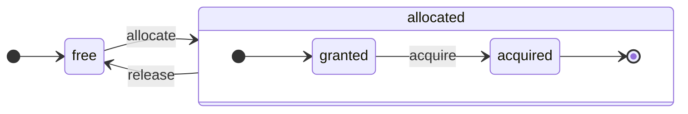
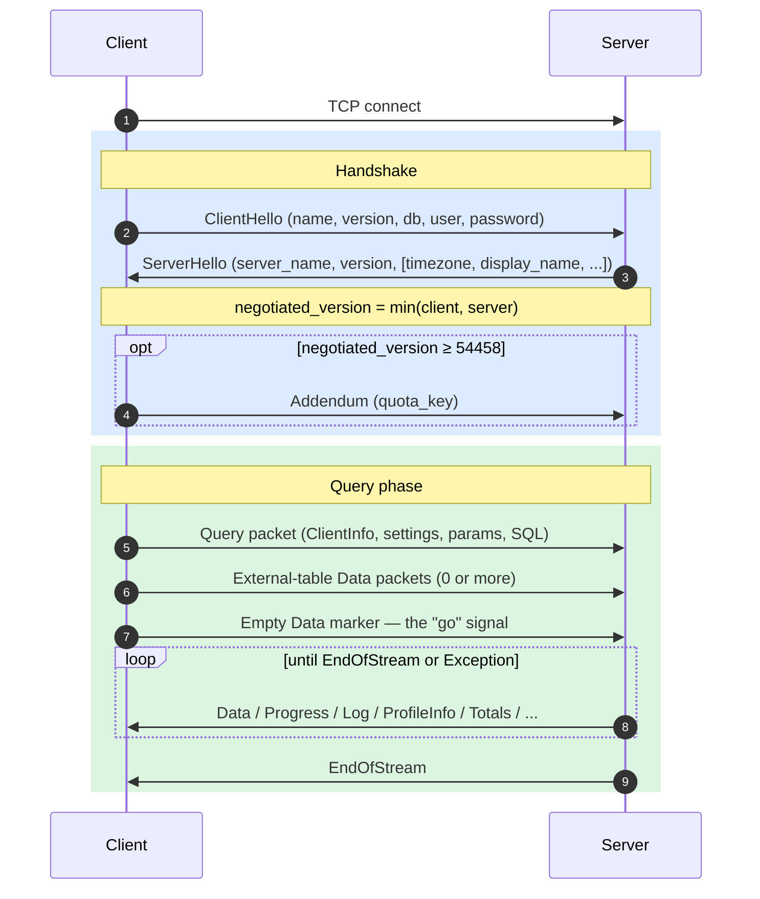
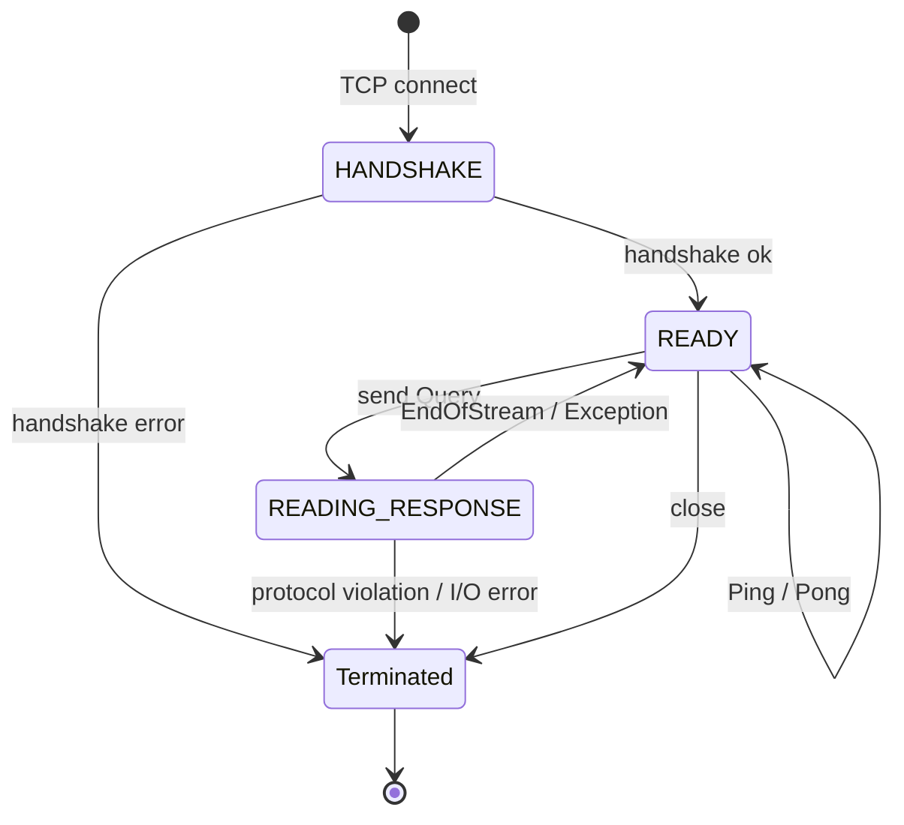
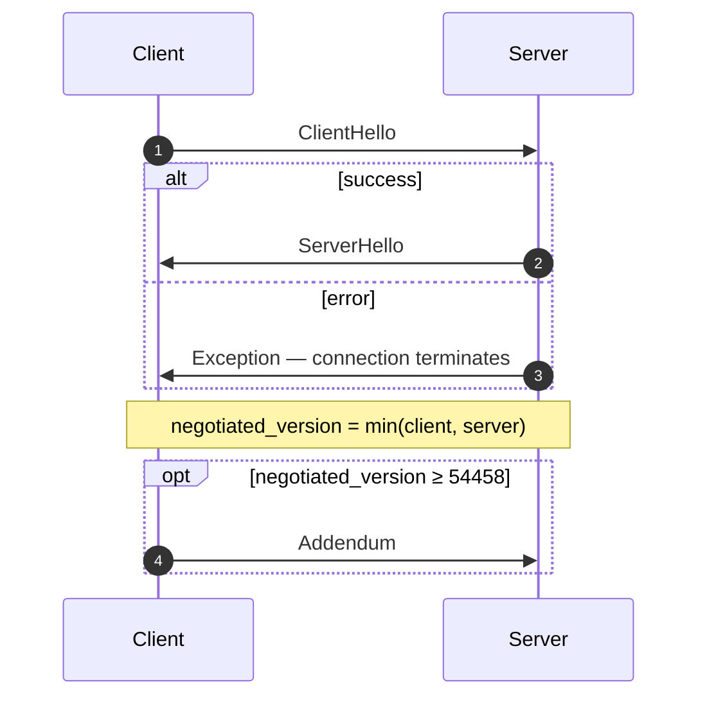
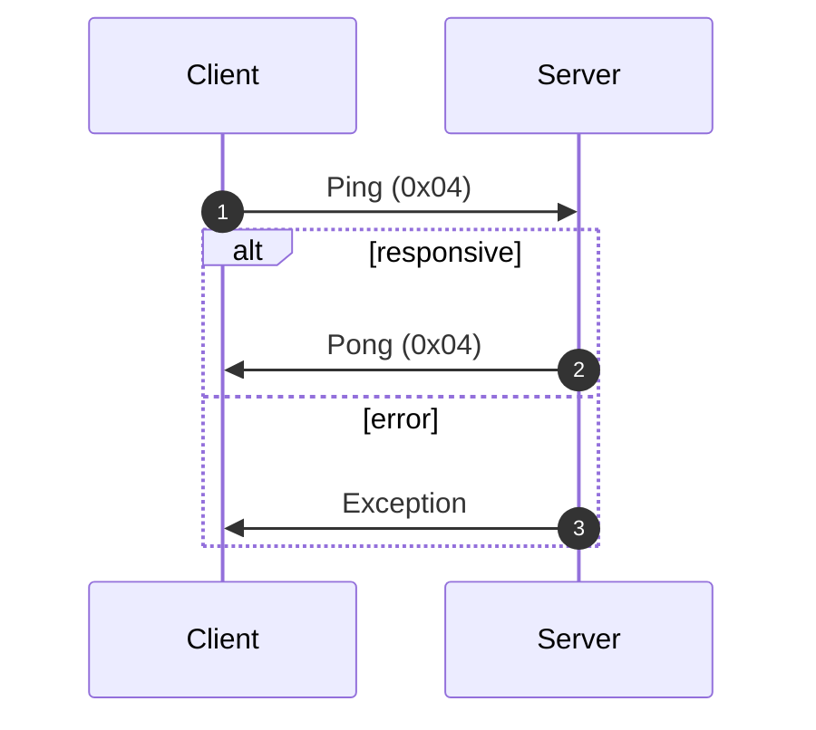
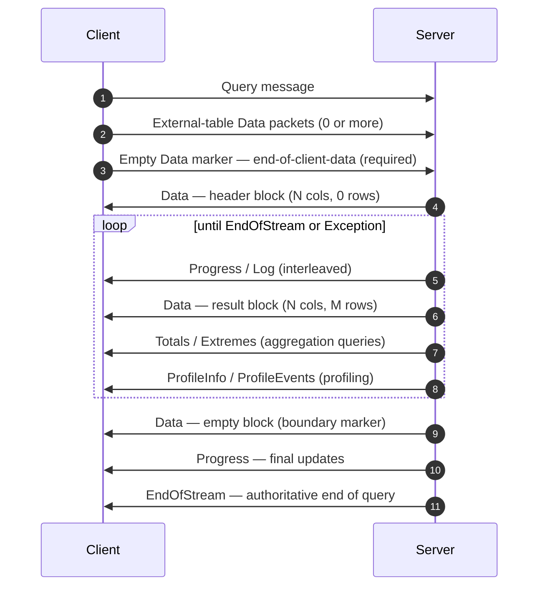
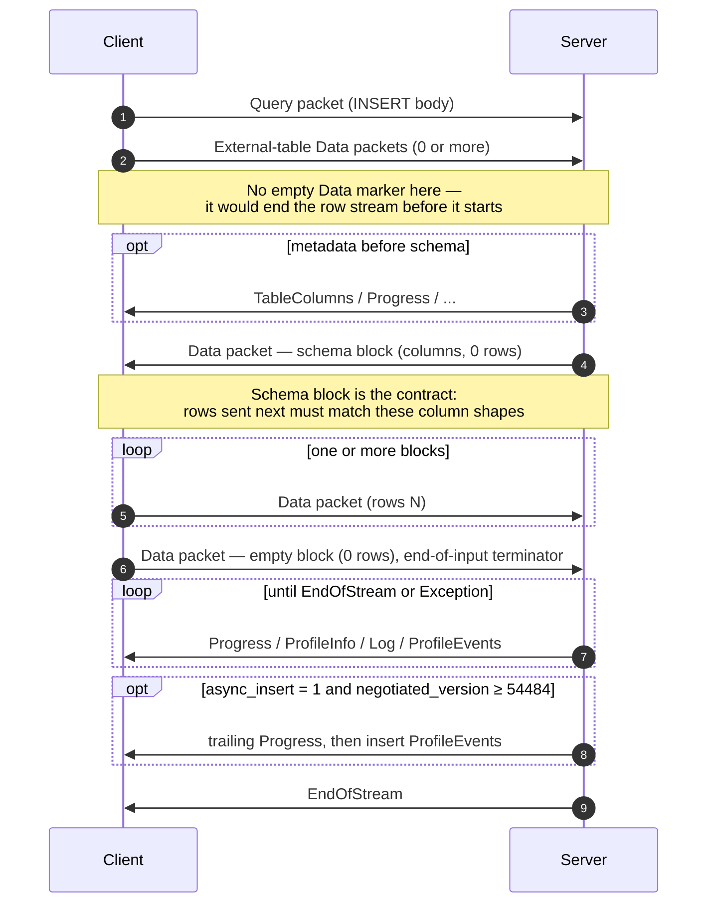
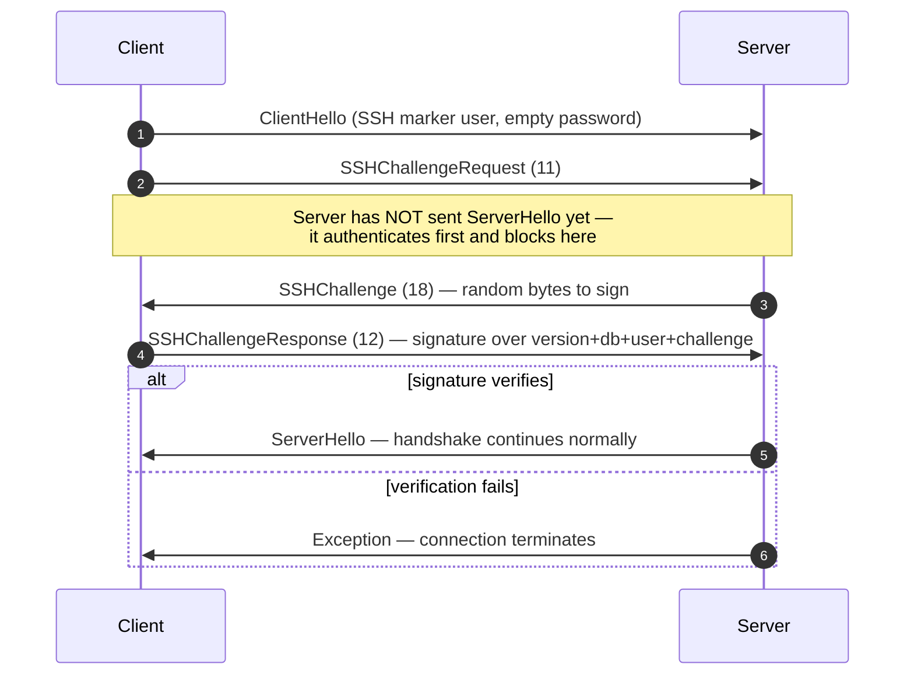

<a id="doc-bc3589df091dd68efd10a377"></a>

# ClickHouse/ClickHouse / docs/ru/resources/changelogs/oss/2025.mdx

Upstream: https://github.com/ClickHouse/ClickHouse/blob/28dc98b1fc057c08396c95e495b9327754a10b04/docs/ru/resources/changelogs/oss/2025.mdx

Commit: `28dc98b1fc057c08396c95e495b9327754a10b04`

Retrieved: 2026-10-01T15:20:10.316397+00:00

Kind: official-document

Raw SHA256: `11695b7194bc1b7a7d873fcd93a911c6c3da2f4dcd5a96ffe8abb934642ff905`

Source text below is untrusted reference content. Acquisition does not verify technical claims.

License status: UPSTREAM_NOTICES_CAPTURED_PER_FILE_REVIEW_REQUIRED. See this repository's captured license files.

---

---
slug: /whats-new/changelog/2025
sidebarTitle: '2025'
title: 'Список изменений за 2025 год'
description: 'Список изменений за 2025 год'
keywords: ['ClickHouse 2025', 'список изменений 2025', 'примечания к выпуску', 'история версий', 'новые возможности']
doc_type: 'changelog'
---

<div id="table-of-contents">
  ### Оглавление
</div>

**[Релиз ClickHouse v25.12, 2025-12-18](#2512)**<br />
**[Релиз ClickHouse v25.11, 2025-11-27](#2511)**<br />
**[Релиз ClickHouse v25.10, 2025-10-30](#2510)**<br />
**[Релиз ClickHouse v25.9, 2025-09-25](#259)**<br />
**[Релиз ClickHouse v25.8 LTS, 2025-08-28](#258)**<br />
**[Релиз ClickHouse v25.7, 2025-07-24](#257)**<br />
**[Релиз ClickHouse v25.6, 2025-06-26](#256)**<br />
**[Релиз ClickHouse v25.5, 2025-05-22](#255)**<br />
**[Релиз ClickHouse v25.4, 2025-04-22](#254)**<br />
**[Релиз ClickHouse v25.3 LTS, 2025-03-20](#253)**<br />
**[Релиз ClickHouse v25.2, 2025-02-27](#252)**<br />
**[Релиз ClickHouse v25.1, 2025-01-28](#251)**<br />
**[Журнал изменений за 2024 год](/ru/resources/changelogs/oss/2024)**<br />
**[Журнал изменений за 2023 год](/ru/resources/changelogs/oss/2023)**<br />
**[Журнал изменений за 2022 год](/ru/resources/changelogs/oss/2022)**<br />
**[Журнал изменений за 2021 год](/ru/resources/changelogs/oss/2021)**<br />
**[Журнал изменений за 2020 год](/ru/resources/changelogs/oss/2020)**<br />
**[Журнал изменений за 2019 год](/ru/resources/changelogs/oss/2019)**<br />
**[Журнал изменений за 2018 год](/ru/resources/changelogs/oss/2018)**<br />
**[Журнал изменений за 2017 год](/ru/resources/changelogs/oss/2017)**<br />

<div id="2512">
  ### Релиз ClickHouse 25.12, 2025-12-18
</div>

<div id="backward-incompatible-change">
  #### Обратно несовместимое изменение
</div>

* ALTER MODIFY COLUMN теперь требует явно указывать DEFAULT при преобразовании столбцов с типом Nullable в типы, не допускающие NULL. Раньше такие ALTER могли зависать с ошибкой cannot convert null to not null; теперь значения NULL заменяются выражением DEFAULT столбца. Устраняет [#5985](https://github.com/ClickHouse/ClickHouse/issues/5985). [#84770](https://github.com/ClickHouse/ClickHouse/pull/84770) ([Vladimir Cherkasov](https://github.com/vdimir)).
* Токенизатор n-грамм больше не будет возвращать n-граммы короче заданной для него длины N. Текстовый поиск не будет возвращать строки, если поисковые токены пусты. [#89757](https://github.com/ClickHouse/ClickHouse/pull/89757) ([George Larionov](https://github.com/george-larionov)).
* При изменении столбца с `String` на `Nullable(String)` мутация данных не выполняется. Однако для агрегатной функции `uniq` используется другая структура данных: для Nullable-столбца будет использоваться `AggregateFunctionNull` с вложенным агрегатором uniq. `AggregateFunctionNull` сериализует дополнительный булев флаг. Это делает файл статистики несовместимым. Исправление заключается в добавлении флага, который при сериализации записывает, является ли столбец Nullable. Формат статистики изменился, и сервер может завершиться с ошибкой, если присутствует статистика в старом формате. Этот PR [#90904](https://github.com/ClickHouse/ClickHouse/pull/90904) исправляет сбой и генерирует исключение, если существующая статистика использует устаревший формат. Чтобы избежать исключения, следует выполнить `ALTER TABLE table MATERIALIZE STATISTICS ALL`, чтобы заново сгенерировать статистику и устранить проблему. [#90311](https://github.com/ClickHouse/ClickHouse/pull/90311) ([Han Fei](https://github.com/hanfei1991)).
* Удалены настройки `allow_not_comparable_types_in_order_by`/`allow_not_comparable_types_in_comparison_functions`. Разрешение использования несравнимых типов в ORDER BY или функциях сравнения может приводить к логическим ошибкам и непредсказуемым результатам. Устраняет [#90028](https://github.com/ClickHouse/ClickHouse/issues/90028). [#90527](https://github.com/ClickHouse/ClickHouse/pull/90527) ([Pavel Kruglov](https://github.com/Avogar)).
* Изменено значение по умолчанию для настройки `check_query_single_value_result` с `true` на `false`. В результате `CHECK TABLE` теперь возвращает подробные результаты по каждой части вместо агрегированного результата (1 = всё в порядке, 0 = обнаружены ошибки). По сравнению с прежним поведением это, вероятно, лучше соответствует ожиданиям пользователя. [#91009](https://github.com/ClickHouse/ClickHouse/pull/91009) ([Robert Schulze](https://github.com/rschu1ze)).
* Несколько исправлений, связанных с неявными индексами. Отображаемая или сохраняемая схема (метаданные Keeper) не будет включать неявные индексы, например создаваемые настройками `add_minmax_index_for_numeric_columns` или `add_minmax_index_for_string_columns`. Это может вызывать ошибки метаданных, если таблица ReplicatedMergeTree создаётся или обновляется в более новой версии, тогда как одна из реплик работает на более старом релизе. В таких случаях отправляйте DDL-запросы в старую реплику, пока кластер не будет полностью обновлён. [#91429](https://github.com/ClickHouse/ClickHouse/pull/91429) ([Raúl Marín](https://github.com/Algunenano)).
* Обновлён `clickhouse-client`: теперь при тайм-ауте запроса из-за `receive_timeout` он возвращает ненулевой код выхода (159 - TIMEOUT&#95;EXCEEDED). Ранее при тайм-аутах возвращался код выхода 0 (успех), из-за чего скриптам и средствам автоматизации было сложно выявлять такие сбои. [#91432](https://github.com/ClickHouse/ClickHouse/pull/91432) ([Sav](https://github.com/sberss)).
* Теперь запрещено создавать специализированные таблицы `MergeTree` (такие как `ReplacingMergeTree`, `CollapsingMergeTree` и т. д.) с пустым ключом `ORDER BY`, поскольку поведение операций слияния в таких таблицах не определено. Если вам всё же нужно создать такую таблицу, включите настройку `allow_suspicious_primary_key`. [#91569](https://github.com/ClickHouse/ClickHouse/pull/91569) ([Anton Popov](https://github.com/CurtizJ)).
* Исправлены функции `bitShiftLeft` и `bitShiftRight`: теперь они возвращают 0 или пустое значение при сдвиге, равном размеру типа. [#91943](https://github.com/ClickHouse/ClickHouse/pull/91943) ([Pablo Marcos](https://github.com/pamarcos)).
* В развитие [#88380](https://github.com/ClickHouse/ClickHouse/pull/88380). В этом PR отключение позиционных аргументов в проекциях помечено как обратно несовместимое изменение. Кроме того, в нём добавлена настройка `enable_positional_arguments_for_projections`, которая позволяет безопасно обновить кластер ClickHouse, если в проекциях используются позиционные аргументы. [#92007](https://github.com/ClickHouse/ClickHouse/pull/92007) ([Dmitry Novik](https://github.com/novikd)).
* По умолчанию включено расширенное использование общих данных для JSON. После этого изменения откат на версии ниже 25.8 станет невозможен, поскольку они не смогут читать новые части данных с JSON-столбцом. Для безопасного обновления рекомендуется установить для настройки `compatibility` значение предыдущей версии или задать настройки MergeTree `dynamic_serialization_version='v2', object_serialization_version='v2'`. [#92511](https://github.com/ClickHouse/ClickHouse/pull/92511) ([Pavel Kruglov](https://github.com/Avogar)).

<div id="new-feature">
  #### Новая возможность
</div>

* Теперь пользователи могут настраивать таблицы S3/Azure Queue так, чтобы перемещать или помечать обработанные файлы, помимо прежних вариантов — сохранять или удалять их. Закрывает [#72944](https://github.com/ClickHouse/ClickHouse/issues/72944). [#86907](https://github.com/ClickHouse/ClickHouse/pull/86907) ([Murat Khairulin](https://github.com/mxwell)).
* Для хранилищ S3/Azure Queue добавлена настройка `commit_on_select` (чтобы задать, нужно ли фиксировать обработанные данные и применять действие `after_processing`). Значение по умолчанию — `false`; исправлена проверка присоединённого mv при выполнении select. [#91450](https://github.com/ClickHouse/ClickHouse/pull/91450) ([Kseniia Sumarokova](https://github.com/kssenii)).
* Добавлена поддержка инструментирования во время выполнения с помощью XRay для отладки неполадок в продакшене и детерминированного профилирования. Устраняет [#74249](https://github.com/ClickHouse/ClickHouse/issues/74249). [#89173](https://github.com/ClickHouse/ClickHouse/pull/89173) ([Pablo Marcos](https://github.com/pamarcos)).
* Разрешает использовать неконстантные вторые аргументы для `IN`. Также поддерживает `Tuple` в качестве второго аргумента. [#77906](https://github.com/ClickHouse/ClickHouse/pull/77906) ([Yarik Briukhovetskyi](https://github.com/yariks5s)).
* Функции для вычисления площади и периметра для типа Geometry. [#89047](https://github.com/ClickHouse/ClickHouse/pull/89047) ([Konstantin Vedernikov](https://github.com/scanhex12)).
* Реализована функция `dictGetKeys`, которая возвращает ключ или ключи словаря, атрибут которого равен указанному значению. Она использует кэш обратного поиска на уровне запроса, настраиваемый параметром `max_reverse_dictionary_lookup_cache_size_bytes`, чтобы ускорить повторные обращения. [#89197](https://github.com/ClickHouse/ClickHouse/pull/89197) ([Nihal Z. Miaji](https://github.com/nihalzp)).
* Добавлена настройка `type_json_skip_invalid_typed_paths`, которая отключает исключения при вставке/приведении типов к типу JSON, если входной JSON нельзя привести к явно типизированным путям в типе JSON. В этом случае используется значение null/0 для типизированного пути. [#89886](https://github.com/ClickHouse/ClickHouse/pull/89886) ([Max Justus Spransy](https://github.com/maxjustus)).
* Добавлена поддержка `direct` (JOIN на вложенных циклах) для таблиц MergeTree. Чтобы использовать этот алгоритм, укажите его как единственный вариант в настройке: `join_algorithm = 'direct'`. [#89920](https://github.com/ClickHouse/ClickHouse/pull/89920) ([Vladimir Cherkasov](https://github.com/vdimir)).
* Добавлена поддержка `ORDER BY` в операции `CREATE` для Iceberg и сортировки при `INSERT`. Закрывает [#89916](https://github.com/ClickHouse/ClickHouse/issues/89916). [#90141](https://github.com/ClickHouse/ClickHouse/pull/90141) ([Konstantin Vedernikov](https://github.com/scanhex12)).
* Добавлены настройки на уровне проекций, доступные через новое предложение `WITH SETTINGS` в `ALTER TABLE ... ADD PROJECTION`. Эти настройки позволяют проекциям переопределять некоторые параметры хранения MergeTree (например, `index_granularity`, `index_granularity_bytes`) для каждой проекции отдельно. [#90158](https://github.com/ClickHouse/ClickHouse/pull/90158) ([Amos Bird](https://github.com/amosbird)).
* Добавлена функция SQL `HMAC(algorithm, message, key)` в рамках [#73900](https://github.com/ClickHouse/ClickHouse/issues/73900) и [#38775](https://github.com/ClickHouse/ClickHouse/issues/38775). [#90837](https://github.com/ClickHouse/ClickHouse/pull/90837) ([Mikhail f. Shiryaev](https://github.com/Felixoid)).
* Добавлена поддержка функции `has`: теперь, если первый аргумент — константный массив, можно использовать первичный ключ и индексы пропуска данных. Закрывает [#90980](https://github.com/ClickHouse/ClickHouse/issues/90980). [#91023](https://github.com/ClickHouse/ClickHouse/pull/91023) ([Nihal Z. Miaji](https://github.com/nihalzp)).
* Реализован новый входной и выходной формат `Buffers`. Этот формат похож на `Native`, однако, в отличие от `Native`, не хранит имена столбцов, типы столбцов и какие-либо дополнительные метаданные. Закрывает [#84017](https://github.com/ClickHouse/ClickHouse/issues/84017). [#91156](https://github.com/ClickHouse/ClickHouse/pull/91156) ([Nihal Z. Miaji](https://github.com/nihalzp)).
* Добавлена настройка `max_streams_for_files_processing_in_cluster_functions` для управления количеством потоков для параллельного чтения файлов в табличных функциях Cluster. Закрывает [#90223](https://github.com/ClickHouse/ClickHouse/issues/90223). [#91323](https://github.com/ClickHouse/ClickHouse/pull/91323) ([Pavel Kruglov](https://github.com/Avogar)).
* Маскирование данных для построчной безопасности (доступно только в ClickHouse Cloud). В clickhouse-client добавлен парсер политик маскирования данных для поддержки этой функции. [#90552](https://github.com/ClickHouse/ClickHouse/pull/90552) ([pufit](https://github.com/pufit)).
* Добавлена опция `allow_reentry` для агрегатной функции `windowFunnel`. Когда она включена вместе с strict&#95;order, события, нарушающие порядок, игнорируются вместо того, чтобы останавливать анализ воронки. Это позволяет корректно обрабатывать пользовательские сценарии с обновлением страницы (A-&gt;A-&gt;B) или возвратом назад (A-&gt;B-&gt;A-&gt;C), не занижая показатели конверсии. [#86916](https://github.com/ClickHouse/ClickHouse/pull/86916) ([Lee ChaeRok](https://github.com/LeeChaeRok)).
* Совместимость Keeper с ZooKeeper: create со statistics. [#88797](https://github.com/ClickHouse/ClickHouse/pull/88797) ([Konstantin Vedernikov](https://github.com/scanhex12)).
* Поддержка постоянных наблюдений ZooKeeper в ClickHouse Keeper. Продолжение, часть 2: https://github.com/ClickHouse/ClickHouse/pull/78207. [#88813](https://github.com/ClickHouse/ClickHouse/pull/88813) ([Konstantin Vedernikov](https://github.com/scanhex12)).
* Добавлена настройка MergeTree `alter_column_secondary_index_mode`, чтобы управлять тем, как обрабатывать индексы во время мутаций. Возможные значения: сгенерировать исключение, удалить, перестроить и режим совместимости. Закрывает [#77797](https://github.com/ClickHouse/ClickHouse/issues/77797). [#89335](https://github.com/ClickHouse/ClickHouse/pull/89335) ([Raúl Marín](https://github.com/Algunenano)).
* Поскольку типы данных `Time` и `Time64` готовы к использованию в production, настройка `enable_time_time64_type` теперь включена по умолчанию. [#89345](https://github.com/ClickHouse/ClickHouse/pull/89345) ([Yarik Briukhovetskyi](https://github.com/yariks5s)).
* Добавлена поддержка чтения DeltaLake CDF через табличную функцию `deltaLake` с настройками `delta_lake_snapshot_start_version`, `delta_lake_snapshot_end_version`. CDF (Change Data Feed — возможность, которая позволяет автоматически фиксировать изменения данных на уровне строк, такие как вставки, обновления и удаления, и выполнять к ним запросы между версиями Delta-таблицы) включается в DeltaLake через `delta.enableChangeDataFeed`. Вместе с данными предоставляются столбцы `_change_type`, `_commit_version`, `_commit_timestamp`. [#90431](https://github.com/ClickHouse/ClickHouse/pull/90431) ([Kseniia Sumarokova](https://github.com/kssenii)).
* Поддержка отрицательных индексов при доступе к элементам кортежа (например, `tuple.-1`). [#91665](https://github.com/ClickHouse/ClickHouse/pull/91665) ([Amos Bird](https://github.com/amosbird)).

<div id="experimental-feature">
  #### Экспериментальные возможности
</div>

* Представлен формат текстового индекса v3, получивший статус бета.
* Добавлена новая логика для автоматического выполнения запросов с использованием параллельных реплик, управляемая настройкой `automatic_parallel_replicas_mode`. При обычном выполнении на одном узле ClickHouse собирает статистику, которая затем учитывается на этапе планирования. Если статистика показывает, что параллельные реплики, вероятно, будут полезны, ClickHouse автоматически выполнит данный запрос с их использованием. Набор поддерживаемых запросов пока довольно ограничен. [#87541](https://github.com/ClickHouse/ClickHouse/pull/87541) ([Nikita Taranov](https://github.com/nickitat)).
* Добавлен доступ к экземплярам ClickHouse Cloud с помощью учетных данных Cloud через --login. [#89261](https://github.com/ClickHouse/ClickHouse/pull/89261) ([Krishna Mannem](https://github.com/kcmannem)).
* Добавлена настройка уровня сеанса `aggregate_function_input_format`, улучшающая запросы `INSERT` в таблицы со столбцами `AggregateFunction` и позволяющая выполнять вставку данных в виде сериализованного состояния, исходных значений или массивов. [#88088](https://github.com/ClickHouse/ClickHouse/pull/88088) ([Punith Nandyappa Subashchandra](https://github.com/punithns97)).

<div id="performance-improvement">
  #### Повышение производительности
</div>

* Оптимизируйте запросы `ORDER BY...LIMIT N` с помощью индекса пропуска данных и динамического фильтра по пороговому значению, чтобы значительно сократить количество обрабатываемых строк. [#89835](https://github.com/ClickHouse/ClickHouse/pull/89835) ([Shankar Iyer](https://github.com/shankar-iyer)).
* Теперь ClickHouse использует индексы пропуска данных для анализа индексов в предложениях WHERE со смешанными условиями фильтрации, объединёнными `AND` и `OR`. Ранее, чтобы задействовать индексы пропуска данных, предложение WHERE должно было быть конъюнкцией (AND) условий фильтрации. Этой возможностью управляет новая настройка `use_skip_indexes_for_disjunctions` (по умолчанию: включено). (issue [#75228](https://github.com/ClickHouse/ClickHouse/issues/75228)). [#87781](https://github.com/ClickHouse/ClickHouse/pull/87781) ([Shankar Iyer](https://github.com/shankar-iyer)).
* Добавлена поддержка сохранения чтения по порядку из левой таблицы при операциях LEFT/INNER JOIN, что может использоваться на следующих этапах. Эту возможность можно отключить с помощью настройки `query_plan_read_in_order_through_join`. Для LEFT/INNER JOIN также добавлена поддержка оптимизации чтения с виртуальной строкой (см. настройку `read_in_order_use_virtual_row`). [#89815](https://github.com/ClickHouse/ClickHouse/pull/89815) ([Vladimir Cherkasov](https://github.com/vdimir)).
* Повышена производительность отложенно материализуемых столбцов благодаря увеличению лимита. [#90309](https://github.com/ClickHouse/ClickHouse/pull/90309) ([Nikolai Kochetov](https://github.com/KochetovNicolai)).
* Пользователи должны заметить снижение задержки при анализе индексов, если присутствуют большие индексы `minmax` (миллионы гранул). [#90428](https://github.com/ClickHouse/ClickHouse/pull/90428) ([Shankar Iyer](https://github.com/shankar-iyer)).
* Реализован простой алгоритм переупорядочивания INNER JOIN на основе DPsize. Новая экспериментальная настройка задаёт, какие алгоритмы и в каком порядке использовать; например, `query_plan_optimize_join_order_algorithm='dpsize,greedy'` означает, что сначала пробуется DPsize, а затем выполняется fallback на greedy. [#91002](https://github.com/ClickHouse/ClickHouse/pull/91002) ([Alexander Gololobov](https://github.com/davenger)).
* Запросы теперь сразу завершаются с ошибкой при достижении лимита строк. Исправляет [#61872](https://github.com/ClickHouse/ClickHouse/issues/61872). [#62804](https://github.com/ClickHouse/ClickHouse/pull/62804) ([Sean Haynes](https://github.com/seandhaynes)).
* [#84477](https://github.com/clickhouse/clickhouse/pull/84477) добавил ограничения, касающиеся SELECT-запросов, которые можно использовать в запросах `insert select from s3Cluster(...)` для параллельного распределённого выполнения. Это изменение позволяет использовать WHERE, как и прежде. [#84611](https://github.com/ClickHouse/ClickHouse/pull/84611) ([Igor Nikonov](https://github.com/devcrafter)).
* Использовать предвыборку ключей при итерации по хеш-таблице, чтобы свести к минимуму промахи кэша. [#84708](https://github.com/ClickHouse/ClickHouse/pull/84708) ([lgbo](https://github.com/lgbo-ustc)).
* Оптимизирована агрегатная функция `histogram`: сортируется только хвост массива точек, а для монотонных входных значений сортировка пропускается, что даёт прирост производительности примерно на 10%. [#85760](https://github.com/ClickHouse/ClickHouse/pull/85760) ([MakarDev](https://github.com/MakarDev)).
* Повышена производительность фильтрации для предикатов с такими функциями, как `like`, `equals`, `has` и другие, за счёт использования дополнительного предварительного фильтра, построенного на основе text index. Эта оптимизация включается настройкой `query_plan_text_index_add_hint`. Также улучшено использование text index для столбцов типа данных `Map`. [#88550](https://github.com/ClickHouse/ClickHouse/pull/88550) ([Anton Popov](https://github.com/CurtizJ)).
* Оптимизированы повторяющиеся обратные обращения к словарю за счёт более быстрых поисков по заранее вычисленному набору возможных значений ключей. Закрывает [#7968](https://github.com/ClickHouse/ClickHouse/issues/7968). [#88971](https://github.com/ClickHouse/ClickHouse/pull/88971) ([Nihal Z. Miaji](https://github.com/nihalzp)).
* Улучшены производительность и работа агрегатной функции `topK`. [#90091](https://github.com/ClickHouse/ClickHouse/pull/90091) ([Raúl Marín](https://github.com/Algunenano)).
* Повышена производительность операций сравнения `Decimal`. Устранена проблема [#28192](https://github.com/ClickHouse/ClickHouse/issues/28192). [#90153](https://github.com/ClickHouse/ClickHouse/pull/90153) ([Konstantin Bogdanov](https://github.com/thevar1able)).
* Добавлена поддержка отсечения партиций для функций Apache Paimon как продолжение https://github.com/ClickHouse/ClickHouse/pull/84423. [#90253](https://github.com/ClickHouse/ClickHouse/pull/90253) ([JIaQi](https://github.com/JiaQiTang98)).
* Используются расширенные SIMD-операции для логических функций через динамическую диспетчеризацию. [#90432](https://github.com/ClickHouse/ClickHouse/pull/90432) ([Raúl Marín](https://github.com/Algunenano)).
* Улучшена производительность JIT-функции за счёт устранения ненужной инициализации результирующего столбца нулём. [#90449](https://github.com/ClickHouse/ClickHouse/pull/90449) ([Raúl Marín](https://github.com/Algunenano)).
* Ускорена декомпрессия `T64` за счёт динамической диспетчеризации. [#90610](https://github.com/ClickHouse/ClickHouse/pull/90610) ([Raúl Marín](https://github.com/Algunenano)).
* Оптимизирована фильтрация inplace в модуле чтения MergeTree. Исправляет [#87119](https://github.com/ClickHouse/ClickHouse/issues/87119). [#90630](https://github.com/ClickHouse/ClickHouse/pull/90630) ([Xiaozhe Yu](https://github.com/wudidapaopao)).
* Добавлена дополнительная эвристика, уменьшающая количество частей в выбранных вариантах слияния. Более узкие слияния увеличивают усиление записи, но при этом могут помочь избежать ошибок `TOO_MANY_PARTS`. [#91163](https://github.com/ClickHouse/ClickHouse/pull/91163) ([Mikhail Artemenko](https://github.com/Michicosun)).
* Улучшена производительность запросов для таблиц S3, созданных с использованием glob-шаблона, за счет проталкивания значений фильтра `_path`, что позволяет избежать операций листинга в S3. Управляется настройкой `s3_path_filter_limit`. [#91165](https://github.com/ClickHouse/ClickHouse/pull/91165) ([Eduard Karacharov](https://github.com/korowa)).
* Ускорено преобразование столбцов к типу bool (в предложениях WHERE) за счёт динамической диспетчеризации. [#91203](https://github.com/ClickHouse/ClickHouse/pull/91203) ([Raúl Marín](https://github.com/Algunenano)).
* Ускорена сортировка отдельного числового блока с помощью динамической диспетчеризации. [#91213](https://github.com/ClickHouse/ClickHouse/pull/91213) ([Raúl Marín](https://github.com/Algunenano)).
* Добавлена оптимизация, удаляющая неиспользуемые столбцы из планов запросов. Устраняет [#75152](https://github.com/ClickHouse/ClickHouse/issues/75152). [#76487](https://github.com/ClickHouse/ClickHouse/pull/76487) ([János Benjamin Antal](https://github.com/antaljanosbenjamin)).
* Значение параметра `query_plan_optimize_join_order_limit` по умолчанию изменено на `10`. [#89312](https://github.com/ClickHouse/ClickHouse/pull/89312) ([Alexey Milovidov](https://github.com/alexey-milovidov)).
* Настройка `allow_statistics_optimize` теперь включена по умолчанию, чтобы оптимизатор JOIN использовал статистику столбцов. [#89332](https://github.com/ClickHouse/ClickHouse/pull/89332) ([Alexey Milovidov](https://github.com/alexey-milovidov)).
* Добавлена поддержка JOIN Runtime Filters для `ANTI` JOIN. Также переработана реализация runtime-фильтров, чтобы снизить конкуренцию за блокировки. [#89710](https://github.com/ClickHouse/ClickHouse/pull/89710) ([Dmitry Novik](https://github.com/novikd)).
* Снижает использование памяти при слияниях в таблице `system.metric_log` (включено по умолчанию), задавая `min_bytes_for_wide_part` и `vertical_merge_algorithm_min_bytes_to_activate` значение 128MB. [#89811](https://github.com/ClickHouse/ClickHouse/pull/89811) ([filimonov](https://github.com/filimonov)).
* Добавлена возможность использовать инвертированный индекс в PREWHERE. Устраняет [#89975](https://github.com/ClickHouse/ClickHouse/issues/89975). [#89977](https://github.com/ClickHouse/ClickHouse/pull/89977) ([Peng Jian](https://github.com/fastio)).
* Не добавляйте провайдеры S3 при использовании GCP OAuth — это повышает производительность в GCS. [#91706](https://github.com/ClickHouse/ClickHouse/pull/91706) ([Antonio Andelic](https://github.com/antonio2368)).

<div id="improvement">
  #### Улучшения
</div>

* Добавлена новая настройка `apply_row_policy_after_final`, которая позволяет применять политику строк к запросу только после FINAL, что делает поведение ReplacingMergeTree с политиками строк более корректным. Исправляет [#90986](https://github.com/ClickHouse/ClickHouse/issues/90986). [#91065](https://github.com/ClickHouse/ClickHouse/pull/91065) ([Yarik Briukhovetskyi](https://github.com/yariks5s)).
* В формате `Pretty` именованные кортежи теперь отображаются в виде Pretty JSON. Это закрывает [#65022](https://github.com/ClickHouse/ClickHouse/issues/65022). [#91779](https://github.com/ClickHouse/ClickHouse/pull/91779) ([Mostafa Mohamed Salah](https://github.com/Sasao4o)).
* В таблицу `system.error_log` добавлены поля `last_error_time`, `last_error_message`, `last_error_query_id` и `last_error_trace`. [#89879](https://github.com/ClickHouse/ClickHouse/pull/89879) ([Narasimha Pakeer](https://github.com/npakeer)).
* CLI-клиент теперь может отключать вывод сообщения &#39;Версия сервера ClickHouse старее, чем версия клиента ClickHouse. Это может указывать на то, что сервер устарел и его можно обновить&#39; при указании `--no-server-client-version-message` или `false`. [#87784](https://github.com/ClickHouse/ClickHouse/pull/87784) ([Larry Snizek](https://github.com/larry-cdn77)).
* Добавлено сообщение об ошибке о том, что часть была дедуплицирована. [#80264](https://github.com/ClickHouse/ClickHouse/pull/80264) ([Aleksandr Musorin](https://github.com/AVMusorin)).
* Добавлены столбцы `dependencies` и `missing_dependencies` в `system.kafka_consumers`, чтобы показывать целевые таблицы materialized view для таблиц Kafka. Добавлен Counter `KafkaMVNotReady`. [#85346](https://github.com/ClickHouse/ClickHouse/pull/85346) ([Ilya Golshtein](https://github.com/ilejn)).
* Теперь выражения по умолчанию в таблице корректно работают при вставке через remote и собственный протокол. Закрывает [#87972](https://github.com/ClickHouse/ClickHouse/issues/87972). [#88540](https://github.com/ClickHouse/ClickHouse/pull/88540) ([Pervakov Grigorii](https://github.com/GrigoryPervakov)).
* Добавлена возможность отключать сбор асинхронных метрик `PSI_*_*`. [#88557](https://github.com/ClickHouse/ClickHouse/pull/88557) ([MikhailBurdukov](https://github.com/MikhailBurdukov)).
* Добавлена поддержка разреженной сериализации для столбцов типа `Nullable`. Это развитие [#44539](https://github.com/ClickHouse/ClickHouse/issues/44539). [#88999](https://github.com/ClickHouse/ClickHouse/pull/88999) ([Amos Bird](https://github.com/amosbird)).
* У диска `plain-rewritable` собственные реализация и структура. Не будем реализовывать его поверх обычных дисков `plain`. [#89807](https://github.com/ClickHouse/ClickHouse/pull/89807) ([Mikhail Artemenko](https://github.com/Michicosun)).
* Ни одно исключение HTTP не должно содержать завершающий нулевой фрагмент. [#89998](https://github.com/ClickHouse/ClickHouse/pull/89998) ([Kaviraj Kanagaraj](https://github.com/kavirajk)).
* Добавлена проверка на стороне сервера Keeper при рукопожатии, чтобы отклонять клиентов, когда `last_zxid_seen (provided by the client) > last_processed_zxid`. Это предотвращает чтение устаревших данных, когда клиенты повторно подключаются к отстающим репликам. [#90016](https://github.com/ClickHouse/ClickHouse/pull/90016) ([Miсhael Stetsyuk](https://github.com/mstetsyuk)).
* Добавлен настраиваемый параметр `kafka_consumer_reschedule_ms` для движка таблицы `Kafka`, позволяющий задавать, как долго потребители ждут новых данных. Исправляет [#89204](https://github.com/ClickHouse/ClickHouse/issues/89204). [#90112](https://github.com/ClickHouse/ClickHouse/pull/90112) ([Jeremy Aguilon](https://github.com/JerAguilon)).
* В `system.mutations` добавлен новый столбец `parts_in_progress_names` для улучшения диагностики. [#90155](https://github.com/ClickHouse/ClickHouse/pull/90155) ([Shaohua Wang](https://github.com/tiandiwonder)).
* Повторная попытка при сетевых ошибках, когда библиотека S3 разбирает XML-ответ. [#90216](https://github.com/ClickHouse/ClickHouse/pull/90216) ([Sema Checherinda](https://github.com/CheSema)).
* Мы хотим запускать Keeper в отдельных процессах сервера и, чтобы не перегружать Prometheus в крупных регионах, по-прежнему экспортировать только метрики Keeper. [#90244](https://github.com/ClickHouse/ClickHouse/pull/90244) ([Miсhael Stetsyuk](https://github.com/mstetsyuk)).
* Добавлена поддержка загрузки конфигурации клиента ClickHouse из путей XDG Base Directory (например, `~/.config/clickhouse/config.xml`) в дополнение к устаревшему пути `~/.clickhouse-client/`. Исправлено [#89882](https://github.com/ClickHouse/ClickHouse/issues/89882). [#90306](https://github.com/ClickHouse/ClickHouse/pull/90306) ([Wujun Jiang](https://github.com/rainac1)).
* Добавлено ограничение на размер батча запросов append в Keeper в байтах. Ограничение задается с помощью `keeper_server.coordination_settings.max_requests_append_bytes_size`. [#90342](https://github.com/ClickHouse/ClickHouse/pull/90342) ([Antonio Andelic](https://github.com/antonio2368)).
* Добавлена настройка для Iceberg, предотвращающая слишком большое число партиций. [#90365](https://github.com/ClickHouse/ClickHouse/pull/90365) ([Konstantin Vedernikov](https://github.com/scanhex12)).
* Обновлены предупреждения при приближении к пределам guardrails: теперь в них показываются текущие значения и значения параметра «сгенерировать исключение». [#90438](https://github.com/ClickHouse/ClickHouse/pull/90438) ([Nikita Fomichev](https://github.com/fm4v)).
* В таблице `system.filesystem_cache` фрагменты теперь отдаются потоково, а не одним фрагментом со всем состоянием кэша. Чтение состояния файлового кэша при больших объёмах кэша может занимать много времени и потреблять много памяти, поэтому потоковая выдача незаменима для крупных развертываний. [#90508](https://github.com/ClickHouse/ClickHouse/pull/90508) ([Kseniia Sumarokova](https://github.com/kssenii)).
* Исправлено некорректное сообщение об исключении в механизме партиционирования Hive: в нём не хватало пробела. [#90685](https://github.com/ClickHouse/ClickHouse/pull/90685) ([Alexey Milovidov](https://github.com/alexey-milovidov)).
* Записи в кэше индекса векторного сходства теперь удаляются при удалении частей таблицы или их замене более новыми частями. Ранее они очищались только по мере вытеснения из кэша. [#90750](https://github.com/ClickHouse/ClickHouse/pull/90750) ([Shankar Iyer](https://github.com/shankar-iyer)).
* Обновлён chdig (инструмент диагностики ClickHouse для командной строки) до версии [v25.12.1](https://github.com/azat/chdig/releases/tag/v25.12.1). [#91394](https://github.com/ClickHouse/ClickHouse/pull/91394) ([Azat Khuzhin](https://github.com/azat)).
* Теперь предварительно подписанные URL поддерживаются в S3. Закрывает [#65032](https://github.com/ClickHouse/ClickHouse/issues/65032). [#90827](https://github.com/ClickHouse/ClickHouse/pull/90827) ([Yarik Briukhovetskyi](https://github.com/yariks5s)).
* Текстовый индекс теперь работает с таблицами `ReplacingMergeTree`. [#90908](https://github.com/ClickHouse/ClickHouse/pull/90908) ([Elmi Ahmadov](https://github.com/ahmadov)).
* Не раскрывать версию сервера ClickHouse в HTTP-ответах с ошибками, возвращаемых до аутентификации. [#91003](https://github.com/ClickHouse/ClickHouse/pull/91003) ([filimonov](https://github.com/filimonov)).
* Теперь при достижении `hard_limit` для HTTP-подключений клиентов будет сгенерировано исключение `HTTP_CONNECTION_LIMIT_REACHED`. Для подключений к дискам это значение установлено в `20000`. [#91016](https://github.com/ClickHouse/ClickHouse/pull/91016) ([Sema Checherinda](https://github.com/CheSema)).
* Добавлены `system.background_schedule_pool{,_log}` для улучшения диагностики фоновых задач. [#91157](https://github.com/ClickHouse/ClickHouse/pull/91157) ([Azat Khuzhin](https://github.com/azat)).
* Теперь в редакторе запросов веб-интерфейса можно быстро закомментировать или раскомментировать выделенные строки с помощью `Ctrl+/` (или `Cmd+/` на Mac), что упрощает временное отключение частей запроса во время тестирования. [#91160](https://github.com/ClickHouse/ClickHouse/pull/91160) ([Samuel K.](https://github.com/OpenGLShaders)).
* В список всегда доступных таблиц добавлена `system.completions`. [#91166](https://github.com/ClickHouse/ClickHouse/pull/91166) ([Yakov Olkhovskiy](https://github.com/yakov-olkhovskiy)).
* Добавлены события профиля `FailedInitialQuery` и `FailedInitialSelectQuery`. [#91172](https://github.com/ClickHouse/ClickHouse/pull/91172) ([RinChanNOW](https://github.com/RinChanNOWWW)).
* Исправлено потенциальное голодание в пуле потоков при чтении выборок столбцов для JSON-столбцов с большим количеством подстолбцов: теперь учитывается настройка `merge_tree_use_prefixes_deserialization_thread_pool`, а не используется пул потоков безусловно. [#91208](https://github.com/ClickHouse/ClickHouse/pull/91208) ([Raufs Dunamalijevs](https://github.com/rienath)).
* Добавлена поддержка типа `JSON` в `tupleElement`. Закрывает [#81630](https://github.com/ClickHouse/ClickHouse/issues/81630). [#91327](https://github.com/ClickHouse/ClickHouse/pull/91327) ([Pavel Kruglov](https://github.com/Avogar)).
* Исправлены ложные ошибки, связанные с ограничением памяти, при включенном кэше страниц в пространстве пользователя. [#91361](https://github.com/ClickHouse/ClickHouse/pull/91361) ([Michael Kolupaev](https://github.com/al13n321)).
* Токенизатор n-грамм теперь можно создавать при `ngram&#95;length = 1`. [#91529](https://github.com/ClickHouse/ClickHouse/pull/91529) ([George Larionov](https://github.com/george-larionov)).
* Добавлена поддержка настроек хранилища внутри функций в `INSERT INTO FUNCTION`, как это уже поддерживается для `SELECT`. Закрывает [#89386](https://github.com/ClickHouse/ClickHouse/issues/89386). [#91707](https://github.com/ClickHouse/ClickHouse/pull/91707) ([Kseniia Sumarokova](https://github.com/kssenii)).
* Генерировать исключение &quot;not implemented&quot; при запросе TRUNCATE для озер данных вместо того, чтобы молча ничего не делать. Закрывает [#86604](https://github.com/ClickHouse/ClickHouse/issues/86604). [#91713](https://github.com/ClickHouse/ClickHouse/pull/91713) ([Kseniia Sumarokova](https://github.com/kssenii)).
* В ридере Parquet v3 задан максимальный размер сообщения, чтобы избежать ошибки `DB::Exception: apache::thrift::transport::TTransportException: MaxMessageSize reached`. [#91737](https://github.com/ClickHouse/ClickHouse/pull/91737) ([Arthur Passos](https://github.com/arthurpassos)).
* Добавлена настройка `insert_select_deduplicate`. Она яснее показывает, как обрабатывается дедупликация вставки для INSERT SELECT. В общем случае для таких запросов дедупликация невозможна, но если таблица не меняется, а результат отсортирован, то при повторной попытке дедупликацию можно выполнить. Мы не могли отследить, что источник один и тот же. Но могли проверить, что результат запроса SELECT отсортирован. На практике оказалось, что в общем случае это действительно очень трудно проверить, но простой случай с `ORDER BY ALL` обрабатывается легко. Сейчас логика здесь фактически сломана. Мы пытаемся выполнять дедупликацию, но в большинстве случаев она просто не видит дубликаты среди блоков, потому что SELECT возвращает разные данные. [#91830](https://github.com/ClickHouse/ClickHouse/pull/91830) ([Sema Checherinda](https://github.com/CheSema)).
* Разрешено неявное преобразование типов при приведении `Array` к `QBit`. Теперь целочисленные массивы и массивы с плавающей точкой можно вставлять напрямую в столбцы `QBit` без явного приведения типов. [#91846](https://github.com/ClickHouse/ClickHouse/pull/91846) ([Raufs Dunamalijevs](https://github.com/rienath)).
* Добавлено ограничение на размер сообщения `CapnProto`. Его можно изменить с помощью `format_capn_proto_max_message_size`. [#91888](https://github.com/ClickHouse/ClickHouse/pull/91888) ([Antonio Andelic](https://github.com/antonio2368)).
* Уточнены метрики кэша меток, чтобы они учитывали только запросы (после [#83415](https://github.com/ClickHouse/ClickHouse/issues/83415) `MarkCacheHits`/`MarkCacheMisses` также обновлялись для слияний; этот PR возвращает прежнее поведение). [#91910](https://github.com/ClickHouse/ClickHouse/pull/91910) ([Azat Khuzhin](https://github.com/azat)).
* Исправлена проблема, из-за которой для локальных подключений `client_info.interface` устанавливался в `TCP`. [#91933](https://github.com/ClickHouse/ClickHouse/pull/91933) ([Konstantin Bogdanov](https://github.com/thevar1able)).
* Параметр `refresh_certificates_task_interval` в конфигурации клиента ACME теперь принимает значение в секундах. [#92211](https://github.com/ClickHouse/ClickHouse/pull/92211) ([Konstantin Bogdanov](https://github.com/thevar1able)).
* Логирование событий частей в `system.part_log` для `system.*_log`. [#92217](https://github.com/ClickHouse/ClickHouse/pull/92217) ([Azat Khuzhin](https://github.com/azat)).

#### Исправление ошибки (некорректное поведение, заметное пользователю, в официальном стабильном релизе)

* Исправлены некоторые ошибки в PREWHERE, связанные с супертипами для типов данных `Time` и `Time64`. Устранена проблема [#84544](https://github.com/ClickHouse/ClickHouse/issues/84544). [#84715](https://github.com/ClickHouse/ClickHouse/pull/84715) ([Yarik Briukhovetskyi](https://github.com/yariks5s)).
* `DNSResolver` теперь инициализируется перед использованием, чтобы применялись пользовательские настройки. Исправлено [#76296](https://github.com/ClickHouse/ClickHouse/issues/76296). [#81302](https://github.com/ClickHouse/ClickHouse/pull/81302) ([Zhigao Hong](https://github.com/zghong)).
* Исправлено чтение подстолбцов из столбца, в имени которого есть точка, в некоторых случаях. Устраняет [#81261](https://github.com/ClickHouse/ClickHouse/issues/81261), [#82058](https://github.com/ClickHouse/ClickHouse/issues/82058), [#88169](https://github.com/ClickHouse/ClickHouse/issues/88169). [#87205](https://github.com/ClickHouse/ClickHouse/pull/87205) ([Pavel Kruglov](https://github.com/Avogar)).
* Исправлен сбой движка GenerateRandom при использовании нелитеральных параметров: теперь вместо LOGICAL&#95;ERROR возвращается BAD&#95;ARGUMENTS с понятным сообщением. [#88157](https://github.com/ClickHouse/ClickHouse/pull/88157) ([Shafi Ahmed](https://github.com/ita004)).
* Исправлено удаление неиспользуемых столбцов проекции при наличии `UNION`. Устранена проблема [#88180](https://github.com/ClickHouse/ClickHouse/issues/88180). [#88350](https://github.com/ClickHouse/ClickHouse/pull/88350) ([Sema Checherinda](https://github.com/CheSema)).
* Исправлено некорректное разбиение на сегменты при оптимизации `JOIN`, когда первичный ключ отсортирован по убыванию. Устраняет [#88512](https://github.com/ClickHouse/ClickHouse/issues/88512). [#88794](https://github.com/ClickHouse/ClickHouse/pull/88794) ([Amos Bird](https://github.com/amosbird)).
* Снова включена s3queue&#95;keeper&#95;fault&#95;injection&#95;probablility, исправлены проблемы. [#88800](https://github.com/ClickHouse/ClickHouse/pull/88800) ([Kseniia Sumarokova](https://github.com/kssenii)).
* Исправлено несколько проблем, вызванных преждевременным удалением столбцов при применении TTL. Исправляет [#88002](https://github.com/ClickHouse/ClickHouse/issues/88002). [#88860](https://github.com/ClickHouse/ClickHouse/pull/88860) ([Amos Bird](https://github.com/amosbird)).
* Генерировать исключение, если temporary&#95;files&#95;buffer&#95;size установлено в 0. Устраняет [#88900](https://github.com/ClickHouse/ClickHouse/issues/88900). [#88917](https://github.com/ClickHouse/ClickHouse/pull/88917) ([Vladimir Cherkasov](https://github.com/vdimir)).
* Исправлена ошибка `Bad get`, возникавшая при анализе индекса `Set`, если предикат содержал константу `NULL`. Исправляет [#84856](https://github.com/ClickHouse/ClickHouse/issues/84856) и [#82974](https://github.com/ClickHouse/ClickHouse/issues/82974). [#89429](https://github.com/ClickHouse/ClickHouse/pull/89429) ([Nikolai Kochetov](https://github.com/KochetovNicolai)).
* Исправлена ошибка `Cannot add subcolumn X.Y: column with this name already exists`. Устраняет [#89599](https://github.com/ClickHouse/ClickHouse/issues/89599). [#89602](https://github.com/ClickHouse/ClickHouse/pull/89602) ([Azat Khuzhin](https://github.com/azat)).
* Исправлены ошибки в функциях `theilsU` и `contingency`, из-за которых результаты были некорректными. [#89760](https://github.com/ClickHouse/ClickHouse/pull/89760) ([Nihal Z. Miaji](https://github.com/nihalzp)).
* Исправлены проблемы со стабильностью псевдонимов: исправлен StrictnessLevel для SharedDatabaseCatalog, запрещено, чтобы target также был псевдонимом, и реализованы дополнительные интерфейсы (getSerializationHints, supportsReplication, getStoragePolicy, totalBytesUncompressed, lifetimeRows, lifetimeBytes, storesDataOnDisk, tryLockForShare, lockForShare). Исправляет [#89106](https://github.com/ClickHouse/ClickHouse/issues/89106). [#89812](https://github.com/ClickHouse/ClickHouse/pull/89812) ([Kai Zhu](https://github.com/nauu)).
* Исправлено возможное аварийное завершение при удалённом запросе с `ARRAY JOIN` внутри `IN` и при включённой настройке `enable_lazy_columns_replication`. Устраняет [#90361](https://github.com/ClickHouse/ClickHouse/issues/90361). [#89997](https://github.com/ClickHouse/ClickHouse/pull/89997) ([Pavel Kruglov](https://github.com/Avogar)).
* Исправлена возможная логическая ошибка при использовании `analyzer_compatibility_join_using_top_level_identifier` с несколькими операциями JOIN. [#90010](https://github.com/ClickHouse/ClickHouse/pull/90010) ([Vladimir Cherkasov](https://github.com/vdimir)).
* Исправлено распознавание некорректных значений DateTime64 из строк в текстовых форматах в некоторых случаях. Устраняет [#89368](https://github.com/ClickHouse/ClickHouse/issues/89368). [#90013](https://github.com/ClickHouse/ClickHouse/pull/90013) ([Pavel Kruglov](https://github.com/Avogar)).
* Добавлены проверки размера при десериализации данных из состояний агрегации и других источников. [#90031](https://github.com/ClickHouse/ClickHouse/pull/90031) ([Raúl Marín](https://github.com/Algunenano)).
* Разделение диапазонов частей по характеристикам томов, чтобы включить TTL-слияния с удалением для холодных томов. После этого исправления части, у которых max TTL &lt; now, будут удаляться из холодного хранилища. Алгоритм будет планировать только **удаление отдельных частей**. [#90059](https://github.com/ClickHouse/ClickHouse/pull/90059) ([Mikhail Artemenko](https://github.com/Michicosun)).
* В случае, если таблица Kafka была создана с настройкой `kafka_handle_error_mode = 'dead_letter_queue'`, а таблица `system.dead_letter_queue` не была настроена, сервер мог аварийно завершиться. Это поведение исправлено. Исправлено [#87573](https://github.com/ClickHouse/ClickHouse/issues/87573). [#90064](https://github.com/ClickHouse/ClickHouse/pull/90064) ([Nikita Mikhaylov](https://github.com/nikitamikhaylov)).
* Исправлена возможная ошибка `Column with Array type is not represented by ColumnArray column: Replicated` при вставке с использованием `ARRAY JOIN`, когда включена настройка `enable_lazy_columns_replication`. [#90066](https://github.com/ClickHouse/ClickHouse/pull/90066) ([Pavel Kruglov](https://github.com/Avogar)).
* Исправлен сбой при корректном завершении работы сервера из-за неправильного порядка уничтожения объектов. Решает проблему [#82420](https://github.com/ClickHouse/ClickHouse/issues/82420). [#90076](https://github.com/ClickHouse/ClickHouse/pull/90076) ([Nikita Mikhaylov](https://github.com/nikitamikhaylov)).
* Исправлены логическая ошибка и ошибка вычисления по модулю в системной таблице `numbers` при использовании большого шага. Закрывает [#83398](https://github.com/ClickHouse/ClickHouse/issues/83398). [#90123](https://github.com/ClickHouse/ClickHouse/pull/90123) ([Nihal Z. Miaji](https://github.com/nihalzp)).
* Исправлена запись в Parquet, при которой исходный порядок не сохранялся при использовании собственного механизма однопоточной записи. Частично отменяет https://github.com/ClickHouse/ClickHouse/pull/64424/files. [#90126](https://github.com/ClickHouse/ClickHouse/pull/90126) ([Arthur Passos](https://github.com/arthurpassos)).
* Не применять оптимизацию константных узлов для выражения LIMIT/OFFSET. Исправляет [#89607](https://github.com/ClickHouse/ClickHouse/issues/89607). [#90156](https://github.com/ClickHouse/ClickHouse/pull/90156) ([Yakov Olkhovskiy](https://github.com/yakov-olkhovskiy)).
* Исправлена несовместимость Hive-партиционирования, препятствовавшая плавному обновлению в версии 25.8 (устранена ошибка `All hive partitioning columns must be present in the schema`, возникавшая во время обновления). [#90202](https://github.com/ClickHouse/ClickHouse/pull/90202) ([Kseniia Sumarokova](https://github.com/kssenii)).
* Исправлено исключение JSON в таблице Iceberg со столбцом с временной меткой при использовании Glue catalog. Устранена проблема [#90210](https://github.com/ClickHouse/ClickHouse/issues/90210). [#90209](https://github.com/ClickHouse/ClickHouse/pull/90209) ([Alsu Giliazova](https://github.com/alsugiliazova)).
* Исправляет несоответствие числа строк в MergeTreeReaderIndex, когда в части данных меньше строк, чем в index&#95;granularity. Устраняет [#89691](https://github.com/ClickHouse/ClickHouse/issues/89691). [#90254](https://github.com/ClickHouse/ClickHouse/pull/90254) ([Peng Jian](https://github.com/fastio)).
* Исправлен бесконечный запрос `WITH FILL` с `nan`/`inf`. Исправляет [#69261](https://github.com/ClickHouse/ClickHouse/issues/69261). [#90255](https://github.com/ClickHouse/ClickHouse/pull/90255) ([Konstantin Bogdanov](https://github.com/thevar1able)).
* Исправлена ошибка &#39;столбец не найден&#39; при query&#95;plan&#95;use&#95;logical&#95;join&#95;step=0 и наличии остаточного условия в JOIN ON. Устраняет [#88635](https://github.com/ClickHouse/ClickHouse/issues/88635). [#90279](https://github.com/ClickHouse/ClickHouse/pull/90279) ([Vladimir Cherkasov](https://github.com/vdimir)).
* Исправлена работа некоторых запросов при оптимизации агрегированными проекциями. [#90288](https://github.com/ClickHouse/ClickHouse/pull/90288) ([János Benjamin Antal](https://github.com/antaljanosbenjamin)).
* Исправлена ошибка при чтении подстолбцов из JSON в компактных частях, которая могла приводить к ошибке `CANNOT_READ_ALL_DATA`. Устраняет [#90264](https://github.com/ClickHouse/ClickHouse/issues/90264). [#90302](https://github.com/ClickHouse/ClickHouse/pull/90302) ([Pavel Kruglov](https://github.com/Avogar)).
* Теперь ClickHouse не будет использовать оптимизацию чтения в порядке сортировки для Iceberg, если порядок сортировки не указан в файлах manifest (или не совпадает с default&#95;sort&#95;order в таблице). Исправляет [#89178](https://github.com/ClickHouse/ClickHouse/issues/89178). [#90304](https://github.com/ClickHouse/ClickHouse/pull/90304) ([alesapin](https://github.com/alesapin)).
* Time и Time64 теперь должны корректно учитывать часовые пояса при преобразовании из DateTime и DateTime64 (они должны отображать время в том же часовом поясе, что и DateTime[64] для пользователя). Закрывает [#89896](https://github.com/ClickHouse/ClickHouse/issues/89896). [#90310](https://github.com/ClickHouse/ClickHouse/pull/90310) ([Yarik Briukhovetskyi](https://github.com/yariks5s)).
* Исправлена ошибка, из-за которой `SELECT CAST(CAST(now(), 'Time'), 'Time64')` выдавал некорректный результат. Закрывает [#88349](https://github.com/ClickHouse/ClickHouse/issues/88349). [#90324](https://github.com/ClickHouse/ClickHouse/pull/90324) ([Yarik Briukhovetskyi](https://github.com/yariks5s)).
* Исправлен сбой из-за переполнения целого числа в randomStringUTF8. [#90326](https://github.com/ClickHouse/ClickHouse/pull/90326) ([Michael Kolupaev](https://github.com/al13n321)).
* Исправлены обновления Cluster Discovery в мультикластерных конфигурациях с `multicluster_root_path`, чтобы избежать задержек и пропуска обновлений ZooKeeper. [#90341](https://github.com/ClickHouse/ClickHouse/pull/90341) ([RinChanNOW](https://github.com/RinChanNOWWW)).
* Исправлена возможная логическая ошибка в prewhere при обращении к несуществующему пути JSON с index&#95;granularity&#95;bytes=0. Устраняет [#86924](https://github.com/ClickHouse/ClickHouse/issues/86924). [#90375](https://github.com/ClickHouse/ClickHouse/pull/90375) ([Pavel Kruglov](https://github.com/Avogar)).
* Исправлена ошибка в `L2DistanceTransposed`, которая приводила к сбоям, если аргумент `precision` выходил за пределы допустимого диапазона. Закрывает [#90401](https://github.com/ClickHouse/ClickHouse/issues/90401). [#90405](https://github.com/ClickHouse/ClickHouse/pull/90405) ([Raufs Dunamalijevs](https://github.com/rienath)).
* Исправлена возможная логическая ошибка в `arrayUnion` при аргументе `Array(Dynamic)`. Устраняет проблему [#90270](https://github.com/ClickHouse/ClickHouse/issues/90270). [#90409](https://github.com/ClickHouse/ClickHouse/pull/90409) ([Pavel Kruglov](https://github.com/Avogar)).
* Исправлена возможная логическая ошибка при переименовании и изменении одного и того же вложенного столбца в одной команде ALTER. Устраняет [#90406](https://github.com/ClickHouse/ClickHouse/issues/90406). [#90412](https://github.com/ClickHouse/ClickHouse/pull/90412) ([Pavel Kruglov](https://github.com/Avogar)).
* Исправлен разбор значений JSON/Dynamic/Variant, передаваемых через HTTP-параметры. Устраняет [#88925](https://github.com/ClickHouse/ClickHouse/issues/88925). [#90430](https://github.com/ClickHouse/ClickHouse/pull/90430) ([Pavel Kruglov](https://github.com/Avogar)).
* Исправлено состояние гонки в партиционировании Hive: статический `KeyValuePairExtractor` мог приводить к повреждению данных или сбоям при параллельном чтении файлов. [#90474](https://github.com/ClickHouse/ClickHouse/pull/90474) ([Paresh Joshi](https://github.com/pareshjoshij)).
* Исправлены некорректные вычисления расстояния в `L2DistanceTransposed` при использовании ссылочных векторов-массивов (для которых по умолчанию используется `Array(Float64))`) со столбцами `QBit` с типами элементов, отличными от `Float64` (`Float32`, `BFloat16`). Теперь функция автоматически приводит ссылочный вектор к типу элемента столбца `QBit`. Устраняет [#89976](https://github.com/ClickHouse/ClickHouse/issues/89976). [#90485](https://github.com/ClickHouse/ClickHouse/pull/90485) ([Raufs Dunamalijevs](https://github.com/rienath)).
* Исправлена ошибка, из-за которой `toDateTimeOrNull` для отрицательного аргумента возвращает NULL. [#90490](https://github.com/ClickHouse/ClickHouse/pull/90490) ([Yarik Briukhovetskyi](https://github.com/yariks5s)).
* Исправлена возможная логическая ошибка при выводе `LowCardinality(Bool/Date32)` в формате `Arrow`. Исправление [#83883](https://github.com/ClickHouse/ClickHouse/issues/83883). [#90505](https://github.com/ClickHouse/ClickHouse/pull/90505) ([Pavel Kruglov](https://github.com/Avogar)).
* Исправлены функции парсинга IPv4 (например, `IPv4StringToNumOrDefault`), которые для некоторых некорректных входных данных возвращали произвольные значения. Исправляет [#90544](https://github.com/ClickHouse/ClickHouse/issues/90544). Исправляет [#87583](https://github.com/ClickHouse/ClickHouse/issues/87583). [#90545](https://github.com/ClickHouse/ClickHouse/pull/90545) ([Michael Kolupaev](https://github.com/al13n321)).
* Повторять попытку markReplicasActive при сбое разрешения адреса во время проверки локального хоста: выводить предупреждение в лог, если при проверке собственного хоста в DDLTask возникает исключение. В DDLWorker::markReplicasActive — сгенерировать исключение для повторной попытки, если локальный хост не найден, а в кластерах есть идентификаторы хостов. [#90556](https://github.com/ClickHouse/ClickHouse/pull/90556) ([Tuan Pham Anh](https://github.com/tuanpach)).
* Исправлена логическая ошибка, возникавшая в редком случае в функции `equals`. Закрывает [#88142](https://github.com/ClickHouse/ClickHouse/issues/88142). [#90557](https://github.com/ClickHouse/ClickHouse/pull/90557) ([Nihal Z. Miaji](https://github.com/nihalzp)).
* Предположительно устраняет сбои ThreadSanitizer в `test_ssh/test.py::test_paramiko_password`. [#90612](https://github.com/ClickHouse/ClickHouse/pull/90612) ([Govind R Nair](https://github.com/Revertionist)).
* Исправлена логическая ошибка в функции `concatWithSeparator` при использовании константного столбца нестрокового типа. Закрывает [#90596](https://github.com/ClickHouse/ClickHouse/issues/90596). [#90655](https://github.com/ClickHouse/ClickHouse/pull/90655) ([Nihal Z. Miaji](https://github.com/nihalzp)).
* Исправлено форматирование в `INTO OUTFILE`. Устранена проблема [#90207](https://github.com/ClickHouse/ClickHouse/issues/90207). [#90656](https://github.com/ClickHouse/ClickHouse/pull/90656) ([Azat Khuzhin](https://github.com/azat)).
* Устранено возможное аварийное завершение при выполнении мутаций с подзапросами и `allow_statistics_optimize=1`. Устраняет [#90626](https://github.com/ClickHouse/ClickHouse/issues/90626). [#90664](https://github.com/ClickHouse/ClickHouse/pull/90664) ([Azat Khuzhin](https://github.com/azat)).
* Исправлена валидация analyzer для `LIMIT BY` с `GROUP BY`, чтобы при использовании в `LIMIT BY` столбцов, отсутствующих в `GROUP BY`, возвращалась корректная ошибка `NOT_AN_AGGREGATE` вместо `NOT_FOUND_COLUMN_IN_BLOCK`. Закрывает [#89713](https://github.com/ClickHouse/ClickHouse/issues/89713). [#90665](https://github.com/ClickHouse/ClickHouse/pull/90665) ([xiaohuanlin](https://github.com/xiaohuanlin)).
* Исправлены ошибки приведения типов при использовании столбцов `LowCardinality` в ключах партиционирования. Исправление закрывает [#89412](https://github.com/ClickHouse/ClickHouse/issues/89412). [#90666](https://github.com/ClickHouse/ClickHouse/pull/90666) ([xiaohuanlin](https://github.com/xiaohuanlin)).
* Исправлена проблема, из-за которой запросы с фильтрующими предикатами, содержащими константы, полученные свёрткой недетерминированных функций (например, `shardNum()`), могли некорректно использовать кэш условий запроса. [#90692](https://github.com/ClickHouse/ClickHouse/pull/90692) ([Eduard Karacharov](https://github.com/korowa)).
* Исправлен segfault в запросе с функцией EXISTS в секции ON оператора JOIN. Теперь запрос просто возвращает ошибку `INVALID_JOIN_ON_EXPRESSION`. Закрывает [#90698](https://github.com/ClickHouse/ClickHouse/issues/90698). [#90719](https://github.com/ClickHouse/ClickHouse/pull/90719) ([Vladimir Cherkasov](https://github.com/vdimir)).
* Исправлена логическая ошибка: &#39;Inconsistent AST formatting&#39; для AccessRightsElement при использовании базы данных по умолчанию без указания какой-либо таблицы. [#90742](https://github.com/ClickHouse/ClickHouse/pull/90742) ([Pablo Marcos](https://github.com/pamarcos)).
* Исправлена проверка прав доступа для запросов `ALTER UPDATE` при использовании табличной функции `remote` с `localhost` в качестве целевого хоста. [#90761](https://github.com/ClickHouse/ClickHouse/pull/90761) ([pufit](https://github.com/pufit)).
* Исправлено: скрытие секретов в именованных коллекциях теперь зависит от `display_secrets_in_show_and_select` и `format_display_secrets_in_show_and_select`. [#90765](https://github.com/ClickHouse/ClickHouse/pull/90765) ([Pablo Marcos](https://github.com/pamarcos)).
* Отключён параметр `enable_shared_storage_snapshot_in_query` (приводит к утечкам памяти). [#90770](https://github.com/ClickHouse/ClickHouse/pull/90770) ([Azat Khuzhin](https://github.com/azat)).
* Исправлена проблема с дублированием данных в RIGHT JOIN с distributed таблицей при включенных параллельных репликах. [#90806](https://github.com/ClickHouse/ClickHouse/pull/90806) ([zoomxi](https://github.com/zoomxi)).
* Исправлено возможное неконсистентное состояние общих данных и динамических путей в JSON, которое могло приводить к логическим ошибкам и непредсказуемым результатам. [#90816](https://github.com/ClickHouse/ClickHouse/pull/90816) ([Pavel Kruglov](https://github.com/Avogar)).
* Исправлена ошибка в ALTER MODIFY QUERY с dictGet() и именем словаря в CSE для SharedCatalog (Только в ClickHouse Cloud). [#90860](https://github.com/ClickHouse/ClickHouse/pull/90860) ([Azat Khuzhin](https://github.com/azat)).
* Исправлена совместимость сериализации в памяти для состояния агрегации String. Различия в сериализации могли приводить к дублированию результатов, если запрос агрегации выполнялся на экземплярах с разными версиями. Новую сериализацию можно включить с помощью `serialize_string_in_memory_with_zero_byte`. [#90880](https://github.com/ClickHouse/ClickHouse/pull/90880) ([Antonio Andelic](https://github.com/antonio2368)).
* Исправлен фоновый сброс Buffer при частых операциях INSERT. [#90892](https://github.com/ClickHouse/ClickHouse/pull/90892) ([Azat Khuzhin](https://github.com/azat)).
* Не включать родительский каталог contrib/ в system.licenses. [#90901](https://github.com/ClickHouse/ClickHouse/pull/90901) ([Raúl Marín](https://github.com/Algunenano)).
* Исправлено повышенное использование памяти при чтении столбцов JSON/Dynamic/Variant. [#90907](https://github.com/ClickHouse/ClickHouse/pull/90907) ([Pavel Kruglov](https://github.com/Avogar)).
* Исправлено выделение буфера в функции base58Decode. [#90909](https://github.com/ClickHouse/ClickHouse/pull/90909) ([Antonio Andelic](https://github.com/antonio2368)).
* Исправлена возможная логическая ошибка при получении от реплики ещё одного запроса на чтение после того, как был отправлен ответ с флагом `finish=true`. Это могло происходить из-за состояния гонки в логике `MergeTreeReadPoolParallelReplicas`, хотя вероятность такого сценария была крайне мала. [#90921](https://github.com/ClickHouse/ClickHouse/pull/90921) ([Nikita Taranov](https://github.com/nickitat)).
* Исправлена проверка привилегий с символами подстановки при частичном отзыве. Добавлено больше тестов. [#90922](https://github.com/ClickHouse/ClickHouse/pull/90922) ([pufit](https://github.com/pufit)).
* Исправлена агрегация в `SummingMergeTree` для столбцов `Nested` `LowCardinality`. [#90927](https://github.com/ClickHouse/ClickHouse/pull/90927) ([Ivan Babrou](https://github.com/bobrik)).
* Исправлена обработка глобальных привилегий при отзыве привилегий с подстановочными знаками. Устраняет проблему, из-за которой при отзыве привилегии с подстановочным знаком могли случайно отозваться некоторые привилегии глобального уровня, такие как `CREATE USER`. [#90928](https://github.com/ClickHouse/ClickHouse/pull/90928) ([pufit](https://github.com/pufit)).
* Исправлен возможный бесконечный цикл при выполнении azure list blobs. [#90947](https://github.com/ClickHouse/ClickHouse/pull/90947) ([Julia Kartseva](https://github.com/jkartseva)).
* Исправлены слишком частые сбросы Buffer (нагружают CPU и создают массу журналов). [#91000](https://github.com/ClickHouse/ClickHouse/pull/91000) ([Azat Khuzhin](https://github.com/azat)).
* ... Не разрешать устанавливать adaptive&#95;write&#95;buffer&#95;initial&#95;size в 0. [#91001](https://github.com/ClickHouse/ClickHouse/pull/91001) ([Pedro Ferreira](https://github.com/PedroTadim)).
* Исправлена ошибка в JSON, возникавшая, когда путь мог одновременно присутствовать и в общих данных, и в динамических путях при чтении подобъекта в компактных частях с отключённым `write_marks_for_substreams_in_compact_parts`. [#91014](https://github.com/ClickHouse/ClickHouse/pull/91014) ([Pavel Kruglov](https://github.com/Avogar)).
* Исправлена ошибка `std::out&#95;of&#95;range` в CTE с `dictGet` без аргументов. Закрывает [#91027](https://github.com/ClickHouse/ClickHouse/issues/91027). [#91022](https://github.com/ClickHouse/ClickHouse/pull/91022) ([Pavel Kruglov](https://github.com/Avogar)).
* Исправлено чтение динамических подстолбцов из материализованных столбцов в мутациях. Закрывает [#90653](https://github.com/ClickHouse/ClickHouse/issues/90653). [#91040](https://github.com/ClickHouse/ClickHouse/pull/91040) ([Pavel Kruglov](https://github.com/Avogar)).
* Исправлена ошибка, из-за которой функция `arrayFilter` не работала при использовании пустого массива и функции `isNull`. Закрывает [#73849](https://github.com/ClickHouse/ClickHouse/issues/73849). [#91105](https://github.com/ClickHouse/ClickHouse/pull/91105) ([Nihal Z. Miaji](https://github.com/nihalzp)).
* Исправлена логическая ошибка в `ARRAY JOIN`, возникавшая, когда один из столбцов таблицы имеет тип пустого кортежа. Закрывает [#90801](https://github.com/ClickHouse/ClickHouse/issues/90801). [#91123](https://github.com/ClickHouse/ClickHouse/pull/91123) ([Nihal Z. Miaji](https://github.com/nihalzp)).
* Исправлена отложенная материализация столбца, добавленного через alter add column в старых частях. [#91142](https://github.com/ClickHouse/ClickHouse/pull/91142) ([Pavel Kruglov](https://github.com/Avogar)).
* Исправлено слияние JSON-столбцов в Summing/Aggregating/Coalescing MergeTree. Ранее это могло приводить к появлению неожиданных динамических путей при записи в части данных. [#91151](https://github.com/ClickHouse/ClickHouse/pull/91151) ([Pavel Kruglov](https://github.com/Avogar)).
* Исправлена возможная несогласованность динамической структуры при записи в компактных частях, из-за которой мог возникать segfault. [#91152](https://github.com/ClickHouse/ClickHouse/pull/91152) ([Pavel Kruglov](https://github.com/Avogar)).
* Исправлен парсинг субнормальных значений с плавающей запятой в научной нотации. Закрывает [#78903](https://github.com/ClickHouse/ClickHouse/issues/78903). [#91162](https://github.com/ClickHouse/ClickHouse/pull/91162) ([Nihal Z. Miaji](https://github.com/nihalzp)).
* Исправлен неверный вывод схемы в INSERT SELECT из подзапроса с источником с неявной схемой. [#91204](https://github.com/ClickHouse/ClickHouse/pull/91204) ([Pervakov Grigorii](https://github.com/GrigoryPervakov)).
* Исправлена проблема https://github.com/clickhouse/clickhouse/issues/91206: если создать таблицу со STATISTICS, записать в нее данные и удалить одну статистику, при повторном чтении происходил сбой. Это было связано с тем, что предполагалось совпадение типов статистики при сериализации и десериализации. В этом исправлении проверяется, содержит ли текущая метадата сериализованную статистику; если нет, создается фиктивная статистика, а десериализация выполняется только для того, чтобы ее пропустить. [#91227](https://github.com/ClickHouse/ClickHouse/pull/91227) ([Han Fei](https://github.com/hanfei1991)).
* Исправлена вставка в столбец CoalescingMergeTree с типом Tuple из JSON/Dynamic и LowCardinality. Закрывает [#91215](https://github.com/ClickHouse/ClickHouse/issues/91215). [#91270](https://github.com/ClickHouse/ClickHouse/pull/91270) ([Pavel Kruglov](https://github.com/Avogar)).
* Исправлена команда SYSTEM DROP FILESYSTEM CACHE ON CLUSTER. [#91304](https://github.com/ClickHouse/ClickHouse/pull/91304) ([Anton Ivashkin](https://github.com/ianton-ru)).
* Устранена возможная логическая ошибка &quot;Bad cast from type DB::ColumnSparse to DB::ColumnNullable&quot;. Закрывает [#91284](https://github.com/ClickHouse/ClickHouse/issues/91284). [#91309](https://github.com/ClickHouse/ClickHouse/pull/91309) ([Pavel Kruglov](https://github.com/Avogar)).
* Исправлен сбой, возникавший при десериализации вредоносно сформированных потоков байтов во вложенные типы QBit; это не должно быть возможным, но могло использоваться для аварийного завершения работы сервера. [#91313](https://github.com/ClickHouse/ClickHouse/pull/91313) ([Raufs Dunamalijevs](https://github.com/rienath)).
* Исправлена alias-таблица с пустыми аргументами в базе данных Replicated. Исправлено в [#91378](https://github.com/ClickHouse/ClickHouse/issues/91378). [#91382](https://github.com/ClickHouse/ClickHouse/pull/91382) ([Kai Zhu](https://github.com/nauu)).
* Сейчас этот параметр имеет значение false, поэтому при сбросе очереди async insert на удалённый server вставки всегда выполняются синхронно — даже если для пользователя этот параметр имеет значение True. [#91386](https://github.com/ClickHouse/ClickHouse/pull/91386) ([Mikhail f. Shiryaev](https://github.com/Felixoid)).
* Убраны разреженные столбцы из заголовка в алгоритмах слияния. Закрывает [#91377](https://github.com/ClickHouse/ClickHouse/issues/91377). [#91396](https://github.com/ClickHouse/ClickHouse/pull/91396) ([Pavel Kruglov](https://github.com/Avogar)).
* Исправлена ошибка партиционирования Hive в 25.8, которая может приводить к ошибочному выбросу исключения `A hive partitioned file can't contain only partition columns`. [#91403](https://github.com/ClickHouse/ClickHouse/pull/91403) ([Kseniia Sumarokova](https://github.com/kssenii)).
* Исправлен сбой в `dictGetDescendants`, вызванный `NULL`, когда тип словаря поддерживает Hierarchy, но ни один столбец не является `HIERARCHICAL`. Закрывает [#92026](https://github.com/ClickHouse/ClickHouse/issues/92026). Закрывает [#92121](https://github.com/ClickHouse/ClickHouse/issues/92121). [#91420](https://github.com/ClickHouse/ClickHouse/pull/91420) ([Nihal Z. Miaji](https://github.com/nihalzp)).
* Исправлено падение в функции `IN` при использовании лямбда-выражения и неконстантных кортежных аргументов. Закрывает [#91379](https://github.com/ClickHouse/ClickHouse/issues/91379). [#91446](https://github.com/ClickHouse/ClickHouse/pull/91446) ([Nihal Z. Miaji](https://github.com/nihalzp)).
* Исправлены параллельные записи, возникавшие при вставках в MaterializedView в хранилища, которые их не поддерживают. [#91449](https://github.com/ClickHouse/ClickHouse/pull/91449) ([Pervakov Grigorii](https://github.com/GrigoryPervakov)).
* Обработка значений NULL для XML-словарей Ytsaurus. [#91465](https://github.com/ClickHouse/ClickHouse/pull/91465) ([MikhailBurdukov](https://github.com/MikhailBurdukov)).
* Исправлена ошибка, из-за которой тип `QBit` не поддерживал параметры запроса, такие как `SET param_q=[1,2,3,4]; SELECT {q:QBit(Float32,4)}`. [#91488](https://github.com/ClickHouse/ClickHouse/pull/91488) ([Raufs Dunamalijevs](https://github.com/rienath)).
* Исправлена ошибка LOGICAL&#95;ERROR при использовании untuple в константном выражении. [#91507](https://github.com/ClickHouse/ClickHouse/pull/91507) ([Pervakov Grigorii](https://github.com/GrigoryPervakov)).
* Исправлено возможное состояние гонки в `librdkafka`. [#91521](https://github.com/ClickHouse/ClickHouse/pull/91521) ([János Benjamin Antal](https://github.com/antaljanosbenjamin)).
* Исправлена логическая ошибка, вызванная использованием аргумента «звёздочка» в функции `remote`. Закрывает [#90568](https://github.com/ClickHouse/ClickHouse/issues/90568). [#91524](https://github.com/ClickHouse/ClickHouse/pull/91524) ([Nihal Z. Miaji](https://github.com/nihalzp)).
* Исправлено переполнение при чтении из формата ORC для типов Date и DateTime64. Закрывает [#70976](https://github.com/ClickHouse/ClickHouse/issues/70976). [#91572](https://github.com/ClickHouse/ClickHouse/pull/91572) ([Yarik Briukhovetskyi](https://github.com/yariks5s)).
* Запрещены операции ALTER для движков таблиц Объектного хранилища. Например, команда ALTER ADD PROJECTION могла привести к невозможности перезапустить сервер, поскольку движки Объектного хранилища не поддерживают проекции. [#91573](https://github.com/ClickHouse/ClickHouse/pull/91573) ([Nikolay Degterinsky](https://github.com/evillique)).
* Исправлена ошибка, из-за которой [`L2DistanceTransposed`](/ru/reference/functions/regular-functions/distance-functions#L2DistanceTransposed) возвращала некорректные результаты при использовании неконстантных опорных векторов (например, из table). [#91517](https://github.com/ClickHouse/ClickHouse/issues/91517). [#91593](https://github.com/ClickHouse/ClickHouse/pull/91593) ([Raufs Dunamalijevs](https://github.com/rienath)).
* Исправлена ошибка, из-за которой JOIN при условиях FALSE возвращали `LOGICAL_ERROR` на этапе диспетчеризации. Закрывает [#91173](https://github.com/ClickHouse/ClickHouse/issues/91173). [#91598](https://github.com/ClickHouse/ClickHouse/pull/91598) ([Yarik Briukhovetskyi](https://github.com/yariks5s)).
* Устранено повышенное использование памяти при JOIN с &quot;дополнительным фильтром&quot;, закрыт [#91011](https://github.com/ClickHouse/ClickHouse/issues/91011). [#91664](https://github.com/ClickHouse/ClickHouse/pull/91664) ([Vladimir Cherkasov](https://github.com/vdimir)).
* Исправлена ошибка в JOIN-запросах с представлением и включенными параллельными репликами. [#91813](https://github.com/ClickHouse/ClickHouse/pull/91813) ([Igor Nikonov](https://github.com/devcrafter)).
* Исправлена настройка delta lake `delta_lake_snapshot_version`, которая могла давать некорректный результат при использовании с движком таблицы (а не с табличной функцией) и значением -1 (отключено), если до этого уже использовалась версия снимка. Закрывает [#87676](https://github.com/ClickHouse/ClickHouse/issues/87676). [#91818](https://github.com/ClickHouse/ClickHouse/pull/91818) ([Kseniia Sumarokova](https://github.com/kssenii)).
* Исправлена ошибка LOGICAL&#95;ERROR в RecursiveCTEChunkGenerator. [#91827](https://github.com/ClickHouse/ClickHouse/pull/91827) ([Pablo Marcos](https://github.com/pamarcos)).
* Исправлено несоответствие в структуре блока в запросах, использующих FINAL и PREWHERE. [#91847](https://github.com/ClickHouse/ClickHouse/pull/91847) ([Antonio Andelic](https://github.com/antonio2368)).
* Исправлена логическая ошибка, связанная с `join_use_nulls`, несколькими JOIN и CROSS JOIN. [#91853](https://github.com/ClickHouse/ClickHouse/pull/91853) ([Vladimir Cherkasov](https://github.com/vdimir)).
* Добавлен механизм восстановления для JSON со дублирующимся путём в общих данных и динамических путях, что могло происходить из-за ошибки, исправленной в https://github.com/ClickHouse/ClickHouse/pull/90816. [#91886](https://github.com/ClickHouse/ClickHouse/pull/91886) ([Pavel Kruglov](https://github.com/Avogar)).
* Исправлена ошибка в ридере ORC при чтении строковых столбцов, закодированных с помощью DICTIONARY&#95;V2 и содержащих только значения NULL. [#91889](https://github.com/ClickHouse/ClickHouse/pull/91889) ([Peng Jian](https://github.com/fastio)).
* Исправлена несогласованность сериализации между разреженными и Nullable-подпотоками в столбцах Tuple, которая могла приводить к повреждению частей или сбоям при чтении. Это устраняет проблему, описанную в https://github.com/ClickHouse/ClickHouse/pull/91851 . @Algunenano Не могли бы вы помочь проверить, исправит ли это стресс-тест в приватном репозитории? @CurtizJ Не могли бы вы тоже посмотреть? Спасибо! [#91932](https://github.com/ClickHouse/ClickHouse/pull/91932) ([Amos Bird](https://github.com/amosbird)).
* Исправлена ошибка `Directory '{}' does not exist (LOGICAL_ERROR)` при создании резервных копий на обычных дисках с возможностью перезаписи. [#91935](https://github.com/ClickHouse/ClickHouse/pull/91935) ([Julia Kartseva](https://github.com/jkartseva)).
* Предотвращён сбой при подключении к MongoDB с использованием именованных коллекций. [#91959](https://github.com/ClickHouse/ClickHouse/pull/91959) ([Antonio Andelic](https://github.com/antonio2368)).
* Исправлена ошибка &quot;TOO&#95;MANY&#95;MARKS&quot;, которая могла возникать после некоторых запросов `ALTER` на компактных частях. [#91980](https://github.com/ClickHouse/ClickHouse/pull/91980) ([alesapin](https://github.com/alesapin)).
* Закрыта проблема https://github.com/clickhouse/clickhouse/issues/87417: в схеме записи формата v1 есть ошибка: тип &quot;added&#95;snapshot&#95;id&quot; должен быть &quot;long&quot;, а не &quot;null, long&quot;, поскольку это обязательное поле. Это баг, так как такая схема несовместима с другими системами, например со Spark. При смешивании их manifest files возникает эта ошибка. [#92078](https://github.com/ClickHouse/ClickHouse/pull/92078) ([Han Fei](https://github.com/hanfei1991)).
* Исправлены некорректные названия `readWKT` и `readWKB`, которые в предыдущих версиях были оформлены в неправильном стиле. [#92094](https://github.com/ClickHouse/ClickHouse/pull/92094) ([Alexey Milovidov](https://github.com/alexey-milovidov)).
* Исправлены многочисленные логические ошибки, переполнения и ошибки в работе функции `midpoint`. Закрывает [#91816](https://github.com/ClickHouse/ClickHouse/issues/91816). [#92102](https://github.com/ClickHouse/ClickHouse/pull/92102) ([Nihal Z. Miaji](https://github.com/nihalzp)).
* Исправляет некорректные результаты, которые могли возникать при чтении некоторых подстолбцов (например, размера строки) с разреженным кодированием. [#92156](https://github.com/ClickHouse/ClickHouse/pull/92156) ([Pavel Kruglov](https://github.com/Avogar)).
* Исправлен сбой `system.view_refreshes` с ошибкой `No macro 'replica' in config`. [#92203](https://github.com/ClickHouse/ClickHouse/pull/92203) ([Michael Kolupaev](https://github.com/al13n321)).
* Исправлена замена UDF в формате. [#92210](https://github.com/ClickHouse/ClickHouse/pull/92210) ([Raúl Marín](https://github.com/Algunenano)).
* В `ddlworker::markreplicasactive`, если активный хост не найден, а в `remote_servers` есть несколько `host&#95;id`, мы записываем предупреждение в лог вместо того, чтобы генерировать исключение. [#92223](https://github.com/ClickHouse/ClickHouse/pull/92223) ([Tuan Pham Anh](https://github.com/tuanpach)).
* Заключайте операторы `IN` и `NOT IN` в круглые скобки. Исправляет [#85075](https://github.com/ClickHouse/ClickHouse/issues/85075). [#92225](https://github.com/ClickHouse/ClickHouse/pull/92225) ([Mikhail f. Shiryaev](https://github.com/Felixoid)).
* Исправлено резервное копирование таблиц KeeperMap и Memory. Создание резервных копий таблиц на одном из этих двух движков при значении `max_compress_block_size`, равном `0`, могло приводить к сбою. [#92237](https://github.com/ClickHouse/ClickHouse/pull/92237) ([Antonio Andelic](https://github.com/antonio2368)).
* Исправлен сбой при чтении данных типа String и подстолбца .size из движка Log. Это исправляет [#89909](https://github.com/ClickHouse/ClickHouse/issues/89909). Сюда входят некоторые коммиты из [#92290](https://github.com/ClickHouse/ClickHouse/issues/92290). [#92341](https://github.com/ClickHouse/ClickHouse/pull/92341) ([Amos Bird](https://github.com/amosbird)).
* Исправлена логическая ошибка, вызванная использованием типа `Nothing` в аргументах функции `caseWithExpression`. Закрывает [#85354](https://github.com/ClickHouse/ClickHouse/issues/85354). [#92351](https://github.com/ClickHouse/ClickHouse/pull/92351) ([Nihal Z. Miaji](https://github.com/nihalzp)).
* Устранён возможный сбой в агрегатных функциях после MEMORY&#95;LIMIT&#95;EXCEEDED. [#92390](https://github.com/ClickHouse/ClickHouse/pull/92390) ([Azat Khuzhin](https://github.com/azat)).

<div id="buildtestingpackaging-improvement">
  #### Улучшение сборки/тестирования/упаковки
</div>

* В CI теперь используется `clang-21`. [#87074](https://github.com/ClickHouse/ClickHouse/pull/87074) ([Konstantin Bogdanov](https://github.com/thevar1able)).
* Исключена загрузка из cmake при кросс-компиляции. [#90506](https://github.com/ClickHouse/ClickHouse/pull/90506) ([Raúl Marín](https://github.com/Algunenano)).

<div id="2511">
  ### Релиз ClickHouse 25.11, 2025-11-27
</div>

<div id="backward-incompatible-change">
  #### Обратно несовместимое изменение
</div>

* Удалён устаревший тип `Object`. [#85718](https://github.com/ClickHouse/ClickHouse/pull/85718) ([Pavel Kruglov](https://github.com/Avogar)).
* Удалена устаревшая возможность `LIVE VIEW`. Если вы используете `LIVE VIEW`, обновиться до новой версии будет невозможно. [#88706](https://github.com/ClickHouse/ClickHouse/pull/88706) ([Alexey Milovidov](https://github.com/alexey-milovidov)).
* В предыдущих версиях тип `Geometry` был псевдонимом `String`, а теперь это полноценный тип. [#83344](https://github.com/ClickHouse/ClickHouse/pull/83344) ([scanhex12](https://github.com/scanhex12)).
* Добавлено экранирование имён файлов, создаваемых для подстолбцов типа `Variant` в wide data part таблиц MergeTree. Это изменение нарушает совместимость со старыми таблицами с типами данных Variant/Dynamic/JSON. Оно исправляет хранение типов со специальными символами внутри Variant (например, DateTime с определённой временной зоной, содержащей `\`). Экранирование можно отключить, изменив настройку MergeTree `escape_variant_subcolumn_filenames` (чтобы сохранить совместимость, отключите эту настройку в конфигурации MergeTree или перед обновлением установите настройку `compatibility` на предыдущую версию). Исправляет [#69590](https://github.com/ClickHouse/ClickHouse/issues/69590). [#87300](https://github.com/ClickHouse/ClickHouse/pull/87300) ([Pavel Kruglov](https://github.com/Avogar)).
* Для типа данных `String` по умолчанию включён формат сериализации `with_size_stream`. Это изменение обратно совместимо, но новый формат сериализации поддерживается только начиная с версии 25.10, а значит, откатиться на версии ниже 25.10 будет невозможно. Если вы хотите сохранить возможность отката до 25.9 и более ранних версий, задайте `serialization_info_version` как `basic`, а `string_serialization_version` как `single_stream` в разделе `merge_tree` конфигурации сервера. [#89329](https://github.com/ClickHouse/ClickHouse/pull/89329) ([Alexey Milovidov](https://github.com/alexey-milovidov)).
* Добавлена поддержка тегирования исключений в HTTP-ответах с результатами, чтобы клиенты могли надёжнее разбирать исключения. Исправляет [#75175](https://github.com/ClickHouse/ClickHouse/issues/75175). Настройка `http_write_exception_in_output_format` по умолчанию отключена для единообразия между форматами. [#88818](https://github.com/ClickHouse/ClickHouse/pull/88818) ([Kaviraj Kanagaraj](https://github.com/kavirajk)). Хотя это не должно ломать существующее поведение (в худшем случае к сообщению об исключении добавится странная строка), категорию changelog «Обратно несовместимое изменение» всё же имеет смысл использовать просто для информирования (потому что кто знает, как какие-нибудь кривые скрипты разбирают сообщение об исключении).
* Запрещено создавать несколько дисков `plain-rewritable` поверх общего пути Объектного хранилища, поскольку это может привести к неопределённому поведению при коллизиях разных транзакций хранения метаданных. [#89038](https://github.com/ClickHouse/ClickHouse/pull/89038) ([Mikhail Artemenko](https://github.com/Michicosun)).
* Исправлен приоритет настроек SASL для хранилища Kafka. Настройки SASL на уровне таблицы, указанные в запросах CREATE TABLE, теперь корректно переопределяют настройки consumer/producer из файлов конфигурации. [#89401](https://github.com/ClickHouse/ClickHouse/pull/89401) ([János Benjamin Antal](https://github.com/antaljanosbenjamin)).
* Временные метки Parquet без часового пояса (isAdjustedToUTC=false) теперь читаются как DateTime64(..., &#39;UTC&#39;) вместо DateTime64(...). Это менее ошибочно, поскольку преобразование такой UTC-временной метки в строку даёт корректное представление локального времени. Используйте `input_format_parquet_local_time_as_utc = 0`, чтобы получить прежнее поведение. Исправляет [#87469](https://github.com/ClickHouse/ClickHouse/issues/87469). [#87872](https://github.com/ClickHouse/ClickHouse/pull/87872) ([Michael Kolupaev](https://github.com/al13n321)).
* Небольшое улучшение для кодека `T64`: он больше не принимает типы данных, не выровненные по размеру элемента сжатия, поскольку иначе это приводит к ошибке. Исправляет [#89282](https://github.com/ClickHouse/ClickHouse/issues/89282). [#89432](https://github.com/ClickHouse/ClickHouse/pull/89432) ([yanglongwei](https://github.com/ylw510)).

<div id="new-feature">
  #### Новая возможность
</div>

* Добавлен тип `Geometry`. Поддерживается чтение для него форматов `WKB` и `WKT`. В предыдущих версиях тип `Geometry` был псевдонимом `String`, а теперь это полнофункциональный тип. [#83344](https://github.com/ClickHouse/ClickHouse/pull/83344) ([scanhex12](https://github.com/scanhex12)).
* Добавлен новый SQL-оператор `EXECUTE AS` для поддержки выполнения от имени другого пользователя. Исправляет [#39048](https://github.com/ClickHouse/ClickHouse/issues/39048). [#70775](https://github.com/ClickHouse/ClickHouse/pull/70775) ([Shankar](https://github.com/shiyer7474)).
* Добавлена функция `naiveBayesClassifier` для классификации текста с помощью Naive Bayes на основе n-грамм. [#88677](https://github.com/ClickHouse/ClickHouse/pull/88677) ([Nihal Z. Miaji](https://github.com/nihalzp)).
* Добавлена поддержка дробных `LIMIT` и `OFFSET` для выборки части таблицы. Закрывает [#81892](https://github.com/ClickHouse/ClickHouse/issues/81892). [#88755](https://github.com/ClickHouse/ClickHouse/pull/88755) ([Ahmed Gouda](https://github.com/0xgouda)).
* Подсистема ClickHouse для каталога Microsoft OneLake. [#89366](https://github.com/ClickHouse/ClickHouse/pull/89366) ([scanhex12](https://github.com/scanhex12)).
* Добавлена функция `flipCoordinates`, которая разворачивает необходимое число размерностей в массиве и переставляет указатели внутри столбца Tuple. Устраняет проблему [#79469](https://github.com/ClickHouse/ClickHouse/issues/79469). [#79634](https://github.com/ClickHouse/ClickHouse/pull/79634) ([Sachin Kumar Singh](https://github.com/sachinkumarsingh092)).
* Добавлена таблица `system.unicode`, содержащая список символов Unicode и их свойств. Закрывает [#80055](https://github.com/ClickHouse/ClickHouse/issues/80055). [#80857](https://github.com/ClickHouse/ClickHouse/pull/80857) ([wxybear](https://github.com/wxybear)).
* Добавлена новая настройка MergeTree `merge_max_dynamic_subcolumns_in_wide_part`, позволяющая ограничивать количество динамических подстолбцов в Wide-части после слияния независимо от параметров, указанных в типе данных. [#87646](https://github.com/ClickHouse/ClickHouse/pull/87646) ([Pavel Kruglov](https://github.com/Avogar)).
* Добавлена поддержка оконной функции `cume_dist`. Исправлена проблема [#86920](https://github.com/ClickHouse/ClickHouse/issues/86920). [#88102](https://github.com/ClickHouse/ClickHouse/pull/88102) ([Manuel](https://github.com/raimannma)).
* Теперь при создании текстового индекса можно добавлять новый аргумент `preprocessor`. Это произвольное выражение, которое преобразует каждый документ перед токенизацией. [#88272](https://github.com/ClickHouse/ClickHouse/pull/88272) ([Jimmy Aguilar Mena](https://github.com/Ergus)).
* Добавляет поле `memory_usage` в `X-ClickHouse-Progress` и `X-ClickHouse-Summary`. Это можно использовать для сбора данных об использовании памяти запросами в реальном времени на стороне клиента. [#88393](https://github.com/ClickHouse/ClickHouse/pull/88393) ([Christoph Wurm](https://github.com/cwurm)).
* Добавлена настройка `into_outfile_create_parent_directories`, которая автоматически создаёт родительские каталоги для `INTO OUTFILE`, предотвращая ошибки, если указанные пути вывода не существуют. Это упрощает сценарии, в которых запросы записывают результаты во вложенные каталоги. Исправляет [#88610](https://github.com/ClickHouse/ClickHouse/issues/88610). [#88795](https://github.com/ClickHouse/ClickHouse/pull/88795) ([Saksham](https://github.com/Saksham10-11)).
* Добавлена поддержка синтаксиса `CREATE OR REPLACE` для временных таблиц. Закрывает [#35888](https://github.com/ClickHouse/ClickHouse/issues/35888). [#89450](https://github.com/ClickHouse/ClickHouse/pull/89450) ([Aleksandr Musorin](https://github.com/AVMusorin)).
* Добавлена поддержка `arrayRemove` для удаления из массива `arr` всех элементов, равных `elem`. Это требуется только для совместимости с Postgres, поскольку в ClickHouse уже есть гораздо более мощная функция `arrayFilter`. Решает [#52099](https://github.com/ClickHouse/ClickHouse/issues/52099). [#89585](https://github.com/ClickHouse/ClickHouse/pull/89585) ([tiwarysaurav](https://github.com/tiwarysaurav)).
* Добавлена скалярная функция `midpoint` для вычисления среднего значения. Устраняет [#89029](https://github.com/ClickHouse/ClickHouse/issues/89029). [#89679](https://github.com/ClickHouse/ClickHouse/pull/89679) ([simonmichal](https://github.com/simonmichal)).
* Веб-интерфейс теперь содержит кнопку загрузки. Она загружает результат целиком, даже если в интерфейсе отображается только его часть. [#89768](https://github.com/ClickHouse/ClickHouse/pull/89768) ([Alexey Milovidov](https://github.com/alexey-milovidov)).
* Добавлена настройка `arrow_flight_request_descriptor_type` для поддержки Dremio и других серверов Arrow Flight, которым требуются дескрипторы командного типа. Реализовано в [#89523](https://github.com/ClickHouse/ClickHouse/issues/89523). [#89826](https://github.com/ClickHouse/ClickHouse/pull/89826) ([Shreyas Ganesh](https://github.com/shreyasganesh0)).
* Новые агрегатные функции `argAndMin` и `argAndMax`, которые возвращают аргумент и соответствующее минимальное или максимальное значение. В предыдущих версиях этого также можно было добиться, используя кортеж в качестве аргумента. [#89884](https://github.com/ClickHouse/ClickHouse/pull/89884) ([AbdAlRahman Gad](https://github.com/AbdAlRahmanGad)).
* Настройки для записи и проверки контрольных сумм Parquet. [#79012](https://github.com/ClickHouse/ClickHouse/pull/79012) ([Michael Kolupaev](https://github.com/al13n321)).
* Добавлена настройка `kafka_schema_registry_skip_bytes` для движка таблицы Kafka, позволяющая пропускать байты заголовка обёртки (например, 19-байтный префикс AWS Glue Schema Registry) перед разбором полезной нагрузки сообщения. Это позволяет ClickHouse читать сообщения из реестров схем, добавляющих заголовки метаданных. [#89621](https://github.com/ClickHouse/ClickHouse/pull/89621) ([Taras Polishchuk](https://github.com/wake-up-neo)).
* Добавлена функция `h3PolygonToCells`, позволяющая заполнять геометрию H3-шестиугольниками. Решает [#33991](https://github.com/ClickHouse/ClickHouse/issues/33991). [#66262](https://github.com/ClickHouse/ClickHouse/pull/66262) ([Zacharias Knudsen](https://github.com/zachasme)).
* Добавлен новый виртуальный столбец `_tags` (`Map(String, String)`) со всеми тегами объекта в S3 (обратите внимание: если у объекта нет тегов, дополнительный запрос выполняться не будет). Исправлено [#72945](https://github.com/ClickHouse/ClickHouse/issues/72945). [#77773](https://github.com/ClickHouse/ClickHouse/pull/77773) ([Zicong Qu](https://github.com/zicongleoqu)).

<div id="experimental-feature">
  #### Экспериментальные возможности
</div>

* Добавлена поддержка получения TLS-сертификатов от ACME-провайдеров по [RFC 8555](https://datatracker.ietf.org/doc/html/rfc8555), таких как Let&#39;s Encrypt. Это позволяет автоматически настраивать TLS в распределённых кластерах. [#66315](https://github.com/ClickHouse/ClickHouse/pull/66315) ([Konstantin Bogdanov](https://github.com/thevar1able)).
* Добавлена поддержка части Prometheus HTTP Query API. Чтобы включить её, добавьте правило с типом `query_api` в разделе `<prometheus>` файла конфигурации. Поддерживаются обработчики `/api/v1/query_range` и `/api/v1/query`. [#86132](https://github.com/ClickHouse/ClickHouse/pull/86132) ([Nikita Mikhaylov](https://github.com/nikitamikhaylov)).
* Полнотекстовый поиск теперь находится в статусе бета (ранее он был экспериментальным). [#88928](https://github.com/ClickHouse/ClickHouse/pull/88928) ([Robert Schulze](https://github.com/rschu1ze)).
* `Alias` переведён в экспериментальный статус; его можно включить с помощью `allow_experimental_alias_table_engine = 1`. [#89712](https://github.com/ClickHouse/ClickHouse/pull/89712) ([Kai Zhu](https://github.com/nauu)).

<div id="performance-improvement">
  #### Повышение производительности
</div>

* Ридер Parquet v3 включен по умолчанию. [#88827](https://github.com/ClickHouse/ClickHouse/pull/88827) ([Michael Kolupaev](https://github.com/al13n321)).
* Распределённое выполнение: улучшено разбиение задач по идентификаторам групп строк, а не по файлам. [#87508](https://github.com/ClickHouse/ClickHouse/pull/87508) ([scanhex12](https://github.com/scanhex12)).
* `RIGHT` и `FULL` JOIN теперь используют ConcurrentHashJoin; это означает, что такие JOIN теперь выполняются с более высокой степенью параллелизма. В ряде случаев это ускоряет `RIGHT` и `FULL` JOIN до двух раз. Решает [#78027](https://github.com/ClickHouse/ClickHouse/issues/78027). [#78462](https://github.com/ClickHouse/ClickHouse/pull/78462) ([Yarik Briukhovetskyi](https://github.com/yariks5s)).
* Оптимизация обработки больших значений в константных выражениях запросов. Закрывает [#72880](https://github.com/ClickHouse/ClickHouse/issues/72880). [#81104](https://github.com/ClickHouse/ClickHouse/pull/81104) ([Yakov Olkhovskiy](https://github.com/yakov-olkhovskiy)).
* Запросы `SELECT` выполняются до 8 раз быстрее при интенсивном отсечении партиций в таблицах с 10K+ частями. [#85535](https://github.com/ClickHouse/ClickHouse/pull/85535) ([James Morrison](https://github.com/jawm)).
* Когда запрос использует фиксированную хеш-таблицу для состояния агрегации (при группировке по небольшому целому числу), ClickHouse объединяет состояние агрегации параллельно, чтобы ускорить запрос. [#87366](https://github.com/ClickHouse/ClickHouse/pull/87366) ([Jianfei Hu](https://github.com/incfly)).
* Разрешено использовать проекции (которые используют SELECT с `_part_offset` и другой ORDER BY) в качестве вторичного индекса. Если эта возможность включена, некоторые предикаты запроса можно использовать для чтения из частей проекций и построения битмапов, чтобы эффективно фильтровать строки на этапе PREWHERE. Это третий шаг в реализации индекса проекций после [#80343](https://github.com/ClickHouse/ClickHouse/issues/80343). [#81021](https://github.com/ClickHouse/ClickHouse/pull/81021) ([Amos Bird](https://github.com/amosbird)).
* Исправлена работа VDSO на редких системах Aarch64 и, возможно, на других сочетаниях архитектуры и ядра. [#86096](https://github.com/ClickHouse/ClickHouse/pull/86096) ([Tomas Hulata](https://github.com/tombokombo)).
* Ускорена распаковка LZ4 за счёт упрощения кода и доработки [алгоритма выбора](https://clickhouse.com/blog/lz4-compression-in-clickhouse#how-to-choose-the-best-algorithm). [#88360](https://github.com/ClickHouse/ClickHouse/pull/88360) ([Raúl Marín](https://github.com/Algunenano)).
* S3 внутри себя распределяет объекты по префиксам имён ключей и автоматически поддерживает высокую частоту запросов на партицию. Это изменение добавляет две новые настройки BACKUP: data&#95;file&#95;name&#95;generator и data&#95;file&#95;name&#95;prefix&#95;length. Когда data&#95;file&#95;name&#95;generator=checksum, файлы данных резервной копии получают имена на основе хэша их содержимого. Пример: для checksum = `abcd1234ef567890abcd1234ef567890` и `data_file_name_prefix_length = 3` итоговый путь будет таким: `abc/d1234ef567890abcd1234ef567890`. Такое распределение ключей улучшает балансировку нагрузки между партициями S3 и снижает риск троттлинга. [#88418](https://github.com/ClickHouse/ClickHouse/pull/88418) ([Julia Kartseva](https://github.com/jkartseva)).
* Повышена производительность текстового индекса за счёт кэширования блоков словаря и использования хеш-таблиц для поиска токенов вместо двоичного поиска. [#88786](https://github.com/ClickHouse/ClickHouse/pull/88786) ([Elmi Ahmadov](https://github.com/ahmadov)).
* Теперь запросы могут одновременно использовать преимущества `optimize_read_in_order` и `query_plan_optimize_lazy_materialization`. Исправлено [#88767](https://github.com/ClickHouse/ClickHouse/issues/88767). [#88866](https://github.com/ClickHouse/ClickHouse/pull/88866) ([Manuel](https://github.com/raimannma)).
* Используйте агрегатную проекцию для запросов с `DISTINCT`. Закрывает [#86925](https://github.com/ClickHouse/ClickHouse/issues/86925). [#88894](https://github.com/ClickHouse/ClickHouse/pull/88894) ([Nihal Z. Miaji](https://github.com/nihalzp)).
* Кэширование списков вхождений для повышения производительности при повторных запусках. [#88912](https://github.com/ClickHouse/ClickHouse/pull/88912) ([Elmi Ahmadov](https://github.com/ahmadov)).
* Выполнять потоковое преобразование LIMIT BY в случаях, когда порядок сортировки входных данных соответствует ключам LIMIT BY. [#88969](https://github.com/ClickHouse/ClickHouse/pull/88969) ([Eduard Karacharov](https://github.com/korowa)).
* В некоторых случаях разрешено переписывать `ANY LEFT JOIN` или `ANY RIGHT JOIN` в `ALL INNER JOIN`. [#89403](https://github.com/ClickHouse/ClickHouse/pull/89403) ([Dmitry Novik](https://github.com/novikd)).
* Снижены накладные расходы на логирование: на каждую запись используется меньше атомарных операций. [#89651](https://github.com/ClickHouse/ClickHouse/pull/89651) ([Sergei Trifonov](https://github.com/serxa)).
* Когда в запросе с несколькими JOIN включены runtime filters и добавляется несколько runtime filters, реализован pushdown шагов вновь добавленных фильтров поверх остальных. [#89725](https://github.com/ClickHouse/ClickHouse/pull/89725) ([Alexander Gololobov](https://github.com/davenger)).
* Немного ускорили некоторые операции `uniqExact`, снизив накладные расходы на слияние хеш-таблиц. [#89727](https://github.com/ClickHouse/ClickHouse/pull/89727) ([Raúl Marín](https://github.com/Algunenano)).
* Увеличен лимит количества строк для lazy materialization с 10 до 100. [#89772](https://github.com/ClickHouse/ClickHouse/pull/89772) ([Alexey Milovidov](https://github.com/alexey-milovidov)).
* Параметр `allow_special_serialization_kinds_in_output_formats` теперь включён по умолчанию. Это позволит снизить использование памяти и ускорить выполнение запроса при выводе разреженных/Replicated столбцов в некоторых построчных форматах вывода. [#89402](https://github.com/ClickHouse/ClickHouse/pull/89402) ([Pavel Kruglov](https://github.com/Avogar)).
* Добавлена поддержка параллельного выполнения запросов `ALTER TABLE ... FREEZE`. [#71743](https://github.com/ClickHouse/ClickHouse/pull/71743) ([Kirill](https://github.com/kirillgarbar)).
* Добавлен кэш для bcrypt-аутентификации. [#87115](https://github.com/ClickHouse/ClickHouse/pull/87115) ([Nikolay Degterinsky](https://github.com/evillique)).
* Если индекс пропуска данных, используемый в запросе с `FINAL`, построен по столбцу, входящему в первичный ключ, дополнительный шаг проверки пересечения по первичному ключу в других частях не нужен и теперь не выполняется. Устраняет [#85897](https://github.com/ClickHouse/ClickHouse/issues/85897). [#88368](https://github.com/ClickHouse/ClickHouse/pull/88368) ([Shankar Iyer](https://github.com/shankar-iyer)).
* Оптимизация `enable_lazy_columns_replication` теперь включена по умолчанию, что позволит экономить память при JOIN. [#89316](https://github.com/ClickHouse/ClickHouse/pull/89316) ([Alexey Milovidov](https://github.com/alexey-milovidov)).
* Добавлен кэш `ColumnsDescription` на уровне таблицы для частей, что уменьшает использование памяти, если таблицы содержат много частей и столбцов. [#89352](https://github.com/ClickHouse/ClickHouse/pull/89352) ([Azat Khuzhin](https://github.com/azat)).
* Добавлен кэш для десериализованного заголовка текстового индекса, чтобы снизить объём I/O и повысить производительность запросов. Кэш можно настроить с помощью новых настроек сервера: - `text_index_header_cache_policy` - `text_index_header_cache_size` - `text_index_header_cache_max_entries` - `text_index_header_cache_size_ratio`. [#89513](https://github.com/ClickHouse/ClickHouse/pull/89513) ([Elmi Ahmadov](https://github.com/ahmadov)).

<div id="improvement">
  #### Улучшения
</div>

* `UNION` должен при необходимости унифицировать типы с помощью `Variant`, если включён `use_variant_as_common_type`. Исправляет [#82772](https://github.com/ClickHouse/ClickHouse/issues/82772). [#83246](https://github.com/ClickHouse/ClickHouse/pull/83246) ([Mithun p](https://github.com/mithunputhusseri)).
* Роли, определённые в SQL, теперь можно назначать пользователям, определённым в `users.xml`. [#88139](https://github.com/ClickHouse/ClickHouse/pull/88139) ([c-end](https://github.com/c-end)).
* Логировать внутренние запросы (те, которые выполняются внутри словарей, refreshable materialized views и т. д.) и добавить новый столбец `is_internal` в `system.query_log`. [#83277](https://github.com/ClickHouse/ClickHouse/pull/83277) ([Miсhael Stetsyuk](https://github.com/mstetsyuk)).
* Улучшен оператор `IS NOT DISTINCT FROM` (`<=>`): добавлена поддержка инверсного `IS DISTINCT FROM`, а также совместимых числовых операндов разных типов (например, `Nullable(UInt32)` и `Nullable(Int64)`). Устраняет проблему [#86763](https://github.com/ClickHouse/ClickHouse/issues/86763). [#87581](https://github.com/ClickHouse/ClickHouse/pull/87581) ([yanglongwei](https://github.com/ylw510)).
* В `clickhouse-client` и `clickhouse-local` в интерактивном режиме будут подсвечиваться идентификаторы в командной строке с тем же именем, что и у текущего идентификатора под курсором. [#89689](https://github.com/ClickHouse/ClickHouse/pull/89689) ([Alexey Milovidov](https://github.com/alexey-milovidov)).
* Настройки, связанные с форматом вывода, больше не влияют на кэширование запросов. Кроме того, при кэшировании запросов теперь игнорируется настройка `http_response_headers`. Это необходимо для реализации таких возможностей, как скачивание результата из кэша в веб-интерфейсе. [#89756](https://github.com/ClickHouse/ClickHouse/pull/89756) ([Alexey Milovidov](https://github.com/alexey-milovidov)).
* HTTP interface будет передавать заголовки `Age` и `Expires` при использовании кэша результатов запроса. Наличие заголовка `Age` показывает, получен ли результат из кэша, а `Expires` также устанавливается при первой записи. Добавлены новые profile events: `QueryCacheAgeSeconds`, `QueryCacheReadRows`, `QueryCacheReadBytes`, `QueryCacheWrittenRows`, `QueryCacheWrittenBytes`. [#89759](https://github.com/ClickHouse/ClickHouse/pull/89759) ([Alexey Milovidov](https://github.com/alexey-milovidov)).
* Разрешена вставка в удалённые таблицы и таблицы в озёрах данных, если включён `disable_insertion_and_mutation` (то есть для хранилищ только для чтения в ClickHouse Cloud). [#88549](https://github.com/ClickHouse/ClickHouse/pull/88549) ([Alexander Tokmakov](https://github.com/tavplubix)).
* Добавлен запрос `SYSTEM DROP TEXT INDEX CACHES`. [#90287](https://github.com/ClickHouse/ClickHouse/pull/90287) ([Anton Popov](https://github.com/CurtizJ)).
* Параметр `enable_shared_storage_snapshot_in_query` теперь включён по умолчанию для повышения гарантий согласованности. Каких-либо недостатков быть не должно. [#82634](https://github.com/ClickHouse/ClickHouse/pull/82634) ([Alexey Milovidov](https://github.com/alexey-milovidov)).
* Добавлена настройка `send_profile_events`, которая позволяет клиентам сократить сетевой трафик, если profile events не используются. [#89588](https://github.com/ClickHouse/ClickHouse/pull/89588) ([Kaviraj Kanagaraj](https://github.com/kavirajk)).
* Добавлена возможность отключать фоновую загрузку соседних сегментов для отдельных запросов. Исправление [#89524](https://github.com/ClickHouse/ClickHouse/issues/89524). [#89668](https://github.com/ClickHouse/ClickHouse/pull/89668) ([tanner-bruce](https://github.com/tanner-bruce)).
* Разрешён `FETCH PARTITION` при наличии повреждённых дисков в реплицируемых таблицах MergeTree. [#58663](https://github.com/ClickHouse/ClickHouse/pull/58663) ([Duc Canh Le](https://github.com/canhld94)).
* Исправлено необработанное исключение при получении схемы таблицы MySQL в движке базы данных MySQL. [#69358](https://github.com/ClickHouse/ClickHouse/pull/69358) ([Duc Canh Le](https://github.com/canhld94)).
* Все DDL-запросы с `ON CLUSTER` теперь выполняются в контексте пользователя исходного запроса, что улучшает проверку прав доступа. [#71334](https://github.com/ClickHouse/ClickHouse/pull/71334) ([pufit](https://github.com/pufit)).
* Добавлена поддержка `UUID` в `Parquet` при представлении в виде `FixedString(16)` с логическим типом `UUID`. [#74484](https://github.com/ClickHouse/ClickHouse/pull/74484) ([alekseev-maksim](https://github.com/alekseev-maksim)).
* ThreadFuzzer по умолчанию отключён для несерверных бинарных файлов. [#89115](https://github.com/ClickHouse/ClickHouse/pull/89115) ([Raúl Marín](https://github.com/Algunenano)).
* Оптимизации плана запроса теперь видны входному подплану коррелированного подзапроса благодаря отложенной материализации. Часть [#79890](https://github.com/ClickHouse/ClickHouse/issues/79890). [#85455](https://github.com/ClickHouse/ClickHouse/pull/85455) ([Dmitry Novik](https://github.com/novikd)).
* В `clickhouse-client` теперь можно увидеть индикатор выполнения, журналы и статистику производительности для запросов `CREATE OR REPLACE TABLE` с `SELECT`. Такой запрос больше не будет приводить к тайм-ауту, даже если `SELECT` занимает довольно много времени. Исправлено [#38416](https://github.com/ClickHouse/ClickHouse/issues/38416). [#87247](https://github.com/ClickHouse/ClickHouse/pull/87247) ([Diskein](https://github.com/Diskein)).
* Добавлена поддержка типов `JSON` и `Dynamic` в хеш-функциях. Исправлено [#87734](https://github.com/ClickHouse/ClickHouse/issues/87734). [#87791](https://github.com/ClickHouse/ClickHouse/pull/87791) ([Pavel Kruglov](https://github.com/Avogar)).
* Реализованы недостающие компоненты сервера ArrowFlight. [#88013](https://github.com/ClickHouse/ClickHouse/pull/88013) ([Vitaly Baranov](https://github.com/vitlibar)).
* Добавлено несколько метрик-гистограмм для сервера и Keeper, чтобы измерять длительность этапов выполнения запросов в Keeper. На сервере будут добавлены следующие метрики: `keeper_client_queue_duration_milliseconds`, `keeper_client_send_duration_milliseconds`, `keeper_client_roundtrip_duration_milliseconds`. В Keeper будут добавлены следующие метрики: `keeper_server_preprocess_request_duration_milliseconds`, `keeper_server_process_request_duration_milliseconds`, `keeper_server_queue_duration_milliseconds`, `keeper_server_send_duration_milliseconds`. [#88158](https://github.com/ClickHouse/ClickHouse/pull/88158) ([Miсhael Stetsyuk](https://github.com/mstetsyuk)).
* Добавлена опция `input_headers` в `EXPLAIN`-запрос, чтобы добавлять входные заголовки к шагам. [#88311](https://github.com/ClickHouse/ClickHouse/pull/88311) ([János Benjamin Antal](https://github.com/antaljanosbenjamin)).
* Добавлены события profile events для подсчёта числа запросов к S3 и AzureBlobStorage, задержанных троттлерами. Устранено несоответствие между событиями profile events ThrottlerCount для дисковых и недисковых операций. Теперь HTTP-запросы DELETE к AzureBlobStorage не троттлируются. [#88535](https://github.com/ClickHouse/ClickHouse/pull/88535) ([Sergei Trifonov](https://github.com/serxa)).
* Кэширование статистики на уровне таблицы: добавлены две настройки. Настройка MergeTree `refresh_statistics_interval` задаёт интервал обновления кэша статистики; значение 0 означает, что кэш создаваться не будет. Настройка сеанса `use_statistics_cache` определяет, использовать ли статистику на уровне таблицы в запросе. Иногда требуется более точная статистика, поэтому мы предпочитаем её игнорировать. [#88670](https://github.com/ClickHouse/ClickHouse/pull/88670) ([Han Fei](https://github.com/hanfei1991)).
* Исправлена бинарная десериализация `Array` и `Map`: при проверке ограничений размера теперь используется настройка `max_binary_array_size` вместо `max_binary_string_size`. Это гарантирует применение правильных ограничений при чтении в формате `RowBinary`. [#88744](https://github.com/ClickHouse/ClickHouse/pull/88744) ([Raufs Dunamalijevs](https://github.com/rienath)).
* Добавлен класс `LockGuardWithStopWatch`, который используется во фоновом пуле для выполнения слияний. Если `mutex` удерживается в течение секунды или какому-либо `thread` не удаётся получить его в течение секунды, выводится предупреждение. Тяжёлый код был перенесён из деструктора `MergeMutateSelectedEntry` в метод `finalize`, чтобы не удерживать блокировку слишком долго в исполнителе `MergeTreeBackground`. [#88898](https://github.com/ClickHouse/ClickHouse/pull/88898) ([Nikita Mikhaylov](https://github.com/nikitamikhaylov)).
* Разрешено автоматически использовать opt-in-регионы AWS для S3, если регион не указан в конечной точке. См.: [opt-in AWS regions](https://docs.aws.amazon.com/global-infrastructure/latest/regions/aws-regions.html). [#88930](https://github.com/ClickHouse/ClickHouse/pull/88930) ([Andrey Zvonov](https://github.com/zvonand)).
* Теперь пользователь может отменить запрос в clickhouse-client, нажав Ctrl-C при запущенном пейджере. Устраняет [#80778](https://github.com/ClickHouse/ClickHouse/issues/80778). [#88935](https://github.com/ClickHouse/ClickHouse/pull/88935) ([Grigorii](https://github.com/GSokol)).
* Веб-интерфейс будет отображать полосы в таблице, даже если значения отрицательные. Таким образом, он сможет показывать двустороннюю столбчатую диаграмму, где для отрицательной и положительной частей используются полосы разных цветов. [#89016](https://github.com/ClickHouse/ClickHouse/pull/89016) ([Alexey Milovidov](https://github.com/alexey-milovidov)).
* Отключите `shared_merge_tree_create_per_replica_metadata_nodes`, чтобы сократить объём метаданных, хранимых `SharedMergeTree` в Keeper. [#89036](https://github.com/ClickHouse/ClickHouse/pull/89036) ([Alexander Tokmakov](https://github.com/tavplubix)).
* Теперь `S3Queue` учитывает настройку сервера `disable_insertion_and_mutation`. [#89048](https://github.com/ClickHouse/ClickHouse/pull/89048) ([Raúl Marín](https://github.com/Algunenano)).
* В версии 25.6 значение `s3_retry_attempts` по умолчанию установлено равным 500, чтобы резервные копии успешно выполнялись, если в S3 происходит переразбиение и S3 более 10 минут отвечает ошибками SlowDown. [#89051](https://github.com/ClickHouse/ClickHouse/pull/89051) ([Nikita Mikhaylov](https://github.com/nikitamikhaylov)).
* Настройки `kafka_compression_codec` и `kafka_compression_level` теперь можно использовать для указания сжатия для продюсеров Kafka в обоих движках Kafka. [#89073](https://github.com/ClickHouse/ClickHouse/pull/89073) ([János Benjamin Antal](https://github.com/antaljanosbenjamin)).
* Добавлен новый столбец `statistics` в `system.columns`, указывающий, какие типы статистики построены для этой таблицы. Если какой-либо тип статистики создаётся автоматически, в суффиксе он будет отображаться как (auto). [#89086](https://github.com/ClickHouse/ClickHouse/pull/89086) ([Han Fei](https://github.com/hanfei1991)).
* Улучшено сообщение об error, если в табличную функцию `*Cluster` вместо имени кластера передаётся обобщённая подстановка. [#89093](https://github.com/ClickHouse/ClickHouse/pull/89093) ([Konstantin Bogdanov](https://github.com/thevar1able)).
* YTsaurus: теперь можно использовать replicated&#95;table в качестве источника данных. [#89107](https://github.com/ClickHouse/ClickHouse/pull/89107) ([MikhailBurdukov](https://github.com/MikhailBurdukov)).
* Запросы, начинающиеся с пробелов, больше не сохраняются в истории CLI. [#89116](https://github.com/ClickHouse/ClickHouse/pull/89116) ([Konstantin Bogdanov](https://github.com/thevar1able)).
* Поддержка типа Array(String) в качестве входных данных для функций `hasAnyTokens` или `hasAllTokens`. [#89124](https://github.com/ClickHouse/ClickHouse/pull/89124) ([Elmi Ahmadov](https://github.com/ahmadov)).
* Изменён способ хранения метаданных в памяти для дисков plain-rewritable, что устраняет множество ошибок, связанных с вложенностью каталогов и смежными проблемами. [#89125](https://github.com/ClickHouse/ClickHouse/pull/89125) ([Mikhail Artemenko](https://github.com/Michicosun)).
* Подзапросы в выражениях IN при запросе к таблице Iceberg будут корректно предварительно вычисляться до анализа отсечения партиций. [#89177](https://github.com/ClickHouse/ClickHouse/pull/89177) ([Daniil Ivanik](https://github.com/divanik)).
* Параметр `create_table_empty_primary_key_by_default` теперь включен по умолчанию. Это удобнее в использовании. [#89333](https://github.com/ClickHouse/ClickHouse/pull/89333) ([Alexey Milovidov](https://github.com/alexey-milovidov)).
* Исправлен некорректный код в движке базы данных `Backup`, который мог приводить к генерации недопустимого запроса при выполнении `SHOW CREATE DATABASE` или при запросе `engine_full` из `system.databases`. Закрывает [#89477](https://github.com/ClickHouse/ClickHouse/issues/89477). [#89341](https://github.com/ClickHouse/ClickHouse/pull/89341) ([Alexey Milovidov](https://github.com/alexey-milovidov)).
* В предыдущих версиях настройка `create_table_empty_primary_key_by_default` не работала, если в запросе CREATE TABLE не был указан движок таблицы. [#89342](https://github.com/ClickHouse/ClickHouse/pull/89342) ([Alexey Milovidov](https://github.com/alexey-milovidov)).
* Обновлён `chdig` до v25.11.1 — в выпуск включены значительные улучшения логирования и ряд других доработок ([примечания к выпуску 25.11](https://github.com/azat/chdig/releases/tag/v25.11.1)). [#89957](https://github.com/ClickHouse/ClickHouse/pull/89957) ([Azat Khuzhin](https://github.com/azat)). ([примечания к выпуску 25.10](https://github.com/azat/chdig/releases/tag/v25.10.1)). [#89452](https://github.com/ClickHouse/ClickHouse/pull/89452) ([Azat Khuzhin](https://github.com/azat)).
* Растягивание текстового поля запроса в веб-интерфейсе сделали на всю ширину, что немного удобнее. Кроме того, встроенный в браузер механизм изменения размера был недоступен в Safari на iPad, а после этого изменения можно хотя бы перетаскивать нижний край текстового поля — если знать, что это возможно. [#89457](https://github.com/ClickHouse/ClickHouse/pull/89457) ([Alexey Milovidov](https://github.com/alexey-milovidov)).
* Улучшено отслеживание памяти при формировании результата hash JOIN. Ранее временные выделения памяти при формировании результата JOIN отслеживались некорректно, что могло приводить к превышению лимитов памяти. [#89560](https://github.com/ClickHouse/ClickHouse/pull/89560) ([Azat Khuzhin](https://github.com/azat)).
* Асинхронный лог сервера: выполнять сброс раньше и увеличить размер очереди по умолчанию. [#89597](https://github.com/ClickHouse/ClickHouse/pull/89597) ([Raúl Marín](https://github.com/Algunenano)).
* Исправлены некорректные значения `FilesystemCacheBytes` (и других метрик) в `system.asynchronous_metrics`. Запросы `SYSTEM` для файловых кэшей теперь выполняются только один раз. Атомарное представление для кэшей, указывающее на один и тот же путь в `system.filesystem_caches`. [#89640](https://github.com/ClickHouse/ClickHouse/pull/89640) ([Azat Khuzhin](https://github.com/azat)).
* Уточнено описание некоторых столбцов таблицы `system.view_refreshes`. [#89701](https://github.com/ClickHouse/ClickHouse/pull/89701) ([Tuan Pham Anh](https://github.com/tuanpach)).
* Добавлено кэширование учетных данных S3 при взаимодействии с конечной точкой STS, чтобы их можно было повторно использовать в разных вызовах функций. Количеством кэшированных учетных данных можно управлять с помощью `s3_credentials_provider_max_cache_size`. [#89734](https://github.com/ClickHouse/ClickHouse/pull/89734) ([Antonio Andelic](https://github.com/antonio2368)).
* Исправлен pushdown runtime-фильтра, когда под ним находится несколько шагов вычисления выражений. [#89741](https://github.com/ClickHouse/ClickHouse/pull/89741) ([Alexander Gololobov](https://github.com/davenger)).
* Если системной памяти меньше 5 ГБ, по умолчанию не блокировать исполняемый файл в памяти с помощью `mlock`. [#89751](https://github.com/ClickHouse/ClickHouse/pull/89751) ([Alexey Milovidov](https://github.com/alexey-milovidov)).
* Подсказки типов в веб-интерфейсе больше не налезают на заголовок таблицы. Также исправлено отображение всплывающих подсказок — теперь они больше не оказываются за заголовком таблицы. [#89753](https://github.com/ClickHouse/ClickHouse/pull/89753) ([Alexey Milovidov](https://github.com/alexey-milovidov)).
* Отображать свойства таблицы в веб-интерфейсе. При нажатии на число строк или байтов открывается запрос к `system.tables`. При нажатии на движок таблицы открывается `SHOW TABLES`. [#89771](https://github.com/ClickHouse/ClickHouse/pull/89771) ([Alexey Milovidov](https://github.com/alexey-milovidov)).
* Добавлена поддержка `non_replicated_deduplication_window` для таблиц с диском, не поддерживающим запись с `append`. Исправляет проблему [#87281](https://github.com/ClickHouse/ClickHouse/issues/87281). [#89796](https://github.com/ClickHouse/ClickHouse/pull/89796) ([Tuan Pham Anh](https://github.com/tuanpach)).
* Добавлена возможность указывать список таблиц для сброса в команде `SYSTEM FLUSH ASYNC INSERT QUEUE`. [#89915](https://github.com/ClickHouse/ClickHouse/pull/89915) ([Sema Checherinda](https://github.com/CheSema)).
* Сохранять идентификаторы блоков дедупликации в `system.part_log`. [#89928](https://github.com/ClickHouse/ClickHouse/pull/89928) ([Sema Checherinda](https://github.com/CheSema)).
* Значение по умолчанию для настройки файлового кэша `keep_free_space_remove_batch` изменено с 10 на 100, так как это оптимальнее. [#90030](https://github.com/ClickHouse/ClickHouse/pull/90030) ([Kseniia Sumarokova](https://github.com/kssenii)).
* Добавлен тип слияния TTL DROP, и после таких слияний расписание следующего TTL-слияния с удалением больше не обновляется. [#90077](https://github.com/ClickHouse/ClickHouse/pull/90077) ([Mikhail Artemenko](https://github.com/Michicosun)).
* Снижен лимит узлов для запроса RemoveRecursive в Keeper при очистке S3Queue. [#90201](https://github.com/ClickHouse/ClickHouse/pull/90201) ([Antonio Andelic](https://github.com/antonio2368)).
* Запрос `SYSTEM FLUSH LOGS` теперь ожидает создания таблицы, даже если журналы пусты. [#89408](https://github.com/ClickHouse/ClickHouse/pull/89408) ([János Benjamin Antal](https://github.com/antaljanosbenjamin)).
* Исправлено некорректное значение `rows_before_limit_at_least`, когда в распределённой агрегации со слиянием участвуют несколько удалённых сегментов или используются подзапросы в IN. Это исправляет [#63280](https://github.com/ClickHouse/ClickHouse/issues/63280). [#63511](https://github.com/ClickHouse/ClickHouse/pull/63511) ([Amos Bird](https://github.com/amosbird)).
* Исправлено появление `0 rows in set` после запроса `INSERT INTO ... SELECT`. Закрывает [#47800](https://github.com/ClickHouse/ClickHouse/issues/47800). [#79462](https://github.com/ClickHouse/ClickHouse/pull/79462) ([Engel Danila](https://github.com/aaaengel)).

#### Исправление ошибки (некорректное поведение, заметное пользователю, в официальном стабильном релизе)

* Исправлен `multiIf` для константных аргументов и укороченного вычисления. Закрывает [#72714](https://github.com/ClickHouse/ClickHouse/issues/72714). [#84546](https://github.com/ClickHouse/ClickHouse/pull/84546) ([Yakov Olkhovskiy](https://github.com/yakov-olkhovskiy)).
* Исправлена логическая ошибка при выборке из таблицы с ограничением, включающим подзапрос. Исправлено в [#84190](https://github.com/ClickHouse/ClickHouse/issues/84190). [#85575](https://github.com/ClickHouse/ClickHouse/pull/85575) ([Pervakov Grigorii](https://github.com/GrigoryPervakov)).
* Исправлена ошибка в специальных запросах, использующих URI со знаками вопроса. [#85663](https://github.com/ClickHouse/ClickHouse/pull/85663) ([Yarik Briukhovetskyi](https://github.com/yariks5s)).
* Исправлено иногда пропадавшее отображение столбцов в выводе `EXPLAIN indexes = 1`. Устраняет проблему [#86696](https://github.com/ClickHouse/ClickHouse/issues/86696). [#87083](https://github.com/ClickHouse/ClickHouse/pull/87083) ([Michael Kolupaev](https://github.com/al13n321)).
* Исправлена возможная ошибка «Cannot add subcolumn with parallel replicas». Закрывает [#84888](https://github.com/ClickHouse/ClickHouse/issues/84888). [#87514](https://github.com/ClickHouse/ClickHouse/pull/87514) ([Pavel Kruglov](https://github.com/Avogar)).
* В модуле записи Parquet строка `created_by` теперь выводится в правильном формате, например `ClickHouse version 25.10.1 (build 5b1dfb14925db8901a4e9202cd5d63c11ecfbb9f)` вместо `ClickHouse v25.9.1.1-testing`. Исправлена совместимость ридера Parquet с некорректными файлами, записанными старой версией parquet-mr. [#87735](https://github.com/ClickHouse/ClickHouse/pull/87735) ([Michael Kolupaev](https://github.com/al13n321)).
* Исправлено вычисление phi-squared, из-за которого `cramersV`, `cramersVBiasCorrected`, `theilsU` и `contingency` возвращали некорректные результаты. [#87831](https://github.com/ClickHouse/ClickHouse/pull/87831) ([Nihal Z. Miaji](https://github.com/nihalzp)).
* Исправлено чтение смешанного массива значений Float и Bool в JSON. Ранее вставка таких данных приводила к исключению. [#88008](https://github.com/ClickHouse/ClickHouse/pull/88008) ([Pavel Kruglov](https://github.com/Avogar)).
* Использование shared&#95;ptr для QueryState в TCPHandler, чтобы определять, является ли состояние недействительным в setProgressCallback, setFileProgressCallback и setBlockMarshallingCallback. [#88201](https://github.com/ClickHouse/ClickHouse/pull/88201) ([Tuan Pham Anh](https://github.com/tuanpach)).
* Исправлена логическая ошибка при изменении порядка CROSS JOIN, когда query&#95;plan&#95;optimize&#95;join&#95;order&#95;limit &gt; 1, закрыт [#89409](https://github.com/ClickHouse/ClickHouse/issues/89409). [#88286](https://github.com/ClickHouse/ClickHouse/pull/88286) ([Vladimir Cherkasov](https://github.com/vdimir)).
* Исправление [#88426](https://github.com/ClickHouse/ClickHouse/issues/88426): 1. В Alias запрещены явные определения столбцов, а сами столбцы автоматически загружаются из целевой таблицы. Это гарантирует, что псевдоним всегда соответствует схеме целевой таблицы. 2. Проксирование большего числа методов из IStorage. [#88552](https://github.com/ClickHouse/ClickHouse/pull/88552) ([Kai Zhu](https://github.com/nauu)).
* После восстановления реплика базы данных Replicated могла надолго зависнуть и выводить сообщения вида `Failed to marked query-0004647339 as finished (finished=No node, synced=No node)`; это исправлено. [#88671](https://github.com/ClickHouse/ClickHouse/pull/88671) ([Alexander Tokmakov](https://github.com/tavplubix)).
* Исправлена возможная ошибка &quot;Context has expired&quot; в новом анализаторе при работе с подзапросами. [#88694](https://github.com/ClickHouse/ClickHouse/pull/88694) ([Azat Khuzhin](https://github.com/azat)).
* Исправлено падение с ошибкой сегментации в ридере Parquet, когда input&#95;format&#95;parquet&#95;local&#95;file&#95;min&#95;bytes&#95;for&#95;seek установлен в 0. Устраняет [#78456](https://github.com/ClickHouse/ClickHouse/issues/78456). [#88784](https://github.com/ClickHouse/ClickHouse/pull/88784) ([Animesh](https://github.com/anibilthare)).
* Исправлен некорректный результат min(PK)/max(PK), когда PK задан в обратном порядке. Это исправляет [#83619](https://github.com/ClickHouse/ClickHouse/issues/83619). [#88796](https://github.com/ClickHouse/ClickHouse/pull/88796) ([Amos Bird](https://github.com/amosbird)).
* Исправлена передача ограничений на размер, задаваемых настройками max&#95;table&#95;size&#95;to&#95;drop и max&#95;partition&#95;size&#95;to&#95;drop, при DROP внутренних таблиц. [#88812](https://github.com/ClickHouse/ClickHouse/pull/88812) ([Nikolay Degterinsky](https://github.com/evillique)).
* Исправлено: `top_k` теперь учитывает параметр threshold при вызове с одним аргументом. Закрывает [#88757](https://github.com/ClickHouse/ClickHouse/issues/88757). [#88867](https://github.com/ClickHouse/ClickHouse/pull/88867) ([Manuel](https://github.com/raimannma)).
* Источники ArrowFlight с конечными точками, для которых требовалось SSL-подключение (например, за AWS ALB), теперь могут корректно запрашивать конкретный набор данных. [#88868](https://github.com/ClickHouse/ClickHouse/pull/88868) ([alex-shchetkov](https://github.com/alex-shchetkov)).
* Исправлена обработка нематериализованного Nested(Tuple(...)) (добавленного через ALTER). Исправление [#83133](https://github.com/ClickHouse/ClickHouse/issues/83133). [#88879](https://github.com/ClickHouse/ClickHouse/pull/88879) ([Azat Khuzhin](https://github.com/azat)).
* Исправлена ошибка в функции `reverseUTF8`. В предыдущих версиях она ошибочно переставляла байты в кодовых точках UTF-8 длиной 4 байта. Это закрывает [#88913](https://github.com/ClickHouse/ClickHouse/issues/88913). [#88914](https://github.com/ClickHouse/ClickHouse/pull/88914) ([Alexey Milovidov](https://github.com/alexey-milovidov)).
* Исправлен протокол icebergS3Cluster. Добавлена поддержка эволюции схемы, позиционных удалений и удалений по равенству в кластерной функции iceberg. Исправляет [#88287](https://github.com/ClickHouse/ClickHouse/issues/88287). [#88919](https://github.com/ClickHouse/ClickHouse/pull/88919) ([Yang Jiang](https://github.com/Ted-Jiang)).
* Отключена `parallel&#95;replicas&#95;support&#95;projection` для запросов с параллельными репликами к distributed таблицам. Закрывает [#88899](https://github.com/ClickHouse/ClickHouse/issues/88899). [#88922](https://github.com/ClickHouse/ClickHouse/pull/88922) ([zoomxi](https://github.com/zoomxi)).
* Передача контекста во внутренних приведениях типов. Исправлено несколько проблем, из-за которых настройки приведения типов не передавались. Закрывает [#88873](https://github.com/ClickHouse/ClickHouse/issues/88873). Закрывает [#78025](https://github.com/ClickHouse/ClickHouse/issues/78025). [#88929](https://github.com/ClickHouse/ClickHouse/pull/88929) ([Manuel](https://github.com/raimannma)).
* Исправлено определение формата файла по глоб-шаблонам в функции file(). Устраняет [#88920](https://github.com/ClickHouse/ClickHouse/issues/88920). [#88947](https://github.com/ClickHouse/ClickHouse/pull/88947) ([Vitaly Baranov](https://github.com/vitlibar)).
* Не проверять права доступа `SET DEFINER <current_user>:definer` при создании представления с SQL SECURITY DEFINER. [#88968](https://github.com/ClickHouse/ClickHouse/pull/88968) ([pufit](https://github.com/pufit)).
* Исправлен `LOGICAL_ERROR` в `L2DistanceTransposed(vec1, vec2, p)`: оптимизация частичного чтения `QBit` ошибочно удаляла `Nullable` из возвращаемого типа, когда `p` имел тип `Nullable`. [#88974](https://github.com/ClickHouse/ClickHouse/pull/88974) ([Raufs Dunamalijevs](https://github.com/rienath)).
* Исправлен сбой при неизвестном типе каталога. Устраняет [#88819](https://github.com/ClickHouse/ClickHouse/issues/88819). [#88987](https://github.com/ClickHouse/ClickHouse/pull/88987) ([scanhex12](https://github.com/scanhex12)).
* Исправление закрывает [#88081](https://github.com/ClickHouse/ClickHouse/issues/88081). [#88988](https://github.com/ClickHouse/ClickHouse/pull/88988) ([scanhex12](https://github.com/scanhex12)).
* Устранено снижение производительности при анализе индексов пропуска данных. [#89004](https://github.com/ClickHouse/ClickHouse/pull/89004) ([Anton Popov](https://github.com/CurtizJ)).
* Исправлена ошибка ACCESS&#95;ENTITY&#95;NOT&#95;FOUND при попытке выполнить clusterAllReplicas от имени пользователя с несуществующей ролью. Устраняет [#87670](https://github.com/ClickHouse/ClickHouse/issues/87670). [#89068](https://github.com/ClickHouse/ClickHouse/pull/89068) ([pufit](https://github.com/pufit)).
* Исправлена обработка разреженных столбцов ограничением CHECK. Закрывает [#88637](https://github.com/ClickHouse/ClickHouse/issues/88637). [#89076](https://github.com/ClickHouse/ClickHouse/pull/89076) ([Eduard Karacharov](https://github.com/korowa)).
* Исправлен неверный подсчёт строк при заполнении виртуальных столбцов в MergeTreeReaderTextIndex, приводивший к сбою с LOGICAL&#95;ERROR. [#89095](https://github.com/ClickHouse/ClickHouse/pull/89095) ([Peng Jian](https://github.com/fastio)).
* Предотвращены утечки счётчика TTL-слияний при возникновении исключений во время подготовки слияния. Устраняет [#89019](https://github.com/ClickHouse/ClickHouse/issues/89019). [#89127](https://github.com/ClickHouse/ClickHouse/pull/89127) ([save-my-heart](https://github.com/save-my-heart)).
* Исправлен расчёт размера буфера, необходимого для операций кодирования и декодирования в base32/base58. [#89133](https://github.com/ClickHouse/ClickHouse/pull/89133) ([Antonio Andelic](https://github.com/antonio2368)).
* Исправлена ошибка use-after-free в Distributed из-за состояния гонки между завершением работы и фоновыми операциями INSERT. Устраняет проблему [#88640](https://github.com/ClickHouse/ClickHouse/issues/88640). [#89136](https://github.com/ClickHouse/ClickHouse/pull/89136) ([Azat Khuzhin](https://github.com/azat)).
* Предотвращены возможные состояния гонки из-за изменяемых объектов исключений при разборе Parquet. Исправляет [#88385](https://github.com/ClickHouse/ClickHouse/issues/88385). [#89174](https://github.com/ClickHouse/ClickHouse/pull/89174) ([Azat Khuzhin](https://github.com/azat)).
* refreshable materialized view: исправлен редкий сбой сервера, если исходная таблица была полностью удалена во время обновления. [#89203](https://github.com/ClickHouse/ClickHouse/pull/89203) ([Michael Kolupaev](https://github.com/al13n321)).
* Буферы сбрасываются при отправке ошибки в середине сжатого потока в HTTP-интерфейсе. [#89256](https://github.com/ClickHouse/ClickHouse/pull/89256) ([Alexander Tokmakov](https://github.com/tavplubix)).
* Предотвращено ошибочное применение правил маскировки запросов к DDL-командам. [#89272](https://github.com/ClickHouse/ClickHouse/pull/89272) ([MikhailBurdukov](https://github.com/MikhailBurdukov)).
* Исправлено неверное число строк при заполнении виртуальных столбцов в MergeTreeReaderTextIndex, которое вызывало сбой с LOGICAL&#95;ERROR. Снова открывает [#89095](https://github.com/ClickHouse/ClickHouse/issues/89095). [#89303](https://github.com/ClickHouse/ClickHouse/pull/89303) ([Jimmy Aguilar Mena](https://github.com/Ergus)).
* Исправлена ошибка LOGICAL&#95;ERROR в Statistics countmin, возникавшая из-за отсутствия поддержки оценочного типа данных LowCardinality(Nullable(String)). [#89343](https://github.com/ClickHouse/ClickHouse/pull/89343) ([Han Fei](https://github.com/hanfei1991)).
* Возможен сбой/неопределённое поведение в функции IN, если типы столбцов первичного ключа отличаются от типов столбцов в правой части выражения IN. Пример: SELECT string&#95;column, int&#95;column FROM test&#95;table WHERE (string&#95;column, int&#95;column) IN (SELECT &#39;5&#39;, &#39;not a number&#39;). Возникает, если выбрано много строк и среди них есть строки с несовместимыми типами. [#89367](https://github.com/ClickHouse/ClickHouse/pull/89367) ([Ilya Golshtein](https://github.com/ilejn)).
* Устранено усечение аргументов `countIf(*)`. Закрывает [#89372](https://github.com/ClickHouse/ClickHouse/issues/89372). [#89373](https://github.com/ClickHouse/ClickHouse/pull/89373) ([Manuel](https://github.com/raimannma)).
* Предотвращена потеря несжатых контрольных сумм в статистике мутаций. [#89381](https://github.com/ClickHouse/ClickHouse/pull/89381) ([Azat Khuzhin](https://github.com/azat)).
* Исправлена ошибка LOGICAL&#95;ERROR в L2DistanceTransposed(vec1, vec2, p), при которой оптимизация частичного чтения QBit некорректно удаляла Nullable из возвращаемого типа, если p имел тип LowCardinality(Nullable(T)). Устраняет [#88362](https://github.com/ClickHouse/ClickHouse/issues/88362). [#89397](https://github.com/ClickHouse/ClickHouse/pull/89397) ([Raufs Dunamalijevs](https://github.com/rienath)).
* Исправлена загрузка таблиц с некорректной разреженной сериализацией самого Tuple, записанной более старыми версиями ClickHouse. [#89405](https://github.com/ClickHouse/ClickHouse/pull/89405) ([Azat Khuzhin](https://github.com/azat)).
* Исправлена некорректная обработка слияния частей, очищенных TTL, с непустыми проекциями при использовании `deduplicate_merge_projection_mode='ignore'`. Устраняет [#89430](https://github.com/ClickHouse/ClickHouse/issues/89430). [#89458](https://github.com/ClickHouse/ClickHouse/pull/89458) ([Amos Bird](https://github.com/amosbird)).
* Исправлена логическая ошибка в JOIN full&#95;sorting&#95;merge при наличии дублирующихся столбцов. Устраняет [#86957](https://github.com/ClickHouse/ClickHouse/issues/86957). [#89495](https://github.com/ClickHouse/ClickHouse/pull/89495) ([Vladimir Cherkasov](https://github.com/vdimir)).
* Исправлено чтение файлов changelog при запуске Keeper в случаях, когда файл changelog не был должным образом переименован при ротации. [#89496](https://github.com/ClickHouse/ClickHouse/pull/89496) ([Antonio Andelic](https://github.com/antonio2368)).
* Исправлены некорректные результаты JOIN при использовании условий OR с уникальными ключами в правой таблице. Исправляет [#89391](https://github.com/ClickHouse/ClickHouse/issues/89391). [#89512](https://github.com/ClickHouse/ClickHouse/pull/89512) ([Vladimir Cherkasov](https://github.com/vdimir)).
* Исправлена возможная ошибка &quot;Context has expired&quot; при использовании анализатора и PK IN (подзапроса) (v2). Исправление [#89433](https://github.com/ClickHouse/ClickHouse/issues/89433). [#89527](https://github.com/ClickHouse/ClickHouse/pull/89527) ([Azat Khuzhin](https://github.com/azat)).
* Исправлена репликация MaterializedPostgreSQL для таблиц с именами столбцов, заданными в верхнем регистре. Устраняет проблему [#72363](https://github.com/ClickHouse/ClickHouse/issues/72363). [#89530](https://github.com/ClickHouse/ClickHouse/pull/89530) ([Danylo Osipchuk](https://github.com/Lenivaya)).
* Исправлен сбой, возникавший, если состояние агрегатной функции содержит сериализованное значение столбца LowCardinality(String). [#89550](https://github.com/ClickHouse/ClickHouse/pull/89550) ([Pavel Kruglov](https://github.com/Avogar)).
* Исправлен сбой при использовании `ARRAY JOIN` в правой части оператора JOIN при включенной настройке `enable_lazy_columns_replication`. [#89551](https://github.com/ClickHouse/ClickHouse/pull/89551) ([Pavel Kruglov](https://github.com/Avogar)).
* Исправлена логическая ошибка в query&#95;plan&#95;convert&#95;join&#95;to&#95;in. Исправление устраняет [#89066](https://github.com/ClickHouse/ClickHouse/issues/89066). [#89554](https://github.com/ClickHouse/ClickHouse/pull/89554) ([Vladimir Cherkasov](https://github.com/vdimir)).
* Исправлено исключение в оценщике статистики при попытке оценить условия с несовместимыми типами столбца и константы, которые нельзя преобразовать. [#89596](https://github.com/ClickHouse/ClickHouse/pull/89596) ([Han Fei](https://github.com/hanfei1991)).
* Добавлять runtime filter только для поддерживаемых алгоритмов JOIN, то есть для hash JOIN. Фильтр можно построить, только если алгоритм JOIN сначала полностью считывает правую сторону, а затем — левую, но, например, FullSortingMergeJoin считывает обе стороны одновременно. Исправлено [#89220](https://github.com/ClickHouse/ClickHouse/issues/89220). [#89652](https://github.com/ClickHouse/ClickHouse/pull/89652) ([Alexander Gololobov](https://github.com/davenger)).
* Исправлены проблемы при параллельном выполнении функций `hasAnyTokens`, `hasAllTokens` и `tokens` с токенизатором `sparseGrams`. Устранена проблема [#89605](https://github.com/ClickHouse/ClickHouse/issues/89605). [#89665](https://github.com/ClickHouse/ClickHouse/pull/89665) ([Elmi Ahmadov](https://github.com/ahmadov)).
* Исправлены логическая ошибка и сбой, связанные с runtime-фильтром JOIN в некоторых случаях. Исправляет [#89062](https://github.com/ClickHouse/ClickHouse/issues/89062). [#89666](https://github.com/ClickHouse/ClickHouse/pull/89666) ([Alexander Gololobov](https://github.com/davenger)).
* Исправлена возможная логическая ошибка при ARRAY JOIN по столбцу Map при включённом параметре `enable_lazy_columns_replication`. Закрывает [#89705](https://github.com/ClickHouse/ClickHouse/issues/89705). [#89717](https://github.com/ClickHouse/ClickHouse/pull/89717) ([Pavel Kruglov](https://github.com/Avogar)).
* Предотвращён сбой, вызванный чтением с удалённого сервера после разрыва соединения в удалённых запросах во время отмены. Исправляет [#89468](https://github.com/ClickHouse/ClickHouse/issues/89468). [#89740](https://github.com/ClickHouse/ClickHouse/pull/89740) ([Azat Khuzhin](https://github.com/azat)).
* Исправлено состояние гонки при чтении индекса проекции. Устраняет [#89497](https://github.com/ClickHouse/ClickHouse/issues/89497). [#89762](https://github.com/ClickHouse/ClickHouse/pull/89762) ([Peng Jian](https://github.com/fastio)).
* Исправлена ошибка при чтении индекса проекции, которая могла приводить к состоянию гонки. Устраняет [#89497](https://github.com/ClickHouse/ClickHouse/issues/89497). [#89775](https://github.com/ClickHouse/ClickHouse/pull/89775) ([Amos Bird](https://github.com/amosbird)).
* Исправлена обработка табличной функции Paimon для таблиц без партиций. Устраняет проблему [#89690](https://github.com/ClickHouse/ClickHouse/issues/89690). [#89793](https://github.com/ClickHouse/ClickHouse/pull/89793) ([JIaQi](https://github.com/JiaQiTang98)).
* Исправлена возможная логическая ошибка при чтении путей и их подстолбцов в усовершенствованной JSON-сериализации с общими данными. Закрывает [#89805](https://github.com/ClickHouse/ClickHouse/issues/89805). [#89819](https://github.com/ClickHouse/ClickHouse/pull/89819) ([Pavel Kruglov](https://github.com/Avogar)).
* Исправлено возможное переполнение стека при бинарной десериализации типов данных. Закрывает [#88710](https://github.com/ClickHouse/ClickHouse/issues/88710). [#89822](https://github.com/ClickHouse/ClickHouse/pull/89822) ([Pavel Kruglov](https://github.com/Avogar)).
* Исправлена логическая ошибка с пустым кортежем в функции `IN`. Закрывает [#88343](https://github.com/ClickHouse/ClickHouse/issues/88343). [#89850](https://github.com/ClickHouse/ClickHouse/pull/89850) ([Nihal Z. Miaji](https://github.com/nihalzp)).
* Инъективные функции удалены из `GROUP BY` в старом анализаторе вне зависимости от `optimize_injective_functions_in_group_by` для обеспечения совместимости. Устраняет [#89854](https://github.com/ClickHouse/ClickHouse/issues/89854). [#89870](https://github.com/ClickHouse/ClickHouse/pull/89870) ([Raufs Dunamalijevs](https://github.com/rienath)).
* Если слияние было прервано, например, из-за ограничения памяти, фоновый исполнитель merge mutate вызовет `cancel` для задачи слияния без блокировки, но в этом случае частично созданная результирующая часть не будет удалена (поскольку она не была завершена и на этом этапе ещё не была видна). После этого задача слияния будет уничтожена, что приведёт к уничтожению результирующей части. Это откатит дисковую транзакцию и приведёт к удалению данных из S3. В итоге эта очистка мусора выполнялась под блокировкой фонового исполнителя merge mutate. [#89875](https://github.com/ClickHouse/ClickHouse/pull/89875) ([Mikhail Artemenko](https://github.com/Michicosun)).
* Исправлена логическая ошибка с пустым кортежем в функциях `reverse` и `CAST`. Закрывает [#89137](https://github.com/ClickHouse/ClickHouse/issues/89137). [#89908](https://github.com/ClickHouse/ClickHouse/pull/89908) ([Nihal Z. Miaji](https://github.com/nihalzp)).
* Теперь ClickHouse по умолчанию отображает базу данных каталога озера данных в запросе `SHOW DATABASES`. [#89914](https://github.com/ClickHouse/ClickHouse/pull/89914) ([alesapin](https://github.com/alesapin)).
* Исправлено использование нативного копирования в GCS для резервных копий. Из-за некорректного клонирования клиента нативное копирование в GCS всегда завершалось ошибкой, поэтому вместо него использовался менее эффективный подход с ручным чтением и записью данных. [#89923](https://github.com/ClickHouse/ClickHouse/pull/89923) ([Antonio Andelic](https://github.com/antonio2368)).
* Исправлен расчет размера буфера для base32Encode. Вычисление base32Encode для столбца строк размером менее 5 могло приводить к сбоям. Исправляет [#89911](https://github.com/ClickHouse/ClickHouse/issues/89911). [#89929](https://github.com/ClickHouse/ClickHouse/pull/89929) ([Antonio Andelic](https://github.com/antonio2368)).
* Исправлено некорректное экранирование запросов `SHOW COLUMNS` и `SHOW FUNCTIONS`. [#89942](https://github.com/ClickHouse/ClickHouse/pull/89942) ([alesapin](https://github.com/alesapin)).
* Исправлена проверка URL в движке MongoDB, если имя пользователя содержит символ &#39;@&#39;. Ранее имена пользователей с символом &#39;@&#39; вызывали ошибку из-за некорректного кодирования. [#89970](https://github.com/ClickHouse/ClickHouse/pull/89970) ([Kai Zhu](https://github.com/nauu)).
* Выполнен бэкпорт в [#90592](https://github.com/ClickHouse/ClickHouse/issues/90592): исправлено возможное аварийное завершение при удаленном запросе с `ARRAY JOIN` внутри `IN` и включенной настройкой `enable_lazy_columns_replication`. Устраняет [#90361](https://github.com/ClickHouse/ClickHouse/issues/90361). [#89997](https://github.com/ClickHouse/ClickHouse/pull/89997) ([Pavel Kruglov](https://github.com/Avogar)).
* Бэкпортировано в [#90448](https://github.com/ClickHouse/ClickHouse/issues/90448): в некоторых случаях исправлено определение некорректных значений DateTime64 из строк в текстовых форматах. Устраняет [#89368](https://github.com/ClickHouse/ClickHouse/issues/89368). [#90013](https://github.com/ClickHouse/ClickHouse/pull/90013) ([Pavel Kruglov](https://github.com/Avogar)).
* Исправлена логическая ошибка, вызванная пустым столбцом типа кортеж в `BSONEachRow` и `MsgPack`. Закрывает [#89814](https://github.com/ClickHouse/ClickHouse/issues/89814). Закрывает [#71536](https://github.com/ClickHouse/ClickHouse/issues/71536). [#90018](https://github.com/ClickHouse/ClickHouse/pull/90018) ([Nihal Z. Miaji](https://github.com/nihalzp)).
* Бэкпорт в [#90457](https://github.com/ClickHouse/ClickHouse/issues/90457): добавлены проверки размера при десериализации данных из состояний агрегации и других источников. [#90031](https://github.com/ClickHouse/ClickHouse/pull/90031) ([Raúl Marín](https://github.com/Algunenano)).
* Исправлена возможная ошибка &#39;Invalid number of rows in Chunk&#39; при JOIN с дублирующимися столбцами. Устраняет [#89411](https://github.com/ClickHouse/ClickHouse/issues/89411). [#90053](https://github.com/ClickHouse/ClickHouse/pull/90053) ([Vladimir Cherkasov](https://github.com/vdimir)).
* В [#90588](https://github.com/ClickHouse/ClickHouse/issues/90588) выполнен бэкпорт: исправлена возможная ошибка `Column with Array type is not represented by ColumnArray column: Replicated` при вставке с использованием `ARRAY JOIN` и при включенной настройке `enable_lazy_columns_replication`. [#90066](https://github.com/ClickHouse/ClickHouse/pull/90066) ([Pavel Kruglov](https://github.com/Avogar)).
* Разрешена работа с файлами, начинающимися с точки, в user&#95;files. Закрывает [#89662](https://github.com/ClickHouse/ClickHouse/issues/89662). [#90079](https://github.com/ClickHouse/ClickHouse/pull/90079) ([Raúl Marín](https://github.com/Algunenano)).
* Бэкпорт в [#90647](https://github.com/ClickHouse/ClickHouse/issues/90647): исправлены логическая ошибка и ошибка вычисления по модулю в системной таблице `numbers` при использовании большого шага. Закрывает [#83398](https://github.com/ClickHouse/ClickHouse/issues/83398). [#90123](https://github.com/ClickHouse/ClickHouse/pull/90123) ([Nihal Z. Miaji](https://github.com/nihalzp)).
* Исправлено целочисленное переполнение при разборе аргумента словаря. Закрывает [#78506](https://github.com/ClickHouse/ClickHouse/issues/78506). [#90171](https://github.com/ClickHouse/ClickHouse/pull/90171) ([Raúl Marín](https://github.com/Algunenano)).
* Бэкпортировано в [#90468](https://github.com/ClickHouse/ClickHouse/issues/90468): устранена несовместимость партиционирования Hive, мешавшая корректному обновлению до 25.8 (исправлена ошибка `All hive partitioning columns must be present in the schema`, возникавшая при обновлении). [#90202](https://github.com/ClickHouse/ClickHouse/pull/90202) ([Kseniia Sumarokova](https://github.com/kssenii)).
* Исправлены возможные некорректные результаты `SELECT`-запросов после легковесных обновлений при включенном кэше условий запроса. Исправляет [#90176](https://github.com/ClickHouse/ClickHouse/issues/90176). Исправляет [#90054](https://github.com/ClickHouse/ClickHouse/issues/90054). [#90204](https://github.com/ClickHouse/ClickHouse/pull/90204) ([Anton Popov](https://github.com/CurtizJ)).
* Исправлен сбой в StorageDistributed при разборе некорректных имён каталогов сегментов. [#90243](https://github.com/ClickHouse/ClickHouse/pull/90243) ([Aleksandr Musorin](https://github.com/AVMusorin)).
* Реализована обработка неявного преобразования строки в целое число или булево значение в `LogicalExpressionOptimizerPass`. Исправляет [#89803](https://github.com/ClickHouse/ClickHouse/issues/89803). [#90245](https://github.com/ClickHouse/ClickHouse/pull/90245) ([Elmi Ahmadov](https://github.com/ahmadov)).
* Исправлено некорректное форматирование некоторых индексов пропуска данных в определении таблицы, из-за которого возникала ошибка `METADATA_MISMATCH` и не удавалось создавать новые реплики в базе данных Replicated. [#90251](https://github.com/ClickHouse/ClickHouse/pull/90251) ([Nikolay Degterinsky](https://github.com/evillique)).
* Бэкпортировано в [#90381](https://github.com/ClickHouse/ClickHouse/issues/90381): исправлено несоответствие количества строк в MergeTreeReaderIndex, когда часть содержит меньше строк, чем index&#95;granularity. Устраняет [#89691](https://github.com/ClickHouse/ClickHouse/issues/89691). [#90254](https://github.com/ClickHouse/ClickHouse/pull/90254) ([Peng Jian](https://github.com/fastio)).
* Бэкпортировано в [#90608](https://github.com/ClickHouse/ClickHouse/issues/90608): исправлена ошибка чтения подстолбцов JSON в компактных частях, которая могла приводить к ошибке `CANNOT_READ_ALL_DATA`. Исправляет [#90264](https://github.com/ClickHouse/ClickHouse/issues/90264). [#90302](https://github.com/ClickHouse/ClickHouse/pull/90302) ([Pavel Kruglov](https://github.com/Avogar)).
* Исправлена ошибка в функциях `trim`, `ltrim`, `rtrim`, из-за которой они не работали с двумя аргументами. Закрывает [#90170](https://github.com/ClickHouse/ClickHouse/issues/90170). [#90305](https://github.com/ClickHouse/ClickHouse/pull/90305) ([Nihal Z. Miaji](https://github.com/nihalzp)).
* Бэкпортировано в [#90625](https://github.com/ClickHouse/ClickHouse/issues/90625): исправлена возможная логическая ошибка в prewhere для несуществующего JSON-пути при index&#95;granularity&#95;bytes=0. Устраняет [#86924](https://github.com/ClickHouse/ClickHouse/issues/86924). [#90375](https://github.com/ClickHouse/ClickHouse/pull/90375) ([Pavel Kruglov](https://github.com/Avogar)).
* Выполнен бэкпорт в [#90484](https://github.com/ClickHouse/ClickHouse/issues/90484): исправлена ошибка в `L2DistanceTransposed`, из-за которой происходили сбои, когда аргумент `precision` выходил за пределы допустимого диапазона. Закрывает [#90401](https://github.com/ClickHouse/ClickHouse/issues/90401). [#90405](https://github.com/ClickHouse/ClickHouse/pull/90405) ([Raufs Dunamalijevs](https://github.com/rienath)).
* В [#90577](https://github.com/ClickHouse/ClickHouse/issues/90577) выполнен бэкпорт: исправлены некорректные вычисления расстояния в `L2DistanceTransposed` при использовании эталонных векторов в виде массивов (для которых по умолчанию используется `Array(Float64))`) со столбцами `QBit`, у которых тип элементов отличается от `Float64` (`Float32`, `BFloat16`). Теперь функция автоматически приводит эталонный вектор к типу элементов `QBit`. Устраняет [#89976](https://github.com/ClickHouse/ClickHouse/issues/89976). [#90485](https://github.com/ClickHouse/ClickHouse/pull/90485) ([Raufs Dunamalijevs](https://github.com/rienath)).
* Бэкпортировано в [#90601](https://github.com/ClickHouse/ClickHouse/issues/90601): исправлена логическая ошибка, возникавшая в редком случае в функции `equals`. Закрывает [#88142](https://github.com/ClickHouse/ClickHouse/issues/88142). [#90557](https://github.com/ClickHouse/ClickHouse/pull/90557) ([Nihal Z. Miaji](https://github.com/nihalzp)).
* Исправлена работа `CoalescingMergeTree` с типами `Tuple`. [#88828](https://github.com/ClickHouse/ClickHouse/pull/88828) ([scanhex12](https://github.com/scanhex12)).

<div id="buildtestingpackaging-improvement">
  #### Улучшение сборки/тестирования/упаковки
</div>

* Исправлена ошибка Connection refused при запуске ClickHouse в Docker с SQL-скриптами initdb и переопределённым TCP-портом. [#88042](https://github.com/ClickHouse/ClickHouse/pull/88042) ([Grigorii](https://github.com/GSokol)).
* В экспериментальном режиме добавлена поддержка e2k как новой платформы для ClickHouse. [#90159](https://github.com/ClickHouse/ClickHouse/pull/90159) ([Ramil Sattarov](https://github.com/r-a-sattarov)).
* Удалено оставшееся использование `FindPackage` в CMake. Сборки не должны зависеть от системных пакетов. [#89380](https://github.com/ClickHouse/ClickHouse/pull/89380) ([Alexey Milovidov](https://github.com/alexey-milovidov)).
* Кэш компилятора теперь используется в сборках при конфигурации CMake (например, для `protoc`). [#89613](https://github.com/ClickHouse/ClickHouse/pull/89613) ([Konstantin Bogdanov](https://github.com/thevar1able)).
* Используется sysroot от FreeBSD 13.4. [#89617](https://github.com/ClickHouse/ClickHouse/pull/89617) ([Konstantin Bogdanov](https://github.com/thevar1able)).

<div id="2510">
  ### Релиз ClickHouse 25.10, 2025-10-31
</div>

<div id="backward-incompatible-change">
  #### Обратно несовместимое изменение
</div>

* Изменено значение настройки `schema_inference_make_columns_nullable` по умолчанию: теперь она учитывает информацию о `Nullable` столбцов из метаданных Parquet/ORC/Arrow, а не делает всё `Nullable`. Для текстовых форматов изменений нет. [#71499](https://github.com/ClickHouse/ClickHouse/pull/71499) ([Michael Kolupaev](https://github.com/al13n321)).
* Кэш результатов запросов будет игнорировать настройку `log_comment`, поэтому изменение только `log_comment` в запросе больше не будет приводить к промаху по кэшу. Есть небольшая вероятность, что пользователи намеренно сегментировали кэш, изменяя `log_comment`. Это изменение меняет такое поведение и потому является обратно несовместимым. Для этой цели используйте настройку `query_cache_tag`. [#79878](https://github.com/ClickHouse/ClickHouse/pull/79878) ([filimonov](https://github.com/filimonov)).
* В предыдущих версиях запросы с табличными функциями, названными так же, как и функции-реализации операторов, форматировались непоследовательно. Закрывает [#81601](https://github.com/ClickHouse/ClickHouse/issues/81601). Закрывает [#81977](https://github.com/ClickHouse/ClickHouse/issues/81977). Закрывает [#82834](https://github.com/ClickHouse/ClickHouse/issues/82834). Закрывает [#82835](https://github.com/ClickHouse/ClickHouse/issues/82835). Запросы EXPLAIN SYNTAX теперь не всегда будут форматировать операторы — новое поведение лучше соответствует цели объяснения синтаксиса. `clickhouse-format`, `formatQuery` и аналогичные инструменты не будут форматировать функции как операторы, если в запросе они использовались в форме функции. [#82825](https://github.com/ClickHouse/ClickHouse/pull/82825) ([Alexey Milovidov](https://github.com/alexey-milovidov)).
* Запрещено использование типа `Dynamic` в ключах `JOIN`. Это может приводить к неожиданным результатам, когда значение типа `Dynamic` сравнивается со значением типа, отличного от `Dynamic`. Лучше привести столбец `Dynamic` к нужному типу. [#86358](https://github.com/ClickHouse/ClickHouse/pull/86358) ([Pavel Kruglov](https://github.com/Avogar)).
* Параметр server `storage_metadata_write_full_object_key` теперь включён по умолчанию, и отключить его больше нельзя. Это обратно совместимое изменение. Это просто информация для вашего сведения. Это изменение совместимо вперёд только с выпусками 25.x. Это означает, что в случае необходимости отката новой версии вы сможете откатиться только до любого выпуска 25.x. [#87335](https://github.com/ClickHouse/ClickHouse/pull/87335) ([Sema Checherinda](https://github.com/CheSema)).
* Значение `replicated_deduplication_window_seconds` уменьшено с одной недели до одного часа, чтобы при низкой скорости вставки хранить меньше znode в ZooKeeper. [#87414](https://github.com/ClickHouse/ClickHouse/pull/87414) ([Sema Checherinda](https://github.com/CheSema)).
* Переименовали настройку `query_plan_use_new_logical_join_step` в `query_plan_use_logical_join_step`. [#87679](https://github.com/ClickHouse/ClickHouse/pull/87679) ([Vladimir Cherkasov](https://github.com/vdimir)).
* Новый синтаксис позволяет более гибко задавать параметр токенизатора для текстового индекса. [#87997](https://github.com/ClickHouse/ClickHouse/pull/87997) ([Elmi Ahmadov](https://github.com/ahmadov)).
* Функции `searchAny` и `searchAll` были переименованы в `hasAnyTokens` и `hasAllTokens` для большей согласованности с существующей функцией `hasToken`. [#88109](https://github.com/ClickHouse/ClickHouse/pull/88109) ([Robert Schulze](https://github.com/rschu1ze)).
* Удалён параметр `cache_hits_threshold` из файлового кэша. Эта возможность была добавлена внешним участником до появления политики кэша SLRU, и теперь, когда она есть, поддержка обоих вариантов не имеет смысла. [#88344](https://github.com/ClickHouse/ClickHouse/pull/88344) ([Kseniia Sumarokova](https://github.com/kssenii)).
* Два небольших изменения в работе настроек `min_free_disk_ratio_to_perform_insert` и `min_free_disk_bytes_to_perform_insert`: - использовать не зарезервированные, а не просто доступные байты, чтобы определять, нужно ли отклонять вставку. Вероятно, это не слишком важно, если резервы для фоновых слияний и мутаций малы по сравнению с заданными порогами, но так корректнее. - Не применять эти настройки к системным таблицам. Причина в том, что мы всё же хотим, чтобы такие таблицы, как `query_log`, продолжали обновляться. Это очень помогает при отладке. Объём данных, записываемых в системные таблицы, обычно невелик по сравнению с основными данными, поэтому при разумном пороге `min_free_disk_ratio_to_perform_insert` запись в них может продолжаться гораздо дольше. [#88468](https://github.com/ClickHouse/ClickHouse/pull/88468) ([c-end](https://github.com/c-end)).
* Включён асинхронный режим для внутренней репликации Keeper. Keeper сохранит прежнее поведение, при этом возможны улучшения производительности. Если вы обновляетесь с версии ниже 23.9, вам нужно либо сначала обновиться до 23.9+, а затем до 25.10+. Вы также можете установить `keeper_server.coordination_settings.async_replication` в 0 перед обновлением и включить этот параметр после завершения обновления. [#88515](https://github.com/ClickHouse/ClickHouse/pull/88515) ([Antonio Andelic](https://github.com/antonio2368)).

<div id="new-feature">
  #### Новая возможность
</div>

* Добавлена поддержка отрицательных `LIMIT` и `OFFSET`. Закрывает [#28913](https://github.com/ClickHouse/ClickHouse/issues/28913). [#88411](https://github.com/ClickHouse/ClickHouse/pull/88411) ([Nihal Z. Miaji](https://github.com/nihalzp)).
* Движок `Alias` создаёт прокси для другой таблицы. Все операции чтения и записи перенаправляются в целевую таблицу, при этом сам псевдоним не хранит данные и лишь поддерживает ссылку на целевую таблицу. [#87965](https://github.com/ClickHouse/ClickHouse/pull/87965) ([Kai Zhu](https://github.com/nauu)).
* Полная поддержка оператора `IS NOT DISTINCT FROM` (`<=>`). [#88155](https://github.com/ClickHouse/ClickHouse/pull/88155) ([simonmichal](https://github.com/simonmichal)).
* Добавлена возможность автоматически создавать статистику для всех подходящих столбцов в таблицах `MergeTree`. Добавлена настройка уровня таблицы `auto_statistics_types`, в которой хранятся разделённые запятыми типы создаваемой статистики (например, `auto_statistics_types = 'minmax, uniq, countmin'`). [#87241](https://github.com/ClickHouse/ClickHouse/pull/87241) ([Anton Popov](https://github.com/CurtizJ)).
* Новый индекс на основе фильтра Блума для текста — `sparse_gram`. [#79985](https://github.com/ClickHouse/ClickHouse/pull/79985) ([scanhex12](https://github.com/scanhex12)).
* Новая функция `conv` для преобразования чисел между системами счисления; в настоящее время поддерживаются основания от `2` до `36`. [#83058](https://github.com/ClickHouse/ClickHouse/pull/83058) ([hp](https://github.com/hp77-creator)).
* Добавлена поддержка синтаксиса `LIMIT BY ALL`. Подобно `GROUP BY ALL` и `ORDER BY ALL`, `LIMIT BY ALL` автоматически разворачивается в использование всех неагрегатных выражений из предложения SELECT в качестве ключей LIMIT BY. Например, `SELECT id, name, count(*) FROM table GROUP BY id LIMIT 1 BY ALL` эквивалентно `SELECT id, name, count(*) FROM table GROUP BY id LIMIT 1 BY id, name`. Эта возможность упрощает запросы, когда нужно ограничить результаты по всем выбранным неагрегатным столбцам, не перечисляя их явно. Закрывает [#59152](https://github.com/ClickHouse/ClickHouse/issues/59152). [#84079](https://github.com/ClickHouse/ClickHouse/pull/84079) ([Surya Kant Ranjan](https://github.com/iit2009046)).
* Добавлена поддержка запросов к Apache Paimon в ClickHouse. Эта интеграция позволит пользователям ClickHouse напрямую работать с хранилищем в озере данных Paimon. [#84423](https://github.com/ClickHouse/ClickHouse/pull/84423) ([JIaQi](https://github.com/JiaQiTang98)).
* Добавлена агрегатная функция `studentTTestOneSample`. [#85436](https://github.com/ClickHouse/ClickHouse/pull/85436) ([Dylan](https://github.com/DylanBlakemore)).
* Агрегатная функция `quantilePrometheusHistogram`, которая принимает верхние границы и накопленные значения бакетов гистограммы в качестве аргументов и выполняет линейную интерполяцию между верхней и нижней границами бакета, в котором находится квантиль. Работает аналогично функции PromQL `histogram_quantile` для классических гистограмм. [#86294](https://github.com/ClickHouse/ClickHouse/pull/86294) ([Stephen Chi](https://github.com/stephchi0)).
* Новая системная таблица для файлов метаданных Delta Lake. [#87263](https://github.com/ClickHouse/ClickHouse/pull/87263) ([scanhex12](https://github.com/scanhex12)).
* Добавлена команда `ALTER TABLE REWRITE PARTS` — она переписывает части таблицы с нуля, используя все новые настройки (поскольку некоторые из них, например `use_const_adaptive_granularity`, применяются только к новым частям). [#87774](https://github.com/ClickHouse/ClickHouse/pull/87774) ([Azat Khuzhin](https://github.com/azat)).
* Добавлена команда `SYSTEM RECONNECT ZOOKEEPER` для принудительного отключения от ZooKeeper и повторного подключения (https://github.com/ClickHouse/ClickHouse/issues/87317). [#87318](https://github.com/ClickHouse/ClickHouse/pull/87318) ([Pradeep Chhetri](https://github.com/chhetripradeep)).
* Ограничено число именованных коллекций с помощью настроек `max_named_collection_num_to_warn` и `max_named_collection_num_to_throw`. Добавлены метрика `NamedCollection` и ошибка `TOO_MANY_NAMED_COLLECTIONS`. [#87343](https://github.com/ClickHouse/ClickHouse/pull/87343) ([Pablo Marcos](https://github.com/pamarcos)).
* Добавлены оптимизированные версии функций `startsWith` и `endsWith` с регистронезависимым сравнением: `startsWithCaseInsensitive`, `endsWithCaseInsensitive`, `startsWithCaseInsensitiveUTF8` и `endsWithCaseInsensitiveUTF8`. [#87374](https://github.com/ClickHouse/ClickHouse/pull/87374) ([Guang Zhao](https://github.com/zheguang)).
* Позволяет задавать определения `WORKLOAD` и `RESOURCE` в SQL через раздел конфигурации сервера &quot;resources&#95;and&#95;workloads&quot;. [#87430](https://github.com/ClickHouse/ClickHouse/pull/87430) ([Sergei Trifonov](https://github.com/serxa)).
* Добавлена новая настройка таблицы `min_level_for_wide_part`, позволяющая указать минимальный уровень, начиная с которого part будет создаваться как wide part. [#88179](https://github.com/ClickHouse/ClickHouse/pull/88179) ([Christoph Wurm](https://github.com/cwurm)).
* В клиенте Keeper добавлены рекурсивные варианты команд `cp`-`cpr` и `mv`-`mvr`. [#88570](https://github.com/ClickHouse/ClickHouse/pull/88570) ([Mikhail Artemenko](https://github.com/Michicosun)).
* Добавлена настройка сеанса для исключения списка индексов пропуска данных из материализации при вставке (`exclude_materialize_skip_indexes_on_insert`). Добавлена настройка таблицы MergeTree для исключения списка индексов пропуска данных из материализации во время слияния (`exclude_materialize_skip_indexes_on_merge`). [#87252](https://github.com/ClickHouse/ClickHouse/pull/87252) ([George Larionov](https://github.com/george-larionov)).

<div id="experimental-feature">
  #### Экспериментальные возможности
</div>

* Реализованы тип данных `QBit`, хранящий векторы в bit-sliced формате, и функция `L2DistanceTransposed`, которая позволяет выполнять приближённый векторный поиск, где компромисс между точностью и скоростью задаётся параметром. [#87922](https://github.com/ClickHouse/ClickHouse/pull/87922) ([Raufs Dunamalijevs](https://github.com/rienath)).
* Функции `searchAll` и `searchAny` теперь работают и со столбцами, среди которых нет текстовых. В таких случаях они используют токенизатор по умолчанию. [#87722](https://github.com/ClickHouse/ClickHouse/pull/87722) ([Jimmy Aguilar Mena](https://github.com/Ergus)).

<div id="performance-improvement">
  #### Повышение производительности
</div>

* Реализована ленивая репликация столбцов в JOIN и ARRAY JOIN. Исключено преобразование специальных представлений столбцов, таких как Sparse и Replicated, в полные столбцы в некоторых выходных форматах. Это позволяет избежать лишнего копирования данных в памяти. [#88752](https://github.com/ClickHouse/ClickHouse/pull/88752) ([Pavel Kruglov](https://github.com/Avogar)).
* Добавлена необязательная сериализация подстолбца `.size` для String-столбцов верхнего уровня в таблицах MergeTree, чтобы улучшить сжатие и обеспечить эффективный доступ к подстолбцам. Добавлены новые настройки MergeTree для управления версией сериализации и оптимизации выражений для пустых строк. [#82850](https://github.com/ClickHouse/ClickHouse/pull/82850) ([Amos Bird](https://github.com/amosbird)).
* Поддержка read in order для Iceberg. [#88454](https://github.com/ClickHouse/ClickHouse/pull/88454) ([scanhex12](https://github.com/scanhex12)).
* Некоторые запросы с JOIN теперь выполняются быстрее: во время выполнения из правого поддерева строится фильтр Блума, который затем передаётся в сканирование левого поддерева. Это может быть полезно для таких запросов, как `SELECT avg(o_totalprice) FROM orders, customer, nation WHERE c_custkey = o_custkey AND c_nationkey=n_nationkey AND n_name = 'FRANCE'`. [#84772](https://github.com/ClickHouse/ClickHouse/pull/84772) ([Alexander Gololobov](https://github.com/davenger)).
* Производительность запросов улучшена за счёт переработки порядка взаимодействия и интеграции кэша условий запроса (QCC) с анализом индексов. Фильтрация QCC теперь применяется до анализа первичного ключа и индекса пропуска данных, что сокращает объём лишних вычислений индексов. Анализ индексов был расширен для поддержки нескольких фильтров диапазона, а результаты фильтрации теперь также сохраняются обратно в QCC. Это значительно ускоряет запросы, в которых анализ индексов занимает основную часть времени выполнения, — особенно запросы, использующие индекс пропуска данных (например, векторные или инвертированные индексы). [#82380](https://github.com/ClickHouse/ClickHouse/pull/82380) ([Amos Bird](https://github.com/amosbird)).
* Ряд микрооптимизаций для ускорения небольших запросов. [#83096](https://github.com/ClickHouse/ClickHouse/pull/83096) ([Raúl Marín](https://github.com/Algunenano)).
* Сжатие журналов и событий профилирования в собственном протоколе. В кластерах со 100+ репликами несжатые события профилирования занимают 1..10 МБ/с, а индикатор прогресса работает медленно при медленном интернет-соединении. Это исправление закрывает [#82533](https://github.com/ClickHouse/ClickHouse/issues/82533). [#83586](https://github.com/ClickHouse/ClickHouse/pull/83586) ([Alexey Milovidov](https://github.com/alexey-milovidov)).
* Повышена производительность регистрозависимого поиска по строкам (например, при фильтрации, как в `WHERE URL LIKE '%google%'`) за счет использования библиотеки [StringZilla](https://github.com/ashvardanian/StringZilla), которая задействует SIMD-инструкции процессора, когда они доступны. [#84161](https://github.com/ClickHouse/ClickHouse/pull/84161) ([Raúl Marín](https://github.com/Algunenano)).
* Сокращены затраты памяти на выделение и копирование при `select` из таблицы AggregatingMergeTree с FINAL, если в таблице есть столбцы типа `SimpleAggregateFunction(anyLast)`. [#84428](https://github.com/ClickHouse/ClickHouse/pull/84428) ([Duc Canh Le](https://github.com/canhld94)).
* Добавлена логика проталкивания вниз дизъюнктивных предикатов JOIN. Пример: в TPC-H Q7 для условия по 2 таблицам n1 и n2 вида `(n1.n_name = 'FRANCE' AND n2.n_name = 'GERMANY') OR (n1.n_name = 'GERMANY' AND n2.n_name = 'FRANCE')` мы выделяем отдельные частичные фильтры для каждой таблицы: `n1.n_name = 'FRANCE' OR n1.n_name = 'GERMANY'` для n1 и `n2.n_name = 'GERMANY' OR n2.n_name = 'FRANCE'` для n2. [#84735](https://github.com/ClickHouse/ClickHouse/pull/84735) ([Yarik Briukhovetskyi](https://github.com/yariks5s)).
* Повышает производительность `LIKE` для префикса и суффикса за счёт новой включённой по умолчанию настройки `optimize_rewrite_like_perfect_affix`. [#85920](https://github.com/ClickHouse/ClickHouse/pull/85920) ([Guang Zhao](https://github.com/zheguang)).
* Исправлено падение производительности, вызванное большим сериализованным ключом при группировке по нескольким строковым/числовым столбцам. Это продолжение [#83884](https://github.com/ClickHouse/ClickHouse/pull/83884). [#85924](https://github.com/ClickHouse/ClickHouse/pull/85924) ([李扬](https://github.com/taiyang-li)).
* Добавлена новая настройка `joined_block_split_single_row`, чтобы уменьшить использование памяти в hash JOIN с большим числом совпадений по ключу. Она позволяет разбивать результат JOIN на фрагменты даже в пределах совпадений для одной строки левой таблицы, что особенно полезно, когда одной строке из левой таблицы соответствуют тысячи или миллионы строк из правой таблицы. Ранее все совпадения приходилось материализовать в памяти сразу. Это снижает пиковое потребление памяти, но может увеличить использование CPU. [#87913](https://github.com/ClickHouse/ClickHouse/pull/87913) ([Vladimir Cherkasov](https://github.com/vdimir)).
* Улучшения в SharedMutex (улучшена производительность при большом количестве параллельных запросов). [#87491](https://github.com/ClickHouse/ClickHouse/pull/87491) ([Raúl Marín](https://github.com/Algunenano)).
* Повышена производительность построения текстового индекса для документов, содержащих в основном редкие токены. [#87546](https://github.com/ClickHouse/ClickHouse/pull/87546) ([Anton Popov](https://github.com/CurtizJ)).
* Ускорен типичный сценарий работы деструктора Field (улучшена производительность при большом количестве небольших запросов). [#87631](https://github.com/ClickHouse/ClickHouse/pull/87631) ([Raúl Marín](https://github.com/Algunenano)).
* Исключён перерасчёт статистики hash table во время выполнения при оптимизации JOIN (это повышает производительность всех запросов с JOIN). Добавлены новые события профиля `JoinOptimizeMicroseconds` и `QueryPlanOptimizeMicroseconds`. [#87683](https://github.com/ClickHouse/ClickHouse/pull/87683) ([Vladimir Cherkasov](https://github.com/vdimir)).
* Включено сохранение меток в кэше и отключён прямой ввод-вывод для ридера MergeTreeLazy. Это повышает производительность запросов с ORDER BY и небольшим LIMIT. [#87989](https://github.com/ClickHouse/ClickHouse/pull/87989) ([Nikita Taranov](https://github.com/nickitat)).
* Запрос SELECT с модификатором `FINAL` для таблицы `ReplacingMergeTree` со столбцом `is_deleted` теперь выполняется быстрее благодаря улучшенной параллелизации за счёт двух существующих оптимизаций: 1. оптимизация `do_not_merge_across_partitions_select_final` для партиций таблицы, у которых есть только один `part`; 2. разделение других выбранных диапазонов таблицы на `intersecting / non-intersecting`, при этом через преобразование FINAL merging должны проходить только пересекающиеся диапазоны. [#88090](https://github.com/ClickHouse/ClickHouse/pull/88090) ([Shankar Iyer](https://github.com/shankar-iyer)).
* Снизить влияние работы без fail points (кодовый путь по умолчанию, когда отладка не активна). [#88196](https://github.com/ClickHouse/ClickHouse/pull/88196) ([Raúl Marín](https://github.com/Algunenano)).
* Исключено полное сканирование `system.tables` при фильтрации по `uuid` (может быть полезно, если у вас есть только UUID из журналов или путь ZooKeeper). [#88379](https://github.com/ClickHouse/ClickHouse/pull/88379) ([Azat Khuzhin](https://github.com/azat)).
* Повышена производительность функций `tokens`, `hasAllTokens`, `hasAnyTokens`. [#88416](https://github.com/ClickHouse/ClickHouse/pull/88416) ([Anton Popov](https://github.com/CurtizJ)).
* Заинлайнили `AddedColumns::appendFromBlock`, что в некоторых случаях немного улучшает производительность JOIN. [#88455](https://github.com/ClickHouse/ClickHouse/pull/88455) ([Nikita Taranov](https://github.com/nickitat)).
* Автодополнение в клиенте стало быстрее и работает более единообразно благодаря использованию `system.completions` вместо выполнения нескольких запросов к системным таблицам. [#84694](https://github.com/ClickHouse/ClickHouse/pull/84694) ([|2ustam](https://github.com/RuS2m)).
* Добавлен новый параметр текстового индекса `dictionary_block_frontcoding_compression` для управления сжатием словаря. По умолчанию он включён, чтобы использовать сжатие `front-coding`. [#87175](https://github.com/ClickHouse/ClickHouse/pull/87175) ([Elmi Ahmadov](https://github.com/ahmadov)).
* Данные из всех потоков объединяются перед вставкой в materialized views в зависимости от настроек `min_insert_block_size_rows_for_materialized_views` и `min_insert_block_size_bytes_for_materialized_views`. Ранее, если был включен `parallel_view_processing`, каждый поток, выполняющий вставку в конкретное materialized view, объединял данные вставки независимо, что могло приводить к увеличению числа создаваемых частей. [#87280](https://github.com/ClickHouse/ClickHouse/pull/87280) ([Antonio Andelic](https://github.com/antonio2368)).
* Добавлена настройка `temporary_files_buffer_size` для управления размером буфера при записи во временные файлы. * Оптимизировано использование памяти в операции `scatter` (используется, например, в grace hash JOIN) для столбцов `LowCardinality`. [#88237](https://github.com/ClickHouse/ClickHouse/pull/88237) ([Vladimir Cherkasov](https://github.com/vdimir)).
* Добавлена поддержка прямого чтения из текстовых индексов с параллельными репликами. Повышена производительность чтения текстовых индексов из объектного хранилища. [#88262](https://github.com/ClickHouse/ClickHouse/pull/88262) ([Anton Popov](https://github.com/CurtizJ)).
* Запросы к таблицам из каталогов озёр данных будут использовать параллельные реплики для распределённой обработки. [#88273](https://github.com/ClickHouse/ClickHouse/pull/88273) ([scanhex12](https://github.com/scanhex12)).
* Внутренняя эвристика настройки алгоритма фонового слияния под названием &quot;to&#95;remove&#95;small&#95;parts&#95;at&#95;right&quot; теперь выполняется до вычисления оценки диапазона слияния. Ранее селектор слияний выбирал слияние в формате wide, а затем отфильтровывал его суффикс. Исправления: [#85374](https://github.com/ClickHouse/ClickHouse/issues/85374). [#88736](https://github.com/ClickHouse/ClickHouse/pull/88736) ([Mikhail Artemenko](https://github.com/Michicosun)).

<div id="improvement">
  #### Улучшения
</div>

* Теперь функция `generateSerialID` поддерживает неконстантный аргумент с именем серии. Закрывает [#83750](https://github.com/ClickHouse/ClickHouse/issues/83750). [#88270](https://github.com/ClickHouse/ClickHouse/pull/88270) ([Alexey Milovidov](https://github.com/alexey-milovidov)).
* В функцию `generateSerialID` добавлен необязательный параметр `start_value`, позволяющий задавать пользовательские начальные значения для новых серий. [#88085](https://github.com/ClickHouse/ClickHouse/pull/88085) ([Manuel](https://github.com/raimannma)).
* В `clickhouse-format` добавлена опция `--semicolons_inline`, которая форматирует запросы так, что точки с запятой размещаются на последней строке, а не на новой. [#88018](https://github.com/ClickHouse/ClickHouse/pull/88018) ([Jan Rada](https://github.com/ZelvaMan)).
* Добавлена возможность настраивать троттлинг на уровне сервера, если конфигурация переопределяется в Keeper. Закрывает [#73964](https://github.com/ClickHouse/ClickHouse/issues/73964). [#74066](https://github.com/ClickHouse/ClickHouse/pull/74066) ([JIaQi](https://github.com/JiaQiTang98)).
* `mannWhitneyUTest` больше не генерирует исключение, если обе выборки содержат только одинаковые значения. Теперь функция возвращает корректный результат, согласующийся с SciPy. Это закрывает: [#79814](https://github.com/ClickHouse/ClickHouse/issues/79814). [#80009](https://github.com/ClickHouse/ClickHouse/pull/80009) ([DeanNeaht](https://github.com/DeanNeaht)).
* Транзакция Rewrite для диска объектного хранилища удаляет предыдущие blobs в удалённом хранилище, если транзакция метаданных успешно зафиксирована. [#81787](https://github.com/ClickHouse/ClickHouse/pull/81787) ([Sema Checherinda](https://github.com/CheSema)).
* Исправлен проход оптимизации для избыточного выражения с равенством, когда `LowCardinality` результирующего типа различается до и после оптимизации. [#82651](https://github.com/ClickHouse/ClickHouse/pull/82651) ([Yakov Olkhovskiy](https://github.com/yakov-olkhovskiy)).
* Когда HTTP-клиенты задают заголовок `X-ClickHouse-100-Continue: defer` в дополнение к `Expect: 100-continue`, ClickHouse не отправляет клиенту ответ `100 Continue`, пока не пройдёт проверка квоты. Это позволяет избежать напрасного расхода пропускной способности сети на передачу тел запросов, которые всё равно будут отброшены. Это актуально для запросов INSERT, в которых сам запрос может передаваться в строке URL, а данные — в теле запроса. Если прервать запрос, не отправив тело целиком, повторно использовать соединение в HTTP/1.1 не получится, однако дополнительная задержка из-за открытия новых соединений обычно несущественна по сравнению с общей длительностью INSERT при больших объёмах данных. [#84304](https://github.com/ClickHouse/ClickHouse/pull/84304) ([c-end](https://github.com/c-end)).
* Маскирование учетных данных S3 в журналах при использовании DATABASE ENGINE = Backup с хранилищем S3. [#85336](https://github.com/ClickHouse/ClickHouse/pull/85336) ([Kenny Sun](https://github.com/hwabis)).
* Сделать оптимизации плана запроса видимыми во входном подплане коррелированного подзапроса, отложив его материализацию. Часть [#79890](https://github.com/ClickHouse/ClickHouse/issues/79890). [#85455](https://github.com/ClickHouse/ClickHouse/pull/85455) ([Dmitry Novik](https://github.com/novikd)).
* Изменение для SYSTEM DROP DATABASE REPLICA: - При удалении с указанием database или при удалении всей реплики также удаляется реплика для каждой таблицы в database - Если указан &#39;WITH TABLES&#39;, реплика удаляется для каждого хранилища - В противном случае логика не меняется: удаляется только реплика на уровне database - При удалении реплики database с указанием пути Keeper: - Если указан &#39;WITH TABLES&#39;: - Восстановить database как Atomic - Восстановить таблицы RMT из оператора в Keeper - Удалить database (восстановленные таблицы также будут удалены) - В противном случае удаляется только реплика по указанному пути Keeper. [#85637](https://github.com/ClickHouse/ClickHouse/pull/85637) ([Tuan Pham Anh](https://github.com/tuanpach)).
* Исправлено непоследовательное форматирование TTL, когда он содержит функцию `materialize`. Закрывает [#82828](https://github.com/ClickHouse/ClickHouse/issues/82828). [#85749](https://github.com/ClickHouse/ClickHouse/pull/85749) ([Alexey Milovidov](https://github.com/alexey-milovidov)).
* Состояние таблицы Iceberg больше не хранится в объекте хранилища. Это должно позволить использовать Iceberg в ClickHouse с параллельно выполняемыми запросами. [#86062](https://github.com/ClickHouse/ClickHouse/pull/86062) ([Daniil Ivanik](https://github.com/divanik)).
* Блокировка бакета в упорядоченном режиме S3Queue сделана постоянной, аналогично узлам processing при `use_persistent_processing_nodes = 1`. В тесты добавлена инъекция отказов Keeper. [#86628](https://github.com/ClickHouse/ClickHouse/pull/86628) ([Kseniia Sumarokova](https://github.com/kssenii)).
* Показывать подсказки, если пользователь допустил опечатку в названии формата. Закрывает [#86761](https://github.com/ClickHouse/ClickHouse/issues/86761). [#87092](https://github.com/ClickHouse/ClickHouse/pull/87092) ([flynn](https://github.com/ucasfl)).
* Удалённые реплики не будут выполнять анализ индексов, если проекции отсутствуют. [#87096](https://github.com/ClickHouse/ClickHouse/pull/87096) ([zoomxi](https://github.com/zoomxi)).
* Добавлена возможность отключать кодировку UTF-8 для таблицы YTsaurus. [#87150](https://github.com/ClickHouse/ClickHouse/pull/87150) ([MikhailBurdukov](https://github.com/MikhailBurdukov)).
* ` s3_slow_all_threads_after_retryable_error` по умолчанию отключён. [#87198](https://github.com/ClickHouse/ClickHouse/pull/87198) ([Nikita Mikhaylov](https://github.com/nikitamikhaylov)).
* Переименовали табличную функцию `arrowflight` в `arrowFlight`. [#87249](https://github.com/ClickHouse/ClickHouse/pull/87249) ([Vitaly Baranov](https://github.com/vitlibar)).
* Обновлён `clickhouse-benchmark`: теперь его флаги CLI принимают `-` вместо `_`. [#87251](https://github.com/ClickHouse/ClickHouse/pull/87251) ([Ahmed Gouda](https://github.com/0xgouda)).
* Сделана синхронной запись в `system.crash_log` при обработке сигналов. [#87253](https://github.com/ClickHouse/ClickHouse/pull/87253) ([Miсhael Stetsyuk](https://github.com/mstetsyuk)).
* Добавлена настройка `inject_random_order_for_select_without_order_by`, которая подставляет `ORDER BY rand()` в запросы `SELECT` верхнего уровня без `ORDER BY`. [#87261](https://github.com/ClickHouse/ClickHouse/pull/87261) ([Rui Zhang](https://github.com/zhangruiddn)).
* Улучшено сообщение об ошибке `joinGet`, чтобы в нём корректно указывалось, что число `join_keys` отличается от числа `right_table_keys`. [#87279](https://github.com/ClickHouse/ClickHouse/pull/87279) ([Isak Ellmer](https://github.com/spinojara)).
* Добавлена возможность проверять состояние произвольного узла Keeper во время транзакции записи. Это может помочь выявлять проблему ABA. [#87282](https://github.com/ClickHouse/ClickHouse/pull/87282) ([Mikhail Artemenko](https://github.com/Michicosun)).
* Тяжёлые запросы ytsaurus теперь перенаправляются на heavy-прокси. [#87342](https://github.com/ClickHouse/ClickHouse/pull/87342) ([MikhailBurdukov](https://github.com/MikhailBurdukov)).
* Исправлены откаты операций unlink/rename/removeRecursive/removeDirectory/etc, а также счётчики жёстких ссылок при любых возможных рабочих нагрузках для метаданных в дисковых транзакциях; кроме того, упрощены интерфейсы, чтобы сделать их более универсальными и пригодными для повторного использования в других хранилищах метаданных. [#87358](https://github.com/ClickHouse/ClickHouse/pull/87358) ([Mikhail Artemenko](https://github.com/Michicosun)).
* Добавлен параметр конфигурации `keeper_server.tcp_nodelay`, позволяющий отключать `TCP_NODELAY` для Keeper. [#87363](https://github.com/ClickHouse/ClickHouse/pull/87363) (Copilot).
* Поддержка `--connection` в `clickhouse-benchmarks`. Она реализована так же, как в `clickhouse-client`: вы можете указать предопределённые подключения в клиентском `config.xml`/`config.yaml` по пути `connections_credentials`, чтобы не передавать имя пользователя/пароль явно через аргументы командной строки. Добавлена поддержка `--accept-invalid-certificate` в `clickhouse-benchmark`. [#87370](https://github.com/ClickHouse/ClickHouse/pull/87370) ([Azat Khuzhin](https://github.com/azat)).
* Теперь настройка `max_insert_threads` действует и для таблиц Iceberg. [#87407](https://github.com/ClickHouse/ClickHouse/pull/87407) ([alesapin](https://github.com/alesapin)).
* Добавить гистограммы и размерные метрики в `PrometheusMetricsWriter`. Таким образом, обработчик `PrometheusRequestHandler` получит все необходимые метрики и сможет использоваться для надёжного сбора метрик в облаке с минимальными накладными расходами. [#87521](https://github.com/ClickHouse/ClickHouse/pull/87521) ([Miсhael Stetsyuk](https://github.com/mstetsyuk)).
* Функция `hasToken` теперь возвращает 0 совпадений для пустого токена (тогда как ранее это вызывало исключение). [#87564](https://github.com/ClickHouse/ClickHouse/pull/87564) ([Jimmy Aguilar Mena](https://github.com/Ergus)).
* Добавлена поддержка текстового индекса для значений `Array` и `Map` (`mapKeys` и `mapValues`). Поддерживаемые функции: `mapContainsKey` и `has`. [#87602](https://github.com/ClickHouse/ClickHouse/pull/87602) ([Elmi Ahmadov](https://github.com/ahmadov)).
* Добавлена новая метрика `ZooKeeperSessionExpired`, которая указывает на количество истёкших глобальных сеансов ZooKeeper. [#87613](https://github.com/ClickHouse/ClickHouse/pull/87613) ([Miсhael Stetsyuk](https://github.com/mstetsyuk)).
* Использовать клиент хранилища S3 с настройками, специфичными для резервного копирования (например, backup&#95;slow&#95;all&#95;threads&#95;after&#95;retryable&#95;s3&#95;error), для выполняемого на стороне сервера (native) копирования в пункт назначения резервной копии. Пометить s3&#95;slow&#95;all&#95;threads&#95;after&#95;retryable&#95;error как устаревшую. [#87660](https://github.com/ClickHouse/ClickHouse/pull/87660) ([Julia Kartseva](https://github.com/jkartseva)).
* Исправлена некорректная обработка настроек `max_joined_block_size_rows` и `max_joined_block_size_bytes` при сериализации плана запроса с экспериментальным `make_distributed_plan`. [#87675](https://github.com/ClickHouse/ClickHouse/pull/87675) ([Vladimir Cherkasov](https://github.com/vdimir)).
* Параметр `enable_http_compression` теперь включён по умолчанию. Это означает, что если клиент поддерживает HTTP-сжатие, сервер будет его использовать. Однако у этого изменения есть определённые недостатки. Клиент может запросить ресурсоёмкий метод сжатия, например `bzip2`, что нерационально и увеличит потребление ресурсов сервера (но это будет заметно только при передаче больших результатов). Клиент может запросить `gzip`, что не так уж плохо, но уступает `zstd` по эффективности. Закрывает [#71591](https://github.com/ClickHouse/ClickHouse/issues/71591). [#87703](https://github.com/ClickHouse/ClickHouse/pull/87703) ([Alexey Milovidov](https://github.com/alexey-milovidov)).
* В `system.server_settings` добавлена новая запись `keeper_hosts`, которая показывает список хостов [Zoo]Keeper, к которым может подключаться ClickHouse. [#87718](https://github.com/ClickHouse/ClickHouse/pull/87718) ([Nikita Mikhaylov](https://github.com/nikitamikhaylov)).
* Добавлены значения `from` и `to` в системные панели мониторинга для упрощения ретроспективных расследований. [#87823](https://github.com/ClickHouse/ClickHouse/pull/87823) ([Mikhail f. Shiryaev](https://github.com/Felixoid)).
* Добавлено больше информации для отслеживания производительности в SELECT-запросах Iceberg. [#87903](https://github.com/ClickHouse/ClickHouse/pull/87903) ([Daniil Ivanik](https://github.com/divanik)).
* Улучшение файлового кэша: повторное использование итератора приоритета кэша несколькими потоками, одновременно резервирующими место в кэше. [#87914](https://github.com/ClickHouse/ClickHouse/pull/87914) ([Kseniia Sumarokova](https://github.com/kssenii)).
* Добавлена возможность ограничивать размер запросов в `Keeper` (настройка `max_request_size`, аналог `jute.maxbuffer` для `ZooKeeper`; по умолчанию OFF для обратной совместимости, будет включена в следующих выпусках). [#87952](https://github.com/ClickHouse/ClickHouse/pull/87952) ([Azat Khuzhin](https://github.com/azat)).
* Теперь `clickhouse-benchmark` по умолчанию не включает трассировки стека в сообщения об ошибках. [#87954](https://github.com/ClickHouse/ClickHouse/pull/87954) ([Ahmed Gouda](https://github.com/0xgouda)).
* Избегайте асинхронной загрузки меток через пул потоков (`load_marks_asynchronously=1`), если метки уже находятся в кэше (поскольку пул может быть перегружен, из-за чего запросы будут выполняться медленнее, даже если метки уже есть в кэше). [#87967](https://github.com/ClickHouse/ClickHouse/pull/87967) ([Azat Khuzhin](https://github.com/azat)).
* Ytsaurus: теперь можно создавать таблицы/табличные функции/словари с подмножеством столбцов. [#87982](https://github.com/ClickHouse/ClickHouse/pull/87982) ([MikhailBurdukov](https://github.com/MikhailBurdukov)).
* Теперь `system.zookeeper_connection_log` включен по умолчанию, и его можно использовать для получения информации о сеансах Keeper. [#88011](https://github.com/ClickHouse/ClickHouse/pull/88011) ([János Benjamin Antal](https://github.com/antaljanosbenjamin)).
* Теперь поведение TCP и HTTP согласовано при передаче дублирующихся внешних таблиц. HTTP позволяет передавать временную таблицу несколько раз. [#88032](https://github.com/ClickHouse/ClickHouse/pull/88032) ([Sema Checherinda](https://github.com/CheSema)).
* Удалены пользовательские MemoryPools для чтения Arrow/ORC/Parquet. Похоже, после [#84082](https://github.com/ClickHouse/ClickHouse/pull/84082) этот компонент больше не нужен, поскольку теперь мы всё равно отслеживаем все выделения памяти. [#88035](https://github.com/ClickHouse/ClickHouse/pull/88035) ([Nikita Mikhaylov](https://github.com/nikitamikhaylov)).
* Теперь можно создавать базу данных `Replicated` без аргументов. [#88044](https://github.com/ClickHouse/ClickHouse/pull/88044) ([Pervakov Grigorii](https://github.com/GrigoryPervakov)).
* `clickhouse-keeper-client`: Добавлена поддержка подключения к TLS-порту clickhouse-keeper; имена флагов оставлены такими же, как в clickhouse-client. [#88065](https://github.com/ClickHouse/ClickHouse/pull/88065) ([Pradeep Chhetri](https://github.com/chhetripradeep)).
* Добавлено новое событие профиля для отслеживания числа случаев, когда фоновое слияние отклонялось из-за превышения лимита памяти. [#88084](https://github.com/ClickHouse/ClickHouse/pull/88084) ([Grant Holly](https://github.com/grantholly-clickhouse)).
* Включает анализатор для проверки выражений значений по умолчанию столбцов в CREATE/ALTER TABLE. [#88087](https://github.com/ClickHouse/ClickHouse/pull/88087) ([Max Justus Spransy](https://github.com/maxjustus)).
* Улучшение внутреннего планирования запросов: использование JoinStepLogical для `CROSS JOIN`. [#88151](https://github.com/ClickHouse/ClickHouse/pull/88151) ([Vladimir Cherkasov](https://github.com/vdimir)).
* Добавлены псевдонимы для функций `hasAnyTokens` (`hasAnyToken`) и `hasAllTokens` (`hasAllToken`). [#88162](https://github.com/ClickHouse/ClickHouse/pull/88162) ([George Larionov](https://github.com/george-larionov)).
* Глобальный профайлер со сэмплированием (то есть в том числе для потоков сервера, не связанных с запросами) теперь включён по умолчанию: каждые 10 секунд процессорного и реального времени собираются трассировки стека всех потоков. [#88209](https://github.com/ClickHouse/ClickHouse/pull/88209) ([Alexander Tokmakov](https://github.com/tavplubix)).
* Обновлён Azure SDK: добавлено исправление для &#39;Content-Length&#39;, которое проявлялось при копировании и создании контейнера. [#88278](https://github.com/ClickHouse/ClickHouse/pull/88278) ([Smita Kulkarni](https://github.com/SmitaRKulkarni)).
* Функция `lag` сделана регистронезависимой для совместимости с MySQL. [#88322](https://github.com/ClickHouse/ClickHouse/pull/88322) ([Lonny Kapelushnik](https://github.com/lonnylot)).
* Разрешён запуск `clickhouse-local` из каталога `clickhouse-server`. В предыдущих версиях при этом возникала ошибка `Cannot parse UUID: .` Теперь вы можете запускать `clickhouse-local` и работать с базами данных сервера без запуска самого сервера. [#88383](https://github.com/ClickHouse/ClickHouse/pull/88383) ([Alexey Milovidov](https://github.com/alexey-milovidov)).
* Добавлен параметр конфигурации `keeper_server.coordination_settings.check_node_acl_on_remove`. Если он включен, перед каждым удалением узла будут проверяться ACL как самого узла, так и родительского узла. В противном случае будет проверяться только ACL родительского узла. [#88513](https://github.com/ClickHouse/ClickHouse/pull/88513) ([Antonio Andelic](https://github.com/antonio2368)).
* Столбцы `JSON` теперь выводятся в удобочитаемом виде при использовании формата `Vertical`. Закрывает [#81794](https://github.com/ClickHouse/ClickHouse/issues/81794). [#88524](https://github.com/ClickHouse/ClickHouse/pull/88524) ([Frank Rosner](https://github.com/FRosner)).
* Файлы `clickhouse-client` (например, историю запросов) теперь хранятся в местах, описанных в спецификации [XDG Base Directories](https://specifications.freedesktop.org/basedir-spec/latest/index.html), а не в корневом каталоге домашней директории. `~/.clickhouse-client-history` по-прежнему будет использоваться, если этот файл уже существует. [#88538](https://github.com/ClickHouse/ClickHouse/pull/88538) ([Konstantin Bogdanov](https://github.com/thevar1able)).
* Исправлена утечка памяти, связанная с `GLOBAL IN` (https://github.com/ClickHouse/ClickHouse/issues/88615). [#88617](https://github.com/ClickHouse/ClickHouse/pull/88617) ([pranavmehta94](https://github.com/pranavmehta94)).
* Добавлена перегрузка для hasAny/hasAllTokens, принимающая строку на вход. [#88679](https://github.com/ClickHouse/ClickHouse/pull/88679) ([George Larionov](https://github.com/george-larionov)).
* В скрипт postinstall для `clickhouse-keeper` добавлен шаг, включающий запуск при загрузке. [#88746](https://github.com/ClickHouse/ClickHouse/pull/88746) ([YenchangChan](https://github.com/YenchangChan)).
* Проверка учетных данных в веб-интерфейсе теперь выполняется только при вставке, а не при каждом нажатии клавиши. Это позволяет избежать проблем с некорректно настроенными LDAP-серверами. Это закрывает [#85777](https://github.com/ClickHouse/ClickHouse/issues/85777). [#88769](https://github.com/ClickHouse/ClickHouse/pull/88769) ([Alexey Milovidov](https://github.com/alexey-milovidov)).
* Ограничена длина сообщения об исключении при нарушении ограничения. В предыдущих версиях при вставке очень длинной строки можно было получить очень длинное сообщение об исключении, которое в итоге записывалось в query&#95;log. Закрывает [#87032](https://github.com/ClickHouse/ClickHouse/issues/87032). [#88801](https://github.com/ClickHouse/ClickHouse/pull/88801) ([Alexey Milovidov](https://github.com/alexey-milovidov)).
* Исправлено получение структуры набора данных с сервера ArrowFlight при создании таблицы. [#87542](https://github.com/ClickHouse/ClickHouse/pull/87542) ([Vitaly Baranov](https://github.com/vitlibar)).

#### Исправление ошибки (некорректное поведение, заметное пользователю, в официальном стабильном релизе)

* Исправлена ошибка в GeoParquet, из-за которой возникали ошибки клиентского протокола. [#84020](https://github.com/ClickHouse/ClickHouse/pull/84020) ([Michael Kolupaev](https://github.com/al13n321)).
* Исправлена обработка зависящих от хоста функций, таких как shardNum(), в подзапросах на узле-инициаторе. [#84409](https://github.com/ClickHouse/ClickHouse/pull/84409) ([Eduard Karacharov](https://github.com/korowa)).
* Исправлена некорректная обработка дат до эпохи с дробными секундами в различных функциях, связанных с датой и временем, таких как `parseDateTime64BestEffort`, `change{Year,Month,Day}` и `makeDateTime64`. Ранее дробная часть секунды вычиталась из значения секунд вместо того, чтобы прибавляться к нему. Например, `parseDateTime64BestEffort('1969-01-01 00:00:00.468')` возвращала `1968-12-31 23:59:59.532` вместо `1969-01-01 00:00:00.468`. [#85396](https://github.com/ClickHouse/ClickHouse/pull/85396) ([xiaohuanlin](https://github.com/xiaohuanlin)).
* Исправлена ошибка, из-за которой команды ALTER COLUMN IF EXISTS завершались ошибкой, если состояние столбца менялось в пределах того же оператора ALTER. Команды вроде DROP COLUMN IF EXISTS, MODIFY COLUMN IF EXISTS, COMMENT COLUMN IF EXISTS и RENAME COLUMN IF EXISTS теперь корректно обрабатывают случаи, когда столбец удаляется предыдущей командой в том же операторе. [#86046](https://github.com/ClickHouse/ClickHouse/pull/86046) ([xiaohuanlin](https://github.com/xiaohuanlin)).
* Исправлено определение типа Date/DateTime/DateTime64 для дат вне поддерживаемого диапазона. [#86184](https://github.com/ClickHouse/ClickHouse/pull/86184) ([Pavel Kruglov](https://github.com/Avogar)).
* Исправлен сбой, из-за которого некоторые корректные данные, добавленные пользователем в столбец `AggregateFunction(quantileDD)`, могли вызывать бесконечную рекурсию при слияниях. [#86560](https://github.com/ClickHouse/ClickHouse/pull/86560) ([Raphaël Thériault](https://github.com/raphael-theriault-swi)).
* Поддержка типов JSON/Dynamic в таблице, созданной с помощью табличной функции `cluster`. [#86821](https://github.com/ClickHouse/ClickHouse/pull/86821) ([Pavel Kruglov](https://github.com/Avogar)).
* Исправлен недетерминированный результат функции, вычисляемой в CTE, в запросе. [#86967](https://github.com/ClickHouse/ClickHouse/pull/86967) ([Yakov Olkhovskiy](https://github.com/yakov-olkhovskiy)).
* Исправлена LOGICAL&#95;ERROR в EXPLAIN при использовании pointInPolygon для столбцов первичного ключа. [#86971](https://github.com/ClickHouse/ClickHouse/pull/86971) ([Michael Kolupaev](https://github.com/al13n321)).
* Исправлена обработка таблиц озера данных, в имени которых есть последовательность с процентным кодированием. Закрывает [#86626](https://github.com/ClickHouse/ClickHouse/issues/86626). [#87020](https://github.com/ClickHouse/ClickHouse/pull/87020) ([Anton Ivashkin](https://github.com/ianton-ru)).
* Исправлено некорректное поведение `IS NULL` для столбцов с типом Nullable в `OUTER JOIN` с `optimize_functions_to_subcolumns`, закрыто [#78625](https://github.com/ClickHouse/ClickHouse/issues/78625). [#87058](https://github.com/ClickHouse/ClickHouse/pull/87058) ([Vladimir Cherkasov](https://github.com/vdimir)).
* Исправлен некорректный учёт освобождения временных данных при отслеживании ограничения `max_temporary_data_on_disk_size`, закрыт [#87118](https://github.com/ClickHouse/ClickHouse/issues/87118). [#87140](https://github.com/ClickHouse/ClickHouse/pull/87140) ([JIaQi](https://github.com/JiaQiTang98)).
* Функция checkHeaders теперь корректно проверяет переданные заголовки и отклоняет запрещённые. Исходный автор: Michael Anastasakis (@michael-anastasakis). [#87172](https://github.com/ClickHouse/ClickHouse/pull/87172) ([Raúl Marín](https://github.com/Algunenano)).
* Унифицирует поведение `toDate` и `toDate32` для всех числовых типов. Исправляет проверку Date32 на выход за нижнюю границу диапазона при приведении из int16. [#87176](https://github.com/ClickHouse/ClickHouse/pull/87176) ([Pervakov Grigorii](https://github.com/GrigoryPervakov)).
* Исправлена логическая ошибка в работе параллельных реплик для запросов с несколькими JOIN, в частности когда после LEFT/INNER JOIN используется RIGHT JOIN. [#87178](https://github.com/ClickHouse/ClickHouse/pull/87178) ([Igor Nikonov](https://github.com/devcrafter)).
* В кэше автоматического определения схемы теперь учитывается настройка `input_format_try_infer_variants`. [#87180](https://github.com/ClickHouse/ClickHouse/pull/87180) ([Pavel Kruglov](https://github.com/Avogar)).
* Сделать так, чтобы pathStartsWith сопоставлял только пути, находящиеся под этим префиксом. [#87181](https://github.com/ClickHouse/ClickHouse/pull/87181) ([Raúl Marín](https://github.com/Algunenano)).
* Исправлены логические ошибки в виртуальном столбце `_row_number` и позиционных удалениях в Iceberg. [#87220](https://github.com/ClickHouse/ClickHouse/pull/87220) ([Michael Kolupaev](https://github.com/al13n321)).
* Исправлена ошибка `LOGICAL_ERROR` &quot;Too large size passed to allocator&quot; в `JOIN` из-за смешения const- и non-const-блоков. [#87231](https://github.com/ClickHouse/ClickHouse/pull/87231) ([Azat Khuzhin](https://github.com/azat)).
* Исправлена ошибка в легковесных обновлениях с подзапросами, читающими данные из других таблиц `MergeTree`. [#87285](https://github.com/ClickHouse/ClickHouse/pull/87285) ([Anton Popov](https://github.com/CurtizJ)).
* Исправлена оптимизация move-to-prewhere, не работавшая при наличии ROW POLICY. Продолжение [#85118](https://github.com/ClickHouse/ClickHouse/issues/85118). Закрывает [#69777](https://github.com/ClickHouse/ClickHouse/issues/69777). Закрывает [#83748](https://github.com/ClickHouse/ClickHouse/issues/83748). [#87303](https://github.com/ClickHouse/ClickHouse/pull/87303) ([Nikolai Kochetov](https://github.com/KochetovNicolai)).
* Исправлено применение патчей к столбцам с выражением по умолчанию, отсутствующим в частях данных. [#87347](https://github.com/ClickHouse/ClickHouse/pull/87347) ([Anton Popov](https://github.com/CurtizJ)).
* Исправлен сбой сегментации при использовании повторяющихся имён полей партиции в таблицах MergeTree. [#87365](https://github.com/ClickHouse/ClickHouse/pull/87365) ([xiaohuanlin](https://github.com/xiaohuanlin)).
* Исправлена проблема при обновлении EmbeddedRocksDB. [#87392](https://github.com/ClickHouse/ClickHouse/pull/87392) ([Raúl Marín](https://github.com/Algunenano)).
* Исправлена ошибка прямого чтения из текстового индекса при использовании объектного хранилища. [#87399](https://github.com/ClickHouse/ClickHouse/pull/87399) ([Anton Popov](https://github.com/CurtizJ)).
* Предотвращено создание привилегии для несуществующего движка. [#87419](https://github.com/ClickHouse/ClickHouse/pull/87419) ([Jitendra](https://github.com/jitendra1411)).
* Игнорировать лишь ошибки `not found` для `s3_plain_rewritable` (что может привести к всевозможным проблемам). [#87426](https://github.com/ClickHouse/ClickHouse/pull/87426) ([Azat Khuzhin](https://github.com/azat)).
* Исправлены словари с источником данных YTSaurus и структурами *range&#95;hashed. [#87490](https://github.com/ClickHouse/ClickHouse/pull/87490) ([MikhailBurdukov](https://github.com/MikhailBurdukov)).
* Исправлено создание массива пустых Tuple. [#87520](https://github.com/ClickHouse/ClickHouse/pull/87520) ([Pavel Kruglov](https://github.com/Avogar)).
* Проверка недопустимых столбцов при создании временной таблицы. [#87524](https://github.com/ClickHouse/ClickHouse/pull/87524) ([Pavel Kruglov](https://github.com/Avogar)).
* Никогда не помещайте столбцы партиции Hive в заголовок формата. Исправлено [#87515](https://github.com/ClickHouse/ClickHouse/issues/87515). [#87528](https://github.com/ClickHouse/ClickHouse/pull/87528) ([Arthur Passos](https://github.com/arthurpassos)).
* Исправлена подготовка к чтению из формата DeltaLake при использовании текстового формата. [#87529](https://github.com/ClickHouse/ClickHouse/pull/87529) ([Pavel Kruglov](https://github.com/Avogar)).
* Исправлена проверка прав доступа при SELECT и вставке в таблицы Buffer. [#87545](https://github.com/ClickHouse/ClickHouse/pull/87545) ([pufit](https://github.com/pufit)).
* Запрещено создание индекса пропуска данных для таблицы S3. [#87554](https://github.com/ClickHouse/ClickHouse/pull/87554) ([Bharat Nallan](https://github.com/bharatnc)).
* Устранена утечка учитываемой памяти при асинхронном логировании (дрейф может быть значительным — за 10 часов ~100GiB), а также в text&#95;log (возможен почти такой же дрейф). [#87584](https://github.com/ClickHouse/ClickHouse/pull/87584) ([Azat Khuzhin](https://github.com/azat)).
* Исправлена ошибка, которая могла приводить к переопределению глобальных настроек сервера настройками SELECT для View или materialized view, если это представление удалялось асинхронно, а сервер перезапускался до завершения фоновой очистки. [#87603](https://github.com/ClickHouse/ClickHouse/pull/87603) ([Alexander Tokmakov](https://github.com/tavplubix)).
* Исключать байты кэша страниц в пространстве пользователя (если возможно) при расчете предупреждения о перегрузке памяти. [#87610](https://github.com/ClickHouse/ClickHouse/pull/87610) ([Bharat Nallan](https://github.com/bharatnc)).
* Исправлена ошибка, из-за которой неверный порядок типов при десериализации CSV приводил к `LOGICAL_ERROR`. [#87622](https://github.com/ClickHouse/ClickHouse/pull/87622) ([Yarik Briukhovetskyi](https://github.com/yariks5s)).
* Исправлена некорректная обработка `command_read_timeout` для словарей executable. [#87627](https://github.com/ClickHouse/ClickHouse/pull/87627) ([Azat Khuzhin](https://github.com/azat)).
* Исправлено некорректное поведение SELECT * REPLACE в предложении WHERE при использовании нового анализатора и фильтрации по заменённым столбцам. [#87630](https://github.com/ClickHouse/ClickHouse/pull/87630) ([xiaohuanlin](https://github.com/xiaohuanlin)).
* Исправлена двухуровневая агрегация при использовании `Merge` над `Distributed`. [#87687](https://github.com/ClickHouse/ClickHouse/pull/87687) ([c-end](https://github.com/c-end)).
* Исправлена генерация выходного блока в алгоритме HashJoin, когда список строк из правой таблицы не используется. Исправлено в [#87401](https://github.com/ClickHouse/ClickHouse/issues/87401). [#87699](https://github.com/ClickHouse/ClickHouse/pull/87699) ([Dmitry Novik](https://github.com/novikd)).
* Режим чтения параллельных реплик мог выбираться некорректно, если после анализа индексов не оставалось данных для чтения. Закрывает [#87653](https://github.com/ClickHouse/ClickHouse/issues/87653). [#87700](https://github.com/ClickHouse/ClickHouse/pull/87700) ([zoomxi](https://github.com/zoomxi)).
* Исправлена обработка столбцов `timestamp` / `timestamptz` в Glue. [#87733](https://github.com/ClickHouse/ClickHouse/pull/87733) ([Andrey Zvonov](https://github.com/zvonand)).
* Исправляет [#86587](https://github.com/ClickHouse/ClickHouse/issues/86587). [#87761](https://github.com/ClickHouse/ClickHouse/pull/87761) ([scanhex12](https://github.com/scanhex12)).
* Исправлена запись булевых значений в интерфейсе PostgreSQL. [#87762](https://github.com/ClickHouse/ClickHouse/pull/87762) ([Artem Yurov](https://github.com/ArtemYurov)).
* Исправлена ошибка «unknown table» в запросе INSERT SELECT с CTE, [#85368](https://github.com/ClickHouse/ClickHouse/issues/85368). [#87789](https://github.com/ClickHouse/ClickHouse/pull/87789) ([Guang Zhao](https://github.com/zheguang)).
* Исправлено чтение null-подстолбца map у Variants, которые не могут находиться внутри Nullable. [#87798](https://github.com/ClickHouse/ClickHouse/pull/87798) ([Pavel Kruglov](https://github.com/Avogar)).
* Исправлена обработка ошибки, возникавшей, если на вторичном узле кластера не удавалось полностью удалить базу данных. [#87802](https://github.com/ClickHouse/ClickHouse/pull/87802) ([Tuan Pham Anh](https://github.com/tuanpach)).
* Исправлено несколько ошибок в skip-индексах. [#87817](https://github.com/ClickHouse/ClickHouse/pull/87817) ([Raúl Marín](https://github.com/Algunenano)).
* В AzureBlobStorage обновили логику: теперь сначала выполняется попытка нативного копирования, а при ошибке &#39;Unauthroized&#39; система переключается на чтение и запись (в AzureBlobStorage, если для источника и пункта назначения используются разные учетные записи хранения, возникает ошибка &#39;Unauthorized&#39;). Также исправлено применение &quot;use&#95;native&#95;copy&quot;, когда в конфигурации указана конечная точка. [#87826](https://github.com/ClickHouse/ClickHouse/pull/87826) ([Smita Kulkarni](https://github.com/SmitaRKulkarni)).
* ClickHouse аварийно завершает работу, если файл ArrowStream содержит неуникальный словарь. [#87863](https://github.com/ClickHouse/ClickHouse/pull/87863) ([Ilya Golshtein](https://github.com/ilejn)).
* Исправлена фатальная ошибка при использовании approx&#95;top&#95;k и finalizeAggregation. [#87892](https://github.com/ClickHouse/ClickHouse/pull/87892) ([Jitendra](https://github.com/jitendra1411)).
* Исправлено слияние с проекциями в случае, когда последний блок пуст. [#87928](https://github.com/ClickHouse/ClickHouse/pull/87928) ([Raúl Marín](https://github.com/Algunenano)).
* Не удаляйте инъективные функции из GROUP BY, если типы аргументов нельзя использовать в GROUP BY. [#87958](https://github.com/ClickHouse/ClickHouse/pull/87958) ([Pavel Kruglov](https://github.com/Avogar)).
* Исправлено некорректное отсечение гранул/партиций для ключей на основе DateTime при использовании настройки `session_timezone` в запросах. [#87987](https://github.com/ClickHouse/ClickHouse/pull/87987) ([Eduard Karacharov](https://github.com/korowa)).
* Возвращает количество затронутых строк после выполнения запроса в интерфейсе PostgreSQL. [#87990](https://github.com/ClickHouse/ClickHouse/pull/87990) ([Artem Yurov](https://github.com/ArtemYurov)).
* Ограничено использование pushdown для фильтрации в PASTE JOIN, поскольку это может приводить к некорректным результатам. [#88078](https://github.com/ClickHouse/ClickHouse/pull/88078) ([Yarik Briukhovetskyi](https://github.com/yariks5s)).
* Применяет нормализацию URI перед проверкой привилегий, добавленной в https://github.com/ClickHouse/ClickHouse/pull/84503. [#88089](https://github.com/ClickHouse/ClickHouse/pull/88089) ([pufit](https://github.com/pufit)).
* Исправлена логическая ошибка, возникавшая, когда `ARRAY JOIN COLUMNS()` не находит ни одного столбца в новом анализаторе. [#88091](https://github.com/ClickHouse/ClickHouse/pull/88091) ([xiaohuanlin](https://github.com/xiaohuanlin)).
* Исправлено предупреждение &quot;Высокое потребление памяти ClickHouse&quot; (без учёта кэша страниц). [#88092](https://github.com/ClickHouse/ClickHouse/pull/88092) ([Azat Khuzhin](https://github.com/azat)).
* Исправлена возможная порча данных в таблицах `MergeTree` с заданным `TTL` для столбца. [#88095](https://github.com/ClickHouse/ClickHouse/pull/88095) ([Anton Popov](https://github.com/CurtizJ)).
* Исправлено возможное неперехваченное исключение при чтении `system.tables` при подключенных внешних базах данных (`PostgreSQL`/`SQLite`/...) с некорректными таблицами. [#88105](https://github.com/ClickHouse/ClickHouse/pull/88105) ([Azat Khuzhin](https://github.com/azat)).
* Исправлен сбой в функциях `mortonEncode` и `hilbertEncode`, возникавший при вызове с пустым кортежем в качестве аргумента. [#88110](https://github.com/ClickHouse/ClickHouse/pull/88110) ([xiaohuanlin](https://github.com/xiaohuanlin)).
* Теперь запросы с `ON CLUSTER` будут выполняться быстрее при наличии неактивных реплик в кластере. [#88153](https://github.com/ClickHouse/ClickHouse/pull/88153) ([alesapin](https://github.com/alesapin)).
* Теперь DDL-воркер очищает набор реплик от устаревших хостов. Это уменьшит объем метаданных, хранимых в ZooKeeper. [#88154](https://github.com/ClickHouse/ClickHouse/pull/88154) ([alesapin](https://github.com/alesapin)).
* Исправлен запуск ClickHouse без cgroups (cgroups по ошибке стали обязательными для асинхронных метрик). [#88164](https://github.com/ClickHouse/ClickHouse/pull/88164) ([Azat Khuzhin](https://github.com/azat)).
* Корректно отменять операцию перемещения каталога в случае ошибки. Нужно перезаписать все объекты `prefix.path`, изменённые в ходе выполнения, а не только корневой. [#88198](https://github.com/ClickHouse/ClickHouse/pull/88198) ([Mikhail Artemenko](https://github.com/Michicosun)).
* Исправлена передача флага `is_shared` в `ColumnLowCardinality`. Это могло приводить к неверному результату при group-by, если в столбец вставлялось новое значение после того, как хеш-значения уже были предварительно вычислены и кэшированы в `ReverseIndex`. [#88213](https://github.com/ClickHouse/ClickHouse/pull/88213) ([Nikita Taranov](https://github.com/nickitat)).
* Исправлена настройка рабочей нагрузки `max_cpu_share`. Теперь её можно использовать, даже если настройка рабочей нагрузки `max_cpus` не задана. [#88217](https://github.com/ClickHouse/ClickHouse/pull/88217) ([Neerav](https://github.com/neeravsalaria)).
* Исправлена ошибка, из-за которой очень ресурсоёмкие мутации с подзапросами могли зависать на этапе подготовки. Теперь такие мутации можно остановить с помощью `SYSTEM STOP MERGES`. [#88241](https://github.com/ClickHouse/ClickHouse/pull/88241) ([alesapin](https://github.com/alesapin)).
* Теперь коррелированные подзапросы будут работать с объектными хранилищами. [#88290](https://github.com/ClickHouse/ClickHouse/pull/88290) ([alesapin](https://github.com/alesapin)).
* Не пытайтесь инициализировать базы данных DataLake при обращении к `system.projections` и `system.data_skipping_indices`. [#88330](https://github.com/ClickHouse/ClickHouse/pull/88330) ([Azat Khuzhin](https://github.com/azat)).
* Теперь каталоги озёр данных будут отображаться в системных таблицах интроспекции только в том случае, если параметр `show_data_lake_catalogs_in_system_tables` явно включён. [#88341](https://github.com/ClickHouse/ClickHouse/pull/88341) ([alesapin](https://github.com/alesapin)).
* Исправлен DatabaseReplicated: теперь учитывается конфигурация `interserver_http_host`. [#88378](https://github.com/ClickHouse/ClickHouse/pull/88378) ([xiaohuanlin](https://github.com/xiaohuanlin)).
* Позиционные аргументы теперь явно запрещены при определении проекций, поскольку на этом внутреннем этапе запроса они не имеют смысла. Это исправляет [#48604](https://github.com/ClickHouse/ClickHouse/issues/48604). [#88380](https://github.com/ClickHouse/ClickHouse/pull/88380) ([Amos Bird](https://github.com/amosbird)).
* Исправлена квадратичная вычислительная сложность функции `countMatches`. Закрывает [#88400](https://github.com/ClickHouse/ClickHouse/issues/88400). [#88401](https://github.com/ClickHouse/ClickHouse/pull/88401) ([Alexey Milovidov](https://github.com/alexey-milovidov)).
* Обеспечена репликация команд `ALTER COLUMN ... COMMENT` для таблиц KeeperMap, чтобы они фиксировались в метаданных базы данных Replicated и распространялись на все реплики. Закрывает [#88077](https://github.com/ClickHouse/ClickHouse/issues/88077). [#88408](https://github.com/ClickHouse/ClickHouse/pull/88408) ([Eduard Karacharov](https://github.com/korowa)).
* Исправлен случай ложной циклической зависимости с materialized views в базе данных Replicated, из-за которого нельзя было добавить в базу данных новые реплики. [#88423](https://github.com/ClickHouse/ClickHouse/pull/88423) ([Nikolay Degterinsky](https://github.com/evillique)).
* Исправлена агрегация разреженных столбцов при значении `group_by_overflow_mode`, равном `any`. [#88440](https://github.com/ClickHouse/ClickHouse/pull/88440) ([Eduard Karacharov](https://github.com/korowa)).
* Исправлена ошибка &quot;столбец не найден&quot; при использовании `query_plan_use_logical_join_step=0` и нескольких секций FULL JOIN USING. Закрывает [#88103](https://github.com/ClickHouse/ClickHouse/issues/88103). [#88473](https://github.com/ClickHouse/ClickHouse/pull/88473) ([Vladimir Cherkasov](https://github.com/vdimir)).
* В больших кластерах с числом узлов &gt; 10 высока вероятность сбоя восстановления с ошибкой `[941] 67c45db4-4df4-4879-87c5-25b8d1e0d414 <Trace>: RestoreCoordinationOnCluster The version of node /clickhouse/backups/restore-7c551a77-bd76-404c-bad0-3213618ac58e/stage/num_hosts changed (attempt #9), will try again`. Узел `num_hosts` одновременно перезаписывается множеством хостов. Это исправление делает параметр, управляющий количеством попыток, динамическим. Закрывает [#87721](https://github.com/ClickHouse/ClickHouse/issues/87721). [#88484](https://github.com/ClickHouse/ClickHouse/pull/88484) ([Mikhail f. Shiryaev](https://github.com/Felixoid)).
* Этот PR нужен только для обеспечения совместимости с 23.8 и более ранними версиями. Проблема совместимости была внесена этим PR: https://github.com/ClickHouse/ClickHouse/pull/54240 Этот SQL-запрос завершится ошибкой при `enable_analyzer=0` (до 23.8 всё было нормально). [#88491](https://github.com/ClickHouse/ClickHouse/pull/88491) ([JIaQi](https://github.com/JiaQiTang98)).
* Устранено целочисленное переполнение, выявляемое UBSAN, в сообщении об ошибке `accurateCast` при преобразовании больших значений в DateTime. [#88520](https://github.com/ClickHouse/ClickHouse/pull/88520) ([xiaohuanlin](https://github.com/xiaohuanlin)).
* Исправлена работа CoalescingMergeTree для типов Tuple. Это закрывает [#88469](https://github.com/ClickHouse/ClickHouse/issues/88469). [#88526](https://github.com/ClickHouse/ClickHouse/pull/88526) ([scanhex12](https://github.com/scanhex12)).
* Удаления для `iceberg_format_version=1` запрещены. Это закрывает [#88444](https://github.com/ClickHouse/ClickHouse/issues/88444). [#88532](https://github.com/ClickHouse/ClickHouse/pull/88532) ([scanhex12](https://github.com/scanhex12)).
* Этот патч исправляет операцию перемещения на дисках `plain-rewritable` для папок с произвольной глубиной вложенности. [#88586](https://github.com/ClickHouse/ClickHouse/pull/88586) ([Mikhail Artemenko](https://github.com/Michicosun)).
* Исправлена работа SQL SECURITY DEFINER с *cluster-функциями. [#88588](https://github.com/ClickHouse/ClickHouse/pull/88588) ([Julian Maicher](https://github.com/jmaicher)).
* Исправлено потенциальное падение, вызванное одновременной мутацией базовых const-столбцов PREWHERE. [#88605](https://github.com/ClickHouse/ClickHouse/pull/88605) ([Azat Khuzhin](https://github.com/azat)).
* Исправлено чтение из текстового индекса, а также включен кэш условий запроса (при включенных настройках `use_skip_indexes_on_data_read` и `use_query_condition_cache`). [#88660](https://github.com/ClickHouse/ClickHouse/pull/88660) ([Anton Popov](https://github.com/CurtizJ)).
* Исключение `Poco::TimeoutException`, возникающее в `Poco::Net::HTTPChunkedStreamBuf::readFromDevice`, приводит к аварийному завершению с SIGABRT. [#88668](https://github.com/ClickHouse/ClickHouse/pull/88668) ([Miсhael Stetsyuk](https://github.com/mstetsyuk)).
* Бэкпортировано в [#88910](https://github.com/ClickHouse/ClickHouse/issues/88910): после восстановления реплика базы данных Replicated могла надолго зависнуть, выводя сообщения вроде `Failed to marked query-0004647339 as finished (finished=No node, synced=No node)`; ошибка исправлена. [#88671](https://github.com/ClickHouse/ClickHouse/pull/88671) ([Alexander Tokmakov](https://github.com/tavplubix)).
* Исправлено добавление записей в `system.zookeeper_connection_log` в случае, когда ClickHouse впервые подключается после перезагрузки конфигурации. [#88728](https://github.com/ClickHouse/ClickHouse/pull/88728) ([Antonio Andelic](https://github.com/antonio2368)).
* Исправлена ошибка, из-за которой преобразование DateTime64 в Date с `date_time_overflow_behavior = 'saturate'` при работе с часовыми поясами могло приводить к неверным результатам для значений вне допустимого диапазона. [#88737](https://github.com/ClickHouse/ClickHouse/pull/88737) ([Manuel](https://github.com/raimannma)).
* Очередная попытка исправить ошибку &quot;having zero bytes&quot; в движке таблицы S3 при включенном кэше. [#88740](https://github.com/ClickHouse/ClickHouse/pull/88740) ([Kseniia Sumarokova](https://github.com/kssenii)).
* Исправлена проверка прав доступа при выполнении SELECT для табличной функции `loop`. [#88802](https://github.com/ClickHouse/ClickHouse/pull/88802) ([pufit](https://github.com/pufit)).
* Перехватывать исключения при сбое асинхронного логирования, чтобы предотвратить аварийное завершение программы. [#88814](https://github.com/ClickHouse/ClickHouse/pull/88814) ([Raúl Marín](https://github.com/Algunenano)).
* Бэкпортировано в [#89060](https://github.com/ClickHouse/ClickHouse/issues/89060): исправлен `top_k` — при вызове с одним аргументом теперь учитывается параметр threshold. Закрывает [#88757](https://github.com/ClickHouse/ClickHouse/issues/88757). [#88867](https://github.com/ClickHouse/ClickHouse/pull/88867) ([Manuel](https://github.com/raimannma)).
* Бэкпорт в [#88944](https://github.com/ClickHouse/ClickHouse/issues/88944): исправлена ошибка в функции `reverseUTF8`. В предыдущих версиях она ошибочно обращала порядок байтов в 4-байтных кодовых точках UTF-8. Это закрывает [#88913](https://github.com/ClickHouse/ClickHouse/issues/88913). [#88914](https://github.com/ClickHouse/ClickHouse/pull/88914) ([Alexey Milovidov](https://github.com/alexey-milovidov)).
* Бэкпортировано в [#88980](https://github.com/ClickHouse/ClickHouse/issues/88980): не проверять права доступа для `SET DEFINER <current_user>:definer` при создании представления с SQL SECURITY DEFINER. [#88968](https://github.com/ClickHouse/ClickHouse/pull/88968) ([pufit](https://github.com/pufit)).
* Бэкпортировано в [#89058](https://github.com/ClickHouse/ClickHouse/issues/89058): исправлена ошибка `LOGICAL_ERROR` в `L2DistanceTransposed(vec1, vec2, p)`, где оптимизация частичного чтения `QBit` некорректно убирала `Nullable` из возвращаемого типа, если `p` имел тип `Nullable`. [#88974](https://github.com/ClickHouse/ClickHouse/pull/88974) ([Raufs Dunamalijevs](https://github.com/rienath)).
* Бэкпортировано в [#89167](https://github.com/ClickHouse/ClickHouse/issues/89167): исправлен сбой при неизвестном типе каталога. Устраняет [#88819](https://github.com/ClickHouse/ClickHouse/issues/88819). [#88987](https://github.com/ClickHouse/ClickHouse/pull/88987) ([scanhex12](https://github.com/scanhex12)).
* Бэкпортировано в [#89028](https://github.com/ClickHouse/ClickHouse/issues/89028): Исправлена деградация производительности при анализе индексов пропуска данных. [#89004](https://github.com/ClickHouse/ClickHouse/pull/89004) ([Anton Popov](https://github.com/CurtizJ)).

#### Улучшения сборки/тестирования/упаковки

* Обновлена версия библиотеки `postgres` до 18.0. [#87647](https://github.com/ClickHouse/ClickHouse/pull/87647) ([Konstantin Bogdanov](https://github.com/thevar1able)).
* Для FreeBSD включена поддержка ICU. [#87891](https://github.com/ClickHouse/ClickHouse/pull/87891) ([Raúl Marín](https://github.com/Algunenano)).
* При динамической диспетчеризации на SSE 4.2 теперь используется SSE 4.2, а не SSE 4. [#88029](https://github.com/ClickHouse/ClickHouse/pull/88029) ([Raúl Marín](https://github.com/Algunenano)).
* Флаг `NO_ARMV81_OR_HIGHER` больше не требуется, если `Speculative Store Bypass Safe` недоступен. [#88051](https://github.com/ClickHouse/ClickHouse/pull/88051) ([Konstantin Bogdanov](https://github.com/thevar1able)).
* Если ClickHouse собран с `ENABLE_LIBFIU=OFF`, функции, связанные с failpoint, становятся no-op и больше не влияют на производительность. В этом случае queries `SYSTEM ENABLE/DISABLE FAILPOINT` возвращают error `SUPPORT_IS_DISABLED`. [#88184](https://github.com/ClickHouse/ClickHouse/pull/88184) ([c-end](https://github.com/c-end)).

<div id="259">
  ### Релиз ClickHouse 25.9, 2025-09-25
</div>

<div id="backward-incompatible-change">
  #### Обратно несовместимое изменение
</div>

* Отключены бессмысленные бинарные операции с IPv4/IPv6: сложение и вычитание IPv4/IPv6 со значениями нецелочисленных типов больше не поддерживаются. Ранее допускались операции с типами с плавающей точкой, а с некоторыми другими типами (например, DateTime) возникали логические ошибки. [#86336](https://github.com/ClickHouse/ClickHouse/pull/86336) ([Raúl Marín](https://github.com/Algunenano)).
* Настройка `allow_dynamic_metadata_for_data_lakes` объявлена устаревшей. Теперь все таблицы Iceberg перед выполнением каждого запроса пытаются получить из хранилища актуальную схему таблицы. [#86366](https://github.com/ClickHouse/ClickHouse/pull/86366) ([Daniil Ivanik](https://github.com/divanik)).
* Изменено разрешение коалесцированного столбца в предложении `OUTER JOIN ... USING`, чтобы поведение было более согласованным: ранее при выборе одновременно столбца USING и квалифицированных столбцов (`a, t1.a, t2.a`) в `OUTER JOIN` столбец USING ошибочно разрешался в `t1.a`, из-за чего для строк из правой таблицы без соответствия в левой отображались значения 0/NULL. Теперь идентификаторы из предложения USING всегда разрешаются в коалесцированный столбец, а квалифицированные идентификаторы — в некоалесцированные столбцы, независимо от того, какие ещё идентификаторы присутствуют в запросе. Например: &#96;&#96;&#96;sql SELECT a, t1.a, t2.a FROM (SELECT 1 as a WHERE 0) t1 FULL JOIN (SELECT 2 as a) t2 USING (a) -- До: a=0, t1.a=0, t2.a=2 (некорректно — `a` разрешался в t1.a) -- После: a=2, t1.a=0, t2.a=2 (корректно — `a` коалесцируется). [#80848](https://github.com/ClickHouse/ClickHouse/pull/80848) ([Vladimir Cherkasov](https://github.com/vdimir)).
* Окно дедупликации для Replicated увеличено до 10000. Это полностью совместимо, но можно представить сценарии, в которых это изменение приведёт к высокому потреблению ресурсов при большом количестве таблиц. [#86820](https://github.com/ClickHouse/ClickHouse/pull/86820) ([Sema Checherinda](https://github.com/CheSema)).

<div id="new-feature">
  #### Новая возможность
</div>

* Теперь вы можете использовать NATS JetStream для чтения сообщений, задав новые настройки `nats_stream` и `nats_consumer` для движка NATS. [#84799](https://github.com/ClickHouse/ClickHouse/pull/84799) ([Dmitry Novikov](https://github.com/dmitry-sles-novikov)).
* Добавлена поддержка authentication и SSL в табличной функции `arrowFlight`. [#87120](https://github.com/ClickHouse/ClickHouse/pull/87120) ([Vitaly Baranov](https://github.com/vitlibar)).
* Добавлен новый параметр в движок таблицы `S3` и табличную функцию `s3` с именем `storage_class_name`, который позволяет указать интеллектуальный класс хранения, поддерживаемый AWS. Поддерживается как в формате ключ-значение, так и в позиционном (устаревшем) формате). [#87122](https://github.com/ClickHouse/ClickHouse/pull/87122) ([alesapin](https://github.com/alesapin)).
* `ALTER UPDATE` для движка таблицы Iceberg. [#86059](https://github.com/ClickHouse/ClickHouse/pull/86059) ([scanhex12](https://github.com/scanhex12)).
* Добавлена системная таблица `iceberg_metadata_log` для получения файлов метаданных Iceberg при выполнении операторов SELECT. [#86152](https://github.com/ClickHouse/ClickHouse/pull/86152) ([scanhex12](https://github.com/scanhex12)).
* Таблицы `Iceberg` и `DeltaLake` поддерживают пользовательскую настройку диска с помощью параметра уровня хранения `disk`. [#86778](https://github.com/ClickHouse/ClickHouse/pull/86778) ([scanhex12](https://github.com/scanhex12)).
* Добавлена поддержка Azure для дисков озёр данных. [#87173](https://github.com/ClickHouse/ClickHouse/pull/87173) ([scanhex12](https://github.com/scanhex12)).
* Добавлена поддержка каталога `Unity` поверх Azure Blob Storage. [#80013](https://github.com/ClickHouse/ClickHouse/pull/80013) ([Smita Kulkarni](https://github.com/SmitaRKulkarni)).
* Добавлена поддержка большего числа форматов (`ORC`, `Avro`) при записи в `Iceberg`. Это закрывает [#86179](https://github.com/ClickHouse/ClickHouse/issues/86179). [#87277](https://github.com/ClickHouse/ClickHouse/pull/87277) ([scanhex12](https://github.com/scanhex12)).
* Добавлена новая системная таблица `database_replicas`, содержащая информацию о репликах базы данных. [#83408](https://github.com/ClickHouse/ClickHouse/pull/83408) ([Konstantin Morozov](https://github.com/k-morozov)).
* Добавлена функция `arrayExcept`, которая вычитает из одного массива другой, рассматривая их как множества. [#82368](https://github.com/ClickHouse/ClickHouse/pull/82368) ([Joanna Hulboj](https://github.com/jh0x)).
* Добавлена новая таблица `system.aggregated_zookeeper_log`. В таблице содержится статистика по операциям ZooKeeper (например, количество операций, средняя задержка, ошибки), сгруппированная по идентификатору сеанса, родительскому пути и типу операции; данные периодически сбрасываются на диск. [#85102](https://github.com/ClickHouse/ClickHouse/pull/85102) [#87208](https://github.com/ClickHouse/ClickHouse/pull/87208) ([Miсhael Stetsyuk](https://github.com/mstetsyuk)).
* Новая функция — `isValidASCII`. Возвращает 1, если входная строка или FixedString содержит только ASCII-байты (0x00–0x7F), иначе 0. Закрывает [#85377](https://github.com/ClickHouse/ClickHouse/issues/85377). ... [#85786](https://github.com/ClickHouse/ClickHouse/pull/85786) ([rajat mohan](https://github.com/rajatmohan22)).
* Логические настройки можно задавать без аргументов, например `SET use_query_cache;` — это эквивалентно установке значения true. [#85800](https://github.com/ClickHouse/ClickHouse/pull/85800) ([thraeka](https://github.com/thraeka)).
* Новые параметры конфигурации: `logger.startupLevel` и `logger.shutdownLevel` позволяют соответственно переопределять уровень логирования при запуске и остановке ClickHouse. [#85967](https://github.com/ClickHouse/ClickHouse/pull/85967) ([Lennard Eijsackers](https://github.com/Blokje5)).
* Агрегатные функции `timeSeriesChangesToGrid` и `timeSeriesResetsToGrid`. Работают аналогично `timeSeriesRateToGrid`: принимают параметры начальной временной метки, конечной временной метки, шага и окна просмотра назад, а также два аргумента для временных меток и значений, но требуют как минимум 1 значение в окне вместо 2. Вычисляют PromQL `changes`/`resets`, подсчитывая, сколько раз значение изменяется или уменьшается в указанном окне для каждой временной метки во временной сетке, заданной параметрами. Возвращаемый тип — `Array(Nullable(Float64))`. [#86010](https://github.com/ClickHouse/ClickHouse/pull/86010) ([Stephen Chi](https://github.com/stephchi0)).
* Позволяет пользователям создавать временные представления с синтаксисом, аналогичным синтаксису временных таблиц (`CREATE TEMPORARY VIEW`). [#86432](https://github.com/ClickHouse/ClickHouse/pull/86432) ([Aly Kafoury](https://github.com/AlyHKafoury)).
* Добавлены предупреждения об использовании CPU и памяти в таблицу `system.warnings`. [#86838](https://github.com/ClickHouse/ClickHouse/pull/86838) ([Bharat Nallan](https://github.com/bharatnc)).
* Поддерживается индикатор `oneof` во входных данных `Protobuf`. Для указания наличия части `oneof` можно использовать специальный столбец. Если сообщение содержит [oneof](https://protobuf.dev/programming-guides/proto3/#oneof) и установлен параметр `input_format_protobuf_oneof_presence`, ClickHouse заполняет столбец, указывающий, какое поле `oneof` было обнаружено. [#82885](https://github.com/ClickHouse/ClickHouse/pull/82885) ([Ilya Golshtein](https://github.com/ilejn)).
* Улучшено профилирование выделения памяти на основе внутренних инструментов jemalloc. Глобальный профилировщик jemalloc теперь можно включить с помощью конфигурации `jemalloc_enable_global_profiler`. Выборочные глобальные выделения и освобождения памяти теперь можно сохранять в `system.trace_log` с типом `JemallocSample`, включив конфигурацию `jemalloc_collect_global_profile_samples_in_trace_log`. Профилирование jemalloc теперь можно включать отдельно для каждого запроса с помощью настройки `jemalloc_enable_profiler`. Сохранением выборок в `system.trace_log` теперь можно управлять для каждого запроса с помощью настройки `jemalloc_collect_profile_samples_in_trace_log`. Jemalloc обновлён до более новой версии. [#85438](https://github.com/ClickHouse/ClickHouse/pull/85438) ([Antonio Andelic](https://github.com/antonio2368)).
* Новая настройка для удаления файлов при удалении таблиц Iceberg. Закрывает [#86211](https://github.com/ClickHouse/ClickHouse/issues/86211). [#86501](https://github.com/ClickHouse/ClickHouse/pull/86501) ([scanhex12](https://github.com/scanhex12)).

<div id="experimental-feature">
  #### Экспериментальные возможности
</div>

* Инвертированный текстовый индекс был полностью переработан, чтобы масштабироваться для наборов данных, которые не помещаются в оперативную память. [#86485](https://github.com/ClickHouse/ClickHouse/pull/86485) ([Anton Popov](https://github.com/CurtizJ)).
* Переупорядочивание JOIN теперь использует статистику. Эту возможность можно включить, установив `allow_statistics_optimize = 1` и `query_plan_optimize_join_order_limit = 10`. [#86822](https://github.com/ClickHouse/ClickHouse/pull/86822) ([Han Fei](https://github.com/hanfei1991)).
* Добавлена поддержка `alter table ... materialize statistics all`, которая материализует всю статистику таблицы. [#87197](https://github.com/ClickHouse/ClickHouse/pull/87197) ([Han Fei](https://github.com/hanfei1991)).

<div id="performance-improvement">
  #### Повышение производительности
</div>

* Добавлена поддержка фильтрации частей данных с помощью индекса пропуска данных при чтении, чтобы сократить количество лишних чтений индекса. Управляется новой настройкой `use_skip_indexes_on_data_read` (по умолчанию отключена). Это решает проблему [#75774](https://github.com/ClickHouse/ClickHouse/issues/75774). Сюда также входит часть общей подготовительной работы для [#81021](https://github.com/ClickHouse/ClickHouse/issues/81021). [#81526](https://github.com/ClickHouse/ClickHouse/pull/81526) ([Amos Bird](https://github.com/amosbird)).
* Добавлена оптимизация порядка JOIN, которая может автоматически переупорядочивать JOIN для повышения производительности (управляется настройкой `query_plan_optimize_join_order_limit`). Обратите внимание, что сейчас оптимизация порядка JOIN поддерживает статистику лишь ограниченно и в основном опирается на оценки числа строк от движков хранения — более продвинутый сбор статистики и оценка мощности будут добавлены в будущих релизах. **Если после обновления у вас возникнут проблемы с JOIN-запросами**, вы можете временно отключить новую реализацию, задав `SET query_plan_use_new_logical_join_step = 0`, и сообщить о проблеме для расследования. **Примечание о разрешении идентификаторов из секции USING**: изменён порядок разрешения коалесцированного столбца из секции `OUTER JOIN ... USING`, чтобы сделать поведение более согласованным: ранее при выборе и столбца USING, и квалифицированных столбцов (`a, t1.a, t2.a`) в `OUTER JOIN` столбец USING ошибочно разрешался как `t1.a`, из-за чего для строк из правой таблицы без соответствия слева отображались 0/NULL. Теперь идентификаторы из секции USING всегда разрешаются в коалесцированный столбец, а квалифицированные идентификаторы — в некоалесцированные столбцы, независимо от того, какие ещё идентификаторы присутствуют в запросе. Например: &#96;&#96;&#96;sql SELECT a, t1.a, t2.a FROM (SELECT 1 as a WHERE 0) t1 FULL JOIN (SELECT 2 as a) t2 USING (a) -- До: a=0, t1.a=0, t2.a=2 (неверно — &#39;a&#39; разрешался как t1.a) -- После: a=2, t1.a=0, t2.a=2 (верно — &#39;a&#39; является коалесцированным). [#80848](https://github.com/ClickHouse/ClickHouse/pull/80848) ([Vladimir Cherkasov](https://github.com/vdimir)).
* Распределённый `INSERT SELECT` для озёр данных. [#86783](https://github.com/ClickHouse/ClickHouse/pull/86783) ([scanhex12](https://github.com/scanhex12)).
* Улучшена оптимизация PREWHERE для таких условий, как `func(primary_column) = 'xx'` и `column in (xxx)`. [#85529](https://github.com/ClickHouse/ClickHouse/pull/85529) ([李扬](https://github.com/taiyang-li)).
* Реализовано переписывание JOIN: 1. `LEFT ANY JOIN` и `RIGHT ANY JOIN` преобразуются в `SEMI`/`ANTI` JOIN, если условие фильтрации всегда ложно для совпавших или несовпавших строк. Эта оптимизация управляется новой настройкой `query_plan_convert_any_join_to_semi_or_anti_join`. 2. `FULL ALL JOIN` преобразуется в `LEFT ALL` или `RIGHT ALL` JOIN, если условие фильтрации всегда ложно для несовпавших строк с одной из сторон. [#86028](https://github.com/ClickHouse/ClickHouse/pull/86028) ([Dmitry Novik](https://github.com/novikd)).
* Улучшена производительность вертикальных слияний после легковесного удаления. [#86169](https://github.com/ClickHouse/ClickHouse/pull/86169) ([Anton Popov](https://github.com/CurtizJ)).
* Незначительно повышена производительность `HashJoin` в случае `LEFT/RIGHT` JOIN с большим количеством несовпавших строк. [#86312](https://github.com/ClickHouse/ClickHouse/pull/86312) ([Nikita Taranov](https://github.com/nickitat)).
* Поразрядная сортировка: помогает компилятору использовать SIMD и эффективнее выполнять предварительную выборку. Использует динамическую диспетчеризацию, чтобы задействовать программную предварительную выборку только на процессорах Intel. Продолжает работу, начатую @taiyang-li в https://github.com/ClickHouse/ClickHouse/pull/77029. [#86378](https://github.com/ClickHouse/ClickHouse/pull/86378) ([Raúl Marín](https://github.com/Algunenano)).
* Повышает производительность коротких запросов к таблицам с большим количеством частей (за счёт оптимизации `MarkRanges`: используется `devector` вместо `deque`). [#86933](https://github.com/ClickHouse/ClickHouse/pull/86933) ([Azat Khuzhin](https://github.com/azat)).
* Повышена производительность применения патч-частей в режиме JOIN. [#87094](https://github.com/ClickHouse/ClickHouse/pull/87094) ([Anton Popov](https://github.com/CurtizJ)).
* Добавлена настройка `query_condition_cache_selectivity_threshold` (значение по умолчанию: 1.0), которая исключает результаты сканирования предикатов с низкой селективностью при добавлении в кэш условий запроса. Это позволяет снизить потребление памяти кэша условий запроса ценой меньшей доли попаданий в кэш. [#86076](https://github.com/ClickHouse/ClickHouse/pull/86076) ([zhongyuankai](https://github.com/zhongyuankai)).
* Уменьшено использование памяти при записи в Iceberg. [#86544](https://github.com/ClickHouse/ClickHouse/pull/86544) ([scanhex12](https://github.com/scanhex12)).

<div id="improvement">
  #### Улучшения
</div>

* Добавлена поддержка записи нескольких файлов данных в Iceberg в рамках одной вставки. Добавлены новые настройки `iceberg_insert_max_rows_in_data_file` и `iceberg_insert_max_bytes_in_data_file` для задания этих ограничений. [#86275](https://github.com/ClickHouse/ClickHouse/pull/86275) ([scanhex12](https://github.com/scanhex12)).
* Добавлено ограничение на число строк/байтов в файлах данных, создаваемых при вставке в delta lake. Управляется настройками `delta_lake_insert_max_rows_in_data_file` и `delta_lake_insert_max_bytes_in_data_file`. [#86357](https://github.com/ClickHouse/ClickHouse/pull/86357) ([Kseniia Sumarokova](https://github.com/kssenii)).
* Расширена поддержка типов партиций при записи в Iceberg. Это закрывает [#86206](https://github.com/ClickHouse/ClickHouse/issues/86206). [#86298](https://github.com/ClickHouse/ClickHouse/pull/86298) ([scanhex12](https://github.com/scanhex12)).
* Стратегию повторных попыток для S3 теперь можно настраивать, а изменения в настройках диска S3 — применять без перезапуска при изменении XML-файла конфигурации. [#82642](https://github.com/ClickHouse/ClickHouse/pull/82642) ([RinChanNOW](https://github.com/RinChanNOWWW)).
* Улучшен движок таблицы S3(Azure)Queue: теперь он может продолжать работу при потере соединения с ZooKeeper без риска появления дубликатов. Для этого нужно включить настройку S3Queue `use_persistent_processing_nodes` (её можно изменить с помощью `ALTER TABLE MODIFY SETTING`). [#85995](https://github.com/ClickHouse/ClickHouse/pull/85995) ([Kseniia Sumarokova](https://github.com/kssenii)).
* При создании materialized view можно использовать параметры запроса после `TO`, например: `CREATE MATERIALIZED VIEW mv TO {to_table:Identifier} AS SELECT * FROM src_table`. [#84899](https://github.com/ClickHouse/ClickHouse/pull/84899) ([Diskein](https://github.com/Diskein)).
* Добавлены более понятные инструкции для пользователей на случай, если для движка таблицы `Kafka2` указаны неверные настройки. [#83701](https://github.com/ClickHouse/ClickHouse/pull/83701) ([János Benjamin Antal](https://github.com/antaljanosbenjamin)).
* Больше нельзя указывать часовой пояс для типа `Time` (в этом не было смысла). [#84689](https://github.com/ClickHouse/ClickHouse/pull/84689) ([Yarik Briukhovetskyi](https://github.com/yariks5s)).
* Упростили логику, связанную с парсингом Time/Time64 в режиме `best_effort` (и тем самым избежали некоторых ошибок). [#84730](https://github.com/ClickHouse/ClickHouse/pull/84730) ([Yarik Briukhovetskyi](https://github.com/yariks5s)).
* Добавлены функция `deltaLakeAzureCluster` (аналогичная `deltaLakeAzure` для кластерного режима) и функция `deltaLakeS3Cluster` (алиас `deltaLakeCluster`). Устранена проблема [#85358](https://github.com/ClickHouse/ClickHouse/issues/85358). [#85547](https://github.com/ClickHouse/ClickHouse/pull/85547) ([Smita Kulkarni](https://github.com/SmitaRKulkarni)).
* Настройка `azure_max_single_part_copy_size` теперь применяется к обычным операциям копирования так же, как и при резервном копировании. [#85767](https://github.com/ClickHouse/ClickHouse/pull/85767) ([Ilya Golshtein](https://github.com/ilejn)).
* Замедление потоков клиента S3 при ошибках, допускающих повторную попытку, в объектном хранилище S3. Действие предыдущей настройки `backup_slow_all_threads_after_retryable_s3_error` теперь распространяется на S3-диски, а сама она переименована в более общую `s3_slow_all_threads_after_retryable_error`. [#85918](https://github.com/ClickHouse/ClickHouse/pull/85918) ([Julia Kartseva](https://github.com/jkartseva)).
* Настройки allow&#95;experimental&#95;variant/dynamic/json и enable&#95;variant/dynamic/json помечены как устаревшие. Теперь все три типа включены безусловно. [#85934](https://github.com/ClickHouse/ClickHouse/pull/85934) ([Pavel Kruglov](https://github.com/Avogar)).
* Добавлена поддержка фильтрации по полной строке URL (директива `full_url`) в `http_handlers` (включая схему и host:port). [#86155](https://github.com/ClickHouse/ClickHouse/pull/86155) ([Azat Khuzhin](https://github.com/azat)).
* Добавлена новая настройка `allow_experimental_delta_lake_writes`. [#86180](https://github.com/ClickHouse/ClickHouse/pull/86180) ([Kseniia Sumarokova](https://github.com/kssenii)).
* Исправлено распознавание systemd в скрипте init.d (исправляет проверку &quot;Install packages&quot;). [#86187](https://github.com/ClickHouse/ClickHouse/pull/86187) ([Azat Khuzhin](https://github.com/azat)).
* Добавлена новая метрика с размерностью `startup_scripts_failure_reason`. Эта метрика нужна, чтобы различать разные типы ошибок, из-за которых завершается сбоем выполнение скриптов запуска. В частности, для оповещений нам нужно различать временные (например, `MEMORY_LIMIT_EXCEEDED` или `KEEPER_EXCEPTION`) и устойчивые ошибки. [#86202](https://github.com/ClickHouse/ClickHouse/pull/86202) ([Miсhael Stetsyuk](https://github.com/mstetsyuk)).
* Разрешено опускать функцию `identity` в партиции таблицы Iceberg. [#86314](https://github.com/ClickHouse/ClickHouse/pull/86314) ([scanhex12](https://github.com/scanhex12)).
* Добавлена возможность включать журналирование в формате JSON только для определённого канала; для этого установите `logger.formatting.channel` в одно из значений: `syslog`/`console`/`errorlog`/`log`. [#86331](https://github.com/ClickHouse/ClickHouse/pull/86331) ([Azat Khuzhin](https://github.com/azat)).
* Разрешено использовать нативные числа в `WHERE`. Они уже могут выступать аргументами логических функций. Это упрощает оптимизации filter-push-down и move-to-prewhere. [#86390](https://github.com/ClickHouse/ClickHouse/pull/86390) ([Nikolai Kochetov](https://github.com/KochetovNicolai)).
* Исправлена ошибка при выполнении `SYSTEM DROP REPLICA` над каталогом с поврежденными метаданными. [#86391](https://github.com/ClickHouse/ClickHouse/pull/86391) ([Nikita Mikhaylov](https://github.com/nikitamikhaylov)).
* Добавлены дополнительные попытки при проверке доступа к диску (`skip_access_check = 0`) в Azure, поскольку подготовка доступа там может занимать довольно много времени. [#86419](https://github.com/ClickHouse/ClickHouse/pull/86419) ([Alexander Tokmakov](https://github.com/tavplubix)).
* Сделать окно устаревания в функциях `timeSeries*()` открытым слева и закрытым справа. [#86588](https://github.com/ClickHouse/ClickHouse/pull/86588) ([Vitaly Baranov](https://github.com/vitlibar)).
* Добавлены события профиля `FailedInternal*Query`. [#86627](https://github.com/ClickHouse/ClickHouse/pull/86627) ([Shane Andrade](https://github.com/mauidude)).
* Исправлена обработка пользователей, добавленных через файл конфигурации, если в их имени есть точка. [#86633](https://github.com/ClickHouse/ClickHouse/pull/86633) ([Mikhail Koviazin](https://github.com/mkmkme)).
* Добавлены асинхронные метрики использования памяти в запросах (`QueriesMemoryUsage` and `QueriesPeakMemoryUsage`). [#86669](https://github.com/ClickHouse/ClickHouse/pull/86669) ([Azat Khuzhin](https://github.com/azat)).
* Вы можете использовать флаг `clickhouse-benchmark --precise` для более точного отображения QPS и других метрик за интервал. Это помогает получать стабильный QPS в случаях, когда длительность запросов сопоставима с интервалом вывода `--delay D`. [#86684](https://github.com/ClickHouse/ClickHouse/pull/86684) ([Sergei Trifonov](https://github.com/serxa)).
* Добавлена возможность настраивать значения nice для потоков Linux, чтобы назначать некоторым потокам (merge/mutate, запросов, materialized view, клиента ZooKeeper) более высокий или низкий приоритет. [#86703](https://github.com/ClickHouse/ClickHouse/pull/86703) ([Miсhael Stetsyuk](https://github.com/mstetsyuk)).
* Исправлена вводящая в заблуждение ошибка «specified upload does not exist», возникающая, когда из-за состояния гонки при multipart-загрузке теряется исходное исключение. [#86725](https://github.com/ClickHouse/ClickHouse/pull/86725) ([Julia Kartseva](https://github.com/jkartseva)).
* Ограничено описание плана запроса для запроса `EXPLAIN`. Для запросов, отличных от `EXPLAIN`, описание больше не вычисляется. Добавлена настройка `query_plan_max_step_description_length`. [#86741](https://github.com/ClickHouse/ClickHouse/pull/86741) ([Nikolai Kochetov](https://github.com/KochetovNicolai)).
* Добавлена возможность настраивать количество ожидающих сигналов, чтобы избежать `CANNOT&#95;CREATE&#95;TIMER` (для профилировщиков запросов: `query_profiler_real_time_period_ns`/`query_profiler_cpu_time_period_ns`). Также для интроспекции теперь собирается `SigQ` из `/proc/self/status` (если `ProcessSignalQueueSize` близок к `ProcessSignalQueueLimit`, то вы, скорее всего, будете получать ошибки `CANNOT_CREATE_TIMER`). [#86760](https://github.com/ClickHouse/ClickHouse/pull/86760) ([Azat Khuzhin](https://github.com/azat)).
* Повышена производительность запроса `RemoveRecursive` в Keeper. [#86789](https://github.com/ClickHouse/ClickHouse/pull/86789) ([Antonio Andelic](https://github.com/antonio2368)).
* Убраны лишние пробелы в `PrettyJSONEachRow` при выводе значений типа JSON. [#86819](https://github.com/ClickHouse/ClickHouse/pull/86819) ([Pavel Kruglov](https://github.com/Avogar)).
* Теперь при удалении каталога на обычном перезаписываемом диске мы записываем размеры blob-объектов для `prefix.path`. [#86908](https://github.com/ClickHouse/ClickHouse/pull/86908) ([alesapin](https://github.com/alesapin)).
* Добавлена поддержка тестов производительности для удалённых экземпляров ClickHouse, включая ClickHouse Cloud. Пример использования: `tests/performance/scripts/perf.py tests/performance/math.xml --runs 10 --user <username> --password <password> --host <hostname> --port <port> --secure`. [#86995](https://github.com/ClickHouse/ClickHouse/pull/86995) ([Raufs Dunamalijevs](https://github.com/rienath)).
* В некоторых местах, где, как известно, выделяется значительный (&gt;16MiB) объём памяти (сортировка, асинхронные вставки, file log), теперь учитываются ограничения по памяти. [#87035](https://github.com/ClickHouse/ClickHouse/pull/87035) ([Azat Khuzhin](https://github.com/azat)).
* Генерировать исключение, если в настройке `network_compression_method` указан неподдерживаемый универсальный кодек. [#87097](https://github.com/ClickHouse/ClickHouse/pull/87097) ([Robert Schulze](https://github.com/rschu1ze)).
* Системная таблица `system.query_cache` теперь возвращает *все* записи кэша результатов запросов, тогда как раньше она возвращала только общие записи или записи, не являющиеся общими, для того же пользователя и той же роли. Это допустимо, поскольку записи, не являющиеся общими, не должны раскрывать *результаты запросов*, тогда как `system.query_cache` возвращает *строки запросов*. Это делает поведение системной таблицы более похожим на `system.query_log`. [#87104](https://github.com/ClickHouse/ClickHouse/pull/87104) ([Robert Schulze](https://github.com/rschu1ze)).
* Добавлена поддержка вычисления с коротким замыканием для функции `parseDateTime`. [#87184](https://github.com/ClickHouse/ClickHouse/pull/87184) ([Pavel Kruglov](https://github.com/Avogar)).
* Добавлен новый столбец `statistics` в `system.parts_columns`. [#87259](https://github.com/ClickHouse/ClickHouse/pull/87259) ([Han Fei](https://github.com/hanfei1991)).

#### Исправление ошибки (некорректное поведение, заметное пользователю, в официальном стабильном релизе)

* Результаты ALTER-запросов теперь проверяются только на узле-инициаторе для баз данных Replicated и внутренне реплицируемых таблиц. Это устраняет ситуации, когда уже зафиксированный ALTER-запрос мог зависнуть на других узлах. [#83849](https://github.com/ClickHouse/ClickHouse/pull/83849) ([János Benjamin Antal](https://github.com/antaljanosbenjamin)).
* Ограничено число задач каждого типа в `BackgroundSchedulePool`. Это позволяет избежать ситуаций, когда все слоты заняты задачами одного типа, а остальные задачи голодают. Также это позволяет избежать взаимных блокировок, когда задачи ждут друг друга. Это регулируется настройкой сервера `background_schedule_pool_max_parallel_tasks_per_type_ratio`. [#84008](https://github.com/ClickHouse/ClickHouse/pull/84008) ([Alexander Tokmakov](https://github.com/tavplubix)).
* Корректно завершайте работу таблиц при восстановлении реплики базы данных. Некорректное завершение работы могло приводить к LOGICAL&#95;ERROR в некоторых движках таблиц при восстановлении реплики базы данных. [#84744](https://github.com/ClickHouse/ClickHouse/pull/84744) ([Antonio Andelic](https://github.com/antonio2368)).
* Проверка прав доступа при генерации подсказок для исправления опечаток в имени базы данных. [#85371](https://github.com/ClickHouse/ClickHouse/pull/85371) ([Dmitry Novik](https://github.com/novikd)).
* 1. LowCardinality для столбцов Hive 2. Заполнять столбцы Hive перед виртуальными столбцами (требуется для https://github.com/ClickHouse/ClickHouse/pull/81040) 3. LOGICAL&#95;ERROR при пустом формате для Hive [#85528](https://github.com/ClickHouse/ClickHouse/issues/85528) 4. Исправлена проверка случая, когда столбцы партиции Hive являются единственными столбцами 5. Проверять, что все столбцы Hive указаны в схеме 6. Частичное исправление для parallel&#95;replicas&#95;cluster с Hive 7. Использовать упорядоченный контейнер в extractkeyValuePairs для утилит Hive (требуется для https://github.com/ClickHouse/ClickHouse/pull/81040). [#85538](https://github.com/ClickHouse/ClickHouse/pull/85538) ([Arthur Passos](https://github.com/arthurpassos)).
* Предотвращена лишняя оптимизация первого аргумента функций `IN`, которая иногда приводила к ошибке при маппинге массива. [#85546](https://github.com/ClickHouse/ClickHouse/pull/85546) ([Yakov Olkhovskiy](https://github.com/yakov-olkhovskiy)).
* Соответствие между идентификаторами источников Iceberg и именами Parquet не корректировалось в соответствии со схемой при записи файла Parquet. В этом PR обрабатывается схема, относящаяся к каждому файлу данных Iceberg, а не текущая. [#85829](https://github.com/ClickHouse/ClickHouse/pull/85829) ([Daniil Ivanik](https://github.com/divanik)).
* Исправлено раздельное чтение размера файла и его открытие. Это связано с https://github.com/ClickHouse/ClickHouse/pull/33372, который был добавлен в ответ на ошибку в ядрах Linux до версии `5.10`. [#85837](https://github.com/ClickHouse/ClickHouse/pull/85837) ([Konstantin Bogdanov](https://github.com/thevar1able)).
* ClickHouse Keeper больше не перестаёт запускаться на системах, где IPv6 отключён на уровне ядра (например, в RHEL с ipv6.disable=1). Теперь он пытается переключиться на IPv4 listener, если исходный IPv6 listener завершается с ошибкой. [#85901](https://github.com/ClickHouse/ClickHouse/pull/85901) ([jskong1124](https://github.com/jskong1124)).
* Этот PR закрывает [#77990](https://github.com/ClickHouse/ClickHouse/issues/77990). Для TableFunctionRemote в globalJoin добавлена поддержка параллельных реплик. [#85929](https://github.com/ClickHouse/ClickHouse/pull/85929) ([zoomxi](https://github.com/zoomxi)).
* Исправлен null pointer в orcschemareader::initializeifneeded(). Этот PR устраняет следующую проблему: [#85292](https://github.com/ClickHouse/ClickHouse/issues/85292) ### Запись в документации об изменениях, заметных пользователям. [#85951](https://github.com/ClickHouse/ClickHouse/pull/85951) ([yanglongwei](https://github.com/ylw510)).
* Добавлена проверка, разрешающая коррелированные подзапросы в секции FROM только в том случае, если они используют столбцы внешнего запроса. Исправлено [#85469](https://github.com/ClickHouse/ClickHouse/issues/85469). Исправлено [#85402](https://github.com/ClickHouse/ClickHouse/issues/85402). [#85966](https://github.com/ClickHouse/ClickHouse/pull/85966) ([Dmitry Novik](https://github.com/novikd)).
* Исправлено обновление ALTER столбца с подстолбцом, используемым в материализованном выражении другого столбца. Ранее материализованный столбец с подстолбцом в выражении обновлялся некорректно. [#85985](https://github.com/ClickHouse/ClickHouse/pull/85985) ([Pavel Kruglov](https://github.com/Avogar)).
* Запретить изменять столбцы, чьи подстолбцы используются в PK или в выражении партиционирования. [#86005](https://github.com/ClickHouse/ClickHouse/pull/86005) ([Pavel Kruglov](https://github.com/Avogar)).
* Исправлено чтение подстолбцов в хранилище DeltaLake при режиме сопоставления столбцов, отличном от используемого по умолчанию. [#86064](https://github.com/ClickHouse/ClickHouse/pull/86064) ([Kseniia Sumarokova](https://github.com/kssenii)).
* Исправлено использование неверных значений по умолчанию для пути с подсказкой Enum в JSON. [#86065](https://github.com/ClickHouse/ClickHouse/pull/86065) ([Pavel Kruglov](https://github.com/Avogar)).
* Разбор URL каталога Hive в DataLake с очисткой входных данных. Закрывает [#86018](https://github.com/ClickHouse/ClickHouse/issues/86018). [#86092](https://github.com/ClickHouse/ClickHouse/pull/86092) ([rajat mohan](https://github.com/rajatmohan22)).
* Исправлена логическая ошибка при динамическом изменении размера файлового кэша. Исправление закрывает [#86122](https://github.com/ClickHouse/ClickHouse/issues/86122). Исправление закрывает https://github.com/ClickHouse/clickhouse-core-incidents/issues/473. [#86130](https://github.com/ClickHouse/ClickHouse/pull/86130) ([Kseniia Sumarokova](https://github.com/kssenii)).
* Используйте `NonZeroUInt64` для `logs_to_keep` в DatabaseReplicatedSettings. [#86142](https://github.com/ClickHouse/ClickHouse/pull/86142) ([Tuan Pham Anh](https://github.com/tuanpach)).
* В `FINAL`-запросе с индексом пропуска данных возникало исключение, если таблица (например, `ReplacingMergeTree`) была создана с настройкой `index_granularity_bytes = 0`. Теперь эта ошибка исправлена. [#86147](https://github.com/ClickHouse/ClickHouse/pull/86147) ([Shankar Iyer](https://github.com/shankar-iyer)).
* Устраняет UB и исправляет проблемы при разборе выражения партиции Iceberg. [#86166](https://github.com/ClickHouse/ClickHouse/pull/86166) ([Daniil Ivanik](https://github.com/divanik)).
* Исправлен сбой при наличии const- и non-const-блоков в одном INSERT. [#86230](https://github.com/ClickHouse/ClickHouse/pull/86230) ([Azat Khuzhin](https://github.com/azat)).
* При создании дисков из SQL по умолчанию обрабатываются директивы include из `/etc/metrika.xml`. [#86232](https://github.com/ClickHouse/ClickHouse/pull/86232) ([alekar](https://github.com/alekar)).
* Исправлена работа accurateCastOrNull/accurateCastOrDefault при преобразовании из String в JSON. [#86240](https://github.com/ClickHouse/ClickHouse/pull/86240) ([Pavel Kruglov](https://github.com/Avogar)).
* Добавлена поддержка каталогов без &#39;/&#39; в движке Iceberg. [#86249](https://github.com/ClickHouse/ClickHouse/pull/86249) ([scanhex12](https://github.com/scanhex12)).
* Исправлен сбой при использовании replaceRegex со строкой haystack типа FixedString и пустым needle. [#86270](https://github.com/ClickHouse/ClickHouse/pull/86270) ([Raúl Marín](https://github.com/Algunenano)).
* Исправлено аварийное завершение во время ALTER UPDATE Nullable(JSON). [#86281](https://github.com/ClickHouse/ClickHouse/pull/86281) ([Pavel Kruglov](https://github.com/Avogar)).
* Исправлено отсутствие столбца definer в system.tables. [#86295](https://github.com/ClickHouse/ClickHouse/pull/86295) ([Raúl Marín](https://github.com/Algunenano)).
* Исправлено приведение типов из LowCardinality(Nullable(T)) в Dynamic. [#86365](https://github.com/ClickHouse/ClickHouse/pull/86365) ([Pavel Kruglov](https://github.com/Avogar)).
* Исправлена логическая ошибка при записи в DeltaLake. Закрывает [#86175](https://github.com/ClickHouse/ClickHouse/issues/86175). [#86367](https://github.com/ClickHouse/ClickHouse/pull/86367) ([Kseniia Sumarokova](https://github.com/kssenii)).
* Исправлена ошибка `416 The range specified is invalid for the current size of the resource. The range specified is invalid for the current size of the resource` при чтении пустых блобов из Azure Blob Storage для диска plain&#95;rewritable. [#86400](https://github.com/ClickHouse/ClickHouse/pull/86400) ([Julia Kartseva](https://github.com/jkartseva)).
* Исправлена ошибка в GROUP BY Nullable(JSON). [#86410](https://github.com/ClickHouse/ClickHouse/pull/86410) ([Pavel Kruglov](https://github.com/Avogar)).
* Исправлена ошибка в Materialized Views: после создания, удаления и повторного создания MV с тем же именем оно могло не работать. [#86413](https://github.com/ClickHouse/ClickHouse/pull/86413) ([Alexander Tokmakov](https://github.com/tavplubix)).
* Завершаться с ошибкой, если при чтении из функций *cluster недоступны все реплики. [#86414](https://github.com/ClickHouse/ClickHouse/pull/86414) ([Julian Maicher](https://github.com/jmaicher)).
* Исправлена утечка `MergesMutationsMemoryTracking`, вызванная таблицами `Buffer`, а также исправлен `query_views_log` при стриминге из `Kafka` (и других источников). [#86422](https://github.com/ClickHouse/ClickHouse/pull/86422) ([Azat Khuzhin](https://github.com/azat)).
* Исправлено отображение таблиц после удаления опорной table для хранилища alias. [#86433](https://github.com/ClickHouse/ClickHouse/pull/86433) ([RinChanNOW](https://github.com/RinChanNOWWW)).
* Исправлено отсутствие заголовка фрагмента, когда включен send&#95;chunk&#95;header и UDF вызывается через HTTP-протокол. [#86469](https://github.com/ClickHouse/ClickHouse/pull/86469) ([Vladimir Cherkasov](https://github.com/vdimir)).
* Исправлена возможная взаимная блокировка при включенных сбросах профиля jemalloc. [#86473](https://github.com/ClickHouse/ClickHouse/pull/86473) ([Azat Khuzhin](https://github.com/azat)).
* Исправлено чтение подстолбцов в таблицах с движком DeltaLake. Закрывает [#86204](https://github.com/ClickHouse/ClickHouse/issues/86204). [#86477](https://github.com/ClickHouse/ClickHouse/pull/86477) ([Kseniia Sumarokova](https://github.com/kssenii)).
* Правильная обработка идентификатора loopback-хоста во избежание коллизий при выполнении DDL-задач:. [#86479](https://github.com/ClickHouse/ClickHouse/pull/86479) ([Tuan Pham Anh](https://github.com/tuanpach)).
* Исправлена работа detach/attach для таблиц движка базы данных Postgres со столбцами типов numeric/decimal. [#86480](https://github.com/ClickHouse/ClickHouse/pull/86480) ([Julian Maicher](https://github.com/jmaicher)).
* Исправлено обращение к неинициализированной памяти в getSubcolumnType. [#86498](https://github.com/ClickHouse/ClickHouse/pull/86498) ([Raúl Marín](https://github.com/Algunenano)).
* Функции `searchAny` и `searchAll` при вызове с пустыми искомыми подстроками теперь возвращают `true` (то есть &quot;совпадает с чем угодно&quot;). Ранее они возвращали `false`. (issue [#86300](https://github.com/ClickHouse/ClickHouse/issues/86300)). [#86500](https://github.com/ClickHouse/ClickHouse/pull/86500) ([Elmi Ahmadov](https://github.com/ahmadov)).
* Исправлена работа функции `timeSeriesResampleToGridWithStaleness()` в случае, если в первом бакете нет значения. [#86507](https://github.com/ClickHouse/ClickHouse/pull/86507) ([Vitaly Baranov](https://github.com/vitlibar)).
* Исправлен сбой, возникавший при значении `merge_tree_min_read_task_size`, равном 0. [#86527](https://github.com/ClickHouse/ClickHouse/pull/86527) ([yanglongwei](https://github.com/ylw510)).
* При чтении формат каждого файла данных берётся из метаданных Iceberg (ранее он брался из аргументов таблицы). [#86529](https://github.com/ClickHouse/ClickHouse/pull/86529) ([Daniil Ivanik](https://github.com/divanik)).
* Игнорировать исключения при сбросе лога во время завершения работы и сделать процесс завершения работы более безопасным (чтобы избежать SIGSEGV). [#86546](https://github.com/ClickHouse/ClickHouse/pull/86546) ([Azat Khuzhin](https://github.com/azat)).
* Исправлено исключение в движке БД Backup при выполнении запроса с part-файлами нулевого размера. [#86563](https://github.com/ClickHouse/ClickHouse/pull/86563) ([Max Justus Spransy](https://github.com/maxjustus)).
* Исправлено отсутствие заголовка фрагмента при включенном send&#95;chunk&#95;header и вызове UDF через HTTP-протокол. [#86606](https://github.com/ClickHouse/ClickHouse/pull/86606) ([Vladimir Cherkasov](https://github.com/vdimir)).
* Исправлена логическая ошибка S3Queue &quot;Expected current processor {} to be equal to {}&quot;, возникавшая из-за истечения сеанса Keeper. [#86615](https://github.com/ClickHouse/ClickHouse/pull/86615) ([Kseniia Sumarokova](https://github.com/kssenii)).
* Ошибки обработки Nullable при вставке и отсечении данных. Это закрывает [#86407](https://github.com/ClickHouse/ClickHouse/issues/86407). [#86630](https://github.com/ClickHouse/ClickHouse/pull/86630) ([scanhex12](https://github.com/scanhex12)).
* Не отключайте кэш файловой системы, если отключён кэш метаданных Iceberg. [#86635](https://github.com/ClickHouse/ClickHouse/pull/86635) ([Daniil Ivanik](https://github.com/divanik)).
* Исправлена ошибка &#39;Deadlock in Parquet::ReadManager (single-threaded)&#39; в ридере Parquet v3. [#86644](https://github.com/ClickHouse/ClickHouse/pull/86644) ([Michael Kolupaev](https://github.com/al13n321)).
* Исправлена поддержка IPv6 в параметре `listen_host` для ArrowFlight. [#86664](https://github.com/ClickHouse/ClickHouse/pull/86664) ([Vitaly Baranov](https://github.com/vitlibar)).
* Исправлено завершение работы обработчика `ArrowFlight`. Этот PR устраняет [#86596](https://github.com/ClickHouse/ClickHouse/issues/86596). [#86665](https://github.com/ClickHouse/ClickHouse/pull/86665) ([Vitaly Baranov](https://github.com/vitlibar)).
* Исправлена работа распределённых запросов с `describe_compact_output=1`. [#86676](https://github.com/ClickHouse/ClickHouse/pull/86676) ([Azat Khuzhin](https://github.com/azat)).
* Исправлены ошибки при разборе определения окна и применении параметров запроса. [#86720](https://github.com/ClickHouse/ClickHouse/pull/86720) ([Azat Khuzhin](https://github.com/azat)).
* Исправлено исключение `Partition strategy wildcard can not be used without a '_partition_id' wildcard.` при создании таблицы с `PARTITION BY`, но без подстановочного символа для партиции, хотя это работало в версиях до 25.8. Закрывает https://github.com/ClickHouse/clickhouse-private/issues/37567. [#86748](https://github.com/ClickHouse/ClickHouse/pull/86748) ([Kseniia Sumarokova](https://github.com/kssenii)).
* Исправлен LogicalError, возникавший, если параллельные запросы пытались одновременно захватить одну и ту же блокировку. [#86751](https://github.com/ClickHouse/ClickHouse/pull/86751) ([Pervakov Grigorii](https://github.com/GrigoryPervakov)).
* Исправлена запись значения NULL в общие данные JSON во входном формате RowBinary и добавлены дополнительные проверки в ColumnObject. [#86812](https://github.com/ClickHouse/ClickHouse/pull/86812) ([Pavel Kruglov](https://github.com/Avogar)).
* Исправлена ошибка с пустой перестановкой Tuple при использовании limit. [#86828](https://github.com/ClickHouse/ClickHouse/pull/86828) ([Pavel Kruglov](https://github.com/Avogar)).
* Не используйте отдельный узел Keeper для персистентных узлов обработки. Исправление для https://github.com/ClickHouse/ClickHouse/pull/85995. Закрывает [#86406](https://github.com/ClickHouse/ClickHouse/issues/86406). [#86841](https://github.com/ClickHouse/ClickHouse/pull/86841) ([Kseniia Sumarokova](https://github.com/kssenii)).
* Исправлена проблема, при которой таблица с движком TimeSeries нарушала создание новой реплики в базе данных Replicated. [#86845](https://github.com/ClickHouse/ClickHouse/pull/86845) ([Nikolay Degterinsky](https://github.com/evillique)).
* Исправлена работа запросов к `system.distributed_ddl_queue` в случаях, когда у задач отсутствуют определённые узлы Keeper. [#86848](https://github.com/ClickHouse/ClickHouse/pull/86848) ([Antonio Andelic](https://github.com/antonio2368)).
* Исправлена операция seek в конце распакованного блока. [#86906](https://github.com/ClickHouse/ClickHouse/pull/86906) ([Pavel Kruglov](https://github.com/Avogar)).
* Обработка исключения, возникающего при асинхронном выполнении итератора Iceberg. [#86932](https://github.com/ClickHouse/ClickHouse/pull/86932) ([Daniil Ivanik](https://github.com/divanik)).
* Исправлено сохранение больших XML-конфигураций после предварительной обработки. [#86934](https://github.com/ClickHouse/ClickHouse/pull/86934) ([c-end](https://github.com/c-end)).
* Исправлено заполнение поля date в таблице system.iceberg&#95;metadata&#95;log. [#86961](https://github.com/ClickHouse/ClickHouse/pull/86961) ([Daniil Ivanik](https://github.com/divanik)).
* Исправлен бесконечный пересчёт `TTL` при использовании `WHERE`. [#86965](https://github.com/ClickHouse/ClickHouse/pull/86965) ([Anton Popov](https://github.com/CurtizJ)).
* Исправлена возможная ошибка в результате функции `uniqExact` при использовании модификаторов `ROLLUP` и `CUBE`. [#87014](https://github.com/ClickHouse/ClickHouse/pull/87014) ([Nikita Taranov](https://github.com/nickitat)).
* Исправлено определение схемы таблицы для табличной функции `url()`, когда настройка `parallel_replicas_for_cluster_functions` установлена в 1. [#87029](https://github.com/ClickHouse/ClickHouse/pull/87029) ([Konstantin Bogdanov](https://github.com/thevar1able)).
* Исправлено приведение типа результата PREWHERE после разбиения на несколько этапов. [#87040](https://github.com/ClickHouse/ClickHouse/pull/87040) ([Antonio Andelic](https://github.com/antonio2368)).
* Исправлена ошибка в легковесных обновлениях при использовании предложения `ON CLUSTER`. [#87043](https://github.com/ClickHouse/ClickHouse/pull/87043) ([Anton Popov](https://github.com/CurtizJ)).
* Исправлена совместимость состояний некоторых агрегатных функций с аргументом типа String. [#87049](https://github.com/ClickHouse/ClickHouse/pull/87049) ([Pavel Kruglov](https://github.com/Avogar)).
* Исправлена проблема, из-за которой не передавалось имя модели от OpenAI. [#87100](https://github.com/ClickHouse/ClickHouse/pull/87100) ([Kaushik Iska](https://github.com/iskakaushik)).
* EmbeddedRocksDB: путь должен находиться внутри user&#95;files. [#87109](https://github.com/ClickHouse/ClickHouse/pull/87109) ([Raúl Marín](https://github.com/Algunenano)).
* Исправлена ошибка в таблицах KeeperMap, созданных до 25.1: после запроса DROP данные оставались в ZooKeeper. [#87112](https://github.com/ClickHouse/ClickHouse/pull/87112) ([Nikolay Degterinsky](https://github.com/evillique)).
* Исправлено чтение из Parquet идентификаторов полей для maps и arrays. [#87136](https://github.com/ClickHouse/ClickHouse/pull/87136) ([scanhex12](https://github.com/scanhex12)).
* Исправлено чтение массива через подстолбец размеров массива при ленивой материализации. [#87139](https://github.com/ClickHouse/ClickHouse/pull/87139) ([Pavel Kruglov](https://github.com/Avogar)).
* Исправлена работа функции CASE с аргументами Dynamic. [#87177](https://github.com/ClickHouse/ClickHouse/pull/87177) ([Pavel Kruglov](https://github.com/Avogar)).
* Исправлено чтение пустого массива из пустой строки в формате CSV. [#87182](https://github.com/ClickHouse/ClickHouse/pull/87182) ([Pavel Kruglov](https://github.com/Avogar)).
* Исправлен возможный некорректный результат для некоррелированного `EXISTS`. Проблема возникала при `execute_exists_as_scalar_subquery=1`, который был добавлен в https://github.com/ClickHouse/ClickHouse/pull/85481 и затрагивает `25.8`. Исправляет [#86415](https://github.com/ClickHouse/ClickHouse/issues/86415). [#87207](https://github.com/ClickHouse/ClickHouse/pull/87207) ([Nikolai Kochetov](https://github.com/KochetovNicolai)).
* Генерируется ошибка, если iceberg&#95;metadata&#95;log не настроен, но пользователь пытается получить отладочную информацию о метаданных Iceberg. Исправлено обращение к nullptr. [#87250](https://github.com/ClickHouse/ClickHouse/pull/87250) ([Daniil Ivanik](https://github.com/divanik)).

#### Улучшения сборки/тестирования/упаковки

* Исправлена совместимость с abseil-cpp 20250814.0, https://github.com/abseil/abseil-cpp/issues/1923. [#85970](https://github.com/ClickHouse/ClickHouse/pull/85970) ([Yuriy Chernyshov](https://github.com/georgthegreat)).
* Сборка автономного WASM-лексера вынесена под флаг. [#86505](https://github.com/ClickHouse/ClickHouse/pull/86505) ([Konstantin Bogdanov](https://github.com/thevar1able)).
* Исправлена сборка crc32c на старых процессорах ARM без поддержки инструкции `vmull_p64`. [#86521](https://github.com/ClickHouse/ClickHouse/pull/86521) ([Pablo Marcos](https://github.com/pamarcos)).
* Используется `openldap` 2.6.10. [#86623](https://github.com/ClickHouse/ClickHouse/pull/86623) ([Konstantin Bogdanov](https://github.com/thevar1able)).
* Больше не выполняются попытки перехвата `memalign` на darwin. [#86769](https://github.com/ClickHouse/ClickHouse/pull/86769) ([Konstantin Bogdanov](https://github.com/thevar1able)).
* Используется `krb5` 1.22.1-final. [#86836](https://github.com/ClickHouse/ClickHouse/pull/86836) ([Konstantin Bogdanov](https://github.com/thevar1able)).
* Исправлена распаковка имён крейтов Rust в `list-licenses.sh`. [#87305](https://github.com/ClickHouse/ClickHouse/pull/87305) ([Konstantin Bogdanov](https://github.com/thevar1able)).

<div id="258">
  ### Релиз ClickHouse 25.8 LTS, 2025-08-28
</div>

<div id="backward-incompatible-change">
  #### Обратно несовместимое изменение
</div>

* Использовать `Array(Dynamic)` вместо безымянного `Tuple` для массивов значений разных типов в JSON. Чтобы сохранить прежнее поведение, отключите настройку `input_format_json_infer_array_of_dynamic_from_array_of_different_types`. [#80859](https://github.com/ClickHouse/ClickHouse/pull/80859) ([Pavel Kruglov](https://github.com/Avogar)).
* Перенести Метрики задержки S3 в гистограммы для единообразия и упрощения. [#82305](https://github.com/ClickHouse/ClickHouse/pull/82305) ([Miсhael Stetsyuk](https://github.com/mstetsyuk)).
* Требовать обратные кавычки вокруг идентификаторов с точками в выражениях по умолчанию, чтобы они не разбирались как составные идентификаторы. [#83162](https://github.com/ClickHouse/ClickHouse/pull/83162) ([Pervakov Grigorii](https://github.com/GrigoryPervakov)).
* Ленивая материализация включена только при использовании analyzer (по умолчанию), чтобы не поддерживать режим без analyzer, который, по нашему опыту, имеет ряд проблем (например, при использовании `indexHint()` в условиях). [#83791](https://github.com/ClickHouse/ClickHouse/pull/83791) ([Igor Nikonov](https://github.com/devcrafter)).
* По умолчанию записывать значения типа `Enum` как `BYTE_ARRAY` с логическим типом `ENUM` в выходном формате Parquet. [#84169](https://github.com/ClickHouse/ClickHouse/pull/84169) ([Pavel Kruglov](https://github.com/Avogar)).
* Включить по умолчанию настройку MergeTree `write_marks_for_substreams_in_compact_parts`. Это значительно повышает производительность чтения подстолбцов из вновь созданных компактных частей. Серверы версии ниже 25.5 не смогут читать новые компактные части. [#84171](https://github.com/ClickHouse/ClickHouse/pull/84171) ([Pavel Kruglov](https://github.com/Avogar)).
* Ранее значением по умолчанию для `concurrent_threads_scheduler` было `round_robin`, но при большом количестве однопоточных запросов (например, INSERT) этот планировщик показал себя несправедливым. Теперь значением по умолчанию стал более безопасный планировщик `fair_round_robin`. [#84747](https://github.com/ClickHouse/ClickHouse/pull/84747) ([Sergei Trifonov](https://github.com/serxa)).
* ClickHouse поддерживает синтаксис heredoc в стиле PostgreSQL: `$tag$ string contents... $tag$`, также известный как строковые литералы с долларовым quoting. В предыдущих версиях ограничения на теги были слабее: они могли содержать произвольные символы, включая знаки пунктуации и пробельные символы. Это создаёт неоднозначность при разборе идентификаторов, которые тоже могут начинаться со знака доллара. При этом PostgreSQL допускает в тегах только символы слова. Чтобы устранить проблему, теперь теги heredoc могут содержать только символы слова. Закрывает [#84731](https://github.com/ClickHouse/ClickHouse/issues/84731). [#84846](https://github.com/ClickHouse/ClickHouse/pull/84846) ([Alexey Milovidov](https://github.com/alexey-milovidov)).
* Функции `azureBlobStorage`, `deltaLakeAzure` и `icebergAzure` были обновлены для корректной проверки разрешений `AZURE`. Все функции варианта cluster (функции `-Cluster`) теперь проверяют разрешения по соответствующим некластерным аналогам. Кроме того, функции `icebergLocal` и `deltaLakeLocal` теперь также проверяют разрешение `FILE`. [#84938](https://github.com/ClickHouse/ClickHouse/pull/84938) ([Nikita Mikhaylov](https://github.com/nikitamikhaylov)).
* Включить по умолчанию настройку `allow_dynamic_metadata_for_data_lakes` (на уровне движка таблицы). [#85044](https://github.com/ClickHouse/ClickHouse/pull/85044) ([Daniil Ivanik](https://github.com/divanik)).
* По умолчанию отключить заключение 64-битных целых чисел в кавычки в форматах JSON. [#74079](https://github.com/ClickHouse/ClickHouse/pull/74079) ([Pavel Kruglov](https://github.com/Avogar))

<div id="new-feature">
  #### Новая возможность
</div>

* Добавлена базовая поддержка диалекта PromQL. Чтобы воспользоваться ей, задайте `dialect='promql'` в clickhouse-client, укажите таблицу TimeSeries с помощью настройки `promql_table_name='X'` и выполняйте запросы вида `rate(ClickHouseProfileEvents_ReadCompressedBytes[1m])[5m:1m]`. Кроме того, запрос PromQL можно обернуть в SQL: `SELECT * FROM prometheusQuery('up', ...);`. Пока поддерживаются только функции `rate`, `delta` и `increase`. Унарные и бинарные операторы не поддерживаются. HTTP API пока нет. [#75036](https://github.com/ClickHouse/ClickHouse/pull/75036) ([Vitaly Baranov](https://github.com/vitlibar)).
* Генерация SQL с помощью ИИ теперь может использовать переменные окружения ANTHROPIC&#95;API&#95;KEY и OPENAI&#95;API&#95;KEY, если они доступны; это позволяет пользоваться этой возможностью без какой-либо настройки. [#83787](https://github.com/ClickHouse/ClickHouse/pull/83787) ([Kaushik Iska](https://github.com/iskakaushik)).
* Реализована поддержка протокола [ArrowFlight RPC](https://arrow.apache.org/docs/format/Flight.html) за счёт добавления: - новой табличной функции `arrowflight`. [#74184](https://github.com/ClickHouse/ClickHouse/pull/74184) ([zakr600](https://github.com/zakr600)).
* Теперь виртуальный столбец `_table` поддерживается всеми таблицами, а не только таблицами с движком `Merge`, что особенно полезно для запросов с UNION ALL. [#63665](https://github.com/ClickHouse/ClickHouse/pull/63665) ([Xiaozhe Yu](https://github.com/wudidapaopao)).
* Добавлена возможность использовать любую политику хранения (то есть объектное хранилище, например S3) для внешней агрегации/сортировки. [#84734](https://github.com/ClickHouse/ClickHouse/pull/84734) ([Azat Khuzhin](https://github.com/azat)).
* Реализована аутентификация AWS S3 с явно указанной ролью IAM. Реализован OAuth для GCS. Ранее эти возможности были доступны только в ClickHouse Cloud, а теперь их исходный код открыт. Синхронизированы некоторые интерфейсы, например сериализация параметров подключения для Объектного хранилища. [#84011](https://github.com/ClickHouse/ClickHouse/pull/84011) ([Alexey Milovidov](https://github.com/alexey-milovidov)).
* Добавлена поддержка позиционных удалений в табличном движке Iceberg. [#83094](https://github.com/ClickHouse/ClickHouse/pull/83094) ([Daniil Ivanik](https://github.com/divanik)).
* Добавлена поддержка Equality Deletes в Iceberg. [#85843](https://github.com/ClickHouse/ClickHouse/pull/85843) ([Han Fei](https://github.com/hanfei1991)).
* Поддержка записи в Iceberg при создании. Закрывает [#83927](https://github.com/ClickHouse/ClickHouse/issues/83927). [#83983](https://github.com/ClickHouse/ClickHouse/pull/83983) ([Konstantin Vedernikov](https://github.com/scanhex12)).
* Поддержка каталогов Glue для записи. [#84136](https://github.com/ClickHouse/ClickHouse/pull/84136) ([Konstantin Vedernikov](https://github.com/scanhex12)).
* REST-каталоги Iceberg для записи данных. [#84684](https://github.com/ClickHouse/ClickHouse/pull/84684) ([Konstantin Vedernikov](https://github.com/scanhex12)).
* Объединяет все файлы позиционного удаления Iceberg с файлами данных. Это позволит уменьшить количество и размер файлов Parquet в хранилище Iceberg. Синтаксис: `OPTIMIZE TABLE table_name`. [#85250](https://github.com/ClickHouse/ClickHouse/pull/85250) ([Konstantin Vedernikov](https://github.com/scanhex12)).
* Поддержка `drop table` для Iceberg (удаление из каталогов REST/Glue и удаление метаданных таблицы). [#85395](https://github.com/ClickHouse/ClickHouse/pull/85395) ([Konstantin Vedernikov](https://github.com/scanhex12)).
* Добавлена поддержка мутаций ALTER DELETE для Iceberg в формате merge-on-read. [#85549](https://github.com/ClickHouse/ClickHouse/pull/85549) ([Konstantin Vedernikov](https://github.com/scanhex12)).
* Поддержка записи в DeltaLake. Закрывает [#79603](https://github.com/ClickHouse/ClickHouse/issues/79603). [#85564](https://github.com/ClickHouse/ClickHouse/pull/85564) ([Kseniia Sumarokova](https://github.com/kssenii)).
* Добавлена настройка `delta_lake_snapshot_version` для чтения конкретной версии снимка в движке таблицы `DeltaLake`. [#85295](https://github.com/ClickHouse/ClickHouse/pull/85295) ([Kseniia Sumarokova](https://github.com/kssenii)).
* В метаданные Iceberg (записи manifest) записывается больше статистики (размеры столбцов, нижние и верхние границы) для min-max-отсечения. [#85746](https://github.com/ClickHouse/ClickHouse/pull/85746) ([Konstantin Vedernikov](https://github.com/scanhex12)).
* Добавлена поддержка добавления/удаления/изменения столбцов в Iceberg для простых типов. [#85769](https://github.com/ClickHouse/ClickHouse/pull/85769) ([Konstantin Vedernikov](https://github.com/scanhex12)).
* Iceberg: добавлена поддержка записи файла version-hint. Это исправление закрывает [#85097](https://github.com/ClickHouse/ClickHouse/issues/85097). [#85130](https://github.com/ClickHouse/ClickHouse/pull/85130) ([Konstantin Vedernikov](https://github.com/scanhex12)).
* Представления, созданные эфемерными пользователями, теперь будут хранить копию реального пользователя и больше не будут становиться недействительными после удаления эфемерного пользователя. [#84763](https://github.com/ClickHouse/ClickHouse/pull/84763) ([pufit](https://github.com/pufit)).
* Индекс векторного сходства теперь поддерживает бинарную квантизацию. Бинарная квантизация значительно снижает расход памяти и ускоряет построение векторного индекса (за счет более быстрого вычисления расстояний). Кроме того, существующая настройка `vector_search_postfilter_multiplier `была объявлена устаревшей и заменена более общей настройкой: `vector_search_index_fetch_multiplier`. [#85024](https://github.com/ClickHouse/ClickHouse/pull/85024) ([Shankar Iyer](https://github.com/shankar-iyer)).
* Поддерживаются аргументы в формате «ключ-значение» в движке таблицы/функции `s3` или `s3Cluster`, например: `s3('url', CSV, structure = 'a Int32', compression_method = 'gzip')`. [#85134](https://github.com/ClickHouse/ClickHouse/pull/85134) ([Kseniia Sumarokova](https://github.com/kssenii)).
* Новая системная таблица для хранения ошибочных сообщений, поступающих из движков, таких как Kafka (&quot;очередь недоставленных сообщений&quot;). [#68873](https://github.com/ClickHouse/ClickHouse/pull/68873) ([Ilya Golshtein](https://github.com/ilejn)).
* Новая команда SYSTEM RESTORE DATABASE REPLICA для баз данных Replicated, аналогичная уже существующей возможности восстановления в ReplicatedMergeTree. [#73100](https://github.com/ClickHouse/ClickHouse/pull/73100) ([Konstantin Morozov](https://github.com/k-morozov)).
* Протокол PostgreSQL теперь поддерживает команду `COPY`. [#74344](https://github.com/ClickHouse/ClickHouse/pull/74344) ([Konstantin Vedernikov](https://github.com/scanhex12)).
* Поддержка C#-клиента для протокола MySQL. Это закрывает [#83992](https://github.com/ClickHouse/ClickHouse/issues/83992). [#84397](https://github.com/ClickHouse/ClickHouse/pull/84397) ([Konstantin Vedernikov](https://github.com/scanhex12)).
* Добавлена поддержка чтения и записи в стиле партиционирования Hive. [#76802](https://github.com/ClickHouse/ClickHouse/pull/76802) ([Arthur Passos](https://github.com/arthurpassos)).
* Добавлена системная таблица `zookeeper_connection_log` для хранения истории соединений с ZooKeeper. [#79494](https://github.com/ClickHouse/ClickHouse/pull/79494) ([János Benjamin Antal](https://github.com/antaljanosbenjamin)).
* Настройка сервера `cpu_slot_preemption` включает вытесняющее планирование CPU для рабочих нагрузок и обеспечивает справедливое по max-min распределение процессорного времени между рабочими нагрузками. Добавлены новые настройки рабочих нагрузок для ограничения использования CPU: `max_cpus`, `max_cpu_share` и `max_burst_cpu_seconds`. Подробнее: https://clickhouse.com/docs/operations/workload-scheduling#cpu&#95;scheduling. [#80879](https://github.com/ClickHouse/ClickHouse/pull/80879) ([Sergei Trifonov](https://github.com/serxa)).
* Разрывать TCP-соединение после заданного числа запросов или по истечении заданного времени. Это обеспечивает более равномерное распределение соединений между узлами кластера за балансировщиком нагрузки. Исправляет [#68000](https://github.com/ClickHouse/ClickHouse/issues/68000). [#81472](https://github.com/ClickHouse/ClickHouse/pull/81472) ([Kenny Sun](https://github.com/hwabis)).
* В параллельных репликах теперь поддерживается использование проекций в запросах. [#82659](https://github.com/ClickHouse/ClickHouse/issues/82659). [#82807](https://github.com/ClickHouse/ClickHouse/pull/82807) ([zoomxi](https://github.com/zoomxi)).
* Добавлена поддержка DESCRIBE SELECT наряду с DESCRIBE (SELECT ...). [#82947](https://github.com/ClickHouse/ClickHouse/pull/82947) ([Yarik Briukhovetskyi](https://github.com/yariks5s)).
* Обязательное использование защищённого подключения для mysql&#95;port и postgresql&#95;port. [#82962](https://github.com/ClickHouse/ClickHouse/pull/82962) ([tiandiwonder](https://github.com/tiandiwonder)).
* Теперь можно выполнять поиск JSON-ключей без учета регистра с помощью `JSONExtractCaseInsensitive` (и других вариантов `JSONExtract`). [#83770](https://github.com/ClickHouse/ClickHouse/pull/83770) ([Alistair Evans](https://github.com/alistairjevans)).
* Добавлена таблица `system.completions`. Закрывает [#81889](https://github.com/ClickHouse/ClickHouse/issues/81889). [#83833](https://github.com/ClickHouse/ClickHouse/pull/83833) ([|2ustam](https://github.com/RuS2m)).
* Добавлена новая функция `nowInBlock64`. Пример использования: `SELECT nowInBlock64(6)` возвращает `2025-07-29 17:09:37.775725`. [#84178](https://github.com/ClickHouse/ClickHouse/pull/84178) ([Halersson Paris](https://github.com/halersson)).
* В AzureBlobStorage добавлены extra&#95;credentials для аутентификации с помощью client&#95;id и tenant&#95;id. [#84235](https://github.com/ClickHouse/ClickHouse/pull/84235) ([Pablo Marcos](https://github.com/pamarcos)).
* Добавлена функция `dateTimeToUUIDv7`, преобразующая значение DateTime в UUIDv7. Пример использования: `SELECT dateTimeToUUIDv7(toDateTime('2025-08-15 18:57:56'))` возвращает `0198af18-8320-7a7d-abd3-358db23b9d5c`. [#84319](https://github.com/ClickHouse/ClickHouse/pull/84319) ([samradovich](https://github.com/samradovich)).
* Агрегатные функции `timeSeriesDerivToGrid` и `timeSeriesPredictLinearToGrid` для ресемплинга данных на временную сетку, заданную указанными начальной временной меткой, конечной временной меткой и шагом; вычисляют аналоги PromQL `deriv` и `predict_linear` соответственно. [#84328](https://github.com/ClickHouse/ClickHouse/pull/84328) ([Stephen Chi](https://github.com/stephchi0)).
* Добавлены две новые функции TimeSeries: - `timeSeriesRange(start_timestamp, end_timestamp, step)`, - `timeSeriesFromGrid(start_timestamp, end_timestamp, step, values)`,. [#85435](https://github.com/ClickHouse/ClickHouse/pull/85435) ([Vitaly Baranov](https://github.com/vitlibar)).
* Добавлен новый синтаксис `GRANT READ ON S3('s3://foo/.*') TO user`. [#84503](https://github.com/ClickHouse/ClickHouse/pull/84503) ([pufit](https://github.com/pufit)).
* Добавлен `Hash` как новый формат вывода. Он вычисляет одно хеш-значение для всех столбцов и строк результата. Это полезно для вычисления &quot;отпечатка&quot; результата, например в сценариях, где передача данных является узким местом. Пример: `SELECT arrayJoin(['abc', 'def']), 42 FORMAT Hash` возвращает `e5f9e676db098fdb9530d2059d8c23ef`. [#84607](https://github.com/ClickHouse/ClickHouse/pull/84607) ([Robert Schulze](https://github.com/rschu1ze)).
* Добавлена возможность задавать произвольные наблюдения в запросах Keeper Multi. [#84964](https://github.com/ClickHouse/ClickHouse/pull/84964) ([Mikhail Artemenko](https://github.com/Michicosun)).
* Добавлена опция `--max-concurrency` для инструмента `clickhouse-benchmark`, которая включает режим с постепенным увеличением числа параллельных запросов. [#85623](https://github.com/ClickHouse/ClickHouse/pull/85623) ([Sergei Trifonov](https://github.com/serxa)).
* Добавлена поддержка частично агрегированных метрик. [#85328](https://github.com/ClickHouse/ClickHouse/pull/85328) ([Mikhail Artemenko](https://github.com/Michicosun)).

<div id="experimental-feature">
  #### Экспериментальные возможности
</div>

* Поддержка коррелированных подзапросов теперь включена по умолчанию и больше не является экспериментальной. [#85107](https://github.com/ClickHouse/ClickHouse/pull/85107) ([Dmitry Novik](https://github.com/novikd)).
* Каталоги озёр данных Unity, Glue, Rest и Hive Metastore переведены из экспериментальных в статус бета. [#85848](https://github.com/ClickHouse/ClickHouse/pull/85848) ([Melvyn Peignon](https://github.com/melvynator)).
* Легковесные обновления и удаления переведены из экспериментальных в статус бета.
* Приближённый векторный поиск с индексами векторного сходства теперь имеет статус GA. [#85888](https://github.com/ClickHouse/ClickHouse/pull/85888) ([Robert Schulze](https://github.com/rschu1ze)).
* Добавлены движок таблицы и табличная функция Ytsaurus. [#77606](https://github.com/ClickHouse/ClickHouse/pull/77606) ([MikhailBurdukov](https://github.com/MikhailBurdukov)).
* Ранее данные текстового индекса разделялись на несколько сегментов (по умолчанию размер каждого сегмента составлял 256 MiB). Это могло снизить потребление памяти при построении текстового индекса, однако увеличивало требования к дисковому пространству и время отклика запроса. [#84590](https://github.com/ClickHouse/ClickHouse/pull/84590) ([Elmi Ahmadov](https://github.com/ahmadov)).

<div id="performance-improvement">
  #### Повышение производительности
</div>

* Новая реализация ридера Parquet. В целом она быстрее и поддерживает pushdown фильтра на уровне страниц и PREWHERE. Пока что экспериментальная. Для включения используйте настройку `input_format_parquet_use_native_reader_v3`. [#82789](https://github.com/ClickHouse/ClickHouse/pull/82789) ([Michael Kolupaev](https://github.com/al13n321)).
* Заменили официальный HTTP-транспорт в библиотеке Azure на собственную реализацию HTTP-клиента для Azure Blob Storage. Добавили несколько настроек для этого клиента, аналогичных настройкам S3. Ввели жесткие тайм-ауты подключения как для Azure, так и для S3. Улучшили introspection для profile events и метрик Azure. Новый клиент включен по умолчанию и обеспечивает значительно меньшие задержки для холодных запросов поверх Azure Blob Storage. Старый клиент `Curl` можно вернуть, установив `azure_sdk_use_native_client=false`. [#83294](https://github.com/ClickHouse/ClickHouse/pull/83294) ([alesapin](https://github.com/alesapin)). Предыдущая официальная реализация клиента Azure была непригодна для промышленной эксплуатации из-за сильных всплесков задержки — от пяти секунд до нескольких минут. Мы отказались от этой неудачной реализации и очень этим гордимся.
* Обрабатывает индексы в порядке возрастания размера файла. В итоговом порядке индексов приоритет отдается индексам minmax и векторным индексам (соответственно из-за простоты и селективности), а затем — индексам небольшого размера. Среди индексов minmax/векторных индексов также предпочтение отдается индексам меньшего размера. [#84094](https://github.com/ClickHouse/ClickHouse/pull/84094) ([Maruth Goyal](https://github.com/maruthgoyal)).
* Настройка MergeTree `write_marks_for_substreams_in_compact_parts` теперь включена по умолчанию. Это значительно повышает производительность чтения подстолбцов из вновь создаваемых частей Compact. Серверы с версией ниже 25.5 не смогут читать новые части Compact. [#84171](https://github.com/ClickHouse/ClickHouse/pull/84171) ([Pavel Kruglov](https://github.com/Avogar)).
* Движок таблицы `azureBlobStorage`: по возможности кэширует и повторно использует токены аутентификации для управляемой идентификации, чтобы избежать троттлинга. [#79860](https://github.com/ClickHouse/ClickHouse/pull/79860) ([Nick Blakely](https://github.com/niblak)).
* `ALL` `LEFT/INNER` JOIN будут автоматически преобразованы в `RightAny`, если правая сторона функционально определяется столбцами ключа JOIN (то есть во всех строках значения ключа JOIN уникальны). [#84010](https://github.com/ClickHouse/ClickHouse/pull/84010) ([Nikita Taranov](https://github.com/nickitat)).
* Добавлен `max_joined_block_size_bytes` в дополнение к `max_joined_block_size_rows` для ограничения использования памяти в JOIN с объёмными столбцами. [#83869](https://github.com/ClickHouse/ClickHouse/pull/83869) ([Nikolai Kochetov](https://github.com/KochetovNicolai)).
* Добавлена новая логика (управляется настройкой `enable_producing_buckets_out_of_order_in_aggregation`, включенной по умолчанию), которая позволяет отправлять некоторые бакеты не по порядку при агрегации с эффективным использованием памяти. Если слияние одних бакетов агрегации занимает существенно больше времени, чем других, это повышает производительность, поскольку инициатор может тем временем объединять бакеты с более высокими идентификаторами. Обратная сторона — потенциально более высокое использование памяти (оно не должно быть существенным). [#80179](https://github.com/ClickHouse/ClickHouse/pull/80179) ([Nikita Taranov](https://github.com/nickitat)).
* Добавлена настройка `optimize_rewrite_regexp_functions` (включена по умолчанию), которая позволяет оптимизатору преобразовывать некоторые вызовы `replaceRegexpAll`, `replaceRegexpOne` и `extract` в более простые и эффективные формы при обнаружении определённых шаблонов регулярных выражений. (issue [#81981](https://github.com/ClickHouse/ClickHouse/issues/81981)). [#81992](https://github.com/ClickHouse/ClickHouse/pull/81992) ([Amos Bird](https://github.com/amosbird)).
* Обработка `max_joined_block_rows` вынесена за пределы основного цикла hash JOIN. Производительность ALL JOIN немного улучшена. [#83216](https://github.com/ClickHouse/ClickHouse/pull/83216) ([Nikolai Kochetov](https://github.com/KochetovNicolai)).
* Сначала обрабатываются min-max-индексы с более высокой гранулярностью. Закрывает [#75381](https://github.com/ClickHouse/ClickHouse/issues/75381). [#83798](https://github.com/ClickHouse/ClickHouse/pull/83798) ([Maruth Goyal](https://github.com/maruthgoyal)).
* Выполнение оконных агрегатных функций `DISTINCT` ускорено до линейного времени, а также исправлена ошибка в `sumDistinct`. Закрывает [#79792](https://github.com/ClickHouse/ClickHouse/issues/79792). Закрывает [#52253](https://github.com/ClickHouse/ClickHouse/issues/52253). [#79859](https://github.com/ClickHouse/ClickHouse/pull/79859) ([Nihal Z. Miaji](https://github.com/nihalzp)).
* Запросы векторного поиска с использованием индекса векторного сходства выполняются с меньшей задержкой благодаря меньшему числу чтений с диска и снижению нагрузки на CPU. [#83803](https://github.com/ClickHouse/ClickHouse/pull/83803) ([Shankar Iyer](https://github.com/shankar-iyer)).
* Rendezvous-хеширование для улучшения локальности кэша при распределении рабочей нагрузки между параллельными репликами. [#82511](https://github.com/ClickHouse/ClickHouse/pull/82511) ([Anton Ivashkin](https://github.com/ianton-ru)).
* Реализована поддержка addManyDefaults для комбинаторов If, поэтому теперь агрегатные функции с комбинаторами If работают быстрее. [#83870](https://github.com/ClickHouse/ClickHouse/pull/83870) ([Raúl Marín](https://github.com/Algunenano)).
* Вычисление сериализованного ключа по столбцам при группировке по нескольким строковым или числовым столбцам. [#83884](https://github.com/ClickHouse/ClickHouse/pull/83884) ([李扬](https://github.com/taiyang-li)).
* Устранены полные сканирования в случаях, когда анализ индексов приводит к пустым диапазонам при чтении с использованием параллельных реплик. [#84971](https://github.com/ClickHouse/ClickHouse/pull/84971) ([Eduard Karacharov](https://github.com/korowa)).
* Попробуйте `-falign-functions=64`, чтобы получить более стабильные результаты тестов производительности. [#83920](https://github.com/ClickHouse/ClickHouse/pull/83920) ([Azat Khuzhin](https://github.com/azat)).
* Индекс bloom filter теперь используется для условий вида `has([c1, c2, ...], column)`, где `column` не относится к типу `Array`. Это повышает производительность таких запросов, делая их столь же эффективными, как и оператор `IN`. [#83945](https://github.com/ClickHouse/ClickHouse/pull/83945) ([Doron David](https://github.com/dorki)).
* Уменьшено количество лишних вызовов memcpy в CompressedReadBufferBase::readCompressedData. [#83986](https://github.com/ClickHouse/ClickHouse/pull/83986) ([Raúl Marín](https://github.com/Algunenano)).
* Ускорена работа `largestTriangleThreeBuckets` за счёт удаления временных данных. [#84479](https://github.com/ClickHouse/ClickHouse/pull/84479) ([Alexey Milovidov](https://github.com/alexey-milovidov)).
* Упрощён код десериализации строк. Закрывает [#38564](https://github.com/ClickHouse/ClickHouse/issues/38564). [#84561](https://github.com/ClickHouse/ClickHouse/pull/84561) ([Alexey Milovidov](https://github.com/alexey-milovidov)).
* Исправлен расчёт минимального размера задачи для параллельных реплик. [#84752](https://github.com/ClickHouse/ClickHouse/pull/84752) ([Nikita Taranov](https://github.com/nickitat)).
* Повышена производительность при применении патч-частей в режиме `Join`. [#85040](https://github.com/ClickHouse/ClickHouse/pull/85040) ([Anton Popov](https://github.com/CurtizJ)).
* Устранена проблема с нулевым байтом. Закрывает [#85062](https://github.com/ClickHouse/ClickHouse/issues/85062). Исправлено несколько незначительных ошибок. Функции `structureToProtobufSchema`, `structureToCapnProtoSchema` некорректно добавляли завершающий нулевой байт и вместо него использовали символ новой строки. Это приводило к отсутствию перевода строки в выводе и могло вызывать переполнение буфера при использовании других функций, которые зависят от нулевого байта (таких как `logTrace`, `demangle`, `extractURLParameter`, `toStringCutToZero` и `encrypt`/`decrypt`). Структура словаря `regexp_tree` не поддерживала обработку строк с нулевыми байтами. Функция `formatRowNoNewline`, вызываемая с форматом `Values` или с любым другим форматом без перевода строки в конце строк, по ошибке обрезала последний символ вывода. Функция `stem` содержала ошибку в обеспечении безопасности исключений, которая в очень редком сценарии могла приводить к утечке памяти. Функция `initcap` работала некорректно для аргументов типа `FixedString`: она не распознавала начало слова в начале строки, если предыдущая строка в блоке заканчивалась символом слова. Исправлена уязвимость безопасности формата Apache `ORC`, которая могла приводить к раскрытию неинициализированной памяти. Изменено поведение функции `replaceRegexpAll` и соответствующего псевдонима `REGEXP_REPLACE`: теперь она может выполнять пустое совпадение в конце строки, даже если предыдущее совпадение обработало всю строку, например в случае `^a*|a*$` или `^|.*` — это соответствует семантике JavaScript, Perl, Python, PHP, Ruby, но отличается от семантики PostgreSQL. Реализация многих функций была упрощена и оптимизирована. Документация для нескольких функций была некорректной и теперь исправлена. Имейте в виду, что вывод `byteSize` для столбцов String и сложных типов, состоящих из столбцов String, изменился (с 9 байт на пустую строку до 8 байт на пустую строку), и это нормально. [#85063](https://github.com/ClickHouse/ClickHouse/pull/85063) ([Alexey Milovidov](https://github.com/alexey-milovidov)).
* Оптимизирована материализация констант в случаях, когда она выполняется только для того, чтобы вернуть одну строку. [#85071](https://github.com/ClickHouse/ClickHouse/pull/85071) ([Alexey Milovidov](https://github.com/alexey-milovidov)).
* Улучшена параллельная обработка файлов в бэкенде delta-kernel-rs. [#85642](https://github.com/ClickHouse/ClickHouse/pull/85642) ([Azat Khuzhin](https://github.com/azat)).
* Добавлена новая настройка enable&#95;add&#95;distinct&#95;to&#95;in&#95;subqueries. Когда она включена, ClickHouse будет автоматически добавлять DISTINCT в подзапросы в секциях IN для распределенных запросов. Это может значительно уменьшить размер временных таблиц, передаваемых между сегментами, и повысить эффективность использования сети. Примечание: это компромисс — хотя объем сетевой передачи уменьшается, на каждом узле требуется дополнительная работа по слиянию (удалению дубликатов). Включайте эту настройку, когда передача по сети является узким местом, а затраты на слияние приемлемы. [#81908](https://github.com/ClickHouse/ClickHouse/pull/81908) ([fhw12345](https://github.com/fhw12345)).
* Снижены накладные расходы на отслеживание памяти запросов для исполняемых пользовательских функций. [#83929](https://github.com/ClickHouse/ClickHouse/pull/83929) ([Eduard Karacharov](https://github.com/korowa)).
* Реализована внутренняя фильтрация в `delta-kernel-rs` (по статистике и с отсечением партиций) в хранилище `DeltaLake`. [#84006](https://github.com/ClickHouse/ClickHouse/pull/84006) ([Kseniia Sumarokova](https://github.com/kssenii)).
* Более точечно отключаются индексы пропуска данных, зависящие от столбцов, обновляемых на лету или патч-частями. Теперь индексы пропуска данных не используются только в частях, затронутых мутациями на лету или патч-частями; ранее эти индексы отключались для всех частей. [#84241](https://github.com/ClickHouse/ClickHouse/pull/84241) ([Anton Popov](https://github.com/CurtizJ)).
* Для encrypted&#95;buffer в зашифрованных именованных коллекциях теперь выделяется минимально необходимый объём памяти. [#84432](https://github.com/ClickHouse/ClickHouse/pull/84432) ([Pablo Marcos](https://github.com/pamarcos)).
* Улучшена поддержка индексов bloom filter (обычных, n-грамм и токенов): теперь они могут использоваться, когда первый аргумент — константный массив (множество), а второй — индексируемый столбец (подмножество), что делает выполнение запросов эффективнее. [#84700](https://github.com/ClickHouse/ClickHouse/pull/84700) ([Doron David](https://github.com/dorki)).
* Снижена конкуренция за блокировку хранилища в Keeper. [#84732](https://github.com/ClickHouse/ClickHouse/pull/84732) ([Antonio Andelic](https://github.com/antonio2368)).
* Добавлена ранее отсутствовавшая поддержка `read_in_order_use_virtual_row` для `WHERE`. Это позволяет не читать дополнительные части для запросов с фильтрами, которые не были полностью перенесены в `PREWHERE`. [#84835](https://github.com/ClickHouse/ClickHouse/pull/84835) ([Nikolai Kochetov](https://github.com/KochetovNicolai)).
* Позволяет асинхронно перебирать объекты таблицы Iceberg без необходимости явно хранить объекты для каждого файла данных. [#85369](https://github.com/ClickHouse/ClickHouse/pull/85369) ([Daniil Ivanik](https://github.com/divanik)).
* Выполнять некоррелированный `EXISTS` как скалярный подзапрос. Это позволяет использовать кэш скалярных подзапросов и вычислять результат как константу, что полезно для индексов. Для совместимости добавлена новая настройка `execute_exists_as_scalar_subquery=1`. [#85481](https://github.com/ClickHouse/ClickHouse/pull/85481) ([Nikolai Kochetov](https://github.com/KochetovNicolai)).

<div id="improvement">
  #### Улучшения
</div>

* Добавлены настройки `database_replicated`, задающие значения по умолчанию для DatabaseReplicatedSettings. Если настройка отсутствует в запросе CREATE для БД Replicated, используется значение из этой настройки. [#85127](https://github.com/ClickHouse/ClickHouse/pull/85127) ([Tuan Pham Anh](https://github.com/tuanpach)).
* В веб-интерфейсе (play) столбцы таблицы теперь можно изменять по ширине. [#84012](https://github.com/ClickHouse/ClickHouse/pull/84012) ([Doron David](https://github.com/dorki)).
* Добавлена поддержка сжатого файла `.metadata.json` через настройку `iceberg_metadata_compression_method`. Поддерживаются все методы сжатия ClickHouse. Это закрывает [#84895](https://github.com/ClickHouse/ClickHouse/issues/84895). [#85196](https://github.com/ClickHouse/ClickHouse/pull/85196) ([Konstantin Vedernikov](https://github.com/scanhex12)).
* Показывать в выводе `EXPLAIN indexes = 1` количество диапазонов, которые будут прочитаны. [#79938](https://github.com/ClickHouse/ClickHouse/pull/79938) ([Christoph Wurm](https://github.com/cwurm)).
* Добавлены настройки для задания размера блока сжатия ORC, а значение по умолчанию изменено с 64KB на 256KB для согласованности со Spark и Hive. [#80602](https://github.com/ClickHouse/ClickHouse/pull/80602) ([李扬](https://github.com/taiyang-li)).
* В часть Wide добавлен файл `columns_substreams.txt` для отслеживания всех подпотоков, хранящихся в этой части. Это позволяет отслеживать динамические потоки в типах JSON и Dynamic и тем самым не читать выборку из этих столбцов, чтобы получить список динамических потоков (например, для расчёта размеров столбцов). Кроме того, теперь все динамические потоки отображаются в `system.parts_columns`. [#81091](https://github.com/ClickHouse/ClickHouse/pull/81091) ([Pavel Kruglov](https://github.com/Avogar)).
* В clickhouse format добавлен CLI-флаг --show&#95;secrets, чтобы по умолчанию скрывать конфиденциальные данные. [#81524](https://github.com/ClickHouse/ClickHouse/pull/81524) ([Nikolai Ryzhov](https://github.com/Dolaxom)).
* Запросы S3 на чтение и запись теперь ограничиваются по скорости на уровне HTTP-сокета (а не на уровне S3-запросов целиком), чтобы избежать проблем, связанных с ограничением скорости `max_remote_read_network_bandwidth_for_server` и `max_remote_write_network_bandwidth_for_server`. [#81837](https://github.com/ClickHouse/ClickHouse/pull/81837) ([Sergei Trifonov](https://github.com/serxa)).
* Разрешено использовать разные collation для одного и того же столбца в разных окнах (в оконных функциях). [#82877](https://github.com/ClickHouse/ClickHouse/pull/82877) ([Yakov Olkhovskiy](https://github.com/yakov-olkhovskiy)).
* Добавлен инструмент для симуляции, визуализации и сравнения селекторов слияния. [#71496](https://github.com/ClickHouse/ClickHouse/pull/71496) ([Sergei Trifonov](https://github.com/serxa)).
* Добавлена поддержка табличных функций `remote*` с параллельными репликами, если в аргументе `address_expression` указан кластер. Также исправлена проблема [#73295](https://github.com/ClickHouse/ClickHouse/issues/73295). [#82904](https://github.com/ClickHouse/ClickHouse/pull/82904) ([Igor Nikonov](https://github.com/devcrafter)).
* Для всех сообщений лога при записи файлов резервных копий установлен уровень TRACE. [#82907](https://github.com/ClickHouse/ClickHouse/pull/82907) ([Hans Krutzer](https://github.com/hkrutzer)).
* Пользовательские функции с необычными именами и кодеками могут форматироваться SQL-форматтером непоследовательно. Это закрывает [#83092](https://github.com/ClickHouse/ClickHouse/issues/83092). [#83644](https://github.com/ClickHouse/ClickHouse/pull/83644) ([Alexey Milovidov](https://github.com/alexey-milovidov)).
* Теперь в типе JSON можно использовать типы Time и Time64. [#83784](https://github.com/ClickHouse/ClickHouse/pull/83784) ([Yarik Briukhovetskyi](https://github.com/yariks5s)).
* В запросах JOIN с параллельными репликами теперь используется логический шаг join. Если при выполнении запросов JOIN с параллельными репликами возникнут какие-либо проблемы, попробуйте `SET query_plan_use_new_logical_join_step=0` и сообщите о проблеме. [#83801](https://github.com/ClickHouse/ClickHouse/pull/83801) ([Vladimir Cherkasov](https://github.com/vdimir)).
* Исправлена совместимость cluster&#95;function&#95;process&#95;archive&#95;on&#95;multiple&#95;nodes. [#83968](https://github.com/ClickHouse/ClickHouse/pull/83968) ([Kseniia Sumarokova](https://github.com/kssenii)).
* Добавлена возможность изменять настройки вставки mv на уровне таблицы `S3Queue`. Добавлены новые настройки уровня `S3Queue`: `min_insert_block_size_rows_for_materialized_views` и `min_insert_block_size_bytes_for_materialized_views`. По умолчанию используются настройки уровня profile, а настройки уровня `S3Queue` переопределяют их. [#83971](https://github.com/ClickHouse/ClickHouse/pull/83971) ([Kseniia Sumarokova](https://github.com/kssenii)).
* Добавлено событие профиля `MutationAffectedRowsUpperBound`, показывающее количество строк, затронутых мутацией (например, общее число строк, удовлетворяющих условию в запросе `ALTER UPDATE` или `ALTER DELETE`. [#83978](https://github.com/ClickHouse/ClickHouse/pull/83978) ([Anton Popov](https://github.com/CurtizJ)).
* Использовать информацию из cgroup (если применимо, то есть если доступны `memory_worker_use_cgroup` и cgroups) для корректировки трекера памяти (`memory_worker_correct_memory_tracker`). [#83981](https://github.com/ClickHouse/ClickHouse/pull/83981) ([Azat Khuzhin](https://github.com/azat)).
* MongoDB: Неявное преобразование строк в числовые типы. Ранее, если из источника MongoDB для числового столбца в таблице ClickHouse поступало строковое значение, генерировалось исключение. Теперь движок автоматически пытается разобрать числовое значение из строки. Закрывает [#81167](https://github.com/ClickHouse/ClickHouse/issues/81167). [#84069](https://github.com/ClickHouse/ClickHouse/pull/84069) ([Kirill Nikiforov](https://github.com/allmazz)).
* Выделение групп разрядов в форматах `Pretty` для чисел типа `Nullable`. [#84070](https://github.com/ClickHouse/ClickHouse/pull/84070) ([Alexey Milovidov](https://github.com/alexey-milovidov)).
* Панель мониторинга: всплывающая подсказка больше не будет выходить за верхнюю границу контейнера. [#84072](https://github.com/ClickHouse/ClickHouse/pull/84072) ([Alexey Milovidov](https://github.com/alexey-milovidov)).
* Слегка улучшен внешний вид точек на панели мониторинга. [#84074](https://github.com/ClickHouse/ClickHouse/pull/84074) ([Alexey Milovidov](https://github.com/alexey-milovidov)).
* У панели мониторинга теперь немного более удачный фавикон. [#84076](https://github.com/ClickHouse/ClickHouse/pull/84076) ([Alexey Milovidov](https://github.com/alexey-milovidov)).
* Веб-интерфейс: браузеры теперь смогут предлагать сохранить пароль. Также будут запоминаться значения URL. [#84087](https://github.com/ClickHouse/ClickHouse/pull/84087) ([Alexey Milovidov](https://github.com/alexey-milovidov)).
* Добавлена поддержка применения дополнительных ACL для определённых узлов Keeper с использованием конфигурации `apply_to_children`. [#84137](https://github.com/ClickHouse/ClickHouse/pull/84137) ([Antonio Andelic](https://github.com/antonio2368)).
* Исправлено использование сериализации дискриминаторов Variant в формате &quot;compact&quot; в MergeTree. Ранее в некоторых случаях она не применялась, хотя могла. [#84141](https://github.com/ClickHouse/ClickHouse/pull/84141) ([Pavel Kruglov](https://github.com/Avogar)).
* В настройки базы данных Replicated добавлена настройка сервера `logs_to_keep`, позволяющая изменять значение параметра `logs_to_keep`, используемое по умолчанию для реплицируемых баз данных. Меньшие значения уменьшают количество ZNodes (особенно если баз данных много), а большие позволяют отстающей реплике догнать остальные спустя более длительное время. [#84183](https://github.com/ClickHouse/ClickHouse/pull/84183) ([Alexey Khatskevich](https://github.com/Khatskevich)).
* Добавлена настройка `json_type_escape_dots_in_keys` для экранирования точек в ключах JSON при разборе типа JSON. По умолчанию настройка отключена. [#84207](https://github.com/ClickHouse/ClickHouse/pull/84207) ([Pavel Kruglov](https://github.com/Avogar)).
* Проверка, не отменено ли соединение, теперь выполняется до проверки EOF, чтобы предотвратить чтение из закрытого соединения. Исправляет [#83893](https://github.com/ClickHouse/ClickHouse/issues/83893). [#84227](https://github.com/ClickHouse/ClickHouse/pull/84227) ([Raufs Dunamalijevs](https://github.com/rienath)).
* Немного улучшены цвета при выделении текста в веб-интерфейсе. Разница заметна только у выделенных ячеек таблицы в тёмном режиме. В предыдущих версиях контраст между текстом и фоном выделения был недостаточным. [#84258](https://github.com/ClickHouse/ClickHouse/pull/84258) ([Alexey Milovidov](https://github.com/alexey-milovidov)).
* Улучшена обработка завершения работы сервера при клиентских соединениях за счёт упрощения внутренних проверок. [#84312](https://github.com/ClickHouse/ClickHouse/pull/84312) ([Raufs Dunamalijevs](https://github.com/rienath)).
* Добавлена настройка `delta_lake_enable_expression_visitor_logging`, позволяющая отключить логи обработчика выражений, так как они могут быть слишком подробными даже для уровня журналирования test при отладке. [#84315](https://github.com/ClickHouse/ClickHouse/pull/84315) ([Kseniia Sumarokova](https://github.com/kssenii)).
* Метрики уровня cgroup и общесистемные метрики теперь публикуются вместе. Метрики уровня cgroup имеют имена `CGroup<Metric>`, а метрики уровня ОС (собираемые из procfs) — имена `OS<Metric>`. [#84317](https://github.com/ClickHouse/ClickHouse/pull/84317) ([Nikita Taranov](https://github.com/nickitat)).
* Графики в веб-интерфейсе стали чуть лучше. Не намного, но всё же лучше. [#84326](https://github.com/ClickHouse/ClickHouse/pull/84326) ([Alexey Milovidov](https://github.com/alexey-milovidov)).
* Значение по умолчанию для настройки базы данных Replicated `max_retries_before_automatic_recovery` изменено на 10, чтобы в некоторых случаях восстановление происходило быстрее. [#84369](https://github.com/ClickHouse/ClickHouse/pull/84369) ([Alexander Tokmakov](https://github.com/tavplubix)).
* Исправлено форматирование команды `CREATE USER` при использовании параметров запроса (то есть `CREATE USER {username:Identifier} IDENTIFIED WITH no_password`). [#84376](https://github.com/ClickHouse/ClickHouse/pull/84376) ([Azat Khuzhin](https://github.com/azat)).
* Добавлены `backup_restore_s3_retry_initial_backoff_ms`, `backup_restore_s3_retry_max_backoff_ms`, `backup_restore_s3_retry_jitter_factor` для настройки стратегии задержки между повторными попытками S3, используемой при операциях резервного копирования и восстановления. [#84421](https://github.com/ClickHouse/ClickHouse/pull/84421) ([Julia Kartseva](https://github.com/jkartseva)).
* Исправление упорядоченного режима S3Queue: завершение теперь происходит раньше, если был вызван shutdown. [#84463](https://github.com/ClickHouse/ClickHouse/pull/84463) ([Kseniia Sumarokova](https://github.com/kssenii)).
* Добавлена поддержка записи в Iceberg для чтения из pyiceberg. [#84466](https://github.com/ClickHouse/ClickHouse/pull/84466) ([Konstantin Vedernikov](https://github.com/scanhex12)).
* Разрешено приведение типов для значений Set при проталкивании фильтров `IN` / `GLOBAL IN` по первичным ключам хранилищ KeyValue (например, EmbeddedRocksDB, KeeperMap). [#84515](https://github.com/ClickHouse/ClickHouse/pull/84515) ([Eduard Karacharov](https://github.com/korowa)).
* chdig обновлён до [25.7.1](https://github.com/azat/chdig/releases/tag/v25.7.1). [#84521](https://github.com/ClickHouse/ClickHouse/pull/84521) ([Azat Khuzhin](https://github.com/azat)).
* Теперь при возникновении низкоуровневых ошибок во время выполнения UDF возвращается код ошибки `UDF_EXECUTION_FAILED`, тогда как ранее могли возвращаться разные коды ошибок. [#84547](https://github.com/ClickHouse/ClickHouse/pull/84547) ([Xu Jia](https://github.com/XuJia0210)).
* В KeeperClient добавлена команда `get_acl`. [#84641](https://github.com/ClickHouse/ClickHouse/pull/84641) ([Antonio Andelic](https://github.com/antonio2368)).
* В движки таблиц для озёр данных добавлена версия снимка. [#84659](https://github.com/ClickHouse/ClickHouse/pull/84659) ([Pete Hampton](https://github.com/pjhampton)).
* Добавлена метрика размера `ConcurrentBoundedQueue` с разбиением по типу очереди (то есть по её назначению) и идентификатору очереди (то есть по случайно сгенерированному идентификатору текущего экземпляра очереди). [#84675](https://github.com/ClickHouse/ClickHouse/pull/84675) ([Miсhael Stetsyuk](https://github.com/mstetsyuk)).
* В таблице `system.columns` теперь `column` используется как псевдоним для существующего столбца `name`. [#84695](https://github.com/ClickHouse/ClickHouse/pull/84695) ([Yunchi Pang](https://github.com/yunchipang)).
* Новая настройка MergeTree `search_orphaned_parts_drives`, позволяющая ограничить область поиска частей, например, только дисками с локальными метаданными. [#84710](https://github.com/ClickHouse/ClickHouse/pull/84710) ([Ilya Golshtein](https://github.com/ilejn)).
* В Keeper добавлен 4LW `lgrq` для включения и отключения логирования полученных запросов. [#84719](https://github.com/ClickHouse/ClickHouse/pull/84719) ([Antonio Andelic](https://github.com/antonio2368)).
* Сопоставление external auth forward&#95;headers без учета регистра. [#84737](https://github.com/ClickHouse/ClickHouse/pull/84737) ([ingodwerust](https://github.com/ingodwerust)).
* Инструмент `encrypt_decrypt` теперь поддерживает зашифрованные соединения с ZooKeeper. [#84764](https://github.com/ClickHouse/ClickHouse/pull/84764) ([Roman Vasin](https://github.com/rvasin)).
* В `system.errors` добавлен столбец format string. Этот столбец нужен для группировки по одному и тому же типу ошибок в правилах оповещений. [#84776](https://github.com/ClickHouse/ClickHouse/pull/84776) ([Miсhael Stetsyuk](https://github.com/mstetsyuk)).
* Обновлён `clickhouse-format`: теперь он принимает `--highlight` в качестве псевдонима для `--hilite`. - Обновлён `clickhouse-client`: теперь он принимает `--hilite` в качестве псевдонима для `--highlight`. - Документация `clickhouse-format` обновлена с учётом этого изменения. [#84806](https://github.com/ClickHouse/ClickHouse/pull/84806) ([Rishabh Bhardwaj](https://github.com/rishabh1815769)).
* Исправлено чтение Iceberg по идентификаторам полей в сложных типах. [#84821](https://github.com/ClickHouse/ClickHouse/pull/84821) ([Konstantin Vedernikov](https://github.com/scanhex12)).
* Добавлена новая настройка `backup_slow_all_threads_after_retryable_s3_error`, чтобы снизить нагрузку на S3 во время шквала повторных попыток, вызванного ошибками вроде `SlowDown`: после обнаружения хотя бы одной ошибки, допускающей повторную попытку, замедляются все потоки. [#84854](https://github.com/ClickHouse/ClickHouse/pull/84854) ([Julia Kartseva](https://github.com/jkartseva)).
* Пропущены создание и переименование старой временной таблицы для RMV DDL-запросов без append в БД Replicated. [#84858](https://github.com/ClickHouse/ClickHouse/pull/84858) ([Tuan Pham Anh](https://github.com/tuanpach)).
* Размер кэша записей журнала Keeper теперь можно ограничивать по количеству записей с помощью `keeper_server.coordination_settings.latest_logs_cache_entry_count_threshold` и `keeper_server.coordination_settings.commit_logs_cache_entry_count_threshold`. [#84877](https://github.com/ClickHouse/ClickHouse/pull/84877) ([Antonio Andelic](https://github.com/antonio2368)).
* Разрешено использовать `simdjson` на неподдерживаемых архитектурах (ранее это приводило к ошибке `CANNOT_ALLOCATE_MEMORY`). [#84966](https://github.com/ClickHouse/ClickHouse/pull/84966) ([Azat Khuzhin](https://github.com/azat)).
* Асинхронное логирование: сделать ограничения настраиваемыми и добавить средства диагностики. [#85105](https://github.com/ClickHouse/ClickHouse/pull/85105) ([Raúl Marín](https://github.com/Algunenano)).
* Все удалённые объекты собираются для выполнения одной операции удаления в объектном хранилище. [#85316](https://github.com/ClickHouse/ClickHouse/pull/85316) ([Mikhail Artemenko](https://github.com/Michicosun)).
* Текущая реализация Iceberg для файлов позиционного удаления хранит все данные в оперативной памяти. Это может быть довольно затратно, если файлы позиционного удаления большие, а это бывает часто. В моей реализации в оперативной памяти хранится только последняя группа строк из файлов удаления Parquet, что обходится значительно дешевле. [#85329](https://github.com/ClickHouse/ClickHouse/pull/85329) ([Konstantin Vedernikov](https://github.com/scanhex12)).
* chdig: устранены артефакты на экране, исправлен сбой после редактирования запроса в редакторе, добавлен поиск `editor` в `path`, обновлён до [25.8.1](https://github.com/azat/chdig/releases/tag/v25.8.1). [#85341](https://github.com/ClickHouse/ClickHouse/pull/85341) ([Azat Khuzhin](https://github.com/azat)).
* В конфигурацию Azure добавлен отсутствующий `partition_columns_in_data_file`. [#85373](https://github.com/ClickHouse/ClickHouse/pull/85373) ([Arthur Passos](https://github.com/arthurpassos)).
* В функциях `timeSeries*ToGrid` разрешён нулевой шаг. Это часть [#75036](https://github.com/ClickHouse/ClickHouse/pull/75036). [#85390](https://github.com/ClickHouse/ClickHouse/pull/85390) ([Vitaly Baranov](https://github.com/vitlibar)).
* Добавлен флаг show&#95;data&#95;lake&#95;catalogs&#95;in&#95;system&#95;tables для управления добавлением таблиц из озёр данных в system.tables. Исправляет [#85384](https://github.com/ClickHouse/ClickHouse/issues/85384). [#85411](https://github.com/ClickHouse/ClickHouse/pull/85411) ([Smita Kulkarni](https://github.com/SmitaRKulkarni)).
* Добавлена поддержка подстановки макросов в `remote_fs_zero_copy_zookeeper_path`. [#85437](https://github.com/ClickHouse/ClickHouse/pull/85437) ([Mikhail Koviazin](https://github.com/mkmkme)).
* ИИ в clickhouse-client станет немного лучше. [#85447](https://github.com/ClickHouse/ClickHouse/pull/85447) ([Alexey Milovidov](https://github.com/alexey-milovidov)).
* Для старых развертываний опция `trace&#95;log.symbolize` теперь включена по умолчанию. [#85456](https://github.com/ClickHouse/ClickHouse/pull/85456) ([Azat Khuzhin](https://github.com/azat)).
* Расширена поддержка составных идентификаторов в большем числе случаев. В частности, это улучшает совместимость `ARRAY JOIN` со старым анализатором. Добавлена новая настройка `analyzer_compatibility_allow_compound_identifiers_in_unflatten_nested`, чтобы сохранить прежнее поведение. [#85492](https://github.com/ClickHouse/ClickHouse/pull/85492) ([Nikolai Kochetov](https://github.com/KochetovNicolai)).
* Игнорировать UNKNOWN&#95;DATABASE при получении размеров столбцов таблиц в system.columns. [#85632](https://github.com/ClickHouse/ClickHouse/pull/85632) ([Azat Khuzhin](https://github.com/azat)).
* Добавлено ограничение (настройка таблицы `max_uncompressed_bytes_in_patches`) на общий объём несжатых байтов в патч-частях. Оно предотвращает существенное замедление запросов SELECT после легковесных обновлений, а также возможное злоупотребление легковесными обновлениями. [#85641](https://github.com/ClickHouse/ClickHouse/pull/85641) ([Anton Popov](https://github.com/CurtizJ)).
* Добавлен столбец `parameter` в `system.grants`, чтобы определять тип источника для `GRANT READ/WRITE` и движок таблицы для `GRANT TABLE ENGINE`. [#85643](https://github.com/ClickHouse/ClickHouse/pull/85643) ([MikhailBurdukov](https://github.com/MikhailBurdukov)).
* Исправлен разбор завершающей запятой в списке столбцов запроса CREATE DICTIONARY после столбца с параметрами, например Decimal(8). Закрывает [#85586](https://github.com/ClickHouse/ClickHouse/issues/85586). [#85653](https://github.com/ClickHouse/ClickHouse/pull/85653) ([Nikolay Degterinsky](https://github.com/evillique)).
* Добавлена поддержка внутренних массивов в функции `nested`. [#85719](https://github.com/ClickHouse/ClickHouse/pull/85719) ([Nikolai Kochetov](https://github.com/KochetovNicolai)).
* Теперь все выделения памяти внешними библиотеками видны трекеру памяти ClickHouse и корректно учитываются. Из-за этого для некоторых запросов может наблюдаться «повышенное» использование памяти или возникать ошибки `MEMORY_LIMIT_EXCEEDED`. [#84082](https://github.com/ClickHouse/ClickHouse/pull/84082) ([Nikita Mikhaylov](https://github.com/nikitamikhaylov)).

#### Исправление ошибки (некорректное поведение, заметное пользователю, в официальном стабильном релизе)

* Этот PR исправляет определение метаданных при выполнении запросов к таблицам Iceberg через REST-каталог. ... [#80562](https://github.com/ClickHouse/ClickHouse/pull/80562) ([Saurabh Kumar Ojha](https://github.com/saurabhojha)).
* Исправлена ошибка в `markReplicasActive` в `DDLWorker` и `DatabaseReplicatedDDLWorker`. [#81395](https://github.com/ClickHouse/ClickHouse/pull/81395) ([Tuan Pham Anh](https://github.com/tuanpach)).
* Исправлен откат изменений в столбце типа Dynamic при ошибке парсинга. [#82169](https://github.com/ClickHouse/ClickHouse/pull/82169) ([Pavel Kruglov](https://github.com/Avogar)).
* Если функция `trim` вызывается только с константными аргументами, теперь она возвращает константную строку. (Ошибка [#78796](https://github.com/ClickHouse/ClickHouse/issues/78796)). [#82900](https://github.com/ClickHouse/ClickHouse/pull/82900) ([Robert Schulze](https://github.com/rschu1ze)).
* Исправлена логическая ошибка с дублирующимися подзапросами при включенной `optimize_syntax_fuse_functions`, закрыт [#75511](https://github.com/ClickHouse/ClickHouse/issues/75511). [#83300](https://github.com/ClickHouse/ClickHouse/pull/83300) ([Vladimir Cherkasov](https://github.com/vdimir)).
* Исправлен некорректный результат запросов с конструкцией `WHERE ... IN (<subquery>)` при включенном кэше условий запроса (настройка `use_query_condition_cache`). [#83445](https://github.com/ClickHouse/ClickHouse/pull/83445) ([LB7666](https://github.com/acking-you)).
* Исторически для использования функции `gcs` не требовалось никаких прав доступа. Теперь при ее использовании будет проверяться наличие привилегии `GRANT READ ON S3`. Закрывает [#70567](https://github.com/ClickHouse/ClickHouse/issues/70567). [#83503](https://github.com/ClickHouse/ClickHouse/pull/83503) ([pufit](https://github.com/pufit)).
* Пропуск недоступных узлов при INSERT SELECT из s3Cluster() в реплицируемую таблицу MergeTree. [#83676](https://github.com/ClickHouse/ClickHouse/pull/83676) ([Igor Nikonov](https://github.com/devcrafter)).
* Исправлена запись в режиме append (в MergeTree, используемом для экспериментальных транзакций) с типами метаданных `plain_rewritable`/`plain`: ранее они просто игнорировались. [#83695](https://github.com/ClickHouse/ClickHouse/pull/83695) ([Tuan Pham Anh](https://github.com/tuanpach)).
* Скрыты данные аутентификации для реестра схем Avro, чтобы они не отображались пользователю и не попадали в журналы. [#83713](https://github.com/ClickHouse/ClickHouse/pull/83713) ([János Benjamin Antal](https://github.com/antaljanosbenjamin)).
* Исправлена проблема, из-за которой, если таблица MergeTree создаётся с `add_minmax_index_for_numeric_columns=1` или `add_minmax_index_for_string_columns=1`, а затем индекс материализуется в ходе операции ALTER, база данных Replicated не может корректно инициализироваться на новой реплике. [#83751](https://github.com/ClickHouse/ClickHouse/pull/83751) ([Nikolay Degterinsky](https://github.com/evillique)).
* Исправлена ошибка, из-за которой модуль записи Parquet выдавал некорректную статистику (min/max) для типов Decimal. [#83754](https://github.com/ClickHouse/ClickHouse/pull/83754) ([Michael Kolupaev](https://github.com/al13n321)).
* Исправлена сортировка значений NaN для типа `LowCardinality(Float32|Float64|BFloat16)`. [#83786](https://github.com/ClickHouse/ClickHouse/pull/83786) ([Pervakov Grigorii](https://github.com/GrigoryPervakov)).
* При восстановлении из резервной копии пользователь DEFINER может в неё не попасть, из-за чего вся резервная копия станет непригодной. Чтобы это исправить, мы откладываем проверку разрешений при создании целевой таблицы во время восстановления и выполняем её только во время выполнения. [#83818](https://github.com/ClickHouse/ClickHouse/pull/83818) ([pufit](https://github.com/pufit)).
* Исправлен сбой в клиенте: после неудачного INSERT соединение оставалось в отключённом состоянии. [#83842](https://github.com/ClickHouse/ClickHouse/pull/83842) ([Azat Khuzhin](https://github.com/azat)).
* Теперь при включенном анализаторе в аргументе `view(...)` табличной функции `remote` можно ссылаться на любую таблицу. Исправляет [#78717](https://github.com/ClickHouse/ClickHouse/issues/78717). Исправляет [#79377](https://github.com/ClickHouse/ClickHouse/issues/79377). [#83844](https://github.com/ClickHouse/ClickHouse/pull/83844) ([Dmitry Novik](https://github.com/novikd)).
* Вызов onprogress в jsoneachrowwithprogress синхронизирован с финализацией. [#83879](https://github.com/ClickHouse/ClickHouse/pull/83879) ([Sema Checherinda](https://github.com/CheSema)).
* Исправление закрывает [#81303](https://github.com/ClickHouse/ClickHouse/issues/81303). [#83892](https://github.com/ClickHouse/ClickHouse/pull/83892) ([Konstantin Vedernikov](https://github.com/scanhex12)).
* Исправлены `colorSRGBToOKLCH`/`colorOKLCHToSRGB` для сочетания константных и неконстантных аргументов. [#83906](https://github.com/ClickHouse/ClickHouse/pull/83906) ([Azat Khuzhin](https://github.com/azat)).
* Исправлена запись JSON-путей со значениями NULL в формате RowBinary. [#83923](https://github.com/ClickHouse/ClickHouse/pull/83923) ([Pavel Kruglov](https://github.com/Avogar)).
* Исправлено переполнение при приведении больших значений (&gt;2106-02-07) из Date в DateTime64. [#83982](https://github.com/ClickHouse/ClickHouse/pull/83982) ([Yarik Briukhovetskyi](https://github.com/yariks5s)).
* Параметр `filesystem_prefetches_limit` теперь применяется всегда (а не только в `MergeTreePrefetchedReadPool`). [#83999](https://github.com/ClickHouse/ClickHouse/pull/83999) ([Azat Khuzhin](https://github.com/azat)).
* Исправлена редкая ошибка, из-за которой запрос `MATERIALIZE COLUMN` мог приводить к появлению неожиданных файлов в `checksums.txt` и в конечном итоге к появлению отсоединённых частей данных. [#84007](https://github.com/ClickHouse/ClickHouse/pull/84007) ([alesapin](https://github.com/alesapin)).
* Исправлена логическая ошибка `Expected single dictionary argument for function` при выполнении JOIN по условию неравенства, когда один из столбцов имеет тип `LowCardinality`, а другой — константа. Закрывает [#81779](https://github.com/ClickHouse/ClickHouse/issues/81779). [#84019](https://github.com/ClickHouse/ClickHouse/pull/84019) ([Alexey Milovidov](https://github.com/alexey-milovidov)).
* Исправлен сбой в клиенте ClickHouse при работе в интерактивном режиме с подсветкой синтаксиса. [#84025](https://github.com/ClickHouse/ClickHouse/pull/84025) ([Bharat Nallan](https://github.com/bharatnc)).
* Исправлены ошибочные результаты при использовании кэша условий запроса в сочетании с рекурсивными CTE (issue [#81506](https://github.com/ClickHouse/ClickHouse/issues/81506)). [#84026](https://github.com/ClickHouse/ClickHouse/pull/84026) ([zhongyuankai](https://github.com/zhongyuankai)).
* Корректная обработка исключений при периодическом обновлении частей. [#84083](https://github.com/ClickHouse/ClickHouse/pull/84083) ([Azat Khuzhin](https://github.com/azat)).
* Исправлено слияние фильтра в условие JOIN в случаях, когда операнды равенства имеют разные типы или ссылаются на константы. Исправлена проблема [#83432](https://github.com/ClickHouse/ClickHouse/issues/83432). [#84145](https://github.com/ClickHouse/ClickHouse/pull/84145) ([Dmitry Novik](https://github.com/novikd)).
* Исправлен редкий сбой ClickHouse, возникавший, если в таблице есть projection, `lightweight_mutation_projection_mode = 'rebuild'`, а пользователь выполняет lightweight delete, удаляющий ВСЕ строки из какого-либо блока таблицы. [#84158](https://github.com/ClickHouse/ClickHouse/pull/84158) ([alesapin](https://github.com/alesapin)).
* Исправлена взаимная блокировка, вызванная фоновым потоком, проверяющим отмену. [#84203](https://github.com/ClickHouse/ClickHouse/pull/84203) ([Antonio Andelic](https://github.com/antonio2368)).
* Исправлен бесконечный рекурсивный анализ некорректных определений `WINDOW`. Исправление [#83131](https://github.com/ClickHouse/ClickHouse/issues/83131). [#84242](https://github.com/ClickHouse/ClickHouse/pull/84242) ([Dmitry Novik](https://github.com/novikd)).
* Исправлена ошибка, из-за которой кодирование и декодирование в формате Bech32 выполнялись некорректно. Изначально ошибка не была обнаружена, поскольку онлайн-реализация алгоритма, использовавшаяся для тестирования, имела ту же проблему. [#84257](https://github.com/ClickHouse/ClickHouse/pull/84257) ([George Larionov](https://github.com/george-larionov)).
* Исправлено некорректное создание пустых кортежей в функции `array()`. Это устраняет [#84202](https://github.com/ClickHouse/ClickHouse/issues/84202). [#84297](https://github.com/ClickHouse/ClickHouse/pull/84297) ([Amos Bird](https://github.com/amosbird)).
* Исправлен `LOGICAL_ERROR` в запросах с параллельными репликами и несколькими INNER JOIN, за которыми следует RIGHT JOIN. Не используйте параллельные реплики для таких запросов. [#84299](https://github.com/ClickHouse/ClickHouse/pull/84299) ([Vladimir Cherkasov](https://github.com/vdimir)).
* Ранее индексы `set` не учитывали столбцы `Nullable` при проверке того, проходят ли гранулы фильтр (issue [#75485](https://github.com/ClickHouse/ClickHouse/issues/75485)). [#84305](https://github.com/ClickHouse/ClickHouse/pull/84305) ([Elmi Ahmadov](https://github.com/ahmadov)).
* Теперь ClickHouse читает таблицы из Glue Catalog, в которых тип таблицы указан строчными буквами. [#84316](https://github.com/ClickHouse/ClickHouse/pull/84316) ([alesapin](https://github.com/alesapin)).
* Не пытайтесь заменять табличные функции их кластерным вариантом при наличии JOIN или подзапроса. [#84335](https://github.com/ClickHouse/ClickHouse/pull/84335) ([Konstantin Bogdanov](https://github.com/thevar1able)).
* Исправлено использование логгера в `IAccessStorage`. [#84365](https://github.com/ClickHouse/ClickHouse/pull/84365) ([Konstantin Bogdanov](https://github.com/thevar1able)).
* Исправлена логическая ошибка в легковесных обновлениях, обновляющих все столбцы таблицы. [#84380](https://github.com/ClickHouse/ClickHouse/pull/84380) ([Anton Popov](https://github.com/CurtizJ)).
* Кодек `DoubleDelta` теперь можно применять только к столбцам числовых типов. В частности, столбцы `FixedString` больше нельзя сжимать с помощью `DoubleDelta`. (исправление [#80220](https://github.com/ClickHouse/ClickHouse/issues/80220)). [#84383](https://github.com/ClickHouse/ClickHouse/pull/84383) ([Jimmy Aguilar Mena](https://github.com/Ergus)).
* При сравнении со значением nan при вычислении индекса `MinMax` использовались некорректные диапазоны. [#84386](https://github.com/ClickHouse/ClickHouse/pull/84386) ([Elmi Ahmadov](https://github.com/ahmadov)).
* Исправлено чтение столбца Variant при ленивой материализации. [#84400](https://github.com/ClickHouse/ClickHouse/pull/84400) ([Pavel Kruglov](https://github.com/Avogar)).
* Считать `zoutofmemory` аппаратной ошибкой, иначе будет возникать логическая ошибка. См. https://github.com/clickhouse/clickhouse-core-incidents/issues/877. [#84420](https://github.com/ClickHouse/ClickHouse/pull/84420) ([Han Fei](https://github.com/hanfei1991)).
* Исправлено аварийное завершение сервера, возникавшее, когда пользователь, созданный с `no_password`, пытался войти в систему после изменения настройки сервера `allow_no_password` на 0. [#84426](https://github.com/ClickHouse/ClickHouse/pull/84426) ([Shankar Iyer](https://github.com/shankar-iyer)).
* Исправлены записи в журнал изменений Keeper, выполнявшиеся не по порядку. Ранее запись в журнал изменений могла оставаться незавершённой, однако откат мог одновременно изменить целевой файл. Это приводило к несогласованности журналов и возможной потере данных. [#84434](https://github.com/ClickHouse/ClickHouse/pull/84434) ([Antonio Andelic](https://github.com/antonio2368)).
* Теперь, если из таблицы удалены все TTL, MergeTree больше не будет выполнять никаких операций, связанных с TTL. [#84441](https://github.com/ClickHouse/ClickHouse/pull/84441) ([alesapin](https://github.com/alesapin)).
* Параллельный распределённый INSERT SELECT с LIMIT был разрешён, что некорректно: это приводит к дублированию данных в целевой таблице. [#84477](https://github.com/ClickHouse/ClickHouse/pull/84477) ([Igor Nikonov](https://github.com/devcrafter)).
* Исправлено отсечение файлов по виртуальному столбцу в озерах данных. [#84520](https://github.com/ClickHouse/ClickHouse/pull/84520) ([Kseniia Sumarokova](https://github.com/kssenii)).
* Исправлены утечки памяти в Keeper при использовании хранилища rocksdb (итераторы не уничтожались). [#84523](https://github.com/ClickHouse/ClickHouse/pull/84523) ([Azat Khuzhin](https://github.com/azat)).
* Исправлена проблема, из-за которой ALTER MODIFY ORDER BY не проверял столбцы TTL в ключах сортировки. Теперь при операциях ALTER использование столбцов TTL в предложениях ORDER BY корректно отклоняется, что предотвращает возможное повреждение таблицы. [#84536](https://github.com/ClickHouse/ClickHouse/pull/84536) ([xiaohuanlin](https://github.com/xiaohuanlin)).
* Для совместимости значение `allow_experimental_delta_kernel_rs` до версии 25.5 изменено на `false`. [#84587](https://github.com/ClickHouse/ClickHouse/pull/84587) ([Kseniia Sumarokova](https://github.com/kssenii)).
* Больше не получает схему из manifest files, а сохраняет соответствующие схемы для каждого снимка отдельно. Для каждого файла данных соответствующая схема теперь определяется по связанному с ним снимку. Прежнее поведение нарушало спецификацию Iceberg для записей в manifest files со статусом existing. [#84588](https://github.com/ClickHouse/ClickHouse/pull/84588) ([Daniil Ivanik](https://github.com/divanik)).
* Исправлена проблема, из-за которой настройка Keeper `rotate_log_storage_interval = 0` приводила к аварийному завершению работы ClickHouse. (проблема [#83975](https://github.com/ClickHouse/ClickHouse/issues/83975)). [#84637](https://github.com/ClickHouse/ClickHouse/pull/84637) ([George Larionov](https://github.com/george-larionov)).
* Исправлена логическая ошибка в S3Queue: &quot;Table is already registered&quot;. Закрывает [#84433](https://github.com/ClickHouse/ClickHouse/issues/84433). Проблема появилась после https://github.com/ClickHouse/ClickHouse/pull/83530. [#84677](https://github.com/ClickHouse/ClickHouse/pull/84677) ([Kseniia Sumarokova](https://github.com/kssenii)).
* Блокировать &#39;mutex&#39; при получении zookeeper из &#39;view&#39; в RefreshTask. [#84699](https://github.com/ClickHouse/ClickHouse/pull/84699) ([Tuan Pham Anh](https://github.com/tuanpach)).
* Исправлена ошибка `CORRUPTED_DATA`, возникавшая при использовании ленивых столбцов с внешней сортировкой. [#84738](https://github.com/ClickHouse/ClickHouse/pull/84738) ([János Benjamin Antal](https://github.com/antaljanosbenjamin)).
* Исправлено отсечение столбцов при использовании `delta-kernel` в хранилище `DeltaLake`. Закрывает [#84543](https://github.com/ClickHouse/ClickHouse/issues/84543). [#84745](https://github.com/ClickHouse/ClickHouse/pull/84745) ([Kseniia Sumarokova](https://github.com/kssenii)).
* Обновлены учетные данные в delta-kernel для хранилища DeltaLake. [#84751](https://github.com/ClickHouse/ClickHouse/pull/84751) ([Kseniia Sumarokova](https://github.com/kssenii)).
* Устранён избыточный запуск внутренних резервных копий после проблем с подключением. [#84755](https://github.com/ClickHouse/ClickHouse/pull/84755) ([Vitaly Baranov](https://github.com/vitlibar)).
* Исправлена проблема, из-за которой выполнение запроса к удалённому источнику с высокой задержкой могло вызывать ошибку vector out of bounds. [#84820](https://github.com/ClickHouse/ClickHouse/pull/84820) ([George Larionov](https://github.com/george-larionov)).
* Токенизаторы `ngram` и `no_op` больше не приводят к сбою (экспериментального) текстового индекса на пустых входных токенах. [#84849](https://github.com/ClickHouse/ClickHouse/pull/84849) ([Robert Schulze](https://github.com/rschu1ze)).
* Исправлена работа легковесных обновлений для таблиц с движками `ReplacingMergeTree` и `CollapsingMergeTree`. [#84851](https://github.com/ClickHouse/ClickHouse/pull/84851) ([Anton Popov](https://github.com/CurtizJ)).
* Обеспечено корректное сохранение всех настроек в метаданных таблиц для таблиц, использующих движок object queue. [#84860](https://github.com/ClickHouse/ClickHouse/pull/84860) ([Antonio Andelic](https://github.com/antonio2368)).
* Исправлено общее количество наблюдений, возвращаемое Keeper. [#84890](https://github.com/ClickHouse/ClickHouse/pull/84890) ([Antonio Andelic](https://github.com/antonio2368)).
* Исправлена работа легковесных обновлений для таблиц с движком `ReplicatedMergeTree`, созданных на серверах с версией ниже 25.7. [#84933](https://github.com/ClickHouse/ClickHouse/pull/84933) ([Anton Popov](https://github.com/CurtizJ)).
* Исправлена работа легковесных обновлений для таблиц с движком `MergeTree` без репликации после выполнения запроса `ALTER TABLE ... REPLACE PARTITION`. [#84941](https://github.com/ClickHouse/ClickHouse/pull/84941) ([Anton Popov](https://github.com/CurtizJ)).
* Исправлена генерация имён столбцов для булевых литералов: теперь используются &quot;true&quot;/&quot;false&quot; вместо &quot;1&quot;/&quot;0&quot;, что предотвращает конфликты имён столбцов между булевыми и целочисленными литералами в запросах. [#84945](https://github.com/ClickHouse/ClickHouse/pull/84945) ([xiaohuanlin](https://github.com/xiaohuanlin)).
* Исправлен дрейф учёта памяти в фоновом пуле планировщика и исполнителе. [#84946](https://github.com/ClickHouse/ClickHouse/pull/84946) ([Azat Khuzhin](https://github.com/azat)).
* Исправлены потенциальные проблемы с некорректной сортировкой в движке таблицы Merge. [#85025](https://github.com/ClickHouse/ClickHouse/pull/85025) ([Xiaozhe Yu](https://github.com/wudidapaopao)).
* Реализованы недостающие API для DiskEncrypted. [#85028](https://github.com/ClickHouse/ClickHouse/pull/85028) ([Azat Khuzhin](https://github.com/azat)).
* Добавлена проверка на случай, если коррелированный подзапрос используется в распределённом контексте, чтобы избежать аварийного завершения. Исправляет [#82205](https://github.com/ClickHouse/ClickHouse/issues/82205). [#85030](https://github.com/ClickHouse/ClickHouse/pull/85030) ([Dmitry Novik](https://github.com/novikd)).
* Теперь Iceberg не пытается кэшировать актуальную версию снимка между SELECT-запросами и всегда заново определяет снимок. Предыдущая попытка кэшировать снимок Iceberg приводила к проблемам при использовании таблицы Iceberg с time travel. [#85038](https://github.com/ClickHouse/ClickHouse/pull/85038) ([Daniil Ivanik](https://github.com/divanik)).
* Исправлено двойное освобождение памяти в `AzureIteratorAsync`. [#85064](https://github.com/ClickHouse/ClickHouse/pull/85064) ([Nikita Taranov](https://github.com/nickitat)).
* Улучшено сообщение об ошибке при попытке создать пользователя с аутентификацией через JWT. [#85072](https://github.com/ClickHouse/ClickHouse/pull/85072) ([Konstantin Bogdanov](https://github.com/thevar1able)).
* Исправлена очистка патч-частей в `ReplicatedMergeTree`. Ранее результат легковесного обновления мог временно не отображаться на реплике, пока с другой реплики не будет загружена слитая или мутированная часть, материализующая патч-части. [#85121](https://github.com/ClickHouse/ClickHouse/pull/85121) ([Anton Popov](https://github.com/CurtizJ)).
* Исправлена ошибка illegal&#95;type&#95;of&#95;argument в mv, когда типы различаются. [#85135](https://github.com/ClickHouse/ClickHouse/pull/85135) ([Sema Checherinda](https://github.com/CheSema)).
* Исправлен сбой сегментации в реализации delta-kernel. [#85160](https://github.com/ClickHouse/ClickHouse/pull/85160) ([Kseniia Sumarokova](https://github.com/kssenii)).
* Исправлено восстановление баз данных Replicated в случаях, когда перемещение файла метаданных занимает много времени. [#85177](https://github.com/ClickHouse/ClickHouse/pull/85177) ([Tuan Pham Anh](https://github.com/tuanpach)).
* Исправлена ошибка с `Not-ready Set` для `IN (subquery)` внутри выражения настройки `additional_table_filters`. [#85210](https://github.com/ClickHouse/ClickHouse/pull/85210) ([Nikolai Kochetov](https://github.com/KochetovNicolai)).
* Убраны лишние вызовы `getStatus()` во время выполнения запросов SYSTEM DROP REPLICA. Исправлена ситуация, когда таблица удаляется в фоновом режиме и генерируется исключение `Shutdown for storage is called`. [#85220](https://github.com/ClickHouse/ClickHouse/pull/85220) ([Nikolay Degterinsky](https://github.com/evillique)).
* Исправлено состояние гонки в реализации delta-kernel движка `DeltaLake`. [#85221](https://github.com/ClickHouse/ClickHouse/pull/85221) ([Kseniia Sumarokova](https://github.com/kssenii)).
* Исправлено чтение данных из партиционированных таблиц при отключённом delta-kernel в движке `DeltaLake`. Ошибка появилась в версии 25.7 (https://github.com/ClickHouse/ClickHouse/pull/81136). [#85223](https://github.com/ClickHouse/ClickHouse/pull/85223) ([Kseniia Sumarokova](https://github.com/kssenii)).
* Добавлены недостающие проверки длины имени таблицы в запросах CREATE OR REPLACE и RENAME. [#85326](https://github.com/ClickHouse/ClickHouse/pull/85326) ([Michael Kolupaev](https://github.com/al13n321)).
* Исправлена ошибка при создании RMV на новой реплике базы данных Replicated, если DEFINER удалён. [#85327](https://github.com/ClickHouse/ClickHouse/pull/85327) ([Nikolay Degterinsky](https://github.com/evillique)).
* Исправлена запись сложных типов в Iceberg. [#85330](https://github.com/ClickHouse/ClickHouse/pull/85330) ([Konstantin Vedernikov](https://github.com/scanhex12)).
* Для сложных типов запись нижней и верхней границ не поддерживается. [#85332](https://github.com/ClickHouse/ClickHouse/pull/85332) ([Konstantin Vedernikov](https://github.com/scanhex12)).
* Исправлена логическая ошибка при чтении из функций объектного хранилища через таблицу Distributed или табличную функцию remote. Исправления: [#84658](https://github.com/ClickHouse/ClickHouse/issues/84658), [#85173](https://github.com/ClickHouse/ClickHouse/issues/85173), [#52022](https://github.com/ClickHouse/ClickHouse/issues/52022). [#85359](https://github.com/ClickHouse/ClickHouse/pull/85359) ([alesapin](https://github.com/alesapin)).
* Исправлено резервное копирование частей с поврежденными проекциями. [#85362](https://github.com/ClickHouse/ClickHouse/pull/85362) ([Antonio Andelic](https://github.com/antonio2368)).
* Использование столбца `_part_offset` в проекциях запрещено в релизах до его стабилизации. [#85372](https://github.com/ClickHouse/ClickHouse/pull/85372) ([Sema Checherinda](https://github.com/CheSema)).
* Исправлены аварийное завершение и повреждение данных при ALTER UPDATE для JSON. [#85383](https://github.com/ClickHouse/ClickHouse/pull/85383) ([Pavel Kruglov](https://github.com/Avogar)).
* Запросы с параллельными репликами, использующие оптимизацию чтения в обратном порядке, могут возвращать некорректный результат. [#85406](https://github.com/ClickHouse/ClickHouse/pull/85406) ([Igor Nikonov](https://github.com/devcrafter)).
* Исправлено возможное UB (сбои) при MEMORY&#95;LIMIT&#95;EXCEEDED во время десериализации String. [#85440](https://github.com/ClickHouse/ClickHouse/pull/85440) ([Azat Khuzhin](https://github.com/azat)).
* Исправлены ошибки в метриках KafkaAssignedPartitions и KafkaConsumersWithAssignment. [#85494](https://github.com/ClickHouse/ClickHouse/pull/85494) ([Ilya Golshtein](https://github.com/ilejn)).
* Исправлено занижение статистики обработанных байтов при использовании PREWHERE (явного или автоматического). [#85495](https://github.com/ClickHouse/ClickHouse/pull/85495) ([Michael Kolupaev](https://github.com/al13n321)).
* Исправлено условие раннего возврата для замедления частоты запросов к S3: чтобы включить замедление, когда все потоки приостановлены из-за ошибки, допускающей повторную попытку, теперь достаточно, чтобы истинным был либо s3&#95;slow&#95;all&#95;threads&#95;after&#95;network&#95;error, либо backup&#95;slow&#95;all&#95;threads&#95;after&#95;retryable&#95;s3&#95;error, а не оба сразу. [#85505](https://github.com/ClickHouse/ClickHouse/pull/85505) ([Julia Kartseva](https://github.com/jkartseva)).
* Этот PR исправляет определение метаданных при запросах к таблицам Iceberg через REST-каталог. ... [#85531](https://github.com/ClickHouse/ClickHouse/pull/85531) ([Saurabh Kumar Ojha](https://github.com/saurabhojha)).
* Исправлен редкий сбой при асинхронных вставках при изменении настроек `log_comment` или `insert_deduplication_token`. [#85540](https://github.com/ClickHouse/ClickHouse/pull/85540) ([Anton Popov](https://github.com/CurtizJ)).
* Параметры вроде date&#95;time&#95;input&#95;format игнорировались при использовании HTTP с multipart/form-data. [#85570](https://github.com/ClickHouse/ClickHouse/pull/85570) ([Sema Checherinda](https://github.com/CheSema)).
* Исправлено маскирование секретов в табличных функциях icebergS3Cluster и icebergAzureCluster. [#85658](https://github.com/ClickHouse/ClickHouse/pull/85658) ([MikhailBurdukov](https://github.com/MikhailBurdukov)).
* Исправлена потеря точности в `JSONExtract` при преобразовании чисел JSON в типы Decimal. Теперь числовые значения JSON сохраняют точное десятичное представление, что позволяет избежать ошибок округления чисел с плавающей запятой. [#85665](https://github.com/ClickHouse/ClickHouse/pull/85665) ([ssive7b](https://github.com/ssive7b)).
* Исправлен `LOGICAL_ERROR` при использовании `COMMENT COLUMN IF EXISTS` в том же операторе `ALTER` после `DROP COLUMN`. Условие `IF EXISTS` теперь корректно пропускает операцию добавления комментария, если столбец был удалён в рамках того же оператора. [#85688](https://github.com/ClickHouse/ClickHouse/pull/85688) ([xiaohuanlin](https://github.com/xiaohuanlin)).
* Исправлено чтение значения count из кэша в Delta Lake. [#85704](https://github.com/ClickHouse/ClickHouse/pull/85704) ([Kseniia Sumarokova](https://github.com/kssenii)).
* Исправлен segfault в CoalescingMergeTree при больших строках. Это закрывает [#84582](https://github.com/ClickHouse/ClickHouse/issues/84582). [#85709](https://github.com/ClickHouse/ClickHouse/pull/85709) ([Konstantin Vedernikov](https://github.com/scanhex12)).
* Обновлена временная метка метаданных при записи в Iceberg. [#85711](https://github.com/ClickHouse/ClickHouse/pull/85711) ([Konstantin Vedernikov](https://github.com/scanhex12)).
* Использовать `distributed_depth` как индикатор *функции Cluster* было некорректно и могло приводить к дублированию данных; вместо этого используйте `client_info.collaborate_with_initiator`. [#85734](https://github.com/ClickHouse/ClickHouse/pull/85734) ([Konstantin Bogdanov](https://github.com/thevar1able)).
* Spark не может читать файлы позиционного удаления. [#85762](https://github.com/ClickHouse/ClickHouse/pull/85762) ([Konstantin Vedernikov](https://github.com/scanhex12)).
* Исправлен send&#95;logs&#95;source&#95;regexp (после рефакторинга асинхронного логирования в [#85105](https://github.com/ClickHouse/ClickHouse/issues/85105)). [#85797](https://github.com/ClickHouse/ClickHouse/pull/85797) ([Azat Khuzhin](https://github.com/azat)).
* Устранена возможная несогласованность в словарях с update&#95;field при ошибках MEMORY&#95;LIMIT&#95;EXCEEDED. [#85807](https://github.com/ClickHouse/ClickHouse/pull/85807) ([Azat Khuzhin](https://github.com/azat)).
* Добавлена поддержка глобальных констант из оператора `WITH` для параллельного `INSERT SELECT` с целевой таблицей `Distributed`. Ранее запрос мог завершаться ошибкой `Unknown expression identifier`. [#85811](https://github.com/ClickHouse/ClickHouse/pull/85811) ([Nikolai Kochetov](https://github.com/KochetovNicolai)).
* Маскирование учетных данных для `deltaLakeAzure`, `deltaLakeCluster`, `icebergS3Cluster` и `icebergAzureCluster`. [#85889](https://github.com/ClickHouse/ClickHouse/pull/85889) ([Julian Maicher](https://github.com/jmaicher)).
* Исправлена логическая ошибка при попытке использовать `CREATE ... AS (SELECT * FROM s3Cluster(...))` с `DatabaseReplicated`. [#85904](https://github.com/ClickHouse/ClickHouse/pull/85904) ([Konstantin Bogdanov](https://github.com/thevar1able)).
* Исправляет HTTP-запросы, выполняемые табличной функцией `url()`, чтобы при обращении к нестандартным портам они корректно включали номера портов в заголовке Host. Это устраняет ошибки аутентификации при использовании предподписанных URL с S3-совместимыми сервисами, такими как MinIO, работающими на пользовательских портах, что часто встречается в средах разработки. (Исправляет [#85898](https://github.com/ClickHouse/ClickHouse/issues/85898)). [#85921](https://github.com/ClickHouse/ClickHouse/pull/85921) ([Tom Quist](https://github.com/tomquist)).
* Теперь Unity Catalog будет игнорировать схемы с необычными типами данных для таблиц не в формате Delta. Исправляет [#85699](https://github.com/ClickHouse/ClickHouse/issues/85699). [#85950](https://github.com/ClickHouse/ClickHouse/pull/85950) ([alesapin](https://github.com/alesapin)).
* Исправлена возможность принимать NULL у полей в Iceberg. [#85977](https://github.com/ClickHouse/ClickHouse/pull/85977) ([Konstantin Vedernikov](https://github.com/scanhex12)).
* Исправлена ошибка при восстановлении базы данных `Replicated`: если имя таблицы содержало символ `%`, при восстановлении таблица могла быть заново создана под другим именем. [#85987](https://github.com/ClickHouse/ClickHouse/pull/85987) ([Alexander Tokmakov](https://github.com/tavplubix)).
* Исправлена ошибка `BACKUP_ENTRY_NOT_FOUND`, возникавшая при восстановлении пустой таблицы `Memory` из резервной копии. [#86012](https://github.com/ClickHouse/ClickHouse/pull/86012) ([Julia Kartseva](https://github.com/jkartseva)).
* Добавлены проверки для sharding&#95;key при ALTER Distributed таблицы. Ранее некорректный ALTER приводил к повреждению определения таблицы и сбою при перезапуске сервера. [#86015](https://github.com/ClickHouse/ClickHouse/pull/86015) ([Nikolay Degterinsky](https://github.com/evillique)).
* Больше не создаётся пустой delete-файл Iceberg. [#86061](https://github.com/ClickHouse/ClickHouse/pull/86061) ([Konstantin Vedernikov](https://github.com/scanhex12)).
* Исправлена проблема, из-за которой большие значения настроек нарушали работу таблиц S3Queue и перезапуск реплики. [#86074](https://github.com/ClickHouse/ClickHouse/pull/86074) ([Nikolay Degterinsky](https://github.com/evillique)).

#### Улучшения сборки/тестирования/упаковки

* Для тестов с S3 теперь по умолчанию используются зашифрованные диски. [#59898](https://github.com/ClickHouse/ClickHouse/pull/59898) ([Nikita Mikhaylov](https://github.com/nikitamikhaylov)).
* В интеграционных тестах теперь используется бинарный файл `clickhouse`, чтобы получать неудалённые отладочные символы. [#83779](https://github.com/ClickHouse/ClickHouse/pull/83779) ([Mikhail f. Shiryaev](https://github.com/Felixoid)).
* Встроенная версия libxml2 обновлена с 2.14.4 до 2.14.5. [#84230](https://github.com/ClickHouse/ClickHouse/pull/84230) ([Robert Schulze](https://github.com/rschu1ze)).
* Встроенная версия curl обновлена с 8.14.0 до 8.15.0. [#84231](https://github.com/ClickHouse/ClickHouse/pull/84231) ([Robert Schulze](https://github.com/rschu1ze)).
* Теперь в CI кэши используют меньше памяти, а тесты на вытеснение стали лучше. [#84676](https://github.com/ClickHouse/ClickHouse/pull/84676) ([alesapin](https://github.com/alesapin)).

<div id="257">
  ### Релиз ClickHouse 25.7, 2025-07-24
</div>

<div id="backward-incompatible-change">
  #### Обратно несовместимое изменение
</div>

* Изменения в функции `extractKeyValuePairs`: добавлен новый аргумент `unexpected_quoting_character_strategy`, который определяет, что происходит, если `quoting_character` неожиданно встречается при чтении ключа или значения без кавычек. Значение может быть одним из следующих: `invalid`, `accept` или `promote`. `invalid` отбрасывает ключ и возвращает разбор в состояние ожидания ключа. `accept` считает этот символ частью ключа. `promote` отбрасывает предыдущий символ и начинает разбор как ключа в кавычках. Кроме того, после разбора значения в кавычках следующий ключ разбирается только при наличии разделителя пары. [#80657](https://github.com/ClickHouse/ClickHouse/pull/80657) ([Arthur Passos](https://github.com/arthurpassos)).
* Добавлена поддержка совпадения нулевой длины в функции `countMatches`. Пользователи, которые хотят сохранить прежнее поведение, могут включить настройку `count_matches_stop_at_empty_match`. [#81676](https://github.com/ClickHouse/ClickHouse/pull/81676) ([Elmi Ahmadov](https://github.com/ahmadov)).
* При создании резервных копий в дополнение к выделенным настройкам сервера (`max_backup_bandwidth_for_server`, `max_mutations_bandwidth_for_server` и `max_merges_bandwidth_for_server`) теперь используются общие для всего сервера throttler&#39;ы для локальных (`max_local_read_bandwidth_for_server` и `max_local_write_bandwidth_for_server`) и удалённых (`max_remote_read_network_bandwidth_for_server` и `max_remote_write_network_bandwidth_for_server`) операций. [#81753](https://github.com/ClickHouse/ClickHouse/pull/81753) ([Sergei Trifonov](https://github.com/serxa)).
* Запрещено создание таблицы без столбцов, в которые можно выполнять вставку. [#81835](https://github.com/ClickHouse/ClickHouse/pull/81835) ([Pervakov Grigorii](https://github.com/GrigoryPervakov)).
* Кластерные функции теперь выполняются параллельно по файлам внутри архивов. В предыдущих версиях весь архив (например, zip, tar или 7z) был единицей работы. Добавлена новая настройка `cluster_function_process_archive_on_multiple_nodes`, по умолчанию равная `true`. Если задано `true`, это повышает производительность обработки архивов в кластерных функциях. Для совместимости и во избежание ошибок при обновлении до 25.7+ при использовании кластерных функций с архивами в более ранних версиях следует установить `false`. [#82355](https://github.com/ClickHouse/ClickHouse/pull/82355) ([Kseniia Sumarokova](https://github.com/kssenii)).
* Запрос `SYSTEM RESTART REPLICAS` приводил к активации таблиц в базе данных Lazy даже без доступа к этой базе, и это происходило, пока эти таблицы одновременно удалялись. Примечание: теперь `SYSTEM RESTART REPLICAS` будет перезапускать реплики только в тех базах данных, где у вас есть право на `SHOW TABLES`, что вполне естественно. [#83321](https://github.com/ClickHouse/ClickHouse/pull/83321) ([Alexey Milovidov](https://github.com/alexey-milovidov)).

<div id="new-feature">
  #### Новая возможность
</div>

* Добавлена поддержка легковесных обновлений для таблиц семейства `MergeTree`. Легковесные обновления можно использовать с помощью нового синтаксиса: `UPDATE <table> SET col1 = val1, col2 = val2, ... WHERE <condition>`. Также добавлена реализация легковесного удаления через легковесные обновления. Эту возможность можно включить, установив `lightweight_delete_mode = 'lightweight_update'`. [#82004](https://github.com/ClickHouse/ClickHouse/pull/82004) ([Anton Popov](https://github.com/CurtizJ)).
* Поддержка сложных типов при эволюции схемы Iceberg. [#73714](https://github.com/ClickHouse/ClickHouse/pull/73714) ([Konstantin Vedernikov](https://github.com/scanhex12)).
* Добавлена поддержка операций INSERT в таблицы Iceberg. [#82692](https://github.com/ClickHouse/ClickHouse/pull/82692) ([Konstantin Vedernikov](https://github.com/scanhex12)).
* Чтение файлов данных Iceberg по идентификаторам полей. Это улучшает совместимость с Iceberg: поля можно переименовывать в метаданных, при этом они будут сопоставляться с другими именами в самих файлах Parquet. Это закрывает [#83065](https://github.com/ClickHouse/ClickHouse/issues/83065). [#83653](https://github.com/ClickHouse/ClickHouse/pull/83653) ([Konstantin Vedernikov](https://github.com/scanhex12)).
* Теперь ClickHouse поддерживает сжатые файлы `metadata.json` для Iceberg. Исправлено [#70874](https://github.com/ClickHouse/ClickHouse/issues/70874). [#81451](https://github.com/ClickHouse/ClickHouse/pull/81451) ([alesapin](https://github.com/alesapin)).
* Добавлена поддержка `TimestampTZ` в каталоге Glue. Закрывает [#81654](https://github.com/ClickHouse/ClickHouse/issues/81654). [#83132](https://github.com/ClickHouse/ClickHouse/pull/83132) ([Konstantin Vedernikov](https://github.com/scanhex12)).
* В клиент ClickHouse добавлена генерация SQL с помощью ИИ. Теперь вы можете генерировать SQL-запросы по описаниям на естественном языке, добавив `??` в начало запроса. Поддерживаются провайдеры OpenAI и Anthropic с автоматическим определением схемы. [#83314](https://github.com/ClickHouse/ClickHouse/pull/83314) ([Kaushik Iska](https://github.com/iskakaushik)).
* Добавлена функция для записи гео-типов в формат WKB. [#82935](https://github.com/ClickHouse/ClickHouse/pull/82935) ([Konstantin Vedernikov](https://github.com/scanhex12)).
* Добавлены два новых типа доступа для источников: `READ` и `WRITE`; все прежние типы доступа, связанные с источниками, объявлены устаревшими. Раньше: `GRANT S3 ON *.* TO user`, теперь: `GRANT READ, WRITE ON S3 TO user`. Это также позволяет разделить разрешения `READ` и `WRITE` для источников, например: `GRANT READ ON * TO user`, `GRANT WRITE ON S3 TO user`. Эта возможность управляется настройкой `access_control_improvements.enable_read_write_grants` и по умолчанию отключена. [#73659](https://github.com/ClickHouse/ClickHouse/pull/73659) ([pufit](https://github.com/pufit)).
* NumericIndexedVector: новая структура данных с bit-sliced-сжатием и сжатием на основе Roaring-битмапов, а также более 20 функций для построения, анализа и поточечной арифметики. Позволяет сократить объем хранилища и ускорить JOIN, фильтрацию и агрегации на разреженных данных. Реализует [#70582](https://github.com/ClickHouse/ClickHouse/issues/70582) и статью [“Large-Scale Metric Computation in Online Controlled Experiment Platform”](https://arxiv.org/abs/2405.08411) Т. Xiong и Y. Wang, представленную на VLDB 2024. [#74193](https://github.com/ClickHouse/ClickHouse/pull/74193) ([FriendLey](https://github.com/FriendLey)).
* Теперь поддерживается параметр рабочей нагрузки `max_waiting_queries`. Его можно использовать для ограничения размера очереди запросов. Если лимит достигнут, все последующие запросы будут завершаться с ошибкой `SERVER_OVERLOADED`. [#81250](https://github.com/ClickHouse/ClickHouse/pull/81250) ([Oleg Doronin](https://github.com/dorooleg)).
* Добавлены финансовые функции: `financialInternalRateOfReturnExtended` (`XIRR`), `financialInternalRateOfReturn` (`IRR`), `financialNetPresentValueExtended` (`XNPV`), `financialNetPresentValue` (`NPV`). [#81599](https://github.com/ClickHouse/ClickHouse/pull/81599) ([Joanna Hulboj](https://github.com/jh0x)).
* Добавлены геопространственные функции `polygonsIntersectCartesian` и `polygonsIntersectSpherical` для проверки пересечения двух многоугольников. [#81882](https://github.com/ClickHouse/ClickHouse/pull/81882) ([Paul Lamb](https://github.com/plamb)).
* Добавлена поддержка виртуального столбца `_part_granule_offset` в таблицах семейства MergeTree. Этот столбец указывает отсчитываемый с нуля индекс гранулы/метки, к которой принадлежит каждая строка в пределах своей части данных. Это решает проблему [#79572](https://github.com/ClickHouse/ClickHouse/issues/79572). [#82341](https://github.com/ClickHouse/ClickHouse/pull/82341) ([Amos Bird](https://github.com/amosbird)). [#82341](https://github.com/ClickHouse/ClickHouse/pull/82341) ([Amos Bird](https://github.com/amosbird))
* Добавлены SQL-функции `colorSRGBToOkLCH` и `colorOkLCHToSRGB` для преобразования цветов между пространствами sRGB и OkLCH. [#83679](https://github.com/ClickHouse/ClickHouse/pull/83679) ([Fgrtue](https://github.com/Fgrtue)).
* В запросах `CREATE USER` теперь можно использовать параметры для имён пользователей. [#81387](https://github.com/ClickHouse/ClickHouse/pull/81387) ([Diskein](https://github.com/Diskein)).
* Таблица `system.formats` теперь содержит расширенную информацию о форматах, такую как тип содержимого HTTP, возможности автоматического определения схемы и т. д. [#81505](https://github.com/ClickHouse/ClickHouse/pull/81505) ([Alexey Milovidov](https://github.com/alexey-milovidov)).

<div id="experimental-feature">
  #### Экспериментальные возможности
</div>

* Добавлены функции `searchAny` и `searchAll` — инструменты общего назначения для поиска по текстовым индексам. [#80641](https://github.com/ClickHouse/ClickHouse/pull/80641) ([Elmi Ahmadov](https://github.com/ahmadov)).
* Текстовый индекс теперь поддерживает новый токенизатор `split`. [#81752](https://github.com/ClickHouse/ClickHouse/pull/81752) ([Elmi Ahmadov](https://github.com/ahmadov)).
* Значение гранулярности индекса по умолчанию для индексов `text` изменено на 64. Это повышает ожидаемую производительность среднего тестового запроса во внутренних бенчмарках. [#82162](https://github.com/ClickHouse/ClickHouse/pull/82162) ([Jimmy Aguilar Mena](https://github.com/Ergus)).
* 256-битный битмап хранит исходящие метки состояния в упорядоченном виде, но исходящие состояния сохраняются на диск в том порядке, в котором они появляются в хеш-таблице. Поэтому при чтении с диска метка могла указывать на неверное следующее состояние. [#82783](https://github.com/ClickHouse/ClickHouse/pull/82783) ([Elmi Ahmadov](https://github.com/ahmadov)).
* Включено zstd-сжатие для blob дерева FST в текстовых индексах. [#83093](https://github.com/ClickHouse/ClickHouse/pull/83093) ([Elmi Ahmadov](https://github.com/ahmadov)).
* Индекс векторного сходства переведен в статус бета. Добавлена настройка-алиас `enable_vector_similarity_index`, которую необходимо включить для использования индекса векторного сходства. [#83459](https://github.com/ClickHouse/ClickHouse/pull/83459) ([Robert Schulze](https://github.com/rschu1ze)).
* Удалена экспериментальная логика `send_metadata`, связанная с экспериментальной zero-copy репликацией. Она никогда не использовалась, и этот код никто не поддерживает. Поскольку с ней не было даже тестов, велика вероятность, что она сломалась уже давно. [#82508](https://github.com/ClickHouse/ClickHouse/pull/82508) ([alesapin](https://github.com/alesapin)).
* `StorageKafka2` интегрирован в `system.kafka_consumers`. [#82652](https://github.com/ClickHouse/ClickHouse/pull/82652) ([János Benjamin Antal](https://github.com/antaljanosbenjamin)).
* Добавлена оценка сложных CNF/DNF, например `(a < 1 and a > 0) or b = 3`, по статистике. [#82663](https://github.com/ClickHouse/ClickHouse/pull/82663) ([Han Fei](https://github.com/hanfei1991)).

<div id="performance-improvement">
  #### Повышение производительности
</div>

* Добавлено асинхронное логирование. При выводе журналов на медленное устройство запросы больше не задерживаются. [#82516](https://github.com/ClickHouse/ClickHouse/pull/82516) ([Raúl Marín](https://github.com/Algunenano)). Ограничено максимальное количество элементов, хранящихся в очереди. [#83214](https://github.com/ClickHouse/ClickHouse/pull/83214) ([Raúl Marín](https://github.com/Algunenano)).
* Параллельный распределённый INSERT SELECT по умолчанию включён в режиме, при котором INSERT SELECT выполняется независимо на каждом сегменте, см. настройку `parallel_distributed_insert_select`. [#83040](https://github.com/ClickHouse/ClickHouse/pull/83040) ([Igor Nikonov](https://github.com/devcrafter)).
* Когда запрос с агрегацией содержит только одну функцию `count()` для столбца, не являющегося `Nullable`, логика агрегации полностью инлайнируется при пробировании хеш-таблицы. Это позволяет избежать выделения и поддержания какого-либо состояния агрегации, что значительно снижает использование памяти и нагрузку на CPU. Это частично решает проблему [#81982](https://github.com/ClickHouse/ClickHouse/issues/81982). [#82104](https://github.com/ClickHouse/ClickHouse/pull/82104) ([Amos Bird](https://github.com/amosbird)).
* Производительность `HashJoin` оптимизирована за счёт удаления дополнительного цикла по хеш-таблицам в типичном случае, когда используется только один ключевой столбец; также устранены проверки `null_map` и `join_mask`, когда они всегда равны `true`/`false`. [#82308](https://github.com/ClickHouse/ClickHouse/pull/82308) ([Nikita Taranov](https://github.com/nickitat)).
* Небольшая оптимизация комбинатора `-If`. [#78454](https://github.com/ClickHouse/ClickHouse/pull/78454) ([李扬](https://github.com/taiyang-li)).
* Запросы векторного поиска с использованием индекса векторного сходства выполняются с меньшей задержкой благодаря сокращению числа чтений из хранилища и снижению нагрузки на CPU. [#79103](https://github.com/ClickHouse/ClickHouse/pull/79103) ([Shankar Iyer](https://github.com/shankar-iyer)).
* Учитывать `merge_tree_min_{rows,bytes}_for_seek` в `filterPartsByQueryConditionCache`, чтобы согласовать его с другими методами фильтрации по индексам. [#80312](https://github.com/ClickHouse/ClickHouse/pull/80312) ([李扬](https://github.com/taiyang-li)).
* Конвейер после шага `TOTALS` теперь многопоточный. [#80331](https://github.com/ClickHouse/ClickHouse/pull/80331) ([UnamedRus](https://github.com/UnamedRus)).
* Исправлена фильтрация по ключу для хранилищ `Redis` и `KeeperMap`. [#81833](https://github.com/ClickHouse/ClickHouse/pull/81833) ([Pervakov Grigorii](https://github.com/GrigoryPervakov)).
* Добавлена новая настройка `min_joined_block_size_rows` (аналогичная `min_joined_block_size_bytes`; значение по умолчанию — 65409) для управления минимальным размером блока (в строках) для входных и выходных блоков при JOIN (если алгоритм JOIN это поддерживает). Небольшие блоки будут укрупняться. [#81886](https://github.com/ClickHouse/ClickHouse/pull/81886) ([Nikita Taranov](https://github.com/nickitat)).
* `ATTACH PARTITION` больше не приводит к очистке всех кэшей. [#82377](https://github.com/ClickHouse/ClickHouse/pull/82377) ([Alexey Milovidov](https://github.com/alexey-milovidov)).
* Оптимизирован генерируемый план для коррелированных подзапросов за счёт удаления избыточных операций JOIN с использованием классов эквивалентности. Если для всех коррелированных столбцов есть эквивалентные выражения, `CROSS JOIN` не создаётся при включённой настройке `query_plan_correlated_subqueries_use_substitution`. [#82435](https://github.com/ClickHouse/ClickHouse/pull/82435) ([Dmitry Novik](https://github.com/novikd)).
* В коррелированном подзапросе считываются только необходимые столбцы, если он используется как аргумент функции `EXISTS`. [#82443](https://github.com/ClickHouse/ClickHouse/pull/82443) ([Dmitry Novik](https://github.com/novikd)).
* Немного ускорено сравнение деревьев запросов на этапе анализа запроса. [#82617](https://github.com/ClickHouse/ClickHouse/pull/82617) ([Nikolai Kochetov](https://github.com/KochetovNicolai)).
* Добавлено выравнивание в Counter для ProfileEvents, чтобы уменьшить эффект ложного разделения кэш-линий. [#82697](https://github.com/ClickHouse/ClickHouse/pull/82697) ([Jiebin Sun](https://github.com/jiebinn)).
* Оптимизации для `null_map` и `JoinMask` из [#82308](https://github.com/ClickHouse/ClickHouse/issues/82308) были применены к случаю JOIN с несколькими дизъюнкциями. Также была оптимизирована структура данных `KnownRowsHolder`. [#83041](https://github.com/ClickHouse/ClickHouse/pull/83041) ([Nikita Taranov](https://github.com/nickitat)).
* Для флагов JOIN используется простой `std::vector<std::atomic_bool>`, чтобы не вычислять hash при каждом обращении к флагам. [#83043](https://github.com/ClickHouse/ClickHouse/pull/83043) ([Nikita Taranov](https://github.com/nickitat)).
* Не выполнять предварительное выделение памяти для столбцов результата, когда `HashJoin` использует режим вывода `lazy`. Это неэффективно, особенно если число совпадений невелико. Кроме того, после завершения JOIN точно известно количество совпадений, поэтому память можно выделить более точно. [#83304](https://github.com/ClickHouse/ClickHouse/pull/83304) ([Nikita Taranov](https://github.com/nickitat)).
* Сокращено копирование памяти в заголовках портов при построении конвейера. Оригинальный [PR](https://github.com/ClickHouse/ClickHouse/pull/70105) от [heymind](https://github.com/heymind). [#83381](https://github.com/ClickHouse/ClickHouse/pull/83381) ([Raúl Marín](https://github.com/Algunenano)).
* Улучшен запуск clickhouse-keeper при использовании хранилища RocksDB. [#83390](https://github.com/ClickHouse/ClickHouse/pull/83390) ([Antonio Andelic](https://github.com/antonio2368)).
* Не удерживайте блокировку во время формирования данных снимка хранилища, чтобы снизить конкуренцию за блокировку при высокой параллельной нагрузке. [#83510](https://github.com/ClickHouse/ClickHouse/pull/83510) ([Duc Canh Le](https://github.com/canhld94)).
* Улучшена производительность входного формата `ProtobufSingle` за счёт повторного использования сериализатора при отсутствии ошибок разбора. [#83613](https://github.com/ClickHouse/ClickHouse/pull/83613) ([Eduard Karacharov](https://github.com/korowa)).
* Повышена производительность построения конвейера, что ускоряет выполнение коротких запросов. [#83631](https://github.com/ClickHouse/ClickHouse/pull/83631) ([Raúl Marín](https://github.com/Algunenano)).
* Оптимизирован `MergeTreeReadersChain::getSampleBlock`, что ускоряет выполнение коротких запросов. [#83875](https://github.com/ClickHouse/ClickHouse/pull/83875) ([Raúl Marín](https://github.com/Algunenano)).
* Ускорено получение списка таблиц в каталогах данных за счёт асинхронных запросов. [#81084](https://github.com/ClickHouse/ClickHouse/pull/81084) ([alesapin](https://github.com/alesapin)).
* В механизм повторных попыток S3 добавлен джиттер, когда включена настройка `s3_slow_all_threads_after_network_error`. [#81849](https://github.com/ClickHouse/ClickHouse/pull/81849) ([zoomxi](https://github.com/zoomxi)).

<div id="improvement">
  #### Улучшения
</div>

* Подсветка скобок разными цветами для лучшей читаемости. [#82538](https://github.com/ClickHouse/ClickHouse/pull/82538) ([Konstantin Bogdanov](https://github.com/thevar1able)).
* Подсвечивайте метасимволы в шаблонах LIKE/REGEXP по мере ввода. Это уже есть в `clickhouse-format` и в режиме echo в `clickhouse-client`, а теперь также работает и в строке ввода команд. [#82871](https://github.com/ClickHouse/ClickHouse/pull/82871) ([Alexey Milovidov](https://github.com/alexey-milovidov)).
* Подсветка в `clickhouse-format` и при echo в клиенте будет работать так же, как и в приглашении командной строки. [#82874](https://github.com/ClickHouse/ClickHouse/pull/82874) ([Alexey Milovidov](https://github.com/alexey-milovidov)).
* Теперь диски `plain_rewritable` можно использовать для хранения метаданных базы данных. В `plain_rewritable` реализованы методы `moveFile` и `replaceFile`, чтобы поддержать его использование в качестве диска базы данных. [#79424](https://github.com/ClickHouse/ClickHouse/pull/79424) ([Tuan Pham Anh](https://github.com/tuanpach)).
* Разрешено создавать резервные копии баз данных `PostgreSQL`, `MySQL` и `DataLake`. Резервная копия такой базы данных сохраняет только её определение, но не содержащиеся в ней данные. [#79982](https://github.com/ClickHouse/ClickHouse/pull/79982) ([Nikolay Degterinsky](https://github.com/evillique)).
* Параметр `allow_experimental_join_condition` объявлен устаревшим, поскольку теперь он всегда разрешён. [#80566](https://github.com/ClickHouse/ClickHouse/pull/80566) ([Vladimir Cherkasov](https://github.com/vdimir)).
* Добавлены метрики давления в набор асинхронных метрик ClickHouse. [#80779](https://github.com/ClickHouse/ClickHouse/pull/80779) ([Xander Garbett](https://github.com/Garbett1)).
* Добавлены Метрики `MarkCacheEvictedBytes`, `MarkCacheEvictedMarks`, `MarkCacheEvictedFiles` для отслеживания вытеснений из кэша меток. (issue [#60989](https://github.com/ClickHouse/ClickHouse/issues/60989)). [#80799](https://github.com/ClickHouse/ClickHouse/pull/80799) ([Shivji Kumar Jha](https://github.com/shiv4289)).
* Добавлена поддержка записи Parquet enum в виде массива байтов, как предписывает [спецификация](https://github.com/apache/parquet-format/blob/master/LogicalTypes.md#enum). [#81090](https://github.com/ClickHouse/ClickHouse/pull/81090) ([Arthur Passos](https://github.com/arthurpassos)).
* Улучшение для движка таблицы `DeltaLake`: в delta-kernel-rs есть API `ExpressionVisitor`, который реализован в этом PR и применяется для преобразования выражений столбцов партиции (он заменит старый устаревший подход в delta-kernel-rs, который ранее использовался в нашем коде). В будущем этот `ExpressionVisitor` также позволит реализовать pruning на основе статистики и некоторые проприетарные возможности Delta Lake. Кроме того, цель этого изменения — добавить поддержку partition pruning в движок таблицы `DeltaLakeCluster` (результат разбора выражения — ActionsDAG — будет сериализован и отправлен инициатором вместе с путём к данным, поскольку такая информация, необходимая для pruning, доступна только в виде метаинформации при перечислении файлов данных, а это выполняет только инициатор, но при этом она должна применяться к данным на каждом сервере чтения). [#81136](https://github.com/ClickHouse/ClickHouse/pull/81136) ([Kseniia Sumarokova](https://github.com/kssenii)).
* Сохранять имена элементов при определении супертипов для именованных кортежей. [#81345](https://github.com/ClickHouse/ClickHouse/pull/81345) ([lgbo](https://github.com/lgbo-ustc)).
* Подсчитывать количество потреблённых сообщений вручную, чтобы не зависеть от ранее зафиксированного смещения в StorageKafka2. [#81662](https://github.com/ClickHouse/ClickHouse/pull/81662) ([János Benjamin Antal](https://github.com/antaljanosbenjamin)).
* Добавлен `clickhouse-keeper-utils` — новый инструмент командной строки для управления и анализа данных ClickHouse Keeper. Инструмент поддерживает создание дампа состояния из снимков и журналов изменений, анализ файлов журналов изменений и извлечение указанных диапазонов записей журнала. [#81677](https://github.com/ClickHouse/ClickHouse/pull/81677) ([Antonio Andelic](https://github.com/antonio2368)).
* Общие и пользовательские сетевые ограничители никогда не сбрасываются, что гарантирует, что лимиты `max_network_bandwidth_for_all_users` и `max_network_bandwidth_for_all_users` никогда не будут превышены. [#81729](https://github.com/ClickHouse/ClickHouse/pull/81729) ([Sergei Trifonov](https://github.com/serxa)).
* Добавлена поддержка записи в формате GeoParquet. [#81784](https://github.com/ClickHouse/ClickHouse/pull/81784) ([Konstantin Vedernikov](https://github.com/scanhex12)).
* Запретить запуск ALTER-мутации `RENAME COLUMN`, если она переименовывает столбец, который в данный момент затронут незавершённой мутацией данных. [#81823](https://github.com/ClickHouse/ClickHouse/pull/81823) ([Mikhail Artemenko](https://github.com/Michicosun)).
* Заголовок Connection отправляется в конце списка заголовков, когда уже известно, нужно ли сохранять соединение. [#81951](https://github.com/ClickHouse/ClickHouse/pull/81951) ([Sema Checherinda](https://github.com/CheSema)).
* Настроена очередь TCP-серверов (64 по умолчанию) в соответствии с listen&#95;backlog (4096 по умолчанию). [#82045](https://github.com/ClickHouse/ClickHouse/pull/82045) ([Azat Khuzhin](https://github.com/azat)).
* Добавлена возможность перезагружать `max_local_read_bandwidth_for_server` и `max_local_write_bandwidth_for_server` без перезапуска сервера. [#82083](https://github.com/ClickHouse/ClickHouse/pull/82083) ([Kai Zhu](https://github.com/nauu)).
* Добавлена возможность очищать все предупреждения из таблицы `system.warnings` с помощью `TRUNCATE TABLE system.warnings`. [#82087](https://github.com/ClickHouse/ClickHouse/pull/82087) ([Vladimir Cherkasov](https://github.com/vdimir)).
* Исправлено отсечение партиций в кластерных функциях для озёр данных. [#82131](https://github.com/ClickHouse/ClickHouse/pull/82131) ([Kseniia Sumarokova](https://github.com/kssenii)).
* Исправлено чтение данных с партициями в табличной функции DeltaLakeCluster. В этом PR увеличена версия протокола cluster functions, что позволяет передавать дополнительную информацию от инициатора к репликам. Эта дополнительная информация содержит выражение преобразования delta-kernel, необходимое для разбора столбцов партиции (а в будущем — и некоторых других вещей, например вычисляемых столбцов и т. д.). [#82132](https://github.com/ClickHouse/ClickHouse/pull/82132) ([Kseniia Sumarokova](https://github.com/kssenii)).
* Функция `reinterpret` теперь поддерживает преобразование в `Array(T)`, где `T` — это тип данных фиксированного размера (issue [#82621](https://github.com/ClickHouse/ClickHouse/issues/82621)). [#83399](https://github.com/ClickHouse/ClickHouse/pull/83399) ([Shankar Iyer](https://github.com/shankar-iyer)).
* Теперь база данных Datalake генерирует более понятное исключение. Исправлено в [#81211](https://github.com/ClickHouse/ClickHouse/issues/81211). [#82304](https://github.com/ClickHouse/ClickHouse/pull/82304) ([alesapin](https://github.com/alesapin)).
* Улучшена работа CROSS JOIN: `HashJoin::needUsedFlagsForPerRightTableRow` теперь возвращает false. [#82379](https://github.com/ClickHouse/ClickHouse/pull/82379) ([lgbo](https://github.com/lgbo-ustc)).
* Разрешены запись и чтение столбцов map как Array из Tuple. [#82408](https://github.com/ClickHouse/ClickHouse/pull/82408) ([MikhailBurdukov](https://github.com/MikhailBurdukov)).
* Добавлен список лицензий крейтов [Rust](https://clickhouse.com/blog/rust) в `system.licenses`. [#82440](https://github.com/ClickHouse/ClickHouse/pull/82440) ([Raúl Marín](https://github.com/Algunenano)).
* Макросы, такие как `{uuid}`, теперь можно использовать в параметре `keeper_path` движка таблицы S3Queue. [#82463](https://github.com/ClickHouse/ClickHouse/pull/82463) ([Nikolay Degterinsky](https://github.com/evillique)).
* Улучшение Keeper: перемещение файлов журнала изменений между дисками в фоновом потоке. Ранее перенос журнала изменений на другой диск глобально блокировал работу Keeper до завершения операции. Это приводило к снижению производительности, если перенос занимал много времени (например, при переносе на диск S3). [#82485](https://github.com/ClickHouse/ClickHouse/pull/82485) ([Antonio Andelic](https://github.com/antonio2368)).
* Улучшение Keeper: добавлен новый параметр конфигурации `keeper_server.cleanup_old_and_ignore_new_acl`. Если он включен, ACL будут очищены у всех узлов, а ACL для новых запросов будут игнорироваться. Если цель — полностью удалить ACL у узлов, важно оставить этот параметр включенным до создания нового снимка. [#82496](https://github.com/ClickHouse/ClickHouse/pull/82496) ([Antonio Andelic](https://github.com/antonio2368)).
* Добавлена новая настройка сервера `s3queue_disable_streaming`, отключающая стриминг в таблицах с движком таблицы S3Queue. Эту настройку можно изменять без перезапуска сервера. [#82515](https://github.com/ClickHouse/ClickHouse/pull/82515) ([Kseniia Sumarokova](https://github.com/kssenii)).
* Переработана возможность динамического изменения размера файлового кэша. Добавлено больше журналов для внутренней диагностики. [#82556](https://github.com/ClickHouse/ClickHouse/pull/82556) ([Kseniia Sumarokova](https://github.com/kssenii)).
* `clickhouse-server` без файла конфигурации также будет прослушивать порт PostgreSQL 9005, как и при конфигурации по умолчанию. [#82633](https://github.com/ClickHouse/ClickHouse/pull/82633) ([Alexey Milovidov](https://github.com/alexey-milovidov)).
* В `ReplicatedMergeTree::executeMetadataAlter` мы получаем StorageID и, не захватывая DDLGuard, пытаемся вызвать `IDatabase::alterTable`. В промежутке между этими действиями рассматриваемую таблицу технически можно было бы поменять местами с другой, поэтому при получении определения мы получили бы неверное. Чтобы этого избежать, мы добавляем отдельную проверку на совпадение UUID при попытке вызвать `IDatabase::alterTable`. [#82666](https://github.com/ClickHouse/ClickHouse/pull/82666) ([Nikolay Degterinsky](https://github.com/evillique)).
* При присоединении базы данных с удалённым диском, доступным только для чтения, необходимо вручную добавлять UUID таблиц в DatabaseCatalog. [#82670](https://github.com/ClickHouse/ClickHouse/pull/82670) ([Tuan Pham Anh](https://github.com/tuanpach)).
* Запрещено использовать `nan` и `inf` с `NumericIndexedVector`. Исправляет [#82239](https://github.com/ClickHouse/ClickHouse/issues/82239) и не только. [#82681](https://github.com/ClickHouse/ClickHouse/pull/82681) ([Raufs Dunamalijevs](https://github.com/rienath)).
* Не пропускайте нулевые значения в форматах заголовков `X-ClickHouse-Progress` и `X-ClickHouse-Summary`. [#82727](https://github.com/ClickHouse/ClickHouse/pull/82727) ([Nikita Mikhaylov](https://github.com/nikitamikhaylov)).
* Улучшение Keeper: поддержка отдельных разрешений для ACL world:anyone. [#82755](https://github.com/ClickHouse/ClickHouse/pull/82755) ([Antonio Andelic](https://github.com/antonio2368)).
* Запретить `RENAME COLUMN` и `DROP COLUMN` для явно перечисленных суммируемых столбцов в SummingMergeTree. Закрывает [#81836](https://github.com/ClickHouse/ClickHouse/issues/81836). [#82821](https://github.com/ClickHouse/ClickHouse/pull/82821) ([Alexey Milovidov](https://github.com/alexey-milovidov)).
* Повышена точность преобразования из `Decimal` в `Float32`. Реализовано преобразование из `Decimal` в `BFloat16`. Закрывает [#82660](https://github.com/ClickHouse/ClickHouse/issues/82660). [#82823](https://github.com/ClickHouse/ClickHouse/pull/82823) ([Alexey Milovidov](https://github.com/alexey-milovidov)).
* Полосы прокрутки в веб-интерфейсе будут выглядеть немного лучше. [#82869](https://github.com/ClickHouse/ClickHouse/pull/82869) ([Alexey Milovidov](https://github.com/alexey-milovidov)).
* `clickhouse-server` со встроенной конфигурацией позволит использовать веб-интерфейс, возвращая HTTP-ответ на OPTIONS-запросы. [#82870](https://github.com/ClickHouse/ClickHouse/pull/82870) ([Alexey Milovidov](https://github.com/alexey-milovidov)).
* Добавлена поддержка указания дополнительных ACL Keeper для путей в конфигурации. Если вы хотите добавить дополнительные ACL для определённого пути, задайте их в конфигурации в разделе `zookeeper.path_acls`. [#82898](https://github.com/ClickHouse/ClickHouse/pull/82898) ([Antonio Andelic](https://github.com/antonio2368)).
* Теперь снимок мутаций будет формироваться на основе снимка видимых частей. Также счётчики мутаций в снимке будут пересчитаны на основе включённых мутаций. [#82945](https://github.com/ClickHouse/ClickHouse/pull/82945) ([Mikhail Artemenko](https://github.com/Michicosun)).
* Добавлен ProfileEvent, когда Keeper отклоняет запись из-за мягкого лимита памяти. [#82963](https://github.com/ClickHouse/ClickHouse/pull/82963) ([Xander Garbett](https://github.com/Garbett1)).
* В `system.s3queue_log` добавлены столбцы `commit_time`, `commit_id`. [#83016](https://github.com/ClickHouse/ClickHouse/pull/83016) ([Kseniia Sumarokova](https://github.com/kssenii)).
* В некоторых случаях метрикам требуется несколько измерений. Например, чтобы считать неудачные слияния или мутации по кодам ошибок, а не ограничиваться одним счётчиком. Добавлена `system.dimensional_metrics`, которая как раз решает эту задачу и вводит первую метрику с измерениями — `failed_merges`. [#83030](https://github.com/ClickHouse/ClickHouse/pull/83030) ([Miсhael Stetsyuk](https://github.com/mstetsyuk)).
* Предупреждения о неизвестных настройках в клиенте ClickHouse теперь объединяются и записываются в журнал в виде сводки. [#83042](https://github.com/ClickHouse/ClickHouse/pull/83042) ([Bharat Nallan](https://github.com/bharatnc)).
* Клиент ClickHouse теперь показывает локальный порт при ошибке подключения. [#83050](https://github.com/ClickHouse/ClickHouse/pull/83050) ([Jianfei Hu](https://github.com/incfly)).
* Немного улучшена обработка ошибок в `AsynchronousMetrics`. Если каталог `/sys/block` существует, но доступа к нему нет, сервер запустится без мониторинга блочных устройств. Закрывает [#79229](https://github.com/ClickHouse/ClickHouse/issues/79229). [#83115](https://github.com/ClickHouse/ClickHouse/pull/83115) ([Alexey Milovidov](https://github.com/alexey-milovidov)).
* Завершение работы SystemLogs после обычных таблиц (и перед системными таблицами, а не перед обычными). [#83134](https://github.com/ClickHouse/ClickHouse/pull/83134) ([Kseniia Sumarokova](https://github.com/kssenii)).
* Добавлены записи в журнале для процесса завершения работы `S3Queue`. [#83163](https://github.com/ClickHouse/ClickHouse/pull/83163) ([Kseniia Sumarokova](https://github.com/kssenii)).
* Возможность разбирать `Time` и `Time64` в форматах `MM:SS`, `M:SS`, `SS` или `S`. [#83299](https://github.com/ClickHouse/ClickHouse/pull/83299) ([Yarik Briukhovetskyi](https://github.com/yariks5s)).
* Когда `distributed_ddl_output_mode='*_only_active'`, не ждать новые или восстановленные реплики, у которых задержка репликации превышает `max_replication_lag_to_enqueue`. Это должно помочь избежать `DDL task is not finished on some hosts`, когда новая реплика становится активной после завершения инициализации или восстановления, но за время инициализации успевает накопить огромный журнал репликации. Также реализован запрос `SYSTEM SYNC DATABASE REPLICA STRICT`, который ждёт, пока журнал репликации не станет меньше `max_replication_lag_to_enqueue`. [#83302](https://github.com/ClickHouse/ClickHouse/pull/83302) ([Alexander Tokmakov](https://github.com/tavplubix)).
* Не выводить в сообщениях об исключениях слишком длинные описания действий над выражениями. Закрывает [#83164](https://github.com/ClickHouse/ClickHouse/issues/83164). [#83350](https://github.com/ClickHouse/ClickHouse/pull/83350) ([Alexey Milovidov](https://github.com/alexey-milovidov)).
* Добавлена возможность разбирать префикс и суффикс части, а также проверять покрытие для неконстантных столбцов. [#83377](https://github.com/ClickHouse/ClickHouse/pull/83377) ([Mikhail Artemenko](https://github.com/Michicosun)).
* Унифицировали названия параметров в ODBC и JDBC при использовании именованных коллекций. [#83410](https://github.com/ClickHouse/ClickHouse/pull/83410) ([Andrey Zvonov](https://github.com/zvonand)).
* Когда хранилище завершает работу, `getStatus` генерирует исключение `ErrorCodes::ABORTED`. Раньше из-за этого запрос SELECT завершался с ошибкой. Теперь мы перехватываем исключения `ErrorCodes::ABORTED` и намеренно игнорируем их. [#83435](https://github.com/ClickHouse/ClickHouse/pull/83435) ([Miсhael Stetsyuk](https://github.com/mstetsyuk)).
* В profile events `part&#95;log` для записей `MergeParts` добавлены метрики ресурсов процесса (такие как `UserTimeMicroseconds`, `SystemTimeMicroseconds`, `RealTimeMicroseconds`). [#83460](https://github.com/ClickHouse/ClickHouse/pull/83460) ([Vladimir Cherkasov](https://github.com/vdimir)).
* В Keeper по умолчанию включены флаги возможностей `create_if_not_exists`, `check_not_exists`, `remove_recursive`, которые добавляют поддержку новых типов запросов. [#83488](https://github.com/ClickHouse/ClickHouse/pull/83488) ([Antonio Andelic](https://github.com/antonio2368)).
* Останавливать стриминг S3(Azure/etc)Queue перед остановкой любых таблиц при завершении работы сервера. [#83530](https://github.com/ClickHouse/ClickHouse/pull/83530) ([Kseniia Sumarokova](https://github.com/kssenii)).
* Добавлена поддержка `Date`/`Date32` в виде целых чисел во входных форматах `JSON`. [#83597](https://github.com/ClickHouse/ClickHouse/pull/83597) ([MikhailBurdukov](https://github.com/MikhailBurdukov)).
* Улучшена читаемость сообщений об исключениях для некоторых ситуаций при загрузке и добавлении проекций. [#83728](https://github.com/ClickHouse/ClickHouse/pull/83728) ([Robert Schulze](https://github.com/rschu1ze)).
* Добавлена опция конфигурации, позволяющая пропускать проверку целостности бинарного файла `clickhouse-server` по контрольной сумме. Устраняет проблему [#83637](https://github.com/ClickHouse/ClickHouse/issues/83637). [#83749](https://github.com/ClickHouse/ClickHouse/pull/83749) ([Rafael Roquetto](https://github.com/rafaelroquetto)).

#### Исправление ошибки (некорректное поведение, заметное пользователю, в официальном стабильном релизе)

* Исправлено неправильное значение по умолчанию для опции `--reconnect` в `clickhouse-benchmark`. Оно было изменено по ошибке в [#79465](https://github.com/ClickHouse/ClickHouse/issues/79465). [#82677](https://github.com/ClickHouse/ClickHouse/pull/82677) ([Alexey Milovidov](https://github.com/alexey-milovidov)).
* Исправлено непоследовательное форматирование `CREATE DICTIONARY`. Закрывает [#82105](https://github.com/ClickHouse/ClickHouse/issues/82105). [#82829](https://github.com/ClickHouse/ClickHouse/pull/82829) ([Alexey Milovidov](https://github.com/alexey-milovidov)).
* Исправлено несогласованное форматирование TTL, содержащего функцию `materialize`. Закрывает [#82828](https://github.com/ClickHouse/ClickHouse/issues/82828). [#82831](https://github.com/ClickHouse/ClickHouse/pull/82831) ([Alexey Milovidov](https://github.com/alexey-milovidov)).
* Исправлено непоследовательное форматирование EXPLAIN AST в подзапросе, если он содержит опции вывода, такие как INTO OUTFILE. Закрывает [#82826](https://github.com/ClickHouse/ClickHouse/issues/82826). [#82840](https://github.com/ClickHouse/ClickHouse/pull/82840) ([Alexey Milovidov](https://github.com/alexey-milovidov)).
* Исправлено несогласованное форматирование выражений в скобках с псевдонимами в контексте, где псевдонимы не допускаются. Закрывает [#82836](https://github.com/ClickHouse/ClickHouse/issues/82836). Закрывает [#82837](https://github.com/ClickHouse/ClickHouse/issues/82837). [#82867](https://github.com/ClickHouse/ClickHouse/pull/82867) ([Alexey Milovidov](https://github.com/alexey-milovidov)).
* При умножении состояния агрегатной функции на IPv4 теперь используется правильный код ошибки. Закрывает [#82817](https://github.com/ClickHouse/ClickHouse/issues/82817). [#82818](https://github.com/ClickHouse/ClickHouse/pull/82818) ([Alexey Milovidov](https://github.com/alexey-milovidov)).
* Исправлена логическая ошибка в файловом кэше: &quot;Ноль байт, но диапазон не завершён&quot;. [#81868](https://github.com/ClickHouse/ClickHouse/pull/81868) ([Kseniia Sumarokova](https://github.com/kssenii)).
* Пересчитывать индекс min-max, когда TTL уменьшает число строк, чтобы обеспечить корректность алгоритмов, использующих его, таких как `minmax_count_projection`. Это исправляет [#77091](https://github.com/ClickHouse/ClickHouse/issues/77091). [#77166](https://github.com/ClickHouse/ClickHouse/pull/77166) ([Amos Bird](https://github.com/amosbird)).
* Для запросов с сочетанием `ORDER BY ... LIMIT BY ... LIMIT N`, когда ORDER BY выполняется как PartialSorting, счётчик `rows_before_limit_at_least` теперь отражает количество строк, обработанных оператором LIMIT, а не преобразованием сортировки. [#78999](https://github.com/ClickHouse/ClickHouse/pull/78999) ([Eduard Karacharov](https://github.com/korowa)).
* Исправлен чрезмерный пропуск гранул при фильтрации по token/ngram-индексам с регулярным выражением, содержащим альтернацию, если его первая альтернатива не является литеральной. [#79373](https://github.com/ClickHouse/ClickHouse/pull/79373) ([Eduard Karacharov](https://github.com/korowa)).
* Исправлена логическая ошибка, связанная с оператором `<=>` и хранилищем Join: теперь запрос возвращает корректный код ошибки. [#80165](https://github.com/ClickHouse/ClickHouse/pull/80165) ([Vladimir Cherkasov](https://github.com/vdimir)).
* Исправлено аварийное завершение работы функции `loop` при использовании с семейством функций `remote`. Обеспечено соблюдение ограничения LIMIT в `loop(remote(...))`. [#80299](https://github.com/ClickHouse/ClickHouse/pull/80299) ([Julia Kartseva](https://github.com/jkartseva)).
* Исправлено некорректное поведение функций `to_utc_timestamp` и `from_utc_timestamp` при обработке дат до начала эпохи Unix (1970-01-01) и после максимальной даты (2106-02-07 06:28:15). Теперь эти функции корректно приводят значения к началу эпохи и к максимальной дате соответственно. [#80498](https://github.com/ClickHouse/ClickHouse/pull/80498) ([Surya Kant Ranjan](https://github.com/iit2009046)).
* Для некоторых запросов, выполняемых с использованием параллельных реплик, оптимизации чтения по порядку могли применяться на инициаторе, тогда как на удалённых узлах они были неприменимы. Это приводило к тому, что координатор параллельных реплик (на инициаторе) и удалённые узлы использовали разные режимы чтения, что является логической ошибкой. [#80652](https://github.com/ClickHouse/ClickHouse/pull/80652) ([Igor Nikonov](https://github.com/devcrafter)).
* Исправлена логическая ошибка при материализации проекции, если тип столбца был изменён на Nullable. [#80741](https://github.com/ClickHouse/ClickHouse/pull/80741) ([Pavel Kruglov](https://github.com/Avogar)).
* Исправлен неверный пересчёт TTL в TTL GROUP BY при обновлении TTL. [#81222](https://github.com/ClickHouse/ClickHouse/pull/81222) ([Evgeniy Ulasik](https://github.com/H0uston)).
* Исправлено некорректное применение bloom-фильтром Parquet условия вида `WHERE function(key) IN (...)` так, как будто это `WHERE key IN (...)`. [#81255](https://github.com/ClickHouse/ClickHouse/pull/81255) ([Michael Kolupaev](https://github.com/al13n321)).
* Исправлено возможное аварийное завершение работы `Aggregator` при исключении во время слияния. [#81450](https://github.com/ClickHouse/ClickHouse/pull/81450) ([Nikita Taranov](https://github.com/nickitat)).
* Исправлен `InterpreterInsertQuery::extendQueryLogElemImpl`: теперь при необходимости к именам базы данных и таблицы добавляются обратные кавычки (например, если имена содержат специальные символы, такие как `-`). [#81528](https://github.com/ClickHouse/ClickHouse/pull/81528) ([Ilia Shvyrialkin](https://github.com/Harzu)).
* Исправлено выполнение `IN` при `transform_null_in=1`, когда левый аргумент содержит `NULL`, а результат подзапроса не имеет типа Nullable. [#81584](https://github.com/ClickHouse/ClickHouse/pull/81584) ([Pavel Kruglov](https://github.com/Avogar)).
* Не проверять экспериментальные/подозрительные типы при вычислении выражений default/materialize во время чтения из существующей таблицы. [#81618](https://github.com/ClickHouse/ClickHouse/pull/81618) ([Pavel Kruglov](https://github.com/Avogar)).
* Исправлена ошибка &quot;Context has expired&quot; при слияниях, когда в выражении TTL используется словарь. [#81690](https://github.com/ClickHouse/ClickHouse/pull/81690) ([Azat Khuzhin](https://github.com/azat)).
* Исправлена монотонность функции CAST. [#81722](https://github.com/ClickHouse/ClickHouse/pull/81722) ([zoomxi](https://github.com/zoomxi)).
* Исправлена проблема, из-за которой при обработке скалярного коррелированного подзапроса не считывались необходимые столбцы. Исправляет [#81716](https://github.com/ClickHouse/ClickHouse/issues/81716). [#81805](https://github.com/ClickHouse/ClickHouse/pull/81805) ([Dmitry Novik](https://github.com/novikd)).
* В предыдущих версиях сервер возвращал слишком много данных в ответ на запросы к `/js`. Это исправление закрывает [#61890](https://github.com/ClickHouse/ClickHouse/issues/61890). [#81895](https://github.com/ClickHouse/ClickHouse/pull/81895) ([Alexey Milovidov](https://github.com/alexey-milovidov)).
* Ранее в определениях движка таблицы `MongoDB` в аргументе `host:port` мог присутствовать компонент пути, который молча игнорировался. Интеграция `MongoDB` отказывается загружать такие таблицы. Благодаря этому исправлению *разрешена загрузка таких таблиц, при этом компонент пути игнорируется*, если у движка `MongoDB` пять аргументов и используется имя database из аргументов. *Примечание:* это исправление не применяется к вновь создаваемым таблицам и запросам с table function `mongo`, а также к dictionary source и named collections. [#81942](https://github.com/ClickHouse/ClickHouse/pull/81942) ([Vladimir Cherkasov](https://github.com/vdimir)).
* Исправлено возможное аварийное завершение `Aggregator` при исключении во время merge. [#82022](https://github.com/ClickHouse/ClickHouse/pull/82022) ([Nikita Taranov](https://github.com/nickitat)).
* Исправлен анализ фильтра, когда в запросе используется только константный столбец-алиас. Исправляет [#79448](https://github.com/ClickHouse/ClickHouse/issues/79448). [#82037](https://github.com/ClickHouse/ClickHouse/pull/82037) ([Dmitry Novik](https://github.com/novikd)).
* Исправлены LOGICAL&#95;ERROR и последующий сбой, возникавший при использовании одного и того же столбца в TTL для GROUP BY и SET. [#82054](https://github.com/ClickHouse/ClickHouse/pull/82054) ([Pablo Marcos](https://github.com/pamarcos)).
* Исправлена проверка аргументов табличной функции S3 при маскировании секретов, что предотвращает возможную `LOGICAL_ERROR`; закрыт [#80620](https://github.com/ClickHouse/ClickHouse/issues/80620). [#82056](https://github.com/ClickHouse/ClickHouse/pull/82056) ([Vladimir Cherkasov](https://github.com/vdimir)).
* Исправлены гонки данных в Iceberg. [#82088](https://github.com/ClickHouse/ClickHouse/pull/82088) ([Azat Khuzhin](https://github.com/azat)).
* Исправлен `DatabaseReplicated::getClusterImpl`. Если у первого элемента (или элементов) `hosts` `id == DROPPED_MARK` и для того же сегмента нет других элементов, то в первом элементе `shards` окажется пустой вектор, что приведёт к `std::out_of_range`. [#82093](https://github.com/ClickHouse/ClickHouse/pull/82093) ([Miсhael Stetsyuk](https://github.com/mstetsyuk)).
* Исправлена ошибка копирования-вставки в arraySimilarity: теперь использование весов UInt32 и Int32 запрещено. Обновлены тесты и документация. [#82103](https://github.com/ClickHouse/ClickHouse/pull/82103) ([Mikhail f. Shiryaev](https://github.com/Felixoid)).
* Исправлена ошибка `Not found column` в запросах с `arrayJoin` в условии `WHERE` и с `IndexSet`. [#82113](https://github.com/ClickHouse/ClickHouse/pull/82113) ([Nikolai Kochetov](https://github.com/KochetovNicolai)).
* Исправлена ошибка интеграции с каталогом Glue. Теперь ClickHouse может читать таблицы с вложенными типами данных, в которых некоторые подстолбцы содержат десятичные числа, например: `map<string, decimal(9, 2)>`. Исправляет [#81301](https://github.com/ClickHouse/ClickHouse/issues/81301). [#82114](https://github.com/ClickHouse/ClickHouse/pull/82114) ([alesapin](https://github.com/alesapin)).
* Исправлена проблема снижения производительности в SummingMergeTree, появившаяся в версии 25.5 в https://github.com/ClickHouse/ClickHouse/pull/79051. [#82130](https://github.com/ClickHouse/ClickHouse/pull/82130) ([Pavel Kruglov](https://github.com/Avogar)).
* При передаче настроек через URI учитывается последнее из значений. [#82137](https://github.com/ClickHouse/ClickHouse/pull/82137) ([Sema Checherinda](https://github.com/CheSema)).
* Исправлена ошибка &quot;Context has expired&quot; в Iceberg. [#82146](https://github.com/ClickHouse/ClickHouse/pull/82146) ([Azat Khuzhin](https://github.com/azat)).
* Исправлена возможная взаимоблокировка при удалённых запросах, когда сервер испытывает нехватку памяти. [#82160](https://github.com/ClickHouse/ClickHouse/pull/82160) ([Kirill](https://github.com/kirillgarbar)).
* Исправлено переполнение в функциях `numericIndexedVectorPointwiseAdd`, `numericIndexedVectorPointwiseSubtract`, `numericIndexedVectorPointwiseMultiply`, `numericIndexedVectorPointwiseDivide`, возникавшее при их применении к большим числам. [#82165](https://github.com/ClickHouse/ClickHouse/pull/82165) ([Raufs Dunamalijevs](https://github.com/rienath)).
* Исправлена ошибка в зависимостях таблиц, из-за которой materialized view пропускали INSERT-запросы. [#82222](https://github.com/ClickHouse/ClickHouse/pull/82222) ([Nikolay Degterinsky](https://github.com/evillique)).
* Исправлена возможная гонка данных между потоком подсказок и основным потоком клиента. [#82233](https://github.com/ClickHouse/ClickHouse/pull/82233) ([Azat Khuzhin](https://github.com/azat)).
* Теперь ClickHouse может читать таблицы Iceberg из каталога Glue после изменения схемы. Исправлено в [#81272](https://github.com/ClickHouse/ClickHouse/issues/81272). [#82301](https://github.com/ClickHouse/ClickHouse/pull/82301) ([alesapin](https://github.com/alesapin)).
* Исправлена валидация настроек асинхронных метрик `asynchronous_metrics_update_period_s` и `asynchronous_heavy_metrics_update_period_s`. [#82310](https://github.com/ClickHouse/ClickHouse/pull/82310) ([Bharat Nallan](https://github.com/bharatnc)).
* Исправлена логическая ошибка при разрешении сопоставителя в запросе с несколькими JOIN; закрыт [#81969](https://github.com/ClickHouse/ClickHouse/issues/81969). [#82421](https://github.com/ClickHouse/ClickHouse/pull/82421) ([Vladimir Cherkasov](https://github.com/vdimir)).
* Добавлен срок действия токена AWS ECS, чтобы его можно было перезагружать. [#82422](https://github.com/ClickHouse/ClickHouse/pull/82422) ([Konstantin Bogdanov](https://github.com/thevar1able)).
* Исправлена ошибка при использовании аргументов `NULL` в функции `CASE`. [#82436](https://github.com/ClickHouse/ClickHouse/pull/82436) ([Yarik Briukhovetskyi](https://github.com/yariks5s)).
* Исправлены гонки данных в клиенте (за счёт отказа от использования глобального контекста) и переопределение `session_timezone` (ранее, если `session_timezone` задавался, например, в `users.xml`/параметрах клиента как непустой, а в контексте запроса — как пустой, использовалось значение из `users.xml`, хотя это неверно; теперь контекст запроса всегда имеет приоритет над глобальным контекстом). [#82444](https://github.com/ClickHouse/ClickHouse/pull/82444) ([Azat Khuzhin](https://github.com/azat)).
* Исправлено отключение выравнивания по границам для кэшированного буфера в движках внешних таблиц. Это было сломано в https://github.com/ClickHouse/ClickHouse/pull/81868. [#82493](https://github.com/ClickHouse/ClickHouse/pull/82493) ([Kseniia Sumarokova](https://github.com/kssenii)).
* Исправлено аварийное завершение при объединении хранилища ключ-значение с ключом, приведённым к другому типу. [#82497](https://github.com/ClickHouse/ClickHouse/pull/82497) ([Pervakov Grigorii](https://github.com/GrigoryPervakov)).
* Исправлено скрытие значений именованной коллекции в logs/query&#95;log. Закрывает [#82405](https://github.com/ClickHouse/ClickHouse/issues/82405). [#82510](https://github.com/ClickHouse/ClickHouse/pull/82510) ([Kseniia Sumarokova](https://github.com/kssenii)).
* Исправлен возможный сбой при логировании во время завершения сеанса, поскольку user&#95;id иногда может быть пустым. [#82513](https://github.com/ClickHouse/ClickHouse/pull/82513) ([Bharat Nallan](https://github.com/bharatnc)).
* Исправляет случаи, когда парсинг Time мог вызывать проблемы с msan. Исправлено: [#82477](https://github.com/ClickHouse/ClickHouse/issues/82477). [#82514](https://github.com/ClickHouse/ClickHouse/pull/82514) ([Yarik Briukhovetskyi](https://github.com/yariks5s)).
* Запретить устанавливать `threadpool_writer_pool_size` в значение 0, чтобы операции сервера не зависали. [#82532](https://github.com/ClickHouse/ClickHouse/pull/82532) ([Bharat Nallan](https://github.com/bharatnc)).
* Исправлен `LOGICAL_ERROR` при анализе выражения политики построчного доступа для коррелированных столбцов. [#82618](https://github.com/ClickHouse/ClickHouse/pull/82618) ([Dmitry Novik](https://github.com/novikd)).
* Исправлено некорректное использование родительских метаданных в табличной функции `mergeTreeProjection` при `enable_shared_storage_snapshot_in_query = 1`. Это связано с [#82634](https://github.com/ClickHouse/ClickHouse/issues/82634). [#82638](https://github.com/ClickHouse/ClickHouse/pull/82638) ([Amos Bird](https://github.com/amosbird)).
* Функции `trim{Left,Right,Both}` теперь поддерживают входные строки типа &quot;FixedString(N)&quot;. Например, теперь работает `SELECT trimBoth(toFixedString('abc', 3), 'ac')`. [#82691](https://github.com/ClickHouse/ClickHouse/pull/82691) ([Robert Schulze](https://github.com/rschu1ze)).
* В AzureBlobStorage при нативном копировании сравниваются методы аутентификации; если при этом возникает исключение, код теперь переключается на чтение и копирование (то есть на ненативное копирование). [#82693](https://github.com/ClickHouse/ClickHouse/pull/82693) ([Smita Kulkarni](https://github.com/SmitaRKulkarni)).
* Исправлена десериализация `groupArraySample`/`groupArrayLast` в случае пустых элементов (десериализация могла пропускать часть бинарных данных, если вход был пустым; это может приводить к повреждению данных при чтении и ошибке UNKNOWN&#95;PACKET&#95;FROM&#95;SERVER в протоколе TCP). Это не затрагивает числовые типы и типы дата-время. [#82763](https://github.com/ClickHouse/ClickHouse/pull/82763) ([Pedro Ferreira](https://github.com/PedroTadim)).
* Исправлена ошибка при резервном копировании пустой таблицы `Memory`, из-за которой восстановление из резервной копии завершалось ошибкой `BACKUP_ENTRY_NOT_FOUND`. [#82791](https://github.com/ClickHouse/ClickHouse/pull/82791) ([Julia Kartseva](https://github.com/jkartseva)).
* Исправлена безопасность при обработке исключений при переписывании union/intersect/except&#95;default&#95;mode. Закрывает [#82664](https://github.com/ClickHouse/ClickHouse/issues/82664). [#82820](https://github.com/ClickHouse/ClickHouse/pull/82820) ([Alexey Milovidov](https://github.com/alexey-milovidov)).
* Учитывайте количество асинхронных задач по загрузке таблиц. Если выполняются какие-либо задачи, не обновляйте `tail_ptr` в `TransactionLog::removeOldEntries`. [#82824](https://github.com/ClickHouse/ClickHouse/pull/82824) ([Tuan Pham Anh](https://github.com/tuanpach)).
* Исправлены состояния гонки в Iceberg. [#82841](https://github.com/ClickHouse/ClickHouse/pull/82841) ([Azat Khuzhin](https://github.com/azat)).
* Оптимизация настройки `use_skip_indexes_if_final_exact_mode` (добавленная в 25.6) в некоторых случаях могла не выбрать подходящий диапазон-кандидат в зависимости от настроек движка `MergeTree` / распределения данных. Теперь это исправлено. [#82879](https://github.com/ClickHouse/ClickHouse/pull/82879) ([Shankar Iyer](https://github.com/shankar-iyer)).
* Устанавливается salt для данных аутентификации при разборе из AST для типа SCRAM&#95;SHA256&#95;PASSWORD. [#82888](https://github.com/ClickHouse/ClickHouse/pull/82888) ([Tuan Pham Anh](https://github.com/tuanpach)).
* При использовании реализации Database без кэширования после возврата столбцов метаданные соответствующей таблицы удаляются, а ссылка становится недействительной. [#82939](https://github.com/ClickHouse/ClickHouse/pull/82939) ([buyval01](https://github.com/buyval01)).
* Исправлена модификация фильтра для запросов с выражением JOIN с таблицей, использующей движок хранения `Merge`. Исправляет [#82092](https://github.com/ClickHouse/ClickHouse/issues/82092). [#82950](https://github.com/ClickHouse/ClickHouse/pull/82950) ([Dmitry Novik](https://github.com/novikd)).
* Исправлен LOGICAL&#95;ERROR в QueryMetricLog: мьютекс не может быть NULL. [#82979](https://github.com/ClickHouse/ClickHouse/pull/82979) ([Pablo Marcos](https://github.com/pamarcos)).
* Исправлен некорректный вывод функции `formatDateTime` при использовании форматтера `%f` вместе с форматтерами переменной длины (например, `%M`). [#83020](https://github.com/ClickHouse/ClickHouse/pull/83020) ([Robert Schulze](https://github.com/rschu1ze)).
* Исправлена деградация производительности при включенном анализаторе, из-за которой вторичные запросы всегда читали все столбцы из VIEW. Исправление [#81718](https://github.com/ClickHouse/ClickHouse/issues/81718). [#83036](https://github.com/ClickHouse/ClickHouse/pull/83036) ([Dmitry Novik](https://github.com/novikd)).
* Исправлено вводящее в заблуждение сообщение об ошибке при восстановлении резервной копии на диске только для чтения. [#83051](https://github.com/ClickHouse/ClickHouse/pull/83051) ([Julia Kartseva](https://github.com/jkartseva)).
* Не выполнять проверку циклических зависимостей для CREATE TABLE без зависимостей. Это устраняет снижение производительности в сценариях с созданием тысяч таблиц, возникшее после изменений в https://github.com/ClickHouse/ClickHouse/pull/65405. [#83077](https://github.com/ClickHouse/ClickHouse/pull/83077) ([Pavel Kruglov](https://github.com/Avogar)).
* Исправляет проблему при неявном чтении отрицательных значений Time в таблицу и устраняет неоднозначности в документации. [#83091](https://github.com/ClickHouse/ClickHouse/pull/83091) ([Yarik Briukhovetskyi](https://github.com/yariks5s)).
* Не используйте не относящиеся к делу части общего словаря в функции `lowCardinalityKeys`. [#83118](https://github.com/ClickHouse/ClickHouse/pull/83118) ([Alexey Milovidov](https://github.com/alexey-milovidov)).
* Исправлена регрессия при использовании подстолбцов в Materialized Views. Исправлено: [#82784](https://github.com/ClickHouse/ClickHouse/issues/82784). [#83221](https://github.com/ClickHouse/ClickHouse/pull/83221) ([Nikita Mikhaylov](https://github.com/nikitamikhaylov)).
* Исправлен сбой клиента из-за того, что после некорректного INSERT соединение оставалось в разорванном состоянии. [#83253](https://github.com/ClickHouse/ClickHouse/pull/83253) ([Azat Khuzhin](https://github.com/azat)).
* Исправлен сбой при вычислении размера блока с пустыми столбцами. [#83271](https://github.com/ClickHouse/ClickHouse/pull/83271) ([Raúl Marín](https://github.com/Algunenano)).
* Исправлено возможное аварийное завершение при использовании типа Variant в UNION. [#83295](https://github.com/ClickHouse/ClickHouse/pull/83295) ([Pavel Kruglov](https://github.com/Avogar)).
* Исправлена ошибка LOGICAL&#95;ERROR в clickhouse-local при выполнении неподдерживаемых запросов SYSTEM. [#83333](https://github.com/ClickHouse/ClickHouse/pull/83333) ([Surya Kant Ranjan](https://github.com/iit2009046)).
* Исправлен параметр `no_sign_request` для клиента S3. Его можно использовать, чтобы явно отключить подпись запросов к S3. Его также можно задать для конкретных конечных точек с помощью настроек на основе конечных точек. [#83379](https://github.com/ClickHouse/ClickHouse/pull/83379) ([Antonio Andelic](https://github.com/antonio2368)).
* Исправляет сбой, который может возникать при выполнении запроса с настройкой &#39;max&#95;threads=1&#39; под нагрузкой при включенном планировании CPU. [#83387](https://github.com/ClickHouse/ClickHouse/pull/83387) ([Fan Ziqi](https://github.com/f2quantum)).
* Исправлено исключение `TOO_DEEP_SUBQUERIES`, возникавшее, когда определение CTE ссылалось на другое табличное выражение с тем же именем. [#83413](https://github.com/ClickHouse/ClickHouse/pull/83413) ([Dmitry Novik](https://github.com/novikd)).
* Исправлено некорректное поведение, из-за которого при выполнении `REVOKE S3 ON system.*` отзывались разрешения S3 для `*.*`. Это исправляет [#83417](https://github.com/ClickHouse/ClickHouse/issues/83417). [#83420](https://github.com/ClickHouse/ClickHouse/pull/83420) ([pufit](https://github.com/pufit)).
* Не разделяйте async&#95;read&#95;counters между запросами. [#83423](https://github.com/ClickHouse/ClickHouse/pull/83423) ([Azat Khuzhin](https://github.com/azat)).
* Отключены параллельные реплики, если подзапрос содержит FINAL. [#83455](https://github.com/ClickHouse/ClickHouse/pull/83455) ([zoomxi](https://github.com/zoomxi)).
* Исправлено небольшое целочисленное переполнение в конфигурации параметра `role_cache_expiration_time_seconds` (issue [#83374](https://github.com/ClickHouse/ClickHouse/issues/83374)). [#83461](https://github.com/ClickHouse/ClickHouse/pull/83461) ([wushap](https://github.com/wushap)).
* Исправлена ошибка, внесённая в https://github.com/ClickHouse/ClickHouse/pull/79963. При вставке в MV с definer проверка прав должна использовать привилегии пользователя, указанного как definer. Это исправляет [#79951](https://github.com/ClickHouse/ClickHouse/issues/79951). [#83502](https://github.com/ClickHouse/ClickHouse/pull/83502) ([pufit](https://github.com/pufit)).
* Отключено отсечение файлов по границам для элементов массива Iceberg и значений map Iceberg, включая все их вложенные поля. [#83520](https://github.com/ClickHouse/ClickHouse/pull/83520) ([Daniil Ivanik](https://github.com/divanik)).
* Исправлены возможные ошибки «file cache not initialized», возникающие при использовании кэша файлов в качестве временного хранилища данных. [#83539](https://github.com/ClickHouse/ClickHouse/pull/83539) ([Bharat Nallan](https://github.com/bharatnc)).
* Исправление в Keeper: общее количество наблюдений теперь корректно обновляется при удалении эфемерных узлов при закрытии сеанса. [#83583](https://github.com/ClickHouse/ClickHouse/pull/83583) ([Antonio Andelic](https://github.com/antonio2368)).
* Исправлен некорректный учёт памяти, связанный с max&#95;untracked&#95;memory. [#83607](https://github.com/ClickHouse/ClickHouse/pull/83607) ([Azat Khuzhin](https://github.com/azat)).
* INSERT SELECT с UNION ALL в редких случаях мог приводить к разыменованию нулевого указателя. Это закрывает [#83618](https://github.com/ClickHouse/ClickHouse/issues/83618). [#83643](https://github.com/ClickHouse/ClickHouse/pull/83643) ([Alexey Milovidov](https://github.com/alexey-milovidov)).
* Запрещено использовать нулевое значение для max&#95;insert&#95;block&#95;size, так как это могло приводить к логической ошибке. [#83688](https://github.com/ClickHouse/ClickHouse/pull/83688) ([Bharat Nallan](https://github.com/bharatnc)).
* Исправлен бесконечный цикл в estimateCompressionRatio() при block&#95;size&#95;bytes=0. [#83704](https://github.com/ClickHouse/ClickHouse/pull/83704) ([Azat Khuzhin](https://github.com/azat)).
* Исправлены метрики `IndexUncompressedCacheBytes`/`IndexUncompressedCacheCells`/`IndexMarkCacheBytes`/`IndexMarkCacheFiles` (ранее они включались в метрику без префикса `Cache`). [#83730](https://github.com/ClickHouse/ClickHouse/pull/83730) ([Azat Khuzhin](https://github.com/azat)).
* Исправлено возможное аварийное завершение (из-за ожидания завершения потоков из задачи) и, возможно, зависания (в модульных тестах) при остановке `BackgroundSchedulePool`. [#83769](https://github.com/ClickHouse/ClickHouse/pull/83769) ([Azat Khuzhin](https://github.com/azat)).
* Добавлена настройка обратной совместимости, которая позволяет новому анализатору ссылаться на внешний алиас в конструкции WITH при коллизии имен. Исправляет [#82700](https://github.com/ClickHouse/ClickHouse/issues/82700). [#83797](https://github.com/ClickHouse/ClickHouse/pull/83797) ([Dmitry Novik](https://github.com/novikd)).
* Исправлена взаимная блокировка при завершении работы из-за рекурсивной блокировки контекста при очистке library bridge. [#83824](https://github.com/ClickHouse/ClickHouse/pull/83824) ([Azat Khuzhin](https://github.com/azat)).

#### Улучшения сборки/тестирования/упаковки

* Собрана минимальная библиотека на C (10 КБ) для лексера ClickHouse. Это необходимо для [#80977](https://github.com/ClickHouse/ClickHouse/issues/80977). [#81347](https://github.com/ClickHouse/ClickHouse/pull/81347) ([Alexey Milovidov](https://github.com/alexey-milovidov)). Добавлен тест для автономного лексера, а также тег теста `fasttest-only`. [#82472](https://github.com/ClickHouse/ClickHouse/pull/82472) ([Yakov Olkhovskiy](https://github.com/yakov-olkhovskiy)).
* Добавлена проверка входов подмодуля Nix. [#81691](https://github.com/ClickHouse/ClickHouse/pull/81691) ([Konstantin Bogdanov](https://github.com/thevar1able)).
* Исправлен ряд проблем, которые могут возникнуть при попытке запустить integration tests на localhost. [#82135](https://github.com/ClickHouse/ClickHouse/pull/82135) ([Oleg Doronin](https://github.com/dorooleg)).
* SymbolIndex теперь компилируется на Mac и FreeBSD. (Но работает только в системах с ELF: Linux и FreeBSD). [#82347](https://github.com/ClickHouse/ClickHouse/pull/82347) ([Alexey Milovidov](https://github.com/alexey-milovidov)).
* Azure SDK обновлён до v1.15.0. [#82747](https://github.com/ClickHouse/ClickHouse/pull/82747) ([Smita Kulkarni](https://github.com/SmitaRKulkarni)).
* В систему сборки добавлен модуль storage из google-cloud-cpp. [#82881](https://github.com/ClickHouse/ClickHouse/pull/82881) ([Pablo Marcos](https://github.com/pamarcos)).
* Изменён `Dockerfile.ubuntu` для clickhouse-server, чтобы он соответствовал требованиям Docker Official Library. [#83039](https://github.com/ClickHouse/ClickHouse/pull/83039) ([Mikhail f. Shiryaev](https://github.com/Felixoid)).
* Последующая доработка для [#83158](https://github.com/ClickHouse/ClickHouse/issues/83158), исправляющая загрузку сборок в `curl clickhouse.com`. [#83463](https://github.com/ClickHouse/ClickHouse/pull/83463) ([Mikhail f. Shiryaev](https://github.com/Felixoid)).
* В образы `clickhouse/clickhouse-server` и официальные образы `clickhouse` добавлены бинарный файл `busybox` и инструменты установки. [#83735](https://github.com/ClickHouse/ClickHouse/pull/83735) ([Mikhail f. Shiryaev](https://github.com/Felixoid)).
* Добавлена поддержка переменной окружения `CLICKHOUSE_HOST` для указания хоста ClickHouse server, в соответствии с уже существующими переменными окружения `CLICKHOUSE_USER` и `CLICKHOUSE_PASSWORD`. Это упрощает настройку без необходимости напрямую изменять клиент или файлы конфигурации. [#83659](https://github.com/ClickHouse/ClickHouse/pull/83659) ([Doron David](https://github.com/dorki)).

<div id="256">
  ### Релиз ClickHouse 25.6, 2025-06-26
</div>

<div id="backward-incompatible-change">
  #### Обратно несовместимое изменение
</div>

* Ранее функция `countMatches` прекращала подсчёт на первом пустом совпадении, даже если шаблон регулярного выражения его допускает. Чтобы устранить эту проблему, теперь `countMatches` продолжает работу, сдвигаясь на один символ вперёд при возникновении пустого совпадения. Пользователи, которые хотят сохранить прежнее поведение, могут включить настройку `count_matches_stop_at_empty_match`. [#81676](https://github.com/ClickHouse/ClickHouse/pull/81676) ([Elmi Ahmadov](https://github.com/ahmadov)).
* Незначительное изменение: настройки сервера `backup_threads` и `restore_threads` теперь принудительно должны быть ненулевыми. [#80224](https://github.com/ClickHouse/ClickHouse/pull/80224) ([Raúl Marín](https://github.com/Algunenano)).
* Незначительное изменение: исправлено поведение `bitNot` для `String` — теперь во внутреннем представлении в памяти он возвращает строку с завершающим нулём. Это не должно влиять на какое-либо видимое пользователю поведение, однако автор хотел отметить это изменение. [#80791](https://github.com/ClickHouse/ClickHouse/pull/80791) ([Azat Khuzhin](https://github.com/azat)).

<div id="new-feature">
  #### Новая возможность
</div>

* Новые типы данных: `Time` ([H]HH:MM:SS) и `Time64` ([H]HH:MM:SS[.fractional]), а также некоторые базовые функции CAST и функции для работы с другими типами данных. Добавлены настройки для совместимости с существующей функцией `toTime`. Настройка `use_legacy_to_time` пока включена, чтобы сохранить прежнее поведение. [#81217](https://github.com/ClickHouse/ClickHouse/pull/81217) ([Yarik Briukhovetskyi](https://github.com/yariks5s)). Добавлена поддержка сравнения Time/Time64. [#80327](https://github.com/ClickHouse/ClickHouse/pull/80327) ([Yarik Briukhovetskyi](https://github.com/yariks5s)).
* Новый CLI-инструмент [`chdig`](https://github.com/azat/chdig/) — TUI-интерфейс для ClickHouse (по типу top) в составе ClickHouse. [#79666](https://github.com/ClickHouse/ClickHouse/pull/79666) ([Azat Khuzhin](https://github.com/azat)).
* Добавлена поддержка настройки `disk` для движков баз данных `Atomic` и `Ordinary`, позволяющей указать диск для хранения файлов метаданных таблиц. [#80546](https://github.com/ClickHouse/ClickHouse/pull/80546) ([Tuan Pham Anh](https://github.com/tuanpach)). Это позволяет присоединять базы данных из внешних источников.
* Новый тип MergeTree, `CoalescingMergeTree` — при фоновых слияниях движок выбирает первое значение, отличное от Null. Это закрывает [#78869](https://github.com/ClickHouse/ClickHouse/issues/78869). [#79344](https://github.com/ClickHouse/ClickHouse/pull/79344) ([scanhex12](https://github.com/scanhex12)).
* Добавлена поддержка функций для чтения WKB (&quot;Well-Known Binary&quot; — формат двоичного кодирования различных геометрических типов, используемый в GIS-приложениях). См. [#43941](https://github.com/ClickHouse/ClickHouse/issues/43941). [#80139](https://github.com/ClickHouse/ClickHouse/pull/80139) ([scanhex12](https://github.com/scanhex12)).
* Добавлено планирование слотов запросов для рабочих нагрузок; подробности см. в разделе [планирование рабочих нагрузок](/ru/concepts/features/configuration/server-config/workload-scheduling#query_scheduling). [#78415](https://github.com/ClickHouse/ClickHouse/pull/78415) ([Sergei Trifonov](https://github.com/serxa)).
* Вспомогательные функции `timeSeries*`, ускоряющие некоторые сценарии работы с временными рядами: - ресемплирование данных по временной сетке с указанными начальной временной меткой, конечной временной меткой и шагом - вычисление `delta`, `rate`, `idelta` и `irate` в стиле PromQL. [#80590](https://github.com/ClickHouse/ClickHouse/pull/80590) ([Alexander Gololobov](https://github.com/davenger)).
* Добавлены функции `mapContainsValuesLike`/`mapContainsValues`/`mapExtractValuesLike` для фильтрации по значениям Map и их поддержка в индексах на основе bloom filter. [#78171](https://github.com/ClickHouse/ClickHouse/pull/78171) ([UnamedRus](https://github.com/UnamedRus)).
* Теперь ограничения настроек могут задавать набор запрещённых значений. [#78499](https://github.com/ClickHouse/ClickHouse/pull/78499) ([Bharat Nallan](https://github.com/bharatnc)).
* Добавлен параметр `enable_shared_storage_snapshot_in_query`, который позволяет использовать один и тот же снимок хранилища во всех подзапросах в рамках одного запроса. Это обеспечивает согласованное чтение из одной и той же таблицы, даже если к ней обращаются в запросе несколько раз. [#79471](https://github.com/ClickHouse/ClickHouse/pull/79471) ([Amos Bird](https://github.com/amosbird)).
* Добавлена поддержка записи столбцов `JSON` в `Parquet` и прямого чтения столбцов `JSON` из `Parquet`. [#79649](https://github.com/ClickHouse/ClickHouse/pull/79649) ([Nihal Z. Miaji](https://github.com/nihalzp)).
* Добавлена поддержка `MultiPolygon` в `pointInPolygon`. [#79773](https://github.com/ClickHouse/ClickHouse/pull/79773) ([Nihal Z. Miaji](https://github.com/nihalzp)).
* Добавлена поддержка запросов к Delta-таблицам, смонтированным в локальной файловой системе, через табличную функцию `deltaLakeLocal`. [#79781](https://github.com/ClickHouse/ClickHouse/pull/79781) ([roykim98](https://github.com/roykim98)).
* Добавлена новая настройка `cast_string_to_date_time_mode`, которая позволяет выбирать режим разбора DateTime при приведении из String. [#80210](https://github.com/ClickHouse/ClickHouse/pull/80210) ([Pavel Kruglov](https://github.com/Avogar)). Например, её можно установить в режим `best effort`.
* Добавлены функции `bech32Encode` и `bech32Decode` для работы с алгоритмом Bech, используемым в Bitcoin (issue [#40381](https://github.com/ClickHouse/ClickHouse/issues/40381)). [#80239](https://github.com/ClickHouse/ClickHouse/pull/80239) ([George Larionov](https://github.com/glarik)).
* Добавлены SQL-функции для анализа имён частей MergeTree. [#80573](https://github.com/ClickHouse/ClickHouse/pull/80573) ([Mikhail Artemenko](https://github.com/Michicosun)).
* Добавлен новый виртуальный столбец `_disk_name`, позволяющий фильтровать части, выбранные для запроса, по диску, на котором они находятся. [#80650](https://github.com/ClickHouse/ClickHouse/pull/80650) ([tanner-bruce](https://github.com/tanner-bruce)).
* Добавлена стартовая страница со списком встроенных веб-инструментов. Она будет открываться при запросе от user agent, имитирующего браузер. [#81129](https://github.com/ClickHouse/ClickHouse/pull/81129) ([Alexey Milovidov](https://github.com/alexey-milovidov)).
* Функции `arrayFirst`, `arrayFirstIndex`, `arrayLast` и `arrayLastIndex` будут исключать значения NULL, возвращаемые фильтрующим выражением. В предыдущих версиях результаты фильтрации типа Nullable не поддерживались. Исправлено [#81113](https://github.com/ClickHouse/ClickHouse/issues/81113). [#81197](https://github.com/ClickHouse/ClickHouse/pull/81197) ([Lennard Eijsackers](https://github.com/Blokje5)).
* Теперь можно использовать `USE DATABASE name` вместо `USE name`. [#81307](https://github.com/ClickHouse/ClickHouse/pull/81307) ([Yarik Briukhovetskyi](https://github.com/yariks5s)).
* Добавлена новая системная таблица `system.codecs` для просмотра доступных кодеков. (issue [#81525](https://github.com/ClickHouse/ClickHouse/issues/81525)). [#81600](https://github.com/ClickHouse/ClickHouse/pull/81600) ([Jimmy Aguilar Mena](https://github.com/Ergus)).
* Добавлена поддержка оконных функций `lag` и `lead`. Исправление [#9887](https://github.com/ClickHouse/ClickHouse/issues/9887). [#82108](https://github.com/ClickHouse/ClickHouse/pull/82108) ([Dmitry Novik](https://github.com/novikd)).
* Функция `tokens` теперь поддерживает новый токенизатор `split`, который хорошо подходит для журналов. [#80195](https://github.com/ClickHouse/ClickHouse/pull/80195) ([Robert Schulze](https://github.com/rschu1ze)).
* Добавлена поддержка аргумента `--database` в `clickhouse-local`. Теперь можно переключаться на ранее созданную базу данных. Это закрывает [#44115](https://github.com/ClickHouse/ClickHouse/issues/44115). [#81465](https://github.com/ClickHouse/ClickHouse/pull/81465) ([Alexey Milovidov](https://github.com/alexey-milovidov)).

<div id="experimental-feature">
  #### Экспериментальные возможности
</div>

* Для `Kafka2` с использованием ClickHouse Keeper реализована логика, аналогичная перебалансировке Kafka. Для каждой реплики поддерживаются два типа блокировок партиций: постоянные и временные. Реплика старается удерживать постоянные блокировки как можно дольше; в любой момент времени на реплике может быть не более `all_topic_partitions / active_replicas_count` постоянных блокировок (где `all_topic_partitions` — общее число партиций, а `active_replicas_count` — число активных реплик). Если их становится больше, реплика освобождает часть партиций. Часть партиций реплика удерживает временно. Максимальное число временных блокировок на реплике динамически меняется, чтобы другие реплики тоже могли перевести часть партиций в постоянные блокировки. При обновлении временных блокировок реплика освобождает их все и затем пытается снова захватить часть из них. [#78726](https://github.com/ClickHouse/ClickHouse/pull/78726) ([Daria Fomina](https://github.com/sinfillo)).
* Улучшен экспериментальный текстовый индекс: теперь явные параметры поддерживаются через пары ключ-значение. В настоящий момент поддерживаются обязательный параметр `tokenizer` и два необязательных: `max_rows_per_postings_list` и `ngram_size`. [#80262](https://github.com/ClickHouse/ClickHouse/pull/80262) ([Elmi Ahmadov](https://github.com/ahmadov)).
* Ранее для полнотекстового индекса не поддерживалось хранилище `packed`, потому что идентификатор сегмента обновлялся на лету при чтении и записи файла `.gin_sid` на диске. В случае хранилища `packed` чтение значения из незафиксированного файла не поддерживается, и это приводило к проблеме. Теперь это исправлено. [#80852](https://github.com/ClickHouse/ClickHouse/pull/80852) ([Elmi Ahmadov](https://github.com/ahmadov)).
* Экспериментальные индексы типа `gin` (что мне не нравится, потому что это внутренняя шутка хакеров PostgreSQL) были переименованы в `text`. Существующие индексы типа `gin` по-прежнему можно загружать, но при попытке использовать их в поиске они будут генерировать исключение (с предложением использовать индексы `text`). [#80855](https://github.com/ClickHouse/ClickHouse/pull/80855) ([Robert Schulze](https://github.com/rschu1ze)).

<div id="performance-improvement">
  #### Повышение производительности
</div>

* Добавлена поддержка фильтрации с использованием нескольких projection, что позволяет использовать для фильтрации на уровне частей более одной projection. Это решает проблему [#55525](https://github.com/ClickHouse/ClickHouse/issues/55525). Это второй шаг в реализации projection index после [#78429](https://github.com/ClickHouse/ClickHouse/issues/78429). [#80343](https://github.com/ClickHouse/ClickHouse/pull/80343) ([Amos Bird](https://github.com/amosbird)).
* По умолчанию в файловом кэше используется политика кэширования `SLRU`. [#75072](https://github.com/ClickHouse/ClickHouse/pull/75072) ([Kseniia Sumarokova](https://github.com/kssenii)).
* Устранена конкуренция за ресурсы на шаге Resize в конвейере выполнения запроса. [#77562](https://github.com/ClickHouse/ClickHouse/pull/77562) ([Zhiguo Zhou](https://github.com/ZhiguoZh)).
* Добавлена возможность выполнять (де)сжатие и (де)сериализацию блоков в потоках конвейера, а не в одном потоке, связанном с сетевым соединением. Управляется настройкой `enable_parallel_blocks_marshalling`. Это должно ускорить распределённые запросы, передающие значительные объёмы данных между инициатором и удалёнными узлами. [#78694](https://github.com/ClickHouse/ClickHouse/pull/78694) ([Nikita Taranov](https://github.com/nickitat)).
* Повышена производительность всех типов bloom filter. [Видео с конференции OpenHouse](https://www.youtube.com/watch?v=yIVz0NKwQvA\&pp=ygUQb3BlbmhvdXNlIG9wZW5haQ%3D%3D) [#79800](https://github.com/ClickHouse/ClickHouse/pull/79800) ([Delyan Kratunov](https://github.com/dkratunov)).
* Добавлен быстрый путь выполнения в `UniqExactSet::merge` на случай, когда одно из множеств пусто. Также теперь, если множество LHS двухуровневое, а RHS — одноуровневое, мы не будем преобразовывать RHS в двухуровневое. [#79971](https://github.com/ClickHouse/ClickHouse/pull/79971) ([Nikita Taranov](https://github.com/nickitat)).
* Повышена эффективность повторного использования памяти и снижено количество страничных ошибок при использовании двухуровневых хеш-таблиц. Это должно ускорить GROUP BY. [#80245](https://github.com/ClickHouse/ClickHouse/pull/80245) ([Jiebin Sun](https://github.com/jiebinn)).
* Предотвращено ненужное обновление и снижена конкуренция за блокировки в кэше условий запроса. [#80247](https://github.com/ClickHouse/ClickHouse/pull/80247) ([Jiebin Sun](https://github.com/jiebinn)).
* Небольшая оптимизация для `concatenateBlocks`. Вероятно, полезна для параллельного hash JOIN. [#80328](https://github.com/ClickHouse/ClickHouse/pull/80328) ([李扬](https://github.com/taiyang-li)).
* При выборе диапазонов mark по диапазону первичного ключа двоичный поиск нельзя использовать, если к первичному ключу применены функции. Этот PR снимает это ограничение: двоичный поиск по-прежнему можно применять, когда к первичному ключу применена цепочка всегда монотонных функций или когда RPN содержит элемент, который всегда истинен. Закрывает [#45536](https://github.com/ClickHouse/ClickHouse/issues/45536). [#80597](https://github.com/ClickHouse/ClickHouse/pull/80597) ([zoomxi](https://github.com/zoomxi)).
* Ускорено завершение работы движка `Kafka` (убрана лишняя задержка в 3 секунды при наличии нескольких таблиц `Kafka`). [#80796](https://github.com/ClickHouse/ClickHouse/pull/80796) ([Azat Khuzhin](https://github.com/azat)).
* Асинхронные вставки: снижают использование памяти и повышают производительность запросов на вставку. [#80972](https://github.com/ClickHouse/ClickHouse/pull/80972) ([Raúl Marín](https://github.com/Algunenano)).
* Не профилируйте процессоры, если таблица логов отключена. [#81256](https://github.com/ClickHouse/ClickHouse/pull/81256) ([Raúl Marín](https://github.com/Algunenano)). Это ускоряет выполнение очень коротких запросов.
* Ускорена `toFixedString`, если исходное значение в точности соответствует запрошенному. [#81257](https://github.com/ClickHouse/ClickHouse/pull/81257) ([Raúl Marín](https://github.com/Algunenano)).
* Не обрабатывать значения квот, если для пользователя не заданы ограничения. [#81549](https://github.com/ClickHouse/ClickHouse/pull/81549) ([Raúl Marín](https://github.com/Algunenano)). Это ускоряет выполнение очень коротких запросов.
* Исправлена регрессия производительности при отслеживании памяти. [#81694](https://github.com/ClickHouse/ClickHouse/pull/81694) ([Michael Kolupaev](https://github.com/al13n321)).
* Улучшена оптимизация ключа сегментирования для распределённых запросов. [#78452](https://github.com/ClickHouse/ClickHouse/pull/78452) ([fhw12345](https://github.com/fhw12345)).
* Параллельные реплики: не нужно ждать медленные неиспользуемые реплики, если все задачи чтения уже распределены по другим репликам. [#80199](https://github.com/ClickHouse/ClickHouse/pull/80199) ([Igor Nikonov](https://github.com/devcrafter)).
* Для параллельных реплик используется отдельный тайм-аут подключения, см. настройку `parallel_replicas_connect_timeout_ms`. Ранее для запросов с параллельными репликами в качестве тайм-аута подключения использовались настройки `connect_timeout_with_failover_ms`/`connect_timeout_with_failover_secure_ms` (по умолчанию — 1 секунда). [#80421](https://github.com/ClickHouse/ClickHouse/pull/80421) ([Igor Nikonov](https://github.com/devcrafter)).
* В журналируемой файловой системе вызов `mkdir` записывается в журнал файловой системы, который сохраняется на диске. Если диск медленный, это может занять много времени. Вынесено за пределы области действия блокировки reserve lock. [#81371](https://github.com/ClickHouse/ClickHouse/pull/81371) ([Kseniia Sumarokova](https://github.com/kssenii)).
* Чтение файлов манифеста Iceberg отложено до первого запроса на чтение. [#81619](https://github.com/ClickHouse/ClickHouse/pull/81619) ([Daniil Ivanik](https://github.com/divanik)).
* Разрешено переносить предикат `GLOBAL [NOT] IN` в секцию `PREWHERE`, где это применимо. [#79996](https://github.com/ClickHouse/ClickHouse/pull/79996) ([Eduard Karacharov](https://github.com/korowa)).

<div id="improvement">
  #### Улучшения
</div>

* `EXPLAIN SYNTAX` теперь использует новый анализатор. Он возвращает AST, построенный на основе дерева запроса. Добавлена опция `query_tree_passes` для управления количеством проходов, выполняемых перед преобразованием дерева запроса в AST. [#74536](https://github.com/ClickHouse/ClickHouse/pull/74536) ([Vladimir Cherkasov](https://github.com/vdimir)).
* Реализована плоская сериализация для Dynamic и JSON в формате Native, которая позволяет сериализовать и десериализовать данные Dynamic и JSON без специальных структур, таких как shared variant для Dynamic и общие данные для JSON. Эту сериализацию можно включить, задав `output_format_native_use_flattened_dynamic_and_json_serialization`. Ее можно использовать для более простой поддержки Dynamic и JSON в клиентах на разных языках, работающих по TCP-протоколу. [#80499](https://github.com/ClickHouse/ClickHouse/pull/80499) ([Pavel Kruglov](https://github.com/Avogar)).
* Обновление учетных данных `S3` после ошибки `AuthenticationRequired`. [#77353](https://github.com/ClickHouse/ClickHouse/pull/77353) ([Vitaly Baranov](https://github.com/vitlibar)).
* В `system.asynchronous_metrics` добавлены метрики словарей: `DictionaryMaxUpdateDelay` — максимальная задержка обновления словаря (в секундах). - `DictionaryTotalFailedUpdates` — количество ошибок с момента последней успешной загрузки во всех словарях. [#78175](https://github.com/ClickHouse/ClickHouse/pull/78175) ([Vlad](https://github.com/codeworse)).
* Добавлено предупреждение о базах данных, которые потенциально могли быть созданы для сохранения повреждённых таблиц. [#78841](https://github.com/ClickHouse/ClickHouse/pull/78841) ([János Benjamin Antal](https://github.com/antaljanosbenjamin)).
* В движках `S3Queue` и `AzureQueue` добавлен виртуальный столбец `_time`. [#78926](https://github.com/ClickHouse/ClickHouse/pull/78926) ([Anton Ivashkin](https://github.com/ianton-ru)).
* Настройки, управляющие разрывом соединения при перегрузке CPU, теперь поддерживают горячую перезагрузку. [#79052](https://github.com/ClickHouse/ClickHouse/pull/79052) ([Alexey Katsman](https://github.com/alexkats)).
* В пути к данным, отображаемым в system.tables для обычных дисков в Azure Blob Storage, добавлен префикс контейнера, что делает представление данных согласованным с S3 и GCP. [#79241](https://github.com/ClickHouse/ClickHouse/pull/79241) ([Julia Kartseva](https://github.com/jkartseva)).
* Теперь `clickhouse-client` и local также принимают параметры запроса в формате `param-<name>` (дефис) наряду с `param_<name>` (подчёркивание). Это закрывает [#63093](https://github.com/ClickHouse/ClickHouse/issues/63093). [#79429](https://github.com/ClickHouse/ClickHouse/pull/79429) ([Engel Danila](https://github.com/aaaengel)).
* Подробное предупреждение о снижении пропускной способности при копировании данных с локального хранилища в удалённое S3 с включённой контрольной суммой. [#79464](https://github.com/ClickHouse/ClickHouse/pull/79464) ([VicoWu](https://github.com/VicoWu)).
* Ранее, когда `input_format_parquet_max_block_size = 0` (недопустимое значение), ClickHouse зависал. Теперь это исправлено. Это закрывает [#79394](https://github.com/ClickHouse/ClickHouse/issues/79394). [#79601](https://github.com/ClickHouse/ClickHouse/pull/79601) ([abashkeev](https://github.com/abashkeev)).
* Добавлена настройка `throw_on_error` для `startup_scripts`: если `throw_on_error` установлена в true, сервер не запустится, пока все запросы не завершатся успешно. По умолчанию `throw_on_error` установлена в false, что сохраняет прежнее поведение. [#79732](https://github.com/ClickHouse/ClickHouse/pull/79732) ([Aleksandr Musorin](https://github.com/AVMusorin)).
* Разрешено добавлять `http_response_headers` в `http_handlers` любого типа. [#79975](https://github.com/ClickHouse/ClickHouse/pull/79975) ([Andrey Zvonov](https://github.com/zvonand)).
* Теперь функция `reverse` поддерживает тип данных `Tuple`. Закрывает [#80053](https://github.com/ClickHouse/ClickHouse/issues/80053). [#80083](https://github.com/ClickHouse/ClickHouse/pull/80083) ([flynn](https://github.com/ucasfl)).
* Исправлена проблема [#75817](https://github.com/ClickHouse/ClickHouse/issues/75817): добавлена возможность получать данные `auxiliary_zookeepers` из таблицы `system.zookeeper`. [#80146](https://github.com/ClickHouse/ClickHouse/pull/80146) ([Nikolay Govorov](https://github.com/mrdimidium)).
* Добавлены асинхронные метрики для TCP-сокетов сервера. Это повышает уровень обсервабилити. Закрывает [#80187](https://github.com/ClickHouse/ClickHouse/issues/80187). [#80188](https://github.com/ClickHouse/ClickHouse/pull/80188) ([Alexey Milovidov](https://github.com/alexey-milovidov)).
* Добавлена поддержка `anyLast_respect_nulls` и `any_respect_nulls` в качестве `SimpleAggregateFunction`. [#80219](https://github.com/ClickHouse/ClickHouse/pull/80219) ([Diskein](https://github.com/Diskein)).
* Удалён ненужный вызов `adjustCreateQueryForBackup` для реплицированных баз данных. [#80282](https://github.com/ClickHouse/ClickHouse/pull/80282) ([Vitaly Baranov](https://github.com/vitlibar)).
* Разрешена передача дополнительных параметров (которые указываются после `--`, например `-- --config.value='abc'`) в `clickhouse-local` без знака равенства. Исправлено в [#80292](https://github.com/ClickHouse/ClickHouse/issues/80292). [#80293](https://github.com/ClickHouse/ClickHouse/pull/80293) ([Alexey Milovidov](https://github.com/alexey-milovidov)).
* Подсветка метасимволов в запросах `SHOW ... LIKE`. Это закрывает [#80275](https://github.com/ClickHouse/ClickHouse/issues/80275). [#80297](https://github.com/ClickHouse/ClickHouse/pull/80297) ([Alexey Milovidov](https://github.com/alexey-milovidov)).
* Постоянное хранение SQL UDF в `clickhouse-local`. Ранее созданная функция будет загружаться при запуске. Это закрывает [#80085](https://github.com/ClickHouse/ClickHouse/issues/80085). [#80300](https://github.com/ClickHouse/ClickHouse/pull/80300) ([Alexey Milovidov](https://github.com/alexey-milovidov)).
* Исправлено описание в плане EXPLAIN для предварительного шага DISTINCT. [#80330](https://github.com/ClickHouse/ClickHouse/pull/80330) ([UnamedRus](https://github.com/UnamedRus)).
* Добавлена возможность использовать именованные коллекции в ODBC/JDBC. [#80334](https://github.com/ClickHouse/ClickHouse/pull/80334) ([Andrey Zvonov](https://github.com/zvonand)).
* Метрики количества дисков в режиме только чтения и поврежденных дисков. Индикатор пишет в журнал при запуске DiskLocalCheckThread. [#80391](https://github.com/ClickHouse/ClickHouse/pull/80391) ([VicoWu](https://github.com/VicoWu)).
* Добавлена поддержка хранилища `s3_plain_rewritable` с проекциями. В предыдущих версиях объекты метаданных в S3, ссылающиеся на проекции, не обновлялись при перемещении. Закрывает [#70258](https://github.com/ClickHouse/ClickHouse/issues/70258). [#80393](https://github.com/ClickHouse/ClickHouse/pull/80393) ([Sav](https://github.com/sberss)).
* Команда `SYSTEM UNFREEZE` не будет пытаться искать части на дисках только для чтения и однократной записи. Это закрывает [#80430](https://github.com/ClickHouse/ClickHouse/issues/80430). [#80432](https://github.com/ClickHouse/ClickHouse/pull/80432) ([Alexey Milovidov](https://github.com/alexey-milovidov)).
* Снижен уровень логирования для сообщений о слитых частях. [#80476](https://github.com/ClickHouse/ClickHouse/pull/80476) ([Hans Krutzer](https://github.com/hkrutzer)).
* Изменено поведение отсечения партиций по умолчанию для таблиц Iceberg. [#80583](https://github.com/ClickHouse/ClickHouse/pull/80583) ([Melvyn Peignon](https://github.com/melvynator)).
* Добавлены два новых события ProfileEvents для обсервабилити алгоритма поиска по индексу: `IndexBinarySearchAlgorithm` и `IndexGenericExclusionSearchAlgorithm`. [#80679](https://github.com/ClickHouse/ClickHouse/pull/80679) ([Pablo Marcos](https://github.com/pamarcos)).
* Не сообщать в журналах о неподдерживаемом `MADV_POPULATE_WRITE` для старых версий ядра (чтобы не засорять журналы). [#80704](https://github.com/ClickHouse/ClickHouse/pull/80704) ([Robert Schulze](https://github.com/rschu1ze)).
* Добавлена поддержка `Date32` и `DateTime64` в выражениях `TTL`. [#80710](https://github.com/ClickHouse/ClickHouse/pull/80710) ([Andrey Zvonov](https://github.com/zvonand)).
* Скорректированы значения совместимости для `max_merge_delayed_streams_for_parallel_write`. [#80760](https://github.com/ClickHouse/ClickHouse/pull/80760) ([Azat Khuzhin](https://github.com/azat)).
* Исправлено аварийное завершение: если в деструкторе при попытке удалить временный файл (они используются для выгрузки временных данных на диск) генерируется исключение, программа может завершиться. [#80776](https://github.com/ClickHouse/ClickHouse/pull/80776) ([Alexey Milovidov](https://github.com/alexey-milovidov)).
* Добавлен модификатор `IF EXISTS` для `SYSTEM SYNC REPLICA`. [#80810](https://github.com/ClickHouse/ClickHouse/pull/80810) ([Raúl Marín](https://github.com/Algunenano)).
* Расширен текст исключения &quot;Having zero bytes, but read range is not finished...&quot;, в `system.filesystem_cache` добавлен столбец finished&#95;download&#95;time. [#80849](https://github.com/ClickHouse/ClickHouse/pull/80849) ([Kseniia Sumarokova](https://github.com/kssenii)).
* В вывод `EXPLAIN` добавлен раздел с алгоритмом поиска при использовании `indexes = 1`. Показывается либо &quot;двоичный поиск&quot;, либо &quot;универсальный алгоритм поиска с исключением&quot;. [#80881](https://github.com/ClickHouse/ClickHouse/pull/80881) ([Pablo Marcos](https://github.com/pamarcos)).
* В начале 2024 года для обработчика MySQL значение `prefer_column_name_to_alias` было жёстко установлено в true, поскольку новый анализатор не был включён по умолчанию. Теперь это жёсткое задание можно убрать. [#80916](https://github.com/ClickHouse/ClickHouse/pull/80916) ([Yarik Briukhovetskyi](https://github.com/yariks5s)).
* Теперь `system.iceberg_history` показывает историю для каталогов баз данных, таких как Glue или Iceberg REST. Также для единообразия в `system.iceberg_history` столбцы `table_name` и `database_name` были переименованы в `table` и `database`. [#80975](https://github.com/ClickHouse/ClickHouse/pull/80975) ([alesapin](https://github.com/alesapin)).
* Для табличной функции `merge` разрешён режим только для чтения, поэтому для её использования не требуется grant `CREATE TEMPORARY TABLE`. [#80981](https://github.com/ClickHouse/ClickHouse/pull/80981) ([Miсhael Stetsyuk](https://github.com/mstetsyuk)).
* Улучшена диагностика кэшей в памяти (информация о кэшах теперь доступна в `system.metrics` вместо неполного `system.asynchronouse_metrics`). В `dashboard.html` добавлен размер кэшей в памяти (в байтах). `VectorSimilarityIndexCacheSize`/`IcebergMetadataFilesCacheSize` переименованы в `VectorSimilarityIndexCacheBytes`/`IcebergMetadataFilesCacheBytes`. [#81023](https://github.com/ClickHouse/ClickHouse/pull/81023) ([Azat Khuzhin](https://github.com/azat)).
* Игнорировать базы данных с движками, которые не поддерживают таблицы `RocksDB`, при чтении из `system.rocksdb`. [#81083](https://github.com/ClickHouse/ClickHouse/pull/81083) ([Pervakov Grigorii](https://github.com/GrigoryPervakov)).
* В конфигурационном файле `clickhouse-local` разрешены `filesystem_caches` и `named_collections`. [#81105](https://github.com/ClickHouse/ClickHouse/pull/81105) ([Alexey Milovidov](https://github.com/alexey-milovidov)).
* Исправлена подсветка `PARTITION BY` в запросах `INSERT`. В предыдущих версиях `PARTITION BY` не подсвечивалось как ключевое слово. [#81106](https://github.com/ClickHouse/ClickHouse/pull/81106) ([Alexey Milovidov](https://github.com/alexey-milovidov)).
* Два небольших улучшения в веб-интерфейсе: - корректно обрабатываются запросы без вывода, такие как `CREATE`, `INSERT` (до недавнего времени для таких запросов бесконечно отображался индикатор загрузки); - при двойном щелчке по таблице выполняется прокрутка к началу страницы. [#81131](https://github.com/ClickHouse/ClickHouse/pull/81131) ([Alexey Milovidov](https://github.com/alexey-milovidov)).
* Метрика `MemoryResidentWithoutPageCache` показывает объём физической памяти в байтах, используемой процессом сервера, без учёта кэша страниц в пространстве пользователя. Это даёт более точное представление о фактическом использовании памяти при использовании кэша страниц в пространстве пользователя. Если кэш страниц в пространстве пользователя отключён, это значение равно `MemoryResident`. [#81233](https://github.com/ClickHouse/ClickHouse/pull/81233) ([Jayme Bird](https://github.com/jaymebrd)).
* Пометить вручную записанные в лог исключения в клиенте, локальном сервере, клиенте Keeper и приложении disks как уже записанные, чтобы не записывать их дважды. [#81271](https://github.com/ClickHouse/ClickHouse/pull/81271) ([Miсhael Stetsyuk](https://github.com/mstetsyuk)).
* Параметры `use_skip_indexes_if_final` и `use_skip_indexes_if_final_exact_mode` теперь по умолчанию имеют значение `True`. Запросы с модификатором `FINAL` теперь будут использовать индексы пропуска данных (если это применимо) для отбора гранул, а также считывать дополнительные гранулы, соответствующие совпадающим диапазонам первичного ключа. Пользователи, которым нужно прежнее поведение с приблизительными/неточными результатами, могут установить `use_skip_indexes_if_final_exact_mode` в FALSE после тщательной оценки. [#81331](https://github.com/ClickHouse/ClickHouse/pull/81331) ([Shankar Iyer](https://github.com/shankar-iyer)).
* Если в веб-интерфейсе открыто несколько запросов, будет выполнен тот, над которым находится курсор. Продолжение [#80977](https://github.com/ClickHouse/ClickHouse/issues/80977). [#81354](https://github.com/ClickHouse/ClickHouse/pull/81354) ([Alexey Milovidov](https://github.com/alexey-milovidov)).
* Этот PR исправляет проблемы в реализации `is_strict` при проверке монотонности функций преобразования. Сейчас некоторые функции преобразования, такие как `toFloat64(UInt32)` и `toDate(UInt8)`, ошибочно возвращают `is_strict` как false, хотя должны возвращать true. [#81359](https://github.com/ClickHouse/ClickHouse/pull/81359) ([zoomxi](https://github.com/zoomxi)).
* При проверке того, соответствует ли `KeyCondition` непрерывному диапазону, если ключ обёрнут в цепочку нестрогих функций, `Constraint::POINT` может потребоваться преобразовать в `Constraint::RANGE`. Например, `toDate(event_time) = '2025-06-03'` означает диапазон для `event_time`: [&#39;2025-06-03 00:00:00&#39;, &#39;2025-06-04 00:00:00&#39;). Этот PR исправляет такое поведение. [#81400](https://github.com/ClickHouse/ClickHouse/pull/81400) ([zoomxi](https://github.com/zoomxi)).
* Псевдонимы `clickhouse`/`ch` будут запускать `clickhouse-client` вместо `clickhouse-local`, если указаны параметры `--host` или `--port`. Продолжение [#79422](https://github.com/ClickHouse/ClickHouse/issues/79422). Закрывает [#65252](https://github.com/ClickHouse/ClickHouse/issues/65252). [#81509](https://github.com/ClickHouse/ClickHouse/pull/81509) ([Alexey Milovidov](https://github.com/alexey-milovidov)).
* Теперь, когда у нас есть данные о распределении времени отклика Keeper, мы можем настроить бакеты гистограммы для метрик. [#81516](https://github.com/ClickHouse/ClickHouse/pull/81516) ([Miсhael Stetsyuk](https://github.com/mstetsyuk)).
* Добавлено событие профиля `PageCacheReadBytes`. [#81742](https://github.com/ClickHouse/ClickHouse/pull/81742) ([Kseniia Sumarokova](https://github.com/kssenii)).
* Исправлена логическая ошибка в файловом кэше: &quot;0 байт, но диапазон не завершён&quot;. [#81868](https://github.com/ClickHouse/ClickHouse/pull/81868) ([Kseniia Sumarokova](https://github.com/kssenii)).

#### Исправление ошибки (некорректное поведение, заметное пользователю, в официальном стабильном релизе)

* Исправлена ошибка в параметризованном представлении с запросом SELECT EXCEPT. Закрывает [#49447](https://github.com/ClickHouse/ClickHouse/issues/49447). [#57380](https://github.com/ClickHouse/ClickHouse/pull/57380) ([Nikolay Degterinsky](https://github.com/evillique)).
* Анализатор: исправлено имя проекции столбца после повышения типа столбца при JOIN. Закрывает [#63345](https://github.com/ClickHouse/ClickHouse/issues/63345). [#63519](https://github.com/ClickHouse/ClickHouse/pull/63519) ([Dmitry Novik](https://github.com/novikd)).
* Исправлена логическая ошибка при конфликте имен столбцов, когда включен analyzer&#95;compatibility&#95;join&#95;using&#95;top&#95;level&#95;identifier. [#75676](https://github.com/ClickHouse/ClickHouse/pull/75676) ([Vladimir Cherkasov](https://github.com/vdimir)).
* Исправлено использование CTE в проталкиваемых предикатах, когда включен `allow_push_predicate_ast_for_distributed_subqueries`. Исправляет [#75647](https://github.com/ClickHouse/ClickHouse/issues/75647). Исправляет [#79672](https://github.com/ClickHouse/ClickHouse/issues/79672). [#77316](https://github.com/ClickHouse/ClickHouse/pull/77316) ([Dmitry Novik](https://github.com/novikd)).
* Исправлена проблема, из-за которой SYSTEM SYNC REPLICA LIGHTWEIGHT &#39;foo&#39; сообщала об успешном выполнении, даже если указанной реплики не существовало. Теперь команда корректно проверяет наличие реплики в Keeper перед попыткой синхронизации. [#78405](https://github.com/ClickHouse/ClickHouse/pull/78405) ([Jayme Bird](https://github.com/jaymebrd)).
* Исправлен сбой в очень специфической ситуации, когда функция `currentDatabase` использовалась в секциях `CONSTRAINT` в запросах с `ON CLUSTER`. Закрывает [#78100](https://github.com/ClickHouse/ClickHouse/issues/78100). [#79070](https://github.com/ClickHouse/ClickHouse/pull/79070) ([pufit](https://github.com/pufit)).
* Исправлена передача внешних ролей в межсерверных запросах. [#79099](https://github.com/ClickHouse/ClickHouse/pull/79099) ([Andrey Zvonov](https://github.com/zvonand)).
* Используется IColumn вместо Field в SingleValueDataGeneric. Это исправляет некорректные возвращаемые значения для некоторых агрегатных функций, таких как `argMax`, для типов `Dynamic/Variant/JSON`. [#79166](https://github.com/ClickHouse/ClickHouse/pull/79166) ([Pavel Kruglov](https://github.com/Avogar)).
* Исправлено применение настроек use&#95;native&#95;copy и allow&#95;azure&#95;native&#95;copy для Azure Blob Storage; теперь нативное копирование используется только при совпадении учётных данных, что устраняет проблему [#78964](https://github.com/ClickHouse/ClickHouse/issues/78964). [#79561](https://github.com/ClickHouse/ClickHouse/pull/79561) ([Smita Kulkarni](https://github.com/SmitaRKulkarni)).
* Исправлены логические ошибки, связанные с неизвестной областью происхождения столбца, возникавшие при проверке, является ли этот столбец коррелированным. Исправляет [#78183](https://github.com/ClickHouse/ClickHouse/issues/78183). Исправляет [#79451](https://github.com/ClickHouse/ClickHouse/issues/79451). [#79727](https://github.com/ClickHouse/ClickHouse/pull/79727) ([Dmitry Novik](https://github.com/novikd)).
* Исправлены неверные результаты при использовании grouping sets с ColumnConst и анализатором. [#79743](https://github.com/ClickHouse/ClickHouse/pull/79743) ([Andrey Zvonov](https://github.com/zvonand)).
* Исправлено дублирование результатов локального сегмента при чтении из distributed таблицы, если локальная реплика устарела. [#79761](https://github.com/ClickHouse/ClickHouse/pull/79761) ([Eduard Karacharov](https://github.com/korowa)).
* Исправлен порядок сортировки для NaN с отрицательным знаковым битом. [#79847](https://github.com/ClickHouse/ClickHouse/pull/79847) ([Pervakov Grigorii](https://github.com/GrigoryPervakov)).
* Теперь GROUP BY ALL не учитывает часть с GROUPING. [#79915](https://github.com/ClickHouse/ClickHouse/pull/79915) ([Yarik Briukhovetskyi](https://github.com/yariks5s)).
* Исправлено некорректное слияние состояний для функций `TopK` / `TopKWeighted`, из-за которого возникали завышенные значения ошибки, даже когда ёмкость не была исчерпана. [#79939](https://github.com/ClickHouse/ClickHouse/pull/79939) ([Joel Höner](https://github.com/athre0z)).
* Учитывать настройку `readonly` в объектном хранилище `azure_blob_storage`. [#79954](https://github.com/ClickHouse/ClickHouse/pull/79954) ([Julia Kartseva](https://github.com/jkartseva)).
* Исправлены некорректные результаты запросов и сбои из-за нехватки памяти при использовании `match(column, '^…')` с символами, экранированными обратной косой чертой. [#79969](https://github.com/ClickHouse/ClickHouse/pull/79969) ([filimonov](https://github.com/filimonov)).
* Отключение партиционирования Hive для озёр данных частично решает проблему https://github.com/issues/assigned?issue=ClickHouse%7CClickHouse%7C79937. [#80005](https://github.com/ClickHouse/ClickHouse/pull/80005) ([Daniil Ivanik](https://github.com/divanik)).
* Индекс пропуска данных с лямбда-выражениями не применялся. Исправлен случай, когда высокоуровневые функции в определении индекса в точности совпадают с функцией в запросе. [#80025](https://github.com/ClickHouse/ClickHouse/pull/80025) ([Nikolai Kochetov](https://github.com/KochetovNicolai)).
* Исправлена версия метаданных при присоединении части на реплике, которая выполняет команду ATTACH&#95;PART из журнала репликации. [#80038](https://github.com/ClickHouse/ClickHouse/pull/80038) ([Aleksei Filatov](https://github.com/aalexfvk)).
* Имена исполняемых пользовательских функций (eUDF), в отличие от других функций, не добавляются в столбец `used_functions` таблицы `system.query_log`. В этом PR реализовано добавление имени eUDF, если eUDF использовалась в запросе. [#80073](https://github.com/ClickHouse/ClickHouse/pull/80073) ([Kyamran](https://github.com/nibblerenush)).
* Исправлена логическая ошибка в формате Arrow с LowCardinality(FixedString). [#80156](https://github.com/ClickHouse/ClickHouse/pull/80156) ([Pavel Kruglov](https://github.com/Avogar)).
* Исправлено чтение подстолбцов из движка Merge. [#80158](https://github.com/ClickHouse/ClickHouse/pull/80158) ([Pavel Kruglov](https://github.com/Avogar)).
* Исправлена ошибка при сравнении числовых типов в `KeyCondition`. [#80207](https://github.com/ClickHouse/ClickHouse/pull/80207) ([Yarik Briukhovetskyi](https://github.com/yariks5s)).
* Исправлена ошибка AMBIGUOUS&#95;COLUMN&#95;NAME при применении ленивой материализации к таблице с проекциями. [#80251](https://github.com/ClickHouse/ClickHouse/pull/80251) ([Igor Nikonov](https://github.com/devcrafter)).
* Исправлена некорректная оптимизация `count` для фильтров по строковому префиксу, таких как LIKE &#39;ab&#95;c%&#39;, при использовании неявных проекций. Это устраняет проблему [#80250](https://github.com/ClickHouse/ClickHouse/issues/80250). [#80261](https://github.com/ClickHouse/ClickHouse/pull/80261) ([Amos Bird](https://github.com/amosbird)).
* Исправлена некорректная сериализация вложенных числовых полей как строк в документах MongoDB. Снято ограничение на максимальную глубину документов из MongoDB. [#80289](https://github.com/ClickHouse/ClickHouse/pull/80289) ([Kirill Nikiforov](https://github.com/allmazz)).
* Смягчены проверки метаданных для RMT в базе данных Replicated. Закрывает [#80296](https://github.com/ClickHouse/ClickHouse/issues/80296). [#80298](https://github.com/ClickHouse/ClickHouse/pull/80298) ([Nikolay Degterinsky](https://github.com/evillique)).
* Исправлено текстовое представление типов DateTime и DateTime64 в хранилище PostgreSQL. [#80301](https://github.com/ClickHouse/ClickHouse/pull/80301) ([Yakov Olkhovskiy](https://github.com/yakov-olkhovskiy)).
* Разрешено использовать `DateTime` с часовым поясом в таблицах `StripeLog`. Это закрывает [#44120](https://github.com/ClickHouse/ClickHouse/issues/44120). [#80304](https://github.com/ClickHouse/ClickHouse/pull/80304) ([Alexey Milovidov](https://github.com/alexey-milovidov)).
* Отключено проталкивание фильтра для предиката с недетерминированной функцией, если шаг плана запроса изменяет количество строк. Исправляет [#40273](https://github.com/ClickHouse/ClickHouse/issues/40273). [#80329](https://github.com/ClickHouse/ClickHouse/pull/80329) ([Nikolai Kochetov](https://github.com/KochetovNicolai)).
* Исправлены возможные логические ошибки и аварийные завершения в проекциях с подстолбцами. [#80333](https://github.com/ClickHouse/ClickHouse/pull/80333) ([Pavel Kruglov](https://github.com/Avogar)).
* Исправлена ошибка `NOT_FOUND_COLUMN_IN_BLOCK`, вызванная оптимизацией проталкивания фильтра в логическом JOIN sep в случае, если выражение `ON` не является простым равенством. Исправляет [#79647](https://github.com/ClickHouse/ClickHouse/issues/79647) Исправляет [#77848](https://github.com/ClickHouse/ClickHouse/issues/77848). [#80360](https://github.com/ClickHouse/ClickHouse/pull/80360) ([Nikolai Kochetov](https://github.com/KochetovNicolai)).
* Исправлен некорректный результат при чтении ключей в обратном порядке в таблицах с партициями. Это исправление для [#79987](https://github.com/ClickHouse/ClickHouse/issues/79987). [#80448](https://github.com/ClickHouse/ClickHouse/pull/80448) ([Amos Bird](https://github.com/amosbird)).
* Исправлена некорректная сортировка в таблицах с ключом Nullable и включенной опцией optimize&#95;read&#95;in&#95;order. [#80515](https://github.com/ClickHouse/ClickHouse/pull/80515) ([Pervakov Grigorii](https://github.com/GrigoryPervakov)).
* Исправлено зависание операции DROP для refreshable materialized view, если представление было приостановлено с помощью SYSTEM STOP REPLICATED VIEW. [#80543](https://github.com/ClickHouse/ClickHouse/pull/80543) ([Michael Kolupaev](https://github.com/al13n321)).
* Исправлена ошибка &#39;Cannot find column&#39; для распределённого запроса с константным кортежем. [#80596](https://github.com/ClickHouse/ClickHouse/pull/80596) ([Yakov Olkhovskiy](https://github.com/yakov-olkhovskiy)).
* Исправлена работа функции `shardNum` в таблицах Distributed с `join_use_nulls`. [#80612](https://github.com/ClickHouse/ClickHouse/pull/80612) ([János Benjamin Antal](https://github.com/antaljanosbenjamin)).
* Исправлен некорректный результат при чтении столбца, существующего лишь в части таблиц в движке Merge. [#80643](https://github.com/ClickHouse/ClickHouse/pull/80643) ([Pavel Kruglov](https://github.com/Avogar)).
* Исправлена возможная проблема с протоколом SSH (из-за зависания в replxx). [#80688](https://github.com/ClickHouse/ClickHouse/pull/80688) ([Azat Khuzhin](https://github.com/azat)).
* Теперь временная метка в таблице iceberg&#95;history должна быть корректной. [#80711](https://github.com/ClickHouse/ClickHouse/pull/80711) ([Melvyn Peignon](https://github.com/melvynator)).
* Исправлено возможное падение при сбое регистрации словаря (когда `CREATE DICTIONARY` завершался с ошибкой `CANNOT_SCHEDULE_TASK`, в реестре словарей мог остаться висячий указатель, что впоследствии приводило к падению). [#80714](https://github.com/ClickHouse/ClickHouse/pull/80714) ([Azat Khuzhin](https://github.com/azat)).
* Исправлена обработка `enum`-глоб-шаблонов с одним элементом в табличных функциях для объектного хранилища. [#80716](https://github.com/ClickHouse/ClickHouse/pull/80716) ([Konstantin Bogdanov](https://github.com/thevar1able)).
* Исправлен неверный тип результата функций сравнения для Tuple(Dynamic) и String, приводивший к логической ошибке. [#80728](https://github.com/ClickHouse/ClickHouse/pull/80728) ([Pavel Kruglov](https://github.com/Avogar)).
* Добавлена недостающая поддержка типа данных `timestamp_ntz` для Unity Catalog. Исправляет [#79535](https://github.com/ClickHouse/ClickHouse/issues/79535), исправляет [#79875](https://github.com/ClickHouse/ClickHouse/issues/79875). [#80740](https://github.com/ClickHouse/ClickHouse/pull/80740) ([alesapin](https://github.com/alesapin)).
* Исправлена ошибка `THERE_IS_NO_COLUMN` в распределённых запросах с `IN cte`. Исправление [#75032](https://github.com/ClickHouse/ClickHouse/issues/75032). [#80757](https://github.com/ClickHouse/ClickHouse/pull/80757) ([Nikolai Kochetov](https://github.com/KochetovNicolai)).
* Исправлена проблема с чрезмерным количеством файлов при внешнем ORDER BY (что приводило к избыточному использованию памяти). [#80777](https://github.com/ClickHouse/ClickHouse/pull/80777) ([Azat Khuzhin](https://github.com/azat)).
* Этот PR может закрыть [#80742](https://github.com/ClickHouse/ClickHouse/issues/80742). [#80783](https://github.com/ClickHouse/ClickHouse/pull/80783) ([zoomxi](https://github.com/zoomxi)).
* Исправлен сбой в Kafka из-за того, что get&#95;member&#95;id() создавал std::string из NULL (вероятно, проблема возникала только в случае, если не удавалось установить соединение с брокером). [#80793](https://github.com/ClickHouse/ClickHouse/pull/80793) ([Azat Khuzhin](https://github.com/azat)).
* Корректное ожидание завершения консьюмеров перед остановкой движка Kafka (активные консьюмеры после остановки могут вызывать различные отладочные проверки, а также читать данные с брокеров в фоновом режиме после удаления/отсоединения таблицы). [#80795](https://github.com/ClickHouse/ClickHouse/pull/80795) ([Azat Khuzhin](https://github.com/azat)).
* Исправлена ошибка `NOT_FOUND_COLUMN_IN_BLOCK`, вызванная оптимизацией `predicate-push-down`. Исправление [#80443](https://github.com/ClickHouse/ClickHouse/issues/80443). [#80834](https://github.com/ClickHouse/ClickHouse/pull/80834) ([Nikolai Kochetov](https://github.com/KochetovNicolai)).
* Исправлена логическая ошибка при разрешении сопоставления со звёздочкой (*) в табличной функции в JOIN с USING. [#80894](https://github.com/ClickHouse/ClickHouse/pull/80894) ([Vladimir Cherkasov](https://github.com/vdimir)).
* Исправлен учет памяти для кэша файлов метаданных Iceberg. [#80904](https://github.com/ClickHouse/ClickHouse/pull/80904) ([Azat Khuzhin](https://github.com/azat)).
* Исправлено некорректное партиционирование при ключе партиционирования типа Nullable. [#80913](https://github.com/ClickHouse/ClickHouse/pull/80913) ([Pervakov Grigorii](https://github.com/GrigoryPervakov)).
* Исправлена ошибка `Table does not exist` для распределённых запросов с предикатом, протолкнутым на нижний уровень (`allow_push_predicate_ast_for_distributed_subqueries=1`), когда исходная таблица не существует на инициаторе. Исправляет [#77281](https://github.com/ClickHouse/ClickHouse/issues/77281). [#80915](https://github.com/ClickHouse/ClickHouse/pull/80915) ([Nikolai Kochetov](https://github.com/KochetovNicolai)).
* Исправлена логическая ошибка во вложенных вызовах функций с именованными окнами. [#80926](https://github.com/ClickHouse/ClickHouse/pull/80926) ([Pervakov Grigorii](https://github.com/GrigoryPervakov)).
* Исправлена обработка экстремумов для столбцов Nullable и с плавающей запятой. [#80970](https://github.com/ClickHouse/ClickHouse/pull/80970) ([Pervakov Grigorii](https://github.com/GrigoryPervakov)).
* Исправлен возможный сбой при запросах к system.tables (вероятно, при нехватке памяти). [#80976](https://github.com/ClickHouse/ClickHouse/pull/80976) ([Azat Khuzhin](https://github.com/azat)).
* Исправлено атомарное переименование при TRUNCATE для файлов, у которых сжатие определяется по расширению файла. [#80979](https://github.com/ClickHouse/ClickHouse/pull/80979) ([Pablo Marcos](https://github.com/pamarcos)).
* Исправлена функция ErrorCodes::getName. [#81032](https://github.com/ClickHouse/ClickHouse/pull/81032) ([RinChanNOW](https://github.com/RinChanNOWWW)).
* Исправлена ошибка, из-за которой пользователь не мог получить список таблиц в Unity Catalog без разрешений на доступ ко всем из них. Теперь все таблицы отображаются корректно, а попытка чтения из таблицы с ограниченным доступом сгенерирует исключение. [#81044](https://github.com/ClickHouse/ClickHouse/pull/81044) ([alesapin](https://github.com/alesapin)).
* Теперь ClickHouse будет игнорировать ошибки и неожиданные ответы из каталогов озёр данных в запросе `SHOW TABLES`. Исправлено [#79725](https://github.com/ClickHouse/ClickHouse/issues/79725). [#81046](https://github.com/ClickHouse/ClickHouse/pull/81046) ([alesapin](https://github.com/alesapin)).
* Исправлен разбор DateTime64 из целочисленных значений в JSONExtract и при разборе типа JSON. [#81050](https://github.com/ClickHouse/ClickHouse/pull/81050) ([Pavel Kruglov](https://github.com/Avogar)).
* Настройка date&#95;time&#95;input&#95;format теперь учитывается в кэше определения схемы. [#81052](https://github.com/ClickHouse/ClickHouse/pull/81052) ([Pavel Kruglov](https://github.com/Avogar)).
* Исправлено падение при INSERT, если таблицу удалили после начала запроса, но до отправки столбцов. [#81053](https://github.com/ClickHouse/ClickHouse/pull/81053) ([Azat Khuzhin](https://github.com/azat)).
* Исправлено использование неинициализированного значения в функции quantileDeterministic. [#81062](https://github.com/ClickHouse/ClickHouse/pull/81062) ([Azat Khuzhin](https://github.com/azat)).
* Исправлено управление числом жёстких ссылок для дисковых транзакций metadatastoragefromdisk. Добавлены тесты. [#81066](https://github.com/ClickHouse/ClickHouse/pull/81066) ([Sema Checherinda](https://github.com/CheSema)).
* Имена пользовательских функций (UDF) не добавляются в таблицу `system.query_log`, в отличие от других функций. В этом PR реализовано добавление имени UDF в один из двух столбцов — `used_executable_user_defined_functions` или `used_sql_user_defined_functions`, если UDF использовалась в запросе. [#81101](https://github.com/ClickHouse/ClickHouse/pull/81101) ([Kyamran](https://github.com/nibblerenush)).
* Исправлены ошибки `Too large size ... passed to allocator` и возможные аварийные завершения при вставках через HTTP-протокол с текстовыми форматами (`JSON`, `Values`, ...) и пропущенными полями `Enum`. [#81145](https://github.com/ClickHouse/ClickHouse/pull/81145) ([Anton Popov](https://github.com/CurtizJ)).
* Исправлен LOGICAL&#95;ERROR в случае разреженного столбца при отправке блока INSERT в non-MT MV. [#81161](https://github.com/ClickHouse/ClickHouse/pull/81161) ([Azat Khuzhin](https://github.com/azat)).
* Устранена ошибка `Unknown table expression identifier` для `distributed_product_mode_local=local` при перекрёстной репликации. [#81162](https://github.com/ClickHouse/ClickHouse/pull/81162) ([Nikolai Kochetov](https://github.com/KochetovNicolai)).
* Исправлено некорректное кэширование количества строк в файлах Parquet после фильтрации. [#81184](https://github.com/ClickHouse/ClickHouse/pull/81184) ([Michael Kolupaev](https://github.com/al13n321)).
* Исправлен параметр fs cache max&#95;size&#95;to&#95;total&#95;space при использовании относительного пути кэша. [#81237](https://github.com/ClickHouse/ClickHouse/pull/81237) ([Kseniia Sumarokova](https://github.com/kssenii)).
* Исправлено падение clickhouse-local при выводе константных значений Tuple или Map в формате Parquet. [#81249](https://github.com/ClickHouse/ClickHouse/pull/81249) ([Michael Kolupaev](https://github.com/al13n321)).
* Проверка смещений массивов, полученных по сети. [#81269](https://github.com/ClickHouse/ClickHouse/pull/81269) ([Azat Khuzhin](https://github.com/azat)).
* Исправлен редкий случай в запросе, который выполняет JOIN пустых таблиц и использует оконные функции. Ошибка приводила к взрывному росту числа параллельных потоков, что вызывало OOM. [#81299](https://github.com/ClickHouse/ClickHouse/pull/81299) ([Alexander Gololobov](https://github.com/davenger)).
* Исправления для функций Cluster для озёр данных (`deltaLakeCluster`, `icebergCluster` и т. д.): (1) исправлен потенциальный сегфолт в `DataLakeConfiguration` при использовании функции `Cluster` со старым анализатором; (2) устранено дублирование обновлений метаданных озера данных (лишние запросы к объектному хранилищу); (3) исправлен лишний листинг в объектном хранилище, когда format явно не указан (это уже было сделано для некластерных движков озера данных). [#81300](https://github.com/ClickHouse/ClickHouse/pull/81300) ([Kseniia Sumarokova](https://github.com/kssenii)).
* Флаг force&#95;restore&#95;data теперь позволяет восстанавливать потерянные метаданные Keeper. [#81324](https://github.com/ClickHouse/ClickHouse/pull/81324) ([Raúl Marín](https://github.com/Algunenano)).
* Исправлена ошибка региона в delta-kernel. Исправление для [#79914](https://github.com/ClickHouse/ClickHouse/issues/79914). [#81353](https://github.com/ClickHouse/ClickHouse/pull/81353) ([Kseniia Sumarokova](https://github.com/kssenii)).
* Отключён некорректный JIT для divideOrNull. [#81370](https://github.com/ClickHouse/ClickHouse/pull/81370) ([Raúl Marín](https://github.com/Algunenano)).
* Исправлена ошибка вставки, возникавшая, если у таблицы MergeTree было длинное имя столбца партиционирования. [#81390](https://github.com/ClickHouse/ClickHouse/pull/81390) ([hy123q](https://github.com/haoyangqian)).
* Бэкпортировано в [#81957](https://github.com/ClickHouse/ClickHouse/issues/81957): устранено возможное аварийное завершение работы `Aggregator` при исключении во время слияния. [#81450](https://github.com/ClickHouse/ClickHouse/pull/81450) ([Nikita Taranov](https://github.com/nickitat)).
* Не хранить в памяти содержимое нескольких файлов manifest. [#81470](https://github.com/ClickHouse/ClickHouse/pull/81470) ([Daniil Ivanik](https://github.com/divanik)).
* Исправлен возможный сбой во время остановки фоновых пулов (`background_.*pool_size`). [#81473](https://github.com/ClickHouse/ClickHouse/pull/81473) ([Azat Khuzhin](https://github.com/azat)).
* Исправлено чтение за пределами буфера в формате `Npy`, возникавшее при записи в таблицу с движком `URL`. Это исправление закрывает [#81356](https://github.com/ClickHouse/ClickHouse/issues/81356). [#81502](https://github.com/ClickHouse/ClickHouse/pull/81502) ([Alexey Milovidov](https://github.com/alexey-milovidov)).
* Есть вероятность, что веб-интерфейс будет отображать `NaN%` (типичная проблема JavaScript). [#81507](https://github.com/ClickHouse/ClickHouse/pull/81507) ([Alexey Milovidov](https://github.com/alexey-milovidov)).
* Исправлена ошибка в `DatabaseReplicated` при `database_replicated_enforce_synchronous_settings=1`. [#81564](https://github.com/ClickHouse/ClickHouse/pull/81564) ([Azat Khuzhin](https://github.com/azat)).
* Исправлен порядок сортировки для типов LowCardinality(Nullable(...)). [#81583](https://github.com/ClickHouse/ClickHouse/pull/81583) ([Pervakov Grigorii](https://github.com/GrigoryPervakov)).
* Сервер не должен оставлять HTTP-соединение открытым, если запрос не был полностью прочитан из сокета. [#81595](https://github.com/ClickHouse/ClickHouse/pull/81595) ([Sema Checherinda](https://github.com/CheSema)).
* Теперь скалярные коррелированные подзапросы возвращают результат выражения проекции типа Nullable. Исправлен случай, когда коррелированный подзапрос возвращает пустой результирующий набор. [#81632](https://github.com/ClickHouse/ClickHouse/pull/81632) ([Dmitry Novik](https://github.com/novikd)).
* Исправлена ошибка `Unexpected relative path for a deduplicated part` при `ATTACH` к `ReplicatedMergeTree`. [#81647](https://github.com/ClickHouse/ClickHouse/pull/81647) ([Azat Khuzhin](https://github.com/azat)).
* Настройка запроса `use_iceberg_partition_pruning` не будет применяться для хранилища Iceberg, поскольку используется глобальный контекст, а не контекст запроса. Это не критично, поскольку значение по умолчанию — true. Это может исправить данный PR. [#81673](https://github.com/ClickHouse/ClickHouse/pull/81673) ([Han Fei](https://github.com/hanfei1991)).
* Бэкпорт в [#82128](https://github.com/ClickHouse/ClickHouse/issues/82128): исправлена ошибка &quot;Context has expired&quot; при слияниях, когда в выражении TTL используется dict. [#81690](https://github.com/ClickHouse/ClickHouse/pull/81690) ([Azat Khuzhin](https://github.com/azat)).
* Добавлена проверка настройки MergeTree `merge_max_block_size`, чтобы гарантировать, что она не равна нулю. [#81693](https://github.com/ClickHouse/ClickHouse/pull/81693) ([Bharat Nallan](https://github.com/bharatnc)).
* Устранены проблемы в `clickhouse-local`, связанные с зависшими запросами `DROP VIEW `. [#81705](https://github.com/ClickHouse/ClickHouse/pull/81705) ([Bharat Nallan](https://github.com/bharatnc)).
* Исправлен JOIN для StorageRedis в некоторых случаях. [#81736](https://github.com/ClickHouse/ClickHouse/pull/81736) ([Pervakov Grigorii](https://github.com/GrigoryPervakov)).
* Исправлен сбой в `ConcurrentHashJoin` при пустом `USING ()` и включенном старом анализаторе. [#81754](https://github.com/ClickHouse/ClickHouse/pull/81754) ([Nikita Taranov](https://github.com/nickitat)).
* Исправление в Keeper: блокируется фиксация новых записей журнала, если в журнале есть некорректная запись. Ранее, если leader некорректно применял некоторые записи журнала, он продолжал фиксировать новые записи, хотя follower обнаруживал несовпадение дайджеста и прерывал работу. [#81780](https://github.com/ClickHouse/ClickHouse/pull/81780) ([Antonio Andelic](https://github.com/antonio2368)).
* Исправлена проблема, из-за которой при обработке скалярного коррелированного подзапроса не считывались обязательные столбцы. Исправление [#81716](https://github.com/ClickHouse/ClickHouse/issues/81716). [#81805](https://github.com/ClickHouse/ClickHouse/pull/81805) ([Dmitry Novik](https://github.com/novikd)).
* Кто-то засорил наш код Kusto. Мы это исправили. Это закрывает [#81643](https://github.com/ClickHouse/ClickHouse/issues/81643). [#81885](https://github.com/ClickHouse/ClickHouse/pull/81885) ([Alexey Milovidov](https://github.com/alexey-milovidov)).
* В предыдущих версиях сервер возвращал избыточный объём данных для запросов к `/js`. Этим закрывается [#61890](https://github.com/ClickHouse/ClickHouse/issues/61890). [#81895](https://github.com/ClickHouse/ClickHouse/pull/81895) ([Alexey Milovidov](https://github.com/alexey-milovidov)).
* Ранее определения движка таблицы `MongoDB` могли включать компонент пути в аргументе `host:port`, который молча игнорировался. Интеграция `MongoDB` отказывается загружать такие таблицы. Благодаря этому исправлению *разрешена загрузка таких таблиц с игнорированием компонента пути*, если движок `MongoDB` имеет пять аргументов, при этом используется имя базы данных из аргументов. *Примечание:* Это исправление не применяется к вновь создаваемым таблицам и запросам с табличной функцией `mongo`, а также к источникам словарей и именованным коллекциям. [#81942](https://github.com/ClickHouse/ClickHouse/pull/81942) ([Vladimir Cherkasov](https://github.com/vdimir)).
* Исправлен возможный сбой в `Aggregator` при возникновении исключения во время слияния. [#82022](https://github.com/ClickHouse/ClickHouse/pull/82022) ([Nikita Taranov](https://github.com/nickitat)).
* Исправлена ошибка, связанная с копированием и вставкой, в `arraySimilarity`; использование весов `UInt32` и `Int32` теперь запрещено. Обновлены тесты и документация. [#82103](https://github.com/ClickHouse/ClickHouse/pull/82103) ([Mikhail f. Shiryaev](https://github.com/Felixoid)).
* Исправлено возможное состояние гонки данных между потоком подсказок и основным клиентским потоком. [#82233](https://github.com/ClickHouse/ClickHouse/pull/82233) ([Azat Khuzhin](https://github.com/azat)).

#### Улучшения сборки/тестирования/упаковки

* Используется `postgres` 16.9. [#81437](https://github.com/ClickHouse/ClickHouse/pull/81437) ([Konstantin Bogdanov](https://github.com/thevar1able)).
* Используется `openssl` 3.2.4. [#81438](https://github.com/ClickHouse/ClickHouse/pull/81438) ([Konstantin Bogdanov](https://github.com/thevar1able)).
* Использован `abseil-cpp` 2025-01-27. [#81440](https://github.com/ClickHouse/ClickHouse/pull/81440) ([Konstantin Bogdanov](https://github.com/thevar1able)).
* Используется `mongo-c-driver` 1.30.4. [#81449](https://github.com/ClickHouse/ClickHouse/pull/81449) ([Konstantin Bogdanov](https://github.com/thevar1able)).
* Используйте `krb5` 1.21.3-final. [#81453](https://github.com/ClickHouse/ClickHouse/pull/81453) ([Konstantin Bogdanov](https://github.com/thevar1able)).
* Используется `orc` 2.1.2. [#81455](https://github.com/ClickHouse/ClickHouse/pull/81455) ([Konstantin Bogdanov](https://github.com/thevar1able)).
* Используется `grpc` 1.73.0. [#81629](https://github.com/ClickHouse/ClickHouse/pull/81629) ([Konstantin Bogdanov](https://github.com/thevar1able)).
* Используется `delta-kernel-rs` v0.12.1. [#81707](https://github.com/ClickHouse/ClickHouse/pull/81707) ([Konstantin Bogdanov](https://github.com/thevar1able)).
* Обновлён `c-ares` до версии `v1.34.5`. [#81159](https://github.com/ClickHouse/ClickHouse/pull/81159) ([Konstantin Bogdanov](https://github.com/thevar1able)).
* Обновлён `curl` до версии 8.14 для устранения CVE-2025-5025 и CVE-2025-4947. [#81171](https://github.com/ClickHouse/ClickHouse/pull/81171) ([larryluogit](https://github.com/larryluogit)).
* Обновлён `libarchive` до версии 3.7.9 для устранения следующих уязвимостей: CVE-2024-20696 CVE-2025-25724 CVE-2024-48958 CVE-2024-57970 CVE-2025-1632 CVE-2024-48957 CVE-2024-48615. [#81174](https://github.com/ClickHouse/ClickHouse/pull/81174) ([larryluogit](https://github.com/larryluogit)).
* Обновлён `libxml2` до версии 2.14.3. [#81187](https://github.com/ClickHouse/ClickHouse/pull/81187) ([larryluogit](https://github.com/larryluogit)).
* Избегайте копирования вендоризированных исходников Rust в `CARGO_HOME`. [#79560](https://github.com/ClickHouse/ClickHouse/pull/79560) ([Konstantin Bogdanov](https://github.com/thevar1able)).
* Убрали зависимость от библиотеки Sentry, заменив её собственной конечной точкой. [#80236](https://github.com/ClickHouse/ClickHouse/pull/80236) ([Alexey Milovidov](https://github.com/alexey-milovidov)).
* Обновлены зависимости Python в образах CI для устранения предупреждений Dependabot. [#80658](https://github.com/ClickHouse/ClickHouse/pull/80658) ([Raúl Marín](https://github.com/Algunenano)).
* Добавлена повторная попытка чтения из Keeper при запуске флага остановки реплицируемого DDL, чтобы тесты были более устойчивыми при включенной для Keeper инъекции сбоев. [#80964](https://github.com/ClickHouse/ClickHouse/pull/80964) ([Alexander Gololobov](https://github.com/davenger)).
* Использовать https для URL-адреса архива Ubuntu. [#81016](https://github.com/ClickHouse/ClickHouse/pull/81016) ([Raúl Marín](https://github.com/Algunenano)).
* Обновлены зависимости Python в тестовых образах. [#81042](https://github.com/ClickHouse/ClickHouse/pull/81042) ([dependabot[bot]](https://github.com/apps/dependabot)).
* Добавлен `flake.nix` для Nix-сборок. [#81463](https://github.com/ClickHouse/ClickHouse/pull/81463) ([Konstantin Bogdanov](https://github.com/thevar1able)).
* Исправлена проблема, из-за которой `delta-kernel-rs` требовал доступа к сети во время сборки. Закрывает [#80609](https://github.com/ClickHouse/ClickHouse/issues/80609). [#81602](https://github.com/ClickHouse/ClickHouse/pull/81602) ([Konstantin Bogdanov](https://github.com/thevar1able)). Прочитайте статью [A Year of Rust in ClickHouse](https://clickhouse.com/blog/rust).

<div id="255">
  ### Релиз ClickHouse 25.5, 2025-05-22
</div>

<div id="backward-incompatible-change">
  #### Обратно несовместимое изменение
</div>

* Функция `geoToH3` теперь принимает входные данные в порядке (lat, lon, res) (что обычно для других геометрических функций). Пользователи, которые хотят сохранить прежний порядок аргументов (lon, lat, res), могут установить настройку `geotoh3_argument_order = 'lon_lat'`. [#78852](https://github.com/ClickHouse/ClickHouse/pull/78852) ([Pratima Patel](https://github.com/pratimapatel2008)).
* Добавлена настройка файлового кэша `allow_dynamic_cache_resize`, по умолчанию `false`, чтобы разрешить динамическое изменение размера файлового кэша. Почему: в некоторых средах (ClickHouse Cloud) все события масштабирования происходят через перезапуск процесса, и мы хотим, чтобы эта возможность была явно отключена для большего контроля над поведением, а также в качестве меры предосторожности. Этот PR помечен как обратно несовместимый, потому что в старых версиях динамическое изменение размера кэша работало по умолчанию без специальной настройки. [#79148](https://github.com/ClickHouse/ClickHouse/pull/79148) ([Kseniia Sumarokova](https://github.com/kssenii)).
* Удалена поддержка устаревших типов индексов `annoy` и `usearch`. Оба уже долгое время были заглушками, то есть любая попытка использовать эти устаревшие индексы всё равно приводила к ошибке. Если у вас всё ещё есть индексы `annoy` и `usearch`, пожалуйста, удалите их. [#79802](https://github.com/ClickHouse/ClickHouse/pull/79802) ([Robert Schulze](https://github.com/rschu1ze)).
* Удалена настройка сервера `format_alter_commands_with_parentheses`. Эта настройка была введена и по умолчанию отключена в 24.2. По умолчанию она была включена в 25.2. Поскольку больше нет LTS-версий, не поддерживающих новый формат, мы можем удалить эту настройку. [#79970](https://github.com/ClickHouse/ClickHouse/pull/79970) ([János Benjamin Antal](https://github.com/antaljanosbenjamin)).
* Реализация `delta-kernel-rs` для хранилища `DeltaLake` теперь включена по умолчанию. [#79541](https://github.com/ClickHouse/ClickHouse/pull/79541) ([Kseniia Sumarokova](https://github.com/kssenii)).
* Если чтение из `URL` включает несколько перенаправлений, настройка `enable_url_encoding` корректно применяется ко всем перенаправлениям в цепочке. [#79563](https://github.com/ClickHouse/ClickHouse/pull/79563) ([Shankar Iyer](https://github.com/shankar-iyer)). Значение по умолчанию для настройки `enble_url_encoding` теперь установлено в `false`. [#80088](https://github.com/ClickHouse/ClickHouse/pull/80088) ([Shankar Iyer](https://github.com/shankar-iyer)).

<div id="new-feature">
  #### Новая возможность
</div>

* Добавлена поддержка скалярных коррелированных подзапросов в предложении WHERE. Закрывает [#6697](https://github.com/ClickHouse/ClickHouse/issues/6697). [#79600](https://github.com/ClickHouse/ClickHouse/pull/79600) ([Dmitry Novik](https://github.com/novikd)). Добавлена поддержка коррелированных подзапросов в списке проекций в простых случаях. [#79925](https://github.com/ClickHouse/ClickHouse/pull/79925) ([Dmitry Novik](https://github.com/novikd)). [#76078](https://github.com/ClickHouse/ClickHouse/pull/76078) ([Dmitry Novik](https://github.com/novikd)). Теперь покрытие тестового набора TPC-H составляет 100%.
* Векторный поиск с использованием индекса векторного сходства теперь перешёл в статус бета (ранее был экспериментальным). [#80164](https://github.com/ClickHouse/ClickHouse/pull/80164) ([Robert Schulze](https://github.com/rschu1ze)).
* Добавлена поддержка гео-типов в формате `Parquet`. Это закрывает [#75317](https://github.com/ClickHouse/ClickHouse/issues/75317). [#79777](https://github.com/ClickHouse/ClickHouse/pull/79777) ([scanhex12](https://github.com/scanhex12)).
* Новые функции `sparseGrams`, `sparseGramsHashes`, `sparseGramsHashesUTF8`, `sparseGramsUTF8` для вычисления &quot;разреженных n-грамм&quot; — устойчивого алгоритма выделения подстрок для индексации и поиска. [#79517](https://github.com/ClickHouse/ClickHouse/pull/79517) ([scanhex12](https://github.com/scanhex12)).
* `clickhouse-local` (и его сокращённый алиас `ch`) теперь использует неявный `FROM table` при наличии входных данных для обработки. Это закрывает [#65023](https://github.com/ClickHouse/ClickHouse/issues/65023). Также в clickhouse-local включено автоматическое определение формата, если `--input-format` не указан и обрабатывается обычный файл. [#79085](https://github.com/ClickHouse/ClickHouse/pull/79085) ([Alexey Milovidov](https://github.com/alexey-milovidov)).
* Добавлены функции `stringBytesUniq` и `stringBytesEntropy` для поиска данных, которые могут быть случайными или зашифрованными. [#79350](https://github.com/ClickHouse/ClickHouse/pull/79350) ([Sachin Kumar Singh](https://github.com/sachinkumarsingh092)).
* Добавлены функции кодирования и декодирования Base32. [#79809](https://github.com/ClickHouse/ClickHouse/pull/79809) ([Joanna Hulboj](https://github.com/jh0x)).
* Добавлены функции `getServerSetting` и `getMergeTreeSetting`. Закрывает #78318. [#78439](https://github.com/ClickHouse/ClickHouse/pull/78439) ([NamNguyenHoai](https://github.com/NamHoaiNguyen)).
* Добавлена новая настройка `iceberg_enable_version_hint`, использующая файл `version-hint.text`. [#78594](https://github.com/ClickHouse/ClickHouse/pull/78594) ([Arnaud Briche](https://github.com/arnaudbriche)).
* Добавлена возможность выполнять TRUNCATE для определённых таблиц в базе данных, отобранных с помощью ключевого слова `LIKE`. [#78597](https://github.com/ClickHouse/ClickHouse/pull/78597) ([Yarik Briukhovetskyi](https://github.com/yariks5s)).
* Добавлена поддержка виртуального столбца `_part_starting_offset` в таблицах семейства `MergeTree`. Этот столбец представляет собой накопительное количество строк во всех предшествующих частях, которое вычисляется во время выполнения запроса на основе текущего списка частей. Накопительные значения сохраняются на протяжении всего выполнения запроса и остаются корректными даже после отсечения частей. Связанная внутренняя логика была переработана для поддержки этого поведения. [#79417](https://github.com/ClickHouse/ClickHouse/pull/79417) ([Amos Bird](https://github.com/amosbird)).
* Добавлены функции `divideOrNull`,`moduloOrNull`, `intDivOrNull`,`positiveModuloOrNull`, которые возвращают NULL, если правый аргумент равен нулю. [#78276](https://github.com/ClickHouse/ClickHouse/pull/78276) ([kevinyhzou](https://github.com/KevinyhZou)).
* Векторный поиск ClickHouse теперь поддерживает как префильтрацию, так и постфильтрацию, а также предоставляет соответствующие настройки для более точной тонкой настройки. (issue [#78161](https://github.com/ClickHouse/ClickHouse/issues/78161)). [#79854](https://github.com/ClickHouse/ClickHouse/pull/79854) ([Shankar Iyer](https://github.com/shankar-iyer)).
* Добавлены функции [`icebergHash`](https://iceberg.apache.org/spec/#appendix-b-32-bit-hash-requirements) и [`icebergBucket`](https://iceberg.apache.org/spec/#bucket-transform-details). Добавлена поддержка отсечения файлов данных в таблицах `Iceberg`, разбитых на партиции с помощью [`bucket transfom`](https://iceberg.apache.org/spec/#partitioning). [#79262](https://github.com/ClickHouse/ClickHouse/pull/79262) ([Daniil Ivanik](https://github.com/divanik)).

<div id="experimental-feature">
  #### Экспериментальные возможности
</div>

* Новые типы данных `Time`/`Time64`: `Time` (HHH:MM:SS) и `Time64` (HHH:MM:SS.`<fractional>`), а также некоторые базовые функции CAST и функции для работы с другими типами данных. Кроме того, существующая функция была переименована с toTime в toTimeWithFixedDate, поскольку функция toTime требуется для CAST. [#75735](https://github.com/ClickHouse/ClickHouse/pull/75735) ([Yarik Briukhovetskyi](https://github.com/yariks5s)).
  72459).
* Каталог Hive metastore для озера данных Iceberg. [#77677](https://github.com/ClickHouse/ClickHouse/pull/77677) ([scanhex12](https://github.com/scanhex12)).
* Индексы типа `full_text` были переименованы в `gin`. Это соответствует более привычной терминологии PostgreSQL и других баз данных. Существующие индексы типа `full_text` по-прежнему можно загружать, но при попытке использовать их в поиске будет сгенерировано исключение (с рекомендацией использовать индексы `gin`). [#79024](https://github.com/ClickHouse/ClickHouse/pull/79024) ([Robert Schulze](https://github.com/rschu1ze)).

<div id="performance-improvement">
  #### Повышение производительности
</div>

* Изменён формат Compact part: теперь для каждого подпотока сохраняются marks, что позволяет читать отдельные подстолбцы. Старый формат Compact по-прежнему поддерживается для чтения и может быть включён для записи с помощью настройки MergeTree `write_marks_for_substreams_in_compact_parts`. По умолчанию он отключён для более безопасного обновления, так как меняет формат хранения компактных частей. В одном из следующих релизов он будет включён по умолчанию. [#77940](https://github.com/ClickHouse/ClickHouse/pull/77940) ([Pavel Kruglov](https://github.com/Avogar)).
* Разрешён перенос условий с подстолбцами в PREWHERE. [#79489](https://github.com/ClickHouse/ClickHouse/pull/79489) ([Pavel Kruglov](https://github.com/Avogar)).
* Ускорена работа вторичных индексов за счёт вычисления их выражений сразу для нескольких гранул. [#64109](https://github.com/ClickHouse/ClickHouse/pull/64109) ([Alexey Milovidov](https://github.com/alexey-milovidov)).
* Настройка `compile_expressions` (JIT-компилятор для фрагментов обычных выражений) теперь включена по умолчанию. Это исправляет [#51264](https://github.com/ClickHouse/ClickHouse/issues/51264), [#56386](https://github.com/ClickHouse/ClickHouse/issues/56386) и [#66486](https://github.com/ClickHouse/ClickHouse/issues/66486). [#79907](https://github.com/ClickHouse/ClickHouse/pull/79907) ([Alexey Milovidov](https://github.com/alexey-milovidov)).
* Введена новая настройка: `use_skip_indexes_in_final_exact_mode`. Если запрос к таблице `ReplacingMergeTree` содержит предложение FINAL, чтение только диапазонов таблицы на основе индекса пропуска данных может приводить к некорректным результатам. Эта настройка обеспечивает корректность результатов за счет сканирования более новых частей, пересекающихся с диапазонами первичного ключа, возвращаемыми индексом пропуска данных. Установите 0, чтобы отключить, 1 — чтобы включить. [#78350](https://github.com/ClickHouse/ClickHouse/pull/78350) ([Shankar Iyer](https://github.com/shankar-iyer)).
* Кластерные табличные функции объектного хранилища (например, `s3Cluster`) теперь будут назначать файлы репликам для чтения на основе согласованного хеширования, чтобы улучшить локальность кэша. [#77326](https://github.com/ClickHouse/ClickHouse/pull/77326) ([Andrej Hoos](https://github.com/adikus)).
* Улучшена производительность `S3Queue`/`AzureQueue` благодаря возможности выполнять `INSERT` данных параллельно (можно включить с помощью настройки очереди `parallel_inserts=true`). Ранее S3Queue/AzureQueue могли параллельно выполнять только первую часть конвейера (загрузку, парсинг), а `INSERT` оставался однопоточным. При этом `INSERT` почти всегда является узким местом. Теперь производительность будет масштабироваться почти линейно с `processing_threads_num`. [#77671](https://github.com/ClickHouse/ClickHouse/pull/77671) ([Azat Khuzhin](https://github.com/azat)). Более справедливый учет max&#95;processed&#95;files&#95;before&#95;commit в S3Queue/AzureQueue. [#79363](https://github.com/ClickHouse/ClickHouse/pull/79363) ([Azat Khuzhin](https://github.com/azat)).
* Добавлен порог (регулируется настройкой `parallel_hash_join_threshold`) для возврата к алгоритму `hash`, если размер правой таблицы ниже этого порога. [#76185](https://github.com/ClickHouse/ClickHouse/pull/76185) ([Nikita Taranov](https://github.com/nickitat)).
* Теперь при чтении с включенными параллельными репликами для определения размера задачи используется количество реплик. Это обеспечивает более равномерное распределение работы между репликами, когда объем считываемых данных невелик. [#78695](https://github.com/ClickHouse/ClickHouse/pull/78695) ([Nikita Taranov](https://github.com/nickitat)).
* Добавлена поддержка параллельного слияния состояний `uniqExact` на финальном этапе распределённой агрегации. [#78703](https://github.com/ClickHouse/ClickHouse/pull/78703) ([Nikita Taranov](https://github.com/nickitat)).
* Исправлена возможная деградация производительности при параллельном слиянии состояний `uniqExact` в агрегации по ключу. [#78724](https://github.com/ClickHouse/ClickHouse/pull/78724) ([Nikita Taranov](https://github.com/nickitat)).
* Сокращено количество вызовов API List Blobs в хранилище Azure. [#78860](https://github.com/ClickHouse/ClickHouse/pull/78860) ([Julia Kartseva](https://github.com/jkartseva)).
* Повышена производительность распределённого INSERT SELECT с параллельными репликами. [#79441](https://github.com/ClickHouse/ClickHouse/pull/79441) ([Azat Khuzhin](https://github.com/azat)).
* Очистка в `LogSeriesLimiter` больше не выполняется при каждом создании, что позволяет избежать конкуренции за блокировки и регрессии производительности в сценариях с высоким параллелизмом. [#79864](https://github.com/ClickHouse/ClickHouse/pull/79864) ([filimonov](https://github.com/filimonov)).
* Ускорено выполнение запросов за счёт оптимизации trivial count. [#79945](https://github.com/ClickHouse/ClickHouse/pull/79945) ([Raúl Marín](https://github.com/Algunenano)).
* Улучшен инлайнинг некоторых операций с `Decimal`. [#79999](https://github.com/ClickHouse/ClickHouse/pull/79999) ([Konstantin Bogdanov](https://github.com/thevar1able)).
* Для `input_format_parquet_bloom_filter_push_down` значение true теперь установлено по умолчанию. Также исправлена ошибка в истории изменений настроек. [#80058](https://github.com/ClickHouse/ClickHouse/pull/80058) ([Alexey Milovidov](https://github.com/alexey-milovidov)).
* Оптимизированы мутации `ALTER ... DELETE` для частей, в которых нужно удалить все строки. Теперь в таких случаях вместо исходной части создается пустая — без выполнения мутации. [#79307](https://github.com/ClickHouse/ClickHouse/pull/79307) ([Anton Popov](https://github.com/CurtizJ)).
* По возможности избегать лишнего копирования блока при вставке в Compact part. [#79536](https://github.com/ClickHouse/ClickHouse/pull/79536) ([Pavel Kruglov](https://github.com/Avogar)).
* Добавлена настройка `input_format_max_block_size_bytes`, чтобы ограничить размер блоков, создаваемых во входных форматах, в байтах. Это помогает избежать чрезмерного использования памяти при импорте данных, когда строки содержат большие значения. [#79495](https://github.com/ClickHouse/ClickHouse/pull/79495) ([Pavel Kruglov](https://github.com/Avogar)).
* Убраны защитные страницы для потоков и async&#95;socket&#95;for&#95;remote/use&#95;hedge&#95;requests. Метод выделения памяти в `FiberStack` изменён с `mmap` на `aligned_alloc`, поскольку это приводит к разделению VMA и при высокой нагрузке можно упереться в лимит vm.max&#95;map&#95;count. [#79147](https://github.com/ClickHouse/ClickHouse/pull/79147) ([Sema Checherinda](https://github.com/CheSema)).
* Ленивая материализация с параллельными репликами. [#79401](https://github.com/ClickHouse/ClickHouse/pull/79401) ([Igor Nikonov](https://github.com/devcrafter)).

<div id="improvement">
  #### Улучшения
</div>

* Добавлена возможность применять легковесные удаления на лету (при настройках `lightweight_deletes_sync = 0`, `apply_mutations_on_fly = 1`. [#79281](https://github.com/ClickHouse/ClickHouse/pull/79281) ([Anton Popov](https://github.com/CurtizJ)).
* Если данные в формате Pretty выводятся в терминале и у следующего блока такая же ширина столбцов, его можно продолжить от предыдущего блока, «приклеив» к нему перемещением курсора вверх. Это закрывает [#79333](https://github.com/ClickHouse/ClickHouse/issues/79333). Эта возможность управляется новой настройкой `output_format_pretty_glue_chunks`. [#79339](https://github.com/ClickHouse/ClickHouse/pull/79339) ([Alexey Milovidov](https://github.com/alexey-milovidov)).
* Функция `isIPAddressInRange` теперь поддерживает типы данных `String`, `IPv4`, `IPv6`, `Nullable(String)`, `Nullable(IPv4)` и `Nullable(IPv6)`. [#78364](https://github.com/ClickHouse/ClickHouse/pull/78364) ([YjyJeff](https://github.com/YjyJeff)).
* Добавлена возможность динамически изменять настройки пула соединений движка `PostgreSQL`. [#78414](https://github.com/ClickHouse/ClickHouse/pull/78414) ([Samay Sharma](https://github.com/samay-sharma)).
* Добавлена возможность указывать `_part_offset` в обычной проекции. Это первый шаг к созданию индекса проекции. Эту возможность можно использовать вместе с [#58224](https://github.com/ClickHouse/ClickHouse/issues/58224), и она может помочь улучшить #63207. [#78429](https://github.com/ClickHouse/ClickHouse/pull/78429) ([Amos Bird](https://github.com/amosbird)).
* Добавлены новые столбцы (`create_query` и `source`) в `system.named_collections`. Закрывает [#78179](https://github.com/ClickHouse/ClickHouse/issues/78179). [#78582](https://github.com/ClickHouse/ClickHouse/pull/78582) ([MikhailBurdukov](https://github.com/MikhailBurdukov)).
* В системную таблицу `system.query_condition_cache` добавлено новое поле `condition`. В нём хранится условие в открытом виде, хеш которого используется в качестве ключа в кэше условий запроса. [#78671](https://github.com/ClickHouse/ClickHouse/pull/78671) ([Robert Schulze](https://github.com/rschu1ze)).
* Теперь индексы векторного сходства можно создавать для столбцов `BFloat16`. [#78850](https://github.com/ClickHouse/ClickHouse/pull/78850) ([Robert Schulze](https://github.com/rschu1ze)).
* Поддержка Unix-меток времени с дробной частью при разборе `DateTime64` в режиме best effort. [#78908](https://github.com/ClickHouse/ClickHouse/pull/78908) ([Pavel Kruglov](https://github.com/Avogar)).
* В реализации delta-kernel для хранилища `DeltaLake` исправлена поддержка режима сопоставления столбцов, добавлены тесты для эволюции схемы. [#78921](https://github.com/ClickHouse/ClickHouse/pull/78921) ([Kseniia Sumarokova](https://github.com/kssenii)).
* Улучшена вставка в столбец `Variant` в формате Values за счёт более корректного преобразования значений. [#78923](https://github.com/ClickHouse/ClickHouse/pull/78923) ([Pavel Kruglov](https://github.com/Avogar)).
* Функция `tokens` была расширена и теперь принимает дополнительный аргумент &quot;tokenizer&quot;, а также другие аргументы, зависящие от конкретного токенизатора. [#79001](https://github.com/ClickHouse/ClickHouse/pull/79001) ([Elmi Ahmadov](https://github.com/ahmadov)).
* Оператор `SHOW CLUSTER` теперь разворачивает макросы (если они есть) в аргументе. [#79006](https://github.com/ClickHouse/ClickHouse/pull/79006) ([arf42](https://github.com/arf42)).
* Хеш-функции теперь поддерживают `NULL` внутри массивов, кортежей и Map. (проблемы [#48365](https://github.com/ClickHouse/ClickHouse/issues/48365) и [#48623](https://github.com/ClickHouse/ClickHouse/issues/48623)). [#79008](https://github.com/ClickHouse/ClickHouse/pull/79008) ([Michael Kolupaev](https://github.com/al13n321)).
* cctz обновлён до 2025a. [#79043](https://github.com/ClickHouse/ClickHouse/pull/79043) ([Raúl Marín](https://github.com/Algunenano)).
* Изменена обработка stderr по умолчанию для UDF: теперь используется &quot;log&#95;last&quot;. Это удобнее в использовании. [#79066](https://github.com/ClickHouse/ClickHouse/pull/79066) ([Alexey Milovidov](https://github.com/alexey-milovidov)).
* Добавлена возможность отмены закрытия вкладок в веб-интерфейсе. Это закрывает [#71284](https://github.com/ClickHouse/ClickHouse/issues/71284). [#79084](https://github.com/ClickHouse/ClickHouse/pull/79084) ([Alexey Milovidov](https://github.com/alexey-milovidov)).
* Удалены настройки при `recoverLostReplica`, как это было сделано здесь: https://github.com/ClickHouse/ClickHouse/pull/78637. [#79113](https://github.com/ClickHouse/ClickHouse/pull/79113) ([Nikita Mikhaylov](https://github.com/nikitamikhaylov)).
* Добавлены события profile events: `ParquetReadRowGroups` и `ParquetPrunedRowGroups` для профилирования отсечения по индексу Parquet. [#79180](https://github.com/ClickHouse/ClickHouse/pull/79180) ([flynn](https://github.com/ucasfl)).
* Добавлена поддержка `ALTER` для базы данных в кластере. [#79242](https://github.com/ClickHouse/ClickHouse/pull/79242) ([Tuan Pham Anh](https://github.com/tuanpach)).
* Явно пропускать пропущенные запуски сбора статистики для QueryMetricLog, иначе журнал будет долго догонять текущее время. [#79257](https://github.com/ClickHouse/ClickHouse/pull/79257) ([Mikhail Artemenko](https://github.com/Michicosun)).
* Небольшие оптимизации при чтении форматов на основе `Arrow`. [#79308](https://github.com/ClickHouse/ClickHouse/pull/79308) ([Bharat Nallan](https://github.com/bharatnc)).
* Параметр `allow_archive_path_syntax` был по ошибке помечен как экспериментальный. Добавлен тест, чтобы экспериментальные параметры не оказывались включенными по умолчанию. [#79320](https://github.com/ClickHouse/ClickHouse/pull/79320) ([Alexey Milovidov](https://github.com/alexey-milovidov)).
* Параметры page cache теперь можно настраивать на уровне отдельных запросов. Это нужно для более быстрых экспериментов и более точной настройки запросов с высокой пропускной способностью и малой задержкой. [#79337](https://github.com/ClickHouse/ClickHouse/pull/79337) ([Alexey Milovidov](https://github.com/alexey-milovidov)).
* Не выводить подсказки для чисел в форматах Pretty для значений, похожих на большинство 64-битных хешей. Это закрывает [#79334](https://github.com/ClickHouse/ClickHouse/issues/79334). [#79338](https://github.com/ClickHouse/ClickHouse/pull/79338) ([Alexey Milovidov](https://github.com/alexey-milovidov)).
* Цвета графиков на расширенных панелях мониторинга будут определяться по хешу соответствующего запроса. Это упрощает запоминание и поиск графика при прокрутке панели мониторинга. [#79341](https://github.com/ClickHouse/ClickHouse/pull/79341) ([Alexey Milovidov](https://github.com/alexey-milovidov)).
* Добавлена асинхронная метрика `FilesystemCacheCapacity` — общая ёмкость виртуальной файловой системы `cache`. Это полезно для глобального мониторинга инфраструктуры. [#79348](https://github.com/ClickHouse/ClickHouse/pull/79348) ([Alexey Milovidov](https://github.com/alexey-milovidov)).
* Оптимизирован доступ к system.parts (размер столбцов/индексов считывается только по запросу). [#79352](https://github.com/ClickHouse/ClickHouse/pull/79352) ([Azat Khuzhin](https://github.com/azat)).
* Для запроса `'SHOW CLUSTER <name>'` вычисляются только релевантные поля, а не все поля. [#79368](https://github.com/ClickHouse/ClickHouse/pull/79368) ([Tuan Pham Anh](https://github.com/tuanpach)).
* Добавлена возможность указывать настройки хранения для `DatabaseCatalog`. [#79407](https://github.com/ClickHouse/ClickHouse/pull/79407) ([Kseniia Sumarokova](https://github.com/kssenii)).
* Добавлена поддержка локального хранилища в `DeltaLake`. [#79416](https://github.com/ClickHouse/ClickHouse/pull/79416) ([Kseniia Sumarokova](https://github.com/kssenii)).
* Добавлена настройка уровня запроса для включения delta-kernel-rs: `allow_experimental_delta_kernel_rs`. [#79418](https://github.com/ClickHouse/ClickHouse/pull/79418) ([Kseniia Sumarokova](https://github.com/kssenii)).
* Исправлен возможный бесконечный цикл при перечислении blob-объектов из blob-хранилищ Azure/S3. [#79425](https://github.com/ClickHouse/ClickHouse/pull/79425) ([Alexander Gololobov](https://github.com/davenger)).
* Добавлена настройка файлового кэша `max_size_ratio_to_total_space`. [#79460](https://github.com/ClickHouse/ClickHouse/pull/79460) ([Kseniia Sumarokova](https://github.com/kssenii)).
* Для `clickhouse-benchmark` изменена опция `reconnect`: теперь она принимает значения 0, 1 или N для соответствующего количества переподключений. [#79465](https://github.com/ClickHouse/ClickHouse/pull/79465) ([Sachin Kumar Singh](https://github.com/sachinkumarsingh092)).
* Разрешено `ALTER TABLE ... MOVE|REPLACE PARTITION` для таблиц, находящихся на разных дисках `plain_rewritable`. [#79566](https://github.com/ClickHouse/ClickHouse/pull/79566) ([Julia Kartseva](https://github.com/jkartseva)).
* Индекс векторного сходства теперь также используется, если опорный вектор имеет тип `Array(BFloat16)`. [#79745](https://github.com/ClickHouse/ClickHouse/pull/79745) ([Shankar Iyer](https://github.com/shankar-iyer)).
* В таблицу system.error&#95;log добавлены last&#95;error&#95;message, last&#95;error&#95;trace и query&#95;id. Связанный тикет [#75816](https://github.com/ClickHouse/ClickHouse/issues/75816). [#79836](https://github.com/ClickHouse/ClickHouse/pull/79836) ([Andrei Tinikov](https://github.com/Dolso)).
* Отправка отчетов о сбоях теперь включена по умолчанию. Это можно отключить в конфигурационном файле сервера. [#79838](https://github.com/ClickHouse/ClickHouse/pull/79838) ([Alexey Milovidov](https://github.com/alexey-milovidov)).
* Системная таблица `system.functions` теперь показывает, в какой версии ClickHouse функции появились впервые. [#79839](https://github.com/ClickHouse/ClickHouse/pull/79839) ([Robert Schulze](https://github.com/rschu1ze)).
* Добавлена настройка `access_control_improvements.enable_user_name_access_type`. Эта настройка позволяет включать и отключать точные привилегии для пользователей и ролей, добавленные в https://github.com/ClickHouse/ClickHouse/pull/72246. Возможно, вам стоит отключить эту настройку, если у вас кластер с репликами версии ниже 25.1. [#79842](https://github.com/ClickHouse/ClickHouse/pull/79842) ([pufit](https://github.com/pufit)).
* В корректной реализации метода `ASTSelectWithUnionQuery::clone()` теперь также учитывается поле `is_normalized`. Это может помочь с [#77569](https://github.com/ClickHouse/ClickHouse/issues/77569). [#79909](https://github.com/ClickHouse/ClickHouse/pull/79909) ([Nikita Mikhaylov](https://github.com/nikitamikhaylov)).
* Исправлено неконсистентное форматирование некоторых запросов с оператором EXCEPT. Если левая часть оператора EXCEPT оканчивается на `*`, отформатированный запрос теряет скобки и затем разбирается как `*` с модификатором `EXCEPT`. Такие запросы выявляются фаззером и вряд ли встретятся на практике. Это закрывает [#79950](https://github.com/ClickHouse/ClickHouse/issues/79950). [#79952](https://github.com/ClickHouse/ClickHouse/pull/79952) ([Alexey Milovidov](https://github.com/alexey-milovidov)).
* Небольшое улучшение разбора типа `JSON` за счёт кэширования порядка десериализации вариантов. [#79984](https://github.com/ClickHouse/ClickHouse/pull/79984) ([Pavel Kruglov](https://github.com/Avogar)).
* Добавлена настройка `s3_slow_all_threads_after_network_error`. [#80035](https://github.com/ClickHouse/ClickHouse/pull/80035) ([Vitaly Baranov](https://github.com/vitlibar)).
* Уровень логирования для выбранных для слияния частей был задан неверно (Information). Закрывает [#80061](https://github.com/ClickHouse/ClickHouse/issues/80061). [#80062](https://github.com/ClickHouse/ClickHouse/pull/80062) ([Alexey Milovidov](https://github.com/alexey-milovidov)).
* trace-visualizer: добавлены runtime и Share во всплывающих подсказках и сообщениях о состоянии. [#79040](https://github.com/ClickHouse/ClickHouse/pull/79040) ([Sergei Trifonov](https://github.com/serxa)).
* trace-visualizer: загрузка данных с сервера ClickHouse. [#79042](https://github.com/ClickHouse/ClickHouse/pull/79042) ([Sergei Trifonov](https://github.com/serxa)).
* Добавлены метрики для неуспешных слияний. [#79228](https://github.com/ClickHouse/ClickHouse/pull/79228) ([Miсhael Stetsyuk](https://github.com/mstetsyuk)).
* `clickhouse-benchmark` будет отображать процентное значение на основе максимального числа итераций, если оно указано. [#79346](https://github.com/ClickHouse/ClickHouse/pull/79346) ([Alexey Milovidov](https://github.com/alexey-milovidov)).
* Добавлен визуализатор для таблицы system.parts. [#79437](https://github.com/ClickHouse/ClickHouse/pull/79437) ([Sergei Trifonov](https://github.com/serxa)).
* Добавлен инструмент для анализа задержек запросов. [#79978](https://github.com/ClickHouse/ClickHouse/pull/79978) ([Sergei Trifonov](https://github.com/serxa)).

#### Исправление ошибки (некорректное поведение, заметное пользователю, в официальном стабильном релизе)

* Исправлена ошибка при переименовании столбцов, отсутствующих в части. [#76346](https://github.com/ClickHouse/ClickHouse/pull/76346) ([Anton Popov](https://github.com/CurtizJ)).
* materialized view может запускаться с опозданием, например позже таблицы Kafka, которая передаёт в неё данные. [#72123](https://github.com/ClickHouse/ClickHouse/pull/72123) ([Ilya Golshtein](https://github.com/ilejn)).
* Исправлено переписывание запроса `SELECT` при создании `VIEW` при включенном анализаторе. закрывает [#75956](https://github.com/ClickHouse/ClickHouse/issues/75956). [#76356](https://github.com/ClickHouse/ClickHouse/pull/76356) ([Dmitry Novik](https://github.com/novikd)).
* Исправлено применение `async_insert`, получаемого с сервера (через `apply_settings_from_server`) (ранее это приводило к ошибкам `Unknown packet 11 from server` на клиенте). [#77578](https://github.com/ClickHouse/ClickHouse/pull/77578) ([Azat Khuzhin](https://github.com/azat)).
* Исправлена проблема, из-за которой refreshable materialized view в базе данных Replicated не работало на вновь добавленных репликах. [#77774](https://github.com/ClickHouse/ClickHouse/pull/77774) ([Michael Kolupaev](https://github.com/al13n321)).
* Исправлена ошибка, из-за которой refreshable materialized view нарушали работу резервных копий. [#77893](https://github.com/ClickHouse/ClickHouse/pull/77893) ([Michael Kolupaev](https://github.com/al13n321)).
* Исправлена давняя логическая ошибка срабатывания в `transform`. [#78247](https://github.com/ClickHouse/ClickHouse/pull/78247) ([Yarik Briukhovetskyi](https://github.com/yariks5s)).
* Исправлены некоторые случаи, когда вторичный индекс не применялся при использовании анализатора. Исправляет [#65607](https://github.com/ClickHouse/ClickHouse/issues/65607), исправляет [#69373](https://github.com/ClickHouse/ClickHouse/issues/69373). [#78485](https://github.com/ClickHouse/ClickHouse/pull/78485) ([Nikolai Kochetov](https://github.com/KochetovNicolai)).
* Исправлена выгрузка событий профиля (`NetworkSendElapsedMicroseconds`/`NetworkSendBytes`) для HTTP-протокола при включенном сжатии (ошибка не должна превышать размер буфера, обычно около 1MiB). [#78516](https://github.com/ClickHouse/ClickHouse/pull/78516) ([Azat Khuzhin](https://github.com/azat)).
* Исправлена ошибка анализатора: когда в JOIN ... USING участвует столбец ALIAS, вместо корректной ошибки выдавался LOGICAL&#95;ERROR. [#78618](https://github.com/ClickHouse/ClickHouse/pull/78618) ([Yakov Olkhovskiy](https://github.com/yakov-olkhovskiy)).
* Исправлен анализатор: CREATE VIEW ... ON CLUSTER вызывает ошибку, если SELECT содержит позиционные аргументы. [#78663](https://github.com/ClickHouse/ClickHouse/pull/78663) ([Yakov Olkhovskiy](https://github.com/yakov-olkhovskiy)).
* Исправлена ошибка `Block structure mismatch` при `INSERT SELECT` в табличную функцию с автоматическим определением схемы, если `SELECT` содержит скалярные подзапросы. [#78677](https://github.com/ClickHouse/ClickHouse/pull/78677) ([Pervakov Grigorii](https://github.com/GrigoryPervakov)).
* Исправлен analyzer: при prefer&#95;global&#95;in&#95;and&#95;join=1 для distributed таблицы в SELECT-запросе функция `in` должна заменяться на `globalIn`. [#78749](https://github.com/ClickHouse/ClickHouse/pull/78749) ([Yakov Olkhovskiy](https://github.com/yakov-olkhovskiy)).
* Исправлено несколько типов запросов `SELECT`, которые читают из таблиц с движком `MongoDB` или через табличную функцию `mongodb`: запросы с неявным преобразованием константного значения в условии `WHERE` (например, `WHERE datetime = '2025-03-10 00:00:00'`); запросы с `LIMIT` и `GROUP BY`. Ранее они могли возвращать неверный результат. [#78777](https://github.com/ClickHouse/ClickHouse/pull/78777) ([Anton Popov](https://github.com/CurtizJ)).
* Исправлено преобразование между различными типами JSON. Теперь оно выполняется простым приведением типа через преобразование в/из String. Это менее эффективно, но на 100% корректно. [#78807](https://github.com/ClickHouse/ClickHouse/pull/78807) ([Pavel Kruglov](https://github.com/Avogar)).
* Исправлена логическая ошибка при преобразовании типа Dynamic в тип Interval. [#78813](https://github.com/ClickHouse/ClickHouse/pull/78813) ([Pavel Kruglov](https://github.com/Avogar)).
* Исправлен откат столбца при ошибке разбора JSON. [#78836](https://github.com/ClickHouse/ClickHouse/pull/78836) ([Pavel Kruglov](https://github.com/Avogar)).
* Исправлена ошибка &#39;bad cast&#39; при использовании JOIN с константным столбцом-псевдонимом. [#78848](https://github.com/ClickHouse/ClickHouse/pull/78848) ([Vladimir Cherkasov](https://github.com/vdimir)).
* Запрещено использовать `prewhere` в materialized view для столбцов с разными типами в представлении и целевой таблице. [#78889](https://github.com/ClickHouse/ClickHouse/pull/78889) ([Pavel Kruglov](https://github.com/Avogar)).
* Исправлена логическая ошибка при разборе некорректных бинарных данных в столбце Variant. [#78982](https://github.com/ClickHouse/ClickHouse/pull/78982) ([Pavel Kruglov](https://github.com/Avogar)).
* Теперь при размере батча Parquet, равном 0, генерируется исключение. Ранее при output&#95;format&#95;parquet&#95;batch&#95;size = 0 ClickHouse зависал. Теперь это исправлено. [#78991](https://github.com/ClickHouse/ClickHouse/pull/78991) ([daryawessely](https://github.com/daryawessely)).
* Исправлена десериализация дискриминаторов типа Variant в базовом формате в компактных частях. Это изменение было добавлено в https://github.com/ClickHouse/ClickHouse/pull/55518. [#79000](https://github.com/ClickHouse/ClickHouse/pull/79000) ([Pavel Kruglov](https://github.com/Avogar)).
* Словари типа `complex_key_ssd_cache` теперь не принимают нулевые или отрицательные значения параметров `block_size` и `write_buffer_size` (issue [#78314](https://github.com/ClickHouse/ClickHouse/issues/78314)). [#79028](https://github.com/ClickHouse/ClickHouse/pull/79028) ([Elmi Ahmadov](https://github.com/ahmadov)).
* Избегайте использования Field для неагрегированных столбцов в SummingMergeTree. Это может привести к неожиданным ошибкам при использовании типов Dynamic/Variant в SummingMergeTree. [#79051](https://github.com/ClickHouse/ClickHouse/pull/79051) ([Pavel Kruglov](https://github.com/Avogar)).
* Исправлено чтение из materialized view с целевой таблицей Distributed при другом заголовке в анализаторе. [#79059](https://github.com/ClickHouse/ClickHouse/pull/79059) ([Pavel Kruglov](https://github.com/Avogar)).
* Исправлена ошибка, из-за которой `arrayUnion()` возвращала лишние (некорректные) значения в таблицах с батч-вставками. Исправление [#75057](https://github.com/ClickHouse/ClickHouse/issues/75057). [#79079](https://github.com/ClickHouse/ClickHouse/pull/79079) ([Peter Nguyen](https://github.com/petern48)).
* Исправлен сбой сегментации в `OpenSSLInitializer`. Закрывает [#79092](https://github.com/ClickHouse/ClickHouse/issues/79092). [#79097](https://github.com/ClickHouse/ClickHouse/pull/79097) ([Konstantin Bogdanov](https://github.com/thevar1able)).
* Всегда указывайте префикс для S3 ListObject. [#79114](https://github.com/ClickHouse/ClickHouse/pull/79114) ([Azat Khuzhin](https://github.com/azat)).
* Исправляет ошибку, из-за которой `arrayUnion()` возвращала лишние (некорректные) значения в таблицах с батч-вставками. Исправляет [#79157](https://github.com/ClickHouse/ClickHouse/issues/79157). [#79158](https://github.com/ClickHouse/ClickHouse/pull/79158) ([Peter Nguyen](https://github.com/petern48)).
* Исправлена логическая ошибка после применения pushdown к фильтру. [#79164](https://github.com/ClickHouse/ClickHouse/pull/79164) ([Pervakov Grigorii](https://github.com/GrigoryPervakov)).
* Исправлена работа движка таблицы DeltaLake при использовании реализации delta-kernel с конечными точками на базе HTTP, а также исправлен NOSIGN. Закрывает [#78124](https://github.com/ClickHouse/ClickHouse/issues/78124). [#79203](https://github.com/ClickHouse/ClickHouse/pull/79203) ([Kseniia Sumarokova](https://github.com/kssenii)).
* Исправление в Keeper: предотвращено срабатывание наблюдений при неудачных multi-запросах. [#79247](https://github.com/ClickHouse/ClickHouse/pull/79247) ([Antonio Andelic](https://github.com/antonio2368)).
* Запрещены типы Dynamic и JSON в `IN`. При текущей реализации `IN` это может приводить к некорректным результатам. Полноценная поддержка этих типов в `IN` сложна и может быть реализована в будущем. [#79282](https://github.com/ClickHouse/ClickHouse/pull/79282) ([Pavel Kruglov](https://github.com/Avogar)).
* Исправлена проверка на дублирующиеся пути при разборе типа JSON. [#79317](https://github.com/ClickHouse/ClickHouse/pull/79317) ([Pavel Kruglov](https://github.com/Avogar)).
* Исправлены неполадки с подключением SecureStreamSocket. [#79383](https://github.com/ClickHouse/ClickHouse/pull/79383) ([Konstantin Bogdanov](https://github.com/thevar1able)).
* Исправлена загрузка дисков plain&#95;rewritable с данными. [#79439](https://github.com/ClickHouse/ClickHouse/pull/79439) ([Julia Kartseva](https://github.com/jkartseva)).
* Исправлен сбой при динамическом обнаружении подстолбцов в частях Wide в MergeTree. [#79466](https://github.com/ClickHouse/ClickHouse/pull/79466) ([Pavel Kruglov](https://github.com/Avogar)).
* Проверять длину имени таблицы только для исходных запросов CREATE. Не выполнять эту проверку для вторичных CREATE, чтобы избежать проблем с обратной совместимостью. [#79488](https://github.com/ClickHouse/ClickHouse/pull/79488) ([Miсhael Stetsyuk](https://github.com/mstetsyuk)).
* Исправлена ошибка `Block structure mismatch`, возникавшая в ряде случаев в таблицах с разреженными столбцами. [#79491](https://github.com/ClickHouse/ClickHouse/pull/79491) ([Anton Popov](https://github.com/CurtizJ)).
* Исправлены два случая ошибки &quot;Logical Error: Can&#39;t set alias of * of Asterisk on alias&quot;. [#79505](https://github.com/ClickHouse/ClickHouse/pull/79505) ([Raúl Marín](https://github.com/Algunenano)).
* Исправлено использование неверных путей при переименовании базы данных Atomic. [#79569](https://github.com/ClickHouse/ClickHouse/pull/79569) ([Tuan Pham Anh](https://github.com/tuanpach)).
* Исправлена работа ORDER BY для JSON-столбца вместе с другими столбцами. [#79591](https://github.com/ClickHouse/ClickHouse/pull/79591) ([Pavel Kruglov](https://github.com/Avogar)).
* Исправлено дублирование результатов при чтении с удалённого сервера, когда `use_hedged_requests` и `allow_experimental_parallel_reading_from_replicas` отключены. [#79599](https://github.com/ClickHouse/ClickHouse/pull/79599) ([Eduard Karacharov](https://github.com/korowa)).
* Устранён сбой в реализации delta-kernel при использовании Unity Catalog. [#79677](https://github.com/ClickHouse/ClickHouse/pull/79677) ([Kseniia Sumarokova](https://github.com/kssenii)).
* Исправлено разрешение макросов для кластеров с автообнаружением. [#79696](https://github.com/ClickHouse/ClickHouse/pull/79696) ([Anton Ivashkin](https://github.com/ianton-ru)).
* Корректно обрабатывать неверно настроенные page&#95;cache&#95;limits. [#79805](https://github.com/ClickHouse/ClickHouse/pull/79805) ([Bharat Nallan](https://github.com/bharatnc)).
* Исправляет результат SQL-функции `formatDateTime`, если за форматтером переменной длины (например, `%W`, то есть названием дня недели `Monday`, `Tuesday` и т. д.) следует составной форматтер (форматтер, который выводит сразу несколько компонентов, например `%D`, то есть дату в американском формате `05/04/25`). [#79835](https://github.com/ClickHouse/ClickHouse/pull/79835) ([Robert Schulze](https://github.com/rschu1ze)).
* IcebergS3 поддерживает оптимизацию count, а IcebergS3Cluster — нет. В результате значение count(), возвращаемое в режиме cluster, может быть кратно числу реплик. [#79844](https://github.com/ClickHouse/ClickHouse/pull/79844) ([wxybear](https://github.com/wxybear)).
* Исправлена ошибка AMBIGUOUS&#95;COLUMN&#95;NAME при ленивой материализации, когда до проекции для выполнения запроса не используется ни один из столбцов. Например, SELECT * FROM t ORDER BY rand() LIMIT 5. [#79926](https://github.com/ClickHouse/ClickHouse/pull/79926) ([Igor Nikonov](https://github.com/devcrafter)).
* Скрыт пароль в запросе `CREATE DATABASE datalake ENGINE = DataLakeCatalog(\'http://catalog:8181\', \'admin\', \'password\')`. [#79941](https://github.com/ClickHouse/ClickHouse/pull/79941) ([Han Fei](https://github.com/hanfei1991)).
* Разрешено указывать алиас в JOIN USING. Этот алиас следует указывать, если столбец был переименован (например, из-за ARRAY JOIN). Исправляет [#73707](https://github.com/ClickHouse/ClickHouse/issues/73707). [#79942](https://github.com/ClickHouse/ClickHouse/pull/79942) ([Nikolai Kochetov](https://github.com/KochetovNicolai)).
* Обеспечена корректная работа materialized views с операторами UNION на новых репликах. [#80037](https://github.com/ClickHouse/ClickHouse/pull/80037) ([Samay Sharma](https://github.com/samay-sharma)).
* Спецификатор формата `%e` в SQL-функции `parseDateTime` теперь распознаёт однозначные дни (например, `3`), тогда как раньше требовал дополнения пробелом (например, ` 3`). Это делает его поведение совместимым с MySQL. Чтобы сохранить прежнее поведение, установите настройку `parsedatetime_e_requires_space_padding = 1`. (issue [#78243](https://github.com/ClickHouse/ClickHouse/issues/78243)). [#80057](https://github.com/ClickHouse/ClickHouse/pull/80057) ([Robert Schulze](https://github.com/rschu1ze)).
* Исправлены предупреждения `Cannot find 'kernel' in '[...]/memory.stat'` в логе ClickHouse (issue [#77410](https://github.com/ClickHouse/ClickHouse/issues/77410)). [#80129](https://github.com/ClickHouse/ClickHouse/pull/80129) ([Robert Schulze](https://github.com/rschu1ze)).
* Проверка размера стека в FunctionComparison, чтобы избежать сбоя из-за переполнения стека. [#78208](https://github.com/ClickHouse/ClickHouse/pull/78208) ([Julia Kartseva](https://github.com/jkartseva)).
* Исправлено состояние гонки при выполнении SELECT из `system.workloads`. [#78743](https://github.com/ClickHouse/ClickHouse/pull/78743) ([Sergei Trifonov](https://github.com/serxa)).
* Исправлена ленивая материализация в распределённых запросах. [#78815](https://github.com/ClickHouse/ClickHouse/pull/78815) ([Igor Nikonov](https://github.com/devcrafter)).
* Исправлено преобразование из `Array(Bool)` в `Array(FixedString)`. [#78863](https://github.com/ClickHouse/ClickHouse/pull/78863) ([Nikita Taranov](https://github.com/nickitat)).
* Упрощён выбор версии Parquet. [#78818](https://github.com/ClickHouse/ClickHouse/pull/78818) ([Michael Kolupaev](https://github.com/al13n321)).
* Исправлено самослияние в `ReservoirSampler`. [#79031](https://github.com/ClickHouse/ClickHouse/pull/79031) ([Nikita Taranov](https://github.com/nickitat)).
* Исправлено хранение таблицы, в которую выполняется вставка, в клиентском контексте. [#79046](https://github.com/ClickHouse/ClickHouse/pull/79046) ([Pervakov Grigorii](https://github.com/GrigoryPervakov)).
* Исправлен порядок уничтожения полей `AggregatingSortedAlgorithm` и `SummingSortedAlgorithm`. [#79056](https://github.com/ClickHouse/ClickHouse/pull/79056) ([Nikita Taranov](https://github.com/nickitat)).
* `enable_user_name_access_type` не должен влиять на тип доступа `DEFINER`. [#80026](https://github.com/ClickHouse/ClickHouse/pull/80026) ([pufit](https://github.com/pufit)).
* Запрос к system database может зависать, если метаданные system database хранятся в Keeper. [#79304](https://github.com/ClickHouse/ClickHouse/pull/79304) ([Mikhail Artemenko](https://github.com/Michicosun)).

#### Улучшения сборки/тестирования/упаковки

* Добавлена возможность повторно использовать собранный бинарный файл `chcache` вместо его постоянной пересборки. [#78851](https://github.com/ClickHouse/ClickHouse/pull/78851) ([János Benjamin Antal](https://github.com/antaljanosbenjamin)).
* Добавлено ожидание паузы в NATS. [#78987](https://github.com/ClickHouse/ClickHouse/pull/78987) ([Dmitry Novikov](https://github.com/dmitry-sles-novikov)).
* Исправлена публикация ARM-сборки как amd64compat. [#79122](https://github.com/ClickHouse/ClickHouse/pull/79122) ([Alexander Gololobov](https://github.com/davenger)).
* Для OpenSSL теперь используется заранее сгенерированный ассемблерный код. [#79386](https://github.com/ClickHouse/ClickHouse/pull/79386) ([Konstantin Bogdanov](https://github.com/thevar1able)).
* Внесены исправления, позволяющие собирать с `clang20`. [#79588](https://github.com/ClickHouse/ClickHouse/pull/79588) ([Konstantin Bogdanov](https://github.com/thevar1able)).
* `chcache`: поддержка кэширования для Rust. [#78691](https://github.com/ClickHouse/ClickHouse/pull/78691) ([Konstantin Bogdanov](https://github.com/thevar1able)).
* Добавлена информация для размотки стека в ассемблерных файлах `zstd`. [#79288](https://github.com/ClickHouse/ClickHouse/pull/79288) ([Michael Kolupaev](https://github.com/al13n321)).

<div id="254">
  ### Релиз ClickHouse 25.4, 2025-04-22
</div>

<div id="backward-incompatible-change">
  #### Обратно несовместимое изменение
</div>

* Добавлена проверка того, что все столбцы в materialized view соответствуют целевой таблице, если `allow_materialized_view_with_bad_select` равно `false`. [#74481](https://github.com/ClickHouse/ClickHouse/pull/74481) ([Christoph Wurm](https://github.com/cwurm)).
* Исправлены случаи, когда `dateTrunc` используется с отрицательными аргументами Date/DateTime. [#77622](https://github.com/ClickHouse/ClickHouse/pull/77622) ([Yarik Briukhovetskyi](https://github.com/yariks5s)).
* Устаревшая интеграция `MongoDB` была удалена. Настройка сервера `use_legacy_mongodb_integration` устарела и теперь ни на что не влияет. [#77895](https://github.com/ClickHouse/ClickHouse/pull/77895) ([Robert Schulze](https://github.com/rschu1ze)).
* Улучшена проверка `SummingMergeTree`: агрегация теперь пропускается для столбцов, используемых в ключах партиционирования или сортировки. [#78022](https://github.com/ClickHouse/ClickHouse/pull/78022) ([Pervakov Grigorii](https://github.com/GrigoryPervakov)).

<div id="new-feature">
  #### Новая возможность
</div>

* Добавлена поддержка планирования слотов CPU для рабочих нагрузок, подробности см. [в документации](/ru/concepts/features/configuration/server-config/workload-scheduling#cpu_scheduling). [#77595](https://github.com/ClickHouse/ClickHouse/pull/77595) ([Sergei Trifonov](https://github.com/serxa)).
* `clickhouse-local` будет сохранять свои базы данных после перезапуска, если указать аргумент командной строки `--path`. Это закрывает [#50647](https://github.com/ClickHouse/ClickHouse/issues/50647). Это закрывает [#49947](https://github.com/ClickHouse/ClickHouse/issues/49947). [#71722](https://github.com/ClickHouse/ClickHouse/pull/71722) ([Alexey Milovidov](https://github.com/alexey-milovidov)).
* Отклонение запросов при перегрузке сервера. Решение принимается на основе соотношения времени ожидания (`OSCPUWaitMicroseconds`) и времени активной работы (`OSCPUVirtualTimeMicroseconds`). Запрос отклоняется с некоторой вероятностью, если это соотношение находится между `min_os_cpu_wait_time_ratio_to_throw` и `max_os_cpu_wait_time_ratio_to_throw` (это настройки уровня запроса). [#63206](https://github.com/ClickHouse/ClickHouse/pull/63206) ([Alexey Katsman](https://github.com/alexkats)).
* Time travel в `Iceberg`: добавлена настройка, позволяющая выполнять запросы к таблицам `Iceberg` по состоянию на определённую временную метку. [#71072](https://github.com/ClickHouse/ClickHouse/pull/71072) ([Brett Hoerner](https://github.com/bretthoerner)). [#77439](https://github.com/ClickHouse/ClickHouse/pull/77439) ([Daniil Ivanik](https://github.com/divanik)).
* Кэш в памяти для метаданных `Iceberg`, который хранит файлы и списки манифестов, а также `metadata.json` для ускорения запросов. [#77156](https://github.com/ClickHouse/ClickHouse/pull/77156) ([Han Fei](https://github.com/hanfei1991)).
* Добавлена поддержка движка таблицы `DeltaLake` для Azure Blob Storage. Исправлено [#68043](https://github.com/ClickHouse/ClickHouse/issues/68043). [#74541](https://github.com/ClickHouse/ClickHouse/pull/74541) ([Smita Kulkarni](https://github.com/SmitaRKulkarni)).
* Добавлен кэш в памяти для десериализованных индексов векторного сходства. Это должно ускорить повторные запросы приближённого поиска ближайших соседей (ANN). Размер нового кэша управляется настройками сервера `vector_similarity_index_cache_size` и `vector_similarity_index_cache_max_entries`. Эта возможность заменяет кэш skipping index из более ранних выпусков. [#77905](https://github.com/ClickHouse/ClickHouse/pull/77905) ([Shankar Iyer](https://github.com/shankar-iyer)).
* Добавлена поддержка отсечения партиций в DeltaLake. [#78486](https://github.com/ClickHouse/ClickHouse/pull/78486) ([Kseniia Sumarokova](https://github.com/kssenii)).
* Поддержка фонового обновления в таблицах `MergeTree` в режиме только чтения, что позволяет выполнять запросы к обновляемым таблицам при неограниченном числе распределённых читателей (нативное озеро данных ClickHouse). [#76467](https://github.com/ClickHouse/ClickHouse/pull/76467) ([Alexey Milovidov](https://github.com/alexey-milovidov)).
* Добавлена поддержка пользовательских дисков для хранения файлов метаданных баз данных. В настоящее время это можно настроить только на уровне всего сервера. [#77365](https://github.com/ClickHouse/ClickHouse/pull/77365) ([Tuan Pham Anh](https://github.com/tuanpach)).
* Добавлена поддержка ALTER TABLE ... ATTACH|DETACH|MOVE|REPLACE PARTITION для диска plain&#95;rewritable. [#77406](https://github.com/ClickHouse/ClickHouse/pull/77406) ([Julia Kartseva](https://github.com/jkartseva)).
* В движок таблицы `Kafka` добавлены настройки таблицы для конфигурации `SASL` и учетных данных. Это позволяет настраивать аутентификацию на основе SASL для Kafka и совместимых с Kafka систем прямо в операторе CREATE TABLE, без необходимости использовать файлы конфигурации или именованные коллекции. [#78810](https://github.com/ClickHouse/ClickHouse/pull/78810) ([Christoph Wurm](https://github.com/cwurm)).
* Добавлена возможность задавать `default_compression_codec` для таблиц MergeTree: он используется, когда запрос `CREATE` явно не определяет его для указанных столбцов. Это закрывает [#42005](https://github.com/ClickHouse/ClickHouse/issues/42005). [#66394](https://github.com/ClickHouse/ClickHouse/pull/66394) ([gvoelfin](https://github.com/gvoelfin)).
* Добавлена настройка `bind_host` в конфигурацию кластеров, чтобы ClickHouse мог использовать определённую сеть для распределённых соединений. [#74741](https://github.com/ClickHouse/ClickHouse/pull/74741) ([Todd Yocum](https://github.com/toddyocum)).
* Добавлен новый столбец `parametrized_view_parameters` в таблице `system.tables`. Закрывает https://github.com/clickhouse/clickhouse/issues/66756. [#75112](https://github.com/ClickHouse/ClickHouse/pull/75112) ([NamNguyenHoai](https://github.com/NamHoaiNguyen)).
* Добавлена возможность изменять комментарий базы данных. Закрывает [#73351](https://github.com/ClickHouse/ClickHouse/issues/73351) ### Запись в документации об изменениях, заметных пользователям. [#75622](https://github.com/ClickHouse/ClickHouse/pull/75622) ([NamNguyenHoai](https://github.com/NamHoaiNguyen)).
* Добавлена поддержка аутентификации `SCRAM-SHA-256` в протоколе совместимости с PostgreSQL. [#76839](https://github.com/ClickHouse/ClickHouse/pull/76839) ([scanhex12](https://github.com/scanhex12)).
* Добавлены функции `arrayLevenshteinDistance`, `arrayLevenshteinDistanceWeighted` и `arraySimilarity`. [#77187](https://github.com/ClickHouse/ClickHouse/pull/77187) ([Mikhail f. Shiryaev](https://github.com/Felixoid)).
* Параметр `parallel_distributed_insert_select` теперь действует для `INSERT SELECT` в `ReplicatedMergeTree` (ранее для этого требовались таблицы `Distributed`). [#78041](https://github.com/ClickHouse/ClickHouse/pull/78041) ([Igor Nikonov](https://github.com/devcrafter)).
* Добавлена функция `toInterval`. Эта функция принимает 2 аргумента (`value` и `unit`) и преобразует значение в определённый тип `Interval`. [#78723](https://github.com/ClickHouse/ClickHouse/pull/78723) ([Andrew Davis](https://github.com/pulpdrew)).
* Добавлено несколько удобных способов поиска корневого файла `metadata.json` в табличной функции и движке Iceberg. Закрывает [#78455](https://github.com/ClickHouse/ClickHouse/issues/78455). [#78475](https://github.com/ClickHouse/ClickHouse/pull/78475) ([Daniil Ivanik](https://github.com/divanik)).
* Добавлена поддержка аутентификации по паролю по протоколу SSH в ClickHouse. [#78586](https://github.com/ClickHouse/ClickHouse/pull/78586) ([Nikita Mikhaylov](https://github.com/nikitamikhaylov)).

<div id="experimental-feature">
  #### Экспериментальные возможности
</div>

* Добавлена поддержка коррелированных подзапросов в качестве аргумента выражения `EXISTS` в предложении `WHERE`. Закрывает [#72459](https://github.com/ClickHouse/ClickHouse/issues/72459). [#76078](https://github.com/ClickHouse/ClickHouse/pull/76078) ([Dmitry Novik](https://github.com/novikd)).
* Добавлены функции `sparseGrams` и `sparseGramsHashes` в версиях ASCII и UTF8. Автор: [scanhex12](https://github.com/scanhex12). [#78176](https://github.com/ClickHouse/ClickHouse/pull/78176) ([Pervakov Grigorii](https://github.com/GrigoryPervakov)). Не используйте их: реализация изменится в следующих версиях.

<div id="performance-improvement">
  #### Повышение производительности
</div>

* Повышена производительность благодаря ленивым столбцам, которые считывают данные после ORDER BY и LIMIT. [#55518](https://github.com/ClickHouse/ClickHouse/pull/55518) ([Xiaozhe Yu](https://github.com/wudidapaopao)).
* Кэш условий запроса теперь включен по умолчанию. [#79080](https://github.com/ClickHouse/ClickHouse/pull/79080) ([Alexey Milovidov](https://github.com/alexey-milovidov)).
* Ускорено построение результата JOIN благодаря девиртуализации вызовов `col->insertFrom()`. [#77350](https://github.com/ClickHouse/ClickHouse/pull/77350) ([Alexander Gololobov](https://github.com/davenger)).
* Условия равенства из шага фильтра в плане запроса теперь объединяются в условие JOIN, если это возможно, чтобы их можно было использовать как ключи хеш-таблицы. [#78877](https://github.com/ClickHouse/ClickHouse/pull/78877) ([Dmitry Novik](https://github.com/novikd)).
* Используйте динамическую сегментацию для JOIN, если ключ JOIN является префиксом PK в обеих частях. Эта оптимизация включается настройкой `query_plan_join_shard_by_pk_ranges` (по умолчанию отключена). [#74733](https://github.com/ClickHouse/ClickHouse/pull/74733) ([Nikolai Kochetov](https://github.com/KochetovNicolai)).
* Добавлена поддержка отсечения данных `Iceberg` на основе нижних и верхних граничных значений столбцов. Исправляет [#77638](https://github.com/ClickHouse/ClickHouse/issues/77638). [#78242](https://github.com/ClickHouse/ClickHouse/pull/78242) ([alesapin](https://github.com/alesapin)).
* Реализована простая оптимизация `count` для `Iceberg`. Теперь запросы с `count()` и без каких-либо фильтров должны выполняться быстрее. Закрывает [#77639](https://github.com/ClickHouse/ClickHouse/issues/77639). [#78090](https://github.com/ClickHouse/ClickHouse/pull/78090) ([alesapin](https://github.com/alesapin)).
* Добавлена возможность настраивать количество столбцов, которые могут параллельно записываться при слиянии, с помощью `max_merge_delayed_streams_for_parallel_write` (это должно сократить использование памяти при вертикальных слияниях в S3 примерно в 25 раз). [#77922](https://github.com/ClickHouse/ClickHouse/pull/77922) ([Azat Khuzhin](https://github.com/azat)).
* Отключите `filesystem_cache_prefer_bigger_buffer_size`, если кеш используется пассивно, например при слияниях. Это снижает потребление памяти во время слияний. [#77898](https://github.com/ClickHouse/ClickHouse/pull/77898) ([Kseniia Sumarokova](https://github.com/kssenii)).
* Теперь для определения размера задачи при чтении с включенными параллельными репликами используется количество реплик. Это обеспечивает более равномерное распределение работы между репликами, когда объем читаемых данных не слишком велик. [#78695](https://github.com/ClickHouse/ClickHouse/pull/78695) ([Nikita Taranov](https://github.com/nickitat)).
* Добавлена поддержка асинхронной предзагрузки ввода-вывода для формата `ORC`, что повышает общую производительность за счёт скрытия задержек удалённого ввода-вывода. [#70534](https://github.com/ClickHouse/ClickHouse/pull/70534) ([李扬](https://github.com/taiyang-li)).
* Предварительное выделение памяти, используемой асинхронными вставками, для повышения производительности. [#74945](https://github.com/ClickHouse/ClickHouse/pull/74945) ([Ilya Golshtein](https://github.com/ilejn)).
* Снижено количество запросов к Keeper за счёт отказа от одиночных запросов `get` там, где доступен `multiRead`: при увеличении числа реплик они могли создавать значительную нагрузку на Keeper. [#56862](https://github.com/ClickHouse/ClickHouse/pull/56862) ([Nikolay Degterinsky](https://github.com/evillique)).
* Небольшая оптимизация выполнения функций с аргументами Nullable. [#76489](https://github.com/ClickHouse/ClickHouse/pull/76489) ([李扬](https://github.com/taiyang-li)).
* Оптимизирована функция `arraySort`. [#76850](https://github.com/ClickHouse/ClickHouse/pull/76850) ([李扬](https://github.com/taiyang-li)).
* Метки одной и той же части теперь объединяются и за один раз записываются в кэш условий запроса, чтобы снизить накладные расходы на блокировки. [#77377](https://github.com/ClickHouse/ClickHouse/pull/77377) ([zhongyuankai](https://github.com/zhongyuankai)).
* Оптимизирована производительность `s3Cluster` для запросов с одним раскрытием фигурных скобок. [#77686](https://github.com/ClickHouse/ClickHouse/pull/77686) ([Tomáš Hromada](https://github.com/gyfis)).
* Оптимизация ORDER BY для отдельных столбцов Nullable или LowCardinality. [#77789](https://github.com/ClickHouse/ClickHouse/pull/77789) ([李扬](https://github.com/taiyang-li)).
* Оптимизировано использование памяти в формате `Native`. [#78442](https://github.com/ClickHouse/ClickHouse/pull/78442) ([Azat Khuzhin](https://github.com/azat)).
* Небольшая оптимизация: не заменять `count(if(...))` на `countIf`, если требуется приведение типа. Закрывает [#78564](https://github.com/ClickHouse/ClickHouse/issues/78564). [#78565](https://github.com/ClickHouse/ClickHouse/pull/78565) ([李扬](https://github.com/taiyang-li)).
* Функция `hasAll` теперь может использовать полнотекстовые индексы пропуска `tokenbf_v1` и `ngrambf_v1`. [#77662](https://github.com/ClickHouse/ClickHouse/pull/77662) ([UnamedRus](https://github.com/UnamedRus)).
* Индекс векторного сходства мог выделять до 2 раз больше оперативной памяти, чем нужно. В этом исправлении переработана стратегия выделения памяти, что снижает её потребление и повышает эффективность кэша индекса векторного сходства. (проблема [#78056](https://github.com/ClickHouse/ClickHouse/issues/78056)). [#78394](https://github.com/ClickHouse/ClickHouse/pull/78394) ([Shankar Iyer](https://github.com/shankar-iyer)).
* Добавлена настройка `schema_type` для таблицы `system.metric_log`, задающая тип схемы. Поддерживаются три схемы: `wide` — текущая схема, в которой каждая метрика/событие хранится в отдельном столбце (наиболее эффективна при чтении отдельных столбцов); `transposed` — аналогично `system.asynchronous_metric_log`, метрики/события хранятся в виде строк; и самая интересная — `transposed_with_wide_view` — создаёт базовую таблицу со схемой `transposed`, а также представление со схемой `wide`, которое транслирует запросы в базовую таблицу. В `transposed_with_wide_view` для представления не поддерживается субсекундное разрешение, `event_time_microseconds` — просто alias для обратной совместимости. [#78412](https://github.com/ClickHouse/ClickHouse/pull/78412) ([alesapin](https://github.com/alesapin)).

<div id="improvement">
  #### Улучшения
</div>

* Сериализация плана запроса для запросов `Distributed`. Добавлена новая настройка `serialize_query_plan`. Когда она включена, запросы к таблице `Distributed` будут использовать сериализованный план запроса для выполнения удалённых запросов. Это вводит новый тип пакета в протокол TCP; чтобы разрешить обработку этого пакета, в конфигурацию сервера следует добавить `<process_query_plan_packet>true</process_query_plan_packet>`. [#69652](https://github.com/ClickHouse/ClickHouse/pull/69652) ([Nikolai Kochetov](https://github.com/KochetovNicolai)).
* Добавлена поддержка типа `JSON` и чтения подстолбцов из представлений. [#76903](https://github.com/ClickHouse/ClickHouse/pull/76903) ([Pavel Kruglov](https://github.com/Avogar)).
* Добавлена поддержка ALTER DATABASE ... ON CLUSTER. [#79242](https://github.com/ClickHouse/ClickHouse/pull/79242) ([Tuan Pham Anh](https://github.com/tuanpach)).
* Обновления refreshable materialized views теперь появляются в `system.query_log`. [#71333](https://github.com/ClickHouse/ClickHouse/pull/71333) ([Michael Kolupaev](https://github.com/al13n321)).
* Пользовательские функции (UDF) теперь можно помечать как детерминированные с помощью новой настройки в их конфигурации. Кроме того, кэш запросов теперь проверяет, являются ли UDF, вызываемые в запросе, детерминированными. Если да, результат запроса кэшируется. (Задача [#59988](https://github.com/ClickHouse/ClickHouse/issues/59988)). [#77769](https://github.com/ClickHouse/ClickHouse/pull/77769) ([Jimmy Aguilar Mena](https://github.com/Ergus)).
* Для всех типов реплицируемых задач включена логика задержки повторных попыток. Это позволит снизить нагрузку на CPU, использование памяти и размеры файлов журналов. Добавлены новые настройки `max_postpone_time_for_failed_replicated_fetches_ms`, `max_postpone_time_for_failed_replicated_merges_ms` и `max_postpone_time_for_failed_replicated_tasks_ms`, аналогичные `max_postpone_time_for_failed_mutations_ms`. [#74576](https://github.com/ClickHouse/ClickHouse/pull/74576) ([MikhailBurdukov](https://github.com/MikhailBurdukov)).
* В `system.errors` добавлен `query_id`. Закрывает [#75815](https://github.com/ClickHouse/ClickHouse/issues/75815). [#76581](https://github.com/ClickHouse/ClickHouse/pull/76581) ([Vladimir Baikov](https://github.com/bkvvldmr)).
* Добавлена поддержка преобразования `UInt128` в `IPv6`. Это позволяет выполнять операцию `bitAnd` и арифметические операции с `IPv6` с последующим обратным преобразованием в `IPv6`. Закрывает [#76752](https://github.com/ClickHouse/ClickHouse/issues/76752). Кроме того, теперь результат операции `bitAnd` для `IPv6` тоже можно преобразовать обратно в `IPv6`. См. также [#57707](https://github.com/ClickHouse/ClickHouse/pull/57707). [#76928](https://github.com/ClickHouse/ClickHouse/pull/76928) ([Muzammil Abdul Rehman](https://github.com/muzammilar)).
* По умолчанию специальные значения `Bool` в текстовых форматах внутри типа `Variant` не разбираются. Это можно включить с помощью настройки `allow_special_bool_values_inside_variant`. [#76974](https://github.com/ClickHouse/ClickHouse/pull/76974) ([Pavel Kruglov](https://github.com/Avogar)).
* Добавлена возможность настраивать время ожидания низкоприоритетного запроса `priority` для каждой задачи на уровне сеанса и сервера. [#77013](https://github.com/ClickHouse/ClickHouse/pull/77013) ([VicoWu](https://github.com/VicoWu)).
* Реализовано сравнение значений типа JSON. Теперь объекты JSON можно сравнивать так же, как значения типа Map. [#77397](https://github.com/ClickHouse/ClickHouse/pull/77397) ([Pavel Kruglov](https://github.com/Avogar)).
* Улучшена поддержка прав доступа в `system.kafka_consumers`. Теперь передаются внутренние ошибки `librdkafka` (стоит отметить, что эта библиотека — дрянь). [#77700](https://github.com/ClickHouse/ClickHouse/pull/77700) ([Ilya Golshtein](https://github.com/ilejn)).
* Добавлена проверка настроек движка таблицы Buffer. [#77840](https://github.com/ClickHouse/ClickHouse/pull/77840) ([Pervakov Grigorii](https://github.com/GrigoryPervakov)).
* Добавлена настройка `enable_hdfs_pread`, позволяющая включать или отключать `pread` в `HDFS`. [#77885](https://github.com/ClickHouse/ClickHouse/pull/77885) ([kevinyhzou](https://github.com/KevinyhZou)).
* Добавлены profile events для числа запросов `multi` на чтение и запись в zookeeper. [#77888](https://github.com/ClickHouse/ClickHouse/pull/77888) ([JackyWoo](https://github.com/JackyWoo)).
* Разрешено создавать временные таблицы и вставлять в них данные, когда включён `disable_insertion_and_mutation`. [#77901](https://github.com/ClickHouse/ClickHouse/pull/77901) ([Xu Jia](https://github.com/XuJia0210)).
* Снижено значение `max_insert_delayed_streams_for_parallel_write` (до 100). [#77919](https://github.com/ClickHouse/ClickHouse/pull/77919) ([Azat Khuzhin](https://github.com/azat)).
* Исправлен разбор года в синтаксисе Joda (если вам любопытно, это из мира Java), например `yyy`. [#77973](https://github.com/ClickHouse/ClickHouse/pull/77973) ([李扬](https://github.com/taiyang-li)).
* Подключение частей таблиц `MergeTree` будет выполняться в порядке блоков, из которых они состоят, что важно для специальных алгоритмов слияния, таких как `ReplacingMergeTree`. Это закрывает [#71009](https://github.com/ClickHouse/ClickHouse/issues/71009). [#77976](https://github.com/ClickHouse/ClickHouse/pull/77976) ([Alexey Milovidov](https://github.com/alexey-milovidov)).
* Правила маскирования запросов теперь могут сгенерировать `LOGICAL_ERROR`, если произошло совпадение. Это поможет проверить, не утекает ли где-либо в журналы заранее заданный пароль. [#78094](https://github.com/ClickHouse/ClickHouse/pull/78094) ([Nikita Mikhaylov](https://github.com/nikitamikhaylov)).
* Добавлен столбец `index_length_column` в `information_schema.tables` для повышения совместимости с MySQL. [#78119](https://github.com/ClickHouse/ClickHouse/pull/78119) ([Paweł Zakrzewski](https://github.com/KrzaQ)).
* Добавлены две новые метрики: `TotalMergeFailures` и `NonAbortedMergeFailures`. Эти метрики нужны для выявления случаев, когда за короткий промежуток времени происходит слишком много неудачных слияний. [#78150](https://github.com/ClickHouse/ClickHouse/pull/78150) ([Miсhael Stetsyuk](https://github.com/mstetsyuk)).
* Исправлен некорректный разбор URL S3, когда ключ не указан при path-style адресации. [#78185](https://github.com/ClickHouse/ClickHouse/pull/78185) ([Arthur Passos](https://github.com/arthurpassos)).
* Исправлены некорректные значения асинхронных метрик `BlockActiveTime`, `BlockDiscardTime`, `BlockWriteTime`, `BlockQueueTime` и `BlockReadTime` (до этого изменения 1 секунда ошибочно указывалась как 0,001). [#78211](https://github.com/ClickHouse/ClickHouse/pull/78211) ([filimonov](https://github.com/filimonov)).
* Теперь для ошибок при отправке в materialized view для StorageS3(Azure)Queue учитывается ограничение `loading_retries`. Ранее такие ошибки повторялись неограниченно. [#78313](https://github.com/ClickHouse/ClickHouse/pull/78313) ([Kseniia Sumarokova](https://github.com/kssenii)).
* В DeltaLake с реализацией `delta-kernel-rs` устранены проблемы с производительностью и индикатором прогресса. [#78368](https://github.com/ClickHouse/ClickHouse/pull/78368) ([Kseniia Sumarokova](https://github.com/kssenii)).
* Добавлена поддержка `include`, `from_env`, `from_zk` для дисков runtime. Закрывает [#78177](https://github.com/ClickHouse/ClickHouse/issues/78177). [#78470](https://github.com/ClickHouse/ClickHouse/pull/78470) ([Kseniia Sumarokova](https://github.com/kssenii)).
* В таблицу `system.warnings` добавлено динамическое предупреждение о длительно выполняющихся мутациях. [#78658](https://github.com/ClickHouse/ClickHouse/pull/78658) ([Bharat Nallan](https://github.com/bharatnc)).
* В системную таблицу `system.query_condition_cache` добавлено поле `condition`. В нём хранится условие в открытом виде, хеш которого используется как ключ в кэше условий запроса. [#78671](https://github.com/ClickHouse/ClickHouse/pull/78671) ([Robert Schulze](https://github.com/rschu1ze)).
* Разрешено пустое значение в партиционировании Hive. [#78816](https://github.com/ClickHouse/ClickHouse/pull/78816) ([Arthur Passos](https://github.com/arthurpassos)).
* Исправлено приведение типов в операторе `IN` для `BFloat16` (то есть `SELECT toBFloat16(1) IN [1, 2, 3];` теперь возвращает `1`). Закрывает [#78754](https://github.com/ClickHouse/ClickHouse/issues/78754). [#78839](https://github.com/ClickHouse/ClickHouse/pull/78839) ([Raufs Dunamalijevs](https://github.com/rienath)).
* Не проверять части `MergeTree` на других дисках, если задано `disk = ...`. [#78855](https://github.com/ClickHouse/ClickHouse/pull/78855) ([Azat Khuzhin](https://github.com/azat)).
* Обеспечить запись типов данных в `used_data_type_families` таблицы `system.query_log` с каноническими именами. [#78972](https://github.com/ClickHouse/ClickHouse/pull/78972) ([Kseniia Sumarokova](https://github.com/kssenii)).
* Очистка настроек при `recoverLostReplica`, как это уже было сделано в [#78637](https://github.com/ClickHouse/ClickHouse/pull/78637). [#79113](https://github.com/ClickHouse/ClickHouse/pull/79113) ([Nikita Mikhaylov](https://github.com/nikitamikhaylov)).
* Использовать столбцы вставки для автоматического определения схемы INFILE. [#78490](https://github.com/ClickHouse/ClickHouse/pull/78490) ([Pervakov Grigorii](https://github.com/GrigoryPervakov)).

<div id="bug-fix-user-visible-misbehavior-in-an-official-stable-release">
  #### Исправление ошибки (некорректное поведение, заметное пользователям, в официальном стабильном релизе)
</div>

* Исправлен некорректный анализ проекций, когда `count(Nullable)` используется в агрегатных проекциях. Это исправляет [#74495](https://github.com/ClickHouse/ClickHouse/issues/74495) . Этот PR также добавляет несколько записей в журнал, связанных с анализом проекций, чтобы было понятнее, почему проекция используется или не используется. [#74498](https://github.com/ClickHouse/ClickHouse/pull/74498) ([Amos Bird](https://github.com/amosbird)).
* Исправлена ошибка `Part <...> does not contain in snapshot of previous virtual parts. (PART_IS_TEMPORARILY_LOCKED)` при выполнении `DETACH PART`. [#76039](https://github.com/ClickHouse/ClickHouse/pull/76039) ([Aleksei Filatov](https://github.com/aalexfvk)).
* Исправлена работа неработавших индексов пропуска данных с выражениями, содержащими литералы, в анализаторе, а также удалены тривиальные приведения типов при анализе индексов. [#77229](https://github.com/ClickHouse/ClickHouse/pull/77229) ([Pavel Kruglov](https://github.com/Avogar)).
* Исправлена ошибка, из-за которой параметр запроса `close_session` не работал, поэтому именованные сеансы закрывались только по истечении `session_timeout`. [#77336](https://github.com/ClickHouse/ClickHouse/pull/77336) ([Alexey Katsman](https://github.com/alexkats)).
* Исправлен прием сообщений от сервера NATS при отсутствии присоединенных materialized view. [#77392](https://github.com/ClickHouse/ClickHouse/pull/77392) ([Dmitry Novikov](https://github.com/dmitry-sles-novikov)).
* Исправлена логическая ошибка при чтении из пустого `FileLog` с помощью табличной функции `merge`, закрыт [#75575](https://github.com/ClickHouse/ClickHouse/issues/75575). [#77441](https://github.com/ClickHouse/ClickHouse/pull/77441) ([Vladimir Cherkasov](https://github.com/vdimir)).
* Использовать настройки формата по умолчанию при сериализации `Dynamic` из общего варианта. [#77572](https://github.com/ClickHouse/ClickHouse/pull/77572) ([Pavel Kruglov](https://github.com/Avogar)).
* Исправлена проверка наличия пути к данным таблицы на локальном диске. [#77608](https://github.com/ClickHouse/ClickHouse/pull/77608) ([Tuan Pham Anh](https://github.com/tuanpach)).
* Исправлена отправка константных значений на удалённый сервер для некоторых типов. [#77634](https://github.com/ClickHouse/ClickHouse/pull/77634) ([Pavel Kruglov](https://github.com/Avogar)).
* Исправлен сбой, вызванный истёкшим контекстом в S3/AzureQueue. [#77720](https://github.com/ClickHouse/ClickHouse/pull/77720) ([Kseniia Sumarokova](https://github.com/kssenii)).
* Скрыты учетные данные в движках таблиц RabbitMQ, Nats, Redis и AzureQueue. [#77755](https://github.com/ClickHouse/ClickHouse/pull/77755) ([Kseniia Sumarokova](https://github.com/kssenii)).
* Исправлено неопределённое поведение при сравнении с `NaN` в `argMin`/`argMax`. [#77756](https://github.com/ClickHouse/ClickHouse/pull/77756) ([Raúl Marín](https://github.com/Algunenano)).
* Регулярно проверяется, не были ли отменены слияния и мутации, даже если операция не создаёт блоков для записи. [#77766](https://github.com/ClickHouse/ClickHouse/pull/77766) ([János Benjamin Antal](https://github.com/antaljanosbenjamin)).
* Исправлена проблема, из-за которой refreshable materialized view в базе данных Replicated не работало на недавно добавленных репликах. [#77774](https://github.com/ClickHouse/ClickHouse/pull/77774) ([Michael Kolupaev](https://github.com/al13n321)).
* Исправлен возможный сбой, возникавший при ошибке `NOT_FOUND_COLUMN_IN_BLOCK`. [#77854](https://github.com/ClickHouse/ClickHouse/pull/77854) ([Vladimir Cherkasov](https://github.com/vdimir)).
* Исправлен сбой в S3/AzureQueue, возникавший при заполнении данными. [#77878](https://github.com/ClickHouse/ClickHouse/pull/77878) ([Bharat Nallan](https://github.com/bharatnc)).
* Отключён нечёткий поиск по истории на SSH-сервере (так как для него требуется библиотека skim). [#78002](https://github.com/ClickHouse/ClickHouse/pull/78002) ([Azat Khuzhin](https://github.com/azat)).
* Исправляет ошибку, из-за которой запрос векторного поиска по неиндексированному столбцу возвращал некорректные результаты, если в таблице был другой векторный столбец с заданным индексом векторного сходства. (Проблема [#77978](https://github.com/ClickHouse/ClickHouse/issues/77978)). [#78069](https://github.com/ClickHouse/ClickHouse/pull/78069) ([Shankar Iyer](https://github.com/shankar-iyer)).
* Исправлена незначительная ошибка в промпте &quot;Запрошенный формат вывода {} является двоичным... Всё равно вывести? [y/N]&quot;. [#78095](https://github.com/ClickHouse/ClickHouse/pull/78095) ([Azat Khuzhin](https://github.com/azat)).
* Исправлена ошибка при использовании `toStartOfInterval` с нулевым аргументом origin. [#78096](https://github.com/ClickHouse/ClickHouse/pull/78096) ([Yarik Briukhovetskyi](https://github.com/yariks5s)).
* Запрещено указывать пустой параметр запроса `session_id` для HTTP-интерфейса. [#78098](https://github.com/ClickHouse/ClickHouse/pull/78098) ([Alexey Katsman](https://github.com/alexkats)).
* Исправлено переопределение метаданных в базе данных `Replicated`, которое могло произойти из-за запроса `RENAME`, выполненного сразу после запроса `ALTER`. [#78107](https://github.com/ClickHouse/ClickHouse/pull/78107) ([Nikolay Degterinsky](https://github.com/evillique)).
* Исправлен сбой в движке `NATS`. [#78108](https://github.com/ClickHouse/ClickHouse/pull/78108) ([Dmitry Novikov](https://github.com/dmitry-sles-novikov)).
* Не пытаться создавать history&#95;file во встроенном SSH-клиенте (в предыдущих версиях попытка всегда завершалась неудачей, но всё равно выполнялась). [#78112](https://github.com/ClickHouse/ClickHouse/pull/78112) ([Azat Khuzhin](https://github.com/azat)).
* Исправлено отображение неверной информации в `system.detached_tables` после выполнения запросов `RENAME DATABASE` или `DROP TABLE`. [#78126](https://github.com/ClickHouse/ClickHouse/pull/78126) ([Nikolay Degterinsky](https://github.com/evillique)).
* Исправлены проверки на слишком большое количество таблиц в базе данных `Replicated` после [#77274](https://github.com/ClickHouse/ClickHouse/pull/77274). Кроме того, теперь проверка выполняется до создания хранилища, чтобы избежать создания неучтённых узлов в Keeper в случае `ReplicatedMergeTree` или `KeeperMap`. [#78127](https://github.com/ClickHouse/ClickHouse/pull/78127) ([Nikolay Degterinsky](https://github.com/evillique)).
* Исправлено возможное аварийное завершение при параллельной инициализации метаданных `S3Queue`. [#78131](https://github.com/ClickHouse/ClickHouse/pull/78131) ([Azat Khuzhin](https://github.com/azat)).
* Функции `groupArray*` теперь выдают ошибку `BAD_ARGUMENTS`, если аргумент `max_size` имеет значение 0 и тип Int, как это уже сделано для UInt, вместо того чтобы пытаться выполнить операцию с таким значением. [#78140](https://github.com/ClickHouse/ClickHouse/pull/78140) ([Eduard Karacharov](https://github.com/korowa)).
* Предотвращён сбой при восстановлении потерянной реплики, если локальная таблица удалена до её перевода в состояние detached. [#78173](https://github.com/ClickHouse/ClickHouse/pull/78173) ([Raúl Marín](https://github.com/Algunenano)).
* Исправлена ошибка, из-за которой столбец &quot;alterable&quot; в `system.s3_queue_settings` всегда возвращал `false`. [#78187](https://github.com/ClickHouse/ClickHouse/pull/78187) ([Kseniia Sumarokova](https://github.com/kssenii)).
* Сигнатура доступа Azure теперь скрыта и не отображается пользователю и в журналах. [#78189](https://github.com/ClickHouse/ClickHouse/pull/78189) ([Kseniia Sumarokova](https://github.com/kssenii)).
* Исправлена предзагрузка подпотоков с префиксами в частях Wide. [#78205](https://github.com/ClickHouse/ClickHouse/pull/78205) ([Pavel Kruglov](https://github.com/Avogar)).
* Исправлены сбои и некорректный результат в `mapFromArrays`, если массив ключей имеет тип `LowCardinality(Nullable)`. [#78240](https://github.com/ClickHouse/ClickHouse/pull/78240) ([Eduard Karacharov](https://github.com/korowa)).
* Исправлены настройки аутентификации в delta-kernel-rs. [#78255](https://github.com/ClickHouse/ClickHouse/pull/78255) ([Kseniia Sumarokova](https://github.com/kssenii)).
* Не планировать задачу refreshable materialized view, если у реплики `disable_insertion_and_mutation` равно true. Такая задача выполняет вставку и завершится ошибкой, если `disable_insertion_and_mutation` равно true. [#78277](https://github.com/ClickHouse/ClickHouse/pull/78277) ([Xu Jia](https://github.com/XuJia0210)).
* Проверка доступа к таблицам, лежащим в основе движка `Merge`. [#78339](https://github.com/ClickHouse/ClickHouse/pull/78339) ([Pervakov Grigorii](https://github.com/GrigoryPervakov)).
* Модификатор `FINAL` можно игнорировать при выполнении запроса к таблице `Distributed`. [#78428](https://github.com/ClickHouse/ClickHouse/pull/78428) ([Yakov Olkhovskiy](https://github.com/yakov-olkhovskiy)).
* `bitmapMin` возвращает uint32&#95;max, если битмап пуст (и uint64&#95;max, если входной тип имеет больший размер), что соответствует поведению минимального значения у пустого roaring&#95;bitmap. [#78444](https://github.com/ClickHouse/ClickHouse/pull/78444) ([wxybear](https://github.com/wxybear)).
* Отключена параллелизация обработки запроса сразу после чтения секции FROM, если включен `distributed_aggregation_memory_efficient`, поскольку это может приводить к логической ошибке. Закрывает [#76934](https://github.com/ClickHouse/ClickHouse/issues/76934). [#78500](https://github.com/ClickHouse/ClickHouse/pull/78500) ([flynn](https://github.com/ucasfl)).
* Устанавливает как минимум один поток чтения, если после применения настройки `max_streams_to_max_threads_ratio` не планируется ни одного потока. [#78505](https://github.com/ClickHouse/ClickHouse/pull/78505) ([Eduard Karacharov](https://github.com/korowa)).
* В `S3Queue` исправлена логическая ошибка &quot;Не удается отменить регистрацию: UUID таблицы не зарегистрирован&quot;. Закрывает [#78285](https://github.com/ClickHouse/ClickHouse/issues/78285). [#78541](https://github.com/ClickHouse/ClickHouse/pull/78541) ([Kseniia Sumarokova](https://github.com/kssenii)).
* ClickHouse теперь может определять свою cgroup v2 в системах, где одновременно включены cgroups v1 и v2. [#78566](https://github.com/ClickHouse/ClickHouse/pull/78566) ([Grigory Korolev](https://github.com/gkorolev)).
* Табличные функции `-Cluster` переставали работать при использовании с настройками на уровне таблицы. [#78587](https://github.com/ClickHouse/ClickHouse/pull/78587) ([Daniil Ivanik](https://github.com/divanik)).
* Улучшены проверки для случаев, когда ReplicatedMergeTree не поддерживает транзакции при INSERT. [#78633](https://github.com/ClickHouse/ClickHouse/pull/78633) ([Azat Khuzhin](https://github.com/azat)).
* Очистка настроек запроса при attach. [#78637](https://github.com/ClickHouse/ClickHouse/pull/78637) ([Raúl Marín](https://github.com/Algunenano)).
* Исправлен сбой, возникавший при указании некорректного пути в `iceberg_metadata_file_path`. [#78688](https://github.com/ClickHouse/ClickHouse/pull/78688) ([alesapin](https://github.com/alesapin)).
* В движке таблицы `DeltaLake` с реализацией delta-kernel-s исправлен случай, когда схема чтения отличалась от схемы таблицы и при этом одновременно присутствовали столбцы партиции, что приводило к ошибке &quot;столбец не найден&quot;. [#78690](https://github.com/ClickHouse/ClickHouse/pull/78690) ([Kseniia Sumarokova](https://github.com/kssenii)).
* Исправлена проблема, из-за которой после планирования закрытия именованного сеанса (но до истечения тайм-аута) создание нового именованного сеанса с тем же именем приводило к его закрытию в тот момент, когда должно было закрыться первое соединение. [#78698](https://github.com/ClickHouse/ClickHouse/pull/78698) ([Alexey Katsman](https://github.com/alexkats)).
* Исправлены несколько типов запросов `SELECT`, читающих из таблиц с движком `MongoDB` или через табличную функцию `mongodb`: запросы с неявным преобразованием константного значения в условии `WHERE` (например, `WHERE datetime = '2025-03-10 00:00:00'`); запросы с `LIMIT` и `GROUP BY`. Ранее они могли возвращать некорректный результат. [#78777](https://github.com/ClickHouse/ClickHouse/pull/78777) ([Anton Popov](https://github.com/CurtizJ)).
* Остановка таблицы больше не блокируется во время выполнения `CHECK TABLE`. [#78782](https://github.com/ClickHouse/ClickHouse/pull/78782) ([Raúl Marín](https://github.com/Algunenano)).
* Исправление в Keeper: исправлен подсчёт эфемерных элементов во всех случаях. [#78799](https://github.com/ClickHouse/ClickHouse/pull/78799) ([Antonio Andelic](https://github.com/antonio2368)).
* Исправлено некорректное приведение типов в `StorageDistributed` при использовании табличных функций, отличных от `view`. Закрывает [#78464](https://github.com/ClickHouse/ClickHouse/issues/78464). [#78828](https://github.com/ClickHouse/ClickHouse/pull/78828) ([Konstantin Bogdanov](https://github.com/thevar1able)).
* Исправлена непоследовательность форматирования для `tupleElement(*, 1)`. Закрывает [#78639](https://github.com/ClickHouse/ClickHouse/issues/78639). [#78832](https://github.com/ClickHouse/ClickHouse/pull/78832) ([Konstantin Bogdanov](https://github.com/thevar1able)).
* Словари типа `ssd_cache` теперь не принимают нулевые или отрицательные значения параметров `block_size` и `write_buffer_size` (issue [#78314](https://github.com/ClickHouse/ClickHouse/issues/78314)). [#78854](https://github.com/ClickHouse/ClickHouse/pull/78854) ([Elmi Ahmadov](https://github.com/ahmadov)).
* Исправлен сбой в Refreshable MATERIALIZED VIEW при выполнении ALTER после некорректного завершения работы. [#78858](https://github.com/ClickHouse/ClickHouse/pull/78858) ([Azat Khuzhin](https://github.com/azat)).
* Исправлен парсинг некорректных значений `DateTime` в формате `CSV`. [#78919](https://github.com/ClickHouse/ClickHouse/pull/78919) ([Pavel Kruglov](https://github.com/Avogar)).
* Исправление в Keeper: наблюдения больше не срабатывают при неуспешных multi-запросах. [#79247](https://github.com/ClickHouse/ClickHouse/pull/79247) ([Antonio Andelic](https://github.com/antonio2368)).
* Исправлена ошибка чтения таблицы Iceberg, возникавшая, когда значение min-max явно указано, но равно `NULL`. Было отмечено, что библиотека Go Iceberg создавала такие ужасные файлы. Закрывает [#78740](https://github.com/ClickHouse/ClickHouse/issues/78740). [#78764](https://github.com/ClickHouse/ClickHouse/pull/78764) ([flynn](https://github.com/ucasfl)).

#### Улучшения сборки/тестирования/упаковки

* Учтены целевые возможности CPU в Rust, а также включена LTO во всех крейтах. [#78590](https://github.com/ClickHouse/ClickHouse/pull/78590) ([Raúl Marín](https://github.com/Algunenano)).

<div id="253">
  ### Релиз ClickHouse 25.3 LTS, 2025-03-20
</div>

<div id="backward-incompatible-change">
  #### Обратно несовместимое изменение
</div>

* Запрещено выполнять TRUNCATE для баз данных Replicated. [#76651](https://github.com/ClickHouse/ClickHouse/pull/76651) ([Bharat Nallan](https://github.com/bharatnc)).
* Изменения в кэше skipping index отменены. [#77447](https://github.com/ClickHouse/ClickHouse/pull/77447) ([Nikita Mikhaylov](https://github.com/nikitamikhaylov)).

<div id="new-feature">
  #### Новая возможность
</div>

* Тип данных `JSON` готов к промышленной эксплуатации. См. https://jsonbench.com/. Типы данных `Dynamic` и `Variant` готовы к промышленной эксплуатации. [#77785](https://github.com/ClickHouse/ClickHouse/pull/77785) ([Alexey Milovidov](https://github.com/alexey-milovidov)).
* В clickhouse-server добавлен протокол SSH. Теперь к ClickHouse можно подключаться с помощью любого SSH-клиента. Закрывает: [#74340](https://github.com/ClickHouse/ClickHouse/issues/74340). [#74989](https://github.com/ClickHouse/ClickHouse/pull/74989) ([George Gamezardashvili](https://github.com/Infjoker)).
* Табличные функции заменяются их вариантами -Cluster, если включены параллельные реплики. Исправление [#65024](https://github.com/ClickHouse/ClickHouse/issues/65024). [#70659](https://github.com/ClickHouse/ClickHouse/pull/70659) ([Konstantin Bogdanov](https://github.com/thevar1able)).
* Новая реализация кэша страниц в пространстве пользователя, которая позволяет кэшировать данные в памяти процесса вместо того, чтобы полагаться на кэш страниц ОС; это полезно, когда данные хранятся в удалённой виртуальной файловой системе без локального файлового кэша. [#70509](https://github.com/ClickHouse/ClickHouse/pull/70509) ([Michael Kolupaev](https://github.com/al13n321)).
* Добавлена настройка сервера `concurrent_threads_scheduler`, которая определяет, как слоты CPU распределяются между параллельно выполняющимися запросами. Можно установить значение `round_robin` (прежнее поведение) или `fair_round_robin`, чтобы устранить проблему несправедливого распределения CPU между запросами INSERT и SELECT. [#75949](https://github.com/ClickHouse/ClickHouse/pull/75949) ([Sergei Trifonov](https://github.com/serxa)).
* Добавлена агрегатная функция `estimateCompressionRatio` [#70801](https://github.com/ClickHouse/ClickHouse/issues/70801). [#76661](https://github.com/ClickHouse/ClickHouse/pull/76661) ([Tariq Almawash](https://github.com/talmawash)).
* Добавлена функция `arraySymmetricDifference`. Она возвращает все элементы из нескольких массивов-аргументов, которые присутствуют не во всех аргументах. Пример: `SELECT arraySymmetricDifference([1, 2], [2, 3])` возвращает `[1, 3]`. (issue [#61673](https://github.com/ClickHouse/ClickHouse/issues/61673)). [#76231](https://github.com/ClickHouse/ClickHouse/pull/76231) ([Filipp Abapolov](https://github.com/pheepa)).
* Добавлена возможность явно указывать файл метаданных, который нужно читать для Iceberg, с помощью настройки хранилища/табличной функции `iceberg_metadata_file_path `. Исправляет [#47412](https://github.com/ClickHouse/ClickHouse/issues/47412). [#77318](https://github.com/ClickHouse/ClickHouse/pull/77318) ([alesapin](https://github.com/alesapin)).
* Добавлена хеш-функция `keccak256`, широко применяемая в реализациях блокчейна, особенно в системах на базе EVM. [#76669](https://github.com/ClickHouse/ClickHouse/pull/76669) ([Arnaud Briche](https://github.com/arnaudbriche)).
* Добавлены три новые функции: `icebergTruncate` в соответствии со спецификацией https://iceberg.apache.org/spec/#truncate-transform-details, а также `toYearNumSinceEpoch` и `toMonthNumSinceEpoch`. Добавлена поддержка преобразования `truncate` при отсечении партиций в движке `Iceberg`. [#77403](https://github.com/ClickHouse/ClickHouse/pull/77403) ([alesapin](https://github.com/alesapin)).
* Добавлена поддержка типов данных `LowCardinality(Decimal)` [#72256](https://github.com/ClickHouse/ClickHouse/issues/72256). [#72833](https://github.com/ClickHouse/ClickHouse/pull/72833) ([zhanglistar](https://github.com/zhanglistar)).
* События profile events `FilterTransformPassedRows` и `FilterTransformPassedBytes` будут отображать количество строк и байт, отфильтрованных при выполнении запроса. [#76662](https://github.com/ClickHouse/ClickHouse/pull/76662) ([Onkar Deshpande](https://github.com/onkar)).
* Поддержка метрик типа histogram. Интерфейс во многом повторяет клиент Prometheus: достаточно вызвать `observe(value)`, чтобы увеличить счётчик в бакете, соответствующем значению. Метрики гистограмм доступны через `system.histogram_metrics`. [#75736](https://github.com/ClickHouse/ClickHouse/pull/75736) ([Miсhael Stetsyuk](https://github.com/mstetsyuk)).
* Поддержка неконстантного CASE при выборе по явным значениям. [#77399](https://github.com/ClickHouse/ClickHouse/pull/77399) ([Yarik Briukhovetskyi](https://github.com/yariks5s)).

<div id="experimental-feature">
  #### Экспериментальные возможности
</div>

* Добавлена поддержка [Unity Catalog](https://www.databricks.com/product/unity-catalog) для таблиц DeltaLake в AWS S3 и локальной файловой системе. [#76988](https://github.com/ClickHouse/ClickHouse/pull/76988) ([alesapin](https://github.com/alesapin)).
* Добавлена экспериментальная интеграция с каталогом сервисов AWS Glue для таблиц Iceberg. [#77257](https://github.com/ClickHouse/ClickHouse/pull/77257) ([alesapin](https://github.com/alesapin)).
* Добавлена поддержка динамического автообнаружения кластеров. Это расширяет существующую возможность автообнаружения *узлов*. Теперь ClickHouse может автоматически обнаруживать и регистрировать новые *кластеры* по общему пути ZooKeeper с помощью `<multicluster_root_path>`. [#76001](https://github.com/ClickHouse/ClickHouse/pull/76001) ([Anton Ivashkin](https://github.com/ianton-ru)).
* Добавлена возможность автоматически выполнять очистительные слияния для целых партиций по истечении настраиваемого тайм-аута с помощью новой настройки `enable_replacing_merge_with_cleanup_for_min_age_to_force_merge`. [#76440](https://github.com/ClickHouse/ClickHouse/pull/76440) ([Christoph Wurm](https://github.com/cwurm)).

<div id="performance-improvement">
  #### Повышение производительности
</div>

* Реализован кэш условий запроса, повышающий производительность запросов с повторяющимися условиями. Диапазон участка данных, не удовлетворяющего условию, запоминается в памяти как временный индекс. Последующие запросы используют этот индекс. Закрывает [#67768](https://github.com/ClickHouse/ClickHouse/issues/67768) [#69236](https://github.com/ClickHouse/ClickHouse/pull/69236) ([zhongyuankai](https://github.com/zhongyuankai)).
* Данные теперь активно вытесняются из кэша при удалении частей. Кэш больше не разрастается до максимального размера, если объём данных меньше. [#76641](https://github.com/ClickHouse/ClickHouse/pull/76641) ([Alexey Milovidov](https://github.com/alexey-milovidov)).
* Int256 и UInt256 в арифметических вычислениях заменены на встроенный тип clang `i256`, что повышает производительность [#70502](https://github.com/ClickHouse/ClickHouse/issues/70502). [#73658](https://github.com/ClickHouse/ClickHouse/pull/73658) ([李扬](https://github.com/taiyang-li)).
* В некоторых случаях (например, если столбец типа Array пуст) части данных могут содержать пустые файлы. Теперь можно пропускать запись пустых blob-объектов в ObjectStorage и хранить только метаданные таких файлов, если таблица размещена на диске с раздельными хранилищами метаданных и объектов. [#75860](https://github.com/ClickHouse/ClickHouse/pull/75860) ([Alexander Gololobov](https://github.com/davenger)).
* Улучшена производительность min/max для Decimal32/Decimal64/DateTime64. [#76570](https://github.com/ClickHouse/ClickHouse/pull/76570) ([李扬](https://github.com/taiyang-li)).
* Компиляция запросов (настройка `compile_expressions`) теперь учитывает тип машины. Это существенно ускоряет такие запросы. [#76753](https://github.com/ClickHouse/ClickHouse/pull/76753) ([ZhangLiStar](https://github.com/zhanglistar)).
* Оптимизирован `arraySort`. [#76850](https://github.com/ClickHouse/ClickHouse/pull/76850) ([李扬](https://github.com/taiyang-li)).
* `filesystem_cache_prefer_bigger_buffer_size` теперь отключается, когда кэш используется пассивно, например при слияниях. [#77898](https://github.com/ClickHouse/ClickHouse/pull/77898) ([Kseniia Sumarokova](https://github.com/kssenii)).
* Атрибут `preserve_most` применён в некоторых местах кода, что позволяет немного улучшить генерацию кода. [#67778](https://github.com/ClickHouse/ClickHouse/pull/67778) ([Nikita Taranov](https://github.com/nickitat)).
* Ускорено завершение работы серверов ClickHouse (убрана задержка в 2,5 секунды). [#76550](https://github.com/ClickHouse/ClickHouse/pull/76550) ([Azat Khuzhin](https://github.com/azat)).
* Устранены лишние выделения памяти в ReadBufferFromS3 и других буферах удалённого чтения, благодаря чему их потребление памяти сокращено вдвое. [#76692](https://github.com/ClickHouse/ClickHouse/pull/76692) ([Sema Checherinda](https://github.com/CheSema)).
* zstd обновлён с 1.5.5 до 1.5.7, что может дать некоторые [улучшения производительности](https://github.com/facebook/zstd/releases/tag/v1.5.7). [#77137](https://github.com/ClickHouse/ClickHouse/pull/77137) ([Pradeep Chhetri](https://github.com/chhetripradeep)).
* Снижено использование памяти при операциях предварительного чтения JSON-столбца в частях Wide. Это актуально, когда ClickHouse используется поверх общего хранилища, например в ClickHouse Cloud. [#77640](https://github.com/ClickHouse/ClickHouse/pull/77640) ([Pavel Kruglov](https://github.com/Avogar)).

<div id="improvement">
  #### Улучшения
</div>

* Добавлена поддержка атомарного переименования при использовании `TRUNCATE` с `INTO OUTFILE`. Исправляет [#70323](https://github.com/ClickHouse/ClickHouse/issues/70323). [#77181](https://github.com/ClickHouse/ClickHouse/pull/77181) ([Onkar Deshpande](https://github.com/onkar)).
* Больше нельзя использовать `NaN` или `inf` в качестве значений настроек типа float. Впрочем, и раньше в этом не было никакого смысла. [#77546](https://github.com/ClickHouse/ClickHouse/pull/77546) ([Yarik Briukhovetskyi](https://github.com/yariks5s)).
* По умолчанию параллельные реплики отключаются, если анализатор отключён, независимо от настройки `compatibility`. Это поведение по-прежнему можно изменить, явно установив `parallel_replicas_only_with_analyzer` в значение `false`. [#77115](https://github.com/ClickHouse/ClickHouse/pull/77115) ([Igor Nikonov](https://github.com/devcrafter)).
* Добавлена возможность задавать список заголовков, которые передаются из заголовков клиентского запроса внешнему HTTP-аутентификатору. [#77054](https://github.com/ClickHouse/ClickHouse/pull/77054) ([inv2004](https://github.com/inv2004)).
* Добавлена поддержка регистронезависимого сопоставления столбцов для полей в кортежных столбцах. Закрывает https://github.com/apache/incubator-gluten/issues/8324. [#73780](https://github.com/ClickHouse/ClickHouse/pull/73780) ([李扬](https://github.com/taiyang-li)).
* Параметры кодека Gorilla теперь всегда будут сохраняться в .sql-файле метаданных таблицы. Это закрывает: [#70072](https://github.com/ClickHouse/ClickHouse/issues/70072). [#74814](https://github.com/ClickHouse/ClickHouse/pull/74814) ([Nikita Mikhaylov](https://github.com/nikitamikhaylov)).
* Реализованы улучшения разбора для некоторых озёр данных (разбор Sequence ID: добавлена возможность разбирать идентификаторы последовательности в файлах manifest, а также разбор метаданных Avro: парсер метаданных Avro переработан так, чтобы его можно было легко расширять в будущем). [#75010](https://github.com/ClickHouse/ClickHouse/pull/75010) ([Daniil Ivanik](https://github.com/divanik)).
* Удалён `trace&#95;id` из стандартного ORDER BY для `system.opentelemetry_span_log`. [#75907](https://github.com/ClickHouse/ClickHouse/pull/75907) ([Azat Khuzhin](https://github.com/azat)).
* Шифрование (атрибут `encrypted_by`) теперь можно применять к любому конфигурационному файлу (config.xml, users.xml, вложенным конфигурационным файлам). Ранее оно работало только для файла config.xml верхнего уровня. [#75911](https://github.com/ClickHouse/ClickHouse/pull/75911) ([Mikhail Gorshkov](https://github.com/mgorshkov)).
* Улучшена таблица `system.warnings` и добавлены динамические предупреждения, которые можно добавлять, обновлять и удалять. [#76029](https://github.com/ClickHouse/ClickHouse/pull/76029) ([Bharat Nallan](https://github.com/bharatnc)).
* Этот PR делает невозможным выполнение запроса `ALTER USER user1 ADD PROFILES a, DROP ALL PROFILES`, поскольку все операции `DROP` в этом порядке должны идти первыми. [#76242](https://github.com/ClickHouse/ClickHouse/pull/76242) ([pufit](https://github.com/pufit)).
* Различные улучшения в SYNC REPLICA (более понятные сообщения об ошибках, доработанные тесты, проверки корректности). [#76307](https://github.com/ClickHouse/ClickHouse/pull/76307) ([Azat Khuzhin](https://github.com/azat)).
* Используется корректный fallback, если многокомпонентное копирование в S3 при резервном копировании завершается ошибкой Access Denied. Ошибка Access Denied при многокомпонентном копировании может возникать, если резервное копирование выполняется между бакетами с разными учетными данными. [#76515](https://github.com/ClickHouse/ClickHouse/pull/76515) ([Antonio Andelic](https://github.com/antonio2368)).
* Обновили librdkafka (которая представляет собой ту еще кучу хлама) до версии 2.8.0 (лучше эта куча не стала) и улучшили последовательность завершения работы для таблиц Kafka, сократив задержки при удалении таблиц и перезапуске сервера. `engine=Kafka` больше не выполняет явный выход из группы потребителей при удалении таблицы. Вместо этого consumer остается в группе, пока не будет автоматически удален после `session_timeout_ms` (по умолчанию: 45 секунд) бездействия. [#76621](https://github.com/ClickHouse/ClickHouse/pull/76621) ([filimonov](https://github.com/filimonov)).
* Исправлена проверка параметров запросов к S3. [#76658](https://github.com/ClickHouse/ClickHouse/pull/76658) ([Vitaly Baranov](https://github.com/vitlibar)).
* В системных таблицах, таких как `server_settings` и `settings`, есть удобный столбец `default` со значением по умолчанию. Добавьте такой же в `merge_tree_settings` и `replicated_merge_tree_settings`. [#76942](https://github.com/ClickHouse/ClickHouse/pull/76942) ([Diego Nieto](https://github.com/lesandie)).
* Добавлен `ProfileEvents::QueryPreempted`, логика которого аналогична `CurrentMetrics::QueryPreempted`. [#77015](https://github.com/ClickHouse/ClickHouse/pull/77015) ([VicoWu](https://github.com/VicoWu)).
* Ранее база данных Replicated могла выводить в журналы учетные данные, указанные в запросе. Эта проблема устранена. Закрывает: [#77123](https://github.com/ClickHouse/ClickHouse/issues/77123). [#77133](https://github.com/ClickHouse/ClickHouse/pull/77133) ([Nikita Mikhaylov](https://github.com/nikitamikhaylov)).
* Разрешена команда ALTER TABLE DROP PARTITION для диска `plain_rewritable disk`. [#77138](https://github.com/ClickHouse/ClickHouse/pull/77138) ([Julia Kartseva](https://github.com/jkartseva)).
* Настройка резервного копирования/восстановления `allow_s3_native_copy` теперь поддерживает три возможных значения: - `False` — нативное копирование S3 не используется; - `True` (старое значение по умолчанию) — ClickHouse сначала попытается выполнить нативное копирование S3, а если это не удастся, переключится на подход с чтением и записью; - `'auto'` (новое значение по умолчанию) — ClickHouse сначала сравнит учетные данные источника и пункта назначения. Если они совпадают, ClickHouse попытается выполнить нативное копирование S3 и при необходимости может переключиться на подход с чтением и записью. Если они различаются, ClickHouse сразу перейдет к подходу с чтением и записью. [#77401](https://github.com/ClickHouse/ClickHouse/pull/77401) ([Vitaly Baranov](https://github.com/vitlibar)).
* Добавлена поддержка токена сеанса AWS и учетных данных из окружения в Delta Kernel для движка таблицы DeltaLake. [#77661](https://github.com/ClickHouse/ClickHouse/pull/77661) ([Kseniia Sumarokova](https://github.com/kssenii)).

#### Исправление ошибки (некорректное поведение, заметное пользователю, в официальном стабильном релизе)

* Исправлено застревание при обработке ожидающего в очереди батча для асинхронного распределённого INSERT (например, из-за `No such file or directory`). [#72939](https://github.com/ClickHouse/ClickHouse/pull/72939) ([Azat Khuzhin](https://github.com/azat)).
* Улучшено преобразование datetime при анализе индексов: для неявных преобразований Date в DateTime теперь принудительно используется насыщающее поведение. Это устраняет возможные неточности анализа индексов, вызванные ограничениями диапазона datetime. Исправлено в [#73307](https://github.com/ClickHouse/ClickHouse/issues/73307). Также исправлено явное преобразование `toDateTime`, когда `date_time_overflow_behavior = 'ignore'`, что является значением по умолчанию. [#73326](https://github.com/ClickHouse/ClickHouse/pull/73326) ([Amos Bird](https://github.com/amosbird)).
* Исправлены всевозможные ошибки, вызванные гонкой между UUID и именами таблиц (например, это устраняет гонку между `RENAME` и `RESTART REPLICA`: при одновременном `RENAME` и `SYSTEM RESTART REPLICA` в итоге можно перезапустить не ту реплику и/или оставить одну из таблиц в состоянии `Table X is being restarted`). [#76308](https://github.com/ClickHouse/ClickHouse/pull/76308) ([Azat Khuzhin](https://github.com/azat)).
* Исправлена потеря данных при включённом режиме async insert и выполнении insert into ... from file ... с блоками разного размера: если размер первого блока &lt; async&#95;max&#95;size, а второго блока &gt; async&#95;max&#95;size, второй блок не вставлялся. Эти данные оставались в `squashing`. [#76343](https://github.com/ClickHouse/ClickHouse/pull/76343) ([Han Fei](https://github.com/hanfei1991)).
* Поле &#39;marks&#39; в `system.data_skipping_indices` переименовано в &#39;marks&#95;bytes&#39;. [#76374](https://github.com/ClickHouse/ClickHouse/pull/76374) ([Robert Schulze](https://github.com/rschu1ze)).
* Исправлена обработка неожиданных ошибок при вытеснении во время динамического изменения размера файлового кэша. [#76466](https://github.com/ClickHouse/ClickHouse/pull/76466) ([Kseniia Sumarokova](https://github.com/kssenii)).
* Исправлена инициализация `used_flag` в параллельном хеше. Это могло привести к сбою сервера. [#76580](https://github.com/ClickHouse/ClickHouse/pull/76580) ([Nikita Taranov](https://github.com/nickitat)).
* Исправлена логическая ошибка при вызове функции `defaultProfiles` в проекции. [#76627](https://github.com/ClickHouse/ClickHouse/pull/76627) ([pufit](https://github.com/pufit)).
* Убрано запрашивание интерактивной Basic Auth-аутентификации в браузере для веб-интерфейса. Закрывает [#76319](https://github.com/ClickHouse/ClickHouse/issues/76319). [#76637](https://github.com/ClickHouse/ClickHouse/pull/76637) ([Alexey Milovidov](https://github.com/alexey-milovidov)).
* Исправлено исключение THERE&#95;IS&#95;NO&#95;COLUMN при выборке булева литерала из distributed таблиц. [#76656](https://github.com/ClickHouse/ClickHouse/pull/76656) ([Yakov Olkhovskiy](https://github.com/yakov-olkhovskiy)).
* Подпуть внутри каталога таблицы теперь выбирается более продуманно. [#76681](https://github.com/ClickHouse/ClickHouse/pull/76681) ([Daniil Ivanik](https://github.com/divanik)).
* Исправлена ошибка `Not found column in block`, возникавшая после изменения таблицы с подстолбцом в первичном ключе. После https://github.com/ClickHouse/ClickHouse/pull/72644 также требуется https://github.com/ClickHouse/ClickHouse/pull/74403. [#76686](https://github.com/ClickHouse/ClickHouse/pull/76686) ([Nikolai Kochetov](https://github.com/KochetovNicolai)).
* Добавлены тесты производительности для `NULL shortcircuit`, а также исправлены ошибки. [#76708](https://github.com/ClickHouse/ClickHouse/pull/76708) ([李扬](https://github.com/taiyang-li)).
* Перед финализацией буферов записи выходных данных теперь выполняется их сброс. Исправлен `LOGICAL_ERROR`, возникавший при финализации некоторых выходных форматов, например `JSONEachRowWithProgressRowOutputFormat`. [#76726](https://github.com/ClickHouse/ClickHouse/pull/76726) ([Antonio Andelic](https://github.com/antonio2368)).
* Добавлена поддержка binary UUID в MongoDB ([#74452](https://github.com/ClickHouse/ClickHouse/issues/74452)) - Исправлен WHERE pushdown в MongoDB при использовании table function ([#72210](https://github.com/ClickHouse/ClickHouse/issues/72210)) - Изменено сопоставление типов MongoDB - ClickHouse таким образом, что binary UUID в MongoDB теперь может быть разобран только в UUID ClickHouse. Это должно помочь избежать неоднозначностей и неожиданностей в будущем. - Исправлено сопоставление OID с сохранением обратной совместимости. [#76762](https://github.com/ClickHouse/ClickHouse/pull/76762) ([Kirill Nikiforov](https://github.com/allmazz)).
* Исправлена обработка исключений при параллельной десериализации префиксов в подстолбцах JSON. [#76809](https://github.com/ClickHouse/ClickHouse/pull/76809) ([Pavel Kruglov](https://github.com/Avogar)).
* Исправлено поведение функции lgamma для отрицательных целых чисел. [#76840](https://github.com/ClickHouse/ClickHouse/pull/76840) ([Ilya Kataev](https://github.com/IlyaKataev)).
* Исправлен анализ обратного ключа для явно заданных первичных ключей. Как в [#76654](https://github.com/ClickHouse/ClickHouse/issues/76654). [#76846](https://github.com/ClickHouse/ClickHouse/pull/76846) ([Amos Bird](https://github.com/amosbird)).
* Исправлен форматированный вывод значений Bool в формате JSON. [#76905](https://github.com/ClickHouse/ClickHouse/pull/76905) ([Pavel Kruglov](https://github.com/Avogar)).
* Исправлено возможное аварийное завершение из-за некорректного отката изменений в JSON-столбце при ошибке во время асинхронных вставок. [#76908](https://github.com/ClickHouse/ClickHouse/pull/76908) ([Pavel Kruglov](https://github.com/Avogar)).
* Ранее `multiIf` мог возвращать столбцы разных типов на этапе планирования и при основном выполнении. Из-за этого код с точки зрения C++ приводил к неопределённому поведению. [#76914](https://github.com/ClickHouse/ClickHouse/pull/76914) ([Nikita Taranov](https://github.com/nickitat)).
* Исправлена некорректная сериализация константных Nullable-ключей в MergeTree. Это устраняет проблему [#76939](https://github.com/ClickHouse/ClickHouse/issues/76939). [#76985](https://github.com/ClickHouse/ClickHouse/pull/76985) ([Amos Bird](https://github.com/amosbird)).
* Исправлена сортировка значений типа `BFloat16`. Это закрывает [#75487](https://github.com/ClickHouse/ClickHouse/issues/75487). Это закрывает [#75669](https://github.com/ClickHouse/ClickHouse/issues/75669). [#77000](https://github.com/ClickHouse/ClickHouse/pull/77000) ([Alexey Milovidov](https://github.com/alexey-milovidov)).
* Исправлена ошибка в JSON с подстолбцом Variant: добавлена проверка, пропускающая эфемерные подстолбцы при проверке согласованности части. [#72187](https://github.com/ClickHouse/ClickHouse/issues/72187). [#77034](https://github.com/ClickHouse/ClickHouse/pull/77034) ([Smita Kulkarni](https://github.com/SmitaRKulkarni)).
* Исправлено падение при разборе шаблона в формате Values в случае несовпадения типов. [#77071](https://github.com/ClickHouse/ClickHouse/pull/77071) ([Pavel Kruglov](https://github.com/Avogar)).
* Запретить создание таблицы EmbeddedRocksDB с подстолбцом в первичном ключе. Ранее такую таблицу можно было создать, но SELECT-запросы завершались с ошибкой. [#77074](https://github.com/ClickHouse/ClickHouse/pull/77074) ([Pavel Kruglov](https://github.com/Avogar)).
* Исправлено недопустимое сравнение в распределённых запросах, возникавшее из-за того, что перенос предикатов на удалённые узлы не учитывает типы литералов. [#77093](https://github.com/ClickHouse/ClickHouse/pull/77093) ([Duc Canh Le](https://github.com/canhld94)).
* Исправлен сбой при создании таблицы Kafka в случае возникновения исключения. [#77121](https://github.com/ClickHouse/ClickHouse/pull/77121) ([Pavel Kruglov](https://github.com/Avogar)).
* Добавлена поддержка JSON и подстолбцов в движках Kafka и RabbitMQ. [#77122](https://github.com/ClickHouse/ClickHouse/pull/77122) ([Pavel Kruglov](https://github.com/Avogar)).
* Исправлено разворачивание стека при исключениях на MacOS. [#77126](https://github.com/ClickHouse/ClickHouse/pull/77126) ([Eduard Karacharov](https://github.com/korowa)).
* Исправлено чтение подстолбца &#39;null&#39; в функции getSubcolumn. [#77163](https://github.com/ClickHouse/ClickHouse/pull/77163) ([Pavel Kruglov](https://github.com/Avogar)).
* Исправлена работа индекса bloom filter с Array и неподдерживаемыми функциями. [#77271](https://github.com/ClickHouse/ClickHouse/pull/77271) ([Pavel Kruglov](https://github.com/Avogar)).
* Ограничение на количество таблиц следует проверять только при выполнении первоначального запроса CREATE. [#77274](https://github.com/ClickHouse/ClickHouse/pull/77274) ([Nikolay Degterinsky](https://github.com/evillique)).
* Не баг: `SELECT toBFloat16(-0.0) == toBFloat16(0.0)` теперь корректно возвращает `true` (вместо прежнего `false`). Это приводит поведение в соответствие с `Float32` и `Float64`. [#77290](https://github.com/ClickHouse/ClickHouse/pull/77290) ([Shankar Iyer](https://github.com/shankar-iyer)).
* Исправлена возможная некорректная ссылка на неинициализированную переменную key&#95;index, которая может привести к сбою в отладочных сборках (в релизных сборках эта неинициализированная ссылка, скорее всего, не вызовет проблем, поскольку последующий код, вероятно, сгенерирует ошибки.) ### запись в документации об изменениях, заметных пользователю. [#77305](https://github.com/ClickHouse/ClickHouse/pull/77305) ([wxybear](https://github.com/wxybear)).
* Исправлено имя партиции для значения Bool. Ошибка появилась в https://github.com/ClickHouse/ClickHouse/pull/74533. [#77319](https://github.com/ClickHouse/ClickHouse/pull/77319) ([Pavel Kruglov](https://github.com/Avogar)).
* Исправлено сравнение кортежей с элементами Nullable и строками. Например, до этого изменения сравнение между Tuple `(1, null)` и String `'(1,null)'` приводило к ошибке. Ещё один пример — сравнение между Tuple `(1, a)`, где `a` — столбец Nullable, и String `'(1, 2)'`. Это изменение устраняет эти проблемы. [#77323](https://github.com/ClickHouse/ClickHouse/pull/77323) ([Alexey Katsman](https://github.com/alexkats)).
* Исправлен сбой в ObjectStorageQueueSource. Сбой появился в https://github.com/ClickHouse/ClickHouse/pull/76358. [#77325](https://github.com/ClickHouse/ClickHouse/pull/77325) ([Pavel Kruglov](https://github.com/Avogar)).
* Исправлена работа `async_insert` с `input`. [#77340](https://github.com/ClickHouse/ClickHouse/pull/77340) ([Azat Khuzhin](https://github.com/azat)).
* Исправление: `WITH FILL` может завершиться ошибкой NOT&#95;FOUND&#95;COLUMN&#95;IN&#95;BLOCK, если столбец сортировки удалён планировщиком. Аналогичная проблема связана с некорректно вычисленным DAG для выражения INTERPOLATE. [#77343](https://github.com/ClickHouse/ClickHouse/pull/77343) ([Yakov Olkhovskiy](https://github.com/yakov-olkhovskiy)).
* Исправлено несколько ошибок LOGICAL&#95;ERROR при установке алиаса для некорректных узлов AST. [#77445](https://github.com/ClickHouse/ClickHouse/pull/77445) ([Raúl Marín](https://github.com/Algunenano)).
* В реализации файлового кэша исправлена обработка ошибок при записи файлового сегмента. [#77471](https://github.com/ClickHouse/ClickHouse/pull/77471) ([Kseniia Sumarokova](https://github.com/kssenii)).
* Теперь DatabaseIceberg использует корректный файл метаданных, предоставленный каталогом. Закрывает [#75187](https://github.com/ClickHouse/ClickHouse/issues/75187). [#77486](https://github.com/ClickHouse/ClickHouse/pull/77486) ([Kseniia Sumarokova](https://github.com/kssenii)).
* Теперь кэш запросов считает UDF недетерминированными. Соответственно, результаты запросов с UDF больше не кэшируются. Ранее пользователи могли определять недетерминированные UDF, результаты которых ошибочно кэшировались (issue [#77553](https://github.com/ClickHouse/ClickHouse/issues/77553)). [#77633](https://github.com/ClickHouse/ClickHouse/pull/77633) ([Jimmy Aguilar Mena](https://github.com/Ergus)).
* Исправлена ошибка, из-за которой system.filesystem&#95;cache&#95;log работал только при включённой настройке `enable_filesystem_cache_log`. [#77650](https://github.com/ClickHouse/ClickHouse/pull/77650) ([Kseniia Sumarokova](https://github.com/kssenii)).
* Исправлена логическая ошибка при вызове функции `defaultRoles` в проекции. Доработка к [#76627](https://github.com/ClickHouse/ClickHouse/issues/76627). [#77667](https://github.com/ClickHouse/ClickHouse/pull/77667) ([pufit](https://github.com/pufit)).
* Второй аргумент типа `Nullable` для функции `arrayResize` больше не допускается. Раньше при использовании `Nullable` в качестве второго аргумента могло происходить что угодно — от ошибок до некорректных результатов. (issue [#48398](https://github.com/ClickHouse/ClickHouse/issues/48398)). [#77724](https://github.com/ClickHouse/ClickHouse/pull/77724) ([Manish Gill](https://github.com/mgill25)).
* Регулярно проверять, не были ли отменены слияния и мутации, даже в случаях, когда операция не создаёт блоков для записи. [#77766](https://github.com/ClickHouse/ClickHouse/pull/77766) ([János Benjamin Antal](https://github.com/antaljanosbenjamin)).

#### Улучшения сборки/тестирования/упаковки

* `clickhouse-odbc-bridge` и `clickhouse-library-bridge` перенесены в отдельный репозиторий: https://github.com/ClickHouse/odbc-bridge/. [#76225](https://github.com/ClickHouse/ClickHouse/pull/76225) ([Alexey Milovidov](https://github.com/alexey-milovidov)).
* Исправлена кросс-компиляция Rust и добавлена возможность полностью отключить Rust. [#76921](https://github.com/ClickHouse/ClickHouse/pull/76921) ([Raúl Marín](https://github.com/Algunenano)).

<div id="252">
  ### Релиз ClickHouse 25.2, 2025-02-27
</div>

<div id="backward-incompatible-change">
  #### Обратно несовместимое изменение
</div>

* `async_load_databases` теперь полностью включена по умолчанию (даже для установок, где `config.xml` не обновлялся). [#74772](https://github.com/ClickHouse/ClickHouse/pull/74772) ([Azat Khuzhin](https://github.com/azat)).
* Добавлены форматы `JSONCompactEachRowWithProgress` и `JSONCompactStringsEachRowWithProgress`. Продолжение [#69989](https://github.com/ClickHouse/ClickHouse/issues/69989). Форматы `JSONCompactWithNames` и `JSONCompactWithNamesAndTypes` больше не выводят &quot;totals&quot; — по-видимому, это была ошибка реализации. [#75037](https://github.com/ClickHouse/ClickHouse/pull/75037) ([Alexey Milovidov](https://github.com/alexey-milovidov)).
* Значение `format_alter_operations_with_parentheses` по умолчанию изменено на true, чтобы устранить неоднозначность в списке команд ALTER (см. https://github.com/ClickHouse/ClickHouse/pull/59532). Это нарушает репликацию с кластерами версии ниже 24.3. Если вы обновляете кластер, использующий более старые релизы, отключите эту настройку в конфигурации сервера или сначала обновитесь до 24.3. [#75302](https://github.com/ClickHouse/ClickHouse/pull/75302) ([Raúl Marín](https://github.com/Algunenano)).
* Удалена возможность фильтрации сообщений лога с помощью регулярных выражений. Эта реализация приводила к гонке данных, поэтому её пришлось удалить. [#75577](https://github.com/ClickHouse/ClickHouse/pull/75577) ([János Benjamin Antal](https://github.com/antaljanosbenjamin)).
* Значение настройки `min_chunk_bytes_for_parallel_parsing` больше не может быть нулевым. Это исправляет проблему: [#71110](https://github.com/ClickHouse/ClickHouse/issues/71110). [#75239](https://github.com/ClickHouse/ClickHouse/pull/75239) ([Nikita Mikhaylov](https://github.com/nikitamikhaylov)).
* Добавлена проверка настроек в конфигурации кэша. Ранее несуществующие настройки игнорировались, теперь они будут вызывать ошибку, поэтому их следует удалить. [#75452](https://github.com/ClickHouse/ClickHouse/pull/75452) ([Kseniia Sumarokova](https://github.com/kssenii)).

<div id="new-feature">
  #### Новая возможность
</div>

* Поддержка типа `Nullable(JSON)`. [#73556](https://github.com/ClickHouse/ClickHouse/pull/73556) ([Pavel Kruglov](https://github.com/Avogar)).
* Поддержка подстолбцов в выражениях DEFAULT и MATERIALIZED. [#74403](https://github.com/ClickHouse/ClickHouse/pull/74403) ([Pavel Kruglov](https://github.com/Avogar)).
* Поддержка записи bloom-фильтров Parquet с использованием настройки `output_format_parquet_write_bloom_filter` (включена по умолчанию). [#71681](https://github.com/ClickHouse/ClickHouse/pull/71681) ([Michael Kolupaev](https://github.com/al13n321)).
* Веб-интерфейс теперь поддерживает интерактивную навигацию по базе данных. [#75777](https://github.com/ClickHouse/ClickHouse/pull/75777) ([Alexey Milovidov](https://github.com/alexey-milovidov)).
* Разрешено сочетать диски только для чтения и с возможностью чтения и записи в политике хранения (в виде нескольких томов или нескольких дисков). Это позволяет читать данные со всего тома, при этом операции вставки будут использовать диск с возможностью записи в приоритетном порядке (то есть политику хранения Copy-on-Write). [#75862](https://github.com/ClickHouse/ClickHouse/pull/75862) ([Azat Khuzhin](https://github.com/azat)).
* Добавлен новый движок базы данных `DatabaseBackup,`, который позволяет мгновенно подключать таблицу или базу данных из резервной копии. [#75725](https://github.com/ClickHouse/ClickHouse/pull/75725) ([Maksim Kita](https://github.com/kitaisreal)).
* Поддержка подготовленных операторов в wire protocol Postgres. [#75035](https://github.com/ClickHouse/ClickHouse/pull/75035) ([scanhex12](https://github.com/scanhex12)).
* Добавлена возможность ATTACH таблиц без уровня базы данных, что полезно для таблиц MergeTree, расположенных на Web, S3 и в аналогичных внешних виртуальных файловых системах. [#75788](https://github.com/ClickHouse/ClickHouse/pull/75788) ([Azat Khuzhin](https://github.com/azat)).
* Добавлена новая функция сравнения строк `compareSubstrings` для сравнения частей двух строк. Example: `SELECT compareSubstrings('Saxony', 'Anglo-Saxon', 0, 6, 5) AS result` означает «лексикографически сравнить 6 байт строк &#39;Saxon&#39; и &#39;Anglo-Saxon&#39;, начиная со смещения 0 в первой строке и смещения 5 во второй строке». [#74070](https://github.com/ClickHouse/ClickHouse/pull/74070) ([lgbo](https://github.com/lgbo-ustc)).
* Добавлена новая функция `initialQueryStartTime`. Она возвращает время начала текущего запроса. Значение одинаково на всех сегментах при распределенном запросе. [#75087](https://github.com/ClickHouse/ClickHouse/pull/75087) ([Roman Lomonosov](https://github.com/lomik)).
* Добавлена поддержка SSL-аутентификации с использованием именованных коллекций для MySQL. Закрывает [#59111](https://github.com/ClickHouse/ClickHouse/issues/59111). [#59452](https://github.com/ClickHouse/ClickHouse/pull/59452) ([Nikolay Degterinsky](https://github.com/evillique)).

<div id="experimental-feature">
  #### Экспериментальные возможности
</div>

* Добавлена новая настройка `enable_adaptive_memory_spill_scheduler`, которая позволяет нескольким Grace JOIN в одном запросе отслеживать их совокупное потребление памяти и адаптивно выгружать промежуточные данные во внешнее хранилище, чтобы предотвратить MEMORY&#95;LIMIT&#95;EXCEEDED. [#72728](https://github.com/ClickHouse/ClickHouse/pull/72728) ([lgbo](https://github.com/lgbo-ustc)).
* Новый экспериментальный движок таблицы `Kafka` теперь полностью учитывает feature flags Keeper. [#76004](https://github.com/ClickHouse/ClickHouse/pull/76004) ([János Benjamin Antal](https://github.com/antaljanosbenjamin)).
* Восстановлен кодек QPL (Intel), который был удалён в v24.10 из-за проблем с лицензированием. [#76021](https://github.com/ClickHouse/ClickHouse/pull/76021) ([Konstantin Bogdanov](https://github.com/thevar1able)).
* Для интеграции с HDFS добавлена поддержка параметра конфигурации `dfs.client.use.datanode.hostname`. [#74635](https://github.com/ClickHouse/ClickHouse/pull/74635) ([Mikhail Tiukavkin](https://github.com/freshertm)).

<div id="performance-improvement">
  #### Повышение производительности
</div>

* Улучшена производительность чтения всего JSON-столбца из S3 в Wide-частях. Это достигается за счет добавления операций предварительного чтения для десериализации префиксов подстолбцов, кэша десериализованных префиксов и параллельной десериализации префиксов подстолбцов. В результате чтение JSON-столбца из S3 ускоряется в 4 раза в запросах вида `SELECT data FROM table` и примерно в 10 раз в запросах вида `SELECT data FROM table LIMIT 10`. [#74827](https://github.com/ClickHouse/ClickHouse/pull/74827) ([Pavel Kruglov](https://github.com/Avogar)).
* Устранена избыточная конкуренция в `parallel_hash`, когда `max_rows_in_join = max_bytes_in_join = 0`. [#75155](https://github.com/ClickHouse/ClickHouse/pull/75155) ([Nikita Taranov](https://github.com/nickitat)).
* Исправлено двойное предварительное выделение памяти в `ConcurrentHashJoin`, если оптимизатор меняет стороны JOIN местами. [#75149](https://github.com/ClickHouse/ClickHouse/pull/75149) ([Nikita Taranov](https://github.com/nickitat)).
* Небольшое улучшение для некоторых сценариев JOIN: количество выходных строк теперь вычисляется заранее, и под них резервируется память. [#75376](https://github.com/ClickHouse/ClickHouse/pull/75376) ([Alexander Gololobov](https://github.com/davenger)).
* Для запросов вида `WHERE a < b AND b < c AND c < 5` теперь можно выводить дополнительные условия сравнения (`a < 5 AND b < 5`) для более эффективной фильтрации. [#73164](https://github.com/ClickHouse/ClickHouse/pull/73164) ([Shichao Jin](https://github.com/jsc0218)).
* Улучшение Keeper: для повышения производительности отключен расчет дайджеста при коммите в хранилище в памяти. Его можно включить с помощью настройки `keeper_server.digest_enabled_on_commit`. При предварительной обработке запросов дайджест по-прежнему вычисляется. [#75490](https://github.com/ClickHouse/ClickHouse/pull/75490) ([Antonio Andelic](https://github.com/antonio2368)).
* По возможности выполнять push down выражения фильтра из JOIN ON. [#75536](https://github.com/ClickHouse/ClickHouse/pull/75536) ([Vladimir Cherkasov](https://github.com/vdimir)).
* Размеры столбцов и индексов в MergeTree теперь вычисляются лениво. [#75938](https://github.com/ClickHouse/ClickHouse/pull/75938) ([Pavel Kruglov](https://github.com/Avogar)).
* Снова учитывается `ttl_only_drop_parts` в `MATERIALIZE TTL`; теперь для пересчета TTL читаются только необходимые столбцы, а части удаляются путем замены на пустые. [#72751](https://github.com/ClickHouse/ClickHouse/pull/72751) ([Andrey Zvonov](https://github.com/zvonand)).
* Уменьшен размер буфера записи для файлов метаданных plain&#95;rewritable. [#75758](https://github.com/ClickHouse/ClickHouse/pull/75758) ([Julia Kartseva](https://github.com/jkartseva)).
* Снижено использование памяти для некоторых оконных функций. [#65647](https://github.com/ClickHouse/ClickHouse/pull/65647) ([lgbo](https://github.com/lgbo-ustc)).
* Bloom-фильтры Parquet и индексы min/max теперь оцениваются совместно. Это необходимо для корректной поддержки выражений вида `x = 3 or x > 5`, где data = [1, 2, 4, 5]. [#71383](https://github.com/ClickHouse/ClickHouse/pull/71383) ([Arthur Passos](https://github.com/arthurpassos)).
* Запросы, передаваемые в хранилище `Executable`, больше не ограничиваются однопоточным выполнением. [#70084](https://github.com/ClickHouse/ClickHouse/pull/70084) ([yawnt](https://github.com/yawnt)).
* Части в ALTER TABLE FETCH PARTITION теперь загружаются параллельно (размер пула потоков задается параметром `max_fetch_partition_thread_pool_size`). [#74978](https://github.com/ClickHouse/ClickHouse/pull/74978) ([Azat Khuzhin](https://github.com/azat)).
* Разрешено перемещать предикаты с функцией `indexHint` в `PREWHERE`. [#74987](https://github.com/ClickHouse/ClickHouse/pull/74987) ([Anton Popov](https://github.com/CurtizJ)).

<div id="improvement">
  #### Улучшения
</div>

* Исправлен расчёт размера столбцов `LowCardinality` в памяти. [#74688](https://github.com/ClickHouse/ClickHouse/pull/74688) ([Nikita Taranov](https://github.com/nickitat)).
* Для таблицы `processors_profile_log` теперь по умолчанию настроен TTL в 30 дней. [#66139](https://github.com/ClickHouse/ClickHouse/pull/66139) ([Ilya Yatsishin](https://github.com/qoega)).
* Разрешено присваивать имена сегментам в конфигурации кластера. [#72276](https://github.com/ClickHouse/ClickHouse/pull/72276) ([MikhailBurdukov](https://github.com/MikhailBurdukov)).
* Изменён статус успешного ответа Prometheus remote write с 200/OK на 204/NoContent. [#74170](https://github.com/ClickHouse/ClickHouse/pull/74170) ([Michael Dempsey](https://github.com/bluestealth)).
* Добавлена возможность изменять `max_remote_read_network_bandwidth_for_serve` и `max_remote_write_network_bandwidth_for_server` на лету без перезапуска сервера. [#74206](https://github.com/ClickHouse/ClickHouse/pull/74206) ([Kai Zhu](https://github.com/nauu)).
* Разрешено использовать пути к blob-объектам для вычисления контрольных сумм при создании резервной копии. [#74729](https://github.com/ClickHouse/ClickHouse/pull/74729) ([Vitaly Baranov](https://github.com/vitlibar)).
* В `system.query_cache` добавлен столбец с идентификатором запроса (закрывает [#68205](https://github.com/ClickHouse/ClickHouse/issues/68205)). [#74982](https://github.com/ClickHouse/ClickHouse/pull/74982) ([NamHoaiNguyen](https://github.com/NamHoaiNguyen)).
* Допускается отмена запросов `ALTER TABLE ... FREEZE ...` с помощью `KILL QUERY`, а также автоматически по тайм-ауту (`max_execution_time`). [#75016](https://github.com/ClickHouse/ClickHouse/pull/75016) ([Kirill](https://github.com/kirillgarbar)).
* Добавлена поддержка `groupUniqArrayArrayMap` в качестве `SimpleAggregateFunction`. [#75034](https://github.com/ClickHouse/ClickHouse/pull/75034) ([Miel Donkers](https://github.com/mdonkers)).
* Скрыты настройки учетных данных каталога для движка базы данных `Iceberg`. Закрывает [#74559](https://github.com/ClickHouse/ClickHouse/issues/74559). [#75080](https://github.com/ClickHouse/ClickHouse/pull/75080) ([Kseniia Sumarokova](https://github.com/kssenii)).
* `intExp2` / `intExp10`: Определено поведение в ранее неопределённых случаях: возвращать 0 для слишком маленького аргумента, `18446744073709551615` для слишком большого аргумента, сгенерировать исключение, если `nan`. [#75312](https://github.com/ClickHouse/ClickHouse/pull/75312) ([Vitaly Baranov](https://github.com/vitlibar)).
* Добавлена нативная поддержка `s3.endpoint` из конфигурации каталога в `DatabaseIceberg`. Закрывает [#74558](https://github.com/ClickHouse/ClickHouse/issues/74558). [#75375](https://github.com/ClickHouse/ClickHouse/pull/75375) ([Kseniia Sumarokova](https://github.com/kssenii)).
* Не завершаться без сообщения об ошибке, если у пользователя, выполняющего `SYSTEM DROP REPLICA`, недостаточно разрешений. [#75377](https://github.com/ClickHouse/ClickHouse/pull/75377) ([Bharat Nallan](https://github.com/bharatnc)).
* Добавлено событие ProfileEvent, отражающее количество случаев, когда не удалось выполнить сброс какого-либо из системных журналов. [#75466](https://github.com/ClickHouse/ClickHouse/pull/75466) ([Alexey Milovidov](https://github.com/alexey-milovidov)).
* Добавлены проверка и дополнительное логирование при расшифровке и распаковке. [#75471](https://github.com/ClickHouse/ClickHouse/pull/75471) ([Vitaly Baranov](https://github.com/vitlibar)).
* Добавлена поддержка символа микро (U+00B5) в функции `parseTimeDelta`. Теперь и символ микро (U+00B5), и греческая буква мю (U+03BC) распознаются как допустимые обозначения микросекунд, что приводит поведение ClickHouse в соответствие с реализацией Go ([см. time.go](https://github.com/golang/go/blob/ad7b46ee4ac1cee5095d64b01e8cf7fcda8bee5e/src/time/time.go#L983C19-L983C20) и [time/format.go](https://github.com/golang/go/blob/ad7b46ee4ac1cee5095d64b01e8cf7fcda8bee5e/src/time/format.go#L1608-L1609)). [#75472](https://github.com/ClickHouse/ClickHouse/pull/75472) ([Vitaly Orlov](https://github.com/orloffv)).
* Настройка сервера (`send_settings_to_client`) заменена клиентской настройкой (`apply_settings_from_server`), которая определяет, должен ли клиентский код (например, парсинг данных INSERT и форматирование вывода запроса) использовать настройки из серверного `users.xml` и профиля пользователя. В противном случае используются только настройки из командной строки клиента, сеанса и запроса. Обратите внимание: это относится только к нативному клиенту (а не, например, к HTTP) и не касается большей части обработки запросов (которая происходит на сервере). [#75478](https://github.com/ClickHouse/ClickHouse/pull/75478) ([Michael Kolupaev](https://github.com/al13n321)).
* Улучшены сообщения о синтаксических ошибках. Ранее, если запрос был слишком большим, а токен, длина которого превышала лимит, был очень длинным строковым литералом, сообщение о причине терялось между двумя примерами этого длинного токена. Исправлена проблема, из-за которой запрос в UTF-8 некорректно обрезался в сообщении об ошибке. Исправлено избыточное заключение фрагментов запроса в кавычки. Это закрывает [#75473](https://github.com/ClickHouse/ClickHouse/issues/75473). [#75561](https://github.com/ClickHouse/ClickHouse/pull/75561) ([Alexey Milovidov](https://github.com/alexey-milovidov)).
* В хранилище `S3(Azure)Queue` добавлены события профиля. [#75618](https://github.com/ClickHouse/ClickHouse/pull/75618) ([Kseniia Sumarokova](https://github.com/kssenii)).
* Отключена отправка настроек с сервера на клиент (`send_settings_to_client=false`) для лучшей совместимости (позже эту возможность заново реализуют в виде клиентской настройки для большего удобства). [#75648](https://github.com/ClickHouse/ClickHouse/pull/75648) ([Michael Kolupaev](https://github.com/al13n321)).
* Добавлена настройка `memory_worker_correct_memory_tracker`, позволяющая корректировать внутренний трекер памяти на основе информации из разных источников, периодически считываемой в фоновом потоке. [#75714](https://github.com/ClickHouse/ClickHouse/pull/75714) ([Antonio Andelic](https://github.com/antonio2368)).
* Добавлен столбец `normalized_query_hash` в `system.processes`. Примечание: хотя его можно без труда вычислить на лету с помощью функции `normalizedQueryHash`, это нужно для подготовки к последующим изменениям. [#75756](https://github.com/ClickHouse/ClickHouse/pull/75756) ([Alexey Milovidov](https://github.com/alexey-milovidov)).
* При запросе к `system.tables` исключение не будет сгенерировано, даже если существует таблица `Merge`, созданная поверх базы данных, которой больше не существует. Удалён метод `getTotalRows` из таблиц `Hive`, поскольку мы не допускаем выполнения им сложной работы. [#75772](https://github.com/ClickHouse/ClickHouse/pull/75772) ([Alexey Milovidov](https://github.com/alexey-milovidov)).
* Сохранять start&#95;time/end&#95;time резервных копий с точностью до микросекунд. [#75929](https://github.com/ClickHouse/ClickHouse/pull/75929) ([Aleksandr Musorin](https://github.com/AVMusorin)).
* Добавлена метрика `MemoryTrackingUncorrected`, показывающая значение внутреннего глобального трекера памяти, не скорректированное с учётом RSS. [#75935](https://github.com/ClickHouse/ClickHouse/pull/75935) ([Antonio Andelic](https://github.com/antonio2368)).
* Теперь поддерживается разбор конечных точек вида `localhost:1234/handle` в табличных функциях `PostgreSQL` и `MySQL`. Это исправляет регрессию, появившуюся в https://github.com/ClickHouse/ClickHouse/pull/52503. [#75944](https://github.com/ClickHouse/ClickHouse/pull/75944) ([Nikita Mikhaylov](https://github.com/nikitamikhaylov)).
* Добавлена настройка сервера `throw_on_unknown_workload`, которая позволяет выбрать поведение для запроса, у которого настройка `workload` имеет неизвестное значение: либо разрешить неограниченный доступ (по умолчанию), либо сгенерировать исключение `RESOURCE_ACCESS_DENIED`. Это полезно, чтобы принудительно применять планирование рабочей нагрузки ко всем запросам. [#75999](https://github.com/ClickHouse/ClickHouse/pull/75999) ([Sergei Trifonov](https://github.com/serxa)).
* Не переписывать подстолбцы в `getSubcolumn` в `ARRAY JOIN` без необходимости. [#76018](https://github.com/ClickHouse/ClickHouse/pull/76018) ([Pavel Kruglov](https://github.com/Avogar)).
* Повторные попытки при ошибках координации во время загрузки таблиц. [#76020](https://github.com/ClickHouse/ClickHouse/pull/76020) ([Alexander Tokmakov](https://github.com/tavplubix)).
* Реализована поддержка сброса отдельных журналов командой `SYSTEM FLUSH LOGS`. [#76132](https://github.com/ClickHouse/ClickHouse/pull/76132) ([Raúl Marín](https://github.com/Algunenano)).
* Улучшена страница сервера `/binary`. Вместо кривой Мортона теперь используется кривая Гильберта. В квадрате отображаются адреса объёмом 512 МБ, благодаря чему он заполняется лучше (в предыдущих версиях адреса заполняли только половину квадрата). Цвет адресов теперь определяется по близости к имени библиотеки, а не функции. Добавлена возможность прокручивать немного дальше за пределы области. [#76192](https://github.com/ClickHouse/ClickHouse/pull/76192) ([Alexey Milovidov](https://github.com/alexey-milovidov)).
* Повтор запросов с предложением ON CLUSTER при TOO&#95;MANY&#95;SIMULTANEOUS&#95;QUERIES. [#76352](https://github.com/ClickHouse/ClickHouse/pull/76352) ([Patrick Galbraith](https://github.com/CaptTofu)).
* Добавлена асинхронная метрика `CPUOverload`, которая вычисляет относительный дефицит CPU у сервера. [#76404](https://github.com/ClickHouse/ClickHouse/pull/76404) ([Alexey Milovidov](https://github.com/alexey-milovidov)).
* Изменено значение по умолчанию для `output_format_pretty_max_rows` с 10000 на 1000. Думаю, так удобнее в использовании. [#76407](https://github.com/ClickHouse/ClickHouse/pull/76407) ([Alexey Milovidov](https://github.com/alexey-milovidov)).

#### Исправление ошибки (некорректное поведение, заметное пользователю, в официальном стабильном релизе)

* Исправлено форматирование исключений с использованием пользовательского формата, если они возникают при интерпретации запроса. В предыдущих версиях исключения форматировались в формате по умолчанию, а не в формате, указанном в запросе. Это исправляет [#55422](https://github.com/ClickHouse/ClickHouse/issues/55422). [#74994](https://github.com/ClickHouse/ClickHouse/pull/74994) ([Alexey Milovidov](https://github.com/alexey-milovidov)).
* Исправлено сопоставление типов для SQLite (целочисленные типы — в `int64`, а числа с плавающей точкой — в `float64`). [#73853](https://github.com/ClickHouse/ClickHouse/pull/73853) ([Joanna Hulboj](https://github.com/jh0x)).
* Исправлено разрешение идентификаторов из внешних областей видимости. Разрешено использовать псевдонимы выражений в конструкции WITH. Исправлено [#58994](https://github.com/ClickHouse/ClickHouse/issues/58994). Исправлено [#62946](https://github.com/ClickHouse/ClickHouse/issues/62946). Исправлено [#63239](https://github.com/ClickHouse/ClickHouse/issues/63239). Исправлено [#65233](https://github.com/ClickHouse/ClickHouse/issues/65233). Исправлено [#71659](https://github.com/ClickHouse/ClickHouse/issues/71659). Исправлено [#71828](https://github.com/ClickHouse/ClickHouse/issues/71828). Исправлено [#68749](https://github.com/ClickHouse/ClickHouse/issues/68749). [#66143](https://github.com/ClickHouse/ClickHouse/pull/66143) ([Dmitry Novik](https://github.com/novikd)).
* Исправлена проблема с монотонностью функции negate. В предыдущих версиях запрос `select * from a where -x = -42;`, где `x` — первичный ключ, может возвращать неверный результат. [#71440](https://github.com/ClickHouse/ClickHouse/pull/71440) ([Michael Kolupaev](https://github.com/al13n321)).
* Исправлена некорректная обработка пустого кортежа в arrayIntersect. Исправлена ошибка [#72578](https://github.com/ClickHouse/ClickHouse/issues/72578). [#72581](https://github.com/ClickHouse/ClickHouse/pull/72581) ([Amos Bird](https://github.com/amosbird)).
* Исправлено чтение подстолбцов вложенного объекта JSON с некорректным префиксом. [#73182](https://github.com/ClickHouse/ClickHouse/pull/73182) ([Pavel Kruglov](https://github.com/Avogar)).
* Корректно передавать настройки формата Native при взаимодействии клиента с сервером. [#73924](https://github.com/ClickHouse/ClickHouse/pull/73924) ([Pavel Kruglov](https://github.com/Avogar)).
* Проверка неподдерживаемых типов для некоторых хранилищ. [#74218](https://github.com/ClickHouse/ClickHouse/pull/74218) ([Pavel Kruglov](https://github.com/Avogar)).
* Исправлен сбой при выполнении запроса `INSERT INTO SELECT` через интерфейс PostgreSQL в macOS (issue [#72938](https://github.com/ClickHouse/ClickHouse/issues/72938)). [#74231](https://github.com/ClickHouse/ClickHouse/pull/74231) ([Artem Yurov](https://github.com/ArtemYurov)).
* Исправлена неинициализированная переменная max&#95;log&#95;ptr в базе данных Replicated. [#74336](https://github.com/ClickHouse/ClickHouse/pull/74336) ([Konstantin Morozov](https://github.com/k-morozov)).
* Исправлен сбой при вставке интервала (проблема [#74299](https://github.com/ClickHouse/ClickHouse/issues/74299)). [#74478](https://github.com/ClickHouse/ClickHouse/pull/74478) ([NamHoaiNguyen](https://github.com/NamHoaiNguyen)).
* Исправлено форматирование константных JSON-литералов. Ранее это могло приводить к синтаксическим ошибкам при отправке запроса на другой сервер. [#74533](https://github.com/ClickHouse/ClickHouse/pull/74533) ([Pavel Kruglov](https://github.com/Avogar)).
* Исправлено некорректное формирование запроса CREATE при использовании константных выражений для партиции с включенными неявными проекциями. Это исправляет [#74596](https://github.com/ClickHouse/ClickHouse/issues/74596) . [#74634](https://github.com/ClickHouse/ClickHouse/pull/74634) ([Amos Bird](https://github.com/amosbird)).
* Предотвращён переход соединения в нерабочее состояние, если INSERT завершается с исключением. [#74740](https://github.com/ClickHouse/ClickHouse/pull/74740) ([Azat Khuzhin](https://github.com/azat)).
* Избегайте повторного использования соединений, оставшихся в промежуточном состоянии. [#74749](https://github.com/ClickHouse/ClickHouse/pull/74749) ([Azat Khuzhin](https://github.com/azat)).
* Исправлен сбой при разборе объявления типа JSON, если имя типа указано не в верхнем регистре. [#74784](https://github.com/ClickHouse/ClickHouse/pull/74784) ([Pavel Kruglov](https://github.com/Avogar)).
* Keeper: исправлен logical&#95;error, возникавший, если соединение прерывалось до его установления. [#74844](https://github.com/ClickHouse/ClickHouse/pull/74844) ([Michael Kolupaev](https://github.com/al13n321)).
* Исправлена ошибка, из-за которой сервер не мог запуститься, если существовала таблица, использующая `AzureBlobStorage`. Таблицы теперь загружаются без каких-либо запросов к Azure. [#74880](https://github.com/ClickHouse/ClickHouse/pull/74880) ([Alexey Katsman](https://github.com/alexkats)).
* Исправлена проблема с отсутствием полей `used_privileges` и `missing_privileges` в `query_log` для операций BACKUP и RESTORE. [#74887](https://github.com/ClickHouse/ClickHouse/pull/74887) ([Alexey Katsman](https://github.com/alexkats)).
* Обновление krb-билета для HDFS при ошибке SASL во время выполнения запроса `select` к HDFS. [#74930](https://github.com/ClickHouse/ClickHouse/pull/74930) ([inv2004](https://github.com/inv2004)).
* Исправлены запросы к базе данных Replicated в startup&#95;scripts. [#74942](https://github.com/ClickHouse/ClickHouse/pull/74942) ([Azat Khuzhin](https://github.com/azat)).
* Исправлены проблемы с выражениями, для типа которых используется псевдоним, в условии JOIN ON при использовании null-safe-сравнения. [#74970](https://github.com/ClickHouse/ClickHouse/pull/74970) ([Vladimir Cherkasov](https://github.com/vdimir)).
* Состояние части возвращается из deleting обратно в устаревший, если операция удаления завершилась с ошибкой. [#74985](https://github.com/ClickHouse/ClickHouse/pull/74985) ([Sema Checherinda](https://github.com/CheSema)).
* В предыдущих версиях, когда в запросе был скалярный подзапрос, мы начинали записывать Прогресс (накопленный при обработке подзапроса) при инициализации формата данных, то есть до записи HTTP-заголовков. Это приводило к потере HTTP-заголовков, таких как X-ClickHouse-QueryId и X-ClickHouse-Format, а также Content-Type. [#74991](https://github.com/ClickHouse/ClickHouse/pull/74991) ([Alexey Milovidov](https://github.com/alexey-milovidov)).
* Исправлена работа запросов `CREATE TABLE AS...` при `database_replicated_allow_replicated_engine_arguments=0`. [#75000](https://github.com/ClickHouse/ClickHouse/pull/75000) ([Bharat Nallan](https://github.com/bharatnc)).
* Исправлено некорректное состояние соединения в клиенте после исключений при INSERT. [#75030](https://github.com/ClickHouse/ClickHouse/pull/75030) ([Azat Khuzhin](https://github.com/azat)).
* Исправлен сбой из-за неперехваченного исключения при репликации PSQL. [#75062](https://github.com/ClickHouse/ClickHouse/pull/75062) ([Azat Khuzhin](https://github.com/azat)).
* SASL может приводить к сбою любого RPC-вызова; это исправление позволяет повторить вызов, если истёк билет krb5. [#75063](https://github.com/ClickHouse/ClickHouse/pull/75063) ([inv2004](https://github.com/inv2004)).
* Исправлена работа индексов (первичных и вторичных) для столбцов `Array`, `Map` и `Nullable(..)` при включенной настройке `optimize_function_to_subcolumns`. Ранее индексы для этих столбцов могли игнорироваться. [#75081](https://github.com/ClickHouse/ClickHouse/pull/75081) ([Anton Popov](https://github.com/CurtizJ)).
* Отключена настройка `flatten_nested` при создании materialized view с внутренними таблицами, так как такие сглаженные столбцы нельзя использовать. [#75085](https://github.com/ClickHouse/ClickHouse/pull/75085) ([Christoph Wurm](https://github.com/cwurm)).
* Исправлена ошибка, из-за которой некоторые адреса IPv6 (например, ::ffff:1.1.1.1) в поле forwarded&#95;for интерпретировались неверно, что приводило к отключению клиента с исключением. [#75133](https://github.com/ClickHouse/ClickHouse/pull/75133) ([Yakov Olkhovskiy](https://github.com/yakov-olkhovskiy)).
* Исправлена обработка null-safe JOIN для типа данных LowCardinality с Nullable. Ранее `JOIN ON` с null-safe-сравнением, таким как `IS NOT DISTINCT FROM`, `<=>`, `a IS NULL AND b IS NULL OR a == b`, работал некорректно со столбцами LowCardinality. [#75143](https://github.com/ClickHouse/ClickHouse/pull/75143) ([Vladimir Cherkasov](https://github.com/vdimir)).
* Проверяется, что при подсчете total&#95;number&#95;of&#95;rows для NumRowsCache не указывается key&#95;condition. [#75164](https://github.com/ClickHouse/ClickHouse/pull/75164) ([Daniil Ivanik](https://github.com/divanik)).
* Исправлена обработка запросов с неиспользуемой интерполяцией в новом анализаторе. [#75173](https://github.com/ClickHouse/ClickHouse/pull/75173) ([János Benjamin Antal](https://github.com/antaljanosbenjamin)).
* Исправлена ошибка CTE, приводившая к сбою при вставке. [#75188](https://github.com/ClickHouse/ClickHouse/pull/75188) ([Shichao Jin](https://github.com/jsc0218)).
* Исправление Keeper: предотвращена запись в повреждённые changelog-файлы при откате логов. [#75197](https://github.com/ClickHouse/ClickHouse/pull/75197) ([Antonio Andelic](https://github.com/antonio2368)).
* Используйте `BFloat16` в качестве супертипа там, где это уместно. Это исправление закрывает: [#74404](https://github.com/ClickHouse/ClickHouse/issues/74404). [#75236](https://github.com/ClickHouse/ClickHouse/pull/75236) ([Nikita Mikhaylov](https://github.com/nikitamikhaylov)).
* Исправлены некорректные значения по умолчанию в результате JOIN при использовании any&#95;join&#95;distinct&#95;right&#95;table&#95;keys и OR в JOIN ON. [#75262](https://github.com/ClickHouse/ClickHouse/pull/75262) ([Vladimir Cherkasov](https://github.com/vdimir)).
* Маскирование учетных данных в движке таблицы azureblobstorage. [#75319](https://github.com/ClickHouse/ClickHouse/pull/75319) ([Garrett Thomas](https://github.com/garrettthomaskth)).
* Исправлено поведение, при котором ClickHouse мог ошибочно выполнять pushdown фильтра в внешнюю базу данных, такую как PostgreSQL, MySQL или SQLite. Это закрывает: [#71423](https://github.com/ClickHouse/ClickHouse/issues/71423). [#75320](https://github.com/ClickHouse/ClickHouse/pull/75320) ([Nikita Mikhaylov](https://github.com/nikitamikhaylov)).
* Исправлен сбой в кэше схем protobuf, который мог возникать во время вывода в формате Protobuf и при параллельном выполнении запроса `SYSTEM DROP FORMAT SCHEMA CACHE`. [#75357](https://github.com/ClickHouse/ClickHouse/pull/75357) ([Pavel Kruglov](https://github.com/Avogar)).
* Исправлена возможная логическая ошибка или проблема с неинициализированной памятью при проталкивании фильтра из `HAVING` на более ранний этап выполнения запроса с использованием параллельных реплик. [#75363](https://github.com/ClickHouse/ClickHouse/pull/75363) ([Vladimir Cherkasov](https://github.com/vdimir)).
* Скрыта конфиденциальная информация в табличных функциях `icebergS3`, `icebergAzure` и движках таблиц. [#75378](https://github.com/ClickHouse/ClickHouse/pull/75378) ([Kseniia Sumarokova](https://github.com/kssenii)).
* Функция `TRIM` теперь корректно обрабатывает случаи, когда вычисляемые символы обрезки пусты. Пример: `SELECT TRIM(LEADING concat('') FROM 'foo')` (Issue [#69922](https://github.com/ClickHouse/ClickHouse/issues/69922)). [#75399](https://github.com/ClickHouse/ClickHouse/pull/75399) ([Manish Gill](https://github.com/mgill25)).
* Исправлено состояние гонки в IOutputFormat. [#75448](https://github.com/ClickHouse/ClickHouse/pull/75448) ([Pavel Kruglov](https://github.com/Avogar)).
* Исправлена возможная ошибка `Elements ... and ... of Nested data structure ... (Array columns) have different array sizes`, возникавшая при использовании подстолбцов JSON типа Array в JOIN с distributed таблицами. [#75512](https://github.com/ClickHouse/ClickHouse/pull/75512) ([Pavel Kruglov](https://github.com/Avogar)).
* Исправлено повреждение данных, возникавшее при использовании `CODEC(ZSTD, DoubleDelta)`. Закрывает [#70031](https://github.com/ClickHouse/ClickHouse/issues/70031). [#75548](https://github.com/ClickHouse/ClickHouse/pull/75548) ([Konstantin Bogdanov](https://github.com/thevar1able)).
* Исправлено взаимодействие между allow&#95;feature&#95;tier и настройкой совместимости MergeTree. [#75635](https://github.com/ClickHouse/ClickHouse/pull/75635) ([Raúl Marín](https://github.com/Algunenano)).
* Исправлено некорректное значение processed&#95;rows в system.s3queue&#95;log, если файл обрабатывался повторно. [#75666](https://github.com/ClickHouse/ClickHouse/pull/75666) ([Kseniia Sumarokova](https://github.com/kssenii)).
* Теперь учитывается параметр `materialized_views_ignore_errors`, если materialized view записывает в движок URL и возникает проблема с подключением. [#75679](https://github.com/ClickHouse/ClickHouse/pull/75679) ([Christoph Wurm](https://github.com/cwurm)).
* Исправлены редкие сбои при чтении из таблицы `MergeTree` после нескольких асинхронных запросов `RENAME` (с `alter_sync = 0`) для столбцов разных типов. [#75693](https://github.com/ClickHouse/ClickHouse/pull/75693) ([Anton Popov](https://github.com/CurtizJ)).
* Исправлена ошибка `Block structure mismatch in QueryPipeline stream`, возникавшая для некоторых запросов с `UNION ALL`. [#75715](https://github.com/ClickHouse/ClickHouse/pull/75715) ([Nikolai Kochetov](https://github.com/KochetovNicolai)).
* Пересборка проекции при ALTER MODIFY её столбца PK. Ранее это могло приводить к ошибкам `CANNOT_READ_ALL_DATA` при выполнении SELECT после ALTER MODIFY столбца, используемого в PK проекции. [#75720](https://github.com/ClickHouse/ClickHouse/pull/75720) ([Pavel Kruglov](https://github.com/Avogar)).
* Исправлен некорректный результат `ARRAY JOIN` для скалярных подзапросов (с анализатором). [#75732](https://github.com/ClickHouse/ClickHouse/pull/75732) ([Nikolai Kochetov](https://github.com/KochetovNicolai)).
* Исправлено обращение по нулевому указателю в `DistinctSortedStreamTransform`. [#75734](https://github.com/ClickHouse/ClickHouse/pull/75734) ([Nikita Taranov](https://github.com/nickitat)).
* Исправлено некорректное поведение `allow_suspicious_ttl_expressions`. [#75771](https://github.com/ClickHouse/ClickHouse/pull/75771) ([Aleksei Filatov](https://github.com/aalexfvk)).
* Исправлено обращение к неинициализированной памяти при чтении в функции `translate`. Это закрывает [#75592](https://github.com/ClickHouse/ClickHouse/issues/75592). [#75794](https://github.com/ClickHouse/ClickHouse/pull/75794) ([Alexey Milovidov](https://github.com/alexey-milovidov)).
* Настройки format теперь распространяются и на строковое форматирование JSON в Native format. [#75832](https://github.com/ClickHouse/ClickHouse/pull/75832) ([Pavel Kruglov](https://github.com/Avogar)).
* В истории изменений настроек зафиксировано включение `parallel hash` по умолчанию в качестве алгоритма JOIN в v24.12. Это означает, что ClickHouse продолжит выполнять JOIN с использованием непараллельного `hash`, если настроен уровень совместимости ниже v24.12. [#75870](https://github.com/ClickHouse/ClickHouse/pull/75870) ([Robert Schulze](https://github.com/rschu1ze)).
* Исправлена ошибка, из-за которой таблицы с автоматически добавленными min-max-индексами нельзя было скопировать в новую таблицу (issue [#75677](https://github.com/ClickHouse/ClickHouse/issues/75677)). [#75877](https://github.com/ClickHouse/ClickHouse/pull/75877) ([Smita Kulkarni](https://github.com/SmitaRKulkarni)).
* `clickhouse-library-bridge` позволяет открывать произвольные библиотеки из файловой системы, поэтому его безопасно запускать только в изолированной среде. Чтобы устранить уязвимость при запуске рядом с clickhouse-server, мы ограничим пути к библиотекам расположением, указанным в конфигурации. Эта уязвимость была обнаружена **Arseniy Dugin** в рамках [ClickHouse Bug Bounty Program](https://github.com/ClickHouse/ClickHouse/issues/38986). [#75954](https://github.com/ClickHouse/ClickHouse/pull/75954) ([Alexey Milovidov](https://github.com/alexey-milovidov)).
* Так получилось, что для части метаданных мы использовали сериализацию JSON, и это было ошибкой, поскольку JSON не поддерживает двоичные данные внутри строковых литералов, включая нулевые байты. SQL-запросы могут содержать двоичные данные и некорректный UTF-8, поэтому это нужно поддерживать и в наших файлах метаданных. В то же время `JSONEachRow` в ClickHouse и похожие форматы обходят это ограничение, отступая от стандарта JSON ради полностью корректного roundtrip для двоичных данных. Подробнее о мотивации здесь: https://github.com/ClickHouse/ClickHouse/pull/73668#issuecomment-2560501790. Решение состоит в том, чтобы привести библиотеку `Poco::JSON` в соответствие с сериализацией JSON в ClickHouse. Это закрывает [#73668](https://github.com/ClickHouse/ClickHouse/issues/73668). [#75963](https://github.com/ClickHouse/ClickHouse/pull/75963) ([Alexey Milovidov](https://github.com/alexey-milovidov)).
* Исправлена проверка лимитов коммита в хранилище `S3Queue`. [#76104](https://github.com/ClickHouse/ClickHouse/pull/76104) ([Kseniia Sumarokova](https://github.com/kssenii)).
* Исправлено подключение таблиц MergeTree с автоматическими индексами (`add_minmax_index_for_numeric_columns`/`add_minmax_index_for_string_columns`). [#76139](https://github.com/ClickHouse/ClickHouse/pull/76139) ([Azat Khuzhin](https://github.com/azat)).
* Исправлена проблема, из-за которой не выводились трассировки стека родительских потоков задачи (настройка `enable_job_stack_trace`). Исправлена проблема, из-за которой настройка `enable_job_stack_trace` некорректно распространялась на потоки, в результате чего содержимое трассировки стека не всегда соответствовало этой настройке. [#76191](https://github.com/ClickHouse/ClickHouse/pull/76191) ([Yakov Olkhovskiy](https://github.com/yakov-olkhovskiy)).
* Исправлена некорректная проверка прав доступа, из-за которой `ALTER RENAME` требовал grant `CREATE USER`. Закрывает [#74372](https://github.com/ClickHouse/ClickHouse/issues/74372). [#76241](https://github.com/ClickHouse/ClickHouse/pull/76241) ([pufit](https://github.com/pufit)).
* Исправлена работа reinterpretAs для FixedString на архитектуре big-endian. [#76253](https://github.com/ClickHouse/ClickHouse/pull/76253) ([Azat Khuzhin](https://github.com/azat)).
* Исправлена логическая ошибка в S3Queue: &quot;Expected current processor {} to be equal to {} for bucket {}&quot;. [#76358](https://github.com/ClickHouse/ClickHouse/pull/76358) ([Kseniia Sumarokova](https://github.com/kssenii)).
* Исправлена взаимная блокировка при ALTER в базе данных Memory. [#76359](https://github.com/ClickHouse/ClickHouse/pull/76359) ([Azat Khuzhin](https://github.com/azat)).
* Исправлена логическая ошибка в анализе индексов, если условие в `WHERE` содержит функцию `pointInPolygon`. [#76360](https://github.com/ClickHouse/ClickHouse/pull/76360) ([Anton Popov](https://github.com/CurtizJ)).
* Исправлен потенциально небезопасный вызов в обработчике сигнала. [#76549](https://github.com/ClickHouse/ClickHouse/pull/76549) ([Yakov Olkhovskiy](https://github.com/yakov-olkhovskiy)).
* Исправлена поддержка reverse key в PartsSplitter. Это устраняет [#73400](https://github.com/ClickHouse/ClickHouse/issues/73400). [#73418](https://github.com/ClickHouse/ClickHouse/pull/73418) ([Amos Bird](https://github.com/amosbird)).

#### Улучшения сборки/тестирования/упаковки

* Добавлена поддержка сборки HDFS как на ARM, так и на Intel Mac. [#74244](https://github.com/ClickHouse/ClickHouse/pull/74244) ([Yan Xin](https://github.com/yxheartipp)).
* Включены ICU и GRPC при кросс-компиляции для Darwin. [#75922](https://github.com/ClickHouse/ClickHouse/pull/75922) ([Raúl Marín](https://github.com/Algunenano)).
* Выполнено обновление до встроенного LLVM 19. [#75148](https://github.com/ClickHouse/ClickHouse/pull/75148) ([Konstantin Bogdanov](https://github.com/thevar1able)).
* В Docker-образе отключён сетевой доступ для пользователя default. [#75259](https://github.com/ClickHouse/ClickHouse/pull/75259) ([Mikhail f. Shiryaev](https://github.com/Felixoid)). Все действия, связанные с clickhouse-server, вынесены в функцию и выполняются только при запуске бинарного файла по умолчанию из `entrypoint.sh`. Это давно ожидавшееся улучшение было предложено в [#50724](https://github.com/ClickHouse/ClickHouse/issues/50724). В `clickhouse-extract-from-config` добавлен ключ `--users` для получения значений из `users.xml`. [#75643](https://github.com/ClickHouse/ClickHouse/pull/75643) ([Mikhail f. Shiryaev](https://github.com/Felixoid)).
* Из бинарного файла удалено около 20 МБ неиспользуемого кода. [#76226](https://github.com/ClickHouse/ClickHouse/pull/76226) ([Alexey Milovidov](https://github.com/alexey-milovidov)).

<div id="251">
  ### Релиз ClickHouse 25.1, 2025-01-28
</div>

<div id="backward-incompatible-change">
  #### Обратно несовместимое изменение
</div>

* `JSONEachRowWithProgress` теперь записывает прогресс при каждом его обновлении. В предыдущих версиях прогресс отображался только после каждого блока результата, из-за чего был бесполезен. Также изменён способ отображения прогресса: нулевые значения больше не показываются. Это закрывает [#70800](https://github.com/ClickHouse/ClickHouse/issues/70800). [#73834](https://github.com/ClickHouse/ClickHouse/pull/73834) ([Alexey Milovidov](https://github.com/alexey-milovidov)).
* Таблицы `Merge` теперь унифицируют структуру базовых таблиц, используя объединение их столбцов и выводя общие типы. Это закрывает [#64864](https://github.com/ClickHouse/ClickHouse/issues/64864). В некоторых случаях это изменение может быть обратно несовместимым. Например, когда у таблиц нет общего типа, но при этом всё ещё возможно преобразование к типу первой таблицы — как в случае с UInt64 и Int64 или любым числовым типом и String. Если вы хотите вернуться к прежнему поведению, установите `merge_table_max_tables_to_look_for_schema_inference` в `1` или задайте `compatibility` равным `24.12` или более ранней версии. [#73956](https://github.com/ClickHouse/ClickHouse/pull/73956) ([Alexey Milovidov](https://github.com/alexey-milovidov)).
* Формат вывода Parquet преобразует столбцы Date и DateTime в типы даты/времени, поддерживаемые Parquet, вместо записи их как необработанных чисел. `DateTime` становится `DateTime64(3)` (было: `UInt32`); настройка `output_format_parquet_datetime_as_uint32` возвращает прежнее поведение. `Date` становится `Date32` (было: `UInt16`). [#70950](https://github.com/ClickHouse/ClickHouse/pull/70950) ([Michael Kolupaev](https://github.com/al13n321)).
* По умолчанию в `ORDER BY` и функциях сравнения `less/greater/equal/etc` больше не допускаются несравнимые типы (например, `JSON`/`Object`/`AggregateFunction`). [#73276](https://github.com/ClickHouse/ClickHouse/pull/73276) ([Pavel Kruglov](https://github.com/Avogar)).
* Устаревший движок базы данных `MaterializedMySQL` удалён и больше недоступен. [#73879](https://github.com/ClickHouse/ClickHouse/pull/73879) ([Alexey Milovidov](https://github.com/alexey-milovidov)).
* Источник словаря `mysql` больше не выполняет запрос `SHOW TABLE STATUS`, поскольку он не даёт никакой пользы для таблиц InnoDB, как и в любых современных версиях MySQL. Это закрывает [#72636](https://github.com/ClickHouse/ClickHouse/issues/72636). Это изменение обратно совместимо, но помещено в эту категорию, чтобы вы его не пропустили. [#73914](https://github.com/ClickHouse/ClickHouse/pull/73914) ([Alexey Milovidov](https://github.com/alexey-milovidov)).
* Для запросов `CHECK TABLE` теперь требуется отдельный grant `CHECK`. В предыдущих версиях для выполнения этих запросов было достаточно grant `SHOW TABLES`. Однако запрос `CHECK TABLE` может быть ресурсоёмким, и обычные ограничения сложности запросов для запросов `SELECT` к нему не применяются. Это создавало потенциальную возможность для DoS. [#74471](https://github.com/ClickHouse/ClickHouse/pull/74471) ([Alexey Milovidov](https://github.com/alexey-milovidov)).
* Функция `h3ToGeo()` теперь возвращает результаты в порядке `(lat, lon)` (это стандартный порядок для геометрических функций). Пользователи, которые хотят сохранить прежний порядок результатов `(lon, lat)`, могут установить настройку `h3togeo_lon_lat_result_order = true`. [#74719](https://github.com/ClickHouse/ClickHouse/pull/74719) ([Manish Gill](https://github.com/mgill25)).
* Новый драйвер MongoDB теперь используется по умолчанию. Пользователи, которые хотят продолжить использовать устаревший драйвер, могут установить настройку сервера `use_legacy_mongodb_integration` в true. [#73359](https://github.com/ClickHouse/ClickHouse/pull/73359) ([Robert Schulze](https://github.com/rschu1ze)).

<div id="new-feature">
  #### Новая возможность
</div>

* Добавлена возможность применять незавершенные (еще не материализованные фоновым процессом) мутации при выполнении запросов `SELECT` сразу после их отправки. Это можно включить с помощью настройки `apply_mutations_on_fly`. [#74877](https://github.com/ClickHouse/ClickHouse/pull/74877) ([Anton Popov](https://github.com/CurtizJ)).
* Реализовано отсечение партиций в таблицах `Iceberg` для операций преобразования партиций, связанных со временем. [#72044](https://github.com/ClickHouse/ClickHouse/pull/72044) ([Daniil Ivanik](https://github.com/divanik)).
* Добавлена поддержка подстолбцов в ключе сортировки MergeTree и индексах пропуска данных. [#72644](https://github.com/ClickHouse/ClickHouse/pull/72644) ([Pavel Kruglov](https://github.com/Avogar)).
* Добавлена поддержка чтения значений `HALF_FLOAT` из `Apache Arrow`/`Parquet`/`ORC` (они преобразуются в `Float32` при чтении). Это закрывает [#72960](https://github.com/ClickHouse/ClickHouse/issues/72960). Имейте в виду, что half float по стандарту IEEE-754 — это не то же самое, что `BFloat16`. Закрывает [#73835](https://github.com/ClickHouse/ClickHouse/issues/73835). [#73836](https://github.com/ClickHouse/ClickHouse/pull/73836) ([Alexey Milovidov](https://github.com/alexey-milovidov)).
* Таблица `system.trace_log` будет содержать два новых столбца — `symbols` и `lines`, в которых будет храниться символизированная трассировка стека. Это позволяет легко собирать и экспортировать информацию профиля. Это поведение управляется значением конфигурации сервера `symbolize` внутри `trace_log` и включено по умолчанию. [#73896](https://github.com/ClickHouse/ClickHouse/pull/73896) ([Alexey Milovidov](https://github.com/alexey-milovidov)).
* Добавлена новая функция `generateSerialID`, которую можно использовать для генерации автоинкрементных значений в таблицах. Продолжение работы по [#64310](https://github.com/ClickHouse/ClickHouse/issues/64310) от [kazalika](https://github.com/kazalika). Закрывает [#62485](https://github.com/ClickHouse/ClickHouse/issues/62485). [#73950](https://github.com/ClickHouse/ClickHouse/pull/73950) ([Alexey Milovidov](https://github.com/alexey-milovidov)).
* Добавлен синтаксис `query1 PARALLEL WITH query2 PARALLEL WITH query3 ... PARALLEL WITH queryN` для DDL-запросов. Это означает, что подзапросы `{query1, query2, ... queryN}` можно выполнять параллельно друг с другом (и это предпочтительнее). [#73983](https://github.com/ClickHouse/ClickHouse/pull/73983) ([Vitaly Baranov](https://github.com/vitlibar)).
* Добавлен кэш в памяти для десериализованных гранул индекса пропуска данных. Это должно ускорить повторные запросы, использующие индексы пропуска данных. Размер нового кэша задаётся настройками сервера `skipping_index_cache_size` и `skipping_index_cache_max_entries`. Изначально этот кэш был нужен для индексов векторного сходства, которые теперь работают значительно быстрее. [#70102](https://github.com/ClickHouse/ClickHouse/pull/70102) ([Robert Schulze](https://github.com/rschu1ze)).
* Теперь во встроенном веб-интерфейсе есть индикатор Прогресс во время выполнения запроса. Он позволяет отменять запросы. В нем отображаются общее количество записей и расширенная информация о скорости. Таблица может отрисовываться поэтапно по мере поступления данных. Включено HTTP-сжатие. Отрисовка таблицы стала быстрее. Заголовок таблицы теперь закреплен. Теперь можно выделять ячейки и перемещаться между ними клавишами со стрелками. Исправлена проблема, из-за которой рамка выбранной ячейки уменьшала ее размер. Ячейки больше не расширяются при наведении курсора, а только при выборе. Момент остановки отрисовки поступающих данных теперь определяется на клиенте, а не на стороне сервера. Добавлено выделение групп разрядов в числах. Общий дизайн был обновлен и стал более выразительным. Проверяются доступность сервера и корректность учетных данных, а также отображаются версия сервера и время непрерывной работы. Значок облака теперь имеет контур в любом шрифте, даже в Safari. Большие целые числа во вложенных типах данных будут отображаться лучше. Значения inf/nan будут отображаться корректно. Типы данных будут отображаться при наведении указателя мыши на заголовок столбца. [#74204](https://github.com/ClickHouse/ClickHouse/pull/74204) ([Alexey Milovidov](https://github.com/alexey-milovidov)).
* Добавлена возможность по умолчанию создавать min-max-индексы пропуска для столбцов в таблицах MergeTree с помощью настроек `add_minmax_index_for_numeric_columns` (для числовых столбцов) и `add_minmax_index_for_string_columns` (для строковых столбцов). Пока обе настройки отключены, поэтому поведение ещё не изменилось. [#74266](https://github.com/ClickHouse/ClickHouse/pull/74266) ([Smita Kulkarni](https://github.com/SmitaRKulkarni)).
* Добавлены поля `script_query_number` и `script_line_number` в `system.query_log`, в ClientInfo собственного протокола и в серверные журналы. Это закрывает [#67542](https://github.com/ClickHouse/ClickHouse/issues/67542). Благодарность [pinsvin00](https://github.com/pinsvin00) за то, что ранее инициировал эту возможность в [#68133](https://github.com/ClickHouse/ClickHouse/issues/68133). [#74477](https://github.com/ClickHouse/ClickHouse/pull/74477) ([Alexey Milovidov](https://github.com/alexey-milovidov)).
* Добавлена агрегатная функция `sequenceMatchEvents`, которая возвращает временные метки событий, совпавших с самой длинной цепочкой событий в шаблоне. [#72349](https://github.com/ClickHouse/ClickHouse/pull/72349) ([UnamedRus](https://github.com/UnamedRus)).
* Добавлена функция `arrayNormalizedGini`. [#72823](https://github.com/ClickHouse/ClickHouse/pull/72823) ([flynn](https://github.com/ucasfl)).
* Добавлена поддержка оператора вычитания для `DateTime64`, что позволяет вычитать значения `DateTime64` друг из друга, а также из `DateTime`. [#74482](https://github.com/ClickHouse/ClickHouse/pull/74482) ([Li Yin](https://github.com/liyinsg)).

<div id="experimental-feature">
  #### Экспериментальные возможности
</div>

* Тип данных `BFloat16` готов к промышленной эксплуатации. [#73840](https://github.com/ClickHouse/ClickHouse/pull/73840) ([Alexey Milovidov](https://github.com/alexey-milovidov)).

<div id="performance-improvement">
  #### Повышение производительности
</div>

* Оптимизирована функция `indexHint`. Теперь столбцы, которые используются только в качестве аргументов функции `indexHint`, не считываются из таблицы. [#74314](https://github.com/ClickHouse/ClickHouse/pull/74314) ([Anton Popov](https://github.com/CurtizJ)). Если функция `indexHint` — ключевой элемент вашей корпоративной архитектуры данных, эта оптимизация буквально спасёт вам жизнь.
* Более точный учёт настройки `max_joined_block_size_rows` для алгоритма JOIN `parallel_hash`. Это помогает избежать повышенного потребления памяти по сравнению с алгоритмом `hash`. [#74630](https://github.com/ClickHouse/ClickHouse/pull/74630) ([Nikita Taranov](https://github.com/nickitat)).
* Добавлена поддержка оптимизации проталкивания предикатов на уровне плана запроса для шага `MergingAggregated`. Это повышает производительность некоторых запросов при использовании анализатора. [#74073](https://github.com/ClickHouse/ClickHouse/pull/74073) ([Nikolai Kochetov](https://github.com/KochetovNicolai)).
* Разбиение блоков левой table по hash было удалено из этапа probe алгоритма `parallel_hash` JOIN. [#73089](https://github.com/ClickHouse/ClickHouse/pull/73089) ([Nikita Taranov](https://github.com/nickitat)).
* Оптимизирован входной формат RowBinary. Закрывает [#63805](https://github.com/ClickHouse/ClickHouse/issues/63805). [#65059](https://github.com/ClickHouse/ClickHouse/pull/65059) ([Pavel Kruglov](https://github.com/Avogar)).
* Части записываются с уровнем 1, если `optimize_on_insert` включен. Это позволяет использовать несколько оптимизаций запросов с `FINAL` для только что записанных частей. [#73132](https://github.com/ClickHouse/ClickHouse/pull/73132) ([Anton Popov](https://github.com/CurtizJ)).
* Ускорена десериализация строк благодаря низкоуровневым оптимизациям. [#65948](https://github.com/ClickHouse/ClickHouse/pull/65948) ([Nikita Taranov](https://github.com/nickitat)).
* При сравнении записей на равенство, например во время слияний, строки теперь начинают сравнивать сначала по столбцам, в которых различия наиболее вероятны. [#63780](https://github.com/ClickHouse/ClickHouse/pull/63780) ([UnamedRus](https://github.com/UnamedRus)).
* Улучшена производительность grace hash JOIN за счет повторной сортировки правой таблицы JOIN по ключам. [#72237](https://github.com/ClickHouse/ClickHouse/pull/72237) ([kevinyhzou](https://github.com/KevinyhZou)).
* Добавлена возможность для `arrayROCAUC` и `arrayAUCPR` вычислять частичную площадь под всей кривой, чтобы распараллеливать вычисления на огромных наборах данных. [#72904](https://github.com/ClickHouse/ClickHouse/pull/72904) ([Emmanuel](https://github.com/emmanuelsdias)).
* Избегайте создания слишком большого количества бездействующих потоков. [#72920](https://github.com/ClickHouse/ClickHouse/pull/72920) ([Guo Wangyang](https://github.com/guowangy)).
* Не перечислять ключи blob storage, если в table function используется только раскрытие фигурных скобок. Закрывает [#73333](https://github.com/ClickHouse/ClickHouse/issues/73333). [#73518](https://github.com/ClickHouse/ClickHouse/pull/73518) ([Konstantin Bogdanov](https://github.com/thevar1able)).
* Оптимизация вычислений с коротким замыканием для функций, выполняемых над аргументами Nullable. [#73820](https://github.com/ClickHouse/ClickHouse/pull/73820) ([李扬](https://github.com/taiyang-li)).
* Исключено применение `maskedExecute` к столбцам, не являющимся функциями; улучшена производительность выполнения с коротким замыканием. [#73965](https://github.com/ClickHouse/ClickHouse/pull/73965) ([lgbo](https://github.com/lgbo-ustc)).
* Отключено автоматическое определение заголовков во входных форматах для `Kafka`/`NATS`/`RabbitMQ`/`FileLog` с целью повышения производительности. [#74006](https://github.com/ClickHouse/ClickHouse/pull/74006) ([Azat Khuzhin](https://github.com/azat)).
* Выполнение конвейера с более высокой степенью параллелизма после агрегации с наборами группировки. [#74082](https://github.com/ClickHouse/ClickHouse/pull/74082) ([Nikita Taranov](https://github.com/nickitat)).
* Сокращена критическая секция в `MergeTreeReadPool`. [#74202](https://github.com/ClickHouse/ClickHouse/pull/74202) ([Guo Wangyang](https://github.com/guowangy)).
* Повышена производительность параллельных реплик. Десериализация пакетов на инициаторе запроса для пакетов, не связанных с протоколом параллельных реплик, теперь всегда выполняется в потоке конвейера. Раньше это могло происходить в потоке, отвечающем за планирование конвейера, из-за чего инициатор мог хуже реагировать, а выполнение конвейера — задерживаться. [#74398](https://github.com/ClickHouse/ClickHouse/pull/74398) ([Igor Nikonov](https://github.com/devcrafter)).
* Улучшена производительность при обработке крупных мультизапросов в Keeper. [#74849](https://github.com/ClickHouse/ClickHouse/pull/74849) ([Antonio Andelic](https://github.com/antonio2368)).
* Используйте обёртки для логов по значению и не выделяйте под них память в куче. [#74034](https://github.com/ClickHouse/ClickHouse/pull/74034) ([Mikhail Artemenko](https://github.com/Michicosun)).
* Повторное подключение к репликам словарей MySQL и Postgres теперь выполняется в фоновом режиме, чтобы не задерживать запросы к соответствующим словарям. [#71101](https://github.com/ClickHouse/ClickHouse/pull/71101) ([Yakov Olkhovskiy](https://github.com/yakov-olkhovskiy)).
* Параллельные реплики использовали исторические данные о доступности реплик для более точного выбора реплики, но не обновляли счётчик ошибок реплики при недоступности соединения. В этом PR счётчик ошибок реплики теперь обновляется при недоступности соединения. [#72666](https://github.com/ClickHouse/ClickHouse/pull/72666) ([zoomxi](https://github.com/zoomxi)).
* Добавлена настройка MergeTree `materialize_skip_indexes_on_merge`, которая отключает создание индексов пропуска данных при слиянии. Это позволяет явно управлять тем, когда создаются индексы пропуска данных (через `ALTER TABLE [..] MATERIALIZE INDEX [...]`). Это может быть полезно, если построение индексов пропуска данных требует больших затрат (например, для индексов векторного сходства). [#74401](https://github.com/ClickHouse/ClickHouse/pull/74401) ([Robert Schulze](https://github.com/rschu1ze)).
* Оптимизированы запросы к Keeper в Storage(S3/Azure)Queue. [#74410](https://github.com/ClickHouse/ClickHouse/pull/74410) ([Kseniia Sumarokova](https://github.com/kssenii)). [#74538](https://github.com/ClickHouse/ClickHouse/pull/74538) ([Kseniia Sumarokova](https://github.com/kssenii)).
* По умолчанию поддерживается использование до `1000` параллельных реплик. [#74504](https://github.com/ClickHouse/ClickHouse/pull/74504) ([Konstantin Bogdanov](https://github.com/thevar1able)).
* Улучшено переиспользование HTTP-сеансов при чтении с диска S3 ([#72401](https://github.com/ClickHouse/ClickHouse/issues/72401)). [#74548](https://github.com/ClickHouse/ClickHouse/pull/74548) ([Julian Maicher](https://github.com/jmaicher)).

<div id="improvement">
  #### Улучшения
</div>

* Добавлена поддержка SETTINGS в запросе CREATE TABLE с неявно заданным ENGINE, а также возможность смешивать настройки движка и запроса. [#73120](https://github.com/ClickHouse/ClickHouse/pull/73120) ([Raúl Marín](https://github.com/Algunenano)).
* Параметр `use_hive_partitioning` теперь включён по умолчанию. [#71636](https://github.com/ClickHouse/ClickHouse/pull/71636) ([Yarik Briukhovetskyi](https://github.com/yariks5s)).
* Добавлена поддержка CAST и ALTER между типами JSON с разными параметрами. [#72303](https://github.com/ClickHouse/ClickHouse/pull/72303) ([Pavel Kruglov](https://github.com/Avogar)).
* Добавлена поддержка сравнения на равенство значений JSON-столбца. [#72991](https://github.com/ClickHouse/ClickHouse/pull/72991) ([Pavel Kruglov](https://github.com/Avogar)).
* Улучшено форматирование идентификаторов с подстолбцами JSON, чтобы избежать ненужных обратных кавычек. [#73085](https://github.com/ClickHouse/ClickHouse/pull/73085) ([Pavel Kruglov](https://github.com/Avogar)).
* Улучшена работа интерактивных метрик. Исправлено неполное отображение метрик из параллельных реплик. Метрики теперь отображаются в порядке последнего обновления, а затем — в лексикографическом порядке по имени. Устаревшие метрики больше не отображаются. [#71631](https://github.com/ClickHouse/ClickHouse/pull/71631) ([Julia Kartseva](https://github.com/jkartseva)).
* Формат вывода JSON теперь по умолчанию выводится в удобочитаемом виде. Добавлена новая настройка `output_format_json_pretty_print`, которая управляет этим поведением и по умолчанию включена. [#72148](https://github.com/ClickHouse/ClickHouse/pull/72148) ([Pavel Kruglov](https://github.com/Avogar)).
* Разрешить `LowCardinality(UUID)` по умолчанию. Это оказалось удобным на практике для клиентов ClickHouse Cloud. [#73826](https://github.com/ClickHouse/ClickHouse/pull/73826) ([Alexey Milovidov](https://github.com/alexey-milovidov)).
* Улучшено сообщение при установке. [#73827](https://github.com/ClickHouse/ClickHouse/pull/73827) ([Alexey Milovidov](https://github.com/alexey-milovidov)).
* Улучшено сообщение о сбросе пароля в ClickHouse Cloud. [#73831](https://github.com/ClickHouse/ClickHouse/pull/73831) ([Alexey Milovidov](https://github.com/alexey-milovidov)).
* Улучшено сообщение об ошибке для таблицы File, которая не поддерживает добавление данных в файл. [#73832](https://github.com/ClickHouse/ClickHouse/pull/73832) ([Alexey Milovidov](https://github.com/alexey-milovidov)).
* Запрашивать подтверждение, если пользователь случайно запрашивает вывод в терминал в двоичном формате (например, Native, Parquet, Avro). Это закрывает [#59524](https://github.com/ClickHouse/ClickHouse/issues/59524). [#73833](https://github.com/ClickHouse/ClickHouse/pull/73833) ([Alexey Milovidov](https://github.com/alexey-milovidov)).
* Подсветка конечных пробелов в форматах Pretty и Vertical в терминале для лучшей наглядности. Это поведение управляется настройкой `output_format_pretty_highlight_trailing_spaces`. Первоначальная реализация выполнена [Braden Burns](https://github.com/bradenburns) в рамках [#72996](https://github.com/ClickHouse/ClickHouse/issues/72996). Закрывает [#71590](https://github.com/ClickHouse/ClickHouse/issues/71590). [#73847](https://github.com/ClickHouse/ClickHouse/pull/73847) ([Alexey Milovidov](https://github.com/alexey-milovidov)).
* `clickhouse-client` и `clickhouse-local` будут автоматически определять сжатие stdin при его перенаправлении из файла. Это закрывает [#70865](https://github.com/ClickHouse/ClickHouse/issues/70865). [#73848](https://github.com/ClickHouse/ClickHouse/pull/73848) ([Alexey Milovidov](https://github.com/alexey-milovidov)).
* По умолчанию в форматах Pretty слишком длинные имена столбцов обрезаются. Это поведение регулируется настройками `output_format_pretty_max_column_name_width_cut_to` и `output_format_pretty_max_column_name_width_min_chars_to_cut`. Это продолжение работы [tanmaydatta](https://github.com/tanmaydatta) над [#66502](https://github.com/ClickHouse/ClickHouse/issues/66502). Это исправляет [#65968](https://github.com/ClickHouse/ClickHouse/issues/65968). [#73851](https://github.com/ClickHouse/ClickHouse/pull/73851) ([Alexey Milovidov](https://github.com/alexey-milovidov)).
* Улучшили форматы `Pretty`: блоки объединяются, если с момента вывода предыдущего блока прошло немного времени. Это регулируется новыми настройками `output_format_pretty_squash_consecutive_ms` (50 мс по умолчанию) и `output_format_pretty_squash_max_wait_ms` (1000 мс по умолчанию). Продолжение [#49537](https://github.com/ClickHouse/ClickHouse/issues/49537). Это закрывает [#49153](https://github.com/ClickHouse/ClickHouse/issues/49153). [#73852](https://github.com/ClickHouse/ClickHouse/pull/73852) ([Alexey Milovidov](https://github.com/alexey-milovidov)).
* Добавлена метрика количества исходных частей, которые в данный момент сливаются. Это закрывает [#70809](https://github.com/ClickHouse/ClickHouse/issues/70809). [#73868](https://github.com/ClickHouse/ClickHouse/pull/73868) ([Alexey Milovidov](https://github.com/alexey-milovidov)).
* Столбцы в формате `Vertical` подсвечиваются, если вывод идёт в терминал. Это можно отключить с помощью настройки `output_format_pretty_color`. [#73898](https://github.com/ClickHouse/ClickHouse/pull/73898) ([Alexey Milovidov](https://github.com/alexey-milovidov)).
* Совместимость с MySQL была улучшена до такого уровня, что теперь `mysqlsh` (многофункциональный MySQL CLI от Oracle) может подключаться к ClickHouse. Это нужно для упрощения тестирования. [#73912](https://github.com/ClickHouse/ClickHouse/pull/73912) ([Alexey Milovidov](https://github.com/alexey-milovidov)).
* Форматы Pretty могут отображать многострочные поля внутри ячейки таблицы, что повышает читаемость. Это включено по умолчанию и управляется настройкой `output_format_pretty_multiline_fields`. Продолжение работы [Volodyachan](https://github.com/Volodyachan) в [#64094](https://github.com/ClickHouse/ClickHouse/issues/64094). Закрывает [#56912](https://github.com/ClickHouse/ClickHouse/issues/56912). [#74032](https://github.com/ClickHouse/ClickHouse/pull/74032) ([Alexey Milovidov](https://github.com/alexey-milovidov)).
* Сделали HTTP-заголовки X-ClickHouse доступными для JavaScript в браузере. Это упрощает разработку приложений. [#74180](https://github.com/ClickHouse/ClickHouse/pull/74180) ([Alexey Milovidov](https://github.com/alexey-milovidov)).
* Формат `JSONEachRowWithProgress` будет включать события с метаданными, а также totals и extremes. Он также включает `rows_before_limit_at_least` и `rows_before_aggregation`. Формат корректно выводит исключение, если оно поступает после частичных результатов. Прогресс теперь включает прошедшее время в наносекундах. В конце отправляется еще одно финальное событие прогресса. Прогресс во время выполнения запроса будет выводиться не чаще, чем позволяет значение настройки `interactive_delay`. [#74181](https://github.com/ClickHouse/ClickHouse/pull/74181) ([Alexey Milovidov](https://github.com/alexey-milovidov)).
* Песочные часы будут плавно вращаться в интерфейсе Play. [#74182](https://github.com/ClickHouse/ClickHouse/pull/74182) ([Alexey Milovidov](https://github.com/alexey-milovidov)).
* Даже если HTTP-ответ сжат, отправляйте пакеты сразу по мере поступления. Это позволяет браузеру получать пакеты «Прогресс» и сжатые данные. [#74201](https://github.com/ClickHouse/ClickHouse/pull/74201) ([Alexey Milovidov](https://github.com/alexey-milovidov)).
* Если число выходных записей превышает N = `output_format_pretty_max_rows`, то вместо отображения только первых N строк мы будем обрезать выходную таблицу посередине, показывая N/2 первых строк и N/2 последних строк. Продолжение [#64200](https://github.com/ClickHouse/ClickHouse/issues/64200). Закрывает [#59502](https://github.com/ClickHouse/ClickHouse/issues/59502). [#73929](https://github.com/ClickHouse/ClickHouse/pull/73929) ([Alexey Milovidov](https://github.com/alexey-milovidov)).
* Разрешен более общий алгоритм планирования JOIN при включенном алгоритме hash join. [#71926](https://github.com/ClickHouse/ClickHouse/pull/71926) ([János Benjamin Antal](https://github.com/antaljanosbenjamin)).
* Добавлена возможность создавать индекс bloom&#95;filter для столбцов с типом данных `DateTime64`. [#66416](https://github.com/ClickHouse/ClickHouse/pull/66416) ([Yutong Xiao](https://github.com/YutSean)).
* Когда `min_age_to_force_merge_seconds` и `min_age_to_force_merge_on_partition_only` включены одновременно, слияние частей будет игнорировать ограничение на максимальный размер в байтах. [#73656](https://github.com/ClickHouse/ClickHouse/pull/73656) ([Kai Zhu](https://github.com/nauu)).
* В таблицу журналов спанов OpenTelemetry добавлены HTTP-заголовки для повышения трассируемости. [#70516](https://github.com/ClickHouse/ClickHouse/pull/70516) ([jonymohajanGmail](https://github.com/jonymohajanGmail)).
* Добавлена поддержка записи файла `orc` с пользовательским часовым поясом вместо обязательного часового пояса `GMT`. [#70615](https://github.com/ClickHouse/ClickHouse/pull/70615) ([kevinyhzou](https://github.com/KevinyhZou)).
* Учитывать настройки планирования операций ввода-вывода при записи резервных копий между облаками. [#71093](https://github.com/ClickHouse/ClickHouse/pull/71093) ([János Benjamin Antal](https://github.com/antaljanosbenjamin)).
* Добавлен псевдоним `name` для столбца `metric` в `system.asynchronous_metrics`. [#71164](https://github.com/ClickHouse/ClickHouse/pull/71164) ([megao](https://github.com/jetgm)).
* Исторически по какой-то причине запрос `ALTER TABLE MOVE PARTITION TO TABLE` проверял права `SELECT` и `ALTER DELETE` вместо специального `ALTER_MOVE_PARTITION`. В этом PR начал использоваться этот тип доступа. Для совместимости это разрешение также будет неявно предоставляться при наличии `SELECT` и `ALTER DELETE`, однако в будущих выпусках это поведение будет убрано. Закрывает [#16403](https://github.com/ClickHouse/ClickHouse/issues/16403). [#71632](https://github.com/ClickHouse/ClickHouse/pull/71632) ([pufit](https://github.com/pufit)).
* Сгенерировать исключение при попытке материализовать столбец в ключе сортировки вместо того, чтобы допустить нарушение порядка сортировки. [#71891](https://github.com/ClickHouse/ClickHouse/pull/71891) ([Peter Nguyen](https://github.com/petern48)).
* Скрытие секретных данных в `EXPLAIN QUERY TREE`. [#72025](https://github.com/ClickHouse/ClickHouse/pull/72025) ([Yakov Olkhovskiy](https://github.com/yakov-olkhovskiy)).
* Добавлена поддержка логических целочисленных типов Parquet в ридере &quot;native&quot;. [#72105](https://github.com/ClickHouse/ClickHouse/pull/72105) ([Arthur Passos](https://github.com/arthurpassos)).
* В браузере теперь интерактивно запрашиваются учетные данные, если для пользователя по умолчанию требуется пароль. В предыдущих версиях сервер возвращал HTTP 403; теперь он возвращает HTTP 401. [#72198](https://github.com/ClickHouse/ClickHouse/pull/72198) ([Alexey Milovidov](https://github.com/alexey-milovidov)).
* Типы доступа `CREATE_USER`, `ALTER_USER`, `DROP_USER`, `CREATE_ROLE`, `ALTER_ROLE`, `DROP_ROLE` переведены из глобальных в параметризованные. Это означает, что теперь можно точнее выдавать привилегии на управление доступом. [#72246](https://github.com/ClickHouse/ClickHouse/pull/72246) ([pufit](https://github.com/pufit)).
* Добавлен столбец `latest_fail_error_code_name` в `system.mutations`. Этот столбец нужен, чтобы добавить новую метрику для зависших мутаций и использовать её для построения графиков ошибок, возникающих в облаке, а также, при необходимости, добавить новое, менее шумное оповещение. [#72398](https://github.com/ClickHouse/ClickHouse/pull/72398) ([Miсhael Stetsyuk](https://github.com/mstetsyuk)).
* Сокращено количество выделений памяти в запросе `ATTACH PARTITION`. [#72583](https://github.com/ClickHouse/ClickHouse/pull/72583) ([Konstantin Morozov](https://github.com/k-morozov)).
* Теперь ограничение `max_bytes_before_external_sort` зависит от общего потребления памяти запросом (раньше это было количество байтов в блоке сортировки для одного потока сортировки, теперь этот параметр имеет тот же смысл, что и `max_bytes_before_external_group_by`, — это общий лимит памяти для всего запроса по всем потокам). Также добавлена ещё одна настройка для управления размером блока на диске — `min_external_sort_block_bytes`. [#72598](https://github.com/ClickHouse/ClickHouse/pull/72598) ([Azat Khuzhin](https://github.com/azat)).
* Игнорирование ограничений памяти коллектором трассировок. [#72606](https://github.com/ClickHouse/ClickHouse/pull/72606) ([Azat Khuzhin](https://github.com/azat)).
* В `system.server_settings` добавлены настройки сервера `dictionaries_lazy_load` и `wait_dictionaries_load_at_startup`. [#72664](https://github.com/ClickHouse/ClickHouse/pull/72664) ([Christoph Wurm](https://github.com/cwurm)).
* Добавляет настройку `max_backup_bandwidth` в список настроек, которые можно указывать в составе запросов `BACKUP`/`RESTORE`. [#72665](https://github.com/ClickHouse/ClickHouse/pull/72665) ([Christoph Wurm](https://github.com/cwurm)).
* Снижен уровень логирования для сообщений о появлении реплицируемых частей в движке ReplicatedMergeTree, чтобы сократить объём журналов, генерируемых в кластере с репликацией. [#72876](https://github.com/ClickHouse/ClickHouse/pull/72876) ([mor-akamai](https://github.com/morkalfon)).
* Улучшено выделение общего выражения в дизъюнкциях. Теперь можно упрощать итоговое выражение фильтра, даже если общее подвыражение есть не у всех дизъюнктов. Продолжение [#71537](https://github.com/ClickHouse/ClickHouse/issues/71537). [#73271](https://github.com/ClickHouse/ClickHouse/pull/73271) ([Dmitry Novik](https://github.com/novikd)).
* В `S3Queue`/`AzureQueue` теперь можно добавлять настройки, если таблица была создана без них. [#73283](https://github.com/ClickHouse/ClickHouse/pull/73283) ([Kseniia Sumarokova](https://github.com/kssenii)).
* Добавлена настройка `least_greatest_legacy_null_behavior` (по умолчанию: `false`), которая определяет, будут ли функции `least` и `greatest` безусловно возвращать `NULL` при аргументах `NULL` (если `true`) или игнорировать их (если `false`). [#73344](https://github.com/ClickHouse/ClickHouse/pull/73344) ([Robert Schulze](https://github.com/rschu1ze)).
* Использовать мультизапросы Keeper в потоке очистки ObjectStorageQueueMetadata. [#73357](https://github.com/ClickHouse/ClickHouse/pull/73357) ([Antonio Andelic](https://github.com/antonio2368)).
* Когда ClickHouse работает в cgroup, мы по-прежнему будем собирать общесистемные асинхронные метрики, связанные с нагрузкой на систему, планированием процессов, памятью и т. д. Они могут быть полезным сигналом, когда ClickHouse — единственный процесс на хосте с высоким потреблением ресурсов. [#73369](https://github.com/ClickHouse/ClickHouse/pull/73369) ([Nikita Taranov](https://github.com/nickitat)).
* В хранилище `S3Queue` появилась возможность переносить старые упорядоченные таблицы, созданные до версии 24.6, в новую структуру с бакетами. [#73467](https://github.com/ClickHouse/ClickHouse/pull/73467) ([Kseniia Sumarokova](https://github.com/kssenii)).
* Добавлена `system.azure_queue`, аналогично существующей `system.s3queue`. [#73477](https://github.com/ClickHouse/ClickHouse/pull/73477) ([Kseniia Sumarokova](https://github.com/kssenii)).
* Функция `parseDateTime64` (и её варианты) теперь возвращает корректные результаты для входных дат до 1970 года и после 2106 года. Пример: `SELECT parseDateTime64InJodaSyntax('2200-01-01 00:00:00.000', 'yyyy-MM-dd HH:mm:ss.SSS')`. [#73594](https://github.com/ClickHouse/ClickHouse/pull/73594) ([zhanglistar](https://github.com/zhanglistar)).
* Устранены некоторые проблемы с удобством использования `clickhouse-disks`, на которые указали пользователи. Закрывает [#67136](https://github.com/ClickHouse/ClickHouse/issues/67136). [#73616](https://github.com/ClickHouse/ClickHouse/pull/73616) ([Daniil Ivanik](https://github.com/divanik)).
* Добавлена возможность изменять настройки commit в хранилище S3(Azure)Queue. (Настройки commit: `max_processed_files_before_commit`, `max_processed_rows_before_commit`, `max_processed_bytes_before_commit`, `max_processing_time_sec_before_commit`). [#73635](https://github.com/ClickHouse/ClickHouse/pull/73635) ([Kseniia Sumarokova](https://github.com/kssenii)).
* В хранилище S3(Azure)Queue прогресс агрегируется по источникам, чтобы сравнивать его с настройками лимита коммита. [#73641](https://github.com/ClickHouse/ClickHouse/pull/73641) ([Kseniia Sumarokova](https://github.com/kssenii)).
* Поддержка основных настроек в запросах `BACKUP`/`RESTORE`. [#73650](https://github.com/ClickHouse/ClickHouse/pull/73650) ([Vitaly Baranov](https://github.com/vitlibar)).
* Учитывайте `output_format_compression_level` при выводе данных в формате Parquet. [#73651](https://github.com/ClickHouse/ClickHouse/pull/73651) ([Arthur Passos](https://github.com/arthurpassos)).
* Добавлена поддержка чтения `fixed_size_list` из Apache Arrow как `Array`, а не как неподдерживаемого типа. [#73654](https://github.com/ClickHouse/ClickHouse/pull/73654) ([Julian Meyers](https://github.com/J-Meyers)).
* Добавлены два движка резервного копирования: `Memory` (хранит резервные копии в рамках текущего сеанса пользователя) и `Null` (вообще не хранит резервные копии), предназначенный для тестирования. [#73690](https://github.com/ClickHouse/ClickHouse/pull/73690) ([Vitaly Baranov](https://github.com/vitlibar)).
* `concurrent_threads_soft_limit_num` и `concurrent_threads_soft_limit_num_ratio_to_cores` теперь можно изменять без перезапуска сервера. [#73713](https://github.com/ClickHouse/ClickHouse/pull/73713) ([Sergei Trifonov](https://github.com/serxa)).
* Добавлена поддержка расширенных числовых типов (`Decimal`, целые числа большой разрядности) в функциях `formatReadable`. [#73765](https://github.com/ClickHouse/ClickHouse/pull/73765) ([Raúl Marín](https://github.com/Algunenano)).
* Поддержка TLS для совместимости с wire-протоколом Postgres. [#73812](https://github.com/ClickHouse/ClickHouse/pull/73812) ([scanhex12](https://github.com/scanhex12)).
* Функция `isIPv4String` возвращала true, если после корректного IPv4-адреса следовал нулевой байт, хотя в этом случае должна возвращать false. Продолжение [#65387](https://github.com/ClickHouse/ClickHouse/issues/65387). [#73946](https://github.com/ClickHouse/ClickHouse/pull/73946) ([Alexey Milovidov](https://github.com/alexey-milovidov)).
* Код ошибки в протоколе MySQL приведён в соответствие с MySQL. Продолжение [#56831](https://github.com/ClickHouse/ClickHouse/issues/56831). Закрывает [#50957](https://github.com/ClickHouse/ClickHouse/issues/50957). [#73948](https://github.com/ClickHouse/ClickHouse/pull/73948) ([Alexey Milovidov](https://github.com/alexey-milovidov)).
* Добавлена настройка `validate_enum_literals_in_opearators` для проверки литералов enum в операторах, таких как `IN` и `NOT IN`, на соответствие типу enum и для генерации исключения, если литерал не является допустимым значением enum. [#73985](https://github.com/ClickHouse/ClickHouse/pull/73985) ([Vladimir Cherkasov](https://github.com/vdimir)).
* В хранилище `S3(Azure)Queue` фиксация всех файлов (в одном пакете, определяемом настройками commit) теперь выполняется в рамках одной транзакции Keeper. [#73991](https://github.com/ClickHouse/ClickHouse/pull/73991) ([Kseniia Sumarokova](https://github.com/kssenii)).
* Отключено определение заголовков для исполняемых UDF и словарей (это могло приводить к ошибке Function &#39;X&#39;: неверный результат, ожидалось Y строк(и), фактически Y-1). [#73992](https://github.com/ClickHouse/ClickHouse/pull/73992) ([Azat Khuzhin](https://github.com/azat)).
* Добавлена опция `distributed` для `EXPLAIN PLAN.` Теперь `EXPLAIN distributed=1 ... ` дополняет шаги `ReadFromParallelRemote*` удалённым планом. [#73994](https://github.com/ClickHouse/ClickHouse/pull/73994) ([Nikolai Kochetov](https://github.com/KochetovNicolai)).
* Исправлен тип возвращаемого значения для not/xor с аргументами Dynamic. [#74013](https://github.com/ClickHouse/ClickHouse/pull/74013) ([Pavel Kruglov](https://github.com/Avogar)).
* Теперь можно изменять `add_implicit_sign_column_constraint_for_collapsing_engine` после создания таблицы. [#74014](https://github.com/ClickHouse/ClickHouse/pull/74014) ([Christoph Wurm](https://github.com/cwurm)).
* Поддержка подстолбцов в SELECT-запросе materialized view. [#74030](https://github.com/ClickHouse/ClickHouse/pull/74030) ([Pavel Kruglov](https://github.com/Avogar)).
* Теперь в `clickhouse-client` есть три простых способа задать пользовательский промпт: 1. через параметр командной строки `--prompt`, 2. в файле конфигурации — через настройку `<prompt>[...]</prompt>`, и 3. также в файле конфигурации — через настройки для отдельных соединений `<connections_credentials><prompt>[...]</prompt></connection_credentials>`. [#74168](https://github.com/ClickHouse/ClickHouse/pull/74168) ([Christoph Wurm](https://github.com/cwurm)).
* Автоматическое определение защищённого соединения при подключении к порту 9440 в клиенте ClickHouse. [#74212](https://github.com/ClickHouse/ClickHouse/pull/74212) ([Christoph Wurm](https://github.com/cwurm)).
* Для http&#95;handlers добавлена аутентификация пользователей только по имени пользователя (раньше пользователю также нужно было указывать пароль). [#74221](https://github.com/ClickHouse/ClickHouse/pull/74221) ([Azat Khuzhin](https://github.com/azat)).
* Поддержка альтернативных языков запросов PRQL и KQL отмечена как экспериментальная. Чтобы использовать их, укажите настройки `allow_experimental_prql_dialect = 1` и `allow_experimental_kusto_dialect = 1`. [#74224](https://github.com/ClickHouse/ClickHouse/pull/74224) ([Robert Schulze](https://github.com/rschu1ze)).
* Расширена поддержка возврата типа Enum по умолчанию в большем количестве агрегатных функций. [#74272](https://github.com/ClickHouse/ClickHouse/pull/74272) ([Raúl Marín](https://github.com/Algunenano)).
* В `OPTIMIZE TABLE` теперь можно использовать ключевое слово `FORCE` в качестве альтернативы существующему ключевому слову `FINAL`. [#74342](https://github.com/ClickHouse/ClickHouse/pull/74342) ([Robert Schulze](https://github.com/rschu1ze)).
* Добавлена метрика `IsServerShuttingDown`, необходимая для срабатывания оповещения, если завершение работы сервера занимает слишком много времени. [#74429](https://github.com/ClickHouse/ClickHouse/pull/74429) ([Miсhael Stetsyuk](https://github.com/mstetsyuk)).
* В EXPLAIN добавлены названия таблиц Iceberg. [#74485](https://github.com/ClickHouse/ClickHouse/pull/74485) ([alekseev-maksim](https://github.com/alekseev-maksim)).
* Улучшено сообщение об ошибке при использовании RECURSIVE CTE со старым анализатором. [#74523](https://github.com/ClickHouse/ClickHouse/pull/74523) ([Raúl Marín](https://github.com/Algunenano)).
* Показываются расширенные сообщения об ошибках в `system.errors`. [#74574](https://github.com/ClickHouse/ClickHouse/pull/74574) ([Vitaly Baranov](https://github.com/vitlibar)).
* Разрешено использовать пароль для взаимодействия клиента с clickhouse-keeper. Эта возможность не слишком полезна, если для сервера и клиента указана корректная SSL-конфигурация, но в некоторых случаях всё же может пригодиться. Длина пароля не может превышать 16 символов. Это не связано с моделью аутентификации Keeper. [#74673](https://github.com/ClickHouse/ClickHouse/pull/74673) ([alesapin](https://github.com/alesapin)).
* Добавлен код ошибки для модуля перезагрузки конфигурации. [#74746](https://github.com/ClickHouse/ClickHouse/pull/74746) ([Garrett Thomas](https://github.com/garrettthomaskth)).
* Добавлена поддержка IPv6-адресов в табличных функциях и движках для MySQL и PostgreSQL. [#74796](https://github.com/ClickHouse/ClickHouse/pull/74796) ([Mikhail Koviazin](https://github.com/mkmkme)).
* Реализована оптимизация с коротким замыканием для `divideDecimal`. Исправлено [#74280](https://github.com/ClickHouse/ClickHouse/issues/74280). [#74843](https://github.com/ClickHouse/ClickHouse/pull/74843) ([Kevin Mingtarja](https://github.com/kevinmingtarja)).
* Теперь пользователей можно задавать в скриптах запуска. [#74894](https://github.com/ClickHouse/ClickHouse/pull/74894) ([pufit](https://github.com/pufit)).
* Добавлена поддержка токенов SAS для Azure. [#72959](https://github.com/ClickHouse/ClickHouse/pull/72959) ([Azat Khuzhin](https://github.com/azat)).

#### Исправление ошибки (некорректное поведение, заметное пользователю, в официальном стабильном релизе)

* Задавайте уровень сжатия для Parquet только в том случае, если кодек сжатия это поддерживает. [#74659](https://github.com/ClickHouse/ClickHouse/pull/74659) ([Arthur Passos](https://github.com/arthurpassos)).
* Исправлена регрессия, из-за которой использование локалей collation с модификаторами приводило к ошибке. Например, `SELECT arrayJoin(['kk 50', 'KK 01', ' KK 2', ' KK 3', 'kk 1', 'x9y99', 'x9y100']) item ORDER BY item ASC COLLATE 'tr-u-kn-true-ka-shifted` теперь выполняется корректно. [#73544](https://github.com/ClickHouse/ClickHouse/pull/73544) ([Robert Schulze](https://github.com/rschu1ze)).
* Исправлена ошибка, из-за которой не удавалось создать последовательный узел с помощью keeper-client. [#64177](https://github.com/ClickHouse/ClickHouse/pull/64177) ([Duc Canh Le](https://github.com/canhld94)).
* Исправлен неправильный подсчёт символов в функциях position. [#71003](https://github.com/ClickHouse/ClickHouse/pull/71003) ([思维](https://github.com/heymind)).
* Для операций `RESTORE` с сущностями доступа требовалось больше прав, чем нужно, из-за необработанных частичных отзывов привилегий. Этот PR исправляет проблему. Закрывает [#71853](https://github.com/ClickHouse/ClickHouse/issues/71853). [#71958](https://github.com/ClickHouse/ClickHouse/pull/71958) ([pufit](https://github.com/pufit)).
* Предотвращена пауза после `ALTER TABLE REPLACE/MOVE PARTITION FROM/TO TABLE`. Исправлено получение корректных настроек для планирования фоновых задач. [#72024](https://github.com/ClickHouse/ClickHouse/pull/72024) ([Aleksei Filatov](https://github.com/aalexfvk)).
* Исправлена обработка пустых кортежей в некоторых форматах ввода и вывода (например, Parquet и Arrow). [#72616](https://github.com/ClickHouse/ClickHouse/pull/72616) ([Michael Kolupaev](https://github.com/al13n321)).
* Операторы GRANT SELECT/INSERT на уровне столбцов для баз данных/таблиц, заданных с помощью подстановочных знаков, теперь вызывают ошибку. [#72646](https://github.com/ClickHouse/ClickHouse/pull/72646) ([Johann Gan](https://github.com/johanngan)).
* Исправлена ситуация, при которой пользователь не может выполнить `REVOKE ALL ON *.*` из-за неявных привилегий в целевом объекте управления доступом. [#72872](https://github.com/ClickHouse/ClickHouse/pull/72872) ([pufit](https://github.com/pufit)).
* Исправлено форматирование положительного смещения часового пояса в скалярной функции formatDateTime. [#73091](https://github.com/ClickHouse/ClickHouse/pull/73091) ([ollidraese](https://github.com/ollidraese)).
* Исправлено корректное определение исходного порта, когда соединение установлено через PROXYv1 и задан `auth_use_forwarded_address` — ранее по ошибке использовался порт прокси. Добавлена функция `currentQueryID()`. [#73095](https://github.com/ClickHouse/ClickHouse/pull/73095) ([Yakov Olkhovskiy](https://github.com/yakov-olkhovskiy)).
* Настройки формата теперь передаются в NativeWriter в TCPHandler, поэтому такие параметры, как `output_format_native_write_json_as_string`, применяются корректно. [#73179](https://github.com/ClickHouse/ClickHouse/pull/73179) ([Pavel Kruglov](https://github.com/Avogar)).
* Исправлен сбой в StorageObjectStorageQueue. [#73274](https://github.com/ClickHouse/ClickHouse/pull/73274) ([Kseniia Sumarokova](https://github.com/kssenii)).
* Исправлен редкий сбой в refreshable materialized view при остановке сервера. [#73323](https://github.com/ClickHouse/ClickHouse/pull/73323) ([Michael Kolupaev](https://github.com/al13n321)).
* Заполнитель `%f` функции `formatDateTime` теперь всегда выводит шесть цифр (доли секунды). Это делает поведение совместимым с функцией MySQL `DATE_FORMAT`. Предыдущее поведение можно восстановить с помощью настройки `formatdatetime_f_prints_scale_number_of_digits = 1`. [#73324](https://github.com/ClickHouse/ClickHouse/pull/73324) ([ollidraese](https://github.com/ollidraese)).
* Исправлена фильтрация по столбцу `_etag` при чтении из хранилища `s3` и с помощью табличной функции. [#73353](https://github.com/ClickHouse/ClickHouse/pull/73353) ([Anton Popov](https://github.com/CurtizJ)).
* Исправлена ошибка `Not-ready Set is passed as the second argument for function 'in'`, возникавшая при использовании `IN (subquery)` в выражении `JOIN ON` со старым анализатором. [#73382](https://github.com/ClickHouse/ClickHouse/pull/73382) ([Nikolai Kochetov](https://github.com/KochetovNicolai)).
* Исправлена подготовка к squashin для столбцов Dynamic и JSON. Ранее в некоторых случаях новые типы могли вставляться в shared variant/общие данные, даже если лимит по типам/путям ещё не был достигнут. [#73388](https://github.com/ClickHouse/ClickHouse/pull/73388) ([Pavel Kruglov](https://github.com/Avogar)).
* Проверка повреждённых размеров при декодировании типов из бинарного формата, чтобы избежать чрезмерно больших выделений памяти. [#73390](https://github.com/ClickHouse/ClickHouse/pull/73390) ([Pavel Kruglov](https://github.com/Avogar)).
* Исправлена логическая ошибка при чтении в кластере с одной репликой при включенных параллельных репликах. [#73403](https://github.com/ClickHouse/ClickHouse/pull/73403) ([Michael Kolupaev](https://github.com/al13n321)).
* Исправлена работа ObjectStorageQueue с ZooKeeper и более старыми версиями Keeper. [#73420](https://github.com/ClickHouse/ClickHouse/pull/73420) ([Antonio Andelic](https://github.com/antonio2368)).
* Внесено исправление, необходимое для включения hive-партиционирования по умолчанию. [#73479](https://github.com/ClickHouse/ClickHouse/pull/73479) ([Yarik Briukhovetskyi](https://github.com/yariks5s)).
* Исправлено состояние гонки при создании индекса векторного сходства. [#73517](https://github.com/ClickHouse/ClickHouse/pull/73517) ([Antonio Andelic](https://github.com/antonio2368)).
* Исправлен segfault, возникающий, когда источник словаря содержит функцию с некорректными данными. [#73535](https://github.com/ClickHouse/ClickHouse/pull/73535) ([Yarik Briukhovetskyi](https://github.com/yariks5s)).
* Исправлена обработка повторных попыток при неудачной вставке в хранилище S3(Azure)Queue. Закрывает [#70951](https://github.com/ClickHouse/ClickHouse/issues/70951). [#73546](https://github.com/ClickHouse/ClickHouse/pull/73546) ([Kseniia Sumarokova](https://github.com/kssenii)).
* Исправлена ошибка в функции `tupleElement`, которая в некоторых случаях могла возникать для кортежей с элементами `LowCardinality` и включённой настройкой `optimize_functions_to_subcolumns`. [#73548](https://github.com/ClickHouse/ClickHouse/pull/73548) ([Anton Popov](https://github.com/CurtizJ)).
* Исправлен парсинг glob-шаблона `enum`, за которым следует диапазон. Исправление [#73473](https://github.com/ClickHouse/ClickHouse/issues/73473). [#73569](https://github.com/ClickHouse/ClickHouse/pull/73569) ([Konstantin Bogdanov](https://github.com/thevar1able)).
* Исправлена ошибка, из-за которой параметр `parallel&#95;replicas&#95;for&#95;non&#95;replicated&#95;merge&#95;tree` игнорировался в подзапросах для нереплицируемых таблиц. [#73584](https://github.com/ClickHouse/ClickHouse/pull/73584) ([Igor Nikonov](https://github.com/devcrafter)).
* Исправлено сгенерированное исключение `std::logical&#95;error`, возникавшее, когда задачу не удавалось запланировать. Обнаружено в стресс-тестах. [#73629](https://github.com/ClickHouse/ClickHouse/pull/73629) ([Alexander Gololobov](https://github.com/davenger)).
* Запросы в `EXPLAIN SYNTAX` больше не интерпретируются, чтобы избежать логических ошибок из-за некорректной стадии обработки распределенных запросов. Исправляет [#65205](https://github.com/ClickHouse/ClickHouse/issues/65205). [#73634](https://github.com/ClickHouse/ClickHouse/pull/73634) ([Dmitry Novik](https://github.com/novikd)).
* Устранена возможная несогласованность данных в столбце типа Dynamic. Исправлена возможная логическая ошибка `Nested columns sizes are inconsistent with local_discriminators column size`. [#73644](https://github.com/ClickHouse/ClickHouse/pull/73644) ([Pavel Kruglov](https://github.com/Avogar)).
* Исправлена ошибка `NOT_FOUND_COLUMN_IN_BLOCK` в запросах с `FINAL` и `SAMPLE`. Исправлен некорректный результат в `SELECT`-запросах с `FINAL` из `CollapsingMergeTree`, а также включены оптимизации `FINAL`. [#73682](https://github.com/ClickHouse/ClickHouse/pull/73682) ([Anton Popov](https://github.com/CurtizJ)).
* Исправлен сбой при выполнении LIMIT BY COLUMNS. [#73686](https://github.com/ClickHouse/ClickHouse/pull/73686) ([Raúl Marín](https://github.com/Algunenano)).
* Исправлена ошибка, возникавшая при принудительном использовании обычной проекции: если запрос в точности совпадал с определённой проекцией, она не выбиралась, и в результате выдавалась ошибка. [#73700](https://github.com/ClickHouse/ClickHouse/pull/73700) ([Shichao Jin](https://github.com/jsc0218)).
* Исправлена десериализация структуры Dynamic/Object. Это могло вызывать исключения CANNOT&#95;READ&#95;ALL&#95;DATA. [#73767](https://github.com/ClickHouse/ClickHouse/pull/73767) ([Pavel Kruglov](https://github.com/Avogar)).
* Файл `metadata_version.txt` теперь пропускается при восстановлении частей из резервной копии. [#73768](https://github.com/ClickHouse/ClickHouse/pull/73768) ([Vitaly Baranov](https://github.com/vitlibar)).
* Исправлено падение при приведении к Enum с `LIKE`, приводившее к segmentation fault. [#73775](https://github.com/ClickHouse/ClickHouse/pull/73775) ([zhanglistar](https://github.com/zhanglistar)).
* Исправлена проблема, из-за которой бакет S3 Express не работал как диск. [#73777](https://github.com/ClickHouse/ClickHouse/pull/73777) ([Sameer Tamsekar](https://github.com/stamsekar)).
* Разрешено слияние строк с некорректными значениями в столбце sign в таблицах CollapsingMergeTree. [#73864](https://github.com/ClickHouse/ClickHouse/pull/73864) ([Christoph Wurm](https://github.com/cwurm)).
* Исправлена ошибка при выполнении DDL-запроса с недоступной репликой. [#73876](https://github.com/ClickHouse/ClickHouse/pull/73876) ([Tuan Pham Anh](https://github.com/tuanpach)).
* Исправлен периодически возникающий сбой при сравнении типов `map()`, связанный с возможностью создать `Map` без явного указания имён (&#39;keys&#39;,&#39;values&#39;) для его вложенного кортежа. [#73878](https://github.com/ClickHouse/ClickHouse/pull/73878) ([Yakov Olkhovskiy](https://github.com/yakov-olkhovskiy)).
* Оконные функции игнорируются при обработке предложения GROUP BY ALL. Исправление [#73501](https://github.com/ClickHouse/ClickHouse/issues/73501). [#73916](https://github.com/ClickHouse/ClickHouse/pull/73916) ([Dmitry Novik](https://github.com/novikd)).
* Исправлены неявные привилегии (раньше они работали как универсальная маска). [#73932](https://github.com/ClickHouse/ClickHouse/pull/73932) ([Azat Khuzhin](https://github.com/azat)).
* Исправлено чрезмерное использование памяти при создании вложенных Map. [#73982](https://github.com/ClickHouse/ClickHouse/pull/73982) ([Pavel Kruglov](https://github.com/Avogar)).
* Исправлен разбор вложенного JSON с пустыми ключами. [#73993](https://github.com/ClickHouse/ClickHouse/pull/73993) ([Pavel Kruglov](https://github.com/Avogar)).
* Исправление: псевдоним мог не добавляться в проекцию, если на него ссылался другой псевдоним, а выборка выполнялась в обратном порядке. [#74033](https://github.com/ClickHouse/ClickHouse/pull/74033) ([Yakov Olkhovskiy](https://github.com/yakov-olkhovskiy)).
* Игнорировать ошибки object not found в Azure при инициализации диска plain&#95;rewritable. [#74059](https://github.com/ClickHouse/ClickHouse/pull/74059) ([Julia Kartseva](https://github.com/jkartseva)).
* Исправлено поведение `any` и `anyLast` при работе с типами Enum и пустой таблицей. [#74061](https://github.com/ClickHouse/ClickHouse/pull/74061) ([Joanna Hulboj](https://github.com/jh0x)).
* Исправлена ситуация, когда пользователь указывает именованные аргументы в движке таблицы Kafka. [#74064](https://github.com/ClickHouse/ClickHouse/pull/74064) ([Yarik Briukhovetskyi](https://github.com/yariks5s)).
* Исправлено изменение настроек `S3Queue` с префиксом &quot;s3queue&#95;&quot; на настройки без него и наоборот. [#74075](https://github.com/ClickHouse/ClickHouse/pull/74075) ([Kseniia Sumarokova](https://github.com/kssenii)).
* Добавлена настройка `allow_push_predicate_ast_for_distributed_subqueries`. Она добавляет проталкивание предикатов на основе AST для распределённых запросов с analyzer. Это временное решение, которое мы используем до тех пор, пока не будет поддерживаться выполнение распределённых запросов с сериализацией плана запроса. Закрывает [#66878](https://github.com/ClickHouse/ClickHouse/issues/66878) [#69472](https://github.com/ClickHouse/ClickHouse/issues/69472) [#65638](https://github.com/ClickHouse/ClickHouse/issues/65638) [#68030](https://github.com/ClickHouse/ClickHouse/issues/68030) [#73718](https://github.com/ClickHouse/ClickHouse/issues/73718). [#74085](https://github.com/ClickHouse/ClickHouse/pull/74085) ([Nikolai Kochetov](https://github.com/KochetovNicolai)).
* Исправлена проблема, из-за которой после [#73095](https://github.com/ClickHouse/ClickHouse/issues/73095) в поле forwarded&#95;for мог присутствовать порт, из-за чего не удавалось разрешить имя хоста, если порт был включён в него. [#74116](https://github.com/ClickHouse/ClickHouse/pull/74116) ([Yakov Olkhovskiy](https://github.com/yakov-olkhovskiy)).
* Исправлено неправильное форматирование `ALTER TABLE (DROP STATISTICS ...) (DROP STATISTICS ...)`. [#74126](https://github.com/ClickHouse/ClickHouse/pull/74126) ([Han Fei](https://github.com/hanfei1991)).
* Исправление проблемы [#66112](https://github.com/ClickHouse/ClickHouse/issues/66112). [#74128](https://github.com/ClickHouse/ClickHouse/pull/74128) ([Anton Ivashkin](https://github.com/ianton-ru)).
* Больше нельзя использовать `Loop` в качестве движка таблицы в `CREATE TABLE`. Ранее это сочетание приводило к сбоям сегментации. [#74137](https://github.com/ClickHouse/ClickHouse/pull/74137) ([Yarik Briukhovetskyi](https://github.com/yariks5s)).
* Исправлена уязвимость, предотвращающая SQL-инъекции в табличных функциях `postgresql` и `sqlite`. [#74144](https://github.com/ClickHouse/ClickHouse/pull/74144) ([Pablo Marcos](https://github.com/pamarcos)).
* Исправлен сбой при чтении подстолбца из сжатой таблицы с движком Memory. Исправление [#74009](https://github.com/ClickHouse/ClickHouse/issues/74009). [#74161](https://github.com/ClickHouse/ClickHouse/pull/74161) ([Nikita Taranov](https://github.com/nickitat)).
* Исправлен бесконечный цикл, возникавший при выполнении запросов к system.detached&#95;tables. [#74190](https://github.com/ClickHouse/ClickHouse/pull/74190) ([Konstantin Morozov](https://github.com/k-morozov)).
* Исправлена логическая ошибка в s3queue при пометке файла как завершившегося с ошибкой. [#74216](https://github.com/ClickHouse/ClickHouse/pull/74216) ([Kseniia Sumarokova](https://github.com/kssenii)).
* Исправлены настройки нативного копирования (`allow_s3_native_copy`/`allow_azure_native_copy`) при `RESTORE` из базовой резервной копии. [#74286](https://github.com/ClickHouse/ClickHouse/pull/74286) ([Azat Khuzhin](https://github.com/azat)).
* Исправлена проблема, возникавшая, если количество отсоединённых таблиц в базе данных кратно `max&#95;block&#95;size`. [#74289](https://github.com/ClickHouse/ClickHouse/pull/74289) ([Konstantin Morozov](https://github.com/k-morozov)).
* Исправлено копирование через ObjectStorage (то есть S3) в случаях, когда учетные данные источника и пункта назначения не совпадают. [#74331](https://github.com/ClickHouse/ClickHouse/pull/74331) ([Azat Khuzhin](https://github.com/azat)).
* Исправлено распознавание &quot;use the Rewrite method in the JSON API&quot; для нативного копирования в GCS. [#74338](https://github.com/ClickHouse/ClickHouse/pull/74338) ([Azat Khuzhin](https://github.com/azat)).
* Исправлен некорректный расчёт `BackgroundMergesAndMutationsPoolSize` (он был вдвое больше фактического значения). [#74509](https://github.com/ClickHouse/ClickHouse/pull/74509) ([alesapin](https://github.com/alesapin)).
* Исправлена ошибка, приводившая к утечке наблюдений Keeper при включении Cluster Discovery. [#74521](https://github.com/ClickHouse/ClickHouse/pull/74521) ([RinChanNOW](https://github.com/RinChanNOWWW)).
* Исправлена проблема с выравниванием памяти, выявленная UBSan [#74512](https://github.com/ClickHouse/ClickHouse/issues/74512). [#74534](https://github.com/ClickHouse/ClickHouse/pull/74534) ([Arthur Passos](https://github.com/arthurpassos)).
* Исправлена параллельная очистка KeeperMap при создании таблицы. [#74568](https://github.com/ClickHouse/ClickHouse/pull/74568) ([Antonio Andelic](https://github.com/antonio2368)).
* Не удалять неиспользуемые столбцы проекции в подзапросах при наличии `EXCEPT` или `INTERSECT`, чтобы сохранить корректный результат запроса. Исправляет [#73930](https://github.com/ClickHouse/ClickHouse/issues/73930). Исправляет [#66465](https://github.com/ClickHouse/ClickHouse/issues/66465). [#74577](https://github.com/ClickHouse/ClickHouse/pull/74577) ([Dmitry Novik](https://github.com/novikd)).
* Исправлены запросы `INSERT SELECT` между таблицами со столбцами типа `Tuple` и включенной разреженной сериализацией. [#74698](https://github.com/ClickHouse/ClickHouse/pull/74698) ([Anton Popov](https://github.com/CurtizJ)).
* Функция `right` работает некорректно с константным отрицательным смещением. [#74701](https://github.com/ClickHouse/ClickHouse/pull/74701) ([Daniil Ivanik](https://github.com/divanik)).
* Исправлена ошибка: вставка данных, сжатых gzip, иногда завершалась сбоем из-за некорректной распаковки на стороне клиента. [#74707](https://github.com/ClickHouse/ClickHouse/pull/74707) ([siyuan](https://github.com/linkwk7)).
* Частичный отзыв привилегий с подстановочными знаками мог отзывать больше привилегий, чем ожидалось. Закрывает [#74263](https://github.com/ClickHouse/ClickHouse/issues/74263). [#74751](https://github.com/ClickHouse/ClickHouse/pull/74751) ([pufit](https://github.com/pufit)).
* Исправление в Keeper: исправлено чтение записей журнала с диска. [#74785](https://github.com/ClickHouse/ClickHouse/pull/74785) ([Antonio Andelic](https://github.com/antonio2368)).
* Исправлена проверка привилегий для SYSTEM REFRESH/START/STOP VIEW: теперь, чтобы выполнить запрос для конкретного представления, не требуется иметь эту привилегию на `*.*` — достаточно привилегий для этого представления. [#74789](https://github.com/ClickHouse/ClickHouse/pull/74789) ([Alexander Tokmakov](https://github.com/tavplubix)).
* Функция `hasColumnInTable` не учитывает столбцы-псевдонимы. Исправлено: теперь она работает и со столбцами-псевдонимами. [#74841](https://github.com/ClickHouse/ClickHouse/pull/74841) ([Bharat Nallan](https://github.com/bharatnc)).
* Исправлена ошибка FILE&#95;DOESNT&#95;EXIST, возникавшая во время слияния частей данных для таблицы с пустым столбцом в Azure Blob Storage. [#74892](https://github.com/ClickHouse/ClickHouse/pull/74892) ([Julia Kartseva](https://github.com/jkartseva)).
* Исправлено имя столбца в проекции при выполнении JOIN временных таблиц, закрывает [#68872](https://github.com/ClickHouse/ClickHouse/issues/68872). [#74897](https://github.com/ClickHouse/ClickHouse/pull/74897) ([Vladimir Cherkasov](https://github.com/vdimir)).

#### Улучшения сборки/тестирования/упаковки

* Универсальный скрипт установки будет предлагать установку даже на macOS. [#74339](https://github.com/ClickHouse/ClickHouse/pull/74339) ([Alexey Milovidov](https://github.com/alexey-milovidov)).

<a id="doc-e5509ff5753b65b2e572bbb9"></a>

# ClickHouse/ClickHouse / docs/ru/resources/changelogs/oss/2026.mdx

Upstream: https://github.com/ClickHouse/ClickHouse/blob/28dc98b1fc057c08396c95e495b9327754a10b04/docs/ru/resources/changelogs/oss/2026.mdx

Commit: `28dc98b1fc057c08396c95e495b9327754a10b04`

Retrieved: 2026-10-01T15:20:10.316397+00:00

Kind: official-document

Raw SHA256: `34c79642fe465e335f834a16449f89e7699fafe54ad8100ea6bf5c51831f5744`

Source text below is untrusted reference content. Acquisition does not verify technical claims.

License status: UPSTREAM_NOTICES_CAPTURED_PER_FILE_REVIEW_REQUIRED. See this repository's captured license files.

---

---
description: 'Журнал изменений за 2026 год'
note: 'Этот файл создан с помощью python3 _site/scripts/update_changelogs.py'
slug: /whats-new/changelog/
sidebarTitle: '2026'
title: 'Журнал изменений 2026'
doc_type: 'changelog'
---

{/* Сгенерировано из файла CHANGELOG.md в корне репозитория с помощью
    _site/scripts/update_changelogs.py. */}

{/* AUTOGENERATED_START */}

### Релиз ClickHouse 26.8 LTS, 2026-08-27, FIXME (в процессе)

#### Обратно несовместимое изменение

* Заголовок HTTP-запроса `X-ClickHouse-Format` теперь явно задаёт формат ответа: это псевдоним настройки `output_format`, поэтому он переопределяет предложение `FORMAT` запроса и расширение пути. В предыдущих версиях он задавал значение по умолчанию, только если выходной формат не был указан, как параметр `default_format`. Это предоставляет &quot;внеполосный&quot; способ запросить данные в нужном формате. Он никогда не изменяет способ разбора тела запроса `INSERT` — для этого используйте `input_format` или `format`. [#105249](https://github.com/ClickHouse/ClickHouse/pull/105249) ([Alexey Milovidov](https://github.com/alexey-milovidov)).
* Числа JSON без кавычек для столбцов `DateTime` и `DateTime64` в `JSONEachRow` и аналогичных форматах теперь интерпретируются как Unix-временные метки с необязательной субсекундной точностью — как и в `Values`, `CAST` и `toDateTime64`. Ранее дробное число, например `1703363853.035`, отклонялось, а целое число без кавычек, например `1703363853`, считывалось как исходное масштабированное значение `DateTime64`, что приводило к временной метке `1970-...`. Строки в кавычках и собственный JSON-вывод ClickHouse не затронуты. [#108091](https://github.com/ClickHouse/ClickHouse/pull/108091) ([Alexey Milovidov](https://github.com/alexey-milovidov)).
* Значение по умолчанию для `max_insert_threads` изменено с `1` на `auto`, что соответствует числу ядер ЦП, доступных серверу. Теперь `INSERT SELECT` по умолчанию выполняется параллельно, а `max_insert_threads` также может распараллеливать запись при обычном `INSERT`, если путь записи в пункт назначения допускает безопасное разветвление. Это может изменить количество частей, создаваемых такими запросами, и порядок вставляемых строк. Чтобы восстановить прежнее поведение, установите `max_insert_threads` в `1` или задайте для `compatibility` версию ниже `26.8`. [#109000](https://github.com/ClickHouse/ClickHouse/pull/109000) ([Alexey Milovidov](https://github.com/alexey-milovidov)). [#109006](https://github.com/ClickHouse/ClickHouse/pull/109006) ([Alexey Milovidov](https://github.com/alexey-milovidov)).
* Движки баз данных `PostgreSQL` и `MaterializedPostgreSQL` теперь учитывают `remote_url_allow_hosts`, как это уже делают движок таблицы `PostgreSQL`, табличная функция `postgresql` и словари, созданные с помощью DDL. Если настроен `remote_url_allow_hosts`, команды `CREATE DATABASE` и выполняемые пользователем `ATTACH DATABASE` теперь отклоняют базы данных `PostgreSQL` и `MaterializedPostgreSQL`, указывающие на недопустимые хосты, с ошибкой `UNACCEPTABLE_URL`. Существующие базы данных по-прежнему загружаются при запуске сервера. [#111135](https://github.com/ClickHouse/ClickHouse/pull/111135) ([Alexey Milovidov](https://github.com/alexey-milovidov)).
* Экспериментальный кодек `ALP(STD)` теперь выполняет арифметические операции масштабирования `Float32` в `Float64`. Это улучшает коэффициенты сжатия и устраняет сжатие десятичных данных с большим количеством исключений, но значения `Float32`, записанные более ранними версиями, теперь могут декодироваться с отличием в 1 ULP. [#111627](https://github.com/ClickHouse/ClickHouse/pull/111627) ([Raufs Dunamalijevs](https://github.com/rienath)).
* Удалён источник словаря `library`. `SOURCE(LIBRARY(...))` теперь завершается ошибкой `UNKNOWN_ELEMENT_IN_CONFIG`, а настройка сервера `dictionaries_lib_path` устарела и не оказывает никакого влияния. [#111980](https://github.com/ClickHouse/ClickHouse/pull/111980) ([Alexey Milovidov](https://github.com/alexey-milovidov)).
* Удалены reader и writer на основе библиотеки Apache Arrow для форматов `Arrow` и `ArrowStream`. Нативная реализация ClickHouse, используемая по умолчанию с версии 26.7, теперь является единственной. Настройки `input_format_arrow_use_native_reader` и `output_format_arrow_use_native_writer` устарели: они по-прежнему принимаются, но не оказывают никакого влияния, поэтому запрос, устанавливавший их в `0` для принудительного использования реализации Apache Arrow, теперь использует нативную реализацию. [#111996](https://github.com/ClickHouse/ClickHouse/pull/111996) ([Alexey Milovidov](https://github.com/alexey-milovidov)).
* Отклонять значения настроек временных интервалов (миллисекунды/секунды), вызывающие переполнение микросекунд Int64. [#112757](https://github.com/ClickHouse/ClickHouse/pull/112757) ([Azat Khuzhin](https://github.com/azat)). Это может быть несовместимостью только при использовании абсурдно больших значений, вызывавших переполнение.
* TLS-учётные данные источника `MySQL` (`ssl_ca`, `ssl_cert`, `ssl_key`) больше нельзя указывать в SQL в виде путей к файлам — например, в `CREATE NAMED COLLECTION`, аргументах запроса или `CREATE DICTIONARY`, — поскольку сервер открывает эти файлы от своего имени. Пути по-прежнему поддерживаются в файле конфигурации сервера. В остальных случаях передавайте содержимое сертификата или ключа в новых параметрах `ssl_ca_pem`, `ssl_cert_pem` и `ssl_key_pem`, которые маскируются в логах и `SHOW`-запросах, как пароли. [#112070](https://github.com/ClickHouse/ClickHouse/pull/112070) ([Alexey Milovidov](https://github.com/alexey-milovidov)).
* При проверке привилегий для команд `SYSTEM ... CACHE ON CLUSTER` теперь используется привилегия конкретной команды, а не группа привилегий `SYSTEM DROP CACHE`. Это позволяет обладателям отдельной детализированной привилегии кэша выполнять соответствующую команду и не позволяет обладателю группы выполнять `SYSTEM SYNC FILESYSTEM CACHE ON CLUSTER` без привилегии `SYSTEM SYNC FILESYSTEM CACHE`. [#114042](https://github.com/ClickHouse/ClickHouse/pull/114042) ([Groene AI](https://github.com/groeneai)).
* Для представлений, тело которых представляет собой простой `SELECT` по одной таблице `Distributed`, весь внешний запрос теперь отправляется на сегменты (новая настройка `optimize_trivial_view_pushdown_to_distributed`, включена по умолчанию). Это изменяет наблюдаемое поведение таких представлений: `FINAL` и `SAMPLE`, указанные в ссылке на представление, теперь передаются в локальную таблицу сегмента, а не игнорируются, а `extremes` не выводится в кластерах с одним сегментом. Установите `optimize_trivial_view_pushdown_to_distributed = 0`, чтобы восстановить прежнее поведение. [#101791](https://github.com/ClickHouse/ClickHouse/pull/101791) ([simonmichal](https://github.com/simonmichal)).
* Патч-части легковесного `UPDATE` теперь используют новый дисковый формат v2, отсортированный по (`sorting_key..., _block_number, _block_offset`), и применяются с помощью нового алгоритма слияния. Пиковое потребление памяти ограничено максимальной последовательностью строк с одинаковым ключом сортировки, а не размером всего патча, и обновления, пересекающие границы слияния, больше не обрабатываются с помощью Join в памяти. Патч-части старого формата по-прежнему доступны для чтения. При поэтапном обновлении с версии до 26.8 сохраняйте `patch_parts_version = 'v1'` или используйте настройку `compatibility`, пока не будут обновлены все реплики. [#103182](https://github.com/ClickHouse/ClickHouse/pull/103182) ([Anton Popov](https://github.com/CurtizJ)).
* В `CREATE USER` и `ALTER USER` добавлено предложение `VALID FOR <interval>` как сокращённая форма `VALID UNTIL`. Срок действия вычисляется как текущее время плюс указанный интервал в момент выполнения запроса и сохраняется в форме `VALID UNTIL`. Столбец `valid_until` таблицы `system.users` теперь имеет тип `Array(DateTime64(0))` вместо `Array(DateTime)`, чтобы сроки после 2106 года представлялись точно; инструменты, считывающие этот столбец, должны поддерживать новый тип. [#110171](https://github.com/ClickHouse/ClickHouse/pull/110171) ([Alexey Milovidov](https://github.com/alexey-milovidov)).
* `EXPLAIN SYNTAX` теперь возвращает переформатированный запрос в виде одной записи типа `String` (со встроенными переводами строк), а не по одной записи на строку, поэтому результат представляет собой одну восстанавливаемую строку, пригодную для непосредственного использования (например, `SELECT count() FROM (EXPLAIN SYNTAX ...)` возвращает `1`). Это регулируется новой опцией `single_record`, значение которой по умолчанию равно `1`; установите `single_record = 0`, чтобы восстановить прежний вывод с одной записью на строку. Другие виды `EXPLAIN` (`PLAN`/`PIPELINE`/`AST`) сохраняют построчный вывод дерева. [#110479](https://github.com/ClickHouse/ClickHouse/pull/110479) ([Alexey Milovidov](https://github.com/alexey-milovidov)).
* Поддерживаемый диапазон `Date32` расширен с `[1900-01-01, 2299-12-31]` до `[0000-01-01, 9999-12-31]`, как у `DateTime64`. Парсинг и преобразования теперь поддерживают расширенный диапазон вместо неявного ограничения прежними границами. Примечания по обратной совместимости: при числовом преобразовании `toDate32(N)` значения в диапазоне `[120530, 2932896]` теперь интерпретируются как номера дней (даты от `2300-01-01` до `9999-12-31`), а не как Unix-временные метки начала 1970 года, в соответствии с правилом, по которому число, попадающее в диапазон номеров дней, считается номером дня; числа меньше номера дня для `0000-01-01` и временные метки после `9999-12-31` ограничиваются новыми границами. [#111534](https://github.com/ClickHouse/ClickHouse/pull/111534) ([Alexey Milovidov](https://github.com/alexey-milovidov)).
* `arrayIntersect` и `arraySymmetricDifference` больше не считают значение, повторяющееся в одном аргументе, присутствующим в нескольких аргументах. Запросы, зависящие от прежнего поведения, теперь могут возвращать другие результаты: `arrayIntersect([1], [2], [1, 1])` возвращает `[]` вместо `[1]`, `arrayIntersect([1, 2], [2], [1, 1, 2])` возвращает `[2]` вместо `[1, 2]`, а `arraySymmetricDifference([1], [2], [1, 1])` возвращает `[2, 1]` вместо `[2]`. Для `arraySymmetricDifference` достаточно уже двух аргументов: `arraySymmetricDifference([1], [2, 2])` возвращает `[2, 1]` вместо `[1]`. Теперь значение учитывается в аргументе только если оно присутствовало во всех предшествующих аргументах, поэтому результат содержит ровно значения, присутствующие во всех аргументах. В рамках того же изменения `arrayIntersect` строит хеш-таблицу по наименьшему аргументу, а не по всем аргументам, что делает функцию до 1,85 раза быстрее и сокращает потребление памяти на треть при существенно различающихся размерах аргументов. `arrayUnion` не затронута. [#113021](https://github.com/ClickHouse/ClickHouse/pull/113021) ([Alexey Milovidov](https://github.com/alexey-milovidov)).
* `disable_insertion_and_mutation` теперь предотвращает фоновое чтение из таблиц `Kafka`, `RabbitMQ` и `NATS`, при этом по-прежнему разрешая прямую запись во внешнее хранилище. Таблицы `Kafka2`, `NATS` и `RabbitMQ`, ограниченные этой настройкой, не инициализируют потребителей при прямом `SELECT`. Недавно добавленная настройка `message_queue_disable_insertion` теперь требует перезапуска сервера. [#113660](https://github.com/ClickHouse/ClickHouse/pull/113660) ([Christoph Wurm](https://github.com/cwurm)).
* Оконные `PARTITION BY` или `ORDER BY` по столбцу `AggregateFunction` теперь отклоняются с ошибкой `ILLEGAL_COLUMN`, как ранее уже отклонялось `ORDER BY` верхнего уровня по такому столбцу. Ранее такой запрос принимался как минимум одним анализатором, а оконное `PARTITION BY` выполняло партиционирование по-разному в зависимости от `max_threads`. Отклонение также распространяется на состояние, вложенное в `Array`, `Tuple`, `Map`, `Variant` или `SimpleAggregateFunction`. `SimpleAggregateFunction` по обычному типу, `QBit`, а также `GROUP BY` и `DISTINCT` по состоянию не затронуты. [#113878](https://github.com/ClickHouse/ClickHouse/pull/113878) ([Groene AI](https://github.com/groeneai)).
* Настройка `include_from` больше не использует `/etc/metrika.xml` по умолчанию. Ранее этот файл использовался для подстановок конфигурации, если он существовал, даже если на него ничто не ссылалось в конфигурации ClickHouse. Если вы использовали этот неявный файл подстановок, явно добавьте `<include_from>/etc/metrika.xml</include_from>` в каждый затронутый файл конфигурации; отдельно загружаемые `users.xml` и XML-конфигурации словарей требуют собственного элемента `include_from`. [#114161](https://github.com/ClickHouse/ClickHouse/pull/114161) ([Alexey Milovidov](https://github.com/alexey-milovidov)).
* Движок таблицы `NATS` поддерживает встроенные учетные данные в новой настройке `nats_credentials` (та же полезная нагрузка, что и в файле `.creds`), но больше не принимает `nats_credential_file` из SQL: путь ссылается на файл в файловой системе сервера, который сервер открывает с собственными привилегиями, поэтому его можно указать только в именованной коллекции, определенной в файле конфигурации сервера, или как `nats.credential_file` в самой конфигурации сервера. Запрос может заменить такой настроенный путь встроенным значением `nats_credentials`, если оператор не закрепил его с помощью `<nats_credential_file overridable="false">`. Таблицы, созданные до введения этого ограничения, продолжают работать после обновления. [#114644](https://github.com/ClickHouse/ClickHouse/pull/114644) ([Alexey Milovidov](https://github.com/alexey-milovidov)).
* Асинхронные метрики теперь могут иметь тип данных `Map`, а метрики для каждого ядра CPU и устройства преобразованы в единые метрики ключ-значение: `OSUserTimeCPU0`, `OSUserTimeCPU1`, ... стали одной метрикой `OSUserTimeCPU` с отображением номера ядра CPU на значение (аналогично другим метрикам `OS*TimeCPU*`, `CPUFrequencyMHz_*`, `Temperature*`, `EDAC*`, `Block*_*`, `Network(Receive|Send)*_*`, `Disk*_*`, `*BlobsQueueEstimate` и `AsyncLogging*QueueSize`). В `system.asynchronous_metrics` появился новый столбец `key_values Map(LowCardinality(String), Float64)` (для таких метрик значение в столбце `value` равно `NaN`), `system.asynchronous_metric_log` записывает их по одной строке на ключ, используя новый столбец `key`, конечная точка Prometheus экспортирует их с меткой (например, `ClickHouseAsyncMetrics_BlockReadBytes{device="sda"}`), а Graphite `MetricsTransmitter` отправляет их в формате `<prefix>.<Metric>.<key>`. Если ваша система мониторинга считывает прежние имена метрик, установите для новой настройки сервера `asynchronous_metrics_key_values_mode` значение `legacy_names`, чтобы снова публиковать каждый ключ как отдельную скалярную метрику под прежним именем, или `both`, чтобы публиковать обе формы одновременно во время миграции системы мониторинга; настройка применяется командой `SYSTEM RELOAD CONFIG` без перезапуска. [#115333](https://github.com/ClickHouse/ClickHouse/pull/115333) ([Alexey Milovidov](https://github.com/alexey-milovidov)). [#116791](https://github.com/ClickHouse/ClickHouse/pull/116791) ([Alexey Milovidov](https://github.com/alexey-milovidov)).

#### Новая возможность

* Добавлены команды `CREATE HANDLER`, `ALTER HANDLER` и `DROP HANDLER` для определения пользовательских HTTP-обработчиков из SQL с хранением в локальном хранилище или Keeper. Добавлены функции `currentHandler` и `currentRequestURL`, таблица `system.handlers`, а также столбцы `http_handler_name` / `http_request_url` в `system.query_log`. [#106231](https://github.com/ClickHouse/ClickHouse/pull/106231) ([Alexey Milovidov](https://github.com/alexey-milovidov)).
* Добавлена возможность обращаться к таблицам и базам данных через URL-пути в HTTP-интерфейсе (например, &#96;/database/table.format.gz?filter=a&gt;0&#96;), а также новые настройки (&#96;http&#95;allow&#95;database&#95;as&#95;path&#96;, &#96;http&#95;allow&#95;table&#95;as&#95;file&#96;, &#96;http&#95;allow&#95;filters&#95;as&#95;path&#96;, &#96;http&#95;allow&#95;filters&#95;as&#95;unrecognized&#95;url&#95;parameters&#96;, &#96;select&#96;, &#96;order&#96;, &#96;sort&#96;, &#96;filter&#96;, &#96;page&#96;, &#96;compression&#96;, &#96;format&#96;, &#96;input&#95;format&#96;, &#96;output&#95;format&#96;, &#96;default&#95;format&#96;, &#96;database&#96;), которые можно комбинировать друг с другом и с существующим URL-параметром &#96;query&#96;. [#105249](https://github.com/ClickHouse/ClickHouse/pull/105249) ([Alexey Milovidov](https://github.com/alexey-milovidov)).
* Добавлены форматы кадрирования, выбираемые новой настройкой `framing_output_format`: они мультиплексируют различные части ответа на запрос в едином потоке HTTP-ответа — блоки данных, итоги и экстремумы, пакеты прогресса, события профилирования, серверные журналы и исключения. Реализованы следующие форматы кадрирования: `None` (по умолчанию, всё работает как раньше), `EventStream` (события, отправляемые HTTP-сервером), `JSONEachPacketBase64` и `JSONEachPacketString` (по одному объекту JSON на пакет с данными в Base64 или строковом виде). [#110127](https://github.com/ClickHouse/ClickHouse/pull/110127) ([Alexey Milovidov](https://github.com/alexey-milovidov)).
* Добавлена настройка сервера `default_session_user`: пользователь, от имени которого выполняется аутентификация, если клиент подключается без указания имени пользователя (ранее было жёстко задано значение `default`; протоколы native, MySQL и PostgreSQL теперь принимают пустое имя пользователя, а не отклоняют его, а Arrow Flight учитывает эту настройку вместо собственного жёстко заданного `default`). Конечные точки составных протоколов в разделе `protocols` могут переопределять её для каждой конечной точки с помощью ключа `default_session_user`, поэтому разные порты прослушивания могут обслуживать разных анонимных пользователей. Установка пустой строки запрещает подключения без имени пользователя. Межсерверные подключения никогда не используют пользователя сеанса по умолчанию. [#110179](https://github.com/ClickHouse/ClickHouse/pull/110179) ([Alexey Milovidov](https://github.com/alexey-milovidov)).
* Добавлена поддержка пайп-операторов в SQL-запросах: `FROM t |> WHERE x > 1 |> AGGREGATE count() AS c GROUP BY y |> ORDER BY c DESC |> LIMIT 10`, аналогично пайп-синтаксису GoogleSQL. За любым `SELECT`-запросом может следовать цепочка операторов `|>`, при этом каждый оператор оборачивает предшествующий запрос в подзапрос, поэтому результирующий AST совпадает с AST эквивалентного запроса с вложенными подзапросами. В запросе, начинающемся с предложения `FROM`, предложение `SELECT` теперь необязательно и по умолчанию имеет вид `SELECT *`. [#111151](https://github.com/ClickHouse/ClickHouse/pull/111151) ([Alexey Milovidov](https://github.com/alexey-milovidov)).
* Добавлены функции `parseQueryToJSON` и `formatQueryFromJSON` для сериализации и десериализации AST в JSON, а также экспериментальный диалект `clickhouse_json`, включаемый настройкой `enable_json_ast_dialect`. [#100412](https://github.com/ClickHouse/ClickHouse/pull/100412) ([Alexey Milovidov](https://github.com/alexey-milovidov)). [#113480](https://github.com/ClickHouse/ClickHouse/pull/113480) ([Nikita Fomichev](https://github.com/fm4v)).
* Новая настройка `run_query_in_background`. Сервер принимает запрос, сразу возвращает пустой результат и выполняет запрос до завершения независимо от состояния соединения. Результат отбрасывается. Отслеживайте запрос по его `query_id` в `system.processes` и `system.query_log`. Предназначено для длительных запросов, таких как `INSERT ... SELECT`, `CREATE TABLE … AS SELECT` или `CREATE MATERIALIZED VIEW … POPULATE`, которые не должны прерываться при разрыве соединения. [#112816](https://github.com/ClickHouse/ClickHouse/pull/112816) ([Miсhael Stetsyuk](https://github.com/mstetsyuk)).
* Добавлена новая системная таблица `system.user_query_log`, которая позволяет каждому пользователю просматривать собственные записи журнала запросов без доступа к таблице журнала запросов. Первоначальная реализация и идея принадлежат Yue Ni (@niyue), [#104462](https://github.com/ClickHouse/ClickHouse/issues/104462). [#110156](https://github.com/ClickHouse/ClickHouse/pull/110156) ([Alexey Milovidov](https://github.com/alexey-milovidov)).
* Реализованы оставшиеся элементы унификации URL (issue [#59617](https://github.com/ClickHouse/ClickHouse/issues/59617)). Новая настройка `s3_base` разрешает относительные URL в табличной функции `s3` и движке таблицы `S3`, а также в функциях с общей конфигурацией: `s3Cluster`, `gcs`, `oss`, — аналогично `url_base`. Новый движок базы данных `URL` интерпретирует имена таблиц как URL, разрешает их относительно необязательного базового URL и направляет к соответствующему backend по схеме URL, благодаря чему файлы, веб- и объектные хранилища обрабатываются единообразно. Он заменяет `Filesystem` в базе данных по умолчанию (`Overlay`) `clickhouse-local` на базовый URL `file://`, поэтому обычные имена файлов продолжают работать; также можно написать `SELECT * FROM 'https://example.com/data.csv'`. [#111512](https://github.com/ClickHouse/ClickHouse/pull/111512) ([Alexey Milovidov](https://github.com/alexey-milovidov)).
* Добавлены табличная функция `bigquery` и движок таблицы `BigQuery` для чтения из таблиц Google BigQuery и записи в них, включая общедоступные наборы данных. Структура таблицы определяется по схеме таблицы BigQuery. Аутентификация поддерживает токен доступа OAuth, ключ service account в формате `JSON` и OAuth-клиент с токеном обновления. [#110166](https://github.com/ClickHouse/ClickHouse/pull/110166) ([Alexey Milovidov](https://github.com/alexey-milovidov)).
* Обычный `CREATE MATERIALIZED VIEW ... POPULATE` теперь локально атомарен: представление подписывается на новые вставки в исходную таблицу, а для существующих данных совместно создаётся снимок при кратковременной эксклюзивной блокировке источника. Поэтому строки, вставленные через тот же сервер одновременно с заполнением, больше не пропускаются и не дублируются (новая настройка `materialized_views_populate_atomically`, включена по умолчанию). Гарантия распространяется только на локальный путь вставки; вставки, поступающие на другую реплику или через распределённый путь записи, не охватываются. Также требуется источник, способный предоставить закреплённый снимок (семейство `MergeTree` и `Memory`); для других источников, а также при использовании `CREATE OR REPLACE` / `REPLACE` и для представлений, созданных в базах данных `Replicated`, сохраняется прежнее неатомарное заполнение. `POPULATE` теперь также можно использовать вместе с `TO` для заполнения целевой таблицы. [#108715](https://github.com/ClickHouse/ClickHouse/pull/108715) ([Alexey Milovidov](https://github.com/alexey-milovidov)).
* Keeper теперь может хранить данные на диске в пользовательском LSM-дереве. Производительность сопоставима с предыдущим хранилищем. Чтобы включить его, используйте настройку координации `use_lsmt_storage = true`; чтобы хранить файлы на диске — `storage_memory_only = false`. Добавьте в конфигурацию `data_storage_path` или `data_storage_disk`, чтобы указать расположение файлов. Для записи в S3 укажите для `data_storage_disk` диск типа `s3_plain`. [#113903](https://github.com/ClickHouse/ClickHouse/pull/113903) ([Michael Kolupaev](https://github.com/al13n321)).
* Каталог движков &quot;S3 tables&quot; для озёр данных — как в [#103220](https://github.com/ClickHouse/ClickHouse/pull/103220), но с работающей операцией `INSERT`. [#113505](https://github.com/ClickHouse/ClickHouse/pull/113505) ([Konstantin Vedernikov](https://github.com/scanhex12)).
* Добавлена поддержка Snowflake Horizon. Теперь можно запрашивать таблицы Iceberg в каталоге Iceberg Horizon, а также записывать данные в эти таблицы через каталог. [#114547](https://github.com/ClickHouse/ClickHouse/pull/114547) ([Melvyn Peignon](https://github.com/melvynator)).
* Добавлена поддержка формата файлов `Puffin`. Его можно использовать с табличными функциями `file`, `url`, `s3` и аналогичными. [#103936](https://github.com/ClickHouse/ClickHouse/pull/103936) ([Konstantin Vedernikov](https://github.com/scanhex12)).
* Добавлена поддержка режима рамки `GROUPS` для оконных функций (SQL:2011), например: `any(price) OVER (PARTITION BY symbol ORDER BY ts GROUPS BETWEEN CURRENT ROW AND 1 FOLLOWING)`. В рамке `GROUPS` границы определяются целыми группами равных строк — наборами строк с одинаковым ключом `ORDER BY`. Поэтому `N PRECEDING`/`N FOLLOWING` означают `N` групп равных строк до/после группы текущей строки, а не физические строки (`ROWS`) или расстояния между значениями `ORDER BY` (`RANGE`). [#108653](https://github.com/ClickHouse/ClickHouse/pull/108653) ([Nihal Z. Miaji](https://github.com/nihalzp)).
* Добавлена табличная функция `mergeTreeCodecBlockCounts`, которая показывает, сколько сжатых блоков использует каждый кодек для каждой части, столбца и подпотока таблицы `MergeTree`. [#109623](https://github.com/ClickHouse/ClickHouse/pull/109623) ([Raufs Dunamalijevs](https://github.com/rienath)).
* Добавлен геотип данных `MultiPoint`, хранимый как `Array(Point)` и включённый в тип `Geometry`. [#109951](https://github.com/ClickHouse/ClickHouse/pull/109951) ([David Meng](https://github.com/davidmenggx)).
* Добавлен виртуальный столбец `_etag` для хранилища `HDFS`. [#108255](https://github.com/ClickHouse/ClickHouse/pull/108255) ([Zhang Yifan](https://github.com/zhangyifan27)).
* Нативный модуль чтения и формат вывода `ORC` теперь поддерживают `uniontype`, сопоставляя его с типом ClickHouse `Variant`. Ранее чтение таких столбцов завершалось ошибкой `Unsupported ORC type`, а запись — ошибкой `ILLEGAL_COLUMN`. [#110078](https://github.com/ClickHouse/ClickHouse/pull/110078) ([Alexey Milovidov](https://github.com/alexey-milovidov)). [#110085](https://github.com/ClickHouse/ClickHouse/pull/110085) ([Alexey Milovidov](https://github.com/alexey-milovidov)).
* Добавлен токенизатор `japanese` для текстовых индексов и функций `tokens`, `hasAnyTokens` и `hasAllTokens`, использующий морфологический анализатор MeCab. Словарь загружается во время выполнения из расположения, заданного в конфигурации сервера, и перед использованием проверяется по контрольной сумме SHA-256. [#111420](https://github.com/ClickHouse/ClickHouse/pull/111420) ([Jimmy Aguilar Mena](https://github.com/Ergus)).
* Добавлен токенизатор `chinese` для функции `tokens` и текстовых индексов `MergeTree`. Он сегментирует китайский текст на слова с помощью словаря и скрытой марковской модели (алгоритм основан на [jieba](https://github.com/fxsjy/jieba)) и поддерживает уровни детализации `coarse_grained` (по умолчанию) и `fine_grained`. Продолжение [#80174](https://github.com/ClickHouse/ClickHouse/issues/80174). [#89945](https://github.com/ClickHouse/ClickHouse/pull/89945) ([Amos Bird](https://github.com/amosbird)).
* Добавлен новый токенизатор `icu` для текстовых индексов и функций `tokens`, `hasAnyTokens` и `hasAllTokens`, обеспечивающий сегментацию слов Unicode с учётом локали, включая сегментацию на основе словаря для таких языков, как китайский, японский и тайский. [#109940](https://github.com/ClickHouse/ClickHouse/pull/109940) ([Jimmy Aguilar Mena](https://github.com/Ergus)).
* Добавлен токенизатор `splitByRegexp` для текстовых индексов и функции `tokens`. Он разбивает входные данные на токены, используя регулярное выражение в качестве разделителя, например `tokenizer = splitByRegexp('[^\p{L}\p{N}#+]+')`. Это позволяет сохранять токены со специальными символами, такими как `C++` или `C#`, которые другие токенизаторы разбили бы на части. [#110002](https://github.com/ClickHouse/ClickHouse/pull/110002) ([Jimmy Aguilar Mena](https://github.com/Ergus)).
* Панель мониторинга Keeper HTTP теперь включает вкладку Cluster, которая отображает участников Raft в виде топологического графа с цветовой индикацией состояния, задержкой и приоритетом. Это позволяет увидеть, какие узлы работоспособны, отстают или недоступны, а также напрямую открыть панель мониторинга лидера. [#111655](https://github.com/ClickHouse/ClickHouse/pull/111655) ([yanglongwei](https://github.com/ylw510)).
* Новый раздел конфигурации сервера `create_union_system_log_tables` создаёт и автоматически обслуживает таблицы `all_...` (например, `system.all_query_log`), выполняющие запросы к объединению таблицы системного лога, её ротированных версий и/или таких же таблиц на всех репликах кластера. Табличные функции `remote`, `remoteSecure`, `cluster` и `clusterAllReplicas` теперь принимают завершающий раздел `SETTINGS` с настройками создаваемого ими хранилища `Distributed`, например `clusterAllReplicas('default', system.query_log, SETTINGS skip_unavailable_shards = 1)`. [#112670](https://github.com/ClickHouse/ClickHouse/pull/112670) ([Alexey Milovidov](https://github.com/alexey-milovidov)).
* В движок таблицы NATS добавлена настройка `nats_credentials`, позволяющая пользователям указывать учётные данные NATS непосредственно в виде строки (соответствующей содержимому файла `.creds`). [#110733](https://github.com/ClickHouse/ClickHouse/pull/110733) ([addshore](https://github.com/addshore)).
* Добавлен алгоритм `IEJoin`, основанный на сортировке, для JOIN, в предложении `ON` которых присутствуют два сравнения неравенства (`<`, `<=`, `>`, `>=`) между объединяемыми таблицами. Он включается добавлением `ie_join` в настройку `join_algorithm`. Поддерживаются виды `ALL INNER/LEFT/RIGHT/FULL JOIN` и `SEMI`/`ANTI LEFT/RIGHT JOIN`. Ранее такие запросы выполнялись как `CROSS JOIN` с фильтром (только `INNER`), что значительно медленнее на больших таблицах. [#109920](https://github.com/ClickHouse/ClickHouse/pull/109920) ([Vladimir Cherkasov](https://github.com/vdimir)).
* Добавлена агрегатная функция `gini`, вычисляющая коэффициент Джини для конечных неотрицательных числовых значений, включая групповые и распределённые агрегации. [#112280](https://github.com/ClickHouse/ClickHouse/pull/112280) ([Amirreza Akhondi](https://github.com/amirreza1307)). [#114643](https://github.com/ClickHouse/ClickHouse/pull/114643) ([Groene AI](https://github.com/groeneai)).
* Добавлен выходной формат `HiveText`, записывающий текст Apache Hive `LazySimpleSerDe`. Поля разделяются символом `\x01`, строки — значением настройки `format_hive_text_rows_delimiter` (по умолчанию `\n`), а вложенные значения `Array`, `Map` и `Tuple` используют список разделителей Hive. Выходные данные предназначены для стандартного `LazySimpleSerDe` Hive и не симметричны входному формату `HiveText` ClickHouse для вложенных значений или пользовательских разделителей строк. [#107582](https://github.com/ClickHouse/ClickHouse/pull/107582) ([Alexey Milovidov](https://github.com/alexey-milovidov)).
* Добавлена поддержка постоянных меток на конечной точке метрик Prometheus: новый раздел `<labels>` внутри `<prometheus>` добавляет настроенные метки к каждой предоставляемой метрике, что помогает различать несколько кластеров, собираемых одним Prometheus. Значения меток поддерживают стандартные подстановки конфигурации, такие как `from_env`. Закрывает [#85969](https://github.com/ClickHouse/ClickHouse/issues/85969). [#111672](https://github.com/ClickHouse/ClickHouse/pull/111672) ([Valery Petrov](https://github.com/valerypetrov)).
* Добавлена настройка `always_fetch_mutated_part`. Если она включена, реплика может скачивать мутированные части с другой реплики вместо локального выполнения мутаций. [#113020](https://github.com/ClickHouse/ClickHouse/pull/113020) ([Rory Shanks](https://github.com/rorylshanks)).
* Добавлена агрегатная функция `mergedJSONPatch` для агрегации merge-patch по RFC 7396 над значениями `JSON`, включая поддержку слияния состояний и использования в `AggregatingMergeTree`. Пользователи могут агрегировать столбец `JSON`, используя временную метку или другой столбец упорядочивания в качестве ключа сортировки, чтобы вычислить актуальное состояние. [#108349](https://github.com/ClickHouse/ClickHouse/pull/108349) ([larryluogit](https://github.com/larryluogit)).
* Добавлена функция `aiSimilarity`, которая вычисляет семантическое сходство двух текстов с помощью модели эмбеддингов. Она возвращает `Nullable(Float32)` в диапазоне `[-1, 1]`, где `1` означает, что тексты идентичны, или `NULL`, если операнд имеет значение `NULL`, пуст или не удалось получить его эмбеддинг. [#110777](https://github.com/ClickHouse/ClickHouse/pull/110777) ([David Meng](https://github.com/davidmenggx)).
* Добавлены настройки восстановления `restore_table_data`, `restore_access_entities` и `restore_functions` для детального управления восстанавливаемыми объектами. Они могут переопределять `structure_only` для отдельных категорий — например, `structure_only=true, restore_access_entities=true` восстанавливает определения таблиц и объекты управления доступом без данных таблиц. [#102402](https://github.com/ClickHouse/ClickHouse/pull/102402) ([Nikita Fomichev](https://github.com/fm4v)).
* Оператор индексации массива поддерживает массив целых чисел в качестве индекса: `arr[indexes]` возвращает элементы по всем указанным позициям, аналогично `arrayMap(i -> arr[i], indexes)`. [#108371](https://github.com/ClickHouse/ClickHouse/pull/108371) ([folly](https://github.com/ucasfl)).
* Добавлена функция `notHas` — отрицание `has` для массивов, map и JSON. Если просматриваемый набор представляет собой константный массив, `notHas(constant_array, x)` переписывается в `x NOT IN constant_array` с помощью `optimize_rewrite_has_to_in` (включенной по умолчанию), поэтому выполняется через поиск в множестве и может отсекать данные по индексу первичного ключа, как `NOT IN`. [#109926](https://github.com/ClickHouse/ClickHouse/pull/109926) ([Nihal Z. Miaji](https://github.com/nihalzp)).
* Функции `arrayElement` (оператор `vec[n]`) и `arraySlice` теперь работают с типом данных `QBit`: `qbit[n]` возвращает n-й элемент вектора с полной точностью, а `arraySlice(qbit, offset, length)` — проекцию на подмножество измерений. Обе функции считывают только битовые плоскости необходимых групп stride, а срезы, выровненные по границам групп stride, повторно используют сохраненные потоки без копирования. Это закрывает [#109942](https://github.com/ClickHouse/ClickHouse/issues/109942). [#109953](https://github.com/ClickHouse/ClickHouse/pull/109953) ([Utkal Singh](https://github.com/Utkal059)).
* Добавлена поддержка анимированных PNG в формате вывода `PNG`. Столбец `t` превращает результат запроса в анимацию; временная шкала `t` задается параметрами `output_format_image_time_multiplier_seconds` и `output_format_image_time_divisor_seconds`, а `output_format_image_streaming_animation` позволяет записывать кадры по мере их формирования запросом вместо буферизации в памяти. [#112846](https://github.com/ClickHouse/ClickHouse/pull/112846) ([Alexey Milovidov](https://github.com/alexey-milovidov)).
* Добавлена функция `aiRedact`, которая обнаруживает и маскирует в тексте персональные данные (PII) с помощью провайдера LLM. Укажите категории для маскирования (например, `['email', 'name']`) или передайте пустой массив, чтобы использовать набор категорий PII по умолчанию. Найденные значения заменяются токеном (`[REDACTED]` по умолчанию). [#110464](https://github.com/ClickHouse/ClickHouse/pull/110464) ([David Meng](https://github.com/davidmenggx)).
* Добавлена функция `aiFilter`, которая с помощью LLM проверяет, соответствует ли текст условию, заданному на естественном языке, и возвращает `UInt8` для использования в `WHERE`, `PREWHERE` и `JOIN ... ON`. [#110594](https://github.com/ClickHouse/ClickHouse/pull/110594) ([yanglongwei](https://github.com/ylw510)).
* Добавлена поддержка TLS/SSL-соединений с PostgreSQL для движка таблицы `PostgreSQL`, табличной функции `postgresql`, движков баз данных `PostgreSQL` и `MaterializedPostgreSQL`, а также словарей `PostgreSQL`: `sslmode`, сертификаты и ключ, задаваемые либо в виде содержимого (`sslrootcert_pem`, `sslcert_pem`, `sslkey_pem`; маскируются как пароли), либо в виде путей (`sslrootcert`, `sslcert`, `sslkey`; принимаются только из именованной коллекции, определённой в файле конфигурации сервера). [#110615](https://github.com/ClickHouse/ClickHouse/pull/110615) ([Alexey Milovidov](https://github.com/alexey-milovidov)).
* У сервера ClickHouse теперь есть порт интроспекции. Это TCP-приёмник собственного протокола, который запускается до подключения таблиц сервером и останавливается только после завершения их отключения. В эти периоды оператор может подключиться к нему с помощью `clickhouse client` и выполнить такие запросы, как `SHOW PROCESSLIST`, `SELECT * FROM system.stack_trace` или `SYSTEM INSTRUMENT ADD 'QueryMetricLog::startQuery' SLEEP ENTRY 0.5`. Кроме того, значение по умолчанию настройки сервера `shutdown_wait_unfinished` увеличено с 5 до 120 секунд. Предыдущее значение по умолчанию было меньше интервала опроса соединений, поэтому сервер мог принудительно завершить работу во время выключения, не дожидаясь завершения активных соединений. [#110838](https://github.com/ClickHouse/ClickHouse/pull/110838) ([Miсhael Stetsyuk](https://github.com/mstetsyuk)).
* В команду Keeper `mntr` добавлены эмулируемые метрики ZooKeeper: `zk_leader_uptime`, `zk_sum_election_time`, `zk_cnt_election_time`, `zk_sum_leader_unavailable_time`, `zk_cnt_leader_unavailable_time`; также добавлены связанные с лидером метрики, доступные только в Keeper: `KeeperLastLeaderElectionTime`, `KeeperLastLeaderUnavailableTime`. [#113334](https://github.com/ClickHouse/ClickHouse/pull/113334) ([Maxim Orlovsky](https://github.com/UberDever)).
* Добавлена поддержка ALTER TABLE ... MODIFY PROJECTION для изменения настроек уровня проекции (например, index&#95;granularity) существующей проекции без её перестроения. Новые настройки применяются отложенно через слияния. [#113343](https://github.com/ClickHouse/ClickHouse/pull/113343) ([Diego Gomes Tomé](https://github.com/diegomestre2)).
* В `system.mutations` добавлен столбец `finish_time`, в котором фиксируется время завершения мутации. Для незавершённых мутаций и мутаций с неизвестным временем завершения возвращается ноль. [#113474](https://github.com/ClickHouse/ClickHouse/pull/113474) ([Nikita Mikhaylov](https://github.com/nikitamikhaylov)).
* Добавлен новый уровень возможностей `private preview` между `experimental` и `beta`, поэтому порядок уровней возможностей теперь такой: `experimental < private preview < beta < production`. Настройка сервера `allow_feature_tier` получила новый уровень: `0` разрешает все уровни, `1` исключает экспериментальные, `2` дополнительно исключает закрытую предварительную версию, а `3` разрешает только настройки продакшна. В конфигурациях, где ранее для разрешения только настроек продакшна было задано `allow_feature_tier = 2`, теперь следует использовать `3`. Закрывает [#113481](https://github.com/ClickHouse/ClickHouse/issues/113481). [#113581](https://github.com/ClickHouse/ClickHouse/pull/113581) ([Groene AI](https://github.com/groeneai)).
* Встроенный веб-интерфейс SQL (`/play`) теперь позволяет сортировать результат по столбцам, фильтровать по их значениям и разбивать на страницы без изменения запроса. В заголовке каждого столбца отображаются стрелки сортировки и поле ввода для фильтра, при выборе ячейки предлагаются сравнения, подходящие для её значения, а под результатом, не помещающимся на одном экране, отображается пейджер с настраиваемым размером страницы. Всё это выполняется сервером с помощью настроек формирования запроса `order`, `filter`, `limit` и `page`: формируется весь результат, а не только отображаемые строки. Выбранные сортировка, фильтры и страница передаются в URL страницы, поэтому ссылка с общим доступом воспроизводит результат. [#115540](https://github.com/ClickHouse/ClickHouse/pull/115540) ([Alexey Milovidov](https://github.com/alexey-milovidov)).
* `chdig` [v26.8.1](https://github.com/azat/chdig/releases/tag/v26.8.1): ratatui, панели tmux, сеансы tmuxinator, общий доступ к журналам с цветовым выделением, [обзор возможностей](https://github.com/azat/chdig/blob/v26.8.1/Documentation/Features.md). [#115216](https://github.com/ClickHouse/ClickHouse/pull/115216) ([Azat Khuzhin](https://github.com/azat)).

#### Экспериментальные возможности

* Добавлен экспериментальный оптимизатор Cascades на основе оценочной стоимости для распределённых планов запросов, включаемый с помощью `enable_cascades_optimizer = 1` вместе с `make_distributed_plan = 1`. Он выбирает на основе оценочной стоимости между стратегиями shuffle, broadcast, replicated и local для JOIN, двухфазной, shuffle и local агрегацией, двухэтапным распределённым top-N, а также параллельным и реплицируемым чтением, добавляя при необходимости операторы exchange. [#86353](https://github.com/ClickHouse/ClickHouse/pull/86353) ([Alexander Gololobov](https://github.com/davenger)).
* Добавлена экспериментальная настройка `MergeTree` `enable_adaptive_codec_selection`. При её включении слияния и мутации выбирают для каждого блока кодек, обеспечивающий наименьший размер данных, для столбцов, использующих кодек по умолчанию. [#111834](https://github.com/ClickHouse/ClickHouse/pull/111834) ([Raufs Dunamalijevs](https://github.com/rienath)). * Адаптивный выбор кодека теперь сжимает данные каждым кодеком-кандидатом не более одного раза на блок вместо проверки всех кандидатов с последующим повторным сжатием выбранным кодеком. [#113511](https://github.com/ClickHouse/ClickHouse/pull/113511) ([Raufs Dunamalijevs](https://github.com/rienath)).
* Бинарный файл `clickhouse` собирается для WebAssembly (`wasm64` через Emscripten), а `clickhouse local` выполняет запросы, включая запросы к таблицам `MergeTree`, в Node.js ≥ 24 и в браузере. Новая CI-задача `Build (wasm64)` закрепляет путь сборки и выполнения в Node.js (путь для браузера пока не покрывается CI) и предоставляет модуль WebAssembly в качестве артефакта. [#113404](https://github.com/ClickHouse/ClickHouse/pull/113404) ([Alexey Milovidov](https://github.com/alexey-milovidov)).
* `parallel_replicas_plan_based` теперь определяет границу между локальной и удалённой частями путём оптимизации плана запроса, может распараллеливать запросы к представлениям с `UNION` без `parallel_replicas_allow_view_over_mergetree`, переключается на локальный план для запросов `IN (subquery)` вместо завершения с ошибкой, а также распределяет подходящие `JOIN` (`INNER`, `LEFT`, `RIGHT`, включая `SEMI`/`ANTI`). [#111063](https://github.com/ClickHouse/ClickHouse/pull/111063) ([Igor Nikonov](https://github.com/devcrafter)). [#112268](https://github.com/ClickHouse/ClickHouse/pull/112268) ([Igor Nikonov](https://github.com/devcrafter)). [#112443](https://github.com/ClickHouse/ClickHouse/pull/112443) ([Igor Nikonov](https://github.com/devcrafter)).
* Распределённые планы запросов (`make_distributed_plan`) теперь также поддерживают запросы, для которых на этапе планирования известно, что источник не вернёт ни одной строки, например чтение из пустой таблицы `MergeTree`. [#111941](https://github.com/ClickHouse/ClickHouse/pull/111941) ([Groene AI](https://github.com/groeneai)).
* Добавлена настройка `use_projection_index_in_read_pools`, отключённая по умолчанию. При её включении диапазоны, полностью отфильтрованные проекцией или индексом пропуска данных, исключаются из пулов чтения `MergeTree` до создания для них задач чтения, вместо того чтобы пропускаться по гранулам во время чтения. Это позволяет избежать создания задач чтения и настройки средств чтения для данных, которые не будут прочитаны. [#110291](https://github.com/ClickHouse/ClickHouse/pull/110291) ([Nikolai Kochetov](https://github.com/KochetovNicolai)). [#112296](https://github.com/ClickHouse/ClickHouse/pull/112296) ([Anton Popov](https://github.com/CurtizJ)).
* PromQL: исправлены операции над мгновенными векторами без тегов, например `vector(1) + vector(2)`, `topk(1, vector(1))`, `label_replace(vector(1), ...)` и бинарные операторы с `on()`, которые ранее завершались ошибкой типа. [#111872](https://github.com/ClickHouse/ClickHouse/pull/111872) ([Valery Petrov](https://github.com/valerypetrov)).
* PromQL: реализованы функции `changes` и `resets`. [#112352](https://github.com/ClickHouse/ClickHouse/pull/112352) ([Valery Petrov](https://github.com/valerypetrov)).
* Сообщать ошибку, вызвавшую отмену распределённого запроса (`make_distributed_plan = 1`), вместо простого `QUERY_WAS_CANCELLED`. Ранее фактическая ошибка сбойной задачи worker была видна только в логе сервера. [#112590](https://github.com/ClickHouse/ClickHouse/pull/112590) ([Alexander Gololobov](https://github.com/davenger)).
* При `make_distributed_plan = 1` ClickHouse теперь отключает возможности, которые распределённые планы запросов пока не поддерживают, вместо того чтобы допускать их сбой позже. Закрывает [#109476](https://github.com/ClickHouse/ClickHouse/issues/109476). [#112463](https://github.com/ClickHouse/ClickHouse/pull/112463) ([alesapin](https://github.com/alesapin)).
* Распределённые планы запросов (`make_distributed_plan`) теперь используют отложенную материализацию для запросов `ORDER BY ... LIMIT k`. [#113111](https://github.com/ClickHouse/ClickHouse/pull/113111) ([Shankar Iyer](https://github.com/shankar-iyer)).
* Добавлена поддержка оконных функций без партиционирования (`OVER (ORDER BY ...)`) в распределённых планах запросов (`make_distributed_plan`). Ранее любой запрос с оконной функцией завершался с ошибкой, поскольку `WindowStep` нельзя было сериализовать для удалённого выполнения; окна с `PARTITION BY` пока по-прежнему отклоняются. [#109802](https://github.com/ClickHouse/ClickHouse/pull/109802) ([Vighnesh Pathrikar](https://github.com/VighneshPath)).
* Добавлена настройка `use_query_condition_cache_for_top_k`, управляющая использованием кэша условий запроса для запросов `ORDER BY ... LIMIT n` (TopK). [#111492](https://github.com/ClickHouse/ClickHouse/pull/111492) ([Alexey Milovidov](https://github.com/alexey-milovidov)). [Кэш условий запроса](/ru/operations/query-condition-cache) теперь включён по умолчанию для запросов, использующих оптимизацию `ORDER BY <column> LIMIT n` (TopK). Его можно отключить с помощью настройки `use_query_condition_cache_for_top_k`. [#114539](https://github.com/ClickHouse/ClickHouse/pull/114539) ([Alexey Milovidov](https://github.com/alexey-milovidov)).
* Добавлена статическая привязка партиций к сегментам для `StorageKafka2` с помощью настроек `kafka_partition_shard_num` и `kafka_shard_count`, позволяющая нескольким сегментам ClickHouse детерминированно потреблять непересекающиеся подмножества партиций Kafka. [#108886](https://github.com/ClickHouse/ClickHouse/pull/108886) ([johnjing](https://github.com/JingYanchao)).
* Повышена безопасность экспериментальных функций ИИ: по умолчанию запрещены небезопасные (`http`) конечные точки на удалённых хостах (новая настройка `ai_function_allow_insecure_endpoint`), ограничено количество исходящих вызовов API на запрос (`ai_function_max_api_calls_per_query` теперь по умолчанию равна `1000`), а ответы провайдера с ошибками, записываемые в логи, очищаются. [#111286](https://github.com/ClickHouse/ClickHouse/pull/111286) ([George Larionov](https://github.com/george-larionov)).
* PromQL: `quantile` с уровнем квантиля вне диапазона [0, 1] теперь возвращает -Inf/+Inf/NaN, как Prometheus, вместо ошибки, а `histogram_quantile` теперь, как Prometheus, игнорирует входные серии без метки `le` или с неразбираемым значением этой метки. [#111871](https://github.com/ClickHouse/ClickHouse/pull/111871) ([Valery Petrov](https://github.com/valerypetrov)).
* Разрешены многокомпонентные идентификаторы в таблицах TimeSeries. [#112799](https://github.com/ClickHouse/ClickHouse/pull/112799) ([Vitaly Baranov](https://github.com/vitlibar)).
* Добавлены настройки `TimeSeries` `samples_index_granularity` и `tags_inner_granularity` для управления гранулярностью индекса внутренних таблиц. [#113075](https://github.com/ClickHouse/ClickHouse/pull/113075) ([Vitaly Baranov](https://github.com/vitlibar)).
* PromQL: добавлена функция `deriv` и исправлена ошибка, из-за которой её базовая агрегатная функция возвращала значения в 1000 раз меньше при временных метках с миллисекундным разрешением. [#112360](https://github.com/ClickHouse/ClickHouse/pull/112360) ([Valery Petrov](https://github.com/valerypetrov)).
* PromQL: отклонять недопустимые экранированные последовательности, пересекающие разделители, в строках, а также недопустимые суррогатные кодовые точки Unicode. [#113587](https://github.com/ClickHouse/ClickHouse/pull/113587) ([Minh Vu](https://github.com/fallintoplace)). [#113203](https://github.com/ClickHouse/ClickHouse/pull/113203) ([Minh Vu](https://github.com/fallintoplace)).
* PromQL: сохранять конечные значения при вычислении остатка по модулю с бесконечным делителем. [#113746](https://github.com/ClickHouse/ClickHouse/pull/113746) ([Minh Vu](https://github.com/fallintoplace)).
* PromQL: функции даты и времени `hour`, `minute`, `month`, `year`, `day_of_week`, `day_of_month`, `day_of_year` и `days_in_month` теперь можно вызывать без аргументов; по умолчанию используется `vector(time())`, как в Prometheus. [#111869](https://github.com/ClickHouse/ClickHouse/pull/111869) ([Valery Petrov](https://github.com/valerypetrov)).
* PromQL теперь поддерживает параметр `lookback_delta` Prometheus HTTP API для мгновенных и интервальных запросов. [#113971](https://github.com/ClickHouse/ClickHouse/pull/113971) ([Minh Vu](https://github.com/fallintoplace)).
* Распределённые планы запросов (`make_distributed_plan`) теперь поддерживают `IN (subquery)` без преобразования в `JOIN`: набор создаётся один раз на инициаторе, а его значения передаются задачам-исполнителям. Принудительное переопределение `rewrite_in_to_join` удалено; преобразование по-прежнему доступно как явная настройка. [#113826](https://github.com/ClickHouse/ClickHouse/pull/113826) ([Alexander Gololobov](https://github.com/davenger)).
* Потоковые запросы поддерживают водяные метки. [#106169](https://github.com/ClickHouse/ClickHouse/pull/106169) ([Mikhail Artemenko](https://github.com/Michicosun)).
* В экспериментальный путь чтения `ReaderExecutor` добавлен файловый кэш со сквозным чтением (`use_reader_executor`, по умолчанию отключён). [#110029](https://github.com/ClickHouse/ClickHouse/pull/110029) ([Sema Checherinda](https://github.com/CheSema)).
* PromQL: реализованы функции `clamp`, `clamp_min`, `clamp_max` и `round`. [#111870](https://github.com/ClickHouse/ClickHouse/pull/111870) ([Valery Petrov](https://github.com/valerypetrov)).
* Корректно собирать статистику вставок и запросов через конечную точку Prometheus remote-write. [#112825](https://github.com/ClickHouse/ClickHouse/pull/112825) ([James Cunningham](https://github.com/JTCunning)).
* Операторы агрегации PromQL теперь допускают смешанный регистр, как в Prometheus. [#114076](https://github.com/ClickHouse/ClickHouse/pull/114076) ([Minh Vu](https://github.com/fallintoplace)).
* TimeSeries: хранить все теги в столбце `tags`. [#114300](https://github.com/ClickHouse/ClickHouse/pull/114300) ([Vitaly Baranov](https://github.com/vitlibar)).
* Применять оптимизацию чтения в порядке сортировки к запросам с `ORDER BY`, когда включён `parallel_replicas_plan_based`: сортировка теперь передаётся репликам и объединяется на инициаторе, поэтому каждая реплика читает данные в порядке ключа сортировки. Также исправлена ошибка `Unknown function __topKFilter` для `ORDER BY` по столбцу, не входящему в первичный ключ, при включённой этой настройке. [#114315](https://github.com/ClickHouse/ClickHouse/pull/114315) ([Igor Nikonov](https://github.com/devcrafter)).
* Отклонять буквальные переводы строки в обычных строках PromQL в кавычках. [#114381](https://github.com/ClickHouse/ClickHouse/pull/114381) ([Minh Vu](https://github.com/fallintoplace)).
* Исправить дублирующиеся ключи `GROUP BY` в стратегии частичной агрегации `make_distributed_plan` и разрешить эту стратегию для агрегаций при распределённом чтении. [#114523](https://github.com/ClickHouse/ClickHouse/pull/114523) ([Alexander Gololobov](https://github.com/davenger)).
* Выдавать исключение при нарушении списка разрешённых типов гипотетических индексов для WHATIF. [#114646](https://github.com/ClickHouse/ClickHouse/pull/114646) ([Yarik Briukhovetskyi](https://github.com/yariks5s)).
* Восстановлено чтение квантованного подстолбца для векторного поиска (добавленного в версии 26.7). [#114763](https://github.com/ClickHouse/ClickHouse/pull/114763) ([Shankar Iyer](https://github.com/shankar-iyer)).
* Экспериментальный движок таблицы `TimeSeries` больше не применяет кодек `Gorilla` к автоматически создаваемым столбцам `value` внутренней таблицы samples; теперь по умолчанию для них используется `CODEC(ZSTD(1))`. Явно объявленные столбцы сохраняют кодеки, указанные пользователем. Значение по умолчанию для столбца `timestamp` не изменилось (`CODEC(DoubleDelta, ZSTD(1))`). [#114790](https://github.com/ClickHouse/ClickHouse/pull/114790) ([Nikita Mikhaylov](https://github.com/nikitamikhaylov)).
* Запрос распределённого плана (`make_distributed_plan`) теперь останавливает предшествующие этапы после достижения `LIMIT`, вместо того чтобы вычислять полный результат и отбрасывать его. [#114806](https://github.com/ClickHouse/ClickHouse/pull/114806) ([Alexander Gololobov](https://github.com/davenger)).
* В путь чтения экспериментального `ReaderExecutor` добавлен уровень кэша страниц в пространстве пользователя (`use_reader_executor`, по умолчанию отключён). При промахе исполнитель теперь заполняет кэш страниц в пространстве пользователя и обслуживает из него последующие чтения без копирования данных. [#114890](https://github.com/ClickHouse/ClickHouse/pull/114890) ([Sema Checherinda](https://github.com/CheSema)).
* Добавлена поддержка `ROLLUP`, `CUBE`, `GROUPING SETS` и функции `grouping` в запросах, выполняемых с `make_distributed_plan = 1`. [#114950](https://github.com/ClickHouse/ClickHouse/pull/114950) ([Alexander Gololobov](https://github.com/davenger)).
* Исправлена ошибка `Illegal type Decimal(18, 0) of argument of function toIntervalNanosecond`, возникающая, когда запрос PromQL использует `offset` внутри селектора диапазона, например `rate(m[2m] offset 5m)`. [#114997](https://github.com/ClickHouse/ClickHouse/pull/114997) ([Nikita Mikhaylov](https://github.com/nikitamikhaylov)).
* Очень большое значение `distributed_plan_workers_num` больше не приводит к аварийному завершению работы сервера с `std::length_error`, когда включены экспериментальные `make_distributed_plan` и `enable_cascades_optimizer`. Такое количество узлов теперь отклоняется с ошибкой `INVALID_SETTING_VALUE`. [#115398](https://github.com/ClickHouse/ClickHouse/pull/115398) ([Groene AI](https://github.com/groeneai)).
* Добавлена поддержка агрегации `GROUPING SETS` в распределённых планах, построенных оптимизатором Cascades (`make_distributed_plan = 1, enable_cascades_optimizer = 1`). [#115426](https://github.com/ClickHouse/ClickHouse/pull/115426) ([Alexander Gololobov](https://github.com/davenger)).
* Таблицы `TimeSeries` теперь могут хранить таблицу &quot;недавних образцов&quot;: если новый параметр движка `recent_samples_ttl_seconds` не равен нулю, движок создаёт копию таблицы samples с TTL (разбитую на партиции по `recent_samples_partition_by`, по умолчанию — по дням), в которую выполняется запись при каждой вставке. Запросы PromQL, диапазон времени которых укладывается в окно TTL, автоматически читают из неё, что в несколько раз ускоряет правила оповещений и записи, а также панели мониторинга с коротким диапазоном времени на больших таблицах. Это предпочтение можно отключить новым параметром уровня запроса `time_series_prefer_recent_samples_table`. [#115441](https://github.com/ClickHouse/ClickHouse/pull/115441) ([Nikita Mikhaylov](https://github.com/nikitamikhaylov)).
* Реализован SELECT-запрос из TimeSeries. [#115622](https://github.com/ClickHouse/ClickHouse/pull/115622) ([Vitaly Baranov](https://github.com/vitlibar)).
* Реализована конечная точка `/api/v1/series` Prometheus HTTP API для таблиц `TimeSeries`: селекторы серий `match[]` (повторяющиеся значения объединяются), необязательный диапазон времени `start`/`end` и необязательный параметр `limit`. [#115676](https://github.com/ClickHouse/ClickHouse/pull/115676) ([Nikita Mikhaylov](https://github.com/nikitamikhaylov)).
* Планы распределенных запросов (`make_distributed_plan`) теперь сразу останавливают бездействующие вышестоящие стадии после достижения `LIMIT`: бездействующий приемник exchange считывает `NoMoreDataNeeded` сразу по поступлении, а бездействующий источник exchange обнаруживает закрытый выход и передает сигнал остановки вышестоящей стадии. Ранее такие стадии продолжали читать и обрабатывать данные, которые никто не потребляет. [#115690](https://github.com/ClickHouse/ClickHouse/pull/115690) ([Alexander Gololobov](https://github.com/davenger)).
* Автоматические параллельные реплики теперь могут собирать статистику времени выполнения и включать параллельные реплики для поддерживаемых запросов при включенном `parallel_replicas_plan_based`. [#115788](https://github.com/ClickHouse/ClickHouse/pull/115788) ([Igor Nikonov](https://github.com/devcrafter)).
* Внешняя таблица последних образцов таблицы TimeSeries теперь регистрируется как ссылочная зависимость. [#115944](https://github.com/ClickHouse/ClickHouse/pull/115944) ([Groene AI](https://github.com/groeneai)).

#### Повышение производительности

* Новый адаптивный алгоритм для параллельного `GROUP BY` (управляется настройкой `enable_adaptive_aggregator`, включенной по умолчанию): каждый поток выполняет агрегацию в собственной хеш-таблице, пока в ней не накопится `adaptive_aggregator_freeze_threshold` ключей, после чего фиксирует её. Часто встречающиеся ключи продолжают обновлять небольшие таблицы, помещающиеся в кэше, без координации, а редкие ключи по хешу направляются в очереди соответствующих бакетов и агрегируются ровно один раз при параллельном слиянии по бакетам. [#111459](https://github.com/ClickHouse/ClickHouse/pull/111459) ([Nihal Z. Miaji](https://github.com/nihalzp)).
* Снижено использование памяти таблицами `MergeTree` с большим количеством частей данных благодаря совместному использованию метаданных частей, полученных из схемы (списка столбцов, описаний столбцов, сериализаций и подпотоков столбцов), между частями одной таблицы вместо копирования этих данных в каждую часть. Эффект наиболее заметен для широких таблиц с множеством небольших частей. [#109816](https://github.com/ClickHouse/ClickHouse/pull/109816) ([Raúl Marín](https://github.com/Algunenano)).
* Оптимизированы запросы `GROUP BY ... ORDER BY ... LIMIT` и `GROUP BY ... LIMIT`: во время агрегации поддерживается ограниченная куча, позволяющая отбрасывать группы, которые не могут попасть в результат. Это значительно снижает использование памяти и время выполнения при группировке с высокой мощностью. Управляется настройкой `enable_group_by_top_k_optimization`. Основано на первоначальной реализации [Dmitriy Terenichev](https://github.com/Dmitry909) ([#78553](https://github.com/ClickHouse/ClickHouse/pull/78553)). [#96630](https://github.com/ClickHouse/ClickHouse/pull/96630) ([Konstantin Bogdanov](https://github.com/thevar1able)).
* Уменьшен размер ячейки хеш-таблицы для ключей агрегации из одного `String`, что улучшает производительность `GROUP BY` с преобладанием строковых ключей. Новая настройка `enable_packed_string_keys_in_aggregation` включена по умолчанию; её отключение либо установка значения `compatibility` ниже `26.8` возвращает прежний метод `StringHashTable`, который всё ещё может быть быстрее при агрегации с очень низкой мощностью и ключами длиннее 11 байт. [#110573](https://github.com/ClickHouse/ClickHouse/pull/110573) ([Harikrishnan Prabakaran](https://github.com/harikrishnan94)). [#112089](https://github.com/ClickHouse/ClickHouse/pull/112089) ([Harikrishnan Prabakaran](https://github.com/harikrishnan94)).
* Распараллелено финальное слияние одноуровневых хеш-таблиц агрегации с помощью новой настройки `enable_parallel_single_level_merge`, включенной по умолчанию. Это ускоряет запросы `GROUP BY`, в которых хеш-таблицы отдельных потоков не достигают порога перехода на двухуровневую структуру, но их слияние занимает основную часть времени выполнения. [#110395](https://github.com/ClickHouse/ClickHouse/pull/110395) ([Nihal Z. Miaji](https://github.com/nihalzp)).
* Улучшена производительность `DISTINCT`, когда входной поток отсортирован по префиксу столбцов `DISTINCT`, например `SELECT DISTINCT a, b FROM table ORDER BY a`. Такие запросы выполняются до 2,4 раза быстрее. [#110170](https://github.com/ClickHouse/ClickHouse/pull/110170) ([Nihal Z. Miaji](https://github.com/nihalzp)).
* Ускорены запросы `DISTINCT` и снижено использование ими памяти в партиционированных таблицах `MergeTree`: строки каждой партиции сохраняются в одном потоке, поэтому предварительный `DISTINCT` каждого потока работает с непересекающимся набором ключей, а не с одним и тем же набором ключей, присутствующим в нескольких предварительных `DISTINCT`. Это применяется, когда выражение партиционирования является детерминированной функцией столбцов `DISTINCT`, и определяется эвристикой стоимости, учитывающей число партиций и перекос данных (её можно включить или отключить настройкой `force_distinct_partitions_independently`, отключенной по умолчанию). Та же непересекаемость наборов ключей по партициям распространяется через этапы `Expression`, `Filter` и `ARRAY JOIN` на конечных потребителей `DISTINCT`, `LIMIT BY` и `GROUP BY`, позволяя им также пропускать слияние. Управляется новыми настройками `allow_distinct_partitions_independently` (включена по умолчанию) и `max_number_of_partitions_for_independent_distinct`, позволяющей настроить эвристику. [#108326](https://github.com/ClickHouse/ClickHouse/pull/108326) ([Nihal Z. Miaji](https://github.com/nihalzp)).
* Оптимизированы функции `uniq`, `uniqExact` и `uniqHLL12` для агрегации без ключа. [#110150](https://github.com/ClickHouse/ClickHouse/pull/110150) ([Anton Popov](https://github.com/CurtizJ)).
* Средство чтения `Parquet` V3 теперь может пропускать целые группы строк по странице словаря в дополнение к статистике min/max и bloom-фильтрам для условий равенства и `IN`, если фрагмент столбца полностью закодирован словарём. Управляется новой настройкой `input_format_parquet_dictionary_filter_push_down`. [#106952](https://github.com/ClickHouse/ClickHouse/pull/106952) ([Alexey Milovidov](https://github.com/alexey-milovidov)). [#110567](https://github.com/ClickHouse/ClickHouse/pull/110567) ([Alexey Milovidov](https://github.com/alexey-milovidov)).
* Отложенная материализация при чтении файлов `Parquet` из объектного хранилища, включая таблицы `Iceberg`: в запросах `ORDER BY ... LIMIT n` столбцы, не нужные для сортировки и фильтрации, считываются только для `n` строк, прошедших через `LIMIT`. Для файла `Parquet` размером 200 МБ в `S3` запрос `SELECT k, s ... ORDER BY k DESC LIMIT 10` считывает 3,3 МБ вместо 171 МБ (в 51 раз меньше операций ввода-вывода и в 8 раз быстрее). Управляется новой настройкой `query_plan_optimize_lazy_materialization_for_object_storage` (включена по умолчанию, также требуется `query_plan_optimize_lazy_materialization`). [#110970](https://github.com/ClickHouse/ClickHouse/pull/110970) ([Alexey Milovidov](https://github.com/alexey-milovidov)). * Отложенная материализация для запросов `ORDER BY ... LIMIT n` ([#110970](https://github.com/ClickHouse/ClickHouse/issues/110970)) теперь также применяется к локальным файлам Parquet, читаемым с помощью табличной функции `file` и движка таблицы `File`: столбцы, не нужные для сортировки и фильтрации, считываются только для `n` строк, прошедших через `LIMIT`. Повторное чтение сохранённого файла завершается новой ошибкой `FILE_CHANGED_DURING_READ`, если файл был изменён между двумя проходами. Управляется новой настройкой `query_plan_optimize_lazy_materialization_for_file` (включена по умолчанию). Также исправлена ошибка отложенной материализации для объектного хранилища с сообщением `Not found column or subcolumn ... in block`, возникавшая при откладывании запрошенного подстолбца (например, столбца `JSON`). [#114262](https://github.com/ClickHouse/ClickHouse/pull/114262) ([Alexey Milovidov](https://github.com/alexey-milovidov)).
* Статистика столбцов теперь по умолчанию материализуется при `INSERT`, если текущий активный размер таблицы вместе с размером записываемого блока не превышает значение новой настройки `materialize_statistics_on_insert_max_table_size` (по умолчанию 25 GiB); проверка выполняется для каждого записываемого блока, поэтому при первой массовой загрузке в пустую таблицу статистика всё равно может материализоваться для каждого блока. Это даёт оптимизатору JOIN на основе стоимости точные оценки для недавно загруженных таблиц измерений и помогает избежать неоптимальных порядков JOIN (например, TPC-H Q5 и Q8 больше не завершаются по тайм-ауту при scale factor 40), тогда как в крупных существующих таблицах фактов статистика продолжает материализоваться во время слияний. [#109454](https://github.com/ClickHouse/ClickHouse/pull/109454) ([Alexey Milovidov](https://github.com/alexey-milovidov)).
* Ускорены оконные функции на партиционированных таблицах `MergeTree`: каждая партиция читается через собственный поток, а окна вычисляются отдельно по каждой партиции, без хеш-распределения, которое обычно перераспределяет каждую строку между потоками перед сортировкой окна. Это применяется, когда выражение партиционирования таблицы является детерминированной функцией столбцов `PARTITION BY` окна, и использует ту же эвристику стоимости, что и `GROUP BY` / `DISTINCT` по каждой партиции (достаточное количество партиций относительно `max_threads`, отсутствие доминирующей партиции). Управляется новыми настройками `allow_window_partitions_independently` (включена по умолчанию), `force_window_partitions_independently` и `max_number_of_partitions_for_independent_window`. [#114783](https://github.com/ClickHouse/ClickHouse/pull/114783) ([Nihal Z. Miaji](https://github.com/nihalzp)).
* Снижено использование памяти при записи упакованных частей за счёт потоковой записи итогового архива непосредственно в целевой файл вместо хранения второй полной копии в памяти во время фиксации части. [#111995](https://github.com/ClickHouse/ClickHouse/pull/111995) ([Alexey Milovidov](https://github.com/alexey-milovidov)).
* Добавлено новое значение `join_algorithm` `parallel_full_sorting_merge`: для поддерживающих хеширование соединений по равенству оно разбивает полное сортирующее соединение слиянием по хешу ключей JOIN на независимые соединения слиянием для каждого сегмента, выполняемые во всех потоках. Оно сохраняет характерное для соединения слиянием низкое потоковое потребление памяти, одновременно распараллеливая его (в тесте производительность примерно в 2,4 раза выше, а использование памяти примерно в 3,3 раза ниже, чем у `parallel_hash`). Для JOIN `ASOF` используется один `full_sorting_merge`; для несовместимых с хешированием типов ключей (с плавающей точкой, `JSON`, `Object`, `Dynamic`) пропускается только преобразование с хеш-распределением, при этом они по-прежнему могут разбиваться в источнике по диапазонам первичного ключа, если включён `query_plan_join_shard_by_pk_ranges`. Результат не упорядочен. [#109005](https://github.com/ClickHouse/ClickHouse/pull/109005) ([Alexey Milovidov](https://github.com/alexey-milovidov)).
* Добавлено пространственное отсечение GeoParquet на уровне групп строк и страниц в средство чтения `Parquet`. Отсечение групп строк пропускает целые группы строк, ограничивающий прямоугольник которых не пересекается с геометрией запроса. Отсечение на уровне страниц использует индекс столбца `covering.bbox` для пропуска нерелевантных страниц внутри групп строк, а проталкивание пространственных предикатов теперь также применяется при чтении строк из `Parquet`. [#104435](https://github.com/ClickHouse/ClickHouse/pull/104435) ([Vasily Chekalkin](https://github.com/bacek)).
* Проталкивание фильтров Parquet (отсечение групп строк и индекс столбца) поддерживает больше преобразований типов: `DateTime64(x) <-> DateTime64(y)`, `Decimal(x) <-> Decimal(y)`, `Float32 <-> Float64`. [#110457](https://github.com/ClickHouse/ClickHouse/pull/110457) ([Michael Kolupaev](https://github.com/al13n321)).
* Сокращено количество дублирующихся запросов на чтение с удалённых дисков при фрагментации диапазонов меток, например первичными индексами или индексами пропуска данных. [#113584](https://github.com/ClickHouse/ClickHouse/pull/113584) ([Anton Popov](https://github.com/CurtizJ)).
* Ускорено выполнение `IN` по кластеризованным (например, отсортированным по первичному ключу) столбцам за счёт повторного использования результата предыдущей строки для следующих подряд одинаковых строк. [#114853](https://github.com/ClickHouse/ClickHouse/pull/114853) ([Nikita Mikhaylov](https://github.com/nikitamikhaylov)).
* Агрегация без ключей `GROUP BY` больше не распределяет свой однострочный результат по `max_threads` потокам, поэтому запросы, план которых продолжается после такой агрегации, получают значительно меньший конвейер (меньше процессоров для создания, планирования и профилирования) без потери параллелизма. [#115170](https://github.com/ClickHouse/ClickHouse/pull/115170) ([Nikita Mikhaylov](https://github.com/nikitamikhaylov)).
* Keeper теперь читает записи журнала изменений с меньшей конкуренцией за блокировки: чтения при дозагрузке планируются под разделяемой блокировкой, а дисковый ввод-вывод выполняется без блокировок; как дозагрузка последователя, так и путь фиксации могут предварительно декодировать записи в фоновом пуле потоков, сокращая избыточные чтения с диска и декодирование на CPU у лидера. [#108473](https://github.com/ClickHouse/ClickHouse/pull/108473) ([Antonio Andelic](https://github.com/antonio2368)).
* Ускорен запуск Keeper за счёт параллельного чтения нескольких файлов журнала изменений вместо последовательного; это управляется новыми настройками `log_startup_read_max_streams` и `log_startup_read_buffer_size`. [#109881](https://github.com/ClickHouse/ClickHouse/pull/109881) ([Antonio Andelic](https://github.com/antonio2368)).
* Добавлен новый тип схемы `bucketed` для `system.metric_log`, который хранит все метрики в одном столбце `Map(Enum16(...), Int64)`, используя бакетную сериализацию `Map` с 128 бакетами, а также столбец `ALIAS` для каждой метрики в целях совместимости: таблица состоит из нескольких столбцов вместо тысяч, нулевые значения не хранятся, а при чтении одной метрики считывается только один из 128 бакетов. Кроме того, к `Map` с ключами `Enum` теперь можно обращаться по строковому имени значения enum, например `map['name']`. [#115380](https://github.com/ClickHouse/ClickHouse/pull/115380) ([Alexey Milovidov](https://github.com/alexey-milovidov)).
* Добавлена оптимизация плана запроса, которая перемещает функции, уменьшающие объём данных (`length`, `lengthUTF8`, `empty`, `notEmpty`), ниже этапов `Sorting` и `Filter`, заменяя широкий аргумент `String` / `FixedString` результатом фиксированного размера. Благодаря этому аргумент не буферизуется при сортировке и не копируется фильтром. Управляется новой настройкой `query_plan_push_down_volume_reducing_functions`, включённой по умолчанию. [#106199](https://github.com/ClickHouse/ClickHouse/pull/106199) ([Peng](https://github.com/fastio)).
* Настройка `read_in_order_use_virtual_row` теперь включена по умолчанию. При чтении в порядке первичного ключа (например, `ORDER BY primary_key LIMIT n`) из таблицы с большим количеством частей читаются только те части, которые действительно могут повлиять на результат, а также окно упреждающего чтения не более чем из `max_threads` частей для сохранения параллелизма. Это значительно снижает пиковое потребление памяти. [#106215](https://github.com/ClickHouse/ClickHouse/pull/106215) ([Alexey Milovidov](https://github.com/alexey-milovidov)).
* Запросы с агрегацией без агрегатных функций теперь используют методы на основе `HashSet` вместо `HashMap` (для поддерживаемых типов ключей). Наблюдалось ускорение до 1,8 раза. [#108862](https://github.com/ClickHouse/ClickHouse/pull/108862) ([Nikita Taranov](https://github.com/nickitat)).
* Устранены накладные расходы runtime-фильтра `JOIN`, когда ожидается, что сторона проверки будет небольшой. Порог задаётся новой настройкой `join_runtime_filter_min_probe_rows` (по умолчанию `1000`). [#104860](https://github.com/ClickHouse/ClickHouse/pull/104860) ([Vladimir Cherkasov](https://github.com/vdimir)).
* Запросы с предикатами вида `nullIf(key, sentinel) = const` теперь могут использовать отсечение по первичному ключу, партициям и skip-index. [#107308](https://github.com/ClickHouse/ClickHouse/pull/107308) ([Aditya Kumar](https://github.com/adityaksolves)).
* Добавлена настройка сервера `jemalloc_merge_tree_arenas` для управления выделенными аренами jemalloc для метаданных частей и таблиц `MergeTree`. На серверах с большим числом ядер пул для каждого CPU может уменьшить конкуренцию за блокировки аллокатора между параллельными слияниями, а выделенная арена теперь содержит только долгоживущие метаданные. [#109490](https://github.com/ClickHouse/ClickHouse/pull/109490) ([Raúl Marín](https://github.com/Algunenano)).
* Ускорена распаковка ZSTD на `x86_64` для столбцов с небольшими смещениями совпадений, например целочисленных столбцов фиксированной ширины, за счёт векторизации перекрывающихся копирований с короткими смещениями с помощью SSSE3 `pshufb`. Например, распаковка столбца `UInt64` на AMD Zen 5 выполняется до ~1,2 раза быстрее. [#110909](https://github.com/ClickHouse/ClickHouse/pull/110909) ([Konstantin Bogdanov](https://github.com/thevar1able)).
* `groupUniqArray` для числовых типов ускорена до 3 раз благодаря использованию хеширования CRC32, как в `uniqExact`, и встраиванию вставки для каждой строки. [#110917](https://github.com/ClickHouse/ClickHouse/pull/110917) ([Manuel](https://github.com/raimannma)).
* Ускорена `estimateCompressionRatio` с кодеком `NONE`. [#111107](https://github.com/ClickHouse/ClickHouse/pull/111107) ([Raufs Dunamalijevs](https://github.com/rienath)).
* Значение по умолчанию для `max_snapshot_commit_thread_pool_size` снижено до `16` в соответствии с `backup_threads`, чтобы уменьшить ограничение CFS при коммите снимков таблиц с большим количеством частей. [#111417](https://github.com/ClickHouse/ClickHouse/pull/111417) ([Han Fei](https://github.com/hanfei1991)).
* Снижено использование CPU при коммите снимков таблиц с огромным количеством файлов. [#112297](https://github.com/ClickHouse/ClickHouse/pull/112297) ([Han Fei](https://github.com/hanfei1991)).
* Предварительный прогрев хешей дедупликации async-insert пропускается, если дедупликация отключена. [#111549](https://github.com/ClickHouse/ClickHouse/pull/111549) ([Sema Checherinda](https://github.com/CheSema)).
* `JOIN`, условие `ON` которого всегда ложно, например `ON 1 = 2`, `ON NULL` или `a.t = 'A' AND a.t = 'B'`, больше не читает сторону, не влияющую на результат. Управляется настройкой `query_plan_short_circuit_constant_false_join` (включена по умолчанию). [#110234](https://github.com/ClickHouse/ClickHouse/pull/110234) ([Groene AI](https://github.com/groeneai)).
* Ускорено чтение таблиц `Iceberg` благодаря предварительной загрузке следующего файла манифеста во время разбора текущего, что позволяет совмещать операции I/O с работой CPU. [#108543](https://github.com/ClickHouse/ClickHouse/pull/108543) ([Asya Shneerson](https://github.com/asya-ch)).
* Запросы с `FINAL`, читающие данные в порядке первичного ключа с небольшим `LIMIT`, больше не используют `split_intersecting_parts_ranges_into_layers_final`. [#110431](https://github.com/ClickHouse/ClickHouse/pull/110431) ([Nikolai Kochetov](https://github.com/KochetovNicolai)).
* Улучшена производительность `RIGHT` и `FULL JOIN` с алгоритмом `parallel_hash`, когда правая сторона содержит ключи JOIN со значением `NULL` или строки, отфильтрованные выражением `ON`, за счёт отказа от повторного построения null-map. [#111258](https://github.com/ClickHouse/ClickHouse/pull/111258) ([Hechem Selmi](https://github.com/m-selmi)).
* Ускорена `countSubstringsCaseInsensitiveUTF8` благодаря устранению квадратичной сложности, из-за которой выполнение функции могло занимать минуты при обработке исходной строки размером в несколько мегабайт с большим количеством совпадений. [#112003](https://github.com/ClickHouse/ClickHouse/pull/112003) ([Groene AI](https://github.com/groeneai)).
* API запросов Prometheus (`/api/v1/query`, `/api/v1/query_range`) экспериментального движка `TimeSeries` теперь выполняет запросы параллельно, а не в одном потоке. [#112108](https://github.com/ClickHouse/ClickHouse/pull/112108) ([Nikita Mikhaylov](https://github.com/nikitamikhaylov)).
* Автоматически создаваемые столбцы `timestamp` и `value` внутренней таблицы семплов `TimeSeries` теперь по умолчанию используют `CODEC(DoubleDelta, ZSTD(1))` и `CODEC(Gorilla, ZSTD(1))` соответственно. [#112110](https://github.com/ClickHouse/ClickHouse/pull/112110) ([Nikita Mikhaylov](https://github.com/nikitamikhaylov)).
* Исправлена регрессия производительности при ингестии `system.query_log`. Построение столбцов типа Map `Settings` и `asynchronous_read_counters` было примерно в шесть раз медленнее, чем раньше, из-за чего `SYSTEM FLUSH LOGS query_log` мог превышать 180-секундное время ожидания на серверах, регистрирующих много запросов с большим количеством изменённых настроек. Закрывает [#112191](https://github.com/ClickHouse/ClickHouse/issues/112191). [#112210](https://github.com/ClickHouse/ClickHouse/pull/112210) ([Groene AI](https://github.com/groeneai)).
* Улучшена производительность хеш-JOIN RIGHT и FULL с несколькими дизъюнктами `OR` в условии ON, а также JOIN RIGHT/FULL с остаточными условиями (неравенствами). [#111590](https://github.com/ClickHouse/ClickHouse/pull/111590) ([Hechem Selmi](https://github.com/m-selmi)).
* Снижено использование памяти командой `UNLOCK SNAPSHOT` благодаря отказу от загрузки метаданных отдельных частей данных, не используемых при разблокировке; это предотвращает нехватку памяти для снимков с очень большим количеством частей. [#111849](https://github.com/ClickHouse/ClickHouse/pull/111849) ([Julia Kartseva](https://github.com/jkartseva)).
* Восстановлено предварительное выделение памяти для динамических путей столбца `JSON` при асинхронном сбросе буферизованных `INSERT`, что предотвращает повторное выделение памяти при добавлении строк пакетами. [#112222](https://github.com/ClickHouse/ClickHouse/pull/112222) ([Groene AI](https://github.com/groeneai)).
* Повторно включена оптимизация последовательных ключей для агрегации `TTL ... GROUP BY` во время слияний. Она была случайно отключена в этом сценарии, поэтому результаты оставались корректными, но слияния выполняли больше работы, чем необходимо. [#112314](https://github.com/ClickHouse/ClickHouse/pull/112314) ([Groene AI](https://github.com/groeneai)).
* Ускорено чтение столбцов `Nested` из двоично закодированных типов, таких как `Native` и `RowBinary`, при включённом параметре `input_format_binary_decode_types_in_binary_format`. Некорректно сформированные имена вложенных типов `Tuple` теперь вызывают синтаксическую ошибку вместо разбора с экспоненциальными затратами времени. [#112560](https://github.com/ClickHouse/ClickHouse/pull/112560) ([Alexey Milovidov](https://github.com/alexey-milovidov)).
* Повышена производительность укрупнения и слияния столбцов `Dynamic` и `Object` с большим количеством динамических вариантов или JSON-путей. [#110583](https://github.com/ClickHouse/ClickHouse/pull/110583) ([Christoph Viebig](https://github.com/cv4g)).
* Ускорены `min` и `max` для 128- и 256-битных типов (`Int128`, `UInt128`, `Int256`, `UInt256`, `Decimal128`, `Decimal256`). До 1,8 раза быстрее для целых чисел большой разрядности и до 3,4 раза быстрее для десятичных чисел большой разрядности. [#111965](https://github.com/ClickHouse/ClickHouse/pull/111965) ([Manuel](https://github.com/raimannma)).
* По умолчанию включены и переведены в бета-стадию две функции хранения на диске: 1) `packed_skip_index_max_bytes = '1M'`: подпотоки skip-index размером до 1 МиБ теперь записываются в единый архив `skp_idx.packed` для каждой части, что сокращает количество объектов и запросов на запись в объектное хранилище. Совместимость: затрагиваются только вновь записанные части, и они остаются полностью читаемыми в старых версиях; версии до 26.6 просто не используют упакованные индексы для отсечения данных, считая их нематериализованными. Установите `packed_skip_index_max_bytes = 0`, чтобы сохранить автономную структуру с отдельными файлами. 2) `compute_exact_num_defaults_for_sparse_columns` вместе с `optimize_trivial_count_with_sparsity_filter`: точные счётчики `num_defaults` для каждого столбца сохраняются и используются для выполнения `SELECT count() FROM t WHERE <pred>` без сканирования данных, если предикат разделяет строки на значения по умолчанию и значения, отличные от них. Совместимость: флаг `exact_num_defaults` в `serialization.json` игнорируется старыми версиями, поэтому части остаются полностью читаемыми после понижения версии; оптимизация `count` применяется только к частям с точными счётчиками, поэтому результаты остаются корректными для таблиц со смешанными частями. [#111816](https://github.com/ClickHouse/ClickHouse/pull/111816) ([Raúl Marín](https://github.com/Algunenano)).
* Добавлено необязательное кэширование токенов, отсутствующих в текстовых индексах. [#112742](https://github.com/ClickHouse/ClickHouse/pull/112742) ([Rory Shanks](https://github.com/rorylshanks)).
* Исправлено квадратичное перераспределение памяти при репликации `Array`, элементы которого содержат значения `JSON` в общих данных, например константного `Array(JSON)`, передаваемого в агрегатную функцию. В таких запросах количество копируемых байтов росло квадратично с числом строк. [#112897](https://github.com/ClickHouse/ClickHouse/pull/112897) ([Groene AI](https://github.com/groeneai)).
* Индекс первичного ключа теперь используется для `pointInPolygon`, если аргумент точки — это целый столбец ключа типа `Point` (или другой `Tuple` из двух числовых элементов), например `pointInPolygon(coord, [...])` для таблицы, упорядоченной по `coord`. Ранее анализировалась только форма `pointInPolygon((x, y), [...])` с двумя скалярными столбцами ключа. Закрывает [#54805](https://github.com/ClickHouse/ClickHouse/issues/54805). [#112956](https://github.com/ClickHouse/ClickHouse/pull/112956) ([Alexey Milovidov](https://github.com/alexey-milovidov)).
* Для слияний `TTLDrop` полностью пропускается этап чтения данных, что сокращает использование памяти, особенно буферов чтения и предварительной выборки. Закрывает [#105639](https://github.com/ClickHouse/ClickHouse/issues/105639). [#105859](https://github.com/ClickHouse/ClickHouse/pull/105859) ([Pavel Kruglov](https://github.com/Avogar)).
* Сокращено количество выделений памяти при чтении метаданных резервных копий: записи файлов перемещаются в отображения в памяти вместо копирования. [#111718](https://github.com/ClickHouse/ClickHouse/pull/111718) ([Julia Kartseva](https://github.com/jkartseva)).
* Текстовый индекс теперь используется, когда его выражение содержит сравнение с пустой строкой, например `arrayFilter(s -> s != '', ...)`, даже если `optimize_empty_string_comparisons = 1` преобразует его в `notEmpty`. Закрывает [#111788](https://github.com/ClickHouse/ClickHouse/issues/111788). [#112115](https://github.com/ClickHouse/ClickHouse/pull/112115) ([Jimmy Aguilar Mena](https://github.com/Ergus)).
* Восечено отсечение по кэшу условий запроса после `lightweight DELETE`: повторные выборочные запросы к таблице, затронутой `lightweight DELETE`, больше не переходят к чтению каждой метки. [#112947](https://github.com/ClickHouse/ClickHouse/pull/112947) ([Nikita Fomichev](https://github.com/fm4v)).
* Функции высшего порядка больше не копируют физически захваченные столбцы для каждого элемента массива при включённом `enable_lazy_columns_replication`, что сокращает использование памяти и время копирования для лямбда-функций, захватывающих большие столбцы. [#111581](https://github.com/ClickHouse/ClickHouse/pull/111581) ([Diego Gomes Tomé](https://github.com/diegomestre2)).
* Исправлена регрессия производительности примерно в 1,5 раза, появившаяся в версии 26.5 при `GROUP BY` по ключам `Dynamic` и подстолбцам путей `JSON`. [#112316](https://github.com/ClickHouse/ClickHouse/pull/112316) ([Utkal Singh](https://github.com/Utkal059)).
* Значение `lazy` теперь используется по умолчанию для `text_index_posting_list_apply_mode`, поэтому запросы текстовых индексов декодируют списки вхождений по требованию на уровне упакованных блоков с помощью курсора, вместо того чтобы заранее материализовать их в битмапы для текстовых индексов с заданным `posting_list_codec`. [#113521](https://github.com/ClickHouse/ClickHouse/pull/113521) ([Anton Popov](https://github.com/CurtizJ)).
* Ускорены запросы PromQL к таблицам `TimeSeries`: `timeSeriesIdToGroup` теперь повторно использует группу предыдущей строки, если последовательные строки имеют одинаковый ID серии, избегая сериализации ID и поиска по хешу для каждой строки. [#113580](https://github.com/ClickHouse/ClickHouse/pull/113580) ([Nikita Mikhaylov](https://github.com/nikitamikhaylov)).
* Операторы агрегации PromQL `topk`, `bottomk` и `limitk` теперь используют потоковый параллельный Execution Plan с ограниченным использованием памяти вместо сбора всех серий в одну строку. Запросы к метрикам с высокой кардинальностью, которые ранее завершались ошибкой `MEMORY_LIMIT_EXCEEDED`, теперь выполняются с ограниченным использованием памяти. [#113656](https://github.com/ClickHouse/ClickHouse/pull/113656) ([Nikita Mikhaylov](https://github.com/nikitamikhaylov)). [#114409](https://github.com/ClickHouse/ClickHouse/pull/114409) ([Alexey Milovidov](https://github.com/alexey-milovidov)).
* Ускорено деление 256-битных целых чисел (`Int256`, `UInt256` и `Decimal256`), в том числе `intDiv`, `modulo`, арифметика `Decimal256` и преобразование этих типов в текст. [#112477](https://github.com/ClickHouse/ClickHouse/pull/112477) ([Konstantin Bogdanov](https://github.com/thevar1able)).
* Улучшена производительность чтения `MergeTree` для подстолбцов `JSON` за счёт повторного использования разрешённых метаданных подстолбцов при необходимых преобразованиях. [#113008](https://github.com/ClickHouse/ClickHouse/pull/113008) ([Rory Shanks](https://github.com/rorylshanks)).
* Ускорено построение текстовых индексов и индексов пропуска данных на основе фильтра Блума с токенизатором `sparseGrams`. [#110541](https://github.com/ClickHouse/ClickHouse/pull/110541) ([UnamedRus](https://github.com/UnamedRus)).
* Для создания снимков теперь используется выделенный пул потоков, поэтому ресурсоёмкий параллельный `BACKUP` больше не лишает его ресурсов. [#113509](https://github.com/ClickHouse/ClickHouse/pull/113509) ([Han Fei](https://github.com/hanfei1991)).
* Вычислять общие для нескольких шагов плана подвыражения PromQL (операнд `topk`/`bottomk`/`limitk`, левую часть `or`) один раз вместо двух: SQL, генерируемый из PromQL, теперь материализует общие подзапросы. Это устраняет дублирующее сканирование таблицы samples; `topk` над `rate` выполняется примерно в 2 раза быстрее при холодном кэше, а запросы правил kubernetes-mixin ускоряются на 10–29 %. [#113772](https://github.com/ClickHouse/ClickHouse/pull/113772) ([Nikita Mikhaylov](https://github.com/nikitamikhaylov)).
* Теперь можно включить раннее свёртывание с коротким замыканием для встроенных `and` и `or` на этапе анализа с помощью настройки `enable_function_early_short_circuit`. Это позволяет пропускать выполнение недостижимых однострочных скалярных подзапросов `count()`, сохраняя обычный вывод типов и семантическую валидацию. Исправляет [#83017](https://github.com/ClickHouse/ClickHouse/issues/83017). [#83505](https://github.com/ClickHouse/ClickHouse/pull/83505) ([fhw12345](https://github.com/fhw12345)).
* Учитывать стоимость I/O наряду с селективностью при упорядочивании условий `PREWHERE`. Это исправляет регрессию производительности выполнения `PREWHERE` в некоторых случаях, появившуюся после [#101275](https://github.com/ClickHouse/ClickHouse/pull/101275). Часть [#110462](https://github.com/ClickHouse/ClickHouse/issues/110462). [#110695](https://github.com/ClickHouse/ClickHouse/pull/110695) ([Pavel Kruglov](https://github.com/Avogar)).
* Улучшена производительность `levenshteinDistance` (и `editDistance`) для строк средней длины на ARM благодаря отказу от выделений в куче для каждой строки в ветви кода blocked Myers. [#108185](https://github.com/ClickHouse/ClickHouse/pull/108185) ([Groene AI](https://github.com/groeneai)).
* Добавлена настройка `MergeTree` `merge_use_batch_sorting_queue`, позволяющая при необходимости использовать очередь пакетной сортировки для обычных слияний `MergeTree`, сокращая загрузку CPU и реальное время выполнения задач слияния, в которых сортировка при слиянии требует значительных затрат. [#108468](https://github.com/ClickHouse/ClickHouse/pull/108468) ([Rory Shanks](https://github.com/rorylshanks)).
* Добавлена настройка `merge_tree_min_bytes_per_read_stream`, уменьшающая чрезмерное количество потоков чтения и накладные расходы конвейера при обычном локальном неупорядоченном сканировании `MergeTree` по узким столбцам на серверах с большим числом ядер. [#109035](https://github.com/ClickHouse/ClickHouse/pull/109035) ([Jiebin Sun](https://github.com/jiebinn)).
* Ускорена функция `toStartOfInterval` (псевдонимы `time_bucket`, `date_bin`) до 5 раз для интервалов `SECOND`, `MINUTE` и `HOUR`. [#109729](https://github.com/ClickHouse/ClickHouse/pull/109729) ([Manuel](https://github.com/raimannma)).
* Собственный протокол теперь отправляет столбцы `String` как отдельный поток накопительных смещений в байтах (по той же схеме, которую `Array` использует для своих смещений), за которым следуют объединённые данные, вместо префикса длины varint для каждого значения, если оба участника используют ревизию протокола 54489 или новее. Благодаря этому клиент может считывать столбцы `String` с точным предварительным выделением буфера и одной операцией пакетного копирования — примерно в 4 раза быстрее, чем при схеме для отдельных значений. Старые клиенты и серверы не затрагиваются: схема согласовывается через ревизию протокола. Та же схема доступна в форматах `Native` и `Buffers` через новые настройки `output_format_native_write_string_with_size_stream` / `input_format_native_read_string_with_size_stream` (по умолчанию выключены, поэтому форматы остаются переносимыми). [#110320](https://github.com/ClickHouse/ClickHouse/pull/110320) ([vahid-sohrabloo](https://github.com/vahid-sohrabloo)).
* Избегать преждевременной JSON-сериализации записей манифеста Iceberg, когда iceberg&#95;metadata&#95;log&#95;level ниже порогового значения места вызова. [#110437](https://github.com/ClickHouse/ClickHouse/pull/110437) ([Andy Bradshaw](https://github.com/andybradshaw)).
* Ускорено полное сортирующее соединение слиянием в 1,5–3 раза в разреженных сценариях. [#111200](https://github.com/ClickHouse/ClickHouse/pull/111200) ([Vladimir Cherkasov](https://github.com/vdimir)).
* Повышена эффективность minmax и базовой статистики столбцов с плавающей запятой. [#111221](https://github.com/ClickHouse/ClickHouse/pull/111221) ([Christoph Viebig](https://github.com/cv4g)).
* `join_runtime_filter_from_fixed_hash_table` теперь включается, когда типы ключей JOIN на стороне проверки и построения различаются (например, ключ проверки Nullable и ключ построения non-Nullable). [#111244](https://github.com/ClickHouse/ClickHouse/pull/111244) ([Hechem Selmi](https://github.com/m-selmi)).
* Запросы `COUNT()` теперь выполняются непосредственно по метаданным мощности текстового индекса. [#111494](https://github.com/ClickHouse/ClickHouse/pull/111494) ([Elmi Ahmadov](https://github.com/ahmadov)).
* Ускорено построчное хеширование значений JSON/столбца `Object`, хранящихся в общих данных (используемое, например, `uniq`/`uniqExact` для JSON-столбца и хешированными ключами `GROUP BY`/`DISTINCT`), за счет отказа от реконструкции `ColumnDynamic` для каждого значения. Хеш-значения не изменились. [#111501](https://github.com/ClickHouse/ClickHouse/pull/111501) ([Valery Petrov](https://github.com/valerypetrov)).
* Функции `mapContainsKeyLike`, `mapContainsValueLike`, `mapExtractKeyLike` и `mapExtractValueLike` с неконстантным шаблоном регулярного выражения используют меньше памяти и работают быстрее при включенной настройке enable&#95;lazy&#95;columns&#95;replication. Шаблон больше не копируется заранее для каждой записи Map при захвате; копирование отложено до выполнения внутренней лямбды и освобождается раньше, поэтому при пиковом потреблении памяти существует на одну развернутую копию шаблона меньше. [#111749](https://github.com/ClickHouse/ClickHouse/pull/111749) ([Diego Gomes Tomé](https://github.com/diegomestre2)).
* Ускорены сортировка и другие операции на основе сравнения для столбцов `JSON`, пути которых хранятся в общих данных. Ранее при каждом сравнении значений материализовался временный столбец `Dynamic` и выполнялась полная двоичная десериализация для обеих сторон, из-за чего `ORDER BY` по таким столбцам работал патологически медленно. [#111894](https://github.com/ClickHouse/ClickHouse/pull/111894) ([Groene AI](https://github.com/groeneai)).
* `clickhouse-client` больше не отправляет Ping серверу перед каждым запросом, что исключает один сетевой обмен на каждый запрос. Он также больше не переустанавливает подключение — молча начиная новый сеанс и тем самым теряя временные таблицы, текущую базу данных и настройки сеанса — только потому, что сервер слишком медленно ответил на Ping. [#111990](https://github.com/ClickHouse/ClickHouse/pull/111990) ([Alexey Milovidov](https://github.com/alexey-milovidov)).
* Оптимизация транзитивных условий теперь используется более разумно: дополнительный фильтр, созданный на основе транзитивности, применяется только для анализа индекса, если весь фильтр применить невозможно. См. настройку `optimize_and_compare_chain`. [#112076](https://github.com/ClickHouse/ClickHouse/pull/112076) ([Yarik Briukhovetskyi](https://github.com/yariks5s)).
* Добавлены две настройки: `shrink_over_allocated_columns_min_waste_ratio` и `shrink_over_allocated_columns_min_waste_bytes`, которые заставляют INSERT-операции уменьшать размер чрезмерно выделенных столбцов (зарезервированная память которых превышает используемую из-за роста столбцов переменной длины по степеням двойки) перед материализацией и записью части, снижая пиковое потребление памяти. По умолчанию отключено. [#112161](https://github.com/ClickHouse/ClickHouse/pull/112161) ([Pavel Kruglov](https://github.com/Avogar)).
* Отложенная репликация столбцов для `ARRAY JOIN` больше не теряется при сериализации плана запроса. При `serialize_query_plan = 1` узел, выполняющий удалённый фрагмент плана, ранее игнорировал `enable_lazy_columns_replication` и всегда материализовал все реплицированные копии, хотя эта настройка включена по умолчанию. [#112330](https://github.com/ClickHouse/ClickHouse/pull/112330) ([Groene AI](https://github.com/groeneai)).
* Форматирование значений `Decimal` в текст стало значительно быстрее — до 190 раз для `Decimal256` с большим масштабом и примерно в 1,6 раза для `Decimal64`. На процессорах с AVX-512 IFMA преобразование 64-битных целых чисел в текст выполняется примерно в 1,4 раза быстрее. Также исправлено округление `toDecimalString`, при котором терялся перенос из дробной части: `toDecimalString(toDecimal64('9.995', 3), 2)` возвращал `9.00`, а теперь возвращает `10.00`. [#112457](https://github.com/ClickHouse/ClickHouse/pull/112457) ([Konstantin Bogdanov](https://github.com/thevar1able)).
* Условие равенства в `WHERE` теперь объединяется с условием `JOIN`, если его операнды имеют разные типы, но общий супертип, например `Int32` и `Nullable(Int32)`. Это позволяет преобразовать CROSS JOIN в INNER JOIN. [#112630](https://github.com/ClickHouse/ClickHouse/pull/112630) ([Hechem Selmi](https://github.com/m-selmi)).
* Запросы к таблицам Iceberg с большим количеством файлов удалений теперь запускаются быстрее. ClickHouse читает и декодирует манифесты удалений параллельно, а не по одному, поэтому операции чтения из хранилища перекрываются. Новая настройка `iceberg_delete_manifest_decode_concurrency` (по умолчанию `4`) определяет, сколько файлов декодируется одновременно. [#112679](https://github.com/ClickHouse/ClickHouse/pull/112679) ([Asya Shneerson](https://github.com/asya-ch)).
* Асинхронное логирование теперь использует ограниченную неблокирующую очередь: потоки, записывающие сообщения лога, никогда не блокируются на мьютексе и не пробуждают потоки логирования. [#112803](https://github.com/ClickHouse/ClickHouse/pull/112803) ([Alexey Milovidov](https://github.com/alexey-milovidov)).
* `randomHadamardTransform` для постоянного вектора теперь вычисляется один раз, а не для каждой строки. Это ускоряет запросы векторного поиска, в которых вектор запроса поворачивается с помощью `randomHadamardTransform` перед сравнением со столбцом `QBit`. [#112921](https://github.com/ClickHouse/ClickHouse/pull/112921) ([Alexey Milovidov](https://github.com/alexey-milovidov)).
* Восстановлено совместное использование множеств между задачами обработки частей одной мутации при фильтрации по `IN (subquery)` для столбца первичного ключа. `enable_sharing_sets_for_mutations` включена по умолчанию, но множество, созданное для анализа первичного ключа, перестало участвовать в общем кэше, поэтому таблица с N частями материализовала одно и то же множество N раз. [#112941](https://github.com/ClickHouse/ClickHouse/pull/112941) ([Groene AI](https://github.com/groeneai)).
* Исправлена кубическая сложность планирования запроса для JOIN с таблицей `Merge`, охватывающей множество таблиц с разными структурами. Ранее такие запросы могли тратить минуты на планирование, не реагируя на `max_execution_time` или `KILL QUERY`. [#113140](https://github.com/ClickHouse/ClickHouse/pull/113140) ([Alexey Milovidov](https://github.com/alexey-milovidov)).
* Кэш регионов бакетов клиента `S3` теперь также работает для каталогов озёр данных; ранее каждый запрос к ним заново определял регион. [#113330](https://github.com/ClickHouse/ClickHouse/pull/113330) ([Konstantin Vedernikov](https://github.com/scanhex12)).
* Исправлена регрессия производительности, при которой агрегация без ключей `GROUP BY` при каждом выполнении сериализовала всё поддерево входного плана, включая полное содержимое свёрнутых в константы литералов, чтобы вычислить ключ кэша размера хеш-таблицы, который никогда не мог быть использован. Запрос вроде `SELECT quantileMerge(arrayJoin(arrayMap(x -> state, range(5000000))))` тратил около 63 мс на оптимизацию плана запроса при каждом выполнении, а теперь тратит 0,15 мс. [#113333](https://github.com/ClickHouse/ClickHouse/pull/113333) ([Groene AI](https://github.com/groeneai)).
* Добавлена опциональная сериализация UInt128/UInt256/Int128/Int256 в Parquet в формате DECIMAL, позволяющая отсекать группы строк и страницы. [#113347](https://github.com/ClickHouse/ClickHouse/pull/113347) ([Ivan Babrou](https://github.com/bobrik)).
* Ускорено планирование запросов при использовании статистики столбцов `uniq_v2`. Оценочное число уникальных значений теперь кешируется, а не пересчитывается для каждого из множества запросов, выполняемых при планировании одного запроса. (issue [#113038](https://github.com/ClickHouse/ClickHouse/issues/113038)). [#113357](https://github.com/ClickHouse/ClickHouse/pull/113357) ([Groene AI](https://github.com/groeneai)).
* При чтении полного пути JSON из расширенных общих данных больше не выполняется предварительная выборка ненужных подчинённых потоков. [#113380](https://github.com/ClickHouse/ClickHouse/pull/113380) ([Pavel Kruglov](https://github.com/Avogar)).
* Проталкивание фильтров теперь работает для подобстолбцов `Tuple` в файлах Parquet и ORC. Предикат вида `WHERE tup.1 = 555555` при работе с `file`, `s3` или `url` теперь отсекает группы строк и шаги индекса строк, используя статистику самого элемента кортежа вместо чтения всего файла. [#113383](https://github.com/ClickHouse/ClickHouse/pull/113383) ([Groene AI](https://github.com/groeneai)).
* Хеш-карта для каждого бакета внутри агрегатных функций `timeSeries*ToGrid` заменена плоским отсортированным массивом образцов: для упорядоченных входных данных, что является наиболее распространённым случаем, ингестия образцов теперь выполняется добавлением за O(1), а копирование и сортировка по бакетам на этапе финализации устранены. [#113681](https://github.com/ClickHouse/ClickHouse/pull/113681) ([Nikita Mikhaylov](https://github.com/nikitamikhaylov)).
* Повышена производительность запросов PromQL к движку TimeSeries: внутренний SQL селектора теперь напрямую читает столбцы первичного ключа таблицы образцов без холостых приведений типов и проверяет диапазон временных меток до набора ID серий, что ускоряет холодные запросы с интенсивным использованием селекторов на 30–44 %. [#113768](https://github.com/ClickHouse/ClickHouse/pull/113768) ([Nikita Mikhaylov](https://github.com/nikitamikhaylov)).
* В коллекторе тегов временных рядов используются типизированные карты ID. [#113839](https://github.com/ClickHouse/ClickHouse/pull/113839) ([Vitaly Baranov](https://github.com/vitlibar)).
* При записи частей MergeTree, у которых все ключи сортировки являются константами, пропускается избыточная проверка отсортированности. [#113899](https://github.com/ClickHouse/ClickHouse/pull/113899) ([Perfloop Agent](https://github.com/perfloop-agent)).
* Селекторы PromQL, соответствующие всем сериям одной метрики, теперь при анализе индекса фильтруют таблицу образцов таблицы `TimeSeries` по непрерывному диапазону первичного ключа `id` вместо большого условия `id IN <set>`, если схема ID представляет собой двухкомпонентный кортеж с каноническим генератором ID. Устранены основные однопоточные затраты на анализ индекса в запросах PromQL с интенсивным использованием селекторов: до −45 % холодной задержки для запросов панелей мониторинга и правил, −11 % холодного среднего геометрического по всему набору тестов на таблице с 62 миллиардами образцов. [#114131](https://github.com/ClickHouse/ClickHouse/pull/114131) ([Nikita Mikhaylov](https://github.com/nikitamikhaylov)).
* Ускорены векторизованные преобразования тегов TimeSeries за счёт замены переназначения на основе хеша прямым индексированием, когда ID групп тегов занимают компактный диапазон. [#114244](https://github.com/ClickHouse/ClickHouse/pull/114244) ([Minh Vu](https://github.com/fallintoplace)).
* Конечные точки Prometheus HTTP API `/api/v1/query` и `/api/v1/query_range` теперь вычисляют общий для нескольких шагов плана подзапрос PromQL один раз, как уже делали табличные функции `prometheusQuery` и `prometheusQueryRange`. Ранее запрос, выполненный с `enable_analyzer = 0` либо пользователем, в профиле которого задан этот параметр, повторно сканировал общий подзапрос для каждого шага, ссылающегося на него. [#114261](https://github.com/ClickHouse/ClickHouse/pull/114261) ([Groene AI](https://github.com/groeneai)).
* Ограничены затраты на оценку селективности `col IN (...)` по статистике столбцов, которая могла добавлять сотни миллисекунд к планированию одного запроса. Оценщик больше не выполняет подзапрос в `col IN (subquery)`, чтобы заполнить множество, от которого ему нужно лишь одно значение селективности: вместо этого пропускается ещё не построенное множество. Для множества, размер которого превышает значение новой настройки `statistics_max_set_size_for_exact_selectivity_estimation` (по умолчанию 10000), селективность теперь определяется по размеру множества и ограничивающему его диапазону. [#114389](https://github.com/ClickHouse/ClickHouse/pull/114389) ([Nikita Taranov](https://github.com/nickitat)).
* Разбор HTTP-запроса, содержащего много параметров запроса или заголовков с одинаковым именем (например, тысячи повторяющихся параметров `role=`), больше не выполняется за квадратичное время. [#114410](https://github.com/ClickHouse/ClickHouse/pull/114410) ([James](https://github.com/sanjams2)).
* Исправлена регрессия в 26.7: для таблицы `MergeTree`, упорядоченной по `toUnixTimestamp` (или другому целочисленному преобразованию) столбца `DateTime64`, простой фильтр диапазона по этому столбцу больше не игнорирует первичный ключ и не считывает все гранулы соответствующих частей. Кроме того, фильтр вида `toInt64(ts) >= c` для таблицы, упорядоченной по исходному столбцу `DateTime64`, теперь использует первичный ключ. [#114413](https://github.com/ClickHouse/ClickHouse/pull/114413) ([Alexey Milovidov](https://github.com/alexey-milovidov)).
* Ресурсоёмкая проверка согласованности в `ColumnArray` теперь выполняется только в отладочных сборках. [#114469](https://github.com/ClickHouse/ClickHouse/pull/114469) ([Anton Popov](https://github.com/CurtizJ)).
* Не выполнять сортировку слиянием при распределённом сборе данных, если описание сортировки состоит только из констант. [#114626](https://github.com/ClickHouse/ClickHouse/pull/114626) ([Groene AI](https://github.com/groeneai)).
* Ускорено построение множества для `IN (subquery)` в партиционированных таблицах `MergeTree`: строки каждой партиции остаются в одном потоке, а каждый поток дедуплицируется независимо, благодаря чему единственное преобразование, заполняющее множество и ранее последовательно хешировавшее каждую строку, получает только уникальные строки. Это применяется, когда выражение партиционирования является детерминированной функцией выходных столбцов подзапроса. Оптимизация не применяется, если наибольшая партиция содержит более чем вдвое больше строк, чем средняя партиция; новая настройка `force_creating_set_partitions_independently` (по умолчанию отключена) позволяет обойти эту проверку. Управляется новой настройкой `allow_creating_set_partitions_independently` (по умолчанию включена). [#114645](https://github.com/ClickHouse/ClickHouse/pull/114645) ([Nihal Z. Miaji](https://github.com/nihalzp)).
* Распараллелено преобразование состояний агрегации каждого потока из одноуровневых в двухуровневые перед слиянием. Это исправляет 2–3-кратную регрессию производительности коротких запросов `GROUP BY` с ресурсоёмкими состояниями агрегатных функций (например, `COUNT(DISTINCT ...)`, ClickBench Q10/Q11) на машинах с очень большим числом ядер, появившуюся в сборках разработки 26.7 после повышения точности учёта памяти агрегации. [#114691](https://github.com/ClickHouse/ClickHouse/pull/114691) ([Alexey Milovidov](https://github.com/alexey-milovidov)).
* Ускорены агрегатные функции `timeSeries*ToGrid`: вычисления бакетов для каждого образца теперь обходятся без деления Int128, а для последовательных образцов в одном бакете пропускается поиск в хеш-таблице. [#114889](https://github.com/ClickHouse/ClickHouse/pull/114889) ([Nikita Mikhaylov](https://github.com/nikitamikhaylov)).
* Добавление элементов в очередь системного журнала больше не приводит к глубокому копированию всей очереди при её увеличении. [#115030](https://github.com/ClickHouse/ClickHouse/pull/115030) ([Groene AI](https://github.com/groeneai)).
* Образцы агрегатных функций `timeSeries*ToGrid` теперь обрабатываются группами последовательных образцов, попадающих в один бакет сетки, что ускоряет этап приёма образцов в `timeSeriesRateToGrid` и связанных функциях в 1,2–2 раза на отсортированных данных временных рядов. [#115041](https://github.com/ClickHouse/ClickHouse/pull/115041) ([Nikita Mikhaylov](https://github.com/nikitamikhaylov)).
* Используйте компактные маски наличия для операторов множеств PromQL. [#115224](https://github.com/ClickHouse/ClickHouse/pull/115224) ([Minh Vu](https://github.com/fallintoplace)).
* Ускорено выполнение мгновенных запросов PromQL: агрегатные функции `timeSeries*ToGrid` используют векторизованный путь классификации сэмплов для сеток из одной точки, а `timeSeriesIdToGroup` напрямую заполняет столбец результата. [#115267](https://github.com/ClickHouse/ClickHouse/pull/115267) ([Nikita Mikhaylov](https://github.com/nikitamikhaylov)).
* `JOIN`, в секции `ON` которого несколько равенств объединены оператором `OR`, больше не материализует столбцы ключа правой части, не выбираемые запросом. [#115465](https://github.com/ClickHouse/ClickHouse/pull/115465) ([Nikita Taranov](https://github.com/nickitat)).
* Указание типа `DateTime` или `DateTime64` больше не создаёт таблицу поиска часового пояса UTC, которая нигде не используется, что ускоряет создание этих типов и, следовательно, запуск `clickhouse local` и `clickhouse client`. [#115488](https://github.com/ClickHouse/ClickHouse/pull/115488) ([Konstantin Bogdanov](https://github.com/thevar1able)).
* При подключении системных таблиц больше не выполняется двукратное копирование метаданных каждой таблицы, включая полное описание столбцов, только для установки комментария к таблице. [#115490](https://github.com/ClickHouse/ClickHouse/pull/115490) ([Konstantin Bogdanov](https://github.com/thevar1able)).
* Имя хоста клиента теперь разрешается при первом его получении, а не при каждом запуске `clickhouse client` и `clickhouse local`. [#115491](https://github.com/ClickHouse/ClickHouse/pull/115491) ([Konstantin Bogdanov](https://github.com/thevar1able)).
* Исправлена квадратичная сложность при формировании результата функциями `h3kRing`, `h3ToChildren`, `h3PolygonToCells` и `h3PolygonToCellsWithContainment` для большого числа строк. В стрессовом прогоне CI запрос по 196 000 строк тратил 838 секунд на копирование памяти; теперь он выполняется примерно за 5 секунд. [#115773](https://github.com/ClickHouse/ClickHouse/pull/115773) ([Groene AI](https://github.com/groeneai)).
* Ускорены проверки дублирующихся серий для полностью нулевых векторов условий PromQL. [#115822](https://github.com/ClickHouse/ClickHouse/pull/115822) ([Minh Vu](https://github.com/fallintoplace)).
* Ускорен `GROUP BY` без агрегатных функций по ключам `String`, `FixedString` и `LowCardinality`: запрос больше не записывает неиспользуемый заполнитель в хеш-таблицу для каждой строки, а только для строк, добавляющих новый ключ. [#115834](https://github.com/ClickHouse/ClickHouse/pull/115834) ([Nikita Taranov](https://github.com/nickitat)).
* Ускорены `toUTCTimestamp`/`to_utc_timestamp` и `fromUTCTimestamp`/`from_utc_timestamp` для аргументов `DateTime64`, восстановлена пропускная способность, существовавшая до исправления переполнения в [#109738](https://github.com/ClickHouse/ClickHouse/issues/109738). Результаты не изменились. Закрывает [#115802](https://github.com/ClickHouse/ClickHouse/issues/115802). [#115838](https://github.com/ClickHouse/ClickHouse/pull/115838) ([Groene AI](https://github.com/groeneai)).
* Снижены использование памяти и время оптимизации плана запроса для агрегаций по ключам с большими литералами, свёрнутыми в константы. Ключ кэша статистики хеш-таблицы агрегации теперь хешируется по мере сериализации, вместо того чтобы сначала полностью накапливаться в памяти, поэтому план с большим литералом больше не хранит его копию во время оптимизации. Для литерала размером 80 МБ пиковое потребление памяти уменьшается примерно на 250 МБ, а время оптимизации — примерно в 2,5 раза. Вычисленный ключ не изменился. [#115847](https://github.com/ClickHouse/ClickHouse/pull/115847) ([Groene AI](https://github.com/groeneai)).

#### Улучшения

* Исходящие HTTP-запросы в формате OpenAI теперь помечаются SQL-именем вызывающей функции ИИ, чтобы идентифицировать вышестоящую конечную точку. [#110449](https://github.com/ClickHouse/ClickHouse/pull/110449) ([George Larionov](https://github.com/george-larionov)).
* Уменьшена задержка отмены для положительных форм `LIMIT BY`: `KILL QUERY` и Ctrl+C теперь прерывают выполнение в пределах одного блока, не дожидаясь завершения всего этапа. [#106070](https://github.com/ClickHouse/ClickHouse/pull/106070) ([Roman Vasin](https://github.com/rvasin)).
* Если `INSERT` завершается ошибкой, потому что целевая таблица `TO` materialized view отклоняет запись при построении конвейера вставки, сообщение об ошибке теперь содержит имена materialized view и её целевой таблицы, а не только ошибку хранилища. [#107234](https://github.com/ClickHouse/ClickHouse/pull/107234) ([Groene AI](https://github.com/groeneai)).
* При использовании `input_format_protobuf_oneof_presence` ClickHouse больше не требует, чтобы enum наличия `oneof` содержал в точности теги, объявленные в схеме Protobuf: теперь разрешены дополнительные теги без соответствующих столбцов в целевой таблице, что упрощает изменения схемы. [#109174](https://github.com/ClickHouse/ClickHouse/pull/109174) ([Ilya Golshtein](https://github.com/ilejn)).
* Транспонированные функции расстояния для `QBit` (`L2DistanceTransposed`, `cosineDistanceTransposed`, `dotProductTransposed` и их квантованные варианты) теперь принимают эталонный вектор, длина которого превышает число искомых размерностей, игнорируя лишние конечные элементы. Это позволяет повторно использовать полноразмерный вектор запроса для поиска Matryoshka с уменьшенной размерностью без предварительного разбиения. [#109388](https://github.com/ClickHouse/ClickHouse/pull/109388) ([Alexey Milovidov](https://github.com/alexey-milovidov)).
* Подстатистика `NullCount` статистики `basic` переименована в `DefaultCount` и теперь подсчитывает строки со значением по умолчанию для типа столбца, а не только строки со значением `NULL` в столбцах `Nullable`. [#109977](https://github.com/ClickHouse/ClickHouse/pull/109977) ([Han Fei](https://github.com/hanfei1991)).
* Добавлена поддержка одновременной записи в таблицы `Iceberg` на локальном диске: `LocalObjectStorage` теперь реализует условные записи, поэтому операция compare-and-swap, публикующая новый снимок через `version-hint.text`, работает и там, а параллельные процессы записи не могут потерять обновления друг друга. [#112556](https://github.com/ClickHouse/ClickHouse/pull/112556) ([Alexey Milovidov](https://github.com/alexey-milovidov)).
* `ALTER TABLE ... MOVE/REPLACE PARTITION` между двумя таблицами `MergeTree` с несовместимой гранулярностью теперь выдаёт `BAD_ARGUMENTS` вместо `LOGICAL_ERROR`. [#110535](https://github.com/ClickHouse/ClickHouse/pull/110535) ([Groene AI](https://github.com/groeneai)).
* Формат `Values` больше не регистрирует ложные ошибки разбора в `system.errors` и `system.error_log`, когда потоковый разбор успешно переключается на разбор SQL-выражений. [#111141](https://github.com/ClickHouse/ClickHouse/pull/111141) ([Pablo Marcos](https://github.com/pamarcos)).
* Добавлен `ProfileEvent` `DuplicationDataHashComputations`, подсчитывающий по-столбцовые вычисления хеша данных при дедупликации блоков `INSERT` в таблицы семейства `*MergeTree`. [#111173](https://github.com/ClickHouse/ClickHouse/pull/111173) ([Valery Petrov](https://github.com/valerypetrov)).
* Команды `./clickhouse` и `sudo ./clickhouse install` выделены в выводе универсального скрипта установки. [#111514](https://github.com/ClickHouse/ClickHouse/pull/111514) ([Alexey Milovidov](https://github.com/alexey-milovidov)).
* Декартовы JOIN и JOIN с константными предикатами, планируемые анализатором, больше не завершаются ошибкой из-за несовместимой настройки `join_algorithm` при использовании анализатора. [#108289](https://github.com/ClickHouse/ClickHouse/pull/108289) ([János Benjamin Antal](https://github.com/antaljanosbenjamin)).
* `bitmaskToArray` и `bitmaskToList` теперь поддерживают аргументы `Int128`, `UInt128`, `Int256` и `UInt256`. `bitPositionsToArray` также работает быстрее с аргументами больших целых чисел, поскольку теперь его сложность зависит от количества установленных битов, а не от позиции старшего установленного бита. [#110743](https://github.com/ClickHouse/ClickHouse/pull/110743) ([Manuel](https://github.com/raimannma)).
* Исправлен сбой в JIT-компилированных выражениях в нативных сборках macOS/aarch64 из исходного кода: теперь используется корректный LLVM host triple для ОС хоста. [#111591](https://github.com/ClickHouse/ClickHouse/pull/111591) ([Raúl Marín](https://github.com/Algunenano)).
* Исправлена работа `JSON_EXISTS`, `JSON_VALUE` и `JSON_QUERY` с входными данными `Dynamic`, когда аргументы пути типа `Tuple` содержат элементы `LowCardinality`; это позволяет избежать исключений `LOGICAL_ERROR`. Закрывает [#110345](https://github.com/ClickHouse/ClickHouse/issues/110345). [#109944](https://github.com/ClickHouse/ClickHouse/pull/109944) ([Groene AI](https://github.com/groeneai)).
* Повреждённые файлы `ORC`, в дереве типов которых объявлено больше столбцов, чем в нижнем колонтитуле stripe, теперь завершают вывод схемы ошибкой `CANNOT_EXTRACT_TABLE_STRUCTURE` вместо аварийного завершения в отладочных сборках и сборках с санитайзерами. [#110967](https://github.com/ClickHouse/ClickHouse/pull/110967) ([Groene AI](https://github.com/groeneai)).
* Ротируемые системные таблицы логов, такие как `system.metric_log`, теперь можно помечать как `table_readonly`, даже если размер их метаданных превышает `max_query_size`. Поэтому при ротации больше не записывается `QUERY_IS_TOO_LARGE`, и она продолжается в штатном режиме. [#111703](https://github.com/ClickHouse/ClickHouse/pull/111703) ([Alexey Milovidov](https://github.com/alexey-milovidov)).
* В Play добавлена кнопка для закрытия всех вкладок, кроме текущей. [#111835](https://github.com/ClickHouse/ClickHouse/pull/111835) ([Mikhail Artemenko](https://github.com/Michicosun)). Исправлен фокус клавиатуры после её активации клавишей Enter или Space, когда кнопка скрывается. [#111899](https://github.com/ClickHouse/ClickHouse/pull/111899) ([Alexey Milovidov](https://github.com/alexey-milovidov)).
* В Play при удерживании `Ctrl` (`Cmd` на Mac) и наведении курсора на ячейку таблицы со значением в виде URL изображения теперь отображается его предпросмотр. [#109347](https://github.com/ClickHouse/ClickHouse/pull/109347) ([Alexey Milovidov](https://github.com/alexey-milovidov)).
* В Linux ClickHouse теперь при запуске добавляет запись в `system.warnings`, если `rseq` недоступен, поскольку счётчики профиля для каждого CPU в этом случае переключаются на более медленный путь `sched_getcpu`. [#109283](https://github.com/ClickHouse/ClickHouse/pull/109283) ([Azat Khuzhin](https://github.com/azat)).
* `COUNT(*)` для табличной функции `file` больше не генерирует исключение, когда при выводе схемы столбцы оборачиваются в `Nullable`. Закрывает [#102044](https://github.com/ClickHouse/ClickHouse/issues/102044). [#102509](https://github.com/ClickHouse/ClickHouse/pull/102509) ([Rory Shanks](https://github.com/rorylshanks)).
* Функции `L1Normalize`, `L2Normalize`, `LinfNormalize` и `LpNormalize` (а также их псевдонимы) теперь работают с аргументами `Array`, а не только `Tuple`, как и `L2Norm` и функции расстояния. [#110052](https://github.com/ClickHouse/ClickHouse/pull/110052) ([Alexey Milovidov](https://github.com/alexey-milovidov)).
* Удалён устаревший считыватель `ORC` на базе Apache Arrow. Формат ввода `ORC` теперь всегда использует нативный декодер ClickHouse, который уже был декодером по умолчанию. Настройка `input_format_orc_use_fast_decoder` устарела и не влияет на работу. [#110074](https://github.com/ClickHouse/ClickHouse/pull/110074) ([Alexey Milovidov](https://github.com/alexey-milovidov)).
* Часто используемые аргументы `clickhouse-client` теперь можно настраивать из XML (`<hints/>`, `<highlight/>`, `<echo/>`, `<echo_query_id/>`, `<echo_formatted/>`, `<print-profile-events/>`). Также сохраняются значения из конфигурации клиента, если не указаны соответствующие CLI-флаги со значениями по умолчанию, для таких настроек, как `history_max_entries`, `suggestion_limit`, `progress`, `progress-table`, `enable_progress_table_toggle`, `print-memory-to-stderr`, `chime-threshold-seconds` и `profile-events-delay-ms`. [#110607](https://github.com/ClickHouse/ClickHouse/pull/110607) ([Larry Snizek](https://github.com/larry-cdn77)).
* Добавлена настройка `analyzer_compatibility_apply_final_to_all_joined_tables` для восстановления прежнего поведения, при котором `FINAL` для крайней левой таблицы в `JOIN` также применяется к другим присоединённым таблицам. Настройка зарегистрирована в истории изменений настроек, поэтому `compatibility` с версиями до 26.6 автоматически восстанавливает прежнюю семантику. [#111589](https://github.com/ClickHouse/ClickHouse/pull/111589) ([Nikita Fomichev](https://github.com/fm4v)).
* В Play кнопка `+` (новая вкладка) теперь отображается в Firefox с правильной высотой. [#109524](https://github.com/ClickHouse/ClickHouse/pull/109524) ([Alexey Milovidov](https://github.com/alexey-milovidov)).
* Вложенный коррелированный подзапрос `EXISTS`, который ссылается на столбец из области видимости, находящейся за пределами непосредственного внешнего запроса, теперь завершается с `NOT_IMPLEMENTED` вместо внутреннего исключения `NOT_FOUND_COLUMN_IN_BLOCK`. [#110310](https://github.com/ClickHouse/ClickHouse/pull/110310) ([Groene AI](https://github.com/groeneai)).
* Форматирование запроса `EXECUTE AS` после переписывания AST больше не вызывает исключение на стороне клиента, например в AST-фаззере. [#111725](https://github.com/ClickHouse/ClickHouse/pull/111725) ([Groene AI](https://github.com/groeneai)).
* Улучшена поддержка запроса `DESCRIBE` для параметризованных представлений, а также поддержка параметризованных представлений в скалярных выражениях нового анализатора. Закрывает [#66307](https://github.com/ClickHouse/ClickHouse/issues/66307). Закрывает [#69598](https://github.com/ClickHouse/ClickHouse/issues/69598). [#68978](https://github.com/ClickHouse/ClickHouse/pull/68978) ([Dmitry Novik](https://github.com/novikd)).
* Некорректные выражения `CREATE INDEX` и `CREATE HYPOTHETICAL INDEX`, которые не могут пройти цикл «форматирование — разбор — форматирование», теперь вызывают исключение вместо логической ошибки `Inconsistent AST formatting` в отладочных сборках и сборках с санитайзерами. [#109175](https://github.com/ClickHouse/ClickHouse/pull/109175) ([Groene AI](https://github.com/groeneai)).
* Web UI: исправлена проблема, из-за которой поле имени пользователя/пароля оставалось красным даже при корректных учётных данных и доступном сервере. Также добавлена повторная проверка учётных данных после редактирования подключения, чтобы корректное значение отображалось зелёным. [#109414](https://github.com/ClickHouse/ClickHouse/pull/109414) ([Alexey Milovidov](https://github.com/alexey-milovidov)).
* Добавлены настройки `text_index_max_processed_tokens_before_flush` и `text_index_max_memory_usage_before_flush`, определяющие, когда построители текстовых индексов сбрасывают временные сегменты. [#111573](https://github.com/ClickHouse/ClickHouse/pull/111573) ([Rory Shanks](https://github.com/rorylshanks)).
* Добавлена настройка `system_cache_extensions`, определяющая, какие расширения файлов сохраняются в системном кэше при включённом `use_split_cache`. [#111575](https://github.com/ClickHouse/ClickHouse/pull/111575) ([Kirill](https://github.com/kirillgarbar)).
* Сообщения об ошибках в сборках на основе musl теперь содержат понятный текст `strerror` вместо пустого или числового значения, например `strerror: 0`. [#111620](https://github.com/ClickHouse/ClickHouse/pull/111620) ([Konstantin Bogdanov](https://github.com/thevar1able)).
* Фактически используемый тип хранилища именованных коллекций теперь доступен как `named_collections_storage.type` в `system.server_settings` и через `getServerSetting('named_collections_storage_type')`. [#111806](https://github.com/ClickHouse/ClickHouse/pull/111806) ([Pablo Marcos](https://github.com/pamarcos)).
* Ослаблена чрезмерно строгая проверка размера перестановки в `ColumnReplicated::permute`, чтобы она соответствовала общему контракту `IColumn::permute`, допускающему перестановку короче столбца при заданном ограничении. [#109897](https://github.com/ClickHouse/ClickHouse/pull/109897) ([Groene AI](https://github.com/groeneai)).
* Улучшено планирование потоковых запросов за счёт унификации внутреннего плана потокового чтения, что исключает двойную оптимизацию прямого чтения текстового индекса. [#111821](https://github.com/ClickHouse/ClickHouse/pull/111821) ([Mikhail Artemenko](https://github.com/Michicosun)).
* Веб-интерфейс: расстояние между кнопками `Run one` и `Run all` теперь равно левому отступу перед первой кнопкой. [#111988](https://github.com/ClickHouse/ClickHouse/pull/111988) ([Alexey Milovidov](https://github.com/alexey-milovidov)).
* Планировщик резервирования памяти (экспериментальный) больше не вытесняет выделение памяти, если ожидающее освобождение памяти высвободит место, необходимое для увеличения резервирования сверх лимита: решение о вытеснении теперь принимается после применения выполняющихся уменьшений, что предотвращает ненужное завершение запросов при нехватке памяти. [#112299](https://github.com/ClickHouse/ClickHouse/pull/112299) ([Sergei Trifonov](https://github.com/serxa)).
* Iceberg v2 требует `sequence_number` в файлах манифеста, однако другие движки, такие как BigQuery, могут записывать файлы манифеста без него. ClickHouse теперь может читать такие таблицы. [#112431](https://github.com/ClickHouse/ClickHouse/pull/112431) ([Konstantin Vedernikov](https://github.com/scanhex12)).
* Добавлено предупреждение при отсутствии статистики для изменения порядка JOIN. [#107666](https://github.com/ClickHouse/ClickHouse/pull/107666) ([Vladimir Cherkasov](https://github.com/vdimir)).
* В представления `INFORMATION_SCHEMA` добавлены столбцы для совместимости с MySQL: `SCHEMATA.DEFAULT_COLLATION_NAME` и `DEFAULT_ENCRYPTION`; `TABLES.ENGINE` и связанные с MySQL столбцы; а также `COLUMNS.COLUMN_KEY`, `PRIVILEGES`, `GENERATION_EXPRESSION`, `SRS_ID`. Это позволяет клиентам с поддержкой MySQL выполнять запросы интроспекции каталога без ошибки `UNKNOWN_IDENTIFIER`. [#109351](https://github.com/ClickHouse/ClickHouse/pull/109351) ([Alexey Milovidov](https://github.com/alexey-milovidov)).
* Неквалифицированная ссылка на ключ `INNER JOIN`, приравненный в условии `ON` (например, `SELECT id FROM a INNER JOIN b ON a.id = b.id`), больше не считается неоднозначным идентификатором, поскольку обе стороны гарантированно содержат одно и то же значение. [#109366](https://github.com/ClickHouse/ClickHouse/pull/109366) ([Alexey Milovidov](https://github.com/alexey-milovidov)).
* Для исключений `ACCESS_DENIED` через HTTP-интерфейс теперь возвращается HTTP-код `403 Forbidden` вместо `500 Internal Server Error`. [#111043](https://github.com/ClickHouse/ClickHouse/pull/111043) ([Schum](https://github.com/Schum-io)).
* Индекс SST UNIQUE KEY теперь записывается непосредственно в хранилище части вместо промежуточного сохранения в локальном временном файле, что устраняет зависимость от локального временного тома и исключает дополнительное копирование. [#111189](https://github.com/ClickHouse/ClickHouse/pull/111189) ([johnjing](https://github.com/JingYanchao)).
* `UTMToGeo` теперь принимает букву широтной зоны MGRS, возвращаемую `geoToUTM`, в качестве четвёртого аргумента (помимо целочисленного флага полушария), поэтому результат `geoToUTM` можно напрямую передать в `UTMToGeo`. [#111521](https://github.com/ClickHouse/ClickHouse/pull/111521) ([Alexey Milovidov](https://github.com/alexey-milovidov)).
* Исправлена ошибка `LOGICAL_ERROR` (&quot;Part level Min-Max index was constructed from unexpected columns set&quot;), которая могла прервать фоновое слияние в отладочных сборках или сборках с sanitizer после уменьшения `part_minmax_index_columns` (например, с `with_block_number_offset` обратно до `partition_key_only`). [#111511](https://github.com/ClickHouse/ClickHouse/pull/111511) ([Groene AI](https://github.com/groeneai)).
* Исправлено занижение размера результата `JOIN` с выгрузкой на диск в `ProfileEvents['JoinResultRowCount']`. Строки из отложенных бакетов учитывались только в `JoinDelayedJoinedTransformRowCount` и не включались в общее количество. Результаты запроса всегда были корректными; неверным было только событие профиля. [#112673](https://github.com/ClickHouse/ClickHouse/pull/112673) ([Groene AI](https://github.com/groeneai)).
* `SYSTEM DISABLE FAILPOINT` теперь отклоняет несуществующее имя failpoint, генерируя `BAD_ARGUMENTS`, как это уже делал `SYSTEM ENABLE FAILPOINT`. Ранее опечатка в имени приводила к сообщению об успехе, при этом нужный failpoint оставался включённым без указания на то, что ничего не было отключено. [#112680](https://github.com/ClickHouse/ClickHouse/pull/112680) ([Groene AI](https://github.com/groeneai)).
* В таблицу `system.tables` добавлен новый столбец `skipping_indices_types`. Он содержит уникальные типы индексов пропуска данных, определённых для каждой таблицы. [#106388](https://github.com/ClickHouse/ClickHouse/pull/106388) ([Anton Popov](https://github.com/CurtizJ)).
* Добавлена проверка, гарантирующая, что распределённый запрос всегда содержит известную версию клиента: теперь вместо молчаливой передачи нулевой версии на удалённые сегменты генерируется логическая ошибка. Запросы, инициируемые сервером (фоновые операции flush, стриминговые consumers, перезагрузки словарей, операции flush асинхронных вставок), теперь указывают собственную версию сервера как версию инициатора. [#109408](https://github.com/ClickHouse/ClickHouse/pull/109408) ([Alexey Milovidov](https://github.com/alexey-milovidov)).
* Снижена подробность диагностических сообщений о бинарном поиске по первичному ключу для каждой части в `MergeTree`: их уровень понижен с трассировочного до тестового логирования. [#110324](https://github.com/ClickHouse/ClickHouse/pull/110324) ([Alexey Milovidov](https://github.com/alexey-milovidov)).
* Пример пути для hive-партиционирования таблиц в объектном хранилище (например, `S3`) теперь определяется при первом использовании таблицы, а не во время `CREATE`/`ATTACH`, поэтому недоступная конечная точка больше не блокирует создание таблицы и запуск сервера. [#111842](https://github.com/ClickHouse/ClickHouse/pull/111842) ([Nikolay Degterinsky](https://github.com/evillique)).
* Исправлено применение аргумента `ReadBufferFromPocoSocketBase::setReceiveTimeout` в качестве секунд вместо микросекунд, а также исправлены сборки с `-DENABLE_LIBFIU=OFF`, которые не компилировались. В сборках без libfiu `SYSTEM ENABLE FAILPOINT` и связанные команды теперь генерируют исключение вместо молчаливого бездействия. [#112767](https://github.com/ClickHouse/ClickHouse/pull/112767) ([Alexey Milovidov](https://github.com/alexey-milovidov)).
* Исправлено занижение `clickhouse-local` значений `rows_read` и других счётчиков прогресса в `statistics` вывода `JSON`/`XML` и в индикаторе прогресса: приращение прогресса, поступившее во время формирования пакета прогресса, отбрасывалось. [#112958](https://github.com/ClickHouse/ClickHouse/pull/112958) ([Alexey Milovidov](https://github.com/alexey-milovidov)).
* Исправлена ошибка, возникавшая, когда для асинхронной `INSERT` в таблицу `Distributed` требовался каталог очереди с именем, превышающим ограничение файловой системы в 255 байт (это возможно при `use_compact_format_in_distributed_parts_names = 0`). Для сегмента с `internal_replication` это была `LOGICAL_ERROR`, а в остальных случаях — неатрибутированная `Code: 1001. std::exception`; теперь в обоих случаях сообщается `ARGUMENT_OUT_OF_BOUND` с указанием таблицы, кластера и ограничения. [#113083](https://github.com/ClickHouse/ClickHouse/pull/113083) ([Groene AI](https://github.com/groeneai)).
* Значения лимита квоты `execution_time`, выходящие за допустимый диапазон, теперь отклоняются с `BAD_ARGUMENTS` вместо использования неопределённого поведения при их преобразовании во внутренние наносекунды. [#113178](https://github.com/ClickHouse/ClickHouse/pull/113178) ([Alexey Milovidov](https://github.com/alexey-milovidov)).
* Автоматические параллельные реплики теперь поддерживают запросы `JOIN`. [#106073](https://github.com/ClickHouse/ClickHouse/pull/106073) ([Nikita Taranov](https://github.com/nickitat)).
* Добавлена поддержка аутентификации по refresh token для каталога `OneLake`. [#110413](https://github.com/ClickHouse/ClickHouse/pull/110413) ([alesapin](https://github.com/alesapin)).
* Настройка Keeper `write_snapshot_version` теперь поддерживает горячую перезагрузку. [#112150](https://github.com/ClickHouse/ClickHouse/pull/112150) ([alesapin](https://github.com/alesapin)).
* Команда `SYSTEM DROP FILESYSTEM CACHE` теперь выполняется параллельно. [#112532](https://github.com/ClickHouse/ClickHouse/pull/112532) ([Kseniia Sumarokova](https://github.com/kssenii)).
* Неподдерживаемая вложенность представления `SQL SECURITY DEFINER` или `SQL SECURITY NONE` поверх `s3Cluster`, `urlCluster` или `fileCluster` теперь отклоняется с обычной ошибкой запроса вместо `LOGICAL_ERROR` в отладочных сборках и сборках с санитайзерами. [#113371](https://github.com/ClickHouse/ClickHouse/pull/113371) ([Groene AI](https://github.com/groeneai)).
* Добавлена настройка `analyzer_compatibility_multiple_joins_qualify_column_names` (по умолчанию `false`). Когда она включена и предложение `FROM` запроса содержит два или более `JOIN`, имена столбцов результата, формируемые analyzer, имитируют обработку нескольких JOIN старым analyzer: столбцы, раскрытые из `*`, получают имена `<alias-or-table>.<column>`, а ссылка на столбец без псевдонима в списке `SELECT` сохраняет имя в точности в записанном виде. Благодаря этому внешние запросы, ссылающиеся на такие квалифицированные имена, например `SELECT ll.Date FROM (SELECT * FROM t AS ll JOIN t1 ON ... JOIN t2 ON ...)`, работают так же, как со старым analyzer. Также исправлена потеря analyzer квалифицированных имён результирующих столбцов, раскрытых из `*`, при использовании `group_by_use_nulls` вместе с `ROLLUP`, `CUBE` или `GROUPING SETS`. Ранее это приводило к дублированию имён результирующих столбцов и нарушало внешние ссылки на них. [#110746](https://github.com/ClickHouse/ClickHouse/pull/110746) ([Dmitry Novik](https://github.com/novikd)).
* Настройка `allow_experimental_delta_kernel_rs` переименована в `allow_delta_kernel_rs`. Старое имя сохранено как псевдоним. [#113476](https://github.com/ClickHouse/ClickHouse/pull/113476) ([Kseniia Sumarokova](https://github.com/kssenii)).
* Если табличным функциям `remote`/`remoteSecure` или движкам таблиц `Remote`/`RemoteSecure` передать отсутствующую именованную коллекцию вместе с переопределением `key = value`, ClickHouse теперь сообщает об отсутствующей именованной коллекции вместо повторного позиционного разбора вызова и вывода не связанной с ней ошибки. [#113510](https://github.com/ClickHouse/ClickHouse/pull/113510) ([Groene AI](https://github.com/groeneai)).
* При запуске оболочки с автодополнением `clickhouse-bootstrap` переменные окружения больше не выводятся, если автодополнение загружается из пользовательского хука автодополнения. [#113694](https://github.com/ClickHouse/ClickHouse/pull/113694) ([Azat Khuzhin](https://github.com/azat)).
* Для `shared_merge_tree_merge_coordinator_distribution_algorithm` добавлено значение `sainte_lague`, которое стало значением по умолчанию вместо `water_filling`. [#113442](https://github.com/ClickHouse/ClickHouse/pull/113442) ([Mikhail Artemenko](https://github.com/Michicosun)).
* Добавлена настройка `filesystem_cache_wait_for_concurrent_download_timeout_milliseconds`, ограничивающая время ожидания чтением загрузки другого запроса в файловый кэш одного фрагмента (около 1 МиБ), а не целого сегмента файла. [#113322](https://github.com/ClickHouse/ClickHouse/pull/113322) ([Kseniia Sumarokova](https://github.com/kssenii)).
* Добавлена настройка Keeper `min_time_between_fsyncs_ms` (по умолчанию `5` мс), которая объединяет записи в журнал изменений, поступившие вскоре после предыдущего сброса, вместо немедленного запуска нового сброса. [#113749](https://github.com/ClickHouse/ClickHouse/pull/113749) ([Michael Kolupaev](https://github.com/al13n321)).
* Таблицы Kafka со смещениями, хранящимися в Keeper (`kafka_keeper_path`), теперь выдают `ABORTED` вместо `LOGICAL_ERROR`, когда таблица становится неактивной после потери сеанса Keeper, например при прямом чтении или стриминге материализованного представления. [#113913](https://github.com/ClickHouse/ClickHouse/pull/113913) ([Alexey Milovidov](https://github.com/alexey-milovidov)).
* Исправлено неконсистентное форматирование AST для `viewIfPermitted`: форма табличной функции больше не некорректно форматирует оператор `not` в ветви `ELSE`, а к форме выражения `viewIfPermitted(...)` больше не добавляется лишний `ELSE`. [#113652](https://github.com/ClickHouse/ClickHouse/pull/113652) ([Alexey Milovidov](https://github.com/alexey-milovidov)).
* Исправлена ложная ошибка `Failed to drop temporary table after refresh. Table ... is left behind and requires manual cleanup.`, которая регистрировалась при отмене обновления refreshable materialized view (например, при остановке сервера), если включен параметр `database_atomic_wait_for_drop_and_detach_synchronously`. Временная таблица фактически удалялась, поэтому ручная очистка не требовалась. [#113957](https://github.com/ClickHouse/ClickHouse/pull/113957) ([Groene AI](https://github.com/groeneai)).
* Теперь сервер выдает `UNKNOWN_ELEMENT_IN_CONFIG` при обнаружении неизвестных параметров в конфигурации сервера, что помогает своевременно выявлять опечатки и неправильно заданные параметры. Проверку можно отключить с помощью `<skip_check_for_incorrect_settings>`. [#100332](https://github.com/ClickHouse/ClickHouse/pull/100332) ([Alexey Milovidov](https://github.com/alexey-milovidov)).
* В Web UI история браузера и URL больше не обновляются при каждом нажатии клавиши; они сохраняются при успешном выполнении запроса или смене вкладки. [#113596](https://github.com/ClickHouse/ClickHouse/pull/113596) ([Alexey Milovidov](https://github.com/alexey-milovidov)).
* Теперь ClickHouse сообщает о переполнении стека вместо тихого завершения работы: обработчики фатальных сигналов выполняются в альтернативном стеке сигналов, поэтому `SIGSEGV`, `SIGABRT`, `SIGILL`, `SIGBUS`, `SIGSYS`, `SIGFPE` и `SIGTRAP` создают трассировку стека, даже если стек потока, вызвавшего ошибку, исчерпан. [#113927](https://github.com/ClickHouse/ClickHouse/pull/113927) ([Groene AI](https://github.com/groeneai)).
* Операция `ALTER TABLE ... MODIFY COLUMN <col> Tuple(...)` для именованного `Tuple` теперь изменяет только metadata, если добавляются лишь подполя, и выполняется с той же скоростью, что и `ADD COLUMN` верхнего уровня. Доступно при `SET `allow&#95;metadata&#95;only&#95;named&#95;tuple&#95;alter` = 1`. [#107305](https://github.com/ClickHouse/ClickHouse/pull/107305) ([Amos Bird](https://github.com/amosbird)).
* Добавлен параметр `input_format_json_max_object_size` для ограничения размера объекта JSON при разборе. Закрывает [#106704](https://github.com/ClickHouse/ClickHouse/issues/106704). [#107669](https://github.com/ClickHouse/ClickHouse/pull/107669) ([Pavel Kruglov](https://github.com/Avogar)).
* Исключено логирование сообщения `sasl.kerberos.kinit.cmd configuration parameter is ignored.` для конфигураций движка `Kafka`, не использующих аутентификацию Kerberos с keytab-файлом. [#108235](https://github.com/ClickHouse/ClickHouse/pull/108235) ([Ivan Shelestov](https://github.com/Shelestov7)).
* Добавлена system.s3(azure)&#95;queue&#95;metadata. [#108522](https://github.com/ClickHouse/ClickHouse/pull/108522) ([Kseniia Sumarokova](https://github.com/kssenii)).
* Допустимые сбои подключения к удаленным базам данных MySQL/PostgreSQL теперь регистрируются как предупреждения, а не как ошибки. [#109472](https://github.com/ClickHouse/ClickHouse/pull/109472) ([Shaohua Wang](https://github.com/tiandiwonder)).
* Если не указаны ни `port`, ни `secure`, `clickhouse-client` параллельно пробует порт по умолчанию 9000 и защищенный порт 9440 и использует тот, который ответит первым. Поэтому `clickhouse-client --host play.clickhouse.com --user play` подключается по TLS без `--secure`, хотя обычный порт этого сервера молча отбрасывает соединения, а не отклоняет их. Если ответивший порт оказывается непригодным — например, это защищенный порт с недоверенным сертификатом, — клиент переключается на другой, поскольку протокол не был явно указан. [#110130](https://github.com/ClickHouse/ClickHouse/pull/110130) ([Alexey Milovidov](https://github.com/alexey-milovidov)).
* Нажатие на логотип облака в Песочнице ClickHouse теперь открывает сайт ClickHouse в новой вкладке, поэтому ход выполнения запросов не будет потерян. [#110422](https://github.com/ClickHouse/ClickHouse/pull/110422) ([William Hatcher](https://github.com/williamhatcher)).
* Добавлен модификатор STREAM BOUNDED, который читает только первый снимок потокового запроса, а затем завершает выполнение вместо подписки на обновления. [#110653](https://github.com/ClickHouse/ClickHouse/pull/110653) ([Smita Kulkarni](https://github.com/SmitaRKulkarni)).
* В `EXPLAIN ANALYZE` добавлена информация о внутреннем состоянии JOIN. [#110892](https://github.com/ClickHouse/ClickHouse/pull/110892) ([Kirill Kopnev](https://github.com/Fgrtue)).
* При срабатывании проверки реентерабельности `RWLockImpl::getLock()` (`RWLock is already locked in exclusive mode` / `Cannot acquire exclusive lock while RWLock is already locked`) сообщение об ошибке теперь содержит идентификаторы других `query_id`, которые в данный момент удерживают блокировку, а также количество блокировок, уже удерживаемых запрашивающим `query_id`, что упрощает диагностику таких ошибок порядка блокировок. [#110971](https://github.com/ClickHouse/ClickHouse/pull/110971) ([Groene AI](https://github.com/groeneai)).
* ClickHouse Keeper теперь регистрирует событие &quot;Client has not sent any data&quot; на уровне `Information` вместо `Warning`, как и обработчик TCP сервера. Это позволяет избежать ложных предупреждений от проверок работоспособности TCP (например, Kubernetes-проверок живости `tcpSocket`), которые открывают и сразу закрывают соединение с клиентским портом Keeper. [#111217](https://github.com/ClickHouse/ClickHouse/pull/111217) ([Zeynel](https://github.com/ZeynelKoca)).
* `MaterializedPostgreSQL` теперь сохраняет неизменённые значения PostgreSQL `TOAST` при обновлениях вместо замены их значениями по умолчанию. [#111552](https://github.com/ClickHouse/ClickHouse/pull/111552) ([OrpheusAgent](https://github.com/OrpheusAgent)).
* keeper: значение по умолчанию для `write_snapshot_version` увеличено до 8, а сам параметр теперь поддерживает горячую перезагрузку. [#111715](https://github.com/ClickHouse/ClickHouse/pull/111715) ([Michael Kolupaev](https://github.com/al13n321)).
* Добавлен модификатор STREAM UNORDERED: пропускает сортировку по порядку фиксации для каждого снимка. [#111794](https://github.com/ClickHouse/ClickHouse/pull/111794) ([Smita Kulkarni](https://github.com/SmitaRKulkarni)).
* Добавлена новая настройка MergeTree `text_index_version`, управляющая версией формата текстовых индексов на диске: `v0_initial`, `v1_with_codec` или `v2_with_positions`. Во время поэтапного обновления или перед понижением версии установите более старую версию, чтобы новые серверы продолжали записывать части текстового индекса в формате, который старые серверы всё ещё могут читать; настройка совместимости корректирует её автоматически. [#111803](https://github.com/ClickHouse/ClickHouse/pull/111803) ([Anton Popov](https://github.com/CurtizJ)).
* Текстовые AI-функции (`aiGenerate`, `aiClassify`, `aiExtract`, `aiTranslate`) теперь отклоняют усечённые или иным образом неполные ответы провайдера (например, когда модель достигает ограничения `max_tokens`) вместо молчаливого возврата частичного результата. Поведение определяется настройкой `ai_function_throw_on_error`. [#111830](https://github.com/ClickHouse/ClickHouse/pull/111830) ([George Larionov](https://github.com/george-larionov)).
* Улучшены квантованные с пониженной точностью `L2DistanceTransposedQuantized`, `cosineDistanceTransposedQuantized` и `dotProductTransposedQuantized` за счёт реконструкции кодов `QBit(Int8)` при `p < 8` с использованием префиксных центроидов условного среднего Гаусса. Полная точность (`p = 8`) остаётся побитово точной; приблизительные расстояния с пониженной точностью могут измениться, а прирост полноты и задержки зависит от рабочей нагрузки. [#111867](https://github.com/ClickHouse/ClickHouse/pull/111867) ([Sergey Kuznetsov](https://github.com/skuznetsov)).
* Исправлено незаполнение *кэша условий запроса* для гранул, исключённых любым конъюнктом, кроме последнего, в предложении `WHERE` с несколькими условиями `AND`. [#112083](https://github.com/ClickHouse/ClickHouse/pull/112083) ([Shankar Iyer](https://github.com/shankar-iyer)).
* Добавлена новая настройка `input_format_json_max_string_column_growth_step`, ограничивающая рост внутренних буферов String степенями двойки при построении JSON-столбца, что снижает пиковое потребление памяти при вставке больших JSON-документов. По умолчанию отключена. [#112159](https://github.com/ClickHouse/ClickHouse/pull/112159) ([Pavel Kruglov](https://github.com/Avogar)).
* Снижено пиковое потребление памяти при записи JSON-столбцов с бакетной сериализацией общих данных (`map_with_buckets` и advanced): теперь общие данные при записи разделяются на бакеты по одному, вместо одновременной материализации всех бакетов. Это особенно полезно для столбцов Array(JSON): для скалярного JSON общие данные разделяются по гранулам (с ограничением `index&#95;granularity&#95;bytes`), поэтому экономия невелика, тогда как одна гранула Array(JSON) может содержать множество вложенных строк и, соответственно, большой объём общих данных, поэтому разделение по одному бакету существенно снижает пиковое потребление памяти. [#112172](https://github.com/ClickHouse/ClickHouse/pull/112172) ([Pavel Kruglov](https://github.com/Avogar)).
* Документация настройки в `system.documentation`, отображаемая встроенной страницей `/docs` и командой `help`, теперь включает историю изменений значения по умолчанию: версию, в которой настройка была добавлена, а также все последующие изменения значения по умолчанию с указанием предыдущего и нового значений и причины изменения. [#112177](https://github.com/ClickHouse/ClickHouse/pull/112177) ([Alexey Milovidov](https://github.com/alexey-milovidov)).
* `EXPLAIN ANALYZE` теперь работает для потоковых запросов. [#112445](https://github.com/ClickHouse/ClickHouse/pull/112445) ([Kirill Kopnev](https://github.com/Fgrtue)).
* Модификаторы объявления столбца — `COMMENT`, `CODEC`, `STATISTICS`, `TTL`, `COLLATE`, `PRIMARY KEY` и `SETTINGS` для отдельных столбцов — теперь можно указывать в `CREATE TABLE` в любом порядке, причём каждый не более одного раза. Ранее допускался только один фиксированный порядок, и, например, `x UInt64 CODEC(ZSTD) COMMENT 'text'` вызывал синтаксическую ошибку. В `ALTER TABLE ... ADD COLUMN` / `MODIFY COLUMN` поддерживаемые модификаторы — `COMMENT`, `CODEC`, `STATISTICS`, `TTL` и `SETTINGS` для отдельных столбцов — также можно указывать в любом порядке; `SETTINGS` для отдельных столбцов в `ADD COLUMN` и объявленный `STATISTICS` в `ADD COLUMN` / `MODIFY COLUMN` теперь применяются, а не молча отбрасываются, а `COLLATE` и `PRIMARY KEY` в этих командах `ALTER` теперь генерируют исключение, а не молча игнорируются. [#112788](https://github.com/ClickHouse/ClickHouse/pull/112788) ([Alexey Milovidov](https://github.com/alexey-milovidov)).
* Для метода чтения `pread_threadpool` необходим системный вызов `preadv2` с флагом `RWF_NOWAIT`, чтобы читать данные, уже находящиеся в кэше страниц, без передачи операции чтения в пул потоков. Теперь при запуске проверяется, можно ли использовать этот системный вызов; если нельзя — из-за версии ядра Linux ниже 5.11 или профиля `seccomp` среды выполнения контейнеров, отклоняющего системный вызов, — значение по умолчанию для `local_filesystem_read_method` переключается на `pread`, а причина записывается в журнал сервера. Ранее на таких системах каждая операция чтения требовала передачи в пул потоков, а профиль `seccomp`, возвращающий `EPERM`, приводил к сбоям запросов с `CANNOT_READ_FROM_FILE_DESCRIPTOR`. [#112945](https://github.com/ClickHouse/ClickHouse/pull/112945) ([Alexey Milovidov](https://github.com/alexey-milovidov)).
* Некорректные thrift-метаданные Parquet теперь регистрируются как INCORRECT&#95;DATA. [#113311](https://github.com/ClickHouse/ClickHouse/pull/113311) ([Groene AI](https://github.com/groeneai)).
* Исправлена обработка кодеком GCD знаковых значений фиксированной ширины с отрицательными числами. Ранее он вычислял делитель непосредственно по знаковым значениям, из-за чего мог не обнаружить общий делитель и существенно снизить эффективность сжатия для знаковых целочисленных и десятичных столбцов. Теперь для знаковых типов делитель вычисляется по модулям с сохранением существующего поведения для беззнаковых типов и распаковки. [#113798](https://github.com/ClickHouse/ClickHouse/pull/113798) ([Kirill Shcherbatov](https://github.com/kshcherbatov)).
* Добавлены настройки `enable_alp_codec`, `enable_sz3_codec`, `enable_zxc_codec` и `enable_quantized_codec`, позволяющие отдельно включать каждый экспериментальный кодек сжатия. [#113824](https://github.com/ClickHouse/ClickHouse/pull/113824) ([Raufs Dunamalijevs](https://github.com/rienath)).
* Разрешён `ALTER TABLE ... MODIFY COLUMN` для столбца, подстолбцы которого используются в первичном ключе или ключе партиционирования, при условии, что используемые в ключе подстолбцы сохраняют совместимый на диске тип. Ранее любой такой ALTER был запрещён. [#113862](https://github.com/ClickHouse/ClickHouse/pull/113862) ([Pavel Kruglov](https://github.com/Avogar)).
* В `system.dashboards` добавлена панель мониторинга `Filesystem cache`. [#113884](https://github.com/ClickHouse/ClickHouse/pull/113884) ([Kseniia Sumarokova](https://github.com/kssenii)).
* Подробные журналы кэша при каждом пополнении буфера теперь включаются настройкой `filesystem_cache_verbose_logging`. [#113885](https://github.com/ClickHouse/ClickHouse/pull/113885) ([Groene AI](https://github.com/groeneai)).
* Если при чтении `MergeTree` объявленный тип столбца расходится с его данными (смешанное происхождение типов, например после `ALTER TABLE ... MODIFY COLUMN`, мутация которого ещё не завершилась), сервер теперь выдаёт понятное исключение с указанием столбца и обеих структур вместо непроверяемого приведения типов: ранее отладочные сборки и сборки с санитайзерами аварийно завершались с простым `Bad cast from type A to B` без указания столбца, а релизные сборки молча обращались к несовместимой памяти. [#114087](https://github.com/ClickHouse/ClickHouse/pull/114087) ([Alexey Milovidov](https://github.com/alexey-milovidov)).
* Оконная функция с `PARTITION BY` теперь работает при использовании `make_distributed_plan`. Если структура плана это позволяет, окно выполняется параллельно по бакетам, каждый из которых получает полные партиции. [#114111](https://github.com/ClickHouse/ClickHouse/pull/114111) ([Vighnesh Pathrikar](https://github.com/VighneshPath)).
* Веб-интерфейс: индикатор загрузки в виде песочных часов на панели баз данных снова анимирован. [#114187](https://github.com/ClickHouse/ClickHouse/pull/114187) ([Alexey Milovidov](https://github.com/alexey-milovidov)).
* Для внешних Nullable-методов агрегации фиксированной ширины теперь используется 64-битная хеш-функция, что позволяет избежать катастрофических коллизий при агрегации с очень высокой мощностью. [#114210](https://github.com/ClickHouse/ClickHouse/pull/114210) ([Nikita Taranov](https://github.com/nickitat)).
* Таблицы `Distributed` и `Buffer`, в которых не указан список столбцов, теперь всегда определяют структуру с учётом прав доступа пользователя, создавшего таблицу. [#114211](https://github.com/ClickHouse/ClickHouse/pull/114211) ([Pedro Ferreira](https://github.com/PedroTadim)).
* `x IN (subquery)` для столбца `LowCardinality` теперь возвращает `LowCardinality(UInt8)` — тот же тип, что и `x IN (literal list)`. Ранее эти две формы возвращали разные типы, а распределённые планы с таким `IN` требовали специальной обработки при проверке типов плана. [#114229](https://github.com/ClickHouse/ClickHouse/pull/114229) ([Alexander Gololobov](https://github.com/davenger)).
* `ie_join` включён по умолчанию: значение по умолчанию настройки `join_algorithm` теперь — `direct,parallel_hash,hash,ie_join`. `JOIN`, в секции `ON` которого есть только условия неравенства (два сравнения `<`, `<=`, `>`, `>=` между выражениями объединяемых таблиц), теперь выполняется с помощью алгоритма IEJoin на основе сортировки вместо `CROSS JOIN` с фильтром; также поддерживаются соединения `LEFT`/`RIGHT`/`FULL`/`SEMI`/`ANTI` с такими условиями. Поскольку `ie_join` указан последним в списке, он используется только тогда, когда другие алгоритмы неприменимы. [#114327](https://github.com/ClickHouse/ClickHouse/pull/114327) ([Vladimir Cherkasov](https://github.com/vdimir)).
* Исправлено отображение на графиках в веб-интерфейсе данных зеркальной точки во всплывающей подсказке для результатов, упорядоченных по `x` в порядке убывания. Теперь можно строить графики по столбцам `Date`, `Date32`, `DateTime` и `DateTime64`; ранее поддерживались только целочисленные Unix-временные метки. Даты на осях и во всплывающих подсказках отображаются в формате ISO 8601, а числовые значения — с суффиксами `K`/`M`/`G`/... , как на расширенной панели мониторинга. [#114349](https://github.com/ClickHouse/ClickHouse/pull/114349) ([Alexey Milovidov](https://github.com/alexey-milovidov)).
* Добавлена поддержка разбора целых чисел, выходящих за пределы 64-битного диапазона, в типе данных `JSON`, `JSONExtract` и `isValidJSON`. Такие значения считываются в широкие целочисленные типы, например `Int128`/`UInt256`, вместо отклонения всего документа. [#114379](https://github.com/ClickHouse/ClickHouse/pull/114379) ([Pavel Kruglov](https://github.com/Avogar)).
* Таблицы QueryRunner теперь запускают рабочие потоки по требованию и освобождают их при простое, вместо того чтобы занимать потоки в течение всего срока жизни таблицы. [#114522](https://github.com/ClickHouse/ClickHouse/pull/114522) ([Miсhael Stetsyuk](https://github.com/mstetsyuk)).
* Добавлена обсервабилити стеков файберов, используемых для асинхронного взаимодействия с удалёнными репликами: события профилирования `FiberStackAllocs`, `FiberStackAllocBytes`, `FiberStackAllocNanoseconds`, `FiberStackFreeNanoseconds` и метрики `FiberStacks`, `FiberStackBytes`. [#114541](https://github.com/ClickHouse/ClickHouse/pull/114541) ([Alexey Milovidov](https://github.com/alexey-milovidov)).
* PromQL: добавлена поддержка модификаторов временной метки `@ start()` и `@ end()`. [#114558](https://github.com/ClickHouse/ClickHouse/pull/114558) ([Minh Vu](https://github.com/fallintoplace)).
* Контекст трассировки OpenTelemetry теперь распространяется в файберы, используемые для асинхронного установления соединений и выполнения удалённых запросов (запросы с хеджированием, `async_socket_for_remote`, `async_query_sending_for_remote`). Спаны удалённых запросов в распределённом запросе теперь корректно являются дочерними по отношению к спану `Connection::sendQuery` инициатора, а не присоединяются напрямую к предоставленному клиентом контексту трассировки; каждое выполнение асинхронной задачи создаёт собственный спан. [#114813](https://github.com/ClickHouse/ClickHouse/pull/114813) ([Diego Gomes Tomé](https://github.com/diegomestre2)).
* Благодаря этому изменению при использовании индексов WHATIF базовый вариант, обслуживаемый проекцией, сообщает `not_applicable` для каждого кандидата вместо ошибки при выполнении оператора. [#114846](https://github.com/ClickHouse/ClickHouse/pull/114846) ([Yarik Briukhovetskyi](https://github.com/yariks5s)).
* `DROP DATABASE` теперь удаляет таблицы в обратном топологическом порядке как по зависимостям загрузки, так и по ссылочным зависимостям (ранее — только по зависимостям загрузки), поэтому сбой в середине `DROP DATABASE` не может оставить таблицу, зависимости которой уже были удалены. [#114952](https://github.com/ClickHouse/ClickHouse/pull/114952) ([Alexey Milovidov](https://github.com/alexey-milovidov)).
* На панелях мониторинга веб-интерфейса глобальный экран ошибки заменён уведомлением над панелями мониторинга, поэтому сбой одного графика больше не скрывает всю страницу. [#115019](https://github.com/ClickHouse/ClickHouse/pull/115019) ([Mikhail Artemenko](https://github.com/Michicosun)).
* Добавлена выгрузка на диск таблиц фазы обучения адаптивного агрегатора при нехватке памяти. [#115038](https://github.com/ClickHouse/ClickHouse/pull/115038) ([Groene AI](https://github.com/groeneai)).
* `clickhouse-local` теперь отвечает на предварительные CORS-запросы теми же разрешающими заголовками, что и `clickhouse-server`, поэтому HTTP-интерфейс, открытый командой `SYSTEM START LISTEN HTTP`, можно использовать из браузера без дополнительной настройки, включая веб-интерфейс, открытый по URL `file://`. [#115045](https://github.com/ClickHouse/ClickHouse/pull/115045) ([Alexey Milovidov](https://github.com/alexey-milovidov)).
* Добавлена поддержка операторов сопоставления с регулярными выражениями в стиле PostgreSQL: `~` (псевдоним функции `match`), `~*` (регистронезависимое сопоставление), `!~` и `!~*` (отрицания). Команды `\d`, `\dt`, `\dv` в `psql` теперь работают при подключении к ClickHouse по протоколу совместимости PostgreSQL, а неудачный запрос больше не разрывает соединение. [#115066](https://github.com/ClickHouse/ClickHouse/pull/115066) ([Alexey Milovidov](https://github.com/alexey-milovidov)).
* `clickhouse-client` больше не выводит сообщение `Connecting to ...` дважды при интерактивном запросе пароля. [#115081](https://github.com/ClickHouse/ClickHouse/pull/115081) ([Alexey Milovidov](https://github.com/alexey-milovidov)).
* `EXPLAIN WHATIF` теперь указывает причину пропуска эмпирической оценки в новой строке `empirical_reason`, которая отображается, когда `empirical_status` имеет значение `unsupported`. [#115140](https://github.com/ClickHouse/ClickHouse/pull/115140) ([Yarik Briukhovetskyi](https://github.com/yariks5s)).
* Если ни один алгоритм JOIN, включенный настройкой `join_algorithm`, не может выполнить `JOIN`, сообщение об ошибке теперь содержит названия испробованных алгоритмов, а также строгость и тип неудавшегося JOIN вместо того, чтобы лишь сообщать, что ни один из них не сработал. [#115226](https://github.com/ClickHouse/ClickHouse/pull/115226) ([Alexey Elkin](https://github.com/elkinal)).
* Запросы векторного поиска теперь могут использовать индекс векторного сходства, если эталонный вектор задан целочисленным литералом массива, например `ORDER BY L2Distance(vec, [1, 2])`. Ранее такие запросы незаметно переключались на полный перебор. [#115255](https://github.com/ClickHouse/ClickHouse/pull/115255) ([Robert Schulze](https://github.com/rschu1ze)).
* Сетевые сбои на стороне клиента Azure (сброс или отказ в соединении, ошибки DNS и TLS) теперь повторно обрабатываются как транспортные ошибки вместо отображения в виде синтетической ошибки `500`, как и в клиенте S3. [#115269](https://github.com/ClickHouse/ClickHouse/pull/115269) ([Arsen Muk](https://github.com/arsenmuk)).
* Документацию по всем SQL-командам (например, имя, синтаксис, описание и примеры) теперь можно получить из системной таблицы `system.statements`. [#115341](https://github.com/ClickHouse/ClickHouse/pull/115341) ([Robert Schulze](https://github.com/rschu1ze)).
* `BACKUP` больше не оставляет файл блокировки в пункте назначения, если попытка, создавшая его, завершается ошибкой до записи каких-либо данных — как при резервировании пункта назначения, так и при открытии архива. Последующая резервная копия не могла распознать такую блокировку, поэтому каждая повторная попытка создать резервную копию в том же пункте назначения завершалась ошибкой, пока файл не удаляли вручную. Резервные копии в `S3` и `Azure` также создают блокировку эксклюзивно, а блокировка, принадлежащая другой резервной копии, теперь указывается как параллельно выполняющаяся резервная копия, а не как ошибка, возвращенная хранилищем. [#115387](https://github.com/ClickHouse/ClickHouse/pull/115387) ([Julia Kartseva](https://github.com/jkartseva)).
* Добавлена поддержка аутентификации с помощью bearer-токенов в BuilderRWBufferFromHTTP (попытка 2). [#115400](https://github.com/ClickHouse/ClickHouse/pull/115400) ([Sergei Trifonov](https://github.com/serxa)).
* Добавлены размерные метрики для S3Queue. [#115422](https://github.com/ClickHouse/ClickHouse/pull/115422) ([Bharat Nallan](https://github.com/bharatnc)).
* `keyword` добавлен как псевдоним токенизатора текстового индекса `array` для улучшения совместимости с OpenSearch, Elasticsearch, SolR и Lucene. [#115507](https://github.com/ClickHouse/ClickHouse/pull/115507) ([Robert Schulze](https://github.com/rschu1ze)).
* Разрешено создавать собственные таблицы S3. [#115652](https://github.com/ClickHouse/ClickHouse/pull/115652) ([Konstantin Vedernikov](https://github.com/scanhex12)).
* Не записывать в журнал неотслеживаемое потребление памяти по потокам при ошибках MEMORY&#95;LIMIT&#95;EXCEEDED, не относящихся ко всему серверу. [#115658](https://github.com/ClickHouse/ClickHouse/pull/115658) ([Azat Khuzhin](https://github.com/azat)).
* Протокол Prometheus remote-write теперь поддерживает асинхронные вставки: данные из нескольких параллельных запросов remote-write объединяются в батч перед формированием частей в соответствии с настройкой `async_insert` (включена по умолчанию; добавьте `async_insert=0` в URL обработчика, чтобы сохранить синхронное поведение). Запрос подтверждается только после сброса данных на диск во все внутренние таблицы целевой таблицы `TimeSeries`. [#115688](https://github.com/ClickHouse/ClickHouse/pull/115688) ([Nikita Mikhaylov](https://github.com/nikitamikhaylov)).
* Все агрегатные функции `timeSeries*` теперь обрабатывают дублирующиеся временные метки по единому правилу (выбирается наибольшее значение, а NaN уступает любому другому значению), что устраняет зависимость результатов `timeSeriesInstantRateToGrid`, `timeSeriesInstantDeltaToGrid`, `timeSeriesLastTwoSamples` и `timeSeriesResampleToGridWithStaleness` от порядка значений, если некоторые значения с одинаковой временной меткой равны NaN. Это правило теперь задокументировано и протестировано. [#115920](https://github.com/ClickHouse/ClickHouse/pull/115920) ([Vitaly Baranov](https://github.com/vitlibar)).

#### Исправление ошибки (некорректное поведение, заметное пользователям, в официальном стабильном релизе)

* Исправлены повреждение имён столбцов и исключения `BAD_ARGUMENTS` при использовании `inject_random_order_for_select_without_order_by`: запросы `SELECT` с несколькими столбцами больше не завершаются ошибкой, а имена выходных столбцов в `CREATE TABLE AS SELECT`, `CREATE VIEW AS SELECT` и именованных форматах, таких как `JSONEachRow`, сохраняются и не заменяются внутренними псевдонимами `__subquery_column_<UUID>`. Закрывает [#102812](https://github.com/ClickHouse/ClickHouse/issues/102812). Закрывает [#101107](https://github.com/ClickHouse/ClickHouse/issues/101107). [#105896](https://github.com/ClickHouse/ClickHouse/pull/105896) ([Groene AI](https://github.com/groeneai)).
* Исправлена ошибка `NOT_FOUND_COLUMN_IN_BLOCK` в нативном считывателе `Parquet` V3, когда `PREWHERE` содержит конъюнкты с общим промежуточным выражением. [#107059](https://github.com/ClickHouse/ClickHouse/pull/107059) ([Groene AI](https://github.com/groeneai)).
* Исправлена ошибка `NOT_FOUND_COLUMN_IN_BLOCK` для запросов, использующих виртуальные столбцы `_part_starting_offset` или `_part_offset` в `WHERE` вместе с отложенной материализацией. [#108287](https://github.com/ClickHouse/ClickHouse/pull/108287) ([Vladimir Cherkasov](https://github.com/vdimir)).
* Исправлена ошибка `Not found column or subcolumn c.null in block` при выполнении `WHERE col IS NULL` или `IS NOT NULL` для столбца `Iceberg`, добавленного после записи старых файлов данных в ходе эволюции схемы, с `optimize_functions_to_subcolumns = 1` (значение по умолчанию). [#109515](https://github.com/ClickHouse/ClickHouse/pull/109515) ([Groene AI](https://github.com/groeneai)).
* Исправлены ложные ошибки `ICEBERG_SPECIFICATION_VIOLATION` при чтении таблицы `Iceberg`, если десятичный или другой параметризованный примитивный тип сериализован с различными пробелами в файлах метаданных, например `decimal(20,0)` в метаданных таблицы и `decimal(20, 0)` в манифесте. [#109676](https://github.com/ClickHouse/ClickHouse/pull/109676) ([Groene AI](https://github.com/groeneai)).
* Исправлена обработка отложенного `PREWHERE` с `optimize_move_to_prewhere = 1`, когда `PREWHERE` применяется после `FINAL`: условия `WHERE` больше не перемещаются перед отложенной политикой строк, что могло изменить результаты запроса. [#109703](https://github.com/ClickHouse/ClickHouse/pull/109703) ([Yarik Briukhovetskyi](https://github.com/yariks5s)).
* Исправлена ошибка `BAD_GET` при сравнении столбца `Array(String)` с литералом массива, таким как `arr = ['x']`, если столбец имеет индекс пропуска данных `text`, `tokenbf_v1` или `ngrambf_v1`. Такие сравнения теперь выполняются с полным сканированием вместо завершения запроса ошибкой. [#110057](https://github.com/ClickHouse/ClickHouse/pull/110057) ([Groene AI](https://github.com/groeneai)).
* Исправлены неверные результаты функций `has`, `mapContainsKey` и `mapContainsValue` с пустым искомым значением при наличии текстового индекса. [#110246](https://github.com/ClickHouse/ClickHouse/pull/110246) ([Robert Schulze](https://github.com/rschu1ze)).
* Исправлена ошибка `Host is empty in S3 URI`, возникавшая, когда скалярный подзапрос используется в качестве аргумента URL табличной функции `s3` или аргумента любой другой табличной функции в запросах `CREATE TABLE ... AS SELECT`. [#110254](https://github.com/ClickHouse/ClickHouse/pull/110254) ([Sema Checherinda](https://github.com/CheSema)).
* Исправлены проверки привилегий для `ON CLUSTER` при использовании `SYSTEM STOP/START CLEANUP` и `SYSTEM STOP/START VIRTUAL PARTS UPDATE`: они больше не требуют `SYSTEM PULLING REPLICATION LOG` и теперь используют `SYSTEM CLEANUP` или `SYSTEM VIRTUAL PARTS UPDATE`. [#110289](https://github.com/ClickHouse/ClickHouse/pull/110289) ([Groene AI](https://github.com/groeneai)).
* Исправлена проблема, из-за которой реплика объектного хранилища, доступная только для чтения с `read_only = true`, не обнаруживала новые части через `refresh_parts_interval`, а `table_disk = true` завершался ошибкой на таком диске: `table_disk is not supported for non-ObjectStorage disks`. [#110460](https://github.com/ClickHouse/ClickHouse/pull/110460) ([Julia Kartseva](https://github.com/jkartseva)).
* Исправлена проблема, из-за которой запись через табличные функции озера данных, такие как `INSERT INTO FUNCTION icebergS3(...)`, создавала файлы `Parquet`, в строковых столбцах которых отсутствовала аннотация типа `String`, из-за чего записанные данные не могли быть прочитаны внешними системами, такими как Spark. [#110465](https://github.com/ClickHouse/ClickHouse/pull/110465) ([Shaohua Wang](https://github.com/tiandiwonder)).
* Исправлена ошибка определения схемы `Map cannot have a key of type LowCardinality(Nullable(String))` при чтении файлов `ORC` с ключами Map, закодированными словарём, включая файлы, записанные Spark, и файлы, записанные самим ClickHouse при включённой настройке `output_format_orc_dictionary_key_size_threshold`. [#110492](https://github.com/ClickHouse/ClickHouse/pull/110492) ([Shaohua Wang](https://github.com/tiandiwonder)).
* Исправлены неверные результаты `IS NULL` / `IS NOT NULL` / `count()` при использовании `optimize_functions_to_subcolumns` для столбца, преобразованного в `Nullable` операцией изменения только метаданных `ALTER MODIFY COLUMN T` в `Nullable(T)`. Для частей, записанных до преобразования, подстолбец `.null` теперь определяется по физически присутствующему родительскому столбцу, а не по значению по умолчанию для типа хранилища. [#110584](https://github.com/ClickHouse/ClickHouse/pull/110584) ([Groene AI](https://github.com/groeneai)).
* Исправлены неверные результаты запросов из-за оптимизации `optimize_and_compare_chain`, когда транзитивные условия комбинируют типы с различной семантикой сравнения, например `Enum` и `String`, `Decimal` и `Float64` либо значения `FixedString` разной ширины. [#110621](https://github.com/ClickHouse/ClickHouse/pull/110621) ([Yarik Briukhovetskyi](https://github.com/yariks5s)).
* Исправлены неверные результаты некоторых запросов с чтением в порядке сортировки, когда оптимизатор расширяет префикс ключа сортировки. [#110725](https://github.com/ClickHouse/ClickHouse/pull/110725) ([Groene AI](https://github.com/groeneai)).
* Исправлено поведение команд `CREATE` с предложением `COMMENT`: теперь при отсутствии строкового литерала комментария возникает синтаксическая ошибка вместо молчаливого принятия неверно разобранного запроса. Например, `CREATE VIEW v COMMENT AS SELECT 1` больше не создаёт представление без комментария. [#111159](https://github.com/ClickHouse/ClickHouse/pull/111159) ([Shaohua Wang](https://github.com/tiandiwonder)).
* Исправлены неверные результаты `SummingMergeTree` и `CoalescingMergeTree` с `FINAL`, когда `optimize_move_to_prewhere_if_final = 1`, а предложение `WHERE` содержит неявное булево условие для столбца ключа сортировки, например `WHERE k`. [#111342](https://github.com/ClickHouse/ClickHouse/pull/111342) ([Groene AI](https://github.com/groeneai)).
* Исправлены ложные исключения `Directory '...' was created concurrently with remote path '...'` при операциях, затрагивающих только метаданные, в базах данных и таблицах на основе объектного хранилища, таких как `DROP DATABASE`. [#111353](https://github.com/ClickHouse/ClickHouse/pull/111353) ([Mikhail Artemenko](https://github.com/Michicosun)).
* REST-каталоги озёр данных теперь корректно сообщают об устаревших учётных данных, не интерпретируя их молча как отсутствующую таблицу и не возвращая `UNKNOWN_TABLE`. [#111379](https://github.com/ClickHouse/ClickHouse/pull/111379) ([alesapin](https://github.com/alesapin)).
* Исправлено игнорирование `SQL SECURITY DEFINER` и `SQL SECURITY NONE` для параметризованных представлений при отключённом analyzer (`enable_analyzer = 0`). Ранее выборка из такого представления пользователем без привилегий на базовую таблицу завершалась ошибкой `ACCESS_DENIED`, хотя то же представление работает при включённом analyzer. [#111458](https://github.com/ClickHouse/ClickHouse/pull/111458) ([Groene AI](https://github.com/groeneai)).
* Отклонять столбец `Nullable(Nothing)` и другие типы, недопустимые в таблицах, на этапе `CREATE TABLE`, если схема выводится из хранилища, например в бесстолбцовой таблице `remote`, `Remote` или `Distributed` поверх представления с `SELECT NULL`, вместо сохранения метаданных, которые не удаётся загрузить при следующем перезапуске сервера и которые блокируют загрузку несвязанных таблиц. [#111487](https://github.com/ClickHouse/ClickHouse/pull/111487) ([Groene AI](https://github.com/groeneai)).
* Исправлены `std::bad_variant_access` и некорректное изменение схемы `Iceberg` для вложенных столбцов `Array(Map(...))`, внутренний `Struct` которых был изменён. [#111489](https://github.com/ClickHouse/ClickHouse/pull/111489) ([Konstantin Vedernikov](https://github.com/scanhex12)).
* Исправлен сбой `ALTER MODIFY COLUMN` при преобразовании столбца `Nullable` в другой тип с `DEFAULT`, например из `Nullable(UInt8)` в `String`, `LowCardinality(String)` или `Array(UInt8)`. [#102156](https://github.com/ClickHouse/ClickHouse/pull/102156) ([DQ](https://github.com/il9ue)).
* Исправлена ошибка `BAD_ARGUMENTS` (`Dictionary not found`) при вызове `dictGet` после отклонения `DETACH DICTIONARY ... PERMANENTLY` с `HAVE_DEPENDENT_OBJECTS`; теперь словарь остаётся доступным, если отсоединение отклонено. [#105259](https://github.com/ClickHouse/ClickHouse/pull/105259) ([Groene AI](https://github.com/groeneai)).
* Файлы данных для таблиц `Iceberg`, записываемые ClickHouse, теперь содержат идентификаторы полей `Iceberg` в `Avro` и `ORC`; столбцы `String` в `ORC` записываются как `string`, а не как binary; необязательные сложные поля `ORC` (`Array`, `Map`, `Tuple`) теперь сохраняют корректные метаданные `iceberg.required`. Это исправляет незаметное появление результатов `NULL` после переименования столбцов и восстанавливает совместимость со средствами чтения, соответствующими спецификации, такими как Spark и `iceberg-java`. [#109994](https://github.com/ClickHouse/ClickHouse/pull/109994) ([Groene AI](https://github.com/groeneai)). [#111775](https://github.com/ClickHouse/ClickHouse/pull/111775) ([Groene AI](https://github.com/groeneai)).
* Исправлено чтение файлов на дисках `plain_rewritable` после перезаписи существующего пути содержимым другого размера: устаревшие метаданные в памяти могли приводить к `UNEXPECTED_END_OF_FILE`. [#110304](https://github.com/ClickHouse/ClickHouse/pull/110304) ([Konstantin Bogdanov](https://github.com/thevar1able)).
* Исправлено рассогласование трекера памяти для каждого пользователя, вызываемое записями системных журналов, такими как `query_log` и `query_views_log`, которое могло приводить к ложному срабатыванию ограничения `max_memory_usage_for_user` у пользователей с постоянными рабочими нагрузками. [#110708](https://github.com/ClickHouse/ClickHouse/pull/110708) ([Raúl Marín](https://github.com/Algunenano)).
* Исправлена редкая гонка, при которой `ALTER`, изменяющий только комментарий или настройки таблицы `ReplicatedMergeTree`, мог незаметно удалить столбец, добавленный параллельным `ALTER ... ADD COLUMN`, оставляя реплику с устаревшими метаданными таблицы. [#111029](https://github.com/ClickHouse/ClickHouse/pull/111029) ([Shaohua Wang](https://github.com/tiandiwonder)).
* Исправлено некорректное отсечение по первичному ключу в таблицах с суффиксом ключа сортировки по убыванию, например `ORDER BY (g, r DESC)`, которое могло исключать подходящие строки. [#111059](https://github.com/ClickHouse/ClickHouse/pull/111059) ([Nihal Z. Miaji](https://github.com/nihalzp)).
* Исправлена утечка памяти сертификата удалённого узла при каждом TLS-рукопожатии, когда включена проверка сертификата. [#111425](https://github.com/ClickHouse/ClickHouse/pull/111425) ([Konstantin Bogdanov](https://github.com/thevar1able)).
* Исправлены мутации с параметром запроса в качестве партиции в `ALTER TABLE ... UPDATE/DELETE ... IN PARTITION {param:Type}`: сериализованное значение партиции теперь можно корректно разобрать обратно, поэтому `ALTER` больше не записывает записи мутаций, нарушающие загрузку таблицы. [#111518](https://github.com/ClickHouse/ClickHouse/pull/111518) ([Michael Kolupaev](https://github.com/al13n321)).
* Исправлен сбой на macOS/aarch64 при захвате трассировки стека в стеке сопрограммы или fiber, например профилировщиком памяти. [#111656](https://github.com/ClickHouse/ClickHouse/pull/111656) ([Raúl Marín](https://github.com/Algunenano)).
* Исправлен сбой сервера при чтении данных `Protobuf` с `input_format_allow_errors_num > 0`, если корректному сообщению в том же блоке предшествует некорректное, но пропускаемое сообщение. [#107739](https://github.com/ClickHouse/ClickHouse/pull/107739) ([Andrey Tsarevskiy | Андрей Царевский ](https://github.com/atsarevskiy)).
* Исправлена ошибка `NOT_FOUND_COLUMN_IN_BLOCK`, возникавшая, когда запрос к таблице `Distributed` использует `_shard_num` или `shardNum`, становящийся `Nullable`, например при `FULL JOIN` с `join_use_nulls = 1`, `ORDER BY` и analyzer. [#109798](https://github.com/ClickHouse/ClickHouse/pull/109798) ([Groene AI](https://github.com/groeneai)).
* Исправлены неверные результаты и исключения `UNKNOWN_ELEMENT_OF_ENUM` в `LEFT`/`RIGHT`/`FULL`/`ASOF JOIN` с `join_algorithm = 'full_sorting_merge'`, при которых несоединённые строки могли заполняться значением `0` вместо значения по умолчанию для типа столбца. [#111197](https://github.com/ClickHouse/ClickHouse/pull/111197) ([Groene AI](https://github.com/groeneai)).
* Исправлено исключение `LOGICAL_ERROR`, возникавшее, когда тело лямбда-выражения функции высшего порядка содержит `if` или `multiIf` с постоянным условием, где ветвь с литералом `Bool` сочетается с ветвью со сравнением `UInt8`, например `arrayFilter(p -> multiIf(false, true, p = 'ALL'), ['ALL'])`. [#111245](https://github.com/ClickHouse/ClickHouse/pull/111245) ([Groene AI](https://github.com/groeneai)).
* Заполнитель `{_partition_id}` в пути движков `S3`, `AzureBlobStorage`, `URL` и аналогичных файловых движков без явно заданного `partition_strategy` теперь снова подразумевает стратегию `wildcard`, восстанавливая совместимость с DDL до версии 26.6, которые начали завершаться ошибкой `BAD_ARGUMENTS`. [#111279](https://github.com/ClickHouse/ClickHouse/pull/111279) ([Nikita Fomichev](https://github.com/fm4v)).
* Исправлена ошибка `NUMBER_OF_COLUMNS_DOESNT_MATCH` в запросах с `GROUP BY` к таблице `Merge`, оборачивающей таблицу `Distributed`, когда ключ группировки является функцией от столбца, а агрегатная функция читает тот же столбец. [#111334](https://github.com/ClickHouse/ClickHouse/pull/111334) ([Groene AI](https://github.com/groeneai)).
* `GRANT role TO role` для одной и той же роли теперь отклоняется с `BAD_ARGUMENTS`, а не молча создаёт самоссылочную запись в `system.role_grants`. [#103315](https://github.com/ClickHouse/ClickHouse/pull/103315) ([zxuhan7](https://github.com/zxuhan)).
* Исправлена запись в таблицы `Iceberg`, когда в файле метаданных отсутствует раздел `refs`. [#106896](https://github.com/ClickHouse/ClickHouse/pull/106896) ([Aleksandr Musorin](https://github.com/AVMusorin)).
* Исправлена проблема, из-за которой `system.session_log` становился нечитаемым после входа через Arrow Flight: столбец `interface` имеет тип `Enum8`, но значение `ArrowFlight` отсутствовало в перечислении, поэтому вход по протоколу Arrow Flight записывал необработанное значение `10`, а любой `SELECT`, читавший такую строку, вызывал исключение `Unexpected value 10 in enum`. [#110758](https://github.com/ClickHouse/ClickHouse/pull/110758) ([Alexey Milovidov](https://github.com/alexey-milovidov)).
* Исправлено переполнение знакового целого числа в `toStartOfInterval` с интервалами менее секунды: для значений `DateTime64`, находящихся в пределах одного интервала от нижней границы `Int64`, округлённый результат молча переполнялся и становился положительным некорректным значением; теперь функция вызывает исключение `DECIMAL_OVERFLOW`. [#111370](https://github.com/ClickHouse/ClickHouse/pull/111370) ([Alexey Milovidov](https://github.com/alexey-milovidov)).
* Исправлено поведение `readWKTPoint` и `readWKT`, при котором для пустой точки с тегом размерности, например `POINT M EMPTY`, возвращались неинициализированные координаты (в скалярном режиме) или координаты предыдущей строки (в векторизованном режиме). Такие входные данные теперь отклоняются с `CANNOT_PARSE_TEXT`, как и `POINT EMPTY`. [#111517](https://github.com/ClickHouse/ClickHouse/pull/111517) ([Groene AI](https://github.com/groeneai)).
* Исправлены исключения `Unexpected number of columns in result sample block` для `RIGHT` и `FULL JOIN`, когда в левой части есть повторяющийся одноимённый столбец, например `1 AS b, 1 AS b`, сохраняющийся после `UNION ALL`. [#111554](https://github.com/ClickHouse/ClickHouse/pull/111554) ([Groene AI](https://github.com/groeneai)).
* Исправлены исключения `CANNOT_CONVERT_TYPE` и `LOGICAL_ERROR` в распределённых запросах, использующих комбинатор `-Tuple` с модификатором `RESPECT NULLS` или `IGNORE NULLS` во вложенных комбинаторах, например `anyRespectNullsStateTuple(...) IGNORE NULLS`. [#111570](https://github.com/ClickHouse/ClickHouse/pull/111570) ([Alexey Milovidov](https://github.com/alexey-milovidov)).
* Исправлена подсветка синтаксиса SQL в Play на iPhone: автоматическое увеличение текста в iOS Safari могло смещать оверлей подсветки. [#111683](https://github.com/ClickHouse/ClickHouse/pull/111683) ([Alexey Milovidov](https://github.com/alexey-milovidov)).
* Исправлена ошибка `UNKNOWN_QUERY_PARAMETER`, возникавшая при вызове параметризованного представления с аргументом в виде подзапроса типа `Array`, `Tuple` или `LowCardinality`, например `SELECT * FROM v(param = (SELECT groupArray(x) FROM t))`. [#111790](https://github.com/ClickHouse/ClickHouse/pull/111790) ([Groene AI](https://github.com/groeneai)).
* Исправлена ошибка `TYPE_MISMATCH` (`Key type for complex key ... does not match`), возникавшая, когда `JOIN` со словарём использует ключ JOIN типа `Nullable`, `LowCardinality` или `LowCardinality(Nullable)`, а ключ словаря не обёрнут. Поиск в словаре при прямом JOIN теперь приводит ключ к объявленному типу ключа словаря, как уже делают `dictGet` и `dictHas`; ключ `NULL` никогда не совпадает. [#111857](https://github.com/ClickHouse/ClickHouse/pull/111857) ([Groene AI](https://github.com/groeneai)).
* При `fsync_part_directory = 1` переименование каталога части из временного имени в окончательное теперь также гарантированно сохраняется на диске благодаря fsync родительского каталога, а при перемещении между разными родительскими каталогами — и исходного родительского каталога. Ранее fsync выполнялся только для перемещаемого каталога, поэтому сбой питания сразу после коммита части мог привести к отсутствию части на диске и потере строк, несмотря на включённую настройку. [#111861](https://github.com/ClickHouse/ClickHouse/pull/111861) ([Groene AI](https://github.com/groeneai)).
* Исправлены зависания в `randChiSquared`, `randStudentT`, `randFisherF` и `randBinomial` при экстремальных значениях параметров. Такие запросы нельзя было прервать с помощью `max_execution_time` или `KILL QUERY`. Теперь такие значения параметров отклоняются даже при значении `max_rand_distribution_parameter` или `max_rand_distribution_trials`, равном `0`, а значение `max_rand_distribution_trials` для `randBinomial` больше нельзя увеличить выше значения по умолчанию `10^9`. [#111909](https://github.com/ClickHouse/ClickHouse/pull/111909) ([Alexey Milovidov](https://github.com/alexey-milovidov)).
* Исправлены неверные результаты, возникавшие, когда анализатор переписывал цепочки сравнений, такие как `x = c1 OR x = c2 OR ...`, `x != c1 AND x != c2 AND ...` или `has(const_array, x)`, в `IN` и `NOT IN`. Также исправлены исключения `Illegal type ... of argument of function in` для выражений со структурой `Dynamic`, `Array(Dynamic)` или `JSON`. [#111924](https://github.com/ClickHouse/ClickHouse/pull/111924) ([Groene AI](https://github.com/groeneai)).
* Исправлены неверные результаты и `LOGICAL_ERROR` при выборе из таблицы `MergeTree` столбца `Nullable(Tuple(...))` вместе с одним из его подстолбцов элементов, содержащих null (`Variant`, `Dynamic` или `LowCardinality`). [#111949](https://github.com/ClickHouse/ClickHouse/pull/111949) ([Groene AI](https://github.com/groeneai)).
* Отклоняются рукопожатия нативного протокола, использующие `USER_INTERSERVER_MARKER` для неизвестного кластера или кластера, настроенного без элемента `<secret>`. Ранее такие рукопожатия могли переходить в межсерверный режим до аутентификации и получать сведения о локальных таблицах. [#99675](https://github.com/ClickHouse/ClickHouse/pull/99675) ([Dan Anderson](https://github.com/MillaFleurs)).
* Исправлен `JOIN` с таблицами `EmbeddedRocksDB`, `Redis` и `KeeperMap`, который при использовании `DirectKeyValueJoin` с ключами `String` или `Nullable(String)` мог незаметно возвращать ноль строк. [#105253](https://github.com/ClickHouse/ClickHouse/pull/105253) ([Vladimir Cherkasov](https://github.com/vdimir)).
* Исправлено зависание координируемых refreshable materialized views в базе данных `Replicated` после повторного подключения к Keeper без флага функции `MULTI_READ`; теперь представление корректно останавливается со статусом `Disabled`, а не бесконечно записывает в журнал `Unexpected exception in refresh scheduling`. [#108890](https://github.com/ClickHouse/ClickHouse/pull/108890) ([Groene AI](https://github.com/groeneai)).
* Исправлена отправка клиентом ZooKeeper переполненного префикса длины `int32` для запросов размером более `INT32_MAX` байт. Слишком большие запросы теперь отклоняются на стороне клиента. Лимит настраивается через `max_request_size` в разделе `<zookeeper>`; в противном случае он определяется из Keeper. Закрывает [#109165](https://github.com/ClickHouse/ClickHouse/issues/109165). [#109190](https://github.com/ClickHouse/ClickHouse/pull/109190) ([Arsen Muk](https://github.com/arsenmuk)).
* Исправлен Ordered mode `S3Queue`/`AzureQueue` с постоянными узлами обработки: блокировки бакета теперь обновляются во время стриминга, поэтому очистка по TTL, управляемая `persistent_processing_node_ttl_seconds`, не удаляет блокировки активного обработчика. Если владение блокировкой всё же утрачено, это обнаруживается и сообщается, а стриминг возобновляется с новым итератором файлов. [#110292](https://github.com/ClickHouse/ClickHouse/pull/110292) ([Kseniia Sumarokova](https://github.com/kssenii)).
* Исправлены неверные данные и возможное чтение за границами при чтении столбцов `String` с `string_serialization_version = 'with_size_stream'` после пропуска начальных строк, а также при чтении вложенных объектов столбцов `JSON`, хранящихся с `object_shared_data_serialization_version = 'map'`. [#110471](https://github.com/ClickHouse/ClickHouse/pull/110471) ([Alexey Milovidov](https://github.com/alexey-milovidov)).
* Исправлены `CREATE TABLE` и `ALTER TABLE`: анализатор допускал выражения `DEFAULT` или `MATERIALIZED`, ссылающиеся на виртуальный столбец, например `_table` или `_database`. Теперь такие выражения отклоняются при определении, а не вызывают позднее сбой при вставке с `NOT_FOUND_COLUMN_IN_BLOCK`. [#111776](https://github.com/ClickHouse/ClickHouse/pull/111776) ([Groene AI](https://github.com/groeneai)).
* Исправлено состояние гонки в исполняемых UDF, движке таблицы `Executable` и исполняемых словарях, при котором `fcntl` для уже закрытого файлового дескриптора мог повредить несвязанный дескриптор параллельного запроса и привести к бесконечному зависанию запросов. [#111779](https://github.com/ClickHouse/ClickHouse/pull/111779) ([Raúl Marín](https://github.com/Algunenano)).
* Создание устаревшей статистики `minmax` теперь выводит предупреждение вместо генерации исключения. [#111785](https://github.com/ClickHouse/ClickHouse/pull/111785) ([Han Fei](https://github.com/hanfei1991)).
* Исправлена проблема, из-за которой таблицы `Iceberg`, записанные ClickHouse, не читались внешними средствами чтения, такими как PyIceberg и Spark. Схемы `Avro` списка манифестов и самого манифеста теперь включают требуемые свойства `field-id` для `Iceberg`. [#111786](https://github.com/ClickHouse/ClickHouse/pull/111786) ([Groene AI](https://github.com/groeneai)).
* Повторно генерировать материализованные в part столбцы `block_number` и `block_offset` при операциях присоединения, отсоединения, перемещения и клонирования part, чтобы они не устаревали после манипуляций с part. [#111801](https://github.com/ClickHouse/ClickHouse/pull/111801) ([Mikhail Artemenko](https://github.com/Michicosun)).
* Исправлена оптимизация `query_plan_split_filter`, из-за которой внутренний столбец `__split_filter` оставался в одной из ветвей `INTERSECT` или `UNION`, что могло вызывать исключение `Block structure mismatch in IntersectOrExceptStep stream: different number of columns`. [#111930](https://github.com/ClickHouse/ClickHouse/pull/111930) ([Groene AI](https://github.com/groeneai)).
* Исправлена ошибка `AMBIGUOUS_COLUMN_NAME` для запросов, в которых условие `JOIN ON` повторяется в `WHERE` при `join_use_nulls = 1`; теперь такие запросы возвращают результат вместо ошибки. [#112007](https://github.com/ClickHouse/ClickHouse/pull/112007) ([Groene AI](https://github.com/groeneai)).
* Исправлена аутентификация DLF в REST-каталоге `Paimon`: все запросы после первого больше не завершаются с HTTP 401, а проверки существования таблицы теперь корректно распознают HTTP 404. [#112015](https://github.com/ClickHouse/ClickHouse/pull/112015) ([JIaQi Tang](https://github.com/JiaQiTang98)).
* Исправлена ошибка `LOGICAL_ERROR` при одновременной очистке таблиц `Kafka` в Keeper; создание или удаление больше не завершается ошибкой, если Keeper path таблицы исчезает после истечения сессии. [#112078](https://github.com/ClickHouse/ClickHouse/pull/112078) ([Groene AI](https://github.com/groeneai)).
* Исправлены слияния и мутации при включенном min-max индексе на уровне part для столбцов `_block_number` и `_block_offset`. [#109281](https://github.com/ClickHouse/ClickHouse/pull/109281) ([Mikhail Artemenko](https://github.com/Michicosun)).
* Исправлена ситуация, при которой неудачный `INSERT` в таблицы `DeltaLakeLocal` или `deltaLake` оставлял незавершенный файл данных после начала записи. [#109328](https://github.com/ClickHouse/ClickHouse/pull/109328) ([Groene AI](https://github.com/groeneai)).
* Исправлены утечки учетных данных в выводе `SHOW CREATE`, `system.query_log`, серверных журналах и `EXPLAIN` для `s3`/`s3Cluster`, движков на основе `S3`, `BACKUP ... TO S3`, а также секретных аргументов функций `encrypt`, `decrypt` и HMAC, формируемых выражениями или SQL UDF. [#109768](https://github.com/ClickHouse/ClickHouse/pull/109768) ([Raúl Marín](https://github.com/Algunenano)).
* Исправлено чтение больших файлов `Parquet` из несжатых записей `STORED` в zip-архивах через `s3` и `file`. [#110495](https://github.com/ClickHouse/ClickHouse/pull/110495) ([Eva Wuuu](https://github.com/Gudauu)).
* Исправлено зависание `EXPLAIN ANALYZE` на запросах с потоковым чтением `FROM ... STREAM`, скрытым в подзапросе, CTE или представлении. Такие запросы теперь отклоняются с `NOT_IMPLEMENTED`, как и потоковые чтения верхнего уровня. [#110935](https://github.com/ClickHouse/ClickHouse/pull/110935) ([Groene AI](https://github.com/groeneai)).
* Отклонять векторы, квадрат модуля которых переполняется до бесконечности, при использовании индекса `vector_similarity` с квантованием `i8`. Ранее такие векторы незаметно приводили к некорректным результатам. [#111085](https://github.com/ClickHouse/ClickHouse/pull/111085) ([Groene AI](https://github.com/groeneai)).
* Выполнять fsync для файлов текстового индекса объединенной или материализованной part, когда заданы `min_rows_to_fsync_after_merge`, `min_compressed_bytes_to_fsync_after_merge` или `fsync_part_directory`. Ранее эти файлы были единственными в part, которые оставались несинхронизированными, поэтому отключение питания сразу после слияния могло оставить зафиксированную, но поврежденную part и привести к потере данных. [#111335](https://github.com/ClickHouse/ClickHouse/pull/111335) ([Groene AI](https://github.com/groeneai)).
* Исправлена проверка пути относительно `user_files`. [#111442](https://github.com/ClickHouse/ClickHouse/pull/111442) ([Alexander Tokmakov](https://github.com/tavplubix)).
* Исправлена проблема, из-за которой `SYSTEM REFRESH` для остановленной таблицы `RabbitMQ` иногда не обрабатывал накопившиеся в очереди сообщения. Теперь операция обновления ожидает запуска цикла доставки AMQP, прежде чем использовать свой единственный цикл неупорядоченного стриминга. [#111480](https://github.com/ClickHouse/ClickHouse/pull/111480) ([Groene AI](https://github.com/groeneai)).
* Локальный доступ к объектам ограничен путём `user_files`. [#111483](https://github.com/ClickHouse/ClickHouse/pull/111483) ([Konstantin Vedernikov](https://github.com/scanhex12)).
* Исправлен сбой сегментации из-за выхода за границы памяти при десериализации некорректного состояния агрегатной функции, содержащего значение `String`. Такие состояния теперь проверяются и отклоняются. [#111606](https://github.com/ClickHouse/ClickHouse/pull/111606) ([Miсhael Stetsyuk](https://github.com/mstetsyuk)).
* Исправлено целочисленное переполнение при разборе `system.zookeeper_info`. [#111629](https://github.com/ClickHouse/ClickHouse/pull/111629) ([Kseniia Sumarokova](https://github.com/kssenii)).
* Исправлена ошибка `NOT_FOUND_COLUMN_IN_BLOCK`, возникавшая, когда запрос с `FINAL` фильтрует по столбцу ключа сортировки, отсутствующему в списке `SELECT`, а фильтр перемещается в `PREWHERE`, например `SELECT s FROM t FINAL WHERE k GROUP BY s` при `optimize_move_to_prewhere_if_final = 1`. [#111721](https://github.com/ClickHouse/ClickHouse/pull/111721) ([Groene AI](https://github.com/groeneai)).
* Исправлена партиционированная операция `INSERT` в `DeltaLake` с `allow_experimental_delta_lake_writes = 1`, которая повреждала значения партиций, содержащие символы пути, и отклоняла значения партиций `NULL`. Значения партиций теперь кодируются в процентах в одном сегменте пути, а значения `NULL` или пустые строки записываются как `__HIVE_DEFAULT_PARTITION__` с нулевой записью `partitionValues`. [#111793](https://github.com/ClickHouse/ClickHouse/pull/111793) ([Groene AI](https://github.com/groeneai)).
* Исправлены исключение и незаметный пропуск данных при чтении динамического подстолбца через таблицу `Buffer`. [#111948](https://github.com/ClickHouse/ClickHouse/pull/111948) ([Alexey Milovidov](https://github.com/alexey-milovidov)).
* Исправлена потеря текущей базы данных клиентом `clickhouse-client` после `USE {db:Identifier}`. Если позднее клиенту требовалось переподключиться, он молча переключал сессию на базу данных `default`. [#111982](https://github.com/ClickHouse/ClickHouse/pull/111982) ([Alexey Milovidov](https://github.com/alexey-milovidov)).
* Исправлено исключение `LOGICAL_ERROR` (`Type mismatch when building statistics for column`) во время мутаций `MergeTree`, возникавшее после изменения типа столбца со статистикой командой `ALTER MODIFY COLUMN`, изменяющей только метаданные. Для столбцов, фактически перезаписанных мутацией, статистика теперь пересчитывается, а нетронутые столбцы сохраняют существующую статистику. [#112009](https://github.com/ClickHouse/ClickHouse/pull/112009) ([Groene AI](https://github.com/groeneai)).
* Исправлено чтение таблиц `Paimon`, которое могло завершаться сбоем при одновременной замене изменяемой подсказки `snapshot/LATEST`. Недопустимые или устаревшие подсказки теперь игнорируются, а снимок загружается из каталога. [#112010](https://github.com/ClickHouse/ClickHouse/pull/112010) ([JIaQi Tang](https://github.com/JiaQiTang98)).
* Исправлено чтение файлов `GeoParquet`, `Arrow` и `ArrowStream`, в которых столбец геометрии в кодировке WKT использует ключевое слово типа не в верхнем регистре, например `point(1 2)`, или пустой контейнер, например `LINESTRING EMPTY` либо `POLYGON()`. Также исправлено чтение файлов, содержащих результат `wkt` для пустой геометрии. [#112020](https://github.com/ClickHouse/ClickHouse/pull/112020) ([Groene AI](https://github.com/groeneai)).
* Исправлено, что переопределения настроек на уровне запроса не применялись к нативному копированию Azure. [#112037](https://github.com/ClickHouse/ClickHouse/pull/112037) ([Smita Kulkarni](https://github.com/SmitaRKulkarni)).
* Исправлена проблема, при которой `query_masking_rules` переписывал тип `EPHEMERAL`-столбца, из-за чего `CREATE TABLE` мог сохранять неверный тип или завершаться с ошибкой. [#112048](https://github.com/ClickHouse/ClickHouse/pull/112048) ([Alexey Milovidov](https://github.com/alexey-milovidov)).
* Параметры табличных функций больше не принимают состояния агрегатных функций, которые ранее вызывали логическую ошибку, поскольку такие параметры не поддерживаются. Закрывает [#112085](https://github.com/ClickHouse/ClickHouse/issues/112085). [#112087](https://github.com/ClickHouse/ClickHouse/pull/112087) ([Pedro Ferreira](https://github.com/PedroTadim)).
* Исправлены неверные результаты для `JOIN`, в выражении `ON` которого присутствует константная конъюнкция, например `ON l.id = r.id AND CAST(NULL AS Nullable(UInt8))`. [#112155](https://github.com/ClickHouse/ClickHouse/pull/112155) ([Vladimir Cherkasov](https://github.com/vdimir)).
* Исправлены неверные результаты для `hasAllTokens` и других многотокеновых поисков по текстовому индексу в сборках без `simdcomp`, например `aarch64`, при `text_index_posting_list_apply_mode = 'lazy'`. [#112178](https://github.com/ClickHouse/ClickHouse/pull/112178) ([Groene AI](https://github.com/groeneai)).
* Исправлены неверные результаты при вызове параметризованного представления с аргументом, не являющимся присваиванием `parameter = value`. Теперь такие вызовы отклоняются с ошибкой `UNKNOWN_QUERY_PARAMETER` в обоих путях выполнения. [#112194](https://github.com/ClickHouse/ClickHouse/pull/112194) ([Groene AI](https://github.com/groeneai)).
* Исправлена ошибочная классификация параметризованных представлений, тело `SELECT` которых использует `INTERSECT`, `EXCEPT` или цепочку `UNION`, сочетающую `UNION DISTINCT` и `UNION ALL`, как обычных представлений, из-за чего их метаданные не удавалось выгрузить. [#112211](https://github.com/ClickHouse/ClickHouse/pull/112211) ([Groene AI](https://github.com/groeneai)).
* Исправлено определение схемы для семейства форматов `TSV`: десятичные значения с ведущим нулём, такие как `0.0` или `0.5`, больше не определяются как `String` и не воспринимаются в первой строке как заголовок. Также исправлено определение `TSKV` числового типа для значений с экранированной последовательностью, таких как `x=1\x2E5`. Закрывает [#112105](https://github.com/ClickHouse/ClickHouse/issues/112105). [#112226](https://github.com/ClickHouse/ClickHouse/pull/112226) ([Groene AI](https://github.com/groeneai)).
* Исправлено отображение некорректных значений `bucketing_mode`, `partitioning_mode`, `partition_regex` и `partition_component` в `system.s3_queue_settings`. [#112300](https://github.com/ClickHouse/ClickHouse/pull/112300) ([Bharat Nallan](https://github.com/bharatnc)).
* Исправлены неверные результаты, неверный порядок строк в выводе `ORDER BY` и исключения `BAD_TYPE_OF_FIELD`, когда первичный ключ имеет тип `Array` или `Tuple`, а запрос применяет к нему `plus`, `minus`, `multiply`, `divide` или `intDiv`. [#112339](https://github.com/ClickHouse/ClickHouse/pull/112339) ([Groene AI](https://github.com/groeneai)).
* Исправлено удалённое выполнение запросов, содержащих `PASTE JOIN`, например через таблицу `Distributed` или табличную функцию `*Cluster`. ClickHouse больше не форматирует запрос с недопустимым синтаксисом `ALL PASTE JOIN`. [#112404](https://github.com/ClickHouse/ClickHouse/pull/112404) ([Groene AI](https://github.com/groeneai)).
* Исправлена ошибка `LOGICAL_ERROR` (`Invalid number of rows in Chunk`) в `JoiningTransform` для `LEFT JOIN` с уникальными ключами правой таблицы, смешанным условием `ON` и малым значением `max_joined_block_size_rows`. [#106928](https://github.com/ClickHouse/ClickHouse/pull/106928) ([Groene AI](https://github.com/groeneai)).
* Исправлен виртуальный столбец `_tags` движка таблицы `S3Queue`: он был объявлен, но никогда не заполнялся, поэтому `SELECT _tags` всегда возвращал пустую карту. Теперь он возвращает теги объекта, как движок `S3` и табличная функция `s3`. [#108676](https://github.com/ClickHouse/ClickHouse/pull/108676) ([Groene AI](https://github.com/groeneai)).
* Исправлена потеря данных в столбце без выражения по умолчанию, возникавшая, когда слияние выполнялось одновременно с `ALTER TABLE... RENAME COLUMN` или когда единственными значениями столбца были значения из легковесного `UPDATE`. Столбец мог быть удалён из слитой части, из-за чего при чтении все его значения становились NULL. [#109356](https://github.com/ClickHouse/ClickHouse/pull/109356) ([Groene AI](https://github.com/groeneai)).
* Исправлено удаление индексов пропуска из части данных (либо сбой `CHECK TABLE` с `UNEXPECTED_FILE_IN_DATA_PART`) после мутации с полной перезаписью части, например `ALTER TABLE... DROP COLUMN` для столбца `MATERIALIZED`, в части `Wide`. [#109616](https://github.com/ClickHouse/ClickHouse/pull/109616) ([Groene AI](https://github.com/groeneai)).
* Исправлены две ошибки при обработке `DateTime64` функциями `toUTCTimestamp`/`fromUTCTimestamp` (и их псевдонимами `to_utc_timestamp`/`from_utc_timestamp`), а также `toTime64`. Во-первых, переполнение знакового целого числа вблизи границы `Int64` (теперь вычисления выполняются в `Int128` и ограничиваются представимым диапазоном). Во-вторых, неверный результат для отрицательных дробных значений вблизи границы смещения часового пояса: секунды разделялись с усечением к нулю, поэтому `timezoneOffset()` проверяла следующую секунду и могла выбрать неверную сторону перехода на летнее время или изменения смещения. [#109738](https://github.com/ClickHouse/ClickHouse/pull/109738) ([Groene AI](https://github.com/groeneai)).
* Исправлена логическая ошибка (&quot;Cannot determine row level filter; 0 columns deleted, 0 columns added&quot;) при чтении из таблицы `Merge`, дочерняя таблица которой имеет политику строк с фильтром в виде отдельного существующего столбца (например, `CREATE ROW POLICY... USING flag`). [#109843](https://github.com/ClickHouse/ClickHouse/pull/109843) ([Groene AI](https://github.com/groeneai)).
* Исправлены две ошибки, возникавшие при выполнении запроса с `GROUP BY GROUPING SETS` (или содержащего его скалярного подзапроса либо подзапроса мутации) с `force_aggregation_in_order = 1`: `Trying to get name of not a column: ExpressionList` при использовании старого анализатора (`enable_analyzer = 0`) и `Memory bound merging of aggregated results is not supported for grouping sets.` для распределённого запроса с `enable_memory_bound_merging_of_aggregation_results = 1` при использовании анализатора. [#109862](https://github.com/ClickHouse/ClickHouse/pull/109862) ([Groene AI](https://github.com/groeneai)).
* Исправлен разбор числовых `1`/`0` как значений `Bool` внутри контейнерных типов (например, `Array(Bool)`, `Tuple(Bool,...)`). Ранее `[1,0]` завершался ошибкой `CANNOT_READ_ARRAY_FROM_TEXT`, тогда как `[true,false]` работал. [#109976](https://github.com/ClickHouse/ClickHouse/pull/109976) ([Groene AI](https://github.com/groeneai)).
* Исправлена ложная ошибка `ILLEGAL_COLUMN` при выполнении `ALTER TABLE... ADD COLUMN IF NOT EXISTS`, когда на этапе применения столбец уже существовал. Это происходило, когда один и тот же столбец дважды добавлялся с `IF NOT EXISTS` в одном операторе либо когда параллельный `ALTER` добавлял столбец между этапами подготовки и применения. [#110080](https://github.com/ClickHouse/ClickHouse/pull/110080) ([Groene AI](https://github.com/groeneai)).
* Исправлен неверный результат, при котором `length` (и размерность QBit) для столбца `FixedString` возвращал `0` вместо фиксированного размера `N` при использовании параллельных реплик, если запрос содержал селективный фильтр. [#110427](https://github.com/ClickHouse/ClickHouse/pull/110427) ([Groene AI](https://github.com/groeneai)).
* Исправлена потеря типа `Geometry` в функции `flipCoordinates`: для аргумента `Geometry` результат теперь снова имеет тип `Geometry`, а не базовый `Variant(...)`, поэтому его можно напрямую передавать таким функциям, как `areaCartesian`. [#110694](https://github.com/ClickHouse/ClickHouse/pull/110694) ([Groene AI](https://github.com/groeneai)).
* Исправлено изменение результатов запроса настройкой `optimize_injective_functions_in_group_by` для `GROUP BY GROUPING SETS` и `GROUP BY... WITH TOTALS`. Настройка документирована как сохраняющая результаты, однако исключение инъективной функции от ключа группировки приводило к неверному значению (или удалению строки) для строк, в которых этот ключ отсутствует в агрегированном наборе (в наборе, не входящем в `GROUPING SETS`), либо для строки `WITH TOTALS`. Неверное значение могло совпадать с фактическим значением ключа, из-за чего строку суперагрегации было невозможно отличить от реальной группы в том же результирующем наборе. [#110721](https://github.com/ClickHouse/ClickHouse/pull/110721) ([Groene AI](https://github.com/groeneai)).
* Числовые значения `1`/`0` при разборе JSON как `Bool` теперь учитывают настройку `allow_special_bool_values`. Ранее JSON-ввод, такой как `{"v":1}`, для `Variant(Bool, UInt32)` считывался как `Bool` даже при `allow_special_bool_values_inside_variant = 0`, поскольку JSON-парсеры `Bool` игнорировали эту настройку, а `Bool` имеет более высокий приоритет десериализации в `Variant`, чем целочисленные типы. [#110835](https://github.com/ClickHouse/ClickHouse/pull/110835) ([Groene AI](https://github.com/groeneai)).
* Исправлена логическая ошибка `block.rows() == getRows()` (чтение за пределами массива и нарушение дедупликации вставок в релизных сборках), возникавшая, когда `INSERT` проходит через зависимое materialized view, целевая таблица которого является `Alias`, а его внутренний запрос изменяет число строк, при этом за псевдонимом доступна таблица с дедупликацией. [#111103](https://github.com/ClickHouse/ClickHouse/pull/111103) ([Alexey Milovidov](https://github.com/alexey-milovidov)).
* Исправлены логическая ошибка `Block structure mismatch` (в отладочных сборках и сборках с санитайзерами) и ошибка `Illegal types of arguments` при операциях над множествами с совместимыми столбцами состояний агрегатных функций (например, `quantileState` и `quantilesState(0.9)`), вложенными в столбцы-контейнеры, такие как `Tuple`, `Array`, `Map`, `Nullable` или `Variant`. [#111191](https://github.com/ClickHouse/ClickHouse/pull/111191) ([Alexey Milovidov](https://github.com/alexey-milovidov)).
* Исправлен возврат неверных строк при использовании `DISTINCT` с упорядоченными `LIMIT`/`OFFSET`, когда ограничение для ранней остановки DISTINCT не могло ограничить начало результата: при отрицательном `LIMIT` (возвращалось начало вместо конца), дробном `LIMIT`/`OFFSET` (дробная часть определяется только после полного чтения) и `OFFSET` без `LIMIT` (отбрасывался конец после смещения). Например, `SELECT DISTINCT intDiv(x, 100) FROM t ORDER BY intDiv(x, 100) LIMIT -1` для таблицы из нескольких частей возвращал наименьшее уникальное значение вместо наибольшего. [#111326](https://github.com/ClickHouse/ClickHouse/pull/111326) ([Groene AI](https://github.com/groeneai)).
* Исправлены неверные результаты, когда в запросе используется индекс пропуска данных `set` и предикат вида `(x AND <null-value>) OR y`, где NULL создаётся функцией (например, `toInt64OrNull('x')`, `nullIf(1, 1)`, `CAST(NULL AS Nullable(Int64))`). Такое значение оборачивалось в `__bitWrapperFunc` и распространяло `NULL` вместо маски &quot;unknown&quot;, поэтому индекс `set` мог отсеивать гранулы, которые фактически соответствуют условию, и запрос возвращал меньше строк, чем должен. [#111604](https://github.com/ClickHouse/ClickHouse/pull/111604) ([Groene AI](https://github.com/groeneai)).
* Исправлено тихое удаление неверных строк (или возникновение `NOT_FOUND_COLUMN_IN_BLOCK`) при `DELETE`/`UPDATE` в Iceberg table, если таблица содержит файлы данных, записанные как до, так и после `ALTER TABLE... ADD COLUMN`, и включена настройка `optimize_move_to_prewhere`. [#111693](https://github.com/ClickHouse/ClickHouse/pull/111693) ([Groene AI](https://github.com/groeneai)).
* Исправлена ошибка `LOGICAL_ERROR` (&quot;Invalid number of rows in Chunk&quot;) и связанное с ней аварийное завершение из-за выхода за границы в усиленных сборках при использовании `ORDER BY ... WITH FILL ... INTERPOLATE` с таблицей `Distributed`, содержащей два или более сегмента, с `clusterAllReplicas` или с параллельными репликами с пользовательским ключом, в том числе при пустом результате. `WITH FILL` теперь применяется только на узле, формирующем итоговый результат, что также устраняет дублирование сгенерированных строк заполнения между сегментами и репликами. [#111919](https://github.com/ClickHouse/ClickHouse/pull/111919) ([Yakov Olkhovskiy](https://github.com/yakov-olkhovskiy)).
* Сохранена возможность использования `randBinomial` с вырожденными вероятностями `0` и `1` при любом числе испытаний. [#112021](https://github.com/ClickHouse/ClickHouse/pull/112021) ([Alexey Milovidov](https://github.com/alexey-milovidov)).
* Исправлены неверные результаты, вызванные тем, что запрос векторного поиска загрязнял кэш условий запроса. Запрос `SELECT... WHERE <condition> ORDER BY <distance function> LIMIT n` к таблице с индексом `vector_similarity` мог помечать гранулы как не соответствующие `<condition>`, из-за чего последующий обычный запрос `SELECT... WHERE <condition>` к той же таблице молча возвращал меньше строк. Чтение при векторном поиске больше не записывает данные в кэш условий запроса. [#112086](https://github.com/ClickHouse/ClickHouse/pull/112086) ([Groene AI](https://github.com/groeneai)).
* Исправлена ошибка, при которой `CREATE VIEW` или `CREATE FUNCTION`, определение которых вызывает `substr`, `mid` или `byteSlice` в форме, не поддерживаемой при повторном разборе грамматикой `substring`, принимается, но записываемые ClickHouse метаданные не являются допустимым SQL. Последующее чтение такого определения завершается ошибкой `SYNTAX_ERROR`, а при запуске сервера прерывает загрузку метаданных, из-за чего сервер вообще не может запуститься. Такие определения теперь корректно записываются и считываются, а существующие файлы метаданных вида `substring(x, a, b, c)` снова можно читать, поэтому затронутый сервер запускается без ручного вмешательства. [#112195](https://github.com/ClickHouse/ClickHouse/pull/112195) ([Groene AI](https://github.com/groeneai)).
* Исправлена проблема, при которой расхождение локальных метаданных таблицы `TimeSeries` с Keeper приводило к бесконечному зависанию восстановления реплики в базе данных `Replicated`: реплика больше не обслуживала базу данных и оставалась неисправной после перезапусков. Внутренние таблицы такой таблицы теперь удаляются, пока ещё доступна транзакция метаданных восстановления, а не откладываются в фоновую задачу, которая вообще не могла выполнить `DROP`. [#112218](https://github.com/ClickHouse/ClickHouse/pull/112218) ([Groene AI](https://github.com/groeneai)).
* Исправлено чтение подстолбца столбца `Nullable(Tuple(...))`, элемент которого имеет необнуляемый тип `LowCardinality(T)`, если тот же запрос также читает родительский подстолбец. В компактной части родительский подстолбец возвращал неверные значения, либо запрос завершался ошибкой `Unexpected return type from assumeNotNull`, либо сервер аварийно завершался из-за усиленной проверки `string_view`, поскольку извлечённый подстолбец десериализовался в буфер `LowCardinality(Nullable(T))`, подпотоки которого затем совместно использовались при чтении родительского подстолбца. [#112232](https://github.com/ClickHouse/ClickHouse/pull/112232) ([Groene AI](https://github.com/groeneai)).
* Исправлено постоянное зависание сервера в macOS, вызванное потерей пробуждений в `pthread_rwlock` при включённом выборочном профилировщике запросов (ошибка Apple FB24027930): в Darwin `pthread_rwlock` теперь заменён реализацией, устойчивой к сигналам. [#112267](https://github.com/ClickHouse/ClickHouse/pull/112267) ([Raúl Marín](https://github.com/Algunenano)).
* Исправлено игнорирование `max_execution_time` и `KILL QUERY` во время вычисления запросом `geohashesInBox`, `arrayFold`, `sleep`, `base58Decode`, `h3PolygonToCells` или `h3PolygonToCellsWithContainment`. Такие запросы могли продолжать выполняться несколько минут после отмены. Теперь это также относится к вычислениям внутри выражений, сохранённых в метаданных таблицы, например ключей сортировки, индексов пропуска данных и ключей `PARTITION BY`. [#112273](https://github.com/ClickHouse/ClickHouse/pull/112273) ([Groene AI](https://github.com/groeneai)). [#113456](https://github.com/ClickHouse/ClickHouse/pull/113456) ([Groene AI](https://github.com/groeneai)).
* Исправлена логическая ошибка `Cannot add step Expression to QueryPlan because it has incompatible header with root step JoinLazyColumnsStep`, возникавшая в запросах с `FINAL`, фильтром `PREWHERE`, небольшим значением `LIMIT` и `make_distributed_plan = 1`, если выбранные столбцы перечислены в порядке, отличающемся от порядка столбцов таблицы. Отложенная материализация заменяла узел плана, не сохраняя его выходной заголовок, из-за чего план запроса становился несогласованным. [#112303](https://github.com/ClickHouse/ClickHouse/pull/112303) ([Groene AI](https://github.com/groeneai)).
* Исправлена запись таблиц Iceberg, схема которых содержит кортеж, вложенный в другой кортеж. В опубликованных метаданных таблицы имена полей внутреннего кортежа заменялись позиционными именами `1`, `2`,..., поэтому при использовании формата `Parquet` по умолчанию операция `INSERT` завершалась ошибкой `INCORRECT_DATA`, а при использовании `Avro` столбец нельзя было прочитать. [#112480](https://github.com/ClickHouse/ClickHouse/pull/112480) ([Groene AI](https://github.com/groeneai)).
* Исправлена ошибка `ATTEMPT_TO_READ_AFTER_EOF` при слиянии частей с текстовым индексом, если одна из сливаемых частей была пустой, например после мутации, удалившей все строки из части. [#112490](https://github.com/ClickHouse/ClickHouse/pull/112490) ([Anton Popov](https://github.com/CurtizJ)).
* Исправлены неверные результаты и логическая ошибка, возникавшие, когда аргумент, который должен быть константой, например масштаб `toDecimal32` или часовой пояс `toDateTime`, поступал из скалярного подзапроса при использовании старого анализатора. Такой аргумент анализировался так, будто его значение было нулевым или пустым, поэтому объявленный тип результата не соответствовал вычисленному значению, а `CREATE VIEW` и `CREATE MATERIALIZED VIEW` сохраняли неверный тип столбца. [#112492](https://github.com/ClickHouse/ClickHouse/pull/112492) ([Groene AI](https://github.com/groeneai)).
* Исправлена ошибка `LOGICAL_ERROR` (&quot;Part... contains column... that is absent in table...&quot;), возникавшая, когда реплика `ReplicatedMergeTree` мутировала часть, полученную от другой реплики, до применения собственного ожидающего `ALTER... ADD COLUMN`. Теперь такая мутация откладывается до применения изменения метаданных. [#112510](https://github.com/ClickHouse/ClickHouse/pull/112510) ([Groene AI](https://github.com/groeneai)).
* Исправлены неверные результаты запроса при использовании GROUP BY с ORDER BY и `arrayJoin` в проекции. [#101775](https://github.com/ClickHouse/ClickHouse/pull/101775) ([Yash ](https://github.com/Onyx2406)).
* Исправлено аварийное завершение сервера из-за выхода за границы массива в `S3Queue`/`AzureQueue` при `enable_hash_ring_filtering = 1`, когда батч содержал файл, не подлежащий обработке, и одновременно завершался ошибкой запрос Keeper, устанавливающий для батча состояние processing. [#108977](https://github.com/ClickHouse/ClickHouse/pull/108977) ([Groene AI](https://github.com/groeneai)).
* Исправлена логическая ошибка `Stream <col>.variant_discr... is not found` (аварийное завершение сервера в отладочных сборках и сборках с санитайзерами), возникавшая, когда `ALTER TABLE... MODIFY COLUMN` изменял столбец на тип с динамическими подстолбцами (например, `Variant` на `Dynamic`) в таблице с частями Wide, а затем часть читалась или сливалась. [#110204](https://github.com/ClickHouse/ClickHouse/pull/110204) ([Groene AI](https://github.com/groeneai)).
* Исправлено переполнение знакового целого числа (UBSan) при преобразовании экстремального значения `DateTime64` (например, `INT64_MIN`) в `Time`/`Time64` в часовом поясе с отрицательным смещением. [#110451](https://github.com/ClickHouse/ClickHouse/pull/110451) ([Groene AI](https://github.com/groeneai)).
* Исправлена ситуация, при которой таблица семейства MergeTree с проекцией `_part_offset` или проекцией порядка коммитов становилась навсегда неприсоединяемой после отключения `allow_part_offset_column_in_projections` или `allow_commit_order_projection` и отсоединения таблицы либо перезапуска сервера. Эти две настройки применяются при CREATE, поэтому при ATTACH они больше не проверяются повторно. [#110570](https://github.com/ClickHouse/ClickHouse/pull/110570) ([Groene AI](https://github.com/groeneai)).
* При `analyzer_compatibility_join_using_top_level_identifier = 1` идентификатор в `JOIN... USING` теперь может разрешаться через псевдоним, определённый для подвыражения внутри списка SELECT (например, `SELECT uniqExact(lower(x) AS id) FROM t1 JOIN t2 USING (id)`), как это было в старом анализаторе. Ранее учитывались только псевдонимы проекций верхнего уровня, поэтому такие запросы завершались исключением `UNKNOWN_IDENTIFIER` даже при включённой настройке. Подсказка об ошибке, рекомендующая включить эту настройку, теперь также выводится, если соответствующий псевдоним вложен. [#110739](https://github.com/ClickHouse/ClickHouse/pull/110739) ([Dmitry Novik](https://github.com/novikd)).
* Исправлена проблема, из-за которой неаутентифицированные запросы могли заставить ClickHouse разрешать имена хостов, передаваемые в заголовках с адресом клиента. Теперь ClickHouse принимает из этих заголовков только числовые IP-адреса. Недопустимые значения игнорируются при учёте квот по передаваемому адресу без выполнения DNS-разрешения. Если включён `auth_use_forwarded_address`, недопустимые передаваемые адреса отклоняются при аутентификации. Отклонения записываются в журнал на уровне отладки. [#111060](https://github.com/ClickHouse/ClickHouse/pull/111060) ([Dmitriy Borisenko](https://github.com/otselnik)).
* Исправлен `NOT_FOUND_COLUMN_IN_BLOCK`, возникающий, когда политика строк и `additional_table_filters` ссылаются на один и тот же столбец, который иначе не выбирается запросом. [#111099](https://github.com/ClickHouse/ClickHouse/pull/111099) ([Groene AI](https://github.com/groeneai)).
* Исправлена ошибка `UNKNOWN_IDENTIFIER` для столбцов с квалификацией по имени CTE (`cte_name.column`) в запросах, сохранённых в представлениях, при включённом анализаторе. [#111386](https://github.com/ClickHouse/ClickHouse/pull/111386) ([Dmitry Novik](https://github.com/novikd)).
* Исправлена ошибка `LOGICAL_ERROR` (`Got read request from replica N for unknown stream...`), которая могла привести к аварийному завершению работы сервера при чтении с параллельными репликами, если ответ на запрос полностью формировался на инициаторе благодаря оптимизации проекцией (exact-count, minmax-count либо сохранённая агрегатная/обычная проекция без выбора диапазонов). [#111689](https://github.com/ClickHouse/ClickHouse/pull/111689) ([Groene AI](https://github.com/groeneai)).
* Исправлено переполнение знакового целого числа в трёхаргументной перегрузке `toStartOfInterval`: при аргументе `origin`, близком к нижней границе `Int64`, функция возвращала значение с переполнением вместо сообщения об ошибке. [#112045](https://github.com/ClickHouse/ClickHouse/pull/112045) ([Alexey Milovidov](https://github.com/alexey-milovidov)).
* Исправлено исключение `LOGICAL_ERROR` (`Block structure mismatch in joined block stream`) при JOIN нескольких таблиц, когда оба под-JOIN не создают выходных столбцов, например `SELECT count() FROM t1, t2, t3, t4 WHERE (t1.b = t2.b) AND (t3.a = t4.a)` при значении `query_plan_optimize_join_order_limit`, равном `0` или `1`. [#112205](https://github.com/ClickHouse/ClickHouse/pull/112205) ([Groene AI](https://github.com/groeneai)).
* Исправлена функция таблицы `values`, которая представляла нелитеральную константу `Bool` (например, `CAST(true, 'Nullable(Bool)')`), вставленную в `String`/текстовый столбец, как `1`/`0` вместо `true`/`false`. [#112308](https://github.com/ClickHouse/ClickHouse/pull/112308) ([Yakov Olkhovskiy](https://github.com/yakov-olkhovskiy)).
* Исправлена ошибка `LOGICAL_ERROR` (`partitions_count > 0`) при партиционировании фрагментов данных `Iceberg`, очищенных удалениями по позиции, например во время компактации партиционированной таблицы `Iceberg` с полностью удалёнными файлами данных. [#112432](https://github.com/ClickHouse/ClickHouse/pull/112432) ([Pedro Ferreira](https://github.com/PedroTadim)).
* Исправлен вывод схемы, который предлагал числовой тип для текстовых значений, не распознаваемых анализатором значений. Вывод схемы принимал незавершённую экспоненту (`1e+`), отсутствующую мантиссу (`.`) или повторяющийся знак (`++inf`), но затем `readFloatTextPrecise` отклонял их с ошибкой `CANNOT_PARSE_NUMBER` при чтении выведенной схемы; для столбца `Dynamic` это приводило к ошибке при INSERT. Теперь вывод схемы проверяет число тем же анализатором, который фактически используется при чтении. Это также устраняет случай, когда выведенный тип зависел от `max_read_buffer_size`, и позволяет корректным формам экспоненты с ведущим нулём, таким как `0e5`, выводить `Float64` в TSV, как это уже происходит в CSV. Следует [#112226](https://github.com/ClickHouse/ClickHouse/issues/112226) и закрывает часть [#112105](https://github.com/ClickHouse/ClickHouse/issues/112105), связанную с экспонентой. [#112453](https://github.com/ClickHouse/ClickHouse/pull/112453) ([Groene AI](https://github.com/groeneai)).
* Исправлено определение позиции ошибок в запросах PromQL. [#112494](https://github.com/ClickHouse/ClickHouse/pull/112494) ([Minh Vu](https://github.com/fallintoplace)).
* Исправлена ошибка `LOGICAL_ERROR` (`Cannot add transform Resize to Pipes because it has no outputs`), возникавшая при выполнении запроса с агрегацией по кластеру с `serialize_query_plan = 1` и параллельными репликами на основе плана: на этапе слияния размер конвейера изменялся до нуля потоков. [#112506](https://github.com/ClickHouse/ClickHouse/pull/112506) ([Groene AI](https://github.com/groeneai)).
* Исправлен выход беззнакового значения за нижнюю границу диапазона при проверке длины имени таблицы, который позволял создавать таблицы, которые невозможно удалить. Когда экранированное имя базы данных достигало 214 байт, вычисленный лимит для имени файла `metadata_dropped` переполнялся, поэтому `CREATE TABLE` выполнялся успешно, а последующий `DROP TABLE` или `DROP DATABASE` завершался ошибкой `File name too long`. Теперь такое имя отклоняется с `ARGUMENT_OUT_OF_BOUND` — той же ошибкой, которая уже возвращалась непосредственно ниже этой границы. [#112527](https://github.com/ClickHouse/ClickHouse/pull/112527) ([Groene AI](https://github.com/groeneai)).
* Исправлено исключение `Context has expired`, возникавшее при использовании `getClientHTTPHeader` внутри подзапроса. [#112533](https://github.com/ClickHouse/ClickHouse/pull/112533) ([Alexey Milovidov](https://github.com/alexey-milovidov)).
* Исправлена ошибка, из-за которой `s3_allow_server_credentials_in_user_queries` некорректно отклонял указанные в запросе `extra_credentials(role_arn = '...')`. Принятие роли STS с явно указанной ролью теперь всегда разрешено: оно не раскрывает запросу собственные учётные данные сервера и является документированным способом предоставить доступ к приватному S3 бакету. [#112603](https://github.com/ClickHouse/ClickHouse/pull/112603) ([Raúl Marín](https://github.com/Algunenano)).
* Исправлены счётчики чтения (`read_rows`, `read_bytes`, `ProfileEvents['SelectedRows']`, `ProfileEvents['SelectedBytes']`) и квоты `READ_ROWS` и `READ_BYTES`, для которых избыточно учитывалось использование в запросах, выполняющих `ORDER BY` со сбросом данных на диск. Строки, повторно прочитанные из временных файлов внешней сортировки, снова учитывались как чтения из источника, поэтому запрос со сбросом на диск завышал объём прочитанных данных и мог быть отклонён с `QUOTA_EXCEEDED`, даже если оставался в пределах квоты. [#112645](https://github.com/ClickHouse/ClickHouse/pull/112645) ([Groene AI](https://github.com/groeneai)).
* Исправлена запись таблиц Iceberg с форматом `Avro`: поле типа `list`, `map` или `struct`, объявленное с `"required": false`, сериализировалось как обязательное, без union `["null", T]`. Из-за этого схема самого файла данных расходилась с метаданными таблицы, и другие средства чтения Iceberg считали поле обязательным. Теперь такое поле записывается как union `["null", T]`, используемый спецификацией Iceberg для необязательных полей. [#112648](https://github.com/ClickHouse/ClickHouse/pull/112648) ([Groene AI](https://github.com/groeneai)).
* Исправляет ошибку, из-за которой таблицы `DeltaLake` возвращали слишком мало строк, если предикат `WHERE` содержал подвыражение внутри `NOT`, которое транслятор предикатов delta-kernel не мог обработать. Теперь такое подвыражение передаётся в delta-kernel как явно неизвестный предикат, а не как конец дочернего итератора, что ранее могло незаметно усекать внешнюю конъюнкцию. [#112652](https://github.com/ClickHouse/ClickHouse/pull/112652) ([Groene AI](https://github.com/groeneai)).
* Исправляет повреждение кучи, которое могло привести к аварийному завершению сервера при остановке: метод `const` `AccessRights::getFilters` изменял дерево прав доступа, совместно используемое параллельными запросами. [#112692](https://github.com/ClickHouse/ClickHouse/pull/112692) ([Groene AI](https://github.com/groeneai)).
* Исправляет логическую ошибку при форматировании запроса, когда предложение `ARRAY JOIN` не содержит выражений. Теперь такое предложение отклоняется при разборе с `SYNTAX_ERROR`, как и пустое `USING`, вместо того чтобы приниматься и форматироваться в текст, который невозможно разобрать повторно. [#112699](https://github.com/ClickHouse/ClickHouse/pull/112699) ([Groene AI](https://github.com/groeneai)).
* Исправляет зависание запроса при локальном выполнении распределённых планов запросов (`distributed_plan_execute_locally = 1`): считыватель обмена данными в памяти мог заблокировать единственный поток конвейера до запуска источников, формирующих данные. [#111762](https://github.com/ClickHouse/ClickHouse/pull/111762) ([Alexander Gololobov](https://github.com/davenger)).
* Исправляет ошибку, из-за которой поля `Iceberg`, объявленные с `"required": false` и имеющие тип `list`, `map` или `struct`, записывались как `REQUIRED` в футере `Parquet`. Теперь такие поля записываются как `OPTIONAL`, в соответствии с опубликованной схемой `Iceberg` и ожиданиями других считывателей. [#112669](https://github.com/ClickHouse/ClickHouse/pull/112669) ([Groene AI](https://github.com/groeneai)).
* Исправлено использование кучи после освобождения в исполнителе конвейера, которое могло привести к аварийному завершению сервера, если запрос удалял процессоры во время выполнения (например, `FINAL` с ленивым чтением или внешней сортировкой); ошибка обнаружена AST-фаззером. [#111017](https://github.com/ClickHouse/ClickHouse/pull/111017) ([Groene AI](https://github.com/groeneai)).
* Исправляет использование после освобождения (ошибку сегментации), возникавшее, когда запрос с общим снимком хранилища (настройка `enable_shared_storage_snapshot_in_query`) исключал части данных из снимка — например, когда потоковый подзапрос читает ту же таблицу `MergeTree`, которую другая часть запроса читает параллельно. [#111192](https://github.com/ClickHouse/ClickHouse/pull/111192) ([Alexey Milovidov](https://github.com/alexey-milovidov)).
* Отклоняет неподдерживаемое использование столбцов `AggregateFunction` в TTL-выражениях при выполнении `CREATE TABLE` (например, `TTL toDateTime(state)`) вместо последующего сбоя при выполнении TTL с `ILLEGAL_TYPE_OF_ARGUMENT`. Это также относится к состояниям внутри альтернатив `Variant` и значений `Dynamic`. Допустимые функции, работающие с состояниями, такие как `finalizeAggregation`, по-прежнему принимаются. [#107366](https://github.com/ClickHouse/ClickHouse/pull/107366) ([Ria Khatoniar](https://github.com/Ria-K912)).
* Исправляет `LOGICAL_ERROR` (`CTE '...' does not have query tree, but was not planned yet`), возникавшую, когда на `MATERIALIZED` CTE ссылались из нескольких позиций дерева JOIN (например, из двух соединяемых подзапросов либо из соединяемого подзапроса и скалярного подзапроса в `WHERE`) в запросе к таблице `Distributed`. Теперь запрос выполняется вместо генерации исключения (в отладочных сборках и сборках с санитайзерами оно приводило к аварийному завершению сервера). [#108924](https://github.com/ClickHouse/ClickHouse/pull/108924) ([Groene AI](https://github.com/groeneai)).
* Сохраняет исходный порядок ключей при сериализации Map по бакетам, чтобы исправить зависящие от него операции сравнения. [#109178](https://github.com/ClickHouse/ClickHouse/pull/109178) ([Pavel Kruglov](https://github.com/Avogar)).
* Исправлено значение `made_current_at`, становившееся `1970-01-01` для сохранённого снимка в `system.iceberg_history` после выполнения `ALTER TABLE... EXECUTE expire_snapshots` для таблицы Iceberg. Также исправлено отсутствие строк в результате `system.iceberg_history` для таблицы, в метаданных которой нет `snapshot-log`. [#111781](https://github.com/ClickHouse/ClickHouse/pull/111781) ([Groene AI](https://github.com/groeneai)).
* Исправлен пробный разбор текста `FixedString`, который при ошибке разбора оставлял в столбце частично добавленные байты. Это могло вызывать логическую ошибку `Sizes of nested column and null map of Nullable column are not equal` при сериализации столбцов `Variant`/`Array`/`Nullable` либо незаметное смещение байтов результата. [#111908](https://github.com/ClickHouse/ClickHouse/pull/111908) ([Groene AI](https://github.com/groeneai)).
* Исправлено игнорирование `max_execution_time` и `KILL QUERY` функциями `replaceOne`, `replaceAll`, `replaceRegexpOne` и `replaceRegexpAll`. Теперь один вызов проверяет отмену во время работы, поэтому длительная замена в большом значении или для большого числа строк останавливается, а не удерживает поток сервера до завершения. У такого вызова нет частичного результата, который можно вернуть, поэтому при `timeout_overflow_mode = 'break'` превышение дедлайна вызывает ошибку: всегда при свёртке констант и в конвейере, если эта контрольная точка достигается до межблочной проверки исполнителя, которая по-прежнему останавливает запрос без сообщения. [#112483](https://github.com/ClickHouse/ClickHouse/pull/112483) ([Groene AI](https://github.com/groeneai)).
* Исправлены логическая ошибка и неверная запись зависимости, возникавшие, когда тело обычного `VIEW` ссылалось на таблицу или словарь через параметр запроса, как в `CREATE VIEW v AS SELECT x FROM {db:Identifier}.t`. Такое представление больше не регистрирует ссылочную зависимость от одноимённой таблицы в текущей базе данных, поэтому несвязанные таблицы снова можно удалять. [#112704](https://github.com/ClickHouse/ClickHouse/pull/112704) ([Groene AI](https://github.com/groeneai)).
* Исправлено чтение с неверным типом подстолбца элемента `Nested`, столбец которого был удалён и затем добавлен снова. Выборка такого подстолбца вместе с его родительским столбцом возвращала весь элемент на месте подстолбца, хотя блок по-прежнему объявлял тип элемента. Это приводило к произвольным значениям в релизных сборках и логической ошибке в отладочных сборках и сборках с санитайзерами. [#112769](https://github.com/ClickHouse/ClickHouse/pull/112769) ([Groene AI](https://github.com/groeneai)).
* Исправлена ошибка `Cannot read all data of type FixedString` при чтении подстолбца `product_quantization_codebook` столбца с кодеком `Quantized('product',...)`. Кодовая книга для каждой части записывается после данных всех гранул, поэтому она не ограничена метками, и чтение, диапазон меток которого заканчивался до последней метки части, могло прочитать её не полностью. [#112818](https://github.com/ClickHouse/ClickHouse/pull/112818) ([Alexey Milovidov](https://github.com/alexey-milovidov)).
* Исправлены segfault и незаметное повреждение данных, возникавшие, когда `INSERT` в движок `File` или табличную функцию `file` добавлял данные в непустой файл в формате, не поддерживающем добавление, например `Avro`. Запись через файловый дескриптор или путь с партициями обходила существующую проверку, поэтому префикс формата не записывался, а после существующих байтов добавлялся второй заголовок, делая файл нечитаемым. Такой `INSERT` теперь отклоняется с `CANNOT_APPEND_TO_FILE`, как это уже происходит для обычного пути. [#112839](https://github.com/ClickHouse/ClickHouse/pull/112839) ([Groene AI](https://github.com/groeneai)).
* Исправлено возникновение `Context has expired` у `connectionId` при использовании внутри подзапроса: ID подключения клиента теперь сохраняется при создании функции. Закрывает [#112533](https://github.com/ClickHouse/ClickHouse/issues/112533). [#112870](https://github.com/ClickHouse/ClickHouse/pull/112870) ([ClickGap AI Bot](https://github.com/clickgapai)).
* Исправлен разбор целых чисел, не помещающихся в целевой тип, в `Poco::NumberParser`, используемом для чтения чисел JSON. Ранее такое число без каких-либо сообщений разбиралось как неверное значение (например, `18446744073709551617` становилось `1`) вместо отклонения, а число `UInt64`, превышающее максимум `Int64`, не сохранялось при преобразовании AST в JSON и обратно. [#112904](https://github.com/ClickHouse/ClickHouse/pull/112904) ([Alexey Milovidov](https://github.com/alexey-milovidov)).
* Исправлена работа `IS DISTINCT FROM` для значений `Array` и `Map` при сравнении с `NULL`. Закрывает [#103042](https://github.com/ClickHouse/ClickHouse/issues/103042). [#103162](https://github.com/ClickHouse/ClickHouse/pull/103162) ([yanglongwei](https://github.com/ylw510)).
* Предотвращена ситуация, при которой исчерпание повторных попыток для выполняемого лидером реплицируемого распределенного DDL навсегда блокировало последующие DDL-запросы с `ON CLUSTER`. [#108505](https://github.com/ClickHouse/ClickHouse/pull/108505) ([Ahaan Limaye](https://github.com/ahaanlimaye)).
* Исправлена ошибка `LOGICAL_ERROR` (&quot;Trying to extract chunk from ChunkBuffer before all inputs are finished&quot;), возникавшая, когда операция над множествами (`INTERSECT` / `UNION ALL` / `EXCEPT`) объединяла ветви с коррелированными подзапросами и `correlated_subqueries_default_join_kind = 'left'`. [#108554](https://github.com/ClickHouse/ClickHouse/pull/108554) ([Groene AI](https://github.com/groeneai)).
* Преобразование выходящих за пределы диапазона значений с плавающей точкой (`BFloat16`, `Float32`, `Float64`) и значений `UInt64`, превышающих `Int64::max()`, в `DateTime` и `Time` теперь на всех архитектурах надежно ограничивается границами диапазона (ранее результат такого преобразования зависел от архитектуры и на x86-64 мог происходить циклический переход), а не конечные значения (`NaN`, `inf`) теперь генерируют исключение вместо произвольного результата. То же исправление применено к преобразованию float в `Date` в функции `toDate`, а также к преобразованиям `UInt64` и широких целых чисел (`(U)Int128`, `(U)Int256`) в `Date` и `Date32`, которые могли возвращать день до эпохи вместо ограничения значением границы диапазона. Преобразование числа в `Time` теперь ограничивается диапазоном типа для любого исходного числового типа (ранее значения из узких беззнаковых или широких целочисленных типов сохранялись без ограничения и ограничивались только при выводе), а точное приведение к `Time` больше не отклоняет поддерживаемые `Time` отрицательные значения и не ограничивает молча значения, не помещающиеся в этот тип. Точное приведение числа к `Date32` (`accurateCast`, `accurateCastOrNull`) больше не ограничивает молча выходящее за диапазон или не конечное значение, а генерирует исключение или возвращает `NULL`, как уже происходило для `Date` и `DateTime`; варианты `OrDefault` возвращают для такого входного значения значение `Date32` по умолчанию. Точное приведение нецелого числа с плавающей точкой к `Date`, `Date32`, `DateTime` или `Time` теперь отклоняется вместо молчалого усечения. Также исправлена документация функции `toDateTime32`, в которой по ошибке приводились примеры `toDateTime64` и описывался диапазон значений `DateTime64`. [#110459](https://github.com/ClickHouse/ClickHouse/pull/110459) ([Alexey Milovidov](https://github.com/alexey-milovidov)).
* `ALTER TABLE... DETACH PARTITION/PART` теперь выполняет fsync созданного клона в `detached/` (поддерева части и цепочки каталогов до корня диска), когда включена настройка таблицы `fsync_part_directory`, как для хранилища частей Full (каталог), так и Packed. Ранее fsync для клона никогда не выполнялся, тогда как для пустой покрывающей части, удаляющей строки из активного набора, он выполнялся, поэтому потеря питания сразу после подтверждения могла уничтожить отсоединенные данные на btrfs (несинхронизированные записи каталога клона откатываются, оставляя `detached/` пустым и без данных для `ATTACH`). Управляется существующей настройкой `fsync_part_directory`; поведение по умолчанию не изменилось. [#111426](https://github.com/ClickHouse/ClickHouse/pull/111426) ([Groene AI](https://github.com/groeneai)).
* Исправлена ошибка, из-за которой `CREATE OR REPLACE` оставлял заменённый объект под внутренним именем, если у вызывающей стороны не было прав на его удаление. [#111466](https://github.com/ClickHouse/ClickHouse/pull/111466) ([Nikolay Degterinsky](https://github.com/evillique)).
* Исправлен сбой при выполнении чтения `STREAM` (`enable_streaming_queries = 1`) из таблицы с несколькими партициями и заданной для неё политикой строк. В отладочных сборках и сборках с санитайзерами возникала логическая ошибка `Filter column... not found in DAG outputs`; в релизных сборках мог происходить segfault. [#111572](https://github.com/ClickHouse/ClickHouse/pull/111572) ([Groene AI](https://github.com/groeneai)).
* Исправлена работа `count()` для таблиц Iceberg, сводка снимка которых неточна или повреждена: тривиальная оптимизация подсчёта теперь определяет точное число строк по файлам манифестов и выполняет полное сканирование, если удаления на уровне строк делают подсчёты в метаданных неточными. Также исправлены некорректные количество записей в списке манифестов и происхождение данных, записываемые командой Iceberg `OPTIMIZE TABLE`, а метаданные `totalBytes` сделаны устойчивыми к повреждённым сводкам. [#111617](https://github.com/ClickHouse/ClickHouse/pull/111617) ([Melvyn Peignon](https://github.com/melvynator)).
* Исправлена ошибка, из-за которой отсутствующий в части DEFAULT-столбец заполнялся значением по умолчанию для типа вместо выражения DEFAULT, когда условие PREWHERE разбивалось на несколько шагов чтения. Закрывает [#111757](https://github.com/ClickHouse/ClickHouse/issues/111757). [#111795](https://github.com/ClickHouse/ClickHouse/pull/111795) ([Yarik Briukhovetskyi](https://github.com/yariks5s)).
* Исправлены логические ошибки `Expected UInt64 column for __grouping_set, got BLOB` и `ColumnBLOB should be converted to a regular column before usage` в distributed запросе, выполняемом на шарде с `enable_parallel_blocks_marshalling` (включено по умолчанию), например при использовании `GROUP BY GROUPING SETS` в кластере с локальной репликой или при чтении таблицы `Merge`, охватывающей локальную и distributed таблицу. `BlocksMarshallingStep` больше не добавляется в планы, блоки которых потребляются в том же процессе. [#111997](https://github.com/ClickHouse/ClickHouse/pull/111997) ([Groene AI](https://github.com/groeneai)).
* Операции теперь завершаются ошибкой при загрузке повреждённой статистики MergeTree вместо игнорирования этой ошибки. [#112201](https://github.com/ClickHouse/ClickHouse/pull/112201) ([Sergey Kuznetsov](https://github.com/skuznetsov-clickhouse)).
* Исправлена логическая ошибка при использовании PREWHERE для таблицы Merge поверх другой таблицы Merge или materialized view с отличающимся типом столбца. Также исправлено молчаливое игнорирование политики строк в таблицах, читающих с удалённых серверов (таблица Distributed или таблица, оборачивающая её), из-за которого могли быть доступны строки, которые политика должна была скрывать; теперь такие запросы отклоняются с ошибкой ILLEGAL&#95;PREWHERE. Вместо этого задавайте эти политики в базовых локальных таблицах на каждом удалённом сервере; обратите внимание, что такая политика по-прежнему не применяется к чтениям, отправляемым с `serialize_query_plan = 1`, — это отдельная, ранее существовавшая ошибка. [#112326](https://github.com/ClickHouse/ClickHouse/pull/112326) ([Pedro Ferreira](https://github.com/PedroTadim)).
* Исправлена настройка `connection_pool_max_wait_ms`: её документированное значение по умолчанию `0` теперь означает бесконечный тайм-аут. Ранее запрос, обнаруживший, что пул соединений заполнен, повторял попытки в плотном цикле, потребляя CPU и записывая `No free connections in pool. Waiting 0 ms.` на каждой итерации. Теперь он ожидает, пока соединение не будет возвращено в пул. Закрывает [#112053](https://github.com/ClickHouse/ClickHouse/issues/112053). [#112380](https://github.com/ClickHouse/ClickHouse/pull/112380) ([Groene AI](https://github.com/groeneai)).
* Исправлена незаметная потеря подтверждённых записей Iceberg в HDFS: коммит Iceberg публикует каждый новый файл метаданных с условной записью, но `HDFSObjectStorage` отбрасывал это условие и выполнял обычную перезапись, поэтому записи всех параллельных авторов подтверждались, хотя снимок одного из них становился недостижимым. Теперь HDFS отклоняет условную запись, поэтому управляемые хранилищем записи Iceberg в HDFS, включая `CREATE TABLE... ENGINE = IcebergHDFS(...)` с явным списком столбцов, завершаются ошибкой. Чтения не затронуты. [#112437](https://github.com/ClickHouse/ClickHouse/pull/112437) ([Groene AI](https://github.com/groeneai)).
* Исправлено чтение за границами массива (сбой в релизных сборках) при дедупликации вставок, когда `INSERT` проходит через materialized view, внутренний запрос которого изменяет количество строк, а целевая таблица дедупликации разбита на партиции. `DeduplicationInfo::filterToPartition` сопоставлял каждый токен дедупликации с партициями, проходя диапазон исходных строк токена по селектору партиций размером с (меньший) выходной блок представления, что приводило к чтению за его границами. Теперь для любой целевой materialized view каждый токен сохраняется в каждой партиции, поскольку после изменения количества строк сопоставление исходных строк с партициями больше невозможно, — вместо выхода за границы массива (и вместо `NOT_IMPLEMENTED`, который поздняя проверка выдавала для той же вставки). [#112649](https://github.com/ClickHouse/ClickHouse/pull/112649) ([Sema Checherinda](https://github.com/CheSema)).
* Исправлена логическая ошибка (приводившая к прерыванию выполнения в отладочных сборках и сборках с sanitizer), возникающая, когда `finalizeAggregation` применяется к столбцу, состояния агрегатных функций которого получены от разных функций с одинаковым представлением состояния, но завершаются разными типами — например, `quantileState` и `quantilesState(0.9)`, объединённые через `UNION` или созданные с помощью `arrayReduce`. Теперь такие запросы выдают обычную ошибку вместо сбоя. [#112662](https://github.com/ClickHouse/ClickHouse/pull/112662) ([Zain Ul Abidin](https://github.com/zainulabidin302)).
* Исправлено, что `DELETE` в таблицах `KeeperMap` удалял только первые `max_block_size` совпавших строк, при этом мутация отмечалась как успешно завершённая. Также исправлено, что `DELETE` с `keeper_map_strict_mode = 1` не был атомарным: он мог переходить к удалениям без контроля версий и удалять строки, одновременно обновлённые другим процессом, а также обрабатывал совпавшие строки блок за блоком, поэтому конфликт мог привести к частично выполненному удалению. [#112777](https://github.com/ClickHouse/ClickHouse/pull/112777) ([Alexey Milovidov](https://github.com/alexey-milovidov)).
* Исправлено применение `ALTER` к таблицам `MergeTree`, пока незавершённая alter-мутация `RENAME COLUMN` ещё выполняется. Это могло привести к несовместимому обновлению метаданных хранилища и полностью заблокировать последующие мутации. [#112783](https://github.com/ClickHouse/ClickHouse/pull/112783) ([Mikhail Artemenko](https://github.com/Michicosun)).
* Исправлены сбой запуска сервера и ошибка `ATTACH` с сообщением `WITH RECURSIVE is not supported with the old analyzer` для представления с рекурсивным CTE, когда `enable_analyzer = 0` задано на сервере по умолчанию. [#112784](https://github.com/ClickHouse/ClickHouse/pull/112784) ([Nikolay Degterinsky](https://github.com/evillique)).
* Исправлена логическая ошибка, возникающая, когда движок таблицы `Join` используется в правой части JOIN, а секция `ON` содержит условие, ссылающееся на столбцы обеих таблиц, например `ON (t.key = j.key) AND (t.a < j.a)`. Теперь такой запрос отклоняется с понятным исключением вместо `required columns:... but not found any in left table` или `std::bad_variant_access`. [#112815](https://github.com/ClickHouse/ClickHouse/pull/112815) ([Groene AI](https://github.com/groeneai)).
* Исправлены неверные результаты для `JOIN`, в `ON` clause которого содержится смешанное условие, то есть межстороннее остаточное неэквивалентное условие, например `ON (t1.key = t2.key) AND (t1.a * 10 < t2.a)`. Такие условия вычисляет только семейство hash, однако `full_sorting_merge`, `partial_merge` и прямой JOIN ключ-значение заявляли, что могут выполнять такие JOIN, а затем молча игнорировали остаточное условие, возвращая лишние строки. Теперь они отказываются от выполнения, поэтому вместо них используется алгоритм hash. [#112831](https://github.com/ClickHouse/ClickHouse/pull/112831) ([Groene AI](https://github.com/groeneai)).
* Исправлена логическая ошибка `ReadBufferFromEncryptedFile: Wrong file position` при чтении части `Compact` с `encrypted` диска с прямым I/O, из-за которой слияния зависали в `system.replication_queue`. [#112943](https://github.com/ClickHouse/ClickHouse/pull/112943) ([Alexey Milovidov](https://github.com/alexey-milovidov)).
* Устранено квадратичное замедление при разборе запроса PromQL с длинным хвостом нераспознанных символов (например, значения `FixedString`, дополненного NUL-байтами): разбор некорректных входных данных размером в мегабайт мог занимать поток на десятки минут и не поддавался отмене, поскольку происходил на этапе анализа запроса. Теперь парсер останавливается на первой ошибке. [#112944](https://github.com/ClickHouse/ClickHouse/pull/112944) ([Alexey Milovidov](https://github.com/alexey-milovidov)).
* Отклоняются длительности PromQL, в которых единицы измерения повторяются или расположены не в порядке от наибольшей к наименьшей. [#112954](https://github.com/ClickHouse/ClickHouse/pull/112954) ([Minh Vu](https://github.com/fallintoplace)).
* Устранено зависание при записи в `Parquet` с включенным `output_format_parquet_parallel_encoding` (по умолчанию) и значением `max_threads` больше 1. Если кодировщику не удавалось запланировать дополнительный поток, счётчик активных потоков выходил за нижнюю границу диапазона, и запись могла навсегда перестать выполняться вместо завершения или сообщения об ошибке. [#112959](https://github.com/ClickHouse/ClickHouse/pull/112959) ([Groene AI](https://github.com/groeneai)). [#113170](https://github.com/ClickHouse/ClickHouse/pull/113170) ([Alexey Milovidov](https://github.com/alexey-milovidov)).
* Исправлена ситуация, при которой `geohashesInBox` мог выполнять неограниченно долго для области нулевой площади, например `geohashesInBox(0., 0., 180., 0., 12)`. Такой запрос возвращал правильный единственный geohash, но выполнял примерно 5e8 пустых итераций цикла на строку и игнорировал как `max_execution_time`, так и `KILL QUERY`. [#112976](https://github.com/ClickHouse/ClickHouse/pull/112976) ([Groene AI](https://github.com/groeneai)).
* Исправлено неопределённое поведение (нулевой указатель передавался в `memcpy`) в `replaceRegexpOne`/`replaceRegexpAll`, когда строка замены подставляет захватывающую группу, не участвовавшую в совпадении, например `replaceRegexpAll('abc', '(a)|(b)', '\\2')`. [#113012](https://github.com/ClickHouse/ClickHouse/pull/113012) ([Alexey Milovidov](https://github.com/alexey-milovidov)).
* Отклоняется изменение `SETTINGS`, помеченное как записанное без значения, если оно содержит значение, отличное от `true`; при форматировании запроса значение такого изменения больше не опускается. Ранее специально сформированная JSON-полезная нагрузка AST могла выполнить настройку `Bool` со значением `false`, тогда как `system.query_log` и `formatQueryFromJSON` показывали форму без значения. [#113025](https://github.com/ClickHouse/ClickHouse/pull/113025) ([Alexey Milovidov](https://github.com/alexey-milovidov)).
* Исправлены неопределённое поведение и незаметная ошибка планирования при запуске фоновой задачи с очень большой задержкой, например refreshable materialized view с огромным периодом `REFRESH AFTER`. Теперь задержки ограничиваются наибольшим представимым значением вместо переполнения. [#113041](https://github.com/ClickHouse/ClickHouse/pull/113041) ([Groene AI](https://github.com/groeneai)).
* Исправлена запись за границы буфера при чтении столбца `DECIMAL` из `Parquet`, физический тип которого шире типа, которому соответствует заявленная точность, например `DECIMAL(9, 2)`, сохранённого с физическим типом `INT64`. Такие файлы допустимы в `Parquet`, и другие средства записи их создают, однако средство чтения определяло размер целевого столбца по заявленной точности, тогда как декодер записывал данные физической ширины, повреждая память. При чтении такого файла теперь также возникает `DECIMAL_OVERFLOW`, если значение не помещается в заявленную точность, вместо возврата повреждённых данных; чтение без потерь также возможно при подсказке типа, ширина которого не меньше физического типа. [#113046](https://github.com/ClickHouse/ClickHouse/pull/113046) ([Groene AI](https://github.com/groeneai)).
* Исправлено молчаливое переполнение при делении минимального знакового числа (например, `intDiv(-9223372036854775808, -1)`) функцией `intDiv` для неконстантного столбца на константный делитель -1 вместо генерации исключения `ILLEGAL_DIVISION`, как в других путях выполнения. Молчаливое переполнение также могло приводить к неверным результатам `ORDER BY`/`DISTINCT`, поскольку оптимизация чтения в порядке сортировки корректно считает `intDiv` с отрицательной константой монотонной, а переполненное значение нарушало результирующий порядок сортировки. [#113048](https://github.com/ClickHouse/ClickHouse/pull/113048) ([Alexey Milovidov](https://github.com/alexey-milovidov)).
* Исправлена несовместимость, из-за которой текстовые индексы, созданные в ClickHouse 26.3 с токенизатором `unicode_word`, не загружались в более поздних версиях. [#113061](https://github.com/ClickHouse/ClickHouse/pull/113061) ([Robert Schulze](https://github.com/rschu1ze)).
* Исправлена логическая ошибка `Pipeline stuck` в запросах, распределяющих данные по партициям, например в оконных функциях с `PARTITION BY` или JOIN с `join_algorithm = 'parallel_full_sorting_merge'`, когда обработка данных на одном шарде завершалась, пока блок был распределён лишь частично. [#113190](https://github.com/ClickHouse/ClickHouse/pull/113190) ([Groene AI](https://github.com/groeneai)).
* Исправлены неверные результаты хеш-JOIN с единственным ключом `LowCardinality` типа шире 8 байт (`UInt128`, `Int128`, `UInt256`, `Int256` и их варианты `Nullable`). Такой JOIN молчаливо возвращал строки с неравными значениями ключей. [#113230](https://github.com/ClickHouse/ClickHouse/pull/113230) ([Groene AI](https://github.com/groeneai)).
* Исправлено выполнение `ALTER TABLE ... ADD PROJECTION` для столбца `ALIAS` уровня таблицы, из-за которого таблица становилась непригодной к использованию, а последующий `INSERT` завершался с `UNKNOWN_IDENTIFIER` (`Missing columns`), если в сеансе было задано `optimize_respect_aliases = 0`. [#109091](https://github.com/ClickHouse/ClickHouse/pull/109091) ([Groene AI](https://github.com/groeneai)).
* Исправлены исключения `NOT_FOUND_COLUMN_IN_BLOCK` и `LOGICAL_ERROR` при `direct` `JOIN` с правой таблицей `MergeTree`, а также связанные с ними аварийные завершения в отладочных сборках и сборках с санитайзерами. [#109932](https://github.com/ClickHouse/ClickHouse/pull/109932) ([Groene AI](https://github.com/groeneai)).
* Исправлены сравнения, ранее вызывавшие `ILLEGAL_TYPE_OF_ARGUMENT`, когда операнды не имеют наименьшего общего супертипа. Теперь массивы, такие как `Array(Int64)` и `Array(UInt64)`, а также `Array(Int256)` и `Array(UInt256)`, можно лексикографически сравнивать с помощью `=`, `!=`, `<`, `<=`, `>`, `>=`, `IS DISTINCT FROM` и `IS NOT DISTINCT FROM`. `isDistinctFrom` и `isNotDistinctFrom` теперь также сравнивают по значению поддерживаемые пары немассивных числовых и десятичных типов вместо генерации исключения; также исправлено сравнение на равенство массивов, вложенных в `Tuple(Nullable(...))`. Закрывает [#33897](https://github.com/ClickHouse/ClickHouse/issues/33897). [#110245](https://github.com/ClickHouse/ClickHouse/pull/110245) ([Diego Gomes Tomé](https://github.com/diegomestre2)).
* Исправлена ошибка `LOGICAL_ERROR` (`Bad cast from ColumnString to ColumnLowCardinality`) при анализе индекса первичного ключа, когда ключевой столбец `LowCardinality` обёрнут во вложенную цепочку `CAST`, повторно вводящую `LowCardinality`, например `WHERE CAST(CAST(s, 'LowCardinality(String)'), 'String') < '5'`. В отладочных сборках и сборках с санитайзерами это приводило к аварийному завершению сервера, а в релизных сборках — к ошибке запроса. [#111050](https://github.com/ClickHouse/ClickHouse/pull/111050) ([Groene AI](https://github.com/groeneai)).
* Исправлены неверные результаты для `FULL JOIN` с таблицей движка `Join` с `USING`, когда левый ключ имеет тип `Nullable`, а ключ хранилища — нет: несовпавшая строка левой таблицы с ключом `NULL` возвращала `0` вместо `NULL`. [#111371](https://github.com/ClickHouse/ClickHouse/pull/111371) ([Groene AI](https://github.com/groeneai)).
* Исправлено отображение устаревших и удалённых версий строк при чтении базы данных `MaterializedPostgreSQL` через таблицу `Merge`. Теперь такие чтения выполняются через обёртку `MaterializedPostgreSQL` с той же фильтрацией `FINAL` и `_sign = 1`, что и при прямом чтении. [#112382](https://github.com/ClickHouse/ClickHouse/pull/112382) ([Alexey Milovidov](https://github.com/alexey-milovidov)).
* Исправлена ошибка `Bad cast from ColumnNullable to ColumnString`, возникающая, когда мутация, переписывающая всю часть, выполняется над частью, тип столбца которой устарел относительно типа в метаданных таблицы, например после `ALTER TABLE ... MODIFY COLUMN`, за которым следует `ALTER TABLE ... MATERIALIZE PROJECTION`. [#112501](https://github.com/ClickHouse/ClickHouse/pull/112501) ([Alexey Milovidov](https://github.com/alexey-milovidov)).
* Исправлено игнорирование построчными входными форматами `KILL QUERY` и `max_execution_time` в течение нескольких минут при разборе блока. Теперь отмена проверяется каждые 8192 строки, поэтому принудительно завершённая команда `INSERT` (включая фоновую выгрузку async insert) оперативно останавливается, а не выполняется до конца блока. [#112646](https://github.com/ClickHouse/ClickHouse/pull/112646) ([Groene AI](https://github.com/groeneai)).
* Исправлена проверка `RENAME TABLE` максимальной длины имени таблицы по исходной базе данных вместо целевой. Переименование таблицы в базу данных с длинным именем могло создать таблицу, которую нельзя было удалить с помощью `DROP TABLE`, а переименование таблицы из такой базы данных ошибочно отклонялось. [#113019](https://github.com/ClickHouse/ClickHouse/pull/113019) ([Groene AI](https://github.com/groeneai)).
* Исправлена ошибка `UNKNOWN_IDENTIFIER` при выборке из `VIEW`, объявленные типы столбцов которого отличаются от типов, возвращаемых его внутренним запросом, например `SELECT sum(length(arr)) FROM v`, где `v` объявляет `arr Array(UInt8)` поверх столбца `String`. При стандартном значении `optimize_functions_to_subcolumns = 1` оптимизатор переписывал `length(arr)` в чтение подстолбца `arr.size0` и передавал это имя во внутренний запрос, где такого подстолбца нет. [#113057](https://github.com/ClickHouse/ClickHouse/pull/113057) ([Groene AI](https://github.com/groeneai)).
* Исправлено исключение (в релизных сборках — ошибка, препятствующая запуску сервера), возникавшее, когда предикат мутации использует табличную функцию `merge` без явного имени базы данных. Теперь используется база данных изменяемой таблицы, как и для имён таблиц. [#113185](https://github.com/ClickHouse/ClickHouse/pull/113185) ([Alexey Milovidov](https://github.com/alexey-milovidov)).
* Исправлены неверные результаты и `LOGICAL_ERROR` при чтении подстолбца удалённого и повторно добавленного элемента `Nested` вместе с существующим элементом той же группы в таблице `MergeTree` с `share_nested_offsets = 1`. Существующие элементы возвращали значения из более позднего блока, когда чтение охватывало более одного блока. [#113225](https://github.com/ClickHouse/ClickHouse/pull/113225) ([Groene AI](https://github.com/groeneai)).
* Исправлено зависание операторов `ALTER`, `OPTIMIZE`, `TRUNCATE` и операторов управления партициями с `alter_sync = 2` в `ReplicatedMergeTree`, когда таблица начинает завершать работу, пока оператор ожидает другую реплику, например из-за параллельного `DROP DATABASE ... SYNC`. Теперь такой оператор завершается ошибкой `UNFINISHED` и также учитывает `max_execution_time` и `KILL QUERY`. [#113228](https://github.com/ClickHouse/ClickHouse/pull/113228) ([Groene AI](https://github.com/groeneai)).
* ANSI-последовательности экранирования не записываются в `INTO OUTFILE`, если `stdout` является TTY. [#113252](https://github.com/ClickHouse/ClickHouse/pull/113252) ([Azat Khuzhin](https://github.com/azat)).
* Исправлено редкое обращение к освобождённой памяти в очереди асинхронной вставки, когда разные записи имеют одинаковые сроки выполнения. [#113363](https://github.com/ClickHouse/ClickHouse/pull/113363) ([Miсhael Stetsyuk](https://github.com/mstetsyuk)).
* Исправлена проблема с незаметно пустыми таблицами при создании нескольких баз данных `ENGINE = Backup` из одной резервной копии или при повторном создании такой базы данных под другим именем. Политика хранения, обеспечивающая работу базы данных `Backup`, теперь идентифицируется именем, включающим также имя локальной базы данных, поэтому каждая база данных получает диск, созданный для её собственного пути к данным. [#113378](https://github.com/ClickHouse/ClickHouse/pull/113378) ([Groene AI](https://github.com/groeneai)).
* Исправлена проблема, из-за которой строки никогда не удалялись, если таблица `MergeTree` имела два или более правила `TTL ... DELETE WHERE` с одинаковым выражением времени, различающихся только условием `WHERE`. После merge удаления по TTL значение `rows_where_ttl_info` части сбрасывалось до нуля, поэтому для неё больше не планировался merge по TTL, а устаревшие строки сохранялись неограниченно долго без ошибок и сообщений в журнале. Закрывает [#113116](https://github.com/ClickHouse/ClickHouse/issues/113116). [#113384](https://github.com/ClickHouse/ClickHouse/pull/113384) ([Groene AI](https://github.com/groeneai)).
* Запрос к таблице `Merge` (или табличной функции `merge`), охватывающий множество таблиц, теперь реагирует на `KILL QUERY` и `max_execution_time` во время построения планов запросов для отдельных таблиц, а не только после завершения планирования всех дочерних таблиц. При `timeout_overflow_mode = 'break'` он также прекращает строить планы запросов для оставшихся подходящих таблиц и возвращает частичный результат без ошибки, как предусмотрено этим режимом. [#113415](https://github.com/ClickHouse/ClickHouse/pull/113415) ([Alexey Milovidov](https://github.com/alexey-milovidov)). [#113642](https://github.com/ClickHouse/ClickHouse/pull/113642) ([Groene AI](https://github.com/groeneai)).
* Исправлено завершение `clickhouse-client` с кодом `139` вместо `0` после отмены запроса с помощью Ctrl+C или после `INSERT`, читающего данные из stdin. [#113431](https://github.com/ClickHouse/ClickHouse/pull/113431) ([Groene AI](https://github.com/groeneai)).
* Выражениям `preprocessor` и `postprocessor` текстового индекса теперь разрешено ссылаться на столбцы `ALIAS`. [#110014](https://github.com/ClickHouse/ClickHouse/pull/110014) ([Jimmy Aguilar Mena](https://github.com/Ergus)).
* Исправлено несколько случаев, когда параллельные реплики возвращали дублирующиеся строки: `distributed_aggregation_memory_efficient` игнорировался параллельными репликами на основе плана, поэтому бакеты merge с эффективным использованием памяти поступали не по порядку и объединялись дважды; кроме того, шард читался со всех своих реплик, хотя данные не были распределены между ними, если параллельные реплики были неприменимы к запросу или `parallel_replicas_mode` запрашивал фильтрацию по пользовательскому ключу без `parallel_replicas_custom_key`. [#112942](https://github.com/ClickHouse/ClickHouse/pull/112942) ([Nikita Taranov](https://github.com/nickitat)).
* Исправлена проблема, из-за которой `CREATE TABLE ... AS SELECT` нельзя было завершить, если заполняющий его `SELECT` завершался с ошибкой и был включён параметр `database_atomic_wait_for_drop_and_detach_synchronously`: внутренний `DROP` временной таблицы при очистке ожидал фоновую очередь удаления и игнорировал как `KILL QUERY`, так и `max_execution_time`. [#113504](https://github.com/ClickHouse/ClickHouse/pull/113504) ([Groene AI](https://github.com/groeneai)).
* Исправлено удаление действующего файла `metadata/version-hint.text` таблицы `Iceberg` командой `ALTER TABLE ... EXECUTE remove_orphan_files`. Его запись в наборе достижимых файлов строилась конкатенацией строк в предположении, что значение оканчивается слешем, хотя этого никогда не происходит; поэтому фактический файл подсказки не распознавался как достижимый и удалялся по истечении порога `older_than`. При `iceberg_use_version_hint = 1` после этого таблицу вообще не удавалось читать. [#113548](https://github.com/ClickHouse/ClickHouse/pull/113548) ([Groene AI](https://github.com/groeneai)).
* Исправлена потеря базы данных параметризованным представлением, когда запрос, ссылающийся на него без полного имени, отправлялся на сегмент, из-за чего сегмент разрешал имя относительно собственной базы данных по умолчанию. В зависимости от содержимого этой базы данных запрос либо завершался ошибкой `UNKNOWN_FUNCTION`, либо молча возвращал строки из другого представления. Затрагивает `IN`, `JOIN` и `remote` через таблицу `Distributed`. [#113550](https://github.com/ClickHouse/ClickHouse/pull/113550) ([Groene AI](https://github.com/groeneai)).
* Исправлена ошибка `LOGICAL_ERROR`, возникавшая, когда запрос фильтрует `system.databases` по столбцу `name` с подзапросом внутри `indexHint`, например `SELECT count() FROM system.databases WHERE indexHint(name IN (SELECT 'foo'))`. [#113556](https://github.com/ClickHouse/ClickHouse/pull/113556) ([Groene AI](https://github.com/groeneai)).
* Исправлен бесконечный цикл в фоновых слияниях и `OPTIMIZE`, когда значение `merge_max_block_size_bytes` было меньше `byteSize()` пустого столбца. Пустой столбец `LowCardinality` всё равно содержит свой словарь, поэтому лимит в байтах мог быть достигнут до слияния хотя бы одной строки; после этого слияние бесконечно создавало пустые блоки, загружая 100 % одного ядра CPU и не освобождая слот в фоновом пуле. [#113585](https://github.com/ClickHouse/ClickHouse/pull/113585) ([Groene AI](https://github.com/groeneai)).
* Исправлено игнорирование `max_execution_time` и `KILL QUERY` запросом к столбцу `Variant`. При вызове функции с несколькими аргументами `Variant` функция разрешалась по одному разу для каждой альтернативы каждого аргумента, и ни один из двух циклов, выполнявших эту работу, не проверял отмену, поэтому такой запрос нельзя было остановить до его завершения. [#113612](https://github.com/ClickHouse/ClickHouse/pull/113612) ([Groene AI](https://github.com/groeneai)).
* Исправлена ошибка `Unknown compression method` для подсказок сжатия `auto` и `none`, если они записывались не полностью в нижнем регистре, например `file('data.csv.gz', 'CSV', 'x String', 'AUTO')`. Имена кодеков, такие как `GZIP`, уже принимались без учёта регистра; теперь две специальные подсказки работают так же. [#113631](https://github.com/ClickHouse/ClickHouse/pull/113631) ([Groene AI](https://github.com/groeneai)).
* Исправлено изменение типа постоянного значения `Geometry` при свёртке констант новым анализатором. `Geometry` — именованный `Variant`, альтернативы которого могут иметь одинаковое представление в хранилище (`LineString`/`Ring`, `MultiLineString`/`Polygon` и пустые значения), поэтому две свёрнутые константы, отличавшиеся только альтернативой, могли объединиться в одну: например, `MULTIPOLYGON EMPTY` становился `LINESTRING()`. [#110709](https://github.com/ClickHouse/ClickHouse/pull/110709) ([Groene AI](https://github.com/groeneai)).
* Исправлено исключение (`Cannot calculate columns sizes when columns or checksums are not initialized`) при слиянии одностолбцовой таблицы `MergeTree`, единственный столбец которой имеет полностью истекающий столбцовый `TTL`, при `min_bytes_for_wide_part = 1`. [#111169](https://github.com/ClickHouse/ClickHouse/pull/111169) ([Groene AI](https://github.com/groeneai)).
* Сбой запуска фонового пула планировщика (например, пула `iceberg` при исчерпании глобального пула потоков) больше не прерывает работу сервера: теперь ошибка является восстанавливаемым исключением. Чтение `system.background_schedule_pool` также больше не создаёт эти пулы как побочный эффект. [#111209](https://github.com/ClickHouse/ClickHouse/pull/111209) ([Groene AI](https://github.com/groeneai)).
* Исправлено чтение за пределами буфера в собственном протоколе при повреждённых данных индекса. [#112331](https://github.com/ClickHouse/ClickHouse/pull/112331) ([Pavel Kruglov](https://github.com/Avogar)).
* Исправлена взаимная блокировка, из-за которой база данных `Filesystem` или `HDFS` навсегда зависала, если два запроса одновременно разрешали одно и то же имя таблицы. Каждый последующий запрос к этой базе данных блокировался навсегда и не мог быть прерван, поэтому для восстановления требовался перезапуск сервера. [#112495](https://github.com/ClickHouse/ClickHouse/pull/112495) ([Groene AI](https://github.com/groeneai)).
* Исправлено незаметное игнорирование `max_execution_time` и `KILL QUERY` распределённым запросом, устанавливающим соединения с репликами. Теперь такой запрос останавливается при следующей попытке подключения вместо перебора всех оставшихся реплик и повторных попыток. [#112689](https://github.com/ClickHouse/ClickHouse/pull/112689) ([Groene AI](https://github.com/groeneai)).
* Исправлено зависание `DROP TABLE` и `SYSTEM STOP VIEW`, когда refreshable materialized view блокируется на этапе планирования запроса на обновление. [#113188](https://github.com/ClickHouse/ClickHouse/pull/113188) ([Nikolay Degterinsky](https://github.com/evillique)).
* Исправлено раскрытие структуры таблицы, которую создающий пользователь не имеет права просматривать, при выполнении `CREATE TABLE` с `ENGINE = Distributed(...)` или `ENGINE = Buffer(...)` без списка столбцов. При локальном `CREATE` структура теперь определяется в контексте самого пользователя, поэтому для указанной таблицы требуется право `SHOW COLUMNS`. Это не относится к `CREATE`, воспроизводимому из очереди DDL (`ON CLUSTER` или внутри базы данных `Replicated`). [#113220](https://github.com/ClickHouse/ClickHouse/pull/113220) ([Groene AI](https://github.com/groeneai)). [#113372](https://github.com/ClickHouse/ClickHouse/pull/113372) ([Groene AI](https://github.com/groeneai)).
* Исправлено чтение внутренней базы данных `_temporary_and_external_tables` через табличную функцию `merge` и движок таблицы `Merge`, позволявшее одному сеансу читать временные таблицы других сеансов и пользователей. Теперь регулярное выражение для базы данных пропускает эту базу, а её явное указание запрещено, как и прямой доступ к ней. [#113224](https://github.com/ClickHouse/ClickHouse/pull/113224) ([Alexey Milovidov](https://github.com/alexey-milovidov)).
* Исправлено игнорирование `KILL QUERY` и `max_execution_time` функциями `countSubstrings`, `countSubstringsCaseInsensitive`, `countSubstringsCaseInsensitiveUTF8`, `countMatches` и `countMatchesCaseInsensitive`: вызов для множества строк, множества совпадений или одного большого значения мог выполняться несколько минут после отмены запроса. [#113369](https://github.com/ClickHouse/ClickHouse/pull/113369) ([Groene AI](https://github.com/groeneai)). [#113886](https://github.com/ClickHouse/ClickHouse/pull/113886) ([Groene AI](https://github.com/groeneai)).
* Исправлена мутация Compact part, дававшая разный результат в зависимости от того, оставалась ли информация о сериализации части в памяти или повторно загружалась из `serialization.json`, когда таблица использует `serialization_info_version = 'basic'`. В `ReplicatedMergeTree` это приводило к тому, что две реплики с байт-в-байт идентичной исходной частью записывали разные изменённые части, а мутация завершалась ошибкой `CHECKSUM_DOESNT_MATCH`. Закрывает [#113500](https://github.com/ClickHouse/ClickHouse/issues/113500). [#113588](https://github.com/ClickHouse/ClickHouse/pull/113588) ([Groene AI](https://github.com/groeneai)).
* Исправлено, что `made_current_at` в `system.iceberg_history` указывал самое раннее, а не последнее время, когда снимок становился текущим, если один и тот же `snapshot-id` встречается в `snapshot-log` `Iceberg` более одного раза, как бывает после отката. [#113598](https://github.com/ClickHouse/ClickHouse/pull/113598) ([Groene AI](https://github.com/groeneai)).
* Исправлены неверные значения виртуальных столбцов, таких как `_table` или `_database`, выбираемых из правой части `JOIN` с источником ключ-значение, например `EmbeddedRocksDB`, `KeeperMap`, `Redis` или словарём. Вместо них запрос мог вернуть значение столбца данных или завершиться исключением `LOGICAL_ERROR`. [#113698](https://github.com/ClickHouse/ClickHouse/pull/113698) ([Groene AI](https://github.com/groeneai)).
* Исправлено завершение с ошибкой `EXPLAIN ANALYZE` для таблицы `Merge` с несколькими дочерними таблицами, `PREWHERE` с простым столбцом и отдельным `WHERE`: `Required output position N is out of range for pass-through inputs`. Закрывает [#113621](https://github.com/ClickHouse/ClickHouse/issues/113621). [#113725](https://github.com/ClickHouse/ClickHouse/pull/113725) ([Groene AI](https://github.com/groeneai)).
* Исправлен сбой команды `clickhouse-disks move` при перемещении каталога с ошибкой `DIRECTORY_ALREADY_EXISTS` на дисках с `metadata_type = plain_rewritable` (например, `s3_plain_rewritable`), после которого также оставался пустой каталог назначения. [#113727](https://github.com/ClickHouse/ClickHouse/pull/113727) ([Groene AI](https://github.com/groeneai)).
* Исправлен сбой чтения таблицы `Merge` с ошибкой `No set is registered for key ...`, возникавший, когда дочерняя таблица объявляет столбец `ALIAS`, содержащий `IN`, а дочерние таблицы имеют разные значения по умолчанию для этого столбца. [#113757](https://github.com/ClickHouse/ClickHouse/pull/113757) ([Groene AI](https://github.com/groeneai)).
* Исправлена ошибка `UNKNOWN_IDENTIFIER` при `enable_analyzer = 0`, когда `WHERE` ссылается на столбец, создаваемый `untuple` внутри подзапроса, например `SELECT t.keys FROM (SELECT untuple(arrayJoin(m)) AS t FROM ...) WHERE t.values > 0`. Преобразование `enable_optimize_predicate_expression` переносило такой предикат в подзапрос в виде `HAVING`, где это имя ещё не существует. [#113760](https://github.com/ClickHouse/ClickHouse/pull/113760) ([Groene AI](https://github.com/groeneai)).
* Исправлен сбой `ALTER TABLE ... MODIFY COLUMN` с ошибкой `Cannot specify codec for column type ALIAS`, когда один оператор одновременно преобразует столбец `ALIAS` в физический (`DEFAULT` или `MATERIALIZED`) и задаёт `CODEC`. Закрывает [#113693](https://github.com/ClickHouse/ClickHouse/issues/113693). [#113853](https://github.com/ClickHouse/ClickHouse/pull/113853) ([Groene AI](https://github.com/groeneai)).
* Исправлена работа `ORDER BY ALL` и `GROUP BY ALL` для объединённой таблицы `Merge` при использовании старого analyzer (`allow_experimental_analyzer = 0`). Запрос больше не завершается внутренним исключением, а отладочные сборки и сборки с sanitizer больше не аварийно завершаются. [#109139](https://github.com/ClickHouse/ClickHouse/pull/109139) ([Groene AI](https://github.com/groeneai)).
* Исправлено периодически возникавшее исключение `Cannot parse string ... as UInt64 ... While executing ValuesBlockInputFormat`, которое могло возникать при вставке значений, выражения которых содержат числовое приведение типов, например `initializeAggregation('sumState', 0::UInt64)`. [#110637](https://github.com/ClickHouse/ClickHouse/pull/110637) ([Groene AI](https://github.com/groeneai)).
* Исправлена периодическая проверка локального диска, сообщавшая об ошибках для исправного диска. Когда server запускает встроенный Keeper вместе с диском `local`, два потока проверки могли обращаться к одному файлу, временно записывать в журнал `FILE_DOESNT_EXIST`, `CANNOT_READ_ALL_DATA` или `CANNOT_UNLINK` и временно учитывать диск в метрике `BrokenDisks`. [#110773](https://github.com/ClickHouse/ClickHouse/pull/110773) ([Groene AI](https://github.com/groeneai)).
* Исправлены неверные результаты и логическая ошибка `Cannot serialize FutureSetFromSubquery with no query plan` для запросов к таблицам `Merge` и табличной функции `merge`, когда были включены параллельные реплики на основе плана. [#112849](https://github.com/ClickHouse/ClickHouse/pull/112849) ([Alexey Milovidov](https://github.com/alexey-milovidov)).
* Таблица в движке базы данных `URL` больше не раскрывает пользователю без привилегии на чтение источника, существует ли локальный файл. И `EXISTS TABLE`, для которого требуется только привилегия `SHOW TABLES`, и разрешение имени таблицы теперь выполняют проверку привилегий до обращения к файловой системе. [#113029](https://github.com/ClickHouse/ClickHouse/pull/113029) ([Alexey Milovidov](https://github.com/alexey-milovidov)).
* Исправлена проблема, при которой TTL-выражение становилось непригодным к использованию, если свёртка констант исключала столбцы, на которые оно ссылается, например `TTL d + INTERVAL 1 DAY DELETE WHERE isNull(x)` для не-`Nullable` `x`, из-за чего каждая операция `INSERT` в таблицу завершалась ошибкой `Missing columns`. Также исправлен сбой запуска server, когда таблица содержала TTL-выражение для столбца `Variant`, созданного с `variant_throw_on_type_mismatch = 0`. [#113042](https://github.com/ClickHouse/ClickHouse/pull/113042) ([Alexey Milovidov](https://github.com/alexey-milovidov)).
* Исправлена отмена чтения с помощью табличной функции `postgresql` и движка таблицы `PostgreSQL`. Если отмена происходила во время запуска чтения, возникала гонка за указатель транзакции, из-за чего отмена могла быть потеряна, а запрос продолжал выполняться до завершения в PostgreSQL. [#113150](https://github.com/ClickHouse/ClickHouse/pull/113150) ([Groene AI](https://github.com/groeneai)).
* Теперь оператор `UNDROP TABLE` можно прервать с помощью `KILL QUERY`, пока он ожидает, когда выполняющиеся запросы освободят удалённую таблицу. [#113263](https://github.com/ClickHouse/ClickHouse/pull/113263) ([Alexey Milovidov](https://github.com/alexey-milovidov)).
* Исправлена утечка памяти всего XML-парсера, возникавшая, когда обработчик XML `Poco` генерировал исключение во время разбора, например при переполнении `Poco::XML::NamePool` при разборе документа с большим числом уникальных имён элементов. [#113348](https://github.com/ClickHouse/ClickHouse/pull/113348) ([Alexey Milovidov](https://github.com/alexey-milovidov)).
* Исправлена запись на диск `HDFS`: теперь она не завершается ошибкой `Parent directory doesn't exist`, если сгенерированный ключ объекта содержит префиксы вложенных каталогов, так как теперь создаются отсутствующие родительские каталоги. [#113396](https://github.com/ClickHouse/ClickHouse/pull/113396) ([Alexey Milovidov](https://github.com/alexey-milovidov)).
* Исправлены неверные результаты и сбой проверки утверждения в сборках с включёнными проверками при выполнении `JOIN` со словарём, если условие `ON` содержит неэквивалентное условие, затрагивающее обе таблицы, например `ON (t.key = d.key) AND (t.a * 10 < d.a)`, при включённой настройке `join_use_nulls`. [#113534](https://github.com/ClickHouse/ClickHouse/pull/113534) ([Alexey Milovidov](https://github.com/alexey-milovidov)).
* Исправлено зависание запроса на срок до `receive_timeout` секунд, если он очень быстро завершался на инициаторе. [#113551](https://github.com/ClickHouse/ClickHouse/pull/113551) ([Nikita Taranov](https://github.com/nickitat)).
* Исправлено чтение `UPDATE` и легковесным `DELETE` данных из неправильных таблиц, когда база данных обновляемой таблицы отличается от базы данных сеанса. Неквалифицированные имена таблиц и табличная функция `merge` теперь разрешаются относительно базы данных обновляемой таблицы, поэтому оператор больше не обновляет и не удаляет без предупреждения строки, выбранные из другой таблицы. [#113748](https://github.com/ClickHouse/ClickHouse/pull/113748) ([Groene AI](https://github.com/groeneai)).
* Исправлено ложное отклонение параллельного `INSERT` с ошибкой `TOO_MANY_PARTS`: когда `max_insert_threads` распараллеливает обычный `INSERT`, запрос больше не учитывает части, зафиксированные другими собственными приёмниками. Закрывает [#114015](https://github.com/ClickHouse/ClickHouse/issues/114015). [#114016](https://github.com/ClickHouse/ClickHouse/pull/114016) ([Alexey Milovidov](https://github.com/alexey-milovidov)).
* Исправлены ошибки `NO_SUCH_COLUMN_IN_TABLE`, возникавшая, когда запрос с параллельными репликами выбирал столбец `ALIAS` таблицы, переданной как временная таблица `GLOBAL JOIN`, `MULTIPLE_EXPRESSIONS_FOR_ALIAS`, возникавшая, когда обе стороны распределённого `JOIN` объявляли столбец `ALIAS` с одинаковым именем, а также `UNKNOWN_IDENTIFIER`, возникавшая, когда таблица `Distributed` объявляла столбец `ALIAS` поверх другого столбца `ALIAS`, в том числе в качестве ключа `JOIN USING`. [#107700](https://github.com/ClickHouse/ClickHouse/pull/107700) ([Yakov Olkhovskiy](https://github.com/yakov-olkhovskiy)).
* Исправлено чтение CSV с `Tuple`, первый элемент которого равен `NULL`. При включённых `input_format_csv_deserialize_separate_columns_into_tuple` и `input_format_null_as_default` начальный `\N` в строке вида `\N,1` воспринимался как `NULL` для всего столбца, поэтому строка заменялась значением по умолчанию, а ячейки остальных элементов вызывали ошибку разбора. Теперь начальный `NULL` считается значением первого элемента, и `input_format_null_as_default` применяется к этому элементу. Строка с единственным полем `\N`, представляющим весь обычный `Tuple`, теперь считается неполной из-за отсутствующих остальных элементов и отклоняется; установите `input_format_csv_deserialize_separate_columns_into_tuple = 0`, чтобы снова читать такое поле как весь столбец. [#109744](https://github.com/ClickHouse/ClickHouse/pull/109744) ([Groene AI](https://github.com/groeneai)).
* Исправлена редкая ошибка `Logical error: 'No more packets are available.'` при корректном распределённом запросе с `LIMIT`. В отладочных сборках и сборках с санитайзерами она также приводила к аварийному завершению работы сервера. [#110334](https://github.com/ClickHouse/ClickHouse/pull/110334) ([Groene AI](https://github.com/groeneai)).
* Исправлена логическая ошибка (`!part.empty()`) при использовании в `JOIN` с `distributed_product_mode = 'local'` таблицы `Distributed`, заданной с пустым именем удалённой базы данных. [#110677](https://github.com/ClickHouse/ClickHouse/pull/110677) ([Groene AI](https://github.com/groeneai)).
* Исправлено разрешение полных имён столбцов, таких как `db.table.column`, в анализаторе для таблиц, имя которых совпадает с именем базы данных. Закрывает [#82084](https://github.com/ClickHouse/ClickHouse/issues/82084). [#110976](https://github.com/ClickHouse/ClickHouse/pull/110976) ([Alexey Milovidov](https://github.com/alexey-milovidov)).
* Исправлена потеря хеш-JOIN оптимизаций после построения (преобразования в фиксированную хеш-таблицу, общего фильтра времени выполнения, повторного ранжирования правой таблицы), если был настроен порог автоматического сброса на диск, используемый по умолчанию начиная с версии 26.5. [#111972](https://github.com/ClickHouse/ClickHouse/pull/111972) ([Alexey Milovidov](https://github.com/alexey-milovidov)).
* Исправлена ошибка, при которой `ALTER TABLE ... MODIFY COLUMN`, изменяющий подсказку типа `JSON` (при включённом `allow_experimental_json_lazy_type_hints`) для столбца, чей подстолбец используется в первичном ключе, ключе сортировки, ключе партиционирования или явном индексе пропуска данных, мог повредить ключ или индекс на диске. Обычное чтение скрывало проблему благодаря кэшированной структуре, но после её перезагрузки (например, при перезапуске сервера) запросы завершались с `CANNOT_READ_ALL_DATA` или возвращали неверные результаты. Такие операции `ALTER` теперь отклоняются, если они изменяют тип на диске используемого подстолбца `JSON`. Изменения подсказок типов в столбцах вне этих структур или изменения, не меняющие тип на диске используемых подстолбцов (например, добавление несвязанного типизированного пути), по-прежнему затрагивают только метаданные. [#112302](https://github.com/ClickHouse/ClickHouse/pull/112302) ([Pavel Kruglov](https://github.com/Avogar)).
* Исправлены неверные результаты, когда `query_plan_join_swap_table` меняет местами таблицы в `ANY JOIN` при `join_any_take_last_row = 1`: ClickHouse теперь сохраняет исходный порядок сторон JOIN, поэтому `ANY JOIN` по-прежнему возвращает последнюю совпадающую строку. Закрывает [#111645](https://github.com/ClickHouse/ClickHouse/issues/111645). [#112458](https://github.com/ClickHouse/ClickHouse/pull/112458) ([Vladimir Cherkasov](https://github.com/vdimir)).
* Исправлена ошибка, при которой `listObjects` на диске `AzureBlobStorage` с конечной точкой, содержащей префикс, возвращал неверные имена blob на каждой странице после первой, поскольку пагинация обходила обёртку клиента, удаляющую префикс конечной точки. Теперь пагинация снова проходит через обёртку с помощью токена продолжения, поэтому имена blob на всех страницах корректны. [#112872](https://github.com/ClickHouse/ClickHouse/pull/112872) ([Arsen Muk](https://github.com/arsenmuk)).
* Исправлено неограниченное выделение памяти при чтении файла `Parquet`, метаданные Thrift которого содержат объявленную длину контейнера или строки, превышающую размер самих метаданных. Теперь такая длина отклоняется вместо выделения памяти под неё. [#113212](https://github.com/ClickHouse/ClickHouse/pull/113212) ([Groene AI](https://github.com/groeneai)).
* Исправлена ошибка `Cannot insert element into Set` (`NOT_IMPLEMENTED`), возникавшая при включённой настройке `read_in_order_use_virtual_row`, когда запрос к `MergeTree` с чтением в порядке сочетает `WITH FILL ... INTERPOLATE` с фильтром `IN` или `has`. [#113264](https://github.com/ClickHouse/ClickHouse/pull/113264) ([Groene AI](https://github.com/groeneai)).
* Исправлено молчаливое отключение `optimize_read_in_order` для некоторых запросов с `ORDER BY`, включая запросы с виртуальной строкой или `toString`/`CAST(..., 'Nullable(String)')` для ключа сортировки типа `String`. Также исправлены некорректные результаты фильтрации или `ORDER BY` по `toString` значений `Time`, `Time64` или `DateTime` в часовых поясах с переходом на летнее время. [#113291](https://github.com/ClickHouse/ClickHouse/pull/113291) ([Vladimir Cherkasov](https://github.com/vdimir)).
* Некорректные выражения `parallel_replicas_custom_key`, такие как `tuple()` или `(x, y)`, теперь отклоняются с ошибкой `ILLEGAL_TYPE_OF_COLUMN_FOR_FILTER` вместо чтения за пределами списка типов пользовательского ключа. [#113359](https://github.com/ClickHouse/ClickHouse/pull/113359) ([Nikita Taranov](https://github.com/nickitat)).
* Исправлен сбой перезапуска сервера после его принудительного завершения во время выполнения `DROP TABLE` для таблицы, использующей именованную коллекцию: последующий `DROP NAMED COLLECTION` мог успешно выполниться, оставив метаданные таблицы со ссылкой на отсутствующую именованную коллекцию, из-за чего следующий запуск завершался ошибкой `NAMED_COLLECTION_DOESNT_EXIST`. [#113524](https://github.com/ClickHouse/ClickHouse/pull/113524) ([Alexey Milovidov](https://github.com/alexey-milovidov)).
* Исправлены два случая, когда база данных AWS Glue `DataLakeCatalog` сообщала об отсутствии таблицы вместо ошибки. `SHOW TABLES` и `system.tables` больше не завершаются с ошибкой `DATALAKE_DATABASE_ERROR` (&quot;Exception calling GetTables ... not found&quot;), если база данных Glue отсутствует при перечислении её таблиц, например потому, что одновременно была удалена несвязанная база данных в той же учётной записи AWS; теперь такая база данных просто не добавляет таблиц, не прерывая перечисление. `EXISTS TABLE` больше не возвращает `0` для существующей таблицы, если базовый вызов `GetTable` завершается ошибкой по иной причине, например из-за ошибки аутентификации, DNS или 5xx. Все остальные ошибки Glue по-прежнему распространяются в обоих случаях. [#113591](https://github.com/ClickHouse/ClickHouse/pull/113591) ([Groene AI](https://github.com/groeneai)).
* Исправлена ошибка надёжности Keeper: сбой во время сохранения файла состояния Raft (с `term` и `voted_for`) мог оставить узел без действительного состояния и резервной копии. После перезапуска узел мог сбросить `term` до `0` и повторно предоставить голос, уже отданный в этом терме, что могло привести к появлению двух лидеров и потере зафиксированных данных. Предыдущее состояние теперь сохраняется до тех пор, пока новый файл состояния не будет полностью записан и синхронизирован. [#113654](https://github.com/ClickHouse/ClickHouse/pull/113654) ([Alexey Bakharew](https://github.com/alexbakharew)).
* Исправлена гонка данных при удалении таблицы `MergeTree`, если её фоновые задачи обновления статистики, обновления частей или загрузки устаревших/неожиданных частей всё ещё выполняются. [#113722](https://github.com/ClickHouse/ClickHouse/pull/113722) ([Alexey Milovidov](https://github.com/alexey-milovidov)).
* Исправлены `ORDER BY ALL` в `WINDOW VIEW` и ошибки `UNKNOWN_IDENTIFIER` для `INTERPOLATE`, `WINDOW` и `LIMIT BY` в запросах к таблицам `Merge` или `Distributed` с соединением при использовании старого analyzer. [#113759](https://github.com/ClickHouse/ClickHouse/pull/113759) ([Alexey Milovidov](https://github.com/alexey-milovidov)).
* Исправлена утечка памяти в экспериментальном кодеке сжатия `SZ3`: если сжатие плохо сжимаемых или повреждённых данных завершалось исключением, временные рабочие буферы оставались выделенными. [#113916](https://github.com/ClickHouse/ClickHouse/pull/113916) ([Alexey Milovidov](https://github.com/alexey-milovidov)).
* Устранена квадратичная сложность разбора адресного аргумента табличных функций `remote`, `mysql` и аналогичных: очень длинный адрес (например, дополненная нулями `FixedString` размером в мегабайт) приводил к зависанию запроса на этапе анализа, когда его уже нельзя было отменить. [#113918](https://github.com/ClickHouse/ClickHouse/pull/113918) ([Alexey Milovidov](https://github.com/alexey-milovidov)).
* Исправлено аварийное завершение `OPTIMIZE TABLE` для таблицы `Iceberg` с ошибкой `Unsupported snapshot's operation type OVERWRITE`, если история таблицы содержала удаление строк, затрагивавшее более одной строки на файл позиционного удаления. Закрывает [#113745](https://github.com/ClickHouse/ClickHouse/issues/113745). [#113964](https://github.com/ClickHouse/ClickHouse/pull/113964) ([Groene AI](https://github.com/groeneai)).
* Больше не реплицируется `ALTER TABLE ATTACH PARTITION FROM` для реплицируемых БД. [#94835](https://github.com/ClickHouse/ClickHouse/pull/94835) ([MikhailBurdukov](https://github.com/MikhailBurdukov)).
* Недопустимые настройки размера загрузки в Azure (например, `azure_min_upload_part_size = 0` или `azure_max_blocks_in_multipart_upload = 0`) теперь отклоняются на раннем этапе с понятной ошибкой вместо внутреннего исключения (`second_size > 0`), возникавшего глубоко в процессе записи. Это относится как к настройкам запроса, так и к конфигурации диска Azure. [#103394](https://github.com/ClickHouse/ClickHouse/pull/103394) ([Statxc](https://github.com/statxc)).
* Исправлено некорректное экранирование SQL-литералов в `StorageSQLite` и табличной функции `sqlite()` при проталкивании предикатов `WHERE` в SQLite: одинарные кавычки и управляющие символы (`\n`, `\r`, `\t`, `\`) экранировались обратной косой чертой, которую SQLite не интерпретирует, что приводило к синтаксическим ошибкам или неверным результатам запроса. Также исправлено экранирование строковых литералов, проталкиваемых в PostgreSQL: строки, вложенные в списки `IN`, сохраняли экранирование ClickHouse, а управляющие символы передавались как последовательности с обратной косой чертой, которые PostgreSQL воспринимает как другие байты. [#104217](https://github.com/ClickHouse/ClickHouse/pull/104217) ([Shaohua Wang](https://github.com/tiandiwonder)).
* Исправлено исключение `NOT_FOUND_COLUMN_IN_BLOCK` в запросах `INNER JOIN ... ON arrayJoin(...) = ...`, когда включён `query_plan_convert_join_to_in`, а SELECT ссылается на исходный столбец типа Array. [#104809](https://github.com/ClickHouse/ClickHouse/pull/104809) ([Shaohua Wang](https://github.com/tiandiwonder)).
* Исправлены выражения IN и NOT IN с неконстантными операндами в правой части, ссылающимися на столбцы текущей строки, а обработка кортежей в правой части новым analyzer приведена в соответствие с существующей семантикой ClickHouse IN. В старом analyzer исходный столбец без дополнительной обработки в правой части (`x IN (arr)`) по-прежнему разрешается как имя таблицы и остаётся вне области видимости. [#104993](https://github.com/ClickHouse/ClickHouse/pull/104993) ([Yue Ni](https://github.com/niyue)).
* Исправлена ошибка `Cannot add column ...: column with this name already exists` при `INSERT SELECT` из табличной функции, такой как `file`, `s3` или `input`, когда один и тот же исходный столбец выбирается более одного раза. [#105982](https://github.com/ClickHouse/ClickHouse/pull/105982) ([etienne](https://github.com/crakjie)).
* Отклоняется `max_replication_lag_to_enqueue = 0` в базах данных `Replicated`. Это значение делало проверку несинхронизированности после восстановления тривиально истинной и приводило к аварийному завершению сервера с `LOGICAL_ERROR` в отладочных сборках и сборках с санитайзерами. Теперь `0` отклоняется на этапе разбора с `BAD_ARGUMENTS` из любого источника (`CREATE DATABASE ... SETTINGS`, блок конфигурации сервера `<database_replicated>`, воспроизведение `ATTACH` и воспроизведение существующих метаданных при обновлении). Наименьшее допустимое значение — `1`. Закрывает [#98823](https://github.com/ClickHouse/ClickHouse/issues/98823). [#106006](https://github.com/ClickHouse/ClickHouse/pull/106006) ([Groene AI](https://github.com/groeneai)).
* Исправлена ошибка `Logical error: 'Pipeline stuck'` в запросах, использующих `enable_sharding_aggregator = 1` совместно с `UNION ALL` и значением `max_streams_for_union_step`, меньшим ширины конвейера. `BufferedShardByHashTransform` теперь завершает выходные порты с пустыми очередями сразу после исчерпания входных данных и продолжает считывать входные данные, если требуемый пустой порт не содержит данных для выгрузки, даже когда соседняя очередь достигла предела обратного давления. [#106251](https://github.com/ClickHouse/ClickHouse/pull/106251) ([Groene AI](https://github.com/groeneai)).
* Исправлено переполнение знакового целого числа, возникавшее, когда для настройки тайм-аута ожидания, такой как `interactive_delay`, задавалось огромное значение: ожидание могло немедленно завершаться по тайм-ауту вместо ожидания, а сервер мог аварийно завершиться при использовании Undefined Behavior Sanitizer. [#106961](https://github.com/ClickHouse/ClickHouse/pull/106961) ([Groene AI](https://github.com/groeneai)).
* Экспорт в формат `Arrow` значений `Time`/`Time64`, выходящих за допустимый диапазон времени суток (отрицательных или `>= 24h`), теперь отклоняется с понятной ошибкой вместо записи некорректных данных Arrow `time32`/`time64`. [#107179](https://github.com/ClickHouse/ClickHouse/pull/107179) ([Shaohua Wang](https://github.com/tiandiwonder)).
* Исправлены неверные результаты `GROUP BY` для таблицы `Distributed` с дублирующимися столбцами `ALIAS`, разворачивающимися в одно и то же выражение (например, если два столбца определены как `toString(x)`), при двухуровневой или экономичной по памяти распределённой агрегации. Дублирующиеся ключи сворачивались в один на сегментах, но объединялись по полному набору ключей на инициаторе, поэтому при двухуровневой агрегации одинаковые группы из разных сегментов попадали в разные корзины и не объединялись: группа возвращалась по одному разу для каждого сегмента с разделённым `count()`. [#108855](https://github.com/ClickHouse/ClickHouse/pull/108855) ([Groene AI](https://github.com/groeneai)).
* Исправлена ложная ошибка `Inconsistent AST formatting` для `ALTER TABLE ... MOVE PART ... TO SHARD '<path>'`. Форматтер запроса удалял ключевое слово `SHARD`, поэтому отформатированный запрос нельзя было разобрать повторно, что приводило к `LOGICAL_ERROR` (обрабатываемому исключению в релизных сборках и аварийному завершению в отладочных сборках и сборках с санитайзерами). [#109060](https://github.com/ClickHouse/ClickHouse/pull/109060) ([Groene AI](https://github.com/groeneai)).
* Немонотонные смещения `Array` теперь отклоняются на всех путях чтения, где они декодируются как абсолютные значения, а не только в формате `Native`. Повреждённая гранула индекса пропуска данных `set` ранее проходила без проверки, после чего чтение выходило за допустимые границы. [#109212](https://github.com/ClickHouse/ClickHouse/pull/109212) ([Groene AI](https://github.com/groeneai)).
* `JSONExtract` теперь учитывает `cast_string_to_date_time_mode` при преобразовании строковых значений JSON в `DateTime`/`DateTime64`, как и `CAST`. Закрывает [#109126](https://github.com/ClickHouse/ClickHouse/issues/109126). [#109252](https://github.com/ClickHouse/ClickHouse/pull/109252) ([Utkal Singh](https://github.com/Utkal059)).
* Исправлена возможная логическая ошибка &quot;Unexpected substream ... for column ...&quot; при обновлении настройки совместимости. [#109496](https://github.com/ClickHouse/ClickHouse/pull/109496) ([Pavel Kruglov](https://github.com/Avogar)).
* Установлен отсутствующий компонент координации при расчёте размера system.detached&#95;parts. [#109553](https://github.com/ClickHouse/ClickHouse/pull/109553) ([Den Kalantaevskii](https://github.com/Diskein)).
* Исправлена проблема, при которой тайм-аут ожидания блока для стриминговых вставок (`input_format_max_block_wait_ms`) мог не истекать при активном профилировщике запросов: опрос файлового дескриптора перезапускался с полным тайм-аутом после каждого сигнала профилировщика, поэтому зависший источник входных данных мог бесконечно откладывать сброс частичного блока вместо его сброса при достижении лимита ожидания. [#109602](https://github.com/ClickHouse/ClickHouse/pull/109602) ([Shaohua Wang](https://github.com/tiandiwonder)).
* Свёртка констант при планировании запроса больше не выполняет функцию, если тип её аргумента отличается от типа, для которого функция была определена при анализе. Ранее такое несоответствие вызывало `LOGICAL_ERROR` при вычислении заголовка вывода — ошибку утверждения в отладочных сборках и сборках с санитайзерами. Теперь свёртка пропускается, а действительно некорректный запрос по-прежнему сообщает о восстанавливаемой ошибке `ILLEGAL_TYPE_OF_ARGUMENT` в обычном пути выполнения. [#109747](https://github.com/ClickHouse/ClickHouse/pull/109747) ([Groene AI](https://github.com/groeneai)).
* Исправлена ошибка, из-за которой мутация, ссылающаяся на виртуальный столбец `_sample_factor`, завершалась сбоем в процессе выполнения с сообщением `Unexpected const virtual column: _sample_factor` и оставалась зависшей. Теперь мутация считывает его как `1` — то же значение, которое возвращает запрос без `SAMPLE`. [#109813](https://github.com/ClickHouse/ClickHouse/pull/109813) ([Groene AI](https://github.com/groeneai)).
* Исправлены три проблемы с `use_constant_folding_in_index_analysis`: логическая ошибка `Invalid partition key size`, которая могла прервать `SELECT`, использующий обычную проекцию, если для таблицы задано `part_minmax_index_columns = '`with&#95;block&#95;number&#95;offset`'`; неверные результаты (строки незаметно отбрасывались) при фильтрации по ключу партиционирования по модулю, например `PARTITION BY id % 200`; а также сбой (гонка данных), возникавший при запросе к индексу `text` с токенизатором `sparseGrams` и предикатом `LIKE` по множеству партиций при `max_threads > 1`. [#109896](https://github.com/ClickHouse/ClickHouse/pull/109896) ([Groene AI](https://github.com/groeneai)).
* Исправлена гонка данных (и редкий сбой), возникавшая при сообщении об ошибке разбора или анализа во время чтения таблицы из файла или объектного хранилища. Ошибка разбора, возникшая при ленивой инициализации `KeyCondition`, передавалась потокам чтения как единый объект исключения, и два потока могли одновременно добавлять `(in file/uri ...)` к её сообщению, вызывая гонку данных в строке сообщения исключения. [#109911](https://github.com/ClickHouse/ClickHouse/pull/109911) ([Groene AI](https://github.com/groeneai)).
* Исправлена передача настроек запроса в `accurateCastOrDefault`, а также сохранение исходных `NULL`, закодированных в `Dynamic` и `Variant`. Закрывает [#109943](https://github.com/ClickHouse/ClickHouse/issues/109943). [#109946](https://github.com/ClickHouse/ClickHouse/pull/109946) ([Pavel Kruglov](https://github.com/Avogar)). [#114912](https://github.com/ClickHouse/ClickHouse/pull/114912) ([Alexey Milovidov](https://github.com/alexey-milovidov)).
* Исправлены неверные результаты `subBitmap`, `bitmapSubsetInRange` и `bitmapSubsetLimit` для битмапов, всё ещё хранившихся в малом представлении, включая значения элементов `UInt64` и `Int64` больше `2^32`, которые усекались до 32 бит. Сравнения в функциях битмапов для знаковых типов элементов теперь последовательно используют беззнаковое значение типа элемента, поэтому в битмапе `Int8` элемент `-1` сравнивается как `255`, а не как знаково расширенное значение `4294967295`; это также исправляет `bitmapMin`, `bitmapMax`, `bitmapContains` и `bitmapTransform` для битмапов, выросших за пределы малого представления. Запросы, передававшие знаково расширенные пороговые значения, необходимо скорректировать: для битмапа `Int8` выражение `bitmapSubsetInRange(bm, 4294967168, 4294967296)` следует заменить на `bitmapSubsetInRange(bm, 128, 256)`. Также исправлены `groupNumericIndexedVector`, возвращавшая разные результаты для индексных столбцов `Int8` и `Int16` по сравнению с более широкими типами индексов, и `numericIndexedVectorGetValue`, возвращавшая `0` для отрицательных индексов. Исправлена документация по функциям битмапов, включая функции подмножеств, которые были описаны как использующие индексацию с 1, и поддержку знаковых типов в `bitmapBuild` / `bitmapToArray`. [#110072](https://github.com/ClickHouse/ClickHouse/pull/110072) ([Rami Darwiche](https://github.com/RamiDarwiche)).
* Исправлено игнорирование отмены запроса при включённом `optimize_aggregation_in_order`. Теперь `AggregatingInOrderTransform` проверяет отмену во время агрегации фрагмента, поэтому запрос, остановленный через `KILL QUERY` или по `max_execution_time` (при значении по умолчанию `timeout_overflow_mode = 'throw'`), завершается незамедлительно, а не обрабатывает весь фрагмент до конца. [#110104](https://github.com/ClickHouse/ClickHouse/pull/110104) ([Groene AI](https://github.com/groeneai)).
* Исправлено состояние гонки между `KILL TRANSACTION` и `ALTER TABLE ... UPDATE/DELETE`, выполняемым внутри транзакции: откат, произошедший между регистрацией мутации в транзакции и её регистрацией в таблице, оставлял осиротевшую запись о мутации, что вызывало логическую ошибку (`Cannot find transaction ... that has started mutation ...`) в фоновых задачах и блокировало все последующие мутации затронутых частей до перезапуска сервера. [#110226](https://github.com/ClickHouse/ClickHouse/pull/110226) ([Shaohua Wang](https://github.com/tiandiwonder)).
* Исправлена ошибка `LOGICAL_ERROR` (`Left and right columns have same names`) в оптимизаторе порядка JOIN, которая могла возникать при JOIN через запятую с представлением из нескольких таблиц, если включён `query_plan_merge_expression_into_join`. [#110227](https://github.com/ClickHouse/ClickHouse/pull/110227) ([Groene AI](https://github.com/groeneai)).
* Оценка мощности для порядка JOIN теперь формирует статистику столбцов по частям, оставшимся после отсечения по партициям и первичному ключу, а не по всем активным частям. Ранее запрос, отсечённый до небольшой партиции, планировался на основе статистики по всей таблице (наблюдалась переоценка количества строк в 2500 раз, менявшая сторону построения hash JOIN), а отключение статистики парадоксальным образом давало лучший план. Также исправлено: ленивый FINAL молча отключался для отношений MergeTree при JOIN, поскольку кэшированный результат анализа индекса оптимизатора порядка JOIN ошибочно принимался за применённую проекцию. [#110283](https://github.com/ClickHouse/ClickHouse/pull/110283) ([Sergey Kuznetsov](https://github.com/skuznetsov-clickhouse)).
* Исправлены неверные результаты коррелированных скалярных подзапросов, когда внешний запрос содержит повторяющиеся значения коррелированного столбца, а корреляция подзапроса устраняется через путь CROSS JOIN. Ранее агрегаты, такие как `count()` и `sum()`, умножались на число повторов. Это затрагивает экспериментальную функцию `allow_experimental_correlated_subqueries`. [#110311](https://github.com/ClickHouse/ClickHouse/pull/110311) ([Groene AI](https://github.com/groeneai)).
* Исправлена логическая ошибка (`Function node with name '...' is not resolved as ordinary function`), которая могла возникать при включённом `optimize_or_like_chain`, если агрегатная или оконная функция находилась слева от `LIKE`/`ILIKE`/`match` в цепочке `OR`. [#110641](https://github.com/ClickHouse/ClickHouse/pull/110641) ([Groene AI](https://github.com/groeneai)).
* Исправлена проблема, при которой `TTL ... DELETE WHERE <cond>` никогда не удалял строки, начавшие соответствовать `<cond>` после выполнения `ALTER TABLE ... UPDATE` для столбца, используемого в `WHERE`. Теперь мутация пересчитывает TTL строк, поэтому вновь соответствующие условию истёкшие строки удаляются, а не молча сохраняются. [#110648](https://github.com/ClickHouse/ClickHouse/pull/110648) ([Groene AI](https://github.com/groeneai)).
* Исправлена ошибка учёта при отслеживании памяти: если выделение памяти отклонялось родительским трекером памяти (например, из-за общего ограничения памяти сервера), трекеры уровня потока, запроса и пользователя сохраняли отклонённый объём. Ошибка накапливалась со временем, завышая `MemoryTracking` и использование памяти для каждого запроса и пользователя, и могла приводить к ложным ошибкам `MEMORY_LIMIT_EXCEEDED`. [#110784](https://github.com/ClickHouse/ClickHouse/pull/110784) ([Seva Potapov](https://github.com/seva-potapov)).
* Исправлена неканоническая WKB-сериализация пустого полигона: `wkb(POLYGON EMPTY)` теперь выводит `numRings = 0` вместо ложного единственного кольца с нулевым числом точек, поэтому WKB round-trip стандартного пустого полигона теперь сохраняет его без изменений. [#110796](https://github.com/ClickHouse/ClickHouse/pull/110796) ([Groene AI](https://github.com/groeneai)).
* Исправлена ошибка, из-за которой при использовании псевдонимов столбцов CTE в запросах с `INTERSECT` или `EXCEPT`, например `WITH t (a, b) AS (SELECT 1, 2 INTERSECT SELECT 1, 2) SELECT a, b FROM t`, запрос завершался ошибкой UNKNOWN&#95;IDENTIFIER. Закрывает [#104770](https://github.com/ClickHouse/ClickHouse/issues/104770). [#110885](https://github.com/ClickHouse/ClickHouse/pull/110885) ([Yarik Briukhovetskyi](https://github.com/yariks5s)).
* Исправлена ошибка `std::length_error` (`LOGICAL_ERROR`), возникавшая при чтении таблицы семейства MergeTree с патологическим значением `max_streams_for_merge_tree_reading` (близким к максимальному значению `UInt64`) и параметром `allow_asynchronous_read_from_io_pool_for_merge_tree = 1`. Теперь значение настройки ограничивается тем же максимумом, что и `max_threads`. [#110936](https://github.com/ClickHouse/ClickHouse/pull/110936) ([Groene AI](https://github.com/groeneai)).
* Исправлен сбой (разыменование нулевого указателя во время анализа запроса), возникавший при вызове `getSubcolumn` для аргумента `JSON` с именем подстолбца внутренней подсказки типа, начинающимся с маркера типа в виде обратной кавычки. [#110940](https://github.com/ClickHouse/ClickHouse/pull/110940) ([Groene AI](https://github.com/groeneai)).
* Исправлена ошибка `Nested type LineString cannot be inside Nullable type (ILLEGAL_TYPE_OF_ARGUMENT)`, возникавшая при чтении допускающего NULL пространственного столбца MySQL (`LINESTRING`, `POLYGON`, `MULTILINESTRING`, `MULTIPOLYGON`, `MULTIPOINT` или универсального `GEOMETRY`) через табличную функцию `mysql` либо табличные движки и движки баз данных `MySQL`. Теперь для таких столбцов используется `Nullable(String)`, содержащее значение в том виде, в каком его возвращает MySQL (4-байтовый префикс SRID, за которым следует полезная нагрузка WKB). Для `POINT` сохраняется сопоставление с `Nullable(Point)`. [#110943](https://github.com/ClickHouse/ClickHouse/pull/110943) ([Groene AI](https://github.com/groeneai)).
* Исправлена сериализация `Native` обёрток `SimpleAggregateFunction`, содержащих версионированные состояния агрегатных функций, для старых узлов. [#110997](https://github.com/ClickHouse/ClickHouse/pull/110997) ([Groene AI](https://github.com/groeneai)).
* Исправлена ошибка `LOGICAL_ERROR: ReadBuffer is canceled. Can't read from it.`, которая могла возникать в JOIN `grace_hash`, если чтение сброшенных на диск блоков завершалось ошибкой в процессе чтения, когда средство чтения совместно использовалось несколькими потоками. [#111056](https://github.com/ClickHouse/ClickHouse/pull/111056) ([Groene AI](https://github.com/groeneai)).
* Теперь каждый SSH-ключ отдельно учитывается в ограничении `max_authentication_methods_per_user`, поэтому ограничение применяется единообразно независимо от синтаксиса. Ранее несколько ключей в одном методе `ssh_key` учитывались как один. [#111181](https://github.com/ClickHouse/ClickHouse/pull/111181) ([Yecine Megdiche](https://github.com/TheMC47)).
* Исправлена ошибка `LOGICAL_ERROR` (`Reading from materialized CTE '...' before its materialization completed - DelayedPortsProcessor gate is missing in the query plan`), возникавшая при чтении повторно используемого материализованного CTE (`enable_materialized_cte`) в ветви, где отбрасывается вывод `WITH TOTALS` или `extremes`, в том числе при внешней агрегации, `INSERT ... SELECT`, операциях над множествами и `EXPLAIN ANALYZE`. [#111194](https://github.com/ClickHouse/ClickHouse/pull/111194) ([Groene AI](https://github.com/groeneai)).
* Исправлено поведение `map[key]`, при котором возвращалось значение более позднего дублирующегося ключа вместо первого. Если столбец `Map` содержал повторяющиеся ключи, результат `map[key]` мог зависеть от предшествующих строк в том же блоке и настройки `optimize_functions_to_subcolumns`, поэтому `SELECT` и `WHERE` для одной и той же строки могли давать разные результаты. [#111246](https://github.com/ClickHouse/ClickHouse/pull/111246) ([Groene AI](https://github.com/groeneai)).
* Исправлена логическая ошибка `!rhs_literal->getValue().isNull()` в оптимизаторе логических выражений, возникавшая, когда цепочка `AND` сравнивала столбец с константой со значением NULL не-`Nullable` типа (например, `Variant` со значением NULL) при `use_variant_default_implementation_for_comparisons = 0`. [#111292](https://github.com/ClickHouse/ClickHouse/pull/111292) ([Groene AI](https://github.com/groeneai)).
* Исправлены ошибки `NOT_FOUND_COLUMN_IN_BLOCK` / `THERE_IS_NO_COLUMN` (а в некоторых релизах — незаметно неверные результаты) при `RIGHT JOIN`, если задан параметр `parallel_replicas_min_number_of_rows_per_replica` и выбирается столбец левой таблицы. [#111332](https://github.com/ClickHouse/ClickHouse/pull/111332) ([Groene AI](https://github.com/groeneai)).
* Теперь `RESTORE` выполняет fsync файлов восстановленной части, если для целевой таблицы включён `fsync_after_insert`, поэтому восстановленная часть так же устойчива к потере питания, как и вставленная. Ранее восстановленные файлы только записывались и закрывались (без fsync), поэтому потеря питания сразу после возврата `RESTORE` значения `RESTORED` могла привести к повреждению частей и пустой таблице. [#111378](https://github.com/ClickHouse/ClickHouse/pull/111378) ([Groene AI](https://github.com/groeneai)).
* Исправлено редкое окно потери данных Keeper на локальных дисках снимков: теперь при записи снимка выполняется fsync каталога снимка после удаления маркера `tmp_`, поэтому при потере питания больше нельзя потерять удаление маркера при сохранении содержимого снимка. Ранее такой сбой приводил к тому, что Keeper считал корректный полностью синхронизированный снимок незавершённым и удалял его при перезапуске, теряя подтверждённые записи даже при `force_sync=true`. Диски снимков на основе объектного хранилища не затронуты. [#111397](https://github.com/ClickHouse/ClickHouse/pull/111397) ([Groene AI](https://github.com/groeneai)).
* Исправлены выход за границы при чтении (в релизной сборке) / логическая ошибка (в отладочной сборке) в оптимизации отложенной материализации, а также логическая ошибка в `Pipe::unitePipes` для таблиц `Merge`, возникавшие, когда оптимизация прямого чтения из текстового индекса оставляла неиспользуемый виртуальный столбец индекса в заголовке чтения таблицы `MergeTree` с несколькими индексами `text`. [#111467](https://github.com/ClickHouse/ClickHouse/pull/111467) ([Groene AI](https://github.com/groeneai)).
* Исправлено, что виртуальный столбец `_time` табличных функций `url`/`urlCluster` всегда имел значение `NULL` в сборках на основе musl из-за непереносимого разбора HTTP-заголовка `Last-Modified`. [#111619](https://github.com/ClickHouse/ClickHouse/pull/111619) ([Konstantin Bogdanov](https://github.com/thevar1able)).
* Исправлена ошибка `LOGICAL_ERROR` (`Cannot create part with type Compact and storage type Full because table does not support polymorphic parts`), возникавшая, когда таблица `MergeTree` загружала уже существующую часть `Compact`, а её текущие настройки отключали полиморфные части (неадаптивная гранулярность). Это могло произойти, например, когда таблица только для чтения использовала общий путь на диске с другой таблицей и повторно загружала свои части через `SYSTEM RESTART DISK` или при запуске сервера. В отладочных сборках и сборках с санитайзерами исключение аварийно завершало работу сервера. [#111626](https://github.com/ClickHouse/ClickHouse/pull/111626) ([Groene AI](https://github.com/groeneai)).
* Исправлена ошибка при выполнении `CREATE TABLE ... ENGINE = KeeperMap` с сообщением `Coordination error: No node, path .../metadata/drop_lock_version`, возникавшая при одновременном удалении другой таблицы по тому же пути Keeper. Теперь создание таблицы считает исчезнувшее поддерево метаданных признаком завершённой очистки и повторяет попытку, как уже делает в аналогичной ситуации в следующем операторе. [#111966](https://github.com/ClickHouse/ClickHouse/pull/111966) ([Groene AI](https://github.com/groeneai)).
* Исправлено состояние гонки между мутацией `ReplicatedMergeTree` и удалением старых временных каталогов, из-за которого могла публиковаться мутированная часть без некоторых файлов, а чтение этой части и все её последующие мутации завершались ошибкой. [#111992](https://github.com/ClickHouse/ClickHouse/pull/111992) ([Alexey Milovidov](https://github.com/alexey-milovidov)).
* Исправлена ошибка, из-за которой `quantileDeterministic`, `quantilesDeterministic` и `medianDeterministic` при каждом запуске возвращали разные результаты для одних и тех же данных, если запрос использовал параллельные реплики, distributed таблицу или внешнюю агрегацию либо состояния хранились в таблице (в том числе внутри значения `Dynamic`). Состояния, записанные до этой версии с использованием написания типа без версии, сохраняют прежнее поведение, поскольку их представление нельзя изменить. [#112052](https://github.com/ClickHouse/ClickHouse/pull/112052) ([Alexey Milovidov](https://github.com/alexey-milovidov)).
* Исправлено исключение `serialize_string_in_memory_with_zero_byte` из сериализованного плана запроса. При `serialize_query_plan = 1` строковое представление в памяти могло различаться у инициатора и узла, выполняющего десериализованный план, если в кластере эта настройка была отключена: при десериализации настройка считывалась, но при сериализации не записывалась, поэтому на выполняющем узле всегда использовалось её значение по умолчанию. [#112131](https://github.com/ClickHouse/ClickHouse/pull/112131) ([Groene AI](https://github.com/groeneai)).
* Исправлено отображение кадра стека как `?` вместо имени функции в фатальных сообщениях лога и в столбце `trace_full` таблицы `system.crash_log`. Проблема затрагивала кадры обычных функций, код которых был отнесён к заголовочному файлу libc++ `__functional`, что часто встречается в release-сборках. [#112152](https://github.com/ClickHouse/ClickHouse/pull/112152) ([Alexey Milovidov](https://github.com/alexey-milovidov)).
* Исправлены случаи, когда строки незаметно пропадали при фильтрации запроса по `intDiv(constant, key)` или `divide(constant, key)`. Анализ первичного ключа и партиций определял неверное направление монотонности для константы, делённой на ключевой столбец, из-за чего подходящие гранулы отбрасывались, а запрос без ошибки возвращал меньше строк. Также исправлена работа `intDiv` с беззнаковым постоянным делимым, у которого установлен старший бит; анализ больше не считает выражение монотонным, когда операнд `Decimal` приводит к выполнению деления в собственной разрядности decimal; также анализ ключа больше не вызывает ошибку `Cannot compare DB::IPv4 with long` для корректного запроса, в котором константа `IPv4`/`IPv6` делится на ключевой столбец. [#112156](https://github.com/ClickHouse/ClickHouse/pull/112156) ([Groene AI](https://github.com/groeneai)).
* Исправлено бесконечное зависание `DROP TABLE ... SYNC`, когда запрос к `system.replicas` был остановлен до обработки его запросов состояния. [#112164](https://github.com/ClickHouse/ClickHouse/pull/112164) ([Nikolay Degterinsky](https://github.com/evillique)).
* Исправлено аварийное завершение сервера (`SIGABRT`), когда WebAssembly UDF `BUFFERED_V1` возвращает пустой буфер результата; теперь запрос завершается с перехватываемой ошибкой `WASM_ERROR`, а сервер продолжает работать. [#112182](https://github.com/ClickHouse/ClickHouse/pull/112182) ([Nikolai Ovchinnikov](https://github.com/kolsha)).
* Исправлено использование освобождённой памяти, возникавшее при `JOIN` со словарём и `join_algorithm = 'direct'`, если ключ JOIN хранился с разреженной сериализацией. `getColumnVectorData` возвращала ссылку на временный столбец, поэтому поиск в словаре обращался к освобождённой памяти: release-сборки могли возвращать неверные результаты, а debug-сборки или сборки с sanitizer аварийно завершались. [#112327](https://github.com/ClickHouse/ClickHouse/pull/112327) ([Groene AI](https://github.com/groeneai)).
* Исправлены случаи, когда политики строк не применялись к проекциям MergeTree при выполнении запроса. [#112329](https://github.com/ClickHouse/ClickHouse/pull/112329) ([Yarik Briukhovetskyi](https://github.com/yariks5s)).
* Исправлено повреждение данных при вставке в таблицу Iceberg через `MATERIALIZED VIEW`. Файл данных записывался с типами столбцов целевой таблицы на момент `CREATE`, а не с её текущей схемой Iceberg, поэтому значение `DateTime` сохранялось как простой Avro `int` и при чтении интерпретировалось как микросекунды, а файлы с `DateTime64(0)` или `DateTime64(9)` вообще не удавалось прочитать. Теперь `INSERT INTO <materialized view>` для целевой таблицы, схема Iceberg которой шире объявленных столбцов представления, вызывает `TYPE_MISMATCH` вместо записи повреждённой строки. [#112359](https://github.com/ClickHouse/ClickHouse/pull/112359) ([Groene AI](https://github.com/groeneai)).
* Keeper больше не отклоняет запрос `Set` с пустыми данными при превышении `max_memory_usage_soft_limit`. Такой запрос не может увеличить объём хранимых данных, а его отклонение не позволяло клиентам повторно установить сеанс, из-за чего таблицы могли оставаться только для чтения на всё время нехватки памяти в Keeper. [#112386](https://github.com/ClickHouse/ClickHouse/pull/112386) ([Shaohua Wang](https://github.com/tiandiwonder)).
* Исправлена проблема, при которой follower Keeper после успешной установки большого снимка надолго выпадал из кворума, вызывая массовые ошибки `Session expired`: лидер отбрасывал подтверждение follower, если применение снимка занимало больше тайм-аута его установки, а затем уменьшал индекс лога этого follower на одну запись за каждый обмен данными. Также добавлена настройка Keeper `nuraft_snapshot_sync_ctx_timeout_ms` для управления этим тайм-аутом, который ранее можно было изменить только через `raft_limits_response_limit` — и лишь ценой замедления обнаружения недоступных узлов. [#112405](https://github.com/ClickHouse/ClickHouse/pull/112405) ([Shaohua Wang](https://github.com/tiandiwonder)).
* Исправлены гонки данных в событиях профилирования и трекере памяти. [#112466](https://github.com/ClickHouse/ClickHouse/pull/112466) ([Miсhael Stetsyuk](https://github.com/mstetsyuk)).
* Исправлена ошибка, связанная с безопасностью. [#112479](https://github.com/ClickHouse/ClickHouse/pull/112479) ([Kseniia Sumarokova](https://github.com/kssenii)).
* Исправлено чтение устаревшего вторичного (пропускающего) индекса после изменения типа через `ALTER TABLE ... MODIFY COLUMN`, для которого мутация так и не выполнялась, например потому, что её удалил `KILL MUTATION`: гранулы на диске были записаны со старым типом, но декодировались с новым, что приводило к `LOGICAL_ERROR`, запросам на выделение нескольких эксабайт памяти или незаметному возврату неверного результата. Также исправлен неверный результат от индекса по выражению, смысл которого меняется, хотя все сохранённые байты остаются идентичными и поэтому мутация вообще не создаётся: например, при `MODIFY COLUMN`, изменяющем только часовой пояс `DateTime` или только пользовательское имя типа, например с `UInt8` на `Bool`. Такой индекс теперь пропускается для затронутой части. Закрывает [#112213](https://github.com/ClickHouse/ClickHouse/issues/112213). [#112484](https://github.com/ClickHouse/ClickHouse/pull/112484) ([Groene AI](https://github.com/groeneai)).
* Исправлен сбой при чтении файла Parquet с несогласованными метаданными bloom filter. Такие файлы также могли незаметно возвращать меньше строк, чем должны. [#112498](https://github.com/ClickHouse/ClickHouse/pull/112498) ([Shaohua Wang](https://github.com/tiandiwonder)).
* Исправлена гонка данных в readBigAt класса AsynchronousBoundedReadBuffer. Закрывает [#109678](https://github.com/ClickHouse/ClickHouse/issues/109678). [#112573](https://github.com/ClickHouse/ClickHouse/pull/112573) ([Kseniia Sumarokova](https://github.com/kssenii)).
* Исправлено, что список псевдонимов столбцов, например `(SELECT 1) AS t(x)` или `WITH t(x) AS (SELECT 1)`, не был доступен внутри табличной функции `view`: ссылка на `t.x` приводила к ошибке `UNKNOWN_IDENTIFIER`, хотя вне `view` та же конструкция работает. [#112690](https://github.com/ClickHouse/ClickHouse/pull/112690) ([Groene AI](https://github.com/groeneai)).
* Исправлена логическая ошибка `SortingAggregatedTransform already got bucket with number N`, которая могла возникать в многоуровневых распределённых запросах `GROUP BY` с двухуровневой агрегацией. [#112794](https://github.com/ClickHouse/ClickHouse/pull/112794) ([Nikita Taranov](https://github.com/nickitat)).
* Исправлена проблема, из-за которой таблица `NATS` с заданным `nats_stream` после перезапуска сервера NATS незаметно переставала получать данные. Теперь подписка `JetStream` автоматически восстанавливается без необходимости выполнять `DETACH TABLE` и `ATTACH TABLE`. [#112828](https://github.com/ClickHouse/ClickHouse/pull/112828) ([Groene AI](https://github.com/groeneai)).
* Исправлена ошибочная классификация временных ошибок Azure Blob Storage при чтении или слиянии — `403 Forbidden` из-за задержки распространения разрешений RBAC, сбоя аутентификации учётных данных или тайм-аута подключения, отображаемого как `408` — как неповторяемых с сообщением `POTENTIALLY_BROKEN_DATA_PART` (код 740), что вызывало ложное критическое предупреждение для исправной части данных. Теперь такие временные сбои считаются повторяемыми, а действительно постоянный сбой отображается как обычная ошибка Azure вместо фиктивного сообщения о повреждённой части данных. [#112871](https://github.com/ClickHouse/ClickHouse/pull/112871) ([Arsen Muk](https://github.com/arsenmuk)).
* Исправлено отсутствие событий Delete в `system.blob_storage_log` при пакетном удалении объектов Azure, если завершался сбоем сам пакетный запрос, из-за чего весь батч не попадал в журнал. Теперь при сбое на уровне батча для каждого объекта записывается событие Delete. [#112873](https://github.com/ClickHouse/ClickHouse/pull/112873) ([Arsen Muk](https://github.com/arsenmuk)).
* Исправлена потеря индекса MinMax по `_block_number` и `_block_offset` для отдельных частей после перезагрузки таблицы, если часть была создана мутацией, не переписывающей её целиком. [#112878](https://github.com/ClickHouse/ClickHouse/pull/112878) ([Alexey Milovidov](https://github.com/alexey-milovidov)).
* Исправлены логическая ошибка и неверные результаты, возникавшие, когда неэквивалентное условие `JOIN ON`, вычисляемое во время JOIN, содержит `arrayJoin`. Теперь JOIN типа `hash`, `parallel_hash` или `grace_hash` отклоняет такое условие с `INVALID_JOIN_ON_EXPRESSION`. Если разворачивание зависит только от одной стороны, перенесите его в `ARRAY JOIN` в подзапросе перед JOIN; условие, аргумент `arrayJoin` которого использует столбцы с обеих сторон, необходимо переработать. [#112889](https://github.com/ClickHouse/ClickHouse/pull/112889) ([Groene AI](https://github.com/groeneai)).
* Исправлены неверные результаты `ORDER BY` при чтении из таблицы `Merge` поверх таблиц `Distributed`: строки могли возвращаться не по порядку, а при использовании `LIMIT` в результате могли отсутствовать нужные строки. [#112931](https://github.com/ClickHouse/ClickHouse/pull/112931) ([Alexey Milovidov](https://github.com/alexey-milovidov)).
* Исправлено преобразование константы `Bool` в правой части `IN` к типу `String` левой части как `'1'`/`'0'` вместо канонических `'true'`/`'false'` (теперь согласовано с `CAST` и табличной функцией `values`). [#113051](https://github.com/ClickHouse/ClickHouse/pull/113051) ([Yakov Olkhovskiy](https://github.com/yakov-olkhovskiy)).
* Исправлен всегда пустой столбец `views` в `query_log` для вставок в таблицу `Alias`, целевая таблица которой запускает materialized views. [#113076](https://github.com/ClickHouse/ClickHouse/pull/113076) ([Enric Calabuig](https://github.com/eclbg)).
* Исправлена ошибка `LOGICAL_ERROR` при чтении таблицы с индексом пропуска данных `set`, определённым для выражения, если запрос повторяет это выражение с операндом `Nullable`, например `WHERE intDiv(id, (SELECT 1000)) = 3` для `INDEX b_set intDiv(id, 1000) TYPE set(100)`. Для её возникновения достаточно скалярного подзапроса, поскольку он имеет тип `Nullable`. [#113244](https://github.com/ClickHouse/ClickHouse/pull/113244) ([George Larionov](https://github.com/george-larionov)).
* Исправлена логическая ошибка (исключение) `Chunk info was not set for chunk in MergingAggregatedTransform`, возникавшая при включённой настройке `inject_random_order_for_select_without_order_by`, если агрегирующий запрос читает из таблицы `Merge`, содержащей дочернюю таблицу `Distributed`: обёртка со случайным `ORDER BY rand()` больше не добавляется в запросы, спланированные лишь до промежуточного этапа. [#113266](https://github.com/ClickHouse/ClickHouse/pull/113266) ([Alexey Milovidov](https://github.com/alexey-milovidov)).
* Исправлено зависание оптимизации плана запроса, когда предложение `WHERE` содержит большую строковую константу с множеством точек, а таблица имеет индекс пропуска данных `bloom_filter`, `tokenbf_v1`, `ngrambf_v1` или `text`. При сопоставлении имени столбца фильтра с индексными столбцами `JSONAllPaths(...)` перебирались все варианты разбиения имени по точкам, из-за чего построение условия индекса пропуска данных имело квадратичную сложность относительно длины константы. Закрывает [#113003](https://github.com/ClickHouse/ClickHouse/issues/113003). [#113289](https://github.com/ClickHouse/ClickHouse/pull/113289) ([Groene AI](https://github.com/groeneai)).
* Исправлено выполнение `ATTACH` таблицы `Kafka`, когда `kafka_num_consumers` превышает ограничение, определяемое числом ядер CPU. [#113390](https://github.com/ClickHouse/ClickHouse/pull/113390) ([Nikolay Degterinsky](https://github.com/evillique)).
* Исправлены постоянное зависание `DROP TABLE` и утечка памяти после сбоя запроса, использующего материализованный CTE. Таблица оставалась в очереди удаления до перезапуска сервера. [#113397](https://github.com/ClickHouse/ClickHouse/pull/113397) ([Shaohua Wang](https://github.com/tiandiwonder)).
* Исправлена логическая ошибка `IDENTIFIER is not a table expression`, возникавшая, когда табличная функция семейства remote с аргументом `view(...)` используется в левой части `JOIN ... USING`, ключом которого является псевдоним из списка `SELECT`, при `analyzer_compatibility_join_using_top_level_identifier = 1`. [#113400](https://github.com/ClickHouse/ClickHouse/pull/113400) ([Groene AI](https://github.com/groeneai)).
* Исправлено чтение таблиц `Paimon`, разбитых на партиции по столбцу `TIMESTAMP` с точностью выше миллисекунд, которое завершалось ошибкой `scale 6 is not supported, only support scale <= 3`. Закрывает [#112768](https://github.com/ClickHouse/ClickHouse/issues/112768). [#113401](https://github.com/ClickHouse/ClickHouse/pull/113401) ([JIaQi Tang](https://github.com/JiaQiTang98)).
* Исправлены segfault и `LOGICAL_ERROR` (`No host found for exchange stream final_result__0_0`), возникавшие, когда подзапрос задаёт `distributed_plan_execute_locally` в собственном предложении `SETTINGS` при использовании `make_distributed_plan`. Распределённый план и код, выполняющий его, считывали настройку из двух разных контекстов и могли использовать разные значения, из-за чего инициатор строил внутренне противоречивый конвейер. [#113422](https://github.com/ClickHouse/ClickHouse/pull/113422) ([Groene AI](https://github.com/groeneai)).
* Исправлено чтение таблиц Paimon, содержащих допускающий NULL столбец `ARRAY` или `MAP`. Такую таблицу нельзя было прочитать, поскольку средство сопоставления схемы оборачивало составной тип в `Nullable`, что запрещено в ClickHouse, поэтому и `DESC`, и `SELECT` завершались ошибкой `Nested type Array(Nullable(Int32)) cannot be inside Nullable type`. Допускающий NULL составной столбец теперь сопоставляется с составным типом без `Nullable`, а значение `NULL` читается как пустое. Закрывает [#113337](https://github.com/ClickHouse/ClickHouse/issues/113337). [#113450](https://github.com/ClickHouse/ClickHouse/pull/113450) ([Groene AI](https://github.com/groeneai)).
* Исправлено отсечение частей и гранул для условия `JOIN ON`, включающего константные столбцы другой стороны. [#113484](https://github.com/ClickHouse/ClickHouse/pull/113484) ([Vladimir Cherkasov](https://github.com/vdimir)).
* Предотвращена запись части со структурой `Map`, противоречащей её собственным метаданным, для значения `Map` внутри столбца `Dynamic`. Таблицы, различавшиеся только значением `map_serialization_version`, совместно использовали один кэшированный объект сериализации, поэтому часть могла получить базовую структуру `Map` `basic`, хотя в её метаданных была указана `with_buckets`; последующее чтение завершалось ошибкой `LOGICAL_ERROR: Stream ...buckets_info ... is not found`. Части, уже записанные таким образом более ранней версией, остаются нечитаемыми и должны быть удалены. [#113514](https://github.com/ClickHouse/ClickHouse/pull/113514) ([Groene AI](https://github.com/groeneai)).
* Исправлена зависимость выведенного типа столбца от порядка предыдущих запросов для источника с кэшированной схемой. Настройки, изменяющие выведенный тип, отсутствовали в ключе кэша вывода схемы, поэтому значение первого запроса определяло тип, используемый всеми последующими запросами: `input_format_try_infer_exponent_floats`, `max_parser_depth`, `input_format_json_infer_array_of_dynamic_from_array_of_different_types`, а для `Parquet` также `input_format_parquet_local_time_as_utc`, `input_format_parquet_allow_geoparquet_parser`, `input_format_parquet_skip_columns_with_unsupported_types_in_schema_inference` и `schema_inference_make_json_columns_nullable`. Также добавлен отсутствующий геттер ключа кэша для `Form`, а геттер `Template` теперь использует правило экранирования собственного формата строк. [#113533](https://github.com/ClickHouse/ClickHouse/pull/113533) ([Groene AI](https://github.com/groeneai)).
* Исправлена теоретически возможная гонка данных в событиях профилирования при использовании настройки `trace_profile_events_list` для записи трассировок стека определённых событий профилирования в `system.trace_log`. [#113553](https://github.com/ClickHouse/ClickHouse/pull/113553) ([Miсhael Stetsyuk](https://github.com/mstetsyuk)).
* Исправлена возможность указать в `RENAME DATABASE` целевое имя, достаточно длинное, чтобы таблицы базы данных стало невозможно удалить. Проверка длины имени таблицы теперь выполняется независимо от `check_table_dependencies` и также охватывает отсоединённые таблицы, которые ранее вообще не проверялись и потому были затронуты даже при настройках по умолчанию. Закрывает [#101747](https://github.com/ClickHouse/ClickHouse/issues/101747). [#113557](https://github.com/ClickHouse/ClickHouse/pull/113557) ([Groene AI](https://github.com/groeneai)).
* Исправлена ошибка `LOGICAL_ERROR` `Reading from materialized CTE '...' before its materialization completed - DelayedPortsProcessor gate is missing in the query plan`, возникавшая, когда таблица `Merge` с более чем одним дочерним элементом читала материализованный CTE, на который ссылался внешний запрос. [#113558](https://github.com/ClickHouse/ClickHouse/pull/113558) ([Alexey Milovidov](https://github.com/alexey-milovidov)).
* Исправлена ситуация, при которой политика строк, содержащая скалярный подзапрос, вычислялась только один раз, а затем постоянно повторно использовалась после чтения таблицы через таблицу `Merge`. Разобранное условие политики кэшируется и используется всеми запросами совместно, а чтение через `Merge` изменяло кэшированное выражение на месте, что также вызывало гонку данных между параллельными запросами, использующими одну и ту же политику. [#113563](https://github.com/ClickHouse/ClickHouse/pull/113563) ([Alexey Milovidov](https://github.com/alexey-milovidov)).
* Исправлена ошибка `Unsupported JOIN keys of type keys256 in StorageJoin` при чтении таблицы на движке `Join`, ключ которой является составным (из нескольких столбцов) или представляет собой одиночное значение размером 16 или 32 байта, например `UUID`, `Int256` или `FixedString(4)`. Такую таблицу можно было создать, записать в неё данные и использовать в JOIN, но нельзя было прочитать с помощью `SELECT`. Закрывает [#74362](https://github.com/ClickHouse/ClickHouse/issues/74362) и [#77394](https://github.com/ClickHouse/ClickHouse/issues/77394). [#113578](https://github.com/ClickHouse/ClickHouse/pull/113578) ([Groene AI](https://github.com/groeneai)).
* В веб-интерфейсе открытие ссылки с `run=1` больше не приводит к автоматическому запуску запросов из URL-адресов других вкладок при следующей перезагрузке страницы. [#113595](https://github.com/ClickHouse/ClickHouse/pull/113595) ([Alexey Milovidov](https://github.com/alexey-milovidov)).
* Исправлена логическая ошибка при сравнении массивов с типом элементов `Nothing`. [#113609](https://github.com/ClickHouse/ClickHouse/pull/113609) ([Groene AI](https://github.com/groeneai)).
* Резервные копии теперь сообщают о фактической ошибке доступа к файлу блокировки вместо ошибочного сообщения об одновременном резервном копировании, если хранилище назначения не может прочитать файл .lock. [#113637](https://github.com/ClickHouse/ClickHouse/pull/113637) ([Kirill Shokhin](https://github.com/kirillshokhin)).
* Исправлена логическая ошибка `Sending a distributed query with unknown (zero) client version`, возникавшая, когда таблица `Distributed` без структуры над удалённым сегментом присоединялась или загружалась из метаданных, записанных более старой версией сервера. [#113675](https://github.com/ClickHouse/ClickHouse/pull/113675) ([Alexey Milovidov](https://github.com/alexey-milovidov)).
* Байт NUL теперь обрабатывается как обычный литерал в шаблонах match(). [#113690](https://github.com/ClickHouse/ClickHouse/pull/113690) ([Vitaly Baranov](https://github.com/vitlibar)).
* Исправлена ошибка, из-за которой `theilsU` в рамке окна возвращала произвольное значение вместо 0, если первый аргумент был константным в пределах рамки. [#113691](https://github.com/ClickHouse/ClickHouse/pull/113691) ([Alexey Milovidov](https://github.com/alexey-milovidov)).
* Исправлена ошибка `Logical error: Duplicate announcement received for replica number N`, возникавшая, когда автоматические параллельные реплики (`automatic_parallel_replicas_mode`) принимали план, одноузловой вариант которого был разбит на сегменты с помощью `query_plan_join_shard_by_pk_ranges`. [#113730](https://github.com/ClickHouse/ClickHouse/pull/113730) ([Alexey Milovidov](https://github.com/alexey-milovidov)).
* Исправлены `CANNOT_CONVERT_TYPE` и исключение в `GroupingAggregatedTransform` при чтении таблицы `Merge`, одним из дочерних элементов которой была таблица `Distributed`, с параллельными репликами на основе пользовательского ключа (`parallel_replicas_mode = '`custom&#95;key&#95;sampling`'` или `'custom_key_range'`). Закрывает [#113741](https://github.com/ClickHouse/ClickHouse/issues/113741). [#113742](https://github.com/ClickHouse/ClickHouse/pull/113742) ([Alexey Milovidov](https://github.com/alexey-milovidov)).
* Исправлена ошибка `LOGICAL_ERROR`, возникавшая, когда `SELECT` использовал модификатор `STREAM` для именованной таблицы вместе с параллельными репликами в режиме задач чтения. При использовании материализованного CTE как множества `IN` в `PREWHERE` сервер выдавал `Reading from materialized CTE ... DelayedPortsProcessor gate is missing in the query plan` (аварийно завершался в отладочных сборках и сборках с sanitizer). Таблицы с `STREAM` теперь отклоняются при запросе параллельных реплик: при `enable_parallel_replicas = 2` запрос завершается с `SUPPORT_IS_DISABLED`, при `1` выполняется без них — так же, как уже происходит для `FINAL`. [#113754](https://github.com/ClickHouse/ClickHouse/pull/113754) ([Groene AI](https://github.com/groeneai)).
* Исправлено аварийное завершение сервера при JOIN с константным выражением `ON` и правой стороной, содержащей `ARRAY JOIN`. При чтении лениво реплицированного столбца правой стороны использовался уже освобождённый `ColumnReplicated`. Закрывает [#113859](https://github.com/ClickHouse/ClickHouse/issues/113859). [#113901](https://github.com/ClickHouse/ClickHouse/pull/113901) ([Groene AI](https://github.com/groeneai)).
* Исправлены неопределённое поведение и неверные результаты `avg` для `Date`/`DateTime`/`DateTime64`/`Time`/`Time64`: среднее теперь точно вычисляется в целочисленной арифметике, что устраняет как переполнение на границе `Int64` (UB, неверный результат на x86), так и потерю точности `Float64` выше 2^53 (заметную на наносекундном уровне). [#113912](https://github.com/ClickHouse/ClickHouse/pull/113912) ([Alexey Milovidov](https://github.com/alexey-milovidov)).
* Исправлены неверные результаты в `JOIN` с `join_algorithm = 'partial_merge'`, когда правая сторона содержала итоги: она могла остаться несведённой, из-за чего `LEFT` JOIN подставляли значения по умолчанию вместо фактических совпадений, а `INNER`/`RIGHT` JOIN вообще не возвращали строк. В ветке необъединённых строк `RIGHT`/`FULL` это же состояние приводило к разыменованию нулевого указателя и аварийному завершению сервера. [#113936](https://github.com/ClickHouse/ClickHouse/pull/113936) ([Groene AI](https://github.com/groeneai)).
* Исправлен дефект в интеграциях `MySQL`: переопределение TLS-учетных данных именованной коллекции пустым значением `ssl_ca_pem`/`ssl_cert_pem`/`ssl_key_pem` принималось, если учетные данные в коллекции хранились в форме содержимого. При этом настроенный сертификат CA или клиентский сертификат молча отбрасывался вместо отклонения переопределения. [#113947](https://github.com/ClickHouse/ClickHouse/pull/113947) ([Alexey Milovidov](https://github.com/alexey-milovidov)).
* Исправлено исключение `std::out_of_range` (`Logical error: 'std::exception. Code: 1001, type: std::out_of_range'`, также приводившее к аварийному завершению сервера в отладочных сборках и сборках с sanitizer) в средстве чтения Parquet v3. Оно возникало, когда столбец, необходимый только для вычисления фильтра, планировался для декодирования после удаления его выходного слота. [#113956](https://github.com/ClickHouse/ClickHouse/pull/113956) ([Groene AI](https://github.com/groeneai)).
* Исправлена логическая ошибка (`Unexpected return type`), возникавшая, когда фильтр по представлению, тип столбца которого отличается от типа в нижележащем хранилище (например, `information_schema.tables`, где `engine` имеет тип `Nullable(String)`, над `system.tables`, где он имеет тип `String`), переносится в хранилище. [#113984](https://github.com/ClickHouse/ClickHouse/pull/113984) ([Alexey Milovidov](https://github.com/alexey-milovidov)).
* Исправлен отказ ClickHouse Keeper запускаться с `CORRUPTED_DATA` после сбоя при межсегментном усечении журнала Raft (`writeAt`), из-за которого подтвержденная запись журнала могла остаться за устаревшими сегментами журнала изменений. [#114003](https://github.com/ClickHouse/ClickHouse/pull/114003) ([Nishant Agarwal](https://github.com/nishant-uxs)).
* Таблица или база данных, имя которой подставляется в путь ZooKeeper `ReplicatedMergeTree` через макрос `{database}` или `{table}`, теперь отклоняется, если это имя не является единым безопасным компонентом пути. Ранее имя, содержащее `/`, вставлялось без экранирования, поэтому таблица регистрировала свои znodes в поддереве Keeper другой таблицы и необратимо нарушала работу `ALTER` и `OPTIMIZE` в нем. Также отклоняются компоненты `.` и `..`, управляющие символы и синтаксис макросов. Существующие таблицы по-прежнему загружаются и подключаются. [#114006](https://github.com/ClickHouse/ClickHouse/pull/114006) ([Groene AI](https://github.com/groeneai)).
* Исправлена утечка памяти при `optimize_aggregation_in_order = 1`, когда ключ сортировки таблицы является строгим префиксом ключа `GROUP BY` и используется агрегатная функция, состояние которой занимает память в куче, например `quantileDD`. Потребление памяти сервера росло с каждым таким запросом до перезапуска. [#114010](https://github.com/ClickHouse/ClickHouse/pull/114010) ([Groene AI](https://github.com/groeneai)).
* Исправлена логическая ошибка, возникавшая, когда распределенный план запроса содержит оконную функцию, создающую состояние агрегатной функции, например `theilsUState(a, b) OVER (ORDER BY a)` с `make_distributed_plan = 1`. Затрагивает семейства `cramersV`, `cramersVBiasCorrected`, `theilsU` и `contingency`. [#114020](https://github.com/ClickHouse/ClickHouse/pull/114020) ([Groene AI](https://github.com/groeneai)).
* Исправлены неверные результаты для `SELECT DISTINCT` с `LIMIT`, которому требуется прочитать весь входной поток: `LIMIT n WITH TIES` отбрасывал строки с одинаковыми значениями, `exact_rows_before_limit = 1` сообщал усеченное значение `rows_before_limit_at_least`, а `GROUP BY ... WITH TOTALS` вычислял строку итогов по префиксу потока. [#114025](https://github.com/ClickHouse/ClickHouse/pull/114025) ([Groene AI](https://github.com/groeneai)).
* Исправлено игнорирование `isProbablePrime` для `UInt128`/`UInt256` параметра `max_execution_time` и команды `KILL QUERY`. Блок значений большой разрядности выполнялся полностью в рамках одного вызова функции без возможности отмены, поэтому запрос мог продолжать выполняться несколько минут после истечения времени ожидания. [#114032](https://github.com/ClickHouse/ClickHouse/pull/114032) ([Groene AI](https://github.com/groeneai)).
* Исправлено отсутствие строки в `system.query_views_log` для materialized view, завершающегося с ошибкой при сборе зависимостей с включённым `materialized_views_ignore_errors`. В отладочных сборках и сборках с sanitizer это также приводило к аварийному завершению работы сервера с `std::out_of_range` вместо записи view в журнал. [#114064](https://github.com/ClickHouse/ClickHouse/pull/114064) ([Groene AI](https://github.com/groeneai)).
* Исправлена ошибка `Code: 46. DB::Exception: Unknown function exists. (UNKNOWN_FUNCTION)`, возникавшая, когда предложение `PREWHERE` содержало предикат `IN (subquery)` и был задан параметр `rewrite_in_to_join = 1` (или `make_distributed_plan = 1`, который принудительно включает его). Тот же запрос с `WHERE` работал корректно. [#114067](https://github.com/ClickHouse/ClickHouse/pull/114067) ([RohithPariki](https://github.com/RohithPariki)).
* Исправлено поведение `ORDER BY ... LIMIT`, при котором возвращалось меньше строк, чем запрошено, а иногда ни одной, если политика доступа на уровне строк была единственным фильтром запроса, а столбец сортировки имел индекс пропуска данных `minmax`. Оптимизация top-K ограничивала чтение до применения политики доступа на уровне строк. [#114073](https://github.com/ClickHouse/ClickHouse/pull/114073) ([Alexey Milovidov](https://github.com/alexey-milovidov)).
* Исправлено поведение `hasAny`, `hasAll`, `has`, `indexOf`, `mapContainsKey`, `mapContainsValue` и `mapContains`, при котором они возвращали слишком мало строк или завершались с ошибкой `TOO_LARGE_STRING_SIZE`, когда для индекса `bloom_filter` использовалась константа `FixedString`. Индекс хешировал дополненную форму константы, тогда как функции сравнивают форму без дополнения, из-за чего пропускалась подходящая гранула. [#114089](https://github.com/ClickHouse/ClickHouse/pull/114089) ([Alexey Milovidov](https://github.com/alexey-milovidov)).
* Исправлены ошибка `LOGICAL_ERROR` &quot;Not-ready Set is passed as the second argument for function `globalNullIn`&quot; и потеря фактического сообщения об ошибке запроса, которые могли возникать, когда отсечение частей по статистике спекулятивно выполняло подзапрос `IN`/`GLOBAL IN` при анализе индексов и этот подзапрос завершался с ошибкой. [#114121](https://github.com/ClickHouse/ClickHouse/pull/114121) ([Groene AI](https://github.com/groeneai)).
* Параметр `allow_calculating_subcolumns_sizes_for_merge_tree_reading` теперь учитывается в оптимизации PREWHERE. [#114146](https://github.com/ClickHouse/ClickHouse/pull/114146) ([Pavel Kruglov](https://github.com/Avogar)).
* Повреждённые или злонамеренно сформированные словари, в которых `lcp` превышает предыдущий токен или `lcp + data_size` вызывает переполнение, теперь отклоняются до записи в буфер. [#114155](https://github.com/ClickHouse/ClickHouse/pull/114155) ([Elmi Ahmadov](https://github.com/ahmadov)).
* Исправлены `min` и `max` для столбцов `DateTime64`, возвращавшие неверные результаты после JIT-компиляции агрегатной функции, если данные содержали временные метки до 1970 года. `is_signed` не был специализирован для `DateTime64` и `Time64`, которые наследуются от `Decimal64`, поэтому сгенерированный код сравнивал количество тиков как беззнаковые целые числа: временная метка до 1970 года выбиралась для `max` и не выбиралась для `min`. [#114168](https://github.com/ClickHouse/ClickHouse/pull/114168) ([Groene AI](https://github.com/groeneai)).
* Исправлено исключение при чтении таблицы `MergeTree` по слоям диапазонов первичного ключа, когда слой формирует пустой pipe. [#114177](https://github.com/ClickHouse/ClickHouse/pull/114177) ([Alexey Milovidov](https://github.com/alexey-milovidov)).
* Исправлен код ошибки для некоторых некорректно сформированных `Replicated`-сериализованных столбцов, полученных по собственному протоколу: теперь они отклоняются с `INCORRECT_DATA` вместо `LOGICAL_ERROR` (который приводил к аварийному завершению работы сервера в отладочных сборках и сборках с sanitizer). [#114186](https://github.com/ClickHouse/ClickHouse/pull/114186) ([Pavel Kruglov](https://github.com/Avogar)).
* Исправлены сбои при выполнении `ATTACH PARTITION FROM`, `REPLACE PARTITION`, `MOVE PARTITION TO TABLE` и добавлении реплики `ReplicatedMergeTree` с ошибками `Tables have different ...`, `METADATA_MISMATCH` или `INCOMPATIBLE_COLUMNS` для таблиц, определения которых содержали лишние скобки, например `PARTITION BY (a)`, `ORDER BY (b)`, `INDEX ix (b * c) TYPE minmax`, `PROJECTION p (SELECT (b) ...)`, `CONSTRAINT c CHECK (a > 0)`, `TTL (d + INTERVAL 10 YEAR)` или `DEFAULT (a + 1)`. [#114188](https://github.com/ClickHouse/ClickHouse/pull/114188) ([Alexey Milovidov](https://github.com/alexey-milovidov)).
* Исправлено отсутствие в хеше кодека у `ALP`, `FPC` и `GCD` параметра, зависящего от типа. В компактной части средство записи использует один сжатый поток для каждого уникального хеша кодека, поэтому два столбца с разной шириной значений и одинаковым кодеком конфликтовали и использовали один объект кодека с неверной шириной. Из-за этого корректные вставки отклонялись с ошибкой `CANNOT_COMPRESS`, если ширина различалась, а в остальных случаях один из столбцов сжимался хуже, чем мог бы. [#114189](https://github.com/ClickHouse/ClickHouse/pull/114189) ([Groene AI](https://github.com/groeneai)).
* Исправлена ошибка `std::out_of_range: map::at: key not found`, возникавшая, когда ключевое выражение `MergeTree` содержит вызов `mortonEncode` или `hilbertEncode`, который сам не является ключевым столбцом, например `ORDER BY mortonEncode(hilbertEncode(x, y), x, y)` или `PARTITION BY mortonEncode(x, y) % 4`. [#114233](https://github.com/ClickHouse/ClickHouse/pull/114233) ([Groene AI](https://github.com/groeneai)).
* В исходном запросе дозагрузки оконного представления удалены обычные LIMIT/OFFSET. [#114247](https://github.com/ClickHouse/ClickHouse/pull/114247) ([Alexey Milovidov](https://github.com/alexey-milovidov)).
* Исправлена ошибка `LOGICAL_ERROR` в `arrayAutocorrelation`, когда аргументом является непустой массив с типом элементов `Nothing`, например `SELECT arrayAutocorrelation([arrayMax([])])`. Теперь такой аргумент отклоняется с ошибкой `ILLEGAL_COLUMN`. Литерал пустого массива `[]` по-прежнему возвращает `[]`. [#114249](https://github.com/ClickHouse/ClickHouse/pull/114249) ([Groene AI](https://github.com/groeneai)).
* Исправлена ситуация, при которой сервер Keeper не присоединялся к кластеру при включенном `nuraft_use_bg_thread_for_snapshot_io`: пакет журнала, отправленный присоединяющемуся серверу, молча отбрасывался, поэтому изменение состава участников не завершалось. [#114275](https://github.com/ClickHouse/ClickHouse/pull/114275) ([Shaohua Wang](https://github.com/tiandiwonder)).
* Исправлено чтение `XDG_CACHE_HOME` из `XDG_STATE_HOME`. [#114278](https://github.com/ClickHouse/ClickHouse/pull/114278) ([Alexey Milovidov](https://github.com/alexey-milovidov)).
* Пространство имен Iceberg теперь регистрируется в каталоге перед записью файлов таблицы (требуется для SeaweedFS). [#114285](https://github.com/ClickHouse/ClickHouse/pull/114285) ([Azat Khuzhin](https://github.com/azat)).
* Исправлены несогласованные результаты, когда фильтр по неключевому столбцу правой таблицы перемещался ниже ANY INNER JOIN. [#114313](https://github.com/ClickHouse/ClickHouse/pull/114313) ([Kirill Shokhin](https://github.com/kirillshokhin)).
* Исправлено автодополнение bash в bash-completion 2.12+ (&#95;comp&#95;get&#95;words). [#114339](https://github.com/ClickHouse/ClickHouse/pull/114339) ([Azat Khuzhin](https://github.com/azat)).
* Устранён сбой при чтении таблицы озера данных, в схеме которой объявлен столбец с пустым именем. Некорректные метаданные Iceberg отклоняются с `ICEBERG_SPECIFICATION_VIOLATION`; схема, полученная из каталога, Delta Lake или Paimon, отклоняется с `AMBIGUOUS_COLUMN_NAME`. Проверка выполняется безусловно, поэтому таблица Iceberg, которая лишь содержит неиспользуемую историческую схему с пустым именем поля, также становится недоступной для чтения, вместо того чтобы аварийно завершаться при чтении этой схемы. [#114394](https://github.com/ClickHouse/ClickHouse/pull/114394) ([Groene AI](https://github.com/groeneai)).
* Устранена ошибка, из-за которой клиент, подключающийся к ClickHouse Keeper во время смены лидера Raft, мог ожидать в течение всего `session_timeout_ms` (30 секунд по умолчанию), прежде чем его подключение отклонялось, вместо того чтобы быть отклонённым сразу после сброса незавершённого запроса. Теперь подключающийся клиент может быстрее переподключиться к другой реплике. [#114401](https://github.com/ClickHouse/ClickHouse/pull/114401) ([Groene AI](https://github.com/groeneai)).
* `BACKUP`, `RESTORE` и `ENGINE = Backup` теперь проверяют права пользователя на `SOURCES` для расположения резервной копии, так же как `s3()`, `file()` и `azureBlobStorage()`. Ранее пользователь с правом `BACKUP`, но без `SOURCES`, мог записывать резервную копию в любое доступное серверу расположение и читать её оттуда. Для записи резервной копии теперь требуется право `WRITE` для источника пункта назначения (`WRITE ON S3`, `WRITE ON AZURE`, `WRITE ON FILE`), а для чтения — `READ`; для пунктов назначения `Disk(...)` по-прежнему действует только ограничение `backups.allowed_disk`. [#114405](https://github.com/ClickHouse/ClickHouse/pull/114405) ([Groene AI](https://github.com/groeneai)).
* Устранена утечка внутренней таблицы `_tmp_replace_*` при `CREATE OR REPLACE` и сбой `CREATE OR REPLACE VIEW` с `NOT_IMPLEMENTED`, когда задан `ignore_drop_queries_probability`. Внутренне выполняемые операции DROP являются этапами одного пользовательского оператора, поэтому инъекция сбоев DROP к ним больше не применяется. [#114420](https://github.com/ClickHouse/ClickHouse/pull/114420) ([Groene AI](https://github.com/groeneai)).
* Устранены `LOGICAL_ERROR` (`Bad cast from type DB::ASTLiteral to DB::ASTPartition`) и невозможность разобрать форматированный SQL, возникавшие, когда команда `ALTER TABLE ... MOVE`, десериализованная из JSON AST (`dialect = clickhouse_json`), сочетала форму `PART` с `TO TABLE` либо форму `PARTITION` с `TO SHARD`. Такие полезные нагрузки теперь отклоняются с `BAD_ARGUMENTS`. [#114429](https://github.com/ClickHouse/ClickHouse/pull/114429) ([Groene AI](https://github.com/groeneai)).
* Столбцы больше не удаляются, если на них ссылаются оба условия фильтрации `PREWHERE` и `WHERE`, даже если они переписаны в виртуальный столбец текстового индекса. [#114460](https://github.com/ClickHouse/ClickHouse/pull/114460) ([Elmi Ahmadov](https://github.com/ahmadov)).
* Устранена ошибка `Not-ready Set is passed as the second argument for function 'in'`, возникавшая при отмене мутации, предикат которой содержит `IN (subquery)`, например с помощью `KILL MUTATION` или `DETACH DATABASE`, пока Set подзапроса ещё создаётся. Связано с: [#107619](https://github.com/ClickHouse/ClickHouse/issues/107619). [#114463](https://github.com/ClickHouse/ClickHouse/pull/114463) ([Groene AI](https://github.com/groeneai)).
* `ALTER TABLE ... DROP COLUMN` для столбца, используемого в ключе сортировки, первичном ключе или ключе партиционирования, теперь завершается с `ALTER_OF_COLUMN_IS_FORBIDDEN` и пояснением, как и `ALTER TABLE ... CLEAR COLUMN`. Ранее операция завершалась сбивающей с толку ошибкой `UNKNOWN_IDENTIFIER: Missing columns`, возникавшей при пересчёте ключевых выражений. То же относится к удалению или очистке всей группы `Nested` по общему префиксу, если столбец группы используется в ключе; ранее это могло незаметно уничтожить данные группы или оставить мутацию, которая никогда не завершается. При удалении столбца, используемого только в TTL-выражении, теперь также указывается, какое TTL-выражение при этом нарушается. [#114468](https://github.com/ClickHouse/ClickHouse/pull/114468) ([Maksim Dergousov](https://github.com/m7kss1)).
* Исправлено чтение столбца `Tuple`, первый элемент которого равен `NULL`, в форматах `CustomSeparated`, `Regexp` и `Template` с правилом экранирования `CSV`. Обычный `Tuple` занимает в них по одному полю для каждого элемента, поэтому начальное поле `\N` относится к этому элементу, а не ко всему столбцу. Ранее оно воспринималось как весь столбец, из-за чего поля остальных элементов сдвигались в следующие столбцы и `CustomSeparated` не мог прочитать собственный вывод. Закрывает [#114402](https://github.com/ClickHouse/ClickHouse/issues/114402). [#114471](https://github.com/ClickHouse/ClickHouse/pull/114471) ([Groene AI](https://github.com/groeneai)).
* Исправлено поведение `arrayExists(x -> x = needle, arr)`, которая возвращала неверный результат или завершалась с ошибкой `TOO_LARGE_STRING_SIZE`, если элемент массива и needle имели разные строковые типы (например, needle типа `String` и элемент `Array(FixedString(N))`). Включенная по умолчанию оптимизация `optimize_rewrite_array_exists_to_has` переписывала такой вызов в `has`, которая сравнивает дополненные нулями значения иначе, чем `=`. [#114496](https://github.com/ClickHouse/ClickHouse/pull/114496) ([Groene AI](https://github.com/groeneai)).
* Чтение таблицы Iceberg, метаданные которой описывают запрещенное спецификацией Iceberg изменение схемы, больше не аварийно завершает работу сервера. Четыре нарушения спецификации в `IcebergSchemaProcessor` сообщались как `LOGICAL_ERROR`, что обрабатывается как неудачная проверка утверждения, либо приводили к непроверенному фатальному утверждению; теперь они вызывают `ICEBERG_SPECIFICATION_VIOLATION`. [#114518](https://github.com/ClickHouse/ClickHouse/pull/114518) ([Groene AI](https://github.com/groeneai)).
* Исправлено, что входной формат `Regexp` молча отбрасывал неразобранный остаток совпавшего поля, сохраняя усеченное или некорректно сформированное значение вместо сообщения об ошибке: `v=-1` в `UInt64` читалось как `0`, а `v=2020-01-01junk` в `Date` — как `1975-07-14` при правиле `JSON`. Некорректно сформированные поля теперь отклоняются при правилах `Escaped`, `CSV` и `JSON` в соответствии с поведением форматов, которым эти правила, согласно документации, соответствуют. При `Raw` совпавшее поле, содержащее символ табуляции, теперь читается целиком, а не усекается на нем. [#114520](https://github.com/ClickHouse/ClickHouse/pull/114520) ([Groene AI](https://github.com/groeneai)).
* Исправлена ошибка `LOGICAL_ERROR` при фильтрации столбца Iceberg, который команда `ALTER TABLE ... MODIFY COLUMN` сделала `Nullable`. Закрывает [#85029](https://github.com/ClickHouse/ClickHouse/issues/85029). [#114521](https://github.com/ClickHouse/ClickHouse/pull/114521) ([Groene AI](https://github.com/groeneai)).
* `CREATE TABLE` и `ALTER TABLE` теперь отклоняют кодеки с потерями, такие как `SZ3`, для столбцов, используемых в ключе сортировки. [#114531](https://github.com/ClickHouse/ClickHouse/pull/114531) ([Groene AI](https://github.com/groeneai)).
* Исправлена ошибка `LOGICAL_ERROR` при чтении таблицы Delta Lake, у которой `metaData.partitionColumns` содержит имя столбца, не объявленного в `metaData.schemaString`. Такие метаданные теперь отклоняются с `BAD_ARGUMENTS` в средстве чтения delta-kernel и с `INCORRECT_DATA` в устаревшем средстве чтения всякий раз, когда таблица или ее схема читаются из снимка, а не только когда запрос содержит предикат. [#114538](https://github.com/ClickHouse/ClickHouse/pull/114538) ([Groene AI](https://github.com/groeneai)).
* Отклоняется Variant, ветви ORC которого при чтении имеют один и тот же тип. [#114540](https://github.com/ClickHouse/ClickHouse/pull/114540) ([Groene AI](https://github.com/groeneai)).
* Исправлена обработка операторов `LIKE/ILIKE` текстовым индексом для контейнеров Map или JSON. [#114544](https://github.com/ClickHouse/ClickHouse/pull/114544) ([Elmi Ahmadov](https://github.com/ahmadov)).
* **Поддержка имен меток в кавычках в модификаторах группировки PromQL.** [#114545](https://github.com/ClickHouse/ClickHouse/pull/114545) ([Minh Vu](https://github.com/fallintoplace)).
* Исправлены некорректные, зачастую со сменённым знаком, литералы `Time64` и константы в списках `IN`, возникавшие при масштабировании `Decimal64` с меньшим масштабом, приводившем к переполнению `Int64`. Теперь при таком преобразовании сообщается ошибка `DECIMAL_OVERFLOW`, как и в ветви `DateTime64` и при явном `CAST`. [#114546](https://github.com/ClickHouse/ClickHouse/pull/114546) ([Groene AI](https://github.com/groeneai)).
* **Разрешены завершающие запятые в списках меток группировки PromQL.**. [#114548](https://github.com/ClickHouse/ClickHouse/pull/114548) ([Minh Vu](https://github.com/fallintoplace)).
* Добавлена поддержка имён метрик и меток в кавычках в селекторах PromQL. [#114551](https://github.com/ClickHouse/ClickHouse/pull/114551) ([Minh Vu](https://github.com/fallintoplace)).
* Запрос мог быть отменён за 1 мс до истечения `max_execution_time`, завершаясь противоречивой ошибкой `Timeout exceeded: elapsed 999.672 ms, maximum: 1000 ms`. [#114559](https://github.com/ClickHouse/ClickHouse/pull/114559) ([Alexey Milovidov](https://github.com/alexey-milovidov)).
* Исправлено чтение таблицы во время выполнения мутации: столбец `MATERIALIZED` мог возвращать устаревшее значение, а его выборка вместе с обновлённым столбцом могла завершаться ошибкой. [#114561](https://github.com/ClickHouse/ClickHouse/pull/114561) ([Shaohua Wang](https://github.com/tiandiwonder)).
* Исправлено поведение `clickhouse-local`, допускавшее `CREATE TABLE` с именем, слишком длинным для настроенной `--default_database`, что приводило к созданию таблицы, которую невозможно удалить. Теперь `DatabaseOverlay` проверяет длину имени таблицы так же, как база данных на диске, в которую он записывает. [#114567](https://github.com/ClickHouse/ClickHouse/pull/114567) ([Groene AI](https://github.com/groeneai)).
* Исправлен обход RBAC в движке таблицы `Alias`, позволявший пользователям без привилегий на целевую таблицу раскрывать её схему, число строк, размер и факт существования. [#114596](https://github.com/ClickHouse/ClickHouse/pull/114596) ([Kai Zhu](https://github.com/nauu)).
* Исправлено бесшумное и необратимое отключение статистики хеш-таблиц — а вместе с ней и предварительного выделения памяти для хеш-таблиц агрегации — для всего сервера, если запрос с отложенной оптимизацией `FINAL` (`query_plan_optimize_lazy_final`) был первой агрегацией, выполненной после запуска сервера. [#114597](https://github.com/ClickHouse/ClickHouse/pull/114597) ([Alexey Milovidov](https://github.com/alexey-milovidov)).
* Исправлено поведение столбца, который был переименован, удалён и снова добавлен в одном `ALTER`: пока мутация ожидала выполнения, он мог возвращать значения удалённого столбца вместо собственного значения по умолчанию. [#114601](https://github.com/ClickHouse/ClickHouse/pull/114601) ([Shaohua Wang](https://github.com/tiandiwonder)).
* Исправлен бесконечный неотменяемый цикл в функциях `hop` и `windowID`, возникавший, когда длительность интервального аргумента в секундах была кратна 2^32 (например, `toIntervalDay(2147483648)`): вычитание с переполнением обходило проверку переполнения времени, а при постоянных аргументах цикл выполнялся во время анализа, когда запрос нельзя было даже остановить. Такой же интервал также мог бесконечно загружать фоновый поток `WINDOW VIEW`; теперь такое оконное представление отклоняется при создании. [#114607](https://github.com/ClickHouse/ClickHouse/pull/114607) ([Alexey Milovidov](https://github.com/alexey-milovidov)).
* Исправлена ошибка, при которой объект управления доступом с настройкой типа `Map`, например профиль настроек с `http_response_headers` или `additional_table_filters`, сохранялся в виде, который ClickHouse не мог прочитать, из-за чего после перезапуска объект становился навсегда недоступным для загрузки. [#114620](https://github.com/ClickHouse/ClickHouse/pull/114620) ([Groene AI](https://github.com/groeneai)).
* Исправлена утечка заменённой целевой таблицы у refreshable materialized view, когда включён `ignore_drop_queries_probability`. Операция `DROP`, выполняемая refresh для очистки предыдущей целевой таблицы, является этапом refresh, а не запрошенным пользователем `DROP`, поэтому инъекция сбоя к ней больше не применяется. [#114622](https://github.com/ClickHouse/ClickHouse/pull/114622) ([Groene AI](https://github.com/groeneai)).
* Исправлено, что `has`, `indexOf`, `countEqual`, `mapContainsKey`, `mapContainsValue` и обращение по индексу к `Map` возвращали &quot;not found&quot; для константного значения `LowCardinality`, равного значению по умолчанию для типа элемента, например пустой `String` или нулевого числа. [#114624](https://github.com/ClickHouse/ClickHouse/pull/114624) ([Groene AI](https://github.com/groeneai)).
* Исправлена логическая ошибка `Multi-block postings must be compressed` в запросах к таблицам с текстовым индексом в режиме отложенного применения списка проводок, если запрос отменялся во время чтения. [#114636](https://github.com/ClickHouse/ClickHouse/pull/114636) ([Anton Popov](https://github.com/CurtizJ)).
* Исправлено форматирование аргумента-подзапроса табличных функций `view` и `viewIfPermitted`, когда внешний запрос содержит завершающую секцию `SETTINGS`. Такой запрос форматировался как `view((SELECT ...))`, что не удавалось разобрать повторно, поэтому он не проходил внутреннюю проверку «форматирование—разбор—форматирование» и вызывал ошибку `Inconsistent AST formatting`. [#114658](https://github.com/ClickHouse/ClickHouse/pull/114658) ([Groene AI](https://github.com/groeneai)).
* Исправлено повреждение памяти кучи при чтении Parquet через входной формат, владеющий собственным буфером чтения, например словарь с `SOURCE(FILE(... format 'Parquet'))`. Фоновые задачи предварительной выборки и декодирования могли продолжать читать из буфера и записывать в него после его освобождения конвейером, что могло привести к аварийному завершению сервера. [#114668](https://github.com/ClickHouse/ClickHouse/pull/114668) ([Groene AI](https://github.com/groeneai)).
* Исправлено чтение подстолбца (`.size0`, `.null`, элемента кортежа, `String.size`) через таблицу `Merge`, когда в базовой таблице родительский столбец объявлен как `ALIAS`. Такое чтение возвращало значение по умолчанию для типа, а если родительский столбец выбирался в том же запросе — значение несвязанного столбца. [#114673](https://github.com/ClickHouse/ClickHouse/pull/114673) ([Groene AI](https://github.com/groeneai)).
* Исправлены `ANY RIGHT JOIN` и `SEMI RIGHT JOIN` с несколькими условиями, объединёнными `OR`, в секции `ON`: из-за них некоторые строки правой таблицы возвращались дважды, а совпадения для других терялись. Это также затрагивало явно указанный `ANY LEFT JOIN`, поскольку планировщик может поменять таблицы местами и выполнить его как `ANY RIGHT JOIN`. [#114676](https://github.com/ClickHouse/ClickHouse/pull/114676) ([Vladimir Cherkasov](https://github.com/vdimir)).
* Исправлены неверные результаты тривиальной оптимизации `GROUP BY ... LIMIT` (настройка `optimize_trivial_group_by_limit_query`) для запросов с `DISTINCT`, `QUALIFY`, оконными функциями или `arrayJoin` в проекции: они используют или фильтруют группы после агрегации, поэтому ограничение агрегации числом ключей `LIMIT + OFFSET` могло возвращать слишком мало строк или неверные значения. Оптимизация больше не применяется к таким запросам. [#114695](https://github.com/ClickHouse/ClickHouse/pull/114695) ([Alexey Milovidov](https://github.com/alexey-milovidov)).
* Исправлено отсутствие строк в результате `SELECT`, отфильтрованного с помощью `pointInPolygon` по первичному ключу MergeTree, когда аргумент полигона представляет собой недопустимый константный литерал и `validate_polygons = 0`. При анализе первичного ключа выполнялось отсечение гранул на основе непроверенного полигона, из-за чего отбрасывались гранулы с совпадающими строками. [#114710](https://github.com/ClickHouse/ClickHouse/pull/114710) ([Groene AI](https://github.com/groeneai)).
* Исправлено аварийное завершение сервера при объединении состояний агрегатных функций с комбинаторами `-OrNull` или `-OrDefault` при `group_by_overflow_mode = 'any'` и ненулевом `max_rows_to_group_by`, например когда запрос читает через агрегатную проекцию. [#114740](https://github.com/ClickHouse/ClickHouse/pull/114740) ([Groene AI](https://github.com/groeneai)).
* Исправлена ошибка `LOGICAL_ERROR` (&quot;Unexpected number of kept output positions after removing unused columns from `ReadFromMergeTree`&quot;), возникавшая при выполнении `SELECT ... FINAL`, если `PREWHERE` использует столбец, необходимый `FINAL` для слияния (`ver`, `is_deleted`, `sign`), но этот столбец не выбирается. [#114746](https://github.com/ClickHouse/ClickHouse/pull/114746) ([Groene AI](https://github.com/groeneai)).
* Исправлена логическая ошибка (`Block structure mismatch`) при чтении таблицы `Merge` с включенным `make_distributed_plan` по дочерним узлам с внутренними операциями над множествами. [#114753](https://github.com/ClickHouse/ClickHouse/pull/114753) ([Alexey Milovidov](https://github.com/alexey-milovidov)).
* Чрезмерно большое значение `kafka_num_consumers` теперь отклоняется с понятной ошибкой вместо сбоя при выделении памяти внутри движка таблицы `Kafka`. Ранее при включенном `kafka_disable_num_consumers_limit` такое значение приводило к исключению `std::length_error`. [#114764](https://github.com/ClickHouse/ClickHouse/pull/114764) ([Alexey Milovidov](https://github.com/alexey-milovidov)).
* Исправлено исключение `LOGICAL_ERROR: Context has expired`, возникавшее, когда сохраненное выражение, содержащее `accurateCastOrDefault` или функцию `to<Type>OrDefault`, вычислялось после завершения создавшего его запроса, например значение по умолчанию для столбца `MATERIALIZED` при `INSERT` или выражение мутации. [#114769](https://github.com/ClickHouse/ClickHouse/pull/114769) ([Groene AI](https://github.com/groeneai)).
* Исправлена ошибка `LOGICAL_ERROR` (`Cannot find input column ... on its position in inputs of expression actions DAG`), возникавшая, когда в запросе `JOIN` расположен над таблицей, столбец с текстовым индексом которой используется и в предикате текстового поиска `PREWHERE`, и в `WHERE`. [#114771](https://github.com/ClickHouse/ClickHouse/pull/114771) ([Groene AI](https://github.com/groeneai)).
* Исправлена потеря сигнала потоком перезапуска при запуске из потока attach. [#114802](https://github.com/ClickHouse/ClickHouse/pull/114802) ([Azat Khuzhin](https://github.com/azat)).
* `OPTIMIZE TABLE` для таблицы в объектном хранилище, движок которой не поддерживает compaction, сообщал об успехе, ничего не выполняя. Теперь он выдает ошибку, как и любой другой движок, не поддерживающий этот оператор. Это затрагивает `DeltaLake`, `Paimon`, `Hudi` и обычные движки объектного хранилища (`S3`, `GCS`, `COSN`, `OSS`, `AzureBlobStorage`, `HDFS` и основанный на объектном хранилище `URL`); для `Iceberg`, поддерживающего compaction, изменений нет. Закрывает [#114765](https://github.com/ClickHouse/ClickHouse/issues/114765). [#114805](https://github.com/ClickHouse/ClickHouse/pull/114805) ([Groene AI](https://github.com/groeneai)).
* `timeSeriesRange` и `timeSeriesFromGrid` выдавали ложную ошибку `DECIMAL_OVERFLOW` для временных меток до 1970 года, поскольку начальная и конечная временные метки считывались как беззнаковые значения. Кроме того, для временных меток `DateTime`/`UInt32` шаг молча усекался до младших 32 бит. Теперь все вычисления выполняются в `Int64`. [#114815](https://github.com/ClickHouse/ClickHouse/pull/114815) ([Vitaly Baranov](https://github.com/vitlibar)).
* Исправлено аварийное завершение сервера (`Logical error: Part patch-... doesn't exist`), возникавшее, когда `DROP TABLE` выполнялся одновременно с легковесным `UPDATE` в таблице `ReplicatedMergeTree`. Теперь обновление удерживает общую блокировку таблицы до фиксации своей patch part, поэтому `DROP` ожидает вместо ее удаления. [#114826](https://github.com/ClickHouse/ClickHouse/pull/114826) ([Groene AI](https://github.com/groeneai)).
* Исправлено несколько ошибок в async inserts: возможное аварийное завершение, если некоторые запросы завершались с `MEMORY_LIMIT_EXCEEDED`, и неработающий `async_insert_queue_flush_on_shutdown`. [#114839](https://github.com/ClickHouse/ClickHouse/pull/114839) ([Azat Khuzhin](https://github.com/azat)).
* Исправлена ошибка `LOGICAL_ERROR: Unexpected return type from tuple. Expected Tuple(..., UInt8). Got Tuple(..., LowCardinality(UInt8))`, возникавшая при чтении через `tuple(...)` столбца `LowCardinality`, сравниваемого с `IN (subquery)`, через границу подзапроса при `enable_analyzer = 0`. В старом анализаторе выражение `x IN (subquery)` для столбца `LowCardinality` теперь возвращает `LowCardinality(UInt8)` — тот же тип, что и `x IN (literal list)`, а также при `enable_analyzer = 1`. [#114856](https://github.com/ClickHouse/ClickHouse/pull/114856) ([Nikita Fomichev](https://github.com/fm4v)).
* Настройки квот AI-функций (`ai_function_max_api_calls_per_query`, `ai_function_max_input_tokens_per_query`, `ai_function_max_output_tokens_per_query`) применялись к каждому блоку, а не ко всему запросу, что позволяло запросу превышать настроенное ограничение пропорционально числу обработанных блоков и потоков. Теперь они ограничивают весь запрос на каждом сервере: ограничение на API-вызовы является строгим пределом (атомарное резервирование), а ограничения на токены применяются по мере возможности. Распределённый запрос применяет ограничения независимо на каждом участвующем сервере / фрагменте. [#114885](https://github.com/ClickHouse/ClickHouse/pull/114885) ([George Larionov](https://github.com/george-larionov)).
* Исправлено аварийное завершение сервера, происходившее, когда глобальный пул потоков на мгновение был полностью занят, пока таблицы ещё загружались. `AsyncLoader` теперь продолжает работу, если не может запустить дополнительный воркер загрузчика, но другой воркер всё ещё обработает задания из очереди, вместо вызова `std::terminate`. [#114897](https://github.com/ClickHouse/ClickHouse/pull/114897) ([Groene AI](https://github.com/groeneai)).
* Исправлены неопределённое поведение и некорректные результаты на границах в `quantile` и `quantiles` для значений `DateTime64` и `Decimal` большой разрядности. [#114919](https://github.com/ClickHouse/ClickHouse/pull/114919) ([Alexey Milovidov](https://github.com/alexey-milovidov)).
* Исправлено аварийное завершение сервера при повреждённом футере ORC-страйпа. [#114924](https://github.com/ClickHouse/ClickHouse/pull/114924) ([Groene AI](https://github.com/groeneai)).
* Исправлено возможное падение из-за use-after-free в ThreadGroup (для асинхронных INSERT/MV/EXPLAIN ANALYZE). [#114940](https://github.com/ClickHouse/ClickHouse/pull/114940) ([Azat Khuzhin](https://github.com/azat)).
* Исправлено зависание при удалении таблицы `TimeSeries`, имя которой лексикографически предшествует именам её внутренних таблиц, например `` DROP TABLE `-ts` ``, или при удалении materialized view, объявленного с `ENGINE = TimeSeries`. Операция удаления приводила к взаимной блокировке на DDL-блокировке и не могла быть отменена с помощью `KILL QUERY`. [#114953](https://github.com/ClickHouse/ClickHouse/pull/114953) ([Groene AI](https://github.com/groeneai)).
* Исправлена ошибка `BAD_DATA_PART_NAME` (&quot;Trying to get part name in new format for old format version&quot;) для `ReplicatedMergeTree`, созданного с устаревшим позиционным синтаксисом при `allow_deprecated_syntax_for_merge_tree`. Мутация могла быть отмечена как завершённая на реплике, которая не применила её, а таблица могла остаться в режиме только для чтения после перезапуска. [#114980](https://github.com/ClickHouse/ClickHouse/pull/114980) ([Groene AI](https://github.com/groeneai)).
* Исправлена логическая ошибка `Not-ready Set is passed as the second argument for function 'in'` для запроса с подзапросом `IN`, читающим из удалённого кластера: теперь запрос завершается с фактической ошибкой из подзапроса, например ошибкой соединения. [#114983](https://github.com/ClickHouse/ClickHouse/pull/114983) ([Alexey Milovidov](https://github.com/alexey-milovidov)).
* Исправлена логическая ошибка для IN с идентичным неконстантным кортежем с обеих сторон в старом анализаторе. [#114988](https://github.com/ClickHouse/ClickHouse/pull/114988) ([Groene AI](https://github.com/groeneai)).
* Исправлено чтение элемента кортежа через позиционную подсказку структуры Tuple. [#115000](https://github.com/ClickHouse/ClickHouse/pull/115000) ([Groene AI](https://github.com/groeneai)).
* В arrayReduceInRanges больше не создаются псевдонимы для состояний предварительной агрегации агрегатной функции нулевого размера. [#115008](https://github.com/ClickHouse/ClickHouse/pull/115008) ([Groene AI](https://github.com/groeneai)).
* Исправлена ошибка выполнения `INSERT` в таблицу `Log`, `TinyLog` или `StripeLog` при фиксации записанных размеров файлов. Такая вставка могла сохранять строки в таблице, несмотря на сообщение об ошибке, или оставлять файлы данных столбца типа Array в несогласованном состоянии. Чтение таблицы `Log` или `TinyLog`, у которой столбец типа Array не содержит элементов, хотя его смещения указывают на их наличие, теперь вызывает ошибку с указанием столбца вместо чтения за пределами элементов. Частично записанный столбец элементов и ранее отклонялся. [#115027](https://github.com/ClickHouse/ClickHouse/pull/115027) ([Groene AI](https://github.com/groeneai)).
* Исправлено аварийное завершение адаптивного агрегатора при работе с лениво реплицируемыми столбцами. [#115034](https://github.com/ClickHouse/ClickHouse/pull/115034) ([Groene AI](https://github.com/groeneai)).
* Исправлено чтение за границами массива в `pointInPolygon` с константным полигоном, ограничивающий прямоугольник которого неограничен, например если координата достигает `+-DBL_MAX`. Такой полигон теперь отклоняется с `BAD_ARGUMENTS`, а полигон с пустым кольцом считается не имеющим внутренней области. Ранее запрос мог вернуть неверный результат или аварийно завершить работу сервера в сборках с включённой усиленной защитой или санитайзерами. [#115035](https://github.com/ClickHouse/ClickHouse/pull/115035) ([Groene AI](https://github.com/groeneai)).
* Исправлено исключение `out_of_range`, возникавшее как внутренняя ошибка `Code: 1001`, когда шаблон `sequenceMatch`, `sequenceCount` или `sequenceMatchEvents` содержит номер события `0`, например `sequenceMatch('(?0)')`. Такой шаблон теперь отклоняется с `BAD_ARGUMENTS`. Временное условие с одиночным знаком, например `sequenceMatch('(?1)(?t>+)(?2)')`, ранее молча обрабатывалось как `(?t>0)`, а теперь отклоняется с `SYNTAX_ERROR`. [#115056](https://github.com/ClickHouse/ClickHouse/pull/115056) ([Groene AI](https://github.com/groeneai)).
* Исправлена ошибка `Found patch part ... that intersects mutation with version ...` (`LOGICAL_ERROR`) в таблицах с легковесными обновлениями. Слияние патч-частей могло создать патч, диапазон версий данных которого охватывает версию данных существующей части; такой патч затем нельзя ни применить, ни пропустить, из-за чего каждая последующая операция с разделом завершалась ошибкой, а очередь репликации останавливалась. Такие слияния больше не назначаются. [#115064](https://github.com/ClickHouse/ClickHouse/pull/115064) ([Alexey Milovidov](https://github.com/alexey-milovidov)).
* Исправлена ошибка `LOGICAL_ERROR` (`Cache file segment is in detached state`) при чтении через файловый кэш с экспериментальной настройкой `use_reader_executor`. Регрессия была внесена в [#110029](https://github.com/ClickHouse/ClickHouse/issues/110029) и не вошла ни в один релиз, поэтому перенос исправления не требуется. [#115070](https://github.com/ClickHouse/ClickHouse/pull/115070) ([Groene AI](https://github.com/groeneai)).
* Сервер Arrow Flight теперь принимает учётные данные аутентификации `Basic`, закодированные в Base64 без заполнения, как их отправляют клиенты Flight на базе Go, например драйвер ADBC Flight SQL, а при некорректном заголовке `authorization` возвращает корректную ошибку аутентификации вместо общей `Unexpected error in RPC handling`. [#115085](https://github.com/ClickHouse/ClickHouse/pull/115085) ([Alexey Milovidov](https://github.com/alexey-milovidov)).
* Исправлено автодополнение (подсказки и дополнение по TAB из `system.completions`) во встроенном клиенте, используемом интерфейсом SSH и веб-терминалом: предложения загружались через отдельное подключение, которое проходило аутентификацию от имени пользователя `default` с пустым паролем. На серверах, где для `default` задан пароль, это приводило к ошибке, а в остальных случаях раскрывались имена сущностей, к которым у вошедшего пользователя нет доступа. Теперь предложения загружаются через собственное подключение сессии. [#115086](https://github.com/ClickHouse/ClickHouse/pull/115086) ([Alexey Milovidov](https://github.com/alexey-milovidov)).
* Исправлен сбой запуска сервера после создания таблицы с `CREATE TABLE ... AS url('http://host/**/', ...)` при включенной настройке `allow_experimental_url_wildcard_from_index_pages`. При загрузке метаданных такой таблицы экспериментальная проверка выполнялась повторно и завершалась ошибкой `SUPPORT_IS_DISABLED`, что прерывало запуск. [#115095](https://github.com/ClickHouse/ClickHouse/pull/115095) ([Groene AI](https://github.com/groeneai)).
* bucketIndexForTimestamp переписан с использованием 64-битной арифметики. [#115097](https://github.com/ClickHouse/ClickHouse/pull/115097) ([Vitaly Baranov](https://github.com/vitlibar)).
* Исправлено форматирование `ALTER TABLE ... MATERIALIZE INDEX`, `MATERIALIZE STATISTICS` и `MATERIALIZE PROJECTION`: из него пропадало предложение `IF EXISTS`, из-за чего отформатированный запрос отличался от разобранного. Также отклоняются четыре JSON-представления AST для `ALTER ... STATISTICS`, которые SQL parser не может создать и которые форматируются в другую команду. [#115099](https://github.com/ClickHouse/ClickHouse/pull/115099) ([Groene AI](https://github.com/groeneai)).
* Исправлено исключение (`Block structure mismatch in Expression for FilterSortedStreamByRange`) в некоторых запросах `SELECT ... FINAL` с `PREWHERE` к таблице, ключ сортировки которой является выражением. [#115113](https://github.com/ClickHouse/ClickHouse/pull/115113) ([Shaohua Wang](https://github.com/tiandiwonder)).
* Исправлены переопределения CORS через CLI в clickhouse-local. [#115129](https://github.com/ClickHouse/ClickHouse/pull/115129) ([Alexey Milovidov](https://github.com/alexey-milovidov)).
* Отключен распределенный анализ индексов с проекциями (давал неверные результаты). [#115132](https://github.com/ClickHouse/ClickHouse/pull/115132) ([Azat Khuzhin](https://github.com/azat)).
* Исправлен возврат `if` и `multiIf` большого положительного значения вместо отрицательного, когда ветвь `Time` сочетается с `Time64`, `DateTime` или `DateTime64` и выражение JIT-компилируется. [#115146](https://github.com/ClickHouse/ClickHouse/pull/115146) ([Groene AI](https://github.com/groeneai)).
* Веб-терминал, встроенный в другую страницу, например консоль SQL или `play.html`, получает учетные данные от этой страницы и больше не открывает собственное соединение до их получения. Ранее он подключался дважды: сначала с пустым паролем, затем с реальными учетными данными — и дважды выводил `Connecting...`. [#115148](https://github.com/ClickHouse/ClickHouse/pull/115148) ([Alexey Milovidov](https://github.com/alexey-milovidov)).
* Исправлены неверные результаты, когда предложение `WHERE` содержало выражение `NULL` внутри `NOT`, например `SELECT count() FROM t WHERE NOT (id >= 20 AND NULL)`. Анализ индексов считал такое условие заведомо истинным для всего диапазона, поэтому фильтр пропускался: `count()` возвращал строки, которые запрос должен был исключить, а `ALTER TABLE ... DELETE` с этим условием удалял строки, которые должен был сохранить. [#115152](https://github.com/ClickHouse/ClickHouse/pull/115152) ([Groene AI](https://github.com/groeneai)).
* Исправлена потеря статистики JOIN в `EXPLAIN ANALYZE` для представления, объявленного с `SQL SECURITY DEFINER` или `SQL SECURITY NONE` и содержащего JOIN в теле. В отладочных сборках и сборках с sanitizer запрос прерывался с логической ошибкой `JoinStep analyzed without the analyze mode`. [#115156](https://github.com/ClickHouse/ClickHouse/pull/115156) ([Groene AI](https://github.com/groeneai)).
* Исправлено чтение за границами массива при десериализации поврежденных списков вхождений текстового индекса. [#115222](https://github.com/ClickHouse/ClickHouse/pull/115222) ([Anton Popov](https://github.com/CurtizJ)).
* Исправлены неверные результаты для `SELECT count(arrayJoin(arr))` со значением по умолчанию `optimize_trivial_count_query = 1`. Вместо количества элементов массива возвращалось сохраненное количество строк, а для `file()` и `url()` запрос возвращал `0`. Закрывает [#115123](https://github.com/ClickHouse/ClickHouse/issues/115123). [#115227](https://github.com/ClickHouse/ClickHouse/pull/115227) ([Groene AI](https://github.com/groeneai)).
* Исправлена ошибка `NOT_FOUND_COLUMN_IN_BLOCK` при каждом `INSERT` в таблицу, в которой для столбца `ALIAS` или `EPHEMERAL` объявлена `STATISTICS(...)`; из-за неё такие таблицы становились доступны только для чтения. [#115231](https://github.com/ClickHouse/ClickHouse/pull/115231) ([Groene AI](https://github.com/groeneai)).
* Исправлено отображение итоговой статистики завершённого запроса (`N rows in result`, `Read ... rows`) невидимым цветом в веб-интерфейсе. [#115245](https://github.com/ClickHouse/ClickHouse/pull/115245) ([Alexey Milovidov](https://github.com/alexey-milovidov)).
* Исправлены незаметно возникавшие некорректные результаты и неопределённое поведение при чтении повреждённого состояния `AggregateFunction(uniq, ...)`. Поле `skip_degree` сериализованного состояния использовалось в качестве показателя степени сдвига без проверки, поэтому значение вне допустимого диапазона приводило к произвольной мощности вместо ошибки. Такие состояния теперь отклоняются с `INCORRECT_DATA`. [#115276](https://github.com/ClickHouse/ClickHouse/pull/115276) ([Groene AI](https://github.com/groeneai)).
* Исправлен обход политики строк, при котором табличная функция mergeTreeIndex раскрывала значения первичного ключа и индекса minmax для строк, скрытых политикой строк SELECT в исходной таблице; чтение mergeTreeIndex для таблицы с политикой строк теперь запрещено. [#115304](https://github.com/ClickHouse/ClickHouse/pull/115304) ([Yarik Briukhovetskyi](https://github.com/yariks5s)).
* Исправлено молчаливое отбрасывание командами `CREATE QUOTA` и `ALTER QUOTA` всех блоков `FOR INTERVAL`, кроме последнего, при отсутствии разделяющей интервалы запятой. Такой оператор выполнялся успешно, но не устанавливал ни одного из предыдущих ограничений. Интервалы теперь снова накапливаются, как и до 2020 года. Закрывает [#115282](https://github.com/ClickHouse/ClickHouse/issues/115282). [#115320](https://github.com/ClickHouse/ClickHouse/pull/115320) ([Groene AI](https://github.com/groeneai)).
* Исправлены некорректные результаты `if`, `multiIf` и `CASE`, когда одна ветвь имеет тип `Date` или `Date32`, а тип результата — `DateTime` или `DateTime64`. При `compile_expressions = 1` (по умолчанию) скомпилированное выражение копировало количество дней, представленное датой, в столбец временной метки без преобразования дней в секунды, поэтому `if(cond, toDate32('1900-01-01'), toDateTime64('1970-01-01', 3))` возвращало `1969-12-31 23:59:34.433`. Закрывает [#115272](https://github.com/ClickHouse/ClickHouse/issues/115272). [#115325](https://github.com/ClickHouse/ClickHouse/pull/115325) ([Groene AI](https://github.com/groeneai)).
* Метаданные больше не ссылаются на удалённую именованную коллекцию. [#115326](https://github.com/ClickHouse/ClickHouse/pull/115326) ([Groene AI](https://github.com/groeneai)).
* Исправлен `timezoneOffset` (псевдоним `timeZoneOffset`), возвращавший смещение с ошибкой ровно в один день для часовых поясов, у которых смещение относительно UTC отличается от смещения на 1970-01-01 на целый день, например `Pacific/Kiritimati` и `Pacific/Apia` после пересечения ими международной линии перемены дат, а также для большинства поясов до 1970 года. Также исправлены использующие это смещение `parseDateTime`, `parseDateTimeOrNull`, `parseDateTime64`, `parseDateTimeInJodaSyntax`, `EXTRACT(TIMEZONE_HOUR / TIMEZONE_MINUTE ...)`, `%z` в `formatDateTime`, `toUTCTimestamp` и `fromUTCTimestamp`. Закрывает [#115281](https://github.com/ClickHouse/ClickHouse/issues/115281). [#115332](https://github.com/ClickHouse/ClickHouse/pull/115332) ([Groene AI](https://github.com/groeneai)).
* Исправлен обход ограничений настроек: `SET <name> = DEFAULT` сбрасывал настройку без проверки ограничений из профиля пользователя, поэтому ограничения `MIN`/`MAX`/`CONST` можно было обойти сбросом настройки вместо задания значения, а сеанс мог выйти из режима только для чтения с помощью `SET readonly = DEFAULT`. [#115334](https://github.com/ClickHouse/ClickHouse/pull/115334) ([Alexey Milovidov](https://github.com/alexey-milovidov)).
* Сервер Arrow Flight: отклоняются некорректные учетные данные Basic-аутентификации без разделителя между именем пользователя и паролем. [#115347](https://github.com/ClickHouse/ClickHouse/pull/115347) ([Alexey Milovidov](https://github.com/alexey-milovidov)).
* Исправлена ошибка `LOGICAL_ERROR` (`Join is supported only for pipelines with one output port`) при выполнении JOIN `full_sorting_merge` с включенным `query_plan_join_shard_by_pk_ranges`, когда одна из двух сторон полностью отсекается по первичному ключу, статистике столбцов или из-за пустой таблицы. [#115352](https://github.com/ClickHouse/ClickHouse/pull/115352) ([Alexey Milovidov](https://github.com/alexey-milovidov)).
* Отключен кэш условий запроса для фильтров по &#95;part&#95;starting&#95;offset. [#115358](https://github.com/ClickHouse/ClickHouse/pull/115358) ([Azat Khuzhin](https://github.com/azat)).
* Исправлена ситуация, когда `randConstant` возвращала два разных значения в одном запросе, если ее вызовам присваивались разные псевдонимы. Согласно документации, `randConstant` сохраняет одно значение на весь запрос, и `SELECT randConstant() = randConstant()` уже возвращал `1`, однако при добавлении псевдонимов, как в `SELECT randConstant() AS a, randConstant() AS b`, возвращались два несвязанных значения. [#115384](https://github.com/ClickHouse/ClickHouse/pull/115384) ([Alexey Milovidov](https://github.com/alexey-milovidov)).
* Исправлено, что `uniq`, `uniqExact`, `uniqHLL12` и `uniqTheta` возвращали неверный результат для аргумента, обернутого инъективной функцией, скрывающей допускаемость NULL, например `uniqExact(tuple(x))` для столбца `Nullable`. Оптимизация `optimize_injective_functions_inside_uniq` удаляла оборачивающую функцию, после чего строки с NULL пропускались вместо подсчета. [#115466](https://github.com/ClickHouse/ClickHouse/pull/115466) ([Vladimir Cherkasov](https://github.com/vdimir)).
* Исправлено, что `GroupingAggregatedTransform` создавала дублирующиеся блоки для одного и того же сегмента. [#115487](https://github.com/ClickHouse/ClickHouse/pull/115487) ([Nikita Taranov](https://github.com/nickitat)).
* Исправлено сообщение об ошибке `geoToH3`, в котором для координаты типа, отличного от `Float64`, указывались неверная позиция аргумента и неверный тип. При порядке аргументов по умолчанию `geotoh3_argument_order = 'lat_lon'` сообщение указывало на другой аргумент и выводило его тип. Закрывает [#101813](https://github.com/ClickHouse/ClickHouse/issues/101813). [#115503](https://github.com/ClickHouse/ClickHouse/pull/115503) ([Groene AI](https://github.com/groeneai)).
* Отклоняется одиночный символ возврата каретки (`\r`), помимо перевода строки (`\n`), в именах и значениях HTTP-заголовков, проходящих через фильтр HTTP-заголовков. Это устраняет возможность внедрения HTTP-заголовков (разделения запросов/ответов) в функциях, передающих пользовательские заголовки, таких как табличная функция и движок `url`, HTTP-словари и каталоги озер данных. [#115510](https://github.com/ClickHouse/ClickHouse/pull/115510) ([Sergei Trifonov](https://github.com/serxa)).
* Исправлено, что кэши, настроенные на максимальное количество записей (политика `SLRU`), незаметно переставали принимать новые записи после того, как столько записей было обработано не менее двух раз. Затронуты кэши файлов метаданных Iceberg и Paimon, кэш метаданных Parquet, кэши текстовых индексов, кэш индекса векторного сходства, кэш скомпилированных выражений и кэш состояния файлов ObjectStorageQueue. [#115517](https://github.com/ClickHouse/ClickHouse/pull/115517) ([Groene AI](https://github.com/groeneai)).
* Исправлено зависание продолжительностью до одного часа при использовании `BACKUP`/`RESTORE ... TO S3`, дисков GCS и табличной функции `s3`, когда именованная коллекция задает `http_client = 'gcp_oauth'`, а конечная точка выдачи токенов Google OAuth2 принимает соединение, но не отвечает. Запрос Bearer-токена больше не наследует тайм-аут запроса передачи данных вызывающей стороны; ожидание ответа ограничено 10 секундами, как и для запросов STS `AssumeRole`. [#115531](https://github.com/ClickHouse/ClickHouse/pull/115531) ([Groene AI](https://github.com/groeneai)).
* Исправлена работа `dictGet` и его вариантов в распределённых запросах: неквалифицированное имя словаря теперь привязывается к текущей базе данных инициатора, а не разрешается относительно текущей базы данных каждого шарда, где словарь либо не находился, либо разрешался в другой словарь с тем же именем. [#115541](https://github.com/ClickHouse/ClickHouse/pull/115541) ([Alexey Milovidov](https://github.com/alexey-milovidov)).
* Исправлена гонка, из-за которой запрос `STREAM BOUNDED` мог возвращать меньше строк, чем было зафиксировано до его начала, а чаще всего — ни одной. [#115543](https://github.com/ClickHouse/ClickHouse/pull/115543) ([Alexey Milovidov](https://github.com/alexey-milovidov)).
* Исправлена запись снимков Keeper в пустые файлы, когда отключён `compress_snapshots_with_zstd_format`. Сервер записывал в журнал `Created persistent snapshot`, но размер файла снимка составлял 0 байт, после чего узел отказывался запускаться с ошибкой `CORRUPTED_DATA`. Закрывает [#115388](https://github.com/ClickHouse/ClickHouse/issues/115388). [#115553](https://github.com/ClickHouse/ClickHouse/pull/115553) ([Groene AI](https://github.com/groeneai)).
* Исправлено отображение `read_rows`, `read_bytes`, `written_rows` и `written_bytes` в `system.query_thread_log`: вместо значений для записанного запроса выводилась накопленная сумма за всё время жизни потока. Были затронуты записи долгоживущих потоков из пула, в частности поток `HTTPHandler`, инициирующий запрос. [#115596](https://github.com/ClickHouse/ClickHouse/pull/115596) ([Groene AI](https://github.com/groeneai)).
* Исправлено чтение за границами массива кэшированных хешей словаря при агрегации или соединении по ключу `LowCardinality(String)`, словарь которого увеличивается во время агрегации; ошибка была достижима из `TTL ... GROUP BY`. Это могло приводить к неверному хешу и сообщению о heap-buffer-overflow в сборках с sanitizer. [#115604](https://github.com/ClickHouse/ClickHouse/pull/115604) ([Groene AI](https://github.com/groeneai)).
* `CREATE TABLE` и `ALTER TABLE` теперь отклоняют кодек с потерями, например `SZ3`, для столбца, используемого в ключе партиционирования. [#115626](https://github.com/ClickHouse/ClickHouse/pull/115626) ([Groene AI](https://github.com/groeneai)).
* Исправлены недопустимые символы экранирования обратной косой чертой в индексах text, tokenbf&#95;v1 и ngrambf&#95;v1. [#115634](https://github.com/ClickHouse/ClickHouse/pull/115634) ([Elmi Ahmadov](https://github.com/ahmadov)).
* Исправлена работа `removePartAndCoveredParts` при вызове для части, присутствующей в наборе активных частей данных. [#115640](https://github.com/ClickHouse/ClickHouse/pull/115640) ([Mikhail Artemenko](https://github.com/Michicosun)).
* Читателям KeeperMap разрешено принимать общие метаданные, если эквивалентные первичные ключи различаются только избыточными внешними скобками. [#115642](https://github.com/ClickHouse/ClickHouse/pull/115642) ([Sergey Kuznetsov](https://github.com/skuznetsov-clickhouse)).
* Исправлена ошибка, при которой восстановление базы данных или таблицы под новым именем удаляло псевдонимы таблицы из определений сохранённых представлений, из-за чего чтение восстановленного представления завершалось ошибкой `UNKNOWN_IDENTIFIER`. Закрывает [#115479](https://github.com/ClickHouse/ClickHouse/issues/115479). [#115645](https://github.com/ClickHouse/ClickHouse/pull/115645) ([Groene AI](https://github.com/groeneai)).
* Исправлена ошибка `Code: 349. Cannot convert NULL value to non-Nullable type`, возникавшая, когда предикат `has` или `notHas` содержит элемент массива NULL, а первичный ключ имеет тип `String`, `Array(String)` или `Map(String, String)`; также исправлены неверные результаты, когда этот элемент имеет тип `Dynamic` или `Variant`, содержащий NULL. Теперь NULL удаляется из Set во время анализа ключа, как это уже происходило для других типов ключей. [#115647](https://github.com/ClickHouse/ClickHouse/pull/115647) ([Groene AI](https://github.com/groeneai)).
* Исправлена ошибка в функции `formatRowNoNewline`, которая могла приводить к некорректным результатам или логической ошибке при форматировании строки в пустой результат. [#115669](https://github.com/ClickHouse/ClickHouse/pull/115669) ([Alexey Milovidov](https://github.com/alexey-milovidov)).
* Отклонять нулевые и отрицательные значения `step` в одноточечных диапазонных запросах Prometheus. [#115679](https://github.com/ClickHouse/ClickHouse/pull/115679) ([Minh Vu](https://github.com/fallintoplace)).
* Отклонять временные метки и длительности PromQL, выходящие за пределы диапазона Int64. [#115682](https://github.com/ClickHouse/ClickHouse/pull/115682) ([Minh Vu](https://github.com/fallintoplace)).
* Исправить сбои сервера при обработке глубоко вложенных входных данных в `readWKB`, `JSONMergePatch`, парсере адресов табличных функций `url`/`remote`/`cluster`/`mysql`/`postgresql`, парсере предложения `CURSOR` и парсере схемы CapnProto. Исправить сбой в парсере оператора `EXECUTE`, когда аргумент не является литералом. [#115700](https://github.com/ClickHouse/ClickHouse/pull/115700) ([Alexey Milovidov](https://github.com/alexey-milovidov)).
* Не возвращать неинициализированную память как результат двоичного строкового литерала, длина которого не кратна восьми, а также из распаковщика LZ4, если сжатый блок не содержит тела. [#115704](https://github.com/ClickHouse/ClickHouse/pull/115704) ([Alexey Milovidov](https://github.com/alexey-milovidov)).
* Ограничить размер стартового сообщения PostgreSQL wire protocol, считываемого до аутентификации. [#115708](https://github.com/ClickHouse/ClickHouse/pull/115708) ([Alexey Milovidov](https://github.com/alexey-milovidov)).
* Исправить ошибку `MULTIPLE_EXPRESSIONS_FOR_ALIAS` в запросах, где псевдоним столбца совпадает с псевдонимом табличного выражения в секции `FROM` (регрессия analyzer в версии 25.2). [#115714](https://github.com/ClickHouse/ClickHouse/pull/115714) ([Alexey Milovidov](https://github.com/alexey-milovidov)).
* Исправлено завершение всего процесса `clickhouse-local`, когда обработчик подключений слушателя, запущенного с помощью `SYSTEM START LISTEN`, генерировал исключение, например если клиент отправлял некорректный пакет или сбрасывал keep-alive-сокет. Теперь процесс регистрирует ошибку и продолжает работу, как `clickhouse-server`. [#115715](https://github.com/ClickHouse/ClickHouse/pull/115715) ([Groene AI](https://github.com/groeneai)).
* Исправить `LOGICAL_ERROR: No available columns`, возникающую, когда запрос не читает столбцы из табличного выражения, в котором вообще нет столбцов, например `SELECT count() FROM loop(db, tbl)`, где `tbl` — таблица `Alias`, целевая таблица которой была удалена, или параметризованное представление. Теперь такой запрос завершается с `UNSUPPORTED_METHOD` вместо аварийного завершения сервера в отладочных сборках и сборках с sanitizer. [#115716](https://github.com/ClickHouse/ClickHouse/pull/115716) ([Groene AI](https://github.com/groeneai)).
* Исправить `LOGICAL_ERROR` &quot;Reading from materialized CTE &#39;X&#39; before its materialization completed - DelayedPortsProcessor gate is missing in the query plan&quot;, возникающую при чтении `MATERIALIZED` CTE внутри подзапроса `IN` по таблице `Distributed`. Закрывает [#113184](https://github.com/ClickHouse/ClickHouse/issues/113184). [#115740](https://github.com/ClickHouse/ClickHouse/pull/115740) ([Groene AI](https://github.com/groeneai)).
* Отклонять недопустимые имена проекций и индексов. [#115824](https://github.com/ClickHouse/ClickHouse/pull/115824) ([Alexander Tokmakov](https://github.com/tavplubix)).
* Отклонять модификаторы сопоставления векторов PromQL, если один из операндов является скаляром. [#115828](https://github.com/ClickHouse/ClickHouse/pull/115828) ([Minh Vu](https://github.com/fallintoplace)).
* Исправлено, что `cast_keep_nullable` не сохранял допускаемость NULL, когда целевой тип — `LowCardinality`. Приведение значения, допускающего NULL, к `LowCardinality(T)` вызывало `CANNOT_INSERT_NULL_IN_ORDINARY_COLUMN` вместо создания `LowCardinality(Nullable(T))`. Закрывает [#103485](https://github.com/ClickHouse/ClickHouse/issues/103485). [#115851](https://github.com/ClickHouse/ClickHouse/pull/115851) ([Groene AI](https://github.com/groeneai)).
* Пути объектов добавлены в хеширование дедупликации, что предотвращает некорректную дедупликацию. [#115866](https://github.com/ClickHouse/ClickHouse/pull/115866) ([Mikhail f. Shiryaev](https://github.com/Felixoid)).
* Исправлена ошибка `TYPE_MISMATCH` (&quot;CAST AS Array can only be performed between same-dimensional array types&quot;) для запроса с константой типа `Array(Map(...))`, например `has([map('k', 'v')], m)`, выполняемого над таблицей `Distributed` или с параллельными репликами. [#115883](https://github.com/ClickHouse/ClickHouse/pull/115883) ([Alexey Milovidov](https://github.com/alexey-milovidov)).
* Исправлена ошибка `Unknown identifier`, возникавшая при оптимизации плана запроса с `make_distributed_plan = 1`, когда столбец сортировки оконного запроса проходит через шаг `Expression`, в котором он не упоминается. Закрывает [#115737](https://github.com/ClickHouse/ClickHouse/issues/115737). [#115890](https://github.com/ClickHouse/ClickHouse/pull/115890) ([Groene AI](https://github.com/groeneai)).
* Исправлено игнорирование функций `h3kRing`, `h3HexRing`, `h3Line` и `h3ToChildren` параметра `max_execution_time` и команды `KILL QUERY` при разворачивании блока строк. [#115893](https://github.com/ClickHouse/ClickHouse/pull/115893) ([Alexey Milovidov](https://github.com/alexey-milovidov)).
* Чтение через таблицу `Merge`, сопоставляющуюся с таблицей `Alias`, целевым объектом которой является параметризованное представление, больше не вызывает ошибку `LOGICAL_ERROR: Table has no columns.` (которая приводит к аварийному завершению сервера в отладочных сборках и сборках с sanitizer). Такая таблица теперь сообщает ошибку `STORAGE_REQUIRES_PARAMETER` — ту же, что и само параметризованное представление. Любая другая сопоставленная таблица, не способная предоставить столбцы, теперь сообщает `UNSUPPORTED_METHOD` вместо внутренней ошибки. [#115896](https://github.com/ClickHouse/ClickHouse/pull/115896) ([Groene AI](https://github.com/groeneai)).
* Исправлен динамический предпросмотр ожидающей мутации, выражение которой ссылается на `_sample_factor`. При `apply_mutations_on_fly = 1` и предложении `SAMPLE` выражение вычислялось с коэффициентом выборки читающего запроса вместо значения, сохраняемого фоновой материализацией. В результате строки в предпросмотре не совпадали с итоговым материализованным результатом, а ожидающая команда `ALTER TABLE t DELETE WHERE _sample_factor > 1` могла привести к тому, что чтение с `SAMPLE` вообще не возвращало строк. Собственный столбец `_sample_factor` запроса не изменён. [#115906](https://github.com/ClickHouse/ClickHouse/pull/115906) ([Groene AI](https://github.com/groeneai)).
* Исправлен случай, когда `ATTACH TABLE` с определением `ENGINE = URL(...)` не проверял право `TABLE ENGINE` для движка, на который указывает схема URL. Пользователь, имеющий только право `TABLE ENGINE ON URL`, мог подключить, а затем читать таблицу на базе `File`, `S3`, `AzureBlobStorage` или `HDFS`, хотя `CREATE TABLE` корректно отклоняет такую операцию. [#115914](https://github.com/ClickHouse/ClickHouse/pull/115914) ([Groene AI](https://github.com/groeneai)).
* Некорректно разбираемый узел метаданных KeeperMap больше не препятствует запуску сервера. [#115941](https://github.com/ClickHouse/ClickHouse/pull/115941) ([Groene AI](https://github.com/groeneai)).
* Исправлено аварийное завершение функции `showCertificate` на сервере, получающем TLS-сертификат через ACME (Let&#39;s Encrypt). Теперь функция сообщает о фактически обслуживаемом сертификате, в том числе после его перезагрузки. [#115976](https://github.com/ClickHouse/ClickHouse/pull/115976) ([Alexey Milovidov](https://github.com/alexey-milovidov)).
* Исправлено аварийное завершение сервера в отладочных сборках и сборках с sanitizer при вставке в materialized view, целевым объектом `TO` которого является другое materialized view. В выпущенных версиях такая вставка уже завершалась ошибкой с неинформативным сообщением `Code: 1001 STD_EXCEPTION`; теперь сообщается ошибка `NOT_IMPLEMENTED` с указанием проблемного представления. [#115985](https://github.com/ClickHouse/ClickHouse/pull/115985) ([Groene AI](https://github.com/groeneai)).
* Файлы статистики формата версии `V3` теперь читаются, а не отклоняются с ошибкой `ILLEGAL_STATISTICS`. Такие файлы создавались только сборками `master` за короткий период, однако части с ними были полностью нечитаемы, а на диске только для чтения `ALTER TABLE ... MATERIALIZE STATISTICS` не может сгенерировать их заново. [#116030](https://github.com/ClickHouse/ClickHouse/pull/116030) ([Alexey Milovidov](https://github.com/alexey-milovidov)).
* Исправлена ошибка `LOGICAL_ERROR: Index with name auto_minmax_index_<column> already exists`, возникавшая, когда один оператор `ALTER TABLE` объединял `RENAME COLUMN` с другой командой, например `MODIFY SETTING`, для таблицы с неявными индексами minmax (`add_minmax_index_for_numeric_columns` и подобными). Переименование обычного столбца также больше не приводит к сбою последующего `DROP COLUMN` с ошибкой `UNKNOWN_IDENTIFIER` и к выполнению последующего `ADD COLUMN` без создания неявного индекса. [#116063](https://github.com/ClickHouse/ClickHouse/pull/116063) ([Groene AI](https://github.com/groeneai)).
* Исправлен сбой воркеров без сохранения состояния при работе с объектным хранилищем. [#116067](https://github.com/ClickHouse/ClickHouse/pull/116067) ([Konstantin Vedernikov](https://github.com/scanhex12)).

#### Улучшения сборки/тестирования/упаковки

* Добавлены подписанные артефакты для macOS. [#115169](https://github.com/ClickHouse/ClickHouse/pull/115169) ([Konstantin Bogdanov](https://github.com/thevar1able)).
* Исправлена сборка из исходного кода с clang 23. [#112288](https://github.com/ClickHouse/ClickHouse/pull/112288) ([Azat Khuzhin](https://github.com/azat)).
* Уменьшены зависимости и размер кода SQL-парсера, который теперь можно собирать отдельно — автономная сборка в WebAssembly доступна в `utils/wasm-parser`. Таблицы ключевых слов SQL и типов доступа теперь создаются во время компиляции, а не при каждом запуске сервера. [#112067](https://github.com/ClickHouse/ClickHouse/pull/112067) ([Alexey Milovidov](https://github.com/alexey-milovidov)).
* Сборка из исходного кода теперь завершается сбоем на этапе генерации CMake, а не повреждает `StorageSystemLicenses.generated.cpp` при сбое генерации лицензий. [#111222](https://github.com/ClickHouse/ClickHouse/pull/111222) ([Mikhail Artemenko](https://github.com/Michicosun)).
* Встроенная библиотека Apache Thrift обновлена до версии 0.24.0. [#111278](https://github.com/ClickHouse/ClickHouse/pull/111278) ([Groene AI](https://github.com/groeneai)).
* Добавлен `libucontext` для сборок musl, что позволяет использовать бэкенд `ucontext` из `boost::context`, применяемый в сборках с sanitizer. [#111437](https://github.com/ClickHouse/ClickHouse/pull/111437) ([Konstantin Bogdanov](https://github.com/thevar1able)).
* Исправлены проблемы переносимости исходного кода при сборке с musl. [#111631](https://github.com/ClickHouse/ClickHouse/pull/111631) ([Konstantin Bogdanov](https://github.com/thevar1able)).
* Редактирование `Core/ProtocolDefines.h` больше не вызывает почти полную пересборку при сборке из исходного кода: директива include удалена из `BlockInfo.h` и добавлена только в файлы, использующие его константы. [#111650](https://github.com/ClickHouse/ClickHouse/pull/111650) ([Alexander Gololobov](https://github.com/davenger)).
* Исправлено аварийное завершение при запуске отладочных сборок macOS: отключены отладочные проверки трекера памяти для выделений, выполняемых системными библиотеками. [#112080](https://github.com/ClickHouse/ClickHouse/pull/112080) ([Arsen Muk](https://github.com/arsenmuk)).
* Встроенный `libarchive` обновлён до версии 3.8.9. [#112434](https://github.com/ClickHouse/ClickHouse/pull/112434) ([Konstantin Bogdanov](https://github.com/thevar1able)).
* `StringZilla` обновлён до версии 5.0.5. [#112319](https://github.com/ClickHouse/ClickHouse/pull/112319) ([Konstantin Bogdanov](https://github.com/thevar1able)).
* `jwt-cpp` обновлён до v0.7.2. [#112595](https://github.com/ClickHouse/ClickHouse/pull/112595) ([Konstantin Bogdanov](https://github.com/thevar1able)).
* Встроенная amalgamation SQLite обновлена с 3.41.2 до 3.53.4. [#112599](https://github.com/ClickHouse/ClickHouse/pull/112599) ([Konstantin Bogdanov](https://github.com/thevar1able)).
* `aws-c-http` обновлён до версии 0.11.0. [#112413](https://github.com/ClickHouse/ClickHouse/pull/112413) ([Govind R Nair](https://github.com/Revertionist)).
* `libcotp` обновлён до v4.2.1. [#112596](https://github.com/ClickHouse/ClickHouse/pull/112596) ([Konstantin Bogdanov](https://github.com/thevar1able)).
* OpenSSL теперь можно собирать из переносимого исходного кода C на архитектурах, для которых в описании сборки нет вручную написанного ассемблерного кода, вместо сбоя на заключительном этапе линковки из-за неопределённых символов. Новый параметр CMake `OPENSSL_NO_ASM` позволяет явно выбрать тот же вариант. [#112863](https://github.com/ClickHouse/ClickHouse/pull/112863) ([Alexey Milovidov](https://github.com/alexey-milovidov)).
* Добавлена опция CMake `ENABLE_ORC` (включена по умолчанию), позволяющая собирать Parquet без ORC, а также без поставляемых с ORC protobuf и `protoc`. [#112864](https://github.com/ClickHouse/ClickHouse/pull/112864) ([Alexey Milovidov](https://github.com/alexey-milovidov)).
* Для компиляции `Common/Exception.cpp` больше не требуется пропатченная версия libc++ от ClickHouse, поэтому сборки с другой стандартной библиотекой C++ теперь поддерживают исключения без трассировки стека в месте генерации вместо ошибки компиляции. [#112865](https://github.com/ClickHouse/ClickHouse/pull/112865) ([Alexey Milovidov](https://github.com/alexey-milovidov)).
* Развёртывание стека в сборках musl для aarch64 теперь продолжается через кадры сигналов и заблокированные системные вызовы, а не останавливается на кадре libc, что улучшает трассировки стека из обработчика фатальных ошибок и выборочного профилировщика запросов. [#112592](https://github.com/ClickHouse/ClickHouse/pull/112592) ([Konstantin Bogdanov](https://github.com/thevar1able)).
* Обновлена встроенная `libexpat` до версии 2.8.2. [#112593](https://github.com/ClickHouse/ClickHouse/pull/112593) ([Konstantin Bogdanov](https://github.com/thevar1able)).
* Обновлён `simdjson` до v4.6.5. [#112594](https://github.com/ClickHouse/ClickHouse/pull/112594) ([Konstantin Bogdanov](https://github.com/thevar1able)).
* Обновлены Apache Arrow до версии 25.0.0 и Apache ORC до версии 2.3.1. [#112604](https://github.com/ClickHouse/ClickHouse/pull/112604) ([Konstantin Bogdanov](https://github.com/thevar1able)).
* Сборки с покрытием (`WITH_COVERAGE`) теперь компонуют среду выполнения профилирования, собранную в дереве исходников из встроенных исходников LLVM, вместо архива из набора инструментов clang хоста. [#112607](https://github.com/ClickHouse/ClickHouse/pull/112607) ([Konstantin Bogdanov](https://github.com/thevar1able)).
* Обновлены Protocol Buffers до v35.1 и gRPC до v1.83.0. [#112614](https://github.com/ClickHouse/ClickHouse/pull/112614) ([Konstantin Bogdanov](https://github.com/thevar1able)).
* Добавлена экспериментальная цель WebAssembly (`wasm64`, через Emscripten): `emcmake cmake` теперь конфигурирует дерево исходников, а нижележащие слои собираются. Также исправлен параметр `-DENABLE_LIBFIU=OFF`, с которым сборка не выполнялась ни на одной платформе. [#112911](https://github.com/ClickHouse/ClickHouse/pull/112911) ([Alexey Milovidov](https://github.com/alexey-milovidov)).
* Исправлены все случаи `-Wunique-object-duplication`: изменяемые singleton-объекты, определённые в заголовочных файлах, могли иметь по одной копии в каждом разделяемом объекте вместо одной на процесс. В большинстве случаев определение перенесено в `.cpp`. [#112995](https://github.com/ClickHouse/ClickHouse/pull/112995) ([Alexey Milovidov](https://github.com/alexey-milovidov)).
* Установка пакета `tgz` поверх висячей символической ссылки теперь сохраняет цепочку ссылок и применяет права доступа и владельца целевого файла из пакета вместо прав, определяемых `umask`. [#112766](https://github.com/ClickHouse/ClickHouse/pull/112766) ([Alexey Milovidov](https://github.com/alexey-milovidov)).
* В сборках musl для `aarch64` функция `memmove` теперь использует ассемблерную реализацию ARM optimized-routines (общую с `memcpy`) вместо универсального цикла на C, обрабатывающего данные по одному слову. [#113502](https://github.com/ClickHouse/ClickHouse/pull/113502) ([Konstantin Bogdanov](https://github.com/thevar1able)).
* В сборках musl `getaddrinfo` с `AI_ADDRCONFIG` теперь соответствует семантике glibc: в средах только с IPv4 `localhost` больше не разрешается сначала в непригодный для использования `::1`, а `sysconf` возвращает используемые в glibc подсказки по размеру буфера для `getpwuid_r`/`getgrgid_r` вместо -1, что устраняет проблему с libhdfs3. [#113485](https://github.com/ClickHouse/ClickHouse/pull/113485) ([Konstantin Bogdanov](https://github.com/thevar1able)).
* В сборках с musl `sched_getcpu` теперь выполняется как чтение rseq (~1 нс), а не syscall, как в glibc, что устраняет накладные расходы системного времени `percpu_arena` в jemalloc при рабочих нагрузках с интенсивным выделением памяти; musl также немедленно регистрирует rseq и экспортирует ABI glibc `__rseq_*`. [#113501](https://github.com/ClickHouse/ClickHouse/pull/113501) ([Konstantin Bogdanov](https://github.com/thevar1able)).
* Исправлены локальные сборки (не CI), при которых весь включённый Rust-код (кодек `PCO`, чтение Delta Lake через `delta-kernel-rs`, `prqlc`, `chdig`, `wasmtime`, нечёткий поиск по истории клиента через `skim`) компилировался с `opt-level = 0`. Переменная CMake `SANITIZE` была объявлена с помощью `option`, поэтому её значением по умолчанию был BOOL `OFF`, не проходивший проверку `STREQUAL ""` для случая «без sanitizer». В результате каждая сборка, настроенная без явного `-DSANITIZE=...`, использовала обходной путь для sanitizer, отключающий оптимизацию Rust. [#114083](https://github.com/ClickHouse/ClickHouse/pull/114083) ([Alexey Milovidov](https://github.com/alexey-milovidov)).
* Отправка слоёв Docker-образа в сжатом формате zstd. [#114342](https://github.com/ClickHouse/ClickHouse/pull/114342) ([Alexey Milovidov](https://github.com/alexey-milovidov)).
* Сборка Debian-пакетов только для релизных сборок. [#114739](https://github.com/ClickHouse/ClickHouse/pull/114739) ([Alexey Milovidov](https://github.com/alexey-milovidov)).
* Исправлена сборка `unit_tests_dbms` в конфигурациях без полного набора библиотек (`ENABLE_LIBRARIES=0` или `ENABLE_ROCKSDB=0`). [#115655](https://github.com/ClickHouse/ClickHouse/pull/115655) ([Alexey Milovidov](https://github.com/alexey-milovidov)).

### Релиз ClickHouse 26.7, 2026-07-22. [Презентация](https://presentations.clickhouse.com/2026-release-26.7/), [Видео](https://www.youtube.com/watch?v=mKBNLaFOVDA)

#### обратно несовместимое изменение

* Доступ к S3 из пользовательских SQL-запросов теперь по умолчанию больше не использует собственные облачные учетные данные сервера (environment, IMDS/IRSA, instance profile, AWS config files, STS на основе `role_arn`, GCP OAuth metadata); такой запрос должен использовать явные учетные данные или `NOSIGN`. В именованных коллекциях значение `use_environment_credentials` теперь по умолчанию равно `0`. Прежнее поведение можно вернуть для отдельного запроса с помощью `use_environment_credentials = 1` (или глобально через конфигурацию `<s3>`) вместе с новой настройкой `s3_allow_server_credentials_in_user_queries` (по умолчанию отключена). Явно указанные учетные данные и учетные данные из конфигурации, подготовленной оператором, не затрагиваются. При запуске сервера или `RESTORE` постоянная таблица `S3`/`S3Queue`, динамический диск S3 или `DataLakeCatalog`, чье определение использует такие учетные данные, теперь загружается анонимно (и остается недоступной до повторной настройки учетных данных) вместо прерывания запуска; это поведение управляется новой настройкой сервера `s3_load_table_anonymously_if_credentials_restricted` (по умолчанию включена). [#106855](https://github.com/ClickHouse/ClickHouse/pull/106855) ([Raúl Marín](https://github.com/Algunenano)).
* Glob-шаблон `**/` (любое количество каталогов) теперь также соответствует тому же каталогу. Ранее `**/` в glob-шаблонах не обрабатывался как особый случай, поэтому `data/**/file.txt` не соответствовал `data/file.txt` (нулевой уровень каталогов). [#97676](https://github.com/ClickHouse/ClickHouse/pull/97676) ([Alexey Milovidov](https://github.com/alexey-milovidov)).
* Формат архивов резервных копий `zip`/`zipx` теперь не допускается для резервных копий, хранящихся в объектном хранилище — прямые пункты назначения `S3(...)`/`AzureBlobStorage(...)` и пункты назначения `Disk(...)` на базе S3 или Azure — как для `BACKUP`, так и для `RESTORE`. Для чтения центрального каталога zip требуется произвольный доступ к файлу, что очень медленно в объектном хранилище. Вместо этого используйте формат на основе tar, например `tar.gz`. [#101770](https://github.com/ClickHouse/ClickHouse/pull/101770) ([Yash ](https://github.com/Onyx2406)).
* Поддерживаемый диапазон `DateTime64` расширен с `[1900-01-01, 2299-12-31]` до `[0000-01-01, 9999-12-31]`. Значения за пределами прежнего диапазона теперь вычисляются корректно (через cctz), а не ограничиваются граничными значениями. При precision 8 или 9 диапазон остается более узким, поскольку тики хранятся как `Int64` (при наносекундной точности максимум по-прежнему `2262-04-11`). Обратная совместимость: если вы раньше использовали дату и время вне диапазона, но полагались на очень специфические правила насыщения внутри старого диапазона, имейте в виду, что теперь результаты изменятся и станут более корректными. [#107907](https://github.com/ClickHouse/ClickHouse/pull/107907) ([Alexey Milovidov](https://github.com/alexey-milovidov)).
* `AggregatingMergeTree` теперь отклоняет при создании таблицы схемы, в которых столбец не является ни частью ключа сортировки, ни мерой состояния агрегации (`AggregateFunction`/`SimpleAggregateFunction`). Такие столбцы молча схлопываются до произвольного значения во время фоновых слияний, что приводит к неверным результатам для запросов, использующих `GROUP BY` или фильтрацию по этим столбцам. Установите `allow_dimensions_outside_sorting_key = 1`, чтобы вернуть прежнее поведение. Закрывает [#751](https://github.com/ClickHouse/ClickHouse/issues/751). [#108087](https://github.com/ClickHouse/ClickHouse/pull/108087) ([Alexey Milovidov](https://github.com/alexey-milovidov)).
* Удалена конфигурация планирования рабочих нагрузок на основе config (разделы конфигурации сервера `resources` и `workload_classifiers`). Вместо этого используйте запросы `CREATE RESOURCE` и `CREATE WORKLOAD`. Устаревшие разделы конфигурации игнорируются с предупреждением. [#108286](https://github.com/ClickHouse/ClickHouse/pull/108286) ([Sergei Trifonov](https://github.com/serxa)).
* ClickHouse теперь всегда использует единый хеш для дедупликации вставок — как для синхронных, так и для асинхронных вставок; прежние механизмы дедупликации для отдельных вставок удалены. Настройка сервера `insert_deduplication_version` сохранена как защитный механизм при миграции: сервер отказывается запускаться, если для неё задано устаревшее значение (`old_separate_hashes` или `compatible_double_hashes`). Чтобы обновиться с версии, где использовалось устаревшее значение, сначала запустите релиз с поддержкой `compatible_double_hashes` (он записывает и устаревшие, и единые хеши). Для реплицируемых таблиц запускайте его как минимум в течение `replicated_deduplication_window_seconds` (по умолчанию один час; окна по умолчанию сохраняют единые хеши всех вставок за этот интервал, чего считается достаточно для цикла повторных попыток вставки). Для нереплицируемых таблиц с `non_replicated_deduplication_window` &gt; 0 это окно определяется количеством вставок, а не временем, поэтому используйте `compatible_double_hashes` как минимум на протяжении такого количества вставок. Затем удалите эту настройку (или установите значение `new_unified_hash`) перед обновлением до этой версии. [#108361](https://github.com/ClickHouse/ClickHouse/pull/108361) ([Sema Checherinda](https://github.com/CheSema)). Если вы никогда не задавали `insert_deduplication_version`, этот пункт можно игнорировать.
* Удалены давно устаревшие функции `snowflakeToDateTime`, `snowflakeToDateTime64`, `dateTimeToSnowflake` и `dateTime64ToSnowflake`. Они были объявлены устаревшими ещё в v24.6 в пользу `snowflakeIDToDateTime`, `snowflakeIDToDateTime64`, `dateTimeToSnowflakeID` и `dateTime64ToSnowflakeID`, которые теперь и следует использовать. Настройка `allow_deprecated_snowflake_conversion_functions` (которая раньше снова включала их) теперь устарела и не оказывает никакого эффекта. [#108711](https://github.com/ClickHouse/ClickHouse/pull/108711) ([Alexey Milovidov](https://github.com/alexey-milovidov)).
* Значение настройки `use_legacy_to_time` теперь по умолчанию равно `0`, поэтому `toTime` преобразует значения в тип данных `Time`, а не преобразует дату и время в фиксированную дату. Прежнее поведение по-прежнему доступно через функцию `toTimeWithFixedDate` или при установке `use_legacy_to_time = 1`. [#108729](https://github.com/ClickHouse/ClickHouse/pull/108729) ([Alexey Milovidov](https://github.com/alexey-milovidov)).
* Модели Naive Bayes (используемые `naiveBayesClassifier`) теперь настраиваются как словарь с layout `NAIVE_BAYES`, который при загрузке строится из таблицы с предварительно агрегированными по классам значениями n-gram counts, вместо прежней конфигурации на стороне сервера (XML-файл конфигурации со ссылками на сериализованные файлы моделей `.bin`), которая больше не поддерживается — существующие модели необходимо пересоздать в виде словарей. Вместе с `naiveBayesClassifier` добавлены три новые функции: `naiveBayesClassifierWithProb` возвращает предсказанный класс вместе с его вероятностью, `naiveBayesClassifierWithAllProbs` возвращает все классы с их вероятностями, а `naiveBayesNgrams` разбивает текст на n-граммы так же, как это делает словарь, что позволяет строить обучающие данные из исходных размеченных текстов. Кроме того, было внесено несколько оптимизаций производительности: на языковой модели триграмм кодовых точек размером 9.7 MiB используется примерно в 49 раз меньше оперативной памяти (с 1.84 GiB до 38 MiB), загрузка происходит примерно в 11 раз быстрее, и классификация выполняется примерно в 11 раз быстрее. [#108773](https://github.com/ClickHouse/ClickHouse/pull/108773) ([Nihal Z. Miaji](https://github.com/nihalzp)).
* Функция `hasColumnInTable` больше не принимает необязательные аргументы `hostname`, `username` и `password` для проверки столбца на произвольном удалённом сервере; остаётся только форма `hasColumnInTable(database, table, column)`. Удалённый режим создавал угрозу безопасности: он позволял любому пользователю инициировать исходящие подключения к произвольным хостам и приводил к утечке учётных данных в журнал запросов, при этом не был ограничен какой-либо привилегией. [#110881](https://github.com/ClickHouse/ClickHouse/pull/110881) ([Alexey Milovidov](https://github.com/alexey-milovidov)).

#### Новая возможность

* Добавлен `EXPLAIN ANALYZE` для анализа производительности запросов: запрос выполняется, а фактические метрики выполнения отображаются в привычном формате плана запроса. [#106586](https://github.com/ClickHouse/ClickHouse/pull/106586) ([Kirill Kopnev](https://github.com/Fgrtue)). [#110668](https://github.com/ClickHouse/ClickHouse/pull/110668) ([Kirill Kopnev](https://github.com/Fgrtue)).
* Добавлена поддержка предложений `WHERE` в определениях проекций. Проекции с `WHERE` материализуют только строки, соответствующие предикату, и оптимизатор может использовать их (на основе стоимости), когда `WHERE` запроса подразумевает `WHERE` проекции. [#102347](https://github.com/ClickHouse/ClickHouse/pull/102347) ([S Bala Vignesh](https://github.com/SBALAVIGNESH123)).
* Добавлена настройка `skip_unavailable_shards_mode` (также доступная как настройка движка `Distributed`) для управления тем, какие исключения от удаленного сегмента будут незаметно игнорироваться при включенном `skip_unavailable_shards`. [#79091](https://github.com/ClickHouse/ClickHouse/pull/79091) ([cjw](https://github.com/byte-sourcerer)).
* Добавлена агрегатная функция `groupFormat`, которая форматирует строки в каждой группе в указанном формате вывода и возвращает результат в виде строки. [#93201](https://github.com/ClickHouse/ClickHouse/pull/93201) ([Yang Hu](https://github.com/wandersofb)).
* Добавлен `AWS_MSK_IAM` как поддерживаемое значение для `kafka_sasl_mechanism`, что позволяет ClickHouse аутентифицироваться в Amazon MSK с использованием ролей IAM без необходимости управлять учетными данными SASL/SCRAM. [#96100](https://github.com/ClickHouse/ClickHouse/pull/96100) ([kalavt](https://github.com/kalavt)).
* Добавлен комбинатор агрегатной функции `-Tuple`, который независимо применяет базовую агрегатную функцию к каждому элементу столбца `Tuple` и возвращает `Tuple` с результатами, сохраняя имена элементов: `sumTuple(t)` для `t = (a, b)` возвращает `(sum(a), sum(b))`. Агрегатные функции с несколькими аргументами принимают по одному кортежу на аргумент, сопоставляя элементы по позиции: `corrTuple((a1, a2), (b1, b2))` возвращает `(corr(a1, b1), corr(a2, b2))`. В отличие от `-ForEach` для массивов, элементы могут иметь разные типы, при этом типы и имена результатов для каждого элемента сохраняются. [#98190](https://github.com/ClickHouse/ClickHouse/pull/98190) ([RinChanNOW](https://github.com/RinChanNOWWW)).
* Текстовые индексы теперь поддерживают аргумент `postprocessor` — произвольное выражение, которое преобразует каждый токен после токенизации (например, `lower`). [#98939](https://github.com/ClickHouse/ClickHouse/pull/98939) ([Jimmy Aguilar Mena](https://github.com/Ergus)). [#108606](https://github.com/ClickHouse/ClickHouse/pull/108606) ([Jimmy Aguilar Mena](https://github.com/Ergus)).
* Добавлена системная таблица `system.stemmers`, в которой перечислены все языки, которые можно указать для функции `stem`. [#100611](https://github.com/ClickHouse/ClickHouse/pull/100611) ([Jimmy Aguilar Mena](https://github.com/Ergus)).
* Добавлена поддержка `WITH TIES` для отрицательного `LIMIT`. [#100930](https://github.com/ClickHouse/ClickHouse/pull/100930) ([Nihal Z. Miaji](https://github.com/nihalzp)).
* Добавлена поддержка постфиксных операторов стандартного SQL `AT TIME ZONE` и `AT LOCAL` как синтаксического сахара для `toTimeZone`. Выражение `expr AT TIME ZONE zone` теперь эквивалентно `toTimeZone(expr, zone)`, а `expr AT LOCAL` — `toTimeZone(expr, timeZone())`. [#106092](https://github.com/ClickHouse/ClickHouse/pull/106092) ([lizepeng](https://github.com/lvzhipin03)).
* Движок таблицы `URL` и табличная функция `url` теперь направляются к соответствующему backend в зависимости от схемы URL: `file://` обрабатывается движком `File`, `s3://`/`gs://`/`gcs://`/`oss://` — `S3`, `az://`/`azure://`/`abfss://`/`abfs://` — `AzureBlobStorage`, `hdfs://` — `HDFS`, а `http(s)://` — как и раньше движком `URL`. Настройка `url_base` применяется до выбора по схеме. Направляются только схемы S3, разрешаемые `url_scheme_mappers` по умолчанию; другие S3-compatible схемы поставщиков (`cos`, `obs`, ...) не поддерживаются таким образом и требуют прямого использования движка или функции `s3`. [#106093](https://github.com/ClickHouse/ClickHouse/pull/106093) ([Alexey Milovidov](https://github.com/alexey-milovidov)).
* Добавлены движки таблиц `Remote` и `RemoteSecure` — постоянные аналоги табличных функций `remote` и `remoteSecure`. Теперь помимо `CREATE TABLE ... AS remote(...)` работает и `CREATE TABLE ... ENGINE = Remote('addresses', db, table, ...)`. [#106189](https://github.com/ClickHouse/ClickHouse/pull/106189) ([Alexey Milovidov](https://github.com/alexey-milovidov)).
* Добавлены не зависящие от движка команды `SYSTEM STOP`, `SYSTEM START`, `SYSTEM PAUSE`, `SYSTEM CANCEL` и `SYSTEM REFRESH`, а также их общесерверные формы `... ALL BACKGROUND`, чтобы через единый интерфейс управлять фоновой активностью таблиц `Kafka`, `RabbitMQ`, `NATS`, `S3Queue`/`AzureQueue` и refreshable materialized views. Для refreshable materialized views они служат псевдонимами существующих команд `SYSTEM ... VIEW`. В рамках поддержки этих механизмов управления для NATS таблицы JetStream теперь подтверждают сообщения только после успешной вставки (at-least-once; раньше сообщения автоматически подтверждались при доставке и могли теряться, если вставка завершалась ошибкой). Новая настройка `nats_wait_for_flush_interval` (по умолчанию `false`, что сохраняет прежнее поведение с низкой задержкой) позволяет удерживать цикл consumption открытым на весь интервал flush вместо выполнения flush сразу после опустошения queue. Новая настройка `nats_commit_on_select` заставляет прямой `SELECT` из таблицы JetStream потреблять (подтверждать) прочитанные сообщения. [#107476](https://github.com/ClickHouse/ClickHouse/pull/107476) ([Samuel Krempaský](https://github.com/NIKTONIKTO717)).
* Добавлена поддержка передачи пользовательского запроса в табличные функции и движки таблиц `mysql`, `postgresql` и `sqlite` (вместо имени таблицы) с его отправкой во внешнюю СУБД как есть; запрос можно записать либо как подзапрос `(SELECT ...)`, либо как `query('SELECT ...')`. Структура результирующей таблицы выводится из query result, а сама такая таблица доступна только для чтения. Закрывает [#46758](https://github.com/ClickHouse/ClickHouse/issues/46758). Основано на первоначальной реализации [Denis Vidiaev](https://github.com/the-devid) ([#79652](https://github.com/ClickHouse/ClickHouse/pull/79652)). [#107740](https://github.com/ClickHouse/ClickHouse/pull/107740) ([Alexey Milovidov](https://github.com/alexey-milovidov)).
* В ClickHouse Web интерфейс (Play) добавлены вкладки для одновременной работы с несколькими запросами. Вкладки, их заголовки, параметры, активное состояние и небольшие снимки результатов сохраняются между перезагрузками (крупные результаты и изображения не восстанавливаются), интегрированы с историей браузера и URL, а переключаться между ними можно колесом мыши. [#107826](https://github.com/ClickHouse/ClickHouse/pull/107826) ([Alexey Milovidov](https://github.com/alexey-milovidov)).
* Представлен движок таблицы `QueryRunner`. Записи, вставленные в таблицу `QueryRunner`, представляют собой запросы, которые этот движок выполняет. Движок можно использовать для асинхронного выполнения запросов, пакетного выполнения сгенерированных запросов, направления запросов в удалённые кластеры, бенчмарков, фаззинга и тестирования с теневым трафиком. [#107888](https://github.com/ClickHouse/ClickHouse/pull/107888) ([Miсhael Stetsyuk](https://github.com/mstetsyuk)).
* Добавлен выходной формат `GeoJSON` для записи документов [GeoJSON](https://geojson.org/) `FeatureCollection`, при этом для каждой строки создаётся один объект `feature`. Единственный столбец с геотипом (`Point`, `LineString`, `MultiLineString`, `Polygon`, `MultiPolygon`, `Ring` или `Geometry`) становится `geometry` этого `feature`; столбец с именем `id` становится `id` `feature`; а все оставшиеся столбцы становятся `properties` `feature`, при этом единственный столбец объектного типа с именем `properties` (`JSON`, `Map` или именованный `Tuple`) записывается напрямую как объект `properties`. `Ring` записывается как `Polygon` с одним кольцом. Новая настройка `format_geojson_validate_geometry` (включена по умолчанию) определяет, будут ли геометрии, не являющиеся корректными фигурами GeoJSON, — например, `Polygon` менее чем с четырьмя точками или незамкнутое кольцо `Polygon` — отклоняться при чтении и записи. Кроме того, входной формат `GeoJSON` теперь выводит столбец `id` как `Nullable(String)` вместо `String`, поэтому `feature` с отсутствующим или явно заданным членом `"id": null` читается как `NULL` и остаётся отличимым от пустой строки `""`. Основано на первоначальной реализации [Mark Needham](https://github.com/mneedham) ([#98124](https://github.com/ClickHouse/ClickHouse/pull/98124)). [#108065](https://github.com/ClickHouse/ClickHouse/pull/108065) ([Nihal Z. Miaji](https://github.com/nihalzp)).
* Добавлена функция `dotProductTransposed` (псевдоним `scalarProductTransposed`), которая вычисляет приближённое скалярное произведение между столбцом `QBit` и опорным вектором, дополняя существующие функции `L2DistanceTransposed` и `cosineDistanceTransposed`. [#108100](https://github.com/ClickHouse/ClickHouse/pull/108100) ([Alexey Milovidov](https://github.com/alexey-milovidov)). Также добавлены квантованные функции транспонированного расстояния `cosineDistanceTransposedQuantized`, `L2DistanceTransposedQuantized` и `dotProductTransposedQuantized`, которые работают с `QBit(Int8)` кодов Lloyd-Max из `quantizeBFloat16ToInt8`, деквантуя сохранённые коды на лету. Опорный вектор типа с плавающей точкой представляет собой полноточный запрос и сравнивается с точностью `Float32` (запрос `Float64` сужается); опорный `Array(Int8)` деквантуется сам, что даёт симметричное расстояние quantized-vs-quantized. [#109405](https://github.com/ClickHouse/ClickHouse/pull/109405) ([Alexey Milovidov](https://github.com/alexey-milovidov)).
* В тип данных `QBit` добавлен необязательный параметр stride (`QBit(T, dimension, stride)`), который сохраняет группы размерностей в отдельных потоках, чтобы векторный поиск мог эффективно читать только первые размерности (например, для Matryoshka embeddings). Функции транспонированного расстояния принимают необязательный четвёртый аргумент `used_dims` для чтения уменьшенного числа размерностей. [#108103](https://github.com/ClickHouse/ClickHouse/pull/108103) ([Alexey Milovidov](https://github.com/alexey-milovidov)).
* Добавлена поддержка типа элементов `Int8` в типе данных `QBit`, что позволяет хранить квантованные 8-битные целочисленные векторы и выполнять по ним векторный поиск с транспонированным расстоянием (`L2DistanceTransposed`, `cosineDistanceTransposed`). [#108105](https://github.com/ClickHouse/ClickHouse/pull/108105) ([Alexey Milovidov](https://github.com/alexey-milovidov)).
* Новая функция `randomHadamardTransform(vector[, seed[, output_dims]])`: детерминированное рандомизированное преобразование Адамара для вектора с плавающей точкой — ортогональный поворот с сохранением нормы, полезный для предварительной обработки embeddings перед квантованием, а также (в усечённом виде) как случайная проекция Джонсона–Линденштраусса / subsampled-randomized-Hadamard. [#108227](https://github.com/ClickHouse/ClickHouse/pull/108227) ([Alexey Milovidov](https://github.com/alexey-milovidov)).
* Добавлена поддержка настройки отложенной загрузки словарей для каждого словаря отдельно с помощью параметра `dictionary_lazy_load` в определении словаря, который переопределяет глобальную настройку сервера `dictionaries_lazy_load`, так что одни словари могут загружаться отложенно, а другие — сразу. [#108314](https://github.com/ClickHouse/ClickHouse/pull/108314) ([Miсhael Stetsyuk](https://github.com/mstetsyuk)).
* Добавлена встроенная страница поиска по документации, доступная по пути `/docs` HTTP interface, которая обеспечивает мгновенный поиск по таблице `system.documentation` и отображает справочную документацию (с подсветкой синтаксиса, математическими формулами и перекрестными ссылками). [#108345](https://github.com/ClickHouse/ClickHouse/pull/108345) ([Alexey Milovidov](https://github.com/alexey-milovidov)).
* Добавлена функция `xxHash64Spark`, которая вычисляет совместимые со Spark значения `xxHash64` для входных данных `String` и `NULL`, используя seed `42`, и возвращает `Int64`. [#108436](https://github.com/ClickHouse/ClickHouse/pull/108436) ([Lalit Yadav](https://github.com/lalitium)).
* `ALTER USER`, `ALTER ROLE` и `ALTER SETTINGS PROFILE` теперь принимают `SET name = value` как Alias for `MODIFY SETTING name = value`. Это изменяет отдельные настройки на месте, сохраняя остальные, в отличие от bare `SETTINGS`, который заменяет весь список настроек. Это снижает вероятность случайно стереть другие настройки пользователя. [#108722](https://github.com/ClickHouse/ClickHouse/pull/108722) ([Groene AI](https://github.com/groeneai)).
* Добавлена поддержка `ALTER TABLE ... MODIFY CONSTRAINT [IF EXISTS] name CHECK expr`, позволяющая изменять выражение существующего ограничения на месте. [#108768](https://github.com/ClickHouse/ClickHouse/pull/108768) ([Alexey Milovidov](https://github.com/alexey-milovidov)).
* Web UI: добавлен переключатель цветового кодирования для каждого столбца (значок 🌈 в заголовке столбца), позволяющий переключаться между режимами bar, heatmap, categorical и без визуализации. Выбранные режимы сохраняются в URL и истории браузера. [#108873](https://github.com/ClickHouse/ClickHouse/pull/108873) ([Alexey Milovidov](https://github.com/alexey-milovidov)).
* `Keeper` теперь корректно обрабатывает opcode `CreateContainer` (19) из `ZooKeeper`, управляемый новым opt-in feature flag `create_container` (по умолчанию отключен, как и `create_ttl`). После включения, по завершении полного upgrade всего ensemble, внешние клиенты `ZooKeeper` (например, Java `ZooKeeper` 3.9+) могут создавать узлы-контейнеры в `Keeper` вместо получения `ConnectionLoss`; для узлов-контейнеров возвращается ожидаемое sentinel-значение `ephemeralOwner`, а фоновый поток GC на лидере автоматически удаляет контейнеры без дочерних узлов. Обычный request `Create`, содержащий флаг режима создания `CONTAINER` без opcode 19, по-прежнему отклоняется (`ZBADARGUMENTS`): ни один известный клиент `ZooKeeper` не использует такую комбинацию. Это только server-side compatibility протокола: собственный клиент `ZooKeeper` в ClickHouse (`zkutil`) не изменился и не имеет API для самостоятельного создания узлов-контейнеров. [#108908](https://github.com/ClickHouse/ClickHouse/pull/108908) ([unintended](https://github.com/unintended)).
* Добавлены функции `geoToUTM`, `UTMToGeo`, `geoToMGRS` и `MGRSToGeo` для преобразования между географическими координатами WGS84 и системами координат UTM и MGRS. [#108939](https://github.com/ClickHouse/ClickHouse/pull/108939) ([Alexey Milovidov](https://github.com/alexey-milovidov)).
* Добавлена функция `digits(n, offset[, length])`, которая возвращает цифры числа `n`, начиная с 1-based смещения `offset` и охватывая `length` цифр, либо до конца числа, если `length` не указан. [#109012](https://github.com/ClickHouse/ClickHouse/pull/109012) ([Umang Agrawal](https://github.com/1000ms)).
* Добавлена арифметическая функция `sqr` для вычисления квадрата числа. [#109061](https://github.com/ClickHouse/ClickHouse/pull/109061) ([Lalit Yadav](https://github.com/lalitium)).
* Добавлена новая функция `dictGetRoot`, которая возвращает самого верхнего предка (корень) ключа в иерархическом словаре. Это удобный эквивалент `dictGetHierarchy(dict_name, key)[-1]`. [#109459](https://github.com/ClickHouse/ClickHouse/pull/109459) ([Alexey Milovidov](https://github.com/alexey-milovidov)).
* Добавлены команды `SYSTEM UNLOAD DICTIONARY` и `SYSTEM UNLOAD DICTIONARIES`, позволяющие освобождать память, занимаемую словарём, без удаления его определения. Словари будут повторно загружаться по требованию при следующем обращении. [#109639](https://github.com/ClickHouse/ClickHouse/pull/109639) ([Matheus Nerone](https://github.com/Manerone)).
* Добавлены функции `geometryIntersectCartesian` и `geometryIntersectSpherical`, которые определяют, пересекаются ли две геометрии. В отличие от `polygonsIntersectCartesian`/`polygonsIntersectSpherical`, они принимают любой geometry data type (`Point`, `LineString`, `MultiLineString`, `Ring`, `Polygon`, `MultiPolygon`), включая общий тип `Geometry`, при этом два аргумента могут быть разных типов. [#110062](https://github.com/ClickHouse/ClickHouse/pull/110062) ([Alexey Milovidov](https://github.com/alexey-milovidov)).
* Параметры запроса (подстановки `{name:Type}`) теперь можно использовать в качестве значений настроек — как в clause `SETTINGS` запроса (например, `SELECT` или `INSERT`), так и в автономных запросах `SET`, например: `SELECT ... SETTINGS max_threads = {threads:UInt64}` и `SET max_threads = {threads:UInt64}`. [#108760](https://github.com/ClickHouse/ClickHouse/pull/108760) ([Alexey Milovidov](https://github.com/alexey-milovidov)).

#### Экспериментальные возможности

* Раскрытие подстановочных шаблонов для табличной функции `url` и движка таблицы `URL`: подстановочные шаблоны в пути URL раскрываются путём обхода HTTP-страниц индекса (HTML или списков каталогов в plaintext) и извлечения совпадающих URL, с ограничениями на размер страницы индекса и количество читаемых каталогов. Включается настройкой `allow_experimental_url_wildcard_from_index_pages`. [#95181](https://github.com/ClickHouse/ClickHouse/pull/95181) ([Yue Ni](https://github.com/niyue)).
* Текстовые индексы теперь могут хранить позиции токенов (аргумент индекса `support_phrase_search`), чтобы поддерживать точное сопоставление фраз с прямым чтением для функции `hasPhrase`. Требуется включить настройку `MergeTree` `allow_experimental_text_index_phrase_search`. [#103172](https://github.com/ClickHouse/ClickHouse/pull/103172) ([Elmi Ahmadov](https://github.com/ahmadov)). Изначально этот аргумент был представлен под именем `positions`. [#109900](https://github.com/ClickHouse/ClickHouse/pull/109900) ([Elmi Ahmadov](https://github.com/ahmadov)).
* Добавлена поддержка compaction файлов manifest для таблиц `Iceberg` через `OPTIMIZE TABLE ... MANIFEST` (под защитой настройки `allow_experimental_iceberg_compaction`). Закрывает [#95174](https://github.com/ClickHouse/ClickHouse/issues/95174). [#98178](https://github.com/ClickHouse/ClickHouse/pull/98178) ([Smita Kulkarni](https://github.com/SmitaRKulkarni)). Исправлен `OPTIMIZE TABLE ... MANIFEST` для таблиц `Iceberg`, когда кортежи партиций в manifest не соответствуют их спецификации партиции. [#111368](https://github.com/ClickHouse/ClickHouse/pull/111368) ([Smita Kulkarni](https://github.com/SmitaRKulkarni)).
* Добавлены вариант Real Doubles (RD) и необязательный аргумент `ALP(AUTO|STD|RD)` для экспериментального кодека `ALP`. `ALP` без параметров теперь автоматически выбирает между существующей схемой `STD` и `RD`, а не всегда использует `STD`. [#99654](https://github.com/ClickHouse/ClickHouse/pull/99654) ([Nazarii Piontko](https://github.com/nazarii-piontko)).
* Добавлен SLRU-кеш в памяти для десериализованных файлов metadata `Paimon` (manifest list и manifests). При включении через настройку `use_paimon_metadata_files_cache` повторные запросы к одной и той же таблице `Paimon` пропускают повторную загрузку и повторный разбор metadata из Объектного хранилища. [#104657](https://github.com/ClickHouse/ClickHouse/pull/104657) ([XiaoBinMu](https://github.com/Binnn-MX)).
* Добавлены &quot;драйверы&quot; для исполняемых пользовательских функций. Драйвер, объявленный в `<user_defined_executable_function_drivers_config>`, можно использовать в `CREATE FUNCTION name ARGUMENTS (...) RETURNS T ENGINE = DriverName(...) AS '...code...'`, чтобы компилировать или иным образом обрабатывать пользовательский фрагмент кода во время создания функции и получать готовую к запуску исполняемую UDF. Полученная configuration сохраняется в `<dynamic_user_defined_executable_functions_path>`, а исходный запрос сохраняется как `ATTACH FUNCTION`, чтобы функция переживала перезапуски сервера. Proof-of-concept-драйвер `c_function_body` компилирует и запускает тела функций C внутри изолированных контейнеров Docker в режиме `executable_pool`. Основано на первоначальной реализации [Daniil Timižev](https://github.com/dahbka-lis) ([#77128](https://github.com/ClickHouse/ClickHouse/pull/77128)). [#105131](https://github.com/ClickHouse/ClickHouse/pull/105131) ([Alexey Milovidov](https://github.com/alexey-milovidov)).
* `SELECT count(*) FROM t WHERE col <op> default(col)` теперь может обслуживаться из статистики разреженности по столбцам в `serialization.json` без какого-либо сканирования данных, когда predicate точно разделяет столбец на значения по умолчанию и отличные от значений по умолчанию (при новой экспериментальной настройке `optimize_trivial_count_with_sparsity_filter`, отключённой по умолчанию). [#105890](https://github.com/ClickHouse/ClickHouse/pull/105890) ([Raúl Marín](https://github.com/Algunenano)).
* API-запросы Prometheus Query API к `/api/v1/query` и `/api/v1/query_range` теперь записываются в `system.query_log` с метриками `read_rows` и `read_bytes`. [#106611](https://github.com/ClickHouse/ClickHouse/pull/106611) ([James Cunningham](https://github.com/JTCunning)).
* Экспериментальный путь чтения `ReaderExecutor` (`use_reader_executor`, по умолчанию отключён) теперь может держать соединение с удалённым источником открытым и повторно использовать его при последовательных чтениях, уменьшая число запросов к объектному хранилищу при сканировании. [#107735](https://github.com/ClickHouse/ClickHouse/pull/107735) ([Sema Checherinda](https://github.com/CheSema)). Теперь он также поддерживает чтение зашифрованных файлов с глобальным кэшем заголовков шифрования, который настраивается через настройку сервера `encryption_header_cache_size` и очищается командой `SYSTEM DROP ENCRYPTION HEADERS CACHE`. [#109702](https://github.com/ClickHouse/ClickHouse/pull/109702) ([Sema Checherinda](https://github.com/CheSema)).
* Добавлена поддержка чтения по распределённому плану запроса для `SELECT ... FINAL` на таблицах семейства `MergeTree`, если включён `make_distributed_plan`. [#108148](https://github.com/ClickHouse/ClickHouse/pull/108148) ([Alexander Gololobov](https://github.com/davenger)).
* Добавлено экспериментальное выполнение запросов `MergeTree` на основе плана с использованием параллельных реплик. [#108504](https://github.com/ClickHouse/ClickHouse/pull/108504) ([Igor Nikonov](https://github.com/devcrafter)).
* Добавлено экспериментальное семейство векторных кодеков `Quantize`, а также включаемое по выбору двухэтапное приблизительное преобразование векторного поиска поверх квантованных сопутствующих потоков. [#108565](https://github.com/ClickHouse/ClickHouse/pull/108565) ([Shankar Iyer](https://github.com/shankar-iyer)).
* Возвращён экспериментальный кодек сжатия с потерями `SZ3` с ограничением ошибки для столбцов `Float32`/`Float64` (и их массивов), изначально реализованный [Konstantin Vedernikov](https://github.com/scanhex12) ([#83088](https://github.com/ClickHouse/ClickHouse/pull/83088)). Для него требуется `allow_experimental_codecs`. [#108788](https://github.com/ClickHouse/ClickHouse/pull/108788) ([Alexey Milovidov](https://github.com/alexey-milovidov)). Исправлено чтение данных, сжатых с помощью `SZ3('ALGO_LORENZO_REG', ...)`, которое ранее завершалось ошибкой `CORRUPTED_DATA`, а также устранено неопределённое поведение при сжатии нефинитных значений с плавающей точкой (`NaN` и бесконечностей). [#110762](https://github.com/ClickHouse/ClickHouse/pull/110762) ([Alexey Milovidov](https://github.com/alexey-milovidov)).
* Добавлен экспериментальный кодек `ZXC` — асимметричный LZ-кодек с медленным сжатием и очень быстрой распаковкой, с коэффициентом сжатия между `LZ4` и `ZSTD`. Для него требуется `allow_experimental_codecs = 1`, а `system.compression_codecs` помечает его как экспериментальный. [#110620](https://github.com/ClickHouse/ClickHouse/pull/110620) ([Alexey Milovidov](https://github.com/alexey-milovidov)). [#111007](https://github.com/ClickHouse/ClickHouse/pull/111007) ([Alexey Milovidov](https://github.com/alexey-milovidov)).
* Теперь вы можете аутентифицироваться в OneLake с помощью заранее полученного Bearer-токена через настройку `onelake_bearer_token` вместо `onelake_client_id` и `onelake_client_secret`. Это позволяет избежать передачи долгоживущего секрета клиента. Токен не обновляется, поэтому после истечения срока его действия базу данных нужно пересоздать. [#109104](https://github.com/ClickHouse/ClickHouse/pull/109104) ([Asya Shneerson](https://github.com/asya-ch)).
* Функции ИИ больше не принимают именованную коллекцию как первый позиционный аргумент. Учётные данные берутся из настроек `ai_function_text_default_credentials` / `ai_function_embedding_default_credentials` или из ключа `credentials` в необязательном завершающем аргументе `Map(String, String)`, который также содержит настраиваемые параметры (`model`, `max_tokens`, `temperature`, `system_prompt`, `instructions`, `dimensions`). [#109232](https://github.com/ClickHouse/ClickHouse/pull/109232) ([George Larionov](https://github.com/george-larionov)). Функция `aiEmbed` теперь принимает `model` как обязательный позиционный аргумент (`aiEmbed(text, model[, params])`) вместо чтения его из именованной коллекции, что обеспечивает воспроизводимость эмбеддингов. [#110619](https://github.com/ClickHouse/ClickHouse/pull/110619) ([George Larionov](https://github.com/george-larionov)).
* Исправлено значение `data_uncompressed_bytes` для skip-индексов, упакованных в `skp_idx.packed` (через `packed_skip_index_max_bytes`): сообщаемый несжатый размер был равен сжатому, что также могло мешать активации `distributed_index_analysis`. [#109272](https://github.com/ClickHouse/ClickHouse/pull/109272) ([Raúl Marín](https://github.com/Algunenano)).
* Добавлено экспериментальное packed-хранилище data part для таблиц `MergeTree`, в котором большинство файлов part хранятся в одном архиве `data.packed` вместо отдельного файла для каждого потока (проекции и несколько служебных файлов, таких как `txn_version.txt`, по-прежнему записываются отдельно). Оно управляется настройками `min_bytes_for_full_part_storage`, `min_rows_for_full_part_storage` и `min_level_for_full_part_storage` и по умолчанию отключено. После того как таблица начинает записывать packed parts, старые версии server уже не могут их читать, поэтому включение этого формата делает невозможным понижение версии server. [#108118](https://github.com/ClickHouse/ClickHouse/pull/108118) ([Raúl Marín](https://github.com/Algunenano)).
* Добавлена экспериментальная table function `eval`, которая вычисляет константное expression в строку запроса и выполняет получившийся запрос `SELECT`. Возможность по умолчанию отключена и может быть включена с помощью настройки `allow_experimental_eval_table_function`. Автор: [Yue Ni](https://github.com/niyue). [#110132](https://github.com/ClickHouse/ClickHouse/pull/110132) ([Alexey Milovidov](https://github.com/alexey-milovidov)).
* Добавлена поддержка сжатия `zstd` в экспериментальный HTTP-handler Prometheus remote-write v1. [#110907](https://github.com/ClickHouse/ClickHouse/pull/110907) ([James Cunningham](https://github.com/JTCunning)).
* Запись в таблицы `DeltaLake` (настройка `allow_experimental_delta_lake_writes`) переведена в статус Beta. [#107034](https://github.com/ClickHouse/ClickHouse/pull/107034) ([Kseniia Sumarokova](https://github.com/kssenii)).
* Добавлены `ProfileEvents` `DistributedPlanRemoteTasks`, `DistributedPlanLocalExecution` и `DistributedPlanHostsUsed` для наблюдения за выполнением экспериментальных distributed query plans (`make_distributed_plan`). [#107985](https://github.com/ClickHouse/ClickHouse/pull/107985) ([Shankar Iyer](https://github.com/shankar-iyer)).
* Удалено экспериментальное хранилище на базе RocksDB в Keeper (`experimental_use_rocksdb`). Скоро появится новое, более совершенное on-disk хранилище. [#108000](https://github.com/ClickHouse/ClickHouse/pull/108000) ([Michael Kolupaev](https://github.com/al13n321)).
* Distributed index analysis (экспериментальная возможность, управляемая настройкой `distributed_index_analysis`) теперь отправляет большие списки имен data part на remote server как скаляры, а не встраивает их в query text. Это позволяет избежать возможных сбоев из-за ограничений `max_ast_elements` / `max_query_size` и устраняет overhead на parsing AST. [#110419](https://github.com/ClickHouse/ClickHouse/pull/110419) ([Azat Khuzhin](https://github.com/azat)).
* Оптимизированы экспериментальные aggregation functions `timeSeries*ToGrid`: buckets теперь выровнены и по step, и по window, а финальная aggregation выполняется намного быстрее, когда window значительно больше step. Формат serialization aggregation state был изменен несовместимым образом (эти функции экспериментальные). [#106724](https://github.com/ClickHouse/ClickHouse/pull/106724) ([Vitaly Baranov](https://github.com/vitlibar)).
* External target tables таблицы `TimeSeries` теперь регистрируются как ссылочные зависимости: аналогично materialized views, это запрещает dropping external target table до удаления таблицы `TimeSeries`, которая на нее ссылается (если включен `check_referential_table_dependencies`). [#108388](https://github.com/ClickHouse/ClickHouse/pull/108388) ([Vitaly Baranov](https://github.com/vitlibar)).
* Добавлена функция PromQL `increase`. [#111023](https://github.com/ClickHouse/ClickHouse/pull/111023) ([Vitaly Baranov](https://github.com/vitlibar)).

#### Повышение производительности

* `JOIN` теперь может использовать индекс первичного ключа или индекс пропуска данных в левой таблице для отсечения гранул. Управляется настройкой `enable_join_runtime_filters_index_analysis`. [#109085](https://github.com/ClickHouse/ClickHouse/pull/109085) ([Shankar Iyer](https://github.com/shankar-iyer)).
* Сериализация и десериализация векторов тривиально сериализуемых типов теперь используют один вызов буферизованного ввода-вывода вместо обработки отдельных элементов. [#89842](https://github.com/ClickHouse/ClickHouse/pull/89842) ([Jimmy Aguilar Mena](https://github.com/Ergus)).
* Оптимизированы обратные обращения к словарю: предикат равенства с константой, такой как `WHERE dictGet(dict, attr, key_expr) = value`, теперь напрямую сворачивается в фильтр по ключу (`key_expr = const`, `key_expr IN [...]` или `WHERE 0`) вместо переписывания в подзапрос `IN (SELECT ... FROM dictionary(...))`, а константный путь `dictGetKeys` теперь выполняется параллельно. [#91164](https://github.com/ClickHouse/ClickHouse/pull/91164) ([Nihal Z. Miaji](https://github.com/nihalzp)).
* Добавлена новая настройка `merge_tree_generic_exclusion_search_max_steps`, которая ограничивает число шагов, затрачиваемых универсальным алгоритмом поиска с исключением на анализ индекса первичного ключа каждой части данных. Бюджет сначала расходуется на самые большие оставшиеся диапазоны ключей, поэтому даже небольшой бюджет позволяет отсечь основную часть данных; диапазоны, которые не были полностью проанализированы, читаются целиком, поэтому результаты запроса остаются корректными, но может быть прочитано больше гранул. Ограничение применяется нестрого: оно может быть превышено максимум на `merge_tree_coarse_index_granularity` шагов, плюс на один шаг для каждого диапазона, на которые эта часть уже разбита (например, кэшем условий запроса). Значение по умолчанию 0 означает неограниченное число шагов. [#92779](https://github.com/ClickHouse/ClickHouse/pull/92779) ([Michael Jarrett](https://github.com/EmeraldShift)).
* Запросы с `ORDER BY` и `LIMIT` к представлениям поверх таблиц `Distributed` теперь используют оптимизацию merge-sorted-streams: внешний `ORDER BY`/`LIMIT` проталкивается во внутренний запрос простого представления, поэтому каждый шард сортирует свои данные локально, а координатор объединяет заранее отсортированные потоки вместо полной сортировки. [#94102](https://github.com/ClickHouse/ClickHouse/pull/94102) ([matanper](https://github.com/matanper)).
* `optimize_or_like_chain` теперь включена по умолчанию. Закрывает [#87779](https://github.com/ClickHouse/ClickHouse/issues/87779). [#94517](https://github.com/ClickHouse/ClickHouse/pull/94517) ([Alexey Milovidov](https://github.com/alexey-milovidov)).
* Ротируемые нереплицируемые системные таблицы логов `MergeTree` без TTL теперь помечаются как `table_readonly`, чтобы избежать ненужных фоновых операций. Настройка `table_readonly` для `MergeTree` теперь также подавляет всю фоновую работу в обычной таблице `MergeTree` — обычные слияния, TTL (`DELETE`/`MOVE`/recompression) и слияния с повторным сжатием, фоновые мутации и фоновые перемещения частей — и отклоняет команды изменения партиций (`ATTACH`/`MOVE`/`DROP`/`DROP DETACHED`/`FETCH`/`REPLACE PARTITION` и `MOVE PARTITION ... TO TABLE` в эту таблицу), в дополнение к вставкам, мутациям и `OPTIMIZE`, которые уже отклонялись. В результате таблица `table_readonly` с TTL больше не удаляет свои устаревшие данные, пока эта настройка включена. [#95079](https://github.com/ClickHouse/ClickHouse/pull/95079) ([Mathuranath Metivier](https://github.com/matt-metivier)).
* Улучшена производительность получения одной записи пользователя из `system.users`, когда на сервере много пользователей. [#96699](https://github.com/ClickHouse/ClickHouse/pull/96699) ([Alistair Evans](https://github.com/alistairjevans)).
* Упорядоченное чтение с параллельными репликами теперь использует ту же логику разбиения таблицы на `max_threads` частей, что и локальное чтение, для лучшего параллелизма. [#101434](https://github.com/ClickHouse/ClickHouse/pull/101434) ([Nikita Taranov](https://github.com/nickitat)).
* Используются границы minmax-индекса партиций, чтобы отсеивать больше гранул при анализе primary key для таблиц `MergeTree`, когда столбец primary key также входит в ключ партиционирования. Например, в таблице `MergeTree` с `ORDER BY (id, event_time)` и `PARTITION BY toYYYYMM(event_time)` ClickHouse будет использовать minmax-индекс партиции по `event_time` при анализе primary key index, чтобы точнее решать, какие гранулы можно отсечь. Это поведение управляется новой настройкой `use_partition_minmax_for_primary_key_pruning` (включена по умолчанию). [#103480](https://github.com/ClickHouse/ClickHouse/pull/103480) ([UnamedRus](https://github.com/UnamedRus)).
* Включён кэш условий запроса для запросов, использующих динамическую фильтрацию Top-K (`ORDER BY ... LIMIT n`). Запись в кэше разделяется по параметрам плана Top-K, поэтому один и тот же запрос повторно использует закэшированные результаты фильтра `WHERE`, а другое значение `LIMIT`, столбец сортировки или направление сортировки создаёт новую запись. [#104478](https://github.com/ClickHouse/ClickHouse/pull/104478) ([Alexey Milovidov](https://github.com/alexey-milovidov)).
* Добавлена настройка `use_constant_folding_in_index_analysis` (по умолчанию отключена). Когда она включена, анализ primary key, `MinMax` и skip-index в `MergeTree` подставляет константы уровня партиции в предикат фильтра отдельно для каждой части, улучшая pruning для фильтров, ветви которых зависят от значений партиции, например `(a = 1 AND b >= 1) OR (a = 2 AND b > 10)` с `PARTITION BY a`. [#104582](https://github.com/ClickHouse/ClickHouse/pull/104582) ([Mikhail Artemenko](https://github.com/Michicosun)).
* `LIMIT` теперь проталкивается в aggregation-in-order, чтобы обеспечить раннее завершение, когда ключ `GROUP BY` совпадает с ключом `ORDER BY` и ключом сортировки таблицы, что значительно сокращает число считываемых строк. [#104859](https://github.com/ClickHouse/ClickHouse/pull/104859) ([Konstantin Bogdanov](https://github.com/thevar1able)).
* Обновление profile events теперь выполняется до 30 раз быстрее благодаря per-CPU атомарным операциям для общесерверных и пользовательских счётчиков. Это поведение управляется настройкой сервера `user_profile_events_per_cpu` (она использует около 640 КиБ на пользователя на 64 ядрах, поэтому при очень большом числе пользователей её может быть разумно оставить отключённой). [#105056](https://github.com/ClickHouse/ClickHouse/pull/105056) ([Azat Khuzhin](https://github.com/azat)).
* `allow_aggregate_partitions_independently` теперь включена по умолчанию. Когда ключ `GROUP BY` соответствует ключу партиционирования, ClickHouse может агрегировать каждую партицию независимо и пропускать этап глобального слияния. Эвристики времени выполнения автоматически отключают эту оптимизацию, если структура партиций делает её невыгодной (слишком мало партиций, слишком много партиций или сильно неравномерные размеры партиций). [#105128](https://github.com/ClickHouse/ClickHouse/pull/105128) ([Alexey Milovidov](https://github.com/alexey-milovidov)).
* Запросы векторного поиска с пересчётом оценок (`vector_search_with_rescoring = 1`) теперь вычисляют точное расстояние только для строк, возвращённых векторным индексом, применяя точный фильтр по позиции строки вместо brute-force-пересчёта оценок для соседних строк из той же гранулы `MergeTree`. [#105591](https://github.com/ClickHouse/ClickHouse/pull/105591) ([Sergey Kuznetsov](https://github.com/skuznetsov)). [#108846](https://github.com/ClickHouse/ClickHouse/pull/108846) ([Sergey Kuznetsov](https://github.com/skuznetsov)).
* Повышена производительность алгоритма join `partial_merge` на ключах `FixedString`: теперь он сравнивает серии значений сразу, а не выполняет отдельный вызов сравнения для каждого значения. [#105737](https://github.com/ClickHouse/ClickHouse/pull/105737) ([Artem Zuikov](https://github.com/4ertus2)).
* `SHOW TABLES` и `system.tables` для каталогов озера данных (Iceberg REST, Glue, Unity, Hive, Paimon) теперь проталкивают в каталог предикаты, ограниченные пространством имен, что позволяет избежать полного сканирования каталога. Закрывает [#105022](https://github.com/ClickHouse/ClickHouse/issues/105022). [#106029](https://github.com/ClickHouse/ClickHouse/pull/106029) ([Smita Kulkarni](https://github.com/SmitaRKulkarni)).
* Ограничили объем неотслеживаемой памяти на CPU, чтобы избежать overcommit и ошибок нехватки памяти (лимиты задаются настройками сервера `max_per_cpu_untracked_memory` и `per_cpu_untracked_memory_thread_buffer`). [#106055](https://github.com/ClickHouse/ClickHouse/pull/106055) ([Azat Khuzhin](https://github.com/azat)).
* Ускорили операторы, которые сканируют отсортированный поток в поисках серий одинаковых значений ключа — `DISTINCT` in order, `LIMIT BY` in order, отрицательный `LIMIT BY` in order, `full_sorting_merge` и `partial_merge` JOIN. [#106502](https://github.com/ClickHouse/ClickHouse/pull/106502) ([Nihal Z. Miaji](https://github.com/nihalzp)).
* Реализовали нативные reader и writer для форматов `Arrow` и `ArrowStream`, не использующие библиотеку Apache Arrow, что позволяет избежать лишних копирований и преобразований данных. Теперь они используются по умолчанию (настройки `input_format_arrow_use_native_reader` и `output_format_arrow_use_native_writer`) и работают быстрее как при чтении, так и при записи. [#106522](https://github.com/ClickHouse/ClickHouse/pull/106522) ([Alexey Milovidov](https://github.com/alexey-milovidov)).
* Снова включили LTO для jemalloc после исправления повреждения кэша потоков, возникавшего при LTO, что повышает производительность. [#106898](https://github.com/ClickHouse/ClickHouse/pull/106898) ([Azat Khuzhin](https://github.com/azat)).
* Снизили использование памяти и повысили производительность `JOIN`. Правая сторона hash join теперь использует компактную 8-байтную ссылку на строку на основе индекса, поэтому элементы hash-таблицы для `ALL` JOIN стали такими же компактными, как и для `ANY` JOIN, при любом типе ключей. Бенчмарк проводился на крупных запросах `parallel_hash` JOIN — `INNER` и `ANY` JOIN таблиц размером 100–300 миллионов строк по ключам `UInt64` и `String`, как с уникальными, так и с повторяющимися ключами: медианный запрос стал примерно на 12% быстрее и использовал примерно на 15% меньше пикового потребления памяти, при этом ни один запрос не стал медленнее. `INNER` JOIN по ключам `UInt64` дали наибольший прирост (медианно примерно на 21% быстрее при снижении использования памяти на 38%). [#107189](https://github.com/ClickHouse/ClickHouse/pull/107189) ([Harikrishnan Prabakaran](https://github.com/harikrishnan94)).
* Одноколоночные ключи JOIN типа `LowCardinality(String)` без `Nullable` теперь нативно поддерживаются в hash join. [#107264](https://github.com/ClickHouse/ClickHouse/pull/107264) ([Nikita Taranov](https://github.com/nickitat)).
* Добавили алгоритм перебора порядка JOIN `dpsub` (dynamic programming over subsets), который строит оптимальные планы JOIN с меньшими накладными расходами на оптимизацию, чем `dpsize`, и поддерживает не только `INNER` JOIN. [#107351](https://github.com/ClickHouse/ClickHouse/pull/107351) ([Fisnik Kastrati](https://github.com/fkastrati)).
* Ускорили загрузку файлового кэша при запуске, кодируя размер каждого файла кэша в его имени (`<offset>_<size>`), что позволяет избежать вызова `stat` для каждого файла. Поддержка загрузки файлов кэша, записанных старыми версиями, сохранена. [#107415](https://github.com/ClickHouse/ClickHouse/pull/107415) ([Alexey Milovidov](https://github.com/alexey-milovidov)).
* Повысили производительность `arrayElement` для `Array(LowCardinality(String))` и map-функций `LIKE` для `Map` с ключами или значениями типа `LowCardinality(String)` за счет устранения ненужной материализации строк. [#107450](https://github.com/ClickHouse/ClickHouse/pull/107450) ([Michael Jarrett](https://github.com/EmeraldShift)).
* Исключили преобразование одноуровневой агрегации в двухуровневую при малом использовании памяти, отслеживая память самого состояния агрегации, а не память всего запроса. [#107490](https://github.com/ClickHouse/ClickHouse/pull/107490) ([Hechem Selmi](https://github.com/m-selmi)).
* Ускорили анализ агрегирующих запросов: ключ кэша для статистики размера hash-таблицы агрегации теперь вычисляется по плану запроса вместо построения полного AST запроса. [#107643](https://github.com/ClickHouse/ClickHouse/pull/107643) ([Dmitry Novik](https://github.com/novikd)).
* Производительность `INTERSECT ALL` и `EXCEPT ALL` (режима по умолчанию для `INTERSECT` и `EXCEPT`) повышена в несколько раз за счёт использования значения строки в качестве ключа мультимножества вместо хеширования каждой строки с помощью SipHash. [#107649](https://github.com/ClickHouse/ClickHouse/pull/107649) ([Raúl Marín](https://github.com/Algunenano)).
* Фильтры политик строк теперь перестраиваются без удержания блокировки кэша, что повышает масштабируемость запросов при одновременном выполнении `CREATE ROW POLICY` и `DROP ROW POLICY`. [#107917](https://github.com/ClickHouse/ClickHouse/pull/107917) ([Azat Khuzhin](https://github.com/azat)).
* Ускорены функции `match`, `extract`, `extractAll`, `replaceRegexpOne` и `replaceRegexpAll` для простых регулярных выражений за счёт компиляции в нативный код с помощью LLVM. Это управляется новой настройкой `compile_regular_expressions` (включена по умолчанию); шаблоны регулярных выражений вне поддерживаемого подмножества автоматически обрабатываются движком RE2. [#108004](https://github.com/ClickHouse/ClickHouse/pull/108004) ([Alexey Milovidov](https://github.com/alexey-milovidov)).
* Ускорена распаковка ZSTD на AArch64 (ARM) для столбцов с небольшими смещениями совпадений, таких как целочисленные столбцы фиксированной ширины, за счёт векторизации перекрывающихся копирований с короткими смещениями с помощью NEON. Например, распаковка столбца `UInt64` на AWS Graviton 4 теперь выполняется до ~2.3x быстрее. [#108049](https://github.com/ClickHouse/ClickHouse/pull/108049) ([Alexey Milovidov](https://github.com/alexey-milovidov)).
* Для сжатия и распаковки gzip/zlib/deflate теперь используется библиотека `libdeflate`, что повышает скорость (сжатие — ~1.15× при лучшем коэффициенте, распаковка — ~1.4–1.5×) для данных `.gz`/HTTP/`url`/`s3` и кодека Parquet GZIP. [#108074](https://github.com/ClickHouse/ClickHouse/pull/108074) ([Alexey Milovidov](https://github.com/alexey-milovidov)).
* Улучшена производительность запросов текстового поиска в сочетании с фильтром по первичному ключу. [#108114](https://github.com/ClickHouse/ClickHouse/pull/108114) ([Anton Popov](https://github.com/CurtizJ)).
* Для оптимизации последующих запусков теперь используется runtime-статистика, собранная во время первого выполнения запроса: алгоритм `hash` JOIN может автоматически переключаться на `parallel_hash` на основе собранной статистики. [#108125](https://github.com/ClickHouse/ClickHouse/pull/108125) ([Hechem Selmi](https://github.com/m-selmi)). Размер runtime-фильтров JOIN теперь оптимизируется с использованием размера хеш-таблицы из runtime-статистики JOIN; это управляется новой настройкой `join_runtime_filter_size_from_hash_table_stats`. [#108313](https://github.com/ClickHouse/ClickHouse/pull/108313) ([Hechem Selmi](https://github.com/m-selmi)).
* Повышена скорость распаковки LZ4 для столбцов фиксированного размера с низкой мощностью. [#108175](https://github.com/ClickHouse/ClickHouse/pull/108175) ([Nikita Taranov](https://github.com/nickitat)).
* Ускорены функции `trimLeft`/`trimRight`/`trimBoth`, удаляющие пробелы по умолчанию (и их псевдонимы `ltrim`/`rtrim`/`trim`): последовательные строки, которым не требуется обрезка, копируются одним батчем, а посимвольная проверка пробелов выполняется только для строк, у которых действительно есть пробел в начале или в конце. [#108177](https://github.com/ClickHouse/ClickHouse/pull/108177) ([Groene AI](https://github.com/groeneai)).
* Повышена производительность `replaceAll` и `replaceRegexpAll`, когда шаблон — один символ, а замена — тоже один символ (например, `replaceRegexpAll(s, ' ', '_')`). Такие замены больше не меняют структуру строки, поэтому теперь столбец копируется один раз, а совпадающие байты переписываются на месте вместо выполнения отдельного цикла поиска для каждого совпадения. [#108178](https://github.com/ClickHouse/ClickHouse/pull/108178) ([Groene AI](https://github.com/groeneai)).
* Улучшена производительность функции `pointInPolygon` при работе с константным многоугольником. Кэш предварительно обработанных многоугольников теперь использует в качестве ключа исходные константные аргументы, поэтому константный многоугольник разбирается только один раз (при cache miss), а не заново для каждого входного блока. [#108184](https://github.com/ClickHouse/ClickHouse/pull/108184) ([Groene AI](https://github.com/groeneai)).
* Ускорен разбор канонического представления даты и времени `YYYY-MM-DD hh:mm:ss` в режиме best-effort (`date_time_input_format = 'best_effort'`, `cast_string_to_date_time_mode = 'best_effort'`), который используется по умолчанию. Это устраняет регрессию производительности разбора, появившуюся после переключения этих значений по умолчанию с `basic` на `best_effort`. [#108187](https://github.com/ClickHouse/ClickHouse/pull/108187) ([Groene AI](https://github.com/groeneai)).
* Исключено ведение счётчиков селективности в `system.predicate_statistics_log` на пути чтения `MergeTree`, когда эта возможность отключена (`predicate_statistics_sample_rate = 0`, значение по умолчанию). Это убирает атомарное обновление на гранулу и `O(rows)` popcount фильтра при каждом чтении, устраняя регрессию производительности, наиболее заметную на AArch64. [#108190](https://github.com/ClickHouse/ClickHouse/pull/108190) ([Groene AI](https://github.com/groeneai)).
* Ускорен разбор чисел с плавающей запятой из текста при `precise_float_parsing = 1`, так что он стал не медленнее, а на большинстве входных данных даже быстрее парсера по умолчанию. Также обновлена включённая в поставку библиотека `fast_float` до v8.2.10. [#108205](https://github.com/ClickHouse/ClickHouse/pull/108205) ([Raúl Marín](https://github.com/Algunenano)).
* Для функций кодирования и декодирования base64 теперь используется библиотека `simdutf`, что повышает их производительность. [#108333](https://github.com/ClickHouse/ClickHouse/pull/108333) ([Konstantin Bogdanov](https://github.com/thevar1able)).
* Оптимизирован `DISTINCT` для дорогих ключей с высокой кардинальностью. [#108366](https://github.com/ClickHouse/ClickHouse/pull/108366) ([Nihal Z. Miaji](https://github.com/nihalzp)).
* В сборках не для Linux (macOS и FreeBSD) jemalloc больше не очищает грязные страницы слишком активно (один системный вызов `madvise` на каждый `free`); теперь, как и в Linux, используется фоновый поток очистки с конечным `dirty_decay_ms`. Это значительно ускоряет рабочие нагрузки с интенсивным выделением памяти, такие как рекурсивные CTE (~2x в бенчмарке рекурсивных CTE на macOS), при пренебрежимо малом влиянии на RSS. [#108430](https://github.com/ClickHouse/ClickHouse/pull/108430) ([Alexey Milovidov](https://github.com/alexey-milovidov)).
* Ускорено планирование запросов в анализаторе для выражений, которые ссылаются на один и тот же алиас `WITH` или многократно повторяют одно и то же подвыражение (например, глубоко вложенные цепочки `if`/`multiIf`), за счёт отказа от повторной сборки общих подвыражений при построении DAG действий. [#108523](https://github.com/ClickHouse/ClickHouse/pull/108523) ([Dmitry Novik](https://github.com/novikd)).
* Runtime filters теперь строятся по ключам равенства, даже если предложение `ON` также содержит предикаты неравенства, что уменьшает число строк, попадающих в hash join, для JOIN, сочетающих условия равенства и неравенства. `LEFT ANTI JOIN` не затронут. [#108579](https://github.com/ClickHouse/ClickHouse/pull/108579) ([Antonio Álvarez Caballero](https://github.com/29antonioac)).
* Глобально включён `-fno-math-errno` во всей кодовой базе, что позволяет компилятору лучше оптимизировать математические функции. [#108628](https://github.com/ClickHouse/ClickHouse/pull/108628) ([Nikita Taranov](https://github.com/nickitat)).
* Порог software-prefetch для hash tables агрегации и JOIN снижен с `4 * L2 cache size` до `L2 cache size`, чтобы prefetch включался, как только hash table перестаёт помещаться в L2. Это устраняет регрессию для `GROUP BY` и `JOIN` на hash tables среднего размера (~1-8 MiB) на платформах с большим заявленным L2 (например, AArch64 с L2 на 2 MiB). [#108655](https://github.com/ClickHouse/ClickHouse/pull/108655) ([Groene AI](https://github.com/groeneai)).
* Повышена производительность оконных функций. Оконные запросы к широким таблицам с `SELECT *` теперь потребляют значительно меньше памяти и выполняются быстрее. Оконные агрегатные функции, включая `quantile*`, `uniq*` и `groupArray`, работают быстрее с `OVER ()` и `OVER (ORDER BY ... RANGE ...)`. Функция `cume_dist` тоже ускорена, а окна с `PARTITION BY` или `ORDER BY` теперь лучше работают на столбцах с большим количеством повторяющихся значений. [#108688](https://github.com/ClickHouse/ClickHouse/pull/108688) ([Nihal Z. Miaji](https://github.com/nihalzp)).
* Ускорен анализ запросов с большим количеством или очень длинными цепочками сравнений через `AND`: оптимизация `optimize_and_compare_chain` теперь ограничивается бюджетом вычислений (новая настройка `optimize_and_compare_chain_max_hash_work`) вместо хеширования значительной части дерева запроса, а при разрешении lambda-выражений больше не пересчитываются хеши тел lambda для защиты от рекурсии. [#108757](https://github.com/ClickHouse/ClickHouse/pull/108757) ([Alexey Milovidov](https://github.com/alexey-milovidov)).
* Исправлена регрессия производительности при многопоточном чтении столбцов `JSON`/`Dynamic`: получение значения настройки `input_format_binary_max_type_complexity` для каждого значения приводило к конкуренции за счётчик ссылок в общем контексте запроса, из-за чего параллельные чтения фактически сериализовались; теперь значение настройки кэшируется отдельно в каждом потоке. [#108797](https://github.com/ClickHouse/ClickHouse/pull/108797) ([Seva Potapov](https://github.com/seva-potapov)).
* Исправлена регрессия производительности (появившаяся в [#71781](https://github.com/ClickHouse/ClickHouse/issues/71781)), из-за которой чтение множества небольших файлов из объектного хранилища через `s3` и другие табличные функции переставало использовать prefetching и возвращалось к синхронным чтениям, что заметно замедляло однопоточные чтения и чтения с низким параллелизмом при работе с большим количеством мелких файлов. [#108872](https://github.com/ClickHouse/ClickHouse/pull/108872) ([Nikita Fomichev](https://github.com/fm4v)). Начальный prefetch для небольших объектов теперь также выполняется, когда чтение из объектного хранилища идёт через файловый кэш (`filesystem_cache_name`), поэтому чтение множества небольших файлов (например, при ингестии `S3Queue`) с включённым кэшем больше не является синхронным и ограниченным задержками. [#109478](https://github.com/ClickHouse/ClickHouse/pull/109478) ([Nikita Fomichev](https://github.com/fm4v)).
* Разбор глубоко вложенных литералов массивов и кортежей теперь выполняется за линейное, а не за квадратичное время. [#108892](https://github.com/ClickHouse/ClickHouse/pull/108892) ([Alexey Milovidov](https://github.com/alexey-milovidov)).
* Снижены накладные расходы из-за конкуренции за блокировки в алгоритме JOIN `parallel_hash`. [#108938](https://github.com/ClickHouse/ClickHouse/pull/108938) ([Hechem Selmi](https://github.com/m-selmi)).
* Ускорена работа `estimateCompressionRatio` для столбцов с кодированием `T64` за счёт аналитического вычисления сжатого размера вместо фактического сжатия. [#109054](https://github.com/ClickHouse/ClickHouse/pull/109054) ([Raufs Dunamalijevs](https://github.com/rienath)).
* Устранено однопоточное узкое место на этапе shuffle в распределённых планах выполнения запросов: теперь каждый входящий stream независимо распределяет свои строки по бакетам назначения, вместо того чтобы пропускать весь поток данных через одно преобразование. [#109206](https://github.com/ClickHouse/ClickHouse/pull/109206) ([Alexander Gololobov](https://github.com/davenger)).
* Снижено потребление CPU сервером Keeper в режиме простоя. [#109255](https://github.com/ClickHouse/ClickHouse/pull/109255) ([Michael Kolupaev](https://github.com/al13n321)).
* Ускорены сериализация и слияние столбцов `JSON`, чьи общие данные содержат много разрежённых path: при flattening общих данных в отдельные столбцы по path устранено посрочное сканирование всех накопленных столбцов path, а пропуски теперь заполняются пакетно вместо вставки значений по умолчанию по одной ячейке за раз. [#109341](https://github.com/ClickHouse/ClickHouse/pull/109341) ([Groene AI](https://github.com/groeneai)).
* Снижены накладные расходы CPU на вычисление выражений для queries с большим количеством столбцов (например, при векторном поиске по столбцу `QBit` с малым stride, когда каждый вектор разворачивается в сотни битовых подстолбцов, которые затем передаются в один вызов `*DistanceTransposed`). [#109380](https://github.com/ClickHouse/ClickHouse/pull/109380) ([Alexey Milovidov](https://github.com/alexey-milovidov)).
* Повышена производительность H3 Geo-функций (`h3ToGeoBoundary`, `h3ToGeo`, `h3CellAreaM2`/`h3CellAreaRads2`, `geoToH3`) за счёт совместного вычисления пар sine/cosine и устранения избыточных тригонометрических вызовов при преобразовании координат. Результаты не изменились (побитово идентичны). [#109399](https://github.com/ClickHouse/ClickHouse/pull/109399) ([Alexey Milovidov](https://github.com/alexey-milovidov)).
* До 7 раз повышена производительность сравнений (`<`, `>`, `<=`, `>=`) для широких целочисленных типов (`Int128`, `UInt128`, `Int256`, `UInt256` и типов на их основе, таких как `Decimal128`), а также преобразования целых чисел со знаком в `Int256` (до 7 раз на данных со смешанными знаками) за счёт устранения ветвлений в коде сравнения и знакового расширения. [#109474](https://github.com/ClickHouse/ClickHouse/pull/109474) ([Manuel](https://github.com/raimannma)).
* Оптимизированы `uniqCombined` (включая случай aggregation без keys) и `uniqHLL12`. [#109794](https://github.com/ClickHouse/ClickHouse/pull/109794) ([Anton Popov](https://github.com/CurtizJ)). [#109831](https://github.com/ClickHouse/ClickHouse/pull/109831) ([Anton Popov](https://github.com/CurtizJ)).
* Функции `arraySort` и `arrayReverseSort` работают в несколько раз быстрее на числовых массивах (включая `Decimal` и `DateTime64`) при вызове без lambda. [#109832](https://github.com/ClickHouse/ClickHouse/pull/109832) ([Manuel](https://github.com/raimannma)).
* Ускорены `addDays`, `addWeeks`, `subtractDays` и `subtractWeeks` для значений `DateTime` и `DateTime64` в часовых поясах с фиксированным смещением (например, UTC) за счёт использования быстрого арифметического пути. [#109836](https://github.com/ClickHouse/ClickHouse/pull/109836) ([Manuel](https://github.com/raimannma)).
* Оптимизирован анализ text index. [#109886](https://github.com/ClickHouse/ClickHouse/pull/109886) ([Anton Popov](https://github.com/CurtizJ)).
* Распараллелена обработка несоединённых строк в join algorithm `parallel_hash` ещё в двух случаях: при наличии остаточного filter и в случае малых join keys (одноуровневая хеш-таблица). [#110008](https://github.com/ClickHouse/ClickHouse/pull/110008) ([Hechem Selmi](https://github.com/m-selmi)).
* Ответы встроенного web UI (Play UI, панели мониторинга и обработчики статических файлов) теперь сжимаются в соответствии с header `Accept-Encoding` клиента с использованием zstd, gzip, deflate, brotli, lz4, xz, snappy или bzip2. Например, страница `/play` уменьшается с ~350 КБ в несжатом виде до менее 120 КБ при использовании zstd, что сокращает время загрузки на медленных соединениях. Уже сжатые Response остаются без изменений, а для корректного разбиения CDN и cache по вариантам выдаётся `Vary: Accept-Encoding`. [#110108](https://github.com/ClickHouse/ClickHouse/pull/110108) ([Sayantanu Dey](https://github.com/sayantanu-dey)).
* Теперь фильтр можно проталкивать ниже оконной функции или `LIMIT BY`, когда это безопасно: предикат, заданный над ними (внешний `WHERE` вокруг подзапроса или конъюнкт в `QUALIFY`), который ссылается только на столбцы `PARTITION BY` окна или только на столбцы ключа `LIMIT BY` (для `LIMIT n BY` при `n >= 1` и без `OFFSET`), теперь опускается до уровня хранилища и позволяет задействовать отсечение по первичному ключу и партициям, индексы пропуска данных и проекции. Например, `SELECT ... row_number() OVER (PARTITION BY key ORDER BY ts) AS rn ... QUALIFY rn = 1 AND key = 'x'` больше не читает всю таблицу и не вычисляет оконную функцию для неё целиком. [#110114](https://github.com/ClickHouse/ClickHouse/pull/110114) ([Groene AI](https://github.com/groeneai)). [#110116](https://github.com/ClickHouse/ClickHouse/pull/110116) ([Groene AI](https://github.com/groeneai)).
* При `join_use_nulls = 1` `WHERE`, отбрасывающий `NULL` и ссылающийся на столбцы с обеих сторон внешнего JOIN (например, `WHERE l.k = 42 AND r.k = 42`), теперь преобразует JOIN в `INNER` (или `LEFT`/`RIGHT`) и позволяет выполнять отсечение по первичному ключу, как и при `join_use_nulls = 0`. Ранее в этом случае такое преобразование не выполнялось, и обе таблицы читались целиком. [#110121](https://github.com/ClickHouse/ClickHouse/pull/110121) ([Groene AI](https://github.com/groeneai)).
* Функции с одним неконстантным аргументом `Nullable` теперь используют общую с результатом null map аргумента вместо выделения и слияния новой. [#110151](https://github.com/ClickHouse/ClickHouse/pull/110151) ([Manuel](https://github.com/raimannma)).
* Убрано одно выделение памяти в куче на каждую проверку гиперпрямоугольника при анализе индекса первичного ключа, что ускоряет фильтрацию по меткам на 5–26% в зависимости от структуры запроса. [#110153](https://github.com/ClickHouse/ClickHouse/pull/110153) ([Manuel](https://github.com/raimannma)).
* Повышена производительность функций `arrayMin` и `arrayMax` для числовых массивов примерно в 1,3–1,5 раза за счёт векторизованной редукции вместо цикла посэлементного сравнения. [#110163](https://github.com/ClickHouse/ClickHouse/pull/110163) ([Manuel](https://github.com/raimannma)).
* Векторизована декомпрессия кодека `Delta`. Декодирование теперь выполняется в 1,5–5 раз быстрее для 8-/16-/32-битных типов данных, что ускоряет сканирование столбцов, сжатых кодеком `Delta`, до 20%. [#110189](https://github.com/ClickHouse/ClickHouse/pull/110189) ([Manuel](https://github.com/raimannma)).
* Ускорены string search functions (`like`, `position`, `match`, `countSubstrings`, `hasToken` и т. д.) для столбцов `Enum` с константной искомой строкой: теперь поиск выполняется только по уникальным именам enum, а затем результаты сопоставляются со строками, вместо поиска по каждой строке отдельно. [#110325](https://github.com/ClickHouse/ClickHouse/pull/110325) ([Alexey Milovidov](https://github.com/alexey-milovidov)).
* Ускорены агрегатные функции `groupBitOr`/`groupBitAnd`/`groupBitXor` и семейство функций для дисперсии (`varPop`, `varSamp`, `stddevPop`, `stddevSamp`, `skewPop`, `skewSamp`, `kurtPop`, `kurtSamp`, `covarPop`, `covarSamp`, `corr`) за счёт векторизованной пакетной обработки: ускорение до 4 раз с комбинатором `-If` при непредсказуемых условиях и до 3 раз для семейства дисперсии без него. [#110461](https://github.com/ClickHouse/ClickHouse/pull/110461) ([Manuel](https://github.com/raimannma)).
* Ускорен анализ text index (этап, на котором выбирается, какие гранулы читать): теперь используется поиск по исключению вместо перебора всех гранул, а также исключено создание временного битового массива для каждой проверки диапазона. [#110530](https://github.com/ClickHouse/ClickHouse/pull/110530) ([Anton Popov](https://github.com/CurtizJ)).
* В автоматической оптимизации `PREWHERE` теперь учитывается размер подстолбцов `Map` на диске. Это исправляет регрессию производительности в `PREWHERE`, появившуюся в [#99200](https://github.com/ClickHouse/ClickHouse/pull/99200). Часть [#110462](https://github.com/ClickHouse/ClickHouse/issues/110462). [#110623](https://github.com/ClickHouse/ClickHouse/pull/110623) ([Pavel Kruglov](https://github.com/Avogar)).
* Ускорен разбор значений `UUID` из текста (например, `JSONExtract` в `LowCardinality(UUID)`, `toUUID`, `CAST AS UUID`) за счет проверки и преобразования шестнадцатеричных цифр за один проход вместо двух. [#110625](https://github.com/ClickHouse/ClickHouse/pull/110625) ([Groene AI](https://github.com/groeneai)).
* Значительно повышена производительность агрегатных функций `timeSeries*ToGrid` за счет более быстрых реализаций сортировки и хеш-таблиц. [#110875](https://github.com/ClickHouse/ClickHouse/pull/110875) ([Nikita Mikhaylov](https://github.com/nikitamikhaylov)).
* Запросы вида `SELECT * FROM t WHERE id` теперь используют пропуск данных по индексу для столбца `id`. Закрывает [#89222](https://github.com/ClickHouse/ClickHouse/issues/89222). [#89603](https://github.com/ClickHouse/ClickHouse/pull/89603) ([Aditya Chopra](https://github.com/adityachopra29)).
* Добавлена настройка `query_plan_merge_expression_into_join` (включена по умолчанию), которая позволяет объединять шаги вычисления выражений со шагами `JOIN` при оптимизации переупорядочивания `JOIN`. Это позволяет переупорядочивать `JOIN` между подзапросами, оборачивающими `JOIN` (например, когда `JOIN` находится внутри подзапроса с вычисляемыми столбцами), что улучшает оптимизацию сложных деревьев `JOIN`. [#98533](https://github.com/ClickHouse/ClickHouse/pull/98533) ([Vladimir Cherkasov](https://github.com/vdimir)).
* Оптимизированы цепочки `AND` с несколькими условиями сравнения для одного и того же выражения: обнаруживаются противоречия (например, `a < 3 AND a > 5` → `false`) и удаляются избыточные условия (например, `a = 3 AND a < 5` → `a = 3`). [#99736](https://github.com/ClickHouse/ClickHouse/pull/99736) ([Xiaozhe Yu](https://github.com/wudidapaopao)).
* Materialized CTEs, на которые ссылаются из нескольких ветвей запроса `UNION`, теперь материализуются один раз и совместно используются всеми ветвями. Ранее каждая ветвь получала собственную копию CTE, которая встраивалась в запрос и вычислялась отдельно. [#102107](https://github.com/ClickHouse/ClickHouse/pull/102107) ([Dmitry Novik](https://github.com/novikd)).
* Потоки в `BackgroundSchedulePool` теперь создаются лениво, по мере необходимости, а не все сразу при запуске сервера. Новая настройка сервера `background_schedule_pool_initial_size` (по умолчанию `16`) задает, сколько воркеров создается заранее; при необходимости пул увеличивается до `background_schedule_pool_size`. Это уменьшает число простаивающих потоков на серверах с низкой нагрузкой. Закрывает [#85265](https://github.com/ClickHouse/ClickHouse/issues/85265). [#105066](https://github.com/ClickHouse/ClickHouse/pull/105066) ([Alexey Milovidov](https://github.com/alexey-milovidov)).
* Пропускается ненужная загрузка файлов меток для расширенной сериализации общих данных типа `JSON`. [#107051](https://github.com/ClickHouse/ClickHouse/pull/107051) ([Pavel Kruglov](https://github.com/Avogar)).
* Кэш предварительно обработанных константных полигонов для функции `pointInPolygon` теперь общий для всех запросов и потоков и ограничен новой настройкой сервера `point_in_polygon_cache_size` (по умолчанию 256 MiB, `0` отключает кэш, настройку можно менять во время выполнения). Ранее кэш хранил до `max_threads` копий каждого предварительно обработанного полигона, неограниченно разрастался при появлении разных полигонов и никогда не освобождался до перезапуска сервера. Его можно очистить командой `SYSTEM DROP POINT IN POLYGON CACHE`, а текущее использование отображается в `system.metrics` как `PointInPolygonCacheBytes`, `PointInPolygonCacheCells` и `PointInPolygonCacheSizeLimit`. Закрывает [#106393](https://github.com/ClickHouse/ClickHouse/issues/106393). [#107247](https://github.com/ClickHouse/ClickHouse/pull/107247) ([Nihal Z. Miaji](https://github.com/nihalzp)).
* Keeper больше не удерживает внутреннюю блокировку снимков во время сериализации и записи снимка на диск или перемещения снимков между дисками, поэтому передача снимков другим узлам и обработка Raft больше не задерживаются из-за локального создания снимка. [#107595](https://github.com/ClickHouse/ClickHouse/pull/107595) ([Antonio Andelic](https://github.com/antonio2368)).
* Распараллелено фоновое вытеснение файлового кэша (управляется настройками `keep_free_space_ratio`). Добавлена новая настройка `keep_free_space_eviction_threads` для управления параллелизмом, а значение по умолчанию для `keep_free_space_remove_batch` увеличено со `100` до `250`. [#108147](https://github.com/ClickHouse/ClickHouse/pull/108147) ([Kseniia Sumarokova](https://github.com/kssenii)).
* Число одновременно подготавливаемых частей при копировании в Azure Blob Storage по схеме read-then-write (используется резервными копиями, когда нативное копирование недоступно) ограничено значением `max_inflight_parts_for_one_file`, что предотвращает чрезмерное использование памяти при параллельном копировании большого числа крупных файлов. [#108232](https://github.com/ClickHouse/ClickHouse/pull/108232) ([Smita Kulkarni](https://github.com/SmitaRKulkarni)).
* Все три кэша текстового индекса теперь включены глобально — раньше они были включены только внутри запросов. Кроме того, размер кэша списков вхождений теперь равен нулю, что фактически снова его отключает, поскольку списки вхождений велики и их кэширование обходится слишком дорого. [#108274](https://github.com/ClickHouse/ClickHouse/pull/108274) ([Robert Schulze](https://github.com/rschu1ze)).
* Добавлено потоковое сжатие marks в памяти при их загрузке, чтобы уменьшить пиковое потребление памяти. Закрывает [#108285](https://github.com/ClickHouse/ClickHouse/issues/108285). [#108325](https://github.com/ClickHouse/ClickHouse/pull/108325) ([Pavel Kruglov](https://github.com/Avogar)).
* Новая настройка файлового кэша `reserve_granularity` (по умолчанию 4 MiB) заранее резервирует место более крупными гранулами, снижая конкуренцию за блокировки на горячем пути резервирования пространства файлового кэша. [#108369](https://github.com/ClickHouse/ClickHouse/pull/108369) ([Kseniia Sumarokova](https://github.com/kssenii)).
* Уменьшен объём памяти, используемой метаданными файлового кэша (для каждого file segment и каждого ключа). [#108477](https://github.com/ClickHouse/ClickHouse/pull/108477) ([Kseniia Sumarokova](https://github.com/kssenii)).
* Запросы к `system.iceberg_history` с фильтрами `WHERE` по столбцам `database` и `table` теперь обращаются только к соответствующим базам данных, что может сэкономить время, если на сервере много несвязанных удалённых баз данных. [#108492](https://github.com/ClickHouse/ClickHouse/pull/108492) ([Den Kalantaevskii](https://github.com/Diskein)).
* Из файлового кэша удалены лишние блокировки, чтобы снизить конкуренцию за них. [#108932](https://github.com/ClickHouse/ClickHouse/pull/108932) ([Kseniia Sumarokova](https://github.com/kssenii)).
* Снижено использование памяти при обработке метаданных `BACKUP` и `RESTORE`. При открытии резервной копии (для `RESTORE` или в качестве базы для инкрементального `BACKUP`) метаданные `.backup` теперь разбираются как поток, а не загружаются в XML-дерево документа в памяти, что для больших (особенно инкрементальных) резервных копий позволяет избежать выделения многогигабайтного DOM-дерева. [#109107](https://github.com/ClickHouse/ClickHouse/pull/109107) ([Julia Kartseva](https://github.com/jkartseva)). При завершении `BACKUP` больше не копируются метаданные всех файлов во временный вектор, что для резервных копий с миллионами файлов раньше временно требовало несколько гигабайт памяти. [#109861](https://github.com/ClickHouse/ClickHouse/pull/109861) ([Julia Kartseva](https://github.com/jkartseva)). При записи записей резервной копии также больше не копируется список метаданных файлов текущего хоста. [#111162](https://github.com/ClickHouse/ClickHouse/pull/111162) ([Julia Kartseva](https://github.com/jkartseva)).
* Снижено потребление памяти в агрегаторе. [#109224](https://github.com/ClickHouse/ClickHouse/pull/109224) ([Konstantin Vedernikov](https://github.com/scanhex12)).
* Добавлена поддержка кэша условий запроса для локальных файлов `Parquet`, читаемых через движок таблицы `File` (ранее это поддерживалось только для Объектного хранилища и озёр данных). [#109247](https://github.com/ClickHouse/ClickHouse/pull/109247) ([Alexey Milovidov](https://github.com/alexey-milovidov)).
* Использование памяти кэшем заголовков текстового индекса снижено в 2–2,5 раза. В кэш помещается больше заголовков частей данных (настройка `text_index_header_cache_size`), что уменьшает число чтений с диска для запросов текстового поиска. [#109332](https://github.com/ClickHouse/ClickHouse/pull/109332) ([Anton Popov](https://github.com/CurtizJ)).
* Транспонированные функции расстояния для векторов `L2DistanceTransposed`, `cosineDistanceTransposed` и `dotProductTransposed` теперь применяют оптимизацию частичного чтения битовых плоскостей к столбцам `Nullable(QBit)`, считывая только запрошенные битовые плоскости вместо всего столбца. [#109358](https://github.com/ClickHouse/ClickHouse/pull/109358) ([Alexey Milovidov](https://github.com/alexey-milovidov)).
* `IS NOT DISTINCT FROM` и `IS TRUE` теперь используют первичный ключ и MinMax-индексы для отсечения гранул, как и `=`. Ранее `k IS NOT DISTINCT FROM 42` и `(k = 42) IS TRUE` сканировали все гранулы. [#110006](https://github.com/ClickHouse/ClickHouse/pull/110006) ([Groene AI](https://github.com/groeneai)).
* Соединения из пула больше не проверяются с помощью `Ping` перед каждым использованием. Это убирает обмен `Ping`-`Pong`, который добавлялся к каждому повторно используемому соединению, уменьшая задержку распределённых запросов и `clickhouse-benchmark`. Неактуальное соединение в пуле обнаруживается с помощью `poll` с нулевым тайм-аутом (неблокирующая проверка, не добавляющая лишнего сетевого обмена) и восстанавливается повторным подключением. [#110068](https://github.com/ClickHouse/ClickHouse/pull/110068) ([Alexey Milovidov](https://github.com/alexey-milovidov)).
* Исправлены ложные переподключения HTTP keep-alive-соединений из пула поверх TLS (HTTPS, S3). Проверка неактуального соединения использовала `poll` на сокете, из-за чего активное защищённое соединение с непрочитанной TLS-записью после рукопожатия (session ticket или `KeyUpdate`) ошибочно определялось как закрытое; теперь используются неблокирующий `MSG_PEEK` для обычных сокетов и `SSL_peek`/`SSL_has_pending` для TLS-сокетов, что также корректно определяет штатное завершение TLS и TLS-запись, пришедшую лишь частично. [#110402](https://github.com/ClickHouse/ClickHouse/pull/110402) ([Alexey Milovidov](https://github.com/alexey-milovidov)).
* Запросы, ускоренные динамической фильтрацией TopK (`ORDER BY ... LIMIT k`), теперь полнее используют кэш условий запроса: кэш заполняется даже тогда, когда к запросу применяется отложенная материализация, и такие запросы могут повторно использовать записи, ранее сохранённые обычным запросом с тем же предикатом `WHERE`. [#110507](https://github.com/ClickHouse/ClickHouse/pull/110507) ([Shankar Iyer](https://github.com/shankar-iyer)).
* Шаблон `LIKE`/`NOT LIKE` без подстановочных шаблонов (`%`, `_`) теперь использует точный диапазон первичного ключа, поэтому читает то же количество гранул, что и эквивалентный предикат `=`/`!=`, а не более широкий префиксный диапазон. [#107077](https://github.com/ClickHouse/ClickHouse/pull/107077) ([Groene AI](https://github.com/groeneai)).
* Исправлено избыточное состязание за блокировки сегментов файлов (регрессия производительности, появившаяся в 26.1) при чтении данных через файловый кэш. [#109577](https://github.com/ClickHouse/ClickHouse/pull/109577) ([Kseniia Sumarokova](https://github.com/kssenii)).
* Исправлена проблема, из-за которой индекс пропуска данных, определённый на подстолбцах `Tuple`, не использовался, когда к полю обращались через `tupleElement(t, 'name')`, `tupleElement(t, N)` или `t.N`, а полный кортеж также читался в том же запросе (например, `SELECT *`). Теперь все эти формы отсекают гранулы так же, как и обращение к именованному подстолбцу `t.name`. [#110056](https://github.com/ClickHouse/ClickHouse/pull/110056) ([Groene AI](https://github.com/groeneai)).
* Исправлены медленные запросы `ORDER BY ... LIMIT` на таблицах `Distributed`, когда `prefer_localhost_replica` выбирает локальную реплику: из плана локального шарда был удалён предварительный limit, который мешал отложенной материализации и динамической top-K-фильтрации. [#110136](https://github.com/ClickHouse/ClickHouse/pull/110136) ([Michael Jarrett](https://github.com/EmeraldShift)).
* Исправлена проблема, из-за которой текстовый индекс не использовался для оператора `ILIKE`, если индекс был определён по выражению, а не по обычному столбцу (например, `assumeNotNull(col)` с препроцессором `lower(...)`): такие запросы читали все гранулы вместо использования индекса. Это закрывает [#110350](https://github.com/ClickHouse/ClickHouse/issues/110350). [#110595](https://github.com/ClickHouse/ClickHouse/pull/110595) ([Elmi Ahmadov](https://github.com/ahmadov)).
* Снижено состязание за блокировки в файловом кэше: запросы, читающие из кэша, больше не блокируются на блокировке очереди с приоритетами при обновлении LRU-приоритета записи. [#109065](https://github.com/ClickHouse/ClickHouse/pull/109065) ([Antonio Andelic](https://github.com/antonio2368)).
* Запросы к текстовому индексу, использующие выражение `postprocessor` только для фильтрации (например, `if(..., '', token)`), теперь отбрасывают пустые токены заранее, вместо того чтобы материализовать их построчно, что повышает производительность. [#109049](https://github.com/ClickHouse/ClickHouse/pull/109049) ([Elmi Ahmadov](https://github.com/ahmadov)).
* Снижено состязание за блокировки в очередях системных логов, что уменьшает хвостовую задержку запросов в нагруженных кластерах. [#110539](https://github.com/ClickHouse/ClickHouse/pull/110539) ([Sean Haynes](https://github.com/seandhaynes)).
* Повышена производительность функций поиска подстроки (`position`, `countSubstrings`, `multiSearch*`, `replaceAll`, `replaceOne` и их регистронезависимых и UTF-8-вариантов) с неконстантной искомой строкой — до 1.5x — за счёт использования SIMD-ускоренных поисковиков строк на пути построчной обработки вместо наивной реализации. [#110580](https://github.com/ClickHouse/ClickHouse/pull/110580) ([Raúl Marín](https://github.com/Algunenano)).
* Отложенная материализация теперь применяется к запросам `ReplacingMergeTree` с `FINAL`, фильтром и небольшим `LIMIT` даже без `ORDER BY`. Столбцы, не нужные для фильтра и слияния `FINAL`, извлекаются только для строк, оставшихся после limit, что делает такие запросы значительно быстрее, когда они выбирают широкие столбцы с селективным фильтром. Управляется параметрами `query_plan_optimize_lazy_materialization` и `query_plan_max_limit_for_lazy_materialization`. [#110722](https://github.com/ClickHouse/ClickHouse/pull/110722) ([Nikolai Kochetov](https://github.com/KochetovNicolai)).
* Улучшена производительность async insert, когда включена дедупликация и одна операция flush разбивается на несколько партиций: ClickHouse теперь повторно использует вычисленные хеши дедупликации между партициями вместо того, чтобы заново вычислять их для каждой из них. [#111150](https://github.com/ClickHouse/ClickHouse/pull/111150) ([Valery Petrov](https://github.com/valerypetrov)).

#### Улучшения

* Добавлена настройка `input_format_csv_missing_nullable_as_empty_string` (по умолчанию отключена). Когда она включена, отсутствующее значение в столбце `Nullable(String)` во входных CSV-данных читается как пустой `String` вместо `NULL`, независимо от `input_format_csv_empty_as_default`. [#58225](https://github.com/ClickHouse/ClickHouse/pull/58225) ([kevinyhzou](https://github.com/KevinyhZou)). [#107577](https://github.com/ClickHouse/ClickHouse/pull/107577) ([Alexey Milovidov](https://github.com/alexey-milovidov)).
* Функции `toDateOrNull`, `toDateTimeOrNull` и `toDateTime64OrNull` теперь принимают целочисленные аргументы всех встроенных целочисленных типов (они интерпретируются так же, как в `toDate`, `toDateTime` и `toDateTime64`, с необязательным аргументом часового пояса) и возвращают `NULL` для значений вне диапазона результирующего типа. Например, `toDateTimeOrNull(1583851242, 'Asia/Shanghai')` возвращает `2020-03-10 22:40:42`, а `toDateTimeOrNull(4294967296)` возвращает `NULL`. [#79791](https://github.com/ClickHouse/ClickHouse/pull/79791) ([Jitendra](https://github.com/jitendra1411)).
* В таблицу `system.grants` добавлен столбец `is_wildcard`, который показывает, использует ли grant сопоставление по префиксу с подстановочным знаком (например, `GRANT SELECT ON db*.*`). Раньше в `system.grants` нельзя было отличить grants с подстановочными знаками от точных grants с тем же именем. Закрывает [#92835](https://github.com/ClickHouse/ClickHouse/issues/92835). [#98577](https://github.com/ClickHouse/ClickHouse/pull/98577) ([DQ](https://github.com/il9ue)).
* Добавлена поддержка сжатия Snappy в HTTP-интерфейсе (`Accept-Encoding: snappy`), а также настройка `snappy_mode`, позволяющая выбирать между блочным форматом Hadoop Snappy и форматом кадрирования Snappy для общего snappy I/O `file`/`url`. [#100752](https://github.com/ClickHouse/ClickHouse/pull/100752) ([Alexey Milovidov](https://github.com/alexey-milovidov)).
* Добавлена поддержка совместимости со старым analyzer через настройку `analyzer_compatibility_allow_non_aggregate_in_having`. Если она включена, неагрегатные условия переносятся из `HAVING` в `WHERE`. [#104232](https://github.com/ClickHouse/ClickHouse/pull/104232) ([Dmitry Novik](https://github.com/novikd)).
* Добавлена новая настройка сервера `memory_worker_rss_speculative_reserve_ratio` (по умолчанию `1.0`), из-за которой глобальный трекер памяти спекулятивно резервирует память сверх наблюдаемого RSS, если рост RSS между выборками опережает учёт трекера. Благодаря этому `MEMORY_LIMIT_EXCEEDED` для выделений возникает раньше, а kernel OOM-killer срабатывает с меньшей вероятностью. Установите коэффициент в `0`, чтобы отключить эту спекуляцию. [#104976](https://github.com/ClickHouse/ClickHouse/pull/104976) ([Alexey Milovidov](https://github.com/alexey-milovidov)).
* Добавлены опциональные метрики Prometheus для активности вытеснения файлового кэша (`filesystem_cache_evictions_total`, `filesystem_cache_evicted_bytes_total`, `filesystem_cache_evicted_segment_hits`, `filesystem_cache_evicted_segment_size_bytes` и их варианты для каждого пользователя с меткой `user_id`), доступные для каждого кэша через `system.dimensional_metrics`, `system.histogram_metrics` и конечную точку Prometheus. Они управляются настройками конфигурации cache disk `expose_prometheus_eviction_metrics` и `expose_prometheus_eviction_metrics_per_user` (обе по умолчанию выключены), которые можно переключать во время выполнения через `SYSTEM RELOAD CONFIG`. [#105020](https://github.com/ClickHouse/ClickHouse/pull/105020) ([Sacheendra Talluri](https://github.com/sacheendra)).
* `EXPLAIN [PLAN] actions=1, compact=1, pretty=1` теперь используется по умолчанию. [#105036](https://github.com/ClickHouse/ClickHouse/pull/105036) ([Kirill Kopnev](https://github.com/Fgrtue)).
* Обновлён `delta-kernel-rs` (библиотека, лежащая в основе интеграции `DeltaLake`) до v0.23.0. [#105861](https://github.com/ClickHouse/ClickHouse/pull/105861) ([Smita Kulkarni](https://github.com/SmitaRKulkarni)).
* В `clickhouse-disks` добавлены команды `du` и `wc`. Первая выводит общий размер указанного файла или каталога в байтах, вторая — количество байтов, строк и слов в файле. [#106268](https://github.com/ClickHouse/ClickHouse/pull/106268) ([Asya Shneerson](https://github.com/asya-ch)).
* Добавлена новая асинхронная Метрика `UntrackedMemory` (видна в `system.asynchronous_metrics`), которая показывает память, уже выделенную потоками, но еще не учтенную в глобальном счетчике отслеживания памяти: каждый поток локально накапливает небольшие выделения и затем сообщает о них одним пакетом. Это помогает объяснить расхождения между `MemoryTracking` и фактическим использованием памяти процессом. Сообщения об ошибке `MEMORY_LIMIT_EXCEEDED` теперь также включают объем неотслеживаемой памяти, что упрощает понимание того, почему запрос или сервер достиг лимита памяти. [#106386](https://github.com/ClickHouse/ClickHouse/pull/106386) ([Miсhael Stetsyuk](https://github.com/mstetsyuk)).
* ClickStack (UI для обсервабилити) обновлен до версии 2.28.0. [#106406](https://github.com/ClickHouse/ClickHouse/pull/106406) ([Aaron Knudtson](https://github.com/knudtty)).
* Добавлена поддержка `BFloat16` в `dotProduct`, а также повышена производительность за счет пакетной обработки SIMD-пути. [#106569](https://github.com/ClickHouse/ClickHouse/pull/106569) ([Nikita Taranov](https://github.com/nickitat)).
* Настройки `max_named_collection_num_to_throw`, `max_table_num_to_throw`, `max_replicated_table_num_to_throw`, `max_view_num_to_throw`, `max_dictionary_num_to_throw` и `max_database_num_to_throw` теперь можно изменять без перезапуска сервера. [#106821](https://github.com/ClickHouse/ClickHouse/pull/106821) ([Maxim Orlovsky](https://github.com/UberDever)).
* Для настройки `s3_storage_class_name` добавлена поддержка значений `REDUCED_REDUNDANCY`, `STANDARD_IA`, `ONEZONE_IA`, `GLACIER_IR` и `EXPRESS_ONEZONE` (в дополнение к `STANDARD` и `INTELLIGENT_TIERING`). [#107251](https://github.com/ClickHouse/ClickHouse/pull/107251) ([Aditya Kumar](https://github.com/adityaksolves)).
* Для движка базы данных `MaterializedPostgreSQL` добавлена настройка времени создания `materialized_postgresql_use_extended_date_and_time_types`. По умолчанию (если она включена) столбцы PostgreSQL `date`/`timestamp` определяются как `Date32`/`DateTime64`; если задать ей значение `0` во время `CREATE DATABASE`, будут определены более узкие типы `Date`/`DateTime`. Эта настройка не применяется к движку таблицы `MaterializedPostgreSQL`. [#107428](https://github.com/ClickHouse/ClickHouse/pull/107428) ([Alexey Milovidov](https://github.com/alexey-milovidov)).
* Квантификатор массива `SOME` / `ALL` (`expr OP SOME(array)` / `expr OP ALL(array)`) теперь также поддерживает предикаты сравнения по ключевым словам `IS DISTINCT FROM` и `IS NOT DISTINCT FROM`, а также строковые предикаты поиска `LIKE`, `ILIKE`, `NOT LIKE`, `NOT ILIKE` и `REGEXP`, которые переписываются в `arrayExists` / `arrayAll`. [#107454](https://github.com/ClickHouse/ClickHouse/pull/107454) ([Alexey Milovidov](https://github.com/alexey-milovidov)).
* Исправлена утечка памяти, возникавшая при неудачном открытии базы данных SQLite (например, когда табличной функции `sqlite` или движку базы данных `SQLite` передается путь, который невозможно открыть). [#107807](https://github.com/ClickHouse/ClickHouse/pull/107807) ([Alexey Milovidov](https://github.com/alexey-milovidov)).
* В Web UI (`play.html`) подсказка с сочетанием клавиш для запуска теперь показывает `Cmd+Enter` на Mac и `Ctrl+Enter` на других платформах вместо постоянного `Ctrl/Cmd+Enter`, а часть `, +Shift to run all` отображается только при наличии нескольких запросов. [#107817](https://github.com/ClickHouse/ClickHouse/pull/107817) ([Alexey Milovidov](https://github.com/alexey-milovidov)). [#108957](https://github.com/ClickHouse/ClickHouse/pull/108957) ([Alexey Milovidov](https://github.com/alexey-milovidov)).
* Движок таблицы `Alias` теперь поддерживает чтение с параллельных реплик, если целевая таблица относится к семейству `MergeTree`. [#107830](https://github.com/ClickHouse/ClickHouse/pull/107830) ([Kai Zhu](https://github.com/nauu)).
* Добавлен тип статистики столбцов `uniq_v2` — легковесная альтернатива статистике `uniq`, основанная на скетче `uniqCombined64`. [#107863](https://github.com/ClickHouse/ClickHouse/pull/107863) ([Han Fei](https://github.com/hanfei1991)). Тип статистики столбцов `minmax` объявлен устаревшим, а значение по умолчанию для `auto_statistics_types` изменено на `basic, uniq_v2`. [#108680](https://github.com/ClickHouse/ClickHouse/pull/108680) ([Han Fei](https://github.com/hanfei1991)).
* Функции ИИ (`aiGenerate`, `aiEmbed`, `aiClassify`, `aiExtract`, `aiTranslate`) теперь повторяют попытки при временных сетевых сбоях (сбросе соединения, ошибках TLS-подключения, тайм-аутах, недоступности адресов), если задан параметр `ai_function_max_retries`, что соответствует поведению повторных попыток у табличной функции `url`. Ранее повторные попытки выполнялись только для HTTP-ответов с ошибками со стороны провайдера. [#107927](https://github.com/ClickHouse/ClickHouse/pull/107927) ([Alexey Milovidov](https://github.com/alexey-milovidov)).
* `INSERT` в таблицу `MergeTree` теперь учитывает отмену запроса и `max_execution_time` при записи большого числа частей, вместо того чтобы потенциально продолжать выполняться еще долго после принудительной остановки. [#107929](https://github.com/ClickHouse/ClickHouse/pull/107929) ([Michael Kolupaev](https://github.com/al13n321)).
* В Web UI (`play.html`) значок Web Terminal теперь можно открыть в новой вкладке браузера щелчком средней кнопкой мыши или Ctrl/Cmd/Shift+щелчком. [#108006](https://github.com/ClickHouse/ClickHouse/pull/108006) ([Alexey Milovidov](https://github.com/alexey-milovidov)).
* Генерация SQL с помощью ИИ в клиенте больше не отправляет параметр `temperature`, если он не задан явно через `ai.temperature` в конфигурации. Это исправляет генерацию SQL с помощью ИИ для моделей, которые не принимают параметр `temperature`. [#108014](https://github.com/ClickHouse/ClickHouse/pull/108014) ([Alexey Milovidov](https://github.com/alexey-milovidov)).
* В сборки с открытым исходным кодом добавлены таблица `system.masking_policies` и интроспекция `SHOW MASKING POLICIES`. Сами masking policies по-прежнему остаются возможностью ClickHouse Cloud, поэтому в сборках с открытым исходным кодом таблица пуста, но запросы интроспекции больше не завершаются ошибкой. [#108030](https://github.com/ClickHouse/ClickHouse/pull/108030) ([Alexey Milovidov](https://github.com/alexey-milovidov)).
* Kafka consumer на базе Keeper теперь случайным образом меняет порядок захвата временных блокировок партиций между репликами, что улучшает равномерность распределения партиций и снижает конкуренцию за блокировки. Ранее это перемешивание фактически не работало. [#108033](https://github.com/ClickHouse/ClickHouse/pull/108033) ([Alexey Milovidov](https://github.com/alexey-milovidov)).
* В Web UI (`play.html`) добавлено автодополнение на основе `system.completions` и SQL-лексера на базе WASM. [#108059](https://github.com/ClickHouse/ClickHouse/pull/108059) ([Alexey Milovidov](https://github.com/alexey-milovidov)).
* `clickhouse-client` и `clickhouse-local` теперь показывают подсказки автодополнения по мере ввода (встроенный &quot;призрачный&quot; текст) с наиболее подходящим вариантом, когда курсор находится в конце строки ввода. Наиболее релевантные подсказки (недавно использованные и идентификаторы, уже присутствующие в запросе) показываются первыми. Перемещайтесь с помощью Up/Down (или Ctrl-Up/Ctrl-Down); принимайте одиночную или выбранную подсказку с помощью Tab или Right, а выбранную подсказку — с помощью Enter; Tab также открывает классический список дополнений. Управляется новой опцией `--hints` (включена по умолчанию; требует `--highlight`). [#108070](https://github.com/ClickHouse/ClickHouse/pull/108070) ([Alexey Milovidov](https://github.com/alexey-milovidov)).
* Добавлена поддержка функции `length` для типа данных `QBit` — она возвращает размерность вектора как константу. [#108071](https://github.com/ClickHouse/ClickHouse/pull/108071) ([Alexey Milovidov](https://github.com/alexey-milovidov)). Также поддерживается `CAST` из `QBit` в `Array` с восстановлением исходного вектора — это преобразование, обратное уже существующему преобразованию из `Array` в `QBit`. [#108072](https://github.com/ClickHouse/ClickHouse/pull/108072) ([Alexey Milovidov](https://github.com/alexey-milovidov)).
* Запросы к REST-каталогам озёр данных (например, OneLake) теперь включают заголовок ClickHouse `User-Agent`. [#108117](https://github.com/ClickHouse/ClickHouse/pull/108117) ([Konstantin Vedernikov](https://github.com/scanhex12)).
* `arrayFold` теперь корректно обрабатывает отмену запроса и `max_execution_time`. Ранее свёртка по очень длинному массиву полностью выполнялась внутри одного вызова функции и не могла быть прервана, поэтому `KILL QUERY` и ограничения по времени игнорировались до завершения свёртки. [#108192](https://github.com/ClickHouse/ClickHouse/pull/108192) ([Groene AI](https://github.com/groeneai)).
* `MVTEncodeGeom` теперь привязывает геометрию к целочисленной пиксельной сетке перед обрезкой и обрезает полигоны с помощью библиотеки `wagyu`, поэтому обрезанный результат получается корректным (самопересекающиеся кольца исправляются) и выровненным по границам, как в PostGIS `ST_AsMVTGeom`. [#108248](https://github.com/ClickHouse/ClickHouse/pull/108248) ([Saarthak Gupta](https://github.com/saarthak2002)).
* Добавлены `ProfileEvents` для отдельных фаз подготовки запроса к выполнению: `QueryParseMicroseconds`, `QueryAnalysisMicroseconds`, `QueryPlanBuildMicroseconds` и `QueryPipelineBuildMicroseconds`. Они показывают, на что тратится время до выполнения запроса (разбор, анализ, построение плана запроса, построение конвейера), и доступны в `system.query_log` и `system.events`. [#108282](https://github.com/ClickHouse/ClickHouse/pull/108282) ([Jordi Villar](https://github.com/jrdi)).
* Операции `ALTER TABLE`, которые привели бы к созданию метаданных таблицы, превышающих `max_query_size`, теперь отклоняются заранее, что предотвращает ситуации, при которых таблицу не смогут загрузить такие компоненты, как распределение DDL и восстановление реплики. [#108283](https://github.com/ClickHouse/ClickHouse/pull/108283) ([Andrew Kravchuk](https://github.com/lockie)).
* В `system.backups` и `system.backup_log` добавлены столбцы `settings` и `engine_settings`. `settings` показывает настройки резервного копирования/восстановления, запрошенные для операции (например, `allow_s3_native_copy`, `deduplicate_files`, `structure_only`), а `engine_settings` — настройки, фактически использованные модулями чтения и записи движка резервного копирования (например, настройки S3 request, такие как `allow_native_copy`, которые могут отличаться от запрошенных после слияния конфигурации конечной точки). Это позволяет увидеть, с какими именно настройками фактически выполнялась операция `BACKUP`/`RESTORE`. [#108334](https://github.com/ClickHouse/ClickHouse/pull/108334) ([Julia Kartseva](https://github.com/jkartseva)).
* В `system.documentation` добавлен столбец `source`, содержащий путь к исходному файлу, где определена документация для каждой сущности. Теперь в этой таблице также документируются кодеки сжатия, profile events, текущие метрики, асинхронные метрики и сами системные таблицы (вместе с их столбцами), а документация настроек теперь включает их тип и значение по умолчанию. [#108346](https://github.com/ClickHouse/ClickHouse/pull/108346) ([Alexey Milovidov](https://github.com/alexey-milovidov)). Пустое значение настройки по умолчанию теперь отображается как *пустая строка*, а не как пустые обратные кавычки. [#108708](https://github.com/ClickHouse/ClickHouse/pull/108708) ([Alexey Milovidov](https://github.com/alexey-milovidov)).
* Добавлена поддержка асинхронного чтения с удалённых реплик (`async_socket_for_remote`) в macOS за счёт реализации примитивов polling на основе epoll поверх `kqueue`. Это позволяет распределённым запросам читать шарды параллельно в macOS, а не последовательно. [#108403](https://github.com/ClickHouse/ClickHouse/pull/108403) ([Raúl Marín](https://github.com/Algunenano)).
* Добавлена поддержка `BFloat16` в функциях бинарной математики. [#108442](https://github.com/ClickHouse/ClickHouse/pull/108442) ([Zhang Yifan](https://github.com/zhangyifan27)).
* `MergeTree` теперь может читать сжатый поток, блоки которого используют разные кодеки. Это необходимая предпосылка на стороне чтения для адаптивного выбора кодека ([#105404](https://github.com/ClickHouse/ClickHouse/issues/105404)). [#108592](https://github.com/ClickHouse/ClickHouse/pull/108592) ([Raufs Dunamalijevs](https://github.com/rienath)).
* Автоматическое значение `max_threads` и аналогичных настроек теперь отображается в `system.settings` как `auto(8)`, а не как `'auto(8)'`; окружающие одинарные кавычки были давним артефактом, встроенным в само значение. Совместимость между версиями сохранена: прежняя форма в кавычках по-прежнему принимается при разборе настроек, полученных от более старых серверов. [#108657](https://github.com/ClickHouse/ClickHouse/pull/108657) ([Alexey Milovidov](https://github.com/alexey-milovidov)).
* Несколько улучшений удобства использования веб-интерфейса `/schema`: загрузка схемы по Enter, полосы прокрутки с учётом темы, читаемые имена таблиц, согласованная группировка независимых таблиц по базам данных, отсутствие выделения текста при перетаскивании и форма аутентификации в стиле `play` (Credential Management API, учётные данные, передаваемые через URL, с удалением пароля и проверкой учётных данных в реальном времени). [#108724](https://github.com/ClickHouse/ClickHouse/pull/108724) ([Alexey Milovidov](https://github.com/alexey-milovidov)).
* Режим отложенного применения posting list для текстового индекса больше не является экспериментальным и может быть выбран с помощью `text_index_posting_list_apply_mode = 'lazy'` без `allow_experimental_text_index_lazy_apply`. Настройка порога плотности была переименована из `text_index_density_threshold` в `text_index_lazy_intersection_density_threshold`. [#108814](https://github.com/ClickHouse/ClickHouse/pull/108814) ([Anton Popov](https://github.com/CurtizJ)).
* В `DataLakeCatalog` добавлен тип каталога `delta_sharing` для Iceberg REST-конечной точки Databricks Delta Sharing, у которой плоские пространства имен и которая игнорирует фильтр списка `parent`. Используйте его вместо `catalog_type = 'rest'` для таких конечных точек, где иначе `SHOW TABLES` будет зависать. [#108865](https://github.com/ClickHouse/ClickHouse/pull/108865) ([Seva Potapov](https://github.com/seva-potapov)).
* Добавлена новая опция `clickhouse-client`/`clickhouse-local` `--echo-query-separator`, которая выводит пользовательский разделитель перед отформатированным эхо запроса, благодаря чему проще отличить введённый запрос от его переформатированной версии. По умолчанию отключена. [#108888](https://github.com/ClickHouse/ClickHouse/pull/108888) ([David Meng](https://github.com/davidmenggx)).
* Улучшения панели баз данных веб-интерфейса: количество таблиц теперь отображается в скобках рядом с именем базы данных, когда она раскрыта. [#108891](https://github.com/ClickHouse/ClickHouse/pull/108891) ([Alexey Milovidov](https://github.com/alexey-milovidov)). Кнопка обновления рядом с раскрытой базой данных перезагружает список её таблиц. [#108958](https://github.com/ClickHouse/ClickHouse/pull/108958) ([Alexey Milovidov](https://github.com/alexey-milovidov)). При повторном открытии панели ранее раскрытые базы данных восстанавливаются. [#108964](https://github.com/ClickHouse/ClickHouse/pull/108964) ([Alexey Milovidov](https://github.com/alexey-milovidov)).
* Теперь в `EXPLAIN WHATIF` можно вычислять совокупный эффект skip-index: показывается доля данных для пересечения всех существующих подходящих гипотетических индексов. [#108934](https://github.com/ClickHouse/ClickHouse/pull/108934) ([Yarik Briukhovetskyi](https://github.com/yariks5s)).
* Исправлен сброс позиции горизонтальной прокрутки результирующей таблицы в веб-интерфейсе при переходе по ссылке в ячейке и возврате на страницу. [#108941](https://github.com/ClickHouse/ClickHouse/pull/108941) ([Alexey Milovidov](https://github.com/alexey-milovidov)).
* `MySQL` database engine, движок таблицы и table function теперь сопоставляют пространственные типы столбцов MySQL (`LINESTRING`, `POLYGON`, `MULTILINESTRING`, `MULTIPOLYGON` и обобщённый `GEOMETRY`) с соответствующими геометрическими типами ClickHouse вместо `String`. Это поведение управляется новым флагом `geometry` настройки `mysql_datatypes_support_level`, включённым по умолчанию. `POINT` по-прежнему всегда преобразуется в `Point`. Обобщённый столбец `GEOMETRY` сопоставляется с универсальным типом `Geometry`; чтение значения, чей подтип не имеет аналога в ClickHouse (`MULTIPOINT`, `GEOMETRYCOLLECTION`), генерирует исключение при чтении. [#108944](https://github.com/ClickHouse/ClickHouse/pull/108944) ([Alexey Milovidov](https://github.com/alexey-milovidov)).
* Веб-интерфейс (`play.html`): полная навигация с клавиатуры — перемещение клавишами со стрелками в панели баз данных и результирующей таблице, доступ с клавиатуры к кнопкам панели инструментов, переключателю темы и меню загрузки, а также видимые контуры фокуса. [#108972](https://github.com/ClickHouse/ClickHouse/pull/108972) ([Alexey Milovidov](https://github.com/alexey-milovidov)).
* HTTP-интерфейс: если учётные данные переданы одновременно через URL-параметры (`user`/`password`) и заголовок `Authorization`, приоритет теперь имеют URL-параметры, а не отклоняется запрос. Это исправляет ошибку, из-за которой загрузка результатов из веб-интерфейса (`play.html`) завершалась сбоем с `AUTHENTICATION_FAILED` (ошибка 516), когда браузер запоминал Basic credentials. [#108980](https://github.com/ClickHouse/ClickHouse/pull/108980) ([Alexey Milovidov](https://github.com/alexey-milovidov)).
* Восстановлена настройка `show_data_lake_catalogs_in_system_tables`, которая теперь управляет только видимостью `DataLakeCatalog` в `system.tables`, `system.columns` и `system.completions`. Добавлена настройка `show_remote_databases_in_system_tables`, включённая по умолчанию, чтобы пользователи могли отдельно скрывать базы данных `MySQL` и `PostgreSQL` из этих системных таблиц. [#109082](https://github.com/ClickHouse/ClickHouse/pull/109082) ([Pablo Marcos](https://github.com/pamarcos)).
* По умолчанию теперь используется точный (максимально близкий к представимому) алгоритм разбора чисел с плавающей точкой, а настройка `precise_float_parsing` применяется к входным форматам (`CSV`, `TSV`, `JSON`, `VALUES`, ...) и числовым литералам, а не только к `toFloat*`/`CAST`. Установите `precise_float_parsing = 0`, чтобы вернуть прежнее поведение, которое в некоторых случаях быстрее, но менее точно. Закрывает [#60146](https://github.com/ClickHouse/ClickHouse/issues/60146). Закрывает [#74647](https://github.com/ClickHouse/ClickHouse/issues/74647). Закрывает [#68914](https://github.com/ClickHouse/ClickHouse/issues/68914). [#109086](https://github.com/ClickHouse/ClickHouse/pull/109086) ([Raúl Marín](https://github.com/Algunenano)).
* Запрос с одним CTE теперь форматируется с теми же переносом строки и отступом, что и запрос с несколькими CTE. Ранее `WITH a AS (...)` оставлял CTE на той же строке, что и `WITH`, тогда как при двух и более CTE `WITH` размещался на отдельной строке, а каждый CTE — с отступом. [#109092](https://github.com/ClickHouse/ClickHouse/pull/109092) ([Groene AI](https://github.com/groeneai)).
* Web UI: если выделенное автодополнение совпадает с уже введённым словом или с тем же словом в другом регистре (например, когда для введённого `hash` предлагается `HASH`), нажатие Right/Tab/Enter больше не переписывает слово и не перехватывается автодополнением — клавиша, как и ожидается, перемещает курсор или вставляет новую строку. [#109106](https://github.com/ClickHouse/ClickHouse/pull/109106) ([Alexey Milovidov](https://github.com/alexey-milovidov)). [#109384](https://github.com/ClickHouse/ClickHouse/pull/109384) ([Alexey Milovidov](https://github.com/alexey-milovidov)).
* В Web UI (`play.html`) добавлены радужные скобки, подсветка парных скобок, совпадающих идентификаторов и групп цифр — как в `clickhouse-client`. [#109108](https://github.com/ClickHouse/ClickHouse/pull/109108) ([Alexey Milovidov](https://github.com/alexey-milovidov)).
* В Web UI клавиши `Tab` и `Shift+Tab` теперь увеличивают и уменьшают отступ у выбранных строк на 4 пробела. [#109110](https://github.com/ClickHouse/ClickHouse/pull/109110) ([Alexey Milovidov](https://github.com/alexey-milovidov)).
* Web UI: позиция синтаксической ошибки в редакторе запросов теперь подсвечивается красным фоном. Подсветка снимается, как только пользователь возвращает фокус в редактор. [#109112](https://github.com/ClickHouse/ClickHouse/pull/109112) ([Alexey Milovidov](https://github.com/alexey-milovidov)).
* `clickhouse-compressor --stat` и определение default-codec для старых частей теперь сообщают о повреждённых заголовках блоков как о повреждении, а не как о вводящей в заблуждение ошибке конца файла. [#109157](https://github.com/ClickHouse/ClickHouse/pull/109157) ([Raufs Dunamalijevs](https://github.com/rienath)).
* ClickHouse Keeper теперь учитывает настройку `os_collect_psi_metrics` и пропускает сбор PSI-метрик, если она отключена. [#109179](https://github.com/ClickHouse/ClickHouse/pull/109179) ([Maxim Orlovsky](https://github.com/UberDever)).
* В Web UI, когда отображаются вкладки запросов, параметры подключения (`host`, `user`, `password`) теперь скрыты за кнопкой с ключом в правом верхнем углу и показываются по запросу в выпадающем меню. [#109243](https://github.com/ClickHouse/ClickHouse/pull/109243) ([Alexey Milovidov](https://github.com/alexey-milovidov)).
* Web UI: результат из одного значения (одна строка, один столбец, например `SHOW CREATE TABLE`) теперь показывается во всю высоту вместо ограничения тремя строками. [#109245](https://github.com/ClickHouse/ClickHouse/pull/109245) ([Alexey Milovidov](https://github.com/alexey-milovidov)).
* В Web UI щелчок по таблице на панели баз данных средней кнопкой мыши, с Shift или с модификатором открытия новой вкладки платформы (Cmd в macOS, Ctrl в остальных случаях) теперь открывает запрос к ней в новой вкладке Web UI. [#109246](https://github.com/ClickHouse/ClickHouse/pull/109246) ([Alexey Milovidov](https://github.com/alexey-milovidov)).
* Для удалённых файлов `Parquet` в объектном хранилище кэш условий запроса теперь использует в качестве ключа ETag в дополнение к пути, чтобы перезапись объекта на месте больше не приводила к выдаче устаревших кэшированных результатов. [#109310](https://github.com/ClickHouse/ClickHouse/pull/109310) ([Alexey Milovidov](https://github.com/alexey-milovidov)).
* В Web UI пустые строки и NULL больше не раскрашиваются в режиме категориальной раскраски. [#109342](https://github.com/ClickHouse/ClickHouse/pull/109342) ([Alexey Milovidov](https://github.com/alexey-milovidov)).
* В веб-интерфейсе: при нажатии на значок таблицы на панели базы данных теперь отображается список её столбцов со значками типов, полосой размера, пропорциональной compressed size, и всплывающей подсказкой с compressed/uncompressed size и коэффициентом сжатия. [#109346](https://github.com/ClickHouse/ClickHouse/pull/109346) ([Alexey Milovidov](https://github.com/alexey-milovidov)).
* В веб-интерфейсе: если заголовок вкладки обрезан, при наведении теперь показывается всплывающая подсказка с его полным текстом. [#109354](https://github.com/ClickHouse/ClickHouse/pull/109354) ([Alexey Milovidov](https://github.com/alexey-milovidov)).
* В веб-интерфейсе: щелчок средней кнопкой мыши по заголовку вкладки (или Ctrl/Shift/Cmd+щелчок) теперь дублирует вкладку. [#109357](https://github.com/ClickHouse/ClickHouse/pull/109357) ([Alexey Milovidov](https://github.com/alexey-milovidov)).
* В веб-интерфейсе: области итогового прогресса и статистики запроса теперь изменяются равномерно, чтобы при узком окне браузера их содержимое не переносилось некрасиво. [#109363](https://github.com/ClickHouse/ClickHouse/pull/109363) ([Alexey Milovidov](https://github.com/alexey-milovidov)).
* В веб-интерфейсе: выбранная на панели базы данных теперь используется как база данных по умолчанию для запросов, запускаемых из редактора. [#109372](https://github.com/ClickHouse/ClickHouse/pull/109372) ([Alexey Milovidov](https://github.com/alexey-milovidov)).
* Добавлена поддержка `reinterpret` из `Array` элементов фиксированного размера в `String` — обратного преобразования к уже существующему `reinterpret` из `String`/`FixedString` в `Array`. [#109383](https://github.com/ClickHouse/ClickHouse/pull/109383) ([Alexey Milovidov](https://github.com/alexey-milovidov)).
* В веб-интерфейсе: переключатели цветового кодирования по столбцам больше не отображаются, если результат содержит не более одной строки. [#109385](https://github.com/ClickHouse/ClickHouse/pull/109385) ([Alexey Milovidov](https://github.com/alexey-milovidov)).
* Разрешён `CAST` между типами `QBit`, различающимися типом элемента и/или stride, при условии, что размерность остаётся той же (например, `CAST(x AS QBit(Float64, N))` из `QBit(Float32, N)`). Изменения только stride выполняются без потерь; при изменении типа элемента применяется семантика соответствующего преобразования `Array` (например, при преобразовании `Float32` в `BFloat16` возможна потеря точности, а `accurateCast` / `accurateCastOrNull` отклоняют строки, которые нельзя представить точно). [#109387](https://github.com/ClickHouse/ClickHouse/pull/109387) ([Alexey Milovidov](https://github.com/alexey-milovidov)).
* Functions `quantizeBFloat16ToInt8` и `dequantizeInt8ToBFloat16` теперь также принимают аргументы `Array` и `QBit`, применяя кодек Lloyd-Max ко всему вектору (и возвращая `Array`/`QBit` с соответствующим типом элемента) в дополнение к уже существующим скалярным перегрузкам. [#109398](https://github.com/ClickHouse/ClickHouse/pull/109398) ([Alexey Milovidov](https://github.com/alexey-milovidov)).
* В веб-интерфейсе: ссылка Documentation теперь передаёт в URL имя current user. [#109419](https://github.com/ClickHouse/ClickHouse/pull/109419) ([Alexey Milovidov](https://github.com/alexey-milovidov)).
* Добавлена поддержка `arraySum`, `arrayAvg` и `arrayProduct` для массивов `BFloat16`. [#109420](https://github.com/ClickHouse/ClickHouse/pull/109420) ([Alexey Milovidov](https://github.com/alexey-milovidov)).
* Спецификатор формата MySQL `%f` в `parseDateTime` / `parseDateTime64` (и их вариантах `OrZero` / `OrNull`) теперь принимает от 1 до 6 дробных цифр, которые интерпретируются как микросекунды с выравниванием влево, как в MySQL `STR_TO_DATE`, вместо прежнего требования ровно 6. Также исправлено неправильное выравнивание таблиц `PrettyCompact` в примерах документации встроенных функций. [#109421](https://github.com/ClickHouse/ClickHouse/pull/109421) ([Alexey Milovidov](https://github.com/alexey-milovidov)).
* Веб-интерфейс: вкладки запросов теперь сохраняются между переключениями — каждая вкладка хранит свой отрисованный результат (включая изображения и диаграммы) и выполняющийся запрос, когда вы переключаетесь на другую вкладку и обратно, а долгие запросы продолжают выполняться в фоне. В заголовках вкладок для запросов теперь показываются спиннер, шкала прогресса и галочка завершения. [#109425](https://github.com/ClickHouse/ClickHouse/pull/109425) ([Alexey Milovidov](https://github.com/alexey-milovidov)).
* Веб-интерфейс: теперь корректно отображается ошибка, если запрос завершается с ошибкой после того, как часть результата уже была передана потоком, вместо показа клиентской `SyntaxError: Unexpected end of JSON input` (или, при `http_write_exception_in_output_format`, пометки завершившегося с ошибкой запроса как успешного). [#109430](https://github.com/ClickHouse/ClickHouse/pull/109430) ([Alexey Milovidov](https://github.com/alexey-milovidov)).
* В веб-интерфейс добавлены закреплённые столбцы: столбец можно закрепить из его заголовка, чтобы он оставался видимым (у края экрана), пока таблица результатов прокручивается по горизонтали. [#109439](https://github.com/ClickHouse/ClickHouse/pull/109439) ([Alexey Milovidov](https://github.com/alexey-milovidov)).
* В расширенной панели мониторинга (`/dashboard`) диаграммы для конкретных метрик теперь можно добавлять напрямую по имени метрики в том виде, в каком оно указано в исходном коде или документации, что упрощает добавление нескольких метрик во время сеансов отладки. [#109449](https://github.com/ClickHouse/ClickHouse/pull/109449) ([Mikhail Artemenko](https://github.com/Michicosun)).
* Веб-интерфейс: исправлено закрытие выпадающего списка настроек соединения при выделении текста мышью и перетаскивании курсора за его границу. [#109451](https://github.com/ClickHouse/ClickHouse/pull/109451) ([Alexey Milovidov](https://github.com/alexey-milovidov)).
* Веб-интерфейс: при наведении на заголовок столбца таблицы результатов теперь во всплывающей подсказке показываются полные имя столбца и тип, чтобы усечённые заголовки можно было прочитать целиком. [#109463](https://github.com/ClickHouse/ClickHouse/pull/109463) ([Alexey Milovidov](https://github.com/alexey-milovidov)). Исправлено усечение заголовков столбцов многоточием даже в случаях, когда столбец был достаточно широким, чтобы показать заголовок полностью. [#110397](https://github.com/ClickHouse/ClickHouse/pull/110397) ([Alexey Milovidov](https://github.com/alexey-milovidov)).
* Добавлена поддержка словарей с кэшем на SSD (layout `SSD_CACHE`) и движка таблицы `FileLog` в сборках для macOS. [#109493](https://github.com/ClickHouse/ClickHouse/pull/109493) ([Raúl Marín](https://github.com/Algunenano)).
* Веб-интерфейс: при открытии страницы больше не восстанавливаются вкладки с пустыми запросами. [#109529](https://github.com/ClickHouse/ClickHouse/pull/109529) ([Alexey Milovidov](https://github.com/alexey-milovidov)).
* Исправлены нечитаемые подсказки автодополнения при вводе и слишком яркие цвета в интерактивном клиенте в терминалах, у которых `TERM` не содержит `256` (например, Ghostty, kitty, Alacritty, foot): яркие цвета теперь всегда выводятся как коды ярких цветов aixterm вместо отката к полужирному + тёмному цвету, который современные терминалы отображают как тёмный, плохо читаемый цвет на тёмном фоне. [#109622](https://github.com/ClickHouse/ClickHouse/pull/109622) ([Alasdair Brown](https://github.com/sdairs)).
* В сборках для macOS включены jemalloc per-CPU arenas и профилирование выделений памяти. [#109684](https://github.com/ClickHouse/ClickHouse/pull/109684) ([Raúl Marín](https://github.com/Algunenano)).
* Разрешено изменять некоторые настройки аутентификации базы данных каталога озера данных `OneLake` с помощью `ALTER DATABASE ... MODIFY SETTING`. [#110019](https://github.com/ClickHouse/ClickHouse/pull/110019) ([alesapin](https://github.com/alesapin)).
* Движок `Hive` теперь читает метаданные файлов `ORC` (индексы min/max, количество строк) с помощью собственного `ORC`-ридера ClickHouse вместо адаптера `ORC` из Apache Arrow. [#110086](https://github.com/ClickHouse/ClickHouse/pull/110086) ([Alexey Milovidov](https://github.com/alexey-milovidov)).
* Размер бинарного файла уменьшен примерно на 10.5 MB за счёт того, что операции сравнения и арифметические операции для редко используемых смешанных пар типов (`Decimal` и целое число другой разрядности, а также пары с `Int128`/`UInt128`/`Int256`/`UInt256`) теперь выполняются через приведение к общему типу, а не через отдельный скомпилированный kernel для каждой комбинации типов. Для пар одинаковых типов, часто используемых пар и ограниченных памятью `plus`/`minus`/`multiply` отдельные kernel сохранены; результаты, типы результатов и исключительные случаи не изменились. [#110131](https://github.com/ClickHouse/ClickHouse/pull/110131) ([Alexey Milovidov](https://github.com/alexey-milovidov)).
* Подзапрос в правой части `IN`, единственный столбец которого представляет собой массив на одну размерность глубже, чем левый аргумент, теперь интерпретируется как множество элементов массива (как литерал массива или функция, возвращающая массив), а не завершается с запутанной ошибкой несоответствия типов. Например, `x IN (SELECT groupArray(x) FROM ...)` теперь работает. [#110169](https://github.com/ClickHouse/ClickHouse/pull/110169) ([Alexey Milovidov](https://github.com/alexey-milovidov)).
* Чтение из движка таблицы `SQLite` или табличной функции `sqlite` больше не загружает впустую целое ядро CPU, когда база данных SQLite заблокирована другим соединением. Теперь чтение простаивает в ожидании снятия блокировки и остаётся доступным для отмены. [#110248](https://github.com/ClickHouse/ClickHouse/pull/110248) ([Groene AI](https://github.com/groeneai)).
* Значения затраченного времени, скорости и отношения в сообщениях журнала и исключений теперь округляются до трёх цифр, поэтому числа вроде `1.345844286 sec.` больше не выводятся с полной точностью. [#110277](https://github.com/ClickHouse/ClickHouse/pull/110277) ([Alexey Milovidov](https://github.com/alexey-milovidov)).
* В веб-интерфейсе (Play) `BFloat16` теперь распознаётся как число с плавающей запятой, и его столбцы выравниваются по правому краю и соответствующим образом раскрашиваются. [#110433](https://github.com/ClickHouse/ClickHouse/pull/110433) ([Alexey Milovidov](https://github.com/alexey-milovidov)).
* Добавлена поддержка секции `SETTINGS` для движка таблицы `PostgreSQL` и табличной функции `postgresql` (например, `SETTINGS postgresql_connection_pool_size = 50`), что обеспечивает паритет возможностей с движком `MySQL`. [#110614](https://github.com/ClickHouse/ClickHouse/pull/110614) ([Alexey Milovidov](https://github.com/alexey-milovidov)).
* `SHOW CREATE TABLE` (а также `SHOW CREATE VIEW` / `SHOW CREATE DICTIONARY`) теперь предлагает в сообщении об ошибке таблицу с похожим именем, если запрошенная таблица не существует, так же, как это делают запросы `SELECT`. [#110633](https://github.com/ClickHouse/ClickHouse/pull/110633) ([Alexey Milovidov](https://github.com/alexey-milovidov)).
* Настройка `merge_selector_enable_heuristic_to_lower_max_parts_to_merge_at_once` теперь включена по умолчанию: селектор слияний теперь автоматически уменьшает максимальное число частей, объединяемых за один раз, в зависимости от того, насколько заполнена партиция. См. [#91163](https://github.com/ClickHouse/ClickHouse/pull/91163). [#110726](https://github.com/ClickHouse/ClickHouse/pull/110726) ([Mikhail Artemenko](https://github.com/Michicosun)).
* Команды очистки PostgreSQL `RESET`, `UNLISTEN` и `DISCARD` теперь принимаются как операции без действия в PostgreSQL wire protocol, а не завершаются синтаксической ошибкой. Это улучшает совместимость с драйверами, такими как Skunk, которые отправляют `RESET ALL` и `UNLISTEN *` при установке и очистке соединения. [#110780](https://github.com/ClickHouse/ClickHouse/pull/110780) ([Alexey Milovidov](https://github.com/alexey-milovidov)).
* Изменено значение по умолчанию настройки `auto_statistics_types` с `basic, uniq` на `basic, uniq_v2`. [#110878](https://github.com/ClickHouse/ClickHouse/pull/110878) ([Han Fei](https://github.com/hanfei1991)).
* `randomHadamardTransform` теперь вычисляет точное преобразование с сохранением длины для векторов любой длины, у которой наибольший нечётный множитель не превышает 64 (например, `3584 = 512 * 7`, что часто встречается в моделях эмбеддингов), расширяя прежние семейства `2^N`, `2^k * {12, 20}` и `2^k * 9`. Полное преобразование для длины, которую нельзя представить точно, теперь вызывает исключение вместо того, чтобы молча дополнять вектор нулями до большей длины; передайте `output_dims`, чтобы вычислить усечённую проекцию произвольной длины. [#111006](https://github.com/ClickHouse/ClickHouse/pull/111006) ([Alexey Milovidov](https://github.com/alexey-milovidov)).
* Исправлено исключение `LOGICAL_ERROR` при резервном копировании базы данных `Replicated`, которая одновременно удаляется и создаётся заново; такие резервные копии теперь корректно завершаются ошибкой `CANNOT_GET_REPLICATED_DATABASE_SNAPSHOT`. [#100651](https://github.com/ClickHouse/ClickHouse/pull/100651) ([Alexey Milovidov](https://github.com/alexey-milovidov)).
* Теперь, если zip-архив не удаётся распаковать, показывается реальная исходная ошибка (например, когда архив читается из S3, а буфер чтения не поддерживает `seek`). Раньше фактическая ошибка скрывалась за общим сообщением `Couldn't unpack zip archive: Code = -100` / `Couldn't open zip archive`. [#105103](https://github.com/ClickHouse/ClickHouse/pull/105103) ([Groene AI](https://github.com/groeneai)).
* Исправлена сбивающая с толку подсказка &quot;Maybe you meant X?&quot; после перезапуска сервера (или `DETACH DATABASE`/`ATTACH DATABASE`): при удалении уже удалённой таблицы в качестве альтернативы могло предлагаться только что удалённое имя. [#106238](https://github.com/ClickHouse/ClickHouse/pull/106238) ([Groene AI](https://github.com/groeneai)).
* Исправлена логическая ошибка (`Logical error: 'removed'`, приводившая к аварийному завершению сервера в debug-сборках) в фоновой очереди удаления таблиц; она срабатывала, когда один и тот же явный UUID повторно использовался в нескольких запросах `CREATE OR REPLACE TABLE`, из-за чего в очередь попадало более одной удалённой таблицы с этим UUID. [#107031](https://github.com/ClickHouse/ClickHouse/pull/107031) ([Groene AI](https://github.com/groeneai)).
* Исправлена логическая ошибка `Inconsistent AST formatting`, которая могла аварийно завершить сервер в debug- и sanitizer-сборках, если лямбда-выражение с псевдонимом использовалось как операнд оператора доступа (элемент кортежа `.N` или элемент массива `[]`) не на первой позиции в списке выражений, например `SELECT 1, ((p0, p1) -> p0 AS a7).4[3] FROM t`. [#107092](https://github.com/ClickHouse/ClickHouse/pull/107092) ([Groene AI](https://github.com/groeneai)).
* Табличная функция cluster (`urlCluster`, `fileCluster`, `s3Cluster`, ...), вложенная в другой распределённый запрос, например `clusterAllReplicas(..., urlCluster(...))`, теперь отклоняется с ошибкой `BAD_ARGUMENTS` вместо сбоя с логической ошибкой (`Distributed task iterator is not initialized`). [#107107](https://github.com/ClickHouse/ClickHouse/pull/107107) ([Groene AI](https://github.com/groeneai)).
* `OPTIMIZE ... DRY RUN`, прерванный из-за тайм-аута запроса (`max_execution_time` с `timeout_overflow_mode = 'break'`), теперь возвращает `TIMEOUT_EXCEEDED` вместо логической ошибки, связанной с `rows_sources` (которая приводила к аварийному завершению сервера в debug/sanitizer-сборках). [#107114](https://github.com/ClickHouse/ClickHouse/pull/107114) ([Groene AI](https://github.com/groeneai)).
* Прекращено логирование безвредной ошибки `Net Exception: Socket is not connected` при завершении сеанса `ZooKeeper` на macOS. `clickhouse keeper-client` больше не выводит эту ложную ошибку в stderr при завершении работы. [#107438](https://github.com/ClickHouse/ClickHouse/pull/107438) ([Groene AI](https://github.com/groeneai)).
* Исправлено переполнение знакового целого числа, когда refreshable materialized view повторно пытается выполнить неудавшееся обновление при `refresh_retries`, установленном в очень большое значение (близкое к максимуму `Int64`). Это переполнение могло приводить к аварийному завершению сервера в сборках с sanitizer неопределённого поведения. [#108005](https://github.com/ClickHouse/ClickHouse/pull/108005) ([Groene AI](https://github.com/groeneai)).
* Исправлен `LOGICAL_ERROR` (аварийное завершение сервера в debug/sanitizer-сборках), возникавший, когда `JOIN` использует null-safe оператор сравнения (`<=>` / `IS NOT DISTINCT FROM`), а один из ключей — скалярный подзапрос, например `... JOIN t2 ON (SELECT x FROM t1) <=> t2.k`, при использовании старого анализатора (`enable_analyzer = 0`). Теперь такой запрос возвращает обычную ошибку `NOT_FOUND_COLUMN_IN_BLOCK` вместо логической ошибки. [#108123](https://github.com/ClickHouse/ClickHouse/pull/108123) ([Groene AI](https://github.com/groeneai)).
* Запросы векторного поиска, выбирающие столбец `_distance`, теперь возвращают корректную ошибку вместо сбоя с логической ошибкой. [#108423](https://github.com/ClickHouse/ClickHouse/pull/108423) ([Robert Schulze](https://github.com/rschu1ze)).
* Исправлен `std::future_error` (`The associated promise has been destructed prior to the associated state becoming ready`), который мог возникать и приводить к аварийному завершению сервера в debug- и sanitizer-сборках, если не удавалось запланировать финальную асинхронную задачу завершения multipart upload для S3/Azure (например, при исчерпании пула потоков). Теперь вместо этого сообщается фактическая ошибка планирования. [#108730](https://github.com/ClickHouse/ClickHouse/pull/108730) ([Groene AI](https://github.com/groeneai)).
* Устранены чрезмерный вывод логов сервера и слишком большое сообщение об ошибке при компиляции очень большого регулярного выражения (например, шаблона `LIKE` или `match` с сотнями тысяч подстановочных символов); теперь такие шаблоны завершаются с понятной ошибкой `CANNOT_COMPILE_REGEXP`. [#108821](https://github.com/ClickHouse/ClickHouse/pull/108821) ([Raúl Marín](https://github.com/Algunenano)).
* Исправлено неопределённое поведение при преобразовании в строку типа пакета протокола вне допустимого диапазона (например, в сообщениях об ошибках `Unexpected packet from server` / `Received ... packet`) при рассинхронизированном или подвергнутом фаззингу соединении. [#108885](https://github.com/ClickHouse/ClickHouse/pull/108885) ([Groene AI](https://github.com/groeneai)).
* Исправлена вводящая в заблуждение внутренняя ошибка (`Method getResultType is not supported for TABLE query tree node`), возникавшая, когда табличное выражение использовалось как левый аргумент оператора `IN`; теперь такие запросы выдают понятное сообщение об ошибке. [#109412](https://github.com/ClickHouse/ClickHouse/pull/109412) ([Alexey Milovidov](https://github.com/alexey-milovidov)).
* Исправлено чтение таблицы Iceberg с файлом метаданных, номер версии которого состоял только из цифр, но выходил за пределы диапазона 32-битного целого числа (например, `v99999999999999999999.metadata.json`). Ранее такое имя приводило к неясному `std::out_of_range` (`STD_EXCEPTION`) вместо понятной ошибки `BAD_ARGUMENTS`. [#109619](https://github.com/ClickHouse/ClickHouse/pull/109619) ([Groene AI](https://github.com/groeneai)).
* Исправлена возможная ошибка `Logical error: 'ReadBuffer is canceled. Can't read from it.'`, возникавшая, когда построчный формат ввода (например, `TSV`/`CSV`) не мог разобрать входные данные, а базовое чтение уже было отменено (например, из-за некорректного HTTP-чанка или усечённого тела). Построение подробной диагностики разбора больше не читает данные из отменённого буфера. [#109708](https://github.com/ClickHouse/ClickHouse/pull/109708) ([Groene AI](https://github.com/groeneai)).
* Фильтрующие выражения в row policy, использующие `arrayJoin` (или его алиас `unnest`), теперь отклоняются с понятной ошибкой; ранее такие policy вызывали логическую ошибку `column->size() == num_rows` во время выполнения запроса. [#109753](https://github.com/ClickHouse/ClickHouse/pull/109753) ([Raúl Marín](https://github.com/Algunenano)). [#109973](https://github.com/ClickHouse/ClickHouse/pull/109973) ([Raúl Marín](https://github.com/Algunenano)).
* Чтение таблицы Paimon, чья схема содержит неподдерживаемый вложенный тип (например, поле `ROW`), теперь сообщает понятную ошибку `BAD_ARGUMENTS` с указанием неподдерживаемого типа вместо простого `DB::Exception. (OK)` с кодом ошибки 0 и без сообщения. [#109762](https://github.com/ClickHouse/ClickHouse/pull/109762) ([Groene AI](https://github.com/groeneai)).
* Исправлен `LOGICAL_ERROR` (`std::length_error`), возникавший, когда запрос с экспериментальной настройкой `make_distributed_plan = 1` использовал слишком большое значение `distributed_plan_default_reader_bucket_count` или `distributed_plan_default_shuffle_join_bucket_count`. Такие значения теперь отклоняются с ошибкой `INVALID_SETTING_VALUE`. [#109770](https://github.com/ClickHouse/ClickHouse/pull/109770) ([Groene AI](https://github.com/groeneai)).
* Исправлен `LOGICAL_ERROR` (`query tree node does not have valid source node`), возникавший, когда рекурсивный CTE разрешал идентификатор из внешней области видимости как коррелированный столбец (при `allow_experimental_correlated_subqueries = 1`). Такие запросы теперь возвращают понятную ошибку `UNSUPPORTED_METHOD`. [#109863](https://github.com/ClickHouse/ClickHouse/pull/109863) ([Groene AI](https://github.com/groeneai)).
* Исправлено переполнение знакового целого числа, когда `ORDER BY ... WITH FILL` пропускает очень большой промежуток в столбце `Int64`/`UInt64` (например, шаг 2 через промежуток вблизи 2^63). Такое переполнение приводило к неопределённому поведению при использовании sanitizer&#39;ов и молча приводило к переполнению по кругу в release-сборках. [#109937](https://github.com/ClickHouse/ClickHouse/pull/109937) ([Groene AI](https://github.com/groeneai)).
* Исправлена логическая ошибка `Bad cast from type DB::FunctionNode to DB::ConstantNode` (аварийное завершение server в debug/sanitizer-сборках) при выполнении `SELECT ... ORDER BY ... WITH FILL` для таблицы `Distributed` с низким значением `optimize_const_name_size`. [#109938](https://github.com/ClickHouse/ClickHouse/pull/109938) ([Groene AI](https://github.com/groeneai)).
* Исправлена логическая ошибка `Invalid number of rows in Chunk`, возникавшая, когда цель `INTERPOLATE` была псевдонимом столбца `WITH FILL` при использовании старого analyzer (`enable_analyzer = 0`). Такие запросы теперь отклоняются с понятной ошибкой `INVALID_WITH_FILL_EXPRESSION`. [#110103](https://github.com/ClickHouse/ClickHouse/pull/110103) ([Groene AI](https://github.com/groeneai)).
* Исправлена логическая ошибка (аварийное завершение server в debug/sanitizer-сборках), возникавшая, когда функциям `indexHint`/`ignore`/`isZeroOrNull` передавался аргумент, тип которого разрешался в `Nothing`, например внутри выражений вроде `indexHint(assumeNotNull(materialize(NULL)))`. [#110192](https://github.com/ClickHouse/ClickHouse/pull/110192) ([Groene AI](https://github.com/groeneai)).
* Исправлена логическая ошибка `Too large size (...) passed to allocator`, которая могла возникать, когда для настройки размера буфера чтения, такой как `max_read_buffer_size` или `max_read_buffer_size_local_fs`, задавалось значение вне допустимого диапазона. Такие значения теперь ограничиваются 256 MiB при проверке корректности настроек, а также дополнительно в месте использования для `INSERT ... FROM INFILE`, который читает файлы внутри клиента ClickHouse, где эта проверка не применяется. [#110207](https://github.com/ClickHouse/ClickHouse/pull/110207) ([Alexey Milovidov](https://github.com/alexey-milovidov)).
* `CHECK TABLE` теперь сообщает о фактическом повреждении projection part, если не удалось загрузить её metadata, вместо вводящей в заблуждение ошибки `Columns doesn't match ... Expected: 0 columns`. [#110262](https://github.com/ClickHouse/ClickHouse/pull/110262) ([Raúl Marín](https://github.com/Algunenano)).
* Несоответствие типов, когда значение, прочитанное из источника PostgreSQL (например, через table function `postgresql` или движок таблицы `PostgreSQL`), не может быть разобрано в объявленный тип столбца (например, столбец `text`, объявленный как `Int32`), теперь сообщается как корректная ошибка запроса; ранее это приводило к аварийному завершению server в debug- и sanitizer-сборках. [#110264](https://github.com/ClickHouse/ClickHouse/pull/110264) ([Groene AI](https://github.com/groeneai)).
* Добавлена поддержка query profiler, profiler&#39;ов памяти и trace, а также symbolization для `system.trace_log` на macOS. [#109825](https://github.com/ClickHouse/ClickHouse/pull/109825) ([Raúl Marín](https://github.com/Algunenano)).
* Обновлен `chdig` до [v26.7.1](https://github.com/azat/chdig/releases/tag/v26.7.1): сжатые трассировки стека для общего доступа, шаблоны запроса, поддержка памяти с раздельными Arena, улучшения Perfetto и исправления совместимости. [#110938](https://github.com/ClickHouse/ClickHouse/pull/110938) ([Azat Khuzhin](https://github.com/azat)).
* Исправлен некорректный вывод монотонности для `intDiv` на беззнаковом ключе, деленном на знаковую константу, из-за которого могло отключаться отсечение по индексу основного ключа для предикатов `IN`/`NOT IN`, пересекающих знаковую границу результирующего типа; в отладочных сборках также возникал `LOGICAL_ERROR` `Invalid binary search result in MergeTreeSetIndex`. [#107586](https://github.com/ClickHouse/ClickHouse/pull/107586) ([Groene AI](https://github.com/groeneai)).
* Добавлена настройка `allow_lossy_numeric_supertype` (по умолчанию отключена). Когда она включена, `if`, `multiIf`, `coalesce`, `ifNull`, `array` и `map` для числовых аргументов, у которых нет общего типа без потери точности (например, `Decimal` и `Float64` или `Int64` и `Float64`), приводятся к `Float64` вместо `Variant`, поэтому результат можно использовать с агрегатными функциями, такими как `sum`, `avg`, `min` и `max`. Соответствующие сообщения об ошибках агрегатных функций теперь упоминают эту настройку по имени. Закрывает [#106707](https://github.com/ClickHouse/ClickHouse/issues/106707). [#107236](https://github.com/ClickHouse/ClickHouse/pull/107236) ([Groene AI](https://github.com/groeneai)).
* Конечная точка Prometheus (для конфигураций только с метриками) и асинхронный сбор метрик теперь запускаются до загрузки таблиц, чтобы метрики были доступны во время потенциально долгой фазы загрузки метаданных. [#108402](https://github.com/ClickHouse/ClickHouse/pull/108402) ([Christoph Wurm](https://github.com/cwurm)).

#### Исправление ошибки (некорректное поведение, заметное пользователю, в официальном стабильном релизе)

* Исправлена ошибка, из-за которой `TRUNCATE TABLE` и `DROP PARTITION` завершались сбоем на таблицах с большим количеством блоков дедупликации: их удаление одним запросом к ZooKeeper могло превысить ограничение `jute.maxbuffer` по умолчанию в 1 МБ. [#105991](https://github.com/ClickHouse/ClickHouse/pull/105991) ([Clayton McClure](https://github.com/cmcclure-twilio)). Это затрагивает только пользователей Apache ZooKeeper (не рекомендуется) вместо ClickHouse Keeper.
* Исправлена работа с полными именами столбцов (`database.table.column`) в предложении `WHERE` мутаций, таких как `DELETE FROM` и `ALTER TABLE ... UPDATE/DELETE`, для таблиц семейства `MergeTree`; ранее такие запросы завершались ошибкой об отсутствующих столбцах. Закрывает [#71760](https://github.com/ClickHouse/ClickHouse/issues/71760). [#109491](https://github.com/ClickHouse/ClickHouse/pull/109491) ([Mikhail Artemenko](https://github.com/Michicosun)).
* Исправлен кэш результатов запросов для PromQL-запросов. Диалект `promql` обходил проверку недетерминированных функций и мог отдавать устаревшие результаты, привязанные к `now()`; HTTP API Prometheus (`/api/v1/query`, `/api/v1/query_range`) при этом вообще не сохранял записи кэша. [#110887](https://github.com/ClickHouse/ClickHouse/pull/110887) ([Nikita Mikhaylov](https://github.com/nikitamikhaylov)).
* Исправлена ошибка, из-за которой сервер не запускался, если переменная окружения `TZ` была пустой. Закрывает [#68920](https://github.com/ClickHouse/ClickHouse/issues/68920). [#68921](https://github.com/ClickHouse/ClickHouse/pull/68921) ([Ardenwick](https://github.com/ardenwick)).
* Исправлена ошибка, из-за которой сервер не запускался, если движок базы данных `Backup` ссылался на ставшую недоступной резервную копию (например, если её файлы были удалены или нижележащее хранилище недоступно). Теперь база данных загружается без таблиц, вместо того чтобы препятствовать запуску всего сервера. [#83188](https://github.com/ClickHouse/ClickHouse/pull/83188) ([Vitaly Orlov](https://github.com/orloffv)).
* При использовании фоновых вставок в таблицы с движком `Distributed` задержки, вызванные повторяющимися ошибками при отправке данных на удалённые шарды, теперь уменьшаются после устранения этих ошибок. Ранее задержка могла только расти и никогда не сбрасывалась. [#87378](https://github.com/ClickHouse/ClickHouse/pull/87378) ([Andrei Kochemirovskii](https://github.com/Blackmorse)).
* Исправлены `broken_data_files` в `system.distribution_queue` и метрика `BrokenDistributedFilesToInsert`, которые всегда показывали `0` для повреждённых файлов, обнаруженных при сканировании очереди async-insert движка `Distributed` при запуске. [#92124](https://github.com/ClickHouse/ClickHouse/pull/92124) ([KG.Xu](https://github.com/squalfof)).
* Исправлено восстановление логирования после переполнения диска. Ранее, когда диск для логов заполнялся, ClickHouse переходил в состояние сбоя и непрерывно засорял syslog сообщениями об ошибках (потенциально записывая более 100 ГБ/час), не восстанавливаясь даже после освобождения места на диске. Теперь система логирования автоматически восстанавливается, как только на диске снова появляется место, без необходимости перезапуска сервера. [#93127](https://github.com/ClickHouse/ClickHouse/pull/93127) ([jaehanbyun](https://github.com/jaehanbyun)).
* Статические учётные данные S3 теперь передаются при чтении таблиц Unity `DataLakeCatalog`, когда `vended_credentials` отключён, что предотвращает ошибки анонимного доступа к объектному хранилищу. [#96910](https://github.com/ClickHouse/ClickHouse/pull/96910) ([kgeg401](https://github.com/kgeg401)).
* Исправлен сбой в коде разбора схемы движка таблицы `DeltaLake`. [#97112](https://github.com/ClickHouse/ClickHouse/pull/97112) ([Kseniia Sumarokova](https://github.com/kssenii)).
* Исправлена проблема безопасности, из-за которой неаутентифицированный TCP-клиент мог проверять существование таблиц и состояние репликации через interserver-порт. [#99854](https://github.com/ClickHouse/ClickHouse/pull/99854) ([Shaohua Wang](https://github.com/tiandiwonder)).
* Исправлена синтаксическая ошибка, возникавшая, когда за подзапросом в `DESCRIBE TABLE` следует псевдоним. Исправляет [#100031](https://github.com/ClickHouse/ClickHouse/issues/100031). [#100205](https://github.com/ClickHouse/ClickHouse/pull/100205) ([Yarik Briukhovetskyi](https://github.com/yariks5s)).
* Исправлено Исключение в correlated subqueries, возникавшее, когда outer columns становились `Nullable` при `group_by_use_nulls` с `ROLLUP`/`CUBE`. [#100365](https://github.com/ClickHouse/ClickHouse/pull/100365) ([Alexey Milovidov](https://github.com/alexey-milovidov)).
* Исправлено аварийное завершение server (в сборках с sanitizer) и незаметная потеря данных при запуске table, когда откаченная transactional часть `MergeTree` пересекается с committed частью. [#100992](https://github.com/ClickHouse/ClickHouse/pull/100992) ([Tuan Pham Anh](https://github.com/tuanpach)).
* Исправлен возврат некорректных результатов функцией `indexOfAssumeSorted` для столбцов `Array(LowCardinality(String))` в таблицах `MergeTree`. [#101771](https://github.com/ClickHouse/ClickHouse/pull/101771) ([Yash ](https://github.com/Onyx2406)).
* Исправлено некорректное pruning по primary key, когда ключ сортировки table оборачивает столбец `Date` в `toDateTime` (например, `ORDER BY toDateTime(date_column)`), а запрос фильтрует по исходному столбцу сравнением вида `WHERE date_column >= '...'`. `toDateTime(Date)` вызывает overflow для значений `Date`, выходящих за диапазон `DateTime` (после `2106-02-07`), поэтому сохранённый ключ становится немонотонным; ClickHouse больше не использует pruning по primary key для этой комбинации ключа и предиката, поскольку это могло бы отбросить granules, содержащие подходящие строки. Закрывает [#101744](https://github.com/ClickHouse/ClickHouse/issues/101744). [#101814](https://github.com/ClickHouse/ClickHouse/pull/101814) ([Nihal Z. Miaji](https://github.com/nihalzp)).
* Исправлено поведение, при котором `intDivOrNull`, `moduloOrNull` и `positiveModuloOrNull` возвращали `0` вместо `NULL`, а `intDivOrNull` и `intDivOrZero` вызывали исключение вместо возврата `NULL` / `0`, когда деление приводило к исключению с плавающей запятой (деление на ноль или `INT_MIN / -1`), в том числе для смешанных signed/unsigned argument. [#101976](https://github.com/ClickHouse/ClickHouse/pull/101976) ([Yarik Briukhovetskyi](https://github.com/yariks5s)).
* Исправлены Исключения `LOGICAL_ERROR` при чтении таблиц `Iceberg` или `DeltaLake` в редких случаях, таких как concurrent обновления metadata `Iceberg` или чтение через `merge` table function поверх таблиц `DeltaLake`. [#102033](https://github.com/ClickHouse/ClickHouse/pull/102033) ([Groene AI](https://github.com/groeneai)).
* Исправлена ошибка, из-за которой исходящие HTTP request (например, функция `aiGenerate`, table function `url`, S3) завершались с `No route to host` на хостах, у которых объявлены и IPv4-, и IPv6-адреса, когда маршрутизируется только одно семейство адресов. HTTP connection pool теперь переключается на следующий разрешённый адрес, если первый завершается сетевой ошибкой, вместо того чтобы сразу возвращать ошибку уже при самом первом request. [#103786](https://github.com/ClickHouse/ClickHouse/pull/103786) ([Alexey Milovidov](https://github.com/alexey-milovidov)).
* Исправлено аварийное завершение server во время `RESTORE` резервных копий, содержащих таблицы с циклическими dependencies. [#103824](https://github.com/ClickHouse/ClickHouse/pull/103824) ([Konstantin Bogdanov](https://github.com/thevar1able)).
* Schema inference для столбцов Arrow `time32`/`time64` (например, `SELECT * FROM file(..., 'Arrow')`) теперь определяет `Time64` вместо `DateTime64`; всё, что далее зависит от ранее определявшегося типа, после обновления будет видеть новый тип. Кроме того, значения `Time`/`Time64` теперь можно экспортировать в Arrow с выбором подходящего временного типа Apache Arrow в зависимости от precision. Исправляет [#104038](https://github.com/ClickHouse/ClickHouse/issues/104038). [#104316](https://github.com/ClickHouse/ClickHouse/pull/104316) ([/bin/cat](https://github.com/Maoyao233)).
* Исправлена race condition между `ALTER TABLE ... RENAME COLUMN` и конкурентным `OPTIMIZE TABLE ... FINAL` (или любым фоновым merge) в `MergeTree`, из-за которой данные переименованного столбца могли незаметно заменяться значениями по умолчанию. [#104822](https://github.com/ClickHouse/ClickHouse/pull/104822) ([Groene AI](https://github.com/groeneai)).
* Исправлена logical error `Block structure mismatch`, возникавшая при конкурентном `INSERT`, пока выполняется `ALTER TABLE ... RENAME COLUMN`, в базе данных `Atomic` с `lazy_load_tables = 1` после `DETACH DATABASE`/`ATTACH DATABASE`. [#104852](https://github.com/ClickHouse/ClickHouse/pull/104852) ([Groene AI](https://github.com/groeneai)).
* Исправлено поведение `groupConcat`, когда смешиваются параметрическая форма и форма с двумя аргументами, например `groupConcat(',', 2)(x, '/')`: параметр, ограничивающий число строк, незаметно игнорировался, поэтому возвращались все строки вместо запрошенного количества; теперь разделитель из второго аргумента корректно переопределяет параметр. [#104882](https://github.com/ClickHouse/ClickHouse/pull/104882) ([Yarik Briukhovetskyi](https://github.com/yariks5s)).
* Исправлена `LOGICAL_ERROR` (`Expected one block from input stream`), возникавшая в `KILL QUERY`/`KILL MUTATION`/`KILL PART_MOVE_TO_SHARD`/`KILL TRANSACTION`, когда их `WHERE` clause содержит подзапрос, вычисляемый для каждой строки, либо когда `max_block_size` настолько мал, что внутренний `SELECT` по соответствующей таблице `system.*` выдаёт более одного блока. [#104927](https://github.com/ClickHouse/ClickHouse/pull/104927) ([Groene AI](https://github.com/groeneai)).
* Исправлен `CAST` из меньших interval в более крупные, возвращавший неверные результаты (например, `CAST(toIntervalSecond(60) AS IntervalMinute)` возвращал `0` вместо `1`). Закрывает [#104986](https://github.com/ClickHouse/ClickHouse/issues/104986). [#105058](https://github.com/ClickHouse/ClickHouse/pull/105058) ([Yarik Briukhovetskyi](https://github.com/yariks5s)).
* Исправлена logical error (`Assertion 'row < chunk.getNumRows()' failed`) в запросах `LIMIT ... WITH TIES`, выполняемых с конвейером чтения в порядке сортировки (`optimize_read_in_order = 1` и `read_in_order_use_virtual_row_per_block = 1`). [#105102](https://github.com/ClickHouse/ClickHouse/pull/105102) ([Groene AI](https://github.com/groeneai)).
* Исправлена утечка в refreshable materialized views (`MATERIALIZED VIEW ... REFRESH ...`): временную внутреннюю таблицу, которую refresh выводил из использования через `EXCHANGE TABLES`, нельзя было удалить, если её размер превышал `max_table_size_to_drop`, поэтому каждый последующий refresh создавал ещё одну временную внутреннюю таблицу, увеличивая каталог данных представления, пока не заканчивалось место на диске. Внутренний drop в задаче refresh теперь обходит `max_table_size_to_drop` и `max_partition_size_to_drop`; эти защитные ограничения по-прежнему применяются к выполняемому пользователем `DROP TABLE` самого представления. Закрывает [#104900](https://github.com/ClickHouse/ClickHouse/issues/104900). [#105106](https://github.com/ClickHouse/ClickHouse/pull/105106) ([Groene AI](https://github.com/groeneai)).
* Исправлена неожиданная ошибка `DATA_TYPE_CANNOT_BE_USED_IN_KEY` в запросах `ALTER`, которые не изменяют ключ сортировки (изменение settings, comments, codecs, добавление столбца, не входящего в ключ, и т. д.), для таблиц `MergeTree`, у которых в ключе сортировки используется `SimpleAggregateFunction` (или другой тип, допустимый только при `allow_suspicious_primary_key = 1`). [#105111](https://github.com/ClickHouse/ClickHouse/pull/105111) ([Groene AI](https://github.com/groeneai)).
* Исправлено обращение к уже освобождённой памяти при запросе столбцов состояния реплик `system.clusters` (таких как `is_active`, `unsynced_after_recovery`, `recovery_time`) в момент, когда база данных `Replicated` удаляется или отсоединяется. Кроме того, безвредные исключения Keeper, которые в этом участке кода ранее подавлялись (затронутая база данных считается временно недоступной и пропускается), теперь записываются в журнал с уровнем `Information` вместо `Error`, поэтому при значении по умолчанию `send_logs_level = 'warning'` они больше не доходят до клиентов. [#105149](https://github.com/ClickHouse/ClickHouse/pull/105149) ([Groene AI](https://github.com/groeneai)).
* Исправлена проблема, из-за которой при выполнении нескольких команд в `clickhouse-local --ignore-error` в сообщение об ошибке для каждой лексической ошибки или ошибки несогласованных скобок попадали все последующие команды. [#105480](https://github.com/ClickHouse/ClickHouse/pull/105480) ([Groene AI](https://github.com/groeneai)).
* Исправлен редкий сбой server, возникавший при одновременном удалении или замене refreshable materialized views и планировании их обновления. [#105588](https://github.com/ClickHouse/ClickHouse/pull/105588) ([Groene AI](https://github.com/groeneai)).
* Для таблиц `Iceberg`, у которых формат файла данных не `Parquet`, `ALTER TABLE ... DELETE` и `ALTER TABLE ... UPDATE` теперь отклоняются с понятной ошибкой `NOT_IMPLEMENTED` вместо сбоя server или незаметного повреждения таблицы. [#105893](https://github.com/ClickHouse/ClickHouse/pull/105893) ([Groene AI](https://github.com/groeneai)).
* Исправлены неверные результаты для представления, определённого с помощью `EXCEPT` или `INTERSECT`, если его операндом была цепочка `UNION`, после `DETACH`/`ATTACH` или перезапуска server. Форматтер не добавлял скобки вокруг дочерних выражений `UNION` у `INTERSECT`/`EXCEPT`, из-за чего сохранённый SQL повторно разбирался с обратным старшинством. [#105935](https://github.com/ClickHouse/ClickHouse/pull/105935) ([Groene AI](https://github.com/groeneai)).
* Исправлено ошибочное определение данных `JSON` как `TSKV` при автоопределении format. Закрывает [#100797](https://github.com/ClickHouse/ClickHouse/issues/100797). [#106009](https://github.com/ClickHouse/ClickHouse/pull/106009) ([Pavel Kruglov](https://github.com/Avogar)).
* Запрещено создавать индекс пропуска данных `minmax` непосредственно на столбцах `JSON` — впоследствии это могло приводить к сбою вставки с исключением `NO_COMMON_TYPE`, когда вставлялись массивы со смешанными типами. Вместо этого создавайте индекс на типизированных подстолбцах (например, `INDEX idx json.field TYPE minmax`). [#106094](https://github.com/ClickHouse/ClickHouse/pull/106094) ([linhaojie](https://github.com/linhaojie)).
* Исправлена logical error (`Parsed partition value ... doesn't match partition value for an existing part with the same partition ID`), возникавшая при выполнении `OPTIMIZE TABLE ... PARTITION ...` и других запросов, которые определяют значение партиции, в таблицах с ключом партиционирования типа `Time`. [#106202](https://github.com/ClickHouse/ClickHouse/pull/106202) ([Groene AI](https://github.com/groeneai)).
* Исправлена ситуация, при которой data part ошибочно помечалась как имеющая повреждённую projection после того, как легковесное удаление не оставляло после себя projection part — либо когда projection пересобиралась с нулевым количеством выходных строк, либо когда она удалялась (`lightweight_mutation_projection_mode = 'rebuild'`/`'drop'`). Это состояние ранее отключало оптимизацию projection для запросов к этой part. [#106273](https://github.com/ClickHouse/ClickHouse/pull/106273) ([Shaohua Wang](https://github.com/tiandiwonder)).
* Исправлено поведение `removeDirectory` на дисках объектного хранилища `plain` (таких как `s3_plain`): он удалял все файлы внутри непустого каталога так, как будто удаление было рекурсивным; теперь удаление непустого каталога завершается ошибкой `CANNOT_RMDIR`, а рекурсивное удаление явно обрабатывает его содержимое. [#106281](https://github.com/ClickHouse/ClickHouse/pull/106281) ([RinChanNOW](https://github.com/RinChanNOWWW)).
* Исправлена logical error (`Part ... doesn't exist`), которая могла прервать работу server во время recovery quorum `INSERT` после аппаратной ошибки Keeper, если quorum одновременно помечался как завершившийся неудачей. [#106424](https://github.com/ClickHouse/ClickHouse/pull/106424) ([Alexey Milovidov](https://github.com/alexey-milovidov)).
* Исправлено исключение `LOGICAL_ERROR` из-за дублирующихся имен столбцов при применении политик доступа на уровне строк. [#106438](https://github.com/ClickHouse/ClickHouse/pull/106438) ([János Benjamin Antal](https://github.com/antaljanosbenjamin)).
* Исправлено поведение `CREATE OR REPLACE TABLE` и `REPLACE TABLE`, при котором на диске оставалась «зависшая» таблица `_tmp_replace_*`, а исходная таблица заменялась пустой, если размер существующей целевой таблицы превышал `max_table_size_to_drop`. Теперь проверка размера выполняется до подмены, поэтому при нарушении операция корректно прерывается, а в сообщении об ошибке используется видимое пользователю имя таблицы. [#106782](https://github.com/ClickHouse/ClickHouse/pull/106782) ([Groene AI](https://github.com/groeneai)).
* Исправлено поведение `JSON_QUERY`/`JSON_VALUE`/`JSON_EXISTS`, которые возвращали `Dynamic` вместо `String`/`UInt8` для аргументов типа `Dynamic`. Закрывает [#106461](https://github.com/ClickHouse/ClickHouse/issues/106461). [#106877](https://github.com/ClickHouse/ClickHouse/pull/106877) ([Pavel Kruglov](https://github.com/Avogar)).
* Исправлены неверные результаты при запросах к таблице `ReplacingMergeTree` с `FINAL` и фильтром по текстовому индексу, когда был включен `query_plan_optimize_lazy_final`. Отложенная оптимизация `FINAL` строила шаги чтения, которые не воспроизводили прямое чтение из текстового индекса, из-за чего фильтр отбрасывал все подходящие строки. [#106894](https://github.com/ClickHouse/ClickHouse/pull/106894) ([Jimmy Aguilar Mena](https://github.com/Ergus)).
* `query_masking_rules` теперь применяется к сообщениям, дописываемым к исключениям, чтобы учетные данные, закодированные для URL, в суффиксах `(in file/uri ...)` ошибок из табличных функций `jdbc`/`odbc` не раскрывались при настроенных правилах маскирования. [#106916](https://github.com/ClickHouse/ClickHouse/pull/106916) ([Gaurav Dubey](https://github.com/gaurav0107)).
* Исправлена проблема, из-за которой части помечались как поврежденные и переводились в состояние detached при любой перезагрузке части (перезапуске сервера, `DETACH`/`ATTACH`) для таблиц со столбцом `LowCardinality(Nullable(...))` в ключе партиционирования. Начиная с 26.5, для каждой части не записывался файл индекса minmax, если минимальное и максимальное значения такого столбца были `NULL`, при этом проверка целостности части по-прежнему требовала этот файл. Части, записанные затронутыми версиями, не содержат файл индекса minmax и по-прежнему требуют повторного `ATTACH` вручную. Закрывает [#106837](https://github.com/ClickHouse/ClickHouse/issues/106837). [#106945](https://github.com/ClickHouse/ClickHouse/pull/106945) ([Pedro Ferreira](https://github.com/PedroTadim)).
* Исправлено исключение `LOGICAL_ERROR` (`Unexpected expression in JOIN ON section. Expected boolean (UInt8), got 'Nothing'`), возникавшее, когда предикат неэквивалентного `JOIN ... ON` ссылался на столбец типа `Nothing`, например созданный с помощью `ARRAY JOIN []`. [#106981](https://github.com/ClickHouse/ClickHouse/pull/106981) ([Groene AI](https://github.com/groeneai)).
* Исправлены редкое исключение `LOGICAL_ERROR` (`Attempt to release query context that does not exist`) и сопровождавший его сбой сервера при чтении таблиц `MergeTree` через диск файлового кэша, созданный с `enable_filesystem_query_cache_limit = 1`. [#107028](https://github.com/ClickHouse/ClickHouse/pull/107028) ([Groene AI](https://github.com/groeneai)).
* Исправлен сбой сервера при перемещении пустой части на диск `plain_rewritable` (например, с помощью `ALTER TABLE ... MOVE PARTITION ... TO DISK` для пустой части, сохраненной из-за `remove_empty_parts = 0`). [#107040](https://github.com/ClickHouse/ClickHouse/pull/107040) ([Groene AI](https://github.com/groeneai)).
* Исправлен неверный порядок строк в запросах `ORDER BY` к `UNION ALL` при включенных `optimize_read_in_order` и `read_in_order_use_virtual_row`. Закрывает [#106879](https://github.com/ClickHouse/ClickHouse/issues/106879). [#107053](https://github.com/ClickHouse/ClickHouse/pull/107053) ([Vladimir Cherkasov](https://github.com/vdimir)).
* Исправлен `LOGICAL_ERROR` (`Unsupported argument types`) в функции `geohashesInBox`, возникавший, когда её аргументы координат содержали смесь константных и неконстантных значений или когда координата имела тип `BFloat16`. Смешанные const/non-const аргументы `Float32` теперь работают, а аргументы `BFloat16` отклоняются с понятной ошибкой. [#107063](https://github.com/ClickHouse/ClickHouse/pull/107063) ([Groene AI](https://github.com/groeneai)).
* Исправлены неверные результаты (дублирующиеся строки) для `SELECT DISTINCT` поверх `GROUP BY` с `WITH CUBE`, `WITH ROLLUP` или `GROUPING SETS` по тем же ключам. Оптимизация `query_plan_remove_redundant_distinct` больше не удаляет `DISTINCT` в этих случаях, поскольку модификаторы группировки создают дополнительные строки, в которых столбцы ключа получают значения по умолчанию, и они могут совпадать с реальными значениями групп. [#107072](https://github.com/ClickHouse/ClickHouse/pull/107072) ([Groene AI](https://github.com/groeneai)).
* Исправлен неверный результат в `OUTER JOIN`, когда фильтр `WHERE` представляет собой конъюнкцию с константным членом (например, `p AND 1` или `WHERE p QUALIFY NULL`, где `QUALIFY NULL` объединяется с `WHERE`). Константная часть конъюнкции могла быть протолкнута в неподлежающую сохранению сторону JOIN и удалена из фильтра после JOIN, из-за чего JOIN создавал несовпавшие строки со значениями по умолчанию в столбцах этой стороны, и эти строки ошибочно проходили фильтр. [#107084](https://github.com/ClickHouse/ClickHouse/pull/107084) ([Groene AI](https://github.com/groeneai)).
* Исправлено поведение пользовательских функций `executable_pool`, настроенных с `<lifetime>`, из-за которого они не подхватывали изменения в базовом скрипте. Ранее только `SYSTEM RELOAD FUNCTIONS` перечитывал изменённый скрипт; периодические перезагрузки по `<lifetime>` продолжали выполнять старую версию. [#107087](https://github.com/ClickHouse/ClickHouse/pull/107087) ([Groene AI](https://github.com/groeneai)).
* Исправлено исключение `LOGICAL_ERROR` (`Cannot find input column ... on its position in inputs of expression actions DAG`) для коррелированного скалярного подзапроса над источником, который дважды проецирует один и тот же идентификатор столбца (например, `SELECT number, *`), когда `correlated_subqueries_default_join_kind = 'left'`. [#107112](https://github.com/ClickHouse/ClickHouse/pull/107112) ([Groene AI](https://github.com/groeneai)).
* Исправлена гонка данных в глобальном для server сборщике трассировок между worker thread, запускающим свой профилировщик, и остановкой server. [#107307](https://github.com/ClickHouse/ClickHouse/pull/107307) ([Groene AI](https://github.com/groeneai)).
* Инкрементные резервные копии больше не сохраняют учётные данные `S3` в локаторе `<base_backup>` файла метаданных `.backup`. Резервные копии, созданные с `use_same_s3_credentials_for_base_backup = 1` или с явными учётными данными базовой резервной копии, совпадающими с локатором этой резервной копии, сохраняют несекретный маркер и восстанавливаются без дополнительных настроек на этапе восстановления; для резервных копий, созданных с другими явными учётными данными базовой резервной копии или дополнительными аргументами authentication для базовой резервной копии, передавайте их в `RESTORE` с настройкой `base_backup`. Резервные копии, созданные старыми версиями со встроенными учётными данными, по-прежнему можно восстановить. [#107357](https://github.com/ClickHouse/ClickHouse/pull/107357) ([Pablo Marcos](https://github.com/pamarcos)).
* Исправлена ситуация, когда заголовок `CSVWithNames` и `CSVWithNamesAndTypes` содержал меньше столбцов, чем данные, если включена `output_format_csv_serialize_tuple_into_separate_columns` (по умолчанию). Заголовок (и строка с типами) теперь разворачивает столбцы `Tuple` в конечные поля с точечными именами (например, `t.a`, `t.b`), так что число столбцов в заголовке соответствует данным. Это поведение управляется новой настройкой `output_format_csv_header_serialize_tuple_into_separate_columns` (по умолчанию `1`); её можно установить в `0`, чтобы вернуть прежний заголовок с одним именем. [#107371](https://github.com/ClickHouse/ClickHouse/pull/107371) ([Groene AI](https://github.com/groeneai)).
* Исправлено чтение таблиц `Iceberg` v3, чьи data files `Parquet` содержат зарезервированные столбцы происхождения строк (например, `_row_id`); встроенный reader `Parquet` больше не вызывает `ICEBERG_SPECIFICATION_VIOLATION` для зарезервированных идентификаторов field, которые не входят в schema table. [#107377](https://github.com/ClickHouse/ClickHouse/pull/107377) ([Greg Maher](https://github.com/gregakinman)).
* Исправлено редкое аварийное завершение server при остановке (`std::future_error`: `The associated promise has been destructed prior to the associated state becoming ready`), вызванное тем, что запланированная задача удалялась из очереди пула потоков до запуска. [#107383](https://github.com/ClickHouse/ClickHouse/pull/107383) ([Groene AI](https://github.com/groeneai)).
* Исправлены движки table и database `MaterializedPostgreSQL`: теперь можно реплицировать одну table или database из схемы PostgreSQL, отличной от схемы по умолчанию (`materialized_postgresql_schema`), в том числе если table с одинаковыми именами существуют в нескольких схемах одной и той же database (раньше они использовали общие публикацию и слот репликации и конфликтовали друг с другом). [#107425](https://github.com/ClickHouse/ClickHouse/pull/107425) ([Alexey Milovidov](https://github.com/alexey-milovidov)).
* Исправлена остановка репликации всей database в `MaterializedPostgreSQL` (с `LOGICAL_ERROR: Columns number mismatch`), если структура одной реплицируемой table менялась, пока server был недоступен. Теперь пропускается только затронутая table, и ее можно восстановить с помощью `DETACH`/`ATTACH`. [#107427](https://github.com/ClickHouse/ClickHouse/pull/107427) ([Alexey Milovidov](https://github.com/alexey-milovidov)).
* `BACKUP` database `MaterializedPostgreSQL` больше не зависает навсегда с `Table ... were created or changed its definition during scanning`, а также теперь действительно сохраняет данные table в резервную копию (это делегируется базовому `ReplacingMergeTree`), которую затем можно восстановить как автономный `ReplacingMergeTree`. [#107433](https://github.com/ClickHouse/ClickHouse/pull/107433) ([Alexey Milovidov](https://github.com/alexey-milovidov)).
* Исправлена регрессия, из-за которой настройка `compatibility = '26.6'` (неявно включающая стратегию партиционирования `hive`) молча принимала `{_partition_id}` в путях table S3/Объектное хранилище вместо того, чтобы выдавать `BAD_ARGUMENTS`. [#107437](https://github.com/ClickHouse/ClickHouse/pull/107437) ([Lefteris](https://github.com/LefterisXefteris)).
* Исправлена утечка памяти во встроенном `mongo-c-driver`, которая могла возникать при чтении из MongoDB (например, через словарь MongoDB или table function `mongodb`), если за retryable-ошибкой чтения следовал неудачный повторный выбор server. [#107448](https://github.com/ClickHouse/ClickHouse/pull/107448) ([Groene AI](https://github.com/groeneai)).
* Исправлено Исключение при вставке в table `Iceberg`, чьи metadata были созданы external engine и не содержали необязательных массивов `snapshots`, `metadata-log` или `snapshot-log`. Теперь такие вставки завершаются успешно, а не с ошибкой. [#107473](https://github.com/ClickHouse/ClickHouse/pull/107473) ([Shaohua Wang](https://github.com/tiandiwonder)).
* Исправлено требование привилегии `ALTER UPDATE` для `DELETE FROM` (легковесное удаление) в дополнение к `ALTER DELETE`. Теперь пользователь, которому выдана только `ALTER DELETE`, может выполнять `DELETE FROM`, как и указано в документации. [#107491](https://github.com/ClickHouse/ClickHouse/pull/107491) ([Shaohua Wang](https://github.com/tiandiwonder)).
* Исправлен `NOT_FOUND_COLUMN_IN_BLOCK` при чтении файлов, партиционированных Hive, с `use_hive_partitioning = 1` и предложением `WHERE`/`PREWHERE`, которое фильтрует реальный (не виртуальный) столбец, при этом также выбирается столбец партиции Hive. [#107505](https://github.com/ClickHouse/ClickHouse/pull/107505) ([Groene AI](https://github.com/groeneai)).
* Исправлен `LOGICAL_ERROR` (`Different order of columns in UNION subquery`), возникавший, когда старый analyzer (`enable_analyzer = 0`) читал подмножество столбцов из подзапроса, у которого дочерние элементы `UNION` представляют собой операции над множествами `INTERSECT`/`EXCEPT`. [#107511](https://github.com/ClickHouse/ClickHouse/pull/107511) ([Groene AI](https://github.com/groeneai)).
* Исправлено молчаливое преобразование значений `NULL` в пустые строки при вставке данных `Arrow`/`ORC` в столбец `LowCardinality(Nullable(...))`. Эта регрессия появилась в 26.5. [#107532](https://github.com/ClickHouse/ClickHouse/pull/107532) ([Jimmy Aguilar Mena](https://github.com/Ergus)).
* Исправлена логическая ошибка (`Stream ... variant_discr ... is not found`), которая могла возникать при слиянии или чтении части `MergeTree`, созданной в результате мутации таблицы со столбцом `Dynamic`. [#107562](https://github.com/ClickHouse/ClickHouse/pull/107562) ([Alexey Milovidov](https://github.com/alexey-milovidov)).
* Исправлена логическая ошибка (`WhichDataType(const_type).isArray()`), возникавшая при анализе первичного ключа, когда `pointInPolygon` вызывается с константным аргументом-полигоном обёрточного типа, например `Variant` или `Dynamic` (например, `pointInPolygon((x, y), if(c, [(0, 0), ...], NULL))`). [#107589](https://github.com/ClickHouse/ClickHouse/pull/107589) ([Groene AI](https://github.com/groeneai)).
* Исправлена логическая ошибка (`Last stored last_written_position in meta file ... is bigger than current last_written_pos`) в движке `FileLog`, которая могла возникать, если отслеживаемый файл удаляли и создавали заново с повторным использованием того же inode. [#107617](https://github.com/ClickHouse/ClickHouse/pull/107617) ([Groene AI](https://github.com/groeneai)).
* Исправлено редкое аварийное завершение сервера (`std::future_error`: `The associated promise has been destructed prior to the associated state becoming ready`) при обработке запроса клиента ZooKeeper, когда асинхронный запрос к Keeper отбрасывался во время отправки, например при нехватке памяти. [#107647](https://github.com/ClickHouse/ClickHouse/pull/107647) ([Groene AI](https://github.com/groeneai)).
* Исправлен `RESTORE` для таблиц `ReplicatedMergeTree`: части с дублирующимся содержимым из резервной копии теперь сохраняются, а не дедуплицируются молча. [#107652](https://github.com/ClickHouse/ClickHouse/pull/107652) ([Pablo Marcos](https://github.com/pamarcos)).
* Исправлен runtime join filter, из-за которого для столбцов `JSON` могли возвращаться неверные результаты. Закрывает [#107646](https://github.com/ClickHouse/ClickHouse/issues/107646). [#107663](https://github.com/ClickHouse/ClickHouse/pull/107663) ([Pavel Kruglov](https://github.com/Avogar)).
* Исправлены некорректные результаты распределённых запросов, выбирающих столбцы `ALIAS` с общим подвыражением: столбцы могли смещаться, и значения возвращались не под тем столбцом. [#107675](https://github.com/ClickHouse/ClickHouse/pull/107675) ([Vladimir Cherkasov](https://github.com/vdimir)).
* Квоты с ключом `normalized_query_hash` теперь учитывают все ресурсы (`read_rows`, `read_bytes`, `result_rows`, `result_bytes`, `execution_time`, `written_bytes`, `errors`) для каждого шаблона запроса, как и счётчики количества запросов, вместо того чтобы учитывать их в одном общем бакете на пользователя. [#107681](https://github.com/ClickHouse/ClickHouse/pull/107681) ([Alexey Milovidov](https://github.com/alexey-milovidov)).
* Исправлена логическая ошибка `Block structure mismatch in UnionStep stream` (аварийное завершение сервера в debug/sanitizer builds, `Code: 49` в release builds), которая возникала, когда соседние ветви в `UNION`/`INTERSECT`/`EXCEPT` различались только условием `WHERE`, и условие одной из ветвей сворачивалось в константный столбец `Const`. [#107719](https://github.com/ClickHouse/ClickHouse/pull/107719) ([Groene AI](https://github.com/groeneai)).
* Исправлены логические ошибки (`Bad cast`), вызванные несогласованным удалением `LowCardinality`, вложенного в столбцы `Variant` и `Dynamic`, например в `concat`, `format` и при анализе первичного ключа. Закрывает [#107598](https://github.com/ClickHouse/ClickHouse/issues/107598). [#107773](https://github.com/ClickHouse/ClickHouse/pull/107773) ([Pavel Kruglov](https://github.com/Avogar)).
* Исправлен серьёзный перекос в распределении работы при использовании параллельных реплик, когда кластер содержит неактивные реплики (например, устаревшие записи, оставшиеся после автомасштабирования). Такие реплики больше не учитываются координатором чтения, поэтому нагрузка распределяется между активными репликами, а не сваливается на одну из них. [#107805](https://github.com/ClickHouse/ClickHouse/pull/107805) ([Alexey Milovidov](https://github.com/alexey-milovidov)).
* Исправлено исключение `Not-ready Set is passed as the second argument`, которое могло возникать, если при построении множества для подзапроса `IN` во время анализа primary key сбой происходил без явной ошибки (например, тайм-аут подзапроса с `overflow_mode = 'break'`), из-за чего множество навсегда оставалось непостроенным в конвейере выполнения запроса. [#107924](https://github.com/ClickHouse/ClickHouse/pull/107924) ([Alexey Milovidov](https://github.com/alexey-milovidov)).
* Исправлен сбой сервера в predicate pushdown (`enable_optimize_predicate_expression`, legacy analyzer), когда подзапрос `UNION` встречается внутри условия `JOIN ... ON`. [#107930](https://github.com/ClickHouse/ClickHouse/pull/107930) ([Groene AI](https://github.com/groeneai)).
* Исправлены ложные ошибки `CHECKSUM_DOESNT_MATCH` и ошибки чтения `Parquet` (а для некоторых форматов — и незаметно неверные результаты), возникавшие, когда объект S3 или S3-compatible (например, GCS) перезаписывался на месте во время чтения. Теперь такие операции чтения завершаются понятной, retryable ошибкой, а не возвращают данные, сшитые из двух версий объекта; поведение управляется новой настройкой `s3_validate_etag_on_read` (включена по умолчанию). [#107934](https://github.com/ClickHouse/ClickHouse/pull/107934) ([Shaohua Wang](https://github.com/tiandiwonder)).
* Исправлена ошибка `SELECT` с `NOT_FOUND_COLUMN_IN_BLOCK` на таблице с data-skipping индексом `set`, когда ROW POLICY фильтрует её с помощью всегда истинного условия в сочетании с проверкой по неиндексированному столбцу. [#107971](https://github.com/ClickHouse/ClickHouse/pull/107971) ([Shaohua Wang](https://github.com/tiandiwonder)).
* Исправлен parsing параметров команды executable user-defined function: плейсхолдеры с пустыми или недопустимыми именами больше не принимаются как параметры. [#107983](https://github.com/ClickHouse/ClickHouse/pull/107983) ([Goutam Adwant](https://github.com/goutamadwant)).
* Исправлена регрессия производительности для подстолбцов `Map` с `PREWHERE`. Закрывает [#107912](https://github.com/ClickHouse/ClickHouse/issues/107912). Вызвана изменением [#99200](https://github.com/ClickHouse/ClickHouse/pull/99200). [#107988](https://github.com/ClickHouse/ClickHouse/pull/107988) ([Pavel Kruglov](https://github.com/Avogar)).
* Исправлена запись за пределы допустимого диапазона при чтении столбца `Variant` из повреждённого блока `Native`, в котором discriminator&#39;ы ссылаются на несуществующий индекс варианта. [#107991](https://github.com/ClickHouse/ClickHouse/pull/107991) ([uwezkhan](https://github.com/uwezkhan)).
* Исправлены неверные query results из-за некорректного pruning по primary key и партициям, когда `toStartOfDay`, `toStartOfISOYear`, `toDaysSinceYearZero`, `toRelativeSecondNum`, `toRelativeMinuteNum`, `toRelativeHourNum`, `toRelativeWeekNum`, `toRelativeDayNum`, `toMonthNumSinceEpoch` или `toYearNumSinceEpoch` применяется к key column `Date32`, содержащему даты вне диапазона, представимого этой функцией (в частности, даты до `1970-01-01`). Эти функции сообщают primary index, что они монотонны, но раньше для таких arguments происходило переполнение с циклическим переходом, из-за чего индекс мог отбрасывать granules, которые на самом деле содержали подходящие строки; теперь значения насыщаются на границах типа результата, а сами функции сохраняют монотонность во всём диапазоне `Date32`. [#108018](https://github.com/ClickHouse/ClickHouse/pull/108018) ([Nihal Z. Miaji](https://github.com/nihalzp)).
* Исправлен `accurateCastOrNull` для `Tuple`, элемент которого имеет тип `Dynamic`/`Variant`: настоящий исходный `NULL` трактовался как ошибка преобразования. Для целевого элемента `Nullable` исходный `NULL` теперь остаётся элементом `NULL` (как и в случае с обычным источником `Tuple(Nullable(...))`); для целевого элемента без `Nullable` исходный `NULL` теперь делает `NULL` весь кортеж вместо подстановки значения элемента по умолчанию; ошибки разбора/переполнения по-прежнему делают `NULL` весь кортеж. [#108023](https://github.com/ClickHouse/ClickHouse/pull/108023) ([Groene AI](https://github.com/groeneai)). Также исправлена логическая ошибка при приведении столбца `Dynamic` или `Variant`, вложенного в `Tuple`, к типу элемента без `Nullable` с помощью `accurateCastOrNull` или `accurateCastOrDefault`. [#108061](https://github.com/ClickHouse/ClickHouse/pull/108061) ([Alexey Milovidov](https://github.com/alexey-milovidov)).
* Исправлена ошибка, из-за которой `numericIndexedVectorPointwiseMultiply` возвращала пустой результат при умножении на вектор, полностью состоящий из единиц, но с другой конфигурацией BSI (bit-sliced index). [#108027](https://github.com/ClickHouse/ClickHouse/pull/108027) ([Alexey Milovidov](https://github.com/alexey-milovidov)).
* Исправлена ошибка, из-за которой `toTime64` и `CAST(... AS Time64)` не ограничивали выходящие за диапазон значения пределами диапазона `Time64` в режимах переполнения `saturate` и `ignore`, что могло приводить к появлению значений, которые отображаются одинаково, но сравниваются как разные. [#108028](https://github.com/ClickHouse/ClickHouse/pull/108028) ([Alexey Milovidov](https://github.com/alexey-milovidov)).
* `getClientHTTPHeader` теперь корректно считается недетерминированным, поэтому его результат больше не переиспользуется по ошибке кешем результатов запросов. [#108029](https://github.com/ClickHouse/ClickHouse/pull/108029) ([Alexey Milovidov](https://github.com/alexey-milovidov)).
* `clickhouse-client --port 9440` снова автоматически включает защищённое соединение (TLS); это перестало работать после рефакторинга, из-за которого порт перестал передаваться в проверку защищённого соединения. [#108032](https://github.com/ClickHouse/ClickHouse/pull/108032) ([Alexey Milovidov](https://github.com/alexey-milovidov)).
* Временная ошибка при обновлении частей данных таблицы только для чтения больше не приводит к полной остановке фоновой задачи обновления. [#108034](https://github.com/ClickHouse/ClickHouse/pull/108034) ([Alexey Milovidov](https://github.com/alexey-milovidov)).
* Исправлено отставание предупреждений о перегрузке памяти/CPU/мутаций в `system.warnings` на один цикл асинхронных метрик (и их отсутствие в первом цикле). [#108035](https://github.com/ClickHouse/ClickHouse/pull/108035) ([Alexey Milovidov](https://github.com/alexey-milovidov)).
* Табличная функция `mongodb` теперь принимает `oid_columns`, переданный как именованный argument (например, `oid_columns='_id'`), вместо того чтобы отклонять его с `BAD_ARGUMENTS`. [#108039](https://github.com/ClickHouse/ClickHouse/pull/108039) ([Alexey Milovidov](https://github.com/alexey-milovidov)).
* Исправлено Исключение `Bad cast from type DB::ColumnNullable to DB::ColumnVector<...>` (логическая ошибка), возникавшее, когда квалифицированная звёздочка (`t.*`) выбирает ключ `JOIN USING`, а этот `JOIN` вложен под `PASTE`/`CROSS`/JOIN через запятую или внешний `ON` JOIN, при `join_use_nulls = 0`. [#108043](https://github.com/ClickHouse/ClickHouse/pull/108043) ([Groene AI](https://github.com/groeneai)).
* Исправлена некорректная обработка утверждений нулевой ширины (`\b`, `^`, `$`) в regexp-функциях &quot;match all&quot; `extractAll`, `extractAllGroupsVertical`, `extractAllGroupsHorizontal`, `countMatches` и `splitByRegexp`. Например, `extractAll('new york is the greatest', '\b(\w)')` теперь корректно возвращает первую букву каждого слова, а не каждую букву. [#108047](https://github.com/ClickHouse/ClickHouse/pull/108047) ([Alexey Milovidov](https://github.com/alexey-milovidov)).
* Исправлено поведение `CREATE TABLE ... AS SELECT` в базах данных `Atomic`, из-за которого после сбоя запроса оставалась пустая таблица — например, когда у пользователя нет доступа к таблице, на которую ссылается подзапрос. Ранее при повторной попытке вместо исходной ошибки сообщалось, что таблица уже существует. Теперь таблица создаётся через временную таблицу и становится видимой только после полного заполнения. [#108048](https://github.com/ClickHouse/ClickHouse/pull/108048) ([Alexey Milovidov](https://github.com/alexey-milovidov)).
* Разрешено выполнять запросы к словарю `range_hashed` или `complex_key_range_hashed`, использующему диапазон `DateTime64`, `Decimal` или диапазон с плавающей запятой, с соответствующим аргументом для `dictGet`/`dictHas`. Ранее такие запросы завершались ошибкой `must be convertible to Int64`, а открытые интервалы диапазонов `Decimal`/`DateTime64` некорректно возвращали значение по умолчанию. [#108052](https://github.com/ClickHouse/ClickHouse/pull/108052) ([Alexey Milovidov](https://github.com/alexey-milovidov)).
* Исправлено Исключение (`CANNOT_PARSE_TEXT`) при загрузке словаря с составным ключом, если столбцы ключа не были первыми в определении словаря, для локального source `ClickHouse`, использующего явный запрос. Теперь исходные столбцы сопоставляются со структурой словаря по имени, а не по позиции. [#108053](https://github.com/ClickHouse/ClickHouse/pull/108053) ([Alexey Milovidov](https://github.com/alexey-milovidov)).
* Исправлена ошибка в table function `values`, из-за которой возникал `ARGUMENT_OUT_OF_BOUND`, если использовался десятичный литерал, который нельзя точно представить в узком столбце с плавающей запятой (например, `0.1` для столбца `Float32`), например: `SELECT * FROM values('x Float32', 0.1)`. Теперь такие значения принимаются и преобразуются в ближайшее представимое значение, как и в `CAST` и `INSERT ... VALUES`. [#108055](https://github.com/ClickHouse/ClickHouse/pull/108055) ([Alexey Milovidov](https://github.com/alexey-milovidov)).
* Исправлен `LOGICAL_ERROR` (`No available columns`) при выполнении `SELECT count()` (или других тривиальных запросов) на таблице, где пользователю предоставлена привилегия `SELECT` только для столбца `ALIAS`. [#108056](https://github.com/ClickHouse/ClickHouse/pull/108056) ([Alexey Milovidov](https://github.com/alexey-milovidov)).
* Исправлено поведение `mapFilter`, `mapSort` (и его вариантов) и `mapConcat`, из-за которого `LowCardinality` удалялся из типов ключа и значения у `Map`. Ранее `mapFilter` для столбца `Map(LowCardinality(String), String)` возвращал `Map(String, String)`, что могло повредить метаданные таблицы, созданной через `CREATE TABLE ... AS SELECT`, и приводить к сбою `CHECK TABLE`. [#108057](https://github.com/ClickHouse/ClickHouse/pull/108057) ([Alexey Milovidov](https://github.com/alexey-milovidov)).
* Исправлены некорректные результаты при использовании `hasToken` на текстовых индексах с токенизатором, отличным от `splitByNonAlpha`. [#108066](https://github.com/ClickHouse/ClickHouse/pull/108066) ([Robert Schulze](https://github.com/rschu1ze)).
* Исправлено зависание `SYSTEM RELOAD DICTIONARIES` (и `RELOAD DICTIONARY`), возникавшее, когда множество MySQL-словарей, определённых в XML, использовали один общий пул соединений через `share_connection`. Теперь такие пулы учитывают `connection_pool_size` и `connection_wait_timeout` (по умолчанию 5 секунд) из конфигурации, как и словари, определённые через named collections. [#108083](https://github.com/ClickHouse/ClickHouse/pull/108083) ([Alexey Milovidov](https://github.com/alexey-milovidov)).
* Разрешён `EXISTS <dictionary>` для пользователя, у которого есть только привилегия `SHOW DICTIONARIES` на словарь (ранее требовался `SHOW TABLES`). [#108084](https://github.com/ClickHouse/ClickHouse/pull/108084) ([Alexey Milovidov](https://github.com/alexey-milovidov)).
* Исправлено поведение `CREATE TABLE dst AS src SETTINGS ...` (и аналогичных вариантов с `ORDER BY`/`PARTITION BY`, но без явного `ENGINE`), которое молча отбрасывало движок исходной таблицы, секции хранения (например, табличный `TTL` и ключи) и настройки. Теперь движок и не переопределённые секции хранения наследуются от исходной таблицы, а указанные настройки объединяются с настройками исходной таблицы поверх них. [#108085](https://github.com/ClickHouse/ClickHouse/pull/108085) ([Alexey Milovidov](https://github.com/alexey-milovidov)).
* Исправлена ошибка, из-за которой `INSERT` в таблицы `MergeTree` завершался сбоем с `filesystem error: in rename: Permission denied` в файловых системах на базе Windows (WSL, CIFS/SMB, Docker Desktop bind mounts). Причиной было то, что компонент записи part оставлял файловые дескрипторы открытыми во время переименования каталога part. [#108089](https://github.com/ClickHouse/ClickHouse/pull/108089) ([Alexey Milovidov](https://github.com/alexey-milovidov)).
* Исправлен сбой (разыменование нулевого указателя) при выполнении запроса к таблице `Hive` без секции `WHERE`, например `SELECT * FROM hive_table`. [#108094](https://github.com/ClickHouse/ClickHouse/pull/108094) ([Alexey Milovidov](https://github.com/alexey-milovidov)).
* Исправлен `LOGICAL_ERROR` (&quot;Unexpected return type from if&quot;) при чтении столбца с `apply_mutations_on_fly = 1` после `ALTER UPDATE col = ... WHERE <cond>` с неконстантным или ложным условием, за которым следует `ALTER MODIFY COLUMN col <new type>`. [#108128](https://github.com/ClickHouse/ClickHouse/pull/108128) ([Groene AI](https://github.com/groeneai)).
* Исправлено поведение `toStartOfInterval` и `dateTrunc`, которые возвращали округлённое значение вместо начала содержащего интервала, когда входные данные имели более высокую точность, чем единица интервала. Например, `toStartOfInterval(toDateTime64('2023-10-09 10:11:12.000999', 6), INTERVAL 1 millisecond)` возвращал `10:11:12.001` вместо `10:11:12.000`. Перегрузка с явно заданной точкой отсчёта тоже была затронута. Закрывает [#103535](https://github.com/ClickHouse/ClickHouse/issues/103535). [#108186](https://github.com/ClickHouse/ClickHouse/pull/108186) ([Yarik Briukhovetskyi](https://github.com/yariks5s)).
* Скрыта конфиденциальная информация в столбце `view_query` таблицы `system.query_views_log`. [#108214](https://github.com/ClickHouse/ClickHouse/pull/108214) ([Valerii Mordovskii](https://github.com/Fidelaggio)).
* Исправлено зависание таблицы `MergeTree`, присоединённой с устаревшим индексом пропуска данных `hypothesis` (удалённый тип индекса, сохранённый только для совместимости с `ATTACH`). Ранее легковесный `DELETE`, `OPTIMIZE`, обычный `INSERT` или отфильтрованный `SELECT` для такой таблицы завершались ошибкой `ILLEGAL_INDEX` (&quot;Index of type &#39;hypothesis&#39; is no longer supported&quot;), а мутация `DELETE` бесконечно повторялась. Теперь такой индекс считается инертным: он без изменений переносится при merge/мутациях, пропускается при вставке и планировании запросов, и его по-прежнему можно удалить с помощью `ALTER TABLE ... DROP INDEX`. [#108217](https://github.com/ClickHouse/ClickHouse/pull/108217) ([Groene AI](https://github.com/groeneai)).
* Исправлено то, что настройка `type_json_allow_duplicated_key_with_literal_and_nested_object` не работала с типизированными путями в `JSON`. [#108218](https://github.com/ClickHouse/ClickHouse/pull/108218) ([Pavel Kruglov](https://github.com/Avogar)).
* Исправлен `LOGICAL_ERROR` (`Different list of shards in child plans`) при выполнении запроса с `make_distributed_plan = 1` к таблице `MergeTree`, у которой есть обычная или агрегатная проекция. [#108256](https://github.com/ClickHouse/ClickHouse/pull/108256) ([Groene AI](https://github.com/groeneai)).
* Исправлены `replaceRegexpOne` и `replaceRegexpAll`, чтобы `.` по умолчанию сопоставлялся с символами новой строки, как и в других функциях регулярных выражений. [#108265](https://github.com/ClickHouse/ClickHouse/pull/108265) ([linjiayu1025-collab](https://github.com/linjiayu1025-collab)).
* Исправлена логическая ошибка при приведении `Array(Dynamic)` или `Array(Variant)` к `QBit` с помощью `accurateCastOrNull`, например `accurateCastOrNull(CAST(range(114), 'Array(Dynamic)'), 'QBit(Float32, 114)')`. [#108288](https://github.com/ClickHouse/ClickHouse/pull/108288) ([Groene AI](https://github.com/groeneai)).
* Теперь `index_granularity_bytes` учитывается для столбцов состояний `AggregateFunction`. Ранее ограничение размера гранулы в байтах для таких столбцов игнорировалось (например, для состояний `uniqExact` в таблицах `AggregatingMergeTree` и агрегирующих проекциях), из-за чего гранулы получались значительно больше заданного предела, что увеличивало read amplification и расход памяти во время выполнения запроса. [#108297](https://github.com/ClickHouse/ClickHouse/pull/108297) ([Groene AI](https://github.com/groeneai)).
* Исправлено двойное вычисление условий в легковесных `UPDATE`/`DELETE`, которое могло приводить к некорректному поведению для недетерминированных условий и лишней работе для детерминированных. Закрывает [#86032](https://github.com/ClickHouse/ClickHouse/issues/86032). [#108323](https://github.com/ClickHouse/ClickHouse/pull/108323) ([ofeliacode](https://github.com/ofeliacode)).
* Исправлено исключение в предопределённом HTTP-обработчике, возникавшее, когда в запросе отсутствовал заголовок, для которого регулярное выражение `headers_regexp` допускает пустое значение. [#108324](https://github.com/ClickHouse/ClickHouse/pull/108324) ([Vitaly Baranov](https://github.com/vitlibar)).
* Исправлена работа `arrayPartialSort` с неконстантным аргументом `limit`. [#108327](https://github.com/ClickHouse/ClickHouse/pull/108327) ([Vitaly Baranov](https://github.com/vitlibar)).
* Исправлена проблема, из-за которой отменённый или завершённый через `KILL` `INSERT` мог ещё долго продолжать выполняться при построении индекса пропуска данных (например, неограниченного индекса `set(0)` по столбцу с большим числом уникальных значений). Теперь построение индекса останавливается сразу после отмены запроса. [#108351](https://github.com/ClickHouse/ClickHouse/pull/108351) ([Shaohua Wang](https://github.com/tiandiwonder)).
* Исправлена ситуация, когда `SELECT` из табличной функции `primes` не реагировал на отмену: при большом `step` (или `limit`) запрос мог ещё долго выполняться после `KILL QUERY` или тайм-аута. Теперь он останавливается сразу. [#108353](https://github.com/ClickHouse/ClickHouse/pull/108353) ([Shaohua Wang](https://github.com/tiandiwonder)).
* Исправлен разбор имён типов данных, содержащих подстроку `INT` (например, имени в стиле функции вроде `quantileInterpolatedWeighted`, используемого в позиции типа данных). Такие имена ошибочно принимались за целочисленные типы MySQL, и их первая группа аргументов `(...)` незаметно поглощалась как модификатор ширины отображения, что могло нарушать корректность повторного разбора отформатированного запроса. [#108354](https://github.com/ClickHouse/ClickHouse/pull/108354) ([Groene AI](https://github.com/groeneai)).
* Исправлена несогласованность, из-за которой некорректный `ARRAY JOIN`, за которым следовали запятая и заключённый в скобки список таблиц, ошибочно разбирался как `CROSS JOIN` вместо того, чтобы быть отклонённым. [#108365](https://github.com/ClickHouse/ClickHouse/pull/108365) ([Raúl Marín](https://github.com/Algunenano)).
* Скрыты секретные аргументы таких функций, как `encrypt`, `decrypt` и `HMAC`, в выводе `EXPLAIN actions`, `EXPLAIN header` и `EXPLAIN PIPELINE`, когда `format_display_secrets_in_show_and_select` отключён (по умолчанию). [#108386](https://github.com/ClickHouse/ClickHouse/pull/108386) ([Raúl Marín](https://github.com/Algunenano)).
* Исправлена работа `CREATE OR REPLACE` для refreshable materialized view с целью `TO`: ранее операция ошибочно отклонялась, поскольку целевая таблица уже принадлежит заменяемому представлению. [#108392](https://github.com/ClickHouse/ClickHouse/pull/108392) ([Nikolay Degterinsky](https://github.com/evillique)).
* Исправлен сбой сервера (`Received signal 4`, illegal instruction), который мог быть вызван некорректным или рассинхронизированным потоком собственного TCP-протокола. Перед разбором исходный адрес, переданный клиентом, теперь проверяется на то, что это числовой `host:port`, вместо того чтобы позволять нечисловому порту попадать в перехватываемую функцию libc `getservbyname`. [#108410](https://github.com/ClickHouse/ClickHouse/pull/108410) ([Groene AI](https://github.com/groeneai)).
* Исправлен сбой сервера при завершении работы, если при остановке базы данных генерируется исключение (например, когда `flush` таблицы упирается в тайм-аут ZooKeeper). Остальная часть последовательности завершения работы больше не пропускается, поэтому системные логи сбрасываются, а их потоки дожидаются завершения через join перед выходом сервера. [#108417](https://github.com/ClickHouse/ClickHouse/pull/108417) ([Groene AI](https://github.com/groeneai)).
* Исправлены функции регулярных выражений (`match`, `extract`, `extractAll`, `replaceRegexpOne`, `replaceRegexpAll` и т. д.), которые молча возвращали неверные результаты, если шаблон содержал байт NUL (`\0`). Теперь NUL обрабатывается как обычный литеральный байт, в соответствии с RE2. [#108427](https://github.com/ClickHouse/ClickHouse/pull/108427) ([Alexey Milovidov](https://github.com/alexey-milovidov)).
* Исправлено поведение `clickhouse-local`, который возвращал пустой ответ на HTTP-запросы `OPTIONS`, когда `http_options_response` не настроен, из-за чего веб-интерфейс (`/play`) показывал соединение как неработающее, хотя запросы выполнялись. [#108428](https://github.com/ClickHouse/ClickHouse/pull/108428) ([Alexey Milovidov](https://github.com/alexey-milovidov)).
* Исправлено исключение `LOGICAL_ERROR` (&quot;Invalid action query tree node ...&quot;), возникавшее, когда distributed query одновременно выполнял дедупликацию структурно идентичных дубликатов столбцов `ALIAS` и ссылался на table function с аргументом именованной коллекции в виде `key = value` (например, `oss(s3_conn, filename = '...')`). [#108435](https://github.com/ClickHouse/ClickHouse/pull/108435) ([Groene AI](https://github.com/groeneai)).
* Исправлен сбой сервера (`LOGICAL_ERROR: 'Unexpected exception in refresh scheduling'`), который мог происходить при запуске, когда координируемый refreshable materialized view в базе данных `Replicated` подключался к Keeper, не поддерживающему флаг возможности `MULTI_READ` (например, после понижения версии Keeper). Теперь представление корректно останавливается вместо аварийного завершения сервера. [#108441](https://github.com/ClickHouse/ClickHouse/pull/108441) ([Groene AI](https://github.com/groeneai)).
* Исправлена ошибка `NOT_FOUND_COLUMN_IN_BLOCK` (например, `Column _part not found`) при выборке virtual columns из таблицы `MergeTree` в режиме параллельных реплик, в том числе через `SELECT *` с `asterisk_include_virtual_columns = 1`. [#108451](https://github.com/ClickHouse/ClickHouse/pull/108451) ([Groene AI](https://github.com/groeneai)).
* Для `SYSTEM RESET DDL WORKER` теперь требуется новая привилегия `SYSTEM RESET DDL WORKER`. Ранее любой аутентифицированный пользователь (включая `readonly`) мог выполнять эту команду и многократно сбрасывать состояние DDL-воркера, блокируя DDL с предложением ON CLUSTER. [#108460](https://github.com/ClickHouse/ClickHouse/pull/108460) ([Groene AI](https://github.com/groeneai)).
* Путь к модели для `catboostEvaluate` ограничен директорией `user_files`, как и у table function `file` и dictionary sources. Ранее функция принимала произвольный путь в файловой системе без проверки ограничения, что позволяло проверять существование файлов вне `user_files` и инициировать их чтение. Теперь модели должны располагаться внутри `user_files`. [#108463](https://github.com/ClickHouse/ClickHouse/pull/108463) ([Groene AI](https://github.com/groeneai)).
* Для функции `hasColumnInTable` теперь требуется привилегия `SHOW COLUMNS` на целевую таблицу — та же, что нужна для `DESCRIBE` и `SHOW CREATE TABLE`. Ранее любой пользователь мог вызывать `hasColumnInTable`, чтобы проверять имена столбцов и существование таблиц и баз данных без какой-либо проверки доступа. [#108464](https://github.com/ClickHouse/ClickHouse/pull/108464) ([Groene AI](https://github.com/groeneai)).
* Исправлено чрезмерное выделение памяти при десериализации специально сформированных состояний агрегатных функций `mannWhitneyUTest`, `rankCorr`, `largestTriangleThreeBuckets`, `quantileGK`, `sequenceMatch`/`sequenceCount` и `groupArrayIntersect`. Некорректное состояние могло объявить огромное число элементов и заставить сервер попытаться выделить десятки гигабайт памяти на основе всего нескольких байт входных данных; теперь такие состояния отклоняются с ошибкой `TOO_LARGE_ARRAY_SIZE`. [#108465](https://github.com/ClickHouse/ClickHouse/pull/108465) ([Groene AI](https://github.com/groeneai)).
* Проверяется, что цель перенаправления в ответе S3 `301 Moved Permanently` соответствует `remote_url_allow_hosts` (`RemoteHostFilter`). Ранее обработка 301 в AWS SDK переходила на конечную точку, заданную атакующим в ответе (заголовок `Location` или элемент `<Endpoint>`), без проверки хоста, поэтому вредоносный или скомпрометированный S3-compatible сервер мог перенаправить ClickHouse на произвольный хост (SSRF). Для перенаправления 307 эта проверка уже выполнялась; теперь оба варианта работают одинаково. [#108466](https://github.com/ClickHouse/ClickHouse/pull/108466) ([Groene AI](https://github.com/groeneai)).
* Исправлена утечка учётных данных: устаревшие настройки `storage_aws_access_key_id`, `storage_aws_secret_access_key`, `storage_catalog_credential` и `storage_auth_header` движка базы данных `DataLakeCatalog` отображались в открытом виде в `system.databases.engine_full` и `SHOW CREATE DATABASE`. Теперь они маскируются как `[HIDDEN]`. [#108470](https://github.com/ClickHouse/ClickHouse/pull/108470) ([Groene AI](https://github.com/groeneai)).
* Исправлена идентификация пользователя по `ssl_certificate`: одиночный wildcard `*` теперь соответствует ровно одному компоненту имени (RFC 6125 6.4.3). Ранее wildcard в субъекте `CN` или `DNS:` SAN (например, `*.corp.example.com`) также соответствовал именам с несколькими метками, таким как `evil.deep.corp.example.com`, что позволяло владельцу сертификата для более глубокого поддомена аутентифицироваться как wildcard-пользователь. Сопоставление `URI:` SAN не изменилось. [#108472](https://github.com/ClickHouse/ClickHouse/pull/108472) ([Groene AI](https://github.com/groeneai)).
* Исправлена SQL-инъекция в протоколе MySQL: аргумент `SHOW TABLE STATUS LIKE` и значение `SET <mysql_setting>`, отправляемое через MySQL interface (порт 9004), теперь разбираются и заново заключаются в кавычки, а не дословно подставляются в переписанный запрос. Также исправлено поведение, при котором `KILL QUERY <id>` через MySQL interface молча игнорировал многозначные идентификаторы соединений. [#108474](https://github.com/ClickHouse/ClickHouse/pull/108474) ([Groene AI](https://github.com/groeneai)).
* Чувствительные значения, передаваемые как параметры строки запроса HTTP (например, привязки query-параметров `param_*`, такие как `param_secret_key`/`param_aws_secret_access_key`, параметр `password` или параметры `signature` в стиле S3), больше не записываются в `system.text_log` или спаны OpenTelemetry в исходном виде. Строка журнала `Request URI` теперь маскирует значения параметров, чьи имена выглядят чувствительными, заменяя их на `[HIDDEN]`. [#108475](https://github.com/ClickHouse/ClickHouse/pull/108475) ([Groene AI](https://github.com/groeneai)).
* Конфигурация `http_forbid_headers` теперь принудительно применяется при определении схемы для табличной функции `url` и движка хранения `URL`. Ранее запрещённый заголовок всё равно отправлялся по сети при определении схемы (например, с форматом `Regexp` или `DESCRIBE`), а его тело ответа могло затем попасть в ошибку разбора, раскрывая секреты. Теперь фильтр заголовков проверяется до любого сетевого доступа на пути определения схемы, что соответствует уже существующему поведению `urlCluster`. [#108476](https://github.com/ClickHouse/ClickHouse/pull/108476) ([Groene AI](https://github.com/groeneai)).
* Исправлены неверные результаты при использовании `SELECT ... SAMPLE ...` вместе с кэшем условий запроса (настройка `use_query_condition_cache`, включена по умолчанию). [#108488](https://github.com/ClickHouse/ClickHouse/pull/108488) ([Groene AI](https://github.com/groeneai)).
* Исправлен сбой сервера (переполнение стека), вызванный глубоко вложенными выражениями, такими как `[[[ ... ]]]` или `array(array( ... ))`, когда для `max_parser_depth` задано большое значение. [#108493](https://github.com/ClickHouse/ClickHouse/pull/108493) ([Raúl Marín](https://github.com/Algunenano)).
* Исправлено бесконечное зависание движка таблицы `RabbitMQ` при `DROP TABLE` или остановке сервера, когда брокер закрывает AMQP-соединение из-за пропущенных heartbeat-сигналов без отправки TCP RST. Все блокирующие вызовы цикла событий теперь имеют тайм-аут 30 секунд, поэтому остановка всегда завершается. [#108497](https://github.com/ClickHouse/ClickHouse/pull/108497) ([Aly Ayman](https://github.com/alyelmorsy-dataengineer)).
* Вторичные запросы, выполняемые в рамках внутренних запросов, теперь будут логироваться как внутренние запросы. [#108506](https://github.com/ClickHouse/ClickHouse/pull/108506) ([Miсhael Stetsyuk](https://github.com/mstetsyuk)).
* Движок таблицы `ArrowFlight` и табличная функция `arrowFlight` теперь учитывают список разрешённых хостов `<remote_url_allow_hosts>`. Ранее хост и порт соединения не проверялись, поэтому запрос мог обращаться к хостам, отсутствующим в этом списке. [#108507](https://github.com/ClickHouse/ClickHouse/pull/108507) ([Groene AI](https://github.com/groeneai)).
* Команды протокола MySQL `COM_FIELD_LIST` (`mysql_list_fields`) и `COM_INIT_DB` (`USE database`) теперь применяют то же управление доступом, что и их SQL-эквиваленты (`SHOW COLUMNS`/`DESCRIBE` и `USE`). Ранее они могли раскрывать имена столбцов таблиц, на которые у пользователя были только частичные привилегии на столбцы, а также переключать текущую базу данных без привилегии `SHOW DATABASES`. [#108508](https://github.com/ClickHouse/ClickHouse/pull/108508) ([Groene AI](https://github.com/groeneai)).
* `http_forbid_headers` теперь сопоставляется регистронезависимо. Имена HTTP-заголовков регистронезависимы, поэтому запрет `Authorization` теперь также блокирует `authorization`, `AUTHORIZATION` и другие варианты регистра. Настроенные шаблоны `header_regexp` теперь тоже сопоставляются регистронезависимо без необходимости явно указывать флаг `(?i)`. [#108509](https://github.com/ClickHouse/ClickHouse/pull/108509) ([Groene AI](https://github.com/groeneai)).
* Исправлен сбой сервера (segmentation fault), который мог возникать, когда распределённый запрос ссылался на ещё не материализованный `MATERIALIZED` CTE как на внешнюю таблицу, а удалённый источник создавался лениво. [#108547](https://github.com/ClickHouse/ClickHouse/pull/108547) ([Groene AI](https://github.com/groeneai)).
* Исправлены неправильные результаты, когда кэш условий запроса (`use_query_condition_cache = 1`) повторно использовал исключение меток, полученное из индекса пропуска данных, для запроса, в котором выполнялся другой набор индексов пропуска данных, например с `use_skip_indexes = 0`, `ignore_data_skipping_indices` или иным режимом `use_skip_indexes_for_disjunctions`. Записи кэша, полученные из индекса пропуска данных, теперь привязываются к фактическому набору выполненных индексов пропуска данных. [#108548](https://github.com/ClickHouse/ClickHouse/pull/108548) ([Groene AI](https://github.com/groeneai)).
* Исправлено несколько ошибок в `changeYear`, `changeMonth`, `changeDay`, `changeHour`, `changeMinute` и `changeSecond` с аргументами типа `DateTime64`: столбец результата создавался с жёстко заданным scale по умолчанию 3 вместо scale аргумента, что приводило к `LOGICAL_ERROR` (`writeSlice expects same column types`), когда результат передавался в `arrayPushBack`/`arrayPushFront`/`arrayConcat`; входные данные с наносекундной точностью (scale 9) вызывали `DECIMAL_OVERFLOW`; а входные данные с долями секунды до эпохи возвращали неправильную календарную секунду. Также исправлено поведение `timeSlots` для `DateTime64`: ранее функция игнорировала scale необязательного аргумента `Size` в объявленном return type и возвращала неправильные временные метки для максимального scale в `Size`. [#108551](https://github.com/ClickHouse/ClickHouse/pull/108551) ([Groene AI](https://github.com/groeneai)). [#108681](https://github.com/ClickHouse/ClickHouse/pull/108681) ([Takumi Hara](https://github.com/takumihara)). [#108994](https://github.com/ClickHouse/ClickHouse/pull/108994) ([Groene AI](https://github.com/groeneai)).
* Исправлена ошибка `NOT_FOUND_COLUMN_IN_BLOCK`, возникавшая, когда составному предикату назначался псевдоним в `GROUP BY`, а затем на него снова ссылались при включенном `enable_identifier_resolve_cache` (по умолчанию). [#108553](https://github.com/ClickHouse/ClickHouse/pull/108553) ([Groene AI](https://github.com/groeneai)).
* Исправлена логическая ошибка (`Equal values are not contiguous within the range assumed to be sorted`), возникавшая при выполнении `DISTINCT` поверх чтения `STREAM` (`SELECT DISTINCT ... FROM table STREAM`). Оптимизации чтения в порядке сортировки больше не применяются к чтениям `STREAM`, которые выдают строки в порядке коммитов, а не в порядке ключа сортировки. [#108568](https://github.com/ClickHouse/ClickHouse/pull/108568) ([Groene AI](https://github.com/groeneai)).
* Исправлены случаи, когда проекции возвращали типовое значение по умолчанию для столбца&#39;а (например, `0`) вместо объявленного значения `DEFAULT` (например, `-1`) в двух ситуациях: при чтении столбца, добавленного через `ALTER TABLE ... ADD COLUMN ... DEFAULT` после создания проекции (чтение из базовой таблицы уже работало корректно), и после истечения `TTL` столбца в части Wide. [#108569](https://github.com/ClickHouse/ClickHouse/pull/108569) ([Shaohua Wang](https://github.com/tiandiwonder)). [#109013](https://github.com/ClickHouse/ClickHouse/pull/109013) ([Shaohua Wang](https://github.com/tiandiwonder)).
* Исправлена ошибка `ReadBuffer is canceled. Can't read from it.`, которая могла возникать при повторной попытке загрузки в S3 (например, резервной копии) после временной ошибки чтения. [#108573](https://github.com/ClickHouse/ClickHouse/pull/108573) ([Groene AI](https://github.com/groeneai)).
* Исправлено поведение `ATTACH PARTITION ... FROM`, из-за которого отклонялись таблицы, чьи первичные ключи эквивалентны, но объявлены по-разному (в одном случае явный `PRIMARY KEY`, в другом — неявный из `ORDER BY`). [#108590](https://github.com/ClickHouse/ClickHouse/pull/108590) ([Jordi Orihuela](https://github.com/jordiori)).
* Исправлен сбой прямого чтения из текстового индекса, возникавший, когда несколько текстовых индексов были частично материализованы. Исправляет [#108530](https://github.com/ClickHouse/ClickHouse/issues/108530). [#108607](https://github.com/ClickHouse/ClickHouse/pull/108607) ([Anton Popov](https://github.com/CurtizJ)).
* Исправлено раскрытие метаданных, при котором `DESCRIBE loop('db', 'table')` и `DESCRIBE loop(<inner table function>)` обходили проверку доступа `SHOW COLUMNS` / к источнику, позволяя непривилегированному пользователю читать схему столбцов таблицы. [#108624](https://github.com/ClickHouse/ClickHouse/pull/108624) ([Groene AI](https://github.com/groeneai)).
* Исправлен виртуальный столбец `_etag` для движков таблиц `S3Queue` и `AzureQueue`: он был объявлен, но никогда не заполнялся, поэтому `SELECT _etag` всегда возвращал пустую строку. Теперь он возвращает ETag объекта, как и движок `S3` и табличная функция `s3`. [#108625](https://github.com/ClickHouse/ClickHouse/pull/108625) ([Groene AI](https://github.com/groeneai)).
* Исправлено чтение файлов `Arrow`, `ArrowStream` и основанных на Arrow файлов `ORC`, у которых столбец временной метки содержит фиксированное числовое смещение UTC (например, `+05:30`, `-08:00`, `00:00`) или не-IANA-маркер `fixed` в качестве часового пояса; ранее это приводило к ошибке `Cannot load time zone ...` (`BAD_ARGUMENTS`). [#108633](https://github.com/ClickHouse/ClickHouse/pull/108633) ([Groene AI](https://github.com/groeneai)).
* Исправлено исключение (`LOGICAL_ERROR: Join is supported only for pipelines with one output port` или `NOT_IMPLEMENTED: MergeJoinAlgorithm is not implemented for strictness Semi`), возникавшее, когда `join_algorithm = 'full_sorting_merge'` использовался для `SEMI`/`ANTI` JOIN, включая JOIN, полученные при декорреляции коррелированного подзапроса `EXISTS`. Теперь `full_sorting_merge` отклоняет комбинации strictness/kind, которые не может выполнить, поэтому планировщик переключается на другой включенный алгоритм или сообщает, что JOIN не может быть выполнен. [#108658](https://github.com/ClickHouse/ClickHouse/pull/108658) ([Groene AI](https://github.com/groeneai)).
* Исправлено переполнение буфера кучи при построении text index с `positions = 1` на множестве различных коротких токенов. [#108659](https://github.com/ClickHouse/ClickHouse/pull/108659) ([Groene AI](https://github.com/groeneai)).
* Запрос, читающий из S3 или записывающий в S3, который отменяется (например, через `KILL QUERY`) во время выполнения s3 request, теперь помечается как отменённый, а не как сетевая/S3 ошибка, вводящая в заблуждение. В частности, отменённые backup или restore в S3 теперь показывают `BACKUP_CANCELLED`/`RESTORE_CANCELLED` в `system.backups`. [#108673](https://github.com/ClickHouse/ClickHouse/pull/108673) ([Julia Kartseva](https://github.com/jkartseva)).
* Исправлена ошибка запуска, из-за которой database `DataLakeCatalog`, созданная в старой версии (25.12 или ранее) с некорректным `auth_header`, не могла быть attached после обновления до 26.2 или новее, что не позволяло запустить server. Теперь `auth_header` проверяется только при `CREATE`, а при `ATTACH` каталог создаётся лениво при первом использовании, а не во время запуска, поэтому одна неверно настроенная или недоступная база данных каталога больше не блокирует запуск server. [#108674](https://github.com/ClickHouse/ClickHouse/pull/108674) ([Groene AI](https://github.com/groeneai)).
* Исправлена logical error (`Sort order of blocks violated`) во время слияния, а также некорректные reads, когда не-nullable элемент `LowCardinality` столбца `Nullable(Tuple(...))` используется как подстолбец (например, как ключ сортировки). [#108679](https://github.com/ClickHouse/ClickHouse/pull/108679) ([Groene AI](https://github.com/groeneai)).
* Исправлен возможный crash (use-after-free), когда `SYSTEM FLUSH DISTRIBUTED` выполняется одновременно с `DROP TABLE` для той же `Distributed` table. [#108684](https://github.com/ClickHouse/ClickHouse/pull/108684) ([Groene AI](https://github.com/groeneai)).
* Исправлен crash при декодировании Base64-ключа аккаунта Azure, достижимый через `azureBlobStorage` (и связанные Azure table functions и хранилища), когда key не является корректным Base64: байт `>= 0x80` вызывал чтение за пределами границ, а любой некорректный байт приводил к undefined behaviour. Некорректные ключи теперь корректно отклоняются. [#108716](https://github.com/ClickHouse/ClickHouse/pull/108716) ([Groene AI](https://github.com/groeneai)).
* Исправлена ошибка `NUMBER_OF_COLUMNS_DOESNT_MATCH`, возникающая, когда subquery по `Distributed` table читает два или более столбца `ALIAS`, разворачивающихся в одно и то же expression (например, `a1 String ALIAS toString(x), a2 String ALIAS toString(x)`), и результаты этого subquery передаются во внешний запрос, например `SELECT count() FROM (SELECT a1, a2 FROM dist GROUP BY a1, a2)`. [#108725](https://github.com/ClickHouse/ClickHouse/pull/108725) ([Groene AI](https://github.com/groeneai)).
* Исправлено поведение `CREATE OR REPLACE MATERIALIZED VIEW ... POPULATE`, при котором новая materialized view оставалась не подписанной на свою исходную таблицу, из-за чего молча отбрасывалась каждая строка, вставленная после replace. [#108728](https://github.com/ClickHouse/ClickHouse/pull/108728) ([Alexey Milovidov](https://github.com/alexey-milovidov)).
* Исправлено Исключение (`Cannot find sharding key column`, а в debug- и sanitizer-сборках — аварийное завершение server), возникавшее, когда ключ сегментирования `Distributed` table представлял собой expression, которое analyzer сворачивал в константу, например `if(1, toInt32(id), toInt32(id) + 1)`, при `optimize_skip_unused_shards = 1`. [#108737](https://github.com/ClickHouse/ClickHouse/pull/108737) ([Groene AI](https://github.com/groeneai)).
* Исправлена logical error (`Bad cast from type DB::ColumnNullable to DB::ColumnString`) и возможные неверные результаты при использовании `group_by_use_nulls` с константным ключом группировки `LowCardinality` в `GROUPING SETS`/`ROLLUP`/`CUBE`. [#108771](https://github.com/ClickHouse/ClickHouse/pull/108771) ([Alexey Milovidov](https://github.com/alexey-milovidov)).
* Исправлена проблема, из-за которой отсечение по партициям и первичному ключу незаметно отключалось, если ключевой столбец `LowCardinality(FixedString)` (или `LowCardinality(Nullable(FixedString))`) был обёрнут в функцию в ключе, например `PARTITION BY sipHash64(k) % N` с `WHERE k = 'literal'`. В таких запросах сканировались все партиции вместо их отсечения. [#108777](https://github.com/ClickHouse/ClickHouse/pull/108777) ([Groene AI](https://github.com/groeneai)).
* Исправлена logical error (аварийное завершение сервера в debug- и sanitizer-сборках), возникавшая, когда `INSERT ... SELECT` через таблицу `Alias` или в таблицу `TimeSeries` отменялся без исключения, например при `timeout_overflow_mode = 'break'`. [#108783](https://github.com/ClickHouse/ClickHouse/pull/108783) ([Groene AI](https://github.com/groeneai)). [#108796](https://github.com/ClickHouse/ClickHouse/pull/108796) ([Shaohua Wang](https://github.com/tiandiwonder)).
* Исправлена logical error `Bad cast from type DB::ColumnSparse to DB::ColumnString` (аварийное завершение сервера в debug- и sanitizer-сборках), возникавшая, когда `groupConcat` применяется к `Tuple`, у которого элемент `String` хранится в разреженном виде. [#108790](https://github.com/ClickHouse/ClickHouse/pull/108790) ([Groene AI](https://github.com/groeneai)).
* Исправлен `TYPE_MISMATCH` в `mapFilter`, `mapSort`, `mapReverseSort`, `mapPartialSort` и `mapConcat`, когда значение `Map` содержит вложенный `Map` с `LowCardinality`, например `mapFilter((k, v) -> 1, map('a'::LowCardinality(String), map('x'::LowCardinality(String), 'y')))`. [#108798](https://github.com/ClickHouse/ClickHouse/pull/108798) ([Groene AI](https://github.com/groeneai)).
* Исправлена ситуация, когда `insert_quorum = 'auto'` не отклонял вставки сразу, если в живых оставалось меньше большинства реплик. Теперь такие вставки сразу завершаются ошибкой `TOO_FEW_LIVE_REPLICAS` вместо записи локальной части и последующего тайм-аута с `UNKNOWN_STATUS_OF_INSERT`. [#108800](https://github.com/ClickHouse/ClickHouse/pull/108800) ([Gagan Dhakrey](https://github.com/gagandhakrey)).
* Исправлена ошибка, из-за которой строка `WITH TOTALS` в `JOIN` могла содержать значения по умолчанию (например, `0`) вместо константных значений из константного подзапроса на одной из сторон JOIN. Неправильный результат появлялся только при некоторых порядках JOIN или при использовании настройки `query_plan_join_swap_table`. [#108807](https://github.com/ClickHouse/ClickHouse/pull/108807) ([Vladimir Cherkasov](https://github.com/vdimir)).
* Исправлена segmentation fault (разыменование нулевого указателя), которая могла возникать, когда завершение работы сервера происходило одновременно с остановкой таблицы `S3Queue`/`AzureQueue`. [#108810](https://github.com/ClickHouse/ClickHouse/pull/108810) ([Miсhael Stetsyuk](https://github.com/mstetsyuk)).
* Исправлено аварийное завершение при запуске (`Cannot allocate ThreadStack`, `EINVAL`) в glibc-сборках, работающих на CPU с большим размером стека сигналов (например, Intel Sapphire Rapids / Granite Rapids с ядром с поддержкой AMX), где размер альтернативного стека сигналов не округлялся вверх до величины, кратной размеру страницы. [#108813](https://github.com/ClickHouse/ClickHouse/pull/108813) ([Groene AI](https://github.com/groeneai)).
* Исправлена ситуация, когда distributed queries иногда завершались ошибкой `UNEXPECTED_PACKET_FROM_SERVER` (`expected TablesStatusResponse, got ProfileInfo`), если из пула повторно использовалось connection, которое предыдущий отменённый запрос оставил в рассинхронизированном состоянии. [#108854](https://github.com/ClickHouse/ClickHouse/pull/108854) ([Alexey Milovidov](https://github.com/alexey-milovidov)).
* Исправлена logical error (исключение в release-сборках, аварийное завершение server в debug- и sanitizer-сборках), которая могла возникать при вызове функции с более чем одним аргументом `LowCardinality` для distributed таблицы, например `concatAssumeInjective((SELECT toLowCardinality('p')), s)`, используемом в качестве ключа `GROUP BY` с table function `remote`. Сообщения были такими: `Default functions implementation for LowCardinality is supported only with a single LowCardinality argument` или `Expected the argument ... to have N rows, but it has M`. [#108871](https://github.com/ClickHouse/ClickHouse/pull/108871) ([Groene AI](https://github.com/groeneai)).
* Исправлено поведение `reinterpret(x, 'Decimal128(scale)')` (а также для целевых типов `Decimal32`/`Decimal64`/`Decimal256`/`DateTime64`): в некоторых случаях создавался результирующий столбец, у которого внутренняя scale совпадала со scale источника, а не с запрошенной scale целевого типа, если источник и цель имели один и тот же физический тип. Значения были корректны, но объект столбца был структурно несовместим со своим объявленным типом. [#108878](https://github.com/ClickHouse/ClickHouse/pull/108878) ([Groene AI](https://github.com/groeneai)).
* Исправлена `LOGICAL_ERROR` (`New empty part is about to materialize but the directory already exist`), которая могла приводить к аварийному завершению server в debug- и sanitizer-сборках, когда операция `DROP`/`DETACH`/`MOVE`/`REPLACE PARTITION` над таблицей `MergeTree` выполнялась после того, как предыдущая аналогичная операция была прервана (например, из-за отката transaction или сбоя) и оставила после себя устаревший каталог `tmp_empty_<part>`. Теперь такой устаревший каталог освобождается и используется повторно вместо завершения с ошибкой. [#108879](https://github.com/ClickHouse/ClickHouse/pull/108879) ([Groene AI](https://github.com/groeneai)).
* Исправлено, что ClickHouse Keeper возвращал некорректное значение `dataLength = 0` в `Stat` ответов `Create2`, а клиент ClickHouse ZooKeeper не десериализовал `Stat` из ответов `Create2`. [#108909](https://github.com/ClickHouse/ClickHouse/pull/108909) ([unintended](https://github.com/unintended)).
* Исправлено поведение `clickhouse-local`, который отклонял пустое значение параметра, записанное вплотную к `=` (например, `--format_csv_null_representation=''`); теперь он ведет себя так же, как `--format_csv_null_representation ""` и `SET format_csv_null_representation = ''`. [#108910](https://github.com/ClickHouse/ClickHouse/pull/108910) ([Vismay](https://github.com/vismaytiwari)).
* Исправлена `LOGICAL_ERROR` (`Inconsistent AST formatting`), из-за которой server аварийно завершался в debug- и sanitizer-сборках при форматировании data type `Tuple`, в котором смешаны именованные и неименованные элементы (например, `Tuple(a UInt8, UInt16)`). [#108915](https://github.com/ClickHouse/ClickHouse/pull/108915) ([Groene AI](https://github.com/groeneai)).
* Исправлен segmentation fault при слиянии состояний агрегатной функции `uniqExact` с `GROUPING SETS`, `ROLLUP` или `CUBE` и `max_threads > 1`. [#108928](https://github.com/ClickHouse/ClickHouse/pull/108928) ([Raúl Marín](https://github.com/Algunenano)).
* Исправлены возможные неправильные результаты или выход за границы при чтении, когда `INSERT` откатывается после ошибки в середине пакета (например, в таблицах `Buffer`, при асинхронных вставках или в движках `Kafka`/`RabbitMQ`/`FileLog`), пока действует отложенная репликация столбцов (`enable_lazy_columns_replication`). [#108935](https://github.com/ClickHouse/ClickHouse/pull/108935) ([Groene AI](https://github.com/groeneai)).
* Теперь `join_any_take_last_row` учитывается во всех поддерживаемых путях JOIN на основе хеширования, включая JOIN с автоматическим spilling to disk. [#108936](https://github.com/ClickHouse/ClickHouse/pull/108936) ([János Benjamin Antal](https://github.com/antaljanosbenjamin)).
* Исправлен bug в analyzer, из-за которого `FINAL` для одной таблицы в `JOIN` (например, `FROM t1 FINAL JOIN t2`) ошибочно применялся и к другим соединяемым таблицам, из-за чего такие запросы могли выполняться медленнее. [#108979](https://github.com/ClickHouse/ClickHouse/pull/108979) ([Vladimir Cherkasov](https://github.com/vdimir)).
* Исправлен `LOGICAL_ERROR` (&quot;Cannot find `__grouping_set` column in header of MergingAggregatedTransform with grouping sets&quot; или &quot;Chunk info was not set for chunk in MergingAggregatedTransform&quot;), который мог возникать при отключенном analyzer в `UNION ALL`/`INTERSECT`/`EXCEPT`, где в одной ветке используется `GROUP BY GROUPING SETS` с параллельными репликами, а в другой — `FINAL`. [#109003](https://github.com/ClickHouse/ClickHouse/pull/109003) ([Groene AI](https://github.com/groeneai)).
* Исправлен `LOGICAL_ERROR` в автоматическом планировщике параллельных реплик, который мог возникать, когда `automatic_parallel_replicas_mode` включен, а `parallel_replicas_min_number_of_rows_per_replica` больше 0. [#109011](https://github.com/ClickHouse/ClickHouse/pull/109011) ([Groene AI](https://github.com/groeneai)).
* Исправлено чрезмерное выделение памяти при schema inference формата `MsgPack`: поврежденный входной поток, в котором заголовок array/map/string/binary указывает огромное число элементов, больше не приводит к единовременному многогигабайтному выделению памяти и отклоняется как некорректный ввод. Это устраняет состояние out-of-memory в release-сборках (и аварийное завершение `allocation-size-too-big` при использовании sanitizer). [#109019](https://github.com/ClickHouse/ClickHouse/pull/109019) ([Groene AI](https://github.com/groeneai)).
* Исправлено игнорирование `use_client_time_zone` для строковых литералов `DateTime`/`DateTime64`, интерпретируемых на сервере (асинхронный `INSERT`, литералы `SELECT`). Теперь клиент передает свой локальный часовой пояс как `session_timezone`, когда включен `use_client_time_zone`, поэтому разбор на стороне сервера соответствует пути синхронного `INSERT`. [#109051](https://github.com/ClickHouse/ClickHouse/pull/109051) ([Groene AI](https://github.com/groeneai)).
* Исправлена ошибка `NOT_FOUND_COLUMN_IN_BLOCK`, возникавшая, когда `query_plan_optimize_lazy_final` включен одновременно с фильтром `WHERE`, частично перенесенным в `PREWHERE` (через `optimize_move_to_prewhere_if_final`). [#109073](https://github.com/ClickHouse/ClickHouse/pull/109073) ([Groene AI](https://github.com/groeneai)).
* Исправлена ошибка при использовании квалифицированной звездочки, такой как `b.*`, в запросе, где `b` — это алиас таблицы (или подзапроса/CTE), совпадающий по имени с несоставным столбцом другой таблицы. Такие запросы больше не завершаются ошибкой и корректно выбирают все столбцы `b`. [#109078](https://github.com/ClickHouse/ClickHouse/pull/109078) ([Vladimir Cherkasov](https://github.com/vdimir)).
* Исправлена logical error `Block structure mismatch in JoinStep` (аварийное завершение сервера в debug- и sanitizer-сборках), возникавшая, когда коррелированный подзапрос преобразуется в JOIN, а исходное отношение содержит одно и то же имя столбца более одного раза, например `WITH t AS (SELECT number, * FROM numbers(3)) SELECT *, (SELECT t.number WHERE t.number >= 0) FROM t` с `correlated_subqueries_default_join_kind = 'right'`. [#109114](https://github.com/ClickHouse/ClickHouse/pull/109114) ([Groene AI](https://github.com/groeneai)).
* Исправлено зависание, при котором запрос, читающий через файловый кэш, мог продолжать ждать незавершенную загрузку после отмены с помощью `KILL QUERY`, а удаление refreshable materialized view или выполнение для нее `SYSTEM STOP VIEW`, если ее обновление зависло в таком ожидании, приводило к блокировке. [#109116](https://github.com/ClickHouse/ClickHouse/pull/109116) ([Murphy](https://github.com/murphy-4o)).
* Исправлено игнорирование настройки `parallel_view_processing` при вставке в таблицу с materialized view — начиная с 25.10, view всегда выполнялись параллельно независимо от этой настройки. [#109170](https://github.com/ClickHouse/ClickHouse/pull/109170) ([Antonio Andelic](https://github.com/antonio2368)).
* Исправлена несогласованность в парсере: список столбцов `INSERT` принимал квалифицированный сопоставитель столбцов, записанный как `t.* LIKE '<pattern>'` / `t.* ILIKE '<pattern>'`, но отклонял его каноническую форму `t.COLUMNS('<regexp>')`, из-за чего нарушался round-trip формата запроса (и происходило аварийное завершение сервера в debug- и sanitizer-сборках). [#109176](https://github.com/ClickHouse/ClickHouse/pull/109176) ([Groene AI](https://github.com/groeneai)).
* Исправлены немонотонные приращения `ProfileEvents`: счётчики `NetworkReceiveBytes` и `AIOWriteBytes` могли увеличиваться на отрицательную величину (с переполнением до огромного значения) при тайм-ауте сокета или сбое AIO, а для `MemoryOvercommitWaitTimeMicroseconds` использовались немонотонные часы. [#109180](https://github.com/ClickHouse/ClickHouse/pull/109180) ([Azat Khuzhin](https://github.com/azat)).
* Исправлен вывод схемы для форматов `Arrow`, `ArrowStream`, `Avro`, а также устаревших средств чтения `ORC` и `Parquet`, которые возвращали `Nullable(Tuple)` для nullable-столбцов структур, хотя тип `Nullable(Tuple)` недопустим (`allow_experimental_nullable_tuple_type` отключён). `DESCRIBE` возвращал тип, который `CREATE TABLE` не принимает, поэтому создание таблицы или вставка данных с использованием выведенной схемы завершались ошибкой `Nullable Tuple type is not allowed`. [#109185](https://github.com/ClickHouse/ClickHouse/pull/109185) ([Nihal Z. Miaji](https://github.com/nihalzp)).
* Исправлен неверный результат коррелированных `EXISTS` и скалярных подзапросов, когда корреляция присутствует только в проекции подзапроса вместе с некоррелированным предложением `WHERE` (в этом случае подзапрос мог вычисляться в false / `NULL` для каждой строки). Исправляет [#105760](https://github.com/ClickHouse/ClickHouse/issues/105760). [#109186](https://github.com/ClickHouse/ClickHouse/pull/109186) ([Dmitry Novik](https://github.com/novikd)).
* Исправлено поведение `CREATE USER ... HOST LIKE 'a', 'b'` (и эквивалентного `ALTER USER`), при котором молча сохранялся только первый шаблон. Теперь все указанные шаблоны `HOST LIKE` сохраняются в списке разрешённых хостов пользователя. [#109187](https://github.com/ClickHouse/ClickHouse/pull/109187) ([Groene AI](https://github.com/groeneai)).
* Исправлено поведение, при котором текстовый индекс, определённый для `mapValues(map)` или `mapKeys(map)`, молча не использовался при запросах к таблице через таблицу с движком `Distributed` и analyzer. Индекс использовался для локальной таблицы и через табличные функции `cluster`/`remote`, но при запросе через таблицу с движком `Distributed` пропускался (и приводил к ошибке `INDEX_NOT_USED` при `force_data_skipping_indices`). [#109188](https://github.com/ClickHouse/ClickHouse/pull/109188) ([Groene AI](https://github.com/groeneai)).
* Исправлена ложная ошибка `LOGICAL_ERROR` (`There was an error on <host>: Cannot obtain error message (probably it's a bug)`), которая могла аварийно завершить сервер в debug- и sanitizer-сборках при выполнении DDL-запроса для базы данных `Replicated`, если её узел статуса `finished` для конкретного хоста в Keeper уже был очищен. [#109192](https://github.com/ClickHouse/ClickHouse/pull/109192) ([Groene AI](https://github.com/groeneai)).
* Исправлено поведение, при котором коэффициенты `SAMPLE` с exponent, величина которого переполняет `Int32` (например, `SAMPLE 1e-3000000000`), молча обрабатывались как `SAMPLE 1`. [#109197](https://github.com/ClickHouse/ClickHouse/pull/109197) ([Raúl Marín](https://github.com/Algunenano)).
* Исправлена проверка доступа для `SYSTEM PREWARM PRIMARY INDEX CACHE ... ON CLUSTER`, которая ошибочно требовала привилегию `SYSTEM PREWARM MARK CACHE` вместо `SYSTEM PREWARM PRIMARY INDEX CACHE`. [#109198](https://github.com/ClickHouse/ClickHouse/pull/109198) ([Raúl Marín](https://github.com/Algunenano)).
* Исправлено падение запросов `ALTER` для таблиц `MergeTree`, созданных с пользовательской настройкой `disk` (`SETTINGS disk = disk(...)`). Исправляет [#63019](https://github.com/ClickHouse/ClickHouse/issues/63019). [#109199](https://github.com/ClickHouse/ClickHouse/pull/109199) ([Mikhail Artemenko](https://github.com/Michicosun)).
* Исправлен сбой сервера при чтении состояний агрегатных функций `cramersV`, `cramersVBiasCorrected`, `contingency` или `theilsU`, если они объединяются из оконного контекста (`OVER ()`) и обычной агрегации через цепочки операций над множествами (`EXCEPT`, `INTERSECT`) или вложенные `UNION ALL`, например с помощью комбинатора `-Merge`. [#109200](https://github.com/ClickHouse/ClickHouse/pull/109200) ([Groene AI](https://github.com/groeneai)).
* Исправлен неверный результат для `ANY JOIN` с константным условием `ON` (например, `t1 ANY INNER JOIN t2 ON 1`): запрос возвращал полное декартово произведение вместо результата `ANY JOIN`. [#109207](https://github.com/ClickHouse/ClickHouse/pull/109207) ([Vladimir Cherkasov](https://github.com/vdimir)).
* Исправлен сбой сервера при асинхронной вставке с дедупликацией, когда `optimize_on_insert` делает вставляемый блок пустым (например, если строки суммируются в ноль в `SummingMergeTree`). [#109229](https://github.com/ClickHouse/ClickHouse/pull/109229) ([Den Kalantaevskii](https://github.com/Diskein)).
* Исправлены `SYSTEM DROP REPLICA` и `SYSTEM DROP DATABASE REPLICA ... FROM ZKPATH`: теперь они отклоняют пустые пути ZooKeeper или пути, состоящие только из корня, на этапе разбора с `BAD_ARGUMENTS`, направляют вспомогательные пути Keeper в именованный Keeper и канонизируют пути Keeper, чтобы локальные проверки самозащиты не могли ошибочно выбрать не ту реплику или обойти защиту целевой реплики. [#109230](https://github.com/ClickHouse/ClickHouse/pull/109230) ([Groene AI](https://github.com/groeneai)).
* Исправлен приоритет настроек S3: теперь блок конечной точки `<s3>` с областью действия URL имеет приоритет над верхнеуровневыми значениями `<s3>` по умолчанию. [#109251](https://github.com/ClickHouse/ClickHouse/pull/109251) ([Bharat Nallan](https://github.com/bharatnc)).
* Исправлена ошибка, из-за которой значения `DEFAULT` для столбца не применялись при `INSERT INTO TABLE FUNCTION` (например, `remote` или `file`) со встроенными данными `VALUES`, когда сервер сам разбирает встроенные данные (`send_table_structure_on_insert_with_inline_data = 0`). Явный `NULL`, вставленный в столбец без `Nullable` с `DEFAULT`, превращался в `0` вместо объявленного значения по умолчанию. Теперь это работает так же, как обычный `INSERT` в таблицу и HTTP-протокол. [#109258](https://github.com/ClickHouse/ClickHouse/pull/109258) ([Groene AI](https://github.com/groeneai)).
* Исправлена ошибка `CREATE TABLE ... AS SELECT` из `s3Cluster` (и других кластерных табличных функций, таких как `fileCluster`/`urlCluster`), которая приводила к сбою с `NOT_FOUND_COLUMN_IN_BLOCK` внутри базы данных `Replicated`. [#109266](https://github.com/ClickHouse/ClickHouse/pull/109266) ([Groene AI](https://github.com/groeneai)).
* Исправлено различие в результатах `SHOW TABLES` и `SELECT ... FROM system.tables` для баз данных каталогов озёр данных: таблицы, которые ClickHouse не может читать, теперь последовательно скрываются в обоих случаях. [#109273](https://github.com/ClickHouse/ClickHouse/pull/109273) ([Smita Kulkarni](https://github.com/SmitaRKulkarni)).
* Исправлена ошибка, из-за которой слияние таблицы `MergeTree` с проекциями при включённой настройке `enable_block_number_column` или `enable_block_offset_column` приводило к созданию частей проекции, содержащих лишний столбец `_block_number`/`_block_offset`. После этого объединённая часть проекции переставала соответствовать определению проекции и частям проекции, созданным при вставке, поэтому `CHECK TABLE` и `OPTIMIZE ... DRY RUN` сообщали о ней как о повреждённой (`CORRUPTED_DATA`). [#109284](https://github.com/ClickHouse/ClickHouse/pull/109284) ([Groene AI](https://github.com/groeneai)).
* Разрешено читать Avro `array` из записей `{key, value}` с двумя полями в столбец ClickHouse `Map`. Именно такое кодирование Iceberg и Spark создают для `MAP<K, V>` с ключом нестрокового типа (собственные map в Avro поддерживают только строковые ключи). Ранее такой файл можно было читать как `Array(Tuple(key, value))`, но не как `Map(K, V)`, что приводило к ошибке `Type Map(...) is not compatible with Avro array`. [#109289](https://github.com/ClickHouse/ClickHouse/pull/109289) ([Groene AI](https://github.com/groeneai)).
* Исправлен сбой сервера при `CREATE HYPOTHETICAL INDEX ... TYPE set` (и `ngrambf_v1`/`tokenbf_v1`), если обязательный аргумент индекса опущен. Теперь такие операторы отклоняются с понятной ошибкой. [#109294](https://github.com/ClickHouse/ClickHouse/pull/109294) ([Groene AI](https://github.com/groeneai)).
* Исправлен `LOGICAL_ERROR` (`Current component is empty`), который мог возникать при операциях мутации, таких как `KILL MUTATION`, над таблицей `MergeTree`, хранящей свои метаданные в Keeper, если включена настройка сервера `enforce_keeper_component_tracking`. [#109297](https://github.com/ClickHouse/ClickHouse/pull/109297) ([Groene AI](https://github.com/groeneai)).
* Исправлено чтение временных меток `ORC` за пределами примерно 2262 года в столбец `DateTime64` с scale меньше 9. Встроенный reader `ORC` ранее преобразовывал каждую временную метку через фиксированный промежуточный `DateTime64(9)`, что приводило к overflow `Int64` на наносекундном масштабе и отклонению таких значений с `VALUE_IS_OUT_OF_RANGE_OF_DATA_TYPE`, даже если запрошенный scale `DateTime64` (например, `DateTime64(6)`, как в Iceberg) позволяет представить это значение. Теперь временные метки читаются сразу в запрошенном scale, а `date_time_overflow_behavior` учитывается, если значение не помещается даже в целевой scale. [#109302](https://github.com/ClickHouse/ClickHouse/pull/109302) ([Groene AI](https://github.com/groeneai)).
* `clickhouse-local`, работающий как сервер (после `SYSTEM START LISTEN HTTP`), теперь обслуживает HTTP-соединения, используя `TabSeparated` как output format по умолчанию, как и `clickhouse-server`, вместо интерактивного значения по умолчанию `PrettyCompact`. Это исправляет подключение к `clickhouse-local` по HTTP через драйверы, такие как `clickhouse-connect`. Интерактивная сессия в terminal по-прежнему отображает результаты в формате `PrettyCompact`. [#109362](https://github.com/ClickHouse/ClickHouse/pull/109362) ([Alexey Milovidov](https://github.com/alexey-milovidov)).
* Исправлен временный сбой `Code: 499 ... InvalidPart` (`S3_ERROR`) при S3 multipart-загрузках. MinIO может кратковременно сообщать об отсутствии только что загруженной части при `CompleteMultipartUpload`; теперь для этой ошибки выполняются повторные попытки, как и для уже обрабатываемой `NoSuchKey`, с ограничением `s3_max_unexpected_write_error_retries`. [#109364](https://github.com/ClickHouse/ClickHouse/pull/109364) ([Groene AI](https://github.com/groeneai)).
* Исправлена ошибка `UNKNOWN_IDENTIFIER` при `ALTER TABLE ... DROP COLUMN`, когда у другого столбца есть выражение `DEFAULT` или `MATERIALIZED`, которое определяет и использует встроенный alias. [#109374](https://github.com/ClickHouse/ClickHouse/pull/109374) ([Alexey Milovidov](https://github.com/alexey-milovidov)).
* Исправлена data race (и вызванный ею редкий crash) при параллельном merge состояний агрегатной функции `uniqExact` с двухуровневыми sets, что могло происходить при `GROUPING SETS`, `ROLLUP` и `CUBE`. [#109389](https://github.com/ClickHouse/ClickHouse/pull/109389) ([Groene AI](https://github.com/groeneai)).
* Исправлена ошибка (`NOT_FOUND_COLUMN_IN_BLOCK` или `std::bad_function_call` в старых версиях) при выполнении `CREATE TABLE ... ON CLUSTER ... AS SELECT`, читающего `Distributed`-таблицу в кластере с двумя или более шардами. [#109407](https://github.com/ClickHouse/ClickHouse/pull/109407) ([Alexey Milovidov](https://github.com/alexey-milovidov)).
* Исправлены merge для таблиц с `TTL ... GROUP BY` (rollup): части, которые уже были полностью агрегированы, могли снова и снова бесконечно планироваться на merge, а таблицы со столбцами `MATERIALIZED` или с включенными persistent virtual columns обрабатывались некорректно — теперь такие столбцы агрегируются с помощью `any`. Закрывает [#105647](https://github.com/ClickHouse/ClickHouse/issues/105647). [#109410](https://github.com/ClickHouse/ClickHouse/pull/109410) ([Mikhail Artemenko](https://github.com/Michicosun)). [#109532](https://github.com/ClickHouse/ClickHouse/pull/109532) ([Mikhail Artemenko](https://github.com/Michicosun)).
* Исправлено поведение `IN` с обычным столбцом типа Array в правом аргументе: ранее выражение могло молча возвращать неверный результат (всегда `false`) или генерировать исключение; теперь `x IN arr` ведёт себя как `has(arr, x)`. [#109416](https://github.com/ClickHouse/ClickHouse/pull/109416) ([Alexey Milovidov](https://github.com/alexey-milovidov)).
* Исправлены ошибки `UNKNOWN_IDENTIFIER` в операциях `ALTER TABLE` (`RENAME`/`ADD`/`MODIFY COLUMN`, а также `MATERIALIZE INDEX` на таблице с недавно вставленными частями) для таблиц `MergeTree` с неявным индексом min-max по persistent virtual columns `_block_number`/`_block_offset` (включается через `add_minmax_index_for_block_number_column`/`add_minmax_index_for_block_offset_column`). [#109428](https://github.com/ClickHouse/ClickHouse/pull/109428) ([Groene AI](https://github.com/groeneai)). [#110236](https://github.com/ClickHouse/ClickHouse/pull/110236) ([Groene AI](https://github.com/groeneai)).
* Исправлен `LOGICAL_ERROR` в `arrayFold` для неконстантного аргумента `Array(LowCardinality(T))` (например, `arrayFold((acc, x) -> acc + x, materialize([1, 2, 3]::Array(LowCardinality(Int64))), toInt64(0))`), который завершался ошибкой `Arguments of 'plus' have incorrect data types` (с аварийным завершением сервера в debug- и sanitizer-сборках). [#109462](https://github.com/ClickHouse/ClickHouse/pull/109462) ([Groene AI](https://github.com/groeneai)).
* Исправлено поведение `CHECK TABLE` для таблицы `ReplicatedMergeTree`: корректная часть больше не помечается как повреждённая, если во время проверки возникает временная retryable ошибка ZooKeeper (например, потеря connection); теперь такие ошибки отображаются как retryable ошибка запроса. [#109465](https://github.com/ClickHouse/ClickHouse/pull/109465) ([Alexey Milovidov](https://github.com/alexey-milovidov)).
* Исправлены segfault в `groupArrayLastMerge` и aggregate function `largestTriangleThreeBuckets`: deserialization состояния агрегатной функции теперь проверяется, поэтому повреждённое состояние больше не приводит к выходу за границы памяти. [#109485](https://github.com/ClickHouse/ClickHouse/pull/109485) ([Miсhael Stetsyuk](https://github.com/mstetsyuk)). [#109492](https://github.com/ClickHouse/ClickHouse/pull/109492) ([Miсhael Stetsyuk](https://github.com/mstetsyuk)).
* Исправлена ситуация, когда глобальное ограничение `max_rows_in_join` / `max_bytes_in_join` не применялось к join algorithm `parallel_hash`, из-за чего запрос с `join_overflow_mode = 'throw'` мог молча завершиться успешно вместо генерации `SET_SIZE_LIMIT_EXCEEDED`. [#109488](https://github.com/ClickHouse/ClickHouse/pull/109488) ([Hechem Selmi](https://github.com/m-selmi)).
* Исправлено чтение таблиц Paimon, разбитых на партиции по столбцу `BIGINT`, значение которого не помещается в `Int32`. Такие значения партиции усекались (например, `9223372036854775807` становилось `-1`), что приводило к неверному пути партиции и завершалось ошибкой файловой системы. [#109510](https://github.com/ClickHouse/ClickHouse/pull/109510) ([Groene AI](https://github.com/groeneai)).
* Исправлен crash при чтении таблиц Iceberg с файлами equality delete. Если столбец в файле equality delete допускал NULL, а в схеме таблицы не допускал NULL (или наоборот), значения, прочитанные из файла delete, вставлялись в столбец другого типа через непроверенное приведение (ошибочное смешение типов столбцов), что повреждало столбец и приводило к аварийному завершению сервера. [#109551](https://github.com/ClickHouse/ClickHouse/pull/109551) ([Miсhael Stetsyuk](https://github.com/mstetsyuk)).
* Исправлено то, что `connect_timeout`, а также тайм-ауты чтения и записи для MySQL не вступали в силу: попытка connection к не отвечающему серверу MySQL могла зависнуть более чем на две минуты даже при `connect_timeout = 1`, потому что периодические сигналы выборочного профилировщика запросов постоянно сбрасывали внутренний дедлайн poll в клиенте MySQL. [#109592](https://github.com/ClickHouse/ClickHouse/pull/109592) ([Shaohua Wang](https://github.com/tiandiwonder)).
* Исправлен `LOGICAL_ERROR` (`creation_csn is not set while removal_csn is set to 1`), который мог возникать, когда нетранзакционный `TRUNCATE` выполнялся одновременно с незакоммиченной транзакцией, вставившей данные в ту же таблицу. Теперь такой `TRUNCATE` больше не удаляет части, созданные ещё не закоммиченными транзакциями. [#109598](https://github.com/ClickHouse/ClickHouse/pull/109598) ([Tuan Pham Anh](https://github.com/tuanpach)).
* Исправлены ошибки `TYPE_MISMATCH` при чтении столбцов `struct` в `Parquet`, если их физическая nullability отличается от запрошенного типа ClickHouse: не-nullable группа `Parquet` теперь может читаться как `Nullable(Tuple(...))`, а нативный reader `Parquet` теперь может читать физически nullable `struct` (группу `OPTIONAL` в `Parquet`) как `Nullable(Tuple(...))`. [#109615](https://github.com/ClickHouse/ClickHouse/pull/109615) ([Groene AI](https://github.com/groeneai)). [#109898](https://github.com/ClickHouse/ClickHouse/pull/109898) ([Groene AI](https://github.com/groeneai)).
* Исправлена незаметная потеря данных, возникавшая, когда после `INSERT ... VALUES` в потоке из нескольких запросов шёл завершающий SQL-комментарий (например, `VALUES (1) -- comment`) при использовании server-side inline parsing для вставок (`send_table_structure_on_insert_with_inline_data = 0`). Этот комментарий разбирался как данные строки после завершающего `;`, из-за чего последующие запросы в потоке молча пропускались. [#109643](https://github.com/ClickHouse/ClickHouse/pull/109643) ([Groene AI](https://github.com/groeneai)).
* Исправлен segfault, возникавший, если запрос поступал в короткий промежуток во время остановки server после ошибки при запуске. [#109675](https://github.com/ClickHouse/ClickHouse/pull/109675) ([Miсhael Stetsyuk](https://github.com/mstetsyuk)).
* Исправлены устаревшие skip-индексы (`text`, `bloom_filter` и т. д.) и проекции после материализации легковесных обновлений с помощью `ALTER TABLE ... APPLY PATCHES`. Ранее файлы индексов и проекций, зависящие от столбца, обновлённого через patch, оставались без изменений, поэтому запросы, использующие их, могли возвращать неверные результаты (например, `hasToken` не находил обновлённую строку, а проекция возвращала устаревшие агрегаты после удаления израсходованной patch part). [#109709](https://github.com/ClickHouse/ClickHouse/pull/109709) ([Groene AI](https://github.com/groeneai)).
* Исправлена проблема, из-за которой `system.tables` молча пропускала базы данных для пользователей с правами на уровне отдельных баз данных, когда запрос читал только столбцы `name`/`database`. Добавленный в 26.2. [#109723](https://github.com/ClickHouse/ClickHouse/pull/109723) ([Samay Sharma](https://github.com/samay-sharma)).
* Исправлен `LOGICAL_ERROR` при записи столбца `LowCardinality(Time)` в формат `Arrow` с `output_format_arrow_low_cardinality_as_dictionary = 1`. [#109730](https://github.com/ClickHouse/ClickHouse/pull/109730) ([Groene AI](https://github.com/groeneai)).
* Исправлена проблема, из-за которой `ObjectStorageQueue`/`AzureQueue` (и table function `azureBlobStorage`) молча пропускали object, когда Объектное хранилище возвращало пустую страницу списка вместе с токеном продолжения. Azure Blob Storage ведёт себя именно так (например, когда список пересекает внутреннюю границу партиции), а асинхронный итератор списка воспринимал пустую страницу как конец списка и отбрасывал токен. Теперь он следует токену продолжения. [#109761](https://github.com/ClickHouse/ClickHouse/pull/109761) ([Gal Ben Moshe](https://github.com/GalBenMoshe)).
* Исправлена ошибка, из-за которой partition pruning не возвращал ни одной строки для таблица Iceberg, партиционированных по столбцу временной метки (`DateTime64`). [#109764](https://github.com/ClickHouse/ClickHouse/pull/109764) ([Den Kalantaevskii](https://github.com/Diskein)).
* Исправлено исключение `ILLEGAL_COLUMN` в функции `conv` для аргументов `FixedString`; теперь они корректно приводятся к `String`. Закрывает [#109670](https://github.com/ClickHouse/ClickHouse/issues/109670). [#109771](https://github.com/ClickHouse/ClickHouse/pull/109771) ([hp](https://github.com/hp77-creator)).
* Функция `getClientHTTPHeader` теперь обрабатывает имена заголовков как регистронезависимые в соответствии с [RFC 9110](https://www.rfc-editor.org/info/rfc9110/#section-5.1); в частности, заголовок `authorization` теперь отфильтровывается независимо от регистра. Закрывает [#103957](https://github.com/ClickHouse/ClickHouse/issues/103957). [#109791](https://github.com/ClickHouse/ClickHouse/pull/109791) ([Mikhail f. Shiryaev](https://github.com/Felixoid)).
* Исправлена проблема, из-за которой `max_execution_time` (с `timeout_overflow_mode = 'throw'`) иногда вообще не отменял запрос: если внутренний механизм отслеживания тайм-аута уже ждал запрос с более поздним deadline, то запрос с более ранним deadline, зарегистрированный позже, мог быть полностью пропущен и продолжать выполняться намного дольше допустимого времени. [#109792](https://github.com/ClickHouse/ClickHouse/pull/109792) ([Shaohua Wang](https://github.com/tiandiwonder)).
* Исправлено имя файла для сжатых gzip файлов метаданных Iceberg. ClickHouse записывал их как `v{N}.gzip.metadata.json` (токен HTTP `Content-Encoding`), тогда как спецификация Iceberg ожидает расширение `gz`: `v{N}.gz.metadata.json`. В результате Spark и другие читатели Hadoop catalog не могли найти метаданные, записанные ClickHouse. Теперь ClickHouse записывает `v{N}.gz.metadata.json` и по-прежнему читает устаревшее имя `gzip` для обратной совместимости. [#109812](https://github.com/ClickHouse/ClickHouse/pull/109812) ([Groene AI](https://github.com/groeneai)).
* Исправлена ошибка `NOT_IMPLEMENTED` (&quot;Method getDataAt is not supported for Nullable(String)&quot;), которая могла возникать при JOIN с `enable_join_runtime_filters = 1` (включено по умолчанию начиная с 26.2), когда ключ JOIN на build side имел тип `LowCardinality(Nullable(...))` со значениями `NULL`, а runtime filter переключался на свой bloom filter. [#109824](https://github.com/ClickHouse/ClickHouse/pull/109824) ([Groene AI](https://github.com/groeneai)).
* Внешние движки баз данных (например, `PostgreSQL`) больше не выполняют pushdown сравнений диапазона (`>=`, `>`, `<=`, `<`) для столбцов `UUID`. ClickHouse и внешние СУБД по-разному упорядочивают UUID, поэтому такой pushdown незаметно исключал строки из результата; теперь такие предикаты вычисляются в ClickHouse. [#109833](https://github.com/ClickHouse/ClickHouse/pull/109833) ([Vismay](https://github.com/vismaytiwari)).
* Исправлен сбой сервера, возникавший, когда lambda-выражение передавалось туда, где higher-order function ожидает конкретное значение (например, аккумулятор `arrayFold`, как в `arrayFold(lambda, arr, another_lambda)`). Теперь такие запросы отклоняются с `ILLEGAL_TYPE_OF_ARGUMENT` вместо аварийного завершения при `enable_analyzer = 0`. [#109840](https://github.com/ClickHouse/ClickHouse/pull/109840) ([Groene AI](https://github.com/groeneai)).
* Исправлены table function `icebergLocal` и движок `IcebergLocal`, которые объявляли `azure` вместо `local` в качестве типа объектного хранилища, из-за чего они не проходили проверку типа диска (`Disk type doesn't match`) при использовании с локальным диском через `SETTINGS disk = '...'`. [#109872](https://github.com/ClickHouse/ClickHouse/pull/109872) ([Pedro Ferreira](https://github.com/PedroTadim)).
* Исправлено чтение таблиц Iceberg, партиционированных по одному и тому же исходному столбцу более одного раза (например, `PARTITIONED BY (hours(ts), ts)`). Ранее такие таблицы завершались ошибкой `Cannot add column ...: column with this name already exists (ILLEGAL_COLUMN)`. [#109895](https://github.com/ClickHouse/ClickHouse/pull/109895) ([Groene AI](https://github.com/groeneai)).
* Исправлены неверные результаты запроса, вызванные тем, что индекс первичного ключа неправильно отсеивал гранулы для таблиц с обратным (`DESC`) ключевым столбцом, когда части не имеют финальной отметки (неадаптивная granularity, `index_granularity_bytes = 0`). [#109901](https://github.com/ClickHouse/ClickHouse/pull/109901) ([Nihal Z. Miaji](https://github.com/nihalzp)).
* Исправлен случай, когда `generateRandomStructure` иногда создавал недопустимую строку структуры с двумя слитно записанными типами данных (например, `Decimal32(7)IPv4`), если вложенность типов превышала внутренний предел глубины, из-за чего результат невозможно было распарсить. [#109928](https://github.com/ClickHouse/ClickHouse/pull/109928) ([Groene AI](https://github.com/groeneai)).
* Исправлена ошибка `NOT_IMPLEMENTED` (`Method getDataAt is not supported for Nullable(String) in case if value is NULL`), возникавшая, когда `text`-индекс строился по `Array(LowCardinality(Nullable(String)))` (включая поля `Nested`, хранящиеся в таком виде), а индексируемый массив содержал элемент `NULL`. Теперь элементы массива со значением `NULL` пропускаются при построении индекса, что соответствует поведению `Array(Nullable(String))`. [#110055](https://github.com/ClickHouse/ClickHouse/pull/110055) ([Groene AI](https://github.com/groeneai)).
* Исправлены неверные результаты, когда индекс пропуска данных `minmax` строится по столбцу `LowCardinality(Nullable(...))`: предикаты `WHERE`/`PREWHERE`/`HAVING ... IS NULL`, проталкиваемые в хранилище, ранее отбрасывали все гранулы и возвращали 0 строк, даже если столбец содержал значения `NULL`. [#110061](https://github.com/ClickHouse/ClickHouse/pull/110061) ([Groene AI](https://github.com/groeneai)).
* Исправлено поведение `distinct_overflow_mode = 'break'`: теперь `DISTINCT` возвращает частичный результат, накопленный до достижения лимита, и прекращает чтение источника, как и задокументировано. Ранее фрагмент, на котором превышался `max_rows_in_distinct` / `max_bytes_in_distinct`, отбрасывался (что приводило к усечённым или пустым результатам), а запрос продолжал чтение и вставку в хеш-таблицу до конца входных данных, что могло закончиться `MEMORY_LIMIT_EXCEEDED`. [#110075](https://github.com/ClickHouse/ClickHouse/pull/110075) ([Sergey Kuznetsov](https://github.com/skuznetsov-clickhouse)).
* Исправлена логическая ошибка `ChunkInfoRowNumbers does not exist` при `OPTIMIZE TABLE` Iceberg-таблицы, содержащей файл данных в формате, отличном от Parquet (например, `ORC`), который новее всех файлов позиционного удаления. [#110107](https://github.com/ClickHouse/ClickHouse/pull/110107) ([Alexey Milovidov](https://github.com/alexey-milovidov)).
* Исправлены `max_bytes_in_distinct` и `max_bytes_in_set`: строковые ключи хранятся в arena, которая не учитывалась при проверке лимитов, поэтому `DISTINCT` / `IN` по строковым ключам могли занимать памяти больше байтового лимита на полный размер полезной нагрузки ключей (без ограничения по длине ключа). Теперь лимиты учитывают arena, в соответствии с документацией; запросы со строковыми ключами, близкие к байтовому лимиту, теперь могут достигать его раньше (и это корректно). [#110120](https://github.com/ClickHouse/ClickHouse/pull/110120) ([Sergey Kuznetsov](https://github.com/skuznetsov-clickhouse)).
* Исправлена ошибка `LOGICAL_ERROR` (`Bad cast from type ColumnLowCardinality to ColumnString`), когда `identity` (или результат scalar subquery) оборачивает значение, содержащее вложенный `LowCardinality`, а запрос использует `WITH TOTALS`/`WITH ROLLUP`. [#110138](https://github.com/ClickHouse/ClickHouse/pull/110138) ([Groene AI](https://github.com/groeneai)).
* Исправлено чтение файлов `Npy` с внутренними размерностями нулевого размера: теперь число materialized строк и результаты `count` с оптимизацией и без неё совпадают. [#110146](https://github.com/ClickHouse/ClickHouse/pull/110146) ([Yanjun Qiu](https://github.com/qiuyanjun888)).
* Исправлен квадратичный рост времени выполнения (и отсутствие реакции на `max_execution_time`) в aggregation in order при группировке по нескольким ключам, когда sort order является лишь префиксом grouping key. [#110159](https://github.com/ClickHouse/ClickHouse/pull/110159) ([Alexey Milovidov](https://github.com/alexey-milovidov)).
* Исправлена логическая ошибка (`Unexpected number of columns in result sample block`), возникавшая, когда фильтр, содержащий correlated subquery (например, `exists((SELECT ...))`), оптимизировался с `convert_query_to_cnf` или `optimize_and_compare_chain`. [#110187](https://github.com/ClickHouse/ClickHouse/pull/110187) ([Alexey Milovidov](https://github.com/alexey-milovidov)).
* Исправлено Исключение (`UNION mode UNION_DEFAULT must be normalized`), возникавшее, когда мутация `DELETE` или `ALTER UPDATE` использовала операцию над множествами (`UNION`/`UNION ALL`/`UNION DISTINCT`/`EXCEPT`/`INTERSECT`) внутри подзапроса в условии `WHERE` или в присваивании `UPDATE`. [#110196](https://github.com/ClickHouse/ClickHouse/pull/110196) ([Alexey Milovidov](https://github.com/alexey-milovidov)).
* Исправлена логическая ошибка `ReadBuffer is canceled. Can't read from it.` (аварийное завершение сервера в debug/sanitizer-сборках), которая могла возникать при чтении zip-архива (например, во время `RESTORE` из zip-резервной копии), если предыдущее чтение из того же архива прерывалось с ошибкой посреди потока. [#110197](https://github.com/ClickHouse/ClickHouse/pull/110197) ([Groene AI](https://github.com/groeneai)).
* Исправлены медленное завершение работы сервера и отсутствие отклика у `KILL MUTATION`, когда мутация с `x IN (subquery)` строила множество подзапроса во время анализа первичного ключа; теперь построение множества отменяется сразу. [#110198](https://github.com/ClickHouse/ClickHouse/pull/110198) ([Alexey Milovidov](https://github.com/alexey-milovidov)).
* Keeper теперь отклоняет установку настроек coordination `max_requests_batch_size` и `max_requests_append_size` в значение `0` вместо того, чтобы застревать в бесконечном append-entries-цикле в многоузловой конфигурации. [#110200](https://github.com/ClickHouse/ClickHouse/pull/110200) ([Alexey Milovidov](https://github.com/alexey-milovidov)).
* Исправлена ошибка `NOT_FOUND_COLUMN_IN_BLOCK` при использовании `GROUP BY ALL` для кортежного выражения вместе с `ORDER BY`. [#110206](https://github.com/ClickHouse/ClickHouse/pull/110206) ([Alexey Milovidov](https://github.com/alexey-milovidov)).
* Исправлена ошибка `NOT_FOUND_COLUMN_IN_BLOCK` при `INSERT` в таблицу с ограничением `CHECK`, ссылающимся на подстолбец (например, `x.null` у столбца `Nullable` или `arr.size0` у `Array`). [#110208](https://github.com/ClickHouse/ClickHouse/pull/110208) ([Alexey Milovidov](https://github.com/alexey-milovidov)).
* Исправлено чтение таблиц Iceberg, у которых порядок сортировки по умолчанию ссылается на столбец, требующий кавычек (например, `@timestamp`). Такие таблицы были нечитаемы, потому что синтезированный `ORDER BY` хранилища строился из исходного имени столбца и не разбирался, приводя к `SYNTAX_ERROR`. [#110233](https://github.com/ClickHouse/ClickHouse/pull/110233) ([Groene AI](https://github.com/groeneai)).
* Исправлено поведение `system.tables` для базы данных `DataLakeCatalog` (Iceberg/Glue), при котором весь запрос аварийно завершался или таблицы молча пропадали, если не удавалось разрешить метаданные одной таблицы. Теперь такая таблица остаётся в списке по имени, со значениями по умолчанию/NULL в столбцах, для которых требуется открытый объект хранилища (`engine`, `total_rows` и т. д.), независимо от `database_datalake_require_metadata_access`. Прямой доступ к повреждённой таблице по-прежнему возвращает ошибку. [#110242](https://github.com/ClickHouse/ClickHouse/pull/110242) ([Groene AI](https://github.com/groeneai)).
* Исправлено возможное аварийное завершение (heap-buffer-overflow), когда столбец состояния агрегатной функции семейства `quantileTDigest` использовался как ключ `GROUP BY` и одновременно сериализовался несколькими потоками. [#110263](https://github.com/ClickHouse/ClickHouse/pull/110263) ([Groene AI](https://github.com/groeneai)).
* Исправлена ошибка при `INSERT` в таблицу `DataLakeCatalog` Microsoft Fabric / OneLake с `IncorrectEndpointError` (HTTP 400): запись в ADLS Gen2 (DFS) теперь направляется на хост конечной точки `.dfs`, а не на хост `.blob`. Примечание: при использовании `remote_url_allow_hosts` для `INSERT` в список разрешённых должны быть добавлены оба хоста Fabric — `.blob` (чтение) и `.dfs` (запись). [#110290](https://github.com/ClickHouse/ClickHouse/pull/110290) ([Mohammad Lareb Zafar](https://github.com/zlareb1)).
* Исправлено аварийное завершение сервера при разборе некоторых PRQL-запросов (`SET dialect = 'prql'`). Паника внутри компилятора `prqlc` приводила к аварийному завершению процесса вместо того, чтобы возвращаться как ошибка запроса. [#110316](https://github.com/ClickHouse/ClickHouse/pull/110316) ([Groene AI](https://github.com/groeneai)).
* Исправлены случаи, когда запрос мог незаметно возвращать неверные результаты, если часть проекции была записана до изменения набора столбцов проекции (например, после обновления между версиями, которые по-разному материализуют источник столбца `ALIAS`, или после того, как `ALTER TABLE ... MODIFY COLUMN` переназначает столбец `ALIAS`, используемый проекцией), а затем читалась через проекцию или участвовала в слиянии: отсутствующий столбец заполнялся значениями по умолчанию вместо реальных данных. Такие части теперь читаются из базовой таблицы, а при слиянии проекция заново строится из базовых данных. [#110328](https://github.com/ClickHouse/ClickHouse/pull/110328) ([Shaohua Wang](https://github.com/tiandiwonder)).
* Исправлено поведение, при котором `ORDER BY ... WITH FILL` не учитывал `max_execution_time` и медленно отменялся при генерации большого диапазона заполнения (особенно с `INTERPOLATE`). [#110332](https://github.com/ClickHouse/ClickHouse/pull/110332) ([Alexey Milovidov](https://github.com/alexey-milovidov)).
* Исправлена логическая ошибка (аварийное завершение сервера в debug/sanitizer-сборках), возникавшая при выполнении многокомандного `ALTER`, например `UPDATE ..., DELETE ...`, для Iceberg table. Такие мутации теперь отклоняются с понятной ошибкой `NOT_IMPLEMENTED`. [#110347](https://github.com/ClickHouse/ClickHouse/pull/110347) ([Groene AI](https://github.com/groeneai)).
* Исправлена ошибка парсера, из-за которой `COMMENT` ошибочно воспринимался как неявный alias, когда запрос `SELECT` заканчивался сразу после простого идентификатора таблицы (например, `... FROM t COMMENT 'x'`), что приводило к вводящей в заблуждение синтаксической ошибке вместо применения комментария к представлению/таблице. [#110372](https://github.com/ClickHouse/ClickHouse/pull/110372) ([Aditya Kumar](https://github.com/adityaksolves)).
* Исправлен сбой сервера (native stack overflow), возникавший при копировании или уничтожении глубоко вложенного литерала `Array`/`Tuple`/`Map`/`Object`, например в запросе с очень глубоко вложенным литералом при увеличенном `max_parser_depth`. [#110393](https://github.com/ClickHouse/ClickHouse/pull/110393) ([Raúl Marín](https://github.com/Algunenano)).
* Исправлены два случая, когда векторный поиск мог возвращать меньше строк, чем ожидалось: значения `vector_search_index_fetch_multiplier` ниже 1.0 могли обрезать вычисленное число извлекаемых строк до нуля и давать пустой результат (такие значения теперь отклоняются), а оптимизация векторного поиска теперь пропускается для запросов `LIMIT ... WITH TIES`, поскольку она ограничивала поиск ровно N кандидатами и отбрасывала строки, совпадающие с N-й строкой. [#110452](https://github.com/ClickHouse/ClickHouse/pull/110452) ([Tamish Mhatre](https://github.com/tamish560)). [#110453](https://github.com/ClickHouse/ClickHouse/pull/110453) ([Tamish Mhatre](https://github.com/tamish560)).
* Исправлены логическая ошибка `Expected CommonSubplanReferenceStep to reference CommonSubplanStep`, ошибка `Subplan cannot be used to build pipeline` и логическая ошибка `Trying to extract chunk from ChunkBuffer before all inputs are finished` для `IN (subquery)`, где подзапрос содержит коррелированный подзапрос, а Set строится во время анализа индекса. [#110491](https://github.com/ClickHouse/ClickHouse/pull/110491) ([Alexey Milovidov](https://github.com/alexey-milovidov)).
* Исправлена подстановка параметров запроса внутри определений именованного предложения `WINDOW`. Ранее параметры там незаметно оставались неподставленными, а незаданный параметр `Identifier` мог приводить к исключению `Logical error: '!part.empty()'` во время `EXPLAIN SYNTAX`. [#110506](https://github.com/ClickHouse/ClickHouse/pull/110506) ([Alexey Milovidov](https://github.com/alexey-milovidov)).
* Исправлен сбой запуска сервера для таблиц `MergeTree` на дисках объектного хранилища, когда оставшийся файл `txn_version.txt.tmp` повреждал метаданные на уровне диска. [#110519](https://github.com/ClickHouse/ClickHouse/pull/110519) ([Alexey Milovidov](https://github.com/alexey-milovidov)).
* Исправлена logical error в файловом кэше (`Expected file ... not to exist`), которая могла возникать, когда фоновая загрузка кэша завершалась ошибкой, не связанной с файловой системой (например, при выполнении `OPTIMIZE` для Iceberg table), оставляя после себя пустой осиротевший файл кэша. [#110549](https://github.com/ClickHouse/ClickHouse/pull/110549) ([Groene AI](https://github.com/groeneai)).
* Исправлено чтение повреждённого потока в формате `Native`, у которого число типов `Dynamic` или число путей `JSON`/`Object` близко к `SIZE_MAX`: такой некорректный входной поток теперь отклоняется с понятной ошибкой `INCORRECT_DATA` вместо неперехваченного `std::length_error`. [#110590](https://github.com/ClickHouse/ClickHouse/pull/110590) ([Alexey Milovidov](https://github.com/alexey-milovidov)).
* Исправлено падение сервера в database engine `MaterializedPostgreSQL`, которое могло происходить, если table была detached (или её structure изменялась), пока она всё ещё находилась в очереди на синхронизацию. [#110596](https://github.com/ClickHouse/ClickHouse/pull/110596) ([Alexey Milovidov](https://github.com/alexey-milovidov)).
* Исправлено некорректное поведение `SET param_<name>` в клиенте (и флагов `--param_<name>`), когда имя parameter совпадало с именем встроенной setting, например `limit`, `offset`, `max_threads` или `log_comment`. В зависимости от конфликтующей setting, запрос завершался ошибкой `CANNOT_PARSE_QUOTED_STRING`, значение молча нормализовалось (например, `max_threads=0` превращалось в `auto(N)`), либо терялось имя алиаса setting. Такой parameter также ломал все последующие `SET param_*` в той же сессии. [#110597](https://github.com/ClickHouse/ClickHouse/pull/110597) ([Raúl Marín](https://github.com/Algunenano)).
* Исправлено чтение подстолбцов столбца, который имеет выражение `DEFAULT` и не materialized в part (например, после `ALTER TABLE ADD COLUMN` или во время `ALTER TABLE MATERIALIZE COLUMN`): подстолбец заполнялся значениями по умолчанию для type вместо вычисленного выражения `DEFAULT`, а transposed функции расстояния между векторами (`cosineDistanceTransposed` и другие) на таких столбцах `QBit` завершались ошибкой `SIZES_OF_ARRAYS_DONT_MATCH`. Это закрывает [#110634](https://github.com/ClickHouse/ClickHouse/issues/110634). [#110636](https://github.com/ClickHouse/ClickHouse/pull/110636) ([Alexey Milovidov](https://github.com/alexey-milovidov)).
* Исправлена ошибка `LOGICAL_ERROR` `Invalid partition key size: 0`, из-за которой могла завершиться неудачей операция `INSERT` в партиционированную table `MergeTree` с включённой `non_replicated_deduplication_window`, когда пакет async insert был дедуплицирован лишь частично (некоторые значения `insert_deduplication_token` были дубликатами, а некоторые — новыми). [#110651](https://github.com/ClickHouse/ClickHouse/pull/110651) ([Groene AI](https://github.com/groeneai)).
* Фоновый flush asynchronous insert теперь оперативно останавливается при завершении через `KILL QUERY`; ранее flush большого буферизованного полезного содержимого продолжал разбор до конца и игнорировал отмену. [#110652](https://github.com/ClickHouse/ClickHouse/pull/110652) ([Shaohua Wang](https://github.com/tiandiwonder)).
* Исправлены неверные результаты `GROUP BY` с `optimize_aggregation_in_order` и `DISTINCT` с `optimize_distinct_in_order`, размещёнными поверх `partial_merge` JOIN. Оптимизация чтения в порядке распространялась через partial-merge JOIN, который повторно сортирует свой левый вход по ключу JOIN и поэтому не сохраняет исходный порядок левого потока, из-за чего строки группировались некорректно. [#110671](https://github.com/ClickHouse/ClickHouse/pull/110671) ([Groene AI](https://github.com/groeneai)).
* Исправлено переполнение знакового целого числа в `toStartOfInterval` при экстремальном количестве interval `MONTH`, `WEEK` или `DAY` для значений `Date`/`Date32`/`DateTime64`. [#110688](https://github.com/ClickHouse/ClickHouse/pull/110688) ([Groene AI](https://github.com/groeneai)).
* Исправлена ошибка `NOT_FOUND_COLUMN_IN_BLOCK` для запросов с подзапросом в `FROM`, когда параллельные реплики работают в режиме `custom_key_sampling` / `custom_key_range`. Такие запросы (например, `SELECT * FROM (SELECT id, k, v FROM t WHERE id < 20) ORDER BY k`) ранее завершались ошибкой `Not found column __table2.id in block ...`. [#110690](https://github.com/ClickHouse/ClickHouse/pull/110690) ([Groene AI](https://github.com/groeneai)).
* Исправлено поведение `readWKT`, из-за которого функция отклоняла строки WKT с ведущими пробелами (например, `readWKT(' POINT(1 2)')`), хотя они допускаются типизированными функциями чтения `readWKTPoint`/`readWKTPolygon`/... и грамматикой WKT. [#110706](https://github.com/ClickHouse/ClickHouse/pull/110706) ([Groene AI](https://github.com/groeneai)).
* Исправлена logical error (`Column ... already added for reading`, аварийное завершение сервера в debug/sanitizer builds), возникавшая, когда один и тот же предикат текстового индекса использовался и в `PREWHERE`, и в предложении `WHERE` в запросе к таблице `Merge` поверх таблицы `Distributed`. [#110710](https://github.com/ClickHouse/ClickHouse/pull/110710) ([Groene AI](https://github.com/groeneai)).
* Исправлена ошибка `NOT_FOUND_COLUMN_IN_BLOCK` для транспонированных функций расстояния над столбцами `QBit` (таких как `cosineDistanceTransposed`), вызываемых со скалярным подзапросом или константным reference vector при включённых параллельных репликах. Это закрывает [#110719](https://github.com/ClickHouse/ClickHouse/issues/110719). [#110729](https://github.com/ClickHouse/ClickHouse/pull/110729) ([Alexey Milovidov](https://github.com/alexey-milovidov)).
* Исправлена редкая `LOGICAL_ERROR` (`Unexpected number of parts to remove from parts_queue`; аварийное завершение сервера в debug/sanitizer builds) в `ReplicatedMergeTree`, возникавшая, когда две операции с партициями (например, два запроса `MOVE PARTITION`/`REPLACE PARTITION` или один такой запрос, выполняющийся одновременно с фоновым `DROP_RANGE`) одновременно отменяли фоновую проверку частей на перекрывающихся диапазонах. [#110738](https://github.com/ClickHouse/ClickHouse/pull/110738) ([Groene AI](https://github.com/groeneai)).
* Исправлена logical error `Hash is not set for serialization`, которая могла возникать, когда столбец с кодеком `Quantized(...)` был обёрнут в другую сериализацию, например в таблице `Merge` поверх Sources, где одноимённый столбец имеет разные типы (объединяемые в `Variant`). [#110776](https://github.com/ClickHouse/ClickHouse/pull/110776) ([Groene AI](https://github.com/groeneai)).
* Исправлено зависание сервера при умножении состояния aggregate function `median`/`quantile` на очень большую целочисленную константу (например, `medianState(x) * 18446744073709551615`). Запрос переставал реагировать на отмену и мог выполняться бесконечно. [#110779](https://github.com/ClickHouse/ClickHouse/pull/110779) ([Groene AI](https://github.com/groeneai)).
* Исправлено падение сервера (целочисленное деление на ноль), возникавшее при использовании квоты с интервалом нулевой длины (например, `CREATE QUOTA q FOR INTERVAL 0 SECOND MAX queries = 1000`). Теперь неположительная длительность интервала квоты отклоняется при создании квоты. [#110846](https://github.com/ClickHouse/ClickHouse/pull/110846) ([Pedro Ferreira](https://github.com/PedroTadim)).
* Исправлено поведение `throwIf(notLike(col, pattern))` (и других `throwIf`, применённых к функции), при котором исключение генерировалось безусловно, если `col` имеет тип `LowCardinality`. Реализация `LowCardinality` по умолчанию запускала `throwIf` по всему словарю, который всегда содержит зарезервированное значение по умолчанию, даже если на него не ссылается ни одна строка, поэтому ненулевое значение в этом неиспользуемом слоте заставляло `throwIf` генерировать исключение для данных, не удовлетворяющих условию. [#110864](https://github.com/ClickHouse/ClickHouse/pull/110864) ([Groene AI](https://github.com/groeneai)).
* Исправлена передача активных ролей запроса (`SET ROLE` или параметр `role`) на удалённые узлы при чтении через parallel-replica и `Distributed` в кластере, защищённом межсерверным секретом; ранее удалённые узлы переключались на роли пользователя по умолчанию, из-за чего политики на уровне строк применялись иначе, чем на узле-инициаторе. [#110867](https://github.com/ClickHouse/ClickHouse/pull/110867) ([Nikolay Degterinsky](https://github.com/evillique)).
* Исправлена ошибка, из-за которой таблица Iceberg создавала дублирующиеся ID полей после `ALTER TABLE ... ADD COLUMN`, если исходная схема содержала вложенные поля (`Tuple`/`Array`/`Map`). Теперь `last-column-id` сохраняет максимальный назначенный ID поля, включая вложенные дочерние элементы, поэтому добавленный позже столбец больше не использует повторно ID вложенного поля, а чтение больше не завершается ошибкой `ICEBERG_SPECIFICATION_VIOLATION` (`Duplicate field id`). [#110884](https://github.com/ClickHouse/ClickHouse/pull/110884) ([Groene AI](https://github.com/groeneai)).
* Исправлен сбой в FIPS-сборках при использовании SSH-ключа Ed25519 (`CREATE USER ... IDENTIFIED WITH ssh_key ... TYPE 'ssh-ed25519'` или такого ключа в `users.xml`). Ed25519 не одобрен для FIPS; теперь такие ключи отклоняются с понятной ошибкой `LIBSSH_ERROR`. [#110891](https://github.com/ClickHouse/ClickHouse/pull/110891) ([Konstantin Bogdanov](https://github.com/thevar1able)).
* Исправлены результаты с пониженной точностью у транспонированных функций расстояния для столбцов `QBit` (`cosineDistanceTransposed`, `L2DistanceTransposed`, `dotProductTransposed`). Значения, усечённые до `precision` битовых плоскостей, восстанавливались с заполнением отброшенных битов нулями, что смещало каждое восстановленное значение к нулю и давало вырожденный результат при низкой точности: для `QBit(BFloat16)` при precision 1 сохраняется только знаковый бит, поэтому каждое значение восстанавливалось в `±0.0`, а расстояние становилось одной и той же константой для каждой строки, не неся информации для ранжирования. Теперь усечённые значения восстанавливаются в ограниченную середину оставшейся ячейки точности (сырые коды `Int8` — в центр своей ячейки; точные нули и бесконечности сохраняются), так что меньшая `precision` означает обмен точности на скорость без сильного смещения результатов. Результаты с полной точностью не изменились. Это закрывает [#110898](https://github.com/ClickHouse/ClickHouse/issues/110898). [#110911](https://github.com/ClickHouse/ClickHouse/pull/110911) ([Alexey Milovidov](https://github.com/alexey-milovidov)).
* Исправлен сбой сервера (use-after-free) во время корректного завершения работы после выполнения запросов к таблицам Iceberg из сеансов, в которых также использовались временные таблицы. [#110914](https://github.com/ClickHouse/ClickHouse/pull/110914) ([Miсhael Stetsyuk](https://github.com/mstetsyuk)).
* Исправлена ошибка `LOGICAL_ERROR: Cannot sum Bools` (аварийное завершение сервера в debug/sanitizer-сборках) при слиянии состояний агрегатной функции `sumMap`/`sumMapWithOverflow`/`sumMapFiltered` со значениями `Bool`, сериализованными в старом формате состояния (version 0). Это же исправление также устраняет два случая молчаливо неверного результата для состояний `Bool` версии 0: ключи map типа `Bool` не дедуплицировались между состояниями, а compaction нулевых значений удалял неправильные записи. [#110922](https://github.com/ClickHouse/ClickHouse/pull/110922) ([Groene AI](https://github.com/groeneai)).
* Исправлен сбой, возникавший, когда агрегатная функция с комбинатором `-Tuple` использовалась с `RESPECT NULLS` и создавала промежуточное состояние (`-State`, распределённая агрегация, `WITH ROLLUP`/`WITH CUBE`). Комбинированная функция получала имя по неправильному варианту состояния, поэтому её сериализованный тип `AggregateFunction` при round-trip повторно разрешался в несовместимое представление в памяти. [#110930](https://github.com/ClickHouse/ClickHouse/pull/110930) ([Groene AI](https://github.com/groeneai)).
* Исправлена проблема, из-за которой `PREWHERE` (и политики на уровне строк) для столбца Iceberg, переименованного через изменение схемы, молча возвращал `0` строк для старых data files. Теперь такие запросы возвращают правильные строки, как и `WHERE`. [#110941](https://github.com/ClickHouse/ClickHouse/pull/110941) ([Groene AI](https://github.com/groeneai)).
* Исправлен `LOGICAL_ERROR` (`LazyMaterializingTransform: Number of rows in lazy chunk N does not match number of offsets M`), который мог возникать в запросах векторного поиска с `vector_search_with_rescoring = 1` в сочетании с отложенной материализацией, когда несколько расстояний совпадали. [#111003](https://github.com/ClickHouse/ClickHouse/pull/111003) ([Groene AI](https://github.com/groeneai)).
* Исправлено чтение данных `Arrow`/`ArrowStream` с пустыми вложенными столбцами `Array`/`Map`, созданных в Apache Arrow Java &lt; 19.0.0 (входит в состав Apache Spark), которые ранее отклонялись с ошибкой `INCORRECT_DATA` о слишком маленьком буфере offsets. [#111101](https://github.com/ClickHouse/ClickHouse/pull/111101) ([Raúl Marín](https://github.com/Algunenano)).
* Исправлено чтение устаревших данных на дисках `plain_rewritable` при включённом page cache. [#111105](https://github.com/ClickHouse/ClickHouse/pull/111105) ([Mikhail Artemenko](https://github.com/Michicosun)).
* Исправлена ошибка `CANNOT_CONVERT_TYPE` для констант типа `Variant` (включая `Geometry`) в распределённых запросах и запросах с параллельными репликами. [#111136](https://github.com/ClickHouse/ClickHouse/pull/111136) ([Nikita Fomichev](https://github.com/fm4v)).
* Исправлена ошибка, из-за которой чтение больших файлов из HDFS могло завершаться сбоем или давать некорректный результат, если один запрос на чтение превышал 32-битный предел размера `hdfsPread` (`INT_MAX`). [#98470](https://github.com/ClickHouse/ClickHouse/pull/98470) ([Arup Chauhan](https://github.com/arup-chauhan)).
* Исправлено некорректное использование text index для проверок на равенство с пустой строкой поиска. [#108340](https://github.com/ClickHouse/ClickHouse/pull/108340) ([Robert Schulze](https://github.com/rschu1ze)).
* Исправлено зависание в `SYSTEM SYNC MERGES` с селектором слияния `Manual`, когда запланированное слияние не удавалось поместить в заполненный фоновый пул. [#108770](https://github.com/ClickHouse/ClickHouse/pull/108770) ([Alexey Milovidov](https://github.com/alexey-milovidov)).
* Исправлено поведение `ATTACH TABLE ... AS REPLICATED`, при котором отбрасывались закоммиченные данные и восстанавливались строки до применения mutation, если в части данных оставался устаревший файл `txn_version.txt.tmp`. [#108772](https://github.com/ClickHouse/ClickHouse/pull/108772) ([Alexey Milovidov](https://github.com/alexey-milovidov)).
* Исправлена возможная race condition в `ALTER TABLE ... MOVE PARTITION TO TABLE` с нереплицируемыми таблицами `MergeTree`, которая могла приводить к появлению пересекающихся частей данных, поскольку коммит перемещённых частей и выделение номеров блоков выполнялись не под одной и той же блокировкой. [#108922](https://github.com/ClickHouse/ClickHouse/pull/108922) ([Mikhail Artemenko](https://github.com/Michicosun)).
* Исправлено чтение таблиц `Iceberg`, записанных Databricks UniForm, который записывает в manifest files вырожденную placeholder-схему (с пустым списком полей). [#108945](https://github.com/ClickHouse/ClickHouse/pull/108945) ([Konstantin Vedernikov](https://github.com/scanhex12)).
* Исправлена ошибка use-after-free при многопоточном чтении непартиционированной таблицы `Hive`. [#109164](https://github.com/ClickHouse/ClickHouse/pull/109164) ([Alexey Milovidov](https://github.com/alexey-milovidov)).
* Исправлено поведение, при котором уровень логирования консоли не возвращался к исходному после запуска сервера, если задан `logger.startup_console_log_level`: уровень считывался из неверного ключа конфигурации, поэтому консоль оставалась на повышенном startup level на протяжении всей работы сервера. Закрывает [#103472](https://github.com/ClickHouse/ClickHouse/issues/103472). [#109858](https://github.com/ClickHouse/ClickHouse/pull/109858) ([Garrett Thomas](https://github.com/garrettthomaskth)).
* Исправлены аномалии snapshot isolation в транзакциях метаданных диска `plain_rewritable`. Исправляет [#92055](https://github.com/ClickHouse/ClickHouse/issues/92055). [#110948](https://github.com/ClickHouse/ClickHouse/pull/110948) ([Mikhail Artemenko](https://github.com/Michicosun)).
* Исправлено аварийное завершение (`front() called on an empty vector`) в `clickhouse-client --login`, когда хост не передавался явно через аргумент `--host`, например если он брался из `--connection`, файла конфигурации или переменной окружения `CLICKHOUSE_HOST`. Закрывает [#103603](https://github.com/ClickHouse/ClickHouse/issues/103603). [#110279](https://github.com/ClickHouse/ClickHouse/pull/110279) ([Christoph Wurm](https://github.com/cwurm)).
* Исправлена логическая ошибка (`!part.empty()`), возникавшая, когда аргумент лямбда-выражения — это идентификатор в обратных кавычках, имя которого содержит точку (например, `__table1.`). Ранее такой запрос приводил к обрабатываемому исключению в релизных сборках и аварийно завершал сервер в debug- и sanitizer-сборках при форматировании сообщения об ошибке. [#108735](https://github.com/ClickHouse/ClickHouse/pull/108735) ([Groene AI](https://github.com/groeneai)).
* Исправлена `LOGICAL_ERROR` (`No set is registered for key`) в `ALTER TABLE ... DROP COLUMN`, мутациях `ALTER TABLE ... DELETE`/`UPDATE` и легковесном `DELETE FROM` для таблиц со столбцом `ALIAS`, выражение которого использует оператор `IN` (в том числе через другой столбец `ALIAS`). [#111039](https://github.com/ClickHouse/ClickHouse/pull/111039) ([Pedro Ferreira](https://github.com/PedroTadim)).
* Исправлена незаметная потеря данных при async inserts и дедупликации (`async_insert=1`, `async_insert_deduplicate=1`). Когда несколько записей async-insert с разными значениями `insert_deduplication_token` объединялись в один flush, записывающий данные в непересекающиеся партиции, каждый токен регистрировался в журнале дедупликации всех партиций, которых касался flush, а не только той партиции, куда попадали соответствующие строки. В результате более поздняя вставка, повторно использующая один из этих токенов в партиции, в которую она никогда не писала, незаметно дедуплицировалась. Теперь токены регистрируются только для той партиции, куда их строки действительно были записаны. Закрывает [#111031](https://github.com/ClickHouse/ClickHouse/issues/111031). [#111049](https://github.com/ClickHouse/ClickHouse/pull/111049) ([Groene AI](https://github.com/groeneai)).
* Исправлены исключение `LOGICAL_ERROR` (`ScatterExchangeStep should have one source shard, got 8`) и дублирование строк при выполнении запроса к таблице `Merge` поверх таблиц или представлений `Distributed` с экспериментальной настройкой `make_distributed_plan = 1`. Закрывает [#107946](https://github.com/ClickHouse/ClickHouse/issues/107946). [#108401](https://github.com/ClickHouse/ClickHouse/pull/108401) ([Groene AI](https://github.com/groeneai)).
* Столбец `Nullable(Tuple(...))` теперь сериализуется как одно поле `CSV` вместо развертывания в отдельные столбцы. Ранее значение, отличное от `NULL`, записывалось как несколько полей `CSV`, тогда как `NULL` записывался как один `\N`, из-за чего количество столбцов зависело от строки, что ломало заголовки `CSVWithNames`/`CSVWithNamesAndTypes` и round-trip. [#108959](https://github.com/ClickHouse/ClickHouse/pull/108959) ([Groene AI](https://github.com/groeneai)).
* Исправлена логическая ошибка (`KeyCondition uses PREWHERE output`) в reader `Parquet` v3, когда условие по ключу на уровне формата ссылается на столбец, который не читается из файла `Parquet`. [#109267](https://github.com/ClickHouse/ClickHouse/pull/109267) ([Groene AI](https://github.com/groeneai)).
* Исправлены неверные результаты при чтении через table function с `FINAL` или `SAMPLE` при `serialize_query_plan = 1`. Также исправлен ключ кэша статистики hash-таблицы aggregation для table functions, чтобы разные table functions больше не использовали одну и ту же запись предварительного выделения. [#109847](https://github.com/ClickHouse/ClickHouse/pull/109847) ([Azat Khuzhin](https://github.com/azat)).
* Исправлена очистка `BACKUP ... TO Memory(...)`, завершающегося ошибкой до финализации: неудавшийся backup оставался зарегистрированным, поэтому его имя нельзя было использовать повторно. [#109947](https://github.com/ClickHouse/ClickHouse/pull/109947) ([Julia Kartseva](https://github.com/jkartseva)).
* Исправлена арифметика экстремальных interval в `WITH FILL STEP` и функциях date/time interval `add*` / `subtract*`: дельты вне допустимого диапазона больше не полагаются на signed overflow, а `WITH FILL` с огромным шагом `YEAR` больше не зависает, прокручивая календарь назад. [#110158](https://github.com/ClickHouse/ClickHouse/pull/110158) ([Groene AI](https://github.com/groeneai)).
* Исправлены ошибки `411 Length Required` от сервисов Azure: Azure HTTP transport на базе Poco теперь задаёт `Content-Length` на основе request body для SDK-клиентов, которые не устанавливают его самостоятельно, например Azure Key Vault. [#110299](https://github.com/ClickHouse/ClickHouse/pull/110299) ([Konstantin Bogdanov](https://github.com/thevar1able)).
* Отложенная оптимизация `FINAL` (`query_plan_optimize_lazy_final`, по умолчанию отключена) больше не применяется, если запрос читает данные в порядке ключа сортировки, поскольку её заменяющий plan не сохраняет этот порядок и может возвращать результаты в неверном порядке. Она также больше не применяется, когда `LIMIT`, меньший числа читаемых строк, применяется непосредственно на шаге чтения, где обязательный проход построения множества сводит на нет возможность раннего завершения. [#110576](https://github.com/ClickHouse/ClickHouse/pull/110576) ([Nikolai Kochetov](https://github.com/KochetovNicolai)).
* Исправлены `readWKT` и `readWKTPoint`, которые для `POINT EMPTY` возвращали неинициализированные координаты (в scalar-режиме) или устаревшие координаты из предыдущей строки (в vectorized-режиме). Теперь `POINT EMPTY` отклоняется с ошибкой `CANNOT_PARSE_TEXT`, поскольку ClickHouse `Point` — это фиксированный `Tuple(Float64, Float64)` без представления пустого значения. [#110692](https://github.com/ClickHouse/ClickHouse/pull/110692) ([Groene AI](https://github.com/groeneai)).
* Исправлена некорректная обработка timezone при materializing столбцов правой стороны в hash joins. Закрывает [#111033](https://github.com/ClickHouse/ClickHouse/issues/111033). [#111074](https://github.com/ClickHouse/ClickHouse/pull/111074) ([Yarik Briukhovetskyi](https://github.com/yariks5s)).
* Исправлены неверные результаты `count()` и пропуск строк, когда ключ `String` (или более узкий `FixedString`) либо индекс пропуска данных minmax фильтруется сравнением с более широкой константой `FixedString`, например `toFixedString('abc', 257) = string_col`. Primary key и minmax pruning строили диапазон по дополненной NUL-байтами константе и ошибочно пропускали подходящие granules. [#111106](https://github.com/ClickHouse/ClickHouse/pull/111106) ([Groene AI](https://github.com/groeneai)).
* Исправлены асинхронные inserts в формате `Native`: теперь одна буферизованная запись, ставшая несовместимой после `ALTER ... MODIFY COLUMN`, больше не приводит к сбою всего пакета. Закрывает [#111064](https://github.com/ClickHouse/ClickHouse/issues/111064). [#111108](https://github.com/ClickHouse/ClickHouse/pull/111108) ([Mikhail f. Shiryaev](https://github.com/Felixoid)).
* Исправлен `CREATE OR REPLACE` для словаря с объектом другого типа: операция завершалась ошибкой `CANNOT_DETACH_DICTIONARY_AS_TABLE` уже после того, как замена была committed, оставляя осиротевшую таблицу `_tmp_replace_*`. [#111142](https://github.com/ClickHouse/ClickHouse/pull/111142) ([Nikolay Degterinsky](https://github.com/evillique)).
* Исправлен `INCOMPATIBLE_TYPE_OF_JOIN` для `ANY` JOIN по таблице движка `Join`, когда фильтр в предложении WHERE по столбцу правой стороны позволял planner переписать JOIN в `SEMI` или `ANTI`. У таблицы движка `Join` фиксированная объявленная strictness, которую нельзя изменить, поэтому теперь для таких таблиц это преобразование не выполняется. [#111362](https://github.com/ClickHouse/ClickHouse/pull/111362) ([Groene AI](https://github.com/groeneai)).
* Исправлена table function `format`, которая не возвращала столбцы, если входные данные разбирались в ноль строк (например, пустой JSON document или GeoJSON `FeatureCollection` без features). Теперь она возвращает пустой результат с корректными столбцами вместо `NOT_FOUND_COLUMN_IN_BLOCK`. Закрывает [#111390](https://github.com/ClickHouse/ClickHouse/issues/111390). [#111428](https://github.com/ClickHouse/ClickHouse/pull/111428) ([Groene AI](https://github.com/groeneai)).

#### Улучшения сборки/тестирования/упаковки

* Сборки с sanitizer теперь сохраняют отчёт sanitizer в глобальный buffer `sanitizer_report`, чтобы анализатор core dump мог прочитать его из core dump. [#109333](https://github.com/ClickHouse/ClickHouse/pull/109333) ([Miсhael Stetsyuk](https://github.com/mstetsyuk)).
* `musl` теперь собирается из исходного кода вместо использования вендорных бинарных файлов. [#97452](https://github.com/ClickHouse/ClickHouse/pull/97452) ([Konstantin Bogdanov](https://github.com/thevar1able)).
* Используются SIMD-реализации `memcmp`/`memcpy`/`memmove`/`memset`/`bcmp`/`memmem` из LLVM-libc. [#107566](https://github.com/ClickHouse/ClickHouse/pull/107566) ([Konstantin Bogdanov](https://github.com/thevar1able)). Исправлено незаметное повреждение данных в `memmove` в отладочных сборках с `-O0` (`-DDEBUG_O_LEVEL=0`) на машинах с AVX-512. [#110904](https://github.com/ClickHouse/ClickHouse/pull/110904) ([Konstantin Bogdanov](https://github.com/thevar1able)).
* Удалено использование библиотеки `curl` по всей кодовой базе и во включённых сторонних библиотеках. [#108296](https://github.com/ClickHouse/ClickHouse/pull/108296) ([Konstantin Bogdanov](https://github.com/thevar1able)).
* `mariadb-connector-c` обновлён до 3.4.9. [#108328](https://github.com/ClickHouse/ClickHouse/pull/108328) ([Konstantin Bogdanov](https://github.com/thevar1able)).
* `libssh` обновлён до 0.12.0. [#108329](https://github.com/ClickHouse/ClickHouse/pull/108329) ([Konstantin Bogdanov](https://github.com/thevar1able)).
* Исправлено зависание при transaction `COMMIT` на macOS. [#108375](https://github.com/ClickHouse/ClickHouse/pull/108375) ([Raúl Marín](https://github.com/Algunenano)).
* Добавлена опция CMake `COMPRESS_DEBUG_SECTIONS`, которая сжимает отладочные секции DWARF в object file (`-gz`); она автоматически включается там, где это поддерживает compiler, чтобы уменьшить размер каталогов Debug-сборок. При этом итоговые бинарные файлы остаются несжатыми, поэтому символизация stack trace во время выполнения не затрагивается. [#109306](https://github.com/ClickHouse/ClickHouse/pull/109306) ([Murphy](https://github.com/murphy-4o)). Входящий в комплект toolchain LLVM теперь собирается с zlib, поэтому его clang поддерживает `-gz=zlib`, а также была добавлена отсутствующая символическая ссылка `clang++-21`. [#109596](https://github.com/ClickHouse/ClickHouse/pull/109596) ([Murphy](https://github.com/murphy-4o)).
* Debug-сборки теперь компилируют вендорные Rust-крейты с сокращённой отладочной информацией (`debug = 1`, уровень cargo `limited`) и без incremental cache (`REDUCE_RUST_DEBUG_INFO`, включено по умолчанию), что уменьшает размер Rust-артефактов сборки (~12 → ~7 GB при сборке с нуля) и предотвращает неограниченный рост cache cargo при повторных сборках. Установите `-DREDUCE_RUST_DEBUG_INFO=OFF`, чтобы вернуть полный DWARF и incremental compilation. [#109471](https://github.com/ClickHouse/ClickHouse/pull/109471) ([Murphy](https://github.com/murphy-4o)).
* Добавлена поддержка streaming distributed query exchange и чтений `STREAM` на macOS. [#109769](https://github.com/ClickHouse/ClickHouse/pull/109769) ([Raúl Marín](https://github.com/Algunenano)).
* `libarchive` обновлён с 3.8.7 до 3.8.8. [#109874](https://github.com/ClickHouse/ClickHouse/pull/109874) ([Robert Schulze](https://github.com/rschu1ze)).
* `c-ares` обновлён с 1.34.6 до 1.34.8. [#109905](https://github.com/ClickHouse/ClickHouse/pull/109905) ([Robert Schulze](https://github.com/rschu1ze)).
* `krb5` обновлён для исправления CVE-2026-40355 и CVE-2026-40356. [#109910](https://github.com/ClickHouse/ClickHouse/pull/109910) ([Robert Schulze](https://github.com/rschu1ze)).
* Удалена сторонняя зависимость `libpng`. Вместо неё `FORMAT PNG` теперь использует небольшой встроенный PNG-кодировщик (на основе включённого в комплект zlib). [#110051](https://github.com/ClickHouse/ClickHouse/pull/110051) ([Alexey Milovidov](https://github.com/alexey-milovidov)).
* На macOS raw C-выделения памяти (не проходящие через `operator new`) теперь отслеживаются в трекере памяти за счёт обёртки над malloc zone из jemalloc, поэтому для них применяются ограничения памяти. [#110370](https://github.com/ClickHouse/ClickHouse/pull/110370) ([Raúl Marín](https://github.com/Algunenano)).
* Docker-образы `-distroless` для `clickhouse-server` и `clickhouse-keeper` теперь собираются из не содержащей shell стадии продакшн; ранее они собирались из стадии отладки и включали `/busybox/sh`. Закрывает [#105677](https://github.com/ClickHouse/ClickHouse/issues/105677). [#105678](https://github.com/ClickHouse/ClickHouse/pull/105678) ([ashishch432](https://github.com/ashishch432)).
* `abseil-cpp` обновлён до LTS `20260526.0`. [#108991](https://github.com/ClickHouse/ClickHouse/pull/108991) ([Konstantin Bogdanov](https://github.com/thevar1able)).

### Релиз ClickHouse 26.6, 2026-06-25. [Презентация](https://presentations.clickhouse.com/2026-release-26.6/), [Видео](https://www.youtube.com/watch?v=-NmqMH9y4EY)

#### обратно несовместимое изменение

* Это изменение удаляет возможность `allow_experimental_query_deduplication`. Эта возможность долгое время оставалась экспериментальной, не имеет тестов и поддерживаться не будет (изначальные тесты были нестабильными и были удалены в [#49579](https://github.com/ClickHouse/ClickHouse/pull/49579)). [#99398](https://github.com/ClickHouse/ClickHouse/pull/99398) ([Igor Nikonov](https://github.com/devcrafter)).
* Возможность `SYSTEM INSTRUMENT` на основе XRay теперь использует `arguments` вместо `parameters`: столбец `system.instrumentation.parameters` был переименован в `arguments`, а синтаксис `SYSTEM INSTRUMENT ADD ... HANDLER PARAMETERS ...` — в `SYSTEM INSTRUMENT ADD ... HANDLER ARGUMENTS ...`. Запросы и автоматизация, использующие старый столбец или синтаксис, нужно обновить на новые имена; старые имена больше не поддерживаются. [#103854](https://github.com/ClickHouse/ClickHouse/pull/103854) ([Pablo Marcos](https://github.com/pamarcos)).
* Настройка `show_data_lake_catalogs_in_system_tables` была переименована в `show_remote_databases_in_system_tables` и получила более широкое действие: когда её значение равно 0 (по умолчанию), базы данных `MySQL` и `PostgreSQL` также скрываются из `system.tables`, `system.columns` и `system.completions` в дополнение к каталогам озер данных. Старое имя настройки сохранено как псевдоним. [#104416](https://github.com/ClickHouse/ClickHouse/pull/104416) ([Pablo Marcos](https://github.com/pamarcos)).
* Сборка x86 по умолчанию теперь нацелена на x86-64-v3 (AVX2) вместо x86-64-v2 (SSE4.2). Для этого требуется CPU с поддержкой AVX2 (Intel Haswell или новее, AMD Excavator или новее). Если ваш CPU не поддерживает AVX2, используйте сборку `amd64compat`, рассчитанную на обычный x86-64. [#105019](https://github.com/ClickHouse/ClickHouse/pull/105019) ([Raúl Marín](https://github.com/Algunenano)).
* Вложенные `Dynamic`/`Variant` в агрегатах `min`/`max` и индексах `minmax` теперь отклоняются. Ранее проверялись только `Dynamic`/`Variant` верхнего уровня. Закрывает [#104747](https://github.com/ClickHouse/ClickHouse/issues/104747). [#105468](https://github.com/ClickHouse/ClickHouse/pull/105468) ([Pavel Kruglov](https://github.com/Avogar)).
* `icebergHash` и `icebergBucket` теперь отклоняют аргументы `Int128`, `UInt128`, `Int256`, `UInt256` и `Decimal256`, выдавая явную ошибку. Ранее они молча усекали значения большей разрядности и создавали коллизии хэшей. Спецификация Iceberg определяет хэширование только для 32-/64-битных целых чисел и decimal-значений с precision до 38; приведите значение к `Int64` или `Decimal128`, чтобы сохранить прежнее поведение для подходящих значений. [#105866](https://github.com/ClickHouse/ClickHouse/pull/105866) ([Raúl Marín](https://github.com/Algunenano)).
* В CLI добавлен более гибкий контроль вывода запросов. Опция `--echo` теперь принимает необязательное булевое значение и работает как в интерактивном режиме, так и в batch mode. Новые опции `--echo-formatted` и `--echo-query-id` управляют тем, будут ли выводимые запросы форматироваться и будет ли печататься `query_id` соответственно. Опция `--hilite`/`--highlight` теперь также управляет подсветкой выводимых запросов. Как побочный эффект, `--echo` теперь является опцией с булевым значением, поэтому позиционный запрос сразу после `--echo` без указанного значения воспринимается как её значение; вместо этого используйте `--echo --query "..."` или `--echo=false`. [#106191](https://github.com/ClickHouse/ClickHouse/pull/106191) ([Alexey Milovidov](https://github.com/alexey-milovidov)).
* Удалены экспериментальные функции KQL (Kusto) `array_sort_asc` и `array_sort_desc`, а также их SQL-backend&#39;ы `kql_array_sort_asc` и `kql_array_sort_desc`. Эти функции были экспериментальными, были некачественно реализованы и служили источником ошибок корректности и парсера. Запросы, использующие эти имена, теперь возвращают `UNKNOWN_FUNCTION`. [#108101](https://github.com/ClickHouse/ClickHouse/pull/108101) ([Groene AI](https://github.com/groeneai)).
* `ALTER TABLE ... REPLACE PARTITION ... FROM ...` больше не удаляет молча данные целевой партиции, если в исходной таблице нет частей в запрошенной партиции. Раньше такой запрос удалял целевую партицию и ничего не записывал взамен — опасное поведение, которое могло привести к потере данных. Теперь по умолчанию такой запрос отклоняется с ошибкой `BAD_ARGUMENTS`. Чтобы вернуть прежнее поведение с неявной очисткой, установите новую настройку `allow_replace_partition_from_empty_source = 1` или задайте `compatibility` равным `26.5` или ниже; чтобы явно удалить данные в целевой партиции, используйте `ALTER TABLE ... DROP PARTITION`. [#104939](https://github.com/ClickHouse/ClickHouse/pull/104939) ([Groene AI](https://github.com/groeneai)).
* Значение по умолчанию для настройки сервера `insert_deduplication_version` меняется с `compatible_double_hashes` на `new_unified_hash`. Дедупликация вставки теперь работает для всего вставляемого блока (на одну вставку), а не отдельно для каждой части/партиции: повтор той же вставки по-прежнему дедуплицируется, но две разные вставки, создающие идентичную часть, больше не дедуплицируются между собой, и вставки одних и тех же строк в разном порядке тоже больше не дедуплицируются. Установите `insert_deduplication_version = compatible_double_hashes`, чтобы вернуть прежнее поведение. Экземпляры, которые обновляются напрямую с релиза, где значением по умолчанию был `old_separate_hashes`, должны сначала работать с `compatible_double_hashes`, пока не истечёт максимально длительное релевантное окно дедупликации, и лишь после этого полагаться на `new_unified_hash`. [#107886](https://github.com/ClickHouse/ClickHouse/pull/107886) ([Sema Checherinda](https://github.com/CheSema)).

#### Новая возможность

* Добавлена поддержка непрерывных запросов к таблицам `MergeTree`, реализованная в виде серии операций чтения снимка. Это первый шаг к полноценной поддержке потоковых запросов. [#105114](https://github.com/ClickHouse/ClickHouse/pull/105114) ([Mikhail Artemenko](https://github.com/Michicosun)).
* Добавлены гипотетические (what-if) индекс пропуска данных. Используйте `CREATE HYPOTHETICAL INDEX ... ON t (expr) TYPE ...`, чтобы определить виртуальный индекс пропуска данных, действующий в рамках сессии, а затем `EXPLAIN WHATIF SELECT ...`, чтобы оценить его коэффициент пропуска и стоимость без материализации. Определённые индексы видны в новой таблице `system.hypothetical_indexes`. [#104608](https://github.com/ClickHouse/ClickHouse/pull/104608) ([Yarik Briukhovetskyi](https://github.com/yariks5s)).
* Добавлен встроенный веб-интерфейс `/schema` в `clickhouse-server`, визуализирующий граф зависимостей между таблицами, materialized view, refreshable materialized view, словарями, distributed таблицами и представлениями. [#105276](https://github.com/ClickHouse/ClickHouse/pull/105276) ([Nikita Mikhaylov](https://github.com/nikitamikhaylov)).
* Добавлена поддержка output format `PNG`, позволяющая напрямую выводить результаты запроса в виде PNG-изображений. [#74691](https://github.com/ClickHouse/ClickHouse/pull/74691) ([Maksim Dergousov](https://github.com/m7kss1)).
* Добавлено определение ИИ-агента для написания кода (Claude Code, Cursor, Codex, Gemini CLI, Goose и т. д.), вызвавшего `clickhouse-client` или `clickhouse-local`, на основе переменных окружения. Обнаруженный агент указывается в новом столбце `client_agent` таблиц `system.query_log`, `system.query_thread_log` и `system.processes`. [#106619](https://github.com/ClickHouse/ClickHouse/pull/106619) ([Alexey Milovidov](https://github.com/alexey-milovidov)).
* Добавлена новая system table `system.documentation`, которая собирает встроенную справочную документацию по унифицированным компонентам системы (functions, table engines, data types, settings, formats и другим) в одну таблицу, при этом документация отображается в формате Markdown. [#107463](https://github.com/ClickHouse/ClickHouse/pull/107463) ([Alexey Milovidov](https://github.com/alexey-milovidov)).
* Добавлен input format `GeoJSON` для чтения документов [GeoJSON](https://geojson.org/) `FeatureCollection`, создающий по одной строке на каждый объект со столбцами `id` (`String`), `geometry` (`Geometry`) и `properties` (`Nullable(JSON)`). Геометрии `Point`, `LineString`, `MultiLineString`, `Polygon` и `MultiPolygon` считываются в нативный тип `Geometry` ClickHouse. `GeometryCollection` и `MultiPoint`, которые тип `Geometry` не может представить, по умолчанию генерируют исключение, либо могут сохраняться как `NULL` с помощью настройки `input_format_geojson_unsupported_geometry_handling`. Вклад в [#91533](https://github.com/ClickHouse/ClickHouse/issues/91533). [#98124](https://github.com/ClickHouse/ClickHouse/pull/98124) ([Mark Needham](https://github.com/mneedham)).
* Добавлены функции для прямой выдачи векторных тайлов Mapbox из SQL: `MVTEncodeGeom` проецирует геометрию в пиксельное пространство тайла slippy-map и обрезает её, `MVTEncode` агрегирует спроецированные геометрии группы в двоичное представление однослойного тайла, а `MVTBoundingBox` / `MVTBoundingBoxMercator` возвращают ограничивающий прямоугольник тайла для отбора строк в его пределах. Поддерживается геометрия точек, линий и полигонов. Также доступны псевдонимы PostGIS `ST_AsMVTGeom` и `ST_AsMVT`. [#106107](https://github.com/ClickHouse/ClickHouse/pull/106107) ([Saarthak Gupta](https://github.com/saarthak2002)).
* `clickhouse-local` теперь поддерживает запросы `SYSTEM START LISTEN` и `SYSTEM STOP LISTEN`, что позволяет превратить его в сервер, принимающий TCP- и HTTP-соединения. [#101143](https://github.com/ClickHouse/ClickHouse/pull/101143) ([Alexey Milovidov](https://github.com/alexey-milovidov)).
* Добавлена интерактивная команда `help` в `clickhouse-client` и `clickhouse-local`. При вводе `help <name>` (а также `/help`, `man`, `/man`) в терминале отображается документация по функции, движку таблицы, типу данных, формату, настройке или другому компоненту, отрендеренная из Markdown с подсветкой синтаксиса SQL. Если слово неоднозначно, показываются все совпадения, а если оно не найдено, предлагаются похожие названия. [#108042](https://github.com/ClickHouse/ClickHouse/pull/108042) ([Alexey Milovidov](https://github.com/alexey-milovidov)).
* Добавлена поддержка записи в Azure Data Lake Storage Gen2. [#105406](https://github.com/ClickHouse/ClickHouse/pull/105406) ([Konstantin Vedernikov](https://github.com/scanhex12)).
* Добавлен формат `RowBinaryWithNamesAndTypesAndDefaults` для более качественной поддержки изменения схемы. [#105736](https://github.com/ClickHouse/ClickHouse/pull/105736) ([Mark Zitnik](https://github.com/mzitnik)).
* Добавлена поддержка `ADD ENUM VALUES` в запросах `ALTER TABLE`, чтобы упростить добавление новых значений в существующий тип `Enum` без необходимости заново указывать все текущие значения `Enum`. [#93830](https://github.com/ClickHouse/ClickHouse/pull/93830) ([Ilya Golshtein](https://github.com/ilejn)).
* refreshable materialized view теперь поддерживает `REFRESH DEPENDS ON`, что позволяет запускать обновление при обновлении другого RMV, а не по расписанию, привязанному ко времени. (`REFRESH EVERY ... DEPENDS ON` уже существовал, но его нельзя было надёжно использовать в этом сценарии.) См. документацию `CREATE MATERIALIZED VIEW`. [#104440](https://github.com/ClickHouse/ClickHouse/pull/104440) ([Michael Kolupaev](https://github.com/al13n321)).
* Добавлена поддержка выбора столбцов по шаблону имени с помощью `* LIKE '<pattern>'` и `* ILIKE '<pattern>'`, включая квалифицированные формы, такие как `table.* LIKE '<pattern>'` и `table.* ILIKE '<pattern>'`. `LIKE` сопоставляет имена столбцов с учётом регистра, `ILIKE` — без учёта регистра. [#104569](https://github.com/ClickHouse/ClickHouse/pull/104569) ([Yue Ni](https://github.com/niyue)).
* Добавлен синтаксис `ESCAPE`, позволяющий задать собственный символ экранирования в шаблоне `LIKE`, чтобы `%` и `_` трактовались как обычные символы, а не как подстановочные. [#99774](https://github.com/ClickHouse/ClickHouse/pull/99774) ([Ilya Yatsishin](https://github.com/qoega)).
* Добавлены настройки таблицы `MergeTree` `materialize_projections_on_insert` и `materialize_projections_on_merge`. Когда `materialize_projections_on_insert = 0`, операции `INSERT` пропускают построение частей проекций, что повышает пропускную способность вставки для таблиц с большим количеством проекций. Когда `materialize_projections_on_merge = 1`, слияние перестраивает проекцию, отсутствующую во всех исходных частях, так что проекции можно строить во время слияний, а не при вставке. Слияния по-прежнему объединяют только части с одинаковым набором проекций. [#100993](https://github.com/ClickHouse/ClickHouse/pull/100993) ([Christoph Wurm](https://github.com/cwurm)).
* Добавлена новая неизменяемая настройка `MergeTree` `allow_tuple_element_aggregation`, по умолчанию отключённая. Когда она включена, `SummingMergeTree`, `AggregatingMergeTree` и `CoalescingMergeTree` рекурсивно разворачивают столбцы `Tuple` и агрегируют каждый листовой элемент независимо во время слияний, точно так же, как если бы это был столбец верхнего уровня: `SummingMergeTree` суммирует его, `AggregatingMergeTree` объединяет его состояние агрегатной функции, а `CoalescingMergeTree` сохраняет его последнее значение, отличное от NULL. Эту настройку нужно задавать при создании таблицы, и движки, которые её не поддерживают, молча её игнорируют. [#98039](https://github.com/ClickHouse/ClickHouse/pull/98039) ([johnjing](https://github.com/JingYanchao)).
* Новые функции `quantizeBFloat16ToInt8` и `dequantizeInt8ToBFloat16`: скалярный кодек для сжатия компонентов эмбеддингов до 8 бит с помощью 256-уровневого гауссова квантователя Ллойда — Макса, из которого затем можно извлекать коды Int4/Int2/бинарные коды путём усечения битов. [#108102](https://github.com/ClickHouse/ClickHouse/pull/108102) ([Alexey Milovidov](https://github.com/alexey-milovidov)).
* Добавлены функции `arrayTopK` и `arrayBottomK`: - `arrayTopK(k, array)` возвращает K наибольших элементов в порядке убывания - `arrayBottomK(k, array)` возвращает K наименьших элементов в порядке возрастания. [#104563](https://github.com/ClickHouse/ClickHouse/pull/104563) ([Vitaly Baranov](https://github.com/vitlibar)).
* Добавлена новая системная таблица `system.iceberg_files`, предоставляющая метаданные отдельных файлов для таблиц `Iceberg`, по одной строке на каждый файл данных или файл удаления в текущем снимке каждой таблицы. Это закрывает [#98777](https://github.com/ClickHouse/ClickHouse/issues/98777). [#104415](https://github.com/ClickHouse/ClickHouse/pull/104415) ([Asya Shneerson](https://github.com/asya-ch)).
* Добавлена таблица `system.constraints`, которая предоставляет информацию обо всех ограничениях `CHECK` и `ASSUME` во всех таблицах, включая имя ограничения, тип и выражение. [#105337](https://github.com/ClickHouse/ClickHouse/pull/105337) ([Pedro Ferreira](https://github.com/PedroTadim)).
* Добавлена новая таблица `system.dictionary_layouts`, в которой перечислены доступные структуры словарей вместе со встроенной документацией (`description`, `syntax`, `examples`, `introduced_in`, `related`). [#106182](https://github.com/ClickHouse/ClickHouse/pull/106182) ([Alexey Milovidov](https://github.com/alexey-milovidov)).
* Добавлена новая таблица `system.dictionary_sources`, в которой перечислены доступные источники словарей вместе со встроенной документацией (`description`, `syntax`, `examples`, `introduced_in`, `related`). [#106184](https://github.com/ClickHouse/ClickHouse/pull/106184) ([Alexey Milovidov](https://github.com/alexey-milovidov)).
* Добавлена новая таблица `system.data_skipping_index_types`, в которой перечислены доступные типы индексов с пропуском данных вместе со встроенной документацией (`description`, `syntax`, `examples`, `introduced_in`, `related`). [#106186](https://github.com/ClickHouse/ClickHouse/pull/106186) ([Alexey Milovidov](https://github.com/alexey-milovidov)).
* Добавлена новая таблица `system.disk_types`, в которой перечислены доступные типы дисков вместе со встроенной документацией (`description`, `syntax`, `examples`, `introduced_in`, `related`). [#106187](https://github.com/ClickHouse/ClickHouse/pull/106187) ([Alexey Milovidov](https://github.com/alexey-milovidov)).
* Реализована команда `SYSTEM RESTART DISK <name>`: теперь она заново загружает хранящиеся в памяти метаданные диска и повторно сканирует части данных таблиц с репликами только для чтения, расположенных на нём. Это позволяет реплике таблицы только для чтения на общем хранилище `plain_rewritable` по запросу увидеть данные, записанные другим сервером, не дожидаясь `refresh_parts_interval` и без перезапуска сервера. [#106645](https://github.com/ClickHouse/ClickHouse/pull/106645) ([Jordi Villar](https://github.com/jrdi)).
* Теперь поддерживается синтаксис в стиле PostgreSQL `expr OP SOME(array)` / `expr OP ALL(array)` (с правой частью не в форме с подзапросом), который переписывается в `has` / `NOT has` для `=`/`<>` или в лямбда-выражения `arrayExists` / `arrayAll` для других операторов сравнения. `ANY` не принимается для формы с массивом, поскольку `any` также является агрегатной функцией; используйте вместо этого `SOME`. Форма с подзапросом для `ANY`/`SOME`/`ALL` по-прежнему сводится к `IN` / `NOT IN`. [#105129](https://github.com/ClickHouse/ClickHouse/pull/105129) ([Alexey Milovidov](https://github.com/alexey-milovidov)).
* Добавлены две новые стратегии `load_balancing`, `hostname_longest_common_prefix` и `hostname_longest_common_suffix`, которые отдают предпочтение той реплике, чей хост имеет самый длинный общий префикс (соответственно, суффикс) с хостом инициатора. Они полезны, когда дата-центр закодирован как префикс или суффикс в именах хостов, числовые сегменты которых имеют переменную длину, и существующие стратегии `nearest_hostname` и `hostname_levenshtein_distance` выбирают неправильную реплику. [#107360](https://github.com/ClickHouse/ClickHouse/pull/107360) ([Denny [DBA at Innervate]](https://github.com/den-crane)).
* В таблицу `system.session_log` добавлена информация о TLS-сертификате клиента (subjects, серийный номер, издатель и срок действия), чтобы улучшить обсервабилити аутентификации на основе сертификатов. [#107679](https://github.com/ClickHouse/ClickHouse/pull/107679) ([Alexey Milovidov](https://github.com/alexey-milovidov)).
* Добавлен необязательный учетный параметр `external_id` для role-based access к `S3`. [#106941](https://github.com/ClickHouse/ClickHouse/pull/106941) ([Elian Gidoni](https://github.com/eliangidoni)).
* Добавлена новая настройка `S3Queue` `after_processing_move_preserve_path`. Когда она включена вместе с `after_processing='move'` и `after_processing_move_prefix`, обработанные объекты перемещаются с сохранением полного исходного пути под префиксом пункта назначения, а не сводятся только к имени файла. [#105354](https://github.com/ClickHouse/ClickHouse/pull/105354) ([Asya Shneerson](https://github.com/asya-ch)).
* Добавлена настройка сервера `message_queue_disable_insertion`, чтобы отключить вставку из движков очередей сообщений (`Kafka`, `RabbitMQ`, `NATS`) в materialized view в состоянии attached. Полезно для сценариев с репликой только для чтения. [#104911](https://github.com/ClickHouse/ClickHouse/pull/104911) ([JIaQi Tang](https://github.com/JiaQiTang98)).
* Добавлены `LOCALTIME` и `LOCALTIMESTAMP` (SQL-стандарт / синтаксис PostgreSQL). `LOCALTIMESTAMP` — это псевдоним для `now()` (возвращает `DateTime`); `LOCALTIME` возвращает текущее время суток как значение `Time`. [#106139](https://github.com/ClickHouse/ClickHouse/pull/106139) ([Thomas Cabral](https://github.com/thomas-cabral)).
* Добавлен `date_part('unit', expr)` как синтаксический сахар для `EXTRACT(unit FROM expr)`. Поддерживаются все стандартные виды интервалов, а также дополнительные варианты PostgreSQL (`epoch`, `dow`, `doy`, `isodow`, `isoyear`, `century`, `decade`, `millennium`). [#105127](https://github.com/ClickHouse/ClickHouse/pull/105127) ([Alexey Milovidov](https://github.com/alexey-milovidov)).
* Добавлена PostgreSQL-совместимая поддержка `EXTRACT(TIMEZONE_HOUR FROM dt)` и `EXTRACT(TIMEZONE_MINUTE FROM dt)` для получения часов и минут смещения часового пояса, а также `EXTRACT(<unit> FROM INTERVAL n <unit>)` / `date_part('<unit>', INTERVAL n <unit>)` для извлечения значения из интервала. [#106227](https://github.com/ClickHouse/ClickHouse/pull/106227) ([Vinayak Joshi](https://github.com/vinayakj592)).
* Добавлены агрегатные псевдонимы `min_by` и `max_by` для `argMin` и `argMax`. [#105712](https://github.com/ClickHouse/ClickHouse/pull/105712) ([Joey Yu](https://github.com/itsjoeoui)). Эти псевдонимы дурацкие, настоящие инженеры используют оригинальные имена ClickHouse.
* Добавлен `REGEXP_SUBSTR` как регистронезависимый псевдоним `regexpExtract` для совместимости с Oracle/MySQL/Snowflake. [#105122](https://github.com/ClickHouse/ClickHouse/pull/105122) ([Alexey Milovidov](https://github.com/alexey-milovidov)).
* Добавлен `SESSION_USER` как регистронезависимый псевдоним `currentUser()` для совместимости с PostgreSQL / SQL-стандартом. [#106081](https://github.com/ClickHouse/ClickHouse/pull/106081) ([Takumi Hara](https://github.com/takumihara)).
* Поддерживается завершающий модификатор `NULL` / `NOT NULL` в `ALTER TABLE ... ADD/MODIFY COLUMN`, по аналогии с `CREATE TABLE`. [#106150](https://github.com/ClickHouse/ClickHouse/pull/106150) ([Takumi Hara](https://github.com/takumihara)).
* Теперь можно использовать функцию `h3PolygonToCellsWithContainment` из h3, чтобы задействовать их новый алгоритм, поддерживающий режимы включения по центру, полного включения и перекрытия. [#104455](https://github.com/ClickHouse/ClickHouse/pull/104455) ([Youssef Kadry](https://github.com/yousefQadry)).
* Добавлены флаги `IPV4_PREFIX_BITS` и `IPV6_PREFIX_BITS`, если формирование ключей выполняется по `IP_ADDRESS` или `FORWARDED_IP_ADDRESS`. [#89270](https://github.com/ClickHouse/ClickHouse/pull/89270) ([Aditya Chopra](https://github.com/adityachopra29)).
* `formatReadableTimeDelta` теперь принимает на вход выражение `INTERVAL` типа, отличного от `Month` и `Year`. [#64315](https://github.com/ClickHouse/ClickHouse/pull/64315) ([Francisco J. Jurado Moreno](https://github.com/Beetelbrox)).
* Теперь можно указать необязательный аргумент precision для функций `formatReadableSize`, `formatReadableDecimalSize` и `formatReadableQuantity`, который задаёт количество цифр после десятичной точки. Значение по умолчанию — 2, что сохраняет прежнее поведение. [#104648](https://github.com/ClickHouse/ClickHouse/pull/104648) ([Antonio Filipovic](https://github.com/antoniofilipovic)).
* Добавлена настройка `output_format_float_precision`, управляющая количеством десятичных цифр в текстовом выводе чисел с плавающей запятой. [#99721](https://github.com/ClickHouse/ClickHouse/pull/99721) ([phulv94](https://github.com/phulv94)).
* Добавлена настройка `output_format_always_write_decimal_point_in_float_and_decimal`, которая всегда выводит десятичную точку для чисел с плавающей запятой и чисел `Decimal` в текстовых форматах, даже если значение является целым числом. Например, выводится `1.` вместо `1`. По умолчанию отключена. [#62614](https://github.com/ClickHouse/ClickHouse/pull/62614) ([Ilya Yatsishin](https://github.com/qoega)).
* Добавлена поддержка новых элементов configuration HTTP-обработчика: `<url_prefix>` и `<full_url_prefix>` (сопоставляют все path в пределах базового path, полезно, например, для обработчиков Prometheus), а также `<url_regexp>`, `<full_url_regexp>` и `<headers_regexp>`. Старая форма `<url>regex:...</url>` теперь Obsolete. [#107492](https://github.com/ClickHouse/ClickHouse/pull/107492) ([Vitaly Baranov](https://github.com/vitlibar)).
* Добавлена поддержка статистики `basic` — компактной статистики по каждому столбцу, которая хранит числовые min/max, среднюю длину строк и количество значений NULL там, где это применимо. [#106048](https://github.com/ClickHouse/ClickHouse/pull/106048) ([Han Fei](https://github.com/hanfei1991)).
* Добавлена поддержка TTL-узлов в ClickHouse Keeper; включается флагом возможности `create_ttl`. [#100397](https://github.com/ClickHouse/ClickHouse/pull/100397) ([Konstantin Vedernikov](https://github.com/scanhex12)).
* Представлена возможность резервирования памяти для рабочих нагрузок. См. документацию по [планированию рабочих нагрузок](https://clickhouse.com/docs/operations/workload-scheduling). [#82414](https://github.com/ClickHouse/ClickHouse/pull/82414) ([Sergei Trifonov](https://github.com/serxa)).

#### Экспериментальные возможности

* Многостадийное выполнение распределённого запроса: планировщик разбивает план запроса на стадии, соединённые обменами scatter / broadcast / gather / shuffle, и отправляет фрагменты плана на узлы-воркеры. Данные между стадиями передаются потоком по TCP или через временные файлы в общем объектном хранилище; этот механизм поддерживает distributed shuffle и broadcast hash JOIN, shuffle-агрегацию и распределённую сортировку. Эта возможность экспериментальная и по умолчанию отключена. [#106020](https://github.com/ClickHouse/ClickHouse/pull/106020) ([Alexander Gololobov](https://github.com/davenger)). Экспериментальный движок планов распределённых запросов (`make_distributed_plan`) теперь может использовать разные порты для диспетчеризации задач и streaming exchange для каждого воркера, настраиваемые для каждой реплики в `<remote_servers>` с помощью `stateless_worker_port` и `streaming_exchange_port`. Если они не заданы, используются прежние порты уровня сервера (`stateless_worker_client.port` и `distributed_query.streaming_exchange_port`). Это позволяет запускать несколько воркеров на одном хосте. [#107885](https://github.com/ClickHouse/ClickHouse/pull/107885) ([Alexander Gololobov](https://github.com/davenger)).
* Добавлен экспериментальный алгоритм переупорядочивания JOIN `dphyp` для inner JOIN в качестве опции настройки `query_plan_optimize_join_order_algorithm`, а также настройка `query_plan_optimize_join_order_max_searched_plans`, которая ограничивает поиск порядка JOIN и при превышении лимита переключается на следующий алгоритм в цепочке; установите `0`, чтобы сохранить прежнее неограниченное поведение поиска. [#98798](https://github.com/ClickHouse/ClickHouse/pull/98798) ([Alexander Gololobov](https://github.com/davenger)).
* Добавлена функция `aiEmbed` для использования API LLM и генерации эмбеддингов прямо из ClickHouse. [#102922](https://github.com/ClickHouse/ClickHouse/pull/102922) ([George Larionov](https://github.com/george-larionov)).
* Добавлена экспериментальная Linux OOM-канарейка: жертвенный дочерний процесс, который Linux OOM killer завершает раньше основного процесса сервера. При включении с помощью `oom_canary_enable` она снижает нехватку памяти, очищая кэши аллокатора, отменяя запросы, отменяя слияния и записывая событие в `system.crash_log`. Реакция на OOM требует наличия свидетельства OOM-kill в `memory.events` cgroup v2. [#101942](https://github.com/ClickHouse/ClickHouse/pull/101942) ([Peng](https://github.com/fastio)).
* Веб-интерфейс терминала по адресу `/webterminal` теперь является production-функцией и включён по умолчанию. Он управляется новой серверной настройкой `enable_webterminal`; прежняя настройка `allow_experimental_webterminal` устарела, но по-прежнему поддерживается для обратной совместимости. Чтобы отключить конечную точку, установите `enable_webterminal` в `false`. [#106255](https://github.com/ClickHouse/ClickHouse/pull/106255) ([Alexey Milovidov](https://github.com/alexey-milovidov)).
* HTTP-конечные точки PromQL теперь поддерживают указание базы данных и таблицы через параметры запроса URL (`database=`, `table=`, или `table=db.table`). Прежний неявный fallback на таблицу `default.prometheus` удалён: если ни config обработчика, ни URL не указывают таблицу, обработчик теперь возвращает `The time series table name is not set`. Чтобы сохранить прежнее поведение, настройте `<table>default.prometheus</table>` или передайте `table=...` в URL. [#107553](https://github.com/ClickHouse/ClickHouse/pull/107553) ([Vitaly Baranov](https://github.com/vitlibar)).
* Добавлена поддержка функции PromQL `histogram_quantile` в табличных функциях `prometheusQuery` и `prometheusQueryRange`. Это позволяет вычислять квантили по классическим бакетам гистограммы Prometheus, определяемым меткой `le`. [#103477](https://github.com/ClickHouse/ClickHouse/pull/103477) ([Joe Smith](https://github.com/Yasumoto)).
* Добавлен отложенный режим применения списка вхождений для текстового индекса. При включении через `SET allow_experimental_text_index_lazy_apply = 1` и `SET text_index_posting_list_apply_mode = 'lazy'` списки вхождений декодируются по требованию на уровне упакованных блоков с использованием подхода на основе курсора вместо полной материализации в Roaring Bitmaps, что снижает использование памяти и время CPU для выборочных запросов к текстовому индексу. [#100035](https://github.com/ClickHouse/ClickHouse/pull/100035) ([Peng](https://github.com/fastio)).
* Добавлена поддержка ABI [AssemblyScript](https://www.assemblyscript.org) для WebAssembly UDF. Попробовать ABI AssemblyScript можно без локальной установки toolchain — в браузерной [песочнице](https://pastila.nl/?0009878e/b9768c4e2144d0c2f3dd512e7a1aaf69.html), которая компилирует код AssemblyScript и загружает получившийся модуль WebAssembly в локальный ClickHouse. [#104606](https://github.com/ClickHouse/ClickHouse/pull/104606) ([Vladimir Cherkasov](https://github.com/vdimir)).
* Разрешено подключать обработчики Prometheus на основном HTTP-порту с необязательным префиксом. [#104975](https://github.com/ClickHouse/ClickHouse/pull/104975) ([James Cunningham](https://github.com/JTCunning)).
* Добавлен экспериментальный параметр `MergeTree` `packed_skip_index_max_bytes`, который объединяет небольшие подстримы skip-индексов в один архив `skp_idx.packed` для каждой части, снижая расход inode, когда для таблицы определено много skip-индексов. Решение принимается для каждого подстрима во время записи: подстримы, чей сериализованный размер остаётся ниже порога, попадают в архив, а всё, что больше, сохраняет автономную структуру `skp_idx_<name>.idx2` / `.mrk2`. В одной части можно сочетать оба варианта структуры. Полнотекстовые индексы не поддерживаются и всегда хранятся в отдельных файлах. Значение по умолчанию — 0 (упаковка отключена). [#105321](https://github.com/ClickHouse/ClickHouse/pull/105321) ([Raúl Marín](https://github.com/Algunenano)).
* Добавлена поддержка сериализации `Buffers` для WebAssembly UDF с использованием `ABI BUFFERED_V1`, а также добавлен `webassembly_udf_enable_fuel` как сохраняемый параметр функции WASM UDF. [#105574](https://github.com/ClickHouse/ClickHouse/pull/105574) ([Antonio Andelic](https://github.com/antonio2368)).
* Добавлен экспериментальный параметр `use_reader_executor` (по умолчанию выключен), который направляет чтение через новый конвейерный `ReaderExecutor` вместо legacy-цепочки буферов чтения. [#106570](https://github.com/ClickHouse/ClickHouse/pull/106570) ([Sema Checherinda](https://github.com/CheSema)). Добавлены метрики обсервабилити для экспериментального пути чтения `use_reader_executor`, включая моделируемый KPI стоимости чтения (`ReaderExecutorModeledCostMsPerRequestedMiB`). [#106968](https://github.com/ClickHouse/ClickHouse/pull/106968) ([Sema Checherinda](https://github.com/CheSema)). Добавлен буфер `ChainedBuffers` для экспериментального пути чтения `use_reader_executor` с метрикой `ReaderExecutorChainedBufferBytes`. [#107210](https://github.com/ClickHouse/ClickHouse/pull/107210) ([Sema Checherinda](https://github.com/CheSema)).
* Нисходящий порядок сортировки в ключах сортировки `MergeTree` (например, `ORDER BY (time DESC, key)`) теперь поддерживается всегда и больше не требует экспериментального параметра `allow_experimental_reverse_key`, который стал устаревшим. [#106440](https://github.com/ClickHouse/ClickHouse/pull/106440) ([Nikita Mikhaylov](https://github.com/nikitamikhaylov)).
* `Nullable(Tuple(...))` теперь в статусе бета. По умолчанию отключено; чтобы использовать, установите `enable_nullable_tuple_type = 1`. [#107754](https://github.com/ClickHouse/ClickHouse/pull/107754) ([Nihal Z. Miaji](https://github.com/nihalzp)).

#### Повышение производительности

* Различные изменения в Keeper, которые в целом ускоряют его примерно в 2 раза (улучшенная пакетная обработка, конвейерная отправка сообщений лидеру, конвейерное добавление записей в журнал). [#101757](https://github.com/ClickHouse/ClickHouse/pull/101757) ([Michael Kolupaev](https://github.com/al13n321)).
* Снижены накладные расходы на запрос для простых запросов `SELECT` (разбор, анализ и планирование). Например, `SELECT count() FROM hits` через одно соединение теперь выполняется примерно на 50% быстрее. [#104513](https://github.com/ClickHouse/ClickHouse/pull/104513) ([Raúl Marín](https://github.com/Algunenano)).
* Оптимизирован анализ индекса первичного ключа для длинных первичных ключей и первичных ключей с высокой кардинальностью. Для длинного первичного ключа время анализа индекса теперь в основном зависит от сложности фильтра запроса (то есть от столбцов ключа, которые он действительно использует), а не от длины самого первичного ключа — поэтому расширение ключа сортировки почти не добавляет накладных расходов на анализ индекса для запросов, которые фильтруют только по нескольким его столбцам. Для первичного ключа с высокой кардинальностью, где ClickHouse хранит в памяти только выборочный префикс столбцов ключа и не загружает последующие, анализ индекса теперь работает только с этим префиксом в памяти, а не со всем ключом. Оптимизация включена по умолчанию, а отключить ее можно с помощью новой настройки `use_lightweight_primary_key_index_analysis`. Закрывает [#65103](https://github.com/ClickHouse/ClickHouse/issues/65103). [#91836](https://github.com/ClickHouse/ClickHouse/pull/91836) ([Nihal Z. Miaji](https://github.com/nihalzp)).
* Сборка x86 по умолчанию теперь ориентирована на x86-64-v3 (AVX2) вместо x86-64-v2 (SSE4.2). Для этого требуется CPU с поддержкой AVX2 (Intel Haswell или новее, AMD Excavator или новее). Если ваш CPU не поддерживает AVX2, используйте сборку `amd64compat`, ориентированную на обычный x86-64. [#105019](https://github.com/ClickHouse/ClickHouse/pull/105019) ([Raúl Marín](https://github.com/Algunenano)).
* Для сравнительных сортировок общего назначения теперь используются `ipnsort` и `driftsort` (стабильная сортировка) — порты на C++ реализаций сортировки из стандартной библиотеки Rust. Это ускоряет `ORDER BY` для нечисловых столбцов и стабильных сортировок, а также устраняет худший сценарий для входных данных, отсортированных в обратном порядке. [#106650](https://github.com/ClickHouse/ClickHouse/pull/106650) ([Alexey Milovidov](https://github.com/alexey-milovidov)).
* Новая оптимизация `GROUP BY` для равномерно распределенных ключей с высокой кардинальностью распределяет строки по потокам с помощью хеширования ключа группировки, так что каждый поток агрегирует непересекающееся подмножество ключей без этапа слияния. Чтобы включить ее, установите `enable_sharding_aggregator = 1`. [#104233](https://github.com/ClickHouse/ClickHouse/pull/104233) ([Nihal Z. Miaji](https://github.com/nihalzp)).
* Включена предвыборка hash table для запросов `GROUP BY` со строковыми ключами, что повышает производительность агрегации строк с высокой кардинальностью примерно на 8%. [#101007](https://github.com/ClickHouse/ClickHouse/pull/101007) ([Le Zhang](https://github.com/damahua)).
* Снижено пиковое потребление памяти при слиянии частичных результатов двухуровневой агрегации с большими состояниями агрегатной функции (например, `groupArray`) за счет поэтапного освобождения исходных состояний каждого бакета во время слияния, вместо того чтобы держать их все в памяти до завершения процесса. [#102330](https://github.com/ClickHouse/ClickHouse/pull/102330) ([Yuri Fedoseev](https://github.com/yurifedoseev)).
* Оптимизировано представление `Enum` `DataType` в памяти. Потребление памяти таблицами, содержащими тип `Enum`, для компонента `Enum` может снизиться до 10 раз. Время получения имени по значению (числу) осталось прежним или стало меньше. Поиск по имени стал немного медленнее, но такой вариант доступа используется реже. [#95668](https://github.com/ClickHouse/ClickHouse/pull/95668) ([Ilya Yatsishin](https://github.com/qoega)).
* Добавлено кэширование разрешения идентификаторов, чтобы избежать повторного разрешения одних и тех же идентификаторов при анализе запроса. [#88043](https://github.com/ClickHouse/ClickHouse/pull/88043) ([Max Justus Spransy](https://github.com/maxjustus)).
* Улучшена производительность анализа запросов к таблицам с большим числом столбцов: исключено вычисление хешей узлов столбцов (которые включают всё выражение исходной таблицы), когда в этом нет необходимости. Анализ вложенных подзапросов `SELECT *` для таблицы с ~1200 столбцами теперь выполняется примерно в 50 раз быстрее. [#106957](https://github.com/ClickHouse/ClickHouse/pull/106957) ([Dmitry Novik](https://github.com/novikd)).
* Ускорен анализ запросов с большим количеством вызовов функций или с глубоко вложенными вызовами за счёт удаления избыточного хеша дерева запроса из кэша разрешения функций. [#107516](https://github.com/ClickHouse/ClickHouse/pull/107516) ([Dmitry Novik](https://github.com/novikd)).
* Исправлены длительные зависания при входе и запуске запросов в реплицируемом хранилище прав доступа, когда одновременно изменяется много сущностей доступа (политики строк, роли, квоты, профили настроек). Теперь каждый кэш отдельных сущностей пересчитывается один раз на батч уведомлений, а не по одному разу на каждую изменённую сущность, что устраняет квадратичную нагрузку, из-за которой блокировка доступа могла удерживаться минутами. [#107672](https://github.com/ClickHouse/ClickHouse/pull/107672) ([Azat Khuzhin](https://github.com/azat)).
* `FixedHashMap` из hash JOIN теперь используется как JOIN runtime filter на стороне probe. Если hash table на стороне build является `FixedHashMap` (или может быть преобразована в него), она публикуется как runtime filter и заменяет `Set`/`BloomFilter`, который в противном случае устанавливал бы `BuildRuntimeFilterStep`. Это поведение управляется новой настройкой `join_runtime_filter_from_fixed_hash_table` (по умолчанию `true`). [#105640](https://github.com/ClickHouse/ClickHouse/pull/105640) ([Xiaozhe Yu](https://github.com/wudidapaopao)).
* Отложенное применение selector и индексов репликации в случаях, когда после `JOIN` идёт селективный `LIMIT`, `TopN` или другой `JOIN`. Чтобы управлять количеством столбцов полезной нагрузки для включения отложенных selector-индексов, используйте настройку `query_plan_min_columns_for_join_lazy_indexing` (0 означает, что оптимизация отключена). Чтобы управлять значением `LIMIT`, при котором применяется оптимизация, используйте настройку `query_plan_max_limit_for_join_lazy_indexing`. [#106566](https://github.com/ClickHouse/ClickHouse/pull/106566) ([Hechem Selmi](https://github.com/m-selmi)).
* DP (dynamic programming) переупорядочивание JOIN теперь разрешено с параллельными репликами. [#105889](https://github.com/ClickHouse/ClickHouse/pull/105889) ([Nikita Taranov](https://github.com/nickitat)).
* Улучшен план запроса, когда JOIN использует runtime filters (при включённой по умолчанию настройке `enable_join_runtime_filters`): модель стоимости переупорядочивания JOIN теперь учитывает `WindowTransform` (и другие шаги плана, сохраняющие строки) в правом поддереве и использует базовое количество строк и NDV по каждому столбцу вместо отката к отсутствию статистики. [#107229](https://github.com/ClickHouse/ClickHouse/pull/107229) ([UnamedRus](https://github.com/UnamedRus)).
* Де-виртуализован вывод несоединённых строк в RIGHT и FULL join за счёт их батчинга. [#105679](https://github.com/ClickHouse/ClickHouse/pull/105679) ([Hechem Selmi](https://github.com/m-selmi)).
* Добавлена поддержка packed-методов `keys32` и `keys64` в `HashJoin`. [#107202](https://github.com/ClickHouse/ClickHouse/pull/107202) ([Nikita Taranov](https://github.com/nickitat)).
* Добавлена поддержка packed-методов `keys32` и `keys64` в `Set`. [#107564](https://github.com/ClickHouse/ClickHouse/pull/107564) ([Nikita Taranov](https://github.com/nickitat)).
* Оптимизирована обработка столбцов с типом Nullable в агрегации. [#106015](https://github.com/ClickHouse/ClickHouse/pull/106015) ([Nikita Taranov](https://github.com/nickitat)).
* Улучшена производительность запросов `LIMIT BY`. [#103349](https://github.com/ClickHouse/ClickHouse/pull/103349) ([Nihal Z. Miaji](https://github.com/nihalzp)).
* Ускорены запросы `ORDER BY ... LIMIT BY`: `LIMIT BY` теперь выполняется внутри каждого параллельного отсортированного потока на этапе `Sort`, если столбцы `LIMIT BY` образуют префикс `ORDER BY`. Это уменьшает число строк, проходящих через финальное слияние сортировки и последующие этапы конвейера. Эта оптимизация управляется новой настройкой `query_plan_push_limit_by_into_sort` (включена по умолчанию). [#104000](https://github.com/ClickHouse/ClickHouse/pull/104000) ([Nihal Z. Miaji](https://github.com/nihalzp)).
* Ускорены запросы `SELECT ... LIMIT N BY <cols>`, когда `<cols>` являются префиксом ключа сортировки таблицы или становятся им после того, как `WHERE col = const` фиксирует начальные столбцы. При включенной опции `MergeTree` читает данные в порядке первичного ключа, а `LIMIT BY` сначала фильтрует их в стриминговом режиме с памятью O(1) на каждый отсортированный поток, отсекая большую часть данных; затем на уменьшенном наборе данных выполняется обычный `LIMIT BY` для получения итогового результата. Управляется новой настройкой `optimize_limit_by_in_order` (включена по умолчанию). [#105135](https://github.com/ClickHouse/ClickHouse/pull/105135) ([Nihal Z. Miaji](https://github.com/nihalzp)).
* Ускорены запросы `LIMIT BY` на партиционированных таблицах `MergeTree` за счет выполнения `LIMIT BY` внутри потока каждой партиции параллельно, вместо слияния всех потоков в один перед применением ограничения. Это применимо, когда выражение партиционирования является детерминированной функцией от столбцов `LIMIT BY`, так что ни одна группа `LIMIT BY` не может охватывать две партиции. Управляется новой настройкой `allow_limit_by_partitions_independently` (включена по умолчанию). [#105126](https://github.com/ClickHouse/ClickHouse/pull/105126) ([Nihal Z. Miaji](https://github.com/nihalzp)).
* Ускорены запросы `LIMIT BY` за счет удаления избыточных ключевых выражений: ключ, который является детерминированной функцией других ключей, отбрасывается (например, `LIMIT 5 BY x, f(x)` превращается в `LIMIT 5 BY x`), а инъективная функция от ключа заменяется ее аргументом (например, `LIMIT 5 BY toString(x)` превращается в `LIMIT 5 BY x`). Это уменьшает число вычисляемых выражений на строку и снижает их стоимость. Управляется новыми настройками `optimize_limit_by_function_keys` и `optimize_injective_functions_in_limit_by`, обе включены по умолчанию. [#106818](https://github.com/ClickHouse/ClickHouse/pull/106818) ([Nihal Z. Miaji](https://github.com/nihalzp)).
* Ускорены агрегация по сегментам, распределение по бакетам в `grace_hash` join и параллельное партиционирование окон за счет замены хеширования столбцов для каждого фрагмента на kernel, использующий аппаратный CRC32C. [#106538](https://github.com/ClickHouse/ClickHouse/pull/106538) ([Harikrishnan Prabakaran](https://github.com/harikrishnan94)).
* Оптимизированы `L1Distance`, `L2Distance`, `L2SquaredDistance`, `LinfDistance` и `cosineDistance` для аргументов типа Array с многоцелевой автовекторизацией на x86-64-v4/v3. Для неконстантных аргументов типа Array все они, кроме `LpDistance`, который использует `std::pow` с exponent времени выполнения, теперь могут использовать kernel, векторизованные компилятором. Существующие быстрые пути для константных аргументов на базе AVX-512 и Sapphire Rapids `BFloat16` для `L2Distance` и `cosineDistance` сохранены. [#101310](https://github.com/ClickHouse/ClickHouse/pull/101310) ([Peng](https://github.com/fastio)).
* Улучшена производительность функций `{Norm}Distance` и `dotProduct`. [#106007](https://github.com/ClickHouse/ClickHouse/pull/106007) ([Nikita Taranov](https://github.com/nickitat)).
* Улучшена производительность функции `arrayNorm`. [#106211](https://github.com/ClickHouse/ClickHouse/pull/106211) ([Nikita Taranov](https://github.com/nickitat)).
* В некоторых случаях улучшена производительность `dotProduct`. [#106210](https://github.com/ClickHouse/ClickHouse/pull/106210) ([Nikita Taranov](https://github.com/nickitat)).
* Улучшена производительность AVX-512 const-left путей для `L2Distance` и `cosineDistance` на `Array(Float32)`, `Array(Float64)` и `Array(BFloat16)`, когда длина массива делится на ширину векторизованной обработки без остатка. [#104625](https://github.com/ClickHouse/ClickHouse/pull/104625) ([Sergey Kuznetsov](https://github.com/skuznetsov)).
* Включена генерация кода AVX-512 для AMD и улучшена генерация кода для `arrayDistance`. [#106505](https://github.com/ClickHouse/ClickHouse/pull/106505) ([Nikita Taranov](https://github.com/nickitat)).
* Улучшена производительность функций `L2DistanceTransposed` и `cosineDistanceTransposed` для типа данных `QBit`. [#106701](https://github.com/ClickHouse/ClickHouse/pull/106701) ([Raufs Dunamalijevs](https://github.com/rienath)).
* Производительность функций `encrypt`, `decrypt`, `tryDecrypt`, `aes_encrypt_mysql` и `aes_decrypt_mysql` увеличена до порядка величины, что позволило восстановить производительность, потерянную при миграции с BoringSSL на OpenSSL 3.x (24.4). [#107339](https://github.com/ClickHouse/ClickHouse/pull/107339) ([Konstantin Bogdanov](https://github.com/thevar1able)).
* Улучшена производительность функций `encrypt`, `decrypt` и `halfMD5` за счёт исключения неявных построчных обращений к provider OpenSSL в OpenSSL 3.x. [#99105](https://github.com/ClickHouse/ClickHouse/pull/99105) ([Konstantin Bogdanov](https://github.com/thevar1able)).
* Добавлена SIMD-реализация `SHA1`, которая хеширует несколько входных значений параллельно с использованием AVX-512, повышая пропускную способность. [#105459](https://github.com/ClickHouse/ClickHouse/pull/105459) ([Joanna Hulboj](https://github.com/jh0x)).
* Добавлен backend AArch64 ASIMD/NEON для многобуферной реализации `MD5`. [#105563](https://github.com/ClickHouse/ClickHouse/pull/105563) ([Venkata  Vineel ](https://github.com/vyalamar)).
* Исходные blocks теперь укрупняются перед вычислением projection во время `MATERIALIZE PROJECTION`, чтобы уменьшить число временных projection parts и накладные расходы на merge. Ускорение ~3.4x на таблице с 50M строк. [#100047](https://github.com/ClickHouse/ClickHouse/pull/100047) ([Amos Bird](https://github.com/amosbird)).
* Снижена latency `INSERT` для таблиц `MergeTree` с skip-индексами на столбцах `ORDER BY` за счёт исключения избыточных перестановок столбцов при записи части (~17% на рабочих нагрузках, характерных для traces). [#101101](https://github.com/ClickHouse/ClickHouse/pull/101101) ([Amos Bird](https://github.com/amosbird)).
* Включены SIMD-пути кода Arrow&#39;s (NEON на ARM, SSE4.2/AVX2/AVX512 на x86), которые использованы для ускорения декодирования столбцов Parquet `FLOAT`/`DOUBLE`, закодированных с помощью `BYTE_STREAM_SPLIT`. [#106376](https://github.com/ClickHouse/ClickHouse/pull/106376) ([Raúl Marín](https://github.com/Algunenano)).
* Улучшена производительность вставки для столбцов `LowCardinality` с индексами `bloom_filter`. [#106410](https://github.com/ClickHouse/ClickHouse/pull/106410) ([Michael Jarrett](https://github.com/EmeraldShift)).
* Копирование blob в `DiskObjectStorageTransaction::copyFile` распараллелено с использованием отдельного пула потоков для каждого disk. [#105089](https://github.com/ClickHouse/ClickHouse/pull/105089) ([Asya Shneerson](https://github.com/asya-ch)).
* Исключено чтение содержимого файла при использовании input format `One` с file-подобными table functions, такими как `file` и `s3`. [#105157](https://github.com/ClickHouse/ClickHouse/pull/105157) ([Yue Ni](https://github.com/niyue)).
* Запуск `clickhouse` на macOS ускорен примерно в 3 раза за счёт отказа от экспорта динамических символов, которые в противном случае динамический компоновщик обрабатывал бы при каждом запуске. [#107768](https://github.com/ClickHouse/ClickHouse/pull/107768) ([Raúl Marín](https://github.com/Algunenano)).
* Ускорена загрузка файлового кэша при запуске за счет устранения лишнего открытия каталога для каждого ключа кэша. [#107414](https://github.com/ClickHouse/ClickHouse/pull/107414) ([Alexey Milovidov](https://github.com/alexey-milovidov)).
* Ускорена загрузка файлового кэша при запуске: после завершения перечисления каталога потоки, выполнявшие его, теперь помогают загружать метаданные кэша, вместо того чтобы оставлять половину потоков бездействующими. [#107416](https://github.com/ClickHouse/ClickHouse/pull/107416) ([Alexey Milovidov](https://github.com/alexey-milovidov)).
* Снижены накладные расходы на запуск процесса `clickhouse` за счет обновления встроенной библиотеки WasmEdge, которая больше не генерирует случайный hash-секрет в глобальном инициализаторе при каждом запуске. [#107869](https://github.com/ClickHouse/ClickHouse/pull/107869) ([Raúl Marín](https://github.com/Algunenano)).
* Основной ключ `MergeTree` и индекс пропуска данных теперь могут отсекать гранулы для фильтров, в которых `ifNull` или `coalesce` оборачивает условие, например `ifNull(key = 0, 0)` или `coalesce(key = 0, 0)`. Такие предикаты — их генераторы запросов часто создают, чтобы преобразовать сравнение с возможным `NULL` в однозначное булево значение — ранее были непрозрачны для анализа индексов и не позволяли пропускать гранулы. Это расширяет действие существующей настройки `allow_key_condition_coalesce_rewrite` (включена по умолчанию). Закрывает [#106264](https://github.com/ClickHouse/ClickHouse/issues/106264). [#106272](https://github.com/ClickHouse/ClickHouse/pull/106272) ([Andy Zhao](https://github.com/andyzzhao)).
* Вычисление индекса пропуска данных для типов `DateTime64` в 26.6 должно потреблять меньше CPU. [#107707](https://github.com/ClickHouse/ClickHouse/pull/107707) ([Shankar Iyer](https://github.com/shankar-iyer)).
* Улучшена производительность анализа текстового индекса при поиске по нескольким токенам за счет оптимизации обработки редких токенов. [#98226](https://github.com/ClickHouse/ClickHouse/pull/98226) ([Anton Popov](https://github.com/CurtizJ)).
* Для сжатых сегментов posting list текстового индекса теперь используется кэш. [#106299](https://github.com/ClickHouse/ClickHouse/pull/106299) ([Anton Popov](https://github.com/CurtizJ)).
* Улучшена производительность универсального алгоритма поиска с исключением для запросов, выбирающих большие непрерывные диапазоны таблицы. [#93813](https://github.com/ClickHouse/ClickHouse/pull/93813) ([Michael Jarrett](https://github.com/EmeraldShift)).
* `S3`-клиенты с одинаковыми конечной точкой и bucket используют общий кэш, что позволяет избежать повторного определения региона. Закрывает [#92482](https://github.com/ClickHouse/ClickHouse/issues/92482). [#96802](https://github.com/ClickHouse/ClickHouse/pull/96802) ([Andrey Zvonov](https://github.com/zvonand)).
* Если запрос содержит `has(<constant array>, <expr>)`, analyzer преобразует узел так, чтобы по возможности использовать более быструю реализацию `in`. [#97341](https://github.com/ClickHouse/ClickHouse/pull/97341) ([Shankar Iyer](https://github.com/shankar-iyer)).
* Когда в `ThreadPool` планируется новая задача, пробуждается рабочий поток, который последним перешел в бездействующее состояние (LIFO), а не произвольный. Это уменьшает фрагментацию памяти из-за кэшей allocator, привязанных к потокам. Порядок обработки задач не меняется. [#100177](https://github.com/ClickHouse/ClickHouse/pull/100177) ([Alexey Milovidov](https://github.com/alexey-milovidov)).
* Улучшена производительность приближенных Runtime Filters и индексов Bloom filter. [#100201](https://github.com/ClickHouse/ClickHouse/pull/100201) ([Christoph Viebig](https://github.com/cv4g)).
* Для `ASOF JOIN` теперь можно использовать алгоритм JOIN `parallel_hash`, распараллеливая построение по различным значениям ключей равенства. Ранее `ASOF` всегда исключался из `parallel_hash`. [#105375](https://github.com/ClickHouse/ClickHouse/pull/105375) ([Greg Maher](https://github.com/gregakinman)).
* Исключено чтение неограниченных входных данных для запросов `INTERSECT` и `EXCEPT`, когда при пустом входе результат заведомо пуст. [#105393](https://github.com/ClickHouse/ClickHouse/pull/105393) ([Yue Ni](https://github.com/niyue)).
* Для различных блокировщиков `MemoryTracker` добавлен `constinit`. [#105490](https://github.com/ClickHouse/ClickHouse/pull/105490) ([Azat Khuzhin](https://github.com/azat)).
* Повышена производительность `bitmapContains` для состояний `groupBitmap` с типами, отличными от `UInt64`, за счёт устранения повторных вызовов `rb_max` при проверке диапазона. [#105960](https://github.com/ClickHouse/ClickHouse/pull/105960) ([Yue Ni](https://github.com/niyue)).
* Ускорены запросы с несмежным доступом для столбцов `LowCardinality`, использующих один словарь. [#103662](https://github.com/ClickHouse/ClickHouse/pull/103662) ([Ivan Babrou](https://github.com/bobrik)).
* Для probe в `HashJoin` добавлен быстрый путь, когда блок содержит одну строку. [#106008](https://github.com/ClickHouse/ClickHouse/pull/106008) ([Nikita Taranov](https://github.com/nickitat)).
* Предикаты из запросов вида `SELECT ... FROM view(SELECT ... FROM remote(...)) WHERE ... ` теперь проталкиваются в запрос, отправляемый на удалённый шард. В оптимизации `allow_push_predicate_ast_for_distributed_subqueries` не хватало обработки табличных функций. [#105986](https://github.com/ClickHouse/ClickHouse/pull/105986) ([Nikolai Kochetov](https://github.com/KochetovNicolai)).
* `enable_join_transitive_predicates` теперь включён по умолчанию. [#103724](https://github.com/ClickHouse/ClickHouse/pull/103724) ([Alexander Gololobov](https://github.com/davenger)).
* Добавлена поддержка функций `multiSearchAny`, `multiSearchAnyUTF8` и `multiMatchAny` в текстовых индексах. Также улучшен анализ текстовых индексов для функции `match`: теперь шаблоны с альтернативными группами позволяют пропускать больше гранул. [#106279](https://github.com/ClickHouse/ClickHouse/pull/106279) ([Anton Popov](https://github.com/CurtizJ)).
* Теперь фильтры, появляющиеся после первоначального отбора PREWHERE (predicate pushdown, runtime filters или явный PREWHERE плюс предложение WHERE, заданное планировщиком), можно объединять с существующим PREWHERE на втором проходе оптимизатора, а не оставлять отдельным шагом Filter над чтением `MergeTree`. [#105445](https://github.com/ClickHouse/ClickHouse/pull/105445) ([Yarik Briukhovetskyi](https://github.com/yariks5s)).
* `QueryConditionCache` теперь отдельно фиксирует отфильтрованные гранулы даже внутри пакетов чтения, которые лишь частично проходят PREWHERE, что уменьшает число меток, повторно считываемых последующими запросами с тем же условием. [#105335](https://github.com/ClickHouse/ClickHouse/pull/105335) ([Han Fei](https://github.com/hanfei1991)).
* Добавлена настройка Keeper `nuraft_use_bg_thread_for_snapshot_io`, включённая по умолчанию, чтобы `NuRaft` читал объекты снимков в фоновом потоке, а не в worker threads Raft. [#106285](https://github.com/ClickHouse/ClickHouse/pull/106285) ([Antonio Andelic](https://github.com/antonio2368)).
* Снижено пиковое потребление памяти при применении полученных снимков в ClickHouse Keeper с `KeeperMemoryStorage`. [#105851](https://github.com/ClickHouse/ClickHouse/pull/105851) ([Antonio Andelic](https://github.com/antonio2368)).
* Выделения LLVM/JIT теперь направляются в выделенную arena jemalloc. Это уменьшает фрагментацию RSS, вызванную чередованием долгоживущих служебных структур JIT с краткоживущими выделениями запросов. Для обсервабилити добавлены новые асинхронные метрики `jemalloc.jit_arena.active_bytes`, `jemalloc.jit_arena.dirty_bytes`, `CompiledExpressionCacheBytesMax` и `CompiledExpressionCacheCountMax`. `SYSTEM DROP COMPILED EXPRESSION CACHE` теперь также удаляет базовые экземпляры CHJIT и очищает JIT arena. [#104113](https://github.com/ClickHouse/ClickHouse/pull/104113) ([Raúl Marín](https://github.com/Algunenano)).
* Исправлено избыточное резервирование памяти при чтении разрежённых словарно-кодированных столбцов `Nullable(String)` из `Parquet` с помощью нативного V3-ридера. [#102805](https://github.com/ClickHouse/ClickHouse/pull/102805) ([Francisco](https://github.com/Milias)).
* Исправлена работа `CREATE TABLE ... CLONE AS (and REPLACE / ATTACH PARTITION ... FROM)` на дисках `encrypted`: данные копировались вместо создания жёстких ссылок. [#106731](https://github.com/ClickHouse/ClickHouse/pull/106731) ([Nikita Mikhaylov](https://github.com/nikitamikhaylov)).
* Улучшена оценка мощности в оптимизаторе плана запроса: столбец, полученный детерминированной одноаргументной функцией (например, `toYear(date)`), теперь наследует число различных значений своего аргумента как верхнюю границу, а не остаётся без статистики, что позволяет точнее переупорядочивать JOIN. [#107757](https://github.com/ClickHouse/ClickHouse/pull/107757) ([Alexander Gololobov](https://github.com/davenger)).
* Снижены накладные расходы CPU на асинхронное логирование при высокой интенсивности логов: потребитель лога теперь уведомляется только при переходе queue из пустого состояния в непустое, а не для каждого сообщения. [#107352](https://github.com/ClickHouse/ClickHouse/pull/107352) ([Nikita Mikhaylov](https://github.com/nikitamikhaylov)).
* В большем числе сценариев устранены дублирующиеся вычисления во время выполнения запроса. [#106113](https://github.com/ClickHouse/ClickHouse/pull/106113) ([Yarik Briukhovetskyi](https://github.com/yariks5s)).
* Распараллелена обработка результата рекурсивного CTE: `GROUP BY` и другие операции над большим результатом `WITH RECURSIVE` больше не ограничены одним thread. [#107694](https://github.com/ClickHouse/ClickHouse/pull/107694) ([Alexey Milovidov](https://github.com/alexey-milovidov)).
* Улучшена производительность регистронезависимого поиска подстроки (`positionCaseInsensitiveUTF8`, `ILIKE`, `multiSearchAnyCaseInsensitiveUTF8` и связанных функций) за счёт добавления NEON SIMD-пути на ARM и более широкого AVX2-ядра на x86. [#107882](https://github.com/ClickHouse/ClickHouse/pull/107882) ([Raúl Marín](https://github.com/Algunenano)).
* Исправлена регрессия пропускной способности кодека `FPC` для чисел с плавающей точкой на ARM примерно на 16%, возникшая после того, как его таблицы предсказателя начали использовать `VectorWithMemoryTracking`. [#108182](https://github.com/ClickHouse/ClickHouse/pull/108182) ([Groene AI](https://github.com/groeneai)).

#### Улучшения

* Фоновый `MemoryWorker` теперь периодически обновляет жёсткий лимит памяти сервера на основе текущего использования памяти и объёма памяти, который ядро считает доступным, чтобы ClickHouse оставлял место для других процессов на том же хосте. Формула: `(resident memory + system MemAvailable) * max_server_memory_usage_to_ram_ratio`. Одна и та же настройка сервера `max_server_memory_usage_to_ram_ratio` управляет и ограничением при запуске, и динамической корректировкой; установите её в `0`, чтобы отключить оба механизма. Чтобы сохранить только статическое ограничение при запуске/перезагрузке (как в предыдущих версиях), установите новую настройку сервера `memory_worker_dynamic_hard_limit` в `0`. [#104964](https://github.com/ClickHouse/ClickHouse/pull/104964) ([Alexey Milovidov](https://github.com/alexey-milovidov)).
* Добавлена поддержка PostgreSQL client для C# в протоколе `PostgreSQL`. Это закрывает [#18611](https://github.com/ClickHouse/ClickHouse/issues/18611). [#80785](https://github.com/ClickHouse/ClickHouse/pull/80785) ([Konstantin Vedernikov](https://github.com/scanhex12)).
* Мутации теперь используют analyzer. [#98884](https://github.com/ClickHouse/ClickHouse/pull/98884) ([Nikolai Kochetov](https://github.com/KochetovNicolai)).
* Добавлен более гибкий контроль вывода запросов в CLI. Опция `--echo` теперь принимает необязательное булевое значение и работает как в интерактивном режиме, так и в пакетном режиме. Новые опции `--echo-formatted` и `--echo-query-id` управляют соответственно форматированием выводимых запросов и выводом `query_id`. Опция `--hilite`/`--highlight` теперь также управляет подсветкой выводимых запросов. Побочный эффект этого изменения: `--echo` теперь является опцией с булевым значением, поэтому позиционный запрос, указанный сразу после `--echo` без значения, трактуется как её значение; вместо этого используйте `--echo --query "..."` или `--echo=false`. [#106191](https://github.com/ClickHouse/ClickHouse/pull/106191) ([Alexey Milovidov](https://github.com/alexey-milovidov)).
* Поддерживается изменение схемы вместе с параллельными проверками согласованности для каталогов озёр данных. [#106102](https://github.com/ClickHouse/ClickHouse/pull/106102) ([Konstantin Vedernikov](https://github.com/scanhex12)).
* Разрешено использовать cache disk для движков таблиц data lake. [#102017](https://github.com/ClickHouse/ClickHouse/pull/102017) ([RinChanNOW](https://github.com/RinChanNOWWW)).
* Исправлено чтение данных таблиц в базах данных `DataLakeCatalog` с `catalog_type = 'onelake'`: теперь по умолчанию используется конечная точка OneLake Blob (`.blob.fabric.microsoft.com`). Установите `onelake_use_blob_endpoint = false`, чтобы сохранить прежнее поведение с DFS-конечной точкой (`.dfs.fabric.microsoft.com`). [#106843](https://github.com/ClickHouse/ClickHouse/pull/106843) ([Konstantin Vedernikov](https://github.com/scanhex12)).
* Значение по умолчанию для настройки `persistent_processing_node_ttl_seconds` в `S3(Azure)Queue` изменено с `1 hour` на `6 hours` (это время очистки после нештатного перезапуска сервиса и т. п.). Предыдущее значение по умолчанию подходило для TTL узлов обработки, но оно также используется для TTL блокировки бакета, которая может удерживаться дольше, поэтому 1 часа было недостаточно. [#106838](https://github.com/ClickHouse/ClickHouse/pull/106838) ([Kseniia Sumarokova](https://github.com/kssenii)).
* Размер metadata cache `Iceberg` по умолчанию уменьшен с 1 GB до 128 MB. [#106492](https://github.com/ClickHouse/ClickHouse/pull/106492) ([Konstantin Vedernikov](https://github.com/scanhex12)).
* `query_id` стриминг-задачи `S3Queue` теперь передаётся в зависимые операции вставки в таблицы. [#106494](https://github.com/ClickHouse/ClickHouse/pull/106494) ([Christoph Wurm](https://github.com/cwurm)).
* Поле `used_storages` в `system.query_log` теперь заполняется именем storage engine при выполнении запросов к таблицам через `DataLakeCatalog`. [#100706](https://github.com/ClickHouse/ClickHouse/pull/100706) ([Melvyn Peignon](https://github.com/melvynator)).
* Вы можете проверить, какие значения `operation` и `summary` есть у снимков Iceberg. Полезно для тестирования и отладки. [#106246](https://github.com/ClickHouse/ClickHouse/pull/106246) ([Den Kalantaevskii](https://github.com/Diskein)).
* Финальный запрос multipart-загрузки в `S3` теперь выполняется асинхронно через task tracker, поэтому он может перекрываться с загрузкой последней части, а не выполняться последовательно на этапе finalize. [#105487](https://github.com/ClickHouse/ClickHouse/pull/105487) ([Asya Shneerson](https://github.com/asya-ch)).
* Добавлены четыре новые настройки таблицы `MergeTree` для управления параметрами текстовых индексов по умолчанию: `text_index_dictionary_block_size`, `text_index_dictionary_block_frontcoding_compression`, `text_index_posting_list_block_size` и `text_index_posting_list_codec`. Эти настройки позволяют настраивать поведение текстовых индексов на уровне таблицы без указания параметров в каждом определении индекса. Явно заданные аргументы отдельных индексов по-прежнему имеют приоритет. [#100626](https://github.com/ClickHouse/ClickHouse/pull/100626) ([Anton Popov](https://github.com/CurtizJ)).
* Проекциям разрешено переопределять дополнительные настройки `MergeTree` (сжатие, формат частей, сериализацию), а не только `index_granularity`; для этого используются список разрешённых настроек и валидация. [#101170](https://github.com/ClickHouse/ClickHouse/pull/101170) ([Amos Bird](https://github.com/amosbird)).
* В `system.merges` добавлены столбцы `current_projection`, `current_projection_progress`, `projections_completed` и `projections_remaining`, чтобы отображать прогресс слияния проекций. [#102611](https://github.com/ClickHouse/ClickHouse/pull/102611) ([Amos Bird](https://github.com/amosbird)).
* Исправлена ситуация, при которой `PREWHERE` с подзапросом `IN` по столбцам первичного ключа не использовал индекс первичного ключа для отсечения гранул, что приводило к полному сканированию таблицы вместо чтения только нужных гранул. [#102570](https://github.com/ClickHouse/ClickHouse/pull/102570) ([Nikita Mikhaylov](https://github.com/nikitamikhaylov)).
* Функция `h3PolygonToCells` теперь применяет ограничение на максимальный размер массива ко всем полигонам `MultiPolygon`, проверяет коды возврата базовой библиотеки H3 и отклоняет аргументы `MultiLineString` вместо того, чтобы молча возвращать пустой результат. [#106399](https://github.com/ClickHouse/ClickHouse/pull/106399) ([Raúl Marín](https://github.com/Algunenano)).
* Добавлена новая таблица `system.keeper_snapshots`, доступная только в Keeper, с информацией о локальных снимках ClickHouse Keeper. [#105571](https://github.com/ClickHouse/ClickHouse/pull/105571) ([Miсhael Stetsyuk](https://github.com/mstetsyuk)).
* Добавлена новая таблица `system.keeper_changelogs`, доступная только в Keeper, с информацией о локальных файлах changelog ClickHouse Keeper (журналах Raft). [#105617](https://github.com/ClickHouse/ClickHouse/pull/105617) ([Miсhael Stetsyuk](https://github.com/mstetsyuk)).
* Добавлена таблица `system.keeper_cluster`, доступная только в Keeper. Она содержит по одной строке на каждого участника кластера Raft, как его видит текущий Keeper. [#105646](https://github.com/ClickHouse/ClickHouse/pull/105646) ([Miсhael Stetsyuk](https://github.com/mstetsyuk)).
* Для watches добавлено больше событий профиля Keeper (server-side + client-side). Закрывает [#97703](https://github.com/ClickHouse/ClickHouse/issues/97703). [#105336](https://github.com/ClickHouse/ClickHouse/pull/105336) ([Konstantin Vedernikov](https://github.com/scanhex12)).
* Добавлены `coordination_settings` Keeper для ограничения допуска неподтверждённых записей в журнал `NuRaft` и throttling обратного probe для append-entries. [#106108](https://github.com/ClickHouse/ClickHouse/pull/106108) ([Antonio Andelic](https://github.com/antonio2368)).
* Добавлена настройка `enable_compression` для табличной функции `mysql`, движка таблицы `MySQL`, движка базы данных `MySQL`, словаря `SOURCE(MYSQL)` и именованных коллекций. Когда она включена, ClickHouse согласовывает сжатие на уровне протокола MySQL для всех данных, передаваемых по соединению. [#103229](https://github.com/ClickHouse/ClickHouse/pull/103229) ([Bernard Lim](https://github.com/bernardlim)).
* Снижена задержка отмены для запросов, выполняемых по протоколу PostgreSQL: `KILL QUERY` теперь прерывает сериализацию вывода в пределах одного фрагмента, вместо того чтобы ждать отправки клиенту всего фрагмента. [#106535](https://github.com/ClickHouse/ClickHouse/pull/106535) ([Roman Vasin](https://github.com/rvasin)).
* Снижена задержка отмены для запросов, выполняемых по протоколу MySQL: `KILL QUERY` теперь прерывает сериализацию вывода в пределах одного фрагмента, вместо того чтобы ждать отправки клиенту всего фрагмента. [#107228](https://github.com/ClickHouse/ClickHouse/pull/107228) ([Roman Vasin](https://github.com/rvasin)).
* Исправлено чтение длины `auth_response` при рукопожатии MySQL: байт длины `>= 128` интерпретировался как значение размером в несколько гигабайт, поскольку считывался как знаковый `char`. [#107384](https://github.com/ClickHouse/ClickHouse/pull/107384) ([uwezkhan](https://github.com/uwezkhan)).
* `MaterializedPostgreSQL` теперь сопоставляет столбцы PostgreSQL `numeric(p, 0)` с precision больше 76 (например, `numeric(78, 0)`, используемый для 256-битных целых чисел) с ClickHouse `Int256` вместо завершения с ошибкой &quot;Precision too big&quot;. Значения, которые не помещаются в `Int256`, отклоняются с понятным сообщением об ошибке. [#107431](https://github.com/ClickHouse/ClickHouse/pull/107431) ([Alexey Milovidov](https://github.com/alexey-milovidov)).
* Клиенту теперь отправляется Исключение, если не удаётся установить TCP-соединение. [#107317](https://github.com/ClickHouse/ClickHouse/pull/107317) ([Nikolai Kochetov](https://github.com/KochetovNicolai)).
* Пользователи теперь могут вставлять поля `Avro` `Fixed` для 8-/16-/32-/64-битных целочисленных вариантов. [#98139](https://github.com/ClickHouse/ClickHouse/pull/98139) ([Patrick Pichler](https://github.com/patrickpichler)).
* Формат `AvroConfluent` теперь повторяет попытки через Confluent Schema Registry HTTP client при временных сбоях (тайм-аутах транспорта, отказе в соединении, ошибках DNS, HTTP `5xx`/`408`/`429`) с экспоненциальной задержкой, вместо того чтобы прерывать INSERT при первом же сетевом сбое. Политику задают новые настройки `format_avro_schema_registry_max_retries` (по умолчанию `5`) и `format_avro_schema_registry_retry_initial_backoff_ms` (по умолчанию `100`). Ошибки валидации схемы (HTTP `409`, некорректный Avro JSON) по-прежнему считаются фатальными. [#106661](https://github.com/ClickHouse/ClickHouse/pull/106661) ([Groene AI](https://github.com/groeneai)).
* В `system.query_log.used_privileges` теперь записываются привилегии для всех проверок выданных прав доступа, включая проверки, проходящие через путь без генерации исключения `isGranted` (`checkAccessWithFilter`). Ранее записывались только привилегии, проверенные через точки входа с генерацией исключения (`checkAccess` / `checkGrantOption`), из-за чего `READ ON FILE` / `READ ON S3` / `READ ON AZURE` / `READ ON URL` не отображались в журнале аудита для `DESCRIBE`, `CREATE TABLE AS` и подобных запросов, использующих табличные функции `file` / `s3` / `azure` / `url`. Применение правил доступа не изменилось. [#104693](https://github.com/ClickHouse/ClickHouse/pull/104693) ([Alexey Bakharew](https://github.com/alexbakharew)).
* Добавлены асинхронные метрики `TotalUncompressedBytesOfMergeTreeTables` и `TotalUncompressedBytesOfMergeTreeTablesSystem`, которые показывают общий несжатый размер данных, хранящихся в таблицах семейства MergeTree. [#106364](https://github.com/ClickHouse/ClickHouse/pull/106364) ([Alexey Milovidov](https://github.com/alexey-milovidov)).
* Добавлено событие профиля `GlobalMemoryLimitExceeded`, чтобы операторы могли отслеживать моменты, когда достигается общий лимит памяти сервера. [#106466](https://github.com/ClickHouse/ClickHouse/pull/106466) ([Sacheendra Talluri](https://github.com/sacheendra)).
* Счетчики `ExecutableUserDefinedFunction*` в `ProfileEvents` теперь заполняются для UDF `executable_pool`. В `system.query_log.ProfileEvents` теперь отображаются количество вызовов, затраченное реальное время и время ожидания в пуле для каждого вызова, использование CPU дочерними процессами, пиковое потребление памяти, а также объем байтов stdin/stdout. [#105010](https://github.com/ClickHouse/ClickHouse/pull/105010) ([Xu Jia](https://github.com/XuJia0210)) [#105618](https://github.com/ClickHouse/ClickHouse/pull/105618) ([Ilya Andreev](https://github.com/andreev-io)).
* Добавлены асинхронные метрики `ExecutableUserDefinedFunctionMemoryResidentBytes` и `ExecutableUserDefinedFunctionProcesses`, которые показывают объем resident memory (`VmRSS`) и количество работающих процессов пользовательских функций `executable` и `executable_pool`, включая descendant processes и простаивающие воркеры пула. [#107300](https://github.com/ClickHouse/ClickHouse/pull/107300) ([Hanzi Jiang](https://github.com/HanziJiang)).
* Добавлены три асинхронные метрики только для Linux — `MemoryThreadStacksCount`, `MemoryThreadStacksVirtual` и `MemoryThreadStacksResident`, — которые отдельно показывают память стеков pthread, не смешивая ее с остальной анонимной памятью. Включаются через `asynchronous_metrics_enable_heavy_metrics`. Требуются Linux 5.17+ (`prctl(PR_SET_VMA_ANON_NAME)`) и доступный для чтения `/proc/self/smaps`; в противном случае метрики отсутствуют, а ограничение фиксируется в `system.warnings`. [#106230](https://github.com/ClickHouse/ClickHouse/pull/106230) ([Raúl Marín](https://github.com/Algunenano)).
* Асинхронные метрики `MemoryThreadStacks*` (resident/virtual size и количество стеков потоков) теперь доступны в macOS. [#107752](https://github.com/ClickHouse/ClickHouse/pull/107752) ([Raúl Marín](https://github.com/Algunenano)).
* Движки таблиц теперь содержат встроенную документацию, доступную для анализа через новые столбцы `description`, `syntax`, `examples`, `introduced_in` и `related` таблицы `system.table_engines`. [#106177](https://github.com/ClickHouse/ClickHouse/pull/106177) ([Alexey Milovidov](https://github.com/alexey-milovidov)).
* Движки баз данных теперь содержат встроенную документацию, доступную для анализа через новые столбцы `description`, `syntax`, `examples`, `introduced_in` и `related` таблицы `system.database_engines`. [#106178](https://github.com/ClickHouse/ClickHouse/pull/106178) ([Alexey Milovidov](https://github.com/alexey-milovidov)).
* Типы данных теперь содержат встроенную документацию, доступную для анализа через новые столбцы `description`, `syntax`, `examples`, `introduced_in` и `related` таблицы `system.data_type_families`. [#106180](https://github.com/ClickHouse/ClickHouse/pull/106180) ([Alexey Milovidov](https://github.com/alexey-milovidov)).
* Форматы ввода/вывода теперь содержат встроенную документацию, доступную для анализа через новые столбцы `description`, `examples`, `introduced_in` и `related` таблицы `system.formats`. [#106181](https://github.com/ClickHouse/ClickHouse/pull/106181) ([Alexey Milovidov](https://github.com/alexey-milovidov)).
* Комбинаторы aggregate function теперь содержат встроенную документацию, доступную для анализа через новые столбцы `description`, `syntax`, `examples`, `introduced_in` и `related` таблицы `system.aggregate_function_combinators`. [#106185](https://github.com/ClickHouse/ClickHouse/pull/106185) ([Alexey Milovidov](https://github.com/alexey-milovidov)).
* В `клиент ClickHouse`, `clickhouse-local` и встроенный клиент добавлена опция командной строки `--chime`. Когда запрос завершается (успешно или с ошибкой) после выполнения в течение как минимум N секунд, клиент записывает в stderr управляющий ASCII-символ `BEL` (`\x07`). Будет ли терминал издавать звук или показывать визуальную вспышку, зависит от настроек пользователя. По умолчанию опция включена с порогом 5 секунд; передайте `--chime N`, чтобы задать свой порог, или `--chime 0`, чтобы отключить ее. Закрывает [#92718](https://github.com/ClickHouse/ClickHouse/issues/92718). [#104545](https://github.com/ClickHouse/ClickHouse/pull/104545) ([Groene AI](https://github.com/groeneai)).
* В `clickhouse-client`, если терминал не поддерживает bracketed paste, переводы строк во вставленном многострочном запросе теперь сворачиваются в одном буфере редактирования, а не вызывают переход к prompt продолжения для каждой строки. Вставленный запрос остается под одним prompt, а клавиши со стрелками позволяют перемещаться между его строками. Это улучшение работает по мере возможности и опирается на типичное поведение вставки с буферизацией TTY. [#104299](https://github.com/ClickHouse/ClickHouse/pull/104299) ([Alexey Milovidov](https://github.com/alexey-milovidov)). Теперь это также работает при отключенной подсветке синтаксиса (`--highlight 0`). [#106665](https://github.com/ClickHouse/ClickHouse/pull/106665) ([Alexey Milovidov](https://github.com/alexey-milovidov)).
* Добавлено управление pager во время выполнения в стиле MySQL для `clickhouse-client`/`clickhouse-local`. [#105706](https://github.com/ClickHouse/ClickHouse/pull/105706) ([Azat Khuzhin](https://github.com/azat)).
* `clickhouse-client` теперь корректно работает с терминалами без UTF-8: если кодирование символов терминала не UTF-8 (например, при `LANG=C`), форматы `Pretty` переключаются на рамки ASCII вместо вывода Unicode-символов псевдографики, которые могли бы исказить отображение в терминале. [#106213](https://github.com/ClickHouse/ClickHouse/pull/106213) ([Alexey Milovidov](https://github.com/alexey-milovidov)).
* Очищены отображаемые строки, передаваемые сервером при обработке пакета `Hello` в `clickhouse-client` (имя сервера, часовой пояс, отображаемое имя, шаблоны и сообщения правил пароля), чтобы враждебный сервер не мог внедрить байты, которые клиент отобразит как есть; также ограничен их размер для защиты от неограниченного выделения памяти. [#105243](https://github.com/ClickHouse/ClickHouse/pull/105243) ([Raúl Marín](https://github.com/Algunenano)).
* Web UI теперь отображает результат как изображение, если запрос использует выходной формат изображения, например `FORMAT PNG`, вместо показа raw bytes в виде таблицы. [#107638](https://github.com/ClickHouse/ClickHouse/pull/107638) ([Alexey Milovidov](https://github.com/alexey-milovidov)).
* Добавлена настройка `output_format_pretty_use_nbsp_for_padding`, чтобы отображать дополнение в табличной раскладке табличных форматов `Pretty` как `U+00A0` NO-BREAK SPACE, когда `output_format_pretty_grid_charset` равно `UTF-8`. Это помогает сохранять выравнивание таблицы при копировании вывода `Pretty` в инструменты, которые схлопывают обычные пробелы. По умолчанию настройка отключена, а вывод с кодировкой `ASCII` сохраняет обычные пробелы. [#103559](https://github.com/ClickHouse/ClickHouse/pull/103559) ([Ashrith Bandla](https://github.com/ashrithb)).
* Универсальный скрипт установки теперь также устанавливает `clickhousectl` в `~/.local/bin` на Linux и macOS, создавая символьную ссылку `chctl`. Чтобы пропустить это, установите `CLICKHOUSE_ONLY=1`. [#105399](https://github.com/ClickHouse/ClickHouse/pull/105399) ([Alasdair Brown](https://github.com/sdairs)).
* Исправлена ложная ошибка `Syntax error: Unterminated quoted string`, которая могла периодически возникать при установке ClickHouse через `curl https://clickhouse.com/ | sh`, если в текущем каталоге уже существовал бинарный файл `clickhouse`. [#106417](https://github.com/ClickHouse/ClickHouse/pull/106417) ([Alexey Milovidov](https://github.com/alexey-milovidov)).
* Исправлена высота левой панели на странице `play.html`, когда открыт web terminal, чтобы кнопка переключения терминала внизу оставалась видимой. [#105087](https://github.com/ClickHouse/ClickHouse/pull/105087) ([Alexey Milovidov](https://github.com/alexey-milovidov)).
* Устранено автоматическое выделение единственного запроса в Web UI после его выполнения. [#105711](https://github.com/ClickHouse/ClickHouse/pull/105711) ([Joey Yu](https://github.com/itsjoeoui)).
* Web SQL UI теперь расширяет редактор запросов, если запрос выше текущей высоты редактора не более чем на 30%. [#105713](https://github.com/ClickHouse/ClickHouse/pull/105713) ([Joey Yu](https://github.com/itsjoeoui)).
* В веб-интерфейсе значки нижнего меню (веб-терминал и GitHub) теперь располагаются горизонтально, когда левая панель развернута, что дает списку баз данных и таблиц больше вертикального пространства. [#106427](https://github.com/ClickHouse/ClickHouse/pull/106427) ([Alexey Milovidov](https://github.com/alexey-milovidov)).
* В веб-интерфейсе (`play.html`) нажатие `Escape` теперь снимает выделение с текущей ячейки таблицы результатов. [#107777](https://github.com/ClickHouse/ClickHouse/pull/107777) ([Alexey Milovidov](https://github.com/alexey-milovidov)).
* Улучшена панель баз данных в Web SQL UI (Play): добавлена всплывающая подсказка на значке базы данных, кнопка скрытия панели, кликабельные названия баз данных и таблиц во всю ширину, а также исправлено смещение ширины панели при появлении полосы прокрутки. [#108013](https://github.com/ClickHouse/ClickHouse/pull/108013) ([Alexey Milovidov](https://github.com/alexey-milovidov)).
* Добавлена настройка сервера (`min_allocation_size_to_throw_on_memory_limit`), позволяющая любой операции выделения памяти сгенерировать исключение `MEMORY_LIMIT_EXCEEDED`; это должно помочь предотвратить OOM. [#105265](https://github.com/ClickHouse/ClickHouse/pull/105265) ([Azat Khuzhin](https://github.com/azat)).
* Разрешена аутентификация `NONE` для SSH (это предотвращает запрос пароля для пользователей `no_password`). [#105476](https://github.com/ClickHouse/ClickHouse/pull/105476) ([Azat Khuzhin](https://github.com/azat)).
* В `clickhouse su` перед сбросом привилегий теперь очищается список дополнительных групп, что соответствует поведению `/bin/su` и `sudo`. Ранее процесс после сброса привилегий наследовал дополнительные группы пользователя, вызвавшего команду. [#105247](https://github.com/ClickHouse/ClickHouse/pull/105247) ([Raúl Marín](https://github.com/Algunenano)).
* Добавлена поддержка `BFloat16` для функций числовых предикатов (`isFinite`, `isNaN`). [#105391](https://github.com/ClickHouse/ClickHouse/pull/105391) ([Mohamed Hussain S](https://github.com/mohhddhassan)).
* Снижено использование памяти полигональных словарей (`polygon_index_cell`, `polygon_index_each`), а также исправлено отображение в `system.dictionaries.bytes_allocated` индекса поиска, который они строят. [#105431](https://github.com/ClickHouse/ClickHouse/pull/105431) ([Raúl Marín](https://github.com/Algunenano)).
* Исправлена работа consumers движка таблицы Kafka, которые после назначения партиций продолжали использовать короткий интервал опроса: теперь они возвращаются к настроенному `kafka_poll_timeout_ms`, что позволяет избежать избыточных пустых опросов, слишком мелких вставляемых частей и лишних накладных расходов на слияние после перебалансировок. [#100431](https://github.com/ClickHouse/ClickHouse/pull/100431) ([sugaf1204](https://github.com/sugaf1204)).
* При удалении неиспользуемых столбцов в плане запроса столбцы теперь идентифицируются по позиции, а не по имени. Это позволяет удалять неиспользуемые столбцы при наличии дублирующихся имен столбцов. [#100586](https://github.com/ClickHouse/ClickHouse/pull/100586) ([János Benjamin Antal](https://github.com/antaljanosbenjamin)).
* ClickHouse теперь выдает корректное исключение при попытке использовать `table_readonly` для движков с репликацией, а также улучшена обработка исключений для DDL-запросов (и `DatabaseReplicated`), связанных с этой настройкой. [#100950](https://github.com/ClickHouse/ClickHouse/pull/100950) ([alesapin](https://github.com/alesapin)). `OPTIMIZE TABLE ... ON CLUSTER` и другие DDL больше не зависают, если у целевой таблицы задано `table_readonly = 1`. Эта настройка теперь генерирует новый отдельный код ошибки `TABLE_IS_PERMANENTLY_READ_ONLY`, который `DDLWorker` считает не подлежащим повторной попытке (в отличие от временного `TABLE_IS_READ_ONLY`, возникающего при временных отключениях `ReplicatedMergeTree` от ZooKeeper). Настройка `table_readonly` теперь также явно запрещена для `ReplicatedMergeTree` — как при создании, так и через `ALTER MODIFY SETTING`. В продолжение [#97652](https://github.com/ClickHouse/ClickHouse/issues/97652). [#105109](https://github.com/ClickHouse/ClickHouse/pull/105109) ([Alexey Milovidov](https://github.com/alexey-milovidov)).
* Исправлены обновления refreshable materialized view, которые могли завершаться ошибкой `UNKNOWN_TABLE` после замены целевой таблицы (например, через `EXCHANGE TABLES` или удаление с последующим повторным созданием): теперь при обновлении целевая таблица определяется по имени, а не по устаревшему UUID. [#102724](https://github.com/ClickHouse/ClickHouse/pull/102724) ([Seva Potapov](https://github.com/seva-potapov)).
* Добавлена настройка `wait_for_part_commit_in_dependent_materialized_views` (по умолчанию `false`). Когда `SELECT` в materialized view читает данные из собственной исходной таблицы (например, через `INNER JOIN` с источником), каскад мог пропустить строку, вставляемую в данный момент, поскольку вставленный part коммитится только после выполнения зависимых представлений. При включении этой настройки коммит part выполняется до срабатывания зависимых представлений, поэтому они видят строку, находящуюся в процессе вставки, ценой снижения параллелизма вставки. [#105943](https://github.com/ClickHouse/ClickHouse/pull/105943) ([Elmi Ahmadov](https://github.com/ahmadov)).
* Не подавлять фатальные ошибки (например, `MEMORY_LIMIT_EXCEEDED`) в `tryDeserialize`. [#106808](https://github.com/ClickHouse/ClickHouse/pull/106808) ([Azat Khuzhin](https://github.com/azat)).
* Лениво проверять право `CREATE TEMPORARY TABLE` в `InverseDictionaryLookupPass`. [#107098](https://github.com/ClickHouse/ClickHouse/pull/107098) ([Azat Khuzhin](https://github.com/azat)).
* Исправлена ошибка `ILLEGAL_TYPE_OF_ARGUMENT` для distributed queries с `serialize_query_plan = 1`, содержащих лямбда-выражение с константным аргументом (например, `arrayMap(t -> t.2, ...)`). Константные столбцы узлов `INPUT` в `ActionsDAG` теперь сохраняются при сериализации плана запроса. [#107124](https://github.com/ClickHouse/ClickHouse/pull/107124) ([Alexey Milovidov](https://github.com/alexey-milovidov)).
* Десериализация состояний агрегатных функций `contingency`, `cramersV`, `cramersVBiasCorrected` и `theilsU` теперь проверяет, что сохранённые счётчики образуют корректную таблицу сопряжённости, и в противном случае выбрасывает Исключение `CORRUPTED_DATA`. Закрывает [#106899](https://github.com/ClickHouse/ClickHouse/issues/106899). [#107185](https://github.com/ClickHouse/ClickHouse/pull/107185) ([Nihal Z. Miaji](https://github.com/nihalzp)).
* Сохраняются исходные коды ошибок для исключений, обёрнутых в `arrow::Status`. [#107267](https://github.com/ClickHouse/ClickHouse/pull/107267) ([Azat Khuzhin](https://github.com/azat)).
* Добавлена поддержка `keyed_by_normalized_query_hash` для квот, определённых в статической конфигурации сервера (`users.xml`), в соответствии с существующим синтаксисом DDL `CREATE QUOTA ... KEYED BY normalized_query_hash`. [#107654](https://github.com/ClickHouse/ClickHouse/pull/107654) ([Alexey Milovidov](https://github.com/alexey-milovidov)).
* Настройка compatibility больше не применяет устаревшие настройки, поэтому не помечает их как изменённые и не выдаёт предупреждения об устаревших настройках. [#107737](https://github.com/ClickHouse/ClickHouse/pull/107737) ([Maxim Orlovsky](https://github.com/UberDever)).
* Async inserts больше не записывают в лог полный список `query_id` на уровне `trace`/`debug`, что с версии 26.2 могло чрезмерно раздувать `text_log` в services с интенсивным трафиком async inserts. Подробные строки теперь выводятся на уровне `test`. [#107852](https://github.com/ClickHouse/ClickHouse/pull/107852) ([Sema Checherinda](https://github.com/CheSema)).
* Улучшение файлового кэша: невалидные записи приоритета больше не удерживают `KeyMetadata`. Продолжение [#106387](https://github.com/ClickHouse/ClickHouse/pull/106387). [#107903](https://github.com/ClickHouse/ClickHouse/pull/107903) ([Kseniia Sumarokova](https://github.com/kssenii)).
* Улучшение метрик `FileCache`. [#106116](https://github.com/ClickHouse/ClickHouse/pull/106116) ([Kseniia Sumarokova](https://github.com/kssenii)).
* Не выводить преамбулу &quot;Stack trace (when copying this message, always include the lines below):&quot; в сообщениях об исключениях, если трассировка стека на самом деле пуста. [#106524](https://github.com/ClickHouse/ClickHouse/pull/106524) ([Alexey Milovidov](https://github.com/alexey-milovidov)).
* Исправлено потенциальное переполнение в `roundUpToMultiple` при вычислении выравнивания границы файлового кэша для очень больших смещений. [#92579](https://github.com/ClickHouse/ClickHouse/pull/92579) ([Bharat Nallan](https://github.com/bharatnc)).
* `EXPLAIN SYNTAX` теперь единообразно форматирует операторы как вызовы функций в выводе explain (например, `plus(1, 2)` вместо `1 + 2`). [#94681](https://github.com/ClickHouse/ClickHouse/pull/94681) ([Mohamed Abdelhalim ](https://github.com/1abdelhalim)).
* Улучшены подсказки имён таблиц в сообщениях об ошибках: больше не предлагается то же самое имя, а в подсказку теперь включается и имя базы данных (например, &quot;Maybe you meant `other_db.my_table`?&quot;). [#95116](https://github.com/ClickHouse/ClickHouse/pull/95116) ([Mathuranath Metivier](https://github.com/matt-metivier)).
* Улучшено сообщение об ошибке для неразрешённых идентификаторов в запросах без предложения `FROM`: теперь оно предлагает добавить `FROM`. [#101769](https://github.com/ClickHouse/ClickHouse/pull/101769) ([Yash ](https://github.com/Onyx2406)).
* Добавлена опция `EXPLAIN PIPELINE` для компактного отображения повторяющихся цепочек процессоров. [#104662](https://github.com/ClickHouse/ClickHouse/pull/104662) ([Yue Ni](https://github.com/niyue)).
* Исправлено чтение за пределами буфера кучи при построении сообщения о синтаксической ошибке (`UTF8::computeWidthImpl` через `parseQuery.cpp`), возникавшее, когда парсер откатывался назад за первую точку с запятой / токен конца потока; в release-сборках в отображаемую ошибку могли попадать байты из соседней памяти кучи, а сборки с ASan аварийно завершались. [#105086](https://github.com/ClickHouse/ClickHouse/pull/105086) ([Groene AI](https://github.com/groeneai)).
* Hive-стратегия партиционирования теперь используется по умолчанию в настройке compatibility `file_like_engine_default_partition_strategy`. [#86746](https://github.com/ClickHouse/ClickHouse/pull/86746) ([Kseniia Sumarokova](https://github.com/kssenii)).
* На macOS теперь используется больший стек потока (8 MiB), чтобы соответствовать значению по умолчанию в Linux; это устраняет редкие сбои сервера из-за переполнения стека во время JIT-компиляции. [#107033](https://github.com/ClickHouse/ClickHouse/pull/107033) ([Raúl Marín](https://github.com/Algunenano)).
* Ограничение размера временного хранилища для `clickhouse-local` больше не жёстко задано на уровне 1 GiB. Значение по умолчанию увеличено до 1 TiB, и его можно настроить с помощью настройки сервера `max_temporary_data_on_disk_size`. [#106689](https://github.com/ClickHouse/ClickHouse/pull/106689) ([Alexey Milovidov](https://github.com/alexey-milovidov)).
* В `clickhouse-disks` добавлена команда `read-checksums`. Она читает файл `checksums.txt` из `MergeTreeDataPart` и выводит его в виде удобочитаемой таблицы с полями, разделёнными табуляцией. [#106901](https://github.com/ClickHouse/ClickHouse/pull/106901) ([Asya Shneerson](https://github.com/asya-ch)).
* В `clickhouse-disks` добавлена команда `read-bitmap`. [#107834](https://github.com/ClickHouse/ClickHouse/pull/107834) ([murphy-4o](https://github.com/murphy-4o)).
* Chdig: включён TLS для защищённых соединений (раньше это приводило либо к &quot;unknown setting `skip_verify`&quot;, либо к &quot;connection reset by peer&quot;). [#105864](https://github.com/ClickHouse/ClickHouse/pull/105864) ([Azat Khuzhin](https://github.com/azat)).
* [`chdig` v26.5.1](https://github.com/azat/chdig/releases/tag/v26.5.1). [#105918](https://github.com/ClickHouse/ClickHouse/pull/105918) ([Azat Khuzhin](https://github.com/azat)).
* [`chdig` v26.6.1](https://github.com/azat/chdig/releases/v26.6.1) — `{asynchronous_,}metric_log`, шаблоны запросов, тепловые карты, журналы/трассировки, сохраняемые на диске (ранее на 1 час трассировок могло уходить &gt;40GiB). [#107678](https://github.com/ClickHouse/ClickHouse/pull/107678) ([Azat Khuzhin](https://github.com/azat)).
* Конфигурация сервера (`programs/server/config.xml`) теперь задает `keep_alive_timeout` равным 30 (ранее 10), что соответствует фактическому задокументированному и реализованному значению по умолчанию. [#107779](https://github.com/ClickHouse/ClickHouse/pull/107779) ([Dan Checkoway](https://github.com/dcheckoway)).
* Значение по умолчанию для настройки сервера `disk_connections_rcvbuf` изменено с `0` (автотюнинг TCP ядра) на `204800` (200 КБ), что ограничивает TCP-буфер приема на сокет для подключений дисков объектного хранилища (`S3`/`Azure`/`GCS`). [#107859](https://github.com/ClickHouse/ClickHouse/pull/107859) ([Sema Checherinda](https://github.com/CheSema)).
* Оптимизатор `PREWHERE` теперь перед оценкой селективности группирует конъюнкты, ссылающиеся на один и тот же набор столбцов, поэтому условия вида `a > 2500 AND a < 2502` оцениваются совместно как единый диапазон, а не как два независимых предиката, что дает более точную оценку селективности. [#106337](https://github.com/ClickHouse/ClickHouse/pull/106337) ([Han Fei](https://github.com/hanfei1991)).
* Добавлены защищенная и обычная реализации сокетов с поддержкой silk fiber. [#107680](https://github.com/ClickHouse/ClickHouse/pull/107680) ([Miсhael Stetsyuk](https://github.com/mstetsyuk)).
* Исправлены искаженное сообщение об ошибке (перепутанные аргументы) и опечатка в функции `nested`. [#108031](https://github.com/ClickHouse/ClickHouse/pull/108031) ([Alexey Milovidov](https://github.com/alexey-milovidov)).
* В `clickhouse-disks` добавлена команда `sed`, которая применяет sed-выражение к указанному пути с изменением файла на месте. [#107131](https://github.com/ClickHouse/ClickHouse/pull/107131) ([Asya Shneerson](https://github.com/asya-ch)).
* Для движка базы данных `MaterializedPostgreSQL` добавлена настройка `materialized_postgresql_use_extended_date_and_time_types`, задаваемая при создании. По умолчанию (если она включена) столбцы PostgreSQL `date`/`timestamp` определяются как `Date32`/`DateTime64`; если при `CREATE DATABASE` задать ей значение `0`, будут определяться более узкие типы `Date`/`DateTime`. [#107428](https://github.com/ClickHouse/ClickHouse/pull/107428) ([Alexey Milovidov](https://github.com/alexey-milovidov)).

#### Исправление ошибки (некорректное поведение, заметное пользователю, в официальном стабильном релизе)

* Добавлена возможность удалять отсоединённые части с суффиксом `tryN`. [#58957](https://github.com/ClickHouse/ClickHouse/pull/58957) ([János Benjamin Antal](https://github.com/antaljanosbenjamin)).
* Исправлено исключение `MULTIPLE_EXPRESSIONS_FOR_ALIAS` для запросов с повторяющимися псевдонимами проекций (например, `SELECT *, day + 365 AS day`) во вложенных подзапросах при выполнении с параллельными репликами. [#80310](https://github.com/ClickHouse/ClickHouse/pull/80310) ([Alexey Milovidov](https://github.com/alexey-milovidov)).
* Исправлена ошибка, из-за которой `splitMultipartQuery` выдавал ошибку &quot;Empty query&quot; для запросов, заканчивающихся комментарием после точки с запятой. [#85491](https://github.com/ClickHouse/ClickHouse/pull/85491) ([Yarik Briukhovetskyi](https://github.com/yariks5s)).
* Исправлено исключение в `ARRAY JOIN`: `Function writeSlice expects same column types for GenericArraySlice and GenericArraySink`, возникавшее при использовании числовых типов `LowCardinality` (issue [#57243](https://github.com/ClickHouse/ClickHouse/issues/57243)). [#91784](https://github.com/ClickHouse/ClickHouse/pull/91784) ([Jimmy Aguilar Mena](https://github.com/Ergus)).
* Исправлено исключение `NOT_FOUND_COLUMN_IN_BLOCK` при использовании `LIMIT BY` с константными столбцами вместе с `DISTINCT` и `ORDER BY` в новом analyzer. [#93195](https://github.com/ClickHouse/ClickHouse/pull/93195) ([Ashrith Bandla](https://github.com/ashrithb)).
* Исправлена проблема, из-за которой столбцы `NOT NULL` незаметно создавались как `Nullable`, когда `data_type_default_nullable = 1`, а таблица создавалась в базе данных `Replicated` или через предложение `ON CLUSTER`. [#97572](https://github.com/ClickHouse/ClickHouse/pull/97572) ([xiaohuanlin](https://github.com/xiaohuanlin)).
* Повышена стабильность соединения с HiveCatalog за счёт добавления механизма автоматических повторных попыток и логики переподключения для обработки ошибок TTransportException при взаимодействии с Hive Metastore. [#98471](https://github.com/ClickHouse/ClickHouse/pull/98471) ([Dmitriy Borisenko](https://github.com/otselnik)).
* Исправлена работа функции `nested` (используемой внутри `ARRAY JOIN`), которая удаляла `LowCardinality` из типов столбцов, из-за чего `Array(LowCardinality(String))` в выводе превращался в `Array(String)`. Закрывает [#95582](https://github.com/ClickHouse/ClickHouse/issues/95582). [#98974](https://github.com/ClickHouse/ClickHouse/pull/98974) ([Yash ](https://github.com/Onyx2406)).
* Исправлено исключение &quot;Distributed task iterator is not initialized&quot; при использовании `url`, `s3` или подобных табличных функций в запросах с включённой параллельной репликой. [#100146](https://github.com/ClickHouse/ClickHouse/pull/100146) ([Alexey Milovidov](https://github.com/alexey-milovidov)).
* Исправлено исключение logical error при чтении таблиц Iceberg, версия формата которых была повышена внешним инструментом (например, Spark). [#100407](https://github.com/ClickHouse/ClickHouse/pull/100407) ([Alexey Milovidov](https://github.com/alexey-milovidov)).
* Функции `like`, `ilike`, `notLike`, `notILike` и `match` теперь поддерживают константный haystack с неконстантной needle (например, `'foo' LIKE pattern_column`), тогда как раньше это приводило к `ILLEGAL_COLUMN`. [#100479](https://github.com/ClickHouse/ClickHouse/pull/100479) ([Yash ](https://github.com/Onyx2406)).
* Исправлено неверное количество строк, возвращаемых запросом `MaterializedView` при `query_plan_enable_optimizations = 0`, когда представление сопоставляет целочисленный столбец со столбцом `Bool`. [#100692](https://github.com/ClickHouse/ClickHouse/pull/100692) ([Maksim Moisiuk](https://github.com/Maximus5)).
* Исправлено исключение (`LOGICAL_ERROR: 'PREWHERE passed to format that doesn't support it'`) при чтении таблиц Iceberg, содержащих файлы данных ORC, с включённой PREWHERE optimization. [#101206](https://github.com/ClickHouse/ClickHouse/pull/101206) ([Groene AI](https://github.com/groeneai)).
* Исправлено состояние гонки в RestCatalog. [#101216](https://github.com/ClickHouse/ClickHouse/pull/101216) ([Smita Kulkarni](https://github.com/SmitaRKulkarni)).
* Исправлена ошибка `NOT_FOUND_COLUMN_IN_BLOCK` при выполнении SELECT из VIEW поверх таблицы с обычной проекцией. [#101218](https://github.com/ClickHouse/ClickHouse/pull/101218) ([Amos Bird](https://github.com/amosbird)).
* Исправлены устаревшие метаданные в FileLog в случае, когда файл удаляется и создается заново. [#101408](https://github.com/ClickHouse/ClickHouse/pull/101408) ([Azat Khuzhin](https://github.com/azat)).
* Исправлено переупорядочивание JOIN, которое без ошибок отбрасывало несовпавшие строки из `RIGHT`/`LEFT JOIN`, когда он соединялся через запятую (cross) с другой таблицей, например `t1 RIGHT JOIN t2 ON t1.c = t2.c, t3`. Ранее запрос возвращал результат inner join вместо outer join. [#101684](https://github.com/ClickHouse/ClickHouse/pull/101684) ([Groene AI](https://github.com/groeneai)).
* Исправлено поведение, при котором предложение `FORMAT` поглощалось `INSERT` вместо применения к выводу `EXPLAIN` в `EXPLAIN INSERT INTO ... SELECT ... FORMAT ...`. [#101772](https://github.com/ClickHouse/ClickHouse/pull/101772) ([Yash ](https://github.com/Onyx2406)).
* Исправлен некорректный выбор кодека сжатия для частей `MergeTree`, когда на уровне таблицы явно задавалась настройка `default_compression_codec`. Части, записанные при вставке, во время слияний и для проекций, использовали общесерверный кодек по умолчанию вместо настройки уровня таблицы (теперь это также охватывает пустую часть, создаваемую полностью удаляющей мутацией). [#101784](https://github.com/ClickHouse/ClickHouse/pull/101784) ([Yash ](https://github.com/Onyx2406)).
* Теперь отрицательные значения `Float64` (например, `-100.5`) в настройках рабочей нагрузки, таких как `max_bytes_per_second`, `max_cpus` и т. д., отклоняются. Ранее проверялись только отрицательные целые числа, из-за чего отрицательные числа с плавающей точкой могли незаметно создавать некорректные узлы scheduler. Закрывает [#101825](https://github.com/ClickHouse/ClickHouse/issues/101825). [#101842](https://github.com/ClickHouse/ClickHouse/pull/101842) ([Groene AI](https://github.com/groeneai)).
* Исправлена ошибка `LOGICAL_ERROR` (&quot;Port is not connected&quot;, code 49), которая могла возникать при выполнении запросов с VIEW, содержащим aggregation внутри JOIN. [#102574](https://github.com/ClickHouse/ClickHouse/pull/102574) ([Jimmy Aguilar Mena](https://github.com/Ergus)).
* Исправлены несогласованные метаданные части после мутаций столбцов с нестандартными сериализациями. [#102817](https://github.com/ClickHouse/ClickHouse/pull/102817) ([Eduard Karacharov](https://github.com/korowa)).
* Исправлено обновление метаданных перед выполнением мутации, что устраняет [#96806](https://github.com/ClickHouse/ClickHouse/issues/96806). [#102882](https://github.com/ClickHouse/ClickHouse/pull/102882) ([Smita Kulkarni](https://github.com/SmitaRKulkarni)).
* Исправлено значительное замедление запросов SELECT при одновременном выполнении `INSERT`. Ранее конвейер `INSERT` резервировал слоты CPU вплоть до `max_threads` в начале запроса, даже если большинство слотов так и не использовалось, из-за чего параллельные SELECT оставались без ресурсов. Теперь выделение слотов CPU происходит по требованию: конвейер запрашивает слоты только по мере фактической передачи распараллеливаемой работы. Это применяется как к управлению параллелизмом, так и к вытесняющему планировщику CPU для рабочих нагрузок. Новая настройка сервера `concurrent_threads_lazy_allocation` (по умолчанию `true`) служит механизмом отката. [#102928](https://github.com/ClickHouse/ClickHouse/pull/102928) ([Seva Potapov](https://github.com/seva-potapov)).
* Исправлено распространение `NULL` при чтении подстолбцов, извлечённых из столбцов `Nullable(Tuple(...))`. Например, для `tup Nullable(Tuple(s Nullable(String)))` запрос `SELECT tup.s` теперь корректно возвращает `NULL` в строках, где внешний кортеж равен `NULL`, вместо мусорных значений. Это охватывает все типы элементов, которые могут представлять `NULL`: `Nullable`, `Dynamic`, `Variant` и `LowCardinality(Nullable(...))`. Закрывает [#105356](https://github.com/ClickHouse/ClickHouse/issues/105356). [#102942](https://github.com/ClickHouse/ClickHouse/pull/102942) ([Nihal Z. Miaji](https://github.com/nihalzp)).
* Теперь выбрасывается `INCORRECT_DATA` вместо `LOGICAL_ERROR`, если данные, переданные клиентом в формате Native, обрезаны или имеют неверный формат. [#102975](https://github.com/ClickHouse/ClickHouse/pull/102975) ([János Benjamin Antal](https://github.com/antaljanosbenjamin)).
* В операцию чтения из ObjectStorage добавлена проверка отмены. Закрывает [#98165](https://github.com/ClickHouse/ClickHouse/issues/98165). [#103016](https://github.com/ClickHouse/ClickHouse/pull/103016) ([Smita Kulkarni](https://github.com/SmitaRKulkarni)).
* Теперь при декодировании параметров aggregate function учитывается `input_format_binary_max_type_complexity`. Закрывает [#102903](https://github.com/ClickHouse/ClickHouse/issues/102903). [#103026](https://github.com/ClickHouse/ClickHouse/pull/103026) ([Pavel Kruglov](https://github.com/Avogar)).
* Исправлен вывод nullable для geo-столбцов в ридере Parquet на базе Arrow. Закрывает [#101845](https://github.com/ClickHouse/ClickHouse/issues/101845). [#103032](https://github.com/ClickHouse/ClickHouse/pull/103032) ([Pavel Kruglov](https://github.com/Avogar)).
* Исправлено, что `recursiveRemoveLowCardinality` стирал пользовательские имена geometry type (например, `LineString` вместо `Ring`, `MultiLineString` вместо `Polygon`), что приводило к неверной интерпретации geometry type. Закрывает [#103207](https://github.com/ClickHouse/ClickHouse/issues/103207). [#103041](https://github.com/ClickHouse/ClickHouse/pull/103041) ([Joanna Hulboj](https://github.com/jh0x)).
* Исправлено, что `input_format_max_block_size_bytes` молча игнорировался при разборе `INSERT`, когда `max_insert_block_size_bytes` равен `0` (значение по умолчанию). Теперь этот параметр корректно ограничивает размер блоков, формируемых построчными входными форматами. [#103068](https://github.com/ClickHouse/ClickHouse/pull/103068) ([Kirill Kopnev](https://github.com/Fgrtue)).
* Исправлено, что ClickHouse иногда создавал недопустимые токены GSSAPI из-за некорректного удаления завершающих null-байтов. [#103114](https://github.com/ClickHouse/ClickHouse/pull/103114) ([Michael Jarrett](https://github.com/EmeraldShift)).
* Исправлено вычисление констант на этапе analyzer для функций с short-circuit (`if`, `multiIf`, `and`, `or` и т. д.), чтобы статически недостижимые ветви больше не вызывали исключения на этапе анализа. Например, `WITH 0 AS n SELECT multiIf(n = 0, 0, intDiv(100, n))` теперь корректно возвращает `0` вместо ошибки деления на ноль. [#103157](https://github.com/ClickHouse/ClickHouse/pull/103157) ([Peng](https://github.com/fastio)).
* `EXPLAIN SYNTAX` раскрывает parameterized views. [#103263](https://github.com/ClickHouse/ClickHouse/pull/103263) ([Jordi Villar](https://github.com/jrdi)).
* Исправлено повреждение данных при записи в Parquet (и другие форматы с трейлером, такие как ORC и Arrow) в HDFS через `INSERT INTO FUNCTION hdfs(...)`. Начиная с версии 26.1, `WriteBufferFromHDFS` не сбрасывал свой рабочий buffer при `finalize()`, поэтому последние вплоть до `DBMS_DEFAULT_BUFFER_SIZE` байт каждого файла молча терялись, включая нижний колонтитул `PAR1` файла Parquet. При чтении таких файлов возвращалась ошибка `Not a Parquet file (wrong magic bytes at the end of file)`. [#103268](https://github.com/ClickHouse/ClickHouse/pull/103268) ([Groene AI](https://github.com/groeneai)).
* Исправлены неверные результаты и возможная logical error для correlated subqueries, когда ограничение на размер JOIN (`max_rows_in_join` / `max_bytes_in_join`) задано вместе с `join_overflow_mode = 'break'`. JOIN, который внутренне создаётся для вычисления correlated subquery, теперь игнорирует эти пользовательские ограничения, поэтому больше не может преждевременно останавливаться и отбрасывать строки. [#103322](https://github.com/ClickHouse/ClickHouse/pull/103322) ([Groene AI](https://github.com/groeneai)).
* Исправлена bug, из-за которой `ALTER TABLE ... MODIFY SETTING` для таблицы `EmbeddedRocksDB` мог сохранять недопустимое значение настройки в metadata file таблицы, даже если server отклонял запрос. При следующем перезапуске server таблицу не удавалось подключить из-за `CANNOT_PARSE_BOOL` (или похожей ошибки разбора), а в databases, где ошибки загрузки считаются фатальными, server отказывался запускаться. Недопустимые значения настроек теперь отклоняются до записи каких-либо metadata. [#103417](https://github.com/ClickHouse/ClickHouse/pull/103417) ([Groene AI](https://github.com/groeneai)).
* Исправлено аварийное завершение server при создании таблицы с движком object storage (`AzureBlobStorage`, `DeltaLakeAzure`, `S3`, `HDFS`) с неподдерживаемым числом arguments. Теперь server возвращает корректную ошибку `NUMBER_OF_ARGUMENTS_DOESNT_MATCH` вместо аварийного завершения в debug/sanitizer-сборках. [#103544](https://github.com/ClickHouse/ClickHouse/pull/103544) ([Groene AI](https://github.com/groeneai)).
* Исправлено падение server при parsing параметров data type `JSON` и `Dynamic`, когда abstract syntax tree (AST) был структурно некорректным (например, созданным AST-фаззером): у выражения параметра `equals(name, value)` могло оказаться меньше двух children, которые `DataTypeObject` и `DataTypeDynamic` затем разыменовывали без проверки границ. [#103545](https://github.com/ClickHouse/ClickHouse/pull/103545) ([Groene AI](https://github.com/groeneai)).
* Исправлены logical errors в analyzer при конфликте column names в lambda, используемой в prewhere. Закрывает [#103584](https://github.com/ClickHouse/ClickHouse/issues/103584). [#103627](https://github.com/ClickHouse/ClickHouse/pull/103627) ([Pavel Kruglov](https://github.com/Avogar)).
* Исправлена спорадическая `Logical error: 'Database <name> not found'` из `DataLakeConfiguration::getCatalog`, когда таблица с движком `Iceberg` загружалась в обычной database во время асинхронной загрузки metadata. [#103775](https://github.com/ClickHouse/ClickHouse/pull/103775) ([Groene AI](https://github.com/groeneai)).
* Исправлены ошибки `MULTIPLE_EXPRESSIONS_FOR_ALIAS`, возникавшие на удалённых replicas при выполнении queries, которые ссылаются на псевдонимы projection внутри `PREWHERE` / `WHERE` / `HAVING` / `QUALIFY` (например, `SELECT x AS a, y AS b, (a AND b) AS c FROM t PREWHERE c`) или `SELECT *` для self-join с пересекающимися column names, с параллельными replicas и `parallel_replicas_local_plan = 0`. Закрывает [#74324](https://github.com/ClickHouse/ClickHouse/issues/74324). [#103806](https://github.com/ClickHouse/ClickHouse/pull/103806) ([Groene AI](https://github.com/groeneai)).
* Исправлено аварийное завершение server, когда запрос использует вложенные сравнения `coalesce`/`ifNull` (например, `WHERE coalesce(a, b, coalesce(c, d), e) = const`) в таблице `MergeTree` с несколькими `minmax` индексами пропуска данных и `use_skip_indexes_for_disjunctions = 1`. Перезапись индексом пропуска данных для `<op>(coalesce(...), const)` теперь рекурсивно применяется к внутренним аргументам coalesce, так что RPN для `KeyCondition` каждого индекса соответствует RPN шаблона, как уже предполагает код отслеживания дизъюнкций. [#103929](https://github.com/ClickHouse/ClickHouse/pull/103929) ([Groene AI](https://github.com/groeneai)).
* Исправлено: `max_rows_to_transfer` и `max_bytes_to_transfer` больше не игнорируются для запросов `GLOBAL IN` и `GLOBAL JOIN` в новом анализаторе. Теперь эти настройки вызывают `SET_SIZE_LIMIT_EXCEEDED` (или прерывают выполнение — в зависимости от `transfer_overflow_mode`), если материализованная external table превышает заданный лимит, как и в старом анализаторе. Закрывает [#103333](https://github.com/ClickHouse/ClickHouse/issues/103333). [#104119](https://github.com/ClickHouse/ClickHouse/pull/104119) ([Groene AI](https://github.com/groeneai)).
* Исправлены избыточные чтения метаданных каталога/S3, когда `INSERT` или DDL-оператор обращается к несуществующей таблице в database каталога DataLake при включенном `show_data_lake_catalogs_in_system_tables`. Ранее механизм подсказок при опечатках загружал полные метаданные Iceberg для каждой таблицы во всём каталоге, что на больших catalogs могло приводить к исчерпанию памяти. [#104124](https://github.com/ClickHouse/ClickHouse/pull/104124) ([DQ](https://github.com/il9ue)).
* Исправлены падение (`LOGICAL_ERROR` &quot;Columns are assumed to be of identical types, but they are different in Nullable&quot; в debug-сборках, SIGSEGV из-за нулевого указателя в `ColumnString::compareAt` в release-сборках) и неверные результаты, которые могли возникать в запросах с `direct` `join_algorithm` и правой таблицей `MergeTree`, если plan lookup-поиска переставлял столбцы во время optimization. Столбцы правой стороны могли попадать в слоты с неверными именами, из-за чего filter или сравнение по join key выполнялись по столбцу неправильного типа. Проблема обнаружена AST-фаззером как STID 2139-5111 и зарегистрирована в [#107272](https://github.com/ClickHouse/ClickHouse/issues/107272). [#104174](https://github.com/ClickHouse/ClickHouse/pull/104174) ([Groene AI](https://github.com/groeneai)).
* Теперь идентификатор партиции для `Date`, выходящий за допустимый диапазон, отклоняется вместо молчаливого overflow или `LOGICAL_ERROR` при `ALTER`. [#104250](https://github.com/ClickHouse/ClickHouse/pull/104250) ([Azat Khuzhin](https://github.com/azat)).
* Отключены `additional_table_filters` при использовании параллельных реплик и анализатора без serialization плана запроса. Ранее это могло приводить к некорректным результатам. [#104296](https://github.com/ClickHouse/ClickHouse/pull/104296) ([Azat Khuzhin](https://github.com/azat)).
* Исправлено: `dictGetOrNull` больше не затирает другие столбцы в проекции `SELECT` значением `NULL`, если вызывается с ключевым столбцом `Nullable`, значения которого отсутствуют в словаре. Функция изменяла на месте null map, ссылающуюся на входные данные; теперь перед мутацией она делает глубокую копию результирующего столбца. Закрывает [#73633](https://github.com/ClickHouse/ClickHouse/issues/73633). [#104327](https://github.com/ClickHouse/ClickHouse/pull/104327) ([Groene AI](https://github.com/groeneai)).
* Исправлена повреждённая patch part после `ALTER TABLE ... DROP PARTITION ID 'patch-...'` с последующим `DETACH`/`ATTACH TABLE`. Ранее пустая покрывающая part записывалась без `partition.dat` и `source_parts.dat`, из-за чего после следующего attach или перезапуска сервера в `system.detached_parts` появлялась запись `broken-on-start_patch-...`. Закрывает [#93132](https://github.com/ClickHouse/ClickHouse/issues/93132). Закрывает [#102103](https://github.com/ClickHouse/ClickHouse/issues/102103). [#104353](https://github.com/ClickHouse/ClickHouse/pull/104353) ([Groene AI](https://github.com/groeneai)).
* Исправлена стриминговая `INSERT` с `input_format_max_block_wait_ms` для интерфейса `HTTP` и для `INSERT SELECT FROM input`: теперь частичные входные block сбрасываются на диск до завершения request. [#104534](https://github.com/ClickHouse/ClickHouse/pull/104534) ([Alexey Milovidov](https://github.com/alexey-milovidov)).
* Исправлена ошибка, из-за которой запросы, сочетающие `arrayJoin` с `ORDER BY ... LIMIT` после `JOIN`, могли без каких-либо сообщений возвращать ноль строк. Оптимизация плана запроса, поднимающая вычисление функции над `SortingStep`, больше не применяется, если поднимаемое выражение содержит `arrayJoin`, поскольку `arrayJoin` может изменять количество строк. Закрывает [#82279](https://github.com/ClickHouse/ClickHouse/issues/82279). [#104558](https://github.com/ClickHouse/ClickHouse/pull/104558) ([Groene AI](https://github.com/groeneai)).
* Исправлено редкое аварийное завершение сервера при удалении таблицы семейства `MergeTree`. Оно могло происходить, если `shutdown` выбрасывал исключение до полной остановки планировщика фоновых задач: фоновая задача, сработавшая в этот короткий промежуток, могла выполнить виртуальный вызов через частично разрушенный объект хранилища и попасть в `__cxa_pure_virtual`. [#104561](https://github.com/ClickHouse/ClickHouse/pull/104561) ([Groene AI](https://github.com/groeneai)).
* Исправлен некорректный результат в комбинированном подстолбце `JSON` с подсказкой типа, содержащей NULL-значение. [#104584](https://github.com/ClickHouse/ClickHouse/pull/104584) ([Pavel Kruglov](https://github.com/Avogar)).
* Исправлены неверные результаты или пропуск projection, когда aggregate projection содержит несколько агрегатов `sumIf` с разными условиями `IN (...)`. [#104765](https://github.com/ClickHouse/ClickHouse/pull/104765) ([Jimmy Aguilar Mena](https://github.com/Ergus)).
* Исправлено неверное количество строк для `arrayJoin()`, используемого внутри `JOIN ON`: результат лишний раз умножался на длину массива. [#104785](https://github.com/ClickHouse/ClickHouse/pull/104785) ([Shaohua Wang](https://github.com/tiandiwonder)).
* Исправлено, что `deltaSumTimestamp` возвращал неверные результаты для знаковых целочисленных типов при переходе через ноль. Решает [#104750](https://github.com/ClickHouse/ClickHouse/issues/104750). [#104830](https://github.com/ClickHouse/ClickHouse/pull/104830) ([Konstantin Bogdanov](https://github.com/thevar1able)).
* Исправлено несоответствие структуры блока в UnionStep после проталкивания фильтра с константами NULL. Закрывает [#104821](https://github.com/ClickHouse/ClickHouse/issues/104821). [#104853](https://github.com/ClickHouse/ClickHouse/pull/104853) ([Pavel Kruglov](https://github.com/Avogar)).
* Исправлена ошибка `Logical error: 'Metadata is not initialized'`, возникавшая при `DELETE FROM` для только что подключённой таблицы `Iceberg`, `DeltaLake` или `Hudi`, если её metadata file повреждён или не может быть загружен. Теперь вместо этого возвращается обычное пользовательское исключение, а сервер продолжает работать. Закрывает [#104891](https://github.com/ClickHouse/ClickHouse/issues/104891). [#104917](https://github.com/ClickHouse/ClickHouse/pull/104917) ([Groene AI](https://github.com/groeneai)).
* Исправлено, что `max_memory_usage_soft_limit` не обновлялся на лету при изменении config. Soft memory limit вычислялся один раз при запуске и кэшировался, поэтому последующие Reloads config не давали эффекта. После этого исправления лимит пересчитывается и применяется сразу при каждом Reloads config; перезапуск Keeper не требуется. [#104940](https://github.com/ClickHouse/ClickHouse/pull/104940) ([Kai Zhu](https://github.com/nauu)).
* Исправлено разрешение символов JIT на macOS, благодаря чему JIT-компиляция sort, expression и aggregate больше не завершается ошибкой `CANNOT_COMPILE_CODE: Could not find symbol _<name>`. [#104946](https://github.com/ClickHouse/ClickHouse/pull/104946) ([Alexei Fedotov](https://github.com/leshikus)).
* Исправлено исключение (`Received signal 6 (abort)` в vector hardening, наблюдаемое как `Tuple::back()` на пустом векторе) при выполнении запроса вида `SELECT ... FROM <Distributed table> WHERE/HAVING/GROUP BY ... (sharding_key_column IN tuple())` с включённым `optimize_skip_unused_shards_rewrite_in` в новом analyzer. [#104966](https://github.com/ClickHouse/ClickHouse/pull/104966) ([Alexey Milovidov](https://github.com/alexey-milovidov)).
* Исправлено аварийное завершение сервера `Logical error: 'Inconsistent AST formatting'` (STID 1941-1bfa) на запросах вида `CREATE TABLE t (c0 Int CODEC(not((not(materialize(1), materialize(2)))), ZSTD)) ENGINE = Memory` в debug-/sanitizer-сборках. Форматтер больше не добавляет лишние внешние скобки вокруг вызова функции `tuple(...)` с несколькими аргументами внутри списков аргументов `CODEC` / `STATISTICS` / `BACKUP_NAME` (где операторная форма `(a, b)` отключена), благодаря чему round-trip format-parse-format остаётся стабильным. [#104991](https://github.com/ClickHouse/ClickHouse/pull/104991) ([Groene AI](https://github.com/groeneai)).
* Исправлен `NOT_FOUND_COLUMN_IN_BLOCK`, возникавший в `ALTER TABLE ... MATERIALIZE INDEX` на частях, созданных в 25.8 и содержащих индекс пропуска данных по столбцу, добавленному отдельной командой `ALTER TABLE ... ADD COLUMN`. Теперь во время принудительного пересчёта мутация корректно читает все столбцы, необходимые для всех уже существующих индексов пропуска данных и проекций в части. Закрывает [#104872](https://github.com/ClickHouse/ClickHouse/issues/104872). [#105039](https://github.com/ClickHouse/ClickHouse/pull/105039) ([Groene AI](https://github.com/groeneai)).
* Исправлены два сценария `LOGICAL_ERROR: Reading from materialized CTE 'X' before it has been materialized`, возникавшие в запросах с `enable_materialized_cte`: (1) повторно используемый materialized CTE, отфильтрованный через `IN (subquery)` по другому materialized CTE, и (2) materialized CTE, на который есть ссылка и напрямую, и внутри фильтра `WHERE ... IN (...)`, попадающего в основной ключ MergeTree через вложенный IN-подзапрос. Те же запросы в `EXPLAIN` тоже были затронуты, поскольку ошибки проявлялись на этапе оптимизации плана. Закрывает [#101940](https://github.com/ClickHouse/ClickHouse/issues/101940), закрывает [#102320](https://github.com/ClickHouse/ClickHouse/issues/102320). [#105041](https://github.com/ClickHouse/ClickHouse/pull/105041) ([Dmitry Novik](https://github.com/novikd)).
* Исправлена оценка selectivity статистики `countmin` в `PREWHERE` для столбцов `Float32`. Из-за двух ошибок статистика `countmin` незаметно выдавала неверные оценки для столбцов `Float32`: `ConditionSelectivityEstimator` полностью пропускал статистику, когда тип столбца (`Float32`) был уже типа литерала (`Float64`), возвращаясь к selectivity по умолчанию и игнорируя sketch; а `StatisticsCountMinSketch::estimateEqual` хешировал первые N байт объекта `Field`, хотя `Field` хранит `Float32` как `Float64` (`NearestFieldType<Float32>` = `Float64`), поэтому байтовый шаблон, использовавшийся во время выполнения запроса, отличался от фактических байтов `Float32`, сохранённых при build. [#105047](https://github.com/ClickHouse/ClickHouse/pull/105047) ([Han Fei](https://github.com/hanfei1991)).
* Запросы `ATTACH TABLE name <clauses>;`, в которых указаны секции хранения (`ORDER BY`, `PARTITION BY`, `PRIMARY KEY`, `SAMPLE BY`, `TTL`, `UNIQUE KEY` или `SETTINGS` движка) без `ENGINE`, теперь выдают `BAD_ARGUMENTS` вместо того, чтобы молча повторно подключать таблицу с сохранённым определением и отбрасывать секции, указанные пользователем. Сессионные `SETTINGS` на уровне запроса (например, `log_comment`) по-прежнему применяются. Используйте `ATTACH TABLE t;`, чтобы повторно подключить таблицу с сохранёнными метаданными, или `ALTER TABLE t MODIFY SETTING ...` после `ATTACH`, чтобы изменить настройки. [#105068](https://github.com/ClickHouse/ClickHouse/pull/105068) ([Groene AI](https://github.com/groeneai)).
* Исправлена ошибка use-after-free в `runningAccumulate`, когда он вызывался для столбца, чья aggregate function возвращает собственное состояние (например, `uniqStateOrDefaultState`, `sumStateOrDefaultState`, `uniqStateForEachState`). [#105085](https://github.com/ClickHouse/ClickHouse/pull/105085) ([János Benjamin Antal](https://github.com/antaljanosbenjamin)).
* Исправлена ошибка в веб-интерфейсе (`play.html`): при выполнении запроса, когда курсор находился после единственного завершающего `;`, выводилось сообщение &quot;empty query&quot; вместо выполнения запроса. [#105107](https://github.com/ClickHouse/ClickHouse/pull/105107) ([Alexey Milovidov](https://github.com/alexey-milovidov)).
* Исправлен `LOGICAL_ERROR: 'No user in current context, it's a bug'`, возникавший, когда `CREATE TABLE ... AS SELECT` внутри базы данных `Replicated` читал данные из `system.current_roles` или `system.enabled_roles`. Теперь запрос успешно выполняется и в этом внутреннем контексте DDL worker возвращает пустой результирующий набор. [#105150](https://github.com/ClickHouse/ClickHouse/pull/105150) ([Groene AI](https://github.com/groeneai)).
* Исправлен `ILLEGAL_TYPE_OF_ARGUMENT` при слиянии состояний агрегатной функции `quantileExactWeightedInterpolated`, `quantileDD` или `quantilePrometheusHistogram` с соответствующими вариантами во множественном числе `quantilesXxxMerge` (и наоборот). Варианты в единственном и множественном числе у этих трёх семейств quantile используют одно и то же внутреннее состояние агрегатной функции, но не были указаны во внутренней таблице сопоставления имён, поэтому межфункциональное слияние состояний — а также оптимизация слияния функций для этих семейств — отклонялись. [#105189](https://github.com/ClickHouse/ClickHouse/pull/105189) ([Groene AI](https://github.com/groeneai)).
* Исправлены некорректные результаты `toStartOfWeek`, `toLastDayOfWeek`, `toMonday`, `toStartOfMonth`, `toLastDayOfMonth`, `toStartOfQuarter` и `toStartOfYear` для аргументов `Date32` и `DateTime64`, если результат выходит за пределы диапазона `Date`: вместо переполнения в произвольные даты результаты до `1970-01-01` теперь ограничиваются значением `1970-01-01`, а результаты после `2149-06-06` — значением `2149-06-06`. Это также исправляет неверные результаты запросов (некорректно отсечённые части и гранулы), когда такие функции использовались в `WHERE` по ключу `Date32` или `DateTime64`, содержащему значения вне диапазона. [#105244](https://github.com/ClickHouse/ClickHouse/pull/105244) ([Yarik Briukhovetskyi](https://github.com/yariks5s)).
* Исправлена logical error в `arrayRemove`, когда первый argument — массив `Variant`, все варианты которого несовместимы с типом второго argument, а `variant_throw_on_type_mismatch` отключён. Теперь функция трактует такое сравнение как &quot;никогда не равны&quot; и возвращает массив без изменений вместо server-side сбоя `assertTypeEquality`. [#105248](https://github.com/ClickHouse/ClickHouse/pull/105248) ([Groene AI](https://github.com/groeneai)).
* Запрос теперь может успешно выполняться, даже если `FileCache` не смог создать какой-либо каталог на диске для кэширования. [#105250](https://github.com/ClickHouse/ClickHouse/pull/105250) ([Den Kalantaevskii](https://github.com/Diskein)).
* Исправлено аварийное завершение server с `Assertion 'px != 0' failed` в `ExtremesTransform`, когда запрос с `extremes = 1` сталкивался с исключением (например, `MEMORY_LIMIT_EXCEEDED`) в момент, когда transform строил свои столбцы extremes из первого chunk. Теперь клиент получает исходное исключение вместо падения сервера. [#105264](https://github.com/ClickHouse/ClickHouse/pull/105264) ([Groene AI](https://github.com/groeneai)).
* `LEFT ANTI JOIN` теперь корректно возвращает столбец ключа JOIN с правой стороны со значениями по умолчанию для несовпавших строк, вместо того чтобы дублировать значение левого ключа. Ранее `SELECT a.x AS l, b.x AS r FROM a LEFT ANTI JOIN b ON a.x = b.x` мог возвращать `r = a.x` для несовпавших строк, хотя должен был возвращать значение по умолчанию (`0` для `Int32`, `''` для `String`, `NULL` для `Nullable`). Затронут был только столбец ключа JOIN; неключевые правые столбцы уже корректно заполнялись значениями по умолчанию. Та же ошибка возникала и в `RIGHT ANTI JOIN`, когда оптимизатор менял стороны местами. Закрывает [#99959](https://github.com/ClickHouse/ClickHouse/issues/99959). [#105278](https://github.com/ClickHouse/ClickHouse/pull/105278) ([Groene AI](https://github.com/groeneai)).
* Исправлена потеря данных в `clickhouse-local` при повторных запусках с `--default_database`, отличной от `default` (например, `clickhouse-local --path X -- --default_database=mydb`): поиск сохранённого UUID базы данных был жёстко привязан к `metadata/default`, поэтому при каждом перезапуске создавался новый UUID, а таблицы из предыдущего запуска становились невидимыми. Закрывает [#101831](https://github.com/ClickHouse/ClickHouse/issues/101831). [#105284](https://github.com/ClickHouse/ClickHouse/pull/105284) ([Groene AI](https://github.com/groeneai)).
* Исправлена logical error `Mutation of `Memory` table produced incomplete output`, возникавшая при выполнении `ALTER TABLE <memory_table> APPLY PATCHES` или `ALTER TABLE <memory_table> APPLY DELETED MASK`. Таблицы `Memory` не имеют собственных патч-частей или масок удаления, поэтому теперь обе команды корректно обрабатываются как операции без эффекта. [#105286](https://github.com/ClickHouse/ClickHouse/pull/105286) ([Groene AI](https://github.com/groeneai)).
* Исправлена проблема с долго выполняющимися запросами при работе с Unity Catalog за счёт передачи параметра `table_id` в запросе. [#105303](https://github.com/ClickHouse/ClickHouse/pull/105303) ([Konstantin Vedernikov](https://github.com/scanhex12)).
* Исправлен `CANNOT_CONVERT_TYPE` для `Merge` поверх `Merge` поверх `Distributed` при `distributed_group_by_no_merge=1`. [#105330](https://github.com/ClickHouse/ClickHouse/pull/105330) ([Azat Khuzhin](https://github.com/azat)).
* Исправлено, что `clickhouse local` и `clickhouse client` молча игнорировали `--query`/`-q`, если также был указан позиционный аргумент с файлом. Теперь в обоих случаях последовательно выдаётся `BAD_ARGUMENTS`. [#105334](https://github.com/ClickHouse/ClickHouse/pull/105334) ([Raúl Marín](https://github.com/Algunenano)).
* Исправлено, что `REPLACE TEMPORARY TABLE` молча создавал новую таблицу, если целевая таблица не существовала. Теперь выбрасывается `UNKNOWN_TABLE`, что соответствует семантике `REPLACE TABLE`. Используйте `CREATE OR REPLACE TEMPORARY TABLE`, чтобы сохранить поведение create-or-replace. [#105373](https://github.com/ClickHouse/ClickHouse/pull/105373) ([Groene AI](https://github.com/groeneai)).
* Исправлено падение долго выполняющихся чтений (например, `INSERT ... SELECT`) из базы данных `DataLakeCatalog` с `catalog_type = 'glue'` с ошибкой `ExpiredToken`, когда учётные данные сеанса STS, полученные при загрузке метаданных таблицы, успевали истечь. Теперь учётные данные AWS STS обновляются прямо во время выполнения запроса, поэтому такие чтения продолжаются и после истечения срока действия токена. [#105381](https://github.com/ClickHouse/ClickHouse/pull/105381) ([Pratima Patel](https://github.com/pratimapatel2008)).
* Исправлена logical error в некоторых случаях с отрицательным `LIMIT BY` при использовании `ARRAY JOIN`. [#105403](https://github.com/ClickHouse/ClickHouse/pull/105403) ([Nihal Z. Miaji](https://github.com/nihalzp)).
* Исправлено завышенное значение `read_bytes` (и производных байт/с, отображаемых в `system.query_log`, индикаторе прогресса и т. д.) при чтении файлов Parquet. В предыдущей реализации для каждого чанка сообщался общий compressed size всей группы строк, поэтому при чтении K из N столбцов происходил переучёт в `N / K`. Теперь значение суммируется только по выбранным столбцам. Также исправлено отслеживание прогресса на уровне файла для таблиц Iceberg: ранее размер файла данных вообще не учитывался. [#105413](https://github.com/ClickHouse/ClickHouse/pull/105413) ([Groene AI](https://github.com/groeneai)).
* Исправлен возможный segfault сервера в cluster table functions (`s3Cluster`, `urlCluster`, `fileCluster`, ...), когда планировщик формирует `SELECT` с установленным флагом `recursive_with`, но без выражения `WITH`. Закрывает [#105370](https://github.com/ClickHouse/ClickHouse/issues/105370). [#105433](https://github.com/ClickHouse/ClickHouse/pull/105433) ([Groene AI](https://github.com/groeneai)).
* Исправлен неверный результат `countDistinct` / `uniqExact` для столбцов `Nullable`, когда `count_distinct_optimization = 1` (группа NULL подсчитывалась неправильно). [#105439](https://github.com/ClickHouse/ClickHouse/pull/105439) ([Raúl Marín](https://github.com/Algunenano)).
* Исправлены heap-buffer-overflow при чтении файлов Arrow или ArrowStream с поврежденными промежуточными offsets в бинарном или строковом столбце, а также разыменование нулевого указателя при чтении георазмеченных Arrow-столбцов. [#105449](https://github.com/ClickHouse/ClickHouse/pull/105449) ([Raúl Marín](https://github.com/Algunenano)).
* Добавлена проверка типов `Dynamic`/`Variant` в оконном `PARTITION BY`; ранее она не выполнялась, если `allow_suspicious_types_in_group_by` отключен. Закрывает [#105028](https://github.com/ClickHouse/ClickHouse/issues/105028). [#105450](https://github.com/ClickHouse/ClickHouse/pull/105450) ([Pavel Kruglov](https://github.com/Avogar)).
* Исправлена работа настройки `input_format_json_empty_as_default` в форматах JSONStrings*. Закрывает [#104913](https://github.com/ClickHouse/ClickHouse/issues/104913). [#105453](https://github.com/ClickHouse/ClickHouse/pull/105453) ([Pavel Kruglov](https://github.com/Avogar)).
* Исправлена вставка `NULL` в столбец `Variant` через формат `VALUES` при разборе выражения. Закрывает [#104909](https://github.com/ClickHouse/ClickHouse/issues/104909). [#105455](https://github.com/ClickHouse/ClickHouse/pull/105455) ([Pavel Kruglov](https://github.com/Avogar)).
* Исправлена ситуация, при которой `dictGetOrDefault` генерировал `CANNOT_INSERT_NULL_IN_ORDINARY_COLUMN`, если аргумент по умолчанию был выражением `Nullable`, а `short_circuit_function_evaluation` включен, при сочетании найденных и ненайденных ключей словаря. [#105461](https://github.com/ClickHouse/ClickHouse/pull/105461) ([Raúl Marín](https://github.com/Algunenano)).
* Исправлено незаметное усечение значений в столбцах `Dynamic`, когда текстовый reader `Quoted` (Values) переключался на `String` для неполных автоматически выведенных типов, таких как `Map(Array(Nothing), ...)`. Ранее при fallback сырое поле оборачивалось простой конкатенацией `'...'`, из-за чего внутренняя одинарная кавычка (в таких fallback-сценариях она присутствует всегда) преждевременно завершала строку в кавычках, и оставшаяся часть значения терялась. [#105463](https://github.com/ClickHouse/ClickHouse/pull/105463) ([Groene AI](https://github.com/groeneai)).
* Исправлен SIGSEGV при чтении подстолбцов `Dynamic` из сжатой таблицы `Memory` после `ALTER`. Закрывает [#104901](https://github.com/ClickHouse/ClickHouse/issues/104901). [#105464](https://github.com/ClickHouse/ClickHouse/pull/105464) ([Pavel Kruglov](https://github.com/Avogar)).
* Исправлено поведение `toFloat64`/`toUInt32`/`toString`/etc. для `Dynamic`, при котором игнорировался `cast_keep_nullable`. Закрывает [#104789](https://github.com/ClickHouse/ClickHouse/issues/104789). [#105467](https://github.com/ClickHouse/ClickHouse/pull/105467) ([Pavel Kruglov](https://github.com/Avogar)).
* `skip_first_lines` теперь включен в ключ кэша схемы для форматов `WithNames`. Закрывает [#104527](https://github.com/ClickHouse/ClickHouse/issues/104527). [#105469](https://github.com/ClickHouse/ClickHouse/pull/105469) ([Pavel Kruglov](https://github.com/Avogar)).
* Исправлен segfault сервера в `uniqStateOrNull` / `uniqStateOrDefault` / `uniqOrNullState` (и аналогичных chain-комбинаторах над `uniq`) при использовании с `GROUP BY ... WITH ROLLUP`, `WITH CUBE` или `WITH TOTALS` и аргументом `Nullable`. [#105470](https://github.com/ClickHouse/ClickHouse/pull/105470) ([Groene AI](https://github.com/groeneai)).
* Исправлено исключение `NOT_FOUND_COLUMN_IN_BLOCK` при сочетании `ORDER BY ... WITH FILL INTERPOLATE` и `LIMIT N BY` с включенным analyzer. Закрывает [#103474](https://github.com/ClickHouse/ClickHouse/issues/103474). [#105481](https://github.com/ClickHouse/ClickHouse/pull/105481) ([Yakov Olkhovskiy](https://github.com/yakov-olkhovskiy)).
* Исправлены `toStartOfMillisecond` и `toStartOfMicrosecond`, которые для отрицательных значений `DateTime64` (до эпохи Unix) возвращали результат со сдвигом почти на секунду; также исправлено signed-integer-overflow, выявляемое `UndefinedBehaviorSanitizer`, в `toStartOfSecond`, `toStartOfMillisecond` и `toStartOfMicrosecond` для входных значений `DateTime64`, близких к `INT64_MIN`. [#105482](https://github.com/ClickHouse/ClickHouse/pull/105482) ([Groene AI](https://github.com/groeneai)).
* Добавлена новая compatibility setting `analyzer_compatibility_prefer_alias_over_subcolumn` (по умолчанию отключена). Когда она включена, новый analyzer для составных идентификаторов предпочитает интерпретацию с префиксом alias, а не совпадения с подстолбцами `Tuple` / столбцами с точечной нотацией, восстанавливая поведение предыдущего интерпретатора. Это позволяет избежать ошибок `AMBIGUOUS_IDENTIFIER` (и связанных с ними), когда запрос выполняет JOIN с таблицей, имя которой совпадает с внутренней таблицей CTE/подзапроса, использующего `SELECT *` поверх JOIN, и где переименованные через asterisk столбцы (например, `b.id`) иначе приводили бы к утечке идентификаторов внутренней таблицы во внешнюю область видимости. [#105491](https://github.com/ClickHouse/ClickHouse/pull/105491) ([Vladimir Cherkasov](https://github.com/vdimir)).
* Запрос векторного поиска, выполняемый с оптимизацией *index only*, теперь возвращает корректное значение `L2Distance()`, если оно присутствует в списке `SELECT`. Ранее функция ошибочно возвращала значение расстояния *L2-squared*. Обратите внимание: сам запрос векторного поиска возвращал результаты с корректным ранжированием; квадрат расстояния могли увидеть только приложения, **явно получавшие и интерпретировавшие** значение `L2Distance()`. [#105495](https://github.com/ClickHouse/ClickHouse/pull/105495) ([Shankar Iyer](https://github.com/shankar-iyer)).
* Исправлена редкая проблема в новом движке таблицы Kafka: во время переназначения партиций топика сообщения могли обрабатываться некорректно, что потенциально приводило к их пропуску после rollback смещения. [#105500](https://github.com/ClickHouse/ClickHouse/pull/105500) ([János Benjamin Antal](https://github.com/antaljanosbenjamin)).
* Исправлено Исключение (`Trying to execute PLACEHOLDER action` logical error), возникавшее, когда `MATERIALIZED` CTE, тело которого представляет собой коррелированный подзапрос, использовался в правой части `IN`. Теперь такой CTE отклоняется на этапе анализа, что соответствует тому, как тот же шаблон уже отклоняется, когда на CTE ссылаются напрямую в `FROM`. [#105518](https://github.com/ClickHouse/ClickHouse/pull/105518) ([Groene AI](https://github.com/groeneai)).
* Исправлено, что сжатие для stdout/stdin не применялось, если format был указан явно. Закрывает [#104441](https://github.com/ClickHouse/ClickHouse/issues/104441). [#105528](https://github.com/ClickHouse/ClickHouse/pull/105528) ([Pavel Kruglov](https://github.com/Avogar)).
* Исправлен SEGFAULT при десериализации `singleValueOrNull` для типа `JSON`. Закрывает [#103630](https://github.com/ClickHouse/ClickHouse/issues/103630). [#105535](https://github.com/ClickHouse/ClickHouse/pull/105535) ([Pavel Kruglov](https://github.com/Avogar)).
* Исправлено, что `clickhouse-format --backslash` молча отбрасывал данные `INSERT` `VALUES`. Закрывает [#103533](https://github.com/ClickHouse/ClickHouse/issues/103533). [#105536](https://github.com/ClickHouse/ClickHouse/pull/105536) ([Pavel Kruglov](https://github.com/Avogar)).
* Исправлено, что `variant_throw_on_type_mismatch/dynamic_throw_on_type_mismatch=false` не перехватывал исключения во время выполнения функции. Закрывает [#103484](https://github.com/ClickHouse/ClickHouse/issues/103484). [#105543](https://github.com/ClickHouse/ClickHouse/pull/105543) ([Pavel Kruglov](https://github.com/Avogar)).
* Исправлено игнорирование `input_format_try_infer_datetimes` при вставке в общие данные в `JSON`. Закрывает [#103221](https://github.com/ClickHouse/ClickHouse/issues/103221). [#105544](https://github.com/ClickHouse/ClickHouse/pull/105544) ([Pavel Kruglov](https://github.com/Avogar)).
* Исправлена ошибка в `histogram`, из-за которой на небольших неотсортированных входных данных возвращались неверные результаты. Закрывает [#103109](https://github.com/ClickHouse/ClickHouse/issues/103109). [#105548](https://github.com/ClickHouse/ClickHouse/pull/105548) ([Pavel Kruglov](https://github.com/Avogar)).
* Исправлено циклическое переполнение `DateTime` для значений вне допустимого диапазона в `JSONExtract` и при текстовой десериализации. Закрывает [#103094](https://github.com/ClickHouse/ClickHouse/issues/103094). [#105551](https://github.com/ClickHouse/ClickHouse/pull/105551) ([Pavel Kruglov](https://github.com/Avogar)).
* Исправлено использование таблицы вставки в табличных функциях, когда включен `optimize_trivial_insert_select`. Закрывает [#103083](https://github.com/ClickHouse/ClickHouse/issues/103083). [#105555](https://github.com/ClickHouse/ClickHouse/pull/105555) ([Pavel Kruglov](https://github.com/Avogar)).
* Исправлено поведение `CASE` expression, которое возвращало ветку `ELSE` вместо соответствующего `THEN`, когда и expression, и значение `WHEN` были `NULL`. [#105556](https://github.com/ClickHouse/ClickHouse/pull/105556) ([Raúl Marín](https://github.com/Algunenano)).
* Исправлено падение `replxx`, вызванное достижением ограничения `FD_SETSIZE` у `select` (теперь заменен на `poll`). Ранее при включенном SSH или веб-терминале это могло приводить к падению сервера. [#105559](https://github.com/ClickHouse/ClickHouse/pull/105559) ([Azat Khuzhin](https://github.com/azat)).
* Материализованы подстолбцы в `executePartitionByExpression` перед выполнением expression. Закрывает [#103057](https://github.com/ClickHouse/ClickHouse/issues/103057). [#105573](https://github.com/ClickHouse/ClickHouse/pull/105573) ([Pavel Kruglov](https://github.com/Avogar)).
* Исправлено Исключение `NOT_FOUND_COLUMN_IN_BLOCK`, возникавшее, когда выражение `TTL` ссылалось на подстолбец. [#105578](https://github.com/ClickHouse/ClickHouse/pull/105578) ([Pavel Kruglov](https://github.com/Avogar)).
* Исправлено падение сервера (SIGSEGV), которое мог вызвать любой пользователь с правами `CREATE TABLE`, отправив по HTTP или через собственный протокол запрос `CREATE TABLE ... TO INNER UUID '...'` без clause `ENGINE`. Та же ошибка также приводила к падению клиента. Теперь parser сообщает корректную ошибку `BAD_ARGUMENTS` вместо разыменования нулевого указателя. [#105579](https://github.com/ClickHouse/ClickHouse/pull/105579) ([Groene AI](https://github.com/groeneai)).
* Исправлена ошибка, из-за которой window function `estimateCompressionRatio` теряла накопленные данные между строками. Закрывает [#101738](https://github.com/ClickHouse/ClickHouse/issues/101738). [#105581](https://github.com/ClickHouse/ClickHouse/pull/105581) ([Pavel Kruglov](https://github.com/Avogar)).
* Исправлено падение при вставке Tuple разного размера в одной clause `VALUES` в столбец `String`. Закрывает [#101727](https://github.com/ClickHouse/ClickHouse/issues/101727). [#105582](https://github.com/ClickHouse/ClickHouse/pull/105582) ([Pavel Kruglov](https://github.com/Avogar)).
* Извлечение значений Hive partition теперь учитывает настройку `cast_string_to_date_time_mode` и по умолчанию принимает временные метки ISO 8601 с суффиксами часового пояса (например, `+0000`, `+00:00`, `Z`) в ключах партиционирования. [#105584](https://github.com/ClickHouse/ClickHouse/pull/105584) ([Alexey Milovidov](https://github.com/alexey-milovidov)).
* Исправлена ошибка `NOT_IMPLEMENTED` при вызове `toString` для `DateTime` с Timezone, содержащим значение `NULL`. Закрывает [#103712](https://github.com/ClickHouse/ClickHouse/issues/103712). [#105587](https://github.com/ClickHouse/ClickHouse/pull/105587) ([Yarik Briukhovetskyi](https://github.com/yariks5s)).
* Исправлено чтение за пределами буфера при `Native`-десериализации flattened столбца `Dynamic`. [#105666](https://github.com/ClickHouse/ClickHouse/pull/105666) ([Pavel Kruglov](https://github.com/Avogar)).
* Исправлен `LOGICAL_ERROR` (`Unexpected return type from if`), возникавший при планировании запроса для выражений `if`, у которых тип результата — `Variant`, а вторая или третья ветка представляет собой `if` с константным условием над литералом `UInt64`, помещающимся в `Int64`. Закрывает [#105649](https://github.com/ClickHouse/ClickHouse/issues/105649). [#105680](https://github.com/ClickHouse/ClickHouse/pull/105680) ([Groene AI](https://github.com/groeneai)).
* Исправлены неверные результаты при чтении Iceberg table с `iceberg_use_version_hint = 1`, если перед этим другой writer (например, table function `icebergLocal`/`icebergS3`) без этой настройки продвигал таблицу. Теперь `version-hint.text` синхронизируется каждым writer, как только файл появляется, поэтому последующие readers, использующие hint, видят актуальный снимок. [#105682](https://github.com/ClickHouse/ClickHouse/pull/105682) ([Groene AI](https://github.com/groeneai)).
* Исправлен незаметный недосчёт в запросах `SELECT`, когда `use_query_condition_cache = 1` (по умолчанию). Запрос вида `PREWHERE pk_prefix = X WHERE non_pk IN (...)` к столбцу с bloom-filter индексом пропуска данных отравлял `QueryConditionCache` для предиката `pk_prefix = X`, из-за чего последующий безобидный `SELECT count() ... WHERE pk_prefix = X` возвращал некорректный заниженный результат. Затронуты все релизы 26.x. [#104781](https://github.com/ClickHouse/ClickHouse/issues/104781). [#105686](https://github.com/ClickHouse/ClickHouse/pull/105686) ([Groene AI](https://github.com/groeneai)).
* Исправлено поведение `singleValueOrNullMerge`, который возвращал конкретное значение вместо `NULL` при слиянии состояния, уже содержавшего несколько различных значений. [#105734](https://github.com/ClickHouse/ClickHouse/pull/105734) ([Minh Vu](https://github.com/fallintoplace)).
* Исправлено восстановление после ошибок во входном формате `Template` после некорректных строк. [#105735](https://github.com/ClickHouse/ClickHouse/pull/105735) ([Yue Ni](https://github.com/niyue)).
* Исправлен сбой в table function `mongodb`, хранилище MongoDB и источнике словаря MongoDB, возникавший, когда имя collection пустое или содержит байты NUL. [#105776](https://github.com/ClickHouse/ClickHouse/pull/105776) ([Raúl Marín](https://github.com/Algunenano)).
* Исправлена очистка снимков `Keeper` после неудачных writes, чтобы частичные снимки безопасно удалялись, а неудачные writes можно было повторить без продвижения `latest_snapshot_meta`. [#105779](https://github.com/ClickHouse/ClickHouse/pull/105779) ([Antonio Andelic](https://github.com/antonio2368)).
* Исправлено отклонение `ALTER TABLE ... CLEAR COLUMN` для явных столбцов `columns_to_sum` в `SummingMergeTree` и `CoalescingMergeTree`. [#105785](https://github.com/ClickHouse/ClickHouse/pull/105785) ([Antonio Andelic](https://github.com/antonio2368)).
* Исправлен assertion в `DatabaseCatalog::tryGetDatabase` (и связанная с ним ошибка `UNKNOWN_DATABASE` в release-сборках) при создании parameterized view, у которого имя database передаётся через query parameter, например `CREATE VIEW {db:Identifier}.v AS SELECT {p:UInt64}`. Теперь параметры в DDL-частях оператора `CREATE` подставляются во время создания, а параметры в теле SELECT остаются доступными для подстановки во время вызова view. [#105799](https://github.com/ClickHouse/ClickHouse/pull/105799) ([Groene AI](https://github.com/groeneai)).
* Исправлена ошибка `Bad get: has Decimal32, requested Decimal128` в `sumMap` и `sumMapWithOverflow` для столбца `Nested(... Nullable(Decimal(P, S)))`, когда агрегатное состояние сериализуется (например, параллельные реплики, `sumMapState` через binary-state formatter, внешняя агрегация). [#105816](https://github.com/ClickHouse/ClickHouse/pull/105816) ([Groene AI](https://github.com/groeneai)).
* Исправлены ошибки `Expected ColumnLowCardinality, got String` / `Bad cast from type DB::ColumnString to DB::ColumnLowCardinality`, возникавшие при использовании `apply_mutations_on_fly = 1` на таблице, где в очереди уже были отложенные on-fly `UPDATE`/`DELETE` Мутации, добавленные до мутации `ALTER MODIFY COLUMN ... LowCardinality(...)`. [#105847](https://github.com/ClickHouse/ClickHouse/pull/105847) ([Raúl Marín](https://github.com/Algunenano)).
* При записи в Iceberg теперь сохраняются значения NULL в столбцах партиции `Nullable(T)`. Ранее NULL, записанный ClickHouse, при чтении через Spark или другие reader Iceberg отображался как значение по умолчанию внутреннего типа (`0` для `int`). Закрывает [#105852](https://github.com/ClickHouse/ClickHouse/issues/105852). [#105862](https://github.com/ClickHouse/ClickHouse/pull/105862) ([Groene AI](https://github.com/groeneai)).
* Исправлен pushdown фильтров для `Parquet` и `ORC` для predicates `IN (subquery)`, благодаря чему pruning по row group/page/bloom filter теперь работает при чтении из `file`, `url`, `s3` и object storage. [#105863](https://github.com/ClickHouse/ClickHouse/pull/105863) ([Arsen Muk](https://github.com/arsenmuk)).
* Исправлено чтение в порядке для таблиц `Merge` (с новым analyzer). [#105867](https://github.com/ClickHouse/ClickHouse/pull/105867) ([Nikolai Kochetov](https://github.com/KochetovNicolai)).
* Исправлена ошибка в Iceberg v2 merge-on-read position deletes, из-за которой возвращались неверные строки, если один delete-файл ссылался на несколько data files, а к одному и тому же data file применялось несколько таких delete-файлов. Стриминг reader (`use_roaring_bitmap_iceberg_positional_deletes = 0`) теперь фильтрует строки delete-файла по `file_path` в C++ вместо того, чтобы полагаться на pruning row group в Parquet, восстанавливая инвариант возрастания позиций. [#105888](https://github.com/ClickHouse/ClickHouse/pull/105888) ([Groene AI](https://github.com/groeneai)).
* Исправлена ошибка `Cannot find column` для distributed queries с фильтром `IN Array(...)` в новом analyzer. [#105894](https://github.com/ClickHouse/ClickHouse/pull/105894) ([Nikolai Kochetov](https://github.com/KochetovNicolai)).
* Исправлен SIGSEGV в `ALTER TABLE ... MODIFY COLUMN ... Nullable(...)` на таблицах `MergeTree`, когда другой `ALTER` одновременно удалял столбец со `STATISTICS`. Закрывает [#105912](https://github.com/ClickHouse/ClickHouse/issues/105912). [#105917](https://github.com/ClickHouse/ClickHouse/pull/105917) ([Groene AI](https://github.com/groeneai)).
* Исправлен сбой сервера, который мог возникать, когда запрос, читающий из PostgreSQL — через table function postgresql, движок таблицы PostgreSQL или словарь с источником PostgreSQL — отменялся (например, с помощью KILL QUERY), а отменить удалённый запрос PostgreSQL не удавалось. [#105949](https://github.com/ClickHouse/ClickHouse/pull/105949) ([Rory Shanks](https://github.com/rorylshanks)).
* Исправлено formatting `SYSTEM INSTRUMENT ADD`: теперь аргументы обработчика разделяются одним пробелом; кроме того, отклоняются некорректные списки argument для instrumentation `SLEEP` с более чем двумя значениями или диапазоном, где минимум больше максимума. [#105984](https://github.com/ClickHouse/ClickHouse/pull/105984) ([Pablo Marcos](https://github.com/pamarcos)).
* Исправлены потенциально неверные результаты для queries, которые сочетают OUTER JOIN с последующим INNER JOIN, ссылающимся на сторону outer join, поставляющую NULL. Переупорядочивание JOIN могло выбрать план, в котором условия inner join переносились в предложение ON outer join. [#105992](https://github.com/ClickHouse/ClickHouse/pull/105992) ([Vladimir Cherkasov](https://github.com/vdimir)).
* Исправлен возможный crash из-за слишком большого строкового литерала, переданного в запросе. [#105996](https://github.com/ClickHouse/ClickHouse/pull/105996) ([Nikita Taranov](https://github.com/nickitat)).
* Исправлено исключение `INVALID_WITH_FILL_EXPRESSION` при использовании пустого `INTERPOLATE ()` с префиксом сортировки в `ORDER BY` и включенной настройкой `use_with_fill_by_sorting_prefix`. Столбцы префикса сортировки теперь корректно исключаются из неявного набора интерполяции, что соответствует поведению при явном указании `INTERPOLATE (col)`. [#106001](https://github.com/ClickHouse/ClickHouse/pull/106001) ([Yakov Olkhovskiy](https://github.com/yakov-olkhovskiy)).
* Исправлен случай, когда операции `ALTER TABLE` с партициями для ключей партиционирования `Bool` молча завершались ошибкой. Закрывает [#101722](https://github.com/ClickHouse/ClickHouse/issues/101722). [#106004](https://github.com/ClickHouse/ClickHouse/pull/106004) ([Pavel Kruglov](https://github.com/Avogar)).
* Исправлены `JSONExtractRaw` и `JSONHas` для типизированных `JSON`-путей со значениями по умолчанию. Закрывает [#101721](https://github.com/ClickHouse/ClickHouse/issues/101721). [#106005](https://github.com/ClickHouse/ClickHouse/pull/106005) ([Pavel Kruglov](https://github.com/Avogar)).
* Исправлено некорректное добавление префикса &#39;/&#39; для пустых базовых путей в конфигурациях озёр данных. Закрывает [#105989](https://github.com/ClickHouse/ClickHouse/issues/105989). [#106013](https://github.com/ClickHouse/ClickHouse/pull/106013) ([thewisenerd](https://github.com/thewisenerd)).
* Исправлен случай, когда движок таблицы `IcebergLocal` переходил в режим только для чтения после цикла `DETACH` + `ATTACH` или перезапуска сервера, из-за чего любой последующий `INSERT` завершался ошибкой `Local object storage Local is readonly. (READONLY)`. [#106016](https://github.com/ClickHouse/ClickHouse/pull/106016) ([Groene AI](https://github.com/groeneai)).
* Исправлены сбои `Keeper` во время дозагрузки follower, когда новая очередь ответов диспетчера запросов могла заполниться до запуска потока обработки ответов. [#106049](https://github.com/ClickHouse/ClickHouse/pull/106049) ([Antonio Andelic](https://github.com/antonio2368)).
* Улучшена совместимость со старым анализатором. Если у таблицы есть столбцы вида `x.a Array, x.b Array, x String`, для `ARRAY JOIN x` теперь предпочтение отдается массивам. [#106069](https://github.com/ClickHouse/ClickHouse/pull/106069) ([Nikolai Kochetov](https://github.com/KochetovNicolai)).
* Исправлен случай, когда файловый кэш молча отключался для Azure Blob Storage (например, для таблиц Delta Lake в Azure), потому что метаданные объекта не содержали blob ETag. [#106091](https://github.com/ClickHouse/ClickHouse/pull/106091) ([thewisenerd](https://github.com/thewisenerd)).
* Исправлен случай, когда `system.dictionaries` возвращал 0 строк при частичном отзыве права `SHOW DICTIONARIES`. [#106105](https://github.com/ClickHouse/ClickHouse/pull/106105) ([Pavel Kruglov](https://github.com/Avogar)).
* Исправлено падение сервера при выполнении запросов к таблицам DeltaLake с включенной настройкой `allow_experimental_delta_kernel_rs`, если учетные данные или параметр содержали недопустимые байты (паника Rust FFI происходила через границу `extern "C"`). [#106109](https://github.com/ClickHouse/ClickHouse/pull/106109) ([Raúl Marín](https://github.com/Algunenano)).
* Исправлены некорректные результаты для запросов к таблицам, у которых `ORDER BY` содержит монотонно убывающую функцию, такую как `(c0 / -42)` или `intDiv(c0, -42)`. Предикаты по исходному столбцу (например, `c0 < 0`) могли ошибочно отсекать гранулы, содержащие подходящие строки, что приводило к отсутствию части результатов. Закрывает [#106084](https://github.com/ClickHouse/ClickHouse/issues/106084). Закрывает [#106124](https://github.com/ClickHouse/ClickHouse/issues/106124). Закрывает [#106080](https://github.com/ClickHouse/ClickHouse/issues/106080). [#106136](https://github.com/ClickHouse/ClickHouse/pull/106136) ([Nihal Z. Miaji](https://github.com/nihalzp)).
* Исправлена поддержка использования SQL UDF `WASM` в определениях `MATERIALIZED VIEW`. [#106161](https://github.com/ClickHouse/ClickHouse/pull/106161) ([Yue Ni](https://github.com/niyue)).
* Iceberg partition pruning теперь корректно обрабатывает фильтры `WHERE partition_col = (SELECT ... FROM ...)`, где analyzer оборачивает результат scalar subquery во внутренний `_CAST(Const, 'TargetType')` с совпадающими исходным и целевым типами. Ранее такие фильтры отключали отсечение партиций и приводили к полному сканированию таблицы. [#106204](https://github.com/ClickHouse/ClickHouse/pull/106204) ([Groene AI](https://github.com/groeneai)).
* Исправлен параметр `--query_id` в clickhouse local: теперь с его помощью можно задавать пользовательский Query id. [#106205](https://github.com/ClickHouse/ClickHouse/pull/106205) ([Yue Ni](https://github.com/niyue)).
* Исправлено игнорирование класса хранилища S3 (`s3_storage_class` / `s3_storage_class_name`) для объектов, записываемых через multipart-загрузку на диски `S3` и в объектное хранилище, из-за чего крупные объекты создавались с классом `STANDARD` по умолчанию. Имя опции теперь принимается как `s3_storage_class`, так и `s3_storage_class_name` для дисков, объектного хранилища и резервных копий. [#106214](https://github.com/ClickHouse/ClickHouse/pull/106214) ([Alexey Milovidov](https://github.com/alexey-milovidov)).
* Исправлена проблема, из-за которой Keeper иногда зависал при запуске, если настройка `nuraft_max_log_gap_in_stream` была установлена в значение, отличное от значения по умолчанию (по умолчанию это 0, то есть конвейеризация запросов `append_entries` отключена). [#106220](https://github.com/ClickHouse/ClickHouse/pull/106220) ([Michael Kolupaev](https://github.com/al13n321)).
* Добавлена проверка повреждённого состояния агрегатной функции `DDSketch` (ключей bin) при вставке вместо принятия некорректных данных. [#106236](https://github.com/ClickHouse/ClickHouse/pull/106236) ([Yarik Briukhovetskyi](https://github.com/yariks5s)).
* Исправлено несоответствие режима coordinator, возникавшее, когда subqueries переопределяли настройки упорядоченного выполнения. [#106243](https://github.com/ClickHouse/ClickHouse/pull/106243) ([Nikita Taranov](https://github.com/nickitat)).
* Исправлена проблема, из-за которой `optimize_skip_unused_shards` не применялся (а `force_optimize_skip_unused_shards` ошибочно завершался с ошибкой), когда к таблице `Distributed` обращались через таблицу `Merge` или табличную функцию `merge`, а predicate применялся уровнем выше. [#106250](https://github.com/ClickHouse/ClickHouse/pull/106250) ([Nikolai Kochetov](https://github.com/KochetovNicolai)).
* Исправлена ошибка, из-за которой `INTERPOLATE ()` выдавал `INVALID_WITH_FILL_EXPRESSION`, когда столбцам `ORDER BY` были назначены псевдонимы в списке `SELECT` при использовании старого analyzer. Закрывает [#106248](https://github.com/ClickHouse/ClickHouse/issues/106248). [#106252](https://github.com/ClickHouse/ClickHouse/pull/106252) ([Yakov Olkhovskiy](https://github.com/yakov-olkhovskiy)).
* Исправлено аварийное завершение при десериализации некорректного состояния `AggregateFunction(uniqTheta, ...)` из входных данных `RowBinary` или query parameter. Теперь некорректный ввод отклоняется с ошибкой `CORRUPTED_DATA` вместо того, чтобы выходить наружу как `std::exception` и аварийно завершать процесс через `abortOnFailedAssertion`. [#106260](https://github.com/ClickHouse/ClickHouse/pull/106260) ([Groene AI](https://github.com/groeneai)).
* Байты `IntervalKind`, выходящие за допустимый диапазон, теперь отклоняются при декодировании типов `RowBinaryWithNamesAndTypes` (`input_format_binary_decode_types_in_binary_format = 1`) с понятной ошибкой `INCORRECT_DATA` вместо создания `DataTypeInterval` с недопустимым kind, что впоследствии могло приводить к неопределённому поведению в путях хеширования. [#106261](https://github.com/ClickHouse/ClickHouse/pull/106261) ([Groene AI](https://github.com/groeneai)).
* Исправлена проблема с rollback при сбое понижения версии `SLRU` в `26.1+`. Исправлен приоритет разделения кэша `System`/`Data` для возможности `keep_free_space_ratio`. [#106286](https://github.com/ClickHouse/ClickHouse/pull/106286) ([Kseniia Sumarokova](https://github.com/kssenii)).
* Подстолбец `null` в `Nullable(JSON)` теперь читается как путь `JSON`, а не как null-map. Закрывает [#106085](https://github.com/ClickHouse/ClickHouse/issues/106085). [#106295](https://github.com/ClickHouse/ClickHouse/pull/106295) ([Pavel Kruglov](https://github.com/Avogar)).
* Исправлено поведение `RestCatalog::empty`, который возвращал неверный результат, если Iceberg REST-каталог содержал таблицы. [#106301](https://github.com/ClickHouse/ClickHouse/pull/106301) ([Lefteris](https://github.com/LefterisXefteris)).
* Исправлено исключение для запросов `INNER JOIN` с пустой левой таблицей `MergeTree`, когда включены `enable_parallel_replicas`, `query_plan_use_new_logical_join_step` и `query_plan_optimize_join_order_algorithm = 'greedy'`. [#106338](https://github.com/ClickHouse/ClickHouse/pull/106338) ([Nikolai Kochetov](https://github.com/KochetovNicolai)).
* Исправлено некорректное преобразование субнормальных значений `Float16` в `Float32` (например, при чтении из файлов Numpy `.npy`), вызванное сдвигом мантиссы на один бит. [#106343](https://github.com/ClickHouse/ClickHouse/pull/106343) ([Joanna Hulboj](https://github.com/jh0x)).
* Исправлены сбой и возможная ошибка `NOT_FOUND_COLUMN_IN_BLOCK` при использовании оптимизации на основе ограничений (`optimize_using_constraints`) с correlated subqueries. [#106349](https://github.com/ClickHouse/ClickHouse/pull/106349) ([Raúl Marín](https://github.com/Algunenano)).
* Исправлено чтение за пределами допустимых границ в `sipHash64Keyed`, `sipHash128Keyed` и `sipHash128ReferenceKeyed` при хешировании столбца, у которого все массивы пусты, а ключ не является константой. [#106355](https://github.com/ClickHouse/ClickHouse/pull/106355) ([Raúl Marín](https://github.com/Algunenano)).
* Исправлено поведение `SYSTEM RELOAD CONFIG`, который отбрасывал настройки Azure Blob Storage для отдельных endpoint&#39;ов (например, `use_native_copy`), из-за чего настроенные параметры диска игнорировались для `BACKUP`/`RESTORE` до перезапуска сервера. [#106357](https://github.com/ClickHouse/ClickHouse/pull/106357) ([Julia Kartseva](https://github.com/jkartseva)).
* Исправлено поведение `regexpExtract(haystack, pattern)`: теперь шаблоны регулярного выражения без capturing group возвращают всё совпадение вместо ошибки `INDEX_OF_POSITIONAL_ARGUMENT_IS_OUT_OF_RANGE`. [#106374](https://github.com/ClickHouse/ClickHouse/pull/106374) ([Groene AI](https://github.com/groeneai)).
* Исправлено исключение `LOGICAL_ERROR` при predownload кэша, если удалённый объект S3 был перезаписан более коротким содержимым между получением списка и чтением. [#106375](https://github.com/ClickHouse/ClickHouse/pull/106375) ([Nikita Fomichev](https://github.com/fm4v)).
* Исправлен рост использования памяти в файловом кэше. [#106387](https://github.com/ClickHouse/ClickHouse/pull/106387) ([Kseniia Sumarokova](https://github.com/kssenii)).
* Исправлены множественные чтения за пределами heap в средстве чтения формата Arrow IPC (`ArrowColumnToCHColumn`). Некорректный файл Arrow мог объявлять больше строк, чем содержат его буферы, задавать длины дочерних элементов list/struct/map, не согласованные с родительским элементом, передавать немонотонные offsets list или обрезать дочерний битмап валидности, что приводило к чтению за пределами выделений в heap. Это затрагивает любого пользователя с привилегией `SELECT`, использующего `file()`, `format()`, табличные функции или входные данные ArrowFlight. Теперь все буферы data, offsets, view-struct и validity-bitmap проверяются перед любым доступом через raw pointer, а формы и offsets list/struct/map — на согласованность. [#106395](https://github.com/ClickHouse/ClickHouse/pull/106395) ([Raúl Marín](https://github.com/Algunenano)).
* Исправлена ошибка, из-за которой backups завершались с `FILE_DOESNT_EXIST`, когда цель REPLACE у refreshable materialized view собиралась в базе данных Replicated или Shared, а сама materialized view ещё не была создана на реплике, инициировавшей backup. [#106411](https://github.com/ClickHouse/ClickHouse/pull/106411) ([Julia Kartseva](https://github.com/jkartseva)).
* Исправлена logical error `Column identifier ... is already registered`, возникавшая, когда предикат мутации (`DELETE`/`UPDATE`) содержит подзапрос `IN`/`EXISTS`, читающий из выражения default table, вложенного в другой подзапрос. [#106414](https://github.com/ClickHouse/ClickHouse/pull/106414) ([Alexey Milovidov](https://github.com/alexey-milovidov)).
* Исправлена logical error (`Left and right columns have same names`) в join order optimizer, которая могла возникать для JOIN, выполняемых с параллельными репликами, когда два отношения в графе JOIN имеют одинаковые имена столбцов. [#106418](https://github.com/ClickHouse/ClickHouse/pull/106418) ([Alexey Milovidov](https://github.com/alexey-milovidov)).
* Исправлена logical error при построении polygon dictionary из исходных данных, содержащих координаты точек `NaN` или infinite. Такие координаты теперь отклоняются с понятной ошибкой. [#106423](https://github.com/ClickHouse/ClickHouse/pull/106423) ([Alexey Milovidov](https://github.com/alexey-milovidov)).
* Исправлена ошибка, из-за которой столбцы `used_privileges` и `missing_privileges` в `system.query_log` могли содержать строки привилегий, утекшие из не связанных с ними более ранних запросов другого пользователя, database или session. [#106425](https://github.com/ClickHouse/ClickHouse/pull/106425) ([Alexey Milovidov](https://github.com/alexey-milovidov)).
* Functions `base58Encode`, `base58Decode` и `tryBase58Decode` теперь учитывают `max_execution_time` и отмену запроса на больших входных данных, а также отклоняют входные данные размером более 10 КБ вместо того, чтобы выполняться очень долго. Ограничение настраивается через новую настройку `function_base58_max_input_size` (`0` отключает его). [#106428](https://github.com/ClickHouse/ClickHouse/pull/106428) ([Alexey Milovidov](https://github.com/alexey-milovidov)).
* Исправлены редкие некорректные результаты для запросов `ORDER BY ... DESC` при чтении частей Wide в обратном порядке с `read_in_order_use_virtual_row_per_block = 1` и небольшим `max_block_size`. [#106429](https://github.com/ClickHouse/ClickHouse/pull/106429) ([Vladimir Cherkasov](https://github.com/vdimir)).
* Исправлено Исключение `NOT_FOUND_COLUMN_IN_BLOCK` при выполнении запроса к таблице Iceberg или S3 table с составным предложением `WHERE`, содержащим `IS NOT NULL` для столбца, которого нет в списке `SELECT`, при использовании Parquet V3 native reader. [#106443](https://github.com/ClickHouse/ClickHouse/pull/106443) ([Shaohua Wang](https://github.com/tiandiwonder)).
* Пользователь теперь может задавать заголовки для `HTTPDictionary` с использованием named collections. [#106459](https://github.com/ClickHouse/ClickHouse/pull/106459) ([Jan Rada](https://github.com/ZelvaMan)).
* Исправлен случай, когда worker thread мог оставаться attached к устаревшей thread group после того, как `CurrentThread::attachToGroup` завершался сбоем на одном из этапов, из-за чего последующие задачи в этом же потоке завершались ошибкой `Thread is already attached to a group`. [#106462](https://github.com/ClickHouse/ClickHouse/pull/106462) ([Mikhail f. Shiryaev](https://github.com/Felixoid)).
* Исправлено Исключение, возникавшее, когда запрос векторного поиска использует vector index и другой индекс пропуска данных, например `minmax`, при `use_skip_indexes_on_data_read = 1`. [#106473](https://github.com/ClickHouse/ClickHouse/pull/106473) ([Shankar Iyer](https://github.com/shankar-iyer)).
* Некорректно сформированные значения enum `Avro` теперь проверяются и отклоняются с ошибкой, вместо того чтобы вызывать чтение за пределами допустимого диапазона и аварийное завершение при десериализации поврежденных данных `Avro`. [#106476](https://github.com/ClickHouse/ClickHouse/pull/106476) ([Miсhael Stetsyuk](https://github.com/mstetsyuk)).
* Исправлено завышенное отображение прогресса при чтении из таблиц Iceberg с фильтрами `_file` или `_path`. Ранее в показателе прогресса `total_bytes_to_read` учитывались все файлы из manifest независимо от фильтрации. [#106491](https://github.com/ClickHouse/ClickHouse/pull/106491) ([Pedro Ferreira](https://github.com/PedroTadim)).
* Исправлено исключение `Bad cast exception` для словарей Redis, использующих `STORAGE_TYPE 'simple'` со структурой `cache`/`direct` и единственным строковым (составным) ключом; теперь такие словари работают, а для составных ключей поверх хранилища `simple` выводится понятная ошибка. [#106501](https://github.com/ClickHouse/ClickHouse/pull/106501) ([Vladimir Cherkasov](https://github.com/vdimir)).
* Исправлена ошибка, приводившая к неверным результатам: `WHERE c0 = const` не возвращал ни одной строки для таблиц с `ORDER BY f(c0)`, если `f(const)` вычислялось в NaN, например `ORDER BY sqrt(c0)` с отрицательной константой. Анализ первичного ключа ошибочно отсекал все гранулы и отравлял кэш условий запроса для последующих запросов. [#106507](https://github.com/ClickHouse/ClickHouse/pull/106507) ([Groene AI](https://github.com/groeneai)).
* Исправлено поведение `LIMIT WITH TIES` и дробного `LIMIT WITH TIES`, которые не учитывали collation из `ORDER BY ... COLLATE` при определении совпадающих строк. Строки, равные согласно collation (например, `'1'` и `'01'` при числовой collation), сравнивались побайтно, из-за чего некоторые строки с совпадающими значениями ошибочно исключались из результата. [#106539](https://github.com/ClickHouse/ClickHouse/pull/106539) ([Nihal Z. Miaji](https://github.com/nihalzp)).
* Исправлены оптимизации `DISTINCT` in order и `LIMIT BY` in order (включая отрицательный `LIMIT BY`), которые возвращали неверные результаты, когда входные данные были отсортированы с collation (`ORDER BY ... COLLATE`). Строки, равные согласно collation (например, `'a'` и `'A'` при регистронезависимой collation), упорядочиваются по ключу collation и поэтому не оказываются соседними по значению, так что оптимизация in order теперь пропускается при использовании collator. [#106564](https://github.com/ClickHouse/ClickHouse/pull/106564) ([Nihal Z. Miaji](https://github.com/nihalzp)).
* Исправлены неверные результаты для `SELECT c, count() FROM t WHERE c GROUP BY c` в таблицах с неявной `_minmax_count_projection`, явной aggregate projection или обычной projection: раньше каждая группа схлопывалась в одну строку с константным ключом и общим числом строк. [#106590](https://github.com/ClickHouse/ClickHouse/pull/106590) ([Groene AI](https://github.com/groeneai)).
* Исправлена ошибка, из-за которой нельзя было использовать scalar subqueries в первом аргументе `IN`, если второй аргумент — неконстантный кортеж. [#106610](https://github.com/ClickHouse/ClickHouse/pull/106610) ([Yarik Briukhovetskyi](https://github.com/yariks5s)).
* Исправлено исключение `Mutation of `Memory` table produced incomplete output`, возникавшее при выполнении команд `ALTER TABLE <memory_table>`, которые не влияют на данные отдельных строк в движке `Memory`, а именно `APPLY PATCHES`, `APPLY DELETED MASK`, `MATERIALIZE STATISTICS`, `MATERIALIZE INDEX`, `MATERIALIZE PROJECTION` и `REWRITE PARTS`. Таблицы `Memory` не содержат этих структур, поэтому такие команды теперь считаются no-op. [#106621](https://github.com/ClickHouse/ClickHouse/pull/106621) ([Groene AI](https://github.com/groeneai)).
* Исправлено игнорирование `session_timezone` при сериализации столбцов `LowCardinality(DateTime)` в текстовые форматы (CSV, TSV, JSONEachRow и т. д.). Ранее после первой записи столбца `LowCardinality(DateTime)` на сервере каждый последующий запрос, записывавший такой столбец, выводил строковое представление локального времени в том часовом поясе, который встретился первым, независимо от `session_timezone`. [#106634](https://github.com/ClickHouse/ClickHouse/pull/106634) ([Groene AI](https://github.com/groeneai)).
* Исправлен `LOGICAL_ERROR` &quot;Trying to get name of not a column: `ExpressionList`&quot;, возникавший в запросах, где asterisk передавался внутри `multiIf` в аргумент табличной функции, например `numbers(multiIf(*, ...), 2)`. Теперь запрос отклоняет такой неразрешимый matcher с `UNSUPPORTED_METHOD`. [#106647](https://github.com/ClickHouse/ClickHouse/pull/106647) ([Groene AI](https://github.com/groeneai)).
* Исправлена ошибка, из-за которой server не запускался с сообщением `Too many marks in file ...skp_idx_idx.cmrk4, marks expected 0 (bytes size 0)`, когда у таблицы `MergeTree` была часть skip-index с нулём гранул и непустым файлом marks на диске. [#106675](https://github.com/ClickHouse/ClickHouse/pull/106675) ([Groene AI](https://github.com/groeneai)).
* Отклоняются патологические glob patterns для `file`, которые могли приводить к неограниченной рекурсии при перечислении каталогов. Теперь максимальная глубина рекурсии ограничена 1000; запросы, превышающие этот предел, вызывают `TOO_DEEP_RECURSION` вместо падения server из-за переполнения стека. [#106676](https://github.com/ClickHouse/ClickHouse/pull/106676) ([Groene AI](https://github.com/groeneai)).
* Исправлено аварийное завершение server с ошибкой `Bad cast from type DB::ColumnNothing to DB::ColumnVector<char8_t>` в `FunctionIf::executeForConstAndNullableCondition`, когда условие `if`/`multiIf` сворачивается в константу `Const(Nullable(Nothing))` (например, при выходящем за границы индексе пустого массива, как в `arraySort(x -> x, [])[toNullable(1)]`). [#106678](https://github.com/ClickHouse/ClickHouse/pull/106678) ([Groene AI](https://github.com/groeneai)).
* Исправлено Исключение `'Trying to read from input() twice.'`, возникавшее, когда table function `input` обёрнута в нематериализованный CTE, на который ссылаются из нескольких мест запроса. Теперь такой запрос отклоняется с корректной ошибкой `INVALID_USAGE_OF_INPUT` на этапе планирования. `input` — это одноразовый поток client, и он может быть использован только одним источником в плане запроса. [#106682](https://github.com/ClickHouse/ClickHouse/pull/106682) ([Groene AI](https://github.com/groeneai)).
* Сделано так, чтобы `FORMAT` применялся и к выводу `EXPLAIN` в `EXPLAIN ... INSERT ... SELECT ... FORMAT ...`, в том числе когда `SETTINGS` предшествует `FORMAT` или output format — `Values`. Дополнение к [#101772](https://github.com/ClickHouse/ClickHouse/issues/101772). [#106686](https://github.com/ClickHouse/ClickHouse/pull/106686) ([Alexey Milovidov](https://github.com/alexey-milovidov)).
* Исправлена редкая ложная ошибка `RESOURCE_ACCESS_DENIED` (&quot;Scheduler queue with resource request is about to be destructed&quot;) для запроса, которому на самом деле был выдан доступ к ресурсу рабочей нагрузки; причиной было повторное использование thread-local объекта request, сохранявшего сбой предыдущего request. [#106690](https://github.com/ClickHouse/ClickHouse/pull/106690) ([Alexey Milovidov](https://github.com/alexey-milovidov)).
* Исправлена гонка между уничтожением объектов `INATSConsumer` и вызовом для них `INATSConsumer::onMsg` через обратный вызов в библиотеке NATS. [#106692](https://github.com/ClickHouse/ClickHouse/pull/106692) ([Miсhael Stetsyuk](https://github.com/mstetsyuk)).
* Исправлена ошибка, из-за которой `match`, `extract`, `extractAll` и `countMatches` возвращали неверные результаты для регулярных выражений, содержащих шестнадцатеричные или восьмеричные escape-последовательности. [#106709](https://github.com/ClickHouse/ClickHouse/pull/106709) ([ofeliacode](https://github.com/ofeliacode)).
* Внутренний Raft TLS в Keeper теперь учитывает настройку `openSSL.client.verificationMode`. Ранее проверка сертификатов peer-узлов всегда была включена для меж-Keeper-коммуникации Raft независимо от этой настройки, поэтому `none` молча игнорировалось. Теперь `none` явно отключает проверку сертификатов peer-узлов Raft, а отсутствие настройки сохраняет прежнее безопасное по умолчанию поведение. Конфигурации, в которых явно задано `none`, после upgrade перестанут проверять сертификаты peer-узлов Raft, что соответствует заданной конфигурации. [#106726](https://github.com/ClickHouse/ClickHouse/pull/106726) ([Antonio Andelic](https://github.com/antonio2368)).
* Исправлена logical error в startup scripts в `SYSTEM RELOAD CONFIG`. Кроме того, startup scripts теперь загружаются при `SYSTEM RELOAD CONFIG` (пока это functionality доступно только для private). [#106727](https://github.com/ClickHouse/ClickHouse/pull/106727) ([Miсhael Stetsyuk](https://github.com/mstetsyuk)).
* Отменено изменение, из-за которого `sumMap` / комбинатор `-Map` отклонял пользовательские числовые типы значений с нестандартными именами (например, `SimpleAggregateFunction(sum, T)` и `Bool`) с ошибкой `ILLEGAL_TYPE_OF_ARGUMENT: Values for -Map cannot be summed`, из-за чего ломались ранее работавшие агрегации. [#106729](https://github.com/ClickHouse/ClickHouse/pull/106729) ([Nikita Fomichev](https://github.com/fm4v)).
* Исправлено несколько проблем с безопасностью памяти и исчерпанием ресурсов в ридерах форматов, доступных через недоверенный ввод: чтение за пределами кучи при обработке длины уровней definition/repetition в `DataPageV2` нативного ридера Parquet, переполнение стека на файлах Parquet с глубоко вложенными схемами, а также выделения памяти, игнорировавшие `max_memory_usage` при парсинге WKB/WKT-геометрии GeoParquet и строк/байтов Avro. [#106739](https://github.com/ClickHouse/ClickHouse/pull/106739) ([Raúl Marín](https://github.com/Algunenano)).
* Исправлено переполнение буфера кучи (сбой сервера) в `decodeHTMLComponent` при декодировании строк, содержащих расширяющиеся HTML-сущности `&nGt;` или `&nLt;`; проблема была достижима для любого пользователя с помощью одного `SELECT`. [#106741](https://github.com/ClickHouse/ClickHouse/pull/106741) ([Raúl Marín](https://github.com/Algunenano)).
* Теперь `CREATE TABLE`, `ALTER TABLE ADD INDEX` и `CREATE INDEX` со значением `GRANULARITY 0` для индексов пропуска данных отклоняются с понятной ошибкой `BAD_ARGUMENTS`. Ранее это приводило к исключению `Inconsistent AST formatting` в debug-сборках. [#106783](https://github.com/ClickHouse/ClickHouse/pull/106783) ([Groene AI](https://github.com/groeneai)).
* Исправлено поведение, при котором Azure BACKUP/RESTORE игнорировал настройки конечной точки для дисков `azure_blob_storage` старого формата. [#106784](https://github.com/ClickHouse/ClickHouse/pull/106784) ([Julia Kartseva](https://github.com/jkartseva)).
* Исправлено исключение `Bad cast` при отсечении частей по статистике `MinMax`, когда ключевой столбец имеет тип `LowCardinality`, а константа предиката — `LowCardinality(Nullable(...))`. [#106793](https://github.com/ClickHouse/ClickHouse/pull/106793) ([Groene AI](https://github.com/groeneai)).
* Исправлены несогласованные столбцы (которые позже приводят к `LOGICAL_ERROR`) при возникновении исключения (например, `MEMORY_LIMIT_EXCEEDED`) во время парсинга. [#106802](https://github.com/ClickHouse/ClickHouse/pull/106802) ([Azat Khuzhin](https://github.com/azat)).
* Исправлено поведение, при котором после настройки `keeper_server.http_control.secure_port` сервер возвращал HTTP-ответ на запросы HTTPS-клиентов. [#106822](https://github.com/ClickHouse/ClickHouse/pull/106822) ([linjiayu1025-collab](https://github.com/linjiayu1025-collab)).
* Исправлена logical error в `parseDateTime` при обработке не-ASCII байтов во входных данных. [#106856](https://github.com/ClickHouse/ClickHouse/pull/106856) ([Pavel Kruglov](https://github.com/Avogar)).
* Исправлено поведение `SHOW CREATE ROW POLICY`, выводившей `restrictive`/`permissive` в нижнем регистре вместо верхнего, что расходилось с остальными ключевыми словами. [#106865](https://github.com/ClickHouse/ClickHouse/pull/106865) ([Valery Petrov](https://github.com/valerypetrov)).
* Исправлен случай, когда параллельная реплика не применялась для представления с `UNION` из-за пустой таблицы в `UNION`. [#106900](https://github.com/ClickHouse/ClickHouse/pull/106900) ([Igor Nikonov](https://github.com/devcrafter)).
* Исправлен сбой сервера (SIGSEGV) при чтении усечённых данных `Protobuf` с `input_format_allow_errors_num > 0`. [#106905](https://github.com/ClickHouse/ClickHouse/pull/106905) ([Andrey Tsarevskiy | Андрей Царевский ](https://github.com/atsarevskiy)).
* Исправлено исключение `THERE_IS_NO_COLUMN` для distributed queries с оптимизацией `optimize_rewrite_aggregate_function_with_if`, когда argument aggregate function требует приведения к типу `Nullable`. [#106908](https://github.com/ClickHouse/ClickHouse/pull/106908) ([Yakov Olkhovskiy](https://github.com/yakov-olkhovskiy)).
* Исправлено Исключение (`LOGICAL_ERROR`) в JOIN runtime filter, возникавшее, когда ключ JOIN содержит тип `Variant` или `Dynamic`, вложенный в `Tuple`, `Array` или `Map`, а в правой части JOIN имеется одно уникальное значение. [#106931](https://github.com/ClickHouse/ClickHouse/pull/106931) ([Groene AI](https://github.com/groeneai)).
* Исправлено переполнение знакового целого числа (неопределённое поведение) в `arrayLevenshteinDistanceWeighted` и `arraySimilarity`, когда массивы весов содержат большие целочисленные значения. Теперь для целочисленных весов взвешенное расстояние накапливается в широком целочисленном типе, поэтому большие целочисленные веса больше не приводят к переполнению и сохраняют точность. [#106934](https://github.com/ClickHouse/ClickHouse/pull/106934) ([Groene AI](https://github.com/groeneai)).
* Исправлено падение server (разыменование нулевого указателя) при выполнении `TRUNCATE` или `DROP` для таблицы `EmbeddedRocksDB`, у которой был освобождён дескриптор RocksDB, например для таблицы `read_only`, каталог данных которой был очищен предыдущим `TRUNCATE`. [#106940](https://github.com/ClickHouse/ClickHouse/pull/106940) ([Groene AI](https://github.com/groeneai)).
* Исправлено Исключение (`std::length_error`, сообщавшееся как `LOGICAL_ERROR`) при чтении из table function `*Cluster`, такой как `urlCluster`, при очень большом значении настройки `max_streams_for_files_processing_in_cluster_functions`. Теперь число streams ограничивается разумным значением. [#106946](https://github.com/ClickHouse/ClickHouse/pull/106946) ([Groene AI](https://github.com/groeneai)).
* Исправлено падение server (разыменование нулевого указателя `DB::IConnections`) в `RemoteQueryExecutor`, когда distributed query отменяется непосредственно перед отправкой на shard. [#106950](https://github.com/ClickHouse/ClickHouse/pull/106950) ([Groene AI](https://github.com/groeneai)).
* Исправлено, что `elapsed_us` всегда был равен нулю, а `read_rows`/`read_bytes` занижались в `system.processors_profile_log` и `system.query_log` для запросов flush асинхронной вставки (`AsyncInsertFlush`). [#106982](https://github.com/ClickHouse/ClickHouse/pull/106982) ([Christoph Wurm](https://github.com/cwurm)).
* Исправлено падение (`Source column is not Map` / `SIGSEGV`) при слиянии отсортированных blocks, содержащих столбец `Variant` с вариантом `Map`, у которого порядок в локальном хранилище отличается от глобального. [#107011](https://github.com/ClickHouse/ClickHouse/pull/107011) ([Groene AI](https://github.com/groeneai)).
* Исправлена logical error `conflicted_part_name.has_value()`, возникавшая во время синхронной вставки в таблицу `ReplicatedMergeTree`, когда inserted block был полностью дедуплицирован, а узел дедупликации конфликтующей части уже был удалён (например, из-за конкурентной операции `DROP PARTITION`). [#107026](https://github.com/ClickHouse/ClickHouse/pull/107026) ([Groene AI](https://github.com/groeneai)).
* Исправлено Исключение (logical error `this->visited_views == right->visited_views`) при `INSERT`, когда два materialized view для одной и той же исходной таблицы записывают в одну и ту же целевую таблицу, а зависимое представление читает эту целевую таблицу, при включённой настройке `materialized_views_squash_parallel_inserts`. [#107027](https://github.com/ClickHouse/ClickHouse/pull/107027) ([Groene AI](https://github.com/groeneai)).
* Исправлена logical error `Block structure mismatch in UnionStep stream` (аварийное завершение server в debug/sanitizer builds, `Code: 49` в release builds), возникавшая, когда одна ветка `UNION`/`INTERSECT`/`EXCEPT` читала столбец, сериализованный как `Sparse`, а соседняя ветка читала тот же столбец как обычный полный (например, при отправке в materialized view). [#107041](https://github.com/ClickHouse/ClickHouse/pull/107041) ([Groene AI](https://github.com/groeneai)).
* Исправлено исключение `LOGICAL_ERROR` при вставке в таблицу DeltaLake со столбцами, не соответствующими её схеме записи (например, столбец `Nested`, разворачивающийся в подстолбцы, или table function с явным подмножеством столбцов). Теперь такие вставки завершаются пользовательской ошибкой `INCOMPATIBLE_COLUMNS`. Закрывает [#87402](https://github.com/ClickHouse/ClickHouse/issues/87402). [#107058](https://github.com/ClickHouse/ClickHouse/pull/107058) ([Groene AI](https://github.com/groeneai)).
* Исправлена ошибка `TYPE_MISMATCH` (&quot;Cannot convert string ... to type ...&quot;) в запросах `ORDER BY <numeric column> ... LIMIT n`, когда lazy materialization помещала другой столбец перед столбцом сортировки. Теперь порог top-K считывается из правильного столбца сортировки. [#107060](https://github.com/ClickHouse/ClickHouse/pull/107060) ([Groene AI](https://github.com/groeneai)).
* Исправлена синтаксическая ошибка, возникавшая, когда предложение `FORMAT`, `SETTINGS` или `INTO OUTFILE` следует за `SHOW ROW POLICIES` или `SHOW MASKING POLICIES` (например, `SHOW ROW POLICIES FORMAT TabSeparated`). [#107061](https://github.com/ClickHouse/ClickHouse/pull/107061) ([Groene AI](https://github.com/groeneai)).
* Исправлен составной `ALTER TABLE ... RENAME COLUMN a TO b, RENAME COLUMN c TO a`, повторно использующий освобождённое имя столбца (то есть выполняющий &quot;swap&quot;) между столбцами разных типов. Materialized part записывала неверный тип столбца, из-за чего последующий `SELECT` завершался ошибкой `Conversion between numeric types and IPv6 is not supported` (или прерывался при загрузке part в debug builds). [#107064](https://github.com/ClickHouse/ClickHouse/pull/107064) ([Groene AI](https://github.com/groeneai)).
* Исправлены недетерминированные результаты функции `roundDown`, когда массив границ содержит `NaN`. Одно и то же входное значение могло возвращать конечную границу или `NaN` в зависимости от соседних строк в пакете. Теперь границы `NaN` игнорируются, поэтому результат зависит только от конечных границ. [#107065](https://github.com/ClickHouse/ClickHouse/pull/107065) ([Groene AI](https://github.com/groeneai)).
* Исправлено поведение, при котором `quantileTDigest` и `quantileTDigestWeighted` генерировали `DECIMAL_OVERFLOW` для аргументов `Date` и `DateTime`, если интерполированная quantile была дробной, но оставалась в допустимом диапазоне (например, `quantileTDigestWeighted(date, weight)` на значениях, которые все помещаются в тип). Теперь дробный результат усекается до типа результата, как в `quantilesTDigestWeighted`; значения, действительно выходящие за диапазон, по-прежнему вызывают ошибку. Закрывает: [#106722](https://github.com/ClickHouse/ClickHouse/issues/106722). [#107066](https://github.com/ClickHouse/ClickHouse/pull/107066) ([Groene AI](https://github.com/groeneai)).
* Исправлено поведение, при котором `trimLeft`, `trimRight` и `trimBoth` (а также псевдонимы `ltrim`, `rtrim`, `trim`) генерировали `TOO_LARGE_STRING_SIZE`, когда пользовательский набор символов обрезки был длиннее 16 символов. Теперь наборы символов обрезки любой длины снова поддерживаются. [#107071](https://github.com/ClickHouse/ClickHouse/pull/107071) ([Nikita Fomichev](https://github.com/fm4v)).
* Исправлено тихое усечение выходящих за диапазон целочисленных значений в определениях типов `Enum8`/`Enum16`. Теперь `Enum8('a' = 200)` генерирует `ARGUMENT_OUT_OF_BOUND` вместо того, чтобы молча создавать `Enum8('a' = -56)`. [#107081](https://github.com/ClickHouse/ClickHouse/pull/107081) ([Groene AI](https://github.com/groeneai)).
* Исправлен неправильный порядок строк (и `LOGICAL_ERROR` &quot;Rows are not sorted with permutation&quot; в debug builds) для запросов `ORDER BY ... LIMIT` с несколькими столбцами сортировки по столбцам `Nullable`, когда несколько строк имеют одинаковые значения в ведущих столбцах. [#107094](https://github.com/ClickHouse/ClickHouse/pull/107094) ([Groene AI](https://github.com/groeneai)).
* Исправлен `LOGICAL_ERROR` (`Expected the argument N to have X rows, but it has Y`), возникавший при выполнении функции над столбцом `Dynamic`, полученным через JOIN по `Dynamic` (например, для неприсоединённых строк `RIGHT`/`FULL JOIN` или для коррелированного подзапроса `EXISTS`, преобразованного в JOIN). [#107095](https://github.com/ClickHouse/ClickHouse/pull/107095) ([Groene AI](https://github.com/groeneai)).
* Исправлено ложное пересоздание сессии ZooKeeper при перезагрузке конфигурации. [#107096](https://github.com/ClickHouse/ClickHouse/pull/107096) ([Azat Khuzhin](https://github.com/azat)).
* При обновлении access entities mutex больше не удерживается во время чтения из ZooKeeper. [#107097](https://github.com/ClickHouse/ClickHouse/pull/107097) ([Azat Khuzhin](https://github.com/azat)).
* Исправлено исключение `Logical error: Too large size passed to allocator` при `INSERT` в таблицу `MergeTree`, когда `adaptive_write_buffer_initial_size` задан слишком большим значением. Начальный размер адаптивного буфера записи теперь ограничивается максимальным размером буфера. [#107104](https://github.com/ClickHouse/ClickHouse/pull/107104) ([Groene AI](https://github.com/groeneai)).
* Исправлен `LOGICAL ERROR` (`Bad cast from type DB::ColumnString to DB::ColumnLowCardinality`), возникавший, когда константа `Variant`, содержащая элемент `LowCardinality`, сравнивалась с ключевым столбцом, чьё ключевое выражение является немонотонной детерминированной функцией (например, индекс пропуска данных `minmax` по `sipHash64(col)`). [#107111](https://github.com/ClickHouse/ClickHouse/pull/107111) ([Groene AI](https://github.com/groeneai)).
* Исправлена логическая ошибка `Bad cast from type DB::IColumn const* to DB::ColumnNullable const*`, возникавшая, когда квалифицированная звёздочка (`t.*`) по ключу `JOIN ... USING` передавалась в агрегатную функцию, а на другой стороне внешнего JOIN был ключ `Nullable` (при `join_use_nulls = 0`). [#107129](https://github.com/ClickHouse/ClickHouse/pull/107129) ([Groene AI](https://github.com/groeneai)).
* Исправлены пакеты `ALTER TABLE ... ON CLUSTER`, в которых `MODIFY SETTING`/`RESET SETTING` смешивались с изменением комментария (например, `MODIFY COMMENT 'x', MODIFY SETTING old_parts_lifetime = 123`) и из-за этого применялись только на ведущей реплике, оставляя остальные реплики в рассинхронизированном состоянии. Также исправлена ситуация, когда позиционный или задаваемый для отдельного столбца вариант `MODIFY COLUMN ... COMMENT` с `SETTINGS` ошибочно классифицировался как локальное изменение metadata, затрагивающее только комментарий, из-за чего перестановка столбцов не попадала в реплицируемые metadata и могла вызывать `INCOMPATIBLE_COLUMNS` при перезапуске реплики. [#107142](https://github.com/ClickHouse/ClickHouse/pull/107142) ([Groene AI](https://github.com/groeneai)).
* Исправлен `LOGICAL_ERROR` (&quot;Table expression ... data must be initialized&quot;), возникавший, когда сопоставитель квалифицированной звёздочки (например, `x.*`) ссылался по имени на рекурсивное CTE внутри собственного рекурсивного члена. Теперь такие сопоставители раскрывают столбцы рекурсивной таблицы так же, как это уже происходит в этой позиции для квалифицированного столбца (`x.a`) или неквалифицированного сопоставителя (`*`). [#107144](https://github.com/ClickHouse/ClickHouse/pull/107144) ([Groene AI](https://github.com/groeneai)).
* Исправлены неверные результаты запроса, вызванные кэшем условий запроса, когда on-fly мутации (`apply_mutations_on_fly`) или патч-части отфильтровывали строки до `PREWHERE`. Запрос, выполнявшийся с `apply_mutations_on_fly = 1`, мог «отравить» кэш так, что последующий запрос с `apply_mutations_on_fly = 0` и тем же предикатом пропускал метки, которые должен был прочитать, и возвращал слишком мало строк. Это же исправление также распространяется на политики безопасности на уровне строки, которые добавляются как фильтр перед `PREWHERE`: запрос, выполненный с ограничительной ROW POLICY, мог «отравить» кэш для последующего запроса, использующего тот же предикат, но без этой политики. [#107145](https://github.com/ClickHouse/ClickHouse/pull/107145) ([Groene AI](https://github.com/groeneai)).
* Исправлена работа `BACKUP` с `AzureBlobStorage`: при копировании файла данных внутри резервной копии объект назначения записывался вне каталога резервной копии. Проверки существования объектов резервной копии в пунктах назначения `S3` теперь используют точные запросы `HeadObject` вместо перечисления по префиксу, что предотвращает ложные совпадения для ключей с похожими префиксами. [#107153](https://github.com/ClickHouse/ClickHouse/pull/107153) ([Pablo Marcos](https://github.com/pamarcos)).
* Исправлено переполнение знакового целого числа в `quantileExactExclusive`, `quantilesExactExclusive`, `quantileExactInclusive` и `quantilesExactInclusive`, которое могло приводить к неверному результату для входных значений `Int64`, охватывающих большой диапазон. [#107154](https://github.com/ClickHouse/ClickHouse/pull/107154) ([Groene AI](https://github.com/groeneai)).
* Исправлен `LOGICAL_ERROR` (&quot;Unexpected exception in refresh scheduling&quot;), который мог приводить сервер к циклу падений при перезапуске, если у refreshable materialized view есть зависимость `REFRESH ... DEPENDS ON <name>`, чьё неквалифицированное имя совпадает с именем временной таблицы или CTE. [#107156](https://github.com/ClickHouse/ClickHouse/pull/107156) ([Groene AI](https://github.com/groeneai)).
* Убрали запуск стартовых скриптов при перезагрузке config, так как это семантически неверно, неожиданно для пользователей и, как показала практика, чревато ошибками. [#107187](https://github.com/ClickHouse/ClickHouse/pull/107187) ([Miсhael Stetsyuk](https://github.com/mstetsyuk)).
* Ограничено максимальное значение `queue_size` для pre-reserve. [#107205](https://github.com/ClickHouse/ClickHouse/pull/107205) ([Elian Gidoni](https://github.com/eliangidoni)).
* Исправлена ошибка `Argument ... of GROUPING function is not a part of GROUP BY clause` для запросов, использующих функцию `grouping` при включённой настройке `group_by_use_nulls`. [#107206](https://github.com/ClickHouse/ClickHouse/pull/107206) ([Nikolai Kochetov](https://github.com/KochetovNicolai)).
* Исправлен неверный порядок результатов для `ORDER BY` над `UNION ALL` при включённом `optimize_read_in_order`, когда конвейер union сужался из-за настройки `max_streams_for_union_step`; теперь сужение пропускается, если план опирается на отсортированные выходные потоки UNION. Закрывает [#106880](https://github.com/ClickHouse/ClickHouse/issues/106880). [#107208](https://github.com/ClickHouse/ClickHouse/pull/107208) ([Vladimir Cherkasov](https://github.com/vdimir)).
* Исправлено возможное разыменование нулевого указателя при разрешении конфигурации прокси на позднем этапе завершения работы сервера. [#107231](https://github.com/ClickHouse/ClickHouse/pull/107231) ([Pedro Ferreira](https://github.com/PedroTadim)).
* Исправлена работа запросов легковесного `UPDATE` при включённых устаревших параллельных репликах для нереплицируемых таблиц `MergeTree`. [#107246](https://github.com/ClickHouse/ClickHouse/pull/107246) ([Groene AI](https://github.com/groeneai)).
* Исправлено аварийное завершение сервера (`std::out_of_range` logical error) при вставке в таблицу `Iceberg`, у которой имена столбцов блока записи не совпадают с идентификаторами полей в последней версии схемы (например, если параллельный процесс записи переименовывает столбец в пределах окна `iceberg_metadata_staleness_ms`). Теперь вставка завершается корректной ошибкой запроса вместо падения сервера. [#107279](https://github.com/ClickHouse/ClickHouse/pull/107279) ([Groene AI](https://github.com/groeneai)).
* Исправлена ошибка зависания при завершении работы в server и local из-за того, что статические пулы потоков бесконечно удерживали неактивные потоки, если `max_*_thread_pool_free_size > 0`. [#107291](https://github.com/ClickHouse/ClickHouse/pull/107291) ([Miсhael Stetsyuk](https://github.com/mstetsyuk)).
* Исправлено молчаливое игнорирование табличной функцией `s3` строчного позиционного значения `partition_strategy` (например, `hive`). [#107297](https://github.com/ClickHouse/ClickHouse/pull/107297) ([Julia Kartseva](https://github.com/jkartseva)).
* Исправлена обработка `low_cardinality_allow_in_native_format=0` при маршалинге параллельных блоков. [#107319](https://github.com/ClickHouse/ClickHouse/pull/107319) ([Azat Khuzhin](https://github.com/azat)).
* Исправлены неверные (часто пустые) результаты для `ORDER BY <col> LIMIT n`, когда включена оптимизация `use_skip_indexes_for_top_k` и в части с индексом пропуска данных `minmax` по столбцу сортировки были удалены строки с помощью легковесного `DELETE`. Теперь оптимизация больше не ставит устаревший minmax для частей с легковесно удалёнными строками выше частей, содержащих актуальные верхние строки. [#107320](https://github.com/ClickHouse/ClickHouse/pull/107320) ([Groene AI](https://github.com/groeneai)).
* Исправлена ошибка в ClickHouse Keeper, из-за которой метаданные снимка, сообщаемые через `last_snapshot` (и `zk_latest_snapshot_size` в `mntr`), могли откатываться назад после установки устаревшего или дублирующегося снимка. Это также могло приводить к тому, что локальный снимок с тем же индексом перезаписывал зарегистрированный файл снимка прямо на месте, пока тот ещё передавался другому узлу или загружался в S3. [#107321](https://github.com/ClickHouse/ClickHouse/pull/107321) ([Antonio Andelic](https://github.com/antonio2368)).
* Исправлено возможное переполнение стека сервера (crash) при чтении глубоко вложенной схемы или значения в форматах `MsgPack`, `BSON`, `ORC`, `Parquet`, `JSON`, `DeltaLake`, `Iceberg` и `Paimon`. Теперь такой глубоко вложенный вход отклоняется с исключением. [#107341](https://github.com/ClickHouse/ClickHouse/pull/107341) ([Raúl Marín](https://github.com/Algunenano)).
* Исправлена возможная logical error в `SYSTEM SYNC DATABASE REPLICA ... STRICT`, а также сделано так, чтобы модификатор `STRICT` действительно применялся к репликам базы данных. [#107344](https://github.com/ClickHouse/ClickHouse/pull/107344) ([Pedro Ferreira](https://github.com/PedroTadim)).
* Исправлено аварийное завершение сервера в debug/sanitizer-сборках при чтении таблицы `DeltaLake`, у которой в схеме ClickHouse указан столбец, отсутствующий в сопоставлении столбцов Delta, например после переименования или удаления столбца в журнале Delta. Теперь вместо этого запрос завершается перехватываемой ошибкой `INCORRECT_DATA`. [#107347](https://github.com/ClickHouse/ClickHouse/pull/107347) ([Groene AI](https://github.com/groeneai)).
* Исправлена ситуация, когда `ORDER BY ... WITH FILL` создавал лишние строки, если в столбце `ORDER BY`, расположенном перед столбцом заполнения, использовалась collation `COLLATE`. Теперь строки группируются по префиксу сортировки с использованием этой collation, в соответствии с порядком сортировки. [#107365](https://github.com/ClickHouse/ClickHouse/pull/107365) ([Groene AI](https://github.com/groeneai)).
* Исправлены crash (`LOGICAL_ERROR` в debug-сборках) и тихая ошибка, приводившая к неверным результатам (в release-сборках), при чтении таблицы Iceberg, чьи метаданные повторно привязывают существующий `schema-id` к другой схеме в разных версиях метаданных. Теперь такие метаданные отклоняются с ошибкой `ICEBERG_SPECIFICATION_VIOLATION`. [#107370](https://github.com/ClickHouse/ClickHouse/pull/107370) ([Groene AI](https://github.com/groeneai)).
* Исправлен `LOGICAL_ERROR` (`Variant N (T) has size X, but expected Y`), возникавший, когда функция вроде `toString` или `concat` применялась к столбцу `Variant` или `Dynamic`, содержащему один непустой вариант вместе с NULL, и при этом функция возвращала входной столбец без изменений. [#107374](https://github.com/ClickHouse/ClickHouse/pull/107374) ([Groene AI](https://github.com/groeneai)).
* Исправлен `Logical error: 'Duplicate announcement received for replica number N'`, который мог возникать при использовании параллельных реплик, когда скалярный подзапрос содержал вложенные подзапросы, читающие одну и ту же таблицу. [#107381](https://github.com/ClickHouse/ClickHouse/pull/107381) ([Groene AI](https://github.com/groeneai)).
* Исправлен `getServerSetting`, чтобы он возвращал текущее фактически действующее значение для настроек сервера, изменяемых во время выполнения (таких как `max_server_memory_usage`, `mark_cache_size`, `max_concurrent_queries`, размеры пула потоков и т. д.), в соответствии с тем, что показывает `system.server_settings`. [#107388](https://github.com/ClickHouse/ClickHouse/pull/107388) ([Alexey Milovidov](https://github.com/alexey-milovidov)).
* Исправлена работа `arrayResize` с аргументом размера типа `Decimal`: теперь размер интерпретируется по его фактическому значению (например, `arrayResize([1, 2, 3], 1.5::Decimal(2, 1))` возвращает один элемент), а не по необработанному немасштабированному представлению. [#107389](https://github.com/ClickHouse/ClickHouse/pull/107389) ([Alexey Milovidov](https://github.com/alexey-milovidov)).
* Исправлен `LOGICAL_ERROR` (`block.rows() == getRows()`), возникавший при асинхронной `INSERT` в таблицу `Alias`, когда был включен `use_strict_insert_block_limits`. [#107400](https://github.com/ClickHouse/ClickHouse/pull/107400) ([Groene AI](https://github.com/groeneai)).
* Исправлена logical error (`Unexpected return type from equals. Expected Nullable(UInt8). Got UInt8`), возникавшая, когда оптимизация проталкивания дизъюнкции (частичного предиката) проталкивала условие через ключ `USING`, тип которого расширяется в результате JOIN. Также исправлен сбой server (segmentation fault) в анализаторе при разрешении идентификаторов в запросах `JOIN ... USING`, содержащих сворачиваемые в константы ветви `if`/`multiIf`, ссылающиеся на неизвестные идентификаторы. [#107407](https://github.com/ClickHouse/ClickHouse/pull/107407) ([Groene AI](https://github.com/groeneai)).
* Исправлено переполнение буфера кучи (сбой server) в `windowFunnel` при финализации специально сформированного состояния агрегатной функции с типом события вне допустимого диапазона; проблема была достижима для любого пользователя с помощью одного `SELECT`. [#107412](https://github.com/ClickHouse/ClickHouse/pull/107412) ([uwezkhan](https://github.com/uwezkhan)).
* Исправлено неопределенное поведение, возникавшее, когда в качестве аргумента timestamp/duration табличных функций `prometheusQuery` / `prometheusQueryRange` передавалось неконечное значение с плавающей точкой (например, `nan` или `inf`). Теперь такой аргумент вызывает `BAD_ARGUMENTS` вместо формирования некорректной временной метки. [#107417](https://github.com/ClickHouse/ClickHouse/pull/107417) ([Groene AI](https://github.com/groeneai)).
* Исправлена ситуация, когда `MaterializedPostgreSQL` молча прекращал репликацию изменений, если имя базы данных или таблицы в PostgreSQL содержало прописные буквы (потребитель `pgoutput` запрашивал неэкранированное имя публикации в нижнем регистре, которое не совпадало с публикацией, сохраняющей регистр). [#107423](https://github.com/ClickHouse/ClickHouse/pull/107423) ([Alexey Milovidov](https://github.com/alexey-milovidov)).
* Исправлено Исключение (`Logical error: Not-ready Set is passed as the second argument for function 'in'`), возникавшее, когда ключевое выражение (`ORDER BY`, `PRIMARY KEY`, `PARTITION BY` или пропускающий `INDEX`) содержало оператор `IN` с таблицей в правой части, например `ORDER BY (x IN some_table)`. Теперь такие ключевые выражения отклоняются на этапе создания таблицы. [#107424](https://github.com/ClickHouse/ClickHouse/pull/107424) ([Groene AI](https://github.com/groeneai)).
* Исправлены некорректные результаты оптимизации `optimize_rewrite_aggregate_function_with_if` для агрегатных функций, сохраняющих значения полезной нагрузки `NULL` (семейство `*_respect_nulls`: `anyRespectNulls`, `first_value_respect_nulls`, `anyLast_respect_nulls`, `last_value_respect_nulls`). Эта оптимизация больше не переписывает `f(if(cond, x, NULL))` в форму `-If` для таких функций. [#107430](https://github.com/ClickHouse/ClickHouse/pull/107430) ([Groene AI](https://github.com/groeneai)).
* Исправлено ложное Исключение `filesystem error: in last_write_time: No such file or directory`, возникавшее при перечислении каталога Объектное хранилище на локальном диске (например, Iceberg table на диске `local`), пока файлы параллельно заменялись. Теперь параллельно удаленная запись просто пропускается в списке вместо прерывания операции. [#107432](https://github.com/ClickHouse/ClickHouse/pull/107432) ([Groene AI](https://github.com/groeneai)).
* Исправлена ошибка `THERE_IS_NO_COLUMN`, возникавшая при `optimize_if_transform_strings_to_enum = 1`, когда оптимизированное выражение `if`/`transform` над строковыми литералами является ключом `GROUP BY` или `ORDER BY` для distributed таблицы или параллельных реплик. [#107455](https://github.com/ClickHouse/ClickHouse/pull/107455) ([Groene AI](https://github.com/groeneai)).
* Исправлено редкое аварийное завершение сервера при обработке `DISTINCT`, которое могло происходить, если во время инициализации множества уникальных ключей не удавалось выделить память (например, при достижении лимита памяти). [#107467](https://github.com/ClickHouse/ClickHouse/pull/107467) ([Groene AI](https://github.com/groeneai)).
* Исправлен `LOGICAL_ERROR: Unexpected return type from materialize` (и аналогичные ошибки несоответствия типов), возникавший при использовании `apply_mutations_on_fly = 1` на таблице с ожидающим on-fly `UPDATE`, у которого целевой столбец также считывается как входной аргумент функции более ранним on-fly `UPDATE`, перед мутацией `ALTER MODIFY COLUMN ... LowCardinality(...)`. [#107475](https://github.com/ClickHouse/ClickHouse/pull/107475) ([Groene AI](https://github.com/groeneai)).
* Исправлено использование устаревших учетных данных AWS STS при чтении таблиц `DeltaLake` через `S3`: теперь движок при обновлении snapshot сохраняет `S3`-клиент со свежими учетными данными, поэтому длительные операции чтения больше не завершаются ошибкой после истечения TTL токена STS. Провайдер учетных данных STS assume-role теперь также корректно обновляет учетные данные для любого доступа к `S3` с использованием STS. [#107480](https://github.com/ClickHouse/ClickHouse/pull/107480) ([Elmi Ahmadov](https://github.com/ahmadov)).
* Исправлена ситуация, при которой `SELECT ... FINAL` и `OPTIMIZE TABLE ... FINAL` возвращали дубликаты строк после того, как `CREATE TABLE ... CLONE AS`, `ATTACH PARTITION ... FROM` или `MOVE PARTITION ... TO TABLE` переносили части из обычного `MergeTree` в `ReplacingMergeTree`, `SummingMergeTree` или `AggregatingMergeTree`. У перенесенной части теперь уровень слияния сбрасывается в 0, если движки источника и пункта назначения различаются, поэтому в пункте назначения для нее будет выполнена дедупликация при следующем слиянии. [#107481](https://github.com/ClickHouse/ClickHouse/pull/107481) ([Groene AI](https://github.com/groeneai)).
* Исправлен выход за нижнюю границу диапазона целого числа в парсере PostgreSQL wire protocol: сообщение с полем длины меньше 4 вызывало переполнение в `size - 4` и слишком большой `resize`/`ignore`. [#107485](https://github.com/ClickHouse/ClickHouse/pull/107485) ([uwezkhan](https://github.com/uwezkhan)).
* Улучшено отслеживание отмены запроса во время ожидания quorum в ReplicatedMergeTree. [#107513](https://github.com/ClickHouse/ClickHouse/pull/107513) ([Nikita Taranov](https://github.com/nickitat)).
* Исправлен `Not-ready Set is passed as the second argument for function 'in'` (`LOGICAL_ERROR`), возникавший при запросе к таблице с ключом `PARTITION BY` и подзапросом `IN`/`NOT IN`, обернутым в более крупное выражение, например `WHERE (c0 IN (SELECT ...)) != 0`. [#107515](https://github.com/ClickHouse/ClickHouse/pull/107515) ([Groene AI](https://github.com/groeneai)).
* Исправлена ситуация, когда `currentUser()`, `user()`, `SESSION_USER` и `authenticatedUser()` вычислялись в пустую строку на пути сброса asynchronous insert (при `async_insert = 1`). Это влияло на выражения столбцов `DEFAULT`/`MATERIALIZED` и materialized view, которые ссылаются на эти функции: они молча сохраняли пустую строку вместо пользователя, выполняющего вставку. [#107541](https://github.com/ClickHouse/ClickHouse/pull/107541) ([Groene AI](https://github.com/groeneai)).
* При `enable_analyzer = 1` (по умолчанию), если таблица существует только в другой базе данных, запрос к ней по одному имени теперь подсказывает нужную таблицу; например, `SELECT * FROM functions` выводит `Maybe you meant system.functions?`. Ранее новый анализатор выдавал ошибку `Unknown table expression identifier` без подсказки, тогда как старый анализатор уже предлагал полезный вариант. [#107550](https://github.com/ClickHouse/ClickHouse/pull/107550) ([Groene AI](https://github.com/groeneai)).
* Память, используемая библиотекой rapidjson (в `prettyPrintJSON`, `JSONMergePatch` и JSON-парсере rapidjson), теперь учитывается трекером памяти, поэтому патологические входные данные отклоняются с `MEMORY_LIMIT_EXCEEDED`, а не приводят к неограниченному выделению памяти. [#107555](https://github.com/ClickHouse/ClickHouse/pull/107555) ([Raúl Marín](https://github.com/Algunenano)).
* Исправлен `LOGICAL_ERROR` (`updateFormatPrewhereInfo called more than once`), возникавший при запросе к источнику `file()`, `url()` или объектному хранилищу с явно заданными `PREWHERE` и предложением `WHERE`, когда был включен `optimize_prewhere_after_pushdown`. [#107568](https://github.com/ClickHouse/ClickHouse/pull/107568) ([Groene AI](https://github.com/groeneai)).
* Исправлен сбой (разыменование нулевого указателя), который мог происходить, когда распределенный plan запроса выполнялся локально (`make_distributed_plan` + `distributed_plan_execute_locally`) при `log_formatted_queries = 1`. [#107570](https://github.com/ClickHouse/ClickHouse/pull/107570) ([Groene AI](https://github.com/groeneai)).
* Исправлено аварийное завершение сервера (`std::terminate`, сигнал 6) во время завершения распределенного запроса (`make_distributed_plan = 1`), когда проверка статуса worker не могла заново запланировать следующую проверку (например, `CANNOT_SCHEDULE_TASK` при остановке или `MEMORY_LIMIT_EXCEEDED`). Теперь запрос завершается корректно, а сервер продолжает работать. [#107575](https://github.com/ClickHouse/ClickHouse/pull/107575) ([Groene AI](https://github.com/groeneai)).
* Добавлены недостающие проверки границ при разборе ELF и DWARF. [#107579](https://github.com/ClickHouse/ClickHouse/pull/107579) ([Michael Kolupaev](https://github.com/al13n321)).
* Добавлены недостающие проверки границ в ORC reader. [#107580](https://github.com/ClickHouse/ClickHouse/pull/107580) ([Michael Kolupaev](https://github.com/al13n321)).
* Исправлено Исключение (`Digest does not match` logical error), которое могло возникать при `RENAME TABLE`, `RENAME DATABASE` или `CREATE OR REPLACE TABLE`, затрагивающих таблицу `TimeSeries` внутри базы данных `Replicated`. Переименование таблицы `TimeSeries` теперь поддерживается. [#107583](https://github.com/ClickHouse/ClickHouse/pull/107583) ([Groene AI](https://github.com/groeneai)).
* Исправлена возможность неаутентифицированного отказа в обслуживании из-за исчерпания памяти на порту протокола MySQL. [#107599](https://github.com/ClickHouse/ClickHouse/pull/107599) ([Shaohua Wang](https://github.com/tiandiwonder)).
* Исправлен `DROP TABLE` для таблицы `TimeSeries` в базе данных `Replicated`, который ранее приводил к утечке внутренних таблиц и оставлял фоновую задачу удаления бесконечно повторяться (`DROP TABLE ... SYNC` зависал). [#107604](https://github.com/ClickHouse/ClickHouse/pull/107604) ([Groene AI](https://github.com/groeneai)).
* Исправлены две уязвимости обхода пути в протоколе получения реплицируемых part, которые позволяли вредоносной реплике записывать файлы вне каталога part. [#107606](https://github.com/ClickHouse/ClickHouse/pull/107606) ([Antonio Andelic](https://github.com/antonio2368)).
* Исправлена ошибка &#39;Account must be specified error&#39; при чтении таблицы Delta Lake через Azure. [#107620](https://github.com/ClickHouse/ClickHouse/pull/107620) ([Smita Kulkarni](https://github.com/SmitaRKulkarni)).
* Исправлено поведение `ALTER TABLE ... REPLACE PARTITION` для обычной таблицы `MergeTree`, при котором после перезапуска сервера восстановливались замененные part, из-за чего таблица возвращала и новые строки, и устаревшие замененные строки. [#107623](https://github.com/ClickHouse/ClickHouse/pull/107623) ([Groene AI](https://github.com/groeneai)).
* Исправлен сбой сервера при чтении materialized view, целевой таблицей которой является `Distributed`, когда запрос выполняется с `enable_analyzer = 0`. [#107653](https://github.com/ClickHouse/ClickHouse/pull/107653) ([Groene AI](https://github.com/groeneai)).
* Если одному и тому же пользователю или роли назначено несколько quotas, теперь они применяются одновременно (запрос отклоняется, если превышена любая из них), вместо того чтобы применялась только одна quota, выбранная недетерминированно. `SHOW QUOTA` и `system.quota_usage` теперь показывают все quotas, применяемые к current user. [#107664](https://github.com/ClickHouse/ClickHouse/pull/107664) ([Alexey Milovidov](https://github.com/alexey-milovidov)).
* Исправлено поведение `s3` и других табличных функций объектного хранилища, которые выдавали `LOGICAL_ERROR` вместо `BAD_ARGUMENTS` при дублировании аргумента в формате ключ-значение, например `s3('http://...', format = 'CSV', format = 'TSV')`. [#107670](https://github.com/ClickHouse/ClickHouse/pull/107670) ([Groene AI](https://github.com/groeneai)).
* Исправлена проблема, из-за которой интерфейс MySQL не работал с `MySQL Connector/J` 8.2.0 и новее (включая 9.x). Поле `info` в пакете `OK` теперь кодируется с указанием длины, как на сервере MySQL, благодаря чему JDBC driver может подключаться. [#107693](https://github.com/ClickHouse/ClickHouse/pull/107693) ([Alexey Milovidov](https://github.com/alexey-milovidov)).
* Исправлен `LOGICAL_ERROR` (&quot;Input nodes size mismatch in dag&quot;), возникавший, когда запрос с `make_distributed_plan = 1` выполнял JOIN по ключу, обёрнутому в функцию, а у обеих сторон не было общего типа (например, `ON intDiv(-1, t1.key) = t2.key` при правом ключе `UInt64`). [#107701](https://github.com/ClickHouse/ClickHouse/pull/107701) ([Groene AI](https://github.com/groeneai)).
* Чтение данных Arrow/ArrowStream с пустыми столбцами `String`/`Binary`, созданными Apache Arrow Java &lt; 19.0.0 (включая Apache Spark), больше не приводит к `INCORRECT_DATA`. [#107764](https://github.com/ClickHouse/ClickHouse/pull/107764) ([Raúl Marín](https://github.com/Algunenano)).
* Исправлено исключение `BAD_GET` (&quot;Bad get: has String, requested UInt64&quot;) при оценке статистики столбцов `countmin`, возникавшее, когда запрос сравнивал столбец с литералом другого типа без предварительного приведения, например `numeric_col IN (SELECT '5')` или `string_col IN (SELECT 5)`. [#107793](https://github.com/ClickHouse/ClickHouse/pull/107793) ([Groene AI](https://github.com/groeneai)).
* Исправлено зависание табличных функций `odbc` и `jdbc` на несколько минут и игнорирование отмены запроса (`KILL QUERY`, `max_execution_time`), когда bridge переставал отвечать во время определения структуры удалённой таблицы. [#107809](https://github.com/ClickHouse/ClickHouse/pull/107809) ([Alexey Milovidov](https://github.com/alexey-milovidov)).
* Исправлено исключение (`Logical error: 'index >= result.start'`) при форматировании некорректного запроса, в котором смешивались позиционная и именованная формы secret-аргумента в табличных функциях `s3`/`gcs`, например `s3('url', 'a', 'b', secret_access_key = 'c')`. [#107818](https://github.com/ClickHouse/ClickHouse/pull/107818) ([Groene AI](https://github.com/groeneai)).
* Исправлено поведение, при котором set-индекс пропуска данных не отбрасывал гранулы для столбцов `LowCardinality`. [#107868](https://github.com/ClickHouse/ClickHouse/pull/107868) ([Konstantin Bogdanov](https://github.com/thevar1able)).
* Исправлено, что механизм дедупликации вставки вычислял неверные хэши для столбцов `String` и `Array` при настройке сервера `insert_deduplication_version = new_unified_hash`: идентичные вставки могли не дедуплицироваться, поскольку хэш дедупликации зависел от позиции строки во вставленном блоке. [#107915](https://github.com/ClickHouse/ClickHouse/pull/107915) ([Sema Checherinda](https://github.com/CheSema)).
* Исправлены некорректные результаты `ORDER BY` по столбцам `Nullable` с несколькими ключами сортировки на macOS (Apple Silicon), вызванные отсутствующим знаковым расширением в JIT-компилированном компараторе сортировки. [#107973](https://github.com/ClickHouse/ClickHouse/pull/107973) ([Raúl Marín](https://github.com/Algunenano)).
* Исправлена регрессия производительности при чтении столбцов `Dynamic` в нескольких потоках. Вызвана [#100730](https://github.com/ClickHouse/ClickHouse/pull/100730). Закрывает [#107942](https://github.com/ClickHouse/ClickHouse/issues/107942). [#107997](https://github.com/ClickHouse/ClickHouse/pull/107997) ([Pavel Kruglov](https://github.com/Avogar)).
* Устаревший параметр озера данных `storage_catalog_url` теперь корректно отклоняется защитным механизмом каталога (ранее проверялись только `storage_catalog_type` и `storage_aws_access_key_id`), а сообщение об ошибке перечисляет все устаревшие параметры. [#108040](https://github.com/ClickHouse/ClickHouse/pull/108040) ([Alexey Milovidov](https://github.com/alexey-milovidov)).
* Исправлена логическая ошибка `Bad cast from type DB::ColumnSparse to DB::ColumnVector<char8_t>`, возникавшая, когда запрос `LIKE` читает из `text`-индекса через резервный путь direct-read fallback для столбца, хранящегося в разреженном виде. [#108068](https://github.com/ClickHouse/ClickHouse/pull/108068) ([Groene AI](https://github.com/groeneai)).
* Обработчики завершения батча в кэше доступа теперь запускаются всегда, даже для пустого батча. [#108124](https://github.com/ClickHouse/ClickHouse/pull/108124) ([Azat Khuzhin](https://github.com/azat)).
* Исправлен `LOGICAL_ERROR` (`Column identifier is already registered`) для некоторых запросов с `UNION ALL`. [#100770](https://github.com/ClickHouse/ClickHouse/pull/100770) ([Shaohua Wang](https://github.com/tiandiwonder)).
* Исправлена ошибка use-after-free мьютекса хранилища рабочей нагрузки во время остановки сервера. [#101447](https://github.com/ClickHouse/ClickHouse/pull/101447) ([Tuan Pham Anh](https://github.com/tuanpach)).
* Исправлена взаимная блокировка в `ALTER DATABASE MODIFY COMMENT` с каталогом `Shared`. [#103683](https://github.com/ClickHouse/ClickHouse/pull/103683) ([Nikolay Degterinsky](https://github.com/evillique)).
* Пустой идентификатор в Unicode-кавычках теперь вызывает `SYNTAX_ERROR` вместо `CANNOT_PARSE_QUOTED_STRING`. [#104173](https://github.com/ClickHouse/ClickHouse/pull/104173) ([leonard9893](https://github.com/leonard9893)).
* Сохраняются исходные типы параметров агрегатных функций `timeSeries*`, чтобы типы `AggregateFunction` корректно проходили round-trip при повторном ATTACH таблицы и с параллельными репликами. [#104812](https://github.com/ClickHouse/ClickHouse/pull/104812) ([Vitaly Baranov](https://github.com/vitlibar)).
* Исправлен `LOGICAL_ERROR` для materialized CTE при `serialize_query_plan` с параллельными репликами. [#104896](https://github.com/ClickHouse/ClickHouse/pull/104896) ([Igor Nikonov](https://github.com/devcrafter)).
* Исправлено переполнение знакового целого в функциях `timeSeries*ToGrid`, когда параметр staleness (window) близок к `INT64_MAX`. [#105319](https://github.com/ClickHouse/ClickHouse/pull/105319) ([Groene AI](https://github.com/groeneai)).
* Значение настройки `compatibility` больше не сбрасывает `apply_row_policy_after_final` в `false`, поэтому политики строк всегда корректно применяются с `FINAL`. [#105637](https://github.com/ClickHouse/ClickHouse/pull/105637) ([Yarik Briukhovetskyi](https://github.com/yariks5s)).
* Исправлен `clickhouse chdig client`: теперь в заглушке `posix_spawn` корректно учитываются `SETPGROUP`/`RESETIDS`/`SETSIGDEF`. [#105858](https://github.com/ClickHouse/ClickHouse/pull/105858) ([Azat Khuzhin](https://github.com/azat)).
* Исправлено исключение во время проверок корректности MergeTree на проекциях, когда исполнитель merge/mutate не был инициализирован. [#105919](https://github.com/ClickHouse/ClickHouse/pull/105919) ([Mikhail Artemenko](https://github.com/Michicosun)).
* При анализе индексов на проекциях индекс `minmax` теперь загружается из самой проекции, а не из родительской части, что даёт корректные результаты. [#105940](https://github.com/ClickHouse/ClickHouse/pull/105940) ([Mikhail Artemenko](https://github.com/Michicosun)).
* Исправлено исключение в `addMonotonicChain` для `materialize(monotonic_chain(...))`. [#106050](https://github.com/ClickHouse/ClickHouse/pull/106050) ([Nikolai Kochetov](https://github.com/KochetovNicolai)).
* Исправлена ошибка, из-за которой `RESTORE` завершался сбоем на резервных копиях, содержащих зависимые объекты `MASKING POLICY`. [#106086](https://github.com/ClickHouse/ClickHouse/pull/106086) ([Julia Kartseva](https://github.com/jkartseva)).
* Исправлено возможное повреждение памяти при разворачивании SQL-пользовательских функций с включенной настройкой `prefer_column_name_to_alias`. [#106121](https://github.com/ClickHouse/ClickHouse/pull/106121) ([Nikolai Kochetov](https://github.com/KochetovNicolai)).
* Словарь, использующий bridge connection, теперь после перезапуска сервера перезагружается и заново устанавливает соединение. Закрывает [#106151](https://github.com/ClickHouse/ClickHouse/issues/106151). [#106152](https://github.com/ClickHouse/ClickHouse/pull/106152) ([Pedro Ferreira](https://github.com/PedroTadim)).
* Исправлен файловый кэш для `LocalObjectStorage`. [#106239](https://github.com/ClickHouse/ClickHouse/pull/106239) ([Kseniia Sumarokova](https://github.com/kssenii)).
* Исправлен ленивый удаленный source для table functions с `use_delayed_remote_source`. [#106470](https://github.com/ClickHouse/ClickHouse/pull/106470) ([Nikolay Degterinsky](https://github.com/evillique)).
* Исправлен `timeSeriesLastToGrid` для временных меток до начала сетки и временных меток вне окна. [#106504](https://github.com/ClickHouse/ClickHouse/pull/106504) ([Vitaly Baranov](https://github.com/vitlibar)). [#106577](https://github.com/ClickHouse/ClickHouse/pull/106577) ([Vitaly Baranov](https://github.com/vitlibar)).
* Исправлен `LOGICAL_ERROR` (`Inconsistent AST formatting`) для имени функции, содержащего параметры запроса. [#106635](https://github.com/ClickHouse/ClickHouse/pull/106635) ([Vitaly Baranov](https://github.com/vitlibar)).
* Исправлена logical error, возникавшая, если таблица удалялась до десериализации задачи distributed plan. [#106944](https://github.com/ClickHouse/ClickHouse/pull/106944) ([Alexander Gololobov](https://github.com/davenger)).
* Для ключей `Nullable` `GROUP BY` теперь используется точное сравнение. [#107050](https://github.com/ClickHouse/ClickHouse/pull/107050) ([Nikolai Kochetov](https://github.com/KochetovNicolai)).
* Исправлен `LOGICAL_ERROR` (`Trying to get name of not a column`), возникавший, когда аргумент table function не был выражением столбца (например, неразрешенным сопоставителем `*` из `multiIf`/`CASE`). [#107411](https://github.com/ClickHouse/ClickHouse/pull/107411) ([Alexey Milovidov](https://github.com/alexey-milovidov)).
* Исправлен неограниченный рост кэша часовых поясов (`DateLUT`) при обработке большого количества различных некорректных имен часовых поясов. [#107464](https://github.com/ClickHouse/ClickHouse/pull/107464) ([Alexey Milovidov](https://github.com/alexey-milovidov)).
* Запись в `part_log` теперь выполняется до того, как обычная мутация `MergeTree` помечается как завершенная. [#107741](https://github.com/ClickHouse/ClickHouse/pull/107741) ([Azat Khuzhin](https://github.com/azat)).
* `arrayFold` теперь проверяет корректность своего аргумента-массива на случай некорректного входа. [#107932](https://github.com/ClickHouse/ClickHouse/pull/107932) ([Michael Kolupaev](https://github.com/al13n321)).
* Исправлена редкая data race и возможное обращение к уже освобожденной памяти в кэшированном reader архива skip-index для части `MergeTree`; это могло происходить, когда запрос читал skip indices в момент перемещения или переименования части. [#107995](https://github.com/ClickHouse/ClickHouse/pull/107995) ([Raúl Marín](https://github.com/Algunenano)).
* Исправлена регрессия производительности для подстолбцов `Map` с `PREWHERE`. [#107988](https://github.com/ClickHouse/ClickHouse/pull/107988) ([Pavel Kruglov](https://github.com/Avogar)).
* Исправлена `parseDateTimeBestEffort` с часовым поясом, выбрасывавшая `CANNOT_PARSE_DATETIME` на NULL-строках в `toString(Nullable(DateTime64))`. [#108310](https://github.com/ClickHouse/ClickHouse/pull/108310) ([Yarik Briukhovetskyi](https://github.com/yariks5s)).
* Исправлены table function и движок `ArrowFlight`, которые отклоняли named collection без необязательного ключа `dataset` с ошибкой `No such key 'dataset'`. [#108041](https://github.com/ClickHouse/ClickHouse/pull/108041) ([Alexey Milovidov](https://github.com/alexey-milovidov)).
* Исправлена logical error `Inconsistent AST formatting` для window function без аргументов внутри объявления `CODEC` или движка (например, `CODEC(cume_dist() OVER (...))`); теперь такая функция сохраняет скобки, и запрос корректно проходит форматирование и повторный разбор. [#107806](https://github.com/ClickHouse/ClickHouse/pull/107806) ([Alexey Milovidov](https://github.com/alexey-milovidov)).
* Исправлена `hasToken`, которая при needle, содержащем разделитель, молча возвращала результаты через text index вместо того, чтобы выдавать `BAD_ARGUMENTS`. [#108189](https://github.com/ClickHouse/ClickHouse/pull/108189) ([Jimmy Aguilar Mena](https://github.com/Ergus)).
* Настройку `use_skip_indexes_on_data_read` теперь можно вернуть к значению по умолчанию, использовавшемуся до 26.1 (`false`), через настройку `compatibility`, что позволяет обойти регрессию производительности, при которой путь on-data-read мешает отсечению диапазонов меток skip-index `minmax`/`set`/`bloom_filter`. [#108330](https://github.com/ClickHouse/ClickHouse/pull/108330) ([egor romanov](https://github.com/egor-click)).
* Исправлен возможный crash (разыменование нулевого указателя), когда переопределение `database`/`db` в named collection, переданной в `remote`/`remoteSecure`, не является константным именем database, например `remote(nc, database = (SELECT 1))`. Теперь запрос завершается с понятной ошибкой вместо аварийного завершения. [#108271](https://github.com/ClickHouse/ClickHouse/pull/108271) ([Groene AI](https://github.com/groeneai)).
* Исправлено зависание refreshable materialized view, если connection к ZooKeeper теряется в неподходящий момент. [#108234](https://github.com/ClickHouse/ClickHouse/pull/108234) ([Michael Kolupaev](https://github.com/al13n321)).
* Исправлен `Bad cast from type DB::ColumnVector<...> to DB::ColumnTuple` при чтении столбца `Array(Tuple(...))`, значение которого заполнено значениями по умолчанию, например после `ALTER TABLE ... ADD COLUMN` или после незавершенной мутации `ALTER TABLE ... CLEAR COLUMN`, примененной на лету. [#107232](https://github.com/ClickHouse/ClickHouse/pull/107232) ([Groene AI](https://github.com/groeneai)).
* Исправлена logical error `Bad cast from type DB::ColumnDynamic to DB::ColumnNullable`, возникавшая, когда явная ссылка на ключ `JOIN ... USING`, чей common supertype — `Dynamic`, передавалась в aggregate function, например `count(t.key) IGNORE NULLS`. [#107289](https://github.com/ClickHouse/ClickHouse/pull/107289) ([Groene AI](https://github.com/groeneai)).
* Исправлена незаметная потеря данных в обычном (non-replicated) `MergeTree`, когда `REPLACE PARTITION`, `MOVE PARTITION`, `DETACH PARTITION` или `DETACH PART` выполняются над партицией, для которой еще есть непримененные патчи легковесного `UPDATE`. Теперь эти операции отклоняют команду, как это уже делает `ReplicatedMergeTree`. [#107386](https://github.com/ClickHouse/ClickHouse/pull/107386) ([Groene AI](https://github.com/groeneai)).
* Исправлен crash (SIGSEGV в release builds, assertion о несоответствии типов в debug builds) в `has` для `Map` с ключом `Dynamic`, когда аргумент поиска имеет тип `LowCardinality`, например `has(map('a'::Dynamic, ...), toLowCardinality('b'))`. [#107956](https://github.com/ClickHouse/ClickHouse/pull/107956) ([Groene AI](https://github.com/groeneai)).
* Исправлен `LOGICAL_ERROR` (&quot;Block structure mismatch ... between `ConvertingTransform` and `RemovingReplicatedColumnsTransform`&quot;) при вставке в materialized view, у которой в целевой таблице `TO` объявлен столбец с более широким `Enum`, чем выдаёт `SELECT` представления. Теперь допустимое расширение `Enum` применяется корректно. [#107648](https://github.com/ClickHouse/ClickHouse/pull/107648) ([Groene AI](https://github.com/groeneai)).
* Исправлена ошибка `NUMBER_OF_COLUMNS_DOESNT_MATCH` при запросе к таблице `Distributed` (или при использовании параллельных реплик), если в ней есть несколько столбцов `ALIAS`, раскрывающихся в одно и то же выражение, и к ним обращаются вместе с `ORDER BY`/`GROUP BY`/`HAVING`. [#107913](https://github.com/ClickHouse/ClickHouse/pull/107913) ([Yakov Olkhovskiy](https://github.com/yakov-olkhovskiy)).
* Исправлено неопределённое поведение (null pointer, переданный в `memcpy`) в функциях `detectCharset` и `detectLanguageUnknown`, когда входная строка больше 32768 байт и кодировку определить не удаётся. [#108250](https://github.com/ClickHouse/ClickHouse/pull/108250) ([Groene AI](https://github.com/groeneai)).
* Исправлено `signed integer overflow` (неопределённое поведение) в `dateDiff` с единицами `hour` и `minute` на экстремальных значениях `DateTime64`, близких к границам диапазона `Int64`. [#108229](https://github.com/ClickHouse/ClickHouse/pull/108229) ([Groene AI](https://github.com/groeneai)).
* Исправлена ошибка `Too many marks` для текстового индекса на пустой слитой части. [#106867](https://github.com/ClickHouse/ClickHouse/pull/106867) ([Azat Khuzhin](https://github.com/azat)).
* Исправлен `LOGICAL_ERROR` (&quot;Unexpected return type from if&quot;) при чтении столбца с `apply_mutations_on_fly = 1` после `ALTER UPDATE col = ... WHERE <cond>` с неконстантным или ложным условием, за которым следует `ALTER MODIFY COLUMN col <new type>`. [#108128](https://github.com/ClickHouse/ClickHouse/pull/108128) ([Groene AI](https://github.com/groeneai)).
* Исправлено аварийное завершение сервера (`Logical error` в `IColumn::insertFrom`) при приведении `Array(Dynamic)` или `Array(Variant)` к `QBit` с помощью `accurateCastOrNull`, например `accurateCastOrNull(CAST(range(114), 'Array(Dynamic)'), 'QBit(Float32, 114)')`. [#108288](https://github.com/ClickHouse/ClickHouse/pull/108288) ([Groene AI](https://github.com/groeneai)).
* Исправлена синтаксическая ошибка, возникавшая, когда за подзапросом в `DESCRIBE TABLE (...) AS ...` следует псевдоним. [#100205](https://github.com/ClickHouse/ClickHouse/pull/100205) ([Yarik Briukhovetskyi](https://github.com/yariks5s)).
* `getClientHTTPHeader` теперь корректно считается недетерминированной функцией, поэтому её результат больше не переиспользуется по ошибке в кэше результатов запросов. [#108029](https://github.com/ClickHouse/ClickHouse/pull/108029) ([Alexey Milovidov](https://github.com/alexey-milovidov)).

#### Улучшения сборки/тестирования/упаковки

* Собирайте `delta-kernel-rs` с возможностью `default-engine-native-tls`, чтобы его собственный HTTP client (`reqwest`) мог повторно использовать OpenSSL, с которым уже слинкован ClickHouse. Это лишь частичное включение `native-tls`: `object_store` по-прежнему принудительно использует `reqwest/rustls-tls-native-roots`, поэтому в итоге `reqwest` получает оба backend’а — `native-tls` и `rustls`. `delta-kernel-rs` пока остается отключенным под MSan, поскольку `ring` все еще компилируется через `object_store` (как транзитивно через `rustls`, так и напрямую для HMAC-подписи AWS-запросов), а его написанный вручную ассемблерный код не генерирует символы, необходимые MSan (отслеживается в upstream в [arrow-rs-object-store#585](https://github.com/apache/arrow-rs-object-store/pull/585)). [#96856](https://github.com/ClickHouse/ClickHouse/pull/96856) ([Austin Bonander](https://github.com/abonander)).
* Добавлена постлинковочная optimization с использованием PGO (Profile-Guided Optimization) и BOLT (Binary Optimization and Layout Tool) для бинарного файла `clickhouse`. Профили собираются на CI-нагрузках и применяются в релизных сборках в режиме best effort — обе стадии переключаются на неоптимизированный результат, если profile устарел или несовместим. На текущий момент PGO не дает выигрыша. [#100938](https://github.com/ClickHouse/ClickHouse/pull/100938) ([Alexey Milovidov](https://github.com/alexey-milovidov)).
* Добавлен режим `--storage` в `clickhouse keeper-bench`, который запускает бенчмарк `KeeperStorage` in-process (без сети, без raft, без state machine), используя те же разделы config `setup`/`generator`, что и сетевой режим. [#103081](https://github.com/ClickHouse/ClickHouse/pull/103081) ([Michael Kolupaev](https://github.com/al13n321)).
* Исправлена сборка с `ENABLE_AWS_S3=OFF`. [#105390](https://github.com/ClickHouse/ClickHouse/pull/105390) ([Yue Ni](https://github.com/niyue)).
* Обновлен `mongo-cxx-driver` до r4.3.0. [#105522](https://github.com/ClickHouse/ClickHouse/pull/105522) ([Konstantin Bogdanov](https://github.com/thevar1able)).
* Исправлена сборка с RapidJSON. [#105674](https://github.com/ClickHouse/ClickHouse/pull/105674) ([Ilya Golshtein](https://github.com/ilejn)).
* Сборка ускорена за счет удаления транзитивных include из широко используемых заголовков base/ и удаления неиспользуемого кода из вендорного `Poco/Logger.h`. [#105702](https://github.com/ClickHouse/ClickHouse/pull/105702) ([Raúl Marín](https://github.com/Algunenano)).
* Обновлен `libxml2` с 2.15.1 до 2.15.3. [#105985](https://github.com/ClickHouse/ClickHouse/pull/105985) ([Konstantin Bogdanov](https://github.com/thevar1able)).
* Внутри Poco используется `expat` 2.8.1. [#105988](https://github.com/ClickHouse/ClickHouse/pull/105988) ([Konstantin Bogdanov](https://github.com/thevar1able)).
* Обновлен `thrift` до `v0.23.0`. [#105993](https://github.com/ClickHouse/ClickHouse/pull/105993) ([Konstantin Bogdanov](https://github.com/thevar1able)).
* Используется тег `postgres` `REL_18_4`. [#105994](https://github.com/ClickHouse/ClickHouse/pull/105994) ([Konstantin Bogdanov](https://github.com/thevar1able)).
* `krb5` обновлен до 1.22.2. [#106076](https://github.com/ClickHouse/ClickHouse/pull/106076) ([Konstantin Bogdanov](https://github.com/thevar1able)).
* Обновлен bundled `curl` до 8.20.0. [#106077](https://github.com/ClickHouse/ClickHouse/pull/106077) ([Konstantin Bogdanov](https://github.com/thevar1able)).
* `mariadb-connector-c` обновлён до 3.1.29. Все относящиеся к ClickHouse патчи сохранены. [#106287](https://github.com/ClickHouse/ClickHouse/pull/106287) ([Nikita Mikhaylov](https://github.com/nikitamikhaylov)).
* Обновлены дайджесты distroless base image для исправления CVE в libssl3t64. [#106360](https://github.com/ClickHouse/ClickHouse/pull/106360) ([Rahul Nair](https://github.com/motsc)).
* Используется `wasmtime` v45.0.1. [#106836](https://github.com/ClickHouse/ClickHouse/pull/106836) ([Konstantin Bogdanov](https://github.com/thevar1able)).
* `openssl` обновлён до 3.5.7. [#106844](https://github.com/ClickHouse/ClickHouse/pull/106844) ([Konstantin Bogdanov](https://github.com/thevar1able)).
* Distroless Docker build теперь также обновляет плавающие теги `:X.Y-distroless` и `:X.Y.Z-distroless`, а не только тег полной версии. [#106932](https://github.com/ClickHouse/ClickHouse/pull/106932) ([Rahul Nair](https://github.com/motsc)).
* Отключены неиспользуемые возможности `curl`, такие как аутентификация NTLM, cookies, alt-svc, HSTS, DNS-over-HTTPS, netrc, MIME и AWS SigV4. [#107226](https://github.com/ClickHouse/ClickHouse/pull/107226) ([Konstantin Bogdanov](https://github.com/thevar1able)).
* `NuRaft` обновлён с исправлением livelock при установке снимка, возникавшего, когда snapshot IO выполнялся в фоновом потоке. Параметр Keeper `nuraft_use_bg_thread_for_snapshot_io` по-прежнему отключён по умолчанию; теперь CI рандомизирует его, чтобы охватить оба режима. [#107338](https://github.com/ClickHouse/ClickHouse/pull/107338) ([Antonio Andelic](https://github.com/antonio2368)).
* Исправлена сборка `abseil`, если путь checkout ClickHouse содержит подстроку, совпадающую с расширением заголовка. [#107349](https://github.com/ClickHouse/ClickHouse/pull/107349) ([zhiqiang](https://github.com/zhiqiang-hhhh)).
* Размер L2 cache на x86&#95;64 теперь определяется через `CPUID`, а не через специфичный для glibc `sysconf(_SC_LEVEL2_CACHE_SIZE)`, который недоступен в musl libc. [#107469](https://github.com/ClickHouse/ClickHouse/pull/107469) ([Konstantin Bogdanov](https://github.com/thevar1able)).
* Размер stack для сборок с musl увеличен до 8 MiB для поддержки глубоко вложенных запросов. [#107470](https://github.com/ClickHouse/ClickHouse/pull/107470) ([Konstantin Bogdanov](https://github.com/thevar1able)).
* Набор символов C-библиотеки, локализуемых в статических библиотеках Rust, теперь определяется по фактическим библиотекам, на которые есть ссылки, а не по вручную поддерживаемому allowlist, благодаря чему охватываются все builtins из compiler-rt и платформенные функции libm. [#107571](https://github.com/ClickHouse/ClickHouse/pull/107571) ([Raúl Marín](https://github.com/Algunenano)).
* Distroless-образы server и Keeper переведены на `gcr.io/distroless/base-nossl-debian13`, чтобы они поставлялись только с теми библиотеками, с которыми ClickHouse действительно слинкован, и не подтягивали библиотеки, которые мы и так линкуем статически. [#107837](https://github.com/ClickHouse/ClickHouse/pull/107837) ([Rahul Nair](https://github.com/motsc)).
* На macOS (`arm_darwin`) повторно включены 50 тестов без сохранения состояния, которые ранее пропускались как устаревшие, а для синхронизации каталогов на macOS теперь используется `fsync` вместо `F_FULLFSYNC`. [#107887](https://github.com/ClickHouse/ClickHouse/pull/107887) ([Raúl Marín](https://github.com/Algunenano)).

### Релиз ClickHouse 26.5, 2026-05-21. [Презентация](https://presentations.clickhouse.com/2026-release-26.5/), [Видео](https://www.youtube.com/watch?v=P1IDAvsi7p8)

#### Обратно несовместимое изменение

* Значения по умолчанию для `date_time_input_format` и `cast_string_to_date_time_mode` изменены с `basic` на `best_effort`. Запросы, в которых раньше не удавалось разобрать datetime-строки не в формате basic (например, `2024 April 4`, `Apr 15, 2020 10:30:00`), теперь по умолчанию могут выполняться успешно. Чтобы сохранить прежнее строгое поведение разбора, установите для этих настроек значение `basic` (или используйте `compatibility`). [#89334](https://github.com/ClickHouse/ClickHouse/pull/89334) ([Alexey Milovidov](https://github.com/alexey-milovidov)).
* Имя элемента Tuple `null` теперь запрещено, поскольку оно конфликтует с именем подстолбца, используемым для null map типа Nullable, что приводит к неоднозначному разрешению подстолбцов. [#98377](https://github.com/ClickHouse/ClickHouse/pull/98377) ([Alexey Milovidov](https://github.com/alexey-milovidov)).
* Добавлены настройки `dynamic_disk_allow_from_env`, `dynamic_disk_allow_from_zk`, `dynamic_disk_allow_include`, запрещающие использование `from_env`, `from_zk`, `include` в динамических дисках. Это обратно несовместимое изменение, поскольку теперь по умолчанию запрещено поведение, которое раньше по умолчанию было разрешено. [#99138](https://github.com/ClickHouse/ClickHouse/pull/99138) ([Kseniia Sumarokova](https://github.com/kssenii)).
* Больше нельзя использовать устаревшие ридер и writer Parquet на основе Arrow. Вместо них будет использоваться native-реализация. [#100949](https://github.com/ClickHouse/ClickHouse/pull/100949) ([Alexey Milovidov](https://github.com/alexey-milovidov)).
* `SHOW CREATE TABLE t` теперь отдает предпочтение временной таблице, если одновременно существуют постоянная и временная таблицы с именем `t`, а database не указана, что соответствует текущему поведению `DESCRIBE TABLE`. Кроме того, теперь поддерживается синтаксис `DESCRIBE TEMPORARY TABLE`. [#100966](https://github.com/ClickHouse/ClickHouse/pull/100966) ([Alexey Milovidov](https://github.com/alexey-milovidov)).
* Значение `http_max_fields` по умолчанию уменьшено с 1,000,000 до 1,000, а `http_max_field_name_size` — со 128 KB до 4 KB, чтобы ограничить использование памяти HTTP-соединениями до аутентификации. Добавлены настройки `http_max_request_header_size` и `http_headers_read_timeout`. Пользователи, которым нужны прежние более высокие лимиты, могут восстановить их через настройки. [#103285](https://github.com/ClickHouse/ClickHouse/pull/103285) ([Sema Checherinda](https://github.com/CheSema)).
* В `system.metric_log` добавлен вложенный столбец `histograms`, который сохраняет в каждой строке снимок каждой зарегистрированной метрики гистограммы, а новая настройка `system_metric_log_show_zero_values_in_histograms` управляет выводом нулевых значений. Таблица `system.histogram_metric_log` объявлена устаревшей. [#103770](https://github.com/ClickHouse/ClickHouse/pull/103770) ([Miсhael Stetsyuk](https://github.com/mstetsyuk)).
* `CAST` в `DateTime` или `DateTime64` без явного часового пояса теперь сохраняет часовой пояс исходного аргумента (если источник — `DateTime`/`DateTime64` с явным часовым поясом), что соответствует поведению функций `toDateTime`/`toDateTime64`. Закрывает [#55072](https://github.com/ClickHouse/ClickHouse/issues/55072). [#104433](https://github.com/ClickHouse/ClickHouse/pull/104433) ([Alexey Milovidov](https://github.com/alexey-milovidov)).
* Удалена table function `kql`. Используйте `SET dialect = 'kusto'`, чтобы выполнять запросы в диалекте KQL. [#105101](https://github.com/ClickHouse/ClickHouse/pull/105101) ([Alexey Milovidov](https://github.com/alexey-milovidov)).
* Window functions `RANK` и `DENSE_RANK` теперь отклоняют аргументы и генерируют `NUMBER_OF_ARGUMENTS_DOESNT_MATCH` в соответствии со стандартом SQL. Ранее запросы вида `RANK(x) OVER (ORDER BY id)` молча принимались, а аргумент игнорировался. Чтобы восстановить прежнее менее строгое поведение, установите `allow_rank_dense_rank_arguments = 1`. Закрывает [#49526](https://github.com/ClickHouse/ClickHouse/issues/49526). [#104324](https://github.com/ClickHouse/ClickHouse/pull/104324) ([Groene AI](https://github.com/groeneai)).

#### Новая возможность

* Добавлена новая настройка `max_bytes_ratio_before_external_join`, аналогичная `max_bytes_ratio_before_external_group_by` и `max_bytes_ratio_before_external_sort`. Она задает порог spill-to-disk для hash JOIN как долю доступной памяти; вместе с абсолютным значением `max_bytes_before_external_join` применяется меньший из двух порогов. [#103862](https://github.com/ClickHouse/ClickHouse/pull/103862) ([Alexey Milovidov](https://github.com/alexey-milovidov)). Настройка `max_bytes_ratio_before_external_join` теперь включена по умолчанию со значением 0.5, аналогично `max_bytes_ratio_before_external_group_by` и `max_bytes_ratio_before_external_sort`. Hash JOIN автоматически переключаются на grace hash join со spill на диск, как только объем данных с правой стороны превышает половину доступной системной памяти (если настроены лимиты памяти). [#104285](https://github.com/ClickHouse/ClickHouse/pull/104285) ([Alexey Milovidov](https://github.com/alexey-milovidov)).
* Добавлена table function `filesystem`. Она позволяет представлять структуру каталога в виде таблицы, а также выполнять SQL-запросы к метаданным и содержимому файлов. Изначально [#42039](https://github.com/ClickHouse/ClickHouse/pull/42039) от @perst20. См. [#42039](https://github.com/ClickHouse/ClickHouse/issues/42039). См. [#50208](https://github.com/ClickHouse/ClickHouse/issues/50208). [#53610](https://github.com/ClickHouse/ClickHouse/pull/53610) ([Alexey Milovidov](https://github.com/alexey-milovidov)).
* Разрешена передача имен функций без обертки в функции высшего порядка, такие как `arrayMap`, `arrayFilter` и т. д. Например, `arrayMap(negate, [1, 2, 3])` теперь эквивалентен `arrayMap(x -> negate(x), [1, 2, 3])`. [#101033](https://github.com/ClickHouse/ClickHouse/pull/101033) ([Alexey Milovidov](https://github.com/alexey-milovidov)).
* Добавлены настройка `send_table_structure_on_insert_with_inline_data` и опция клиента `--inline-insert-data`, чтобы server мог сам разбирать встроенные данные INSERT через собственный протокол, избегая дополнительного обмена данными для получения структуры таблицы и повышая производительность при множестве небольших вставок. [#101034](https://github.com/ClickHouse/ClickHouse/pull/101034) ([Alexey Milovidov](https://github.com/alexey-milovidov)).
* Добавлены функции `tokenizeQuery` и `highlightQuery` для токенизации SQL-запросов и подсветки синтаксиса. `tokenizeQuery` возвращает токены лексера со смещениями в байтах и типами токенов; `highlightQuery` возвращает диапазоны подсветки синтаксиса на основе parser с категориями подсветки (keyword, identifier, function, number, string и т. д.). [#101054](https://github.com/ClickHouse/ClickHouse/pull/101054) ([Alexey Milovidov](https://github.com/alexey-milovidov)).
* Добавлена настройка `url_base` для разрешения относительных URL в table function `url` и движке таблицы `URL` в соответствии с семантикой RFC 3986. [#101113](https://github.com/ClickHouse/ClickHouse/pull/101113) ([Alexey Milovidov](https://github.com/alexey-milovidov)).
* Добавлена поддержка отрицательных значений в clause `LIMIT BY`, чтобы выбирать строки с *конца* каждой группы, а не с начала. Например, `LIMIT -2 BY id` возвращает последние две строки для каждого `id`. Также поддерживаются отрицательные смещения (`LIMIT -1 OFFSET -1 BY id`) и смешанные знаки (`LIMIT -2 OFFSET 1 BY id`). [#103222](https://github.com/ClickHouse/ClickHouse/pull/103222) ([Nihal Z. Miaji](https://github.com/nihalzp)).
* Добавлена поддержка функции `json_value` для вывода в `tuple` и `array`, что повышает производительность при выполнении нескольких JSON-запросов. [#78362](https://github.com/ClickHouse/ClickHouse/pull/78362) ([kevinyhzou](https://github.com/KevinyhZou)). Добавлена поддержка многопутевого аргумента JSONPath `Tuple`/`Array` в `JSON_VALUE`, `JSON_EXISTS` и `JSON_QUERY`, от @KevinyhZou. [#101102](https://github.com/ClickHouse/ClickHouse/pull/101102) ([Alexey Milovidov](https://github.com/alexey-milovidov)).
* Введён новый параметр `kafka_autodetect_client_rack`. Если он задан, зона доступности определяется средствами облачной платформы и передаётся в `librdkafka` как параметр `client.rack`, чтобы избежать межзонного обмена данными. [#81323](https://github.com/ClickHouse/ClickHouse/pull/81323) ([Ilya Golshtein](https://github.com/ilejn)).
* В `system.blob_storage_log` добавлен тип события `Read` для отслеживания операций чтения из Объектного хранилища; он управляется новой настройкой `enable_blob_storage_log_for_read_operations`. [#96867](https://github.com/ClickHouse/ClickHouse/pull/96867) ([Alexey Milovidov](https://github.com/alexey-milovidov)).
* Теперь пользователи могут видеть наблюдения ZooKeeper, установленные `clickhouse-server`, с помощью новой таблицы `system.zookeeper_watches`. [#99277](https://github.com/ClickHouse/ClickHouse/pull/99277) ([Den Kalantaevskii](https://github.com/Diskein)).
* Добавлено профильное событие `Shards`, которое подсчитывает общее количество сегментов, участвующих в распределённых запросах, по всем таблицам. [#99470](https://github.com/ClickHouse/ClickHouse/pull/99470) ([Alexey Milovidov](https://github.com/alexey-milovidov)).
* `WASM` UDF теперь можно объявлять как `DETERMINISTIC`, и к ним будет применяться константная свёртка. [#100005](https://github.com/ClickHouse/ClickHouse/pull/100005) ([Vasily Chekalkin](https://github.com/bacek)).
* Добавлена настройка `parallel_replicas_prefer_local_replica`: когда она отключена, параллельные реплики выбираются исключительно алгоритмом балансировки нагрузки, что позволяет направлять даже запросы с `max_parallel_replicas = 1` на другой хост. [#100139](https://github.com/ClickHouse/ClickHouse/pull/100139) ([Alexey Milovidov](https://github.com/alexey-milovidov)).
* Добавлены настройки сервера `{disk,storage,http}_connections_rcvbuf` и `{disk,storage,http}_connections_sndbuf` для управления размерами буферов TCP-сокетов в исходящих HTTP-соединениях, что позволяет операторам переопределять autotuning ядра и ограничивать использование памяти на одно соединение. [#100478](https://github.com/ClickHouse/ClickHouse/pull/100478) ([Sema Checherinda](https://github.com/CheSema)).
* Добавлена поддержка `CREATE OR REPLACE MATERIALIZED VIEW` с той же семантикой атомарной подмены, что и у `CREATE OR REPLACE TABLE`. Работает с внутренними таблицами, таблицами `TO`, `POPULATE`, `REFRESH` и `ON CLUSTER`. [#100539](https://github.com/ClickHouse/ClickHouse/pull/100539) ([DQ](https://github.com/il9ue)).
* Добавлены метрика гистограммы `s3_read_request_duration_microseconds` и `s3_read_request_bytes` для наблюдения за временем жизни соединения и объёмом прочитанных данных у S3 GET-запросов; они доступны в `system.histogram_metrics` и на конечной точке Prometheus. [#102058](https://github.com/ClickHouse/ClickHouse/pull/102058) ([Sema Checherinda](https://github.com/CheSema)).
* Добавлены Движки таблиц `Paimon`, `PaimonS3`, `PaimonAzure`, `PaimonHDFS` и `PaimonLocal` с поддержкой инкрементального чтения на основе отслеживания прогресса снимков Keeper. Инкрементальный режим возвращает только новые строки с момента последнего зафиксированного снимка. Доступно целевое чтение дельты снимка через `paimon_target_snapshot_id`, а ограничение числа снимков на запрос — через `max_consume_snapshots`. Фоновое обновление метаданных настраивается параметром `paimon_metadata_refresh_interval_sec`. Возможность включается через `allow_experimental_paimon_storage_engine`. [#102343](https://github.com/ClickHouse/ClickHouse/pull/102343) ([XiaoBinMu](https://github.com/Binnn-MX)).
* Добавлена новая настройка таблицы Kafka `kafka_map_virtual_columns_on_write`. Если она включена, столбцы `_key`, `_timestamp`, `_headers.name` и `_headers.value` из схемы таблицы Kafka при `INSERT` записываются как соответствующие ключ сообщения Kafka, временная метка и заголовки и исключаются из полезной нагрузки сообщения. [#103243](https://github.com/ClickHouse/ClickHouse/pull/103243) ([Alexey Milovidov](https://github.com/alexey-milovidov)).
* Добавлены запросы `SYSTEM PAUSE VIEW [db.]name` и `SYSTEM PAUSE VIEWS` для refreshable materialized views. В отличие от `SYSTEM STOP VIEW`, `SYSTEM PAUSE VIEW` не прерывает выполняющееся в данный момент обновление — текущему обновлению даётся завершиться, а предотвращаются только последующие обновления. Отменяется командами `SYSTEM START VIEW` или `SYSTEM START VIEWS`, которые теперь единообразно снимают как состояние остановки, так и состояние паузы. [#103252](https://github.com/ClickHouse/ClickHouse/pull/103252) ([Nikita Mikhaylov](https://github.com/nikitamikhaylov)).
* Добавлена функция `regexpPosition` (с совместимыми с PostgreSQL псевдонимами `regexpInstr` и `regexp_instr`), которая возвращает байтовую позицию N-го совпадения regex в строке. Поддерживаются начальное смещение, режим возврата позиции после совпадения, флаги regex и выбор группы захвата. [#104172](https://github.com/ClickHouse/ClickHouse/pull/104172) ([Abhinav Agarwal](https://github.com/aagarwal-gtr)).
* Добавлены новые функции `isPrime` и `isProbablePrime` для проверки чисел на простоту. `isPrime` возвращает точный результат для беззнаковых целых чисел вплоть до `UInt64`. `isProbablePrime` также поддерживает `UInt128` и `UInt256`; для этих более широких типов `0` означает точно составное число, а `1` — вероятно простое. Необязательный второй аргумент функции `isProbablePrime`, `rounds`, управляет степенью достоверности (с ограничением до `256`); значение по умолчанию — `25` раундов — ограничивает вероятность ложноположительного результата для случайного составного числа уровнем ниже `10^-15`, а `isProbablePrime` можно отменить. [#104234](https://github.com/ClickHouse/ClickHouse/pull/104234) ([Nihal Z. Miaji](https://github.com/nihalzp)). [#104639](https://github.com/ClickHouse/ClickHouse/pull/104639) ([Alexey Milovidov](https://github.com/alexey-milovidov)). [#104806](https://github.com/ClickHouse/ClickHouse/pull/104806) ([Nihal Z. Miaji](https://github.com/nihalzp)).
* `clear` и `/clear` теперь очищают терминал в инструментах командной строки clickhouse вместо того, чтобы ошибочно выполняться как запрос. [#104318](https://github.com/ClickHouse/ClickHouse/pull/104318) ([Tyler Hannan](https://github.com/tylerhannan)).
* Табличной функции `file` теперь разрешено принимать `Array(String)` путей в запросах `SELECT`. [#104442](https://github.com/ClickHouse/ClickHouse/pull/104442) ([Yue](https://github.com/niyue)).
* В таблицу `system.functions` добавлены столбцы `deterministic` и `higher_order`. [#104479](https://github.com/ClickHouse/ClickHouse/pull/104479) ([Pedro Ferreira](https://github.com/PedroTadim)).
* В `bech32Encode` добавлен необязательный параметр варианта кодирования (`bech32` / `bech32m`), а в `bech32Decode` — режим raw-декодирования для кодирования не-SegWit-адресов (например, Cosmos SDK, Injective, Osmosis). [#98986](https://github.com/ClickHouse/ClickHouse/pull/98986) ([Yash ](https://github.com/Onyx2406)).
* Теперь можно записывать данные в формат `AvroConfluent`, который ранее поддерживался только для ввода. Это позволяет создавать Avro-сообщения с обрамлением Confluent Schema Registry напрямую из ClickHouse, например при записи в Kafka. Схема автоматически регистрируется в registry. Используйте новую настройку `output_format_avro_confluent_subject`, чтобы указать имя subject. [#101935](https://github.com/ClickHouse/ClickHouse/pull/101935) ([János Benjamin Antal](https://github.com/antaljanosbenjamin)).
* Добавлена функция `prettyPrintJSON` для форматирования строки JSON в удобочитаемый вид. Полезно для панелей мониторинга или отчётов, где для красивого форматирования раньше требовался дополнительный шаг на стороне клиента. Закрывает [#62523](https://github.com/ClickHouse/ClickHouse/issues/62523). [#102594](https://github.com/ClickHouse/ClickHouse/pull/102594) ([Dmitry Prokofyev](https://github.com/prokofyevDmitry)).
* Добавлен `STRING_AGG` как регистронезависимый алиас `groupConcat` для совместимости с PostgreSQL / стандартным SQL. [#105125](https://github.com/ClickHouse/ClickHouse/pull/105125) ([Alexey Milovidov](https://github.com/alexey-milovidov)).
* Результаты отдельных подзапросов теперь можно кэшировать независимо, используя `SETTINGS use_query_cache = true` для конкретных подзапросов, без кэширования всего внешнего запроса. Новая настройка `query_cache_for_subqueries = true` включает массовое применение `use_query_cache` ко всем подзапросам. Note: `use_query_cache` во внешнем запросе больше не распространяется на подзапросы автоматически. [#99804](https://github.com/ClickHouse/ClickHouse/pull/99804) ([Vincent Voyer](https://github.com/vvo)).
* В редактор запросов веб-интерфейса (`play.html`) добавлена подсветка синтаксиса на основе лексера, выполненная по образцу цветовой схемы `clickhouse-client`. [#105105](https://github.com/ClickHouse/ClickHouse/pull/105105) ([Alexey Milovidov](https://github.com/alexey-milovidov)).

#### Экспериментальные возможности

* Добавлен экспериментальный интерфейс веб-терминала по адресу `/webterminal`, предоставляющий интерактивный сеанс `clickhouse-client` в браузере через WebSocket. По умолчанию отключён; включается с помощью настройки сервера `allow_experimental_webterminal`. Посмотреть можно [здесь](https://play.clickhouse.com/webterminal?user=play). [#100277](https://github.com/ClickHouse/ClickHouse/pull/100277) ([Alexey Milovidov](https://github.com/alexey-milovidov)). [#105191](https://github.com/ClickHouse/ClickHouse/pull/105191) ([Alexey Milovidov](https://github.com/alexey-milovidov)). [#105059](https://github.com/ClickHouse/ClickHouse/pull/105059) ([Alexey Milovidov](https://github.com/alexey-milovidov)).
* Движок `Kafka2` (экспериментальный, с хранением смещений на основе Keeper) теперь поддерживает прямые запросы `SELECT` и настройку `kafka_commit_on_select`. [#100276](https://github.com/ClickHouse/ClickHouse/pull/100276) ([Alexey Milovidov](https://github.com/alexey-milovidov)).
* `WASM` UDFs теперь могут приводить больше числовых типов: меньшие целочисленные типы к более широким (например, `Int8` к `UInt64`), а любые целые — к типам с плавающей точкой (например, `Int32` к `Float32`). [#100435](https://github.com/ClickHouse/ClickHouse/pull/100435) ([Vasily Chekalkin](https://github.com/bacek)).
* Добавлена поддержка функции `LIKE` в запросе `DELETE FROM system.webassembly_modules`. [#104397](https://github.com/ClickHouse/ClickHouse/pull/104397) ([Vladimir Cherkasov](https://github.com/vdimir)).
* Добавлена поддержка гео-типов для `Iceberg`. [#103113](https://github.com/ClickHouse/ClickHouse/pull/103113) ([Konstantin Vedernikov](https://github.com/scanhex12)).
* Добавлена поддержка подготовленных операторов на сервере ArrowFlight SQL. [#103047](https://github.com/ClickHouse/ClickHouse/pull/103047) ([Yakov Olkhovskiy](https://github.com/yakov-olkhovskiy)).
* Повышена устойчивость парсера KQL (для поддержки языка Kusto): глубина парсера и счётчики возвратов теперь сохраняются между этапами парсинга KQL, благодаря чему ограничения парсера для сложных запросов KQL отслеживаются согласованно. [#103528](https://github.com/ClickHouse/ClickHouse/pull/103528) ([Yakov Olkhovskiy](https://github.com/yakov-olkhovskiy)).

#### Повышение производительности

* Повторно использовать кэш метаданных нижнего колонтитула Parquet при чтении локальных файлов Parquet через табличную функцию `file` или движок таблицы `File`. Ранее кэш использовался только для backend-соединений объектного хранилища. [#104260](https://github.com/ClickHouse/ClickHouse/pull/104260) ([Alexey Milovidov](https://github.com/alexey-milovidov)).
* Проталкивать `ORDER BY ... LIMIT n` через `LEFT`/`RIGHT` JOIN, если ключ сортировки ссылается только на столбцы со стороны, сохраняемой JOIN, тем самым ограничивая число строк, которое входной поток с сохраняемой стороны должен сформировать до выполнения JOIN. Управляется новой настройкой `query_plan_top_k_through_join` (по умолчанию включена). [#104268](https://github.com/ClickHouse/ClickHouse/pull/104268) ([Alexey Milovidov](https://github.com/alexey-milovidov)).
* Включить настройки `use_top_k_dynamic_filtering` и `use_skip_indexes_for_top_k` по умолчанию, чтобы повысить производительность запросов `ORDER BY ... LIMIT N`. [#99537](https://github.com/ClickHouse/ClickHouse/pull/99537) ([Alexey Milovidov](https://github.com/alexey-milovidov)). По умолчанию ограничить `use_top_k_dynamic_filtering` столбцами сортировки фиксированной длины, чтобы избежать регрессий в запросах `ORDER BY <var-length-column> LIMIT N`, где затраты на сравнение порога для каждой строки превышают выигрыш по I/O. Предыдущее поведение доступно через новую настройку `use_top_k_dynamic_filtering_for_variable_length_types`. [#104216](https://github.com/ClickHouse/ClickHouse/pull/104216) ([Alexey Milovidov](https://github.com/alexey-milovidov)).
* Использовать возможность oversize-arena в `jemalloc` для уменьшения числа page fault. [#103958](https://github.com/ClickHouse/ClickHouse/pull/103958) ([Nikita Taranov](https://github.com/nickitat)).
* Ограничить число одновременно активных streams в `UNION ALL`, чтобы снизить пиковое потребление памяти. [#100176](https://github.com/ClickHouse/ClickHouse/pull/100176) ([Alexey Milovidov](https://github.com/alexey-milovidov)).
* Слегка оптимизировать кэш страниц в пространстве пользователя. [#100300](https://github.com/ClickHouse/ClickHouse/pull/100300) ([Alexey Milovidov](https://github.com/alexey-milovidov)). Теперь кэш страниц в пространстве пользователя всегда лучше, чем кэш страниц ОС.
* Холодные чтения из объектного хранилища через кэш страниц в пространстве пользователя (`use_page_cache_for_object_storage = 1`) теперь выполняются значительно быстрее, поскольку последовательные промахи кэша объединяются в один HTTP request вместо одного запроса на каждый блок `page_cache_block_size`. [#104230](https://github.com/ClickHouse/ClickHouse/pull/104230) ([Alexey Milovidov](https://github.com/alexey-milovidov)).
* Ускорить анализ индексов, включающий приведение типов и применение функций. Закрывает [#55653](https://github.com/ClickHouse/ClickHouse/issues/55653). [#100366](https://github.com/ClickHouse/ClickHouse/pull/100366) ([Alexey Milovidov](https://github.com/alexey-milovidov)).
* Ускорить выполнение больших запросов к таблицам `Merge` поверх очень большого числа базовых таблиц. Закрывает [#32465](https://github.com/ClickHouse/ClickHouse/issues/32465). [#100369](https://github.com/ClickHouse/ClickHouse/pull/100369) ([Alexey Milovidov](https://github.com/alexey-milovidov)).
* Удалить vtable из типов полей настроек, уменьшив размер копии `Settings` примерно в 28 раз и улучшив локальность кэша за счет структуры typed-array для всех типов настроек. [#102269](https://github.com/ClickHouse/ClickHouse/pull/102269) ([Raúl Marín](https://github.com/Algunenano)).
* Добавить настройки `max_threads_min_free_memory_per_thread` и `max_insert_threads_min_free_memory_per_thread`, чтобы автоматически снижать параллелизм запросов, когда на сервере мало свободной памяти. [#100383](https://github.com/ClickHouse/ClickHouse/pull/100383) ([Alexey Milovidov](https://github.com/alexey-milovidov)).
* Снизить использование памяти в системах с небольшим объемом памяти (&lt; 4 GiB). [#100389](https://github.com/ClickHouse/ClickHouse/pull/100389) ([Alexey Milovidov](https://github.com/alexey-milovidov)).
* Добавлен `OptimizeTrivialGroupByLimitPass`. Для простых запросов `SELECT ... FROM t GROUP BY k LIMIT n` (без `HAVING`, `ORDER BY` и оконных функций) analyzer теперь устанавливает `max_rows_to_group_by = n + offset` и `group_by_overflow_mode = 'any'`, поэтому aggregation останавливается, как только будет получено `n` различных ключей, вместо группировки всего входного набора данных. Управляется новой настройкой `optimize_trivial_group_by_limit_query` (включена по умолчанию). [#104473](https://github.com/ClickHouse/ClickHouse/pull/104473) ([Amos Bird](https://github.com/amosbird)) ([Alexey Milovidov](https://github.com/alexey-milovidov)).
* Неявный min-max индекс на уровне гранул для виртуальных столбцов `_part_offset` и `_block_number`, включая проекции. Обеспечивает быстрое pruning гранул на основе predicates виртуальных столбцов. [#103952](https://github.com/ClickHouse/ClickHouse/pull/103952) ([Mikhail Artemenko](https://github.com/Michicosun)). [#104746](https://github.com/ClickHouse/ClickHouse/pull/104746) ([Mikhail Artemenko](https://github.com/Michicosun)). [#105137](https://github.com/ClickHouse/ClickHouse/pull/105137) ([Mikhail Artemenko](https://github.com/Michicosun)).
* Для семейства методов aggregation `prealloc_serialized` хеши для каждой строки теперь вычисляются заранее во время прохода батч-сериализации и затем используются, чтобы (a) избежать повторного хеширования в `emplaceKey`/`findKey` и (b) выполнять программную предварительную выборку бакета следующей строки. Это ускоряет aggregation по нескольким строковым/сериализованным ключам за счет скрытия latency промахов кэша hash table. [#104475](https://github.com/ClickHouse/ClickHouse/pull/104475) ([Amos Bird](https://github.com/amosbird)) ([Alexey Milovidov](https://github.com/alexey-milovidov)).
* Кэш условий запроса для таблиц `Iceberg`. [#102115](https://github.com/ClickHouse/ClickHouse/pull/102115) ([Konstantin Vedernikov](https://github.com/scanhex12)).
* Оптимизированы `cramersV`, `cramersVBiasCorrected`, `theilsU` и `contingency` при использовании с оконными функциями. Закрывает [#83521](https://github.com/ClickHouse/ClickHouse/issues/83521). [#93384](https://github.com/ClickHouse/ClickHouse/pull/93384) ([Nihal Z. Miaji](https://github.com/nihalzp)).
* Добавлена оптимизация запроса, которая переписывает `tupleElement(dictGet('dict', ('a', 'b', 'c'), key), N)` в `dictGet('dict', 'a', key)`, чтобы избежать получения ненужных атрибутов словаря. Управляется настройкой `optimize_dictget_tuple_element` (включена по умолчанию). [#100186](https://github.com/ClickHouse/ClickHouse/pull/100186) ([Alexey Milovidov](https://github.com/alexey-milovidov)).
* Включена buffering для шагов сортировки на initiator в distributed queries с сортировкой. [#100661](https://github.com/ClickHouse/ClickHouse/pull/100661) ([Nikita Taranov](https://github.com/nickitat)).
* Повышение производительности для `partial_merge` JOIN. [#100945](https://github.com/ClickHouse/ClickHouse/pull/100945) ([Artem Zuikov](https://github.com/4ertus2)).
* Незначительно уменьшено избыточное выделение памяти в `partial_merge` JOIN. [#100963](https://github.com/ClickHouse/ClickHouse/pull/100963) ([Artem Zuikov](https://github.com/4ertus2)).
* Оптимизированы выделение и освобождение памяти за счет кэширования настроек сэмплирования вместо обхода всей иерархии трекера памяти. [#101267](https://github.com/ClickHouse/ClickHouse/pull/101267) ([Azat Khuzhin](https://github.com/azat)).
* Снижены накладные расходы на выделение памяти во время S3 multipart-загрузок за счет предварительного выделения внутренних контейнеров отслеживания. [#101799](https://github.com/ClickHouse/ClickHouse/pull/101799) ([Gagan Dhakrey](https://github.com/gagandhakrey)).
* Добавлена программная предварительная выборка на этапе probe hash join для снижения latency доступа к памяти при работе с большими hash table; управляется настройкой `enable_software_prefetch_in_join`. [#102444](https://github.com/ClickHouse/ClickHouse/pull/102444) ([Xiaozhe Yu](https://github.com/wudidapaopao)).
* Оптимизирована структура `MemoryTracker`, что повышает его производительность примерно на 25%. [#103464](https://github.com/ClickHouse/ClickHouse/pull/103464) ([Azat Khuzhin](https://github.com/azat)).
* Выполняется Rewrite предикатов `coalesce(a, b, ...) <op> const` и `ifNull(a, b) <op> const` перед анализом индексов, чтобы первичный ключ по отдельным столбцам и индекс пропуска данных для каждого аргумента могли отсеивать гранулы. Управляется новой настройкой `allow_key_condition_coalesce_rewrite` (включена по умолчанию). [#103468](https://github.com/ClickHouse/ClickHouse/pull/103468) ([Manuel](https://github.com/raimannma)).
* Значительно улучшена производительность запросов при чтении каталогов Iceberg с большими JSON-файлами метаданных за счёт оптимизации обработки экранированных слешей. [#103998](https://github.com/ClickHouse/ClickHouse/pull/103998) ([Mohaidoss](https://github.com/mohaidoss)).
* Устранены накладные расходы кэша несжатых данных индекса, когда кэш отключён (настройка сервера `index_uncompressed_cache_size = 0`, это значение по умолчанию). [#104063](https://github.com/ClickHouse/ClickHouse/pull/104063) ([Michael Kolupaev](https://github.com/al13n321)).
* Исправлены запросы `ORDER BY ... LIMIT` с небольшим limit, которые в сочетании с неселективным фильтром `WHERE` считывали слишком много гранул. Раньше любой фильтр поверх упорядоченного чтения отключал разбиение задач по диапазонам меток, из-за чего конвейер не мог прерывать выполнение между гранулами и считывал всю part для каждого потока. [#104112](https://github.com/ClickHouse/ClickHouse/pull/104112) ([Vladimir Cherkasov](https://github.com/vdimir)).
* Исправлено отсутствие повторного использования кэша размеров hash table после перестановки сторон JOIN. [#104131](https://github.com/ClickHouse/ClickHouse/pull/104131) ([Nikita Taranov](https://github.com/nickitat)).
* Когда `fsync_after_insert` включён, fsync файлов part теперь выполняется параллельно с использованием пула потоков IO, что ускоряет завершение вставки в wide tables. Полная загрузка ClickBench `hits` теперь выполняется примерно на 22% быстрее. [#104137](https://github.com/ClickHouse/ClickHouse/pull/104137) ([Alexey Milovidov](https://github.com/alexey-milovidov)).
* Функции `find_first_symbols`, `find_first_not_symbols`, `find_last_symbols_or_null`, `find_last_not_symbols_or_null` и `splitInto` векторизованы на AArch64 с использованием NEON. Ранее эти helpers имели SIMD-путь только на x86 (SSE2 / SSE4.2), а на ARM переходили к скалярному циклу. Это ускоряет parsing TSV примерно в 2 раза, URL-функции и `splitByChar` — примерно в 1,3 раза на наборе данных ClickBench `hits`; parsing очень плотного JSON (поля короче 16 байт с высокой частотой) немного замедляется, что соответствует существующему компромиссу SSE2. [#104228](https://github.com/ClickHouse/ClickHouse/pull/104228) ([Alexey Milovidov](https://github.com/alexey-milovidov)).
* Чтение данных через тривиальный столбец `ALIAS` (например, `some_alias['key']`, где `some_alias ALIAS m`) теперь использует тот же путь чтения по подстолбцам, что и при прямом обращении к исходному столбцу, вновь обеспечивая значительную экономию I/O для столбцов `Map`, `Array`, `Tuple` и `Nullable`, определённых через alias. [#104245](https://github.com/ClickHouse/ClickHouse/pull/104245) ([Raúl Marín](https://github.com/Algunenano)).
* Снижена конкуренция за блокировки на пути асинхронного чтения из удалённой FS за счёт перевода `AsyncReadCounters` в lock-free режим на уровне отдельного запроса. [#104374](https://github.com/ClickHouse/ClickHouse/pull/104374) ([Nikita Mikhaylov](https://github.com/nikitamikhaylov)).
* Немного улучшен план запроса для упорядоченного сканирования проекций. [#103723](https://github.com/ClickHouse/ClickHouse/pull/103723) ([Mikhail Artemenko](https://github.com/Michicosun)).
* `optimizeUseNormalProjections` расширен и теперь также обрабатывает частный случай, когда ничего не было отфильтровано, но ключ сортировки проекции позволяет убрать этап сортировки из плана запроса. [#104680](https://github.com/ClickHouse/ClickHouse/pull/104680) ([Mikhail Artemenko](https://github.com/Michicosun)).
* Разрешена корректная работа синтаксического сахара `json.path[]` и явных подсказок типа для типизированных путей `JSON`. [#99179](https://github.com/ClickHouse/ClickHouse/pull/99179) ([Pavel Kruglov](https://github.com/Avogar)).
* Оптимизировано выражение `json.path[N].nested.path` (которое разворачивается в `tupleElement(tupleElement(json.path[N], 'nested'), 'path')`) в `json.path[].nested.path[N]`, что позволяет читать значительно меньше данных. [#99802](https://github.com/ClickHouse/ClickHouse/pull/99802) ([Pavel Kruglov](https://github.com/Avogar)).
* Оптимизированы проверки доступа для `SHOW TABLES` в `system.parts`: проверки grant на уровне database вынесены из цикла по отдельным table. [#100860](https://github.com/ClickHouse/ClickHouse/pull/100860) ([Shaohua Wang](https://github.com/tiandiwonder)).
* Удалена избыточная проверка доступа `SHOW TABLES` для каждой table в быстром пути `SELECT name` / `SELECT database, name` для `system.tables`. [#100881](https://github.com/ClickHouse/ClickHouse/pull/100881) ([Shaohua Wang](https://github.com/tiandiwonder)).
* Включена JIT-компиляция на macOS. [#100947](https://github.com/ClickHouse/ClickHouse/pull/100947) ([Alexey Milovidov](https://github.com/alexey-milovidov)).
* Откладывание политики строк после `FINAL` теперь пропускается, если она зависит только от столбцов ключа сортировки и является детерминированной; также в этом случае пропускается связанное откладывание `PREWHERE`, которое ранее вызывала политика строк. [#102884](https://github.com/ClickHouse/ClickHouse/pull/102884) ([Yarik Briukhovetskyi](https://github.com/yariks5s)).
* Добавлена поддержка `hasAny` и `hasAll` в качестве предикатов фильтра для текстовых индексов. [#103266](https://github.com/ClickHouse/ClickHouse/pull/103266) ([Anton Popov](https://github.com/CurtizJ)).
* Долгоживущее состояние кучи MergeTree (метаданные на уровне отдельных частей и таблиц) перенесено в выделенную arena jemalloc, доступную через асинхронные метрики `jemalloc.mergetree_arena.*`. Это уменьшает фрагментацию arena по умолчанию в установившемся режиме и не позволяет долгоживущим объектам отдельных частей удерживать страницы, которые иначе могли бы быть освобождены. [#104136](https://github.com/ClickHouse/ClickHouse/pull/104136) ([Raúl Marín](https://github.com/Algunenano)).
* Улучшена обработка тайм-аута клиента ZooKeeper под высокой нагрузкой, когда множество запросов передаются конвейером в одном сеансе. Теперь клиент ZooKeeper использует тайм-аут на основе прогресса: пока от server поступают какие-либо данные в пределах `session_timeout_ms`, ожидание продлевается. При этом жесткое ограничение в `3 * session_timeout_ms` на запрос по-прежнему ограничивает latency вызывающей стороны. Закрывает [#100466](https://github.com/ClickHouse/ClickHouse/issues/100466). [#104351](https://github.com/ClickHouse/ClickHouse/pull/104351) ([Antonio Andelic](https://github.com/antonio2368)).
* Флаги трассировки для отдельных событий перенесены в отдельный массив и теперь выделяются лениво, что снижает overhead трассировки `ProfileEvents`. [#105030](https://github.com/ClickHouse/ClickHouse/pull/105030) ([Azat Khuzhin](https://github.com/azat)).
* Добавлен `compareTrackAt` для `ColumnDecimal`, что повышает производительность сравнений для столбцов `Decimal`. [#105110](https://github.com/ClickHouse/ClickHouse/pull/105110) ([Artem Zuikov](https://github.com/4ertus2)).
* Добавлена SIMD-реализация `MD5` (`AVX2` / `AVX512`), которая хеширует несколько входных данных параллельно, повышая пропускную способность. [#105161](https://github.com/ClickHouse/ClickHouse/pull/105161) ([Joanna Hulboj](https://github.com/jh0x)).

#### Улучшения

* Улучшен вывод справки во всех приложениях ClickHouse: `--help` теперь всегда возвращает код выхода `0`, пишет в `stdout`, а `clickhouse --help` верхнего уровня выводит список всех подкоманд. Также добавлены опция `--no-sudo` для `clickhouse start` / `restart` (полезно в Docker) и подкоманда `clickhouse help`. Продолжение [#58244](https://github.com/ClickHouse/ClickHouse/issues/58244) от @qoega. [#98148](https://github.com/ClickHouse/ClickHouse/pull/98148) ([Alexey Milovidov](https://github.com/alexey-milovidov)).
* Значение `input_format_column_name_matching_mode` по умолчанию изменено с `match_case` на `auto`. Форматы ввода, сопоставляющие имена входных столбцов со схемой таблицы (`JSONEachRow`, `CSVWithNames`, `JSONColumns`, `BSONEachRow`, `RowBinaryWithNames` и т. д.), теперь сначала пытаются выполнить регистрозависимое сопоставление, а если совпадений нет — переходят к регистронезависимому. Прежнее строгое поведение сохраняется в режиме `compatibility`. [#104320](https://github.com/ClickHouse/ClickHouse/pull/104320) ([Alexey Milovidov](https://github.com/alexey-milovidov)).
* Добавлен `STDDEV` как регистронезависимый псевдоним `stddevSamp` для совместимости с PostgreSQL/стандартом SQL. [#105120](https://github.com/ClickHouse/ClickHouse/pull/105120) ([Alexey Milovidov](https://github.com/alexey-milovidov)).
* Добавлен `array_to_string` как регистронезависимый псевдоним `arrayStringConcat` для совместимости с PostgreSQL. [#105121](https://github.com/ClickHouse/ClickHouse/pull/105121) ([Alexey Milovidov](https://github.com/alexey-milovidov)).
* Добавлен `unnest` как регистронезависимый псевдоним `arrayJoin` для совместимости с PostgreSQL (в форме вызова функции). [#105124](https://github.com/ClickHouse/ClickHouse/pull/105124) ([Alexey Milovidov](https://github.com/alexey-milovidov)).
* Индикатор выполнения в `clickhouse-client` теперь рядом с оперативной памятью показывает объём временных данных на диске (например, при внешней сортировке, aggregation или JOIN), включая разбивку по хостам для распределённых запросов. [#105190](https://github.com/ClickHouse/ClickHouse/pull/105190) ([Alexey Milovidov](https://github.com/alexey-milovidov)).
* Добавлен `system.predicate_statistics_log` — новый выборочный журнал селективности фильтров-предикатов и отсечения индексных гранул MergeTree для каждого запроса. По умолчанию отключён; включается через настройку сервера `predicate_statistics_sample_rate`. Нужен для автоматических рекомендаций по индексам и проекциям. [#98727](https://github.com/ClickHouse/ClickHouse/pull/98727) ([Yarik Briukhovetskyi](https://github.com/yariks5s)).
* Разрешено пропускать локальный сегмент с отсутствующей таблицей, если включён `skip_unavailable_shards`. [#100141](https://github.com/ClickHouse/ClickHouse/pull/100141) ([Alexey Milovidov](https://github.com/alexey-milovidov)).
* Добавлены предупреждения при запуске (видимые в `system.warnings`), если массив Linux mdraid повторно синхронизируется или находится в деградированном состоянии, поскольку в обоих случаях это может влиять на производительность дискового IO или указывать на сбои дисков. [#100941](https://github.com/ClickHouse/ClickHouse/pull/100941) ([Alexey Milovidov](https://github.com/alexey-milovidov)).
* WASM UDF теперь отображаются в `system.functions` с корректно заполненными столбцами `origin` (`WasmUserDefined`), `syntax`, `arguments` и `returned_value` на основе метаданных типов ClickHouse. Ранее они либо отсутствовали, либо отображались как дубликаты с неверным значением `origin`. [#101053](https://github.com/ClickHouse/ClickHouse/pull/101053) ([Vasily Chekalkin](https://github.com/bacek)).
* Функция таблицы `generate_series` теперь поддерживает отрицательные значения шага для генерации убывающих последовательностей, например `SELECT * FROM generate_series(99, 0, -1)`. [#101056](https://github.com/ClickHouse/ClickHouse/pull/101056) ([Alexey Milovidov](https://github.com/alexey-milovidov)).
* Исправлены исключения `Context has expired`, возникавшие в некоторых функциях (`dotProduct`, `formatRow`, `structureToCapnProtoSchema`/`structureToProtobufSchema`, пользовательские функции) при использовании в отложенных путях выполнения, таких как выражения `DEFAULT`/`MATERIALIZED` и настройки движка таблицы: теперь эти функции там, где это необходимо, удерживают сильную ссылку на контекст. [#101109](https://github.com/ClickHouse/ClickHouse/pull/101109) ([Alexey Milovidov](https://github.com/alexey-milovidov)).
* Исправлены ложные логические ошибки `Cache limits violated` для приоритетов, созданных с нулевыми лимитами (например, для приоритета файлового кэша на уровне запроса, используемого при включённом `enable_filesystem_query_cache_limit`). [#101428](https://github.com/ClickHouse/ClickHouse/pull/101428) ([Alexey Milovidov](https://github.com/alexey-milovidov)).
* Добавлено автоматическое определение региона для конечных точек `s3express`. [#101520](https://github.com/ClickHouse/ClickHouse/pull/101520) ([Pradeep Chhetri](https://github.com/chhetripradeep)).
* Добавлена поддержка идентификаторов полей для файлов данных при записи в `Iceberg`. Закрывает [#102322](https://github.com/ClickHouse/ClickHouse/issues/102322). [#102362](https://github.com/ClickHouse/ClickHouse/pull/102362) ([Konstantin Vedernikov](https://github.com/scanhex12)).
* Левая панель в веб-интерфейсе (`play.html`) теперь прокручивается независимо, остаётся видимой при прокрутке страницы, а при нажатии на таблицу страница прокручивается к области запроса. [#102498](https://github.com/ClickHouse/ClickHouse/pull/102498) ([Alexey Milovidov](https://github.com/alexey-milovidov)).
* Теперь интерфейс Play можно открыть в новой вкладке через Ctrl/Cmd/Shift+click или средний клик по логотипу ClickHouse на левой панели. [#102501](https://github.com/ClickHouse/ClickHouse/pull/102501) ([Alexey Milovidov](https://github.com/alexey-milovidov)).
* Добавлены новые метрики для отслеживания памяти, используемой первичными ключами проекций и гранулярностью индекса проекций во всех таблицах. [#102587](https://github.com/ClickHouse/ClickHouse/pull/102587) ([Narasimha Pakeer](https://github.com/npakeer)).
* `max_network_bandwidth_for_user` и `max_network_bandwidth_for_all_users` теперь применяются к операциям чтения/записи в удалённых файловых системах. [#103080](https://github.com/ClickHouse/ClickHouse/pull/103080) ([Azat Khuzhin](https://github.com/azat)).
* Повышена устойчивость резервных копий в случаях, когда Refreshable Materialized Views постоянно обновляются: решения теперь принимаются на основе состояния таблиц в снимке, а не глобального состояния. [#103384](https://github.com/ClickHouse/ClickHouse/pull/103384) ([Nikita Mikhaylov](https://github.com/nikitamikhaylov)).
* `SELECT * FROM system.databases` теперь всегда показывает базы данных каталога озера данных независимо от настройки `show_data_lake_catalogs_in_system_tables`. Раньше по умолчанию они были скрыты, что не соответствовало поведению `SHOW DATABASES`, которое всегда их показывало. [#103444](https://github.com/ClickHouse/ClickHouse/pull/103444) ([Alsu Giliazova](https://github.com/alsugiliazova)).
* Значение по умолчанию для настройки сервера `concurrent_threads_soft_limit_ratio_to_cores` в коде приведено в соответствие со значением из поставляемого `config.xml` (`2`), поэтому планировщик concurrent threads `max_min_fair`, используемый по умолчанию, ограничивает потоки обработки запросов уровнем 2x от числа ядер даже без использования поставляемого `config.xml`. [#103446](https://github.com/ClickHouse/ClickHouse/pull/103446) ([Alexey Milovidov](https://github.com/alexey-milovidov)).
* Повышена надёжность sanitizer в парсере и в пограничных случаях строковых функций: добавлена обработка пустого ввода в `getURLScheme`, предотвращена арифметика с нулевым указателем в проверках `max_query_size` в `Lexer::nextToken`, а также добавлено раннее завершение вычисления UTF-8-подпоследовательности для пустой входной строки до декодирования. [#103489](https://github.com/ClickHouse/ClickHouse/pull/103489) ([Yakov Olkhovskiy](https://github.com/yakov-olkhovskiy)).
* Повышена корректность определения монотонности для `divide(0, x)` и `intDiv(0, x)`: ранее эти функции безусловно считались монотонными, но `0 / x` немонотонна на любом диапазоне, включающем 0, поскольку `0 / 0` не определено (`NaN`/`Inf` для `divide`, исключение деления на ноль для `intDiv`). Это ошибочное предположение приводило к тому, что `KeyCondition::applyMonotonicFunctionsChainToRange` формировал диапазоны с `left > right`, что вызывало `LOGICAL_ERROR` `Invalid binary search result in MergeTreeSetIndex` в отладочных сборках, если выражение `IN` / `NOT IN` по первичному ключу оборачивало ключ в `divide(0, key)` или `intDiv(0, key)`. Релизные сборки не затронуты — эта проверка ограничена `#ifndef NDEBUG`. [#103621](https://github.com/ClickHouse/ClickHouse/pull/103621) ([Groene AI](https://github.com/groeneai)).
* Асинхронные метрики `HTTPConnectionPool*TCP{Rcv,Snd}BufBytes_{p50,p75,p90,p95}` заменены на гистограмму на основе бакетов `http_pool_tcp_buf_bytes` (метки `group`, `direction`) в `system.histogram_metrics`. Суммарные асинхронные метрики по группам сохранены. [#103704](https://github.com/ClickHouse/ClickHouse/pull/103704) ([Sema Checherinda](https://github.com/CheSema)).
* Настройки сервера `{disk,storage,http}_connections_{rcvbuf,sndbuf}` теперь отображаются в `system.server_settings` как изменяемые без перезапуска. Их значения можно обновлять через `SYSTEM RELOAD CONFIG`; механизм применения во время выполнения уже был реализован в [#100478](https://github.com/ClickHouse/ClickHouse/issues/100478). [#103772](https://github.com/ClickHouse/ClickHouse/pull/103772) ([Sema Checherinda](https://github.com/CheSema)).
* Добавлена поддержка разрешённых символов (`Array(String)`) в `flameGraph`. [#103816](https://github.com/ClickHouse/ClickHouse/pull/103816) ([Azat Khuzhin](https://github.com/azat)).
* CLI-клиент теперь может указывать `<rainbow_parentheses>false</rainbow_parentheses>` в своём конфиге в окружениях, где цвета терминала плохо сочетаются со скобками (аналогично, у `clickhouse format` теперь есть `--no_rainbow_parentheses`). [#103851](https://github.com/ClickHouse/ClickHouse/pull/103851) ([Larry Snizek](https://github.com/larry-cdn77)).
* Исправлен регистронезависимый UTF-8-поиск в `MultiVolnitsky`: при сбое частичные вставки `putNGram` теперь откатываются, а неудачные шаблоны поиска переключаются на fallback-поисковики, что позволяет избежать несогласованного состояния. [#103864](https://github.com/ClickHouse/ClickHouse/pull/103864) ([Yakov Olkhovskiy](https://github.com/yakov-olkhovskiy)).
* Реализован `sched_getcpu` через `rseq` TLS в glibc-совместимом musl. [#104016](https://github.com/ClickHouse/ClickHouse/pull/104016) ([Azat Khuzhin](https://github.com/azat)).
* Replicated refreshable materialized view в режиме APPEND больше не будет обновляться дважды, если во время обновления соединение с ZooKeeper кратковременно прерывалось. [#104051](https://github.com/ClickHouse/ClickHouse/pull/104051) ([Michael Kolupaev](https://github.com/al13n321)).
* Для таблиц Distributed без явного списка столбцов теперь разрешена проверка ключей сегментирования по выведенной структуре удалённой таблицы. [#104111](https://github.com/ClickHouse/ClickHouse/pull/104111) ([Yue](https://github.com/niyue)).
* Исправлена работа REST-каталога с путём `Azure` `abfss`. [#104120](https://github.com/ClickHouse/ClickHouse/pull/104120) ([Konstantin Vedernikov](https://github.com/scanhex12)).
* Настройки аутентификации `role_arn` и `role_session_name` теперь учитываются в S3-клиенте снимков Keeper, что позволяет использовать при загрузке снимков аутентификацию на основе STS `AssumeRole`. [#104140](https://github.com/ClickHouse/ClickHouse/pull/104140) ([Alexey Milovidov](https://github.com/alexey-milovidov)).
* Исправлена утечка памяти при выполнении запросов с `MATERIALIZED` CTE. [#104153](https://github.com/ClickHouse/ClickHouse/pull/104153) ([Alexey Milovidov](https://github.com/alexey-milovidov)).
* Исправлено Исключение `lowerUTF8` / `upperUTF8` при обработке больших наборов данных с не-ASCII-символами (например, при сборке текстовых индексов), когда накопленный выходной буфер мог превысить 2 GiB; чрезмерно длинные отдельные строки теперь отклоняются с понятной ошибкой. [#104229](https://github.com/ClickHouse/ClickHouse/pull/104229) ([Shaohua Wang](https://github.com/tiandiwonder)).
* Повышена устойчивость загрузки статистики столбцов MergeTree к временным сбоям I/O, чтобы предотвратить постоянное отключение оптимизаций на основе статистики для затронутых частей. [#104372](https://github.com/ClickHouse/ClickHouse/pull/104372) ([zoomxi](https://github.com/zoomxi)).
* Для `INSERT INTO ... SELECT FROM input(...)` больше не требуется grant `CREATE TEMPORARY TABLE`. [#104470](https://github.com/ClickHouse/ClickHouse/pull/104470) ([Alexey Milovidov](https://github.com/alexey-milovidov)).
* Добавлена новая настройка MergeTree `concurrent_part_removal_threshold_for_remote_disk` (по умолчанию `16`), которая используется вместо `concurrent_part_removal_threshold`, когда хотя бы одна удаляемая часть хранится на удалённом диске. Прежнее пороговое значение `100` могло приводить к тому, что `DROP TABLE` и другие операции удаления частей в backend&#39;ах Объектного хранилища зависали на десятки секунд, потому что удаления выполнялись последовательно, хотя каждое из них требует отдельного сетевого обмена. Новая настройка позволяет значительно раньше переходить к параллельному удалению на удалённом хранилище, не меняя поведение для локальных дисков. [#104676](https://github.com/ClickHouse/ClickHouse/pull/104676) ([Groene AI](https://github.com/groeneai)).
* Новая настройка `defer_partition_pruning_after_final` (по умолчанию `1`) делает введённое в 26.3 поведение, при котором при `FINAL` не выполняется отсечение партиций, отключаемым. Установите `0`, чтобы вернуть отсечение партиций, как до 26.3, — это существенно быстрее для рабочих нагрузок журналов событий, где строки с одинаковым PK не могут находиться в разных партициях. `compatibility = '26.2'` автоматически переключает её в `0`. [#104705](https://github.com/ClickHouse/ClickHouse/pull/104705) ([Nikita Fomichev](https://github.com/fm4v)).
* Исправлено `intExp2`, возвращавшее неверные результаты для входных значений вне допустимого диапазона (сдвиги `>= 64` при JIT и целые числа с модулем больше `INT_MAX` в обоих путях выполнения). [#105054](https://github.com/ClickHouse/ClickHouse/pull/105054) ([Raúl Marín](https://github.com/Algunenano)).
* Добавлено заключение shell-аргументов, сформированных из CLI-опций и разобранного ввода, в кавычки в `clickhouse install` и `clickhouse git-import`, чтобы пути, имена пользователей и групп, а также хеши коммитов, содержащие пробелы или shell-метасимволы, обрабатывались корректно. [#105232](https://github.com/ClickHouse/ClickHouse/pull/105232) ([Raúl Marín](https://github.com/Algunenano)).
* Движок таблицы `Alias` больше не является экспериментальным и доступен без настройки `allow_experimental_alias_table_engine`. [#103488](https://github.com/ClickHouse/ClickHouse/pull/103488) ([Alexey Milovidov](https://github.com/alexey-milovidov)).
* В `clickhouse-benchmark` добавлена опция `--queries-format`, позволяющая выбирать между используемым по умолчанию форматом ввода `tsv` с экранированием табуляций и одним запросом на строку и разбором стандартного ввода как скрипта из нескольких запросов, разделённых `;` (`script`). [#99972](https://github.com/ClickHouse/ClickHouse/pull/99972) ([Aleksandr Musorin](https://github.com/AVMusorin)).
* Поэлементные операторы Tuple `tuplePlus`, `tupleMinus`, `tupleMultiply`, `tupleDivide`, `tupleModulo`, `tupleIntDiv` и `tupleIntDivOrZero` теперь являются вариадическими и принимают две или более Tuple одинакового размера, применяя операции поэлементно как левую свёртку. Ранее они принимали только ровно два аргумента. [#104659](https://github.com/ClickHouse/ClickHouse/pull/104659) ([Aruj Bansal](https://github.com/arujbansal)).
* Добавлен новый встроенный web UI по адресу `/processors-profile`, который визуализирует конвейер любого ранее выполненного `SELECT`-запроса в виде heatmap на основе данных из `system.query_log` и `system.processors_profile_log`. Каждый processor окрашивается в соответствии со значением `elapsed_us`, а при наведении показывает статистику по processor&#39;у (строки, байты, время ожидания). [#104614](https://github.com/ClickHouse/ClickHouse/pull/104614) ([Nikita Mikhaylov](https://github.com/nikitamikhaylov)).
* Настройка `query_plan_use_logical_join_step` (и её alias `query_plan_use_new_logical_join_step`) теперь Obsolete и не имеет эффекта; логический шаг JOIN теперь используется всегда. [#104017](https://github.com/ClickHouse/ClickHouse/pull/104017) ([Vladimir Cherkasov](https://github.com/vdimir)).
* Поле ввода `user` в `play.html` и на других встроенных веб-страницах (`dashboard.html`, `jemalloc.html`, `merges.html`, `binary.html`, `webterminal.html`) больше не заполняется заранее буквальным текстом `default`. Теперь оно показывает placeholder `user` и по умолчанию остаётся пустым. Если оставить его пустым, страница не отправляет URL-параметр `user=` (а auth JSON в WebTerminal не содержит поля `user`), поэтому сервер использует обычный fallback к пользователю `default` — и HTTP credentials, переданные по другим каналам (`X-ClickHouse-User`, HTTP Basic, конфигурация `<handler><user>` для конкретного handler), больше не overridden. [#105254](https://github.com/ClickHouse/ClickHouse/pull/105254) ([Alexey Milovidov](https://github.com/alexey-milovidov)).
* Reader `ORC`: чтение по смещению (`readBigAt`) отделено от `use_prefetch`, чтобы данные с EC-кодированием в `HDFS` можно было корректно читать даже при `use_prefetch = false` (например, в Gluten). [#103348](https://github.com/ClickHouse/ClickHouse/pull/103348) ([zhanglistar](https://github.com/zhanglistar)).
* Файлы, загружаемые из `play.html` в формате `CSVWithNames`, теперь используют расширение `.csv`. [#103737](https://github.com/ClickHouse/ClickHouse/pull/103737) ([JackFielding](https://github.com/JackFielding)).
* Улучшена валидация входных данных для каталога BigLake. [#105117](https://github.com/ClickHouse/ClickHouse/pull/105117) ([Konstantin Vedernikov](https://github.com/scanhex12)).

#### Исправление ошибки (некорректное поведение, заметное пользователю, в официальном стабильном релизе)

* Исправлено непоследовательное форматирование: теперь система запоминает, было ли выражение заключено в скобки. [#92340](https://github.com/ClickHouse/ClickHouse/pull/92340) ([Alexey Milovidov](https://github.com/alexey-milovidov)).
* Исправлено корректное сравнение типов Decimal и Float. [#94293](https://github.com/ClickHouse/ClickHouse/pull/94293) ([zoomxi](https://github.com/zoomxi)).
* Разрешены позиционные аргументы в распределенных запросах. [#94359](https://github.com/ClickHouse/ClickHouse/pull/94359) ([simonmichal](https://github.com/simonmichal)).
* Исправлен сбой проверки в `DatabaseCatalog::updateDependencies`, возникавший при удалении и повторном создании materialized view с тем же именем; также исправлена проблема, из-за которой зависимости представлений могли незаметно теряться при `RENAME TABLE` или `EXCHANGE TABLES`, если ссылочные зависимости были пустыми. [#98779](https://github.com/ClickHouse/ClickHouse/pull/98779) ([Alexey Milovidov](https://github.com/alexey-milovidov)).
* Исправлено аварийное завершение сервера (сбой проверки в `DatabaseCatalog::getTableImpl`), происходившее при создании таблицы через `ON CLUSTER` с UUID, совпадающим с UUID существующей базы данных. [#98861](https://github.com/ClickHouse/ClickHouse/pull/98861) ([xiaohuanlin](https://github.com/xiaohuanlin)).
* Исправлено использование индекса пропуска данных при чтении данных (при включенной настройке `use_skip_indexes_on_data_read`) и существующих патч-частей, созданных легковесными обновлениями. [#99543](https://github.com/ClickHouse/ClickHouse/pull/99543) ([Alexey Milovidov](https://github.com/alexey-milovidov)).
* Исправлено исключение &quot;Not-ready Set&quot;, возникавшее, когда оптимизатор запросов переносил фильтр с `IN (subquery)` в PREWHERE. [#100375](https://github.com/ClickHouse/ClickHouse/pull/100375) ([Alexey Milovidov](https://github.com/alexey-milovidov)).
* Исправлена ошибка &quot;Cannot find column&quot; при использовании `ADD COLUMN` вместе с `RENAME COLUMN` в одном операторе `ALTER TABLE`. [#100387](https://github.com/ClickHouse/ClickHouse/pull/100387) ([Alexey Milovidov](https://github.com/alexey-milovidov)).
* Исправлены представления со смешанными операторами `UNION` и `INTERSECT`/`EXCEPT`, которые возвращали неверные результаты после `DETACH`/`ATTACH` или перезапуска сервера. [#100390](https://github.com/ClickHouse/ClickHouse/pull/100390) ([Alexey Milovidov](https://github.com/alexey-milovidov)).
* Исправлено исключение &quot;Trying to execute PLACEHOLDER action&quot;, которое могло возникать при стресс-тестировании с AST-фаззером, когда в предложении IN появлялся коррелированный подзапрос. [#100398](https://github.com/ClickHouse/ClickHouse/pull/100398) ([Alexey Milovidov](https://github.com/alexey-milovidov)).
* Исправлено исключение logical error при вставке в таблицу Iceberg со столбцом `Date`, разбитым на партиции с помощью преобразований `year`, `month` или `day`. [#100404](https://github.com/ClickHouse/ClickHouse/pull/100404) ([Alexey Milovidov](https://github.com/alexey-milovidov)).
* Исправлено использование индекса пропуска данных с несовместимыми данными после изменения типа столбца через `ALTER TABLE MODIFY COLUMN`, что могло приводить к сбоям сервера в sanitizer-сборках или к неверным результатам запросов. [#100526](https://github.com/ClickHouse/ClickHouse/pull/100526) ([Alexey Milovidov](https://github.com/alexey-milovidov)).
* Исправлена утечка учетных данных в `query_log` для табличных функций `paimonCluster`, `paimonS3Cluster`, `paimonAzureCluster` и `deltaLakeS3`. [#100529](https://github.com/ClickHouse/ClickHouse/pull/100529) ([JIaQi Tang](https://github.com/JiaQiTang98)).
* Исправлена ситуация, при которой `DROP TABLE` для таблиц с Kafka engine мог зависать на неопределенное время из-за взаимной блокировки в `rd_kafka_consumer_close`. [#100604](https://github.com/ClickHouse/ClickHouse/pull/100604) ([Alexey Milovidov](https://github.com/alexey-milovidov)).
* Жестко заданный список `source_table_engines` заменен на поиск во время выполнения через `StorageFactory` и `DatabaseFactory`. В `DatabaseFactory::EngineFeatures` добавлен `source_access_type`, чтобы `CREATE DATABASE` с исходными движками (PostgreSQL, MySQL, S3 и т. д.) требовал тех же привилегий на source, что и `CREATE TABLE`. Исправлена ошибка, из-за которой `GRANT TABLE ENGINE ON *` завершался неудачей при `table_engines_require_grant=false`. Закрывает [#71544](https://github.com/ClickHouse/ClickHouse/issues/71544). [#100746](https://github.com/ClickHouse/ClickHouse/pull/100746) ([pufit](https://github.com/pufit)).
* Исправлен сбой сервера при чтении из таблицы, где столбец `ALIAS` содержал коррелированный подзапрос, вложенный в вызов функции (например, `ALIAS toString(intDivOrZero(x, (SELECT ...)))`). `CREATE TABLE` и `ALTER TABLE` теперь отклоняют любые подзапросы на любой глубине в выражениях столбцов `DEFAULT` / `ALIAS` / `MATERIALIZED` с ошибкой `THERE_IS_NO_DEFAULT_VALUE`. Ранее поверхностная проверка пропускала вложенные подзапросы, поэтому в коррелированном случае происходил сбой при чтении, а вложенный некоррелированный случай выглядел рабочим, но мог приводить к непредсказуемому поведению; теперь оба варианта отклоняются на этапе DDL. [#100753](https://github.com/ClickHouse/ClickHouse/pull/100753) ([Groene AI](https://github.com/groeneai)).
* Исправлен сбой сервера (`Logical error: Bad cast from type DB::FunctionNode to DB::ColumnNode`), который мог возникать при использовании запросов с коррелированными подзапросами на таблицах с определениями `CONSTRAINT ... ASSUME`, если включены настройки `optimize_substitute_columns` и `convert_query_to_cnf`. [#100756](https://github.com/ClickHouse/ClickHouse/pull/100756) ([Groene AI](https://github.com/groeneai)).
* Исправлено исключение, которое могло возникать при вставке строки в JSON-столбец, если эта строка добавляла новое динамическое поле наряду с типизированным полем с несовместимым значением, а затем столбец использовался как ключ GROUP BY. [#100758](https://github.com/ClickHouse/ClickHouse/pull/100758) ([Jimmy Aguilar Mena](https://github.com/Ergus)).
* Исправлена ошибка, из-за которой планирование ввода-вывода для рабочей нагрузки незаметно обходилось при записи в S3/объектное хранилище через путь `DiskObjectStorageTransaction` (используется дисками `s3_with_keeper` и явно при `use_fake_transaction=false`). Ранее INSERT-записи в таблицы семейства MergeTree на таких дисках игнорировали throttling `CREATE RESOURCE` / `CREATE WORKLOAD`, потому что ссылка на ресурс никогда не добавлялась в `WriteSettings` для транзакционного пути записи. [#100777](https://github.com/ClickHouse/ClickHouse/pull/100777) ([JIaQi Tang](https://github.com/JiaQiTang98)).
* Исправлена коллизия общего кэша схем между `Protobuf` и `ProtobufList`: чтение сообщения сначала как `FORMAT Protobuf`, а затем как `FORMAT ProtobufList` могло завершаться ошибкой, потому что `ProtobufList` принудительно переводил кэшированную схему в формат оболочки. Теперь `ProtobufList` использует кэшированный тип сообщения, если схема оболочки недоступна. [#100849](https://github.com/ClickHouse/ClickHouse/pull/100849) ([Callum Cooper](https://github.com/callumc34)).
* Исправлено переполнение буфера кучи (heap-buffer-overflow) в мосте Rust CXX из-за несовпадения ABI `std::exception`. [#100931](https://github.com/ClickHouse/ClickHouse/pull/100931) ([Azat Khuzhin](https://github.com/azat)).
* `FunctionVariantAdaptor` теперь выбрасывает `ILLEGAL_TYPE_OF_ARGUMENT`, если все альтернативы `Variant` несовместимы с функцией, вместо того чтобы молча возвращать `Nullable(Nothing)`. Ранее предикат `WHERE function(variant_col)`, в котором ни один альтернативный тип не был совместим, возвращал 0 строк без ошибки, тогда как в эквивалентном контексте `SELECT` исключение уже выбрасывалось корректно. [#100939](https://github.com/ClickHouse/ClickHouse/pull/100939) ([Vasily Chekalkin](https://github.com/bacek)).
* `TRUNCATE ALL TABLES` больше не завершается ошибкой, если база данных содержит представления. [#100943](https://github.com/ClickHouse/ClickHouse/pull/100943) ([Alexey Milovidov](https://github.com/alexey-milovidov)).
* Исправлена оптимизация `optimize_rewrite_array_exists_to_has`: теперь она корректно обрабатывает случаи с несовместимыми типами (например, Date и String) и снова включена по умолчанию. [#100944](https://github.com/ClickHouse/ClickHouse/pull/100944) ([Alexey Milovidov](https://github.com/alexey-milovidov)).
* Исправлен приоритет настроек S3: теперь настройки диска в `storage_configuration` переопределяют глобальную секцию `<s3>`, а настройки на уровне пользователя/профиля/запроса переопределяют и те, и другие. [#100975](https://github.com/ClickHouse/ClickHouse/pull/100975) ([Alexey Milovidov](https://github.com/alexey-milovidov)).
* Исправлена разреженная сериализация, из-за которой для столбцов BFloat16, Float32 и Float64 терялся знак отрицательного нуля (-0.0). [#100983](https://github.com/ClickHouse/ClickHouse/pull/100983) ([Takumi Hara](https://github.com/takumihara)).
* Исправлены две ошибки в парсере геометрии WKT, используемом при чтении WKT-кодированных файлов GeoParquet и Arrow: геометрии `MULTILINESTRING` ошибочно разбирались как `Polygon` (что вызывало исключение для типизированных столбцов и незаметное повреждение данных для смешанных столбцов `Geometry`), а некорректная строка WKT без ключевого слова типа приводила к неопределённому поведению вместо корректной ошибки. [#100997](https://github.com/ClickHouse/ClickHouse/pull/100997) ([Vasily Chekalkin](https://github.com/bacek)).
* Исправлены запросы `grouping`/`GROUPING SETS` к таблицам Distributed с одним сегментом, которые завершались ошибкой &quot;Method executeImpl is not supported for &#39;grouping&#39; function&quot;. [#101030](https://github.com/ClickHouse/ClickHouse/pull/101030) ([Alexey Milovidov](https://github.com/alexey-milovidov)).
* Исправлена ошибка `LOGICAL_ERROR` &quot;Column identifier is already registered&quot; в планировщике, которая могла возникать, когда одно и то же табличное выражение обрабатывалось несколько раз. [#101048](https://github.com/ClickHouse/ClickHouse/pull/101048) ([Alexey Milovidov](https://github.com/alexey-milovidov)).
* Исправлено исключение LOGICAL&#95;ERROR &quot;Column identifier is already registered&quot; при использовании настройки `additional_result_filter` с запросами UNION или EXCEPT. [#101051](https://github.com/ClickHouse/ClickHouse/pull/101051) ([Alexey Milovidov](https://github.com/alexey-milovidov)).
* Исправлен сбой сервера (Logical error: Bad cast from ColumnVector to ColumnNullable) при использовании `* APPLY` с агрегатными функциями и `group_by_use_nulls=1` вместе с GROUPING SETS, ROLLUP или CUBE. [#101062](https://github.com/ClickHouse/ClickHouse/pull/101062) ([Groene AI](https://github.com/groeneai)).
* Исправлен бесконечный цикл, возникавший, когда `input_format_csv_skip_first_lines` или `input_format_tsv_skip_first_lines` превышали количество строк в файле. [#101111](https://github.com/ClickHouse/ClickHouse/pull/101111) ([Alexey Milovidov](https://github.com/alexey-milovidov)).
* Исправлен выход за границы в оптимизации lazy materialization, который мог вызывать исключение в debug-сборках. [#101144](https://github.com/ClickHouse/ClickHouse/pull/101144) ([Alexey Milovidov](https://github.com/alexey-milovidov)).
* Исправлен вывод типов в рекурсивных CTE: теперь типы столбцов итеративно расширяются через `getLeastSupertype` между нерекурсивной и рекурсивной частями `UNION ALL` до сходимости, что предотвращает целочисленное переполнение в выражениях вида `x + 1`. [#101155](https://github.com/ClickHouse/ClickHouse/pull/101155) ([Alexey Milovidov](https://github.com/alexey-milovidov)).
* Настройки размера блоков сжатия в MergeTree (max&#95;compress&#95;block&#95;size, min&#95;compress&#95;block&#95;size, marks&#95;compress&#95;block&#95;size, primary&#95;key&#95;compress&#95;block&#95;size) теперь ограничены значением 256 MiB, чтобы предотвратить сбой сервера при установке экстремальных значений через CREATE TABLE SETTINGS. [#101159](https://github.com/ClickHouse/ClickHouse/pull/101159) ([Groene AI](https://github.com/groeneai)).
* Исправлено аварийное завершение с LOGICAL&#95;ERROR в `QueryAnalyzer::resolve()`, когда ROW POLICY использует скалярный подзапрос в предложении `USING` (например, `USING (SELECT 1)`). Закрывает [#100695](https://github.com/ClickHouse/ClickHouse/issues/100695). [#101263](https://github.com/ClickHouse/ClickHouse/pull/101263) ([Groene AI](https://github.com/groeneai)).
* Исправлено неопределённое поведение в `MergeTreeDataPartWriterCompact::cancel`, если не удаётся выделить stream. [#101292](https://github.com/ClickHouse/ClickHouse/pull/101292) ([Alexey Milovidov](https://github.com/alexey-milovidov)).
* Исправлен случай, когда часовой пояс не учитывался при присваивании в операторе ALTER. Закрывает [#101328](https://github.com/ClickHouse/ClickHouse/issues/101328). Связано с https://github.com/ClickHouse/ClickHouse/pull/100647. [#101403](https://github.com/ClickHouse/ClickHouse/pull/101403) ([Yarik Briukhovetskyi](https://github.com/yariks5s)).
* Исправлено аварийное завершение сервера (LOGICAL&#95;ERROR) для запросов INSERT SELECT с ORDER BY ALL, когда конвейер SELECT создаёт несколько streams. [#101443](https://github.com/ClickHouse/ClickHouse/pull/101443) ([Groene AI](https://github.com/groeneai)).
* Исправлены некорректные результаты запроса, вызванные тем, что переупорядочивание JOIN проталкивало фильтр INNER JOIN (ссылающийся только на сохраняемую сторону OUTER JOIN) в предложение ON внешнего JOIN. [#101504](https://github.com/ClickHouse/ClickHouse/pull/101504) ([Vladimir Cherkasov](https://github.com/vdimir)).
* Отключено применение lazy materialization для планов с arrayJoin, так как это могло приводить к несоблюдению LIMIT. Закрывает [#101608](https://github.com/ClickHouse/ClickHouse/issues/101608). [#101644](https://github.com/ClickHouse/ClickHouse/pull/101644) ([Vladimir Cherkasov](https://github.com/vdimir)).
* Исправлены некорректные результаты запросов JOIN, когда оптимизация `mergeFilterIntoJoinCondition` молча отбрасывала условие равенства из WHERE при несовпадении типов. [#101652](https://github.com/ClickHouse/ClickHouse/pull/101652) ([Xiaozhe Yu](https://github.com/wudidapaopao)).
* Исправлено, что тестовая подсказка `error` не работала для ошибок синтаксиса/разбора — раньше `-- { error SYNTAX_ERROR }` на некорректном запросе завершалось с &quot;Expected server error&quot; вместо сопоставления с клиентской ошибкой разбора. [#101675](https://github.com/ClickHouse/ClickHouse/pull/101675) ([Groene AI](https://github.com/groeneai)).
* Исправлено, что `INTO OUTFILE ... TRUNCATE` фактически не использовал atomic rename: запись шла напрямую в исходный файл, а не во временный, поэтому при сбое запроса исходное содержимое уничтожалось. Теперь данные записываются во временный файл и переименовываются только при успешном завершении. [#101884](https://github.com/ClickHouse/ClickHouse/pull/101884) ([Pablo Marcos](https://github.com/pamarcos)).
* Исправлено исключение `Unsupported DeltaLake type: varchar(n)` при чтении таблиц Delta Lake, чья схема содержит типы столбцов varchar(n) или char(n). Эти типы теперь сопоставляются с String, что соответствует тому, что протокол Delta Lake хранит их в Parquet как обычные массивы байтов. [#101973](https://github.com/ClickHouse/ClickHouse/pull/101973) ([Flavio Malavazi](https://github.com/flaviomalavazi)).
* Исправлена незаметная потеря данных при чтении tar-архивов из S3 с `schema_inference_mode=union` и неоднородными схемами Parquet — parquet metadata cache ошибочно повторно использовал metadata первого файла для всех последующих файлов в архиве. [#101990](https://github.com/ClickHouse/ClickHouse/pull/101990) ([Ahaan Limaye](https://github.com/ahaanlimaye)).
* Исправлено аварийное завершение сервера (LOGICAL&#95;ERROR) при выполнении ALTER TABLE UPDATE/DELETE на таблицах Iceberg, если ранее в течение текущего времени работы сервера для этой таблицы не выполнялся ни SELECT, ни INSERT. [#102113](https://github.com/ClickHouse/ClickHouse/pull/102113) ([Alexey Milovidov](https://github.com/alexey-milovidov)).
* Исправлен возможный сбой при выполнении запроса ALTER на таблицах из in-memory database (например, temporary tables). [#102360](https://github.com/ClickHouse/ClickHouse/pull/102360) ([Den Kalantaevskii](https://github.com/Diskein)).
* Исправлено поведение `formatQuery`, из-за которого при форматировании обратно совместимых привилегий READ/WRITE для одного и того же source появлялись дублирующиеся grants вида `GRANT FILE ON *.*, FILE ON *.* TO x` вместо `GRANT FILE ON *.* TO x`. [#102411](https://github.com/ClickHouse/ClickHouse/pull/102411) ([Groene AI](https://github.com/groeneai)).
* Исправлена потеря parallelism для aggregation после запросов read-in-order, когда `max_streams_to_max_threads_ratio` больше 1. [#102467](https://github.com/ClickHouse/ClickHouse/pull/102467) ([Alexey Milovidov](https://github.com/alexey-milovidov)).
* Исправлен сбой (`LOGICAL_ERROR: Unknown virtual column`) при выборке subcolumns (например, `.null` для Nullable, `.size0` для Array, элементов Tuple или ключей/значений Map) из таблицы с движком Buffer. [#102470](https://github.com/ClickHouse/ClickHouse/pull/102470) ([Groene AI](https://github.com/groeneai)).
* Исправлено Исключение &quot;Cannot fold actions for projection&quot; при оптимизации перестановки JOIN, когда LEFT/RIGHT JOIN с `join_use_nulls` комбинируется с другими joins с участием более двух таблиц. [#102516](https://github.com/ClickHouse/ClickHouse/pull/102516) ([Alexey Milovidov](https://github.com/alexey-milovidov)).
* Исправлено тихое overflow в scalar покомпонентных операциях над numericIndexedVector (например, `numericIndexedVectorPointwiseAdd`), когда scalar выходит за допустимый диапазон. Теперь такие входные данные приводят к `INCORRECT_DATA` вместо возврата поврежденных значений. [#102546](https://github.com/ClickHouse/ClickHouse/pull/102546) ([FriendLey](https://github.com/FriendLey)).
* Исправлено неконсистентное форматирование AST для INSERT с SAMPLE и OFFSET на уровне запроса. Закрывает [#102523](https://github.com/ClickHouse/ClickHouse/issues/102523). [#102547](https://github.com/ClickHouse/ClickHouse/pull/102547) ([zoomxi](https://github.com/zoomxi)).
* Исправлено Исключение `LOGICAL_ERROR` в `groupConcat` при десериализации некорректного состояния aggregate function. [#102558](https://github.com/ClickHouse/ClickHouse/pull/102558) ([Christoph Wurm](https://github.com/cwurm)).
* Значения Time64 в CSV больше не принимают мусор в конце при `input_format_csv_use_default_on_bad_values=0`. Закрывает [#102490](https://github.com/ClickHouse/ClickHouse/issues/102490). [#102596](https://github.com/ClickHouse/ClickHouse/pull/102596) ([Yarik Briukhovetskyi](https://github.com/yariks5s)).
* Исправлено Исключение UNKNOWN&#95;ELEMENT&#95;OF&#95;ENUM при вставке default value в JSON-столбец с paths типа Enum. Закрывает [#102359](https://github.com/ClickHouse/ClickHouse/issues/102359). [#102687](https://github.com/ClickHouse/ClickHouse/pull/102687) ([Pavel Kruglov](https://github.com/Avogar)).
* Исправлено повреждение columns&#95;substreams.txt в некоторых случаях при rename столбца. Закрывает [#102259](https://github.com/ClickHouse/ClickHouse/issues/102259). [#102689](https://github.com/ClickHouse/ClickHouse/pull/102689) ([Pavel Kruglov](https://github.com/Avogar)).
* Исправлена вставка в тип данных Time при parsing JSON. Закрывает [#102016](https://github.com/ClickHouse/ClickHouse/issues/102016). [#102690](https://github.com/ClickHouse/ClickHouse/pull/102690) ([Pavel Kruglov](https://github.com/Avogar)).
* Исправлено шестнадцатеричное кодирование content sample в именах файлов кэшированной схемы. Закрывает [#101904](https://github.com/ClickHouse/ClickHouse/issues/101904). [#102703](https://github.com/ClickHouse/ClickHouse/pull/102703) ([Pavel Kruglov](https://github.com/Avogar)).
* Исправлено нарушение порядка сортировки (сбой в debug, тихая порча данных в релизной сборке) при merge в `SummingMergeTree`, когда ключ `ORDER BY` представляет собой hash-выражение по столбцу `Float32`, содержащему signaling NaN-значения. [#102791](https://github.com/ClickHouse/ClickHouse/pull/102791) ([Groene AI](https://github.com/groeneai)).
* Операции `DETACH DATABASE ... SYNC` и другие операции, вызывающие `waitDetachedTableNotInUse`, теперь можно отменить через `KILL QUERY`, и они корректно реагируют на остановку server, что предотвращает зависания на неопределённое время, когда параллельный запрос удерживает ссылку на table. [#102804](https://github.com/ClickHouse/ClickHouse/pull/102804) ([Antonio Andelic](https://github.com/antonio2368)).
* Исправлен возможный некорректный результат `ANY RIGHT JOIN`. [#102893](https://github.com/ClickHouse/ClickHouse/pull/102893) ([Nikita Taranov](https://github.com/nickitat)).
* Исправлена ошибка, из-за которой запросы к S3 завершались с `ios_base::clear: unspecified iostream_category error` вместо повторной попытки; причиной было то, что Poco `BufferedStreamBuf::flushBuffer` не обрабатывал короткие записи на уровне socket. [#102894](https://github.com/ClickHouse/ClickHouse/pull/102894) ([Sema Checherinda](https://github.com/CheSema)).
* Исправлена ошибка, из-за которой table function `input('auto')` завершалась сбоем через HTTP interface в запросах INSERT SELECT. [#102902](https://github.com/ClickHouse/ClickHouse/pull/102902) ([Miсhael Stetsyuk](https://github.com/mstetsyuk)).
* Отключена тривиальная оптимизация LIMIT с row policies/additional&#95;table&#95;filters (чтобы разрешить параллельный index analysis). [#102921](https://github.com/ClickHouse/ClickHouse/pull/102921) ([Azat Khuzhin](https://github.com/azat)).
* Скрыт secret key в SQL-функции `HMAC`. Исправление [#102927](https://github.com/ClickHouse/ClickHouse/issues/102927). [#102997](https://github.com/ClickHouse/ClickHouse/pull/102997) ([Mikhail f. Shiryaev](https://github.com/Felixoid)).
* Исправлено исключение `MULTIPLE_EXPRESSIONS_FOR_ALIAS`, возникавшее в distributed queries, которые несколько раз ссылаются на один и тот же вызов `quantile` (например, в `SELECT`, `HAVING` и `ORDER BY`) при включённом `optimize_syntax_fuse_functions`. [#103014](https://github.com/ClickHouse/ClickHouse/pull/103014) ([tanner-bruce](https://github.com/tanner-bruce)).
* Исправлен случай, обнаруженный CI, когда передавался неготовый set, если filter зависел от столбца в левой части. Закрывает [#102966](https://github.com/ClickHouse/ClickHouse/issues/102966). [#103029](https://github.com/ClickHouse/ClickHouse/pull/103029) ([Yarik Briukhovetskyi](https://github.com/yariks5s)).
* Исправлена `castOrNull` для JSON в некоторых случаях. Закрывает [#101818](https://github.com/ClickHouse/ClickHouse/issues/101818). [#103036](https://github.com/ClickHouse/ClickHouse/pull/103036) ([Pavel Kruglov](https://github.com/Avogar)).
* Исправлен случай, когда `SELECT DISTINCT` молча возвращал неполные результаты, если aggregate projection соответствовала запросу, но у некоторых частей table отсутствовали данные projection (например, projection была добавлена в table, которая уже содержала данные, и `MATERIALIZE PROJECTION` не был выполнен). Закрывает [#102951](https://github.com/ClickHouse/ClickHouse/issues/102951). [#103052](https://github.com/ClickHouse/ClickHouse/pull/103052) ([Nihal Z. Miaji](https://github.com/nihalzp)).
* Исправлено исключение `TOO_FEW_ARGUMENTS_FOR_FUNCTION`, возникавшее, когда predicate в `WHERE`, такой как `AND(OR(A, A), A)`, сворачивался в единственный аргумент верхнего уровня при извлечении common expression в analyzer. [#103072](https://github.com/ClickHouse/ClickHouse/pull/103072) ([Peng](https://github.com/fastio)).
* Исправлена logical error `Function writeSlice expects same column types for GenericArraySlice and GenericArraySink`, возникавшая при вычислении `if`/`ifNull` для кортежей, Map и массивов, содержащих элемент `QBit`. `ColumnQBit::structureEquals` некорректно сравнивал внутренний кортеж одного столбца `QBit` с внешней обёрткой другого, из-за чего структурно идентичные столбцы `QBit` считались разными. [#103084](https://github.com/ClickHouse/ClickHouse/pull/103084) ([Groene AI](https://github.com/groeneai)).
* Сделано так, чтобы `DETACH DATABASE` с `database_atomic_wait_for_drop_and_detach_synchronously` учитывал `KILL QUERY`, а не зависал на неопределённое время, когда удерживается ссылка на таблицу. [#103095](https://github.com/ClickHouse/ClickHouse/pull/103095) ([Alexey Milovidov](https://github.com/alexey-milovidov)).
* Исправлен segfault при удалении модуля WASM с использованием предиката, не являющегося идентификатором (например, `WHERE 1=1`). [#103101](https://github.com/ClickHouse/ClickHouse/pull/103101) ([Joe Redfern](https://github.com/JosephRedfern)).
* Исправлено нарушение обратной совместимости, из-за которого старые клиенты завершались с `UNEXPECTED_PACKET_FROM_SERVER` при вставке данных в более новый сервер через `remote()` или distributed таблицы; причиной был безусловный вызов `sendProgress` в конце `processInsertQuery`. [#103148](https://github.com/ClickHouse/ClickHouse/pull/103148) ([Sema Checherinda](https://github.com/CheSema)).
* Для `IN` с неконстантным вторым аргументом-кортежем нельзя приводить элементы кортежа через `CAST` к типу левой части, так как это может вызвать overflow. Закрывает [#103055](https://github.com/ClickHouse/ClickHouse/issues/103055). [#103169](https://github.com/ClickHouse/ClickHouse/pull/103169) ([Yarik Briukhovetskyi](https://github.com/yariks5s)).
* Исправлено использование неинициализированного значения в функции протокола. [#103187](https://github.com/ClickHouse/ClickHouse/pull/103187) ([Pavel Kruglov](https://github.com/Avogar)).
* Исправлен `LOGICAL_ERROR` (`Bad cast … to ColumnLowCardinality`) при анализе индекса MergeTree, когда предложение `WHERE` сравнивает ключевой столбец `LowCardinality` с константой, приведённой к типу, содержащему вложенный `LowCardinality` (например, `Variant(LowCardinality(Date), String)`). [#103211](https://github.com/ClickHouse/ClickHouse/pull/103211) ([Groene AI](https://github.com/groeneai)).
* Исправлена `Logical error: 'index < bucket_count'` в семействе aggregate function `timeSeries*ToGrid` (например, `timeSeriesResampleToGridWithStaleness`, `timeSeriesChangesToGrid`, `timeSeriesResetsToGrid`, `timeSeriesRateToGrid`) при вызове с экстремальными параметрами временных меток, которые приводили к overflow в знаковой 64-битной арифметике при вычислении числа бакетов. Кроме того, общее число бакетов сетки теперь ограничено 16 миллионами, чтобы предотвратить случайное выделение большого объёма памяти из-за вредоносных входных данных. [#103223](https://github.com/ClickHouse/ClickHouse/pull/103223) ([Groene AI](https://github.com/groeneai)).
* Исправлено исключение `Logical error: 'Port is already connected'`, возникавшее при расширении конвейера в отложенном пути `FINAL` для `ReplacingMergeTree`. Ошибка затрагивала запросы с `query_plan_optimize_lazy_final = 1`, когда `ReadFromMergeTree::initializePipeline` вставлял внутренние преобразования (например, `Resize`), которые соединяли processors подконвейера между собой, из-за чего `LazyUnorderedReadFromMergeTreeSource::expandPipeline` пытался подключить выходные порты, уже подключённые ранее. [#103230](https://github.com/ClickHouse/ClickHouse/pull/103230) ([Groene AI](https://github.com/groeneai)).
* Исправлены неверные результаты `LIMIT BY` и `DISTINCT`, когда входные данные представляют собой `UNION ALL` отсортированных подзапросов. Оптимизатор плана запроса ошибочно считал такое объединение глобально отсортированным, из-за чего возвращались лишние строки. [#103231](https://github.com/ClickHouse/ClickHouse/pull/103231) ([Nihal Z. Miaji](https://github.com/nihalzp)).
* Исправлено возможное падение при вычислении статистики для типа Map с отложенной репликацией. Закрывает [#102390](https://github.com/ClickHouse/ClickHouse/issues/102390). [#103273](https://github.com/ClickHouse/ClickHouse/pull/103273) ([Pavel Kruglov](https://github.com/Avogar)).
* Исправлена гонка данных для источников словарей ClickHouse, MySQL, PostgreSQL и XDBC, где `clone() const` читает, а `isModified() const` записывает в одну и ту же строку `invalidate_query_response`. [#103277](https://github.com/ClickHouse/ClickHouse/pull/103277) ([Miсhael Stetsyuk](https://github.com/mstetsyuk)).
* Исправлено некорректное определение монотонности для `Date32`. Закрывает [#101265](https://github.com/ClickHouse/ClickHouse/issues/101265). [#103283](https://github.com/ClickHouse/ClickHouse/pull/103283) ([Yarik Briukhovetskyi](https://github.com/yariks5s)).
* Строки в предаутентификационном TCP-пакете Hello теперь ограничены 64 КБ; также добавлена настройка сервера `handshake_timeout_milliseconds`, ограничивающая общее время рукопожатия и не позволяющая неаутентифицированным клиентам потреблять слишком много памяти или удерживать потоки неограниченно долго. [#103284](https://github.com/ClickHouse/ClickHouse/pull/103284) ([Sema Checherinda](https://github.com/CheSema)).
* Исправлена ошибка в статистике Parquet ColumnIndex, при которой `min_value` &gt; `max_value` для столбцов String. [#103334](https://github.com/ClickHouse/ClickHouse/pull/103334) ([Saurabh Kumar Ojha](https://github.com/saurabhojha)).
* Исправлена некорректная обработка строк с NULL для входных данных `Nullable(Tuple(...))` в `flattenTuple` и `tupleToNameValuePairs`. Теперь `flattenTuple` сохраняет внешнюю null-карту, поэтому строки с NULL остаются NULL. `tupleToNameValuePairs` теперь, когда это возможно, меняет тип значения результата на `Nullable(T)` для входных данных `Nullable(Tuple(...))`, поэтому строки с NULL дают `[('a', NULL), ('b', NULL)]` вместо `[('a', 0), ('b', 0)]`. Если тип элемента нельзя обернуть в `Nullable` (например, `Array`), вместо NULL используются значения по умолчанию. Закрывает [#103312](https://github.com/ClickHouse/ClickHouse/issues/103312). [#103383](https://github.com/ClickHouse/ClickHouse/pull/103383) ([Nihal Z. Miaji](https://github.com/nihalzp)).
* Добавлена проверка на некорректные уплощённые данные Dynamic в Native format. [#103392](https://github.com/ClickHouse/ClickHouse/pull/103392) ([Pavel Kruglov](https://github.com/Avogar)).
* Исправлен устаревший RPC, из-за которого репликация зависала после синхронизации снимка. [#103406](https://github.com/ClickHouse/ClickHouse/pull/103406) ([Seva Potapov](https://github.com/seva-potapov)).
* Исправлено аварийное завершение сервера из-за `LOGICAL_ERROR` &quot;Cannot pop N rows from X&quot; (в debug- и sanitizer-сборках) при чтении некорректного BSON-документа, содержащего значение, тип BSON которого несовместим с типом целевого столбца внутри столбца `Nullable(T)` или `Array(Nullable(T))`. Теперь некорректная строка, как и ожидалось, приводит к корректному исключению `ILLEGAL_COLUMN`. [#103418](https://github.com/ClickHouse/ClickHouse/pull/103418) ([Groene AI](https://github.com/groeneai)).
* Исправлено аварийное завершение сервера в `arrayFill` и `arrayReverseFill` при применении к столбцу `Array(String)`, у которого первая строка пуста, вместе с лямбда-функцией, всегда возвращающей false. В цикле aggregate / sub-array индекс `size_t` уходил в `SIZE_MAX` из-за выхода за нижнюю границу диапазона, что затем вызывало чтение за пределами границ в `ColumnString::doInsertManyFrom`. Это то же семейство ошибок, что и [#12263](https://github.com/ClickHouse/ClickHouse/issues/12263). [#103424](https://github.com/ClickHouse/ClickHouse/pull/103424) ([Groene AI](https://github.com/groeneai)).
* Исправлены ACCESS&#95;DENIED / UNKNOWN&#95;TABLE в нижестоящих APPEND RMV с SQL SECURITY DEFINER, когда EXCHANGE в вышестоящем REPLACE RMV переключает identity целевого хранилища в процессе разрешения. [#103427](https://github.com/ClickHouse/ClickHouse/pull/103427) ([Alexander Gololobov](https://github.com/davenger)).
* Столбец `_time` теперь заполняется из табличной функции `url`. [#103437](https://github.com/ClickHouse/ClickHouse/pull/103437) ([Nikita Taranov](https://github.com/nickitat)).
* Исправлено потенциальное чтение за пределами буфера в пути распаковки кодека `ALP` при обработке некорректного входного потока с недопустимой битовой шириной. [#103457](https://github.com/ClickHouse/ClickHouse/pull/103457) ([Raufs Dunamalijevs](https://github.com/rienath)).
* Исправлена ошибка, из-за которой `SYSTEM SYNC FILESYSTEM CACHE '<name>' ON CLUSTER ...` мог терять имя кэша при форматировании запроса, из-за чего удалённые узлы синхронизировали все файловые кэши, а не только запрошенный. [#103469](https://github.com/ClickHouse/ClickHouse/pull/103469) ([Asish Kumar](https://github.com/officialasishkumar)).
* Исправлена обработка URL-кодированного пути в `deltaLakeAzure`. Закрывает [#103509](https://github.com/ClickHouse/ClickHouse/issues/103509). [#103525](https://github.com/ClickHouse/ClickHouse/pull/103525) ([Smita Kulkarni](https://github.com/SmitaRKulkarni)).
* Исправлено обращение к уже освобождённой памяти в куче при умножении состояния `AggregateFunction` на целое число (например, `quantilesExactState(...) * N`). В цикле возведения в степень методом двоичного разложения состояние сливалось само с собой, что не определено, если `merge` агрегатной функции перераспределяет своё внутреннее хранилище. Закрывает STID 0988-40af. [#103536](https://github.com/ClickHouse/ClickHouse/pull/103536) ([Groene AI](https://github.com/groeneai)).
* Исправлена редкая ошибка `LOGICAL_ERROR` &quot;Part X intersects previous part Y&quot;, возникавшая при запуске таблицы `ReplicatedMergeTree`, когда две пустые неожиданные части на диске имели пересекающиеся, но не вложенные друг в друга диапазоны блоков. Исключение прерывало поток attach таблицы и не давало таблице запуститься. [#103537](https://github.com/ClickHouse/ClickHouse/pull/103537) ([Groene AI](https://github.com/groeneai)).
* Исправлена ошибка `Logical error: Incorrect mark rows for part ...` (проверка только в отладочной сборке), которая срабатывала из-за мутаций в таблицах `MergeTree` с неадаптивной гранулярностью индекса (`index_granularity_bytes = 0`), у которых последняя метка данных была неполной (надёжнее всего воспроизводилось через `DETACH`/`ATTACH` с последующим легковесным `DELETE`). [#103538](https://github.com/ClickHouse/ClickHouse/pull/103538) ([Groene AI](https://github.com/groeneai)).
* Исправлена ситуация, когда `clickhouse-local` молча возвращал 0 строк при чтении из псевдофайлов `/proc` и `/sys` через табличную функцию `file()` (например, `SELECT * FROM file('/proc/cpuinfo', 'RawBLOB')`). [#103548](https://github.com/ClickHouse/ClickHouse/pull/103548) ([Ashrith Bandla](https://github.com/ashrithb)).
* Исправлена обработка аргумента `max_string_length` для движка таблицы `GenerateRandom`. [#103550](https://github.com/ClickHouse/ClickHouse/pull/103550) ([Alex Kuleshov](https://github.com/0xAX)).
* Исправлено маскирование вложенных учётных данных в журналах. [#103552](https://github.com/ClickHouse/ClickHouse/pull/103552) ([Vitaly Baranov](https://github.com/vitlibar)).
* Исправлено определение SVE, использовавшее инструкции SVE, когда они недоступны. [#103568](https://github.com/ClickHouse/ClickHouse/pull/103568) ([Raúl Marín](https://github.com/Algunenano)).
* Исправлен разбор аргументов хранилища `GenerateRandom`. [#103574](https://github.com/ClickHouse/ClickHouse/pull/103574) ([Konstantin Bogdanov](https://github.com/thevar1able)).
* Исправлен бесконечный цикл в `WITH FILL` для данных, начинающихся с ±inf. [#103580](https://github.com/ClickHouse/ClickHouse/pull/103580) ([Konstantin Bogdanov](https://github.com/thevar1able)).
* Исправлено молчаливое усечение дробных JSON-чисел при извлечении `JSONExtract` в тип `Variant`. Ранее `JSONExtract('{"x": 3.14}', 'x', 'Variant(Int64, Float64)')` возвращал `Int64=3`, а `JSONExtract('{"x": 3.14}', 'x', 'Variant(String, Int64)')` — `Int64=3`, отбрасывая дробную часть. Теперь дробное значение сохраняется без потерь: если присутствует член `Float64`/`Decimal`, значение попадает в него, в противном случае исходный JSON сохраняется в члене `String`. Типы `Variant`, содержащие только целочисленные члены (например, `Variant(Int64, Int32)`), а также прямое извлечение целых чисел (`JSONExtract(json, 'Int64')`, `JSONExtractInt` и т. д.) не изменились. [#103620](https://github.com/ClickHouse/ClickHouse/pull/103620) ([Groene AI](https://github.com/groeneai)).
* Исправлена ситуация, когда `SYSTEM INSTRUMENT REMOVE` без аргументов выдавал `std::bad_optional_access` (код ошибки 1001) вместо `SYNTAX_ERROR` (код ошибки 62). [#103622](https://github.com/ClickHouse/ClickHouse/pull/103622) ([Pablo Marcos](https://github.com/pamarcos)).
* Исправлены logical error и неопределенное поведение в `windowID` и оконном представлении `tumble` при вызове со строкой часового пояса в качестве 3-го аргумента. [#103641](https://github.com/ClickHouse/ClickHouse/pull/103641) ([Alexey Milovidov](https://github.com/alexey-milovidov)).
* Логирование клиента S3 теперь рассматривает HTTP-ответы 400 с непустым заголовком `x-amz-bucket-region` (неверный Region для подписи SigV4) как информативный случай неверного региона, с более понятной строкой в логе вместо общего пути обработки в стиле ошибки. Провайдер учетных данных STS web identity теперь добавляется в цепочку учетных данных S3 только при настроенной web identity, что уменьшает количество ложных предупреждений в развертываниях, где она не используется. Закрывает [#99140](https://github.com/ClickHouse/ClickHouse/issues/99140). [#103673](https://github.com/ClickHouse/ClickHouse/pull/103673) ([MeltonSmith](https://github.com/MeltonSmith)).
* Исправлено поведение `SYSTEM SYNC REPLICA <db>.<tbl> IF EXISTS`: теперь команда молча завершается успешно, если база данных не существует, в соответствии с уже существующим поведением для отсутствующей таблицы и прецедентом, заданным `DROP TABLE IF EXISTS`. Ранее запрос выдавал `UNKNOWN_DATABASE`, несмотря на `IF EXISTS`. Закрывает [#103629](https://github.com/ClickHouse/ClickHouse/issues/103629). [#103689](https://github.com/ClickHouse/ClickHouse/pull/103689) ([Groene AI](https://github.com/groeneai)).
* Исправлена logical error `Arguments of 'plus' have incorrect data types`, которую выбрасывал `FunctionBinaryArithmetic::executeImpl2`, когда у таблицы `MergeTree` в ключе сортировки был `Array(LowCardinality(...))`, а в предложении `WHERE` использовались `plus` / `minus` между этим столбцом и константой `Array` с другим типом элементов. `KeyCondition::getMonotonicityForRange` теперь рекурсивно удаляет `LowCardinality` перед вызовом внутреннего числового dispatch. [#103701](https://github.com/ClickHouse/ClickHouse/pull/103701) ([Groene AI](https://github.com/groeneai)).
* Исправлена race condition при динамическом изменении размера cache в 26.1+. [#103702](https://github.com/ClickHouse/ClickHouse/pull/103702) ([Kseniia Sumarokova](https://github.com/kssenii)).
* Исправлена проблема, из-за которой skip-индексы `text` и `bloom&#95;filter` на столбцах `ALIAS`, чье выражение содержало lambda с захваченными константами (например, `arrayMap((k, v) -> concat(k, '=', v), mapKeys(m), mapValues(m)))`, молча игнорировались. [#103708](https://github.com/ClickHouse/ClickHouse/pull/103708) ([Anton Popov](https://github.com/CurtizJ)).
* Исправлено зависание или segmentation fault в `position` и `positionCaseInsensitive` при `start_pos`, близком к `UINT64_MAX`, из-за переполнения арифметики указателей. [#103766](https://github.com/ClickHouse/ClickHouse/pull/103766) ([Raúl Marín](https://github.com/Algunenano)).
* Исправлено неопределенное поведение при разборе `dateTime` с двойной дробной частью. [#103773](https://github.com/ClickHouse/ClickHouse/pull/103773) ([Yarik Briukhovetskyi](https://github.com/yariks5s)).
* Исправлена регрессия корректности данных в 26.x: JIT-скомпилированные `if` и `multiIf` с типом результата `Decimal` и не-`Decimal`-литералом (целым числом или числом с плавающей точкой) в одной из ветвей могли молча возвращать значение в `10^scale` раз меньше правильного. Медленный путь (без JIT) затронут не был. Обходное решение для затронутых версий: `SET compile_expressions = 0`. [#103809](https://github.com/ClickHouse/ClickHouse/pull/103809) ([Groene AI](https://github.com/groeneai)).
* Исправлена передача токенизатора из text index в поддерживаемые функции. [#103826](https://github.com/ClickHouse/ClickHouse/pull/103826) ([Elmi Ahmadov](https://github.com/ahmadov)).
* Исправлены неверные результаты из `numbers`, `generate_series` и аналогичных источников, учитывающих диапазон, когда в условии `WHERE` используется `IN` или `NOT IN` по кортежу, элементы которого дедуплицируются до одного ключевого столбца (например, `WHERE tuple(number, number) NOT IN (tuple(1, 2))`). Закрывает [#103660](https://github.com/ClickHouse/ClickHouse/issues/103660). [#103835](https://github.com/ClickHouse/ClickHouse/pull/103835) ([Groene AI](https://github.com/groeneai)).
* Реальный пик потребления памяти у hash join с автоматическим spilling теперь удерживается ниже `max_bytes_before_external_join`. Ранее предварительное выделение памяти на основе статистики, удвоение hash table на месте и неограниченные in-memory бакеты в `GraceHashJoin` по отдельности могли приводить к тому, что запрос превышал настроенный лимит и завершался с `MEMORY_LIMIT_EXCEEDED`. [#103838](https://github.com/ClickHouse/ClickHouse/pull/103838) ([Alexey Milovidov](https://github.com/alexey-milovidov)).
* Исправлено зависание при завершении работы `clickhouse-local`, если настроены системные журналы (например, `text_log` или `filesystem_cache_log`). `SystemLogs::flushImpl` вызывал `BaseDaemon::instance().flushTextLogs()`, который генерирует `std::bad_cast` вне `clickhouse-server`, из-за чего потоки сохранения продолжали работать, пока `pthread_cond_destroy` не блокировал уничтожение очередей системных журналов. [#103874](https://github.com/ClickHouse/ClickHouse/pull/103874) ([Alexey Milovidov](https://github.com/alexey-milovidov)).
* Запросы `MATERIALIZED` CTE, у которых body в разных ссылках разрешается в разные выведенные типы столбцов, теперь отклоняются с понятной ошибкой `TYPE_MISMATCH` вместо аварийного завершения сервера с `Bad cast` `LOGICAL_ERROR`. Ранее это происходило, когда body CTE ссылался на идентификаторы из внешней области видимости (например, на alias из проекции вызывающего подзапроса), которые подставлялись как разные константы для каждой ссылки. [#103879](https://github.com/ClickHouse/ClickHouse/pull/103879) ([Groene AI](https://github.com/groeneai)).
* Исправлено использование неинициализированного значения в оптимизаторах плана запроса, преобразующих JOIN (`tryConvertAnyOuterJoinToInnerJoin`, `tryConvertAnyJoinToSemiOrAntiJoin`), когда filter над `ANY` `OUTER` `JOIN` содержит недетерминированную функцию, такую как `rand`, `now` или `rowNumberInAllBlocks`. Оптимизатор больше не пытается выполнять constant folding для таких filter и оставляет JOIN без изменений, что также предотвращает некорректные преобразования в `INNER`/`SEMI`/`ANTI JOIN`, которые могли незаметно отбрасывать строки. [#103880](https://github.com/ClickHouse/ClickHouse/pull/103880) ([Groene AI](https://github.com/groeneai)).
* Исправлена ошибка use-after-free в `StorageKafka2`, которая могла приводить к сбою сервера, если сеанс Keeper заменялся, пока consumer удерживал эфемерные блокировки topic-partition. [#103890](https://github.com/ClickHouse/ClickHouse/pull/103890) ([Groene AI](https://github.com/groeneai)).
* Исправлена `LOGICAL_ERROR` &quot;Primary key type mismatch&quot;, возникавшая при соединении таблицы `EmbeddedRocksDB` через `JOIN ... USING (key)` с подзапросом, у которого ключевой столбец имеет тип, отличный от primary key хранилища (например, `Nullable(UInt64)`, `Int64`, `Decimal`). Теперь planner отклоняет `DirectKeyValueJoin` при несовпадении типов и переключается на `HashJoin`, который выполняет преобразование типов. [#103928](https://github.com/ClickHouse/ClickHouse/pull/103928) ([Groene AI](https://github.com/groeneai)).
* `SET max_threads = DEFAULT` (и то же для `max_final_threads` и `max_parsing_threads`) больше не теряет состояние auto. Ранее после сброса одного из этих настроек `system.settings` показывал вычисленное число ядер (например, `32`) вместо `'auto(32)'`, и server вёл себя так, как будто значение было явно зафиксировано. [#103991](https://github.com/ClickHouse/ClickHouse/pull/103991) ([Groene AI](https://github.com/groeneai)).
* Исправлена ошибка `SIZES_OF_ARRAYS_DONT_MATCH` при чтении столбцов `AggregateFunction(topK(N), String)`, у которых сохранённый `alpha_size` был увеличен циклом deserialize+serialize в версии до 25.12. [#104002](https://github.com/ClickHouse/ClickHouse/pull/104002) ([Raúl Marín](https://github.com/Algunenano)).
* Исправлена уязвимость SQL injection в dictionary source PostgreSQL, Cassandra и XDBC: строковые ключи, содержащие одинарные кавычки, экранировались как `\'` (обратный слеш), который эти backend-соединения трактуют как буквальный обратный слеш, а не как escape-последовательность, что позволяло внедрять произвольный SQL в запросы lookup словарей. `ExternalQueryBuilder` теперь использует для этих backend-соединений стандартное для SQL экранирование `''`; dictionary source ClickHouse и MySQL по-прежнему используют экранирование обратным слешем. [#104009](https://github.com/ClickHouse/ClickHouse/pull/104009) ([Shaohua Wang](https://github.com/tiandiwonder)).
* Исправлено возможное несоответствие типов при aggregation, когда тип столбца изменялся на LowCardinality или обратно, а min-max projection не была пересобрана. [#104013](https://github.com/ClickHouse/ClickHouse/pull/104013) ([Nikita Taranov](https://github.com/nickitat)).
* Исправлен бесконечный цикл query optimization, вызванный тем, что при слиянии выражений не распространялся запрет на удаление неиспользуемых столбцов. [#104083](https://github.com/ClickHouse/ClickHouse/pull/104083) ([János Benjamin Antal](https://github.com/antaljanosbenjamin)).
* Исправлена ошибка `LOGICAL_ERROR` в `StreamingStorageRegistry::renameTable` при пакетном переименовании стриминговых table (S3Queue, Kafka, RabbitMQ) за счёт использования отслеживания identity на основе UUID вместо отслеживания по именам. [#104101](https://github.com/ClickHouse/ClickHouse/pull/104101) ([Nikita Taranov](https://github.com/nickitat)).
* Исправлены неверные результаты в случае, когда CTE, построенный с `UNION ALL`, содержал ветку `SELECT DISTINCT`, а внешний запрос проецировал только подмножество столбцов CTE. `RemoveUnusedProjectionColumnsPass` в новом analyzer некорректно удалял неиспользуемый столбец из внутренней projection `DISTINCT`, из-за чего строки, которые должны были оставаться различными (одно и то же значение в проецируемом столбце, но разное значение в удалённом столбце), схлопывались в одну. [#104114](https://github.com/ClickHouse/ClickHouse/pull/104114) ([Groene AI](https://github.com/groeneai)).
* Исправлено несколько проблем корректности в пограничных случаях для настройки `optimize_inverse_dictionary_lookup`, из-за которых оптимизация могла незаметно отбрасывать строки или подавлять исключения. Закрывает [#103270](https://github.com/ClickHouse/ClickHouse/issues/103270). Закрывает [#103085](https://github.com/ClickHouse/ClickHouse/issues/103085). [#104133](https://github.com/ClickHouse/ClickHouse/pull/104133) ([Nihal Z. Miaji](https://github.com/nihalzp)).
* Исправлена запись за пределы буфера при десериализации состояния `quantileTiming`. [#104141](https://github.com/ClickHouse/ClickHouse/pull/104141) ([Alexey Milovidov](https://github.com/alexey-milovidov)).
* Исправлено неопределённое поведение при преобразовании значения `Float64` вне допустимого диапазона в широкий целочисленный тип (`UInt64`, `Int64`, `Int128`, `UInt128`, `Int256`, `UInt256`). Ранее значения, равные `Float64(numeric_limits<T>::max())` (которые округлялись вверх до значения, превышающего фактический максимум), обходили проверку границ и приводили к UB при последующем CAST. Это затрагивало parsing параметров агрегатных функций (`topK`, `histogram`, `uniqUpTo`, `groupArrayInsertAt` и т. д.) и настройки целочисленного типа через `SET <setting> = <Float64>`. Закрывает [#103817](https://github.com/ClickHouse/ClickHouse/issues/103817). [#104154](https://github.com/ClickHouse/ClickHouse/pull/104154) ([Groene AI](https://github.com/groeneai)).
* Исправлено исключение `LOGICAL_ERROR` &quot;Unexpected return type from comparison. Expected `UInt8`. Got `Const(Nullable(UInt8))`&quot; при сравнении вложенного `Tuple(Tuple(Nullable(...)))` (или с более глубокой вложенностью) со строковым литералом. Возвращаемый тип сравнения теперь корректно определяется как `Nullable(UInt8)`, что соответствует поведению во время выполнения. [#104171](https://github.com/ClickHouse/ClickHouse/pull/104171) ([Groene AI](https://github.com/groeneai)).
* Исправлено аварийное завершение server (`UndefinedBehaviorSanitizer: reference binding to null pointer`, segfault в release-сборках) на `SELECT ... FROM <ReplacingMergeTree(version, is_deleted)> FINAL PREWHERE is_deleted = <expr> AND <other column expr>` при `query_plan_optimize_lazy_final = 1`. На этапе lazy-FINAL-чтения без пересечений столбец `is_deleted` исчезал из выходного header, поскольку prewhere использовал его как входной и не добавлял обратно в выходные данные. В результате следующий этап `addIsDeletedFilter` разыменовывал нулевой указатель `ActionsDAG::Node`. [#104177](https://github.com/ClickHouse/ClickHouse/pull/104177) ([Groene AI](https://github.com/groeneai)).
* При обращении к таблице system.failpoints использовался failpoint, из-за чего он мог отключаться. [#104237](https://github.com/ClickHouse/ClickHouse/pull/104237) ([Pedro Ferreira](https://github.com/PedroTadim)).
* Исправлено `MemorySanitizer: use-of-uninitialized-value` в функциях `detectLanguage*`, когда входные данные содержат символ UTF-8, заканчивающийся ровно на границе buffer. [#104257](https://github.com/ClickHouse/ClickHouse/pull/104257) ([Raúl Marín](https://github.com/Algunenano)).
* Исправлена logical error (`Bad cast from type DB::CachedObjectStorage to DB::S3ObjectStorage`), из-за которой прерывался разбор аргументов table function и движков для data lake (`icebergS3`, `deltaLakeS3` и т. д.) при вызове с `SETTINGS disk = '...'` для disk, чьё базовое Объектное хранилище обёрнуто декоратором, например файловым кэшем. Закрывает [#89300](https://github.com/ClickHouse/ClickHouse/issues/89300). [#104258](https://github.com/ClickHouse/ClickHouse/pull/104258) ([Groene AI](https://github.com/groeneai)).
* Исправлен разбор индексных выражений в скобках для столбцов с именем `values`, например `(values['a'])`, чтобы они больше не интерпретировались как табличные выражения SQL `VALUES`. [#104312](https://github.com/ClickHouse/ClickHouse/pull/104312) ([Desel72](https://github.com/Desel72)).
* Исправлено аварийное завершение server/`LOGICAL_ERROR` в фоновом потоке eviction файлового кэша (`SLRUFileCachePriority::collectEvictionInfo`), которое могло происходить, когда `keep_free_space_size_ratio` или `keep_free_space_elements_ratio` были достаточно высокими, чтобы запустить eviction, при том что все записи кэша уже были перемещены в защищённую очередь SLRU (а probationary была пуста). [#104313](https://github.com/ClickHouse/ClickHouse/pull/104313) ([Groene AI](https://github.com/groeneai)).
* Исправлены исключения (`NOT_FOUND_COLUMN_IN_BLOCK`, `LOGICAL_ERROR`, `AMBIGUOUS_COLUMN_NAME`) при использовании проекций с представлениями UNION ALL, window functions или конфликтами имён между alias и столбцами. Регрессия из [#88798](https://github.com/ClickHouse/ClickHouse/issues/88798). [#104317](https://github.com/ClickHouse/ClickHouse/pull/104317) ([Amos Bird](https://github.com/amosbird)).
* Исправлен возможный выход за нижнюю границу диапазона при разборе массивов Postgres. [#104322](https://github.com/ClickHouse/ClickHouse/pull/104322) ([Grant Holly](https://github.com/grantholly-clickhouse)).
* Функции, которые возвращают тип, отличный от `Nullable` (например, `Array`, `Tuple` или `Map`), теперь принимают аргументы типа `Nullable`. К затронутым функциям относятся `extractAll`, `extractAllGroups`, `extractAllGroupsHorizontal`, `extractAllGroupsVertical`, `extractGroups`, `splitByChar`, `splitByString`, `splitByRegexp`, `splitByWhitespace`, `splitByNonAlpha` и `alphaTokens`. Входные строки со значением `NULL` теперь дают значение по умолчанию для результирующего типа (например, пустой массив) вместо генерации ошибки &quot;Nested type is not allowed inside Nullable type&quot;. [#104326](https://github.com/ClickHouse/ClickHouse/pull/104326) ([Alexey Milovidov](https://github.com/alexey-milovidov)).
* Исправлена статистика Iceberg для партиционированной таблицы. Это закрывает [#104321](https://github.com/ClickHouse/ClickHouse/issues/104321). [#104329](https://github.com/ClickHouse/ClickHouse/pull/104329) ([Konstantin Vedernikov](https://github.com/scanhex12)).
* Исправлена фатальная logical error при запуске server на macOS (и в аналогичных build jemalloc), из-за которой `Jemalloc::verifySetup` ошибочно сообщал о несоответствии `jemalloc_enable_background_threads`, поскольку необязательные mallctl `background_thread` / `max_background_threads` отсутствуют; теперь проверка пропускается, если эти mallctl недоступны, а `getValue` больше не оставляет выходное значение неинициализированным при сбое. Закрывает [#102183](https://github.com/ClickHouse/ClickHouse/issues/102183). [#104330](https://github.com/ClickHouse/ClickHouse/pull/104330) ([SAYON DEEP](https://github.com/sayondeep)).
* Исправлена регрессия, из-за которой `SELECT` запросы с `max_rows_to_read_leaf` и `read_overflow_mode_leaf = 'throw'` могли ошибочно выдавать `TOO_MANY_ROWS`, даже если индекс пропуска данных уменьшал объём чтения ниже leaf-лимита. Симметричные настройки не на уровне leaf (`max_rows_to_read` / `read_overflow_mode`) уже обрабатывались корректно. [#104331](https://github.com/ClickHouse/ClickHouse/pull/104331) ([Groene AI](https://github.com/groeneai)).
* `toUUID`, `toUUIDOrNull`, `toUUIDOrZero`, `toUUIDOrDefault`, `CAST` к `UUID` и `Nullable(UUID)`, `accurateCastOrNull` к `UUID`, а также входные форматы, которые разбирают UUID из текста (`Avro`, `MsgPack`, `JSONExtract`, ...), теперь отклоняют строки правильной длины, но содержащие не шестнадцатеричные символы. Ранее такие входные данные молча превращались в поддельный UUID из-за выхода за пределы таблицы поиска шестнадцатеричных цифр; теперь `toUUID` генерирует `CANNOT_PARSE_UUID`, а варианты `Or*` возвращают `NULL` / нулевой UUID / переданное значение по умолчанию. [#104370](https://github.com/ClickHouse/ClickHouse/pull/104370) ([Groene AI](https://github.com/groeneai)).
* Исправлен `Bad cast` `LOGICAL_ERROR` в `caseWithExpression` (и SQL `CASE expr WHEN ... THEN ... ELSE ...`), когда супертип только для THEN и супертип для (THEN + ELSE) оказываются в разных хранилищах `ColumnDecimal` — например, при значениях THEN `(UInt16, Int8)` и ELSE `Decimal(9, 2)`. Закрывает [#104335](https://github.com/ClickHouse/ClickHouse/issues/104335). [#104378](https://github.com/ClickHouse/ClickHouse/pull/104378) ([Groene AI](https://github.com/groeneai)).
* Внутренние сбои, о которых сообщается через `logExceptionBeforeStart` (flushes асинхронных вставок, refreshes materialized-view, ошибки разбора, возникающие во внутренних запросах), теперь корректно увеличивают ProfileEvents `FailedInternalQuery`, `FailedInternalSelectQuery` и `FailedInternalInsertQuery` наряду с видимыми пользователю counters `FailedQuery`, `FailedSelectQuery` и `FailedInsertQuery`. Ранее эти внутренние counters оставались равными нулю для сбоев, происходивших до начала выполнения запроса, из-за чего занижался учёт важного класса внутренних сбоев. [#104399](https://github.com/ClickHouse/ClickHouse/pull/104399) ([Groene AI](https://github.com/groeneai)).
* Исправлена ошибка `Code: 36. BAD_ARGUMENTS Expected literal, got {name:Type}`, возникавшая при использовании параметра запроса в настройке `base_backup` оператора `BACKUP` или `RESTORE` (например, `BACKUP ... SETTINGS base_backup = S3({backup_name:String}, ...)`). Регрессия появилась в `26.1.5` из-за PR [#99205](https://github.com/ClickHouse/ClickHouse/issues/99205). Закрывает [#103324](https://github.com/ClickHouse/ClickHouse/issues/103324). [#104413](https://github.com/ClickHouse/ClickHouse/pull/104413) ([Groene AI](https://github.com/groeneai)).
* Исправлено аварийное завершение сервера при записи в `IcebergLocal`/`IcebergS3`, если после `ALTER TABLE ... DROP COLUMN` выполняется `INSERT` с `iceberg_metadata_staleness_ms` больше нуля. Теперь `ALTER` инвалидирует локальный кеш файлов метаданных Iceberg, поэтому последующие чтения и записи видят новую схему. [#104419](https://github.com/ClickHouse/ClickHouse/pull/104419) ([Groene AI](https://github.com/groeneai)).
* Исправлены `DROP ROLE`, `DROP USER`, `DROP SETTINGS PROFILE`, `DROP ROW POLICY`, `DROP QUOTA` и `DROP MASKING POLICY`: теперь они удаляют ссылки на удалённую сущность из любых других объектов управления доступом, которые на неё ссылались (например, из списка `DEFAULT ROLE` пользователя, списка `TO` профиля настроек или списка grantee у политики строк), и сохраняют очистку на диск. Ранее состояние в памяти выглядело корректным, поскольку `SHOW CREATE` отфильтровывает неизвестные UUID, но `.sql`-файлы на диске сохраняли висячие записи `ID('<dropped-uuid>')`, и ссылки восстанавливались при следующем перезапуске сервера, что приводило к ошибкам `ACCESS_ENTITY_NOT_FOUND` во время выполнения распределённого запроса. [#104427](https://github.com/ClickHouse/ClickHouse/pull/104427) ([Groene AI](https://github.com/groeneai)).
* Исправлено аварийное завершение сервера, вызванное `azureBlobStorage`, движком `AzureBlobStorage` и DeltaLake-on-Azure при использовании строки подключения, в которой URL `BlobEndpoint` содержит пустой, нечисловой или выходящий за допустимые пределы порт (например, `BlobEndpoint=http://host:abc/`). Теперь сервер возвращает корректную ошибку `BAD_ARGUMENTS` вместо аварийного завершения в debug/sanitizer-сборках. [#104460](https://github.com/ClickHouse/ClickHouse/pull/104460) ([Groene AI](https://github.com/groeneai)).
* Теперь в качестве имени пользователя в табличных функциях `remote` и `remoteSecure` можно использовать идентификатор без кавычек — так же, как для аргументов базы данных и таблицы. Ранее такой запрос завершался вводящей в заблуждение ошибкой authentication со ссылкой на пользователя `default`. [#104465](https://github.com/ClickHouse/ClickHouse/pull/104465) ([Alexey Milovidov](https://github.com/alexey-milovidov)).
* Исправлена `Logical error: Incorrect ASTSelectWithUnionQuery (modes: M, selects: N)`, возникавшая, когда тело SQL user-defined function содержит заключённый в скобки внутренний `UNION ALL` (например, `CREATE FUNCTION f AS x -> (SELECT 1 UNION ALL (SELECT 1 UNION ALL SELECT 1))`). [#104477](https://github.com/ClickHouse/ClickHouse/pull/104477) ([Groene AI](https://github.com/groeneai)).
* Исправлено поведение `uniqThetaIntersect`, при котором функция возвращала мощность первого аргумента вместо `0`, когда второй аргумент представляет собой пустое состояние `uniqTheta` — например, результат `uniqThetaMergeStateIf(s, predicate)`, если предикат исключает все строки. [#104529](https://github.com/ClickHouse/ClickHouse/pull/104529) ([Groene AI](https://github.com/groeneai)).
* Исправлено поведение `SHOW TABLES` и `system.tables`, которые молча обрезали список для баз данных `DataLakeCatalog`, использующих Iceberg REST-каталоги (`iceberg-rest`, `onelake`, `biglake`). Когда сервер каталога разбивал на страницы ответ `list-tables` или `list-namespaces` (например, в Microsoft Fabric / OneLake при более чем ~50 таблицах на пространство имен), таблицы на последующих страницах оставались незаметно невидимыми для `SHOW TABLES` и `system.tables`, хотя к ним можно было обращаться через прямой `SELECT`. `RestCatalog` теперь обрабатывает токен продолжения `next-page-token`, определённый спецификацией Iceberg REST OpenAPI, как это уже делают `PaimonRestCatalog` и `UnityCatalog`. [#104531](https://github.com/ClickHouse/ClickHouse/pull/104531) ([Groene AI](https://github.com/groeneai)).
* Табличная функция `input` теперь выводит свою структуру из окружающего предложения `FORMAT` запроса `INSERT`, когда этот формат имеет фиксированную схему (`LineAsString`, `RawBLOB`, `JSONAsString` и т. д.), поэтому пользователям больше не нужно повторно задавать структуру как `input('line String')` для этих форматов. [#104532](https://github.com/ClickHouse/ClickHouse/issues/104532). [#104533](https://github.com/ClickHouse/ClickHouse/pull/104533) ([Groene AI](https://github.com/groeneai)).
* Обновлён тип данных полей в истории Iceberg с `Int32` на `Int64`. Закрывает [#94176](https://github.com/ClickHouse/ClickHouse/issues/94176). [#104579](https://github.com/ClickHouse/ClickHouse/pull/104579) ([Smita Kulkarni](https://github.com/SmitaRKulkarni)).
* Исправлен `Inconsistent AST formatting` `LOGICAL_ERROR` при разборе вызова функции, где после запятой следует лямбда, например ``SELECT substring(x, `x` -> `x`)``. Ранее парсер молча объединял предыдущие аргументы с левой частью лямбды, из-за чего получался вызов с одним аргументом, который уже нельзя было повторно разобрать в то же AST. Теперь сохраняется исходная арность функции. [#104626](https://github.com/ClickHouse/ClickHouse/pull/104626) ([Groene AI](https://github.com/groeneai)).
* `CHECK TABLE t` теперь отдаёт предпочтение `TEMPORARY` таблице перед постоянной таблицей с тем же именем, если не указан квалификатор базы данных, что соответствует приоритету, уже используемому в `SHOW CREATE TABLE`, `DESCRIBE TABLE`, `OPTIMIZE TABLE` и `ALTER TABLE`. Ранее `CHECK TABLE t` полностью игнорировал временные таблицы, поэтому завершался с `UNKNOWN_TABLE` для временной таблицы `Log` или `File`, хотя эти движки поддерживают `CHECK`. Продолжение [#100966](https://github.com/ClickHouse/ClickHouse/pull/100966). [#104637](https://github.com/ClickHouse/ClickHouse/pull/104637) ([Groene AI](https://github.com/groeneai)).
* Исправлены завершение работы Keeper и цикл перезапуска, возникавшие, когда `get /keeper/availability_zone` отправляется с `quorum_reads=true` в Keeper без настроенного `<placement>`. [#104663](https://github.com/ClickHouse/ClickHouse/pull/104663) ([myeongjun](https://github.com/myeongjjun)).
* Исправлена TOCTOU data race в `FutureSetFromTuple::buildOrderedSetInplace`, приводившая к logical error. [#104673](https://github.com/ClickHouse/ClickHouse/pull/104673) ([Miсhael Stetsyuk](https://github.com/mstetsyuk)).
* Исправлено несколько функций, которые возвращали разные результаты для одного и того же входного значения в зависимости от того, передавались ли аргументы как столбцы или как константы: `bitRotateLeft` / `bitRotateRight` (граничные значения сдвига), `length(FixedString)` / `concatWithSeparator` с входами `LowCardinality(Nullable)`, `roundDown` для NaN и `rightUTF8` для некорректного UTF-8. [#104710](https://github.com/ClickHouse/ClickHouse/pull/104710) ([Raúl Marín](https://github.com/Algunenano)).
* Исправлено поведение `anyHeavy`, которая возвращала не-heavy значение, когда наиболее частым значением было значение столбца по умолчанию, а данные находились в нескольких частях `MergeTree` (путь чтения разреженных столбцов). [#104712](https://github.com/ClickHouse/ClickHouse/pull/104712) ([Raúl Marín](https://github.com/Algunenano)).
* Исправлено несколько дефектов в обработке ограничений настроек: ограничения `MergeTreeSettings`, объявленные для канонического имени настройки, можно было обойти, записав значение через псевдоним этой настройки; проверка ограничения `disallowed_values` выбрасывала исключение на путях clamp (вторичные запросы, воркеры предложения `ON CLUSTER`, представления `SQL SECURITY DEFINER`) вместо того, чтобы молча отбрасывать изменение. [#104737](https://github.com/ClickHouse/ClickHouse/pull/104737) ([Raúl Marín](https://github.com/Algunenano)).
* Исправлено исключение `LOGICAL_ERROR` (`Metadata is not initialized`), возникавшее при `OPTIMIZE TABLE`, `ALTER TABLE ... DELETE`, `ALTER TABLE ... ADD COLUMN` и других вариантах ALTER для лениво attached-таблиц `Iceberg` / `IcebergLocal` / `DeltaLake` / `Hudi`, чьи metadata еще не были загружены (обычно после перезапуска сервера или после предыдущей неудачной записи metadata, оставившей на диске поврежденный файл metadata). Теперь операция либо выполняется нормально, если metadata успешно загружаются, либо показывает исходную ошибку загрузки как обычное пользовательское исключение вместо аварийного завершения сервера в отладочных сборках или сборках с sanitizer. [#104738](https://github.com/ClickHouse/ClickHouse/pull/104738) ([Groene AI](https://github.com/groeneai)).
* Исправлен segfault из-за use-after-free в `AvroConfluentRowInputFormat`. [#104751](https://github.com/ClickHouse/ClickHouse/pull/104751) ([Miсhael Stetsyuk](https://github.com/mstetsyuk)).
* Скалярные варианты `numericIndexedVectorPointwiseMultiply`, `numericIndexedVectorPointwiseDivide`, `numericIndexedVectorPointwiseEqual` и `numericIndexedVectorPointwiseNotEqual` теперь выдают `INCORRECT_DATA`, если вызываются со скаляром `UInt64`, превышающим `Int64::max`. [#104784](https://github.com/ClickHouse/ClickHouse/pull/104784) ([FriendLey](https://github.com/FriendLey)).
* Исправлена ошибка, из-за которой ручное переопределение настройки через имя её псевдонима (например, `SET enable_analyzer = 1` вместо `SET allow_experimental_analyzer = 1`) после применения настройки `compatibility` могло быть отменено последующим изменением настройки `compatibility`. [#104829](https://github.com/ClickHouse/ClickHouse/pull/104829) ([Raúl Marín](https://github.com/Algunenano)).
* Исправлена проблема, из-за которой AWS logger отключался после https://github.com/ClickHouse/ClickHouse/commit/0e8ad4355c9d. [#104837](https://github.com/ClickHouse/ClickHouse/pull/104837) ([Konstantin Bogdanov](https://github.com/thevar1able)).
* Исправлены ещё три функции, возвращавшие разные результаты для одного и того же входного значения в зависимости от того, передавались ли argument как столбцы или как константы: `transform` (и `caseWithExpression` через неё) с константным значением по умолчанию `Date`/`Date32`/`Enum`/`FixedString`, операторы сравнения между `String` и константным `FixedString`, а также `if`/`ifNull`/`nullIf` с веткой `FixedString` при константном условии. [#104858](https://github.com/ClickHouse/ClickHouse/pull/104858) ([Raúl Marín](https://github.com/Algunenano)).
* Исправлено аварийное завершение сервера `Bad cast from type DB::ColumnConst to DB::ColumnNullable` во время partition pruning для таблиц `MergeTree`, когда выражение партиционирования содержит chain функций, сворачивающуюся в одно константное значение (например, `floor(NULL, toRelativeYearNum(...))`). [#104861](https://github.com/ClickHouse/ClickHouse/pull/104861) ([Groene AI](https://github.com/groeneai)).
* Исправлена data race, обнаруженная `ThreadSanitizer`, в конструкторе копирования `ContextData`: `table_function_results` копировался из исходного объекта без захвата `table_function_results_mutex`, поэтому конкурентная запись в `Context::executeTableFunction` могла пересечься с несинхронизированным чтением в конструкторе копирования. [#104879](https://github.com/ClickHouse/ClickHouse/pull/104879) ([Groene AI](https://github.com/groeneai)).
* Исправлены проверки согласованности data part для типов с динамической структурой и добавлено обнаружение повреждённых columns&#95;substreams.txt. Повторная отправка https://github.com/ClickHouse/ClickHouse/pull/103858 с дополнительными изменениями. [#104888](https://github.com/ClickHouse/ClickHouse/pull/104888) ([Pavel Kruglov](https://github.com/Avogar)).
* Исправлена гонка между DROP и UNDROP в DatabaseCatalog. [#104915](https://github.com/ClickHouse/ClickHouse/pull/104915) ([Azat Khuzhin](https://github.com/azat)).
* Исправлено динамическое изменение размера файлового кэша при наличии частично загруженных сегментов, включая восстановление учёта после неудачного вытеснения. [#104921](https://github.com/ClickHouse/ClickHouse/pull/104921) ([Antonio Andelic](https://github.com/antonio2368)).
* `DETACH TABLE` для временной таблицы (без ключевого слова `TEMPORARY`) теперь корректно вызывает `SYNTAX_ERROR`, что соответствует поведению `DETACH TEMPORARY TABLE`. Ранее команда молча устанавливала внутренний флаг `is_detached` и завершалась без ошибки. Чтобы удалить временную таблицу, используйте `DROP TEMPORARY TABLE` или `DROP TABLE` (последняя команда разрешает временную таблицу через `Context::ResolveExternal`). Закрывает [#103475](https://github.com/ClickHouse/ClickHouse/issues/103475). [#104943](https://github.com/ClickHouse/ClickHouse/pull/104943) ([Groene AI](https://github.com/groeneai)).
* Исправлено поведение table function `filesystem`: теперь она учитывает `max_memory_usage` / `max_server_memory_usage` при загрузке содержимого файла. Ранее крупные или многочисленные параллельные чтения содержимого могли превышать лимит без `MEMORY_LIMIT_EXCEEDED` и в итоге завершаться из-за OOM. [#104956](https://github.com/ClickHouse/ClickHouse/pull/104956) ([Alexey Milovidov](https://github.com/alexey-milovidov)).
* Исправлен `LOGICAL_ERROR`, возникавший при фильтрации `system.detached_tables` по `uuid` (например, `SELECT count() FROM system.detached_tables WHERE uuid = '...'`). Теперь запрос возвращает ожидаемый результат вместо аварийного завершения сервера. [#104979](https://github.com/ClickHouse/ClickHouse/pull/104979) ([Groene AI](https://github.com/groeneai)).
* `flattenTuple` больше не вызывает `LOGICAL_ERROR`, если его применить к кортежу, чья вложенная структура содержит только пустые листья `Tuple()` (например, `Tuple(c0 Array(Tuple()))` или `Tuple(c0 Tuple())`). Теперь такие входные данные приводят к пользовательскому исключению `ILLEGAL_TYPE_OF_ARGUMENT`, поясняющему, что результат разворачивания был бы пустым кортежем. [#104989](https://github.com/ClickHouse/ClickHouse/pull/104989) ([Groene AI](https://github.com/groeneai)).
* Исправлены аварийное завершение сервера и ошибка, из-за которой запрос мог молча возвращать неверный результат, при выполнении `loop(remote(...))` (или любого `loop()`, оборачивающего хранилище, которое может откладывать aggregation) с `GROUP BY`. Ранее внешний planner добавлял `MergingAggregatedStep` на основе этапа processing, сообщаемого внутренним хранилищем, но `LoopSource` всегда materialize свой внутренний select с `QueryProcessingStage::Complete` и выдаёт обычные фрагменты столбцов, поэтому `MergingAggregatedTransform` приводил к `LOGICAL_ERROR` (`Chunk info was not set for chunk in MergingAggregatedTransform`) при `enable_parallel_replicas = 1`, а в остальных случаях молча отбрасывал внешнюю агрегацию. [#105001](https://github.com/ClickHouse/ClickHouse/pull/105001) ([Groene AI](https://github.com/groeneai)).
* `clickhouse-benchmark --reconnect` (без значения) был непреднамеренно сломан в 25.4 изменением, которое превратило `--reconnect` в целочисленную опцию, требующую значения. Теперь форма без значения снова работает и эквивалентна `--reconnect=1` (переподключение для каждого запроса). [#105006](https://github.com/ClickHouse/ClickHouse/pull/105006) ([Groene AI](https://github.com/groeneai)).
* Исправлен некорректный JSON-вывод для имён столбцов, оканчивающихся неполными последовательностями UTF-8. [#105012](https://github.com/ClickHouse/ClickHouse/pull/105012) ([Pablo Marcos](https://github.com/pamarcos)).
* Исправлена незаметная потеря данных после `EXCHANGE TABLES` или `CREATE OR REPLACE TABLE` для исходной таблицы materialized view. Ребро зависимости между исходной таблицей и представлением для `MV` теперь сохраняется за исходным именем, поэтому оно продолжает срабатывать при вставках. Регрессия была внесена в [#98779](https://github.com/ClickHouse/ClickHouse/issues/98779); восстановлено поведение, существовавшее до неё. [#105029](https://github.com/ClickHouse/ClickHouse/pull/105029) ([Sema Checherinda](https://github.com/CheSema)).
* Исправлена ошибка `CANNOT_COMPILE_CODE Could not find symbol __fixunsdfti` при JIT-компиляции выражений, преобразующих `Float` в `UInt128`, например `toUInt128(<Float64 expression>)`. В резолвере символов JIT отсутствовали builtin-функции compiler-rt для преобразования беззнаковых 128-битных чисел с плавающей точкой в целые. Закрывает [#105031](https://github.com/ClickHouse/ClickHouse/issues/105031). [#105048](https://github.com/ClickHouse/ClickHouse/pull/105048) ([Raúl Marín](https://github.com/Algunenano)).
* Исправлено поведение, при котором `clickhouse-local` не выводил сообщение лога из завершившегося ошибкой запроса, если задан `send_logs_level`. [#105067](https://github.com/ClickHouse/ClickHouse/pull/105067) ([Alexey Milovidov](https://github.com/alexey-milovidov)).
* Исправлены некорректные результаты, когда один и тот же parameterized view использовался в одном запросе более одного раза с разными значениями аргументов. Ранее анализатор схлопывал такие вызовы в один, молча отбрасывая все фильтры, кроме первого. [#105170](https://github.com/ClickHouse/ClickHouse/pull/105170) ([Alexey Milovidov](https://github.com/alexey-milovidov)).
* Исправлено поведение, при котором строка `TOTALS` дважды отображалась внизу таблицы результатов в веб-интерфейсе `play.html`. [#103803](https://github.com/ClickHouse/ClickHouse/pull/103803) ([Alexey Milovidov](https://github.com/alexey-milovidov)).
* Теперь при векторном поиске отклоняются неконечные векторы (`NaN`, `±Inf`) — как искомые, так и опорные; ранее они приводили к неопределённому поведению в `usearch`. [#104079](https://github.com/ClickHouse/ClickHouse/pull/104079) ([Groene AI](https://github.com/groeneai)).
* PromQL: исправлен оператор агрегации для пустых векторов. [#104425](https://github.com/ClickHouse/ClickHouse/pull/104425) ([Vitaly Baranov](https://github.com/vitlibar)).
* PromQL: исправлена обработка ошибок в API запросов Prometheus. [#104741](https://github.com/ClickHouse/ClickHouse/pull/104741) ([Vitaly Baranov](https://github.com/vitlibar)).
* Исправлена race condition в `MergeTreeTransaction::afterCommit`: после потери соединения между записью `CSN` коммита в ZooKeeper и завершением транзакции ответ `COMMIT` мог дойти до клиента раньше, чем новые `creation_csn` / `removal_csn` становились видимыми в `system.parts`. [#104708](https://github.com/ClickHouse/ClickHouse/pull/104708) ([Tuan Pham Anh](https://github.com/tuanpach)).
* Исправлен экспоненциальный рост потребления оперативной памяти в парсере KQL при преобразовании вложенной индексации массивов (`arr[arr[arr[...]]]`). [#105142](https://github.com/ClickHouse/ClickHouse/pull/105142) ([Alexey Milovidov](https://github.com/alexey-milovidov)).
* Исправлены некорректные результаты для `RIGHT ANY JOIN`, когда в правой таблице одному ключу соответствовало несколько строк, а выходной block разбивался из-за ограничений по размеру. Закрывает [#99431](https://github.com/ClickHouse/ClickHouse/issues/99431). [#102064](https://github.com/ClickHouse/ClickHouse/pull/102064) ([Vladimir Cherkasov](https://github.com/vdimir)).
* Добавлена проверка на переполнение стека в `Avro` reader при десериализации вложенных типов. [#102417](https://github.com/ClickHouse/ClickHouse/pull/102417) ([Pavel Kruglov](https://github.com/Avogar)).
* Исправлены дублирующиеся строки в `system.completions` для настроек `MergeTree`: каждое имя настройки появлялось дважды, потому что выгружались и `getMergeTreeSettings`, и `getReplicatedMergeTreeSettings`, хотя имена настроек у них совпадают. Закрывает [#102013](https://github.com/ClickHouse/ClickHouse/issues/102013). [#102015](https://github.com/ClickHouse/ClickHouse/pull/102015) ([Groene AI](https://github.com/groeneai)).
* Исправлено блокирование завершения работы `StorageObjectStorageQueue` (`S3Queue`, `AzureQueue`) до тех пор, пока частично обработанные файлы не будут полностью прочитаны из Объектного хранилища. Теперь источник немедленно прерывает чтение при завершении работы; дедупликация гарантирует, что строки, уже переданные в целевую таблицу до завершения, не будут дублироваться при повторной обработке файла при следующем запуске. [#103126](https://github.com/ClickHouse/ClickHouse/pull/103126) ([Tuan Pham Anh](https://github.com/tuanpach)).
* Исправлена вставка нескольких блоков в движок таблицы `Alias` с `insert_deduplication_token`, чтобы сохранялись все блоки. [#103246](https://github.com/ClickHouse/ClickHouse/pull/103246) ([Enric Calabuig](https://github.com/eclbg)).
* Исправлено поведение `JSONHas` и `JSONExtractBool` для нативных столбцов `JSON`, которые возвращали извлечённое значение (приведённое к `UInt8`) вместо `0`/`1`. [#103313](https://github.com/ClickHouse/ClickHouse/pull/103313) ([zxuhan7](https://github.com/zxuhan)).
* Входной формат `CustomSeparated` защищён от некорректных или злонамеренных данных, в которых отсутствует `format_custom_row_after_delimiter`. Обнаружение заголовка, вывод схемы и строки с переменным числом столбцов ранее без ограничений накапливали поля и могли выделить много гигабайт памяти до сбоя. Теперь чтение завершается с `INCORRECT_DATA`, если одна строка содержит более 1,000,000 полей. [#103404](https://github.com/ClickHouse/ClickHouse/pull/103404) ([Groene AI](https://github.com/groeneai)).
* Исправлен `RESTORE` реплицируемых таблиц `MergeTree`, чтобы при Attach восстановленных частей использовался `backup_restore_keeper_max_retries` вместо обычного бюджета повторных попыток Keeper для вставки. [#104610](https://github.com/ClickHouse/ClickHouse/pull/104610) ([Pablo Marcos](https://github.com/pamarcos)).
* Исправлены неверные результаты для `WHERE p AND <LowCardinality(Nullable(int)) constant>` в таблицах `MergeTree`. Ранее такие запросы возвращали ноль строк, потому что оптимизация part pruning выводила значение `NULL` по умолчанию из типа `LowCardinality(Nullable(...))` и синтезировала защитное условие `notEquals(x, NULL)`, отсекая каждую часть. [#104767](https://github.com/ClickHouse/ClickHouse/pull/104767) ([Groene AI](https://github.com/groeneai)).
* Исправлен некорректный результат агрегации при группировке по неинъективной функции столбца, который также является ключом партиционирования (например, `PARTITION BY a` с `GROUP BY intDiv(a, 2)` или `a % 2`). Значения из разных партиций, попадавшие в одну и ту же группу, не сливались, что приводило к дублирующимся строкам групп при `allow_aggregate_partitions_independently = 1`. [#104869](https://github.com/ClickHouse/ClickHouse/pull/104869) ([Nihal Z. Miaji](https://github.com/nihalzp)).
* Исправлена гонка при передаче снимка `Keeper`, из-за которой снимок мог быть удалён или перемещён в момент его отправки восстанавливающемуся follower. [#104941](https://github.com/ClickHouse/ClickHouse/pull/104941) ([Antonio Andelic](https://github.com/antonio2368)).
* Исправлена скрытая ошибка с неверным результатом в `hilbertEncode` и `mortonEncode`, при которой неконстантный первый аргумент `Tuple` (маска диапазона) использовал значения из строки 0&#39; для вычисления сдвига битов во всех строках. Теперь функции вычисляют значения маски для каждой строки, поэтому результат больше не зависит ни от того, является ли входное значение константным, ни от размера блока. [#104992](https://github.com/ClickHouse/ClickHouse/pull/104992) ([Groene AI](https://github.com/groeneai)).
* Исправлено, что `clickhouse-local` молча игнорировал пользовательскую конфигурацию (`profiles`, `users`, `quotas`, настройки управления доступом), когда конфигурационный файл автоматически обнаруживался по путям `./clickhouse-local.xml`, `~/.clickhouse-local/config.xml` или `/etc/clickhouse-local/config.xml`. Ранее эти настройки применялись только при передаче `--config-file` или если `./config.xml` существовал в текущем каталоге; теперь все пути обнаружения ведут себя согласованно. [#105008](https://github.com/ClickHouse/ClickHouse/pull/105008) ([Groene AI](https://github.com/groeneai)).
* Исправлена проблема, из-за которой столбцы `BFloat16` при сравнении со строковым литералом молча возвращали ноль совпадений (например, `WHERE bf16_col = '49.9'`). [#105042](https://github.com/ClickHouse/ClickHouse/pull/105042) ([Raúl Marín](https://github.com/Algunenano)).
* Исправлена обработка `CLEAR COLUMN` и TTL во время слияний в `SummingMergeTree`, `AggregatingMergeTree` и `CoalescingMergeTree`, когда столбцы, необходимые для слияния, отсутствуют или срок их TTL истёк. Закрывает [#101953](https://github.com/ClickHouse/ClickHouse/issues/101953). [#105203](https://github.com/ClickHouse/ClickHouse/pull/105203) ([Antonio Andelic](https://github.com/antonio2368)).
* Исправлена гонка между `DNSCacheUpdater::run` и `Context::reloadClusterConfig`: перед разыменованием `shared->clusters_config` добавлена явная проверка на `null`. [#105220](https://github.com/ClickHouse/ClickHouse/pull/105220) ([Mikhail f. Shiryaev](https://github.com/Felixoid)).
* Исправлен `best_effort`-парсинг даты и времени для `toDateTime64` с точностью `ms` и `ns`. [#105233](https://github.com/ClickHouse/ClickHouse/pull/105233) ([Kaviraj Kanagaraj](https://github.com/kavirajk)).
* Исправлено поведение `OSIOWaitMicroseconds`, который сообщал о времени ожидания I/O за весь срок жизни потока, а не в рамках отдельного запроса. [#105246](https://github.com/ClickHouse/ClickHouse/pull/105246) ([Mikhail f. Shiryaev](https://github.com/Felixoid)).
* Движок таблицы `Hudi` теперь выдаёт `INCORRECT_DATA` (обычное исключение уровня запроса) вместо `LOGICAL_ERROR`, если файл Parquet в каталоге таблицы не соответствует соглашению об именовании Hudi `[FileId]_[FileWriteToken]_[Timestamp].[extension]`. Раньше такие имена файлов вызывали исключение в debug-сборках. [#105266](https://github.com/ClickHouse/ClickHouse/pull/105266) ([Groene AI](https://github.com/groeneai)).
* Исправлена взаимная блокировка в `ParallelFormattingOutputFormat` при сбое планирования: когда `scheduleFormatterThreadForUnitWithNumber` генерирует исключение (например, `CANNOT_SCHEDULE_TASK`), элемент оставался в состоянии `READY_TO_FORMAT` без потока-форматтера для его обработки, что приводило к зависанию. Теперь вызов планирования обёрнут в `try`/`catch`, а любой сбой передаётся через `onBackgroundException`, чтобы коллектор завершался корректно. [#105275](https://github.com/ClickHouse/ClickHouse/pull/105275) ([Azat Khuzhin](https://github.com/azat)).
* Исправлена незаметная потеря данных в `Distributed` async inserts при восстановлении после аварийного завершения: если последний файл `.bin` в сохранённом батче был целым, а один из файлов в середине — повреждённым, `DistributedAsyncInsertBatch::recoverBatch` проверял только заголовок последнего файла, после чего `sendBatch` помечал весь батч — включая неповреждённые файлы — как повреждённый, из-за чего терялись их строки. Теперь заголовок каждого файла проверяется отдельно, поэтому в `broken/` перемещается только действительно повреждённый файл, а уцелевшие строки доходят до удалённого сегмента. [#105281](https://github.com/ClickHouse/ClickHouse/pull/105281) ([Groene AI](https://github.com/groeneai)).
* Исправлена регрессия в `clickhouse extract-from-config --try`: когда конфигурация использовала атрибуты `from_env` и не содержала элемента `include_from` (или содержала его, но он указывал на отсутствующий файл), все подстановки `from_env` молча отбрасывались и возвращались как пустые строки. Это ломало определение порта в Docker entrypoint в 26.2.5. Закрывает [#101704](https://github.com/ClickHouse/ClickHouse/issues/101704). [#105283](https://github.com/ClickHouse/ClickHouse/pull/105283) ([Groene AI](https://github.com/groeneai)).
* Исправлена ошибка `INSERT INTO` в таблицу `SQLite`, из-за которой при вставке значения типа `Enum`, `JSON` или `AggregateFunction`, чьё текстовое представление содержало одинарную кавычку, возникала синтаксическая ошибка SQLite. Настройка `output_format_values_escape_quote_with_quote` теперь учитывается соответствующими сериализациями (раньше это работало только для `String` и `FixedString`). [#105285](https://github.com/ClickHouse/ClickHouse/pull/105285) ([Groene AI](https://github.com/groeneai)).
* Исправлена ошибка `Code: 44. ILLEGAL_COLUMN: Cannot add column ...: column with this name already exists`, возникавшая в распределённых запросах с `allow_push_predicate_ast_for_distributed_subqueries = 1` (по умолчанию), когда кортеж `GLOBAL IN` сопоставлялся с подзапросом, в проекции которого есть дублирующиеся имена столбцов, например `(x, y) GLOBAL IN (SELECT number, number FROM numbers(5))`. [#105290](https://github.com/ClickHouse/ClickHouse/pull/105290) ([Groene AI](https://github.com/groeneai)).
* Исправлено поведение `reinterpret` для `Array(LowCardinality(...))`: раньше во время выполнения возвращалась вводящая в заблуждение ошибка `NOT_IMPLEMENTED`, а теперь при проверке типов возвращается `ILLEGAL_TYPE_OF_ARGUMENT`. [#105301](https://github.com/ClickHouse/ClickHouse/pull/105301) ([Raúl Marín](https://github.com/Algunenano)).
* `minMap`/`maxMap` (форма с массивом) и `minMappedArrays`/`maxMappedArrays` теперь обрабатывают `NaN` согласованно с `ORDER BY`: `NaN` считается последним (возвращается только если все значения — `NaN`). Раньше результаты зависели от позиции `NaN` в данных из-за семантики неупорядоченного сравнения IEEE 754 и расходились с формой `Map`-аргумента у `minMap`/`maxMap`, которая была исправлена в [#100448](https://github.com/ClickHouse/ClickHouse/pull/100448). [#105331](https://github.com/ClickHouse/ClickHouse/pull/105331) ([Raúl Marín](https://github.com/Algunenano)).
* Исправлена утечка памяти в кэше `ColumnsDescription` на уровне таблицы для таблиц семейства `MergeTree` со столбцами `Nested`. Записи никогда не вытеснялись при циклах `ALTER ADD COLUMN`/`DROP COLUMN`, когда `share_nested_offsets = 1` (по умолчанию). [#105376](https://github.com/ClickHouse/ClickHouse/pull/105376) ([Groene AI](https://github.com/groeneai)).
* Исправлено исключение `BAD_ARGUMENTS` &quot;It&#39;s a bug! Only integer types are supported by `__bitWrapperFunc`&quot;, возникавшее, когда в `SELECT` с индексом пропуска данных `TYPE set(N)` атом в `WHERE` имел тип результата `Float`, `BFloat16` или любой другой нецелочисленный тип (например, `WHERE c0 + 0.1` или `WHERE log(c0)`). В этом случае индекс пропуска данных теперь переключается на обычный путь фильтрации. [#105384](https://github.com/ClickHouse/ClickHouse/pull/105384) ([Groene AI](https://github.com/groeneai)).

#### Улучшения сборки/тестирования/упаковки

* Прекращено использование системных библиотек и заголовочных файлов `compiler-rt`. Закрывает [#91475](https://github.com/ClickHouse/ClickHouse/issues/91475). [#102857](https://github.com/ClickHouse/ClickHouse/pull/102857) ([Konstantin Bogdanov](https://github.com/thevar1able)).
* Обновлён базовый distroless-образ Docker для устранения CVE OpenSSL в `libssl3t64`. [#103583](https://github.com/ClickHouse/ClickHouse/pull/103583) ([Rahul Nair](https://github.com/motsc)).
* Во время выпусков GPG-ключ теперь надёжно получается через цепочку из нескольких серверов ключей Ubuntu вместо ожидания тайм-аута на `keyserver.ubuntu.com`. [#103834](https://github.com/ClickHouse/ClickHouse/pull/103834) ([Mikhail f. Shiryaev](https://github.com/Felixoid)).
* Удалены и запрещены проверки `CMake` на этапе сборки (`check_*`, `try_compile`, `try_run`). Компилятор и набор инструментов фиксированы, поэтому определение возможностей на этапе конфигурации не требуется и теперь заблокировано на уровне всего проекта; любое поведение, зависящее от версии, должно явно ограничиваться через `CMAKE_CXX_COMPILER_VERSION`. [#103980](https://github.com/ClickHouse/ClickHouse/pull/103980) ([Alexey Milovidov](https://github.com/alexey-milovidov)).
* `libarchive` обновлён с 3.8.6 до 3.8.7. [#104047](https://github.com/ClickHouse/ClickHouse/pull/104047) ([Robert Schulze](https://github.com/rschu1ze)).
* `mongo-c-driver` обновлён до 2.3.0. [#104300](https://github.com/ClickHouse/ClickHouse/pull/104300) ([Raúl Marín](https://github.com/Algunenano)).
* Обновлены зависимости LLVM для 22.x. [#104381](https://github.com/ClickHouse/ClickHouse/pull/104381) ([Joshua Carp](https://github.com/jmcarp)).
* Обеспечена сборка классов embedded-client и дескриптора PTY на macOS и FreeBSD за счёт использования переносимых POSIX-функций `posix_openpt` / `grantpt` / `unlockpt` и удаления специфичных для Linux защитных конструкций `#if`. [#104436](https://github.com/ClickHouse/ClickHouse/pull/104436) ([Alexey Milovidov](https://github.com/alexey-milovidov)).
* `librdkafka` обновлён до версии 2.14.1. [#105222](https://github.com/ClickHouse/ClickHouse/pull/105222) ([János Benjamin Antal](https://github.com/antaljanosbenjamin)).

### Релиз ClickHouse 26.4, 2026-04-30. [Презентация](https://presentations.clickhouse.com/2026-release-26.4/), [Видео](https://www.youtube.com/watch?v=9lSVy7k2EoI)

#### Обратно несовместимое изменение

* Оператор `IN` теперь использует семантику точного соответствия значений для типа `Bool`: значениям `Bool` соответствуют только `0` и `1` в наборе. Ранее числовые значения больше `255` в наборе `IN` при сравнении с `Bool` ошибочно приводились к true, поэтому `SELECT CAST(1, 'Bool') IN (256)` возвращал 1. Теперь он корректно возвращает `0`. Закрывает [#92980](https://github.com/ClickHouse/ClickHouse/issues/92980). [#93115](https://github.com/ClickHouse/ClickHouse/pull/93115) ([Ashrith Bandla](https://github.com/ashrithb)).
* Библиотека H3 обновлена до v4, что повышает точность вычисления длины, площади и других метрик. Это обратно несовместимое изменение, поскольку новые результаты отличаются от прежних. [#100348](https://github.com/ClickHouse/ClickHouse/pull/100348) ([Alexey Milovidov](https://github.com/alexey-milovidov)).
* Теперь запрещено использовать `SELECT` как некавыченный идентификатор в элементе списка выражений `WITH`. [#101059](https://github.com/ClickHouse/ClickHouse/pull/101059) ([Aruj Bansal](https://github.com/arujbansal)).
* Этот патч меняет то, как таблица Merge обрабатывает виртуальные столбцы. Если базовая таблица содержит `_table` или `_database`, эти столбцы будут считываться из хранилища; в противном случае они будут заполняться после этапа чтения на шаге expression. [#101742](https://github.com/ClickHouse/ClickHouse/pull/101742) ([Mikhail Artemenko](https://github.com/Michicosun)).
* Оператор `IN` теперь также отклоняет преобразования `Decimal` с потерей точности внутри составных типов (`Tuple`, `Array`, `Map`), что делает его поведение согласованным со скалярными сравнениями верхнего уровня. Ранее проверки точности применялись только к скалярным значениям верхнего уровня: например, `CAST('33.3', 'Decimal64(1)') IN (33.33)` корректно возвращал `0`, но `CAST(['33.3'], 'Array(Decimal64(1))') IN ([33.33])` ошибочно возвращал `1`, поскольку преобразование с потерей точности происходило внутри `Array`. Теперь в обоих случаях корректно возвращается `0`. [#101812](https://github.com/ClickHouse/ClickHouse/pull/101812) ([Nihal Z. Miaji](https://github.com/nihalzp)).
* Значения по умолчанию для `http_max_fields` уменьшены с 1,000,000 до 1,000, а для `http_max_field_name_size` — со 128 KB до 4 KB, чтобы ограничить использование памяти HTTP-соединениями до аутентификации. Добавлены настройки `http_max_request_header_size` и `http_headers_read_timeout`. Пользователи, которым нужны прежние более высокие лимиты, могут восстановить их через настройки. [#103285](https://github.com/ClickHouse/ClickHouse/pull/103285) ([Sema Checherinda](https://github.com/CheSema)).

#### Новая возможность

* Добавлен автоматический сброс на диск для `hash` JOIN и параллельного `hash` JOIN: при достижении лимита памяти они преобразуются в `grace hash` JOIN. Это поведение управляется параметром `max_bytes_before_external_join`. [#97813](https://github.com/ClickHouse/ClickHouse/pull/97813) ([János Benjamin Antal](https://github.com/antaljanosbenjamin)).
* Добавлена поддержка Arrow Flight SQL. [#91170](https://github.com/ClickHouse/ClickHouse/pull/91170) ([Yakov Olkhovskiy](https://github.com/yakov-olkhovskiy)).
* Добавлена поддержка инкрементального чтения для движков таблиц `Paimon` с отслеживанием прогресса снимков в Keeper, включая выборочное чтение дельты снимка через `paimon_target_snapshot_id`, а также расширено покрытие тестами для сопоставления типов, отсечения партиций и сценариев инкрементального чтения. [#93655](https://github.com/ClickHouse/ClickHouse/pull/93655) ([XiaoBinMu](https://github.com/Binnn-MX)).
* Функция `stem` теперь больше не экспериментальная (раньше нужно было включить настройку `allow_experimental_nlp_functions`). [#102399](https://github.com/ClickHouse/ClickHouse/pull/102399) ([Jimmy Aguilar Mena](https://github.com/Ergus)). Теперь с помощью функции `stem` можно легко выполнять стемминг всех слов/токенов в столбцах типов `String`, `FixedString`, `Array([Fixed]String)`, `Nullable`, `LowCardinality` и `Const`. [#99137](https://github.com/ClickHouse/ClickHouse/pull/99137) ([Jimmy Aguilar Mena](https://github.com/Ergus)).
* Реализовано новое поведение `max_insert_block_size_rows`, `max_insert_block_size_bytes`, `min_insert_block_size_rows`, `min_insert_block_size_bytes` в процессе squashing в рамках настройки совместимости `use_strict_insert_block_limits`. [#94207](https://github.com/ClickHouse/ClickHouse/pull/94207) ([Kirill Kopnev](https://github.com/Fgrtue)).
* Добавлена функция `arrayAutocorrelation(arr [, max_lag])`, вычисляющая нормализованную автокорреляцию числового массива для каждого лага. Поддерживаются массивы целочисленных типов, типов с плавающей точкой и Decimal. [#94776](https://github.com/ClickHouse/ClickHouse/pull/94776) ([Wenyu Chen](https://github.com/wenyuchen96)).
* SQL-функция `obfuscateQuery`. Закрывает [#98010](https://github.com/ClickHouse/ClickHouse/issues/98010). [#98305](https://github.com/ClickHouse/ClickHouse/pull/98305) ([Xuewei Wang](https://github.com/Sallery-X)).
* Добавлена поддержка типов Map и JSON/Object в атрибутах словаря. Теперь словари могут хранить и возвращать сложные типы, включая Map(String, String), Map(String, Array(String)), JSON и Nullable(JSON), в структурах FLAT и HASHED. [#98627](https://github.com/ClickHouse/ClickHouse/pull/98627) ([yanglongwei](https://github.com/ylw510)).
* Добавлены две новые настройки MergeTree — `replicated_fetches_min_part_level` и `replicated_fetches_min_part_level_timeout_seconds`, которые позволяют репликам пропускать загрузку недавно вставленных (не слитых) частей с других реплик, снижая накладные расходы на репликацию при интенсивной ингестии. [#98625](https://github.com/ClickHouse/ClickHouse/pull/98625) ([tanner-bruce](https://github.com/tanner-bruce)).
* Добавлена поддержка индекса пропуска данных MergeTree для JSON-столбцов с использованием JSONAllPaths и типов индексов bloom&#95;filter, tokenbf&#95;v1, ngrambf&#95;v1 и text (inverted), что позволяет пропускать гранулы на основе набора JSON-путей, присутствующих в каждой грануле. [#98886](https://github.com/ClickHouse/ClickHouse/pull/98886) ([Pavel Kruglov](https://github.com/Avogar)).
* Функция `printf` теперь поддерживает неконстантные строки формата, что позволяет задавать разные шаблоны формата для каждой строки в зависимости от значений столбцов. [#98991](https://github.com/ClickHouse/ClickHouse/pull/98991) ([Yash ](https://github.com/Onyx2406)).
* Добавлен новый индекс-проекция `commit_order`, переупорядочивающий данные в порядке вставки. [#99004](https://github.com/ClickHouse/ClickHouse/pull/99004) ([Mikhail Artemenko](https://github.com/Michicosun)).
* Добавлена функция `highlight`, которая оборачивает вхождения искомых терминов в текстовой строке в HTML-теги (по умолчанию `<em>`/`</em>`). Поддерживает ASCII-сопоставление без учёта регистра, автоматическое слияние перекрывающихся совпадений и пользовательские открывающие/закрывающие теги. [#99131](https://github.com/ClickHouse/ClickHouse/pull/99131) ([Peng](https://github.com/fastio)).
* Реализованы квоты по хешу нормализованного запроса для защиты публичных сервисов ClickHouse от злоупотреблений. 1. Добавлена поддержка `NORMALIZED_QUERY_HASH` в качестве типа ключа квоты — для каждого уникального нормализованного запроса создается отдельный бакет квоты, поэтому `CREATE QUOTA q KEYED BY normalized_query_hash` отслеживает каждый уникальный запрос независимо. 2. Добавлена поддержка `QUERIES_PER_NORMALIZED_HASH` в качестве типа ресурса квоты -- ограничивает максимальное число выполнений любого отдельного нормализованного запроса в пределах интервала, поэтому `MAX queries_per_normalized_hash = 100` не позволяет одному шаблону запроса выполняться более 100 раз. [#99586](https://github.com/ClickHouse/ClickHouse/pull/99586) ([Alexey Milovidov](https://github.com/alexey-milovidov)).
* Теперь пользователи могут писать JOIN-запросы с использованием синтаксиса `NATURAL JOIN`, который автоматически выполняет сопоставление по всем столбцам с одинаковыми именами и устраняет дубликаты этих столбцов в результате. [#99840](https://github.com/ClickHouse/ClickHouse/pull/99840) ([Peter Nguyen](https://github.com/petern48)).
* Добавлена поддержка `SET TIME ZONE 'tz'` в качестве псевдонима для `SET session_timezone`. [#99883](https://github.com/ClickHouse/ClickHouse/pull/99883) ([phulv94](https://github.com/phulv94)).
* Добавлена поддержка параметризованных запросов в веб-интерфейсе (`play.html`): параметры запроса вида `{name:Type}` распознаются, и для ввода их значений отображаются соответствующие поля. [#100041](https://github.com/ClickHouse/ClickHouse/pull/100041) ([Alexey Milovidov](https://github.com/alexey-milovidov)).
* Поддержка стандартного предложения SQL `VALUES` как табличного выражения в `FROM`, например: `SELECT * FROM (VALUES (1, 'a'), (2, 'b')) AS t(id, val)`. [#100143](https://github.com/ClickHouse/ClickHouse/pull/100143) ([Desel72](https://github.com/Desel72)).
* В оператор `EXTRACT` добавлены единицы, совместимые с PostgreSQL: `EPOCH`, `DOW`, `DOY`, `ISODOW`, `ISOYEAR`, `WEEK`, `CENTURY`, `DECADE`, `MILLENNIUM`. Также исправлен `EXTRACT(WEEK FROM date)`, который ранее выдавал ошибку. [#100274](https://github.com/ClickHouse/ClickHouse/pull/100274) ([Alexey Milovidov](https://github.com/alexey-milovidov)).
* Добавлена поддержка составных литералов Interval по стандарту SQL с квалификаторами диапазона `TO`, например `INTERVAL '1:30' HOUR TO MINUTE`. Внутри они раскладываются в суммы интервалов. [#100453](https://github.com/ClickHouse/ClickHouse/pull/100453) ([Desel72](https://github.com/Desel72)).
* Добавлены асинхронные метрики памяти в буферах приёма и передачи TCP ядра (`sk_rmem_alloc`, `sk_wmem_alloc`) для сокетов пула HTTP-соединений, представляемые в виде процентилей p50/p75/p90/p95 и суммарных значений по каждой группе соединений. [#100575](https://github.com/ClickHouse/ClickHouse/pull/100575) ([Sema Checherinda](https://github.com/CheSema)).
* Добавлен веб-интерфейс jemalloc для просмотра данных профилирования ClickHouse Keeper, доступный по адресу `/jemalloc` на порту управления по HTTP. [#100606](https://github.com/ClickHouse/ClickHouse/pull/100606) ([murphy-4o](https://github.com/murphy-4o)).
* Добавлена команда `SYSTEM FLUSH OBJECT STORAGE QUEUE db.table PATH 'x'` для режимов `ordered` и `unordered`. [#100709](https://github.com/ClickHouse/ClickHouse/pull/100709) ([Bharat Nallan](https://github.com/bharatnc)).
* Добавлена функция `JSONAllValues`, которая возвращает все значения из столбца `JSON` как `Array(String)`; значения сериализуются в текстовое представление и упорядочиваются по именам путей. Добавлена поддержка текстового индекса для выражения `JSONAllValues` в столбцах `JSON`. Когда текстовый индекс создаётся для `JSONAllValues(json_column)`, он автоматически используется для фильтрации запросов по подстолбцам `JSON` (например, `json_column.key1 = 'value'`). [#100730](https://github.com/ClickHouse/ClickHouse/pull/100730) ([Anton Popov](https://github.com/CurtizJ)).
* Добавляет новую настройку `input_format_column_name_matching_mode`, которая позволяет задавать разную чувствительность к регистру для форматов ввода. [#99346](https://github.com/ClickHouse/ClickHouse/pull/99346) ([manerone](https://github.com/Manerone)).
* Добавлена команда `watch` в `clickhouse-keeper-client`, а в командах `get`, `exists` и `ls` — поддержка наблюдения. [#100834](https://github.com/ClickHouse/ClickHouse/pull/100834) ([Den Kalantaevskii](https://github.com/Diskein)).
* В ClickHouse Keeper добавлены запрос `getChildrenRecursive` (ListRecursive) и команда `lsr` в `clickhouse-keeper-client`. Это закрывает [#99916](https://github.com/ClickHouse/ClickHouse/issues/99916). [#100998](https://github.com/ClickHouse/ClickHouse/pull/100998) ([Konstantin Vedernikov](https://github.com/scanhex12)).
* Добавлена новая функция `arrayTranspose`, которая принимает двумерный массив (матрицу) и транспонирует его: `SELECT arrayTranspose([[1, 2, 3], [4, 5, 6]])`. [#101214](https://github.com/ClickHouse/ClickHouse/pull/101214) ([Vitaly Baranov](https://github.com/vitlibar)).
* У настройки `auto_statistics_types mergetree` значение по умолчанию — `'minmax, uniq'` — статистики minmax и uniq теперь автоматически создаются для всех подходящих столбцов в новых таблицах - у `materialize_statistics_on_insert` значение по умолчанию — false — статистика теперь строится во время слияний, а не при вставке, что снижает накладные расходы на вставку. Используйте `SET materialize_statistics_on_insert = 1`, чтобы восстановить прежнее поведение. [#101275](https://github.com/ClickHouse/ClickHouse/pull/101275) ([Han Fei](https://github.com/hanfei1991)).
* Добавлена настройка `prefer_dependency_replica` для обновления цепочек зависимостей materialized view, чтобы сократить потери данных из-за задержки репликации между репликами. [#101591](https://github.com/ClickHouse/ClickHouse/pull/101591) ([Seva Potapov](https://github.com/seva-potapov)).
* Добавлена функция `hasPhrase` (псевдоним `matchPhrase`) для поиска по фразам (непрерывным последовательностям токенов). Поиск выполняется методом полного перебора, то есть текстовый индекс его пока не поддерживает. [#101997](https://github.com/ClickHouse/ClickHouse/pull/101997) ([Elmi Ahmadov](https://github.com/ahmadov)).
* Добавлены метрики-гистограммы `s3_read_request_duration_microseconds` и `s3_read_request_bytes`, чтобы отслеживать время жизни соединений для запросов S3 GET и объём потребляемых байтов; они доступны в `system.histogram_metrics` и в конечной точке Prometheus. [#102058](https://github.com/ClickHouse/ClickHouse/pull/102058) ([Sema Checherinda](https://github.com/CheSema)).
* Значения `Date` и `Date32` теперь можно складывать со значениями `Time` и `Time64` с помощью оператора `+`, получая результат типа `DateTime` или `DateTime64`. Например, `SELECT toDate('2024-01-15') + toTime('14:30:25')` возвращает `2024-01-15 14:30:25`. Результат вычисляется с учетом часового пояса сеанса, а результаты, выходящие за допустимый диапазон, обрабатываются в соответствии с настройкой `date_time_overflow_behavior`. Закрывает [#95914](https://github.com/ClickHouse/ClickHouse/issues/95914). [#102421](https://github.com/ClickHouse/ClickHouse/pull/102421) ([Nihal Z. Miaji](https://github.com/nihalzp)).
* Текстовый индекс теперь имеет статус GA и остается включенным независимо от настройки `compatibility`, что предотвращает его неожиданное отключение при восстановлении из резервных копий или работе в режиме совместимости. [#101518](https://github.com/ClickHouse/ClickHouse/pull/101518) ([Nikita Fomichev](https://github.com/fm4v)).

#### Экспериментальные возможности

* Добавлена команда `ALTER TABLE ... EXECUTE remove_orphan_files` для таблиц Iceberg, позволяющая выявлять и удалять файлы без ссылок из Объектного хранилища. [#99127](https://github.com/ClickHouse/ClickHouse/pull/99127) ([murphy-4o](https://github.com/murphy-4o)).
* Добавлена настройка `query_plan_optimize_join_order_randomize`, которая случайным образом изменяет статистику, используемую для переупорядочивания JOIN, что полезно для тестирования. [#100643](https://github.com/ClickHouse/ClickHouse/pull/100643) ([Vladimir Cherkasov](https://github.com/vdimir)).
* В ClickHouse добавлена поддержка функции ИИ, позволяющая пользователям вызывать конечные точки OpenAI и Anthropic с помощью SQL. `aiGenerate` стала первой такой функцией. [#100831](https://github.com/ClickHouse/ClickHouse/pull/100831) ([George Larionov](https://github.com/george-larionov)).
* Добавлены функции ИИ: `aiClassify`, `aiExtract` и `aiTranslate` для использования API LLM в ClickHouse. [#100832](https://github.com/ClickHouse/ClickHouse/pull/100832) ([George Larionov](https://github.com/george-larionov)).
* Добавлена `system.histogram_metric_log` — новая системная таблица, которая периодически создает снимки всех гистограммных метрик (например, задержек S3/Azure и длительности этапов обработки запросов Keeper). Кроме того, столбец `value` таблицы `system.histogram_metrics` изменен на `Float64`, так как этот тип более гибок и лучше совместим с моделью данных Prometheus. [#103046](https://github.com/ClickHouse/ClickHouse/pull/103046) ([Miсhael Stetsyuk](https://github.com/mstetsyuk)). Структура таблицы, вероятно, изменится в будущих релизах.

#### Повышение производительности

* ClickHouse теперь может исключать целые части данных в SELECT-запросах на основе статистики min/max. [#94140](https://github.com/ClickHouse/ClickHouse/pull/94140) ([zoomxi](https://github.com/zoomxi)).
* Снижена конкуренция за блокировки при операциях только для чтения в таблицах ReplicatedMergeTree с завершёнными мутациями. [#95771](https://github.com/ClickHouse/ClickHouse/pull/95771) ([Eduard Karacharov](https://github.com/korowa)).
* Параметр `optimize_read_in_order` теперь учитывается при чтении проекций. Закрывает [#89453](https://github.com/ClickHouse/ClickHouse/issues/89453). [#95885](https://github.com/ClickHouse/ClickHouse/pull/95885) ([Andrey Zvonov](https://github.com/zvonand)).
* Небольшие улучшения в Hash JOIN и параллельном хеш-соединении. [#96663](https://github.com/ClickHouse/ClickHouse/pull/96663) ([Yarik Briukhovetskyi](https://github.com/yariks5s)).
* Оптимизировано преобразование `DISTINCT` за счёт отключения оптимизации для столбцов `LowCardinality`, если входные данные почти полностью состоят из уникальных значений. [#97113](https://github.com/ClickHouse/ClickHouse/pull/97113) ([Nihal Z. Miaji](https://github.com/nihalzp)).
* Оптимизация производительности запросов `LIKE` из [#97723](https://github.com/ClickHouse/ClickHouse/issues/97723). Теперь эти запросы могут использовать текстовые индексы. [#98149](https://github.com/ClickHouse/ClickHouse/pull/98149) ([Elmi Ahmadov](https://github.com/ahmadov)).
* Векторизованные математические функции (`exp`, `log`, `sigmoid`, `tanh`) теперь работают быстрее на AArch64 (с использованием NEON/SVE), а также на FreeBSD/Darwin, где раньше использовалась более медленная скалярная реализация. [#98230](https://github.com/ClickHouse/ClickHouse/pull/98230) ([Raúl Marín](https://github.com/Algunenano)).
* В запросах, фильтрующих по столбцам первичного ключа `MergeTree` с помощью regexp-альтернаций из строковых литералов, таких как `^(abc-1|abc-2)`, теперь можно использовать отсечение по первичному ключу, если альтернативы имеют общий префикс. [#98988](https://github.com/ClickHouse/ClickHouse/pull/98988) ([Yash ](https://github.com/Onyx2406)).
* Динамическая фильтрация top-k для `ORDER BY ... LIMIT` обобщена и теперь поддерживает типы `Nullable`, `String` и `COLLATE`. [#99033](https://github.com/ClickHouse/ClickHouse/pull/99033) ([murphy-4o](https://github.com/murphy-4o)).
* Ускорен hash JOIN по ключам `Int32` и `Int64` с небольшим диапазоном благодаря использованию хеш-таблицы с прямой индексацией. [#99275](https://github.com/ClickHouse/ClickHouse/pull/99275) ([Hechem Selmi](https://github.com/m-selmi)).
* Более быстрые несмежные запросы к столбцам `LowCardinality` с одним словарём. [#99285](https://github.com/ClickHouse/ClickHouse/pull/99285) ([Ivan Babrou](https://github.com/bobrik)).
* Ускорены функции `var*Stable` и `stddev*Stable` для столбцов `Float64` благодаря девиртуализации внутреннего цикла. Примечание: это позволяет задействовать оптимизации компилятора (FMA/регистры), которые изменяют результаты вычислений с плавающей запятой на уровне ULP. [#99460](https://github.com/ClickHouse/ClickHouse/pull/99460) ([Riyane El Qoqui](https://github.com/riyaneel)).
* Используется оптимизированное кодирование Firedancer base58 для входных данных размером 32/64 байта (автоматически для `base58Encode`). Также можно использовать оптимизированное декодирование base58, если результат декодирования имеет размер 32/64 байта (явно через `base58Decode('...', 32)` или аналогичным образом). [#99461](https://github.com/ClickHouse/ClickHouse/pull/99461) ([Joanna Hulboj](https://github.com/jh0x)).
* Включены оптимизации на основе секций компоновщика (`-ffunction-sections`, `-fdata-sections`, `--icf=all`) для уменьшения размера бинарного файла и более эффективного использования кэша инструкций. [#99474](https://github.com/ClickHouse/ClickHouse/pull/99474) ([Alexey Milovidov](https://github.com/alexey-milovidov)).
* Исправлено ухудшение масштабируемости для коротких запросов с агрегацией на машинах с большим числом ядер. Когда запрос читает мало marks, конвейер после агрегации больше не разрастается до `max_threads`, что позволяет избежать накладных расходов из-за почти пустых потоков. [#99493](https://github.com/ClickHouse/ClickHouse/pull/99493) ([Alexey Milovidov](https://github.com/alexey-milovidov)).
* Повышена производительность запросов с параллельными репликами за счёт правильного выбора размера задачи чтения. [#99801](https://github.com/ClickHouse/ClickHouse/pull/99801) ([Nikita Taranov](https://github.com/nickitat)).
* Разрешена предзагрузка при чтении удалённого файла через кэш страниц в пространстве пользователя. [#99919](https://github.com/ClickHouse/ClickHouse/pull/99919) ([Alexey Milovidov](https://github.com/alexey-milovidov)).
* Устранено лишнее вычисление подстолбца String `.size` при перечислении подстолбцов. [#99941](https://github.com/ClickHouse/ClickHouse/pull/99941) ([Pavel Kruglov](https://github.com/Avogar)).
* Сделали индикатор прогресса в clickhouse-client более плавным при работе из отеля с кластерами с очень большим количеством реплик. [#100145](https://github.com/ClickHouse/ClickHouse/pull/100145) ([Alexey Milovidov](https://github.com/alexey-milovidov)).
* Запускается `MemoryWorker` в `clickhouse-local`, когда включен кэш страниц, чтобы кэш страниц в пространстве пользователя действительно мог использоваться. [#100306](https://github.com/ClickHouse/ClickHouse/pull/100306) ([Alexey Milovidov](https://github.com/alexey-milovidov)).
* Оптимизировано выполнение запросов за счёт переноса условия `LIMIT` внутрь `UNION ALL`. [#100364](https://github.com/ClickHouse/ClickHouse/pull/100364) ([Alexey Milovidov](https://github.com/alexey-milovidov)).
* Добавлена поддержка JIT-компиляции для сравнений столбцов `String` и `FixedString` в `ORDER BY`, что повышает производительность сортировки на фазе merge на 6–17% для ключей сортировки, в которых преобладают строковые столбцы. В соавторстве с @lgbo-ustc. [#100577](https://github.com/ClickHouse/ClickHouse/pull/100577) ([Raúl Marín](https://github.com/Algunenano)).
* Когда `read_in_order_use_virtual_row` включен вместе с новой настройкой `read_in_order_use_virtual_row_per_block`, информация о границах виртуальных строк теперь выдается после чтения каждого блока из `MergeTree`, что позволяет механизму слияния на лету перераспределять приоритеты источников для частей, данные которых полностью отфильтровываются условиями `WHERE`/`PREWHERE`/`JOIN`. Закрывает [#99945](https://github.com/ClickHouse/ClickHouse/issues/99945). [#100603](https://github.com/ClickHouse/ClickHouse/pull/100603) ([Vladimir Cherkasov](https://github.com/vdimir)).
* Ускорено преобразование Float в String для больших целочисленных значений за счёт расширения быстрого пути `itoa` с помощью совместимого с dragonbox округления. [#100649](https://github.com/ClickHouse/ClickHouse/pull/100649) ([Raúl Marín](https://github.com/Algunenano)).
* Заменили `dragonbox` на `zmij`, что ускорило преобразование Float-to-String в 1,5–3 раза. [#100650](https://github.com/ClickHouse/ClickHouse/pull/100650) ([Raúl Marín](https://github.com/Algunenano)).
* Ускорено преобразование `Int128`/`UInt128` в строку за счёт замены программного деления на редукцию Барретта и разворачивания цикла преобразования. [#100671](https://github.com/ClickHouse/ClickHouse/pull/100671) ([Raúl Marín](https://github.com/Algunenano)).
* Предотвращено создание лишних потоков при параллельном `merge` в `uniqExact`. [#100686](https://github.com/ClickHouse/ClickHouse/pull/100686) ([Jiebin Sun](https://github.com/jiebinn)).
* Для `uniqExact` добавлено параллельное слияние батчей. [#100687](https://github.com/ClickHouse/ClickHouse/pull/100687) ([Jiebin Sun](https://github.com/jiebinn)).
* Улучшена распараллелизация запросов с простыми представлениями на базе таблицы `MergeTree`, выполняемых в режиме параллельных реплик. [#100815](https://github.com/ClickHouse/ClickHouse/pull/100815) ([Igor Nikonov](https://github.com/devcrafter)).
* Добавлена поддержка параллельных реплик для простых представлений (включая подходящие представления `UNION ALL` над таблицами `MergeTree`) при `parallel_replicas_allow_view_over_mergetree=1`. Это позволяет распараллеливать внешний запрос представления вместо внутреннего, что повышает степень распараллеливания запросов между узлами. [#100958](https://github.com/ClickHouse/ClickHouse/pull/100958) ([Igor Nikonov](https://github.com/devcrafter)).
* Оптимизировано чтение в порядке первичного ключа для `full_sorting_merge` при наличии в плане запроса фильтров с `IN`. [#101261](https://github.com/ClickHouse/ClickHouse/pull/101261) ([Nikita Taranov](https://github.com/nickitat)).
* Оптимизация операций выделения/освобождения памяти за счёт кэширования настроек сэмплирования вместо обхода всей иерархии трекера памяти. [#101267](https://github.com/ClickHouse/ClickHouse/pull/101267) ([Azat Khuzhin](https://github.com/azat)).
* Исправлена значительная регрессия производительности INSERT при `deduplicate_insert = 'enable'` (по умолчанию с версии 26.2): вычисление хеша данных перенесено с этапа squashing в sink, а для хеширования столбцов батча используется `updateHashWithValueRange`, что сокращает накладные расходы примерно с 2,5 с до 0,5 с для 5 млн строк и 22 столбцов. [#101494](https://github.com/ClickHouse/ClickHouse/pull/101494) ([Sema Checherinda](https://github.com/CheSema)).
* Снизили накладные расходы на профилирование блокировок, используя `try_lock`, чтобы не замерять время захватов без конкуренции, и убрали измерение времени удержания. [#101502](https://github.com/ClickHouse/ClickHouse/pull/101502) ([Antonio Andelic](https://github.com/antonio2368)).
* Реализована замена написанных вручную AVX-512 intrinsic-функций в `arrayDotProduct` на платформонезависимые автоматически векторизуемые циклы, с добавлением поддержки AVX2 и ARM NEON. [#101571](https://github.com/ClickHouse/ClickHouse/pull/101571) ([Peng](https://github.com/fastio)).
* Повышена производительность `INSERT VALUES` для столбцов `Map`, `Array` и `Tuple`, когда значения передаются как экранированные строки (например, `'{\'key\':1}'`), что позволяет избежать ненужного переключения на парсер SQL-выражений. [#102119](https://github.com/ClickHouse/ClickHouse/pull/102119) ([Joanna Hulboj](https://github.com/jh0x)).
* Исправлено чрезмерное использование CPU движком таблицы `RabbitMQ`. [#102711](https://github.com/ClickHouse/ClickHouse/pull/102711) ([Jaap Elst](https://github.com/jaapieaapie1)).
* Оптимизатор порядка JOIN теперь выводит транзитивные предикаты экви-соединения из существующих условий JOIN. Например, для `A.x = B.x AND B.x = C.x` распознаётся эквивалентность `A.x = C.x`, что позволяет оптимизатору рассматривать Direct JOIN между таблицами, связанными транзитивно. Это может улучшить качество плана выполнения для схем «звезда» и «снежинка», где таблицы измерений соединяются через общую таблицу фактов. Эта возможность управляется новой настройкой `enable_join_transitive_predicates` (по умолчанию отключена). [#98479](https://github.com/ClickHouse/ClickHouse/pull/98479) ([Alexander Gololobov](https://github.com/davenger)).
* Оптимизирован `TRUNCATE DATABASE TABLES LIKE` благодаря предварительной параллельной отмене слияний. [#98597](https://github.com/ClickHouse/ClickHouse/pull/98597) ([Shaohua Wang](https://github.com/tiandiwonder)).
* Добавлена поддержка монотонности для функции multiply, что позволяет выполнять отсечение данных по первичному ключу для выражений `key * constant`. [#98983](https://github.com/ClickHouse/ClickHouse/pull/98983) ([Amos Bird](https://github.com/amosbird)).
* Словари cache больше не используют эксклюзивную блокировку в `hasKeys`; это уменьшает конкуренцию за блокировки, так как для чтения из cache теперь используется разделяемая блокировка. [#100796](https://github.com/ClickHouse/ClickHouse/pull/100796) ([liuguangliang](https://github.com/sourcelliu)).
* Подзапрос VIEW встроен в дерево запроса, что позволяет применять к VIEW больше оптимизаций. [#100830](https://github.com/ClickHouse/ClickHouse/pull/100830) ([Dmitry Novik](https://github.com/novikd)).
* Ускорена загрузка кэша при запуске сервера. [#101500](https://github.com/ClickHouse/ClickHouse/pull/101500) ([Kseniia Sumarokova](https://github.com/kssenii)).
* Реализована отложенная материализация столбцов для ReplacingMergeTree с FINAL при достаточно селективном предикате. [#101647](https://github.com/ClickHouse/ClickHouse/pull/101647) ([Nikolai Kochetov](https://github.com/KochetovNicolai)).
* Снова включена оптимизация `optimize_rewrite_array_exists_to_has` (по умолчанию отключена с версии 23.10). Она преобразует `arrayExists(x -> x = elem, arr)` в гораздо более быстрый `has(arr, elem)` и теперь корректно пропускает такое преобразование, если тип элемента массива и `elem` несовместимы для `has` (например, `Date` и `String`), поэтому запросы, которые раньше ломались, продолжают работать. Закрывает [#71431](https://github.com/ClickHouse/ClickHouse/issues/71431). [#100944](https://github.com/ClickHouse/ClickHouse/pull/100944) ([Alexey Milovidov](https://github.com/alexey-milovidov)).

#### Улучшения

* Улучшен вывод EXPLAIN PLAN pretty=1: теперь выводятся выходные столбцы запроса верхнего уровня, показываются метки/обозначения отношений JOIN с оценкой числа результирующих строк и локальности, а также выходные столбцы для каждого шага JOIN/источника. Изменения охватывают часть Information Deficit из [#98117](https://github.com/ClickHouse/ClickHouse/issues/98117). [#99462](https://github.com/ClickHouse/ClickHouse/pull/99462) ([Kirill Kopnev](https://github.com/Fgrtue)).
* Добавлена настройка таблицы семейства MergeTree `share_nested_offsets` (по умолчанию `true`). Если задать `false`, столбцы типа Array с именами через точку (например, `n.a`, `n.b`) будут рассматриваться как независимые столбцы, а не совместно использовать файлы смещений и проверять равенство размеров массивов в рамках устаревшей семантики `Nested`. [#98416](https://github.com/ClickHouse/ClickHouse/pull/98416) ([Amos Bird](https://github.com/amosbird)).
* Теперь в конфигурации users.xml/yaml можно указывать несколько методов аутентификации (в SQL это всегда было возможно). [#91998](https://github.com/ClickHouse/ClickHouse/pull/91998) ([Flip-Liquid](https://github.com/Flip-Liquid)).
* Автоматическая перезагрузка межузловых соединений Raft, использующих TLS. [#93455](https://github.com/ClickHouse/ClickHouse/pull/93455) ([Evgeny](https://github.com/evkuzin)).
* Расширена поддержка `cast_keep_nullable` для типов Dynamic/JSON. Если параметр включён, приведение NULL из типов, которые могут быть Nullable, вернёт NULL; в противном случае будет сгенерирована ошибка `CANNOT_INSERT_NULL_IN_ORDINARY_COLUMN`. [#96504](https://github.com/ClickHouse/ClickHouse/pull/96504) ([Seva Potapov](https://github.com/seva-potapov)).
* Снижен объем памяти, занимаемой внутренними структурами данных (объектами `ISerialization`), за счет введения пула объектов. [#96563](https://github.com/ClickHouse/ClickHouse/pull/96563) ([Nikita Mikhaylov](https://github.com/nikitamikhaylov)).
* Добавлена поддержка полей `password` и `identity` в XML-конфигурации клиента Keeper. [#96800](https://github.com/ClickHouse/ClickHouse/pull/96800) ([Grigorii Sokolik](https://github.com/GSokol)).
* Улучшена запись в `Iceberg` для Unity Catalog. [#98162](https://github.com/ClickHouse/ClickHouse/pull/98162) ([Konstantin Vedernikov](https://github.com/scanhex12)).
* Добавлена настройка `finalize_projection_parts_synchronously`, которая позволяет синхронно финализировать части проекций при INSERT, снижая пиковое потребление памяти у таблиц с большим числом проекций и сохраняя при этом существующее асинхронное поведение по умолчанию. [#98228](https://github.com/ClickHouse/ClickHouse/pull/98228) ([Amos Bird](https://github.com/amosbird)).
* Добавлен столбец `projections_duration_ms` в `system.part_log`, который фиксирует длительность слияния/перестроения для каждой проекции в миллисекундах. [#98292](https://github.com/ClickHouse/ClickHouse/pull/98292) ([Amos Bird](https://github.com/amosbird)).
* Улучшена отмена запросов, использующих ExpressionTransform и NumbersRangedSource, с помощью KILL QUERY и отмены запроса (Ctrl+C) в clickhouse-client. [#98908](https://github.com/ClickHouse/ClickHouse/pull/98908) ([Roman Vasin](https://github.com/rvasin)).
* Жестко заданный список `source_table_engines` заменен на lookup во время выполнения через `StorageFactory::getAllStorages()`. Это добавляет проверки доступа для некоторых ранее отсутствовавших движков таблиц и закрывает [#71544](https://github.com/ClickHouse/ClickHouse/issues/71544). [#98984](https://github.com/ClickHouse/ClickHouse/pull/98984) ([pufit](https://github.com/pufit)).
* Добавлена настройка для управления поведением при несовпадении типов для Variant и Dynamic (`throw` или возврат NULL). [#99085](https://github.com/ClickHouse/ClickHouse/pull/99085) ([Bharat Nallan](https://github.com/bharatnc)).
* Улучшена совместимость `Iceberg` и Spark: исправлена непоследовательная обработка путей, вызванная смешением путей хранилища и путей метаданных; обеспечено, чтобы таблицы `Iceberg` записывали расположение таблицы либо как URL, либо как абсолютный путь; добавлен резервный механизм для подсчета размеров файлов в `Azure`, поскольку некоторые средства чтения ClickHouse не поддерживают подсчет байтов после обхода; обработка `version-hint.txt` приведена в соответствие со Spark; введены абстракции на уровне типов, чтобы в будущем было сложнее перепутать типы путей; добавлены тесты для `Azure` и `Local`, проверяющие междвижковую совместимость без промежуточной выгрузки и загрузки; исправлено использование position deletes, которое ранее опиралось на эвристики определения путей там, где такой подход неприменим. [#99163](https://github.com/ClickHouse/ClickHouse/pull/99163) ([Daniil Ivanik](https://github.com/divanik)). [#100420](https://github.com/ClickHouse/ClickHouse/pull/100420) ([Daniil Ivanik](https://github.com/divanik)).
* Исправлена возможная ситуация гонки в `IPartitionStrategy::cached_result`, появившаяся в https://github.com/ClickHouse/ClickHouse/pull/92844. [#99400](https://github.com/ClickHouse/ClickHouse/pull/99400) ([Arthur Passos](https://github.com/arthurpassos)).
* Теперь типы данных ClickHouse Interval можно записывать в формате Arrow. [#99519](https://github.com/ClickHouse/ClickHouse/pull/99519) ([Peter Nguyen](https://github.com/petern48)).
* Добавлена встроенная поддержка импорта и экспорта типов данных `UUID` в форматах `Arrow` и `Parquet`. Теперь пользователи могут напрямую выполнять запросы к UUID-данным и передавать их между ClickHouse и другими инструментами работы с данными без ручного преобразования в строки и других обходных решений. Автоматическое логическое определение для UUID верхнего уровня, а также поддержка явного указания схемы для вложенных UUID. [#99521](https://github.com/ClickHouse/ClickHouse/pull/99521) ([Ivan](https://github.com/ivanmantova)).
* Поддержка архивов `7z` в объектном хранилище. Закрывает [#70968](https://github.com/ClickHouse/ClickHouse/issues/70968). [#99600](https://github.com/ClickHouse/ClickHouse/pull/99600) ([Alexey Milovidov](https://github.com/alexey-milovidov)).
* Добавлены события ProfileEvents `ObjectStorageListedObjects`, `ObjectStorageGlobFilteredObjects`, `ObjectStoragePredicateFilteredObjects` и `ObjectStorageReadObjects` для интроспекции конвейера перечисления и чтения файлов в объектном хранилище (`S3`, `Azure` и т. д.). [#99778](https://github.com/ClickHouse/ClickHouse/pull/99778) ([Sema Checherinda](https://github.com/CheSema)).
* Исправлен сбой табличной функции `merge` с ошибкой `UNKNOWN_IDENTIFIER` при запросе столбцов, присутствующих не во всех базовых распределённых/удалённых таблицах. [#99833](https://github.com/ClickHouse/ClickHouse/pull/99833) ([Alexey Milovidov](https://github.com/alexey-milovidov)).
* Теперь время коммита включается в общую метрику времени выполнения мутации для ReplicatedMergeTree. Оно перестало учитываться после [#96376](https://github.com/ClickHouse/ClickHouse/issues/96376). [#99936](https://github.com/ClickHouse/ClickHouse/pull/99936) ([alesapin](https://github.com/alesapin)).
* Добавлен журнал предзаписи для blob-объектов, ожидающих удаления в `MetadataStorageFromDisk`, что повышает надёжность и согласованность метаданных с удалённым объектным хранилищем при удалении объектов. [#100019](https://github.com/ClickHouse/ClickHouse/pull/100019) ([Maksim Kita](https://github.com/kitaisreal)).
* Отключена функция генерации SQL с помощью ИИ (`??`) во встроенном клиенте (протоколы SSH и WebSocket), чтобы предотвратить доступ к переменным окружения сервера. [#100290](https://github.com/ClickHouse/ClickHouse/pull/100290) ([Alexey Milovidov](https://github.com/alexey-milovidov)).
* Изменён интерфейс вставки в Iceberg через каталог. Настройки `storage_catalog_type`, `storage_aws_access_key_id` и т. д. объявлены устаревшими. [#100334](https://github.com/ClickHouse/ClickHouse/pull/100334) ([Konstantin Vedernikov](https://github.com/scanhex12)).
* При вставке в `clickhouse-client` заменять табуляцию на 4 пробела. Закрывает [#100405](https://github.com/ClickHouse/ClickHouse/issues/100405). [#100416](https://github.com/ClickHouse/ClickHouse/pull/100416) ([Raúl Marín](https://github.com/Algunenano)).
* Сканирование всего удалённого каталога озера данных в поисках подсказок к таблицам «Возможно, вы имели в виду …» больше не выполняется, если `show_data_lake_catalogs_in_system_tables` отключён. [#100452](https://github.com/ClickHouse/ClickHouse/pull/100452) ([Alsu Giliazova](https://github.com/alsugiliazova)).
* Применение `distributed_index_analysis_min_indexes_bytes_to_activate` после отсечения партиций. [#100477](https://github.com/ClickHouse/ClickHouse/pull/100477) ([Azat Khuzhin](https://github.com/azat)).
* Исправлена ошибка assert при проталкивании bloom filter для Parquet при использовании пустых секций IN/NOT IN. [#100543](https://github.com/ClickHouse/ClickHouse/pull/100543) ([zoomxi](https://github.com/zoomxi)).
* Статистика MinMax для столбцов теперь хранит минимальные и максимальные значения как типизированные Field, а не как Float64. Сериализованный формат включает имя типа столбца наряду со значениями. Версия файла статистики повышена до V2; файлы, записанные старыми версиями, требуют повторной материализации (ALTER TABLE … MATERIALIZE STATISTICS ALL). исправлено [#53140](https://github.com/ClickHouse/clickhouse-private/issues/53140). [#100605](https://github.com/ClickHouse/ClickHouse/pull/100605) ([Han Fei](https://github.com/hanfei1991)).
* Обновлён `cppkafka`: добавлено исправление взаимной блокировки при закрытии Consumer. [#100612](https://github.com/ClickHouse/ClickHouse/pull/100612) ([Azat Khuzhin](https://github.com/azat)).
* Информация об объекте, используемая для разбора data files в Iceberg, теперь включает количество строк в файле и размер файла в байтах, извлечённые из manifest file. [#100645](https://github.com/ClickHouse/ClickHouse/pull/100645) ([Daniil Ivanik](https://github.com/divanik)).
* Добавлен параметр конфигурации `use_separate_cache_arena`, позволяющий управлять использованием отдельной арены памяти для кэша. [#100664](https://github.com/ClickHouse/ClickHouse/pull/100664) ([Seva Potapov](https://github.com/seva-potapov)).
* Добавлена нативная поддержка импорта типов данных Apache Arrow `StringView` и `BinaryView` в столбцы `String` в ClickHouse, что повышает совместимость при ингестии на базе Arrow. [#100762](https://github.com/ClickHouse/ClickHouse/pull/100762) ([Ivan](https://github.com/ivanmantova)).
* Некоторые настройки Keeper server теперь перезагружаются без перезапуска при изменении файла конфигурации во время выполнения: max&#95;requests&#95;batch&#95;size, max&#95;requests&#95;batch&#95;bytes&#95;size, max&#95;request&#95;size, quorum&#95;reads. [#100773](https://github.com/ClickHouse/ClickHouse/pull/100773) ([Michael Kolupaev](https://github.com/al13n321)).
* Увеличены счётчики profile events `MemoryAllocatedWithoutCheck/MemoryAllocatedWithoutCheckBytes` в релизной сборке. [#100899](https://github.com/ClickHouse/ClickHouse/pull/100899) ([Pavel Kruglov](https://github.com/Avogar)).
* Отслеживание памяти в Cgroupv2 теперь исключает `slab_reclaimable` из памяти ядра, обеспечивая более точную оценку использования памяти, не подлежащей освобождению. [#100901](https://github.com/ClickHouse/ClickHouse/pull/100901) ([Antonio Andelic](https://github.com/antonio2368)).
* `use_partition_pruning = 0` теперь также отключает отсечение по индексу `MinMax` и оптимизацию для `count` на столбцах ключа партиционирования, помимо отключения отсечения по ключам партиционирования. [#100904](https://github.com/ClickHouse/ClickHouse/pull/100904) ([Nihal Z. Miaji](https://github.com/nihalzp)).
* `pretty=1` в `EXPLAIN [PLAN]` теперь выводит выражения в человекочитаемом формате. [#100927](https://github.com/ClickHouse/ClickHouse/pull/100927) ([Kirill Kopnev](https://github.com/Fgrtue)).
* `accurateCastOrNull` и `accurateCastOrDefault` теперь поддерживают целевые типы `Tuple`, включая вложенные `Tuple` с элементами `Nullable`. Ранее эти функции не принимали `Tuple` в качестве целевого типа, поскольку `Tuple` не мог находиться внутри `Nullable`. Закрывает [#100820](https://github.com/ClickHouse/ClickHouse/issues/100820). [#100942](https://github.com/ClickHouse/ClickHouse/pull/100942) ([Nihal Z. Miaji](https://github.com/nihalzp)).
* Исправлено дублирование диаграмм в интерфейсе Play при переключении между светлой и тёмной темами. [#101058](https://github.com/ClickHouse/ClickHouse/pull/101058) ([Alexey Milovidov](https://github.com/alexey-milovidov)).
* Обновлён chdig до [v26.3.1](https://github.com/azat/chdig/releases/tag/v26.3.1) (интерфейс Perfetto, спарклайны в сводке по CPU/памяти/слияниям/запросам, system.warnings, поиск по регулярным выражениям в журналах). [#101092](https://github.com/ClickHouse/ClickHouse/pull/101092) ([Azat Khuzhin](https://github.com/azat)). Обновлён chdig до [v26.4.3](https://github.com/azat/chdig/releases/tag/v26.4.3) (улучшения в Perfetto, исправления, связанные с общим доступом через pastila.nl, сравнение флеймграфов, изменение настроек в реальном времени). [#103145](https://github.com/ClickHouse/ClickHouse/pull/103145) ([Azat Khuzhin](https://github.com/azat)).
* Теперь перед запросом `SELECT` в секции `WITH` допускается завершающая запятая. [#101093](https://github.com/ClickHouse/ClickHouse/pull/101093) ([Aruj Bansal](https://github.com/arujbansal)).
* Добавлена настройка MergeTree `compress_per_column_in_compact_parts`, управляющая тем, как сжатые блоки организованы внутри компактных частей. Когда `true` (по умолчанию, с сохранением текущего поведения), каждый столбец начинает новый сжатый блок, что позволяет выполнять выборочную распаковку. Когда `false`, все столбцы в пределах гранулы упаковываются в один сжатый блок, что улучшает коэффициент сжатия и производительность чтения для рабочих нагрузок, в которых всегда читаются все столбцы. [#101114](https://github.com/ClickHouse/ClickHouse/pull/101114) ([Amos Bird](https://github.com/amosbird)).
* Показывать всплывающую подсказку с информацией о таблице в интерфейсе Play только при наведении курсора на название таблицы, а не на всю строку. [#101118](https://github.com/ClickHouse/ClickHouse/pull/101118) ([Alexey Milovidov](https://github.com/alexey-milovidov)).
* Добавлены значки для конкретных движков и улучшено взаимодействие со списком таблиц на боковой панели интерфейса Play. [#101134](https://github.com/ClickHouse/ClickHouse/pull/101134) ([Alexey Milovidov](https://github.com/alexey-milovidov)).
* Добавлена поддержка `Nullable(Tuple)` в форматах `Arrow`, `ArrowStream`, `ORC` и устаревшем формате `Parquet`. [#101272](https://github.com/ClickHouse/ClickHouse/pull/101272) ([Nihal Z. Miaji](https://github.com/nihalzp)).
* Строка TOTALS теперь отображается в нижнем колонтитуле таблицы в веб-интерфейсе (play.html). [#101286](https://github.com/ClickHouse/ClickHouse/pull/101286) ([Alexey Milovidov](https://github.com/alexey-milovidov)).
* Поддержка режима работы с несколькими запросами в веб-интерфейсе (`play.html`): одновременный запуск нескольких запросов с параллельным выполнением запросов типа `SELECT` и отдельным отображением результатов для каждого запроса. [#101290](https://github.com/ClickHouse/ClickHouse/pull/101290) ([Alexey Milovidov](https://github.com/alexey-milovidov)).
* Исправлено изменение ширины столбца в веб-интерфейсе play.html после того, как таблицу результатов переработали в веб-компонент. [#101295](https://github.com/ClickHouse/ClickHouse/pull/101295) ([Alexey Milovidov](https://github.com/alexey-milovidov)).
* Добавлена возможность ограничивать количество сбросов профиля jemalloc при MEMORY&#95;LIMIT&#95;EXCEEDED в течение заданного интервала времени. [#101396](https://github.com/ClickHouse/ClickHouse/pull/101396) ([Azat Khuzhin](https://github.com/azat)).
* Добавлены настройки Keeper: `nuraft_streaming_mode` (по умолчанию `false`), `nuraft_max_log_gap_in_stream`, `nuraft_max_bytes_in_flight_in_stream`. Закрывает issue [#90743](https://github.com/ClickHouse/ClickHouse/issues/90743). [#101427](https://github.com/ClickHouse/ClickHouse/pull/101427) ([Kseniia Sumarokova](https://github.com/kssenii)).
* Добавлена асинхронная метрика `CGroupMemoryUsedWithoutPageCache`, которая показывает использование памяти cgroup без учёта как кэша страниц ОС в ядре, так и кэша страниц в пространстве пользователя ClickHouse, по аналогии с `MemoryResidentWithoutPageCache`. Также уточнено описание метрики `CGroupMemoryUsed`. [#101513](https://github.com/ClickHouse/ClickHouse/pull/101513) ([Francesco Ciocchetti](https://github.com/primeroz)).
* Добавлен синтаксический сахар на уровне parser для синтаксиса стандартной SQL-функции `OVERLAY`. Функция `overlay` уже существует; добавлена поддержка формы с ключевыми словами `PLACING`, `FROM` и `FOR` в качестве разделителей. [#101681](https://github.com/ClickHouse/ClickHouse/pull/101681) ([Desel72](https://github.com/Desel72)).
* В системную таблицу `information_schema.tables` добавлен псевдоним столбца `INDEX_LENGTH`, аналогичный существующим в этой таблице псевдонимам в верхнем регистре. [#101705](https://github.com/ClickHouse/ClickHouse/pull/101705) ([Robert Schulze](https://github.com/rschu1ze)).
* Системная таблица `information_schema.tables` теперь не учитывает неактивные части таблицы. Благодаря этому отображаемые значения размера таблиц стали более реалистичными. [#101706](https://github.com/ClickHouse/ClickHouse/pull/101706) ([Robert Schulze](https://github.com/rschu1ze)).
* Функция `ngrams` теперь отклоняет недопустимые значения длины n-грамм. Пример: `SELECT ngrams('abc', 0)` теперь возвращает ошибку. [#101922](https://github.com/ClickHouse/ClickHouse/pull/101922) ([Robert Schulze](https://github.com/rschu1ze)).
* В продолжение [#91820](https://github.com/ClickHouse/ClickHouse/issues/91820) и [#90837](https://github.com/ClickHouse/ClickHouse/issues/90837): исключать неподдерживаемые алгоритмы из сообщений об ошибках; запускать тесты для FIPS в FIPS-сборках. [#102067](https://github.com/ClickHouse/ClickHouse/pull/102067) ([Mikhail f. Shiryaev](https://github.com/Felixoid)).
* Высота ячеек в веб-интерфейсе (`play.html`) ограничена тремя строками, с возможностью раскрытия по щелчку. [#102154](https://github.com/ClickHouse/ClickHouse/pull/102154) ([Alexey Milovidov](https://github.com/alexey-milovidov)).
* Добавлена новая опция для принудительного использования стиля (virtual/path) для конечных точек S3. Решает [#82019](https://github.com/ClickHouse/ClickHouse/issues/82019); [#76007](https://github.com/ClickHouse/ClickHouse/issues/76007) Продолжение https://github.com/ClickHouse/ClickHouse/pull/83168. [#102378](https://github.com/ClickHouse/ClickHouse/pull/102378) ([Konstantin Vedernikov](https://github.com/scanhex12)).
* Параметр `restore_replace_external_engines_to_null` теперь также не восстанавливает базы данных с внешними движками (например, `DataLakeCatalog`, `MySQL`, `PostgreSQL`, `S3`) вместо того, чтобы завершаться ошибкой или устанавливать внешние подключения. [#102400](https://github.com/ClickHouse/ClickHouse/pull/102400) ([Nikita Fomichev](https://github.com/fm4v)).
* Добавлена поддержка анализа текстового индекса для функции `hasPhrase` в режиме `HINT`. [#102438](https://github.com/ClickHouse/ClickHouse/pull/102438) ([Elmi Ahmadov](https://github.com/ahmadov)).
* Считать STATISTICS доступными только для чтения в ColumnDependency, чтобы исправить LOGICAL&#95;ERROR при MATERIALIZE STATISTICS ALL. [#102627](https://github.com/ClickHouse/ClickHouse/pull/102627) ([Konstantin Bogdanov](https://github.com/thevar1able)).
* В режиме keeper-as-server теперь создаётся и заполняется `system.asynchronous_metric_log`. [#102664](https://github.com/ClickHouse/ClickHouse/pull/102664) ([Miсhael Stetsyuk](https://github.com/mstetsyuk)).
* Добавлена опция config `default_system_log_flush_policy.skip_alias_columns`, позволяющая исключать столбцы ALIAS из системных таблиц логов; это исправляет системные логи, использующие S3 в качестве хранилища и не принимающие столбцы ALIAS. [#102669](https://github.com/ClickHouse/ClickHouse/pull/102669) ([Miсhael Stetsyuk](https://github.com/mstetsyuk)).
* Не включайте автоматическую статистику для системных таблиц. Она им редко нужна. [#102862](https://github.com/ClickHouse/ClickHouse/pull/102862) ([Han Fei](https://github.com/hanfei1991)).
* Добавлена поддержка токенизатора `array` для оптимизации LIKE. [#102880](https://github.com/ClickHouse/ClickHouse/pull/102880) ([Elmi Ahmadov](https://github.com/ahmadov)).
* Отправлять MemoryAllocatedWithoutCheck даже в релизных сборках. [#103064](https://github.com/ClickHouse/ClickHouse/pull/103064) ([Azat Khuzhin](https://github.com/azat)).
* Появилась возможность просматривать untracked&#95;memory для каждого потока в system.stack&#95;trace. [#103065](https://github.com/ClickHouse/ClickHouse/pull/103065) ([Azat Khuzhin](https://github.com/azat)).

#### Исправление ошибки (некорректное поведение, заметное пользователю, в официальном стабильном релизе)

* Исправлена ошибка `Block structure mismatch in stream`, вызванная возвратом лишних столбцов при отложенной материализации. Исправляет [#95191](https://github.com/ClickHouse/ClickHouse/issues/95191). [#96682](https://github.com/ClickHouse/ClickHouse/pull/96682) ([Nikolai Kochetov](https://github.com/KochetovNicolai)).
* Исправлена логическая ошибка в запросе политики маскирования данных с `ON CLUSTER`. [#97594](https://github.com/ClickHouse/ClickHouse/pull/97594) ([Bharat Nallan](https://github.com/bharatnc)).
* Исправлена ошибка при использовании Unity Catalog с GCS. [#98456](https://github.com/ClickHouse/ClickHouse/pull/98456) ([Melvyn Peignon](https://github.com/melvynator)).
* `DataLakeCatalog` теперь учитывает настройку сервера `http_forbid_headers` при проверке параметра `auth_header`. [#98827](https://github.com/ClickHouse/ClickHouse/pull/98827) ([Michael Anastasakis](https://github.com/michael-anastasakis)).
* Исправлены вызовы `HeadObject` по схеме N+1 для S3 глоб-шаблонов с раскрытием фигурных скобок. [#99219](https://github.com/ClickHouse/ClickHouse/pull/99219) ([Konstantin Bogdanov](https://github.com/thevar1able)).
* Проверка изменений настроек в запросах CREATE, если сам движок тоже поддерживает настройки. [#99279](https://github.com/ClickHouse/ClickHouse/pull/99279) ([János Benjamin Antal](https://github.com/antaljanosbenjamin)).
* Исправлена ошибка, из-за которой `ALTER TABLE UPDATE/DELETE` завершался с ошибкой `Missing columns`, когда в таблице есть материализованный столбец, выражение которого зависит от эфемерного столбца. [#99281](https://github.com/ClickHouse/ClickHouse/pull/99281) ([Yash ](https://github.com/Onyx2406)).
* Учетные данные в строках подключения JDBC, ODBC и NATS теперь маскируются в журнале запросов и выводе `SHOW CREATE`, что предотвращает случайное раскрытие конфиденциальной информации. В строках подключения в формате URI (например, `{scheme}://{user}:{password}@{host}`) маскируется только пароль, а остальная часть остается видимой для удобства отладки. Настройка `nats_token` теперь тоже маскируется. [#99344](https://github.com/ClickHouse/ClickHouse/pull/99344) ([János Benjamin Antal](https://github.com/antaljanosbenjamin)).
* Исправлена ошибка в `parseDateTimeBestEffort`: функция неверно разбирала слова, начинающиеся с префиксов месяцев, в формате DD-month-YYYY. Закрывает [#99345](https://github.com/ClickHouse/ClickHouse/issues/99345#event-23517658314). [#99350](https://github.com/ClickHouse/ClickHouse/pull/99350) ([Pavel Kruglov](https://github.com/Avogar)).
* Исправлено игнорирование TABLE&#95;UUID&#95;MISMATCH в режиме без analyzer. [#99380](https://github.com/ClickHouse/ClickHouse/pull/99380) ([Azat Khuzhin](https://github.com/azat)).
* Исправлена ошибка, из-за которой явные настройки, переданные вместе с `compatibility` в одном запросе, могли незаметно игнорироваться, если их значение совпадало со значением сервера по умолчанию. [#99402](https://github.com/ClickHouse/ClickHouse/pull/99402) ([Raufs Dunamalijevs](https://github.com/rienath)).
* Исправлена проблема, из-за которой числа с ведущими нулями в пути партиционирования Hive вызывали ошибки. Исправление [#98801](https://github.com/ClickHouse/ClickHouse/issues/98801). [#99458](https://github.com/ClickHouse/ClickHouse/pull/99458) ([Yarik Briukhovetskyi](https://github.com/yariks5s)).
* Исправлена ошибка heap-use-after-free, возникавшая при одновременном удалении таблицы и выполнении запроса на чтение (19 случаев в CI за последние 90 дней). [#99483](https://github.com/ClickHouse/ClickHouse/pull/99483) ([Alexey Milovidov](https://github.com/alexey-milovidov)).
* Исправлена ошибка в Keeper: запрос на чтение мог зависнуть (что приводило к тайм-ауту сеанса), если в тот же сервер в крайне неудачный момент закрывался другой, не связанный с ним сеанс. [#99484](https://github.com/ClickHouse/ClickHouse/pull/99484) ([Michael Kolupaev](https://github.com/al13n321)).
* Проверка структуры столбца перед применением патчей. [#99531](https://github.com/ClickHouse/ClickHouse/pull/99531) ([Seva Potapov](https://github.com/seva-potapov)).
* Исправлен сбой проверки `rows_sources` при вертикальном слиянии во время быстрого переключения `SYSTEM STOP/START MERGES` для таблицы со столбцами `Dynamic`. [#99532](https://github.com/ClickHouse/ClickHouse/pull/99532) ([Alexey Milovidov](https://github.com/alexey-milovidov)).
* Исправлено некорректное отсечение партиций для `toWeek()`, из-за которого запросы с `WHERE toWeek(date, mode) = N` возвращали пустой результат для недель 49–52 в таблицах, разбитых на партиции по `toYYYYMM(date)`. [#99542](https://github.com/ClickHouse/ClickHouse/pull/99542) ([Takumi Hara](https://github.com/takumihara)).
* Исправлено исключение в функциях, работающих с ColumnReplicated при наличии строк без ссылок, созданных JOIN. [#99564](https://github.com/ClickHouse/ClickHouse/pull/99564) ([Hechem Selmi](https://github.com/m-selmi)).
* Исправлена проблема, из-за которой `CLEAR COLUMN` не перестраивал проекции и не выполнял повторный расчёт материализованных столбцов, зависящих от очищаемого столбца, что могло приводить к исключениям или повреждению данных при последующих слияниях. [#99565](https://github.com/ClickHouse/ClickHouse/pull/99565) ([Desel72](https://github.com/Desel72)).
* Исправлено Исключение (`Bad get: has Tuple, actual type String`) в `ConditionSelectivityEstimator`, возникавшее, когда в запросе используется IN с одним скалярным параметром запроса (например, `WHERE col IN ({p:String})`) для таблицы, у которой есть статистика по столбцам и включен `use_statistics`. [#99614](https://github.com/ClickHouse/ClickHouse/pull/99614) ([Ilya Yatsishin](https://github.com/qoega)).
* Часть с неизвестными проекциями не должна считаться безвозвратно потерянной. [#99623](https://github.com/ClickHouse/ClickHouse/pull/99623) ([Sema Checherinda](https://github.com/CheSema)).
* Исправлено редкое исключение из-за логической ошибки при Вертикальном слиянии, когда `SYSTEM STOP MERGES` и `SYSTEM START MERGES` выполняются одновременно. [#99628](https://github.com/ClickHouse/ClickHouse/pull/99628) ([Desel72](https://github.com/Desel72)).
* Исправлена висячая ссылка в injectRequiredColumns, приводившая к сбою при слиянии. [#99679](https://github.com/ClickHouse/ClickHouse/pull/99679) ([Tuan Pham Anh](https://github.com/tuanpach)).
* Исправлено неопределённое поведение в модуле чтения Avro format при чтении числовых значений, вызывающих переполнение целевого типа столбца. Теперь запросы завершаются ошибкой при переполнении вместо того, чтобы незаметно возвращать некорректные значения. [#99697](https://github.com/ClickHouse/ClickHouse/pull/99697) ([asyablue22](https://github.com/asyablue22)).
* Исправлен разбор кавычек в стиле shell в аргументах табличной функции `executable`. [#99794](https://github.com/ClickHouse/ClickHouse/pull/99794) ([Nikita Semenov](https://github.com/leftmain)).
* Исправлено ложное срабатывание аварийного завершения в `NativeReader` при десериализации потока в формате Native с несовпадением количества строк: код ошибки изменён с `LOGICAL_ERROR` на `INCORRECT_DATA`, чтобы ситуация обрабатывалась как ошибка данных, а не вызывала `abort()` в сборках sanitizer/debug. [#99822](https://github.com/ClickHouse/ClickHouse/pull/99822) ([Rahul Nair](https://github.com/motsc)).
* Исправлено аварийное завершение процесса при десериализации столбца `Tuple`, когда тип сериализации в бинарном потоке — `DETACHED`. [#99823](https://github.com/ClickHouse/ClickHouse/pull/99823) ([Rahul Nair](https://github.com/motsc)).
* Исправлено ложное исключение `LOGICAL_ERROR`, возникавшее при динамическом изменении размера файлового кэша из-за состояния гонки при повышении приоритета подочереди SLRU. [#99850](https://github.com/ClickHouse/ClickHouse/pull/99850) ([Alexey Milovidov](https://github.com/alexey-milovidov)).
* Исправлено некорректное отображение нулевых значений `written_rows`, `read_rows` и `result_rows` для запросов async insert в `query_log` и выводе клиента. [#99879](https://github.com/ClickHouse/ClickHouse/pull/99879) ([Sema Checherinda](https://github.com/CheSema)).
* Исправлено исключение &quot;Неверное приведение типа X к Y&quot; в `KILL QUERY`, когда внутренний запрос к системным таблицам возвращает столбцы, обёрнутые в `ColumnConst`. [#99881](https://github.com/ClickHouse/ClickHouse/pull/99881) ([Alexey Milovidov](https://github.com/alexey-milovidov)).
* Исправлена логическая ошибка, связанная с коррелированным подзапросом в аргументе untuple. [#99917](https://github.com/ClickHouse/ClickHouse/pull/99917) ([Vladimir Cherkasov](https://github.com/vdimir)).
* Исправлено Исключение при вызове `right`, `rightUTF8` или других функций извлечения подстроки с длиной INT64&#95;MIN (-9223372036854775808), которое ранее приводило к неопределённому поведению из-за целочисленного переполнения. Теперь эти функции корректно возвращают ошибку ARGUMENT&#95;OUT&#95;OF&#95;BOUND. [#99934](https://github.com/ClickHouse/ClickHouse/pull/99934) ([Jimmy Aguilar Mena](https://github.com/Ergus)).
* Теперь ClickHouse должен корректно обрабатывать таблицы в стиле Spark (где для каждого файла указан полный абсолютный путь или относительный путь к общему пути таблицы). Исправляет [#92348](https://github.com/ClickHouse/ClickHouse/issues/92348). [#99935](https://github.com/ClickHouse/ClickHouse/pull/99935) ([alesapin](https://github.com/alesapin)).
* Исправлено Исключение &quot;Inconsistent AST formatting&quot; для `ALTER TABLE ... MODIFY QUERY` со вложенными подзапросами, содержащими `SETTINGS`, когда у самого `ALTER` тоже есть `SETTINGS`. [#99938](https://github.com/ClickHouse/ClickHouse/pull/99938) ([Nikita Mikhaylov](https://github.com/nikitamikhaylov)).
* Отменён [#97114](https://github.com/ClickHouse/ClickHouse/issues/97114) &quot;Перенести оценку числа строк на этапе JOIN перед проверкой на наличие 1 дочернего элемента&quot; из-за подозрения на регрессию производительности. [#99957](https://github.com/ClickHouse/ClickHouse/pull/99957) ([Alexander Gololobov](https://github.com/davenger)).
* Исправлена ошибка, из-за которой ClickHouse мог пропускать файлы, если в ответе на HEAD-запрос к ним отсутствовал заголовок `Content-Length` (например, из-за декомпрессионного транскодирования в GCS). [#99971](https://github.com/ClickHouse/ClickHouse/pull/99971) ([Yarik Briukhovetskyi](https://github.com/yariks5s)).
* Исправлен сбой assert (исключение в debug-сборках, некорректные результаты в release-сборках) при умножении состояний агрегатной функции `NumericIndexedVector` на чётную целочисленную константу, вызванный self-XOR для алиасов битмапов Roaring в `pointwiseAddInplace`. [#99976](https://github.com/ClickHouse/ClickHouse/pull/99976) ([Desel72](https://github.com/Desel72)).
* Предотвращено исключение `Unexpected return type` в устаревшем pushdown фильтров через цепочку `JOIN USING`, когда типы ключей меняются после преобразований JOIN. [#99999](https://github.com/ClickHouse/ClickHouse/pull/99999) ([Alexey Milovidov](https://github.com/alexey-milovidov)).
* Исправлено Исключение `LOGICAL_ERROR` &quot;Неожиданный тип узла для табличного выражения ... фактически IDENTIFIER&quot;, возникавшее при использовании скалярного подзапроса внутри неразрешённого аргумента табличной функции, например: `SELECT * FROM remote('localhost', view(SELECT 2 AS x), concat(x, (SELECT 1)))`. [#100014](https://github.com/ClickHouse/ClickHouse/pull/100014) ([Alexey Milovidov](https://github.com/alexey-milovidov)).
* Исправлена ошибка, из-за которой `INSERT` с `VALUES` завершался сбоем, если после данных на следующей строке шёл завершающий SQL-комментарий (`--` или `/* */`). Теперь комментарий пропускается, а не разбирается как ещё одна строка. [#100016](https://github.com/ClickHouse/ClickHouse/pull/100016) ([Pratima Patel](https://github.com/pratimapatel2008)).
* Исправлено исключение в `arrayRemove` при сравнении кортежей с компонентами, равными NULL. [#100017](https://github.com/ClickHouse/ClickHouse/pull/100017) ([Alexey Milovidov](https://github.com/alexey-milovidov)).
* Исправлена межпользовательская утечка данных в `system.asynchronous_inserts`: любой пользователь с `SELECT` к таблице мог видеть ожидающие записи асинхронной вставки, принадлежащие другим пользователям. Теперь записи фильтруются по текущему пользователю, если только у него нет привилегии `SHOW_USERS`. [#100024](https://github.com/ClickHouse/ClickHouse/pull/100024) ([Shaohua Wang](https://github.com/tiandiwonder)).
* Исправлен случай, когда приведение Time64 к UInt64 могло обрезать значения до 24 часов. [#100025](https://github.com/ClickHouse/ClickHouse/pull/100025) ([Yarik Briukhovetskyi](https://github.com/yariks5s)).
* Исправлен сбой локального сервера, когда CREATE DICTIONARY содержит определение со списочным значением, содержащим несуществующую функцию. [#100036](https://github.com/ClickHouse/ClickHouse/pull/100036) ([Yakov Olkhovskiy](https://github.com/yakov-olkhovskiy)).
* Исправлена ошибка, из-за которой форматы `CSV` и `MsgPack` не могли корректно разбирать `Nullable(Tuple)`. Закрывает [#99753](https://github.com/ClickHouse/ClickHouse/issues/99753). [#100038](https://github.com/ClickHouse/ClickHouse/pull/100038) ([Nihal Z. Miaji](https://github.com/nihalzp)).
* Исправлена ошибка `UNKNOWN_IDENTIFIER`, из-за которой `CREATE VIEW` завершался сбоем при использовании в качестве правой части `IN` алиаса функционального выражения в `WITH` (например, `tuple(...)`). [#100042](https://github.com/ClickHouse/ClickHouse/pull/100042) ([Peng](https://github.com/fastio)).
* Исправлена ошибка, из-за которой агрегатные функции временных рядов (например, `timeSeriesResampleToGridWithStaleness`) завершались с `ILLEGAL_TYPE_OF_ARGUMENT` при использовании `initializeAggregation` или `AggregatingMergeTree` с параллельными репликами. [#100053](https://github.com/ClickHouse/ClickHouse/pull/100053) ([Alexey Milovidov](https://github.com/alexey-milovidov)).
* Исправлена обработка отрицательных значений в NumericIndexedVectorDataBSI. [#100086](https://github.com/ClickHouse/ClickHouse/pull/100086) ([Daniil Ivanik](https://github.com/divanik)).
* Исправлено: функции `accurateCastOrDefault` и `to*OrDefault` не сохраняли тип Const столбца для константных входных данных. [#100132](https://github.com/ClickHouse/ClickHouse/pull/100132) ([Alexey Milovidov](https://github.com/alexey-milovidov)).
* У пропущенных параметров запроса с типом `LowCardinality(Nullable(T))` теперь значение по умолчанию корректно устанавливается в NULL, как и для `Nullable(T)`. [#100144](https://github.com/ClickHouse/ClickHouse/pull/100144) ([Denys Melnyk](https://github.com/germiBest)).
* Исправлена ошибка использования неинициализированного значения в StringSearcher.h. [#100225](https://github.com/ClickHouse/ClickHouse/pull/100225) ([Konstantin Bogdanov](https://github.com/thevar1able)).
* Добавлена возможность отменять скалярные подзапросы и другие конвейеры, запускаемые на этапе анализа, с помощью Ctrl+C. Ранее нажатие Ctrl+C во время выполнения длительного скалярного подзапроса не давало никакого эффекта, пока подзапрос не завершался. Также исправлены индикатор прогресса и статистика в JSON, чтобы они корректно сообщали о числе прочитанных строк во время выполнения скалярного подзапроса — как в `clickhouse-client`, так и в `clickhouse-local`. В соавторстве с @YjyJeff. [#100230](https://github.com/ClickHouse/ClickHouse/pull/100230) ([Raúl Marín](https://github.com/Algunenano)).
* Исправлено исключение `LOGICAL_ERROR` в запросах с `Dynamic`-столбцами, `CROSS JOIN` и runtime-фильтрами, вызванное тем, что `ColumnVariant::filter` использовал общие указатели на Variant-столбцы вместо их клонирования в ветке оптимизации `hasOnlyNulls`. Закрывает https://github.com/ClickHouse/ClickHouse/pull/100147. [#100234](https://github.com/ClickHouse/ClickHouse/pull/100234) ([Pavel Kruglov](https://github.com/Avogar)).
* Исправлена ошибка в массивах с `Variant`, из-за которой при вызове функций `arrayFirst`/`arrayLast` мог переинтерпретироваться тип данных. Например, ранее `Array(Variant(Date, Bool))` преобразовывался в `Bool`, хотя фактический тип варианта — `Date`. [#100255](https://github.com/ClickHouse/ClickHouse/pull/100255) ([timothygk](https://github.com/timothygk)).
* Несколько небольших изменений в функциях: функции `h3` теперь лучше проверяют границы; `readWKB` теперь проверяет ограничения на размер (новая настройка `max_wkb_geometry_elements`); функции генерации случайных чисел ограничивают максимальное число итераций при вычислениях. Дополнение к [#93543](https://github.com/ClickHouse/ClickHouse/issues/93543). [#100270](https://github.com/ClickHouse/ClickHouse/pull/100270) ([Alexey Milovidov](https://github.com/alexey-milovidov)).
* Исправлена проблема, из-за которой cutURLParameter мог некорректно пропускать параметры, если они были подстроками других параметров. [#100280](https://github.com/ClickHouse/ClickHouse/pull/100280) ([Nikita Semenov](https://github.com/leftmain)).
* Исправлено исключение, возникавшее, если в настройке пути к файлу метаданных Iceberg присутствовал null-байт. [#100283](https://github.com/ClickHouse/ClickHouse/pull/100283) ([Alexey Milovidov](https://github.com/alexey-milovidov)).
* Исправлена проблема с квадратичным ростом числа выполняемых запросов при использовании `distributed_index_analysis` с предикатами, содержащими `IN`-подзапросы. [#100287](https://github.com/ClickHouse/ClickHouse/pull/100287) ([Anton Popov](https://github.com/CurtizJ)).
* Исправлено исключение &quot;Несоответствие структуры блока&quot; при использовании `GROUP BY ... WITH TOTALS HAVING` вместе с `UNION DISTINCT` и Nullable-выражениями. [#100293](https://github.com/ClickHouse/ClickHouse/pull/100293) ([Alexey Milovidov](https://github.com/alexey-milovidov)).
* Исправлено Исключение LOGICAL&#95;ERROR в `estimateCompressionRatio`, возникавшее, когда параметр `block_size_bytes` был чрезвычайно большим. [#100298](https://github.com/ClickHouse/ClickHouse/pull/100298) ([Alexey Milovidov](https://github.com/alexey-milovidov)).
* Исправлено Исключение &quot;Несогласованное форматирование AST&quot; в отладочных сборках при использовании `GROUP BY CUBE(...) WITH ROLLUP` и похожих комбинаций. [#100376](https://github.com/ClickHouse/ClickHouse/pull/100376) ([Alexey Milovidov](https://github.com/alexey-milovidov)).
* Исправлено Исключение при создании представления с псевдонимами столбцов и запросами `SELECT *` или `EXCEPT`/`INTERSECT`. [#100386](https://github.com/ClickHouse/ClickHouse/pull/100386) ([Alexey Milovidov](https://github.com/alexey-milovidov)).
* Исправлено зависание `DROP TABLE` на неопределённое время для таблиц с движком Kafka, когда consumer&#39;ы застревают в состоянии перебалансировки после ошибки heartbeat. [#100388](https://github.com/ClickHouse/ClickHouse/pull/100388) ([Alexey Milovidov](https://github.com/alexey-milovidov)).
* Исправлено Исключение `ReadBuffer is canceled. Can't read from it.` при операциях резервного копирования и восстановления с использованием zip-архивов. [#100400](https://github.com/ClickHouse/ClickHouse/pull/100400) ([Alexey Milovidov](https://github.com/alexey-milovidov)).
* Исправлено Исключение `TOO_MANY_ROWS` для запросов `SELECT count()` с `max_rows_to_read` / `force_primary_key`, когда данные распределены по нескольким частям с несовпадающими границами гранул. [#100408](https://github.com/ClickHouse/ClickHouse/pull/100408) ([Alexey Milovidov](https://github.com/alexey-milovidov)).
* Исправлен `system.completions`: теперь он корректно фильтрует базы данных, таблицы и столбцы по правам доступа во всех сочетаниях grant — на уровне таблицы, базы данных и при отзыве прав на уровне столбца. [#100432](https://github.com/ClickHouse/ClickHouse/pull/100432) ([Shaohua Wang](https://github.com/tiandiwonder)).
* Исправлен SEGFAULT в NuRaft, вызванный состоянием гонки. [#100444](https://github.com/ClickHouse/ClickHouse/pull/100444) ([Pablo Marcos](https://github.com/pamarcos)).
* `min`/`max`/`argMin`/`argMax` теперь обрабатывают NaN так же, как `ORDER BY`: NaN всегда пропускается (возвращается только если все значения — NaN). Ранее результаты зависели от положения NaN в данных из-за семантики неупорядоченного сравнения в IEEE 754. [#100448](https://github.com/ClickHouse/ClickHouse/pull/100448) ([Raúl Marín](https://github.com/Algunenano)).
* Исправлена ошибка, вызванная копированием и вставкой: если `delta_lake_snapshot_end_version` задавался без `delta_lake_snapshot_start_version`, он молча игнорировался вместо того, чтобы приводить к ошибке `BAD_ARGUMENTS`. [#100454](https://github.com/ClickHouse/ClickHouse/pull/100454) ([Mohammad Lareb Zafar](https://github.com/zlareb1)).
* `StorageRabbitMQ::shutdown` не является идемпотентным (он безусловно обращается к слабым указателям, а затем уничтожает соответствующие указатели с общим владением), но теперь вызывается дважды: сначала в `StreamingStorageRegistry`, а затем в `DatabaseCatalog`. Это исправление делает метод идемпотентным и добавляет защитные проверки на `null`. [#100455](https://github.com/ClickHouse/ClickHouse/pull/100455) ([Miсhael Stetsyuk](https://github.com/mstetsyuk)).
* Исправлено Исключение `LOGICAL_ERROR`, возникавшее при использовании `accurateCastOrNull` с целевым типом `QBit`. [#100470](https://github.com/ClickHouse/ClickHouse/pull/100470) ([Raufs Dunamalijevs](https://github.com/rienath)).
* Исправлено исключение LOGICAL&#95;ERROR &quot;Stream ... not found&quot;, возникавшее при вставке в таблицу с вложенными столбцами `Array(JSON)` в частях типа Wide при `optimize_on_insert=0`. [#100475](https://github.com/ClickHouse/ClickHouse/pull/100475) ([Pavel Kruglov](https://github.com/Avogar)).
* Проверка путей записей файлов в метаданных резервной копии для отклонения обхода путей, абсолютных путей и пустых имён при `RESTORE`. [#100483](https://github.com/ClickHouse/ClickHouse/pull/100483) ([Pablo Marcos](https://github.com/pamarcos)).
* Исправлена ошибка, из-за которой не работал синтаксис `LIMIT m OFFSET n WITH TIES`. Этот синтаксис эквивалентен `LIMIT n, m WITH TIES`, который уже работал. [#100491](https://github.com/ClickHouse/ClickHouse/pull/100491) ([Nihal Z. Miaji](https://github.com/nihalzp)).
* Исправлено исключение &quot;No set is registered for key&quot; при использовании `IN` со столбцами `Nullable(Tuple)`, содержащими именованные поля и элементы `LowCardinality`. [#100523](https://github.com/ClickHouse/ClickHouse/pull/100523) ([Alexey Milovidov](https://github.com/alexey-milovidov)).
* Исправлен heap-buffer-overflow в usearch `sorted_buffer_gt::insert()`, который мог вызывать сбой или незаметно повреждать память при поиске по векторному сходству. [#100537](https://github.com/ClickHouse/ClickHouse/pull/100537) ([Dustin Healy](https://github.com/dustinhealy)).
* Исправлена ошибка, из-за которой `EXECUTE AS` игнорировал секции `FORMAT` и `INTO OUTFILE`, указанные в запросе. [#100538](https://github.com/ClickHouse/ClickHouse/pull/100538) ([pufit](https://github.com/pufit)).
* Исправлено неконсистентное форматирование AST для SAMPLE с OFFSET на уровне запроса. Закрывает [#100576](https://github.com/ClickHouse/ClickHouse/issues/100576). [#100579](https://github.com/ClickHouse/ClickHouse/pull/100579) ([Pavel Kruglov](https://github.com/Avogar)).
* Исправлена работа Polaris catalog с Azure. Начиная с версии 25.12 этот каталог для Azure начал добавлять бакет в начало пути. Например, `abfss://polaris-polaris@<some_url>.windows.net/polaris-polaris/<other-path>` вместо `abfss://polaris-polaris@<some_url>.windows.net/<other-path>`. Этот PR убирает бакет из пути. [#100583](https://github.com/ClickHouse/ClickHouse/pull/100583) ([Konstantin Vedernikov](https://github.com/scanhex12)).
* Исправлено исключение из-за несоответствия типов в transform, когда столбец по умолчанию является const в некоторых блоках. Закрывает [#100574](https://github.com/ClickHouse/ClickHouse/issues/100574). [#100616](https://github.com/ClickHouse/ClickHouse/pull/100616) ([Pavel Kruglov](https://github.com/Avogar)).
* Исправляет случаи NOT&#95;FOUND&#95;COLUMN&#95;IN&#95;BLOCK, когда в части SELECT проекции есть столбцы, которых нет в исходной части SELECT запроса. Закрывает [#100194](https://github.com/ClickHouse/ClickHouse/issues/100194). [#100623](https://github.com/ClickHouse/ClickHouse/pull/100623) ([Yarik Briukhovetskyi](https://github.com/yariks5s)).
* Проверка размерностей массива в формате Npy на соответствие размеру файла и ограничениям переполнения, чтобы предотвратить отказ в обслуживании из-за специально созданных файлов `.npy` с чрезмерно большими размерностями. Также отклоняются пустые формы массивов, а объём памяти на строку ограничивается 2 GiB. [#100625](https://github.com/ClickHouse/ClickHouse/pull/100625) ([Raúl Marín](https://github.com/Algunenano)).
* Исправлена ошибка, из-за которой `session_timezone` игнорировался при разборе значений `DateTime` во время асинхронных вставок (TCP) и всех вставок по HTTP. [#100647](https://github.com/ClickHouse/ClickHouse/pull/100647) ([Sema Checherinda](https://github.com/CheSema)).
* Разрешена передача ключа сегментирования в табличные функции `cluster()` и `clusterAllReplicas()`, когда в качестве источника используется табличная функция (например, `cluster('name', view(...), sharding_key)`). [#100665](https://github.com/ClickHouse/ClickHouse/pull/100665) ([Sergey Veletskiy](https://github.com/velom)).
* Исправлен сбой сервера (срабатывание assert) при использовании параметрических агрегатных функций с комбинатором Array и аргументами NULL, таких как `quantileIfArrayArray(0.5)([[NULL]], [[1]])`. [#100679](https://github.com/ClickHouse/ClickHouse/pull/100679) ([nerve-bot](https://github.com/nerve-bot)).
* Исправлено исключение, возникавшее при вычислении общего супертипа для пустых и непустых кортежей при включенном `use_variant_as_common_type`. [#100699](https://github.com/ClickHouse/ClickHouse/pull/100699) ([Antonio Andelic](https://github.com/antonio2368)).
* Сервер больше не запускается с ошибкой, если настроен диск Azure Blob Storage, а конечная точка временно недоступна (например, из-за сбоя DNS). [#100701](https://github.com/ClickHouse/ClickHouse/pull/100701) ([Raúl Marín](https://github.com/Algunenano)).
* Исправлено неопределённое поведение в `positiveModulo`, когда беззнаковый делитель не помещается в знаковый тип результата. [#100705](https://github.com/ClickHouse/ClickHouse/pull/100705) ([Raúl Marín](https://github.com/Algunenano)).
* Исправлен сбой сервера (логическая ошибка &quot;Неожиданный тип, возвращаемый &#95;&#95;topKFilter&quot;), когда включен `use_top_k_dynamic_filtering`, а столбец в `ORDER BY` имеет тип `Dynamic` или `Variant`. [#100742](https://github.com/ClickHouse/ClickHouse/pull/100742) ([Groene AI](https://github.com/groeneai)).
* Исправлен сбой сервера при использовании функции `has()` в PREWHERE/WHERE для ключа Tuple, содержащего элементы LowCardinality. [#100760](https://github.com/ClickHouse/ClickHouse/pull/100760) ([Groene AI](https://github.com/groeneai)).
* Исправлено срабатывание проверки `file_offset_of_buffer_end <= getFileSize()` (исключение в отладочных сборках) при чтении из таблиц `Log` или `StripeLog` в объектном хранилище S3 при одновременной записи. [#100763](https://github.com/ClickHouse/ClickHouse/pull/100763) ([Alexey Milovidov](https://github.com/alexey-milovidov)).
* Исправлено исключение в оценщике селективности статистики, возникавшее, когда предложение WHERE содержит функциональное выражение (например, toDecimal64(col, 3)) в таблице со включенной статистикой. Теперь оценщик пропускает такие предикаты вместо того, чтобы пытаться выполнить недопустимое приведение типов. [#100764](https://github.com/ClickHouse/ClickHouse/pull/100764) ([Han Fei](https://github.com/hanfei1991)).
* Исправлен редкий случай, когда JOIN с изменением порядка мог давать неверный результат. [#100790](https://github.com/ClickHouse/ClickHouse/pull/100790) ([Yarik Briukhovetskyi](https://github.com/yariks5s)).
* Исправлены некорректные типы аргументов `AggregateFunction` в оптимизированном тривиальном `count`, из-за которых при выполнении запросов с выражениями вроде `count(v0 + v1)` на distributed таблицах возникало Исключение `NUMBER_OF_ARGUMENTS_DOESNT_MATCH`. [#100794](https://github.com/ClickHouse/ClickHouse/pull/100794) ([YjyJeff](https://github.com/YjyJeff)).
* Некоторые каталоги могли отображать секреты в разделе `SETTINGS` результата запроса `select * from system.databases`. Этот PR предотвращает такое поведение. [#100800](https://github.com/ClickHouse/ClickHouse/pull/100800) ([Konstantin Vedernikov](https://github.com/scanhex12)).
* Исправлено неопределённое поведение (переполнение знакового целого числа) в `toStartOfInterval` при использовании интервалов Week, Quarter или Year с аргументом origin и предельными значениями интервала. [#100817](https://github.com/ClickHouse/ClickHouse/pull/100817) ([Raúl Marín](https://github.com/Algunenano)).
* Исправлена невозможность чтения более старых сериализованных состояний после появления `Nullable(Tuple)` для комбинаторов агрегатных функций `If`, `Distinct`, `DistinctIf`, `IfState ` с возвращаемым типом `Tuple` и одним или несколькими аргументами `Nullable`. Закрывает [#98917](https://github.com/ClickHouse/ClickHouse/issues/98917). [#100826](https://github.com/ClickHouse/ClickHouse/pull/100826) ([Nihal Z. Miaji](https://github.com/nihalzp)).
* Исправлен segfault в s3Cluster и распределённых запросах, вызванный use-after-free при работе с пулом соединений. [#100837](https://github.com/ClickHouse/ClickHouse/pull/100837) ([Konstantin Bogdanov](https://github.com/thevar1able)).
* Исправлен segfault из-за разыменования нулевого указателя при загрузке словарей во время остановки сервера. `Context::getUserDefinedSQLObjectsStorage` (разыменовывает `user_defined_sql_objects_storage`) вызывается потоками словарей одновременно с вызовом `Context::shutdown` в основном потоке (он устанавливает `user_defined_sql_objects_storage` в null). Нужно убедиться, что до запуска `Context::shutdown` в загрузчике словарей отключены дальнейшие обновления, завершены выполняющиеся запросы к словарям и потоки загрузки словарей дожидаются завершения. Аналогично тому, как это делается для обычных запросов. [#100839](https://github.com/ClickHouse/ClickHouse/pull/100839) ([Miсhael Stetsyuk](https://github.com/mstetsyuk)).
* Исправлено переполнение буфера в `ULIDStringToDateTime`, возникавшее, когда входные данные содержат не-ASCII-байты. [#100843](https://github.com/ClickHouse/ClickHouse/pull/100843) ([Konstantin Bogdanov](https://github.com/thevar1able)).
* Исправлен сбой (`LOGICAL_ERROR`) при выполнении запроса к таблице `Merge` (или табличной функции `merge()`), объединяющей несколько таблиц, включая таблицу `Distributed`, при включенном `distributed_group_by_no_merge=1`. [#100859](https://github.com/ClickHouse/ClickHouse/pull/100859) ([Groene AI](https://github.com/groeneai)).
* При включенном Cast&#95;keep&#95;nullable при приведении dynamic null к variant исключение не будет генерироваться. [#100864](https://github.com/ClickHouse/ClickHouse/pull/100864) ([Seva Potapov](https://github.com/seva-potapov)).
* Исправлено поведение команд `clickhouse-keeper-client` `get`, `exists` и `ls`: они выводили дублирующиеся сообщения об ошибке `watch_id` в stdout вместо stderr. [#100893](https://github.com/ClickHouse/ClickHouse/pull/100893) ([Mohammad Lareb Zafar](https://github.com/zlareb1)).
* Исправлено исключение в `intDiv`/`intDivOrZero` при работе с массивами Nullable-кортежей, например `SELECT intDiv([divide((1, 2), ... AND NULL)], 2)`. [#100895](https://github.com/ClickHouse/ClickHouse/pull/100895) ([Raúl Marín](https://github.com/Algunenano)).
* Аргументы движка для `StorageAlias` теперь вычисляются перед сохранением определения, чтобы выражения вроде `currentDatabase()` преобразовывались в литералы до сохранения в базе данных. [#100902](https://github.com/ClickHouse/ClickHouse/pull/100902) ([Nikolay Degterinsky](https://github.com/evillique)).
* Исправлена ошибка в `processAndOptimizeTextIndexFunctions` при `query_plan_merge_expressions = 0`, когда `ExpressionStep` расположен непосредственно над `ReadFromMergeTree`. Исправление [#100879](https://github.com/ClickHouse/ClickHouse/issues/100879). [#100909](https://github.com/ClickHouse/ClickHouse/pull/100909) ([Jimmy Aguilar Mena](https://github.com/Ergus)).
* Обновлён replxx: добавлено исправление выхода за границы массива в do&#95;complete&#95;line. [#100925](https://github.com/ClickHouse/ClickHouse/pull/100925) ([Azat Khuzhin](https://github.com/azat)).
* Исправлены неверные результаты, когда JOIN с оптимизацией сегментирования по PK использует кэш условий запроса, а некоторые части отфильтровываются на основе кэшированных условий. [#100926](https://github.com/ClickHouse/ClickHouse/pull/100926) ([Groene AI](https://github.com/groeneai)).
* Исправлена ошибка, из-за которой `divide` и `intDiv` в некоторых случаях возвращали `ILLEGAL_DIVISION` при использовании в выражениях фильтра во время анализа индексов. [#100928](https://github.com/ClickHouse/ClickHouse/pull/100928) ([Nihal Z. Miaji](https://github.com/nihalzp)).
* Исправлены ошибки &quot;Целевая таблица не существует&quot; для materialized view с внутренними таблицами при асинхронном запуске, вызванные неверным порядком инициализации зависимостей. [#100946](https://github.com/ClickHouse/ClickHouse/pull/100946) ([Nikolay Degterinsky](https://github.com/evillique)).
* Исправлено неопределённое поведение (переполнение знакового целого числа) в parseDateTimeBestEffort при разборе строк даты и времени, содержащих более 18 цифр в дробной части секунды. [#100948](https://github.com/ClickHouse/ClickHouse/pull/100948) ([Vasily Chekalkin](https://github.com/bacek)).
* Исправлен сбой при использовании индекса для текстового поиска с условием `IN`, содержащим кортежный подзапрос, например `WHERE (id, str) IN (SELECT (id, str) FROM ...)`, а также в случае, когда число столбцов в подзапросе не совпадает с кортежем в левой части `IN`. [#100959](https://github.com/ClickHouse/ClickHouse/pull/100959) ([Anton Popov](https://github.com/CurtizJ)).
* Исправлен сбой, возникавший при создании словаря Polygon из таблицы `MergeTree`, использующей сериализацию разреженных столбцов. [#100964](https://github.com/ClickHouse/ClickHouse/pull/100964) ([Anton Popov](https://github.com/CurtizJ)).
* Исправлена логическая ошибка &quot;Invalid action query tree node&quot; при использовании `INTERSECT ALL` / `UNION ALL` с выражениями, свёрнутыми в константы. [#100977](https://github.com/ClickHouse/ClickHouse/pull/100977) ([Alexey Milovidov](https://github.com/alexey-milovidov)).
* Исправлена агрегатная функция `sumCountOrDefault`: при одном или нескольких аргументах типа `Nullable` она не могла читать ранее сериализованные состояния после введения `Nullable(Tuple)`. Закрывает [#100882](https://github.com/ClickHouse/ClickHouse/issues/100882). [#101021](https://github.com/ClickHouse/ClickHouse/pull/101021) ([Nihal Z. Miaji](https://github.com/nihalzp)).
* Исправлен сбой (`Logical error: isConst/isSparse/isReplicated assertTypeEquality`) в алгоритмах слияния, когда отложенная репликация столбцов (`enable_lazy_columns_replication`) создает столбцы `ColumnReplicated`, которые попадают в конвейеры merge-sort при позднем поступлении входных данных. [#101036](https://github.com/ClickHouse/ClickHouse/pull/101036) ([Groene AI](https://github.com/groeneai)).
* Исправлена некорректная ошибка `UNKNOWN_IDENTIFIER`, возникавшая, когда один и тот же псевдоним использовался для нескольких выражений в `SELECT`; теперь вместо неё корректно сообщается ошибка `MULTIPLE_EXPRESSIONS_FOR_ALIAS`. [#101040](https://github.com/ClickHouse/ClickHouse/pull/101040) ([Alexey Milovidov](https://github.com/alexey-milovidov)).
* Исправлена проблема со столбцами ALIAS типов `DateTime`/`DateTime64`: преобразование часового пояса не применялось, если указанный часовой пояс отличался от часового пояса выражения. [#101043](https://github.com/ClickHouse/ClickHouse/pull/101043) ([Alexey Milovidov](https://github.com/alexey-milovidov)).
* Исправлена проблема, из-за которой политики строкового доступа не записывались в `query_log` для представлений, подзапросов и `INSERT ... SELECT`. Хотя политики строкового доступа применялись при планировании запросов, они не передавались от вложенных планировщиков в родительский планировщик для записи в журнал. Теперь политики строкового доступа (только для журналирования) хранятся в `QueryAccessInfo`, чтобы их могли заполнять и планировщики, и вложенные планировщики. [#101044](https://github.com/ClickHouse/ClickHouse/pull/101044) ([Narasimha Pakeer](https://github.com/npakeer)).
* Исправлено Исключение в `DirectJoinMergeTreeEntity`, когда блоки конвейера содержат столбцы `ColumnConst`, которые объединяются с обычными столбцами. [#101046](https://github.com/ClickHouse/ClickHouse/pull/101046) ([Alexey Milovidov](https://github.com/alexey-milovidov)).
* Исправлен лишний пробел в оформлении псевдонима столбца в CTE (`WITH t (a, b)` → `WITH t(a, b)`). [#101049](https://github.com/ClickHouse/ClickHouse/pull/101049) ([Alexey Milovidov](https://github.com/alexey-milovidov)).
* Исправлена ошибка, из-за которой табличные функции `remote`/`cluster` не работали с вложенными табличными функциями, такими как `merge`, при включенном анализаторе. [#101055](https://github.com/ClickHouse/ClickHouse/pull/101055) ([Alexey Milovidov](https://github.com/alexey-milovidov)).
* Исправлено двойное применение `OFFSET` в распределённых запросах при `prefer_localhost_replica=1`, из-за чего возвращалось меньше строк, чем ожидалось. [#101071](https://github.com/ClickHouse/ClickHouse/pull/101071) ([Nihal Z. Miaji](https://github.com/nihalzp)).
* Исправлен сбой, возникавший при использовании формата `Regexp` с некорректным регулярным выражением в настройке `format_regexp`. [#101074](https://github.com/ClickHouse/ClickHouse/pull/101074) ([Nihal Z. Miaji](https://github.com/nihalzp)).
* Исправлена ошибка &quot;Недопустимый тип Decimal64 для параметра start&quot; в агрегатных функциях временных рядов при использовании `serialize_query_plan=1` с параллельными репликами. [#101083](https://github.com/ClickHouse/ClickHouse/pull/101083) ([Groene AI](https://github.com/groeneai)).
* Исправлено исключение в `optimizeLazyMaterialization`, возникавшее при использовании проекции с PREWHERE вместе с `ORDER BY ... LIMIT`. [#101115](https://github.com/ClickHouse/ClickHouse/pull/101115) ([Anton Popov](https://github.com/CurtizJ)).
* Исправлен сбой сервера (SIGABRT) при использовании агрегатных функций с внутренним комбинатором `Null` (например, `sumNull`, `avgNull`) и включенной настройкой `aggregate_functions_null_for_empty = 1`. [#101147](https://github.com/ClickHouse/ClickHouse/pull/101147) ([Groene AI](https://github.com/groeneai)).
* Исправлена ошибка use-after-free при записи в файловый кэш, которая могла приводить к чтению из уже освобождённой памяти при логировании завершённых сегментов файла (обнаружена с помощью MemorySanitizer в BuzzHouse). [#101161](https://github.com/ClickHouse/ClickHouse/pull/101161) ([Groene AI](https://github.com/groeneai)).
* Исправлен сбой сервера с сообщением &quot;Попытка подключить внешнюю таблицу к готовому Set без явных элементов&quot;, который возникал, когда распределённый анализ индексов сталкивался с предикатом GLOBAL IN, чей Set был построен без явных элементов. [#101178](https://github.com/ClickHouse/ClickHouse/pull/101178) ([Groene AI](https://github.com/groeneai)).
* Исправлены агрегатные функции `MAX`/`MIN` для столбцов `Decimal`, возвращавшие некорректные результаты при включенной JIT-компиляции (после достижения порога компиляции). [#101203](https://github.com/ClickHouse/ClickHouse/pull/101203) ([Raúl Marín](https://github.com/Algunenano)).
* Исправлена проблема, из-за которой оптимизации `minmax_count_projection` и тривиального `COUNT(*)` оставались навсегда отключёнными после легковесного удаления, даже когда все части с маской легковесного удаления уже были слиты. [#101212](https://github.com/ClickHouse/ClickHouse/pull/101212) ([Anton Popov](https://github.com/CurtizJ)).
* Исправлен сценарий, который мог приводить к логической ошибке `Having zero bytes, ...` в кэше: удалённый объект мог быть перезаписан в промежутке между `list` и `read`, из-за чего ранее возникали устаревшие метаданные объекта. [#101219](https://github.com/ClickHouse/ClickHouse/pull/101219) ([Kseniia Sumarokova](https://github.com/kssenii)).
* Исправлен сбой сервера (LOGICAL&#95;ERROR: Bad cast from ColumnVector to ColumnLowCardinality) при запросе к таблице семейства MergeTree с `ORDER BY CAST(lc_column, 'Type')`, где `lc_column` имеет тип LowCardinality. [#101220](https://github.com/ClickHouse/ClickHouse/pull/101220) ([Groene AI](https://github.com/groeneai)).
* Исправлена очистка устаревших узлов обработки в `S3Queue`. [#101230](https://github.com/ClickHouse/ClickHouse/pull/101230) ([Kseniia Sumarokova](https://github.com/kssenii)).
* Исправлено UB в mergeTreeAnalyzeIndexes() при недопустимом значении аргумента optimizations. [#101253](https://github.com/ClickHouse/ClickHouse/pull/101253) ([Azat Khuzhin](https://github.com/azat)).
* Исправлено Исключение `Logical error: 'partitions_count > 0'`, возникавшее при последовательном выполнении `ALTER TABLE UPDATE` для секционированной таблицы Iceberg. [#101278](https://github.com/ClickHouse/ClickHouse/pull/101278) ([Desel72](https://github.com/Desel72)).
* Исправлены неверные результаты запроса, когда большая целочисленная константа (например, 256, 2147483648) используется как булевый предикат в предложении WHERE с оператором AND в таблицах семейства MergeTree. Например, `SELECT count() FROM t WHERE (2147483648 > b) AND 2147483648` ошибочно возвращал 0 вместо того, чтобы учитывать все строки. [#101287](https://github.com/ClickHouse/ClickHouse/pull/101287) ([Groene AI](https://github.com/groeneai)).
* Исправлен INSERT SELECT из кластера Delta Lake с ReplicatedMergeTree. [#101299](https://github.com/ClickHouse/ClickHouse/pull/101299) ([Konstantin Vedernikov](https://github.com/scanhex12)).
* Исправлен сбой с сообщением &quot;Логическая ошибка: чтение из материализованного CTE до материализации&quot;, возникавший, когда скалярный подзапрос ссылался на цепочку зависимых материализованных CTE. [#101305](https://github.com/ClickHouse/ClickHouse/pull/101305) ([Groene AI](https://github.com/groeneai)).
* Исправлена гонка данных с `storage_id` в `IStorage::getDependentViewsByColumn`. [#101385](https://github.com/ClickHouse/ClickHouse/pull/101385) ([Nikolay Degterinsky](https://github.com/evillique)).
* Исправлены форматирование и клонирование AST для BACKUP FROM SNAPSHOT. [#101405](https://github.com/ClickHouse/ClickHouse/pull/101405) ([Pablo Marcos](https://github.com/pamarcos)).
* Исправлен сбой LOGICAL&#95;ERROR &quot;Текущий компонент пуст&quot;, возникавший при запросе к `system.part_moves_between_shards`, когда включен `enforce_keeper_component_tracking`. [#101462](https://github.com/ClickHouse/ClickHouse/pull/101462) ([Groene AI](https://github.com/groeneai)).
* Исправлено падение из-за segmentation fault в DataTypeDynamic::create(), когда фаззер генерирует некорректный AST типа Dynamic. [#101464](https://github.com/ClickHouse/ClickHouse/pull/101464) ([Groene AI](https://github.com/groeneai)).
* Выдавать ошибку, если настройки `delta_lake_snapshot_version` или версии CDF используются без включенного DeltaKernel, вместо того чтобы незаметно возвращать некорректные данные. [#101489](https://github.com/ClickHouse/ClickHouse/pull/101489) ([Desel72](https://github.com/Desel72)).
* Исправлено Исключение `NOT_FOUND_COLUMN_IN_BLOCK`, возникавшее при использовании ARRAY JOIN с JOIN USING и включенной настройке `analyzer_compatibility_join_using_top_level_identifier`. Закрывает [#101240](https://github.com/ClickHouse/ClickHouse/issues/101240). [#101507](https://github.com/ClickHouse/ClickHouse/pull/101507) ([Vladimir Cherkasov](https://github.com/vdimir)).
* Исправлена ошибка в цикле повторных попыток Iceberg INSERT, возникавшая, когда таблица была создана с `iceberg_metadata_file_path`, а целевая версия метаданных уже существовала. [#101548](https://github.com/ClickHouse/ClickHouse/pull/101548) ([Groene AI](https://github.com/groeneai)).
* Убрали Nullable из результирующего столбца в arrayIntersect и связанных функциях, чтобы избежать несоответствия при сериализации/десериализации. [#101569](https://github.com/ClickHouse/ClickHouse/pull/101569) ([George Larionov](https://github.com/george-larionov)).
* Исправлен сбой сервера (LOGICAL&#95;ERROR) при выполнении SELECT-запроса к materialized view, использующему движок таблицы IcebergLocal. [#101577](https://github.com/ClickHouse/ClickHouse/pull/101577) ([Groene AI](https://github.com/groeneai)).
* Исправлено некорректное сообщение об ошибке при вызове `intExp10` с аргументом NaN — в нём было указано `intExp2` вместо `intExp10`. [#101582](https://github.com/ClickHouse/ClickHouse/pull/101582) ([Krishna Chaitanya](https://github.com/Krishnachaitanyakc)).
* Исправлено: `allow_statistics=0` не блокировал выполнение `ALTER TABLE ADD STATISTICS` и `ALTER TABLE DROP STATISTICS` после рефакторинга в [#100288](https://github.com/ClickHouse/ClickHouse/issues/100288). [#101585](https://github.com/ClickHouse/ClickHouse/pull/101585) ([Krishna Chaitanya](https://github.com/Krishnachaitanyakc)).
* Исправлена ошибка `KeeperMap` при выполнении `CREATE TABLE` с сообщением &quot;Cannot create metadata for table&quot;, возникавшая, когда в оставшихся узлах ZooKeeper после неполного удаления в версиях до 25.1 отсутствовал узел `drop_lock_version`. [#101623](https://github.com/ClickHouse/ClickHouse/pull/101623) ([Antonio Andelic](https://github.com/antonio2368)).
* Устранена возможная логическая ошибка при чтении подстолбцов типа Map. Закрывает [#100769](https://github.com/ClickHouse/ClickHouse/issues/100769). Закрывает [#101336](https://github.com/ClickHouse/ClickHouse/issues/101336). [#101641](https://github.com/ClickHouse/ClickHouse/pull/101641) ([Pavel Kruglov](https://github.com/Avogar)).
* Исправлен приоритет точного совпадения подстолбца над совпадением по префиксу в `getSubcolumnData`, чтобы избежать возможного падения. Закрывает [#101271](https://github.com/ClickHouse/ClickHouse/issues/101271). [#101645](https://github.com/ClickHouse/ClickHouse/pull/101645) ([Pavel Kruglov](https://github.com/Avogar)).
* Исправлен сбой (LOGICAL&#95;ERROR: &quot;ColumnUnique не может содержать значения NULL&quot;) при сравнении столбца `LowCardinality` с NULL-константой `Variant`, когда `use_variant_default_implementation_for_comparisons` отключён. [#101690](https://github.com/ClickHouse/ClickHouse/pull/101690) ([Groene AI](https://github.com/groeneai)).
* Что: В Bzip2ReadBuffer добавлена проверка на пустой поток, благодаря которой он возвращает EOF вместо UNEXPECTED&#95;END&#95;OF&#95;FILE, если внутренний поток пуст. [#101691](https://github.com/ClickHouse/ClickHouse/pull/101691) ([ClickGap AI Bot](https://github.com/clickgapai)).
* Что: Исправлено перепутанное описание столбца `alterable` в `system.s3_queue_settings` и `system.azure_queue_settings` — значения `0` и `1` поменяны местами в соответствии с фактическим поведением кода. [#101703](https://github.com/ClickHouse/ClickHouse/pull/101703) ([ClickGap AI Bot](https://github.com/clickgapai)).
* Исправлена ошибка, из-за которой для `positiveModulo(tuple, number)` ошибочно вызывалось деление вместо операции взятия по модулю. [#101709](https://github.com/ClickHouse/ClickHouse/pull/101709) ([ClickGap AI Bot](https://github.com/clickgapai)).
* Исправляет сбой, возникавший при настройке `thread_pool_size` на диске с кэшем. Ранее `FileCacheSettings::loadFromConfig()` отклонял `thread_pool_size` как неизвестную настройку, из-за чего сервер не мог запуститься. Эта настройка является допустимым параметром `IDisk`, который определяет количество потоков, используемых для операций копирования с диска на диск при фоновом перемещении частей. [#101712](https://github.com/ClickHouse/ClickHouse/pull/101712) ([Francisco](https://github.com/Milias)).
* Исправлено поведение, при котором при создании словаря `RANGE_HASHED` молча принимался несуществующий атрибут диапазона `MAX`, а также использовалась неверная конфигурация типов, если атрибуты минимального и максимального диапазона имели разные типы. Причиной ошибки была опечатка из-за копирования и вставки в `buildRangeConfiguration`: для максимального атрибута искался `min_attr_name` вместо `max_attr_name`. [#101732](https://github.com/ClickHouse/ClickHouse/pull/101732) ([Yakov Olkhovskiy](https://github.com/yakov-olkhovskiy)).
* Исправлено аварийное завершение, вызванное use-after-free в планировщике аренды CPU, когда таймер ожидания живёт дольше, чем воркер-поток, на `ProfileEvents::Counters` которого он ссылается. [#101761](https://github.com/ClickHouse/ClickHouse/pull/101761) ([Antonio Andelic](https://github.com/antonio2368)).
* Исправлена ошибка в функциях arrayLevenshteinDistanceWeighted и arraySimilarity. Закрывает [#101725](https://github.com/ClickHouse/ClickHouse/issues/101725). [#101767](https://github.com/ClickHouse/ClickHouse/pull/101767) ([Mikhail f. Shiryaev](https://github.com/Felixoid)).
* Исправлена ошибка, из-за которой Prometheus Query API игнорировал тела POST-форм. [#101794](https://github.com/ClickHouse/ClickHouse/pull/101794) ([James Cunningham](https://github.com/JTCunning)).
* Исправлен выход исключения из деструктора S3 `Client::~Client`, приводивший к аварийному завершению сервера. [#101798](https://github.com/ClickHouse/ClickHouse/pull/101798) ([Gagan Dhakrey](https://github.com/gagandhakrey)).
* Исправлена ошибка use-after-scope при параллельной десериализации динамических путей типа `Object`, которая могла приводить к сбоям при чтении таблиц с большим количеством таких путей. [#101823](https://github.com/ClickHouse/ClickHouse/pull/101823) ([Antonio Andelic](https://github.com/antonio2368)).
* Исправлен некорректный вывод в функции `formatDateTime` для форматтера `%W` при определённых (не используемых по умолчанию) настройках форматирования. [#101847](https://github.com/ClickHouse/ClickHouse/pull/101847) ([Robert Schulze](https://github.com/rschu1ze)).
* Исправлено ложное срабатывание `shouldPatchFunction` в `SYSTEM INSTRUMENT ADD`, когда искомая строка впервые встречается внутри аргумента Template в деманглированном имени символа. [#101885](https://github.com/ClickHouse/ClickHouse/pull/101885) ([Pablo Marcos](https://github.com/pamarcos)).
* Исправлена потеря реестра UDF при истечении сеанса ZooKeeper во время периодического обновления — все пользовательские функции могли становиться недоступными, пока не завершится успешное полное обновление. [#101891](https://github.com/ClickHouse/ClickHouse/pull/101891) ([Nikita Fomichev](https://github.com/fm4v)).
* Исправлено описание `system.codecs` для `AES_256_GCM_SIV`: теперь указывается `AES-256`, а не `AES-128`. [#101917](https://github.com/ClickHouse/ClickHouse/pull/101917) ([Jimmy Aguilar Mena](https://github.com/Ergus)).
* Исправлено использование некорректных экстремумов в min-max индексе, созданном для JSON-столбца, что приводило к неверному результату запроса. Закрывает [#101700](https://github.com/ClickHouse/ClickHouse/issues/101700). [#101918](https://github.com/ClickHouse/ClickHouse/pull/101918) ([Pavel Kruglov](https://github.com/Avogar)).
* Токенизатор `splitByString` теперь не принимает пустые строки в качестве разделителя. [#101928](https://github.com/ClickHouse/ClickHouse/pull/101928) ([Robert Schulze](https://github.com/rschu1ze)).
* Исправлено поведение, при котором `materialize_skip_indexes_on_merge=false` не подавлял текстовые (полнотекстовые) индексы при слиянии. Ранее подавлялись только нетекстовые индексы пропуска данных (minmax, set, bloom&#95;filter); текстовые индексы продолжали строиться, что приводило к напрасному расходу CPU и I/O. [#101932](https://github.com/ClickHouse/ClickHouse/pull/101932) ([Groene AI](https://github.com/groeneai)).
* Токенизатор `sparseGrams` генерировал токены, длина которых превышала заданный максимум (это было связано с жёстко прописанным `+2` в реализации). [#101934](https://github.com/ClickHouse/ClickHouse/pull/101934) ([Elmi Ahmadov](https://github.com/ahmadov)).
* Исправлен SIGSEGV в `MergeTreeDataPartWriterWide::cancel`, возникавший, когда конструктор потока выбрасывает исключение во время `addStreams`, из-за чего в `column_streams` оставался null-элемент. [#101936](https://github.com/ClickHouse/ClickHouse/pull/101936) ([Antonio Andelic](https://github.com/antonio2368)).
* Исправляет исключение при запросе к таблицам Merge или Distributed с полнотекстовым индексом и комбинированными условиями фильтрации, в которых `has*Tokens` сочетается с LIKE, когда включен `query_plan_direct_read_from_text_index`. [#101939](https://github.com/ClickHouse/ClickHouse/pull/101939) ([Jimmy Aguilar Mena](https://github.com/Ergus)).
* Исправлено неопределённое поведение при разборе пакетов запроса собственного протокола с некорректными значениями `QueryProcessingStage`. [#101972](https://github.com/ClickHouse/ClickHouse/pull/101972) ([Raúl Marín](https://github.com/Algunenano)).
* Закрывать TCP-соединение при возникновении исключения на этапе начального разбора запроса, чтобы предотвратить чтение мусорных данных из рассинхронизированного потока. [#101989](https://github.com/ClickHouse/ClickHouse/pull/101989) ([Raúl Marín](https://github.com/Algunenano)).
* Исправлена ошибка гонки в SLRU в файловом кэше 26.1+, которая может приводить к логической ошибке при резервировании места. В отладочной сборке это также может приводить к срабатыванию assert: `'Previous state is Evicting, but expected state to be Active while setting Evicting flag for 2c1e3484ecdc6b78a8978fa5b17c5097:0:339 (state: Evicting)'.`. [#101991](https://github.com/ClickHouse/ClickHouse/pull/101991) ([Kseniia Sumarokova](https://github.com/kssenii)).
* Исправлено исключение при приведении строки с лишними данными в конце к пустому типу `Tuple()`. [#102011](https://github.com/ClickHouse/ClickHouse/pull/102011) ([Alexey Milovidov](https://github.com/alexey-milovidov)).
* Исправляет неправильный порядок строк в запросах, использующих ORDER BY с алгоритмом JOIN grace&#95;hash. Затронутые запросы могли возвращать результаты в неверном порядке, что незаметно приводило к некорректному выводу. [#102036](https://github.com/ClickHouse/ClickHouse/pull/102036) ([János Benjamin Antal](https://github.com/antaljanosbenjamin)).
* Исправлена ошибка LOGICAL ERROR (Unexpected size of index type), которая могла возникать в запросах RIGHT JOIN и FULL JOIN, когда был настроен параметр `max_bytes_in_join`. [#102042](https://github.com/ClickHouse/ClickHouse/pull/102042) ([Jimmy Aguilar Mena](https://github.com/Ergus)).
* Исправляет случаи, когда `Time` с отрицательными значениями возвращал неверный результат при сравнении с типом DateTime. Закрывает [#101670](https://github.com/ClickHouse/ClickHouse/issues/101670). [#102056](https://github.com/ClickHouse/ClickHouse/pull/102056) ([Yarik Briukhovetskyi](https://github.com/yariks5s)).
* Исправлен сбой при обновлении UDF, вызванный тем, что `ZooKeeperRetriesControl` выполнял повторную попытку с устаревшим (истекшим) сеансом ZooKeeper, не обновляя его. [#102059](https://github.com/ClickHouse/ClickHouse/pull/102059) ([Nikita Fomichev](https://github.com/fm4v)).
* Исправлено отсутствие пробелов при форматировании unlock snapshot. Закрывает https://github.com/clickhouse/clickhouse/issues/101723. [#102063](https://github.com/ClickHouse/ClickHouse/pull/102063) ([Han Fei](https://github.com/hanfei1991)).
* Исправлен crash (SIGSEGV) при выполнении запроса к представлению с предложением WHERE, когда внутренний запрос возвращает столбцы с типами, отличающимися от метаданных представления (например, Nullable из LEFT JOIN с `join_use_nulls`). [#102085](https://github.com/ClickHouse/ClickHouse/pull/102085) ([Miсhael Stetsyuk](https://github.com/mstetsyuk)).
* Исправлена ошибка, из-за которой записи в `VectorSimilarityIndexCache` не вытеснялись после удаления части из-за несоответствия ключей кэша. [#102152](https://github.com/ClickHouse/ClickHouse/pull/102152) ([Seva Potapov](https://github.com/seva-potapov)).
* При использовании хранилища RabbitMQ для повреждённых сообщений теперь отправляется NACK. [#102157](https://github.com/ClickHouse/ClickHouse/pull/102157) ([Seva Potapov](https://github.com/seva-potapov)).
* Исправлена логическая ошибка при разборе некорректной строки с пустым кортежем. [#102289](https://github.com/ClickHouse/ClickHouse/pull/102289) ([Nihal Z. Miaji](https://github.com/nihalzp)).
* Исправлены некорректные результаты агрегации (дублирующиеся строки) при использовании `optimize_aggregation_in_order=1`, если столбцы в GROUP BY упорядочены иначе, чем ключ сортировки таблицы. [#102299](https://github.com/ClickHouse/ClickHouse/pull/102299) ([Groene AI](https://github.com/groeneai)).
* Исправлен сбой в `IcebergLocal` при выполнении `ALTER TABLE ... UPDATE` с использованием формата Avro: типы-обёртки `LowCardinality`/`Nullable` не разворачивались перед сериализацией. [#102337](https://github.com/ClickHouse/ClickHouse/pull/102337) ([Desel72](https://github.com/Desel72)).
* Исправлена ошибка сегментации в мутациях для материализованных столбцов без выражения. Закрывает [#102185](https://github.com/ClickHouse/ClickHouse/issues/102185). [#102342](https://github.com/ClickHouse/ClickHouse/pull/102342) ([zoomxi](https://github.com/zoomxi)).
* Исправление в Coalescing merge tree для типа Array. Это закрывает [#89509](https://github.com/ClickHouse/ClickHouse/issues/89509). [#102384](https://github.com/ClickHouse/ClickHouse/pull/102384) ([Konstantin Vedernikov](https://github.com/scanhex12)).
* Исправлен segfault (или LOGICAL&#95;ERROR в отладочных сборках) при чтении файлов Parquet с включённым проталкиванием bloom filter и условиями равенства/неравенства в предложении WHERE. Сбой происходил из-за обращения к памяти за пределами допустимых границ при получении данных bloom filter в механизме предвыборки Parquet, а также мог приводить к непредсказуемо неверным результатам запроса. [#102385](https://github.com/ClickHouse/ClickHouse/pull/102385) ([Groene AI](https://github.com/groeneai)).
* Исправлено прерывание с `LOGICAL_ERROR` при динамическом изменении размера SLRU файлового кэша, вызванное общей статистикой вытеснения для подочередей и некорректным путём восстановления для кандидатов, завершившихся ошибкой. [#102396](https://github.com/ClickHouse/ClickHouse/pull/102396) ([Antonio Andelic](https://github.com/antonio2368)).
* Исправлен сбой инициализации на новой реплике таблиц-алиасов без целевой таблицы в базе данных Replicated. Закрывает [#101320](https://github.com/ClickHouse/ClickHouse/issues/101320). [#102397](https://github.com/ClickHouse/ClickHouse/pull/102397) ([Nikolay Degterinsky](https://github.com/evillique)).
* Исправлено чтение за пределами буфера в функциях поиска по строкам (`countSubstrings`, `position` и т. д.) при поиске подстроки, состоящей целиком из null-байтов. [#102401](https://github.com/ClickHouse/ClickHouse/pull/102401) ([Raúl Marín](https://github.com/Algunenano)).
* Настройки полнотекстового индекса (`enable_full_text_index`, `allow_experimental_full_text_index`, `use_skip_indexes_on_data_read`) больше не отключаются, если настройка `compatibility` указывает на версию старее 26.1. Ранее из-за этого `SharedDatabaseCatalog` мог не создавать таблицы с текстовыми индексами. [#102422](https://github.com/ClickHouse/ClickHouse/pull/102422) ([Nikita Fomichev](https://github.com/fm4v)).
* Исправлено чтение за пределами буфера в `printf` при завершающем `%`. [#102472](https://github.com/ClickHouse/ClickHouse/pull/102472) ([Raúl Marín](https://github.com/Algunenano)).
* Исправлено исключение chassert `ReadBuffer is canceled` в отладочных сборках AsynchronousMetrics, вызванное тем, что rewind не сбрасывал флаг отмены буфера. [#102524](https://github.com/ClickHouse/ClickHouse/pull/102524) ([Yuri Fedoseev](https://github.com/yurifedoseev)).
* Исправлены `hasToken` / `hasTokenOrNull` для искомых подстрок, состоящих только из разделителей (например, `'()'`, `'!!!'`), в столбцах с текстовым индексом: ранее индекс молча пропускал все гранулы вместо того, чтобы сгенерировать `BAD_ARGUMENTS` (для `hasToken`) или вернуть `NULL` (для `hasTokenOrNull`). [#102544](https://github.com/ClickHouse/ClickHouse/pull/102544) ([Jimmy Aguilar Mena](https://github.com/Ergus)).
* Исправлены OOM-ситуации на огромных `multi`-запросах в Keeper. Для трассировки OpenTelemetry мы безусловно выделяли &gt;1 KiB для OpenTelemetry spans в объектах `ZooKeeperRequest` — то есть для действительно огромных `multi`-запросов пытались дополнительно выделить &gt;10 GiB памяти. Чтобы это исправить, теперь мы храним общие данные в статической памяти и используем `std::unique_ptr` вместо `std::optional` в `ZooKeeperOpentelemetrySpans`. [#102586](https://github.com/ClickHouse/ClickHouse/pull/102586) ([Miсhael Stetsyuk](https://github.com/mstetsyuk)).
* Исправлено завышение CurrentMetric для `NamedCollection` из-за `CREATE NAMED COLLECTION IF NOT EXISTS` на уже существующих коллекциях, а также отсутствие инициализации для коллекций, загружаемых из конфигурации или SQL-хранилища при запуске. Закрывает [#102507](https://github.com/ClickHouse/ClickHouse/issues/102507). [#102598](https://github.com/ClickHouse/ClickHouse/pull/102598) ([Pablo Marcos](https://github.com/pamarcos)).
* Исправлено Исключение в `getStructureOfRemoteTable`, когда локальный сегмент возвращает пустой список столбцов из-за параллельного DDL. [#102604](https://github.com/ClickHouse/ClickHouse/pull/102604) ([Alexey Milovidov](https://github.com/alexey-milovidov)).
* Исправлено исключение `LOGICAL_ERROR`, возникавшее, когда несколько параллельных запросов `CREATE TABLE IF NOT EXISTS` были направлены к одной и той же таблице `S3Queue` в базе данных Shared. [#102610](https://github.com/ClickHouse/ClickHouse/pull/102610) ([Nikita Taranov](https://github.com/nickitat)).
* Исправлен сбой LOGICAL&#95;ERROR &quot;Неожиданное количество строк в подфрагменте столбца&quot; в нативном считывателе Parquet V3 при чтении столбцов с типом Nullable с фильтром WHERE. [#102628](https://github.com/ClickHouse/ClickHouse/pull/102628) ([Groene AI](https://github.com/groeneai)).
* Исправлено описание события профиля `AzureWriteMicroseconds`: вместо &quot;write&quot; было указано &quot;read&quot;. [#102639](https://github.com/ClickHouse/ClickHouse/pull/102639) ([Miсhael Stetsyuk](https://github.com/mstetsyuk)).
* Ошибка в политике строк, из-за которой в ряде особых случаев возникает исключение &#39;Not found column in block&#39;. [#102648](https://github.com/ClickHouse/ClickHouse/pull/102648) ([Yarik Briukhovetskyi](https://github.com/yariks5s)).
* Исправлено серверное исключение в ClusterDiscovery, возникавшее, когда в статическом кластере (заданном в config) временно не оставалось доступных узлов. [#102661](https://github.com/ClickHouse/ClickHouse/pull/102661) ([Kseniia Sumarokova](https://github.com/kssenii)).
* Исправлен неверный вывод типа данных Date при переполнении после поправки на часовой пояс. Закрывает [#102601](https://github.com/ClickHouse/ClickHouse/issues/102601). [#102674](https://github.com/ClickHouse/ClickHouse/pull/102674) ([Pavel Kruglov](https://github.com/Avogar)).
* Исправлено бесконечное зависание `SYSTEM WAIT VIEW`, если refreshable materialized view удаляется в процессе ожидания. [#102681](https://github.com/ClickHouse/ClickHouse/pull/102681) ([Nikolay Degterinsky](https://github.com/evillique)).
* Исправлена ошибка в `CASE` с выражением Dynamic, из-за которой для всех строк возвращался `ELSE`. Закрывает [#102511](https://github.com/ClickHouse/ClickHouse/issues/102511). [#102684](https://github.com/ClickHouse/ClickHouse/pull/102684) ([Pavel Kruglov](https://github.com/Avogar)).
* Исправлена сериализация уплощенного типа Dynamic для бинарно закодированных типов данных. Закрывает [#101911](https://github.com/ClickHouse/ClickHouse/issues/101911). [#102692](https://github.com/ClickHouse/ClickHouse/pull/102692) ([Pavel Kruglov](https://github.com/Avogar)).
* Исправлена проблема, из-за которой format&#95;schema&#95;source=&#39;query&#39; молча игнорировал результаты, содержащие несколько строк. Закрывает [#101905](https://github.com/ClickHouse/ClickHouse/issues/101905). [#102698](https://github.com/ClickHouse/ClickHouse/pull/102698) ([Pavel Kruglov](https://github.com/Avogar)).
* Передаётся фактический код выхода через SSH-клиент вместо того, чтобы сопоставлять все ошибки с `1`. Закрывает [#101741](https://github.com/ClickHouse/ClickHouse/issues/101741). [#102700](https://github.com/ClickHouse/ClickHouse/pull/102700) ([Konstantin Bogdanov](https://github.com/thevar1able)).
* Исправлена потеря HTTP-заголовков в обработчиках динамических/предопределённых запросов. Закрывает [#101846](https://github.com/ClickHouse/ClickHouse/issues/101846). [#102706](https://github.com/ClickHouse/ClickHouse/pull/102706) ([Konstantin Bogdanov](https://github.com/thevar1able)).
* Добавлена поправка на пуассоновское сэмплирование для свёрнутых профилей кучи jemalloc, чтобы привести их в соответствие с выводом jeprof. Ранее свёрнутый формат занижал фактические объёмы выделения памяти, поскольку не учитывал вероятность сэмплирования. [#102759](https://github.com/ClickHouse/ClickHouse/pull/102759) ([Antonio Andelic](https://github.com/antonio2368)).
* Исправлен сбой в функции `hasPhrase` при аргументе `NULL`. [#102802](https://github.com/ClickHouse/ClickHouse/pull/102802) ([Nikita Taranov](https://github.com/nickitat)).
* Исправлен сбой сервера (SIGSEGV) при чтении файлов Avro с рекурсивными схемами, содержащими циклические символьные ссылки на типы. Теперь такие схемы выявляются и отклоняются с понятным сообщением об ошибке, а не приводят к аварийному завершению. [#102853](https://github.com/ClickHouse/ClickHouse/pull/102853) ([Groene AI](https://github.com/groeneai)).
* Исправлен сбой сервера (assertion `LOGICAL&#95;ERROR`), возникавший, когда функция, применяемая к столбцу `Variant`, достигала лимита памяти или вызывала другое исключение, не связанное с преобразованием типов, при приведении результата в `FunctionVariantAdaptor`. Теперь исключение корректно пробрасывается, а не ошибочно классифицируется как внутренняя ошибка. [#102855](https://github.com/ClickHouse/ClickHouse/pull/102855) ([Groene AI](https://github.com/groeneai)).
* Исправлен сбой сервера в отладочных сборках и сборках с sanitizer при возникновении `std::length_error` во время автоматического определения схемы (например, из-за экстремальных значений `input_format_msgpack_number_of_columns` или некорректных входных данных). [#102859](https://github.com/ClickHouse/ClickHouse/pull/102859) ([Groene AI](https://github.com/groeneai)).
* Исправлено представление null при сериализации реплицируемых и разреженных столбцов: теперь оно учитывает настройки (например, format&#95;tsv&#95;null&#95;representation). [#102888](https://github.com/ClickHouse/ClickHouse/pull/102888) ([Hechem Selmi](https://github.com/m-selmi)).
* Бэкпортировано в [#103499](https://github.com/ClickHouse/ClickHouse/issues/103499): исправлена проблема, из-за которой запросы к S3 завершались ошибкой `ios_base::clear: unspecified iostream_category error` вместо повторной попытки; причина была в том, что Poco `BufferedStreamBuf::flushBuffer` не обрабатывал короткие записи на уровне socket. [#102894](https://github.com/ClickHouse/ClickHouse/pull/102894) ([Sema Checherinda](https://github.com/CheSema)).
* Исправлена ошибка, из-за которой оптимизации `minmax_count_projection` и тривиального `COUNT(*)` навсегда отключались после легковесного удаления, даже если все части с маской легковесного удаления уже были слиты. [#102900](https://github.com/ClickHouse/ClickHouse/pull/102900) ([Anton Popov](https://github.com/CurtizJ)).
* Исправлены случайные падения jemalloc из-за LTO. [#102913](https://github.com/ClickHouse/ClickHouse/pull/102913) ([Azat Khuzhin](https://github.com/azat)).
* Оптимизировано преобразование OR-цепочек в IN в политиках доступа к строкам в новом анализаторе. [#102915](https://github.com/ClickHouse/ClickHouse/pull/102915) ([Azat Khuzhin](https://github.com/azat)).
* Исправлено повреждение метаданных jemalloc, вызванное освобождением кэша страниц с неправильным выравниванием, что могло приводить к аварийным завершениям. [#102918](https://github.com/ClickHouse/ClickHouse/pull/102918) ([Azat Khuzhin](https://github.com/azat)).
* Обычные INSERT без materialized view больше не запрашивают чрезмерное количество слотов ConcurrencyControl и потоков (`max_threads` вместо `max_insert_threads`), что предотвращает дефицит слотов CC и лавинообразный рост числа потоков в кластерах с высокой пропускной способностью INSERT. [#102961](https://github.com/ClickHouse/ClickHouse/pull/102961) ([Sema Checherinda](https://github.com/CheSema)).
* Повторно введён ArrowMemoryPool, чтобы можно было сгенерировать MEMORY&#95;LIMIT&#95;EXCEEDED и избежать OOM ядра. [#102999](https://github.com/ClickHouse/ClickHouse/pull/102999) ([Azat Khuzhin](https://github.com/azat)).
* Исправлено игнорирование `cast_string_to_date_time_mode` при `CAST` в `Nullable(DateTime)`. Закрывает [#101840](https://github.com/ClickHouse/ClickHouse/issues/101840). [#103035](https://github.com/ClickHouse/ClickHouse/pull/103035) ([Pavel Kruglov](https://github.com/Avogar)).
* Добавлена поддержка столбцов `ALIAS` в оптимизации прямого чтения текстового индекса. [#103037](https://github.com/ClickHouse/ClickHouse/pull/103037) ([Anton Popov](https://github.com/CurtizJ)).
* Бэкпортировано в [#103454](https://github.com/ClickHouse/ClickHouse/issues/103454): исправлена ошибка, из-за которой `SELECT DISTINCT` незаметно возвращал неполные результаты, когда агрегатная проекция соответствовала запросу, а у некоторых частей таблицы отсутствовали данные проекции (например, если проекцию добавили в таблицу, в которой уже были данные, и `MATERIALIZE PROJECTION` не запускали). Закрывает [#102951](https://github.com/ClickHouse/ClickHouse/issues/102951). [#103052](https://github.com/ClickHouse/ClickHouse/pull/103052) ([Nihal Z. Miaji](https://github.com/nihalzp)).
* Исправлены неверные результаты, возвращаемые `WHERE x AND toNullable(N)` в таблицах `MergeTree`, когда `N` — целое число шире `UInt8` (например, `256`, `65535`, `2147483648` или любое отрицательное целое число). Фильтр ошибочно отбрасывал все строки, потому что `splitFilterNodeForAllowedInputs` использовал нулевой `NULL` при преобразовании `Nullable`-остатка сокращённого `AND` в булевый тип, из-за чего сравнение превращалось в `NULL` в рамках трёхзначной логики. [#103077](https://github.com/ClickHouse/ClickHouse/pull/103077) ([Groene AI](https://github.com/groeneai)).
* Исправлено некорректное указание типа аргумента в сообщениях об ошибках функций поиска в строках (например, `locate`, `position`), когда аргументы передаются в обратном порядке (`locate(needle, haystack)` при `function_locate_has_mysql_compatible_argument_order = 1`). [#103102](https://github.com/ClickHouse/ClickHouse/pull/103102) ([Alex Kuleshov](https://github.com/0xAX)).
* Исправлено зависание waitForPause на неопределённое время, когда disableFailPoint вызывается, а ни один поток не приостановлен в failpoint. [#103119](https://github.com/ClickHouse/ClickHouse/pull/103119) ([Shaohua Wang](https://github.com/tiandiwonder)).
* Ограничен размер строк в TCP-пакете Hello до аутентификации до 64 КБ и добавлена настройка сервера `handshake_timeout_milliseconds`, чтобы ограничить общее время рукопожатия и не позволить неаутентифицированным клиентам потреблять чрезмерный объём памяти или удерживать потоки сколь угодно долго. [#103284](https://github.com/ClickHouse/ClickHouse/pull/103284) ([Sema Checherinda](https://github.com/CheSema)).
* Исправлена ошибка в статистике min&#95;value &gt; max&#95;value в Parquet ColumnIndex для столбцов String. [#103334](https://github.com/ClickHouse/ClickHouse/pull/103334) ([Saurabh Kumar Ojha](https://github.com/saurabhojha)).
* Проверка некорректно сформированных уплощённых данных Dynamic в формате Native. [#103392](https://github.com/ClickHouse/ClickHouse/pull/103392) ([Pavel Kruglov](https://github.com/Avogar)).
* Заполнение столбца `_time` данными из табличной функции `url`. [#103437](https://github.com/ClickHouse/ClickHouse/pull/103437) ([Nikita Taranov](https://github.com/nickitat)).
* Исправлено определение SVE: инструкции SVE больше не используются, если они недоступны. [#103568](https://github.com/ClickHouse/ClickHouse/pull/103568) ([Raúl Marín](https://github.com/Algunenano)).

#### Улучшения сборки/тестирования/упаковки

* Зависимость Libstemmer (Snowball) теперь использует более новую версию — v3.0.1. [#99256](https://github.com/ClickHouse/ClickHouse/pull/99256) ([Jimmy Aguilar Mena](https://github.com/Ergus)).
* Рандомизированы настройки в clickhouse-test: `use_skip_indexes_for_top_k`, `use_top_k_dynamic_filtering`, `query_plan_max_limit_for_top_k_optimization`. [#91782](https://github.com/ClickHouse/ClickHouse/pull/91782) ([Nikita Fomichev](https://github.com/fm4v)).
* Реализован стресс-тест для функций, проверяющий корректность различных свойств функций. [#93543](https://github.com/ClickHouse/ClickHouse/pull/93543) ([Michael Kolupaev](https://github.com/al13n321)).
* Добавлена собственная конфигурация CMake для `llvm-project` вместо импорта конфигурации из upstream. [#97453](https://github.com/ClickHouse/ClickHouse/pull/97453) ([Konstantin Bogdanov](https://github.com/thevar1able)).
* В тестовой инфраструктуре сделали более случайными настройки `optimize_*`, чтобы улучшить покрытие этапов оптимизации запросов. [#97547](https://github.com/ClickHouse/ClickHouse/pull/97547) ([Alexey Milovidov](https://github.com/alexey-milovidov)).
* Используйте тулчейн Rust nightly-2026-03-22. [#98602](https://github.com/ClickHouse/ClickHouse/pull/98602) ([Konstantin Bogdanov](https://github.com/thevar1able)).
* Используется `wasmtime` v42.0.1. [#98603](https://github.com/ClickHouse/ClickHouse/pull/98603) ([Konstantin Bogdanov](https://github.com/thevar1able)).
* Использование `llvm-project` 22.1.1. [#98882](https://github.com/ClickHouse/ClickHouse/pull/98882) ([Konstantin Bogdanov](https://github.com/thevar1able)).
* Заменили `SANITIZE_COVERAGE` (пользовательские обратные вызовы sanitizer, гранулярность на уровне символов) на покрытие на основе исходного кода LLVM (`WITH_COVERAGE`, `-fprofile-instr-generate -fcoverage-mapping`) для ночного конвейера покрытия по отдельным тестам. Теперь сервер при запуске считывает собственную карту покрытия из секций ELF и собирает кортежи `(file, line_start, line_end)` для каждого теста через новую команду `SYSTEM SET COVERAGE TEST 'name'`. Выбор тестов в таргетированных CI-проверках использует запросы по диапазонам строк к новой таблице CIDB `checks_coverage_lines` и ранжирует тесты-кандидаты по числу покрываемых ими изменённых строк в diff. [#99513](https://github.com/ClickHouse/ClickHouse/pull/99513) ([Nikita Fomichev](https://github.com/fm4v)).
* Исправлена ошибка линковки llvm-libc в сборке с -O0. [#100023](https://github.com/ClickHouse/ClickHouse/pull/100023) ([Zheguang Zhao](https://github.com/zheguang)).
* Исправлены два сообщения об ошибках при запуске контейнера, если в конфигурации отсутствовали параметры `logger.log` и `logger.errorlog` (например, когда все сообщения лога должны выводиться в STDOUT/STDERR). [#100239](https://github.com/ClickHouse/ClickHouse/pull/100239) ([Simon](https://github.com/simonhammes)).
* Предпочтительнее использовать `ld64.lld` вместо `ld` от Apple (cctools-port ld64) для сборок macOS. Это должно значительно сократить время компоновки на Darwin, поскольку `ld64` из cctools-port работает очень медленно с `-ffunction-sections` и `-dead_strip`. Если `ld64.lld` недоступен, используется `ld`. [#100275](https://github.com/ClickHouse/ClickHouse/pull/100275) ([Alexey Milovidov](https://github.com/alexey-milovidov)).
* Тесты, гарантирующие, что в каталогах не обнаруживаются никакие секретные данные (REST + Glue). [#100307](https://github.com/ClickHouse/ClickHouse/pull/100307) ([Konstantin Vedernikov](https://github.com/scanhex12)).
* Повторное выполнение недавно изменённых тестов с разными случайными настройками. [#100385](https://github.com/ClickHouse/ClickHouse/pull/100385) ([Alexey Milovidov](https://github.com/alexey-milovidov)).
* Отслеживание зависимостей файлов `#embed` в CMake и включение режима depend в ccache для корректной пересборки. [#100411](https://github.com/ClickHouse/ClickHouse/pull/100411) ([Alexey Milovidov](https://github.com/alexey-milovidov)).
* Добавлены тесты на корректность для запросов TPC-H. [#100580](https://github.com/ClickHouse/ClickHouse/pull/100580) ([Raufs Dunamalijevs](https://github.com/rienath)).
* Используется `aws-sdk-cpp` 1.11.771. [#100582](https://github.com/ClickHouse/ClickHouse/pull/100582) ([Konstantin Bogdanov](https://github.com/thevar1able)).
* XML-файлы тестов производительности теперь могут ссылаться на внешние файлы SQL-запросов и настройки через атрибут file. [#100747](https://github.com/ClickHouse/ClickHouse/pull/100747) ([Raufs Dunamalijevs](https://github.com/rienath)).
* Исправлена компиляция с `-march=x86-64-v4`: в `LowerUpperImpl.h` добавлен отсутствующий include `TargetSpecific.h`. [#100932](https://github.com/ClickHouse/ClickHouse/pull/100932) ([Alexey Milovidov](https://github.com/alexey-milovidov)).
* Исправлена сборка на Gentoo за счёт добавления --no-default-config в cxxflags. [#100973](https://github.com/ClickHouse/ClickHouse/pull/100973) ([Isak Ellmer](https://github.com/spinojara)).
* Добавлен `utils/auto-bisect/` — shell-фреймворк для бисекции, который загружает готовые бинарные файлы CI и запускает пользовательский тестовый скрипт, чтобы найти первый коммит, в котором появилась регрессия, без необходимости локальной сборки. [#100989](https://github.com/ClickHouse/ClickHouse/pull/100989) ([Nikita Fomichev](https://github.com/fm4v)).
* ThinLTO в CMake теперь по умолчанию отключён, чтобы в локальных сборках разработчиков он больше не включался неявно. Это не влияет на релизные сборки CI, поскольку в них параметр `-DENABLE_THINLTO=1` передаётся явно. [#101041](https://github.com/ClickHouse/ClickHouse/pull/101041) ([Alexey Milovidov](https://github.com/alexey-milovidov)).
* В набор тестов производительности добавлен бенчмарк TPC-DS SF1. [#101209](https://github.com/ClickHouse/ClickHouse/pull/101209) ([Raufs Dunamalijevs](https://github.com/rienath)).
* Добавлены тесты без сохранения состояния для легковесных удалений в MergeTree, охватывающие: жизненный цикл флага `has_lightweight_delete`, корректность `COUNT(*)` с `optimize_trivial_count_query`, целостность столбцов `MATERIALIZED`/`DEFAULT`, восстановление флага в `ReplicatedMergeTree`, `read_in_order` с удалёнными строками, несколько циклов удаления и слияния, скрытие столбца `_row_exists`, различные предикаты и применение RBAC к `ALTER DELETE`. [#101792](https://github.com/ClickHouse/ClickHouse/pull/101792) ([Nikita Fomichev](https://github.com/fm4v)).
* Теперь для тегированных релизов публикуются distroless Docker-образы в вариантах ubuntu и alpine. [#101941](https://github.com/ClickHouse/ClickHouse/pull/101941) ([Rahul Nair](https://github.com/motsc)).
* Трассировки стека теперь показывают чистые относительные пути (например, `src/Common/Exception.cpp`) вместо путей, засорённых каталогом сборки (например, `./ci/tmp/fast_build/./src/Common/Exception.cpp`). [#102000](https://github.com/ClickHouse/ClickHouse/pull/102000) ([Raúl Marín](https://github.com/Algunenano)).
* Добавлена проверка стиля CI, отклоняющая файлы размером более 5 МБ, закоммиченные в репозиторий, со списком разрешённых исключений для существующих корректных тестовых данных. Удалён неиспользуемый файл `zookeeper_log.parquet` размером 14 МБ. [#102080](https://github.com/ClickHouse/ClickHouse/pull/102080) ([Raúl Marín](https://github.com/Algunenano)).
* Удалено ~400 неиспользуемых директив `#include` из заголовочных файлов, что сокращает время компиляции. [#102585](https://github.com/ClickHouse/ClickHouse/pull/102585) ([Raúl Marín](https://github.com/Algunenano)).
* Используется `wasmtime` v43.0.1. [#102603](https://github.com/ClickHouse/ClickHouse/pull/102603) ([Konstantin Bogdanov](https://github.com/thevar1able)).
* Используется `openssl` 3.5.6. [#102606](https://github.com/ClickHouse/ClickHouse/pull/102606) ([Konstantin Bogdanov](https://github.com/thevar1able)).
* Используйте `xz` 5.8.3. [#102607](https://github.com/ClickHouse/ClickHouse/pull/102607) ([Konstantin Bogdanov](https://github.com/thevar1able)).
* Базовый distroless Docker-образ обновлён с Debian 12 (glibc 2.36, OpenSSL 3.0) до Debian 13 (glibc 2.41, OpenSSL 3.5), что свело поверхность CVE к нулю достижимых уязвимостей. [#101678](https://github.com/ClickHouse/ClickHouse/pull/101678) ([Rahul Nair](https://github.com/motsc)).

### Релиз ClickHouse 26.3 LTS, 2026-03-26. [Презентация](https://presentations.clickhouse.com/), [Видео](https://www.youtube.com/watch?v=_bY0ucNB1lQ)

#### обратно несовместимое изменение

* Понижение версии после обновления может привести к потере данных. Версии сериализации типов данных теперь распространяются на вложенные типы данных. Например, раньше версия сериализации String `with_size_stream` применялась только к столбцам String верхнего уровня и элементам Tuple. Теперь она применяется к любому типу String внутри любого вложенного типа, такого как `Array`/`Map`/`Variant`/`JSON`/и т. д. Это поведение управляется настройкой MergeTree `propagate_types_serialization_versions_to_nested_types`, которая теперь включена по умолчанию. После этого изменения вновь созданные части данных не могут читаться старыми версиями, но старые части без проблем читаются новой версией. **Обновление безопасно, а вот понижение версии — нет: если вам потребуется откатиться после обновления до 26.3, данные, записанные версией 26.3 в столбцы с вложенными типами, будут нечитаемы!** Подробности см. в [#101429](https://github.com/ClickHouse/ClickHouse/issues/101429). [#94859](https://github.com/ClickHouse/ClickHouse/pull/94859) ([Pavel Kruglov](https://github.com/Avogar)).
* Удалён тип индекса пропуска данных `hypothesis`. Это была малоизвестная экспериментальная возможность с ограниченной практической ценностью. При создании таблиц с `INDEX ... TYPE hypothesis` теперь будет возникать ошибка. [#96874](https://github.com/ClickHouse/ClickHouse/pull/96874) ([Alexey Milovidov](https://github.com/alexey-milovidov)).
* Удалена экспериментальная функция `detectProgrammingLanguage`. [#99567](https://github.com/ClickHouse/ClickHouse/pull/99567) ([Alexey Milovidov](https://github.com/alexey-milovidov)).
* Исправлен приоритет оператора `NOT` в соответствии со стандартом SQL: теперь `NOT` имеет более низкий приоритет, чем `IS NULL`, `BETWEEN`, `LIKE` и арифметические операторы. Например, `NOT (x) IS NULL` теперь разбирается как `NOT (x IS NULL)`, а не как `(NOT x) IS NULL`. Это может изменить результат запросов, которые зависели от прежнего (нестандартного) поведения. [#97680](https://github.com/ClickHouse/ClickHouse/pull/97680) ([Alexey Milovidov](https://github.com/alexey-milovidov)).
* Исправляет метаданные обычных проекций, чтобы проекции с ключами сортировки по нескольким столбцам распознавались корректно. Основано на [#90429](https://github.com/ClickHouse/ClickHouse/issues/90429). [#91352](https://github.com/ClickHouse/ClickHouse/pull/91352) ([Amos Bird](https://github.com/amosbird)).
* Исправлены файлы индекса пропуска данных, которые не учитывали настройку replace&#95;long&#95;file&#95;name&#95;to&#95;hash, из-за чего возникали ошибки &quot;Имя файла слишком длинное&quot; и нарушалось чтение индексов с длинными именами. Теперь имена файлов индекса пропуска данных хешируются, если они превышают max&#95;file&#95;name&#95;length, аналогично файлам столбцов. Изменение обратно совместимо (новые серверы читают старые части), но при откате версии (или если во время rolling-обновления используются старые серверы) индексы с длинными именами могут игнорироваться. [#97128](https://github.com/ClickHouse/ClickHouse/pull/97128) ([Raúl Marín](https://github.com/Algunenano)).
* async insert теперь включён по умолчанию. Теперь ClickHouse по умолчанию будет объединять все небольшие вставки в батчи. Этот параметр задаётся через compatibility. Если установить `compatibility=<version less than 26.2>`, то значением по умолчанию останется прежнее — `false`. Вы можете включать и отключать async inserts на нескольких уровнях: в конфигурации профилей пользователей, для сеанса, для запроса или для таблицы семейства MergeTree. [#97590](https://github.com/ClickHouse/ClickHouse/pull/97590) ([Sema Checherinda](https://github.com/CheSema)).
* Изменено значение `mysql_datatypes_support_level` по умолчанию: вместо пустого теперь используется `decimal,datetime64,date2Date32`, что по умолчанию обеспечивает корректное сопоставление MySQL `DATE` с `Date32`, `DECIMAL`/`NUMERIC` — с `Decimal`, а `DATETIME`/`TIMESTAMP` с точностью — с `DateTime64`. Ранее столбцы MySQL `DATE` сопоставлялись с `Date`, который не может представлять даты до 1970-01-01, что приводило к повреждению данных. [#97716](https://github.com/ClickHouse/ClickHouse/pull/97716) ([Alexey Milovidov](https://github.com/alexey-milovidov)).
* Поддержка массива имён частей вместо regexp для `mergeTreeAnalyzeIndexes{,UUID}`, поскольку regexp работает медленно (*экспериментальная возможность*). [#98474](https://github.com/ClickHouse/ClickHouse/pull/98474) ([Azat Khuzhin](https://github.com/azat)).
* Изменено значение `stderr_reaction` по умолчанию с `throw` на `log_last` для исполняемых UDF. UDF, записывающие предупреждения в stderr, больше не завершаются с ошибкой, если код выхода равен 0. Исключения, связанные с кодом выхода, теперь включают содержимое stderr. [#99232](https://github.com/ClickHouse/ClickHouse/pull/99232) ([Xu Jia](https://github.com/XuJia0210)).

#### Новая возможность

* Добавлена сериализация Map по бакетам для столбцов Map в MergeTree (`map_serialization_version = 'with_buckets'`). Ключи распределяются по бакетам на основе хеша, так что при чтении одного ключа (`m['key']`) считывается только один бакет, а не весь столбец, что дает ускорение в 2–49 раз для lookup по одному ключу в зависимости от размера Map. Количество бакетов и стратегию бакетирования можно настраивать с помощью новых настроек MergeTree: `map_serialization_version`, `max_buckets_in_map`, `map_buckets_strategy`, `map_buckets_coefficient` и `map_buckets_min_avg_size`. [#99200](https://github.com/ClickHouse/ClickHouse/pull/99200) ([Pavel Kruglov](https://github.com/Avogar)).
* Добавлена поддержка материализованных CTE. Это позволяет вычислять CTE только один раз во время выполнения запроса и сохранять их результаты во временных таблицах. Закрывает [#53449](https://github.com/ClickHouse/ClickHouse/issues/53449). [#94849](https://github.com/ClickHouse/ClickHouse/pull/94849) ([Dmitry Novik](https://github.com/novikd)).
* Разрешена поддержка некоторых стандартных SQL-функций без скобок для совместимости, например `NOW`. Закрывает [#52102](https://github.com/ClickHouse/ClickHouse/issues/52102). [#95949](https://github.com/ClickHouse/ClickHouse/pull/95949) ([Aly Kafoury](https://github.com/AlyHKafoury)).
* Теперь функцию natural sort key можно использовать как `naturalSortKey(s)`. [#90322](https://github.com/ClickHouse/ClickHouse/pull/90322) ([Nazarii Piontko](https://github.com/nazarii-piontko)).
* Теперь для функций JSONExtract можно использовать нативный ввод JSON/Object. Закрывает [#88370](https://github.com/ClickHouse/ClickHouse/issues/88370). [#96711](https://github.com/ClickHouse/ClickHouse/pull/96711) ([Fisnik Kastrati](https://github.com/fkastrati)).
* Если параметр запроса имеет тип `Nullable` и не задан, мы будем считать, что его значение — `NULL`. [#93869](https://github.com/ClickHouse/ClickHouse/pull/93869) ([Vikash Kumar](https://github.com/vikashkumar2020)).
* Добавлена поддержка дополнительного ZooKeeper для базы данных `Replicated`. [#95590](https://github.com/ClickHouse/ClickHouse/pull/95590) ([RinChanNOW](https://github.com/RinChanNOWWW)).
* Поддержка функции `has` для типа JSON, чтобы проверять существование пути, аналогично Map. [#96927](https://github.com/ClickHouse/ClickHouse/pull/96927) ([DQ](https://github.com/il9ue)).
* Добавлена табличная функция `mergeTreeTextIndex(database, table, index)`, которая позволяет читать данные напрямую из текстового индекса. Эту функцию можно использовать для интроспекции или выполнения агрегаций на основе данных текстового индекса. [#97003](https://github.com/ClickHouse/ClickHouse/pull/97003) ([Anton Popov](https://github.com/CurtizJ)).
* Добавлена настройка MergeTree `table_readonly`, позволяющая помечать таблицы как только для чтения, чтобы предотвратить вставку и другие изменения. [#97652](https://github.com/ClickHouse/ClickHouse/pull/97652) ([Alexey Milovidov](https://github.com/alexey-milovidov)).
* Добавлена новая настройка `use_partition_pruning` и алиас `use_partition_key`. Установите значение `false`, чтобы отключить отсечение партиций по ключу партиционирования. [#97888](https://github.com/ClickHouse/ClickHouse/pull/97888) ([Nihal Z. Miaji](https://github.com/nihalzp)).
* Реализована поддержка `ALTER TABLE ... EXECUTE expire_snapshots('<timestamp>')` для таблиц Iceberg. [#97904](https://github.com/ClickHouse/ClickHouse/pull/97904) ([murphy-4o](https://github.com/murphy-4o)). [#99130](https://github.com/ClickHouse/ClickHouse/pull/99130)
* Для каждой записи `type=http` в `<protocols>` теперь можно указать пользовательский ключ `<handlers>`, указывающий на отдельный раздел config `<http_handlers_*>`, что позволяет задавать разные правила HTTP-маршрутизации для разных портов. [#98414](https://github.com/ClickHouse/ClickHouse/pull/98414) ([Amos Bird](https://github.com/amosbird)).
* Добавлена опция `pretty=1` в `EXPLAIN` для вывода в виде дерева с отступами, а также `compact=1` для сворачивания шагов `Expression`, что делает планы запросов более читаемыми. [#98500](https://github.com/ClickHouse/ClickHouse/pull/98500) ([Kirill Kopnev](https://github.com/Fgrtue)).
* Добавлена настройка сервера `restore_access_entities_with_current_grants`. Когда она включена, у пользователей/ролей, восстанавливаемых из резервных копий, привилегии ограничиваются тем, какие привилегии пользователь, выполняющий восстановление, имеет право выдавать (та же семантика, что и у `GRANT CURRENT GRANTS`), вместо завершения с ошибкой `ACCESS_DENIED`. [#98795](https://github.com/ClickHouse/ClickHouse/pull/98795) ([pufit](https://github.com/pufit)).
* Добавлены функции `caseFoldUTF8` и `removeDiacriticsUTF8` для свёртки регистра Unicode и удаления диакритических знаков. [#98973](https://github.com/ClickHouse/ClickHouse/pull/98973) ([George Larionov](https://github.com/george-larionov)).
* Добавлена строковая функция `normalizeUTF8NFKCCasefold` для Unicode-нормализации NFKC&#95;Casefold, которая сочетает нормализацию NFKC со свёрткой регистра. [#99276](https://github.com/ClickHouse/ClickHouse/pull/99276) ([George Larionov](https://github.com/george-larionov)).
* Добавлен токенизатор `unicode_word` для полнотекстовых индексов и функции `tokens`. Он разбивает текст по правилам границ слов Unicode: ASCII-слова могут включать символы-соединители (подчёркивание, двоеточие, точка, одинарная кавычка), а символы Unicode вне ASCII становятся односимвольными токенами. Примечание: в версии 26.3 этот токенизатор принимается только под именем `unicode_word`; в версии 26.4 он был переименован в `asciiCJK`. [#99357](https://github.com/ClickHouse/ClickHouse/pull/99357) ([Amos Bird](https://github.com/amosbird)).
* Добавлены настройки `max_skip_unavailable_shards_num` и `max_skip_unavailable_shards_ratio`, чтобы ограничить число сегментов, которые можно незаметно пропустить, когда включен `skip_unavailable_shards`. Если число или доля недоступных сегментов превышает заданный порог, генерируется исключение вместо молчаливого возврата неполных результатов. [#99369](https://github.com/ClickHouse/ClickHouse/pull/99369) ([Alexey Milovidov](https://github.com/alexey-milovidov)).
* Теперь можно использовать ключевое слово `SOME` в выражениях с подзапросами. Оно работает так же, как `ANY`. [#99842](https://github.com/ClickHouse/ClickHouse/pull/99842) ([Artem Kytkin](https://github.com/Vinceent)).
* Добавлена настройка `output_format_trim_fixed_string`, которая удаляет завершающие null-байты из значений `FixedString` в текстовых форматах вывода. [#97558](https://github.com/ClickHouse/ClickHouse/pull/97558) ([NeedmeFordev](https://github.com/spider-yamet)).
* Добавлена поддержка заключённых в скобки выражений JOIN таблиц в предложении FROM, например `SELECT * FROM (t1 CROSS JOIN t2)`. [#97650](https://github.com/ClickHouse/ClickHouse/pull/97650) ([Alexey Milovidov](https://github.com/alexey-milovidov)).
* Реализована функция `toDaysInMonth`: она возвращает количество дней в месяце для указанной даты. [#99227](https://github.com/ClickHouse/ClickHouse/pull/99227) ([Vitaly Baranov](https://github.com/vitlibar)).

#### Экспериментальные возможности

* Добавлена экспериментальная поддержка пользовательских функций (UDF) на базе WebAssembly, позволяющая реализовывать пользовательскую логику функций в WebAssembly и выполнять её внутри ClickHouse. Отдельная благодарность [Alexey Smirnov](https://github.com/lioshik) за вклад в поддержку бэкенда Wasmtime. [#88747](https://github.com/ClickHouse/ClickHouse/pull/88747) ([Vladimir Cherkasov](https://github.com/vdimir)). Инкрементальные улучшения поддержки WASM UDF. [#99373](https://github.com/ClickHouse/ClickHouse/pull/99373) ([Vasily Chekalkin](https://github.com/bacek)).
* Добавлена поддержка внешних SQL-диалектов с использованием библиотеки `polyglot`. [#99496](https://github.com/ClickHouse/ClickHouse/pull/99496) ([Alexey Milovidov](https://github.com/alexey-milovidov)).
* Добавлен кодек сжатия чисел с плавающей точкой `ALP` (без fallback-механизма ALP&#95;rd для несжимаемых значений double). [#91362](https://github.com/ClickHouse/ClickHouse/pull/91362) ([Nazarii Piontko](https://github.com/nazarii-piontko)).
* Добавлены экспериментальные ленивые подсказки типов для столбцов `JSON`. При включении через `allow_experimental_json_lazy_type_hints` команда `ALTER TABLE ... MODIFY COLUMN json JSON(path TypeName)`, которая только добавляет или изменяет подсказки типов, выполняется мгновенно как операция, затрагивающая только метаданные, без перезаписи исторических данных. Подсказки типов применяются во время выполнения запроса для старых частей и материализуются во время INSERT и фоновых слияний. [#97412](https://github.com/ClickHouse/ClickHouse/pull/97412) ([tanner-bruce](https://github.com/tanner-bruce)).
* Включено параллельное чтение из движка таблицы YTsaurus. [#97343](https://github.com/ClickHouse/ClickHouse/pull/97343) ([MikhailBurdukov](https://github.com/MikhailBurdukov)).

#### Повышение производительности

* Повышена производительность озер данных. В предыдущих версиях при чтении из объектного хранилища конвейер не масштабировался по числу потоков обработки. Это дает прирост производительности на порядки (~40x) на многоядерных машинах. [#99548](https://github.com/ClickHouse/ClickHouse/pull/99548) ([Alexey Milovidov](https://github.com/alexey-milovidov)).
* Теперь связь между `enable_parallel_replicas` и `automatic_parallel_replicas_mode` такова. Запрос может использовать параллельные реплики, только если `enable_parallel_replicas > 0`. Кроме того, если `automatic_parallel_replicas_mode=1`, решение о том, использовать ли параллельные реплики, принимается на этапе планирования на основе ранее собранной статистики. Если `automatic_parallel_replicas_mode=0`, параллельные реплики будут использоваться для всех поддерживаемых запросов независимо от наличия статистики. Одно из заметных исключений — распределённый insert-select с параллельными репликами: в этом случае запросы всегда будут выполняться так, как если бы `automatic_parallel_replicas_mode=0`. [#97517](https://github.com/ClickHouse/ClickHouse/pull/97517) ([Nikita Taranov](https://github.com/nickitat)).
* Разрешено отсечение партиций, если предикат содержит любой оператор сравнения (`=`, `<`, `>`, `!=`), а ключ партиционирования обёрнут в детерминированную цепочку функций (например, при `PARTITION BY x` предикаты вида `cityHash64(x) % 5 > 2`, `toYYYYMM(x) < 2026`, `toYYYYMM(x) = 2026` или `toYYYYMM(x) != 2026` будут использовать ключ партиционирования для отсечения). Закрывает [#28800](https://github.com/ClickHouse/ClickHouse/issues/28800). [#98432](https://github.com/ClickHouse/ClickHouse/pull/98432) ([Nihal Z. Miaji](https://github.com/nihalzp)).
* Разрешена оптимизация чтения в порядке сортировки и отсечение по первичному ключу, если целевой тип `CAST` — `Nullable`, а преобразование монотонно; например, при `PRIMARY KEY x` ClickHouse может использовать оптимизацию чтения в порядке сортировки для `ORDER BY x::Nullable(UInt64)` и отсечение по первичному ключу для таких предикатов, как `WHERE x::Nullable(UInt64) > 500000`. [#98482](https://github.com/ClickHouse/ClickHouse/pull/98482) ([Nihal Z. Miaji](https://github.com/nihalzp)).
* Теперь поддерживаются отсечение по индексу и pushdown фильтров, когда целочисленный столбец сравнивается с литералом с плавающей запятой; например, предикаты вида `WHERE x < 10.5` теперь могут использовать первичный ключ для отсечения, а фильтры вроде `prime < 1e9` или `number < 1e5` теперь проталкиваются в табличные функции `primes()` и `numbers()` вместо того, чтобы приводить к неограниченному выполнению. Закрывает [#85167](https://github.com/ClickHouse/ClickHouse/issues/85167). [#98516](https://github.com/ClickHouse/ClickHouse/pull/98516) ([Nihal Z. Miaji](https://github.com/nihalzp)).
* Добавлен новый SLRU-кэш для метаданных Parquet, который повышает производительность чтения, устраняя необходимость повторно загружать файлы только для чтения метаданных. [#98140](https://github.com/ClickHouse/ClickHouse/pull/98140) ([Grant Holly](https://github.com/grantholly-clickhouse)).
* Добавлена возможность менять местами стороны ANTI-, SEMI- и FULL JOIN на основе статистики оптимизатора. [#97498](https://github.com/ClickHouse/ClickHouse/pull/97498) ([Hechem Selmi](https://github.com/m-selmi)).
* Оптимизирован пропуск гранул для `pointInPolygon` при работе с большими полигонами, а также исправлена ошибка, из-за которой анализ индекса `pointInPolygon` генерировал исключение при отсечении по первичному ключу. [#91633](https://github.com/ClickHouse/ClickHouse/pull/91633) ([Nihal Z. Miaji](https://github.com/nihalzp)).
* Повышена производительность функции `levenshteinDistance`. [#94543](https://github.com/ClickHouse/ClickHouse/pull/94543) ([Joanna Hulboj](https://github.com/jh0x)).
* Оптимизировано преобразование батчей типа Decimal за счёт отказа от вызовов функций для каждого элемента. [#95923](https://github.com/ClickHouse/ClickHouse/pull/95923) ([Konstantin Bogdanov](https://github.com/thevar1able)).
* Таблицы Iceberg теперь поддерживают асинхронную предзагрузку metadata через настройку таблицы `iceberg_metadata_async_prefetch_period_ms`, которая периодически заранее заполняет кэш metadata. Кроме того, настройка запроса `iceberg_metadata_staleness_ms` позволяет запросам SELECT использовать кэшированные metadata, если они не старше указанного порога устаревания, что исключает обращения к каталогу Iceberg при обработке запроса. [#96191](https://github.com/ClickHouse/ClickHouse/pull/96191) ([Arsen Muk](https://github.com/arsenmuk)).
* `S3Queue` в режиме ordered использует S3 ListObjectsV2 StartAfter, чтобы не выполнять повторный вывод всей истории префикса, уменьшая число вызовов ListObjects. [#96370](https://github.com/ClickHouse/ClickHouse/pull/96370) ([Venkata  Vineel ](https://github.com/vyalamar)).
* Снижено использование памяти при дедупликации вставок. В общем случае для дедупликации нужен исходный блок, но для sync insert можно обойтись без него и тем самым заметно сократить расход памяти. [#96661](https://github.com/ClickHouse/ClickHouse/pull/96661) ([Sema Checherinda](https://github.com/CheSema)).
* Использовать зависящее от архитектуры значение размера строки кэша вместо жёстко заданного значения 64. [#97357](https://github.com/ClickHouse/ClickHouse/pull/97357) ([Nikita Taranov](https://github.com/nickitat)).
* Незначительно оптимизировано чтение из словаря текстового индекса, что повысило общую производительность анализа текстового индекса. [#97519](https://github.com/ClickHouse/ClickHouse/pull/97519) ([Anton Popov](https://github.com/CurtizJ)).
* Ускорена декомпрессия `LZ4` для 16-байтных блоков на ARM. [#97774](https://github.com/ClickHouse/ClickHouse/pull/97774) ([Raúl Marín](https://github.com/Algunenano)).
* Переработана токенизация: добавлен новый высокопроизводительный интерфейс, заменяющий старый API в стиле итератора, с поддержкой SIMD и токенизаторов с сохранением состояния. Часть [#90268](https://github.com/ClickHouse/ClickHouse/issues/90268). [#97871](https://github.com/ClickHouse/ClickHouse/pull/97871) ([Amos Bird](https://github.com/amosbird)).
* Повышена производительность анализа текстового индекса для запросов с составными условиями, включающими как индексированные, так и неиндексированные столбцы. Ранее в таких случаях оптимизация раннего выхода при анализе индекса была ошибочно отключена. [#98096](https://github.com/ClickHouse/ClickHouse/pull/98096) ([Anton Popov](https://github.com/CurtizJ)).
* Повышена производительность запросов с константными выражениями, генерирующими очень длинные массивы или значения типа Map. [#98287](https://github.com/ClickHouse/ClickHouse/pull/98287) ([Alexey Milovidov](https://github.com/alexey-milovidov)).
* Исправлен анализ условий ключа для `DateTime64` в первичных ключах при сравнении с целочисленными константами, из-за чего ранее не выполнялось отсечение гранул. [#98410](https://github.com/ClickHouse/ClickHouse/pull/98410) ([Amos Bird](https://github.com/amosbird)).
* Параметр `optimize_syntax_fuse_functions` по умолчанию включён. [#98424](https://github.com/ClickHouse/ClickHouse/pull/98424) ([Alexey Milovidov](https://github.com/alexey-milovidov)).
* Оптимизирована агрегатная функция `avgWeighted`: использование локальных аккумуляторов вместо построчной передачи через агрегатное состояние повышает производительность до 27% для входных данных типа Nullable. [#98793](https://github.com/ClickHouse/ClickHouse/pull/98793) ([Antonio Andelic](https://github.com/antonio2368)).
* Повышает производительность и снижает использование памяти для параллельных оконных функций в некоторых сценариях, а также для рабочих нагрузок `arrayFold` с большими массивами. Это также может уменьшить давление page fault и повысить стабильность затронутых запросов при жёстких ограничениях по памяти. [#98892](https://github.com/ClickHouse/ClickHouse/pull/98892) ([filimonov](https://github.com/filimonov)).
* Повышена производительность слияний с сортировкой. [#99013](https://github.com/ClickHouse/ClickHouse/pull/99013) ([Artem Zuikov](https://github.com/4ertus2)).
* Оптимизация `INTERSECT ALL` и `EXCEPT ALL`. [#99097](https://github.com/ClickHouse/ClickHouse/pull/99097) ([Raufs Dunamalijevs](https://github.com/rienath)).
* Добавлена поддержка оптимизации `read_in_order_use_virtual_row` для чтения в обратном порядке. [#99198](https://github.com/ClickHouse/ClickHouse/pull/99198) ([Vladimir Cherkasov](https://github.com/vdimir)).
* Снижена конкуренция за кэш в `RIGHT` и `FULL` JOIN-ах за счёт проверки того, установлен ли JoinUsedFlags, перед записью. [#99274](https://github.com/ClickHouse/ClickHouse/pull/99274) ([Hechem Selmi](https://github.com/m-selmi)).
* Оптимизирован `PrefetchingHelper::calcPrefetchLookAhead` за счёт замены вычислений с плавающей запятой на чисто целочисленную арифметику, что улучшает размещение в кэше инструкций и снижает накладные расходы в циклах агрегации. [#99327](https://github.com/ClickHouse/ClickHouse/pull/99327) ([Riyane El Qoqui](https://github.com/riyaneel)).
* Снижено потребление памяти в Keeper за счёт замены `absl::flat_hash_set` на `CompactChildrenSet` для хранения дочерних узлов. Новый контейнер хранит 0–1 дочерний узел inline, без выделения памяти в куче, что характерно для большинства узлов Keeper. Это уменьшает размер `KeeperMemNode` со 144 до 128 байт. [#99860](https://github.com/ClickHouse/ClickHouse/pull/99860) ([Antonio Andelic](https://github.com/antonio2368)).
* Агрегатные проекции теперь корректно поддерживаются в представлениях. Исправлено [#32753](https://github.com/ClickHouse/ClickHouse/issues/32753). [#88798](https://github.com/ClickHouse/ClickHouse/pull/88798) ([Amos Bird](https://github.com/amosbird)).
* Реализована оптимизация преобразования OUTER JOIN в INNER JOIN при использовании `join_use_nulls`. Закрывает [#90978](https://github.com/ClickHouse/ClickHouse/issues/90978). [#95968](https://github.com/ClickHouse/ClickHouse/pull/95968) ([Vladimir Cherkasov](https://github.com/vdimir)).
* Улучшено чтение подстолбцов благодаря корректному вычислению размеров перед чтением. Это снижает использование памяти и ускоряет чтение подстолбцов. [#96251](https://github.com/ClickHouse/ClickHouse/pull/96251) ([Pavel Kruglov](https://github.com/Avogar)).
* Кэши меток, несжатых данных и страниц переведены на использование отдельной arena jemalloc, чтобы избежать фрагментации памяти, когда кратковременные выделения памяти, например для queries и HTTP-запросов, смешиваются с более долгоживущими выделениями для кэшей. [#96812](https://github.com/ClickHouse/ClickHouse/pull/96812) ([Seva Potapov](https://github.com/seva-potapov)). [#98812](https://github.com/ClickHouse/ClickHouse/pull/98812). [#99021](https://github.com/ClickHouse/ClickHouse/pull/99021)
* Таблицы с правилами `DELETE TTL` теперь могут использовать алгоритм Вертикального слияния. [#97332](https://github.com/ClickHouse/ClickHouse/pull/97332) ([murphy-4o](https://github.com/murphy-4o)).
* Индексы пропуска данных теперь применяются при распределённом анализе индексов. [#97767](https://github.com/ClickHouse/ClickHouse/pull/97767) ([Azat Khuzhin](https://github.com/azat)).
* Метки вторичных индексов теперь заранее прогреваются, если включена настройка `prewarm_mark_cache` (они загружаются в кэш меток индекса во время получения частей данных и при запуске таблицы). [#97772](https://github.com/ClickHouse/ClickHouse/pull/97772) ([Anton Popov](https://github.com/CurtizJ)).
* Снижено число блокировок при управлении доступом. [#97894](https://github.com/ClickHouse/ClickHouse/pull/97894) ([Nikita Taranov](https://github.com/nickitat)).
* Если включен apply&#95;row&#95;policy&#95;after&#95;final или apply&#95;prewhere&#95;after&#95;final, составные условия с AND в политиках строкового доступа и PREWHERE теперь раскладываются так, чтобы извлекать атомарные условия по ключу сортировки для анализа индекса первичного ключа. Ранее, если отложенный фильтр содержал смесь предикатов по ключу сортировки и не по ключу сортировки (например, x &gt; 1 AND y != &#39;foo&#39;), всё выражение исключалось из анализа индекса. Теперь атомарные условия по ключу сортировки (например, x &gt; 1) извлекаются и используются для отсечения гранул, в том числе из вложенных выражений с AND. [#98513](https://github.com/ClickHouse/ClickHouse/pull/98513) ([Yarik Briukhovetskyi](https://github.com/yariks5s)).
* Уменьшена конкуренция за блокировку в MergeTreeBackgroundExecutor за счёт освобождения ресурсов задачи без захвата блокировки. Закрывает [#93620](https://github.com/ClickHouse/ClickHouse/issues/93620). [#98604](https://github.com/ClickHouse/ClickHouse/pull/98604) ([Dmitry Novik](https://github.com/novikd)).
* Исправлено чрезмерное использование памяти (~514 MiB) при автоопределении формата во время чтения данных не в формате Arrow (например, JSON из `url` или `file` без явно указанного формата), вызванное тем, что средство чтения ArrowStream ошибочно интерпретировало первые байты как чрезмерно большую длину metadata. [#98893](https://github.com/ClickHouse/ClickHouse/pull/98893) ([Konstantin Bogdanov](https://github.com/thevar1able)).

#### Улучшения

* Добавлена возможность разбирать файлы GeoParquet, содержащие разные типы Geo в одном и том же столбце. [#97851](https://github.com/ClickHouse/ClickHouse/pull/97851) ([Mark Needham](https://github.com/mneedham)).
* Добавлена SQL-функция `tokensForLikePattern`, которая разбивает шаблоны LIKE на токены с учетом семантики подстановочных символов: `%` и `_` трактуются как подстановочные символы, экранированные подстановочные символы (`\%`, `\_`) трактуются как литералы, а токены, примыкающие к неэкранированным подстановочным символам, отбрасываются. [#97872](https://github.com/ClickHouse/ClickHouse/pull/97872) ([Amos Bird](https://github.com/amosbird)).
* Добавлен заполнитель `{_schema_hash}` для движка таблицы S3, добавляющий в путь S3 хеш определений столбцов таблицы. [#98265](https://github.com/ClickHouse/ClickHouse/pull/98265) ([Miсhael Stetsyuk](https://github.com/mstetsyuk)).
* `SymbolIndex`, `addressToSymbol`, `system.symbols` и `buildId` теперь работают в macOS благодаря разбору таблиц символов Mach-O. [#99014](https://github.com/ClickHouse/ClickHouse/pull/99014) ([Alexey Milovidov](https://github.com/alexey-milovidov)).
* Таблица `system.stack_trace` теперь работает в macOS, позволяя просматривать трассировки стека всех потоков сервера. [#98982](https://github.com/ClickHouse/ClickHouse/pull/98982) ([Alexey Milovidov](https://github.com/alexey-milovidov)).
* Добавлена опция LDAP-конфигурации для каждого сервера `<follow_referrals>` (по умолчанию `false`), позволяющая управлять тем, переходит ли LDAP-клиент по рефералам. Отключение перехода по рефералам позволяет избежать тайм-аутов и зависаний при поиске от base DN корня домена Active Directory. Сообщения лога, связанные с рефералами, перенесены из `warn` в `trace`. [#96765](https://github.com/ClickHouse/ClickHouse/pull/96765) ([paf91](https://github.com/paf91)).
* Теперь в таблице query&#95;log в новом столбце `skip_indices` мы отслеживаем все индексы пропуска данных, которые использовались при выполнении запроса. Исправляет [#78676](https://github.com/ClickHouse/ClickHouse/issues/78676). Исходный автор — @pheepa. [#87862](https://github.com/ClickHouse/ClickHouse/pull/87862) ([Grant Holly](https://github.com/grantholly-clickhouse)).
* Подсказки ACCESS&#95;DENIED больше не раскрывают имена столбцов, если пользователь не может видеть все необходимые столбцы; имена базы данных/таблицы по-прежнему видны в подсказке. [#91067](https://github.com/ClickHouse/ClickHouse/pull/91067) ([filimonov](https://github.com/filimonov)).
* Добавлен отдельный поток очистки для MergeTree, чтобы избежать задержек очистки при высокой нагрузке на слияние. Это устраняет [#86181](https://github.com/ClickHouse/ClickHouse/issues/86181). [#91574](https://github.com/ClickHouse/ClickHouse/pull/91574) ([Amos Bird](https://github.com/amosbird)).
* Перезагружать конфигурацию кластера, если изменились IP-адреса hostname локального сервера, а не какого-либо хоста. Исправляет [#81215](https://github.com/ClickHouse/ClickHouse/issues/81215), [#70156](https://github.com/ClickHouse/ClickHouse/issues/70156) и [#65268](https://github.com/ClickHouse/ClickHouse/issues/65268). [#93726](https://github.com/ClickHouse/ClickHouse/pull/93726) ([Zhigao Hong](https://github.com/zghong)).
* Обеспечена корректная оптимизация агрегатных функций в запросах GROUPING SETS с помощью optimize&#95;aggregators&#95;of&#95;group&#95;by&#95;keys. [#93935](https://github.com/ClickHouse/ClickHouse/pull/93935) ([Xiaozhe Yu](https://github.com/wudidapaopao)).
* Keeper-bench: отображать ошибки в метриках и генерировать JSON-файл с метриками для режима --input-request-log. [#95748](https://github.com/ClickHouse/ClickHouse/pull/95748) ([Mohammad Lareb Zafar](https://github.com/zlareb1)).
* В CREATE USER добавлена новая клауза ROLE. [#97074](https://github.com/ClickHouse/ClickHouse/pull/97074) ([Vitaly Baranov](https://github.com/vitlibar)).
* Теперь можно задавать настройки internal&#95;replication для кластера, созданного с помощью базы данных Replicated. [#97228](https://github.com/ClickHouse/ClickHouse/pull/97228) ([Pervakov Grigorii](https://github.com/GrigoryPervakov)).
* новая настройка `allow_nullable_tuple_in_extracted_subcolumns` определяет, будут ли извлечённые подстолбцы `Tuple(...)` из `Tuple`, `Variant`, `Dynamic` и `JSON` возвращаться как `Nullable(Tuple(...))` (`NULL` для отсутствующих строк) или как `Tuple(...)` (значения кортежа по умолчанию для отсутствующих строк). По умолчанию эта настройка отключена; изменить её можно только перезапуском сервера. [#97299](https://github.com/ClickHouse/ClickHouse/pull/97299) ([Nihal Z. Miaji](https://github.com/nihalzp)).
* Добавлена информация об отложенных фильтрах в виде отдельного элемента в выводе запроса EXPLAIN (при использовании Row Policies/PREWHERE с FINAL). Связано: [#91065](https://github.com/ClickHouse/ClickHouse/pull/91065). [#97374](https://github.com/ClickHouse/ClickHouse/pull/97374) ([Yarik Briukhovetskyi](https://github.com/yariks5s)).
* Параметр `type_json_allow_duplicated_key_with_literal_and_nested_object` теперь включён по умолчанию. Это позволяет избежать ошибок о дублирующихся ключах при разборе JSON, таких как `{"a" : 42, "a" : {"b" : 42}}`, которые ClickHouse может формировать из исходных JSON-данных `{"a" : 42, "a.b" : 42}`. [#97423](https://github.com/ClickHouse/ClickHouse/pull/97423) ([Pavel Kruglov](https://github.com/Avogar)).
* Улучшения Keeper: `find_super_nodes` — очень полезная команда для отладки неожиданного роста количества узлов в Keeper. К сожалению, если суперузлов несколько, найти больше одного почти невозможно, потому что команда навсегда зависает при обходе дочерних узлов первого найденного суперузла. Этот PR запрещает обход дочерних узлов суперузлов. [#97819](https://github.com/ClickHouse/ClickHouse/pull/97819) ([pufit](https://github.com/pufit)).
* Базовая поддержка автодополнения для `clickhouse-keeper-client`. [#97828](https://github.com/ClickHouse/ClickHouse/pull/97828) ([Konstantin Bogdanov](https://github.com/thevar1able)).
* Сбрасывать буферы асинхронного логирования при аварийном завершении. [#97836](https://github.com/ClickHouse/ClickHouse/pull/97836) ([Azat Khuzhin](https://github.com/azat)).
* Возможность impersonate теперь включена по умолчанию (см. [EXECUTE AS target&#95;user](https://clickhouse.com/docs/sql-reference/statements/execute_as)). [#97870](https://github.com/ClickHouse/ClickHouse/pull/97870) ([Vitaly Baranov](https://github.com/vitlibar)).
* Улучшено прерывание запросов для движка таблицы SQLite с помощью KILL QUERY и отмены запроса (Ctrl+C) в clickhouse-client. [#97944](https://github.com/ClickHouse/ClickHouse/pull/97944) ([Roman Vasin](https://github.com/rvasin)).
* Добавлена настройка сервера `jemalloc_profiler_sampling_rate` для управления `lg_prof_sample` в jemalloc; она также доступна как асинхронная метрика `jemalloc.prof.lg_sample`. [#97945](https://github.com/ClickHouse/ClickHouse/pull/97945) ([Antonio Andelic](https://github.com/antonio2368)).
* Добавлена поддержка весов в реализации ограниченной очереди с конкурентным доступом. [#97962](https://github.com/ClickHouse/ClickHouse/pull/97962) ([Daniil Ivanik](https://github.com/divanik)).
* Добавлен `sslmode` в список допустимых ключей для источников словарей PostgreSQL. Ранее `sslmode` отсутствовал в списке допустимых значений `dictionary&#95;allowed&#95;keys` в `PostgreSQLDictionarySource.cpp`, из-за чего было невозможно настроить режим SSL для подключений словарей к PostgreSQL. В результате словари не могли подключаться к серверам PostgreSQL, где требуется SSL (например, к AWS RDS, где SSL обязателен по умолчанию), поскольку подключение не проходило согласование TLS, а сервер отклонял незашифрованный резервный вариант. [#98014](https://github.com/ClickHouse/ClickHouse/pull/98014) ([mcalfin](https://github.com/mcalfin)).
* Показывать понятную ошибку &quot;no such file&quot; при передаче несуществующего пути к файлу в `clickhouse` или `clickhouse-local` вместо сбивающего с толку общего сообщения. [#98048](https://github.com/ClickHouse/ClickHouse/pull/98048) ([Raúl Marín](https://github.com/Algunenano)).
* Текстовые индексы теперь можно создавать для столбцов `Nullable([Fixed]String)` и `Array(Nullable([Fixed]String))`. [#98118](https://github.com/ClickHouse/ClickHouse/pull/98118) ([Jimmy Aguilar Mena](https://github.com/Ergus)).
* Не удаляйте именованные коллекции, от которых зависят источники словарей. [#98127](https://github.com/ClickHouse/ClickHouse/pull/98127) ([Pablo Marcos](https://github.com/pamarcos)).
* Включена поддержка алгоритма JOIN `grace_hash` для запросов с итогами. [#98144](https://github.com/ClickHouse/ClickHouse/pull/98144) ([János Benjamin Antal](https://github.com/antaljanosbenjamin)).
* Раннее прекращение фоновых слияний при DROP DATABASE для обычного shared merge tree. [#98161](https://github.com/ClickHouse/ClickHouse/pull/98161) ([Shaohua Wang](https://github.com/tiandiwonder)).
* Улучшена отмена запросов к MongoDB и MySQL с помощью KILL QUERY и сочетания Ctrl+C в clickhouse-client. [#98187](https://github.com/ClickHouse/ClickHouse/pull/98187) ([Roman Vasin](https://github.com/rvasin)).
* Удалён NetlinkMetricsProvider, и для сбора метрик taskstats по отдельным потокам теперь используется только procfs. Сбор через Netlink создаёт проблемы в контейнеризированных средах и сильнее ухудшает tail latency при конкуренции за ресурсы. [#98229](https://github.com/ClickHouse/ClickHouse/pull/98229) ([Amos Bird](https://github.com/amosbird)).
* Переработана обработка файлов манифеста в Iceberg, чтобы устранить проблемы с кэшированием файлов манифеста. [#98231](https://github.com/ClickHouse/ClickHouse/pull/98231) ([Daniil Ivanik](https://github.com/divanik)).
* Теперь мы учитываем случаи, когда ключ сортировки таблицы может быть выражением вроде `toDate(time)`, и можем решать, не откладывать ли вычисление таких выражений, если они входят в фильтры. [#98237](https://github.com/ClickHouse/ClickHouse/pull/98237) ([Yarik Briukhovetskyi](https://github.com/yariks5s)).
* Добавлена новая метрика `MaxAllocatedEphemeralLockSequentialNumber` — максимальный последовательный номер, выделенный для эфемерных lock znode в ZooKeeper. [#98243](https://github.com/ClickHouse/ClickHouse/pull/98243) ([Miсhael Stetsyuk](https://github.com/mstetsyuk)).
* ClickStack обновлён до версии 2.20.0. [#98252](https://github.com/ClickHouse/ClickHouse/pull/98252) ([Aaron Knudtson](https://github.com/knudtty)).
* Добавлено новое событие профиля `KeeperRequestTotalWithSubrequests`, которое учитывает каждый подзапрос в составе мультизапроса отдельно, обеспечивая лучшую видимость фактической рабочей нагрузки Keeper. Существующее событие `KeeperRequestTotal` по-прежнему учитывает каждый мультизапрос как один запрос. [#98348](https://github.com/ClickHouse/ClickHouse/pull/98348) ([Antonio Andelic](https://github.com/antonio2368)).
* `SYSTEM RELOAD DICTIONARIES` теперь перезагружает словари в порядке топологической сортировки, поэтому словари, использующие другие словари в качестве источника, после перезагрузки получают актуальные данные. [#98356](https://github.com/ClickHouse/ClickHouse/pull/98356) ([Alexey Milovidov](https://github.com/alexey-milovidov)).
* Перезапускайте кеш статистики после изменения настройки MergeTree. [#98520](https://github.com/ClickHouse/ClickHouse/pull/98520) ([Han Fei](https://github.com/hanfei1991)).
* Только &quot;живые&quot; реплики (доступные для подключения) участвуют в распределённом анализе индексов. [#98521](https://github.com/ClickHouse/ClickHouse/pull/98521) ([Azat Khuzhin](https://github.com/azat)).
* Добавлена настройка `access_control_improvements.disallow_config_defined_profiles_for_sql_defined_users` (по умолчанию отключена/разрешена), которая запрещает использовать профили настроек, заданные в конфигурации (кроме профиля `default`), для пользователей, определённых через SQL. [#98662](https://github.com/ClickHouse/ClickHouse/pull/98662) ([Alexander Tokmakov](https://github.com/tavplubix)).
* Число узлов, используемых в автоматической эвристике параллельных реплик, теперь ограничивается фактическим числом узлов в кластере (а не только настройкой `max_parallel_replicas`). [#98668](https://github.com/ClickHouse/ClickHouse/pull/98668) ([Nikita Taranov](https://github.com/nickitat)).
* Реализованы хеджированные запросы и асинхронное чтение для распределённого анализа индексов. [#98724](https://github.com/ClickHouse/ClickHouse/pull/98724) ([Azat Khuzhin](https://github.com/azat)).
* Для десериализации бинарных состояний `AggregateFunction` теперь необходимо полностью прочитать входные данные. Если в конце присутствуют лишние байты, ClickHouse генерирует исключение вместо того, чтобы принимать некорректные данные состояния. [#98786](https://github.com/ClickHouse/ClickHouse/pull/98786) ([Nihal Z. Miaji](https://github.com/nihalzp)).
* Сделать так, чтобы TRUNCATE DATABASE поддерживал отмену запроса. [#98828](https://github.com/ClickHouse/ClickHouse/pull/98828) ([Shaohua Wang](https://github.com/tiandiwonder)).
* Улучшен `keeper-bench`: добавлены конвейерная обработка запросов, период прогрева, статистика по каждой операции, воспроизводимые seed и улучшенная обработка ошибок. [#98906](https://github.com/ClickHouse/ClickHouse/pull/98906) ([Antonio Andelic](https://github.com/antonio2368)).
* Поддержка предложения SAMPLE при распределённом анализе индексов. [#98931](https://github.com/ClickHouse/ClickHouse/pull/98931) ([Azat Khuzhin](https://github.com/azat)).
* Показывать заголовок диаграммы на панели мониторинга, даже если запрос возвращает пустой результат или завершается ошибкой. [#98975](https://github.com/ClickHouse/ClickHouse/pull/98975) ([Yash ](https://github.com/Onyx2406)).
* Сообщения об ошибках анализатора больше не перечисляют все столбцы таблицы (что могло приводить к исключениям размером более 150 КБ). Теперь списки столбцов ограничиваются 10 элементами. [#99002](https://github.com/ClickHouse/ClickHouse/pull/99002) ([Yash ](https://github.com/Onyx2406)).
* Корректно возвращается статистика столбцов из подзапросов с JOIN, чтобы родительский запрос мог использовать её для изменения порядка JOIN. [#99096](https://github.com/ClickHouse/ClickHouse/pull/99096) ([Alexander Gololobov](https://github.com/davenger)).
* Помечать сеанс ZooKeeper как истёкший сразу после начала финализации, а не ждать завершения потока отправки. Это позволяет другим потокам без задержки устанавливать новый сеанс. [#99102](https://github.com/ClickHouse/ClickHouse/pull/99102) ([Raúl Marín](https://github.com/Algunenano)).
* Теперь используется больше математических функций из LLVM-libc: `exp`, `exp2`, `expm1`, `fabs`, `fabsl`, `floor`, `fmodl`, `log`, `log2`, `logf`, `pow`, `scalbn`, `scalbnl`, `copysignl`, `nan`, `nanf`, `nanl` и общие константы `explogxf`. [#99118](https://github.com/ClickHouse/ClickHouse/pull/99118) ([Konstantin Bogdanov](https://github.com/thevar1able)).
* Снизили использование памяти и устранили возможное дублирование вывода в collapsed-формате `system.jemalloc_profile_text`. [#99121](https://github.com/ClickHouse/ClickHouse/pull/99121) ([Antonio Andelic](https://github.com/antonio2368)).
* Добавлен столбец `is_subrequest` в `system.aggregated_zookeeper_log`, чтобы отделить отдельные запросы от подзапросов внутри запросов Multi/MultiRead. Ранее подзапросы агрегировались в те же бакеты, что и отдельные запросы, и поскольку каждая подоперация записывалась с общей длительностью мультизапроса, средняя задержка получалась некорректной. Теперь у подзапросов нулевая задержка. [#99169](https://github.com/ClickHouse/ClickHouse/pull/99169) ([Miсhael Stetsyuk](https://github.com/mstetsyuk)).
* Разрешена команда `ALTER TABLE MODIFY COLUMN x TTL ...` без указания типа столбца. [#99208](https://github.com/ClickHouse/ClickHouse/pull/99208) ([Nikolay Degterinsky](https://github.com/evillique)).
* Пропускаются устаревшие запросы Keeper для сеансов, которые уже отключились, что позволяет избежать лишних обменов с Raft. Число отслеживаемых завершённых сеансов ограничивается настройкой coordination `max_finished_sessions_cache_size`. [#99246](https://github.com/ClickHouse/ClickHouse/pull/99246) ([Antonio Andelic](https://github.com/antonio2368)).
* Добавлена поддержка текстового индекса, построенного на `mapValues(map)`, для оператора `IN`. [#99286](https://github.com/ClickHouse/ClickHouse/pull/99286) ([Anton Popov](https://github.com/CurtizJ)).
* Поддержка shell-подобного автодополнения в clickhouse keeper-client (автодополнение аргументов в кавычках, то есть `'foo ba'`, обработка экранированных аргументов, то есть `foo\ ba`, `ls` теперь выводит узлы в кавычках, если они содержат пробелы). [#99312](https://github.com/ClickHouse/ClickHouse/pull/99312) ([Azat Khuzhin](https://github.com/azat)).
* Предотвращено зависание команды Keeper `mntr` из-за конфликтов блокировок. [#99472](https://github.com/ClickHouse/ClickHouse/pull/99472) ([Antonio Andelic](https://github.com/antonio2368)).
* Снизить конкуренцию за блокировки в диспетчере Keeper, вызывая обратные вызовы и обрабатывая запросы на чтение вне области действия мьютекса, а также добавить профилированные lock guard&#39;ы для обсервабилити. [#99751](https://github.com/ClickHouse/ClickHouse/pull/99751) ([Antonio Andelic](https://github.com/antonio2368)).
* Допускается отсутствие заполнения в конце последнего блока файлов Parquet. [#99857](https://github.com/ClickHouse/ClickHouse/pull/99857) ([Seva Potapov](https://github.com/seva-potapov)).

#### Исправление ошибки (некорректное поведение, заметное пользователю, в официальном стабильном релизе)

* Исправлено сохранение целевого объекта таблицы Alias как зависимости DDL, если он указан не полностью: теперь используется база данных таблицы Alias, а не база данных сеанса. [#95175](https://github.com/ClickHouse/ClickHouse/pull/95175) ([Enric Calabuig](https://github.com/eclbg)).
* Исправлены неверный результат или исключение при чтении подстолбцов у столбцов ALIAS. [#95408](https://github.com/ClickHouse/ClickHouse/pull/95408) ([Pavel Kruglov](https://github.com/Avogar)).
* Исправлено отсутствие столбца при использовании нестандартного алиаса идентификатора в JOIN со старым анализатором. Исправляет [#25594](https://github.com/ClickHouse/ClickHouse/issues/25594), [#47288](https://github.com/ClickHouse/ClickHouse/issues/47288) и [#53263](https://github.com/ClickHouse/ClickHouse/issues/53263). [#95679](https://github.com/ClickHouse/ClickHouse/pull/95679) ([Zhigao Hong](https://github.com/zghong)).
* Исправлен сбой в функциях диалекта Kusto `bin()`, `bin_at()`, `extract()` и `indexof()`, возникавший при передаче пустых аргументов. [#95736](https://github.com/ClickHouse/ClickHouse/pull/95736) ([NeedmeFordev](https://github.com/spider-yamet)).
* Запрещает монтировать local&#95;object&#95;storage (которое используется для озёр данных поверх локальной файловой системы и, возможно, для LocalDisk) где-либо, кроме user&#95;files&#95;path, в clickhouse-client. [#96201](https://github.com/ClickHouse/ClickHouse/pull/96201) ([Daniil Ivanik](https://github.com/divanik)).
* В движке таблицы `DeltaLake` исправлена логическая гонка при смене версии снимка и устранены избыточные ресурсоёмкие перезагрузки снимка. [#96226](https://github.com/ClickHouse/ClickHouse/pull/96226) ([Kseniia Sumarokova](https://github.com/kssenii)).
* Исправлена логическая ошибка при присоединении части в MergeTree, если между её отсоединением и присоединением происходило несколько последовательных переименований. [#96351](https://github.com/ClickHouse/ClickHouse/pull/96351) ([Alexey Milovidov](https://github.com/alexey-milovidov)).
* Исправлена ошибка, из-за которой явные настройки, отправленные вместе с `compatibility` в том же запросе, могли незаметно игнорироваться, если их значение совпадало со значением по умолчанию на сервере. [#97078](https://github.com/ClickHouse/ClickHouse/pull/97078) ([Raufs Dunamalijevs](https://github.com/rienath)).
* Исправлено поведение клиента: при столкновении `INSERT` с параллельным разбором с недопустимыми данными он сообщал об ошибке `NETWORK_ERROR` вместо фактической ошибки разбора (с правильным номером строки). [#97339](https://github.com/ClickHouse/ClickHouse/pull/97339) ([Alexey Milovidov](https://github.com/alexey-milovidov)).
* Исправлена ошибка, из-за которой агрегатная функция `sumCount` не могла читать сериализованные состояния старого формата после введения `Nullable(Tuple)`. Закрывает [#97370](https://github.com/ClickHouse/ClickHouse/issues/97370). [#97502](https://github.com/ClickHouse/ClickHouse/pull/97502) ([Nihal Z. Miaji](https://github.com/nihalzp)).
* Исправлено исключение при сравнении кортежей, содержащих элементы типа `Nothing` (например, при сравнении с элементами кортежа `NULL`), при использовании `GROUPING SETS` и `ORDER BY`. [#97509](https://github.com/ClickHouse/ClickHouse/pull/97509) ([Alexey Milovidov](https://github.com/alexey-milovidov)).
* Исправлено недетерминированное вычисление `uncompressed_hash` для частей Compact MergeTree при использовании нескольких кодеков сжатия, что могло приводить к некорректной дедупликации. [#97522](https://github.com/ClickHouse/ClickHouse/pull/97522) ([Alexey Milovidov](https://github.com/alexey-milovidov)).
* Исправлена логическая ошибка, связанная с отсутствием stream при INSERT SELECT с JSON и бакетами в общих данных. Закрывает [#97331](https://github.com/ClickHouse/ClickHouse/issues/97331). [#97523](https://github.com/ClickHouse/ClickHouse/pull/97523) ([Pavel Kruglov](https://github.com/Avogar)).
* Исправлены случаи, когда исключения `MEMORY_LIMIT_EXCEEDED` во время слияний SummingMergeTree и CoalescingMergeTree ошибочно регистрировались как `CORRUPTED_DATA`. [#97537](https://github.com/ClickHouse/ClickHouse/pull/97537) ([János Benjamin Antal](https://github.com/antaljanosbenjamin)).
* Исправлено исключение &quot;Context has expired&quot; для коррелированных подзапросов, содержащих табличные функции, например `url()`. [#97544](https://github.com/ClickHouse/ClickHouse/pull/97544) ([Alexey Milovidov](https://github.com/alexey-milovidov)).
* Исправлены исключения и некорректное поведение в `optimize_syntax_fuse_functions` при работе с агрегатными проекциями, типами Date и сохранением имён столбцов. [#97545](https://github.com/ClickHouse/ClickHouse/pull/97545) ([Alexey Milovidov](https://github.com/alexey-milovidov)).
* Убрано некорректное переписывание запроса с `replaceRegexpOne` на `extract`, которое приводило к неверным результатам, если регулярное выражение не находило совпадений; также исправлено Исключение при использовании `replaceRegexpOne` с `GROUP BY ... WITH CUBE` и `group_by_use_nulls=1`. [#97546](https://github.com/ClickHouse/ClickHouse/pull/97546) ([Alexey Milovidov](https://github.com/alexey-milovidov)).
* Исправлено бесконечное зависание `DROP DATABASE` при использовании `database_atomic_wait_for_drop_and_detach_synchronously`, если запрос был принудительно завершён. [#97586](https://github.com/ClickHouse/ClickHouse/pull/97586) ([Alexey Milovidov](https://github.com/alexey-milovidov)).
* Исправлено: `KILL QUERY` не мог завершать запросы, зависшие при генерации `WITH FILL`, загрузке словаря через `dictGet` или выполнении `ALTER DELETE` с `mutations_sync=1` на `ReplicatedMergeTree`. [#97589](https://github.com/ClickHouse/ClickHouse/pull/97589) ([Alexey Milovidov](https://github.com/alexey-milovidov)).
* Табличная функция `loop` вызывала `inner_storage->read()` напрямую, в обход слоя интерпретатора, где применяются политики уровня строк, привилегии на уровне столбцов и другие проверки безопасности. Это позволяло пользователю, ограниченному политиками уровня строк, читать все строки через `loop(table)`, даже если прямой SELECT не возвращал ни одной строки. [#97682](https://github.com/ClickHouse/ClickHouse/pull/97682) ([pufit](https://github.com/pufit)).
* Исправлено некорректное отсечение партиций при использовании DateTime64 со значениями до эпохи Unix в функции `toDate()`. [#97746](https://github.com/ClickHouse/ClickHouse/pull/97746) ([Yarik Briukhovetskyi](https://github.com/yariks5s)).
* После этого патча `hasPartitionId` будет возвращать false, если в наборе data part есть другая партиция с более высоким идентификатором партиции. [#97748](https://github.com/ClickHouse/ClickHouse/pull/97748) ([Mikhail Artemenko](https://github.com/Michicosun)).
* Исправлены возможные сбои при чтении пустых гранул в расширенных общих данных в JSON. Закрывает [#97563](https://github.com/ClickHouse/ClickHouse/issues/97563). [#97778](https://github.com/ClickHouse/ClickHouse/pull/97778) ([Pavel Kruglov](https://github.com/Avogar)).
* Исправлена ошибка `Cannot schedule a file` `LOGICAL_ERROR` при `INSERT` в `Distributed`, возникавшая из-за состояния гонки между `DROP` и `INSERT`. [#97822](https://github.com/ClickHouse/ClickHouse/pull/97822) ([Azat Khuzhin](https://github.com/azat)).
* Исправлены аварийное завершение работы сервера ClickHouse и срабатывание assert при вызове `mapContainsKey/mapContainsKeyLike` с индексом пропуска данных `tokenbf_v1`. [#97826](https://github.com/ClickHouse/ClickHouse/pull/97826) ([Shankar Iyer](https://github.com/shankar-iyer)).
* Исправлены исключения LOGICAL&#95;ERROR, возникавшие из-за `LowCardinality` внутри составных типов (`Variant`, `Dynamic`, `Tuple`) в `concatWithSeparator`, `format`, `IN`-подзапросах, `GLOBAL IN` и JOIN с runtime-фильтрами. [#97831](https://github.com/ClickHouse/ClickHouse/pull/97831) ([Raúl Marín](https://github.com/Algunenano)).
* Исправлено Исключение `LOGICAL_ERROR` `Chunk info was not set for chunk in MergingAggregatedTransform`, возникавшее при использовании `ARRAY JOIN` с table function `merge()` для нескольких distributed таблиц в сочетании с `GROUP BY`. [#97838](https://github.com/ClickHouse/ClickHouse/pull/97838) ([Raúl Marín](https://github.com/Algunenano)).
* Исправлен сбой сервера (`std::terminate`), вызванный неперехваченным исключением в деструкторе пула HTTP-соединений, когда при высоком параллелизме достигался жёсткий лимит группы соединений. Исключение `HTTP_CONNECTION_LIMIT_REACHED` могло пробрасываться из `~PooledConnection` при возврате соединения в пул, что приводило к `SIGABRT`. [#97850](https://github.com/ClickHouse/ClickHouse/pull/97850) ([Antonio Andelic](https://github.com/antonio2368)).
* Исправлен некорректный результат при использовании алгоритма `grace_hash` с неэквивалентными JOIN, когда левый блок не удаётся обработать полностью из-за ограничений на размер результата JOIN. [#97866](https://github.com/ClickHouse/ClickHouse/pull/97866) ([János Benjamin Antal](https://github.com/antaljanosbenjamin)).
* Исправлена проблема низкой производительности при сканировании metadata DeltaLake, возникшая после [#96686](https://github.com/ClickHouse/ClickHouse/pull/96686). [#97880](https://github.com/ClickHouse/ClickHouse/pull/97880) ([Kseniia Sumarokova](https://github.com/kssenii)).
* Исправлена гонка данных в клиенте ZooKeeper между `sendThread` и `receiveThread`. [#97887](https://github.com/ClickHouse/ClickHouse/pull/97887) ([Pablo Marcos](https://github.com/pamarcos)).
* Исправлена ошибка, из-за которой было невозможно использовать CTE в распределённых INSERT SELECT. Продолжение https://github.com/ClickHouse/ClickHouse/pull/87789. Закрывает [#95837](https://github.com/ClickHouse/ClickHouse/issues/95837). [#97889](https://github.com/ClickHouse/ClickHouse/pull/97889) ([Yarik Briukhovetskyi](https://github.com/yariks5s)).
* Исправлено исключение в `CachedOnDiskReadBufferFromFile::readBigAt`. Закрывает [#97325](https://github.com/ClickHouse/ClickHouse/issues/97325). [#97890](https://github.com/ClickHouse/ClickHouse/pull/97890) ([Kseniia Sumarokova](https://github.com/kssenii)).
* Исправлено исключение `LOGICAL_ERROR` в движке `Alias` при работе с материализованными столбцами, вызванное несоответствием столбцов. Закрывает [#97907](https://github.com/ClickHouse/ClickHouse/issues/97907). [#97921](https://github.com/ClickHouse/ClickHouse/pull/97921) ([Kai Zhu](https://github.com/nauu)).
* Исправлена потеря данных Keeper после перезапуска при использовании Azure Blob Storage с метаданными `s3_plain` в качестве хранилища журнала. [#97987](https://github.com/ClickHouse/ClickHouse/pull/97987) ([Antonio Andelic](https://github.com/antonio2368)).
* Исправлена ошибка JIT-компиляции функции `sign` для целочисленных типов с разрядностью выше, чем у `Int8` — для значений вне диапазона -128..127 знак мог определяться неверно. [#98012](https://github.com/ClickHouse/ClickHouse/pull/98012) ([Alexey Milovidov](https://github.com/alexey-milovidov)).
* Исправлены исключение `DUPLICATE_COLUMN` и неявное появление NULL при чтении таблиц Delta Lake, использующих режим сопоставления столбцов &quot;name&quot;, с полями struct, имена которых содержат точки (например, ``STRUCT<`a.foo`: STRING, `b.foo`: STRING>``). [#98013](https://github.com/ClickHouse/ClickHouse/pull/98013) ([Caio Ishizaka Costa](https://github.com/ch-caioishizaka)).
* Исправлена мутация после легковесного обновления и при использовании вторичных индексов. [#98044](https://github.com/ClickHouse/ClickHouse/pull/98044) ([Raúl Marín](https://github.com/Algunenano)).
* Исправлен некорректный результат FINAL-запросов при сочетании индексов пропуска данных по первичному и не по первичному ключу. [#98097](https://github.com/ClickHouse/ClickHouse/pull/98097) ([Raúl Marín](https://github.com/Algunenano)).
* Обеспечено выполнение проверок прав READ ON FILE для скалярной функции file() и DESCRIBE TABLE file(). [#98115](https://github.com/ClickHouse/ClickHouse/pull/98115) ([Nikolay Degterinsky](https://github.com/evillique)).
* Исправлен сбой, из-за которого запрос к файлам с glob-шаблоном (например, `file('dir/**', 'LineAsString')`) приводил к необрабатываемому исключению файловой системы (`STD_EXCEPTION`), если каталог содержал битую символическую ссылку. Теперь такие символические ссылки молча пропускаются, и запрос возвращает результаты по всем корректным файлам. [#98143](https://github.com/ClickHouse/ClickHouse/pull/98143) ([Mark Andreev](https://github.com/mrk-andreev)).
* Исправлен сбой сегментации при оптимизации плана запроса во время преобразования OUTER JOIN в INNER JOIN с `arrayJoin` в выражении фильтра. [#98147](https://github.com/ClickHouse/ClickHouse/pull/98147) ([Alexey Milovidov](https://github.com/alexey-milovidov)).
* Исправлена ошибка, из-за которой формат `ProtobufList` не работал с движком Kafka, поскольку состояние чтения не сбрасывалось между сообщениями. [#98151](https://github.com/ClickHouse/ClickHouse/pull/98151) ([Alexey Milovidov](https://github.com/alexey-milovidov)).
* Исправлена логическая ошибка в analyzer&#95;compatibility&#95;join&#95;using&#95;top&#95;level&#95;identifier и ARRAY JOIN, закрыт [#98164](https://github.com/ClickHouse/ClickHouse/issues/98164). [#98179](https://github.com/ClickHouse/ClickHouse/pull/98179) ([Vladimir Cherkasov](https://github.com/vdimir)).
* Для ответов наблюдения в `aggregated_zookeeper_log` теперь задаётся компонент `Watch` вместо пустого значения. [#98202](https://github.com/ClickHouse/ClickHouse/pull/98202) ([Antonio Andelic](https://github.com/antonio2368)).
* Если столбцы ключа партиционирования не входят в ключ сортировки, то отсечение партиций может ошибочно пропустить партиции, содержащие строки, которые должны были бы остаться после дедупликации FINAL. [#98242](https://github.com/ClickHouse/ClickHouse/pull/98242) ([Yarik Briukhovetskyi](https://github.com/yariks5s)).
* Исправлена логическая ошибка &quot;Bad cast from type DB::ColumnConst to DB::ColumnArray&quot; в `kql_array_sort_asc`/`kql_array_sort_desc` при вызове с аргументами в виде константных массивов. [#98251](https://github.com/ClickHouse/ClickHouse/pull/98251) ([Alexey Milovidov](https://github.com/alexey-milovidov)).
* Исправлен выход за границы при обращении к `ColumnConst::getExtremes`, который мог вызывать сбой при включенном `extremes = 1`. [#98263](https://github.com/ClickHouse/ClickHouse/pull/98263) ([Alexey Milovidov](https://github.com/alexey-milovidov)).
* Исправлена потенциальная взаимная блокировка, возникавшая, когда две параллельные операции `MOVE PARTITION` работают с одной и той же парой таблиц в противоположных направлениях. [#98264](https://github.com/ClickHouse/ClickHouse/pull/98264) ([Alexey Milovidov](https://github.com/alexey-milovidov)).
* HTTP-сервер теперь возвращает сообщение об ошибке в теле ответа на запросы с ответом 400 Bad Request, вызванные некорректными заголовками, вместо пустого тела. [#98268](https://github.com/ClickHouse/ClickHouse/pull/98268) ([Alexey Milovidov](https://github.com/alexey-milovidov)).
* Исправлены ошибки, приводившие к некорректным результатам при использовании распределённого анализа индексов (экспериментальная возможность) и кэша условий запроса. [#98269](https://github.com/ClickHouse/ClickHouse/pull/98269) ([Azat Khuzhin](https://github.com/azat)).
* Исправлено исключение LOGICAL&#95;ERROR &quot;Недопустимый результат двоичного поиска в `MergeTreeSetIndex`&quot;, вызванное преобразованием `toDate` для столбцов ключа, когда данные переходили через границу 65535. [#98276](https://github.com/ClickHouse/ClickHouse/pull/98276) ([Alexey Milovidov](https://github.com/alexey-milovidov)).
* Исправлено исключение `LOGICAL_ERROR`, возникавшее, когда RIGHT JOIN, обёрнутый в CROSS JOIN, переставлялся оптимизацией `query_plan_join_swap_table` в устаревшем коде шага JOIN. [#98279](https://github.com/ClickHouse/ClickHouse/pull/98279) ([Alexey Milovidov](https://github.com/alexey-milovidov)).
* Добавлена проверка повреждённых данных при десериализации `DDSketch`, чтобы предотвратить segfault&#39;ы, исключения, бесконечные циклы и OOM при чтении повреждённых состояний агрегатной функции `quantilesDD`. [#98284](https://github.com/ClickHouse/ClickHouse/pull/98284) ([Alexey Milovidov](https://github.com/alexey-milovidov)).
* Исправлен LOGICAL&#95;ERROR &quot;Trying to execute PLACEHOLDER action&quot;, возникавший при обращении к коррелированным столбцам из внешних запросов внутри лямбда-функций, таких как `arrayMap`. [#98285](https://github.com/ClickHouse/ClickHouse/pull/98285) ([Alexey Milovidov](https://github.com/alexey-milovidov)).
* Исправлено исключение «Logical error» в `caseWithExpression`, когда выражение `CASE` включает `materialize(NULL)` или другие аргументы `Nullable(Nothing)`. [#98290](https://github.com/ClickHouse/ClickHouse/pull/98290) ([Alexey Milovidov](https://github.com/alexey-milovidov)).
* Исправлено ошибочное исключение преобразования типов при фильтрации по виртуальному столбцу `_table` в табличной функции `merge`. [#98291](https://github.com/ClickHouse/ClickHouse/pull/98291) ([Alexey Milovidov](https://github.com/alexey-milovidov)).
* Исправлен редкий сбой дедупликации, из-за которого повторные вставки ошибочно дедуплицировались из-за несогласованного порядка очистки каталогов ZooKeeper `blocks/` и `deduplication_hashes/`. [#98293](https://github.com/ClickHouse/ClickHouse/pull/98293) ([Alexey Milovidov](https://github.com/alexey-milovidov)).
* Исправлено Исключение, возникавшее при одновременном использовании `ORDER BY ... WITH FILL` и `LIMIT BY`. [#98361](https://github.com/ClickHouse/ClickHouse/pull/98361) ([Alexey Milovidov](https://github.com/alexey-milovidov)).
* Исправлено скрытое повреждение данных при вставке столбца Parquet/Arrow `Date` в столбец `Enum` — теперь несовместимое преобразование типов корректно отклоняется, вместо того чтобы сохранять недопустимые значения enum. [#98364](https://github.com/ClickHouse/ClickHouse/pull/98364) ([Alexey Milovidov](https://github.com/alexey-milovidov)).
* Исправлено исключение при чтении файла Arrow со столбцом `Array` в таблицу со столбцом `Nested`. [#98365](https://github.com/ClickHouse/ClickHouse/pull/98365) ([Alexey Milovidov](https://github.com/alexey-milovidov)).
* Исправлены мутации `MATERIALIZE INDEX` и `MATERIALIZE PROJECTION`, которые застревали, если индекс или проекция удалялись до завершения мутации. [#98369](https://github.com/ClickHouse/ClickHouse/pull/98369) ([Alexey Milovidov](https://github.com/alexey-milovidov)).
* Исправлено исключение при чтении из `Nullable(Tuple(...))`, когда имя элемента Tuple совпадает с подстолбцом `null` у Nullable. [#98372](https://github.com/ClickHouse/ClickHouse/pull/98372) ([Alexey Milovidov](https://github.com/alexey-milovidov)).
* Исправлено исключение &quot;Столбец ...: у узла дерева запроса нет корректного узла-источника&quot; при выполнении JOIN между таблицей `Merge` (оборачивающей таблицу `Distributed`) и другой таблицей. [#98376](https://github.com/ClickHouse/ClickHouse/pull/98376) ([Alexey Milovidov](https://github.com/alexey-milovidov)).
* Исправлено некорректное преобразование `Bool` из Parquet в `FixedString` в нативном ридере V3, из-за которого возвращались raw bytes вместо строкового представления. [#98378](https://github.com/ClickHouse/ClickHouse/pull/98378) ([Alexey Milovidov](https://github.com/alexey-milovidov)).
* Исправлено: `tryGetColumnDescription` теперь фильтрует подстолбцы по виду родительского столбца, аналогично другим методам поиска столбцов. [#98391](https://github.com/ClickHouse/ClickHouse/pull/98391) ([Alexey Milovidov](https://github.com/alexey-milovidov)).
* Принимать учетные данные Base64 без паддинга в HTTP Basic Auth. Некоторые HTTP-клиенты опускают завершающие символы паддинга `=` в заголовке `Authorization: Basic`, что ранее приводило к ошибкам аутентификации. [#98392](https://github.com/ClickHouse/ClickHouse/pull/98392) ([Amos Bird](https://github.com/amosbird)).
* Исправлены некорректные результаты отсечения партиций после слияния частей со столбцами ключа партиционирования типа `Nullable`, вызванные неверными границами индекса min-max. [#98405](https://github.com/ClickHouse/ClickHouse/pull/98405) ([Amos Bird](https://github.com/amosbird)).
* Исправлено редкое Исключение в исполнителе конвейера, которое могло проявляться сообщением `Received signal 6` (только в отладочных сборках), когда расширение конвейера происходило одновременно с отменой запроса. [#98428](https://github.com/ClickHouse/ClickHouse/pull/98428) ([Alexey Milovidov](https://github.com/alexey-milovidov)).
* Исправлено исключение &quot;Column identifier is already registered&quot; при использовании `count_distinct_optimization` с предложением `QUALIFY`. [#98433](https://github.com/ClickHouse/ClickHouse/pull/98433) ([Alexey Milovidov](https://github.com/alexey-milovidov)).
* Исправлено исключение &quot;cannot be inside Nullable type&quot;, возникавшее при использовании `IN`/`NOT IN` с аргументами-столбцами типа `LowCardinality` (например, `a NOT IN (b)`, где `a` имеет тип `LowCardinality(String)`). [#98443](https://github.com/ClickHouse/ClickHouse/pull/98443) ([Alexey Milovidov](https://github.com/alexey-milovidov)).
* Исправлено исключение &quot;Pipeline stuck&quot; в JOIN-операциях `full_sorting_merge`, вызванное взаимной блокировкой в `PingPongProcessor`, возникавшей, когда оптимизация `FilterBySetOnTheFly` создавала циклическую зависимость с `MergeJoinTransform`. [#98454](https://github.com/ClickHouse/ClickHouse/pull/98454) ([Alexey Milovidov](https://github.com/alexey-milovidov)).
* Исправлено исключение `LOGICAL_ERROR` &quot;Проекция не может увеличить количество строк в блоке&quot;, возникавшее при слиянии частей с TTL, удаляющим все строки, и агрегирующей проекцией с константным ключом `GROUP BY`. [#98458](https://github.com/ClickHouse/ClickHouse/pull/98458) ([Alexey Milovidov](https://github.com/alexey-milovidov)).
* Исправлено исключение с логической ошибкой при совместном использовании `CROSS JOIN` и `INNER JOIN USING`. [#98459](https://github.com/ClickHouse/ClickHouse/pull/98459) ([Alexey Milovidov](https://github.com/alexey-milovidov)).
* Исправлено обращение к нулевому указателю в `dictGetOrDefault`, когда аргумент ключа имеет тип `Nullable`. [#98460](https://github.com/ClickHouse/ClickHouse/pull/98460) ([Alexey Milovidov](https://github.com/alexey-milovidov)).
* Исправлено исключение в запросах `DISTINCT`, возникавшее при использовании агрегатных проекций, если `materialize` приводил к различиям в типах `LowCardinality` между запросом и проекцией. [#98462](https://github.com/ClickHouse/ClickHouse/pull/98462) ([Alexey Milovidov](https://github.com/alexey-milovidov)).
* Исправлено исключение LOGICAL&#95;ERROR, возникавшее при использовании `arrayJoin` в выражении фильтра с OUTER JOIN и включенном `join_use_nulls`. [#98464](https://github.com/ClickHouse/ClickHouse/pull/98464) ([Alexey Milovidov](https://github.com/alexey-milovidov)).
* Исправлено Исключение из-за логической ошибки &quot;Реплика решила читать в режиме WithOrder, а не в ReverseOrder&quot; при использовании параллельных реплик с `optimize_aggregation_in_order`. [#98467](https://github.com/ClickHouse/ClickHouse/pull/98467) ([Alexey Milovidov](https://github.com/alexey-milovidov)).
* Исправлено отключение Java-клиентов ZooKeeper от ClickHouse Keeper после запроса `addWatch`. Java-клиент ожидает 4-байтовое тело `ErrorResponse` в ответе на `addWatch`, но Keeper отправлял пустое тело, из-за чего возникало `EOFException` и разрывался сеанс. Из-за этого переставали работать `CuratorCache` в Apache Curator и любые Java-приложения, использующие постоянные наблюдения. Исправляет [#98079](https://github.com/ClickHouse/ClickHouse/issues/98079). [#98499](https://github.com/ClickHouse/ClickHouse/pull/98499) ([Antonio Andelic](https://github.com/antonio2368)).
* Исправлено поведение, при котором метрики Keeper `zk_followers` и `zk_synced_followers` не уменьшались при отказе follower. В четырёхбуквенную команду `mntr` добавлены новые метрики `zk_learners` и `zk_synced_non_voting_followers`. Исправляет [#54173](https://github.com/ClickHouse/ClickHouse/issues/54173). [#98504](https://github.com/ClickHouse/ClickHouse/pull/98504) ([Antonio Andelic](https://github.com/antonio2368)).
* Исправлено исключение `LOGICAL_ERROR` в `renameAndCommitEmptyParts`, которое могло возникнуть при одновременном выполнении `TRUNCATE TABLE` и `OPTIMIZE TABLE` с использованием транзакций MergeTree. [#98508](https://github.com/ClickHouse/ClickHouse/pull/98508) ([Alexey Milovidov](https://github.com/alexey-milovidov)).
* Исправлено поведение, при котором защищённый raft-порт Keeper игнорировал параметры `cipherList` и `dhParamsFile` из конфигурации `openSSL` и всегда использовал значения по умолчанию вместо заданных пользователем. Закрывает [#51188](https://github.com/ClickHouse/ClickHouse/issues/51188). [#98509](https://github.com/ClickHouse/ClickHouse/pull/98509) ([Antonio Andelic](https://github.com/antonio2368)).
* Исправлены вводящие в заблуждение сообщения лога Keeper, такие как &quot;Receiving request for session X took 9963 ms&quot;, где указанное время на самом деле уходило на ожидание в состоянии бездействия в `poll()` между heartbeat-сообщениями, а не на выполнение самой операции. Исправление [#79026](https://github.com/ClickHouse/ClickHouse/issues/79026). [#98510](https://github.com/ClickHouse/ClickHouse/pull/98510) ([Antonio Andelic](https://github.com/antonio2368)).
* Исправлен неожиданный результат при использовании read&#95;in&#95;order&#95;use&#95;virtual&#95;row и монотонных функций; закрыт [#97837](https://github.com/ClickHouse/ClickHouse/issues/97837). [#98514](https://github.com/ClickHouse/ClickHouse/pull/98514) ([Vladimir Cherkasov](https://github.com/vdimir)).
* Исправлена ошибка `LOGICAL_ERROR: Not-ready Set is passed as the second argument for function 'in'` при использовании `PREWHERE` с подзапросом в `IN` в таблицах семейства MergeTree. [#98522](https://github.com/ClickHouse/ClickHouse/pull/98522) ([Alexey Milovidov](https://github.com/alexey-milovidov)).
* Исправлены TCP-соединения Keeper, из-за которых сервер не мог корректно завершить работу, поскольку они не реагировали на сигнал завершения. [#98525](https://github.com/ClickHouse/ClickHouse/pull/98525) ([Alexey Milovidov](https://github.com/alexey-milovidov)).
* Исправлено исключение &quot;Столбец сортировки не найден среди выходов ActionsDAG&quot; при включенном `query_plan_convert_join_to_in` и `query_plan_merge_expressions = 0`. [#98526](https://github.com/ClickHouse/ClickHouse/pull/98526) ([Alexey Milovidov](https://github.com/alexey-milovidov)).
* Исправлена проблема, из-за которой источник словаря MongoDB не работал с именованными коллекциями. Закрывает [#97840](https://github.com/ClickHouse/ClickHouse/issues/97840). [#98528](https://github.com/ClickHouse/ClickHouse/pull/98528) ([Pablo Marcos](https://github.com/pamarcos)).
* Исправлен LOGICAL&#95;ERROR, возникавший, если после подстановки параметров Identifier оказывался пустым. [#98530](https://github.com/ClickHouse/ClickHouse/pull/98530) ([Pervakov Grigorii](https://github.com/GrigoryPervakov)).
* Исправлена взаимная блокировка конвейера при одновременном использовании `sort_overflow_mode = 'break'` и оконных функций. [#98543](https://github.com/ClickHouse/ClickHouse/pull/98543) ([Alexey Milovidov](https://github.com/alexey-milovidov)).
* Исправлен откат столбца в движке Buffer при обработке исключения, возникающего при добавлении нового блока. Прежняя логика могла приводить к повреждению состояния столбцов в памяти. [#98551](https://github.com/ClickHouse/ClickHouse/pull/98551) ([Pavel Kruglov](https://github.com/Avogar)).
* Исправлено исключение `Bad cast from type ColumnConst to ColumnDynamic` при null-safe сравнении (`<=>` / `IS NOT DISTINCT FROM`) с константными столбцами `Dynamic` или `Variant` и `NULL`. Также исправлена ошибка, из-за которой `IS DISTINCT FROM` для `Dynamic`/`Variant` при сравнении с `NULL` всегда ошибочно возвращал 0. [#98553](https://github.com/ClickHouse/ClickHouse/pull/98553) ([Alexey Milovidov](https://github.com/alexey-milovidov)).
* Исправлено использование текстового индекса вместе с другими индексами пропуска данных. Ранее при одновременном использовании фильтром запроса текстового индекса и других обычных индексов пропуска данных могли возникать логические ошибки, такие как &quot;Trying to get non-existing mark&quot;. [#98555](https://github.com/ClickHouse/ClickHouse/pull/98555) ([Anton Popov](https://github.com/CurtizJ)).
* Исправлена логическая ошибка &quot;TABLE&#95;FUNCTION is not allowed in expression context&quot;, которая возникала, когда табличная функция с псевдонимом использовалась несколько раз в пределах одной и той же области видимости запроса (например, в секциях `PREWHERE` и `QUALIFY`). [#98557](https://github.com/ClickHouse/ClickHouse/pull/98557) ([Alexey Milovidov](https://github.com/alexey-milovidov)).
* Исправлен распределённый анализ индексов для выражений (а не только для столбцов) в PK (из-за ошибки на удалённых репликах не отфильтровывались избыточные гранулы). [#98561](https://github.com/ClickHouse/ClickHouse/pull/98561) ([Azat Khuzhin](https://github.com/azat)).
* Запретить удаление столбца, если его подстолбцы используются в выражениях default/alias других столбцов, и использовать анализатор для выражений default при выполнении alter drop column. [#98569](https://github.com/ClickHouse/ClickHouse/pull/98569) ([Nikita Mikhaylov](https://github.com/nikitamikhaylov)).
* Исправлены некорректные повторные попытки выполнения запросов S3 при ошибках, не допускающих повторной попытки (включая `HTTP_CONNECTION_LIMIT_REACHED`), в HTTP-клиенте. [#98598](https://github.com/ClickHouse/ClickHouse/pull/98598) ([Sema Checherinda](https://github.com/CheSema)).
* Исправлено переполнение Decimal при отсечении партиций с DateTime64. [#98628](https://github.com/ClickHouse/ClickHouse/pull/98628) ([Yarik Briukhovetskyi](https://github.com/yariks5s)).
* Исправлены две ошибки в JIT-компиляции выражений: ошибка copy-paste в проверке типов `nativeCast`, из-за которой ветви приведения integer-to-integer и float-to-float были недостижимы, а также передача некорректного `nullptr` для TargetMachine в LLVM `PassBuilder`, из-за чего не регистрировались специфичные для целевой платформы этапы оптимизации. [#98660](https://github.com/ClickHouse/ClickHouse/pull/98660) ([Alexey Milovidov](https://github.com/alexey-milovidov)).
* Исправлен обход RBAC, который позволял пользователям выполнять DESCRIBE для любой таблицы через `remote()`, `remoteSecure()`, `cluster()` или `clusterAllReplicas()`, указывая на localhost, без привилегии `SHOW_COLUMNS`. [#98669](https://github.com/ClickHouse/ClickHouse/pull/98669) ([pufit](https://github.com/pufit)).
* Исправлено исключение `BAD_GET` и некорректные результаты запроса, возникавшие, когда небулево выражение (например, `sin(col)`) использовалось одновременно в WHERE и SELECT с JOIN из-за того, что оптимизация проталкивания фильтра повреждала общие узлы DAG. [#98681](https://github.com/ClickHouse/ClickHouse/pull/98681) ([Alexey Milovidov](https://github.com/alexey-milovidov)).
* Исправлен LOGICAL&#95;ERROR &quot;Реплика решила читать в режиме Default, а не WithOrder&quot; при использовании `read_in_order_through_join` с параллельными репликами. [#98685](https://github.com/ClickHouse/ClickHouse/pull/98685) ([Alexey Milovidov](https://github.com/alexey-milovidov)).
* Исправлено Исключение &quot;Неверное приведение типа `DB::TableFunctionNode` к `DB::QueryNode`&quot; при использовании табличной функции `input` в качестве аргумента функции `remote`. [#98694](https://github.com/ClickHouse/ClickHouse/pull/98694) ([Alexey Milovidov](https://github.com/alexey-milovidov)).
* Исправлено повторное появление устаревших частей данных, вызванное некорректной очисткой пустых перекрывающих частей. [#98698](https://github.com/ClickHouse/ClickHouse/pull/98698) ([Shaohua Wang](https://github.com/tiandiwonder)).
* Исправлено исключение в `LogicalExpressionOptimizerPass`, возникавшее, если булева функция в сравнении `equals` возвращала тип `Variant`. [#98712](https://github.com/ClickHouse/ClickHouse/pull/98712) ([Alexey Milovidov](https://github.com/alexey-milovidov)).
* Исправлен некорректный разбор функцией `parseDateTimeBestEffort` слов, начинающихся с префиксов названий месяцев/дней недели. Закрывает [#97965](https://github.com/ClickHouse/ClickHouse/issues/97965). [#98742](https://github.com/ClickHouse/ClickHouse/pull/98742) ([Pavel Kruglov](https://github.com/Avogar)).
* Исправлено исключение `UNKNOWN_IDENTIFIER`, возникавшее при выполнении запросов к табличной функции `merge()` или движку `Merge` для таблиц с JSON-столбцами с разными параметрами (например, разными полями `SKIP`) и столбцами `ALIAS`, ссылающимися на подпути JSON, при включенном новом анализаторе. Закрывает [#97812](https://github.com/ClickHouse/ClickHouse/issues/97812). [#98753](https://github.com/ClickHouse/ClickHouse/pull/98753) ([Pavel Kruglov](https://github.com/Avogar)).
* Исправлена работа оптимизации `optimize_skip_unused_shards` с анализатором при использовании хранилища `Distributed` в `View`. [#98754](https://github.com/ClickHouse/ClickHouse/pull/98754) ([Nikolai Kochetov](https://github.com/KochetovNicolai)).
* Исправлен доступ по имени к подстолбцам кортежа (например, `SELECT x.a` для `Tuple(a UUID, b Int32)`) во внешних таблицах, передаваемых через `--external` в `clickhouse-client`. Закрывает [#96925](https://github.com/ClickHouse/ClickHouse/issues/96925). [#98755](https://github.com/ClickHouse/ClickHouse/pull/98755) ([Pavel Kruglov](https://github.com/Avogar)).
* Исправлено Исключение `reverseUTF8` при некорректном (усечённом) вводе UTF-8. [#98770](https://github.com/ClickHouse/ClickHouse/pull/98770) ([Alexey Milovidov](https://github.com/alexey-milovidov)).
* Исправлено определение применимости индекса пропуска данных типа set для предиката с OR и false (то есть `or(x, 0)`). [#98776](https://github.com/ClickHouse/ClickHouse/pull/98776) ([Azat Khuzhin](https://github.com/azat)).
* Исправлено исключение `LOGICAL_ERROR` (несоответствие структуры блока в `removeUnusedColumns`), которое могло возникать при `FINAL` + `PREWHERE` + константном выражении `WHERE` + не зависящих от столбцов агрегатах, таких как `count()`. [#98778](https://github.com/ClickHouse/ClickHouse/pull/98778) ([Alexey Milovidov](https://github.com/alexey-milovidov)).
* Записи `system.trace_log` для автоперезагрузки словарей ClickHouse теперь имеют непустые идентификаторы запросов. [#98784](https://github.com/ClickHouse/ClickHouse/pull/98784) ([Miсhael Stetsyuk](https://github.com/mstetsyuk)).
* Исправлен crash, при котором мог происходить доступ по нулевому указателю в system tables, созданных в промежутке между созданием снимка таблиц при вызове `IDatabaseTablesIterator::table()` и изменением таблиц в другом потоке во время последующей итерации. [#98792](https://github.com/ClickHouse/ClickHouse/pull/98792) ([Grant Holly](https://github.com/grantholly-clickhouse)).
* Исправлена ошибка, из-за которой `SYSTEM START REPLICATED VIEW` не активировала задачу обновления. [#98797](https://github.com/ClickHouse/ClickHouse/pull/98797) ([Pablo Marcos](https://github.com/pamarcos)).
* Исправлено исключение &quot;Inconsistent table names&quot; при использовании табличной функции `view()`, содержащей JOIN-операции внутри другого JOIN (только со старым анализатором). [#98809](https://github.com/ClickHouse/ClickHouse/pull/98809) ([Alexey Milovidov](https://github.com/alexey-milovidov)).
* Исправлена корректировка RLIMIT&#95;SIGPENDING (через pending&#95;signals). [#98829](https://github.com/ClickHouse/ClickHouse/pull/98829) ([Azat Khuzhin](https://github.com/azat)).
* Исправлено исключение при комбинировании `loop` с табличными функциями кластера. [#98860](https://github.com/ClickHouse/ClickHouse/pull/98860) ([Konstantin Bogdanov](https://github.com/thevar1able)).
* LEFT ANTI JOIN по нескольким столбцам ключа JOIN возвращал некорректные результаты, когда `enable_join_runtime_filters=1` (значение по умолчанию). [#98871](https://github.com/ClickHouse/ClickHouse/pull/98871) ([Alexander Gololobov](https://github.com/davenger)).
* Исправлено поведение, из-за которого `WITH FILL STALENESS` создавал лишние заполненные строки при чтении данных несколькими фрагментами (например, при небольшом `index_granularity`). [#98895](https://github.com/ClickHouse/ClickHouse/pull/98895) ([Alexey Milovidov](https://github.com/alexey-milovidov)).
* Исправлена ошибка LOGICAL&#95;ERROR «RPNBuilderFunctionTreeNode has A arguments, attempted to get argument at index B». [#98900](https://github.com/ClickHouse/ClickHouse/pull/98900) ([Azat Khuzhin](https://github.com/azat)).
* Исправлена рассинхронизация учёта памяти, вызванная тем, что при неудачных выделениях памяти не выполнялся откат, неопределённым поведением `nallocx(0)` и ошибкой на единицу при отслеживании глобального пика. Отслеживание расширено и теперь охватывает кольцевые буферы `io_uring`. [#98915](https://github.com/ClickHouse/ClickHouse/pull/98915) ([Antonio Andelic](https://github.com/antonio2368)).
* Запретить выполнение Attach для таблиц локального озера данных вне пользовательских путей, а не только их создание. [#98936](https://github.com/ClickHouse/ClickHouse/pull/98936) ([Daniil Ivanik](https://github.com/divanik)).
* Исправлено состояние гонки, которое могло вызывать исключение &quot;ReadBuffer is canceled&quot; в запросах, использующих `urlCluster` или аналогичные кластерные табличные функции. [#98955](https://github.com/ClickHouse/ClickHouse/pull/98955) ([Alexey Milovidov](https://github.com/alexey-milovidov)).
* Исправлено исключение `LOGICAL_ERROR` в финансовых функциях (`financialNetPresentValue`, `financialInternalRateOfReturn` и т. д.), возникавшее при передаче аргументов типа `BFloat16`. [#98958](https://github.com/ClickHouse/ClickHouse/pull/98958) ([Alexey Milovidov](https://github.com/alexey-milovidov)).
* Исправлена ошибка, из-за которой индексы пропуска данных (и условия по первичному ключу) не применялись к столбцам ALIAS, когда слияние выражений в плане запроса отключено (query&#95;plan&#95;merge&#95;expressions = 0 или query&#95;plan&#95;enable&#95;optimizations = 0). [#98960](https://github.com/ClickHouse/ClickHouse/pull/98960) ([Peng](https://github.com/fastio)).
* Для асинхронных вставок теперь увеличивается ProfileEvent `InsertQuery`. Закрывает [#98626](https://github.com/ClickHouse/ClickHouse/issues/98626). [#98962](https://github.com/ClickHouse/ClickHouse/pull/98962) ([Narasimha Pakeer](https://github.com/npakeer)).
* Исправлено исключение &quot;Inconsistent KeyCondition behavior&quot; в отладочных сборках, когда первичный ключ содержит значения NaN с плавающей запятой: `accurateLess` и `accurateEquals` теперь обрабатывают NaN согласованно с порядком сортировки ClickHouse. Закрывает [#98075](https://github.com/ClickHouse/ClickHouse/issues/98075). [#98964](https://github.com/ClickHouse/ClickHouse/pull/98964) ([Alexey Milovidov](https://github.com/alexey-milovidov)).
* SummingMergeTree больше не суммирует столбцы типа Bool (и других доменных типов). Значения Bool теперь сохраняются как есть, а не суммируются арифметически. [#98976](https://github.com/ClickHouse/ClickHouse/pull/98976) ([Yash ](https://github.com/Onyx2406)).
* Исправлено исключение Scalar doesn&#39;t exist, возникавшее при выполнении запроса к удалённому сегменту с включённым `optimize_const_name_size` и `enable_scalar_subquery_optimization` = 0. Крупные константы, заменённые в удалённом запросе ссылками `__getScalar`, не отправлялись в сегмент, из-за чего запрос завершался ошибкой. [#98979](https://github.com/ClickHouse/ClickHouse/pull/98979) ([andriibeee](https://github.com/andriibeee)).
* Исправлено `NOT_FOUND_COLUMN_IN_BLOCK` для некоторых запросов с `GROUP BY` и выражениями, включающими обратный поиск в словаре, сравнения при преобразовании `Date/DateTime` и сравнения кортежей. Закрывает [#98888](https://github.com/ClickHouse/ClickHouse/issues/98888). [#98980](https://github.com/ClickHouse/ClickHouse/pull/98980) ([Nihal Z. Miaji](https://github.com/nihalzp)).
* Исправлено неопределённое поведение (разыменование нулевого указателя) при изменении столбца version/sign/is&#95;deleted в `EPHEMERAL` или `ALIAS` в движках MergeTree. Такие изменения теперь корректно отклоняются. [#98985](https://github.com/ClickHouse/ClickHouse/pull/98985) ([Alexey Milovidov](https://github.com/alexey-milovidov)).
* Исправлена проблема, из-за которой в `system.grants` отсутствовали параметры регулярного выражения для привилегий `URL` и `S3` в столбце `access_object`. [#98987](https://github.com/ClickHouse/ClickHouse/pull/98987) ([DQ](https://github.com/il9ue)).
* Исправлено чтение из Iceberg BigLake: учетные данные ADC теперь передаются S3-клиенту GCS (что устраняет ошибки 403), учетные данные OAuth2 перед отправкой теперь URL-кодируются (что устраняет сбои аутентификации для токенов со специальными символами), а обход пространства имен больше не прерывается при получении от BigLake ответов HTTP 400. [#98998](https://github.com/ClickHouse/ClickHouse/pull/98998) ([Nikita Fomichev](https://github.com/fm4v)).
* Исправлена ошибка, из-за которой `clickhouse-client` не переключал часовой пояс, если переменная окружения `TZ` задавалась в виде пути к файлу POSIX (например, `TZ=:/etc/localtime`). [#99000](https://github.com/ClickHouse/ClickHouse/pull/99000) ([Yash ](https://github.com/Onyx2406)).
* Исправлено некорректное или недостаточное отсечение, когда `startsWith`, `LIKE`, `NOT LIKE` используются со столбцом `FixedString`. Кроме того, функция приведения `FixedString` к `String` теперь может отсекать гранулы, если применяется к ключевому столбцу. Закрывает [#98940](https://github.com/ClickHouse/ClickHouse/issues/98940). [#99001](https://github.com/ClickHouse/ClickHouse/pull/99001) ([Nihal Z. Miaji](https://github.com/nihalzp)).
* Исправлена ошибка, из-за которой `windowFunnel` с `strict_deduplication` возвращал неверный уровень при обнаружении дубликата события. [#99003](https://github.com/ClickHouse/ClickHouse/pull/99003) ([Yash ](https://github.com/Onyx2406)).
* Исправлена ошибка, из-за которой EXISTS игнорировал секции LIMIT и OFFSET в подзапросах, что приводило к некорректным результатам, если подзапрос не возвращал ни одной строки из-за OFFSET или LIMIT со значением 0. Закрывает [#88722](https://github.com/ClickHouse/ClickHouse/issues/88722). [#99005](https://github.com/ClickHouse/ClickHouse/pull/99005) ([andriibeee](https://github.com/andriibeee)).
* Исправлено исключение &quot;Block structure mismatch&quot;, возникавшее, когда при оптимизации проталкивания фильтра выражение AND сводилось к константе из-за короткого замыкания при использовании `GROUPING SETS`. [#99010](https://github.com/ClickHouse/ClickHouse/pull/99010) ([Alexey Milovidov](https://github.com/alexey-milovidov)).
* Исправлено Исключение при чтении патч-частей (легковесные обновления), если в плане запроса отсутствует столбец `_part_offset`. [#99023](https://github.com/ClickHouse/ClickHouse/pull/99023) ([Alexey Milovidov](https://github.com/alexey-milovidov)).
* Запрос вида `SELECT * FROM table WHERE pk_id = ''`, где `pk_id` — первичный ключ типа `String`, теперь будет корректно использовать индекс первичного ключа для фильтрации гранул. [#99027](https://github.com/ClickHouse/ClickHouse/pull/99027) ([Shankar Iyer](https://github.com/shankar-iyer)).
* Исправлено исключение `DEPENDENCIES_NOT_FOUND` в движке Kafka, возникавшее, когда materialized view было отсоединено, пока фоновый поток передавал данные. [#99028](https://github.com/ClickHouse/ClickHouse/pull/99028) ([Alexey Milovidov](https://github.com/alexey-milovidov)).
* Исправлено Исключение при создании таблицы со столбцом `EPHEMERAL`, у которого то же имя, что и у виртуального столбца (например, `_part_offset`). [#99031](https://github.com/ClickHouse/ClickHouse/pull/99031) ([Alexey Milovidov](https://github.com/alexey-milovidov)).
* Исправлено вводящее в заблуждение сообщение &quot;inflate failed: buffer error&quot; при чтении несуществующих сжатых файлов через табличную функцию `url()` с глоб-шаблонами. Теперь при включенном `http_skip_not_found_url_for_globs`, как и ожидается, возвращается пустой результат. [#99034](https://github.com/ClickHouse/ClickHouse/pull/99034) ([Alexey Milovidov](https://github.com/alexey-milovidov)).
* Исправлен сбой сервера (std::terminate) при выполнении `ALTER TABLE ... DROP PART` для patch part после изменения схемы (например, ADD COLUMN). Сбой был вызван отсутствием системных столбцов (`_part`) в метаданных пустой coverage part, что приводило к неперехваченному исключению внутри NOEXCEPT&#95;SCOPE. [#99036](https://github.com/ClickHouse/ClickHouse/pull/99036) ([Peng](https://github.com/fastio)).
* Процесс сервера ClickHouse мог аварийно завершиться, если во время *чтения с кэш-диска* возникало исключение о превышении лимита памяти. Теперь это исправлено. [#99042](https://github.com/ClickHouse/ClickHouse/pull/99042) ([Shankar Iyer](https://github.com/shankar-iyer)).
* Исправлен `LOGICAL_ERROR` при запросе к таблице, в которой есть и ROW POLICY, и столбец ALIAS, с использованием `dictGet`. Проблема была вызвана преждевременным обращением к табличному выражению при разрешении столбца ALIAS в новом анализаторе. [#99065](https://github.com/ClickHouse/ClickHouse/pull/99065) ([Peng](https://github.com/fastio)).
* Исправлена ошибка выхода за границы, возникавшая, когда пользователь пытался выполнить запрос только к виртуальным столбцам таблицы Iceberg с форматом данных Avro. Это крайне редкий сценарий, поэтому он не помечен как критический. Закрывает [#88238](https://github.com/ClickHouse/ClickHouse/issues/88238). [#99080](https://github.com/ClickHouse/ClickHouse/pull/99080) ([alesapin](https://github.com/alesapin)).
* Исправлен segfault в рекурсивном CTE с `remote()` + `view()`. [#99081](https://github.com/ClickHouse/ClickHouse/pull/99081) ([Konstantin Bogdanov](https://github.com/thevar1able)).
* Пропускается лишний анализ индексов, если применяется оптимизация чтения в порядке сортировки. [#99084](https://github.com/ClickHouse/ClickHouse/pull/99084) ([Vladimir Cherkasov](https://github.com/vdimir)).
* Исправлен сбой, вызванный исключением по ограничению памяти при применении patch part. [#99086](https://github.com/ClickHouse/ClickHouse/pull/99086) ([Anton Popov](https://github.com/CurtizJ)).
* Исправлено срабатывание отладочного assert в `DDLWorker`, вызванное неактуальным `first_failed_task_name` после удаления записи ZooKeeper в ходе восстановления после повторной инициализации. [#99099](https://github.com/ClickHouse/ClickHouse/pull/99099) ([Antonio Andelic](https://github.com/antonio2368)).
* Исправлена проблема с перестроением текстовых индексов при слияниях с TTL. [#99107](https://github.com/ClickHouse/ClickHouse/pull/99107) ([Anton Popov](https://github.com/CurtizJ)).
* Исправлен сбой при выполнении запроса `ALTER TABLE ... REMOVE SETTINGS` для движка таблицы Iceberg. Исправляет [#86330](https://github.com/ClickHouse/ClickHouse/issues/86330). [#99108](https://github.com/ClickHouse/ClickHouse/pull/99108) ([alesapin](https://github.com/alesapin)).
* Исправлена ошибка в оптимизации `query_plan_convert_any_join_to_semi_or_anti_join`, из-за которой для строк без совпадений возвращался некорректный результат. Связано: https://github.com/ClickHouse/ClickHouse/pull/95995. [#99112](https://github.com/ClickHouse/ClickHouse/pull/99112) ([Yarik Briukhovetskyi](https://github.com/yariks5s)).
* Исправлено Исключение LOGICAL&#95;ERROR в `ASTColumnsExceptTransformer::transform`. [#99119](https://github.com/ClickHouse/ClickHouse/pull/99119) ([Pablo Marcos](https://github.com/pamarcos)).
* Исправлен обход RBAC, который позволял пользователям получать структуру таблицы через `DESCRIBE TABLE` или `CREATE TABLE AS` для табличных функций (`mysql()`, `postgresql()`, `sqlite()`, `arrowFlight()`, `jdbc()`, `odbc()` и т. д.) без необходимых привилегий доступа к источнику. Для функций, которые автоматически определяют схему по удалённым серверам, это также позволяло без авторизации инициировать исходящие соединения (SSRF). [#99122](https://github.com/ClickHouse/ClickHouse/pull/99122) ([pufit](https://github.com/pufit)).
* Исправлен сбой Keeper (segfault в NuRaft) во время динамической реконфигурации и передачи лидерства. [#99133](https://github.com/ClickHouse/ClickHouse/pull/99133) ([JIaQi Tang](https://github.com/JiaQiTang98)).
* Исправлен сбой при использовании таблицы Buffer с SAMPLE, если пункт назначения его не поддерживает. [#99141](https://github.com/ClickHouse/ClickHouse/pull/99141) ([Kseniia Sumarokova](https://github.com/kssenii)).
* Исправлена ошибка LOGICAL&#95;ERROR, вызванная несоответствием порядка столбцов в патч-частях. [#99164](https://github.com/ClickHouse/ClickHouse/pull/99164) ([Pablo Marcos](https://github.com/pamarcos)).
* Исправлено очень редкое аварийное завершение, возникавшее, когда таблица Iceberg содержит файлы смешанных форматов (ORC и Parquet). Исправление [#88126](https://github.com/ClickHouse/ClickHouse/issues/88126). [#99168](https://github.com/ClickHouse/ClickHouse/pull/99168) ([alesapin](https://github.com/alesapin)).
* Исправлено неприменение max&#95;execution&#95;time при резервном копировании и восстановлении. [#99205](https://github.com/ClickHouse/ClickHouse/pull/99205) ([Kseniia Sumarokova](https://github.com/kssenii)).
* Исправлена проблема, из-за которой `insert_deduplication_token` молча игнорировался в запросах `INSERT SELECT` без `ORDER BY ALL`. Ранее для несортированных `INSERT SELECT` дедупликация была полностью отключена, даже если был явно указан пользовательский токен. Теперь для включения дедупликации достаточно указать `insert_deduplication_token` независимо от `ORDER BY ALL`. [#99206](https://github.com/ClickHouse/ClickHouse/pull/99206) ([Desel72](https://github.com/Desel72)).
* Исправлены избыточные проверки доступа при оптимизации `InverseDictionaryLookupPass`: теперь grant `CREATE_TEMPORARY_TABLE` проверяется один раз перед проходом, а не для каждого посещаемого узла. [#99210](https://github.com/ClickHouse/ClickHouse/pull/99210) ([Mikhail Artemenko](https://github.com/Michicosun)).
* Исправлена проблема, из-за которой `clickhouse format --obfuscate` выдавал некорректный SQL при обфускации типов индекса пропуска данных, имён кодеков сжатия, имён движков баз данных и определений структуры/источника словаря. [#99260](https://github.com/ClickHouse/ClickHouse/pull/99260) ([Raúl Marín](https://github.com/Algunenano)).
* Исправлена ошибка, из-за которой в некоторых случаях сравнение типов Time[64] и DateTime[64] могло вызывать путаницу; теперь в таких случаях значения Time[64] приводятся к DateTime[64] с добавлением `1970-01-01` в качестве даты. [#99267](https://github.com/ClickHouse/ClickHouse/pull/99267) ([Yarik Briukhovetskyi](https://github.com/yariks5s)).
* Ограничение значений настроек допустимыми пределами в DDL-воркере для распределённых DDL-запросов. [#99317](https://github.com/ClickHouse/ClickHouse/pull/99317) ([Pablo Marcos](https://github.com/pamarcos)).
* Исправлены незначительные проблемы с аутентификацией TOTP: обработка пустого пароля в опции CLI `--one-time-password`, проверка значений конфигурации `<digits>` и `<period>`. [#99322](https://github.com/ClickHouse/ClickHouse/pull/99322) ([Vladimir Cherkasov](https://github.com/vdimir)).
* Исправлена логическая ошибка `unordered_map::at: key not found` в формате вывода Avro при сериализации столбцов `Enum8`/`Enum16` со значениями, отсутствующими в определении enum. [#99332](https://github.com/ClickHouse/ClickHouse/pull/99332) ([Desel72](https://github.com/Desel72)).
* Исправлен `CHECK TABLE` для разреженной сериализации в Tuple с Dynamic. Закрывает [#96588](https://github.com/ClickHouse/ClickHouse/issues/96588). [#99351](https://github.com/ClickHouse/ClickHouse/pull/99351) ([Pavel Kruglov](https://github.com/Avogar)).
* Исправлена излишне строгая проверка предобработчика текстового индекса. [#99359](https://github.com/ClickHouse/ClickHouse/pull/99359) ([Anton Popov](https://github.com/CurtizJ)).
* Исправлена проблема совместимости при обновлении реплицированных таблиц с неявными индексами minmax с версии 25.10 на более новые версии. [#99392](https://github.com/ClickHouse/ClickHouse/pull/99392) ([Raúl Marín](https://github.com/Algunenano)).
* Удалена поддержка функций с отрицанием (`notEquals`, `notLike`, `notIn`) при анализе текстового индекса. Эти функции никогда не позволяли пропускать ни одной гранулы, поэтому их анализ в индексе лишь создавал дополнительную нагрузку, не принося никакой пользы. [#99393](https://github.com/ClickHouse/ClickHouse/pull/99393) ([Anton Popov](https://github.com/CurtizJ)).
* Исправлена работа `optimize_skip_unused_shards` в новом анализаторе в случае, когда таблица `Distributed` использовалась внутри подзапроса с IN. [#99436](https://github.com/ClickHouse/ClickHouse/pull/99436) ([Nikolai Kochetov](https://github.com/KochetovNicolai)).
* Исправлена ошибка heap-use-after-free в `INTERSECT`/`EXCEPT`, когда запрос возвращает повторяющиеся имена столбцов. [#99471](https://github.com/ClickHouse/ClickHouse/pull/99471) ([Alexey Milovidov](https://github.com/alexey-milovidov)).
* Исправлена логическая ошибка в `ALTER TABLE ... DROP PART`, когда в качестве имени части используется типизированный параметр запроса. [#99489](https://github.com/ClickHouse/ClickHouse/pull/99489) ([Alexey Milovidov](https://github.com/alexey-milovidov)).
* Исправлено исключение `NOT_FOUND_COLUMN_IN_BLOCK`, возникавшее, когда предикат текстового индекса (например, `hasAllTokens`) использовался в секциях `SELECT` и `WHERE` через псевдоним. [#99504](https://github.com/ClickHouse/ClickHouse/pull/99504) ([Anton Popov](https://github.com/CurtizJ)).
* Исправлены некорректные результаты при использовании `hasAllTokens` с оператором OR между столбцами, для которых созданы отдельные текстовые индексы. [#99505](https://github.com/ClickHouse/ClickHouse/pull/99505) ([Anton Popov](https://github.com/CurtizJ)).
* В `clickhouse-local` инициализирован кэш страниц, чтобы начала действовать настройка `page_cache_max_size`. [#99510](https://github.com/ClickHouse/ClickHouse/pull/99510) ([Alexey Milovidov](https://github.com/alexey-milovidov)).
* Исправлена редкая ошибка, из-за которой часть данных некорректно помечалась как повреждённая и отсоединялась после запроса `DETACH/ATTACH TABLE`. [#99529](https://github.com/ClickHouse/ClickHouse/pull/99529) ([Anton Popov](https://github.com/CurtizJ)).
* Исправлено исключение `std::length_error`, возникавшее при запросе пустых системных таблиц в формате Pretty через HTTP-интерфейс. [#99541](https://github.com/ClickHouse/ClickHouse/pull/99541) ([Alexey Milovidov](https://github.com/alexey-milovidov)).
* Исправлен `LOGICAL_ERROR` при использовании `ALTER TABLE ADD COLUMN` для создания `EPHEMERAL`-столбца с тем же именем, что у виртуального столбца (например, `_part_offset`). [#99549](https://github.com/ClickHouse/ClickHouse/pull/99549) ([Alexey Milovidov](https://github.com/alexey-milovidov)).
* Исправлена ошибка, из-за которой записи `VectorSimilarityIndexCache` никогда не вытеснялись после удаления части данных из-за несовпадения ключей кэша. [#99575](https://github.com/ClickHouse/ClickHouse/pull/99575) ([Seva Potapov](https://github.com/seva-potapov)).
* Запретить чтение учетных данных Google из локального файла. Эта настройка небезопасна, поскольку позволяет читать и другие учетные данные, если известен путь к файлу. [#99584](https://github.com/ClickHouse/ClickHouse/pull/99584) ([Konstantin Vedernikov](https://github.com/scanhex12)).
* Устранена деградация производительности в анализаторе. Из ARRAY JOIN исключены неиспользуемые столбцы. [#99587](https://github.com/ClickHouse/ClickHouse/pull/99587) ([Dmitry Novik](https://github.com/novikd)).
* Исправлено чтение текстового индекса в таблице при наличии легковесных удалений и политик доступа на уровне строк. [#99661](https://github.com/ClickHouse/ClickHouse/pull/99661) ([Anton Popov](https://github.com/CurtizJ)).
* Исправлено разыменование nullptr в ридере Parquet, когда в ветке filter-in-decoder встречаются отфильтрованные страницы. Закрывает [#99676](https://github.com/ClickHouse/ClickHouse/issues/99676). [#99677](https://github.com/ClickHouse/ClickHouse/pull/99677) ([Alexey Milovidov](https://github.com/alexey-milovidov)).
* Исправлен некорректный переход seek в AsynchronousReadBufferFromFileDescriptor с O&#95;DIRECT. Закрывает [#99358](https://github.com/ClickHouse/ClickHouse/issues/99358). [#99678](https://github.com/ClickHouse/ClickHouse/pull/99678) ([Pavel Kruglov](https://github.com/Avogar)).
* Исправлены переполнение буфера в куче в `CompressionCodecT64` и аварийное завершение процесса в `CompressionCodecMultiple` при распаковке повреждённых сжатых данных. Обе проблемы были обнаружены новыми таргетами libFuzzer. Теперь кодеки генерируют исключение вместо сбоя. [#99680](https://github.com/ClickHouse/ClickHouse/pull/99680) ([Rahul](https://github.com/motsc)).
* Откладывать обработку, пока сервер не завершит загрузку всех таблиц. [#99700](https://github.com/ClickHouse/ClickHouse/pull/99700) ([Seva Potapov](https://github.com/seva-potapov)).
* Исправлен обход `RemoteHostFilter` источником словаря MySQL при использовании встроенных параметров DDL. [#99720](https://github.com/ClickHouse/ClickHouse/pull/99720) ([Shaohua Wang](https://github.com/tiandiwonder)).
* Исправлена логическая ошибка при обходе таблиц озёр данных в `system.tables`. [#99739](https://github.com/ClickHouse/ClickHouse/pull/99739) ([Konstantin Vedernikov](https://github.com/scanhex12)).
* Исправлен анализ предикатов с функцией `IN` для текстового индекса с предобработчиком. Исправлена коллизия искомых токенов в текстовом индексе, которая могла приводить к некорректным результатам. [#99755](https://github.com/ClickHouse/ClickHouse/pull/99755) ([Anton Popov](https://github.com/CurtizJ)).
* Исправлен бесконечный цикл при чтении файлов формата `Npy` с отрицательными значениями размерностей в shape. [#99812](https://github.com/ClickHouse/ClickHouse/pull/99812) ([Desel72](https://github.com/Desel72)).
* Исправлен global-buffer-overflow в функции `CRC32` на аргументах `FixedString`, возникавший при вычислении с нулевым числом строк во время расчёта заголовка плана запроса. [#99835](https://github.com/ClickHouse/ClickHouse/pull/99835) ([Alexey Milovidov](https://github.com/alexey-milovidov)).
* Исправлен сбой (обращение по нулевому указателю) при выполнении `ALTER TABLE ... MODIFY COLUMN ... COMMENT` для таблиц Iceberg. [#99838](https://github.com/ClickHouse/ClickHouse/pull/99838) ([Desel72](https://github.com/Desel72)).
* Исправлена настройка `aggregate_functions_null_for_empty`: теперь она работает с агрегатными функциями, возвращающими типы, отличные от `Nullable`, такие как `Array` или `Map` (например, `groupArray`, `sumMap`). [#99839](https://github.com/ClickHouse/ClickHouse/pull/99839) ([Alexey Milovidov](https://github.com/alexey-milovidov)).
* Исправлено исключение LOGICAL&#95;ERROR в функции `midpoint`, которое возникало при вызове со смешанными знаковыми и беззнаковыми целочисленными типами. [#99867](https://github.com/ClickHouse/ClickHouse/pull/99867) ([Alexey Milovidov](https://github.com/alexey-milovidov)).
* Исправлено Исключение &quot;Block structure mismatch&quot; в запросах с предложением HAVING, где выражение фильтра содержит и агрегатную функцию, обёрнутую в функцию, возвращающую NULL, и `materialize(0)`. [#99915](https://github.com/ClickHouse/ClickHouse/pull/99915) ([Alexey Milovidov](https://github.com/alexey-milovidov)).
* Исправлена ошибка assertion failure в `sipHash128Keyed` (и аналогичных хеш-функциях с ключом), когда аргумент data имеет тип Map с ключами-массивами или другими вложенными типами массивов. [#99921](https://github.com/ClickHouse/ClickHouse/pull/99921) ([Alexey Milovidov](https://github.com/alexey-milovidov)).
* Исправлено исключение `LOGICAL_ERROR` &quot;Not-ready Set&quot; в функции `IN` при оптимизации плана выполнения запроса с `convertAnyJoinToSemiOrAntiJoin`. [#99939](https://github.com/ClickHouse/ClickHouse/pull/99939) ([Alexey Milovidov](https://github.com/alexey-milovidov)).

#### Улучшения сборки/тестирования/упаковки

* Сокращено время компиляции за счёт удаления тяжёлых включений заголовочных файлов и переноса затратных инстанцирований шаблонов из заголовков. [#97893](https://github.com/ClickHouse/ClickHouse/pull/97893) ([Raúl Marín](https://github.com/Algunenano)).
* Сокращено время компиляции арифметических функций и связанных с ними заголовочных файлов за счёт уменьшения матриц диспетчеризации шаблонов и удаления тяжёлых включений. [#98204](https://github.com/ClickHouse/ClickHouse/pull/98204) ([Raúl Marín](https://github.com/Algunenano)).
* Используется `mongo-c-driver` 2.2.2. [#98304](https://github.com/ClickHouse/ClickHouse/pull/98304) ([Konstantin Bogdanov](https://github.com/thevar1able)).
* Используется `postgres` REL&#95;18&#95;3. [#98306](https://github.com/ClickHouse/ClickHouse/pull/98306) ([Konstantin Bogdanov](https://github.com/thevar1able)).
* Для сборок UBSan включён jemalloc allocator, чтобы избежать накопления RSS из-за неэффективного возврата памяти в glibc malloc. [#98444](https://github.com/ClickHouse/ClickHouse/pull/98444) ([Alexey Milovidov](https://github.com/alexey-milovidov)).
* Используется манглинг символов Rust v0, а из библиотеки PRQL удалены внутренние символы, чтобы сократить разрастание имён символов из библиотек combinator для parser. [#98446](https://github.com/ClickHouse/ClickHouse/pull/98446) ([Alexey Milovidov](https://github.com/alexey-milovidov)).
* В `tests/benchmarks` добавлены набор бенчмарков TPC-H и README для TPC-DS. [#98495](https://github.com/ClickHouse/ClickHouse/pull/98495) ([Raufs Dunamalijevs](https://github.com/rienath)).
* Добавлены тесты корректности для всех 99 запросов TPC-DS. [#99204](https://github.com/ClickHouse/ClickHouse/pull/99204) ([Raufs Dunamalijevs](https://github.com/rienath)).
* Добавлен интеграционный тест, воспроизводящий баг с DDL CREATE TABLE + ALTER при офлайн-реплике ([#44070](https://github.com/ClickHouse/ClickHouse/issues/44070)); он помечен как ожидаемо завершающийся с ошибкой. [#99259](https://github.com/ClickHouse/ClickHouse/pull/99259) ([Raufs Dunamalijevs](https://github.com/rienath)).
* Интегрирован jemalloc с префиксом `je_`, удалено использование `--wrap` компоновщика. [#99342](https://github.com/ClickHouse/ClickHouse/pull/99342) ([Azat Khuzhin](https://github.com/azat)).

### Релиз ClickHouse 26.2, 2026-02-26. [Презентация](https://presentations.clickhouse.com/2026-release-26.2/), [Видео](https://www.youtube.com/watch?v=7qHba08vNfo)

#### обратно несовместимое изменение

* Дедупликация по умолчанию включена для всех вставок. Раньше она была отключена для асинхронных вставок и MV, но включена для синхронных вставок. Цель — сделать одинаковые значения по умолчанию для обоих способов вставки. Если в вашем кластере дедупликация явно отключена, чтобы сохранить прежнее поведение, нужно явно установить `deduplicate_insert='backward_compatible_choice'`. То же самое касается `deduplicate_blocks_in_dependent_materialized_views`. [#95970](https://github.com/ClickHouse/ClickHouse/pull/95970) ([Sema Checherinda](https://github.com/CheSema)).
* Улучшен формат хранения статистики: теперь вся статистика хранится в одном файле. [#93414](https://github.com/ClickHouse/ClickHouse/pull/93414) ([Anton Popov](https://github.com/CurtizJ)). Если вы не включали статистику таблиц явно, этот пункт можно проигнорировать.
* Ограничен объём метаданных S3(Azure)Queue, хранимых в памяти. Системные таблицы переименованы: `azure_queue` в `azure_queue_metadata_cache`, а `system.s3queue` — в `s3queue_metadata_cache`. [#95809](https://github.com/ClickHouse/ClickHouse/pull/95809) ([Kseniia Sumarokova](https://github.com/kssenii)).
* Ранее при применении функции к столбцу `Variant` при несовместимости подтипа variant с функцией молча возвращались значения NULL; теперь генерируется исключение, что может нарушить работу запросов, которые опирались на такое поведение с молчаливым возвратом NULL. [#95811](https://github.com/ClickHouse/ClickHouse/pull/95811) ([Bharat Nallan](https://github.com/bharatnc)).
* Столбцы `DATE` из PostgreSQL теперь в ClickHouse автоматически определяются как `Date32` (в предыдущих версиях они определялись как `Date`, что приводило к переполнению значений за пределами узкого диапазона). Разрешена вставка значений `Date32` обратно в PostgreSQL. Закрывает [#73084](https://github.com/ClickHouse/ClickHouse/issues/73084). [#95999](https://github.com/ClickHouse/ClickHouse/pull/95999) ([Alexey Milovidov](https://github.com/alexey-milovidov)).
* Семантика настройки `do_not_merge_across_partitions_select_final` стала понятнее. Ранее эта возможность могла включаться автоматически, даже если настройка не была явно задана в конфигурации. Это неоднократно вызывало путаницу и, к сожалению, приводило к проблемам в продакшне. Теперь правила проще: `do_not_merge_across_partitions_select_final=1` безусловно включает эту возможность. Если `do_not_merge_across_partitions_select_final=0`, автоматический режим используется только при `enable_automatic_decision_for_merging_across_partitions_for_final=1`, а в противном случае не используется. Чтобы максимально сохранить прежнее поведение, значения по умолчанию были установлены следующими: `do_not_merge_across_partitions_select_final=0` и `enable_automatic_decision_for_merging_across_partitions_for_final=1`. [#96110](https://github.com/ClickHouse/ClickHouse/pull/96110) ([Nikita Taranov](https://github.com/nickitat)).
* При создании таблицы S3 с явно указанными столбцами ClickHouse теперь проверяет, что эти имена столбцов действительно присутствуют в схеме удалённого файла. Запросы, которые раньше работали при несовпадении имён столбцов, теперь будут завершаться ошибкой уже на этапе создания таблицы. Это закрывает [#96089](https://github.com/ClickHouse/ClickHouse/issues/96089). [#96194](https://github.com/ClickHouse/ClickHouse/pull/96194) ([Konstantin Vedernikov](https://github.com/scanhex12)).
* Запрещено использование подзапросов в ORDER BY и других ключевых выражениях таблицы. [#96847](https://github.com/ClickHouse/ClickHouse/pull/96847) ([Alexey Milovidov](https://github.com/alexey-milovidov)).
* По умолчанию включить `apply_row_policy_after_final`. Изначально, когда `optimize_move_to_prewhere_if_final=0`, и ROW POLICY, и PREWHERE учитывали FINAL и применялись после FINAL. Это поведение было нарушено в [#87303](https://github.com/ClickHouse/ClickHouse/issues/87303), где для фильтра ROW POLICY игнорировался параметр `optimize_move_to_prewhere_if_final`. Чтобы это исправить, в данном PR включается настройка `apply_row_policy_after_final`, добавленная в [#91065](https://github.com/ClickHouse/ClickHouse/issues/91065). При включенном `apply_row_policy_after_final` ROW POLICY, как и раньше, по умолчанию продолжает учитывать FINAL. Этот PR вносит несовместимое изменение, поскольку меняет поведение для `optimize_move_to_prewhere_if_final=1`. Теперь, чтобы ROW POLICY применялся до FINAL, следует использовать `apply_row_policy_after_final`, а не `optimize_move_to_prewhere_if_final`. [#97279](https://github.com/ClickHouse/ClickHouse/pull/97279) ([Nikolai Kochetov](https://github.com/KochetovNicolai)).
* Тип `Date` теперь сериализуется как встроенный тип Arrow `date32` в форматах Arrow/ArrowStream вместо `uint16`. Инструменты вроде PyArrow теперь будут корректно распознавать столбец как тип даты. Прежнее поведение можно восстановить с помощью настройки `output_format_arrow_date_as_uint16`. Чтение старых файлов Arrow, в которых для столбцов `Date` использовался `uint16`, по-прежнему поддерживается. [#96860](https://github.com/ClickHouse/ClickHouse/pull/96860) ([Alexey Milovidov](https://github.com/alexey-milovidov)).

#### Новая возможность

* Теперь пользователи могут напрямую использовать ClickStack (интерфейс обсервабилити) из ClickHouse, что удобно для отладки и локальной разработки. [#96597](https://github.com/ClickHouse/ClickHouse/pull/96597) ([Aaron Knudtson](https://github.com/knudtty)).
* Добавлена поддержка одноразовых паролей на основе времени (TOTP) в качестве метода аутентификации. [#71273](https://github.com/ClickHouse/ClickHouse/pull/71273) ([Vladimir Cherkasov](https://github.com/vdimir)).
* Добавлена настройка базы данных `lazy_load_tables`. Когда она включена, таблицы не загружаются при запуске базы данных — вместо них создается легковесный `StorageTableProxy`, а настоящий движок таблицы материализуется при первом обращении. [#96283](https://github.com/ClickHouse/ClickHouse/pull/96283) ([xiaohuanlin](https://github.com/xiaohuanlin)).
* Добавлена настройка `input_format_max_block_wait_ms`, позволяющая выдавать блоки данных по тайм-ауту, а также разрешена обработка оставшихся данных при неожиданном закрытии HTTP-соединения. [#94509](https://github.com/ClickHouse/ClickHouse/pull/94509) ([Mostafa Mohamed Salah](https://github.com/Sasao4o)).
* Интеграция с каталогом Google BigLake. Закрывает [#95339](https://github.com/ClickHouse/ClickHouse/issues/95339). [#97104](https://github.com/ClickHouse/ClickHouse/pull/97104) ([Konstantin Vedernikov](https://github.com/scanhex12)).
* Добавлена системная таблица `system.tokenizers`, содержащая список всех доступных токенизаторов. [#96753](https://github.com/ClickHouse/ClickHouse/pull/96753) ([Robert Schulze](https://github.com/rschu1ze)).
* Добавлена новая системная таблица `system.user_defined_functions` для мониторинга статуса загрузки UDF и настроек. [#90340](https://github.com/ClickHouse/ClickHouse/pull/90340) ([Xu Jia](https://github.com/XuJia0210)).
* Добавлена таблица `system.jemalloc_stats`, показывающая статистику аллокатора памяти jemalloc (через `malloc_stats_print`) для диагностики использования памяти на серверах, собранных с jemalloc. Также в HTTP-интерфейс ClickHouse добавлена HTTP-конечная точка `/jemalloc.html` для интерактивной визуализации этой статистики. [#97077](https://github.com/ClickHouse/ClickHouse/pull/97077) ([Antonio Andelic](https://github.com/antonio2368)).
* Добавлена таблица `system.jemalloc_profile_text` для чтения и анализа профилей кучи jemalloc. Формат вывода задается настройкой `jemalloc_profile_text_output_format` (raw, symbolized или collapsed; по умолчанию — collapsed). Разрешение inline-фреймов задается `jemalloc_profile_text_symbolize_with_inline` (если параметр включен, inline-фреймы включаются ценой более медленной символизации; если отключен, они пропускаются для более быстрого вывода). Для формата collapsed параметр `jemalloc_profile_text_collapsed_use_count` определяет, взвешиваются ли стеки по числу активных аллокаций (true) или по объему активных байт (false, по умолчанию). Это упрощает профилирование памяти и визуализацию флеймграфов для профилей кучи jemalloc. Исправляет [#93248](https://github.com/ClickHouse/ClickHouse/issues/93248). [#97218](https://github.com/ClickHouse/ClickHouse/pull/97218) ([Antonio Andelic](https://github.com/antonio2368)).
* Добавлена настройка `default_dictionary_database`, которая позволяет ClickHouse искать внешние словари, указанные без имени базы данных, в заданной базе данных по умолчанию. Это упрощает миграцию с глобальных словарей, определённых в XML, на словари отдельных баз данных, определённые в SQL, позволяя существующим запросам к словарям (например, dictGet(&#39;name&#39;, …)) продолжать работать без изменений. [#91412](https://github.com/ClickHouse/ClickHouse/pull/91412) ([Dmitrii Plotnikov](https://github.com/dimbo4ka)).
* Добавлена поддержка дополнительного ZooKeeper для `DatabaseReplicated`. [#91683](https://github.com/ClickHouse/ClickHouse/pull/91683) ([RinChanNOW](https://github.com/RinChanNOWWW)).
* Добавлены новая табличная функция `primes` и новая системная таблица `system.primes`, содержащая простые числа в порядке возрастания. Закрывает [#90839](https://github.com/ClickHouse/ClickHouse/issues/90839). [#92776](https://github.com/ClickHouse/ClickHouse/pull/92776) ([Nihal Z. Miaji](https://github.com/nihalzp)).
* Асинхронные вставки поддерживают параллельный кворум. Вставленные данные реплицируются до достижения кворума. Если обнаруживаются дубликаты, запрос ожидает, пока ранее вставленные данные тоже не будут реплицированы. [#93356](https://github.com/ClickHouse/ClickHouse/pull/93356) ([Sema Checherinda](https://github.com/CheSema)).
* Добавлены функции `colorOKLABToSRGB` и `colorSRGBToOKLAB` для преобразования значений из sRGB в OKLAB и обратно. [#93361](https://github.com/ClickHouse/ClickHouse/pull/93361) ([Pranav Tiwari](https://github.com/pranavt84)).
* Новая настройка `deduplicate_insert`, переопределяющая `insert_deduplicate` и `async_insert_deduplicate`. [#94413](https://github.com/ClickHouse/ClickHouse/pull/94413) ([Sema Checherinda](https://github.com/CheSema)).
* Настройка сервера `insert_deduplication_version` позволяет выполнять переход на единый хеш дедупликации. [#95409](https://github.com/ClickHouse/ClickHouse/pull/95409) ([Sema Checherinda](https://github.com/CheSema)).
* Добавлена функция хеширования `xxh3_128`. [#96055](https://github.com/ClickHouse/ClickHouse/pull/96055) ([Raúl Marín](https://github.com/Algunenano)).
* Добавлен запрос `OPTIMIZE <table> DRY RUN PARTS <part names>` для имитации слияний без коммита результирующей части. Это может быть полезно при тестировании: для проверки корректности слияний в новой версии, детерминированного воспроизведения ошибок, связанных со слияниями, и надёжного бенчмаркинга производительности слияний. [#96122](https://github.com/ClickHouse/ClickHouse/pull/96122) ([Anton Popov](https://github.com/CurtizJ)).
* Добавлена новая проверка, по умолчанию включенная настройкой `check_named_collection_dependencies`, чтобы предотвратить удаление именованных коллекций, используемых таблицами. [#96181](https://github.com/ClickHouse/ClickHouse/pull/96181) ([Pablo Marcos](https://github.com/pamarcos)).
* Добавлен `system.fail_points` для просмотра существующих failpoint’ов в сервере и проверки, включены они или нет. Это поможет автоматизировать тестирование. [#96762](https://github.com/ClickHouse/ClickHouse/pull/96762) ([Pedro Ferreira](https://github.com/PedroTadim)).
* Добавлена поддержка ролевого доступа к каталогу Glue. Используйте настройки `aws_role_arn` и, при необходимости, `aws_role_session_name`. [#90825](https://github.com/ClickHouse/ClickHouse/pull/90825) ([Antonio Andelic](https://github.com/antonio2368)).
* Добавлен параметр `add_minmax_index_for_temporal_columns`, который при включении автоматически создает индексы MinMax для всех столбцов `Date`, `Date32`, `Time`, `Time64`, `DateTime` и `DateTime64`. [#93355](https://github.com/ClickHouse/ClickHouse/pull/93355) ([Michael Jarrett](https://github.com/EmeraldShift)).
* Поддержка расширенных псевдонимов таблиц в JOIN (запросы вида `SELECT * FROM (SELECT 1) AS t(a) JOIN (SELECT 1) AS u(b) ON a = b`). Закрывает [#95131](https://github.com/ClickHouse/ClickHouse/issues/95131). [#95331](https://github.com/ClickHouse/ClickHouse/pull/95331) ([Yarik Briukhovetskyi](https://github.com/yariks5s)).
* Добавлена поддержка `ALTER TABLE RENAME COLUMN` для таблиц Iceberg. Ранее поддерживались только `ADD COLUMN`, `DROP COLUMN` и `MODIFY COLUMN`. [#97455](https://github.com/ClickHouse/ClickHouse/pull/97455) ([murphy-4o](https://github.com/murphy-4o)).

#### Экспериментальные возможности

* Текстовый индекс теперь доступен в статусе GA. [#96794](https://github.com/ClickHouse/ClickHouse/pull/96794) ([Robert Schulze](https://github.com/rschu1ze)).
* Тип данных `QBit` для хранения векторов в квантованном битово-упакованном формате (используется для приближенного поиска ближайших соседей) теперь общедоступен и больше не требует включения экспериментальной настройки. [#95358](https://github.com/ClickHouse/ClickHouse/pull/95358) ([Raufs Dunamalijevs](https://github.com/rienath)).
* Векторный поиск в ClickHouse теперь может использовать реплики в кластере, чтобы *распределять* нагрузку и поиск по частям векторного индекса. Это позволяет ClickHouse поддерживать крупные векторные индексы, которые превышают объем памяти одной VM. [#95876](https://github.com/ClickHouse/ClickHouse/pull/95876) ([Shankar Iyer](https://github.com/shankar-iyer)).
* Добавлен AST-фаззер на стороне сервера, управляемый настройками `ast_fuzzer_runs` и `ast_fuzzer_any_query`. Когда он включен, сервер после обычного выполнения каждого запроса запускает его случайные мутации, отбрасывая результаты. [#97568](https://github.com/ClickHouse/ClickHouse/pull/97568) ([Alexey Milovidov](https://github.com/alexey-milovidov)).
* В экспериментальный диалект KQL добавлена функция `iif`. [#94790](https://github.com/ClickHouse/ClickHouse/pull/94790) ([happyso](https://github.com/sunyeongchoi)).
* Автоматическое определение схемы теперь учитывает `allow_experimental_nullable_tuple_type`. Когда эта возможность включена, выведенные типы кортежей могут быть `Nullable(Tuple(...))`, поэтому отсутствующие вложенные объекты могут становиться `NULL` вместо кортежа из элементов `NULL`. [#95525](https://github.com/ClickHouse/ClickHouse/pull/95525) ([Nihal Z. Miaji](https://github.com/nihalzp)).
* Настройка `use_statistics_cache` теперь включена по умолчанию, поэтому статистика столбцов кэшируется в памяти для ускорения оптимизации запросов без необходимости заново загружать ее из каждой части. [#95950](https://github.com/ClickHouse/ClickHouse/pull/95950) ([Han Fei](https://github.com/hanfei1991)).

#### Повышение производительности

* Теперь для пропуска данных можно использовать любое детерминированное выражение в первичном ключе (например, `ORDER BY cityHash64(user_id)`/ `ORDER BY length(user_id)`). Для детерминированных выражений ClickHouse может применить выражение к константам запроса и использовать результат в индексе первичного ключа для предикатов `=`, `IN` и `has`. Если выражение также инъективно (например, `ORDER BY hex(p)` или `ORDER BY reverse(tuple(reverse(p), hex(p)))`), индекс можно эффективно использовать и для отрицательных форм: `!=`, `NOT IN` и `NOT has`. Закрывает [#10685](https://github.com/ClickHouse/ClickHouse/issues/10685). Закрывает [#82161](https://github.com/ClickHouse/ClickHouse/issues/82161). [#92952](https://github.com/ClickHouse/ClickHouse/pull/92952) ([Nihal Z. Miaji](https://github.com/nihalzp)).
* Улучшен формат хранения статистики. Теперь вся статистика сохраняется в одном файле. [#93414](https://github.com/ClickHouse/ClickHouse/pull/93414) ([Anton Popov](https://github.com/CurtizJ)).
* Разрешено параллельное чтение для удалённых движков таблиц/функций в файловом кэше. [#71781](https://github.com/ClickHouse/ClickHouse/pull/71781) ([Kseniia Sumarokova](https://github.com/kssenii)).
* Добавлена возможность использовать кэш страниц в пространстве пользователя с локальными файлами и табличными функциями объектного хранилища. [#77874](https://github.com/ClickHouse/ClickHouse/pull/77874) ([Michael Kolupaev](https://github.com/al13n321)).
* Исключены ненужные `memcpy` в кэше страниц в пространстве пользователя. [#77884](https://github.com/ClickHouse/ClickHouse/pull/77884) ([Michael Kolupaev](https://github.com/al13n321)).
* Теперь для `concurrent_threads_scheduler` по умолчанию используется `max_min_fair` вместо `fair_round_robin`. Это повышает справедливость при высокой нагрузке, отдавая приоритет запросам, которым выделено меньше слотов, поэтому короткие запросы не страдают из-за длинных. [#95300](https://github.com/ClickHouse/ClickHouse/pull/95300) ([Sergei Trifonov](https://github.com/serxa)).
* Если запрос `FINAL` использовал для фильтрации условие по первичному ключу, а затем индекс пропуска данных для других условий, то шаг обработки `PrimaryKeyExpand` теперь будет проверять на пересечение только изначально отобранные диапазоны первичного ключа. [#94903](https://github.com/ClickHouse/ClickHouse/pull/94903) ([Shankar Iyer](https://github.com/shankar-iyer)).
* При использовании параллельных реплик с табличными функциями, такими как `s3(...)`, запросы, в которых табличная функция обёрнута в один подзапрос, теперь автоматически распараллеливаются по репликам, тогда как раньше распараллеливались только прямые обращения к табличным функциям. Закрывает [#92264](https://github.com/ClickHouse/ClickHouse/issues/92264). [#96332](https://github.com/ClickHouse/ClickHouse/pull/96332) ([phulv94](https://github.com/phulv94)).
* Добавлена возможность разделять данные и системные файлы в кэше на отдельные сегменты. [#87834](https://github.com/ClickHouse/ClickHouse/pull/87834) ([MikhailBurdukov](https://github.com/MikhailBurdukov)).
* Некоторые операции hash join ускорены за счёт реализации динамической диспетчеризации для `ColumnVector::replicate`. [#79573](https://github.com/ClickHouse/ClickHouse/pull/79573) ([Raúl Marín](https://github.com/Algunenano)).
* Повышение производительности параллельного hash JOIN в случаях со сложными предикатами. Ранее строки, не вошедшие в JOIN, обрабатывались в одном потоке, что неоптимально; суть этой оптимизации — распараллелить обработку таких строк между несколькими потоками. Можно включать и отключать с помощью настройки `parallel_non_joined_rows_processing`. Включено по умолчанию. [#92068](https://github.com/ClickHouse/ClickHouse/pull/92068) ([Yarik Briukhovetskyi](https://github.com/yariks5s)).
* Немного оптимизирован парсинг типа JSON. [#93614](https://github.com/ClickHouse/ClickHouse/pull/93614) ([Pavel Kruglov](https://github.com/Avogar)).
* Уменьшено потребление памяти AST. Оптимизация оправдана, поскольку поля не используются, если не используется подсветка и не выполняется парсинг VALUES. [#93974](https://github.com/ClickHouse/ClickHouse/pull/93974) ([Ilya Yatsishin](https://github.com/qoega)).
* Оптимизировано потребление памяти объектами AST для именованных Tuple. Имена столбцов теперь хранятся в объекте Tuple как строки, а не в универсальных узлах литералов AST. [#94704](https://github.com/ClickHouse/ClickHouse/pull/94704) ([Ilya Yatsishin](https://github.com/qoega)).
* Девиртуализация улучшена за счёт дополнительных параметров компоновщика. [#94737](https://github.com/ClickHouse/ClickHouse/pull/94737) ([Nikita Taranov](https://github.com/nickitat)).
* Повышена производительность клонирования реплики в таблицах ReplicatedMergeTree с большим числом частей благодаря пакетированию запросов ZooKeeper. [#94847](https://github.com/ClickHouse/ClickHouse/pull/94847) ([c-end](https://github.com/c-end)).
* Когда на шаге чтения уже были фильтры PREWHERE, добавить новый фильтр было невозможно. Это изменение откладывает оптимизацию PREWHERE до оптимизации runtime filter для JOIN, чтобы runtime filters тоже можно было перенести в PREWHERE. [#95838](https://github.com/ClickHouse/ClickHouse/pull/95838) ([Alexander Gololobov](https://github.com/davenger)).
* Ускорено сжатие кодеком `T64` благодаря использованию динамической диспетчеризации на x86. [#95881](https://github.com/ClickHouse/ClickHouse/pull/95881) ([Raúl Marín](https://github.com/Algunenano)).
* Ускорен `uniq` для числовых типов за счёт батчинга вставок, когда это возможно (без NULL, без `-If`, без `GROUP BY`, без IPv6 и String). [#95904](https://github.com/ClickHouse/ClickHouse/pull/95904) ([Raúl Marín](https://github.com/Algunenano)).
* Низкоуровневые оптимизации для Keeper: было выявлено, что `ZooKeeper::observeOperations` потребляет &gt;20% CPU потока приёма ZooKeeper. Это изменение решает проблему следующим образом: 1. Для `AggregatedZooKeeperLog::stats` используется `CityHash64` вместо `SipHash`, что более чем в 10 раз быстрее. 2. Для `Coordination::ErrorCounter` используется `std::array<std::atomic<UInt32>, N>` вместо `std::unordered_map` и `std::mutex`. [#95962](https://github.com/ClickHouse/ClickHouse/pull/95962) ([Miсhael Stetsyuk](https://github.com/mstetsyuk)).
* Убрано 64-байтовое выравнивание для ProfileEvents::Counter, чтобы сэкономить память. [#96097](https://github.com/ClickHouse/ClickHouse/pull/96097) ([Azat Khuzhin](https://github.com/azat)).
* Оптимизация памяти: размер структуры `CachedOnDiskReadBufferFromFile` сокращён в 50 раз. [#96098](https://github.com/ClickHouse/ClickHouse/pull/96098) ([Azat Khuzhin](https://github.com/azat)).
* Не копировать старые данные при изменении размера пустой хеш-таблицы. [#96180](https://github.com/ClickHouse/ClickHouse/pull/96180) ([Raúl Marín](https://github.com/Algunenano)).
* Добавлена поддержка JOIN Runtime Filters для `RIGHT OUTER` JOIN. [#96183](https://github.com/ClickHouse/ClickHouse/pull/96183) ([Hechem Selmi](https://github.com/m-selmi)).
* Оптимизация `enable_join_runtime_filters` теперь включена по умолчанию. [#89314](https://github.com/ClickHouse/ClickHouse/pull/89314) ([Alexey Milovidov](https://github.com/alexey-milovidov)).
* Ранее оптимизация прямого чтения для текстового индекса применялась только в том случае, если во всех частях был материализованный текстовый индекс. В этом PR добавлена частичная поддержка: если материализованный текстовый индекс есть только в некоторых частях, он будет использоваться для них, а для частей без материализованного текстового индекса будет выполняться исходное выражение фильтра. [#96411](https://github.com/ClickHouse/ClickHouse/pull/96411) ([Anton Popov](https://github.com/CurtizJ)).
* Добавлены вторичные индексы `minmax` для временных столбцов и индексы `bloom_filter` для столбцов `query_id`/`initial_query_id` в системных таблицах логов, чтобы ускорить фильтрацию. [#96712](https://github.com/ClickHouse/ClickHouse/pull/96712) ([Alexey Milovidov](https://github.com/alexey-milovidov)).
* Оптимизация отложенной материализации теперь применяется ко всем ветвям запроса `UNION ALL`, а не только к первой. Запросы, которые объединяют несколько отсортированных и ограниченных чтений из разных таблиц `MergeTree` через `UNION ALL`, теперь будут использовать отложенное чтение столбцов в каждой ветви, снижая I/O. [#96832](https://github.com/ClickHouse/ClickHouse/pull/96832) ([Federico Ginosa](https://github.com/menxit)).
* Оптимизировано вычисление индекса пропуска данных minmax при INSERT: устранено лишнее копирование данных и добавлен векторизованный расчёт min/max для числовых столбцов. [#97392](https://github.com/ClickHouse/ClickHouse/pull/97392) ([Raúl Marín](https://github.com/Algunenano)).
* Движок `DeltaLake` теперь берет результат `count()` из метаданных delta lake и показывает корректную статистику таблицы в system.tables (общее число байт/строк). [#96190](https://github.com/ClickHouse/ClickHouse/pull/96190) ([Kseniia Sumarokova](https://github.com/kssenii)).
* Неиспользуемые столбцы также исключаются из этапа чтения при чтении из MergeTree. Это особенно полезно, когда фильтр переносится в `PREWHERE`. [#89982](https://github.com/ClickHouse/ClickHouse/pull/89982) ([János Benjamin Antal](https://github.com/antaljanosbenjamin)).
* Улучшена обработка запроса `SHOW TABLES`: теперь извлекаются только имена таблиц; также улучшен getLightweightTablesIterator, чтобы он возвращал структуру, содержащую только имена таблиц. Исправляет [#93835](https://github.com/ClickHouse/ClickHouse/issues/93835). [#94467](https://github.com/ClickHouse/ClickHouse/pull/94467) ([Smita Kulkarni](https://github.com/SmitaRKulkarni)).
* Улучшены `assumeNotNull`, `coalesce` и `ifNull`, чтобы задействовать отсечение по первичному ключу и индексу пропуска данных для диапазонных предикатов, когда столбцы ключа обёрнуты в эти функции. Закрывает [#94689](https://github.com/ClickHouse/ClickHouse/issues/94689). [#94754](https://github.com/ClickHouse/ClickHouse/pull/94754) ([Nihal Z. Miaji](https://github.com/nihalzp)).
* В запрос Keeper getChildren добавлены расширения with&#95;data и with&#95;stat. Это позволяет за одну операцию получать не только список дочерних узлов, но и их `stat` и/или `data`. [#94826](https://github.com/ClickHouse/ClickHouse/pull/94826) ([Nikolay Degterinsky](https://github.com/evillique)).
* Анализ индексов выполняется только один раз (в большинстве случаев), независимо от того, будет ли в итоге выполняться локальный план или план с параллельными репликами. [#94854](https://github.com/ClickHouse/ClickHouse/pull/94854) ([Nikita Taranov](https://github.com/nickitat)).
* Добавлена возможность включать распределённый анализ индексов в зависимости от количества частей (`distributed_index_analysis_min_parts_to_activate`) и размера индексов (`distributed_index_analysis_min_indexes_size_to_activate`). [#95216](https://github.com/ClickHouse/ClickHouse/pull/95216) ([Azat Khuzhin](https://github.com/azat)).
* Включена PREWHERE optimization для таблиц Iceberg. [#95476](https://github.com/ClickHouse/ClickHouse/pull/95476) ([Konstantin Vedernikov](https://github.com/scanhex12)).
* Уменьшено потребление памяти у некоторых классов AST. [#95514](https://github.com/ClickHouse/ClickHouse/pull/95514) ([Raúl Marín](https://github.com/Algunenano)).
* Ограничено число потоков конвейера, создаваемых при включенной настройке `split_intersecting_parts_ranges_into_layers`. Это помогает избежать чрезмерного потребления памяти. [#96478](https://github.com/ClickHouse/ClickHouse/pull/96478) ([Nikita Taranov](https://github.com/nickitat)).
* Реализована оптимизация эквивалентных наборов для нескольких JOIN. Запросы с несколькими последовательными операциями `INNER JOIN` теперь выигрывают от улучшенной оптимизации pushdown фильтров. Когда таблицы объединяются по эквивалентным столбцам (например, `t1 JOIN t2 ON t1.id = t2.id JOIN t3 ON t2.id = t3.id WHERE t1.id > 10`), фильтры, применённые к любой таблице в цепочке, автоматически проталкиваются для всех таблиц. Закрывает [#96550](https://github.com/ClickHouse/ClickHouse/issues/96550). [#96596](https://github.com/ClickHouse/ClickHouse/pull/96596) ([Vladimir Cherkasov](https://github.com/vdimir)).
* Оптимизировано сканирование метаданных Delta Lake. Использованы изменения из PR delta-kernel https://github.com/delta-io/delta-kernel-rs/pull/1827. [#96686](https://github.com/ClickHouse/ClickHouse/pull/96686) ([Kseniia Sumarokova](https://github.com/kssenii)).
* В базе данных Replicated больше не обновляется кэш кластера для каждого фиктивного запроса. [#96897](https://github.com/ClickHouse/ClickHouse/pull/96897) ([Tuan Pham Anh](https://github.com/tuanpach)).
* Используйте индекс первичного ключа при использовании фильтра `startsWithUTF8`, если префикс содержит только символы ASCII. [#97055](https://github.com/ClickHouse/ClickHouse/pull/97055) ([vkcku](https://github.com/vkcku)).

#### Улучшения

* Добавлена трассировка OpenTelemetry для запросов Keeper. [#91332](https://github.com/ClickHouse/ClickHouse/pull/91332) ([Miсhael Stetsyuk](https://github.com/mstetsyuk)).
* Новые параметры конфигурации: `logger.startup_console_level` и `logger.shutdown_console_level`, позволяющие переопределить уровень логирования в консоль во время запуска и завершения работы ClickHouse соответственно. [#95919](https://github.com/ClickHouse/ClickHouse/pull/95919) ([Garrett Thomas](https://github.com/garrettthomaskth)).
* Учитывать переопределения из командной строки при перезагрузке конфигурации. Закрывает [#80294](https://github.com/ClickHouse/ClickHouse/issues/80294). [#80295](https://github.com/ClickHouse/ClickHouse/pull/80295) ([Alexey Milovidov](https://github.com/alexey-milovidov)).
* Разрешены переопределения параметров именованной коллекции в формате ключ-значение в табличной функции `mongodb`. [#89616](https://github.com/ClickHouse/ClickHouse/pull/89616) ([vanchaklar](https://github.com/vanchaklar)).
* Оптимизация чтения в порядке сортировки для таблиц Iceberg теперь работает со сложными функциями сортировки, такими как `icebergBucket` и `icebergTruncate`, а не только с простыми ссылками на столбцы. [#90256](https://github.com/ClickHouse/ClickHouse/pull/90256) ([Konstantin Vedernikov](https://github.com/scanhex12)).
* Добавлен новый столбец parts&#95;postpone&#95;reasons в system.mutations для улучшения диагностики; в нем отображаются причины отложенной обработки частей. [#92206](https://github.com/ClickHouse/ClickHouse/pull/92206) ([Shaohua Wang](https://github.com/tiandiwonder)).
* Отслеживание изменений числа строк для чтения (из-за вставок/удалений или использования кэша условий запроса) в `DataflowStatisticsCache`. [#93636](https://github.com/ClickHouse/ClickHouse/pull/93636) ([Nikita Taranov](https://github.com/nickitat)).
* Добавлена поддержка запроса SYSTEM RESET DDL WORKER [ON CLUSTER]. Он сбрасывает состояние DDLWorker в основном потоке. Это полезно для обновления активной реплики при изменении идентификаторов хостов. [#93780](https://github.com/ClickHouse/ClickHouse/pull/93780) ([Tuan Pham Anh](https://github.com/tuanpach)).
* Добавлена поддержка `mutation_ids` в `system.part_log` для типов событий `MUTATE_PART` и `MUTATE_PART_START`. [#93811](https://github.com/ClickHouse/ClickHouse/pull/93811) ([Shaohua Wang](https://github.com/tiandiwonder)).
* Фоновые операции (Mutate, Merge) теперь можно настраивать независимо через профиль &#39;background&#39;. Ранее для таких операций использовались те же настройки, что и для обычных запросов, через профиль &#39;default&#39;. [#93905](https://github.com/ClickHouse/ClickHouse/pull/93905) ([Arsen Muk](https://github.com/arsenmuk)).
* В `system.crash_log` добавлено больше информации. [#94112](https://github.com/ClickHouse/ClickHouse/pull/94112) [#95857](https://github.com/ClickHouse/ClickHouse/pull/95857) ([Miсhael Stetsyuk](https://github.com/mstetsyuk)).
* Добавлена новая метрика `QueryNonInternal` для отслеживания количества выполняющихся не внутренних запросов. Эта метрика публикуется как `ClickHouseMetrics_QueryNonInternal` и помогает операторам контролировать параллелизм запросов относительно ограничения `max_concurrent_queries`, которое применяется только к не внутренним запросам. [#94284](https://github.com/ClickHouse/ClickHouse/pull/94284) ([Ashwath Singh](https://github.com/ashwath)).
* Добавлена поддержка сбора статистики входных байтов для столбцов из компактных частей в `RuntimeDataflowStatisticsCacheUpdater`. [#94626](https://github.com/ClickHouse/ClickHouse/pull/94626) ([Nikita Taranov](https://github.com/nickitat)).
* Добавлена проверка на некорректную конфигурацию Keeper, приводящую к сбоям при формировании кластера. Закрывает [#60932](https://github.com/ClickHouse/ClickHouse/issues/60932). [#94682](https://github.com/ClickHouse/ClickHouse/pull/94682) ([Konstantin Bogdanov](https://github.com/thevar1able)).
* Улучшена десериализация JSON-префиксов при загрузке части. [#94848](https://github.com/ClickHouse/ClickHouse/pull/94848) ([Pavel Kruglov](https://github.com/Avogar)).
* Переработана операция записи с использованием полного конвейера INSERT, который запускает materialized views для целевой таблицы. [#94890](https://github.com/ClickHouse/ClickHouse/pull/94890) ([Kai Zhu](https://github.com/nauu)).
* Используйте оптимизации плана поиска по векторному сходству только при наличии индекса для столбца поиска. [#94998](https://github.com/ClickHouse/ClickHouse/pull/94998) ([Eduard Karacharov](https://github.com/korowa)).
* Проверять общий лимит памяти перед аутентификацией пользователя и выдавать `(total) memory limit exceeded`, если общий лимит превышает допустимое значение. [#95003](https://github.com/ClickHouse/ClickHouse/pull/95003) ([Nikolai Kochetov](https://github.com/KochetovNicolai)).
* Добавлен параметр конфигурации `throw_on_unmatched_row_policies`, который во включенном состоянии генерирует исключение, если пользователь выполняет запрос к таблице, для которой заданы политики строк, но ни одна из них к нему не применяется, — это предотвращает неоднозначное поведение, при котором из-за неправильной настройки управления доступом возвращаются все строки. [#95014](https://github.com/ClickHouse/ClickHouse/pull/95014) ([Vitaly Baranov](https://github.com/vitlibar)).
* Динамическое обновление токенов доступа S3 в длительных запросах при использовании Unity Catalog. Это закрывает [#93981](https://github.com/ClickHouse/ClickHouse/issues/93981). [#95069](https://github.com/ClickHouse/ClickHouse/pull/95069) ([Konstantin Vedernikov](https://github.com/scanhex12)).
* Отключается механизм decay для dirty page в jemalloc, если ClickHouse испытывает длительное давление по памяти в течение `memory_worker_decay_adjustment_period_ms` миллисекунд. Механизм decay для dirty page в jemalloc снова включается, если ClickHouse работает в нормальных условиях в течение того же промежутка времени. [#95145](https://github.com/ClickHouse/ClickHouse/pull/95145) ([Antonio Andelic](https://github.com/antonio2368)).
* Поддержка дополнительного Zookeeper в S3Queue при использовании настройки `keeper_path` из s3Queue. [#95203](https://github.com/ClickHouse/ClickHouse/pull/95203) ([Diego Nieto](https://github.com/lesandie)).
* Учитывается `max_parts_to_merge_at_once` при TTL-слияниях частей с `drop`. [#95315](https://github.com/ClickHouse/ClickHouse/pull/95315) ([Kseniia Sumarokova](https://github.com/kssenii)).
* Добавлены `connection_address` и `connection_port` в query&#95;log для отображения физического соединения (`address` и `port` подменяются при подключении через прокси и auth&#95;use&#95;forwarded&#95;address=1). [#95471](https://github.com/ClickHouse/ClickHouse/pull/95471) ([Yakov Olkhovskiy](https://github.com/yakov-olkhovskiy)).
* Исправлен некорректный учёт памяти для кэша условий запроса. Основная проблема заключалась в том, что не учитывался ключ кэша, состоящий из нескольких строк (например, part&#95;name, идентификатора таблицы и всего SQL-условия). [#95478](https://github.com/ClickHouse/ClickHouse/pull/95478) ([Nikita Mikhaylov](https://github.com/nikitamikhaylov)).
* Сервер, запущенный со встроенной конфигурацией, позволит управлять пользователями и привилегиями и сохранять их в каталоге `access`, как и при обычной конфигурации. Это упрощает тестирование. Также во встроенной конфигурации и в clickhouse-local были включены все улучшения access&#95;control. [#95481](https://github.com/ClickHouse/ClickHouse/pull/95481) ([Alexey Milovidov](https://github.com/alexey-milovidov)).
* Улучшены сообщения об ошибках аутентификации S3: теперь при отказе в доступе они содержат подсказку проверить учетные данные. [#95648](https://github.com/ClickHouse/ClickHouse/pull/95648) ([Gerald Latkovic](https://github.com/batkovic75)).
* Включён кэш статистики, а период его обновления установлен на 300 с. [#95841](https://github.com/ClickHouse/ClickHouse/pull/95841) ([Han Fei](https://github.com/hanfei1991)).
* В `system.aggregated_zookeeper_log` добавлено имя компонента. [#95882](https://github.com/ClickHouse/ClickHouse/pull/95882) ([Antonio Andelic](https://github.com/antonio2368)).
* Не выполнять чтение из объектного хранилища при запросах к таблицам `DeltaLake` через `system.tables`. [#95899](https://github.com/ClickHouse/ClickHouse/pull/95899) ([Antonio Andelic](https://github.com/antonio2368)).
* `enable_max_bytes_limit_for_min_age_to_force_merge` теперь включён по умолчанию, если значение настройки `compatibility` — `26.2` или выше. [#95917](https://github.com/ClickHouse/ClickHouse/pull/95917) ([Christoph Wurm](https://github.com/cwurm)).
* Delta Lake теперь доступен на macOS. Закрывает #95979. [#95985](https://github.com/ClickHouse/ClickHouse/pull/95985) ([Alexey Milovidov](https://github.com/alexey-milovidov)).
* В предыдущих версиях при объединении конфликтующих выражений ALTER с UPDATE и RENAME COLUMN вместо корректного исключения возникала логическая ошибка. Закрывает [#70678](https://github.com/ClickHouse/ClickHouse/issues/70678). [#96022](https://github.com/ClickHouse/ClickHouse/pull/96022) ([Alexey Milovidov](https://github.com/alexey-milovidov)).
* Улучшен вывод справки для всех приложений ClickHouse, добавлена опция --no-sudo и внесено несколько исправлений. Это продолжение [#58244](https://github.com/ClickHouse/ClickHouse/issues/58244) от [Ilya Yatsishin](https://github.com/qoega). [#96025](https://github.com/ClickHouse/ClickHouse/pull/96025) ([Alexey Milovidov](https://github.com/alexey-milovidov)).
* Добавлен алиас `distanceCosine` для `cosineDistance`, так как у всех остальных функций расстояния уже есть алиасы в таком формате. [#96065](https://github.com/ClickHouse/ClickHouse/pull/96065) ([Raufs Dunamalijevs](https://github.com/rienath)).
* Добавлена поддержка расширения Keeper `with_data` для улучшения получения таблиц в Database Replicated. [#96090](https://github.com/ClickHouse/ClickHouse/pull/96090) ([Nikolay Degterinsky](https://github.com/evillique)).
* chdig обновлён до [v26.2.1](https://github.com/azat/chdig/releases/tag/v26.2.1) (новые возможности и поддержка macOS). [#96113](https://github.com/ClickHouse/ClickHouse/pull/96113) ([Azat Khuzhin](https://github.com/azat)).
* Улучшен pushdown фильтра для `numbers` и `primes`. Теперь ClickHouse может определять консервативные границы значений по условиям `WHERE`, когда точные границы определить невозможно, и соответственно ограничивать генерацию последовательности (например, для `WHERE number % 5 < 2 AND number > 100 AND number < 300` ClickHouse будет генерировать только числа от 100 до 300, а затем применять предикат), избегая сканирования без ограничений. Закрывает [#84853](https://github.com/ClickHouse/ClickHouse/issues/84853). Закрывает [#93913](https://github.com/ClickHouse/ClickHouse/issues/93913). [#96115](https://github.com/ClickHouse/ClickHouse/pull/96115) ([Nihal Z. Miaji](https://github.com/nihalzp)).
* Ранее форматтер заключал SELECT в круглые скобки при наличии секции `COMMENT`, чтобы избежать неоднозначности при разборе. Вместо этого `COMMENT` теперь выводится перед `AS SELECT`, что устраняет неоднозначность без круглых скобок. [#96293](https://github.com/ClickHouse/ClickHouse/pull/96293) ([Alexey Milovidov](https://github.com/alexey-milovidov)).
* Параметр конфигурации `allow_impersonate_user` теперь находится в разделе `access_control_improvements`, а не задается как отдельная настройка сервера. [#96451](https://github.com/ClickHouse/ClickHouse/pull/96451) ([Vitaly Baranov](https://github.com/vitlibar)).
* Параметр конфигурации `core_dump.size_limit` теперь поддерживает горячую перезагрузку, поэтому для применения изменений конфигурации больше не требуется перезапускать серверы. [#96524](https://github.com/ClickHouse/ClickHouse/pull/96524) ([Miсhael Stetsyuk](https://github.com/mstetsyuk)).
* Улучшена совместимость профилировщиков CPU и реального времени с тайм-аутами сокетов. [#96601](https://github.com/ClickHouse/ClickHouse/pull/96601) ([Sergei Trifonov](https://github.com/serxa)).
* Предотвращено повторное появление удалённых данных, если ADD COLUMN выполняется вскоре после мутации DROP COLUMN. [#96713](https://github.com/ClickHouse/ClickHouse/pull/96713) ([Alexey Milovidov](https://github.com/alexey-milovidov)).
* Изменён тип `function_id` в `system.instrumentation` с LowCardinality(Int32) на Int32. [#96726](https://github.com/ClickHouse/ClickHouse/pull/96726) (Copilot).
* При синхронном ожидании мутаций теперь учитываются отмена запроса и ограничения по времени. [#96756](https://github.com/ClickHouse/ClickHouse/pull/96756) ([Alexey Milovidov](https://github.com/alexey-milovidov)).
* Добавлена системная команда `SYSTEM RELOAD DELTA KERNEL TRACING <level>` для изменения логирования delta-kernel, что может быть полезно при отладке. [#96763](https://github.com/ClickHouse/ClickHouse/pull/96763) ([Kseniia Sumarokova](https://github.com/kssenii)).
* Фильтрация по семейству IP-адресов, то есть настройки `dns_allow_resolve_names_to_ipv4/ipv6`, применяется даже при отключённом DNS-кэше. [#96810](https://github.com/ClickHouse/ClickHouse/pull/96810) ([c-end](https://github.com/c-end)).
* Улучшена диагностика jemalloc. [#96840](https://github.com/ClickHouse/ClickHouse/pull/96840) ([Azat Khuzhin](https://github.com/azat)).
* Исправлена ошибка `QUERY_CACHE_USED_WITH_SYSTEM_TABLE` в веб-интерфейсе `/play` при выполнении запросов к системным таблицам. [#96869](https://github.com/ClickHouse/ClickHouse/pull/96869) ([Alexey Milovidov](https://github.com/alexey-milovidov)).
* Улучшен веб-интерфейс: favicon теперь меняется, показывая, что запрос выполняется; ошибки вспомогательных запросов (при загрузке баз данных и таблиц) теперь отображаются, а не молча игнорируются. Закрывает [#85055](https://github.com/ClickHouse/ClickHouse/issues/85055). [#96883](https://github.com/ClickHouse/ClickHouse/pull/96883) ([Alexey Milovidov](https://github.com/alexey-milovidov)).
* Левую панель в интерфейсе `/play` сделали кликабельной, чтобы показывать и скрывать список баз данных. [#96884](https://github.com/ClickHouse/ClickHouse/pull/96884) ([Alexey Milovidov](https://github.com/alexey-milovidov)).
* `DROP DATABASE` теперь удаляет таблицы в порядке, обратном зависимостям, что повышает устойчивость к сбоям, если в базе данных есть таблицы с зависимостями при загрузке (например, таблицы `Distributed`, использующие `joinGet`). [#97057](https://github.com/ClickHouse/ClickHouse/pull/97057) ([Alexey Milovidov](https://github.com/alexey-milovidov)).
* Обновлён yaml-cpp, чтобы исключить пропуск некорректного YAML. [#97333](https://github.com/ClickHouse/ClickHouse/pull/97333) ([Azat Khuzhin](https://github.com/azat)).
* Показывать индикатор загрузки на боковой панели `play.html`, пока таблицы подгружаются. [#97531](https://github.com/ClickHouse/ClickHouse/pull/97531) ([Alexey Milovidov](https://github.com/alexey-milovidov)).
* Добавлена кнопка копирования в буфер обмена для неформатированных результатов запроса во встроенном веб-интерфейсе (play.html). [#97532](https://github.com/ClickHouse/ClickHouse/pull/97532) ([Alexey Milovidov](https://github.com/alexey-milovidov)).
* Исправлен обфускатор запросов (`clickhouse-format --obfuscate`), чтобы он в большем числе случаев генерировал SQL, который можно разобрать. [#97584](https://github.com/ClickHouse/ClickHouse/pull/97584) ([Alexey Milovidov](https://github.com/alexey-milovidov)).

#### Исправление ошибки (некорректное поведение, заметное пользователю, в официальном стабильном релизе)

* После `ALTER`, изменяющих только метаданные, например при расширении списка значений Enum, оптимизация агрегации с проекцией может завершиться исключением. [#84143](https://github.com/ClickHouse/ClickHouse/pull/84143) ([Alexey Milovidov](https://github.com/alexey-milovidov)).
* Materialized views теперь используют базу данных, в которой они были созданы, в качестве контекста выполнения, то есть: - можно не указывать базу данных явно в именах, используемых в `select`-запросе представления - если база данных явно не указана, подразумевается та же база данных, в которой было создано materialized view. [#88193](https://github.com/ClickHouse/ClickHouse/pull/88193) ([Dmitry Kovalev](https://github.com/dk-github)).
* Исправлена подстановка параметров запроса в методах аутентификации CREATE USER при использовании предложения ON CLUSTER. Параметры запроса в методах аутентификации (например, password) не подставлялись, что приводило к ошибкам UNKNOWN&#95;QUERY&#95;PARAMETER на удалённых узлах. [#92777](https://github.com/ClickHouse/ClickHouse/pull/92777) ([xiaohuanlin](https://github.com/xiaohuanlin)).
* Исправлены несоответствия при анализе текстового индекса для функций `has`, `mapContainsKey` и `mapContainsValue`. Ранее запросы с этими функциями могли возвращать разные результаты в зависимости от того, вычислялось ли выражение с использованием текстового индекса или без него. [#93578](https://github.com/ClickHouse/ClickHouse/pull/93578) ([Anton Popov](https://github.com/CurtizJ)).
* Исправлен сбой при подключении таблицы к базе данных `MaterializedPostgreSQL`, если `dropReplicationSlot` генерирует исключение при раскрутке стека. [#96871](https://github.com/ClickHouse/ClickHouse/pull/96871) ([Alexey Milovidov](https://github.com/alexey-milovidov)).
* Сервер мог аварийно завершаться, если одновременно запускалось много резервных копий, конфликтующих из-за одних и тех же файлов. [#93659](https://github.com/ClickHouse/ClickHouse/pull/93659) ([Alexey Milovidov](https://github.com/alexey-milovidov)).
* Исправлена работа запросов с параллельными репликами и JOIN с таблицей non-MT. Закрывает [#92056](https://github.com/ClickHouse/ClickHouse/issues/92056). [#93902](https://github.com/ClickHouse/ClickHouse/pull/93902) ([Igor Nikonov](https://github.com/devcrafter)).
* Исправлена проблема, из-за которой столбцы Iceberg с точками в именах возвращали NULL в качестве значений. [#94335](https://github.com/ClickHouse/ClickHouse/pull/94335) ([Mikhail Koviazin](https://github.com/mkmkme)).
* Исправлена обработка строк в кодировке UTF8 в `stringJaccardIndexUTF8` и повышена производительность. [#94613](https://github.com/ClickHouse/ClickHouse/pull/94613) ([Joanna Hulboj](https://github.com/jh0x)).
* Исправлены возможные переполнения в `WITH FILL STALENESS` (они приводили к UB и/или бесконечным циклам). Исправлен возможный бесконечный цикл из-за больших скачков. Добавлена поддержка старого анализатора (в основном для стресс-тестов). [#94663](https://github.com/ClickHouse/ClickHouse/pull/94663) ([Azat Khuzhin](https://github.com/azat)).
* Исправлено возможное зависание распределённых запросов, когда имена хостов разрешаются в несколько адресов, а удалённая реплика перестаёт отвечать. [#94726](https://github.com/ClickHouse/ClickHouse/pull/94726) ([c-end](https://github.com/c-end)).
* Исправлен некорректный результат при выполнении JOIN нескольких табличных выражений, когда самое левое табличное выражение представляет собой табличную функцию `-Cluster`. Устраняет проблему [#89996](https://github.com/ClickHouse/ClickHouse/issues/89996). [#94748](https://github.com/ClickHouse/ClickHouse/pull/94748) ([Konstantin Bogdanov](https://github.com/thevar1able)).
* Исправлено некорректное отсечение по первичному ключу и индексу пропуска данных для предикатов, включающих `toWeek`, `toYearWeek`, `toStartOfWeek`, `toLastDayOfWeek` и `toDayOfWeek`, а также устранены исключения в некоторых из этих функций для корректных запросов с `LowCardinality(String)`. [#94816](https://github.com/ClickHouse/ClickHouse/pull/94816) ([Nihal Z. Miaji](https://github.com/nihalzp)).
* Удалена ненужная возможность пропуска проверки разрешений в запросах `ATTACH` для представления с безопасностью SQL. Это предотвращает потенциальное повышение привилегий, когда пользователь подключает представление с `definer` без проверки необходимого доступа. [#94865](https://github.com/ClickHouse/ClickHouse/pull/94865) ([pufit](https://github.com/pufit)).
* Исправлен сбой при запуске `ReplicatedMergeTree`, вызванный одновременным удалением каталогов `delete_tmp_*`. [#94892](https://github.com/ClickHouse/ClickHouse/pull/94892) ([myeongjun](https://github.com/myeongjjun)).
* Исправлена проблема с `INSERT` в таблицы Iceberg с materialized views, из-за которой терялась информация о дедупликации и возникало исключение. [#94938](https://github.com/ClickHouse/ClickHouse/pull/94938) ([Daniil Ivanik](https://github.com/divanik)).
* Исправлена ошибка, из-за которой `SYSTEM DROP QUERY CACHE TAG 'TAGNAME' ON CLUSTER <CLUSTERNAME>` удалял весь кэш во всём кластере. [#94978](https://github.com/ClickHouse/ClickHouse/pull/94978) ([Rory Crispin](https://github.com/RoryCrispin)).
* Сохраняется постоянная гранулярность индекса (use&#95;const&#95;adaptive&#95;granularity) после вертикальных слияний (v2 с исправлением для Nested и в целом). [#95013](https://github.com/ClickHouse/ClickHouse/pull/95013) ([Azat Khuzhin](https://github.com/azat)).
* Исправлена состояние гонки в файловом кэше в версии 26.1 после [ClickHouse/ClickHouse[#82764](https://github.com/ClickHouse/ClickHouse/issues/82764)](https://github.com/ClickHouse/ClickHouse/pull/82764). [#95042](https://github.com/ClickHouse/ClickHouse/pull/95042) ([Kseniia Sumarokova](https://github.com/kssenii)).
* Исправлена отмена выполнения табличной функции postgresql() с помощью KILL QUERY и отмены запроса (Ctrl+C) в clickhouse-client. [#95136](https://github.com/ClickHouse/ClickHouse/pull/95136) ([Roman Vasin](https://github.com/rvasin)).
* Исправлен вывод типов для квалифицированных столбцов исходных таблиц при использовании нескольких JOIN с предложением `USING`. Ранее последующие JOIN некорректно обновляли типы исходных столбцов до общего супертипа, даже если столбец не участвовал в этом JOIN (например, в `SELECT t2.a FROM t1 LEFT JOIN t2 USING (a) LEFT JOIN t3 USING (a)` столбец `t2.a` используется только в первом JOIN, поэтому его тип должен быть супертипом `t1.a` и `t2.a`, без учёта `t3.a`). Это могло приводить к логическим ошибкам или сбоям, когда функции ожидали одни типы столбцов, а в плане выполнения фактически оказывались другие. [#95157](https://github.com/ClickHouse/ClickHouse/pull/95157) ([Vladimir Cherkasov](https://github.com/vdimir)).
* Преобразование столбца теперь выполняется только один раз при получении содержимого списка manifest .avro и файлов. [#95164](https://github.com/ClickHouse/ClickHouse/pull/95164) ([Daniil Ivanik](https://github.com/divanik)).
* Исправлен некорректный расчёт размеров JSON-столбцов, который мог приводить к избыточному использованию памяти или некорректной статистике столбцов. [#95207](https://github.com/ClickHouse/ClickHouse/pull/95207) ([Azat Khuzhin](https://github.com/azat)).
* Исправлен неточный учёт памяти при применении крупных патч-частей после легковесных обновлений. Ранее применение крупных патчей могло приводить к чрезмерному использованию памяти, из-за чего процесс сервера мог быть принудительно завершён OOM killer’ом. [#95231](https://github.com/ClickHouse/ClickHouse/pull/95231) ([Anton Popov](https://github.com/CurtizJ)).
* Исправлено неопределённое поведение, которое могло приводить к некорректным результатам или к исключению, если распределённый запрос с `max_parallel_replicas` во время анализа индексов переключался на локальную реплику. [#95263](https://github.com/ClickHouse/ClickHouse/pull/95263) ([Azat Khuzhin](https://github.com/azat)).
* Исправлена агрегация разреженных столбцов для `sum` и временных рядов при `group_by_overflow_mode = any`. [#95301](https://github.com/ClickHouse/ClickHouse/pull/95301) ([Mikhail Koviazin](https://github.com/mkmkme)).
* Исправлена проблема с надёжностью в политике диска `plain_rewritable`: сетевая ошибка в середине удаления файла метаданных могла привести к тому, что хранилище оставалось в несогласованном состоянии. [#95302](https://github.com/ClickHouse/ClickHouse/pull/95302) ([Mikhail Artemenko](https://github.com/Michicosun)).
* Заменён Date на Date32 для Iceberg. [#95322](https://github.com/ClickHouse/ClickHouse/pull/95322) ([Konstantin Vedernikov](https://github.com/scanhex12)).
* Значение аргумента password табличной функции `redis` теперь будет маскироваться в журнале и системных таблицах (например, в `query_log`). [#95325](https://github.com/ClickHouse/ClickHouse/pull/95325) ([János Benjamin Antal](https://github.com/antaljanosbenjamin)).
* Исправлена ошибка, из-за которой таблицы можно было удалить или изменить, пока по ним ещё выполнялся распределённый запрос, что могло приводить к исключениям или некорректным результатам. [#95356](https://github.com/ClickHouse/ClickHouse/pull/95356) ([Azat Khuzhin](https://github.com/azat)).
* Исправлена логическая ошибка, возникавшая в некоторых случаях при использовании отрицательного `LIMIT/OFFSET` в распределённых запросах. [#95357](https://github.com/ClickHouse/ClickHouse/pull/95357) ([Nihal Z. Miaji](https://github.com/nihalzp)).
* Исправлена ошибка, из-за которой clickhouse-client при подключении по SSH дважды запрашивал пароль. [#95372](https://github.com/ClickHouse/ClickHouse/pull/95372) ([Isak Ellmer](https://github.com/spinojara)).
* Устранена гонка данных в S3(Azure)Queue. [#95385](https://github.com/ClickHouse/ClickHouse/pull/95385) ([Kseniia Sumarokova](https://github.com/kssenii)).
* Исправлена ошибка в фильтре prewhere, вызванная лямбда-выражениями в prewhere. [#95395](https://github.com/ClickHouse/ClickHouse/pull/95395) ([Xiaozhe Yu](https://github.com/wudidapaopao)).
* Исправлено `optimize_syntax_fuse_functions`: `sum/count/avg` больше не переписываются в `sumCount()`, если аргумент агрегатной функции имеет тип `Nullable`. Закрывает [#95390](https://github.com/ClickHouse/ClickHouse/issues/95390). [#95441](https://github.com/ClickHouse/ClickHouse/pull/95441) ([Nihal Z. Miaji](https://github.com/nihalzp)).
* Предотвращено возможное аварийное завершение при отмене распределённых запросов. [#95466](https://github.com/ClickHouse/ClickHouse/pull/95466) ([Aleksandr Musorin](https://github.com/AVMusorin)).
* Исправлена дедупликация при стриминге из движка S3(Azure)Queue. [#95467](https://github.com/ClickHouse/ClickHouse/pull/95467) ([Kseniia Sumarokova](https://github.com/kssenii)).
* Исправлено обновление политик строкового доступа, назначенных исходному пользователю, при распределённых запросах. [#95469](https://github.com/ClickHouse/ClickHouse/pull/95469) ([Vitaly Baranov](https://github.com/vitlibar)).
* Исправлена проверка зашифрованных дисков поверх plain&#95;rewritable (устраняет возможную ошибку `It is not possible to register multiple plain-rewritable disks with the same object storage prefix`). [#95470](https://github.com/ClickHouse/ClickHouse/pull/95470) ([Azat Khuzhin](https://github.com/azat)).
* У табличной функции `mergeTreeProjection` отсутствовала проверка прав доступа, из-за чего пользователи без разрешения SELECT для таблицы (но с правами на табличные функции) могли читать данные из её проекций. В этом исправлении добавлена та же проверка прав доступа, которая уже есть у `mergeTreeIndex` и `mergeTreeAnalyzeIndexes`. [#95480](https://github.com/ClickHouse/ClickHouse/pull/95480) ([Alexey Milovidov](https://github.com/alexey-milovidov)).
* Исправлена возможная логическая ошибка при чтении подстолбца size из динамических подстолбцов типов Dynamic/JSON. [#95573](https://github.com/ClickHouse/ClickHouse/pull/95573) ([Pavel Kruglov](https://github.com/Avogar)).
* Исправлена регрессия в (экспериментальной) zero‑copy-репликации, появившаяся после [#94262](https://github.com/ClickHouse/ClickHouse/issues/94262), из‑за которой разделяемые части могли быть удалены до того, как другие реплики завершали их получение. [#95597](https://github.com/ClickHouse/ClickHouse/pull/95597) ([filimonov](https://github.com/filimonov)).
* Исправлен сбой при применении `tupleElement` к массивам JSON. Закрывает [#95581](https://github.com/ClickHouse/ClickHouse/issues/95581). [#95647](https://github.com/ClickHouse/ClickHouse/pull/95647) ([Pavel Kruglov](https://github.com/Avogar)).
* Исправлено исключение logical error, возникавшее при использовании сопоставителя (`*`) внутри лямбда-функции в предложении VALUES в JOIN с USING. Закрывает [#93675](https://github.com/ClickHouse/ClickHouse/issues/93675). [#95661](https://github.com/ClickHouse/ClickHouse/pull/95661) ([Vladimir Cherkasov](https://github.com/vdimir)).
* Исправлена логическая ошибка `There was an error: Cannot obtain error message`, возникавшая при ожидании распределённой DDL-операции и одновременном удалении базы данных Replicated. Исправление [#95539](https://github.com/ClickHouse/ClickHouse/issues/95539). [#95664](https://github.com/ClickHouse/ClickHouse/pull/95664) ([Alexander Tokmakov](https://github.com/tavplubix)).
* Исправлена ошибка, из-за которой функция `IN` возвращала некорректные результаты со значениями `NULL` при включенном `transform_null_in`. Закрывает [#65776](https://github.com/ClickHouse/ClickHouse/issues/65776). [#95674](https://github.com/ClickHouse/ClickHouse/pull/95674) ([Nihal Z. Miaji](https://github.com/nihalzp)).
* Корректно обрабатываются типы LowCardinality Nullable в `CAST` при включенной настройке `cast_keep_nullable`. Закрывает [#95670](https://github.com/ClickHouse/ClickHouse/issues/95670). [#95747](https://github.com/ClickHouse/ClickHouse/pull/95747) ([Alexey Milovidov](https://github.com/alexey-milovidov)).
* Исправлено укрупнение партиционированных данных Delta Lake. [#95773](https://github.com/ClickHouse/ClickHouse/pull/95773) ([Kseniia Sumarokova](https://github.com/kssenii)).
* Исправлено состояние гонки для JOIN-столбца типа Nullable в runtime-фильтрах. [#95775](https://github.com/ClickHouse/ClickHouse/pull/95775) ([Hechem Selmi](https://github.com/m-selmi)).
* Исправлена возможная логическая ошибка в запросе с matcher (`*`, `table.*`) и `analyzer_compatibility_join_using_top_level_identifier`, когда столбец `USING` имеет разные типы в таблицах и в списке SELECT. Закрывает [#90477](https://github.com/ClickHouse/ClickHouse/issues/90477). [#95808](https://github.com/ClickHouse/ClickHouse/pull/95808) ([Vladimir Cherkasov](https://github.com/vdimir)).
* Исправлены ошибки, связанные с безопасностью памяти, в операциях, выполняемых в параллельном пуле потоков (резервное копирование, агрегация, распределённые запросы), которые могли приводить к исключениям при возникновении ошибки во время планирования задач. [#95818](https://github.com/ClickHouse/ClickHouse/pull/95818) ([Raúl Marín](https://github.com/Algunenano)).
* Исправлен сбой при выполнении DROP WORKLOAD одновременно с выполнением запросов, использующих удаляемую рабочую нагрузку. [#95856](https://github.com/ClickHouse/ClickHouse/pull/95856) ([Alexey Milovidov](https://github.com/alexey-milovidov)).
* Исправлена медленная работа при выполнении запросов к системным таблицам от имени пользователя с ограниченными привилегиями во множестве баз данных. Закрывает [#89371](https://github.com/ClickHouse/ClickHouse/issues/89371). [#95874](https://github.com/ClickHouse/ClickHouse/pull/95874) ([pufit](https://github.com/pufit)).
* Исправлено выполнение функции tupleElement для JSON с вложенными путями: ранее это могло приводить к неверному результату запроса. [#95907](https://github.com/ClickHouse/ClickHouse/pull/95907) ([Pavel Kruglov](https://github.com/Avogar)).
* Исправлена ошибка `NOT_SUPPORTED`, которая могла возникнуть при использовании алгоритма JOIN `direct` с пустой таблицей семейства MergeTree. [#95935](https://github.com/ClickHouse/ClickHouse/pull/95935) ([Vladimir Cherkasov](https://github.com/vdimir)).
* Исправлено: клиент не предлагал и не автодополнял имена алиасов для настроек, закрывает [#92190](https://github.com/ClickHouse/ClickHouse/issues/92190). [#95945](https://github.com/ClickHouse/ClickHouse/pull/95945) ([phulv94](https://github.com/phulv94)).
* Исправлено поле event&#95;date в system.asynchronous&#95;metric&#95;log. [#95947](https://github.com/ClickHouse/ClickHouse/pull/95947) ([Raúl Marín](https://github.com/Algunenano)).
* Исправлена обработка skipping paths в типе данных JSON. Ранее при `JSON(SKIP path)` пропускались все ключи JSON с префиксом `path`, включая ключи вроде `"pathpath"`, что могло приводить к потере данных при вставке. Теперь это исправлено: пропускается только ключ `"path"`. [#95948](https://github.com/ClickHouse/ClickHouse/pull/95948) ([Pavel Kruglov](https://github.com/Avogar)).
* Часть с неизвестными проекциями не должна считаться безвозвратно утерянной. [#95952](https://github.com/ClickHouse/ClickHouse/pull/95952) ([Mikhail Artemenko](https://github.com/Michicosun)).
* Исправлена ошибка, из-за которой пустая строка превращалась в `NULL` в таблице `Join` с ключом `Nullable(String)`. Закрывает [#71414](https://github.com/ClickHouse/ClickHouse/issues/71414). [#96002](https://github.com/ClickHouse/ClickHouse/pull/96002) ([Alexey Milovidov](https://github.com/alexey-milovidov)).
* Теперь движок PostgreSQL может корректно читать `BOOLEAN[]`. Закрывает проблему [#72754](https://github.com/ClickHouse/ClickHouse/issues/72754). [#96006](https://github.com/ClickHouse/ClickHouse/pull/96006) ([Alexey Milovidov](https://github.com/alexey-milovidov)).
* Исправлен формат `ProtobufList` для чтения из пустого файла. Закрывает [#70059](https://github.com/ClickHouse/ClickHouse/issues/70059). [#96007](https://github.com/ClickHouse/ClickHouse/pull/96007) ([Alexey Milovidov](https://github.com/alexey-milovidov)).
* Исправлена ошибка в формате `ProtobufList`, из-за которой для пустых таблиц создавалась фантомная запись. Закрывает [#72596](https://github.com/ClickHouse/ClickHouse/issues/72596). [#96010](https://github.com/ClickHouse/ClickHouse/pull/96010) ([Alexey Milovidov](https://github.com/alexey-milovidov)).
* Исправлено несоответствие типов `UInt64` и `Int32` в функции `if` в редком случае распределённых запросов и PREWHERE при выводе типов. Закрывает [#70017](https://github.com/ClickHouse/ClickHouse/issues/70017). [#96012](https://github.com/ClickHouse/ClickHouse/pull/96012) ([Alexey Milovidov](https://github.com/alexey-milovidov)).
* Исправлены `JIT`-скомпилированные запросы, использующие тип `Bool`. [#96013](https://github.com/ClickHouse/ClickHouse/pull/96013) ([Alexey Milovidov](https://github.com/alexey-milovidov)).
* Исправлена логическая ошибка при чтении столбца UUID из текстового столбца SQLite TEXT. Закрывает [#71263](https://github.com/ClickHouse/ClickHouse/issues/71263). [#96016](https://github.com/ClickHouse/ClickHouse/pull/96016) ([Alexey Milovidov](https://github.com/alexey-milovidov)).
* Исправлено преобразование типов в движке SQLite для `DateTime`, `Date`, `UUID` и других типов. Закрывает [#73481](https://github.com/ClickHouse/ClickHouse/issues/73481). [#96017](https://github.com/ClickHouse/ClickHouse/pull/96017) ([Alexey Milovidov](https://github.com/alexey-milovidov)).
* Значения `FixedString` некорректно экранировались в запросах к внешним базам данных SQLite и PostgreSQL. Закрывает [#73519](https://github.com/ClickHouse/ClickHouse/issues/73519). В соавторстве с @jh0x. [#96019](https://github.com/ClickHouse/ClickHouse/pull/96019) ([Alexey Milovidov](https://github.com/alexey-milovidov)).
* Исправлен сбой из-за ошибки assert в WindowTransform при большом смещении PRECEDING. Закрывает [#75852](https://github.com/ClickHouse/ClickHouse/issues/75852). [#96026](https://github.com/ClickHouse/ClickHouse/pull/96026) ([Alexey Milovidov](https://github.com/alexey-milovidov)).
* Исправлена ошибка, из-за которой могло происходить повреждение данных, когда параллельные асинхронные вставки используют одинаковые имена параметров, но содержат разные значения. [#96035](https://github.com/ClickHouse/ClickHouse/pull/96035) ([Seva Potapov](https://github.com/seva-potapov)).
* Исправлен период для глобальных профилировщиков (задаётся параметрами `global_profiler_real_time_period_ns` и `global_profiler_cpu_time_period_ns`). Вместо заданного значения использовалось усечённое, из-за чего профилировщик срабатывал чаще, чем предполагалось. [#96048](https://github.com/ClickHouse/ClickHouse/pull/96048) ([Antonio Andelic](https://github.com/antonio2368)).
* Ранее, если в записи файла манифеста Iceberg для position delete присутствовала ссылка на файл данных, но имела значение NULL, мы не получали корректные границы для соответствующих файлов данных. Этот PR исправляет эту ошибку. [#96061](https://github.com/ClickHouse/ClickHouse/pull/96061) ([Daniil Ivanik](https://github.com/divanik)).
* Исправлена проблема с отзывом ролей по умолчанию. [#96103](https://github.com/ClickHouse/ClickHouse/pull/96103) ([Vitaly Baranov](https://github.com/vitlibar)).
* Исправлена ошибка use-after-free при анализе индекса в редком случае, когда `use_primary_key` отключен и имеется очень большое количество дизъюнкций условий, использующих индекс. [#96112](https://github.com/ClickHouse/ClickHouse/pull/96112) ([Alexey Milovidov](https://github.com/alexey-milovidov)).
* Исправлена регрессия в кодеке `Gorilla`, возникавшая, когда явно указанный размер не соответствовал размеру типа данных, а размер буфера был слишком мал. В предыдущих версиях это приводило к исключению при декомпрессии. Закрывает [#78253](https://github.com/ClickHouse/ClickHouse/issues/78253). [#96118](https://github.com/ClickHouse/ClickHouse/pull/96118) ([Alexey Milovidov](https://github.com/alexey-milovidov)).
* Предотвращена взаимная блокировка при загрузке словарей, когда один словарь ссылается на таблицу Merge, которая рекурсивно ссылается на него. Закрывает [#78360](https://github.com/ClickHouse/ClickHouse/issues/78360). [#96120](https://github.com/ClickHouse/ClickHouse/pull/96120) ([Alexey Milovidov](https://github.com/alexey-milovidov)).
* Исправлено использование неинициализированного значения в `formatDateTime` при использовании форматтеров переменной ширины, таких как в стиле MySQL и JODA. [#96133](https://github.com/ClickHouse/ClickHouse/pull/96133) ([Alexey Milovidov](https://github.com/alexey-milovidov)).
* Сочетание настроек `use_const_adaptive_granularity` и `index_granularity_bytes` (что означает &quot;неадаптивную гранулярность&quot;) приводило к неверному вычислению количества строк для чтения и возникновению исключения. [#96143](https://github.com/ClickHouse/ClickHouse/pull/96143) ([Alexey Milovidov](https://github.com/alexey-milovidov)).
* Выполнение некорректной мутации ALTER UPDATE на файлоподобных таблицах в объектном хранилище, таких как S3 и Azure, могло приводить к разыменованию nullptr. Закрывает [#92994](https://github.com/ClickHouse/ClickHouse/issues/92994). [#96162](https://github.com/ClickHouse/ClickHouse/pull/96162) ([Alexey Milovidov](https://github.com/alexey-milovidov)).
* Исправлено некорректное поведение `AccessRights::contains`, из-за которого при частичном отзыве привилегий возвращались неверные результаты. [#96170](https://github.com/ClickHouse/ClickHouse/pull/96170) ([pufit](https://github.com/pufit)).
* Исправлена коллизия хэша в кэше условий запроса для свернутых констант CTE, которая могла приводить к ошибочному результату запроса. Закрывает [#96060](https://github.com/ClickHouse/ClickHouse/issues/96060). [#96172](https://github.com/ClickHouse/ClickHouse/pull/96172) ([Alexey Milovidov](https://github.com/alexey-milovidov)).
* Исправлена возможная взаимная блокировка в ProcessList. Она может возникнуть из-за инверсии блокировок, если трекер оверкоммита памяти срабатывает в момент добавления задачи в механизм проверки отмены. [#96182](https://github.com/ClickHouse/ClickHouse/pull/96182) ([Antonio Andelic](https://github.com/antonio2368)).
* Исправлена ошибка, из-за которой запросы с OUTER JOIN (LEFT, RIGHT или FULL) в сочетании с несколькими INNER JOIN могли возвращать некорректные результаты из-за недопустимого изменения порядка JOIN. Если условие ON в OUTER JOIN ссылалось на столбцы из нескольких ранее присоединённых таблиц, оптимизатор не учитывал все зависимости между таблицами и мог неправильно изменить порядок JOIN, из-за чего часть строк терялась. Закрывает [#95972](https://github.com/ClickHouse/ClickHouse/issues/95972). [#96193](https://github.com/ClickHouse/ClickHouse/pull/96193) ([Vladimir Cherkasov](https://github.com/vdimir)).
* Если для таблицы не определена статистика, ClickHouse не должен пытаться её загружать. Это позволяет избежать дополнительных накладных расходов (100+ мс) на проверку наличия файлов статистики. (тикет [#96068](https://github.com/ClickHouse/ClickHouse/issues/96068)). [#96233](https://github.com/ClickHouse/ClickHouse/pull/96233) ([Han Fei](https://github.com/hanfei1991)).
* Исправлено `optimize_syntax_fuse_functions`: теперь `sum/count/avg` не переписываются в `sumCount()`, если аргумент агрегатной функции имеет тип `LowCardinality(Nullable)`. Закрывает [#95390](https://github.com/ClickHouse/ClickHouse/issues/95390). [#96239](https://github.com/ClickHouse/ClickHouse/pull/96239) ([Nihal Z. Miaji](https://github.com/nihalzp)).
* Исправлено некорректное отсечение партиций для `not IN` и функции `not has` в некоторых случаях. [#96241](https://github.com/ClickHouse/ClickHouse/pull/96241) ([Nihal Z. Miaji](https://github.com/nihalzp)).
* Исправлена ошибка `stack-use-after-scope` в индексе векторного сходства. [#96259](https://github.com/ClickHouse/ClickHouse/pull/96259) ([Alexey Milovidov](https://github.com/alexey-milovidov)).
* Исправлено: средство запуска тестов не распознавало комментарии с подсказкой об ошибке, если запросу предшествовал SQL-комментарий. [#96336](https://github.com/ClickHouse/ClickHouse/pull/96336) ([Yakov Olkhovskiy](https://github.com/yakov-olkhovskiy)).
* Исправлена логическая ошибка в KeyCondition, возникавшая, когда у таблицы primary key имеет тип Nullable, а в запросе используется функция `coalesce`, у которой первый аргумент — константа. [#96340](https://github.com/ClickHouse/ClickHouse/pull/96340) ([Alexey Milovidov](https://github.com/alexey-milovidov)).
* Взаимодействие `GROUPING SETS`, `group_by_use_nulls` и типа данных `Tuple` с `LowCardinality` внутри него могло приводить к неожиданной структуре блока в конвейере выполнения запроса, что вызывало логическую ошибку. Это стало проявляться после добавления `Nullable` `Tuple`-ов. [#96358](https://github.com/ClickHouse/ClickHouse/pull/96358) ([Alexey Milovidov](https://github.com/alexey-milovidov)).
* Можно было создать таблицу, использовав пустое выражение `()` в качестве индекса, что приводило к некорректному обращению к памяти. [#96363](https://github.com/ClickHouse/ClickHouse/pull/96363) ([Alexey Milovidov](https://github.com/alexey-milovidov)).
* Исправлен сбой в старом анализаторе при JOIN и повторяющихся псевдонимах. [#96405](https://github.com/ClickHouse/ClickHouse/pull/96405) ([Ilya Golshtein](https://github.com/ilejn)).
* Исправлена ошибка `Nested columns sizes are inconsistent with local_discriminators`, вызванная некорректной оптимизацией фильтрации на месте для столбцов Variant. [#96410](https://github.com/ClickHouse/ClickHouse/pull/96410) ([Alexey Milovidov](https://github.com/alexey-milovidov)).
* Исправлена ошибка, из-за которой `CREATE TABLE ... CLONE AS ...` игнорировал полный квалификатор исходной таблицы. [#96415](https://github.com/ClickHouse/ClickHouse/pull/96415) ([Hasyimi Bahrudin](https://github.com/hasyimibhar)).
* Исправлена отмена выполнения табличной функции `mysql` с помощью KILL QUERY и отмены запроса (Ctrl+C) в clickhouse-client. [#96437](https://github.com/ClickHouse/ClickHouse/pull/96437) ([Roman Vasin](https://github.com/rvasin)).
* Исправлено состояние livelock в потоке проверки отмены для запросов с высокими значениями `max_execution_time`. [#96450](https://github.com/ClickHouse/ClickHouse/pull/96450) ([Sergei Trifonov](https://github.com/serxa)).
* Исправлена логическая ошибка, которая в некоторых случаях возникала при использовании дробного `LIMIT/OFFSET` в распределённых запросах. [#96475](https://github.com/ClickHouse/ClickHouse/pull/96475) ([Nihal Z. Miaji](https://github.com/nihalzp)).
* Исправлена ошибка разыменования нулевого указателя в некоторых выражениях с лямбда-функциями. [#96479](https://github.com/ClickHouse/ClickHouse/pull/96479) ([Alexey Milovidov](https://github.com/alexey-milovidov)).
* Исправлены некорректные результаты при преобразовании столбцов `LowCardinality` в `Nullable`. [#96483](https://github.com/ClickHouse/ClickHouse/pull/96483) ([Nihal Z. Miaji](https://github.com/nihalzp)).
* Исправлен сбой при создании таблицы Iceberg с секцией `ORDER BY`, ссылающейся на несуществующий столбец или использующей позиционный аргумент. Закрывает [#93280](https://github.com/ClickHouse/ClickHouse/issues/93280). [#96484](https://github.com/ClickHouse/ClickHouse/pull/96484) ([Konstantin Vedernikov](https://github.com/scanhex12)).
* Исправлено исключение runtime filter для столбцов Tuple с Nullable-подполями. [#96509](https://github.com/ClickHouse/ClickHouse/pull/96509) ([Alexey Milovidov](https://github.com/alexey-milovidov)).
* Исправлено Исключение `LOGICAL_ERROR` во встроенном считывателе Parquet V3, когда столбец фильтра `PREWHERE` содержит небулевы значения UInt8. [#96594](https://github.com/ClickHouse/ClickHouse/pull/96594) ([Alexey Milovidov](https://github.com/alexey-milovidov)).
* Исправлена неявная перестройка индекса в реплицируемых таблицах при изменении метаданных. [#96600](https://github.com/ClickHouse/ClickHouse/pull/96600) ([Raúl Marín](https://github.com/Algunenano)).
* Исправлена гонка данных при DROP WORKLOAD. [#96614](https://github.com/ClickHouse/ClickHouse/pull/96614) ([Sergei Trifonov](https://github.com/serxa)).
* Исправлена ошибка при записи в таблицы Iceberg, из-за которой при вставке в партиционированные таблицы данные могли некорректно распределяться по файлам партиций. [#96620](https://github.com/ClickHouse/ClickHouse/pull/96620) ([Konstantin Vedernikov](https://github.com/scanhex12)).
* Исправлена ошибка `heap-use-after-free` в `CREATE TABLE` с ограничениями constraints. [#96669](https://github.com/ClickHouse/ClickHouse/pull/96669) ([Nikita Taranov](https://github.com/nickitat)).
* Проверка witness version в bech32 во избежание переполнения буфера. [#96671](https://github.com/ClickHouse/ClickHouse/pull/96671) ([Raúl Marín](https://github.com/Algunenano)).
* Исправлена проблема, из-за которой `system.tables` возвращала ошибки, если REST-каталог озера данных создавался с недопустимым параметром `auth_header`. [#96680](https://github.com/ClickHouse/ClickHouse/pull/96680) ([Han Fei](https://github.com/hanfei1991)).
* Исправлено поведение, при котором `min(timestamp)` возвращал значение эпохи (`1970-01-01`) в `_minmax_count_projection` после TTL-слияния, если все строки в блоке были отфильтрованы. [#96703](https://github.com/ClickHouse/ClickHouse/pull/96703) ([Raquel Barbadillo](https://github.com/rbarbadillo)).
* Улучшена проверка параметра `iceberg_metadata_file_path`, чтобы предотвратить обход каталогов и убедиться, что указанный файл метаданных находится в каталоге таблицы. [#96754](https://github.com/ClickHouse/ClickHouse/pull/96754) ([Daniil Ivanik](https://github.com/divanik)).
* Исправлен сбой в `ifNull` при использовании аргумента `Variant` в `GROUP BY`. [#96790](https://github.com/ClickHouse/ClickHouse/pull/96790) ([Alexey Milovidov](https://github.com/alexey-milovidov)).
* Исправлены коллизии ключей кэша между таблицами при настройке `table_disk=1`. [#96818](https://github.com/ClickHouse/ClickHouse/pull/96818) ([Raufs Dunamalijevs](https://github.com/rienath)).
* Исправлено зависание потока очистки MemoryWorker, вызванное состоянием гонки. [#96819](https://github.com/ClickHouse/ClickHouse/pull/96819) ([Antonio Andelic](https://github.com/antonio2368)).
* Не записывать в журнал данные с учетными данными из каталогов Iceberg. [#96831](https://github.com/ClickHouse/ClickHouse/pull/96831) ([Konstantin Vedernikov](https://github.com/scanhex12)).
* Исправлен код возврата `clickhouse-client` после ошибки сервера. [#96841](https://github.com/ClickHouse/ClickHouse/pull/96841) ([Vitaly Baranov](https://github.com/vitlibar)).
* Запросы с CROSS JOIN и включенными параллельными репликами могли возвращать неверный результат. Исправлено в [#74337](https://github.com/ClickHouse/ClickHouse/issues/74337). [#96848](https://github.com/ClickHouse/ClickHouse/pull/96848) ([Igor Nikonov](https://github.com/devcrafter)).
* Исправлена ошибка, из-за которой запросы `ALTER TABLE DROP COLUMN` завершались сбоем, если ранее для того же столбца уже выполнялось легковесное обновление. [#96861](https://github.com/ClickHouse/ClickHouse/pull/96861) ([Anton Popov](https://github.com/CurtizJ)).
* Исправлено переполнение стека (аварийное завершение) при создании резервных копий в архивном формате (`.zip`, `.tzst`) на диске объектного хранилища `plain_rewritable`. [#96872](https://github.com/ClickHouse/ClickHouse/pull/96872) ([Alexey Milovidov](https://github.com/alexey-milovidov)).
* Исправлено аварийное завершение сервера, возникавшее, когда резервное копирование завершалось с ошибкой из-за нехватки места на диске или других ошибок ввода-вывода в файловой системе пункта назначения. [#96873](https://github.com/ClickHouse/ClickHouse/pull/96873) ([Alexey Milovidov](https://github.com/alexey-milovidov)).
* Исправлены `EXCEPT ALL` и `INTERSECT ALL`, которые игнорировали кратность строк и работали как их варианты `DISTINCT`. [#96876](https://github.com/ClickHouse/ClickHouse/pull/96876) ([Alexey Milovidov](https://github.com/alexey-milovidov)).
* Исправлено исключение `std::terminate` в `indexOfAssumeSorted`, возникавшее при вызове с несовместимыми типами (например, для массива `IPv4` и целочисленного искомого значения). [#96877](https://github.com/ClickHouse/ClickHouse/pull/96877) ([Alexey Milovidov](https://github.com/alexey-milovidov)).
* Исправлено Исключение `Bad cast from type DB::ColumnNullable to DB::ColumnString`, возникавшее при использовании оконных функций с `group_by_use_nulls = 1` и CUBE/ROLLUP/GROUPING SETS. [#96878](https://github.com/ClickHouse/ClickHouse/pull/96878) ([Alexey Milovidov](https://github.com/alexey-milovidov)).
* Исправлены некорректные результаты, возникавшие при преобразовании JIT-скомпилированными выражениями `DateTime` в `DateTime64` (например, в `CASE`/`if`/`multiIf` со смешанными типами DateTime). Значение переинтерпретировалось вместо корректного масштабирования, из-за чего после включения компиляции выражений получались неверные временные метки. [#96879](https://github.com/ClickHouse/ClickHouse/pull/96879) ([Alexey Milovidov](https://github.com/alexey-milovidov)).
* Исправлено исключение из-за логической ошибки в `CoalescingMergeTree`, возникавшее, когда выражение индекса пропуска данных создаёт константный столбец (например, `bloom_filter` для `ifNotFinite(1, c0)` в случае целочисленного столбца). [#96880](https://github.com/ClickHouse/ClickHouse/pull/96880) ([Alexey Milovidov](https://github.com/alexey-milovidov)).
* Исправлен неверный номер порта в сообщении об ошибке при ошибочном подключении по HTTP к порту собственного протокола с включенным TLS. [#96881](https://github.com/ClickHouse/ClickHouse/pull/96881) ([Alexey Milovidov](https://github.com/alexey-milovidov)).
* Исправлено, что `SETTINGS`, заданные для отдельных подзапросов, не применялись к табличным функциям, таким как `file`, в CTE и подзапросах. [#96882](https://github.com/ClickHouse/ClickHouse/pull/96882) ([Alexey Milovidov](https://github.com/alexey-milovidov)).
* Исправлена утечка памяти в объектах BIO при чтении сертификатов X509. [#96885](https://github.com/ClickHouse/ClickHouse/pull/96885) ([Alexey Milovidov](https://github.com/alexey-milovidov)).
* Исправлено исключение `LOGICAL_ERROR` в анализаторе запросов, возникавшее, если лямбда-выражение передавалось там, где ожидалось конкретное значение (например, в качестве аргумента аккумулятора для `arrayFold`). [#96892](https://github.com/ClickHouse/ClickHouse/pull/96892) ([Alexey Milovidov](https://github.com/alexey-milovidov)).
* Исправлено исключение `ColumnNullable is not compatible with original` при приведении сложных вложенных типов (Array, состоящего из Nullable Tuple, содержащего Map со значениями типа Nullable Enum). [#96924](https://github.com/ClickHouse/ClickHouse/pull/96924) ([Alexey Milovidov](https://github.com/alexey-milovidov)).
* Устранено состояние гонки при параллельной загрузке сегментированного словаря `HASHED`, которое иногда приводило к тому, что некоторые строки не загружались. [#96953](https://github.com/ClickHouse/ClickHouse/pull/96953) ([Alexey Milovidov](https://github.com/alexey-milovidov)).
* Исправлено состояние гонки между `REPLACE PARTITION` и фоновыми мутациями, из-за которого после замены могли быть одновременно видны старые и новые данные. [#96955](https://github.com/ClickHouse/ClickHouse/pull/96955) ([Alexey Milovidov](https://github.com/alexey-milovidov)).
* Исправлена ошибка в функции `arrayJoin`, из-за которой при использовании с INNER JOIN и предложением WHERE возникали дублирующиеся строки; причиной была оптимизация частичного проталкивания предикатов, которая ошибочно проталкивала фильтры с `arrayJoin` ниже JOIN. [#96989](https://github.com/ClickHouse/ClickHouse/pull/96989) ([Alexey Milovidov](https://github.com/alexey-milovidov)).
* Исправлен сбой (SEGFAULT) в `clearCaches`, вызванный тем, что `BlockIO::operator=` не перемещал `query_metadata_cache`, что приводило к преждевременному уничтожению кэшированных снимков хранилища и обращению к хранилищу `MergeTreeData` после освобождения памяти. [#96995](https://github.com/ClickHouse/ClickHouse/pull/96995) ([Alexey Milovidov](https://github.com/alexey-milovidov)).
* Исправлена ошибка assertion в `IfTransformStringsToEnumPass`, когда функция `if` или `transform` возвращает `Nullable(String)` (например, при `GROUP BY ... WITH CUBE` и `group_by_use_nulls = true`). [#97002](https://github.com/ClickHouse/ClickHouse/pull/97002) ([Alexey Milovidov](https://github.com/alexey-milovidov)).
* Исправлена ошибка, из-за которой при `INSERT ... SELECT` с `UNION ALL` и `JOIN` в константные строковые столбцы после укрупнения блоков могли записываться неверные значения. [#97019](https://github.com/ClickHouse/ClickHouse/pull/97019) ([Hasyimi Bahrudin](https://github.com/hasyimibhar)).
* Исправлено исключение `assert_cast` (или скрытое повреждение данных в релизных сборках) при построении статистики столбцов после изменения типа столбца командой `ALTER TABLE MODIFY COLUMN`. [#97027](https://github.com/ClickHouse/ClickHouse/pull/97027) ([Alexey Milovidov](https://github.com/alexey-milovidov)).
* Исправлено чтение из неинициализированной памяти в Azure Blob Storage, протоколе SSH и интерфейсах Arrow Flight. [#97053](https://github.com/ClickHouse/ClickHouse/pull/97053) ([Alexey Milovidov](https://github.com/alexey-milovidov)).
* Исправлены случаи, когда индексы влияли на результат запросов с ROW POLICY/PREWHERE и FINAL. [#97076](https://github.com/ClickHouse/ClickHouse/pull/97076) ([Yarik Briukhovetskyi](https://github.com/yariks5s)).
* Исправлено оставшееся условие гонки между `REPLACE PARTITION` и фоновыми мутациями в таблицах `MergeTree`, из-за которого старые данные могли снова появляться. [#97105](https://github.com/ClickHouse/ClickHouse/pull/97105) ([Alexey Milovidov](https://github.com/alexey-milovidov)).
* Исправлена работа неявных индексов со столбцами-псевдонимами; теперь перед их созданием выполняется полная проверка. [#97115](https://github.com/ClickHouse/ClickHouse/pull/97115) ([Raúl Marín](https://github.com/Algunenano)).
* Исправлена логическая ошибка в `FunctionVariantAdaptor` для функций, которым требуются константные аргументы, таких как `arrayROCAUC`. [#97116](https://github.com/ClickHouse/ClickHouse/pull/97116) ([Bharat Nallan](https://github.com/bharatnc)).
* Исправлены зависшие мутации в случае, когда `PartCheckThread` повторно ставит в очередь `GET_PART` для части, уже обработанной мутацией, оставляя фантомные записи в `parts_to_do`. [#97162](https://github.com/ClickHouse/ClickHouse/pull/97162) ([Alexey Milovidov](https://github.com/alexey-milovidov)).
* Исправлена оценка числа строк в плане запроса для подзапросов с `ORDER BY ... LIMIT`, из-за которой оптимизатор мог выбирать неоптимальный порядок JOIN. [#97193](https://github.com/ClickHouse/ClickHouse/pull/97193) ([Alexander Gololobov](https://github.com/davenger)).
* Исправлено исключение `LOGICAL_ERROR` в `FunctionVariantAdaptor`, возникавшее, когда функция, работающая со столбцами Variant, возвращает тип `Nothing`, что может происходить с пустыми массивами в запросах `UNION ALL`. [#97213](https://github.com/ClickHouse/ClickHouse/pull/97213) ([Alexey Milovidov](https://github.com/alexey-milovidov)).
* Исправлено состояние гонки при операциях многокомпонентного копирования в S3 (например, при `BACKUP`/`RESTORE` в S3), которое могло вызывать исключения при одновременном доступе. [#97227](https://github.com/ClickHouse/ClickHouse/pull/97227) ([Azat Khuzhin](https://github.com/azat)).
* Исправлено исключение `LOGICAL_ERROR`, возникавшее, когда `arrayJoin` в секции `WHERE` ссылался на столбцы с обеих сторон `JOIN`. [#97239](https://github.com/ClickHouse/ClickHouse/pull/97239) ([Alexey Milovidov](https://github.com/alexey-milovidov)).
* Исправлено Исключение `LOGICAL_ERROR` при чтении подстолбца `.size` у разреженного `Nullable(String)` в `Tuple` с PREWHERE. [#97264](https://github.com/ClickHouse/ClickHouse/pull/97264) ([Alexey Milovidov](https://github.com/alexey-milovidov)).
* Исправлено исключение &quot;Количество строк в отложенном фрагменте не совпадает с количеством смещений&quot; в `LazyMaterializingTransform` при чтении из таблиц с неадаптивной гранулярностью индекса (`index_granularity_bytes = 0`) с использованием `ORDER BY ... LIMIT`. [#97270](https://github.com/ClickHouse/ClickHouse/pull/97270) ([Alexey Milovidov](https://github.com/alexey-milovidov)).
* Исправлена потеря таблицы из базы данных при `SYSTEM RESTART REPLICA`, если повторное создание таблицы завершается исключением, не связанным с ZooKeeper (например, из-за лимита памяти), что приводило к несовпадению дайджестов metadata в `DatabaseReplicated`. [#97276](https://github.com/ClickHouse/ClickHouse/pull/97276) ([Alexey Milovidov](https://github.com/alexey-milovidov)).
* Поле `readonly` в `system.merge_tree_settings` теперь корректно отражает, что некоторые настройки MergeTree (например, `index_granularity`) всегда доступны только для чтения. [#97277](https://github.com/ClickHouse/ClickHouse/pull/97277) ([Robert Schulze](https://github.com/rschu1ze)).
* Исправлен сбой при оптимизации `count()` для таблиц `MergeTree`, когда снимок хранилища создавался без данных. [#97281](https://github.com/ClickHouse/ClickHouse/pull/97281) ([Pablo Marcos](https://github.com/pamarcos)).
* Исправлено возможное аварийное завершение при определении имён функций по отладочной информации для трассировок стека. [#97294](https://github.com/ClickHouse/ClickHouse/pull/97294) ([Azat Khuzhin](https://github.com/azat)).
* Исправлена логическая ошибка, связанная с analyzer&#95;compatibility&#95;join&#95;using&#95;top&#95;level&#95;identifier и столбцами ALIAS. Закрывает [#96228](https://github.com/ClickHouse/ClickHouse/issues/96228). [#97297](https://github.com/ClickHouse/ClickHouse/pull/97297) ([Vladimir Cherkasov](https://github.com/vdimir)).
* Исправлено исключение `LOGICAL_ERROR` в `applyOrder` при использовании столбцов с текстовым индексом в предложении `QUALIFY`. [#97313](https://github.com/ClickHouse/ClickHouse/pull/97313) ([Alexey Milovidov](https://github.com/alexey-milovidov)).
* Системная таблица `system.functions` теперь для внутренних функций отображает `categories = 'Internal'` вместо `categories = ''`. [#97315](https://github.com/ClickHouse/ClickHouse/pull/97315) ([Robert Schulze](https://github.com/rschu1ze)).
* Запрос с цепочкой RIGHT JOIN и включенными параллельными репликами может давать некорректный результат. Исправлено в [#74341](https://github.com/ClickHouse/ClickHouse/issues/74341). [#97316](https://github.com/ClickHouse/ClickHouse/pull/97316) ([Igor Nikonov](https://github.com/devcrafter)).
* Исправлены ложные ошибки `TABLE_UUID_MISMATCH`, которые могли возникать в refreshable materialized view и других сценариях при переименовании таблиц. [#97323](https://github.com/ClickHouse/ClickHouse/pull/97323) ([Azat Khuzhin](https://github.com/azat)).
* Исправлен segfault при резервном копировании `StorageKeeperMap`, вызванный use-after-free висячего указателя на хранилище в отложенном батче резервного копирования. [#97336](https://github.com/ClickHouse/ClickHouse/pull/97336) ([Alexey Milovidov](https://github.com/alexey-milovidov)).
* Исправлена функция `exists` со скалярным подзапросом внутри `ALTER UPDATE/DELETE`, когда включен параметр `mutations_execute_subqueries_on_initiator`. Скалярный подзапрос вычислялся некорректно, что могло привести к ошибке или к повреждённой команде мутации, из-за которой таблица не загружалась при следующем перезапуске сервера. [#97347](https://github.com/ClickHouse/ClickHouse/pull/97347) ([Kirill Kopnev](https://github.com/Fgrtue)).
* Исправлено логическое исключение `Unexpected return type from equals. Expected Nullable(UInt8). Got Const(LowCardinality(Nullable(UInt8)))`, возникавшее при сравнении NULL со столбцом Variant, содержащим типы LowCardinality. [#97379](https://github.com/ClickHouse/ClickHouse/pull/97379) ([Alexey Milovidov](https://github.com/alexey-milovidov)).
* Исправлена возможная гонка при выполнении `EXCHANGE TABLES` параллельно с включенным сегментированным кэшем запросов. [#97411](https://github.com/ClickHouse/ClickHouse/pull/97411) ([Konstantin Vedernikov](https://github.com/scanhex12)).
* Исправлено исключение `LOGICAL_ERROR` при преобразовании из Array в `QBit`, когда `nullable_source` из внешней обёртки `Tuple` заменяет преобразуемый столбец типа Array на столбец несовместимого типа. Закрывает [#97389](https://github.com/ClickHouse/ClickHouse/issues/97389). [#97413](https://github.com/ClickHouse/ClickHouse/pull/97413) ([Alexey Milovidov](https://github.com/alexey-milovidov)).
* Исправлена неконсистентность при повторном форматировании AST для литералов кортежей с алиасом в скобках: например, `(('a', 'b') AS x)` ошибочно переформатировалось в `tuple(('a', 'b') AS x)`. [#97418](https://github.com/ClickHouse/ClickHouse/pull/97418) ([Alexey Milovidov](https://github.com/alexey-milovidov)).
* Исправлено исключение при асинхронных вставках с дедупликацией, возникавшее, когда ошибка парсинга приводила к созданию пустого блока без строк. [#97460](https://github.com/ClickHouse/ClickHouse/pull/97460) ([Sema Checherinda](https://github.com/CheSema)).
* Исправлено исключение &quot;Количество строк в отложенном фрагменте не соответствует количеству смещений&quot; в `LazyMaterializingTransform` при чтении из таблиц с неадаптивной гранулярностью индекса (`index_granularity_bytes = 0`) при использовании `ORDER BY ... LIMIT`. [#97482](https://github.com/ClickHouse/ClickHouse/pull/97482) ([Alexey Milovidov](https://github.com/alexey-milovidov)).
* Исправлены настройки вставки в Iceberg. Добавлен алиас для настройки `allow_experimental_insert_into_iceberg`. [#97483](https://github.com/ClickHouse/ClickHouse/pull/97483) ([Konstantin Vedernikov](https://github.com/scanhex12)).
* Исправлена ошибка `ACCESS_DENIED` для пользователей без разрешения `CREATE TEMPORARY TABLE`, когда оптимизация `optimize_inverse_dictionary_lookup` преобразует предикаты `dictGet(...)`. Теперь ClickHouse пропускает это преобразование и выполняет исходное выражение. Закрывает [#97269](https://github.com/ClickHouse/ClickHouse/issues/97269). [#97484](https://github.com/ClickHouse/ClickHouse/pull/97484) ([Nihal Z. Miaji](https://github.com/nihalzp)).
* Исправлен сбой assert (исключение в отладочных сборках и сборках с санитайзерами) в `Set` и `MergeTreeIndexSet` при обработке столбцов с внутренними разреженными подстолбцами (например, столбцов `Tuple` из частей MergeTree с разными профилями разреженной сериализации). [#97493](https://github.com/ClickHouse/ClickHouse/pull/97493) ([Alexey Milovidov](https://github.com/alexey-milovidov)).
* Исправлено возможное обращение к памяти после её освобождения в StorageKafka2. [#97520](https://github.com/ClickHouse/ClickHouse/pull/97520) ([Bharat Nallan](https://github.com/bharatnc)).
* Исправлена работа `INTO OUTFILE` с `TRUNCATE` и настройкой `into_outfile_create_parent_directories`, когда путь вывода содержит каталоги. [#97549](https://github.com/ClickHouse/ClickHouse/pull/97549) ([Alexey Milovidov](https://github.com/alexey-milovidov)).
* Исправлена ошибка `BAD_ARGUMENTS` при запросах к таблицам с лямбда-выражениями в столбцах ALIAS через табличную функцию `merge()` при включенном анализаторе. [#97551](https://github.com/ClickHouse/ClickHouse/pull/97551) ([Alexey Milovidov](https://github.com/alexey-milovidov)).
* Исправлено исключение `system.zookeeper_info`, если zxid в Keeper равен 0. [#97553](https://github.com/ClickHouse/ClickHouse/pull/97553) ([Alexey Milovidov](https://github.com/alexey-milovidov)).
* Исправлена возможная логическая ошибка в словаре `ip_trie`, если тип ключа отличается от String. [#97555](https://github.com/ClickHouse/ClickHouse/pull/97555) ([Bharat Nallan](https://github.com/bharatnc)).
* Исправлена ошибка, из-за которой OAuth-аутентификация REST-каталога не работала для базового `RestCatalog` (она работала только для производных каталогов, таких как `OneLakeCatalog`). Из-за этого REST-каталог по умолчанию перестал работать после добавления каталога BigLake. [#97561](https://github.com/ClickHouse/ClickHouse/pull/97561) ([Konstantin Vedernikov](https://github.com/scanhex12)).
* Функции Geometry (`perimeterSpherical`, `areaSpherical` и т. д.) теперь принимают отдельные подтипы геометрии (`Polygon`, `Ring`, `Point` и т. д.) помимо вариативного типа `Geometry`. [#97571](https://github.com/ClickHouse/ClickHouse/pull/97571) ([Alexey Milovidov](https://github.com/alexey-milovidov)).
* Исправлено исключение `LOGICAL_ERROR` при использовании `isNull`/`isNotNull` для подстолбцов типов `Nullable(Tuple(... Nullable(T) ...))`. Закрывает [#97224](https://github.com/ClickHouse/ClickHouse/issues/97224). [#97582](https://github.com/ClickHouse/ClickHouse/pull/97582) ([Alexey Milovidov](https://github.com/alexey-milovidov)).
* Исправлено разыменование нулевого указателя при применении патч-частей в ходе легковесных обновлений. [#97583](https://github.com/ClickHouse/ClickHouse/pull/97583) ([Alexey Milovidov](https://github.com/alexey-milovidov)).
* `BaseSettings::readBinary` передаёт индекс из `accessor.find` в `field_infos[]` без проверки на специальное значение «не найдено» (то есть `-1`), что может привести к выходу за границы `std::vector`. Проблему удалось выявить благодаря механизмам защиты libcxx. Вероятно, это происходило при десериализации плана запроса, когда более новый сервер отправляет настройку, неизвестную более старому серверу. Метод чтения на основе строк уже обрабатывает этот случай корректно; в `readBinary` такой же проверки не было. [#97585](https://github.com/ClickHouse/ClickHouse/pull/97585) ([Miсhael Stetsyuk](https://github.com/mstetsyuk)).
* Исправлены некорректные результаты запросов `UNION ALL`, в которых одна ветвь содержала предикат, всегда равный false: такая ветвь ошибочно читала данные вместо того, чтобы ничего не возвращать. [#97620](https://github.com/ClickHouse/ClickHouse/pull/97620) ([Bharat Nallan](https://github.com/bharatnc)).
* Исправлена ошибка `UNSUPPORTED_METHOD`, возникавшая при `IN (col)` с единственной ссылкой на столбец. [#97646](https://github.com/ClickHouse/ClickHouse/pull/97646) ([Alexey Milovidov](https://github.com/alexey-milovidov)).
* Исправлено Исключение логической ошибки при `GROUP BY ... WITH ROLLUP/CUBE`, когда ключи содержат `LowCardinality(Nullable(...))` внутри `Nullable(Tuple(...))`. [#97647](https://github.com/ClickHouse/ClickHouse/pull/97647) ([Alexey Milovidov](https://github.com/alexey-milovidov)).
* Исправлена несогласованность в форматировании AST для `NOT (1, 1, 1)`, которая могла приводить к `LOGICAL_ERROR` в отладочных сборках. [#97653](https://github.com/ClickHouse/ClickHouse/pull/97653) ([Alexey Milovidov](https://github.com/alexey-milovidov)).
* Исправлено исключение `keeper-converter` при обработке пустых файлов журнала транзакций ZooKeeper. [#97673](https://github.com/ClickHouse/ClickHouse/pull/97673) ([Alexey Milovidov](https://github.com/alexey-milovidov)).

#### Улучшения сборки/тестирования/упаковки

* ClickHouse теперь можно собирать с помощью clang-23 (master). [#95578](https://github.com/ClickHouse/ClickHouse/pull/95578) ([Alexey Milovidov](https://github.com/alexey-milovidov)).
* Исправлено принудительное выставление `is_local` в false при настроенном `bind_host`; вместо этого добавлен интеграционный тест. Дополнение к [#74741](https://github.com/ClickHouse/ClickHouse/pull/74741). [#93109](https://github.com/ClickHouse/ClickHouse/pull/93109) [#96018](https://github.com/ClickHouse/ClickHouse/pull/96018) ([Zhigao Hong](https://github.com/zghong)).
* Стресс-тесты: исправлены стресс-тесты и тесты обновления в CI. теги `no-{build}` теперь игнорируются. добавлена рандомизация совместимости. [#94693](https://github.com/ClickHouse/ClickHouse/pull/94693) ([Nikita Fomichev](https://github.com/fm4v)).
* Опубликован бинарный файл parser&#95;memory&#95;profiler из сборки. Инструмент можно использовать для анализа потребления памяти деревом AST. [#95826](https://github.com/ClickHouse/ClickHouse/pull/95826) ([Ilya Yatsishin](https://github.com/qoega)).
* Добавлен флаг `--symbolize` для инструмента `parser_memory_profiler`, который создаёт файлы `.heap.sym` с разрешёнными именами символов в результатах. [#96477](https://github.com/ClickHouse/ClickHouse/pull/96477) ([Ilya Yatsishin](https://github.com/qoega)).
* Зафиксированы версии сторонних Docker-образов в интеграционных тестах. [#96500](https://github.com/ClickHouse/ClickHouse/pull/96500) ([Alexey Milovidov](https://github.com/alexey-milovidov)).
* Восстановлена возможность динамической линковки `OpenSSL`. Это не рекомендуется и не используется ни в каких продакшн-сборках, но такая возможность всё ещё остаётся для энтузиастов из интернета. [#96506](https://github.com/ClickHouse/ClickHouse/pull/96506) ([Govind R Nair](https://github.com/Revertionist)).
* Диапазон `magic_enum` уменьшен с [-100, 1000] до значения по умолчанию [-128, 127] с использованием специализации `Coordination::OpNum` для конкретного типа, что сокращает время сборки. [#96632](https://github.com/ClickHouse/ClickHouse/pull/96632) ([Alexey Milovidov](https://github.com/alexey-milovidov)).
* Удалены лишние шаблоны C++ из классов Function, чтобы сократить время сборки. [#96646](https://github.com/ClickHouse/ClickHouse/pull/96646) ([Alexey Milovidov](https://github.com/alexey-milovidov)).
* Перенесли генерацию `StorageSystemLicenses` на этап конфигурации, чтобы повысить параллелизм сборки. [#96697](https://github.com/ClickHouse/ClickHouse/pull/96697) ([Alexey Milovidov](https://github.com/alexey-milovidov)).
* Распараллелено сканирование лицензий. [#96727](https://github.com/ClickHouse/ClickHouse/pull/96727) ([Raúl Marín](https://github.com/Algunenano)).
* Добавлен функциональный тест без сохранения состояния для поддержки протокола SSH. [#96996](https://github.com/ClickHouse/ClickHouse/pull/96996) ([Alexey Milovidov](https://github.com/alexey-milovidov)).
* Kafka 3.9.0 добавлена в инфраструктуру функциональных тестов без сохранения состояния, что позволяет напрямую тестировать движки таблиц Kafka и Kafka2, где ClickHouse Keeper используется вместо ZooKeeper. Шесть новых тестов без сохранения состояния охватывают базовые сценарии записи и чтения, виртуальные столбцы, INSERT, несколько форматов, обработку повреждённых сообщений и хранение смещений через Keeper. [#96997](https://github.com/ClickHouse/ClickHouse/pull/96997) ([Alexey Milovidov](https://github.com/alexey-milovidov)).
* Добавлен CI-процесс для сборки оптимизированного тулчейна clang с PGO+BOLT. [#96991](https://github.com/ClickHouse/ClickHouse/pull/96991) ([Alexey Milovidov](https://github.com/alexey-milovidov)).
* В CI используется оптимизированная с помощью PGO сборка LLVM/Clang, что должно ускорить сборку на 20..30%. [#97031](https://github.com/ClickHouse/ClickHouse/pull/97031) ([Alexey Milovidov](https://github.com/alexey-milovidov)).
* Заменены математические функции glibc на реализации из llvm-libc. [#90151](https://github.com/ClickHouse/ClickHouse/pull/90151) ([Konstantin Bogdanov](https://github.com/thevar1able)).
* Boost обновлён с 1.83 до 1.90, что исправляет сбой из-за срабатывания assert в `devector` в отладочных сборках. [#97037](https://github.com/ClickHouse/ClickHouse/pull/97037) ([Alexey Milovidov](https://github.com/alexey-milovidov)).
* Обновлён `postgres` до версии REL&#95;18&#95;1. [#95189](https://github.com/ClickHouse/ClickHouse/pull/95189) ([Konstantin Bogdanov](https://github.com/thevar1able)).
* Используется `libexpat` 2.7.3. [#95218](https://github.com/ClickHouse/ClickHouse/pull/95218) ([Konstantin Bogdanov](https://github.com/thevar1able)).
* Используется `OpenSSL` 3.5.5. [#95345](https://github.com/ClickHouse/ClickHouse/pull/95345) ([Konstantin Bogdanov](https://github.com/thevar1able)).
* Используется `simdjson` v4.2.4. [#97129](https://github.com/ClickHouse/ClickHouse/pull/97129) ([Konstantin Bogdanov](https://github.com/thevar1able)).
* Используется `libarchive` 3.8.5. [#97131](https://github.com/ClickHouse/ClickHouse/pull/97131) ([Konstantin Bogdanov](https://github.com/thevar1able)).
* Используется `fast_float` версии 8.2.3. [#97133](https://github.com/ClickHouse/ClickHouse/pull/97133) ([Konstantin Bogdanov](https://github.com/thevar1able)).
* Использовать `abseil-cpp` 20260107.1, `s2geometry` v0.13.1. [#97134](https://github.com/ClickHouse/ClickHouse/pull/97134) ([Konstantin Bogdanov](https://github.com/thevar1able)).
* Обновили `libxml2` до версии 2.15.1. [#95574](https://github.com/ClickHouse/ClickHouse/pull/95574) ([Robert Schulze](https://github.com/rschu1ze)).
* Обновлены 7 Docker-образов для интеграционных тестов уровня 3: устаревшие (EOL) или удалённые базовые образы заменены на актуальные поддерживаемые версии. [#97314](https://github.com/ClickHouse/ClickHouse/pull/97314) ([Rahul](https://github.com/motsc)).
* Добавлены запросы из бенчмарка TPC-DS. [#97349](https://github.com/ClickHouse/ClickHouse/pull/97349) ([Raufs Dunamalijevs](https://github.com/rienath)).
* Отдельные cmake-опции для наборов инструкций x86 (`ENABLE_SSSE3`, `ENABLE_AVX2`, `NO_SSE3_OR_HIGHER`, `ARCH_NATIVE` и т. д.) заменены одной числовой опцией `X86_ARCH_LEVEL` (`1`/`2`/`3`/`4`), соответствующей стандартным уровням микроархитектуры x86-64, которые уже используются системой диспетчеризации во время выполнения. [#97354](https://github.com/ClickHouse/ClickHouse/pull/97354) ([Raúl Marín](https://github.com/Algunenano)).
* Устранено инстанцирование вариантов шаблона `division_by_nullable=true` для операций, не связанных с делением, в `FunctionBinaryArithmetic`, что сокращает время компиляции и размер бинарного файла. [#97496](https://github.com/ClickHouse/ClickHouse/pull/97496) ([Raúl Marín](https://github.com/Algunenano)).
* Уменьшена зависимость от `Exception.h`: этот файл убран из часто используемых заголовков, таких как `typeid_cast.h`, `assert_cast.h`, `Context_fwd.h`, `IDataType.h` и различных заголовочных файлов Column. [#97497](https://github.com/ClickHouse/ClickHouse/pull/97497) ([Raúl Marín](https://github.com/Algunenano)).
* Всегда используйте заголовочные файлы из комплекта `compiler-rt` (интерфейсы sanitizer и XRay) вместо заголовков системного компилятора и по умолчанию собирайте библиотеки `compiler-rt` из исходников. [#97499](https://github.com/ClickHouse/ClickHouse/pull/97499) ([Raúl Marín](https://github.com/Algunenano)).
* Исключено включение заголовков boost/multiprecision в `wide_integer_impl.h` на платформах с достаточно точным `long double`, что ускоряет сборку. [#96633](https://github.com/ClickHouse/ClickHouse/pull/96633) ([Alexey Milovidov](https://github.com/alexey-milovidov)).
* Реализован джоб LLVM Code Coverage; на первом этапе он включён для ветки master. [#90952](https://github.com/ClickHouse/ClickHouse/pull/90952) ([Alexey Bakharew](https://github.com/alexbakharew)).
* В релизных сборках включён быстрый режим защиты libcxx. В основном это нужно для проверок выхода за границы. Судя по результатам тестов производительности, заметного влияния на производительность не ожидается. [#94757](https://github.com/ClickHouse/ClickHouse/pull/94757) ([Miсhael Stetsyuk](https://github.com/mstetsyuk)).

### Релиз ClickHouse 26.1, 2026-01-29. [Презентация](https://presentations.clickhouse.com/2026-release-26.1/), [Видео](https://www.youtube.com/watch?v=fWuYt4M0xE4)

#### обратно несовместимое изменение

* Исправлено несогласованное форматирование, вызванное некорректной подстановкой псевдонимов в форматтере. Это закрывает [#82833](https://github.com/ClickHouse/ClickHouse/issues/82833). Это закрывает [#82832](https://github.com/ClickHouse/ClickHouse/issues/82832). Это закрывает [#68296](https://github.com/ClickHouse/ClickHouse/issues/68296). Это изменение потенциально нарушает обратную совместимость: когда анализатор отключен, некоторые запросы CREATE VIEW с IN, ссылающимся на псевдоним, не могут быть обработаны. Чтобы избежать этой несовместимости, включите анализатор (по умолчанию он включен начиная с версии 24.3). [#82838](https://github.com/ClickHouse/ClickHouse/pull/82838) ([Alexey Milovidov](https://github.com/alexey-milovidov)).
* Кодеки `DEFLATE_QPL` и `ZSTD_QAT` были удалены. Пользователям рекомендуется до обновления перекодировать существующие данные, сжатые с помощью `DEFLATE_QPL` или `ZSTD_QAT`, в другой кодек. Обратите внимание: для использования этих кодеков должны были быть включены настройки `enable_deflate_qpl_codec` и `enable_zstd_qat_codec`. [#92150](https://github.com/ClickHouse/ClickHouse/pull/92150) ([Robert Schulze](https://github.com/rschu1ze)).
* Улучшена отладка UDF: включён захват stderr в `system.query_log.exception`. Ранее stderr из UDF записывался только в файлы и не отображался в журнале запросов, из-за чего отладка была невозможна. Теперь stderr по умолчанию вызывает исключения и полностью накапливается (до 1 МБ) перед тем, как сгенерировать исключение, поэтому полные трассировки Python и сообщения об ошибках появляются в `system.query_log.exception`, что упрощает диагностику. [#92209](https://github.com/ClickHouse/ClickHouse/pull/92209) ([Xu Jia](https://github.com/XuJia0210)).
* Пустой список столбцов в условии `JOIN USING ()` теперь считается синтаксической ошибкой. Ранее предполагалось, что во время выполнения запроса это будет `INVALID_JOIN_ON_EXPRESSION`. В некоторых случаях, например при JOIN с хранилищем `Join`, это приводило к `LOGICAL_ERROR`; исправление закрывает [#82502](https://github.com/ClickHouse/ClickHouse/issues/82502). [#92371](https://github.com/ClickHouse/ClickHouse/pull/92371) ([Vladimir Cherkasov](https://github.com/vdimir)).
* По умолчанию для SKIP REGEXP в типе JSON используется частичное совпадение. Закрывает [#79250](https://github.com/ClickHouse/ClickHouse/issues/79250). [#92847](https://github.com/ClickHouse/ClickHouse/pull/92847) ([Pavel Kruglov](https://github.com/Avogar)).
* Отменено изменение &quot;Allow INSERT into simple ALIAS columns&quot; (отменяет ClickHouse/ClickHouse[#84154](https://github.com/ClickHouse/ClickHouse/issues/84154)). Оно не работает с пользовательскими форматами, и для него нет отдельной настройки. [#92849](https://github.com/ClickHouse/ClickHouse/pull/92849) ([Azat Khuzhin](https://github.com/azat)).
* Настройка, вызывающая ошибку, если каталог озера данных не имеет доступа к объектному хранилищу. [#93606](https://github.com/ClickHouse/ClickHouse/pull/93606) ([Konstantin Vedernikov](https://github.com/scanhex12)).
* Движок базы данных `Lazy` удалён и больше не доступен. Закрывает [#91231](https://github.com/ClickHouse/ClickHouse/issues/91231). [#93627](https://github.com/ClickHouse/ClickHouse/pull/93627) ([Alexey Milovidov](https://github.com/alexey-milovidov)).
* Удалён режим `transposed_with_wide_view` для `metric_log` — из-за ошибки он неработоспособен. Задать `system.metric_log` в этом режиме больше нельзя. Это частично отменяет [#78412](https://github.com/ClickHouse/ClickHouse/issues/78412). [#93867](https://github.com/ClickHouse/ClickHouse/pull/93867) ([Alexey Milovidov](https://github.com/alexey-milovidov)).
* Теперь для рабочих нагрузок по умолчанию используется вытесняющее планирование CPU. См. настройку сервера `cpu_slot_preemption`. [#94060](https://github.com/ClickHouse/ClickHouse/pull/94060) ([Sergei Trifonov](https://github.com/serxa)).
* Экранировать имена файлов индексов, чтобы избежать повреждения частей. После этого изменения ClickHouse не сможет загружать индексы с не-ASCII-символами в имени, созданные в предыдущих версиях. Для этого можно использовать настройку MergeTree `escape_index_filenames`. [#94079](https://github.com/ClickHouse/ClickHouse/pull/94079) ([Raúl Marín](https://github.com/Algunenano)).
* Настройки формата `exact_rows_before_limit`, `rows_before_aggregation`, `cross_to_inner_join_rewrite`, `regexp_dict_allow_hyperscan`, `regexp_dict_flag_case_insensitive`, `regexp_dict_flag_dotall` и `dictionary_use_async_executor` теперь переведены в разряд обычных настроек (не настроек формата). Это исключительно внутреннее изменение и не имеет заметных для пользователя побочных эффектов, кроме (маловероятного) случая, когда вы указали какие-либо из этих настроек в определениях движков таблиц Iceberg, DeltaLake, Kafka, S3, S3Queue, Azure, Hive, RabbitMQ, Set, FileLog или NATS. В таких случаях эти настройки раньше игнорировались, а теперь при таких определениях генерируется ошибка. [#94106](https://github.com/ClickHouse/ClickHouse/pull/94106) ([Robert Schulze](https://github.com/rschu1ze)).
* Функции `joinGet/joinGetOrNull` теперь требуют наличия привилегии `SELECT` для базовой таблицы Join. После этого изменения для выполнения `joinGet('db.table', 'column', key)` требуется, чтобы у пользователя была привилегия `SELECT` как для столбцов ключа, определённых в таблице Join, так и для извлекаемого столбца-атрибута. Запросы без этих привилегий будут завершаться ошибкой `ACCESS_DENIED`. Для перехода предоставьте необходимые разрешения с помощью `GRANT SELECT ON db.join_table TO user` для полного доступа к таблице или `GRANT SELECT(key_col, attr_col) ON db.join_table TO user` для доступа на уровне столбцов. Это изменение затрагивает всех пользователей и приложения, использующие `joinGet`/`joinGetOrNull`, если явные привилегии `SELECT` ранее не были настроены. [#94307](https://github.com/ClickHouse/ClickHouse/pull/94307) ([Vladimir Cherkasov](https://github.com/vdimir)).
* Для запросов `CREATE TABLE ... AS ...` теперь проверяется `SHOW COLUMNS`. Ранее проверялся `SHOW TABLES`, но для такой проверки разрешений это некорректный grant. [#94556](https://github.com/ClickHouse/ClickHouse/pull/94556) ([pufit](https://github.com/pufit)).
* Формат вывода `Hash` теперь не зависит от размеров блоков. [#94503](https://github.com/ClickHouse/ClickHouse/pull/94503) ([Alexey Milovidov](https://github.com/alexey-milovidov)). Обратите внимание, что из-за этого хеш-значения в выводе будут отличаться от предыдущих версий.

#### Новая возможность

* HTTP API и встроенный веб-интерфейс для ClickHouse Keeper. [#78181](https://github.com/ClickHouse/ClickHouse/pull/78181) ([pufit](https://github.com/pufit) и [speeedmaster](https://github.com/speeedmaster)).
* Дедупликация async insert теперь работает с зависимыми materialized views. При коллизии по block&#95;id исходный блок фильтруется: из него удаляются строки, связанные с block&#95;id, а оставшиеся строки преобразуются всеми соответствующими SELECT-запросами materialized views; в результате исходный блок пересобирается без конфликтующих строк. [#89140](https://github.com/ClickHouse/ClickHouse/pull/89140) ([Sema Checherinda](https://github.com/CheSema)). Теперь можно использовать дедупликацию с async inserts, когда задействованы materialized views. [#93957](https://github.com/ClickHouse/ClickHouse/pull/93957) ([Sema Checherinda](https://github.com/CheSema)).
* Добавлены новый синтаксис и новый механизм, упрощающие и расширяющие функциональность индексов-проекций. Это продолжение работы из https://github.com/ClickHouse/ClickHouse/pull/81021. [#91844](https://github.com/ClickHouse/ClickHouse/pull/91844) ([Amos Bird](https://github.com/amosbird)).
* Добавлена поддержка текстовых индексов для столбцов `Array`. [#89895](https://github.com/ClickHouse/ClickHouse/pull/89895) ([Jimmy Aguilar Mena](https://github.com/Ergus)).
* Параметр `use_variant_as_common_type` теперь включён по умолчанию, что позволяет использовать несовместимые типы внутри `Array`, в запросах `UNION` и в ветвях `if`/`multiIf`/`case`. [#90677](https://github.com/ClickHouse/ClickHouse/pull/90677) ([Alexey Milovidov](https://github.com/alexey-milovidov)).
* Добавлена новая системная таблица `zookeeper_info`. Реализовано в [#88014](https://github.com/ClickHouse/ClickHouse/issues/88014). [#90809](https://github.com/ClickHouse/ClickHouse/pull/90809) ([Smita Kulkarni](https://github.com/SmitaRKulkarni)).
* Добавлена поддержка типа `Variant` во всех функциях. [#90900](https://github.com/ClickHouse/ClickHouse/pull/90900) ([Bharat Nallan](https://github.com/bharatnc)).
* Добавляет метрику `ClickHouse_Info` в конечную точку Prometheus `/metrics`, содержащую в основном информацию о версии, что позволяет строить графики и отслеживать подробные сведения о версии с течением времени. [#91125](https://github.com/ClickHouse/ClickHouse/pull/91125) ([Christoph Wurm](https://github.com/cwurm)).
* Добавлена новая четырёхбуквенная команда `rcfg` для Keeper, позволяющая изменять конфигурацию кластера. Эта команда предоставляет более широкие возможности изменения конфигурации, чем стандартный запрос `reconfigure`. В качестве аргумента команда принимает строку `json`. Полный набор байтов, отправляемых в TCP-интерфейс, должен выглядеть так: `rcfg{json_string_length_big_endian}{json_string}`. Вот как могут выглядеть некоторые примеры команды: `{"preconditions": {"leaders": [1, 2], "members": [1, 2, 3, 4, 5]}, "actions": [{"transfer_leadership": [3]}, {"remove_members": [1, 2]}, {"set_priority": [{"id": 4, "priority": 100}, {"id": 5, "priority": 100}]}, {"transfer_leadership": [4, 5]}, {"set_priority": [{"id": 3, "priority": 0}]}]}`. [#91354](https://github.com/ClickHouse/ClickHouse/pull/91354) ([alesapin](https://github.com/alesapin)).
* Добавлена функция `reverseBySeparator`, которая меняет порядок подстрок в строке, разделённой указанным разделителем, на обратный. Закрывает [#91463](https://github.com/ClickHouse/ClickHouse/issues/91463). [#91780](https://github.com/ClickHouse/ClickHouse/pull/91780) ([Xuewei Wang](https://github.com/Sallery-X)).
* Добавляет новую настройку `max_insert_block_size_bytes`, которая позволяет точнее управлять формированием вставляемых блоков. [#92833](https://github.com/ClickHouse/ClickHouse/pull/92833) ([Kirill Kopnev](https://github.com/Fgrtue)).
* DDL-запросы с предложением `ON CLUSTER` можно выполнять для базы данных Replicated, если включена настройка `ignore_on_cluster_for_replicated_database`. В этом случае имя кластера будет проигнорировано. [#92872](https://github.com/ClickHouse/ClickHouse/pull/92872) ([Kirill](https://github.com/kirillgarbar)).
* Добавлена функция `mergeTreeAnalyzeIndexes`. [#92954](https://github.com/ClickHouse/ClickHouse/pull/92954) ([Azat Khuzhin](https://github.com/azat)).
* Добавлена новая настройка `use_primary_key`. Установите её в `false`, чтобы отключить отсечение гранул по первичному ключу. [#93319](https://github.com/ClickHouse/ClickHouse/pull/93319) ([Nihal Z. Miaji](https://github.com/nihalzp)).
* Добавлена табличная функция `icebergLocalCluster`. [#93323](https://github.com/ClickHouse/ClickHouse/pull/93323) ([Anton Ivashkin](https://github.com/ianton-ru)).
* Добавлена функция `cosineDistanceTransposed`, которая приблизительно вычисляет [косинусное расстояние](https://en.wikipedia.org/wiki/Cosine_similarity#Cosine_distance) между двумя точками. [#93621](https://github.com/ClickHouse/ClickHouse/pull/93621) ([Raufs Dunamalijevs](https://github.com/rienath)).
* Добавлен столбец `files` в таблицу system.parts, показывающий количество файлов в каждой части данных. [#94337](https://github.com/ClickHouse/ClickHouse/pull/94337) ([Match](https://github.com/gayanMatch)).
* Добавлен max-min-справедливый планировщик для управления параллелизмом. Обеспечивает более справедливое распределение ресурсов при высокой переподписке, когда множество запросов конкурируют за ограниченные слоты CPU. Короткие запросы не страдают из-за длительных запросов, которые со временем накопили больше слотов. Включается значением `max_min_fair` настройки сервера `concurrent_threads_scheduler`. [#94732](https://github.com/ClickHouse/ClickHouse/pull/94732) ([Sergei Trifonov](https://github.com/serxa)).
* В клиенте ClickHouse появилась возможность переопределять TLS SNI при подключении к серверу. [#89761](https://github.com/ClickHouse/ClickHouse/pull/89761) ([Matt Klein](https://github.com/mattklein123)).
* Добавлена поддержка временных таблиц в вызовах функции `joinGet`. [#92973](https://github.com/ClickHouse/ClickHouse/pull/92973) ([Eduard Karacharov](https://github.com/korowa)).
* Поддержка векторов удаления в движке таблицы `DeltaLake`. [#93852](https://github.com/ClickHouse/ClickHouse/pull/93852) ([Kseniia Sumarokova](https://github.com/kssenii)).
* Добавлена поддержка deletion vectors в `deltaLakeCluster`. [#94365](https://github.com/ClickHouse/ClickHouse/pull/94365) ([Kseniia Sumarokova](https://github.com/kssenii)).
* Поддержка Google Cloud Storage для озер данных. [#93866](https://github.com/ClickHouse/ClickHouse/pull/93866) ([Konstantin Vedernikov](https://github.com/scanhex12)).

#### Экспериментальные возможности

* Перевести `QBit` из экспериментальных возможностей в бета-статус. [#93816](https://github.com/ClickHouse/ClickHouse/pull/93816) ([Raufs Dunamalijevs](https://github.com/rienath)).
* Добавить поддержку `Nullable(Tuple)`. Чтобы включить её, установите `allow_experimental_nullable_tuple_type = 1`. [#89643](https://github.com/ClickHouse/ClickHouse/pull/89643) ([Nihal Z. Miaji](https://github.com/nihalzp)).
* Добавить поддержку Paimon REST-каталога в продолжение https://github.com/ClickHouse/ClickHouse/pull/84423. [#92011](https://github.com/ClickHouse/ClickHouse/pull/92011) ([JIaQi Tang](https://github.com/JiaQiTang98)).

#### Повышение производительности

* Параметр `use_skip_indexes_on_data_read` теперь включен по умолчанию. Этот параметр позволяет выполнять фильтрацию в потоковом режиме одновременно с чтением, что улучшает производительность запросов и сокращает время запуска. [#93407](https://github.com/ClickHouse/ClickHouse/pull/93407) ([Shankar Iyer](https://github.com/shankar-iyer)).
* Повышена производительность `DISTINCT` для столбцов `LowCardinality`. Закрывает [#5917](https://github.com/ClickHouse/ClickHouse/issues/5917). [#91639](https://github.com/ClickHouse/ClickHouse/pull/91639) ([Nihal Z. Miaji](https://github.com/nihalzp)).
* Оптимизирована агрегатная функция `distinctJSONPaths`: теперь она читает только JSON-пути из частей данных, а не весь JSON-столбец. [#92196](https://github.com/ClickHouse/ClickHouse/pull/92196) ([Pavel Kruglov](https://github.com/Avogar)).
* В JOIN теперь проталкивается больше фильтров. [#85556](https://github.com/ClickHouse/ClickHouse/pull/85556) ([Nikita Taranov](https://github.com/nickitat)).
* Поддержано больше случаев проталкивания из условия ON в JOIN, когда фильтр использует входные данные только с одной стороны. Поддерживаются JOIN `ANY`, `SEMI`, `ANTI`. [#92584](https://github.com/ClickHouse/ClickHouse/pull/92584) ([Dmitry Novik](https://github.com/novikd)).
* Разрешено использовать эквивалентные множества для проталкивания фильтров при `SEMI JOIN`. Закрывает [#85239](https://github.com/ClickHouse/ClickHouse/issues/85239). [#92837](https://github.com/ClickHouse/ClickHouse/pull/92837) ([Dmitry Novik](https://github.com/novikd)).
* Пропускаем чтение левой стороны hash JOIN, если правая сторона пуста. Раньше левая сторона читалась до первого непустого блока, что могло приводить к большому объёму лишней работы при интенсивной фильтрации или агрегации. [#94062](https://github.com/ClickHouse/ClickHouse/pull/94062) ([Alexander Gololobov](https://github.com/davenger)).
* Использование метода &quot;fastrange&quot; (Daniel Lemire) для партиционирования данных внутри конвейера выполнения запроса. Это может улучшить параллельную сортировку и JOIN-операции. [#93080](https://github.com/ClickHouse/ClickHouse/pull/93080) ([Alexey Milovidov](https://github.com/alexey-milovidov)).
* Повышена производительность оконных функций, когда PARTITION BY совпадает с ключом сортировки или является его префиксом. [#87299](https://github.com/ClickHouse/ClickHouse/pull/87299) ([Nikita Taranov](https://github.com/nickitat)).
* Внешний фильтр теперь проталкивается в представления, что позволяет применять PREWHERE на локальных и удалённых узлах. Устранена проблема [#88189](https://github.com/ClickHouse/ClickHouse/issues/88189). [#88316](https://github.com/ClickHouse/ClickHouse/pull/88316) ([Igor Nikonov](https://github.com/devcrafter)).
* Реализована JIT-компиляция для ещё большего числа функций. Закрывает [#73509](https://github.com/ClickHouse/ClickHouse/issues/73509). [#88770](https://github.com/ClickHouse/ClickHouse/pull/88770) ([Alexey Milovidov](https://github.com/alexey-milovidov) совместно с [Taiyang Li](https://github.com/taiyang-li)).
* Если индекс пропуска данных, используемый в запросе `FINAL`, построен по столбцу, входящему в первичный ключ, дополнительный этап проверки пересечения по первичному ключу с другими частями не требуется и больше не выполняется. Устраняет [#85897](https://github.com/ClickHouse/ClickHouse/issues/85897). [#93899](https://github.com/ClickHouse/ClickHouse/pull/93899) ([Shankar Iyer](https://github.com/shankar-iyer)).
* Улучшены производительность и использование памяти при дробных `LIMIT` и `OFFSET`. [#91167](https://github.com/ClickHouse/ClickHouse/pull/91167) ([Ahmed Gouda](https://github.com/0xgouda)).
* Исправлено использование более быстрой логики произвольного чтения в префетчере ридера Parquet V3. Закрывает [#90890](https://github.com/ClickHouse/ClickHouse/issues/90890). [#91435](https://github.com/ClickHouse/ClickHouse/pull/91435) ([Arsen Muk](https://github.com/arsenmuk)).
* Повышена производительность `icebergCluster`. Закрывает [#91462](https://github.com/ClickHouse/ClickHouse/issues/91462). [#91537](https://github.com/ClickHouse/ClickHouse/pull/91537) ([Yang Jiang](https://github.com/Ted-Jiang)).
* Не выполнять фильтрацию по виртуальным столбцам для константных фильтров. [#91588](https://github.com/ClickHouse/ClickHouse/pull/91588) ([c-end](https://github.com/c-end)).
* Снижено использование памяти при INSERT и слияниях с частями Wide в очень широких таблицах за счёт включения адаптивных буферов записи. Добавлена поддержка адаптивных буферов записи для зашифрованных дисков. [#92250](https://github.com/ClickHouse/ClickHouse/pull/92250) ([Azat Khuzhin](https://github.com/azat)).
* Повышена производительность полнотекстового поиска с текстовым индексом и токенизатором `sparseGrams` за счёт сокращения числа токенов, по которым выполняется поиск в индексе. [#93078](https://github.com/ClickHouse/ClickHouse/pull/93078) ([Anton Popov](https://github.com/CurtizJ)).
* Функция `isValidASCII` была оптимизирована для случаев с положительным результатом, то есть для входных значений, полностью состоящих из ASCII. [#93347](https://github.com/ClickHouse/ClickHouse/pull/93347) ([Robert Schulze](https://github.com/rschu1ze)).
* Оптимизация read-in-order теперь распознаёт случаи, когда столбцы ORDER BY являются константами из-за условий WHERE, что позволяет эффективно читать данные в обратном порядке. Это полезно для многотенантных запросов, таких как `WHERE tenant='42' ORDER BY tenant, event_time DESC`, которые теперь могут использовать InReverseOrder без необходимости полной сортировки.&quot;. [#94103](https://github.com/ClickHouse/ClickHouse/pull/94103) ([matanper](https://github.com/matanper)).
* Добавлен специализированный класс AST для Enum, который хранит значения параметров в виде пар (string, integer) вместо дочерних элементов ASTLiteral для оптимизации потребления памяти. [#94178](https://github.com/ClickHouse/ClickHouse/pull/94178) ([Ilya Yatsishin](https://github.com/qoega)).
* Распределённый анализ индексов на нескольких репликах. Полезно при использовании совместно используемого хранилища и очень больших объёмов данных в кластере. Это применимо к SharedMergeTree (ClickHouse Cloud) и может быть применимо к другим типам таблиц MergeTree с совместно используемым хранилищем. [#86786](https://github.com/ClickHouse/ClickHouse/pull/86786) ([Azat Khuzhin](https://github.com/azat)).
* Снижены накладные расходы на JOIN Runtime Filters за счет их отключения в следующих случаях: - в фильтре Блума установлено слишком много битов - на этапе выполнения отфильтровывается слишком мало строк. [#91578](https://github.com/ClickHouse/ClickHouse/pull/91578) ([Alexander Gololobov](https://github.com/davenger)).
* Используйте буфер в памяти для входных данных коррелированных подзапросов, чтобы не вычислять их многократно. Часть [#79890](https://github.com/ClickHouse/ClickHouse/issues/79890). [#91205](https://github.com/ClickHouse/ClickHouse/pull/91205) ([Dmitry Novik](https://github.com/novikd)).
* Разрешить всем репликам при чтении с использованием параллельных реплик параллельно перехватывать осиротевшие диапазоны. Это улучшает балансировку нагрузки и снижает задержки на длинном хвосте. [#91374](https://github.com/ClickHouse/ClickHouse/pull/91374) ([zoomxi](https://github.com/zoomxi)).
* Внешняя агрегация/сортировка/JOIN теперь учитывают настройку запроса `temporary_files_codec` во всех контекстах. Исправлена проблема с отсутствующими profile events для grace hash join. [#92388](https://github.com/ClickHouse/ClickHouse/pull/92388) ([Vladimir Cherkasov](https://github.com/vdimir)).
* Сделали более надёжным определение использования памяти запросом при сбросе на диск во время агрегации/сортировки. [#92500](https://github.com/ClickHouse/ClickHouse/pull/92500) ([Azat Khuzhin](https://github.com/azat)).
* Оценка общего числа строк и статистики NDV (числа различных значений) для столбцов ключа агрегации. [#92812](https://github.com/ClickHouse/ClickHouse/pull/92812) ([Alexander Gololobov](https://github.com/davenger)).
* Оптимизировано сжатие списка postings с помощью simdcomp. [#92871](https://github.com/ClickHouse/ClickHouse/pull/92871) ([Peng Jian](https://github.com/fastio)).
* Переработана обработка режима Ordered в S3Queue с использованием бакетов. Это также должно повысить производительность за счёт сокращения числа запросов к Keeper. [#92889](https://github.com/ClickHouse/ClickHouse/pull/92889) ([Kseniia Sumarokova](https://github.com/kssenii)).
* Функции `mapContainsKeyLike` и `mapContainsValueLike` теперь могут использовать текстовый индекс для `mapKeys()` и `mapValues()` соответственно. [#93049](https://github.com/ClickHouse/ClickHouse/pull/93049) ([Michael Jarrett](https://github.com/EmeraldShift)).
* Снижено использование памяти в не-Linux-системах (включена немедленная очистка «грязных» страниц jemalloc). [#93360](https://github.com/ClickHouse/ClickHouse/pull/93360) ([Eduard Karacharov](https://github.com/korowa)).
* Реализована принудительная очистка арен jemalloc, если отношение объёма грязных страниц к `max_server_memory_usage` превышает `memory_worker_purge_dirty_pages_threshold_ratio`. [#93500](https://github.com/ClickHouse/ClickHouse/pull/93500) ([Eduard Karacharov](https://github.com/korowa)).
* Снижено использование памяти для AST. [#93601](https://github.com/ClickHouse/ClickHouse/pull/93601) ([Nikolai Kochetov](https://github.com/KochetovNicolai)).
* В некоторых случаях мы замечали, что ClickHouse не соблюдает лимит памяти при чтении из таблицы. Это исправлено. [#93715](https://github.com/ClickHouse/ClickHouse/pull/93715) ([Nikita Mikhaylov](https://github.com/nikitamikhaylov)).
* Расширения Keeper `CHECK_STAT` и `TRY_REMOVE` теперь включены по умолчанию. [#93886](https://github.com/ClickHouse/ClickHouse/pull/93886) ([Mikhail Artemenko](https://github.com/Michicosun)).
* Разбор нижних и верхних границ имён файлов для позиционных удалений из записей manifest file в Iceberg для более точного выбора соответствующих файлов данных. [#93980](https://github.com/ClickHouse/ClickHouse/pull/93980) ([Daniil Ivanik](https://github.com/divanik)).
* Добавлены ещё две настройки для управления максимальным количеством динамических подстолбцов в JSON-столбце. Первая — настройка MergeTree `merge_max_dynamic_subcolumns_in_compact_part` (аналогично уже добавленной `merge_max_dynamic_subcolumns_in_wide_part`), которая ограничивает количество динамических подстолбцов, создаваемых при слиянии в Compact part. Вторая — настройка уровня запроса `max_dynamic_subcolumns_in_json_type_parsing`, которая ограничивает количество динамических подстолбцов, создаваемых при разборе JSON-данных; она позволяет задавать этот лимит при вставке. [#94184](https://github.com/ClickHouse/ClickHouse/pull/94184) ([Pavel Kruglov](https://github.com/Avogar)).
* В некоторых случаях немного оптимизировано укрупнение блоков для JSON-столбцов. [#94247](https://github.com/ClickHouse/ClickHouse/pull/94247) ([Pavel Kruglov](https://github.com/Avogar)).
* Уменьшен размер очередей пула потоков с учетом опыта эксплуатации в продакшне. Добавлена явная проверка потребления памяти перед чтением каких-либо данных из MergeTree. [#94692](https://github.com/ClickHouse/ClickHouse/pull/94692) ([Nikita Mikhaylov](https://github.com/nikitamikhaylov)).
* Сделано так, чтобы при нехватке CPU планировщик отдавал предпочтение потоку MemoryWorker, поскольку это защищает процесс ClickHouse от критической угрозы. [#94864](https://github.com/ClickHouse/ClickHouse/pull/94864) ([Nikita Mikhaylov](https://github.com/nikitamikhaylov)).
* Очистка грязных страниц jemalloc теперь выполняется в отдельном потоке, а не в основном потоке MemoryWorker. Если очистка выполняется медленно, это может задерживать обновление использования RSS, что может приводить к аварийному завершению процесса из-за нехватки памяти. Добавлен новый параметр конфигурации `memory_worker_purge_total_memory_threshold_ratio`, чтобы запускать очистку грязных страниц в зависимости от доли общего использования памяти. [#94902](https://github.com/ClickHouse/ClickHouse/pull/94902) ([Antonio Andelic](https://github.com/antonio2368)).

#### Улучшения

* `system.blob_storage_log` теперь поддерживается для Azure Blob Storage. [#93105](https://github.com/ClickHouse/ClickHouse/pull/93105) ([Alexey Milovidov](https://github.com/alexey-milovidov)).
* Реализован `blob_storage_log` для Local и HDFS. Исправлена ошибка, из-за которой `S3Queue` использовал для записи в `blob_storage_log` не имя диска. В `blob_storage_log` добавлен столбец `error_code`. Тестовый файл конфигурации разделён, чтобы упростить локальное тестирование. [#93106](https://github.com/ClickHouse/ClickHouse/pull/93106) ([Alexey Milovidov](https://github.com/alexey-milovidov)).
* `clickhouse-client` и `clickhouse-local` будут подсвечивать группы цифр (тысячи, миллионы и т. д.) внутри числовых литералов во время ввода. Это закрывает [#93100](https://github.com/ClickHouse/ClickHouse/issues/93100). [#93108](https://github.com/ClickHouse/ClickHouse/pull/93108) ([Alexey Milovidov](https://github.com/alexey-milovidov)).
* В `clickhouse-client` добавлена поддержка аргументов командной строки с пробелами вокруг знака равенства. Закрывает [#93077](https://github.com/ClickHouse/ClickHouse/issues/93077). [#93174](https://github.com/ClickHouse/ClickHouse/pull/93174) ([Cole Smith](https://github.com/colesmith54)).
* С `<interactive_history_legacy_keymap>true</interactive_history_legacy_keymap>` CLI-клиент теперь может, как и раньше, использовать Ctrl-R для обычного поиска, а Ctrl-T — для нечёткого поиска. [#87785](https://github.com/ClickHouse/ClickHouse/pull/87785) ([Larry Snizek](https://github.com/larry-cdn77)).
* Оператор очистки кэша `SYSTEM DROP [...] CACHE` создавал ложное впечатление, что этот оператор отключает кэш. ClickHouse теперь поддерживает оператор `SYSTEM CLEAR [...] CACHE`, который звучит понятнее. Старый синтаксис по-прежнему доступен. [#93727](https://github.com/ClickHouse/ClickHouse/pull/93727) ([Pranav Tiwari](https://github.com/pranavt84)).
* Поддержка составного первичного ключа в `EmbeddedRocksDB`. Закрывает [#32819](https://github.com/ClickHouse/ClickHouse/issues/32819). [#33917](https://github.com/ClickHouse/ClickHouse/pull/33917) ([usurai](https://github.com/usurai)).
* Теперь можно использовать неконстантный IN со скалярами (запросы вида `val1 NOT IN if(cond, val2, val3)`). [#93495](https://github.com/ClickHouse/ClickHouse/pull/93495) ([Yarik Briukhovetskyi](https://github.com/yariks5s)).
* Предотвращена передача заголовков `x-amz-server-side-encryption` в S3-запросах `HeadObject`, `UploadPart` и `CompleteMultipartUpload`, поскольку они не поддерживаются. [#64577](https://github.com/ClickHouse/ClickHouse/pull/64577) ([Francisco J. Jurado Moreno](https://github.com/Beetelbrox)).
* Отслеживание hive-партиционирования в режиме ordered в S3Queue. Закрывает [#71161](https://github.com/ClickHouse/ClickHouse/issues/71161). [#81040](https://github.com/ClickHouse/ClickHouse/pull/81040) ([Anton Ivashkin](https://github.com/ianton-ru)).
* Оптимизировано резервирование места в файловом кэше. `FileCache::collectCandidatesForEviction` теперь будет выполняться без уникальной блокировки. [#82764](https://github.com/ClickHouse/ClickHouse/pull/82764) ([Kseniia Sumarokova](https://github.com/kssenii)).
* Добавлена поддержка составной стратегии ротации (размер + время) для журнала сервера. [#87620](https://github.com/ClickHouse/ClickHouse/pull/87620) ([Jianmei Zhang](https://github.com/zhangjmruc)).
* CLI-клиент теперь может использовать `<warnings>false</warnings>` вместо параметра командной строки `--no-warnings`. [#87783](https://github.com/ClickHouse/ClickHouse/pull/87783) ([Larry Snizek](https://github.com/larry-cdn77)).
* Добавлена поддержка агрегатной функции `avg`, принимающей в качестве аргументов значения типов Date, DateTime и Time. Закрывает [#82267](https://github.com/ClickHouse/ClickHouse/issues/82267). [#87845](https://github.com/ClickHouse/ClickHouse/pull/87845) ([Yarik Briukhovetskyi](https://github.com/yariks5s)).
* Оптимизация `use_join_disjunctions_push_down` по умолчанию включена. [#89313](https://github.com/ClickHouse/ClickHouse/pull/89313) ([Alexey Milovidov](https://github.com/alexey-milovidov)).
* Добавлена поддержка большего числа движков таблиц и типов источников данных в коррелированных подзапросах. Закрывает [#80775](https://github.com/ClickHouse/ClickHouse/issues/80775). [#90175](https://github.com/ClickHouse/ClickHouse/pull/90175) ([Dmitry Novik](https://github.com/novikd)).
* Если схема параметризованного представления явно задана, она отображается. Закрывает [#88875](https://github.com/ClickHouse/ClickHouse/issues/88875), [#81385](https://github.com/ClickHouse/ClickHouse/issues/81385). [#90220](https://github.com/ClickHouse/ClickHouse/pull/90220) ([Grigorii Sokolik](https://github.com/GSokol)).
* Корректная обработка пропуска в записях журнала Keeper, если они находятся до последнего зафиксированного индекса. [#90403](https://github.com/ClickHouse/ClickHouse/pull/90403) ([Antonio Andelic](https://github.com/antonio2368)).
* Улучшена работа настройки `min_free_disk_bytes_to_perform_insert` с томами JBOD. [#90878](https://github.com/ClickHouse/ClickHouse/pull/90878) ([Aleksandr Musorin](https://github.com/AVMusorin)).
* Добавлена возможность указывать настройку `storage_class_name` в именованных коллекциях для движка таблицы `S3` и табличной функции `s3`. [#91926](https://github.com/ClickHouse/ClickHouse/pull/91926) ([János Benjamin Antal](https://github.com/antaljanosbenjamin)).
* Добавлена поддержка вставки в auxiliary ZooKeeper через `system.zookeeper`. [#92092](https://github.com/ClickHouse/ClickHouse/pull/92092) ([RinChanNOW](https://github.com/RinChanNOWWW)).
* Добавлены новые метрики для Keeper: события профиля `KeeperChangelogWrittenBytes`, `KeeperChangelogFileSyncMicroseconds`, `KeeperSnapshotWrittenBytes` и `KeeperSnapshotFileSyncMicroseconds`, а также гистограммные метрики `KeeperBatchSizeElements` и `KeeperBatchSizeBytes`. [#92149](https://github.com/ClickHouse/ClickHouse/pull/92149) ([Miсhael Stetsyuk](https://github.com/mstetsyuk)).
* Добавлена новая настройка `trace_profile_events_list`, которая ограничивает трассировку с помощью `trace_profile_event` указанным списком имён событий. Это позволяет точнее собирать данные при высоких рабочих нагрузках. [#92298](https://github.com/ClickHouse/ClickHouse/pull/92298) ([Alexey Milovidov](https://github.com/alexey-milovidov)).
* Добавлена поддержка SYSTEM NOTIFY FAILPOINT для приостанавливаемых failpoint. — Добавлена поддержка SYSTEM WAIT FAILPOINT fp PAUSE/RESUME. [#92368](https://github.com/ClickHouse/ClickHouse/pull/92368) ([Shaohua Wang](https://github.com/tiandiwonder)).
* В `system.data_skipping_indices` добавлен столбец `creation` (неявный/явный). [#92378](https://github.com/ClickHouse/ClickHouse/pull/92378) ([Raúl Marín](https://github.com/Algunenano)).
* Разрешена передача описания столбцов dyn-таблиц YTsaurus в источник словаря. [#92391](https://github.com/ClickHouse/ClickHouse/pull/92391) ([MikhailBurdukov](https://github.com/MikhailBurdukov)).
* В [#63985](https://github.com/ClickHouse/ClickHouse/pull/63985) мы добавили возможность указывать все параметры, необходимые для настройки TLS, отдельно для каждого порта (см. [composable protocols](https://clickhouse.com/docs/operations/settings/composable-protocols)), так что теперь не нужно полагаться на глобальную конфигурацию TLS. Однако реализация по-прежнему неявно требует наличия глобального раздела конфигурации `openSSL.server`, что конфликтует со сценариями, где для разных портов нужны разные настройки TLS. Например, в развертываниях keeper-in-server нам нужны отдельные конфигурации TLS для взаимодействия между узлами Keeper и для подключений клиента ClickHouse. [#92457](https://github.com/ClickHouse/ClickHouse/pull/92457) ([Miсhael Stetsyuk](https://github.com/mstetsyuk)).
* Добавлена новая настройка `input_format_binary_max_type_complexity`, которая ограничивает общее число узлов типов, декодируемых в бинарном формате, чтобы предотвратить передачу вредоносных полезных нагрузок. [#92519](https://github.com/ClickHouse/ClickHouse/pull/92519) ([Raufs Dunamalijevs](https://github.com/rienath)).
* В `system.background_schedule_pool{,_log}` теперь отражаются выполняющиеся задачи. Добавлена документация. [#92587](https://github.com/ClickHouse/ClickHouse/pull/92587) ([Azat Khuzhin](https://github.com/azat)).
* Выполнять текущий запрос при поиске по Ctrl+R в клиенте, если в истории не найдено совпадений. [#92749](https://github.com/ClickHouse/ClickHouse/pull/92749) ([Azat Khuzhin](https://github.com/azat)).
* Добавлена поддержка `EXPLAIN indices = 1` в качестве алиаса для `EXPLAIN indexes = 1`. Закрывает [#92483](https://github.com/ClickHouse/ClickHouse/issues/92483). [#92774](https://github.com/ClickHouse/ClickHouse/pull/92774) ([Pranav Tiwari](https://github.com/pranavt84)).
* Ридер Parquet теперь позволяет читать столбцы Tuple или Map в формате JSON: `select x from file(f.parquet, auto, 'x JSON')` работает, даже если тип столбца `x` в `f.parquet` — Tuple или Map. [#92864](https://github.com/ClickHouse/ClickHouse/pull/92864) ([Michael Kolupaev](https://github.com/al13n321)).
* Поддержка пустых Tuple в ридере Parquet. [#92868](https://github.com/ClickHouse/ClickHouse/pull/92868) ([Michael Kolupaev](https://github.com/al13n321)).
* Переход к копированию с возможностью чтения и записи для Azure Blob Storage, если нативное копирование завершается ошибкой BadRequest (например, из-за недопустимого списка блоков). Ранее это выполнялось только для ошибки Unauthorized, которая наблюдалась при копировании blob между разными аккаунтами хранилища. Однако иногда также возникает ошибка &quot;The specified block list is invalid&quot;. Поэтому теперь условие обновлено так, чтобы переходить к чтению &amp; записи при любых сбоях нативного копирования. [#92888](https://github.com/ClickHouse/ClickHouse/pull/92888) ([Smita Kulkarni](https://github.com/SmitaRKulkarni)).
* Исправлено ограничение частоты запросов к конечной точке метаданных EC2 при выполнении большого числа параллельных S3-запросов с учетными данными профиля экземпляра EC2. Ранее каждый запрос создавал собственный `AWSInstanceProfileCredentialsProvider`, из-за чего к сервису метаданных EC2 отправлялись параллельные запросы, что могло приводить к тайм-аутам и ошибкам `HTTP response code: 403`. Теперь поставщик учетных данных кэшируется и используется всеми запросами совместно. [#92891](https://github.com/ClickHouse/ClickHouse/pull/92891) ([Sav](https://github.com/sberss)).
* Переработана настройка `insert_select_deduplicate`, чтобы сохранить обратную совместимость. [#92951](https://github.com/ClickHouse/ClickHouse/pull/92951) ([Sema Checherinda](https://github.com/CheSema)).
* Логировать фоновые задачи, которые выполняются медленнее среднего (`background_schedule_pool_log.duration_threshold_milliseconds=30`), чтобы избежать избыточного логирования задач. [#92965](https://github.com/ClickHouse/ClickHouse/pull/92965) ([Azat Khuzhin](https://github.com/azat)).
* В предыдущих версиях некоторые имена функций C++ в `system.trace_log` и `system.symbols` отображались некорректно («искажёнными»), а функция `demangle` плохо с ними справлялась. Закрывает [#93074](https://github.com/ClickHouse/ClickHouse/issues/93074). [#93075](https://github.com/ClickHouse/ClickHouse/pull/93075) ([Alexey Milovidov](https://github.com/alexey-milovidov)).
* Добавлена настройка резервного копирования `backup_data_from_refreshable_materialized_view_targets`, позволяющая не включать в резервную копию refreshable materialized view. RMV со стратегией обновления APPEND всегда резервируются. [#93076](https://github.com/ClickHouse/ClickHouse/pull/93076) ([Julia Kartseva](https://github.com/jkartseva)). [#93658](https://github.com/ClickHouse/ClickHouse/pull/93658) ([Julia Kartseva](https://github.com/jkartseva))
* Использовать минимальную отладочную информацию вместо её полного отсутствия для тяжёлых единиц трансляции, таких как функции. [#93079](https://github.com/ClickHouse/ClickHouse/pull/93079) ([Alexey Milovidov](https://github.com/alexey-milovidov)).
* Добавлена поддержка совместимости MinIO в AWS S3 C++ SDK благодаря реализации сопоставления кодов ошибок для специфических ошибок MinIO. Это изменение позволяет ClickHouse корректно обрабатывать ошибки сервера MinIO и выполнять повторные попытки при использовании развертываний MinIO вместо AWS S3, повышая надежность для пользователей, использующих Объектное хранилище в самоуправляемых кластерах MinIO. [#93082](https://github.com/ClickHouse/ClickHouse/pull/93082) ([XiaoBinMu](https://github.com/Binnn-MX)).
* Запись символизированных профилей jemalloc (без необходимости использовать бинарный файл при создании профиля кучи). [#93099](https://github.com/ClickHouse/ClickHouse/pull/93099) ([Azat Khuzhin](https://github.com/azat)).
* Восстановлена работа инструмента `clickhouse git-import` — ранее он не работал с большими и некорректными коммитами. См. https://presentations.clickhouse.com/2020-matemarketing/. [#93202](https://github.com/ClickHouse/ClickHouse/pull/93202) ([Alexey Milovidov](https://github.com/alexey-milovidov)).
* Не показывать пароли из URL-хранилища в журнале запросов. [#93245](https://github.com/ClickHouse/ClickHouse/pull/93245) ([Konstantin Vedernikov](https://github.com/scanhex12)).
* Добавлена поддержка типа `Geometry` для `flipCoordinates`. [#93303](https://github.com/ClickHouse/ClickHouse/pull/93303) ([Bharat Nallan](https://github.com/bharatnc)).
* Улучшен UX команды SYSTEM INSTRUMENT ADD/REMOVE: для имён функций теперь используются строковые литералы String, исправлены все соответствующие функции, а также разрешено использовать function&#95;name в `REMOVE`. [#93345](https://github.com/ClickHouse/ClickHouse/pull/93345) ([Pablo Marcos](https://github.com/pamarcos)).
* Добавлена новая настройка `materialize_statistics_on_merge`, которая включает или отключает материализацию статистики при слиянии. Значение по умолчанию — `1`. [#93379](https://github.com/ClickHouse/ClickHouse/pull/93379) ([Han Fei](https://github.com/hanfei1991)).
* ClickHouse теперь может разбирать `SELECT` в запросах `DESCRIBE SELECT` без круглых скобок. Закрывает [#58382](https://github.com/ClickHouse/ClickHouse/issues/58382). [#93429](https://github.com/ClickHouse/ClickHouse/pull/93429) ([Yarik Briukhovetskyi](https://github.com/yariks5s)).
* Добавлена рандомизация проверок корректности кэша с заданной вероятностью. [#93439](https://github.com/ClickHouse/ClickHouse/pull/93439) ([Kseniia Sumarokova](https://github.com/kssenii)).
* Добавлена настройка `type_json_allow_duplicated_key_with_literal_and_nested_object`, позволяющая использовать дублирующиеся пути в JSON, где один является литералом, а другой — вложенным объектом, например `{"a" : 42, "a" : {"b" : 42}}`. Некоторые данные могли быть созданы до добавления этого ограничения на дублирующиеся пути в https://github.com/ClickHouse/ClickHouse/pull/79317, и дальнейшие манипуляции с такими данными теперь могут приводить к ошибкам. С этой настройкой такие старые данные по-прежнему можно использовать без ошибок. [#93604](https://github.com/ClickHouse/ClickHouse/pull/93604) ([Pavel Kruglov](https://github.com/Avogar)).
* Не выводить значения простых типов в Pretty JSON на отдельных строках. [#93836](https://github.com/ClickHouse/ClickHouse/pull/93836) ([Pavel Kruglov](https://github.com/Avogar)).
* При большом количестве операторов `alter table ... modify setting ...` может не удаваться получить блокировку за 5 секунд. Лучше возвращать `timeout`, а не `logical error`. [#93856](https://github.com/ClickHouse/ClickHouse/pull/93856) ([Han Fei](https://github.com/hanfei1991)).
* Предотвращён избыточный вывод при синтаксической ошибке. До этого изменения выводился весь SQL-скрипт, который мог содержать множество запросов. [#93876](https://github.com/ClickHouse/ClickHouse/pull/93876) ([Alexey Milovidov](https://github.com/alexey-milovidov)).
* Реализован корректный расчёт размера в байтах для запроса `check` со статистикой в Keeper. [#93907](https://github.com/ClickHouse/ClickHouse/pull/93907) ([Mikhail Artemenko](https://github.com/Michicosun)).
* Добавлен параметр `use_hash_table_stats_for_join_reordering`, который определяет, использовать ли статистику размера хеш-таблицы во время выполнения для изменения порядка JOIN. Этот параметр по умолчанию включен, что сохраняет существующее поведение `collect_hash_table_stats_during_joins`. [#93912](https://github.com/ClickHouse/ClickHouse/pull/93912) ([Vladimir Cherkasov](https://github.com/vdimir)).
* Теперь пользователи могут частично просматривать вложенные глобальные настройки сервера в таблице `system.server_settings` (например, `logger.level`). Это применимо только к настройкам с фиксированной структурой (без списков, перечислений, повторяющихся элементов и т. д.). [#94001](https://github.com/ClickHouse/ClickHouse/pull/94001) ([Hechem Selmi](https://github.com/m-selmi)).
* `QBit` теперь можно проверять на равенство. [#94078](https://github.com/ClickHouse/ClickHouse/pull/94078) ([Raufs Dunamalijevs](https://github.com/rienath)).
* Когда Keeper обнаруживает поврежденный снимок или несогласованные журналы изменений, он генерирует исключение вместо того, чтобы требовать ручного прерывания или автоматически очищать файлы. Это должно сделать поведение Keeper более безопасным, поскольку оно теперь опирается на ручное вмешательство. [#94168](https://github.com/ClickHouse/ClickHouse/pull/94168) ([Antonio Andelic](https://github.com/antonio2368)).
* Исправлена ситуация, когда при сбое `CREATE TABLE` могли оставаться артефакты. [#94174](https://github.com/ClickHouse/ClickHouse/pull/94174) ([Azat Khuzhin](https://github.com/azat)).
* Исправлена ошибка доступа к неинициализированной памяти (ошибка в OpenSSL) при использовании защищённого паролем TLS-ключа. [#94182](https://github.com/ClickHouse/ClickHouse/pull/94182) ([Konstantin Bogdanov](https://github.com/thevar1able)).
* Обновлён chdig до [v26.1.1](https://github.com/azat/chdig/releases/tag/v26.1.1). [#94290](https://github.com/ClickHouse/ClickHouse/pull/94290) ([Azat Khuzhin](https://github.com/azat)).
* Добавлена поддержка более общего партиционирования для режима ordered в S3Queue. [#94321](https://github.com/ClickHouse/ClickHouse/pull/94321) ([Bharat Nallan](https://github.com/bharatnc)).
* Добавлен алиас `use_statistics` для настройки `allow_statistics_optimize`. Это лучше соответствует существующим настройкам `use_primary_key` и `use_skip_indexes`. [#94366](https://github.com/ClickHouse/ClickHouse/pull/94366) ([Robert Schulze](https://github.com/rschu1ze)).
* Включена настройка `input_format_numbers_enum_on_conversion_error` для проверки существования элемента при преобразовании чисел в Enum. [#94384](https://github.com/ClickHouse/ClickHouse/pull/94384) ([Elmi Ahmadov](https://github.com/ahmadov)).
* В режиме `ordered` для S3(Azure)Queue очистка сбойных узлов теперь выполняется с учётом лимитов отслеживания (раньше это делалось только в режиме `unordered` — и для сбойных, и для обработанных узлов; теперь это будет выполняться и для `ordered`, но только для сбойных узлов). [#94412](https://github.com/ClickHouse/ClickHouse/pull/94412) ([Kseniia Sumarokova](https://github.com/kssenii)).
* В `clickhouse-local` для пользователя `default` включено управление доступом. У пользователя `default` в `clickhouse-local` отсутствовала привилегия access&#95;management, из-за чего операции вроде `DROP ROW POLICY IF EXISTS` завершались ошибкой `ACCESS_DENIED`, хотя у этого пользователя не должно быть ограничений. [#94501](https://github.com/ClickHouse/ClickHouse/pull/94501) ([Alexey Milovidov](https://github.com/alexey-milovidov)).
* Добавлена поддержка named collection для словарей и таблиц YTsaurus. [#94582](https://github.com/ClickHouse/ClickHouse/pull/94582) ([MikhailBurdukov](https://github.com/MikhailBurdukov)).
* Добавлена поддержка именованных коллекций, определяемых в SQL, в BACKUP/RESTORE для S3 и Azure Blob Storage. Закрывает [#94604](https://github.com/ClickHouse/ClickHouse/issues/94604). [#94605](https://github.com/ClickHouse/ClickHouse/pull/94605) ([Pablo Marcos](https://github.com/pamarcos)).
* Добавлена поддержка бакетизации на основе ключа партиционирования для S3Queue в режиме ordered. [#94698](https://github.com/ClickHouse/ClickHouse/pull/94698) ([Bharat Nallan](https://github.com/bharatnc)).
* Добавлена асинхронная метрика, показывающая время выполнения самого долгого слияния. [#94825](https://github.com/ClickHouse/ClickHouse/pull/94825) ([Raúl Marín](https://github.com/Algunenano)).
* Добавлена проверка принадлежности файла перед применением позиционного удаления с использованием IcebergBitmapPositionDeleteTransform. [#94897](https://github.com/ClickHouse/ClickHouse/pull/94897) ([Yang Jiang](https://github.com/Ted-Jiang)).
* Теперь `view_duration_ms` показывает время, в течение которого группа была активна, а не суммарную длительность потоков в ней. [#94966](https://github.com/ClickHouse/ClickHouse/pull/94966) ([Sema Checherinda](https://github.com/CheSema)).
* Снято ограничение на максимальное количество поисковых токенов в функциях `hasAnyTokens` и `hasAllTokens`, которое ранее составляло 64. Пример: `SELECT count() FROM table WHERE hasAllTokens(text, ['token_1', 'token_2', [...], 'token_65']]);` Этот запрос приводил бы к ошибке `BAD_ARGUMENTS`, поскольку содержит 65 поисковых токенов. В этом PR ограничение полностью снято, и тот же запрос будет выполняться без ошибки. [#95152](https://github.com/ClickHouse/ClickHouse/pull/95152) ([Elmi Ahmadov](https://github.com/ahmadov)).
* Добавлена настройка `input_format_numbers_enum_on_conversion_error` для преобразования чисел в Enum с проверкой наличия элемента. Закрывает: [#56144](https://github.com/ClickHouse/ClickHouse/issues/56144). [#56240](https://github.com/ClickHouse/ClickHouse/pull/56240) ([Nikolay Degterinsky](https://github.com/evillique)).
* Ресурсы парсера формата теперь совместно используются при чтении data file и position delete file в таблицах Iceberg, что позволяет сократить число выделений памяти. [#94701](https://github.com/ClickHouse/ClickHouse/pull/94701) ([Yang Jiang](https://github.com/Ted-Jiang)).

#### Исправление ошибки (некорректное поведение, заметное пользователю, в официальном стабильном релизе)

* Исправлена ошибка, из-за которой в обработчиках предопределённых запросов пробельные символы в конце интерпретировались как данные при вставке. [#83604](https://github.com/ClickHouse/ClickHouse/pull/83604) ([Fabian Ponce](https://github.com/FabianPonce)).
* Исправлена ошибка INCOMPATIBLE&#95;TYPE&#95;OF&#95;JOIN в хранилище Join при применении оптимизации преобразования outer join в inner join. Исправляет [#80794](https://github.com/ClickHouse/ClickHouse/issues/80794). [#84292](https://github.com/ClickHouse/ClickHouse/pull/84292) ([Vladimir Cherkasov](https://github.com/vdimir)).
* Исправлено исключение &quot;Invalid number of rows in Chunk&quot; при использовании hash JOIN с включенным `allow_experimental_join_right_table_sorting`. [#86440](https://github.com/ClickHouse/ClickHouse/pull/86440) ([yanglongwei](https://github.com/ylw510)).
* Теперь в MergeTree имена файлов всегда заменяются хешами, если файловая система нечувствительна к регистру. Ранее в системах с нечувствительной к регистру файловой системой (например, macOS) это могло приводить к повреждению данных, если несколько имён столбцов/подстолбцов различались только регистром. [#86559](https://github.com/ClickHouse/ClickHouse/pull/86559) ([Pavel Kruglov](https://github.com/Avogar)).
* Добавлена полная проверка разрешений на этапе создания для запроса, лежащего в основе materialized view. [#89180](https://github.com/ClickHouse/ClickHouse/pull/89180) ([pufit](https://github.com/pufit)).
* Исправлен сбой в функции `icebergHash` при константном аргументе. [#90335](https://github.com/ClickHouse/ClickHouse/pull/90335) ([Michael Kolupaev](https://github.com/al13n321)).
* Исправлена логическая ошибка, из-за которой мутация вне транзакции изменяла части в активной транзакции, которая в итоге откатывалась. [#90469](https://github.com/ClickHouse/ClickHouse/pull/90469) ([Shaohua Wang](https://github.com/tiandiwonder)).
* `system.warnings` теперь корректно обновляется после преобразования обычной базы данных в базу данных atomic. [#90473](https://github.com/ClickHouse/ClickHouse/pull/90473) ([sdk2](https://github.com/sdk2)).
* Исправлено срабатывание assertion при чтении из файла Parquet, если часть выражения **prewhere** используется в другой части запроса. [#90635](https://github.com/ClickHouse/ClickHouse/pull/90635) ([Max Kainov](https://github.com/maxknv)).
* Исправлен сбой в одноузловом кластере при чтении из Iceberg в режиме split-by-buckets. Закрывает [#90913](https://github.com/ClickHouse/ClickHouse/issues/90913#issue-3668583963). [#91553](https://github.com/ClickHouse/ClickHouse/pull/91553) ([Konstantin Vedernikov](https://github.com/scanhex12)).
* Исправлена возможная логическая ошибка в движке Log при чтении подстолбцов. Закрывает [#91710](https://github.com/ClickHouse/ClickHouse/issues/91710). [#91711](https://github.com/ClickHouse/ClickHouse/pull/91711) ([Pavel Kruglov](https://github.com/Avogar)).
* Исправлена логическая ошибка: &#39;Хранилище не поддерживает транзакции&#39; при ATTACH AS REPLICATED. [#91772](https://github.com/ClickHouse/ClickHouse/pull/91772) ([Shaohua Wang](https://github.com/tiandiwonder)).
* Исправлена некорректная работа runtime-фильтров, когда у LEFT ANTI JOIN есть дополнительное постусловие. [#91824](https://github.com/ClickHouse/ClickHouse/pull/91824) ([Alexander Gololobov](https://github.com/davenger)).
* Исправляет ошибку в null-safe сравнении с типом Nothing. Закрывает [#91834](https://github.com/ClickHouse/ClickHouse/issues/91834). Закрывает [#84870](https://github.com/ClickHouse/ClickHouse/issues/84870). Закрывает [#91821](https://github.com/ClickHouse/ClickHouse/issues/91821). [#91884](https://github.com/ClickHouse/ClickHouse/pull/91884) ([Yarik Briukhovetskyi](https://github.com/yariks5s)).
* Исправлены ошибки декодирования DELTA&#95;BYTE&#95;ARRAY в нативном ридере Parquet, которые затрагивали строковые данные с высокой степенью повторяемости. [#91929](https://github.com/ClickHouse/ClickHouse/pull/91929) ([Daniel Muino](https://github.com/dmuino)).
* Кэшировать схему в глоб-шаблонах только для того файла, по которому она была определена, а не для всех файлов при определении схемы. Закрывает [#91745](https://github.com/ClickHouse/ClickHouse/issues/91745). [#92006](https://github.com/ClickHouse/ClickHouse/pull/92006) ([Pavel Kruglov](https://github.com/Avogar)).
* Исправлена ошибка `Couldn't pack tar archive: Failed to write all bytes`, вызванная некорректным заголовком с размером записи в архиве. Исправляет [#89075](https://github.com/ClickHouse/ClickHouse/issues/89075). [#92122](https://github.com/ClickHouse/ClickHouse/pull/92122) ([Julia Kartseva](https://github.com/jkartseva)).
* Поток запроса в insert select теперь освобождается, чтобы предотвратить закрытие HTTP-соединения. [#92175](https://github.com/ClickHouse/ClickHouse/pull/92175) ([Sema Checherinda](https://github.com/CheSema)).
* Исправлена логическая ошибка в запросах с несколькими JOIN, использующих предложение `USING` и `join_use_nulls`. [#92251](https://github.com/ClickHouse/ClickHouse/pull/92251) ([Vladimir Cherkasov](https://github.com/vdimir)).
* Исправлена логическая ошибка при изменении порядка JOIN с join&#95;use&#95;nulls, закрыт https://github.com/clickhouse/clickhouse/issues/90795. [#92289](https://github.com/ClickHouse/ClickHouse/pull/92289) ([Vladimir Cherkasov](https://github.com/vdimir)).
* Исправлено неконсистентное форматирование AST для arrayElement с отрицательным литералом. Закрывает [#92288](https://github.com/ClickHouse/ClickHouse/issues/92288) Закрывает [#92212](https://github.com/ClickHouse/ClickHouse/issues/92212) Закрывает [#91832](https://github.com/ClickHouse/ClickHouse/issues/91832) Закрывает [#91789](https://github.com/ClickHouse/ClickHouse/issues/91789) Закрывает [#91735](https://github.com/ClickHouse/ClickHouse/issues/91735) Закрывает [#88495](https://github.com/ClickHouse/ClickHouse/issues/88495) Закрывает [#92386](https://github.com/ClickHouse/ClickHouse/issues/92386). [#92293](https://github.com/ClickHouse/ClickHouse/pull/92293) ([Pavel Kruglov](https://github.com/Avogar)).
* Исправлен возможный сбой при использовании настройки `join_on_disk_max_files_to_merge`. [#92335](https://github.com/ClickHouse/ClickHouse/pull/92335) ([Bharat Nallan](https://github.com/bharatnc)).
* Связанный issue #https://github.com/ClickHouse/support-escalation/issues/6365. [#92339](https://github.com/ClickHouse/ClickHouse/pull/92339) ([Tuan Pham Anh](https://github.com/tuanpach)).
* Исправлено отсутствие проверки прав доступа в `SYSTEM SYNC FILE CACHE`. Закрывает [#92101](https://github.com/ClickHouse/ClickHouse/issues/92101). [#92372](https://github.com/ClickHouse/ClickHouse/pull/92372) ([Kseniia Sumarokova](https://github.com/kssenii)).
* Исправлен проход `count_distinct_optimization` для оконных функций и нескольких аргументов. [#92376](https://github.com/ClickHouse/ClickHouse/pull/92376) ([Raúl Marín](https://github.com/Algunenano)).
* Исправлена ошибка &quot;Невозможно записать в финализированный буфер&quot;, возникавшая при использовании некоторых агрегатных функций с оконными функциями. Закрывает [#91415](https://github.com/ClickHouse/ClickHouse/issues/91415). [#92395](https://github.com/ClickHouse/ClickHouse/pull/92395) ([Jimmy Aguilar Mena](https://github.com/Ergus)).
* Исправлена логическая ошибка в `CREATE TABLE ... AS urlCluster()` и движке базы данных `Replicated`. Исправление закрывает [#92216](https://github.com/ClickHouse/ClickHouse/issues/92216). [#92418](https://github.com/ClickHouse/ClickHouse/pull/92418) ([Kseniia Sumarokova](https://github.com/kssenii)).
* Наследовать настройки информации о сериализации исходной части во время мутации в MergeTree. Это исправляет возможный некорректный результат запроса к мутированной части после изменений в сериализации типов данных. [#92419](https://github.com/ClickHouse/ClickHouse/pull/92419) ([Pavel Kruglov](https://github.com/Avogar)).
* Исправлен возможный конфликт между столбцом и подстолбцом с одинаковым именем, приводивший к использованию некорректной сериализации и ошибкам запросов. Закрывает [#90219](https://github.com/ClickHouse/ClickHouse/issues/90219). Закрывает [#85161](https://github.com/ClickHouse/ClickHouse/issues/85161). [#92453](https://github.com/ClickHouse/ClickHouse/pull/92453) ([Pavel Kruglov](https://github.com/Avogar)).
* Исправлены `LOGICAL_ERROR`, вызванные нежелательным изменением плана запроса при преобразовании OUTER JOIN в INNER JOIN. Также ослаблены требования к оптимизации, чтобы её можно было применять в случаях, когда к ключам агрегации в JOIN применяются инъективные функции. [#92503](https://github.com/ClickHouse/ClickHouse/pull/92503) ([János Benjamin Antal](https://github.com/antaljanosbenjamin)).
* Исправлена возможная ошибка `SIZES_OF_COLUMNS_DOESNT_MATCH` при сортировке пустого столбца типа tuple. Закрывает [#92422](https://github.com/ClickHouse/ClickHouse/issues/92422). [#92520](https://github.com/ClickHouse/ClickHouse/pull/92520) ([Pavel Kruglov](https://github.com/Avogar)).
* Добавлена проверка несовместимых типизированных путей в типе JSON. Закрывает [#91577](https://github.com/ClickHouse/ClickHouse/issues/91577). [#92539](https://github.com/ClickHouse/ClickHouse/pull/92539) ([Pavel Kruglov](https://github.com/Avogar)).
* Исправлена взаимная блокировка в `SHOW CREATE DATABASE` для базы данных Backup. [#92541](https://github.com/ClickHouse/ClickHouse/pull/92541) ([Azat Khuzhin](https://github.com/azat)).
* Использовать корректный код ошибки при проверке индекса hypothesis. [#92559](https://github.com/ClickHouse/ClickHouse/pull/92559) ([Raúl Marín](https://github.com/Algunenano)).
* Исправлено разрешение подстолбцов типа Dynamic в псевдонимах столбцов в анализаторе. Ранее подстолбец типа Dynamic в псевдониме столбца оборачивался в `getSubcolumn` и в некоторых случаях вообще не разрешался. Закрывает [#91434](https://github.com/ClickHouse/ClickHouse/issues/91434). [#92583](https://github.com/ClickHouse/ClickHouse/pull/92583) ([Pavel Kruglov](https://github.com/Avogar)).
* Предотвращён сбой в `tokens()` при `NULL` во втором аргументе. [#92586](https://github.com/ClickHouse/ClickHouse/pull/92586) ([Raúl Marín](https://github.com/Algunenano)).
* Исправлено потенциальное падение, вызванное изменением на месте базовых константных столбцов PREWHERE. Это могло произойти при уменьшении размера столбца (`IColumn::shrinkToFit`) или фильтрации (`IColumn::filter`), которые могли параллельно выполняться в нескольких потоках. [#92588](https://github.com/ClickHouse/ClickHouse/pull/92588) ([Arsen Muk](https://github.com/arsenmuk)).
* Создание и материализация текстовых индексов для таблиц, содержащих крупные части (более 4 294 967 295 строк), временно отключены. Это ограничение предотвращает некорректные результаты запросов, поскольку текущая реализация индексов пока не поддерживает части такого размера. [#92644](https://github.com/ClickHouse/ClickHouse/pull/92644) ([Anton Popov](https://github.com/CurtizJ)).
* Исправляет логическую ошибку `Too large size (A) passed to allocator` при выполнении операций JOIN. Закрывает [#92043](https://github.com/ClickHouse/ClickHouse/issues/92043). [#92667](https://github.com/ClickHouse/ClickHouse/pull/92667) ([Yarik Briukhovetskyi](https://github.com/yariks5s)).
* Исправлена ошибка, из-за которой индексы `ngrambf_v1` с длиной n-граммы (1-й параметр) &gt; 8 приводили к исключению. [#92672](https://github.com/ClickHouse/ClickHouse/pull/92672) ([Robert Schulze](https://github.com/rschu1ze)).
* Исправлено неперехваченное исключение при фоновой перезагрузке named collections при использовании хранилища ZooKeeper. Закрывает https://github.com/ClickHouse/clickhouse-private/issues/44180. [#92717](https://github.com/ClickHouse/ClickHouse/pull/92717) ([Kseniia Sumarokova](https://github.com/kssenii)).
* Исправляет некорректную логику проверки grant с подстановочными символами. Предыдущая попытка https://github.com/ClickHouse/ClickHouse/pull/90928 устраняла критическую уязвимость, но в итоге оказалась слишком строгой, из-за чего некоторые операторы `GRANT` с подстановочными символами завершались ошибкой из-за несвязанных отзывов привилегий. [#92725](https://github.com/ClickHouse/ClickHouse/pull/92725) ([pufit](https://github.com/pufit)).
* Исправлена ошибка в логике пропуска данных: при использовании `not match(...)` в `WHERE` возвращались некорректные результаты. Закрывает [#92492](https://github.com/ClickHouse/ClickHouse/issues/92492). [#92726](https://github.com/ClickHouse/ClickHouse/pull/92726) ([Nihal Z. Miaji](https://github.com/nihalzp)).
* Не пытайтесь удалять временные каталоги при запуске, если таблица семейства MergeTree создана на диске в режиме только для чтения. [#92748](https://github.com/ClickHouse/ClickHouse/pull/92748) ([Alexey Milovidov](https://github.com/alexey-milovidov)).
* Исправлена ошибка &quot;Невозможно добавить действие в пустую ExpressionActionsChain&quot; для ALTER TABLE REWRITE PARTS (v2). [#92754](https://github.com/ClickHouse/ClickHouse/pull/92754) ([Azat Khuzhin](https://github.com/azat)).
* Предотвращён сбой при чтении из разорванного `Connection`. [#92807](https://github.com/ClickHouse/ClickHouse/pull/92807) ([Raufs Dunamalijevs](https://github.com/rienath)).
* Исправлена логическая ошибка ` Failed to set file processing within 100 retries` в хранилище `S3Queue` в режиме `Ordered`. Теперь вместо неё выводится предупреждение. Эта ошибка могла возникать в версиях до 25.10, если истекал сеанс Keeper, однако в версиях 25.10+ она по-прежнему будет возникать лишь как предупреждение, поскольку теоретически её всё ещё можно получить при высоком параллелизме обработки в режиме `Ordered`. [#92814](https://github.com/ClickHouse/ClickHouse/pull/92814) ([Kseniia Sumarokova](https://github.com/kssenii)).
* Ранее некоторые запросы, использовавшие сегментирование по PK при ложном условии, завершались с ошибкой. Теперь это исправлено. Необходимо для https://github.com/ClickHouse/ClickHouse/pull/89313. [#92815](https://github.com/ClickHouse/ClickHouse/pull/92815) ([Yarik Briukhovetskyi](https://github.com/yariks5s)).
* Исправлен расчёт несжатых размеров текстовых индексов в таблице `system.parts`. [#92832](https://github.com/ClickHouse/ClickHouse/pull/92832) ([Anton Popov](https://github.com/CurtizJ)).
* Исправлено использование первичного индекса в легковесных обновлениях с оператором `IN`, содержащим подзапросы в предикате `WHERE`. [#92838](https://github.com/ClickHouse/ClickHouse/pull/92838) ([Anton Popov](https://github.com/CurtizJ)).
* Исправлено создание подсказки типа для path &#39;skip&#39; в JSON. Исправление закрывает [#92731](https://github.com/ClickHouse/ClickHouse/issues/92731). [#92842](https://github.com/ClickHouse/ClickHouse/pull/92842) ([Pavel Kruglov](https://github.com/Avogar)).
* В движке таблицы S3 не следует кэшировать ключ партиционирования, если используются недетерминированные функции. [#92844](https://github.com/ClickHouse/ClickHouse/pull/92844) ([Miсhael Stetsyuk](https://github.com/mstetsyuk)).
* Исправлена возможная ошибка `FILE_DOESNT_EXIST` после выполнения мутации разреженного столбца с `ratio_of_defaults_for_sparse_serialization=0.0`. Закрыт [#92633](https://github.com/ClickHouse/ClickHouse/issues/92633). [#92860](https://github.com/ClickHouse/ClickHouse/pull/92860) ([Pavel Kruglov](https://github.com/Avogar)).
* Исправлено определение схемы Parquet в старом ридере Parquet (по умолчанию не используется), когда JSON-столбец идет после столбца Tuple. Исправлена ошибка в старом ридере Parquet (по умолчанию не используется), из-за которой он завершался с ошибкой на пустых Tuple. [#92867](https://github.com/ClickHouse/ClickHouse/pull/92867) ([Michael Kolupaev](https://github.com/al13n321)).
* Исправлена логическая ошибка при использовании нескольких JOIN с постоянным условием и `join_use_nulls`, закрыт [#92640](https://github.com/ClickHouse/ClickHouse/issues/92640). [#92892](https://github.com/ClickHouse/ClickHouse/pull/92892) ([Vladimir Cherkasov](https://github.com/vdimir)).
* Исправлена возможная ошибка `NOT_FOUND_COLUMN_IN_BLOCK` при вставке в таблицу с подстолбцом в выражении партиционирования. Закрывает [#93210](https://github.com/ClickHouse/ClickHouse/issues/93210). Закрывает [#83406](https://github.com/ClickHouse/ClickHouse/issues/83406). [#92905](https://github.com/ClickHouse/ClickHouse/pull/92905) ([Pavel Kruglov](https://github.com/Avogar)).
* Исправлена ошибка `NO_SUCH_COLUMN_IN_TABLE` в движке Merge при работе с таблицами, использующими псевдонимы. Закрывает [#88665](https://github.com/ClickHouse/ClickHouse/issues/88665). [#92910](https://github.com/ClickHouse/ClickHouse/pull/92910) ([Pavel Kruglov](https://github.com/Avogar)).
* Исправлен случай, когда NULL != NULL, для full&#95;sorting&#95;join на столбце LowCardinality(Nullable(T)). [#92924](https://github.com/ClickHouse/ClickHouse/pull/92924) ([Vladimir Cherkasov](https://github.com/vdimir)).
* Исправлено несколько сбоев, возникавших при слиянии текстовых индексов в таблицах `MergeTree`. [#92925](https://github.com/ClickHouse/ClickHouse/pull/92925) ([Anton Popov](https://github.com/CurtizJ)).
* При необходимости во время TTL-агрегации восстанавливаются обертки LowCardinality для результатов выражений SET, чтобы избежать исключений при оптимизации таблицы. [#92971](https://github.com/ClickHouse/ClickHouse/pull/92971) ([Seva Potapov](https://github.com/seva-potapov)).
* Исправлена логическая ошибка при анализе индекса, возникавшая при использовании пустого массива в функции `has`. Закрывает [#92906](https://github.com/ClickHouse/ClickHouse/issues/92906). [#92995](https://github.com/ClickHouse/ClickHouse/pull/92995) ([Nihal Z. Miaji](https://github.com/nihalzp)).
* Исправлено возможное зависание при завершении работы фонового пула планировщика (может приводить к зависанию сервера при остановке). [#93008](https://github.com/ClickHouse/ClickHouse/pull/93008) ([Azat Khuzhin](https://github.com/azat)).
* Исправлена возможная ошибка FILE&#95;DOESNT&#95;EXIST после мутации разреженного столбца при изменении значения `ratio_of_defaults_for_sparse_serialization` на `1.0` с помощью ALTER. [#93016](https://github.com/ClickHouse/ClickHouse/pull/93016) ([Pavel Kruglov](https://github.com/Avogar)).
* Исправлена ошибка в логике пропуска данных, из-за которой использование `not materialize(...)` или `not CAST(...)` в WHERE приводило к некорректным результатам. Закрывает [#88536](https://github.com/ClickHouse/ClickHouse/issues/88536). [#93017](https://github.com/ClickHouse/ClickHouse/pull/93017) ([Nihal Z. Miaji](https://github.com/nihalzp)).
* Исправлено возможное использование устаревших частей из-за TOCTOU-гонки для общих частей. [#93022](https://github.com/ClickHouse/ClickHouse/pull/93022) ([Azat Khuzhin](https://github.com/azat)).
* Исправлен crash при десериализации некорректного aggregate state `groupConcat` со смещениями, выходящими за допустимые границы. [#93028](https://github.com/ClickHouse/ClickHouse/pull/93028) ([Raufs Dunamalijevs](https://github.com/rienath)).
* Исправлено состояние, при котором после предварительной отмены распределённых запросов соединение оставалось в неисправном состоянии. [#93029](https://github.com/ClickHouse/ClickHouse/pull/93029) ([Azat Khuzhin](https://github.com/azat)).
* Исправлен результат JOIN, когда ключ JOIN с правой стороны — разреженный столбец. Это закрывает [#92920](https://github.com/ClickHouse/ClickHouse/issues/92920). Мне удалось воспроизвести ошибку только с `set compatibility='23.3'`. Не уверен, нужно ли делать бэкпорт. [#93038](https://github.com/ClickHouse/ClickHouse/pull/93038) ([Amos Bird](https://github.com/amosbird)).
* Устранена возможная ошибка `Cannot finalize buffer after cancellation` в `estimateCompressionRatio()`. Исправлено: [#87380](https://github.com/ClickHouse/ClickHouse/issues/87380). [#93068](https://github.com/ClickHouse/ClickHouse/pull/93068) ([Azat Khuzhin](https://github.com/azat)).
* Исправлено слияние текстовых индексов, построенных на основе сложных выражений (таких как `concat(col1, col2)`). [#93073](https://github.com/ClickHouse/ClickHouse/pull/93073) ([Anton Popov](https://github.com/CurtizJ)).
* Исправлено применение проекции, если фильтр содержит подстолбцы. Закрывает [#92882](https://github.com/ClickHouse/ClickHouse/issues/92882). [#93141](https://github.com/ClickHouse/ClickHouse/pull/93141) ([Pavel Kruglov](https://github.com/Avogar)).
* Исправлена логическая ошибка, которая в некоторых случаях возникала при добавлении JOIN runtime-фильтров в план запроса. Причиной было некорректное возвращение дублированных константных столбцов с одной из сторон JOIN. [#93144](https://github.com/ClickHouse/ClickHouse/pull/93144) ([Alexander Gololobov](https://github.com/davenger)).
* Специальная функция `__applyFilter`, используемая JOIN Runtime Filters, в некоторых допустимых случаях возвращала ILLEGAL&#95;TYPE&#95;OF&#95;ARGUMENT. [#93187](https://github.com/ClickHouse/ClickHouse/pull/93187) ([Alexander Gololobov](https://github.com/davenger)).
* Предотвращено схлопывание разных интерполированных столбцов в один и тот же столбец блока, когда такие столбцы фактически являются псевдонимами одного и того же столбца. [#93197](https://github.com/ClickHouse/ClickHouse/pull/93197) ([Yakov Olkhovskiy](https://github.com/yakov-olkhovskiy)).
* Не добавлять runtime filter при выполнении JOIN с уже заполненной правой таблицей. [#93211](https://github.com/ClickHouse/ClickHouse/pull/93211) ([Alexander Gololobov](https://github.com/davenger)).
* Исправлена очистка постоянных наблюдений в Keeper после завершения неактивного сеанса. Закрывает [#92480](https://github.com/ClickHouse/ClickHouse/issues/92480). [#93213](https://github.com/ClickHouse/ClickHouse/pull/93213) ([Konstantin Vedernikov](https://github.com/scanhex12)).
* Исправлен ORDER BY для кортежа в Iceberg. Закрывает [#92977](https://github.com/ClickHouse/ClickHouse/issues/92977). [#93225](https://github.com/ClickHouse/ClickHouse/pull/93225) ([Konstantin Vedernikov](https://github.com/scanhex12)).
* Исправлена ошибка, связанная с настройкой S3Queue `s3queue_migrate_old_metadata_to_buckets`. Закрывает [#93392](https://github.com/ClickHouse/ClickHouse/issues/93392), [#93196](https://github.com/ClickHouse/ClickHouse/issues/93196), [#81739](https://github.com/ClickHouse/ClickHouse/issues/81739). [#93232](https://github.com/ClickHouse/ClickHouse/pull/93232) ([Kseniia Sumarokova](https://github.com/kssenii)).
* Удаляются неиспользуемые столбцы при перестроении проекции во время слияния. Это снижает использование памяти и уменьшает число временных частей. [#93233](https://github.com/ClickHouse/ClickHouse/pull/93233) ([Nikolai Kochetov](https://github.com/KochetovNicolai)).
* Исправлено удаление неиспользуемых столбцов из подзапросов при наличии скалярного коррелированного подзапроса. До этого исправления столбец мог быть удалён, если использовался только в коррелированном подзапросе, из-за чего запрос завершался ошибкой `NOT_FOUND_COLUMN_IN_BLOCK`. [#93273](https://github.com/ClickHouse/ClickHouse/pull/93273) ([Dmitry Novik](https://github.com/novikd)).
* Исправлено возможное отсутствие подстолбца в MV при изменении исходной таблицы. Закрывает [#93231](https://github.com/ClickHouse/ClickHouse/issues/93231). [#93276](https://github.com/ClickHouse/ClickHouse/pull/93276) ([Pavel Kruglov](https://github.com/Avogar)).
* Исправлено планирование запросов для движка таблицы `Merge` при использовании анализатора, из-за которого при слиянии локальных и удалённых/Distributed таблиц для `hostName()` могла возникать ошибка ILLEGAL&#95;COLUMN. Закрывает [#92059](https://github.com/ClickHouse/ClickHouse/issues/92059). [#93286](https://github.com/ClickHouse/ClickHouse/pull/93286) ([Jinlin](https://github.com/withlin)).
* Исправлен случай, при котором `NOT IN` с неконстантными аргументами в виде массивов возвращал неверное значение + добавлена поддержка неконстантных функций Array. Закрывает [#14980](https://github.com/ClickHouse/ClickHouse/issues/14980). [#93314](https://github.com/ClickHouse/ClickHouse/pull/93314) ([Yarik Briukhovetskyi](https://github.com/yariks5s)).
* Исправлена ошибка `Not found column` в оптимизации `use_top_k_dynamic_filtering`. Исправление [#93186](https://github.com/ClickHouse/ClickHouse/issues/93186). [#93316](https://github.com/ClickHouse/ClickHouse/pull/93316) ([Nikolai Kochetov](https://github.com/KochetovNicolai)).
* Исправлена проблема с пересборкой текстовых индексов, созданных поверх подстолбцов. [#93326](https://github.com/ClickHouse/ClickHouse/pull/93326) ([Anton Popov](https://github.com/CurtizJ)).
* Исправлена обработка пустого массива при передаче его вторым аргументом в функциях `hasAllTokens` и `hasAnyTokens`. [#93328](https://github.com/ClickHouse/ClickHouse/pull/93328) ([Anton Popov](https://github.com/CurtizJ)).
* Исправлена логическая ошибка при использовании runtime filters в запросе с totals для таблицы в правой части. [#93330](https://github.com/ClickHouse/ClickHouse/pull/93330) ([Alexander Gololobov](https://github.com/davenger)).
* Сервер больше не падает, если функция `tokens` вызывается с неконстантными параметрами токенизатора (2-м, 3-м и 4-м параметрами), например, `SELECT tokens(NULL, 1, materialize(1))`. [#93383](https://github.com/ClickHouse/ClickHouse/pull/93383) ([Robert Schulze](https://github.com/rschu1ze)).
* Исправлена уязвимость, связанная с переполнением целого числа при десериализации состояния `groupConcat`, которая могла приводить к нарушениям безопасности памяти при использовании специально сформированных состояний агрегатной функции. [#93426](https://github.com/ClickHouse/ClickHouse/pull/93426) ([Raufs Dunamalijevs](https://github.com/rienath)).
* Исправлен анализ текстового индекса для столбцов типа Array в случаях, когда индекс не содержит токенов (все массивы пусты или все токены пропускаются токенизатором). [#93457](https://github.com/ClickHouse/ClickHouse/pull/93457) ([Anton Popov](https://github.com/CurtizJ)).
* Позволяет избежать oauth-входа в клиенте ClickHouse, если имя пользователя и пароль указаны в строке подключения. [#93459](https://github.com/ClickHouse/ClickHouse/pull/93459) ([Krishna Mannem](https://github.com/kcmannem)).
* Исправлена поддержка предоставляемых учетных данных Azure ADLS Gen2 в DataLakeCatalog: разбор ключей `adls.sas-token.*` из REST-каталогов Iceberg и исправлен разбор URL ABFSS. [#93477](https://github.com/ClickHouse/ClickHouse/pull/93477) ([Karun Anantharaman](https://github.com/karunmotorq)).
* Исправлена поддержка GLOBAL IN в анализаторе (ранее множество заново создавалось на удалённом узле). [#93507](https://github.com/ClickHouse/ClickHouse/pull/93507) ([Azat Khuzhin](https://github.com/azat)).
* Исправлено извлечение подстолбца при десериализации непосредственно в разреженные столбцы. [#93512](https://github.com/ClickHouse/ClickHouse/pull/93512) ([Pavel Kruglov](https://github.com/Avogar)).
* Исправлена ошибка прямого чтения из текстового индекса при дублирующихся поисковых запросах. [#93516](https://github.com/ClickHouse/ClickHouse/pull/93516) ([Anton Popov](https://github.com/CurtizJ)).
* Исправление ошибки NOT&#95;FOUND&#95;COLUMN&#95;IN&#95;BLOCK при включенном runtime filter, если в таблицах, участвующих в JOIN, один и тот же столбец возвращается несколько раз (например, SELECT a, a, a FROM t). [#93526](https://github.com/ClickHouse/ClickHouse/pull/93526) ([Alexander Gololobov](https://github.com/davenger)).
* Исправлена ошибка, из-за которой clickhouse-client при подключении по ssh дважды запрашивал пароль. [#93547](https://github.com/ClickHouse/ClickHouse/pull/93547) ([Isak Ellmer](https://github.com/spinojara)).
* Убедитесь, что ZooKeeper корректно завершается при остановке (исправлено возможное зависание при остановке в крайне редких случаях). [#93602](https://github.com/ClickHouse/ClickHouse/pull/93602) ([Azat Khuzhin](https://github.com/azat)).
* Исправлена LOGICAL&#95;ERROR при восстановлении ReplicatedMergeTree из-за состояния гонки при дедупликации. [#93612](https://github.com/ClickHouse/ClickHouse/pull/93612) ([Pablo Marcos](https://github.com/pamarcos)).
* Исправлена работа с разреженным столбцом при обновлении TTL во время прямой десериализации в разреженные столбцы в некоторых входных форматах. Это устраняет возможную логическую ошибку `Unexpected type of result TTL column`. [#93619](https://github.com/ClickHouse/ClickHouse/pull/93619) ([Pavel Kruglov](https://github.com/Avogar)).
* Исправлены функции работы с индексом H3, которые иногда аварийно завершались или зависали при вызове с недопустимыми входными данными. [#93657](https://github.com/ClickHouse/ClickHouse/pull/93657) ([Michael Kolupaev](https://github.com/al13n321)).
* Использование индекса `ngram_bf` для данных в кодировке не UTF-8 приводило к чтению неинициализированной памяти, значения из которой могли попасть в результирующую структуру индекса. Закрывает [#92576](https://github.com/ClickHouse/ClickHouse/issues/92576). [#93663](https://github.com/ClickHouse/ClickHouse/pull/93663) ([Alexey Milovidov](https://github.com/alexey-milovidov)).
* Проверка соответствия размера распакованного буфера ожидаемому значению. [#93690](https://github.com/ClickHouse/ClickHouse/pull/93690) ([Raúl Marín](https://github.com/Algunenano)).
* Предотвращена возможность получать список столбцов таблицы через движок таблицы `merge` без проверки разрешения `SHOW COLUMNS`. [#93695](https://github.com/ClickHouse/ClickHouse/pull/93695) ([János Benjamin Antal](https://github.com/antaljanosbenjamin)).
* Исправлена материализация индексов пропуска данных, созданных на основе подстолбцов. [#93708](https://github.com/ClickHouse/ClickHouse/pull/93708) ([Anton Popov](https://github.com/CurtizJ)).
* Мы сохраняем shared pointers на хранилища в `QueryPipeline::resources::storage_holders`, чтобы объекты `IStorage` не уничтожались, пока существует `PipelineExecutor`. [#93746](https://github.com/ClickHouse/ClickHouse/pull/93746) ([Miсhael Stetsyuk](https://github.com/mstetsyuk)).
* Исправлено подключение существующих БД Replicated, если межсерверный хост менялся после перезапуска. [#93779](https://github.com/ClickHouse/ClickHouse/pull/93779) ([Tuan Pham Anh](https://github.com/tuanpach)).
* Исправлен assert `!read_until_position` в `ReadBufferFromS3`, возникавший при включенном кэше. [#93809](https://github.com/ClickHouse/ClickHouse/pull/93809) ([Kseniia Sumarokova](https://github.com/kssenii)).
* Исправлена логическая ошибка в редком случае, когда пустой кортеж используется со столбцом типа `Map`. Закрывает [#93784](https://github.com/ClickHouse/ClickHouse/issues/93784). [#93814](https://github.com/ClickHouse/ClickHouse/pull/93814) ([Nihal Z. Miaji](https://github.com/nihalzp)).
* Исправлено повреждение `_part_offset`, возникавшее при перестроении проекций во время слияний, а также оптимизирована обработка проекций за счёт устранения лишнего чтения столбца `_part_offset` и пропуска ненужных столбцов при вычислении проекций. Это продолжает оптимизации, начатые в [#93233](https://github.com/ClickHouse/ClickHouse/issues/93233). [#93827](https://github.com/ClickHouse/ClickHouse/pull/93827) ([Amos Bird](https://github.com/amosbird)).
* Убрана обработка &#39;Bad version&#39;. [#93843](https://github.com/ClickHouse/ClickHouse/pull/93843) ([Anton Ivashkin](https://github.com/ianton-ru)).
* Исправлена проблема, из-за которой `optimize_inverse_dictionary_lookup` не работал с распределённым запросом, когда ключ имеет знаковый целочисленный тип. Закрывает [#93259](https://github.com/ClickHouse/ClickHouse/issues/93259). [#93848](https://github.com/ClickHouse/ClickHouse/pull/93848) ([Nihal Z. Miaji](https://github.com/nihalzp)).
* Исправлена проблема, из-за которой `lag`/`lead` не работали с распределённым запросом `remote()`. Закрывает [#90014](https://github.com/ClickHouse/ClickHouse/issues/90014). [#93858](https://github.com/ClickHouse/ClickHouse/pull/93858) ([Nihal Z. Miaji](https://github.com/nihalzp)).
* Исправлена ошибка диспетчеризации системного инструмента. [#93937](https://github.com/ClickHouse/ClickHouse/pull/93937) ([Pablo Marcos](https://github.com/pamarcos)).
* В https://github.com/ClickHouse/ClickHouse/pull/89173 мы добавили дополнительное поле в структуру, которую `TraceSender` отправляет через внутренний канал. Однако размер буфера не был обновлён ([здесь](https://github.com/ClickHouse/ClickHouse/pull/89173/changes#diff-36ecfac5cde34c92c031652d8a77f0d12782cd5d43e68d6ef159e6d46a54224fL44)), поэтому в буфер записывается больше данных, чем допускает `buffer_size`, что приводит к нескольким сбросам. А поскольку `TraceSender::send` вызывается из разных потоков, сбросы из разных потоков могут чередоваться, нарушая инвариант, на который полагается принимающая сторона (`TraceCollector`). [#93966](https://github.com/ClickHouse/ClickHouse/pull/93966) ([Miсhael Stetsyuk](https://github.com/mstetsyuk)).
* Исправлено приведение типов к супертипу при выполнении операции JOIN для хранилища `Join` с предложением `USING`. Исправляет [#91672](https://github.com/ClickHouse/ClickHouse/issues/91672). Исправляет [#78572](https://github.com/ClickHouse/ClickHouse/issues/78572). [#94000](https://github.com/ClickHouse/ClickHouse/pull/94000) ([Dmitry Novik](https://github.com/novikd)).
* Исправлена ошибка, из-за которой FilterStep добавлялся некорректно при применении runtime filter для JOIN к таблице Merge. [#94021](https://github.com/ClickHouse/ClickHouse/pull/94021) ([Alexander Gololobov](https://github.com/davenger)).
* Запрос `SELECT`, содержащий предикат по нескольким столбцам с индексами пропуска данных bloom filter, при наличии условий `OR` и `NOT` мог возвращать некорректные результаты. Теперь это исправлено. [#94026](https://github.com/ClickHouse/ClickHouse/pull/94026) ([Shankar Iyer](https://github.com/shankar-iyer)).
* Исправлена операция CLEAR для столбца с зависимыми индексами. [#94057](https://github.com/ClickHouse/ClickHouse/pull/94057) ([Raúl Marín](https://github.com/Algunenano)).
* Исправлено использование неинициализированного значения в `ReadWriteBufferFromHTTP`. [#94058](https://github.com/ClickHouse/ClickHouse/pull/94058) ([Alexey Milovidov](https://github.com/alexey-milovidov)).
* Исправлена некорректная проверка типизированных путей в JSON. Эта проверка была добавлена в https://github.com/ClickHouse/ClickHouse/pull/92842 и может вызывать ошибку при запуске существующих таблиц. [#94070](https://github.com/ClickHouse/ClickHouse/pull/94070) ([Pavel Kruglov](https://github.com/Avogar)).
* Исправлен crash при анализе filter в присутствии OUTER JOIN. Исправляет [#90979](https://github.com/ClickHouse/ClickHouse/issues/90979). [#94080](https://github.com/ClickHouse/ClickHouse/pull/94080) ([Dmitry Novik](https://github.com/novikd)).
* Исправлена точность `uniqTheta` при параллельном использовании ключей агрегации UInt8 (`max_threads` &gt; 1 — по умолчанию). [#94095](https://github.com/ClickHouse/ClickHouse/pull/94095) ([Azat Khuzhin](https://github.com/azat)).
* Исправлен сбой, вызванный исключением, возникшим при вызове `socket.setBlocking(true)` внутри `SCOPE_EXIT`. [#94100](https://github.com/ClickHouse/ClickHouse/pull/94100) ([Miсhael Stetsyuk](https://github.com/mstetsyuk)).
* Устранена потеря данных, возникавшая, когда `DROP PARTITION` удалял части, созданные более поздними записями журнала в ReplicatedMergeTree. [#94123](https://github.com/ClickHouse/ClickHouse/pull/94123) ([Tuan Pham Anh](https://github.com/tuanpach)).
* Исправлена ошибка в ридере Parquet v3 при обработке массивов, пересекающих границы страниц. Это происходит, например, с файлами, записанными Arrow без включённой статистики страниц или индекса страниц. Затрагивает только столбцы типа Array. Вероятный симптом — примерно один массив на каждый ~1 МБ данных оказывается усечённым. До этого исправления в качестве обходного решения используйте следующую настройку: `input_format_parquet_use_native_reader_v3 = 0`. [#94125](https://github.com/ClickHouse/ClickHouse/pull/94125) ([Michael Kolupaev](https://github.com/al13n321)).
* Исправлено избыточное количество наблюдений в ReplicatedMergeTree при ожидании записи в журнале. [#94133](https://github.com/ClickHouse/ClickHouse/pull/94133) ([Azat Khuzhin](https://github.com/azat)).
* Функции `arrayShuffle`, `arrayPartialShuffle` и `arrayRandomSample` теперь материализуют константные столбцы, чтобы разные строки получали разные результаты. [#94134](https://github.com/ClickHouse/ClickHouse/pull/94134) ([Joanna Hulboj](https://github.com/jh0x)).
* Исправлена гонка данных при вычислении табличных функций в materialized views. [#94171](https://github.com/ClickHouse/ClickHouse/pull/94171) ([Alexey Milovidov](https://github.com/alexey-milovidov)).
* Исправлено разыменование nullptr в движках баз данных `PostgreSQL` (при некорректном запросе). Закрывает [#92887](https://github.com/ClickHouse/ClickHouse/issues/92887). [#94180](https://github.com/ClickHouse/ClickHouse/pull/94180) ([Alexey Milovidov](https://github.com/alexey-milovidov)).
* Исправлена утечка памяти в refreshable materialized view при использовании запросов `SELECT` с несколькими подзапросами. [#94200](https://github.com/ClickHouse/ClickHouse/pull/94200) ([Antonio Andelic](https://github.com/antonio2368)).
* Исправлено состояние гонки данных между `DataPartStorageOnDiskBase::remove` и `system.parts`. Закрывает [#49076](https://github.com/ClickHouse/ClickHouse/issues/49076). [#94262](https://github.com/ClickHouse/ClickHouse/pull/94262) ([Alexey Milovidov](https://github.com/alexey-milovidov)).
* Удалён неверный спецификатор `noexcept` у оператора присваивания копированием HashTable, который мог приводить к аварийному завершению (`std::terminate`) при исключениях из-за нехватки памяти. [#94275](https://github.com/ClickHouse/ClickHouse/pull/94275) ([Nikita Taranov](https://github.com/nickitat)).
* Ранее при создании проекции с дублирующимися столбцами в GROUP BY (например, `GROUP BY c0, c0`) и вставке данных возникала ошибка `std::length_error`, если включен `optimize_row_order`. Закрывает [#94065](https://github.com/ClickHouse/ClickHouse/issues/94065). [#94277](https://github.com/ClickHouse/ClickHouse/pull/94277) ([Alexey Milovidov](https://github.com/alexey-milovidov)).
* Исправлена трудноуловимая ошибка в клиенте ZooKeeper при подключении, которая приводила к зависаниям и аварийным завершениям. [#94320](https://github.com/ClickHouse/ClickHouse/pull/94320) ([Azat Khuzhin](https://github.com/azat)).
* Исправлена ошибка, из-за которой оптимизация преобразования функций в подстолбцы не применялась к подстолбцам. [#94323](https://github.com/ClickHouse/ClickHouse/pull/94323) ([Pavel Kruglov](https://github.com/Avogar)).
* Исправлен потенциально некорректный результат во вложенных RIGHT JOIN при включённом `enable_lazy_columns_replication`. Из-за ошибки все строки в реплицируемых столбцах некорректно возвращали одно и то же значение вместо своих собственных значений. Закрыто [#93891](https://github.com/ClickHouse/ClickHouse/issues/93891). [#94339](https://github.com/ClickHouse/ClickHouse/pull/94339) ([Vladimir Cherkasov](https://github.com/vdimir)).
* Исправлен pushdown фильтра для SEMI JOIN с использованием множеств эквивалентности. Pushdown фильтра не выполняется, если типы аргументов изменились. Исправляет [#93264](https://github.com/ClickHouse/ClickHouse/issues/93264). [#94340](https://github.com/ClickHouse/ClickHouse/pull/94340) ([Dmitry Novik](https://github.com/novikd)).
* Исправлено использование DeltaLake CDF с движком базы данных DataLake (интеграция каталогов Delta Lake). Закрывает [#94122](https://github.com/ClickHouse/ClickHouse/issues/94122). [#94342](https://github.com/ClickHouse/ClickHouse/pull/94342) ([Kseniia Sumarokova](https://github.com/kssenii)).
* Исправлено некорректное значение метрики `FilesystemCacheSizeLimit` при использовании политики кэша `SLRU`. [#94363](https://github.com/ClickHouse/ClickHouse/pull/94363) ([Kseniia Sumarokova](https://github.com/kssenii)).
* При создании движка базы данных Backup с менее чем двумя аргументами теперь возвращается более понятное сообщение об ошибке (`Wrong number of arguments` вместо `std::out_of_range: InlinedVector::at(size_type) const failed bounds check.`). [#94374](https://github.com/ClickHouse/ClickHouse/pull/94374) ([Robert Schulze](https://github.com/rschu1ze)).
* Игнорирует невозможный отзыв глобальных привилегий на уровне базы данных для привилегий с grant option. [#94386](https://github.com/ClickHouse/ClickHouse/pull/94386) ([pufit](https://github.com/pufit)).
* Исправлено чтение разреженных смещений в компактных частях. Закрывает [#94385](https://github.com/ClickHouse/ClickHouse/issues/94385). [#94399](https://github.com/ClickHouse/ClickHouse/pull/94399) ([Pavel Kruglov](https://github.com/Avogar)).
* Не запрещать ALTER столбцов с неявными индексами, даже если используется режим `throw` параметра `alter_column_secondary_index_mode`. [#94425](https://github.com/ClickHouse/ClickHouse/pull/94425) ([Raúl Marín](https://github.com/Algunenano)).
* Исправлен сбой в `TCPHandler` при чтении `Protocol::Client::IgnoredPartUUIDs` несколькими вызовами `receivePacketsExpectQuery`. [#94434](https://github.com/ClickHouse/ClickHouse/pull/94434) ([Miсhael Stetsyuk](https://github.com/mstetsyuk)).
* Исправлено маскирование чувствительных данных в `system.functions`. [#94436](https://github.com/ClickHouse/ClickHouse/pull/94436) ([Vitaly Baranov](https://github.com/vitlibar)).
* Исправлено разыменование nullptr при отключённой опции `send_profile_events`. Эта возможность была недавно добавлена в Python-драйвер ClickHouse. Закрывает [#92488](https://github.com/ClickHouse/ClickHouse/issues/92488). [#94466](https://github.com/ClickHouse/ClickHouse/pull/94466) ([Alexey Milovidov](https://github.com/alexey-milovidov)).
* Исправлена несовместимость файлов .mrk текстового индекса при слиянии. [#94494](https://github.com/ClickHouse/ClickHouse/pull/94494) ([Peng Jian](https://github.com/fastio)).
* Когда `read_in_order_use_virtual_row` включён, код обращался к столбцам индекса, исходя из полного размера первичного ключа, не проверяя, был ли индекс усечён, что приводило к использованию освобождённой / неинициализированной памяти. Закрывает [#85596](https://github.com/ClickHouse/ClickHouse/issues/85596). [#94500](https://github.com/ClickHouse/ClickHouse/pull/94500) ([Alexey Milovidov](https://github.com/alexey-milovidov)).
* Исправлена ошибка, возникавшая из-за несоответствия типов при отправке внешних таблиц в подзапросах с GLOBAL IN, если используются типы Nullable. Закрывает [#94097](https://github.com/ClickHouse/ClickHouse/issues/94097). [#94511](https://github.com/ClickHouse/ClickHouse/pull/94511) ([Alexey Milovidov](https://github.com/alexey-milovidov)).
* В предыдущих версиях запросы с несколькими условиями индекса для одного и того же выражения могли ошибочно генерировать исключение `Not found column`. Закрывает [#60660](https://github.com/ClickHouse/ClickHouse/issues/60660). [#94515](https://github.com/ClickHouse/ClickHouse/pull/94515) ([Alexey Milovidov](https://github.com/alexey-milovidov)).
* Исправлена некорректная обработка столбца JOIN типа Nullable в runtime-фильтрах. [#94555](https://github.com/ClickHouse/ClickHouse/pull/94555) ([Alexander Gololobov](https://github.com/davenger)).
* Создание рабочей нагрузки внутри другой рабочей нагрузки, которая в данный момент используется, больше не приводит к сбою. [#94599](https://github.com/ClickHouse/ClickHouse/pull/94599) ([Sergei Trifonov](https://github.com/serxa)).
* Исправлен сбой при оптимизации ANY LEFT JOIN, когда `isNotNull` вычисляется для отсутствующего столбца. [#94600](https://github.com/ClickHouse/ClickHouse/pull/94600) ([Molly](https://github.com/ggmolly)).
* Исправлено вычисление выражения по умолчанию при обращении к другим столбцам с вычисляемыми значениями по умолчанию. [#94615](https://github.com/ClickHouse/ClickHouse/pull/94615) ([Alexey Milovidov](https://github.com/alexey-milovidov)).
* Исправлены проблемы с разрешениями при операциях BACKUP/RESTORE. [#94617](https://github.com/ClickHouse/ClickHouse/pull/94617) ([Pablo Marcos](https://github.com/pamarcos)).
* Исправлен сбой из-за некорректного приведения типов, когда тип данных — `Nullable(DateTime64)`. [#94627](https://github.com/ClickHouse/ClickHouse/pull/94627) ([Miсhael Stetsyuk](https://github.com/mstetsyuk)).
* Исправлена ошибка, из-за которой некоторые распределённые запросы с `ORDER BY` могли возвращать столбцы `ALIAS` с переставленными значениями (то есть столбец `a` показывал данные столбца `b`, и наоборот). [#94644](https://github.com/ClickHouse/ClickHouse/pull/94644) ([filimonov](https://github.com/filimonov)).
* Исправлена запись результатов keeper-bench в файл. [#94654](https://github.com/ClickHouse/ClickHouse/pull/94654) ([Antonio Andelic](https://github.com/antonio2368)).
* Исправлены некорректные оценки в статистике типа MinMax, когда столбец содержит отрицательные числа с плавающей точкой. [#94665](https://github.com/ClickHouse/ClickHouse/pull/94665) ([zoomxi](https://github.com/zoomxi)).
* Исправлено чтение файлов Parquet, когда ключом в map является struct. [#94670](https://github.com/ClickHouse/ClickHouse/pull/94670) ([Konstantin Vedernikov](https://github.com/scanhex12)).
* Исправлен потенциально некорректный результат RIGHT JOIN при использовании сложных условий ON. Закрыт [#92913](https://github.com/ClickHouse/ClickHouse/issues/92913). [#94680](https://github.com/ClickHouse/ClickHouse/pull/94680) ([Vladimir Cherkasov](https://github.com/vdimir)).
* Сохранение постоянной гранулярности индекса (`use&#95;const&#95;adaptive&#95;granularity`) после вертикальных слияний. [#94725](https://github.com/ClickHouse/ClickHouse/pull/94725) ([Azat Khuzhin](https://github.com/azat)).
* Исправлена ошибка мутаций со скалярными подзапросами и зависимостями таблицы. Если у таблицы были зависимости (индекс или проекции), связанные со столбцом, скалярные подзапросы могли вычисляться и кэшироваться без данных, что приводило к некорректным изменениям. [#94731](https://github.com/ClickHouse/ClickHouse/pull/94731) ([Raúl Marín](https://github.com/Algunenano)).
* Исправлено переключение AsynchronousMetrics cpu&#95;pressure на резервный вариант при возникновении ошибки. [#94827](https://github.com/ClickHouse/ClickHouse/pull/94827) ([Raúl Marín](https://github.com/Algunenano)).
* В функции `getURLHostRFC` отсутствовали проверки выхода за границы перед разыменованием указателей. При передаче пустой строки в `domainRFC` происходило чтение неинициализированной памяти, что приводило к ошибкам MSan. [#94851](https://github.com/ClickHouse/ClickHouse/pull/94851) ([Alexey Milovidov](https://github.com/alexey-milovidov)).
* Исправлен режим «только для чтения» у зашифрованных дисков. [#94852](https://github.com/ClickHouse/ClickHouse/pull/94852) ([Azat Khuzhin](https://github.com/azat)).
* Исправлена логическая ошибка при дробных `LIMIT/OFFSET` при использовании старого анализатора с distributed таблицами. Закрывает [#94712](https://github.com/ClickHouse/ClickHouse/issues/94712). [#94999](https://github.com/ClickHouse/ClickHouse/pull/94999) ([Ahmed Gouda](https://github.com/0xgouda)).
* Исправлено падение в некоторых случаях, когда JOIN Runtime Filters включены по умолчанию. [#95000](https://github.com/ClickHouse/ClickHouse/pull/95000) ([Alexander Gololobov](https://github.com/davenger)).
* Улучшено маскирование паролей в URL-адресе, используемом в движке таблицы `URL()` и табличной функции `url()`. [#95006](https://github.com/ClickHouse/ClickHouse/pull/95006) ([Vitaly Baranov](https://github.com/vitlibar)).
* Функция `toStartOfInterval` теперь работает так же, как `toStartOfX`, где `X` — это `Day, Week, Month, Quarter, Year`, если включён `enable_extended_results_for_datetime_functions`. [#95011](https://github.com/ClickHouse/ClickHouse/pull/95011) ([Kirill Kopnev](https://github.com/Fgrtue)).
* Исправлены сравнения с константными строками, которые не учитывали настройки `cast_string_to_date_time_mode`, `bool_true_representation`, `bool_false_representation` и `input_format_null_as_default`. Закрывает [#91681](https://github.com/ClickHouse/ClickHouse/issues/91681). [#95040](https://github.com/ClickHouse/ClickHouse/pull/95040) ([Nihal Z. Miaji](https://github.com/nihalzp)).
* Исправлено состояние гонки в файловом кэше. [#95064](https://github.com/ClickHouse/ClickHouse/pull/95064) ([Alexey Milovidov](https://github.com/alexey-milovidov)).
* Исправлено редкое проявление состояния гонки в ридере Parquet. [#95068](https://github.com/ClickHouse/ClickHouse/pull/95068) ([Alexey Milovidov](https://github.com/alexey-milovidov)).
* Исправлено падение в оптимизации top K, когда `LIMIT` равен нулю. Закрывает [#93893](https://github.com/ClickHouse/ClickHouse/issues/93893). [#95072](https://github.com/ClickHouse/ClickHouse/pull/95072) ([Alexey Milovidov](https://github.com/alexey-milovidov)).
* При преобразовании из DateTime/целых чисел в Time64 с помощью `toTime` извлекается компонент времени суток, но эта функция не является монотонной. Шаблон `ToDateTimeMonotonicity` ошибочно утверждал, что это преобразование монотонно, из-за чего в отладочных сборках возникало Исключение &quot;Invalid binary search result in MergeTreeSetIndex&quot;. [#95125](https://github.com/ClickHouse/ClickHouse/pull/95125) ([Alexey Milovidov](https://github.com/alexey-milovidov)).
* Список записей в файле манифеста пересоздавался только при необходимости (раньше это происходило на каждой итерации). [#95162](https://github.com/ClickHouse/ClickHouse/pull/95162) ([Daniil Ivanik](https://github.com/divanik)).

#### Улучшения сборки/тестирования/упаковки

* Добавлен набор инструментов для профилирования выделений памяти в парсере ClickHouse SQL с использованием возможностей jemalloc по профилированию кучи. [#94072](https://github.com/ClickHouse/ClickHouse/pull/94072) ([Ilya Yatsishin](https://github.com/qoega)).
* Добавлен инструмент, упрощающий отладку выделений памяти в парсере. Он использует метрику jemalloc `stats.allocated` до и после разбора запроса в AST-представление, чтобы показать, какая память была выделена. Также поддерживается режим профилирования памяти, который выгружает профиль до и после, чтобы строить отчёты о местах, где происходили выделения. [#93523](https://github.com/ClickHouse/ClickHouse/pull/93523) ([Ilya Yatsishin](https://github.com/qoega)).
* Удалены транзитивные включения libc++. [#92523](https://github.com/ClickHouse/ClickHouse/pull/92523) ([Raúl Marín](https://github.com/Algunenano)).
* Некоторые последовательные тесты переведены в параллельный режим: https://github.com/ClickHouse/ClickHouse/pull/93030/changes#diff-c3a73510dae653c9bbfa24300b32f5d6ec663fd4e72cc4a3d5daa6e4342915df. [#93030](https://github.com/ClickHouse/ClickHouse/pull/93030) ([Nikita Fomichev](https://github.com/fm4v)).
* Приведены в порядок некоторые флаги сборки. [#93679](https://github.com/ClickHouse/ClickHouse/pull/93679) ([Raúl Marín](https://github.com/Algunenano)).
* c-ares обновлён с v1.34.5 до v1.34.6. Это исправляет `CVE-2025-62408` в c-ares, которая не затрагивает ClickHouse. [#94129](https://github.com/ClickHouse/ClickHouse/pull/94129) ([Govind R Nair](https://github.com/Revertionist)).
* Используется `curl` 8.18.0. [#94742](https://github.com/ClickHouse/ClickHouse/pull/94742) ([Konstantin Bogdanov](https://github.com/thevar1able)).

{/* AUTOGENERATED_END */}

<a id="doc-9f0a50251b9836e36a920b59"></a>

# ClickHouse/ClickHouse / docs/ru/resources/changelogs/security-changelog.mdx

Upstream: https://github.com/ClickHouse/ClickHouse/blob/28dc98b1fc057c08396c95e495b9327754a10b04/docs/ru/resources/changelogs/security-changelog.mdx

Commit: `28dc98b1fc057c08396c95e495b9327754a10b04`

Retrieved: 2026-10-01T15:20:10.316397+00:00

Kind: official-document

Raw SHA256: `ac2a9d2e8883ec784e79624dfb16107d9054906a17dc602f9483fea2102bd7b4`

Source text below is untrusted reference content. Acquisition does not verify technical claims.

License status: UPSTREAM_NOTICES_CAPTURED_PER_FILE_REVIEW_REQUIRED. See this repository's captured license files.

---

---
slug: /whats-new/security-changelog
sidebarTitle: 'Журнал изменений безопасности'
title: 'Журнал изменений безопасности'
description: 'Журнал изменений безопасности с описанием обновлений и изменений, связанных с безопасностью'
doc_type: 'changelog'
keywords: ['безопасность', 'CVE', 'уязвимости', 'исправления безопасности', 'патчи']
---

<div id="fixed-in-clickhouse-release-2025-01-05">
  ## Исправлено в ClickHouse v25.1.5.5, 2025-01-05
</div>

<div id="CVE-2025-1385">
  ### [CVE-2025-1385](https://github.com/ClickHouse/ClickHouse/security/advisories/GHSA-5phv-x8x4-83x5)
</div>

Когда возможность library bridge включена, clickhouse-library-bridge предоставляет HTTP API на localhost. Это позволяет clickhouse-server динамически загружать библиотеку по указанному пути и выполнять её в изолированном процессе. В сочетании с функциональностью движков таблиц ClickHouse, допускающей загрузку файлов в определённые каталоги, сервер с некорректной конфигурацией может быть скомпрометирован злоумышленником, имеющим права доступа к обоим движкам таблиц, что позволяет выполнять на сервере ClickHouse произвольный код.

Исправление включено в следующие open-source версии: v24.3.18.6, v24.8.14.27, v24.11.5.34, v24.12.5.65, v25.1.5.5

ClickHouse Cloud не подвержен этой уязвимости.

Благодарности: [Arseniy Dugin](https://github.com/ZerLes)

<div id="fixed-in-clickhouse-release-2024-08-01">
  ## Исправлено в ClickHouse v24.5, 2024-08-01
</div>

<div id="CVE-2024-6873">
  ### [CVE-2024-6873](https://github.com/ClickHouse/ClickHouse/security/advisories/GHSA-432f-r822-j66f)
</div>

Можно перенаправить поток выполнения процесса сервера ClickHouse через неаутентифицированный вектор, отправив специально сформированный запрос в нативный интерфейс сервера ClickHouse. Такое перенаправление ограничено содержимым участка памяти размером 256 байт, доступного в момент выполнения. Эта уязвимость была выявлена в рамках нашей программы Bugbounty, и нам не известно ни о создании, ни об эксплуатации какого-либо Proof of Concept-кода для удалённого выполнения кода (RCE).

Исправление выпущено для следующих версий с открытым исходным кодом: v23.8.15.35-lts, v24.3.4.147-lts, v24.4.2.141-stable, v24.5.1.1763, v24.6.1.4423-stable

В ClickHouse Cloud используется другая схема версионирования, и исправление этой уязвимости было применено ко всем экземплярам, начиная с v24.2.

Благодарности:  malacupa (независимый исследователь)

<div id="fixed-in-clickhouse-release-24-01-30">
  ## Исправлено в ClickHouse v24.1 от 2024-01-30
</div>

<div id="CVE-2024-22412">
  ### [CVE-2024-22412](https://github.com/ClickHouse/ClickHouse/security/advisories/GHSA-45h5-f7g3-gr8r)
</div>

При переключении между пользовательскими ролями в ClickHouse с включенным кэшем запросов существует риск получения некорректных данных. ClickHouse рекомендует пользователям уязвимых версий ClickHouse не использовать кэш запросов, если их приложение динамически переключается между разными ролями.

Исправление внесено в следующие open-source версии: v24.1.1.2048, v24.1.8.22-stable, v23.12.6.19-stable, v23.8.12.13-lts, v23.3.22.3-lts

В ClickHouse Cloud используется другая схема версионирования, и исправление этой уязвимости было применено в версии v24.0.2.54535.

Благодарности: Evan Johnson и Alan Braithwaite из команды Runreveal — дополнительную информацию можно найти в [их блоге](https://blog.runreveal.com/cve-2024-22412-behind-the-bug-a-classic-caching-problem-in-the-clickhouse-query-cache/).

<div id="fixed-in-clickhouse-release-23-10-5-20-2023-11-26">
  ## Исправлено в ClickHouse v23.10.5.20, 2023-11-26
</div>

<div id="CVE-2023-47118">
  ### [CVE-2023-47118](https://github.com/ClickHouse/ClickHouse/security/advisories/GHSA-g22g-p6q2-x39v)
</div>

Уязвимость типа переполнение буфера кучи, затрагивающая нативный интерфейс, который по умолчанию работает на порту 9000/tcp. Злоумышленник, спровоцировав ошибку в кодеке сжатия T64, может привести к аварийному завершению процесса сервера ClickHouse. Эту уязвимость можно эксплуатировать без аутентификации.

Исправление добавлено в следующие версии с открытым исходным кодом: v23.10.2.13, v23.9.4.11, v23.8.6.16, v23.3.16.7

ClickHouse Cloud использует другую схему версионирования, и исправление этой уязвимости было применено в версии v23.9.2.47475.

Благодарности: malacupa (независимый исследователь)

<div id="CVE-2023-48298">
  ### [CVE-2023-48298](https://github.com/ClickHouse/ClickHouse/security/advisories/GHSA-qw9f-qv29-8938)
</div>

Уязвимость, связанная с выходом за нижнюю границу диапазона целого числа, в кодеке сжатия FPC. Злоумышленник может использовать её, чтобы аварийно завершить процесс сервера ClickHouse. Для эксплуатации этой уязвимости аутентификация не требуется.

Исправление включено в следующие open-source версии: v23.10.4.25, v23.9.5.29, v23.8.7.24, v23.3.17.13.

В ClickHouse Cloud используется другая схема версионирования, и исправление этой уязвимости было применено в v23.9.2.47475.

Credits:  malacupa (независимый исследователь)

<div id="CVE-2023-48704">
  ### [CVE-2023-48704](https://github.com/ClickHouse/ClickHouse/security/advisories/GHSA-5rmf-5g48-xv63)
</div>

Уязвимость типа переполнение буфера кучи затрагивает нативный интерфейс, который по умолчанию использует порт 9000/tcp. Злоумышленник, вызвав ошибку в кодеке Gorilla, может привести к аварийному завершению процесса сервера ClickHouse. Эту уязвимость можно эксплуатировать без аутентификации.

Исправление внесено в следующие версии с открытым исходным кодом: v23.10.5.20, v23.9.6.20, v23.8.8.20, v23.3.18.15.

ClickHouse Cloud использует другую схему версионирования, и исправление этой уязвимости было применено в v23.9.2.47551.

Благодарность:  malacupa (независимый исследователь)

<div id="fixed-in-clickhouse-release-22-9-1-2603-2022-9-22">
  ## Исправлено в ClickHouse 22.9.1.2603 от 2022-09-22
</div>

<div id="CVE-2022-44011">
  ### CVE-2022-44011
</div>

В сервере ClickHouse была обнаружена уязвимость, связанная с переполнением буфера кучи. Злоумышленник, имеющий возможность загружать данные в сервер ClickHouse, мог вызвать сбой сервера ClickHouse, выполнив вставку некорректного объекта CapnProto.

Исправление внесено в версии 22.9.1.2603, 22.8.2.11, 22.7.4.16, 22.6.6.16, 22.3.12.19

Благодарности: Kiojj (независимый исследователь)

<div id="CVE-2022-44010">
  ### CVE-2022-44010
</div>

В сервере ClickHouse обнаружена уязвимость, приводящая к переполнению буфера кучи. Злоумышленник мог отправить специально сформированный HTTP-запрос на HTTP-конечную точку (по умолчанию прослушивающую порт 8123), что вызывало переполнение буфера кучи и приводило к сбою процесса сервера ClickHouse. Для этой атаки аутентификация не требуется.

Исправление внесено в версии 22.9.1.2603, 22.8.2.11, 22.7.4.16, 22.6.6.16, 22.3.12.19

Благодарности: Kiojj (независимый исследователь)

<div id="fixed-in-clickhouse-release-21-10-2-215-2021-10-18">
  ## Исправлено в ClickHouse 21.10.2.15 от 2021-10-18
</div>

<div id="cve-2021-43304">
  ### CVE-2021-43304
</div>

Переполнение буфера кучи в кодеке сжатия LZ4 в ClickHouse при разборе вредоносного запроса. Не проверяется, что операции копирования в цикле `LZ4::decompressImpl`, и особенно произвольная операция копирования `wildCopy<copy_amount>(op, ip, copy_end)`, не выходят за границы буфера пункта назначения.

Благодарности: JFrog Security Research Team

<div id="cve-2021-43305">
  ### CVE-2021-43305
</div>

Переполнение буфера кучи в кодеке сжатия LZ4 в ClickHouse при разборе вредоносного запроса. Отсутствует проверка того, что операции копирования в цикле LZ4::decompressImpl, и в особенности операция произвольного копирования `wildCopy<copy_amount>(op, ip, copy_end)`, не выходят за пределы буфера. Эта проблема очень похожа на CVE-2021-43304, но уязвимая операция копирования находится в другом вызове wildCopy.

Благодарности: JFrog Security Research Team

<div id="cve-2021-42387">
  ### CVE-2021-42387
</div>

Чтение за пределами буфера в куче в кодеке сжатия LZ4 ClickHouse при разборе вредоносного запроса. В цикле LZ4::decompressImpl() из сжатых данных считывается 16-битное беззнаковое значение (&#39;offset&#39;), заданное пользователем. Впоследствии offset используется для вычисления длины операции копирования без проверки верхних границ источника копирования.

Благодарность: JFrog Security Research Team

<div id="cve-2021-42388">
  ### CVE-2021-42388
</div>

Чтение за пределами буфера кучи в кодеке сжатия LZ4 ClickHouse при разборе вредоносного запроса. В цикле LZ4::decompressImpl() из сжатых данных считывается 16-битное беззнаковое значение, заданное пользователем (&#39;offset&#39;). Впоследствии offset используется при вычислении длины операции копирования без проверки нижней границы источника копирования.

Обнаружено командой JFrog Security Research Team

<div id="cve-2021-42389">
  ### CVE-2021-42389
</div>

Деление на ноль в кодеке сжатия Delta в ClickHouse при разборе вредоносного запроса. Первый байт сжатого буфера используется в операции вычисления остатка от деления без проверки на 0.

Благодарности: JFrog Security Research Team

<div id="cve-2021-42390">
  ### CVE-2021-42390
</div>

Деление на ноль в кодеке сжатия DeltaDouble в ClickHouse при разборе вредоносного запроса. Первый байт сжатого буфера используется в операции взятия по модулю без проверки на 0.

Авторы исследования: JFrog Security Research Team

<div id="cve-2021-42391">
  ### CVE-2021-42391
</div>

Деление на ноль в кодеке сжатия Gorilla в ClickHouse при парсинге вредоносного запроса. Первый байт сжатого буфера используется в операции вычисления по модулю без проверки на 0.

Благодарность: команда JFrog Security Research

<div id="fixed-in-clickhouse-release-21-4-3-21-2021-04-12">
  ## Исправлено в ClickHouse 21.4.3.21, 2021-04-12
</div>

<div id="cve-2021-25263">
  ### CVE-2021-25263
</div>

Злоумышленник, имеющий привилегию CREATE DICTIONARY, может прочитать произвольный файл за пределами разрешённого каталога.

Исправление внесено в версии 20.8.18.32-lts, 21.1.9.41-stable, 21.2.9.41-stable, 21.3.6.55-lts, 21.4.3.21-stable и более поздние.

Благодарность: [Vyacheslav Egoshin](https://twitter.com/vegoshin)

<div id="fixed-in-clickhouse-release-19-14-3-3-2019-09-10">
  ## Исправлено в релизе ClickHouse 19.14.3.3, 2019-09-10
</div>

<div id="cve-2019-15024">
  ### CVE-2019-15024
</div>

Злоумышленник, имеющий доступ на запись в ZooKeeper и способный запустить собственный сервер, доступный из сети, в которой работает ClickHouse, может создать специально подготовленный вредоносный сервер, который будет выступать в роли реплики ClickHouse, и зарегистрировать его в ZooKeeper. Когда другая реплика будет получать часть данных с вредоносной реплики, это может заставить clickhouse-server записать данные по произвольному пути в файловой системе.

Благодарность: Eldar Zaitov из команды информационной безопасности Яндекса

<div id="cve-2019-16535">
  ### CVE-2019-16535
</div>

Уязвимости чтения за пределами буфера (OOB read), записи за пределами буфера (OOB write) и выход за нижнюю границу диапазона целого числа в алгоритмах декомпрессии могут использоваться для выполнения RCE- или DoS-атак через собственный протокол.

Благодарности: Eldar Zaitov, команда информационной безопасности Яндекса

<div id="cve-2019-16536">
  ### CVE-2019-16536
</div>

Переполнение стека, приводящее к DoS, может быть вызвано злоумышленным клиентом, прошедшим аутентификацию.

Благодарности: Eldar Zaitov из команды информационной безопасности Яндекса

<div id="fixed-in-clickhouse-release-19-13-6-1-2019-09-20">
  ## Исправлено в релизе ClickHouse 19.13.6.1 от 2019-09-20
</div>

<div id="cve-2019-18657">
  ### CVE-2019-18657
</div>

В табличной функции `url` была уязвимость, позволявшая злоумышленнику внедрять в запрос произвольные HTTP-заголовки.

Благодарности: [Nikita Tikhomirov](https://github.com/NSTikhomirov)

<div id="fixed-in-clickhouse-release-18-12-13-2018-09-10">
  ## Исправлено в релизе ClickHouse 18.12.13 от 2018-09-10
</div>

<div id="cve-2018-14672">
  ### CVE-2018-14672
</div>

Функции загрузки моделей CatBoost допускали обход path и чтение произвольных файлов через сообщения об ошибках.

Credits: Andrey Krasichkov, Yandex Information Security Team

<div id="fixed-in-clickhouse-release-18-10-3-2018-08-13">
  ## Исправлено в релизе ClickHouse 18.10.3, 2018-08-13
</div>

<div id="cve-2018-14671">
  ### CVE-2018-14671
</div>

unixODBC позволял загружать из файловой системы произвольные разделяемые библиотеки, что приводило к уязвимости удалённого выполнения кода.

Благодарности: Andrey Krasichkov и Evgeny Sidorov из команды информационной безопасности Яндекса

<div id="fixed-in-clickhouse-release-1-1-54388-2018-06-28">
  ## Исправлено в релизе ClickHouse 1.1.54388, 2018-06-28
</div>

<div id="cve-2018-14668">
  ### CVE-2018-14668
</div>

Табличная функция &quot;remote&quot; допускала использование произвольных символов в полях &quot;user&quot;, &quot;password&quot; и &quot;default&#95;database&quot;, что приводило к атакам межпротокольной подделки запросов.

Благодарность: Andrey Krasichkov, Yandex Information Security Team

<div id="fixed-in-clickhouse-release-1-1-54390-2018-07-06">
  ## Исправлено в релизе ClickHouse 1.1.54390, 2018-07-06
</div>

<div id="cve-2018-14669">
  ### CVE-2018-14669
</div>

В MySQL-клиенте ClickHouse была включена функция &quot;LOAD DATA LOCAL INFILE&quot;, которая позволяла вредоносной базе данных MySQL читать произвольные файлы с подключенного сервера ClickHouse.

Credits: Andrey Krasichkov и Evgeny Sidorov, команда информационной безопасности Yandex

<div id="fixed-in-clickhouse-release-1-1-54131-2017-01-10">
  ## Исправлено в релизе ClickHouse 1.1.54131, 2017-01-10
</div>

<div id="cve-2018-14670">
  ### CVE-2018-14670
</div>

Некорректная конфигурация в пакете deb могла привести к несанкционированному использованию базы данных.

Заслуга в обнаружении: Национальный центр кибербезопасности Великобритании (NCSC)

<a id="doc-9ba9134bcf53c809a7ea2159"></a>

# ClickHouse/ClickHouse / docs/ru/resources/develop-contribute/contribute/backports.mdx

Upstream: https://github.com/ClickHouse/ClickHouse/blob/28dc98b1fc057c08396c95e495b9327754a10b04/docs/ru/resources/develop-contribute/contribute/backports.mdx

Commit: `28dc98b1fc057c08396c95e495b9327754a10b04`

Retrieved: 2026-10-01T15:20:10.316397+00:00

Kind: official-document

Raw SHA256: `853d2e44217bccf8b564099727a7e34c1322b1f96a4956a6616e29bcf9eb0436`

Source text below is untrusted reference content. Acquisition does not verify technical claims.

License status: UPSTREAM_NOTICES_CAPTURED_PER_FILE_REVIEW_REQUIRED. See this repository's captured license files.

---

---
description: 'Обзор политики бэкпорта ClickHouse и автоматизированной системы'
sidebarTitle: 'Backport System'
slug: /development/backports
title: 'Backport System'
doc_type: 'reference'
---

В этом документе описаны политика бэкпорта ClickHouse и автоматизированная система, которая её реализует.

## Модель релизов {#release-model}

Версии ClickHouse следуют схеме `YY.M.patch.build-type`, где `YY` — двузначный год, `M` — месяц релиза (без ведущего нуля), `patch` — номер патча в ветке, `build` — монотонно возрастающий номер сборки, а `type` — либо `stable`, либо `lts`.

Пример: `25.3.8.23-lts` — LTS-релиз за март 2025 года, патч 8, сборка 23.

Существует два трека релизов:

* **Стабильные** релизы публикуются примерно раз в месяц. Патчи выпускаются для трёх последних стабильных релизов, что даёт каждому релизу около трёх месяцев активной поддержки.
* Релизы **LTS (Long-Term Support)** публикуются в марте и августе каждого года. Одновременно поддерживаются две версии LTS, каждая — не менее 12 месяцев.

Пользователям, запускающим рабочие нагрузки в продакшене, рекомендуется использовать либо последний стабильный релиз, либо LTS-релиз и своевременно обновляться до новых патч-версий, поскольку патч-релизы не вносят несовместимых изменений.

## Политика бэкпортов {#backport-policy}

Бэкпортируются не все изменения. Цель — поддерживать ветки релиза в стабильном состоянии, поэтому объём бэкпортов намеренно ограничен:

* **Исправления уязвимостей** — бэкпортируются всегда.
* **Исправления критических ошибок** (исключения (логические ошибки), потеря данных, некорректные результаты, проблемы с RBAC) — автоматически отбираются для бэкпорта по общим правилам бэкпортирования; определяются по метке `pr-critical-bugfix`, из-за которой автоматически добавляется `pr-must-backport`.
* **Исправления, связанные со стабильностью и регрессиями** — бэкпортируются, если риск изменения невелик по сравнению с риском оставить ошибку без исправления; определяются по `pr-must-backport`, которую мейнтейнеры добавляют вручную.
* **Незначительные исправления ошибок при наличии обходного пути** — как правило, не бэкпортируются, чтобы не дестабилизировать ветки релиза.
* **Новые возможности, улучшения, оптимизации производительности** — не бэкпортируются.

Метка `pr-must-backport` — это ручное переопределение, которое мейнтейнеры используют, чтобы пометить PR для бэкпортирования. Метка `pr-critical-bugfix` приводит к тому, что `pr-must-backport` автоматически добавляется хуком CI (см. `pr_labels_and_category.py`).

**Эскалация конфликтов.** Если при автоматическом бэкпортировании не удаётся разрешить конфликты слияния, PR cherry-pick всё равно должен быть создан и назначен автору, тому, кто выполнил слияние, и текущим назначенным исполнителям исходного PR, чтобы человек мог разрешить конфликты и завершить бэкпорт.

## Инструмент бэкпорта {#backport-tool}

Описанная выше политика бэкпорта реализована в автоматизированном инструменте `ci/tools/cherry_pick.py`. Инструмент запускается как workflow GitHub Actions в инфраструктуре ClickHouse и охватывает все требования: обнаружение активных веток релиза, выбор PR, подходящих для бэкпорта, выполнение двухэтапной процедуры `cherry-pick` и бэкпорта, разрешение конфликтов, соблюдение политики задержки и поддержание синхронизации меток.

Долгосрочная цель — выделить эту реализацию в автономный open-source инструмент на Python, который смогут использовать и другие проекты. Целевая архитектура выглядит так:

* **Настраиваемый** — все параметры политики (подходящие метки, окно задержки, пороги устаревания PR и т. д.) задаются в виде файла конфигурации, чтобы инструмент можно было адаптировать под требования бэкпорта любого проекта без изменений в коде.
* **Распространяемый** — упакован как самодостаточный Python wheel, устанавливаемый из PyPI, без зависимости от CI-инфраструктуры ClickHouse.
* **Программируемый** — предоставляет понятную объектную модель для pull request, меток и веток релиза, чтобы пользователи могли строить собственные workflow поверх базового движка.

### Тестирование {#testing}

Планируемой частью автономного инструмента является отдельный набор тестов вместе с облегчённой тестовой инфраструктурой. Эта инфраструктура сможет поднимать временные GitHub-репозитории (или их локальные эквиваленты), заранее заполненные:

* настраиваемым набором веток, представляющих линии релизов,
* pull request’ами с различными комбинациями меток бэкпорта,
* релизными PR с меткой `release`, указывающими на ветки релизов.

Это позволит тестам проходить полный цикл автоматизации — обнаружение меток, создание веток для cherry-pick, обработку конфликтов, создание PR бэкпорта, логику назначения назначенных исполнителей и политику задержек — на реальном, но временном репозитории, не затрагивая продакшн-среду. Эту же инфраструктуру можно повторно использовать для регрессионного тестирования изменений политик перед их развёртыванием.

## Активные ветки релиза {#active-release-branches}

Активной считается любая ветка релиза, для которой соответствующий релизный PR (с меткой `release`) всё ещё открыт на GitHub. Автоматизация бэкпорта определяет такие ветки динамически при каждом запуске, поэтому при выходе нового релиза или достижении старым конца жизненного цикла никаких изменений в конфигурации не требуется.

Метка, привязанная к конкретной версии, задаёт *самый ранний* релиз, в который должен попасть PR: бэкпорт выполняется в этот релиз **и в каждую более новую активную ветку релиза**, а не только в указанную. Например, `v25.3-must-backport` у PR, слитого в ветку development, приводит к бэкпорту в `25.3` и во все следующие активные ветки релиза (`25.4`, `25.5`, …). Если присутствует несколько меток для конкретных версий, выбирается самая ранняя версия, поскольку она уже охватывает все более новые.

Указанный релиз сам по себе не обязан быть активным. Метка для релиза, достигшего конца жизненного цикла (то есть без открытого релизного PR), всё равно протягивает исправление вперёд во все активные релизы после него, так что при обновлении с этого релиза исправление не потеряется незаметно. Например, `v25.12-must-backport` у PR продолжает запускать бэкпорт в `26.1`, `26.2`, … даже после того, как сам `25.12` достиг конца жизненного цикла.

## Реализация {#implementation}

### Обзор {#overview}

Автоматизация бэкпортов запускается каждый час в виде workflow `CherryPick` в GitHub Actions (`.github/workflows/cherry_pick.yml`), реализованного в `ci/tools/cherry_pick.py`. Она работает через GitHub API и локальные операции git на самоуправляемом раннере `style-checker-aarch64`.

Процесс состоит из двух этапов для каждой пары (исходный PR, ветка релиза):

1. Создается **PR cherry-pick**, чтобы отделить разрешение конфликтов от фактического слияния в целевую ветку. Если конфликтов нет, он сливается автоматически.
2. Создается **PR бэкпорта** в реальную ветку релиза, при этом изменения после cherry-pick объединяются в один коммит.

### Метки {#labels}

Метки в исходном PR определяют, будет ли выполняться бэкпорт и в какие ветки.

| Метка                                                    | Эффект                                                                                                                                                                                                                                                                     |
| -------------------------------------------------------- | -------------------------------------------------------------------------------------------------------------------------------------------------------------------------------------------------------------------------------------------------------------------------- |
| `pr-must-backport`                                       | Бэкпорт во все активные ветки релиза                                                                                                                                                                                                                                       |
| `pr-must-backport-force`                                 | Бэкпорт во все активные ветки релиза (эквивалентно `pr-must-backport`)                                                                                                                                                                                                     |
| `pr-critical-bugfix`                                     | Автоматически включает `pr-must-backport` (через `AUTO_BACKPORT` в `pr_labels_and_category.py`)                                                                                                                                                                            |
| `v{VER}-must-backport` (например, `v25.3-must-backport`) | Бэкпорт в эту ветку релиза **и во все более новые активные ветки релиза** — версия указывает *самый старый* релиз, в который должен попасть PR, даже если названный релиз сам уже снят с поддержки. При наличии нескольких таких меток приоритет имеет самая низкая версия |
| `pr-backports-created`                                   | Устанавливается ботом, когда созданы все необходимые PR для бэкпорта; снимается, если PR cherry-pick повторно открыт                                                                                                                                                            |
| `pr-cherrypick`                                          | Применяется к PR cherry-pick, созданным ботом                                                                                                                                                                                                                              |
| `pr-backport`                                            | Применяется к PR бэкпорта, созданным ботом                                                                                                                                                                                                                                 |
| `do not test`                                            | Применяется к PR cherry-pick, чтобы CI не запускался для них                                                                                                                                                                                                               |

### Именование веток и PR {#branch-and-pr-naming}

Для каждого номера исходного PR `N` и ветки релиза `release/X.Y`:

* Ветка для cherry-pick: `cherrypick/release/X.Y/N`
* Ветка бэкпорта: `backport/release/X.Y/N`
* Заголовок PR cherry-pick: `Cherry pick #N to release/X.Y: <original title>`
* Заголовок PR бэкпорта: `Backport #N to release/X.Y: <original title>`

### Пошаговая инструкция {#step-by-step-process}

#### 1. Поиск активных релизов {#discover-active-releases}

`BackportPRs.receive_release_prs` запрашивает в GitHub все открытые PR с меткой `release`. Head ref этих PR — это имена веток релиза (например, `release/25.3`). На их основе определяется набор зависящих от версии меток для поиска: все существующие в репозитории метки `v{VER}-must-backport`, версия которых не новее самого нового активного релиза. Более старые метки включаются, даже если их релиз уже не активен (метка новее всех активных релизов пропускается, так как она не может соответствовать ни одной активной ветке), поэтому PR, помеченный для релиза с истекшим сроком поддержки, всё равно будет найден, пока активен более новый релиз.

#### 2. Найдите PR для бэкпорта {#find-prs-to-backport}

`BackportPRs.receive_prs_for_backport` использует API поиска GitHub, чтобы найти слитые PR, которые:

* имеют как минимум одну метку для бэкпорта (`pr-must-backport`, `pr-must-backport-force`, `pr-critical-bugfix` или метку для конкретной версии), и
* **не** имеют `pr-backports-created`, и
* были слиты после самой ранней даты коммита, найденной в любой release branch, и
* обновлялись в течение последних 90 дней (чтобы поисковый запрос оставался эффективным).

#### 3. Этап cherry-pick (`ReleaseBranch.create_cherrypick`) {#cherry-pick-stage}

Для каждой пары (исходный PR, ветка релиза), для которой PR cherry-pick ещё не существует:

1. Переключитесь на ветку релиза и создайте от неё **ветку бэкпорта** (`backport/release/X.Y/N`).
2. Выполните `git merge -s ours` относительно первого родителя коммита слияния, чтобы создать синтетическую базу слияния без изменений содержимого.
3. Принудительно создайте **ветку cherry-pick** (`cherrypick/release/X.Y/N`), указывающую непосредственно на коммит слияния исходного PR.
4. Попробуйте выполнить `git merge --no-commit --no-ff` ветки cherry-pick в ветку бэкпорта:
   * Если ветка уже в актуальном состоянии, изменение уже присутствует в ветке релиза — пометьте как выполненное и пропустите.
   * В противном случае (с конфликтами или без них) выполните reset и отправьте обе ветки.
5. Создайте PR cherry-pick из `cherrypick/release/X.Y/N` в `backport/release/X.Y/N`, добавив метки `pr-cherrypick` и `do not test`.
6. Перенесите `pr-bugfix` или `pr-critical-bugfix` из исходного PR, если применимо.
7. Назначенные исполнители на этом этапе **не** задаются; их добавляют только при обнаружении конфликтов.

#### 4. Автоматическое слияние PR cherry-pick без конфликтов {#auto-merge-conflict-free-cherry-pick-prs}

Если PR cherry-pick можно смержить (без конфликтов), бот автоматически делает это через GitHub API и сразу переходит к этапу бэкпорта.

#### 5. Этап бэкпорта (`ReleaseBranch.create_backport`) {#backport-stage}

После слияния PR cherry-pick:

1. Переключитесь на ветку бэкпорта и выполните pull.
2. Найдите merge-base между веткой релиза и веткой бэкпорта.
3. Выполните `git reset --soft` к merge-base, объединив все cherry-pick-коммиты в один.
4. Создайте коммит, используя в качестве сообщения заголовок PR бэкпорта.
5. Принудительно отправьте ветку бэкпорта и откройте PR бэкпорта в настоящую ветку релиза.
6. Добавьте к PR метку `pr-backport` (а также `pr-bugfix` / `pr-critical-bugfix`, если применимо).
7. Назначьте в PR автора исходного PR, того, кто выполнил слияние, и текущих назначенных исполнителей (исключая аккаунты роботов).

#### 6. Завершение {#completion}

Когда бэкпорт выполнен во все ветки релиза для данного исходного PR, бот добавляет `pr-backports-created` к исходному PR.

#### 7. Предварительная проверка {#pre-check}

Прежде чем начинать работу над PR, `ReleaseBranch.pre_check` выполняет `git merge-base --is-ancestor`, чтобы убедиться, что коммит слияния ещё недоступен из ветки релиза. Если доступен, PR считается уже бэкпортированным и пропускается.

### Обработка устаревших PR cherry-pick {#stale-cherry-pick-pr-handling}

Класс `CherryPickPRs` запускается в начале каждого ежечасного выполнения и обрабатывает два сценария:

* **Осиротевшие PR cherry-pick**: если для ветки релиза, связанной с PR cherry-pick, больше нет открытого релизного PR (то есть релиз закрыт), PR cherry-pick закрывается автоматически.
* **Повторно открытые PR cherry-pick**: если у исходного PR уже есть метка `pr-backports-created`, но PR cherry-pick для него всё ещё открыт, метка `pr-backports-created` удаляется из исходного PR, чтобы его можно было обработать повторно.

Для PR cherry-pick, ожидающих ручного разрешения конфликтов:

* Через **3 дня** без обновлений бот публикует комментарий с Ping и упоминанием назначенных исполнителей.
* Через **7 дней** без обновлений бот публикует комментарий о закрытии и закрывает PR.

### Разрешение конфликтов {#conflict-resolution}

Если при cherry-pick возникают конфликты, PR cherry-pick остаётся открытым, чтобы их мог разрешить человек. Бот назначает его автору исходного PR, тому, кто его слил, и назначенным исполнителям. После разрешения конфликтов и слияния PR cherry-pick бот создаёт PR бэкпорта при следующем запуске, который выполняется раз в час.

Чтобы полностью отказаться от бэкпорта, закройте PR cherry-pick. Бот воспримет это как намеренный пропуск.

Чтобы заново создать повреждённый PR cherry-pick с нуля:

1. Удалите метку `pr-cherrypick` из PR cherry-pick.
2. Удалите ветку `cherrypick/...`.
3. Удалите `pr-backports-created` из исходного PR, если он есть.

### CI для PR бэкпорта {#ci-for-backport-prs}

PR бэкпорта нацелены на ветки релиза, поэтому для них используется отдельный CI workflow (`BackportPR`, определённый в `ci/workflows/backport_branches.py`), а не стандартный workflow для pull request. Этот workflow запускает репрезентативное подмножество CI: сборки ASan/UBSan и TSan, релизные сборки, сборки для macOS, функциональные тесты под ASan, стресс-тесты под TSan и интеграционные тесты. Он проверяет, что ветка бэкпорта содержит от 1 до 50 коммитов и как минимум один изменённый файл (это проверяется скриптом `check_backport_branch.py`).

### Аутентификация {#authentication}

В этом рабочем процессе для операций git push используется SSH-ключ (`ROBOT_CLICKHOUSE_SSH_KEY`). Вызовы GitHub API аутентифицируются через `get_best_robot_token`, который выбирает токен с наибольшей оставшейся квотой из пула, хранящегося в SSM (`/github-tokens`). `ROBOT_CLICKHOUSE_COMMIT_TOKEN` используется на шаге checkout в workflow Actions, а не для вызовов API. Аккаунты роботов (`robot-clickhouse`, `clickhouse-gh`) исключаются при назначении ответственного.

### Кэш API GitHub {#github-api-cache}

`GitHubCache` (из `cache_utils.py`) сохраняет кэш объектов PyGithub в S3, сокращая количество вызовов API при ежечасных запусках. Кэш загружается в начале и выгружается в конце каждого запуска.

### Обработка ошибок {#error-handling}

Ошибки при обработке отдельных PR перехватываются и записываются в журнал, но не прерывают выполнение. После обработки всех PR, если возникли какие-либо ошибки, выбрасывается `BackportException`. В CI это приводит к отправке уведомления в командный чат через `CIBuddy`.

<a id="doc-808b91317eebc69522a24d63"></a>

# ClickHouse/ClickHouse / docs/ru/resources/develop-contribute/contribute/building-and-benchmarking-deflate-qpl.mdx

Upstream: https://github.com/ClickHouse/ClickHouse/blob/28dc98b1fc057c08396c95e495b9327754a10b04/docs/ru/resources/develop-contribute/contribute/building-and-benchmarking-deflate-qpl.mdx

Commit: `28dc98b1fc057c08396c95e495b9327754a10b04`

Retrieved: 2026-10-01T15:20:10.316397+00:00

Kind: official-document

Raw SHA256: `e2a62bc7fabbb536ad1966e6979a8c7e8880012f6d0930e7499a7e5fc16a5549`

Source text below is untrusted reference content. Acquisition does not verify technical claims.

License status: UPSTREAM_NOTICES_CAPTURED_PER_FILE_REVIEW_REQUIRED. See this repository's captured license files.

---

---
description: 'Как собрать ClickHouse и запустить бенчмарк с кодеком DEFLATE_QPL'
sidebarTitle: 'Сборка и бенчмаркинг DEFLATE_QPL'
slug: /development/building_and_benchmarking_deflate_qpl
title: 'Запуск бенчмарка с DEFLATE_QPL'
doc_type: 'guide'
---

* Убедитесь, что ваша хост-машина соответствует [предварительным требованиям](https://intel.github.io/qpl/documentation/get_started_docs/installation.html#prerequisites) QPL

* deflate&#95;qpl включен по умолчанию при сборке через cmake. Если вы случайно изменили этот параметр, ещё раз проверьте флаг сборки: ENABLE&#95;QPL=1

* Общие требования приведены в общих [инструкциях по сборке](/ru/resources/develop-contribute/build/build) ClickHouse

<div id="files-list">
  ## Список файлов
</div>

В папках `benchmark_sample` в [qpl-cmake](https://github.com/ClickHouse/ClickHouse/tree/master/contrib/qpl-cmake) приведены примеры запуска бенчмарка с помощью скриптов Python:

`client_scripts` содержит скрипты Python для запуска типового бенчмарка, например:

* `client_stressing_test.py`: Скрипт Python для стресс-тестирования запросов с [1~4] экземплярами сервера.
* `queries_ssb.sql`: В этом файле перечислены все запросы для [Star Schema Benchmark](/ru/get-started/sample-datasets/star-schema)
* `allin1_ssb.sh`: Этот shell-скрипт автоматически выполняет весь процесс бенчмарка в одном запуске.

`database_files` означает, что в этом каталоге будут храниться файлы базы данных в соответствии с кодеком lz4/deflate/zstd.

<div id="run-benchmark-automatically-for-star-schema">
  ## Автоматический запуск бенчмарка для схемы «звезда»:
</div>

```bash
$ cd ./benchmark_sample/client_scripts
$ sh run_ssb.sh
```

После завершения проверьте все результаты в этой папке: `./output/`

Если возникнет ошибка, вручную запустите бенчмарк, как указано в разделах ниже.

<div id="definition">
  ## Определение
</div>

[CLICKHOUSE&#95;EXE] обозначает путь к исполняемому файлу clickhouse.

<div id="environment">
  ## Окружение
</div>

* CPU: Sapphire Rapid
* Требования к ОС см. в разделе [System Requirements for QPL](https://intel.github.io/qpl/documentation/get_started_docs/installation.html#system-requirements)
* Настройку IAA см. в разделе [Accelerator Configuration](https://intel.github.io/qpl/documentation/get_started_docs/installation.html#accelerator-configuration)
* Установите модули Python:

```bash
pip3 install clickhouse_driver numpy
```

[Проверьте себя по IAA]

```bash
$ accel-config list | grep -P 'iax|state'
```

Ожидаемый вывод:

```bash
    "dev":"iax1",
    "state":"enabled",
            "state":"enabled",
```

Если вывод отсутствует, значит, IAA ещё не готова к работе. Пожалуйста, ещё раз проверьте настройки IAA.

<div id="generate-raw-data">
  ## Сгенерируйте сырые данные
</div>

```bash
$ cd ./benchmark_sample
$ mkdir rawdata_dir && cd rawdata_dir
```

Используйте [`dbgen`](/ru/get-started/sample-datasets/star-schema), чтобы сгенерировать данные объёмом 100 миллионов строк со следующими параметрами:
-s 20

Файлы вида `*.tbl` будут созданы в каталоге `./benchmark_sample/rawdata_dir/ssb-dbgen`:

<div id="database-setup">
  ## Настройка базы данных
</div>

Настройте базу данных с использованием кодека LZ4

```bash
$ cd ./database_dir/lz4
$ [CLICKHOUSE_EXE] server -C config_lz4.xml >&/dev/null&
$ [CLICKHOUSE_EXE] client
```

Здесь в консоли должно появиться сообщение `Connected to ClickHouse server`, которое означает, что клиент успешно установил соединение с сервером.

Выполните три шага ниже, описанные в [Star Schema Benchmark](/ru/get-started/sample-datasets/star-schema)

* Создание таблиц в ClickHouse
* Вставка данных. В качестве входных данных здесь следует использовать `./benchmark_sample/rawdata_dir/ssb-dbgen/*.tbl`.
* Преобразование &quot;звездообразной схемы&quot; в денормализованную &quot;плоскую схему&quot;

Настройте базу данных с кодеком IAA Deflate

```bash
$ cd ./database_dir/deflate
$ [CLICKHOUSE_EXE] server -C config_deflate.xml >&/dev/null&
$ [CLICKHOUSE_EXE] client
```

Повторите те же три шага, что и для lz4 выше

Настройте базу данных с кодеком ZSTD

```bash
$ cd ./database_dir/zstd
$ [CLICKHOUSE_EXE] server -C config_zstd.xml >&/dev/null&
$ [CLICKHOUSE_EXE] client
```

Выполните те же три шага, что и выше для lz4

[самопроверка]
Для каждого кодека (lz4/zstd/deflate) выполните приведённый ниже запрос, чтобы убедиться, что базы данных созданы успешно:

```sql
SELECT count() FROM lineorder_flat
```

Ниже должен появиться следующий вывод:

```sql
┌───count()─┐
│ 119994608 │
└───────────┘
```

[Проверка кодека IAA Deflate]

При первом выполнении вставки или запроса с клиента в консоли сервера ClickHouse должен появиться следующий лог:

```text
Hardware-assisted DeflateQpl codec is ready!
```

Если вы этого не видите, а вместо этого видите другой лог, как показано ниже:

```text
Initialization of hardware-assisted DeflateQpl codec failed
```

Это означает, что устройства IAA не готовы — вам нужно снова проверить настройку IAA.

<div id="benchmark-with-single-instance">
  ### Бенчмарк на одном экземпляре
</div>

* Перед запуском бенчмарка отключите C6 и установите для регулятора частоты CPU режим `performance`

```bash
$ cpupower idle-set -d 3
$ cpupower frequency-set -g performance
```

* Чтобы исключить влияние привязки памяти при работе на разных сокетах, мы используем `numactl`, чтобы привязать сервер к одному сокету, а клиент — к другому.
* Под одним экземпляром понимается один сервер, подключенный к одному клиенту

Теперь запустим бенчмарк для LZ4/Deflate/ZSTD соответственно:

LZ4:

```bash
$ cd ./database_dir/lz4 
$ numactl -m 0 -N 0 [CLICKHOUSE_EXE] server -C config_lz4.xml >&/dev/null&
$ cd ./client_scripts
$ numactl -m 1 -N 1 python3 client_stressing_test.py queries_ssb.sql 1 > lz4.log
```

IAA deflate:

```bash
$ cd ./database_dir/deflate
$ numactl -m 0 -N 0 [CLICKHOUSE_EXE] server -C config_deflate.xml >&/dev/null&
$ cd ./client_scripts
$ numactl -m 1 -N 1 python3 client_stressing_test.py queries_ssb.sql 1 > deflate.log
```

ZSTD:

```bash
$ cd ./database_dir/zstd
$ numactl -m 0 -N 0 [CLICKHOUSE_EXE] server -C config_zstd.xml >&/dev/null&
$ cd ./client_scripts
$ numactl -m 1 -N 1 python3 client_stressing_test.py queries_ssb.sql 1 > zstd.log
```

Теперь, как и ожидалось, должны появиться три записи в журнале:

```text
lz4.log
deflate.log
zstd.log
```

Как проверить метрики производительности:

Мы сосредоточимся на QPS: найдите ключевое слово `QPS_Final` и соберите статистику

<div id="benchmark-with-multi-instances">
  ## Бенчмарк с несколькими экземплярами
</div>

* Чтобы снизить влияние ограничений по памяти при слишком большом числе потоков, рекомендуем запускать бенчмарк с несколькими экземплярами.
* Под несколькими экземплярами понимаются несколько (2 или 4) серверов, подключённых к соответствующим клиентам.
* Ядра одного сокета необходимо разделить поровну и распределить между серверами.
* Для нескольких экземпляров необходимо создать новую папку для каждого кодека и выполнить вставку данных, следуя шагам, аналогичным сценарию с одним экземпляром.

Есть 2 отличия:

* На стороне клиента при создании таблицы и вставке данных необходимо запускать ClickHouse с назначенным портом.
* На стороне сервера необходимо запускать ClickHouse с конкретным XML-файлом конфигурации, в котором задан порт. Все пользовательские XML-файлы конфигурации для нескольких экземпляров уже находятся в ./server&#95;config.

Здесь мы предполагаем, что на один сокет приходится 60 ядер, и в качестве примера берём 2 экземпляра.
Запуск сервера для первого экземпляра
LZ4:

```bash
$ cd ./database_dir/lz4
$ numactl -C 0-29,120-149 [CLICKHOUSE_EXE] server -C config_lz4.xml >&/dev/null&
```

ZSTD:

```bash
$ cd ./database_dir/zstd
$ numactl -C 0-29,120-149 [CLICKHOUSE_EXE] server -C config_zstd.xml >&/dev/null&
```

IAA Deflate:

```bash
$ cd ./database_dir/deflate
$ numactl -C 0-29,120-149 [CLICKHOUSE_EXE] server -C config_deflate.xml >&/dev/null&
```

[Запуск сервера для второго экземпляра]

LZ4:

```bash
$ cd ./database_dir && mkdir lz4_s2 && cd lz4_s2
$ cp ../../server_config/config_lz4_s2.xml ./
$ numactl -C 30-59,150-179 [CLICKHOUSE_EXE] server -C config_lz4_s2.xml >&/dev/null&
```

ZSTD:

```bash
$ cd ./database_dir && mkdir zstd_s2 && cd zstd_s2
$ cp ../../server_config/config_zstd_s2.xml ./
$ numactl -C 30-59,150-179 [CLICKHOUSE_EXE] server -C config_zstd_s2.xml >&/dev/null&
```

IAA Deflate:

```bash
$ cd ./database_dir && mkdir deflate_s2 && cd deflate_s2
$ cp ../../server_config/config_deflate_s2.xml ./
$ numactl -C 30-59,150-179 [CLICKHOUSE_EXE] server -C config_deflate_s2.xml >&/dev/null&
```

Создание таблиц &amp;&amp; вставка данных для второго экземпляра

Создание таблиц:

```bash
$ [CLICKHOUSE_EXE] client -m --port=9001 
```

Вставка данных:

```bash
$ [CLICKHOUSE_EXE] client --query "INSERT INTO [TBL_FILE_NAME] FORMAT CSV" < [TBL_FILE_NAME].tbl  --port=9001
```

* [TBL&#95;FILE&#95;NAME] обозначает имя файла, соответствующее регулярному выражению `*.tbl`, в каталоге `./benchmark_sample/rawdata_dir/ssb-dbgen`.
* `--port=9001` обозначает назначенный порт экземпляра сервера, который также задан в config&#95;lz4&#95;s2.xml/config&#95;zstd&#95;s2.xml/config&#95;deflate&#95;s2.xml. Для большего числа экземпляров нужно заменить его на значение 9002/9003, которые соответствуют экземплярам s3/s4 соответственно. Если не указать этот параметр, по умолчанию используется порт 9000, который уже занят первым экземпляром.

Тестирование производительности с 2 экземплярами

LZ4:

```bash
$ cd ./database_dir/lz4
$ numactl -C 0-29,120-149 [CLICKHOUSE_EXE] server -C config_lz4.xml >&/dev/null&
$ cd ./database_dir/lz4_s2
$ numactl -C 30-59,150-179 [CLICKHOUSE_EXE] server -C config_lz4_s2.xml >&/dev/null&
$ cd ./client_scripts
$ numactl -m 1 -N 1 python3 client_stressing_test.py queries_ssb.sql 2  > lz4_2insts.log
```

ZSTD:

```bash
$ cd ./database_dir/zstd
$ numactl -C 0-29,120-149 [CLICKHOUSE_EXE] server -C config_zstd.xml >&/dev/null&
$ cd ./database_dir/zstd_s2
$ numactl -C 30-59,150-179 [CLICKHOUSE_EXE] server -C config_zstd_s2.xml >&/dev/null& 
$ cd ./client_scripts
$ numactl -m 1 -N 1 python3 client_stressing_test.py queries_ssb.sql 2 > zstd_2insts.log
```

IAA deflate

```bash
$ cd ./database_dir/deflate
$ numactl -C 0-29,120-149 [CLICKHOUSE_EXE] server -C config_deflate.xml >&/dev/null&
$ cd ./database_dir/deflate_s2
$ numactl -C 30-59,150-179 [CLICKHOUSE_EXE] server -C config_deflate_s2.xml >&/dev/null&
$ cd ./client_scripts
$ numactl -m 1 -N 1 python3 client_stressing_test.py queries_ssb.sql 2 > deflate_2insts.log
```

Здесь последний аргумент: `2` в client&#95;stressing&#95;test.py обозначает количество экземпляров. Если нужно больше экземпляров, замените его на значение 3 или 4. Этот скрипт поддерживает до 4 экземпляров/

Теперь, как и ожидается, должны выводиться три журнала:

```text
lz4_2insts.log
deflate_2insts.log
zstd_2insts.log
```

Как проверить метрики производительности:

Мы ориентируемся на QPS; найдите по ключевому слову `QPS_Final` и соберите статистику.

Настройка бенчмарка для 4 экземпляров аналогична приведённой выше настройке для 2 экземпляров.
Мы рекомендуем использовать данные бенчмарка для 2 экземпляров в качестве итогового отчёта для проверки.

<div id="tips">
  ## Советы
</div>

Каждый раз перед запуском нового ClickHouse server обязательно убедитесь, что не запущены фоновые процессы ClickHouse; проверьте это и завершите старый процесс:

```bash
$ ps -aux| grep clickhouse
$ kill -9 [PID]
```

Сравнив список запросов в ./client&#95;scripts/queries&#95;ssb.sql с официальным [Star Schema Benchmark](/ru/get-started/sample-datasets/star-schema), вы увидите, что 3 запроса отсутствуют: Q1.2/Q1.3/Q3.4 . Это связано с тем, что для этих запросов загрузка CPU очень низкая — &lt; 10%, поэтому на них невозможно продемонстрировать различия в производительности.

<a id="doc-5e2bc8fad84e0fed20dcac20"></a>

# ClickHouse/ClickHouse / docs/ru/resources/develop-contribute/contribute/continuous-integration.mdx

Upstream: https://github.com/ClickHouse/ClickHouse/blob/28dc98b1fc057c08396c95e495b9327754a10b04/docs/ru/resources/develop-contribute/contribute/continuous-integration.mdx

Commit: `28dc98b1fc057c08396c95e495b9327754a10b04`

Retrieved: 2026-10-01T15:20:10.316397+00:00

Kind: official-document

Raw SHA256: `43655b45c0e82c4e0c04e82f5fcb269ddbd7d2fc15b200a8fbe878686b36e3be`

Source text below is untrusted reference content. Acquisition does not verify technical claims.

License status: UPSTREAM_NOTICES_CAPTURED_PER_FILE_REVIEW_REQUIRED. See this repository's captured license files.

---

---
description: 'Обзор системы непрерывной интеграции ClickHouse'
sidebarTitle: 'Непрерывная интеграция (CI)'
slug: /development/continuous-integration
title: 'Непрерывная интеграция (CI)'
doc_type: 'reference'
---

Когда вы отправляете pull request, система [непрерывной интеграции (CI)](/ru/resources/develop-contribute/contribute/tests#test-automation) ClickHouse запускает для вашего кода ряд автоматических проверок.
Это происходит после того, как мейнтейнер репозитория (кто-то из команды ClickHouse) просмотрит ваш код и добавит к вашему pull request метку `can be tested`.
Результаты проверок отображаются на странице pull request в GitHub, как описано в [документации GitHub о проверках](https://docs.github.com/en/github/collaborating-with-issues-and-pull-requests/about-status-checks).
Если какая-либо проверка завершается ошибкой, вам может потребоваться её исправить.
На этой странице приведён обзор проверок, с которыми вы можете столкнуться, и того, что можно сделать для их исправления.

Если похоже, что сбой проверки не связан с вашими изменениями, это может быть временный сбой или проблема с инфраструктурой.
Отправьте пустой коммит в pull request, чтобы перезапустить проверки CI:

```shell
git commit --allow-empty
git push
```

Если вы не уверены, что делать, обратитесь за помощью к мейнтейнеру.

## Слияние с master {#merge-with-master}

Проверяет, можно ли слить PR с веткой master.
Если нет, проверка завершится с сообщением `Cannot fetch mergecommit`.
Чтобы эта проверка прошла, разрешите конфликт слияния, как описано в [документации GitHub](https://docs.github.com/en/github/collaborating-with-issues-and-pull-requests/resolving-a-merge-conflict-on-github), или слейте ветку `master` в ветку вашего pull request с помощью git.

## Проверка документации (Mintlify) {#docs-check}

Проверяет документацию Mintlify, внутренние ссылки и якоря, перенаправления, импорты фрагментов и журналы изменений. Ошибки внешних ссылок отображаются как предупреждения.
Также отклоняет прямые изменения в сгенерированных разделах и копиях документации, доступных только для чтения. Вместо этого обновляйте структурированную документацию в исходной регистрации; намеренные изменения в сгенерированной документации должны иметь метку `pr-autogenerated-docs`.
Если после изменения документации проверка завершается сбоем, откройте её отчёт и найдите сообщения `ERROR` и `WARNING`.

## Проверка описания {#description-check}

Проверьте, что описание вашего pull request соответствует шаблону [PULL&#95;REQUEST&#95;TEMPLATE.md](https://github.com/ClickHouse/ClickHouse/blob/master/.github/PULL_REQUEST_TEMPLATE.md).
Вы должны указать категорию в changelog для вашего изменения (например, Bug Fix) и написать понятное пользователю сообщение с описанием этого изменения для [CHANGELOG.md](/ru/resources/changelogs/oss/2026)

## Docker-образ {#docker-image}

Собирает Docker-образы сервера ClickHouse и Keeper, чтобы убедиться, что их сборка проходит корректно.

### Тесты официальной библиотеки Docker {#official-docker-library-tests}

Запускаются тесты из [официальной библиотеки Docker](https://github.com/docker-library/official-images/tree/master/test#alternate-config-files), чтобы убедиться, что Docker-образ `clickhouse/clickhouse-server` работает корректно.

Чтобы добавить новые тесты, создайте каталог `ci/jobs/scripts/docker_server/tests/$test_name` и поместите в него скрипт `run.sh`.

Дополнительные сведения о тестах можно найти в [документации по скриптам CI-задач](https://github.com/ClickHouse/ClickHouse/tree/master/ci/jobs/scripts/docker_server).

## Проверка маркера {#marker-check}

Эта проверка означает, что система CI начала обрабатывать pull request.
Статус &#39;pending&#39; означает, что запущены ещё не все проверки.
После запуска всех проверок статус изменится на &#39;success&#39;.

## Проверка стиля {#style-check}

Выполняет различные проверки стиля кодовой базы. Каждая из перечисленных ниже проверок соответствует `testname` в [`ci/jobs/check_style.py`](https://github.com/ClickHouse/ClickHouse/blob/master/ci/jobs/check_style.py) и может быть запущена отдельно с помощью `--test <name>` (см. ниже).

##### cpp {#cpp}

Проверки стиля C++ на основе регулярных выражений с помощью [`check_cpp.sh`](https://github.com/ClickHouse/ClickHouse/blob/master/ci/jobs/scripts/check_style/check_cpp.sh). Если проверка завершилась ошибкой, исправьте проблемы со стилем в соответствии с [руководством по стилю кода](/ru/resources/develop-contribute/contribute/style).

##### whitespace_check {#whitespace-check}

Выявляет двойные пробелы после запятых в C++, если они не используются для выравнивания столбцов.

##### catch_all {#catch-all}

Запрещает `catch (...)` вне деструкторов, `main` и точек входа фаззера, где небезопасно подавлять неизвестные исключения.

##### yamllint {#yamllint}

Проверяет YAML-файлы workflow в каталоге `.github/` с помощью `.yamllint`.

##### xmllint {#xmllint}

Проверяет XML-файлы в каталогах `tests/` и `programs/`.

##### functional_tests_check {#functional-tests-check}

Проверяет тесты без сохранения состояния: в запросах с фильтрацией по `event_date` следует использовать `>= yesterday()`, а не `today()` (чтобы избежать нестабильности на границе полуночи), а имена файлов тестов не должны содержать `fail`.

##### test_numbers_check {#test-numbers-check}

Выявляет большие пропуски в нумерации тестов без сохранения состояния (`tests/queries/0_stateless/<NNNNN>_*`).

##### симлинки {#symlinks}

Обнаруживает неработающие симлинки в репозитории.

##### разное {#various}

Прочие проверки репозитория через [`various_checks.sh`](https://github.com/ClickHouse/ClickHouse/blob/master/ci/jobs/scripts/check_style/various_checks.sh): запросы к `system.query_log` / `system.parts` / etc. должны фильтроваться по `currentDatabase`, пути ZooKeeper для `Replicated*MergeTree` должны включать отдельный префикс для каждого теста, каталоги интеграционных тестов должны содержать `__init__.py`, файлы не должны содержать UTF BOM, у исходных файлов и файлов данных не должно быть бита исполняемости, в сторонних образах docker-compose нельзя использовать тег `:latest` и многое другое.

### Запуск задачи проверки стиля локально {#running-style-check-locally}

Всю задачу *проверки стиля* можно запустить локально в контейнере Docker с помощью:

```sh
python -m ci.praktika run "Style check"
```

Чтобы запустить конкретную проверку (например, *cpp*):

```sh
python -m ci.praktika run "Style check" --test cpp
```

Эти команды загружают Docker-образ `clickhouse/style-test` и запускают задачу в контейнерной среде.
Никаких дополнительных зависимостей, кроме Python 3 и Docker, не требуется.

## Запуск тестов без сохранения состояния {#running-stateless-tests}

Локально установленный ClickHouse с настройками по умолчанию может подойти для отдельных тестовых сценариев, но не позволяет корректно выполнять все тестовые запросы. В CI для каждой задачи применяется определённая конфигурация ClickHouse (например, хранилище S3, параллельные реплики), и вручную воспроизвести её бывает затруднительно. Чтобы этого избежать, вы можете локально воспроизвести любую задачу CI, используя ту же оркестрацию, что и в CI, — ручная настройка не требуется.

#### Необходимые условия {#ci-prerequisites}

* Python 3 (только стандартная библиотека)
* Docker

При необходимости установите Docker в Ubuntu и войдите в систему заново:

```sh
sudo apt-get update
sudo apt-get install docker.io
sudo usermod -aG docker "$USER"
sudo tee /etc/docker/daemon.json <<'EOF'
{
  "ipv6": true,
  "ip6tables": true
}
EOF
sudo systemctl restart docker
```

#### Запустите задачу CI локально {#run-ci-job-locally}

Выберите любое название задачи из отчёта CI и запустите её локально:

```bash
python -m ci.praktika run "<JOB_NAME>"
```

* Всегда указывайте имя задачи в кавычках и в точности так, как оно приведено в отчёте CI (оно может содержать пробелы и запятые), например: `"Stateless tests (amd_debug, parallel)"`. Это задаёт ту же конфигурацию ClickHouse и запускает те же тесты, что и в CI.
* Архитектура и тип сборки в имени задачи (например, `amd_debug`) — это метки, специфичные для CI. При локальном запуске они ни на что не влияют: задача будет использовать тот бинарный файл, который вы указали, и ту архитектуру, на которой вы её запускаете. Имя задачи определяет только конфигурацию ClickHouse и набор тестов (если это не переопределено через `--test`).
* В CI функциональные тесты разделены на батчи для более эффективного использования ресурсов. Например, `"Stateless tests (amd_debug, parallel)"` и `"Stateless tests (amd_debug, sequential)"` вместе охватывают весь объём: тесты, безопасные для параллельного запуска, выполняются одновременно, а остальные — последовательно. Такое разделение сокращает общее время CI, максимально используя параллелизм там, где это возможно. Чтобы локально воспроизвести полный набор тестов, запустите оба батча.
* Также есть задача CI `"Fast test"`, которая запускает ограниченный набор функциональных тестов для проверки базовой работоспособности ClickHouse. Она использует сборку не со всеми необязательными модулями и позволяет быстрее всего обнаружить регрессии. Её можно запустить локально тем же способом. Поместите бинарный файл ClickHouse в один из стандартных путей поиска (`./ci/tmp/clickhouse`, `./build/programs/clickhouse` или `./clickhouse`) — иначе задача сначала попытается собрать ClickHouse:
  ```bash
  python -m ci.praktika run "Fast test"
  ```

#### Запуск отдельных тестов в рамках задачи CI {#run-specific-tests-within-ci-job}

С `--test` задача подготавливает ту же конфигурацию ClickHouse, что используется в CI, но запускает только выбранные тесты:

```bash
python -m ci.praktika run "Stateless tests (amd_debug, parallel)" \
  --test 00001_select1
```

* Можно указать несколько имен тестов:
  ```bash
  python -m ci.praktika run "Stateless tests (amd_debug, parallel)" \
    --test 00001_select1 00002_log_and_exception_messages_formatting
  ```
* Совет: если подходит любая конфигурация ClickHouse и вам нужно запустить только определенные тесты, используйте псевдоним `functional` вместо полного имени задачи:
  ```bash
  python -m ci.praktika run functional --test 00001_select1
  ```

#### Дополнительные параметры настройки {#additional-customization-options}

* `--path PATH` — пользовательский путь к бинарному файлу ClickHouse. По умолчанию runner ищет в следующем порядке: `./ci/tmp/clickhouse`, `./build/programs/clickhouse`, `./clickhouse`.
* `--count N` — повторить каждый тест N раз.
* `--workers N` — переопределить автоматический расчёт числа параллельных воркеров на основе ресурсов машины.

## Проверка сборки {#build-check}

Сборка ClickHouse в различных конфигурациях для использования на следующих этапах.

### Локальный запуск сборок {#running-builds-locally}

Сборки можно запускать локально в среде, близкой к CI, с помощью:

```bash
python -m ci.praktika run "<BUILD_JOB_NAME>"
```

Никаких зависимостей, кроме Python 3 и Docker, не требуется.

#### Доступные задачи сборки {#available-build-jobs}

Названия задач сборки в точности совпадают с тем, как они указаны в отчёте CI:

**Сборки AMD64:**

* `Build (amd_debug)` - Отладочная сборка с символами
* `Build (amd_release)` - Оптимизированная релизная сборка
* `Build (amd_asan)` - Сборка с Address Sanitizer
* `Build (amd_tsan)` - Сборка с Thread Sanitizer
* `Build (amd_msan)` - Сборка с Memory Sanitizer
* `Build (amd_ubsan)` - Сборка с Undefined Behavior Sanitizer
* `Build (amd_binary)` - Быстрая релизная сборка без Thin LTO
* `Build (amd_compat)` - Сборка для старых систем
* `Build (amd_musl)` - Сборка с musl libc
* `Build (amd_darwin)` - Сборка для macOS
* `Build (amd_freebsd)` - Сборка для FreeBSD

**Сборки ARM64:**

* `Build (arm_release)` - Оптимизированная релизная сборка ARM64
* `Build (arm_asan)` - Сборка ARM64 с Address Sanitizer
* `Build (arm_coverage)` - Сборка ARM64 с инструментированием для анализа покрытия
* `Build (arm_binary)` - Быстрая релизная сборка ARM64 без Thin LTO
* `Build (arm_darwin)` - Сборка ARM64 для macOS
* `Build (arm_v80compat)` - Сборка для совместимости с ARMv8.0

**Другие архитектуры:**

* `Build (ppc64le)` - PowerPC 64-bit Little Endian
* `Build (riscv64)` - 64-разрядная RISC-V
* `Build (s390x)` - 64-разрядная IBM System/390
* `Build (loongarch64)` - 64-разрядная LoongArch
* `Build (wasm64)` - 64-разрядный WebAssembly через Emscripten. Экспериментальная: собирает бинарный файл `clickhouse` и проверяет, что `clickhouse local` выполняет запросы в Node.js ≥ 24 (модуль также работает в браузерах, но CI пока этого не проверяет)

Если задача завершается успешно, результаты сборки будут доступны в каталоге `<repo_root>/ci/tmp/build`.

**Примечание:** Для сборок, не относящихся к категории &quot;Другие архитектуры&quot; (в которой используется кросс-компиляция), архитектура локальной машины должна соответствовать типу сборки, чтобы получить сборку, указанную в `BUILD_JOB_NAME`.

#### Пример {#example-run-local}

Чтобы запустить локальную отладочную сборку:

```bash
python -m ci.praktika run "Build (amd_debug)"
```

Если описанный выше подход вам не подходит, используйте параметры cmake из журнала сборки и следуйте [общей процедуре сборки](/ru/resources/develop-contribute/build/build).

## Функциональные тесты без сохранения состояния {#functional-stateless-tests}

Запускает [функциональные тесты без сохранения состояния](/ru/resources/develop-contribute/contribute/tests#functional-tests) для бинарных файлов ClickHouse, собранных в различных конфигурациях — релизной, отладочной, с санитайзерами и т. д.
Посмотрите отчет, чтобы понять, какие тесты завершаются ошибкой, а затем воспроизведите сбой локально, как описано [здесь](/ru/resources/develop-contribute/contribute/tests#functional-tests).
Обратите внимание: для воспроизведения нужно использовать правильную конфигурацию сборки — тест может завершаться ошибкой с AddressSanitizer, но проходить в отладочной.
Скачайте бинарный файл со [страницы CI build checks](/ru/get-started/setup/self-managed/advanced) или соберите его локально.

В pull request большинство задач санитайзеров, название которых заканчивается на `selected tests`, не запускают весь набор тестов.
Они запускают только тесты, выбранные для этого изменения: тесты, которые pull request добавляет или изменяет, тесты, уже завершившиеся ошибкой в этом pull request, и тесты, покрывающие изменённые строки согласно базе данных покрытия.
Полный набор запускается в конфигурациях отладочной и с обычным бинарным файлом, сборки с санитайзерами проверяются [стресс-тестом](#stress-test), а в ветке master полный набор запускается в каждой конфигурации.

## Интеграционные тесты {#integration-tests}

Запускает [интеграционные тесты](/ru/resources/develop-contribute/contribute/tests#integration-tests).

## Проверка валидации исправления ошибки {#bugfix-validate-check}

Проверяет, что либо добавлен новый тест (функциональный или интеграционный), либо есть изменённые тесты, которые завершаются ошибкой при запуске с бинарным файлом, собранным из ветки master.
Эта проверка запускается, когда у pull request есть метка &quot;pr-bugfix&quot;.

## Стресс-тест {#stress-test}

Запускает функциональные тесты без сохранения состояния одновременно с нескольких клиентов, чтобы выявить ошибки, связанные с параллелизмом. Если тест завершается сбоем:

* Сначала устраните все остальные сбои тестов;
  * Просмотрите отчет, чтобы найти журналы сервера, и проверьте их на наличие возможных причин
    ошибки.

## Проверка совместимости {#compatibility-check}

Проверяет, запускается ли бинарный файл `clickhouse` в дистрибутивах со старыми версиями libc.
Если нет, обратитесь за помощью к мейнтейнеру.

## AST-фаззер {#ast-fuzzer}

Запускает случайно сгенерированные запросы, чтобы выявлять ошибки в программе.
Если он завершается сбоем, обратитесь за помощью к мейнтейнеру.

## Тесты производительности {#performance-tests}

Оценивайте изменения в производительности запросов.
Это самая длительная проверка, её выполнение занимает чуть менее 6 часов.
Отчёт о тестах производительности подробно описан [здесь](https://github.com/ClickHouse/ClickHouse/blob/master/tests/performance/scripts/README.md#how-to-read-the-report).

## Откат pull requests {#revert-pull-requests}

Pull request, который откатывает уже слитое изменение, сразу получает зелёный свет: все задачи CI, кроме проверки стиля, пропускаются — чтобы такой откат можно было слить как можно быстрее.
Логика в том, что откат возвращает то состояние `master`, которое CI уже проверил, тогда как состояние, которое он заменяет, сломано, и каждая минута, потраченная на проверки самого pull request, — это минута, в течение которой `master` остаётся сломанным.
Проверка стиля всё же выполняется, потому что он быстрый и ловит откат, оставшийся неотформатированным после разрешения конфликтов.
Merge queue по-прежнему выполняет свой собственный (небольшой) набор проверок, а полный CI запускается на `master` уже после слияния.

Pull request считается откатом только по канонической форме заголовка — той, которую создают `git revert` и кнопка «Откат» в GitHub: `Revert "<заголовок откатываемого изменения>"`.
Откат отката вкладывает обёртки друг в друга (`Revert "Revert "..."`), поэтому итоговый эффект определяется глубиной вложенности: нечётная глубина — это настоящий откат, и проверки пропускаются, а чётная заново применяет исходное изменение и тестируется обычным образом.
Pull request, в котором откат упоминается лишь в тексте описания, тестируется обычным образом.

Чтобы всё же запустить полный CI для pull request с откатом — например, если при откате пришлось разрешать конфликты или вы сомневаетесь, что это правильное исправление, — добавьте метку `ci-force-all` и отправьте пустой коммит, чтобы перезапустить проверки.

## Откат регрессий CI {#revert-ci-regressions}

Это не проверка вашего pull request: задача запускается в `master` каждый час и может откатить уже слитый pull request.

Задача берёт сбойные тесты, записанные базой данных CI для `master` за последние 24 часа, и группирует их по имени теста во всех проверках, где этот тест завершился сбоем.
Сбой одного и того же теста в отладочной сборке и сборке tsan считается одним сбоем с одной причиной, которую нужно найти; проверки, в которых он проявился, становятся доказательствами в расследовании: изменение, ломающие тест, обычно ломает его сразу в нескольких сборках.
Сбои, не связанные ни с каким тестом, например сбой сборки или задача, превысившая лимит времени, исключаются: на вопрос «почему эта проверка завершается сбоем» нет единственного ответа, который можно было бы откатить.
Строки, которые тестовая обвязка записывает обо всём скрипте под именем, похожим на имя теста, например `Test script failed` или `Server died`, исключаются по той же причине.
Тест, завершившийся сбоем более чем на одном коммите `master`, передаётся AI-агенту, которому предоставляются репозиторий с полной историей `master` и доступ к базе данных CI только для чтения; он отвечает на один вопрос: был ли этот сбой внесён недавно слитым pull request и каким именно.
У агента нет учётных данных GitHub и возможности их создать — он запускается от имени отдельного непривилегированного пользователя с пустым окружением, а конечные точки облачных учётных данных для этого пользователя заблокированы межсетевым экраном. Агент работает в одноразовом клоне репозитория, а не в checkout задачи, поэтому ни его выводы, ни оставленные им данные не могут попасть в GitHub иначе как через описанные ниже проверки.
Порог учитывает коммиты, а не строки со сбоями, поэтому один проблемный коммит, в котором сбой возникает в трёх сборках, всё равно считается одним случаем и не приводит к действиям.
Также учитывается режим сбоя: в записанных выводах нормализуются изменчивые части (адреса, временные метки, случайные имена баз данных), а тест, имя которого охватывает две разные причины — регрессию в одном коммите и несвязанный флейк в другом, — не считается повторно сбойным. Поэтому расследование не начинается, пока одна и та же причина не повторится сама по себе.

К действию приводит только однозначный ответ.
Когда агент с высокой уверенностью сообщает о регрессии, а указанный pull request проходит проверки безопасности (слит в `master` в течение последних трёх дней, сам не является откатом, ещё не был откатан и откат применяется без конфликтов), задача откатывает его, немедленно сливает откат, не дожидаясь проверок, и открывает черновик pull request с заголовком `Reapply "..."`, повторно вносящий изменение.
Вердикт о регрессии должен указывать и pull request, и коммит `master`, которым он был внесён, и они должны соответствовать друг другу: задача сверяет номер с записью GitHub о коммите слияния, созданном этим pull request, и не предпринимает никаких действий, если они не совпадают.
Если сбой уже исчез, ничего не откатывается: после исчезновения сбой остаётся в окне наблюдения ещё целый день, поэтому непосредственно перед откатом задача снова запрашивает базу данных CI. Сбой, отсутствующий в новейших коммитах `master`, которые были обработаны всеми затронутыми проверками, отмечается как уже исправленный и игнорируется.
Новейшие коммиты определяются по собственной истории ветки, а не по времени запуска их проверок: старый коммит, проверка которого началась поздно, не должен считаться свежим свидетельством успешного прохождения.
Учитывается отсутствие, а не успешное прохождение, поскольку для большинства случаев, которые расследует эта задача, нет строки об успешном прохождении: логическая ошибка или зависшая проверка записывается под текстом самого сбоя и только в момент его возникновения.
Проверка считается обработавшей коммит только тогда, когда её запуск прошёл все тесты: запуск, прерванный на середине — записанный обвязкой как `Test script failed` или `Server died` рядом со строками тестов, которые он успел создать, — выполнил *некоторые* тесты, но не обязательно этот. Поэтому отсутствие упоминания сбоя не является доказательством, в отличие от повторного запуска той же проверки, успешно завершившегося на том же коммите.
То, насколько длительное отсутствие считается достаточным, зависит от частоты сбоя: пара чистых коммитов ничего не значит для сбоя, возникающего в одном запуске из ста, поэтому требуется период отсутствия, превышающий самый длинный зафиксированный промежуток между проявлениями этого сбоя.
Если на вопрос вообще невозможно ответить — проверка, в которой наблюдался сбой, больше не сообщает о нём под этим именем или история коммитов с начала сбоя длиннее, чем возвращает запрос, — это также записывается, и ничего не откатывается.
За один запуск откатывается не более двух pull request.

Если ваш pull request был откатан:

* В pull request с откатом объясняется, что завершается сбоем и почему изменение сочли причиной. Если атрибуция неверна, сообщите об этом там и верните изменение.
* Черновик pull request `Reapply "..."` содержит ваше изменение без изменений. Исправьте сбой в этой ветке, отметьте pull request как готовый к проверке и дайте ему пройти обычный CI.

Каждое расследование фиксируется в таблице `checks_investigated` базы данных CI, включая те, которые не приводят ни к какому откату.
Значения переносятся из `checks` в том виде, в каком они были там зафиксированы, поэтому две таблицы можно связать обратно: напрямую по `test_name`; с помощью `has(check_names, check_name)` и `has(commit_shas, commit_sha)` — для столбцов, объединяющих несколько строк `checks` в массив; а также с помощью `offending_pull_request_number = pull_request_number` — для pull request, признанного причиной проблемы. Историю того, что проверяла задача, к каким выводам она пришла и что сделала, можно запросить на [play.clickhouse.com](https://play.clickhouse.com/):

```sql
SELECT investigation_time, test_name, check_names, failure_count, commit_count, verdict, confidence, action, explanation
FROM checks_investigated
WHERE investigation_time >= now() - INTERVAL 7 DAY
ORDER BY investigation_time DESC;
```

Задача реализована в `ci/jobs/revert_ci_regressions.py` и выполняется в рамках workflow `Hourly`.
Запуск с параметром `--dry-run` проверяет и оценивает каждое условие, но ничего не изменяет: не создаёт ни таблицу, ни строки, ни ветку, ни pull request, ни слияние; вместо этого выводятся строки, которые были бы записаны.
Отдельный workflow `.github/workflows/revert_broken_prs.yml` откатывает слияния, выполненные при красном CI соответствующих pull request; оба используют одно и то же имя ветки `revert-<pull request number>`, поэтому один pull request никогда не откатывается дважды.
Откат, запущенный вручную, тоже учитывается: задача не выполняется, если откат уже присутствует в `master`, существует ветка с именем `revert-<pull request number>` или `revert-<pull request number>-<branch>` (такую создаёт кнопка `Revert` в GitHub) либо если pull request из такой ветки открыт или слит.

<a id="doc-8ead49ca5f8b462a3a86e382"></a>

# ClickHouse/ClickHouse / docs/ru/resources/develop-contribute/contribute/contrib.mdx

Upstream: https://github.com/ClickHouse/ClickHouse/blob/28dc98b1fc057c08396c95e495b9327754a10b04/docs/ru/resources/develop-contribute/contribute/contrib.mdx

Commit: `28dc98b1fc057c08396c95e495b9327754a10b04`

Retrieved: 2026-10-01T15:20:10.316397+00:00

Kind: official-document

Raw SHA256: `5d0fb58c3dfebf444adbad46171a1d00a4cecdca1b7f55c5581322657ae0bfa3`

Source text below is untrusted reference content. Acquisition does not verify technical claims.

License status: UPSTREAM_NOTICES_CAPTURED_PER_FILE_REVIEW_REQUIRED. See this repository's captured license files.

---

---
description: 'Страница с описанием использования сторонних компонентов в ClickHouse и
  того, как добавлять и сопровождать сторонние библиотеки.'
sidebarTitle: 'Сторонние библиотеки'
slug: /development/contrib
title: 'Сторонние библиотеки'
doc_type: 'reference'
---

ClickHouse использует сторонние библиотеки для различных целей, например для подключения к другим базам данных, декодирования/кодирования данных при загрузке с диска и сохранении на диск, а также для реализации некоторых специализированных SQL-функций.
Чтобы не зависеть от библиотек, доступных в целевой системе, каждая сторонняя библиотека импортируется в дерево исходного кода ClickHouse как Git-подмодуль, а затем компилируется и линкуется вместе с ClickHouse.
Список сторонних библиотек и их лицензий можно получить с помощью следующего запроса:

```sql
SELECT library_name, license_type, license_path FROM system.licenses ORDER BY library_name COLLATE 'en';
```

Обратите внимание, что перечисленные библиотеки находятся в каталоге `contrib/` репозитория ClickHouse.
В зависимости от параметров сборки некоторые из этих библиотек могли не скомпилироваться, и в результате их функциональность может быть недоступна при выполнении.

[Пример](https://sql.clickhouse.com?query_id=478GCPU7LRTSZJBNY3EJT3)

<div id="adding-and-maintaining-third-party-libraries">
  ## Добавление и сопровождение сторонних библиотек
</div>

Каждая сторонняя библиотека должна находиться в отдельном каталоге внутри каталога `contrib/` репозитория ClickHouse.
Не стоит просто складывать копии внешнего кода в каталог библиотеки.
Вместо этого создайте Git-подмодуль, чтобы подтягивать сторонний код из внешнего upstream-репозитория.

Все submodule, используемые в ClickHouse, перечислены в файле `.gitmodule`.

* Если библиотеку можно использовать как есть (это вариант по умолчанию), можно напрямую ссылаться на upstream-репозиторий.
* Если библиотека требует патчей, создайте fork upstream-репозитория в [организации ClickHouse на GitHub](https://github.com/ClickHouse).

Во втором случае мы стремимся максимально изолировать собственные патчи от коммитов upstream-репозитория.
Для этого создайте branch с prefix `ClickHouse/` от branch или tag, который вы хотите интегрировать, например `ClickHouse/2024_2` (для branch `2024_2`) или `ClickHouse/release/vX.Y.Z` (для tag `release/vX.Y.Z`).
Не используйте ветки разработки upstream-репозитория `master`/ `main` / `dev` (то есть ветки с префиксом `ClickHouse/master` / `ClickHouse/main` / `ClickHouse/dev` в fork-репозитории).
Такие ветки постоянно меняются, что затрудняет корректное управление версиями.
«Ветки с префиксом» гарантируют, что pulls из upstream-репозитория в fork не затронут собственные ветки `ClickHouse/`.
Submodule в `contrib/` должны отслеживать только ветки `ClickHouse/` в fork-репозиториях сторонних библиотек.

Патчи применяются только к веткам `ClickHouse/` внешних библиотек.

Это можно сделать двумя способами:

* если вы хотите внести новое исправление в ветку с префиксом `ClickHouse/` в fork-репозитории, например исправление для sanitizer, отправьте его как branch с prefix `ClickHouse/`, например `ClickHouse/fix-sanitizer-disaster`. Затем создайте PR из новой ветки в пользовательскую ветку отслеживания, например `ClickHouse/2024_2 <-- ClickHouse/fix-sanitizer-disaster`, и выполните merge PR.
* если вы обновляете submodule и вам нужно повторно применить более ранние патчи, заново создавать старые PR будет излишне. Вместо этого просто выполните cherry-pick старых коммитов в новую ветку `ClickHouse/` (соответствующую новой версии). При необходимости можно сделать squash коммитов из PR, где было несколько коммитов. В идеале мы уже отправили собственные патчи обратно в upstream и можем не переносить их в новую версию.

После обновления submodule обновите ссылку на submodule в ClickHouse так, чтобы она указывала на новый hash в fork.

Создавайте патчи для сторонних библиотек с прицелом на официальный репозиторий и по возможности отправляйте их обратно в upstream-репозиторий.
Это позволит и другим воспользоваться патчем и снизит нагрузку на сопровождение для команды ClickHouse.

<a id="doc-d92647d8873f3142639a6ec9"></a>

# ClickHouse/ClickHouse / docs/ru/resources/develop-contribute/contribute/integrating-rust-libraries.mdx

Upstream: https://github.com/ClickHouse/ClickHouse/blob/28dc98b1fc057c08396c95e495b9327754a10b04/docs/ru/resources/develop-contribute/contribute/integrating-rust-libraries.mdx

Commit: `28dc98b1fc057c08396c95e495b9327754a10b04`

Retrieved: 2026-10-01T15:20:10.316397+00:00

Kind: official-document

Raw SHA256: `e6130ce1403d9b81af597afde26955ec719069ffe235724d1af2906b512b79dc`

Source text below is untrusted reference content. Acquisition does not verify technical claims.

License status: UPSTREAM_NOTICES_CAPTURED_PER_FILE_REVIEW_REQUIRED. See this repository's captured license files.

---

---
description: 'Руководство по интеграции библиотек Rust в ClickHouse'
sidebarTitle: 'Библиотеки Rust'
slug: /development/integrating_rust_libraries
title: 'Интеграция библиотек Rust'
doc_type: 'guide'
---

Процесс интеграции библиотеки Rust будет показан на примере интеграции хеш-функции BLAKE3.

Первый шаг — добавить библиотеку в каталог /rust. Для этого нужно создать пустой проект Rust и указать нужную библиотеку в Cargo.toml. Также необходимо настроить сборку новой библиотеки как статической, добавив `crate-type = ["staticlib"]` в Cargo.toml.

Далее нужно связать библиотеку с CMake с помощью библиотеки Corrosion. Сначала нужно добавить каталог библиотеки в CMakeLists.txt внутри каталога /rust. После этого следует добавить файл CMakeLists.txt в каталог библиотеки. В нем нужно вызвать функцию импорта Corrosion. Для импорта BLAKE3 использовались следующие строки:

```CMake
corrosion_import_crate(MANIFEST_PATH Cargo.toml NO_STD)

target_include_directories(_ch_rust_blake3 INTERFACE include)
add_library(ch_rust::blake3 ALIAS _ch_rust_blake3)
```

Таким образом, мы создадим корректный target CMake с помощью Corrosion, а затем переименуем его в более удобное имя. Обратите внимание, что имя `_ch_rust_blake3` взято из Cargo.toml, где оно используется как имя проекта (`name = "_ch_rust_blake3"`).

Поскольку типы данных Rust несовместимы с типами данных C/C++, мы используем наш пустой библиотечный проект, чтобы создать методы-обёртки для преобразования данных, полученных из C/C++, вызова методов библиотеки и обратного преобразования выходных данных. Например, для BLAKE3 был написан такой метод:

```rust
#[no_mangle]
pub unsafe extern "C" fn blake3_apply_shim(
    begin: *const c_char,
    _size: u32,
    out_char_data: *mut u8,
```

```rust
#[no_mangle]
pub unsafe extern "C" fn blake3_apply_shim(
    begin: *const c_char,
    _size: u32,
    out_char_data: *mut u8,
) -> *mut c_char {
    if begin.is_null() {
        let err_str = CString::new("input was a null pointer").unwrap();
        return err_str.into_raw();
    }
    let mut hasher = blake3::Hasher::new();
    let input_bytes = CStr::from_ptr(begin);
    let input_res = input_bytes.to_bytes();
    hasher.update(input_res);
    let mut reader = hasher.finalize_xof();
    reader.fill(std::slice::from_raw_parts_mut(out_char_data, blake3::OUT_LEN));
    std::ptr::null_mut()
}
```

Этот метод получает на вход C-совместимую строку, её размер и указатель на выходную строку. Затем он преобразует C-совместимые входные данные в типы, которые используются реальными методами библиотеки, и вызывает их. После этого он должен преобразовать выходные данные методов библиотеки обратно в C-совместимый тип. В данном конкретном случае библиотека поддерживала прямую запись в указатель с помощью метода `fill()`, поэтому преобразование не потребовалось. Главный совет здесь — создавать меньше методов, чтобы при каждом вызове метода требовалось меньше преобразований и не возникало большого накладного расхода.

Стоит отметить, что атрибут `#[no_mangle]` и `extern "C"` обязательны для всех таких методов. Без них будет невозможно выполнить корректную C/C++-совместимую компиляцию. Более того, они необходимы для следующего этапа интеграции.

После написания кода для shim-методов нам нужно подготовить заголовочный файл для библиотеки. Это можно сделать вручную, либо использовать библиотеку cbindgen для автоматической генерации. Если вы используете cbindgen, потребуется написать build-скрипт build.rs и добавить cbindgen как build-dependency.

Пример build-скрипта, который может автоматически сгенерировать заголовочный файл:

```rust
    let crate_dir = env::var("CARGO_MANIFEST_DIR").unwrap();

    let package_name = env::var("CARGO_PKG_NAME").unwrap();
    let output_file = ("include/".to_owned() + &format!("{}.h", package_name)).to_string();

    match cbindgen::generate(&crate_dir) {
        Ok(header) => {
            header.write_to_file(&output_file);
        }
        Err(err) => {
            panic!("{}", err)
        }
    }
```

Также следует использовать атрибут #[no&#95;mangle] и `extern "C"` для всех атрибутов, совместимых с C. Иначе библиотека может скомпилироваться некорректно, а cbindgen не сможет автоматически сгенерировать заголовочные файлы.

После всех этих шагов вы можете протестировать свою библиотеку в небольшом проекте, чтобы выявить все проблемы с совместимостью или генерацией заголовков. Если при генерации заголовков возникают какие-либо проблемы, можно попробовать настроить её с помощью файла cbindgen.toml (шаблон можно найти здесь: [https://github.com/eqrion/cbindgen/blob/master/template.toml](https://github.com/eqrion/cbindgen/blob/master/template.toml)).

Стоит отметить проблему, возникшую при интеграции BLAKE3:
MemorySanitizer может давать ложноположительные срабатывания, поскольку не может определить, инициализированы ли некоторые переменные в Rust. Эту проблему решили, написав метод с более явным объявлением некоторых переменных, хотя такая реализация метода работает медленнее и используется только для исправления сборок MemorySanitizer.

<a id="doc-701f2749445fd21e7a592f44"></a>

# ClickHouse/ClickHouse / docs/ru/resources/develop-contribute/contribute/profile-guided-optimization.mdx

Upstream: https://github.com/ClickHouse/ClickHouse/blob/28dc98b1fc057c08396c95e495b9327754a10b04/docs/ru/resources/develop-contribute/contribute/profile-guided-optimization.mdx

Commit: `28dc98b1fc057c08396c95e495b9327754a10b04`

Retrieved: 2026-10-01T15:20:10.316397+00:00

Kind: official-document

Raw SHA256: `4805ce14acd06844598e9364226273ce4825fa796ef02bd05a109377c4c8b0cb`

Source text below is untrusted reference content. Acquisition does not verify technical claims.

License status: UPSTREAM_NOTICES_CAPTURED_PER_FILE_REVIEW_REQUIRED. See this repository's captured license files.

---

---
description: 'Документация по оптимизации на основе профиля'
sidebarTitle: 'Оптимизация на основе профиля (PGO)'
slug: /operations/optimizing-performance/profile-guided-optimization
title: 'Оптимизация на основе профиля'
doc_type: 'guide'
---

Оптимизация на основе профиля (PGO) — это метод оптимизации компилятора, при котором программа оптимизируется на основе профиля времени выполнения.

Согласно результатам тестов, PGO помогает повысить производительность ClickHouse. По результатам тестов прирост QPS в наборе тестов ClickBench достигает 15%. Более подробные результаты доступны [здесь](https://pastebin.com/xbue3HMU). Выигрыш в производительности зависит от вашей типичной рабочей нагрузки — результаты могут быть как лучше, так и хуже.

Подробнее о PGO в ClickHouse можно прочитать в соответствующем [issue](https://github.com/ClickHouse/ClickHouse/issues/44567) на GitHub.

<div id="how-to-build-clickhouse-with-pgo">
  ## Как собрать ClickHouse с PGO?
</div>

Существует два основных вида PGO: [инструментирование](https://clang.llvm.org/docs/UsersManual.html#using-sampling-profilers) и [сэмплирование](https://clang.llvm.org/docs/UsersManual.html#using-sampling-profilers) (также известное как AutoFDO). В этом руководстве описывается инструментирование PGO для ClickHouse.

1. Соберите ClickHouse в режиме instrumented. В Clang это можно сделать, передав параметр `-fprofile-generate` в `CXXFLAGS`.
2. Запустите instrumented ClickHouse на типичной рабочей нагрузке. Здесь следует использовать вашу обычную рабочую нагрузку. Один из вариантов — использовать [ClickBench](https://github.com/ClickHouse/ClickBench) в качестве примера такой нагрузки. ClickHouse в режиме instrumented может работать медленно, поэтому учитывайте это и не запускайте его в средах, критичных к производительности.
3. Скомпилируйте ClickHouse еще раз, используя флаги компилятора `-fprofile-use` и профили, собранные на предыдущем шаге.

Более подробное руководство по применению PGO приведено в [документации](https://clang.llvm.org/docs/UsersManual.html#profile-guided-optimization) Clang.

Если вы собираетесь собирать типичную рабочую нагрузку непосредственно в production-среде, рекомендуем попробовать сэмплирование PGO.

<a id="doc-056d0c56d5a09a56e382d47f"></a>

# ClickHouse/ClickHouse / docs/ru/resources/develop-contribute/contribute/style.mdx

Upstream: https://github.com/ClickHouse/ClickHouse/blob/28dc98b1fc057c08396c95e495b9327754a10b04/docs/ru/resources/develop-contribute/contribute/style.mdx

Commit: `28dc98b1fc057c08396c95e495b9327754a10b04`

Retrieved: 2026-10-01T15:20:10.316397+00:00

Kind: official-document

Raw SHA256: `47ce9c00a073e54bd3c1e40f439084153293e7525e7cc60cb099fe9a07e45a1c`

Source text below is untrusted reference content. Acquisition does not verify technical claims.

License status: UPSTREAM_NOTICES_CAPTURED_PER_FILE_REVIEW_REQUIRED. See this repository's captured license files.

---

---
description: 'Рекомендации по стилю кода для разработки ClickHouse на C++'
sidebarTitle: 'Рекомендации по стилю C++'
slug: /development/style
title: 'Рекомендации по стилю C++'
doc_type: 'guide'
---

<div id="general-recommendations">
  ## Общие рекомендации
</div>

Ниже приведены рекомендации, а не обязательные требования.
Если вы редактируете код, разумно придерживаться форматирования, принятого в существующем коде.
Стиль кода нужен для единообразия. Единообразие упрощает чтение кода, а также облегчает поиск по нему.
Многие из этих правил не имеют логического обоснования; они продиктованы сложившейся практикой.

<div id="formatting">
  ## Форматирование
</div>

**1.** Большая часть форматирования выполняется автоматически с помощью `clang-format`.

**2.** Отступ — 4 пробела. Настройте среду разработки так, чтобы нажатие Tab добавляло четыре пробела.

**3.** Открывающие и закрывающие фигурные скобки должны располагаться на отдельной строке.

```cpp
inline void readBoolText(bool & x, ReadBuffer & buf)
{
    char tmp = '0';
    readChar(tmp, buf);
    x = tmp != '0';
}
```

**4.** Если всё тело функции представляет собой один `оператор`, его можно записать в одну строку. Ставьте пробелы вокруг фигурных скобок (кроме пробела в конце строки).

```cpp
inline size_t mask() const                { return buf_size() - 1; }
inline size_t place(HashValue x) const    { return x & mask(); }
```

**5.** Для функций. Не ставьте пробелы вокруг скобок.

```cpp
void reinsert(const Value & x)
```

```cpp
memcpy(&buf[place_value], &x, sizeof(x));
```

**6.** В выражениях `if`, `for`, `while` и других перед открывающей скобкой ставится пробел (в отличие от вызовов функций).

```cpp
for (size_t i = 0; i < rows; i += storage.index_granularity)
```

**7.** Добавляйте пробелы вокруг бинарных операторов (`+`, `-`, `*`, `/`, `%`, ...) и тернарного оператора `?:`.

```cpp
UInt16 year = (s[0] - '0') * 1000 + (s[1] - '0') * 100 + (s[2] - '0') * 10 + (s[3] - '0');
UInt8 month = (s[5] - '0') * 10 + (s[6] - '0');
UInt8 day = (s[8] - '0') * 10 + (s[9] - '0');
```

**8.** Если введён символ перевода строки, перенесите оператор на новую строку и увеличьте отступ перед ним.

```cpp
if (elapsed_ns)
    message << " ("
        << rows_read_on_server * 1000000000 / elapsed_ns << " rows/s., "
        << bytes_read_on_server * 1000.0 / elapsed_ns << " MB/s.) ";
```

**9.** При желании можно использовать пробелы для выравнивания внутри строки.

```cpp
dst.ClickLogID         = click.LogID;
dst.ClickEventID       = click.EventID;
dst.ClickGoodEvent     = click.GoodEvent;
```

**10.** Не используйте пробелы вокруг операторов `.`, `->`.

При необходимости оператор можно перенести на следующую строку. В этом случае отступ перед ним увеличивают.

**11.** Не используйте пробел для отделения унарных операторов (`--`, `++`, `*`, `&`, ...) от аргумента.

**12.** Ставьте пробел после запятой, но не перед ней. То же правило распространяется на точку с запятой внутри выражения `for`.

**13.** Не используйте пробелы при написании оператора `[]`.

**14.** В выражении `template <...>` ставьте пробел между `template` и `<`; пробелы после `<` и перед `>` не ставятся.

```cpp
template <typename TKey, typename TValue>
struct AggregatedStatElement
{}
```

**15.** В классах и структурах пишите `public`, `private` и `protected` на том же уровне, что и `class/struct`, а остальной код выравнивайте с отступом.

```cpp
template <typename T>
class MultiVersion
{
public:
    /// Версия объекта для использования. shared_ptr управляет временем жизни версии.
    using Version = std::shared_ptr<const T>;
    ...
}
```

**16.** Если одно и то же `namespace` используется во всём файле и больше ничего значимого нет, смещение внутри `namespace` не требуется.

**17.** Если блок для `if`, `for`, `while` или другого выражения состоит из одного `оператора`, фигурные скобки необязательны. В таком случае поместите `оператор` на отдельную строку. Это правило также распространяется на вложенные `if`, `for`, `while`, ...

Но если внутренний `оператор` содержит фигурные скобки или `else`, внешний блок необходимо заключить в фигурные скобки.

```cpp
/// Завершить запись.
for (auto & stream : streams)
    stream.second->finalize();
```

**18.** В конце строк не должно быть пробелов.

**19.** Исходные файлы имеют кодировку UTF-8.

**20.** В строковых литералах допускается использование символов, не входящих в набор ASCII.

```cpp
<< ", " << (timer.elapsed() / chunks_stats.hits) << " μsec/hit.";
```

**21.** Не пишите несколько выражений в одной строке.

**22.** Группируйте части кода внутри функций и разделяйте их не более чем одной пустой строкой.

**23.** Разделяйте функции, классы и т. д. одной или двумя пустыми строками.

**24.** `A const` (относящийся к значению) должен записываться перед именем типа.

```cpp
//правильно
const char * pos
const std::string & s
//неправильно
char const * pos
```

**25.** При объявлении указателя или ссылки символы `*` и `&` должны быть отделены пробелами с обеих сторон.

```cpp
//правильно
const char * pos
//неправильно
const char* pos
const char *pos
```

**26.** При использовании шаблонных типов задавайте для них псевдонимы с помощью ключевого слова `using` (кроме самых простых случаев).

Иными словами, параметры шаблона указываются только в `using` и не дублируются в коде.

`using` можно объявлять локально, например внутри функции.

```cpp
//правильно
using FileStreams = std::map<std::string, std::shared_ptr<Stream>>;
FileStreams streams;
//неправильно
std::map<std::string, std::shared_ptr<Stream>> streams;
```

**27.** Не объявляйте в одном операторе несколько переменных разных типов.

```cpp
//неправильно
int x, *y;
```

**28.** Не используйте приведение типов в стиле C.

```cpp
//неправильно
std::cerr << (int)c <<; std::endl;
//правильно
std::cerr << static_cast<int>(c) << std::endl;
```

**29.** В классах и `struct` группируйте члены и функции отдельно в пределах каждой области видимости.

**30.** В небольших классах и `struct` не обязательно отделять объявление метода от его реализации.

То же самое верно и для небольших методов в любых классах или `struct`.

Для шаблонных классов и `struct` не отделяйте объявления методов от реализации (иначе их придётся определять в той же единице трансляции).

**31.** Можно переносить строки по достижении 140 символов, а не 80.

**32.** Всегда используйте операторы префиксного инкремента/декремента, если постфиксная форма не требуется.

```cpp
for (Names::const_iterator it = column_names.begin(); it != column_names.end(); ++it)
```

<div id="comments">
  ## Комментарии
</div>

**1.** Обязательно добавляйте комментарии ко всем нетривиальным участкам кода.

Это очень важно. Когда вы пишете комментарий, это может помочь вам понять, что код либо не нужен, либо спроектирован неправильно.

```cpp
/** Part of piece of memory, that can be used.
  * For example, if internal_buffer is 1MB, and there was only 10 bytes loaded to buffer from file for reading,
  * then working_buffer will have size of only 10 bytes
  * (working_buffer.end() will point to position right after those 10 bytes available for read).
  */
```

**2.** Комментарии могут быть настолько подробными, насколько это нужно.

**3.** Размещайте комментарии перед кодом, к которому они относятся. В редких случаях комментарий можно разместить после кода, в той же строке.

```cpp
/** Разбирает и выполняет запрос.
*/
void executeQuery(
    ReadBuffer & istr, /// Откуда читать запрос (и данные для INSERT, если применимо)
    WriteBuffer & ostr, /// Куда записывать результат
    Context & context, /// БД, таблицы, типы данных, движки, функции, агрегатные функции...
    BlockInputStreamPtr & query_plan, /// Здесь может быть записано описание того, как выполнялся запрос
    QueryProcessingStage::Enum stage = QueryProcessingStage::Complete /// До какой стадии обрабатывать запрос SELECT
    )
```

**4.** Комментарии следует писать только на английском языке.

**5.** Если вы пишете библиотеку, добавьте в основной файл заголовка подробные комментарии с её описанием.

**6.** Не добавляйте комментарии, не несущие дополнительной информации. В частности, не оставляйте пустые комментарии, подобные этому:

```cpp
/*
* Procedure Name:
* Original procedure name:
* Author:
* Date of creation:
* Dates of modification:
* Modification authors:
* Original file name:
* Purpose:
* Intent:
* Designation:
* Classes used:
* Constants:
* Local variables:
* Parameters:
* Date of creation:
* Purpose:
*/
```

Этот пример взят с ресурса http://home.tamk.fi/~jaalto/course/coding-style/doc/unmaintainable-code/.

**7.** Не пишите бессмысленные комментарии (автор, дата создания ..) в начале каждого файла.

**8.** Однострочные комментарии начинаются с трёх косых черт: `///`, а многострочные — с `/**`. Такие комментарии считаются &quot;документацией&quot;.

Примечание: Для генерации документации из таких комментариев можно использовать Doxygen. Но обычно Doxygen не используют, потому что по коду удобнее перемещаться прямо в IDE.

**9.** В многострочных комментариях не должно быть пустых строк в начале и в конце (кроме строки, закрывающей многострочный комментарий).

**10.** Чтобы закомментировать код, используйте обычные комментарии, а не &quot;документирующие&quot;.

**11.** Перед коммитом удаляйте закомментированные фрагменты кода.

**12.** Не используйте нецензурную лексику в комментариях и коде.

**13.** Не используйте заглавные буквы. Не злоупотребляйте знаками препинания.

```cpp
/// WHAT THE FAIL???
```

**14.** Не используйте комментарии как разделители.

```cpp
///******************************************************
```

**15.** Не разводите дискуссии в комментариях.

```cpp
/// Why did you do this stuff?
```

**16.** Не нужно писать в конце блока комментарий с пояснением, о чём он.

```cpp
/// for
```

<div id="names">
  ## Имена
</div>

**1.** Используйте в именах переменных и членов класса строчные буквы и нижние подчёркивания.

```cpp
size_t max_block_size;
```

**2.** Названия функций (методов) записывайте в camelCase, начиная со строчной буквы.

```cpp
std::string getName() const override { return "Memory"; }
```

**3.** Для названий классов (структур) используйте CamelCase с заглавной буквы. Для интерфейсов префиксы, кроме I, не используются.

```cpp
class StorageMemory : public IStorage
```

**4.** `using` именуются так же, как и классы.

**5.** Имена аргументов шаблонных типов: в простых случаях используйте `T`; `T`, `U`; `T1`, `T2`.

В более сложных случаях либо следуйте правилам именования классов, либо добавляйте префикс `T`.

```cpp
template <typename TKey, typename TValue>
struct AggregatedStatElement
```

**6.** Имена константных аргументов шаблона: либо соответствуют правилам именования переменных, либо в простых случаях используется `N`.

```cpp
template <bool without_www>
struct ExtractDomain
```

**7.** Для абстрактных классов (интерфейсов) можно использовать префикс `I`.

```cpp
class IProcessor
```

**8.** Если переменная используется локально, можно использовать короткое имя.

Во всех остальных случаях используйте имя, отражающее смысл.

```cpp
bool info_successfully_loaded = false;
```

**9.** Имена `define` и глобальных констант пишутся в стиле ALL&#95;CAPS с символами подчеркивания.

```cpp
#define MAX_SRC_TABLE_NAMES_TO_STORE 1000
```

**10.** Имена файлов должны оформляться в том же стиле, что и их содержимое.

Если файл содержит только один класс, имя файла должно совпадать с именем класса (CamelCase).

Если файл содержит только одну функцию, имя файла должно совпадать с именем функции (camelCase).

**11.** Если имя содержит аббревиатуру, то:

* В именах переменных аббревиатура должна записываться строчными буквами: `mysql_connection` (не `mySQL_connection`).
* В именах классов и функций сохраняйте заглавные буквы в аббревиатуре: `MySQLConnection` (не `MySqlConnection`).

**12.** Аргументы конструктора, которые используются только для инициализации полей класса, должны называться так же, как и поля класса, но с подчёркиванием в конце.

```cpp
FileQueueProcessor(
    const std::string & path_,
    const std::string & prefix_,
    std::shared_ptr<FileHandler> handler_)
    : path(path_),
    prefix(prefix_),
    handler(handler_),
    log(&Logger::get("FileQueueProcessor"))
{
}
```

Суффикс в виде подчёркивания можно опустить, если аргумент не используется в теле конструктора.

**13.** Имена локальных переменных и членов класса не различаются (префиксы не требуются).

```cpp
timer (not m_timer)
```

**14.** Для констант в `enum` используйте CamelCase с заглавной буквы. Также допустим стиль ALL&#95;CAPS. Если `enum` не является локальным, используйте `enum class`.

```cpp
enum class CompressionMethod
{
    QuickLZ = 0,
    LZ4     = 1,
};
```

**15.** Все имена должны быть на английском языке. Транслитерация слов с иврита не допускается.

не `T&#95;PAAMAYIM&#95;NEKUDOTAYIM`

**16.** Сокращения допустимы, если они общеупотребительны (то есть их значение можно легко найти в Википедии или через поисковую систему).

`AST`, `SQL`.

Не `NVDH` (какой-то случайный набор букв)

Усечённые слова допустимы, если сокращённый вариант широко используется.

Также можно использовать сокращение, если рядом с ним в комментариях указано полное название.

**17.** Имена файлов с исходным кодом C++ должны иметь расширение `.cpp`. Файлы заголовков должны иметь расширение `.h`.

**18.** Название продукта пишется `ClickHouse` — одним словом, с заглавными `C` и `H`. Проверка стиля `clickhouse_spelling` также допускает общепринятые варианты написания токенов `clickhouse` и `CLICKHOUSE`; все остальные варианты считаются ошибочными. Она проверяет код, комментарии, сообщения, документацию и имена файлов. Используйте `clickhouse` для токенов, состоящих только из строчных букв, например имён пакетов, бинарных файлов и хостов; `ClickHouse` — в идентификаторах CamelCase; а `CLICKHOUSE` — для макросов и переменных окружения.

`ClickHouse`, `clickhouse-client`, `CLICKHOUSE_DATABASE`

Не `Clickhouse`, `clickHouse`, `click_house`, `CLICK_HOUSE`, `click-house`, `Click House`

<div id="how-to-write-code">
  ## Как писать код
</div>

**1.** Управление памятью.

Ручное освобождение памяти (`delete`) можно использовать только в библиотечном коде.

В библиотечном коде оператор `delete` можно использовать только в деструкторах.

В прикладном коде память должен освобождать объект, который ею владеет.

Примеры:

* Проще всего разместить объект на стеке или сделать его членом другого класса.
* Для большого количества небольших объектов используйте контейнеры.
* Для автоматического освобождения небольшого числа объектов, размещённых в куче, используйте `shared_ptr/unique_ptr`.

**2.** Управление ресурсами.

Используйте `RAII`; см. выше.

**3.** Обработка ошибок.

Используйте исключения. В большинстве случаев достаточно просто сгенерировать исключение, а перехватывать его не требуется (благодаря `RAII`).

В приложениях для офлайн-обработки данных часто допустимо не перехватывать исключения.

В серверах, обрабатывающих пользовательские запросы, обычно достаточно перехватывать исключения на верхнем уровне обработчика соединения.

В функциях потоков следует перехватывать и сохранять все исключения, чтобы повторно выбросить их в главном потоке после `join`.

```cpp
/// Если вычисления ещё не начались, вычислить первый блок синхронно
if (!started)
{
    calculate();
    started = true;
}
else /// Если вычисления уже выполняются, дождаться результата
    pool.wait();

if (exception)
    exception->rethrow();
```

Никогда не скрывайте исключения, не обработав их. Никогда не пишите все исключения в лог без разбора.

```cpp
//Неверно
catch (...) {}
```

Если вам нужно игнорировать некоторые исключения, делайте это только для конкретных случаев, а остальные исключения перебрасывайте.

```cpp
catch (const DB::Exception & e)
{
    if (e.code() == ErrorCodes::UNKNOWN_AGGREGATE_FUNCTION)
        return nullptr;
    else
        throw;
}
```

При использовании функций с кодами ответа или `errno` всегда проверяйте результат и в случае ошибки сгенерируйте исключение.

```cpp
if (0 != close(fd))
    throw ErrnoException(ErrorCodes::CANNOT_CLOSE_FILE, "Cannot close file {}", file_name);
```

Вы можете использовать assert для проверки инварианта в коде.

**4.** Типы исключений.

Нет необходимости использовать сложную иерархию исключений в прикладном коде. Текст исключения должен быть понятен системному администратору.

**5.** Генерация исключений в деструкторах.

Это не рекомендуется, но допускается.

Используйте следующие варианты:

* Создайте функцию (`done()` или `finalize()`), которая заранее выполнит всю работу, способную привести к исключению. Если эта функция была вызвана, позже в деструкторе исключений быть не должно.
* Слишком сложные задачи (например, отправку сообщений по сети) можно вынести в отдельный метод, который пользователь класса должен будет вызвать до уничтожения объекта.
* Если в деструкторе возникает исключение, его лучше записать в лог, чем скрывать (если доступен логгер).
* В простых приложениях допустимо полагаться на `std::terminate` (для случаев с `noexcept` по умолчанию в C++11) для обработки исключений.

**6.** Анонимные блоки кода.

Вы можете создать отдельный блок кода внутри одной функции, чтобы сделать некоторые переменные локальными — тогда деструкторы будут вызваны при выходе из блока.

```cpp
Block block = data.in->read();

{
    std::lock_guard<std::mutex> lock(mutex);
    data.ready = true;
    data.block = block;
}

ready_any.set();
```

**7.** Многопоточность.

В программах для офлайн-обработки данных:

* Старайтесь добиться максимально возможной производительности на одном ядре CPU. Затем при необходимости распараллельте код.

В серверных приложениях:

* Используйте пул потоков для обработки запросов. Пока у нас не было задач, требующих переключения контекста в пространстве пользователя.

Fork не используют для распараллеливания.

**8.** Синхронизация потоков.

Часто можно сделать так, чтобы разные потоки использовали разные ячейки памяти (а ещё лучше — разные линии кэша) и вообще не использовать синхронизацию потоков (кроме `joinAll`).

Если синхронизация нужна, в большинстве случаев достаточно использовать mutex с `lock_guard`.

В остальных случаях используйте системные примитивы синхронизации. Не используйте активное ожидание.

Атомарные операции следует использовать только в самых простых случаях.

Не пытайтесь реализовывать lock-free-структуры данных, если это не ваша основная область экспертизы.

**9.** Указатели и ссылки.

В большинстве случаев предпочитайте ссылки.

**10.** `const`.

Используйте константные ссылки, указатели на константы, `const_iterator` и `const`-методы.

Считайте `const` вариантом по умолчанию и используйте не-`const` только при необходимости.

При передаче переменных по значению использовать `const` обычно не имеет смысла.

**11.** unsigned.

Используйте `unsigned`, если это необходимо.

**12.** Числовые типы.

Используйте типы `UInt8`, `UInt16`, `UInt32`, `UInt64`, `Int8`, `Int16`, `Int32` и `Int64`, а также `size_t`, `ssize_t` и `ptrdiff_t`.

Не используйте для чисел следующие типы: `signed/unsigned long`, `long long`, `short`, `signed/unsigned char`, `char`.

**13.** Передача аргументов.

Передавайте сложные значения по значению, если затем они будут перемещены, и используйте `std::move`; передавайте по ссылке, если хотите обновлять значение в цикле.

Если функция принимает владение объектом, созданным в куче, используйте для аргумента тип `shared_ptr` или `unique_ptr`.

**14.** Возвращаемые значения.

В большинстве случаев просто используйте `return`. Не пишите `return std::move(res)`.

Если функция выделяет объект в куче и возвращает его, используйте `shared_ptr` или `unique_ptr`.

В редких случаях (например, при обновлении значения в цикле) может потребоваться возвращать значение через аргумент. В этом случае аргумент должен быть ссылкой.

```cpp
using AggregateFunctionPtr = std::shared_ptr<IAggregateFunction>;

/** Позволяет создать агрегатную функцию по её имени.
  */
class AggregateFunctionFactory
{
public:
    AggregateFunctionFactory();
    AggregateFunctionPtr get(const String & name, const DataTypes & argument_types) const;
```

**15.** `namespace`.

Нет необходимости использовать отдельный `namespace` для прикладного кода.

Маленьким библиотекам это тоже не нужно.

Для библиотек среднего и большого размера помещайте всё в `namespace`.

В файле библиотеки `.h` можно использовать `namespace detail`, чтобы скрыть подробности реализации, не нужные прикладному коду.

В файле `.cpp` можно использовать `static` или анонимный `namespace`, чтобы скрыть символы.

Кроме того, `namespace` можно использовать для `enum`, чтобы соответствующие имена не попадали во внешнее `namespace` (но лучше использовать `enum class`).

**16.** Отложенная инициализация.

Если для инициализации требуются аргументы, то обычно не следует писать конструктор по умолчанию.

Если позже потребуется отложить инициализацию, можно добавить конструктор по умолчанию, который будет создавать некорректный объект. Или, если объектов немного, можно использовать `shared_ptr/unique_ptr`.

```cpp
Loader(DB::Connection * connection_, const std::string & query, size_t max_block_size_);

/// Для отложенной инициализации
Loader() {}
```

**17.** Виртуальные функции.

Если класс не предназначен для полиморфного использования, делать функции виртуальными не нужно. Это относится и к деструктору.

**18.** Кодировки.

Везде используйте UTF-8. Используйте `std::string` и `char *`. Не используйте `std::wstring` и `wchar_t`.

**19.** Логирование.

См. примеры в коде.

Перед commit удаляйте все бессмысленные и отладочные записи в журнале, а также любые другие виды отладочного вывода.

Следует избегать логирования в циклах, даже на уровне Trace.

Журнал должен оставаться читаемым при любом уровне логирования.

Логирование по большей части следует использовать только в прикладном коде.

Сообщения лога должны быть написаны на английском языке.

Желательно, чтобы журнал был понятен системному администратору.

Не используйте нецензурную лексику в журнале.

Используйте в журнале кодировку UTF-8. В редких случаях в журнале можно использовать символы не из ASCII.

**20.** Ввод-вывод.

Не используйте `iostreams` во внутренних циклах, критичных для производительности приложения (и никогда не используйте `stringstream`).

Вместо этого используйте библиотеку `DB/IO`.

**21.** Дата и время.

См. библиотеку `DateLUT`.

**22.** include.

Всегда используйте `#pragma once` вместо include guards.

**23.** using.

`using namespace` не используется. Можно использовать `using` для чего-то конкретного, но делайте это локально — внутри класса или функции.

**24.** Не используйте для функций `trailing return type`, если в этом нет необходимости.

```cpp
auto f() -> void
```

**25.** Объявление и инициализация переменных.

```cpp
//правильно
std::string s = "Hello";
std::string s{"Hello"};

//неправильно
auto s = std::string{"Hello"};
```

**26.** Для виртуальных функций в базовом классе пишите `virtual`, а в производных классах вместо `virtual` используйте `override`.

<div id="unused-features-of-c">
  ## Неиспользуемые возможности C++
</div>

**1.** Виртуальное наследование не используется.

**2.** Конструкции, для которых в современном C++ предусмотрен удобный синтаксический сахар, например:

```cpp
// Традиционный способ без синтаксического сахара
template <typename G, typename = std::enable_if_t<std::is_same<G, F>::value, void>> // SFINAE через std::enable_if, использование ::value
std::pair<int, int> func(const E<G> & e) // явно указанный тип возвращаемого значения
{
    if (elements.count(e)) // проверка вхождения через .count()
    {
        // ...
    }

    elements.erase(
        std::remove_if(
            elements.begin(), elements.end(),
            [&](const auto x){
                return x == 1;
            }),
        elements.end()); // идиома remove-erase

    return std::make_pair(1, 2); // создание пары через make_pair()
}

// С синтаксическим сахаром (C++14/17/20)
template <typename G>
requires std::same_v<G, F> // SFINAE через концепт C++20, использование псевдонима шаблона C++14
auto func(const E<G> & e) // вывод типа возвращаемого значения через auto (C++14)
{
    if (elements.contains(e)) // проверка вхождения через .contains в C++20
    {
        // ...
    }

    elements.erase_if(
        elements,
        [&](const auto x){
            return x == 1;
        }); // std::erase_if в C++20

    return {1, 2}; // или: return std::pair(1, 2); // создание пары через список инициализации или инициализацию значением (C++17)
}
```

<div id="platform">
  ## Платформа
</div>

**1.** Мы пишем код для конкретной платформы.

Но при прочих равных предпочтение отдаётся кроссплатформенному или переносимому коду.

**2.** Язык: C++20 (см. список доступных [возможностей C++20](https://en.cppreference.com/w/cpp/compiler_support#C.2B.2B20_features)).

**3.** Компилятор: `clang`. На момент написания (март 2025 года) код компилируется с помощью clang версии &gt;= 19.

Используется стандартная библиотека (`libc++`).

**4.** ОС: Ubuntu Linux, не старее Precise.

**5.** Код пишется для архитектуры CPU x86&#95;64.

Набор инструкций CPU — минимально поддерживаемый среди наших серверов. В настоящее время это SSE 4.2.

**6.** Используйте флаги компиляции `-Wall -Wextra -Werror -Weverything` с несколькими исключениями.

**7.** Используйте статическую компоновку со всеми библиотеками, кроме тех, которые трудно подключить статически (см. вывод команды `ldd`).

**8.** Код разрабатывается и отлаживается в release-конфигурации.

<div id="tools">
  ## Инструменты
</div>

**1.** KDevelop — хорошая IDE.

**2.** Для отладки используйте `gdb`, `valgrind` (`memcheck`), `strace`, `-fsanitize=...` или `tcmalloc_minimal_debug`.

**3.** Для профилирования используйте `Linux Perf`, `valgrind` (`callgrind`) или `strace -cf`.

**4.** Исходники хранятся в Git.

**5.** Для сборки используется `CMake`.

**6.** Программы выпускаются в пакетах `deb`.

**7.** Коммиты в master не должны ломать сборку.

При этом работоспособными считаются только отдельные ревизии.

**8.** Делайте коммиты как можно чаще, даже если код готов лишь частично.

Используйте для этого ветки.

Если ваш код в ветке `master` пока не собирается, исключите его из сборки перед `push`. Вам нужно будет завершить его или удалить в течение нескольких дней.

**9.** Для нетривиальных изменений используйте ветки и публикуйте их на сервере.

**10.** Неиспользуемый код удаляется из репозитория.

<div id="libraries">
  ## Библиотеки
</div>

**1.** Используются стандартная библиотека C++20 (допускаются экспериментальные расширения), а также `boost` и `Poco`.

**2.** Запрещено использовать библиотеки из пакетов операционной системы. Также запрещено использовать предустановленные библиотеки. Все библиотеки должны поставляться в виде исходного кода в каталоге `contrib` и собираться вместе с ClickHouse. Подробности см. в [рекомендациях по добавлению новых сторонних библиотек](/ru/resources/develop-contribute/contribute/contrib#adding-and-maintaining-third-party-libraries).

**3.** Предпочтение всегда отдается библиотекам, которые уже используются.

<div id="general-recommendations">
  ## Общие рекомендации
</div>

**1.** Пишите как можно меньше кода.

**2.** Старайтесь выбирать самое простое решение.

**3.** Не пишите код, пока не поймете, как он должен работать и как будет устроен внутренний цикл.

**4.** В самых простых случаях используйте `using` вместо классов или структур.

**5.** По возможности не пишите конструкторы копирования, операторы присваивания, деструкторы (кроме виртуального, если класс содержит хотя бы одну виртуальную функцию), конструкторы перемещения или операторы присваивания перемещением. Иными словами, функции, сгенерированные компилятором, должны работать корректно. Можно использовать `default`.

**6.** Упрощать код полезно. По возможности уменьшайте его объем.

<div id="additional-recommendations">
  ## Дополнительные рекомендации
</div>

**1.** Явно указывать `std::` для типов из `stddef.h`

не рекомендуется. Иными словами, рекомендуем писать `size_t` вместо `std::size_t`, потому что так короче.

Добавлять `std::` допустимо.

**2.** Явно указывать `std::` для функций из стандартной библиотеки C

не рекомендуется. Иными словами, пишите `memcpy` вместо `std::memcpy`.

Причина в том, что существуют похожие нестандартные функции, например `memmem`. Мы действительно иногда используем такие функции. В `namespace std` их нет.

Если везде писать `std::memcpy` вместо `memcpy`, то `memmem` без `std::` будет выглядеть странно.

Тем не менее, при желании вы можете использовать `std::`.

**3.** Использование функций из C, когда такие же доступны в стандартной библиотеке C++.

Это допустимо, если так эффективнее.

Например, используйте `memcpy` вместо `std::copy` для копирования больших фрагментов памяти.

**4.** Многострочные аргументы функции.

Допустим любой из следующих стилей переноса:

```cpp
function(
  T1 x1,
  T2 x2)
```

```cpp
function(
  size_t left, size_t right,
  const & RangesInDataParts ranges,
  size_t limit)
```

```cpp
function(size_t left, size_t right,
  const & RangesInDataParts ranges,
  size_t limit)
```

```cpp
function(size_t left, size_t right,
      const & RangesInDataParts ranges,
      size_t limit)
```

```cpp
function(
      size_t left,
      size_t right,
      const & RangesInDataParts ranges,
      size_t limit)
```

<a id="doc-db79fb557506baa26e86a5e2"></a>

# ClickHouse/ClickHouse / docs/ru/resources/develop-contribute/contribute/tests.mdx

Upstream: https://github.com/ClickHouse/ClickHouse/blob/28dc98b1fc057c08396c95e495b9327754a10b04/docs/ru/resources/develop-contribute/contribute/tests.mdx

Commit: `28dc98b1fc057c08396c95e495b9327754a10b04`

Retrieved: 2026-10-01T15:20:10.316397+00:00

Kind: official-document

Raw SHA256: `15c0cd0fc4d5623cdd86b96380fcd3c9af9b964ccad872752af474057a475662`

Source text below is untrusted reference content. Acquisition does not verify technical claims.

License status: UPSTREAM_NOTICES_CAPTURED_PER_FILE_REVIEW_REQUIRED. See this repository's captured license files.

---

---
description: 'Руководство по тестированию ClickHouse и запуску набора тестов'
sidebarTitle: 'Тестирование'
slug: /development/tests
title: 'Тестирование ClickHouse'
doc_type: 'guide'
---

## Типы тестов {#test-types}

В ClickHouse есть следующие типы тестов:

* [Функциональные тесты](#functional-tests) — набор запросов и скриптов, включающий следующие пересекающиеся подмножества:
  * [Быстрый тест](#running-fast-tests) — минимальное подмножество
  * [Тесты без сохранения состояния](#running-stateless-tests), для которых не требуется заполнять базы данных данными
  * Последовательные тесты, которые нельзя запускать параллельно
* [Интеграционные тесты](#integration-tests), запускаемые через `pytest` в кластере
* [Модульные тесты](#unit-tests)
* [Тесты производительности](#performance-tests)
* [Тесты сборки](#build-tests)
* [Санитайзеры](#sanitizers)
* [Фаззеры](#fuzzing)
  а также некоторые другие, см. разделы ниже.

## Функциональные тесты {#functional-tests}

Функциональные тесты — самый простой и удобный вариант.
Большинство возможностей ClickHouse можно проверять с помощью функциональных тестов, и их обязательно нужно использовать для любого изменения в коде ClickHouse, которое можно протестировать таким способом.

Каждый функциональный тест отправляет один или несколько запросов на работающий сервер ClickHouse и сравнивает результат с эталоном.

Тесты находятся в каталоге `./tests/queries`.

Каждый тест может быть одного из двух типов: `.sql` и `.sh`.

* Тест `.sql` — это простой SQL-скрипт, который передаётся в `clickhouse-client`.
* Тест `.sh` — это скрипт, который запускается самостоятельно.

Как правило, SQL-тесты предпочтительнее тестов `.sh`.
Тесты `.sh` следует использовать только тогда, когда нужно проверить какую-то возможность, недоступную в чистом SQL, например передачу входных данных в `clickhouse-client` или тестирование `clickhouse-local`.

<Note>
  Распространённая ошибка при тестировании типов данных `DateTime` и `DateTime64` — считать, что сервер использует определённый часовой пояс (например, &quot;UTC&quot;). Это не так: в CI часовые пояса в тестовых прогонах
  намеренно выбираются случайным образом. Самый простой способ обойти это — явно указывать часовой пояс для тестовых значений, например `toDateTime64(val, 3, 'Europe/Amsterdam')`.
</Note>

### Локальный запуск теста {#running-a-test-locally}

Запустите сервер ClickHouse локально на порту по умолчанию (9000).
Чтобы запустить, например, тест `01428_hash_set_nan_key`, перейдите в каталог репозитория и выполните следующую команду:

```sh
PATH=<path to clickhouse-client>:$PATH tests/clickhouse-test 01428_hash_set_nan_key
```

Результаты тестов (`stderr` и `stdout`) записываются в файлы `01428_hash_set_nan_key.[stderr|stdout]`, которые находятся рядом с самим тестом (для `queries/0_stateless/foo.sql` вывод будет записан в `queries/0_stateless/foo.stdout`).

См. `tests/clickhouse-test --help` для просмотра всех параметров `clickhouse-test`.
Вы можете запустить все тесты или только их часть, указав filter по именам тестов: `./clickhouse-test substring`.
Также есть параметры для запуска тестов параллельно или в случайном порядке.

#### Запуск тестов на macOS (Darwin) {#running-tests-on-macos}

Во многих функциональных тестах используются GNU-утилиты командной строки (`timeout`, `head`, `sed`, `grep`, `date` и т. д.). В macOS поставляются BSD-версии этих инструментов, и их поведение и набор опций отличаются (например, BSD `head` не поддерживает `head -c 1G`, в BSD `ps` нет длинных опций `--`, а `timeout` вообще отсутствует). Из-за запуска тестов с BSD-утилитами возникают ложные сбои.

В macOS CI-раннерах GNU-инструменты устанавливаются через Homebrew и ставятся в `PATH` раньше BSD-версий. Повторите то же самое локально:

```sh
brew install coreutils gnu-sed grep
export PATH="$(brew --prefix)/opt/coreutils/libexec/gnubin:$(brew --prefix)/opt/gnu-sed/libexec/gnubin:$(brew --prefix)/opt/grep/libexec/gnubin:$PATH"
```

`coreutils` включает GNU `timeout`, `head`, `date` и другие утилиты; `gnu-sed` и `grep` включают GNU `sed` и `grep`. После этого команда `which timeout head sed grep` должна возвращать пути из `gnubin`.

### Запуск быстрых тестов {#running-fast-tests}

Для запуска подмножества тестов (так называемого &quot;Быстрый тест&quot;) может потребоваться достаточно мощная машина. Приведённые ниже команды работают на AWS-инстансе `t3.2xlarge` с Ubuntu amd64 и хранилищем 100 ГБ.

1. Установите необходимые зависимости и заново войдите в систему.

```sh
sudo apt-get update
sudo apt-get install docker.io
sudo usermod -aG docker "$USER"
```

2. Скачайте исходный код.

```sh
git clone --single-branch https://github.com/ClickHouse/ClickHouse
cd ClickHouse
```

3. Соберите код и запустите &quot;быстрые тесты&quot;.

```sh
python -m ci.praktika run fast
```

Должно получиться

```sh
Failed: 0, Passed: 7394, Skipped: 1795
```

Если вы оставляете запуск без присмотра, можно использовать `nohup` или `disown`, чтобы он продолжал выполняться после потери `ssh`-соединения.

### Запуск тестов без сохранения состояния {#running-stateless-tests}

Для запуска тестов без сохранения состояния может потребоваться достаточно мощная машина. Приведённый ниже вариант работает на инстансе AWS `m7i.8xlarge` (Ubuntu amd64) с хранилищем объёмом 200 ГБ.

1. Установите необходимые зависимости и снова войдите в систему.

```sh
sudo apt-get update
sudo apt-get install docker.io
sudo usermod -aG docker "$USER"
sudo tee /etc/docker/daemon.json <<'EOF'
{
  "ipv6": true,
  "ip6tables": true
}
EOF
sudo systemctl restart docker
```

2. Скачайте исходный код.

```sh
git clone --single-branch https://github.com/ClickHouse/ClickHouse
cd ClickHouse
```

3. Соберите код.

```sh
python -m ci.praktika run build_debug
cp ci/tmp/build/programs/clickhouse ci/tmp
```

4. Запустите тесты без сохранения состояния, которые можно запускать параллельно.

```sh
python -m ci.praktika run functional
```

Должно получиться

```sh
Failed: 0, Passed: 8497, Skipped: 103
```

Примечание. Команды `python -m ci.praktika run` запускают конкретную задачу непрерывной интеграции; подробнее о ClickHouse CI можно прочитать [здесь](/ru/resources/develop-contribute/contribute/continuous-integration#running-stateless-tests).

### Добавление нового теста {#adding-a-new-test}

Чтобы добавить новый тест, сначала создайте файл `.sql` или `.sh` в каталоге `queries/0_stateless`.
Затем сгенерируйте соответствующий файл `.reference` с помощью `clickhouse-client < 12345_test.sql > 12345_test.reference` или `./12345_test.sh > ./12345_test.reference`.

В тестах следует только создавать, удалять, выбирать данные из и т. д. таблиц в базе данных `test`, которая автоматически создаётся заранее.
Допустимо использовать временные таблицы.

Чтобы локально настроить такое же окружение, как в CI, установите конфигурации для тестов (они будут использовать mock-реализацию ZooKeeper и скорректируют некоторые настройки)

```sh
cd <repository>/tests/config
sudo ./install.sh
```

<Note>
  Тесты должны быть

  * минимальными: создавать только абсолютно необходимые таблицы и столбцы и сохранять минимальную сложность,
  * быстрыми: выполняться не дольше нескольких секунд (а лучше — меньше секунды),
  * корректными и детерминированными: завершаться с ошибкой тогда и только тогда, когда тестируемая возможность не работает,
  * изолированными/без состояния: не зависеть от окружения и таймингов
  * исчерпывающими: охватывать пограничные случаи, такие как нули, NULL-значения, пустые множества, исключения (отрицательные тесты; для этого используйте синтаксис `-- { serverError xyz }` и `-- { clientError xyz }`),
  * очищать таблицы в конце теста (на случай, если что-то осталось),
  * убеждаться, что другие тесты не проверяют то же самое (то есть сначала выполните grep).
</Note>

### Шаблонизированные тесты с Jinja {#templated-tests-with-jinja}

Тест `.sql` можно написать в виде шаблона [Jinja2](https://jinja.palletsprojects.com/), добавив к имени файла суффикс `.j2`, так что `foo.sql` превратится в `foo.sql.j2`. Перед запуском теста `clickhouse-test` рендерит шаблон в обычный скрипт `.sql` и выполняет получившийся результат.

Это полезно, когда в тесте один и тот же запрос повторяется с небольшими вариациями: цикл генерирует запросы из компактного шаблона, вместо того чтобы прописывать каждый вручную. Чаще всего используются следующие конструкции:

* ` ... ` — для повторения блока,
* `{{ expression }}` — для подстановки значения в вывод,
* `-%}` и `{%-` — для удаления соседних пробельных символов, чтобы сгенерированный скрипт оставался аккуратным.

Например, этот шаблон:

```sql

SELECT toTypeName(0::{{ type }});

```

получается:

```sql
SELECT toTypeName(0::UInt8);
SELECT toTypeName(0::UInt16);
SELECT toTypeName(0::UInt32);
```

Ожидаемый вывод можно задать либо как обычный файл `<name>.reference`, содержащий полностью развёрнутые результаты, либо как шаблон `<name>.reference.j2`, который `clickhouse-test` перед сравнением обрабатывает аналогичным образом. Используйте шаблонный вариант, если ожидаемый вывод тоже имеет повторяющуюся структуру. Больше примеров см. в существующих файлах `*.sql.j2` в `tests/queries/0_stateless/`.

### Ограничение запуска тестов {#restricting-test-runs}

У теста может быть ноль или более *тегов*, задающих ограничения на то, в каких контекстах он запускается в CI.

Для тестов `.sql` теги указываются в первой строке в виде SQL-комментария:

```sql
-- Tags: no-fasttest, no-replicated-database
-- no-fasttest: <provide_a_reason_for_the_tag_here>
-- no-replicated-database: <provide_a_reason_here>

SELECT 1
```

Для тестов `.sh` теги записываются в виде комментария во второй строке:

```bash
#!/usr/bin/env bash
# Tags: no-fasttest, no-replicated-database
# - no-fasttest: <provide_a_reason_for_the_tag_here>
# - no-replicated-database: <provide_a_reason_here>
```

Список доступных тегов:

| Название тега                  | Что делает                                                                          | Пример использования                                                                                           |
| ------------------------------ | ----------------------------------------------------------------------------------- | -------------------------------------------------------------------------------------------------------------- |
| `disabled`                     | Тест не запускается                                                                 |                                                                                                                |
| `long`                         | Время выполнения теста увеличивается с 1 до 10 минут                                |                                                                                                                |
| `deadlock`                     | Тест долго выполняется в цикле                                                      |                                                                                                                |
| `race`                         | То же, что и `deadlock`. Предпочтителен `deadlock`                                  |                                                                                                                |
| `shard`                        | Сервер должен принимать соединения на `127.0.0.*`                                   |                                                                                                                |
| `distributed`                  | То же, что и `shard`. Предпочтителен `shard`                                        |                                                                                                                |
| `global`                       | То же, что и `shard`. Предпочтителен `shard`                                        |                                                                                                                |
| `zookeeper`                    | Для запуска теста требуется ZooKeeper или ClickHouse Keeper                         | Тест использует `ReplicatedMergeTree`                                                                          |
| `replica`                      | То же, что и `zookeeper`. Предпочтителен `zookeeper`                                |                                                                                                                |
| `no-fasttest`                  | Тест не запускается в [Быстром тесте](#test-types)                                  | Тест использует движок таблицы `MySQL`, который отключен в Быстром тесте                                       |
| `fasttest-only`                | Тест запускается только в [Быстром тесте](#test-types)                              |                                                                                                                |
| `no-[asan, tsan, msan, ubsan]` | Отключает тесты в сборках с [санитайзерами](#sanitizers)                            | Тест запускается под QEMU, который не работает с санитайзерами                                                 |
| `no-replicated-database`       | Отключает тест, если база данных по умолчанию использует `ReplicatedDatabaseEngine` |                                                                                                                |
| `no-ordinary-database`         | Отключает тест, если движок базы данных по умолчанию — `Ordinary`                   |                                                                                                                |
| `no-parallel`                  | Запрещает параллельный запуск других тестов вместе с этим                           | Тест читает из таблиц `system`, и инварианты могут быть нарушены                                               |
| `no-parallel-replicas`         | Отключает тест, если включены параллельные реплики                                  |                                                                                                                |
| `no-debug`                     | Отключает тесты в Debug-сборках                                                     |                                                                                                                |
| `no-release`                   | Отключает тесты в Release-сборках                                                   |                                                                                                                |
| `no-darwin`                    | Отключает тест в macOS (Darwin)                                                     | Тест зависит от специфичных для Linux возможностей, таких как распределенные запросы, `procfs` или HTTP-сервер |

Также поддерживаются следующие параметры: `no-polymorphic-parts`, `no-random-settings`, `no-random-merge-tree-settings`, `no-backward-compatibility-check`, `no-cpu-x86_64`, `no-cpu-aarch64`, `no-cpu-ppc64le`, `no-s3-storage`.

Помимо перечисленных выше настроек, вы можете использовать флаги `USE_*` из `system.build_options`, чтобы указывать использование конкретных возможностей ClickHouse.
Например, если ваш тест использует таблицу MySQL, следует добавить тег `use-mysql`.

### Указание ограничений для случайных настроек {#specifying-limits-for-random-settings}

В тесте можно задать минимальные и максимальные допустимые значения для настроек, которые могут случайным образом изменяться во время выполнения теста.

Для тестов `.sh` ограничения записываются в виде комментария в строке рядом с тегами или на второй строке, если теги не указаны:

```bash
#!/usr/bin/env bash
# Tags: no-fasttest
# Random settings limits: max_block_size=(1000, 10000); index_granularity=(100, None)
```

Для тестов `.sql` теги указываются в виде SQL-комментария в строке рядом с тегами или в первой строке:

```sql
-- Tags: no-fasttest
-- Random settings limits: max_block_size=(1000, 10000); index_granularity=(100, None)
SELECT 1
```

Если нужно указать только одно ограничение, для второго можно использовать `None`.

### Выбор имени теста {#choosing-the-test-name}

Имя теста начинается с пятизначного префикса, за которым следует описательное имя, например `00422_hash_function_constexpr.sql`.
Чтобы выбрать префикс, найдите наибольший префикс, уже имеющийся в каталоге, и увеличьте его на единицу.

```sh
ls tests/queries/0_stateless/[0-9]*.reference | tail -n 1
```

Тем временем могут быть добавлены и другие тесты с тем же числовым префиксом, но это нормально и не создаст никаких проблем — позже вам не придётся ничего менять.

### Проверка ошибки, которая должна возникнуть {#checking-for-an-error-that-must-occur}

Иногда требуется проверить, что при некорректном запросе возникает ошибка сервера. Для этого в SQL-тестах поддерживаются специальные annotations следующего вида:

```sql
SELECT x; -- { serverError 49 }
```

Этот тест проверяет, что сервер возвращает ошибку с кодом 49 о неизвестном столбце `x`.
Если ошибка не возникает или отличается от ожидаемой, тест завершится неудачей.
Если вы хотите убедиться, что ошибка возникает на стороне клиента, используйте аннотацию `clientError`.

Не проверяйте конкретную формулировку сообщения об ошибке: в будущем она может измениться, и тест будет ломаться без необходимости.
Проверяйте только код ошибки.
Если существующий код ошибки недостаточно точен для ваших задач, подумайте о том, чтобы добавить новый.

### Тестирование распределённого запроса {#testing-a-distributed-query}

Если вы хотите использовать распределённые запросы в функциональных тестах, можно воспользоваться табличной функцией `remote` с адресами `127.0.0.{1..2}`, чтобы сервер отправлял запросы самому себе; либо использовать предопределённые тестовые кластеры из файла конфигурации сервера, например `test_shard_localhost`.
Не забудьте добавить слова `shard` или `distributed` в имя теста, чтобы он запускался в CI с правильной конфигурацией, где сервер поддерживает распределённые запросы.

### Работа с временными файлами {#working-with-temporary-files}

Иногда в shell-тесте может потребоваться создать файл на лету.
Имейте в виду, что некоторые проверки CI запускают тесты параллельно, поэтому, если вы создаёте или удаляете временный файл в своём скрипте без уникального имени, это может привести к сбою некоторых проверок CI, например Flaky.
Чтобы избежать этого, используйте переменную окружения `$CLICKHOUSE_TEST_UNIQUE_NAME`, чтобы задавать временным файлам уникальные имена для каждого выполняемого теста.
Так вы сможете быть уверены, что файл, который вы создаёте при подготовке или удаляете при очистке, используется только этим тестом, а не каким-то другим, выполняющимся параллельно.

## Известные ошибки {#known-bugs}

Если нам известны ошибки, которые можно легко воспроизвести с помощью функциональных тестов, мы помещаем соответствующие готовые тесты в каталог `tests/queries/bugs`.
После исправления ошибок эти тесты переносятся в `tests/queries/0_stateless`.

## Интеграционные тесты {#integration-tests}

Интеграционные тесты позволяют тестировать ClickHouse в кластерной конфигурации, а также его взаимодействие с другими серверами, такими как MySQL, Postgres и MongoDB.
Они полезны для эмуляции разделения сети, потери пакетов и т. п.
Эти тесты запускаются в Docker и создают несколько контейнеров с различным ПО.

См. `tests/integration/README.md`, чтобы узнать, как запускать эти тесты.

Обратите внимание, что интеграция ClickHouse со сторонними драйверами не тестируется.
Кроме того, сейчас у нас нет интеграционных тестов для наших драйверов JDBC и ODBC.

## Модульные тесты {#unit-tests}

Модульные тесты полезны, когда нужно тестировать не ClickHouse целиком, а отдельную изолированную библиотеку или класс.
Сборку тестов можно включить или отключить с помощью параметра CMake `ENABLE_TESTS`.
Модульные тесты (и другие тестовые программы) находятся в подкаталогах `tests` по всему коду.
Чтобы запустить модульные тесты, выполните `ninja test`.
Некоторые тесты используют `gtest`, а некоторые — это просто программы, которые при сбое теста возвращают ненулевой код завершения.

Модульные тесты не обязательны, если код уже покрыт функциональными тестами (к тому же функциональные тесты обычно гораздо проще в использовании).

Вы можете запускать отдельные проверки gtest, вызывая исполняемый файл напрямую, например:

```bash
$ ./src/unit_tests_dbms --gtest_filter=LocalAddress*
```

## Тесты производительности {#performance-tests}

Тесты производительности позволяют измерять и сравнивать производительность отдельных изолированных частей ClickHouse на синтетических запросах.
Тесты производительности находятся в каталоге `tests/performance/`.
Каждый тест представлен файлом `.xml` с описанием тестового сценария.
Тесты запускаются с помощью инструмента `docker/test/performance-comparison`. Инструкции по запуску см. в файле readme.

Каждый тест в цикле выполняет один или несколько запросов (возможно, с различными комбинациями параметров).

Если вы хотите повысить производительность ClickHouse в каком-либо сценарии и улучшения можно наблюдать на простых запросах, настоятельно рекомендуется написать тест производительности.
Также рекомендуется писать тесты производительности при добавлении или изменении SQL-функций, которые достаточно изолированы и не слишком узкоспециализированы.
Во время тестирования всегда полезно использовать `perf top` или другие инструменты `perf`.

## Инструменты и скрипты для тестирования {#test-tools-and-scripts}

Некоторые программы в каталоге `tests` — это не готовые тесты, а вспомогательные инструменты для тестирования.
Например, для `Lexer` есть инструмент `src/Parsers/tests/lexer`, который просто разбивает stdin на токены и записывает результат с цветовой подсветкой в stdout.
Вы можете использовать такие инструменты как примеры кода, а также для изучения и ручного тестирования.

## Прочие тесты {#miscellaneous-tests}

В `tests/external_models` есть тесты для моделей машинного обучения.
Эти тесты не поддерживаются и должны быть перенесены в интеграционные тесты.

Есть отдельный тест для вставок с кворумом.
Этот тест запускает кластер ClickHouse на отдельных серверах и эмулирует различные сценарии сбоев: сетевое разделение, потерю пакетов (между узлами ClickHouse, между ClickHouse и ZooKeeper, между сервером ClickHouse и клиентом и т. д.), `kill -9`, `kill -STOP` и `kill -CONT`, как в [Jepsen](https://aphyr.com/tags/Jepsen). Затем тест проверяет, что все подтверждённые вставки были записаны, а все отклонённые — нет.

## Ручное тестирование {#manual-testing}

Когда вы разрабатываете новую возможность, имеет смысл также протестировать её вручную.
Это можно сделать, выполнив следующие шаги:

Соберите ClickHouse. Запустите ClickHouse из терминала: перейдите в каталог `programs/clickhouse-server` и выполните `./clickhouse-server`. По умолчанию он будет использовать конфигурацию (`config.xml`, `users.xml` и файлы в каталогах `config.d` и `users.d`) из текущего каталога. Чтобы подключиться к серверу ClickHouse, запустите `programs/clickhouse-client/clickhouse-client`.

Обратите внимание, что все инструменты ClickHouse (server, client и т. д.) — это просто символьные ссылки на один бинарный файл с именем `clickhouse`.
Этот бинарный файл находится в `programs/clickhouse`.
Все инструменты также можно запускать как `clickhouse tool` вместо `clickhouse-tool`.

Кроме того, вы можете установить пакет ClickHouse: либо стабильный релиз из репозитория ClickHouse, либо собрать пакет самостоятельно с помощью `./release` в корневом каталоге исходного кода ClickHouse.
Затем запустите сервер командой `sudo clickhouse start` (или `stop`, чтобы остановить сервер).
Ищите журнал по пути `/etc/clickhouse-server/clickhouse-server.log`.

Если ClickHouse уже установлен в вашей системе, вы можете собрать новый бинарный файл `clickhouse` и заменить существующий бинарный файл:

```bash
$ sudo clickhouse stop
$ sudo cp ./clickhouse /usr/bin/
$ sudo clickhouse start
```

Также можно остановить системный clickhouse-server и запустить свой экземпляр с той же конфигурацией, но с выводом логов в терминал:

```bash
$ sudo clickhouse stop
$ sudo -u clickhouse /usr/bin/clickhouse server --config-file /etc/clickhouse-server/config.xml
```

Пример с gdb:

```bash
$ sudo -u clickhouse gdb --args /usr/bin/clickhouse server --config-file /etc/clickhouse-server/config.xml
```

Если системный `clickhouse-server` уже запущен и вы не хотите его останавливать, можно изменить номера портов в `config.xml` (или переопределить их в файле в каталоге `config.d`), указать подходящий путь к данным и запустить сервер.

Бинарный файл `clickhouse` почти не имеет зависимостей и работает в широком спектре дистрибутивов Linux.
Чтобы быстро проверить свои изменения на сервере, можно просто скопировать с помощью `scp` свежесобранный бинарный файл `clickhouse` на сервер, а затем запустить его, как в примерах выше.

## Тесты сборки {#build-tests}

Тесты сборки позволяют проверить, что сборка не ломается в различных альтернативных конфигурациях и на некоторых других системах.
Эти тесты тоже автоматизированы.

Примеры:

* кросс-компиляция для Darwin x86&#95;64 (macOS)
* кросс-компиляция для FreeBSD x86&#95;64
* кросс-компиляция для Linux AArch64
* сборка на Ubuntu с библиотеками из системных пакетов (не рекомендуется)
* сборка с динамической компоновкой библиотек (не рекомендуется)

Например, сборка с использованием системных пакетов — плохая практика, потому что мы не можем гарантировать, какая именно версия пакетов установлена в системе.
Но это действительно необходимо сопровождающим Debian.
Поэтому мы как минимум должны поддерживать этот вариант сборки.
Ещё один пример: динамическая компоновка часто становится источником проблем, но некоторым энтузиастам она нужна.

Хотя мы не можем запускать все тесты для всех вариантов сборки, мы хотим хотя бы проверять, что разные варианты сборки не сломаны.
Для этого мы и используем тесты сборки.

Мы также проверяем, что нет единиц компиляции, которые компилируются слишком долго или требуют слишком много оперативной памяти.

Мы также проверяем, что нет слишком больших кадров стека.

## Проверка совместимости протокола {#testing-for-protocol-compatibility}

При расширении сетевого протокола ClickHouse мы вручную проверяем, что старый `clickhouse-client` работает с новым `clickhouse-server`, а новый `clickhouse-client` — со старым `clickhouse-server` (для этого достаточно запустить бинарные файлы из соответствующих пакетов).

Некоторые случаи мы также проверяем автоматически с помощью интеграционных тестов:

* можно ли в новой версии успешно прочитать данные, записанные старой версией ClickHouse;
* работают ли распределенные запросы в кластере с разными версиями ClickHouse.

## Помощь от компилятора {#help-from-the-compiler}

Основной код ClickHouse (то есть код, расположенный в каталоге `src`) собирается с флагами `-Wall -Wextra -Werror` и некоторыми дополнительными предупреждениями.
Однако для сторонних библиотек эти параметры не включены.

У Clang есть ещё больше полезных предупреждений — их можно посмотреть с помощью `-Weverything` и выбрать некоторые для сборки по умолчанию.

Мы всегда используем clang для сборки ClickHouse — и для разработки, и в production.
Вы можете собирать на своей машине в режиме отладки (чтобы экономить заряд ноутбука), но обратите внимание, что компилятор может генерировать больше предупреждений с `-O3` благодаря более качественному анализу потока управления и межпроцедурному анализу.
При сборке с clang в режиме отладки используется отладочная версия `libc++`, которая позволяет выявлять больше ошибок во время выполнения.

## Санитайзеры {#sanitizers}

<Note>
  Если процесс (сервер ClickHouse или клиент) аварийно завершается при запуске локально, возможно, потребуется отключить рандомизацию адресного пространства: `sudo sysctl kernel.randomize_va_space=0`
</Note>

### AddressSanitizer {#address-sanitizer}

Мы запускаем функциональные, интеграционные, стрессовые и модульные тесты с ASan при каждом коммите.

### Санитайзер потоков {#thread-sanitizer}

Мы запускаем функциональные, интеграционные, стрессовые и модульные тесты с TSan для каждого коммита.

### Санитайзер памяти {#memory-sanitizer}

Мы запускаем функциональные, интеграционные, стрессовые и модульные тесты под MSan для каждого коммита.

### Санитайзер неопределённого поведения {#undefined-behaviour-sanitizer}

Мы запускаем функциональные, интеграционные, стресс- и модульные тесты с UBSan для каждого коммита.
Для кода некоторых сторонних библиотек проверка на UB с помощью UBSan не выполняется.

### Valgrind (memcheck) {#valgrind-memcheck}

Раньше мы запускали функциональные тесты под Valgrind по ночам, но теперь этого больше не делаем.
Это занимает несколько часов.
В настоящее время известно об одном ложноположительном срабатывании в библиотеке `re2`, см. [эту статью](https://research.swtch.com/sparse).

## Фаззинг {#fuzzing}

Фаззинг в ClickHouse реализован как с использованием [libFuzzer](https://llvm.org/docs/LibFuzzer.html), так и с помощью случайных SQL-запросов.
Все фазз-тесты следует выполнять с санитайзерами (Address и Undefined).

LibFuzzer используется для изолированного фазз-тестирования библиотечного кода.
Фаззеры реализованы как часть тестового кода и имеют суффикс &quot;&#95;fuzzer&quot; в имени.
Пример фаззера можно найти в `src/Parsers/fuzzers/lexer_fuzzer.cpp`.
Конфигурации, словари и корпус данных для LibFuzzer хранятся в `tests/fuzz`.
Мы рекомендуем писать фазз-тесты для любой функциональности, которая обрабатывает пользовательский ввод.

По умолчанию фаззеры не собираются.
Чтобы собрать фаззеры, нужно задать оба параметра: `-DENABLE_FUZZING=1` и `-DENABLE_TESTS=1`.
Мы рекомендуем отключать Jemalloc при сборке фаззеров.
Конфигурацию, используемую для интеграции фаззинга ClickHouse с
Google OSS-Fuzz, можно найти в `docker/fuzz`.

Мы также используем простой фазз-тест для генерации случайных SQL-запросов и проверки того, что сервер не падает при их выполнении.
Вы можете найти его в `00746_sql_fuzzy.python`.
Этот тест следует запускать непрерывно (в течение ночи и дольше).

Мы также используем более сложный фаззер запросов на основе AST, который способен находить огромное количество пограничных случаев.
Он выполняет случайные перестановки и подстановки в AST запросов.
Он запоминает узлы AST из предыдущих тестов, чтобы использовать их для фаззинга последующих тестов, обрабатывая их в случайном порядке.
Подробнее об этом фаззере можно узнать в [этой статье блога](https://clickhouse.com/blog/fuzzing-click-house).

## Стресс-тест {#stress-test}

Стресс-тесты — ещё один вид фаззинга.
Он запускает все функциональные тесты параллельно, в случайном порядке, на одном сервере.
Результаты тестов не проверяются.

Проверяется, что:

* сервер не падает, не срабатывают ловушки отладчика или санитайзера;
* отсутствуют взаимные блокировки;
* структура базы данных остаётся согласованной;
* сервер может успешно остановиться после теста и снова запуститься без исключений.

Существует пять вариантов (Debug, ASan, TSan, MSan, UBSan).

## Thread fuzzer {#thread-fuzzer}

Thread Fuzzer (не путайте с Thread Sanitizer) — это ещё один вид фаззинга, который позволяет случайным образом изменять порядок выполнения потоков.
Он помогает находить ещё больше нетривиальных случаев.

## Аудит безопасности {#security-audit}

Наша команда по безопасности провела общий обзор возможностей ClickHouse с точки зрения безопасности.

## Статические анализаторы {#static-analyzers}

Мы запускаем `clang-tidy` для каждого коммита.
Проверки `clang-static-analyzer` также включены.
`clang-tidy` также используется для некоторых проверок стиля.

Мы протестировали `clang-tidy`, `Coverity`, `cppcheck`, `PVS-Studio`, `tscancode`, `CodeQL`.
Инструкции по использованию вы найдете в каталоге `tests/instructions/`.

Если вы используете `CLion` в качестве IDE, некоторые проверки `clang-tidy` будут доступны сразу.

Мы также используем `shellcheck` для статического анализа shell-скриптов.

## Усиление защиты {#hardening}

В отладочной сборке мы используем собственный аллокатор, который выполняет ASLR для пользовательских выделений памяти.

Мы также вручную защищаем области памяти, которые после выделения должны оставаться только для чтения.

В отладочной сборке мы также используем модифицированную libc, которая гарантирует, что не будут вызываться «вредные» (устаревшие, небезопасные, непотокобезопасные) функции.

Assert-проверки в отладочной сборке используются очень широко.

В отладочной сборке, если генерируется исключение с кодом &quot;logical error&quot; (что указывает на ошибку в программе), программа аварийно завершается.
Это позволяет использовать исключения в релизной сборке, но в отладочной сборке трактовать их как assert-проверку.

Для отладочных сборок используется отладочная версия jemalloc.
Для отладочных сборок используется отладочная версия libc++.

## Проверки целостности во время работы {#runtime-integrity-checks}

Для данных, хранящихся на диске, вычисляются контрольные суммы.
Для данных в таблицах MergeTree контрольные суммы одновременно вычисляются тремя способами* (для сжатых блоков данных, несжатых блоков данных и в виде общей контрольной суммы по всем блокам).
Для данных, передаваемых по сети между клиентом и сервером или между серверами, также вычисляются контрольные суммы.
Репликация обеспечивает побитовую идентичность данных на репликах.

Это необходимо для защиты от неисправностей оборудования (деградации битов на носителях данных, инверсии битов в оперативной памяти сервера, инверсии битов в оперативной памяти сетевого контроллера, инверсии битов в оперативной памяти сетевого коммутатора, инверсии битов в оперативной памяти клиента, инверсии битов при передаче по сети).
Обратите внимание, что инверсии битов — обычное явление и, скорее всего, будут происходить даже при использовании ECC-памяти и при наличии контрольных сумм TCP (если вы эксплуатируете тысячи серверов, ежедневно обрабатывающих PB данных).
[Смотрите видео (на русском)](https://www.youtube.com/watch?v=ooBAQIe0KlQ).

ClickHouse предоставляет средства диагностики, которые помогут инженерам по эксплуатации найти неисправное оборудование.

* и это не замедляет работу.

## Стиль кода {#code-style}

Правила стиля кода описаны [здесь](/ru/resources/develop-contribute/contribute/style).

Чтобы проверить некоторые распространённые нарушения стиля, можно использовать скрипт `utils/check-style`.

Чтобы привести код к правильному стилю, можно использовать `clang-format`.
Файл `.clang-format` находится в корне исходников.
Он в целом соответствует нашему текущему стилю кода.
Но применять `clang-format` к существующим файлам не рекомендуется, поскольку это может ухудшить форматирование.
Вместо этого можно использовать инструмент `clang-format-diff`, который находится в репозитории с исходным кодом clang.

Кроме того, можно попробовать инструмент `uncrustify` для переформатирования кода.
Конфигурация находится в `uncrustify.cfg` в корне исходников.
Он протестирован меньше, чем `clang-format`.

У `CLion` есть собственный форматтер кода, который нужно настроить под наш стиль кода.

## Покрытие тестов {#test-coverage}

Мы также отслеживаем покрытие тестов, но только для функциональных тестов и только для clickhouse-server.
Оно измеряется ежедневно.

## Проверка самих тестов {#tests-for-tests}

Есть автоматическая проверка на нестабильные тесты.
Она запускает все новые тесты 100 раз (для функциональных тестов) или 10 раз (для интеграционных тестов).
Если тест не проходит хотя бы один раз, он считается нестабильным.

## Автоматизация тестирования {#test-automation}

Мы запускаем тесты с помощью [GitHub Actions](https://github.com/features/actions).

Задачи сборки и тесты выполняются в песочнице для каждого коммита.
Полученные пакеты и результаты тестов публикуются на GitHub, откуда их можно скачать по прямым ссылкам.
Артефакты хранятся несколько месяцев.
Когда вы отправляете pull request на GitHub, мы помечаем его меткой &quot;can be tested&quot;, и наша CI-система собирает для вас пакеты ClickHouse (release, debug, с AddressSanitizer и т. д.).

<a id="doc-a29e9b795b93c8573131dc7f"></a>

# ClickHouse/ClickHouse / docs/ru/resources/develop-contribute/index.mdx

Upstream: https://github.com/ClickHouse/ClickHouse/blob/28dc98b1fc057c08396c95e495b9327754a10b04/docs/ru/resources/develop-contribute/index.mdx

Commit: `28dc98b1fc057c08396c95e495b9327754a10b04`

Retrieved: 2026-10-01T15:20:10.316397+00:00

Kind: official-document

Raw SHA256: `42dbc53321b5e2d033ec0d31dde38423da2afdc723044212d4b5bbbc68ad02a6`

Source text below is untrusted reference content. Acquisition does not verify technical claims.

License status: UPSTREAM_NOTICES_CAPTURED_PER_FILE_REVIEW_REQUIRED. See this repository's captured license files.

---

---
description: 'Обзорная страница раздела «Разработка и вклад в проект»'
slug: /development/
title: 'Разработка и вклад в проект'
doc_type: 'landing-page'
---

В этом разделе документации вы найдете следующие страницы:

{/* Приведённое ниже оглавление автоматически генерируется из полей YAML
     в front matter: title, description, slug.

     Если вы обнаружили ошибку или хотите улучшить описания, пожалуйста,
     отредактируйте сами файлы напрямую.
  */}

{/*AUTOGENERATED_START*/}

| Страница                                                                                                                  | Описание                                                                                                                                |
| ------------------------------------------------------------------------------------------------------------------------- | --------------------------------------------------------------------------------------------------------------------------------------- |
| [Предварительные требования для разработчиков](/ru/resources/develop-contribute/introduction/developer-instruction)          | Предварительные требования и инструкции по настройке среды для разработки ClickHouse                                                    |
| [Как собрать ClickHouse на Linux](/ru/resources/develop-contribute/build/build)                                              | Пошаговое руководство по сборке ClickHouse из исходного кода в Linux                                                                    |
| [Сборка на macOS для macOS](/ru/resources/develop-contribute/build/build-osx)                                                | Руководство по сборке ClickHouse из исходного кода в macOS                                                                              |
| [Сборка на Linux для macOS](/ru/resources/develop-contribute/build/build-cross-osx)                                          | Руководство по кросс-компиляции ClickHouse из Linux для macOS                                                                           |
| [Как собрать ClickHouse на Linux для AARCH64](/ru/resources/develop-contribute/build/build-cross-arm)                        | Руководство по сборке ClickHouse из исходного кода для архитектуры AARCH64                                                              |
| [Как собрать ClickHouse на Linux для RISC-V 64](/ru/resources/develop-contribute/build/build-cross-riscv)                    | Руководство по сборке ClickHouse из исходного кода для архитектуры RISC-V 64                                                            |
| [Сборка на Linux для s390x (zLinux)](/ru/resources/develop-contribute/build/build-cross-s390x)                               | Руководство по сборке ClickHouse из исходного кода для архитектуры s390x                                                                |
| [Build on Linux for E2K](/ru/resources/develop-contribute/build/build-e2k)                                                   | Руководство по сборке ClickHouse из исходного кода для архитектуры E2К                                                                  |
| [Сборка на Linux для LoongArch64](/ru/resources/develop-contribute/build/build-cross-loongarch)                              | Руководство по сборке ClickHouse из исходного кода для архитектуры LoongArch64                                                          |
| [Собственный протокол](/ru/resources/develop-contribute/native-protocol/protocol) | Спецификация собственного TCP-протокола ClickHouse: кадрирование пакетов, жизненный цикл соединения, согласование версий и тело каждого сообщения |
| [Формат Native](/ru/resources/develop-contribute/native-protocol/format) | Спецификация собственного столбцового формата ClickHouse: примитивы формата передачи данных, структура Block и Column, кодирование каждого типа данных и фрейм сжатия |
| [CityHash](/ru/resources/develop-contribute/native-protocol/hash)                                                            | Хеширование, используемое в собственном протоколе.                                                                                      |
| [Тестирование ClickHouse](/ru/resources/develop-contribute/contribute/tests)                                                 | Руководство по тестированию ClickHouse и запуску набора тестов                                                                          |
| [Обзор архитектуры](/ru/resources/develop-contribute/introduction/architecture)                                              | Подробный обзор архитектуры ClickHouse и её столбцово-ориентированного устройства                                                       |
| [Непрерывная интеграция (CI)](/ru/resources/develop-contribute/contribute/continuous-integration)                            | Обзор системы непрерывной интеграции ClickHouse                                                                                         |
| [Backport System](/ru/resources/develop-contribute/contribute/backports)                                                     | Обзор политики бэкпортов ClickHouse и механизмов автоматизации                                                                          |
| [Сторонние библиотеки](/ru/resources/develop-contribute/contribute/contrib)                                                  | Страница с описанием использования сторонних компонентов в ClickHouse, а также того, как добавлять и сопровождать сторонние библиотеки. |
| [Руководство по стилю C++](/ru/resources/develop-contribute/contribute/style)                                                | Рекомендации по стилю кода для разработки ClickHouse на C++                                                                             |
| [Интеграция библиотек Rust](/ru/resources/develop-contribute/contribute/integrating-rust-libraries)                          | Руководство по интеграции библиотек Rust в ClickHouse                                                                                   |
| [Запуск бенчмарка с DEFLATE&#95;QPL](/ru/resources/develop-contribute/contribute/building-and-benchmarking-deflate-qpl)      | Сборка и бенчмаркинг интеграции DEFLATE&#95;QPL.                                                                                        |
| [Оптимизация на основе профилирования](/ru/resources/develop-contribute/contribute/profile-guided-optimization)              | Оптимизация на основе профилирования для сборок ClickHouse.                                                                             |
| [Создание интеграций с ClickHouse](/ru/resources/develop-contribute/integrations/building-integrations)                      | Создание интеграции с ClickHouse.                                                                                                       |
| [Тестирование вашей интеграции с ClickHouse](/ru/resources/develop-contribute/integrations/testing-your-integration)         | Тестирование интеграции с ClickHouse.                                                                                                   |
| [Документирование вашей интеграции с ClickHouse](/ru/resources/develop-contribute/integrations/documenting-your-integration) | Документирование интеграции с ClickHouse.                                                                                               |
| [Дорожная карта](/ru/resources/develop-contribute/roadmap)                                                                   | Дорожная карта разработки ClickHouse.                                                                                                   |

{/*AUTOGENERATED_END*/}

<a id="doc-5fe933824d7b9d4cfd15aecf"></a>

# ClickHouse/ClickHouse / docs/ru/resources/develop-contribute/integrations/building-integrations.mdx

Upstream: https://github.com/ClickHouse/ClickHouse/blob/28dc98b1fc057c08396c95e495b9327754a10b04/docs/ru/resources/develop-contribute/integrations/building-integrations.mdx

Commit: `28dc98b1fc057c08396c95e495b9327754a10b04`

Retrieved: 2026-10-01T15:20:10.316397+00:00

Kind: official-document

Raw SHA256: `5d720f1092cd0a24a8ad505624ea554788f70d1e5b36f3f4289ec9d570a983a9`

Source text below is untrusted reference content. Acquisition does not verify technical claims.

License status: UPSTREAM_NOTICES_CAPTURED_PER_FILE_REVIEW_REQUIRED. See this repository's captured license files.

---

---
slug: /integrations/integration-development/building-integrations
title: 'Создание интеграций с ClickHouse'
sidebarTitle: 'Создание интеграций'
description: 'Обзор ингестии, потребления, сетевых протоколов и клиентских соглашений для интеграций с ClickHouse.'
keywords: ['partner', 'integration', 'ingestion', 'consumption', 'ClickPipes', 'language clients', 'user-agent']
doc_type: 'guide'
---

Эта страница поможет вам сориентироваться в возможностях интеграции, чтобы вы могли определить объём работ по ингестии и потреблению. Для проверки и публикации перейдите к разделам [Тестирование вашей интеграции](/ru/resources/develop-contribute/integrations/testing-your-integration) и [Документирование вашей интеграции](/ru/resources/develop-contribute/integrations/documenting-your-integration).

<div id="ingestion">
  ## Ингестия
</div>

Есть два способа доставки данных в ClickHouse. Выберите подходящий в зависимости от того, должен ли ваш продукт самостоятельно управлять контуром ингестии или делегировать это.

<div id="path-a-clickpipes">
  ### Path A: ClickPipes (управляемый сервис, Только в ClickHouse Cloud)
</div>

Если вы предпочитаете не создавать и не поддерживать инфраструктуру для ингестии данных, [ClickPipes](/ru/integrations/clickpipes/home) — это управляемый сервис, который забирает данные из источников ваших клиентов и загружает их в их сервис ClickHouse Cloud. ClickPipes берёт на себя масштабирование, распараллеливание, повторные попытки и отчётность о задержках.

Сегодня поддерживаются следующие источники:

* **Стриминг:** Apache Kafka (включая MSK, Confluent Cloud, Redpanda, Azure Event Hubs, WarpStream), Amazon Kinesis
* **Объектное хранилище:** Amazon S3 (и S3-совместимые хранилища), Google Cloud Storage, Azure Blob Storage
* **CDC:** PostgreSQL, MySQL, MongoDB, BigQuery

<div id="path-b-language-client">
  ### Путь B: Самостоятельная ингестия через официальный клиент для языка программирования
</div>

Если вы сами управляете конвейером, используйте один из [официальных клиентов для языков программирования](/ru/integrations/language-clients/index). Они берут на себя сериализацию, батчинг, TLS, сжатие и работу с пулом соединений. Вы передаёте примитивные типы, а клиент сам формирует формат передачи данных.

* Официальные клиенты: Python, Go, Java, JavaScript, Rust, C#, C++
* Оба протокола: HTTP (все клиенты) и нативный TCP (только клиенты Go и C++)
* Аутентификация: по умолчанию — имя пользователя и пароль через TLS; mTLS и аутентификация по клиентским SSL-сертификатам поддерживаются всеми основными клиентами
* Формат данных обычно остаётся деталью реализации. Клиенты преобразуют типы среды выполнения в формат ClickHouse Native или RowBinary. Если вы уже формируете Arrow, Parquet, JSONEachRow или другой формат, большинство клиентов предоставляют API для передачи сырых байтов с уже сериализованными данными
* Для высокой пропускной способности объединяйте **10K–100K строк** в батч и ориентируйтесь примерно на **одну вставку в секунду** как на верхний предел для синхронных вставок. Если батчинг на стороне клиента непрактичен, используйте [асинхронные вставки](/ru/concepts/features/operations/insert/asyncinserts), чтобы перенести батчинг на сервер

См. также: [Массовые вставки](/ru/concepts/features/operations/insert/bulkinserts).

<div id="consumption">
  ## Потребление
</div>

И HTTP, и нативный TCP передают запросы. Native использует бинарный формат и создаёт меньшие накладные расходы. HTTP работает через балансировщики нагрузки и прокси. Оба варианта равноценны; выбирайте исходя из инфраструктуры, а не из различий в возможностях.

* **Прикладной код:** используйте те же [официальные клиенты для языков программирования](/ru/integrations/language-clients/index), что и для ингестии
* **BI- и SQL-инструменты:** ClickHouse поставляет официальный [драйвер JDBC v2](/ru/integrations/language-clients/java/index) (Java) и [драйвер ODBC](/ru/concepts/features/interfaces/odbc). Tableau, Looker, Power BI, Metabase, Apache Superset и Grafana интегрируются через эти драйверы или специализированные коннекторы, поддерживаемые ClickHouse и партнёрами
* **Формат результатов:** обычно за сериализацию отвечают клиенты. Если вашему продукту это требуется, можно запрашивать Arrow, Parquet или другие столбцовые форматы при передаче данных

<div id="result-set-sizing">
  ### Размер результирующего набора
</div>

Большинство аналитических запросов возвращают небольшие результирующие наборы (агрегаты, сводки, top-N), и передача данных по сети редко становится узким местом. Таблицы ClickHouse могут содержать миллиарды строк, а неограниченный `SELECT *` по большой таблице фактов может передавать терабайты данных. **Формируйте запрос на уровне приложения:** используйте `LIMIT`, пагинацию, потоковое чтение и явные списки столбцов. Если вы разрабатываете пользовательскую аналитику, рассматривайте неограниченные результирующие наборы как проблему UX, а не передачи данных.

В ClickHouse богатая система типов: Array, Tuple, Map, JSON, Nested, LowCardinality и другие. Официальные клиенты сопоставляют их с идиоматическими типами языка. Если ваш продукт показывает данные ClickHouse конечным пользователям, заранее продумайте стратегию сопоставления типов.

<div id="next-steps">
  ## Дальнейшие шаги
</div>

Выберите подходящий путь и создайте прототип, используя [пробную версию ClickHouse Cloud](https://clickhouse.com/cloud), затем зарегистрируйте свою интеграцию на [партнёрском портале](https://clickhouse.com/partners).

<div id="user-agent-string-convention">
  ## Соглашение о строке User-Agent
</div>

HTTP-клиенты должны задавать строку `User-Agent`, которая идентифицирует вашу интеграцию. ClickHouse разбирает её на стороне сервера, чтобы отслеживать распространение интеграции, собирать телеметрию использования и определять дальнейшее развитие продукта.

Формат:

```text
<app_name>/<app_version> <client_name>/<client_version> (<comment>; <key1>: <value1>; <key2>: <value2>)
```

Примеры:

* `clickhouse-java/0.8.0`
* `my-analytics-app/3.1.2 clickhouse-js/1.2.0 (env: staging; region: us-east-1; lv: node/20.10)`

Правила:

* В имени и версии клиента не должно быть пробелов
* Если вы добавляете комментарий, он должен идти первым
* Стандартные ключи метаданных: `lv` (версия языка или фреймворка), `os`, `arch`
* Клиенты TCP и собственного протокола передают имя и версию клиента через поля протокола, а не через `User-Agent`

Если вы используете JDBC, см. [идентификация клиента](/ru/integrations/language-clients/java/jdbc#client-identification), чтобы узнать, как драйвер устанавливает `User-Agent` и связанные с ним поля.

<div id="sandbox-and-trial-access">
  ## Доступ к песочнице и пробный период
</div>

[ClickHouse Cloud](https://clickhouse.com/cloud) предлагает бесплатный пробный период для разработки и проверки интеграций. Если вы партнер House Mate, вы можете запросить дополнительные кредиты на разработку через [партнерский портал](https://clickhouse.com/partners).

<a id="doc-da42829d2bba29105a642388"></a>

# ClickHouse/ClickHouse / docs/ru/resources/develop-contribute/integrations/documenting-your-integration.mdx

Upstream: https://github.com/ClickHouse/ClickHouse/blob/28dc98b1fc057c08396c95e495b9327754a10b04/docs/ru/resources/develop-contribute/integrations/documenting-your-integration.mdx

Commit: `28dc98b1fc057c08396c95e495b9327754a10b04`

Retrieved: 2026-10-01T15:20:10.316397+00:00

Kind: official-document

Raw SHA256: `6fdfdf0d5eeca5662b8377e1666e070cc2300a6c56599107da196d6036bfff12`

Source text below is untrusted reference content. Acquisition does not verify technical claims.

License status: UPSTREAM_NOTICES_CAPTURED_PER_FILE_REVIEW_REQUIRED. See this repository's captured license files.

---

---
slug: /integrations/integration-development/documenting-your-integration
sidebarTitle: 'Документирование вашей интеграции'
title: 'Документирование вашей интеграции с ClickHouse'
description: 'Как добавлять страницы интеграций в этот репозиторий, включая обязательные разделы и шаблон, который можно скопировать.'
keywords: ['партнёр', 'интеграция', 'документация', 'участие в проекте', 'pull request', 'документация интеграций']
doc_type: 'guide'
---

Документация по интеграциям на этом сайте даёт конечным пользователям единое место, где можно оценить конфигурацию и устранить неполадки. На этой странице описано, что нужно включить, куда помещать файлы и как создать pull request.

Если вы ещё этого не сделали, начните с [Создание интеграций](/ru/resources/develop-contribute/integrations/building-integrations) и [Тестирование вашей интеграции](/ru/resources/develop-contribute/integrations/testing-your-integration).

<div id="where-docs-live">
  ## Где находится документация
</div>

* **Репозиторий:** [`ClickHouse/ClickHouse`](https://github.com/ClickHouse/ClickHouse) (`docs/` в этом дереве)
* **Формат:** MDX, сборка с помощью [Mintlify](https://www.mintlify.com/)
* **Расположение:** `docs/integrations/<category>/<your-integration>/`, где `<category>` отражает назначение вашего продукта (`data-visualization`, `data-ingestion`, `language-clients` и т. д.)
* **Процесс:** откройте pull request в ветку `master`. Его проверит команда интеграций ClickHouse. Если вы вносите вклад впервые, подпишите Contributor License Agreement, когда бот попросит об этом в PR. Инструкции по локальному предварительному просмотру (`mint dev` из `docs/`) см. в [руководстве по участию в работе над документацией](https://github.com/ClickHouse/ClickHouse/tree/master/docs#readme)

Страницы интеграций в этом репозитории — основной справочный источник для конечных пользователей. На странице интеграции можно добавить ссылку на дополнительную документацию на вашем сайте с деталями, относящимися именно к вашему продукту.

Хорошие примеры: [Tableau](/ru/integrations/connectors/data-visualization/tableau/tableau-and-clickhouse) и [Metabase](/ru/integrations/connectors/data-visualization/metabase-and-clickhouse).

<div id="choosing-a-category">
  ## Выбор категории
</div>

Выберите категорию, которая наиболее точно соответствует назначению вашего продукта. Прежде чем открывать PR, просмотрите существующие категории в разделе [Интеграции](/ru/integrations/home). Если вы не уверены, укажите предлагаемую категорию в описании PR, и команда Integrations поможет определить, где разместить эту страницу.

<div id="required-sections">
  ## Обязательные разделы
</div>

Каждая страница интеграции должна охватывать следующее, в идеале в таком порядке:

1. **Назначение.** Какую проблему решает интеграция, в двух или трёх предложениях. Избегайте маркетинговых формулировок. Обычно такие материалы читают инженеры, оценивающие варианты настройки
2. **Предварительные требования и матрица поддерживаемых версий.** Что должно быть установлено у пользователя и какие версии вы поддерживаете для **ClickHouse Cloud и самоуправляемого варианта (с открытым исходным кодом)**. Небольшая таблица здесь хорошо подойдёт
3. **Пошаговая настройка.** Пошаговые инструкции для получения рабочего подключения, с **параллельным описанием для Cloud и самоуправляемого варианта** там, где есть различия (host, port, TLS)
4. **Аутентификация.** Какие способы аутентификации вы поддерживаете (как минимум имя пользователя и пароль поверх TLS, а также mTLS, клиентский SSL-сертификат и примечания о списке разрешённых IP, если применимо)
5. **Сквозной пример.** Как минимум один реалистичный пример от подключения до содержательного результата. Используйте [пример набора данных ClickHouse](/ru/get-started/sample-datasets/index), чтобы читатели могли его воспроизвести
6. **Известные ограничения и характеристики производительности.** Пробелы в системе типов, пороговые значения результирующего набора, примечания по пропускной способности, неподдерживаемые возможности. Честность здесь сокращает число обращений в поддержку
7. **Устранение неполадок.** Распространённые ошибки и способы их устранения. Для первой версии достаточно двух или трёх частых случаев

<div id="style-notes">
  ## Примечания по стилю
</div>

* **Показывайте оба варианта: Cloud и самоуправляемый.** Cloud обычно использует HTTPS на порту `8443` и нативный TCP на `9440`. Для самоуправляемого варианта по умолчанию используются `8123` и `9000`
* **Используйте выноски Mintlify** (`<Note>`, `<Warning>`, `<Tip>`) вместо абзацев с полужирным текстом
* **Давайте ссылки на подробную информацию.** Ссылайтесь на существующую документацию по типам данных, форматам, JDBC, ClickPipes и похожим темам вместо того, чтобы объяснять всё заново
* **Без маркетинга.** Страницы интеграций здесь — это технический справочник. Рекламный контент должен размещаться на вашем сайте; мы можем ссылаться на него из каталога партнёров

<div id="copy-paste-skeleton">
  ## Шаблон для копирования и вставки
</div>

Заполните разделы в квадратных скобках, сохраните файл как `docs/integrations/<category>/<your-integration>/index.mdx` и откройте PR.

```mdx
---
title: '[Your product] and ClickHouse'
sidebarTitle: '[Your product]'
slug: /integrations/[your-product]
description: '[One sentence: what the integration does.]'
doc_type: 'guide'
keywords: ['[your product]', 'integration']
---

[One to three sentences: what the integration does and why a
ClickHouse user would want it.]

## Prerequisites

- [Your product, version X.Y or later]
- ClickHouse Cloud, or self-hosted ClickHouse version [X.Y] or later
- [Anything else: driver, plugin, network access requirements]

### Version matrix

| [Your product] | ClickHouse Cloud | ClickHouse open source | Notes    |
| -------------- | ---------------- | ---------------------- | -------- |
| X.Y            | ✅               | ✅ 24.x+               | [if any] |

## Setup

### Connect to ClickHouse Cloud

1. In the ClickHouse Cloud console, select your service and click **Connect**.
2. Choose **HTTPS**. Copy the host, port (8443), username, and password.
3. In [your product], [steps to configure the connection].

### Connect to self-hosted ClickHouse

1. [How to point at a self-hosted instance — host, port 8123 or 9000, TLS notes.]
2. In [your product], [steps to configure the connection].

## Authentication

[List supported auth modes — username/password over TLS, mTLS, etc. — and how
to configure each.]

## Example: querying the [dataset] dataset

[Walkthrough using one of the ClickHouse example datasets, end-to-end.]

## Known limits

- [Types not yet supported, e.g., deeply nested JSON]
- [Result-set size thresholds or other performance notes]
- [Feature gaps]

## Troubleshooting

### [Common error message]

[Cause and resolution.]

### [Another common error]

[Cause and resolution.]
```

<div id="review">
  ## Проверка
</div>

Команда интеграций ClickHouse проверяет PR на техническую точность, охват Cloud и самоуправляемых развертываний, а также на соответствие стилю документации. Дорабатывайте PR, пока ревьюеры его не одобрят. Это одобрение — обязательное условие для слияния.

<a id="doc-ddfd63967128de7323cd393a"></a>

# ClickHouse/ClickHouse / docs/ru/resources/develop-contribute/integrations/index.mdx

Upstream: https://github.com/ClickHouse/ClickHouse/blob/28dc98b1fc057c08396c95e495b9327754a10b04/docs/ru/resources/develop-contribute/integrations/index.mdx

Commit: `28dc98b1fc057c08396c95e495b9327754a10b04`

Retrieved: 2026-10-01T15:20:10.316397+00:00

Kind: official-document

Raw SHA256: `2990a3997082438d4ec958cdfd279b007e5f0badd28a3920a38631a986fd65bc`

Source text below is untrusted reference content. Acquisition does not verify technical claims.

License status: UPSTREAM_NOTICES_CAPTURED_PER_FILE_REVIEW_REQUIRED. See this repository's captured license files.

---

---
slug: /integrations/integration-development
title: 'Разработка интеграций'
sidebarTitle: 'Обзор'
description: 'Руководства по созданию, тестированию и документированию интеграций ClickHouse.'
keywords: ['разработка интеграций', 'создание интеграции', 'партнёр', 'партнёр по интеграции']
doc_type: 'landing-page'
---

Эти руководства помогут вам, если вы разрабатываете продукт, который подключается к ClickHouse. В них рассматриваются возможности интеграции, способы проверки вашего коннектора и публикация документации на этом сайте.

<Info>
  **Партнёрский портал**

  Используйте [партнёрский портал](https://clickhouse.com/partners), чтобы зарегистрировать свою интеграцию и получить доступ к ресурсам для партнёров. В приведённых ниже руководствах описано, как создать, протестировать и задокументировать ваш коннектор.
</Info>

<div id="guides">
  ## Руководства
</div>

Читайте их в следующем порядке:

| Руководство                                                                                                  | Что в нём рассматривается                                                                 |
| ------------------------------------------------------------------------------------------------------------ | ----------------------------------------------------------------------------------------- |
| [Создание интеграций](/ru/resources/develop-contribute/integrations/building-integrations)                      | Пути ингестии и потребления, сетевые протоколы, клиенты и соглашения по user-agent        |
| [Тестирование вашей интеграции](/ru/resources/develop-contribute/integrations/testing-your-integration)         | Режимы развертывания, наборы данных, покрытие типов и что нужно сообщить перед ревью      |
| [Документирование вашей интеграции](/ru/resources/develop-contribute/integrations/documenting-your-integration) | Обязательные разделы документации, правила стиля и шаблон PR для страницы вашего продукта |

После создания прототипа и тестирования добавьте страницу своей интеграции в [`docs/integrations/<category>/<your-integration>/`](/ru/resources/develop-contribute/integrations/documenting-your-integration) и откройте pull request в [`ClickHouse/ClickHouse`](https://github.com/ClickHouse/ClickHouse) в ветку `master`.

<a id="doc-32bf63715cd860ca82303eac"></a>

# ClickHouse/ClickHouse / docs/ru/resources/develop-contribute/integrations/testing-your-integration.mdx

Upstream: https://github.com/ClickHouse/ClickHouse/blob/28dc98b1fc057c08396c95e495b9327754a10b04/docs/ru/resources/develop-contribute/integrations/testing-your-integration.mdx

Commit: `28dc98b1fc057c08396c95e495b9327754a10b04`

Retrieved: 2026-10-01T15:20:10.316397+00:00

Kind: official-document

Raw SHA256: `93aaecf262a6fd4b4fad6956a82b09f7a01a378d7d4bb72c37b325ec245d3b31`

Source text below is untrusted reference content. Acquisition does not verify technical claims.

License status: UPSTREAM_NOTICES_CAPTURED_PER_FILE_REVIEW_REQUIRED. See this repository's captured license files.

---

---
slug: /integrations/integration-development/testing-your-integration
sidebarTitle: 'Тестирование вашей интеграции'
title: 'Тестирование вашей интеграции с ClickHouse'
description: 'Базовая матрица валидации для интеграций с ClickHouse Cloud и самоуправляемыми решениями с открытым исходным кодом.'
keywords: ['партнёр', 'интеграция', 'тестирование', 'валидация', 'демонстрационные наборы данных', 'ClickHouse Cloud', 'с открытым исходным кодом']
doc_type: 'guide'
---

Проверьте свою интеграцию в обоих режимах развертывания ClickHouse и на датасетах, которые задействуют систему типов ClickHouse в реалистичном масштабе, прежде чем отправлять её на проверку. Эта страница определяет, что значит «протестировано» на базовом уровне. Формальная валидация — отдельный процесс для партнёров, переходящих на более высокие партнёрские уровни.

См. [Создание интеграций](/ru/resources/develop-contribute/integrations/building-integrations), чтобы узнать о путях ингестии и использования, а [Документирование вашей интеграции](/ru/resources/develop-contribute/integrations/documenting-your-integration) — чтобы понять, как публиковать результаты.

<div id="test-matrix">
  ## Матрица тестирования
</div>

Проверьте оба режима развертывания. Большинство клиентов используют либо один, либо другой, и в некоторых случаях поведение различается (аутентификация, сеть, доступные возможности).

* **ClickHouse Cloud:** зарегистрируйтесь для [бесплатного пробного периода](https://clickhouse.com/cloud). Для уровня Development кредитная карта не требуется
* **Самоуправляемый (с открытым исходным кодом):** используйте последний стабильный релиз из [GitHub releases](https://github.com/ClickHouse/ClickHouse/releases). [Руководство по установке](/ru/get-started/setup/install) — самый быстрый способ развернуть локальный экземпляр с помощью Docker

Проверьте оба варианта и задокументируйте все пробелы в функциональности на странице интеграции.

<div id="what-to-test">
  ## Что тестировать
</div>

**Функциональная корректность.** Проверьте все сценарии, которые поддерживает ваша интеграция: ингестию, выполнение запросов, обнаружение схемы, обработку ошибок и повторное подключение. Если ваш продукт предоставляет конечным пользователям доступ к SQL, убедитесь, что запросы, которые генерирует интерфейс, корректно проходят полный цикл.

**Покрытие системы типов.** ClickHouse поддерживает Array, Tuple, Map, JSON, Nested, LowCardinality, Decimal, варианты Date и DateTime, UUID, IPv4 и IPv6, Enum, а также типы агрегатных функций. Интеграции часто сталкиваются с проблемами при работе с вложенными массивами, глубоко вложенными кортежами и JSON-столбцами. Ваша клиентская библиотека и интерфейс должны корректно обрабатывать такие случаи и как минимум выдавать понятную ошибку, а не молча обрезать данные или отображать их некорректно.

**Масштаб.** Тестируйте на таких размерах результирующих наборов и таком числе строк, с которыми будут работать ваши клиенты. Для пользовательских BI-интерфейсов это часто означает таблицы от сотен миллионов до миллиардов строк, а также результирующие наборы — от отдельных агрегатов до десятков тысяч строк. Неограниченные чтения (`SELECT *`) должны предсказуемо завершаться ошибкой или использовать пагинацию, а не зависать.

**Аутентификация.** Проверьте как минимум одно соединение с включенным TLS. Если вы предоставляете конфигурацию аутентификации, протестируйте каждый описанный вами режим (имя пользователя и пароль поверх TLS, mTLS, клиентский SSL-сертификат).

**Жизненный цикл соединения.** Убедитесь, что система адекватно ведет себя при разрыве соединений, перезапуске сервера и медленных запросах. Многие эскалации связаны с обработкой соединений, а не с семантикой запросов.

<div id="recommended-example-datasets">
  ## Рекомендуемые демонстрационные наборы данных
</div>

Полный список доступен в разделе [**Демонстрационные наборы данных**](/ru/get-started/sample-datasets/index). Следующие четыре датасета покрывают большинство сценариев тестирования интеграций:

* **[GitHub events](/ru/get-started/sample-datasets/github-events):** 3.1B строк со вложенными полезными нагрузками событий. Лучше всего подходит для массивов, кортежей и вложенных типов
* **[NYC taxi data](/ru/get-started/sample-datasets/nyc-taxi):** миллиарды строк с хорошо известной схемой. Подходит для тестирования пропускной способности и операций чтения
* **[Stack Overflow](/ru/get-started/sample-datasets/stackoverflow):** реляционные данные из нескольких таблиц для BI-сценариев с активным использованием JOIN
* **[Hacker News](/ru/get-started/sample-datasets/hacker-news):** 28M строк, быстро загружается, удобен для итеративной работы

Для валидации в экстремальном масштабе используйте **[WikiStat](/ru/get-started/sample-datasets/wikistat)** (~0.5 триллиона записей).

<div id="what-to-capture-from-your-testing">
  ## Что указать по итогам тестирования
</div>

Когда вы отправляете интеграцию на проверку, укажите:

* протестированные версии ClickHouse (Cloud и с открытым исходным кодом)
* датасеты и их примерный масштаб (число строк, размер на диске)
* типы, с которыми работает ваша интеграция, и типы, с которыми она не работает (это станет разделом **Known limits** в вашей документации)
* особенности производительности, о которых стоит предупредить, например пороговые значения результирующего набора, при которых поведение меняется

Короткий отчёт о тестировании сокращает число итераций проверки. Достаточно одного абзаца и таблицы.

<a id="doc-c009c9f86217051d9aa44ba5"></a>

# ClickHouse/ClickHouse / docs/ru/resources/develop-contribute/introduction/architecture.mdx

Upstream: https://github.com/ClickHouse/ClickHouse/blob/28dc98b1fc057c08396c95e495b9327754a10b04/docs/ru/resources/develop-contribute/introduction/architecture.mdx

Commit: `28dc98b1fc057c08396c95e495b9327754a10b04`

Retrieved: 2026-10-01T15:20:10.316397+00:00

Kind: official-document

Raw SHA256: `c675d1a162495ac6530bb0d7cd468ebbf4715f496646f9a4b56653460d45a606`

Source text below is untrusted reference content. Acquisition does not verify technical claims.

License status: UPSTREAM_NOTICES_CAPTURED_PER_FILE_REVIEW_REQUIRED. See this repository's captured license files.

---

---
description: 'Подробный обзор архитектуры ClickHouse и её столбцово-ориентированного
  устройства'
sidebarTitle: 'Обзор архитектуры'
slug: /development/architecture
title: 'Обзор архитектуры'
doc_type: 'reference'
---

ClickHouse — это настоящая столбцово-ориентированная СУБД. Данные хранятся по столбцам, а при выполнении запросов обрабатываются массивами (векторами или фрагментами столбцов).
Когда это возможно, операции выполняются над массивами, а не над отдельными значениями.
Это называется «векторизованным выполнением запросов» и помогает снизить затраты на непосредственную обработку данных.

Эта идея не нова.
Она восходит к `APL` (язык программирования, 1957) и его потомкам: `A +` (диалект APL), `J` (1990), `K` (1993) и `Q` (язык программирования от Kx Systems, 2003).
Программирование массивов используется при обработке научных данных. Для реляционных баз данных эта идея тоже не нова. Например, она используется в системе `VectorWise` (также известной как Actian Vector Analytic Database от Actian Corporation).

Существует два разных подхода к ускорению обработки запросов: векторизованное выполнение запросов и генерация кода во время выполнения. Последний устраняет все уровни косвенности и динамическую диспетчеризацию. Ни один из этих подходов не является безусловно лучшим. Генерация кода во время выполнения может быть эффективнее, когда она объединяет множество операций, за счёт чего полностью задействуются исполнительные блоки CPU и конвейер. Векторизованное выполнение запросов может быть менее практичным, поскольку требует временных векторов, которые нужно записывать в кэш и затем считывать обратно. Если временные данные не помещаются в кэш L2, это становится проблемой. Но векторизованное выполнение запросов легче использует SIMD-возможности CPU. [Научная статья](http://15721.courses.cs.cmu.edu/spring2016/papers/p5-sompolski.pdf), написанная нашими друзьями, показывает, что лучше сочетать оба подхода. ClickHouse использует векторизованное выполнение запросов и имеет ограниченную начальную поддержку генерации кода во время выполнения.

## Столбцы {#columns}

Интерфейс `IColumn` используется для представления столбцов в памяти (точнее, фрагментов столбцов). Этот интерфейс предоставляет вспомогательные методы для реализации различных реляционных операторов. Почти все операции иммутабельны: они не изменяют исходный столбец, а создают новый, изменённый. Например, метод `IColumn :: filter` принимает байтовую маску фильтра. Он используется для реляционных операторов `WHERE` и `HAVING`. Другие примеры: метод `IColumn :: permute` для поддержки `ORDER BY` и метод `IColumn :: cut` для поддержки `LIMIT`.

Различные реализации `IColumn` (`ColumnUInt8`, `ColumnString` и так далее) отвечают за структуру столбцов в памяти. Обычно эта структура представляет собой непрерывный массив. Для столбцов целочисленного типа это просто один непрерывный массив, как `std :: vector`. Для столбцов `String` и `Array` это два вектора: один — для всех элементов массива, расположенных подряд, и второй — для смещений до начала каждого массива. Также существует `ColumnConst`, который хранит в памяти только одно значение, но выглядит как столбец.

## Field {#field}

Тем не менее, можно работать и с отдельными значениями. Для представления отдельного значения используется `Field`. `Field` — это просто размеченное объединение типов `UInt64`, `Int64`, `Float64`, `String` и `Array`. У `IColumn` есть метод `operator []`, чтобы получить n-е значение в виде `Field`, а также метод `insert`, чтобы добавить `Field` в конец столбца. Эти методы не слишком эффективны, поскольку требуют работы с временными объектами `Field`, представляющими отдельное значение. Есть и более эффективные методы, такие как `insertFrom`, `insertRangeFrom` и так далее.

`Field` не содержит достаточно информации о конкретном типе данных в таблице. Например, `UInt8`, `UInt16`, `UInt32` и `UInt64` в `Field` все представлены как `UInt64`.

## Протекающие абстракции {#leaky-abstractions}

`IColumn` содержит методы для типичных реляционных преобразований данных, но они не покрывают всех потребностей. Например, у `ColumnUInt64` нет метода для вычисления суммы двух столбцов, а у `ColumnString` — метода для поиска подстроки. Множество таких процедур реализуется вне `IColumn`.

Различные функции для столбцов можно реализовать универсальным, но неэффективным способом, используя методы `IColumn` для извлечения значений `Field`, либо специализированным способом — опираясь на знание внутренней структуры памяти данных в конкретной реализации `IColumn`. Для этого выполняют приведение к конкретному типу `IColumn` и напрямую работают с внутренним представлением. Например, у `ColumnUInt64` есть метод `getData`, который возвращает ссылку на внутренний массив, после чего отдельная процедура читает или заполняет этот массив напрямую. Мы используем «протекающие абстракции», чтобы обеспечить эффективные специализации различных процедур.

## Типы данных {#data_types}

`IDataType` отвечает за сериализацию и десериализацию: чтение и запись фрагментов столбцов или отдельных значений в бинарной или текстовой форме. `IDataType` напрямую соответствует типам данных в таблицах. Например, существуют `DataTypeUInt32`, `DataTypeDateTime`, `DataTypeString` и так далее.

`IDataType` и `IColumn` лишь слабо связаны между собой. Разные типы данных могут быть представлены в памяти одними и теми же реализациями `IColumn`. Например, и `DataTypeUInt32`, и `DataTypeDateTime` представлены как `ColumnUInt32` или `ColumnConstUInt32`. Кроме того, один и тот же тип данных может быть представлен разными реализациями `IColumn`. Например, `DataTypeUInt8` может быть представлен как `ColumnUInt8` или `ColumnConstUInt8`.

`IDataType` хранит только метаданные. Например, `DataTypeUInt8` вообще ничего не хранит (кроме виртуального указателя `vptr`), а `DataTypeFixedString` хранит только `N` (размер строк фиксированной длины).

У `IDataType` есть вспомогательные методы для различных форматов данных. Например, методы для сериализации значения с возможным заключением в кавычки, для сериализации значения в JSON и для сериализации значения как части формата XML. Прямого соответствия форматам данных здесь нет. Например, разные форматы данных `Pretty` и `TabSeparated` могут использовать один и тот же вспомогательный метод `serializeTextEscaped` из интерфейса `IDataType`.

## Block {#block}

`Block` — это контейнер, представляющий подмножество (фрагмент) таблицы в памяти. По сути, это набор троек: `(IColumn, IDataType, column name)`. Во время выполнения запроса данные обрабатываются в `Block`. Если у нас есть `Block`, значит, у нас есть данные (в объекте `IColumn`), информация об их типе (в `IDataType`), которая определяет, как работать с этим столбцом, и имя столбца. Это может быть как исходное имя столбца из таблицы, так и некоторое искусственное имя, присвоенное для получения временных результатов вычислений.

Когда мы вычисляем какую-либо функцию над столбцами в блоке, мы добавляем в блок ещё один столбец с результатом и не затрагиваем столбцы, которые выступают аргументами функции, поскольку операции неизменяемы. Позже ненужные столбцы можно удалить из блока, но не изменить. Это удобно для устранения общих подвыражений.

Блоки создаются для каждого обрабатываемого фрагмента данных. Обратите внимание, что для одного и того же типа вычислений имена и типы столбцов остаются одинаковыми в разных блоках, а меняются только данные столбцов. Данные блока лучше отделять от заголовка блока, потому что при небольшом размере блоков возникают значительные накладные расходы из-за временных строк при копировании `shared_ptr` и имён столбцов.

## Процессоры {#processors}

См. описание в [https://github.com/ClickHouse/ClickHouse/blob/master/src/Processors/IProcessor.h](https://github.com/ClickHouse/ClickHouse/blob/master/src/Processors/IProcessor.h).

## Форматы {#formats}

Форматы данных реализованы через процессоры.

## Ввод/вывод {#io}

Для побайтового ввода/вывода существуют абстрактные классы `ReadBuffer` и `WriteBuffer`. Они используются вместо C++ `iostream`. Не беспокойтесь: в любом зрелом C++-проекте по веским причинам используют что-то другое, а не `iostream`.

`ReadBuffer` и `WriteBuffer` — это просто непрерывный буфер и курсор, указывающий на позицию в этом буфере. Реализации могут как владеть памятью буфера, так и не владеть ею. Есть виртуальный метод для заполнения буфера следующей порцией данных (для `ReadBuffer`) или для сброса буфера куда-либо (для `WriteBuffer`). Эти виртуальные методы вызываются редко.

Реализации `ReadBuffer`/`WriteBuffer` используются для работы с файлами, файловыми дескрипторами и сетевыми сокетами, для реализации сжатия (`CompressedWriteBuffer` инициализируется другим `WriteBuffer` и выполняет сжатие перед записью данных в него), а также для других целей — названия `ConcatReadBuffer`, `LimitReadBuffer` и `HashingWriteBuffer` говорят сами за себя.

`ReadBuffer`/`WriteBuffer` работают только с байтами. В заголовочных файлах `ReadHelpers` и `WriteHelpers` есть функции, помогающие с форматированием ввода/вывода. Например, есть вспомогательные функции для записи числа в десятичном формате.

Рассмотрим, что происходит, когда вы хотите записать результирующий набор в формате `JSON` в stdout.
У вас уже есть результирующий набор, готовый к извлечению из pull-`QueryPipeline`.
Сначала вы создаёте `WriteBufferFromFileDescriptor(STDOUT_FILENO)`, чтобы записывать байты в stdout.
Затем вы подключаете результат из конвейера запроса к `JSONRowOutputFormat`, который инициализируется этим `WriteBuffer`, чтобы записывать строки в формате `JSON` в stdout.
Это можно сделать с помощью метода `complete`, который превращает pull-`QueryPipeline` в завершённый `QueryPipeline`.
Внутри `JSONRowOutputFormat` записывает различные JSON-разделители и вызывает метод `IDataType::serializeTextJSON`, передавая ссылку на `IColumn` и номер строки в качестве аргументов. В свою очередь, `IDataType::serializeTextJSON` вызывает метод из `WriteHelpers.h`: например, `writeText` для числовых типов и `writeJSONString` для `DataTypeString`.

## Таблицы {#tables}

Интерфейс `IStorage` представляет таблицы. Разные реализации этого интерфейса соответствуют разным движкам таблиц. Например, `StorageMergeTree`, `StorageMemory` и так далее. Экземпляры этих классов — это и есть таблицы.

Ключевые методы в `IStorage` — `read` и `write`, а также другие, такие как `alter`, `rename` и `drop`. Метод `read` принимает следующие аргументы: набор столбцов для чтения из таблицы, `AST` запроса, который нужно учитывать, и требуемое количество потоков. Он возвращает `Pipe`.

В большинстве случаев метод `read` отвечает только за чтение указанных столбцов из таблицы, а не за какую-либо дальнейшую обработку данных.
Вся последующая обработка данных выполняется другой частью конвейера и не входит в зону ответственности `IStorage`.

Но есть важные исключения:

* `AST` запроса передается в метод `read`, и движок таблицы может использовать его, чтобы определить, как использовать индексы, и считать из таблицы меньше данных.
* Иногда движок таблицы может сам обработать данные до определенной стадии. Например, `StorageDistributed` может отправить запрос на удаленные серверы, поручить им обработать данные до стадии, на которой данные с разных удаленных серверов можно объединить, и вернуть эти предварительно обработанные данные. Затем интерпретатор запроса завершает обработку данных.

Метод `read` таблицы может возвращать `Pipe`, состоящий из нескольких `Processors`. Эти `Processors` могут читать из таблицы параллельно.
Затем вы можете соединить эти процессоры с различными другими преобразованиями (например, вычислением выражений или фильтрацией), которые можно выполнять независимо.
А затем создать поверх них `QueryPipeline` и выполнить его через `PipelineExecutor`.

Также существуют `TableFunction`s. Это функции, которые возвращают временный объект `IStorage` для использования в предложении `FROM` запроса.

Чтобы быстро понять, как реализовать собственный движок таблицы, посмотрите на что-нибудь простое, например `StorageMemory` или `StorageTinyLog`.

> В результате выполнения метода `read` `IStorage` возвращает `QueryProcessingStage` — информацию о том, какие части запроса уже были вычислены внутри хранилища.

## Парсеры {#parsers}

Рукописный рекурсивный нисходящий парсер разбирает запрос. Например, `ParserSelectQuery` просто рекурсивно вызывает базовые парсеры для различных частей запроса. Парсеры создают `AST`. `AST` представляется узлами, которые являются экземплярами `IAST`.

> Генераторы парсеров не используются по историческим причинам.

## Интерпретаторы {#interpreters}

Интерпретаторы отвечают за построение конвейера выполнения запроса из AST. Есть простые интерпретаторы, такие как `InterpreterExistsQuery` и `InterpreterDropQuery`, а также более сложный `InterpreterSelectQuery`.

Конвейер выполнения запроса — это совокупность процессоров, которые могут принимать и выдавать фрагменты (наборы столбцов с определёнными типами).
Процессор взаимодействует через порты и может иметь несколько входных и несколько выходных портов.
Более подробное описание можно найти в [src/Processors/IProcessor.h](https://github.com/ClickHouse/ClickHouse/blob/master/src/Processors/IProcessor.h).

Например, результатом интерпретации запроса `SELECT` является &quot;pulling&quot; `QueryPipeline`, у которого есть специальный выходной порт для чтения результирующего набора.
Результатом запроса `INSERT` является &quot;pushing&quot; `QueryPipeline` со входным портом для записи данных на вставку.
А результатом интерпретации запроса `INSERT SELECT` является &quot;completed&quot; `QueryPipeline`, у которого нет ни входов, ни выходов, но который одновременно копирует данные из `SELECT` в `INSERT`.

`InterpreterSelectQueryAnalyzer` интерпретирует запрос `SELECT`. Он вводит дополнительный уровень абстракции между `AST` и `QueryPipeline`, называемый `QueryTree`. Он используется по умолчанию начиная с версии `24.3`; начиная с версии `26.9` это единственный доступный для запроса способ анализа — тогда настройка `enable_analyzer` устарела и была зафиксирована на значении `1`, — а начиная с версии `26.10` он остался единственным способом анализа запросов, поскольку другой был удалён. До этого ту же работу выполнял `InterpreterSelectQuery` с использованием механизмов `ExpressionAnalyzer` и `ExpressionActions`, а `enable_analyzer` позволяла выбирать между ними.

`ExpressionAnalyzer` и `ExpressionActions` по-прежнему используются для автономных выражений — выражения `TTL`, ключа сегментирования, значения столбца по умолчанию, проекции, — которые компилируются без окружающего запроса.

## Функции {#functions}

Существуют обычные и агрегатные функции. Об агрегатных функциях см. в следующем разделе.

Обычные функции не изменяют количество строк — они работают так, как если бы обрабатывали каждую строку независимо. На самом деле функции вызываются не для отдельных строк, а для блоков данных `Block`, чтобы реализовать векторизованное выполнение запросов.

Есть несколько специальных функций, таких как [blockSize](/ru/reference/functions/regular-functions/other-functions#blockSize), [rowNumberInBlock](/ru/reference/functions/regular-functions/other-functions#rowNumberInBlock) и [runningAccumulate](/ru/reference/functions/regular-functions/other-functions#runningAccumulate), которые используют обработку блоков и нарушают независимость строк.

В ClickHouse строгая типизация, поэтому неявного преобразования типов нет. Если функция не поддерживает конкретную комбинацию типов, она генерирует исключение. Но функции могут работать (иметь перегрузки) для множества разных комбинаций типов. Например, функция `plus` (реализующая оператор `+`) работает с любой комбинацией числовых типов: `UInt8` + `Float32`, `UInt16` + `Int8` и так далее. Кроме того, некоторые вариативные функции могут принимать любое количество аргументов, например `concat`.

Реализация функции может быть несколько неудобной, потому что функция явно выполняет диспетчеризацию по поддерживаемым типам данных и поддерживаемым `IColumns`. Например, для функции `plus` код генерируется инстанцированием шаблона C++ для каждой комбинации числовых типов, а также для константных и неконстантных левых и правых аргументов.

Это отличное место для реализации генерации кода во время выполнения, чтобы избежать разрастания шаблонного кода. Кроме того, это позволяет добавлять составные функции, такие как fused multiply-add, или выполнять несколько сравнений за одну итерацию цикла.

Из-за векторизованного выполнения запросов функции не используют короткое замыкание. Например, если вы пишете `WHERE f(x) AND g(y)`, вычисляются обе части, даже для строк, где `f(x)` равно нулю (кроме случая, когда `f(x)` — константное выражение, равное нулю). Но если селективность условия `f(x)` высока, а вычисление `f(x)` значительно дешевле, чем `g(y)`, лучше реализовать вычисление в несколько проходов. Сначала вычисляется `f(x)`, затем столбцы фильтруются по результату, и только после этого `g(y)` вычисляется лишь для меньших, отфильтрованных фрагментов данных.

## Агрегатные функции {#aggregate-functions}

Агрегатные функции — это функции с сохранением состояния. Они накапливают переданные значения в некотором состоянии и позволяют получать из него результаты. Работа с ними осуществляется через интерфейс `IAggregateFunction`. Состояния могут быть довольно простыми (состояние `AggregateFunctionCount` — это всего лишь одно значение `UInt64`) или весьма сложными (состояние `AggregateFunctionUniqCombined` представляет собой комбинацию линейного массива, хеш-таблицы и вероятностной структуры данных `HyperLogLog`).

Состояния выделяются в `Arena` (пуле памяти), чтобы можно было работать с множеством состояний при выполнении запроса `GROUP BY` с высокой мощностью. У состояний могут быть нетривиальные конструктор и деструктор: например, сложные состояния агрегации могут сами выделять дополнительную память. Поэтому нужно внимательно относиться к созданию и уничтожению состояний, а также к корректной передаче владения ими и порядку их уничтожения.

Состояния агрегации можно сериализовать и десериализовать для передачи по сети во время выполнения распределённого запроса или для записи на диск, когда оперативной памяти недостаточно. Их даже можно хранить в таблице с `DataTypeAggregateFunction`, чтобы обеспечить инкрементальную агрегацию данных.

> Формат сериализованных данных для состояний агрегатных функций сейчас не версионируется. Это нормально, если состояния агрегатных функций хранятся только временно. Но у нас есть движок таблицы `AggregatingMergeTree` для инкрементальной агрегации, и его уже используют в продакшене. Поэтому при любых будущих изменениях сериализованного формата любой агрегатной функции необходимо обеспечивать обратную совместимость.

## Сервер {#server}

Сервер реализует несколько различных интерфейсов:

* HTTP-интерфейс для любых сторонних клиентов.
* TCP-интерфейс для нативного клиента ClickHouse и межсерверного взаимодействия при выполнении распределённого запроса.
* Интерфейс для передачи данных при репликации.

По своей сути это просто примитивный многопоточный сервер без сопрограмм и файберов. Сервер рассчитан не на обработку большого потока простых запросов, а на обработку сравнительно небольшого числа сложных запросов, каждый из которых может обрабатывать огромный объём данных для аналитики.

Сервер инициализирует класс `Context`, предоставляя необходимое окружение для выполнения запроса: список доступных баз данных, пользователей и прав доступа, настройки, кластеры, список процессов, журнал запросов и так далее. Интерпретаторы используют это окружение.

Мы поддерживаем полную обратную и прямую совместимость TCP-протокола сервера: старые клиенты могут работать с новыми серверами, а новые клиенты — со старыми серверами. Но мы не хотим поддерживать её вечно и прекращаем поддержку старых версий примерно через год.

<Note>
  Для большинства внешних приложений мы рекомендуем использовать HTTP-интерфейс, потому что он прост и удобен. TCP-протокол теснее связан с внутренними структурами данных: он использует внутренний формат для передачи блоков данных и собственный механизм кадрирования для сжатых данных.
</Note>

## Конфигурация {#configuration}

ClickHouse Server основан на библиотеках POCO C++ и использует `Poco::Util::AbstractConfiguration` для представления своей конфигурации. Конфигурация хранится в классе `Poco::Util::ServerApplication`, от которого наследуется класс `DaemonBase`, а от него, в свою очередь, — класс `DB::Server`, реализующий сам `clickhouse-server`. Поэтому доступ к конфигурации можно получить через метод `ServerApplication::config()`.

Конфигурация считывается из нескольких файлов (в формате XML или YAML) и объединяется в единый объект `AbstractConfiguration` классом `ConfigProcessor`. Конфигурация загружается при запуске сервера и впоследствии может быть перезагружена, если один из файлов конфигурации был обновлён, удалён или добавлен. Класс `ConfigReloader` отвечает как за периодическое отслеживание этих изменений, так и за саму процедуру перезагрузки. Запрос `SYSTEM RELOAD CONFIG` также запускает перезагрузку конфигурации.

Для запросов и подсистем, отличных от `Server`, конфигурация доступна через метод `Context::getConfigRef()`. Каждая подсистема, способная перезагружать свою конфигурацию без перезапуска сервера, должна зарегистрироваться в callback перезагрузки в методе `Server::main()`. Обратите внимание: если в новой конфигурации есть ошибка, большинство подсистем проигнорируют её, запишут предупреждение в лог и продолжат работать с ранее загруженной конфигурацией. Из-за особенностей `AbstractConfiguration` невозможно передать ссылку на конкретный раздел, поэтому вместо этого обычно используется `String config_prefix`.

### Контекст {#context}

ClickHouse управляет настройками через иерархию контекстов:

* **Глобальный контекст** - общесерверные настройки, заданные в файлах конфигурации
* **Контекст сеанса** - настройки пользовательского сеанса из профилей, конфигурации пользователя и команд SET
* **Контекст запроса** - настройки на уровне запроса из предложения SETTINGS
* **Фоновый контекст** - общесерверные настройки для фоновых операций (Mutate, Merge), заданные через профиль &#39;background&#39;

При планировании операции (запроса, мутации и т. д.) сервер формирует соответствующий контекст, объединяя настройки в следующем порядке (последующие разделы переопределяют предыдущие):

1. Глобальные значения по умолчанию
2. Глобальная конфигурация
3. Настройки профиля (из раздела `<profiles>`)
4. Настройки пользователя (из раздела `<users>`)
5. Настройки сеанса (из команды SET)
6. Настройки запроса (из предложения SETTINGS)

<Note>
  Фоновые операции можно настраивать через глобальные настройки и настройки профиля &#39;background&#39;; настройки сеанса и запроса в этом случае не применяются. Если явная конфигурация не задана, она наследуется из глобального контекста. Имя профиля по умолчанию для таких операций — &#39;background&#39;; его можно переопределить с помощью настройки сервера `background_profile`.
</Note>

## Потоки и задания {#threads-and-jobs}

Для выполнения запросов и побочных операций ClickHouse выделяет потоки из одного из пулов потоков, чтобы избежать частого создания и уничтожения потоков. Существует несколько пулов потоков, которые выбираются в зависимости от назначения и структуры задания:

* Серверный пул для входящих клиентских сеансов.
* Глобальный пул потоков для заданий общего назначения, фоновых операций и автономных потоков.
* Пул потоков IO для заданий, которые в основном блокируются на операциях IO и не создают высокой нагрузки на CPU.
* Фоновые пулы для периодических задач.
* Пулы для вытесняемых задач, которые можно разбить на шаги.

Серверный пул — это экземпляр класса `Poco::ThreadPool`, определённый в методе `Server::main()`. Он может содержать не более `max_connection` потоков. Каждый поток закрепляется за одним активным соединением.

Глобальный пул потоков — это singleton-класс `GlobalThreadPool`. Для выделения потока из него используется `ThreadFromGlobalPool`. У него интерфейс, похожий на `std::thread`, но он берёт поток из глобального пула и выполняет всю необходимую инициализацию. Он настраивается следующими параметрами:

* `max_thread_pool_size` - ограничение на количество потоков в пуле.
* `max_thread_pool_free_size` - ограничение на количество бездействующих потоков, ожидающих новые задания.
* `thread_pool_queue_size` - ограничение на количество запланированных заданий.

Глобальный пул универсален, и все описанные ниже пулы реализованы поверх него. Это можно представить как иерархию пулов. Любой специализированный пул берёт свои потоки из глобального пула с помощью класса `ThreadPool`. Поэтому основная задача любого специализированного пула — ограничивать количество одновременно выполняемых заданий и планировать их выполнение. Если запланировано больше заданий, чем потоков в пуле, `ThreadPool` накапливает задания в очереди с приоритетами. Каждое задание имеет целочисленный приоритет. Приоритет по умолчанию — ноль. Все задания с более высоким приоритетом запускаются раньше любых заданий с более низким приоритетом. Но между уже выполняющимися заданиями различий нет, поэтому приоритет важен только тогда, когда пул перегружен.

Пул потоков IO реализован как обычный `ThreadPool`, доступный через метод `IOThreadPool::get()`. Он настраивается так же, как и глобальный пул, с помощью параметров `max_io_thread_pool_size`, `max_io_thread_pool_free_size` и `io_thread_pool_queue_size`. Основное назначение пула потоков IO — не допустить исчерпания глобального пула заданиями IO, что могло бы помешать запросам полностью использовать CPU. Backup в S3 выполняет значительный объём операций IO, и, чтобы избежать влияния на интерактивные запросы, существует отдельный `BackupsIOThreadPool`, настраиваемый параметрами `max_backups_io_thread_pool_size`, `max_backups_io_thread_pool_free_size` и `backups_io_thread_pool_queue_size`.

Для выполнения периодических задач существует класс `BackgroundSchedulePool`. Вы можете регистрировать задачи с помощью объектов `BackgroundSchedulePool::TaskHolder`, и пул гарантирует, что для одной задачи не будут одновременно выполняться два задания. Он также позволяет отложить выполнение задачи до определённого момента в будущем или временно деактивировать задачу. Глобальный `Context` предоставляет несколько экземпляров этого класса для разных целей. Для задач общего назначения используется `Context::getSchedulePool()`.

Существуют также специализированные пулы потоков для вытесняемых задач. Такую задачу `IExecutableTask` можно разбить на упорядоченную последовательность заданий, называемых шагами. Для планирования этих задач так, чтобы короткие задачи получали приоритет перед длинными, используется `MergeTreeBackgroundExecutor`. Как следует из названия, он используется для фоновых операций, связанных с MergeTree, таких как слияния, Мутации, загрузка и перемещения. Экземпляры пула доступны через `Context::getCommonExecutor()` и другие аналогичные методы.

Независимо от того, какой пул используется для задания, при запуске для него создаётся экземпляр `ThreadStatus`. Он инкапсулирует всю информацию, относящуюся к потоку: идентификатор потока, идентификатор запроса, счётчики производительности, потребление ресурсов и многие другие полезные данные. Задание может получить к нему доступ через локальный для потока указатель с помощью вызова `CurrentThread::get()`, поэтому его не нужно передавать в каждую функцию.

Если поток связан с выполнением запроса, то самым важным объектом, привязанным к `ThreadStatus`, является контекст запроса `ContextPtr`. У каждого запроса есть свой мастер-поток в серверном пуле. Мастер-поток выполняет эту привязку, удерживая объект `ThreadStatus::QueryScope query_scope(query_context)`. Мастер-поток также создаёт группу потоков, представленную объектом `ThreadGroupStatus`. Каждый дополнительный поток, выделенный во время выполнения этого запроса, присоединяется к своей группе потоков вызовом `CurrentThread::attachTo(thread_group)`. Группы потоков используются для агрегирования счётчиков событий профиля и отслеживания потребления памяти всеми потоками, выделенными для одной задачи (см. классы `MemoryTracker` и `ProfileEvents::Counters` для получения дополнительной информации).

## Контроль параллелизма {#concurrency-control}

Запрос, который можно распараллелить, использует настройку `max_threads`, чтобы ограничить количество используемых потоков. Значение по умолчанию для этой настройки подбирается так, чтобы один запрос мог максимально эффективно задействовать все ядра CPU. Но что, если одновременно выполняется несколько запросов и каждый из них использует значение `max_threads` по умолчанию? Тогда запросы будут делить между собой ресурсы CPU. ОС будет обеспечивать справедливое распределение, постоянно переключая потоки, что приводит к некоторым потерям производительности. `ConcurrencyControl` помогает уменьшить эти потери и избежать выделения слишком большого числа потоков. Параметр конфигурации `concurrent_threads_soft_limit_num` используется для ограничения количества параллельных потоков, которое может быть выделено до применения некоторого давления на CPU.

Вводится понятие CPU `slot`. Слот — это единица параллелизма: чтобы запустить поток, запрос должен заранее получить слот и освободить его, когда поток завершится. Количество слотов глобально ограничено на сервере. Несколько одновременно выполняющихся запросов конкурируют за слоты CPU, если суммарная потребность превышает общее число слотов. `ConcurrencyControl` отвечает за разрешение этой конкуренции, справедливо планируя слоты CPU.

Каждый слот можно рассматривать как независимый конечный автомат со следующими состояниями:

* `free`: слот доступен для выделения любому запросу.
* `granted`: слот `allocated` для конкретного запроса, но еще не захвачен ни одним потоком.
* `acquired`: слот `allocated` для конкретного запроса и уже захвачен потоком.

Обратите внимание, что слот `allocated` может находиться в двух разных состояниях: `granted` и `acquired`. Первое — это переходное состояние, которое в норме должно быть коротким (с момента выделения слота запросу до момента, когда любой поток этого запроса запускает процедуру масштабирования вверх).



API `ConcurrencyControl` состоит из следующих функций:

1. Создать выделение ресурсов для запроса: `auto slots = ConcurrencyControl::instance().allocate(1, max_threads);`. Будет выделен как минимум 1 и как максимум `max_threads` слот. Обратите внимание, что первый слот предоставляется сразу, а остальные слоты могут быть предоставлены позже. Таким образом, это мягкое ограничение, поскольку каждый запрос получит как минимум один поток.
2. Для каждого потока необходимо получить слот из выделения: `while (auto slot = slots->tryAcquire()) spawnThread([slot = std::move(slot)] { ... });`.
3. Обновить общее количество слотов: `ConcurrencyControl::setMaxConcurrency(concurrent_threads_soft_limit_num)`. Это можно сделать во время работы, без перезапуска сервера.

Этот API позволяет запросам запускаться как минимум с одним потоком (при высокой нагрузке на CPU), а затем масштабироваться до `max_threads`.

## Выполнение распределённого запроса {#distributed-query-execution}

Серверы в кластерной конфигурации в основном независимы друг от друга. Вы можете создать `Distributed` таблицу на одном или на всех серверах кластера. `Distributed` таблица сама не хранит данные — она лишь предоставляет «представление» всех локальных таблиц на нескольких узлах кластера. Когда вы выполняете SELECT из `Distributed` таблицы, она преобразует запрос, выбирает удалённые узлы в соответствии с настройками балансировки нагрузки и отправляет им запрос. `Distributed` таблица запрашивает у удалённых серверов обработку запроса только до стадии, на которой промежуточные результаты с разных серверов можно объединить. Затем она получает эти промежуточные результаты и объединяет их. `Distributed` таблица старается перенести на удалённые серверы как можно больше работы и не передавать по сети большие объёмы промежуточных данных.

Всё становится сложнее, когда в секциях IN или JOIN есть подзапросы, и каждый из них использует `Distributed` таблицу. Для выполнения таких запросов есть разные стратегии.

Глобального плана запроса для выполнения распределённого запроса не существует. У каждого узла есть свой локальный план запроса для своей части задачи. Сейчас доступно только простое одноэтапное выполнение распределённого запроса: мы отправляем запросы на удалённые узлы, а затем объединяем результаты. Но такой подход неприменим для сложных запросов с `GROUP BY` высокой мощности или с большим объёмом временных данных для JOIN. В таких случаях нужно «перетасовывать» данные между серверами, а это требует дополнительной координации. ClickHouse не поддерживает такой тип выполнения запросов, и нам ещё предстоит поработать над этим.

## Merge tree {#merge-tree}

`MergeTree` — это семейство движков хранения, поддерживающее индексирование по первичному ключу. Первичный ключ может представлять собой произвольный кортеж столбцов или выражений. Данные в таблице `MergeTree` хранятся в &quot;частях&quot;. Каждая часть хранит данные в порядке первичного ключа, поэтому данные упорядочены лексикографически по кортежу первичного ключа. Все столбцы таблицы хранятся в отдельных файлах `column.bin` внутри этих частей. Файлы состоят из сжатых блоков. Каждый блок обычно содержит от 64 КБ до 1 МБ несжатых данных, в зависимости от среднего размера значения. Блоки состоят из значений столбца, расположенных подряд. Значения в каждом столбце идут в одном и том же порядке (его задаёт первичный ключ), поэтому при проходе по нескольким столбцам вы получаете значения соответствующих строк.

Сам первичный ключ является &quot;разреженным&quot;. Он адресует не каждую отдельную строку, а только некоторые диапазоны данных. В отдельном файле `primary.idx` хранится значение первичного ключа для каждой N-й строки, где N называется `index_granularity` (обычно N = 8192). Кроме того, для каждого столбца есть файлы `column.mrk` с &quot;метками&quot;, которые представляют собой смещения до каждой N-й строки в файле данных. Каждая метка — это пара: смещение в файле до начала сжатого блока и смещение в распакованном блоке до начала данных. Обычно сжатые блоки выровнены по меткам, и смещение в распакованном блоке равно нулю. Данные для `primary.idx` всегда находятся в памяти, а данные из файлов `column.mrk` кэшируются.

Когда нужно что-то прочитать из части в `MergeTree`, мы смотрим на данные `primary.idx` и определяем диапазоны, которые могут содержать запрошенные данные, затем смотрим на данные `column.mrk` и вычисляем смещения, с которых нужно начинать чтение этих диапазонов. Из-за разреженности могут считываться лишние данные. ClickHouse не подходит для высокой нагрузки простыми точечными запросами, потому что для каждого ключа нужно прочитать весь диапазон из `index_granularity` строк, а для каждого столбца — распаковать весь сжатый блок. Мы сделали индекс разреженным, потому что должны иметь возможность поддерживать триллионы строк на одном сервере без заметного расхода памяти на индекс. Кроме того, поскольку первичный ключ разреженный, он не является уникальным: по нему нельзя проверить наличие ключа в таблице во время INSERT. В таблице может быть много строк с одним и тем же ключом.

Когда вы выполняете `INSERT` набора данных в `MergeTree`, этот набор сортируется по первичному ключу и образует новую часть. Фоновые потоки периодически выбирают несколько частей и сливают их в одну отсортированную часть, чтобы число частей оставалось относительно небольшим. Именно поэтому это называется `MergeTree`. Разумеется, слияние приводит к &quot;усилению записи&quot;. Все части неизменяемы: они только создаются и удаляются, но не изменяются. Когда выполняется SELECT, он удерживает снимок таблицы (набор частей). После слияния мы также некоторое время храним старые части, чтобы упростить восстановление после сбоя, поэтому, если мы видим, что какая-то слитая часть, вероятно, повреждена, мы можем заменить её исходными частями.

`MergeTree` — это не LSM-дерево, потому что оно не содержит MEMTABLE и LOG: вставленные данные записываются напрямую в файловую систему. Такое поведение делает MergeTree гораздо более подходящим для вставки данных батчами. Поэтому частая вставка небольшого количества строк для MergeTree неидеальна. Например, пара строк в секунду — это нормально, но делать это тысячу раз в секунду для MergeTree не оптимально. Однако для небольших вставок существует режим async insert, позволяющий обойти это ограничение. Мы сделали именно так ради простоты, а также потому, что в наших приложениях мы и так уже вставляем данные батчами

Существуют движки MergeTree, которые выполняют дополнительную работу во время фоновых слияний. Примеры — `CollapsingMergeTree` и `AggregatingMergeTree`. Это можно рассматривать как особую поддержку обновлений. Имейте в виду, что это не настоящие обновления, потому что пользователи обычно не контролируют время выполнения фоновых слияний, а данные в таблице `MergeTree` почти всегда хранятся более чем в одной части, а не в полностью слитом виде.

## Репликация {#replication}

Репликацию в ClickHouse можно настраивать для каждой таблицы отдельно. На одном и том же сервере могут быть как реплицируемые, так и нереплицируемые таблицы. Таблицы также могут реплицироваться по-разному: например, одна таблица — с двукратной репликацией, а другая — с трехкратной.

Репликация реализована в движке `ReplicatedMergeTree`. Путь в `ZooKeeper` указывается как параметр этого движка. Все таблицы с одинаковым путем в `ZooKeeper` становятся репликами друг друга: они синхронизируют данные и поддерживают согласованность. Реплики можно динамически добавлять и удалять, просто создавая или удаляя таблицу.

Репликация использует асинхронную мультимастерную схему. Вы можете вставлять данные в любую реплику, у которой есть сеанс с `ZooKeeper`, и данные будут асинхронно реплицироваться на все остальные реплики. Поскольку ClickHouse не поддерживает UPDATE, репликация не создает конфликтов. Так как по умолчанию подтверждение вставок по кворуму отсутствует, только что вставленные данные могут быть потеряны при отказе одного из узлов. Кворум для вставки можно включить с помощью настройки `insert_quorum`.

Метаданные репликации хранятся в ZooKeeper. В журнале репликации перечислены действия, которые нужно выполнить. Это могут быть, например: получить часть, слить части, удалить партицию и так далее. Каждая реплика копирует журнал репликации в свою очередь, а затем выполняет действия из очереди. Например, при вставке в журнале создается действие «получить часть», и каждая реплика загружает эту часть. Слияния координируются между репликами, чтобы результаты были побайтно идентичными. На всех репликах все части сливаются одинаковым образом. Один из лидеров первым инициирует новое слияние и записывает в журнал действия «слить части». Несколько реплик (или даже все) могут одновременно быть лидерами. Можно запретить реплике становиться лидером с помощью настройки `merge_tree` `replicated_can_become_leader`. Лидеры отвечают за планирование фоновых слияний.

Репликация является физической: между узлами передаются только сжатые части, а не запросы. В большинстве случаев слияния выполняются на каждой реплике независимо, чтобы снизить сетевые затраты и избежать избыточного сетевого трафика. Крупные слитые части передаются по сети только при значительной задержке репликации.

Кроме того, каждая реплика хранит свое состояние в ZooKeeper в виде набора частей и их контрольных сумм. Когда состояние в локальной файловой системе расходится с эталонным состоянием в ZooKeeper, реплика восстанавливает согласованность, загружая отсутствующие и поврежденные части с других реплик. Если в локальной файловой системе есть какие-либо неожиданные или поврежденные данные, ClickHouse не удаляет их, а перемещает в отдельный каталог и перестает учитывать.

<Note>
  Кластер ClickHouse состоит из независимых сегментов, а каждый сегмент — из реплик. Кластер **не является эластичным**, поэтому после добавления нового сегмента данные не перебалансируются между сегментами автоматически. Вместо этого предполагается, что нагрузка в кластере будет распределена неравномерно. Такая реализация дает больше контроля и подходит для относительно небольших кластеров, например из нескольких десятков узлов. Но для кластеров из сотен узлов, которые мы используем в production, такой подход становится существенным недостатком. Нам следует реализовать движок таблицы, охватывающий весь кластер, с динамически реплицируемыми регионами, которые можно было бы автоматически разделять и балансировать между кластерами.
</Note>

<a id="doc-be6d612fc0e1af864c1bcef0"></a>

# ClickHouse/ClickHouse / docs/ru/resources/develop-contribute/introduction/developer-instruction.mdx

Upstream: https://github.com/ClickHouse/ClickHouse/blob/28dc98b1fc057c08396c95e495b9327754a10b04/docs/ru/resources/develop-contribute/introduction/developer-instruction.mdx

Commit: `28dc98b1fc057c08396c95e495b9327754a10b04`

Retrieved: 2026-10-01T15:20:10.316397+00:00

Kind: official-document

Raw SHA256: `c5aca3f3c4074992a9b41d8f3619774c2e30d308b8cf971c09fda807fb4d5215`

Source text below is untrusted reference content. Acquisition does not verify technical claims.

License status: UPSTREAM_NOTICES_CAPTURED_PER_FILE_REVIEW_REQUIRED. See this repository's captured license files.

---

---
description: 'Предварительные требования и инструкции по настройке для разработки ClickHouse'
sidebarTitle: 'Предварительные требования'
slug: /development/developer-instruction
title: 'Предварительные требования для разработчиков'
doc_type: 'guide'
---

ClickHouse можно собирать в Linux, FreeBSD и macOS.
Если вы используете Windows, ClickHouse всё равно можно собрать в виртуальной машине под управлением Linux, например в [VirtualBox](https://www.virtualbox.org/) с Ubuntu.

<div id="create-a-repository-on-github">
  ## Создайте репозиторий на GitHub
</div>

Чтобы начать разрабатывать для ClickHouse, вам понадобится учетная запись [GitHub](https://www.github.com/).
Также локально сгенерируйте SSH-ключ (если у вас его еще нет) и загрузите открытый ключ в GitHub, так как это обязательное условие для отправки исправлений.

Затем создайте форк [репозитория ClickHouse](https://github.com/ClickHouse/ClickHouse/) в своей учетной записи, нажав кнопку &quot;fork&quot; в правом верхнем углу.

Чтобы внести изменения, например исправление ошибки или новую возможность, сначала закоммитьте свои изменения в ветку своего форка, а затем создайте &quot;Pull Request&quot; с этими изменениями в основной репозиторий.

Для работы с Git-репозиториями установите Git. Например, в Ubuntu выполните:

```sh
sudo apt update
sudo apt install git
```

Шпаргалка по Git доступна [здесь](https://education.github.com/git-cheat-sheet-education.pdf).
Подробное руководство по Git доступно [здесь](https://git-scm.com/book/en/v2).

<div id="clone-the-repository-to-your-development-machine">
  ## Клонируйте репозиторий на локальную машину
</div>

Сначала скачайте исходные файлы на локальную машину, то есть клонируйте репозиторий:

```sh
git clone git@github.com:your_github_username/ClickHouse.git  # замените placeholder на ваше имя пользователя на GitHub
cd ClickHouse
```

Эта команда создаёт каталог `ClickHouse/`, содержащий исходный код, тесты и другие файлы.
После URL можно указать собственный каталог для извлечения, но важно, чтобы этот путь не содержал пробелов, так как это может впоследствии нарушить сборку.

Git-репозиторий ClickHouse использует подмодули для подключения сторонних библиотек.
По умолчанию подмодули не извлекаются.
Вы можете либо

* запустить `git clone` с параметром `--recurse-submodules`,

* если `git clone` был запущен без `--recurse-submodules`, выполните `git submodule update --init --jobs <N>`, чтобы явно извлечь все подмодули. (`<N>` можно, например, задать равным `12`, чтобы распараллелить загрузку.)

* если `git clone` был запущен без `--recurse-submodules` и вы хотите использовать [shallow](https://github.blog/2020-12-21-get-up-to-speed-with-partial-clone-and-shallow-clone/) checkout подмодулей, чтобы не загружать их историю и сэкономить место, выполните `./contrib/update-submodules.sh`. Этот вариант используется в CI, но не рекомендуется для локальной разработки, так как делает работу с подмодулями менее удобной и более медленной.

Чтобы проверить состояние Git-подмодулей, выполните `git submodule status`.

Если вы получаете следующее сообщение об ошибке

```bash
Permission denied (publickey).
fatal: Could not read from remote repository.

Please make sure you have the correct access rights
and the repository exists.
```

SSH-ключи для подключения к GitHub отсутствуют.
Обычно эти ключи находятся в `~/.ssh`.
Чтобы GitHub принимал SSH-ключи, их нужно загрузить в настройках GitHub.

Вы также можете клонировать репозиторий по HTTPS:

```sh
git clone https://github.com/ClickHouse/ClickHouse.git
```

Однако в этом случае вы не сможете отправлять свои изменения на сервер.
Тем не менее этот вариант можно использовать временно, а SSH-ключи добавить позже, заменив удалённый адрес репозитория с помощью команды `git remote`.

Вы также можете добавить адрес исходного репозитория ClickHouse в свой локальный репозиторий, чтобы получать обновления оттуда:

```sh
git remote add upstream git@github.com:ClickHouse/ClickHouse.git
```

После успешного выполнения этой команды вы сможете получать обновления из основного репозитория ClickHouse с помощью `git pull upstream master`.

<Tip>
  Пожалуйста, не используйте просто `git push`: вы можете отправить изменения не в тот удалённый репозиторий и/или не в ту ветку.
  Лучше явно указывать имена удалённого репозитория и ветки, например: `git push origin my_branch_name`.
</Tip>

<div id="writing-code">
  ## Написание кода
</div>

Ниже приведены несколько ссылок, которые могут быть полезны при написании кода для ClickHouse:

* [Архитектура ClickHouse](/ru/resources/develop-contribute/introduction/architecture).
* [Руководство по стилю кода](/ru/resources/develop-contribute/contribute/style).
* [Сторонние библиотеки](/ru/resources/develop-contribute/contribute/contrib#adding-and-maintaining-third-party-libraries)
* [Написание тестов](/ru/resources/develop-contribute/contribute/tests)
* [Открытые задачи](https://github.com/ClickHouse/ClickHouse/issues?q=is%3Aopen+is%3Aissue+label%3A%22easy+task%22)

<div id="ide">
  ### IDE
</div>

[Visual Studio Code](https://code.visualstudio.com/) и [Neovim](https://neovim.io/) — два варианта, которые хорошо подходят для разработки ClickHouse. Если вы используете VS Code, мы рекомендуем расширение [clangd](https://marketplace.visualstudio.com/items?itemName=llvm-vs-code-extensions.vscode-clangd) вместо IntelliSense, так как оно работает значительно быстрее.

[CLion](https://www.jetbrains.com/clion/) — ещё одна отличная альтернатива. Однако на крупных проектах, таких как ClickHouse, он может работать медленнее. Вот несколько моментов, о которых стоит помнить при использовании CLion:

* CLion самостоятельно создаёт путь `build` и автоматически выбирает `debug` в качестве типа сборки
* Он использует версию CMake, заданную в CLion, а не ту, которую вы установили
* CLion использует `make` для запуска задач сборки вместо `ninja` (это нормальное поведение)

Среди других IDE, которые можно использовать, — [Sublime Text](https://www.sublimetext.com/), [Qt Creator](https://www.qt.io/product/development-tools) и [Kate](https://kate-editor.org/).

<div id="create-a-pull-request">
  ## Создайте pull request
</div>

Перейдите в репозиторий своего форка в интерфейсе GitHub.
Если вы вели разработку в ветке, нужно выбрать именно эту ветку.
На экране будет кнопка &quot;Pull request&quot;.
По сути, это означает «создать запрос на принятие моих изменений в основной репозиторий».

Pull request можно создать, даже если работа еще не завершена.
В этом случае добавьте слово &quot;WIP&quot; (work in progress) в начало заголовка — позже его можно будет изменить.
Это полезно для совместной проверки и обсуждения изменений, а также для запуска всех доступных тестов.
Важно добавить краткое описание ваших изменений — позже оно будет использовано при формировании changelog релиза.

Тестирование начнется, как только сотрудники ClickHouse пометят ваш PR меткой &quot;can be tested&quot;.
Результаты некоторых первых проверок (например, стиля кода) появятся через несколько минут.
Результаты проверки сборок поступят в течение получаса.
Результаты основного набора тестов появятся в течение часа.

Система подготовит отдельные бинарные сборки ClickHouse для вашего pull request.
Чтобы получить эти сборки, нажмите ссылку &quot;Details&quot; рядом с пунктом &quot;Builds&quot; в списке проверок.
Там вы найдете прямые ссылки на собранные .deb-пакеты ClickHouse, которые можно развернуть даже на серверах в продакшне (если не боитесь).

<div id="write-documentation">
  ## Документируйте изменения
</div>

Каждый pull request, добавляющий новую возможность, должен сопровождаться соответствующей документацией.
Если вы хотите предварительно просмотреть изменения в документации, следуйте инструкциям в [README документации](https://github.com/ClickHouse/ClickHouse/tree/master/docs#readme) (`mint dev` из `docs/`).
При добавлении новой функции в ClickHouse вы можете использовать приведённый ниже шаблон как образец:

````markdown
# newFunctionName

A short description of the function goes here. It should describe briefly what it does and a typical usage case.

**Syntax**

\```sql
newFunctionName(arg1, arg2[, arg3])
\```

**Arguments**

- `arg1` — Description of the argument. [DataType](/reference/data-types/float)
- `arg2` — Description of the argument. [DataType](/reference/data-types/float)
- `arg3` — Description of optional argument (optional). [DataType](/reference/data-types/float)

**Implementation Details**

A description of implementation details if relevant.

**Returned value**

- Returns {insert what the function returns here}. [DataType](/reference/data-types/float)

**Example**

\```sql title="Query"
SELECT 'write your example query here';
\```

\```response title="Response"
┌───────────────────────────────────┐
│ the result of the query           │
└───────────────────────────────────┘
\```
````

<div id="using-test-data">
  ## Использование тестовых данных
</div>

При разработке ClickHouse часто возникает необходимость загружать реалистичные наборы данных.
Это особенно важно при тестировании производительности.
У нас есть специально подготовленный набор анонимизированных данных веб-аналитики.
Для этого дополнительно потребуется около 3 ГБ свободного места на диске.

```sh
    sudo apt install wget xz-utils

    wget https://datasets.clickhouse.com/hits/tsv/hits_v1.tsv.xz
    wget https://datasets.clickhouse.com/visits/tsv/visits_v1.tsv.xz

    xz -v -d hits_v1.tsv.xz
    xz -v -d visits_v1.tsv.xz

    clickhouse-client
```

В clickhouse-client:

```sql
CREATE DATABASE IF NOT EXISTS test;

CREATE TABLE test.hits ( WatchID UInt64,  JavaEnable UInt8,  Title String,  GoodEvent Int16,  EventTime DateTime,  EventDate Date,  CounterID UInt32,  ClientIP UInt32,  ClientIP6 FixedString(16),  RegionID UInt32,  UserID UInt64,  CounterClass Int8,  OS UInt8,  UserAgent UInt8,  URL String,  Referer String,  URLDomain String,  RefererDomain String,  Refresh UInt8,  IsRobot UInt8,  RefererCategories Array(UInt16),  URLCategories Array(UInt16),  URLRegions Array(UInt32),  RefererRegions Array(UInt32),  ResolutionWidth UInt16,  ResolutionHeight UInt16,  ResolutionDepth UInt8,  FlashMajor UInt8,  FlashMinor UInt8,  FlashMinor2 String,  NetMajor UInt8,  NetMinor UInt8,  UserAgentMajor UInt16,  UserAgentMinor FixedString(2),  CookieEnable UInt8,  JavascriptEnable UInt8,  IsMobile UInt8,  MobilePhone UInt8,  MobilePhoneModel String,  Params String,  IPNetworkID UInt32,  TraficSourceID Int8,  SearchEngineID UInt16,  SearchPhrase String,  AdvEngineID UInt8,  IsArtifical UInt8,  WindowClientWidth UInt16,  WindowClientHeight UInt16,  ClientTimeZone Int16,  ClientEventTime DateTime,  SilverlightVersion1 UInt8,  SilverlightVersion2 UInt8,  SilverlightVersion3 UInt32,  SilverlightVersion4 UInt16,  PageCharset String,  CodeVersion UInt32,  IsLink UInt8,  IsDownload UInt8,  IsNotBounce UInt8,  FUniqID UInt64,  HID UInt32,  IsOldCounter UInt8,  IsEvent UInt8,  IsParameter UInt8,  DontCountHits UInt8,  WithHash UInt8,  HitColor FixedString(1),  UTCEventTime DateTime,  Age UInt8,  Sex UInt8,  Income UInt8,  Interests UInt16,  Robotness UInt8,  GeneralInterests Array(UInt16),  RemoteIP UInt32,  RemoteIP6 FixedString(16),  WindowName Int32,  OpenerName Int32,  HistoryLength Int16,  BrowserLanguage FixedString(2),  BrowserCountry FixedString(2),  SocialNetwork String,  SocialAction String,  HTTPError UInt16,  SendTiming Int32,  DNSTiming Int32,  ConnectTiming Int32,  ResponseStartTiming Int32,  ResponseEndTiming Int32,  FetchTiming Int32,  RedirectTiming Int32,  DOMInteractiveTiming Int32,  DOMContentLoadedTiming Int32,  DOMCompleteTiming Int32,  LoadEventStartTiming Int32,  LoadEventEndTiming Int32,  NSToDOMContentLoadedTiming Int32,  FirstPaintTiming Int32,  RedirectCount Int8,  SocialSourceNetworkID UInt8,  SocialSourcePage String,  ParamPrice Int64,  ParamOrderID String,  ParamCurrency FixedString(3),  ParamCurrencyID UInt16,  GoalsReached Array(UInt32),  OpenstatServiceName String,  OpenstatCampaignID String,  OpenstatAdID String,  OpenstatSourceID String,  UTMSource String,  UTMMedium String,  UTMCampaign String,  UTMContent String,  UTMTerm String,  FromTag String,  HasGCLID UInt8,  RefererHash UInt64,  URLHash UInt64,  CLID UInt32,  YCLID UInt64,  ShareService String,  ShareURL String,  ShareTitle String,  `ParsedParams.Key1` Array(String),  `ParsedParams.Key2` Array(String),  `ParsedParams.Key3` Array(String),  `ParsedParams.Key4` Array(String),  `ParsedParams.Key5` Array(String),  `ParsedParams.ValueDouble` Array(Float64),  IslandID FixedString(16),  RequestNum UInt32,  RequestTry UInt8) ENGINE = MergeTree PARTITION BY toYYYYMM(EventDate) SAMPLE BY intHash32(UserID) ORDER BY (CounterID, EventDate, intHash32(UserID), EventTime);

CREATE TABLE test.visits ( CounterID UInt32,  StartDate Date,  Sign Int8,  IsNew UInt8,  VisitID UInt64,  UserID UInt64,  StartTime DateTime,  Duration UInt32,  UTCStartTime DateTime,  PageViews Int32,  Hits Int32,  IsBounce UInt8,  Referer String,  StartURL String,  RefererDomain String,  StartURLDomain String,  EndURL String,  LinkURL String,  IsDownload UInt8,  TraficSourceID Int8,  SearchEngineID UInt16,  SearchPhrase String,  AdvEngineID UInt8,  PlaceID Int32,  RefererCategories Array(UInt16),  URLCategories Array(UInt16),  URLRegions Array(UInt32),  RefererRegions Array(UInt32),  IsYandex UInt8,  GoalReachesDepth Int32,  GoalReachesURL Int32,  GoalReachesAny Int32,  SocialSourceNetworkID UInt8,  SocialSourcePage String,  MobilePhoneModel String,  ClientEventTime DateTime,  RegionID UInt32,  ClientIP UInt32,  ClientIP6 FixedString(16),  RemoteIP UInt32,  RemoteIP6 FixedString(16),  IPNetworkID UInt32,  SilverlightVersion3 UInt32,  CodeVersion UInt32,  ResolutionWidth UInt16,  ResolutionHeight UInt16,  UserAgentMajor UInt16,  UserAgentMinor UInt16,  WindowClientWidth UInt16,  WindowClientHeight UInt16,  SilverlightVersion2 UInt8,  SilverlightVersion4 UInt16,  FlashVersion3 UInt16,  FlashVersion4 UInt16,  ClientTimeZone Int16,  OS UInt8,  UserAgent UInt8,  ResolutionDepth UInt8,  FlashMajor UInt8,  FlashMinor UInt8,  NetMajor UInt8,  NetMinor UInt8,  MobilePhone UInt8,  SilverlightVersion1 UInt8,  Age UInt8,  Sex UInt8,  Income UInt8,  JavaEnable UInt8,  CookieEnable UInt8,  JavascriptEnable UInt8,  IsMobile UInt8,  BrowserLanguage UInt16,  BrowserCountry UInt16,  Interests UInt16,  Robotness UInt8,  GeneralInterests Array(UInt16),  Params Array(String),  `Goals.ID` Array(UInt32),  `Goals.Serial` Array(UInt32),  `Goals.EventTime` Array(DateTime),  `Goals.Price` Array(Int64),  `Goals.OrderID` Array(String),  `Goals.CurrencyID` Array(UInt32),  WatchIDs Array(UInt64),  ParamSumPrice Int64,  ParamCurrency FixedString(3),  ParamCurrencyID UInt16,  ClickLogID UInt64,  ClickEventID Int32,  ClickGoodEvent Int32,  ClickEventTime DateTime,  ClickPriorityID Int32,  ClickPhraseID Int32,  ClickPageID Int32,  ClickPlaceID Int32,  ClickTypeID Int32,  ClickResourceID Int32,  ClickCost UInt32,  ClickClientIP UInt32,  ClickDomainID UInt32,  ClickURL String,  ClickAttempt UInt8,  ClickOrderID UInt32,  ClickBannerID UInt32,  ClickMarketCategoryID UInt32,  ClickMarketPP UInt32,  ClickMarketCategoryName String,  ClickMarketPPName String,  ClickAWAPSCampaignName String,  ClickPageName String,  ClickTargetType UInt16,  ClickTargetPhraseID UInt64,  ClickContextType UInt8,  ClickSelectType Int8,  ClickOptions String,  ClickGroupBannerID Int32,  OpenstatServiceName String,  OpenstatCampaignID String,  OpenstatAdID String,  OpenstatSourceID String,  UTMSource String,  UTMMedium String,  UTMCampaign String,  UTMContent String,  UTMTerm String,  FromTag String,  HasGCLID UInt8,  FirstVisit DateTime,  PredLastVisit Date,  LastVisit Date,  TotalVisits UInt32,  `TraficSource.ID` Array(Int8),  `TraficSource.SearchEngineID` Array(UInt16),  `TraficSource.AdvEngineID` Array(UInt8),  `TraficSource.PlaceID` Array(UInt16),  `TraficSource.SocialSourceNetworkID` Array(UInt8),  `TraficSource.Domain` Array(String),  `TraficSource.SearchPhrase` Array(String),  `TraficSource.SocialSourcePage` Array(String),  Attendance FixedString(16),  CLID UInt32,  YCLID UInt64,  NormalizedRefererHash UInt64,  SearchPhraseHash UInt64,  RefererDomainHash UInt64,  NormalizedStartURLHash UInt64,  StartURLDomainHash UInt64,  NormalizedEndURLHash UInt64,  TopLevelDomain UInt64,  URLScheme UInt64,  OpenstatServiceNameHash UInt64,  OpenstatCampaignIDHash UInt64,  OpenstatAdIDHash UInt64,  OpenstatSourceIDHash UInt64,  UTMSourceHash UInt64,  UTMMediumHash UInt64,  UTMCampaignHash UInt64,  UTMContentHash UInt64,  UTMTermHash UInt64,  FromHash UInt64,  WebVisorEnabled UInt8,  WebVisorActivity UInt32,  `ParsedParams.Key1` Array(String),  `ParsedParams.Key2` Array(String),  `ParsedParams.Key3` Array(String),  `ParsedParams.Key4` Array(String),  `ParsedParams.Key5` Array(String),  `ParsedParams.ValueDouble` Array(Float64),  `Market.Type` Array(UInt8),  `Market.GoalID` Array(UInt32),  `Market.OrderID` Array(String),  `Market.OrderPrice` Array(Int64),  `Market.PP` Array(UInt32),  `Market.DirectPlaceID` Array(UInt32),  `Market.DirectOrderID` Array(UInt32),  `Market.DirectBannerID` Array(UInt32),  `Market.GoodID` Array(String),  `Market.GoodName` Array(String),  `Market.GoodQuantity` Array(Int32),  `Market.GoodPrice` Array(Int64),  IslandID FixedString(16)) ENGINE = CollapsingMergeTree(Sign) PARTITION BY toYYYYMM(StartDate) SAMPLE BY intHash32(UserID) ORDER BY (CounterID, StartDate, intHash32(UserID), VisitID);
```

Импортируйте данные:

```bash
clickhouse-client --max_insert_block_size 100000 --query "INSERT INTO test.hits FORMAT TSV" < hits_v1.tsv
clickhouse-client --max_insert_block_size 100000 --query "INSERT INTO test.visits FORMAT TSV" < visits_v1.tsv
```

<a id="doc-93e30970fc45dbeee07fdb59"></a>

# ClickHouse/ClickHouse / docs/ru/resources/develop-contribute/native-protocol/format.mdx

Upstream: https://github.com/ClickHouse/ClickHouse/blob/28dc98b1fc057c08396c95e495b9327754a10b04/docs/ru/resources/develop-contribute/native-protocol/format.mdx

Commit: `28dc98b1fc057c08396c95e495b9327754a10b04`

Retrieved: 2026-10-01T15:20:10.316397+00:00

Kind: official-document

Raw SHA256: `219ae870cc4091a8f95764da756b8d850c0cccb966e234438fc04183a988cc66`

Source text below is untrusted reference content. Acquisition does not verify technical claims.

License status: UPSTREAM_NOTICES_CAPTURED_PER_FILE_REVIEW_REQUIRED. See this repository's captured license files.

---

---
description: 'Спецификация собственного столбцового формата ClickHouse: примитивы формата передачи данных, структура Block и Column, кодирование каждого типа данных и фрейм сжатия'
sidebarTitle: 'Формат Native'
slug: /native-protocol/format
title: 'Формат Native'
doc_type: 'reference'
keywords: ['формат Native', 'столбцовый', 'блок', 'формат передачи данных', 'сериализация', 'сжатие']
---

Формат Native — это столбцовый формат передачи данных, который ClickHouse использует для передачи табличных данных. Он встречается в нескольких местах:

* в теле пакетов `Data`, `Totals`, `Extremes`, `Log` и `ProfileEvents` в [собственном TCP-протоколе](/ru/resources/develop-contribute/native-protocol/protocol) (пакет `TableColumns` **не** является блоком Native — он содержит две двоичные строки, поэтому его структура относится к [спецификации собственного протокола](/ru/resources/develop-contribute/native-protocol/protocol));
* в выводе `SELECT ... FORMAT Native` по HTTP;
* в файлах, экспортируемых с помощью `INTO OUTFILE ... FORMAT Native`;
* в полезных нагрузках межсерверной репликации.

На этой странице описываются байты внутри Block — столбцовой полезной нагрузки — и кодирование типов отдельных столбцов, из которых он состоит. Формирование пакетов, состояние соединения и согласование версий относятся к [спецификации собственного протокола](/ru/resources/develop-contribute/native-protocol/protocol).

Все целочисленные поля длиной более одного байта используют порядок little-endian. Знаковые целые числа используют дополнительный код.

<Tip>
  Чтобы ознакомиться с форматом `Native` с точки зрения пользователя (с примерами `curl`), см. страницу [Формат Native](/ru/reference/formats/Native). Эта спецификация представляет собой низкоуровневое справочное описание формата передачи данных.
</Tip>

## Обзор {#overview}

Всё, что передаёт строки по сети, представляет собой **Block** — самоописывающийся фрагмент строк, хранящийся по столбцам. Сначала идут все значения столбца 1, затем все значения столбца 2 и так далее. Block содержит только те столбцы, к которым обращается запрос, а не всю таблицу.

`data` столбца организованы в соответствии с *семейством*, к которому относится его тип. Семейства в порядке возрастания сложности декодера:


* Типы **фиксированной разрядности** представляют `data` как необработанные байты размером `bytes_per_value × num_rows`, без какого-либо построчного фреймирования.
* **Составные** типы (`Nullable`, `Array`, `Tuple`, `Map`, `Nested`) имеют рекурсивную структуру, полностью выводимую из строки типа, без префикса версии и без состояния, общего для разных блоков.
* **Версионируемые / с сохранением состояния** типы (`LowCardinality`, `JSON`, `Variant`, `Dynamic`) начинают каждый непустой block с префикса версии сериализации/состояния. В протоколе `Native` этот префикс и любой словарь являются **отдельными для каждого блока** — формат не хранит состояние *между* блоками (writer создает новое состояние сериализации для каждого блока и устанавливает `low_cardinality_max_dictionary_size = 0`). Состояние между блоками относится к хранению MergeTree на диске, а не к структуре протокола Native.

## Wire-примитивы {#wire-primitives}

Формат Native основан на четырёх примитивных кодировках.

| Примитив                        | Размер               | Описание                                                                                                                      |
| ------------------------------- | -------------------- | ----------------------------------------------------------------------------------------------------------------------------- |
| VarUInt                         | 1–10 B               | Беззнаковое целое переменной длины в кодировке LEB-128                                                                        |
| Целое фиксированной разрядности | 1, 2, 4, 8, 16, 32 B | little-endian, дополнительный код для знаковых чисел                                                                          |
| String                          | переменный           | префикс длины VarUInt + сырые байты для каждого значения; отдельный [поток смещений](#string-type) начиная с ревизии `54492`+ |
| Bool                            | 1 B                  | `0x00` = ложь, ненулевое значение = истина                                                                                    |

### VarUInt {#varuint}

Беззнаковое целое переменной длины в кодировке LEB-128. Каждый байт содержит 7 бит данных в позициях 0–6 и 1 бит продолжения в позиции 7. Бит продолжения равен `1`, если за ним следуют дополнительные байты, и `0` в последнем байте.

| Диапазон значений | Байты |
| ----------------- | ----- |
| 0 – 127           | 1     |
| 128 – 16383       | 2     |
| 16384 – 2097151   | 3     |
| вплоть до UInt64  | до 10 |

Кодирование значения `300`:

```text
300 = 0b100101100

Byte 0: 0xAC = 0b10101100   (data: 0101100, continuation: 1)
Byte 1: 0x02 = 0b00000010   (data: 0000010, continuation: 0)
```

Декодирование байтов `0xAC 0x02`:

```text
Byte 0: data = 0x2C, continuation = 1 → accumulator = 0x2C, shift = 7
Byte 1: data = 0x02, continuation = 0 → accumulator = (0x02 << 7) | 0x2C = 300
```

### Целые числа фиксированной разрядности {#fixed-width-integers}

| Тип     | Байты | Кодирование                                 |
| ------- | ----- | ------------------------------------------- |
| UInt8   | 1     | Сырой байт                                  |
| UInt16  | 2     | Little-endian                               |
| UInt32  | 4     | Little-endian                               |
| UInt64  | 8     | Little-endian                               |
| UInt128 | 16    | Little-endian                               |
| UInt256 | 32    | Little-endian                               |
| Int8    | 1     | Сырой байт, дополнительный код              |
| Int16   | 2     | Little-endian, дополнительный код           |
| Int32   | 4     | Little-endian, дополнительный код           |
| Int64   | 8     | Little-endian, дополнительный код           |
| Int128  | 16    | Little-endian, дополнительный код           |
| Int256  | 32    | Little-endian, дополнительный код           |
| Float32 | 4     | IEEE 754, одинарная точность, little-endian |
| Float64 | 8     | IEEE 754, двойная точность, little-endian   |

Например, значение UInt32 `1` кодируется как `01 00 00 00`, а значение Int32 `-1` — как `FF FF FF FF`.

### String {#string}

Байтовая последовательность с префиксом длины:

```text
[VarUInt: byte_length] [byte_length bytes: raw value]
```

Последовательность байтов не обязательно должна быть корректной UTF-8. Пустая строка кодируется одним байтом `0x00`, а строки могут содержать любые значения байтов, включая встроенный NUL. Строка `"ab"` кодируется как `02 61 62`; чтобы декодировать её, сначала прочитайте длину VarUInt (`2`), затем — указанное число байтов.

### Bool {#bool}

Один байт. `0x00` означает false; любое ненулевое значение — true (канонически `0x01`).

## Структура блока и столбцов {#block-and-column-structure}

### Структура блока в формате передачи данных {#block-wire-layout}

```text
[BlockInfo]               metadata (only on the TCP Data-packet path; see below)
[VarUInt: num_columns]    number of columns in this block
[VarUInt: num_rows]       number of rows in this block
[Column × num_columns]    column entries, omitted when num_columns = 0
```

Наличие префикса `BlockInfo` зависит от канала, поскольку пишущая сторона параметризуется значением *ревизии* (полное описание, включая то, что `client_protocol_version` влияет только на вывод, см. в разделе [Protocol revision and the Native format](#protocol-revision)):

* В **собственном TCP-протоколе** сервер записывает блоки с ревизией, согласованной для соединения (это большое значение — `DBMS_TCP_PROTOCOL_VERSION`, см. `src/Core/ProtocolDefines.h`). `BlockInfo` записывается всегда, когда это значение ревизии больше нуля, а для реального соединения это верно всегда. Байт `has_custom_serialization` в каждом столбце (см. [структуру столбца в формате передачи данных](#column-wire-layout)) записывается начиная с ревизии `54454`.
* `Native` *output format* — `SELECT ... FORMAT Native` по HTTP, `INTO OUTFILE ... FORMAT Native` и формат `Native`, создаваемый `clickhouse-client`, — *по умолчанию* сериализуется с ревизией `0`. При ревизии `0` и префикс `BlockInfo`, и байт `has_custom_serialization` отсутствуют, поэтому блок состоит только из `num_columns`, `num_rows` и столбцов.

  Для HTTP это значение ревизии не фиксировано: клиент может увеличить его с помощью параметра запроса `?client_protocol_version=<n>`, и сервер использует это значение как ревизию сериализации для ответа.

  При достаточно большом значении HTTP-вывод включает префикс `BlockInfo` (он записывается всегда, когда ревизия больше `0`) и байт `has_custom_serialization` (записывается начиная с ревизии `54454`) — точно так же, как и при передаче по TCP. Поэтому клиенты не должны предполагать, что любая полезная нагрузка HTTP `FORMAT Native` имеет ревизию `0`.

Иными словами, примеры байтов в этом разделе, начинающиеся с префикса `BlockInfo`, описывают полезную нагрузку TCP-пакета Data. Тот же запрос, выполненный через `FORMAT Native`, даёт более короткую форму, показанную рядом.

### BlockInfo {#blockinfo}

BlockInfo — это последовательность полей, каждому из которых предшествует VarUInt с ID поля, а заканчивается она ID поля `0`. Формат передачи данных **не** является самоописывающимся: ID поля не содержит информации о длине или типе его значения, поэтому считыватель должен заранее знать тип каждого ID поля, который может встретиться. Собственный считыватель ClickHouse считает нераспознанный ID поля повреждением данных и выдаёт Исключение (`UNKNOWN_BLOCK_INFO_FIELD`). Прямая совместимость обеспечивается не этим, а ревизией протокола: отправитель записывает поле, только если согласованная ревизия не ниже минимальной ревизии этого поля, поэтому более старый приёмник никогда не увидит незнакомое ему поле.

| ID поля | Поле                             | Тип           | Мин. ревизия | Описание                                                                                                                                        |
| ------- | -------------------------------- | ------------- | ------------ | ----------------------------------------------------------------------------------------------------------------------------------------------- |
| 1       | is&#95;overflows                 | UInt8         | 0            | Блок переполнения из GROUP BY. `0` — для блоков без переполнения.                                                                               |
| 2       | bucket&#95;number                | Int32         | 0            | Бакет агрегации. `-1` — для блоков без разбиения по бакетам.                                                                                    |
| 3       | out&#95;of&#95;order&#95;buckets | List of Int32 | 54480        | Бакеты, задержанные при распределённой агрегации. Кодируется как число VarUInt, за которым следует соответствующее количество значений `Int32`. |
| 0       | (терминатор)                     | —             | —            | Конец BlockInfo. Всегда обязателен.                                                                                                             |

Поля `1` и `2` имеют минимальную ревизию `0`, поэтому присутствуют всегда, если `BlockInfo` вообще записывается. Поле `3` записывается только начиная с ревизии `54480`. Структура формата передачи данных для типичного случая (ревизия ниже `54480`):

```text
[VarUInt: 1] [UInt8: is_overflows]
[VarUInt: 2] [Int32: bucket_number]
[VarUInt: 0]
```

### Структура столбца в формате передачи данных {#column-wire-layout}

Столбец встречается `num_columns` раз внутри Block.

| # | Поле                             | Тип                                    | Условие                                     | Описание                                                                                                                                                                                                                                                                                                                                       |
| - | -------------------------------- | -------------------------------------- | ------------------------------------------- | ---------------------------------------------------------------------------------------------------------------------------------------------------------------------------------------------------------------------------------------------------------------------------------------------------------------------------------------------- |
| 1 | name                             | String                                 | всегда                                      | Имя столбца                                                                                                                                                                                                                                                                                                                                    |
| 2 | type                             | String *или* двоичное кодирование типа | всегда                                      | По умолчанию — строка типа ClickHouse (например, `"UInt64"`, `"Array(String)"`); при `output_format_native_encode_types_in_binary_format = 1` — двоичное кодирование типа (см. примечание ниже)                                                                                                                                                |
| 3 | has&#95;custom&#95;serialization | UInt8                                  | возможность `CUSTOM_SERIALIZATION` (v54454) | `0` = по умолчанию, `1` = пользовательская (далее идёт kind&#95;stack)                                                                                                                                                                                                                                                                         |
| 4 | kind&#95;stack                   | байты                                  | когда поле 3 = `1`                          | Один байт enum `UInt8` (см. ниже), описывающий нестандартную сериализацию (sparse и т. п.). Для значения `COMBINATION` далее следуют счётчик VarUInt и указанное в нём количество дополнительных байтов kind. Для `Tuple` (и других составных типов с информацией о сериализации на уровне элементов) полезная нагрузка рекурсивна — см. ниже. |
| 5 | data                             | байты                                  | всегда                                      | Значения столбца для всех `num_rows` строк. Структура зависит от типа — см. [типы данных](#data-types). Для sparse-столбцов см. ниже.                                                                                                                                                                                                          |

Декодер выбирает способ обработки по строке `type`. Строки типов часто содержат параметры в скобках; декодер убирает суффикс `(...)`, чтобы определить базовый тип, а затем разбирает параметры, чтобы определить размер, scale или внутренний тип. Разбор списка параметров со вложенными типами (например, `Tuple` внутри `Array`) требует разделения по запятым с учётом глубины вложенности скобок, а не простого разбиения по `,`.

<Info>
  **Двоичное кодирование типа**

  Поле `type` является текстовым `String` только в режиме по умолчанию. Если установлена настройка запроса `output_format_native_encode_types_in_binary_format = 1`, это поле вместо текста содержит **двоичное кодирование типа** — то же кодирование на основе тегов, которое описано в [двоичном кодировании типов данных](/ru/reference/data-types/data-types-binary-encoding), — а списки сглаженных типов `Dynamic` также используют это двоичное кодирование для имён отдельных типов. Декодер, который всегда читает поле 2 как строку с префиксом длины, примет первый двоичный тег типа за длину строки и потеряет синхронизацию, поэтому он должен знать, в каком режиме передаётся поток.
</Info>


#### kind_stack и разреженное кодирование {#kind-stack-and-sparse-encoding}

Байт `kind_stack` перечисляет нестандартную сериализацию для каждого столбца:

| Byte   | Name                         | Meaning                                                                       | Влияние на `data` при передаче                                                         |
| ------ | ---------------------------- | ----------------------------------------------------------------------------- | -------------------------------------------------------------------------------------- |
| `0x00` | DEFAULT                      | Сериализация по умолчанию                                                     | Идентично `has_custom = 0`                                                             |
| `0x01` | SPARSE                       | Разреженная сериализация (v54465+)                                            | Поток смещений + значения, отличные от значений по умолчанию; см. ниже                 |
| `0x02` | DETACHED                     | Столбец, обёрнутый в `ColumnBLOB` при параллельном маршалинге блока (v54478+) | Предварительно маршализованный blob: `VarUInt size` + указанное число байтов; см. ниже |
| `0x03` | DETACHED&#95;OVER&#95;SPARSE | Разреженный столбец, обёрнутый в `ColumnBLOB`                                 | Та же blob-полезная нагрузка, что и у `DETACHED`; см. ниже                             |
| `0x04` | REPLICATED                   | Форма словаря для повторяющихся значений (v54482+)                            | Поток индексов + плотные значения элементов; см. ниже                                  |
| `0x05` | COMBINATION                  | Многокомпонентный стек kind                                                   | Далее следуют VarUInt `count` и ещё `count` байтов kind — см. примечание ниже          |

**Для полезной нагрузки `COMBINATION` используется другое перечисление.** Пять строк выше — это *компактные* однобайтовые коды. `COMBINATION` (`0x05`) — это общий escape-код для любого стека, не покрытого ими: после него идут `VarUInt` `count`, а затем `count` однобайтовых записей. Эти записи — **не** компактные коды из таблицы, а исходные значения `ISerialization::Kind`:

| Byte   | Вложенный `Kind` |
| ------ | ---------------- |
| `0x00` | DEFAULT          |
| `0x01` | SPARSE           |
| `0x02` | DETACHED         |
| `0x03` | REPLICATED       |

Значения байтов отличаются от компактных кодов: `REPLICATED` в этом вложенном перечислении имеет значение `0x03`, а в виде компактного кода — `0x04`, и записи `DETACHED_OVER_SPARSE` нет — эта комбинация представляется двумя последовательными записями `SPARSE`, `DETACHED`. Декодер, который продолжит использовать таблицу компактных кодов для вложенных байтов, неверно сопоставит `0x03`/`0x04` и потеряет синхронизацию.

`count` — это полная длина стека **включая начальную запись `DEFAULT`**, с которой начинается каждый стек. Компактные коды уже покрывают все стеки из одной и двух записей, поэтому у `COMBINATION` значение `count` всегда не меньше трёх.

**Корректность стека kind.** Декодер отклоняет некорректно сформированный стек с ошибкой `INCORRECT_DATA`, а не строит описанную им сериализацию:

* стек начинается с `DEFAULT`;
* стек является подпоследовательностью `DEFAULT`, `SPARSE`, `REPLICATED`, `DETACHED` — в том порядке, в котором эти kind оборачивают друг друга. `SPARSE` может находиться внутри `REPLICATED`, но не наоборот, а `DETACHED` всегда идёт последним, поскольку `ColumnBLOB` содержит сериализованную форму всего, что находится ниже него. Это также означает, что ни один kind не встречается дважды, что ограничивает `count` числом kind.

Обратите внимание, что этот порядок не совпадает с порядком значений байтов kind выше. Любой другой стек описывает такую структуру столбца, которую не создаёт ни одна пишущая сторона и которую ни один шаг материализации не разворачивает обратно в полноценный столбец объявленного типа — например, `ColumnSparse`, чей столбец значений сам является разреженным или реплицированным, останется обёрнутым.

**Рекурсивный `kind_stack` для столбцов `Tuple`.** Полезная нагрузка `kind_stack`, описанная выше, — это байт (или последовательность `COMBINATION`) с информацией о сериализации самого столбца. `Tuple` содержит `SerializationInfoTuple`, который сначала записывает полезную нагрузку kind-stack *самого* tuple, а затем — по одной полной полезной нагрузке kind-stack для *каждого* элемента по порядку; декодер считывает ту же рекурсивную структуру в обратном порядке. Поэтому для `Tuple(A, B, C)` байты поля 4 имеют вид `[tuple_kind][A_kind][B_kind][C_kind]`, и полезная нагрузка каждого элемента сама по себе рекурсивна, если этот элемент тоже составной. Байт `has_custom_serialization` (поле 3) устанавливается всегда, когда информация самого tuple *или любого элемента* отличается от значения по умолчанию, поэтому `Tuple`, у которого единственный специальный элемент является разреженным или реплицированным, всё равно приводит к передаче полезной нагрузки kind-stack. Декодер, который для `Tuple` считывает только один начальный байт перечисления, остановится слишком рано и ошибочно воспримет оставшиеся байты kind элементов как данные столбца.

**Разреженный формат передачи данных.** Когда `kind_stack = 0x01`, `data` столбца представляют собой два потока, записанных подряд в одном общем TCP-потоке:

1. **Поток смещений** — последовательность значений `VarUInt`. Каждое значение `v` является одним из двух:
   * `v` со сброшенным старшим битом в позиции 62: `(v & 0x3FFFFFFFFFFFFFFF)` = количество позиций со значениями по умолчанию перед следующим явно заданным значением, отличным от значения по умолчанию. Эта позиция равна `cursor + group_size`, где `cursor` — текущая позиция; после этого `cursor` увеличивается на `group_size + 1`.
   * `v` с установленным битом 62 (`END_OF_GRANULE_FLAG`): значение со сброшенным флагом = количество завершающих позиций со значениями по умолчанию после последнего значения, отличного от значения по умолчанию. Это отмечает конец потока смещений для блока.
2. **Поток значений** — `count` значений, отличных от значений по умолчанию, плотно закодированных во внутреннем типе, где `count` — количество прочитанных выше значений VarUInt без флага EOG.

Декодер восстанавливает плотный столбец из `num_rows` записей, заполняя каждую позицию, не указанную явно, значением по умолчанию внутреннего типа (`0` для целых чисел и чисел с плавающей точкой, `""` для `String`, `0` дней для `Date` и так далее).

Разреженный столбец `Nullable(T)` — особый случай, поскольку значением по умолчанию для `Nullable(T)` является **NULL**. Разреженное кодирование полностью убирает обычный поток null-map для `Nullable`: поток смещений указывает позиции со значениями, отличными от значения по умолчанию, то есть не-NULL; поток значений плотно хранит только эти не-NULL значения в `T`, а каждая позиция, не указанная явно, восстанавливается как NULL. Поэтому декодер *не должен* искать null map в потоке значений и *не должен* заполнять пропуски присутствующим `0`; вместо этого он заполняет их значением NULL.

**Формат передачи данных Replicated.** Когда `kind_stack = 0x04`, столбец `data` представляет собой словарь: список различных значений элементов и индекс для каждой строки в этом списке (та же схема, что и у `LowCardinality`). Если внутренний тип сам является версионируемым — например, `LowCardinality(T)` — его префикс состояния записывается **сначала**, перед потоком индексов: сериализация Replicated делегирует этап записи префикса внутреннему типу перед записью `num_rows`. Внутренние типы с пустым префиксом (листовые типы и обычные составные типы) не добавляют здесь никаких байтов.

```text
[inner type's state prefix]              empty for leaf inners; e.g. LowCardinality version (Int64 = 1)
[VarUInt num_rows]
[UInt8  size_of_indexes_type]            width of each index: 1, 2, 4, or 8 bytes
[indexes: num_rows × size_of_indexes_type bytes]
[VarUInt num_elements]
[elements: num_elements dense inner-type values]
```

Декодер восстанавливает плотный столбец, выбирая `elements[indexes[i]]` для каждой выходной строки `i`. Для составных внутренних типов это делается рекурсивно: список элементов материализуется во внутреннем типе, а затем индексируется. Поддерживаются следующие внутренние типы: листовые типы, `Nullable(T)`, `Array(T)`, `Tuple(...)`, `Map(K, V)`, `Nested(...)` (каждое поле разворачивается как `Array`) и `LowCardinality(T)` (общий словарь сохраняется; индексируются только ключи отдельных элементов).

**Отсоединённый формат передачи данных.** `DETACHED` (`0x02`) и `DETACHED_OVER_SPARSE` (`0x03`) *действительно* передаются в формате передачи данных — это не только внутренние представления. В TCP-пути, когда включено сжатие и согласованная ревизия не ниже `DBMS_MIN_REVISON_WITH_PARALLEL_BLOCK_MARSHALLING` (v54478), столбец проходит три этапа:

1. Каждый подходящий столбец (не `const`, не `Tuple`, в блоке более чем с одной строкой) оборачивается в `ColumnBLOB`, который содержит столбец, уже маршалированный и сжатый вне основного потока.
2. `DETACHED` добавляется в стек kind обёрнутого столбца.
3. `data` столбца записываются как размер blob в формате `VarUInt`, за которым следуют ровно столько байтов blob.

Если обёрнутый столбец был разреженным, его стек имеет вид `{DEFAULT, SPARSE, DETACHED}`, что сериализуется как `DETACHED_OVER_SPARSE`. Клиент, декодирующий такой столбец, считывает длину blob и сами байты, затем распаковывает blob, чтобы восстановить полезную нагрузку внутреннего столбца (см. [примечание о `ColumnBLOB`](#compression-negotiation) в разделе о сжатии).

`DETACHED` однонаправлен: он может встречаться только в блоках результата, отправляемых сервером, и только для целого столбца верхнего уровня — но никогда в качестве одного из kind элементов `Tuple`. В отличие от остальных kind, он делает столбец во время выполнения `ColumnBLOB` вместо столбца объявленного типа, поэтому приёмник принимает его лишь тогда, когда его собственный конвейер преобразует blob обратно. Поэтому сервер отклоняет `DETACHED` в любом блоке, отправленном клиентом — будь то данные external table, scalar или данные вставки — с ошибкой `INCORRECT_DATA`.

### Варианты блока {#block-variants}

Во всех пакетах семейства Data используется один и тот же формат передачи данных Block. Варианты различаются только количеством столбцов и строк:

| Вариант         | num&#95;columns | num&#95;rows | Назначение                                                                                     |
| --------------- | --------------- | ------------ | ---------------------------------------------------------------------------------------------- |
| Блок заголовка  | N &gt; 0        | 0            | Объявляет схему результата (имена столбцов + типы).                                            |
| Блок результата | N &gt; 0        | M &gt; 0     | Фактические строки результата.                                                                 |
| Пустой блок     | 0               | 0            | Служебный маркер — конец входных данных на стороне клиента; маркер границы на стороне сервера. |

### Примеры на уровне байт {#byte-level-examples}

Все примеры в этом разделе взяты из **пути Data-пакета TCP**, поэтому они включают префикс `BlockInfo` и байт `has_custom_serialization`. В `FORMAT Native` те же блоки короче — там, где это уместно, приведена эквивалентная короткая форма.

Пустой блок (с `BlockInfo`), всего 8 байт:

```text
01 00                   BlockInfo: field_id=1, is_overflows=0
02 FF FF FF FF          BlockInfo: field_id=2, bucket_number=-1
00                      BlockInfo terminator
00                      num_columns = 0
00                      num_rows = 0
```

Блок заголовка для `SELECT 1` объявляет один столбец с именем `"1"` типа `UInt8` и нулевое число строк. В протоколе ≥ 54454 включается байт `has_custom_serialization`:

```text
01 00                   BlockInfo: is_overflows = 0
02 FF FF FF FF          BlockInfo: bucket_number = -1
00                      BlockInfo terminator
01                      num_columns = 1
00                      num_rows = 0
01 "1"                  Column[0].name = "1"
05 "UInt8"              Column[0].type = "UInt8"
00                      Column[0].has_custom_serialization = 0
                        Column[0].data: no bytes (num_rows = 0)
```

Результирующий блок для того же запроса с одной строкой:

```text
01 00                   BlockInfo: is_overflows = 0
02 FF FF FF FF          BlockInfo: bucket_number = -1
00                      BlockInfo terminator
01                      num_columns = 1
01                      num_rows = 1
01 "1"                  Column[0].name = "1"
05 "UInt8"              Column[0].type = "UInt8"
00                      Column[0].has_custom_serialization = 0
01                      Column[0].data: one UInt8 byte = 1
```

В формате `FORMAT Native` (ревизия `0`) у того же блока результата нет ни `BlockInfo`, ни байта `has_custom_serialization` — `SELECT 1 FORMAT Native` занимает 11 байт:

```text
01                      num_columns = 1
01                      num_rows = 1
01 "1"                  Column[0].name = "1"
05 "UInt8"              Column[0].type = "UInt8"
01                      Column[0].data: one UInt8 byte = 1
```

(Результат с нулевым числом строк, например блок, содержащий только заголовок, вообще не выдаёт байтов в `FORMAT Native`: формат вывода не выводит пустые блоки.)

## Ревизия протокола и Формат Native {#protocol-revision}

Поток байтов Native в первую очередь определяется **ревизией протокола**, с которой работают его пишущая сторона и считыватель. В самих байтах ревизия никак не указана — в передаваемых данных нет поля revision, — но именно от неё зависит, появятся ли вообще некоторые возможности. Поэтому decoder должен знать, с какой ревизией была записана полезная нагрузка, прежде чем сможет её разобрать. Поскольку ревизия не содержится в stream, считыватель и пишущая сторона должны согласовать её каким-то другим способом.

Это одно значение `UInt64`, и и `NativeWriter`, и `NativeReader` принимают его как аргумент конструктора. Пишущая сторона называет его `client_revision`, а считыватель — `server_revision`, но это одно и то же число. Самая новая ревизия, известная этому release, — `DBMS_TCP_PROTOCOL_VERSION` (см. `src/Core/ProtocolDefines.h`).

### Что определяют пороги ревизии {#what-the-revision-gates}

Для каждой возможности задан порог `DBMS_MIN_REVISION_WITH_*`. Пишущая сторона начинает передавать возможность только когда её ревизия достигает этого порога, а считыватель ожидает её по точно такому же правилу, поэтому обе стороны остаются синхронизированы — если на любой из сторон указать неверную ревизию, они рассинхронизируются. Для Формата Native важны следующие пороги:

| Возможность                                       | Константа порога                                                   | Ревизия | Что происходит ниже порога                                                                                                                                                                                                                                                                                                                                                                                                                                                                                                                                                                                                                                                                                                                                                                                                                                                                                                                          |
| ------------------------------------------------- | ------------------------------------------------------------------ | ------- | --------------------------------------------------------------------------------------------------------------------------------------------------------------------------------------------------------------------------------------------------------------------------------------------------------------------------------------------------------------------------------------------------------------------------------------------------------------------------------------------------------------------------------------------------------------------------------------------------------------------------------------------------------------------------------------------------------------------------------------------------------------------------------------------------------------------------------------------------------------------------------------------------------------------------------------------------- |
| префикс `BlockInfo`                               | (любое значение `> 0`)                                             | `1`     | Префикс [`BlockInfo`](#blockinfo) полностью опускается; блок состоит только из `num_columns`, `num_rows` и столбцов.                                                                                                                                                                                                                                                                                                                                                                                                                                                                                                                                                                                                                                                                                                                                                                                                                                |
| байт `has_custom_serialization`                   | `DBMS_MIN_REVISION_WITH_CUSTOM_SERIALIZATION`                      | `54454` | Байт [`has_custom_serialization`](#column-wire-layout) для каждого столбца опускается; все столбцы используют сериализацию по умолчанию (без разреженных, replicated или detached форм).                                                                                                                                                                                                                                                                                                                                                                                                                                                                                                                                                                                                                                                                                                                                                            |
| `LowCardinality` в формате передачи данных        | `DBMS_MIN_REVISION_WITH_LOW_CARDINALITY_TYPE`                      | `54405` | Особый случай — **не** подчиняется простому правилу «ниже порога». `LowCardinality(T)` сводится к базовому типу `T` только если ревизия *ненулевая* и меньше `54405`, либо если это преобразование отдельно принудительно включено. При ревизии `0` он сохраняется. См. примечание ниже.                                                                                                                                                                                                                                                                                                                                                                                                                                                                                                                                                                                                                                                            |
| сериализация V2 `Dynamic` / `JSON`                | `DBMS_MIN_REVISION_WITH_V2_DYNAMIC_AND_JSON_SERIALIZATION`         | `54473` | `Dynamic` и `JSON`/`Object` используют сериализацию V1 (с параметром `max_dynamic_*`) вместо V2.                                                                                                                                                                                                                                                                                                                                                                                                                                                                                                                                                                                                                                                                                                                                                                                                                                                    |
| сериализация `String` со смещениями               | `DBMS_MIN_REVISION_WITH_STRING_WITH_SIZE_STREAM_SERIALIZATION`     | `54492` | Ниже порога данные столбца `String` используют структуру для каждого значения (префикс длины `VarUInt` + необработанные байты для каждой строки) вместо [структуры со смещениями](#string-type) (накопительные смещения байтов как `UInt64`, затем все данные объединяются). Управляется исключительно ревизией, без маркера передачи данных для каждого столбца. При ревизии на уровне порога или выше структура со смещениями также применяется к `String`, вложенному в составные типы (`Array`, `Nullable`, `Map`, `Tuple`, `Variant`, `Dynamic`, `JSON`), но **не** к словарю столбца `LowCardinality`: словарь `LowCardinality` всегда записывается со стандартной вложенной сериализацией, поэтому его значения `String` сохраняют структуру для каждого значения (включая `LowCardinality(String)` и `LowCardinality(Nullable(String))`). Формат `Buffers` не является частью протокола и всегда использует структуру для каждого значения. |
| версионирование агрегатных функций                | `DBMS_MIN_REVISION_WITH_AGGREGATE_FUNCTIONS_VERSIONING`            | `54452` | Состояние `AggregateFunction` записывается без встроенной версии.                                                                                                                                                                                                                                                                                                                                                                                                                                                                                                                                                                                                                                                                                                                                                                                                                                                                                   |
| `skip_degree` в состоянии `quantileDeterministic` | `DBMS_MIN_REVISION_WITH_QUANTILE_DETERMINISTIC_SKIP_DEGREE`        | `54491` | Состояния `AggregateFunction(quantileDeterministic, ...)` (а также варианты записи той же функции `quantiles`/`median`) записываются с версией состояния `0`, без завершающего `UInt8 skip_degree`. См. примечание в разделе [псевдонимы типов](#type-aliases).                                                                                                                                                                                                                                                                                                                                                                                                                                                                                                                                                                                                                                                                                     |
| `out_of_order_buckets` в `BlockInfo`              | `DBMS_MIN_REVISION_WITH_OUT_OF_ORDER_BUCKETS_IN_AGGREGATION`       | `54480` | Поле `BlockInfo` с ID `3` не записывается (см. [BlockInfo](#blockinfo)).                                                                                                                                                                                                                                                                                                                                                                                                                                                                                                                                                                                                                                                                                                                                                                                                                                                                            |
| параллельный маршаллинг блоков (`DETACHED`)       | `DBMS_MIN_REVISON_WITH_PARALLEL_BLOCK_MARSHALLING`                 | `54478` | Столбцы никогда не оборачиваются в `ColumnBLOB`; варианты `DETACHED` / `DETACHED_OVER_SPARSE` не появляются (см. [kind&#95;stack](#kind-stack-and-sparse-encoding)).                                                                                                                                                                                                                                                                                                                                                                                                                                                                                                                                                                                                                                                                                                                                                                                |
| параметр типа `DateTime(tz)`                      | `DBMS_MIN_REVISION_WITH_TIME_ZONE_PARAMETER_IN_DATETIME_DATA_TYPE` | `54337` | Параметр timezone удаляется из строки `type` — `DateTime('UTC')` объявляется как просто `DateTime`.                                                                                                                                                                                                                                                                                                                                                                                                                                                                                                                                                                                                                                                                                                                                                                                                                                                 |

Поэтому ревизия `0` даёт наиболее консервативное кодирование почти для всего: поток не содержит `BlockInfo`, байта `has_custom_serialization`, использует V1 `Dynamic`/`JSON`, не содержит версии агрегатной функции и передаёт `DateTime` без параметра timezone. Исключение при ревизии `0` составляют версии *состояний* агрегатных функций: нет другой стороны, на основе которой можно определить версию, — поток записывается и считывается тем, кто его создал (файл данных `StripeLog`, резервная копия `Set`/`Join`, файл формата `Native`), — поэтому пишущая сторона сохраняет версию, закреплённую за типом (как обычно указывая её в строке типа), вместо понижения состояния до версии `0`; и только тип, не закрепляющий никакую версию, записывается с версией `0`.

Единственное исключение — `LowCardinality`, и это важно. Проверка на стороне записи выглядит так: `remove_low_cardinality || (client_revision && client_revision < DBMS_MIN_REVISION_WITH_LOW_CARDINALITY_TYPE)`. Ключевой момент — начальное `client_revision &&`: когда ревизия равна `0`, всё условие из-за short-circuit сразу становится false.

Таким образом, при ревизии `0` — используемой по умолчанию для `FORMAT Native` — `LowCardinality(T)` **не** удаляется. Его строка типа и префикс состояния каждого блока остаются в потоке, а считыватель с ревизией `0` читает их без изменений. Удаление происходит только при ненулевой ревизии ниже `54405` или когда оно принудительно включено независимо от ревизии.

За это принудительное удаление отвечает флаг `remove_low_cardinality`. При выводе `FORMAT Native` он никогда не устанавливается, но устанавливается в нативном TCP при `low_cardinality_allow_in_native_format = 0` (по умолчанию `1`). Иными словами, эта настройка влияет на вывод по нативному TCP, но никак не влияет на `FORMAT Native`.

Практический вывод: поток `FORMAT Native` с настройками по умолчанию может содержать `LowCardinality`, поэтому не считайте эту возможность отсутствующей при ревизии `0`.

### Откуда берётся ревизия в зависимости от способа передачи данных {#revision-per-channel}

Одни и те же байты Native могут передаваться разными путями: через собственный TCP-протокол, HTTP-запрос или файл на диске. Для каждого пути ревизия задаётся по-своему. Важно учитывать, что сторона чтения и сторона записи настраиваются отдельно, поэтому в итоге у них могут быть разные ревизии.

#### Собственный TCP-протокол — согласование в обоих направлениях {#revision-tcp}

В [собственном TCP-протоколе](/ru/resources/develop-contribute/native-protocol/protocol) ревизия определяется в ходе рукопожатия Hello. Клиент отправляет `DBMS_TCP_PROTOCOL_VERSION`, сервер в ответ отправляет свою версию, и дальше каждая сторона сериализует данные с **ревизией, объявленной другой стороной**: сервер строит свои `NativeReader`/`NativeWriter` на основе `client_tcp_protocol_version`, а клиент использует полученную `server_revision`. Явного `min` нет, но ни одна из сторон не может использовать возможность, которую не реализовала, поэтому в каждом направлении фактический предел задается более старой из двух сторон.

Когда обе стороны работают на одной и той же современной сборке, в обоих направлениях получается одна и та же ревизия (`DBMS_TCP_PROTOCOL_VERSION`, см. `src/Core/ProtocolDefines.h`), и все условия выполняются. Это типичный случай, но не гарантированный. Если взаимодействуют стороны разных версий или сторонние узлы, в двух направлениях могут использоваться разные ревизии, поэтому условия нужно рассматривать отдельно для каждого направления: `BlockInfo` присутствует при любой ненулевой ревизии, а все остальное — включая `has_custom_serialization` — появляется только после того, как эффективная ревизия в этом направлении достигает соответствующего порога. Например, сторона, объявившая ревизию ниже `54454`, не отправляет и не принимает байт `has_custom_serialization`.

#### Вывод `FORMAT Native` — по умолчанию ревизия 0, которую можно повысить через HTTP {#revision-output}

Для формата *вывода* `Native` по умолчанию используется ревизия **`0`**. Это относится к `SELECT ... FORMAT Native` по HTTP, `INTO OUTFILE ... FORMAT Native` и к выводу `Native`, который записывает `clickhouse-client`; во всех этих случаях фабрика вывода передаёт `FormatSettings::client_protocol_version` напрямую в `NativeWriter`, который управляет кадрированием `BlockInfo` / `has_custom_serialization` *и* структурой `String` со смещениями. Поэтому HTTP-запрос `SELECT ... FORMAT Native` с повышенным `client_protocol_version` (≥ `54492`) записывает структуру со смещениями, тогда как ревизия по умолчанию `0` сохраняет переносимую структуру для каждого значения.

Но в случае HTTP на этом история не заканчивается. Клиент может повысить ревизию с помощью параметра запроса `?client_protocol_version=<n>`; обработчик HTTP рассматривает его как зарезервированный параметр, а не как SQL-настройку: он попадает в контекст запроса, а слой форматов копирует его в `FormatSettings`. Если указать достаточно большое значение, HTTP-вывод `FORMAT Native` начинает включать префикс `BlockInfo` и байт `has_custom_serialization`, как и при передаче по TCP, — поэтому не стоит считать, что полезная нагрузка HTTP `FORMAT Native` всегда имеет ревизию `0`.

Поскольку параметр попадает в контекст всего запроса, он передаётся каждому `NativeWriter`, созданному для этого запроса, а не только потоку результатов. В частности, серверная запись, такая как `INSERT INTO FUNCTION file('x.native', 'Native', ...) SELECT ...`, по HTTP с повышенным `?client_protocol_version=` записывает файл в этой ревизии. Это давнее поведение (оно существовало ещё до сериализации String со смещениями и также применяется к `BlockInfo` и `has_custom_serialization`) и оно асимметрично: для чтения (ниже) ревизия не повышается таким же образом, поэтому такой файл нельзя прочитать обратно через `file(...)`. Не указывайте `client_protocol_version` в запросах, записывающих данные, которые предполагается затем читать. У `INTO OUTFILE` и локального вывода `clickhouse-client` такого механизма нет, и они остаются на `0`.

#### Ввод в формате `FORMAT Native` — всегда ревизия 0 {#revision-input}

Формат *ввода* `Native` всегда создает `NativeReader` с ревизией **`0`**. Он никогда не ожидает префикс `BlockInfo`, не читает байт `has_custom_serialization` и всегда предполагает стандартную сериализацию — независимо от того, разбирает ли тело `INSERT ... FORMAT Native`, читает файл `Native` или определяет схему. `?client_protocol_version=<n>` не повышает ревизию ввода (этот параметр считывается только на стороне вывода).

Поскольку ревизия ввода всегда равна `0`, входной формат всегда читает структуру `String` для каждого значения; поток, записанный со структурой `String` со смещениями (по собственному TCP-протоколу или через `SELECT ... FORMAT Native` с повышенным `client_protocol_version`), нельзя прочитать обратно через ввод `FORMAT Native` — та же асимметрия, что и при кадрировании `BlockInfo`.

### Последствия для обратимого обмена {#revision-round-trip}

Для `FORMAT Native` по умолчанию на обеих сторонах используется ревизия `0`. Данные, записанные через `SELECT ... FORMAT Native` с ревизией `0`, затем без проблем читаются обратно через `INSERT ... FORMAT Native`.

Поток, созданный с повышенной выходной ревизией (`?client_protocol_version=<n>` в `SELECT`), содержит кадрирование `BlockInfo` и `has_custom_serialization`, а также структуру `String` со смещениями, однако входной формат — всегда с ревизией `0` — ничего из этого не читает обратно. Поэтому повышать `client_protocol_version` имеет смысл только для потребителя, работающего по собственному TCP-протоколу, а не для обратимого обмена через `FORMAT Native` по HTTP.

Файлы — асимметричный случай. Повышенный `?client_protocol_version=` в выполняемом на стороне сервера `INSERT INTO FUNCTION file(...)` (или `s3`, `url`) *записывает* файл с этой ревизией, но при *чтении* через `file(...)` всегда используется ревизия `0` — поэтому такой файл не поддерживает обратимый обмен. Либо не указывайте `client_protocol_version` в запросе на запись, чтобы файл был в обычной ревизии `0`, либо передавайте данные через собственный TCP-протокол, где для каждого направления используется ревизия, согласованная при рукопожатии.

| Канал                                                          | Ревизия записи                                                 | Ревизия чтения                                                 | `BlockInfo` / пользовательская сериализация                                                 |
| -------------------------------------------------------------- | -------------------------------------------------------------- | -------------------------------------------------------------- | ------------------------------------------------------------------------------------------- |
| Пакет Data нативного TCP                                       | Ревизия, объявленная другой стороной (для каждого направления) | Ревизия, объявленная другой стороной (для каждого направления) | `BlockInfo`, если ревизия `> 0`; `has_custom_serialization` при `≥ 54454`                   |
| `SELECT ... FORMAT Native` по HTTP                             | `client_protocol_version` (по умолчанию `0`)                   | н/д                                                            | Только если `client_protocol_version` повышена                                              |
| `INSERT ... FORMAT Native` по HTTP (body)                      | н/д                                                            | `0` (всегда)                                                   | Кадрирование отсутствует; `String` всегда записывается для каждого значения                 |
| `INSERT INTO FUNCTION file`/`s3`/`url(..., 'Native')` по HTTP  | `client_protocol_version` (по умолчанию `0`)                   | `0` (всегда при чтении)                                        | Только при записи, если `client_protocol_version` повышена — такой файл не читается обратно |
| `INTO OUTFILE` / локальный `clickhouse-client` `FORMAT Native` | `0`                                                            | `0`                                                            | Отсутствует (но `LowCardinality` сохраняется — см. примечание выше)                         |

<Info>
  **Ревизия протокола и версия сериализации**

  Не путайте ревизию протокола с [версией сериализации](#serialization-version-concept). Здесь ревизия действует на уровне соединения или запроса и никогда не записывается в байты. Версия сериализации задается для каждого столбца, передается в [версионируемых типах](#versioned-types) и записывается в каждый непустой блок. Ревизия определяет, доступна ли возможность вообще; версия сериализации, когда вы уже внутри версионируемого столбца, выбирает, какой вариант кодирования этого типа идет дальше.
</Info>

## Типы данных {#data-types}

В этом разделе описывается кодирование в формате передачи данных для типов, которые формат Native может передавать в `data` столбца; они сгруппированы в четыре семейства по возрастанию сложности декодирования. Два типа — `AggregateFunction(func, ...)` и `QBit(T, N[, stride])` — являются допустимыми типами столбцов `Native`, но имеют полезную нагрузку, зависящую от функции или типа, и здесь не рассматриваются; ниже они отдельно отмечены там, где их иначе можно было бы принять за псевдонимы.

| Family                                   | Section                                         | Streams per column | Cross-block state                                                                    |
| ---------------------------------------- | ----------------------------------------------- | ------------------ | ------------------------------------------------------------------------------------ |
| Фиксированная ширина                     | [Типы фиксированной ширины](#fixed-width-types) | Один               | Нет                                                                                  |
| Переменная длина                         | [Типы переменной длины](#variable-length-types) | Один               | Нет                                                                                  |
| Составные (фиксированная форма)          | [Составные типы](#composite-types)              | Несколько          | Нет                                                                                  |
| Версионируемые / с сохранением состояния | [Версионируемые типы](#versioned-types)         | Несколько          | Нет в протоколе Native — префикс состояния на уровне блока, заново для каждого блока |

### Типы фиксированной ширины {#fixed-width-types}

Каждое значение занимает фиксированное число байтов. столбец из `M` строк занимает в wire-формате ровно `bytes_per_row × M` байт; данные идут подряд, без разделителей и заполнения.

| Строка типа         | Байт на значение | Логическое значение                                                                                  | Кодирование в wire-формате                                        |
| ------------------- | ---------------- | ---------------------------------------------------------------------------------------------------- | ----------------------------------------------------------------- |
| `UInt8`             | 1                | Беззнаковое 8-битное целое                                                                           | Сырые байты                                                       |
| `UInt16`            | 2                | Беззнаковое 16-битное целое                                                                          | little-endian                                                     |
| `UInt32`            | 4                | Беззнаковое 32-битное целое                                                                          | little-endian                                                     |
| `UInt64`            | 8                | Беззнаковое 64-битное целое                                                                          | little-endian                                                     |
| `UInt128`           | 16               | Беззнаковое 128-битное целое                                                                         | little-endian                                                     |
| `UInt256`           | 32               | Беззнаковое 256-битное целое                                                                         | little-endian                                                     |
| `Int8`              | 1                | Знаковое 8-битное целое, дополнительный код                                                          | Сырые байты                                                       |
| `Int16`             | 2                | Знаковое 16-битное целое, дополнительный код                                                         | little-endian                                                     |
| `Int32`             | 4                | Знаковое 32-битное целое, дополнительный код                                                         | little-endian                                                     |
| `Int64`             | 8                | Знаковое 64-битное целое, дополнительный код                                                         | little-endian                                                     |
| `Int128`            | 16               | Знаковое 128-битное целое, дополнительный код                                                        | little-endian                                                     |
| `Int256`            | 32               | Знаковое 256-битное целое, дополнительный код                                                        | little-endian                                                     |
| `Float32`           | 4                | IEEE 754 одинарной точности                                                                          | little-endian                                                     |
| `Float64`           | 8                | IEEE 754 двойной точности                                                                            | little-endian                                                     |
| `BFloat16`          | 2                | Старшие 16 бит IEEE 754 `Float32`                                                                    | little-endian                                                     |
| `Bool`              | 1                | `0x00` = false, `0x01` = true                                                                        | Сырые байты                                                       |
| `Date`              | 2                | Дни с `1970-01-01`                                                                                   | little-endian UInt16                                              |
| `Date32`            | 4                | Дни с `1970-01-01` (знаковое; даты до 1970 допустимы)                                                | little-endian Int32                                               |
| `DateTime`          | 4                | Unix-временная метка в секундах                                                                      | little-endian UInt32                                              |
| `DateTime(tz)`      | 4                | То же, что `DateTime`; timezone — metadata                                                           | little-endian UInt32                                              |
| `DateTime64(s)`     | 8                | Тики с масштабом `s` (10^-s секунд с эпохи Unix)                                                     | little-endian Int64                                               |
| `DateTime64(s, tz)` | 8                | То же, что `DateTime64(s)`; timezone — metadata                                                      | little-endian Int64                                               |
| `Time`              | 4                | Знаковая длительность в секундах                                                                     | little-endian Int32                                               |
| `Time64(s)`         | 8                | Знаковая длительность в тиках с масштабом `s`                                                        | little-endian Int64                                               |
| `Interval<Unit>`    | 8                | Знаковое количество; единица задаётся в строке типа                                                  | little-endian Int64                                               |
| `UUID`              | 16               | 128-битный идентификатор                                                                             | Две половины LE UInt64 с перестановкой байтов (см. [UUID](#uuid)) |
| `IPv4`              | 4                | IPv4-адрес                                                                                           | little-endian UInt32                                              |
| `IPv6`              | 16               | IPv6-адрес                                                                                           | Сетевой порядок байтов, без перестановки                          |
| `Enum8`             | 1                | Знаковое 8-битное целое (индекс variant)                                                             | Сырые байты                                                       |
| `Enum16`            | 2                | Знаковое 16-битное целое (индекс variant)                                                            | little-endian                                                     |
| `Decimal(P, S)`     | 4 / 8 / 16 / 32  | `value × 10^S` как знаковое целое; ширина зависит от P (≤9 → 4 B, ≤18 → 8 B, ≤38 → 16 B, ≤76 → 32 B) | little-endian знаковое целое                                      |

#### Целочисленные типы {#integer-types}

`UInt8`–`UInt256` и `Int8`–`Int256` — это прямое двоичное кодирование целочисленных значений. Декодер считывает `bytes_per_row × num_rows` байт и интерпретирует их в соответствии с типом.

Столбец `UInt32`, содержащий `[1, 256, 65536]`:

```text
01 00 00 00              row 0: 1
00 01 00 00              row 1: 256
00 00 01 00              row 2: 65536
```

Столбец `Int32` со значениями `[-1, 42]`:

```text
FF FF FF FF              row 0: -1
2A 00 00 00              row 1: 42
```

#### Float32 и Float64 {#float32-and-float64}

Стандартные двоичные числа с плавающей точкой IEEE 754: 4-байтовые одинарной точности (`binary32`) и 8-байтовые двойной точности (`binary64`), оба в порядке little-endian. NaN, ±Infinity, ±0.0 и субнормальные числа сохраняются без нормализации при преобразовании туда и обратно.

Значение `1.5` типа `Float32` (`0x3FC00000`):

```text
00 00 C0 3F              little-endian IEEE 754
```

`Float64`, значение `1.5` (`0x3FF8000000000000`):

```text
00 00 00 00 00 00 F8 3F  little-endian IEEE 754
```

#### BFloat16 {#bfloat16}

Формат brain floating point: старшие 16 бит числа IEEE 754 `Float32` — 1 бит знака, 8 бит экспоненты, 7 бит мантиссы. Каждое значение занимает 2 байта, хранится в порядке little-endian и содержит сырое 16-битное представление. Чтобы восстановить числовое значение, его нужно снова расширить до `Float32`, поместив этот шаблон в старшую половину и обнулив младшую (`bits << 16`, переинтерпретированное как `Float32`); после этого расширенное значение использует то же текстовое форматирование, что и `Float32`.

Значение `BFloat16` `1.5` (шаблон `0x3FC0`, верхняя половина `Float32` `0x3FC00000`):

```text
C0 3F                    little-endian, widens to Float32 1.5
```

#### Bool {#bool-type}

Совместим с `UInt8` на уровне двоичного представления: 1 байт на строку, `0x00` = false, `0x01` = true. Строка типа в двоичном формате буквально имеет вид `Bool` (а не `UInt8`), поэтому декодер, который определяет тип по этой строке, должен распознавать его отдельно.

Столбец `Bool` `[true, false, true]`:

```text
01 00 01
```

#### Date и Date32 {#date-and-date32}

Оба типа кодируют даты как целочисленное число дней относительно эпохи Unix `1970-01-01`. Ни один из них не содержит временной составляющей.

| Type     | Bytes | Encoding                       | Range                                                                |
| -------- | ----- | ------------------------------ | -------------------------------------------------------------------- |
| `Date`   | 2     | UInt16 в формате little-endian | `1970-01-01`–`2149-06-06`                                            |
| `Date32` | 4     | Int32 в формате little-endian  | широкий диапазон знаковых значений, даты до 1970 года поддерживаются |

Значение `Date` `1970-01-02` (1 день):

```text
01 00                    UInt16 LE = 1
```

Значение `1900-01-01` типа `Date32` (-25567 дней):

```text
21 9C FF FF              Int32 LE = -25567
```

#### DateTime {#datetime}

Совместим с `UInt32` на уровне двоичного представления: Unix-временная метка в секундах, 4 байта, порядок байтов little-endian. Тип может быть представлен как `DateTime` или `DateTime('Timezone')`; часовой пояс влияет только на отображение и не входит в двоичное значение. Два столбца `DateTime` с разными параметрами часового пояса дают одинаковые байты для одного и того же момента времени. Декодер удаляет суффикс параметра `(...)` и обрабатывает столбец как `UInt32`.

Значение `DateTime('UTC')` `2024-03-15 14:30:00 UTC` (временная метка `1710513000`):

```text
68 5B F4 65              UInt32 LE = 1710513000
```

#### DateTime64(scale[, timezone]) {#datetime64}

8 байт, `Int64` в формате little-endian, представляющий тики с шагом `10^-scale` секунды, отсчитываемые от Unix-эпохи. Параметр `scale` (0–9) указывается в строке типа и задаёт единицу времени:

| Масштаб | Размер тика    | Распространённое название |
| ------- | -------------- | ------------------------- |
| 0       | 1 секунда      | секунды                   |
| 3       | 1 миллисекунда | мс                        |
| 6       | 1 микросекунда | мкс                       |
| 9       | 1 наносекунда  | нс                        |

Тип записывается как `DateTime64(s)` (неявный часовой пояс сервера по умолчанию) или `DateTime64(s, 'TimezoneName')` (явный часовой пояс, только для отображения). Отрицательные значения представляют тики до эпохи.

Значение `DateTime64(3, 'UTC')` `2024-01-15 12:30:45.123 UTC` (1705321845123 мс):

```text
83 51 1A 0D 8D 01 00 00  Int64 LE = 1705321845123
```

Значение `DateTime64(0)` `2024-01-15 12:30:45 UTC` (1705321845 s):

```text
75 25 A5 65 00 00 00 00  Int64 LE = 1705321845
```

#### Time и Time64(scale) {#time-and-time64}

Это длительность, а не момент времени. `Time` — это знаковое число секунд, 4-байтовый `Int32` в формате little-endian; `Time64(scale)` — знаковое число тиков с указанным десятичным масштабом (0–9), 8-байтовый `Int64` в формате little-endian — то же wire-представление, что и у `DateTime64`.

Текстовая форма имеет вид `[-]HH:MM:SS[.fraction]`, но, в отличие от `DateTime`, поле часов **не** приводится к 24-часовым суткам: это общее число часов, и оно может быть больше 23. Отображаемая величина ограничена значением `999:59:59` (`3599999` секунд); если величина больше, секунды отображаются на этом предельном значении, а сохранённая дробная часть остаётся без изменений, так что число тиков `3700000.25` отображается как `999:59:59.250000`. `CAST` насыщает сохраняемое значение до наибольшего представимого тика при целевом масштабе (`999:59:59.999999` для `Time64(6)`), а не до целой секунды, тогда как арифметические операции по-прежнему могут оставить в столбце число тиков вне диапазона, которое ограничивается только при отображении. Всё это не влияет на wire-байты, которые представляют собой обычное знаковое целое число.

Значение `Time` `45296` (`12:34:56`):

```text
F0 B0 00 00              Int32 LE = 45296
```

Значение `Time64(3)` `45296789` тиков (`12:34:56.789`):

```text
95 2C B3 02 00 00 00 00  Int64 LE = 45296789
```

<Note>
  `Time` и `Time64` являются экспериментальными и требуют включения `allow_experimental_time_time64_type = 1` на сервере.
</Note>

#### Interval {#interval}

`Interval<Unit>` — `IntervalSecond`, `IntervalMinute`, `IntervalHour`, `IntervalDay`, `IntervalWeek`, `IntervalMonth`, `IntervalQuarter`, `IntervalYear`, `IntervalNanosecond` и так далее. Для всех единиц используется одно и то же wire-кодирование: значение хранится как знаковый 8-байтовый Int64 в формате little-endian. Единица указана **только** в строке типа — она не влияет ни на байты wire-представления, ни на текстовую форму, которая представляет собой просто целое число. Для всех единиц используется один и тот же путь декодирования.

Значение `IntervalDay` `5`:

```text
05 00 00 00 00 00 00 00  Int64 LE = 5
```

#### UUID {#uuid}

16 байт на значение. Представление **не** соответствует каноническим 16 байтам в порядке big-endian — каждая 8-байтная половина записывается с независимым обращением порядка байтов.

Логическая модель — это 128-битный идентификатор в канонической текстовой форме `xxxxxxxx-xxxx-xxxx-xxxx-xxxxxxxxxxxx`, где байты по соглашению записываются в порядке big-endian. В представлении по wire эти 16 канонических байтов делятся на две 8-байтные половины, и каждая половина записывается в порядке little-endian:

* Байты wire 0..7 = канонические байты 0..7 в обратном порядке.
* Байты wire 8..15 = канонические байты 8..15 в обратном порядке.

UUID `550e8400-e29b-41d4-a716-446655440000`:

```text
Canonical bytes (16):    55 0E 84 00 E2 9B 41 D4  A7 16 44 66 55 44 00 00

Wire bytes:
D4 41 9B E2 00 84 0E 55  high half byte-reversed
00 00 44 55 66 44 16 A7  low half byte-reversed
```

UUID со значением nil (все нули) выглядит одинаково в обоих представлениях.

#### IPv4 и IPv6 {#ipv4-and-ipv6}

Два связанных типа адресов, которые различаются способом кодирования.

`IPv4` занимает 4 байта и кодируется как UInt32 в формате little-endian, содержащий канонический 32-битный адрес (значение `(a << 24) | (b << 16) | (c << 8) | d` из `a.b.c.d`). Байты на wire — это байты в сетевом порядке, записанные в обратном порядке.

`192.168.1.10` (каноническое 32-битное значение `0xC0A8010A`):

```text
0A 01 A8 C0              Little-endian UInt32
```

`IPv6` — 16 байт, записывается **как есть в сетевом порядке байтов**, без swap — в том же порядке байтов, что и `inet_pton(AF_INET6, ...)`.

`2001:db8::1`:

```text
20 01 0D B8 00 00 00 00  network bytes 0..7
00 00 00 00 00 00 00 01  network bytes 8..15
```

Эта асимметрия сделана намеренно: IPv4 хранится как `u32` для арифметических операций и компактных запросов по диапазонам, тогда как IPv6 сохраняет структуру в сетевом порядке байтов, характерную для большинства сетевых API.

#### Enum8 and Enum16 {#enum8-and-enum16}

Совместимы на уровне двоичного представления с `Int8` и `Int16` соответственно: 1 или 2 байта на строку, для 16-битного варианта — дополнительный код в порядке little-endian. Полное сопоставление вариантов содержится в строке типа:

```text
Enum8('active' = 1, 'inactive' = 2, 'banned' = -1)
Enum16('a' = 1, 'b' = 30000)
```

Декодер может отбросить суффикс параметров `(...)` и обрабатывать тип как `Int8` / `Int16` — в wire-представлении передаются просто байты целочисленного индекса. Клиент, который показывает метку, разбирает отображение `'name' = value` из строки типа и хранит его вместе со столбцом: само по себе целое число не позволяет восстановить метку. В текстовом выводе отображается метка (`active`), а не индекс; если enum вложен в составной тип, она заключается в одинарные кавычки (`'active'`). Поскольку это отображение нельзя восстановить по целочисленному столбцу, его нужно сохранять для вложенных enum, таких как `Array(Enum8(...))` или `Map(Enum16(...), V)`.

Столбец `Enum8('active' = 1, 'inactive' = 2)` со значениями `[active, inactive, active]`:

```text
01 02 01
```

Значение `30000` типа `Enum16(...)`:

```text
30 75                    Int16 LE = 30000
```

#### Decimal(P, S) {#decimal}

Знаковое целое число, масштабированное на степень 10. Байтовая ширина целого числа определяется **precision** `P`; **scale** `S` — это отрицательная степень (количество цифр после десятичной точки). Оба параметра указываются в строке типа.

| Precision (P) | Backing integer | Bytes |
| ------------- | --------------- | ----- |
| 1 ≤ P ≤ 9     | Int32           | 4     |
| 10 ≤ P ≤ 18   | Int64           | 8     |
| 19 ≤ P ≤ 38   | Int128          | 16    |
| 39 ≤ P ≤ 76   | Int256          | 32    |

Кодирование на wire — это базовое целое число в формате little-endian с дополнительным кодом, а логическое десятичное значение равно `wire_integer × 10^(-S)`.

ClickHouse всегда выводит `Decimal(P, S)` независимо от того, как был объявлен тип. `Decimal32(S)`, `Decimal64(S)` и так далее на wire всегда приводятся к `Decimal(P, S)` (при этом `P` устанавливается в естественный максимум для данной ширины: 9, 18, 38, 76). Декодер, распознающий только `Decimal(P, S)`, охватывает все варианты записи, которые выводит server.

Значение `123.4567` типа `Decimal(9, 4)` → базовое целое число `1234567`:

```text
87 D6 12 00              Int32 LE = 1234567
```

`Decimal(18, 1)` со значением `-1.5` → базовое целое число `-15`:

```text
F1 FF FF FF FF FF FF FF  Int64 LE = -15
```

`Decimal(38, 4)`, значение `123.4567` (всего 16 байт):

```text
87 D6 12 00 00 00 00 00 00 00 00 00 00 00 00 00
```

#### Nothing {#nothing}

Тип `Nothing` не содержит значений. На практике он встречается только как внутренний тип `Nullable(Nothing)` — именно его сервер возвращает для выражения вроде `SELECT NULL`, где единственно допустимое значение — отсутствие значения. Концептуально это единичный тип.

В бинарном представлении он занимает ровно **один байт-плейсхолдер на строку**. Сервер записывает ASCII-символ `'0'` (`0x30`), но десериализатор игнорирует эти байты — их содержимое не определено, и декодеры не должны полагаться на какое-либо конкретное значение. Количество записываемых байтов равно `num_rows × 1`, поэтому `num_rows` в заголовке столбца полностью определяет, сколько данных нужно прочитать.

Один байт на строку сохраняет инвариант Block: для каждого столбца длина выводится из `num_rows`, поэтому декодеры могут продвигаться вперёд без префиксов длины для каждой ячейки. Внешний `Nullable` всегда помечает каждую позицию как NULL, поэтому плейсхолдеры никогда не проверяются.

Столбец `Nullable(Nothing)` с 3 строками (все NULL):

```text
01 01 01                 null map: 1, 1, 1 (three NULLs)
30 30 30                 Nothing placeholder bytes (one per row)
```

Префикс null-map — это стандартный формат `Nullable` (см. [Nullable](#nullable)); три внутренних байта — это полезная нагрузка `Nothing`, которую декодер пропускает.

### Типы переменной длины {#variable-length-types}

Каждое значение содержит информацию о собственной длине в сериализованном представлении.

#### String {#string-type}

Строковый тип: `String`. Столбец `String` имеет два формата передачи данных, выбор которых определяется ревизией протокола (см. [Что определяет ревизия](#what-the-revision-gates)). Ревизия — это согласованная ревизия собственного TCP-протокола, а для вывода в `FORMAT Native` — значение `client_protocol_version` (по умолчанию `0`); для ввода в `FORMAT Native` всегда используется ревизия `0`, а формат `Buffers` всегда использует схему для отдельных значений.

**Схема для отдельных значений** — для ревизий ниже `DBMS_MIN_REVISION_WITH_STRING_WITH_SIZE_STREAM_SERIALIZATION` (`54492`), включая ревизию `0` по умолчанию для `FORMAT Native`: последовательность из `num_rows` последовательностей байтов с префиксом длины:

```text
[VarUInt: byte_length] [byte_length bytes: raw value]
[VarUInt: byte_length] [byte_length bytes: raw value]
...
```

Между строками нет разделителей, кроме префиксов длины, и отсутствует состояние на уровне строки. Пустая строка представляется одним байтом `0x00`. Общее количество байтов, занимаемых столбцом, равно `Σ (varuint_size(len_i) + len_i)` по всем строкам.

Столбец из 3 строковых значений `["ab", "", "c"]` (всего 6 байт):

```text
02 61 62                 row 0: length 2, "ab"
00                       row 1: length 0, empty
01 63                    row 2: length 1, "c"
```

**Структура offsets** — начиная с ревизии `54492` и выше: два последовательно объединённых потока — сначала накопительные смещения в байтах, затем все данные:

```text
[UInt64 × num_rows: cumulative byte offset (end of each value), little-endian]
[last offset bytes: all values concatenated, no separators]
```

Смещения передаются без изменений, так же как `Array` передаёт свои смещения по собственному протоколу. Смещение `i` обозначает конечную позицию значения `i` в блобе данных, поэтому размер значения `i` равен `offset[i] - offset[i-1]` (при `offset[-1] = 0`), а последнее смещение равно общему размеру блоба данных. Декодер считывает `8 × num_rows` байтов смещений, затем одним блоком считывает весь блоб данных, используя последнее смещение в качестве его точной длины. Это позволяет точно предварительно выделить буфер и выполнять пакетное копирование вместо построчного разбора без преобразования размера в смещение. Столбец с `num_rows = 0` не добавляет байтов ни в один из потоков.

Те же 3 строки `["ab", "", "c"]` (всего 27 байтов):

```text
02 00 00 00 00 00 00 00  row 0 offset: 2  (end of "ab")
02 00 00 00 00 00 00 00  row 1 offset: 2  (end of "", so unchanged)
03 00 00 00 00 00 00 00  row 2 offset: 3  (end of "c")
61 62 63                 "ab" + "" + "c"
```

Когда используется структура offsets, она применяется ко всем `String` в блоке, включая `String`, вложенные в составные типы (`Array(String)`, `Nullable(String)`, `Map`, `Tuple`, `Variant`, `Dynamic`, `JSON`), — за одним исключением: словарь столбца [`LowCardinality`](#lowcardinality) всегда записывается со стандартной вложенной сериализацией, поэтому для его значений `String` при любой ревизии сохраняется структура для каждого значения. Это относится к `LowCardinality(String)`, `LowCardinality(Nullable(String))` и любому другому словарю `LowCardinality`, содержащему `String`.

В обеих структурах `String` в ClickHouse ориентирован на байты, а не на текст: корректность UTF-8 не проверяется, и значение может содержать любые байты, включая встроенный NUL. Декодер, работающий с типом строк UTF-8, либо проверяет данные при чтении, либо предоставляет вызывающему коду необработанные байты.

#### FixedString(N) {#fixedstring}

Строковое представление типа: `FixedString(N)`, где `N` — положительное целое число (например, `FixedString(16)`). Столбец содержит ровно `N × num_rows` необработанных байтов, без префиксов длины и разделителей. Декодер извлекает `N` из строки типа и считывает по столько байтов на строку.

Когда SQL вставляет значение короче `N` байтов (например, `CAST('abc' AS FixedString(5))`), сервер дополняет его справа байтами NUL (`0x00`) до объявленной длины. Эти байты заполнения являются частью сохранённого значения и передаются по wire как есть; их обрезка выполняется на стороне клиента. Подобно `String`, `FixedString(N)` больше похож на массив байтов, чем на текст, и обычно используется для идентификаторов фиксированной длины, байтов адресов или хеш-дайджестов.

Два значения `FixedString(3)` `["abc", "de\0"]` (всего 6 байтов):

```text
61 62 63                 row 0: 3 bytes, "abc"
64 65 00                 row 1: 3 bytes, "de" + NUL padding
```

Сравнение двух строковых типов:

| Свойство                     | `String`                                                       | `FixedString(N)`                              |
| ---------------------------- | -------------------------------------------------------------- | --------------------------------------------- |
| Префикс длины для строки     | Да (VarUInt) или отдельный поток смещений при ревизии `54492`+ | Нет                                           |
| Размер строки                | Переменный                                                     | Ровно `N` байт                                |
| Общий объём столбца в байтах | Переменный                                                     | `N × num_rows`                                |
| Заполнение NUL-байтами       | н/д                                                            | Сервер дополняет справа                       |
| Ожидается UTF-8              | Обычно да (не проверяется)                                     | Нет (обрабатывается как необработанные байты) |
| Параметр типа                | Нет                                                            | Требуется целое число `N`                     |

### Составные типы {#composite-types}

Составные типы оборачивают один или несколько внутренних типов и используют общую wire-модель: **несколько потоков на столбец**. Один логический столбец кодируется как две или более независимо читаемые последовательности байтов, соединённые друг с другом.

Для них характерны три структурных свойства:

* **Фиксированная форма для каждой схемы.** Структура полностью определяется строкой типа на этапе декодирования. `Array(UInt32)` всегда имеет одну и ту же структуру потоков от block к block.
* **Нет собственного префикса версии.** Сама составная обёртка не добавляет байт версии; её фрейминг (`offsets`, `null-map`, потоки элементов) остаётся стабильным между релизами ClickHouse. Это относится только к самой *обёртке* — о внутренних типах с версиями см. примечание о фазе префикса ниже.
* **Нет собственного состояния между block.** Фрейминг обёртки полностью самоописывающийся в пределах каждого block; любые вопросы, связанные с состоянием между block, относятся к внутреннему типу с версией, а не к обёртке.

Составные типы рекурсивны — внутренний тип сам может быть составным.

**Фаза префикса перед потоками данных.** Чтение столбца состоит из двух фаз в таком порядке: **фаза префикса состояния**, а затем **фаза потоков данных**. У составной обёртки нет собственных байтов префикса, но она *делегирует* фазу префикса своей внутренней сериализации до записи любых собственных потоков данных: `SerializationArray` выполняет фазу префикса внутреннего типа до записи смещений массива, а `Tuple`, `Map`, `Nested` и `Nullable` делают то же самое через сериализации своих элементов (`Nullable` выполняет внутренний префикс перед своей null map).

Поэтому, когда составной тип оборачивает [тип с версией/с сохранением состояния](#versioned-types) (`LowCardinality`, `Variant`, `Dynamic`, `JSON`), префикс версии/состояния этого внутреннего типа записывается *первым*, перед смещениями обёртки и полезной нагрузкой элементов. Например, `Array(LowCardinality(String))` имеет структуру `[префикс состояния LowCardinality]` → `[смещения массива]` → `[выпрямленная полезная нагрузка элементов LowCardinality]`, а не сначала смещения.

Декодер, который читает смещения до выполнения фазы внутреннего префикса, рассинхронизируется на любом составном типе, содержащем `LowCardinality`, `Variant`, `Dynamic` или `JSON`. Если каждый внутренний тип — это простой листовой тип или другой составной тип без версии, фаза префикса не выводит никаких байтов, и приведённое ниже описание со смещениями вначале применимо дословно.

#### Nullable(T) {#nullable}

Строковое представление типа: `Nullable(InnerType)`. Примеры: `Nullable(UInt32)`, `Nullable(String)`, `Nullable(FixedString(16))`, `Nullable(DateTime('UTC'))`.

Как и другие составные типы, `Nullable` передаёт [фазу префикса](#composite-types) своей внутренней сериализации, прежде чем записывать null-map: если внутренний тип версионируемый, **сначала** записывается префикс состояния внутреннего типа. Поэтому `Nullable(Tuple(LowCardinality(String)))` начинается с префикса состояния `LowCardinality`, а не с null-map. Если внутренний тип — листовой или другой неверсионируемый тип, на фазе префикса байты не записываются.

Структура в формате передачи данных — это внутренняя фаза префикса (пустая, если внутренний тип не версионируемый), за которой следуют два объединённых потока, причём сначала идёт null-map:

```text
[inner type's state prefix]   empty for leaf/non-versioned inners; emitted first when the inner is versioned
[null-map stream]             num_rows × UInt8
[values stream]               inner type's encoding for num_rows values
```

Null-map имеет размер ровно `num_rows` байт, по одному на строку:

| Значение байта                  | Смысл                                                                             |
| ------------------------------- | --------------------------------------------------------------------------------- |
| `0x00`                          | В этой строке значение присутствует.                                              |
| ненулевое (каноническое `0x01`) | Значение равно NULL. Соответствующие байты в потоке значений служат заполнителем. |

Поток значений содержит стандартное кодирование внутреннего типа для **всех** `num_rows` строк, включая позиции с NULL. Декодер всё равно должен считывать байты-заполнители в позициях с NULL, чтобы продвигаться по потоку, но перед интерпретацией каждого отдельного значения он должен сверяться с null-map. Отправители могут записывать в позициях с NULL любые байты, поэтому декодеры не должны полагаться на какое-либо конкретное значение заполнителя.

Значения-заполнители по семействам внутренних типов:

| Семейство внутреннего типа                               | Заполнитель в позиции с NULL                       |
| -------------------------------------------------------- | -------------------------------------------------- |
| Фиксированной ширины (UInt/Int/Float/DateTime/UUID/etc.) | Обнулённые байты шириной с тип                     |
| `String`                                                 | Пустая строка — один байт `0x00`                   |
| `FixedString(N)`                                         | `N` нулевых байт                                   |
| `Array(T)`                                               | Пустой массив — offsets не увеличиваются           |
| `Tuple(T1, T2, ...)`                                     | Для каждого элемента используется свой заполнитель |

`Nullable(T)` может находиться внутри `Array`, `Tuple`, `Map` и `Nested` — часто встречаются `Array(Nullable(T))` и `Tuple(Nullable(T1), T2)`. Nullable не может вкладываться само в себя: `Nullable(Nullable(T))` отклоняется сервером.

`Nullable(UInt8)` с тремя строками `[5, NULL, 9]` (всего 6 байт):

```text
00 01 00                 null-map: present, null, present
05 00 09                 values:   5, placeholder, 9
```

`Nullable(String)` из трёх строк `["hello", NULL, "world"]` (всего 15 байт):

```text
00 01 00                 null-map
05 'h' 'e' 'l' 'l' 'o'   row 0: "hello"
00                       row 1: placeholder (empty string)
05 'w' 'o' 'r' 'l' 'd'   row 2: "world"
```

#### Array(T) {#array}

Строка типа: `Array(InnerType)`. Примеры: `Array(UInt32)`, `Array(String)`, `Array(Nullable(UInt32))`, `Array(Array(UInt8))`.

Структура в формате передачи данных состоит из внутренней [фазы префикса](#composite-types) (пустой, если только внутренний тип не является версионируемым), за которым следуют два объединённых потока, сначала смещения:

```text
[inner type's state prefix]   empty for leaf/non-versioned inners; emitted first when the inner is versioned
[offsets stream]              num_rows × UInt64 LE
[values stream]               inner type's encoding for offsets[num_rows - 1] values
```

Поток смещений состоит ровно из `num_rows` значений UInt64 в формате little-endian, каждое из которых задаёт **накопленную конечную позицию** в потоке значений после элементов соответствующей строки:

* Начальный индекс элемента для строки `N` = `offsets[N - 1]` (или `0`, если `N == 0`).
* Конечный индекс элемента (исключая его) для строки `N` = `offsets[N]`.
* Количество элементов в строке `N` = `offsets[N] - offsets[N - 1]`.

Таким образом, `offsets[num_rows - 1]` — это общее количество элементов во всех строках, а поток значений содержит именно столько внутренних значений, записанных подряд.

Смещения **монотонно не убывают**; одинаковые соседние смещения означают пустую строку, а декодер должен отклонять немонотонные смещения как повреждённые данные. Пустой столбец (`num_rows == 0`) занимает ноль байт — нет ни потока смещений, ни потока значений. Внутренние типы могут быть любыми, включая другие составные типы: `Array(Array(T))`, `Array(Tuple(...))` и `Array(Nullable(T))` — все они допустимы.

`Array(UInt32)` со строками `[[10, 20, 30], [], [40, 50]]` (всего 44 байта):

```text
Offsets (3 × UInt64 LE = 24 bytes):
03 00 00 00 00 00 00 00      offsets[0] = 3
03 00 00 00 00 00 00 00      offsets[1] = 3 (empty row)
05 00 00 00 00 00 00 00      offsets[2] = 5

Values (5 × UInt32 LE = 20 bytes):
0A 00 00 00                  10
14 00 00 00                  20
1E 00 00 00                  30
28 00 00 00                  40
32 00 00 00                  50
```

Каждое смещение — это накопленная позиция *конца* фрагмента строки в общем потоке значений; начало — предыдущее смещение (или `0` для строки 0). Одинаковые последовательные смещения обозначают пустую строку:


`Array(String)` со строками `[["a", "bb"], []]` (всего 20 байт):

```text
Offsets (2 × UInt64 LE = 16 bytes):
02 00 00 00 00 00 00 00      offsets[0] = 2
02 00 00 00 00 00 00 00      offsets[1] = 2 (empty row)

Values (2 strings, 4 bytes total):
01 'a'                       row's first string: "a"
02 'b' 'b'                   row's second string: "bb"
```

`Array(Array(UInt32))` со строками `[[[1,2]], [], [[3], [4,5]]]` имеет такую же вложенную структуру:

* Внешние смещения: `[1, 1, 3]` — в строке 0 находится 1 внутренний массив, в строке 1 — 0, в строке 2 — 2.
* Средний `Array(UInt32)` декодирует 3 строки со смещениями `[2, 3, 5]`.
* Самый внутренний `UInt32` декодирует 5 значений: `[1, 2, 3, 4, 5]`.

Итого: 24 (внешние смещения) + 24 (средние смещения) + 20 (значения) = 68 байт.

#### Tuple(T1, T2, ...) {#tuple}

Строка типа: `Tuple(T1, T2, ..., Tn)`. Примеры: `Tuple(UInt32, String)`, `Tuple(Int32)`, `Tuple(Array(UInt32), String)`, `Tuple(UInt8, Tuple(Int32, String))`. ClickHouse также поддерживает **именованные Tuple** через `Tuple(a UInt32, b String)`; имена служат только метаданными и не влияют на формат передачи данных.

Структура в формате передачи данных состоит из [фазы префикса](#composite-types) элементов (каждый версионируемый элемент добавляет свой префикс состояния в порядке объявления; для неверсионируемых элементов он пуст) и затем *N* объединённых потоков — по одному для каждого типа элемента, в порядке объявления:

```text
[element state prefixes]   in declaration order; empty unless an element type is versioned
[stream for T1]    inner T1's encoding for num_rows values
[stream for T2]    inner T2's encoding for num_rows values
 ...
[stream for Tn]    inner Tn's encoding for num_rows values
```

Каждый поток кодирует ровно `num_rows` значений. Здесь нет префикса длины, потока смещений и разделителей между потоками. Пустой столбец (`num_rows == 0`) записывает ноль байт на поток. Типы элементов могут быть любыми, включая другие составные типы — `Tuple(Tuple(...), ...)`, `Tuple(Array(...), ...)` и `Tuple(Nullable(T1), T2)` допустимы.

Кортеж из нуля элементов `Tuple()` тоже допустим — он возникает из выражений вроде `SELECT tuple()` или `CAST(x AS Tuple())`. Поскольку у него нет потоков элементов, он сериализуется как [Nothing](#nothing): **один байт-заполнитель (`0x30`, ASCII `'0'`) на строку**, который десериализатор отбрасывает. Число строк берётся из заголовка блока, в точности как для `Nothing`.

`Tuple(UInt8, UInt8)` с 3 строками `(1,4), (2,5), (3,6)`:

```text
Element 0 stream (3 × UInt8 = 3 bytes):
01 02 03

Element 1 stream (3 × UInt8 = 3 bytes):
04 05 06
```

Структура **не** является построчной: при чтении необработанных байтов обратно получаются `[1, 2, 3]` для элемента 0 и `[4, 5, 6]` для элемента 1.

`Tuple(UInt32, String)` с 2 строками `(10, "a")`, `(20, "bb")` (всего 13 байт):

```text
Element 0 stream (2 × UInt32 LE = 8 bytes):
0A 00 00 00                  10
14 00 00 00                  20

Element 1 stream (2 strings, 5 bytes total):
01 'a'                       "a"
02 'b' 'b'                   "bb"
```

#### Map(K, V) {#map}

Строка типа: `Map(KeyType, ValueType)`. Примеры: `Map(String, UInt32)`, `Map(String, Array(UInt32))`, `Map(UInt8, Tuple(Int32, String))`, `Map(Array(String), Int8)`. Формат передачи данных не накладывает ограничений ни на один из типов — и `K`, и `V` могут быть любыми поддерживаемыми типами, включая составные. (Правила SQL в ClickHouse относительно допустимых типов ключей различались между релизами; см. SQL-документацию для целевой версии сервера.)

Структура в формате передачи данных побайтно идентична `Array(Tuple(K, V))`, поэтому начинается с внутренней [фазы префикса](#composite-types) (пустой, если ни `K`, ни `V` не являются версионируемыми типами):

```text
[K/V state prefixes]   from the inner Tuple's prefix phase; empty unless K or V is versioned
[offsets stream]    num_rows × UInt64 LE                   ← from Array
[keys stream]       K's encoding for total_pairs values    ┐ from Tuple's
[values stream]     V's encoding for total_pairs values    ┘ per-element streams
```

где `total_pairs = offsets[num_rows - 1]` (или `0`, если `num_rows == 0`). Поток offsets имеет ту же семантику, что и [Array](#array). Ключи позиционно соответствуют значениям: пара `i` — это `(keys[i], values[i])`.

В памяти ClickHouse столбец Map представлен как массив кортежей; в системе типов он выделен в отдельный тип для удобства работы с SQL (`m['key']`, `mapKeys`, `mapValues`). Формат передачи данных — это прямая сериализация этого представления, поэтому `Map` и `Array(Tuple(K, V))` взаимозаменяемы байт в байт.

Offsets монотонно не убывают, а потоки ключей и значений содержат ровно `total_pairs` значений. Пустой столбец записывает ноль байт. В пределах одной строки ключи обычно уникальны, но это семантическое правило, а не ограничение, накладываемое форматом передачи данных: формат передачи данных допускает повторяющиеся ключи без потерь, а семантика на стороне сервера разрешает дубликаты только тогда, когда строку обрабатывает функция, работающая с Map.

`Map(UInt8, UInt8)` с 2 строками `{1:10, 2:20}`, `{3:30}` (всего 22 байта):

```text
Offsets (2 × UInt64 LE = 16 bytes):
02 00 00 00 00 00 00 00      offsets[0] = 2
03 00 00 00 00 00 00 00      offsets[1] = 3

Keys (3 × UInt8 = 3 bytes):
01 02 03                     keys: 1, 2, 3

Values (3 × UInt8 = 3 bytes):
0A 14 1E                     values: 10, 20, 30
```

Ключи и значения хранятся в отдельных потоках, а не вперемешку — пара `i` восстанавливается при одновременном чтении `keys[i]` и `values[i]`.

`Map(String, UInt32)` с 1 строкой `{'a':1, 'b':2}` (всего 20 байт):

```text
Offsets (1 × UInt64 LE = 8 bytes):
02 00 00 00 00 00 00 00      offsets[0] = 2

Keys (2 strings, 4 bytes total):
01 'a'                       "a"
01 'b'                       "b"

Values (2 × UInt32 LE = 8 bytes):
01 00 00 00                  1
02 00 00 00                  2
```

#### Nested(name1 T1, name2 T2, ...) {#nested}

Представление `Nested` при передаче зависит от настройки `flatten_nested` на стороне сервера, поэтому возможны два различных случая.


**Случай A: `flatten_nested = 1` (значение сервера по умолчанию).** Если таблица создана с настройками по умолчанию, `Nested` **не является wire-типом**. Сервер хранит и представляет столбец как N параллельных столбцов `Array(T_i)` с **именами через точку** (`outer.field1`, `outer.field2` и так далее). На уровне формата здесь нет ничего нового — каждый столбец с именем через точку является обычным [Array](#array):

```text
DESCRIBE TABLE t   -- t has column n Nested(a UInt8, b String)
id     UInt8
n.a    Array(UInt8)
n.b    Array(String)
```

**Случай B: `flatten_nested = 0`.** Если таблица была создана с `flatten_nested = 0`, столбец передаётся по wire как один столбец со строкой типа `Nested(name1 T1, name2 T2, ...)`, а его структура после строки типа **побайтово идентична `Array(Tuple(T1, T2, ..., Tn))`** — включая внутреннюю [фазу префикса](#composite-types), поэтому любое версионируемое поле `T_i` сначала записывает свой префикс состояния, перед смещениями. В примере ниже используются неверсионируемые поля, поэтому фаза префикса пуста:

```text
Nested(a UInt8, b String) bytes (after type string):
  02 00 00 00 00 00 00 00       offsets[0] = 2
  03 00 00 00 00 00 00 00       offsets[1] = 3
  0A 14 1E                       UInt8 stream
  01 'x' 01 'y' 01 'z'           String stream

Array(Tuple(a UInt8, b String)) bytes (after type string):
  02 00 00 00 00 00 00 00       offsets[0] = 2
  03 00 00 00 00 00 00 00       offsets[1] = 3
  0A 14 1E                       UInt8 stream
  01 'x' 01 'y' 01 'z'           String stream
```

Единственное отличие — в тексте строки типа: `Nested` сохраняет имена полей (`a`, `b`), тогда как `Array(Tuple)` не сохраняет их в виде именованных слотов.

Строка типа в случае B — это список пар (имя, тип), разделённых запятыми. Первый пробел отделяет имя от типа; сам тип может содержать дополнительные пробелы, запятые и скобки, поэтому для разбора нужен тот же разделитель с учётом глубины вложенности, что и для `Tuple`. Структура в формате передачи данных:

```text
[offsets stream]    num_rows × UInt64 LE                       ← from Array
[field1 stream]     T1's encoding for total_elements values    ┐ from Tuple's
[field2 stream]     T2's encoding for total_elements values    │ per-element
 ...                                                            │ streams
[fieldn stream]     Tn's encoding for total_elements values    ┘
```

где `total_elements = offsets[num_rows - 1]` (или `0`, если `num_rows == 0`). Смещения монотонно не убывают, и поток каждого поля содержит ровно `total_elements` значений. Сервер во время INSERT проверяет, что в пределах одной строки все поля содержат одинаковое количество элементов. Для пустого столбца записывается ноль байт.

`Nested(a UInt8, b String)` с 2 строками `[(10,'x'),(20,'y')]` и `[(30,'z')]` (25 байт после строки типа):

```text
Offsets (2 × UInt64 LE = 16 bytes):
02 00 00 00 00 00 00 00      offsets[0] = 2
03 00 00 00 00 00 00 00      offsets[1] = 3

Field 'a' stream (3 × UInt8 = 3 bytes):
0A 14 1E                     10, 20, 30

Field 'b' stream (3 strings, 6 bytes):
01 'x' 01 'y' 01 'z'         "x", "y", "z"
```

### Псевдонимы типов {#type-aliases}

Некоторые типы — это просто псевдонимы: сервер отправляет имя псевдонима в заголовке столбца, но следующие за ним байты относятся к базовому типу. Декодер сопоставляет псевдоним с этим типом и повторно использует его кодек — никакой новый формат передачи данных при этом не задействуется.

Географические типы являются псевдонимами для вложенных массивов и кортежей:

| Строка типа                        | Базовый тип в формате передачи данных |
| ---------------------------------- | ------------------------------------- |
| `Point`                            | `Tuple(Float64, Float64)`             |
| `Ring`, `LineString`, `MultiPoint` | `Array(Point)`                        |
| `Polygon`, `MultiLineString`       | `Array(Ring)`                         |
| `MultiPolygon`                     | `Array(Polygon)`                      |

Поэтому столбец `Point` декодируется точно так же, как `Tuple(Float64, Float64)` (отображается как `(1,2)`), `Ring` — как `Array(Tuple(Float64, Float64))` (`[(0,0),(1,1)]`) и так далее по иерархии.

`Geometry` тоже является псевдонимом, но для [`Variant`](#variant), а не для вложенного массива: его полезная нагрузка представляет собой `Variant` из семи перечисленных выше гео-типов. Заголовок столбца содержит только строку типа `Geometry` — он **не** раскрывает `Variant` явно, — поэтому декодер должен развернуть его самостоятельно. В отличие от заданного пользователем `Variant`, дискриминаторы `Geometry` **не** следуют порядку гео-псевдонимов, отсортированных по имени: они фиксированы для совместимости, а новые гео-типы всегда только добавляются в конец. Сопоставление следующее: `0` = `LineString`, `1` = `MultiLineString`, `2` = `MultiPolygon`, `3` = `Point`, `4` = `Polygon`, `5` = `Ring`, `6` = `MultiPoint` (добавлен в 26.7 — потоки со старых серверов просто никогда не содержат дискриминатор `6`). Затем каждое выбранное значение декодируется через соответствующий гео-псевдоним выше (`NULL` использует дискриминатор `NULL` типа `Variant` со значением `255`).

`SimpleAggregateFunction(func, T)` — это псевдоним для типа значения `T`. Он хранит уже финализированное агрегированное значение, поэтому его форма в формате передачи данных и отображение в точности совпадают с `T` (`SimpleAggregateFunction(sum, UInt64)` декодируется как `UInt64`). Псевдонимом в этом смысле является только форма с одним типом значения; сам базовый тип при этом может быть составным.

<Note>
  Два связанных типа **не** являются псевдонимами. Это допустимые типы столбцов `Native` — например, клиент может получить столбец `AggregateFunction` из комбинатора `-State` или распределённой агрегации, — однако каждый из них имеет собственную специализированную полезную нагрузку, которая выходит за рамки этой страницы:

  * `AggregateFunction(func, ...)` содержит *промежуточное* состояние агрегации (а не окончательное значение); его бинарная структура зависит от агрегатной функции и версии. Имя функции может содержать параметры, каждый из которых выводится как SQL-литерал, например `AggregateFunction(topK(3), UInt64)`. Некоторые агрегатные функции выводят у параметра явный суффикс `::Type`, например `AggregateFunction(topK('3'::Decimal32(0)), UInt64)`, поскольку значение `Decimal` или широкого целочисленного типа невозможно записать литералом без суффикса. Выводит ли функция такой суффикс, определяется самой функцией, а не форматом, поэтому декодер, анализирующий параметры, должен принимать оба варианта записи. Декодера, которому нужны только типы аргументов, это не затрагивает. Версионируемая агрегатная функция указывает ненулевую версию состояния первым аргументом строки типа — `AggregateFunction(1, quantileDeterministic, UInt64, UInt64)` — тогда как версия `0` не выводится, поэтому строка типа остаётся `AggregateFunction(quantileDeterministic, UInt64, UInt64)`. В соединении с согласованной ревизией (выше `0`) записывающая сторона выбирает версию **только** по ревизии протокола — никогда не по версии, закреплённой в её локальном типе, поскольку версия `0` в передаваемом представлении неотличима от «версия не объявлена», — поэтому одна и та же функция может объявлять разные версии в разных соединениях, а читающая сторона должна брать версию из строки типа, а не считать её новейшей. В ревизии `0` нет другой стороны, по которой можно определить версию: поток самоописывающийся и считывается тем, кто его записал. Поэтому закреплённая в типе версия сохраняется в потоке (и в объявленной строке типа), а не понижается до `0`. `quantileDeterministic` (а также варианты написания `quantilesDeterministic` и `medianDeterministic`) версионируется начиная с ревизии `54491`: версия `1` добавляет в конец состояния `UInt8 skip_degree`, а её префикс побайтно идентичен версии `0`. При меньшей ревизии записывающая сторона передаёт состояния версии `0`, поэтому старые peer не затрагиваются. Всё это в равной степени относится к состоянию, вложенному в контейнерный тип — `Array`, `Tuple`, `Map`, `Nullable`, `Variant` (где явно указанная версия альтернативы изменяет строку типа, не меняя порядок дискриминаторов) — или в обёртку `Nested` / `SimpleAggregateFunction`. Пользовательское имя обёртки содержит вторую копию типа её аргумента, поэтому записывающая сторона должна перестроить эту копию с той же согласованной версией состояния агрегации; иначе её заголовок может объявить версию `1` для полезной нагрузки версии `0`. Один пограничный случай `Variant` вообще не имеет представления в передаваемом формате: если две альтернативы различаются только явно указанной версией состояния (что допустимо для типа столбца, поскольку строки типов различаются), повторное версионирование обеих для согласованной ревизии привело бы к их слиянию в одну альтернативу. Поэтому отправитель должен завершить передачу с ошибкой, а не объявлять версии, с которыми полезная нагрузка не была записана. `Dynamic` — намеренное исключение из версионирования по ревизии: столбец `Dynamic` сам объявляет свои вложенные типы — через собственные списки типов и [бинарное кодирование типов](/ru/reference/data-types/data-types-binary-encoding), явное поле версии которого содержит указанную версию состояния (значения его общего варианта встраивают свой тип таким образом даже при хранении), — и эти объявления являются частью данных самого столбца, одинаковой для всех peer и сред передачи, поэтому они никогда не переписываются для согласованной ревизии. Следовательно, состояние, вложенное в значение `Dynamic`, записывается в версии, указанной в его типе (которую имеет новое состояние, поскольку результат запроса `-State` явно указывает свою версию), а если тип не указывает версию — в версии `0`, одинаково для любого соединения и носителя.
  * `QBit(T, N[, stride])` хранит вектор с транспонированными битовыми плоскостями для рабочих нагрузок векторного поиска; его структура потока в передаваемом формате (потоки битовых плоскостей `FixedString`, сгруппированные по группам, в количестве `element_size * (N / stride)` с явным `stride`) и бинарное кодирование типа (тег `0x36` или `0x37` `QBitWithStride`, когда `stride != N`) описаны на [странице типа данных `QBit`](/ru/reference/data-types/qbit) и в справочнике по [бинарному кодированию типов](/ru/reference/data-types/data-types-binary-encoding), поэтому читателю `Native` не нужно восстанавливать их по исходному коду C++.
</Note>

### Версионируемые типы {#versioned-types}

Версионируемые типы содержат префикс версии сериализации в wire-представлении, который указывает, какой вариант кодирования следует далее. Они также могут использовать несколько потоков (как и составные типы). В wire-представлении `Native` префикс и словарь задаются для каждого блока отдельно — эти типы не хранят состояние между блоками (см. [примечание о префиксе для каждого блока](#serialization-version-concept) ниже); межблочное состояние сериализации существует только в дисковом потоке MergeTree.

Эти типы существенно сложнее, чем составные типы с фиксированной структурой, поэтому клиенту, ориентированному на простые аналитические запросы, их поддержку можно отложить.

#### Версия сериализации: концепция {#serialization-version-concept}

**Версия сериализации** — это номер версии представления в передаваемом формате для каждого типа и каждого столбца, который указывает, какой вариант кодирования типа использует отправитель. Это первое значение в префиксе состояния столбца, поэтому декодер сначала считывает его, а затем выбирает подходящий парсер для остальной части столбца.

Она отличается от версии протокола:

| Dimension              | Protocol version                            | Serialization version (this section)                 |
| ---------------------- | ------------------------------------------- | ---------------------------------------------------- |
| Область действия       | Для всего соединения                        | Для каждого типа и каждого столбца                   |
| Согласовывается        | Да, при рукопожатии                         | Нет — отправитель записывает, приёмник читает        |
| Определяет             | Какие возможности на уровне пакетов активны | Какой вариант представления одного типа используется |
| Обязательно для чтения | Да                                          | Да, для каждого версионируемого столбца              |

Большинство версионируемых типов записывают её как UInt64 в формате little-endian непосредственно перед любыми другими данными префикса состояния; некоторые используют VarUInt или UInt8. Декодер сначала считывает версию и отклоняет неизвестные значения — более высокая версия означает более новый формат отправителя, который декодер не понимает, а неправильный разбор повреждает каждый последующий байт.

Префикс состояния выводится в начале **каждого блока, количество строк в котором больше нуля**, непосредственно перед полезной нагрузкой этого блока.

Средства записи и чтения Native **не** сохраняют состояние сериализации между блоками: `NativeWriter` создаёт новое состояние serialize и записывает префикс состояния для каждого записываемого непустого блока столбца, а `NativeReader` создаёт новое состояние deserialize и считывает его для каждого читаемого непустого блока (оба полностью пропускают префикс, когда `rows == 0`).

Поэтому блоки заголовка (rows = 0) и пустые блоки ничего не выводят, и декодер должен заново считывать префикс состояния в начале каждого непустого блока. Если декодер считывает префикс только один раз и считает последующие блоки содержащими только полезную нагрузку, он прочитает префикс следующего блока как данные и потеряет синхронизацию:


#### Справочник версий сериализации {#serialization-version-reference}

| Тип                                                                                            | Размер поля | Значение | Имя                                    | Описание                                                                                                         |
| ---------------------------------------------------------------------------------------------- | ----------- | -------- | -------------------------------------- | ---------------------------------------------------------------------------------------------------------------- |
| **Object** (базовый для JSON)                                                                  | UInt64 LE   | `0`      | `V1`                                   | Исходная кодировка. Включает параметр `max_dynamic_paths` и список динамических путей.                           |
|                                                                                                |             | `1`      | `STRING`                               | Режим совместимости нативного формата — Object передаётся как один столбец `String`, содержащий JSON-текст.      |
|                                                                                                |             | `2`      | `V2`                                   | Структура V1 без параметра `max_dynamic_paths`.                                                                  |
|                                                                                                |             | `3`      | `FLATTENED`                            | Режим совместимости нативного формата — представление с плоскими путями.                                         |
|                                                                                                |             | `4`      | `V3`                                   | V2 плюс подполе версии сериализации общих данных и флаг статистики.                                              |
| **Object shared data** (подпоток, используемый в Object `V3`)                                  | VarUInt     | `0`      | `MAP`                                  | Общие данные кодируются как `Map(String, String)`.                                                               |
|                                                                                                |             | `1`      | `MAP_WITH_BUCKETS`                     | То же, что и `MAP`, но с разбиением на N бакетов для более эффективного сканирования.                            |
|                                                                                                |             | `2`      | `ADVANCED`                             | Компактный формат гранул с отдельными потоками для paths / marks / metadata.                                     |
| **Dynamic**                                                                                    | UInt64 LE   | `1`      | `V1`                                   | Исходная кодировка. Включает `max_dynamic_types` и список типов вариантов во время выполнения.                   |
|                                                                                                |             | `2`      | `V2`                                   | V1 без параметра `max_dynamic_types`.                                                                            |
|                                                                                                |             | `3`      | `FLATTENED`                            | Режим совместимости нативного формата.                                                                           |
|                                                                                                |             | `4`      | `V3`                                   | V2 плюс имена типов вариантов в бинарной кодировке и поддержку пустой статистики.                                |
| **Variant** discriminators mode                                                                | UInt64 LE   | `0`      | `BASIC`                                | Дискриминатор каждой строки записывается буквально.                                                              |
|                                                                                                |             | `1`      | `COMPACT`                              | Если все строки в грануле имеют один и тот же дискриминатор, записывается только одно значение + маркер гранулы. |
| **Variant** формат гранулы (когда режим — `COMPACT`)                                           | UInt8       | `0`      | `PLAIN`                                | Гранула содержит неоднородные дискриминаторы.                                                                    |
|                                                                                                |             | `1`      | `COMPACT`                              | У гранулы один дискриминатор для всех строк.                                                                     |
| **LowCardinality** сериализация ключей                                                         | Int64       | `1`      | `sharedDictionariesWithAdditionalKeys` | Единственная версия, определённая на данный момент.                                                              |
| **JSON-as-String** резервный режим (когда включён `output_format_native_write_json_as_string`) | UInt64 LE   | `1`      | `JSONStringSerializationVersion`       | JSON-столбец поступает как столбец `String`, перед которым записывается этот префикс.                            |

Несколько моментов, на которые стоит обратить внимание в таблице:

* **Значения не идут подряд.** `Dynamic` использует `1`, `2`, `3`, `4`, где `V3` имеет значение `4`, а `FLATTENED` — `3`. Большее число не обязательно означает более новую версию.
* **Некоторые значения существуют только для нативного формата.** `Object::STRING`, `Object::FLATTENED` и `Dynamic::FLATTENED` нужны для совместимости нативного протокола с клиентами, которые не реализуют полную поддержку Object/Dynamic. В дисковом хранилище MergeTree они не встречаются.
* **`V3` в основном используется на диске.** Клиенты, работающие по нативному TCP-протоколу, обычно видят `FLATTENED` (значение `3`), а не `V3` (значение `4`).

#### LowCardinality(T) {#lowcardinality}

Наиболее простой версионный тип. Он заменяет столбец из `N` внутренних значений компактным словарём уникальных значений и `N` индексами в этом словаре.

Строка типа: `LowCardinality(InnerType)`. Примеры: `LowCardinality(String)`, `LowCardinality(FixedString(4))`, `LowCardinality(Nullable(String))`.

```text
[per block with rows > 0]:
  [8 bytes:  Int64 LE state prefix = 1]             ← repeated at the start of every non-empty block
  [8 bytes:  UInt64 LE metadata]                    ← key type code (low byte) + flag bits
  [8 bytes:  UInt64 LE dict_size]                   ← number of dict entries (incl. placeholder slot)
  [N bytes:  dict values]                           ← inner type's encoding for dict_size values
  [8 bytes:  UInt64 LE keys_count]                  ← number of values at this recursive level (see below)
  [K bytes:  keys]                                  ← (1 << key_type_code) bytes per key
```

Префикс состояния (Int64 LE = 1) — единственная определённая version, `sharedDictionariesWithAdditionalKeys`; остальные значения зарезервированы.

Метаданные UInt64 для каждого блока представляют собой битовое поле:

| Диапазон бит | Значение                                                                                                                                                                                                                                                                                                                                                                                             |
| ------------ | ---------------------------------------------------------------------------------------------------------------------------------------------------------------------------------------------------------------------------------------------------------------------------------------------------------------------------------------------------------------------------------------------------- |
| 0..7         | Код типа ключа: `0` = UInt8, `1` = UInt16, `2` = UInt32, `3` = UInt64. Выбирается наименьший тип, которым можно индексировать `dict_size` записей.                                                                                                                                                                                                                                                   |
| 8 (`0x100`)  | `NeedGlobalDictionaryBit` — один общий словарь для всех блоков. **Никогда не устанавливается в формате `Native`**: writer формата Native использует `low_cardinality_max_dictionary_size = 0`, а reader формата Native отклоняет этот бит (`native_format` выдаёт `INCORRECT_DATA` — &quot;cannot use global dictionary&quot;). Он относится к потоку MergeTree на диске, а не к wire-представлению. |
| 9 (`0x200`)  | `HasAdditionalKeysBit` — устанавливается, если блок содержит дополнительные ключи словаря (они записываются перед индексами). Для непустого блока `Native` этот бит устанавливается всегда.                                                                                                                                                                                                          |
| 10 (`0x400`) | `NeedUpdateDictionary` — устанавливается, если блок содержит обновление словаря. Для непустого блока `Native` этот бит устанавливается всегда, поскольку каждый блок передаёт собственный самодостаточный словарь.                                                                                                                                                                                   |

Для типичного ответа на запрос с одним data block на столбец метаданные равны `0x600` (HasAdditionalKeys + NeedUpdateDictionary).

Значения dict — это `dict_size` значений, закодированных с использованием внутреннего типа T. В словаре начальные слоты зарезервированы под специальные значения: для столбца без Nullable резервируется один слот (`dict[0]` содержит значение по умолчанию внутреннего типа, например `""` для `String`), а реальные уникальные значения начинаются с `dict[1]`.

Для `LowCardinality(Nullable(T))` dict по-прежнему кодируется как обычный T (без потока null-map), но резервируются **два** слота: `dict[0]` — это маркер NULL, а `dict[1]` — значение по умолчанию внутреннего типа (например, `""` для `String`); реальные уникальные значения начинаются с `dict[2]`. Ключ строки со значением NULL указывает на `dict[0]`, и этот слот записывается в wire-представлении как байты значения по умолчанию внутреннего типа.

Ключи — это индексы в dict; каждый индекс занимает `1 << key_type_code` байт (1, 2, 4 или 8), а значение `N` восстанавливается как `dict[keys[N]]`.

`keys_count` — это число значений `LowCardinality` на **текущем рекурсивном уровне**, а не обязательно количество строк в блоке. Для столбца `LowCardinality` верхнего уровня эти величины совпадают. Но если `LowCardinality` находится внутри составного типа, это число соответствует количеству значений в развёрнутом виде, которое составной тип передаёт ниже: для `Array(LowCardinality(String))` с тремя строками и пятью элементами в сумме `keys_count` равно `5`, а не `3`; для `Map(K, LowCardinality(V))` это общее количество пар и так далее. Декодер должен брать `keys_count` из этого поля, а не считать, что это количество строк в блоке. Когда это развёрнутое количество равно нулю — например, в блоке, где все массивы пусты, — фаза данных `LowCardinality` вообще **ничего не записывает**: присутствует только префикс состояния (выводимый в [фазе префикса составных типов](#composite-types)), без каких-либо последующих метаданных, словаря или `keys_count`.

Префикс состояния считывается в начале каждого блока, в котором число строк больше нуля — заголовочные блоки (`rows = 0`) и пустые блоки ничего не выводят. Внутри блока `keys_count` равен числу строк, `dict_size` — числу значений в потоке словаря, а каждый ключ помещается в `1 << key_type_code` байт.

<Note>
  В формате `Native` каждый блок передаёт **самодостаточный словарь, локальный для этого блока** — общего состояния словаря между блоками нет. Средство записи Native устанавливает `low_cardinality_max_dictionary_size = 0`, поэтому `SerializationLowCardinality` никогда не строит общий словарь: каждый непустой блок записывает свои ключи как дополнительные ключи, локальные для блока, с неустановленным `NeedGlobalDictionaryBit` (метаданные `0x600`), а средство чтения Native отклоняет `NeedGlobalDictionaryBit`, когда `native_format` имеет значение true. Поэтому декодер должен сбрасывать словарь для каждого блока и считывать `dict_size` записей, присутствующих в этом блоке; если переносить словарь из предыдущего блока, ключи следующего блока будут прочитаны неверно. (Сохранение словаря LC между блоками — это особенность хранения MergeTree на диске, а не часть Native-представления данных на wire.)
</Note>

`LowCardinality(String)` со значениями `['a', 'b', 'a', 'c', 'b']`:

```text
01 00 00 00 00 00 00 00      state prefix Int64 = 1
00 06 00 00 00 00 00 00      metadata UInt64 = 0x600
04 00 00 00 00 00 00 00      dict_size = 4
00                           dict[0] = "" (placeholder)
01 'a'                       dict[1] = "a"
01 'b'                       dict[2] = "b"
01 'c'                       dict[3] = "c"
05 00 00 00 00 00 00 00      keys_count = 5
01 02 01 03 02               keys (UInt8): 1, 2, 1, 3, 2
```

Восстановленный результат: `dict[1], dict[2], dict[1], dict[3], dict[2]` = `["a", "b", "a", "c", "b"]`.

`LowCardinality(Nullable(String))` со значениями `['a', NULL, '', 'b']` показывает оба зарезервированных слота — `dict[0]` для NULL и `dict[1]` для пустой строки по умолчанию:

```text
01 00 00 00 00 00 00 00      state prefix Int64 = 1
00 06 00 00 00 00 00 00      metadata UInt64 = 0x600
04 00 00 00 00 00 00 00      dict_size = 4
00                           dict[0] = "" → NULL marker
00                           dict[1] = "" → inner default value
01 'a'                       dict[2] = "a"
01 'b'                       dict[3] = "b"
04 00 00 00 00 00 00 00      keys_count = 4
02 00 01 03                  keys (UInt8): 2, 0, 1, 3
```

Восстановлено: `dict[2]` = `"a"`, `dict[0]` = `NULL`, `dict[1]` = `""`, `dict[3]` = `"b"`, то есть `["a", NULL, "", "b"]`. И `dict[0]`, и `dict[1]` в wire-представлении — это пустые байты; признак `NULL` возникает из-за того, что ключ указывает на слот `0`, а не из-за самих байтов.

#### JSON (уровень 1: резервный вариант String) {#json-tier-1-string-fallback}

Тип `JSON` в ClickHouse поддерживает несколько вариантов кодирования на wire-уровне (см. [справочник по версиям сериализации](#serialization-version-reference)). Уровень 1 — самый простой: когда включена настройка запроса `output_format_native_write_json_as_string = 1`, сервер преобразует каждое значение JSON в сериализованный текст и выводит столбец как `String` с префиксным маркером состояния.

Строка типа: `JSON`.

```text
[8 bytes:  Int64 LE state prefix = 1]        ← JSONStringSerializationVersion
[per block with rows > 0]:
  [N bytes: String column encoding for num_rows JSON text values]
```

Значение префикса состояния равно `1` для этого резервного варианта String. Другие значения обозначают разные кодировки `JSON`/`Object`: `0` = V1, `2` = V2 (по умолчанию в нативном TCP-протоколе), `3` = FLATTENED, `4` = V3 (см. [справочник по версии сериализации](#serialization-version-reference)). Декодер, который видит здесь значение, отличное от `1`, имеет дело не с резервным вариантом String. Префикс считывается в начале каждого блока с числом строк &gt; 0, а поток значений представляет собой стандартный столбец [String](#string-type) для `num_rows` строк.

`JSON`-значение `'{\"a\":1}'` (одна строка):

```text
01 00 00 00 00 00 00 00      state prefix Int64 = 1
07 7B 22 61 22 3A 31 7D      String: 7 bytes {\"a\":1}
```

Значение выводится как компактный текст JSON — `'{\"a\":1}'`, при этом целое число остаётся целым числом. Текст — это просто значение `String`, поэтому клиент получает JSON для непрозрачной передачи, но не восстанавливает отдельные пути и их типы ClickHouse; для точной типизации по каждому пути требуется кодирование уровня 2, описанное ниже.

#### Variant(T1, T2, ...) {#variant}

Дискриминируемое объединение: каждая строка содержит значение ровно одного из типов варианта или NULL. Каждая строка несёт однобайтовый **глобальный дискриминатор**, который определяет её тип, а значения для каждого типа затем хранятся плотно, одним непрерывным блоком для каждого типа варианта.

Строка типа: `Variant(T1, T2, ...)`. Сервер канонизирует порядок (типы варианта сортируются по имени), поэтому полученная строка типа уже перечисляет типы в **порядке глобального дискриминатора**: дискриминатор `0` выбирает первый указанный тип, `1` — второй и так далее. `255` (`NULL_DISCRIMINATOR`) означает, что строка имеет значение NULL. Элементы Variant никогда не бывают `Nullable` — за NULL отвечает дискриминатор. Примеры: `Variant(String, UInt64)`, `Variant(Array(UInt8), String)`.

Префикс состояния содержит режим дискриминаторов `UInt64 LE`: `0` = BASIC (дискриминатор каждой строки записывается в явном виде), `1` = COMPACT (кодирование гранулы по длинам серий). По умолчанию сервер использует BASIC через собственный протокол (`use_compact_variant_discriminators_serialization = false`); здесь определён только BASIC.

```text
[per block with rows > 0]:
  [8 bytes:  UInt64 LE discriminators mode = 0]    ← state prefix, repeated at the start of every non-empty block;
                                                     followed by each variant element's own state prefix
                                                     (empty for leaf types)
  [num_rows bytes: UInt8 discriminators]           ← one global discriminator per row; 255 = NULL
  [for each variant type i, in declared order]:
    [values for the rows whose discriminator == i] ← dense encoding in type i; count = #rows selecting i
```

Чтобы реконструировать данные, проходите по дискриминаторам слева направо, ведя отдельный нарастающий счетчик для каждого типа. Строка `r` с дискриминатором `d` (≠ 255) получает значение по индексу `counter[d]` из последовательности значений типа варианта `d`, после чего `counter[d]` увеличивается. Строки с дискриминатором `255` имеют значение NULL и не берут значение ни из одной последовательности, поэтому сумма счетчиков по типам равна числу строк, отличных от NULL.

Префикс состояния (режим `UInt64`) считывается в начале каждого блока с rows &gt; 0; заголовок и пустые блоки ничего не выводят. Каждый дискриминатор, отличный от NULL, меньше числа типов варианта, а тип варианта `i` декодируется ровно для `count[i]` строк.

<Note>
  Элементы Variant, которые сами являются типами с сохранением состояния (`LowCardinality`, `Variant`, `Dynamic`, `JSON`), выводят собственный префикс состояния на фазе префикса состояния для каждого элемента, после режима `UInt64`. Листовые типы и простые составные типы (`Array`, `Tuple`, `Map` из листовых типов) имеют пустые префиксы состояния и свободно комбинируются.
</Note>

`Variant(String, UInt64)` со значениями `[42, 'hi', NULL]` (канонический порядок помещает `String` перед `UInt64`, поэтому дискриминатор 0 = String, 1 = UInt64):

```text
00 00 00 00 00 00 00 00      state prefix: UInt64 discriminators mode = 0 (BASIC)
01 00 FF                     discriminators (3 rows): 1 (UInt64), 0 (String), 255 (NULL)
02 68 69                     String run (1 value): len=2 "hi"
2A 00 00 00 00 00 00 00      UInt64 run (1 value): 42
```

Восстановлено: строка 0 = UInt64 run[0] = `42`; строка 1 = String run[0] = `"hi"`; строка 2 = NULL.

Поток дискриминаторов служит индексом; каждый дискриминатор, отличный от NULL, берёт следующее значение из плотной последовательности своего типа, тогда как `255` (NULL) ничего не потребляет. Этот же проход восстанавливает [Dynamic](#dynamic), который отличается только способом кодирования NULL:


#### Dynamic {#dynamic}

Столбец, тип значения в котором определяется во время выполнения: каждая строка содержит значение одного из типов, определяемых во время выполнения, либо `NULL`. В отличие от `Variant`, набор типов **не** указывается в строковом представлении типа столбца — он хранится в префиксе состояния.

Строка типа: `Dynamic` или `Dynamic(max_types=N)`. Параметр `max_types` ограничивает количество различных типов, которые отслеживает столбец, но не влияет на описанный ниже формат передачи данных.

У `Dynamic` есть четыре кодировки — `V1 = 1`, `V2 = 2`, `FLATTENED = 3`, `V3 = 4`. Какую из них отправляет сервер, зависит от канала и настроек запроса:

* В `clickhouse-client` и HTTP `FORMAT Native` ревизия средства записи равна `0` (если не повышена через `client_protocol_version`), поэтому по умолчанию используется **V1**.
* В нативном TCP-протоколе при согласованной ревизии по умолчанию используется **V2**. Средство записи `Native` оставляет статистику отключённой, поэтому полезная нагрузка `V2` по умолчанию не содержит статистики по отдельным вариантам — после списка типов сразу идут вложенный префикс `Variant` и данные. (Статистика по отдельным вариантам относится к on-disk-представлению MergeTree, а не к нативному формату передачи данных.)
* Настройка запроса `output_format_native_use_flattened_dynamic_and_json_serialization = 1` переопределяет оба варианта и выводит **FLATTENED (version 3)** независимо от ревизии.

<Info>
  **Область применения**

  На этой странице описывается только структура **`FLATTENED`**. Неплоские бинарные структуры `V1`/`V2`/`V3` являются внутренним/on-disk-представлением (списки типов в бинарной кодировке, статистика по отдельным вариантам) и **не** специфицируются здесь. Клиент, который хочет декодировать `Dynamic` по этой странице, должен запросить `FLATTENED`, установив `output_format_native_use_flattened_dynamic_and_json_serialization = 1`; приведённая ниже структура предполагает эту настройку. Поскольку байт версии стоит в начале префикса, декодер может определить фактически полученную кодировку и отклонить `V1`/`V2`/`V3`, если поддерживает только `FLATTENED`.
</Info>

Структура **FLATTENED (version 3)**, выбираемая этой настройкой:

```text
[per block with rows > 0]:
  [8 bytes:  UInt64 LE version = 3]                ← state prefix, repeated at the start of every non-empty block
  [VarUInt num_types]                              ← number of runtime types
  [num_types × type]                               ← type names, in wire order; each a String, or a binary
                                                     type encoding when output_format_native_encode_types_in_binary_format = 1
  [per type: its own state prefix]                 ← empty for leaf types; + indexes-type prefix (empty, integer)
  [num_rows × discriminator]                       ← width by num_types (UInt8 if ≤ 255, else UInt16/32/64);
                                                     NULL discriminator = num_types (one past the last type)
  [for each type i, in wire order]:
    [values for the rows whose discriminator == i] ← dense encoding in type i
```

Ширина дискриминатора — это наименьшее беззнаковое целое число, которого достаточно для индексации `num_types` типов и слота NULL: `UInt8` для `num_types ≤ 255`, затем `UInt16`, `UInt32`, `UInt64`. NULL соответствует значению дискриминатора `num_types`, в отличие от `Variant`, где NULL имеет фиксированное значение `255`. Восстановление выполняется тем же плотным проходом, что и для `Variant`: для каждого типа ведётся отдельный счётчик, и строка `r` с дискриминатором `d` (≠ `num_types`) берёт значение `counter[d]` из последовательности типа `d`.

Префикс состояния (версия + список типов) считывается в начале каждого блока, содержащего строки (&gt; 0); заголовок и пустые блоки ничего не выводят.

<Info>
  **Некорректный счётчик**

  `num_types` считывается из потока до любых имён типов. Декодер должен считать его недоверенным и не должен напрямую использовать для определения объёма выделяемой памяти — ни значение, близкое к `SIZE_MAX` (которое может вызвать переполнение промежуточных арифметических операций или сгенерировать не-`DB::Exception`), ни большое, но представимое значение, такое как `100000000` (которое значительно меньше `max_size()` вектора, но всё же привело бы к выделению гигабайтов памяти ещё до чтения хотя бы одного имени типа). ClickHouse считывает список типов по одной записи за раз, используя лишь ограниченную подсказку для предварительного выделения памяти, поэтому повреждённый `num_types` отклоняется либо как `INCORRECT_DATA` (&quot;у столбца `Dynamic` слишком много типов&quot;, когда количество превышает вместимость контейнера), либо как обычная ошибка чтения, когда в потоке заканчиваются записи типов, — и никогда как ошибка нехватки памяти.

  Однако **не** ограничивайте **flattened** `num_types` значением `ColumnDynamic::MAX_DYNAMIC_TYPES_LIMIT` (`254` в ClickHouse): flattened-список типов содержит *все* различные типы времени выполнения, включая те, которые переполнились в общий variant, поэтому корректный flattened block вполне может на законных основаниях содержать гораздо больше типов. Ограничение `MAX_DYNAMIC_TYPES_LIMIT` применяется только к значению `num_dynamic_types` в не-flat префиксах `V1`/`V2`/`V3`, которое считает слоты обычного variant и ограничивается этим пределом (ClickHouse проверяет его там до `+ 1` для общего variant).
</Info>

<Note>
  Типы времени выполнения, чья сериализация выполняется с сохранением состояния (`LowCardinality`, `Variant`, `Dynamic`, `JSON`), содержат вложенные префиксы состояния после списка имён типов.
</Note>

Список типов во время выполнения обычно следует канонизации `Variant` — обычные слоты variant записываются в порядке `DataTypeVariant` (имён типов), поэтому порядок в wire не соответствует порядку вставки. Однако он **не всегда** глобально отсортирован: типы, которые переполнились в общий variant (например, при `Dynamic(max_types=N)`), добавляются после обычных слотов в порядке первого появления, поэтому хвост списка может нарушать порядок по имени типа. Поэтому декодер должен считать переданный список типов авторитетным при назначении дискриминаторов и не должен самостоятельно пересортировывать его. Для строк `[42::UInt64, "hi", NULL]` есть два типа: `String` и `UInt64`, а `"String"` сортируется перед `"UInt64"`, поэтому дискриминаторы будут такими: `0` = String, `1` = UInt64, `2` = NULL:

```text
03 00 00 00 00 00 00 00      state prefix: UInt64 version = 3 (FLATTENED)
02                           VarUInt num_types = 2
06 53 74 72 69 6E 67         type[0] = "String"
06 55 49 6E 74 36 34         type[1] = "UInt64"
01 00 02                     discriminators (3 rows): 1 (UInt64), 0 (String), 2 (NULL)
02 68 69                     String run (type[0], 1 value): len=2 "hi"
2A 00 00 00 00 00 00 00      UInt64 run (type[1], 1 value): 42
```

Реконструировано: строка 0 = UInt64 run[0] = `42`; строка 1 = String run[0] = `"hi"`; строка 2 = NULL. Последовательности для каждого типа следуют тому же порядку в wire-представлении, что и список типов (`String` перед `UInt64`).

#### JSON (уровень 2: FLATTENED Object) {#json-tier-2-flattened-object}

Более богатое кодирование JSON: вместо преобразования каждого значения в текст (уровень 1) столбец разбивается на один подстолбец для каждого JSON-пути. Этот вариант выбирается, если **не** запрашивать резервный вариант уровня 1 (`output_format_native_write_json_as_string = 0`) при включённом флаге flattened-сериализации (`output_format_native_use_flattened_dynamic_and_json_serialization = 1`); в этом случае сервер выдаёт **версию 3** сериализации.

Есть два вида путей:

* **Типизированные пути** объявляются в строке типа, например `JSON(a UInt32, b String)`, и декодируются в объявленный для них тип. Имя пути, содержащее точки, в строке типа заключается в обратные кавычки.
* **Динамические пути** определяются во время выполнения, и каждый из них декодируется как столбец [Dynamic](#dynamic).

В режиме FLATTENED **нет общего столбца данных** (это хранилище переполнения относится к неуплощённым кодировкам Object V2/V3). Каждый путь представляет собой полный столбец из `num_rows` значений.

```text
[per block with rows > 0]:
  -- prefix phase (repeated at the start of every non-empty block):
  [8 bytes:  UInt64 LE version = 3]                ← state prefix
  [VarUInt num_dynamic_paths]
  [num_dynamic_paths × String]                     ← dynamic path names, in wire order
  [per typed path: its column's state prefix]      ← empty for leaf types
  [per dynamic path: a Dynamic state prefix]       ← version + type list (see Dynamic)
  -- data phase:
  [for each typed path:   its column's data]       ← num_rows values in the declared type
  [for each dynamic path: its Dynamic data]        ← num_rows values (discriminators + runs)
```

Обратите внимание на двухфазную структуру: сначала идут **все** префиксы состояния путей, затем — **все** данные путей. Поэтому префикс `Dynamic` динамического пути (в фазе префиксов) отделён от его данных (в фазе данных). Префикс состояния считывается в начале каждого блока, где число строк &gt; 0, и каждый столбец пути (типизированный или динамический) содержит ровно `num_rows` значений. Объект строки `r` собирается чтением значения каждого пути по индексу `r`; динамический путь, у которого дискриминатор `Dynamic` для этой строки равен NULL, не добавляет ключ.

<Info>
  **Некорректные счётчики**

  `num_dynamic_paths` в описанной здесь структуре FLATTENED — и счётчик dynamic-paths в неуплощённых кодированиях `V1`/`V2`/`V3` — считывается из потока до имён путей. (В неуплощённых префиксах нет отдельного поля flattened-paths: `V1`/`V2`/`V3` содержат только счётчик dynamic-paths, а также значение `max_dynamic_paths` в `V1`, которое считывается и отбрасывается, и описанные ниже метаданные общих данных `V3`.) Как и в случае с [`Dynamic`](#dynamic), декодер должен считать эти счётчики недоверенными и не должен напрямую выделять память по их значениям — ни для счётчика семейства `SIZE_MAX`, ни для большого, но представимого значения. ClickHouse считывает имена путей по одному элементу за раз, используя лишь ограниченную подсказку для предварительного выделения памяти, поэтому повреждённый счётчик отклоняется либо как `INCORRECT_DATA` (&quot;JSON/Object column has too many paths&quot;, когда он превышает вместимость контейнера), либо как обычная ошибка чтения, когда в потоке заканчиваются имена путей.

  Неуплощённый префикс `V3` дополнительно содержит счётчик `shared_data_buckets` (он присутствует, когда версия сериализации общих данных — `MAP_WITH_BUCKETS` или `ADVANCED`). По нему напрямую задаются состояние чтения для каждого бакета и векторы столбцов (а не через цикл с расширением по требованию), поэтому декодер должен сразу отклонять неправдоподобное число бакетов. В отличие от счётчиков путей и типов, для этого счётчика существует строгий инвариант на стороне записи: число бакетов выбирается из небольших настроек MergeTree (`object_shared_data_buckets_for_compact_part` / `object_shared_data_buckets_for_wide_part`), которые не равны нулю и ограничены значением `256`, поэтому единственный допустимый on-wire диапазон — `1 … 256`. ClickHouse отклоняет любое значение вне этого диапазона — включая большое, но представимое значение вроде `100000`, которое значительно меньше `max_size()` контейнера, — с ошибкой `INCORRECT_DATA` (&quot;JSON/Object column has an invalid number of shared data buckets&quot;).
</Info>

Значение `JSON` `{"a": 42, "b": "hi"}` (одна строка, оба пути динамические). Целое число в JSON автоматически выводится как `Int64`:

```text
03 00 00 00 00 00 00 00      version = 3 (Object)
02                           num_dynamic_paths = 2
01 61                        path "a"
01 62                        path "b"
03 00 00 00 00 00 00 00 01 05 49 6E 74 36 34      "a" Dynamic prefix: version 3, 1 type, "Int64"
03 00 00 00 00 00 00 00 01 06 53 74 72 69 6E 67   "b" Dynamic prefix: version 3, 1 type, "String"
00 2A 00 00 00 00 00 00 00   "a" data: discriminator 0, Int64 42
00 02 68 69                  "b" data: discriminator 0, String "hi"
```

#### JSON в неуплощённом виде (V2/V3) {#json-non-flat}

Кодировки `Object` в неуплощённом виде (`V1`/`V2`/`V3`) используются в дисковом хранилище MergeTree и именно их сервер передаёт по сети, когда флаг flattened отключён: `V1` — через `clickhouse-client` / HTTP `FORMAT Native` (ревизия `0`), `V2` — через нативный TCP-протокол. Они содержат столбец shared-data и **не** описаны на этой странице. Обратите внимание, что по каналу Native они **не** передают статистику для отдельных путей: `NativeWriter` оставляет статистику отключённой, поэтому у префикса структуры `Object` нет секции статистики, а следующие за ним байты — это сразу префиксы typed/dynamic/shared-data и сами данные. Статистика появляется только в тех дисковых путях MergeTree, где она включена. Чтобы декодировать столбец `JSON` с помощью этой страницы, клиент должен выбрать один из описанных уровней: установить `output_format_native_write_json_as_string = 1` для [резервного варианта String](#json-tier-1-string-fallback) или `output_format_native_use_flattened_dynamic_and_json_serialization = 1` (с `output_format_native_write_json_as_string = 0`) для структуры [FLATTENED Object](#json-tier-2-flattened-object).

## Фрейм сжатия {#compression-frame}

ClickHouse может сжимать данные столбцов потока `Native`, используя внутренний формат фреймов. Приведенная ниже [структура фрейма](#frame-format) **не зависит от транспорта** — одни и те же фреймы используются как в нативном TCP-протоколе, так и поверх HTTP, — однако способ запроса сжатия и то, что окружает фреймы, зависит от транспорта.

* **Нативный TCP-протокол.** Сжатие включается отдельно для каждого запроса через флаг `compression` в [пакете Query](/ru/resources/develop-contribute/native-protocol/protocol#query). Когда оно активно, тело каждого пакета `Data`, `Totals`, `Extremes`, `Log` и `ProfileEvents` — байты после строки `table_name` — оборачивается в этот формат фреймов. Сама оболочка пакета, код типа пакета и строка `table_name` **не** сжимаются; сервер записывает их в сырой поток. Всё, что выводит `NativeWriter`, попадает в сжатый поток, поэтому префикс `BlockInfo` идет первым внутри фрейма, вместе с размерностями и столбцами. Поэтому клиент должен сначала распаковать фрейм, прежде чем сможет прочитать `BlockInfo`.
* **HTTP.** `SELECT ... FORMAT Native&compress=1` оборачивает весь байтовый поток `FORMAT Native` в те же фреймы (сервер использует тот же внутренний `CompressedWriteBuffer`), а `?decompress=1` ожидает такие же фреймы во *входном* теле `Native`, декодируя их через соответствующий `CompressedReadBuffer`. На этом пути нет ни типа TCP-пакета, ни `table_name`, ни оболочки пакета: вся сжатая полезная нагрузка представляет собой просто блоки `Native`, упакованные во фреймы (префикс `BlockInfo` присутствует только в том случае, если согласованная ревизия больше `0`, точно так же, как и в несжатой структуре выше). Это внутреннее фреймирование `compress`/`decompress` отличается от HTTP-сжатия на транспортном уровне (`Content-Encoding: gzip`/`zstd`, включаемого через `enable_http_compression`), которое оборачивает ответ на уровне HTTP и не является форматом фреймов, описанным ниже.

Таким образом, клиент, реализовавший только несжатую структуру `FORMAT Native`, всё равно должен добавить этот слой фреймирования, чтобы читать сжатый HTTP-ответ `Native` или отправлять тело запроса `decompress=1`.

### Формат рамки окна {#frame-format}

```text
[16 bytes: CityHash128 checksum over the 9-byte header + compressed body]
[1 byte:   method]                 ← 0x82 = LZ4, 0x90 = ZSTD, 0x02 = NONE
[4 bytes:  compressed_size LE u32] ← INCLUDES the 9-byte header, EXCLUDES the 16-byte checksum
[4 bytes:  uncompressed_size LE u32]
[N bytes:  compressed body]        ← N = compressed_size - 9
```

Общий размер рамки окна составляет `16 + compressed_size` = `16 + 9 + body_size` = `25 + body_size`. Обратите внимание на два диапазона: контрольная сумма охватывает 9-байтный заголовок и тело, тогда как `compressed_size` включает заголовок и тело, но **не** саму контрольную сумму:


### Значения байта метода {#method-byte-values}

Эти три кодека используются сервером для фреймирования `Native` на уровне всего потока: HTTP-вывод с `compress=1` использует кодек сервера по умолчанию (`ZSTD(3)`), а собственный TCP-протокол использует `LZ4`, `ZSTD` или `NONE` в зависимости от `network_compression_method`. Универсальному `Native`-клиенту достаточно уметь только создавать и обрабатывать их.

| Byte   | Method | Body encoding                                                                                                            |
| ------ | ------ | ------------------------------------------------------------------------------------------------------------------------ |
| `0x02` | NONE   | Тело содержит необработанные байты (без сжатия). Рамка окна всё равно формируется; приёмник проверяет контрольную сумму. |
| `0x82` | LZ4    | Тело использует **формат блока LZ4** — *не* формат рамки окна LZ4. Без magic number.                                     |
| `0x90` | ZSTD   | Тело представляет собой необработанный однокадровый поток zstd (стандартный magic number zstd является частью тела).     |

Байт метода также кодирует [кодеки на уровне столбца](/ru/reference/statements/create/table/codec). Они применяются к каждому столбцу в дисковых путях MergeTree, а не к фреймированию всего потока, однако входной HTTP-путь `decompress=1` берёт кодек из байта метода каждой рамки окна, поэтому на входе может корректно встретиться любой из этих байтов. Соответствующий декодер должен поэтому распознавать всё выделенное пространство значений и отклонять байт, который он не поддерживает, а не неверно интерпретировать тело. Их тела зависят от конкретного кодека и выходят за рамки этого общего контракта рамки окна:

| Byte   | Method                                                                           |
| ------ | -------------------------------------------------------------------------------- |
| `0x91` | `Multiple` (составной кодек, оборачивающий последовательность вложенных кодеков) |
| `0x92` | `Delta`                                                                          |
| `0x93` | `T64`                                                                            |
| `0x94` | `DoubleDelta`                                                                    |
| `0x95` | `Gorilla`                                                                        |
| `0x96` | `AES_128_GCM_SIV` (шифрование)                                                   |
| `0x97` | `AES_256_GCM_SIV` (шифрование)                                                   |
| `0x98` | `FPC`                                                                            |
| `0x9a` | `GCD`                                                                            |
| `0x9c` | `ALP`                                                                            |
| `0x9d` | `SZ3`                                                                            |
| `0x9e` | `Quantized`                                                                      |
| `0x9f` | `ZXC`                                                                            |

`DoubleDelta` (`0x94`) хранит вторые разности в виде битов префикса/знака/величины, начиная со старшего бита. Пословное декодирование сохраняет это кодирование, количество элементов и дополнение последнего байта.

`0x9c` (`ALP`) — **бета**-кодек без потерь для `Float32` и `Float64` (адаптивное сжатие чисел с плавающей запятой без потерь). Таблицу можно создать с `CODEC(ALP)` только если задана настройка `enable_alp_codec`, но при распаковке байт метода принимается всегда, чтобы ранее записанные данные оставались читаемыми. `0x9d` (`SZ3`) — **экспериментальный** кодек с потерями и ограниченной ошибкой для `Float32`, `Float64` и `Array` этих типов. Таблицу можно создать с `CODEC(SZ3)` только если задана настройка `enable_sz3_codec`, но при распаковке байт метода принимается всегда, чтобы ранее записанные данные оставались читаемыми. `0x9f` (`ZXC`) — **экспериментальный** асимметричный LZ-кодек: медленный при сжатии, но очень быстрый при распаковке, со степенью сжатия между `LZ4` и `ZSTD`. Таблицу можно создать с `CODEC(ZXC)` только если задана настройка `enable_zxc_codec`, но при распаковке байт метода принимается всегда, чтобы ранее записанные данные оставались читаемыми. Байты `0x99` (`DeflateQpl`) и `0x9b` (`ZSTD_QPL`) были назначены кодекам, которые с тех пор удалены; они зарезервированы и не используются повторно.

`0x9e` (`Quantized`) — **экспериментальный** кодек столбца для плотных векторных столбцов (`Array(Float32)` и подобных). Как и `NONE`, он работает в режиме passthrough — тело с полной точностью сохраняется как есть, — но его наличие подключает сериализацию, которая записывает компактный сопутствующий квантованный поток, используемый для ускорения векторного поиска. Таблицу можно создать с `CODEC(Quantized(...))` только если задана настройка `enable_quantized_codec`, и при распаковке байт метода принимается всегда.

### Контрольная сумма {#checksum}

ClickHouse использует CityHash v1.0.2 (историческую версию), **не** современный Google CityHash; они дают разные результаты.

Контрольная сумма вычисляется по 9 байтам заголовка (method + compressed&#95;size + uncompressed&#95;size) и N байтам тела — то есть по всем данным между самой контрольной суммой и концом фрейма. Первые 8 байт 16-байтного вывода CityHash128 — это младшая половина (LE), следующие 8 байт — старшая половина (LE). Декодер заново вычисляет CityHash128 по полученным заголовку и телу и сравнивает результат с начальными 16 байтами; несовпадение означает повреждение данных, и декодер завершает работу с ошибкой.

### Границы отдельных блоков {#per-block-boundaries}

Сжатая полезная нагрузка Block — это **поток из одного или нескольких фреймов**, а не обязательно один фрейм. Отправитель записывает сериализованный блок через `CompressedWriteBuffer`, который выдаёт фрейм каждый раз, когда заполняется его внутренний буфер (≈1 MB, `DBMS_DEFAULT_BUFFER_SIZE`), и ещё один, завершающий фрейм, когда выполняется сброс блока. Поэтому небольшой блок занимает один фрейм, а большой — несколько последовательных фреймов.

Этот инвариант работает только в одну сторону: поскольку отправитель сбрасывает сжатый буфер в конце каждого блока, **каждое окончание блока совпадает с границей фрейма** — но обратное неверно. Промежуточная граница фрейма, возникающая, когда буфер заполняется в середине блока, находится *внутри* блока и не является его границей. Поэтому декодер должен использовать собственные параметры блока (`num_columns`/`num_rows`), чтобы определить, где он заканчивается; нельзя считать, что каждый фрейм представляет собой один полный блок.

Получатель обрабатывает фреймы как поток: считайте 16 + 9 байт, затем считайте ровно `compressed_size - 9` байт тела, распакуйте их ровно в `uncompressed_size` байт и передайте эти байты декодеру блока; когда декодеру требуется больше данных, чем содержит текущий фрейм, подгрузите следующий фрейм. Поскольку отправитель выполняет сброс для каждого блока, после полного декодирования блока буфер фрейма пуст, и следующий блок начинается с нового фрейма.

В протоколе нативный TCP внешняя часть пакета — VarUInt с типом пакета и строка `table_name` — записывается в **raw**-поток, вне сжатой полезной нагрузки; фреймируется только тело блока (BlockInfo + столбцы). В HTTP-пути `compress`/`decompress` такой внешней части нет: весь поток состоит из фреймированных блоков.

### Согласование {#compression-negotiation}

В собственном TCP-протоколе сжатие задаётся для каждого запроса, а не для соединения в целом. Поле `compression: bool` пакета Query запрашивает его для одного конкретного запроса. Сервер учитывает этот запрос и отправляет сжатые тела `Data`/`Totals`/`Extremes`/`Log`/`ProfileEvents` на протяжении всего времени выполнения запроса (`Log`/`ProfileEvents` — только начиная с v54481+). Он также ожидает, что *исходящие* data block клиента — внешние таблицы, пустой маркер конца данных и строки INSERT — будут оформлены в такой же рамке окна. Последующие запросы в рамках того же соединения могут отличаться.

В HTTP пакета Query нет: query parameter `compress=1` выбирает вывод в рамке окна для этого запроса, а `decompress=1` указывает, что body запроса тоже оформлено в рамке окна. Вывод с `compress=1` записывается с кодеком сервера по умолчанию (`ZSTD(3)`), а не `network_compression_method`; обработчик `decompress=1` берёт кодек из байта метода в каждой рамке окна, поэтому на входе принимается любой кодек.

<Note>
  При включённом сжатии сервер также может направлять столбцы через параллельный путь маршалинга блоков / `ColumnBLOB` (`PARALLEL_BLOCK_MARSHALLING`, v54478) для блоков, содержащих более одной строки. Реализация, которая сжимает данные INSERT, должна быть готова обработать этот путь (или явно отказаться от него), чтобы избежать рассинхронизации потока.
</Note>

## Глоссарий {#glossary}

**Block** — единица обмена данными в формате Native. Самоописывающийся фрагмент строк, хранящийся в столбцовом формате. См. [структура block и столбца](#block-and-column-structure).

**BlockInfo** — заголовок метаданных, предшествующий Block в TCP-пакете Data (записывается всегда, если revision соединения больше нуля). Последовательность полей с идентификаторами полей, наличие которых зависит от revision. Отсутствует в выходном формате `Native`, который сериализуется с revision `0`. См. [BlockInfo](#blockinfo).

**Column body** — байты столбца, содержащие фактические значения после заголовка столбца (name, type, байт has&#95;custom&#95;serialization). Структура зависит от типа. См. [структура столбца в формате передачи данных](#column-wire-layout).

**Composite type** — тип, построенный из одного или нескольких внутренних типов и кодируемый как несколько потоков на столбец. Формат передачи данных стабилен и не версионируется. См. [составные типы](#composite-types).

**Dictionary (LowCardinality)** — массив уникальных значений, на который столбец `LowCardinality(T)` ссылается через целочисленные индексы. См. [LowCardinality](#lowcardinality).

**Empty block** — Block с `num_columns = 0` и `num_rows = 0`. Используется как сигнальный маркер: маркер конца входных данных на стороне клиента и маркер границы потока на стороне сервера. См. [варианты block](#block-variants).

**Header block** — Block с `num_columns > 0` и `num_rows = 0`, отправляемый сервером как первый пакет Data в ответе на запрос. Объявляет схему результата. См. [варианты block](#block-variants).

**Inner type** — тип, который оборачивает составной тип. `Array(UInt32)` имеет внутренний тип `UInt32`; для `Nullable(T)` внутренним типом является `T`.

**Offsets stream** — массив UInt64 с накопленными конечными позициями, который `Array`, `Map` и `Nested` используют для задания границ элементов в каждой строке. См. [Array](#array).

**Placeholder value** — байты, записываемые в позициях null в потоке значений столбца `Nullable(T)`. Декодер считывает их, чтобы продвинуться по потоку, но игнорирует их содержимое. См. [Nullable](#nullable).

**Result block** — Block с `num_rows > 0`, содержащий фактические строки результата запроса. См. [варианты block](#block-variants).

**Schema block** — синоним header block, используемый при описании фазы INSERT, где schema block сообщает клиенту ожидаемую структуру столбцов.

**Serialization version** — номер on-wire-версии для каждого типа, который версионируемые типы используют, чтобы указать, какой вариант кодирования следует далее. Отличается от версии протокола. См. [версия сериализации: понятие](#serialization-version-concept).

**State prefix** — байты, предшествующие полезной нагрузке версионируемого типа в пределах блока. Содержат версию сериализации и (для LowCardinality) метаданные словаря на уровне блока. Записываются в начале каждого блока, где `rows > 0`; не сохраняются между блоками.

**Stream** — непрерывная последовательность байтов внутри тела столбца, кодирующая один логический подкомпонент (null-map, массив offsets, поток значений). Типы с несколькими потоками объединяют два или более потока на столбец.

<a id="doc-453cefcb28348a4fd664ddda"></a>

# ClickHouse/ClickHouse / docs/ru/resources/develop-contribute/native-protocol/hash.mdx

Upstream: https://github.com/ClickHouse/ClickHouse/blob/28dc98b1fc057c08396c95e495b9327754a10b04/docs/ru/resources/develop-contribute/native-protocol/hash.mdx

Commit: `28dc98b1fc057c08396c95e495b9327754a10b04`

Retrieved: 2026-10-01T15:20:10.316397+00:00

Kind: official-document

Raw SHA256: `85f13286b0fa35e1cca8cbec886f4de9ef15699d974dee375ac3e3caee03e719`

Source text below is untrusted reference content. Acquisition does not verify technical claims.

License status: UPSTREAM_NOTICES_CAPTURED_PER_FILE_REVIEW_REQUIRED. See this repository's captured license files.

---

---
slug: /native-protocol/hash
title: 'CityHash'
description: 'Хеш собственного протокола'
doc_type: 'reference'
keywords: ['CityHash', 'хеш собственного протокола', 'хеш-функция', 'Google CityHash', 'хеширование протокола']
---

ClickHouse использует **одну из более ранних** версий [CityHash от Google](https://github.com/google/cityhash).

<Info>
  Алгоритм CityHash изменился уже после того, как мы добавили его в ClickHouse.

  В документации CityHash прямо указано, что пользователю не следует полагаться на
  конкретные хеш-значения, не следует их где-либо сохранять и использовать в качестве ключа сегментирования.

  Но поскольку мы сделали эту функцию доступной пользователям, нам пришлось зафиксировать версию CityHash (1.0.2). И теперь мы гарантируем, что поведение функций CityHash, доступных в SQL, не изменится.

  — Alexey Milovidov
</Info>

<Info>
  **Примечание**

  Текущая версия CityHash от Google [отличается](https://github.com/ClickHouse/ClickHouse/issues/8354) от варианта ClickHouse `cityHash64`.

  Не используйте `farmHash64`, чтобы получить значение CityHash от Google! [FarmHash](https://opensource.googleblog.com/2014/03/introducing-farmhash.html) — преемник CityHash, но они не полностью совместимы.

  | String                                                     | ClickHouse64         | CityHash64          | FarmHash64           |
  | ---------------------------------------------------------- | -------------------- | ------------------- | -------------------- |
  | `Moscow`                                                   | 12507901496292878638 | 5992710078453357409 | 5992710078453357409  |
  | `How can you write a big system without C++?  -Paul Glick` | 6237945311650045625  | 749291162957442504  | 11716470977470720228 |
</Info>

См. также [Introducing CityHash](https://opensource.googleblog.com/2011/04/introducing-cityhash.html) с описанием
и причинами его создания. Кратко: **некриптографический** хеш, который быстрее [MurmurHash](http://en.wikipedia.org/wiki/MurmurHash), но сложнее по устройству.

<div id="implementations">
  ## Реализации
</div>

<div id="go">
  ### Go
</div>

Вы можете использовать Go-пакет [go-faster/city](https://github.com/go-faster/city), который поддерживает оба варианта.

<a id="doc-d54310358f389a5e92b1cff0"></a>

# ClickHouse/ClickHouse / docs/ru/resources/develop-contribute/native-protocol/protocol.mdx

Upstream: https://github.com/ClickHouse/ClickHouse/blob/28dc98b1fc057c08396c95e495b9327754a10b04/docs/ru/resources/develop-contribute/native-protocol/protocol.mdx

Commit: `28dc98b1fc057c08396c95e495b9327754a10b04`

Retrieved: 2026-10-01T15:20:10.316397+00:00

Kind: official-document

Raw SHA256: `f713836868447a96859f900acf69e140fce5b07330c2a2130d209ae3a143441a`

Source text below is untrusted reference content. Acquisition does not verify technical claims.

License status: UPSTREAM_NOTICES_CAPTURED_PER_FILE_REVIEW_REQUIRED. See this repository's captured license files.

---

---
description: 'Спецификация собственного TCP-протокола ClickHouse: кадрирование пакетов, жизненный цикл соединения, согласование версий и тело каждого сообщения'
sidebarTitle: 'Собственный протокол'
slug: /native-protocol/protocol
title: 'Собственный протокол'
doc_type: 'reference'
keywords: ['собственный протокол', 'TCP', 'wire protocol', 'рукопожатие', 'пакеты', 'соединение']
---

Собственный протокол — это бинарный протокол с установлением соединения, по которому клиенты и серверы ClickHouse взаимодействуют по TCP. Он передаёт SQL-запросы, данные результатов, полезную нагрузку `INSERT`, телеметрию выполнения и сообщения об ошибках. Именно этот протокол используется клиентом командной строки, C++ и большинством сторонних нативных драйверов.

На этой странице рассматривается сам протокол: кадрирование пакетов, машина состояний соединения, согласование версий и тело каждого сообщения, кроме `Block`. Байты внутри пакетов семейства `Data` (то есть `Block`, его столбцы и кодировки отдельных типов) — отдельная тема, описанная в спецификации [Native Format](/ru/resources/develop-contribute/native-protocol/format).

<Info>
  **Сопутствующая спецификация**

  Эта страница — одна из двух частей пары и публикуется вместе с сопутствующей спецификацией [Native Format](/ru/resources/develop-contribute/native-protocol/format). Эти две спецификации чётко разделяют задачи: эта страница описывает пакетный и транспортный уровни, а спецификация Native Format — байты внутри пакетов семейства `Data`.
</Info>

Для всего протокола справедливы несколько свойств. Протокол бинарный и позиционный: тегов полей нет, кроме `BlockInfo`, поэтому один смещённый байт нарушает синхронизацию всего, что идёт дальше. Он работает с сохранением состояния, и каждое TCP-соединение обрабатывает только один запрос за раз — мультиплексирования нет. Для целых чисел фиксированной ширины используется порядок байтов little-endian.

## Обзор {#overview}

| Свойство          | Значение                                                                            |
| ----------------- | ----------------------------------------------------------------------------------- |
| Транспорт         | TCP, при необходимости с TLS                                                        |
| Порядок байтов    | Little-endian для целых чисел фиксированной ширины                                  |
| Кодирование       | Бинарное и позиционное (без тегов полей, кроме `BlockInfo`)                         |
| Модель соединения | С сохранением состояния, по одному запросу за раз, без мультиплексирования          |
| Версионирование   | Согласуется при рукопожатии; отдельные возможности зависят от версии                |
| Формат данных     | [Native Format](/ru/resources/develop-contribute/native-protocol/format) для всех табличных данных |

Каждое передаваемое по сети сообщение начинается с кода типа пакета `VarUInt`, за которым следует тело, структура которого зависит от этого кода и согласованной версии протокола.

Соединение проходит через три фазы — однократное рукопожатие, затем любое количество обменов `Ping` или `Query`, после чего соединение закрывается:



Протокол нативного TCP всегда передаёт табличные данные в формате Native, независимо от наличия предложения `FORMAT` в SQL. Повторное форматирование в `RowBinary`, `CSV`, `JSON` и так далее — задача клиента; оно выполняется после декодирования блоков Native. (HTTP-интерфейс использует другой кодовый путь и *действительно* учитывает предложение `FORMAT`; HTTP здесь не рассматривается.)

## Безопасность {#security}

### Защита транспортного уровня (TLS) {#transport-security}

TLS работает на транспортном уровне, ниже протокола. Когда TLS включён, шифруется весь TCP-трафик, а сообщения протокола остаются побайтно идентичными независимо от того, используется TLS или нет.

### Аутентификация {#authentication}

Аутентификация происходит во время рукопожатия, в сообщении [`ClientHello`](#clienthello). Поля `user` и `password` передаются как строки в открытом виде, поэтому учетные данные при передаче защищаются шифрованием на транспортном уровне (TLS).

Пустое поле `user` сервер интерпретирует как настроенного пользователя сеанса по умолчанию: настройку сервера `default_session_user` (значение по умолчанию — `default`), которая может быть переопределена для каждого listener в разделе `protocols`. Если для сервера настроен пустой пользователь сеанса по умолчанию или версия сервера ниже 26.8, пустое поле `user` отклоняется с исключением. Обратите внимание, что `clickhouse-client` никогда не отправляет пустое имя пользователя: на стороне клиента он подставляет `default`.

Аутентификация SSH по схеме challenge-response доступна начиная с версии протокола 54466 — см. [Аутентификация SSH по схеме challenge-response](#ssh-authentication).

### Межсерверный секрет {#inter-server-secret}

Для выполнения распределённого запроса серверы аутентифицируют друг друга, подтверждая знание общего секрета, — без передачи самого секрета по сети. Каждый Query содержит 32-байтный SHA-256 `auth_hash` в поле 4 [`Query`](#query), вычисленный на основе salt, nonce, настроенного секрета и запроса; принимающий сервер вычисляет его заново и сравнивает. Это контролируется возможностью `INTERSERVER_SECRET` (v54441). Внешние клиенты всегда отправляют здесь пустую строку. См. [Межсерверная аутентификация](#inter-server-authentication).

## Версионирование и флаги возможностей {#versioning-and-feature-gates}

### Согласование версии {#version-negotiation}

И клиент, и сервер сообщают максимальную поддерживаемую версию протокола при рукопожатии. **Согласованная версия** — меньшая из двух:

```text
negotiated_version = min(client_version, server_version)
```

Каждое последующее сообщение использует согласованную версию, чтобы определить, какие поля присутствуют в двоичном представлении.

### Флаги возможностей {#feature-gates}

Возможность определяется версией протокола, в которой она появилась, и считается **активной**, если согласованная версия больше или равна этому номеру.

<Warning>
  Когда возможность активна, её поля **обязательно** должны присутствовать в бинарном представлении данных. Протокол строго позиционный, поэтому пропуск поля, управляемого флагом возможности, нарушает поток байтов для всех последующих полей.
</Warning>

### Таблица возможностей {#feature-table}

| Возможность                                                  | Версия | Влияет на                        | Влияние на бинарный формат                                                                                                                                                                                                                                                                                                                                                                                                                                                                                                                                                                                                                                                                                                                        |
| ------------------------------------------------------------ | ------ | -------------------------------- | ------------------------------------------------------------------------------------------------------------------------------------------------------------------------------------------------------------------------------------------------------------------------------------------------------------------------------------------------------------------------------------------------------------------------------------------------------------------------------------------------------------------------------------------------------------------------------------------------------------------------------------------------------------------------------------------------------------------------------------------------- |
| BLOCK&#95;INFO                                               | all    | Block                            | Добавляет префикс BlockInfo (`is_overflows`, `bucket_number`) к каждому Block.                                                                                                                                                                                                                                                                                                                                                                                                                                                                                                                                                                                                                                                                    |
| CLIENT&#95;INFO                                              | 54032  | Query                            | Добавляет блок ClientInfo в тело Query.                                                                                                                                                                                                                                                                                                                                                                                                                                                                                                                                                                                                                                                                                                           |
| TIMEZONE                                                     | 54058  | ServerHello                      | Добавляет поле `timezone` в ServerHello.                                                                                                                                                                                                                                                                                                                                                                                                                                                                                                                                                                                                                                                                                                          |
| QUOTA&#95;KEY&#95;IN&#95;CLIENT&#95;INFO                     | 54060  | ClientInfo                       | Добавляет поле `quota_key` в ClientInfo.                                                                                                                                                                                                                                                                                                                                                                                                                                                                                                                                                                                                                                                                                                          |
| DISPLAY&#95;NAME                                             | 54372  | ServerHello                      | Добавляет поле `display_name` в ServerHello.                                                                                                                                                                                                                                                                                                                                                                                                                                                                                                                                                                                                                                                                                                      |
| VERSION&#95;PATCH                                            | 54401  | ServerHello, ClientInfo          | Добавляет поле `version_patch` в оба пакета.                                                                                                                                                                                                                                                                                                                                                                                                                                                                                                                                                                                                                                                                                                      |
| SERVER&#95;LOGS                                              | 54406  | Log                              | Сервер отправляет пакеты Log, если задан `send_logs_level`.                                                                                                                                                                                                                                                                                                                                                                                                                                                                                                                                                                                                                                                                                       |
| COLUMN&#95;DEFAULTS&#95;METADATA                             | 54410  | TableColumns                     | Сервер может отправить пакет [`TableColumns`](#tablecolumns) (тип 11) с метаданными значений столбцов по умолчанию перед блоком схемы INSERT/входных данных. Отправляется только если согласованная версия ≥ 54410 **и** включён `input_format_defaults_for_omitted_fields`. Для более ранних версий пакет никогда не отправляется; клиенты не должны его ожидать.                                                                                                                                                                                                                                                                                                                                                                                |
| WRITE&#95;CLIENT&#95;INFO                                    | 54420  | Progress                         | Добавляет `wrote_rows` и `wrote_bytes` в Progress. (Несмотря на название, это **не** управляет блоком ClientInfo — за него отвечает `CLIENT_INFO` (v54032).)                                                                                                                                                                                                                                                                                                                                                                                                                                                                                                                                                                                      |
| SETTINGS&#95;SERIALIZED&#95;AS&#95;STRINGS                   | 54429  | Query (кодирование settings)     | Меняет **способ** кодирования всегда присутствующего списка settings; **не** определяет, будут ли settings отправлены. В v54429+ каждый setting записывается как `(name, flags, value-as-string)`; более старые узлы записывают `(name, type-specific-binary-value)` без flags. См. [Setting](#setting).                                                                                                                                                                                                                                                                                                                                                                                                                                          |
| INTERSERVER&#95;SECRET                                       | 54441  | Query                            | Добавляет в Query межсерверное поле `auth_hash` — salted SHA-256 от секрета кластера, а не сам секрет. Внешние клиенты отправляют пустую строку. См. [Inter-server authentication](#inter-server-authentication).                                                                                                                                                                                                                                                                                                                                                                                                                                                                                                                                 |
| OPEN&#95;TELEMETRY                                           | 54442  | ClientInfo                       | Добавляет trace context OpenTelemetry в ClientInfo.                                                                                                                                                                                                                                                                                                                                                                                                                                                                                                                                                                                                                                                                                               |
| DISTRIBUTED&#95;DEPTH                                        | 54448  | ClientInfo                       | Добавляет поле `distributed_depth` в ClientInfo.                                                                                                                                                                                                                                                                                                                                                                                                                                                                                                                                                                                                                                                                                                  |
| INITIAL&#95;QUERY&#95;START&#95;TIME                         | 54449  | ClientInfo                       | Добавляет поле `initial_time` (Int64, фиксированной ширины).                                                                                                                                                                                                                                                                                                                                                                                                                                                                                                                                                                                                                                                                                      |
| PROFILE&#95;EVENTS                                           | 54451  | ProfileEvents                    | Сервер отправляет пакеты ProfileEvents во время выполнения запроса.                                                                                                                                                                                                                                                                                                                                                                                                                                                                                                                                                                                                                                                                               |
| PARALLEL&#95;REPLICAS                                        | 54453  | ClientInfo                       | Добавляет в ClientInfo поля координации параллельных реплик.                                                                                                                                                                                                                                                                                                                                                                                                                                                                                                                                                                                                                                                                                      |
| CUSTOM&#95;SERIALIZATION                                     | 54454  | Block (Column)                   | Добавляет байт `has_custom_serialization` после строки типа каждого столбца.                                                                                                                                                                                                                                                                                                                                                                                                                                                                                                                                                                                                                                                                      |
| ADDENDUM                                                     | 54458  | Handshake                        | Клиент отправляет addendum (`quota_key`) после обмена рукопожатием.                                                                                                                                                                                                                                                                                                                                                                                                                                                                                                                                                                                                                                                                               |
| PARAMETERS                                                   | 54459  | Query                            | Добавляет список параметров в тело Query.                                                                                                                                                                                                                                                                                                                                                                                                                                                                                                                                                                                                                                                                                                         |
| SERVER&#95;QUERY&#95;TIME&#95;IN&#95;PROGRESS                | 54460  | Progress                         | Добавляет поле `elapsed_ns` в Progress.                                                                                                                                                                                                                                                                                                                                                                                                                                                                                                                                                                                                                                                                                                           |
| PASSWORD&#95;COMPLEXITY&#95;RULES                            | 54461  | ServerHello                      | Добавляет в ServerHello список regex-шаблонов политики паролей и человекочитаемых сообщений.                                                                                                                                                                                                                                                                                                                                                                                                                                                                                                                                                                                                                                                      |
| INTERSERVER&#95;SECRET&#95;V2                                | 54462  | ServerHello                      | Добавляет в ServerHello 8-байтовый `UInt64` nonce. Используется для подписи межсерверных запросов; внешние клиенты декодируют его и игнорируют.                                                                                                                                                                                                                                                                                                                                                                                                                                                                                                                                                                                                   |
| TOTAL&#95;BYTES&#95;IN&#95;PROGRESS                          | 54463  | Progress                         | Добавляет поле `total_bytes_to_read` (VarUInt) в Progress, между `total_rows` и `wrote_rows`.                                                                                                                                                                                                                                                                                                                                                                                                                                                                                                                                                                                                                                                     |
| TIMEZONE&#95;UPDATES                                         | 54464  | TimezoneUpdate                   | Добавляет серверный пакет `TimezoneUpdate` (тип 17). Тело: один `String`, содержащий часовой пояс сеанса. Отправляется только инициализатором table function `input`, сразу после блока входной схемы, чтобы клиент разбирал отправляемые строки с `session_timezone` сервера. См. [TimezoneUpdate](#timezoneupdate).                                                                                                                                                                                                                                                                                                                                                                                                                             |
| SPARSE&#95;SERIALIZATION                                     | 54465  | Block (Column)                   | Сервер может установить `has_custom_serialization = 1` и отправить столбец в разреженном кодировании. Формат передачи данных: 1-байтовый kind (0x01 = SPARSE), затем поток смещений VarUInt, завершённый EOG, затем не-default значения, плотно закодированные во внутреннем типе. См. [kind&#95;stack and sparse encoding](/ru/resources/develop-contribute/native-protocol/format#kind-stack-and-sparse-encoding).                                                                                                                                                                                                                                                                                                                                             |
| SSH&#95;AUTHENTICATION                                       | 54466  | Auth flow                        | Добавляет SSH challenge-response authentication. Включается явно: клиент отправляет `user` в виде `" SSH KEY AUTHENTICATION " + <real_user>` с пустым паролем, чтобы активировать её. См. [SSH challenge-response authentication](#ssh-authentication).                                                                                                                                                                                                                                                                                                                                                                                                                                                                                           |
| TABLE&#95;READ&#95;ONLY&#95;CHECK                            | 54467  | TablesStatusResponse             | Добавляет флаг `is_readonly` в строку каждой таблицы в TablesStatusResponse. Внешние клиенты, которые не отправляют `TablesStatusRequest`, не увидят изменений в формате передачи данных.                                                                                                                                                                                                                                                                                                                                                                                                                                                                                                                                                         |
| SYSTEM&#95;KEYWORDS&#95;TABLE                                | 54468  | system tables                    | Сервер заполняет `system.keywords`, чтобы стандартный `clickhouse-client` мог автодополнять ключевые слова. В native protocol изменений формата передачи данных нет.                                                                                                                                                                                                                                                                                                                                                                                                                                                                                                                                                                              |
| ROWS&#95;BEFORE&#95;AGGREGATION                              | 54469  | ProfileInfo                      | Добавляет в ProfileInfo `applied_aggregation` (Bool) и `rows_before_aggregation` (VarUInt) именно в таком порядке, в конце.                                                                                                                                                                                                                                                                                                                                                                                                                                                                                                                                                                                                                       |
| CHUNKED&#95;PROTOCOL                                         | 54470  | Фрейминг соединения              | Пофрагментный фрейминг пакетов оборачивает каждое тело пакета. Согласуется в Addendum. ServerHello содержит предпочтение сервера для каждого направления; Addendum содержит окончательный выбор клиента. См. [chunked framing](#chunked-framing).                                                                                                                                                                                                                                                                                                                                                                                                                                                                                                 |
| VERSIONED&#95;PARALLEL&#95;REPLICAS&#95;PROTOCOL             | 54471  | ServerHello, Addendum            | Обе стороны обмениваются версией протокола координации parallel-replicas в виде `VarUInt`. Поле в ServerHello располагается **сразу после `protocol_version`** (перед `timezone`). Поле в Addendum добавляется после строк chunked-protocol. Текущее значение: `8` (`DBMS_PARALLEL_REPLICAS_PROTOCOL_VERSION`). Версия `8` добавляет [`MergeTreeAllRangesAnnouncementResponse`](#mergetreeallrangesannouncementresponse) (пакет client `14`): когда согласованная версия parallel-replicas равна `≥ 8`, инициатор отвечает на каждое announcement follower в режиме не-`Default` авторитетным списком parts для этого потока, и follower ждёт его перед отправкой запросов на чтение. Ниже `8` announcement работает по принципу fire-and-forget. |
| INTERSERVER&#95;EXTERNALLY&#95;GRANTED&#95;ROLES             | 54472  | Query                            | Добавляет поле `String external_roles` в тело Query, между терминатором settings и хешем interserver-secret. Внешние клиенты отправляют пустой список ролей (один байт `0x00`, то есть VarUInt 0 внутри оболочки String).                                                                                                                                                                                                                                                                                                                                                                                                                                                                                                                         |
| V2&#95;DYNAMIC&#95;AND&#95;JSON&#95;SERIALIZATION            | 54473  | Column body                      | Server может использовать сериализацию V2 для типов столбцов `Dynamic` и `JSON` — это определяет, какую версию `state_prefix` они используют. См. [versioned types](/ru/resources/develop-contribute/native-protocol/format#versioned-types).                                                                                                                                                                                                                                                                                                                                                                                                                                                                                                                    |
| SERVER&#95;SETTINGS                                          | 54474  | ServerHello                      | Server передаёт свои настройки сервера, отличающиеся от значений по умолчанию, в виде списка в конце ServerHello, после `nonce`. Формат: тройки `(key, flags, value)`, завершаемые пустым key — так же, как список settings в пакете Query.                                                                                                                                                                                                                                                                                                                                                                                                                                                                                                       |
| QUERY&#95;AND&#95;LINE&#95;NUMBERS                           | 54475  | ClientInfo                       | Добавляет `script_query_number` (VarUInt) и `script_line_number` (VarUInt) в конец ClientInfo. Используется clickhouse-client для привязки ошибок в многооператорных скриптах; внешние клиенты отправляют `0, 0`.                                                                                                                                                                                                                                                                                                                                                                                                                                                                                                                                 |
| JWT&#95;IN&#95;INTERSERVER                                   | 54476  | ClientInfo                       | Добавляет признак наличия JWT типа UInt8 и необязательный `String jwt` в конец ClientInfo. Внешние клиенты (без JWT) отправляют байт `0x00`. (В C++ записано как `DBMS_MIN_REVISON_WITH_JWT_IN_INTERSERVER` — обратите внимание на опечатку в имени константы.)                                                                                                                                                                                                                                                                                                                                                                                                                                                                                   |
| QUERY&#95;PLAN&#95;SERIALIZATION                             | 54477  | ServerHello, QueryPlan packet    | ServerHello добавляет `VarUInt query_plan_serialization_version` после настроек сервера. Также вводится `ClientPacket::QueryPlan` (код `13`) для межсерверной передачи pre-built query plans — внешние клиенты его никогда не отправляют. Версия `10` сериализации query plan добавляет перед сериализованным планом `VarUInt max_threads` и `Bool concurrency_control`; если хотя бы один из них не имеет значения по умолчанию, инициаторы используют SQL shipping для узлов с версией ниже `10`, чтобы узел строил свой план из переданных настроек запроса.                                                                                                                                                                                   |
| PARALLEL&#95;BLOCK&#95;MARSHALLING                           | 54478  | Block (Column)                   | Server может оборачивать столбцы в `ColumnBLOB` (со встроенным сжатием) для параллельной обработки. Используется только если для запроса включено сжатие и `rows > 1`; в противном случае применяется обычный формат передачи данных столбцов. Клиенты, которые никогда не включают сжатие для исходящих пакетов Query, не увидят изменений в формате передачи данных.                                                                                                                                                                                                                                                                                                                                                                            |
| VERSIONED&#95;CLUSTER&#95;FUNCTION&#95;PROTOCOL              | 54479  | ServerHello                      | Добавляет `VarUInt cluster_function_protocol_version` в конец ServerHello. Используется для table function `*Cluster` (`s3Cluster` и т. д.). Текущее значение: `8` (`DBMS_CLUSTER_PROCESSING_PROTOCOL_VERSION`); версия `7` зарезервирована для функции из приватного репозитория (уплотнение Iceberg), а `8` добавляет необязательный `read_source_index` в межсерверную полезную нагрузку задачи чтения кластера (тело `ReadTaskResponse`, которое здесь остаётся неуточнённым — см. ниже). Внешние клиенты декодируют его и игнорируют.                                                                                                                                                                                                        |
| OUT&#95;OF&#95;ORDER&#95;BUCKETS&#95;IN&#95;AGGREGATION      | 54480  | BlockInfo                        | Добавляет поле 3 (`out_of_order_buckets: Vec<Int32>`) в поток BlockInfo с тегами полей. Декодируется как `[VarUInt count][Int32]*count`. Внешние клиенты сами это не отправляют; декодер читает любой непустой список, который отправляет Server.                                                                                                                                                                                                                                                                                                                                                                                                                                                                                                 |
| COMPRESSED&#95;LOGS&#95;PROFILE&#95;EVENTS&#95;COLUMNS       | 54481  | Log, ProfileEvents, TableColumns | Server может оборачивать тела пакетов [`Log`](#log), [`ProfileEvents`](#profileevents) и [`TableColumns`](#tablecolumns) в [compression frame](/ru/resources/develop-contribute/native-protocol/format#compression-frame). В этой версии все три тела передаются по одному и тому же выходному пути с необязательным сжатием, которое становится полноценным compression frame только при `compression = true` в запросе. Клиенты, которые никогда не включают сжатие для исходящих пакетов Query, не увидят изменений в формате передачи данных.                                                                                                                                                                                                                |
| REPLICATED&#95;SERIALIZATION                                 | 54482  | Block (Column)                   | Server может выдавать столбцы с kind&#95;stack `0x04 = REPLICATED` — компактной формой в стиле словаря для повторяющихся значений — см. [kind&#95;stack and sparse encoding](/ru/resources/develop-contribute/native-protocol/format#kind-stack-and-sparse-encoding). Ниже этой версии writer разворачивал такие столбцы перед отправкой. Декодирование выполняется через поиск по индексу (`elements[indexes[i]]` для каждой строки); поддерживаются leaf types, а также внутренние типы `Nullable`/`Array`/`Tuple`/`Map`/`Nested`/`LowCardinality`.                                                                                                                                                                                                            |
| NULLABLE&#95;SPARSE&#95;SERIALIZATION                        | 54483  | Block (Column)                   | Комбинирует разреженную сериализацию с `Nullable(T)`. Ниже этой версии writer разворачивал sparse для столбцов с типом Nullable перед отправкой; начиная с v54483+ данные в формате передачи данных представлены как sparse-over-Nullable. См. [kind&#95;stack and sparse encoding](/ru/resources/develop-contribute/native-protocol/format#kind-stack-and-sparse-encoding).                                                                                                                                                                                                                                                                                                                                                                                     |
| PROGRESS&#95;IN&#95;ASYNC&#95;INSERT                         | 54484  | Progress (INSERT)                | При **асинхронной** вставке INSERT (`async_insert = 1`) после сброса вставки Server отправляет дополнительный пакет [`Progress`](#progress), затем `ProfileEvents` этой вставки, перед `EndOfStream`. Используется только при *согласованной* версии ≥ 54484; ниже неё Server не отправляет этот завершающий Progress. Формат передачи данных Progress не меняется — новшество только в самой отправке. На практике приращение содержит прошедшее время; счётчики записанных строк передаются через сопутствующий ProfileEvents. Клиенту, который уже читает чередующиеся Progress, не нужно менять формат — достаточно допустить ещё один пакет.                                                                                                 |
| CLIENT&#95;AGENT&#95;IN&#95;CLIENT&#95;INFO                  | 54485  | ClientInfo                       | Добавляет в конец ClientInfo поле `String` `client_agent`. Канонический клиент автоматически определяет идентификатор agent из окружения (например, `claude-code`, `cursor`, `gemini-cli` или значение переменной `AGENT`); внешний клиент, если ничего не обнаружено, отправляет пустую строку. Обязательно при согласованной версии ≥ 54485 — если его опустить, оставшаяся часть пакета Query будет десинхронизирована.                                                                                                                                                                                                                                                                                                                        |
| INTERNAL&#95;QUERY&#95;FLAG                                  | 54486  | ClientInfo                       | Добавляет в конец ClientInfo `UInt8` `is_internal`. Значение `1` — для внутреннего запроса сервера (не инициированного пользователем); оно передаётся в удалённые запросы, чтобы их строки в `system.query_log` помечались как внутренние; внешние клиенты отправляют `0`. Обязательно при согласованной версии ≥ 54486 — если его опустить, оставшаяся часть пакета Query будет десинхронизирована.                                                                                                                                                                                                                                                                                                                                              |
| INTERSERVER&#95;CURRENT&#95;ROLES                            | 54488  | ClientInfo                       | Добавляет в конец ClientInfo необязательный список String `current_roles` (`[UInt8 present]`, затем, если `1`, `[VarUInt count][String]*count`), а для межсерверных запросов расширяет `auth_hash`, чтобы он включал сериализованный список. Передаёт имена активных (включённых) ролей инициатора, чтобы вторичный узел применял политики строк так же, вместо возврата к ролям пользователя по умолчанию. Заполняется только для межсерверных запросов и только при `push_external_roles_in_interserver_queries = 1`; внешние клиенты отправляют `0` (отсутствует). Обязательно при согласованной версии ≥ 54488 — если опустить байт наличия, оставшаяся часть пакета Query будет десинхронизирована.                                          |
| CURRENT&#95;AGGREGATION&#95;VARIANT&#95;SELECTION&#95;METHOD | 54489  | Агрегация (двухуровневые бакеты) | Метод агрегации для одного ключа `String` определяется параметром `enable_packed_string_keys_in_aggregation`. Узел с ревизией ниже этой всегда использует упакованный метод и не знает этот параметр, поэтому при обмене двухуровневыми бакетами один и тот же ключ оказался бы в разных бакетах. Для такого узла инициатор действует безопасно: обнуляет пороги двухуровневой агрегации и сам повторно распределяет его одноуровневые блоки по бакетам. Сравнение выполняется с ревизией узла, а не с его версией, поскольку метод может измениться в рамках одного релиза. В native protocol изменений формата передачи данных нет.                                                                                                             |
| HTTP&#95;HANDLER&#95;IN&#95;CLIENT&#95;INFO                  | 54490  | ClientInfo                       | Добавляет `http_handler_name` и `http_request_url` (оба типа `String`) в ветвь **HTTP** ClientInfo сразу после `http_referer`. Они содержат имя соответствующего определённого в SQL HTTP-обработчика и URL запроса, чтобы `currentHandler`/`currentRequestURL` и столбцы `http_handler_name`/`http_request_url` в `system.query_log` оставались заполненными на удалённых шардах для распределённых запросов обработчика. Записываются только при `query_interface = HTTP` (пустые строки для HTTP-запроса без обработчика); обязательны при согласованной версии ≥ 54490 — если их опустить, оставшаяся часть пакета Query будет десинхронизирована.                                                                                            |
| QUANTILE&#95;DETERMINISTIC&#95;SKIP&#95;DEGREE               | 54491  | Block (Column)                   | Повышает версию состояния `AggregateFunction(quantileDeterministic, ...)` (и вариантов `quantiles`/`median`) с `0` до `1`, добавляя завершающий `UInt8 skip_degree` к каждому сериализованному состоянию. Изменяется только полезная нагрузка состояния этой агрегатной функции; фрейминг столбца не затрагивается, а все остальные агрегатные функции сохраняют собственные версии. Ниже этой ревизии writer выдаёт состояния версии `0`, поэтому более ранний узел не затрагивается.                                                                                                                                                                                                                                                            |
| STRING&#95;WITH&#95;SIZE&#95;STREAM&#95;SERIALIZATION        | 54492  | Block (Column)                   | Столбцы `String` переходят от схемы с префиксом длины для каждого значения к отдельному потоку накопительных байтовых смещений (такая же схема смещений используется в `Array`), передаваемому как есть: `[UInt64 × num_rows offsets][data blob]`. Зависит от согласованной ревизии; ниже 54492 writer использует префиксы длины для каждого значения. Формат передачи данных не содержит маркера для каждого столбца — обе стороны определяют это только по ревизии. См. [String column layout](/ru/resources/develop-contribute/native-protocol/format#string-type).                                                                                                                                                                                           |

## Оболочка пакета {#packet-envelope}

Каждое сообщение в передаваемом двоичном формате имеет одинаковую внешнюю структуру в обоих направлениях:

```text
[VarUInt: packet_type_code]    always encoded as VarUInt
[message body]                 format depends on packet_type_code
```

Полные таблицы типов пакетов приведены в [справочнике по типам пакетов](#packet-type-reference).

Тип пакета — это `VarUInt`, а не байт фиксированной длины. Для значений меньше 128 `VarUInt` даёт тот же однобайтный результат, но реализации должны использовать кодирование `VarUInt`, чтобы сохранить совместимость, если в будущем появятся типы пакетов со значением 128 и выше.

В [справочнике по сообщениям](#message-reference) описывается только **тело** каждого пакета — байты после кода типа пакета. Нумерация полей начинается с 1, где первое поле — это первое поле тела.

### Фрагментное кадрирование (v54470+) {#chunked-framing}

Когда возможность `CHUNKED_PROTOCOL` **согласована** (см. [этап рукопожатия](#handshake-phase)), каждый пакет при передаче оборачивается во фрагментное кадрирование. Такое оборачивание выполняется **отдельно для каждого направления**: client→server и server→client согласуются независимо и в итоге могут работать в разных режимах (с фрагментным кадрированием или без него).

Структура данных в канале для каждого пакета:

```text
<chunk>...   one or more chunks; their payloads concatenated form the whole packet
[u32 LE = 0] zero-size terminator marking end of packet
```

Структура данных в wire-формате для каждого фрагмента:

```text
[u32 LE: chunk_size]   chunk_size in [1, UINT32_MAX]
[chunk_size bytes]     packet bytes (see note below)
```

Тип пакета `VarUInt` находится **внутри** потока, разбитого на фрагменты: это первый байт полезной нагрузки пакета (первый байт первого фрагмента), а не отдельный байт, отправляемый перед кадрированием. Полезная нагрузка фрагментов каждого пакета представляет собой полный `[VarUInt packet_type_code][message body]` из [конверта пакета](#packet-envelope). Если клиент оставляет тип пакета вне потока, разбитого на фрагменты, другая сторона считывает этот байт типа как первый байт размера фрагмента `u32`, что приводит к рассинхронизации соединения.

Один пакет может быть разделен на несколько фрагментов, если буфер пишущей стороны заполняется посреди пакета; разбиение может произойти в любом месте, в том числе внутри `VarUInt` типа пакета. Читатель объединяет полезные нагрузки фрагментов и рассматривает завершающий 4-байтовый ноль как прозрачную границу пакета — он считывает его, но не передает тому, что читает тела пакетов.

Пакеты без тела все равно оборачиваются: однобайтовый пакет, такой как `Ping` или `Pong`, после согласования разбиения на фрагменты становится `[u32 size = 1][0x04][u32 0]`. Любое описание «один байт в байтовом потоке» в других местах этой страницы относится к форме до разбиения на фрагменты.

**Согласование.** `ServerHello` и `Addendum` содержат по два поля `String`, по одному для каждого направления, со значениями из `{"chunked", "notchunked", "chunked_optional", "notchunked_optional"}`:

* `chunked` / `notchunked` — строгие: эта сторона требует именно этот режим.
* Варианты `_optional` — гибкие: они принимают любой режим, который выберет другая сторона.

Согласованное значение для каждого направления вычисляется попарно:

| Предпочтение сервера | Предпочтение клиента | Согласованное значение                               |
| -------------------- | -------------------- | ---------------------------------------------------- |
| `*_optional`         | что угодно           | следовать CLIENT (его `starts_with("chunked")`)      |
| что угодно           | `*_optional`         | следовать SERVER                                     |
| `chunked` strict     | `chunked` strict     | `chunked`                                            |
| `notchunked` strict  | `notchunked` strict  | `notchunked`                                         |
| несовпадение strict  | несовпадение strict  | **ошибка протокола** — соединение НЕОБХОДИМО закрыть |

На стороне клиента предпочтение SEND клиента согласуется с предпочтением RECV сервера, и наоборот.

**Время применения.** Строки согласования передаются без кадрирования: ClientHello → ServerHello (предпочтения сервера) → Addendum (согласованные значения клиента). Переключение на кадрирование применяется ко всем байтам, отправленным *после* того, как `Addendum` сброшен на диск. Сам `Addendum`, `ClientHello` и `ServerHello` всегда передаются без кадрирования.

## Жизненный цикл соединения {#connection-lifecycle}

В любой момент соединение находится ровно в одном из четырёх состояний: `HANDSHAKE`, `READY`, `READING_RESPONSE` или завершено. Поскольку протокол не поддерживает мультиплексирование, клиент, который отправляет новый запрос, не дочитав предыдущий ответ до конца, перемешивает байты в потоке передачи данных и повреждает поток.

### Состояния {#states}



Штатный сценарий идёт прямо вниз — `HANDSHAKE → READY → READING_RESPONSE → READY` — с самопетлёй `Ping`/`Pong`, а все ветви сбоев сходятся в единственное конечное состояние `Terminated`.

| State              | Description                                                                                                                                                                                                                                                                                                                                                                                                                                                                                                                                           |
| ------------------ | ----------------------------------------------------------------------------------------------------------------------------------------------------------------------------------------------------------------------------------------------------------------------------------------------------------------------------------------------------------------------------------------------------------------------------------------------------------------------------------------------------------------------------------------------------- |
| `HANDSHAKE`        | Начальное состояние после открытия TCP-соединения. Допустимы только сообщения [рукопожатия](#handshake-phase). При успехе выполняется переход в `READY`, при сбое соединение завершается.                                                                                                                                                                                                                                                                                                                                                             |
| `READY`            | Бездействует. Клиент может отправить [Ping](#ping-phase), [запрос](#query-phase) или закрыть соединение. Соединение может оставаться в `READY` сколь угодно долго (с учётом `idle_connection_timeout`, см. [ограничения соединения](#connection-limits)). Пакет `Data` (2) или `Scalar` (7) в этом состоянии является нарушением протокола: сервер завершает соединение, не декодируя тело пакета и не отправляя предварительно пакет `Exception`. Поскольку тело остаётся непрочитанным, клиент может увидеть сброс TCP вместо корректного закрытия. |
| `READING_RESPONSE` | В это состояние клиент переходит после отправки запроса. Клиент должен полностью вычитать поток ответа сервера, прежде чем вернуться в `READY`. Единственный допустимый здесь пакет client→server — Cancel (на этой странице не описан).                                                                                                                                                                                                                                                                                                              |
| Terminated         | Больше не используется. Клиент должен открыть новое TCP-соединение и заново выполнить рукопожатие.                                                                                                                                                                                                                                                                                                                                                                                                                                                    |

### Фаза рукопожатия {#handshake-phase}

На этом этапе выполняются аутентификация и согласование версии протокола. Это происходит ровно один раз для каждого соединения — прежде всего остального.

TCP-соединение только что установлено, и никакими сообщениями стороны ещё не обменивались. Последовательность:



1. Клиент отправляет [`ClientHello`](#clienthello), указав максимальную поддерживаемую версию протокола.

2. Клиент читает ответ и обрабатывает его в зависимости от типа пакета:

   | Тип пакета      | Действие                                                                                                                    |
   | --------------- | --------------------------------------------------------------------------------------------------------------------------- |
   | `Hello` (0)     | Декодировать [`ServerHello`](#serverhello). Вычислить `negotiated_version = min(client_ver, server_ver)`. Перейти к шагу 3. |
   | `Exception` (2) | Декодировать [`Exception`](#exception). Вернуть ошибку и завершить соединение.                                              |
   | anything else   | Нарушение протокола. Завершить соединение.                                                                                  |

3. Если `negotiated_version ≥ 54458` (возможность `ADDENDUM`), клиент отправляет [`Addendum`](#addendum). Это решение принимается на основе **согласованной** версии, а не версии, объявленной клиентом.

В случае успеха соединение переходит в состояние `READY`; при любой ошибке оно завершается.

### Фаза Ping {#ping-phase}

Проверка работоспособности на уровне приложения, не зависящая от TCP keepalive. Успешный обмен Ping/Pong подтверждает, что TCP-соединение активно в обоих направлениях и сервер отвечает. Ping не хранит состояние и не связан ни с каким `запросом`, поэтому несколько последовательных Ping независимы.

Начиная с `READY`, последовательность такова:



1. Клиент отправляет [`Ping`](#ping).
2. Клиент читает ответ:

   | Тип пакета      | Действие                                                     |
   | --------------- | ------------------------------------------------------------ |
   | `Pong` (4)      | Работоспособность подтверждена. Возврат в `READY`.           |
   | `Exception` (2) | Декодировать [`Exception`](#exception) и вернуть как ошибку. |
   | любой другой    | Нарушение протокола.                                         |

### Фаза запроса {#query-phase}

Клиент отправляет SQL-оператор; сервер потоково возвращает блоки результатов и телеметрию выполнения. Ответ представляет собой последовательность пакетов, которая завершается ровно одним `EndOfStream` или `Exception`.

Начиная с `READY`, последовательность выглядит так:



При ошибке на любом этапе сервер отправляет `Exception` вместо `EndOfStream`, что приводит к завершению запроса.

1. Клиент отправляет [`Query`](#query) с уникальным `query_id` (обычно UUID).
2. Клиент отправляет все внешние таблицы, затем пустой маркер `Data`. У пустого пакета `Data`: `table_name = ""`, `num_columns = 0`, `num_rows = 0`. Сервер не начинает выполнять запрос, пока не получит этот маркер. Внешняя таблица может быть разбита на несколько пакетов `Data` с одинаковым `table_name`; первый из них задаёт схему таблицы, и каждый последующий пакет для этого имени должен содержать те же имена и типы столбцов в том же порядке, иначе сервер отклонит запрос с ошибкой `INCORRECT_DATA` (см. [Data](#data)).
3. Клиент переходит в `READING_RESPONSE` и сбрасывает буфер записи.
4. Клиент в цикле читает пакеты ответа и обрабатывает их по типу:

   | Тип пакета           | Действие                                                                                                                                                                                      |
   | -------------------- | --------------------------------------------------------------------------------------------------------------------------------------------------------------------------------------------- |
   | `Data` (1)           | Декодировать блок. Первый `Data` — это заголовок схемы; последующие — блоки результата (их нужно накапливать); пустой блок — маркер границы. `num_rows == 0` **не** означает конец запроса. |
   | `Progress` (3)       | Метрики выполнения. Каждый пакет — **приращение** относительно предыдущего, поэтому их нужно накапливать локально.                                                                            |
   | `EndOfStream` (5)    | Запрос завершён. Выйти из цикла и вернуться в `READY`.                                                                                                                                        |
   | `ProfileInfo` (6)    | Данные профилирования после выполнения.                                                                                                                                                       |
   | `Totals` (7)         | Блок итогов агрегации (тот же формат передачи данных, что и у `Data`).                                                                                                                        |
   | `Extremes` (8)       | Блок минимальных/максимальных значений (тот же формат передачи данных, что и у `Data`).                                                                                                       |
   | `Log` (10)           | Строка server log.                                                                                                                                                                            |
   | `TableColumns` (11)  | Метаданные значений по умолчанию для столбцов.                                                                                                                                                |
   | `ProfileEvents` (14) | Счётчики производительности.                                                                                                                                                                  |
   | `Exception` (2)      | Декодировать и вернуть как ошибку. Выйти из цикла и вернуться в `READY`.                                                                                                                      |
   | anything else        | Неожиданное состояние на этапе запроса. Завершить соединение.                                                                                                                                 |

При `EndOfStream` или обработанном `Exception` соединение возвращается в `READY`. Нарушение протокола или ошибка I/O приводит к её завершению.

<Note>
  Случай `num_rows == 0` часто вызывает путаницу в новых реализациях. Блок с нулём строк — это маркер границы или заголовок схемы, а не признак конца потока. Ответ завершается только при `EndOfStream` или `Exception`.
</Note>

### Фаза INSERT {#insert-phase}

Фаза INSERT — это [фаза запроса](#query-phase) с двумя дополнительными обменами. Клиент отправляет оператор `INSERT`; сервер отвечает **блоком схемы**, описывающим целевую таблицу; клиент потоково передаёт пакеты Data со строками, а затем пустой маркер Data; сервер завершает обмен сообщением `EndOfStream` или `Exception`.

Начиная с `READY`, SQL-запрос имеет вид `INSERT INTO <table> [(<cols>)] VALUES` — без встроенного литерала `VALUES (...)`, поскольку данные строк передаются через пакеты Data. Поток:



1. Клиент отправляет [`Query`](#query), где в `body` указан SQL-запрос `INSERT`.
2. Клиент отправляет все внешние таблицы (для `INSERT` это редкость). В отличие от [фазы запроса](#query-phase), здесь он **не** отправляет пустой маркер `Data`. Пакет `INSERT` `Query` отправляется вместе с ожидающими данными, поэтому пустой завершающий блок данных откладывается до шага 5; если отправить его до блока схемы, сервер воспримет его как конец потока строк, завершит `INSERT` без строк, а затем разберёт первый реальный пакет строк как лишний пакет верхнего уровня.
3. Клиент считывает пакеты метаданных (TableColumns, Progress, ProfileInfo, Log, ProfileEvents), пока не получит пакет `Data` со схемой — `Block` с 0 строк, но с полной структурой столбцов (имена и типы). Блок схемы — это контракт: строки, которые клиент отправит дальше, должны соответствовать этим структурам столбцов.
4. Клиент отправляет блоки данных. Для каждого блока он записывает `VarUInt(ClientPacket::Data = 2)`, затем `String("")` для пустого имени внешней таблицы, а затем сам `Block`. Типы столбцов должны соответствовать столбцам блока схемы по позиции.
5. Клиент отправляет завершающий маркер конца ввода: пакет `Data` с пустым `Block` (0 столбцов, 0 строк).
6. Клиент считывает поток ответа до `EndOfStream` (успех) или `Exception` (ошибка).

**Асинхронный `INSERT` (v54484+).** Когда запрос содержит `async_insert = 1`, сервер ставит строки в очередь и сбрасывает их в хранилище как часть батча. При согласованной версии ≥ 54484 (`PROGRESS_IN_ASYNC_INSERT`) после завершения сброса сервер отправляет дополнительный пакет [`Progress`](#progress), сразу после которого идут `ProfileEvents` этой вставки, а затем `EndOfStream`. Ниже 54484 сервер пропускает этот завершающий `Progress`. Это обычный пакет `Progress`; поскольку сервер сбрасывает конвейер запроса перед добавлением счётчиков записи, на практике это приращение содержит только затраченное время, а статистика по записанным строкам и байтам поступает клиенту через сопутствующие `ProfileEvents`. Клиенту, который уже считывает чередующиеся пакеты `Progress` на шаге 6, достаточно просто принять ещё один пакет.

Соединение возвращается в состояние `READY` при `EndOfStream` или обработанном `Exception`. Нарушения протокола и ошибки ввода-вывода приводят к его завершению.

## Справочник сообщений {#message-reference}

Поля перечислены в порядке следования в wire-формате. В столбце `Type` используются:

* `VarUInt` — беззнаковое целое число переменной длины (см. [VarUInt](/ru/resources/develop-contribute/native-protocol/format#varuint)).
* `String` — байты с префиксом `VarUInt` (см. [String](/ru/resources/develop-contribute/native-protocol/format#string)).
* `UInt8`, `Int32` и так далее — целые числа фиксированной длины в little-endian формате.
* `Bool` — один байт, `0x00` или `0x01`.

Столбец `Role` показывает, кто использует каждое поле:

* **client** — задаётся внешними клиентами.
* **inter-server** — имеет значение только при обмене между серверами; внешние клиенты записывают значение по умолчанию.
* **universal** — используется в обоих случаях.

В этих таблицах описано только тело каждого пакета, после кода типа пакета.

### ClientHello (тип пакета 0) {#clienthello}

Клиент → Сервер. Первое сообщение после установления TCP-соединения.

| # | Поле                 | Тип     | Роль      | Описание                                                                                                                                                                                                                                |
| - | -------------------- | ------- | --------- | --------------------------------------------------------------------------------------------------------------------------------------------------------------------------------------------------------------------------------------- |
| 1 | client&#95;name      | String  | universal | Идентификатор клиента (например, `"clickhouse-client"`)                                                                                                                                                                                 |
| 2 | version&#95;major    | VarUInt | universal | Мажорная версия клиента                                                                                                                                                                                                                 |
| 3 | version&#95;minor    | VarUInt | universal | Минорная версия клиента                                                                                                                                                                                                                 |
| 4 | protocol&#95;version | VarUInt | universal | Максимальная версия протокола, поддерживаемая клиентом                                                                                                                                                                                  |
| 5 | database             | String  | universal | Имя базы данных по умолчанию                                                                                                                                                                                                            |
| 6 | user                 | String  | universal | Имя пользователя для аутентификации. Пустое значение означает пользователя сеанса сервера по умолчанию (настройка сервера `default_session_user`; не поддерживается серверами версий ниже 26.8). См. [Аутентификация](#authentication). |
| 7 | password             | String  | universal | Пароль (в открытом виде)                                                                                                                                                                                                                |

### ServerHello (тип пакета 0) {#serverhello}

Server → Client. Ответ на ClientHello при успешной аутентификации.

| #  | Field                                          | Type      | Role         | Condition                                                 | Description                                                                                                                                                                                                                                                                                                                                                                                                                                                                   |
| -- | ---------------------------------------------- | --------- | ------------ | --------------------------------------------------------- | ----------------------------------------------------------------------------------------------------------------------------------------------------------------------------------------------------------------------------------------------------------------------------------------------------------------------------------------------------------------------------------------------------------------------------------------------------------------------------- |
| 1  | server&#95;name                                | String    | universal    | always                                                    | Идентификатор сервера                                                                                                                                                                                                                                                                                                                                                                                                                                                         |
| 2  | version&#95;major                              | VarUInt   | universal    | always                                                    | Мажорная версия сервера                                                                                                                                                                                                                                                                                                                                                                                                                                                       |
| 3  | version&#95;minor                              | VarUInt   | universal    | always                                                    | Минорная версия сервера                                                                                                                                                                                                                                                                                                                                                                                                                                                       |
| 4  | protocol&#95;version                           | VarUInt   | universal    | always                                                    | Версия протокола сервера                                                                                                                                                                                                                                                                                                                                                                                                                                                      |
| 4a | parallel&#95;replicas&#95;protocol&#95;version | VarUInt   | universal    | VERSIONED&#95;PARALLEL&#95;REPLICAS&#95;PROTOCOL (v54471) | Версия протокола координации параллельных реплик сервера. **Позиция в wire-представлении: сразу после `protocol_version`**, перед `timezone`. Текущее значение: `8`.                                                                                                                                                                                                                                                                                                          |
| 5  | timezone                                       | String    | universal    | TIMEZONE (v54058)                                         | Часовой пояс сервера (например, `"UTC"`)                                                                                                                                                                                                                                                                                                                                                                                                                                      |
| 6  | display&#95;name                               | String    | universal    | DISPLAY&#95;NAME (v54372)                                 | Человекочитаемое имя сервера                                                                                                                                                                                                                                                                                                                                                                                                                                                  |
| 7  | version&#95;patch                              | VarUInt   | universal    | VERSION&#95;PATCH (v54401)                                | Патч-версия сервера                                                                                                                                                                                                                                                                                                                                                                                                                                                           |
| 8  | proto&#95;send&#95;chunked&#95;srv             | String    | universal    | CHUNKED&#95;PROTOCOL (v54470)                             | Предпочтительный исходящий режим разбиения на фрагменты на стороне сервера. Одно из значений: `"chunked"`, `"notchunked"`, `"chunked_optional"`, `"notchunked_optional"`. См. [кадрирование с фрагментацией](#chunked-framing). **В wire-представлении находится ПЕРЕД `password_complexity_rules`, хотя его version gate выше.**                                                                                                                                             |
| 9  | proto&#95;recv&#95;chunked&#95;srv             | String    | universal    | CHUNKED&#95;PROTOCOL (v54470)                             | Предпочтительный входящий режим разбиения на фрагменты на стороне сервера. Тот же набор значений, что и у поля 8.                                                                                                                                                                                                                                                                                                                                                             |
| 10 | password&#95;complexity&#95;rules              | Rule[]    | universal    | PASSWORD&#95;COMPLEXITY&#95;RULES (v54461)                | Политика сложности паролей на сервере. `VarUInt count`, затем `count × Rule`. См. ниже.                                                                                                                                                                                                                                                                                                                                                                                       |
| 11 | nonce                                          | UInt64    | inter-server | INTERSERVER&#95;SECRET&#95;V2 (v54462)                    | 8-байтовый случайный `nonce` в формате LE. Он используется в межсерверной схеме подписи запросов. Внешние клиенты ОБЯЗАНЫ декодировать его (чтобы сохранить выравнивание потока) и ДОЛЖНЫ игнорировать его значение.                                                                                                                                                                                                                                                          |
| 12 | server&#95;settings                            | Setting[] | universal    | SERVER&#95;SETTINGS (v54474)                              | Передаваемые сервером настройки, отличающиеся от значений по умолчанию. Формат: ноль или более троек `(String key, VarUInt flags, String value)`, завершённых пустым ключом. То же, что и [список настроек в пакете Query](#setting).                                                                                                                                                                                                                                         |
| 13 | query&#95;plan&#95;serialization&#95;version   | VarUInt   | universal    | QUERY&#95;PLAN&#95;SERIALIZATION (v54477)                 | Поддерживаемая сервером версия сериализации плана запроса. Внешние клиенты декодируют и игнорируют.                                                                                                                                                                                                                                                                                                                                                                           |
| 14 | cluster&#95;function&#95;protocol&#95;version  | VarUInt   | universal    | VERSIONED&#95;CLUSTER&#95;FUNCTION&#95;PROTOCOL (v54479)  | Версия протокола табличной функции `*Cluster` на сервере. Текущее значение: `8`. Это значение управляет дополнительными полями в полезной нагрузке межсерверной задачи чтения кластера (в остальном неуточнённом теле `ReadTaskResponse`); версия `7` зарезервирована для возможности приватного репозитория (Iceberg compaction), а `8` добавляет необязательный `read_source_index`. Внешние клиенты не участвуют в чтении кластера — они декодируют это поле и игнорируют. |

**Rule** — элемент `password_complexity_rules`:

| # | Field   | Type   | Description                                                                    |
| - | ------- | ------ | ------------------------------------------------------------------------------ |
| 1 | pattern | String | Шаблон регулярного выражения, которому должен соответствовать пароль.          |
| 2 | message | String | Человекочитаемое пояснение, показываемое, если пароль не проходит это правило. |

Этот список отражает конфигурацию политики паролей, заданную оператором сервера, и носит исключительно рекомендательный характер — сервер не применяет эти правила во время рукопожатия. Клиент, предоставляющий возможность смены или установки пароля, может использовать эти правила, чтобы выявлять ошибки до отправки на сервер пароля, не соответствующего требованиям.

<Note>
  Чтобы ограничить использование ресурсов при работе с враждебным или неверно настроенным сервером, ограничьте декодированное значение `count` 256 элементами, а каждую строку `pattern` и `message` — 4096 байтами. Значение `count`, равное `0` (без последующих пар), — обычный случай для серверов, у которых политика паролей не настроена.
</Note>

### Дополнение (без типа пакета) {#addendum}

Client → Server, доступно при `ADDENDUM` (v54458). Отправляется сразу после завершения обмена рукопожатия. Это не отдельный тип пакета — поля передаются в wire в сыром виде, без байтового префикса типа пакета.

| # | Field                                          | Type    | Role      | Condition                                                 | Description                                                                                                                                                                                                                                                         |
| - | ---------------------------------------------- | ------- | --------- | --------------------------------------------------------- | ------------------------------------------------------------------------------------------------------------------------------------------------------------------------------------------------------------------------------------------------------------------- |
| 1 | quota&#95;key                                  | String  | universal | always                                                    | Ключ ресурсной квоты для серверных квот с ключом. Клиенты, не использующие квоту с ключом, отправляют пустую строку.                                                                                                                                                |
| 2 | proto&#95;send&#95;chunked                     | String  | universal | CHUNKED&#95;PROTOCOL (v54470)                             | Согласованный исходящий режим разбиения на фрагменты на стороне клиента: `"chunked"` или `"notchunked"`. Вычисляется на основе `proto_recv_chunked_srv` из ServerHello.                                                                                             |
| 3 | proto&#95;recv&#95;chunked                     | String  | universal | CHUNKED&#95;PROTOCOL (v54470)                             | Согласованный входящий режим разбиения на фрагменты на стороне клиента. Вычисляется на основе `proto_send_chunked_srv`.                                                                                                                                             |
| 4 | parallel&#95;replicas&#95;protocol&#95;version | VarUInt | universal | VERSIONED&#95;PARALLEL&#95;REPLICAS&#95;PROTOCOL (v54471) | Поддерживаемая клиентом версия протокола координации параллельных реплик. Внешние клиенты, не участвующие в распределённых запросах, всё равно должны отправлять допустимую версию (сейчас `8`), чтобы проверка совместимости на стороне сервера проходила успешно. |

Переключение на фрагментированное кадрирование вступает в силу *после* сброса этого Дополнения на диск — само Дополнение передаётся без кадрирования.

### Ping (тип пакета 4) {#ping}

Клиент → сервер. Без тела — до разбиения на фрагменты пакет представляет собой один байт `0x04`; при согласованном разбиении на фрагменты этот байт становится однобайтовой полезной нагрузкой фрагмента (см. [кадрирование с фрагментацией](#chunked-framing)).

### Pong (тип пакета 4) {#pong}

Сервер → Клиент. Без тела — пакет представляет собой один байт `0x04` до кадрирования с фрагментацией; если согласована фрагментация, этот байт становится однобайтной полезной нагрузкой фрагмента (см. [кадрирование с фрагментацией](#chunked-framing)).

### Исключение (тип пакета 2) {#exception}

Сервер → Клиент. Отправляется при возникновении ошибки на любом этапе.

| # | Поле                      | Тип    | Роль      | Описание                                                        |
| - | ------------------------- | ------ | --------- | --------------------------------------------------------------- |
| 1 | code                      | Int32  | universal | Код ошибки                                                      |
| 2 | name                      | String | universal | Класс исключения (например, `"DB::Exception"`)                  |
| 3 | message                   | String | universal | Читаемое человеком сообщение об ошибке                          |
| 4 | stack&#95;trace           | String | universal | Трассировка стека на стороне сервера                            |
| 5 | has&#95;nested (устарело) | Bool   | universal | Устаревший байт совместимости. Сервер всегда записывает `false` |

### Query (тип пакета 1) {#query}

Клиент → Сервер.

| #  | Поле               | Тип         | Роль          | Условие                                                   | Описание                                                                                                                                                                                                                                                                                                                                         |
| -- | ------------------ | ----------- | ------------- | --------------------------------------------------------- | ------------------------------------------------------------------------------------------------------------------------------------------------------------------------------------------------------------------------------------------------------------------------------------------------------------------------------------------------ |
| 1  | query&#95;id       | String      | универсальная | всегда                                                    | Уникальный идентификатор запроса (UUID)                                                                                                                                                                                                                                                                                                          |
| 2  | client&#95;info    | ClientInfo  | универсальная | CLIENT&#95;INFO (v54032)                                  | См. [ClientInfo](#clientinfo)                                                                                                                                                                                                                                                                                                                    |
| 3  | settings           | Setting[]   | универсальная | всегда                                                    | См. [Setting](#setting). **Присутствует всегда** (завершается пустым ключом); по версии ограничено только *кодирование* отдельных настроек — см. примечание о кодировании в [Setting](#setting). Клиент не должен опускать это поле для согласованных версий ниже `54429`.                                                                       |
| 3a | external&#95;roles | String      | универсальная | INTERSERVER&#95;EXTERNALLY&#95;GRANTED&#95;ROLES (v54472) | Сериализованный список имён ролей, выданных извне. Пустой список = байт `0x00` (VarUInt 0), обёрнутый в String (`[VarUInt 1][0x00]` в wire-формате). Внешние клиенты всегда отправляют пустое значение.                                                                                                                                          |
| 4  | auth&#95;hash      | String      | межсерверная  | INTERSERVER&#95;SECRET (v54441)                           | Хеш межсерверной аутентификации — **не** исходный секрет кластера. См. [Inter-server authentication](#inter-server-authentication) ниже. Внешние клиенты (и любой `InitialQuery`) отправляют пустую строку.                                                                                                                                      |
| 5  | stage              | VarUInt     | универсальная | всегда                                                    | Этап обработки запроса. `0` = FetchColumns, `1` = WithMergeableState, `2` = Complete, `3` = WithMergeableStateAfterAggregation, `4` = WithMergeableStateAfterAggregationAndLimit, `7` = QueryPlan. Значения `3`/`4` встречаются в распределённых запросах; `7` сопровождает сериализованный план запроса. Внешние клиенты обычно отправляют `2`. |
| 6  | compression        | VarUInt     | универсальная | всегда                                                    | 0 = отключено, 1 = включено                                                                                                                                                                                                                                                                                                                      |
| 7  | query&#95;body     | String      | универсальная | всегда                                                    | Текст SQL                                                                                                                                                                                                                                                                                                                                        |
| 8  | parameters         | Parameter[] | клиентская    | PARAMETERS (v54459)                                       | См. [Parameter](#parameter). Завершается пустым ключом.                                                                                                                                                                                                                                                                                          |

### ClientInfo (встроено в Query) {#clientinfo}

Клиент → Сервер, встроено в тело Query (поле 2). Поддерживается начиная с `CLIENT_INFO` (v54032). (Некоторые поля внутри ClientInfo поддерживаются только в более поздних версиях — это указано ниже для каждого поля.)

| #  | Поле                                  | Тип                     | Роль         | Условие                                                   | Описание                                                                                                                                                                                                                                                                                                                                                                                                                                                                                                                                                                                                                                                                                                                                                                                                                                                                |
| -- | ------------------------------------- | ----------------------- | ------------ | --------------------------------------------------------- | ----------------------------------------------------------------------------------------------------------------------------------------------------------------------------------------------------------------------------------------------------------------------------------------------------------------------------------------------------------------------------------------------------------------------------------------------------------------------------------------------------------------------------------------------------------------------------------------------------------------------------------------------------------------------------------------------------------------------------------------------------------------------------------------------------------------------------------------------------------------------- |
| 1  | query&#95;kind                        | UInt8                   | universal    | always                                                    | 0 = NoQuery, 1 = InitialQuery, 2 = SecondaryQuery. Внешние клиенты отправляют `1`.                                                                                                                                                                                                                                                                                                                                                                                                                                                                                                                                                                                                                                                                                                                                                                                      |
| 2  | initial&#95;user                      | String                  | universal    | always                                                    | Пользователь, инициировавший запрос                                                                                                                                                                                                                                                                                                                                                                                                                                                                                                                                                                                                                                                                                                                                                                                                                                     |
| 3  | initial&#95;query&#95;id              | String                  | universal    | always                                                    | Исходный ID запроса                                                                                                                                                                                                                                                                                                                                                                                                                                                                                                                                                                                                                                                                                                                                                                                                                                                     |
| 4  | initial&#95;address                   | String                  | universal    | always                                                    | Адрес сокета исходного клиента. Сервер никогда не разрешает это значение (без поиска `hostname` или имени сервиса). Для `SECONDARY_QUERY` (где значение сохраняется и используется, например, в `system.query_log` и при межсерверной аутентификации) допустимый формат — IPv4 `a.b.c.d:port` или IPv6 в квадратных скобках `[addr]:port`, где хост должен быть IP-литералом, а порт — десятичным числом в диапазоне `0..65535`; другие формы (например, `localhost:9000`, `host:http`, `:9000` или путь к UNIX-сокету, такой как `/tmp/ch.sock`) отклоняются с ошибкой `INCORRECT_DATA`. Для `INITIAL_QUERY` сервер перезаписывает это поле реальным адресом другой стороны, поэтому допускается любое значение (значение, не являющееся обычным `ip:port`, заменяется на значение по умолчанию `0.0.0.0:0`). Внешние клиенты должны отправлять собственный `ip:port`. |
| 5  | initial&#95;time                      | Int64                   | client       | INITIAL&#95;QUERY&#95;START&#95;TIME (v54449)             | Время начала запроса (в микросекундах). Фиксированная длина — 8 байт, не VarUInt                                                                                                                                                                                                                                                                                                                                                                                                                                                                                                                                                                                                                                                                                                                                                                                        |
| 6  | query&#95;interface                   | UInt8                   | universal    | always                                                    | 1 = TCP, 2 = HTTP                                                                                                                                                                                                                                                                                                                                                                                                                                                                                                                                                                                                                                                                                                                                                                                                                                                       |
| 7  | os&#95;user                           | String                  | client       | if interface = TCP                                        | Имя пользователя ОС                                                                                                                                                                                                                                                                                                                                                                                                                                                                                                                                                                                                                                                                                                                                                                                                                                                     |
| 8  | client&#95;hostname                   | String                  | client       | if interface = TCP                                        | Имя хоста клиентской машины                                                                                                                                                                                                                                                                                                                                                                                                                                                                                                                                                                                                                                                                                                                                                                                                                                             |
| 9  | client&#95;name                       | String                  | client       | if interface = TCP                                        | Имя клиентского приложения                                                                                                                                                                                                                                                                                                                                                                                                                                                                                                                                                                                                                                                                                                                                                                                                                                              |
| 10 | version&#95;major                     | VarUInt                 | universal    | if interface = TCP                                        | Мажорная версия клиента                                                                                                                                                                                                                                                                                                                                                                                                                                                                                                                                                                                                                                                                                                                                                                                                                                                 |
| 11 | version&#95;minor                     | VarUInt                 | universal    | if interface = TCP                                        | Минорная версия клиента                                                                                                                                                                                                                                                                                                                                                                                                                                                                                                                                                                                                                                                                                                                                                                                                                                                 |
| 12 | protocol&#95;version                  | VarUInt                 | universal    | if interface = TCP                                        | Собственная версия TCP-протокола исходного клиента (`DBMS_TCP_PROTOCOL_VERSION`), **не** согласованная версия. Ревизия другой стороны определяет только то, какие поля присутствуют; это значение — версия, встроенная у инициатора при компиляции, поэтому у более нового клиента, подключающегося к более старому серверу, оно может быть выше, чем согласованная ревизия или ревизия сервера.                                                                                                                                                                                                                                                                                                                                                                                                                                                                        |
| 13 | quota&#95;key                         | String                  | universal    | QUOTA&#95;KEY&#95;IN&#95;CLIENT&#95;INFO (v54060)         | Ключ квоты ресурсов для квот с ключом на стороне сервера. Клиенты, не использующие квоту с ключом, отправляют пустую строку.                                                                                                                                                                                                                                                                                                                                                                                                                                                                                                                                                                                                                                                                                                                                            |
| 14 | distributed&#95;depth                 | VarUInt                 | inter-server | DISTRIBUTED&#95;DEPTH (v54448)                            | Глубина вложенности Distributed-запроса. Внешние клиенты отправляют `0`.                                                                                                                                                                                                                                                                                                                                                                                                                                                                                                                                                                                                                                                                                                                                                                                                |
| 15 | version&#95;patch                     | VarUInt                 | universal    | VERSION&#95;PATCH (v54401), TCP only                      | Патч-версия клиента                                                                                                                                                                                                                                                                                                                                                                                                                                                                                                                                                                                                                                                                                                                                                                                                                                                     |
| 16 | open&#95;telemetry                    | (below)                 | client       | OPEN&#95;TELEMETRY (v54442)                               | Контекст трассировки. Клиенты без трассировки отправляют `0`.                                                                                                                                                                                                                                                                                                                                                                                                                                                                                                                                                                                                                                                                                                                                                                                                           |
| 17 | collaborate&#95;with&#95;initiator    | VarUInt                 | inter-server | PARALLEL&#95;REPLICAS (v54453)                            | Bool в виде VarUInt. Внешние клиенты отправляют `0`.                                                                                                                                                                                                                                                                                                                                                                                                                                                                                                                                                                                                                                                                                                                                                                                                                    |
| 18 | count&#95;participating&#95;replicas  | VarUInt                 | inter-server | PARALLEL&#95;REPLICAS (v54453)                            | Внешние клиенты отправляют `0`.                                                                                                                                                                                                                                                                                                                                                                                                                                                                                                                                                                                                                                                                                                                                                                                                                                         |
| 19 | number&#95;of&#95;current&#95;replica | VarUInt                 | inter-server | PARALLEL&#95;REPLICAS (v54453)                            | Внешние клиенты отправляют `0`.                                                                                                                                                                                                                                                                                                                                                                                                                                                                                                                                                                                                                                                                                                                                                                                                                                         |
| 20 | script&#95;query&#95;number           | VarUInt                 | client       | QUERY&#95;AND&#95;LINE&#95;NUMBERS (v54475)               | Позиция оператора в скрипте из нескольких операторов, начиная с 1. Внешние клиенты отправляют `0`.                                                                                                                                                                                                                                                                                                                                                                                                                                                                                                                                                                                                                                                                                                                                                                      |
| 21 | script&#95;line&#95;number            | VarUInt                 | client       | QUERY&#95;AND&#95;LINE&#95;NUMBERS (v54475)               | Номер строки в исходном скрипте, начиная с 1. Внешние клиенты отправляют `0`.                                                                                                                                                                                                                                                                                                                                                                                                                                                                                                                                                                                                                                                                                                                                                                                           |
| 22 | jwt&#95;present                       | UInt8                   | inter-server | JWT&#95;IN&#95;INTERSERVER (v54476)                       | `0` = JWT отсутствует; `1` = далее следует JWT. Внешние клиенты без JWT-аутентификации отправляют `0`.                                                                                                                                                                                                                                                                                                                                                                                                                                                                                                                                                                                                                                                                                                                                                                  |
| 23 | jwt                                   | String                  | inter-server | JWT&#95;IN&#95;INTERSERVER (v54476), if jwt&#95;present=1 | JWT Bearer-токен; присутствует только если поле 22 = `1`.                                                                                                                                                                                                                                                                                                                                                                                                                                                                                                                                                                                                                                                                                                                                                                                                               |
| 24 | client&#95;agent                      | String                  | client       | CLIENT&#95;AGENT&#95;IN&#95;CLIENT&#95;INFO (v54485)      | Завершающее поле. Идентификатор клиентского инструмента/агента, автоматически определяемый из окружения (например, `claude-code`, `cursor`, `gemini-cli` или переменной окружения `AGENT`). Внешние клиенты без обнаруженного агента отправляют пустую строку. Присутствует в обычном пути Query, если согласованная версия ≥ 54485 (отправляется через все интерфейсы, не только TCP).                                                                                                                                                                                                                                                                                                                                                                                                                                                                                 |
| 25 | is&#95;internal                       | UInt8                   | client       | INTERNAL&#95;QUERY&#95;FLAG (v54486)                      | Завершающее поле. `1` для внутреннего запроса сервера (не инициированного пользователем), передается удаленным запросам, чтобы помечать их как внутренние в `system.query_log`; не связано с `query_kind` (поле 1). Внешние клиенты отправляют `0`. Присутствует, если согласованная версия ≥ 54486 (отправляется через все интерфейсы, не только TCP).                                                                                                                                                                                                                                                                                                                                                                                                                                                                                                                 |
| 26 | current&#95;roles                     | UInt8 [+ список String] | межсерверная | INTERSERVER&#95;CURRENT&#95;ROLES (v54488)                | Завершающее поле. `[UInt8 present]`, затем при `present = 1` — список `[VarUInt count][String]*count` имен активных (включенных) ролей инициатора. Позволяет вторичному узлу применять политики строк в контексте ролей инициатора, а не ролей пользователя по умолчанию. Заполняется только для межсерверных запросов и только при `push_external_roles_in_interserver_queries = 1`; в противном случае, а также для внешних клиентов, `present = 0`. Байт присутствия обязателен, если согласованная версия ≥ 54488 (отправляется через все интерфейсы, не только TCP). Для межсерверных запросов сериализованный список также включается в `auth_hash` (см. [Межсерверная аутентификация](#inter-server-authentication)).                                                                                                                                            |

<Info>
  **Структура, зависящая от интерфейса (поля 7–12)**

  Поля 7–12 выше относятся к ветке **TCP**. Когда `query_interface` (поле 6) **не** TCP, эти поля *заменяются* другой структурой в wire-формате — это не просто необязательные пропуски, поэтому декодер должен выполнять ветвление по полю 6.

  * `query_interface = 2` (**HTTP**): вместо них записывается информация о HTTP-запросе, пересланном сервером, — `http_method` (`UInt8`), `http_user_agent` (`String`), затем `forwarded_for` (`String`, при наличии `X_FORWARDED_FOR_IN_CLIENT_INFO` v54443), `http_referer` (`String`, при наличии `REFERER_IN_CLIENT_INFO` v54447) и, наконец, `http_handler_name` (`String`) и `http_request_url` (`String`) (оба при наличии `HTTP_HANDLER_IN_CLIENT_INFO` v54490, в указанном порядке). Поля `os_user`/`client_hostname`/`client_name`/`version_*`/`protocol_version` отсутствуют. Последние два содержат имя соответствующего HTTP-обработчика, определенного в SQL, и URL запроса, чтобы они сохранялись при передаче на удаленные сегменты (пустые для HTTP-запроса без обработчика).
  * Любой другой интерфейс: ни поля TCP (7–12), ни поля HTTP не записываются; поток сразу продолжается с `quota_key`.

  После этой ветки структура снова сходится: `quota_key` (поле 13) и `distributed_depth` (поле 14) следуют для всех интерфейсов, затем `version_patch` (поле 15) записывается только для TCP.

  Эта ветка важна главным образом для межсерверного трафика, когда инициирующий сервер пересылает запрос, который изначально пришел по HTTP. Декодер, который всегда читает поля TCP, будет неверно интерпретировать такие пакеты — принимая `http_method` или `http_user_agent` за `quota_key`.
</Info>

Кодирование OpenTelemetry (поле 16):

```text
[UInt8: has_trace]              0 = no trace data follows, 1 = trace data follows
If has_trace == 1:
  [16 bytes: trace_id]          byte-swapped per-8-bytes
  [8 bytes:  span_id]           byte-swapped
  [String:   trace_state]       W3C trace state
  [UInt8:    trace_flags]       W3C trace flags
```

### Межсерверная аутентификация {#inter-server-authentication}

Поле 4 в Query (`auth_hash`) **не** является общим секретом кластера в передаваемом по сети виде. Отправка самого секрета и не пройдет аутентификацию, и раскроет его. Вместо этого сервер, выступающий как межсерверный клиент, доказывает знание секрета с помощью SHA-256-хеша с salt:

1. **Войдите в межсерверный режим.** Подключающийся сервер сигнализирует об этом в `ClientHello`: поле `user` служит маркером межсерверного режима, а `password` пусто. Затем он добавляет еще две строки — имя кластера и заново сгенерированный 32-байтный `salt` (`encodeSHA256` от случайного значения) — сразу после полей `user`/`password`, как часть того же пакета `ClientHello`. Сервер читает эти две строки **до** отправки `ServerHello`, поэтому клиент должен записать их сразу; если сначала ждать `ServerHello`, возникнет взаимная блокировка, потому что сервер будет заблокирован на их чтении.
2. **Получите nonce.** `ServerHello` содержит 8-байтный `UInt64` nonce, когда согласован `INTERSERVER_SECRET_V2` (v54462).
3. **Вычислите hash.** Для каждого пакета Query, кроме `InitialQuery`, клиент записывает `encodeSHA256(salt + nonce + cluster_secret + query + query_id + initial_user + external_roles + current_roles)` в поле 4 — 32-байтный дайджест. (`nonce` — это его десятичное строковое представление, присутствующее только при согласовании ≥ v54462; `external_roles` добавляется только при согласовании `INTERSERVER_EXTERNALLY_GRANTED_ROLES` (v54472); `current_roles` — это сериализованный список имен ролей — `[VarUInt count][String]*count`, без байта наличия, — добавляемый только при согласовании `INTERSERVER_CURRENT_ROLES` (v54488) и наличии списка.) Для `InitialQuery`, а также если секрет кластера не настроен, клиент вместо этого записывает пустую строку.
4. **Проверьте.** Сервер читает поле 4 с ограничением в 32 байта и заново вычисляет ту же конкатенацию, используя свою собственную копию секрета кластера; соединение отклоняется, если дайджесты не совпадают.

Внешние (не межсерверные) клиенты никогда не входят в этот режим и всегда отправляют пустой `auth_hash`.

### Параметр {#setting}

Кодируется прямо в списке settings в теле Query (пакет [Query](#query), поле 3). Список **всегда присутствует** независимо от согласованной версии и завершается элементом Setting с пустым `key` — одним `VarUInt 0`, без последующих `flags` или `value`. Только кодирование каждого отдельного параметра зависит от согласованной версии и определяется `SETTINGS_SERIALIZED_AS_STRINGS` (v54429).

**v54429+ (`STRINGS_WITH_FLAGS`)** — каждый параметр представляет собой тройку, показанную ниже:

| # | Поле  | Тип     | Роль          | Описание                                       |
| - | ----- | ------- | ------------- | ---------------------------------------------- |
| 1 | key   | String  | универсальная | Имя параметра. Пустое значение = конец списка. |
| 2 | flags | VarUInt | универсальная | Битовые флаги метаданных; см. ниже.            |
| 3 | value | String  | универсальная | Значение параметра в виде строки               |

Поля 2 и 3 отсутствуют, если `key` пуст.

**До 54429 (`BINARY`)** — каждый параметр имеет вид `[String key][type-specific binary value]`: поле `flags` **не** записывается, а значение кодируется в собственном бинарном формате параметра (например, как целое фиксированной ширины или строка с префиксом длины), а не как десятичная или текстовая строка. Список по-прежнему завершается пустым `key`. Клиент, работающий с согласованной версией ниже `54429`, должен читать и записывать именно эту бинарную форму, а не тройку выше. (Исключение — пользовательские custom settings: в обоих форматах кодирования они всегда содержат `flags` и строковое значение.)

Поле `flags` включает:

* `0x01` — **Important**: параметр влияет на результаты запроса и не должен молча игнорироваться более старыми peer.
* `0x02` — **Custom**: пользовательская custom setting.
* `0x0c` — **2-битное поле уровня**, а не отдельный флаг: `0x00` = продакшн, `0x04` = устаревший, `0x08` = экспериментальный, `0x0c` = бета. Считывайте все 2 бита (`flags & 0x0c`) — простая проверка `flags & 0x04` ошибочно классифицирует Beta (`0x0c`) как Obsolete.
* `0x80` — **HotReload** (перезагрузка config без рестарта; определён в enum флагов, в основном встречается для настроек coordination).

### Параметр {#parameter}

Параметры запроса для параметризованных запросов, таких как `SELECT {x:UInt64}`. Кодируются так же, как [настройка](#setting) с установленным флагом `Custom` (`0x02`), и таким же образом завершаются пустым ключом.

| # | Поле  | Тип     | Роль   | Описание                                                             |
| - | ----- | ------- | ------ | -------------------------------------------------------------------- |
| 1 | key   | String  | client | Имя параметра. Пустое значение = конец списка.                       |
| 2 | flags | VarUInt | client | Всегда `0x02` (`Custom`)                                             |
| 3 | value | String  | client | Значение параметра в строковом виде. См. примечание ниже о кавычках. |

<Note>
  Значение параметра — это SQL-представление значения, а не сырой литерал. Параметры строкового типа должны передаваться уже заключёнными в одинарные кавычки (например, значение для `{name:String}` — `'Alice'`, а не `Alice`); в противном случае парсер значений на стороне сервера их отклонит.
</Note>

### Данные (пакет типа 1 server→client, пакет типа 2 client→server) {#data}

В обоих направлениях. Содержит блоки результатов, данные для INSERT, внешние таблицы и маркеры окончания данных.

Формат передачи данных симметричен — в обоих направлениях перед Block идёт префикс `table_name`. Отличается только байт типа пакета.

```text
[VarUInt: packet_type]     1 (server→client) or 2 (client→server)
[String:  table_name]      External table name; empty in most cases
[Block]                    See the Native Format spec for the Block layout
```

| Поле           | Type   | Role      | Описание                                                                                                                                                                                                                                                                                                                                                                                                                                                                                                                                                                                                                                                                                                          |
| -------------- | ------ | --------- | ----------------------------------------------------------------------------------------------------------------------------------------------------------------------------------------------------------------------------------------------------------------------------------------------------------------------------------------------------------------------------------------------------------------------------------------------------------------------------------------------------------------------------------------------------------------------------------------------------------------------------------------------------------------------------------------------------------------- |
| table&#95;name | String | universal | Имя внешней таблицы. Пустое значение (`""`) — обычный случай для основной таблицы, результатов запроса и потока строк INSERT. Само по себе пустое `table_name` **не** является маркером конца данных (обычные пакеты строк INSERT тоже содержат `""`). Непустое имя может повторяться в нескольких клиентских пакетах `Data` одного запроса: первый пакет с данным именем создаёт внешнюю таблицу и закрепляет её схему (пакет со столбцами, но с `num_rows = 0`, тоже учитывается), а каждый последующий пакет с этим именем должен объявлять те же имена и типы столбцов в том же порядке — сервер сравнивает заголовок блока с закреплённой схемой и при несовпадении отвечает `Exception` (`INCORRECT_DATA`). |
| Тело блока     | —      | —         | См. [Структура блока и столбца](/ru/resources/develop-contribute/native-protocol/format#block-and-column-structure).                                                                                                                                                                                                                                                                                                                                                                                                                                                                                                                                                                                                             |

**Маркер конца данных** — это пакет, у которого Block пуст: `0` столбцов и `0` строк, независимо от `table_name`. Сервер считает клиентский пакет `Data` терминатором только тогда, когда декодированный блок пуст (`block.empty()`); пакет с `table_name = ""` и непустым блоком — это обычный пакет строк, а не терминатор. Таким образом, поток строк INSERT — это последовательность непустых блоков `Data`, за которой следует один пустой блок `Data`, завершающий поток.

Варианты блоков и их значение описаны в разделе [Варианты блоков](/ru/resources/develop-contribute/native-protocol/format#block-variants).

### Прогресс (тип пакета 3) {#progress}

Сервер → клиент. Отправляется периодически во время выполнения запроса. Все поля имеют тип VarUInt, и каждый пакет содержит **приращения относительно предыдущего пакета `Progress`**, а не накопленные итоги. Перед отправкой сервер считывает свои счётчики и атомарно сбрасывает их в ноль, а `elapsed_ns` вычисляет как разницу во времени с момента предыдущей отправки. Поэтому клиент **должен накапливать** последовательные пакеты локально, чтобы получить накопленные итоги — если трактовать пакет как абсолютное значение, отображение прогресса начнёт откатываться назад или занижать значения, как только придёт более одного пакета.

| # | Поле            | Тип     | Роль      | Условие                                                | Описание                                                                                                                      |
| - | --------------- | ------- | --------- | ------------------------------------------------------ | ----------------------------------------------------------------------------------------------------------------------------- |
| 1 | rows            | VarUInt | universal | always                                                 | Строки, прочитанные с момента предыдущего пакета (добавляйте к накопленному итогу)                                            |
| 2 | bytes           | VarUInt | universal | always                                                 | Байты, прочитанные с момента предыдущего пакета (добавляйте к накопленному итогу)                                             |
| 3 | total&#95;rows  | VarUInt | universal | always                                                 | Приращение к оценке общего числа строк для чтения; накапливайте (в конкретном пакете может быть 0)                            |
| 4 | total&#95;bytes | VarUInt | universal | TOTAL&#95;BYTES&#95;IN&#95;PROGRESS (v54463)           | Приращение к оценке общего числа байтов для чтения; накапливайте. В wire-формате находится МЕЖДУ `total_rows` и `wrote_rows`. |
| 5 | wrote&#95;rows  | VarUInt | universal | WRITE&#95;CLIENT&#95;INFO (v54420)                     | Строки, записанные с момента предыдущего пакета (для INSERT); накапливайте                                                    |
| 6 | wrote&#95;bytes | VarUInt | universal | WRITE&#95;CLIENT&#95;INFO (v54420)                     | Байты, записанные с момента предыдущего пакета (для INSERT); накапливайте                                                     |
| 7 | elapsed&#95;ns  | VarUInt | universal | SERVER&#95;QUERY&#95;TIME&#95;IN&#95;PROGRESS (v54460) | Наносекунды, прошедшие с момента предыдущего пакета (дельта, а не общее время запроса); накапливайте                          |

### ProfileInfo (тип пакета 6) {#profileinfo}

Сервер → Клиент. Отправляется один раз для каждого запроса, ближе к завершению выполнения.

| # | Поле                            | Тип     | Роль      | Условие                                  | Описание                                                                                                                                                                                                                                                                    |
| - | ------------------------------- | ------- | --------- | ---------------------------------------- | --------------------------------------------------------------------------------------------------------------------------------------------------------------------------------------------------------------------------------------------------------------------------- |
| 1 | rows                            | VarUInt | universal | always                                   | Общее число обработанных строк                                                                                                                                                                                                                                              |
| 2 | blocks                          | VarUInt | universal | always                                   | Общее число обработанных блоков                                                                                                                                                                                                                                             |
| 3 | bytes                           | VarUInt | universal | always                                   | Общее число обработанных байт                                                                                                                                                                                                                                               |
| 4 | applied&#95;limit               | Bool    | universal | always                                   | Был ли применён LIMIT                                                                                                                                                                                                                                                       |
| 5 | rows&#95;before&#95;limit       | VarUInt | universal | always                                   | Число строк до LIMIT                                                                                                                                                                                                                                                        |
| 6 | *obsolete*                      | Bool    | universal | always                                   | Устаревший байт совместимости. Сервер всегда записывает здесь `true`, а клиент отбрасывает его при чтении; это **не** флаг «`rows_before_limit` был вычислен». Фактическое состояние LIMIT определяется полем 4 (`applied_limit`) вместе с полем 5. Считайте и игнорируйте. |
| 7 | applied&#95;aggregation         | Bool    | universal | ROWS&#95;BEFORE&#95;AGGREGATION (v54469) | Был ли применён GROUP BY                                                                                                                                                                                                                                                    |
| 8 | rows&#95;before&#95;aggregation | VarUInt | universal | ROWS&#95;BEFORE&#95;AGGREGATION (v54469) | Число строк до агрегации                                                                                                                                                                                                                                                    |

### Итоги (тип пакета 7) {#totals}

Сервер → клиент. Отправляется для запросов с `WITH TOTALS`. Формат передачи данных идентичен [данным](#data): строка `table_name` (всегда пустая), за которой следует блок. Отличается только байт типа пакета.

```text
[VarUInt: 7]                packet type
[String:  table_name]       always empty
[Block]                     see the Native Format spec
```

### Extremes (тип пакета 8) {#extremes}

Сервер → Клиент. Отправляется, когда включён параметр `extremes`. Формат передачи данных идентичен [данным](#data). Блок содержит ровно 2 строки: строка 0 содержит минимум по каждому столбцу, строка 1 — максимум.

```text
[VarUInt: 8]                packet type
[String:  table_name]       always empty
[Block]                     num_rows = 2
```

### Log (тип пакета 10) {#log}

Сервер → клиент. Отправляется, когда у запроса есть активная очередь логов (параметр `send_logs_level`; см. [потоковую передачу журналов](#log-streaming)).

Формат обёртки и тела такой же, как у [данных](#data). Блок имеет фиксированное значение `num_columns = 8` и предопределённую схему. Каждая строка журнала соответствует одной строке по всем 8 столбцам, и один пакет Log может содержать много строк.

```text
[VarUInt: 10]               packet type
[String:  table_name]       always empty
[Block]                     num_columns = 8, num_rows = number of log lines
```

8 столбцов в этом точном порядке:

| # | Name                            | Type     | Description                                                            |
| - | ------------------------------- | -------- | ---------------------------------------------------------------------- |
| 1 | event&#95;time                  | DateTime | Временная метка события (секунды с начала эпохи)                       |
| 2 | event&#95;time&#95;microseconds | UInt32   | Микросекундная составляющая                                            |
| 3 | host&#95;name                   | String   | Имя хоста сервера, записывающего лог                                   |
| 4 | query&#95;id                    | String   | Query ID, к которому относится лог                                     |
| 5 | thread&#95;id                   | UInt64   | Идентификатор потока ОС                                                |
| 6 | priority                        | Int8     | Уровень логирования (приоритет Poco: 1 = Fatal, … 8 = Trace, 9 = Test) |
| 7 | source                          | String   | Имя логгера                                                            |
| 8 | text                            | String   | Текст сообщения лога                                                   |

### ProfileEvents (тип пакета 14) {#profileevents}

Сервер → клиент. Передаёт счётчики производительности для каждого запроса.

Тот же формат оболочки и тела, что и у [данных](#data). Блок имеет фиксированное значение `num_columns = 6` и предопределённую схему. Каждое событие соответствует одной строке.

```text
[VarUInt: 14]               packet type
[String:  table_name]       always empty
[Block]                     num_columns = 6, num_rows = number of events
```

6 столбцов:

| # | Имя              | Тип      | Описание                                                                                                  |
| - | ---------------- | -------- | --------------------------------------------------------------------------------------------------------- |
| 1 | host&#95;name    | String   | Имя хоста сервера                                                                                         |
| 2 | current&#95;time | DateTime | Временная метка события                                                                                   |
| 3 | thread&#95;id    | UInt64   | Идентификатор потока                                                                                      |
| 4 | type             | Enum8    | Тип события: 1 = Increment (counter), 2 = Gauge. В нижележащем хранилище используется один знаковый байт. |
| 5 | name             | String   | Имя события (например, `"Query"`, `"NetworkReceiveBytes"`)                                                |
| 6 | value            | Int64    | Значение Counter или значение Gauge                                                                       |

<Note>
  Тип элемента столбца `value` различается между пакетами: старые серверы выдают `UInt64`, новые — `Int64`. Считывайте строку типа столбца из заголовка блока, а не предполагая фиксированную разрядность.
</Note>

### TableColumns (тип пакета 11) {#tablecolumns}

Сервер → клиент, доступно при `COLUMN_DEFAULTS_METADATA` (v54410). Сервер отправляет этот пакет перед блоком схемы `INSERT`, чтобы передать метаданные значений по умолчанию для столбцов, но только если согласованная версия ≥ 54410 **и** включена настройка `input_format_defaults_for_omitted_fields`. Для версий ниже 54410 пакет не отправляется никогда, поэтому более старый клиент **не должен** его ожидать — блок схемы `Data` приходит сразу. Клиент v54410+ должен быть готов к одному из двух вариантов: либо необязательный `TableColumns`, затем блок схемы, либо сразу блок схемы.

| # | Field                   | Type   | Role      | Description                                                                                                                |
| - | ----------------------- | ------ | --------- | -------------------------------------------------------------------------------------------------------------------------- |
| 1 | external&#95;table      | String | universal | Имя внешней таблицы. Пустое значение = основная таблица.                                                                   |
| 2 | columns&#95;description | String | universal | Текстовые определения столбцов, например `"id Int32, name String DEFAULT ''"`. Произвольный текст — разбирайте как строку. |

<Info>
  **Сжатое тело в v54481+**

  При согласованной версии ≥ 54481 (`COMPRESSED_LOGS_PROFILE_EVENTS_COLUMNS`) сервер записывает **оба** поля через один и тот же выходной поток с необязательным сжатием, поэтому, если у запроса `compression = true`, всё тело `TableColumns` (`external_table` + `columns_description`) находится внутри [фрейма сжатия](/ru/resources/develop-contribute/native-protocol/format#compression-frame); клиент считывает его через соответствующий распакованный поток. Если для запроса сжатие не используется, тело передаётся несжатым ровно в том виде, как показано в таблице выше. Это важно для ответов со схемой `INSERT`: клиент, который переключает обработку сжатия для `Log` и `ProfileEvents`, но не для `TableColumns`, будет неверно читать ответ, если для запроса включено сжатие.
</Info>

### TimezoneUpdate (пакет типа 17) {#timezoneupdate}

Server → Client, используется при `TIMEZONE_UPDATES` (v54464). Отправляется ровно в одном месте: при инициализации табличной функции `input` (запрос вида `INSERT INTO <table> SELECT ... FROM input('<structure>')`, который потоково передаёт строки от клиента). Сразу после того, как сервер отправляет `Data`-блок входной схемы (см. [фазу INSERT](#insert-phase)), он отправляет `TimezoneUpdate` с текущим значением `session_timezone` из контекста запроса, чтобы клиент разбирал строки, которые собирается отправить, в том же часовом поясе. Сервер **не** отправляет этот пакет при произвольных изменениях `SET session_timezone` посреди запроса и не использует его, чтобы сообщить клиенту, как форматировать последующие блоки результатов.

| # | Поле     | Тип    | Роль      | Описание                                                                       |
| - | -------- | ------ | --------- | ------------------------------------------------------------------------------ |
| 1 | timezone | String | universal | Новый часовой пояс сеанса по умолчанию (например, `"UTC"`, `"Europe/Berlin"`). |

Пакет приходит один раз: сразу после блока входной схемы и до того, как клиент начнёт отправлять блоки строк. Декодер, который игнорирует `TimezoneUpdate`, ВСЁ РАВНО ДОЛЖЕН прочитать завершающий `String`, чтобы сохранить выравнивание в потоке.

### Аутентификация SSH по схеме челлендж-ответ (типы пакетов 11, 12, 18) {#ssh-authentication}

Управляется флагом `SSH_AUTHENTICATION` (v54466) и включается только явным образом. Соединение переходит в SSH-сценарий, когда ClientHello отправляет `user = " SSH KEY AUTHENTICATION " + <real_user>` (с пробелами в начале и конце) и `password = ""`. Сервер считывает префикс, удаляет его, чтобы восстановить реальное имя пользователя, и переключается на схему челлендж-ответ.

| Packet               | Code | Direction       | Body                                                                                               |
| -------------------- | ---- | --------------- | -------------------------------------------------------------------------------------------------- |
| SSHChallengeRequest  | 11   | Client → Server | (без тела)                                                                                         |
| SSHChallenge         | 18   | Server → Client | `String challenge` — случайные байты; один из компонентов строки, которая подписывается (см. ниже) |
| SSHChallengeResponse | 12   | Client → Server | `String signature` — SSH-подпись от конкатенации, определённой ниже, а **не** от сырого челленджа  |

Этот сценарий используется вместо аутентификации по паролю, а обмен по схеме челлендж-ответ происходит **до** ServerHello — сервер откладывает ответ Hello, пока аутентификация не завершится успешно:

1. Клиент отправляет ClientHello с SSH-префиксом-маркером и пустым паролем.

2. Клиент отправляет `SSHChallengeRequest` (пакет 11). Сервер **ещё не** отправил ServerHello — он сначала обрабатывает аутентификацию и останавливается здесь в ожидании этого пакета.

3. Сервер отвечает пакетом `SSHChallenge` со случайными байтами (пакет 18).

4. Клиент формирует строку для подписи и подписывает **её**, а не сырой челлендж, затем отправляет `SSHChallengeResponse` (пакет 12) с подписью. Подписываемое сообщение — это побайтовая конкатенация без разделителей четырёх частей в следующем точном порядке:

   ```text
   to_sign = decimal(protocol_version) + default_database + user + challenge
   ```

   | Part                        | Source                                                                                                                                                                                                                                                                  |
   | --------------------------- | ----------------------------------------------------------------------------------------------------------------------------------------------------------------------------------------------------------------------------------------------------------------------- |
   | `decimal(protocol_version)` | Версия протокола клиента в виде **десятичной ASCII-строки** (например, `"54466"`) — номер версии именно как строка, а не как VarUInt или целое число фиксированной ширины. Сервер проверяет подпись, используя ту же версию протокола, которую получил в `ClientHello`. |
   | `default_database`          | Поле `database` из `ClientHello` (пустая строка, если не указано).                                                                                                                                                                                                      |
   | `user`                      | Реальное имя пользователя **без префикса-маркера `" SSH KEY AUTHENTICATION "`** — то же имя, которое сервер восстанавливает после удаления префикса.                                                                                                                    |
   | `challenge`                 | Сырые байты `challenge` из пакета `SSHChallenge`.                                                                                                                                                                                                                       |

5. Сервер проверяет подпись по зарегистрированному открытому ключу пользователя, восстанавливая ту же строку `decimal(protocol_version) + default_database + user + challenge`. В случае успеха он отправляет `ServerHello` — тот же ответ, что и при аутентификации по паролю, — и рукопожатие продолжается в обычном режиме (Addendum и т. д.); в случае неудачи сервер возвращает `Исключение` и завершает соединение. Клиент, который подписывает только сырые байты челленджа, не пройдёт аутентификацию.



<Note>
  Это обратный вариант рукопожатия с паролем, при котором сразу после ClientHello следует ServerHello. При SSH-аутентификации ServerHello задерживается до проверки подписи, поэтому механизм SSH challenge-response встраивается в рукопожатие до появления какого-либо ServerHello.
</Note>

Внешние клиенты, не использующие SSH-аутентификацию, никогда не видят пакеты 11, 12 или 18 — они не передаются по сети, если только пользователь явно не включит их через префикс имени пользователя.

### MergeTreeAllRangesAnnouncementResponse (тип пакета 14) {#mergetreeallrangesannouncementresponse}

Client → Server, только для взаимодействия между серверами. Используется только при `parallel_replicas_protocol_version ≥ 8` (см. [VERSIONED&#95;PARALLEL&#95;REPLICAS&#95;PROTOCOL](#feature-table)). Внешние клиенты этот пакет не отправляют.

Когда согласованная версия parallel-replicas `≥ 8`, меняется цикл запросов и ответов инициатора для [`MergeTreeAllRangesAnnouncement`](#packet-type-reference), отправляемого follower&#39;ом (тип пакета `15`, направление server→client):

1. Follower открывает свой конвейер чтения и отправляет `MergeTreeAllRangesAnnouncement` инициатору.
2. **Только если `mode` в объявлении отличается от `Default`** (`WithOrder = 1` или `ReverseOrder = 2`, оба используются для параллельного чтения с сохранением порядка), инициатор отвечает пакетом `MergeTreeAllRangesAnnouncementResponse`. При `mode = Default = 0` инициатор ничего не отправляет, а follower не ждёт ответа — в режиме `Default` диапазоны выдаются вместе с каждым `MergeTreeReadTaskRequest`, и предварительный список частей не нужен.
3. Follower ожидает ответ (если он должен прийти) перед отправкой своего первого [`MergeTreeReadTaskRequest`](#packet-type-reference) (пакет сервера `16` — отправляется в направлении follower→initiator; в ответ инициатор отправляет `MergeTreeReadTaskResponse`, пакет клиента `10`), и использует возвращённый список частей, чтобы при построении источников оставить только те части, которые принадлежат его потоку `#split_i`.

Для версий ниже `8` объявление работает по принципу fire-and-forget независимо от режима, а follower строит источники по всем локально известным частям (legacy behaviour).

#### Тело {#mergetreeallrangesannouncementresponse-body}

| # | Поле          | Тип                                                           | Описание                                                                                                                                                                                                                                                                                                                                                                                                                |
| - | ------------- | ------------------------------------------------------------- | ----------------------------------------------------------------------------------------------------------------------------------------------------------------------------------------------------------------------------------------------------------------------------------------------------------------------------------------------------------------------------------------------------------------------- |
| 1 | version       | Int64 (little-endian)                                         | Версия протокола parallel replicas у отправителя. Равна `DBMS_PARALLEL_REPLICAS_PROTOCOL_VERSION` (сейчас `8`), если TCP-ревизия получателя `≥ DBMS_MIN_REVISION_WITH_VERSIONED_PARALLEL_REPLICAS_PROTOCOL` (`54471`); в противном случае используется `DBMS_MIN_SUPPORTED_PARALLEL_REPLICAS_PROTOCOL_VERSION` (`3`). Получатель отклоняет любое значение ниже `DBMS_MIN_SUPPORTED_PARALLEL_REPLICAS_PROTOCOL_VERSION`. |
| 2 | parts         | [RangesInDataPartsDescription](#rangesindatapartsdescription) | Канонический набор частей, который координатор зарегистрировал для потока этого анонса. Пустой список означает, что такого потока у координатора нет (например, ведомый узел анонсировал больше сплитов, чем создал инициатор); пул ведомого узла для этого потока сразу помечается как завершённый.                                                                                                                    |
| 3 | stream&#95;id | String                                                        | Повторяет `stream_id` анонса, на который отвечает этот response (имя таблицы плюс суффикс `#split_i`, когда используется топология со сплитами).                                                                                                                                                                                                                                                                        |

#### Тело RangesInDataPartsDescription {#rangesindatapartsdescription}

| # | Поле  | Тип                                                                                  | Описание                                                                                                                   |
| - | ----- | ------------------------------------------------------------------------------------ | -------------------------------------------------------------------------------------------------------------------------- |
| 1 | count | VarUInt                                                                              | Количество дескрипторов частей, которые следуют далее. Декодер отклоняет значения выше `100'000'000'000` как некорректные. |
| 2 | parts | [RangesInDataPartDescription](#rangesindatapartdescription), повторяется `count` раз | Дескрипторы в порядке регистрации у координатора.                                                                          |

#### Тело RangesInDataPartDescription {#rangesindatapartdescription}

| # | Поле                           | Тип                                     | Gate                                                                 | Описание                                                                                                                                                            |
| - | ------------------------------ | --------------------------------------- | -------------------------------------------------------------------- | ------------------------------------------------------------------------------------------------------------------------------------------------------------------- |
| 1 | info                           | [MergeTreePartInfo](#mergetreepartinfo) | universal                                                            | Идентификатор части (партиция, диапазон блоков, уровень, мутация).                                                                                                  |
| 2 | ranges                         | [MarkRanges](#markranges)               | universal                                                            | Диапазоны marks в `info`, которые может обслуживать этот поток. Пустой список означает, что часть зарегистрирована, но в данный момент для неё не назначена работа. |
| 3 | rows                           | VarUInt                                 | universal                                                            | Общее количество строк, охватываемых `ranges`.                                                                                                                      |
| 4 | projection&#95;name            | String                                  | `DBMS_PARALLEL_REPLICAS_MIN_VERSION_WITH_PROJECTION` (PR v5)         | Пусто для строк основной части; иначе — имя проекции.                                                                                                               |
| 5 | min&#95;marks&#95;per&#95;task | VarUInt                                 | `DBMS_PARALLEL_REPLICAS_MIN_VERSION_WITH_MIN_MARKS_PER_TASK` (PR v6) | Минимальное количество marks, которое пул follower должен объединять в одну задачу чтения для этой части.                                                           |

#### Тело MergeTreePartInfo {#mergetreepartinfo}

| # | Поле                             | Тип                    | Описание                                                                                                                                              |
| - | -------------------------------- | ---------------------- | ----------------------------------------------------------------------------------------------------------------------------------------------------- |
| 1 | version                          | Int64 (little-endian)  | Всегда `DBMS_MERGE_TREE_PART_INFO_VERSION` (`1`). Декодер отклоняет любое другое значение.                                                            |
| 2 | partition&#95;id                 | String                 | Идентификатор партиции (например, `"all"` для таблиц без партиционирования или строковое представление значения кортежного выражения ключа партиции). |
| 3 | min&#95;block                    | Int64 (little-endian)  | Первый номер блока в диапазоне блоков этой части.                                                                                                     |
| 4 | max&#95;block                    | Int64 (little-endian)  | Последний номер блока в диапазоне блоков этой части (включительно).                                                                                   |
| 5 | level                            | UInt32 (little-endian) | Уровень слияния.                                                                                                                                      |
| 6 | mutation                         | Int64 (little-endian)  | Версия мутации, в результате которой была создана эта часть (`0` для части без мутации).                                                              |
| 7 | use&#95;legacy&#95;max&#95;level | Bool (text)            | Кодируется одним байтом ASCII (`'1'` или `'0'`) — исторический флаг совместимости для формата имени части.                                            |

#### Тело MarkRanges {#markranges}

| # | Поле   | Тип                                                                    | Описание                                                                                                       |
| - | ------ | ---------------------------------------------------------------------- | -------------------------------------------------------------------------------------------------------------- |
| 1 | size   | UInt64 (little-endian)                                                 | Число пар диапазонов mark, приведённых далее. Примечание: little-endian, фиксированная ширина, **не** VarUInt. |
| 2 | ranges | `size` повторений `(UInt64 begin, UInt64 end)`, каждое в little-endian | Полуоткрытые интервалы mark `[begin, end)`.                                                                    |

## Справочник по типам пакетов {#packet-type-reference}

### Клиент → Сервер {#client-to-server}

| Код | Имя                                    | Формат тела                                                                       | Описание                                                                                                                                                                                                                                                                                                                  |
| --- | -------------------------------------- | --------------------------------------------------------------------------------- | ------------------------------------------------------------------------------------------------------------------------------------------------------------------------------------------------------------------------------------------------------------------------------------------------------------------------- |
| 0   | Hello                                  | [ClientHello](#clienthello)                                                       | Инициация рукопожатия                                                                                                                                                                                                                                                                                                     |
| 1   | Query                                  | [Query](#query)                                                                   | Запрос на выполнение                                                                                                                                                                                                                                                                                                      |
| 2   | данные                                 | [данные](#data)                                                                   | Блок данных (данные INSERT, внешние таблицы, маркер конца данных)                                                                                                                                                                                                                                                         |
| 3   | Cancel                                 | (без тела)                                                                        | Отмена выполняющегося запроса                                                                                                                                                                                                                                                                                             |
| 4   | Ping                                   | [Ping](#ping)                                                                     | Проверка работоспособности                                                                                                                                                                                                                                                                                                |
| 5   | TablesStatusRequest                    | не указано                                                                        | Проверка состояния таблиц                                                                                                                                                                                                                                                                                                 |
| 6   | KeepAlive                              | не указано                                                                        | Поддержание соединения                                                                                                                                                                                                                                                                                                    |
| 7   | Scalar                                 | не указано                                                                        | Скалярный блок данных                                                                                                                                                                                                                                                                                                     |
| 8   | IgnoredPartUUIDs                       | не указано                                                                        | Части, исключаемые из запроса                                                                                                                                                                                                                                                                                             |
| 9   | ReadTaskResponse                       | не указано                                                                        | Ответ на чтение из кластера S3                                                                                                                                                                                                                                                                                            |
| 10  | MergeTreeReadTaskResponse              | не указано                                                                        | Ответ на задачу параллельного чтения                                                                                                                                                                                                                                                                                      |
| 11  | SSHChallengeRequest                    | [SSH-аутентификация](#ssh-authentication)                                         | Запрос челленджа SSH-аутентификации                                                                                                                                                                                                                                                                                       |
| 12  | SSHChallengeResponse                   | [SSH-аутентификация](#ssh-authentication)                                         | Ответ на челлендж SSH-аутентификации                                                                                                                                                                                                                                                                                      |
| 13  | QueryPlan                              | [QueryPlan](#queryplan)                                                           | План запроса                                                                                                                                                                                                                                                                                                              |
| 14  | MergeTreeAllRangesAnnouncementResponse | [MergeTreeAllRangesAnnouncementResponse](#mergetreeallrangesannouncementresponse) | Ответ инициатора на [`MergeTreeAllRangesAnnouncement`](#packet-type-reference) от follower (используется только при `parallel_replicas_protocol_version ≥ 8` — см. [VERSIONED&#95;PARALLEL&#95;REPLICAS&#95;PROTOCOL](#feature-table)). Только для Inter-server взаимодействия — внешние клиенты его не отправляют. |

### Сервер → Клиент {#server-to-client}

| Код | Имя                            | Формат тела                               | Описание                                            |
| --- | ------------------------------ | ----------------------------------------- | --------------------------------------------------- |
| 0   | Hello                          | [ServerHello](#serverhello)               | Ответ на рукопожатие                                |
| 1   | данные                         | [данные](#data)                           | Блок данных результата                              |
| 2   | Исключение                     | [Исключение](#exception)                  | Ошибка                                              |
| 3   | Прогресс                       | [Прогресс](#progress)                     | Прогресс выполнения запроса                         |
| 4   | Pong                           | [Pong](#pong)                             | Ответ на проверку работоспособности                 |
| 5   | EndOfStream                    | (без тела)                                | Запрос завершён                                     |
| 6   | ProfileInfo                    | [ProfileInfo](#profileinfo)               | Данные профилирования после выполнения              |
| 7   | Totals                         | [Totals](#totals)                         | Строка GROUP BY WITH TOTALS                         |
| 8   | Extremes                       | [Extremes](#extremes)                     | Минимальные/максимальные значения (блок из 2 строк) |
| 9   | TablesStatusResponse           | не указано                                | Ответ со статусом таблиц                            |
| 10  | Log                            | [Log](#log)                               | Строки журнала выполнения запроса                   |
| 11  | TableColumns                   | [TableColumns](#tablecolumns)             | Описания столбцов для значений по умолчанию         |
| 12  | PartUUIDs                      | не указано                                | Уникальные идентификаторы частей                    |
| 13  | ReadTaskRequest                | не указано                                | Запрос задания на чтение в кластере                 |
| 14  | ProfileEvents                  | [ProfileEvents](#profileevents)           | Счётчики производительности                         |
| 15  | MergeTreeAllRangesAnnouncement | не указано                                | Инициализация параллельного чтения                  |
| 16  | MergeTreeReadTaskRequest       | не указано                                | Назначение задания параллельного чтения             |
| 17  | TimezoneUpdate                 | [TimezoneUpdate](#timezoneupdate)         | Обновление часового пояса сервера                   |
| 18  | SSHChallenge                   | [SSH-аутентификация](#ssh-authentication) | Челлендж SSH-аутентификации                         |

### QueryPlan {#queryplan}

`QueryPlan` — клиентский пакет, используемый только для взаимодействия между серверами. Он следует за [`Query`](#query) со значением `stage` `QueryPlan` (`7`) и содержит один сериализованный поток плана.

| # | Поле                      | Тип                                  | Условие                    | Описание                                                                                                                                                        |
| - | ------------------------- | ------------------------------------ | -------------------------- | --------------------------------------------------------------------------------------------------------------------------------------------------------------- |
| 1 | serialization&#95;version | VarUInt                              | universal                  | Версия сериализации плана запроса, не превышающая объявленную в `ServerHello` версию `query_plan_serialization_version` приёмника.                              |
| 2 | max&#95;threads           | VarUInt                              | версия сериализации ≥ `10` | Ограничение числа потоков на уровне плана. `0` означает отсутствие специального ограничения для плана.                                                          |
| 3 | concurrency&#95;control   | Bool                                 | версия сериализации ≥ `10` | Указывает, участвует ли план в управлении параллелизмом.                                                                                                        |
| 4 | plan                      | версионированный поток плана запроса | universal                  | Сериализованное дерево плана, настройки стадий, заголовки и подготовленные множества. Его внутренняя структура определяется версией сериализации плана запроса. |

До версии `10` поля 2 и 3 отсутствуют. Инициатор с любым нестандартным ограничением выполнения не должен отправлять этот старый формат: вместо него он передаёт исходный SQL-запрос, чтобы старый приёмник восстановил ограничения из настроек запроса.

## Конфигурация {#configuration}

В этом разделе рассматриваются параметры, определяющие работу соединений по собственному протоколу:

* [Настройки транспортного уровня](#transport-layer-settings) — параметры TCP-сокета и тайм-ауты, влияющие на поведение самого TCP-соединения.
* [Настройки прикладного уровня](#application-layer-settings) — параметры на уровне запроса, передаваемые в [списке настроек пакета Query](#setting), которые влияют на то, что сервер отправляет по сети и как эти данные структурируются.
* [Настройки вне области рассмотрения](#settings-out-of-scope) — настройки, которые часто путают с настройками протокола, но которые на самом деле управляют выполнением SQL или хранилищем.

Приведённые ниже значения по умолчанию соответствуют одному из недавних выпусков сервера; они могут различаться в разных версиях и развертываниях.

### Настройки транспортного уровня {#transport-layer-settings}

#### Параметры сокета {#socket-options}

| Параметр                  | По умолчанию                            | Сторона      | Описание                                                                                                                                                     |
| ------------------------- | --------------------------------------- | ------------ | ------------------------------------------------------------------------------------------------------------------------------------------------------------ |
| `TCP_NODELAY`             | on                                      | обе          | Алгоритм Нейгла отключён. Небольшие пакеты отправляются немедленно.                                                                                          |
| `SO_KEEPALIVE`            | on (client), по умолчанию в ОС (server) | асимметрично | Проверки TCP keepalive на уровне ядра. Клиент явно включает этот параметр, когда `tcp_keep_alive_timeout > 0`. Сервер наследует значение по умолчанию из ОС. |
| `SO_RCVBUF` / `SO_SNDBUF` | значения ОС по умолчанию                | —            | Размеры буферов сокета. Протокол их не настраивает.                                                                                                          |

#### Тайм-ауты {#timeouts}

| Параметр                                  | По умолчанию | Единица      | Сторона | Описание                                                                                               |
| ----------------------------------------- | ------------ | ------------ | ------- | ------------------------------------------------------------------------------------------------------ |
| `connect_timeout`                         | 10           | секунды      | клиент  | Тайм-аут установки исходного TCP-соединения.                                                           |
| `handshake_timeout_ms`                    | 10000        | миллисекунды | клиент  | Тайм-аут получения ServerHello во время рукопожатия.                                                   |
| `send_timeout`                            | 300          | секунды      | обе     | Если в течение этого интервала не удаётся записать ни одного байта, соединение генерирует исключение.  |
| `receive_timeout`                         | 300          | секунды      | обе     | Если в течение этого интервала не удаётся прочитать ни одного байта, соединение генерирует исключение. |
| `tcp_keep_alive_timeout`                  | 290          | секунды      | клиент  | Время бездействия до отправки ОС первого TCP keepalive-зонда.                                          |
| `receive_data_timeout_ms`                 | 2000         | миллисекунды | клиент  | Тайм-аут получения первого пакета Data от реплики.                                                     |
| `connect_timeout_with_failover_ms`        | 1000         | миллисекунды | клиент  | Тайм-аут подключения на одну попытку при переборе реплик.                                              |
| `connect_timeout_with_failover_secure_ms` | 1000         | миллисекунды | клиент  | Тайм-аут подключения на одну попытку при переборе реплик по TLS.                                       |
| `hedged_connection_timeout_ms`            | 50           | миллисекунды | клиент  | Тайм-аут подключения на одну попытку для hedged-запросов.                                              |
| `poll_interval`                           | 10           | секунды      | сервер  | Интервал цикла проверки бездействующих соединений и завершения работы сервера.                         |

Эти тайм-ауты вложены следующим образом:

```text
tcp_keep_alive_timeout (290s)
      < receive_timeout (300s)
      < idle_connection_timeout (3600s)
      < tcp_close_connection_after_queries_seconds (0 = unlimited by default)
```

Сначала срабатывает механизм keepalive ОС и может незаметно для приложения обнаружить недоступные узлы на уровне ядра. Следующий рубеж защиты — тайм-аут на получение данных приложением. Тайм-аут бездействия — крайняя мера, закрывающая соединения, которые долго не использовались.

#### Ограничения соединений {#connection-limits}

| Параметр                                     | По умолчанию        | Единица | Сторона | Описание                                                                                    |
| -------------------------------------------- | ------------------- | ------- | ------- | ------------------------------------------------------------------------------------------- |
| `max_connections`                            | 4096                | count   | server  | Максимальное количество одновременных TCP-соединений.                                       |
| `idle_connection_timeout`                    | 3600                | seconds | server  | Максимальное время, в течение которого бездействующее соединение может оставаться открытым. |
| `tcp_close_connection_after_queries_num`     | 0 (без ограничений) | count   | server  | Максимальное количество запросов на одно соединение до принудительного закрытия.            |
| `tcp_close_connection_after_queries_seconds` | 0 (без ограничений) | seconds | server  | Максимальное общее время жизни соединения независимо от активности.                         |

Соединение, которое регулярно выполняет запросы, может существовать неограниченно долго. Через час закрываются только бездействующие соединения, а максимальное время жизни по умолчанию не ограничено.

### Настройки прикладного уровня {#application-layer-settings}

Эти настройки передаются с каждым запросом в [списке настроек пакета запроса](#setting). Они влияют на то, какие данные сервер отправляет по сети и как они разбиваются на кадры.

#### Сжатие {#compression-settings}

| Настройка                        | По умолчанию | Единица | Описание                                                                                                                        |
| -------------------------------- | ------------ | ------- | ------------------------------------------------------------------------------------------------------------------------------- |
| `network_compression_method`     | `"ZSTD"`     | строка  | Кодек сжатия, используемый, когда установлен флаг `compression` пакета Query. Значения: `"LZ4"`, `"LZ4HC"`, `"ZSTD"`, `"NONE"`. |
| `network_zstd_compression_level` | 3            | 1–15    | Уровень ZSTD, если `network_compression_method == "ZSTD"`.                                                                      |

Флаг `compression` в [пакете Query](#query) (поле 6) включает и отключает сжатие; эти настройки определяют, какой кодек используется, когда сжатие включено.

#### Потоковая передача журналов {#log-streaming}

| Настройка                 | По умолчанию | Единица | Описание                                                                                                                                    |
| ------------------------- | ------------ | ------- | ------------------------------------------------------------------------------------------------------------------------------------------- |
| `send_logs_level`         | `"fatal"`    | string  | Минимальный уровень журналирования. Значения: `"none"`, `"fatal"`, `"error"`, `"warning"`, `"information"`, `"debug"`, `"trace"`, `"test"`. |
| `send_logs_source_regexp` | `""`         | string  | Regex-фильтр по источнику логгера. Пустое значение = проходят все источники.                                                                |

Если задать для `send_logs_level` любое значение, кроме `"none"`, сервер будет отправлять пакеты [Log](#log) во время выполнения запроса.

#### Отчёт о прогрессе {#progress-reporting}

| Параметр            | По умолчанию | Единица      | Описание                                                                |
| ------------------- | ------------ | ------------ | ----------------------------------------------------------------------- |
| `interactive_delay` | 100000       | микросекунды | Целевой минимальный интервал между последовательными пакетами Прогресс. |

Это целевой минимум, а не жёсткий максимум: сервер может отправлять пакеты Прогресс реже, если запрос выполняется недостаточно быстро.

#### Оболочка результата {#result-envelope}

| Параметр               | По умолчанию        | Единица измерения  | Описание                                                                                                              |
| ---------------------- | ------------------- | ------------------ | --------------------------------------------------------------------------------------------------------------------- |
| `extremes`             | false               | bool               | Если true, сервер отправляет пакет [Extremes](#extremes) с минимальным и максимальным значениями для каждого столбца. |
| `max_result_rows`      | 0 (без ограничений) | count              | Ограничение на количество передаваемых строк. Поведение задаётся параметром `result_overflow_mode`.                   |
| `max_result_bytes`     | 0 (без ограничений) | uncompressed bytes | Ограничение на объём передаваемых несжатых данных в байтах. Поведение задаётся параметром `result_overflow_mode`.     |
| `result_overflow_mode` | `"throw"`           | string             | `"throw"` завершает поток с Исключением; `"break"` отправляет частичный результат, после чего следует EndOfStream.     |

#### Асинхронная вставка {#async-insert}

| Параметр                        | По умолчанию | Единица | Описание                                                                                                                              |
| ------------------------------- | ------------ | ------- | ------------------------------------------------------------------------------------------------------------------------------------- |
| `async_insert`                  | true         | bool    | Если задано значение true, данные INSERT ставятся в очередь на стороне сервера и обрабатываются батчами.                              |
| `wait_for_async_insert`         | true         | bool    | Если задано значение true (при включённом `async_insert`), сервер удерживает ответ, пока данные из очереди не будут сброшены на диск. |
| `wait_for_async_insert_timeout` | 120          | секунды | Максимальное время, в течение которого сервер ждёт сброса на диск перед возвратом ответа.                                             |

#### Распределённая трассировка {#distributed-tracing}

| Параметр                                | По умолчанию | Единица измерения | Описание                                                                              |
| --------------------------------------- | ------------ | ----------------- | ------------------------------------------------------------------------------------- |
| `opentelemetry_start_trace_probability` | 0.0          | вероятность 0–1   | Вероятность на стороне сервера прикрепить контекст OpenTelemetry к телеметрии ответа. |

### Настройки вне области рассмотрения {#settings-out-of-scope}

Эти настройки иногда ошибочно принимают за настройки уровня протокола, но на самом деле они управляют выполнением SQL, хранилищем или использованием CPU, а не поведением данных при передаче. Реализации протокола не требуется обрабатывать их как-то особенно.

* `max_threads` — параллелизм при выполнении запроса.
* `max_memory_usage` — ограничение памяти на запрос.
* `max_block_size`, `preferred_block_size_bytes` — внутренний сайзинг блоков при обработке запроса; блоки на уровне передачи от них не зависят.
* `compile_expressions` — JIT-компиляция; влияет только на CPU.
* `async_insert_max_data_size` — буфер очереди на стороне сервера.
* Все настройки `input_format_*` и `output_format_*`, **кроме** семейства `input_format_native_*` / `output_format_native_*`, — варианты, отличные от `native`, выбирают или настраивают другие форматы (например, по HTTP) и не изменяют блоки `Data` собственного протокола.

Настройки `*_native_*` — исключение: они меняют байты внутри блоков `Data` нативного TCP, поэтому реализация протокола должна это учитывать. `output_format_native_encode_types_in_binary_format` переключает поле `type` столбца с текстовой строки на двоичное кодирование типа, `output_format_native_write_json_as_string` выводит столбцы `JSON` как `String`, а `output_format_native_use_flattened_dynamic_and_json_serialization` выбирает FLATTENED-структуру `Dynamic`/`JSON`. Поскольку они влияют на тело блока, а не на оболочку пакета, они описаны в спецификации [Native Format](/ru/resources/develop-contribute/native-protocol/format) — см. [структуру столбца в передаваемых данных](/ru/resources/develop-contribute/native-protocol/format#column-wire-layout) и [версируемые типы](/ru/resources/develop-contribute/native-protocol/format#versioned-types).

## Глоссарий {#glossary}

**Cancel** — пакет (type 3), инициируемый клиентом и прерывающий выполняющийся запрос. Подробно на этой странице не описан.

**Маркер конца клиентских данных** — пустой пакет данных (0 столбцов, 0 строк), который клиент отправляет, чтобы закрыть входной поток. Его положение зависит от типа запроса:

* **Обычный запрос (`SELECT` и т. п.):** отправляется после пакета Query и всех пакетов данных внешних таблиц, чтобы сообщить: «внешних данных больше нет». После этого server начинает выполнение.
* **`INSERT`:** клиент **не** отправляет маркер до схемы. Сначала server отправляет блок схемы, затем клиент передаёт свои блоки данных со строками и только после этого отправляет пустой пакет данных, чтобы завершить поток строк. Если отправить пустой маркер до блока схемы, он будет прочитан как немедленное завершение строк, и данные будут потеряны.

**Возможность** — изменение формата wire, добавленное в определённой версии protocol. Активна, если согласованная version равна версии этой возможности или выше. См. [versioning and feature gates](#versioning-and-feature-gates).

**Inter-server** — метка роли для поля, которое имеет смысл только в server-to-server distributed queries. Внешние клиенты записывают значение по умолчанию (обычно пустую строку, 0 или false).

**Согласованная version** — `min(client_version, server_version)`, вычисляется во время рукопожатия. Определяет, какие возможности активны на всём протяжении lifetime connection.

**Пакет** — wire-сообщение: код типа пакета VarUInt, за которым следует body, формат которого зависит от типа. См. [packet envelope](#packet-envelope).

**Код типа пакета** — начальный VarUInt пакета, который определяет его формат. В настоящее время назначены значения 0–18. См. [packet type reference](#packet-type-reference).

**Поток ответов** — последовательность пакетов, которые server отправляет во время выполнения запроса. Имеет произвольную длину и завершается ровно одним `EndOfStream` (успех) или `Исключение` (ошибка). См. [query phase](#query-phase).

**Блок схемы** — заголовочный блок (Block со столбцами, но 0 строк), который server отправляет во время фазы INSERT, чтобы объявить ожидаемую структуру столбцов до того, как клиент отправит данные.

**Список Settings** — последовательность Tuple `(key, flags, value)` в body Query, завершающаяся пустым key. Содержит конфигурацию прикладного уровня для конкретного запроса. См. [Setting](#setting).

**Stage** — поле VarUInt в пакете [Query](#query) (field 5), управляющее тем, насколько далеко server выполняет запрос. Внешние клиенты обычно отправляют `2` (Complete); distributed queries и сериализованные query plan используют более высокие значения. Полный набор значений wire см. в field 5 [Query](#query).

**Терминатор** — пакет, который завершает поток. Ответ на Query завершается пакетом `EndOfStream` (успех) или `Исключение` (ошибка). Входной поток клиента завершается пустым маркером данных.

<a id="doc-c6a8c7437943724effdeae43"></a>

# ClickHouse/ClickHouse / docs/ru/resources/develop-contribute/roadmap.mdx

Upstream: https://github.com/ClickHouse/ClickHouse/blob/28dc98b1fc057c08396c95e495b9327754a10b04/docs/ru/resources/develop-contribute/roadmap.mdx

Commit: `28dc98b1fc057c08396c95e495b9327754a10b04`

Retrieved: 2026-10-01T15:20:10.316397+00:00

Kind: official-document

Raw SHA256: `79d66a3a01d14d394391424f9b365607dbc8112d8fd5d2d626f58bbd6fbec173`

Source text below is untrusted reference content. Acquisition does not verify technical claims.

License status: UPSTREAM_NOTICES_CAPTURED_PER_FILE_REVIEW_REQUIRED. See this repository's captured license files.

---

---
title: 'Дорожная карта'
slug: /whats-new/roadmap
description: 'Актуальные и прошлые дорожные карты ClickHouse'
doc_type: 'landing-page'
keywords: ['дорожная карта', 'будущие возможности', 'планы разработки', 'предстоящие релизы', 'направление развития продукта']
---

<div id="current-roadmap">
  ## Текущая дорожная карта
</div>

Текущая дорожная карта опубликована для публичного обсуждения:

* [2026](https://github.com/ClickHouse/ClickHouse/issues/93288)

<div id="previous-roadmaps">
  ## Предыдущие планы развития
</div>

* [2025](https://github.com/ClickHouse/ClickHouse/issues/74046)
* [2024](https://github.com/ClickHouse/ClickHouse/issues/58392)
* [2023](https://github.com/ClickHouse/ClickHouse/issues/44767)
* [2022](https://github.com/ClickHouse/ClickHouse/issues/44767)
* [2021](https://github.com/ClickHouse/ClickHouse/issues/17623)
* [2020](https://github.com/ClickHouse/ClickHouse/blob/be29057de1835f6f4a17e03a422b45b81efe6833/docs/ru/whats-new/extended-roadmap.md)
* [2019](https://github.com/ClickHouse/ClickHouse/issues/4785)
* [2018](https://presentations.clickhouse.com/?path=2018-roadmap)

<a id="doc-d628c44a2ef4f6252d3b8f35"></a>

# ClickHouse/ClickHouse / docs/ru/resources/support-center/home.mdx

Upstream: https://github.com/ClickHouse/ClickHouse/blob/28dc98b1fc057c08396c95e495b9327754a10b04/docs/ru/resources/support-center/home.mdx

Commit: `28dc98b1fc057c08396c95e495b9327754a10b04`

Retrieved: 2026-10-01T15:20:10.316397+00:00

Kind: official-document

Raw SHA256: `6cfe23b5742c248201a63f8e9c5e0e9b55eb05de40b2275ea18ce02849d558df`

Source text below is untrusted reference content. Acquisition does not verify technical claims.

License status: UPSTREAM_NOTICES_CAPTURED_PER_FILE_REVIEW_REQUIRED. See this repository's captured license files.

---

---
slug: support
title: Центр поддержки
description: 'Просматривайте базу знаний ClickHouse и ищите в ней нужную информацию'
keywords: ['поддержка', 'база знаний', 'бз', 'статьи', 'FAQ']
mode: 'custom'
hideNext: true
---

import { KBExplorer } from '/snippets/ru/components/KBExplorer/KBExplorer.jsx'
import { kbIndex } from '/snippets/ru/components/KBExplorer/kb-data.jsx'

{/* Рекомендуемые статьи — у каждой есть идентификатор статьи (относительный путь в knowledge-base, без расширения)
    и изображение баннера (заголовок статьи отображается на изображении) */}

export const featuredArticles = [
  { id: 'cloud-services/aws-privatelink-setup-for-clickpipes' },
  { id: 'tables-schema/schema-migration-tools' },
  { id: 'data-management/read-consistency' }
];

<div className="relative overflow-hidden">
  <div className="absolute top-0 left-0 right-0 opacity-80">
    

    
  </div>

  {/* kbIndex импортируется из сгенерированного файла kb-data.jsx; featuredArticles поддерживается вручную */}

  <KBExplorer index={kbIndex} featured={featuredArticles} />
</div>

<a id="doc-1417bb497c46f9a32c205a9f"></a>

# ClickHouse/ClickHouse / docs/ru/resources/support-center/knowledge-base/cloud-services/aws-privatelink-setup-for-clickpipes.mdx

Upstream: https://github.com/ClickHouse/ClickHouse/blob/28dc98b1fc057c08396c95e495b9327754a10b04/docs/ru/resources/support-center/knowledge-base/cloud-services/aws-privatelink-setup-for-clickpipes.mdx

Commit: `28dc98b1fc057c08396c95e495b9327754a10b04`

Retrieved: 2026-10-01T15:20:10.316397+00:00

Kind: official-document

Raw SHA256: `9dc3e5f2972e1f206747b38a075b24280787b3482d9dfc94d183607347567dc7`

Source text below is untrusted reference content. Acquisition does not verify technical claims.

License status: UPSTREAM_NOTICES_CAPTURED_PER_FILE_REVIEW_REQUIRED. See this repository's captured license files.

---

---
title: Настройка AWS PrivateLink для открытия ClickPipes доступа к приватной RDS
description: Шаги по настройке доступа ClickPipes к приватной RDS через AWS PrivateLink.
date: 2024-11-27
tags: ['Безопасность и аутентификация', 'Управление Cloud']
keywords: ['AWS PrivateLink', 'Private RDS', 'ClickPipes']
---

<div id="aws-privatelink-setup-to-expose-private-rds-for-clickpipes">
  ## Настройка AWS PrivateLink для открытия доступа ClickPipes к приватной RDS
</div>

Шаги по настройке доступа ClickPipes к приватной RDS через AWS PrivateLink, включая поддержку межрегионального доступа.

<Info>
  В этом варианте используется AWS Endpoint Service, и он в основном подходит для межрегионального доступа. Если вам нужен доступ в пределах того же региона,
  вместо этого рекомендуется [создать ресурс VPC](/ru/integrations/clickpipes/networking/aws-privatelink#vpc-resource).
</Info>

<div id="private-link-creation">
  ## Создание Private Link
</div>

Выполните следующие шаги, чтобы создать **VPC сервис конечной точки** для вашего экземпляра RDS. Повторите эти шаги, если у вас несколько
экземпляров RDS, для которых требуются сервисы конечных точек (или если для разных экземпляров используются разные порты listener):

1. Найдите свой VPC и [создайте NLB](https://docs.aws.amazon.com/elasticloadbalancing/latest/network/create-network-load-balancer.html)
   * Перейдите к целевому VPC и создайте Network Load Balancer (NLB). Обратите внимание, что NLB должен быть внутренним (private), а не общедоступным (public).

2. Настройте целевую группу
   * целевая группа должна указывать на IP-адрес конечной точки и порт экземпляра RDS (обычно 5432 для PostgreSQL или 3306 для MySQL).

<Note>
  Если вы хотите автоматизировать процесс обновления целевой группы при смене IP-адреса конечной точки RDS, можно использовать AWS Lambda или другие инструменты автоматизации.
  Один из модулей Terraform, который можно использовать для этой цели, — [этот](https://github.com/MaterializeInc/terraform-aws-rds-privatelink).
</Note>

* **ВАЖНО**: Убедитесь, что в случае DB Cluster/Aurora используется конечная точка экземпляра RDS — ТОЛЬКО конечная точка записи, а НЕ общая конечная точка.
  * Убедитесь, что используется протокол TCP, чтобы избежать завершения TLS на NLB.

3. Задайте порт listener
   * Порт listener балансировщика нагрузки должен совпадать с портом, используемым в целевой группе (обычно 5432 для PostgreSQL или 3306 для MySQL).

4. Создайте VPC сервис конечной точки
   * В VPC создайте сервис конечной точки, указывающий на NLB.
   * Включите прием запросов на подключение от определенных аккаунтов.

5. Разрешите ClickPipes использовать сервис конечной точки
   * Предоставьте аккаунту ClickPipes разрешение запрашивать этот сервис конечной точки.
     * Настройте разрешенные субъекты, добавив следующий ID субъекта:
       ```
       arn:aws:iam::072088201116:root
       ```

6. Отключите &quot;Enforce Security Group Inbound Rules on Private Link Traffic&quot; на NLB (если к NLB привязана группа безопасности)
   * Перейдите в настройки NLB и отключите параметр &quot;Enforce Security Group Inbound Rules on Private Link Traffic&quot;, если к NLB привязана группа безопасности.
   * Если вы используете Terraform, установите для NLB атрибут `enforce_security_group_inbound_rules_on_private_link_traffic` в значение `off`
   * Этот параметр **обязателен**, чтобы разрешить трафик из VPC ClickPipes к NLB.

7. **Необязательно**: включите поддержку межрегиональную, если регион вашей database отличается от региона ClickPipes
   * В разделе `Endpoint Services` в консоли VPC выберите ваш сервис конечной точки.
   * Нажмите кнопку `Actions` и выберите `Modify supported Regions`.
   * Добавьте регионы, из которых вы хотите разрешить доступ к сервису конечной точки; список регионов ClickPipes см. [здесь](/ru/integrations/clickpipes/networking/static-ips).

8. **Рекомендуется для MySQL**
   * Если вы используете MySQL, рекомендуется установить `skip_name_resolve=1` как параметр в исходной базе данных.
     Из-за повторяющихся проверок работоспособности со стороны NLB MySQL будет блокировать хосты NLB. Установка этого параметра полностью
     отключает DNS lookup имен хостов, поэтому хосты NLB никогда не будут блокироваться. При использовании RDS это потребует
     перезапуска экземпляра.

<div id="initiating-connection">
  ## Инициация соединения
</div>

Когда всё будет готово, вы можете воспользоваться руководством, чтобы [установить соединение](/ru/integrations/clickpipes/networking/aws-privatelink#creating-clickpipe)

Когда в консоли статус изменится на `Ready`, вы можете перейти к следующему разделу, чтобы создать свой ClickPipe.

<div id="creating-clickpipes">
  ## Создание ClickPipes
</div>

Используйте DNS-имя, полученное на предыдущем шаге, чтобы [создать ClickPipe](/ru/integrations/clickpipes/postgres/index).

<div id="dynamically-updating-the-rds-endpoint-ip">
  ## Динамическое обновление IP-адреса конечной точки RDS
</div>

Когда IP-адрес конечной точки RDS меняется (например, при перезапусках, failover или обновлениях), необходимо обновить целевую группу NLB,
указав новый IP-адрес. Этот процесс можно автоматизировать с помощью AWS Lambda или других средств автоматизации.

<a id="doc-079f4d945b56279ca5a79e18"></a>

# ClickHouse/ClickHouse / docs/ru/resources/support-center/knowledge-base/cloud-services/aws-privatelink-setup-for-msk-clickpipes.mdx

Upstream: https://github.com/ClickHouse/ClickHouse/blob/28dc98b1fc057c08396c95e495b9327754a10b04/docs/ru/resources/support-center/knowledge-base/cloud-services/aws-privatelink-setup-for-msk-clickpipes.mdx

Commit: `28dc98b1fc057c08396c95e495b9327754a10b04`

Retrieved: 2026-10-01T15:20:10.316397+00:00

Kind: official-document

Raw SHA256: `02ca5bb6eac340af91843f13837cf0b8a8c82327fa32906de8803065418aef0f`

Source text below is untrusted reference content. Acquisition does not verify technical claims.

License status: UPSTREAM_NOTICES_CAPTURED_PER_FILE_REVIEW_REQUIRED. See this repository's captured license files.

---

---
title: Настройка AWS PrivateLink для предоставления ClickPipes доступа к MSK
description: Шаги по настройке доступа ClickPipes к приватному MSK через подключение MSK multi-VPC.
date: 2025-4-15
tags: ['Безопасность и аутентификация', 'Управление Cloud']
keywords: ['AWS PrivateLink', 'MSK', 'ClickPipes']
---

<div id="overview">
  ## Обзор
</div>

Это руководство поможет вам начать настройку **MSK multi-VPC** для использования с [обратной частной конечной точкой ClickPipes](/ru/integrations/clickpipes/networking/aws-privatelink#msk-multi-vpc).

ClickPipes владеет клиентской VPC и создаёт управляемое VPC-подключение. Чтобы установить сетевое соединение, включите частное подключение multi-VPC в кластере MSK и авторизуйте AWS-аккаунт ClickPipes в политике кластера.

<div id="requirements">
  ## Требования
</div>

VPC вашего кластера MSK должен находиться в одном из регионов ClickPipes. Список поддерживаемых регионов см. в разделе [регионы ClickPipes](/ru/integrations/clickpipes/networking/aws-privatelink#aws-privatelink-regions).

<div id="enabling-multi-vpc-connectivity">
  ## Включение multi-VPC-подключения
</div>

<Tabs>
  <Tab title="Консоль AWS" id="aws-console">
    1. Перейдите к кластеру MSK.
       * Выберите &quot;Clusters&quot; на левой панели навигации в консоли Amazon MSK.
       * Выберите конкретный кластер MSK, который нужно настроить для multi-VPC-подключения.
    2. Включите подключение MSK multi-VPC
       * На вкладке **Connectivity** найдите раздел **Multi-VPC connectivity**.
       * Нажмите **Edit**.
       * Включите опцию **Turn-on MSK multi-VPC connectivity**.
       * Следуйте инструкциям.
    3. Добавьте субъект учетной записи ClickPipes в политику кластера
       * Перейдите на вкладку **Configuration**.
       * Нажмите **Edit** в разделе **Cluster policy**.
       * Добавьте `arn:aws:iam::072088201116:root` в **IAM policy**. Пример:
         ```json
         {
             "Version": "2012-10-17",
             "Statement": [
                 {
                     "Effect": "Allow",
                     "Principal": {
                         "AWS": [
                             "arn:aws:iam::072088201116:root"
                         ]
                     },
                     "Action": [
                         "kafka:CreateVpcConnection",
                         "kafka:GetBootstrapBrokers",
                         "kafka:DescribeCluster",
                         "kafka:DescribeClusterV2"
                     ],
                     "Resource": "<MSK_CLUSTER_ARN>"
                 }
             ]
         }
         ```
  </Tab>

  <Tab title="Terraform" id="terraform-msk">
    Включите метод аутентификации MSK как для кластера, так и для multi-VPC-подключения. В следующем примере используется SASL/IAM; чтобы использовать SASL/SCRAM, вместо этого задайте `scram = true`.

    ```hcl
    resource "aws_msk_cluster" "this" {
      # ... существующая конфигурация ...

      client_authentication {
        sasl {
          iam = true
        }
      }

      broker_node_group_info {
        # ... существующая конфигурация ...

        connectivity_info {
          vpc_connectivity {
            client_authentication {
              sasl {
                iam = true
              }
            }
          }
        }
      }
    }
    ```

    Авторизуйте AWS-аккаунт ClickPipes в политике кластера MSK:

    ```hcl
    resource "aws_msk_cluster_policy" "clickpipes" {
      cluster_arn = aws_msk_cluster.this.arn

      policy = jsonencode({
        Version = "2012-10-17"
        Statement = [{
          Sid       = "ClickPipesMultiVpc"
          Effect    = "Allow"
          Principal = { AWS = "arn:aws:iam::072088201116:root" }
          Action = [
            "kafka:CreateVpcConnection",
            "kafka:GetBootstrapBrokers",
            "kafka:DescribeCluster",
            "kafka:DescribeClusterV2",
          ]
          Resource = aws_msk_cluster.this.arn
        }]
      })
    }
    ```

    Если у кластера уже есть политика, сохраните ее существующие операторы при добавлении разрешений ClickPipes.
  </Tab>
</Tabs>

<Tip>
  Политика IAM кластера позволяет ClickPipes инициировать подключение к вашему кластеру MSK.
  Если вы хотите настроить IAM-аутентификацию для вашего кластера MSK, см. [документацию по IAM-аутентификации](/ru/integrations/clickpipes/kafka/best-practices#iam).
</Tip>

<div id="creating-reverse-private-endpoint">
  ## Создание обратной частной конечной точки
</div>

<Tabs>
  <Tab title="Интерфейс ClickPipes" id="clickpipes-ui">
    Следуйте инструкциям по созданию обратной частной конечной точки в [документации ClickPipes](/ru/integrations/clickpipes/networking/aws-privatelink#creating-clickpipe).
  </Tab>

  <Tab title="Terraform" id="terraform-rpe">
    Создайте обратную частную конечную точку с помощью [Terraform-провайдера ClickHouse](https://registry.terraform.io/providers/ClickHouse/clickhouse/latest/docs/resources/clickpipes_reverse_private_endpoint):

    ```hcl
    resource "clickhouse_clickpipes_reverse_private_endpoint" "msk" {
      service_id         = var.clickhouse_service_id
      description        = "MSK multi-VPC reverse private endpoint"
      type               = "MSK_MULTI_VPC"
      msk_cluster_arn    = aws_msk_cluster.this.arn
      msk_authentication = "SASL_IAM" # Or "SASL_SCRAM"

      depends_on = [aws_msk_cluster_policy.clickpipes]
    }
    ```

    Поля ресурса неизменяемы. При изменении любого поля обратная частная конечная точка удаляется и создаётся заново.
  </Tab>
</Tabs>

<a id="doc-32c80f81dad52b20f8e93c16"></a>

# ClickHouse/ClickHouse / docs/ru/resources/support-center/knowledge-base/cloud-services/aws-privatelink-vpc-endpoint-service-for-msk-cluster.mdx

Upstream: https://github.com/ClickHouse/ClickHouse/blob/28dc98b1fc057c08396c95e495b9327754a10b04/docs/ru/resources/support-center/knowledge-base/cloud-services/aws-privatelink-vpc-endpoint-service-for-msk-cluster.mdx

Commit: `28dc98b1fc057c08396c95e495b9327754a10b04`

Retrieved: 2026-10-01T15:20:10.316397+00:00

Kind: official-document

Raw SHA256: `26e61153d72a386977568b1e78ad6bbc5b8eb6dbda3b9fba310c40c69cd5b5dc`

Source text below is untrusted reference content. Acquisition does not verify technical claims.

License status: UPSTREAM_NOTICES_CAPTURED_PER_FILE_REVIEW_REQUIRED. See this repository's captured license files.

---

---
title: Сервис конечной точки VPC AWS PrivateLink для кластера MSK
description: Шаги по настройке, чтобы предоставить ClickPipes доступ к кластеру MSK через сервисы конечных точек VPC AWS PrivateLink.
date: 2026-07-09
tags: ['Безопасность и аутентификация', 'Управление Cloud']
keywords: ['AWS PrivateLink', 'сервис конечной точки VPC', 'MSK', 'Kafka', 'ClickPipes']
---

<div id="overview">
  ## Обзор
</div>

В этом руководстве объясняется, как предоставить ClickPipes доступ к кластеру Amazon MSK с помощью [сервисов конечных точек VPC AWS PrivateLink](https://docs.aws.amazon.com/vpc/latest/privatelink/privatelink-share-your-services.html).

Используйте этот подход, если [подключение MSK multi-VPC](/ru/integrations/clickpipes/networking/aws-privatelink#msk-multi-vpc) недоступно или его возможностей недостаточно, например в следующих случаях:

* Межрегиональное подключение ClickPipes к MSK.
* Кластеры MSK Express.
* Конфигурации Kafka, в которых при использовании приватного подключения необходимо сохранять имена хостов брокеров.

Для стандартных кластеров MSK в пределах одного региона подключение MSK multi-VPC обычно проще и является рекомендуемым вариантом.

Тот же шаблон PrivateLink также можно использовать для самоуправляемых кластеров Kafka или кластеров Kafka в собственной инфраструктуре, доступных через AWS, но в примерах этой статьи используется MSK.

<div id="how-the-setup-works">
  ## Как работает настройка
</div>

Сначала клиенты Kafka подключаются к bootstrap-брокерам, получают метаданные кластера, а затем напрямую подключаются к именам хостов брокеров, указанным в этих метаданных.

Поэтому одного балансировщика нагрузки перед всеми брокерами недостаточно для надежной настройки MSK PrivateLink. Вместо этого создайте отдельный путь PrivateLink для каждого брокера:

```text
MSK broker hostname
  -> ClickPipes reverse private endpoint with custom private DNS
  -> VPC endpoint service
  -> Network Load Balancer
  -> MSK broker private IP
```

Каждый брокер получает собственные:

* внутренний Network Load Balancer (NLB);
* IP целевая группа, нацеленный на приватный IP-адрес брокера;
* сервис сервис конечной точки VPC, работающий через этот NLB;
* обратную частную конечную точку (RPE) ClickPipes;
* пользовательский private DNS, соответствующий имени хоста этого брокера.

NLB должен использовать TCP passthrough. Это позволяет клиенту Kafka по-прежнему использовать исходное имя хоста брокера в MSK для TLS SNI и проверки сертификата.

<div id="requirements">
  ## Требования
</div>

* Кластер MSK в private subnets.
* Имена хостов брокеров и частные IP-адреса кластера MSK.
* Разрешение на создание NLB, целевых групп, listeners и сервисов конечных точек VPC в VPC кластера MSK.
* Субъект AWS account ClickPipes, которому разрешён доступ к каждому сервису конечной точки VPC: `arn:aws:iam::072088201116:root`.
* Для вашего сервиса ClickHouse Cloud должна быть включена возможность пользовательского private DNS. Обратитесь в ClickHouse Support, если поле `Custom private DNS name` недоступно при создании обратной частной конечной точки.

<div id="get-broker-hostnames-and-private-ips">
  ## Получите имена хостов брокеров и приватные IP-адреса
</div>

Используйте AWS CLI, чтобы получить список узлов-брокеров MSK:

```bash
aws kafka list-nodes \
    --cluster-arn <MSK_CLUSTER_ARN> \
    --query 'NodeInfoList[].BrokerNodeInfo.{BrokerId:BrokerId,Host:Endpoints[0],PrivateIp:ClientVpcIpAddress}' \
    --output table
```

Запишите имя хоста, частный IP-адрес и порт Kafka для каждого брокера. Для аутентификации MSK IAM обычно используется порт `9098`.

ClickPipe будет использовать эти имена хостов брокеров в качестве Kafka-брокеров. Не используйте строку bootstrap-брокера MSK для этой настройки через интерфейс.

<div id="create-one-endpoint-service-per-broker">
  ## Создайте по одному сервису конечной точки для каждого брокера
</div>

Повторите эти шаги для каждого брокера MSK.

<div id="create-an-internal-nlb">
  ### Создайте внутренний NLB
</div>

Создайте внутренний Network Load Balancer в VPC MSK. NLB должен использовать приватные подсети и не должен быть доступен из интернета.

Если к NLB привязана группа безопасности, отключите `Enforce Security Group Inbound Rules on Private Link Traffic`. Это необходимо, чтобы трафик от конечной точки VPC ClickPipes мог достигать NLB.

<div id="create-an-ip-target-group">
  ### Создайте целевую группу для IP-адресов
</div>

Создайте целевую группу со следующими параметрами:

* Тип цели: `IP`.
* Протокол: `TCP`.
* Порт: порт Kafka-брокера, например `9098` для MSK IAM.
* Цель: приватный IP-адрес ровно одного брокера.

Используйте TCP-проверки работоспособности на порту передачи трафика.

<div id="create-a-tcp-listener">
  ### Создайте TCP-листенер
</div>

Создайте листенер NLB на порту Kafka-брокера и направьте трафик в целевую группу, соответствующую конкретному брокеру.

<div id="create-the-vpc-endpoint-service">
  ### Создайте сервис конечной точки VPC
</div>

Создайте сервис конечной точки VPC на базе NLB для конкретного брокера.

Добавьте AWS-субъект ClickPipes в список разрешённых субъектов:

```text
arn:aws:iam::072088201116:root
```

Если кластер MSK и ClickPipes находятся в разных регионах AWS, включите [межрегиональный доступ](https://docs.aws.amazon.com/vpc/latest/privatelink/privatelink-share-your-services.html#endpoint-service-cross-region), добавив регион ClickPipes в список поддерживаемых регионов сервиса конечной точки.

Запишите имя сервиса конечной точки. Оно будет выглядеть примерно так:

```text
com.amazonaws.vpce.<region>.vpce-svc-0123456789abcdef0
```

<div id="create-clickpipes-reverse-private-endpoints">
  ## Создайте обратные частные конечные точки ClickPipes
</div>

В консоли ClickHouse Cloud создайте по одной обратной частной конечной точке для каждого сервиса конечной точки брокера:

1. Перейдите в свой сервис ClickHouse Cloud.
2. Начните создание ClickPipe.
3. Выберите `Reverse private endpoint`.
4. Выберите `сервис конечной точки VPC` в качестве типа конечной точки VPC.
5. Введите имя сервиса конечной точки VPC для соответствующего брокера.
6. В поле `пользовательское имя private DNS` введите исходное имя хоста брокера MSK для этого брокера.
7. Создайте конечную точку.
8. Если конечная точка ожидает подтверждения, подтвердите запрос на подключение в консоли сервиса конечной точки VPC в AWS.

Повторяйте процесс, пока для каждого имени хоста брокера не будет создана соответствующая RPE.

Подробнее о поведении пользовательского private DNS, правилах именования и возможностях API/Terraform см. в разделе
[Custom private DNS](/ru/integrations/clickpipes/networking/aws-privatelink#custom-private-dns).

Вы также можете создать обратные частные конечные точки с помощью [OpenAPI](/ru/products/cloud/api-reference/clickpipes/create-reverse-private-endpoint) или Terraform.

Для OpenAPI создайте по одной обратной частной конечной точке для каждого брокера: задайте для `type` значение `VPC_ENDPOINT_SERVICE`, укажите имя сервиса конечной точки VPC для соответствующего брокера и одно пользовательское сопоставление private DNS для имени хоста брокера:

```json
{
  "description": "MSK broker 1",
  "type": "VPC_ENDPOINT_SERVICE",
  "vpcEndpointServiceName": "com.amazonaws.vpce.eu-central-1.vpce-svc-0123456789abcdef0",
  "customPrivateDnsMappings": [
    {
      "privateDnsName": "b-1.example-cluster.abcde.c2.kafka.eu-central-1.amazonaws.com"
    }
  ]
}
```

Для Terraform используйте [`clickhouse_clickpipes_reverse_private_endpoint`](https://registry.terraform.io/providers/ClickHouse/clickhouse/latest/docs/resources/clickpipes_reverse_private_endpoint) для создания конечной точки и [`clickhouse_clickpipes_reverse_private_endpoint_custom_private_dns`](https://registry.terraform.io/providers/ClickHouse/clickhouse/latest/docs/resources/clickpipes_reverse_private_endpoint_custom_private_dns) для настройки сопоставления имени хоста брокера.

<div id="create-the-kafka-clickpipe">
  ## Создайте Kafka ClickPipe
</div>

Следуйте [руководству по AWS PrivateLink для ClickPipes](/ru/integrations/clickpipes/networking/aws-privatelink#creating-clickpipe),
чтобы создать ClickPipe с обратными частными конечными точками.

При создании Kafka ClickPipe:

* Используйте исходные имена хостов брокеров MSK в качестве списка брокеров, включая порт, используемый вашим листенером MSK, и метод аутентификации.
* Не используйте bootstrap-строку брокера MSK.
* Выберите или привяжите все обратные частные конечные точки для отдельных брокеров.
* Настройте метод аутентификации, который требуется вашему кластеру MSK, например аутентификацию с использованием роли IAM.

Порт зависит от вашего листенера MSK. Например, для аутентификации IAM обычно используется `9098`, для SASL/SCRAM — `9096`, а для TLS — `9094`. Проверьте правильный порт в конфигурации вашего кластера MSK или в выводе bootstrap-брокера.

Пример списка брокеров:

```text
b-1.example-cluster.abcde.c2.kafka.eu-central-1.amazonaws.com:9098,b-2.example-cluster.abcde.c2.kafka.eu-central-1.amazonaws.com:9098,b-3.example-cluster.abcde.c2.kafka.eu-central-1.amazonaws.com:9098
```

Каждое имя хоста в списке брокеров должно совпадать с `пользовательским именем private DNS`, настроенным на одном из RPE.

<div id="terraform-automation">
  ## Автоматизация Terraform
</div>

[Модуль Terraform aws-msk-vpc-endpoint-service](https://github.com/ClickHouse/clickpipes-terraform-modules/tree/main/modules/aws-msk-vpc-endpoint-service) показывает, как автоматизировать эту конфигурацию. Он создает отдельные NLB для каждого брокера, целевая группа, сервисы конечных точек VPC, RPE ClickPipes и сопоставления пользовательского private DNS.

Модуль Terraform может управлять несколькими сопоставлениями пользовательского private DNS для каждого RPE, включая как bootstrap-, так и брокер-hostname. В этой статье рассматривается ручной процесс в интерфейсе ClickPipes, где каждый RPE использует hostname одного брокера в качестве своего имени пользовательского private DNS.

<a id="doc-7b057e0963186b702b553369"></a>

# ClickHouse/ClickHouse / docs/ru/resources/support-center/knowledge-base/cloud-services/change-billing-email.mdx

Upstream: https://github.com/ClickHouse/ClickHouse/blob/28dc98b1fc057c08396c95e495b9327754a10b04/docs/ru/resources/support-center/knowledge-base/cloud-services/change-billing-email.mdx

Commit: `28dc98b1fc057c08396c95e495b9327754a10b04`

Retrieved: 2026-10-01T15:20:10.316397+00:00

Kind: official-document

Raw SHA256: `2da99cd79637b10aea33231563fe49548efb77d573bf3000124247402fb2e42e`

Source text below is untrusted reference content. Acquisition does not verify technical claims.

License status: UPSTREAM_NOTICES_CAPTURED_PER_FILE_REVIEW_REQUIRED. See this repository's captured license files.

---

---
date: 2023-09-08
description: Разберемся, как изменить адрес для выставления счетов в ClickHouse Cloud.
title: Как изменить контактное лицо для выставления счетов в ClickHouse Cloud?
tags: ['Управление ClickHouse Cloud']
keywords: ['Изменение контактного лица для выставления счетов', 'ClickHouse Cloud']
---

<div id="question">
  ## Вопрос
</div>

Как изменить контактное лицо для выставления счетов в ClickHouse Cloud?

<div id="answer">
  ## Ответ
</div>

Чтобы изменить контактное лицо для выставления счетов, имея роль Admin, выполните следующие действия:

1. Пригласите нового пользователя с ролью Admin в организацию Cloud.
2. После того как он примет приглашение, перейдите на страницу billing в ClickHouse Cloud Console (Admin-&gt;Billing) и найдите раздел &quot;Billing contacts&quot;.
3. Нажмите кнопку Edit, чтобы выбрать нового пользователя с ролью Admin в качестве контактного лица для выставления счетов.

<a id="doc-a6fad295984dd0b8053b91ae"></a>

# ClickHouse/ClickHouse / docs/ru/resources/support-center/knowledge-base/cloud-services/clickhouse-cloud-api-usage.mdx

Upstream: https://github.com/ClickHouse/ClickHouse/blob/28dc98b1fc057c08396c95e495b9327754a10b04/docs/ru/resources/support-center/knowledge-base/cloud-services/clickhouse-cloud-api-usage.mdx

Commit: `28dc98b1fc057c08396c95e495b9327754a10b04`

Retrieved: 2026-10-01T15:20:10.316397+00:00

Kind: official-document

Raw SHA256: `65282e6ce0f18f55cc1af95722d0ed1f8b6f6bb77b8fc0ab8ec595cc24c2087e`

Source text below is untrusted reference content. Acquisition does not verify technical claims.

License status: UPSTREAM_NOTICES_CAPTURED_PER_FILE_REVIEW_REQUIRED. See this repository's captured license files.

---

---
title: Управление сервисом ClickHouse Cloud с помощью API и cURL
description: Узнайте, как запускать, останавливать и возобновлять работу сервиса ClickHouse Cloud с помощью конечных точек API и команд cURL.
date: 2023-06-07
tags: ['Управление в Cloud', 'Инструменты и утилиты']
keywords: ['cURL', 'Управление в Cloud', 'API ClickHouse']
---

<div id="how-to-start-stop-and-resume-a-cloud-service-using-the-clickhouse-api-and-curl">
  ## Как запустить, остановить и возобновить работу сервиса ClickHouse Cloud с помощью API ClickHouse и cURL
</div>

<div id="question">
  ## Вопрос
</div>

Как запускать, останавливать и возобновлять сервис ClickHouse Cloud через конечные точки API?

<div id="answer">
  ## Ответ
</div>

1. Чтобы вывести сервис ClickHouse Cloud из бездействующего состояния и возобновить его работу, можно отправить экземпляру пакет Ping:

```bash
curl -X GET https://abc123.us-west-2.aws.clickhouse.cloud:8443/ping
```

2. Чтобы остановить сервис ClickHouse Cloud, используйте конечную точку `/state` с командой `stop`. Синтаксис выглядит так:

```bash
curl -X PATCH https://api.clickhouse.cloud/v1/organizations/<org_uuid>/services/<service_uuid>/state -u <key_id>:<key_secret> -H "Content-Type: application/json" -d ''{"command": "<stop|start>"}''
```

Например, следующая команда останавливает сервис `2e2124ca-c5ac-459d-a6f2-abc123549d2a`:

```bash
curl -X PATCH https://api.clickhouse.cloud/v1/organizations/123abcd0-e9b5-4f55-9e42-0fb04392445c/services/2e2124ca-c5ac-459d-a6f2-abc123549d2a/state -u abc123:ABC123 -H "Content-Type: application/json" -d '{"command": "stop"}'
```

Вывод выглядит так:

```response
{"result":{"id":"2e2124ca-c5ac-459d-a6f2-abc123549d2a","name":"mars-s3","provider":"aws","regionId":"us-west-2","state":"stopping","endpoints":[{"protocol":"nativesecure","host":"abc123.us-west-2.aws.clickhouse.cloud","port":9440},{"protocol":"https","host":"abc123ntrb.us-west-2.aws.clickhouse.cloud","port":8443}],"tier":"production","idleScaling":true,"idleTimeoutMinutes":5,"minTotalMemoryGb":24,"maxTotalMemoryGb":48,"ipAccessList":[{"source":"[0.0.0.0/0](http://0.0.0.0/0)","description":"Anywhere"}],"createdAt":"2022-10-21T18:46:31Z"},"status":200}%
```

3. Чтобы снова запустить сервис, используйте команду `start`:

```bash
curl -X PATCH https://api.clickhouse.cloud/v1/organizations/123abcd0-e9b5-4f55-9e42-0fb04392445c/services/2e2124ca-c5ac-459d-a6f2-abc123549d2a/state -u abc123:ABC123 -H "Content-Type: application/json" -d '{"command": "start"}'
```

<Note>
  Вот возможные состояния сервиса:

  ```
  "state":"stopping"
  "state":"stopped"
  "state":"starting"
  "state":"running"
  "state":"idle"
  ```
</Note>

<Note>
  Сервис ClickHouse Cloud со статусом **&quot;idle&quot;** считается запущенным, поэтому команда `start` не возобновит его работу и не выведет из этого состояния. Чтобы активировать сервис, используйте конечную точку `ping`, показанную в шаге 1.
</Note>

<a id="doc-cbab0d68dfae0e9149c4cf68"></a>

# ClickHouse/ClickHouse / docs/ru/resources/support-center/knowledge-base/cloud-services/confluent-cloud-private-connectivity-for-clickpipes.mdx

Upstream: https://github.com/ClickHouse/ClickHouse/blob/28dc98b1fc057c08396c95e495b9327754a10b04/docs/ru/resources/support-center/knowledge-base/cloud-services/confluent-cloud-private-connectivity-for-clickpipes.mdx

Commit: `28dc98b1fc057c08396c95e495b9327754a10b04`

Retrieved: 2026-10-01T15:20:10.316397+00:00

Kind: official-document

Raw SHA256: `9e0aa11b8b8267c6ed3ddffee7e94e146050cd2aa6b8b6f4c27c0150250357a1`

Source text below is untrusted reference content. Acquisition does not verify technical claims.

License status: UPSTREAM_NOTICES_CAPTURED_PER_FILE_REVIEW_REQUIRED. See this repository's captured license files.

---

---
title: Приватное подключение Confluent Cloud для ClickPipes
description: Как подключить ClickPipes к существующему кластеру Kafka в Confluent Cloud через AWS PrivateLink или GCP Private Service Connect.
date: 2026-07-09
tags: ['Безопасность и аутентификация', 'Управление Cloud']
keywords: ['Confluent Cloud', 'PrivateLink', 'Private Service Connect', 'Kafka', 'ClickPipes']
---

<div id="overview">
  ## Обзор
</div>

В этом руководстве объясняется, как подключить ClickPipes к существующему кластеру Kafka в Confluent Cloud через частное сетевое подключение.

Используйте это руководство для:

* выделенных кластеров Confluent Cloud с AWS PrivateLink или GCP Private Service Connect (PSC)
* serverless-кластеров Confluent Cloud с AWS PrivateLink или GCP Private Service Connect (PSC)

В этом руководстве предполагается, что кластер Kafka, топик и учетные данные Kafka в Confluent Cloud уже существуют.
Оно посвящено частному подключению и обратным частным конечным точкам (RPE) ClickPipes.

<Warning>
  В настоящее время вы не можете завершить эту настройку Confluent Cloud, используя только консоль ClickHouse Cloud.

  Confluent Cloud требует нескольких пользовательских сопоставлений private DNS для одной обратной частной конечной точки.
  Консоль ClickHouse Cloud в настоящее время поддерживает только одно пользовательское private DNS-имя для каждой RPE.

  Используйте [ClickHouse Cloud OpenAPI](/ru/products/cloud/api-reference/clickpipes/create-reverse-private-endpoint)
  или Terraform, чтобы создать или обновить пользовательские сопоставления DNS для RPE.
</Warning>

<div id="how-the-setup-works">
  ## Как это устроено
</div>

Клиенты Kafka подключаются к bootstrap-хосту, получают метаданные, а затем подключаются к именам хостов брокеров, которые сообщает Confluent Cloud.
При использовании частной сети Confluent Cloud эти имена хостов должны внутри сети ClickPipes разрешаться в частную конечную точку, созданную ClickPipes.

ClickPipes использует:

* обратную частную конечную точку для создания подключения к частной сети облачного провайдера.
* пользовательские сопоставления private DNS на этой RPE, чтобы bootstrap-хост и имена хостов брокеров Confluent разрешались через частную сеть.
* bootstrap-конечную точку Kafka в Confluent Cloud в качестве адреса брокера в ClickPipe.

<div id="requirements">
  ## Требования
</div>

* Сервис ClickHouse Cloud, в котором вы создадите Kafka ClickPipe.
* Кластер Kafka в Confluent Cloud в том же облаке и регионе, к которым вы хотите подключиться через приватное соединение.
* Kafka API key или учетные данные сервисного аккаунта, которые может использовать ClickPipes.
* Для AWS PrivateLink [пользовательский private DNS ClickPipes](/ru/integrations/clickpipes/networking/aws-privatelink#custom-private-dns) доступен в рамках закрытой предварительной версии; обратитесь в поддержку ClickHouse, если он не включен для вашего сервиса.

<div id="dedicated-clusters">
  ## Выделенные кластеры
</div>

Используйте этот раздел для выделенных кластеров Confluent Cloud, подключённых через частную сеть Confluent.

<div id="collect-dedicated-network-details">
  ### Соберите сведения о сети Confluent Cloud
</div>

В сети Confluent Cloud, подключённой к вашему выделенному кластеру, соберите следующие данные:

* Частный DNS-домен, показанный ниже как `{dns_domain}`.
* Зоны облачного провайдера, используемые сетью Confluent.
* Для AWS — имя сервиса конечной точки Confluent PrivateLink.
* Для GCP — подключение сервиса GCP для каждой зоны сети Confluent.

Значения зон входят в состав DNS-имён, которые должен разрешать ClickPipes.
Для AWS это идентификаторы зон доступности, такие как `use1-az1`.
Для GCP это зоны, такие как `us-central1-a`.

<div id="authorize-clickpipes-dedicated">
  ### Авторизуйте ClickPipes в Confluent Cloud
</div>

Добавьте запись доступа PrivateLink или PSC в Confluent Cloud для идентификатора потребителя ClickPipes:

* AWS: разрешите идентификатор AWS аккаунта ClickPipes `072088201116`.
* GCP: разрешите GCP-проект ClickPipes `clickpipes-production`.

Эта авторизация необходима, чтобы RPE ClickPipes мог подключиться к частной сети Confluent Cloud.

<div id="create-dedicated-rpes">
  ### Создайте RPE для ClickPipes
</div>

Создайте RPE с помощью [OpenAPI](/ru/products/cloud/api-reference/clickpipes/create-reverse-private-endpoint)
или Terraform.

При использовании OpenAPI укажите `customPrivateDnsMappings` в запросе на создание.
Если вы обновляете существующий RPE с помощью [операции обновления](/ru/products/cloud/api-reference/clickpipes/update-reverse-private-endpoint),
помните, что `customPrivateDnsMappings` при обновлении заменяется целиком.

<div id="aws-dedicated">
  #### AWS Dedicated
</div>

Создайте один RPE `VPC_ENDPOINT_SERVICE`, указывающий на сервис конечной точки PrivateLink в Confluent Cloud.

Добавьте все эти сопоставления пользовательского private DNS в тот же RPE:

* `*.{dns_domain}`
* `*.{zone}.{dns_domain}` для каждой сетевой зоны Confluent

Пример тела запроса OpenAPI:

```json
{
  "description": "Confluent Cloud Dedicated AWS PrivateLink",
  "type": "VPC_ENDPOINT_SERVICE",
  "vpcEndpointServiceName": "com.amazonaws.vpce.us-east-1.vpce-svc-0123456789abcdef0",
  "customPrivateDnsMappings": [
    {
      "privateDnsName": "*.abcde12345.us-east-1.aws.confluent.cloud"
    },
    {
      "privateDnsName": "*.use1-az1.abcde12345.us-east-1.aws.confluent.cloud"
    },
    {
      "privateDnsName": "*.use1-az2.abcde12345.us-east-1.aws.confluent.cloud"
    },
    {
      "privateDnsName": "*.use1-az3.abcde12345.us-east-1.aws.confluent.cloud"
    }
  ]
}
```

<div id="gcp-dedicated">
  #### Выделенный GCP
</div>

Создайте по одному `GCP_PSC_SERVICE_ATTACHMENT` RPE для каждой зоны Confluent Cloud.
Каждый RPE указывает на подключение сервиса GCP для этой зоны.

Добавьте `*.{zone}.{dns_domain}` в RPE для соответствующей зоны.
Добавьте `*.{dns_domain}` только в один из RPE.

Пример тела запроса OpenAPI для первой зоны:

```json
{
  "description": "Confluent Cloud Dedicated PSC us-central1-a",
  "type": "GCP_PSC_SERVICE_ATTACHMENT",
  "gcpServiceAttachment": "projects/confluent-prod/regions/us-central1/serviceAttachments/confluent-us-central1-a",
  "customPrivateDnsMappings": [
    {
      "privateDnsName": "*.us-central1-a.abcde12345.us-central1.gcp.confluent.cloud"
    },
    {
      "privateDnsName": "*.abcde12345.us-central1.gcp.confluent.cloud"
    }
  ]
}
```

Пример тела запроса к OpenAPI для additional-zone:

```json
{
  "description": "Confluent Cloud Dedicated PSC us-central1-b",
  "type": "GCP_PSC_SERVICE_ATTACHMENT",
  "gcpServiceAttachment": "projects/confluent-prod/regions/us-central1/serviceAttachments/confluent-us-central1-b",
  "customPrivateDnsMappings": [
    {
      "privateDnsName": "*.us-central1-b.abcde12345.us-central1.gcp.confluent.cloud"
    }
  ]
}
```

<div id="serverless-clusters">
  ## Serverless-кластеры
</div>

Используйте этот раздел для serverless-кластеров Confluent Cloud, использующих частные шлюзы входящего трафика и точки доступа Confluent.

<div id="create-ingress-gateway">
  ### Создайте входящий шлюз приватного подключения в Confluent
</div>

Создайте в Confluent Cloud входящий шлюз приватного подключения для того же облака и региона, что и кластер Confluent Kafka:

* AWS: создайте входящий шлюз PrivateLink.
* GCP: создайте входящий шлюз Private Service Connect.

Сохраните целевой идентификатор шлюза, к которому должен подключаться ClickPipes:

* AWS: Service name VPC endpoint сервиса шлюза.
* GCP: подключение сервиса GCP шлюза PSC.

<div id="create-serverless-rpe">
  ### Создайте ClickPipes RPE
</div>

Создайте один ClickPipes RPE для входящего шлюза Confluent.

Для AWS создайте RPE `VPC_ENDPOINT_SERVICE`:

```json
{
  "description": "Confluent Cloud ingress AWS PrivateLink",
  "type": "VPC_ENDPOINT_SERVICE",
  "vpcEndpointServiceName": "com.amazonaws.vpce.us-east-1.vpce-svc-0123456789abcdef0"
}
```

В GCP создайте RPE `GCP_PSC_SERVICE_ATTACHMENT`:

```json
{
  "description": "Confluent Cloud ingress PSC",
  "type": "GCP_PSC_SERVICE_ATTACHMENT",
  "gcpServiceAttachment": "projects/confluent-prod/regions/us-central1/serviceAttachments/confluent-ingress"
}
```

Дождитесь, пока в ответе RPE появится `endpointId`.
Этот идентификатор нужен для создания точки доступа Confluent.

<div id="create-access-point">
  ### Создайте точку доступа Confluent
</div>

Создайте в Confluent Cloud точку доступа для входящего трафика для конечной точки ClickPipes:

* AWS: используйте `endpointId` ClickPipes RPE как ID конечной точки VPC.
* GCP: используйте `endpointId` ClickPipes RPE как ID PSC-соединения.

После создания точки доступа соберите следующие данные:

* DNS-домен точки доступа, показанный ниже как `{access_point_dns_domain}`.
* Bootstrap-конечную точку для точки доступа.

<div id="patch-serverless-rpe-dns">
  ### Обновите сопоставления пользовательского private DNS для RPE
</div>

Примените к RPE ClickPipes оба сопоставления пользовательского private DNS:

* `*.{region}.{cloud}.accesspoint.glb.confluent.cloud`
* `*.{access_point_dns_domain}`

Пример тела запроса OpenAPI для обновления:

```json
{
  "customPrivateDnsMappings": [
    {
      "privateDnsName": "*.us-east-1.aws.accesspoint.glb.confluent.cloud"
    },
    {
      "privateDnsName": "*.abcd1234.us-east-1.aws.confluent.cloud"
    }
  ]
}
```

<Note>
  Сопоставление `*.{region}.{cloud}.accesspoint.glb.confluent.cloud` имеет широкий охват и уникально для каждого облака и региона.
  Поскольку пользовательские private DNS-имена должны быть уникальными во всех RPE сервиса ClickHouse,
  в настоящее время вы не можете создать несколько входных точек доступа Confluent в одном и том же облаке и регионе для одного и того же сервиса ClickHouse.
</Note>

<div id="terraform-setup">
  ## Настройка Terraform
</div>

В Terraform используйте:

* [`clickhouse_clickpipes_reverse_private_endpoint`](https://registry.terraform.io/providers/ClickHouse/clickhouse/latest/docs/resources/clickpipes_reverse_private_endpoint) для создания RPE.
* [`clickhouse_clickpipes_reverse_private_endpoint_custom_private_dns`](https://registry.terraform.io/providers/ClickHouse/clickhouse/latest/docs/resources/clickpipes_reverse_private_endpoint_custom_private_dns) для управления полным набором пользовательских сопоставлений private DNS для каждого RPE.

Модули Terraform для ClickPipes также содержат полноценные примеры для Confluent:

* [`confluent-dedicated`](https://github.com/ClickHouse/clickpipes-terraform-modules/tree/main/modules/confluent-dedicated) для частного сетевого подключения Confluent Cloud Dedicated.
* [`confluent-serverless`](https://github.com/ClickHouse/clickpipes-terraform-modules/tree/main/modules/confluent-serverless) для частного входящего доступа Confluent Cloud serverless.

Используйте те же шаблоны сопоставления DNS, что и в этом руководстве.
В Terraform в именах полей используется `snake_case`, например `vpc_endpoint_service_name`, `gcp_service_attachment` и `private_dns_name`.

<div id="create-the-kafka-clickpipe">
  ## Создайте Kafka ClickPipe
</div>

После того как RPE будут готовы:

1. Создайте или отредактируйте Kafka ClickPipe.
2. Используйте bootstrap-конечную точку Confluent Cloud в качестве адреса broker без префикса `SASL_SSL://`.
3. Выберите RPE, созданные для частного подключения Confluent Cloud.
4. Используйте аутентификацию `PLAIN` с Kafka API key и secret от Confluent Cloud.
5. Как обычно, настройте топики, consumer group, формат данных и целевую таблицу.

Если вы используете Confluent Schema Registry через частное сетевое подключение, настройте URL schema registry в ClickPipe и убедитесь, что его hostname разрешается через ту же конфигурацию пользовательского private DNS для RPE.
Подробнее см. в разделе [Реестры схем для Kafka ClickPipe](/ru/integrations/clickpipes/kafka/schema-registries).

<div id="troubleshooting">
  ## Устранение неполадок
</div>

* Если RPE по-прежнему остается в состоянии ожидания, проверьте авторизацию частного сетевого подключения в Confluent Cloud и примите или завершите подключение в Confluent Cloud.
* Если проверка подключения ClickPipe завершается ошибкой, убедитесь, что каждое имя хоста bootstrap-узла и брокера, возвращаемое Confluent Cloud, соответствует одному из сопоставлений пользовательского private DNS.
* Если вы применяете patch к пользовательским DNS-сопоставлениям, включите полный требуемый список. Обновление заменяет существующий список.
* Если DNS-сопоставление отклоняется как дубликат, проверьте все RPE в том же сервисе ClickHouse на наличие пересекающихся точных имен или имен с подстановочными знаками.

<a id="doc-9ccdedac3aff160c3ff2ab44"></a>

# ClickHouse/ClickHouse / docs/ru/resources/support-center/knowledge-base/cloud-services/custom-dns-alias-for-instance.mdx

Upstream: https://github.com/ClickHouse/ClickHouse/blob/28dc98b1fc057c08396c95e495b9327754a10b04/docs/ru/resources/support-center/knowledge-base/cloud-services/custom-dns-alias-for-instance.mdx

Commit: `28dc98b1fc057c08396c95e495b9327754a10b04`

Retrieved: 2026-10-01T15:20:10.316397+00:00

Kind: official-document

Raw SHA256: `d69c2d385880240b8a4d41dbb14bf883135a6ae9d542fc24fc91795318f18a4e`

Source text below is untrusted reference content. Acquisition does not verify technical claims.

License status: UPSTREAM_NOTICES_CAPTURED_PER_FILE_REVIEW_REQUIRED. See this repository's captured license files.

---

---
title: Создайте собственный DNS-алиас, настроив обратный прокси
description: Узнайте, как настроить собственный DNS-алиас для вашего экземпляра с помощью обратного прокси
date: 2025-05-16
tags: ['Администрирование сервера', 'Безопасность и аутентификация']
keywords: ['собственный DNS-алиас', 'DNS']
hide_title: true
---

<br />

<br />

<div id="custom-dns-alias">
  # Пользовательский DNS-алиас через настройку обратного прокси
</div>

> В этой статье базы знаний мы покажем, как настроить
> пользовательский DNS-алиас для вашего экземпляра ClickHouse Cloud с помощью
> обратного прокси, например Nginx, для нативного клиента ClickHouse.

<div id="create-certificate">
  ## Создайте самоподписанный сертификат
</div>

<Note>
  Этот шаг не требуется, если вы используете подписанные сертификаты.
</Note>

Создайте самоподписанный сертификат для доменного имени по вашему выбору.
В этом примере мы будем использовать доменное имя `xyz-customdomain.com` и
создадим сертификат с именем `MyCertificate.crt`. Подробнее см. в разделе [&quot;Создание SSL-сертификатов&quot;](/ru/concepts/features/security/tls/configuring-tls#2-create-tls-certificates).

Добавьте сертификат в `/etc/clickhouse-client/config.xml`:

```yaml highlight={5}
<clickhouse>
    <openSSL>
        <client>
            <loadDefaultCAFile>false</loadDefaultCAFile>
            <caConfig>/etc/ssl/certs/MyCertificate.crt</caConfig>
            <cacheSessions>true</cacheSessions>
            <disableProtocols>sslv2,sslv3</disableProtocols>
            <preferServerCiphers>true</preferServerCiphers>
            <invalidCertificateHandler>
                <name>RejectCertificateHandler</name>
            </invalidCertificateHandler>
        </client>
    </openSSL>
</clickhouse>
```

<div id="update-nginx-config">
  ## Обновление конфигурации Nginx
</div>

Добавьте в файл `nginx.conf` следующее:

```text
proxy_ssl_name xyz.us-west-2.aws.clickhouse.cloud;
proxy_ssl_server_name on;
```

```text highlight={21-22}
stream {
    upstream stream_backend {
         server xyz.us-west-2.aws.clickhouse.cloud:9440;
    }

    server {
        listen                9440 ssl;
        proxy_pass            stream_backend;

        ssl_certificate       /etc/ssl/certs/MyCertificate.crt;
        ssl_certificate_key   /etc/ssl/certs/MyKey.key;
        ssl_protocols         SSLv3 TLSv1 TLSv1.1 TLSv1.2;
        ssl_ciphers           HIGH:!aNULL:!MD5;
        ssl_session_cache     shared:SSL:20m;
        ssl_session_timeout   4h;
        ssl_handshake_timeout 30s;
	proxy_ssl on;
	proxy_ssl_trusted_certificate /etc/ssl/certs/isrgrootx1.pem;
	proxy_ssl_session_reuse on;
        proxy_ssl_verify on;
	proxy_ssl_name xyz.us-west-2.aws.clickhouse.cloud;
	proxy_ssl_server_name on;
    }
}
```

Где `isrgrootx1.pem` — это корневой сертификат ClickHouse Cloud, который
можно скачать [здесь](https://letsencrypt.org/certs/isrgrootx1.pem).

<div id="update-hosts-file">
  ## Обновите файл hosts
</div>

<Note>
  Следующий шаг не требуется, если вы используете собственные DNS-серверы
</Note>

Добавьте следующее в файл `/etc/hosts` на сервере Nginx:

```text title='/etc/hosts'
127.0.0.1   localhost localhost.localdomain localhost4 localhost4.localdomain4
::1         localhost6 localhost6.localdomain6
10.X.Y.Z  xyz-customdomain.com
```

Где `10.X.Y.Z` — IP-адрес вашего сервера Nginx.

<div id="connect-to-cloud-using-alias">
  ## Подключение к Cloud через DNS-алиас
</div>

Теперь вы можете подключиться, используя свой пользовательский DNS-алиас:

```bash
clickhouse-client --host xyz.customdomain.com --secure --password 'xxxxxxx'
ClickHouse client version 23.12.1.428 (official build).
Connecting to xyz.customdomain.com:9440 as user default.
Connected to ClickHouse server version 23.9.2.

clickhouse-cloud :)
```

<a id="doc-98939952e78e784e8f9db6bc"></a>

# ClickHouse/ClickHouse / docs/ru/resources/support-center/knowledge-base/cloud-services/execute-system-queries-in-cloud.mdx

Upstream: https://github.com/ClickHouse/ClickHouse/blob/28dc98b1fc057c08396c95e495b9327754a10b04/docs/ru/resources/support-center/knowledge-base/cloud-services/execute-system-queries-in-cloud.mdx

Commit: `28dc98b1fc057c08396c95e495b9327754a10b04`

Retrieved: 2026-10-01T15:20:10.316397+00:00

Kind: official-document

Raw SHA256: `90c2414c46ebe97381758d322a74d1f6240b8ce211827e83417f20fde17ac691`

Source text below is untrusted reference content. Acquisition does not verify technical claims.

License status: UPSTREAM_NOTICES_CAPTURED_PER_FILE_REVIEW_REQUIRED. See this repository's captured license files.

---

---
title: Выполнение операторов SYSTEM на всех узлах в ClickHouse Cloud
description: Узнайте, как с помощью предложения `ON CLUSTER` и `clusterAllReplicas` выполнять операторы SYSTEM и запросы на всех узлах сервиса ClickHouse Cloud.
date: 2023-03-01
tags: ['Развертывания и масштабирование']
keywords: ['clusterAllReplicas']
---

<div id="answer">
  ## Ответ
</div>

Чтобы выполнить один и тот же запрос на всех узлах сервиса ClickHouse Cloud, можно использовать [clusterAllReplicas](/ru/reference/functions/table-functions/cluster).

Например, чтобы получить данные из (локальной для узла) системной таблицы на всех узлах, можно использовать:

```sql
SELECT ... FROM clusterAllReplicas(default, system.TABLE) ...;
```

Аналогично, вы можете выполнить тот же [оператор SYSTEM](/ru/reference/statements/system) на всех узлах с помощью одного оператора, используя [предложение ON CLUSTER](/ru/reference/statements/distributed-ddl):

```sql
SYSTEM ... ON CLUSTER default;
```

Например, чтобы [сбросить файловый кэш](/ru/reference/statements/system#drop-filesystem-cache) на всех узлах, можно использовать:

```sql
SYSTEM DROP FILESYSTEM CACHE ON CLUSTER default;
```

<a id="doc-80948704d738d57e5e31c525"></a>

# ClickHouse/ClickHouse / docs/ru/resources/support-center/knowledge-base/cloud-services/how-to-check-my-clickhouse-cloud-sevice-state.mdx

Upstream: https://github.com/ClickHouse/ClickHouse/blob/28dc98b1fc057c08396c95e495b9327754a10b04/docs/ru/resources/support-center/knowledge-base/cloud-services/how-to-check-my-clickhouse-cloud-sevice-state.mdx

Commit: `28dc98b1fc057c08396c95e495b9327754a10b04`

Retrieved: 2026-10-01T15:20:10.316397+00:00

Kind: official-document

Raw SHA256: `89fc17f3ed7f633e225a58bff882229480f0cf81946174130ec925a3185757e4`

Source text below is untrusted reference content. Acquisition does not verify technical claims.

License status: UPSTREAM_NOTICES_CAPTURED_PER_FILE_REVIEW_REQUIRED. See this repository's captured license files.

---

---
title: Как проверить состояние вашего сервиса ClickHouse Cloud
description: Узнайте, как с помощью ClickHouse Cloud API проверить, остановлен ли ваш сервис, находится ли он в бездействии или работает, не выводя его из этого состояния.
date: 2023-11-16
tags: ['Управление Cloud']
keywords: ['Состояние сервиса ClickHouse Cloud']
---

<div id="how-to-check-your-clickhouse-cloud-service-state">
  ## Как проверить состояние вашего сервиса ClickHouse Cloud
</div>

Как проверить состояние моего сервиса ClickHouse Cloud? Я хочу узнать, остановлен ли сервис, находится ли он в бездействии или работает, но не хочу при этом выводить его из бездействия.

<div id="answer">
  ## Ответ
</div>

[ClickHouse Cloud API](/ru/products/cloud/features/admin-features/api/api-overview) отлично подходит для проверки статуса облачного сервиса. Прежде чем использовать ClickHouse Cloud API, необходимо создать API-ключ в вашем сервисе. Это можно сделать в ClickHouse Cloud: [clickhouse.cloud](https://console.clickhouse.cloud):

* [Обзор API](/ru/products/cloud/features/admin-features/api/api-overview)
* [Swagger](/ru/products/cloud/api-reference/organization/get-list-of-available-organizations)

1. Чтобы проверить статус сервиса, выполните следующую команду. Не забудьте заменить `Key-ID` и `Key-Secret` на свои значения:

   ```shell
   curl --user '[Key-ID]:[Key-Secret]' https://api.clickhouse.cloud/v1/organizations/[Org-ID]/services/[Service-ID]
   ```

   В результате вы получите примерно следующее:

   ```json
   result":{"id":"[Service-ID]","name":"[Service-Name]","provider":"aws","region":"us-east-1","state":"**idle**","endpoints":[{"protocol":"nativesecure","host":"[Connect-URL]","port":9440},{"protocol":"https","host":"[Connect-URL]","port":8443}],"tier":"development","idleScaling":true,"idleTimeoutMinutes":15,"ipAccessList":[{"source":"[my-IP]","description":"[my-IP-name]"}],"createdAt":"2023-04-13T23:47:47Z"},"status":200}
   ```

2. Чтобы извлечь ключ `state`, можно использовать [утилиту jq](https://jqlang.github.io/jq/):

   ```shell
   curl --user '[Key-ID]:[Key-Secret]' https://api.clickhouse.cloud/v1/organizations/[Org-ID]/services/[Service-ID] | jq '.state'
   ```

   В результате вы получите примерно следующее:

   ```json
   **idle**
   ```

3. Если выполнить ту же команду для сервиса в активном состоянии, результат будет таким:

   ```json
   **running**
   ```

<a id="doc-4d13652d07832f9a2fc53f03"></a>

# ClickHouse/ClickHouse / docs/ru/resources/support-center/knowledge-base/cloud-services/how-to-connect-to-ch-cloud-using-ssh-keys.mdx

Upstream: https://github.com/ClickHouse/ClickHouse/blob/28dc98b1fc057c08396c95e495b9327754a10b04/docs/ru/resources/support-center/knowledge-base/cloud-services/how-to-connect-to-ch-cloud-using-ssh-keys.mdx

Commit: `28dc98b1fc057c08396c95e495b9327754a10b04`

Retrieved: 2026-10-01T15:20:10.316397+00:00

Kind: official-document

Raw SHA256: `b3c7953873bdf5225437bde942659a78e84dd9c57811c9a45ceb4334604a8ac9`

Source text below is untrusted reference content. Acquisition does not verify technical claims.

License status: UPSTREAM_NOTICES_CAPTURED_PER_FILE_REVIEW_REQUIRED. See this repository's captured license files.

---

---
title: Как подключиться к ClickHouse с помощью SSH-ключей
description: "Как подключиться к ClickHouse и ClickHouse Cloud с помощью SSH-ключей"
date: 2024-07-25
tags: ['Управление ClickHouse Cloud', 'Безопасность и аутентификация']
keywords: ['Cloud', 'SSH']
---

<div id="question">
  ## Вопрос
</div>

Как подключиться к ClickHouse с аутентификацией по SSH-ключу?

<Note>
  Здесь в качестве примера используется ClickHouse Cloud, но этот пример должен работать и с ClickHouse с открытым исходным кодом.
</Note>

<Frame>
  <iframe src="https://www.youtube.com/embed/Rhe-kUyrFUE?si=JgcAusW1TcEyRqPr" title="Видеоплеер YouTube" frameborder="0" allow="accelerometer; autoplay; clipboard-write; encrypted-media; gyroscope; picture-in-picture; web-share" referrerpolicy="strict-origin-when-cross-origin" allowfullscreen />
</Frame>

<div id="answer">
  ## Ответ
</div>

1. Используйте ssh-keygen, чтобы создать пару ключей. Пример:

```
➜  new ssh-keygen \
-t ed25519 \
> -f /Users/testuser/.ssh/ch_key
Generating public/private ed25519 key pair.
Enter passphrase (empty for no passphrase):
Enter same passphrase again:
Your identification has been saved in /Users/testuser/.ssh/ch_key
Your public key has been saved in /Users/testuser/.ssh/ch_key.pub
.....
```

2. Используйте открытый ключ (ch&#95;key.pub из приведенного выше примера), чтобы создать USER.

```sql
clickhouse-cloud :) CREATE USER abcuser IDENTIFIED WITH ssh_key BY KEY 'AAAABBBcdE1lZDI1NTE5AAAAIISdl4CrGM8mckXBUXLjL3ef9XwnycDWEvBPu3toB40m' TYPE 'ssh-ed25519';

CREATE USER abcuser IDENTIFIED WITH ssh_key BY KEY AAAABBBcdE1lZDI1NTE5AAAAIISdl4CrGM8mckXBUXLjL3ef9XwnycDWEvBPu3toB40m TYPE `ssh-ed25519`

Query id: 34c6aad6-5f88-4c80-af7a-7d37c91ba7d5

Ok.
```

3. Выполните `SHOW users`, чтобы убедиться, что пользователь создан.

4. Назначьте пользователю default&#95;role (необязательно).

```sql
clickhouse-cloud :) grant default_role to abcuser;

GRANT default_role TO abcuser

Query id: 4a054003-220a-4dea-8e8d-eb1f08ee7b10

Ok.

0 rows in set. Elapsed: 0.137 sec.
```

5. Теперь используйте закрытый ключ для аутентификации в сервисе.

```sql
➜  new ./clickhouse client --host myhost.us-central1.gcp.clickhouse.cloud --secure --user abcuser --ssh-key-file '/Users/testuser/.ssh/ch_key'
ClickHouse client version 23.12.1.863 (official build).
Введите парольную фразу закрытого ключа (оставьте пустым, если парольная фраза не задана):
Подключение к myhost.us-central1.gcp.clickhouse.cloud:9440 от имени пользователя abcuser.
Подключено к ClickHouse server версии 23.9.2.

clickhouse-cloud :) select currentUser();

SELECT currentUser()

Query id: d4b6bb60-ef45-47d3-8740-db9f2941dcd2

┌─currentUser()─┐
│ abcuser       │
└───────────────┘

1 row in set. Elapsed: 0.001 sec.

clickhouse-cloud :)
```

<a id="doc-4c0f7855484b8a2b0418c78d"></a>

# ClickHouse/ClickHouse / docs/ru/resources/support-center/knowledge-base/cloud-services/ingest-failures-23-9-release.mdx

Upstream: https://github.com/ClickHouse/ClickHouse/blob/28dc98b1fc057c08396c95e495b9327754a10b04/docs/ru/resources/support-center/knowledge-base/cloud-services/ingest-failures-23-9-release.mdx

Commit: `28dc98b1fc057c08396c95e495b9327754a10b04`

Retrieved: 2026-10-01T15:20:10.316397+00:00

Kind: official-document

Raw SHA256: `a524c479a4111d6b0a38fe8cfda66d6636ac9dce850cb7b425549faa7c12f36e`

Source text below is untrusted reference content. Acquisition does not verify technical claims.

License status: UPSTREAM_NOTICES_CAPTURED_PER_FILE_REVIEW_REQUIRED. See this repository's captured license files.

---

---
title: Как устранить сбои приёма после выхода ClickHouse 23.9?
description: "Узнайте, как устранить сбои приёма, вызванные более строгой проверкой привилегий, введённой в ClickHouse 23.9 для таблиц, использующих `async_inserts`. Обновите привилегии, чтобы устранить ошибки."
date: 2022-11-17
tags: ['Ошибки и исключения']
keywords: ['GRANT', 'Ошибки прав доступа']
---

<div id="resolving-ingest-failures-after-clickhouse-239-release">
  ## Устранение сбоев приёма после релиза ClickHouse 23.9
</div>

Основная причина этих ошибок, связанных с разрешениями, установлена: она заключается в более строгой проверке привилегий в новом релизе для [`async_inserts`](/ru/concepts/features/operations/insert/asyncinserts).

Чтобы устранить эту проблему, необходимо обновить привилегии, иначе ваш сервис не будет работать. Проверьте сообщение об ошибке, в котором указаны отсутствующие привилегии, и вручную добавьте их. Для таблиц, использующих `async_inserts`, потребуются дополнительные привилегии `SELECT` или `dictGet`.

<div id="add-necessary-grants-to-affected-tables-and-dictionaries">
  ## Добавьте необходимые привилегии GRANT для затронутых таблиц и словарей
</div>

```
-- Добавить разрешения grant SELECT
GRANT SELECT ON mydb.insertTable TO insert_role WITH GRANT OPTION

-- Добавить разрешения grant dictGet
GRANT dictGet ON mydb.insertDictionary TO insert_role
```

Чтобы узнать больше о команде `GRANT`, см. [эту страницу](/ru/reference/statements/grant).

Если вы не можете внести это изменение, обратитесь в [ClickHouse Support](https://clickhouse.com/support/program) за помощью.

<a id="doc-85ae73a8ceba904a0851fea5"></a>

# ClickHouse/ClickHouse / docs/ru/resources/support-center/knowledge-base/cloud-services/multi-region-replication.mdx

Upstream: https://github.com/ClickHouse/ClickHouse/blob/28dc98b1fc057c08396c95e495b9327754a10b04/docs/ru/resources/support-center/knowledge-base/cloud-services/multi-region-replication.mdx

Commit: `28dc98b1fc057c08396c95e495b9327754a10b04`

Retrieved: 2026-10-01T15:20:10.316397+00:00

Kind: official-document

Raw SHA256: `245a19841e690ed6a32cff66ce22b965fc32f6f2c88a3577e29fa42093c18844`

Source text below is untrusted reference content. Acquisition does not verify technical claims.

License status: UPSTREAM_NOTICES_CAPTURED_PER_FILE_REVIEW_REQUIRED. See this repository's captured license files.

---

---
slug: /faq/operations/multi-region-replication
title: 'Поддерживает ли ClickHouse репликацию между регионами?'
toc_hidden: true
toc_priority: 30
description: 'На этой странице рассказывается, поддерживает ли ClickHouse репликацию между регионами'
doc_type: 'reference'
keywords: ['межрегиональный', 'репликация', 'геораспределённый', 'распределённые системы', 'синхронизация данных']
---

Краткий ответ — «да». Однако мы рекомендуем поддерживать задержку между всеми регионами/датацентрами в пределах десятков миллисекунд, иначе производительность записи пострадает, поскольку запись проходит через протокол распределённого консенсуса. Например, репликация между побережьями США, скорее всего, будет работать нормально, а между США и Европой — нет.

С точки зрения конфигурации отличий от репликации в одном регионе нет: просто используйте в качестве реплик узлы, расположенные в разных местах.

Подробнее см. [полную статью о репликации данных](/ru/reference/engines/table-engines/mergetree-family/replication).

<a id="doc-fca8806f8c7c5cecbfee4a15"></a>

# ClickHouse/ClickHouse / docs/ru/resources/support-center/knowledge-base/cloud-services/opt-out-core-dump-collection.mdx

Upstream: https://github.com/ClickHouse/ClickHouse/blob/28dc98b1fc057c08396c95e495b9327754a10b04/docs/ru/resources/support-center/knowledge-base/cloud-services/opt-out-core-dump-collection.mdx

Commit: `28dc98b1fc057c08396c95e495b9327754a10b04`

Retrieved: 2026-10-01T15:20:10.316397+00:00

Kind: official-document

Raw SHA256: `246907ccf656a859c914ff8999ea7bb39e169a5bc307ec907d1f4943ad87fb9a`

Source text below is untrusted reference content. Acquisition does not verify technical claims.

License status: UPSTREAM_NOTICES_CAPTURED_PER_FILE_REVIEW_REQUIRED. See this repository's captured license files.

---

---
date: 2026-02-04
title: 'Как отключить сбор отчетов о сбоях'
description: 'В этой статье показано, как отключить сбор отчетов о сбоях в ClickHouse Cloud'
tags: ['Управление Cloud']
---

import { Image } from "/snippets/ru/components/Image.jsx";

<div id="overview">
  ## Обзор
</div>

**С 27 февраля 2026 года** ClickHouse Cloud начнет собирать отчеты о сбоях в случае сбоев сервера. Это часть нашего стремления повышать надежность сервиса для всех пользователей.

Сбор отчетов о сбоях помогает нам:

* Выявлять и понимать причины сбоев
* Быстрее устранять проблемы
* Постоянно улучшать ваш опыт использования сервиса

<div id="whats-collected">
  ## Какие данные собираются
</div>

При сбое отчеты о сбоях фиксируют снимок состояния сервера на этот момент. Мы хотим открыто сообщить, что он может включать конфиденциальную информацию, находившуюся в памяти, например:

* Учетные данные для подключения
* Ключи шифрования
* Строки запросов
* Другие данные, находившиеся в памяти в момент сбоя

<div id="how-we-protect-your-data">
  ### Как мы защищаем ваши данные
</div>

Мы серьёзно относимся к безопасности этих данных:

* **Региональное хранилище**: Все данные остаются в том же регионе, что и ваш сервис
* **Повышенная безопасность**: Мы применяем дополнительные меры защиты ко всем собираемым данным
* **Ограниченный срок хранения**: Данные хранятся только столько, сколько необходимо для отладки, а затем безопасно удаляются

<div id="services-automatically-excluded">
  ## Сервисы, исключаемые автоматически
</div>

Некоторые сервисы автоматически исключаются из сбора отчетов о сбоях:

* Сервисы, подпадающие под требования **HIPAA**
* Сервисы, подпадающие под требования **PCI**
* Сервисы **BYOC** (Собственное облако)

<div id="how-to-opt-out">
  ## Как отказаться
</div>

Если вы не хотите участвовать в сборе отчетов о сбоях, вы можете легко отказаться:

1. Перейдите в [консоль ClickHouse Cloud](https://clickhouse.cloud)
2. Выберите свой сервис
3. Откройте вкладку **Settings**
4. Прокрутите страницу до пункта &quot;Share crash reports with ClickHouse&quot;
5. Выключите этот переключатель, чтобы отказаться

<Image img="/images/crash-reports.png" size="md" alt="Где найти параметр отказа в интерфейсе Cloud" />

<Note>
  Помимо настройки на уровне сервиса, можно также задать предпочтения на уровне организации. Если этот параметр отключен, то есть вы отказались от сбора отчетов о сбоях, все существующие и новые сервисы будут автоматически исключены из этого сбора. Если же задать предпочтение как включенный, то есть согласиться на участие, вы сможете выборочно отключать его на уровне сервиса, чтобы переопределить эту настройку и отказаться.
</Note>

<Image img="/images/cloud/crash-reports-collection.png" size="md" alt="Сбор отчетов о сбоях" />

<a id="doc-1d0272c8edcef3469ec03222"></a>

# ClickHouse/ClickHouse / docs/ru/resources/support-center/knowledge-base/cloud-services/unable-to-access-cloud-service.mdx

Upstream: https://github.com/ClickHouse/ClickHouse/blob/28dc98b1fc057c08396c95e495b9327754a10b04/docs/ru/resources/support-center/knowledge-base/cloud-services/unable-to-access-cloud-service.mdx

Commit: `28dc98b1fc057c08396c95e495b9327754a10b04`

Retrieved: 2026-10-01T15:20:10.316397+00:00

Kind: official-document

Raw SHA256: `fe32cad9e1e538c774e2fb705c5a2259ee7eec8a22b80391a6739e994be185f1`

Source text below is untrusted reference content. Acquisition does not verify technical claims.

License status: UPSTREAM_NOTICES_CAPTURED_PER_FILE_REVIEW_REQUIRED. See this repository's captured license files.

---

---
title: Не удается получить доступ к сервису ClickHouse Cloud
description: "Устранение проблем с доступом к сервисам ClickHouse Cloud, включая настройку IP Access List"
date: 2024-07-02
tags: ['Ошибки и исключения', 'Управление Cloud']
keywords: ['доступ к сервису ClickHouse Cloud', 'IP Access List']
doc_type: 'guide'
---

<div id="i-am-unable-to-access-a-clickhouse-cloud-service">
  ## Не удаётся получить доступ к сервису ClickHouse Cloud
</div>

Если вы видите одно из таких сообщений об ошибке, возможно, доступ блокируется вашим IP Access List:

```response
curl: (35) error:02FFF036:system library:func(4095):Connection reset by peer
```

или

```response
curl: (35) LibreSSL SSL_connect: SSL_ERROR_SYSCALL in connection to HOSTNAME.clickhouse.cloud:8443
```

или

```response
Code: 210. DB::NetException: SSL connection unexpectedly closed (e46453teek.us-east-2.aws.clickhouse-staging.com:9440). (NETWORK_ERROR)
```

Проверьте [IP Access List](/ru/products/cloud/guides/security/connectivity/setting-ip-filters): если вы пытаетесь подключиться с IP-адреса вне разрешённого списка, подключение завершится ошибкой.

<a id="doc-fc671456a6f330545ef3576f"></a>

# ClickHouse/ClickHouse / docs/ru/resources/support-center/knowledge-base/configuration-settings/about-quotas-and-query-complexity.mdx

Upstream: https://github.com/ClickHouse/ClickHouse/blob/28dc98b1fc057c08396c95e495b9327754a10b04/docs/ru/resources/support-center/knowledge-base/configuration-settings/about-quotas-and-query-complexity.mdx

Commit: `28dc98b1fc057c08396c95e495b9327754a10b04`

Retrieved: 2026-10-01T15:20:10.316397+00:00

Kind: official-document

Raw SHA256: `7457713a2d44ab5ac90e2be4047c848ff7c0fbb4f280367ff75ca2e2296f597e`

Source text below is untrusted reference content. Acquisition does not verify technical claims.

License status: UPSTREAM_NOTICES_CAPTURED_PER_FILE_REVIEW_REQUIRED. See this repository's captured license files.

---

---
date: 2023-10-25
title: О квотах и сложности запросов
tags: ['Управление Cloud']
keywords: ['Квоты', 'Сложность запросов']
description: 'Квоты и сложность запросов — эффективные способы ограничить действия пользователей в ClickHouse. В этой статье базы знаний приведены примеры применения этих двух разных подходов.'
---

<div id="about-quotas-and-query-complexity">
  ## О квотах и сложности запросов
</div>

[Квоты](/ru/concepts/features/configuration/server-config/quotas) и [сложность запросов](/ru/concepts/features/configuration/settings/query-complexity) — это мощные механизмы, позволяющие ограничивать и контролировать действия пользователей в ClickHouse.

Квоты накладывают ограничения в рамках заданного временного интервала, тогда как ограничения по сложности запросов действуют независимо от временных интервалов.

В этой статье базы знаний приведены примеры применения этих двух разных подходов.

<div id="the-sample-data">
  ## Пример данных
</div>

В этих примерах мы будем использовать следующую простую таблицу:

```sql
clickhouse-cloud :) CREATE TABLE default.test_table (name String, age UInt8) ENGINE=MergeTree ORDER BY tuple();

-- CREATE TABLE default.test_table
-- (
--     `name` String,
--     `age` UInt8
-- )
-- ENGINE = MergeTree
-- ORDER BY tuple()

-- Query id: 4fd405db-a96e-4004-b1f6-e7f87def05d7

-- Ok.

-- 0 rows in set. Elapsed: 0.313 sec.

clickhouse-cloud :) INSERT INTO default.test_table SELECT * FROM generateRandom('name String, age UInt8',1,1) LIMIT 100;

-- INSERT INTO default.test_table SELECT *
-- FROM generateRandom('name String, age UInt8', 1, 1)
-- LIMIT 100

-- Query id: 6eccfdc6-d98c-4377-ae25-f18deec6c807

-- Ok.

-- 0 rows in set. Elapsed: 0.055 sec.

clickhouse-cloud :) SELECT * FROM default.test_table_00006488 LIMIT 5

-- SELECT *
-- FROM default.test_table_00006488
-- LIMIT 5

-- Query id: 9fa58419-fb57-4260-886a-ccb836449f58

-- ┌─name─┬─age─┐
-- │      │ 200 │
-- │ 4    │  72 │
-- │ +    │ 127 │
-- │      │ 144 │
-- │ ]    │  60 │
-- └──────┴─────┘

-- 5 rows in set. Elapsed: 0.003 sec.
```

<div id="using-quotas">
  ## Использование квот
</div>

В этом примере мы создаём роль, к которой применим квоту, позволяющую получать только 10 строк результата в каждом 10-секундном интервале:

```sql
# От имени привилегированного пользователя

# создать пользователя
clickhouse-cloud :) CREATE USER user_with_quota IDENTIFIED WITH sha256_password BY 'Dr6P1S8SGaQ@u!BUAnv';

-- CREATE USER user_with_quota IDENTIFIED WITH sha256_hash BY '2444E98ADA7433FC12F55C467D3564BF87F47B1A996E70D77496A2F1E42BAD73' SALT '129F92F8AB4AB6E56A01AA826D10D1239F14148606E197EB19D7612F8AF8BC52'

-- Query id: 542a4013-e34c-4776-b374-962fcfd2575a

-- Ok.

-- 0 rows in set. Elapsed: 0.097 sec.

# создать роль, к которой будут применяться квоты
clickhouse-cloud :) CREATE ROLE role_with_quota

-- CREATE ROLE role_with_quota

-- Query id: 133a843b-8619-4642-84d9-9c232539b6a0

-- Ok.

-- 0 rows in set. Elapsed: 0.096 sec.

-- предоставить привилегии на выборку
clickhouse-cloud :) GRANT SELECT ON default.* TO role_with_quota;

-- GRANT SELECT ON default.* TO role_with_quota

-- Query id: 1b0e295e-597d-477f-8847-13411157fd1c

-- Ok.

-- 0 rows in set. Elapsed: 0.100 sec.

-- назначить роль пользователю
clickhouse-cloud :) GRANT role_with_quota TO user_with_quota

-- GRANT role_with_quota TO user_with_quota

-- Query id: 0e19ff50-8990-4c17-8f91-5c8ce4142bdd

-- Ok.

-- 0 rows in set. Elapsed: 0.099 sec.

-- создать квоту, допускающую не более 10 строк результата за каждые 10 секунд, и применить её к роли
clickhouse-cloud :) CREATE QUOTA quota_max_10_result_rows_per_10_seconds FOR INTERVAL 10 second MAX result_rows = 10 TO role_with_quota

-- CREATE QUOTA quota_max_10_result_rows_per_10_seconds FOR INTERVAL 10 second MAX result_rows = 10 TO role_with_quota

-- 0 rows in set. Elapsed: 23.427 sec.

-- Query id: fe4d2038-2d35-415d-89ec-9eaaa2533fcd
```

Теперь войдите под пользователем `user_with_quota`

```sql
-- войти как пользователь, к которому квота применяется через роль
clickhouse-cloud :) SELECT user()

-- SELECT user()

-- Query id: 56ebd28d-0d36-4caf-9cef-c3e51d9f0b9d

-- ┌─currentUser()───┐
-- │ user_with_quota │
-- └─────────────────┘

-- 1 row in set. Elapsed: 0.002 sec.

-- список привилегий
clickhouse-cloud :) SHOW GRANTS

-- SHOW GRANTS

-- Query id: cc78bada-28f4-4862-9fdf-7e68aae6fd80

-- ┌─GRANTS───────────────────────────────────┐
-- │ GRANT role_with_quota TO user_with_quota │
-- └──────────────────────────────────────────┘

-- 1 row in set. Elapsed: 0.001 sec.

-- проверить время
clickhouse-cloud :) select now()

-- SELECT now()

-- Query id: bbbd54a8-6c2f-4d3b-982a-03d7bd143aa9

-- ┌───────────────now()─┐
-- │ 2023-10-25 14:37:38 │
-- └─────────────────────┘

-- 1 row in set. Elapsed: 0.001 sec.

-- запросить десять строк
clickhouse-cloud :) SELECT * FROM test_table LIMIT 10

-- SELECT *
-- FROM test_table
-- LIMIT 10

-- Query id: 20f1c02f-c938-4d06-851d-824c82693eb9

-- ┌─name─┬─age─┐
-- │      │ 200 │
-- │ 4    │  72 │
-- │ +    │ 127 │
-- │      │ 144 │
-- │ ]    │  60 │
-- │      │ 137 │
-- │      │ 176 │
-- │      │ 147 │
-- │      │ 107 │
-- │ Q    │ 128 │
-- └──────┴─────┘

-- 10 rows in set. Elapsed: 0.002 sec.

-- попытка получить ещё одну строку в течение 10-секундного интервала с момента последнего запроса
clickhouse-cloud :) SELECT * FROM test_table LIMIT 1

-- SELECT *
-- FROM test_table
-- LIMIT 1

-- Query id: 48ae46ef-7b33-4765-affa-e47e889f48e5

-- 0 rows in set. Elapsed: 0.094 sec.

-- Received exception from server (version 23.8.1):
-- Code: 201. DB::Exception: Received from dxqjx1s5lt.eu-west-1.aws.clickhouse.cloud:9440. DB::Exception: Quota for user `user_with_quota` for 10s has been exceeded: result_rows = 11/10. 
-- Interval will end at 2023-10-25 14:37:50. Name of quota template: `quota_max_10_result_rows_per_10_seconds`. (QUOTA_EXCEEDED)

-- проверить время
clickhouse-cloud :) select now()

-- SELECT now()

-- Query id: 87f190f6-3f75-4fe6-bf9c-c80ed88e179f

-- ┌───────────────now()─┐
-- │ 2023-10-25 14:37:45 │
-- └─────────────────────┘

-- 1 row in set. Elapsed: 0.001 sec.
```

Обратите внимание, что пользователю потребуется подождать ещё 5 секунд, прежде чем он сможет снова получить &quot;квоту&quot; в виде результирующего набора из 10 строк.

<div id="using-query-complexity">
  ## Использование сложности запросов
</div>

В этом примере мы создадим роль, к которой применим `SETTING` сложности запросов, позволяющий возвращать только 1 строку для каждого запроса.

```sql
-- От имени привилегированного пользователя
-- создать пользователя
clickhouse-cloud :) CREATE USER user_with_query_complexity IDENTIFIED WITH sha256_password BY 'Dr6P1S8SGaQ@u!BUAnv';

-- CREATE USER user_with_query_complexity IDENTIFIED WITH sha256_hash BY '99AB4976077304554286C43AA47C3BEDA5758EF56282C2FC90C0787DC6FE72BC' SALT '5A50D2B9B1DF7E8A1AA9A2CC00BCF802B7F605281A09E18E237447509B5C7A7C'

-- Query id: 91856182-f2bb-40cc-8902-2786beeeb93d

-- Ok.

-- 0 rows in set. Elapsed: 0.104 sec.

-- создать роль с параметрами сложности запросов (SETTINGS), допускающими только одну строку в результирующем наборе
clickhouse-cloud :) CREATE ROLE role_with_query_complexity SETTINGS max_result_rows=1;

-- CREATE ROLE role_with_query_complexity SETTINGS max_result_rows = 1

-- Query id: ec3d89fe-cab8-4cc3-9180-da5c93519643

-- Ok.

-- 0 rows in set. Elapsed: 0.097 sec.

-- предоставить привилегии на выборку
clickhouse-cloud :) GRANT SELECT ON default.* TO role_with_query_complexity;

-- GRANT SELECT ON default.* TO role_with_query_complexity

-- Query id: 230774ad-8073-4e2e-9530-3e90bce41cb1

-- Ok.

-- 0 rows in set. Elapsed: 0.097 sec.

-- назначить роль пользователю
clickhouse-cloud :) GRANT role_with_query_complexity TO user_with_query_complexity

-- GRANT role_with_query_complexity TO user_with_query_complexity

-- Query id: f28c7c7b-61f7-48a8-a281-1f3784764b47

-- Ok.

-- 0 rows in set. Elapsed: 0.096 sec.
```

Теперь войдите под пользователем `user_with_query_complexity`:

```sql

-- войти как пользователь, для которого ограничения сложности запросов применяются через роль
clickhouse-cloud :) SELECT user();

-- SELECT user()

-- Query id: 196c91fc-abff-464d-acce-6af961c233a3

-- ┌─currentUser()──────────────┐
-- │ user_with_query_complexity │
-- └────────────────────────────┘

-- 1 row in set. Elapsed: 0.001 sec.

-- список привилегий
clickhouse-cloud :) SHOW GRANTS

-- SHOW GRANTS

-- Query id: 87657b99-c3d9-4ffd-90e8-488f04f7f93b

-- ┌─GRANTS─────────────────────────────────────────────────────────┐
-- │ GRANT role_with_query_complexity TO user_with_query_complexity │
-- └────────────────────────────────────────────────────────────────┘

-- 1 row in set. Elapsed: 0.001 sec.

-- попытка выполнить запрос, возвращающий 1 строку в результирующем наборе
clickhouse-cloud :) SELECT * FROM default.test_table LIMIT 1;

-- SELECT *
-- FROM default.test_table
-- LIMIT 1

-- Query id: 7266891b-8611-4342-81b0-fe04766e62fa

-- ┌─name─┬─age─┐
-- │      │ 200 │
-- └──────┴─────┘

-- 1 row in set. Elapsed: 0.002 sec.

-- попытка выполнить запрос, возвращающий более 1 строки в результирующем наборе
clickhouse-cloud :) SELECT * FROM default.test_table LIMIT 2;

-- SELECT *
-- FROM default.test_table
-- LIMIT 2

-- Query id: ec8ecff3-f731-45bd-bb27-894ba358c7c8

-- 0 rows in set. Elapsed: 0.091 sec.

--Received exception from server (version 23.8.1):
--Code: 396. DB::Exception: Received from dxqjx1s5lt.eu-west-1.aws.clickhouse.cloud:9440. 
--DB::Exception: Limit for result exceeded, max rows: 1.00, current rows: 2.00. (TOO_MANY_ROWS_OR_BYTES)
```

При попытке получить в наборе результатов более одной строки сработает ограничение сложности запросов.

<a id="doc-d2efb4072ccc9613da7a79b3"></a>

# ClickHouse/ClickHouse / docs/ru/resources/support-center/knowledge-base/configuration-settings/alter-user-settings-exception.mdx

Upstream: https://github.com/ClickHouse/ClickHouse/blob/28dc98b1fc057c08396c95e495b9327754a10b04/docs/ru/resources/support-center/knowledge-base/configuration-settings/alter-user-settings-exception.mdx

Commit: `28dc98b1fc057c08396c95e495b9327754a10b04`

Retrieved: 2026-10-01T15:20:10.316397+00:00

Kind: official-document

Raw SHA256: `832852acc93048789a6213f2d3587decdfd54f38051fc4cb2541c43079a361ec`

Source text below is untrusted reference content. Acquisition does not verify technical claims.

License status: UPSTREAM_NOTICES_CAPTURED_PER_FILE_REVIEW_REQUIRED. See this repository's captured license files.

---

---
title: Исключение при изменении настроек пользователя
description: Обработка исключения, возникающего при изменении настроек пользователя
date: 2023-08-26
tags: ['Настройки', 'Ошибки и исключения']
keywords: ['Исключение', 'Настройки пользователя']
---

<div id="dbexception-cannot-update-user-default-in-usersxml-because-this-storage-is-readonly-access_storage_readonly">
  ## DB::Exception: Невозможно обновить пользователя `default` в users.xml, поскольку это хранилище доступно только для чтения. (ACCESS_STORAGE_READONLY)
</div>

При попытке изменить настройки пользователя может возникнуть указанное выше исключение.

Вот несколько способов устранить эту ошибку:

<div id="edit-usersxml-directly">
  ## Редактируйте users.xml напрямую
</div>

Вы можете напрямую изменить или добавить нужные настройки для конкретного пользователя в файле `users.xml` в каталоге `/etc/clickhouse-server/users.d`.

Подробнее о `users.xml` читайте [здесь](/ru/concepts/features/configuration/settings/settings-profiles).

<div id="create-another-user">
  ## Создайте ещё одного пользователя
</div>

Вы можете создать ещё одного пользователя с указанными параметрами, а затем подключиться к ClickHouse под этой новой учётной записью.

См. [эту страницу](/ru/reference/statements/create/user), чтобы узнать, как создавать пользователей.

<div id="enable-sql-driven-access-control">
  ## Включение управления доступом через SQL
</div>

Вы можете включить управление доступом через SQL и управление учётными записями для пользователя default. Шаги по настройке описаны на этой [странице](/ru/concepts/features/security/access-rights#enabling-access-control).

<a id="doc-78966f8699292d697b2ba516"></a>

# ClickHouse/ClickHouse / docs/ru/resources/support-center/knowledge-base/configuration-settings/change-the-prompt-in-clickhouse-client.mdx

Upstream: https://github.com/ClickHouse/ClickHouse/blob/28dc98b1fc057c08396c95e495b9327754a10b04/docs/ru/resources/support-center/knowledge-base/configuration-settings/change-the-prompt-in-clickhouse-client.mdx

Commit: `28dc98b1fc057c08396c95e495b9327754a10b04`

Retrieved: 2026-10-01T15:20:10.316397+00:00

Kind: official-document

Raw SHA256: `aab6d97e0dd62726bda895b03a24af17130b1a0ba8acd3400e6d2435f01bf91c`

Source text below is untrusted reference content. Acquisition does not verify technical claims.

License status: UPSTREAM_NOTICES_CAPTURED_PER_FILE_REVIEW_REQUIRED. See this repository's captured license files.

---

---
title: Изменение промпта в clickhouse-client
description: "В этой статье рассказывается, как изменить промпт в терминале клиента ClickHouse и clickhouse-local, заменив :) на префикс с последующим :)"
date: 2023-11-16
tags: ['Настройки', 'Нативные клиенты и интерфейсы']
keywords: ['клиент ClickHouse', 'Изменение промпта']
---

import { Image } from "/snippets/ru/components/Image.jsx";

Если вам не нравится, как `clickhouse client` и clickhouse-local отображают промпт в терминале, его можно изменить, добавив префикс.
В этой статье объясняется, как изменить промпт на любое по вашему выбору.

По умолчанию промпт — это имя вашего локального компьютера, за которым следует `:) `:

<Image img="/images/knowledgebase/change-the-prompt-in-clickhouse-client/0_prompt.webp" size="md" alt="Промпт клиента ClickHouse по умолчанию" />

Ниже приведены переменные, которые можно использовать в промпте: `{user}`, `{host}`

Есть несколько способов изменить промпт, и мы разберем каждый из них.

<div id="--prompt-flag">
  ## Флаг --prompt
</div>

Первый способ изменить значение флага — использовать `--prompt`:

```bash
clickhouse --prompt 👉
```

Это добавит эмодзи с пальцем перед смайликом:

<Image img="/images/knowledgebase/change-the-prompt-in-clickhouse-client/1_prompt.webp" size="md" alt="Промпт клиента ClickHouse с эмодзи пальца" />

<div id="config-file---top-level">
  ## Файл конфигурации — верхний уровень
</div>

Также можно указать префикс промпта в файле `config.xml`:

```xml
<config>
    <prompt>👉 </prompt>
</config>
```

```
clickhouse
```

<Image img="/images/knowledgebase/change-the-prompt-in-clickhouse-client/2_prompt.webp" size="md" alt="Промпт клиента ClickHouse с конфигурационным файлом" />

Мы можем использовать конфигурационный файл с любым именем и передать его с помощью флага `-C`:

```xml
<config>
    <prompt>🎄 </prompt>
</config>
```

```
clickhouse -C christmas.xml
```

<Image img="/images/knowledgebase/change-the-prompt-in-clickhouse-client/3_prompt.webp" size="md" alt="Промпт клиента ClickHouse с эмодзи в виде рождественской ёлки" />

Предпочитаете хранить файлы конфигурации в YAML?
Это тоже можно:

```yaml
prompt: 🟡
```

```bash
clickhouse -C christmas.yaml
```

<Image img="/images/knowledgebase/change-the-prompt-in-clickhouse-client/4_prompt.webp" size="md" alt="Промпт клиента ClickHouse с эмодзи в виде жёлтого круга" />

## Файл конфигурации - connections_credentials {#config-file---connections_credentials}

Кроме того, можно указать отдельный промпт для каждого набора учетных данных подключения.
Это имеет смысл только при использовании clickhouse-client.

```xml
<config>
    <connections_credentials>
        <connection>
            <n>prod</n>
            <hostname>127.0.0.1</hostname>
            <port>9000</port>
            <secure>0</secure>
            <user>default</user>
            <prompt>\e[31m[PRODUCTION]\e[0m {user}@prod</prompt>
        </connection>
        <connection>
            <n>dev</n>
            <hostname>127.0.0.1</hostname>
            <port>9000</port>
            <secure>0</secure>
            <user>default</user>
            <prompt>\e[32m[DEVELOPMENT]\e[0m {user}@dev</prompt>
        </connection>
    </connections_credentials>
</config>
```

Затем можно попробовать подключиться, используя подключение `dev`:

```bash
clickhouse client -C connections.xml --connection dev
```

<Image img="/images/knowledgebase/change-the-prompt-in-clickhouse-client/5_prompt.webp" size="md" alt="Промпт клиента ClickHouse с подключением Development" />

Или вариант `prod`:

```bash
clickhouse client -C connections.xml --connection prod
```

<Image img="/images/knowledgebase/change-the-prompt-in-clickhouse-client/6_prompt.webp" size="md" alt="Промпт клиента ClickHouse с подключением к продакшну" />

А вот версия в YAML:

```yaml
connections_credentials:
  connection:
    - name: prod
      hostname: 127.0.0.1
      port: 9000
      secure: 0
      user: default
      prompt: "\e[35m[PRODUCTION]\e[0m {user}@{host}"
    - name: dev
      hostname: 127.0.0.1
      port: 9000
      secure: 0
      user: default
      prompt: "\e[34m[DEVELOPMENT]\e[0m {user}@{host}"
```

Для подключения `dev`:

```bash
clickhouse client -C connections.yaml --connection dev
```

<Image img="/images/knowledgebase/change-the-prompt-in-clickhouse-client/7_prompt.webp" size="md" alt="Промпт клиента ClickHouse с подключением Development, заданным в YAML" />

А теперь `prod`:

```bash
clickhouse client -C connections.yaml --connection prod
```

<Image img="/images/knowledgebase/change-the-prompt-in-clickhouse-client/8_prompt.webp" size="md" alt="Промпт клиента ClickHouse с подключением к продакшну через YAML" />

<a id="doc-e3f78a54b1a4d22abbae8bac"></a>

# ClickHouse/ClickHouse / docs/ru/resources/support-center/knowledge-base/configuration-settings/configure-a-user-setting.mdx

Upstream: https://github.com/ClickHouse/ClickHouse/blob/28dc98b1fc057c08396c95e495b9327754a10b04/docs/ru/resources/support-center/knowledge-base/configuration-settings/configure-a-user-setting.mdx

Commit: `28dc98b1fc057c08396c95e495b9327754a10b04`

Retrieved: 2026-10-01T15:20:10.316397+00:00

Kind: official-document

Raw SHA256: `510a64cdbe6d82c7d7bd5605175cfda166ecf8be0ce143422295e6b2dbecc810`

Source text below is untrusted reference content. Acquisition does not verify technical claims.

License status: UPSTREAM_NOTICES_CAPTURED_PER_FILE_REVIEW_REQUIRED. See this repository's captured license files.

---

---
title: Как настроить SETTING пользователя в ClickHouse
description: Узнайте, как задавать SETTING в ClickHouse для отдельных запросов, сеансов клиента или конкретных пользователей с помощью команд `SET` и `ALTER USER`.
date: 2023-03-01
tags: ['Настройки']
keywords: ['SET', 'ALTER', 'Пользователь', 'Запрос', 'Сеанс']
---

<div id="introduction">
  ## Введение
</div>

Существует несколько способов задать SETTING для пользователя в ClickHouse — в зависимости от сценария использования и того, как долго она должна действовать. Рассмотрим несколько вариантов...

<div id="configure-a-setting-for-a-single-query">
  ## Настройка SETTING для отдельного запроса
</div>

Запрос `SELECT` может содержать предложение `SETTINGS`, в котором можно задать любое количество SETTING. Эти SETTING применяются только к этому запросу. Например:

```sql
SELECT *
FROM my_table
SETTINGS max_threads = 8;
```

Для этого конкретного запроса максимальное количество потоков будет равно 8.

<div id="configure-a-setting-for-a-session">
  ## Настройка SETTING для сеанса
</div>

Вы можете задать SETTING на время действия клиентского сеанса с помощью предложения `SET`. Это удобно для разового тестирования или в случаях, когда нужно, чтобы SETTING действовал в течение нескольких запросов, но не дольше.

```sql
SET max_threads = 8;

SELECT *
FROM my_table;
```

<div id="configure-a-setting-for-a-particular-user">
  ## Настройте SETTING для конкретного пользователя
</div>

Используйте `ALTER USER`, чтобы задать SETTING только для одного пользователя. Например:

```sql
ALTER USER my_user_name SETTINGS max_threads = 8;
```

Вы можете проверить, что всё сработало: выйдите из клиента, снова войдите в него и затем используйте функцию `getSetting`:

```sql
SELECT getSetting('max_threads');
```

<Note>
  Указание настроек таким образом перезапишет текущие настройки пользователя; то есть, если для пользователя уже были заданы другие настройки, но вы не указали их в операторе `ALTER USER`, они будут потеряны.

  Если вы хотите сохранить текущие настройки, используйте вместо этого `ALTER USER ... MODIFY SETTING ...`
</Note>

<a id="doc-f44d8a7527eebe5d4166da19"></a>

# ClickHouse/ClickHouse / docs/ru/resources/support-center/knowledge-base/configuration-settings/ignoring-incorrect-settings.mdx

Upstream: https://github.com/ClickHouse/ClickHouse/blob/28dc98b1fc057c08396c95e495b9327754a10b04/docs/ru/resources/support-center/knowledge-base/configuration-settings/ignoring-incorrect-settings.mdx

Commit: `28dc98b1fc057c08396c95e495b9327754a10b04`

Retrieved: 2026-10-01T15:20:10.316397+00:00

Kind: official-document

Raw SHA256: `808ef1f0d3c47738fcbacc6cafaf19285b5a26269d85263bd75f446df74c24a5`

Source text below is untrusted reference content. Acquisition does not verify technical claims.

License status: UPSTREAM_NOTICES_CAPTURED_PER_FILE_REVIEW_REQUIRED. See this repository's captured license files.

---

---
title: Как игнорировать некорректные настройки в ClickHouse
description: Узнайте, как использовать параметр `skip_check_for_incorrect_settings`, чтобы ClickHouse запускался даже в том случае, если настройки на уровне пользователя указаны некорректно.
date: 2023-03-01
tags: ['Настройки']
keywords: ['Игнорирование некорректных настроек']
---

<div id="ignoring-incorrect-settings-in-clickhouse">
  ## Игнорирование некорректных настроек в ClickHouse
</div>

Если настройка уровня пользователя указана не в том месте, сервер не запустится, а в журнал будет записано сообщение об исключении. Однако в ClickHouse можно указать игнорировать некорректную настройку с помощью параметра `skip_check_for_incorrect_settings`.

Добавьте следующее в `config.xml`:

```xml
<skip_check_for_incorrect_settings>1</skip_check_for_incorrect_settings>
```

<Note>
  Настройки на уровне пользователя следует задавать в `users.xml` в разделе `<profile>` для соответствующего профиля пользователя (или в `<default>` для настроек по умолчанию.
</Note>

<a id="doc-4fb50d1b41e1f5a3f9422257"></a>

# ClickHouse/ClickHouse / docs/ru/resources/support-center/knowledge-base/configuration-settings/maximum-number-of-tables-and-databases.mdx

Upstream: https://github.com/ClickHouse/ClickHouse/blob/28dc98b1fc057c08396c95e495b9327754a10b04/docs/ru/resources/support-center/knowledge-base/configuration-settings/maximum-number-of-tables-and-databases.mdx

Commit: `28dc98b1fc057c08396c95e495b9327754a10b04`

Retrieved: 2026-10-01T15:20:10.316397+00:00

Kind: official-document

Raw SHA256: `7b1f3bf78c1050c603545bf9da4866ba48740b1827d927f7654733d15b855a3d`

Source text below is untrusted reference content. Acquisition does not verify technical claims.

License status: UPSTREAM_NOTICES_CAPTURED_PER_FILE_REVIEW_REQUIRED. See this repository's captured license files.

---

---
title: Рекомендуемое максимальное количество баз данных, таблиц, партиций и частей в ClickHouse
description: "Узнайте о рекомендуемых максимальных пределах для числа баз данных, таблиц, партиций и частей в кластере ClickHouse, чтобы обеспечить оптимальную производительность."
date: 2021-09-01
tags: ['Производительность и оптимизация', 'Развертывание и масштабирование']
keywords: ['ограничения']
---

<div id="recommended-maximum-databases-tables-partitions-and-parts-in-clickhouse">
  ## Рекомендуемые максимальные количества баз данных, таблиц, партиций и частей в ClickHouse
</div>

Мы рекомендуем использовать не более 1000 баз данных, 5000 таблиц, 50000 партиций и 100000 частей в рамках всех баз данных одного сервиса.

Базы данных в ClickHouse — это скорее *пространства имен* и сами по себе не влияют на производительность; 1000 баз данных — лишь ориентировочная рекомендация. Однако количество таблиц влияет на время запуска сервиса, поэтому мы рекомендуем ограничивать число таблиц и партиций. ClickHouse выводит предупреждение при достижении этих пороговых значений.

Эти ограничения также применяются к ClickHouse Cloud.

<a id="doc-9ed928dfb8d2e6086a761b09"></a>

# ClickHouse/ClickHouse / docs/ru/resources/support-center/knowledge-base/data-import-export/achieving-atomic-inserts.mdx

Upstream: https://github.com/ClickHouse/ClickHouse/blob/28dc98b1fc057c08396c95e495b9327754a10b04/docs/ru/resources/support-center/knowledge-base/data-import-export/achieving-atomic-inserts.mdx

Commit: `28dc98b1fc057c08396c95e495b9327754a10b04`

Retrieved: 2026-10-01T15:20:10.316397+00:00

Kind: official-document

Raw SHA256: `c5558324f0c71222882bf617f4fac30298513ea2f4f8f481eab04aea4233ce90`

Source text below is untrusted reference content. Acquisition does not verify technical claims.

License status: UPSTREAM_NOTICES_CAPTURED_PER_FILE_REVIEW_REQUIRED. See this repository's captured license files.

---

---
title: Атомарные вставки и согласованность между несколькими таблицами в ClickHouse Cloud
description: Как атомарно загружать данные и сохранять согласованность между несколькими таблицами в ClickHouse Cloud без многооператорных транзакций, используя staging-таблицы и операции на уровне партиций.
date: 2026-06-01
tags: ['Ингестия данных', 'Лучшие практики']
keywords: ['атомарная вставка', 'staging-таблица', 'MOVE PARTITION', 'ATTACH PARTITION', 'REPLACE PARTITION', 'согласованность между несколькими таблицами']
---

<div id="problem">
  ## Проблема
</div>

ClickHouse Cloud не поддерживает транзакции из нескольких операторов в традиционном для RDBMS смысле.
Это создает две распространенные проблемы:

1. Атомарность в пределах одной таблицы для пакетной загрузки: распространенный подход — сначала выполнять вставку во временные частичные ключи, затем копировать записи в фактический ключ и удалять временные записи. Такой подход работает плохо — особенно на этапе удаления, который может занимать более 90% общего времени операции.
2. Согласованность между несколькими таблицами: когда конвейер успешно загружает таблицу A, но завершается с ошибкой на таблице B, таблица A уже зафиксирована, и откатить изменения нельзя. Аналитики, выполняющие запросы к обеим таблицам, видят рассинхронизированные данные.

<div id="background">
  ## Предпосылки
</div>

ClickHouse гарантирует атомарность на уровне одной вставки в одну партицию: если `INSERT` выполняется успешно, все строки в этом блоке становятся видимыми; если завершается ошибкой — не видна ни одна. Однако встроенного механизма, позволяющего атомарно зафиксировать данные сразу в нескольких вставках или таблицах, нет.

Команды управления партициями ([`MOVE PARTITION TO TABLE`](/ru/reference/statements/alter/partition#move-partition-to-table), [`REPLACE PARTITION`](/ru/reference/statements/alter/partition#replace-partition), [`ATTACH PARTITION FROM`](/ru/reference/statements/alter/partition#attach-partition-from)) работают на уровне метаданных, если исходная и целевая таблицы используют одну и ту же политику хранения.

Это означает, что они выполняются практически мгновенно независимо от объёма данных, поэтому они отлично подходят в качестве основы для шаблонов atomic-swap.

<div id="recommended-solution">
  ## Рекомендуемое решение
</div>

Вместо того чтобы выполнять вставку напрямую в продукционные таблицы и пытаться устранять последствия сбоев, используйте выделенные staging-таблицы в качестве зоны загрузки. После проверки данных используйте операции на уровне партиций, чтобы атомарно перенести данные в продакшн.

<div id="step-by-step">
  ## Пошаговое руководство по обеспечению атомарности в пределах одной таблицы
</div>

<Steps>
  <Step title="Создайте staging-таблицу" id="create-staging-table">
    Используйте ту же схему, ключ партиционирования, `ORDER BY` и политику хранения, что и у продукционной таблицы.

    ```sql
    CREATE TABLE my_table_staging AS my_table_prod;
    ```
  </Step>

  <Step title="Вставьте данные в staging-таблицу" id="insert-into-staging">
    Выполняйте вставку в staging-таблицу, а не в продукционную таблицу.

    ```sql
    INSERT INTO my_table_staging SELECT ... FROM source;
    ```
  </Step>

  <Step title="Если вставка завершилась ошибкой, очистите таблицу и повторите попытку" id="on-failure">
    Очистите staging-таблицу и снова запустите загрузку. Данные в продакшн при этом не затрагиваются.

    ```sql
    TRUNCATE TABLE my_table_staging;
    ```
  </Step>

  <Step title="Если вставка прошла успешно, переместите партиции в продакшн" id="on-success">
    Чтобы переместить данные в продакшн и удалить их из staging-таблицы, используйте `MOVE PARTITION`.

    ```sql
    ALTER TABLE my_table_staging MOVE PARTITION <partition_expr> TO TABLE my_table_prod;
    ```

    Либо скопируйте данные в существующую партицию в продакшн с помощью `ATTACH PARTITION`.

    ```sql
    ALTER TABLE my_table_prod ATTACH PARTITION tuple() FROM my_table_staging;
    ```

    Обе операции выполняются на уровне метаданных в рамках одной политики хранения и завершаются почти мгновенно.
  </Step>

  <Step title="Очистите staging-таблицу" id="clean-up">
    После перемещения всех партиций очистите staging-таблицу, чтобы она оставалась пустой для следующей загрузки.

    ```sql
    TRUNCATE TABLE my_table_staging;
    ```
  </Step>
</Steps>

<div id="multi-table-consistency">
  ## Согласованность между несколькими таблицами
</div>

Тот же подход решает проблему конвейеров, в которых две или более таблиц должны быть полностью загружены, прежде чем хоть одна из них станет видимой для аналитиков. Загружайте данные каждой таблицы в её собственную staging-таблицу и проверяйте их все, а затем одновременно выполняйте перемещения партиций. Поскольку каждое такое перемещение — почти мгновенная операция с метаданными, период, в течение которого данные в таблицах могут быть несогласованными, сокращается с длительности полной загрузки до времени, нужного для переключения партиций.

<div id="requirements-and-constraints">
  ## Требования и ограничения
</div>

Для `MOVE PARTITION TO TABLE`, `REPLACE PARTITION` и `ATTACH PARTITION FROM` исходная и целевая таблицы должны иметь:

* Одинаковую структуру столбцов
* Одинаковый ключ партиционирования, ключ `ORDER BY` и первичный ключ
* Одинаковую политику хранения
* Целевая таблица должна содержать все индексы и проекции из исходной таблицы

<div id="example">
  ## Пример
</div>

Вы можете интерактивно выполнить приведённый ниже пример с помощью [fiddle](https://fiddle.clickhouse.com/7ef9ed84-ac14-4f2c-9ca5-d5913089769a):

```sql
CREATE TABLE prod
(
  uid Int16,
  name String,
  age Int16
)
ENGINE=MergeTree
ORDER BY ();

CREATE TABLE staging
(
  uid Int16,
  name String,
  age Int16
)
ENGINE=MergeTree
ORDER BY ();

-- Начальные данные
INSERT INTO prod VALUES (123, 'John', 33);
INSERT INTO prod VALUES (456, 'Ksenia', 48);
-- Загрузка данных
INSERT INTO staging VALUES (8811, 'Alice', 50);
INSERT INTO staging VALUES (8812, 'Bob', 23);

-- Проверка импорта
SELECT 'Staging count:', COUNT() FROM staging;
-- Перемещение партиции
ALTER TABLE staging MOVE PARTITION tuple() TO TABLE prod; -- атомарная операция

-- Проверка данных
SELECT 'Prod count:', COUNT() FROM prod;
SELECT * FROM prod;
```

<div id="references">
  ## Справка
</div>

* [**Управление партициями и частями**](/ru/reference/statements/alter/partition)
* Подробнее об этой стратегии см. в блоге [**Ускорение загрузки больших объёмов данных в ClickHouse — часть 3: как сделать загрузку больших объёмов данных отказоустойчивой**](https://clickhouse.com/blog/supercharge-your-clickhouse-data-loads-part3).

<a id="doc-c21e8f2378d542ebfbc7ab27"></a>

# ClickHouse/ClickHouse / docs/ru/resources/support-center/knowledge-base/data-import-export/cannot-append-data-to-parquet-format.mdx

Upstream: https://github.com/ClickHouse/ClickHouse/blob/28dc98b1fc057c08396c95e495b9327754a10b04/docs/ru/resources/support-center/knowledge-base/data-import-export/cannot-append-data-to-parquet-format.mdx

Commit: `28dc98b1fc057c08396c95e495b9327754a10b04`

Retrieved: 2026-10-01T15:20:10.316397+00:00

Kind: official-document

Raw SHA256: `742022443b409eacb038e97fa1c1756882e062ce1106028170b3b51dd0208dc0`

Source text below is untrusted reference content. Acquisition does not verify technical claims.

License status: UPSTREAM_NOTICES_CAPTURED_PER_FILE_REVIEW_REQUIRED. See this repository's captured license files.

---

---
title: Устранение ошибки «Cannot Append Data in Parquet Format» в ClickHouse
description: Столкнулись с ошибкой "Cannot append data in format Parquet to file" в ClickHouse? Давайте разберёмся, как её устранить.
date: 2023-03-25
tags: ['Ошибки и исключения', 'Форматы данных']
keywords: ['Parquet', 'Невозможно добавить данные']
---

<div id="resolving-cannot-append-data-in-parquet-format-error-in-clickhouse">
  ## Устранение ошибки &quot;Cannot Append Data in Parquet Format&quot; в ClickHouse
</div>

Возникает ошибка &quot;Cannot append data in format Parquet to file&quot; в ClickHouse?

Обычно она выглядит так:

`DB::Exception: Cannot append data in format Parquet to file, because this format doesn't support appends. (CANNOT_APPEND_TO_FILE)`

Предположим, вы создаёте таблицу с движком таблицы `File` в формате Parquet.

```sql
CREATE TABLE parquet_test
(
    `x` UInt32,
    `y` String
)
ENGINE = File(Parquet)
```

В таблицу можно записать данные только один раз:

```sql
INSERT INTO parquet_test VALUES
   (1, 'Hello'),
   (2, 'Hi')
```

Это создаст файл `data.Parquet` в папке `data/default/parquet_test`. Если вы попытаетесь вставить ещё один батч:

```sql
INSERT INTO parquet_test VALUES
   (3, 'World'),
   (4, 'Bye')
```

...появляется следующая ошибка:

```response
Code: 641. DB::Exception: Received from localhost:9000. DB::Exception: Cannot append data in format Parquet to file, because this format doesn't support appends. You can allow to create a new file on each insert by enabling setting engine_file_allow_create_multiple_files. (CANNOT_APPEND_TO_FILE)
```

В ClickHouse нельзя дописывать данные в файлы Parquet. Но можно указать ClickHouse создавать новый файл для каждого `INSERT`, включив [настройку `engine_file_allow_create_multiple_files`](/ru/reference/settings/session-settings/engine-file#engine_file_allow_create_multiple_files). Если она включена, при каждой вставке будет создаваться новый файл с именем по следующему шаблону:

`data.Parquet` -&gt; `data.1.Parquet` -&gt; `data.2.Parquet` и т. д.:

Давайте попробуем. Поместим наши две команды в один файл с именем `parquet.sql`:

```sql
SET engine_file_allow_create_multiple_files = 1;

INSERT INTO default.parquet_test VALUES  (3, 'World'), (4, 'Bye');
```

Запустите это через `clickhouse-client`:

```bash
./clickhouse client --queries-file parquet.sql
```

Теперь вы увидите два файла в `data/default/parquet_test` (и новый файл после каждой последующей вставки).

<Note>
  Параметр `engine_file_allow_create_multiple_files` также применяется к другим не поддерживающим дозапись форматам данных, например JSON и ORC.
</Note>

<a id="doc-9d5ca922e8226bb96b81db3c"></a>

# ClickHouse/ClickHouse / docs/ru/resources/support-center/knowledge-base/data-import-export/file-export.mdx

Upstream: https://github.com/ClickHouse/ClickHouse/blob/28dc98b1fc057c08396c95e495b9327754a10b04/docs/ru/resources/support-center/knowledge-base/data-import-export/file-export.mdx

Commit: `28dc98b1fc057c08396c95e495b9327754a10b04`

Retrieved: 2026-10-01T15:20:10.316397+00:00

Kind: official-document

Raw SHA256: `f5f20e63ab957e7226905b19789da892ee0e976650bf8fa8a7d27a191cd06428`

Source text below is untrusted reference content. Acquisition does not verify technical claims.

License status: UPSTREAM_NOTICES_CAPTURED_PER_FILE_REVIEW_REQUIRED. See this repository's captured license files.

---

---
title: Как экспортировать данные из ClickHouse в файл
description: Узнайте о различных способах экспорта данных из ClickHouse, включая `INTO OUTFILE`, движок таблицы File и перенаправление в командной строке.
date: 2023-03-22
tags: ['Экспорт данных']
keywords: ['Экспорт данных', 'INTO OUTFILE', 'движок таблицы File']
---

<div id="using-into-outfile-clause">
  ## Использование предложения INTO OUTFILE
</div>

Добавьте [предложение INTO OUTFILE](/ru/reference/statements/select/into-outfile) к своему запросу.

Например:

```sql
SELECT * FROM table INTO OUTFILE 'file'
```

По умолчанию ClickHouse определяет выходной формат и сжатие по расширению имени файла. Например, все строки из `nyc_taxi` будут экспортированы в файл `nyc_taxi.parquet` в формате Parquet:

```sql
SELECT *
FROM nyc_taxi
INTO OUTFILE 'taxi_rides.parquet'
```

А следующий файл будет сжатым файлом с полями, разделёнными табуляцией:

```sql
SELECT *
FROM nyc_taxi
INTO OUTFILE 'taxi_rides.tsv.gz'
```

Если ClickHouse не может определить формат по расширению файла, для выходных данных по умолчанию используется формат [TabSeparated](/ru/reference/formats/index). Чтобы указать [выходной формат](/ru/reference/formats/index), используйте [предложение FORMAT](/ru/reference/statements/select/format).

Например:

```sql
SELECT *
FROM nyc_taxi
INTO OUTFILE 'taxi_rides.txt'
FORMAT CSV
```

<div id="using-a-file-engine-table">
  ## Использование движка таблицы File
</div>

Ещё один вариант — использовать движок таблицы [File](/ru/reference/engines/table-engines/special/file), в котором ClickHouse хранит данные в файле. Вы можете выполнять запросы и вставку данных напрямую в файл.

Например:

```sql
CREATE TABLE my_table (
   x UInt32,
   y String,
   z DateTime
)
ENGINE = File(Parquet)
```

Вставьте несколько строк:

```sql
INSERT INTO my_table VALUES
   (1, 'Hello', now()),
   (2, 'World', now()),
   (3, 'Goodbye', now())
```

Файл хранится в папке `data` на вашем сервере ClickHouse — а именно по пути `/data/default/my_table` в файле с именем `data.Parquet`.

<Note>
  Движок таблицы `File` очень удобен для создания файлов в вашей файловой системе и выполнения запросов к ним, но имейте в виду, что таблицы `File` — это не таблицы `MergeTree`, поэтому они не дают всех преимуществ `MergeTree`. Используйте `File` для удобного экспорта данных из ClickHouse в различные форматы.
</Note>

<div id="using-command-line-redirection">
  ## Использование перенаправления в командной строке
</div>

```bash
$ clickhouse-client --query "SELECT * from table" --format FormatName > result.txt
```

См. [clickhouse-client](/ru/concepts/features/interfaces/client).

<a id="doc-06c9974724f0fd2d4f1e882b"></a>

# ClickHouse/ClickHouse / docs/ru/resources/support-center/knowledge-base/data-import-export/importing-and-working-with-json-array-objects.mdx

Upstream: https://github.com/ClickHouse/ClickHouse/blob/28dc98b1fc057c08396c95e495b9327754a10b04/docs/ru/resources/support-center/knowledge-base/data-import-export/importing-and-working-with-json-array-objects.mdx

Commit: `28dc98b1fc057c08396c95e495b9327754a10b04`

Retrieved: 2026-10-01T15:20:10.316397+00:00

Kind: official-document

Raw SHA256: `e09b31627643ad0ccaef786f7ed3551c6e7917847c7582a65498e3d3f0ebd068`

Source text below is untrusted reference content. Acquisition does not verify technical claims.

License status: UPSTREAM_NOTICES_CAPTURED_PER_FILE_REVIEW_REQUIRED. See this repository's captured license files.

---

---
title: Импорт объектов JSON-массива и запросы к ним в ClickHouse
description: Узнайте, как импортировать объекты JSON-массива в ClickHouse и выполнять сложные запросы с помощью JSON-функций и операций с массивами.
date: 2023-03-24
tags: ['Форматы данных']
keywords: ['Объекты JSON-массива']
---

<div id="question">
  ## Вопрос
</div>

Как импортировать JSON-массивы и как выполнять запросы к вложенным объектам?

<div id="answer">
  ## Ответ
</div>

Сохраните этот однострочный JSON-массив в `sample.json`

```
{"_id":"1","channel":"help","events":[{"eventType":"open","time":"2021-06-18T09:42:39.527Z"},{"eventType":"close","time":"2021-06-18T09:48:05.646Z"}]},{"_id":"2","channel":"help","events":[{"eventType":"open","time":"2021-06-18T09:42:39.535Z"},{"eventType":"edit","time":"2021-06-18T09:42:41.317Z"}]},{"_id":"3","channel":"questions","events":[{"eventType":"close","time":"2021-06-18T09:42:39.543Z"},{"eventType":"create","time":"2021-06-18T09:52:51.299Z"}]},{"_id":"4","channel":"general","events":[{"eventType":"create","time":"2021-06-18T09:42:39.552Z"},{"eventType":"edit","time":"2021-06-18T09:47:29.109Z"}]},{"_id":"5","channel":"general","events":[{"eventType":"edit","time":"2021-06-18T09:42:39.560Z"},{"eventType":"open","time":"2021-06-18T09:42:39.680Z"},{"eventType":"close","time":"2021-06-18T09:42:41.207Z"},{"eventType":"edit","time":"2021-06-18T09:42:43.372Z"},{"eventType":"edit","time":"2021-06-18T09:42:45.642Z"}]}
```

Проверьте данные:

```sql
clickhousebook.local :) SELECT * FROM file('/path/to/sample.json','JSONEachRow');

SELECT *
FROM file('/path/to/sample.json', 'JSONEachRow')

Query id: 0bbfa09f-ac7f-4a1e-9227-2961b5ffc2d4

┌─_id─┬─channel───┬─events─────────────────────────────────────────────────────────────────────────────────────────────────────────────────────────────────────────────────────────────────────────────────────────────────────────────────────────────────────────────────────┐
│   1 │ help      │ [{'eventType':'open','time':'2021-06-18T09:42:39.527Z'},{'eventType':'close','time':'2021-06-18T09:48:05.646Z'}]                                                                                                                                           │
│   2 │ help      │ [{'eventType':'open','time':'2021-06-18T09:42:39.535Z'},{'eventType':'edit','time':'2021-06-18T09:42:41.317Z'}]                                                                                                                                            │
│   3 │ questions │ [{'eventType':'close','time':'2021-06-18T09:42:39.543Z'},{'eventType':'create','time':'2021-06-18T09:52:51.299Z'}]                                                                                                                                         │
│   4 │ general   │ [{'eventType':'create','time':'2021-06-18T09:42:39.552Z'},{'eventType':'edit','time':'2021-06-18T09:47:29.109Z'}]                                                                                                                                          │
│   5 │ general   │ [{'eventType':'edit','time':'2021-06-18T09:42:39.560Z'},{'eventType':'open','time':'2021-06-18T09:42:39.680Z'},{'eventType':'close','time':'2021-06-18T09:42:41.207Z'},{'eventType':'edit','time':'2021-06-18T09:42:43.372Z'},{'eventType':'edit','time':'2021-06-18T09:42:45.642Z'}] │
└─────┴───────────┴────────────────────────────────────────────────────────────────────────────────────────────────────────────────────────────────────────────────────────────────────────────────────────────────────────────────────────────────────────────────────────────┘

5 rows in set. Elapsed: 0.001 sec. 
```

Создайте таблицу для приема строк JSON:

```sql
clickhousebook.local :) CREATE TABLE IF NOT EXISTS sample_json_objects_array (
                            `rawJSON` String EPHEMERAL,
                            `_id` String DEFAULT JSONExtractString(rawJSON, '_id'),
                            `channel` String DEFAULT JSONExtractString(rawJSON, 'channel'),
                            `events` Array(JSON) DEFAULT JSONExtractArrayRaw(rawJSON, 'events')
                        ) ENGINE = MergeTree
                        ORDER BY
                            channel

CREATE TABLE IF NOT EXISTS sample_json_objects_array
(
    `rawJSON` String EPHEMERAL,
    `_id` String DEFAULT JSONExtractString(rawJSON, '_id'),
    `channel` String DEFAULT JSONExtractString(rawJSON, 'channel'),
    `events` Array(JSON) DEFAULT JSONExtractArrayRaw(rawJSON, 'events')
)
ENGINE = MergeTree
ORDER BY channel

Query id: d02696dd-3f9f-4863-be2a-b2c9a1ae922d

0 rows in set. Elapsed: 0.173 sec. 
```

Вставьте данные:

```
clickhousebook.local :) INSERT INTO
                            sample_json_objects_array
                        SELECT
                            *
                        FROM
                            file(
                                '/opt/cases/000000/sample_json_objects_arrays.json',
                                'JSONEachRow'
                            );

INSERT INTO sample_json_objects_array SELECT *
FROM file('/opt/cases/000000/sample.json', 'JSONEachRow')

Query id: 60c4beab-3c2c-40c1-9c6f-bbbd7118dde3

Ok.

0 rows in set. Elapsed: 0.002 sec.
```

Проверьте, как сработал вывод данных для типа объекта JSON:

```sql
clickhousebook.local :) DESCRIBE TABLE sample_json_objects_array SETTINGS describe_extend_object_types = 1;

DESCRIBE TABLE sample_json_objects_array
SETTINGS describe_extend_object_types = 1

Query id: 302c0c84-1b63-4f60-ad95-d91c0267b0d4

┌─name────┬─type────────────────────────────────────────┬─default_type─┬─default_expression─────────────────────┬─comment─┬─codec_expression─┬─ttl_expression─┐
│ rawJSON │ String                                      │ EPHEMERAL    │ defaultValueOfTypeName('String')       │         │                  │                │
│ _id     │ String                                      │ DEFAULT      │ JSONExtractString(rawJSON, '_id')      │         │                  │                │
│ channel │ String                                      │ DEFAULT      │ JSONExtractString(rawJSON, 'channel')  │         │                  │                │
│ events  │ Array(Tuple(eventType String, time String)) │ DEFAULT      │ JSONExtractArrayRaw(rawJSON, 'events') │         │                  │                │
└─────────┴─────────────────────────────────────────────┴──────────────┴────────────────────────────────────────┴─────────┴──────────────────┴────────────────┘
```

`Events` — это *Array* из `Tuple`, каждый из которых содержит поля *eventType* типа `String` и *time* типа `String`. Последний тип не самый удачный (лучше было бы использовать `DateTime`).

Давайте посмотрим на данные:

```sql
clickhousebook.local :) SELECT
                            _id,
                            channel,
                            events.eventType,
                            events.time
                        FROM sample_json_objects_array
                        WHERE has(events.eventType, 'close')

SELECT
    _id,
    channel,
    events.eventType,
    events.time
FROM sample_json_objects_array
WHERE has(events.eventType, 'close')

Query id: 3ddd6843-5206-4f52-971f-1699f0ba1728

┌─_id─┬─channel───┬─events.eventType──────────────────────┬─events.time──────────────────────────────────────────────────────────────────────────────────────────────────────────────────────────────┐
│ 5   │ general   │ ['edit','open','close','edit','edit'] │ ['2021-06-18T09:42:39.560Z','2021-06-18T09:42:39.680Z','2021-06-18T09:42:41.207Z','2021-06-18T09:42:43.372Z','2021-06-18T09:42:45.642Z'] │
│ 1   │ help      │ ['open','close']                      │ ['2021-06-18T09:42:39.527Z','2021-06-18T09:48:05.646Z']                                                                                  │
│ 3   │ questions │ ['close','create']                    │ ['2021-06-18T09:42:39.543Z','2021-06-18T09:52:51.299Z']                                                                                  │
└─────┴───────────┴───────────────────────────────────────┴──────────────────────────────────────────────────────────────────────────────────────────────────────────────────────────────────────────┘

3 строки в наборе. Затрачено: 0.001 сек. 
```

Давайте выполним несколько запросов:

`_id` и `channel` событий, у которых значение `eventType` — `close`

```sql
clickhousebook.local :) SELECT
                            _id,
                            channel,
                            events.eventType
                        FROM
                            sample_json_objects_array
                        WHERE
                            has(events.eventType,'close')

SELECT
    _id,
    channel,
    events.eventType
FROM sample_json_objects_array
WHERE has(events.eventType, 'close')

Query id: 033a0c56-7bfa-4261-a334-7323bdc40f87

┌─_id─┬─channel───┬─events.eventType──────────────────────┐
│ 5   │ general   │ ['edit','open','close','edit','edit'] │
│ 1   │ help      │ ['open','close']                      │
│ 3   │ questions │ ['close','create']                    │
└─────┴───────────┴───────────────────────────────────────┘
┌─_id─┬─channel───┬─events.eventType──────────────────────┐
│ 5   │ general   │ ['edit','open','close','edit','edit'] │
│ 1   │ help      │ ['open','close']                      │
│ 3   │ questions │ ['close','create']                    │
└─────┴───────────┴───────────────────────────────────────┘

6 rows in set. Elapsed: 0.001 sec. 
```

Мы хотим выполнять запросы по `time`, например получать все события в заданном временном диапазоне, но видим, что оно было импортировано как `String`:

```sql
clickhousebook.local :) SELECT toTypeName(events.time) FROM sample_json_objects_array;

SELECT toTypeName(events.time)
FROM sample_json_objects_array

Query id: 27f07f02-66cd-420d-8623-eeed7d501014

┌─toTypeName(events.time)─┐
│ Array(String)           │
│ Array(String)           │
│ Array(String)           │
│ Array(String)           │
│ Array(String)           │
└─────────────────────────┘

5 rows in set. Elapsed: 0.001 sec. 
```

Итак, чтобы работать с ними как с датами, сначала нужно преобразовать их в тип `DateTime`.
Чтобы преобразовать массив, используем функцию map:

```sql
clickhousebook.local :) 
                        SELECT
                            _id,
                            channel,
                            arrayMap(x->parseDateTimeBestEffort(x), events.time)
                        FROM
                            sample_json_objects_array

SELECT
    _id,
    channel,
    arrayMap(x -> parseDateTimeBestEffort(x), events.time)
FROM sample_json_objects_array

Query id: f3c7881e-b41c-4872-9c67-5c25966599a1

┌─_id─┬─channel───┬─arrayMap(lambda(tuple(x), parseDateTimeBestEffort(x)), events.time)─────────────────────────────────────────────┐
│ 4   │ general   │ ['2021-06-18 11:42:39','2021-06-18 11:47:29']                                                                   │
│ 5   │ general   │ ['2021-06-18 11:42:39','2021-06-18 11:42:39','2021-06-18 11:42:41','2021-06-18 11:42:43','2021-06-18 11:42:45'] │
│ 1   │ help      │ ['2021-06-18 11:42:39','2021-06-18 11:48:05']                                                                   │
│ 2   │ help      │ ['2021-06-18 11:42:39','2021-06-18 11:42:41']                                                                   │
│ 3   │ questions │ ['2021-06-18 11:42:39','2021-06-18 11:52:51']                                                                   │
└─────┴───────────┴─────────────────────────────────────────────────────────────────────────────────────────────────────────────────┘

5 rows in set. Elapsed: 0.001 sec.
```

мы можем увидеть различия, используя `toTypeName` для обоих массивов:

```sql
clickhousebook.local :) SELECT
                            _id,
                            channel,
                            toTypeName(events.time) as events_as_strings,
                            toTypeName(arrayMap(x->parseDateTimeBestEffort(x), events.time)) as events_as_datetime
                        FROM
                            sample_json_objects_array

SELECT
    _id,
    channel,
    toTypeName(events.time) AS events_as_strings,
    toTypeName(arrayMap(x -> parseDateTimeBestEffort(x), events.time)) AS events_as_datetime
FROM sample_json_objects_array

Query id: 1af54994-b756-472f-88d7-8b5cdca0e54e

┌─_id─┬─channel───┬─events_as_strings─┬─events_as_datetime─┐
│ 4   │ general   │ Array(String)     │ Array(DateTime)    │
│ 5   │ general   │ Array(String)     │ Array(DateTime)    │
│ 1   │ help      │ Array(String)     │ Array(DateTime)    │
│ 2   │ help      │ Array(String)     │ Array(DateTime)    │
│ 3   │ questions │ Array(String)     │ Array(DateTime)    │
└─────┴───────────┴───────────────────┴────────────────────┘

5 rows in set. Elapsed: 0.001 sec. 
```

теперь давайте получим `id` строк, в которых `time` попадает в заданный интервал.

мы используем `arrayCount`, чтобы проверить, есть ли в массиве, возвращаемом функцией `map`, хотя бы один элемент, который соответствует условию `x BETWEEN toDateTime('2021-06-18 11:46:00', 'Europe/Rome') AND toDateTime('2021-06-18 11:50:00', 'Europe/Rome')`

```sql
clickhousebook.local :) SELECT
                            _id,
                            arrayMap(x -> parseDateTimeBestEffort(x), events.time)
                        FROM
                            sample_json_objects_array
                        WHERE
                            arrayCount(
                                x -> x BETWEEN toDateTime('2021-06-18 11:46:00', 'Europe/Rome')
                                AND toDateTime('2021-06-18 11:50:00', 'Europe/Rome'),
                                arrayMap(x -> parseDateTimeBestEffort(x), events.time)
                            ) > 0;

SELECT
    _id,
    arrayMap(x -> parseDateTimeBestEffort(x), events.time)
FROM sample_json_objects_array
WHERE arrayCount(x -> ((x >= toDateTime('2021-06-18 11:46:00', 'Europe/Rome')) AND (x <= toDateTime('2021-06-18 11:50:00', 'Europe/Rome'))), arrayMap(x -> parseDateTimeBestEffort(x), events.time)) > 0

Query id: d4882fc3-9f99-4e87-9f89-47683f10656d

┌─_id─┬─arrayMap(lambda(tuple(x), parseDateTimeBestEffort(x)), events.time)─┐
│ 4   │ ['2021-06-18 11:42:39','2021-06-18 11:47:29']                       │
│ 1   │ ['2021-06-18 11:42:39','2021-06-18 11:48:05']                       │
└─────┴─────────────────────────────────────────────────────────────────────┘

2 rows in set. Elapsed: 0.002 sec. 
```

⚠️

Обратите внимание: на момент написания этой статьи текущая реализация JSON является экспериментальной и не подходит для продакшена.

Этот пример показывает, как быстро импортировать JSON и начать выполнять запросы, и демонстрирует компромисс между удобством использования и корректным моделированием данных: здесь мы импортируем объекты JSON в типе `JSON`, не задавая схему заранее. Это удобно для быстрой проверки, однако для долгосрочного использования данных в рамках этого примера лучше сохранять их в наиболее подходящих типах: например, для поля `time` следует использовать `DateTime` вместо `String`, чтобы избежать преобразований после ингестии, как показано выше. Подробнее об обработке JSON см. в [документации](/ru/guides/clickhouse/data-formats/json/intro).

<a id="doc-5adef2b1bfc74d397c1fc042"></a>

# ClickHouse/ClickHouse / docs/ru/resources/support-center/knowledge-base/data-import-export/importing-geojason-with-nested-object-array.mdx

Upstream: https://github.com/ClickHouse/ClickHouse/blob/28dc98b1fc057c08396c95e495b9327754a10b04/docs/ru/resources/support-center/knowledge-base/data-import-export/importing-geojason-with-nested-object-array.mdx

Commit: `28dc98b1fc057c08396c95e495b9327754a10b04`

Retrieved: 2026-10-01T15:20:10.316397+00:00

Kind: official-document

Raw SHA256: `93697f71b0e76addd0d5d660b456eec8a2cccaaf3f714831512642d7f000fc80`

Source text below is untrusted reference content. Acquisition does not verify technical claims.

License status: UPSTREAM_NOTICES_CAPTURED_PER_FILE_REVIEW_REQUIRED. See this repository's captured license files.

---

---
title: Импорт GeoJSON с массивом глубоко вложенных объектов
description: Узнайте, как импортировать GeoJSON‑файлы с массивами глубоко вложенных объектов в ClickHouse и выполнять запросы к данным вложенных feature.
date: 2024-12-18
tags: ['Форматы данных']
keywords: ['GeoJSON']
---

<div id="question">
  ## Вопрос
</div>

Как импортировать GeoJSON с массивом вложенных объектов?

<div id="answer">
  ## Ответ
</div>

В этом руководстве мы будем использовать открытые данные, находящиеся в открытом доступе [здесь](https://opendata.esri.es/datasets/ComunidadSIG::municipios-ign/explore?location=39.536006%2C-0.303882%2C6.57). Копию можно найти [здесь](https://datasets-documentation.s3.eu-west-3.amazonaws.com/geoJSON/Municipios.geojson).

1. Загрузите данные в формате GeoJSON и переименуйте файл в `geojson.json`.

2. Изучите структуру.

```sql
DESCRIBE TABLE file('geojson.json', 'JSON')
┌─name─────┬─type─────────────────────────────────────────────────────────────────────────────────────────┐
│ type     │ Nullable(String)                                                                             │     
│ name     │ Nullable(String)                                                                             │     
│ crs      │ Tuple( properties Tuple(name Nullable(String)),type Nullable(String))                        │     
│ features │ Array(Tuple(                                                                                 │  
│          │                  geometry Tuple(coordinates Array(Array(Array(Array(Nullable(Float64))))),   │  
│          │                  type Nullable(String)),                                                     │  
│          │                  properties Tuple(   CODIGOINE Nullable(String),                             │  
│          │                                      CODNUT1 Nullable(String),                               │  
│          │                                      CODNUT2 Nullable(String),                               │  
│          │                                      CODNUT3 Nullable(String),                               │  
│          │                                      FID Nullable(Int64),                                    │  
│          │                                      INSPIREID Nullable(String),                             │  
│          │                                      NAMEUNIT Nullable(String),                              │ 
│          │                                      NATCODE Nullable(String),                               │  
│          │                                      SHAPE_Area Nullable(Float64),                           │  
│          │                                      SHAPE_Length Nullable(Float64)                          │  
│          │                                  ),                                                          │  
│          │                  type Nullable(String)                                                       │  
│          │              )                                                                               │  
│          │      )                                                                                       │  
└──────────┴──────────────────────────────────────────────────────────────────────────────────────────────┘ 
```

3. Создайте таблицу для хранения строк GeoJSON.

<br />

Здесь нужно создать по одной строке для каждого `object` в `массиве features`.
Тип данных, автоматически определённый для поля `geometry`, указывает на то, что в ClickHouse ему соответствует [тип данных](/ru/reference/data-types/geo#multipolygon) **MultiPolygon**.

```sql
create table geojson 
(
    type String,
    name String,
    crsType String,
    crsName String,
    featureType String,
    id Int64,
    inspiredId String,
    natCode String,
    nameUnit String,
    codNut1 String,
    codNut2 String,
    codNut3 String,
    codigoIne String,
    shapeLength Float64,
    shapeArea Float64,
    geometryType String,
    geometry MultiPolygon
)
engine = MergeTree
order by id;
```

4. Подготовьте данные.

<br />

Основная цель запроса — убедиться, что мы получаем по одной строке для каждого **объекта** в **массиве features**.

<Note>
  Поле `features.geometry.coordinates` закомментировано, чтобы результирующий набор было легче читать.
</Note>

```sql
SELECT
    type AS type,
    name AS name,
    crs.type AS crsType,
    crs.properties.name AS crsName,
    features.type AS featureType,
    features.properties.FID AS id,
    features.properties.INSPIREID AS inspiredId,
    features.properties.NATCODE AS natCode,
    features.properties.NAMEUNIT AS nameUnit,
    features.properties.CODNUT1 AS codNut1,
    features.properties.CODNUT2 AS codNut2,
    features.properties.CODNUT3 AS codNut3,
    features.properties.CODIGOINE AS codigoIne,
    features.properties.SHAPE_Length AS shapeLength,
    features.properties.SHAPE_Area AS shapeArea,
    features.geometry.type AS geometryType
    --,features.geometry.coordinates
FROM file('municipios_ign.geojson', 'JSON')
ARRAY JOIN features
LIMIT 5

┌─type──────────────┬─name───────────┬─crsType─┬─crsName───────────────────────┬─featureType─┬─id─┬─inspiredId───────────────┬─natCode─────┬─nameUnit──────────────┬─codNut1─┬─codNut2─┬─codNut3─┬─codigoIne─┬────────shapeLength─┬─────────────shapeArea─┬─geometryType─┐
│ FeatureCollection │ Municipios_IGN │ name    │ urn:ogc:def:crs:OGC:1.3:CRS84 │ Feature     │  1 │ ES.IGN.SIGLIM34081616266 │ 34081616266 │ Villarejo-Periesteban │ ES4     │ ES42    │ ES423   │ 16266     │ 0.2697476997304121 │ 0.0035198414406406673 │ MultiPolygon │
│ FeatureCollection │ Municipios_IGN │ name    │ urn:ogc:def:crs:OGC:1.3:CRS84 │ Feature     │  2 │ ES.IGN.SIGLIM34081616269 │ 34081616269 │ Villares del Saz      │ ES4     │ ES42    │ ES423   │ 16269     │ 0.4476083901269905 │   0.00738179315030249 │ MultiPolygon │
│ FeatureCollection │ Municipios_IGN │ name    │ urn:ogc:def:crs:OGC:1.3:CRS84 │ Feature     │  3 │ ES.IGN.SIGLIM34081616270 │ 34081616270 │ Villarrubio           │ ES4     │ ES42    │ ES423   │ 16270     │ 0.3053942273994179 │ 0.0029777582813496337 │ MultiPolygon │
│ FeatureCollection │ Municipios_IGN │ name    │ urn:ogc:def:crs:OGC:1.3:CRS84 │ Feature     │  4 │ ES.IGN.SIGLIM34081616271 │ 34081616271 │ Villarta              │ ES4     │ ES42    │ ES423   │ 16271     │ 0.2831226979821184 │  0.002680273189024594 │ MultiPolygon │
│ FeatureCollection │ Municipios_IGN │ name    │ urn:ogc:def:crs:OGC:1.3:CRS84 │ Feature     │  5 │ ES.IGN.SIGLIM34081616272 │ 34081616272 │ Villas de la Ventosa  │ ES4     │ ES42    │ ES423   │ 16272     │ 0.5958276749246777 │  0.015354885085133583 │ MultiPolygon │
└───────────────────┴────────────────┴─────────┴───────────────────────────────┴─────────────┴────┴──────────────────────────┴─────────────┴───────────────────────┴─────────┴─────────┴─────────┴───────────┴────────────────────┴───────────────────────┴──────────────┘
```

5. Вставьте данные.

<br />

```sql
INSERT INTO geojson
SELECT
    type AS type,
    name AS name,
    crs.type AS crsType,
    crs.properties.name AS crsName,
    features.type AS featureType,
    features.properties.FID AS id,
    features.properties.INSPIREID AS inspiredId,
    features.properties.NATCODE AS natCode,
    features.properties.NAMEUNIT AS nameUnit,
    features.properties.CODNUT1 AS codNut1,
    features.properties.CODNUT2 AS codNut2,
    features.properties.CODNUT3 AS codNut3,
    features.properties.CODIGOINE AS codigoIne,
    features.properties.SHAPE_Length AS shapeLength,
    features.properties.SHAPE_Area AS shapeArea,
    features.geometry.type AS geometryType,
    features.geometry.coordinates as geometry
FROM file('municipios_ign.geojson', 'JSON')
ARRAY JOIN features
```

В этом случае возникает следующая ошибка:

```
Code: 53. DB::Exception: Received from localhost:9000. DB::Exception: ARRAY JOIN requires array or map argument. (TYPE_MISMATCH)
Received exception from server (version 24.1.2):
```

Это связано с парсингом `features.geometry.coordinates`.

6. Давайте проверим его тип данных.

<br />

```sql
SELECT DISTINCT toTypeName(features.geometry.coordinates) AS geometry
FROM file('municipios_ign.geojson', 'JSON')
ARRAY JOIN features

┌─geometry──────────────────────────────────────┐
│ Array(Array(Array(Array(Nullable(Float64))))) │
└───────────────────────────────────────────────┘
```

Это можно исправить, приведя `multipolygon.properties.coordinates` к типу `Array(Array(Array(Tuple(Float64,Float64))))`.
Для этого можно воспользоваться функцией [arrayMap(func,arr1,...)](/ru/reference/functions/regular-functions/array-functions#arrayMap).

```sql
SELECT distinct
    toTypeName(
        arrayMap(features.geometry.coordinates->
                    arrayMap(features.geometry.coordinates-> 
                            arrayMap(features.geometry.coordinates-> (features.geometry.coordinates[1],features.geometry.coordinates[2]) 
                    ,features.geometry.coordinates),
                features.geometry.coordinates),
        features.geometry.coordinates)
    ) as toTypeName
FROM file('municipios_ign.geojson', 'JSON')
ARRAY JOIN features;

┌─toTypeName───────────────────────────────────────────────────────┐
│ Array(Array(Array(Tuple(Nullable(Float64), Nullable(Float64))))) │
└──────────────────────────────────────────────────────────────────┘
```

7. Выполните вставку данных.

<br />

```sql
INSERT INTO geojson
SELECT
    type as type,
    name as name,
    crs.type as crsType,
    crs.properties.name as crsName,
    features.type as featureType,
    features.properties.FID id,
    features.properties.INSPIREID inspiredId,
    features.properties.NATCODE natCode,
    features.properties.NAMEUNIT nameUnit,
    features.properties.CODNUT1 codNut1,
    features.properties.CODNUT2 codNut2,
    features.properties.CODNUT3 codNut3,
    features.properties.CODIGOINE codigoIne,
    features.properties.SHAPE_Length shapeLength,
    features.properties.SHAPE_Area shapeArea,
    features.geometry.type geometryType,
    arrayMap(features.geometry.coordinates->
                arrayMap(features.geometry.coordinates-> 
                        arrayMap(features.geometry.coordinates-> (features.geometry.coordinates[1],features.geometry.coordinates[2]),features.geometry.coordinates)
                ,features.geometry.coordinates)
    ,features.geometry.coordinates) geometry
FROM file('municipios_ign.geojson', 'JSON')
ARRAY JOIN features;
```

```sql
SELECT count()
FROM geojson

┌─count()─┐
│    8205 │
└─────────┘

SELECT DISTINCT toTypeName(geometry)
FROM geojson

┌─toTypeName(geometry)─┐
│ MultiPolygon         │
└──────────────────────┘
```

<div id="conclusion">
  ### Заключение
</div>

Работа с JSON может быть непростой задачей. В этом руководстве мы рассмотрели сценарий, в котором вложенный массив объектов дополнительно усложняет эту задачу.
По всем другим вопросам, связанным с JSON, обратитесь к нашей [документации](/ru/guides/clickhouse/data-formats/json/intro).

<a id="doc-fec6d7a8844dd81edcc4a819"></a>

# ClickHouse/ClickHouse / docs/ru/resources/support-center/knowledge-base/data-import-export/ingest-parquet-files-in-s3.mdx

Upstream: https://github.com/ClickHouse/ClickHouse/blob/28dc98b1fc057c08396c95e495b9327754a10b04/docs/ru/resources/support-center/knowledge-base/data-import-export/ingest-parquet-files-in-s3.mdx

Commit: `28dc98b1fc057c08396c95e495b9327754a10b04`

Retrieved: 2026-10-01T15:20:10.316397+00:00

Kind: official-document

Raw SHA256: `ffc31ab89d47b530172da7913bcd2734d9cb4ae9e7bf575c58e65c74d43c40f4`

Source text below is untrusted reference content. Acquisition does not verify technical claims.

License status: UPSTREAM_NOTICES_CAPTURED_PER_FILE_REVIEW_REQUIRED. See this repository's captured license files.

---

---
title: Как организовать приём файлов Parquet из S3 бакета
description: "Узнайте основы использования движка таблицы S3 в ClickHouse для приёма файлов Parquet из S3 бакета и выполнения запросов к ним, включая настройку, разрешения доступа и примеры импорта данных."
date: 2023-03-22
tags: ['Ингестия данных']
keywords: ['Parquet', 'S3 бакет']
---

<div id="ingesting-parquet-files-from-an-s3-bucket">
  ## Приём файлов Parquet из S3 бакета
</div>

Ниже приведены основные сведения об использовании движка таблицы S3 для чтения файлов Parquet.

* создайте ключ доступа и секретный ключ для сервисного пользователя IAM.
  обычные пользователи обычно не подходят, так как для них может быть настроена политика MFA.

* задайте в политике разрешения, позволяющие сервисному пользователю получать доступ к бакету и папкам.

Ниже приведён очень простой пример, который можно использовать, чтобы проверить, что доступ к вашим файлам Parquet работает корректно, прежде чем применять это к реальным данным.

Если вам нужен пример создания пользователя и бакета, вы можете воспользоваться первыми двумя разделами (создание пользователя и создание бакета):
[Интеграция S3 с ClickHouse](/ru/integrations/connectors/data-ingestion/AWS/integrating-s3-with-clickhouse)

Я использовал этот пример файла: https://github.com/Teradata/kylo/tree/master/samples/sample-data/parquet
и загрузил его в свой тестовый бакет

Для бакета можно задать примерно такую политику:
(при необходимости скорректируйте: этот вариант даёт довольно широкие разрешения, но поможет при тестировании. при необходимости вы можете сузить их)

```
{
    "Version": "2012-10-17",
    "Id": "Policy123456",
    "Statement": [
        {
            "Sid": "abc123",
            "Effect": "Allow",
            "Principal": {
                "AWS": [
                    "arn:aws:iam::1234567890:user/mars-s3-user"
                ]
            },
            "Action": "s3:*",
            "Resource": [
                "arn:aws:s3:::mars-doc-test",
                "arn:aws:s3:::mars-doc-test/*"
            ]
        }
    ]
}
```

Вы можете выполнять запросы с таким синтаксисом, используя движок таблицы S3:
https://clickhouse.com/docs/sql-reference/table-functions/s3/

```
clickhouse-cloud :)  select count(*) from s3('https://mars-doc-test.s3.amazonaws.com/s3-parquet-test/userdata1.parquet','ABC123', 'abc+123', 'Parquet', 'first_name String');

SELECT count(*)
FROM s3('https://mars-doc-test.s3.amazonaws.com/s3-parquet-test/userdata1.parquet', 'ABC123', 'abc+123', 'Parquet', 'first_name String')

Query id: fd4f1193-d604-4ac0-9a46-bdd2d5e14727

┌─count()─┐
│    1000 │
└─────────┘

1 row in set. Elapsed: 1.274 sec. Processed 1.00 thousand rows, 14.64 KB (784.81 rows/s., 11.49 KB/s.)
```

Справочник по типам данных для формата Parquet находится здесь:
https://clickhouse.com/docs/interfaces/formats/#data-format-parquet

Чтобы загрузить данные в собственную таблицу ClickHouse:

создайте таблицу, например так (для примера выбрано всего несколько столбцов из файла Parquet):

```
clickhouse-cloud :) CREATE TABLE my_parquet_table (id UInt64, first_name String) ENGINE = MergeTree ORDER BY id;

CREATE TABLE my_parquet_table
(
    `id` UInt64,
    `first_name` String
)
ENGINE = MergeTree
ORDER BY id

Query id: 412e3994-bf8e-444e-ac43-a7c82642b7da

Ok.

0 rows in set. Elapsed: 0.600 sec.
```

Выберите данные из S3 бакета для вставки в новую таблицу:

```
clickhouse-cloud :) INSERT INTO my_parquet_table (id, first_name) SELECT id, first_name FROM s3('https://mars-doc-test.s3.amazonaws.com/s3-parquet-test/userdata1.parquet', 'ABC123','abc+123', 'Parquet', 'id UInt64, first_name String') FORMAT Parquet

INSERT INTO my_parquet_table (id, first_name) SELECT
    id,
    first_name
FROM s3('https://mars-doc-test.s3.amazonaws.com/s3-parquet-test/userdata1.parquet', 'ABC123', 'abc+123', 'Parquet', 'id UInt64, first_name String')

Query id: c3cdc871-f338-462d-8797-6751b45a0b58

Ok.

0 rows in set. Elapsed: 1.220 sec. Processed 1.00 thousand rows, 22.64 KB (819.61 rows/s., 18.56 KB/s.)
```

Проверьте импорт:

```
clickhouse-cloud :) SELECT * FROM my_parquet_table LIMIT 10;

SELECT *
FROM my_parquet_table
LIMIT 10

Query id: 1ccf59dd-d804-46a9-aadd-ed5c57b9e1a0

┌─id─┬─first_name─┐
│  1 │ Amanda     │
│  2 │ Albert     │
│  3 │ Evelyn     │
│  4 │ Denise     │
│  5 │ Carlos     │
│  6 │ Kathryn    │
│  7 │ Samuel     │
│  8 │ Harry      │
│  9 │ Jose       │
│ 10 │ Emily      │
└────┴────────────┘
```

Когда вы будете готовы импортировать реальные данные, можно использовать специальный синтаксис — например, подстановочные шаблоны и диапазоны, — чтобы указать папки, подпапки и файлы в вашем бакете.
Я бы рекомендовал для начала отфильтровать несколько каталогов и файлов, чтобы проверить импорт, например выбрать определённый год, пару месяцев и какой-нибудь диапазон дат.

Помимо параметров path, здесь также появился новый синтаксис `**`, который рекурсивно указывает все подкаталоги.
https://clickhouse.com/docs/sql-reference/table-functions/s3/

Например, предположим, что пути и структура бакета выглядят примерно так:
`https://your_s3_bucket.s3.amazonaws.com/<your_folder>/<year>/<month>/<day>/<filename>.parquet`
`https://mars-doc-test.s3.amazonaws.com/system_logs/2022/11/01/my-app-logs-0001.parquet`

Это позволит получить все файлы за 1-й день каждого месяца в 2021–2022 годах
`https://mars-doc-test.s3.amazonaws.com/system_logs/{2021-2022}/**/01/*.parquet`

<a id="doc-7497f2924bb0484849484ebc"></a>

# ClickHouse/ClickHouse / docs/ru/resources/support-center/knowledge-base/data-import-export/json-extract-example.mdx

Upstream: https://github.com/ClickHouse/ClickHouse/blob/28dc98b1fc057c08396c95e495b9327754a10b04/docs/ru/resources/support-center/knowledge-base/data-import-export/json-extract-example.mdx

Commit: `28dc98b1fc057c08396c95e495b9327754a10b04`

Retrieved: 2026-10-01T15:20:10.316397+00:00

Kind: official-document

Raw SHA256: `ff43cc9f8dbe481b634269ec59666aa1e041c347596c8a323ccf6989e8c4af9a`

Source text below is untrusted reference content. Acquisition does not verify technical claims.

License status: UPSTREAM_NOTICES_CAPTURED_PER_FILE_REVIEW_REQUIRED. See this repository's captured license files.

---

---
title: Пример JSONExtract
description: "Краткий пример того, как извлекать базовые типы из JSON"
date: 2021-09-01
tags: ['Форматы данных']
keywords: ['JSON', 'извлечение базовых типов']
---

<div id="json-extract-example">
  ## Пример JSONExtract
</div>

Это короткий пример, демонстрирующий использование функций [JSONExtract](/ru/reference/functions/regular-functions/json-functions).

Создайте таблицу:

```sql
CREATE TABLE default.json_extract_example
(
    `rawJSON` String EPHEMERAL,
    `a1` String DEFAULT JSONExtractString(rawJSON, 'a1'),
    `a2` Boolean DEFAULT JSONExtractBool(rawJSON, 'a2'),
    `a3.aa1` Float DEFAULT JSONExtractFloat(JSONExtractRaw(rawJSON, 'a3'), 'aa1'),
    `a3.aa2` UInt8 DEFAULT JSONExtractUInt(JSONExtractRaw(rawJSON, 'a3'), 'aa2')
)
ENGINE = MergeTree
ORDER BY (a1, a2)
```

Добавьте необработанную JSON-строку:

```sql
INSERT INTO default.json_extract_example (rawJSON) VALUES ('{"a1": "XX", "a2": true, "a3":{"aa1":23.11,"aa2":12}}');
```

Выполните запрос к данным:

```
SELECT *
FROM json_extract_example
FORMAT Pretty
```

Результат:

```
┏━━━━┳━━━━━━┳━━━━━━━━┳━━━━━━━━┓
┃ a1 ┃ a2   ┃ a3.aa1 ┃ a3.aa2 ┃
┡━━━━╇━━━━━━╇━━━━━━━━╇━━━━━━━━┩
│ XX │ true │  23.11 │     12 │
└────┴──────┴────────┴────────┘
```

Каждый хранится в исходном типе JSON:

```sql
SELECT
    toTypeName(a1),
    toTypeName(a2),
    toTypeName(a3.aa1),
    toTypeName(a3.aa2)
FROM default.json_extract_example
FORMAT Pretty
```

```
┏━━━━━━━━━━━━━━━━┳━━━━━━━━━━━━━━━━┳━━━━━━━━━━━━━━━━━━━━┳━━━━━━━━━━━━━━━━━━━━┓
┃ toTypeName(a1) ┃ toTypeName(a2) ┃ toTypeName(a3.aa1) ┃ toTypeName(a3.aa2) ┃
┡━━━━━━━━━━━━━━━━╇━━━━━━━━━━━━━━━━╇━━━━━━━━━━━━━━━━━━━━╇━━━━━━━━━━━━━━━━━━━━┩
│ String         │ Bool           │ Float32            │ UInt8              │
└────────────────┴────────────────┴────────────────────┴────────────────────┘
```

<a id="doc-8b4b980aa15d3a4224417f1c"></a>

# ClickHouse/ClickHouse / docs/ru/resources/support-center/knowledge-base/data-import-export/json-import.mdx

Upstream: https://github.com/ClickHouse/ClickHouse/blob/28dc98b1fc057c08396c95e495b9327754a10b04/docs/ru/resources/support-center/knowledge-base/data-import-export/json-import.mdx

Commit: `28dc98b1fc057c08396c95e495b9327754a10b04`

Retrieved: 2026-10-01T15:20:10.316397+00:00

Kind: official-document

Raw SHA256: `f07c1e85a26fd5c0a6be90cc793bb8766852b5bcfe7610be689fe9b823a7e594`

Source text below is untrusted reference content. Acquisition does not verify technical claims.

License status: UPSTREAM_NOTICES_CAPTURED_PER_FILE_REVIEW_REQUIRED. See this repository's captured license files.

---

---
slug: /faq/integration/json-import
title: 'Как импортировать JSON в ClickHouse?'
toc_hidden: true
toc_priority: 11
description: 'На этой странице показано, как импортировать JSON в ClickHouse'
keywords: ['импорт JSON', 'формат JSONEachRow', 'импорт данных', 'ингестия JSON', 'форматы данных']
doc_type: 'guide'
---

ClickHouse поддерживает широкий спектр [форматов данных для ввода и вывода](/ru/reference/formats/index). Среди них есть несколько вариантов JSON, но для ингестии данных чаще всего используется [JSONEachRow](/ru/reference/formats/JSON/JSONEachRow). Этот формат предполагает один объект JSON на строку, при этом каждый объект отделяется переводом строки.

<div id="examples">
  ## Примеры
</div>

Использование [HTTP-интерфейса](/ru/concepts/features/interfaces/http):

```bash
$ echo '{"foo":"bar"}' | curl 'http://localhost:8123/?query=INSERT%20INTO%20test%20FORMAT%20JSONEachRow' --data-binary @-
```

С помощью [клиента ClickHouse](/ru/concepts/features/interfaces/client):

```bash
$ echo '{"foo":"bar"}'  | clickhouse-client --query="INSERT INTO test FORMAT JSONEachRow"
```

Вместо ручной вставки данных можно воспользоваться [инструментом интеграции](/ru/integrations/home).

<div id="useful-settings">
  ## Полезные настройки
</div>

* `input_format_skip_unknown_fields` позволяет выполнять вставку JSON, даже если в нём есть дополнительные поля, отсутствующие в схеме таблицы (они будут отброшены).
* `input_format_import_nested_json` позволяет выполнять вставку вложенных объектов JSON в столбцы типа [Nested](/ru/reference/data-types/nested-data-structures/index).

<Note>
  Настройки задаются как параметры `GET` для HTTP-интерфейса или как дополнительные аргументы командной строки с префиксом `--` для интерфейса `CLI`.
</Note>

<a id="doc-11c86d53e442b316e5210b93"></a>

# ClickHouse/ClickHouse / docs/ru/resources/support-center/knowledge-base/data-import-export/json-simple-example.mdx

Upstream: https://github.com/ClickHouse/ClickHouse/blob/28dc98b1fc057c08396c95e495b9327754a10b04/docs/ru/resources/support-center/knowledge-base/data-import-export/json-simple-example.mdx

Commit: `28dc98b1fc057c08396c95e495b9327754a10b04`

Retrieved: 2026-10-01T15:20:10.316397+00:00

Kind: official-document

Raw SHA256: `41597727e2a58eaed7a69b8b92bdc80a0b92debd38b1a8decbac950e7d00e3b8`

Source text below is untrusted reference content. Acquisition does not verify technical claims.

License status: UPSTREAM_NOTICES_CAPTURED_PER_FILE_REVIEW_REQUIRED. See this repository's captured license files.

---

---
title: Простой пример извлечения JSON-данных с помощью приёмной таблицы и Materialized View
description: "Простой пример извлечения JSON-данных с помощью приёмной таблицы и Materialized View"
date: 2024-05-20
tags: ['Форматы данных']
keywords: ['JSON', 'Приёмная таблица', 'Materialized View']
---

<div id="question">
  ## Вопрос
</div>

Как работать с сообщениями JSON, используя source или приёмную таблицу для извлечения данных с помощью materialized view?
Как работать с JSON без экспериментального JSON Object?

<div id="answer">
  ## Ответ
</div>

Распространённый способ работы с данными JSON — отправлять их в приёмную таблицу и с помощью функций JSONExtract извлекать их в новую таблицу через триггер materialized view.
Обычно для этого используется следующая схема:

```
исходные данные --> таблица MergeTree --> Materialized View (с базовой таблицей) --> приложение/клиент
```

В приёмной таблице должно быть строковое поле `raw`, в котором будет храниться исходный JSON. Также в ней должно быть ещё одно или два поля, которые можно использовать для обслуживания этой таблицы, чтобы её можно было разбивать на партиции и очищать по мере устаревания данных.

*некоторые интеграции могут добавлять поля к исходным данным, например при использовании ClickHouse Kafka Connector Sink.

Ниже приведён упрощённый пример:

* создайте пример базы данных

```
create database db1;
```

* создайте приёмную таблицу, в которую будет вставляться исходный JSON:

```
create table db1.table2_json_raw
(
    id Int32,
    timestamp DateTime,
    raw String
)
engine = MergeTree()
order by timestamp;
```

* создайте базовую таблицу для materialized view

```
create table db1.table2_json_mv_base
(
 id Int32,
 timestamp DateTime,
 raw_string String,
 custId Int8,
 custName String
)
engine = MergeTree()
order by timestamp;
```

* создайте materialized view на основе базовой таблицы

```
create materialized view db1.table2_json_mv to db1.table2_json_mv_base
AS SELECT
 id,
 timestamp,
 raw as raw_string,
 simpleJSONExtractRaw(raw, 'customerId') as custId,
 simpleJSONExtractRaw(raw, 'customerName') as custName
 FROM
db1.table2_json_raw;
```

* вставить несколько строк с примерами данных

```
 insert into db1.table2_json_raw
 values
 (1, '2024-05-16 00:00:00', '{"customerId":1, "customerName":"ABC"}'),
 (2, '2024-05-16 00:00:01', '{"customerId":2, "customerName":"XYZ"}');
```

* просмотреть результаты извлечения и materialized view, используемую в запросах

```
clickhouse-cloud :) select * from db1.table2_json_mv;

SELECT *
FROM db1.table2_json_mv

Query id: 12655fd3-567a-4dfb-9ef7-abc4b11ad044

┌─id─┬───────────timestamp─┬─raw_string─────────────────────────────┬─custId─┬─custName─┐
│  1 │ 2024-05-16 00:00:00 │ {"customerId":1, "customerName":"ABC"} │ 1      │ "ABC"    │
│  2 │ 2024-05-16 00:00:01 │ {"customerId":2, "customerName":"XYZ"} │ 2      │ "XYZ"    │
└────┴─────────────────────┴────────────────────────────────────────┴────────┴──────────┘
```

Дополнительные ссылки на справочные материалы:
Materialized Views: [https://clickhouse.com/docs/guides/developer/cascading-materialized-views](https://clickhouse.com/docs/guides/developer/cascading-materialized-views)
Работа с JSON: [https://clickhouse.com/docs/integrations/data-formats/json#other-approaches](https://clickhouse.com/docs/integrations/data-formats/json#other-approaches)
Функции JSON: [https://clickhouse.com/docs/sql-reference/functions/json-functions](https://clickhouse.com/docs/sql-reference/functions/json-functions)

<a id="doc-d615da7e692ec428b0626f31"></a>

# ClickHouse/ClickHouse / docs/ru/resources/support-center/knowledge-base/data-import-export/kafka-clickhouse-json.mdx

Upstream: https://github.com/ClickHouse/ClickHouse/blob/28dc98b1fc057c08396c95e495b9327754a10b04/docs/ru/resources/support-center/knowledge-base/data-import-export/kafka-clickhouse-json.mdx

Commit: `28dc98b1fc057c08396c95e495b9327754a10b04`

Retrieved: 2026-10-01T15:20:10.316397+00:00

Kind: official-document

Raw SHA256: `defd85e7959ed5ffc81066fb686c6c5856837207cca1fe92bc7bd3541651adc5`

Source text below is untrusted reference content. Acquisition does not verify technical claims.

License status: UPSTREAM_NOTICES_CAPTURED_PER_FILE_REVIEW_REQUIRED. See this repository's captured license files.

---

---
title: Как использовать новый тип данных JSON с Kafka?
description: "Узнайте, как загружать JSON-сообщения из Apache Kafka напрямую в единый JSON-столбец в ClickHouse с помощью движка таблицы Kafka и типа данных JSON."
date: 2024-11-06
tags: ['Форматы данных', 'Ингестия данных']
---

<div id="kafka-and-the-json-data-type">
  ## Kafka и тип данных JSON
</div>

С появлением нового типа данных [`JSON`](/ru/reference/data-types/newjson) ClickHouse стал отличным выбором для [анализа JSON-данных](https://clickhouse.com/engineering-resources/json-database).
В этом руководстве мы разберём, как загружать JSON-сообщения из Apache Kafka напрямую в один столбец `JSON` в ClickHouse.

<div id="setup-kafka">
  ## Настройка Kafka
</div>

Давайте начнем с запуска брокера Kafka на нашей машине. Мы также пробросим порт 9092 на порт 9092 хостовой операционной системы, чтобы упростить взаимодействие с Kafka:

```bash
docker run --name broker -p 9092:9092 apache/kafka:3.8.1
```

<div id="ingest-data-into-kafka">
  ## Приём данных в Kafka
</div>

После этого нужно выполнить приём данных.
Лента недавних изменений Wikimedia — хороший источник потоковых данных, поэтому выполним приём в топик `wiki_events`:

```bash
curl -N https://stream.wikimedia.org/v2/stream/recentchange 2>/dev/null |
awk '/^data: /{gsub(/^data: /, ""); print}' |
jq -cr --arg sep ø '[.meta.id, tostring] | join($sep)' |
kcat -P -b localhost:9092 -t wiki_events -Kø
```

Мы можем проверить, что идёт приём данных, выполнив следующую команду:

```bash
kcat -C -b localhost:9092  -t wiki_events
```

```text
{"$schema":"/mediawiki/recentchange/1.0.0","meta":{"uri":"https://www.wikidata.org/wiki/Q130972321","request_id":"5c687ded-4721-4bfc-ae6c-58ca25f4a6ce","id":"0fbb0982-c43b-4e8b-989b-db7e78dbdc76","dt":"2024-11-06T11:59:57Z","domain":"www.wikidata.org","stream":"mediawiki.recentchange","topic":"codfw.mediawiki.recentchange","partition":0,"offset":1228777205},"id":2338656448,"type":"edit","namespace":0,"title":"Q130972321","title_url":"https://www.wikidata.org/wiki/Q130972321","comment":"/* wbsetclaim-create:2||1 */ [[Property:P18]]: Mahdi Rrezaei Journalist.jpg","timestamp":1730894397,"user":"Wikimellatir","bot":false,"notify_url":"https://www.wikidata.org/w/index.php?diff=2270885254&oldid=2270870214&rcid=2338656448","minor":false,"patrolled":false,"length":{"old":4269,"new":4636},"revision":{"old":2270870214,"new":2270885254},"server_url":"https://www.wikidata.org","server_name":"www.wikidata.org","server_script_path":"/w","wiki":"wikidatawiki","parsedcomment":"<span dir=\"auto\"><span class=\"autocomment\">Created claim: </span></span> <a href=\"/wiki/Property:P18\" title=\"image | image of relevant illustration of the subject; if available, also use more specific properties (sample: coat of arms image, locator map, flag image, signature image, logo image, collage image)\"><span class=\"wb-itemlink\"><span class=\"wb-itemlink-label\" lang=\"en\" dir=\"ltr\">image</span> <span class=\"wb-itemlink-id\">(P18)</span></span></a>: Mahdi Rrezaei Journalist.jpg"}
{"$schema":"/mediawiki/recentchange/1.0.0","meta":{"uri":"https://www.wikidata.org/wiki/Q75756596","request_id":"eb116219-7372-4725-986f-790211708d36","id":"9e0d5299-5bd1-4c58-b796-9852afd8a84e","dt":"2024-11-06T11:59:54Z","domain":"www.wikidata.org","stream":"mediawiki.recentchange","topic":"codfw.mediawiki.recentchange","partition":0,"offset":1228777206},"id":2338656449,"type":"edit","namespace":0,"title":"Q75756596","title_url":"https://www.wikidata.org/wiki/Q75756596","comment":"/* wbeditentity-update-languages-and-other:0||55 */ mv labels and aliases matching [[Property:P528]] or [[Property:P3083]] to mul","timestamp":1730894394,"user":"Twofivesixbot","bot":true,"notify_url":"https://www.wikidata.org/w/index.php?diff=2270885237&oldid=2147709089&rcid=2338656449","minor":false,"patrolled":true,"length":{"old":30879,"new":27161},"revision":{"old":2147709089,"new":2270885237},"server_url":"https://www.wikidata.org","server_name":"www.wikidata.org","server_script_path":"/w","wiki":"wikidatawiki","parsedcomment":"<span dir=\"auto\"><span class=\"autocomment\">Changed label, description and/or aliases in 55 languages, and other parts: </span></span> mv labels and aliases matching <a href=\"/wiki/Property:P528\" title=\"catalog code | catalog name of an object, use with qualifier P972\"><span class=\"wb-itemlink\"><span class=\"wb-itemlink-label\" lang=\"en\" dir=\"ltr\">catalog code</span> <span class=\"wb-itemlink-id\">(P528)</span></span></a> or <a href=\"/wiki/Property:P3083\" title=\"SIMBAD ID | identifier for an astronomical object, in the University of Strasbourg&#039;s SIMBAD database\"><span class=\"wb-itemlink\"><span class=\"wb-itemlink-label\" lang=\"en\" dir=\"ltr\">SIMBAD ID</span> <span class=\"wb-itemlink-id\">(P3083)</span></span></a> to mul"}
```

Пока всё хорошо.

<div id="ingest-data-into-clickhouse">
  ## Приём данных в ClickHouse
</div>

Далее настроим приём данных в ClickHouse.
Сначала включим тип JSON (который пока является экспериментальным), задав следующий параметр:

```sql
SET allow_experimental_json_type = 1;
```

Теперь создадим таблицу `wiki_queue` на [движке таблицы `Kafka`](/ru/integrations/connectors/data-ingestion/kafka/kafka-table-engine).

```sql
CREATE TABLE wiki_queue
(
    json JSON
)
ENGINE = Kafka(
  'localhost:9092', 
  'wiki_events', 
  'clickhouse-consumer-group',
  'JSONAsObject'
);
```

Обратите внимание, что мы используем формат [`JSONAsObject`](/ru/reference/formats/JSON/JSONAsObject), который обеспечивает представление входящих сообщений в виде объекта JSON.
Этот формат можно разобрать только в таблицу, у которой есть один столбец с типом `JSON`.

Далее мы создадим базовую таблицу для хранения данных Wiki:

```sql
CREATE TABLE wiki
(
    json JSON,
    id String MATERIALIZED getSubcolumn(json, 'meta.id')
)
ENGINE = MergeTree
ORDER BY id;
```

Наконец, давайте создадим materialized view для заполнения таблицы `wiki`:

```sql
CREATE MATERIALIZED VIEW wiki_mv TO wiki AS 
SELECT json
FROM wiki_queue;
```

<div id="querying-json-data-in-clickhouse">
  ## Выполнение запросов к JSON-данным в ClickHouse
</div>

Затем мы можем выполнять запросы к таблице `wiki`.
Например, можно подсчитать количество ботов, которые внесли изменения:

```sql
SELECT json.bot, count()
FROM wiki
GROUP BY ALL
```

```text
   ┌─json.bot─┬─count()─┐
1. │ true     │    2526 │
2. │ false    │    4691 │
   └──────────┴─────────┘
```

Или можно узнать, какие пользователи вносят больше всего изменений на `en.wikipedia.org`:

```sql
SELECT
    json.user,
    count()
FROM wiki
WHERE json.server_name = 'en.wikipedia.org'
GROUP BY ALL
ORDER BY count() DESC
LIMIT 10
```

```text
    ┌─json.user──────────────────────────────┬─count()─┐
 1. │ Monkbot                                │     267 │
 2. │ Onel5969                               │     107 │
 3. │ Bangwiki                               │      37 │
 4. │ HHH Pedrigree                          │      28 │
 5. │ REDACTED403                            │      23 │
 6. │ KylieTastic                            │      22 │
 7. │ Tinniesbison                           │      21 │
 8. │ XTheBedrockX                           │      20 │
 9. │ 2001:4455:1DB:4000:51F3:6A16:408E:69FC │      19 │
10. │ Wcquidditch                            │      15 │
    └────────────────────────────────────────┴─────────┘
```

<a id="doc-3977a2268e2a2f289cbc8f9b"></a>

# ClickHouse/ClickHouse / docs/ru/resources/support-center/knowledge-base/data-import-export/kafka-to-clickhouse-setup.mdx

Upstream: https://github.com/ClickHouse/ClickHouse/blob/28dc98b1fc057c08396c95e495b9327754a10b04/docs/ru/resources/support-center/knowledge-base/data-import-export/kafka-to-clickhouse-setup.mdx

Commit: `28dc98b1fc057c08396c95e495b9327754a10b04`

Retrieved: 2026-10-01T15:20:10.316397+00:00

Kind: official-document

Raw SHA256: `b1b3f4a3695762bc7d3241ffcf75bb2ffaeb2c71f79f13fffa1f0c23964e6e75`

Source text below is untrusted reference content. Acquisition does not verify technical claims.

License status: UPSTREAM_NOTICES_CAPTURED_PER_FILE_REVIEW_REQUIRED. See this repository's captured license files.

---

---
title: Как настроить приём данных из Kafka в ClickHouse
description: "Узнайте, как настроить приём данных из топика Kafka в ClickHouse с помощью движка таблицы Kafka, materialized view и таблиц MergeTree."
date: 2024-04-27
tags: ['Приём данных']
keywords: ['Kafka']
---

<div id="overview">
  ## Обзор
</div>

В этой статье рассматривается процесс отправки данных из топика Kafka в таблицу ClickHouse. Мы будем использовать ленту недавних изменений Wiki, которая предоставляет [поток событий](https://stream.wikimedia.org/v2/stream/recentchange), отражающих изменения, внесённые в различные ресурсы Wikimedia. Шаги включают:

1. Как настроить Kafka на Ubuntu
2. Настроить приём потока данных в топик Kafka
3. Создать таблицу ClickHouse, которая подписывается на топик

<div id="1-setup-kafka-on-ubuntu">
  # 1. Настройка Kafka на Ubuntu
</div>

1. Создайте Ubuntu-инстанс **ec2** и подключитесь к нему по SSH:

```bash
ssh -i ~/training.pem ubuntu@ec2.compute.amazonaws.com
```

2. Установите Kafka (по инструкции здесь: https://www.linode.com/docs/guides/how-to-install-apache-kafka-on-ubuntu/):

```bash
sudo apt update
sudo apt install openjdk-11-jdk

mkdir /home/ubuntu/kafka
cd /home/ubuntu/kafka/

wget https://downloads.apache.org/kafka/3.7.0/kafka_2.13-3.7.0.tgz

tar -zxvf kafka_2.13-3.7.0.tgz
```

3. Запустите ZooKeeper:

```bash
cd kafka_2.13-3.7.0
bin/zookeeper-server-start.sh config/zookeeper.properties
```

4. Откройте новую консоль и запустите Kafka:

```bash
ssh -i ~/training.pem ubuntu@ec2.compute.amazonaws.com
cd kafka/kafka_2.13-3.7.0/
bin/kafka-server-start.sh config/server.properties
```

5. Откройте третью консоль и создайте топик под названием wikimedia:

```bash
ssh -i ~/training.pem ubuntu@ec2.compute.amazonaws.com
cd kafka/kafka_2.13-3.7.0/

bin/kafka-topics.sh --create --topic wikimedia --bootstrap-server localhost:9092
```

6. Вы можете проверить, что он был успешно создан, выполнив:

```bash
bin/kafka-topics.sh --list --bootstrap-server localhost:9092
```

<div id="2-ingest-the-wikimedia-stream-into-kafka">
  # 2. Приём потока Wikimedia в Kafka
</div>

1. Сначала понадобятся несколько утилит:

```bash
sudo apt-get install librdkafka-dev libyajl-dev
sudo apt-get install kafkacat
```

2. Данные отправляются в Kafka с помощью хитроумной команды **curl**, которая получает последние события Wikimedia, извлекает JSON и отправляет его в топик Kafka:

```bash
curl -N https://stream.wikimedia.org/v2/stream/recentchange  | awk '/^data: /{gsub(/^data: /, ""); print}' | kafkacat -P -b localhost:9092 -t wikimedia
```

3. Вы можете посмотреть описание топика:

```bash
bin/kafka-topics.sh --describe --topic wikimedia --bootstrap-server localhost:9092
```

4. Давайте убедимся, что всё работает, обработав несколько событий:

```bash
bin/kafka-console-consumer.sh --topic wikimedia --from-beginning --bootstrap-server localhost:9092
```

5. Нажмите **Ctrl+c**, чтобы прервать выполнение предыдущей команды.

<div id="3-ingest-the-data-into-clickhouse">
  # 3. Приём данных в ClickHouse
</div>

1. Вот как выглядят входящие данные:

```json
{
	"$schema": "/mediawiki/recentchange/1.0.0",
	"meta": {
		"uri": "https://www.wikidata.org/wiki/Q45791749",
		"request_id": "f64cfb17-04ba-4d09-8935-38ec6f0001c2",
		"id": "9d7d2b5a-b79b-45ea-b72c-69c3b69ae931",
		"dt": "2024-04-18T13:21:21Z",
		"domain": "www.wikidata.org",
		"stream": "mediawiki.recentchange",
		"topic": "eqiad.mediawiki.recentchange",
		"partition": 0,
		"offset": 5032636513
	},
	"id": 2196113017,
	"type": "edit",
	"namespace": 0,
	"title": "Q45791749",
	"title_url": "https://www.wikidata.org/wiki/Q45791749",
	"comment": "/* wbsetqualifier-add:1| */ [[Property:P1545]]: 20, Modify PubMed ID: 7292984 citation data from NCBI, Europe PMC and CrossRef",
	"timestamp": 1713446481,
	"user": "Cewbot",
	"bot": true,
	"notify_url": "https://www.wikidata.org/w/index.php?diff=2131981357&oldid=2131981341&rcid=2196113017",
	"minor": false,
	"patrolled": true,
	"length": {
		"old": 75618,
		"new": 75896
	},
	"revision": {
		"old": 2131981341,
		"new": 2131981357
	},
	"server_url": "https://www.wikidata.org",
	"server_name": "www.wikidata.org",
	"server_script_path": "/w",
	"wiki": "wikidatawiki",
	"parsedcomment": "<span dir=\"auto\"><span class=\"autocomment\">Added qualifier: </span></span> <a href=\"/wiki/Property:P1545\" title=\"series ordinal | position of an item in its parent series (most frequently a 1-based index), generally to be used as a qualifier (different from &quot;rank&quot; defined as a class, and from &quot;ranking&quot; defined as a property for evaluating a quality).\"><span class=\"wb-itemlink\"><span class=\"wb-itemlink-label\" lang=\"en\" dir=\"ltr\">series ordinal</span> <span class=\"wb-itemlink-id\">(P1545)</span></span></a>: 20, Modify PubMed ID: 7292984 citation data from NCBI, Europe PMC and CrossRef"
}
```

2. Нам понадобится **движок таблицы Kafka**, чтобы считывать данные из топика Kafka:

```sql
CREATE OR REPLACE TABLE wikiQueue
(
    `id` UInt32,
    `type` String,
    `title` String,
    `title_url` String,
    `comment` String,
    `timestamp` UInt64,
    `user` String,
    `bot` Bool,
    `server_url` String,
    `server_name` String,
    `wiki` String,
    `meta` Tuple(uri String, id String, stream String, topic String, domain String)
)
ENGINE = Kafka(
   'ec2.compute.amazonaws.com:9092',
   'wikimedia',
   'consumer-group-wiki',
   'JSONEachRow'
);
```

3. По какой-то причине движок таблицы **Kafka**, похоже, берёт публичный URL **ec2** и преобразует его в частное DNS-имя, поэтому мне пришлось добавить его в локальный файл `/etc/hosts`:

```bash
52.14.154.92  ip.us-east-2.compute.internal
```

4. Вы можете считывать данные из таблицы Kafka — для этого нужно лишь включить одну настройку:

```sql
SELECT *
FROM wikiQueue
LIMIT 20
FORMAT Vertical
SETTINGS stream_like_engine_allow_direct_select = 1;
```

Строки должны отобразиться в корректно разобранном виде в соответствии со столбцами, определёнными в таблице **wikiQueue**:

```response
id:          2473996741
type:        edit
title:       File:Père-Lachaise - Division 6 - Cassereau 05.jpg
title_url:   https://commons.wikimedia.org/wiki/File:P%C3%A8re-Lachaise_-_Division_6_-_Cassereau_05.jpg
comment:     /* wbcreateclaim-create:1| */ [[d:Special:EntityPage/P921]]: [[d:Special:EntityPage/Q112327116]], [[:toollabs:quickstatements/#/batch/228454|batch #228454]]
timestamp:   1713457283
user:        Ameisenigel
bot:         false
server_url:  https://commons.wikimedia.org
server_name: commons.wikimedia.org
wiki:        commonswiki
meta:        ('https://commons.wikimedia.org/wiki/File:P%C3%A8re-Lachaise_-_Division_6_-_Cassereau_05.jpg','01a832e2-24c5-4ccb-bd93-8e2c0e429418','mediawiki.recentchange','eqiad.mediawiki.recentchange','commons.wikimedia.org')
```

5. Нам нужна таблица **MergeTree** для хранения поступающих событий:

```sql
CREATE TABLE rawEvents (
    id UInt64,
    type LowCardinality(String),
    comment String,
    timestamp DateTime64(3, 'UTC'),
    title_url String,
    topic LowCardinality(String),
    user String
)
ENGINE = MergeTree
ORDER BY (type, timestamp);
```

6. Давайте определим materialized view, которое будет срабатывать при вставке в таблицу **Kafka** и отправлять данные в нашу таблицу **rawEvents**:

```sql
CREATE MATERIALIZED VIEW rawEvents_mv TO rawEvents
AS
   SELECT
       id,
       type,
       comment,
       toDateTime(timestamp) AS timestamp,
       title_url,
       tupleElement(meta, 'topic') AS topic,
       user
FROM wikiQueue
WHERE title_url <> '';
```

7. Почти сразу вы увидите, как данные начинают поступать в **rawEvents**:

```sql
SELECT count()
FROM rawEvents;
```

8. Давайте посмотрим на несколько строк:

```sql
SELECT *
FROM rawEvents
LIMIT 5
FORMAT Vertical
```

```response
Row 1:
──────
id:        124842852
type:      142
comment:   Pere prlpz commented on "Plantilles Enciclopèdia Catalana" (Diria que no cal fer res als articles. Es pot actualitzar els enllaços que es facin servir a les referències (tot i que l'antic encara ha...)
timestamp: 2024-04-18 16:22:29.000
title_url: https://ca.wikipedia.org/wiki/Tema:Wu36d6vfsiuu4jsi
topic:     eqiad.mediawiki.recentchange
user:      Pere prlpz

Row 2:
──────
id:        2473996748
type:      categorize
comment:   [[:File:Ruïne van een poortgebouw, RP-T-1976-29-6(R).jpg]] removed from category
timestamp: 2024-04-18 16:21:20.000
title_url: https://commons.wikimedia.org/wiki/Category:Pieter_Moninckx
topic:     eqiad.mediawiki.recentchange
user:      Warburg1866

Row 3:
──────
id:        311828596
type:      categorize
comment:   [[:Cujo (película)]] añadida a la categoría
timestamp: 2024-04-18 16:21:21.000
title_url: https://es.wikipedia.org/wiki/Categor%C3%ADa:Pel%C3%ADculas_basadas_en_obras_de_Stephen_King
topic:     eqiad.mediawiki.recentchange
user:      Beta15

Row 4:
──────
id:        311828597
type:      categorize
comment:   [[:Cujo (película)]] eliminada de la categoría
timestamp: 2024-04-18 16:21:21.000
title_url: https://es.wikipedia.org/wiki/Categor%C3%ADa:Trabajos_basados_en_obras_de_Stephen_King
topic:     eqiad.mediawiki.recentchange
user:      Beta15

Row 5:
──────
id:        48494536
type:      categorize
comment:   [[:braiteremmo]] ajoutée à la catégorie
timestamp: 2024-04-18 16:21:21.000
title_url: https://fr.wiktionary.org/wiki/Cat%C3%A9gorie:Wiktionnaire:Exemples_manquants_en_italien
topic:     eqiad.mediawiki.recentchange
user:      Àncilu bot
```

9. Давайте посмотрим, какие типы событий поступают:

```
SELECT
    type,
    count()
FROM rawEvents
GROUP BY type
```

```response
   ┌─type───────┬─count()─┐
1. │ 142        │       1 │
2. │ new        │    1003 │
3. │ categorize │   12228 │
4. │ log        │    1799 │
5. │ edit       │   17142 │
   └────────────┴─────────┘
```

Давайте определим materialized view, построенную поверх нашей текущей materialized view. Мы будем отслеживать агрегированную статистику по минутам:

```sql
CREATE TABLE byMinute
(
    `dateTime` DateTime64(3, 'UTC') NOT NULL,
    `users` AggregateFunction(uniq, String),
    `pages` AggregateFunction(uniq, String),
    `updates` AggregateFunction(sum, UInt32)
)
ENGINE = AggregatingMergeTree
ORDER BY dateTime;

CREATE MATERIALIZED VIEW byMinute_mv TO byMinute
AS SELECT
    toStartOfMinute(timestamp) AS dateTime,
    uniqState(user) AS users,
    uniqState(title_url) AS pages,
    sumState(toUInt32(1)) AS updates
FROM rawEvents
GROUP BY dateTime;
```

9. Чтобы увидеть результаты, нам понадобятся функции **-Merge**:

```sql
SELECT
    dateTime AS dateTime,
    uniqMerge(users) AS users,
    uniqMerge(pages) AS pages,
    sumMerge(updates) AS updates
FROM byMinute
GROUP BY dateTime
ORDER BY dateTime DESC
LIMIT 10;
```

<a id="doc-5db80c5338a51d57a5efb685"></a>

# ClickHouse/ClickHouse / docs/ru/resources/support-center/knowledge-base/data-import-export/mysql-to-parquet-csv-json.mdx

Upstream: https://github.com/ClickHouse/ClickHouse/blob/28dc98b1fc057c08396c95e495b9327754a10b04/docs/ru/resources/support-center/knowledge-base/data-import-export/mysql-to-parquet-csv-json.mdx

Commit: `28dc98b1fc057c08396c95e495b9327754a10b04`

Retrieved: 2026-10-01T15:20:10.316397+00:00

Kind: official-document

Raw SHA256: `ae1754dc32e96502b73c7db36b5ef0c14b381c758e552327e60e09e4a2ca7fa7`

Source text below is untrusted reference content. Acquisition does not verify technical claims.

License status: UPSTREAM_NOTICES_CAPTURED_PER_FILE_REVIEW_REQUIRED. See this repository's captured license files.

---

---
title: Как экспортировать данные MySQL в Parquet, CSV или JSON с помощью ClickHouse
description: "Узнайте, как с помощью инструмента `clickhouse-local` быстро и эффективно экспортировать данные MySQL в форматы Parquet, CSV или JSON."
date: 2023-03-21
tags: ['Форматы данных', 'Экспорт данных']
keywords: ['MySQL', 'Parquet', 'CSV', 'JSON']
---

<div id="exporting-mysql-data-to-parquet-csv-or-json-using-clickhouse">
  ## Экспорт данных из MySQL в Parquet, CSV или JSON с помощью ClickHouse
</div>

Инструмент `clickhouse-local` позволяет быстро и легко читать данные из MySQL и выводить их в различных форматах, включая Parquet, CSV и JSON. Мы будем:

* Использовать [табличную функцию `mysql`](/ru/reference/functions/table-functions/mysql) для чтения данных
* Использовать предложение `INTO OUTFILE _filename_ FORMAT` и указать нужный формат вывода

Инструмент `clickhouse-local` входит в состав бинарного файла ClickHouse. Загрузите его следующим образом:

```bash
curl https://clickhouse.com/ | sh
```

<div id="export-mysql-to-parquet">
  ## Экспорт MySQL в Parquet
</div>

Табличная функция `mysql` создает таблицу на основе результатов запроса, отправленного в экземпляр MySQL. Например:

```bash
SELECT *
FROM
   mysql(
    'localhost:3306',
    'my_sql_database',
    'my_sql_table',
    'user',
    'password'
);
```

Мы можем направить результат этого запроса в файл с помощью `INTO OUTFILE`. Используйте `FORMAT`, чтобы указать формат создаваемого файла. Давайте выгрузим всё содержимое таблицы MySQL в файл Parquet:

```bash
./clickhouse local -q "SELECT * FROM
   mysql(
    'localhost:3306',
    'my_sql_database',
    'my_sql_table',
    'user',
    'password'
)
INTO OUTFILE 'my_output_file.parquet'"
```

<Note>
  Поскольку имя выходного файла имеет расширение `.parquet`, ClickHouse предполагает, что нам нужен формат Parquet, поэтому обратите внимание: мы опустили конструкцию `FORMAT Parquet`.
</Note>

<div id="export-mysql-to-csv">
  ## Экспорт MySQL в CSV
</div>

Здесь всё так же, как и для Parquet, только в имени файла мы используем расширение `.csv`. ClickHouse поймёт, что нам нужен вывод в формате CSV, и именно в таком виде данные будут записаны в файл:

```bash
./clickhouse local -q "SELECT * FROM
   mysql(
    'localhost:3306',
    'my_sql_database',
    'my_sql_table',
    'user',
    'password'
)
INTO OUTFILE 'my_output_file.csv'"
```

<div id="export-mysql-to-json">
  ## Экспорт из MySQL в JSON
</div>

Чтобы экспортировать данные из MySQL в JSON, просто измените расширение файла на `jsonl` или `ndjson`:

```bash
./clickhouse local -q "SELECT * FROM
   mysql(
    'localhost:3306',
    'my_sql_database',
    'my_sql_table',
    'user',
    'password'
)
INTO OUTFILE 'my_output_file.ndjson'"
```

Впечатляет, насколько инструмент `clickhouse-local` прост и при этом действительно мощен. Вы можете легко читать данные из такой базы данных, как MySQL, и выводить их в [самых разных выходных форматах](/ru/reference/formats/index).

<a id="doc-8365052d26b211d3e78ab90a"></a>

# ClickHouse/ClickHouse / docs/ru/resources/support-center/knowledge-base/data-import-export/parquet-to-csv-json.mdx

Upstream: https://github.com/ClickHouse/ClickHouse/blob/28dc98b1fc057c08396c95e495b9327754a10b04/docs/ru/resources/support-center/knowledge-base/data-import-export/parquet-to-csv-json.mdx

Commit: `28dc98b1fc057c08396c95e495b9327754a10b04`

Retrieved: 2026-10-01T15:20:10.316397+00:00

Kind: official-document

Raw SHA256: `fb3624fa30dc239f2b5ec37afa9538420b27c44aefed6769af0a8c949a23c505`

Source text below is untrusted reference content. Acquisition does not verify technical claims.

License status: UPSTREAM_NOTICES_CAPTURED_PER_FILE_REVIEW_REQUIRED. See this repository's captured license files.

---

---
title: Как преобразовать файлы из Parquet в CSV или JSON?
description: "Узнайте, как с помощью инструмента ClickHouse `clickhouse-local` легко преобразовать файлы Parquet в форматы CSV или JSON."
date: 2023-03-22
tags: ['Источники данных', 'Форматы данных']
keywords: ['Преобразование', 'Parquet', 'CSV', 'JSON']
---

<div id="converting-files-from-parquet-to-csv-or-json">
  ## Преобразование файлов из Parquet в CSV или JSON
</div>

Вы можете использовать `clickhouse-local` для преобразования файлов между любыми [входными и выходными форматами](/ru/reference/formats/index), которые поддерживает ClickHouse (а это более 70 различных форматов!). В этой статье мы преобразуем файл Parquet из S3 в CSV- и JSON‑файл.

Начнём с самого начала. В ClickHouse есть набор [табличных функций](/ru/reference/functions/table-functions/index), которые читают данные из файлов, баз данных и других ресурсов и представляют их в виде таблицы. Для примера предположим, что у нас есть файл Parquet в S3. Мы будем использовать табличную функцию `s3`, чтобы прочитать его (ClickHouse определяет, что это файл Parquet, по имени файла).

Но сначала давайте загрузим бинарный файл `clickhouse`:

```bash
curl https://clickhouse.com/ | sh
```

<div id="accessing-the-data-using-a-table-function">
  ## Доступ к данным с помощью табличной функции
</div>

Давайте убедимся, что файл можно прочитать, выполнив `DESCRIBE` для результирующей таблицы, которую создаёт табличная функция `s3`:

```bash
./clickhouse local -q "DESCRIBE s3('https://datasets-documentation.s3.eu-west-3.amazonaws.com/house_parquet/house_0.parquet')"
```

Этот файл содержит цены на жильё объектов недвижимости, проданных в Соединённом Королевстве. Ответ выглядит так:

```response
price	Nullable(Int64)
date	Nullable(UInt16)
postcode1	Nullable(String)
postcode2	Nullable(String)
type	Nullable(String)
is_new	Nullable(UInt8)
duration	Nullable(String)
addr1	Nullable(String)
addr2	Nullable(String)
street	Nullable(String)
locality	Nullable(String)
town	Nullable(String)
district	Nullable(String)
county	Nullable(String)
```

Вы можете выполнить любой запрос к данным. Например, давайте посмотрим, в каких городах самая высокая средняя цена на жилье:

```bash
./clickhouse local -q "SELECT
   town,
   avg(price) AS avg_price
FROM s3('https://datasets-documentation.s3.eu-west-3.amazonaws.com/house_parquet/house_0.parquet')
GROUP BY town
ORDER BY avg_price DESC
LIMIT 10"
```

Ответ будет выглядеть так:

```bash
GATWICK	16818750
CHALFONT ST GILES	938090.0985915493
VIRGINIA WATER	789301.1320224719
COBHAM	699874.7111622555
BEACONSFIELD	677247.5483146068
ESHER	616004.6888297872
KESTON	607585.8597560975
GERRARDS CROSS	566330.2959086584
ASCOT	551491.2975753123
WEYBRIDGE	548974.828692494
```

<div id="convert-the-parquet-file-to-a-csv">
  ## Преобразование файла Parquet в CSV
</div>

Результат любого SQL-запроса можно записать в файл. Давайте извлечём все столбцы из нашего файла Parquet в S3 и запишем результат в новый CSV-файл. Поскольку имя выходного файла оканчивается на `.csv`, ClickHouse понимает, что нужно использовать выходной формат `CSV`:

```bash
./clickhouse local -q "SELECT *
FROM s3('https://datasets-documentation.s3.eu-west-3.amazonaws.com/house_parquet/house_0.parquet')
INTO OUTFILE 'house_prices.csv'"
```

Проверим, что всё сработало:

```response
$ tail house_prices.csv
70000,10508,"YO8","9XN","detached",0,"freehold","7","","POPPY CLOSE","SELBY","SELBY","SELBY","NORTH YORKSHIRE"
130000,14274,"YO8","9XP","detached",0,"freehold","10","","HEATHER CLOSE","","SELBY","SELBY","NORTH YORKSHIRE"
150000,18180,"YO8","9XP","detached",0,"freehold","11","","HEATHER CLOSE","","SELBY","SELBY","NORTH YORKSHIRE"
157000,18088,"YO8","9XP","detached",0,"freehold","12","","HEATHER CLOSE","","SELBY","SELBY","NORTH YORKSHIRE"
134000,17333,"YO8","9XP","semi-detached",0,"freehold","16","","HEATHER CLOSE","","SELBY","SELBY","NORTH YORKSHIRE"
250000,13405,"YO8","9YA","detached",0,"freehold","6","","YORKDALE COURT","HAMBLETON","SELBY","SELBY","NORTH YORKSHIRE"
59500,11166,"YO8","9YB","semi-detached",0,"freehold","4","","YORKDALE DRIVE","HAMBLETON","SELBY","SELBY","NORTH YORKSHIRE"
142500,17648,"YO8","9YB","semi-detached",0,"freehold","4A","","YORKDALE DRIVE","HAMBLETON","SELBY","SELBY","NORTH YORKSHIRE"
230000,15125,"YO8","9YD","detached",0,"freehold","1","","ONE ACRE GARTH","HAMBLETON","SELBY","SELBY","NORTH YORKSHIRE"
250000,15950,"YO8","9YD","detached",0,"freehold","3","","ONE ACRE GARTH","HAMBLETON","SELBY","SELBY","NORTH YORKSHIRE"
```

<div id="convert-the-parquet-file-to-a-json">
  ## Преобразуйте файл Parquet в JSON
</div>

Чтобы преобразовать файл Parquet в JSON, просто измените расширение выходного файла:

```bash
./clickhouse local -q "SELECT *
FROM s3('https://datasets-documentation.s3.eu-west-3.amazonaws.com/house_parquet/house_0.parquet')
INTO OUTFILE 'house_prices.ndjson'"
```

Давайте проверим, что всё сработало:

```response
 $ tail house_prices.ndjson
{"price":"70000","date":10508,"postcode1":"YO8","postcode2":"9XN","type":"detached","is_new":0,"duration":"freehold","addr1":"7","addr2":"","street":"POPPY CLOSE","locality":"SELBY","town":"SELBY","district":"SELBY","county":"NORTH YORKSHIRE"}
{"price":"130000","date":14274,"postcode1":"YO8","postcode2":"9XP","type":"detached","is_new":0,"duration":"freehold","addr1":"10","addr2":"","street":"HEATHER CLOSE","locality":"","town":"SELBY","district":"SELBY","county":"NORTH YORKSHIRE"}
{"price":"150000","date":18180,"postcode1":"YO8","postcode2":"9XP","type":"detached","is_new":0,"duration":"freehold","addr1":"11","addr2":"","street":"HEATHER CLOSE","locality":"","town":"SELBY","district":"SELBY","county":"NORTH YORKSHIRE"}
{"price":"157000","date":18088,"postcode1":"YO8","postcode2":"9XP","type":"detached","is_new":0,"duration":"freehold","addr1":"12","addr2":"","street":"HEATHER CLOSE","locality":"","town":"SELBY","district":"SELBY","county":"NORTH YORKSHIRE"}
{"price":"134000","date":17333,"postcode1":"YO8","postcode2":"9XP","type":"semi-detached","is_new":0,"duration":"freehold","addr1":"16","addr2":"","street":"HEATHER CLOSE","locality":"","town":"SELBY","district":"SELBY","county":"NORTH YORKSHIRE"}
{"price":"250000","date":13405,"postcode1":"YO8","postcode2":"9YA","type":"detached","is_new":0,"duration":"freehold","addr1":"6","addr2":"","street":"YORKDALE COURT","locality":"HAMBLETON","town":"SELBY","district":"SELBY","county":"NORTH YORKSHIRE"}
{"price":"59500","date":11166,"postcode1":"YO8","postcode2":"9YB","type":"semi-detached","is_new":0,"duration":"freehold","addr1":"4","addr2":"","street":"YORKDALE DRIVE","locality":"HAMBLETON","town":"SELBY","district":"SELBY","county":"NORTH YORKSHIRE"}
{"price":"142500","date":17648,"postcode1":"YO8","postcode2":"9YB","type":"semi-detached","is_new":0,"duration":"freehold","addr1":"4A","addr2":"","street":"YORKDALE DRIVE","locality":"HAMBLETON","town":"SELBY","district":"SELBY","county":"NORTH YORKSHIRE"}
{"price":"230000","date":15125,"postcode1":"YO8","postcode2":"9YD","type":"detached","is_new":0,"duration":"freehold","addr1":"1","addr2":"","street":"ONE ACRE GARTH","locality":"HAMBLETON","town":"SELBY","district":"SELBY","county":"NORTH YORKSHIRE"}
{"price":"250000","date":15950,"postcode1":"YO8","postcode2":"9YD","type":"detached","is_new":0,"duration":"freehold","addr1":"3","addr2":"","street":"ONE ACRE GARTH","locality":"HAMBLETON","town":"SELBY","district":"SELBY","county":"NORTH YORKSHIRE"}
```

<div id="convert-csv-to-parquet">
  ## Преобразование CSV в Parquet
</div>

Это работает в обе стороны: мы можем без труда прочитать новый CSV-файл и записать его в файл Parquet. Локальный файл `house_prices.csv` можно прочитать в ClickHouse с помощью табличной функции `file`, а ClickHouse запишет файл в формате Parquet на основе расширения имени файла `.parquet` (или можно было бы добавить предложение `FORMAT Parquet`):

```bash
./clickhouse local -q "SELECT *
FROM file('house_prices.csv')
INTO OUTFILE 'house_prices.parquet'"
```

Как уже упоминалось выше, вы можете использовать любой из [форматов ввода и вывода ClickHouse](/ru/reference/formats/index) вместе с `clickhouse local`, чтобы легко преобразовывать файлы в разные форматы.

<a id="doc-c0274dea20c1a708133515d5"></a>

# ClickHouse/ClickHouse / docs/ru/resources/support-center/knowledge-base/data-import-export/postgresql-to-parquet-csv-json.mdx

Upstream: https://github.com/ClickHouse/ClickHouse/blob/28dc98b1fc057c08396c95e495b9327754a10b04/docs/ru/resources/support-center/knowledge-base/data-import-export/postgresql-to-parquet-csv-json.mdx

Commit: `28dc98b1fc057c08396c95e495b9327754a10b04`

Retrieved: 2026-10-01T15:20:10.316397+00:00

Kind: official-document

Raw SHA256: `7c8b4b003893923b1896c881cadbb3d32ca49354ef533291c380c94edea6c870`

Source text below is untrusted reference content. Acquisition does not verify technical claims.

License status: UPSTREAM_NOTICES_CAPTURED_PER_FILE_REVIEW_REQUIRED. See this repository's captured license files.

---

---
title: "Как экспортировать данные PostgreSQL в Parquet, CSV или JSON?"
date: 2023-03-22
description: "Узнайте, как с помощью `clickhouse-local` экспортировать данные PostgreSQL в форматы Parquet, CSV и JSON, на нескольких примерах."
tags: ['Экспорт данных', 'Форматы данных']
keywords: ['PostgreSQL', 'Parquet', 'CSV', 'JSON']
---

<div id="how-to-export-postgresql-data-to-parquet-csv-or-json">
  ## Как экспортировать данные PostgreSQL в Parquet, CSV или JSON
</div>

Это легко сделать с помощью `clickhouse-local`:

* Используйте [табличную функцию `postgresql`](/ru/reference/functions/table-functions/postgresql), чтобы прочитать данные
* Используйте предложение `INTO OUTFILE _filename_ FORMAT` и укажите нужный формат вывода

Форматом вывода может быть любой из поддерживаемых [форматов вывода](/ru/reference/formats/index) в ClickHouse. Рассмотрим несколько примеров...

В этих примерах используется `clickhouse-local`, который входит в состав бинарного файла ClickHouse. Скачайте его следующим образом:

```bash
curl https://clickhouse.com/ | sh
```

<div id="export-postgresql-to-parquet">
  ## Экспорт PostgreSQL в Parquet
</div>

Табличная функция `postgresql` позволяет выполнять запросы `SELECT` (и `INSERT`) к данным, хранящимся на удалённом сервере PostgreSQL. Например, чтобы просмотреть всё содержимое таблицы в PostgreSQL:

```bash
SELECT *
FROM
   postgresql(
    'localhost:5432',
    'postgres_database',
    'postgres_table',
    'user',
    'password'
);
```

Мы можем направить результат этого запроса в файл с помощью `INTO OUTFILE`. Используйте `FORMAT`, чтобы указать формат создаваемого файла. Давайте выгрузим всё содержимое таблицы PostgreSQL в файл Parquet:

```bash
./clickhouse local -q "SELECT * FROM
   postgresql(
    'localhost:5432',
    'postgres_database',
    'postgres_table',
    'user',
    'password'
)
INTO OUTFILE 'my_output_file.parquet'"
```

<Note>
  Поскольку имя выходного файла имеет расширение `.parquet`, ClickHouse предполагает, что нам нужен формат Parquet, поэтому обратите внимание: мы опустили конструкцию `FORMAT Parquet`.
</Note>

<div id="export-postgresql-to-csv">
  ## Экспорт PostgreSQL в CSV
</div>

Всё то же, что и для Parquet, только для выходного файла мы указываем более подходящее имя:

```bash
./clickhouse local -q "SELECT * FROM
   postgresql(
    'localhost:5432',
    'postgres_database',
    'postgres_table',
    'user',
    'password'
)
INTO OUTFILE 'my_output_file.csv'"
```

Вот и всё! ClickHouse распознаёт расширение `.csv` в имени выходного файла и выводит данные в формате CSV. В остальном это та же самая команда, что и выше.

<div id="export-postgresql-to-json">
  ## Экспорт из PostgreSQL в JSON
</div>

Чтобы экспортировать данные из PostgreSQL в JSON, достаточно изменить имя файла, и ClickHouse сам определит формат:

```bash
./clickhouse local -q "SELECT * FROM
   postgresql(
    'localhost:5432',
    'postgres_database',
    'postgres_table',
    'user',
    'password'
)
INTO OUTFILE 'my_output_file.ndjson'"
```

<Note>
  На этом можно не останавливаться — `clickhouse-local` также позволяет забирать данные из PostgreSQL и отправлять их в [любые форматы вывода](/ru/reference/formats/index).

  Если ClickHouse не может определить выходной формат по расширению имени файла или если вы хотите явно указать формат, добавьте предложение `FOMRAT`:

  ```bash
  ./clickhouse local -q "SELECT * FROM
     postgresql(
      'localhost:5432',
      'postgres_database',
      'postgres_table',
      'user',
      'password'
  )
  INTO OUTFILE 'my_output_file.ndjson'
  FORMAT JSONEachRow"
  ```
</Note>

<div id="stream-postgresql-to-another-process">
  ## Потоковая передача PostgreSQL в другой процесс
</div>

Вместо `INTO OUTFILE` можно передавать результаты табличной функции в другой процесс в виде потока. Вот простой пример, демонстрирующий синтаксис: мы подсчитываем количество строк с помощью команды Linux `wc -l`:

```bash
./clickhouse local -q "SELECT *
FROM s3('https://datasets-documentation.s3.eu-west-3.amazonaws.com/house_parquet/house_0.parquet'
FORMAT JSONEachRow
)" | wc -l
```

Однако мы можем без труда передавать эти строки в shell-скрипт, скрипт на Python или любой другой нужный вам процесс.

<a id="doc-48a9aa79b3e1e2605fe8b9f5"></a>

# ClickHouse/ClickHouse / docs/ru/resources/support-center/knowledge-base/data-import-export/s3-export-data-year-month-folders.mdx

Upstream: https://github.com/ClickHouse/ClickHouse/blob/28dc98b1fc057c08396c95e495b9327754a10b04/docs/ru/resources/support-center/knowledge-base/data-import-export/s3-export-data-year-month-folders.mdx

Commit: `28dc98b1fc057c08396c95e495b9327754a10b04`

Retrieved: 2026-10-01T15:20:10.316397+00:00

Kind: official-document

Raw SHA256: `91bdf0373e4736ab7803680a3bbd6886e6f2ead97b53ba09b673027945ffe8b3`

Source text below is untrusted reference content. Acquisition does not verify technical claims.

License status: UPSTREAM_NOTICES_CAPTURED_PER_FILE_REVIEW_REQUIRED. See this repository's captured license files.

---

---
date: 2023-03-24
title: "Как записывать данные в S3 с разбиением на партиции по году и месяцу?"
description: "Узнайте, как записывать данные в S3 бакет в ClickHouse с разбиением на партиции по году и месяцу, используя пользовательскую структуру путей для их организации."
tags: ['Экспорт данных', 'Нативные клиенты и интерфейсы']
keywords: ['S3', 'Запись с разбиением на партиции']
---

<div id="learn-how-to-do-partitioned-writes-by-year-and-month-on-s3">
  ## Узнайте, как выполнять запись с разбиением на партиции по году и месяцу в S3
</div>

Я хочу экспортировать данные, организовав путь в S3 бакете так, чтобы структура была следующей:

* 2022
  * 1
  * 2
  * ...
  * 12
* 2021
  * 1
  * 2
  * ...
  * 12

и так далее ...

<div id="answer">
  ## Ответ
</div>

Рассмотрим таблицу ClickHouse:

```sql
CREATE TABLE sample_data (
    `name` String,
    `age` Int,
    `time` DateTime
) ENGINE = MergeTree
ORDER BY
    name
```

Добавьте 10000 записей:

```sql
INSERT INTO
    sample_data
SELECT
    *
FROM
    generateRandom(
        'name String, age Int, time DateTime',
        10,
        10,
        10
    )
LIMIT
    10000;
```

Выполните эту команду, чтобы создать нужную структуру в S3 бакете `my_bucket` (обратите внимание: в этом примере файлы записываются в формате Parquet):

```sql
INSERT INTO
    FUNCTION s3(
        'https://s3-host:4321/my_bucket/{_partition_id}/file.parquet.gz',
        's3-access-key',
        's3-secret-access-key',
        Parquet,
        'name String, age Int, time DateTime'
    ) PARTITION BY concat(
        formatDateTime(time, '%Y'),
        '/',
        formatDateTime(time, '%m')
    )
SELECT
    name,
    age,
    time
FROM
    sample_data
Query id: 55adcf22-f6af-491e-b697-d09694bbcc56

Ok.

0 rows in set. Elapsed: 15.579 sec. Processed 10.00 thousand rows, 219.93 KB (641.87 rows/s., 14.12 KB/s.)
```

<a id="doc-4ec67eb3af95cbead148240d"></a>

# ClickHouse/ClickHouse / docs/ru/resources/support-center/knowledge-base/data-management/backing-up-a-specific-partition.mdx

Upstream: https://github.com/ClickHouse/ClickHouse/blob/28dc98b1fc057c08396c95e495b9327754a10b04/docs/ru/resources/support-center/knowledge-base/data-management/backing-up-a-specific-partition.mdx

Commit: `28dc98b1fc057c08396c95e495b9327754a10b04`

Retrieved: 2026-10-01T15:20:10.316397+00:00

Kind: official-document

Raw SHA256: `8d38500e8567ef64dba4e54adb0c374b6e7cc4cbd1632a950882346a9f83e79f`

Source text below is untrusted reference content. Acquisition does not verify technical claims.

License status: UPSTREAM_NOTICES_CAPTURED_PER_FILE_REVIEW_REQUIRED. See this repository's captured license files.

---

---
title: Резервное копирование конкретной партиции
description: Как создать резервную копию конкретной партиции в ClickHouse?
date: 2024-02-14
tags: ['Управление данными']
keywords: ['Резервное копирование', 'Партиция']
---

<div id="question">
  ## Вопрос
</div>

Как сделать резервную копию определённой партиции в ClickHouse?

<div id="answer">
  ## Ответ
</div>

См. пример ниже — в нём используется [конфигурация](https://github.com/ClickHouse/examples/blob/main/docker-compose-recipes/recipes/ch-and-minio-S3/README.md) диска S3(Minio) со страницы наших [примеров docker compose](https://github.com/ClickHouse/examples/blob/main/docker-compose-recipes/README.md).

<Note>
  Это НЕ относится к ClickHouse Cloud
</Note>

Создайте таблицу:

```sql
ch_minio_s3 :) CREATE TABLE my_table
               (
                   `event_time` DateTime,
                   `field_foo` String,
                   `field_bar` String,
                   `number` UInt256
               )
               ENGINE = MergeTree
               PARTITION BY number % 2
               ORDER BY tuple()

CREATE TABLE my_table
(
    `event_time` DateTime,
    `field_foo` String,
    `field_bar` String,
    `number` UInt256
)
ENGINE = MergeTree
PARTITION BY number % 2
ORDER BY tuple()

Query id: a1a54a5a-eac0-477c-b847-b40acaa62780

Ok.

0 rows in set. Elapsed: 0.016 sec.
```

Добавьте немного данных, чтобы они равномерно распределились по обеим партициям:

```sql
ch_minio_s3 :) INSERT INTO my_table SELECT
                   toDateTime(now() + number) AS event_time,
                   randomPrintableASCII(10) AS field_foo,
                   randomPrintableASCII(20) AS field_bar,
                   number
               FROM numbers(1000000)

INSERT INTO my_table SELECT
    toDateTime(now() + number) AS event_time,
    randomPrintableASCII(10) AS field_foo,
    randomPrintableASCII(20) AS field_bar,
    number
FROM numbers(1000000)

Query id: bf6ef803-5747-4ea1-ad00-a17967e349b6

Ok.

0 rows in set. Elapsed: 0.282 sec. Processed 1.00 million rows, 8.00 MB (3.55 million rows/s., 28.39 MB/s.)
```

проверьте данные:

```sql
ch_minio_s3 :) SELECT
                   _partition_id AS partition_id,
                   cityHash64(sum(number)) AS hash,
                   count() AS count
               FROM my_table
               GROUP BY partition_id

SELECT
    _partition_id AS partition_id,
    cityHash64(sum(number)) AS hash,
    count() AS count
FROM my_table
GROUP BY partition_id

Query id: d8febfb0-5339-4f97-aefa-ef0003128526

┌─partition_id─┬─cityHash64(sum(number))─┬──count─┐
│ 0            │    15460940821314360342 │ 500000 │
│ 1            │    11827822647069388611 │ 500000 │
└──────────────┴─────────────────────────┴────────┘

2 rows in set. Elapsed: 0.025 sec. Processed 1.00 million rows, 32.00 MB (39.97 million rows/s., 1.28 GB/s.)
```

создайте резервную копию партиции с идентификатором `1` на настроенный диск `s3`:

```sql
ch_minio_s3 :) BACKUP TABLE my_table PARTITION 1 TO Disk('s3','backups/');

BACKUP TABLE my_table PARTITION  1 TO Disk('s3', 'backups/')

Query id: 810f6144-e282-42e2-99d0-9a80c75a927d

┌─id───────────────────────────────────┬─status─────────┐
│ 4d1da197-c4c9-4b6e-966c-76202eadbd53 │ BACKUP_CREATED │
└──────────────────────────────────────┴────────────────┘

1 row in set. Elapsed: 0.095 sec.
```

Удалите таблицу:

```sql
ch_minio_s3 :) DROP TABLE my_table

DROP TABLE my_table

Query id: c3456044-4689-406e-82ac-8d08b8b618fe

Ok.

0 rows in set. Elapsed: 0.007 sec.
```

восстановить из резервной копии только партицию с идентификатором `1`:

```
ch_minio_s3 :) RESTORE TABLE my_table PARTITION 1 FROM Disk('s3','backups/');

RESTORE TABLE my_table PARTITION  1 FROM Disk('s3', 'backups/')

Query id: ea306c73-83c5-479f-9c0c-391594facc69

┌─id───────────────────────────────────┬─status───┐
│ ec6841a8-0607-465e-bc4d-d446f960d40a │ RESTORED │
└──────────────────────────────────────┴──────────┘

1 row in set. Elapsed: 0.065 sec.
```

проверьте восстановленные данные:

```sql
ch_minio_s3 :) SELECT
                   _partition_id AS partition_id,
                   cityHash64(sum(number)) AS hash,
                   count() AS count
               FROM my_table
               GROUP BY partition_id

SELECT
    _partition_id AS partition_id,
    cityHash64(sum(number)) AS hash,
    count() AS count
FROM my_table
GROUP BY partition_id

Query id: a916176d-6a6e-47fc-ba7d-79bb33b152d8

┌─partition_id─┬─────────────────hash─┬──count─┐
│ 1            │ 11827822647069388611 │ 500000 │
└──────────────┴──────────────────────┴────────┘

1 row in set. Elapsed: 0.012 sec. Processed 500.00 thousand rows, 16.00 MB (41.00 million rows/s., 1.31 GB/s.)
```

<a id="doc-2b5113249df0ea2228dd0a26"></a>

# ClickHouse/ClickHouse / docs/ru/resources/support-center/knowledge-base/data-management/calculate-ratio-of-zero-sparse-serialization.mdx

Upstream: https://github.com/ClickHouse/ClickHouse/blob/28dc98b1fc057c08396c95e495b9327754a10b04/docs/ru/resources/support-center/knowledge-base/data-management/calculate-ratio-of-zero-sparse-serialization.mdx

Commit: `28dc98b1fc057c08396c95e495b9327754a10b04`

Retrieved: 2026-10-01T15:20:10.316397+00:00

Kind: official-document

Raw SHA256: `53fa28ec42af183e9f69004c52dd338dc607f32d71eb39e2018fd99c8a899529`

Source text below is untrusted reference content. Acquisition does not verify technical claims.

License status: UPSTREAM_NOTICES_CAPTURED_PER_FILE_REVIEW_REQUIRED. See this repository's captured license files.

---

---
title: Как рассчитать долю пустых/нулевых значений в каждом столбце таблицы
description: Узнайте, как рассчитать долю пустых или нулевых значений в каждом столбце таблицы ClickHouse, чтобы оптимизировать сериализацию разреженных столбцов.
date: 2023-05-18
tags: ['Производительность и оптимизация']
keywords: ['Доля пустых/нулевых значений', 'Рассчитать']
---

<div id="how-to-calculate-the-ratio-of-emptyzero-values-in-every-column-in-a-table">
  ## Как вычислить долю пустых/нулевых значений в каждом столбце таблицы
</div>

Если столбец разреженный (пустой или содержит в основном нули), ClickHouse может хранить его в разреженном формате и автоматически оптимизировать вычисления — при выполнении запросов данным не требуется полная распаковка. Более того, если вы знаете, насколько разрежен столбец, вы можете задать этот порог с помощью [настройки `ratio_of_defaults_for_sparse_serialization`](/ru/reference/settings/merge-tree-settings/other#ratio_of_defaults_for_sparse_serialization), чтобы оптимизировать сериализацию.

Этот полезный запрос может выполняться некоторое время, но он анализирует каждую строку таблицы и определяет долю значений, равных нулю (или значению по умолчанию), в каждом столбце указанной таблицы:

```sql
SELECT *
    APPLY x -> (x = defaultValueOfArgumentType(x)) APPLY avg APPLY x -> round(x, 3)
FROM table_name
FORMAT Vertical
```

Например, выше мы выполнили этот запрос для таблицы [набора данных environmental sensors](/ru/get-started/sample-datasets/environmental-sensors) с именем `sensors`, которая содержит более 20B строк и 19 столбцов:

```sql
SELECT *
    APPLY x -> (x = defaultValueOfArgumentType(x)) APPLY avg APPLY x -> round(x, 3)
FROM sensors
FORMAT Vertical
```

Вот ответ:

```response

Row 1:
──────
round(avg(equals(sensor_id, defaultValueOfArgumentType(sensor_id))), 3):                 0
round(avg(equals(sensor_type, defaultValueOfArgumentType(sensor_type))), 3):             0.159
round(avg(equals(location, defaultValueOfArgumentType(location))), 3):                   0
round(avg(equals(lat, defaultValueOfArgumentType(lat))), 3):                             0.001
round(avg(equals(lon, defaultValueOfArgumentType(lon))), 3):                             0.001
round(avg(equals(timestamp, defaultValueOfArgumentType(timestamp))), 3):                 0
round(avg(equals(P1, defaultValueOfArgumentType(P1))), 3):                               0.474
round(avg(equals(P2, defaultValueOfArgumentType(P2))), 3):                               0.475
round(avg(equals(P0, defaultValueOfArgumentType(P0))), 3):                               0.995
round(avg(equals(durP1, defaultValueOfArgumentType(durP1))), 3):                         0.999
round(avg(equals(ratioP1, defaultValueOfArgumentType(ratioP1))), 3):                     0.999
round(avg(equals(durP2, defaultValueOfArgumentType(durP2))), 3):                         1
round(avg(equals(ratioP2, defaultValueOfArgumentType(ratioP2))), 3):                     1
round(avg(equals(pressure, defaultValueOfArgumentType(pressure))), 3):                   0.83
round(avg(equals(altitude, defaultValueOfArgumentType(altitude))), 3):                   1
round(avg(equals(pressure_sealevel, defaultValueOfArgumentType(pressure_sealevel))), 3): 1
round(avg(equals(temperature, defaultValueOfArgumentType(temperature))), 3):             0.532
round(avg(equals(humidity, defaultValueOfArgumentType(humidity))), 3):                   0.544

1 row in set. Elapsed: 992.041 sec. Processed 20.69 billion rows, 1.39 TB (20.86 million rows/s., 1.40 GB/s.)
```

Судя по приведённым выше результатам:

* столбец `sensor_id` совсем не разреженный. Более того, в каждой строке у него ненулевое значение
* `sensor_type` разрежен только примерно в 15,9% случаев
* столбец `P0` очень разреженный: 99,9% значений равны нулю
* столбец `pressure` довольно разреженный — 83%
* а в столбце `temperature` 53,2% значений отсутствуют или равны нулю

Как мы уже говорили, это удобный запрос, чтобы оценить, насколько разрежены столбцы в таблице ClickHouse!

<a id="doc-47d387c0b9544338e410d6fa"></a>

# ClickHouse/ClickHouse / docs/ru/resources/support-center/knowledge-base/data-management/dictionaries-consistent-state.mdx

Upstream: https://github.com/ClickHouse/ClickHouse/blob/28dc98b1fc057c08396c95e495b9327754a10b04/docs/ru/resources/support-center/knowledge-base/data-management/dictionaries-consistent-state.mdx

Commit: `28dc98b1fc057c08396c95e495b9327754a10b04`

Retrieved: 2026-10-01T15:20:10.316397+00:00

Kind: official-document

Raw SHA256: `5a383feab5147da716b9acf8c524946604a70456bf264e1638384bf648941f8f`

Source text below is untrusted reference content. Acquisition does not verify technical claims.

License status: UPSTREAM_NOTICES_CAPTURED_PER_FILE_REVIEW_REQUIRED. See this repository's captured license files.

---

---
title: Почему я не вижу данные в словаре в ClickHouse Cloud?
description: Иногда данные в словарях отображаются не сразу после создания.
date: 2024-04-12
tags: ['Управление Cloud', 'Моделирование данных']
keywords: ['Словари']
---

<div id="dictionaries-in-clickhouse">
  ## Словари в ClickHouse
</div>

Словари, созданные в ClickHouse Cloud, на начальном этапе создания могут временно работать несогласованно. Это означает, что сразу после создания вы можете не увидеть в словаре никаких данных. Однако после нескольких попыток запрос на создание может попасть на другие реплики, и данные станут видимыми.

Иногда это происходит потому, что словарь был создан до того, как часть попала на сервер. Например:

```
2024-01-25 13:38:25.615837 - CREATE DICTIONARY received
2024-01-25 13:38:25.626468 - CREATE DICTIONARY finished
2024-01-25 13:38:25.733008 - Part all_0_0_0 downloaded
```

Как видите, часть появилась только после создания словаря. Это может быть ещё более серьёзной проблемой, если вы используете `LIFETIME(MIN 0 MAX 0)`, потому что в этом случае словарь никогда не будет обновляться автоматически. Поэтому словарь останется пустым, пока не будет выполнена команда `RELOAD DICTIONARIES`.

Чтобы решить эту проблему, при создании словаря используйте запрос `SELECT` вместо указания исходной таблицы и включите настройку `select_sequential_consistency=1`.

Вместо указания исходной таблицы:

```sql
SOURCE(CLICKHOUSE(
    table 'test.temp_title_table_1706189903924'
    user default password 'PASSWORD'))
```

Используйте запрос `SELECT` с `select_sequential_consistency=1`:

```sql
SOURCE(CLICKHOUSE(QUERY
    'SELECT songTitle, mappedTitle
    FROM test.temp_title_table_1706189903924
    SETTINGS select_sequential_consistency=1' USER default PASSWORD ''))
```

<div id="why-does-this-issue-occur">
  ## Почему возникает эта проблема?
</div>

Когда вы выполняете вставку данных, а затем создаете или перезагружаете словарь, DDL может дойти до реплики раньше самих данных (или новых данных). Из-за этого словари на разных репликах могут оказаться в несогласованном состоянии. В результате, в зависимости от того, на какую реплику попадет запрос, вы можете получить разные результаты.

Обратите внимание: то же самое происходит, если вы выполняете вставку, а затем сразу читаете данные из таблицы. Если чтение идет с реплики, которая еще не успела реплицировать данные, вы не увидите только что вставленные данные. Если вам нужна последовательная согласованность, ценой снижения производительности (поэтому использовать ее обычно не рекомендуется), можно включить `select_sequential_consistency`.

Со словарями ситуация немного сложнее, поскольку они используют не настройки запроса, а настройки сервера. В результате при загрузке данных в словарь, даже если вы выполняете `SET select_sequential_consistency=1`, данные на разных репликах все равно могут загружаться несогласованно. Если указать `select_sequential_consistency=1` в запросе источника словаря, словарь будет учитывать эту настройку, даже если она не включена глобально как настройка сервера.

<a id="doc-57de9e76c622783ac703e584"></a>

# ClickHouse/ClickHouse / docs/ru/resources/support-center/knowledge-base/data-management/dictionary-using-strings.mdx

Upstream: https://github.com/ClickHouse/ClickHouse/blob/28dc98b1fc057c08396c95e495b9327754a10b04/docs/ru/resources/support-center/knowledge-base/data-management/dictionary-using-strings.mdx

Commit: `28dc98b1fc057c08396c95e495b9327754a10b04`

Retrieved: 2026-10-01T15:20:10.316397+00:00

Kind: official-document

Raw SHA256: `f69e510abd6d95bbcdc64d97988fcd423453b2ee3991de7bd60da22093dca93e`

Source text below is untrusted reference content. Acquisition does not verify technical claims.

License status: UPSTREAM_NOTICES_CAPTURED_PER_FILE_REVIEW_REQUIRED. See this repository's captured license files.

---

---
title: Как создать словарь ClickHouse со строковыми ключами и значениями
description: Узнайте, как создать словарь ClickHouse со строковыми ключами и значениями, используя таблицу MergeTree в качестве источника, и ознакомьтесь с примерами настройки и использования.
date: 2023-07-10
tags: ['Моделирование данных']
keywords: ['Словарь', 'Строковые ключи', 'Строковые значения']
---

<div id="question">
  ## Вопрос
</div>

Как создать словарь ClickHouse со строковыми ключами и строковыми значениями на основе таблицы MergeTree

<div id="answer">
  ## Ответ
</div>

* Создайте таблицу-источник для словаря

```
CREATE TABLE db1.table1_dict_source
(
  id UInt32,
  email String,
  name String
)
ENGINE = MergeTree()
ORDER BY id;
```

* Вставить строки

```
INSERT INTO db1.table1_dict_source
(id, email, name)
VALUES
(1, 'me@domain.com', 'me'),
(2, 'you@domain.com', 'you');
```

* Создайте  словарь, в котором и ключ, и значение имеют тип String

```
CREATE DICTIONARY db1.table1_dict
(
    email String,
    name String
)
PRIMARY KEY email
SOURCE(
CLICKHOUSE(
TABLE 'table1_dict_source'
USER 'default'
PASSWORD 'ClickHouse123!'))
LAYOUT(COMPLEX_KEY_HASHED())
LIFETIME(MIN 0 MAX 1000);
```

* Проверьте словарь

```
clickhouse-cloud :) SELECT * from db1.table1_dict;

SELECT *
FROM db1.table1_dict

Query id: 098396ce-11dd-4c71-a0e1-40723dd67ddc

┌─email──────────┬─name─┐
│ me@domain.com  │ me   │
│ you@domain.com │ you  │
└────────────────┴──────┘

2 rows in set. Elapsed: 0.001 sec. 
```

Вы также можете использовать функцию dictGet, чтобы получать из словаря значения, например:

```
SELECT dictGet('db1.table1_dict', 'name', 'me@domain.com');
```

Ответ:

```
┌─dictGet('db1.table1_dict', 'name', 'me@domain.com')─┐
│ me                                                  │
└─────────────────────────────────────────────────────┘
```

Подробнее — [https://clickhouse.com/docs/sql-reference/functions/ext-dict-functions](https://clickhouse.com/docs/sql-reference/functions/ext-dict-functions)

<a id="doc-024dd2073c2c3f291a2fa1a0"></a>

# ClickHouse/ClickHouse / docs/ru/resources/support-center/knowledge-base/data-management/read-consistency.mdx

Upstream: https://github.com/ClickHouse/ClickHouse/blob/28dc98b1fc057c08396c95e495b9327754a10b04/docs/ru/resources/support-center/knowledge-base/data-management/read-consistency.mdx

Commit: `28dc98b1fc057c08396c95e495b9327754a10b04`

Retrieved: 2026-10-01T15:20:10.316397+00:00

Kind: official-document

Raw SHA256: `d02890d15d6faee261b1daee614b45d62a0347e58f6817ec14f9059393dcf58f`

Source text below is untrusted reference content. Acquisition does not verify technical claims.

License status: UPSTREAM_NOTICES_CAPTURED_PER_FILE_REVIEW_REQUIRED. See this repository's captured license files.

---

---
date: 2024-02-14
title: "Как добиться согласованности при чтении данных в ClickHouse?"
description: "Узнайте, как обеспечить согласованность данных при чтении из ClickHouse, независимо от того, подключены ли вы к тому же узлу или к случайно выбранному узлу."
tags: ['Производительность и оптимизация']
keywords: ['Согласованность чтения']
---

<div id="question">
  ## Вопрос
</div>

Я записываю данные в ClickHouse Cloud и хочу при чтении быть уверенным, что получаю самую актуальную и полную информацию.

<div id="answer">
  ## Ответ
</div>

<div id="talking-to-the-same-node">
  ### Подключение к тому же узлу
</div>

Если вы используете собственный протокол или сеанс для записи/чтения, то должны быть подключены к одной и той же реплике: в этом случае вы читаете напрямую с узла, в который записываете данные, поэтому чтение всегда будет согласованным.

<div id="talking-to-a-random-node">
  ### Подключение к случайно выбранному узлу
</div>

Если вы не можете гарантировать, что обращаетесь к одному и тому же узлу (например, если обращаетесь к узлу через HTTPS-запросы, которые распределяет балансировщик нагрузки), вы можете либо:

A)

1. записать данные
2. подключиться к другой реплике
3. выполнить `SYSTEM SYNC REPLICA db.table_name LIGHTWEIGHT`
4. прочитать последние данные

См. [справку](/ru/reference/statements/system#sync-replica) по командам `SYSTEM`

ИЛИ

B) выполнять чтение в любой момент с последовательной согласованностью

```sql
SELECT 
...
SETTINGS select_sequential_consistency = 1
```

Обратите внимание: при использовании ClickHouse Cloud и его движка таблиц [SharedMergeTree](/ru/products/cloud/features/infrastructure/shared-merge-tree) по умолчанию параметр `insert_quorum_parallel` не требуется — все вставки в SharedMergeTree по умолчанию являются quorum inserts.

Использование [`SYSTEM SYNC REPLICAS`](/ru/reference/statements/system#sync-replica) или [`select_sequential_consistency`](/ru/reference/settings/session-settings/other#select_sequential_consistency) увеличит нагрузку на ClickHouse Keeper и может снизить производительность в зависимости от нагрузки на сервис.

Рекомендуется выполнять запись и чтение в рамках одного и того же сеанса или через собственный протокол (sticky connection).